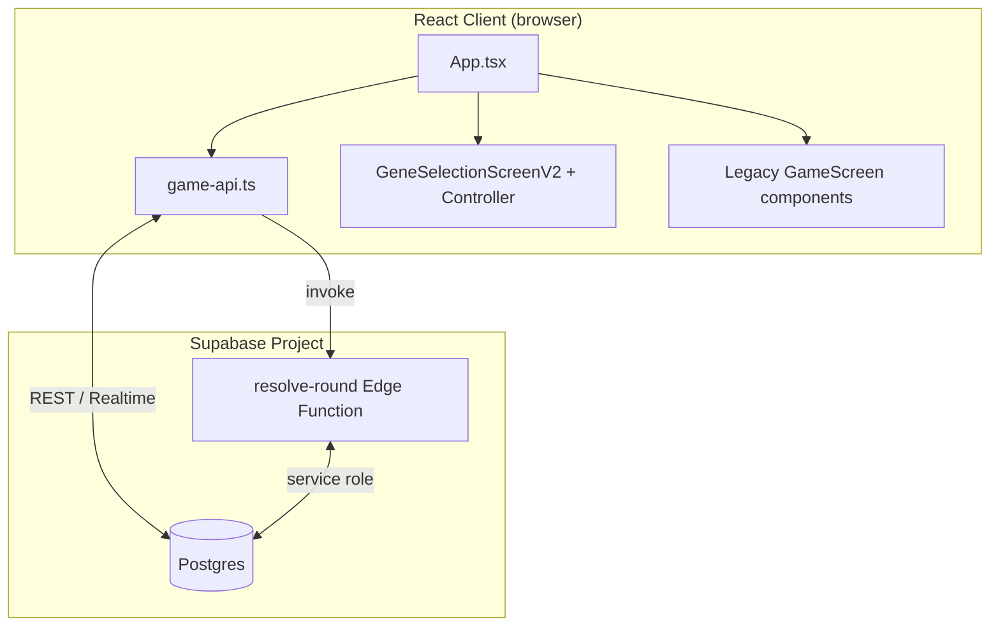

This file is a merged representation of the entire codebase, combined into a single document by Repomix.

<file_summary>
This section contains a summary of this file.

<purpose>
This file contains a packed representation of the entire repository's contents.
It is designed to be easily consumable by AI systems for analysis, code review,
or other automated processes.
</purpose>

<file_format>
The content is organized as follows:
1. This summary section
2. Repository information
3. Directory structure
4. Repository files (if enabled)
5. Multiple file entries, each consisting of:
  - File path as an attribute
  - Full contents of the file
</file_format>

<usage_guidelines>
- This file should be treated as read-only. Any changes should be made to the
  original repository files, not this packed version.
- When processing this file, use the file path to distinguish
  between different files in the repository.
- Be aware that this file may contain sensitive information. Handle it with
  the same level of security as you would the original repository.
</usage_guidelines>

<notes>
- Some files may have been excluded based on .gitignore rules and Repomix's configuration
- Binary files are not included in this packed representation. Please refer to the Repository Structure section for a complete list of file paths, including binary files
- Files matching patterns in .gitignore are excluded
- Files matching default ignore patterns are excluded
- Files are sorted by Git change count (files with more changes are at the bottom)
</notes>

</file_summary>

<directory_structure>
artifacts/
  audit/
    .gitkeep
    acceptance.json
    acceptance.md
    baseline-report.json
    baseline-report.md
    evolution-depth.json
    evolution-depth.md
    evolution-evolve-1.json
    evolution-evolve-1.md
    evolution.json
    evolution.md
    evolve-value-comparison.json
    evolve-value-comparison.md
    exact-baseline.json
    heuristic-validation.json
    heuristic-validation.md
    metagame-baseline-adaptations-exhaustion-best-of-seven-v2.json
    metagame-baseline.json
    metagame-evolve-1.json
    metagame-evolve-1.md
    metagame.json
    metagame.md
    README.md
    search-checkpoint.json
    search-screening.json
  balance/
    production-catalog.json
    production-catalog.md
    README.md
  mobile-layout-current/
    choice-current-1440x900.png
    choice-current-1920x1080.png
    choice-current-360x800.png
    choice-current-390x844.png
    choice-current-412x915.png
    choice-current-430x932.png
    choice-current-768x1024.png
    choice-current-844x390.png
    choice-current-event-details-360x800.png
    choice-current-event-details-metrics.json
    choice-last-gene-360x800.png
    choice-last-gene-metrics.json
    home-current-1440x900.png
    home-current-1920x1080.png
    home-current-360x800.png
    home-current-390x844.png
    home-current-412x915.png
    home-current-430x932.png
    home-current-768x1024.png
    home-current-844x390.png
    home-metrics.json
    home-play-modes-current-390x844.png
    metrics.json
    result-current-1440x900.png
    result-current-1920x1080.png
    result-current-360x800.png
    result-current-390x844.png
    result-current-412x915.png
    result-current-430x932.png
    result-current-768x1024.png
    result-current-844x390.png
    result-metrics.json
  mobile-layout-audit.mjs
docs/
  audit-five-genes-technical-analysis.md
public/
  assets/
    battle/
      backgrounds/
        enchanted-forest.png
      creatures/
        amethyst-hatchling.png
        verdant-hatchling.png
    branding/
      evori-logo.png
    creatures/
      base.png
      README.md
    game-ui/
      genes/
        gene-aquatic.svg
        gene-metabolism.svg
        gene-mobility.svg
        gene-resilience.svg
        gene-senses.svg
        LICENSE-LUCIDE.txt
      placeholders/
        background.svg
        battle-scene-mobile.jpeg
        environment.svg
        gene.svg
        opponent-avatar.svg
        opponent-creature.svg
        player-avatar.svg
        player-creature.svg
        README.md
      battle-scene-mobile.jpeg
      battle-versus.png
  favicon.svg
  icons.svg
shared/
  game-rules/
    audit-packed.test.ts
    bot-policies.ts
    bot.test.ts
    bot.ts
    catalog.ts
    edge-domain-adapter.test.ts
    engine.ts
    formula-audit.test.ts
    game-rules.test.ts
    index.ts
    layer-parity.test.ts
    lookahead-policy.ts
    match.ts
    persisted-round-resolution.ts
    scoring.ts
    simulate-match.test.ts
    simulate-match.ts
    state.ts
    transition-match-audit.test.ts
    types.ts
    validation.ts
    vs-bot-round.ts
src/
  assets/
    hero.png
    react.svg
    vite.svg
  auth/
    AuthProvider.tsx
  components/
    auth/
      AuthScreen.css
      AuthScreen.tsx
    game-results/
      buildMatchResultViewModel.test.ts
      buildMatchResultViewModel.ts
      MatchResultScreen.css
      MatchResultScreen.test.ts
      MatchResultScreen.tsx
      types.ts
    game-v2/
      components/
        ActionPanelV2.tsx
        ActionStatesV2.test.ts
        BattleStage.test.ts
        BattleStage.tsx
        DuelHeaderV2.test.ts
        DuelHeaderV2.tsx
        GeneSelectorPreviewV2.test.ts
        GeneSelectorPreviewV2.tsx
        NaturalAdvantageV2.tsx
        RoundEventPanelV2.test.ts
        RoundEventPanelV2.tsx
        RoundIndicatorV2.tsx
        WaitingStateV2.tsx
      controller/
        buildGeneSelectionV2ViewModel.test.ts
        buildGeneSelectionV2ViewModel.ts
        useGeneSelectionV2Controller.ts
      game-ui-tokens.css
      gameSelectionAssets.ts
      GeneSelectionScreenV2.css
      GeneSelectionScreenV2.tsx
      types.ts
    home/
      buildHomeViewModel.ts
      CreatureArt.tsx
      HomeBrand.tsx
      HomeCreatureStage.tsx
      HomeNotices.tsx
      HomePlayModes.tsx
      HomePrimaryNavigation.tsx
      HomeScreen.css
      HomeScreen.test.ts
      HomeScreen.tsx
      HomeTopBar.tsx
      types.ts
    profile/
      ProfileScreen.css
      ProfileScreen.tsx
    CreatureVisual.tsx
  game/
    bot.ts
    config.ts
    engine.ts
    persisted-round-resolution.ts
    round-events.ts
    round-result-explainer.ts
    scoring.ts
    traits-catalog.ts
    types.ts
    ui-context.ts
    worlds.ts
  lib/
    game-api.ts
    profile-api.test.ts
    profile-api.ts
    progression.test.ts
    progression.ts
    storage.ts
    supabase.ts
  App.css
  App.tsx
  index.css
  main.tsx
supabase/
  functions/
    resolve-round/
      bot-policy.ts
      index.ts
      round-domain.ts
  generated/
    game-rules.sql
  migrations/
    202607260001_reset_mvp_5_genes.sql
    202607280001_bot_difficulty.sql
    202607300001_exhaustion_adaptations.sql
    202608010001_profiles_and_progression.sql
  config.toml
  RESET_DEVELOPMENT.md
  schema.sql
tools/
  audit-acceptance.ts
  audit-bench.ts
  audit-catalog.ts
  audit-config.ts
  audit-core-check.ts
  audit-core.ts
  audit-evolution.ts
  audit-evolve-compare.ts
  audit-exact.ts
  audit-heuristic-validation.ts
  audit-metagame.ts
  audit-report.ts
  audit-search-worker.ts
  audit-search.ts
  generate-game-rules-sql.ts
  generate-supabase-reset.ts
.env.example
.gitignore
.oxlintrc.json
index.html
package.json
PROJECT_SUMMARY.md
README.md
tsconfig.app.json
tsconfig.json
tsconfig.node.json
vite.config.ts
</directory_structure>

<files>
This section contains the contents of the repository's files.

<file path="artifacts/audit/.gitkeep">

</file>

<file path="artifacts/audit/evolution-depth.json">
{
  "mode": "deep",
  "seed": 1592598566,
  "sequences": [
    [
      "PROLONGED_ECLIPSE",
      "PREDATOR_PACK_MIGRATION",
      "VOLCANIC_ASH_WAVE",
      "NUTRIENT_COLLAPSE",
      "FLASH_FLOOD",
      "HEAT_SPIKE",
      "PROLONGED_ECLIPSE"
    ],
    [
      "NUTRIENT_COLLAPSE",
      "PROLONGED_ECLIPSE",
      "VOLCANIC_ASH_WAVE",
      "HEAT_SPIKE",
      "PREDATOR_PACK_MIGRATION",
      "FLASH_FLOOD",
      "NUTRIENT_COLLAPSE"
    ],
    [
      "NUTRIENT_COLLAPSE",
      "PROLONGED_ECLIPSE",
      "PREDATOR_PACK_MIGRATION",
      "VOLCANIC_ASH_WAVE",
      "FLASH_FLOOD",
      "HEAT_SPIKE",
      "NUTRIENT_COLLAPSE"
    ],
    [
      "NUTRIENT_COLLAPSE",
      "VOLCANIC_ASH_WAVE",
      "PREDATOR_PACK_MIGRATION",
      "PROLONGED_ECLIPSE",
      "HEAT_SPIKE",
      "FLASH_FLOOD",
      "NUTRIENT_COLLAPSE"
    ]
  ],
  "opponents": [
    "greedy-use",
    "heuristic",
    "lookahead-2",
    "param-matchup",
    "evolve-first"
  ],
  "methodology": "Offline privileged deep diagnostic: remaining event order is supplied only to audit lookahead policies. Deep uses a deterministic stratified sample of four event orders, five opponents and both orientations; it is not a simultaneous-game equilibrium. Regret is the immediate best USE value minus EVOLVE=2.",
  "elapsedMs": 85612,
  "policies": {
    "lookahead-2": {
      "matches": 40,
      "wins": 20,
      "draws": 18,
      "losses": 2,
      "evolve": {
        "decisions": 274,
        "opportunities": 1362,
        "selected": 18,
        "immediateRegretSum": 2234,
        "immediateBest": 0,
        "nearBest": 558,
        "clearlyBad": 804,
        "nextVisibleGainSum": 22,
        "winnerChanged": 8,
        "selectedRate": 0.06569343065693431,
        "averageImmediateRegret": 1.6402349486049927,
        "averageNextVisibleGain": 1.2222222222222223
      },
      "genes": {
        "FEROCITY": {
          "use": 42,
          "evolve": 6,
          "value": 196,
          "roundWins": 18,
          "evolutions": 6,
          "events": {
            "VOLCANIC_ASH_WAVE": 34,
            "PROLONGED_ECLIPSE": 8,
            "PREDATOR_PACK_MIGRATION": 2,
            "FLASH_FLOOD": 2,
            "NUTRIENT_COLLAPSE": 2
          },
          "cooldownImposed": 42
        },
        "ARMOR": {
          "use": 66,
          "evolve": 0,
          "value": 198,
          "roundWins": 16,
          "evolutions": 0,
          "events": {
            "NUTRIENT_COLLAPSE": 66
          },
          "cooldownImposed": 66
        },
        "AGILITY": {
          "use": 54,
          "evolve": 6,
          "value": 216,
          "roundWins": 10,
          "evolutions": 6,
          "events": {
            "PROLONGED_ECLIPSE": 36,
            "PREDATOR_PACK_MIGRATION": 20,
            "VOLCANIC_ASH_WAVE": 2,
            "HEAT_SPIKE": 2
          },
          "cooldownImposed": 54
        },
        "SENSES": {
          "use": 54,
          "evolve": 4,
          "value": 214,
          "roundWins": 10,
          "evolutions": 4,
          "events": {
            "PREDATOR_PACK_MIGRATION": 18,
            "HEAT_SPIKE": 36,
            "PROLONGED_ECLIPSE": 2,
            "VOLCANIC_ASH_WAVE": 2
          },
          "cooldownImposed": 54
        },
        "CAMOUFLAGE": {
          "use": 40,
          "evolve": 2,
          "value": 166,
          "roundWins": 8,
          "evolutions": 2,
          "events": {
            "FLASH_FLOOD": 38,
            "VOLCANIC_ASH_WAVE": 2,
            "NUTRIENT_COLLAPSE": 2
          },
          "cooldownImposed": 40
        }
      },
      "lookahead": {
        "statesVisited": 10528,
        "cacheHits": 0,
        "cacheMisses": 10528
      }
    },
    "lookahead-3": {
      "matches": 40,
      "wins": 16,
      "draws": 18,
      "losses": 6,
      "evolve": {
        "decisions": 278,
        "opportunities": 1386,
        "selected": 18,
        "immediateRegretSum": 2290,
        "immediateBest": 0,
        "nearBest": 540,
        "clearlyBad": 846,
        "nextVisibleGainSum": 20,
        "winnerChanged": 4,
        "selectedRate": 0.06474820143884892,
        "averageImmediateRegret": 1.6522366522366523,
        "averageNextVisibleGain": 1.1111111111111112
      },
      "genes": {
        "FEROCITY": {
          "use": 44,
          "evolve": 4,
          "value": 192,
          "roundWins": 12,
          "evolutions": 4,
          "events": {
            "VOLCANIC_ASH_WAVE": 34,
            "PROLONGED_ECLIPSE": 10,
            "FLASH_FLOOD": 2,
            "NUTRIENT_COLLAPSE": 2
          },
          "cooldownImposed": 44
        },
        "ARMOR": {
          "use": 68,
          "evolve": 4,
          "value": 216,
          "roundWins": 16,
          "evolutions": 4,
          "events": {
            "NUTRIENT_COLLAPSE": 68,
            "PREDATOR_PACK_MIGRATION": 4
          },
          "cooldownImposed": 68
        },
        "AGILITY": {
          "use": 52,
          "evolve": 2,
          "value": 198,
          "roundWins": 10,
          "evolutions": 2,
          "events": {
            "PROLONGED_ECLIPSE": 34,
            "PREDATOR_PACK_MIGRATION": 18,
            "VOLCANIC_ASH_WAVE": 2
          },
          "cooldownImposed": 52
        },
        "SENSES": {
          "use": 58,
          "evolve": 8,
          "value": 244,
          "roundWins": 14,
          "evolutions": 8,
          "events": {
            "PREDATOR_PACK_MIGRATION": 18,
            "HEAT_SPIKE": 40,
            "PROLONGED_ECLIPSE": 4,
            "VOLCANIC_ASH_WAVE": 4
          },
          "cooldownImposed": 58
        },
        "CAMOUFLAGE": {
          "use": 38,
          "evolve": 0,
          "value": 152,
          "roundWins": 6,
          "evolutions": 0,
          "events": {
            "FLASH_FLOOD": 38
          },
          "cooldownImposed": 38
        }
      },
      "lookahead": {
        "statesVisited": 94072,
        "cacheHits": 54024,
        "cacheMisses": 94072
      }
    },
    "lookahead-4": {
      "matches": 40,
      "wins": 20,
      "draws": 18,
      "losses": 2,
      "evolve": {
        "decisions": 274,
        "opportunities": 1364,
        "selected": 16,
        "immediateRegretSum": 2246,
        "immediateBest": 0,
        "nearBest": 540,
        "clearlyBad": 824,
        "nextVisibleGainSum": 18,
        "winnerChanged": 8,
        "selectedRate": 0.058394160583941604,
        "averageImmediateRegret": 1.6466275659824048,
        "averageNextVisibleGain": 1.125
      },
      "genes": {
        "FEROCITY": {
          "use": 44,
          "evolve": 6,
          "value": 206,
          "roundWins": 20,
          "evolutions": 6,
          "events": {
            "VOLCANIC_ASH_WAVE": 34,
            "PROLONGED_ECLIPSE": 8,
            "PREDATOR_PACK_MIGRATION": 4,
            "HEAT_SPIKE": 2,
            "NUTRIENT_COLLAPSE": 2
          },
          "cooldownImposed": 44
        },
        "ARMOR": {
          "use": 66,
          "evolve": 2,
          "value": 204,
          "roundWins": 18,
          "evolutions": 2,
          "events": {
            "NUTRIENT_COLLAPSE": 66,
            "PROLONGED_ECLIPSE": 2
          },
          "cooldownImposed": 66
        },
        "AGILITY": {
          "use": 52,
          "evolve": 4,
          "value": 204,
          "roundWins": 8,
          "evolutions": 4,
          "events": {
            "PROLONGED_ECLIPSE": 36,
            "PREDATOR_PACK_MIGRATION": 18,
            "VOLCANIC_ASH_WAVE": 2
          },
          "cooldownImposed": 52
        },
        "SENSES": {
          "use": 54,
          "evolve": 2,
          "value": 208,
          "roundWins": 8,
          "evolutions": 2,
          "events": {
            "PREDATOR_PACK_MIGRATION": 18,
            "HEAT_SPIKE": 36,
            "VOLCANIC_ASH_WAVE": 2
          },
          "cooldownImposed": 54
        },
        "CAMOUFLAGE": {
          "use": 42,
          "evolve": 2,
          "value": 174,
          "roundWins": 8,
          "evolutions": 2,
          "events": {
            "FLASH_FLOOD": 40,
            "VOLCANIC_ASH_WAVE": 2,
            "NUTRIENT_COLLAPSE": 2
          },
          "cooldownImposed": 42
        }
      },
      "lookahead": {
        "statesVisited": 175880,
        "cacheHits": 176976,
        "cacheMisses": 175880
      }
    },
    "lookahead-full-last-3": {
      "matches": 40,
      "wins": 20,
      "draws": 18,
      "losses": 2,
      "evolve": {
        "decisions": 274,
        "opportunities": 1360,
        "selected": 18,
        "immediateRegretSum": 2230,
        "immediateBest": 0,
        "nearBest": 558,
        "clearlyBad": 802,
        "nextVisibleGainSum": 22,
        "winnerChanged": 6,
        "selectedRate": 0.06569343065693431,
        "averageImmediateRegret": 1.6397058823529411,
        "averageNextVisibleGain": 1.2222222222222223
      },
      "genes": {
        "FEROCITY": {
          "use": 42,
          "evolve": 6,
          "value": 196,
          "roundWins": 18,
          "evolutions": 6,
          "events": {
            "VOLCANIC_ASH_WAVE": 34,
            "PROLONGED_ECLIPSE": 8,
            "PREDATOR_PACK_MIGRATION": 4,
            "NUTRIENT_COLLAPSE": 2
          },
          "cooldownImposed": 42
        },
        "ARMOR": {
          "use": 66,
          "evolve": 0,
          "value": 198,
          "roundWins": 16,
          "evolutions": 0,
          "events": {
            "NUTRIENT_COLLAPSE": 66
          },
          "cooldownImposed": 66
        },
        "AGILITY": {
          "use": 52,
          "evolve": 6,
          "value": 210,
          "roundWins": 10,
          "evolutions": 6,
          "events": {
            "PROLONGED_ECLIPSE": 36,
            "PREDATOR_PACK_MIGRATION": 18,
            "VOLCANIC_ASH_WAVE": 2,
            "HEAT_SPIKE": 2
          },
          "cooldownImposed": 52
        },
        "SENSES": {
          "use": 54,
          "evolve": 4,
          "value": 214,
          "roundWins": 10,
          "evolutions": 4,
          "events": {
            "PREDATOR_PACK_MIGRATION": 18,
            "HEAT_SPIKE": 36,
            "PROLONGED_ECLIPSE": 2,
            "VOLCANIC_ASH_WAVE": 2
          },
          "cooldownImposed": 54
        },
        "CAMOUFLAGE": {
          "use": 42,
          "evolve": 2,
          "value": 174,
          "roundWins": 8,
          "evolutions": 2,
          "events": {
            "FLASH_FLOOD": 40,
            "VOLCANIC_ASH_WAVE": 2,
            "NUTRIENT_COLLAPSE": 2
          },
          "cooldownImposed": 42
        }
      },
      "lookahead": {
        "statesVisited": 31568,
        "cacheHits": 11808,
        "cacheMisses": 31568
      }
    }
  }
}
</file>

<file path="artifacts/audit/evolution-depth.md">
# Evolution diagnostic

- 85612 ms; 4 seeded event sequences.

| Policy | W-D-L | EVOLVE/decisioni | Regret medio | Best/Near/Bad | Gain prossimo evento | Winner changed | Cache hit/miss |
|---|---:|---:|---:|---:|---:|---:|---:|
| lookahead-2 | 20-18-2 | 18/274 (6.6%) | 1.64 | 0/558/804 | 1.22 | 8 | 0/10528 |
| lookahead-3 | 16-18-6 | 18/278 (6.5%) | 1.65 | 0/540/846 | 1.11 | 4 | 54024/94072 |
| lookahead-4 | 20-18-2 | 16/274 (5.8%) | 1.65 | 0/540/824 | 1.13 | 8 | 176976/175880 |
| lookahead-full-last-3 | 20-18-2 | 18/274 (6.6%) | 1.64 | 0/558/802 | 1.22 | 6 | 11808/31568 |
</file>

<file path="artifacts/audit/evolution-evolve-1.json">
{
  "seed": 1592598566,
  "sequences": [
    [
      "PROLONGED_ECLIPSE",
      "PREDATOR_PACK_MIGRATION",
      "VOLCANIC_ASH_WAVE",
      "NUTRIENT_COLLAPSE",
      "FLASH_FLOOD",
      "HEAT_SPIKE",
      "PROLONGED_ECLIPSE"
    ],
    [
      "NUTRIENT_COLLAPSE",
      "PROLONGED_ECLIPSE",
      "VOLCANIC_ASH_WAVE",
      "HEAT_SPIKE",
      "PREDATOR_PACK_MIGRATION",
      "FLASH_FLOOD",
      "NUTRIENT_COLLAPSE"
    ],
    [
      "NUTRIENT_COLLAPSE",
      "PROLONGED_ECLIPSE",
      "PREDATOR_PACK_MIGRATION",
      "VOLCANIC_ASH_WAVE",
      "FLASH_FLOOD",
      "HEAT_SPIKE",
      "NUTRIENT_COLLAPSE"
    ]
  ],
  "methodology": "Offline privileged diagnostic: remaining event order is supplied only to audit lookahead policies. Regret is the immediate best USE value minus EVOLVE=1; winnerChanged is a counterfactual replacement with the best immediate USE while preserving the observed opponent action. The broad position-balanced tournament remains audit:metagame.",
  "elapsedMs": 5143,
  "policies": {
    "lookahead-2": {
      "matches": 6,
      "wins": 4,
      "draws": 2,
      "losses": 0,
      "evolve": {
        "decisions": 40,
        "opportunities": 200,
        "selected": 0,
        "immediateRegretSum": 520,
        "immediateBest": 0,
        "nearBest": 0,
        "clearlyBad": 200,
        "nextVisibleGainSum": 0,
        "winnerChanged": 0,
        "selectedRate": 0,
        "averageImmediateRegret": 2.6,
        "averageNextVisibleGain": 0
      },
      "genes": {
        "FEROCITY": {
          "use": 6,
          "evolve": 0,
          "value": 28,
          "roundWins": 4,
          "evolutions": 0,
          "events": {
            "VOLCANIC_ASH_WAVE": 6
          },
          "cooldownImposed": 6
        },
        "ARMOR": {
          "use": 10,
          "evolve": 0,
          "value": 30,
          "roundWins": 2,
          "evolutions": 0,
          "events": {
            "NUTRIENT_COLLAPSE": 10
          },
          "cooldownImposed": 10
        },
        "AGILITY": {
          "use": 8,
          "evolve": 0,
          "value": 30,
          "roundWins": 0,
          "evolutions": 0,
          "events": {
            "PROLONGED_ECLIPSE": 6,
            "PREDATOR_PACK_MIGRATION": 2
          },
          "cooldownImposed": 8
        },
        "SENSES": {
          "use": 10,
          "evolve": 0,
          "value": 38,
          "roundWins": 2,
          "evolutions": 0,
          "events": {
            "PREDATOR_PACK_MIGRATION": 4,
            "HEAT_SPIKE": 6
          },
          "cooldownImposed": 10
        },
        "CAMOUFLAGE": {
          "use": 6,
          "evolve": 0,
          "value": 24,
          "roundWins": 2,
          "evolutions": 0,
          "events": {
            "FLASH_FLOOD": 6
          },
          "cooldownImposed": 6
        }
      },
      "lookahead": {
        "statesVisited": 1320,
        "cacheHits": 0,
        "cacheMisses": 1320
      }
    },
    "lookahead-3": {
      "matches": 6,
      "wins": 4,
      "draws": 2,
      "losses": 0,
      "evolve": {
        "decisions": 40,
        "opportunities": 200,
        "selected": 0,
        "immediateRegretSum": 520,
        "immediateBest": 0,
        "nearBest": 0,
        "clearlyBad": 200,
        "nextVisibleGainSum": 0,
        "winnerChanged": 0,
        "selectedRate": 0,
        "averageImmediateRegret": 2.6,
        "averageNextVisibleGain": 0
      },
      "genes": {
        "FEROCITY": {
          "use": 6,
          "evolve": 0,
          "value": 28,
          "roundWins": 4,
          "evolutions": 0,
          "events": {
            "VOLCANIC_ASH_WAVE": 6
          },
          "cooldownImposed": 6
        },
        "ARMOR": {
          "use": 10,
          "evolve": 0,
          "value": 30,
          "roundWins": 2,
          "evolutions": 0,
          "events": {
            "NUTRIENT_COLLAPSE": 10
          },
          "cooldownImposed": 10
        },
        "AGILITY": {
          "use": 8,
          "evolve": 0,
          "value": 30,
          "roundWins": 0,
          "evolutions": 0,
          "events": {
            "PROLONGED_ECLIPSE": 6,
            "PREDATOR_PACK_MIGRATION": 2
          },
          "cooldownImposed": 8
        },
        "SENSES": {
          "use": 10,
          "evolve": 0,
          "value": 38,
          "roundWins": 2,
          "evolutions": 0,
          "events": {
            "PREDATOR_PACK_MIGRATION": 4,
            "HEAT_SPIKE": 6
          },
          "cooldownImposed": 10
        },
        "CAMOUFLAGE": {
          "use": 6,
          "evolve": 0,
          "value": 24,
          "roundWins": 2,
          "evolutions": 0,
          "events": {
            "FLASH_FLOOD": 6
          },
          "cooldownImposed": 6
        }
      },
      "lookahead": {
        "statesVisited": 11558,
        "cacheHits": 7426,
        "cacheMisses": 11558
      }
    },
    "lookahead-4": {
      "matches": 6,
      "wins": 4,
      "draws": 2,
      "losses": 0,
      "evolve": {
        "decisions": 40,
        "opportunities": 200,
        "selected": 0,
        "immediateRegretSum": 520,
        "immediateBest": 0,
        "nearBest": 0,
        "clearlyBad": 200,
        "nextVisibleGainSum": 0,
        "winnerChanged": 0,
        "selectedRate": 0,
        "averageImmediateRegret": 2.6,
        "averageNextVisibleGain": 0
      },
      "genes": {
        "FEROCITY": {
          "use": 6,
          "evolve": 0,
          "value": 28,
          "roundWins": 4,
          "evolutions": 0,
          "events": {
            "VOLCANIC_ASH_WAVE": 6
          },
          "cooldownImposed": 6
        },
        "ARMOR": {
          "use": 10,
          "evolve": 0,
          "value": 30,
          "roundWins": 2,
          "evolutions": 0,
          "events": {
            "NUTRIENT_COLLAPSE": 10
          },
          "cooldownImposed": 10
        },
        "AGILITY": {
          "use": 8,
          "evolve": 0,
          "value": 30,
          "roundWins": 0,
          "evolutions": 0,
          "events": {
            "PROLONGED_ECLIPSE": 6,
            "PREDATOR_PACK_MIGRATION": 2
          },
          "cooldownImposed": 8
        },
        "SENSES": {
          "use": 10,
          "evolve": 0,
          "value": 38,
          "roundWins": 2,
          "evolutions": 0,
          "events": {
            "PREDATOR_PACK_MIGRATION": 4,
            "HEAT_SPIKE": 6
          },
          "cooldownImposed": 10
        },
        "CAMOUFLAGE": {
          "use": 6,
          "evolve": 0,
          "value": 24,
          "roundWins": 2,
          "evolutions": 0,
          "events": {
            "FLASH_FLOOD": 6
          },
          "cooldownImposed": 6
        }
      },
      "lookahead": {
        "statesVisited": 19502,
        "cacheHits": 22138,
        "cacheMisses": 19502
      }
    },
    "lookahead-full-last-3": {
      "matches": 6,
      "wins": 4,
      "draws": 2,
      "losses": 0,
      "evolve": {
        "decisions": 40,
        "opportunities": 200,
        "selected": 0,
        "immediateRegretSum": 520,
        "immediateBest": 0,
        "nearBest": 0,
        "clearlyBad": 200,
        "nextVisibleGainSum": 0,
        "winnerChanged": 0,
        "selectedRate": 0,
        "averageImmediateRegret": 2.6,
        "averageNextVisibleGain": 0
      },
      "genes": {
        "FEROCITY": {
          "use": 6,
          "evolve": 0,
          "value": 28,
          "roundWins": 4,
          "evolutions": 0,
          "events": {
            "VOLCANIC_ASH_WAVE": 6
          },
          "cooldownImposed": 6
        },
        "ARMOR": {
          "use": 10,
          "evolve": 0,
          "value": 30,
          "roundWins": 2,
          "evolutions": 0,
          "events": {
            "NUTRIENT_COLLAPSE": 10
          },
          "cooldownImposed": 10
        },
        "AGILITY": {
          "use": 8,
          "evolve": 0,
          "value": 30,
          "roundWins": 0,
          "evolutions": 0,
          "events": {
            "PROLONGED_ECLIPSE": 6,
            "PREDATOR_PACK_MIGRATION": 2
          },
          "cooldownImposed": 8
        },
        "SENSES": {
          "use": 10,
          "evolve": 0,
          "value": 38,
          "roundWins": 2,
          "evolutions": 0,
          "events": {
            "PREDATOR_PACK_MIGRATION": 4,
            "HEAT_SPIKE": 6
          },
          "cooldownImposed": 10
        },
        "CAMOUFLAGE": {
          "use": 6,
          "evolve": 0,
          "value": 24,
          "roundWins": 2,
          "evolutions": 0,
          "events": {
            "FLASH_FLOOD": 6
          },
          "cooldownImposed": 6
        }
      },
      "lookahead": {
        "statesVisited": 3464,
        "cacheHits": 1312,
        "cacheMisses": 3464
      }
    }
  }
}
</file>

<file path="artifacts/audit/evolution-evolve-1.md">
# Evolution diagnostic

- 5143 ms; 3 seeded event sequences.

| Policy | W-D-L | EVOLVE/decisioni | Regret medio | Best/Near/Bad | Gain prossimo evento | Winner changed | Cache hit/miss |
|---|---:|---:|---:|---:|---:|---:|---:|
| lookahead-2 | 4-2-0 | 0/40 (0.0%) | 2.60 | 0/0/200 | 0.00 | 0 | 0/1320 |
| lookahead-3 | 4-2-0 | 0/40 (0.0%) | 2.60 | 0/0/200 | 0.00 | 0 | 7426/11558 |
| lookahead-4 | 4-2-0 | 0/40 (0.0%) | 2.60 | 0/0/200 | 0.00 | 0 | 22138/19502 |
| lookahead-full-last-3 | 4-2-0 | 0/40 (0.0%) | 2.60 | 0/0/200 | 0.00 | 0 | 1312/3464 |
</file>

<file path="artifacts/audit/evolution.json">
{
  "mode": "quick",
  "seed": 1592598566,
  "sequences": [
    [
      "PROLONGED_ECLIPSE",
      "PREDATOR_PACK_MIGRATION",
      "VOLCANIC_ASH_WAVE",
      "NUTRIENT_COLLAPSE",
      "FLASH_FLOOD",
      "HEAT_SPIKE",
      "PROLONGED_ECLIPSE"
    ],
    [
      "NUTRIENT_COLLAPSE",
      "PROLONGED_ECLIPSE",
      "VOLCANIC_ASH_WAVE",
      "HEAT_SPIKE",
      "PREDATOR_PACK_MIGRATION",
      "FLASH_FLOOD",
      "NUTRIENT_COLLAPSE"
    ],
    [
      "NUTRIENT_COLLAPSE",
      "PROLONGED_ECLIPSE",
      "PREDATOR_PACK_MIGRATION",
      "VOLCANIC_ASH_WAVE",
      "FLASH_FLOOD",
      "HEAT_SPIKE",
      "NUTRIENT_COLLAPSE"
    ]
  ],
  "opponents": [
    "greedy-use"
  ],
  "methodology": "Offline privileged quick diagnostic: remaining event order is supplied only to audit lookahead policies. Deep uses a deterministic stratified sample of four event orders, five opponents and both orientations; it is not a simultaneous-game equilibrium. Regret is the immediate best USE value minus EVOLVE=2.",
  "elapsedMs": 4385,
  "policies": {
    "lookahead-2": {
      "matches": 6,
      "wins": 4,
      "draws": 2,
      "losses": 0,
      "evolve": {
        "decisions": 40,
        "opportunities": 200,
        "selected": 0,
        "immediateRegretSum": 320,
        "immediateBest": 0,
        "nearBest": 80,
        "clearlyBad": 120,
        "nextVisibleGainSum": 0,
        "winnerChanged": 0,
        "selectedRate": 0,
        "averageImmediateRegret": 1.6,
        "averageNextVisibleGain": 0
      },
      "genes": {
        "FEROCITY": {
          "use": 6,
          "evolve": 0,
          "value": 28,
          "roundWins": 4,
          "evolutions": 0,
          "events": {
            "VOLCANIC_ASH_WAVE": 6
          },
          "cooldownImposed": 6
        },
        "ARMOR": {
          "use": 10,
          "evolve": 0,
          "value": 30,
          "roundWins": 2,
          "evolutions": 0,
          "events": {
            "NUTRIENT_COLLAPSE": 10
          },
          "cooldownImposed": 10
        },
        "AGILITY": {
          "use": 8,
          "evolve": 0,
          "value": 30,
          "roundWins": 0,
          "evolutions": 0,
          "events": {
            "PROLONGED_ECLIPSE": 6,
            "PREDATOR_PACK_MIGRATION": 2
          },
          "cooldownImposed": 8
        },
        "SENSES": {
          "use": 10,
          "evolve": 0,
          "value": 38,
          "roundWins": 2,
          "evolutions": 0,
          "events": {
            "PREDATOR_PACK_MIGRATION": 4,
            "HEAT_SPIKE": 6
          },
          "cooldownImposed": 10
        },
        "CAMOUFLAGE": {
          "use": 6,
          "evolve": 0,
          "value": 24,
          "roundWins": 2,
          "evolutions": 0,
          "events": {
            "FLASH_FLOOD": 6
          },
          "cooldownImposed": 6
        }
      },
      "lookahead": {
        "statesVisited": 1320,
        "cacheHits": 0,
        "cacheMisses": 1320
      }
    },
    "lookahead-3": {
      "matches": 6,
      "wins": 4,
      "draws": 2,
      "losses": 0,
      "evolve": {
        "decisions": 40,
        "opportunities": 200,
        "selected": 0,
        "immediateRegretSum": 320,
        "immediateBest": 0,
        "nearBest": 80,
        "clearlyBad": 120,
        "nextVisibleGainSum": 0,
        "winnerChanged": 0,
        "selectedRate": 0,
        "averageImmediateRegret": 1.6,
        "averageNextVisibleGain": 0
      },
      "genes": {
        "FEROCITY": {
          "use": 6,
          "evolve": 0,
          "value": 28,
          "roundWins": 4,
          "evolutions": 0,
          "events": {
            "VOLCANIC_ASH_WAVE": 6
          },
          "cooldownImposed": 6
        },
        "ARMOR": {
          "use": 10,
          "evolve": 0,
          "value": 30,
          "roundWins": 2,
          "evolutions": 0,
          "events": {
            "NUTRIENT_COLLAPSE": 10
          },
          "cooldownImposed": 10
        },
        "AGILITY": {
          "use": 8,
          "evolve": 0,
          "value": 30,
          "roundWins": 0,
          "evolutions": 0,
          "events": {
            "PROLONGED_ECLIPSE": 6,
            "PREDATOR_PACK_MIGRATION": 2
          },
          "cooldownImposed": 8
        },
        "SENSES": {
          "use": 10,
          "evolve": 0,
          "value": 38,
          "roundWins": 2,
          "evolutions": 0,
          "events": {
            "PREDATOR_PACK_MIGRATION": 4,
            "HEAT_SPIKE": 6
          },
          "cooldownImposed": 10
        },
        "CAMOUFLAGE": {
          "use": 6,
          "evolve": 0,
          "value": 24,
          "roundWins": 2,
          "evolutions": 0,
          "events": {
            "FLASH_FLOOD": 6
          },
          "cooldownImposed": 6
        }
      },
      "lookahead": {
        "statesVisited": 12454,
        "cacheHits": 6530,
        "cacheMisses": 12454
      }
    }
  }
}
</file>

<file path="artifacts/audit/evolution.md">
# Evolution diagnostic

- 4385 ms; 3 seeded event sequences.

| Policy | W-D-L | EVOLVE/decisioni | Regret medio | Best/Near/Bad | Gain prossimo evento | Winner changed | Cache hit/miss |
|---|---:|---:|---:|---:|---:|---:|---:|
| lookahead-2 | 4-2-0 | 0/40 (0.0%) | 1.60 | 0/80/120 | 0.00 | 0 | 0/1320 |
| lookahead-3 | 4-2-0 | 0/40 (0.0%) | 1.60 | 0/80/120 | 0.00 | 0 | 6530/12454 |
</file>

<file path="artifacts/audit/evolve-value-comparison.json">
{
  "methodology": "Comparison of preserved EVOLVE=1 artifacts with the current EVOLVE=2 artifacts, on the same seeded audit configurations.",
  "rows": [
    {
      "metric": "Frequenza ottimale EVOLVE (lookahead-2)",
      "evolve1": 0,
      "evolve2": 0,
      "difference": 0
    },
    {
      "metric": "Regret immediato medio",
      "evolve1": 2.6,
      "evolve2": 1.6,
      "difference": -1
    },
    {
      "metric": "Near-best EVOLVE",
      "evolve1": 0,
      "evolve2": 0.4,
      "difference": 0.4
    },
    {
      "metric": "Win rate evolve-first",
      "evolve1": 0.375,
      "evolve2": 0.4166666666666667,
      "difference": 0.041666666666666685
    },
    {
      "metric": "Score rate evolve-first",
      "evolve1": 0.4375,
      "evolve2": 0.5104166666666666,
      "difference": 0.07291666666666663
    },
    {
      "metric": "Win rate lookahead-2",
      "evolve1": 0.5625,
      "evolve2": 0.6458333333333334,
      "difference": 0.08333333333333337
    },
    {
      "metric": "Score rate lookahead-2",
      "evolve1": 0.7708333333333334,
      "evolve2": 0.8229166666666666,
      "difference": 0.05208333333333326
    },
    {
      "metric": "Pareggi policy diverse",
      "evolve1": 0.18452380952380953,
      "evolve2": 0.13690476190476192,
      "difference": -0.047619047619047616
    },
    {
      "metric": "Margine finale medio",
      "evolve1": 1.6302083333333333,
      "evolve2": 1.640625,
      "difference": 0.01041666666666674
    }
  ]
}
</file>

<file path="artifacts/audit/evolve-value-comparison.md">
# Confronto EVOLVE = 1 → 2

| Metrica | EVOLVE=1 | EVOLVE=2 | Differenza |
|---|---:|---:|---:|
| Frequenza ottimale EVOLVE (lookahead-2) | 0.0% | 0.0% | 0.0% |
| Regret immediato medio | 2.60 | 1.60 | -1.00 |
| Near-best EVOLVE | 0.0% | 40.0% | 40.0% |
| Win rate evolve-first | 37.5% | 41.7% | 4.2% |
| Score rate evolve-first | 43.8% | 51.0% | 7.3% |
| Win rate lookahead-2 | 56.3% | 64.6% | 8.3% |
| Score rate lookahead-2 | 77.1% | 82.3% | 5.2% |
| Pareggi policy diverse | 18.5% | 13.7% | -4.8% |
| Margine finale medio | 1.63 | 1.64 | 0.01 |
</file>

<file path="artifacts/audit/metagame-baseline-adaptations-exhaustion-best-of-seven-v2.json">
{
  "ruleVersion": "adaptations-exhaustion-best-of-seven-v2",
  "summary": {
    "random": {
      "wins": 2,
      "draws": 12,
      "losses": 82,
      "leftWins": 1,
      "rightWins": 1,
      "actions": 564,
      "uses": 298,
      "evolves": 266,
      "genes": {
        "FEROCITY": 78,
        "ARMOR": 132,
        "AGILITY": 110,
        "SENSES": 108,
        "CAMOUFLAGE": 136
      },
      "levels": 266,
      "matches": 96,
      "winRate": 0.020833333333333332,
      "scoreRate": 0.08333333333333333,
      "positionWinRate": {
        "left": 0.020833333333333332,
        "right": 0.020833333333333332
      },
      "useRate": 0.5283687943262412,
      "evolveRate": 0.4716312056737589,
      "geneFrequency": {
        "FEROCITY": 0.13829787234042554,
        "ARMOR": 0.23404255319148937,
        "AGILITY": 0.1950354609929078,
        "SENSES": 0.19148936170212766,
        "CAMOUFLAGE": 0.24113475177304963
      },
      "averageFinalLevel": 2.7708333333333335,
      "actionConcentration": 0.24113475177304963
    },
    "greedy-immediate-use": {
      "wins": 46,
      "draws": 16,
      "losses": 34,
      "leftWins": 23,
      "rightWins": 23,
      "actions": 642,
      "uses": 558,
      "evolves": 84,
      "genes": {
        "FEROCITY": 128,
        "ARMOR": 132,
        "AGILITY": 118,
        "SENSES": 144,
        "CAMOUFLAGE": 120
      },
      "levels": 84,
      "matches": 96,
      "winRate": 0.4791666666666667,
      "scoreRate": 0.5625,
      "positionWinRate": {
        "left": 0.4791666666666667,
        "right": 0.4791666666666667
      },
      "useRate": 0.8691588785046729,
      "evolveRate": 0.1308411214953271,
      "geneFrequency": {
        "FEROCITY": 0.19937694704049844,
        "ARMOR": 0.205607476635514,
        "AGILITY": 0.1838006230529595,
        "SENSES": 0.22429906542056074,
        "CAMOUFLAGE": 0.18691588785046728
      },
      "averageFinalLevel": 0.875,
      "actionConcentration": 0.22429906542056074
    },
    "evolve-first": {
      "wins": 34,
      "draws": 14,
      "losses": 48,
      "leftWins": 17,
      "rightWins": 17,
      "actions": 648,
      "uses": 456,
      "evolves": 192,
      "genes": {
        "FEROCITY": 136,
        "ARMOR": 136,
        "AGILITY": 114,
        "SENSES": 122,
        "CAMOUFLAGE": 140
      },
      "levels": 192,
      "matches": 96,
      "winRate": 0.3541666666666667,
      "scoreRate": 0.4270833333333333,
      "positionWinRate": {
        "left": 0.3541666666666667,
        "right": 0.3541666666666667
      },
      "useRate": 0.7037037037037037,
      "evolveRate": 0.2962962962962963,
      "geneFrequency": {
        "FEROCITY": 0.20987654320987653,
        "ARMOR": 0.20987654320987653,
        "AGILITY": 0.17592592592592593,
        "SENSES": 0.1882716049382716,
        "CAMOUFLAGE": 0.21604938271604937
      },
      "averageFinalLevel": 2,
      "actionConcentration": 0.21604938271604937
    },
    "heuristic": {
      "wins": 50,
      "draws": 16,
      "losses": 30,
      "leftWins": 25,
      "rightWins": 25,
      "actions": 630,
      "uses": 542,
      "evolves": 88,
      "genes": {
        "FEROCITY": 164,
        "ARMOR": 112,
        "AGILITY": 150,
        "SENSES": 102,
        "CAMOUFLAGE": 102
      },
      "levels": 88,
      "matches": 96,
      "winRate": 0.5208333333333334,
      "scoreRate": 0.6041666666666666,
      "positionWinRate": {
        "left": 0.5208333333333334,
        "right": 0.5208333333333334
      },
      "useRate": 0.8603174603174604,
      "evolveRate": 0.13968253968253969,
      "geneFrequency": {
        "FEROCITY": 0.26031746031746034,
        "ARMOR": 0.17777777777777778,
        "AGILITY": 0.23809523809523808,
        "SENSES": 0.1619047619047619,
        "CAMOUFLAGE": 0.1619047619047619
      },
      "averageFinalLevel": 0.9166666666666666,
      "actionConcentration": 0.26031746031746034
    },
    "lookahead-2": {
      "wins": 74,
      "draws": 14,
      "losses": 8,
      "leftWins": 37,
      "rightWins": 37,
      "actions": 560,
      "uses": 476,
      "evolves": 84,
      "genes": {
        "FEROCITY": 130,
        "ARMOR": 134,
        "AGILITY": 80,
        "SENSES": 86,
        "CAMOUFLAGE": 130
      },
      "levels": 84,
      "matches": 96,
      "winRate": 0.7708333333333334,
      "scoreRate": 0.84375,
      "positionWinRate": {
        "left": 0.7708333333333334,
        "right": 0.7708333333333334
      },
      "useRate": 0.85,
      "evolveRate": 0.15,
      "geneFrequency": {
        "FEROCITY": 0.23214285714285715,
        "ARMOR": 0.2392857142857143,
        "AGILITY": 0.14285714285714285,
        "SENSES": 0.15357142857142858,
        "CAMOUFLAGE": 0.23214285714285715
      },
      "averageFinalLevel": 0.875,
      "actionConcentration": 0.2392857142857143
    },
    "param-evolve-1": {
      "wins": 40,
      "draws": 14,
      "losses": 42,
      "leftWins": 20,
      "rightWins": 20,
      "actions": 618,
      "uses": 464,
      "evolves": 154,
      "genes": {
        "FEROCITY": 214,
        "ARMOR": 102,
        "AGILITY": 104,
        "SENSES": 102,
        "CAMOUFLAGE": 96
      },
      "levels": 154,
      "matches": 96,
      "winRate": 0.4166666666666667,
      "scoreRate": 0.4895833333333333,
      "positionWinRate": {
        "left": 0.4166666666666667,
        "right": 0.4166666666666667
      },
      "useRate": 0.7508090614886731,
      "evolveRate": 0.24919093851132687,
      "geneFrequency": {
        "FEROCITY": 0.34627831715210355,
        "ARMOR": 0.1650485436893204,
        "AGILITY": 0.16828478964401294,
        "SENSES": 0.1650485436893204,
        "CAMOUFLAGE": 0.1553398058252427
      },
      "averageFinalLevel": 1.6041666666666667,
      "actionConcentration": 0.34627831715210355
    },
    "param-matchup": {
      "wins": 42,
      "draws": 20,
      "losses": 34,
      "leftWins": 21,
      "rightWins": 21,
      "actions": 628,
      "uses": 548,
      "evolves": 80,
      "genes": {
        "FEROCITY": 144,
        "ARMOR": 104,
        "AGILITY": 144,
        "SENSES": 120,
        "CAMOUFLAGE": 116
      },
      "levels": 80,
      "matches": 96,
      "winRate": 0.4375,
      "scoreRate": 0.5416666666666666,
      "positionWinRate": {
        "left": 0.4375,
        "right": 0.4375
      },
      "useRate": 0.8726114649681529,
      "evolveRate": 0.12738853503184713,
      "geneFrequency": {
        "FEROCITY": 0.22929936305732485,
        "ARMOR": 0.16560509554140126,
        "AGILITY": 0.22929936305732485,
        "SENSES": 0.1910828025477707,
        "CAMOUFLAGE": 0.18471337579617833
      },
      "averageFinalLevel": 0.8333333333333334,
      "actionConcentration": 0.22929936305732485
    },
    "param-evolve-behind": {
      "wins": 32,
      "draws": 22,
      "losses": 42,
      "leftWins": 16,
      "rightWins": 16,
      "actions": 586,
      "uses": 420,
      "evolves": 166,
      "genes": {
        "FEROCITY": 188,
        "ARMOR": 128,
        "AGILITY": 102,
        "SENSES": 98,
        "CAMOUFLAGE": 70
      },
      "levels": 166,
      "matches": 96,
      "winRate": 0.3333333333333333,
      "scoreRate": 0.4479166666666667,
      "positionWinRate": {
        "left": 0.3333333333333333,
        "right": 0.3333333333333333
      },
      "useRate": 0.7167235494880546,
      "evolveRate": 0.2832764505119454,
      "geneFrequency": {
        "FEROCITY": 0.32081911262798635,
        "ARMOR": 0.21843003412969283,
        "AGILITY": 0.17406143344709898,
        "SENSES": 0.16723549488054607,
        "CAMOUFLAGE": 0.11945392491467577
      },
      "averageFinalLevel": 1.7291666666666667,
      "actionConcentration": 0.32081911262798635
    }
  },
  "seed": 1592598566,
  "sequences": [
    [
      "PROLONGED_ECLIPSE",
      "PREDATOR_PACK_MIGRATION",
      "VOLCANIC_ASH_WAVE",
      "NUTRIENT_COLLAPSE",
      "FLASH_FLOOD",
      "HEAT_SPIKE",
      "PROLONGED_ECLIPSE"
    ],
    [
      "NUTRIENT_COLLAPSE",
      "PROLONGED_ECLIPSE",
      "VOLCANIC_ASH_WAVE",
      "HEAT_SPIKE",
      "PREDATOR_PACK_MIGRATION",
      "FLASH_FLOOD",
      "NUTRIENT_COLLAPSE"
    ],
    [
      "NUTRIENT_COLLAPSE",
      "PROLONGED_ECLIPSE",
      "PREDATOR_PACK_MIGRATION",
      "VOLCANIC_ASH_WAVE",
      "FLASH_FLOOD",
      "HEAT_SPIKE",
      "NUTRIENT_COLLAPSE"
    ]
  ]
}
</file>

<file path="artifacts/audit/metagame-baseline.json">
{
  "summary": {
    "random": {
      "wins": 6,
      "draws": 0,
      "losses": 90,
      "leftWins": 6,
      "rightWins": 0,
      "actions": 504,
      "uses": 189,
      "evolves": 315,
      "genes": {
        "FEROCITY": 125,
        "ARMOR": 16,
        "AGILITY": 138,
        "SENSES": 158,
        "CAMOUFLAGE": 67
      },
      "levels": 315,
      "matches": 96,
      "winRate": 0.0625,
      "positionWinRate": {
        "left": 0.125,
        "right": 0
      },
      "useRate": 0.375,
      "evolveRate": 0.625,
      "geneFrequency": {
        "FEROCITY": 0.24801587301587302,
        "ARMOR": 0.031746031746031744,
        "AGILITY": 0.27380952380952384,
        "SENSES": 0.3134920634920635,
        "CAMOUFLAGE": 0.13293650793650794
      },
      "averageFinalLevel": 3.28125,
      "actionConcentration": 0.3134920634920635
    },
    "greedy-use": {
      "wins": 38,
      "draws": 25,
      "losses": 33,
      "leftWins": 12,
      "rightWins": 26,
      "actions": 618,
      "uses": 618,
      "evolves": 0,
      "genes": {
        "FEROCITY": 49,
        "ARMOR": 184,
        "AGILITY": 133,
        "SENSES": 152,
        "CAMOUFLAGE": 100
      },
      "levels": 0,
      "matches": 96,
      "winRate": 0.3958333333333333,
      "positionWinRate": {
        "left": 0.25,
        "right": 0.5416666666666666
      },
      "useRate": 1,
      "evolveRate": 0,
      "geneFrequency": {
        "FEROCITY": 0.07928802588996764,
        "ARMOR": 0.2977346278317152,
        "AGILITY": 0.215210355987055,
        "SENSES": 0.2459546925566343,
        "CAMOUFLAGE": 0.16181229773462782
      },
      "averageFinalLevel": 0,
      "actionConcentration": 0.2977346278317152
    },
    "evolve-first": {
      "wins": 43,
      "draws": 2,
      "losses": 51,
      "leftWins": 17,
      "rightWins": 26,
      "actions": 643,
      "uses": 451,
      "evolves": 192,
      "genes": {
        "FEROCITY": 86,
        "ARMOR": 167,
        "AGILITY": 54,
        "SENSES": 185,
        "CAMOUFLAGE": 151
      },
      "levels": 192,
      "matches": 96,
      "winRate": 0.4479166666666667,
      "positionWinRate": {
        "left": 0.3541666666666667,
        "right": 0.5416666666666666
      },
      "useRate": 0.7013996889580093,
      "evolveRate": 0.2986003110419907,
      "geneFrequency": {
        "FEROCITY": 0.13374805598755832,
        "ARMOR": 0.25972006220839816,
        "AGILITY": 0.08398133748055987,
        "SENSES": 0.28771384136858474,
        "CAMOUFLAGE": 0.23483670295489892
      },
      "averageFinalLevel": 2,
      "actionConcentration": 0.28771384136858474
    },
    "heuristic": {
      "wins": 39,
      "draws": 37,
      "losses": 20,
      "leftWins": 13,
      "rightWins": 26,
      "actions": 636,
      "uses": 621,
      "evolves": 15,
      "genes": {
        "FEROCITY": 74,
        "ARMOR": 173,
        "AGILITY": 148,
        "SENSES": 153,
        "CAMOUFLAGE": 88
      },
      "levels": 15,
      "matches": 96,
      "winRate": 0.40625,
      "positionWinRate": {
        "left": 0.2708333333333333,
        "right": 0.5416666666666666
      },
      "useRate": 0.9764150943396226,
      "evolveRate": 0.02358490566037736,
      "geneFrequency": {
        "FEROCITY": 0.11635220125786164,
        "ARMOR": 0.2720125786163522,
        "AGILITY": 0.23270440251572327,
        "SENSES": 0.24056603773584906,
        "CAMOUFLAGE": 0.13836477987421383
      },
      "averageFinalLevel": 0.15625,
      "actionConcentration": 0.2720125786163522
    },
    "lookahead-2": {
      "wins": 50,
      "draws": 40,
      "losses": 6,
      "leftWins": 20,
      "rightWins": 30,
      "actions": 640,
      "uses": 621,
      "evolves": 19,
      "genes": {
        "FEROCITY": 110,
        "ARMOR": 150,
        "AGILITY": 140,
        "SENSES": 148,
        "CAMOUFLAGE": 92
      },
      "levels": 19,
      "matches": 96,
      "winRate": 0.5208333333333334,
      "positionWinRate": {
        "left": 0.4166666666666667,
        "right": 0.625
      },
      "useRate": 0.9703125,
      "evolveRate": 0.0296875,
      "geneFrequency": {
        "FEROCITY": 0.171875,
        "ARMOR": 0.234375,
        "AGILITY": 0.21875,
        "SENSES": 0.23125,
        "CAMOUFLAGE": 0.14375
      },
      "averageFinalLevel": 0.19791666666666666,
      "actionConcentration": 0.234375
    },
    "param-evolve-1": {
      "wins": 45,
      "draws": 5,
      "losses": 46,
      "leftWins": 23,
      "rightWins": 22,
      "actions": 645,
      "uses": 549,
      "evolves": 96,
      "genes": {
        "FEROCITY": 251,
        "ARMOR": 110,
        "AGILITY": 82,
        "SENSES": 112,
        "CAMOUFLAGE": 90
      },
      "levels": 96,
      "matches": 96,
      "winRate": 0.46875,
      "positionWinRate": {
        "left": 0.4791666666666667,
        "right": 0.4583333333333333
      },
      "useRate": 0.8511627906976744,
      "evolveRate": 0.14883720930232558,
      "geneFrequency": {
        "FEROCITY": 0.3891472868217054,
        "ARMOR": 0.17054263565891473,
        "AGILITY": 0.12713178294573643,
        "SENSES": 0.17364341085271318,
        "CAMOUFLAGE": 0.13953488372093023
      },
      "averageFinalLevel": 1,
      "actionConcentration": 0.3891472868217054
    },
    "param-matchup": {
      "wins": 38,
      "draws": 35,
      "losses": 23,
      "leftWins": 15,
      "rightWins": 23,
      "actions": 624,
      "uses": 624,
      "evolves": 0,
      "genes": {
        "FEROCITY": 56,
        "ARMOR": 169,
        "AGILITY": 136,
        "SENSES": 154,
        "CAMOUFLAGE": 109
      },
      "levels": 0,
      "matches": 96,
      "winRate": 0.3958333333333333,
      "positionWinRate": {
        "left": 0.3125,
        "right": 0.4791666666666667
      },
      "useRate": 1,
      "evolveRate": 0,
      "geneFrequency": {
        "FEROCITY": 0.08974358974358974,
        "ARMOR": 0.2708333333333333,
        "AGILITY": 0.21794871794871795,
        "SENSES": 0.2467948717948718,
        "CAMOUFLAGE": 0.17467948717948717
      },
      "averageFinalLevel": 0,
      "actionConcentration": 0.2708333333333333
    },
    "param-evolve-behind": {
      "wins": 40,
      "draws": 26,
      "losses": 30,
      "leftWins": 14,
      "rightWins": 26,
      "actions": 620,
      "uses": 620,
      "evolves": 0,
      "genes": {
        "FEROCITY": 54,
        "ARMOR": 178,
        "AGILITY": 134,
        "SENSES": 153,
        "CAMOUFLAGE": 101
      },
      "levels": 0,
      "matches": 96,
      "winRate": 0.4166666666666667,
      "positionWinRate": {
        "left": 0.2916666666666667,
        "right": 0.5416666666666666
      },
      "useRate": 1,
      "evolveRate": 0,
      "geneFrequency": {
        "FEROCITY": 0.08709677419354839,
        "ARMOR": 0.2870967741935484,
        "AGILITY": 0.2161290322580645,
        "SENSES": 0.2467741935483871,
        "CAMOUFLAGE": 0.1629032258064516
      },
      "averageFinalLevel": 0,
      "actionConcentration": 0.2870967741935484
    }
  },
  "seed": 1592598566,
  "sequences": [
    [
      "PROLONGED_ECLIPSE",
      "PREDATOR_PACK_MIGRATION",
      "VOLCANIC_ASH_WAVE",
      "NUTRIENT_COLLAPSE",
      "FLASH_FLOOD",
      "HEAT_SPIKE",
      "PROLONGED_ECLIPSE"
    ],
    [
      "NUTRIENT_COLLAPSE",
      "PROLONGED_ECLIPSE",
      "VOLCANIC_ASH_WAVE",
      "HEAT_SPIKE",
      "PREDATOR_PACK_MIGRATION",
      "FLASH_FLOOD",
      "NUTRIENT_COLLAPSE"
    ],
    [
      "NUTRIENT_COLLAPSE",
      "PROLONGED_ECLIPSE",
      "PREDATOR_PACK_MIGRATION",
      "VOLCANIC_ASH_WAVE",
      "FLASH_FLOOD",
      "HEAT_SPIKE",
      "NUTRIENT_COLLAPSE"
    ]
  ]
}
</file>

<file path="artifacts/audit/metagame-evolve-1.json">
{
  "seed": 1592598566,
  "sequences": [
    [
      "PROLONGED_ECLIPSE",
      "PREDATOR_PACK_MIGRATION",
      "VOLCANIC_ASH_WAVE",
      "NUTRIENT_COLLAPSE",
      "FLASH_FLOOD",
      "HEAT_SPIKE",
      "PROLONGED_ECLIPSE"
    ],
    [
      "NUTRIENT_COLLAPSE",
      "PROLONGED_ECLIPSE",
      "VOLCANIC_ASH_WAVE",
      "HEAT_SPIKE",
      "PREDATOR_PACK_MIGRATION",
      "FLASH_FLOOD",
      "NUTRIENT_COLLAPSE"
    ],
    [
      "NUTRIENT_COLLAPSE",
      "PROLONGED_ECLIPSE",
      "PREDATOR_PACK_MIGRATION",
      "VOLCANIC_ASH_WAVE",
      "FLASH_FLOOD",
      "HEAT_SPIKE",
      "NUTRIENT_COLLAPSE"
    ]
  ],
  "methodology": "Round-robin over deterministic production simulation. Every ordered pairing uses 3 seeded event orders × 2 seeds; lookahead assumes a uniform distribution over legal simultaneous rival actions and never receives the current secret action.",
  "policies": [
    "random",
    "greedy-use",
    "evolve-first",
    "heuristic",
    "lookahead-2",
    "param-evolve-1",
    "param-matchup",
    "param-evolve-behind"
  ],
  "summary": {
    "random": {
      "wins": 0,
      "draws": 12,
      "losses": 84,
      "leftWins": 0,
      "rightWins": 0,
      "actions": 510,
      "uses": 292,
      "evolves": 218,
      "genes": {
        "FEROCITY": 92,
        "ARMOR": 118,
        "AGILITY": 78,
        "SENSES": 118,
        "CAMOUFLAGE": 104
      },
      "levels": 218,
      "matches": 96,
      "winRate": 0,
      "positionWinRate": {
        "left": 0,
        "right": 0
      },
      "useRate": 0.5725490196078431,
      "evolveRate": 0.42745098039215684,
      "geneFrequency": {
        "FEROCITY": 0.1803921568627451,
        "ARMOR": 0.23137254901960785,
        "AGILITY": 0.15294117647058825,
        "SENSES": 0.23137254901960785,
        "CAMOUFLAGE": 0.20392156862745098
      },
      "averageFinalLevel": 2.2708333333333335,
      "actionConcentration": 0.23137254901960785
    },
    "greedy-use": {
      "wins": 34,
      "draws": 30,
      "losses": 32,
      "leftWins": 17,
      "rightWins": 17,
      "actions": 626,
      "uses": 626,
      "evolves": 0,
      "genes": {
        "FEROCITY": 48,
        "ARMOR": 182,
        "AGILITY": 140,
        "SENSES": 154,
        "CAMOUFLAGE": 102
      },
      "levels": 0,
      "matches": 96,
      "winRate": 0.3541666666666667,
      "positionWinRate": {
        "left": 0.3541666666666667,
        "right": 0.3541666666666667
      },
      "useRate": 1,
      "evolveRate": 0,
      "geneFrequency": {
        "FEROCITY": 0.07667731629392971,
        "ARMOR": 0.29073482428115016,
        "AGILITY": 0.22364217252396165,
        "SENSES": 0.24600638977635783,
        "CAMOUFLAGE": 0.16293929712460065
      },
      "averageFinalLevel": 0,
      "actionConcentration": 0.29073482428115016
    },
    "evolve-first": {
      "wins": 36,
      "draws": 12,
      "losses": 48,
      "leftWins": 18,
      "rightWins": 18,
      "actions": 644,
      "uses": 452,
      "evolves": 192,
      "genes": {
        "FEROCITY": 104,
        "ARMOR": 156,
        "AGILITY": 78,
        "SENSES": 128,
        "CAMOUFLAGE": 178
      },
      "levels": 192,
      "matches": 96,
      "winRate": 0.375,
      "positionWinRate": {
        "left": 0.375,
        "right": 0.375
      },
      "useRate": 0.7018633540372671,
      "evolveRate": 0.2981366459627329,
      "geneFrequency": {
        "FEROCITY": 0.16149068322981366,
        "ARMOR": 0.2422360248447205,
        "AGILITY": 0.12111801242236025,
        "SENSES": 0.19875776397515527,
        "CAMOUFLAGE": 0.27639751552795033
      },
      "averageFinalLevel": 2,
      "actionConcentration": 0.27639751552795033
    },
    "heuristic": {
      "wins": 42,
      "draws": 36,
      "losses": 18,
      "leftWins": 21,
      "rightWins": 21,
      "actions": 638,
      "uses": 622,
      "evolves": 16,
      "genes": {
        "FEROCITY": 70,
        "ARMOR": 178,
        "AGILITY": 144,
        "SENSES": 154,
        "CAMOUFLAGE": 92
      },
      "levels": 16,
      "matches": 96,
      "winRate": 0.4375,
      "positionWinRate": {
        "left": 0.4375,
        "right": 0.4375
      },
      "useRate": 0.9749216300940439,
      "evolveRate": 0.025078369905956112,
      "geneFrequency": {
        "FEROCITY": 0.109717868338558,
        "ARMOR": 0.27899686520376177,
        "AGILITY": 0.22570532915360503,
        "SENSES": 0.2413793103448276,
        "CAMOUFLAGE": 0.14420062695924765
      },
      "averageFinalLevel": 0.16666666666666666,
      "actionConcentration": 0.27899686520376177
    },
    "lookahead-2": {
      "wins": 54,
      "draws": 40,
      "losses": 2,
      "leftWins": 27,
      "rightWins": 27,
      "actions": 632,
      "uses": 596,
      "evolves": 36,
      "genes": {
        "FEROCITY": 112,
        "ARMOR": 144,
        "AGILITY": 148,
        "SENSES": 134,
        "CAMOUFLAGE": 94
      },
      "levels": 36,
      "matches": 96,
      "winRate": 0.5625,
      "positionWinRate": {
        "left": 0.5625,
        "right": 0.5625
      },
      "useRate": 0.9430379746835443,
      "evolveRate": 0.056962025316455694,
      "geneFrequency": {
        "FEROCITY": 0.17721518987341772,
        "ARMOR": 0.22784810126582278,
        "AGILITY": 0.23417721518987342,
        "SENSES": 0.2120253164556962,
        "CAMOUFLAGE": 0.14873417721518986
      },
      "averageFinalLevel": 0.375,
      "actionConcentration": 0.23417721518987342
    },
    "param-evolve-1": {
      "wins": 36,
      "draws": 20,
      "losses": 40,
      "leftWins": 18,
      "rightWins": 18,
      "actions": 632,
      "uses": 536,
      "evolves": 96,
      "genes": {
        "FEROCITY": 230,
        "ARMOR": 102,
        "AGILITY": 88,
        "SENSES": 114,
        "CAMOUFLAGE": 98
      },
      "levels": 96,
      "matches": 96,
      "winRate": 0.375,
      "positionWinRate": {
        "left": 0.375,
        "right": 0.375
      },
      "useRate": 0.8481012658227848,
      "evolveRate": 0.1518987341772152,
      "geneFrequency": {
        "FEROCITY": 0.3639240506329114,
        "ARMOR": 0.16139240506329114,
        "AGILITY": 0.13924050632911392,
        "SENSES": 0.18037974683544303,
        "CAMOUFLAGE": 0.1550632911392405
      },
      "averageFinalLevel": 1,
      "actionConcentration": 0.3639240506329114
    },
    "param-matchup": {
      "wins": 40,
      "draws": 38,
      "losses": 18,
      "leftWins": 20,
      "rightWins": 20,
      "actions": 628,
      "uses": 628,
      "evolves": 0,
      "genes": {
        "FEROCITY": 64,
        "ARMOR": 166,
        "AGILITY": 142,
        "SENSES": 152,
        "CAMOUFLAGE": 104
      },
      "levels": 0,
      "matches": 96,
      "winRate": 0.4166666666666667,
      "positionWinRate": {
        "left": 0.4166666666666667,
        "right": 0.4166666666666667
      },
      "useRate": 1,
      "evolveRate": 0,
      "geneFrequency": {
        "FEROCITY": 0.10191082802547771,
        "ARMOR": 0.2643312101910828,
        "AGILITY": 0.22611464968152867,
        "SENSES": 0.24203821656050956,
        "CAMOUFLAGE": 0.16560509554140126
      },
      "averageFinalLevel": 0,
      "actionConcentration": 0.2643312101910828
    },
    "param-evolve-behind": {
      "wins": 32,
      "draws": 32,
      "losses": 32,
      "leftWins": 16,
      "rightWins": 16,
      "actions": 614,
      "uses": 540,
      "evolves": 74,
      "genes": {
        "FEROCITY": 102,
        "ARMOR": 184,
        "AGILITY": 130,
        "SENSES": 128,
        "CAMOUFLAGE": 70
      },
      "levels": 74,
      "matches": 96,
      "winRate": 0.3333333333333333,
      "positionWinRate": {
        "left": 0.3333333333333333,
        "right": 0.3333333333333333
      },
      "useRate": 0.8794788273615635,
      "evolveRate": 0.12052117263843648,
      "geneFrequency": {
        "FEROCITY": 0.16612377850162866,
        "ARMOR": 0.2996742671009772,
        "AGILITY": 0.21172638436482086,
        "SENSES": 0.20846905537459284,
        "CAMOUFLAGE": 0.11400651465798045
      },
      "averageFinalLevel": 0.7708333333333334,
      "actionConcentration": 0.2996742671009772
    }
  },
  "headToHead": [
    {
      "left": "random",
      "right": "random",
      "matches": 6,
      "leftWins": 0,
      "rightWins": 0,
      "draws": 6
    },
    {
      "left": "random",
      "right": "greedy-use",
      "matches": 6,
      "leftWins": 0,
      "rightWins": 6,
      "draws": 0
    },
    {
      "left": "random",
      "right": "evolve-first",
      "matches": 6,
      "leftWins": 0,
      "rightWins": 6,
      "draws": 0
    },
    {
      "left": "random",
      "right": "heuristic",
      "matches": 6,
      "leftWins": 0,
      "rightWins": 6,
      "draws": 0
    },
    {
      "left": "random",
      "right": "lookahead-2",
      "matches": 6,
      "leftWins": 0,
      "rightWins": 6,
      "draws": 0
    },
    {
      "left": "random",
      "right": "param-evolve-1",
      "matches": 6,
      "leftWins": 0,
      "rightWins": 6,
      "draws": 0
    },
    {
      "left": "random",
      "right": "param-matchup",
      "matches": 6,
      "leftWins": 0,
      "rightWins": 6,
      "draws": 0
    },
    {
      "left": "random",
      "right": "param-evolve-behind",
      "matches": 6,
      "leftWins": 0,
      "rightWins": 6,
      "draws": 0
    },
    {
      "left": "greedy-use",
      "right": "random",
      "matches": 6,
      "leftWins": 6,
      "rightWins": 0,
      "draws": 0
    },
    {
      "left": "greedy-use",
      "right": "greedy-use",
      "matches": 6,
      "leftWins": 0,
      "rightWins": 0,
      "draws": 6
    },
    {
      "left": "greedy-use",
      "right": "evolve-first",
      "matches": 6,
      "leftWins": 3,
      "rightWins": 3,
      "draws": 0
    },
    {
      "left": "greedy-use",
      "right": "heuristic",
      "matches": 6,
      "leftWins": 0,
      "rightWins": 2,
      "draws": 4
    },
    {
      "left": "greedy-use",
      "right": "lookahead-2",
      "matches": 6,
      "leftWins": 0,
      "rightWins": 3,
      "draws": 3
    },
    {
      "left": "greedy-use",
      "right": "param-evolve-1",
      "matches": 6,
      "leftWins": 3,
      "rightWins": 2,
      "draws": 1
    },
    {
      "left": "greedy-use",
      "right": "param-matchup",
      "matches": 6,
      "leftWins": 2,
      "rightWins": 3,
      "draws": 1
    },
    {
      "left": "greedy-use",
      "right": "param-evolve-behind",
      "matches": 6,
      "leftWins": 3,
      "rightWins": 3,
      "draws": 0
    },
    {
      "left": "evolve-first",
      "right": "random",
      "matches": 6,
      "leftWins": 6,
      "rightWins": 0,
      "draws": 0
    },
    {
      "left": "evolve-first",
      "right": "greedy-use",
      "matches": 6,
      "leftWins": 3,
      "rightWins": 3,
      "draws": 0
    },
    {
      "left": "evolve-first",
      "right": "evolve-first",
      "matches": 6,
      "leftWins": 0,
      "rightWins": 0,
      "draws": 6
    },
    {
      "left": "evolve-first",
      "right": "heuristic",
      "matches": 6,
      "leftWins": 2,
      "rightWins": 4,
      "draws": 0
    },
    {
      "left": "evolve-first",
      "right": "lookahead-2",
      "matches": 6,
      "leftWins": 0,
      "rightWins": 6,
      "draws": 0
    },
    {
      "left": "evolve-first",
      "right": "param-evolve-1",
      "matches": 6,
      "leftWins": 2,
      "rightWins": 4,
      "draws": 0
    },
    {
      "left": "evolve-first",
      "right": "param-matchup",
      "matches": 6,
      "leftWins": 2,
      "rightWins": 4,
      "draws": 0
    },
    {
      "left": "evolve-first",
      "right": "param-evolve-behind",
      "matches": 6,
      "leftWins": 3,
      "rightWins": 3,
      "draws": 0
    },
    {
      "left": "heuristic",
      "right": "random",
      "matches": 6,
      "leftWins": 6,
      "rightWins": 0,
      "draws": 0
    },
    {
      "left": "heuristic",
      "right": "greedy-use",
      "matches": 6,
      "leftWins": 2,
      "rightWins": 0,
      "draws": 4
    },
    {
      "left": "heuristic",
      "right": "evolve-first",
      "matches": 6,
      "leftWins": 4,
      "rightWins": 2,
      "draws": 0
    },
    {
      "left": "heuristic",
      "right": "heuristic",
      "matches": 6,
      "leftWins": 0,
      "rightWins": 0,
      "draws": 6
    },
    {
      "left": "heuristic",
      "right": "lookahead-2",
      "matches": 6,
      "leftWins": 0,
      "rightWins": 2,
      "draws": 4
    },
    {
      "left": "heuristic",
      "right": "param-evolve-1",
      "matches": 6,
      "leftWins": 4,
      "rightWins": 1,
      "draws": 1
    },
    {
      "left": "heuristic",
      "right": "param-matchup",
      "matches": 6,
      "leftWins": 2,
      "rightWins": 2,
      "draws": 2
    },
    {
      "left": "heuristic",
      "right": "param-evolve-behind",
      "matches": 6,
      "leftWins": 3,
      "rightWins": 2,
      "draws": 1
    },
    {
      "left": "lookahead-2",
      "right": "random",
      "matches": 6,
      "leftWins": 6,
      "rightWins": 0,
      "draws": 0
    },
    {
      "left": "lookahead-2",
      "right": "greedy-use",
      "matches": 6,
      "leftWins": 3,
      "rightWins": 0,
      "draws": 3
    },
    {
      "left": "lookahead-2",
      "right": "evolve-first",
      "matches": 6,
      "leftWins": 6,
      "rightWins": 0,
      "draws": 0
    },
    {
      "left": "lookahead-2",
      "right": "heuristic",
      "matches": 6,
      "leftWins": 2,
      "rightWins": 0,
      "draws": 4
    },
    {
      "left": "lookahead-2",
      "right": "lookahead-2",
      "matches": 6,
      "leftWins": 0,
      "rightWins": 0,
      "draws": 6
    },
    {
      "left": "lookahead-2",
      "right": "param-evolve-1",
      "matches": 6,
      "leftWins": 5,
      "rightWins": 1,
      "draws": 0
    },
    {
      "left": "lookahead-2",
      "right": "param-matchup",
      "matches": 6,
      "leftWins": 2,
      "rightWins": 0,
      "draws": 4
    },
    {
      "left": "lookahead-2",
      "right": "param-evolve-behind",
      "matches": 6,
      "leftWins": 3,
      "rightWins": 0,
      "draws": 3
    },
    {
      "left": "param-evolve-1",
      "right": "random",
      "matches": 6,
      "leftWins": 6,
      "rightWins": 0,
      "draws": 0
    },
    {
      "left": "param-evolve-1",
      "right": "greedy-use",
      "matches": 6,
      "leftWins": 2,
      "rightWins": 3,
      "draws": 1
    },
    {
      "left": "param-evolve-1",
      "right": "evolve-first",
      "matches": 6,
      "leftWins": 4,
      "rightWins": 2,
      "draws": 0
    },
    {
      "left": "param-evolve-1",
      "right": "heuristic",
      "matches": 6,
      "leftWins": 1,
      "rightWins": 4,
      "draws": 1
    },
    {
      "left": "param-evolve-1",
      "right": "lookahead-2",
      "matches": 6,
      "leftWins": 1,
      "rightWins": 5,
      "draws": 0
    },
    {
      "left": "param-evolve-1",
      "right": "param-evolve-1",
      "matches": 6,
      "leftWins": 0,
      "rightWins": 0,
      "draws": 6
    },
    {
      "left": "param-evolve-1",
      "right": "param-matchup",
      "matches": 6,
      "leftWins": 1,
      "rightWins": 4,
      "draws": 1
    },
    {
      "left": "param-evolve-1",
      "right": "param-evolve-behind",
      "matches": 6,
      "leftWins": 3,
      "rightWins": 2,
      "draws": 1
    },
    {
      "left": "param-matchup",
      "right": "random",
      "matches": 6,
      "leftWins": 6,
      "rightWins": 0,
      "draws": 0
    },
    {
      "left": "param-matchup",
      "right": "greedy-use",
      "matches": 6,
      "leftWins": 3,
      "rightWins": 2,
      "draws": 1
    },
    {
      "left": "param-matchup",
      "right": "evolve-first",
      "matches": 6,
      "leftWins": 4,
      "rightWins": 2,
      "draws": 0
    },
    {
      "left": "param-matchup",
      "right": "heuristic",
      "matches": 6,
      "leftWins": 2,
      "rightWins": 2,
      "draws": 2
    },
    {
      "left": "param-matchup",
      "right": "lookahead-2",
      "matches": 6,
      "leftWins": 0,
      "rightWins": 2,
      "draws": 4
    },
    {
      "left": "param-matchup",
      "right": "param-evolve-1",
      "matches": 6,
      "leftWins": 4,
      "rightWins": 1,
      "draws": 1
    },
    {
      "left": "param-matchup",
      "right": "param-matchup",
      "matches": 6,
      "leftWins": 0,
      "rightWins": 0,
      "draws": 6
    },
    {
      "left": "param-matchup",
      "right": "param-evolve-behind",
      "matches": 6,
      "leftWins": 1,
      "rightWins": 0,
      "draws": 5
    },
    {
      "left": "param-evolve-behind",
      "right": "random",
      "matches": 6,
      "leftWins": 6,
      "rightWins": 0,
      "draws": 0
    },
    {
      "left": "param-evolve-behind",
      "right": "greedy-use",
      "matches": 6,
      "leftWins": 3,
      "rightWins": 3,
      "draws": 0
    },
    {
      "left": "param-evolve-behind",
      "right": "evolve-first",
      "matches": 6,
      "leftWins": 3,
      "rightWins": 3,
      "draws": 0
    },
    {
      "left": "param-evolve-behind",
      "right": "heuristic",
      "matches": 6,
      "leftWins": 2,
      "rightWins": 3,
      "draws": 1
    },
    {
      "left": "param-evolve-behind",
      "right": "lookahead-2",
      "matches": 6,
      "leftWins": 0,
      "rightWins": 3,
      "draws": 3
    },
    {
      "left": "param-evolve-behind",
      "right": "param-evolve-1",
      "matches": 6,
      "leftWins": 2,
      "rightWins": 3,
      "draws": 1
    },
    {
      "left": "param-evolve-behind",
      "right": "param-matchup",
      "matches": 6,
      "leftWins": 0,
      "rightWins": 1,
      "draws": 5
    },
    {
      "left": "param-evolve-behind",
      "right": "param-evolve-behind",
      "matches": 6,
      "leftWins": 0,
      "rightWins": 0,
      "draws": 6
    }
  ],
  "metrics": {
    "tiebreaks": 38,
    "endReasons": {
      "DRAW": 110,
      "CLINCH": 148,
      "SCORE": 88,
      "ROUND_VALUE_TIEBREAK": 38
    },
    "distinctPolicyDrawRate": 0.18452380952380953,
    "decidedEarly": 152,
    "decidedByRound": {
      "4": 28,
      "5": 76,
      "6": 48
    },
    "averageFinalMargin": 1.6302083333333333,
    "matchups": 308,
    "decisiveMatchups": 192,
    "matchupDetail": {
      "SENSES>CAMOUFLAGE": {
        "frequency": 86,
        "decisive": 50,
        "bonusTotal": 86
      },
      "FEROCITY>ARMOR": {
        "frequency": 142,
        "decisive": 110,
        "bonusTotal": 142
      },
      "ARMOR>AGILITY": {
        "frequency": 16,
        "decisive": 4,
        "bonusTotal": 16
      },
      "AGILITY>SENSES": {
        "frequency": 54,
        "decisive": 28,
        "bonusTotal": 54
      },
      "CAMOUFLAGE>FEROCITY": {
        "frequency": 10,
        "decisive": 0,
        "bonusTotal": 10
      }
    },
    "evolutionByGene": {
      "FEROCITY": 244,
      "ARMOR": 144,
      "AGILITY": 58,
      "SENSES": 70,
      "CAMOUFLAGE": 116
    },
    "evolutionByRound": {
      "1": 234,
      "2": 154,
      "3": 20,
      "4": 94,
      "5": 62,
      "6": 50,
      "7": 18
    },
    "elapsedMs": 3465,
    "lookahead": {
      "statesVisited": 20672,
      "cacheHits": 0,
      "cacheMisses": 20672
    }
  },
  "anomalies": [],
  "regressions": [],
  "examples": [
    {
      "reason": "Win rate iniziale anomalo",
      "seed": 1814767586,
      "events": [
        "PROLONGED_ECLIPSE",
        "PREDATOR_PACK_MIGRATION",
        "VOLCANIC_ASH_WAVE",
        "NUTRIENT_COLLAPSE",
        "FLASH_FLOOD",
        "HEAT_SPIKE",
        "PROLONGED_ECLIPSE"
      ],
      "leftPolicy": "random",
      "rightPolicy": "greedy-use",
      "score": "0-4"
    },
    {
      "reason": "Win rate iniziale anomalo",
      "seed": 1814758611,
      "events": [
        "PROLONGED_ECLIPSE",
        "PREDATOR_PACK_MIGRATION",
        "VOLCANIC_ASH_WAVE",
        "NUTRIENT_COLLAPSE",
        "FLASH_FLOOD",
        "HEAT_SPIKE",
        "PROLONGED_ECLIPSE"
      ],
      "leftPolicy": "random",
      "rightPolicy": "greedy-use",
      "score": "1-4"
    },
    {
      "reason": "Win rate iniziale anomalo",
      "seed": 1814767437,
      "events": [
        "NUTRIENT_COLLAPSE",
        "PROLONGED_ECLIPSE",
        "VOLCANIC_ASH_WAVE",
        "HEAT_SPIKE",
        "PREDATOR_PACK_MIGRATION",
        "FLASH_FLOOD",
        "NUTRIENT_COLLAPSE"
      ],
      "leftPolicy": "random",
      "rightPolicy": "greedy-use",
      "score": "0-4"
    },
    {
      "reason": "Win rate iniziale anomalo",
      "seed": 1814758524,
      "events": [
        "NUTRIENT_COLLAPSE",
        "PROLONGED_ECLIPSE",
        "VOLCANIC_ASH_WAVE",
        "HEAT_SPIKE",
        "PREDATOR_PACK_MIGRATION",
        "FLASH_FLOOD",
        "NUTRIENT_COLLAPSE"
      ],
      "leftPolicy": "random",
      "rightPolicy": "greedy-use",
      "score": "1-4"
    },
    {
      "reason": "Win rate iniziale anomalo",
      "seed": 1814767272,
      "events": [
        "NUTRIENT_COLLAPSE",
        "PROLONGED_ECLIPSE",
        "PREDATOR_PACK_MIGRATION",
        "VOLCANIC_ASH_WAVE",
        "FLASH_FLOOD",
        "HEAT_SPIKE",
        "NUTRIENT_COLLAPSE"
      ],
      "leftPolicy": "random",
      "rightPolicy": "greedy-use",
      "score": "1-4"
    },
    {
      "reason": "Win rate iniziale anomalo",
      "seed": 1814758809,
      "events": [
        "NUTRIENT_COLLAPSE",
        "PROLONGED_ECLIPSE",
        "PREDATOR_PACK_MIGRATION",
        "VOLCANIC_ASH_WAVE",
        "FLASH_FLOOD",
        "HEAT_SPIKE",
        "NUTRIENT_COLLAPSE"
      ],
      "leftPolicy": "random",
      "rightPolicy": "greedy-use",
      "score": "0-4"
    },
    {
      "reason": "Win rate iniziale anomalo",
      "seed": 1528894806,
      "events": [
        "PROLONGED_ECLIPSE",
        "PREDATOR_PACK_MIGRATION",
        "VOLCANIC_ASH_WAVE",
        "NUTRIENT_COLLAPSE",
        "FLASH_FLOOD",
        "HEAT_SPIKE",
        "PROLONGED_ECLIPSE"
      ],
      "leftPolicy": "random",
      "rightPolicy": "evolve-first",
      "score": "2-4"
    },
    {
      "reason": "Win rate iniziale anomalo",
      "seed": 1528903271,
      "events": [
        "PROLONGED_ECLIPSE",
        "PREDATOR_PACK_MIGRATION",
        "VOLCANIC_ASH_WAVE",
        "NUTRIENT_COLLAPSE",
        "FLASH_FLOOD",
        "HEAT_SPIKE",
        "PROLONGED_ECLIPSE"
      ],
      "leftPolicy": "random",
      "rightPolicy": "evolve-first",
      "score": "1-4"
    },
    {
      "reason": "Win rate iniziale anomalo",
      "seed": 1528894969,
      "events": [
        "NUTRIENT_COLLAPSE",
        "PROLONGED_ECLIPSE",
        "VOLCANIC_ASH_WAVE",
        "HEAT_SPIKE",
        "PREDATOR_PACK_MIGRATION",
        "FLASH_FLOOD",
        "NUTRIENT_COLLAPSE"
      ],
      "leftPolicy": "random",
      "rightPolicy": "evolve-first",
      "score": "2-4"
    },
    {
      "reason": "Win rate iniziale anomalo",
      "seed": 1528903368,
      "events": [
        "NUTRIENT_COLLAPSE",
        "PROLONGED_ECLIPSE",
        "VOLCANIC_ASH_WAVE",
        "HEAT_SPIKE",
        "PREDATOR_PACK_MIGRATION",
        "FLASH_FLOOD",
        "NUTRIENT_COLLAPSE"
      ],
      "leftPolicy": "random",
      "rightPolicy": "evolve-first",
      "score": "1-4"
    },
    {
      "reason": "Win rate iniziale anomalo",
      "seed": 1528894492,
      "events": [
        "NUTRIENT_COLLAPSE",
        "PROLONGED_ECLIPSE",
        "PREDATOR_PACK_MIGRATION",
        "VOLCANIC_ASH_WAVE",
        "FLASH_FLOOD",
        "HEAT_SPIKE",
        "NUTRIENT_COLLAPSE"
      ],
      "leftPolicy": "random",
      "rightPolicy": "evolve-first",
      "score": "1-4"
    },
    {
      "reason": "Win rate iniziale anomalo",
      "seed": 1528903469,
      "events": [
        "NUTRIENT_COLLAPSE",
        "PROLONGED_ECLIPSE",
        "PREDATOR_PACK_MIGRATION",
        "VOLCANIC_ASH_WAVE",
        "FLASH_FLOOD",
        "HEAT_SPIKE",
        "NUTRIENT_COLLAPSE"
      ],
      "leftPolicy": "random",
      "rightPolicy": "evolve-first",
      "score": "1-4"
    }
  ]
}
</file>

<file path="artifacts/audit/metagame-evolve-1.md">
# Metagame audit

- 8 policy; 3 sequenze; seed 1592598566; 3465 ms.
- Tie-break: 38; pareggi fra policy diverse: 18.5%; margine finale medio: 1.63.
- Partite decise prima dell’ultimo round: 152 (R4=28, R5=76, R6=48); matchup 308 (192 decisivi).
- Lookahead: 20672 stati, cache 0/20672 hit/miss.

## Matrice policy

| Policy | Win rate | SX/DX | USE/EVOLVE | Concentrazione |
|---|---:|---:|---:|---:|
| random | 0.0% | 0.0 / 0.0 | 57.3 / 42.7 | 23.1% |
| greedy-use | 35.4% | 35.4 / 35.4 | 100.0 / 0.0 | 29.1% |
| evolve-first | 37.5% | 37.5 / 37.5 | 70.2 / 29.8 | 27.6% |
| heuristic | 43.8% | 43.8 / 43.8 | 97.5 / 2.5 | 27.9% |
| lookahead-2 | 56.3% | 56.3 / 56.3 | 94.3 / 5.7 | 23.4% |
| param-evolve-1 | 37.5% | 37.5 / 37.5 | 84.8 / 15.2 | 36.4% |
| param-matchup | 41.7% | 41.7 / 41.7 | 100.0 / 0.0 | 26.4% |
| param-evolve-behind | 33.3% | 33.3 / 33.3 | 87.9 / 12.1 | 30.0% |

## Anomalie

- Nessuna soglia automatica superata nel campione.

## Esempi riproducibili

- Win rate iniziale anomalo: random vs greedy-use, seed 1814767586, eventi PROLONGED_ECLIPSE, PREDATOR_PACK_MIGRATION, VOLCANIC_ASH_WAVE, NUTRIENT_COLLAPSE, FLASH_FLOOD, HEAT_SPIKE, PROLONGED_ECLIPSE, punteggio 0-4.
- Win rate iniziale anomalo: random vs greedy-use, seed 1814758611, eventi PROLONGED_ECLIPSE, PREDATOR_PACK_MIGRATION, VOLCANIC_ASH_WAVE, NUTRIENT_COLLAPSE, FLASH_FLOOD, HEAT_SPIKE, PROLONGED_ECLIPSE, punteggio 1-4.
- Win rate iniziale anomalo: random vs greedy-use, seed 1814767437, eventi NUTRIENT_COLLAPSE, PROLONGED_ECLIPSE, VOLCANIC_ASH_WAVE, HEAT_SPIKE, PREDATOR_PACK_MIGRATION, FLASH_FLOOD, NUTRIENT_COLLAPSE, punteggio 0-4.
- Win rate iniziale anomalo: random vs greedy-use, seed 1814758524, eventi NUTRIENT_COLLAPSE, PROLONGED_ECLIPSE, VOLCANIC_ASH_WAVE, HEAT_SPIKE, PREDATOR_PACK_MIGRATION, FLASH_FLOOD, NUTRIENT_COLLAPSE, punteggio 1-4.
- Win rate iniziale anomalo: random vs greedy-use, seed 1814767272, eventi NUTRIENT_COLLAPSE, PROLONGED_ECLIPSE, PREDATOR_PACK_MIGRATION, VOLCANIC_ASH_WAVE, FLASH_FLOOD, HEAT_SPIKE, NUTRIENT_COLLAPSE, punteggio 1-4.
- Win rate iniziale anomalo: random vs greedy-use, seed 1814758809, eventi NUTRIENT_COLLAPSE, PROLONGED_ECLIPSE, PREDATOR_PACK_MIGRATION, VOLCANIC_ASH_WAVE, FLASH_FLOOD, HEAT_SPIKE, NUTRIENT_COLLAPSE, punteggio 0-4.
- Win rate iniziale anomalo: random vs evolve-first, seed 1528894806, eventi PROLONGED_ECLIPSE, PREDATOR_PACK_MIGRATION, VOLCANIC_ASH_WAVE, NUTRIENT_COLLAPSE, FLASH_FLOOD, HEAT_SPIKE, PROLONGED_ECLIPSE, punteggio 2-4.
- Win rate iniziale anomalo: random vs evolve-first, seed 1528903271, eventi PROLONGED_ECLIPSE, PREDATOR_PACK_MIGRATION, VOLCANIC_ASH_WAVE, NUTRIENT_COLLAPSE, FLASH_FLOOD, HEAT_SPIKE, PROLONGED_ECLIPSE, punteggio 1-4.
- Win rate iniziale anomalo: random vs evolve-first, seed 1528894969, eventi NUTRIENT_COLLAPSE, PROLONGED_ECLIPSE, VOLCANIC_ASH_WAVE, HEAT_SPIKE, PREDATOR_PACK_MIGRATION, FLASH_FLOOD, NUTRIENT_COLLAPSE, punteggio 2-4.
- Win rate iniziale anomalo: random vs evolve-first, seed 1528903368, eventi NUTRIENT_COLLAPSE, PROLONGED_ECLIPSE, VOLCANIC_ASH_WAVE, HEAT_SPIKE, PREDATOR_PACK_MIGRATION, FLASH_FLOOD, NUTRIENT_COLLAPSE, punteggio 1-4.
- Win rate iniziale anomalo: random vs evolve-first, seed 1528894492, eventi NUTRIENT_COLLAPSE, PROLONGED_ECLIPSE, PREDATOR_PACK_MIGRATION, VOLCANIC_ASH_WAVE, FLASH_FLOOD, HEAT_SPIKE, NUTRIENT_COLLAPSE, punteggio 1-4.
- Win rate iniziale anomalo: random vs evolve-first, seed 1528903469, eventi NUTRIENT_COLLAPSE, PROLONGED_ECLIPSE, PREDATOR_PACK_MIGRATION, VOLCANIC_ASH_WAVE, FLASH_FLOOD, HEAT_SPIKE, NUTRIENT_COLLAPSE, punteggio 1-4.
</file>

<file path="artifacts/audit/README.md">
# Audit artifacts

Current reports for `adaptations-exhaustion-best-of-seven-v2` are:

- `acceptance.json` / `acceptance.md`
- `exact-baseline.json`
- `heuristic-validation.json` / `heuristic-validation.md`
- `metagame.json` / `metagame.md`
- `metagame-baseline-adaptations-exhaustion-best-of-seven-v2.json`

Other files in this directory are historical outputs from the previous rule set. They are retained only for comparison, are not read by production code or current audit scripts, and may contain the retired cooldown terminology or obsolete scoring values.
</file>

<file path="artifacts/balance/production-catalog.json">
{
  "ruleVersion": "five-genes-v1",
  "fitnessVersion": "five-genes-fitness-v1",
  "candidateId": "candidate-0032",
  "catalogSignature": "4cd8c1192bee4f69",
  "auditSeed": 1592598566,
  "validatedSequences": 720,
  "geneOrder": ["RESILIENCE", "MOBILITY", "SENSES", "METABOLISM", "AQUATIC"],
  "eventOrder": ["VOLCANIC_ASH_WAVE", "PROLONGED_ECLIPSE", "PREDATOR_PACK_MIGRATION", "HEAT_SPIKE", "NUTRIENT_COLLAPSE", "FLASH_FLOOD"],
  "matrix": [[2, -1, -1, 1, 0], [-1, 1, 2, -1, -1], [0, 2, 1, -1, -1], [-1, -1, 0, 2, -1], [-1, 1, 0, 2, 1], [1, -1, -1, -1, 2]],
  "exactFitness": 0.7772685185185185,
  "baselineComparison": {"exactFitness": 0.7772685185185185, "fitnessDelta": 0, "note": "The previous baseline is exactly tied under the all-permutations fitness; candidate-0032 still ranks first among the five promoted candidates."},
  "exactBreakdown": {"geneBalance": 1, "decisionDepth": 1, "evolveUtility": 1, "cooldownRelevance": 1, "futureInformation": 0.6770833333333333, "drawRate": 0.46018518518518525, "policyDominance": 0.5, "orderRobustness": 0},
  "rawMetrics": {"pickConcentration": 0.3423611111111111, "actionDiversity": 1, "evolveRate": 0.3747685185185185, "cooldownRelevance": 0.3664351851851852, "drawRate": 0.1150462962962963, "futureInformationAdvantage": 0.13541666666666666, "orderSpread": 0.25}
}
</file>

<file path="artifacts/balance/production-catalog.md">
# Production catalog — candidate-0032

Audited on 2026-07-27 with all 720 event permutations.

- Rules: `five-genes-v1`; fitness: `five-genes-fitness-v1`; seed: `1592598566`.
- Signature: `4cd8c1192bee4f69`.
- Exact fitness: **0.7772685185**.
- Selection: highest exact fitness among the five promoted candidates. The next candidate, `candidate-0018`, scored 0.7771759259.
- Baseline comparison: exact tie at 0.7772685185 (delta 0). The selected matrix is therefore the best promoted candidate, not a measured aggregate improvement over the previous baseline.
- Matrix order: rows follow the canonical event order; columns are RESILIENCE, MOBILITY, SENSES, METABOLISM, AQUATIC.

| Event | Matrix |
| --- | --- |
| VOLCANIC_ASH_WAVE | 2, -1, -1, 1, 0 |
| PROLONGED_ECLIPSE | -1, 1, 2, -1, -1 |
| PREDATOR_PACK_MIGRATION | 0, 2, 1, -1, -1 |
| HEAT_SPIKE | -1, -1, 0, 2, -1 |
| NUTRIENT_COLLAPSE | -1, 1, 0, 2, 1 |
| FLASH_FLOOD | 1, -1, -1, -1, 2 |

The full raw metrics and weighted breakdown are in `production-catalog.json`.
</file>

<file path="artifacts/balance/README.md">
# Historical balance artifacts

The other files in this directory belong to the retired pre-exhaustion ruleset.
They are retained only for comparison, are not imported by production code or
current audit scripts, and may contain obsolete cooldown terminology, genes,
event modifiers, scoring values, or match length.
</file>

<file path="docs/audit-five-genes-technical-analysis.md">
# Audit tecnico — catalogo a cinque geni

## Stato iniziale e flusso ricostruito

Al momento dell'analisi non erano presenti le tre directory storiche
`artifacts/game-mechanics-audit`, `artifacts/game-mechanics-solver` e
`artifacts/catalog-search`: il refactor precedente le ha già rimosse. Il loro
sostituto era composto da `tools/audit-core.ts`, `audit-exact.ts`,
`audit-report.ts` e `audit-search.ts`, con output in `artifacts/audit`.

Il flusso precedente era:

1. `generateSequences()` allocava ricorsivamente tutte le 720 permutazioni.
2. `validateCatalog()` controllava il catalogo statico.
3. `audit-exact` risolveva ogni permutazione contro un avversario greedy,
   ricorsivamente, e rieseguiva il solver con livello massimo 2.
4. `audit-report` trasformava un JSON esistente in Markdown; non eseguiva un
   torneo di policy.
5. `audit-search` non generava cataloghi: ripeteva la validazione dello stesso
   catalogo 720 volte. Non c'erano ranking, checkpoint né screening.

Il motore reale in `shared/game-rules` resta l'autorità per punteggio,
cooldown, evoluzione e punti round. Il nuovo audit lo verifica in modo
differenziale e non replica le regole come fonte indipendente.

## Profiling controllato prima della modifica

`npm run audit:core` ha impiegato 2 ms. Il baseline esatto ha impiegato
**1.259 ms** per 720 sequenze e ha visitato **1.898.640** stati memoizzati
(incluso il secondo passaggio con livello 2). È sotto il target di tre secondi,
ma non è una base adeguata per valutare molti cataloghi.

## Colli di bottiglia e problemi metodologici

- Il solver creava `AuditAction[]`, oggetti azione e array candidati nel nodo
  ricorsivo; `legalActions`, `decodeState`, `getLevel`, `transition` e
  `actionValue` erano richiamati ripetutamente.
- Le azioni erano ordinate usando chiavi stringa e `indexOf`; le metriche usavano
  record stringa nel percorso caldo.
- Ogni permutazione riallocava due memo e rieseguiva due solve completi. Il
  secondo solve veniva usato soltanto per una metrica sul terzo evolve.
- La cache era densa ma includeva una codifica base-4 più un cooldown calcolato
  tramite divisioni; non precomputava livelli, legalità, transizioni o payoff.
- La generazione delle 720 sequenze allocava prefissi e restanti a ogni ramo.
- `audit:report` faceva I/O sincrono e dipendeva da un precedente output; lo
  screening non aveva checkpoint e non distingueva risultati approssimati.
- La fitness precedente non esisteva come funzione centrale: la search non
  confrontava candidati. Le metriche disponibili sovrapponevano valore/pick-rate
  senza separare equilibrio, profondità, informazione futura e robustezza.
- Il "solver esatto" è esatto solo contro una policy greedy fissata, non è un
  equilibrio simultaneo tra due agenti. Questo limite viene dichiarato nei
  risultati e non va interpretato come prova di bilanciamento PvP.

## Architettura introdotta

`tools/audit-core.ts` contiene lo stato a 13 bit: dieci bit (2 per ciascun
gene) per i livelli e tre per il cooldown. All'avvio costruisce typed array per
livelli, azioni legali, transizioni e payoff USE per evento/gene/livello.
`audit-exact` usa soltanto codici numerici nelle ricorsioni e restituisce sia
metriche raw sia cache hit/miss. `audit-search` valuta prima invarianti e un
campione deterministico, con bound per fermare candidati non competitivi; il
full audit è riservato ai migliori. `audit-report` esegue un torneo seeded tra
policy e genera JSON/Markdown. `audit-bench` è riproducibile e non produce una
nuova matrice.

La fitness è versionata e configurata in `audit-config.ts`; somma dimensioni
non sovrapposte, conservando sempre il breakdown e le metriche raw. I checkpoint
includono versione regole, fitness, seed, firma catalogo e configurazione di
screening; quelli incompatibili sono ignorati con un messaggio esplicito.
</file>

<file path="public/assets/game-ui/genes/gene-aquatic.svg">
<svg xmlns="http://www.w3.org/2000/svg" viewBox="0 0 64 64" fill="none" stroke="#398fc2" stroke-width="5"><path d="M7 37c8 0 8-8 16-8s8 8 16 8 8-8 16-8"/><path d="M7 49c8 0 8-8 16-8s8 8 16 8 8-8 16-8"/><path d="M32 6v19"/></svg>
</file>

<file path="public/assets/game-ui/genes/gene-metabolism.svg">
<svg xmlns="http://www.w3.org/2000/svg" viewBox="0 0 24 24" fill="none" stroke="#bd6d0a" stroke-width="1.8" stroke-linecap="round" stroke-linejoin="round">
  <path d="M12 3q1 4 4 6.5t3 5.5a1 1 0 0 1-14 0 5 5 0 0 1 1-3 1 1 0 0 0 5 0c0-2-1.5-3-1.5-5q0-2 2.5-4"/>
</svg>
</file>

<file path="public/assets/game-ui/genes/gene-mobility.svg">
<svg xmlns="http://www.w3.org/2000/svg" viewBox="0 0 64 64" fill="none" stroke="#66ba29" stroke-width="5"><path d="M10 39c12-2 16-18 28-18 7 0 10 5 16 5"/><path d="m42 13 12 13-13 11"/><path d="M10 51c11 0 16-7 22-13"/></svg>
</file>

<file path="public/assets/game-ui/genes/gene-resilience.svg">
<svg xmlns="http://www.w3.org/2000/svg" viewBox="0 0 64 64" fill="none" stroke="#2879cf" stroke-width="5"><path d="M32 5 54 15v16c0 14-9 24-22 29C19 55 10 45 10 31V15L32 5Z"/><path d="m20 32 8 8 16-18"/></svg>
</file>

<file path="public/assets/game-ui/genes/gene-senses.svg">
<svg xmlns="http://www.w3.org/2000/svg" viewBox="0 0 64 64" fill="none" stroke="#8845c7" stroke-width="5"><path d="M5 32s10-16 27-16 27 16 27 16-10 16-27 16S5 32 5 32Z"/><circle cx="32" cy="32" r="8"/></svg>
</file>

<file path="public/assets/game-ui/genes/LICENSE-LUCIDE.txt">
ISC License

Copyright (c) 2026 Lucide Icons and Contributors

Permission to use, copy, modify, and/or distribute this software for any
purpose with or without fee is hereby granted, provided that the above
copyright notice and this permission notice appear in all copies.

THE SOFTWARE IS PROVIDED "AS IS" AND THE AUTHOR DISCLAIMS ALL WARRANTIES
WITH REGARD TO THIS SOFTWARE INCLUDING ALL IMPLIED WARRANTIES OF
MERCHANTABILITY AND FITNESS. IN NO EVENT SHALL THE AUTHOR BE LIABLE FOR ANY
SPECIAL, DIRECT, INDIRECT, OR CONSEQUENTIAL DAMAGES OR ANY DAMAGES
WHATSOEVER RESULTING FROM LOSS OF USE, DATA OR PROFITS, WHETHER IN AN ACTION
OF CONTRACT, NEGLIGENCE OR OTHER TORTIOUS ACTION, ARISING OUT OF OR IN
CONNECTION WITH THE USE OR PERFORMANCE OF THIS SOFTWARE.

Source: https://github.com/lucide-icons/lucide
</file>

<file path="public/assets/game-ui/placeholders/background.svg">
<svg xmlns="http://www.w3.org/2000/svg" viewBox="0 0 1080 1920" role="img" aria-label="Placeholder sfondo">
  <defs>
    <linearGradient id="bg" x1="0" y1="0" x2="0" y2="1">
      <stop offset="0%" stop-color="#1a4737"/>
      <stop offset="100%" stop-color="#0d2118"/>
    </linearGradient>
    <radialGradient id="glow" cx="50%" cy="15%" r="55%">
      <stop offset="0%" stop-color="#9be084" stop-opacity="0.45"/>
      <stop offset="100%" stop-color="#9be084" stop-opacity="0"/>
    </radialGradient>
  </defs>
  <rect width="1080" height="1920" fill="url(#bg)"/>
  <rect width="1080" height="1920" fill="url(#glow)"/>
</svg>
</file>

<file path="public/assets/game-ui/placeholders/environment.svg">
<svg xmlns="http://www.w3.org/2000/svg" viewBox="0 0 640 360" role="img" aria-label="Placeholder ambiente">
  <defs>
    <linearGradient id="env" x1="0" y1="0" x2="0" y2="1">
      <stop offset="0%" stop-color="#6ba26b"/>
      <stop offset="100%" stop-color="#33553a"/>
    </linearGradient>
  </defs>
  <rect width="640" height="360" fill="url(#env)"/>
  <circle cx="130" cy="80" r="48" fill="#e6f6c6" fill-opacity="0.5"/>
  <rect x="0" y="250" width="640" height="110" fill="#274736"/>
  <path d="M80 250L150 140L220 250Z" fill="#214231"/>
  <path d="M220 250L300 120L380 250Z" fill="#214231"/>
  <path d="M360 250L450 150L540 250Z" fill="#214231"/>
</svg>
</file>

<file path="public/assets/game-ui/placeholders/gene.svg">
<svg xmlns="http://www.w3.org/2000/svg" viewBox="0 0 256 256" role="img" aria-label="Placeholder icona gene">
  <rect width="256" height="256" rx="36" fill="#284d3e"/>
  <path d="M86 186c54-2 84-38 84-92" stroke="#b4ec6b" stroke-width="18" fill="none" stroke-linecap="round"/>
  <path d="M170 186c-54-2-84-38-84-92" stroke="#76d7d4" stroke-width="18" fill="none" stroke-linecap="round"/>
</svg>
</file>

<file path="public/assets/game-ui/placeholders/opponent-avatar.svg">
<svg xmlns="http://www.w3.org/2000/svg" viewBox="0 0 256 256" role="img" aria-label="Placeholder avatar avversario">
  <rect width="256" height="256" rx="48" fill="#1f4035"/>
  <circle cx="128" cy="96" r="48" fill="#c5ecee"/>
  <rect x="56" y="150" width="144" height="74" rx="36" fill="#76d7d4"/>
</svg>
</file>

<file path="public/assets/game-ui/placeholders/opponent-creature.svg">
<svg xmlns="http://www.w3.org/2000/svg" viewBox="0 0 512 512" role="img" aria-label="Placeholder creatura avversario">
  <rect width="512" height="512" rx="48" fill="#223f36"/>
  <ellipse cx="256" cy="384" rx="170" ry="56" fill="#13241d"/>
  <path d="M152 318c0-78 44-162 104-162s104 84 104 162" fill="#76d7d4"/>
  <circle cx="220" cy="250" r="14" fill="#12322f"/>
  <circle cx="292" cy="250" r="14" fill="#12322f"/>
</svg>
</file>

<file path="public/assets/game-ui/placeholders/player-avatar.svg">
<svg xmlns="http://www.w3.org/2000/svg" viewBox="0 0 256 256" role="img" aria-label="Placeholder avatar giocatore">
  <rect width="256" height="256" rx="48" fill="#244c3b"/>
  <circle cx="128" cy="96" r="48" fill="#d7efc4"/>
  <rect x="56" y="150" width="144" height="74" rx="36" fill="#b4ec6b"/>
</svg>
</file>

<file path="public/assets/game-ui/placeholders/player-creature.svg">
<svg xmlns="http://www.w3.org/2000/svg" viewBox="0 0 512 512" role="img" aria-label="Placeholder creatura giocatore">
  <rect width="512" height="512" rx="48" fill="#23493a"/>
  <ellipse cx="256" cy="384" rx="170" ry="56" fill="#14271f"/>
  <path d="M152 318c0-78 44-162 104-162s104 84 104 162" fill="#b4ec6b"/>
  <circle cx="220" cy="250" r="14" fill="#173428"/>
  <circle cx="292" cy="250" r="14" fill="#173428"/>
</svg>
</file>

<file path="public/favicon.svg">
<svg xmlns="http://www.w3.org/2000/svg" width="48" height="46" fill="none" viewBox="0 0 48 46"><path fill="#863bff" d="M25.946 44.938c-.664.845-2.021.375-2.021-.698V33.937a2.26 2.26 0 0 0-2.262-2.262H10.287c-.92 0-1.456-1.04-.92-1.788l7.48-10.471c1.07-1.497 0-3.578-1.842-3.578H1.237c-.92 0-1.456-1.04-.92-1.788L10.013.474c.214-.297.556-.474.92-.474h28.894c.92 0 1.456 1.04.92 1.788l-7.48 10.471c-1.07 1.498 0 3.579 1.842 3.579h11.377c.943 0 1.473 1.088.89 1.83L25.947 44.94z" style="fill:#863bff;fill:color(display-p3 .5252 .23 1);fill-opacity:1"/><mask id="a" width="48" height="46" x="0" y="0" maskUnits="userSpaceOnUse" style="mask-type:alpha"><path fill="#000" d="M25.842 44.938c-.664.844-2.021.375-2.021-.698V33.937a2.26 2.26 0 0 0-2.262-2.262H10.183c-.92 0-1.456-1.04-.92-1.788l7.48-10.471c1.07-1.498 0-3.579-1.842-3.579H1.133c-.92 0-1.456-1.04-.92-1.787L9.91.473c.214-.297.556-.474.92-.474h28.894c.92 0 1.456 1.04.92 1.788l-7.48 10.471c-1.07 1.498 0 3.578 1.842 3.578h11.377c.943 0 1.473 1.088.89 1.832L25.843 44.94z" style="fill:#000;fill-opacity:1"/></mask><g mask="url(#a)"><g filter="url(#b)"><ellipse cx="5.508" cy="14.704" fill="#ede6ff" rx="5.508" ry="14.704" style="fill:#ede6ff;fill:color(display-p3 .9275 .9033 1);fill-opacity:1" transform="matrix(.00324 1 1 -.00324 -4.47 31.516)"/></g><g filter="url(#c)"><ellipse cx="10.399" cy="29.851" fill="#ede6ff" rx="10.399" ry="29.851" style="fill:#ede6ff;fill:color(display-p3 .9275 .9033 1);fill-opacity:1" transform="matrix(.00324 1 1 -.00324 -39.328 7.883)"/></g><g filter="url(#d)"><ellipse cx="5.508" cy="30.487" fill="#7e14ff" rx="5.508" ry="30.487" style="fill:#7e14ff;fill:color(display-p3 .4922 .0767 1);fill-opacity:1" transform="rotate(89.814 -25.913 -14.639)scale(1 -1)"/></g><g filter="url(#e)"><ellipse cx="5.508" cy="30.599" fill="#7e14ff" rx="5.508" ry="30.599" style="fill:#7e14ff;fill:color(display-p3 .4922 .0767 1);fill-opacity:1" transform="rotate(89.814 -32.644 -3.334)scale(1 -1)"/></g><g filter="url(#f)"><ellipse cx="5.508" cy="30.599" fill="#7e14ff" rx="5.508" ry="30.599" style="fill:#7e14ff;fill:color(display-p3 .4922 .0767 1);fill-opacity:1" transform="matrix(.00324 1 1 -.00324 -34.34 30.47)"/></g><g filter="url(#g)"><ellipse cx="14.072" cy="22.078" fill="#ede6ff" rx="14.072" ry="22.078" style="fill:#ede6ff;fill:color(display-p3 .9275 .9033 1);fill-opacity:1" transform="rotate(93.35 24.506 48.493)scale(-1 1)"/></g><g filter="url(#h)"><ellipse cx="3.47" cy="21.501" fill="#7e14ff" rx="3.47" ry="21.501" style="fill:#7e14ff;fill:color(display-p3 .4922 .0767 1);fill-opacity:1" transform="rotate(89.009 28.708 47.59)scale(-1 1)"/></g><g filter="url(#i)"><ellipse cx="3.47" cy="21.501" fill="#7e14ff" rx="3.47" ry="21.501" style="fill:#7e14ff;fill:color(display-p3 .4922 .0767 1);fill-opacity:1" transform="rotate(89.009 28.708 47.59)scale(-1 1)"/></g><g filter="url(#j)"><ellipse cx=".387" cy="8.972" fill="#7e14ff" rx="4.407" ry="29.108" style="fill:#7e14ff;fill:color(display-p3 .4922 .0767 1);fill-opacity:1" transform="rotate(39.51 .387 8.972)"/></g><g filter="url(#k)"><ellipse cx="47.523" cy="-6.092" fill="#7e14ff" rx="4.407" ry="29.108" style="fill:#7e14ff;fill:color(display-p3 .4922 .0767 1);fill-opacity:1" transform="rotate(37.892 47.523 -6.092)"/></g><g filter="url(#l)"><ellipse cx="41.412" cy="6.333" fill="#47bfff" rx="5.971" ry="9.665" style="fill:#47bfff;fill:color(display-p3 .2799 .748 1);fill-opacity:1" transform="rotate(37.892 41.412 6.333)"/></g><g filter="url(#m)"><ellipse cx="-1.879" cy="38.332" fill="#7e14ff" rx="4.407" ry="29.108" style="fill:#7e14ff;fill:color(display-p3 .4922 .0767 1);fill-opacity:1" transform="rotate(37.892 -1.88 38.332)"/></g><g filter="url(#n)"><ellipse cx="-1.879" cy="38.332" fill="#7e14ff" rx="4.407" ry="29.108" style="fill:#7e14ff;fill:color(display-p3 .4922 .0767 1);fill-opacity:1" transform="rotate(37.892 -1.88 38.332)"/></g><g filter="url(#o)"><ellipse cx="35.651" cy="29.907" fill="#7e14ff" rx="4.407" ry="29.108" style="fill:#7e14ff;fill:color(display-p3 .4922 .0767 1);fill-opacity:1" transform="rotate(37.892 35.651 29.907)"/></g><g filter="url(#p)"><ellipse cx="38.418" cy="32.4" fill="#47bfff" rx="5.971" ry="15.297" style="fill:#47bfff;fill:color(display-p3 .2799 .748 1);fill-opacity:1" transform="rotate(37.892 38.418 32.4)"/></g></g><defs><filter id="b" width="60.045" height="41.654" x="-19.77" y="16.149" color-interpolation-filters="sRGB" filterUnits="userSpaceOnUse"><feFlood flood-opacity="0" result="BackgroundImageFix"/><feBlend in="SourceGraphic" in2="BackgroundImageFix" result="shape"/><feGaussianBlur result="effect1_foregroundBlur_2002_17158" stdDeviation="7.659"/></filter><filter id="c" width="90.34" height="51.437" x="-54.613" y="-7.533" color-interpolation-filters="sRGB" filterUnits="userSpaceOnUse"><feFlood flood-opacity="0" result="BackgroundImageFix"/><feBlend in="SourceGraphic" in2="BackgroundImageFix" result="shape"/><feGaussianBlur result="effect1_foregroundBlur_2002_17158" stdDeviation="7.659"/></filter><filter id="d" width="79.355" height="29.4" x="-49.64" y="2.03" color-interpolation-filters="sRGB" filterUnits="userSpaceOnUse"><feFlood flood-opacity="0" result="BackgroundImageFix"/><feBlend in="SourceGraphic" in2="BackgroundImageFix" result="shape"/><feGaussianBlur result="effect1_foregroundBlur_2002_17158" stdDeviation="4.596"/></filter><filter id="e" width="79.579" height="29.4" x="-45.045" y="20.029" color-interpolation-filters="sRGB" filterUnits="userSpaceOnUse"><feFlood flood-opacity="0" result="BackgroundImageFix"/><feBlend in="SourceGraphic" in2="BackgroundImageFix" result="shape"/><feGaussianBlur result="effect1_foregroundBlur_2002_17158" stdDeviation="4.596"/></filter><filter id="f" width="79.579" height="29.4" x="-43.513" y="21.178" color-interpolation-filters="sRGB" filterUnits="userSpaceOnUse"><feFlood flood-opacity="0" result="BackgroundImageFix"/><feBlend in="SourceGraphic" in2="BackgroundImageFix" result="shape"/><feGaussianBlur result="effect1_foregroundBlur_2002_17158" stdDeviation="4.596"/></filter><filter id="g" width="74.749" height="58.852" x="15.756" y="-17.901" color-interpolation-filters="sRGB" filterUnits="userSpaceOnUse"><feFlood flood-opacity="0" result="BackgroundImageFix"/><feBlend in="SourceGraphic" in2="BackgroundImageFix" result="shape"/><feGaussianBlur result="effect1_foregroundBlur_2002_17158" stdDeviation="7.659"/></filter><filter id="h" width="61.377" height="25.362" x="23.548" y="2.284" color-interpolation-filters="sRGB" filterUnits="userSpaceOnUse"><feFlood flood-opacity="0" result="BackgroundImageFix"/><feBlend in="SourceGraphic" in2="BackgroundImageFix" result="shape"/><feGaussianBlur result="effect1_foregroundBlur_2002_17158" stdDeviation="4.596"/></filter><filter id="i" width="61.377" height="25.362" x="23.548" y="2.284" color-interpolation-filters="sRGB" filterUnits="userSpaceOnUse"><feFlood flood-opacity="0" result="BackgroundImageFix"/><feBlend in="SourceGraphic" in2="BackgroundImageFix" result="shape"/><feGaussianBlur result="effect1_foregroundBlur_2002_17158" stdDeviation="4.596"/></filter><filter id="j" width="56.045" height="63.649" x="-27.636" y="-22.853" color-interpolation-filters="sRGB" filterUnits="userSpaceOnUse"><feFlood flood-opacity="0" result="BackgroundImageFix"/><feBlend in="SourceGraphic" in2="BackgroundImageFix" result="shape"/><feGaussianBlur result="effect1_foregroundBlur_2002_17158" stdDeviation="4.596"/></filter><filter id="k" width="54.814" height="64.646" x="20.116" y="-38.415" color-interpolation-filters="sRGB" filterUnits="userSpaceOnUse"><feFlood flood-opacity="0" result="BackgroundImageFix"/><feBlend in="SourceGraphic" in2="BackgroundImageFix" result="shape"/><feGaussianBlur result="effect1_foregroundBlur_2002_17158" stdDeviation="4.596"/></filter><filter id="l" width="33.541" height="35.313" x="24.641" y="-11.323" color-interpolation-filters="sRGB" filterUnits="userSpaceOnUse"><feFlood flood-opacity="0" result="BackgroundImageFix"/><feBlend in="SourceGraphic" in2="BackgroundImageFix" result="shape"/><feGaussianBlur result="effect1_foregroundBlur_2002_17158" stdDeviation="4.596"/></filter><filter id="m" width="54.814" height="64.646" x="-29.286" y="6.009" color-interpolation-filters="sRGB" filterUnits="userSpaceOnUse"><feFlood flood-opacity="0" result="BackgroundImageFix"/><feBlend in="SourceGraphic" in2="BackgroundImageFix" result="shape"/><feGaussianBlur result="effect1_foregroundBlur_2002_17158" stdDeviation="4.596"/></filter><filter id="n" width="54.814" height="64.646" x="-29.286" y="6.009" color-interpolation-filters="sRGB" filterUnits="userSpaceOnUse"><feFlood flood-opacity="0" result="BackgroundImageFix"/><feBlend in="SourceGraphic" in2="BackgroundImageFix" result="shape"/><feGaussianBlur result="effect1_foregroundBlur_2002_17158" stdDeviation="4.596"/></filter><filter id="o" width="54.814" height="64.646" x="8.244" y="-2.416" color-interpolation-filters="sRGB" filterUnits="userSpaceOnUse"><feFlood flood-opacity="0" result="BackgroundImageFix"/><feBlend in="SourceGraphic" in2="BackgroundImageFix" result="shape"/><feGaussianBlur result="effect1_foregroundBlur_2002_17158" stdDeviation="4.596"/></filter><filter id="p" width="39.409" height="43.623" x="18.713" y="10.588" color-interpolation-filters="sRGB" filterUnits="userSpaceOnUse"><feFlood flood-opacity="0" result="BackgroundImageFix"/><feBlend in="SourceGraphic" in2="BackgroundImageFix" result="shape"/><feGaussianBlur result="effect1_foregroundBlur_2002_17158" stdDeviation="4.596"/></filter></defs></svg>
</file>

<file path="public/icons.svg">
<svg xmlns="http://www.w3.org/2000/svg">
  <symbol id="bluesky-icon" viewBox="0 0 16 17">
    <g clip-path="url(#bluesky-clip)"><path fill="#08060d" d="M7.75 7.735c-.693-1.348-2.58-3.86-4.334-5.097-1.68-1.187-2.32-.981-2.74-.79C.188 2.065.1 2.812.1 3.251s.241 3.602.398 4.13c.52 1.744 2.367 2.333 4.07 2.145-2.495.37-4.71 1.278-1.805 4.512 3.196 3.309 4.38-.71 4.987-2.746.608 2.036 1.307 5.91 4.93 2.746 2.72-2.746.747-4.143-1.747-4.512 1.702.189 3.55-.4 4.07-2.145.156-.528.397-3.691.397-4.13s-.088-1.186-.575-1.406c-.42-.19-1.06-.395-2.741.79-1.755 1.24-3.64 3.752-4.334 5.099"/></g>
    <defs><clipPath id="bluesky-clip"><path fill="#fff" d="M.1.85h15.3v15.3H.1z"/></clipPath></defs>
  </symbol>
  <symbol id="discord-icon" viewBox="0 0 20 19">
    <path fill="#08060d" d="M16.224 3.768a14.5 14.5 0 0 0-3.67-1.153c-.158.286-.343.67-.47.976a13.5 13.5 0 0 0-4.067 0c-.128-.306-.317-.69-.476-.976A14.4 14.4 0 0 0 3.868 3.77C1.546 7.28.916 10.703 1.231 14.077a14.7 14.7 0 0 0 4.5 2.306q.545-.748.965-1.587a9.5 9.5 0 0 1-1.518-.74q.191-.14.372-.293c2.927 1.369 6.107 1.369 8.999 0q.183.152.372.294-.723.437-1.52.74.418.838.963 1.588a14.6 14.6 0 0 0 4.504-2.308c.37-3.911-.63-7.302-2.644-10.309m-9.13 8.234c-.878 0-1.599-.82-1.599-1.82 0-.998.705-1.82 1.6-1.82.894 0 1.614.82 1.599 1.82.001 1-.705 1.82-1.6 1.82m5.91 0c-.878 0-1.599-.82-1.599-1.82 0-.998.705-1.82 1.6-1.82.893 0 1.614.82 1.599 1.82 0 1-.706 1.82-1.6 1.82"/>
  </symbol>
  <symbol id="documentation-icon" viewBox="0 0 21 20">
    <path fill="none" stroke="#aa3bff" stroke-linecap="round" stroke-linejoin="round" stroke-width="1.35" d="m15.5 13.333 1.533 1.322c.645.555.967.833.967 1.178s-.322.623-.967 1.179L15.5 18.333m-3.333-5-1.534 1.322c-.644.555-.966.833-.966 1.178s.322.623.966 1.179l1.534 1.321"/>
    <path fill="none" stroke="#aa3bff" stroke-linecap="round" stroke-linejoin="round" stroke-width="1.35" d="M17.167 10.836v-4.32c0-1.41 0-2.117-.224-2.68-.359-.906-1.118-1.621-2.08-1.96-.599-.21-1.349-.21-2.848-.21-2.623 0-3.935 0-4.983.369-1.684.591-3.013 1.842-3.641 3.428C3 6.449 3 7.684 3 10.154v2.122c0 2.558 0 3.838.706 4.726q.306.383.713.671c.76.536 1.79.64 3.581.66"/>
    <path fill="none" stroke="#aa3bff" stroke-linecap="round" stroke-linejoin="round" stroke-width="1.35" d="M3 10a2.78 2.78 0 0 1 2.778-2.778c.555 0 1.209.097 1.748-.047.48-.129.854-.503.982-.982.145-.54.048-1.194.048-1.749a2.78 2.78 0 0 1 2.777-2.777"/>
  </symbol>
  <symbol id="github-icon" viewBox="0 0 19 19">
    <path fill="#08060d" fill-rule="evenodd" d="M9.356 1.85C5.05 1.85 1.57 5.356 1.57 9.694a7.84 7.84 0 0 0 5.324 7.44c.387.079.528-.168.528-.376 0-.182-.013-.805-.013-1.454-2.165.467-2.616-.935-2.616-.935-.349-.91-.864-1.143-.864-1.143-.71-.48.051-.48.051-.48.787.051 1.2.805 1.2.805.695 1.194 1.817.857 2.268.649.064-.507.27-.857.49-1.052-1.728-.182-3.545-.857-3.545-3.87 0-.857.31-1.558.8-2.104-.078-.195-.349-1 .077-2.078 0 0 .657-.208 2.14.805a7.5 7.5 0 0 1 1.946-.26c.657 0 1.328.092 1.946.26 1.483-1.013 2.14-.805 2.14-.805.426 1.078.155 1.883.078 2.078.502.546.799 1.247.799 2.104 0 3.013-1.818 3.675-3.558 3.87.284.247.528.714.528 1.454 0 1.052-.012 1.896-.012 2.156 0 .208.142.455.528.377a7.84 7.84 0 0 0 5.324-7.441c.013-4.338-3.48-7.844-7.773-7.844" clip-rule="evenodd"/>
  </symbol>
  <symbol id="social-icon" viewBox="0 0 20 20">
    <path fill="none" stroke="#aa3bff" stroke-linecap="round" stroke-linejoin="round" stroke-width="1.35" d="M12.5 6.667a4.167 4.167 0 1 0-8.334 0 4.167 4.167 0 0 0 8.334 0"/>
    <path fill="none" stroke="#aa3bff" stroke-linecap="round" stroke-linejoin="round" stroke-width="1.35" d="M2.5 16.667a5.833 5.833 0 0 1 8.75-5.053m3.837.474.513 1.035c.07.144.257.282.414.309l.93.155c.596.1.736.536.307.965l-.723.73a.64.64 0 0 0-.152.531l.207.903c.164.715-.213.991-.84.618l-.872-.52a.63.63 0 0 0-.577 0l-.872.52c-.624.373-1.003.094-.84-.618l.207-.903a.64.64 0 0 0-.152-.532l-.723-.729c-.426-.43-.289-.864.306-.964l.93-.156a.64.64 0 0 0 .412-.31l.513-1.034c.28-.562.735-.562 1.012 0"/>
  </symbol>
  <symbol id="x-icon" viewBox="0 0 19 19">
    <path fill="#08060d" fill-rule="evenodd" d="M1.893 1.98c.052.072 1.245 1.769 2.653 3.77l2.892 4.114c.183.261.333.48.333.486s-.068.089-.152.183l-.522.593-.765.867-3.597 4.087c-.375.426-.734.834-.798.905a1 1 0 0 0-.118.148c0 .01.236.017.664.017h.663l.729-.83c.4-.457.796-.906.879-.999a692 692 0 0 0 1.794-2.038c.034-.037.301-.34.594-.675l.551-.624.345-.392a7 7 0 0 1 .34-.374c.006 0 .93 1.306 2.052 2.903l2.084 2.965.045.063h2.275c1.87 0 2.273-.003 2.266-.021-.008-.02-1.098-1.572-3.894-5.547-2.013-2.862-2.28-3.246-2.273-3.266.008-.019.282-.332 2.085-2.38l2-2.274 1.567-1.782c.022-.028-.016-.03-.65-.03h-.674l-.3.342a871 871 0 0 1-1.782 2.025c-.067.075-.405.458-.75.852a100 100 0 0 1-.803.91c-.148.172-.299.344-.99 1.127-.304.343-.32.358-.345.327-.015-.019-.904-1.282-1.976-2.808L6.365 1.85H1.8zm1.782.91 8.078 11.294c.772 1.08 1.413 1.973 1.425 1.984.016.017.241.02 1.05.017l1.03-.004-2.694-3.766L7.796 5.75 5.722 2.852l-1.039-.004-1.039-.004z" clip-rule="evenodd"/>
  </symbol>
</svg>
</file>

<file path="shared/game-rules/edge-domain-adapter.test.ts">
import { describe, expect, it } from 'vitest'

import { resolveEdgeRound } from '../../supabase/functions/resolve-round/round-domain.ts'
import { createInitialAdaptations, getRoundEventById } from './index.ts'

describe('resolve-round pure domain adapter', () => {
    it('delegates the persisted resolution to the shared domain', () => {
        const result = resolveEdgeRound({
            roundNumber: 1,
            roundEvent: getRoundEventById('HEAT_SPIKE'),
            player1Id: 'p1',
            player2Id: 'p2',
            player1Score: 0,
            player2Score: 0,
            player1Traits: createInitialAdaptations(),
            player2Traits: createInitialAdaptations(),
            player1Action: { playerId: 'p1', trait: 'FEROCITY', actionType: 'EVOLVE' },
            player2Action: { playerId: 'p2', trait: 'ARMOR', actionType: 'EVOLVE' },
            startedAt: null,
        })

        expect([result.player_1_value, result.player_2_value, result.winner_id]).toEqual([1, 1, null])
    })
})
</file>

<file path="shared/game-rules/formula-audit.test.ts">
import { describe, expect, it } from 'vitest'

import {
    ADAPTATION_IDS,
    NATURAL_ADVANTAGE,
    buildPersistedRoundResolution,
    createInitialAdaptations,
    getNaturalAdvantageBonus,
    getValidatedAdaptationUseBreakdown,
    resolveMatchOutcome,
    resolveRound,
    type AdaptationId,
    type EnvironmentalCrisisDefinition,
} from './index.ts'

function auditEvent(affinityByGene: Partial<Record<AdaptationId, 0 | 1 | 2>> = {}): EnvironmentalCrisisDefinition {
    const modifiers = Object.fromEntries(ADAPTATION_IDS.map((gene) => [gene, affinityByGene[gene] ?? 0])) as Record<AdaptationId, 0 | 1 | 2>
    return {
        id: 'FORMULA_AUDIT',
        title: 'Formula audit',
        shortDescription: 'Deterministic formula oracle.',
        category: 'ECOLOGICAL',
        artKey: 'audit',
        tags: [],
        modifiers,
        effects: ADAPTATION_IDS.map((trait) => ({ trait, modifier: modifiers[trait], reason: 'Formula audit.' })),
    }
}

const action = (playerId: string, trait: AdaptationId, actionType: 'USE' | 'EVOLVE') => ({ playerId, trait, actionType })

describe('exhaustion formula audit', () => {
    it.each(
        ([0, 1, 2] as const).flatMap((level) => ([0, 1, 2] as const).flatMap((affinity) => ([0, 2] as const).map((matchup) => ({ level, affinity, matchup })))),
    )('computes USE=2+level+affinity+matchup for $level/$affinity/$matchup', ({ level, affinity, matchup }) => {
        const adaptations = createInitialAdaptations()
        adaptations.FEROCITY.level = level
        const breakdown = getValidatedAdaptationUseBreakdown(auditEvent({ FEROCITY: affinity }), adaptations, 'FEROCITY', matchup)

        expect(breakdown.total).toBe(2 + level + affinity + matchup)
        expect(breakdown.total).toBe(breakdown.baseContribution + breakdown.levelContribution + breakdown.eventModifier + breakdown.matchupBonus)
    })

    it.each(ADAPTATION_IDS.flatMap((own) => ADAPTATION_IDS.map((opponent) => ({ own, opponent }))))(
        'applies the complete natural-advantage matrix for $own vs $opponent',
        ({ own, opponent }) => {
            const ownBonus = getNaturalAdvantageBonus(action('p1', own, 'USE'), action('p2', opponent, 'USE'))
            const opponentBonus = getNaturalAdvantageBonus(action('p2', opponent, 'USE'), action('p1', own, 'USE'))

            expect(ownBonus).toBe(NATURAL_ADVANTAGE[own] === opponent ? 2 : 0)
            expect(opponentBonus).toBe(NATURAL_ADVANTAGE[opponent] === own ? 2 : 0)
            expect(Boolean(ownBonus && opponentBonus)).toBe(false)
            if (own === opponent) expect([ownBonus, opponentBonus]).toEqual([0, 0])
        },
    )

    it('reports zero awarded points when a round is tied', () => {
        const result = resolveRound({
            roundNumber: 1,
            roundEvent: auditEvent(),
            player1Id: 'p1',
            player2Id: 'p2',
            player1Traits: createInitialAdaptations(),
            player2Traits: createInitialAdaptations(),
            player1Action: action('p1', 'FEROCITY', 'EVOLVE'),
            player2Action: action('p2', 'ARMOR', 'EVOLVE'),
        })

        expect(result.winnerId).toBeNull()
        expect(result.awardedPoints).toBe(0)
        expect([result.player1ScoreDelta, result.player2ScoreDelta]).toEqual([0, 0])
    })

    it('rejects a persisted round after the match was already clinched', () => {
        expect(() => buildPersistedRoundResolution({
            roundNumber: 5,
            roundEvent: auditEvent(),
            player1Id: 'p1',
            player2Id: 'p2',
            player1Score: 4,
            player2Score: 0,
            player1Traits: createInitialAdaptations(),
            player2Traits: createInitialAdaptations(),
            player1Action: action('p1', 'FEROCITY', 'USE'),
            player2Action: action('p2', 'ARMOR', 'EVOLVE'),
            priorRoundValues: [],
            startedAt: null,
        })).toThrow('already clinched')
    })

    it('rejects malformed stored round values instead of choosing a tiebreak winner', () => {
        expect(() => resolveMatchOutcome({
            player1Id: 'p1',
            player2Id: 'p2',
            player1Score: 3,
            player2Score: 3,
            resolvedRoundNumber: 7,
            storedRoundValues: [{ player1Value: Number.NaN, player2Value: Number.NaN }],
        })).toThrow('stored round value')
    })

    it('rejects malformed scores and resolved round numbers instead of finishing spuriously', () => {
        expect(() => resolveMatchOutcome({
            player1Id: 'p1',
            player2Id: 'p2',
            player1Score: Number.NaN,
            player2Score: 3,
            resolvedRoundNumber: 7,
            storedRoundValues: [],
        })).toThrow('match state')
        expect(() => resolveMatchOutcome({
            player1Id: 'p1',
            player2Id: 'p2',
            player1Score: 3,
            player2Score: 3,
            resolvedRoundNumber: Number.NaN,
            storedRoundValues: [],
        })).toThrow('match state')
    })
})
</file>

<file path="shared/game-rules/layer-parity.test.ts">
import { describe, expect, it } from 'vitest'

import { buildGeneSelectionV2ViewModel } from '../../src/components/game-v2/controller/buildGeneSelectionV2ViewModel.ts'
import { getValidatedTraitUseBreakdown } from '../../src/game/scoring.ts'
import { getWorldById } from '../../src/game/worlds.ts'
import type { GameRecord, GameSnapshot, PlayerRecord, RoundResultRecord } from '../../src/lib/game-api.ts'
import { resolveEdgeRound } from '../../supabase/functions/resolve-round/round-domain.ts'
import {
    ADAPTATION_IDS,
    buildPersistedRoundResolution,
    createInitialAdaptations,
    getNaturalAdvantageBonus,
    getValidatedActionBreakdown,
    resolveRound,
    type AdaptationCollection,
    type AdaptationId,
    type AdaptationLevel,
    type EnvironmentalCrisisDefinition,
    type PlayerRoundAction,
    type StoredRoundValue,
} from './index.ts'

function eventWith(modifiers: Partial<Record<AdaptationId, 0 | 1 | 2>> = {}): EnvironmentalCrisisDefinition {
    const valueFor = (trait: AdaptationId): 0 | 1 | 2 => modifiers[trait] ?? 0
    return {
        id: 'PARITY_ORACLE',
        title: 'Parity oracle',
        shortDescription: 'Deterministic cross-layer oracle.',
        category: 'ECOLOGICAL',
        artKey: 'audit',
        tags: [],
        modifiers: {
            FEROCITY: valueFor('FEROCITY'),
            ARMOR: valueFor('ARMOR'),
            AGILITY: valueFor('AGILITY'),
            SENSES: valueFor('SENSES'),
            CAMOUFLAGE: valueFor('CAMOUFLAGE'),
        },
        effects: ADAPTATION_IDS.map((trait) => ({
            trait,
            modifier: valueFor(trait),
            reason: 'Parity oracle.',
        })),
    }
}

const action = (playerId: string, trait: AdaptationId, actionType: 'USE' | 'EVOLVE'): PlayerRoundAction => ({ playerId, trait, actionType })

function withState(trait: AdaptationId, level: AdaptationLevel, exhausted: boolean): AdaptationCollection {
    const adaptations = createInitialAdaptations()
    adaptations[trait] = { level, exhausted }
    return adaptations
}

type OracleScenario = {
    name: string
    roundNumber: number
    roundEvent: EnvironmentalCrisisDefinition
    player1Traits: AdaptationCollection
    player2Traits: AdaptationCollection
    player1Action: PlayerRoundAction
    player2Action: PlayerRoundAction
    player1Score: number
    player2Score: number
    priorRoundValues: StoredRoundValue[]
    expectedValues: [number, number]
    expectedWinner: string | null
    expectedStatus: 'REVEALING' | 'FINISHED'
    expectedEndReason: 'CLINCH' | 'ROUND_VALUE_TIEBREAK' | null
}

function oracleScenarios(): OracleScenario[] {
    return [
        {
            name: '1. level 0, affinity 0, no matchup',
            roundNumber: 1,
            roundEvent: eventWith(),
            player1Traits: withState('FEROCITY', 0, false),
            player2Traits: createInitialAdaptations(),
            player1Action: action('p1', 'FEROCITY', 'USE'),
            player2Action: action('p2', 'AGILITY', 'USE'),
            player1Score: 0,
            player2Score: 0,
            priorRoundValues: [],
            expectedValues: [2, 2],
            expectedWinner: null,
            expectedStatus: 'REVEALING',
            expectedEndReason: null,
        },
        {
            name: '2. level 2, affinity 2, no matchup',
            roundNumber: 1,
            roundEvent: eventWith({ FEROCITY: 2 }),
            player1Traits: withState('FEROCITY', 2, false),
            player2Traits: createInitialAdaptations(),
            player1Action: action('p1', 'FEROCITY', 'USE'),
            player2Action: action('p2', 'AGILITY', 'EVOLVE'),
            player1Score: 0,
            player2Score: 0,
            priorRoundValues: [],
            expectedValues: [6, 1],
            expectedWinner: 'p1',
            expectedStatus: 'REVEALING',
            expectedEndReason: null,
        },
        {
            name: '3. level 0, affinity 0, matchup',
            roundNumber: 1,
            roundEvent: eventWith(),
            player1Traits: withState('FEROCITY', 0, false),
            player2Traits: createInitialAdaptations(),
            player1Action: action('p1', 'FEROCITY', 'USE'),
            player2Action: action('p2', 'ARMOR', 'USE'),
            player1Score: 0,
            player2Score: 0,
            priorRoundValues: [],
            expectedValues: [4, 2],
            expectedWinner: 'p1',
            expectedStatus: 'REVEALING',
            expectedEndReason: null,
        },
        {
            name: '4. level 2, affinity 2, matchup',
            roundNumber: 1,
            roundEvent: eventWith({ FEROCITY: 2 }),
            player1Traits: withState('FEROCITY', 2, false),
            player2Traits: createInitialAdaptations(),
            player1Action: action('p1', 'FEROCITY', 'USE'),
            player2Action: action('p2', 'ARMOR', 'USE'),
            player1Score: 0,
            player2Score: 0,
            priorRoundValues: [],
            expectedValues: [8, 2],
            expectedWinner: 'p1',
            expectedStatus: 'REVEALING',
            expectedEndReason: null,
        },
        {
            name: '5. double EVOLVE',
            roundNumber: 1,
            roundEvent: eventWith({ FEROCITY: 2, ARMOR: 2 }),
            player1Traits: createInitialAdaptations(),
            player2Traits: createInitialAdaptations(),
            player1Action: action('p1', 'FEROCITY', 'EVOLVE'),
            player2Action: action('p2', 'ARMOR', 'EVOLVE'),
            player1Score: 0,
            player2Score: 0,
            priorRoundValues: [],
            expectedValues: [1, 1],
            expectedWinner: null,
            expectedStatus: 'REVEALING',
            expectedEndReason: null,
        },
        {
            name: '6. minimum USE against EVOLVE',
            roundNumber: 1,
            roundEvent: eventWith(),
            player1Traits: createInitialAdaptations(),
            player2Traits: createInitialAdaptations(),
            player1Action: action('p1', 'FEROCITY', 'USE'),
            player2Action: action('p2', 'ARMOR', 'EVOLVE'),
            player1Score: 0,
            player2Score: 0,
            priorRoundValues: [],
            expectedValues: [2, 1],
            expectedWinner: 'p1',
            expectedStatus: 'REVEALING',
            expectedEndReason: null,
        },
        {
            name: '7. matchup overturns environmental difference',
            roundNumber: 1,
            roundEvent: eventWith({ ARMOR: 1 }),
            player1Traits: createInitialAdaptations(),
            player2Traits: createInitialAdaptations(),
            player1Action: action('p1', 'FEROCITY', 'USE'),
            player2Action: action('p2', 'ARMOR', 'USE'),
            player1Score: 0,
            player2Score: 0,
            priorRoundValues: [],
            expectedValues: [4, 3],
            expectedWinner: 'p1',
            expectedStatus: 'REVEALING',
            expectedEndReason: null,
        },
        {
            name: '8. exhausted gene recovers below max level',
            roundNumber: 2,
            roundEvent: eventWith({ FEROCITY: 2 }),
            player1Traits: withState('FEROCITY', 0, true),
            player2Traits: createInitialAdaptations(),
            player1Action: action('p1', 'FEROCITY', 'EVOLVE'),
            player2Action: action('p2', 'ARMOR', 'USE'),
            player1Score: 0,
            player2Score: 0,
            priorRoundValues: [{ player1Value: 2, player2Value: 2 }],
            expectedValues: [1, 2],
            expectedWinner: 'p2',
            expectedStatus: 'REVEALING',
            expectedEndReason: null,
        },
        {
            name: '9. exhausted max-level gene recovers',
            roundNumber: 3,
            roundEvent: eventWith({ FEROCITY: 2 }),
            player1Traits: withState('FEROCITY', 2, true),
            player2Traits: createInitialAdaptations(),
            player1Action: action('p1', 'FEROCITY', 'EVOLVE'),
            player2Action: action('p2', 'ARMOR', 'USE'),
            player1Score: 0,
            player2Score: 1,
            priorRoundValues: [
                { player1Value: 2, player2Value: 2 },
                { player1Value: 1, player2Value: 2 },
            ],
            expectedValues: [1, 2],
            expectedWinner: 'p2',
            expectedStatus: 'REVEALING',
            expectedEndReason: null,
        },
        {
            name: '11. fourth win clinches the match',
            roundNumber: 4,
            roundEvent: eventWith(),
            player1Traits: createInitialAdaptations(),
            player2Traits: createInitialAdaptations(),
            player1Action: action('p1', 'FEROCITY', 'USE'),
            player2Action: action('p2', 'ARMOR', 'EVOLVE'),
            player1Score: 3,
            player2Score: 0,
            priorRoundValues: [
                { player1Value: 2, player2Value: 1 },
                { player1Value: 3, player2Value: 1 },
                { player1Value: 4, player2Value: 1 },
            ],
            expectedValues: [2, 1],
            expectedWinner: 'p1',
            expectedStatus: 'FINISHED',
            expectedEndReason: 'CLINCH',
        },
        {
            name: '12. seventh-round stored-value tiebreak',
            roundNumber: 7,
            roundEvent: eventWith(),
            player1Traits: createInitialAdaptations(),
            player2Traits: createInitialAdaptations(),
            player1Action: action('p1', 'FEROCITY', 'EVOLVE'),
            player2Action: action('p2', 'ARMOR', 'EVOLVE'),
            player1Score: 3,
            player2Score: 3,
            priorRoundValues: [
                { player1Value: 2, player2Value: 1 },
                { player1Value: 1, player2Value: 2 },
                { player1Value: 4, player2Value: 2 },
                { player1Value: 2, player2Value: 4 },
                { player1Value: 3, player2Value: 2 },
                { player1Value: 2, player2Value: 2 },
            ],
            expectedValues: [1, 1],
            expectedWinner: null,
            expectedStatus: 'FINISHED',
            expectedEndReason: 'ROUND_VALUE_TIEBREAK',
        },
    ]
}

function snapshotFor(scenario: OracleScenario): GameSnapshot {
    const me: PlayerRecord = {
        id: 'p1',
        game_id: 'game',
        nickname: 'Player 1',
        slot: 1,
        player_type: 'HUMAN',
        traits: scenario.player1Traits,
        connected: true,
        created_at: '2026-07-30T10:00:00.000Z',
    }
    const opponent: PlayerRecord = {
        id: 'p2',
        game_id: 'game',
        nickname: 'Player 2',
        slot: 2,
        player_type: 'HUMAN',
        traits: scenario.player2Traits,
        connected: true,
        created_at: '2026-07-30T10:00:00.000Z',
    }
    const game: GameRecord = {
        id: 'game',
        room_code: 'ORACLE',
        game_mode: 'PVP',
        bot_difficulty: 'NORMAL',
        status: 'CHOOSING',
        current_round: scenario.roundNumber,
        world_id: 'AURELIA_PRIME',
        round_event_sequence: Array.from({ length: 7 }, () => scenario.roundEvent.id),
        player_1_id: 'p1',
        player_2_id: 'p2',
        player_1_score: scenario.player1Score,
        player_2_score: scenario.player2Score,
        winner_id: null,
        started_at: '2026-07-30T10:00:00.000Z',
        finished_at: null,
        rematch_count: 0,
        created_at: '2026-07-30T10:00:00.000Z',
        updated_at: '2026-07-30T10:00:00.000Z',
    }
    const roundResults: RoundResultRecord[] = scenario.priorRoundValues.map((value, index) => ({
        id: `result-${index + 1}`,
        game_id: 'game',
        round_number: index + 1,
        player_1_value: value.player1Value,
        player_2_value: value.player2Value,
        winner_id: null,
        resolution_data: {},
        created_at: '2026-07-30T10:00:00.000Z',
    }))
    return {
        game,
        players: [me, opponent],
        me,
        opponent,
        world: getWorldById('AURELIA_PRIME'),
        currentRoundEvent: scenario.roundEvent,
        nextRoundEvent: null,
        actionsSubmitted: 0,
        myCurrentAction: null,
        currentRoundResult: null,
        roundResults,
    }
}

function buildFrontendModel(scenario: OracleScenario) {
    return buildGeneSelectionV2ViewModel({
        snapshot: snapshotFor(scenario),
        myScore: scenario.player1Score,
        opponentScore: scenario.player2Score,
        selectedGeneId: scenario.player1Action.trait,
        selectedAction: scenario.player1Action.actionType,
        isSubmitting: false,
        submitErrorMessage: null,
        hasLocalSubmittedAction: false,
        localSubmittedAction: null,
    })
}

describe('deterministic cross-layer oracle', () => {
    it.each(oracleScenarios())('$name', (scenario) => {
        const player1Matchup = getNaturalAdvantageBonus(scenario.player1Action, scenario.player2Action)
        const player2Matchup = getNaturalAdvantageBonus(scenario.player2Action, scenario.player1Action)
        const player1Scoring = getValidatedActionBreakdown(
            scenario.roundEvent,
            scenario.player1Traits,
            scenario.player1Action.trait,
            scenario.player1Action.actionType,
            player1Matchup,
        )
        const player2Scoring = getValidatedActionBreakdown(
            scenario.roundEvent,
            scenario.player2Traits,
            scenario.player2Action.trait,
            scenario.player2Action.actionType,
            player2Matchup,
        )
        const roundInput = {
            roundNumber: scenario.roundNumber,
            roundEvent: scenario.roundEvent,
            player1Id: 'p1',
            player2Id: 'p2',
            player1Traits: scenario.player1Traits,
            player2Traits: scenario.player2Traits,
            player1Action: scenario.player1Action,
            player2Action: scenario.player2Action,
        }
        const engine = resolveRound(roundInput)
        const persistedInput = {
            ...roundInput,
            player1Score: scenario.player1Score,
            player2Score: scenario.player2Score,
            priorRoundValues: scenario.priorRoundValues,
            startedAt: '2026-07-30T10:00:00.000Z',
            now: () => '2026-07-30T10:00:05.000Z',
        }
        const persisted = buildPersistedRoundResolution(persistedInput)
        const edge = resolveEdgeRound(persistedInput)
        const frontend = buildFrontendModel(scenario)
        const frontendPreview = getValidatedTraitUseBreakdown(
            scenario.roundEvent,
            scenario.player1Traits,
            scenario.player1Action.trait,
        )

        expect([player1Scoring.total, player2Scoring.total]).toEqual(scenario.expectedValues)
        expect([engine.player1.roundValue, engine.player2.roundValue]).toEqual(scenario.expectedValues)
        expect(engine.player1.breakdown).toEqual(player1Scoring)
        expect(engine.player2.breakdown).toEqual(player2Scoring)
        expect(engine.winnerId).toBe(scenario.expectedWinner)
        expect(engine.awardedPoints).toBe(engine.winnerId ? 1 : 0)
        expect(persisted.player_1_value).toBe(engine.player1.roundValue)
        expect(persisted.player_2_value).toBe(engine.player2.roundValue)
        expect(persisted.winner_id).toBe(engine.winnerId)
        expect(persisted.resolution_data.player1Breakdown).toEqual(engine.player1.breakdown)
        expect(persisted.resolution_data.player2Breakdown).toEqual(engine.player2.breakdown)
        expect(persisted.resolution_data.player1TraitsAfter).toEqual(engine.player1.traits)
        expect(persisted.resolution_data.player2TraitsAfter).toEqual(engine.player2.traits)
        expect(persisted.resolution_data.statusAfter).toBe(scenario.expectedStatus)
        expect(persisted.resolution_data.matchEndReason).toBe(scenario.expectedEndReason)
        expect(edge).toEqual(persisted)
        expect(frontend.selectedGene?.prediction).toMatchObject({
            useScore: frontendPreview.total,
            baseContribution: frontendPreview.baseContribution,
            levelContribution: frontendPreview.levelContribution,
            eventModifier: frontendPreview.eventModifier,
        })
        if (scenario.player1Action.actionType === 'USE') {
            expect(frontend.selectedGene?.prediction?.useScore).toBe(player1Scoring.total - player1Scoring.matchupBonus)
        } else {
            expect(player1Scoring.total).toBe(1)
        }
        expect(frontend.canUse).toBe(!scenario.player1Traits[scenario.player1Action.trait].exhausted)
        expect(frontend.canEvolve).toBe(
            scenario.player1Traits[scenario.player1Action.trait].level < 2
            || scenario.player1Traits[scenario.player1Action.trait].exhausted,
        )
    })

    it('10. rejects available max-level EVOLVE in engine, persistence, and Edge while the frontend disables it', () => {
        const scenario: OracleScenario = {
            name: '10. available max-level EVOLVE is illegal',
            roundNumber: 1,
            roundEvent: eventWith(),
            player1Traits: withState('FEROCITY', 2, false),
            player2Traits: createInitialAdaptations(),
            player1Action: action('p1', 'FEROCITY', 'EVOLVE'),
            player2Action: action('p2', 'ARMOR', 'EVOLVE'),
            player1Score: 0,
            player2Score: 0,
            priorRoundValues: [],
            expectedValues: [1, 1],
            expectedWinner: null,
            expectedStatus: 'REVEALING',
            expectedEndReason: null,
        }
        const roundInput = {
            roundNumber: scenario.roundNumber,
            roundEvent: scenario.roundEvent,
            player1Id: 'p1',
            player2Id: 'p2',
            player1Traits: scenario.player1Traits,
            player2Traits: scenario.player2Traits,
            player1Action: scenario.player1Action,
            player2Action: scenario.player2Action,
        }
        const persistedInput = {
            ...roundInput,
            player1Score: 0,
            player2Score: 0,
            priorRoundValues: [],
            startedAt: null,
        }
        const frontend = buildFrontendModel(scenario)

        expect(getValidatedActionBreakdown(
            scenario.roundEvent,
            scenario.player1Traits,
            scenario.player1Action.trait,
            'EVOLVE',
        ).total).toBe(1)
        expect(frontend.canEvolve).toBe(false)
        expect(() => resolveRound(roundInput)).toThrow('no transition')
        expect(() => buildPersistedRoundResolution(persistedInput)).toThrow('no transition')
        expect(() => resolveEdgeRound(persistedInput)).toThrow('no transition')
    })
})
</file>

<file path="shared/game-rules/simulate-match.ts">
import { TOTAL_ROUNDS } from './catalog.ts'
import { resolveRound } from './engine.ts'
import { resolveMatchOutcome, type StoredRoundValue } from './match.ts'
import { createInitialAdaptations, getRoundEventById } from './state.ts'
import { createSeededRandom, getLegalBotActions, type BotPolicy, type BotRoundAction, type OfflineBotPolicy, type PublicRoundHistory } from './bot-policies.ts'
import type { AdaptationCollection, EnvironmentalCrisisDefinition } from './types.ts'

export type SimulatedMatchState = { leftScore: number; rightScore: number; leftAdaptations: AdaptationCollection; rightAdaptations: AdaptationCollection; roundNumber: number }
export type SimulatedRound = PublicRoundHistory & { event: EnvironmentalCrisisDefinition; winnerId: 'left' | 'right' | null; leftScoreBefore: number; rightScoreBefore: number; leftAdaptationsBefore: AdaptationCollection; rightAdaptationsBefore: AdaptationCollection; leftBreakdown: ReturnType<typeof resolveRound>['player1']['breakdown']; rightBreakdown: ReturnType<typeof resolveRound>['player2']['breakdown']; leftReason?: string; rightReason?: string }
export type SimulateMatchInput = { leftPolicy: BotPolicy; rightPolicy: BotPolicy; eventSequence: readonly string[]; seed: number; initialState?: Partial<SimulatedMatchState>; priorRoundValues?: StoredRoundValue[]; trace?: boolean; offline?: boolean }
export type SimulatedMatchReport = { winner: 'left' | 'right' | null; finalScore: { left: number; right: number }; rounds: number; tiebreak: boolean; endReason: string | null; finalAdaptations: { left: AdaptationCollection; right: AdaptationCollection }; trace: SimulatedRound[] }

function cloneAdaptations(value: AdaptationCollection): AdaptationCollection { return Object.fromEntries(Object.entries(value).map(([trait, state]) => [trait, { ...state }])) as AdaptationCollection }
function hashPolicyId(value: string): number { let hash = 2166136261; for (let index = 0; index < value.length; index += 1) { hash ^= value.charCodeAt(index); hash = Math.imul(hash, 16777619) } return hash >>> 0 }
/** A policy keeps its deterministic stream after a left/right swap. */
function randomForPolicy(seed: number, policyId: string, roundNumber: number): () => number { return createSeededRandom(seed ^ hashPolicyId(policyId) ^ Math.imul(roundNumber, 0x9e3779b9)) }
function actionFor(policy: BotPolicy, input: { side: 'left' | 'right'; state: SimulatedMatchState; event: EnvironmentalCrisisDefinition; nextEvent: EnvironmentalCrisisDefinition | null; remainingEvents: EnvironmentalCrisisDefinition[]; history: PublicRoundHistory[]; random: () => number; offline: boolean }): ReturnType<BotPolicy['selectAction']> {
    const own = input.side === 'left' ? input.state.leftAdaptations : input.state.rightAdaptations
    const opponent = input.side === 'left' ? input.state.rightAdaptations : input.state.leftAdaptations
    const context = { roundNumber: input.state.roundNumber, ownScore: input.side === 'left' ? input.state.leftScore : input.state.rightScore, opponentScore: input.side === 'left' ? input.state.rightScore : input.state.leftScore, adaptations: cloneAdaptations(own), publicOpponentAdaptations: cloneAdaptations(opponent), roundEvent: input.event, nextRoundEvent: input.nextEvent, publicHistory: input.history, legalActions: getLegalBotActions(own), random: input.random }
    const privileged = policy as OfflineBotPolicy
    const decision = input.offline && privileged.selectPrivilegedAction ? privileged.selectPrivilegedAction({ ...context, remainingEvents: input.remainingEvents }) : policy.selectAction(context)
    const legal = getLegalBotActions(own)
    if (!legal.some((action) => action.trait === decision.trait && action.actionType === decision.actionType)) throw new Error(`Policy ${policy.id} returned an illegal action.`)
    return decision
}
/** Pure deterministic adapter around the same resolveRound/resolveMatchOutcome used in production. */
export function simulateMatch(input: SimulateMatchInput): SimulatedMatchReport {
    if (!input.eventSequence.length) throw new Error('simulateMatch requires at least one event.')
    const state: SimulatedMatchState = { leftScore: input.initialState?.leftScore ?? 0, rightScore: input.initialState?.rightScore ?? 0, leftAdaptations: cloneAdaptations(input.initialState?.leftAdaptations ?? createInitialAdaptations()), rightAdaptations: cloneAdaptations(input.initialState?.rightAdaptations ?? createInitialAdaptations()), roundNumber: input.initialState?.roundNumber ?? 1 }
    const history: PublicRoundHistory[] = []; const values: StoredRoundValue[] = [...(input.priorRoundValues ?? [])]; const trace: SimulatedRound[] = []
    let outcome = resolveMatchOutcome({ player1Id: 'left', player2Id: 'right', player1Score: state.leftScore, player2Score: state.rightScore, resolvedRoundNumber: Math.max(0, state.roundNumber - 1), storedRoundValues: values })
    while (!outcome.finished && state.roundNumber <= TOTAL_ROUNDS) {
        const event = getRoundEventById(input.eventSequence[(state.roundNumber - 1) % input.eventSequence.length]!)
        const nextEvent = state.roundNumber < TOTAL_ROUNDS ? getRoundEventById(input.eventSequence[state.roundNumber % input.eventSequence.length]!) : null
        const remainingEvents = Array.from({ length: TOTAL_ROUNDS - state.roundNumber + 1 }, (_, index) => getRoundEventById(input.eventSequence[(state.roundNumber - 1 + index) % input.eventSequence.length]!))
        const leftScoreBefore = state.leftScore; const rightScoreBefore = state.rightScore; const leftAdaptationsBefore = cloneAdaptations(state.leftAdaptations); const rightAdaptationsBefore = cloneAdaptations(state.rightAdaptations)
        const leftDecision = actionFor(input.leftPolicy, { side: 'left', state, event, nextEvent, remainingEvents, history, random: randomForPolicy(input.seed, input.leftPolicy.id, state.roundNumber), offline: input.offline ?? false })
        const rightDecision = actionFor(input.rightPolicy, { side: 'right', state, event, nextEvent, remainingEvents, history, random: randomForPolicy(input.seed, input.rightPolicy.id, state.roundNumber), offline: input.offline ?? false })
        const resolution = resolveRound({ roundNumber: state.roundNumber, roundEvent: event, player1Id: 'left', player2Id: 'right', player1Traits: state.leftAdaptations, player2Traits: state.rightAdaptations, player1Action: { playerId: 'left', ...leftDecision }, player2Action: { playerId: 'right', ...rightDecision } })
        state.leftScore += resolution.player1ScoreDelta; state.rightScore += resolution.player2ScoreDelta; state.leftAdaptations = resolution.player1.traits; state.rightAdaptations = resolution.player2.traits
        const publicRound = { roundNumber: state.roundNumber, eventId: event.id, leftAction: leftDecision as BotRoundAction, rightAction: rightDecision as BotRoundAction, leftValue: resolution.player1.roundValue, rightValue: resolution.player2.roundValue }
        history.push(publicRound); values.push({ player1Value: resolution.player1.roundValue, player2Value: resolution.player2.roundValue })
        if (input.trace) trace.push({ ...publicRound, event, winnerId: resolution.winnerId as 'left' | 'right' | null, leftScoreBefore, rightScoreBefore, leftAdaptationsBefore, rightAdaptationsBefore, leftBreakdown: resolution.player1.breakdown, rightBreakdown: resolution.player2.breakdown, leftReason: leftDecision.reason, rightReason: rightDecision.reason })
        outcome = resolveMatchOutcome({ player1Id: 'left', player2Id: 'right', player1Score: state.leftScore, player2Score: state.rightScore, resolvedRoundNumber: state.roundNumber, storedRoundValues: values }); state.roundNumber += 1
    }
    return { winner: outcome.winnerId as 'left' | 'right' | null, finalScore: { left: state.leftScore, right: state.rightScore }, rounds: history.length, tiebreak: outcome.reason === 'ROUND_VALUE_TIEBREAK', endReason: outcome.reason, finalAdaptations: { left: state.leftAdaptations, right: state.rightAdaptations }, trace }
}
</file>

<file path="shared/game-rules/transition-match-audit.test.ts">
import { describe, expect, it } from 'vitest'

import {
    ADAPTATION_IDS,
    buildPersistedRoundResolution,
    createInitialAdaptations,
    resolveMatchOutcome,
    resolveRound,
    type AdaptationCollection,
    type AdaptationId,
    type AdaptationLevel,
    type EnvironmentalCrisisDefinition,
    type PlayerRoundAction,
    type ResolveRoundInput,
    type StoredRoundValue,
} from './index.ts'

function eventWith(modifiers: Partial<Record<AdaptationId, 0 | 1 | 2>> = {}): EnvironmentalCrisisDefinition {
    const valueFor = (trait: AdaptationId): 0 | 1 | 2 => modifiers[trait] ?? 0
    return {
        id: 'TRANSITION_AUDIT',
        title: 'Transition audit',
        shortDescription: 'Deterministic transition oracle.',
        category: 'ECOLOGICAL',
        artKey: 'audit',
        tags: [],
        modifiers: {
            FEROCITY: valueFor('FEROCITY'),
            ARMOR: valueFor('ARMOR'),
            AGILITY: valueFor('AGILITY'),
            SENSES: valueFor('SENSES'),
            CAMOUFLAGE: valueFor('CAMOUFLAGE'),
        },
        effects: ADAPTATION_IDS.map((trait) => ({
            trait,
            modifier: valueFor(trait),
            reason: 'Transition audit.',
        })),
    }
}

const action = (playerId: string, trait: AdaptationId, actionType: 'USE' | 'EVOLVE'): PlayerRoundAction => ({ playerId, trait, actionType })

function resolve(overrides: Partial<ResolveRoundInput> = {}) {
    return resolveRound({
        roundNumber: 1,
        roundEvent: eventWith(),
        player1Id: 'p1',
        player2Id: 'p2',
        player1Traits: createInitialAdaptations(),
        player2Traits: createInitialAdaptations(),
        player1Action: action('p1', 'FEROCITY', 'USE'),
        player2Action: action('p2', 'AGILITY', 'EVOLVE'),
        ...overrides,
    })
}

function withState(trait: AdaptationId, level: AdaptationLevel, exhausted: boolean): AdaptationCollection {
    const adaptations = createInitialAdaptations()
    adaptations[trait] = { level, exhausted }
    return adaptations
}

describe('adaptation transition matrix', () => {
    it.each([0, 1, 2] as const)('USE preserves level %s, exhausts only the selected gene, and never mutates its input', (level) => {
        const input = withState('FEROCITY', level, false)
        const before = structuredClone(input)
        const result = resolve({ player1Traits: input })

        expect(input).toEqual(before)
        expect(result.player1.traits.FEROCITY).toEqual({ level, exhausted: true })
        for (const trait of ADAPTATION_IDS.filter((candidate) => candidate !== 'FEROCITY')) {
            expect(result.player1.traits[trait]).toEqual(before[trait])
        }
    })

    it('rejects exhausted USE without mutating either input or exposing a partial resolution', () => {
        const player1Traits = withState('FEROCITY', 1, true)
        const player2Traits = createInitialAdaptations()
        const player1Before = structuredClone(player1Traits)
        const player2Before = structuredClone(player2Traits)

        expect(() => resolve({ player1Traits, player2Traits })).toThrow('exhausted')
        expect(player1Traits).toEqual(player1Before)
        expect(player2Traits).toEqual(player2Before)
    })

    it('does not recover unrelated exhausted genes automatically', () => {
        const input = withState('ARMOR', 1, true)
        const result = resolve({ player1Traits: input })

        expect(result.player1.traits.ARMOR).toEqual({ level: 1, exhausted: true })
    })

    it.each(
        ([0, 1] as const).flatMap((level) => [false, true].map((exhausted) => ({ level, exhausted }))),
    )('EVOLVE increments and makes available from level $level/exhausted=$exhausted', ({ level, exhausted }) => {
        const input = withState('FEROCITY', level, exhausted)
        const before = structuredClone(input)
        const result = resolve({
            player1Traits: input,
            player1Action: action('p1', 'FEROCITY', 'EVOLVE'),
        })

        expect(input).toEqual(before)
        expect(result.player1.roundValue).toBe(1)
        expect(result.player1.breakdown).toMatchObject({
            total: 1,
            baseContribution: 1,
            levelContribution: 0,
            eventModifier: 0,
            matchupBonus: 0,
        })
        expect(result.player1.traits.FEROCITY).toEqual({ level: level + 1, exhausted: false })
    })

    it('EVOLVE recovers an exhausted max-level gene without increasing its level', () => {
        const result = resolve({
            player1Traits: withState('FEROCITY', 2, true),
            player1Action: action('p1', 'FEROCITY', 'EVOLVE'),
        })

        expect(result.player1.roundValue).toBe(1)
        expect(result.player1.traits.FEROCITY).toEqual({ level: 2, exhausted: false })
    })

    it('rejects EVOLVE on an available max-level gene without mutation', () => {
        const input = withState('FEROCITY', 2, false)
        const before = structuredClone(input)

        expect(() => resolve({
            player1Traits: input,
            player1Action: action('p1', 'FEROCITY', 'EVOLVE'),
        })).toThrow('no transition')
        expect(input).toEqual(before)
    })

    it.each(
        ([1, 7] as const).flatMap((roundNumber) =>
            ([0, 1, 2] as const).flatMap((affinity) =>
                ([0, 1, 2] as const).map((level) => ({ roundNumber, affinity, level })),
            ),
        ),
    )('keeps EVOLVE at one for round $roundNumber, affinity $affinity, and level $level', ({ roundNumber, affinity, level }) => {
        const result = resolve({
            roundNumber,
            roundEvent: eventWith({ FEROCITY: affinity }),
            player1Traits: withState('FEROCITY', level, level === 2),
            player1Action: action('p1', 'FEROCITY', 'EVOLVE'),
            player2Action: action('p2', 'ARMOR', roundNumber === 1 ? 'USE' : 'EVOLVE'),
        })

        expect(result.player1.roundValue).toBe(1)
        expect(result.player1.breakdown.total).toBe(
            result.player1.breakdown.baseContribution
            + result.player1.breakdown.eventModifier
            + result.player1.breakdown.levelContribution
            + result.player1.breakdown.matchupBonus,
        )
    })
})

describe('round resolution matrix', () => {
    it.each([
        {
            name: 'USE/USE',
            player1Action: action('p1', 'FEROCITY', 'USE'),
            player2Action: action('p2', 'ARMOR', 'USE'),
            expected: [4, 2, 'p1', 1, 0],
        },
        {
            name: 'USE/EVOLVE',
            player1Action: action('p1', 'FEROCITY', 'USE'),
            player2Action: action('p2', 'ARMOR', 'EVOLVE'),
            expected: [2, 1, 'p1', 1, 0],
        },
        {
            name: 'EVOLVE/USE',
            player1Action: action('p1', 'FEROCITY', 'EVOLVE'),
            player2Action: action('p2', 'ARMOR', 'USE'),
            expected: [1, 2, 'p2', 0, 1],
        },
        {
            name: 'EVOLVE/EVOLVE',
            player1Action: action('p1', 'FEROCITY', 'EVOLVE'),
            player2Action: action('p2', 'ARMOR', 'EVOLVE'),
            expected: [1, 1, null, 0, 0],
        },
    ])('resolves $name with coherent winner and score deltas', ({ player1Action, player2Action, expected }) => {
        const result = resolve({ player1Action, player2Action })

        expect([
            result.player1.roundValue,
            result.player2.roundValue,
            result.winnerId,
            result.player1ScoreDelta,
            result.player2ScoreDelta,
        ]).toEqual(expected)
        expect(result.awardedPoints).toBe(result.winnerId ? 1 : 0)
    })

    it('ties equal totals produced by different USE contributions', () => {
        const result = resolve({
            roundEvent: eventWith({ AGILITY: 1 }),
            player1Traits: withState('FEROCITY', 1, false),
            player1Action: action('p1', 'FEROCITY', 'USE'),
            player2Action: action('p2', 'AGILITY', 'USE'),
        })

        expect(result.player1.breakdown).toMatchObject({ levelContribution: 1, eventModifier: 0, total: 3 })
        expect(result.player2.breakdown).toMatchObject({ levelContribution: 0, eventModifier: 1, total: 3 })
        expect([result.winnerId, result.awardedPoints, result.player1ScoreDelta, result.player2ScoreDelta]).toEqual([null, 0, 0, 0])
    })

    it.each([
        { name: 'overturns the environmental leader', armorAffinity: 1 as const, armorLevel: 0 as const, expected: [4, 3, 'p1'] },
        { name: 'creates a tie', armorAffinity: 2 as const, armorLevel: 0 as const, expected: [4, 4, null] },
        { name: 'does not change the environmental leader', armorAffinity: 2 as const, armorLevel: 1 as const, expected: [4, 5, 'p2'] },
    ])('$name through the natural matchup exactly once', ({ armorAffinity, armorLevel, expected }) => {
        const result = resolve({
            roundEvent: eventWith({ ARMOR: armorAffinity }),
            player2Traits: withState('ARMOR', armorLevel, false),
            player2Action: action('p2', 'ARMOR', 'USE'),
        })

        expect([result.player1.roundValue, result.player2.roundValue, result.winnerId]).toEqual(expected)
        expect(result.player1.breakdown.matchupBonus).toBe(2)
        expect(result.player2.breakdown.matchupBonus).toBe(0)
    })

    it('is symmetric when player positions and actions are inverted', () => {
        const forward = resolve({
            player1Action: action('p1', 'FEROCITY', 'USE'),
            player2Action: action('p2', 'ARMOR', 'USE'),
        })
        const inverted = resolve({
            player1Action: action('p1', 'ARMOR', 'USE'),
            player2Action: action('p2', 'FEROCITY', 'USE'),
        })

        expect([forward.player1.roundValue, forward.player2.roundValue, forward.winnerId]).toEqual([4, 2, 'p1'])
        expect([inverted.player1.roundValue, inverted.player2.roundValue, inverted.winnerId]).toEqual([2, 4, 'p2'])
    })

    it.each([1, 2, 3, 4, 5, 6, 7])('awards exactly one point for a winner in round %s', (roundNumber) => {
        const result = resolve({ roundNumber })
        expect([result.awardedPoints, result.player1ScoreDelta, result.player2ScoreDelta]).toEqual([1, 1, 0])
    })
})

describe('match completion matrix', () => {
    it.each([
        [4, 0],
        [4, 1],
        [4, 2],
    ])('clinches immediately at %s-%s', (player1Score, player2Score) => {
        expect(resolveMatchOutcome({
            player1Id: 'p1',
            player2Id: 'p2',
            player1Score,
            player2Score,
            resolvedRoundNumber: player1Score + player2Score,
            storedRoundValues: [],
        })).toMatchObject({ finished: true, winnerId: 'p1', reason: 'CLINCH' })
    })

    it('persists a newly clinched match with coherent terminal metadata', () => {
        const result = buildPersistedRoundResolution({
            roundNumber: 6,
            roundEvent: eventWith(),
            player1Id: 'p1',
            player2Id: 'p2',
            player1Score: 3,
            player2Score: 2,
            player1Traits: createInitialAdaptations(),
            player2Traits: createInitialAdaptations(),
            player1Action: action('p1', 'FEROCITY', 'USE'),
            player2Action: action('p2', 'ARMOR', 'EVOLVE'),
            priorRoundValues: [
                { player1Value: 2, player2Value: 3 },
                { player1Value: 4, player2Value: 1 },
            ],
            startedAt: '2026-07-30T10:00:00.000Z',
            now: () => '2026-07-30T10:00:05.000Z',
        })

        expect(result.resolution_data).toMatchObject({
            statusAfter: 'FINISHED',
            winnerIdAfter: 'p1',
            matchEndReason: 'CLINCH',
            finishedAt: '2026-07-30T10:00:05.000Z',
            durationMs: 5000,
            player1ScoreAfter: 4,
            player2ScoreAfter: 2,
            player1RoundValueTotal: 8,
            player2RoundValueTotal: 5,
        })
    })

    it('keeps non-terminal persistence metadata coherent', () => {
        const result = buildPersistedRoundResolution({
            roundNumber: 1,
            roundEvent: eventWith(),
            player1Id: 'p1',
            player2Id: 'p2',
            player1Score: 0,
            player2Score: 0,
            player1Traits: createInitialAdaptations(),
            player2Traits: createInitialAdaptations(),
            player1Action: action('p1', 'FEROCITY', 'EVOLVE'),
            player2Action: action('p2', 'ARMOR', 'EVOLVE'),
            startedAt: '2026-07-30T10:00:00.000Z',
        })

        expect(result.resolution_data).toMatchObject({
            statusAfter: 'REVEALING',
            winnerIdAfter: null,
            matchEndReason: null,
            finishedAt: null,
            durationMs: null,
        })
    })

    it('includes the seventh round exactly once in a stored-value tiebreak', () => {
        const result = buildPersistedRoundResolution({
            roundNumber: 7,
            roundEvent: eventWith(),
            player1Id: 'p1',
            player2Id: 'p2',
            player1Score: 3,
            player2Score: 3,
            player1Traits: createInitialAdaptations(),
            player2Traits: createInitialAdaptations(),
            player1Action: action('p1', 'FEROCITY', 'EVOLVE'),
            player2Action: action('p2', 'ARMOR', 'EVOLVE'),
            priorRoundValues: [
                { player1Value: 4, player2Value: 3 },
                { player1Value: 6, player2Value: 6 },
            ],
            startedAt: null,
            now: () => '2026-07-30T10:00:05.000Z',
        })

        expect(result.resolution_data).toMatchObject({
            statusAfter: 'FINISHED',
            winnerIdAfter: 'p1',
            matchEndReason: 'ROUND_VALUE_TIEBREAK',
            player1RoundValueTotal: 11,
            player2RoundValueTotal: 10,
        })
    })

    it('makes stored-value ordering irrelevant and draws when both totals tie', () => {
        const values: StoredRoundValue[] = [
            { player1Value: 5, player2Value: 2 },
            { player1Value: 1, player2Value: 4 },
        ]
        const first = resolveMatchOutcome({
            player1Id: 'p1',
            player2Id: 'p2',
            player1Score: 3,
            player2Score: 3,
            resolvedRoundNumber: 7,
            storedRoundValues: values,
        })
        const reversed = resolveMatchOutcome({
            player1Id: 'p1',
            player2Id: 'p2',
            player1Score: 3,
            player2Score: 3,
            resolvedRoundNumber: 7,
            storedRoundValues: [...values].reverse(),
        })

        expect(first).toEqual(reversed)
        expect(first).toMatchObject({ finished: true, winnerId: null, reason: 'DRAW' })
    })

    it('rejects stored values with a missing field', () => {
        const incomplete: StoredRoundValue = { player1Value: 2, player2Value: 1 }
        Reflect.deleteProperty(incomplete, 'player1Value')

        expect(() => resolveMatchOutcome({
            player1Id: 'p1',
            player2Id: 'p2',
            player1Score: 3,
            player2Score: 3,
            resolvedRoundNumber: 7,
            storedRoundValues: [incomplete],
        })).toThrow('stored round value')
    })
})
</file>

<file path="src/assets/react.svg">
<svg xmlns="http://www.w3.org/2000/svg" xmlns:xlink="http://www.w3.org/1999/xlink" aria-hidden="true" role="img" class="iconify iconify--logos" width="35.93" height="32" preserveAspectRatio="xMidYMid meet" viewBox="0 0 256 228"><path fill="#00D8FF" d="M210.483 73.824a171.49 171.49 0 0 0-8.24-2.597c.465-1.9.893-3.777 1.273-5.621c6.238-30.281 2.16-54.676-11.769-62.708c-13.355-7.7-35.196.329-57.254 19.526a171.23 171.23 0 0 0-6.375 5.848a155.866 155.866 0 0 0-4.241-3.917C100.759 3.829 77.587-4.822 63.673 3.233C50.33 10.957 46.379 33.89 51.995 62.588a170.974 170.974 0 0 0 1.892 8.48c-3.28.932-6.445 1.924-9.474 2.98C17.309 83.498 0 98.307 0 113.668c0 15.865 18.582 31.778 46.812 41.427a145.52 145.52 0 0 0 6.921 2.165a167.467 167.467 0 0 0-2.01 9.138c-5.354 28.2-1.173 50.591 12.134 58.266c13.744 7.926 36.812-.22 59.273-19.855a145.567 145.567 0 0 0 5.342-4.923a168.064 168.064 0 0 0 6.92 6.314c21.758 18.722 43.246 26.282 56.54 18.586c13.731-7.949 18.194-32.003 12.4-61.268a145.016 145.016 0 0 0-1.535-6.842c1.62-.48 3.21-.974 4.76-1.488c29.348-9.723 48.443-25.443 48.443-41.52c0-15.417-17.868-30.326-45.517-39.844Zm-6.365 70.984c-1.4.463-2.836.91-4.3 1.345c-3.24-10.257-7.612-21.163-12.963-32.432c5.106-11 9.31-21.767 12.459-31.957c2.619.758 5.16 1.557 7.61 2.4c23.69 8.156 38.14 20.213 38.14 29.504c0 9.896-15.606 22.743-40.946 31.14Zm-10.514 20.834c2.562 12.94 2.927 24.64 1.23 33.787c-1.524 8.219-4.59 13.698-8.382 15.893c-8.067 4.67-25.32-1.4-43.927-17.412a156.726 156.726 0 0 1-6.437-5.87c7.214-7.889 14.423-17.06 21.459-27.246c12.376-1.098 24.068-2.894 34.671-5.345a134.17 134.17 0 0 1 1.386 6.193ZM87.276 214.515c-7.882 2.783-14.16 2.863-17.955.675c-8.075-4.657-11.432-22.636-6.853-46.752a156.923 156.923 0 0 1 1.869-8.499c10.486 2.32 22.093 3.988 34.498 4.994c7.084 9.967 14.501 19.128 21.976 27.15a134.668 134.668 0 0 1-4.877 4.492c-9.933 8.682-19.886 14.842-28.658 17.94ZM50.35 144.747c-12.483-4.267-22.792-9.812-29.858-15.863c-6.35-5.437-9.555-10.836-9.555-15.216c0-9.322 13.897-21.212 37.076-29.293c2.813-.98 5.757-1.905 8.812-2.773c3.204 10.42 7.406 21.315 12.477 32.332c-5.137 11.18-9.399 22.249-12.634 32.792a134.718 134.718 0 0 1-6.318-1.979Zm12.378-84.26c-4.811-24.587-1.616-43.134 6.425-47.789c8.564-4.958 27.502 2.111 47.463 19.835a144.318 144.318 0 0 1 3.841 3.545c-7.438 7.987-14.787 17.08-21.808 26.988c-12.04 1.116-23.565 2.908-34.161 5.309a160.342 160.342 0 0 1-1.76-7.887Zm110.427 27.268a347.8 347.8 0 0 0-7.785-12.803c8.168 1.033 15.994 2.404 23.343 4.08c-2.206 7.072-4.956 14.465-8.193 22.045a381.151 381.151 0 0 0-7.365-13.322Zm-45.032-43.861c5.044 5.465 10.096 11.566 15.065 18.186a322.04 322.04 0 0 0-30.257-.006c4.974-6.559 10.069-12.652 15.192-18.18ZM82.802 87.83a323.167 323.167 0 0 0-7.227 13.238c-3.184-7.553-5.909-14.98-8.134-22.152c7.304-1.634 15.093-2.97 23.209-3.984a321.524 321.524 0 0 0-7.848 12.897Zm8.081 65.352c-8.385-.936-16.291-2.203-23.593-3.793c2.26-7.3 5.045-14.885 8.298-22.6a321.187 321.187 0 0 0 7.257 13.246c2.594 4.48 5.28 8.868 8.038 13.147Zm37.542 31.03c-5.184-5.592-10.354-11.779-15.403-18.433c4.902.192 9.899.29 14.978.29c5.218 0 10.376-.117 15.453-.343c-4.985 6.774-10.018 12.97-15.028 18.486Zm52.198-57.817c3.422 7.8 6.306 15.345 8.596 22.52c-7.422 1.694-15.436 3.058-23.88 4.071a382.417 382.417 0 0 0 7.859-13.026a347.403 347.403 0 0 0 7.425-13.565Zm-16.898 8.101a358.557 358.557 0 0 1-12.281 19.815a329.4 329.4 0 0 1-23.444.823c-7.967 0-15.716-.248-23.178-.732a310.202 310.202 0 0 1-12.513-19.846h.001a307.41 307.41 0 0 1-10.923-20.627a310.278 310.278 0 0 1 10.89-20.637l-.001.001a307.318 307.318 0 0 1 12.413-19.761c7.613-.576 15.42-.876 23.31-.876H128c7.926 0 15.743.303 23.354.883a329.357 329.357 0 0 1 12.335 19.695a358.489 358.489 0 0 1 11.036 20.54a329.472 329.472 0 0 1-11 20.722Zm22.56-122.124c8.572 4.944 11.906 24.881 6.52 51.026c-.344 1.668-.73 3.367-1.15 5.09c-10.622-2.452-22.155-4.275-34.23-5.408c-7.034-10.017-14.323-19.124-21.64-27.008a160.789 160.789 0 0 1 5.888-5.4c18.9-16.447 36.564-22.941 44.612-18.3ZM128 90.808c12.625 0 22.86 10.235 22.86 22.86s-10.235 22.86-22.86 22.86s-22.86-10.235-22.86-22.86s10.235-22.86 22.86-22.86Z"></path></svg>
</file>

<file path="src/assets/vite.svg">
<svg xmlns="http://www.w3.org/2000/svg" width="77" height="47" fill="none" aria-labelledby="vite-logo-title" viewBox="0 0 77 47"><title id="vite-logo-title">Vite</title><style>.parenthesis{fill:#000}@media (prefers-color-scheme:dark){.parenthesis{fill:#fff}}</style><path fill="#9135ff" d="M40.151 45.71c-.663.844-2.02.374-2.02-.699V34.708a2.26 2.26 0 0 0-2.262-2.262H24.493c-.92 0-1.457-1.04-.92-1.788l7.479-10.471c1.07-1.498 0-3.578-1.842-3.578H15.443c-.92 0-1.456-1.04-.92-1.788l9.696-13.576c.213-.297.556-.474.92-.474h28.894c.92 0 1.456 1.04.92 1.788l-7.48 10.472c-1.07 1.497 0 3.578 1.842 3.578h11.376c.944 0 1.474 1.087.89 1.83L40.153 45.712z"/><mask id="a" width="48" height="47" x="14" y="0" maskUnits="userSpaceOnUse" style="mask-type:alpha"><path fill="#000" d="M40.047 45.71c-.663.843-2.02.374-2.02-.699V34.708a2.26 2.26 0 0 0-2.262-2.262H24.389c-.92 0-1.457-1.04-.92-1.788l7.479-10.472c1.07-1.497 0-3.578-1.842-3.578H15.34c-.92 0-1.456-1.04-.92-1.788l9.696-13.575c.213-.297.556-.474.92-.474H53.93c.92 0 1.456 1.04.92 1.788L47.37 13.03c-1.07 1.498 0 3.578 1.842 3.578h11.376c.944 0 1.474 1.088.89 1.831L40.049 45.712z"/></mask><g mask="url(#a)"><g filter="url(#b)"><ellipse cx="5.508" cy="14.704" fill="#eee6ff" rx="5.508" ry="14.704" transform="rotate(269.814 20.96 11.29)scale(-1 1)"/></g><g filter="url(#c)"><ellipse cx="10.399" cy="29.851" fill="#eee6ff" rx="10.399" ry="29.851" transform="rotate(89.814 -16.902 -8.275)scale(1 -1)"/></g><g filter="url(#d)"><ellipse cx="5.508" cy="30.487" fill="#8900ff" rx="5.508" ry="30.487" transform="rotate(89.814 -19.197 -7.127)scale(1 -1)"/></g><g filter="url(#e)"><ellipse cx="5.508" cy="30.599" fill="#8900ff" rx="5.508" ry="30.599" transform="rotate(89.814 -25.928 4.177)scale(1 -1)"/></g><g filter="url(#f)"><ellipse cx="5.508" cy="30.599" fill="#8900ff" rx="5.508" ry="30.599" transform="rotate(89.814 -25.738 5.52)scale(1 -1)"/></g><g filter="url(#g)"><ellipse cx="14.072" cy="22.078" fill="#eee6ff" rx="14.072" ry="22.078" transform="rotate(93.35 31.245 55.578)scale(-1 1)"/></g><g filter="url(#h)"><ellipse cx="3.47" cy="21.501" fill="#8900ff" rx="3.47" ry="21.501" transform="rotate(89.009 35.419 55.202)scale(-1 1)"/></g><g filter="url(#i)"><ellipse cx="3.47" cy="21.501" fill="#8900ff" rx="3.47" ry="21.501" transform="rotate(89.009 35.419 55.202)scale(-1 1)"/></g><g filter="url(#j)"><ellipse cx="14.592" cy="9.743" fill="#8900ff" rx="4.407" ry="29.108" transform="rotate(39.51 14.592 9.743)"/></g><g filter="url(#k)"><ellipse cx="61.728" cy="-5.321" fill="#8900ff" rx="4.407" ry="29.108" transform="rotate(37.892 61.728 -5.32)"/></g><g filter="url(#l)"><ellipse cx="55.618" cy="7.104" fill="#00c2ff" rx="5.971" ry="9.665" transform="rotate(37.892 55.618 7.104)"/></g><g filter="url(#m)"><ellipse cx="12.326" cy="39.103" fill="#8900ff" rx="4.407" ry="29.108" transform="rotate(37.892 12.326 39.103)"/></g><g filter="url(#n)"><ellipse cx="12.326" cy="39.103" fill="#8900ff" rx="4.407" ry="29.108" transform="rotate(37.892 12.326 39.103)"/></g><g filter="url(#o)"><ellipse cx="49.857" cy="30.678" fill="#8900ff" rx="4.407" ry="29.108" transform="rotate(37.892 49.857 30.678)"/></g><g filter="url(#p)"><ellipse cx="52.623" cy="33.171" fill="#00c2ff" rx="5.971" ry="15.297" transform="rotate(37.892 52.623 33.17)"/></g></g><path d="M6.919 0c-9.198 13.166-9.252 33.575 0 46.789h6.215c-9.25-13.214-9.196-33.623 0-46.789zm62.424 0h-6.215c9.198 13.166 9.252 33.575 0 46.789h6.215c9.25-13.214 9.196-33.623 0-46.789" class="parenthesis"/><defs><filter id="b" width="60.045" height="41.654" x="-5.564" y="16.92" color-interpolation-filters="sRGB" filterUnits="userSpaceOnUse"><feFlood flood-opacity="0" result="BackgroundImageFix"/><feBlend in="SourceGraphic" in2="BackgroundImageFix" result="shape"/><feGaussianBlur result="effect1_foregroundBlur_2002_17286" stdDeviation="7.659"/></filter><filter id="c" width="90.34" height="51.437" x="-40.407" y="-6.762" color-interpolation-filters="sRGB" filterUnits="userSpaceOnUse"><feFlood flood-opacity="0" result="BackgroundImageFix"/><feBlend in="SourceGraphic" in2="BackgroundImageFix" result="shape"/><feGaussianBlur result="effect1_foregroundBlur_2002_17286" stdDeviation="7.659"/></filter><filter id="d" width="79.355" height="29.4" x="-35.435" y="2.801" color-interpolation-filters="sRGB" filterUnits="userSpaceOnUse"><feFlood flood-opacity="0" result="BackgroundImageFix"/><feBlend in="SourceGraphic" in2="BackgroundImageFix" result="shape"/><feGaussianBlur result="effect1_foregroundBlur_2002_17286" stdDeviation="4.596"/></filter><filter id="e" width="79.579" height="29.4" x="-30.84" y="20.8" color-interpolation-filters="sRGB" filterUnits="userSpaceOnUse"><feFlood flood-opacity="0" result="BackgroundImageFix"/><feBlend in="SourceGraphic" in2="BackgroundImageFix" result="shape"/><feGaussianBlur result="effect1_foregroundBlur_2002_17286" stdDeviation="4.596"/></filter><filter id="f" width="79.579" height="29.4" x="-29.307" y="21.949" color-interpolation-filters="sRGB" filterUnits="userSpaceOnUse"><feFlood flood-opacity="0" result="BackgroundImageFix"/><feBlend in="SourceGraphic" in2="BackgroundImageFix" result="shape"/><feGaussianBlur result="effect1_foregroundBlur_2002_17286" stdDeviation="4.596"/></filter><filter id="g" width="74.749" height="58.852" x="29.961" y="-17.13" color-interpolation-filters="sRGB" filterUnits="userSpaceOnUse"><feFlood flood-opacity="0" result="BackgroundImageFix"/><feBlend in="SourceGraphic" in2="BackgroundImageFix" result="shape"/><feGaussianBlur result="effect1_foregroundBlur_2002_17286" stdDeviation="7.659"/></filter><filter id="h" width="61.377" height="25.362" x="37.754" y="3.055" color-interpolation-filters="sRGB" filterUnits="userSpaceOnUse"><feFlood flood-opacity="0" result="BackgroundImageFix"/><feBlend in="SourceGraphic" in2="BackgroundImageFix" result="shape"/><feGaussianBlur result="effect1_foregroundBlur_2002_17286" stdDeviation="4.596"/></filter><filter id="i" width="61.377" height="25.362" x="37.754" y="3.055" color-interpolation-filters="sRGB" filterUnits="userSpaceOnUse"><feFlood flood-opacity="0" result="BackgroundImageFix"/><feBlend in="SourceGraphic" in2="BackgroundImageFix" result="shape"/><feGaussianBlur result="effect1_foregroundBlur_2002_17286" stdDeviation="4.596"/></filter><filter id="j" width="56.045" height="63.649" x="-13.43" y="-22.082" color-interpolation-filters="sRGB" filterUnits="userSpaceOnUse"><feFlood flood-opacity="0" result="BackgroundImageFix"/><feBlend in="SourceGraphic" in2="BackgroundImageFix" result="shape"/><feGaussianBlur result="effect1_foregroundBlur_2002_17286" stdDeviation="4.596"/></filter><filter id="k" width="54.814" height="64.646" x="34.321" y="-37.644" color-interpolation-filters="sRGB" filterUnits="userSpaceOnUse"><feFlood flood-opacity="0" result="BackgroundImageFix"/><feBlend in="SourceGraphic" in2="BackgroundImageFix" result="shape"/><feGaussianBlur result="effect1_foregroundBlur_2002_17286" stdDeviation="4.596"/></filter><filter id="l" width="33.541" height="35.313" x="38.847" y="-10.552" color-interpolation-filters="sRGB" filterUnits="userSpaceOnUse"><feFlood flood-opacity="0" result="BackgroundImageFix"/><feBlend in="SourceGraphic" in2="BackgroundImageFix" result="shape"/><feGaussianBlur result="effect1_foregroundBlur_2002_17286" stdDeviation="4.596"/></filter><filter id="m" width="54.814" height="64.646" x="-15.081" y="6.78" color-interpolation-filters="sRGB" filterUnits="userSpaceOnUse"><feFlood flood-opacity="0" result="BackgroundImageFix"/><feBlend in="SourceGraphic" in2="BackgroundImageFix" result="shape"/><feGaussianBlur result="effect1_foregroundBlur_2002_17286" stdDeviation="4.596"/></filter><filter id="n" width="54.814" height="64.646" x="-15.081" y="6.78" color-interpolation-filters="sRGB" filterUnits="userSpaceOnUse"><feFlood flood-opacity="0" result="BackgroundImageFix"/><feBlend in="SourceGraphic" in2="BackgroundImageFix" result="shape"/><feGaussianBlur result="effect1_foregroundBlur_2002_17286" stdDeviation="4.596"/></filter><filter id="o" width="54.814" height="64.646" x="22.45" y="-1.645" color-interpolation-filters="sRGB" filterUnits="userSpaceOnUse"><feFlood flood-opacity="0" result="BackgroundImageFix"/><feBlend in="SourceGraphic" in2="BackgroundImageFix" result="shape"/><feGaussianBlur result="effect1_foregroundBlur_2002_17286" stdDeviation="4.596"/></filter><filter id="p" width="39.409" height="43.623" x="32.919" y="11.36" color-interpolation-filters="sRGB" filterUnits="userSpaceOnUse"><feFlood flood-opacity="0" result="BackgroundImageFix"/><feBlend in="SourceGraphic" in2="BackgroundImageFix" result="shape"/><feGaussianBlur result="effect1_foregroundBlur_2002_17286" stdDeviation="4.596"/></filter></defs></svg>
</file>

<file path="src/components/auth/AuthScreen.css">
.auth-screen {
  width: min(100%, 440px);
  margin: min(10vh, 80px) auto;
  display: grid;
  gap: 22px;
  padding: clamp(22px, 6vw, 34px);
  border: 1px solid var(--game-border);
  border-radius: 26px;
  color: var(--game-text);
  background: linear-gradient(180deg, rgba(24, 52, 43, .96), rgba(14, 32, 26, .98));
  box-shadow: 0 24px 60px rgba(0, 0, 0, .28);
}

.auth-screen__brand { display: grid; gap: 8px; }
.auth-screen__brand h1 { margin: 0; color: var(--game-text); }
.auth-screen__brand p { margin: 0; color: var(--game-text-muted); line-height: 1.45; }
.auth-screen__form { display: grid; gap: 14px; }
.auth-screen .field span { color: var(--game-text-muted); }
.auth-screen .field input { color: var(--game-text); background: rgba(255, 255, 255, .08); border-color: var(--game-border); }
.auth-screen__message { margin: 0; padding: 10px 12px; border: 1px solid rgba(184, 232, 94, .34); border-radius: 12px; color: #e1f8cb; background: rgba(184, 232, 94, .1); font-size: .86rem; line-height: 1.4; }
.auth-screen__submit { min-height: 50px; border: 1px solid rgba(184, 232, 94, .5); border-radius: 16px; color: #15301d; background: linear-gradient(180deg, #c4ef75, #8fc94a); font: inherit; font-weight: 900; cursor: pointer; }
.auth-screen__submit:disabled, .auth-screen__toggle:disabled { opacity: .6; cursor: progress; }
.auth-screen__toggle { justify-self: start; padding: 0; border: 0; color: #c8ed9a; background: transparent; font: inherit; cursor: pointer; text-decoration: underline; text-underline-offset: 3px; }
</file>

<file path="src/components/game-results/buildMatchResultViewModel.test.ts">
import { describe, expect, it } from 'vitest'

import type { GameSnapshot, RoundResultRecord } from '../../lib/game-api'
import { buildMatchResultViewModel } from './buildMatchResultViewModel'

function makeResult(roundNumber: number, overrides: Partial<RoundResultRecord> = {}): RoundResultRecord {
    return {
        id: `result-${roundNumber}`,
        game_id: 'game',
        round_number: roundNumber,
        player_1_value: roundNumber + 2,
        player_2_value: roundNumber,
        winner_id: 'player-1',
        resolution_data: {
            player1PointsAwarded: 1,
            player2PointsAwarded: 0,
            player1Action: { trait: 'AGILITY', actionType: 'USE' },
            player2Action: { trait: 'ARMOR', actionType: 'EVOLVE' },
        },
        created_at: '2026-01-01T10:00:00.000Z',
        ...overrides,
    }
}

function makeSnapshot(roundResults: RoundResultRecord[]): GameSnapshot {
    const player = {
        id: 'player-1', game_id: 'game', nickname: 'Naturalista', slot: 1 as const, player_type: 'HUMAN' as const,
        traits: {} as GameSnapshot['me'] extends { traits: infer Traits } ? Traits : never,
        connected: true, created_at: '2026-01-01T10:00:00.000Z',
    }
    const opponent = {
        id: 'player-2', game_id: 'game', nickname: 'Bot', slot: 2 as const, player_type: 'BOT' as const,
        traits: {} as GameSnapshot['opponent'] extends { traits: infer Traits } ? Traits : never,
        connected: true, created_at: '2026-01-01T10:00:00.000Z',
    }

    return {
        game: {
            id: 'game', room_code: 'ABCDE', game_mode: 'VS_BOT', bot_difficulty: 'NORMAL', status: 'FINISHED', current_round: 2,
            world_id: 'world', round_event_sequence: ['missing-event-1', 'missing-event-2'], player_1_id: player.id, player_2_id: opponent.id,
            player_1_score: 2, player_2_score: 0, winner_id: player.id, started_at: '2026-01-01T10:00:00.000Z',
            finished_at: '2026-01-01T10:02:00.000Z', rematch_count: 0, created_at: '2026-01-01T10:00:00.000Z', updated_at: '2026-01-01T10:02:00.000Z',
        },
        players: [player, opponent],
        me: player,
        opponent,
        world: { id: 'world', name: 'Mondo', planetName: 'Pianeta', backgroundArtKey: 'forest', paletteKey: 'green' },
        currentRoundEvent: null,
        nextRoundEvent: null,
        actionsSubmitted: 2,
        myCurrentAction: null,
        currentRoundResult: null,
        roundResults,
    }
}

describe('buildMatchResultViewModel', () => {
    it('maps and orders only persisted rounds, including USE and EVOLVE data', () => {
        const model = buildMatchResultViewModel(makeSnapshot([makeResult(2), makeResult(1)]), 2, 0)

        expect(model?.rounds.map((round) => round.number)).toEqual([1, 2])
        expect(model?.lastRound?.player.action).toEqual({ trait: 'AGILITY', actionType: 'USE' })
        expect(model?.lastRound?.opponent.action).toEqual({ trait: 'ARMOR', actionType: 'EVOLVE' })
        expect(model?.metrics).toEqual(expect.arrayContaining([
            expect.objectContaining({ id: 'round-values', value: '7 – 3' }),
            expect.objectContaining({ id: 'duration', value: '2 min' }),
        ]))
    })

    it('uses only persisted tiebreak totals and keeps legacy breakdowns unavailable', () => {
        const finalRound = makeResult(2, {
            resolution_data: {
                matchEndReason: 'ROUND_VALUE_TIEBREAK',
                player1RoundValueTotal: 9,
                player2RoundValueTotal: 7,
                player1Action: { trait: 'SENSES', actionType: 'USE' },
                player2Action: { trait: 'CAMOUFLAGE', actionType: 'USE' },
            },
        })
        const model = buildMatchResultViewModel(makeSnapshot([finalRound]), 1, 1)

        expect(model?.player.tiebreakTotal).toBe(9)
        expect(model?.opponent.tiebreakTotal).toBe(7)
        expect(model?.metrics).toContainEqual({ id: 'tiebreak', label: 'Tiebreak', value: '9 – 7' })
        expect(model?.lastRound?.player.breakdown).toBeNull()
    })
})
</file>

<file path="src/components/game-results/buildMatchResultViewModel.ts">
import { TRAIT_LABELS } from '../../game/config'
import { getRoundEventById } from '../../game/round-events'
import { getRoundExplanation } from '../../game/round-result-explainer'
import { getRoundEventLabel } from '../../game/ui-context'
import type { RoundValueBreakdown, TraitType } from '../../game/types'
import type { GameSnapshot, RoundResultRecord } from '../../lib/game-api'
import {
    DEFAULT_BATTLE_OPPONENT_CREATURE,
    DEFAULT_BATTLE_PLAYER_CREATURE,
    getBattleBackgroundForEvent,
} from '../game-v2/gameSelectionAssets'
import type {
    MatchResultOutcome,
    MatchResultRound,
    MatchResultViewModel,
    ResultAction,
    ResultMetric,
    ResultRoundParticipant,
} from './types'

type PersistedResolutionData = {
    awardedPoints?: number
    player1PointsAwarded?: number
    player2PointsAwarded?: number
    player1Action?: { trait: TraitType; actionType: 'USE' | 'EVOLVE' }
    player2Action?: { trait: TraitType; actionType: 'USE' | 'EVOLVE' }
    player1Breakdown?: RoundValueBreakdown
    player2Breakdown?: RoundValueBreakdown
    matchEndReason?: 'CLINCH' | 'SCORE' | 'ROUND_VALUE_TIEBREAK' | 'DRAW' | null
    player1RoundValueTotal?: number
    player2RoundValueTotal?: number
}

function asResolutionData(value: Record<string, unknown>): PersistedResolutionData {
    return value as PersistedResolutionData
}

function getRoundEvent(roundEventSequence: string[], roundNumber: number) {
    const eventId = roundEventSequence[roundNumber - 1]

    if (!eventId) {
        return null
    }

    try {
        return getRoundEventById(eventId)
    } catch {
        return null
    }
}

function formatDuration(startedAt: string | null, finishedAt: string | null): string | null {
    if (!startedAt || !finishedAt) {
        return null
    }

    const started = new Date(startedAt).getTime()
    const finished = new Date(finishedAt).getTime()

    if (!Number.isFinite(started) || !Number.isFinite(finished) || finished < started) {
        return null
    }

    const minutes = Math.max(1, Math.round((finished - started) / 60_000))
    return `${minutes} min`
}

function getOutcome(winnerId: string | null, playerId: string): MatchResultOutcome {
    if (!winnerId) {
        return 'draw'
    }

    return winnerId === playerId ? 'win' : 'loss'
}

function getPoints(
    resolution: PersistedResolutionData,
    slot: 1 | 2,
    winnerId: string | null,
    playerId: string,
): number | null {
    const explicitPoints = slot === 1 ? resolution.player1PointsAwarded : resolution.player2PointsAwarded

    if (typeof explicitPoints === 'number') {
        return explicitPoints
    }

    if (typeof resolution.awardedPoints === 'number') {
        return winnerId === playerId ? resolution.awardedPoints : 0
    }

    return null
}

function getAction(resolution: PersistedResolutionData, slot: 1 | 2): ResultAction | null {
    const action = slot === 1 ? resolution.player1Action : resolution.player2Action

    return action ? { trait: action.trait, actionType: action.actionType } : null
}

function getBreakdown(resolution: PersistedResolutionData, slot: 1 | 2): RoundValueBreakdown | null {
    return (slot === 1 ? resolution.player1Breakdown : resolution.player2Breakdown) ?? null
}

function buildRound(snapshot: GameSnapshot, result: RoundResultRecord): MatchResultRound {
    const me = snapshot.me!
    const opponent = snapshot.opponent
    const resolution = asResolutionData(result.resolution_data)
    const event = getRoundEvent(snapshot.game.round_event_sequence, result.round_number)
    const player = {
        action: getAction(resolution, me.slot),
        value: me.slot === 1 ? result.player_1_value : result.player_2_value,
        points: getPoints(resolution, me.slot, result.winner_id, me.id),
        breakdown: getBreakdown(resolution, me.slot),
    } satisfies ResultRoundParticipant
    const opponentSlot = opponent?.slot === 1 ? 1 : 2
    const opponentId = opponent?.id ?? ''
    const opponentRound = {
        action: getAction(resolution, opponentSlot),
        value: opponentSlot === 1 ? result.player_1_value : result.player_2_value,
        points: getPoints(resolution, opponentSlot, result.winner_id, opponentId),
        breakdown: getBreakdown(resolution, opponentSlot),
    } satisfies ResultRoundParticipant
    const outcome = getOutcome(result.winner_id, me.id)

    return {
        id: result.id,
        number: result.round_number,
        eventLabel: event ? getRoundEventLabel(event) : null,
        outcome,
        player,
        opponent: opponentRound,
        explanation: getRoundExplanation({
            roundEventTitle: event?.title ?? null,
            meWon: result.winner_id ? result.winner_id === me.id : null,
            meActionType: player.action?.actionType ?? null,
            opponentActionType: opponentRound.action?.actionType ?? null,
            myBreakdown: player.breakdown,
            opponentBreakdown: opponentRound.breakdown,
        }),
    }
}

export function getResultActionLabel(action: ResultAction | null): string {
    if (!action) {
        return 'Dati azione non disponibili'
    }

    return `${TRAIT_LABELS[action.trait]} (${action.actionType === 'USE' ? 'USA' : 'EVOLVI'})`
}

export function buildMatchResultViewModel(snapshot: GameSnapshot, myScore: number, opponentScore: number): MatchResultViewModel | null {
    if (!snapshot.me) {
        return null
    }

    const rounds = [...snapshot.roundResults]
        .sort((left, right) => left.round_number - right.round_number)
        .map((result) => buildRound(snapshot, result))
    const finalRecord = [...snapshot.roundResults].sort((left, right) => right.round_number - left.round_number)[0] ?? null
    const finalResolution = finalRecord ? asResolutionData(finalRecord.resolution_data) : null
    const finalEvent = finalRecord ? getRoundEvent(snapshot.game.round_event_sequence, finalRecord.round_number) : null
    const matchOutcome = getOutcome(snapshot.game.winner_id, snapshot.me.id)
    const isTiebreak = finalResolution?.matchEndReason === 'ROUND_VALUE_TIEBREAK' || finalResolution?.matchEndReason === 'DRAW'
    const player1RoundValueTotal = finalResolution?.player1RoundValueTotal
    const player2RoundValueTotal = finalResolution?.player2RoundValueTotal
    const playerTiebreak = isTiebreak && typeof player1RoundValueTotal === 'number' && typeof player2RoundValueTotal === 'number'
        ? (snapshot.me.slot === 1 ? player1RoundValueTotal : player2RoundValueTotal)
        : null
    const opponentTiebreak = isTiebreak && typeof player1RoundValueTotal === 'number' && typeof player2RoundValueTotal === 'number'
        ? (snapshot.me.slot === 1 ? player2RoundValueTotal : player1RoundValueTotal)
        : null
    const playerRoundValues = snapshot.roundResults.reduce((total, result) => total + (snapshot.me!.slot === 1 ? result.player_1_value : result.player_2_value), 0)
    const opponentRoundValues = snapshot.roundResults.reduce((total, result) => total + (snapshot.me!.slot === 1 ? result.player_2_value : result.player_1_value), 0)
    const metrics: ResultMetric[] = []

    if (snapshot.roundResults.length > 0) {
        metrics.push({ id: 'round-values', label: 'Valori round', value: `${playerRoundValues} – ${opponentRoundValues}` })
    }

    if (playerTiebreak !== null && opponentTiebreak !== null) {
        metrics.push({ id: 'tiebreak', label: 'Tiebreak', value: `${playerTiebreak} – ${opponentTiebreak}` })
    }

    const duration = formatDuration(snapshot.game.started_at, snapshot.game.finished_at)
    if (duration) {
        metrics.push({ id: 'duration', label: 'Durata', value: duration })
    }

    return {
        outcome: matchOutcome,
        player: {
            id: snapshot.me.id,
            name: snapshot.me.nickname,
            score: myScore,
            creature: DEFAULT_BATTLE_PLAYER_CREATURE,
            tiebreakTotal: playerTiebreak,
        },
        opponent: {
            id: snapshot.opponent?.id ?? 'opponent',
            name: snapshot.opponent?.nickname ?? 'Avversario',
            score: opponentScore,
            creature: DEFAULT_BATTLE_OPPONENT_CREATURE,
            tiebreakTotal: opponentTiebreak,
        },
        finalRoundNumber: finalRecord?.round_number ?? snapshot.game.current_round,
        totalRounds: snapshot.game.round_event_sequence.length,
        background: getBattleBackgroundForEvent(finalEvent?.id),
        metrics,
        lastRound: rounds.at(-1) ?? null,
        rounds,
    }
}
</file>

<file path="src/components/game-results/MatchResultScreen.test.ts">
import { act, createElement } from 'react'
import { createRoot, type Root } from 'react-dom/client'
import { afterEach, beforeEach, describe, expect, it } from 'vitest'

import { MatchResultScreen } from './MatchResultScreen'
import type { MatchResultRound, MatchResultViewModel } from './types'

const breakdown = {
    actionType: 'USE' as const,
    baseContribution: 1,
    levelContribution: 2,
    eventModifier: 1,
    matchupBonus: 1,
    originalLevel: 2,
    effectiveLevel: 2,
    total: 5,
    appliedEventEffects: [],
}

function makeRound(overrides: Partial<MatchResultRound> = {}): MatchResultRound {
    return {
        id: 'round-2',
        number: 2,
        eventLabel: 'Foresta incantata',
        outcome: 'win',
        player: { action: { trait: 'AGILITY', actionType: 'USE' }, value: 5, points: 1, breakdown },
        opponent: { action: { trait: 'ARMOR', actionType: 'USE' }, value: 3, points: 0, breakdown: { ...breakdown, total: 3 } },
        explanation: 'Hai vinto grazie al vantaggio naturale.',
        ...overrides,
    }
}

function makeViewModel(overrides: Partial<MatchResultViewModel> = {}): MatchResultViewModel {
    const firstRound = makeRound({ id: 'round-1', number: 1, outcome: 'draw' })
    const lastRound = makeRound()

    return {
        outcome: 'win',
        player: { id: 'player', name: 'Naturalista', score: 2, creature: { src: '/player.png', alt: 'Creatura giocatore' }, tiebreakTotal: null },
        opponent: { id: 'opponent', name: 'Bot', score: 1, creature: { src: '/opponent.png', alt: 'Creatura avversaria' }, tiebreakTotal: null },
        finalRoundNumber: 2,
        totalRounds: 7,
        background: '/background.png',
        metrics: [{ id: 'round-values', label: 'Valori round', value: '8 - 5' }],
        lastRound,
        rounds: [firstRound, lastRound],
        ...overrides,
    }
}

describe('MatchResultScreen', () => {
    let container: HTMLDivElement
    let root: Root
    let onLeaveSession: () => void
    let onNewGame: () => void
    let leaveCalls: number
    let newGameCalls: number

    function render(viewModel = makeViewModel()) {
        act(() => {
            root.render(createElement(MatchResultScreen, {
                viewModel,
                onLeaveSession,
                onNewGame,
            }))
        })
    }

    beforeEach(() => {
        container = document.createElement('div')
        document.body.append(container)
        root = createRoot(container)
        leaveCalls = 0
        newGameCalls = 0
        onLeaveSession = () => { leaveCalls += 1 }
        onNewGame = () => { newGameCalls += 1 }
    })

    afterEach(() => {
        act(() => root.unmount())
        container.remove()
    })

    it.each([
        ['win', 'HAI VINTO!', 'Vittoria'],
        ['loss', 'HAI PERSO', 'Sconfitta'],
        ['draw', 'PAREGGIO', 'Pareggio'],
    ] as const)('renders the persisted %s outcome', (outcome, title, label) => {
        render(makeViewModel({ outcome }))

        expect(container.textContent).toContain(title)
        expect(container.textContent).toContain(label)
    })

    it('shows persisted tiebreak totals without inventing an extra metric', () => {
        const viewModel = makeViewModel({
            player: { ...makeViewModel().player, tiebreakTotal: 11 },
            opponent: { ...makeViewModel().opponent, tiebreakTotal: 9 },
            metrics: [{ id: 'tiebreak', label: 'Tiebreak', value: '11 - 9' }],
        })
        render(viewModel)

        expect(container.textContent).toContain('TB 11')
        expect(container.textContent).toContain('Tiebreak')
        expect(container.textContent).not.toContain('Punti totali')
    })

    it('shows both USE and EVOLVE actions in the final round', () => {
        render(makeViewModel({
            lastRound: makeRound({
                player: { action: { trait: 'SENSES', actionType: 'USE' }, value: 4, points: 1, breakdown },
                opponent: { action: { trait: 'CAMOUFLAGE', actionType: 'EVOLVE' }, value: 1, points: 0, breakdown: { ...breakdown, actionType: 'EVOLVE', total: 1 } },
            }),
        }))

        expect(container.textContent).toContain('Azione: USA')
        expect(container.textContent).toContain('Azione: EVOLVI')
    })

    it('opens the persisted calculation detail and supports legacy records without a breakdown', () => {
        render(makeViewModel({
            lastRound: makeRound({ player: { action: { trait: 'AGILITY', actionType: 'USE' }, value: 5, points: 1, breakdown: null } }),
        }))
        const detail = container.querySelectorAll<HTMLButtonElement>('.result-calculation__toggle')[0]!

        act(() => detail.click())

        expect(detail.getAttribute('aria-expanded')).toBe('true')
        expect(container.textContent).toContain('Dettaglio calcolo non disponibile per questo risultato storico.')
    })

    it('keeps persisted history sorted and allows one expanded row at a time', () => {
        const roundOne = makeRound({ id: 'round-1', number: 1 })
        const roundTwo = makeRound({ id: 'round-2', number: 2 })
        render(makeViewModel({ rounds: [roundOne, roundTwo], lastRound: roundTwo }))
        const rows = [...container.querySelectorAll<HTMLButtonElement>('.match-result-history__row')]

        expect(rows.map((row) => row.textContent)).toEqual(expect.arrayContaining([expect.stringContaining('Round 1'), expect.stringContaining('Round 2')]))
        expect(container.textContent!.indexOf('Round 1')).toBeLessThan(container.textContent!.indexOf('Round 2'))

        act(() => rows[0]!.click())
        expect(rows[0]!.getAttribute('aria-expanded')).toBe('true')
        act(() => rows[1]!.click())
        expect(rows[0]!.getAttribute('aria-expanded')).toBe('false')
        expect(rows[1]!.getAttribute('aria-expanded')).toBe('true')
    })

    it('calls home and new-match callbacks', () => {
        render()
        const home = [...container.querySelectorAll<HTMLButtonElement>('button')].find((button) => button.textContent?.includes('Torna alla home'))!
        const newMatch = [...container.querySelectorAll<HTMLButtonElement>('button')].find((button) => button.textContent?.includes('Nuova partita'))!

        act(() => home.click())
        act(() => newMatch.click())

        expect(leaveCalls).toBe(1)
        expect(newGameCalls).toBe(1)
    })
})
</file>

<file path="src/components/game-results/types.ts">
import type { CreatureVisual } from '../game-v2/gameSelectionAssets'
import type { RoundValueBreakdown, TraitType } from '../../game/types'

export type MatchResultOutcome = 'win' | 'loss' | 'draw'

export type ResultAction = {
    trait: TraitType
    actionType: 'USE' | 'EVOLVE'
}

export type ResultParticipant = {
    id: string
    name: string
    score: number
    creature: CreatureVisual
    tiebreakTotal: number | null
}

export type ResultMetric = {
    id: 'round-values' | 'tiebreak' | 'duration'
    label: string
    value: string
}

export type ResultRoundParticipant = {
    action: ResultAction | null
    value: number
    points: number | null
    breakdown: RoundValueBreakdown | null
}

export type MatchResultRound = {
    id: string
    number: number
    eventLabel: string | null
    outcome: MatchResultOutcome | 'draw'
    player: ResultRoundParticipant
    opponent: ResultRoundParticipant
    explanation: string
}

export type MatchResultViewModel = {
    outcome: MatchResultOutcome
    player: ResultParticipant
    opponent: ResultParticipant
    finalRoundNumber: number
    totalRounds: number
    background: string
    metrics: ResultMetric[]
    lastRound: MatchResultRound | null
    rounds: MatchResultRound[]
}
</file>

<file path="src/components/game-v2/components/DuelHeaderV2.test.ts">
import { act, createElement } from 'react'
import { createRoot, type Root } from 'react-dom/client'
import { afterEach, beforeEach, describe, expect, it } from 'vitest'

import { DuelHeaderV2 } from './DuelHeaderV2'

describe('DuelHeaderV2 score and tiebreak total', () => {
    let container: HTMLDivElement
    let root: Root

    beforeEach(() => {
        container = document.createElement('div')
        document.body.append(container)
        root = createRoot(container)
        act(() => {
            root.render(createElement(DuelHeaderV2, {
                player: { id: 'player', name: 'Tu', score: 3, roundValueTotal: 12, status: 'choosing' },
                opponent: { id: 'opponent', name: 'Avversario', score: 3, roundValueTotal: 10, status: 'ready' },
                round: { current: 4, total: 7 },
                onLeaveSession: () => undefined,
            }))
        })
    })

    afterEach(() => {
        act(() => root.unmount())
        container.remove()
    })

    it('shows the stored round-value total used for the tiebreak below each score', () => {
        expect(container.querySelector('.duel-v2-card--player .duel-v2-score')?.textContent).toContain('TB 12')
        expect(container.querySelector('.duel-v2-card--opponent .duel-v2-score')?.textContent).toContain('TB 10')
    })
})
</file>

<file path="src/components/game-v2/game-ui-tokens.css">
:root {
  --gs-player: #70d54d;
  --gs-player-deep: #1f6a35;
  --gs-opponent: #b56af1;
  --gs-opponent-deep: #502474;
  --gs-cream: #f9f1df;
  --gs-cream-deep: #e9dbc0;
  --gs-ink: #283027;
  --gs-muted: #61675e;
  --gs-surface-dark: #112720;
  --gs-surface-dark-strong: #081812;
  --gs-line-light: rgba(255, 255, 255, .32);
  --gs-line-dark: rgba(77, 68, 48, .22);
  --gs-radius-module: 24px;
  --gs-radius-card: 18px;
  --gs-shadow-float: 0 12px 28px rgba(2, 18, 13, .34);
  --gs-shadow-dock: 0 -12px 34px rgba(3, 18, 14, .38);
  --gs-use: #398a1d;
  --gs-evolve: #712caa;
  --gs-selection: #b8ec49;
}
</file>

<file path="src/components/home/CreatureArt.tsx">
import { useEffect, useState, type CSSProperties } from 'react'

import type { HomeCreatureImage } from './types'

type CreatureArtProps = {
    image: HomeCreatureImage
    className?: string
}

export function CreatureArt({ image, className }: CreatureArtProps) {
    const [source, setSource] = useState(image.src)
    const [hasFailed, setHasFailed] = useState(false)

    useEffect(() => {
        setSource(image.src)
        setHasFailed(false)
    }, [image.src])

    const style = {
        '--home-creature-scale': image.scale ?? 1,
        '--home-creature-offset-x': `${image.offsetX ?? 0}%`,
        '--home-creature-offset-y': `${image.offsetY ?? 0}%`,
    } as CSSProperties

    function handleImageError() {
        if (source !== image.fallbackSrc) {
            setSource(image.fallbackSrc)
            return
        }

        setHasFailed(true)
    }

    if (hasFailed) {
        return <div className={className} role="img" aria-label={image.alt}>Creatura non disponibile</div>
    }

    return 
}
</file>

<file path="src/components/home/HomeCreatureStage.tsx">
import { CreatureArt } from './CreatureArt'
import type { HomeViewModel } from './types'

type HomeCreatureStageProps = {
    creature: HomeViewModel['creature']
    shortcuts: HomeViewModel['shortcuts']
}

export function HomeCreatureStage({ creature, shortcuts }: HomeCreatureStageProps) {
    if (!creature) {
        return null
    }

    return (
        <section className="home-creature-stage" aria-label="La tua creatura" data-testid="home-creature-stage">
            <div className="home-creature-stage__shade" aria-hidden="true" />
            <CreatureArt image={creature.image} className="home-creature-stage__creature" />

            <div className="home-creature-stage__summary">
                <span>La tua creatura</span>
                <strong>{creature.name}</strong>
                {creature.level ? <small>Livello {creature.level}</small> : null}
                {creature.evolution ? <small>{creature.evolution.label ?? `Evoluzione ${creature.evolution.current}/${creature.evolution.total}`}</small> : null}
            </div>

            {shortcuts.length ? (
                <nav className="home-creature-stage__shortcuts" aria-label="Accessi rapidi creatura">
                    {shortcuts.map((shortcut) => (
                        <button key={shortcut.id} type="button" disabled={!shortcut.available}>
                            {shortcut.label}{shortcut.badge ? ` (${shortcut.badge})` : ''}
                        </button>
                    ))}
                </nav>
            ) : null}
        </section>
    )
}
</file>

<file path="src/components/home/HomeNotices.tsx">
import type { HomeNotice } from './types'

type HomeNoticesProps = {
    notices: HomeNotice[]
}

export function HomeNotices({ notices }: HomeNoticesProps) {
    if (!notices.length) {
        return null
    }

    return (
        <div className="home-notices" aria-label="Stato applicazione">
            {notices.map((notice) => (
                <div
                    key={notice.id}
                    className={`message ${notice.tone}`}
                    role={notice.tone === 'success' ? 'status' : 'alert'}
                    aria-live={notice.tone === 'success' ? 'polite' : 'assertive'}
                >
                    {notice.message}
                </div>
            ))}
        </div>
    )
}
</file>

<file path="src/components/home/HomePlayModes.tsx">
import { useEffect, useRef } from 'react'

import type { HomeActions, HomeViewModel } from './types'

type HomePlayModesProps = {
    mode: HomeViewModel['mode']
    playModes: HomeViewModel['playModes']
    actions: HomeActions
    isOpen: boolean
    onClose: () => void
}

export function HomePlayModes({ mode, playModes, actions, isOpen, onClose }: HomePlayModesProps) {
    const dialogRef = useRef<HTMLElement>(null)

    useEffect(() => {
        if (!isOpen) {
            return
        }

        const previousOverflow = document.body.style.overflow
        const handleKeyDown = (event: KeyboardEvent) => {
            if (event.key === 'Escape') {
                onClose()
            }
        }

        document.body.style.overflow = 'hidden'
        document.addEventListener('keydown', handleKeyDown)
        dialogRef.current?.focus()

        return () => {
            document.body.style.overflow = previousOverflow
            document.removeEventListener('keydown', handleKeyDown)
        }
    }, [isOpen, onClose])

    if (!isOpen) {
        return null
    }

    return (
        <div className="home-play-modes-dialog">
            <button type="button" className="home-play-modes-dialog__backdrop" onClick={onClose} aria-label="Chiudi modalita di partita" />
            <section
                id="home-play-modes"
                ref={dialogRef}
                className="home-play-modes"
                role="dialog"
                aria-modal="true"
                aria-labelledby="home-play-modes-title"
                tabIndex={-1}
            >
                <header>
                    <div>
                        <span className="eyebrow">{`Modalit\u00e0 di partita`}</span>
                        <h2 id="home-play-modes-title">Inizia una sfida</h2>
                    </div>
                    <button type="button" className="home-play-modes__close" onClick={onClose} aria-label="Chiudi modalita di partita">Chiudi</button>
                </header>

                {mode === 'guest' ? (
                    <label className="field home-play-modes__field" htmlFor="player-name">
                        <span>Il tuo nome</span>
                        <input
                            id="player-name"
                            value={playModes.nickname}
                            onChange={(event) => actions.onNicknameChange(event.target.value)}
                            placeholder="Es. Lince"
                            maxLength={20}
                            autoComplete="nickname"
                            autoCorrect="off"
                            spellCheck={false}
                        />
                    </label>
                ) : null}

                <button type="button" className="home-play-modes__create" onClick={actions.onCreateGame} disabled={playModes.isBusy}>
                    <span>{playModes.busyAction === 'CREATE' ? 'CREAZIONE...' : 'CREA PARTITA'}</span>
                    <small>Genera un codice da condividere</small>
                </button>

                <div className="home-play-modes__bot">
                    <label className="field home-play-modes__field" htmlFor="bot-difficulty">
                        <span>{`Difficolt\u00e0 bot`}</span>
                        <select
                            id="bot-difficulty"
                            value={playModes.botDifficulty}
                            onChange={(event) => actions.onBotDifficultyChange(event.target.value as 'EASY' | 'NORMAL' | 'HARD')}
                        >
                            <option value="EASY">{'Facile \u2014 casuale'}</option>
                            <option value="NORMAL">{'Normale \u2014 euristico'}</option>
                            <option value="HARD">{'Difficile \u2014 lookahead'}</option>
                        </select>
                    </label>
                    <button type="button" className="home-play-modes__bot-action" onClick={actions.onCreateBotGame} disabled={playModes.isBusy}>
                        <span>{playModes.busyAction === 'CREATE_BOT' ? 'CREAZIONE...' : 'Gioca contro il bot'}</span>
                        <small>Avvio immediato con avversario automatico</small>
                    </button>
                </div>

                <div className="home-play-modes__divider" role="presentation"><span>oppure</span></div>

                <div className="home-play-modes__join-block">
                    <label className="field home-play-modes__field" htmlFor="room-code">
                        <span>{`Hai gi\u00e0 un codice?`}</span>
                        <input
                            id="room-code"
                            value={playModes.roomCode}
                            onChange={(event) => actions.onRoomCodeChange(event.target.value)}
                            placeholder="ABCDE"
                            maxLength={5}
                            inputMode="text"
                            autoCapitalize="characters"
                            autoCorrect="off"
                            autoComplete="off"
                            spellCheck={false}
                            className="home-play-modes__code-input"
                        />
                    </label>
                    <button type="button" className="home-play-modes__join" onClick={actions.onJoinGame} disabled={playModes.isBusy}>
                        {playModes.busyAction === 'JOIN' ? 'ENTRO...' : 'ENTRA'}
                    </button>
                </div>
                <p className="home-play-modes__meta">Partita online per 2 giocatori, stesso codice stanza.</p>
                <button type="button" className="home-play-modes__leave" onClick={actions.onLeaveSession}>Pulisci sessione locale</button>
            </section>
        </div>
    )
}
</file>

<file path="src/components/profile/ProfileScreen.css">
.profile-screen { width: min(100%, 760px); margin: 0 auto; display: grid; gap: 16px; padding: clamp(18px, 4vw, 30px); border: 1px solid var(--game-border); border-radius: 26px; color: var(--game-text); background: linear-gradient(180deg, rgba(24, 52, 43, .96), rgba(14, 32, 26, .98)); }
.profile-screen__header { display: flex; align-items: center; justify-content: space-between; gap: 10px; }.profile-screen__header h1, .profile-screen__header h2 { margin: 0; color: var(--game-text); }.profile-screen__header button, .profile-screen__nickname button { min-height: 38px; padding: 8px 12px; border: 1px solid var(--game-border); border-radius: 12px; color: var(--game-text); background: rgba(255, 255, 255, .08); font: inherit; cursor: pointer; }
.profile-screen__creature { display: flex; align-items: center; justify-content: space-between; gap: 16px; padding: 16px; border: 1px solid rgba(184, 232, 94, .27); border-radius: 18px; background: rgba(184, 232, 94, .08); }.profile-screen__creature span, .profile-screen__creature p, .profile-screen__creature small { color: var(--game-text-muted); }.profile-screen__creature h2, .profile-screen__creature p { margin: 3px 0; }.profile-screen__creature > div:last-child { display: grid; gap: 4px; text-align: right; }.profile-screen__creature strong { color: #d8ff9d; }
.profile-screen__nickname { display: grid; gap: 7px; }.profile-screen__nickname label { color: var(--game-text-muted); }.profile-screen__nickname > div { display: flex; gap: 8px; }.profile-screen__nickname input { min-width: 0; flex: 1; padding: 10px 12px; border: 1px solid var(--game-border); border-radius: 12px; color: var(--game-text); background: rgba(255, 255, 255, .08); font: inherit; }.profile-screen__nickname p, .profile-screen__error { margin: 0; color: #ffbdb4; }
.profile-screen__stats { display: grid; grid-template-columns: repeat(5, minmax(0, 1fr)); gap: 8px; }.profile-screen__stats article { display: grid; gap: 4px; padding: 10px; border: 1px solid rgba(255, 255, 255, .12); border-radius: 13px; background: rgba(255, 255, 255, .05); }.profile-screen__stats span { color: var(--game-text-muted); font-size: .7rem; }.profile-screen__stats strong { color: var(--game-text); font-size: 1.1rem; }
.profile-screen__history { display: grid; gap: 9px; }.profile-screen__history h2, .profile-screen__history p { margin: 0; }.profile-screen__history h2 { color: var(--game-text); }.profile-screen__history > p { color: var(--game-text-muted); }.profile-screen__history ol { display: grid; gap: 8px; margin: 0; padding: 0; list-style: none; }.profile-screen__history li { display: flex; justify-content: space-between; gap: 14px; padding: 12px; border: 1px solid rgba(255, 255, 255, .12); border-radius: 14px; background: rgba(255, 255, 255, .04); }.profile-screen__history li div { display: grid; gap: 3px; }.profile-screen__history li div:last-child { text-align: right; }.profile-screen__history span, .profile-screen__history small { color: var(--game-text-muted); font-size: .78rem; }.profile-screen__history strong { color: var(--game-text); }
@media (max-width: 540px) { .profile-screen__stats { grid-template-columns: repeat(3, minmax(0, 1fr)); }.profile-screen__history li { font-size: .86rem; } }
</file>

<file path="src/components/CreatureVisual.tsx">
import { useEffect, useMemo, useRef, useState } from 'react'

import { CREATURE_ASSETS, TRAIT_LABELS, getDominantTrait, type DominantTrait } from '../game/config'
import type { TraitCollection, TraitType } from '../game/types'

type PlayerTraits = TraitCollection

type CreatureVisualProps = {
    traits: PlayerTraits
    playerName?: string
    previousDominantTrait?: TraitType | 'BASE'
    className?: string
    showCaption?: boolean
}

export function CreatureVisual({ traits, playerName, previousDominantTrait, className, showCaption = true }: CreatureVisualProps) {
    const [imageFailed, setImageFailed] = useState(false)
    const [isChanging, setIsChanging] = useState(false)
    const lastDominantTraitRef = useRef<DominantTrait | undefined>(undefined)
    const hasMountedRef = useRef(false)

    const stablePreviousDominantTrait = previousDominantTrait ?? lastDominantTraitRef.current
    const dominantTrait = useMemo(() => getDominantTrait(traits, stablePreviousDominantTrait), [stablePreviousDominantTrait, traits])
    const creatureAsset = CREATURE_ASSETS[dominantTrait]
    const dominantTraitLabel = dominantTrait === 'BASE' ? 'Forma base' : TRAIT_LABELS[dominantTrait]
    const fallbackText = dominantTrait === 'BASE' ? 'Forma base' : `Specializzazione dominante: ${dominantTraitLabel}`
    const ariaLabel = playerName ? `${playerName}: ${fallbackText}` : fallbackText

    useEffect(() => {
        setImageFailed(false)
    }, [creatureAsset])

    useEffect(() => {
        const previousTrait = lastDominantTraitRef.current
        lastDominantTraitRef.current = dominantTrait

        if (!hasMountedRef.current) {
            hasMountedRef.current = true

            return
        }

        if (previousTrait && previousTrait !== dominantTrait) {
            setIsChanging(true)

            const timeoutId = window.setTimeout(() => setIsChanging(false), 280)

            return () => window.clearTimeout(timeoutId)
        }
    }, [dominantTrait])

    function handleImageError() {
        if (import.meta.env.DEV) {
            console.warn(`Creature asset non disponibile: ${creatureAsset}`)
        }

        setImageFailed(true)
    }

    return (
        <div className={className ? `creature-visual ${className}` : 'creature-visual'} aria-label={ariaLabel}>
            <div className="creature-stage creature-visual__stage">
                {!imageFailed ? (
                    
                ) : (
                    <div className="creature-visual__fallback">
                        <strong>{playerName ?? 'Creatura'}</strong>
                        <span>{fallbackText}</span>
                    </div>
                )}
            </div>

            {showCaption ? <p className="creature-caption">{fallbackText}</p> : null}
        </div>
    )
}
</file>

<file path="src/lib/profile-api.test.ts">
import { describe, expect, it } from 'vitest'

import { createInitialTraits } from '../game/config'
import { mapPlayerRecord } from './game-api'
import {
    getBootstrapPlan,
    getMatchOutcome,
    isRewardEligible,
    mapProfileMatchHistory,
    type MatchRewardRecord,
    type PlayerCreatureRecord,
    type ProfileRecord,
} from './profile-api'

const profile: ProfileRecord = {
    id: 'profile-1',
    nickname: 'Lince',
    created_at: '2026-08-01T10:00:00.000Z',
    updated_at: '2026-08-01T10:00:00.000Z',
}

const creature: PlayerCreatureRecord = {
    id: 'creature-1',
    profile_id: profile.id,
    base_creature_key: 'VERDANT_HATCHLING',
    name: null,
    level: 1,
    experience: 0,
    progression_state: {},
    created_at: profile.created_at,
    updated_at: profile.updated_at,
}

const existingReward: MatchRewardRecord = {
    id: 'reward-1',
    game_id: 'game-1',
    profile_id: profile.id,
    experience_awarded: 15,
    created_at: profile.created_at,
}

describe('profile persistence mappings', () => {
    it('has an idempotent bootstrap plan once profile and creature exist', () => {
        expect(getBootstrapPlan(null, null)).toEqual({ needsProfile: true, needsCreature: true })
        expect(getBootstrapPlan(profile, creature)).toEqual({ needsProfile: false, needsCreature: false })
        expect(getBootstrapPlan(profile, creature)).toEqual(getBootstrapPlan(profile, creature))
    })

    it('maps wins, draws and losses in finished match history', () => {
        const games = [
            { id: 'win', room_code: 'WIN01', game_mode: 'PVP', status: 'FINISHED', winner_id: 'player-1', player_1_score: 4, player_2_score: 2, finished_at: '2026-08-03T10:00:00.000Z', created_at: profile.created_at },
            { id: 'draw', room_code: 'DRW01', game_mode: 'PVP', status: 'FINISHED', winner_id: null, player_1_score: 3, player_2_score: 3, finished_at: '2026-08-02T10:00:00.000Z', created_at: profile.created_at },
            { id: 'loss', room_code: 'LOS01', game_mode: 'PVP', status: 'FINISHED', winner_id: 'player-2', player_1_score: 1, player_2_score: 4, finished_at: '2026-08-01T10:00:00.000Z', created_at: profile.created_at },
        ]
        const players = games.flatMap((game) => [
            { id: 'player-1', game_id: game.id, profile_id: profile.id, nickname: 'Lince', slot: 1, player_type: 'HUMAN' },
            { id: 'player-2', game_id: game.id, profile_id: null, nickname: 'Rana', slot: 2, player_type: 'HUMAN' },
        ])

        expect(mapProfileMatchHistory(profile.id, games, players).map((item) => item.outcome)).toEqual(['win', 'draw', 'loss'])
        expect(getMatchOutcome('player-2', 'player-1')).toBe('loss')
    })

    it('maps a bot without a profile and only considers finished games', () => {
        const history = mapProfileMatchHistory(profile.id, [
            { id: 'bot-game', room_code: 'BOT01', game_mode: 'VS_BOT', status: 'FINISHED', winner_id: 'player-1', player_1_score: 4, player_2_score: 1, finished_at: null, created_at: profile.created_at },
            { id: 'open-game', room_code: 'OPEN1', game_mode: 'PVP', status: 'CHOOSING', winner_id: null, player_1_score: 0, player_2_score: 0, finished_at: null, created_at: profile.created_at },
        ], [
            { id: 'player-1', game_id: 'bot-game', profile_id: profile.id, nickname: 'Lince', slot: 1, player_type: 'HUMAN' },
            { id: 'bot-1', game_id: 'bot-game', profile_id: null, nickname: 'Bot', slot: 2, player_type: 'BOT' },
            { id: 'player-1-open', game_id: 'open-game', profile_id: profile.id, nickname: 'Lince', slot: 1, player_type: 'HUMAN' },
        ])

        expect(history).toHaveLength(1)
        expect(history[0]).toMatchObject({ mode: 'VS_BOT', opponentNickname: 'Bot', outcome: 'win' })
    })

    it('does not attempt to reward bots, unfinished games, or an already rewarded profile', () => {
        expect(isRewardEligible({ gameStatus: 'CHOOSING', playerType: 'HUMAN', profileId: profile.id, existingReward: null })).toBe(false)
        expect(isRewardEligible({ gameStatus: 'FINISHED', playerType: 'BOT', profileId: null, existingReward: null })).toBe(false)
        expect(isRewardEligible({ gameStatus: 'FINISHED', playerType: 'HUMAN', profileId: profile.id, existingReward })).toBe(false)
        expect(isRewardEligible({ gameStatus: 'FINISHED', playerType: 'HUMAN', profileId: profile.id, existingReward: null })).toBe(true)
    })

    it('keeps game player mapping compatible with old rows that lack nullable profile columns', () => {
        const player = mapPlayerRecord({
            id: 'legacy-player',
            game_id: 'legacy-game',
            nickname: 'Ospite',
            slot: 1,
            player_type: 'HUMAN',
            traits: createInitialTraits(),
            connected: true,
            created_at: profile.created_at,
        })

        expect(player.profile_id).toBeNull()
        expect(player.creature_id).toBeNull()
        expect(player.creature_snapshot).toBeNull()
    })
})
</file>

<file path="src/lib/profile-api.ts">
import type { GameMode, GameStatus, PlayerType } from '../game/types'
import type { ProgressionOutcome } from './progression'
import { requireSupabase } from './supabase'

export type ProfileRecord = {
    id: string
    nickname: string
    created_at: string
    updated_at: string
}

export type PlayerCreatureRecord = {
    id: string
    profile_id: string
    base_creature_key: string
    name: string | null
    level: number
    experience: number
    progression_state: Record<string, unknown>
    created_at: string
    updated_at: string
}

export type MatchRewardRecord = {
    id: string
    game_id: string
    profile_id: string
    experience_awarded: number
    created_at: string
}

type HistoryGameRow = {
    id: string
    room_code: string | null
    game_mode: GameMode
    status: GameStatus
    winner_id: string | null
    player_1_score: number
    player_2_score: number
    finished_at: string | null
    created_at: string
}

export type ProfileMatchHistoryItem = {
    gameId: string
    date: string
    mode: 'PVP' | 'VS_BOT'
    opponentNickname: string
    outcome: ProgressionOutcome
    score: number
    opponentScore: number
    roomCode: string | null
    status: GameStatus
}

export type BootstrapPlan = {
    needsProfile: boolean
    needsCreature: boolean
}

function asRecord(value: unknown): Record<string, unknown> {
    return value && typeof value === 'object' ? value as Record<string, unknown> : {}
}

export function mapProfileRecord(data: Record<string, unknown>): ProfileRecord {
    return {
        id: String(data.id),
        nickname: String(data.nickname),
        created_at: String(data.created_at),
        updated_at: String(data.updated_at),
    }
}

export function mapPlayerCreatureRecord(data: Record<string, unknown>): PlayerCreatureRecord {
    return {
        id: String(data.id),
        profile_id: String(data.profile_id),
        base_creature_key: String(data.base_creature_key),
        name: typeof data.name === 'string' ? data.name : null,
        level: Number(data.level),
        experience: Number(data.experience),
        progression_state: asRecord(data.progression_state),
        created_at: String(data.created_at),
        updated_at: String(data.updated_at),
    }
}

function mapMatchRewardRecord(data: Record<string, unknown>): MatchRewardRecord {
    return {
        id: String(data.id),
        game_id: String(data.game_id),
        profile_id: String(data.profile_id),
        experience_awarded: Number(data.experience_awarded),
        created_at: String(data.created_at),
    }
}

function mapHistoryGameRow(data: Record<string, unknown>): HistoryGameRow {
    return {
        id: String(data.id),
        room_code: typeof data.room_code === 'string' ? data.room_code : null,
        game_mode: data.game_mode === 'VS_BOT' ? 'VS_BOT' : 'PVP',
        status: String(data.status) as GameStatus,
        winner_id: typeof data.winner_id === 'string' ? data.winner_id : null,
        player_1_score: Number(data.player_1_score),
        player_2_score: Number(data.player_2_score),
        finished_at: typeof data.finished_at === 'string' ? data.finished_at : null,
        created_at: String(data.created_at),
    }
}

export function getMatchOutcome(winnerId: string | null, playerId: string): ProgressionOutcome {
    if (!winnerId) {
        return 'draw'
    }

    return winnerId === playerId ? 'win' : 'loss'
}

export function getBootstrapPlan(profile: ProfileRecord | null, creature: PlayerCreatureRecord | null): BootstrapPlan {
    return {
        needsProfile: profile === null,
        needsCreature: creature === null,
    }
}

export function isRewardEligible(input: {
    gameStatus: GameStatus
    playerType: PlayerType
    profileId: string | null
    existingReward: MatchRewardRecord | null
}) {
    return input.gameStatus === 'FINISHED'
        && input.playerType === 'HUMAN'
        && input.profileId !== null
        && input.existingReward === null
}

export function mapProfileMatchHistory(
    profileId: string,
    gameRows: Array<Record<string, unknown>>,
    playerRows: Array<Record<string, unknown>>,
): ProfileMatchHistoryItem[] {
    const playersByGame = new Map<string, Array<Record<string, unknown>>>()

    for (const player of playerRows) {
        const gameId = String(player.game_id)
        const current = playersByGame.get(gameId) ?? []
        current.push(player)
        playersByGame.set(gameId, current)
    }

    return gameRows
        .map(mapHistoryGameRow)
        .filter((game) => game.status === 'FINISHED')
        .map((game) => {
            const players = playersByGame.get(game.id) ?? []
            const me = players.find((player) => String(player.profile_id ?? '') === profileId)

            if (!me) {
                return null
            }

            const opponent = players.find((player) => String(player.id) !== String(me.id))
            const mySlot = Number(me.slot)

            return {
                gameId: game.id,
                date: game.finished_at ?? game.created_at,
                mode: game.game_mode,
                opponentNickname: typeof opponent?.nickname === 'string'
                    ? opponent.nickname
                    : game.game_mode === 'VS_BOT' ? 'Bot' : 'Avversario sconosciuto',
                outcome: getMatchOutcome(game.winner_id, String(me.id)),
                score: mySlot === 1 ? game.player_1_score : game.player_2_score,
                opponentScore: mySlot === 1 ? game.player_2_score : game.player_1_score,
                roomCode: game.room_code,
                status: game.status,
            } satisfies ProfileMatchHistoryItem
        })
        .filter((item): item is ProfileMatchHistoryItem => item !== null)
        .sort((left, right) => new Date(right.date).getTime() - new Date(left.date).getTime())
}

export async function bootstrapMyProfile() {
    const { error } = await requireSupabase().rpc('bootstrap_my_profile')

    if (error) {
        throw new Error(error.message)
    }
}

export async function loadMyProfile(): Promise<{ profile: ProfileRecord; creature: PlayerCreatureRecord }> {
    const supabase = requireSupabase()
    const [{ data: profileData, error: profileError }, { data: creatureData, error: creatureError }] = await Promise.all([
        supabase.from('profiles').select('*').maybeSingle(),
        supabase.from('player_creatures').select('*').maybeSingle(),
    ])

    if (profileError) {
        throw new Error(profileError.message)
    }

    if (creatureError) {
        throw new Error(creatureError.message)
    }

    if (!profileData || !creatureData) {
        throw new Error('Profilo o creatura non inizializzati.')
    }

    return {
        profile: mapProfileRecord(profileData),
        creature: mapPlayerCreatureRecord(creatureData),
    }
}

export async function updateMyNickname(nickname: string): Promise<ProfileRecord> {
    const value = nickname.trim()

    if (!value || value.length > 20) {
        throw new Error('Il nickname deve avere da 1 a 20 caratteri.')
    }

    const { data, error } = await requireSupabase()
        .from('profiles')
        .update({ nickname: value })
        .select('*')
        .single()

    if (error) {
        throw new Error(error.message)
    }

    return mapProfileRecord(data)
}

export async function fetchProfileMatchHistory(profileId: string, limit: number | null = 10): Promise<ProfileMatchHistoryItem[]> {
    const supabase = requireSupabase()
    const { data: ownPlayerRows, error: ownPlayersError } = await supabase
        .from('players')
        .select('id, game_id, profile_id, slot')
        .eq('profile_id', profileId)

    if (ownPlayersError) {
        throw new Error(ownPlayersError.message)
    }

    const gameIds = [...new Set((ownPlayerRows ?? []).map((player) => String(player.game_id)))]

    if (!gameIds.length) {
        return []
    }

    let gamesQuery = supabase
        .from('games')
        .select('id, room_code, game_mode, status, winner_id, player_1_score, player_2_score, finished_at, created_at')
        .in('id', gameIds)
        .eq('status', 'FINISHED')
        .order('finished_at', { ascending: false })
    if (limit !== null) {
        gamesQuery = gamesQuery.limit(limit)
    }

    const { data: gameRows, error: gamesError } = await gamesQuery

    if (gamesError) {
        throw new Error(gamesError.message)
    }

    const finishedGameIds = (gameRows ?? []).map((game) => String(game.id))

    if (!finishedGameIds.length) {
        return []
    }

    const { data: allPlayerRows, error: playersError } = await supabase
        .from('players')
        .select('id, game_id, profile_id, nickname, slot, player_type')
        .in('game_id', finishedGameIds)

    if (playersError) {
        throw new Error(playersError.message)
    }

    return mapProfileMatchHistory(profileId, gameRows ?? [], allPlayerRows ?? [])
}

export async function fetchMatchReward(gameId: string, profileId: string): Promise<MatchRewardRecord | null> {
    const { data, error } = await requireSupabase()
        .from('match_rewards')
        .select('*')
        .eq('game_id', gameId)
        .eq('profile_id', profileId)
        .maybeSingle()

    if (error) {
        throw new Error(error.message)
    }

    return data ? mapMatchRewardRecord(data) : null
}
</file>

<file path="src/lib/progression.test.ts">
import { describe, expect, it } from 'vitest'

import { calculateExperienceAward, getExperienceProgress, getLevelForExperience } from './progression'

describe('progression', () => {
    it('awards the configured XP for wins, draws and losses', () => {
        expect(calculateExperienceAward('win')).toBe(15)
        expect(calculateExperienceAward('draw')).toBe(13)
        expect(calculateExperienceAward('loss')).toBe(10)
    })

    it('raises the level every 30 total experience and reports progress in the current level', () => {
        expect(getLevelForExperience(0)).toBe(1)
        expect(getLevelForExperience(29)).toBe(1)
        expect(getLevelForExperience(30)).toBe(2)
        expect(getLevelForExperience(61)).toBe(3)
        expect(getExperienceProgress(61)).toEqual({ current: 1, required: 30 })
    })
})
</file>

<file path="src/lib/progression.ts">
export const PROGRESSION = {
    COMPLETED_MATCH_XP: 10,
    WIN_BONUS_XP: 5,
    DRAW_BONUS_XP: 3,
    XP_PER_LEVEL: 30,
} as const

export type ProgressionOutcome = 'win' | 'draw' | 'loss'

export function calculateExperienceAward(outcome: ProgressionOutcome): number {
    if (outcome === 'win') {
        return PROGRESSION.COMPLETED_MATCH_XP + PROGRESSION.WIN_BONUS_XP
    }

    if (outcome === 'draw') {
        return PROGRESSION.COMPLETED_MATCH_XP + PROGRESSION.DRAW_BONUS_XP
    }

    return PROGRESSION.COMPLETED_MATCH_XP
}

export function getLevelForExperience(experience: number): number {
    return Math.floor(Math.max(0, experience) / PROGRESSION.XP_PER_LEVEL) + 1
}

export function getExperienceProgress(experience: number) {
    return {
        current: Math.max(0, experience) % PROGRESSION.XP_PER_LEVEL,
        required: PROGRESSION.XP_PER_LEVEL,
    }
}
</file>

<file path="supabase/functions/resolve-round/round-domain.ts">
import { buildPersistedRoundResolution } from '../../../shared/game-rules/persisted-round-resolution.ts'

export function resolveEdgeRound(params: Parameters<typeof buildPersistedRoundResolution>[0]) {
    return buildPersistedRoundResolution(params)
}
</file>

<file path="supabase/migrations/202607280001_bot_difficulty.sql">
alter table public.games add column if not exists bot_difficulty text not null default 'NORMAL' check (bot_difficulty in ('EASY', 'NORMAL', 'HARD'));

create or replace function public.create_vs_bot_game(p_nickname text, p_player_id text, p_bot_difficulty text default 'NORMAL')
returns table (game_id uuid, room_code text, human_player_id text, bot_player_id text)
language plpgsql security definer set search_path = public as $$
declare v_game_id uuid; v_room_code text; v_bot_player_id text := gen_random_uuid()::text; v_alphabet constant text := 'ABCDEFGHJKLMNPQRSTUVWXYZ23456789';
begin
  if coalesce(btrim(p_nickname), '') = '' or coalesce(btrim(p_player_id), '') = '' then raise exception 'Nickname and player_id are required.'; end if;
  if p_bot_difficulty not in ('EASY', 'NORMAL', 'HARD') then raise exception 'Invalid bot difficulty.'; end if;
  loop
    select string_agg(substr(v_alphabet, floor(random() * length(v_alphabet))::int + 1, 1), '') into v_room_code from generate_series(1, 5);
    begin
      insert into public.games (room_code, game_mode, bot_difficulty, status, current_round, world_id, round_event_sequence, started_at)
      values (v_room_code, 'VS_BOT', p_bot_difficulty, 'CHOOSING', 1, 'AURELIA_PRIME', public.generate_round_event_sequence(), timezone('utc', now())) returning id into v_game_id;
      exit;
    exception when unique_violation then null; end;
  end loop;
  insert into public.players (id, game_id, nickname, slot, player_type, traits, connected) values
    (p_player_id, v_game_id, btrim(p_nickname), 1, 'HUMAN', public.initial_traits(), true), (v_bot_player_id, v_game_id, 'Bot', 2, 'BOT', public.initial_traits(), true);
  update public.games set player_1_id = p_player_id, player_2_id = v_bot_player_id where id = v_game_id;
  return query select v_game_id, v_room_code, p_player_id, v_bot_player_id;
end;
$$;
</file>

<file path="supabase/migrations/202608010001_profiles_and_progression.sql">
-- Account, profile and persistent-creature foundation. This migration is additive:
-- gameplay rows continue to support guests, bots and existing historical data.

create table if not exists public.profiles (
  id uuid primary key references auth.users(id) on delete cascade,
  nickname text not null check (char_length(btrim(nickname)) between 1 and 20),
  created_at timestamptz not null default timezone('utc', now()),
  updated_at timestamptz not null default timezone('utc', now())
);

create table if not exists public.player_creatures (
  id uuid primary key default gen_random_uuid(),
  profile_id uuid not null unique references public.profiles(id) on delete cascade,
  base_creature_key text not null default 'VERDANT_HATCHLING',
  name text,
  level integer not null default 1 check (level >= 1),
  experience integer not null default 0 check (experience >= 0),
  progression_state jsonb not null default '{}'::jsonb,
  created_at timestamptz not null default timezone('utc', now()),
  updated_at timestamptz not null default timezone('utc', now())
);

alter table public.players
  add column if not exists profile_id uuid references public.profiles(id) on delete set null,
  add column if not exists creature_id uuid references public.player_creatures(id) on delete set null,
  add column if not exists creature_snapshot jsonb;

create table if not exists public.match_rewards (
  id uuid primary key default gen_random_uuid(),
  game_id uuid not null references public.games(id) on delete cascade,
  profile_id uuid not null references public.profiles(id) on delete cascade,
  experience_awarded integer not null check (experience_awarded > 0),
  created_at timestamptz not null default timezone('utc', now()),
  unique (game_id, profile_id)
);

create index if not exists idx_players_profile_id on public.players(profile_id);
create index if not exists idx_match_rewards_profile_id on public.match_rewards(profile_id, created_at desc);

drop trigger if exists profiles_set_updated_at on public.profiles;
create trigger profiles_set_updated_at before update on public.profiles
for each row execute function public.set_updated_at();

drop trigger if exists player_creatures_set_updated_at on public.player_creatures;
create trigger player_creatures_set_updated_at before update on public.player_creatures
for each row execute function public.set_updated_at();

create or replace function public.bootstrap_my_profile()
returns void
language plpgsql
security definer
set search_path = public
as $$
declare
  v_profile_id uuid := auth.uid();
  v_nickname text;
begin
  if v_profile_id is null then
    raise exception 'Authentication is required.';
  end if;

  select coalesce(nullif(btrim(raw_user_meta_data ->> 'nickname'), ''), 'Giocatore-' || substr(v_profile_id::text, 1, 6))
    into v_nickname
  from auth.users
  where id = v_profile_id;

  if v_nickname is null then
    raise exception 'Authenticated user not found.';
  end if;

  insert into public.profiles (id, nickname)
  values (v_profile_id, left(v_nickname, 20))
  on conflict (id) do nothing;

  insert into public.player_creatures (profile_id, base_creature_key)
  values (v_profile_id, 'VERDANT_HATCHLING')
  on conflict (profile_id) do nothing;
end;
$$;

create or replace function public.handle_new_auth_user()
returns trigger
language plpgsql
security definer
set search_path = public
as $$
declare
  v_nickname text := coalesce(nullif(btrim(new.raw_user_meta_data ->> 'nickname'), ''), 'Giocatore-' || substr(new.id::text, 1, 6));
begin
  insert into public.profiles (id, nickname)
  values (new.id, left(v_nickname, 20))
  on conflict (id) do nothing;

  insert into public.player_creatures (profile_id, base_creature_key)
  values (new.id, 'VERDANT_HATCHLING')
  on conflict (profile_id) do nothing;

  return new;
end;
$$;

drop trigger if exists on_auth_user_created on auth.users;
create trigger on_auth_user_created
  after insert on auth.users
  for each row execute function public.handle_new_auth_user();

create or replace function public.validate_player_profile_link()
returns trigger
language plpgsql
security definer
set search_path = public
as $$
declare
  v_nickname text;
begin
  if new.profile_id is null then
    if new.creature_id is not null then
      raise exception 'A creature requires a profile.';
    end if;

    return new;
  end if;

  if new.player_type <> 'HUMAN' then
    raise exception 'Only human players may have a profile.';
  end if;

  if auth.role() <> 'service_role' and auth.uid() is distinct from new.profile_id then
    raise exception 'Profile does not belong to the authenticated user.';
  end if;

  select nickname into v_nickname from public.profiles where id = new.profile_id;
  if v_nickname is null then
    raise exception 'Profile not found.';
  end if;

  if new.creature_id is null or not exists (
    select 1 from public.player_creatures where id = new.creature_id and profile_id = new.profile_id
  ) then
    raise exception 'Creature does not belong to the profile.';
  end if;

  new.nickname := v_nickname;
  return new;
end;
$$;

drop trigger if exists players_validate_profile_link on public.players;
create trigger players_validate_profile_link
  before insert or update on public.players
  for each row execute function public.validate_player_profile_link();

create or replace function public.match_experience_award(p_winner_id text, p_player_id text)
returns integer
language sql
immutable
as $$
  select 10 + case
    when p_winner_id is null then 3
    when p_winner_id = p_player_id then 5
    else 0
  end;
$$;

create or replace function public.award_finished_game_rewards()
returns trigger
language plpgsql
security definer
set search_path = public
as $$
declare
  v_player record;
  v_experience integer;
  v_inserted_rows integer;
begin
  if new.status <> 'FINISHED' or old.status = 'FINISHED' then
    return new;
  end if;

  if auth.role() <> 'service_role' then
    raise exception 'Only the server may finalize a rewarded match.';
  end if;

  if not exists (
    select 1
    from public.round_results
    where game_id = new.id
      and round_number = new.current_round
      and resolution_data ->> 'statusAfter' = 'FINISHED'
      and (resolution_data ->> 'winnerIdAfter') is not distinct from new.winner_id
  ) then
    raise exception 'A match can only be rewarded after a persisted final round resolution.';
  end if;

  for v_player in
    select id, profile_id
    from public.players
    where game_id = new.id
      and player_type = 'HUMAN'
      and profile_id is not null
  loop
    v_experience := public.match_experience_award(new.winner_id, v_player.id);

    insert into public.match_rewards (game_id, profile_id, experience_awarded)
    values (new.id, v_player.profile_id, v_experience)
    on conflict (game_id, profile_id) do nothing;

    get diagnostics v_inserted_rows = row_count;

    if v_inserted_rows > 0 then
      update public.player_creatures
      set experience = experience + v_experience,
          level = ((experience + v_experience) / 30) + 1
      where profile_id = v_player.profile_id;
    end if;
  end loop;

  return new;
end;
$$;

drop trigger if exists games_award_finished_rewards on public.games;
create trigger games_award_finished_rewards
  after update of status on public.games
  for each row execute function public.award_finished_game_rewards();

alter table public.profiles enable row level security;
alter table public.player_creatures enable row level security;
alter table public.match_rewards enable row level security;

create policy "profiles own read" on public.profiles
  for select to authenticated using (id = auth.uid());
create policy "profiles own update" on public.profiles
  for update to authenticated using (id = auth.uid()) with check (id = auth.uid());
create policy "creatures own read" on public.player_creatures
  for select to authenticated using (profile_id = auth.uid());
create policy "rewards own read" on public.match_rewards
  for select to authenticated using (profile_id = auth.uid());

grant select, update on public.profiles to authenticated;
grant select on public.player_creatures, public.match_rewards to authenticated;
grant execute on function public.bootstrap_my_profile() to authenticated;
grant execute on function public.match_experience_award(text, text) to authenticated;

-- Keep the bot creation RPC aligned with the authenticated player linkage.
create or replace function public.create_vs_bot_game(
  p_nickname text,
  p_player_id text,
  p_bot_difficulty text default 'NORMAL',
  p_profile_id uuid default null,
  p_creature_id uuid default null,
  p_creature_snapshot jsonb default null
)
returns table (game_id uuid, room_code text, human_player_id text, bot_player_id text)
language plpgsql security definer set search_path = public as $$
declare
  v_game_id uuid;
  v_room_code text;
  v_bot_player_id text := gen_random_uuid()::text;
  v_alphabet constant text := 'ABCDEFGHJKLMNPQRSTUVWXYZ23456789';
  v_nickname text := btrim(p_nickname);
begin
  if coalesce(v_nickname, '') = '' or coalesce(btrim(p_player_id), '') = '' then raise exception 'Nickname and player_id are required.'; end if;
  if p_bot_difficulty not in ('EASY', 'NORMAL', 'HARD') then raise exception 'Invalid bot difficulty.'; end if;

  if p_profile_id is null then
    if p_creature_id is not null then raise exception 'A creature requires a profile.'; end if;
  else
    if auth.uid() is distinct from p_profile_id then raise exception 'Profile does not belong to the authenticated user.'; end if;
    select nickname into v_nickname from public.profiles where id = p_profile_id;
    if v_nickname is null then raise exception 'Profile not found.'; end if;
    if not exists (select 1 from public.player_creatures where id = p_creature_id and profile_id = p_profile_id) then raise exception 'Creature does not belong to the profile.'; end if;
  end if;

  loop
    select string_agg(substr(v_alphabet, floor(random() * length(v_alphabet))::int + 1, 1), '') into v_room_code from generate_series(1, 5);
    begin
      insert into public.games (room_code, game_mode, bot_difficulty, status, current_round, world_id, round_event_sequence, started_at)
      values (v_room_code, 'VS_BOT', p_bot_difficulty, 'CHOOSING', 1, 'AURELIA_PRIME', public.generate_round_event_sequence(), timezone('utc', now())) returning id into v_game_id;
      exit;
    exception when unique_violation then null; end;
  end loop;

  insert into public.players (id, game_id, nickname, slot, player_type, traits, connected, profile_id, creature_id, creature_snapshot) values
    (p_player_id, v_game_id, v_nickname, 1, 'HUMAN', public.initial_traits(), true, p_profile_id, p_creature_id, p_creature_snapshot),
    (v_bot_player_id, v_game_id, 'Bot', 2, 'BOT', public.initial_traits(), true, null, null, null);
  update public.games set player_1_id = p_player_id, player_2_id = v_bot_player_id where id = v_game_id;
  return query select v_game_id, v_room_code, p_player_id, v_bot_player_id;
end;
$$;
</file>

<file path=".gitignore">
# Logs
logs
*.log
npm-debug.log*
yarn-debug.log*
yarn-error.log*
pnpm-debug.log*
lerna-debug.log*

node_modules
dist
dist-ssr
*.local
.env
.env.*
# Editor directories and files
.vscode/*
!.vscode/extensions.json
.idea
.DS_Store
*.suo
*.ntvs*
*.njsproj
*.sln
*.sw?
.netlify/
supabase/.temp/node_modules/
dist/
.env
.env.*
!.env.example
.netlify/
supabase/.temp/
</file>

<file path=".oxlintrc.json">
{
  "$schema": "./node_modules/oxlint/configuration_schema.json",
  "plugins": ["react", "typescript", "oxc"],
  "rules": {
    "react/rules-of-hooks": "error",
    "react/only-export-components": ["warn", { "allowConstantExport": true }]
  }
}
</file>

<file path="tsconfig.json">
{
  "files": [],
  "references": [
    { "path": "./tsconfig.app.json" },
    { "path": "./tsconfig.node.json" }
  ]
}
</file>

<file path="tsconfig.node.json">
{
  "compilerOptions": {
    "tsBuildInfoFile": "./node_modules/.tmp/tsconfig.node.tsbuildinfo",
    "target": "es2023",
    "lib": ["ES2023"],
    "types": ["node"],
    "skipLibCheck": true,

    /* Bundler mode */
    "module": "nodenext",
    "allowImportingTsExtensions": true,
    "verbatimModuleSyntax": true,
    "moduleDetection": "force",
    "noEmit": true,

    /* Linting */
    "noUnusedLocals": true,
    "noUnusedParameters": true,
    "erasableSyntaxOnly": true,
    "noFallthroughCasesInSwitch": true
  },
  "include": ["vite.config.ts"]
}
</file>

<file path="artifacts/audit/heuristic-validation.json">
{
  "ruleVersion": "adaptations-exhaustion-best-of-seven-v2",
  "seed": 1592598566,
  "decisions": 125,
  "methodology": "Heuristic is evaluated on states reached against deterministic greedy-use, param-matchup and evolve-first. Lookahead-3 receives remaining events only in this offline audit; this is not a simultaneous-game equilibrium.",
  "heuristicComponentsAverage": {
    "immediateValue": 12.68,
    "matchup": 0.46586666666666793,
    "level": 0.184,
    "conservation": -5.184,
    "evolution": 5,
    "remainingRounds": 6.770285714285716,
    "scorePressure": 1.4654943925052067e-17,
    "decisiveRound": 0.4560000000000015
  },
  "doubleCountCheck": "EVOLVE immediateValue is exactly EVOLVE_ROUND_VALUE; evolution is only the next-visible-event level gain. They are separate terms and not the same value counted twice.",
  "disagreement": {
    "lookahead2": {
      "USE → USE different": {
        "frequency": 0.28,
        "count": 35,
        "observedRoundDelta": 11,
        "averageObservedRoundDelta": 0.3142857142857143
      },
      "same": {
        "frequency": 0.44,
        "count": 55,
        "observedRoundDelta": 38,
        "averageObservedRoundDelta": 0.6909090909090909
      },
      "EVOLVE → USE": {
        "frequency": 0.024,
        "count": 3,
        "observedRoundDelta": -6,
        "averageObservedRoundDelta": -2
      },
      "USE → EVOLVE": {
        "frequency": 0.152,
        "count": 19,
        "observedRoundDelta": -10,
        "averageObservedRoundDelta": -0.5263157894736842
      },
      "EVOLVE → EVOLVE different": {
        "frequency": 0.104,
        "count": 13,
        "observedRoundDelta": -11,
        "averageObservedRoundDelta": -0.8461538461538461
      }
    },
    "lookahead3": {
      "USE → USE different": {
        "frequency": 0.224,
        "count": 28,
        "observedRoundDelta": 17,
        "averageObservedRoundDelta": 0.6071428571428571
      },
      "USE → EVOLVE": {
        "frequency": 0.224,
        "count": 28,
        "observedRoundDelta": -12,
        "averageObservedRoundDelta": -0.42857142857142855
      },
      "EVOLVE → USE": {
        "frequency": 0.016,
        "count": 2,
        "observedRoundDelta": -4,
        "averageObservedRoundDelta": -2
      },
      "same": {
        "frequency": 0.432,
        "count": 54,
        "observedRoundDelta": 31,
        "averageObservedRoundDelta": 0.5740740740740741
      },
      "EVOLVE → EVOLVE different": {
        "frequency": 0.104,
        "count": 13,
        "observedRoundDelta": -10,
        "averageObservedRoundDelta": -0.7692307692307693
      }
    }
  },
  "examples": [
    {
      "seed": 1592598596,
      "events": [
        "PROLONGED_ECLIPSE",
        "PREDATOR_PACK_MIGRATION",
        "VOLCANIC_ASH_WAVE",
        "NUTRIENT_COLLAPSE",
        "FLASH_FLOOD",
        "HEAT_SPIKE",
        "PROLONGED_ECLIPSE"
      ],
      "opponent": "greedy-immediate-use",
      "round": 4,
      "score": "1-0",
      "heuristic": {
        "trait": "ARMOR",
        "actionType": "EVOLVE",
        "reason": "Recupero e investimento futuro 1 con 4 round residui."
      },
      "lookahead3": {
        "trait": "SENSES",
        "actionType": "USE",
        "reason": "Lookahead simultaneo profondita 3; stati 59."
      },
      "heuristicEvaluations": [
        {
          "action": {
            "trait": "FEROCITY",
            "actionType": "EVOLVE"
          },
          "score": 2.55,
          "reason": "Recupero e investimento futuro 1 con 4 round residui.",
          "components": {
            "immediateValue": 1,
            "matchup": 0,
            "level": 0,
            "conservation": 1,
            "evolution": 1,
            "remainingRounds": 1.7142857142857142,
            "scorePressure": 0,
            "decisiveRound": 0
          }
        },
        {
          "action": {
            "trait": "ARMOR",
            "actionType": "EVOLVE"
          },
          "score": 2.55,
          "reason": "Recupero e investimento futuro 1 con 4 round residui.",
          "components": {
            "immediateValue": 1,
            "matchup": 0,
            "level": 0,
            "conservation": 1,
            "evolution": 1,
            "remainingRounds": 1.7142857142857142,
            "scorePressure": 0,
            "decisiveRound": 0
          }
        },
        {
          "action": {
            "trait": "AGILITY",
            "actionType": "EVOLVE"
          },
          "score": 2.55,
          "reason": "Recupero e investimento futuro 1 con 4 round residui.",
          "components": {
            "immediateValue": 1,
            "matchup": 0,
            "level": 0,
            "conservation": 1,
            "evolution": 1,
            "remainingRounds": 1.7142857142857142,
            "scorePressure": 0,
            "decisiveRound": 0
          }
        },
        {
          "action": {
            "trait": "SENSES",
            "actionType": "EVOLVE"
          },
          "score": 2.15,
          "reason": "investimento futuro 1 con 4 round residui.",
          "components": {
            "immediateValue": 1,
            "matchup": 0,
            "level": 0,
            "conservation": 0,
            "evolution": 1,
            "remainingRounds": 1.1428571428571428,
            "scorePressure": 0,
            "decisiveRound": 0
          }
        },
        {
          "action": {
            "trait": "SENSES",
            "actionType": "USE"
          },
          "score": 2,
          "reason": "Valore 2, previsione matchup e costo di consumo valutati.",
          "components": {
            "immediateValue": 2,
            "matchup": 0.5,
            "level": 0,
            "conservation": -3,
            "evolution": 0,
            "remainingRounds": 0,
            "scorePressure": 0,
            "decisiveRound": 0
          }
        },
        {
          "action": {
            "trait": "CAMOUFLAGE",
            "actionType": "EVOLVE"
          },
          "score": 2.15,
          "reason": "investimento futuro 1 con 4 round residui.",
          "components": {
            "immediateValue": 1,
            "matchup": 0,
            "level": 0,
            "conservation": 0,
            "evolution": 1,
            "remainingRounds": 1.1428571428571428,
            "scorePressure": 0,
            "decisiveRound": 0
          }
        },
        {
          "action": {
            "trait": "CAMOUFLAGE",
            "actionType": "USE"
          },
          "score": 2.2,
          "reason": "Valore 3, previsione matchup e costo di consumo valutati.",
          "components": {
            "immediateValue": 3,
            "matchup": 0,
            "level": 0,
            "conservation": -4,
            "evolution": 0,
            "remainingRounds": 0,
            "scorePressure": 0,
            "decisiveRound": 0
          }
        }
      ],
      "observedRound": "1-3",
      "outcome": "left"
    },
    {
      "seed": 1592598621,
      "events": [
        "PROLONGED_ECLIPSE",
        "PREDATOR_PACK_MIGRATION",
        "VOLCANIC_ASH_WAVE",
        "NUTRIENT_COLLAPSE",
        "FLASH_FLOOD",
        "HEAT_SPIKE",
        "PROLONGED_ECLIPSE"
      ],
      "opponent": "param-matchup",
      "round": 4,
      "score": "0-0",
      "heuristic": {
        "trait": "ARMOR",
        "actionType": "EVOLVE",
        "reason": "Recupero e investimento futuro 1 con 4 round residui."
      },
      "lookahead3": {
        "trait": "SENSES",
        "actionType": "USE",
        "reason": "Lookahead simultaneo profondita 3; stati 65."
      },
      "heuristicEvaluations": [
        {
          "action": {
            "trait": "FEROCITY",
            "actionType": "EVOLVE"
          },
          "score": 2.55,
          "reason": "Recupero e investimento futuro 1 con 4 round residui.",
          "components": {
            "immediateValue": 1,
            "matchup": 0,
            "level": 0,
            "conservation": 1,
            "evolution": 1,
            "remainingRounds": 1.7142857142857142,
            "scorePressure": 0,
            "decisiveRound": 0
          }
        },
        {
          "action": {
            "trait": "ARMOR",
            "actionType": "EVOLVE"
          },
          "score": 2.55,
          "reason": "Recupero e investimento futuro 1 con 4 round residui.",
          "components": {
            "immediateValue": 1,
            "matchup": 0,
            "level": 0,
            "conservation": 1,
            "evolution": 1,
            "remainingRounds": 1.7142857142857142,
            "scorePressure": 0,
            "decisiveRound": 0
          }
        },
        {
          "action": {
            "trait": "AGILITY",
            "actionType": "EVOLVE"
          },
          "score": 2.55,
          "reason": "Recupero e investimento futuro 1 con 4 round residui.",
          "components": {
            "immediateValue": 1,
            "matchup": 0,
            "level": 0,
            "conservation": 1,
            "evolution": 1,
            "remainingRounds": 1.7142857142857142,
            "scorePressure": 0,
            "decisiveRound": 0
          }
        },
        {
          "action": {
            "trait": "SENSES",
            "actionType": "EVOLVE"
          },
          "score": 2.15,
          "reason": "investimento futuro 1 con 4 round residui.",
          "components": {
            "immediateValue": 1,
            "matchup": 0,
            "level": 0,
            "conservation": 0,
            "evolution": 1,
            "remainingRounds": 1.1428571428571428,
            "scorePressure": 0,
            "decisiveRound": 0
          }
        },
        {
          "action": {
            "trait": "SENSES",
            "actionType": "USE"
          },
          "score": 2,
          "reason": "Valore 2, previsione matchup e costo di consumo valutati.",
          "components": {
            "immediateValue": 2,
            "matchup": 0.5,
            "level": 0,
            "conservation": -3,
            "evolution": 0,
            "remainingRounds": 0,
            "scorePressure": 0,
            "decisiveRound": 0
          }
        },
        {
          "action": {
            "trait": "CAMOUFLAGE",
            "actionType": "EVOLVE"
          },
          "score": 2.15,
          "reason": "investimento futuro 1 con 4 round residui.",
          "components": {
            "immediateValue": 1,
            "matchup": 0,
            "level": 0,
            "conservation": 0,
            "evolution": 1,
            "remainingRounds": 1.1428571428571428,
            "scorePressure": 0,
            "decisiveRound": 0
          }
        },
        {
          "action": {
            "trait": "CAMOUFLAGE",
            "actionType": "USE"
          },
          "score": 2.2,
          "reason": "Valore 3, previsione matchup e costo di consumo valutati.",
          "components": {
            "immediateValue": 3,
            "matchup": 0,
            "level": 0,
            "conservation": -4,
            "evolution": 0,
            "remainingRounds": 0,
            "scorePressure": 0,
            "decisiveRound": 0
          }
        }
      ],
      "observedRound": "1-3",
      "outcome": "left"
    }
  ],
  "elapsedMs": 299
}
</file>

<file path="artifacts/audit/heuristic-validation.md">
# Heuristic validation

- 125 stati, 299 ms.
- EVOLVE immediateValue is exactly EVOLVE_ROUND_VALUE; evolution is only the next-visible-event level gain. They are separate terms and not the same value counted twice.

## Heuristic vs lookahead-3

| Scelta heuristic → lookahead | Frequenza | Delta round osservato |
|---|---:|---:|
| USE → USE different | 22.4% | 0.61 |
| USE → EVOLVE | 22.4% | -0.43 |
| EVOLVE → USE | 1.6% | -2.00 |
| same | 43.2% | 0.57 |
| EVOLVE → EVOLVE different | 10.4% | -0.77 |

## Componenti heuristic medie

- immediateValue: 12.680
- matchup: 0.466
- level: 0.184
- conservation: -5.184
- evolution: 5.000
- remainingRounds: 6.770
- scorePressure: 0.000
- decisiveRound: 0.456

Casi heuristic=EVOLVE, lookahead=USE: 2. Vedi JSON per seed, eventi e valutazioni per azione.
</file>

<file path="artifacts/audit/metagame.json">
{
  "ruleVersion": "adaptations-exhaustion-best-of-seven-v2",
  "seed": 1592598566,
  "sequences": [
    [
      "PROLONGED_ECLIPSE",
      "PREDATOR_PACK_MIGRATION",
      "VOLCANIC_ASH_WAVE",
      "NUTRIENT_COLLAPSE",
      "FLASH_FLOOD",
      "HEAT_SPIKE",
      "PROLONGED_ECLIPSE"
    ],
    [
      "NUTRIENT_COLLAPSE",
      "PROLONGED_ECLIPSE",
      "VOLCANIC_ASH_WAVE",
      "HEAT_SPIKE",
      "PREDATOR_PACK_MIGRATION",
      "FLASH_FLOOD",
      "NUTRIENT_COLLAPSE"
    ],
    [
      "NUTRIENT_COLLAPSE",
      "PROLONGED_ECLIPSE",
      "PREDATOR_PACK_MIGRATION",
      "VOLCANIC_ASH_WAVE",
      "FLASH_FLOOD",
      "HEAT_SPIKE",
      "NUTRIENT_COLLAPSE"
    ]
  ],
  "methodology": "Round-robin over deterministic production simulation. Every ordered pairing uses 3 seeded event orders × 2 seeds; lookahead assumes a uniform distribution over legal simultaneous rival actions and never receives the current secret action.",
  "policies": [
    "random",
    "greedy-immediate-use",
    "evolve-first",
    "heuristic",
    "lookahead-2",
    "param-evolve-1",
    "param-matchup",
    "param-evolve-behind"
  ],
  "summary": {
    "random": {
      "wins": 2,
      "draws": 12,
      "losses": 82,
      "leftWins": 1,
      "rightWins": 1,
      "actions": 564,
      "uses": 298,
      "evolves": 266,
      "genes": {
        "FEROCITY": 78,
        "ARMOR": 132,
        "AGILITY": 110,
        "SENSES": 108,
        "CAMOUFLAGE": 136
      },
      "levels": 266,
      "matches": 96,
      "winRate": 0.020833333333333332,
      "scoreRate": 0.08333333333333333,
      "positionWinRate": {
        "left": 0.020833333333333332,
        "right": 0.020833333333333332
      },
      "useRate": 0.5283687943262412,
      "evolveRate": 0.4716312056737589,
      "geneFrequency": {
        "FEROCITY": 0.13829787234042554,
        "ARMOR": 0.23404255319148937,
        "AGILITY": 0.1950354609929078,
        "SENSES": 0.19148936170212766,
        "CAMOUFLAGE": 0.24113475177304963
      },
      "averageFinalLevel": 2.7708333333333335,
      "actionConcentration": 0.24113475177304963
    },
    "greedy-immediate-use": {
      "wins": 46,
      "draws": 16,
      "losses": 34,
      "leftWins": 23,
      "rightWins": 23,
      "actions": 642,
      "uses": 558,
      "evolves": 84,
      "genes": {
        "FEROCITY": 128,
        "ARMOR": 132,
        "AGILITY": 118,
        "SENSES": 144,
        "CAMOUFLAGE": 120
      },
      "levels": 84,
      "matches": 96,
      "winRate": 0.4791666666666667,
      "scoreRate": 0.5625,
      "positionWinRate": {
        "left": 0.4791666666666667,
        "right": 0.4791666666666667
      },
      "useRate": 0.8691588785046729,
      "evolveRate": 0.1308411214953271,
      "geneFrequency": {
        "FEROCITY": 0.19937694704049844,
        "ARMOR": 0.205607476635514,
        "AGILITY": 0.1838006230529595,
        "SENSES": 0.22429906542056074,
        "CAMOUFLAGE": 0.18691588785046728
      },
      "averageFinalLevel": 0.875,
      "actionConcentration": 0.22429906542056074
    },
    "evolve-first": {
      "wins": 34,
      "draws": 14,
      "losses": 48,
      "leftWins": 17,
      "rightWins": 17,
      "actions": 648,
      "uses": 456,
      "evolves": 192,
      "genes": {
        "FEROCITY": 136,
        "ARMOR": 136,
        "AGILITY": 114,
        "SENSES": 122,
        "CAMOUFLAGE": 140
      },
      "levels": 192,
      "matches": 96,
      "winRate": 0.3541666666666667,
      "scoreRate": 0.4270833333333333,
      "positionWinRate": {
        "left": 0.3541666666666667,
        "right": 0.3541666666666667
      },
      "useRate": 0.7037037037037037,
      "evolveRate": 0.2962962962962963,
      "geneFrequency": {
        "FEROCITY": 0.20987654320987653,
        "ARMOR": 0.20987654320987653,
        "AGILITY": 0.17592592592592593,
        "SENSES": 0.1882716049382716,
        "CAMOUFLAGE": 0.21604938271604937
      },
      "averageFinalLevel": 2,
      "actionConcentration": 0.21604938271604937
    },
    "heuristic": {
      "wins": 50,
      "draws": 16,
      "losses": 30,
      "leftWins": 25,
      "rightWins": 25,
      "actions": 630,
      "uses": 542,
      "evolves": 88,
      "genes": {
        "FEROCITY": 164,
        "ARMOR": 112,
        "AGILITY": 150,
        "SENSES": 102,
        "CAMOUFLAGE": 102
      },
      "levels": 88,
      "matches": 96,
      "winRate": 0.5208333333333334,
      "scoreRate": 0.6041666666666666,
      "positionWinRate": {
        "left": 0.5208333333333334,
        "right": 0.5208333333333334
      },
      "useRate": 0.8603174603174604,
      "evolveRate": 0.13968253968253969,
      "geneFrequency": {
        "FEROCITY": 0.26031746031746034,
        "ARMOR": 0.17777777777777778,
        "AGILITY": 0.23809523809523808,
        "SENSES": 0.1619047619047619,
        "CAMOUFLAGE": 0.1619047619047619
      },
      "averageFinalLevel": 0.9166666666666666,
      "actionConcentration": 0.26031746031746034
    },
    "lookahead-2": {
      "wins": 74,
      "draws": 14,
      "losses": 8,
      "leftWins": 37,
      "rightWins": 37,
      "actions": 560,
      "uses": 476,
      "evolves": 84,
      "genes": {
        "FEROCITY": 130,
        "ARMOR": 134,
        "AGILITY": 80,
        "SENSES": 86,
        "CAMOUFLAGE": 130
      },
      "levels": 84,
      "matches": 96,
      "winRate": 0.7708333333333334,
      "scoreRate": 0.84375,
      "positionWinRate": {
        "left": 0.7708333333333334,
        "right": 0.7708333333333334
      },
      "useRate": 0.85,
      "evolveRate": 0.15,
      "geneFrequency": {
        "FEROCITY": 0.23214285714285715,
        "ARMOR": 0.2392857142857143,
        "AGILITY": 0.14285714285714285,
        "SENSES": 0.15357142857142858,
        "CAMOUFLAGE": 0.23214285714285715
      },
      "averageFinalLevel": 0.875,
      "actionConcentration": 0.2392857142857143
    },
    "param-evolve-1": {
      "wins": 40,
      "draws": 14,
      "losses": 42,
      "leftWins": 20,
      "rightWins": 20,
      "actions": 618,
      "uses": 464,
      "evolves": 154,
      "genes": {
        "FEROCITY": 214,
        "ARMOR": 102,
        "AGILITY": 104,
        "SENSES": 102,
        "CAMOUFLAGE": 96
      },
      "levels": 154,
      "matches": 96,
      "winRate": 0.4166666666666667,
      "scoreRate": 0.4895833333333333,
      "positionWinRate": {
        "left": 0.4166666666666667,
        "right": 0.4166666666666667
      },
      "useRate": 0.7508090614886731,
      "evolveRate": 0.24919093851132687,
      "geneFrequency": {
        "FEROCITY": 0.34627831715210355,
        "ARMOR": 0.1650485436893204,
        "AGILITY": 0.16828478964401294,
        "SENSES": 0.1650485436893204,
        "CAMOUFLAGE": 0.1553398058252427
      },
      "averageFinalLevel": 1.6041666666666667,
      "actionConcentration": 0.34627831715210355
    },
    "param-matchup": {
      "wins": 42,
      "draws": 20,
      "losses": 34,
      "leftWins": 21,
      "rightWins": 21,
      "actions": 628,
      "uses": 548,
      "evolves": 80,
      "genes": {
        "FEROCITY": 144,
        "ARMOR": 104,
        "AGILITY": 144,
        "SENSES": 120,
        "CAMOUFLAGE": 116
      },
      "levels": 80,
      "matches": 96,
      "winRate": 0.4375,
      "scoreRate": 0.5416666666666666,
      "positionWinRate": {
        "left": 0.4375,
        "right": 0.4375
      },
      "useRate": 0.8726114649681529,
      "evolveRate": 0.12738853503184713,
      "geneFrequency": {
        "FEROCITY": 0.22929936305732485,
        "ARMOR": 0.16560509554140126,
        "AGILITY": 0.22929936305732485,
        "SENSES": 0.1910828025477707,
        "CAMOUFLAGE": 0.18471337579617833
      },
      "averageFinalLevel": 0.8333333333333334,
      "actionConcentration": 0.22929936305732485
    },
    "param-evolve-behind": {
      "wins": 32,
      "draws": 22,
      "losses": 42,
      "leftWins": 16,
      "rightWins": 16,
      "actions": 586,
      "uses": 420,
      "evolves": 166,
      "genes": {
        "FEROCITY": 188,
        "ARMOR": 128,
        "AGILITY": 102,
        "SENSES": 98,
        "CAMOUFLAGE": 70
      },
      "levels": 166,
      "matches": 96,
      "winRate": 0.3333333333333333,
      "scoreRate": 0.4479166666666667,
      "positionWinRate": {
        "left": 0.3333333333333333,
        "right": 0.3333333333333333
      },
      "useRate": 0.7167235494880546,
      "evolveRate": 0.2832764505119454,
      "geneFrequency": {
        "FEROCITY": 0.32081911262798635,
        "ARMOR": 0.21843003412969283,
        "AGILITY": 0.17406143344709898,
        "SENSES": 0.16723549488054607,
        "CAMOUFLAGE": 0.11945392491467577
      },
      "averageFinalLevel": 1.7291666666666667,
      "actionConcentration": 0.32081911262798635
    }
  },
  "headToHead": [
    {
      "left": "random",
      "right": "random",
      "matches": 6,
      "leftWins": 0,
      "rightWins": 0,
      "draws": 6
    },
    {
      "left": "random",
      "right": "greedy-immediate-use",
      "matches": 6,
      "leftWins": 1,
      "rightWins": 5,
      "draws": 0
    },
    {
      "left": "random",
      "right": "evolve-first",
      "matches": 6,
      "leftWins": 0,
      "rightWins": 6,
      "draws": 0
    },
    {
      "left": "random",
      "right": "heuristic",
      "matches": 6,
      "leftWins": 0,
      "rightWins": 6,
      "draws": 0
    },
    {
      "left": "random",
      "right": "lookahead-2",
      "matches": 6,
      "leftWins": 0,
      "rightWins": 6,
      "draws": 0
    },
    {
      "left": "random",
      "right": "param-evolve-1",
      "matches": 6,
      "leftWins": 0,
      "rightWins": 6,
      "draws": 0
    },
    {
      "left": "random",
      "right": "param-matchup",
      "matches": 6,
      "leftWins": 0,
      "rightWins": 6,
      "draws": 0
    },
    {
      "left": "random",
      "right": "param-evolve-behind",
      "matches": 6,
      "leftWins": 0,
      "rightWins": 6,
      "draws": 0
    },
    {
      "left": "greedy-immediate-use",
      "right": "random",
      "matches": 6,
      "leftWins": 5,
      "rightWins": 1,
      "draws": 0
    },
    {
      "left": "greedy-immediate-use",
      "right": "greedy-immediate-use",
      "matches": 6,
      "leftWins": 0,
      "rightWins": 0,
      "draws": 6
    },
    {
      "left": "greedy-immediate-use",
      "right": "evolve-first",
      "matches": 6,
      "leftWins": 6,
      "rightWins": 0,
      "draws": 0
    },
    {
      "left": "greedy-immediate-use",
      "right": "heuristic",
      "matches": 6,
      "leftWins": 2,
      "rightWins": 4,
      "draws": 0
    },
    {
      "left": "greedy-immediate-use",
      "right": "lookahead-2",
      "matches": 6,
      "leftWins": 0,
      "rightWins": 5,
      "draws": 1
    },
    {
      "left": "greedy-immediate-use",
      "right": "param-evolve-1",
      "matches": 6,
      "leftWins": 4,
      "rightWins": 2,
      "draws": 0
    },
    {
      "left": "greedy-immediate-use",
      "right": "param-matchup",
      "matches": 6,
      "leftWins": 3,
      "rightWins": 3,
      "draws": 0
    },
    {
      "left": "greedy-immediate-use",
      "right": "param-evolve-behind",
      "matches": 6,
      "leftWins": 3,
      "rightWins": 2,
      "draws": 1
    },
    {
      "left": "evolve-first",
      "right": "random",
      "matches": 6,
      "leftWins": 6,
      "rightWins": 0,
      "draws": 0
    },
    {
      "left": "evolve-first",
      "right": "greedy-immediate-use",
      "matches": 6,
      "leftWins": 0,
      "rightWins": 6,
      "draws": 0
    },
    {
      "left": "evolve-first",
      "right": "evolve-first",
      "matches": 6,
      "leftWins": 0,
      "rightWins": 0,
      "draws": 6
    },
    {
      "left": "evolve-first",
      "right": "heuristic",
      "matches": 6,
      "leftWins": 4,
      "rightWins": 2,
      "draws": 0
    },
    {
      "left": "evolve-first",
      "right": "lookahead-2",
      "matches": 6,
      "leftWins": 0,
      "rightWins": 6,
      "draws": 0
    },
    {
      "left": "evolve-first",
      "right": "param-evolve-1",
      "matches": 6,
      "leftWins": 3,
      "rightWins": 2,
      "draws": 1
    },
    {
      "left": "evolve-first",
      "right": "param-matchup",
      "matches": 6,
      "leftWins": 3,
      "rightWins": 3,
      "draws": 0
    },
    {
      "left": "evolve-first",
      "right": "param-evolve-behind",
      "matches": 6,
      "leftWins": 1,
      "rightWins": 5,
      "draws": 0
    },
    {
      "left": "heuristic",
      "right": "random",
      "matches": 6,
      "leftWins": 6,
      "rightWins": 0,
      "draws": 0
    },
    {
      "left": "heuristic",
      "right": "greedy-immediate-use",
      "matches": 6,
      "leftWins": 4,
      "rightWins": 2,
      "draws": 0
    },
    {
      "left": "heuristic",
      "right": "evolve-first",
      "matches": 6,
      "leftWins": 2,
      "rightWins": 4,
      "draws": 0
    },
    {
      "left": "heuristic",
      "right": "heuristic",
      "matches": 6,
      "leftWins": 0,
      "rightWins": 0,
      "draws": 6
    },
    {
      "left": "heuristic",
      "right": "lookahead-2",
      "matches": 6,
      "leftWins": 3,
      "rightWins": 3,
      "draws": 0
    },
    {
      "left": "heuristic",
      "right": "param-evolve-1",
      "matches": 6,
      "leftWins": 3,
      "rightWins": 3,
      "draws": 0
    },
    {
      "left": "heuristic",
      "right": "param-matchup",
      "matches": 6,
      "leftWins": 3,
      "rightWins": 2,
      "draws": 1
    },
    {
      "left": "heuristic",
      "right": "param-evolve-behind",
      "matches": 6,
      "leftWins": 4,
      "rightWins": 1,
      "draws": 1
    },
    {
      "left": "lookahead-2",
      "right": "random",
      "matches": 6,
      "leftWins": 6,
      "rightWins": 0,
      "draws": 0
    },
    {
      "left": "lookahead-2",
      "right": "greedy-immediate-use",
      "matches": 6,
      "leftWins": 5,
      "rightWins": 0,
      "draws": 1
    },
    {
      "left": "lookahead-2",
      "right": "evolve-first",
      "matches": 6,
      "leftWins": 6,
      "rightWins": 0,
      "draws": 0
    },
    {
      "left": "lookahead-2",
      "right": "heuristic",
      "matches": 6,
      "leftWins": 3,
      "rightWins": 3,
      "draws": 0
    },
    {
      "left": "lookahead-2",
      "right": "lookahead-2",
      "matches": 6,
      "leftWins": 0,
      "rightWins": 0,
      "draws": 6
    },
    {
      "left": "lookahead-2",
      "right": "param-evolve-1",
      "matches": 6,
      "leftWins": 6,
      "rightWins": 0,
      "draws": 0
    },
    {
      "left": "lookahead-2",
      "right": "param-matchup",
      "matches": 6,
      "leftWins": 5,
      "rightWins": 1,
      "draws": 0
    },
    {
      "left": "lookahead-2",
      "right": "param-evolve-behind",
      "matches": 6,
      "leftWins": 6,
      "rightWins": 0,
      "draws": 0
    },
    {
      "left": "param-evolve-1",
      "right": "random",
      "matches": 6,
      "leftWins": 6,
      "rightWins": 0,
      "draws": 0
    },
    {
      "left": "param-evolve-1",
      "right": "greedy-immediate-use",
      "matches": 6,
      "leftWins": 2,
      "rightWins": 4,
      "draws": 0
    },
    {
      "left": "param-evolve-1",
      "right": "evolve-first",
      "matches": 6,
      "leftWins": 2,
      "rightWins": 3,
      "draws": 1
    },
    {
      "left": "param-evolve-1",
      "right": "heuristic",
      "matches": 6,
      "leftWins": 3,
      "rightWins": 3,
      "draws": 0
    },
    {
      "left": "param-evolve-1",
      "right": "lookahead-2",
      "matches": 6,
      "leftWins": 0,
      "rightWins": 6,
      "draws": 0
    },
    {
      "left": "param-evolve-1",
      "right": "param-evolve-1",
      "matches": 6,
      "leftWins": 0,
      "rightWins": 0,
      "draws": 6
    },
    {
      "left": "param-evolve-1",
      "right": "param-matchup",
      "matches": 6,
      "leftWins": 2,
      "rightWins": 4,
      "draws": 0
    },
    {
      "left": "param-evolve-1",
      "right": "param-evolve-behind",
      "matches": 6,
      "leftWins": 5,
      "rightWins": 1,
      "draws": 0
    },
    {
      "left": "param-matchup",
      "right": "random",
      "matches": 6,
      "leftWins": 6,
      "rightWins": 0,
      "draws": 0
    },
    {
      "left": "param-matchup",
      "right": "greedy-immediate-use",
      "matches": 6,
      "leftWins": 3,
      "rightWins": 3,
      "draws": 0
    },
    {
      "left": "param-matchup",
      "right": "evolve-first",
      "matches": 6,
      "leftWins": 3,
      "rightWins": 3,
      "draws": 0
    },
    {
      "left": "param-matchup",
      "right": "heuristic",
      "matches": 6,
      "leftWins": 2,
      "rightWins": 3,
      "draws": 1
    },
    {
      "left": "param-matchup",
      "right": "lookahead-2",
      "matches": 6,
      "leftWins": 1,
      "rightWins": 5,
      "draws": 0
    },
    {
      "left": "param-matchup",
      "right": "param-evolve-1",
      "matches": 6,
      "leftWins": 4,
      "rightWins": 2,
      "draws": 0
    },
    {
      "left": "param-matchup",
      "right": "param-matchup",
      "matches": 6,
      "leftWins": 0,
      "rightWins": 0,
      "draws": 6
    },
    {
      "left": "param-matchup",
      "right": "param-evolve-behind",
      "matches": 6,
      "leftWins": 2,
      "rightWins": 1,
      "draws": 3
    },
    {
      "left": "param-evolve-behind",
      "right": "random",
      "matches": 6,
      "leftWins": 6,
      "rightWins": 0,
      "draws": 0
    },
    {
      "left": "param-evolve-behind",
      "right": "greedy-immediate-use",
      "matches": 6,
      "leftWins": 2,
      "rightWins": 3,
      "draws": 1
    },
    {
      "left": "param-evolve-behind",
      "right": "evolve-first",
      "matches": 6,
      "leftWins": 5,
      "rightWins": 1,
      "draws": 0
    },
    {
      "left": "param-evolve-behind",
      "right": "heuristic",
      "matches": 6,
      "leftWins": 1,
      "rightWins": 4,
      "draws": 1
    },
    {
      "left": "param-evolve-behind",
      "right": "lookahead-2",
      "matches": 6,
      "leftWins": 0,
      "rightWins": 6,
      "draws": 0
    },
    {
      "left": "param-evolve-behind",
      "right": "param-evolve-1",
      "matches": 6,
      "leftWins": 1,
      "rightWins": 5,
      "draws": 0
    },
    {
      "left": "param-evolve-behind",
      "right": "param-matchup",
      "matches": 6,
      "leftWins": 1,
      "rightWins": 2,
      "draws": 3
    },
    {
      "left": "param-evolve-behind",
      "right": "param-evolve-behind",
      "matches": 6,
      "leftWins": 0,
      "rightWins": 0,
      "draws": 6
    }
  ],
  "metrics": {
    "tiebreaks": 44,
    "endReasons": {
      "DRAW": 64,
      "SCORE": 84,
      "ROUND_VALUE_TIEBREAK": 44,
      "CLINCH": 192
    },
    "distinctPolicyDrawRate": 0.047619047619047616,
    "decidedEarly": 174,
    "decidedByRound": {
      "4": 42,
      "5": 76,
      "6": 56
    },
    "averageFinalMargin": 1.8385416666666667,
    "matchups": 534,
    "decisiveMatchups": 426,
    "matchupDetail": {
      "CAMOUFLAGE>FEROCITY": {
        "frequency": 70,
        "decisive": 64,
        "bonusTotal": 140
      },
      "SENSES>CAMOUFLAGE": {
        "frequency": 114,
        "decisive": 104,
        "bonusTotal": 228
      },
      "ARMOR>AGILITY": {
        "frequency": 70,
        "decisive": 48,
        "bonusTotal": 140
      },
      "AGILITY>SENSES": {
        "frequency": 126,
        "decisive": 104,
        "bonusTotal": 252
      },
      "FEROCITY>ARMOR": {
        "frequency": 154,
        "decisive": 106,
        "bonusTotal": 308
      }
    },
    "evolutionByGene": {
      "FEROCITY": 378,
      "ARMOR": 222,
      "AGILITY": 166,
      "SENSES": 138,
      "CAMOUFLAGE": 210
    },
    "evolutionByRound": {
      "1": 234,
      "2": 166,
      "3": 52,
      "4": 132,
      "5": 114,
      "6": 324,
      "7": 92
    },
    "elapsedMs": 382,
    "lookahead": {
      "statesVisited": 8276,
      "cacheHits": 0,
      "cacheMisses": 8276
    }
  },
  "anomalies": [
    {
      "type": "dominant-policy",
      "policy": "lookahead-2",
      "value": 0.7708333333333334,
      "examples": []
    }
  ],
  "regressions": [],
  "examples": [
    {
      "reason": "Tie-break",
      "seed": -185225293,
      "events": [
        "PROLONGED_ECLIPSE",
        "PREDATOR_PACK_MIGRATION",
        "VOLCANIC_ASH_WAVE",
        "NUTRIENT_COLLAPSE",
        "FLASH_FLOOD",
        "HEAT_SPIKE",
        "PROLONGED_ECLIPSE"
      ],
      "leftPolicy": "random",
      "rightPolicy": "greedy-immediate-use",
      "score": "3-3"
    },
    {
      "reason": "Win rate iniziale anomalo",
      "seed": -185225444,
      "events": [
        "NUTRIENT_COLLAPSE",
        "PROLONGED_ECLIPSE",
        "VOLCANIC_ASH_WAVE",
        "HEAT_SPIKE",
        "PREDATOR_PACK_MIGRATION",
        "FLASH_FLOOD",
        "NUTRIENT_COLLAPSE"
      ],
      "leftPolicy": "random",
      "rightPolicy": "greedy-immediate-use",
      "score": "1-4"
    },
    {
      "reason": "Win rate iniziale anomalo",
      "seed": -185233976,
      "events": [
        "NUTRIENT_COLLAPSE",
        "PROLONGED_ECLIPSE",
        "PREDATOR_PACK_MIGRATION",
        "VOLCANIC_ASH_WAVE",
        "FLASH_FLOOD",
        "HEAT_SPIKE",
        "NUTRIENT_COLLAPSE"
      ],
      "leftPolicy": "random",
      "rightPolicy": "greedy-immediate-use",
      "score": "0-4"
    },
    {
      "reason": "Tie-break",
      "seed": -185225479,
      "events": [
        "NUTRIENT_COLLAPSE",
        "PROLONGED_ECLIPSE",
        "PREDATOR_PACK_MIGRATION",
        "VOLCANIC_ASH_WAVE",
        "FLASH_FLOOD",
        "HEAT_SPIKE",
        "NUTRIENT_COLLAPSE"
      ],
      "leftPolicy": "random",
      "rightPolicy": "greedy-immediate-use",
      "score": "3-3"
    },
    {
      "reason": "Tie-break",
      "seed": 1528894806,
      "events": [
        "PROLONGED_ECLIPSE",
        "PREDATOR_PACK_MIGRATION",
        "VOLCANIC_ASH_WAVE",
        "NUTRIENT_COLLAPSE",
        "FLASH_FLOOD",
        "HEAT_SPIKE",
        "PROLONGED_ECLIPSE"
      ],
      "leftPolicy": "random",
      "rightPolicy": "evolve-first",
      "score": "3-3"
    },
    {
      "reason": "Win rate iniziale anomalo",
      "seed": 1528903271,
      "events": [
        "PROLONGED_ECLIPSE",
        "PREDATOR_PACK_MIGRATION",
        "VOLCANIC_ASH_WAVE",
        "NUTRIENT_COLLAPSE",
        "FLASH_FLOOD",
        "HEAT_SPIKE",
        "PROLONGED_ECLIPSE"
      ],
      "leftPolicy": "random",
      "rightPolicy": "evolve-first",
      "score": "2-3"
    },
    {
      "reason": "Win rate iniziale anomalo",
      "seed": 1528894969,
      "events": [
        "NUTRIENT_COLLAPSE",
        "PROLONGED_ECLIPSE",
        "VOLCANIC_ASH_WAVE",
        "HEAT_SPIKE",
        "PREDATOR_PACK_MIGRATION",
        "FLASH_FLOOD",
        "NUTRIENT_COLLAPSE"
      ],
      "leftPolicy": "random",
      "rightPolicy": "evolve-first",
      "score": "1-4"
    },
    {
      "reason": "Win rate iniziale anomalo",
      "seed": 1528903368,
      "events": [
        "NUTRIENT_COLLAPSE",
        "PROLONGED_ECLIPSE",
        "VOLCANIC_ASH_WAVE",
        "HEAT_SPIKE",
        "PREDATOR_PACK_MIGRATION",
        "FLASH_FLOOD",
        "NUTRIENT_COLLAPSE"
      ],
      "leftPolicy": "random",
      "rightPolicy": "evolve-first",
      "score": "1-4"
    },
    {
      "reason": "Tie-break",
      "seed": 1528894492,
      "events": [
        "NUTRIENT_COLLAPSE",
        "PROLONGED_ECLIPSE",
        "PREDATOR_PACK_MIGRATION",
        "VOLCANIC_ASH_WAVE",
        "FLASH_FLOOD",
        "HEAT_SPIKE",
        "NUTRIENT_COLLAPSE"
      ],
      "leftPolicy": "random",
      "rightPolicy": "evolve-first",
      "score": "3-3"
    },
    {
      "reason": "Win rate iniziale anomalo",
      "seed": 1528903469,
      "events": [
        "NUTRIENT_COLLAPSE",
        "PROLONGED_ECLIPSE",
        "PREDATOR_PACK_MIGRATION",
        "VOLCANIC_ASH_WAVE",
        "FLASH_FLOOD",
        "HEAT_SPIKE",
        "NUTRIENT_COLLAPSE"
      ],
      "leftPolicy": "random",
      "rightPolicy": "evolve-first",
      "score": "2-3"
    },
    {
      "reason": "Win rate iniziale anomalo",
      "seed": -281354474,
      "events": [
        "PROLONGED_ECLIPSE",
        "PREDATOR_PACK_MIGRATION",
        "VOLCANIC_ASH_WAVE",
        "NUTRIENT_COLLAPSE",
        "FLASH_FLOOD",
        "HEAT_SPIKE",
        "PROLONGED_ECLIPSE"
      ],
      "leftPolicy": "random",
      "rightPolicy": "heuristic",
      "score": "0-4"
    },
    {
      "reason": "Win rate iniziale anomalo",
      "seed": -281347033,
      "events": [
        "PROLONGED_ECLIPSE",
        "PREDATOR_PACK_MIGRATION",
        "VOLCANIC_ASH_WAVE",
        "NUTRIENT_COLLAPSE",
        "FLASH_FLOOD",
        "HEAT_SPIKE",
        "PROLONGED_ECLIPSE"
      ],
      "leftPolicy": "random",
      "rightPolicy": "heuristic",
      "score": "1-4"
    }
  ]
}
</file>

<file path="artifacts/audit/metagame.md">
# Metagame audit

- 8 policy; 3 sequenze; seed 1592598566; 382 ms.
- Tie-break: 44; pareggi fra policy diverse: 4.8%; margine finale medio: 1.84.
- Partite decise prima dell’ultimo round: 174 (R4=42, R5=76, R6=56); matchup 534 (426 decisivi).
- Lookahead: 8276 stati, cache 0/8276 hit/miss.

## Matrice policy

| Policy | Win rate | SX/DX | USE/EVOLVE | Concentrazione |
|---|---:|---:|---:|---:|
| random | 2.1% | 2.1 / 2.1 | 52.8 / 47.2 | 24.1% |
| greedy-immediate-use | 47.9% | 47.9 / 47.9 | 86.9 / 13.1 | 22.4% |
| evolve-first | 35.4% | 35.4 / 35.4 | 70.4 / 29.6 | 21.6% |
| heuristic | 52.1% | 52.1 / 52.1 | 86.0 / 14.0 | 26.0% |
| lookahead-2 | 77.1% | 77.1 / 77.1 | 85.0 / 15.0 | 23.9% |
| param-evolve-1 | 41.7% | 41.7 / 41.7 | 75.1 / 24.9 | 34.6% |
| param-matchup | 43.8% | 43.8 / 43.8 | 87.3 / 12.7 | 22.9% |
| param-evolve-behind | 33.3% | 33.3 / 33.3 | 71.7 / 28.3 | 32.1% |

## Anomalie

- dominant-policy: {"type":"dominant-policy","policy":"lookahead-2","value":0.7708333333333334,"examples":[]}

## Esempi riproducibili

- Tie-break: random vs greedy-immediate-use, seed -185225293, eventi PROLONGED_ECLIPSE, PREDATOR_PACK_MIGRATION, VOLCANIC_ASH_WAVE, NUTRIENT_COLLAPSE, FLASH_FLOOD, HEAT_SPIKE, PROLONGED_ECLIPSE, punteggio 3-3.
- Win rate iniziale anomalo: random vs greedy-immediate-use, seed -185225444, eventi NUTRIENT_COLLAPSE, PROLONGED_ECLIPSE, VOLCANIC_ASH_WAVE, HEAT_SPIKE, PREDATOR_PACK_MIGRATION, FLASH_FLOOD, NUTRIENT_COLLAPSE, punteggio 1-4.
- Win rate iniziale anomalo: random vs greedy-immediate-use, seed -185233976, eventi NUTRIENT_COLLAPSE, PROLONGED_ECLIPSE, PREDATOR_PACK_MIGRATION, VOLCANIC_ASH_WAVE, FLASH_FLOOD, HEAT_SPIKE, NUTRIENT_COLLAPSE, punteggio 0-4.
- Tie-break: random vs greedy-immediate-use, seed -185225479, eventi NUTRIENT_COLLAPSE, PROLONGED_ECLIPSE, PREDATOR_PACK_MIGRATION, VOLCANIC_ASH_WAVE, FLASH_FLOOD, HEAT_SPIKE, NUTRIENT_COLLAPSE, punteggio 3-3.
- Tie-break: random vs evolve-first, seed 1528894806, eventi PROLONGED_ECLIPSE, PREDATOR_PACK_MIGRATION, VOLCANIC_ASH_WAVE, NUTRIENT_COLLAPSE, FLASH_FLOOD, HEAT_SPIKE, PROLONGED_ECLIPSE, punteggio 3-3.
- Win rate iniziale anomalo: random vs evolve-first, seed 1528903271, eventi PROLONGED_ECLIPSE, PREDATOR_PACK_MIGRATION, VOLCANIC_ASH_WAVE, NUTRIENT_COLLAPSE, FLASH_FLOOD, HEAT_SPIKE, PROLONGED_ECLIPSE, punteggio 2-3.
- Win rate iniziale anomalo: random vs evolve-first, seed 1528894969, eventi NUTRIENT_COLLAPSE, PROLONGED_ECLIPSE, VOLCANIC_ASH_WAVE, HEAT_SPIKE, PREDATOR_PACK_MIGRATION, FLASH_FLOOD, NUTRIENT_COLLAPSE, punteggio 1-4.
- Win rate iniziale anomalo: random vs evolve-first, seed 1528903368, eventi NUTRIENT_COLLAPSE, PROLONGED_ECLIPSE, VOLCANIC_ASH_WAVE, HEAT_SPIKE, PREDATOR_PACK_MIGRATION, FLASH_FLOOD, NUTRIENT_COLLAPSE, punteggio 1-4.
- Tie-break: random vs evolve-first, seed 1528894492, eventi NUTRIENT_COLLAPSE, PROLONGED_ECLIPSE, PREDATOR_PACK_MIGRATION, VOLCANIC_ASH_WAVE, FLASH_FLOOD, HEAT_SPIKE, NUTRIENT_COLLAPSE, punteggio 3-3.
- Win rate iniziale anomalo: random vs evolve-first, seed 1528903469, eventi NUTRIENT_COLLAPSE, PROLONGED_ECLIPSE, PREDATOR_PACK_MIGRATION, VOLCANIC_ASH_WAVE, FLASH_FLOOD, HEAT_SPIKE, NUTRIENT_COLLAPSE, punteggio 2-3.
- Win rate iniziale anomalo: random vs heuristic, seed -281354474, eventi PROLONGED_ECLIPSE, PREDATOR_PACK_MIGRATION, VOLCANIC_ASH_WAVE, NUTRIENT_COLLAPSE, FLASH_FLOOD, HEAT_SPIKE, PROLONGED_ECLIPSE, punteggio 0-4.
- Win rate iniziale anomalo: random vs heuristic, seed -281347033, eventi PROLONGED_ECLIPSE, PREDATOR_PACK_MIGRATION, VOLCANIC_ASH_WAVE, NUTRIENT_COLLAPSE, FLASH_FLOOD, HEAT_SPIKE, PROLONGED_ECLIPSE, punteggio 1-4.
</file>

<file path="artifacts/audit/search-checkpoint.json">
{
  "ruleVersion": "five-genes-v2",
  "fitnessVersion": "five-genes-fitness-v2",
  "seed": 1592598566,
  "bestFitness": 0,
  "screening": {
    "seed": 1592598566,
    "sampleSequences": 24,
    "promotionCount": 5,
    "minimumScreeningScore": 0.35,
    "maximumCandidates": 30
  },
  "catalogSignatures": [
    "5a80745e215db36e",
    "34e4d041ecd1c3fa",
    "eed1431172305e20",
    "c77a5687ff12b95c",
    "ee17d47850c2a9ad",
    "f12f792140664303",
    "28340e8792d8a0b6",
    "10dcb9c17ed0188a",
    "f766bbe63aeb6130",
    "c15fc327e09823b5",
    "68c19d1083b48f8c",
    "e3338db3fec038a2",
    "ef13baf431d04e82",
    "27421468c508dc3b",
    "731a08c7e17721bd",
    "ed7f8290b6199d8d",
    "98bfbdb545e6e8f7",
    "ea208f9219abddd7",
    "328db6dc1939afb1",
    "78b7896b8159d663",
    "b162f13702a0e8be",
    "2d16ac19448a9685",
    "565892888fb26585",
    "f80bcd382939113a",
    "e206ee51cdb1b65e",
    "c792b79eadd03c80",
    "89283e410f87ebc7",
    "6c45fb13002de416",
    "e172f9b2f8d466b0",
    "1df63352075053b1"
  ]
}
</file>

<file path="artifacts/audit/search-screening.json">
{
  "ruleVersion": "five-genes-v2",
  "fitnessVersion": "five-genes-fitness-v2",
  "seed": 1592598566,
  "screening": {
    "seed": 1592598566,
    "sampleSequences": 24,
    "promotionCount": 5,
    "minimumScreeningScore": 0.35,
    "maximumCandidates": 30,
    "approximate": true
  },
  "workers": 4,
  "candidates": [
    {
      "candidate": {
        "id": "candidate-0012",
        "modifiers": [
          [
            1,
            -1,
            2,
            2,
            0
          ],
          [
            2,
            1,
            3,
            -1,
            -1
          ],
          [
            3,
            3,
            -1,
            0,
            -1
          ],
          [
            -1,
            0,
            1,
            3,
            2
          ],
          [
            0,
            2,
            -1,
            -1,
            1
          ],
          [
            -1,
            -1,
            0,
            1,
            3
          ]
        ],
        "signature": "5a80745e215db36e"
      },
      "approximate": true,
      "accepted": true,
      "pruned": false,
      "sequences": 24,
      "fitness": 0.834125740160223,
      "breakdown": {
        "geneBalance": 0.9664750957854407,
        "decisionDepth": 1,
        "evolveUtility": 1,
        "cooldownRelevance": 1,
        "futureInformation": 1,
        "drawRate": 0.5277777777777778,
        "policyDominance": 0.5,
        "orderRobustness": 0.24242424242424243
      },
      "raw": {
        "pickConcentration": 0.3194444444444444,
        "actionDiversity": 1,
        "evolveRate": 0.3263888888888889,
        "cooldownRelevance": 0.4513888888888889,
        "drawRate": 0.13194444444444445,
        "nonLossRate": 1,
        "futureInformationAdvantage": 0.2152777777777778,
        "orderSpread": 0.16666666666666666,
        "policyDominance": 0.5
      }
    },
    {
      "candidate": {
        "id": "candidate-0014",
        "modifiers": [
          [
            1,
            -1,
            -1,
            2,
            -1
          ],
          [
            2,
            1,
            3,
            -1,
            -1
          ],
          [
            3,
            3,
            2,
            0,
            0
          ],
          [
            -1,
            0,
            1,
            3,
            2
          ],
          [
            0,
            2,
            -1,
            -1,
            1
          ],
          [
            -1,
            -1,
            0,
            1,
            3
          ]
        ],
        "signature": "34e4d041ecd1c3fa"
      },
      "approximate": true,
      "accepted": true,
      "pruned": false,
      "sequences": 24,
      "fitness": 0.834125740160223,
      "breakdown": {
        "geneBalance": 0.9664750957854407,
        "decisionDepth": 1,
        "evolveUtility": 1,
        "cooldownRelevance": 1,
        "futureInformation": 1,
        "drawRate": 0.5277777777777778,
        "policyDominance": 0.5,
        "orderRobustness": 0.24242424242424243
      },
      "raw": {
        "pickConcentration": 0.3194444444444444,
        "actionDiversity": 1,
        "evolveRate": 0.3263888888888889,
        "cooldownRelevance": 0.4375,
        "drawRate": 0.13194444444444445,
        "nonLossRate": 1,
        "futureInformationAdvantage": 0.2152777777777778,
        "orderSpread": 0.16666666666666666,
        "policyDominance": 0.5
      }
    },
    {
      "candidate": {
        "id": "candidate-0001",
        "modifiers": [
          [
            2,
            1,
            -1,
            2,
            0
          ],
          [
            3,
            -1,
            3,
            -1,
            -1
          ],
          [
            1,
            3,
            2,
            0,
            -1
          ],
          [
            -1,
            0,
            1,
            3,
            2
          ],
          [
            0,
            2,
            -1,
            -1,
            1
          ],
          [
            -1,
            -1,
            0,
            1,
            3
          ]
        ],
        "signature": "eed1431172305e20"
      },
      "approximate": true,
      "accepted": true,
      "pruned": false,
      "sequences": 24,
      "fitness": 0.8255050505050505,
      "breakdown": {
        "geneBalance": 0.9305555555555555,
        "decisionDepth": 1,
        "evolveUtility": 1,
        "cooldownRelevance": 1,
        "futureInformation": 1,
        "drawRate": 0.5277777777777778,
        "policyDominance": 0.5,
        "orderRobustness": 0.24242424242424243
      },
      "raw": {
        "pickConcentration": 0.3402777777777778,
        "actionDiversity": 1,
        "evolveRate": 0.3263888888888889,
        "cooldownRelevance": 0.4583333333333333,
        "drawRate": 0.13194444444444445,
        "nonLossRate": 1,
        "futureInformationAdvantage": 0.2152777777777778,
        "orderSpread": 0.16666666666666666,
        "policyDominance": 0.5
      }
    },
    {
      "candidate": {
        "id": "candidate-0004",
        "modifiers": [
          [
            2,
            -1,
            -1,
            2,
            -1
          ],
          [
            3,
            1,
            3,
            -1,
            0
          ],
          [
            1,
            3,
            2,
            0,
            -1
          ],
          [
            -1,
            0,
            1,
            3,
            2
          ],
          [
            0,
            2,
            -1,
            -1,
            1
          ],
          [
            -1,
            -1,
            0,
            1,
            3
          ]
        ],
        "signature": "c77a5687ff12b95c"
      },
      "approximate": true,
      "accepted": true,
      "pruned": false,
      "sequences": 24,
      "fitness": 0.8255050505050505,
      "breakdown": {
        "geneBalance": 0.9305555555555555,
        "decisionDepth": 1,
        "evolveUtility": 1,
        "cooldownRelevance": 1,
        "futureInformation": 1,
        "drawRate": 0.5277777777777778,
        "policyDominance": 0.5,
        "orderRobustness": 0.24242424242424243
      },
      "raw": {
        "pickConcentration": 0.3402777777777778,
        "actionDiversity": 1,
        "evolveRate": 0.3263888888888889,
        "cooldownRelevance": 0.4583333333333333,
        "drawRate": 0.13194444444444445,
        "nonLossRate": 1,
        "futureInformationAdvantage": 0.2152777777777778,
        "orderSpread": 0.16666666666666666,
        "policyDominance": 0.5
      }
    },
    {
      "candidate": {
        "id": "candidate-0013",
        "modifiers": [
          [
            1,
            -1,
            -1,
            0,
            0
          ],
          [
            2,
            1,
            3,
            -1,
            -1
          ],
          [
            3,
            3,
            2,
            2,
            -1
          ],
          [
            -1,
            0,
            1,
            3,
            2
          ],
          [
            0,
            2,
            -1,
            -1,
            1
          ],
          [
            -1,
            -1,
            0,
            1,
            3
          ]
        ],
        "signature": "ee17d47850c2a9ad"
      },
      "approximate": true,
      "accepted": true,
      "pruned": false,
      "sequences": 24,
      "fitness": 0.8131873911529085,
      "breakdown": {
        "geneBalance": 0.8946360153256705,
        "decisionDepth": 0.9,
        "evolveUtility": 1,
        "cooldownRelevance": 1,
        "futureInformation": 0.763888888888889,
        "drawRate": 0.6111111111111112,
        "policyDominance": 0.5,
        "orderRobustness": 0.6212121212121212
      },
      "raw": {
        "pickConcentration": 0.3611111111111111,
        "actionDiversity": 0.9,
        "evolveRate": 0.3472222222222222,
        "cooldownRelevance": 0.3958333333333333,
        "drawRate": 0.1527777777777778,
        "nonLossRate": 1,
        "futureInformationAdvantage": 0.1527777777777778,
        "orderSpread": 0.08333333333333333,
        "policyDominance": 0.5
      }
    },
    {
      "candidate": {
        "id": "candidate-0017",
        "modifiers": [
          [
            3,
            3,
            -1,
            2,
            -1
          ],
          [
            2,
            1,
            3,
            -1,
            -1
          ],
          [
            1,
            -1,
            2,
            0,
            0
          ],
          [
            -1,
            0,
            1,
            3,
            2
          ],
          [
            0,
            2,
            -1,
            -1,
            1
          ],
          [
            -1,
            -1,
            0,
            1,
            3
          ]
        ],
        "signature": "f12f792140664303"
      },
      "approximate": true,
      "accepted": true,
      "pruned": false,
      "sequences": 24,
      "fitness": 0.812449494949495,
      "breakdown": {
        "geneBalance": 0.9305555555555555,
        "decisionDepth": 1,
        "evolveUtility": 1,
        "cooldownRelevance": 1,
        "futureInformation": 0.9375,
        "drawRate": 0.4722222222222222,
        "policyDominance": 0.5,
        "orderRobustness": 0.24242424242424243
      },
      "raw": {
        "pickConcentration": 0.3402777777777778,
        "actionDiversity": 1,
        "evolveRate": 0.3472222222222222,
        "cooldownRelevance": 0.3958333333333333,
        "drawRate": 0.11805555555555555,
        "nonLossRate": 1,
        "futureInformationAdvantage": 0.1875,
        "orderSpread": 0.16666666666666666,
        "policyDominance": 0.5
      }
    },
    {
      "candidate": {
        "id": "candidate-0016",
        "modifiers": [
          [
            3,
            3,
            -1,
            0,
            0
          ],
          [
            2,
            1,
            3,
            -1,
            -1
          ],
          [
            1,
            -1,
            2,
            2,
            -1
          ],
          [
            -1,
            0,
            1,
            3,
            2
          ],
          [
            0,
            2,
            -1,
            -1,
            1
          ],
          [
            -1,
            -1,
            0,
            1,
            3
          ]
        ],
        "signature": "28340e8792d8a0b6"
      },
      "approximate": true,
      "accepted": true,
      "pruned": false,
      "sequences": 24,
      "fitness": 0.8061111111111111,
      "breakdown": {
        "geneBalance": 1,
        "decisionDepth": 1,
        "evolveUtility": 1,
        "cooldownRelevance": 1,
        "futureInformation": 1,
        "drawRate": 0.36111111111111116,
        "policyDominance": 0.5,
        "orderRobustness": 0
      },
      "raw": {
        "pickConcentration": 0.2708333333333333,
        "actionDiversity": 1,
        "evolveRate": 0.3333333333333333,
        "cooldownRelevance": 0.4166666666666667,
        "drawRate": 0.09027777777777778,
        "nonLossRate": 1,
        "futureInformationAdvantage": 0.24305555555555555,
        "orderSpread": 0.25,
        "policyDominance": 0.5
      }
    },
    {
      "candidate": {
        "id": "candidate-0003",
        "modifiers": [
          [
            2,
            -1,
            -1,
            -1,
            0
          ],
          [
            3,
            1,
            3,
            2,
            -1
          ],
          [
            1,
            3,
            2,
            0,
            -1
          ],
          [
            -1,
            0,
            1,
            3,
            2
          ],
          [
            0,
            2,
            -1,
            -1,
            1
          ],
          [
            -1,
            -1,
            0,
            1,
            3
          ]
        ],
        "signature": "10dcb9c17ed0188a"
      },
      "approximate": true,
      "accepted": true,
      "pruned": false,
      "sequences": 24,
      "fitness": 0.8031417624521073,
      "breakdown": {
        "geneBalance": 0.9066091954022988,
        "decisionDepth": 1,
        "evolveUtility": 1,
        "cooldownRelevance": 1,
        "futureInformation": 1,
        "drawRate": 0.5555555555555556,
        "policyDominance": 0.5,
        "orderRobustness": 0
      },
      "raw": {
        "pickConcentration": 0.3541666666666667,
        "actionDiversity": 1,
        "evolveRate": 0.3263888888888889,
        "cooldownRelevance": 0.4583333333333333,
        "drawRate": 0.1388888888888889,
        "nonLossRate": 1,
        "futureInformationAdvantage": 0.20833333333333334,
        "orderSpread": 0.25,
        "policyDominance": 0.5
      }
    },
    {
      "candidate": {
        "id": "candidate-0008",
        "modifiers": [
          [
            3,
            -1,
            3,
            -1,
            0
          ],
          [
            2,
            1,
            -1,
            2,
            -1
          ],
          [
            1,
            3,
            2,
            0,
            -1
          ],
          [
            -1,
            0,
            1,
            3,
            2
          ],
          [
            0,
            2,
            -1,
            -1,
            1
          ],
          [
            -1,
            -1,
            0,
            1,
            3
          ]
        ],
        "signature": "f766bbe63aeb6130"
      },
      "approximate": true,
      "accepted": true,
      "pruned": false,
      "sequences": 24,
      "fitness": 0.8002981539533264,
      "breakdown": {
        "geneBalance": 0.9185823754789272,
        "decisionDepth": 0.9,
        "evolveUtility": 1,
        "cooldownRelevance": 1,
        "futureInformation": 1,
        "drawRate": 0.4444444444444444,
        "policyDominance": 0.5,
        "orderRobustness": 0.24242424242424243
      },
      "raw": {
        "pickConcentration": 0.3472222222222222,
        "actionDiversity": 0.9,
        "evolveRate": 0.3263888888888889,
        "cooldownRelevance": 0.4236111111111111,
        "drawRate": 0.1111111111111111,
        "nonLossRate": 1,
        "futureInformationAdvantage": 0.2361111111111111,
        "orderSpread": 0.16666666666666666,
        "policyDominance": 0.5
      }
    },
    {
      "candidate": {
        "id": "candidate-0018",
        "modifiers": [
          [
            3,
            -1,
            2,
            0,
            0
          ],
          [
            2,
            1,
            3,
            -1,
            -1
          ],
          [
            1,
            3,
            -1,
            2,
            -1
          ],
          [
            -1,
            0,
            1,
            3,
            2
          ],
          [
            0,
            2,
            -1,
            -1,
            1
          ],
          [
            -1,
            -1,
            0,
            1,
            3
          ]
        ],
        "signature": "c15fc327e09823b5"
      },
      "approximate": true,
      "accepted": true,
      "pruned": false,
      "sequences": 24,
      "fitness": 0.7984648206199931,
      "breakdown": {
        "geneBalance": 0.9185823754789272,
        "decisionDepth": 1,
        "evolveUtility": 1,
        "cooldownRelevance": 1,
        "futureInformation": 0.798611111111111,
        "drawRate": 0.5277777777777778,
        "policyDominance": 0.5,
        "orderRobustness": 0.24242424242424243
      },
      "raw": {
        "pickConcentration": 0.3472222222222222,
        "actionDiversity": 1,
        "evolveRate": 0.3541666666666667,
        "cooldownRelevance": 0.3888888888888889,
        "drawRate": 0.13194444444444445,
        "nonLossRate": 1,
        "futureInformationAdvantage": 0.1597222222222222,
        "orderSpread": 0.16666666666666666,
        "policyDominance": 0.5
      }
    },
    {
      "candidate": {
        "id": "candidate-0020",
        "modifiers": [
          [
            3,
            -1,
            -1,
            0,
            -1
          ],
          [
            2,
            1,
            3,
            -1,
            -1
          ],
          [
            1,
            3,
            2,
            2,
            0
          ],
          [
            -1,
            0,
            1,
            3,
            2
          ],
          [
            0,
            2,
            -1,
            -1,
            1
          ],
          [
            -1,
            -1,
            0,
            1,
            3
          ]
        ],
        "signature": "68c19d1083b48f8c"
      },
      "approximate": true,
      "accepted": true,
      "pruned": false,
      "sequences": 24,
      "fitness": 0.7984648206199931,
      "breakdown": {
        "geneBalance": 0.9185823754789272,
        "decisionDepth": 1,
        "evolveUtility": 1,
        "cooldownRelevance": 1,
        "futureInformation": 0.798611111111111,
        "drawRate": 0.5277777777777778,
        "policyDominance": 0.5,
        "orderRobustness": 0.24242424242424243
      },
      "raw": {
        "pickConcentration": 0.3472222222222222,
        "actionDiversity": 1,
        "evolveRate": 0.3541666666666667,
        "cooldownRelevance": 0.3958333333333333,
        "drawRate": 0.13194444444444445,
        "nonLossRate": 1,
        "futureInformationAdvantage": 0.1597222222222222,
        "orderSpread": 0.16666666666666666,
        "policyDominance": 0.5
      }
    },
    {
      "candidate": {
        "id": "candidate-0022",
        "modifiers": [
          [
            -1,
            -1,
            1,
            2,
            0
          ],
          [
            2,
            1,
            3,
            -1,
            -1
          ],
          [
            1,
            3,
            2,
            0,
            -1
          ],
          [
            3,
            0,
            -1,
            3,
            2
          ],
          [
            0,
            2,
            -1,
            -1,
            1
          ],
          [
            -1,
            -1,
            0,
            1,
            3
          ]
        ],
        "signature": "e3338db3fec038a2"
      },
      "approximate": true,
      "accepted": true,
      "pruned": false,
      "sequences": 24,
      "fitness": 0.7975862068965518,
      "breakdown": {
        "geneBalance": 0.9066091954022988,
        "decisionDepth": 1,
        "evolveUtility": 1,
        "cooldownRelevance": 1,
        "futureInformation": 1,
        "drawRate": 0.5,
        "policyDominance": 0.5,
        "orderRobustness": 0
      },
      "raw": {
        "pickConcentration": 0.3541666666666667,
        "actionDiversity": 1,
        "evolveRate": 0.3263888888888889,
        "cooldownRelevance": 0.4513888888888889,
        "drawRate": 0.125,
        "nonLossRate": 1,
        "futureInformationAdvantage": 0.2222222222222222,
        "orderSpread": 0.25,
        "policyDominance": 0.5
      }
    },
    {
      "candidate": {
        "id": "candidate-0021",
        "modifiers": [
          [
            -1,
            0,
            -1,
            2,
            0
          ],
          [
            2,
            1,
            3,
            -1,
            -1
          ],
          [
            1,
            3,
            2,
            0,
            -1
          ],
          [
            3,
            -1,
            1,
            3,
            2
          ],
          [
            0,
            2,
            -1,
            -1,
            1
          ],
          [
            -1,
            -1,
            0,
            1,
            3
          ]
        ],
        "signature": "ef13baf431d04e82"
      },
      "approximate": true,
      "accepted": true,
      "pruned": false,
      "sequences": 24,
      "fitness": 0.7919348659003831,
      "breakdown": {
        "geneBalance": 0.8946360153256705,
        "decisionDepth": 1,
        "evolveUtility": 1,
        "cooldownRelevance": 1,
        "futureInformation": 1,
        "drawRate": 0.4722222222222222,
        "policyDominance": 0.5,
        "orderRobustness": 0
      },
      "raw": {
        "pickConcentration": 0.3611111111111111,
        "actionDiversity": 1,
        "evolveRate": 0.3333333333333333,
        "cooldownRelevance": 0.4375,
        "drawRate": 0.11805555555555555,
        "nonLossRate": 1,
        "futureInformationAdvantage": 0.2152777777777778,
        "orderSpread": 0.25,
        "policyDominance": 0.5
      }
    },
    {
      "candidate": {
        "id": "candidate-0005",
        "modifiers": [
          [
            3,
            1,
            3,
            2,
            0
          ],
          [
            2,
            -1,
            -1,
            -1,
            -1
          ],
          [
            1,
            3,
            2,
            0,
            -1
          ],
          [
            -1,
            0,
            1,
            3,
            2
          ],
          [
            0,
            2,
            -1,
            -1,
            1
          ],
          [
            -1,
            -1,
            0,
            1,
            3
          ]
        ],
        "signature": "27421468c508dc3b"
      },
      "approximate": true,
      "accepted": true,
      "pruned": false,
      "sequences": 24,
      "fitness": 0.7918237547892721,
      "breakdown": {
        "geneBalance": 0.8946360153256705,
        "decisionDepth": 0.9,
        "evolveUtility": 1,
        "cooldownRelevance": 1,
        "futureInformation": 1,
        "drawRate": 0.6111111111111112,
        "policyDominance": 0.5,
        "orderRobustness": 0
      },
      "raw": {
        "pickConcentration": 0.3611111111111111,
        "actionDiversity": 0.9,
        "evolveRate": 0.3402777777777778,
        "cooldownRelevance": 0.4305555555555556,
        "drawRate": 0.1527777777777778,
        "nonLossRate": 1,
        "futureInformationAdvantage": 0.2361111111111111,
        "orderSpread": 0.25,
        "policyDominance": 0.5
      }
    },
    {
      "candidate": {
        "id": "candidate-0027",
        "modifiers": [
          [
            3,
            0,
            -1,
            2,
            2
          ],
          [
            2,
            1,
            3,
            -1,
            -1
          ],
          [
            1,
            3,
            2,
            0,
            -1
          ],
          [
            -1,
            -1,
            1,
            3,
            0
          ],
          [
            0,
            2,
            -1,
            -1,
            1
          ],
          [
            -1,
            -1,
            0,
            1,
            3
          ]
        ],
        "signature": "731a08c7e17721bd"
      },
      "approximate": true,
      "accepted": true,
      "pruned": false,
      "sequences": 24,
      "fitness": 0.7917624521072797,
      "breakdown": {
        "geneBalance": 0.9425287356321839,
        "decisionDepth": 1,
        "evolveUtility": 1,
        "cooldownRelevance": 1,
        "futureInformation": 0.8333333333333333,
        "drawRate": 0.5555555555555556,
        "policyDominance": 0.5,
        "orderRobustness": 0
      },
      "raw": {
        "pickConcentration": 0.3333333333333333,
        "actionDiversity": 1,
        "evolveRate": 0.3472222222222222,
        "cooldownRelevance": 0.4097222222222222,
        "drawRate": 0.1388888888888889,
        "nonLossRate": 1,
        "futureInformationAdvantage": 0.16666666666666666,
        "orderSpread": 0.3333333333333333,
        "policyDominance": 0.5
      }
    },
    {
      "candidate": {
        "id": "candidate-0029",
        "modifiers": [
          [
            3,
            -1,
            1,
            2,
            2
          ],
          [
            2,
            1,
            3,
            -1,
            -1
          ],
          [
            1,
            3,
            2,
            0,
            -1
          ],
          [
            -1,
            0,
            -1,
            3,
            0
          ],
          [
            0,
            2,
            -1,
            -1,
            1
          ],
          [
            -1,
            -1,
            0,
            1,
            3
          ]
        ],
        "signature": "ed7f8290b6199d8d"
      },
      "approximate": true,
      "accepted": true,
      "pruned": false,
      "sequences": 24,
      "fitness": 0.7917624521072797,
      "breakdown": {
        "geneBalance": 0.9425287356321839,
        "decisionDepth": 1,
        "evolveUtility": 1,
        "cooldownRelevance": 1,
        "futureInformation": 0.8333333333333333,
        "drawRate": 0.5555555555555556,
        "policyDominance": 0.5,
        "orderRobustness": 0
      },
      "raw": {
        "pickConcentration": 0.3333333333333333,
        "actionDiversity": 1,
        "evolveRate": 0.3472222222222222,
        "cooldownRelevance": 0.4097222222222222,
        "drawRate": 0.1388888888888889,
        "nonLossRate": 1,
        "futureInformationAdvantage": 0.16666666666666666,
        "orderSpread": 0.3333333333333333,
        "policyDominance": 0.5
      }
    },
    {
      "candidate": {
        "id": "candidate-0009",
        "modifiers": [
          [
            3,
            -1,
            3,
            2,
            -1
          ],
          [
            2,
            1,
            -1,
            -1,
            0
          ],
          [
            1,
            3,
            2,
            0,
            -1
          ],
          [
            -1,
            0,
            1,
            3,
            2
          ],
          [
            0,
            2,
            -1,
            -1,
            1
          ],
          [
            -1,
            -1,
            0,
            1,
            3
          ]
        ],
        "signature": "98bfbdb545e6e8f7"
      },
      "approximate": true,
      "accepted": true,
      "pruned": false,
      "sequences": 24,
      "fitness": 0.7893486590038314,
      "breakdown": {
        "geneBalance": 0.9185823754789272,
        "decisionDepth": 1,
        "evolveUtility": 1,
        "cooldownRelevance": 1,
        "futureInformation": 1,
        "drawRate": 0.38888888888888884,
        "policyDominance": 0.5,
        "orderRobustness": 0
      },
      "raw": {
        "pickConcentration": 0.3472222222222222,
        "actionDiversity": 1,
        "evolveRate": 0.3333333333333333,
        "cooldownRelevance": 0.4097222222222222,
        "drawRate": 0.09722222222222222,
        "nonLossRate": 1,
        "futureInformationAdvantage": 0.2361111111111111,
        "orderSpread": 0.25,
        "policyDominance": 0.5
      }
    },
    {
      "candidate": {
        "id": "candidate-0023",
        "modifiers": [
          [
            -1,
            -1,
            -1,
            3,
            0
          ],
          [
            2,
            1,
            3,
            -1,
            -1
          ],
          [
            1,
            3,
            2,
            0,
            -1
          ],
          [
            3,
            0,
            1,
            2,
            2
          ],
          [
            0,
            2,
            -1,
            -1,
            1
          ],
          [
            -1,
            -1,
            0,
            1,
            3
          ]
        ],
        "signature": "ea208f9219abddd7"
      },
      "approximate": true,
      "accepted": true,
      "pruned": false,
      "sequences": 24,
      "fitness": 0.7883594566353187,
      "breakdown": {
        "geneBalance": 0.8706896551724137,
        "decisionDepth": 1,
        "evolveUtility": 1,
        "cooldownRelevance": 1,
        "futureInformation": 0.8333333333333333,
        "drawRate": 0.5,
        "policyDominance": 0.5,
        "orderRobustness": 0.24242424242424243
      },
      "raw": {
        "pickConcentration": 0.375,
        "actionDiversity": 1,
        "evolveRate": 0.3541666666666667,
        "cooldownRelevance": 0.3888888888888889,
        "drawRate": 0.125,
        "nonLossRate": 1,
        "futureInformationAdvantage": 0.16666666666666666,
        "orderSpread": 0.16666666666666666,
        "policyDominance": 0.5
      }
    },
    {
      "candidate": {
        "id": "candidate-0006",
        "modifiers": [
          [
            3,
            1,
            -1,
            -1,
            0
          ],
          [
            2,
            -1,
            3,
            2,
            -1
          ],
          [
            1,
            3,
            2,
            0,
            -1
          ],
          [
            -1,
            0,
            1,
            3,
            2
          ],
          [
            0,
            2,
            -1,
            -1,
            1
          ],
          [
            -1,
            -1,
            0,
            1,
            3
          ]
        ],
        "signature": "328db6dc1939afb1"
      },
      "approximate": true,
      "accepted": true,
      "pruned": false,
      "sequences": 24,
      "fitness": 0.7869705677464298,
      "breakdown": {
        "geneBalance": 0.8706896551724137,
        "decisionDepth": 1,
        "evolveUtility": 1,
        "cooldownRelevance": 1,
        "futureInformation": 0.798611111111111,
        "drawRate": 0.5277777777777778,
        "policyDominance": 0.5,
        "orderRobustness": 0.24242424242424243
      },
      "raw": {
        "pickConcentration": 0.375,
        "actionDiversity": 1,
        "evolveRate": 0.3541666666666667,
        "cooldownRelevance": 0.3958333333333333,
        "drawRate": 0.13194444444444445,
        "nonLossRate": 1,
        "futureInformationAdvantage": 0.1597222222222222,
        "orderSpread": 0.16666666666666666,
        "policyDominance": 0.5
      }
    },
    {
      "candidate": {
        "id": "candidate-0010",
        "modifiers": [
          [
            3,
            -1,
            -1,
            -1,
            -1
          ],
          [
            2,
            1,
            3,
            2,
            0
          ],
          [
            1,
            3,
            2,
            0,
            -1
          ],
          [
            -1,
            0,
            1,
            3,
            2
          ],
          [
            0,
            2,
            -1,
            -1,
            1
          ],
          [
            -1,
            -1,
            0,
            1,
            3
          ]
        ],
        "signature": "78b7896b8159d663"
      },
      "approximate": true,
      "accepted": true,
      "pruned": false,
      "sequences": 24,
      "fitness": 0.7869705677464298,
      "breakdown": {
        "geneBalance": 0.8706896551724137,
        "decisionDepth": 1,
        "evolveUtility": 1,
        "cooldownRelevance": 1,
        "futureInformation": 0.798611111111111,
        "drawRate": 0.5277777777777778,
        "policyDominance": 0.5,
        "orderRobustness": 0.24242424242424243
      },
      "raw": {
        "pickConcentration": 0.375,
        "actionDiversity": 1,
        "evolveRate": 0.3541666666666667,
        "cooldownRelevance": 0.3958333333333333,
        "drawRate": 0.13194444444444445,
        "nonLossRate": 1,
        "futureInformationAdvantage": 0.1597222222222222,
        "orderSpread": 0.16666666666666666,
        "policyDominance": 0.5
      }
    },
    {
      "candidate": {
        "id": "candidate-0002",
        "modifiers": [
          [
            2,
            -1,
            3,
            2,
            0
          ],
          [
            3,
            1,
            -1,
            -1,
            -1
          ],
          [
            1,
            3,
            2,
            0,
            -1
          ],
          [
            -1,
            0,
            1,
            3,
            2
          ],
          [
            0,
            2,
            -1,
            -1,
            1
          ],
          [
            -1,
            -1,
            0,
            1,
            3
          ]
        ],
        "signature": "b162f13702a0e8be"
      },
      "approximate": true,
      "accepted": true,
      "pruned": false,
      "sequences": 24,
      "fitness": 0.7855816788575409,
      "breakdown": {
        "geneBalance": 0.8706896551724137,
        "decisionDepth": 1,
        "evolveUtility": 1,
        "cooldownRelevance": 1,
        "futureInformation": 0.763888888888889,
        "drawRate": 0.5555555555555556,
        "policyDominance": 0.5,
        "orderRobustness": 0.24242424242424243
      },
      "raw": {
        "pickConcentration": 0.375,
        "actionDiversity": 1,
        "evolveRate": 0.3541666666666667,
        "cooldownRelevance": 0.3958333333333333,
        "drawRate": 0.1388888888888889,
        "nonLossRate": 1,
        "futureInformationAdvantage": 0.1527777777777778,
        "orderSpread": 0.16666666666666666,
        "policyDominance": 0.5
      }
    },
    {
      "candidate": {
        "id": "candidate-0019",
        "modifiers": [
          [
            3,
            -1,
            2,
            2,
            -1
          ],
          [
            2,
            1,
            3,
            -1,
            -1
          ],
          [
            1,
            3,
            -1,
            0,
            0
          ],
          [
            -1,
            0,
            1,
            3,
            2
          ],
          [
            0,
            2,
            -1,
            -1,
            1
          ],
          [
            -1,
            -1,
            0,
            1,
            3
          ]
        ],
        "signature": "2d16ac19448a9685"
      },
      "approximate": true,
      "accepted": true,
      "pruned": false,
      "sequences": 24,
      "fitness": 0.7855816788575409,
      "breakdown": {
        "geneBalance": 0.8706896551724137,
        "decisionDepth": 1,
        "evolveUtility": 1,
        "cooldownRelevance": 1,
        "futureInformation": 0.763888888888889,
        "drawRate": 0.5555555555555556,
        "policyDominance": 0.5,
        "orderRobustness": 0.24242424242424243
      },
      "raw": {
        "pickConcentration": 0.375,
        "actionDiversity": 1,
        "evolveRate": 0.3541666666666667,
        "cooldownRelevance": 0.3958333333333333,
        "drawRate": 0.1388888888888889,
        "nonLossRate": 1,
        "futureInformationAdvantage": 0.1527777777777778,
        "orderSpread": 0.16666666666666666,
        "policyDominance": 0.5
      }
    },
    {
      "candidate": {
        "id": "candidate-0026",
        "modifiers": [
          [
            3,
            0,
            -1,
            3,
            0
          ],
          [
            2,
            1,
            3,
            -1,
            -1
          ],
          [
            1,
            3,
            2,
            0,
            -1
          ],
          [
            -1,
            -1,
            1,
            2,
            2
          ],
          [
            0,
            2,
            -1,
            -1,
            1
          ],
          [
            -1,
            -1,
            0,
            1,
            3
          ]
        ],
        "signature": "565892888fb26585"
      },
      "approximate": true,
      "accepted": true,
      "pruned": false,
      "sequences": 24,
      "fitness": 0.7803594566353188,
      "breakdown": {
        "geneBalance": 0.8706896551724137,
        "decisionDepth": 0.8,
        "evolveUtility": 1,
        "cooldownRelevance": 1,
        "futureInformation": 1,
        "drawRate": 0.5,
        "policyDominance": 0.5,
        "orderRobustness": 0.24242424242424243
      },
      "raw": {
        "pickConcentration": 0.375,
        "actionDiversity": 0.8,
        "evolveRate": 0.3194444444444444,
        "cooldownRelevance": 0.4513888888888889,
        "drawRate": 0.125,
        "nonLossRate": 1,
        "futureInformationAdvantage": 0.2361111111111111,
        "orderSpread": 0.16666666666666666,
        "policyDominance": 0.5
      }
    },
    {
      "candidate": {
        "id": "candidate-0028",
        "modifiers": [
          [
            3,
            -1,
            1,
            3,
            0
          ],
          [
            2,
            1,
            3,
            -1,
            -1
          ],
          [
            1,
            3,
            2,
            0,
            -1
          ],
          [
            -1,
            0,
            -1,
            2,
            2
          ],
          [
            0,
            2,
            -1,
            -1,
            1
          ],
          [
            -1,
            -1,
            0,
            1,
            3
          ]
        ],
        "signature": "f80bcd382939113a"
      },
      "approximate": true,
      "accepted": true,
      "pruned": false,
      "sequences": 24,
      "fitness": 0.7803594566353188,
      "breakdown": {
        "geneBalance": 0.8706896551724137,
        "decisionDepth": 0.8,
        "evolveUtility": 1,
        "cooldownRelevance": 1,
        "futureInformation": 1,
        "drawRate": 0.5,
        "policyDominance": 0.5,
        "orderRobustness": 0.24242424242424243
      },
      "raw": {
        "pickConcentration": 0.375,
        "actionDiversity": 0.8,
        "evolveRate": 0.3194444444444444,
        "cooldownRelevance": 0.4513888888888889,
        "drawRate": 0.125,
        "nonLossRate": 1,
        "futureInformationAdvantage": 0.2361111111111111,
        "orderSpread": 0.16666666666666666,
        "policyDominance": 0.5
      }
    },
    {
      "candidate": {
        "id": "candidate-0000",
        "modifiers": [
          [
            3,
            -1,
            -1,
            2,
            0
          ],
          [
            2,
            1,
            3,
            -1,
            -1
          ],
          [
            1,
            3,
            2,
            0,
            -1
          ],
          [
            -1,
            0,
            1,
            3,
            2
          ],
          [
            0,
            2,
            -1,
            -1,
            1
          ],
          [
            -1,
            -1,
            0,
            1,
            3
          ]
        ],
        "signature": "e206ee51cdb1b65e"
      },
      "approximate": true,
      "accepted": true,
      "pruned": false,
      "sequences": 24,
      "fitness": 0.7745210727969348,
      "breakdown": {
        "geneBalance": 0.8706896551724137,
        "decisionDepth": 1,
        "evolveUtility": 1,
        "cooldownRelevance": 1,
        "futureInformation": 0.8333333333333333,
        "drawRate": 0.5555555555555556,
        "policyDominance": 0.5,
        "orderRobustness": 0
      },
      "raw": {
        "pickConcentration": 0.375,
        "actionDiversity": 1,
        "evolveRate": 0.3472222222222222,
        "cooldownRelevance": 0.4097222222222222,
        "drawRate": 0.1388888888888889,
        "nonLossRate": 1,
        "futureInformationAdvantage": 0.16666666666666666,
        "orderSpread": 0.25,
        "policyDominance": 0.5
      }
    },
    {
      "candidate": {
        "id": "candidate-0007",
        "modifiers": [
          [
            3,
            1,
            -1,
            2,
            -1
          ],
          [
            2,
            -1,
            3,
            -1,
            0
          ],
          [
            1,
            3,
            2,
            0,
            -1
          ],
          [
            -1,
            0,
            1,
            3,
            2
          ],
          [
            0,
            2,
            -1,
            -1,
            1
          ],
          [
            -1,
            -1,
            0,
            1,
            3
          ]
        ],
        "signature": "c792b79eadd03c80"
      },
      "approximate": true,
      "accepted": true,
      "pruned": false,
      "sequences": 24,
      "fitness": 0.7745210727969348,
      "breakdown": {
        "geneBalance": 0.8706896551724137,
        "decisionDepth": 1,
        "evolveUtility": 1,
        "cooldownRelevance": 1,
        "futureInformation": 0.8333333333333333,
        "drawRate": 0.5555555555555556,
        "policyDominance": 0.5,
        "orderRobustness": 0
      },
      "raw": {
        "pickConcentration": 0.375,
        "actionDiversity": 1,
        "evolveRate": 0.3472222222222222,
        "cooldownRelevance": 0.4097222222222222,
        "drawRate": 0.1388888888888889,
        "nonLossRate": 1,
        "futureInformationAdvantage": 0.16666666666666666,
        "orderSpread": 0.25,
        "policyDominance": 0.5
      }
    },
    {
      "candidate": {
        "id": "candidate-0025",
        "modifiers": [
          [
            3,
            0,
            1,
            2,
            0
          ],
          [
            2,
            1,
            3,
            -1,
            -1
          ],
          [
            1,
            3,
            2,
            0,
            -1
          ],
          [
            -1,
            -1,
            -1,
            3,
            2
          ],
          [
            0,
            2,
            -1,
            -1,
            1
          ],
          [
            -1,
            -1,
            0,
            1,
            3
          ]
        ],
        "signature": "89283e410f87ebc7"
      },
      "approximate": true,
      "accepted": true,
      "pruned": false,
      "sequences": 24,
      "fitness": 0.7745210727969348,
      "breakdown": {
        "geneBalance": 0.8706896551724137,
        "decisionDepth": 1,
        "evolveUtility": 1,
        "cooldownRelevance": 1,
        "futureInformation": 0.8333333333333333,
        "drawRate": 0.5555555555555556,
        "policyDominance": 0.5,
        "orderRobustness": 0
      },
      "raw": {
        "pickConcentration": 0.375,
        "actionDiversity": 1,
        "evolveRate": 0.3472222222222222,
        "cooldownRelevance": 0.4097222222222222,
        "drawRate": 0.1388888888888889,
        "nonLossRate": 1,
        "futureInformationAdvantage": 0.16666666666666666,
        "orderSpread": 0.25,
        "policyDominance": 0.5
      }
    },
    {
      "candidate": {
        "id": "candidate-0024",
        "modifiers": [
          [
            -1,
            -1,
            -1,
            2,
            2
          ],
          [
            2,
            1,
            3,
            -1,
            -1
          ],
          [
            1,
            3,
            2,
            0,
            -1
          ],
          [
            3,
            0,
            1,
            3,
            0
          ],
          [
            0,
            2,
            -1,
            -1,
            1
          ],
          [
            -1,
            -1,
            0,
            1,
            3
          ]
        ],
        "signature": "6c45fb13002de416"
      },
      "approximate": true,
      "accepted": true,
      "pruned": false,
      "sequences": 24,
      "fitness": 0.7694252873563219,
      "breakdown": {
        "geneBalance": 0.8587164750957854,
        "decisionDepth": 1,
        "evolveUtility": 1,
        "cooldownRelevance": 1,
        "futureInformation": 1,
        "drawRate": 0.33333333333333326,
        "policyDominance": 0.5,
        "orderRobustness": 0
      },
      "raw": {
        "pickConcentration": 0.3819444444444444,
        "actionDiversity": 1,
        "evolveRate": 0.3333333333333333,
        "cooldownRelevance": 0.4305555555555556,
        "drawRate": 0.08333333333333333,
        "nonLossRate": 1,
        "futureInformationAdvantage": 0.25,
        "orderSpread": 0.3333333333333333,
        "policyDominance": 0.5
      }
    },
    {
      "candidate": {
        "id": "candidate-0015",
        "modifiers": [
          [
            3,
            3,
            2,
            2,
            0
          ],
          [
            2,
            1,
            3,
            -1,
            -1
          ],
          [
            1,
            -1,
            -1,
            0,
            -1
          ],
          [
            -1,
            0,
            1,
            3,
            2
          ],
          [
            0,
            2,
            -1,
            -1,
            1
          ],
          [
            -1,
            -1,
            0,
            1,
            3
          ]
        ],
        "signature": "e172f9b2f8d466b0"
      },
      "approximate": true,
      "accepted": true,
      "pruned": false,
      "sequences": 24,
      "fitness": 0.7567528735632184,
      "breakdown": {
        "geneBalance": 0.9066091954022988,
        "decisionDepth": 1,
        "evolveUtility": 1,
        "cooldownRelevance": 1,
        "futureInformation": 0.7291666666666666,
        "drawRate": 0.41666666666666674,
        "policyDominance": 0.5,
        "orderRobustness": 0
      },
      "raw": {
        "pickConcentration": 0.3541666666666667,
        "actionDiversity": 1,
        "evolveRate": 0.375,
        "cooldownRelevance": 0.3888888888888889,
        "drawRate": 0.10416666666666667,
        "nonLossRate": 1,
        "futureInformationAdvantage": 0.14583333333333334,
        "orderSpread": 0.25,
        "policyDominance": 0.5
      }
    },
    {
      "candidate": {
        "id": "candidate-0011",
        "modifiers": [
          [
            1,
            3,
            -1,
            2,
            0
          ],
          [
            2,
            1,
            3,
            -1,
            -1
          ],
          [
            3,
            -1,
            2,
            0,
            -1
          ],
          [
            -1,
            0,
            1,
            3,
            2
          ],
          [
            0,
            2,
            -1,
            -1,
            1
          ],
          [
            -1,
            -1,
            0,
            1,
            3
          ]
        ],
        "signature": "1df63352075053b1"
      },
      "approximate": true,
      "accepted": true,
      "pruned": false,
      "sequences": 24,
      "fitness": 0.7491832114245907,
      "breakdown": {
        "geneBalance": 0.8347701149425287,
        "decisionDepth": 1,
        "evolveUtility": 1,
        "cooldownRelevance": 1,
        "futureInformation": 0.625,
        "drawRate": 0.4444444444444444,
        "policyDominance": 0.5,
        "orderRobustness": 0.24242424242424243
      },
      "raw": {
        "pickConcentration": 0.3958333333333333,
        "actionDiversity": 1,
        "evolveRate": 0.3819444444444444,
        "cooldownRelevance": 0.375,
        "drawRate": 0.1111111111111111,
        "nonLossRate": 1,
        "futureInformationAdvantage": 0.125,
        "orderSpread": 0.16666666666666666,
        "policyDominance": 0.5
      }
    }
  ],
  "promoted": [],
  "elapsedMs": 292
}
</file>

<file path="public/assets/creatures/README.md">
Place optional creature PNG, WebP, or SVG layers here.

Expected filenames:
- base.png
- base.png

The five active gene illustrations live in `public/assets/game-ui/genes/`.
</file>

<file path="public/assets/game-ui/placeholders/README.md">
Placeholder locali per la schermata V2 di scelta gene.

File previsti:
- background.svg
- player-avatar.svg
- opponent-avatar.svg
- player-creature.svg
- opponent-creature.svg
- environment.svg
- gene.svg
- gene.svg

The five active gene illustrations live in `public/assets/game-ui/genes/`.

Gli asset definitivi possono sostituire questi file mantenendo lo stesso nome, oppure aggiornando il mapping centrale in src/components/game-v2/gameSelectionAssets.ts.
</file>

<file path="shared/game-rules/bot-policies.ts">
import { ADAPTATION_IDS, type ActionType, type AdaptationCollection, type AdaptationId, type EnvironmentalCrisisDefinition } from './types.ts'
import { EVOLVE_ROUND_VALUE, MAX_ADAPTATION_LEVEL, NATURAL_ADVANTAGE, TOTAL_ROUNDS } from './catalog.ts'
import { getAdaptationRoundValue, isAdaptationEvolvable, isAdaptationUsable } from './engine.ts'

export type BotRoundAction = { trait: AdaptationId; actionType: ActionType }
export type PublicRoundHistory = { roundNumber: number; eventId: string; leftAction: BotRoundAction; rightAction: BotRoundAction; leftValue: number; rightValue: number }
export type BotDecisionContext = {
    roundNumber: number; ownScore: number; opponentScore: number
    adaptations: AdaptationCollection; publicOpponentAdaptations?: AdaptationCollection
    roundEvent: EnvironmentalCrisisDefinition; nextRoundEvent?: EnvironmentalCrisisDefinition | null
    publicHistory: readonly PublicRoundHistory[]; legalActions: readonly BotRoundAction[]
    random: () => number
}
/** Offline-only extension. Production policies never receive this object. */
export type PrivilegedBotDecisionContext = BotDecisionContext & { remainingEvents: readonly EnvironmentalCrisisDefinition[] }
export type BotDecision = BotRoundAction & { reason?: string }
export interface BotPolicy { id: string; selectAction(context: BotDecisionContext): BotDecision }
export type OfflineBotPolicy = BotPolicy & { selectPrivilegedAction?: (context: PrivilegedBotDecisionContext) => BotDecision }
export type HeuristicWeights = {
    immediateValue: number; matchup: number; level: number; conservation: number; evolution: number
    remainingRounds: number; scorePressure: number; decisiveRound: number
}
export type HeuristicActionEvaluation = { action: BotRoundAction; score: number; reason: string; components: { immediateValue: number; matchup: number; level: number; conservation: number; evolution: number; remainingRounds: number; scorePressure: number; decisiveRound: number } }
export const DEFAULT_HEURISTIC_WEIGHTS: HeuristicWeights = {
    immediateValue: 1, matchup: 1.2, level: 0.2, conservation: 0.2, evolution: 0.75,
    remainingRounds: 0.35, scorePressure: 0.45, decisiveRound: 0.8,
}

export function getUsableBotAdaptations(adaptations: AdaptationCollection): AdaptationId[] { return ADAPTATION_IDS.filter((trait) => isAdaptationUsable(adaptations, trait)) }
export function getEvolvableBotAdaptations(adaptations: AdaptationCollection): AdaptationId[] { return ADAPTATION_IDS.filter((trait) => isAdaptationEvolvable(adaptations, trait)) }
export function getLegalBotActions(adaptations: AdaptationCollection): BotRoundAction[] {
    return ADAPTATION_IDS.flatMap((trait) => [
        ...(isAdaptationEvolvable(adaptations, trait) ? [{ trait, actionType: 'EVOLVE' as const }] : []),
        ...(isAdaptationUsable(adaptations, trait) ? [{ trait, actionType: 'USE' as const }] : []),
    ])
}
export function createSeededRandom(seed: number): () => number {
    let state = (seed >>> 0) || 0x9e3779b9
    return () => { state ^= state << 13; state ^= state >>> 17; state ^= state << 5; return (state >>> 0) / 0x1_0000_0000 }
}
export function pickSeeded<T>(items: readonly T[], random: () => number): T {
    if (!items.length) throw new Error('Cannot select from an empty collection.')
    return items[Math.min(items.length - 1, Math.floor(random() * items.length))]!
}
function estimateMatchup(trait: AdaptationId, opponent: AdaptationCollection | undefined): number {
    const plausibleUses = opponent ? getUsableBotAdaptations(opponent) : ADAPTATION_IDS
    return plausibleUses.length ? plausibleUses.filter((candidate) => NATURAL_ADVANTAGE[trait] === candidate).length / plausibleUses.length : 0
}
function best<T extends { score: number; action: BotRoundAction; reason?: string }>(items: readonly T[], random: () => number): BotDecision {
    const top = Math.max(...items.map((item) => item.score))
    const choices = items.filter((item) => Math.abs(item.score - top) < 1e-9)
    const selected = pickSeeded(choices, random)
    return { ...selected.action, reason: selected.reason }
}
export const randomPolicy: BotPolicy = { id: 'random', selectAction: (context) => ({ ...pickSeeded(context.legalActions, context.random), reason: 'Azione legale estratta con seed deterministico.' }) }
export const greedyUsePolicy: BotPolicy = { id: 'greedy-immediate-use', selectAction(context) {
    const uses = context.legalActions.filter((action) => action.actionType === 'USE')
    const candidates = uses.length ? uses : context.legalActions
    return best(candidates.map((action) => ({ action, score: action.actionType === 'USE' ? getAdaptationRoundValue(context.roundEvent, context.adaptations, action.trait) : EVOLVE_ROUND_VALUE, reason: action.actionType === 'USE' ? 'Massimizza il valore immediato.' : 'Nessun USE disponibile.' })), context.random)
} }
export const evolveFirstPolicy: BotPolicy = { id: 'evolve-first', selectAction(context) {
    const evolutions = context.legalActions.filter((action) => action.actionType === 'EVOLVE')
    if (context.roundNumber <= 2 && evolutions.length) return best(evolutions.map((action) => ({ action, score: MAX_ADAPTATION_LEVEL - context.adaptations[action.trait].level, reason: 'Investimento nei primi round.' })), context.random)
    return greedyUsePolicy.selectAction(context)
} }
/** Public, component-level explanation used by the heuristic and audit diagnostics. */
export function evaluateHeuristicAction(context: BotDecisionContext, action: BotRoundAction, weights: HeuristicWeights = DEFAULT_HEURISTIC_WEIGHTS): HeuristicActionEvaluation {
    const remaining = TOTAL_ROUNDS - context.roundNumber + 1; const behind = Math.max(0, context.opponentScore - context.ownScore); const decisive = Math.abs(context.ownScore - context.opponentScore) <= 1 && remaining <= 2 ? 1 : 0; const trait = context.adaptations[action.trait]
    if (action.actionType === 'USE') {
        const immediateValue = getAdaptationRoundValue(context.roundEvent, context.adaptations, action.trait); const matchup = estimateMatchup(action.trait, context.publicOpponentAdaptations); const conservation = context.nextRoundEvent ? getAdaptationRoundValue(context.nextRoundEvent, context.adaptations, action.trait) : immediateValue
        return { action, score: immediateValue * weights.immediateValue + matchup * weights.matchup + trait.level * weights.level - conservation * weights.conservation + behind * weights.scorePressure + decisive * weights.decisiveRound, reason: `Valore ${immediateValue}, previsione matchup e costo di consumo valutati.`, components: { immediateValue, matchup, level: trait.level, conservation: -conservation, evolution: 0, remainingRounds: 0, scorePressure: behind, decisiveRound: decisive } }
    }
    const nextLevel = Math.min(MAX_ADAPTATION_LEVEL, trait.level + 1) as typeof trait.level; const recovered = trait.exhausted ? 1 : 0; const evolution = context.nextRoundEvent ? getAdaptationRoundValue(context.nextRoundEvent, { ...context.adaptations, [action.trait]: { level: nextLevel, exhausted: false } }, action.trait) - getAdaptationRoundValue(context.nextRoundEvent, context.adaptations, action.trait) : nextLevel - trait.level; const remainingRounds = (MAX_ADAPTATION_LEVEL - trait.level + recovered) * remaining / TOTAL_ROUNDS
    return { action, score: EVOLVE_ROUND_VALUE + evolution * weights.evolution + recovered * weights.conservation + remainingRounds * weights.remainingRounds - behind * weights.scorePressure * 0.3 + decisive * weights.decisiveRound * 0.2, reason: `${recovered ? 'Recupero e ' : ''}investimento futuro ${evolution} con ${remaining} round residui.`, components: { immediateValue: EVOLVE_ROUND_VALUE, matchup: 0, level: 0, conservation: recovered, evolution, remainingRounds, scorePressure: -behind * 0.3, decisiveRound: decisive * 0.2 } }
}
export function createHeuristicPolicy(weights: HeuristicWeights = DEFAULT_HEURISTIC_WEIGHTS): BotPolicy {
    return { id: 'heuristic', selectAction(context) {
        return best(context.legalActions.map((action) => evaluateHeuristicAction(context, action, weights)), context.random)
    } }
}
export const heuristicPolicy = createHeuristicPolicy()

export type ParametricPolicyOptions = { id: string; evolveRounds?: number; evolveTrait?: AdaptationId; evolveWhen?: 'always' | 'ahead' | 'behind'; useMatchup?: boolean; evolveThreshold?: number }
export function createParametricPolicy(options: ParametricPolicyOptions): BotPolicy {
    return { id: options.id, selectAction(context) {
        const withinEvolutionWindow = options.evolveRounds === undefined ? Boolean(options.evolveWhen) : options.evolveRounds >= context.roundNumber
        const canEvolve = withinEvolutionWindow && (options.evolveWhen === 'ahead' ? context.ownScore > context.opponentScore : options.evolveWhen === 'behind' ? context.ownScore < context.opponentScore : true)
        const requested = options.evolveTrait ? context.legalActions.find((action) => action.actionType === 'EVOLVE' && action.trait === options.evolveTrait) : context.legalActions.find((action) => action.actionType === 'EVOLVE')
        const greedy = greedyUsePolicy.selectAction(context)
        if (canEvolve && requested && (options.evolveThreshold === undefined || getAdaptationRoundValue(context.roundEvent, context.adaptations, greedy.trait) <= options.evolveThreshold)) return { ...requested, reason: 'Regola parametrica di evoluzione.' }
        const uses = context.legalActions.filter((action) => action.actionType === 'USE')
        if (options.useMatchup && uses.length) return best(uses.map((action) => ({ action, score: getAdaptationRoundValue(context.roundEvent, context.adaptations, action.trait) + estimateMatchup(action.trait, context.publicOpponentAdaptations), reason: 'Regola parametrica: valore e matchup.' })), context.random)
        return greedy
    } }
}
</file>

<file path="shared/game-rules/lookahead-policy.ts">
import { TOTAL_ROUNDS } from './catalog.ts'
import { getAdaptationRoundValue, resolveRound } from './engine.ts'
import { getLegalBotActions, pickSeeded, type BotDecision, type BotDecisionContext, type OfflineBotPolicy, type BotRoundAction, type PrivilegedBotDecisionContext } from './bot-policies.ts'
import type { AdaptationCollection, EnvironmentalCrisisDefinition } from './types.ts'

export type EvaluationBreakdown = { terminal: number; score: number; levels: number; available: number; exhausted: number; matchupPotential: number; remaining: number; total: number }
export type LookaheadStats = { statesVisited: number; cacheHits: number; cacheMisses: number }
export type LookaheadOptions = { depth?: number; stats?: LookaheadStats; fullSearchLastRounds?: number; id?: string }
type SearchState = { own: AdaptationCollection; rival: AdaptationCollection; ownScore: number; rivalScore: number; round: number }
function canonical(adaptations: AdaptationCollection): string { return Object.values(adaptations).map((state) => `${state.level}:${Number(state.exhausted)}`).join(',') }
function clone(adaptations: AdaptationCollection): AdaptationCollection { return Object.fromEntries(Object.entries(adaptations).map(([key, value]) => [key, { ...value }])) as AdaptationCollection }
/** Keeps exhaustive root choices, while bounding only future opponent hypotheses. */
function plausibleActions(adaptations: AdaptationCollection, event: EnvironmentalCrisisDefinition): BotRoundAction[] {
    const actions = getLegalBotActions(adaptations)
    const uses = actions.filter((action) => action.actionType === 'USE').sort((left, right) => getAdaptationRoundValue(event, adaptations, right.trait) - getAdaptationRoundValue(event, adaptations, left.trait) || left.trait.localeCompare(right.trait)).slice(0, 1)
    const evolves = actions.filter((action) => action.actionType === 'EVOLVE').sort((left, right) => Number(adaptations[right.trait].exhausted) - Number(adaptations[left.trait].exhausted) || adaptations[left.trait].level - adaptations[right.trait].level || left.trait.localeCompare(right.trait)).slice(0, 1)
    return [...uses, ...evolves]
}
export function evaluateBotState(state: SearchState, remaining: number): EvaluationBreakdown {
    const terminal = remaining <= 0 ? (state.ownScore > state.rivalScore ? 10_000 : state.ownScore === state.rivalScore ? 0 : -10_000) : 0
    const score = (state.ownScore - state.rivalScore) * 120
    const levels = Object.values(state.own).reduce((sum, trait) => sum + trait.level, 0) * 12 - Object.values(state.rival).reduce((sum, trait) => sum + trait.level, 0) * 12
    const available = getLegalBotActions(state.own).filter((action) => action.actionType === 'USE').length * 2 - getLegalBotActions(state.rival).filter((action) => action.actionType === 'USE').length * 2
    const exhausted = Object.values(state.rival).filter((trait) => trait.exhausted).length * 3 - Object.values(state.own).filter((trait) => trait.exhausted).length * 3
    const matchupPotential = 0
    const remainingContribution = remaining * (state.ownScore === state.rivalScore ? 1 : 0)
    return { terminal, score, levels, available, exhausted, matchupPotential, remaining: remainingContribution, total: terminal + score + levels + available + exhausted + matchupPotential + remainingContribution }
}
function decide(context: BotDecisionContext, events: readonly EnvironmentalCrisisDefinition[], depth: number, stats?: LookaheadStats): BotDecision {
    const memo = new Map<string, number>()
    const search = (state: SearchState, step: number): number => {
        const event = events[step]
        if (!event || step >= depth || state.round > TOTAL_ROUNDS) return evaluateBotState(state, Math.max(0, depth - step)).total
        const key = `${step}|${state.round}|${state.ownScore},${state.rivalScore}|${canonical(state.own)}|${canonical(state.rival)}`
        const cached = memo.get(key); if (cached !== undefined) { if (stats) stats.cacheHits += 1; return cached }
        if (stats) { stats.cacheMisses += 1; stats.statesVisited += 1 }
        let bestValue = Number.NEGATIVE_INFINITY
        for (const ownAction of plausibleActions(state.own, event)) {
            const rivalActions = plausibleActions(state.rival, event); let aggregate = 0
            for (const rivalAction of rivalActions) {
                const resolution = resolveRound({ roundNumber: state.round, roundEvent: event, player1Id: 'own', player2Id: 'rival', player1Traits: state.own, player2Traits: state.rival, player1Action: { playerId: 'own', ...ownAction }, player2Action: { playerId: 'rival', ...rivalAction } })
                aggregate += search({ own: resolution.player1.traits, rival: resolution.player2.traits, ownScore: state.ownScore + resolution.player1ScoreDelta, rivalScore: state.rivalScore + resolution.player2ScoreDelta, round: state.round + 1 }, step + 1)
            }
            bestValue = Math.max(bestValue, aggregate / rivalActions.length)
        }
        memo.set(key, bestValue); return bestValue
    }
    const root: SearchState = { own: clone(context.adaptations), rival: clone(context.publicOpponentAdaptations ?? context.adaptations), ownScore: context.ownScore, rivalScore: context.opponentScore, round: context.roundNumber }
    const choices = context.legalActions.map((action) => {
        const rivals = plausibleActions(root.rival, context.roundEvent); let total = 0
        for (const rival of rivals) {
            const resolution = resolveRound({ roundNumber: root.round, roundEvent: context.roundEvent, player1Id: 'own', player2Id: 'rival', player1Traits: root.own, player2Traits: root.rival, player1Action: { playerId: 'own', ...action }, player2Action: { playerId: 'rival', ...rival } })
            total += search({ own: resolution.player1.traits, rival: resolution.player2.traits, ownScore: root.ownScore + resolution.player1ScoreDelta, rivalScore: root.rivalScore + resolution.player2ScoreDelta, round: root.round + 1 }, 1)
        }
        return { action, value: total / rivals.length }
    })
    const maximum = Math.max(...choices.map((entry) => entry.value)); const tied = choices.filter((entry) => Math.abs(entry.value - maximum) < 1e-9)
    const selected = pickSeeded(tied, context.random)
    return { ...selected.action as BotRoundAction, reason: `Lookahead simultaneo profondita ${depth}; stati ${stats?.statesVisited ?? memo.size}.` }
}
export function createLookaheadPolicy(options: LookaheadOptions = {}): OfflineBotPolicy {
    const baseDepth = Math.max(1, Math.min(options.depth ?? 2, 4)); const fullLastRounds = options.fullSearchLastRounds ?? 0
    return {
        id: options.id ?? (fullLastRounds ? `lookahead-full-last-${fullLastRounds}` : `lookahead-${baseDepth}`),
        selectAction(context) { return decide(context, [context.roundEvent, ...(context.nextRoundEvent ? [context.nextRoundEvent] : [])], Math.min(baseDepth, 2), options.stats) },
        selectPrivilegedAction(context: PrivilegedBotDecisionContext) { const depth = fullLastRounds ? (context.remainingEvents.length <= fullLastRounds ? context.remainingEvents.length : Math.min(baseDepth, 2)) : Math.min(baseDepth, context.remainingEvents.length); return decide(context, context.remainingEvents, depth, options.stats) },
    }
}
export const lookaheadPolicy = createLookaheadPolicy()
</file>

<file path="shared/game-rules/match.ts">
import { TOTAL_ROUNDS, WINS_TO_WIN } from './catalog.ts'

export type StoredRoundValue = { player1Value: number; player2Value: number }
export type MatchOutcome = { finished: boolean; winnerId: string | null; reason: 'CLINCH' | 'SCORE' | 'ROUND_VALUE_TIEBREAK' | 'DRAW' | null; player1RoundValueTotal: number; player2RoundValueTotal: number }

export function resolveMatchOutcome(input: { player1Id: string; player2Id: string; player1Score: number; player2Score: number; resolvedRoundNumber: number; storedRoundValues: StoredRoundValue[] }): MatchOutcome {
    if (!Number.isInteger(input.player1Score) || input.player1Score < 0 || !Number.isInteger(input.player2Score) || input.player2Score < 0 || !Number.isInteger(input.resolvedRoundNumber) || input.resolvedRoundNumber < 0 || input.resolvedRoundNumber > TOTAL_ROUNDS) throw new Error('Invalid match state.')
    if (input.storedRoundValues.some((result) => !Number.isFinite(result?.player1Value) || !Number.isFinite(result?.player2Value))) throw new Error('Invalid stored round value.')
    const player1RoundValueTotal = input.storedRoundValues.reduce((total, result) => total + result.player1Value, 0)
    const player2RoundValueTotal = input.storedRoundValues.reduce((total, result) => total + result.player2Value, 0)
    if (input.player1Score >= WINS_TO_WIN) return { finished: true, winnerId: input.player1Id, reason: 'CLINCH', player1RoundValueTotal, player2RoundValueTotal }
    if (input.player2Score >= WINS_TO_WIN) return { finished: true, winnerId: input.player2Id, reason: 'CLINCH', player1RoundValueTotal, player2RoundValueTotal }
    if (input.resolvedRoundNumber < TOTAL_ROUNDS) return { finished: false, winnerId: null, reason: null, player1RoundValueTotal, player2RoundValueTotal }
    if (input.player1Score !== input.player2Score) return { finished: true, winnerId: input.player1Score > input.player2Score ? input.player1Id : input.player2Id, reason: 'SCORE', player1RoundValueTotal, player2RoundValueTotal }
    if (player1RoundValueTotal !== player2RoundValueTotal) return { finished: true, winnerId: player1RoundValueTotal > player2RoundValueTotal ? input.player1Id : input.player2Id, reason: 'ROUND_VALUE_TIEBREAK', player1RoundValueTotal, player2RoundValueTotal }
    return { finished: true, winnerId: null, reason: 'DRAW', player1RoundValueTotal, player2RoundValueTotal }
}
</file>

<file path="shared/game-rules/simulate-match.test.ts">
import { describe, expect, it } from 'vitest'
import { createInitialAdaptations, createLookaheadPolicy, createSeededRandom, evolveFirstPolicy, getLegalBotActions, getRoundEventById, greedyUsePolicy, heuristicPolicy, lookaheadPolicy, randomPolicy, resolveRound, simulateMatch, type BotDecisionContext, type BotPolicy } from './index.ts'

const events = ['VOLCANIC_ASH_WAVE', 'PROLONGED_ECLIPSE', 'PREDATOR_PACK_MIGRATION', 'HEAT_SPIKE', 'NUTRIENT_COLLAPSE', 'FLASH_FLOOD', 'VOLCANIC_ASH_WAVE']
const context = (_policy: BotPolicy): BotDecisionContext => ({ roundNumber: 1, ownScore: 0, opponentScore: 0, adaptations: createInitialAdaptations(), publicOpponentAdaptations: createInitialAdaptations(), roundEvent: getRoundEventById(events[0]!), nextRoundEvent: getRoundEventById(events[1]!), publicHistory: [], legalActions: getLegalBotActions(createInitialAdaptations()), random: createSeededRandom(44) })

describe('deterministic policy simulation', () => {
    it('all shipped policies choose legal actions from public context only', () => {
        for (const policy of [randomPolicy, greedyUsePolicy, evolveFirstPolicy, heuristicPolicy, lookaheadPolicy]) {
            const input = context(policy); const action = policy.selectAction(input)
            expect(input.legalActions).toContainEqual({ trait: action.trait, actionType: action.actionType })
            expect('opponentAction' in input).toBe(false)
        }
    })
    it('is deterministic for the same seed and never mutates its initial state', () => {
        const initial = createInitialAdaptations(); initial.FEROCITY.level = 1
        const input = { leftPolicy: heuristicPolicy, rightPolicy: greedyUsePolicy, eventSequence: events, seed: 12345, initialState: { leftAdaptations: initial }, trace: true }
        const first = simulateMatch(input); const second = simulateMatch(input)
        expect(second).toEqual(first); expect(initial.FEROCITY).toEqual({ level: 1, exhausted: false })
    })
    it('uses production exhaustion, evolution and matchup resolution in its trace', () => {
        const evolve: BotPolicy = { id: 'evolve-ferocity', selectAction: (input) => input.roundNumber === 1 ? { trait: 'FEROCITY', actionType: 'EVOLVE' } : input.legalActions.find((action) => action.trait === 'FEROCITY' && action.actionType === 'USE') ?? input.legalActions[0]! }
        const useArmor: BotPolicy = { id: 'use-armor', selectAction: (input) => input.roundNumber === 1 ? { trait: 'ARMOR', actionType: 'EVOLVE' } : input.legalActions.find((action) => action.trait === 'ARMOR' && action.actionType === 'USE') ?? input.legalActions[0]! }
        const report = simulateMatch({ leftPolicy: evolve, rightPolicy: useArmor, eventSequence: events, seed: 1, trace: true })
        expect(report.trace[0]?.leftAction.actionType).toBe('EVOLVE'); expect(report.trace[1]?.leftBreakdown.levelContribution).toBe(1)
        expect(report.trace[1]?.leftBreakdown.matchupBonus).toBeGreaterThan(0); expect(report.trace[1]?.leftValue).toBeGreaterThan(report.trace[1]?.rightValue)
    })
    it('resolves a simultaneous round symmetrically when players and actions are swapped', () => {
        const event = getRoundEventById('HEAT_SPIKE'); const leftTraits = createInitialAdaptations(); leftTraits.SENSES.level = 1; const rightTraits = createInitialAdaptations(); rightTraits.FEROCITY.level = 1
        const forward = resolveRound({ roundNumber: 2, roundEvent: event, player1Id: 'left', player2Id: 'right', player1Traits: leftTraits, player2Traits: rightTraits, player1Action: { playerId: 'left', trait: 'SENSES', actionType: 'USE' }, player2Action: { playerId: 'right', trait: 'FEROCITY', actionType: 'USE' } })
        const swapped = resolveRound({ roundNumber: 2, roundEvent: event, player1Id: 'right', player2Id: 'left', player1Traits: rightTraits, player2Traits: leftTraits, player1Action: { playerId: 'right', trait: 'FEROCITY', actionType: 'USE' }, player2Action: { playerId: 'left', trait: 'SENSES', actionType: 'USE' } })
        expect(swapped.player1.roundValue).toBe(forward.player2.roundValue); expect(swapped.player2.roundValue).toBe(forward.player1.roundValue)
        expect(swapped.player1.breakdown).toEqual(forward.player2.breakdown); expect(swapped.player2.breakdown).toEqual(forward.player1.breakdown)
        expect(swapped.winnerId).toBe(forward.winnerId)
    })
    it('produces a mirror match after swapping policies while preserving each policy stream', () => {
        const forward = simulateMatch({ leftPolicy: randomPolicy, rightPolicy: heuristicPolicy, eventSequence: events, seed: 777, trace: true })
        const swapped = simulateMatch({ leftPolicy: heuristicPolicy, rightPolicy: randomPolicy, eventSequence: events, seed: 777, trace: true })
        expect(swapped.finalScore).toEqual({ left: forward.finalScore.right, right: forward.finalScore.left })
        expect(swapped.winner === null ? null : swapped.winner === 'left' ? 'right' : 'left').toBe(forward.winner)
        expect(swapped.trace.map((round) => [round.rightAction, round.leftAction])).toEqual(forward.trace.map((round) => [round.leftAction, round.rightAction]))
    })
    it('lookahead evaluates without changing the caller state and reports cache statistics', () => {
        const stats = { statesVisited: 0, cacheHits: 0, cacheMisses: 0 }; const policy = createLookaheadPolicy({ depth: 2, stats }); const adaptations = createInitialAdaptations(); const input = context(policy); input.adaptations = adaptations
        policy.selectAction(input); expect(adaptations).toEqual(createInitialAdaptations()); expect(stats.cacheMisses).toBeGreaterThan(0)
    })
    it('greedy and lookahead beat random across a deterministic, non-fragile fixture', () => {
        const score = (left: BotPolicy, right: BotPolicy) => Array.from({ length: 8 }, (_, index) => simulateMatch({ leftPolicy: index % 2 ? right : left, rightPolicy: index % 2 ? left : right, eventSequence: events, seed: index + 90 })).reduce((total, match, index) => total + (match.winner === (index % 2 ? 'right' : 'left') ? 1 : match.winner ? -1 : 0), 0)
        expect(score(greedyUsePolicy, randomPolicy)).toBeGreaterThan(3); expect(score(lookaheadPolicy, greedyUsePolicy)).toBeGreaterThanOrEqual(-1)
    })
})
</file>

<file path="src/auth/AuthProvider.tsx">
import { createContext, useCallback, useContext, useEffect, useMemo, useRef, useState, type ReactNode } from 'react'
import type { Session, User } from '@supabase/supabase-js'

import {
    bootstrapMyProfile,
    loadMyProfile,
    type PlayerCreatureRecord,
    type ProfileRecord,
    updateMyNickname,
} from '../lib/profile-api'
import { hasSupabaseConfig, requireSupabase } from '../lib/supabase'

export type AuthenticationStatus = 'loading' | 'unauthenticated' | 'initializing' | 'ready' | 'error'

const USERNAME_PATTERN = /^[a-zA-Z0-9][a-zA-Z0-9_-]{2,19}$/

function requireUsername(value: string) {
    const username = value.trim()

    if (!USERNAME_PATTERN.test(username)) {
        throw new Error('Scegli un nome utente da 3 a 20 caratteri: lettere, numeri, trattino o underscore.')
    }

    return username
}

function getAuthEmail(identifier: string) {
    const trimmedIdentifier = identifier.trim()

    // Existing accounts created before the username-only flow can still sign in.
    if (trimmedIdentifier.includes('@')) {
        return trimmedIdentifier.toLowerCase()
    }

    return `${requireUsername(trimmedIdentifier).toLowerCase()}@accounts.evoluzione.invalid`
}

type AuthContextValue = {
    status: AuthenticationStatus
    session: Session | null
    user: User | null
    profile: ProfileRecord | null
    creature: PlayerCreatureRecord | null
    error: string | null
    signUp: (input: { username: string; password: string }) => Promise<{ requiresEmailConfirmation: boolean }>
    signIn: (input: { username: string; password: string }) => Promise<void>
    signOut: () => Promise<void>
    refreshProfile: () => Promise<void>
    updateNickname: (nickname: string) => Promise<void>
}

const AuthContext = createContext<AuthContextValue | null>(null)

export function AuthProvider({ children }: { children: ReactNode }) {
    const [status, setStatus] = useState<AuthenticationStatus>(hasSupabaseConfig ? 'loading' : 'unauthenticated')
    const [session, setSession] = useState<Session | null>(null)
    const [profile, setProfile] = useState<ProfileRecord | null>(null)
    const [creature, setCreature] = useState<PlayerCreatureRecord | null>(null)
    const [error, setError] = useState<string | null>(null)
    const requestVersion = useRef(0)

    const resolveSession = useCallback(async (nextSession: Session | null) => {
        const version = requestVersion.current + 1
        requestVersion.current = version
        setSession(nextSession)

        if (!nextSession) {
            setProfile(null)
            setCreature(null)
            setError(null)
            setStatus('unauthenticated')
            return
        }

        setStatus('initializing')
        setError(null)

        try {
            await bootstrapMyProfile()
            const account = await loadMyProfile()

            if (requestVersion.current !== version) {
                return
            }

            setProfile(account.profile)
            setCreature(account.creature)
            setStatus('ready')
        } catch (nextError) {
            if (requestVersion.current !== version) {
                return
            }

            setProfile(null)
            setCreature(null)
            setError(nextError instanceof Error ? nextError.message : 'Impossibile inizializzare il profilo.')
            setStatus('error')
        }
    }, [])

    useEffect(() => {
        if (!hasSupabaseConfig) {
            return
        }

        let active = true
        const supabase = requireSupabase()

        void supabase.auth.getSession().then(({ data, error: sessionError }) => {
            if (!active) {
                return
            }

            if (sessionError) {
                setError(sessionError.message)
                setStatus('error')
                return
            }

            void resolveSession(data.session)
        })

        const { data: listener } = supabase.auth.onAuthStateChange((_event, nextSession) => {
            void resolveSession(nextSession)
        })

        return () => {
            active = false
            listener.subscription.unsubscribe()
        }
    }, [resolveSession])

    const refreshProfile = useCallback(async () => {
        if (!session) {
            return
        }

        await resolveSession(session)
    }, [resolveSession, session])

    const signUp = useCallback(async ({ username, password }: { username: string; password: string }) => {
        const accountUsername = requireUsername(username)

        const { data, error: signUpError } = await requireSupabase().auth.signUp({
            email: getAuthEmail(accountUsername),
            password,
            options: {
                data: { nickname: accountUsername },
            },
        })

        if (signUpError) {
            throw new Error(signUpError.message)
        }

        return { requiresEmailConfirmation: !data.session }
    }, [])

    const signIn = useCallback(async ({ username, password }: { username: string; password: string }) => {
        const { error: signInError } = await requireSupabase().auth.signInWithPassword({
            email: getAuthEmail(username),
            password,
        })

        if (signInError) {
            throw new Error(signInError.message)
        }
    }, [])

    const signOut = useCallback(async () => {
        const { error: signOutError } = await requireSupabase().auth.signOut()

        if (signOutError) {
            throw new Error(signOutError.message)
        }
    }, [])

    const updateNickname = useCallback(async (nickname: string) => {
        const updatedProfile = await updateMyNickname(nickname)
        setProfile(updatedProfile)
    }, [])

    const value = useMemo<AuthContextValue>(() => ({
        status,
        session,
        user: session?.user ?? null,
        profile,
        creature,
        error,
        signUp,
        signIn,
        signOut,
        refreshProfile,
        updateNickname,
    }), [creature, error, profile, refreshProfile, session, signIn, signOut, signUp, status, updateNickname])

    return <AuthContext.Provider value={value}>{children}</AuthContext.Provider>
}

// oxlint-disable-next-line react/only-export-components
export function useAuth() {
    const context = useContext(AuthContext)

    if (!context) {
        throw new Error('useAuth must be used inside AuthProvider.')
    }

    return context
}
</file>

<file path="src/components/auth/AuthScreen.tsx">
import { useEffect, useState, type FormEvent } from 'react'

import './AuthScreen.css'

type AuthScreenProps = {
    initialError?: string | null
    onSignIn: (input: { username: string; password: string }) => Promise<void>
    onSignUp: (input: { username: string; password: string }) => Promise<{ requiresEmailConfirmation: boolean }>
}

export function AuthScreen({ initialError = null, onSignIn, onSignUp }: AuthScreenProps) {
    const [mode, setMode] = useState<'sign-in' | 'sign-up'>('sign-in')
    const [username, setUsername] = useState('')
    const [password, setPassword] = useState('')
    const [isBusy, setIsBusy] = useState(false)
    const [message, setMessage] = useState<string | null>(initialError)

    useEffect(() => {
        setMessage(initialError)
    }, [initialError])

    async function handleSubmit(event: FormEvent<HTMLFormElement>) {
        event.preventDefault()
        setIsBusy(true)
        setMessage(null)

        try {
            if (mode === 'sign-up') {
                const result = await onSignUp({ username, password })
                setMessage(result.requiresEmailConfirmation
                    ? 'Account creato. Controlla la tua email per confermare l’accesso.'
                    : 'Account creato. Prepariamo il tuo profilo.')
            } else {
                await onSignIn({ username, password })
            }
        } catch (error) {
            setMessage(error instanceof Error ? error.message : 'Autenticazione non riuscita.')
        } finally {
            setIsBusy(false)
        }
    }

    return (
        <section className="auth-screen" aria-labelledby="auth-title">
            <div className="auth-screen__brand">
                <span className="eyebrow">Gioco Evoluzione</span>
                <h1 id="auth-title">{mode === 'sign-in' ? 'Bentornato' : 'Crea il tuo profilo'}</h1>
                <p>{mode === 'sign-in' ? 'Accedi per ritrovare creatura, partite e progressi.' : 'La tua creatura iniziale verrà creata insieme al profilo.'}</p>
            </div>

            <form className="auth-screen__form" onSubmit={(event) => void handleSubmit(event)}>
                <label className="field" htmlFor="auth-username">
                    <span>Nome utente</span>
                    <input id="auth-username" value={username} onChange={(event) => setUsername(event.target.value)} minLength={3} maxLength={20} autoComplete="username" required />
                </label>
                <label className="field" htmlFor="auth-password">
                    <span>Password</span>
                    <input id="auth-password" type="password" value={password} onChange={(event) => setPassword(event.target.value)} autoComplete={mode === 'sign-in' ? 'current-password' : 'new-password'} minLength={6} required />
                </label>

                {message ? <p className="auth-screen__message" role="status">{message}</p> : null}

                <button className="auth-screen__submit" type="submit" disabled={isBusy}>
                    {isBusy ? 'Attendi…' : mode === 'sign-in' ? 'Accedi' : 'Registrati'}
                </button>
            </form>

            <button type="button" className="auth-screen__toggle" onClick={() => { setMode((current) => current === 'sign-in' ? 'sign-up' : 'sign-in'); setMessage(null) }} disabled={isBusy}>
                {mode === 'sign-in' ? 'Non hai un account? Registrati' : 'Hai già un account? Accedi'}
            </button>
        </section>
    )
}
</file>

<file path="src/components/game-results/MatchResultScreen.css">
@import '../game-v2/game-ui-tokens.css';

.match-result-screen,
.match-result-screen *,
.match-result-screen *::before,
.match-result-screen *::after { box-sizing: border-box; }

.match-result-screen {
  width: 100%;
  height: 100svh;
  min-height: 100svh;
  overflow-x: clip;
  overflow-y: auto;
  color: #fffdf5;
  background:
    radial-gradient(circle at 50% -12%, rgba(124, 215, 92, .22), transparent 36%),
    radial-gradient(circle at 90% 28%, rgba(173, 86, 231, .16), transparent 32%),
    linear-gradient(180deg, #0a2119, #071813);
}

/* The game shell is inset on tablet and desktop; fill that safe parent rather
   than adding another viewport height below it. */
.app-panel--game > .match-result-screen { height: 100%; min-height: 100%; }

@supports (height: 100dvh) {
  .match-result-screen { height: 100dvh; min-height: 100dvh; }
}

.match-result-frame {
  width: min(100%, 1060px);
  min-height: 100%;
  display: grid;
  align-content: start;
  gap: clamp(10px, 1.8vw, 18px);
  margin-inline: auto;
  padding: max(10px, env(safe-area-inset-top, 0px)) clamp(10px, 2.5vw, 28px) max(12px, env(safe-area-inset-bottom, 0px));
}

.match-result-message { margin: 0; padding: 9px 12px; border: 1px solid rgba(255, 170, 170, .62); border-radius: 14px; background: rgba(99, 26, 32, .84); color: #fff4f1; font-size: clamp(.68rem, 1.8vw, .86rem); line-height: 1.3; }

/* Final HUD */
.match-result-hud {
  min-width: 0;
  display: grid;
  grid-template-columns: minmax(0, 1fr) auto minmax(0, 1fr) clamp(32px, 4vw, 46px);
  align-items: center;
  gap: clamp(5px, 1vw, 10px);
}

.match-result-hud__player {
  min-width: 0;
  min-height: clamp(62px, 12vw, 82px);
  display: grid;
  grid-template-columns: clamp(42px, 10vw, 62px) minmax(0, 1fr) auto;
  align-items: center;
  gap: clamp(5px, 1vw, 9px);
  padding: 5px clamp(6px, 1.5vw, 12px) 5px 5px;
  border: 1px solid var(--gs-line-light);
  border-radius: 28px;
  box-shadow: var(--gs-shadow-float), inset 0 1px 0 rgba(255, 255, 255, .18);
}

.match-result-hud__player--me { border-color: color-mix(in srgb, var(--gs-player) 70%, #fff); background: linear-gradient(135deg, rgba(29, 92, 49, .96), rgba(9, 38, 28, .97)); }
.match-result-hud__player--opponent { grid-template-columns: auto minmax(0, 1fr) clamp(42px, 10vw, 62px); padding: 5px 5px 5px clamp(6px, 1.5vw, 12px); border-color: color-mix(in srgb, var(--gs-opponent) 70%, #fff); background: linear-gradient(225deg, rgba(82, 38, 118, .96), rgba(28, 25, 62, .98)); }
.match-result-hud__player--opponent .match-result-hud__copy { order: 2; text-align: right; justify-items: end; }.match-result-hud__player--opponent .match-result-avatar { order: 3; }.match-result-hud__player--opponent .match-result-hud__score { order: 1; }
.match-result-avatar { position: relative; width: clamp(42px, 10vw, 62px); height: clamp(42px, 10vw, 62px); display: grid; place-items: center; overflow: hidden; border: 2px solid rgba(255, 255, 255, .78); border-radius: 50%; background: rgba(4, 25, 17, .55); }.match-result-hud__player--me .match-result-avatar { box-shadow: 0 0 0 3px rgba(112, 213, 77, .22), inset 0 0 10px rgba(0, 0, 0, .3); }.match-result-hud__player--opponent .match-result-avatar { box-shadow: 0 0 0 3px rgba(181, 106, 241, .22), inset 0 0 10px rgba(0, 0, 0, .3); }.match-result-avatar img { width: 100%; height: 100%; object-fit: cover; object-position: center 42%; }
.match-result-hud__copy { min-width: 0; display: grid; gap: 1px; }.match-result-hud__copy > span { color: rgba(250, 246, 229, .67); font-size: clamp(.42rem, 1.35vw, .58rem); font-weight: 900; letter-spacing: .08em; }.match-result-hud__copy > strong { overflow: hidden; max-width: 100%; color: #fff; font-size: clamp(.74rem, 2.8vw, 1.08rem); line-height: 1.04; text-overflow: ellipsis; white-space: nowrap; }.match-result-hud__copy > small { display: flex; align-items: center; gap: 4px; color: rgba(255, 255, 255, .76); font-size: clamp(.43rem, 1.3vw, .58rem); line-height: 1.1; }.match-result-hud__copy > small::before { width: 7px; height: 7px; flex: 0 0 7px; content: ''; border-radius: 50%; background: currentColor; box-shadow: 0 0 8px currentColor; }.match-result-hud__copy > small.is-win { color: #bff56d; }.match-result-hud__copy > small.is-loss { color: #e4a7ff; }.match-result-hud__copy > small.is-draw { color: #f4df9c; }
.match-result-hud__score { min-width: clamp(32px, 8vw, 46px); min-height: clamp(37px, 9vw, 51px); display: grid; place-items: center; align-content: center; gap: 2px; padding: 3px; border: 1px solid rgba(255, 255, 255, .48); border-radius: 12px; color: #fff; line-height: 1; }.match-result-hud__player--me .match-result-hud__score { background: linear-gradient(135deg, rgba(83, 168, 56, .78), rgba(24, 90, 40, .9)); border-color: rgba(145, 238, 130, .68); }.match-result-hud__player--opponent .match-result-hud__score { background: linear-gradient(135deg, rgba(156, 82, 210, .8), rgba(73, 35, 114, .9)); border-color: rgba(224, 172, 255, .68); }.match-result-hud__score b { font-size: clamp(.76rem, 3.2vw, 1.2rem); }.match-result-hud__score small { color: rgba(255, 255, 255, .62); font-size: clamp(.29rem, 1vw, .42rem); font-weight: 900; letter-spacing: .04em; white-space: nowrap; }
.match-result-hud__round { min-width: clamp(52px, 14vw, 82px); min-height: clamp(48px, 12vw, 66px); display: grid; place-items: center; align-content: center; gap: 3px; padding: 5px 7px; border: 1px solid rgba(255, 255, 255, .34); border-radius: 21px; background: linear-gradient(145deg, #3b4c4e, #1a2d30); box-shadow: 0 7px 15px rgba(0, 0, 0, .3), inset 0 1px 0 rgba(255, 255, 255, .16); }.match-result-hud__round span { color: rgba(255, 250, 236, .67); font-size: clamp(.36rem, 1.2vw, .54rem); font-weight: 900; letter-spacing: .09em; }.match-result-hud__round strong { color: #fff; font-size: clamp(.76rem, 2.9vw, 1.2rem); line-height: 1; }
.match-result-hud__leave { width: clamp(32px, 4vw, 46px); height: clamp(32px, 4vw, 46px); display: grid; place-items: center; padding: 0; border: 1px solid rgba(255, 255, 255, .3); border-radius: 50%; background: rgba(5, 25, 19, .72); color: #fff; font-size: clamp(1rem, 3vw, 1.5rem); line-height: 1; }

/* Hero scene keeps background and creatures independent. */
.match-result-hero { position: relative; min-height: clamp(250px, 52svh, 430px); display: grid; place-items: center; overflow: hidden; border: 1px solid rgba(196, 238, 139, .34); border-radius: 28px; background: #153e31; box-shadow: 0 14px 30px rgba(1, 18, 12, .34), inset 0 1px 0 rgba(255, 255, 255, .14); isolation: isolate; }.match-result-hero__background,.match-result-hero__atmosphere { position: absolute; inset: 0; width: 100%; height: 100%; pointer-events: none; }.match-result-hero__background { z-index: -4; object-fit: cover; object-position: center 73%; }.match-result-hero__atmosphere { z-index: -3; background: linear-gradient(180deg, rgba(3, 22, 14, .18), rgba(2, 28, 17, .16) 43%, rgba(1, 17, 10, .44)); }.match-result-hero__creature { position: absolute; z-index: -1; bottom: -12%; max-width: none; height: 116%; filter: drop-shadow(0 10px 10px rgba(0, 0, 0, .38)); transform-origin: bottom center; transition: filter 200ms ease, opacity 200ms ease, transform 200ms ease; }.match-result-hero__creature--player { left: -2%; }.match-result-hero__creature--opponent { right: -2%; height: 108%; }.match-result-hero__content { width: min(54%, 340px); display: grid; justify-items: center; gap: clamp(4px, 1vw, 9px); padding: clamp(12px, 2.5vw, 22px); border: 1px solid rgba(235, 251, 200, .42); border-radius: 22px; background: linear-gradient(180deg, rgba(10, 54, 33, .75), rgba(6, 32, 22, .72)); box-shadow: 0 8px 22px rgba(0, 0, 0, .27), inset 0 1px 0 rgba(255, 255, 255, .18); text-align: center; animation: result-summary-enter 380ms ease-out both; }.match-result-hero__eyebrow { color: rgba(248, 244, 221, .76); font-size: clamp(.48rem, 1.45vw, .65rem); font-weight: 900; letter-spacing: .12em; text-transform: uppercase; }.match-result-hero h1 { margin: 0; color: #f4ffb9; font-size: clamp(1.28rem, 5.3vw, 2.7rem); line-height: .98; text-shadow: 0 0 18px rgba(194, 255, 94, .65); animation: result-title-enter 420ms 80ms ease-out both; }.match-result-hero__score { color: #fffef4; font-size: clamp(1.35rem, 6vw, 3.2rem); line-height: 1; text-shadow: 0 2px 5px rgba(0, 0, 0, .4); }.match-result-hero__metrics { width: 100%; display: grid; gap: 4px; margin-top: 3px; }.match-result-hero__metrics p { display: flex; justify-content: space-between; gap: 10px; margin: 0; padding: 5px 7px; border-radius: 9px; background: rgba(0, 0, 0, .16); color: rgba(255, 255, 255, .79); font-size: clamp(.48rem, 1.5vw, .66rem); text-align: left; }.match-result-hero__metrics strong { color: #fff; font-size: inherit; white-space: nowrap; }
.match-result-screen.is-win .match-result-hero { border-color: rgba(190, 244, 108, .56); }.match-result-screen.is-win .match-result-hero__creature--player { filter: drop-shadow(0 0 18px rgba(158, 248, 82, .65)) drop-shadow(0 10px 10px rgba(0, 0, 0, .38)); transform: scale(1.06); }.match-result-screen.is-loss .match-result-hero { border-color: rgba(213, 150, 255, .54); }.match-result-screen.is-loss .match-result-hero__atmosphere { background: linear-gradient(180deg, rgba(55, 18, 76, .28), rgba(22, 10, 43, .22) 48%, rgba(5, 10, 24, .48)); }.match-result-screen.is-loss .match-result-hero h1 { color: #f0c5ff; text-shadow: 0 0 18px rgba(207, 125, 255, .6); }.match-result-screen.is-loss .match-result-hero__creature--player { opacity: .72; transform: scale(.9); }.match-result-screen.is-loss .match-result-hero__creature--opponent { filter: drop-shadow(0 0 18px rgba(185, 102, 255, .65)) drop-shadow(0 10px 10px rgba(0, 0, 0, .38)); transform: scale(1.1); }.match-result-screen.is-draw .match-result-hero { border-color: rgba(245, 222, 143, .58); }.match-result-screen.is-draw .match-result-hero h1 { color: #fff0a9; text-shadow: 0 0 18px rgba(255, 203, 97, .58); }.match-result-screen.is-draw .match-result-hero__content { background: linear-gradient(180deg, rgba(25, 60, 54, .78), rgba(39, 28, 63, .75)); }

.match-result-section-heading { display: grid; grid-template-columns: minmax(32px, 1fr) auto minmax(32px, 1fr); align-items: center; gap: 10px; text-align: center; }.match-result-section-heading > span { height: 1px; background: linear-gradient(90deg, transparent, rgba(208, 238, 170, .54)); }.match-result-section-heading > span:last-child { background: linear-gradient(90deg, rgba(208, 238, 170, .54), transparent); }.match-result-section-heading h2 { margin: 0; color: #fff9e8; font-size: clamp(.85rem, 2.7vw, 1.2rem); text-transform: uppercase; }.match-result-section-heading small { color: rgba(239, 246, 218, .66); font-size: clamp(.42rem, 1.35vw, .56rem); font-weight: 900; letter-spacing: .08em; }.match-result-section-heading p { margin: 3px 0 0; color: rgba(239, 246, 218, .7); font-size: clamp(.48rem, 1.45vw, .63rem); }

/* Last persisted round */
.match-result-last-round { display: grid; gap: clamp(9px, 1.6vw, 14px); padding: clamp(11px, 2.3vw, 20px); border: 1px solid rgba(202, 235, 178, .25); border-radius: 26px; background: linear-gradient(145deg, rgba(12, 43, 31, .94), rgba(7, 26, 21, .97)); box-shadow: inset 0 1px 0 rgba(255, 255, 255, .1), 0 8px 20px rgba(0, 0, 0, .2); }.match-result-last-round__cards { display: grid; grid-template-columns: repeat(2, minmax(0, 1fr)); gap: clamp(7px, 1.8vw, 14px); }.result-round-card { min-width: 0; display: grid; gap: 9px; padding: clamp(10px, 2vw, 16px); border: 1px solid rgba(255, 255, 255, .18); border-radius: 21px; color: #fffdf7; }.result-round-card--player { border-color: rgba(148, 235, 96, .58); background: linear-gradient(145deg, rgba(29, 88, 43, .93), rgba(13, 53, 30, .94)); }.result-round-card--opponent { border-color: rgba(191, 122, 246, .56); background: linear-gradient(225deg, rgba(74, 37, 117, .95), rgba(33, 25, 75, .96)); }.result-round-card header { min-width: 0; display: grid; gap: 3px; }.result-round-card header > span { color: rgba(255, 255, 255, .68); font-size: clamp(.44rem, 1.35vw, .6rem); font-weight: 900; letter-spacing: .08em; }.result-round-card header div { min-width: 0; display: flex; align-items: center; gap: 7px; }.result-round-card header img { width: clamp(27px, 6vw, 40px); height: clamp(27px, 6vw, 40px); padding: 3px; border: 1px solid rgba(255, 255, 255, .33); border-radius: 50%; background: rgba(0, 0, 0, .16); object-fit: contain; }.result-round-card header strong { overflow-wrap: anywhere; font-size: clamp(.75rem, 2.6vw, 1.12rem); line-height: 1.04; }.result-round-card header small { color: rgba(255, 255, 255, .8); font-size: clamp(.52rem, 1.55vw, .67rem); }.result-round-card footer { display: flex; align-items: center; justify-content: space-between; gap: 7px; padding-top: 8px; border-top: 1px solid rgba(255, 255, 255, .15); }.result-round-card footer strong { padding: 5px 7px; border-radius: 10px; background: rgba(0, 0, 0, .17); font-size: clamp(.58rem, 1.9vw, .82rem); }.result-round-card footer span { color: #d7ff9c; font-size: clamp(.55rem, 1.8vw, .78rem); font-weight: 900; text-align: right; }.result-round-card--opponent footer span { color: #e2b3ff; }
.result-calculation { min-width: 0; }.result-calculation__toggle { width: 100%; display: flex; align-items: center; justify-content: space-between; gap: 6px; padding: 6px 0; border: 0; background: transparent; color: inherit; font: inherit; font-size: clamp(.55rem, 1.7vw, .72rem); font-weight: 800; text-align: left; cursor: pointer; }.result-calculation__toggle b { font-size: 1rem; transition: transform 160ms ease; }.result-calculation__toggle[aria-expanded='true'] b { transform: rotate(180deg); }.result-calculation__content { padding: 7px; border-radius: 10px; background: rgba(0, 0, 0, .16); color: rgba(255, 255, 255, .86); font-size: clamp(.5rem, 1.5vw, .66rem); line-height: 1.3; }.result-calculation__content p { margin: 0; }.result-calculation__content dl { display: grid; gap: 3px; margin: 0; }.result-calculation__content dl div { display: flex; justify-content: space-between; gap: 6px; }.result-calculation__content dt,.result-calculation__content dd { margin: 0; }.result-calculation__content dd { color: #fff; font-weight: 900; }.match-result-last-round__explanation { margin: 0; padding: clamp(8px, 1.8vw, 13px); border: 1px solid rgba(235, 244, 206, .22); border-radius: 16px; background: linear-gradient(90deg, rgba(127, 177, 96, .24), rgba(118, 88, 167, .2)); color: #fff9e9; font-size: clamp(.62rem, 1.8vw, .84rem); line-height: 1.35; }

/* Persisted round history only: there are no placeholder rows. */
.match-result-history { display: grid; gap: clamp(8px, 1.5vw, 14px); padding: clamp(11px, 2.3vw, 20px); border: 1px solid rgba(202, 235, 178, .21); border-radius: 25px; background: rgba(8, 30, 23, .78); }.match-result-history ol { display: grid; gap: 5px; margin: 0; padding: 0; list-style: none; }.match-result-history__item { border: 1px solid rgba(231, 244, 216, .17); border-radius: 14px; background: rgba(255, 255, 255, .035); overflow: hidden; }.match-result-history__row { width: 100%; display: grid; grid-template-columns: minmax(60px, .5fr) minmax(74px, .6fr) minmax(0, 1.35fr) minmax(0, 1.35fr) minmax(34px, .3fr) 16px; align-items: center; gap: clamp(5px, 1.2vw, 10px); padding: clamp(8px, 1.6vw, 12px); border: 0; background: transparent; color: #fffdf5; font: inherit; text-align: left; cursor: pointer; }.match-result-history__number { font-size: clamp(.62rem, 1.8vw, .82rem); font-weight: 900; }.match-result-history__outcome { width: fit-content; padding: 4px 6px; border-radius: 999px; background: rgba(245, 222, 143, .16); color: #ffe995; font-size: clamp(.42rem, 1.25vw, .56rem); font-weight: 950; letter-spacing: .05em; text-transform: uppercase; }.match-result-history__item.is-win .match-result-history__outcome { background: rgba(123, 205, 65, .18); color: #c6ff92; }.match-result-history__item.is-loss .match-result-history__outcome { background: rgba(185, 104, 241, .19); color: #ebc5ff; }.match-result-history__move { min-width: 0; color: rgba(255, 255, 255, .85); font-size: clamp(.53rem, 1.55vw, .71rem); line-height: 1.22; overflow-wrap: anywhere; }.match-result-history__move b { color: #fff; }.match-result-history__move strong { float: right; padding-left: 4px; color: #bfff78; }.match-result-history__move:nth-of-type(4) strong { color: #e4b0ff; }.match-result-history__points { color: #d8ff9d; font-size: clamp(.55rem, 1.7vw, .76rem); font-weight: 900; text-align: right; }.match-result-history__chevron { color: rgba(255, 255, 255, .66); font-size: 1.4rem; transition: transform 160ms ease; }.match-result-history__row[aria-expanded='true'] .match-result-history__chevron { transform: rotate(90deg); }.match-result-history__detail { display: grid; gap: 5px; padding: 0 clamp(8px, 1.6vw, 12px) clamp(8px, 1.6vw, 12px); border-top: 1px solid rgba(255, 255, 255, .12); color: rgba(255, 255, 255, .84); }.match-result-history__detail > p { margin: 8px 0 0; font-size: clamp(.53rem, 1.6vw, .7rem); line-height: 1.3; }.match-result-history__detail .result-calculation__content { background: rgba(255, 255, 255, .06); }

.match-result-actions { position: sticky; bottom: 0; z-index: 4; display: grid; grid-template-columns: repeat(2, minmax(0, 1fr)); gap: clamp(8px, 2vw, 16px); padding: 8px 0 max(8px, env(safe-area-inset-bottom, 0px)); background: linear-gradient(0deg, rgba(7, 24, 18, .98) 68%, transparent); }.match-result-actions button { min-width: 0; min-height: clamp(70px, 16vw, 92px); display: grid; grid-template-columns: clamp(28px, 7vw, 45px) minmax(0, 1fr); grid-template-rows: auto auto; column-gap: 8px; align-content: center; padding: clamp(8px, 1.9vw, 13px); border: 1px solid rgba(255, 255, 255, .58); border-radius: 21px; color: #fff; text-align: left; cursor: pointer; }.match-result-actions button > span { grid-row: 1 / -1; width: clamp(28px, 7vw, 45px); aspect-ratio: 1; display: grid; place-items: center; border: 1px solid rgba(255, 255, 255, .4); border-radius: 12px; background: rgba(0, 0, 0, .13); font-size: clamp(1rem, 3vw, 1.5rem); }.match-result-actions b { overflow-wrap: anywhere; font-size: clamp(.67rem, 2.4vw, 1.03rem); text-transform: uppercase; }.match-result-actions small { color: rgba(255, 255, 255, .84); font-size: clamp(.43rem, 1.35vw, .62rem); line-height: 1.2; }.match-result-actions__home { background: linear-gradient(135deg, #78b82c, #367f1d 60%, #1d5618); box-shadow: 0 7px 15px rgba(14, 77, 20, .38), inset 0 1px 0 rgba(255, 255, 255, .32); }.match-result-actions__new { background: linear-gradient(135deg, #a963df, #6d2ba5 60%, #44166d); box-shadow: 0 7px 15px rgba(65, 15, 111, .42), inset 0 1px 0 rgba(255, 255, 255, .32); }.match-result-actions button:disabled { cursor: progress; opacity: .55; }.match-result-actions button:hover:not(:disabled) { filter: brightness(1.07); }.match-result-actions button:active:not(:disabled) { transform: translateY(1px); }

.match-result-screen button:focus-visible { outline: 3px solid #c8f281; outline-offset: 2px; }
.match-reward { display: grid; gap: 4px; padding: clamp(10px, 2vw, 15px); border: 1px solid rgba(184, 232, 94, .34); border-radius: 18px; color: #efffe1; background: linear-gradient(135deg, rgba(105, 168, 50, .24), rgba(31, 88, 48, .42)); text-align: center; }.match-reward > span { color: #d8ff9d; font-size: .7rem; font-weight: 900; letter-spacing: .1em; text-transform: uppercase; }.match-reward p { margin: 0; color: rgba(255, 255, 255, .88); font-size: .82rem; }.match-reward strong { color: #d8ff9d; }.match-reward--pending { display: block; color: rgba(255, 255, 255, .74); background: rgba(255, 255, 255, .06); border-color: rgba(255, 255, 255, .15); }

@keyframes result-title-enter { from { opacity: 0; transform: translateY(8px) scale(.96); } to { opacity: 1; transform: translateY(0) scale(1); } }
@keyframes result-summary-enter { from { opacity: 0; transform: translateY(10px); } to { opacity: 1; transform: translateY(0); } }

@media (max-width: 400px) and (orientation: portrait) {
  .match-result-frame { gap: 9px; padding-inline: 8px; }
  .match-result-hud { grid-template-columns: minmax(0, 1fr) auto minmax(0, 1fr) 29px; gap: 3px; }.match-result-hud__player { min-height: 58px; grid-template-columns: 33px minmax(0, 1fr) 28px; gap: 3px; padding: 3px; border-radius: 20px; }.match-result-hud__player--opponent { grid-template-columns: 28px minmax(0, 1fr) 33px; }.match-result-avatar { width: 33px; height: 33px; }.match-result-hud__copy > span { font-size: .36rem; }.match-result-hud__copy > strong { font-size: .63rem; }.match-result-hud__copy > small { font-size: .35rem; gap: 3px; }.match-result-hud__copy > small::before { width: 5px; height: 5px; flex-basis: 5px; }.match-result-hud__score { min-width: 28px; min-height: 34px; padding: 2px; border-radius: 9px; }.match-result-hud__score b { font-size: .72rem; }.match-result-hud__score small { font-size: .24rem; opacity: .72; }.match-result-hud__round { min-width: 46px; min-height: 42px; border-radius: 16px; }.match-result-hud__round span { font-size: .33rem; }.match-result-hud__round strong { font-size: .72rem; }.match-result-hud__leave { width: 29px; height: 29px; font-size: 1rem; }
  .match-result-hero { min-height: clamp(226px, 40svh, 305px); border-radius: 22px; }.match-result-hero__creature { height: 110%; bottom: -10%; }.match-result-hero__creature--player { left: -8%; }.match-result-hero__creature--opponent { right: -8%; height: 103%; }.match-result-hero__content { width: 48%; padding: 9px 6px; border-radius: 16px; }.match-result-hero h1 { font-size: clamp(1.05rem, 5.4vw, 1.4rem); }.match-result-hero__score { font-size: clamp(1.17rem, 6vw, 1.55rem); }.match-result-hero__eyebrow { font-size: .39rem; }.match-result-hero__metrics { gap: 3px; }.match-result-hero__metrics p { padding: 4px; font-size: .42rem; }
  .match-result-last-round,.match-result-history { padding: 9px; border-radius: 20px; }.match-result-last-round__cards { gap: 6px; }.result-round-card { gap: 5px; padding: 8px; border-radius: 16px; }.result-round-card header > span { font-size: .39rem; }.result-round-card header strong { font-size: .65rem; }.result-round-card header small { font-size: .48rem; }.result-round-card header img { width: 25px; height: 25px; }.result-round-card footer { padding-top: 6px; }.result-round-card footer strong,.result-round-card footer span { font-size: .5rem; }.result-calculation__toggle { font-size: .48rem; }.result-calculation__content { font-size: .45rem; }
  .match-result-history__row { grid-template-columns: 48px minmax(0, 1fr) minmax(0, 1fr) 14px; gap: 4px; padding: 8px 6px; }.match-result-history__number { grid-column: 1; grid-row: 1; font-size: .55rem; }.match-result-history__outcome { grid-column: 2; grid-row: 1; font-size: .36rem; }.match-result-history__points { grid-column: 3; grid-row: 1; font-size: .5rem; }.match-result-history__move { grid-row: 2; font-size: .46rem; }.match-result-history__move:nth-of-type(3) { grid-column: 2; }.match-result-history__move:nth-of-type(4) { grid-column: 3; }.match-result-history__chevron { grid-column: 4; grid-row: 1 / span 2; font-size: 1rem; }.match-result-history__detail { padding-inline: 7px; }.match-result-history__detail > p { font-size: .5rem; }
  .match-result-actions { gap: 7px; }.match-result-actions button { min-height: 67px; grid-template-columns: 27px minmax(0, 1fr); column-gap: 6px; padding: 7px; border-radius: 16px; }.match-result-actions button > span { width: 27px; border-radius: 9px; font-size: 1rem; }.match-result-actions b { font-size: .62rem; }.match-result-actions small { font-size: .4rem; }
}

@media (min-width: 741px) {
  .match-result-frame { padding-bottom: max(20px, env(safe-area-inset-bottom, 0px)); }.match-result-hero { min-height: clamp(340px, 48svh, 500px); }.match-result-hero__content { width: min(42%, 330px); }.match-result-actions { width: min(100%, 760px); justify-self: center; }
}

@media (orientation: landscape) and (max-height: 520px) {
  .match-result-frame { width: min(100%, 1100px); grid-template-columns: minmax(300px, .88fr) minmax(390px, 1.12fr); grid-template-rows: auto minmax(0, 1fr); gap: 8px 12px; padding: 7px max(8px, env(safe-area-inset-right, 0px)) max(7px, env(safe-area-inset-bottom, 0px)) max(8px, env(safe-area-inset-left, 0px)); }.match-result-hud { grid-column: 1; grid-row: 1; }.match-result-hero { grid-column: 1; grid-row: 2; min-height: 0; border-radius: 20px; }.match-result-hero__content { width: 44%; padding: 7px; }.match-result-hero h1 { font-size: 1.05rem; }.match-result-hero__score { font-size: 1.35rem; }.match-result-hero__metrics p { padding: 3px; font-size: .42rem; }.match-result-last-round { grid-column: 2; grid-row: 1; padding: 8px; }.match-result-history { grid-column: 2; grid-row: 2; min-height: 0; padding: 8px; }.match-result-history ol { max-height: 115px; overflow-y: auto; }.match-result-history__row { grid-template-columns: 48px 66px minmax(0, 1fr) minmax(0, 1fr) 30px 12px; gap: 4px; padding: 6px; }.match-result-history__move { font-size: .48rem; }.match-result-actions { grid-column: 2; grid-row: 3; padding: 0; }.match-result-actions button { min-height: 58px; padding: 6px; }.match-result-actions small { font-size: .4rem; }
}

.result-round-card header strong,
.result-round-card footer strong { color: #fffef8; text-shadow: 0 1px 2px rgba(0, 0, 0, .35); }
.result-round-card footer strong { background: rgba(0, 0, 0, .2); }
.result-round-card header small { color: rgba(255, 255, 255, .88); }
.result-round-card footer span { color: #e5ffc2; }
.result-round-card--opponent footer span { color: #f0cbff; }

@media (orientation: landscape) and (max-height: 520px) {
  .match-result-frame { grid-template-columns: minmax(310px, .9fr) minmax(390px, 1.1fr); grid-template-rows: auto auto auto; }
  .match-result-hud { grid-column: 1 / -1; grid-row: 1; }
  .match-result-hero { grid-column: 1; grid-row: 2; align-self: start; min-height: clamp(190px, 56svh, 220px); height: clamp(190px, 56svh, 220px); }
  .match-result-last-round { grid-column: 2; grid-row: 2; }
  .match-result-history { grid-column: 2; grid-row: 3; }
  .match-result-actions { grid-column: 2; grid-row: 4; }
}

@media (prefers-reduced-motion: reduce) { .match-result-screen *, .match-result-screen *::before, .match-result-screen *::after { animation: none !important; scroll-behavior: auto !important; transition-duration: .01ms !important; } }
</file>

<file path="src/components/game-results/MatchResultScreen.tsx">
import { useState } from 'react'

import { TRAIT_LABELS } from '../../game/config'
import { getGeneAssetByTrait } from '../game-v2/gameSelectionAssets'
import { getResultActionLabel } from './buildMatchResultViewModel'
import type { MatchResultOutcome, MatchResultRound, MatchResultViewModel, ResultAction, ResultRoundParticipant } from './types'
import type { MatchRewardRecord, PlayerCreatureRecord } from '../../lib/profile-api'
import { getExperienceProgress, PROGRESSION } from '../../lib/progression'

import './MatchResultScreen.css'

type MatchResultScreenProps = {
    viewModel: MatchResultViewModel
    onLeaveSession: () => void
    onNewGame: () => void
    isBusy?: boolean
    errorMessage?: string | null
    reward?: MatchRewardRecord | null
    creature?: PlayerCreatureRecord | null
}

function outcomeCopy(outcome: MatchResultOutcome) {
    if (outcome === 'win') {
        return { title: 'HAI VINTO!', label: 'Vittoria' }
    }

    if (outcome === 'loss') {
        return { title: 'HAI PERSO', label: 'Sconfitta' }
    }

    return { title: 'PAREGGIO', label: 'Pareggio' }
}

function opposingOutcome(outcome: MatchResultOutcome): MatchResultOutcome {
    if (outcome === 'win') return 'loss'
    if (outcome === 'loss') return 'win'
    return 'draw'
}

function Avatar({ name, creatureUrl }: { name: string; creatureUrl: string }) {
    return (
        <span className="match-result-avatar" role="img" aria-label={`Creatura di ${name}`}>
            
        </span>
    )
}

function ResultHud({ viewModel, onLeaveSession }: Pick<MatchResultScreenProps, 'viewModel' | 'onLeaveSession'>) {
    const playerResult = outcomeCopy(viewModel.outcome)
    const opponentResult = outcomeCopy(opposingOutcome(viewModel.outcome))

    return (
        <header className="match-result-hud" aria-label="Risultato finale della partita">
            <article className="match-result-hud__player match-result-hud__player--me">
                <Avatar name={viewModel.player.name} creatureUrl={viewModel.player.creature.src} />
                <div className="match-result-hud__copy">
                    <span>TU</span>
                    <strong title={viewModel.player.name}>{viewModel.player.name}</strong>
                    <small className={`is-${viewModel.outcome}`}>{playerResult.label}</small>
                </div>
                <span className="match-result-hud__score" aria-label={`Punteggio finale ${viewModel.player.score}`}>
                    <b>{viewModel.player.score}</b>
                    {viewModel.player.tiebreakTotal !== null ? <small>TB {viewModel.player.tiebreakTotal}</small> : null}
                </span>
            </article>
            <div className="match-result-hud__round" aria-label={`Round conclusivo ${viewModel.finalRoundNumber} di ${viewModel.totalRounds}`}>
                <span>ROUND</span>
                <strong>{viewModel.finalRoundNumber}/{viewModel.totalRounds}</strong>
            </div>
            <article className="match-result-hud__player match-result-hud__player--opponent">
                <span className="match-result-hud__score" aria-label={`Punteggio finale ${viewModel.opponent.score}`}>
                    <b>{viewModel.opponent.score}</b>
                    {viewModel.opponent.tiebreakTotal !== null ? <small>TB {viewModel.opponent.tiebreakTotal}</small> : null}
                </span>
                <div className="match-result-hud__copy">
                    <span>AVVERSARIO</span>
                    <strong title={viewModel.opponent.name}>{viewModel.opponent.name}</strong>
                    <small className={`is-${opposingOutcome(viewModel.outcome)}`}>{opponentResult.label}</small>
                </div>
                <Avatar name={viewModel.opponent.name} creatureUrl={viewModel.opponent.creature.src} />
            </article>
            <button type="button" className="match-result-hud__leave" onClick={onLeaveSession} aria-label="Esci dalla partita">×</button>
        </header>
    )
}

function CalculationDetails({ action, participant, eventLabel, open, onToggle, id }: {
    action: ResultAction | null
    participant: ResultRoundParticipant
    eventLabel: string | null
    open: boolean
    onToggle: () => void
    id: string
}) {
    return (
        <div className="result-calculation">
            <button type="button" className="result-calculation__toggle" aria-expanded={open} aria-controls={id} onClick={onToggle}>
                <span>{open ? 'Nascondi calcolo' : 'Dettaglio calcolo'}</span><b aria-hidden="true">⌄</b>
            </button>
            {open ? (
                <div id={id} className="result-calculation__content">
                    {participant.breakdown ? (
                        action?.actionType === 'EVOLVE' ? (
                            <p>EVOLVI: valore fisso {participant.breakdown.total}. Affinità e vantaggio naturale non si applicano.</p>
                        ) : (
                            <dl>
                                <div><dt>Uso base</dt><dd>+{participant.breakdown.baseContribution}</dd></div>
                                <div><dt>Evento{eventLabel ? ` · ${eventLabel}` : ''}</dt><dd>+{participant.breakdown.eventModifier}</dd></div>
                                <div><dt>Livello</dt><dd>+{participant.breakdown.levelContribution}</dd></div>
                                <div><dt>Vantaggio naturale</dt><dd>+{participant.breakdown.matchupBonus}</dd></div>
                            </dl>
                        )
                    ) : <p>Dettaglio calcolo non disponibile per questo risultato storico.</p>}
                </div>
            ) : null}
        </div>
    )
}

function ResultRoundCard({ side, round, participant, open, onToggle }: {
    side: 'player' | 'opponent'
    round: MatchResultRound
    participant: ResultRoundParticipant
    open: boolean
    onToggle: () => void
}) {
    const action = participant.action
    const title = side === 'player' ? 'TU' : 'AVVERSARIO'
    const detailId = `result-round-${round.id}-${side}`

    return (
        <article className={`result-round-card result-round-card--${side}`}>
            <header>
                <span>{title}</span>
                <div>
                    {action ?  : null}
                    <strong>{action ? TRAIT_LABELS[action.trait] : 'Dati non disponibili'}</strong>
                </div>
                <small>Azione: {action ? (action.actionType === 'USE' ? 'USA' : 'EVOLVI') : 'n/d'}</small>
            </header>
            <CalculationDetails action={action} participant={participant} eventLabel={round.eventLabel} open={open} onToggle={onToggle} id={detailId} />
            <footer>
                <strong>{participant.value} valore</strong>
                <span>{participant.points === null ? 'Punti n/d' : `+${participant.points} punti`}</span>
            </footer>
        </article>
    )
}

function LastRound({ round }: { round: MatchResultRound }) {
    const [openDetail, setOpenDetail] = useState<'player' | 'opponent' | null>(null)

    return (
        <section className="match-result-last-round" aria-labelledby="last-round-heading">
            <header className="match-result-section-heading">
                <span aria-hidden="true" />
                <div><small>ROUND {round.number}</small><h2 id="last-round-heading">Ultimo round</h2>{round.eventLabel ? <p>{round.eventLabel}</p> : null}</div>
                <span aria-hidden="true" />
            </header>
            <div className="match-result-last-round__cards">
                <ResultRoundCard side="player" round={round} participant={round.player} open={openDetail === 'player'} onToggle={() => setOpenDetail((current) => current === 'player' ? null : 'player')} />
                <ResultRoundCard side="opponent" round={round} participant={round.opponent} open={openDetail === 'opponent'} onToggle={() => setOpenDetail((current) => current === 'opponent' ? null : 'opponent')} />
            </div>
            <p className="match-result-last-round__explanation">{round.explanation}</p>
        </section>
    )
}

function HistoryRow({ round, open, onToggle }: { round: MatchResultRound; open: boolean; onToggle: () => void }) {
    const outcome = outcomeCopy(round.outcome)

    return (
        <li className={`match-result-history__item is-${round.outcome}`}>
            <button type="button" className="match-result-history__row" aria-expanded={open} aria-controls={`round-history-${round.id}`} onClick={onToggle}>
                <span className="match-result-history__number">Round {round.number}</span>
                <span className="match-result-history__outcome">{outcome.label}</span>
                <span className="match-result-history__move"><b>Tu</b> {getResultActionLabel(round.player.action)} <strong>{round.player.value}</strong></span>
                <span className="match-result-history__move"><b>Avversario</b> {getResultActionLabel(round.opponent.action)} <strong>{round.opponent.value}</strong></span>
                <span className="match-result-history__points">{round.player.points === null ? 'n/d' : `+${round.player.points}`}</span>
                <span className="match-result-history__chevron" aria-hidden="true">›</span>
            </button>
            {open ? <div id={`round-history-${round.id}`} className="match-result-history__detail"><p>{round.explanation}</p><CalculationDetails action={round.player.action} participant={round.player} eventLabel={round.eventLabel} open={true} onToggle={onToggle} id={`round-history-detail-${round.id}`} /></div> : null}
        </li>
    )
}

function RoundHistory({ rounds }: { rounds: MatchResultRound[] }) {
    const [openRoundId, setOpenRoundId] = useState<string | null>(null)

    if (!rounds.length) {
        return null
    }

    return (
        <section className="match-result-history" aria-labelledby="round-history-heading">
            <header className="match-result-section-heading">
                <span aria-hidden="true" />
                <h2 id="round-history-heading">Andamento round</h2>
                <span aria-hidden="true" />
            </header>
            <ol>{rounds.map((round) => <HistoryRow key={round.id} round={round} open={openRoundId === round.id} onToggle={() => setOpenRoundId((current) => current === round.id ? null : round.id)} />)}</ol>
        </section>
    )
}

function RewardSummary({ outcome, reward, creature }: {
    outcome: MatchResultOutcome
    reward: MatchRewardRecord | null | undefined
    creature: PlayerCreatureRecord | null | undefined
}) {
    if (!reward || !creature) {
        return <p className="match-reward match-reward--pending">Registrazione ricompensa in corso…</p>
    }

    const progress = getExperienceProgress(creature.experience)
    const bonus = outcome === 'win' ? PROGRESSION.WIN_BONUS_XP : outcome === 'draw' ? PROGRESSION.DRAW_BONUS_XP : 0

    return (
        <section className="match-reward" aria-label="Esperienza ottenuta">
            <span>Esperienza ottenuta</span>
            <p>+{PROGRESSION.COMPLETED_MATCH_XP} XP partita completata</p>
            {bonus ? <p>+{bonus} XP {outcome === 'win' ? 'vittoria' : 'pareggio'}</p> : null}
            <strong>+{reward.experience_awarded} XP · Esperienza: {progress.current} / {progress.required}</strong>
        </section>
    )
}

export function MatchResultScreen({ viewModel, onLeaveSession, onNewGame, isBusy = false, errorMessage, reward, creature }: MatchResultScreenProps) {
    const outcome = outcomeCopy(viewModel.outcome)

    return (
        <section className={`match-result-screen is-${viewModel.outcome}`} aria-label="Risultato della partita">
            <div className="match-result-frame">
                <ResultHud viewModel={viewModel} onLeaveSession={onLeaveSession} />
                {errorMessage ? <p className="match-result-message" role="alert">{errorMessage}</p> : null}
                <section className="match-result-hero" aria-live="polite">
                    
                    <div className="match-result-hero__atmosphere" aria-hidden="true" />
                    
                    
                    <div className="match-result-hero__content">
                        <span className="match-result-hero__eyebrow">Esito finale</span>
                        <h1>{outcome.title}</h1>
                        <strong className="match-result-hero__score">{viewModel.player.score} – {viewModel.opponent.score}</strong>
                        {viewModel.metrics.length ? <div className="match-result-hero__metrics">{viewModel.metrics.map((metric) => <p key={metric.id}><span>{metric.label}</span><strong>{metric.value}</strong></p>)}</div> : null}
                    </div>
                </section>
                <RewardSummary outcome={viewModel.outcome} reward={reward} creature={creature} />
                {viewModel.lastRound ? <LastRound round={viewModel.lastRound} /> : null}
                <RoundHistory rounds={viewModel.rounds} />
                <footer className="match-result-actions">
                    <button type="button" className="match-result-actions__home" onClick={onLeaveSession} disabled={isBusy}><span aria-hidden="true">⌂</span><b>Torna alla home</b><small>Esci al menu principale</small></button>
                    <button type="button" className="match-result-actions__new" onClick={onNewGame} disabled={isBusy}><span aria-hidden="true">↻</span><b>Nuova partita</b><small>{isBusy ? 'Preparazione in corso…' : 'Crea una nuova sfida'}</small></button>
                </footer>
            </div>
        </section>
    )
}
</file>

<file path="src/components/game-v2/components/WaitingStateV2.tsx">
import type { WaitingStateV2 as WaitingStateV2Data } from '../types'

type WaitingStateV2Props = {
    waitingState: WaitingStateV2Data
}

export function WaitingStateV2({ waitingState }: WaitingStateV2Props) {
    return (
        <section className="waiting-v2" aria-live="polite" aria-label="Stato attesa multiplayer">
            <div className="waiting-v2-main">
                <span className="waiting-v2-eyebrow">{waitingState.isResolving ? 'SCELTE RICEVUTE' : 'SCELTA INVIATA'}</span>
                <strong className="waiting-v2-choice">
                    {waitingState.submittedGeneName} · {waitingState.submittedAction === 'USE' ? 'USA' : 'EVOLVI'}
                </strong>
                <p className="waiting-v2-status">
                    {waitingState.isResolving ? 'Risoluzione del round...' : waitingState.opponentStatusLabel}
                </p>
            </div>
            <span className="waiting-v2-count" aria-label="Scelte ricevute">
                {waitingState.submittedCountLabel}
            </span>
        </section>
    )
}
</file>

<file path="src/components/home/buildHomeViewModel.ts">
import type { HomeBusyAction, HomeNotice, HomeViewModel } from './types'
import type { PlayerCreatureRecord, ProfileRecord } from '../../lib/profile-api'
import { getExperienceProgress } from '../../lib/progression'

export type BuildGuestHomeViewModelInput = {
    nickname: string
    roomCode: string
    botDifficulty: 'EASY' | 'NORMAL' | 'HARD'
    isOnline: boolean
    errorMessage: string | null
    statusMessage: string | null
    isBusy: boolean
    busyAction: HomeBusyAction
}

const HOME_BACKGROUND_FALLBACK = '/assets/game-ui/placeholders/background.svg'
const PLAYER_CREATURE_FALLBACK = '/assets/battle/creatures/verdant-hatchling.png'

export function buildGuestHomeViewModel({
    nickname,
    roomCode,
    botDifficulty,
    isOnline,
    errorMessage,
    statusMessage,
    isBusy,
    busyAction,
}: BuildGuestHomeViewModelInput): HomeViewModel {
    const notices: HomeNotice[] = []

    if (!isOnline) {
        notices.push({
            id: 'offline',
            tone: 'warning',
            message: 'Connessione offline. La sincronizzazione riprende appena torna la rete.',
        })
    }

    if (errorMessage) {
        notices.push({ id: 'error', tone: 'error', message: errorMessage })
    }

    if (statusMessage) {
        notices.push({ id: 'status', tone: 'success', message: statusMessage })
    }

    return {
        mode: 'guest',
        player: {
            displayName: nickname.trim() || null,
        },
        creature: {
            name: 'La tua creatura',
            image: {
                src: PLAYER_CREATURE_FALLBACK,
                fallbackSrc: PLAYER_CREATURE_FALLBACK,
                alt: 'Creatura verde del giocatore',
                scale: .92,
            },
        },
        stage: {
            backgroundSrc: '/assets/battle/backgrounds/enchanted-forest.png',
            backgroundFallbackSrc: HOME_BACKGROUND_FALLBACK,
        },
        connection: {
            isOnline,
        },
        resources: [],
        shortcuts: [],
        navigation: [
            { id: 'play', label: 'Gioca', available: true },
            { id: 'collection', label: 'Collezione', available: false },
            { id: 'rankings', label: 'Classifica', available: false },
            { id: 'profile', label: 'Profilo', available: false },
        ],
        playModes: {
            nickname,
            roomCode,
            botDifficulty,
            isBusy,
            busyAction,
        },
        notices,
        capabilities: {
            profile: false,
            collection: false,
            rankings: false,
            rewards: false,
            settings: false,
        },
    }
}

export function buildAuthenticatedHomeViewModel(input: BuildGuestHomeViewModelInput & {
    profile: ProfileRecord
    creature: PlayerCreatureRecord
}): HomeViewModel {
    const base = buildGuestHomeViewModel({
        nickname: input.profile.nickname,
        roomCode: input.roomCode,
        botDifficulty: input.botDifficulty,
        isOnline: input.isOnline,
        errorMessage: input.errorMessage,
        statusMessage: input.statusMessage,
        isBusy: input.isBusy,
        busyAction: input.busyAction,
    })
    const experience = getExperienceProgress(input.creature.experience)

    return {
        ...base,
        mode: 'authenticated',
        player: {
            displayName: input.profile.nickname,
            accountLevel: input.creature.level,
            experience,
            rankLabel: `Livello ${input.creature.level}`,
        },
        creature: {
            ...base.creature!,
            id: input.creature.id,
            name: input.creature.name ?? 'Creatura iniziale',
            level: input.creature.level,
            experience,
        },
        navigation: base.navigation.map((item) => item.id === 'profile' ? { ...item, available: true } : item),
        capabilities: {
            ...base.capabilities,
            profile: true,
            rewards: true,
        },
    }
}
</file>

<file path="src/components/home/HomeBrand.tsx">
export function HomeBrand() {
    return (
        <header className="home-brand">
            <span className="eyebrow">Evoluzione competitiva</span>
            <h1 className="home-brand__title">
                
            </h1>
        </header>
    )
}
</file>

<file path="src/components/home/HomePrimaryNavigation.tsx">
import type { HomeViewModel } from './types'

type HomePrimaryNavigationProps = {
    navigation: HomeViewModel['navigation']
    onOpenPlayModes: () => void
    onOpenProfile: () => void
}

export function HomePrimaryNavigation({ navigation, onOpenPlayModes, onOpenProfile }: HomePrimaryNavigationProps) {
    const playItem = navigation.find((item) => item.id === 'play')
    const futureItems = navigation.filter((item) => item.id !== 'play')

    return (
        <nav className="home-primary-navigation" aria-label="Navigazione principale">
            {playItem ? (
                <button type="button" className="home-primary-navigation__play" onClick={onOpenPlayModes}>
                    <span>{playItem.label}</span>
                    <small>Crea una partita, sfida il bot o inserisci un codice</small>
                </button>
            ) : null}
            <div className="home-primary-navigation__future" aria-label="Sezioni future">
                {futureItems.map((item) => (
                    <button key={item.id} type="button" disabled={!item.available} aria-disabled={!item.available} onClick={item.id === 'profile' ? onOpenProfile : undefined}>
                        {item.label}
                    </button>
                ))}
            </div>
        </nav>
    )
}
</file>

<file path="src/components/home/HomeTopBar.tsx">
import type { HomeViewModel } from './types'

type HomeTopBarProps = {
    player: HomeViewModel['player']
    isOnline: boolean
    onOpenProfile: () => void
    onLogout: () => void
}

export function HomeTopBar({ player, isOnline, onOpenProfile, onLogout }: HomeTopBarProps) {
    const displayName = player.displayName ?? 'Allenatore locale'
    const initial = displayName.slice(0, 1).toUpperCase()

    return (
        <header className="home-topbar">
            <div className="home-profile-summary">
                {player.avatarUrl ? (
                    
                ) : (
                    <span className="home-profile-summary__avatar home-profile-summary__avatar--fallback" aria-hidden="true">{initial}</span>
                )}
                <div>
                    <span className="home-profile-summary__eyebrow">{player.rankLabel ?? 'Ospite locale'}</span>
                    <strong>{displayName}</strong>
                </div>
            </div>
            <div className="home-topbar__actions">
                <span className={`home-topbar__connection${isOnline ? ' is-online' : ' is-offline'}`}>
                    {isOnline ? 'Online' : 'Offline'}
                </span>
                <button type="button" onClick={onOpenProfile}>Profilo</button>
                <button type="button" onClick={onLogout}>Esci</button>
            </div>
        </header>
    )
}
</file>

<file path="src/components/home/types.ts">
export type HomeBusyAction = 'CREATE' | 'CREATE_BOT' | 'JOIN' | null

export type HomeNotice = {
    id: 'offline' | 'error' | 'status'
    tone: 'warning' | 'error' | 'success'
    message: string
}

export type HomeCreatureImage = {
    src: string
    fallbackSrc: string
    alt: string
    scale?: number
    offsetX?: number
    offsetY?: number
}

export type HomeViewModel = {
    mode: 'guest' | 'authenticated'
    player: {
        displayName: string | null
        avatarUrl?: string
        accountLevel?: number
        experience?: { current: number; required: number }
        rankLabel?: string
    }
    creature: {
        id?: string
        name: string
        image: HomeCreatureImage
        level?: number
        experience?: { current: number; required: number }
        evolution?: { current: number; total: number; label?: string }
    } | null
    stage: {
        backgroundSrc: string
        backgroundFallbackSrc: string
    }
    connection: {
        isOnline: boolean
    }
    resources: Array<{
        id: string
        label: string
        value: number
    }>
    shortcuts: Array<{
        id: 'missions' | 'rewards' | 'evolution'
        label: string
        badge?: number
        available: boolean
    }>
    navigation: Array<{
        id: 'play' | 'collection' | 'rankings' | 'profile'
        label: string
        available: boolean
    }>
    playModes: {
        nickname: string
        roomCode: string
        botDifficulty: 'EASY' | 'NORMAL' | 'HARD'
        isBusy: boolean
        busyAction: HomeBusyAction
    }
    notices: HomeNotice[]
    capabilities: {
        profile: boolean
        collection: boolean
        rankings: boolean
        rewards: boolean
        settings: boolean
    }
}

export type HomeActions = {
    onNicknameChange: (value: string) => void
    onRoomCodeChange: (value: string) => void
    onBotDifficultyChange: (value: 'EASY' | 'NORMAL' | 'HARD') => void
    onCreateGame: () => void
    onCreateBotGame: () => void
    onJoinGame: () => void
    onLeaveSession: () => void
    onOpenProfile: () => void
    onLogout: () => void
}
</file>

<file path="src/components/profile/ProfileScreen.tsx">
import { useMemo } from 'react'

import type { PlayerCreatureRecord, ProfileMatchHistoryItem, ProfileRecord } from '../../lib/profile-api'
import { getExperienceProgress } from '../../lib/progression'

import './ProfileScreen.css'

type ProfileScreenProps = {
    profile: ProfileRecord
    creature: PlayerCreatureRecord
    history: ProfileMatchHistoryItem[]
    isLoadingHistory: boolean
    errorMessage: string | null
    onBack: () => void
    onLogout: () => void
}

function formatDate(value: string) {
    const date = new Date(value)

    return Number.isNaN(date.getTime()) ? 'Data non disponibile' : new Intl.DateTimeFormat('it-IT', { dateStyle: 'medium' }).format(date)
}

export function ProfileScreen({
    profile,
    creature,
    history,
    isLoadingHistory,
    errorMessage,
    onBack,
    onLogout,
}: ProfileScreenProps) {
    const experience = getExperienceProgress(creature.experience)
    const stats = useMemo(() => history.reduce((total, item) => ({
        played: total.played + 1,
        wins: total.wins + (item.outcome === 'win' ? 1 : 0),
        draws: total.draws + (item.outcome === 'draw' ? 1 : 0),
        losses: total.losses + (item.outcome === 'loss' ? 1 : 0),
    }), { played: 0, wins: 0, draws: 0, losses: 0 }), [history])
    const winRate = stats.played ? Math.round((stats.wins / stats.played) * 100) : 0

    return (
        <section className="profile-screen" aria-labelledby="profile-title">
            <header className="profile-screen__header">
                <button type="button" onClick={onBack}>← Home</button>
                <div><span className="eyebrow">Profilo giocatore</span><h1 id="profile-title">{profile.nickname}</h1></div>
                <button type="button" onClick={onLogout}>Logout</button>
            </header>

            <section className="profile-screen__creature">
                <div><span>Creatura attuale</span><h2>{creature.name ?? 'Creatura iniziale'}</h2><p>{creature.base_creature_key}</p></div>
                <div><strong>Livello {creature.level}</strong><small>Esperienza: {experience.current} / {experience.required}</small></div>
            </section>

            <section className="profile-screen__stats" aria-label="Statistiche">
                <article><span>Partite</span><strong>{stats.played}</strong></article>
                <article><span>Vittorie</span><strong>{stats.wins}</strong></article>
                <article><span>Pareggi</span><strong>{stats.draws}</strong></article>
                <article><span>Sconfitte</span><strong>{stats.losses}</strong></article>
                <article><span>Vittorie</span><strong>{winRate}%</strong></article>
            </section>

            <section className="profile-screen__history" aria-labelledby="history-title">
                <h2 id="history-title">Ultime partite</h2>
                {errorMessage ? <p className="profile-screen__error" role="alert">{errorMessage}</p> : null}
                {isLoadingHistory ? <p>Caricamento cronologia…</p> : history.length ? (
                    <ol>
                        {history.slice(0, 10).map((item) => <li key={item.gameId}>
                            <div><strong>{item.outcome === 'win' ? 'Vittoria' : item.outcome === 'draw' ? 'Pareggio' : 'Sconfitta'}</strong><span>{item.mode === 'VS_BOT' ? 'Contro bot' : 'PvP'} · {formatDate(item.date)}</span></div>
                            <div><span>vs {item.opponentNickname}</span><strong>{item.score} – {item.opponentScore}</strong>{item.roomCode ? <small>Stanza {item.roomCode}</small> : null}</div>
                        </li>)}
                    </ol>
                ) : <p>Nessuna partita conclusa ancora.</p>}
            </section>
        </section>
    )
}
</file>

<file path="src/game/persisted-round-resolution.ts">
export { buildPersistedRoundResolution } from '../../shared/game-rules/persisted-round-resolution.ts'
export type { PersistedRoundResolutionData } from '../../shared/game-rules/persisted-round-resolution.ts'
</file>

<file path="src/game/worlds.ts">
import type { WorldDefinition } from './types'

export const WORLD_DEFINITIONS: WorldDefinition[] = [
    {
        id: 'AURELIA_PRIME',
        name: 'Aurelia Prime',
        planetName: 'Aurelia',
        backgroundArtKey: 'world-aurelia-prime',
        paletteKey: 'aurelia-amber',
    },
]

export const DEFAULT_WORLD_ID = WORLD_DEFINITIONS[0]?.id ?? 'AURELIA_PRIME'

const WORLD_BY_ID = WORLD_DEFINITIONS.reduce<Record<string, WorldDefinition>>((accumulator, world) => {
    accumulator[world.id] = world

    return accumulator
}, {})

export function getWorldById(worldId: string): WorldDefinition {
    const world = WORLD_BY_ID[worldId]

    if (!world) {
        return DEFAULT_WORLD_ID === WORLD_DEFINITIONS[0]?.id
            ? WORLD_DEFINITIONS[0]!
            : WORLD_DEFINITIONS[0] ?? {
                id: DEFAULT_WORLD_ID,
                name: 'Aurelia Prime',
                planetName: 'Aurelia',
                backgroundArtKey: 'world-aurelia-prime',
                paletteKey: 'aurelia-amber',
            }
    }

    return world
}
</file>

<file path="src/lib/storage.ts">
const STORAGE_KEY = 'gioco-evoluzione-session'

export type StoredSession = {
    playerId: string
    gameId: string
    roomCode: string
    profileId?: string
}

export function createPlayerId(): string {
    if (typeof globalThis.crypto?.randomUUID === 'function') {
        return globalThis.crypto.randomUUID()
    }

    if (typeof globalThis.crypto?.getRandomValues === 'function') {
        const buffer = new Uint8Array(16)
        globalThis.crypto.getRandomValues(buffer)

        return Array.from(buffer, (value) => value.toString(16).padStart(2, '0')).join('')
    }

    return `player-${Date.now()}-${Math.random().toString(16).slice(2, 10)}`
}

export function loadStoredSession(): StoredSession | null {
    const raw = localStorage.getItem(STORAGE_KEY)

    if (!raw) {
        return null
    }

    try {
        return JSON.parse(raw) as StoredSession
    } catch {
        localStorage.removeItem(STORAGE_KEY)

        return null
    }
}

export function saveStoredSession(session: StoredSession) {
    localStorage.setItem(STORAGE_KEY, JSON.stringify(session))
}

export function clearStoredSession() {
    localStorage.removeItem(STORAGE_KEY)
}
</file>

<file path="src/lib/supabase.ts">
import { createClient } from '@supabase/supabase-js'

const supabaseUrl = import.meta.env.VITE_SUPABASE_URL
const supabaseAnonKey = import.meta.env.VITE_SUPABASE_ANON_KEY

export const hasSupabaseConfig = Boolean(supabaseUrl && supabaseAnonKey)

export const supabase = hasSupabaseConfig
    ? createClient(supabaseUrl, supabaseAnonKey, {
        auth: {
            persistSession: true,
            autoRefreshToken: true,
            detectSessionInUrl: true,
        },
    })
    : null

export function requireSupabase() {
    if (!supabase) {
        throw new Error('Configura VITE_SUPABASE_URL e VITE_SUPABASE_ANON_KEY per usare il multiplayer.')
    }

    return supabase
}
</file>

<file path="src/index.css">
:root {
  font-family: 'Trebuchet MS', 'Segoe UI', sans-serif;
  line-height: 1.4;
  font-weight: 400;
  color: #2f3125;
  background: #efe7cf;
  --game-bg: #0f211b;
  --game-surface: #19352b;
  --game-surface-elevated: #234438;
  --game-text: #f5f3e8;
  --game-text-muted: #aebdb4;
  --game-use: #b8e85e;
  --game-evolve: #62d5cf;
  --game-warning: #f4c95d;
  --game-danger: #ff7474;
  --game-border: rgba(255, 255, 255, 0.12);
  --game-shadow: rgba(0, 0, 0, 0.18);
  font-synthesis: none;
  text-rendering: optimizeLegibility;
  -webkit-font-smoothing: antialiased;
  -moz-osx-font-smoothing: grayscale;
}

* {
  box-sizing: border-box;
}

html,
body,
#root {
  margin: 0;
  width: 100%;
  min-height: 100%;
}

body {
  min-width: 320px;
  min-height: 100vh;
  min-height: 100dvh;
  overflow-x: hidden;
  overscroll-behavior-x: none;
  -webkit-text-size-adjust: 100%;
}

button,
input {
  font: inherit;
}

button {
  touch-action: manipulation;
  -webkit-tap-highlight-color: transparent;
}

h1 {
  margin: 6px 0 0;
  font-size: clamp(1.8rem, 5vw, 2.7rem);
  line-height: 1.05;
}

h2 {
  font-size: 1.2rem;
}

p {
  margin: 0;
}

strong {
  color: #1f281d;
}

a {
  color: inherit;
}
</file>

<file path="src/main.tsx">
import { StrictMode } from 'react'
import { createRoot } from 'react-dom/client'
import './index.css'
import App from './App.tsx'
import { AuthProvider } from './auth/AuthProvider.tsx'

createRoot(document.getElementById('root')!).render(
  <StrictMode>
    <AuthProvider>
      <App />
    </AuthProvider>
  </StrictMode>,
)
</file>

<file path="supabase/migrations/202607300001_exhaustion_adaptations.sql">
-- Generated migration for adaptations-exhaustion-best-of-seven-v2. Do not edit manually.
-- Development games are intentionally invalidated; structural tables remain intact.
begin;
delete from public.games;

-- Generated from shared/game-rules/catalog.ts. Do not edit manually.

create or replace function public.initial_traits()
returns jsonb language sql immutable as $$
  select jsonb_build_object(
      'FEROCITY', jsonb_build_object('level', 0, 'exhausted', false),
      'ARMOR', jsonb_build_object('level', 0, 'exhausted', false),
      'AGILITY', jsonb_build_object('level', 0, 'exhausted', false),
      'SENSES', jsonb_build_object('level', 0, 'exhausted', false),
      'CAMOUFLAGE', jsonb_build_object('level', 0, 'exhausted', false)
  );
$$;

alter table public.players alter column traits set default public.initial_traits();
create or replace function public.is_valid_adaptation_collection(value jsonb)
returns boolean language sql immutable as $$
  select jsonb_typeof(value) = 'object'
    and (select count(*) from jsonb_object_keys(value)) = 5
    and jsonb_typeof(value->'FEROCITY') = 'object' and value->'FEROCITY' ? 'level' and value->'FEROCITY' ? 'exhausted' and value->'FEROCITY'->>'level' in ('0', '1', '2') and jsonb_typeof(value->'FEROCITY'->'exhausted') = 'boolean'
    and jsonb_typeof(value->'ARMOR') = 'object' and value->'ARMOR' ? 'level' and value->'ARMOR' ? 'exhausted' and value->'ARMOR'->>'level' in ('0', '1', '2') and jsonb_typeof(value->'ARMOR'->'exhausted') = 'boolean'
    and jsonb_typeof(value->'AGILITY') = 'object' and value->'AGILITY' ? 'level' and value->'AGILITY' ? 'exhausted' and value->'AGILITY'->>'level' in ('0', '1', '2') and jsonb_typeof(value->'AGILITY'->'exhausted') = 'boolean'
    and jsonb_typeof(value->'SENSES') = 'object' and value->'SENSES' ? 'level' and value->'SENSES' ? 'exhausted' and value->'SENSES'->>'level' in ('0', '1', '2') and jsonb_typeof(value->'SENSES'->'exhausted') = 'boolean'
    and jsonb_typeof(value->'CAMOUFLAGE') = 'object' and value->'CAMOUFLAGE' ? 'level' and value->'CAMOUFLAGE' ? 'exhausted' and value->'CAMOUFLAGE'->>'level' in ('0', '1', '2') and jsonb_typeof(value->'CAMOUFLAGE'->'exhausted') = 'boolean';
$$;
alter table public.players drop constraint if exists players_traits_adaptation_state_check;
alter table public.players add constraint players_traits_adaptation_state_check check (public.is_valid_adaptation_collection(traits));

alter table public.round_actions drop constraint if exists round_actions_trait_check;
alter table public.round_actions add constraint round_actions_trait_check
  check (trait in ('FEROCITY', 'ARMOR', 'AGILITY', 'SENSES', 'CAMOUFLAGE'));

create or replace function public.validate_round_action_transition()
returns trigger language plpgsql as $$
declare adaptation jsonb; adaptation_level integer; adaptation_exhausted boolean;
begin
  select traits->new.trait into adaptation from public.players where id = new.player_id and game_id = new.game_id;
  if adaptation is null then raise exception 'unknown adaptation state'; end if;
  adaptation_level := (adaptation->>'level')::integer;
  adaptation_exhausted := (adaptation->>'exhausted')::boolean;
  if new.action_type = 'USE' and adaptation_exhausted then raise exception 'adaptation is exhausted'; end if;
  if new.action_type = 'EVOLVE' and adaptation_level >= 2 and not adaptation_exhausted then raise exception 'EVOLVE would produce no transition'; end if;
  return new;
end; $$;
drop trigger if exists round_actions_validate_transition on public.round_actions;
create trigger round_actions_validate_transition before insert on public.round_actions for each row execute function public.validate_round_action_transition();

create or replace function public.generate_round_event_sequence()
returns jsonb language sql as $$
  with shuffled as materialized (
    select event_id, row_number() over () as position
    from (select event_id from unnest(array[
      'VOLCANIC_ASH_WAVE',
      'PROLONGED_ECLIPSE',
      'PREDATOR_PACK_MIGRATION',
      'HEAT_SPIKE',
      'NUTRIENT_COLLAPSE',
      'FLASH_FLOOD'
    ]::text[]) event_id order by random()) randomized
  )
  select jsonb_agg(event_id order by position)
  from (
    select event_id, position from shuffled
    union all
    select event_id, 7 as position from shuffled where position = 1
  ) best_of_seven;
$$;

-- Bot game creation is structural and lives in supabase/schema.sql.

commit;
</file>

<file path="supabase/config.toml">
# For detailed configuration reference documentation, visit:
# https://supabase.com/docs/guides/local-development/cli/config
# A string used to distinguish different Supabase projects on the same host. Defaults to the
# working directory name when running `supabase init`.
project_id = "giocoEvoluzione"

[api]
enabled = true
# Port to use for the API URL.
port = 54321
# Schemas to expose in your API. Tables, views and stored procedures in this schema will get API
# endpoints. `public` and `graphql_public` schemas are included by default.
schemas = ["public", "graphql_public"]
# Extra schemas to add to the search_path of every request.
extra_search_path = ["public", "extensions"]
# The maximum number of rows returns from a view, table, or stored procedure. Limits payload size
# for accidental or malicious requests.
max_rows = 1000
# Controls whether new tables, views, sequences and functions created in the `public` schema by
# `postgres` are reachable through the Data API roles (`anon`, `authenticated`, `service_role`)
# without explicit GRANTs. When unset, new entities are NOT auto-exposed, matching the new cloud
# default. Set to `true` to keep the legacy behaviour of auto-exposing new entities; this is
# deprecated and the field is removed on 2026-10-30 once the always-revoked behaviour is permanent.
# auto_expose_new_tables = true

[api.tls]
# Enable HTTPS endpoints locally using a self-signed certificate.
enabled = false
# Paths to self-signed certificate pair.
# cert_path = "../certs/my-cert.pem"
# key_path = "../certs/my-key.pem"

[db]
# Port to use for the local database URL.
port = 54322
# Port used by db diff command to initialize the shadow database.
shadow_port = 54320
# Maximum amount of time to wait for health check when starting the local database.
health_timeout = "2m"
# The database major version to use. This has to be the same as your remote database's. Run `SHOW
# server_version;` on the remote database to check.
major_version = 17

[db.pooler]
enabled = false
# Port to use for the local connection pooler.
port = 54329
# Specifies when a server connection can be reused by other clients.
# Configure one of the supported pooler modes: `transaction`, `session`.
pool_mode = "transaction"
# How many server connections to allow per user/database pair.
default_pool_size = 20
# Maximum number of client connections allowed.
max_client_conn = 100

# [db.vault]
# secret_key = "env(SECRET_VALUE)"

[db.migrations]
# If disabled, migrations will be skipped during a db push or reset.
enabled = true
# Specifies an ordered list of schema files, directories, or glob patterns that describe your database.
# Supports paths relative to supabase directory: "./schemas/*.sql", "./database".
schema_paths = []

[db.seed]
# If enabled, seeds the database after migrations during a db reset.
enabled = true
# Specifies an ordered list of seed files to load during db reset.
# Supports glob patterns relative to supabase directory: "./seeds/*.sql"
sql_paths = ["./seed.sql"]

[db.network_restrictions]
# Enable management of network restrictions.
enabled = false
# List of IPv4 CIDR blocks allowed to connect to the database.
# Defaults to allow all IPv4 connections. Set empty array to block all IPs.
allowed_cidrs = ["0.0.0.0/0"]
# List of IPv6 CIDR blocks allowed to connect to the database.
# Defaults to allow all IPv6 connections. Set empty array to block all IPs.
allowed_cidrs_v6 = ["::/0"]

# Uncomment to reject non-secure connections to the database.
# [db.ssl_enforcement]
# enabled = true

[realtime]
enabled = true
# Bind realtime via either IPv4 or IPv6. (default: IPv4)
# ip_version = "IPv6"
# The maximum length in bytes of HTTP request headers. (default: 4096)
# max_header_length = 4096

[studio]
enabled = true
# Port to use for Supabase Studio.
port = 54323
# External URL of the API server that frontend connects to.
api_url = "http://127.0.0.1"
# OpenAI API Key to use for Supabase AI in the Supabase Studio.
openai_api_key = "env(OPENAI_API_KEY)"

# Email testing server. Emails sent with the local dev setup are not actually sent - rather, they
# are monitored, and you can view the emails that would have been sent from the web interface.
[local_smtp]
enabled = true
# Port to use for the email testing server web interface.
port = 54324
# Uncomment to expose additional ports for testing user applications that send emails.
# smtp_port = 54325
# pop3_port = 54326
# admin_email = "admin@email.com"
# sender_name = "Admin"

[storage]
enabled = true
# The maximum file size allowed (e.g. "5MB", "500KB").
file_size_limit = "50MiB"

# Uncomment to configure local storage buckets
# [storage.buckets.images]
# public = false
# file_size_limit = "50MiB"
# allowed_mime_types = ["image/png", "image/jpeg"]
# objects_path = "./images"

# Allow connections via S3 compatible clients
[storage.s3_protocol]
enabled = true

# Image transformation API is available to Supabase Pro plan.
# [storage.image_transformation]
# enabled = true

# Store analytical data in S3 for running ETL jobs over Iceberg Catalog
# This feature is only available on the hosted platform.
[storage.analytics]
enabled = false
max_namespaces = 5
max_tables = 10
max_catalogs = 2

# Analytics Buckets is available to Supabase Pro plan.
# [storage.analytics.buckets.my-warehouse]

# Store vector embeddings in S3 for large and durable datasets
[storage.vector]
enabled = false
max_buckets = 10
max_indexes = 5

# Vector Buckets is available to Supabase Pro plan.
# [storage.vector.buckets.documents-openai]

[auth]
enabled = true
# The base URL of your website. Used as an allow-list for redirects and for constructing URLs used
# in emails.
site_url = "http://localhost:3000"
# The public URL that Auth serves on. Defaults to the API external URL with `/auth/v1` appended.
# external_url = ""
# A list of *exact* URLs that auth providers are permitted to redirect to post authentication.
additional_redirect_urls = []
# How long tokens are valid for, in seconds. Defaults to 3600 (1 hour), maximum 604,800 (1 week).
jwt_expiry = 3600
# JWT issuer URL. If not set, defaults to auth.external_url.
# jwt_issuer = ""
# Path to JWT signing key. DO NOT commit your signing keys file to git.
# signing_keys_path = "./signing_keys.json"
# If disabled, the refresh token will never expire.
enable_refresh_token_rotation = true
# Allows refresh tokens to be reused after expiry, up to the specified interval in seconds.
# Requires enable_refresh_token_rotation = true.
refresh_token_reuse_interval = 10
# Allow/disallow new user signups to your project.
enable_signup = true
# Allow/disallow anonymous sign-ins to your project.
enable_anonymous_sign_ins = false
# Allow/disallow testing manual linking of accounts
enable_manual_linking = false
# Passwords shorter than this value will be rejected as weak. Minimum 6, recommended 8 or more.
minimum_password_length = 6
# Passwords that do not meet the following requirements will be rejected as weak. Supported values
# are: `letters_digits`, `lower_upper_letters_digits`, `lower_upper_letters_digits_symbols`
password_requirements = ""

# Configure passkey sign-ins.
# [auth.passkey]
# enabled = false

# Configure WebAuthn relying party settings (required when passkey is enabled).
# [auth.webauthn]
# rp_display_name = "Supabase"
# rp_id = "localhost"
# rp_origins = ["http://127.0.0.1:3000"]

[auth.rate_limit]
# Number of emails that can be sent per hour. Requires auth.email.smtp to be enabled.
email_sent = 2
# Number of SMS messages that can be sent per hour. Requires auth.sms to be enabled.
sms_sent = 30
# Number of anonymous sign-ins that can be made per hour per IP address. Requires enable_anonymous_sign_ins = true.
anonymous_users = 30
# Number of sessions that can be refreshed in a 5 minute interval per IP address.
token_refresh = 150
# Number of sign up and sign-in requests that can be made in a 5 minute interval per IP address (excludes anonymous users).
sign_in_sign_ups = 30
# Number of OTP / Magic link verifications that can be made in a 5 minute interval per IP address.
token_verifications = 30
# Number of Web3 logins that can be made in a 5 minute interval per IP address.
web3 = 30

# Configure one of the supported captcha providers: `hcaptcha`, `turnstile`.
# [auth.captcha]
# enabled = true
# provider = "hcaptcha"
# secret = ""

[auth.email]
# Allow/disallow new user signups via email to your project.
enable_signup = true
# If enabled, a user will be required to confirm any email change on both the old, and new email
# addresses. If disabled, only the new email is required to confirm.
double_confirm_changes = true
# If enabled, users need to confirm their email address before signing in.
enable_confirmations = false
# If enabled, users will need to reauthenticate or have logged in recently to change their password.
secure_password_change = false
# Controls the minimum amount of time that must pass before sending another signup confirmation or password reset email.
max_frequency = "1m0s"
# Number of characters used in the email OTP.
otp_length = 8
# Number of seconds before the email OTP expires (defaults to 1 hour).
otp_expiry = 3600

# Use a production-ready SMTP server
# [auth.email.smtp]
# enabled = true
# host = "smtp.sendgrid.net"
# port = 587
# user = "apikey"
# pass = "env(SENDGRID_API_KEY)"
# admin_email = "admin@email.com"
# sender_name = "Admin"

# Uncomment to customize email template
# [auth.email.template.invite]
# subject = "You have been invited"
# content_path = "./supabase/templates/invite.html"

# Uncomment to customize notification email template
# [auth.email.notification.password_changed]
# enabled = true
# subject = "Your password has been changed"
# content_path = "./templates/password_changed_notification.html"

[auth.sms]
# Allow/disallow new user signups via SMS to your project.
enable_signup = false
# If enabled, users need to confirm their phone number before signing in.
enable_confirmations = false
# Template for sending OTP to users
template = "Your code is {{ .Code }}"
# Controls the minimum amount of time that must pass before sending another sms otp.
max_frequency = "5s"

# Use pre-defined map of phone number to OTP for testing.
# [auth.sms.test_otp]
# 4152127777 = "123456"

# Configure logged in session timeouts.
# [auth.sessions]
# Force log out after the specified duration.
# timebox = "24h"
# Force log out if the user has been inactive longer than the specified duration.
# inactivity_timeout = "8h"

# This hook runs before a new user is created and allows developers to reject the request based on the incoming user object.
# [auth.hook.before_user_created]
# enabled = true
# uri = "pg-functions://postgres/auth/before-user-created-hook"

# This hook runs before a token is issued and allows you to add additional claims based on the authentication method used.
# [auth.hook.custom_access_token]
# enabled = true
# uri = "pg-functions://<database>/<schema>/<hook_name>"

# Configure one of the supported SMS providers: `twilio`, `twilio_verify`, `messagebird`, `textlocal`, `vonage`.
[auth.sms.twilio]
enabled = false
account_sid = ""
message_service_sid = ""
# DO NOT commit your Twilio auth token to git. Use environment variable substitution instead:
auth_token = "env(SUPABASE_AUTH_SMS_TWILIO_AUTH_TOKEN)"

# Multi-factor-authentication is available to Supabase Pro plan.
[auth.mfa]
# Control how many MFA factors can be enrolled at once per user.
max_enrolled_factors = 10

# Control MFA via App Authenticator (TOTP)
[auth.mfa.totp]
enroll_enabled = true
verify_enabled = true

# Configure MFA via Phone Messaging
[auth.mfa.phone]
enroll_enabled = false
verify_enabled = false
otp_length = 6
template = "Your code is {{ .Code }}"
max_frequency = "5s"

# Configure MFA via WebAuthn
# [auth.mfa.web_authn]
# enroll_enabled = true
# verify_enabled = true

# Use an external OAuth provider. The full list of providers are: `apple`, `azure`, `bitbucket`,
# `discord`, `facebook`, `github`, `gitlab`, `google`, `keycloak`, `linkedin_oidc`, `notion`, `twitch`,
# `twitter`, `x`, `slack`, `spotify`, `workos`, `zoom`.
[auth.external.apple]
enabled = false
client_id = ""
# DO NOT commit your OAuth provider secret to git. Use environment variable substitution instead:
secret = "env(SUPABASE_AUTH_EXTERNAL_APPLE_SECRET)"
# Overrides the default auth callback URL derived from auth.external_url.
redirect_uri = ""
# Overrides the default auth provider URL. Used to support self-hosted gitlab, single-tenant Azure,
# or any other third-party OIDC providers.
url = ""
# If enabled, the nonce check will be skipped. Required for local sign in with Google auth.
skip_nonce_check = false
# If enabled, it will allow the user to successfully authenticate when the provider does not return an email address.
email_optional = false

# Allow Solana wallet holders to sign in to your project via the Sign in with Solana (SIWS, EIP-4361) standard.
# You can configure "web3" rate limit in the [auth.rate_limit] section and set up [auth.captcha] if self-hosting.
[auth.web3.solana]
enabled = false

# Use Firebase Auth as a third-party provider alongside Supabase Auth.
[auth.third_party.firebase]
enabled = false
# project_id = "my-firebase-project"

# Use Auth0 as a third-party provider alongside Supabase Auth.
[auth.third_party.auth0]
enabled = false
# tenant = "my-auth0-tenant"
# tenant_region = "us"

# Use AWS Cognito (Amplify) as a third-party provider alongside Supabase Auth.
[auth.third_party.aws_cognito]
enabled = false
# user_pool_id = "my-user-pool-id"
# user_pool_region = "us-east-1"

# Use Clerk as a third-party provider alongside Supabase Auth.
[auth.third_party.clerk]
enabled = false
# Obtain from https://clerk.com/setup/supabase
# domain = "example.clerk.accounts.dev"

# OAuth server configuration
[auth.oauth_server]
# Enable OAuth server functionality
enabled = false
# Path for OAuth consent flow UI
authorization_url_path = "/oauth/consent"
# Allow dynamic client registration
allow_dynamic_registration = false

[edge_runtime]
enabled = true
# Supported request policies: `oneshot`, `per_worker`.
# `per_worker` (default) — enables hot reload during local development.
# `oneshot` — fallback mode if hot reload causes issues (e.g. in large repos or with symlinks).
policy = "per_worker"
# Port to attach the Chrome inspector for debugging edge functions.
inspector_port = 8083
# The Deno major version to use.
deno_version = 2

# [edge_runtime.secrets]
# secret_key = "env(SECRET_VALUE)"

[analytics]
enabled = true
port = 54327
# Configure one of the supported backends: `postgres`, `bigquery`.
backend = "postgres"

# Experimental features may be deprecated any time
[experimental]
# Configures Postgres storage engine to use OrioleDB (S3)
orioledb_version = ""
# Configures S3 bucket URL, eg. <bucket_name>.s3-<region>.amazonaws.com
s3_host = "env(S3_HOST)"
# Configures S3 bucket region, eg. us-east-1
s3_region = "env(S3_REGION)"
# Configures AWS_ACCESS_KEY_ID for S3 bucket
s3_access_key = "env(S3_ACCESS_KEY)"
# Configures AWS_SECRET_ACCESS_KEY for S3 bucket
s3_secret_key = "env(S3_SECRET_KEY)"

# pg-delta is the schema diff engine for db diff / db pull / db remote commit.
# Set enabled = false to fall back to the legacy migra engine.
[experimental.pgdelta]
enabled = true
# Directory under `supabase/` where declarative files are written.
# declarative_schema_path = "./database"
# JSON string passed through to pg-delta SQL formatting.
# format_options = "{\"keywordCase\":\"upper\",\"indent\":2,\"maxWidth\":80,\"commaStyle\":\"trailing\"}"


[functions.resolve-round]
verify_jwt = false
</file>

<file path="tools/audit-bench.ts">
import { performance } from 'node:perf_hooks'
import { ROUND_EVENT_DEFINITIONS, greedyUsePolicy, heuristicPolicy, simulateMatch } from '../shared/game-rules/index.ts'
const started = performance.now(); for (let seed = 0; seed < 20; seed += 1) simulateMatch({ leftPolicy: heuristicPolicy, rightPolicy: greedyUsePolicy, eventSequence: ROUND_EVENT_DEFINITIONS.map((event) => event.id), seed }); console.log(JSON.stringify({ audit: 'production-simulation-benchmark', matches: 20, elapsedMs: Math.round(performance.now() - started) }))
</file>

<file path="tools/audit-core-check.ts">
import { performance } from 'node:perf_hooks'
import { assertAuditEquivalence, generateSequences } from './audit-core.ts'

const startedAt = performance.now()
assertAuditEquivalence()
if (generateSequences().length !== 720) throw new Error('Expected exactly 720 event permutations.')
const elapsedMs = Math.round(performance.now() - startedAt)
if (elapsedMs >= 1000) throw new Error(`Core audit exceeded 1 second: ${elapsedMs} ms.`)
console.log(JSON.stringify({ coreAudit: 'passed', elapsedMs, targetMs: 1000 }))
</file>

<file path="tools/audit-evolution.ts">
import './audit-acceptance.ts'
</file>

<file path="tools/audit-evolve-compare.ts">
import './audit-acceptance.ts'
</file>

<file path="tools/audit-heuristic-validation.ts">
import { mkdirSync, writeFileSync } from 'node:fs'
import { resolve } from 'node:path'
import { performance } from 'node:perf_hooks'
import { ROUND_EVENT_DEFINITIONS, RULE_VERSION, createLookaheadPolicy, createParametricPolicy, createSeededRandom, evaluateHeuristicAction, evolveFirstPolicy, getLegalBotActions, getRoundEventById, greedyUsePolicy, heuristicPolicy, simulateMatch, type BotDecisionContext, type BotPolicy } from '../shared/game-rules/index.ts'

type Matrix = Record<string, { count: number; observedRoundDelta: number }>
const seed = 1592598566
function seededSequences(count: number) { const ids = ROUND_EVENT_DEFINITIONS.map((event) => event.id); const random = createSeededRandom(seed); const output: string[][] = []; for (let sample = 0; sample < count; sample += 1) { const copy = [...ids]; for (let index = copy.length - 1; index > 0; index -= 1) { const swap = Math.floor(random() * (index + 1)); [copy[index], copy[swap]] = [copy[swap]!, copy[index]!] } output.push([...copy, copy[0]!]) } return output }
const actionClass = (left: { trait: string; actionType: string }, right: { trait: string; actionType: string }) => left.actionType === right.actionType && left.trait === right.trait ? 'same' : left.actionType === 'EVOLVE' && right.actionType === 'USE' ? 'EVOLVE → USE' : left.actionType === 'USE' && right.actionType === 'EVOLVE' ? 'USE → EVOLVE' : left.actionType === 'EVOLVE' ? 'EVOLVE → EVOLVE different' : 'USE → USE different'
function main() {
    const started = performance.now(); const look2 = createLookaheadPolicy({ depth: 2 }); const look3 = createLookaheadPolicy({ depth: 3 }); const opponents: BotPolicy[] = [greedyUsePolicy, createParametricPolicy({ id: 'param-matchup', useMatchup: true }), evolveFirstPolicy]; const matrix2: Matrix = {}; const matrix3: Matrix = {}; const componentTotals: Record<string, number> = {}; const examples: unknown[] = []; let decisions = 0
    for (const sequence of seededSequences(6)) for (const opponent of opponents) {
        const matchSeed = seed ^ sequence.join('|').length ^ opponent.id.length; const report = simulateMatch({ leftPolicy: heuristicPolicy, rightPolicy: opponent, eventSequence: sequence, seed: matchSeed, trace: true })
        for (const round of report.trace) {
            const next = sequence[round.roundNumber] ? getRoundEventById(sequence[round.roundNumber]!) : null; const context: BotDecisionContext = { roundNumber: round.roundNumber, ownScore: round.leftScoreBefore, opponentScore: round.rightScoreBefore, adaptations: round.leftAdaptationsBefore, publicOpponentAdaptations: round.rightAdaptationsBefore, roundEvent: round.event, nextRoundEvent: next, publicHistory: [], legalActions: getLegalBotActions(round.leftAdaptationsBefore), random: createSeededRandom(matchSeed ^ round.roundNumber) }
            const heuristic = heuristicPolicy.selectAction(context); const decision2 = look2.selectAction(context); const decision3 = look3.selectPrivilegedAction!({ ...context, remainingEvents: sequence.slice(round.roundNumber - 1).map(getRoundEventById) }); const evaluations = context.legalActions.map((action) => evaluateHeuristicAction(context, action)); for (const evaluation of evaluations) for (const [key, value] of Object.entries(evaluation.components)) componentTotals[key] = (componentTotals[key] ?? 0) + value
            const delta = round.leftValue - round.rightValue; for (const [matrix, selected] of [[matrix2, decision2], [matrix3, decision3]] as const) { const key = actionClass(heuristic, selected); const entry = matrix[key] ??= { count: 0, observedRoundDelta: 0 }; entry.count += 1; entry.observedRoundDelta += delta }
            if (examples.length < 20 && heuristic.actionType === 'EVOLVE' && decision3.actionType === 'USE') examples.push({ seed: matchSeed, events: sequence, opponent: opponent.id, round: round.roundNumber, score: `${round.leftScoreBefore}-${round.rightScoreBefore}`, heuristic, lookahead3: decision3, heuristicEvaluations: evaluations, observedRound: `${round.leftValue}-${round.rightValue}`, outcome: report.winner })
            decisions += 1
        }
    }
    const normalize = (matrix: Matrix) => Object.fromEntries(Object.entries(matrix).map(([key, value]) => [key, { frequency: value.count / decisions, ...value, averageObservedRoundDelta: value.observedRoundDelta / value.count }]))
    const payload = { ruleVersion: RULE_VERSION, seed, decisions, methodology: 'Heuristic is evaluated on states reached against deterministic greedy-use, param-matchup and evolve-first. Lookahead-3 receives remaining events only in this offline audit; this is not a simultaneous-game equilibrium.', heuristicComponentsAverage: Object.fromEntries(Object.entries(componentTotals).map(([key, value]) => [key, value / decisions])), doubleCountCheck: 'EVOLVE immediateValue is exactly EVOLVE_ROUND_VALUE; evolution is only the next-visible-event level gain. They are separate terms and not the same value counted twice.', disagreement: { lookahead2: normalize(matrix2), lookahead3: normalize(matrix3) }, examples, elapsedMs: Math.round(performance.now() - started) }
    const output = resolve(import.meta.dirname, '../artifacts/audit'); mkdirSync(output, { recursive: true }); writeFileSync(resolve(output, 'heuristic-validation.json'), `${JSON.stringify(payload, null, 2)}\n`)
    const rows = (matrix: Record<string, { frequency: number; averageObservedRoundDelta: number }>) => Object.entries(matrix).map(([key, value]) => `| ${key} | ${(value.frequency * 100).toFixed(1)}% | ${value.averageObservedRoundDelta.toFixed(2)} |`)
    const lines = ['# Heuristic validation', '', `- ${decisions} stati, ${payload.elapsedMs} ms.`, `- ${payload.doubleCountCheck}`, '', '## Heuristic vs lookahead-3', '', '| Scelta heuristic → lookahead | Frequenza | Delta round osservato |', '|---|---:|---:|', ...rows(payload.disagreement.lookahead3 as Record<string, { frequency: number; averageObservedRoundDelta: number }>), '', '## Componenti heuristic medie', '', ...Object.entries(payload.heuristicComponentsAverage).map(([key, value]) => `- ${key}: ${(value as number).toFixed(3)}`), '', `Casi heuristic=EVOLVE, lookahead=USE: ${examples.length}. Vedi JSON per seed, eventi e valutazioni per azione.`]
    writeFileSync(resolve(output, 'heuristic-validation.md'), `${lines.join('\n')}\n`); console.log(JSON.stringify({ audit: 'heuristic-validation', decisions, elapsedMs: payload.elapsedMs }))
}
main()
</file>

<file path="tools/audit-metagame.ts">
import { existsSync, mkdirSync, readFileSync, writeFileSync } from 'node:fs'
import { resolve } from 'node:path'
import { performance } from 'node:perf_hooks'
import { ADAPTATION_IDS, ROUND_EVENT_DEFINITIONS, RULE_VERSION, createLookaheadPolicy, createParametricPolicy, createSeededRandom, evolveFirstPolicy, greedyUsePolicy, heuristicPolicy, randomPolicy, simulateMatch, type BotPolicy, type LookaheadStats } from '../shared/game-rules/index.ts'

type Outcome = { wins: number; draws: number; losses: number; leftWins: number; rightWins: number; actions: number; uses: number; evolves: number; genes: Record<string, number>; levels: number; matches: number }
type Repro = { reason: string; seed: number; events: string[]; leftPolicy: string; rightPolicy: string; score: string }
const seed = 1592598566
const sequences = (() => { const all = ROUND_EVENT_DEFINITIONS.map((event) => event.id); const result: string[][] = []; const random = createSeededRandom(seed); for (let sample = 0; sample < 3; sample += 1) { const copy = [...all]; for (let i = copy.length - 1; i > 0; i -= 1) { const j = Math.floor(random() * (i + 1)); [copy[i], copy[j]] = [copy[j]!, copy[i]!] } result.push([...copy, copy[0]!]) } return result })()
const lookaheadStats: LookaheadStats = { statesVisited: 0, cacheHits: 0, cacheMisses: 0 }
const policies: BotPolicy[] = [randomPolicy, greedyUsePolicy, evolveFirstPolicy, heuristicPolicy, createLookaheadPolicy({ depth: 2, stats: lookaheadStats }), createParametricPolicy({ id: 'param-evolve-1', evolveRounds: 1 }), createParametricPolicy({ id: 'param-matchup', useMatchup: true }), createParametricPolicy({ id: 'param-evolve-behind', evolveWhen: 'behind' })]
const id = (policy: BotPolicy) => policy.id
const hash = (value: string) => { let result = 2166136261; for (let index = 0; index < value.length; index += 1) { result ^= value.charCodeAt(index); result = Math.imul(result, 16777619) } return result >>> 0 }
const empty = (): Outcome => ({ wins: 0, draws: 0, losses: 0, leftWins: 0, rightWins: 0, actions: 0, uses: 0, evolves: 0, genes: Object.fromEntries(ADAPTATION_IDS.map((gene) => [gene, 0])), levels: 0, matches: 0 })
const addAction = (outcome: Outcome, action: { trait: string; actionType: string }) => { outcome.actions += 1; outcome.genes[action.trait] += 1; if (action.actionType === 'USE') outcome.uses += 1; else outcome.evolves += 1 }
function main() {
    const started = performance.now(); const results = Object.fromEntries(policies.map((policy) => [id(policy), empty()])) as Record<string, Outcome>
    const headToHead: Record<string, { left: string; right: string; matches: number; leftWins: number; rightWins: number; draws: number }> = {}
    const evolutionByGene: Record<string, number> = Object.fromEntries(ADAPTATION_IDS.map((gene) => [gene, 0])); const evolutionByRound: Record<string, number> = {}; const decidedByRound: Record<string, number> = {}; const endReasons: Record<string, number> = {}; const matchupDetail: Record<string, { frequency: number; decisive: number; bonusTotal: number }> = {}; let tiebreaks = 0; let decidedEarly = 0; let matchups = 0; let decisiveMatchups = 0; let distinctPolicyMatches = 0; let distinctPolicyDraws = 0; let finalMarginTotal = 0; const examples: Repro[] = []
    for (let leftIndex = 0; leftIndex < policies.length; leftIndex += 1) for (let rightIndex = 0; rightIndex < policies.length; rightIndex += 1) for (let sequenceIndex = 0; sequenceIndex < sequences.length; sequenceIndex += 1) for (let seedOffset = 0; seedOffset < 2; seedOffset += 1) {
        const left = policies[leftIndex]!; const right = policies[rightIndex]!; const pairKey = [id(left), id(right)].sort().join('|'); const matchSeed = seed ^ hash(pairKey) ^ Math.imul(sequenceIndex + 1, 101) ^ Math.imul(seedOffset + 1, 7919)
        const report = simulateMatch({ leftPolicy: left, rightPolicy: right, eventSequence: sequences[sequenceIndex]!, seed: matchSeed, trace: true })
        const key = `${id(left)}__${id(right)}`; const duel = headToHead[key] ??= { left: id(left), right: id(right), matches: 0, leftWins: 0, rightWins: 0, draws: 0 }; duel.matches += 1
        const leftResult = results[id(left)]!; const rightResult = results[id(right)]!; leftResult.matches += 1; rightResult.matches += 1
        if (report.winner === 'left') { leftResult.wins += 1; leftResult.leftWins += 1; rightResult.losses += 1; duel.leftWins += 1 } else if (report.winner === 'right') { rightResult.wins += 1; rightResult.rightWins += 1; leftResult.losses += 1; duel.rightWins += 1 } else { leftResult.draws += 1; rightResult.draws += 1; duel.draws += 1 }
        if (report.tiebreak) tiebreaks += 1
        endReasons[report.endReason ?? 'UNFINISHED'] = (endReasons[report.endReason ?? 'UNFINISHED'] ?? 0) + 1; finalMarginTotal += Math.abs(report.finalScore.left - report.finalScore.right)
        if (id(left) !== id(right)) { distinctPolicyMatches += 1; if (!report.winner) distinctPolicyDraws += 1 }
        let locked = false; let scoreAtRoundLeft = 0; let scoreAtRoundRight = 0
        for (const round of report.trace) {
            addAction(leftResult, round.leftAction); addAction(rightResult, round.rightAction)
            for (const action of [round.leftAction, round.rightAction]) if (action.actionType === 'EVOLVE') { evolutionByGene[action.trait] += 1; evolutionByRound[String(round.roundNumber)] = (evolutionByRound[String(round.roundNumber)] ?? 0) + 1 }
            for (const [action, opponentAction, breakdown] of [[round.leftAction, round.rightAction, round.leftBreakdown], [round.rightAction, round.leftAction, round.rightBreakdown]] as const) if (breakdown.matchupBonus) { const key = `${action.trait}>${opponentAction.trait}`; const detail = matchupDetail[key] ??= { frequency: 0, decisive: 0, bonusTotal: 0 }; matchups += 1; detail.frequency += 1; detail.bonusTotal += breakdown.matchupBonus; if (Math.abs(round.leftValue - round.rightValue) <= Math.abs(breakdown.matchupBonus)) { decisiveMatchups += 1; detail.decisive += 1 } }
            if (round.winnerId === 'left') scoreAtRoundLeft += 1
            if (round.winnerId === 'right') scoreAtRoundRight += 1
            const remaining = 7 - round.roundNumber
            if (!locked && (Math.abs(scoreAtRoundLeft - scoreAtRoundRight) > remaining || scoreAtRoundLeft >= 4 || scoreAtRoundRight >= 4) && round.roundNumber < 7) { decidedEarly += 1; decidedByRound[String(round.roundNumber)] = (decidedByRound[String(round.roundNumber)] ?? 0) + 1; locked = true }
        }
        for (const side of ['left', 'right'] as const) results[id(side === 'left' ? left : right)]!.levels += Object.values(report.finalAdaptations[side]).reduce((sum, trait) => sum + trait.level, 0)
        const winnerRate = report.winner === 'left' ? leftResult.wins / leftResult.matches : report.winner === 'right' ? rightResult.wins / rightResult.matches : 0
        if (examples.length < 12 && (report.tiebreak || winnerRate > 0.72)) examples.push({ reason: report.tiebreak ? 'Tie-break' : 'Win rate iniziale anomalo', seed: matchSeed, events: sequences[sequenceIndex]!, leftPolicy: id(left), rightPolicy: id(right), score: `${report.finalScore.left}-${report.finalScore.right}` })
    }
    const summary = Object.fromEntries(Object.entries(results).map(([policy, value]) => [policy, { ...value, winRate: value.wins / value.matches, scoreRate: (value.wins + value.draws * 0.5) / value.matches, positionWinRate: { left: value.leftWins / Math.max(1, value.matches / 2), right: value.rightWins / Math.max(1, value.matches / 2) }, useRate: value.uses / value.actions, evolveRate: value.evolves / value.actions, geneFrequency: Object.fromEntries(Object.entries(value.genes).map(([gene, count]) => [gene, count / value.actions])), averageFinalLevel: value.levels / value.matches, actionConcentration: Math.max(...Object.values(value.genes)) / value.actions }]))
    const anomalies = [
        ...Object.entries(summary).filter(([, value]) => value.winRate > 0.65).map(([policy, value]) => ({ type: 'dominant-policy', policy, value: value.winRate, examples: examples.filter((example) => example.leftPolicy === policy || example.rightPolicy === policy).slice(0, 2) })),
        ...ADAPTATION_IDS.filter((gene) => Object.values(summary).reduce((sum, value) => sum + value.geneFrequency[gene], 0) / policies.length > 0.35).map((gene) => ({ type: 'overused-gene', gene, value: Object.values(summary).reduce((sum, value) => sum + value.geneFrequency[gene], 0) / policies.length, examples: examples.slice(0, 1) })),
        ...(Math.abs(Object.values(summary).reduce((sum, value) => sum + value.positionWinRate.left - value.positionWinRate.right, 0) / policies.length) > 0.08 ? [{ type: 'position-advantage', value: Object.values(summary).reduce((sum, value) => sum + value.positionWinRate.left - value.positionWinRate.right, 0) / policies.length, examples: examples.slice(0, 2) }] : []),
    ]
    const output = resolve(import.meta.dirname, '../artifacts/audit'); mkdirSync(output, { recursive: true }); const baselinePath = resolve(output, `metagame-baseline-${RULE_VERSION}.json`); const baseline = existsSync(baselinePath) ? JSON.parse(readFileSync(baselinePath, 'utf8')) : null
    const regressions = baseline ? Object.entries(summary).flatMap(([policy, value]) => { const previous = baseline.summary?.[policy]?.winRate; return typeof previous === 'number' && Math.abs(value.winRate - previous) >= 0.1 ? [{ policy, previous, current: value.winRate }] : [] }) : []
    const payload = { ruleVersion: RULE_VERSION, seed, sequences, methodology: 'Round-robin over deterministic production simulation. Every ordered pairing uses 3 seeded event orders × 2 seeds; lookahead assumes a uniform distribution over legal simultaneous rival actions and never receives the current secret action.', policies: policies.map(id), summary, headToHead: Object.values(headToHead), metrics: { tiebreaks, endReasons, distinctPolicyDrawRate: distinctPolicyDraws / Math.max(1, distinctPolicyMatches), decidedEarly, decidedByRound, averageFinalMargin: finalMarginTotal / Math.max(1, Object.values(headToHead).reduce((sum, entry) => sum + entry.matches, 0)), matchups, decisiveMatchups, matchupDetail, evolutionByGene, evolutionByRound, elapsedMs: Math.round(performance.now() - started), lookahead: lookaheadStats }, anomalies, regressions, examples }
    writeFileSync(resolve(output, 'metagame.json'), `${JSON.stringify(payload, null, 2)}\n`)
    if (!baseline) writeFileSync(baselinePath, `${JSON.stringify({ ruleVersion: RULE_VERSION, summary, seed, sequences }, null, 2)}\n`)
    const lines = ['# Metagame audit', '', `- ${policies.length} policy; ${sequences.length} sequenze; seed ${seed}; ${payload.metrics.elapsedMs} ms.`, `- Tie-break: ${tiebreaks}; pareggi fra policy diverse: ${(payload.metrics.distinctPolicyDrawRate * 100).toFixed(1)}%; margine finale medio: ${payload.metrics.averageFinalMargin.toFixed(2)}.`, `- Partite decise prima dell’ultimo round: ${decidedEarly} (${Object.entries(decidedByRound).map(([round, count]) => `R${round}=${count}`).join(', ') || 'nessuna'}); matchup ${matchups} (${decisiveMatchups} decisivi).`, `- Lookahead: ${lookaheadStats.statesVisited} stati, cache ${lookaheadStats.cacheHits}/${lookaheadStats.cacheMisses} hit/miss.`, '', '## Matrice policy', '', '| Policy | Win rate | SX/DX | USE/EVOLVE | Concentrazione |', '|---|---:|---:|---:|---:|', ...Object.entries(summary).map(([policy, value]) => `| ${policy} | ${(value.winRate * 100).toFixed(1)}% | ${(value.positionWinRate.left * 100).toFixed(1)} / ${(value.positionWinRate.right * 100).toFixed(1)} | ${(value.useRate * 100).toFixed(1)} / ${(value.evolveRate * 100).toFixed(1)} | ${(value.actionConcentration * 100).toFixed(1)}% |`), '', '## Anomalie', '', ...(anomalies.length ? anomalies.map((item) => `- ${item.type}: ${JSON.stringify(item)}`) : ['- Nessuna soglia automatica superata nel campione.']), '', '## Esempi riproducibili', '', ...examples.map((example) => `- ${example.reason}: ${example.leftPolicy} vs ${example.rightPolicy}, seed ${example.seed}, eventi ${example.events.join(', ')}, punteggio ${example.score}.`)]
    writeFileSync(resolve(output, 'metagame.md'), `${lines.join('\n')}\n`); console.log(JSON.stringify({ audit: 'metagame', elapsedMs: payload.metrics.elapsedMs, matches: Object.values(headToHead).reduce((sum, item) => sum + item.matches, 0), anomalies: anomalies.length }))
}
main()
</file>

<file path="tools/audit-search-worker.ts">
throw new Error('Candidate matrix search is disabled: the event affinities are fixed by the deterministic conversion rule.')
</file>

<file path="tools/generate-supabase-reset.ts">
import { readFileSync, writeFileSync } from 'node:fs'
import { resolve } from 'node:path'

const root = resolve(import.meta.dirname, '..')
const rules = readFileSync(resolve(root, 'supabase/generated/game-rules.sql'), 'utf8').trim()
const outputPath = resolve(root, 'supabase/migrations/202607300001_exhaustion_adaptations.sql')
const output = `-- Generated migration for adaptations-exhaustion-best-of-seven-v2. Do not edit manually.\n-- Development games are intentionally invalidated; structural tables remain intact.\nbegin;\ndelete from public.games;\n\n${rules}\n\ncommit;\n`
if (process.argv.includes('--check')) {
    if (readFileSync(outputPath, 'utf8') !== output) throw new Error('Supabase reset migration is stale. Run npm run rules:generate.')
} else {
    writeFileSync(outputPath, output)
}
</file>

<file path=".env.example">
VITE_SUPABASE_URL=https://your-project.supabase.co
VITE_SUPABASE_ANON_KEY=your-anon-key
</file>

<file path="index.html">
<!doctype html>
<html lang="it">

<head>
  <meta charset="UTF-8" />
  <link rel="icon" type="image/svg+xml" href="/favicon.svg" />
  <meta name="viewport" content="width=device-width, initial-scale=1, viewport-fit=cover" />
  <title>Gioco Evoluzione</title>
</head>

<body>
  <div id="root"></div>
  <script type="module" src="/src/main.tsx"></script>
</body>

</html>
</file>

<file path="PROJECT_SUMMARY.md">
# Gioco Evoluzione — AI-readable project summary

> Last updated: 2026-07-25. This document is a structured, high-signal overview of the MVP codebase intended for AI assistants and new developers.
>
> **Archivio storico:** descrive il prototipo precedente al refactor `adaptations-exhaustion-best-of-seven-v2`. Non e una fonte di regole attive; per il contratto corrente usare `shared/game-rules` e `README.md`.

---

## 1. TL;DR

**Gioco Evoluzione** is a mobile-first browser MVP for a 1v1 competitive evolution game. Each match lasts **6 rounds**. In every round both players secretly pick one of 10 traits and choose either **USE** (score immediately, but the trait goes on 1-round cooldown) or **EVOLVE** (increase the trait level, score 0 this round). A shared **round event** favors or penalizes specific traits. The player with the highest round value wins 1 point (2 points in the final round). Synchronization is handled by **Supabase** (Postgres + Realtime), and round resolution is centralized in a **Supabase Edge Function** (`resolve-round`) to keep the server as the single source of truth.

Modes:
- `PVP` — two human players in the same room.
- `VS_BOT` — one human vs a random-action bot.

---

## 2. Tech stack

| Layer | Technology |
|-------|------------|
| Frontend | React 19 + TypeScript 6 + Vite 8 |
| State | Local React state (`useState`/`useEffect`) + ViewModel pattern for the V2 selection screen |
| Styling | Plain CSS files (`App.css`, `index.css`, component CSS) |
| Backend/Persistence | Supabase (Postgres + Realtime subscriptions + Edge Functions) |
| Game logic | Pure TypeScript modules in `src/game/`, shared between client and edge function |
| Testing | Vitest + jsdom for unit tests |
| Linting | oxlint |

Key environment variables (see `.env.example` if present):
- `VITE_SUPABASE_URL`
- `VITE_SUPABASE_ANON_KEY`

---

## 3. High-level architecture



**Data flow for one round:**
1. Client renders the current `GameSnapshot` (game + players + actions + result).
2. Player selects a trait and action; client inserts a row into `round_actions`.
3. Client calls `maybeResolveRound(gameId, roundNumber)`, which invokes the edge function.
4. Edge function checks both actions, computes the result, writes `round_results`, updates player traits/scores, and sets game status to `REVEALING` (or `FINISHED` in round 6).
5. Realtime notifies all clients; they refetch the snapshot.
6. After a short reveal delay, a client calls `acknowledgeReveal` to move the game status to `ROUND_RESULT`.
7. Player taps “Next round” → `advanceToNextRound` moves status to `CHOOSING` and increments `current_round`.

---

## 4. Core game model

### 4.1 Main types

Defined in `src/game/types.ts`:

- `TraitType` — one of 10 traits: `STRENGTH`, `RESISTANCE`, `AGILITY`, `PERCEPTION`, `METABOLISM`, `ADAPTATION`, `GRIP_CLAWS`, `CAMOUFLAGE`, `WEBBED_LIMBS`, `FAT_RESERVES`.
- `ActionType` — `'USE' | 'EVOLVE'`.
- `GameStatus` — `'WAITING' | 'CHOOSING' | 'REVEALING' | 'ROUND_RESULT' | 'FINISHED'`.
- `GameMode` — `'PVP' | 'VS_BOT'`.
- `TraitState` — `{ level: number; cooldown: number }`.
- `TraitCollection` — `Record<TraitType, TraitState>`.
- `RoundEventDefinition` — event metadata + `effects: RoundEventEffect[]`.
- `RoundEventEffect` — `{ trait: TraitType; modifier: number; reason: string }`.
- `RoundValueBreakdown` — granular explanation of how a round value was computed.
- `ResolveRoundInput` / `RoundResolution` — inputs/outputs of the pure resolution engine.

### 4.2 Traits

Catalog lives in `src/game/traits-catalog.ts` (`TRAIT_CATALOG`). Each trait has:
- `id`, `label` (Italian display name), `description`, `iconKey`, `displayOrder`.

Trait state management helpers in `src/game/config.ts`:
- `createInitialTraits()` — all traits at level 0, cooldown 0.
- `normalizeTraitCollection(...)` — safely converts partial/JSONB data into a full `TraitCollection`.
- `getDominantTrait(...)` — determines which trait sprite to show based on highest level (with tie-breaking).
- `TRAIT_LABELS` — map from `TraitType` to Italian label.
- `CREATURE_ASSETS` — paths to placeholder creature PNGs in `public/assets/creatures/`.

### 4.3 Round events

Defined in `src/game/round-events.ts` (`ROUND_EVENT_DEFINITIONS`).
- 6 events currently, each with `effects` that give `+/-` modifiers per trait.
- `ROUND_EVENT_WEIGHT = 2` — every modifier is multiplied by this weight when scoring.
- `generateRoundEventSequence(totalRounds, random)` — shuffles the catalog and returns an array of event IDs.
- `getRoundEventForRound(sequence, roundNumber)` — single source of truth to look up the current event.
- `getRoundEventEffectsForTrait(event, trait)` — filters effects for scoring.

### 4.4 World

`src/game/worlds.ts` defines visual worlds (`WorldDefinition`).
- Currently only `AURELIA_PRIME`.
- `world_id` is stored in `games`; it is **purely visual** and separate from round events.

---

## 5. Game flow in detail

### 5.1 Match creation

| Action | Function | File |
|--------|----------|------|
| Create PVP room | `createGame({ nickname, playerId })` | `src/lib/game-api.ts` |
| Create vs-bot room | `createVsBotGame({ nickname, playerId })` | `src/lib/game-api.ts` |
| Join existing room | `joinGame({ roomCode, nickname, playerId })` | `src/lib/game-api.ts` |

- Room codes are 5 alphanumeric characters (`ROOM_CODE_ALPHABET` excludes ambiguous chars like `0`/`O`/`I`/`1`).
- Creating/joining persists a `StoredSession` in `localStorage` (`src/lib/storage.ts`) for reconnect.
- `restoreGameSession(session)` is called on app boot if a session exists.

### 5.2 Round loop

1. **Status `CHOOSING`** — players pick a trait + action.
   - USE is disabled if the trait is on cooldown.
   - EVOLVE is always allowed.
2. Client inserts the action into `round_actions` (`submitRoundAction`).
3. Client invokes `resolve-round`.
4. Edge function:
   - For `VS_BOT`, auto-generates a bot action via `ensureBotRoundAction` (`src/game/vs-bot-round.ts`) if missing.
   - Computes the resolution with `buildResolution`.
   - Inserts `round_results` (idempotent thanks to `UNIQUE(game_id, round_number)`).
   - Updates both players’ `traits` JSONB and the game score/status.
5. **Status `REVEALING`** — clients show the reveal screen.
6. After ~1s, `acknowledgeReveal` moves status to `ROUND_RESULT`.
7. **Status `ROUND_RESULT`** — shows breakdown/explanation.
8. Player clicks next round → `advanceToNextRound` moves to next round and status `CHOOSING`.

### 5.3 Cooldown and evolution rules

- After a round resolves, every trait’s cooldown decreases by 1 (minimum 0) (`tickCooldowns`).
- If action was `USE`, the used trait cooldown is set to 1.
- If action was `EVOLVE`, the trait level increases by 1 and round value is 0.
- `isTraitUsable(traits, trait)` returns true only if `cooldown === 0`.

---

## 6. Scoring system

Pure scoring logic lives in `src/game/scoring.ts`:

```
total = eventContribution + levelContribution
      = (sumOfEventModifiers * EVENT_WEIGHT) + min(level, MAX_EFFECTIVE_TRAIT_LEVEL)
```

- `EVENT_WEIGHT = 2`
- `MAX_EFFECTIVE_TRAIT_LEVEL = 5` — levels above 5 do not add scoring value.
- EVOLVE action forces `eventContribution = 0`, `levelContribution = 0`, `total = 0`.
- Validations (`getValidated*`) reject `NaN`/negative states and missing effect reasons.

The same logic is **duplicated (with Deno-compatible imports) inside the edge function** (`supabase/functions/resolve-round/index.ts`) to keep the function self-contained. This is intentional to avoid bundling issues with extensionless imports from the frontend tree.

Round resolution orchestration in `src/game/engine.ts`:
- `resolveRound(input)` — pure function that returns a `RoundResolution`.
- `getRoundPoints(roundNumber)` — 2 points for round 6, otherwise 1.

Result explanation in `src/game/round-result-explainer.ts`:
- `getRoundExplanation(...)` produces Italian UX strings based on action types and breakdown comparison.
- Falls back to a legacy message if breakdown fields are missing (old rounds).

---

## 7. UI components

### 7.1 Entry point

`src/App.tsx` holds the global state machine and decides which screen to render based on `snapshot.game.status`:
- No snapshot / no session → `HomeScreen`.
- `WAITING` → waiting room with room code.
- `CHOOSING` → `GeneSelectionScreenV2`.
- `REVEALING` / `ROUND_RESULT` → result reveal UI.
- `FINISHED` → winner screen.

### 7.2 Legacy selection screen

Files under `src/components/game/`:
- `GameHud.tsx`, `CreatureStage.tsx`, `TraitSelector.tsx`, `ActionDock.tsx`, `ChoosingDuelHeader.tsx`, `RoundEventCard.tsx`, `TraitImpactPanel.tsx`, `SelectedTraitSummary.tsx`, etc.
- Composed inside `App.tsx` as `GameScreen` JSX (not a separate route).

### 7.3 V2 selection screen

Files under `src/components/game-v2/`:
- `GeneSelectionScreenV2.tsx` — presentational component.
- `controller/useGeneSelectionV2Controller.ts` — local state + submit flow.
- `controller/buildGeneSelectionV2ViewModel.ts` — transforms `GameSnapshot` into a view-model.
- `types.ts` — view-model types (`GeneCardV2`, `RoundEventV2`, `GeneSelectionViewModelV2`, …).
- Subcomponents: `DuelHeaderV2`, `RoundIndicatorV2`, `RoundEventPanelV2`, `CreatureStageV2`, `GeneSelectorPreviewV2`, `SelectedGeneDetailsV2`, `ActionPanelV2`, `WaitingStateV2`.

The V2 screen is a richer “gene selection” UX; it reuses the same backend and game logic.

### 7.4 Home screen

`src/components/home/HomeScreen.tsx` — nickname input, create PVP game, create bot game, join by room code.

### 7.5 Visual helpers

- `src/components/CreatureVisual.tsx` — renders creature sprite stack based on dominant trait.
- `src/components/game-v2/gameSelectionAssets.ts` — maps trait/event IDs to placeholder art URLs for V2.

---

## 8. Backend: Supabase

### 8.1 Schema

Defined in `supabase/schema.sql`:

| Table | Purpose |
|-------|---------|
| `games` | Match metadata: room code, status, round, scores, world, event sequence, winner. |
| `players` | Per-player data: nickname, slot (1/2), type (`HUMAN`/`BOT`), traits JSONB, connected flag. |
| `round_actions` | One row per player per round: chosen trait + action type. Unique `(game_id, round_number, player_id)`. |
| `round_results` | One row per round: values, winner, rich `resolution_data` JSONB. Unique `(game_id, round_number)`. |

Key columns in `games`:
- `status`, `current_round` (1–6), `game_mode`, `world_id`, `round_event_sequence` (JSONB array of event IDs).
- `player_1_id`, `player_2_id`, `player_1_score`, `player_2_score`, `winner_id`.

Realtime publication is enabled automatically for all four tables (`supabase/schema.sql` end block).

RLS policies are intentionally permissive for the MVP (friend-testing only).

### 8.2 Edge function: `resolve-round`

File: `supabase/functions/resolve-round/index.ts`

Responsibilities:
1. Reads the game, players, and existing result.
2. If already resolved, re-applies the stored `resolution_data` (idempotency).
3. If `VS_BOT` and missing bot action, generates one with `ensureBotRoundAction` and inserts it.
4. Builds the resolution with local pure helpers mirroring `src/game/engine.ts` / `src/game/scoring.ts`.
5. Inserts `round_results` and updates players/game atomically.

Important constraints:
- Must stay **self-contained** — it re-embeds constants and types instead of importing from `src/game/*` to avoid Deno bundling issues.
- Idempotency is achieved via `UNIQUE(game_id, round_number)` on `round_results` plus re-applying stored data on conflict.
- `advanceToNextRound` on the client is also idempotent (updates only when status/current_round match).

### 8.3 Database function

`public.create_vs_bot_game(p_nickname, p_player_id)` in `supabase/schema.sql` creates a game + human player + bot player in one RPC call.

---

## 9. Client API and synchronization

File: `src/lib/game-api.ts`

Main exports:
- `fetchGameSnapshot(gameId, playerId)` — central read model returned as `GameSnapshot`.
- `createGame`, `createVsBotGame`, `joinGame`, `restoreGameSession`.
- `submitRoundAction(...)` — persists action then tries resolution.
- `maybeResolveRound(gameId, roundNumber)` — invokes the edge function.
- `advanceToNextRound(gameId)` — idempotent transition to next round.
- `acknowledgeReveal(gameId)` — moves `REVEALING` → `ROUND_RESULT`.
- `subscribeToGame(gameId, onChange)` — Supabase realtime listener on all four tables.

`GameSnapshot` includes:
- `game`, `players`, `me`, `opponent`
- `world`, `currentRoundEvent`, `nextRoundEvent`
- `actionsSubmitted`, `myCurrentAction`, `currentRoundResult`

Local session persistence: `src/lib/storage.ts` (`createPlayerId`, `saveStoredSession`, `loadStoredSession`, `clearStoredSession`).

Supabase client setup: `src/lib/supabase.ts`.

---

## 10. Bot mode

- Bot actions are generated by `selectRandomBotAction(traits)` in `src/game/bot.ts`.
- `getLegalBotActions` returns every trait as `EVOLVE`, plus `USE` only if the trait is off cooldown.
- A random legal action is chosen uniformly.
- `ensureBotRoundAction` (`src/game/vs-bot-round.ts`) wraps insertion + retrieval and ignores unique-constraint conflicts (race safety).
- The edge function calls this when it detects a missing bot action in `VS_BOT` mode.

---

## 11. Testing

Tests are in `src/game/*.test.ts` and run with `npm test` (Vitest).

Coverage areas:
- `creature.test.ts` — trait/state logic.
- `engine.test.ts` — round resolution engine.
- `scoring-audit.test.ts`, `new-traits-scoring.test.ts` — scoring correctness.
- `round-events.test.ts` — event sequence and effect lookup.
- `round-flow.test.ts` — full round flow edge cases.
- `round-result-explainer.test.ts` — explanation text generation.
- `round-breakdown.test.ts` — breakdown payload shape.
- `vs-bot-round.test.ts` — bot action generation and storage.
- `bot.test.ts` — bot legal-action selection.
- `trait-catalog.test.ts` — catalog consistency.

Build validation: `npm run build`.

---

## 12. Environment and commands

```bash
npm install
npm test           # run Vitest suite
npm run build      # TypeScript + Vite production build
npm run dev        # local dev server
```

Supabase deploy:
```bash
supabase functions deploy resolve-round
```

Schema setup: run `supabase/schema.sql` in the Supabase SQL Editor.

---

## 13. Conventions and developer notes

- **Pure game logic** lives in `src/game/` and should remain framework-agnostic.
- **Validation-first**: scoring functions throw on invalid trait states/effects rather than propagating `NaN`.
- **Server truth**: the edge function is the only writer of `round_results`; clients only read it.
- **Idempotency**: round resolution and round advancement are idempotent to survive double-clicks / double notifications.
- **Italian UX copy** is hardcoded in components and explainer; core types/IDs remain English.

- **Self-contained edge function**: do not import frontend modules into `supabase/functions/resolve-round/index.ts`; mirror constants/types locally.
- **Asset placeholders**: creature/environment art is expected under `public/assets/`. The repo contains README placeholders and base PNGs; real art can be dropped in without code changes (paths are stable).

---

## 14. Key file map

| Concern | Primary files |
|---------|---------------|
| Game types | `src/game/types.ts` |
| Trait catalog | `src/game/traits-catalog.ts` |
| Round events | `src/game/round-events.ts` |
| Scoring | `src/game/scoring.ts` |
| Round resolution engine | `src/game/engine.ts` |
| Result explanations | `src/game/round-result-explainer.ts` |
| Config / helpers | `src/game/config.ts` |
| Bot logic | `src/game/bot.ts`, `src/game/vs-bot-round.ts` |
| Worlds | `src/game/worlds.ts` |
| UI context helpers | `src/game/ui-context.ts` |
| App shell / state machine | `src/App.tsx` |
| Home screen | `src/components/home/HomeScreen.tsx` |
| V2 selection screen | `src/components/game-v2/GeneSelectionScreenV2.tsx` |
| V2 controller | `src/components/game-v2/controller/useGeneSelectionV2Controller.ts` |
| V2 view-model builder | `src/components/game-v2/controller/buildGeneSelectionV2ViewModel.ts` |
| Client API | `src/lib/game-api.ts` |
| Supabase client | `src/lib/supabase.ts` |
| Local session | `src/lib/storage.ts` |
| DB schema | `supabase/schema.sql` |
| Edge function | `supabase/functions/resolve-round/index.ts` |
| Tests | `src/game/*.test.ts` |

---

## 15. Known limitations (MVP)

- RLS is wide open; not suitable for production.
- No public matchmaking or chat.
- No full rematch flow (only basic `rematch_count` column reserved).
- Bot uses random legal actions, no difficulty tuning.
- Creature/environment assets are placeholders.
- Edge function duplicates scoring logic to stay self-contained; keep changes in sync with `src/game/scoring.ts`.
</file>

<file path="tsconfig.app.json">
{
  "compilerOptions": {
    "tsBuildInfoFile": "./node_modules/.tmp/tsconfig.app.tsbuildinfo",
    "target": "es2023",
    "lib": ["ES2023", "DOM"],
    "module": "esnext",
    "types": ["vite/client"],
    "allowArbitraryExtensions": true,
    "skipLibCheck": true,

    /* Bundler mode */
    "moduleResolution": "bundler",
    "allowImportingTsExtensions": true,
    "verbatimModuleSyntax": true,
    "moduleDetection": "force",
    "noEmit": true,
    "jsx": "react-jsx",

    /* Linting */
    "noUnusedLocals": true,
    "noUnusedParameters": true,
    "erasableSyntaxOnly": true,
    "noFallthroughCasesInSwitch": true
  },
  "include": ["src", "shared"]
}
</file>

<file path="vite.config.ts">
import { defineConfig } from 'vitest/config'
import react from '@vitejs/plugin-react'

// https://vite.dev/config/
export default defineConfig({
  plugins: [react()],
  test: {
    environment: 'jsdom',
    globals: true,
    include: ['src/**/*.test.ts', 'shared/**/*.test.ts'],
  },
})
</file>

<file path="artifacts/audit/acceptance.json">
{
  "ruleVersion": "adaptations-exhaustion-best-of-seven-v2",
  "seed": 1592598566,
  "methodology": "Seeded symmetric tournament using only production getLegalBotActions, resolveRound, resolveMatchOutcome and simulateMatch. Mirrored pairings share the same seed. No alternate scoring or transition model.",
  "actions": {
    "USE": 1472,
    "EVOLVE": 504,
    "evolveRate": 0.2550607287449393,
    "pureMaxLevelRecoveries": 0,
    "pureRecoveryRate": 0
  },
  "geneFrequency": {
    "FEROCITY": 0.21153846153846154,
    "ARMOR": 0.2054655870445344,
    "AGILITY": 0.19129554655870445,
    "SENSES": 0.19331983805668015,
    "CAMOUFLAGE": 0.19838056680161945
  },
  "concentration": 0.21153846153846154,
  "matchup": {
    "doubleUseRounds": 582,
    "winnerChanges": 164,
    "lowerEnvironmentalValueWins": 90
  },
  "exhaustion": {
    "averageExhaustedGenesPerPlayerRound": 1.951417004048583,
    "averageFirstRecoveryRound": 5.088235294117647
  },
  "integrity": {
    "illegalActions": 0,
    "deterministicAtSameSeed": true
  },
  "matches": {
    "count": 150,
    "averageDurationRounds": 6.586666666666667,
    "leftWins": 60,
    "rightWins": 60,
    "positionDifference": 0,
    "draws": 30,
    "tiebreaks": 14,
    "endReasons": {
      "DRAW": 30,
      "CLINCH": 64,
      "SCORE": 42,
      "ROUND_VALUE_TIEBREAK": 14
    }
  },
  "policyResults": {
    "random": {
      "wins": 2,
      "draws": 12,
      "losses": 46,
      "actions": 384,
      "evolves": 202,
      "evolveRate": 0.5260416666666666,
      "scoreRate": 0.13333333333333333
    },
    "greedy-immediate-use": {
      "wins": 16,
      "draws": 12,
      "losses": 32,
      "actions": 398,
      "evolves": 52,
      "evolveRate": 0.1306532663316583,
      "scoreRate": 0.36666666666666664
    },
    "evolve-first": {
      "wins": 24,
      "draws": 12,
      "losses": 24,
      "actions": 410,
      "evolves": 120,
      "evolveRate": 0.2926829268292683,
      "scoreRate": 0.5
    },
    "heuristic": {
      "wins": 40,
      "draws": 12,
      "losses": 8,
      "actions": 394,
      "evolves": 54,
      "evolveRate": 0.13705583756345177,
      "scoreRate": 0.7666666666666667
    },
    "lookahead-2": {
      "wins": 38,
      "draws": 12,
      "losses": 10,
      "actions": 390,
      "evolves": 76,
      "evolveRate": 0.19487179487179487,
      "scoreRate": 0.7333333333333333
    }
  },
  "strategicVsGreedy": [
    {
      "strategic": "random",
      "wins": 2,
      "draws": 0,
      "losses": 10,
      "scoreRate": 0.16666666666666666
    },
    {
      "strategic": "evolve-first",
      "wins": 6,
      "draws": 0,
      "losses": 6,
      "scoreRate": 0.5
    },
    {
      "strategic": "heuristic",
      "wins": 12,
      "draws": 0,
      "losses": 0,
      "scoreRate": 1
    },
    {
      "strategic": "lookahead-2",
      "wins": 12,
      "draws": 0,
      "losses": 0,
      "scoreRate": 1
    }
  ],
  "thresholds": {
    "maximumGeneFrequency": true,
    "minimumGeneFrequency": true,
    "evolveRate": true,
    "matchupMaterial": true,
    "strategicBeatsGreedy": true,
    "positionBalanced": true,
    "noIllegalActions": true,
    "deterministic": true
  },
  "accepted": true
}
</file>

<file path="artifacts/audit/acceptance.md">
# Audit acceptance — adaptations-exhaustion-best-of-seven-v2

{
  "ruleVersion": "adaptations-exhaustion-best-of-seven-v2",
  "seed": 1592598566,
  "methodology": "Seeded symmetric tournament using only production getLegalBotActions, resolveRound, resolveMatchOutcome and simulateMatch. Mirrored pairings share the same seed. No alternate scoring or transition model.",
  "actions": {
    "USE": 1472,
    "EVOLVE": 504,
    "evolveRate": 0.2550607287449393,
    "pureMaxLevelRecoveries": 0,
    "pureRecoveryRate": 0
  },
  "geneFrequency": {
    "FEROCITY": 0.21153846153846154,
    "ARMOR": 0.2054655870445344,
    "AGILITY": 0.19129554655870445,
    "SENSES": 0.19331983805668015,
    "CAMOUFLAGE": 0.19838056680161945
  },
  "concentration": 0.21153846153846154,
  "matchup": {
    "doubleUseRounds": 582,
    "winnerChanges": 164,
    "lowerEnvironmentalValueWins": 90
  },
  "exhaustion": {
    "averageExhaustedGenesPerPlayerRound": 1.951417004048583,
    "averageFirstRecoveryRound": 5.088235294117647
  },
  "integrity": {
    "illegalActions": 0,
    "deterministicAtSameSeed": true
  },
  "matches": {
    "count": 150,
    "averageDurationRounds": 6.586666666666667,
    "leftWins": 60,
    "rightWins": 60,
    "positionDifference": 0,
    "draws": 30,
    "tiebreaks": 14,
    "endReasons": {
      "DRAW": 30,
      "CLINCH": 64,
      "SCORE": 42,
      "ROUND_VALUE_TIEBREAK": 14
    }
  },
  "policyResults": {
    "random": {
      "wins": 2,
      "draws": 12,
      "losses": 46,
      "actions": 384,
      "evolves": 202,
      "evolveRate": 0.5260416666666666,
      "scoreRate": 0.13333333333333333
    },
    "greedy-immediate-use": {
      "wins": 16,
      "draws": 12,
      "losses": 32,
      "actions": 398,
      "evolves": 52,
      "evolveRate": 0.1306532663316583,
      "scoreRate": 0.36666666666666664
    },
    "evolve-first": {
      "wins": 24,
      "draws": 12,
      "losses": 24,
      "actions": 410,
      "evolves": 120,
      "evolveRate": 0.2926829268292683,
      "scoreRate": 0.5
    },
    "heuristic": {
      "wins": 40,
      "draws": 12,
      "losses": 8,
      "actions": 394,
      "evolves": 54,
      "evolveRate": 0.13705583756345177,
      "scoreRate": 0.7666666666666667
    },
    "lookahead-2": {
      "wins": 38,
      "draws": 12,
      "losses": 10,
      "actions": 390,
      "evolves": 76,
      "evolveRate": 0.19487179487179487,
      "scoreRate": 0.7333333333333333
    }
  },
  "strategicVsGreedy": [
    {
      "strategic": "random",
      "wins": 2,
      "draws": 0,
      "losses": 10,
      "scoreRate": 0.16666666666666666
    },
    {
      "strategic": "evolve-first",
      "wins": 6,
      "draws": 0,
      "losses": 6,
      "scoreRate": 0.5
    },
    {
      "strategic": "heuristic",
      "wins": 12,
      "draws": 0,
      "losses": 0,
      "scoreRate": 1
    },
    {
      "strategic": "lookahead-2",
      "wins": 12,
      "draws": 0,
      "losses": 0,
      "scoreRate": 1
    }
  ],
  "thresholds": {
    "maximumGeneFrequency": true,
    "minimumGeneFrequency": true,
    "evolveRate": true,
    "matchupMaterial": true,
    "strategicBeatsGreedy": true,
    "positionBalanced": true,
    "noIllegalActions": true,
    "deterministic": true
  },
  "accepted": true
}
</file>

<file path="artifacts/audit/baseline-report.json">
{
  "ruleVersion": "five-genes-v2",
  "fitnessVersion": "five-genes-fitness-v2",
  "exact": {
    "methodology": {
      "exact": true,
      "ruleVersion": "five-genes-v2",
      "opponent": "deterministic-immediate-greedy",
      "sequences": 720,
      "stateEncoding": "ten level bits (0-2) plus three cooldown bits",
      "scope": "exact best response to fixed greedy policy; not simultaneous-game equilibrium"
    },
    "benchmark": {
      "elapsedMs": 304,
      "statesVisited": 858240,
      "cacheHits": 2749680,
      "cacheMisses": 858240,
      "heapUsedBytes": 10788440
    },
    "metrics": {
      "wins": 687,
      "draws": 33,
      "losses": 0,
      "finalDrawRate": 0.04583333333333333,
      "roundTies": 490,
      "level2Reached": 46,
      "level2ReachRate": 0.06388888888888888,
      "level2Uses": 82,
      "secondEvolveNecessary": 1,
      "secondEvolveNotNecessary": 45,
      "orderOutcomeSpread": 4,
      "actionCounts": {
        "USE:RESILIENCE": 89,
        "EVOLVE:RESILIENCE": 43,
        "USE:MOBILITY": 807,
        "EVOLVE:MOBILITY": 358,
        "USE:SENSES": 635,
        "EVOLVE:SENSES": 236,
        "USE:METABOLISM": 743,
        "EVOLVE:METABOLISM": 360,
        "USE:AQUATIC": 614,
        "EVOLVE:AQUATIC": 435
      },
      "pickRate": {
        "0": 0.030555555555555555,
        "1": 0.26967592592592593,
        "2": 0.20162037037037037,
        "3": 0.2553240740740741,
        "4": 0.24282407407407408
      },
      "matchScoreDistribution": {
        "3-2": 451,
        "4-2": 195,
        "4-1": 39,
        "5-1": 2,
        "3-3": 33
      },
      "valuesByGene": {
        "0": {
          "sum": 395,
          "average": 2.992424242424242
        },
        "1": {
          "sum": 3409,
          "average": 2.9261802575107296
        },
        "2": {
          "sum": 2749,
          "average": 3.156142365097589
        },
        "3": {
          "sum": 3235,
          "average": 2.9329102447869446
        },
        "4": {
          "sum": 2893,
          "average": 2.757864632983794
        }
      },
      "valuesByEvent": {
        "VOLCANIC_ASH_WAVE": {
          "sum": 2245,
          "average": 3.1180555555555554
        },
        "PROLONGED_ECLIPSE": {
          "sum": 1943,
          "average": 2.698611111111111
        },
        "PREDATOR_PACK_MIGRATION": {
          "sum": 2141,
          "average": 2.973611111111111
        },
        "HEAT_SPIKE": {
          "sum": 2340,
          "average": 3.25
        },
        "NUTRIENT_COLLAPSE": {
          "sum": 1860,
          "average": 2.5833333333333335
        },
        "FLASH_FLOOD": {
          "sum": 2152,
          "average": 2.988888888888889
        }
      }
    }
  },
  "policyTournament": {
    "seed": 1592598566,
    "sequences": 720,
    "policies": [
      "greedy",
      "evolve-first",
      "anti-cooldown",
      "future-value-evolve",
      "two-evolution-plan"
    ],
    "wins": {
      "greedy": 2449,
      "evolve-first": 0,
      "anti-cooldown": 918,
      "future-value-evolve": 1163,
      "two-evolution-plan": 1773
    },
    "winRates": {
      "greedy": 0.8503472222222223,
      "evolve-first": 0,
      "anti-cooldown": 0.31875,
      "future-value-evolve": 0.40381944444444445,
      "two-evolution-plan": 0.615625
    },
    "winShares": {
      "greedy": 0.38854513723623674,
      "evolve-first": 0,
      "anti-cooldown": 0.1456449309852451,
      "future-value-evolve": 0.18451531016976044,
      "two-evolution-plan": 0.28129462160875773
    },
    "evolveRates": {
      "greedy": 0,
      "evolve-first": 1,
      "anti-cooldown": 0,
      "future-value-evolve": 0.5324074074074074,
      "two-evolution-plan": 0.3333333333333333
    },
    "ties": 897,
    "methodology": "deterministic policy tournament; future-value-evolve knows the remaining event order and evolves only when expected later gains exceed this round cost"
  },
  "acceptance": {
    "maxGenePickRate": 0.26967592592592593,
    "maxPolicyWinRate": 0.8503472222222223,
    "maxPolicyWinShare": 0.38854513723623674,
    "evolveRate": 0.3314814814814815,
    "orderOutcomeSpread": 4,
    "passes": {
      "geneBalance": true,
      "policyBalance": true,
      "evolveUsedButNotAutomatic": true,
      "eventOrderMatters": true
    }
  }
}
</file>

<file path="shared/game-rules/state.ts">
import { ADAPTATION_CATALOG, MAX_ADAPTATION_LEVEL, ROUND_EVENT_BY_ID, ROUND_EVENT_DEFINITIONS, TOTAL_ROUNDS } from './catalog.ts'
import { ADAPTATION_IDS, type AdaptationCollection, type AdaptationId, type AdaptationState, type EnvironmentalCrisisDefinition } from './types.ts'
export { ADAPTATION_IDS, TOTAL_ROUNDS, MAX_ADAPTATION_LEVEL }
export function createInitialAdaptations(): AdaptationCollection { return Object.fromEntries(ADAPTATION_IDS.map((adaptation) => [adaptation, { level: 0, exhausted: false }])) as AdaptationCollection }
export function normalizeAdaptationCollection(value: Partial<Record<AdaptationId, { level?: unknown; exhausted?: unknown }>> | null | undefined): AdaptationCollection { const adaptations = createInitialAdaptations(); for (const adaptation of ADAPTATION_IDS) { const state = value?.[adaptation]; if (!state) continue; if (typeof state.level === 'number' && Number.isFinite(state.level)) adaptations[adaptation].level = Math.max(0, Math.min(MAX_ADAPTATION_LEVEL, Math.trunc(state.level))) as AdaptationState['level']; if (typeof state.exhausted === 'boolean') adaptations[adaptation].exhausted = state.exhausted } return adaptations }
export function getAdaptationLabel(adaptation: AdaptationId): string { return ADAPTATION_CATALOG[adaptation].label }
export function getRoundEventById(eventId: string): EnvironmentalCrisisDefinition { const roundEvent = ROUND_EVENT_BY_ID[eventId]; if (!roundEvent) throw new Error(`Unknown environmental crisis "${eventId}".`); return roundEvent }
export function getRoundEventForRound(sequence: string[], roundNumber: number): EnvironmentalCrisisDefinition | null { const eventId = sequence[roundNumber - 1]; return eventId ? getRoundEventById(eventId) : null }
export function generateRoundEventSequence(random: () => number = Math.random): string[] { const ids = ROUND_EVENT_DEFINITIONS.map((roundEvent) => roundEvent.id); for (let index = ids.length - 1; index > 0; index -= 1) { const swap = Math.floor(random() * (index + 1)); [ids[index], ids[swap]] = [ids[swap]!, ids[index]!] } return Array.from({ length: TOTAL_ROUNDS }, (_, index) => ids[index % ids.length]!) }
</file>

<file path="shared/game-rules/types.ts">
export const ADAPTATION_IDS = ['FEROCITY', 'ARMOR', 'AGILITY', 'SENSES', 'CAMOUFLAGE'] as const
export const ACTION_TYPES = ['USE', 'EVOLVE'] as const
export const GAME_STATUSES = ['WAITING', 'CHOOSING', 'REVEALING', 'ROUND_RESULT', 'FINISHED'] as const
export const GAME_MODES = ['PVP', 'VS_BOT'] as const
export const PLAYER_TYPES = ['HUMAN', 'BOT'] as const

export type AdaptationId = (typeof ADAPTATION_IDS)[number]
export type ActionType = (typeof ACTION_TYPES)[number]
export type GameStatus = (typeof GAME_STATUSES)[number]
export type GameMode = (typeof GAME_MODES)[number]
export type PlayerType = (typeof PLAYER_TYPES)[number]
export type WorldDefinition = { id: string; name: string; planetName: string; backgroundArtKey: string; paletteKey: string }

export type AdaptationLevel = 0 | 1 | 2
export type AdaptationState = { level: AdaptationLevel; exhausted: boolean }
export type AdaptationCollection = Record<AdaptationId, AdaptationState>

export type AdaptationDefinition = { id: AdaptationId; label: string; description: string; assetKey: string; displayOrder: number }
export type EnvironmentalCrisisEffect = { trait: AdaptationId; modifier: 0 | 1 | 2; reason: string }
export type EnvironmentalCrisisDefinition = {
    id: string; title: string; shortDescription: string
    category: 'CLIMATE' | 'GEOLOGICAL' | 'BIOLOGICAL' | 'ASTRONOMICAL' | 'ECOLOGICAL'
    artKey: string; tags: string[]; modifiers: Record<AdaptationId, 0 | 1 | 2>; effects: EnvironmentalCrisisEffect[]
}

export type RoundValueBreakdown = {
    actionType: ActionType
    baseContribution: number
    levelContribution: number
    eventModifier: number
    matchupBonus: number
    originalLevel: number
    effectiveLevel: number
    total: number
    appliedEventEffects: Array<EnvironmentalCrisisEffect & { contribution: number }>
}

export type PlayerRoundAction = { playerId: string; trait: AdaptationId; actionType: ActionType }
export type ResolvedPlayerRound = PlayerRoundAction & { roundValue: number; breakdown: RoundValueBreakdown; traits: AdaptationCollection }
export type ResolveRoundInput = {
    roundNumber: number; roundEvent: EnvironmentalCrisisDefinition; player1Id: string; player2Id: string
    player1Traits: AdaptationCollection; player2Traits: AdaptationCollection
    player1Action: PlayerRoundAction; player2Action: PlayerRoundAction; alreadyResolved?: boolean
}
export type RoundResolution = {
    roundNumber: number; roundEvent: EnvironmentalCrisisDefinition; player1: ResolvedPlayerRound; player2: ResolvedPlayerRound
    winnerId: string | null; awardedPoints: number; player1ScoreDelta: number; player2ScoreDelta: number
}
</file>

<file path="src/components/game-v2/components/RoundIndicatorV2.tsx">
import type { RoundInfoV2 } from '../types'

type RoundIndicatorV2Props = {
    round: RoundInfoV2
}

export function RoundIndicatorV2({ round }: RoundIndicatorV2Props) {
    return (
        <section className="round-v2-indicator" aria-label={`Round ${round.current} su ${round.total}`}>
            <span className="round-v2-pill">
                ROUND <strong>{round.current}/{round.total}</strong>
            </span>
        </section>
    )
}
</file>

<file path="src/game/ui-context.ts">
import type { RoundEventDefinition } from './types'

export function getRoundEventLabel(roundEvent: RoundEventDefinition | null): string {
    return roundEvent?.title ?? 'Evento non disponibile'
}
</file>

<file path="supabase/RESET_DEVELOPMENT.md">
# Reset distruttivo dell'ambiente di sviluppo

Questa procedura elimina tutte le tabelle, le funzioni, i vincoli e i dati nel
`public` schema del progetto selezionato. Usarla esclusivamente sull'ambiente
di sviluppo; non esiste alcuna conversione dei dieci geni precedenti.

1. Esegui `npm run rules:check` e conserva un backup se i dati sono necessari.
2. Per il database locale: avvia lo stack Supabase e lancia `supabase db reset --local`.
3. Per il progetto dev remoto: apri SQL Editor del progetto dev, incolla ed esegui
   l'intero file `supabase/migrations/202607260001_reset_mvp_5_genes.sql` in una
   sola esecuzione.
4. Verifica che `select public.initial_traits();` restituisca esattamente
   `FEROCITY`, `ARMOR`, `AGILITY`, `SENSES` e `CAMOUFLAGE`.

La migrazione e' autosufficiente per rendere identica l'inizializzazione locale
e remota, ma e' generata: non modificarla a mano. `supabase/schema.sql` e
`supabase/generated/game-rules.sql` restano i baseline leggibili; il secondo
deriva dal catalogo TypeScript e la migrazione viene assemblata con
`npm run rules:generate`.
</file>

<file path="tools/audit-acceptance.ts">
import { mkdirSync, writeFileSync } from 'node:fs'
import { resolve } from 'node:path'
import { ADAPTATION_IDS, ROUND_EVENT_DEFINITIONS, RULE_VERSION, createLookaheadPolicy, createSeededRandom, evolveFirstPolicy, getAdaptationRoundValue, greedyUsePolicy, heuristicPolicy, randomPolicy, simulateMatch, type BotPolicy } from '../shared/game-rules/index.ts'

const AUDIT_SEED = 0x5eed2026
const policies: BotPolicy[] = [randomPolicy, greedyUsePolicy, evolveFirstPolicy, heuristicPolicy, createLookaheadPolicy({ depth: 2, id: 'lookahead-2' })]
const sequences = (() => { const random = createSeededRandom(AUDIT_SEED); return Array.from({ length: 3 }, () => { const ids = ROUND_EVENT_DEFINITIONS.map((event) => event.id); for (let index = ids.length - 1; index > 0; index -= 1) { const swap = Math.floor(random() * (index + 1)); [ids[index], ids[swap]] = [ids[swap]!, ids[index]!] } return [...ids, ids[0]!] }) })()
const hash = (value: string) => { let result = 2166136261; for (const character of value) { result ^= character.charCodeAt(0); result = Math.imul(result, 16777619) } return result >>> 0 }
const metrics = { matches: 0, rounds: 0, use: 0, evolve: 0, pureRecoveries: 0, geneActions: Object.fromEntries(ADAPTATION_IDS.map((gene) => [gene, 0])) as Record<string, number>, doubleUse: 0, matchupWinnerChanges: 0, lowerEnvironmentalMatchupWins: 0, exhaustedPlayerRounds: 0, firstRecoveryRounds: [] as number[], illegalActions: 0, leftWins: 0, rightWins: 0, draws: 0, tiebreaks: 0, endReasons: {} as Record<string, number>, deterministic: true }
const policyResults = Object.fromEntries(policies.map((policy) => [policy.id, { wins: 0, draws: 0, losses: 0, actions: 0, evolves: 0 }])) as Record<string, { wins: number; draws: number; losses: number; actions: number; evolves: number }>
const headToHead = new Map<string, { strategic: string; wins: number; draws: number; losses: number }>()

for (let leftIndex = 0; leftIndex < policies.length; leftIndex += 1) for (let rightIndex = 0; rightIndex < policies.length; rightIndex += 1) for (let sequenceIndex = 0; sequenceIndex < sequences.length; sequenceIndex += 1) for (let sample = 0; sample < 2; sample += 1) {
    const leftPolicy = policies[leftIndex]!; const rightPolicy = policies[rightIndex]!; const pairKey = [leftPolicy.id, rightPolicy.id].sort().join('|'); const seed = AUDIT_SEED ^ hash(`${pairKey}|${sequenceIndex}|${sample}`)
    let report
    try { report = simulateMatch({ leftPolicy, rightPolicy, eventSequence: sequences[sequenceIndex]!, seed, trace: true }) } catch { metrics.illegalActions += 1; continue }
    if (metrics.matches < 5) { const replay = simulateMatch({ leftPolicy, rightPolicy, eventSequence: sequences[sequenceIndex]!, seed, trace: true }); if (JSON.stringify(replay) !== JSON.stringify(report)) metrics.deterministic = false }
    metrics.matches += 1; metrics.rounds += report.rounds; if (report.winner === 'left') metrics.leftWins += 1; else if (report.winner === 'right') metrics.rightWins += 1; else metrics.draws += 1; if (report.tiebreak) metrics.tiebreaks += 1; metrics.endReasons[report.endReason ?? 'UNFINISHED'] = (metrics.endReasons[report.endReason ?? 'UNFINISHED'] ?? 0) + 1
    const leftResult = policyResults[leftPolicy.id]!; const rightResult = policyResults[rightPolicy.id]!
    if (report.winner === 'left') { leftResult.wins += 1; rightResult.losses += 1 } else if (report.winner === 'right') { rightResult.wins += 1; leftResult.losses += 1 } else { leftResult.draws += 1; rightResult.draws += 1 }
    let firstRecovery: number | null = null
    for (const round of report.trace) {
        metrics.exhaustedPlayerRounds += Object.values(round.leftAdaptationsBefore).filter((state) => state.exhausted).length + Object.values(round.rightAdaptationsBefore).filter((state) => state.exhausted).length
        for (const [action, before, result] of [[round.leftAction, round.leftAdaptationsBefore, leftResult], [round.rightAction, round.rightAdaptationsBefore, rightResult]] as const) { metrics.geneActions[action.trait] += 1; result.actions += 1; if (action.actionType === 'USE') metrics.use += 1; else { metrics.evolve += 1; result.evolves += 1; if (before[action.trait].exhausted) firstRecovery ??= round.roundNumber; if (before[action.trait].level === 2 && before[action.trait].exhausted) metrics.pureRecoveries += 1 } }
        if (round.leftAction.actionType === 'USE' && round.rightAction.actionType === 'USE') { metrics.doubleUse += 1; const leftBase = round.leftValue - round.leftBreakdown.matchupBonus; const rightBase = round.rightValue - round.rightBreakdown.matchupBonus; const baseWinner = leftBase > rightBase ? 'left' : rightBase > leftBase ? 'right' : null; if (baseWinner !== round.winnerId) metrics.matchupWinnerChanges += 1; if ((round.winnerId === 'left' && leftBase < rightBase && round.leftBreakdown.matchupBonus > 0) || (round.winnerId === 'right' && rightBase < leftBase && round.rightBreakdown.matchupBonus > 0)) metrics.lowerEnvironmentalMatchupWins += 1; getAdaptationRoundValue(round.event, round.leftAdaptationsBefore, round.leftAction.trait) }
    }
    if (firstRecovery !== null) metrics.firstRecoveryRounds.push(firstRecovery)
    if ((leftPolicy.id === greedyUsePolicy.id) !== (rightPolicy.id === greedyUsePolicy.id)) { const strategic = leftPolicy.id === greedyUsePolicy.id ? rightPolicy.id : leftPolicy.id; const entry = headToHead.get(strategic) ?? { strategic, wins: 0, draws: 0, losses: 0 }; const strategicWon = (report.winner === 'left' && leftPolicy.id === strategic) || (report.winner === 'right' && rightPolicy.id === strategic); if (strategicWon) entry.wins += 1; else if (!report.winner) entry.draws += 1; else entry.losses += 1; headToHead.set(strategic, entry) }
}

const totalActions = metrics.use + metrics.evolve; const geneFrequency = Object.fromEntries(Object.entries(metrics.geneActions).map(([gene, count]) => [gene, count / totalActions])); const evolveRate = metrics.evolve / totalActions; const strategicVsGreedy = [...headToHead.values()].map((entry) => ({ ...entry, scoreRate: (entry.wins + entry.draws * 0.5) / (entry.wins + entry.draws + entry.losses) })); const positionDifference = Math.abs(metrics.leftWins - metrics.rightWins) / Math.max(1, metrics.leftWins + metrics.rightWins)
const thresholds = { maximumGeneFrequency: Math.max(...Object.values(geneFrequency)) <= 0.35, minimumGeneFrequency: Math.min(...Object.values(geneFrequency)) >= 0.10, evolveRate: evolveRate >= 0.10 && evolveRate <= 0.35, matchupMaterial: metrics.matchupWinnerChanges / Math.max(1, metrics.doubleUse) >= 0.03, strategicBeatsGreedy: strategicVsGreedy.some((entry) => entry.strategic !== randomPolicy.id && entry.scoreRate > 0.5), positionBalanced: positionDifference <= 0.08, noIllegalActions: metrics.illegalActions === 0, deterministic: metrics.deterministic }
const result = { ruleVersion: RULE_VERSION, seed: AUDIT_SEED, methodology: 'Seeded symmetric tournament using only production getLegalBotActions, resolveRound, resolveMatchOutcome and simulateMatch. Mirrored pairings share the same seed. No alternate scoring or transition model.', actions: { USE: metrics.use, EVOLVE: metrics.evolve, evolveRate, pureMaxLevelRecoveries: metrics.pureRecoveries, pureRecoveryRate: metrics.pureRecoveries / Math.max(1, metrics.evolve) }, geneFrequency, concentration: Math.max(...Object.values(geneFrequency)), matchup: { doubleUseRounds: metrics.doubleUse, winnerChanges: metrics.matchupWinnerChanges, lowerEnvironmentalValueWins: metrics.lowerEnvironmentalMatchupWins }, exhaustion: { averageExhaustedGenesPerPlayerRound: metrics.exhaustedPlayerRounds / Math.max(1, metrics.rounds * 2), averageFirstRecoveryRound: metrics.firstRecoveryRounds.length ? metrics.firstRecoveryRounds.reduce((sum, round) => sum + round, 0) / metrics.firstRecoveryRounds.length : null }, integrity: { illegalActions: metrics.illegalActions, deterministicAtSameSeed: metrics.deterministic }, matches: { count: metrics.matches, averageDurationRounds: metrics.rounds / metrics.matches, leftWins: metrics.leftWins, rightWins: metrics.rightWins, positionDifference, draws: metrics.draws, tiebreaks: metrics.tiebreaks, endReasons: metrics.endReasons }, policyResults: Object.fromEntries(Object.entries(policyResults).map(([id, value]) => [id, { ...value, evolveRate: value.evolves / Math.max(1, value.actions), scoreRate: (value.wins + value.draws * 0.5) / Math.max(1, value.wins + value.draws + value.losses) }])), strategicVsGreedy, thresholds, accepted: Object.values(thresholds).every(Boolean) }
const output = resolve(import.meta.dirname, '../artifacts/audit'); mkdirSync(output, { recursive: true }); writeFileSync(resolve(output, 'acceptance.json'), `${JSON.stringify(result, null, 2)}\n`); writeFileSync(resolve(output, 'acceptance.md'), `# Audit acceptance — ${RULE_VERSION}\n\n${JSON.stringify(result, null, 2)}\n`); console.log(JSON.stringify(result))
</file>

<file path="tools/audit-catalog.ts">
import { ROUND_EVENT_DEFINITIONS, validateCatalog } from '../shared/game-rules/index.ts'
export function validateProductionCatalog(): void { const errors = validateCatalog(); if (errors.length) throw new Error(errors.join('\n')); if (ROUND_EVENT_DEFINITIONS.some((event) => Object.values(event.modifiers).some((value) => ![0, 1, 2].includes(value)))) throw new Error('Event affinities must remain 0, 1 or 2.') }
</file>

<file path="shared/game-rules/audit-packed.test.ts">
import { describe, expect, it } from 'vitest'; import { createInitialAdaptations, getRoundEventById, resolveRound } from './index.ts'
describe('audit parity', () => it('uses the production EVOLVE value', () => { const result = resolveRound({ roundNumber: 1, roundEvent: getRoundEventById('HEAT_SPIKE'), player1Id: 'a', player2Id: 'b', player1Traits: createInitialAdaptations(), player2Traits: createInitialAdaptations(), player1Action: { playerId: 'a', trait: 'FEROCITY', actionType: 'EVOLVE' }, player2Action: { playerId: 'b', trait: 'ARMOR', actionType: 'EVOLVE' } }); expect(result.player1.roundValue).toBe(1) }))
</file>

<file path="shared/game-rules/index.ts">
export * from './catalog.ts'
export * from './types.ts'
export * from './state.ts'
export * from './scoring.ts'
export * from './engine.ts'
export * from './match.ts'
export * from './bot.ts'
export * from './bot-policies.ts'
export * from './lookahead-policy.ts'
export * from './simulate-match.ts'
export * from './validation.ts'
export * from './persisted-round-resolution.ts'
export * from './vs-bot-round.ts'
</file>

<file path="shared/game-rules/persisted-round-resolution.ts">
import { PRODUCTION_CATALOG_AUDIT, RULE_VERSION } from './catalog.ts'
import { hasClinchedMatch, resolveRound } from './engine.ts'
import { resolveMatchOutcome, type StoredRoundValue } from './match.ts'
import type { PlayerRoundAction, EnvironmentalCrisisDefinition, RoundValueBreakdown, AdaptationCollection } from './types.ts'

export type PersistedRoundResolutionData = { ruleVersion: string; catalogSignature: string; awardedPoints: number; roundEventId: string; player1Action: PlayerRoundAction; player2Action: PlayerRoundAction; player1Breakdown: RoundValueBreakdown; player2Breakdown: RoundValueBreakdown; player1PointsAwarded: number; player2PointsAwarded: number; player1TraitsAfter: AdaptationCollection; player2TraitsAfter: AdaptationCollection; player1ScoreAfter: number; player2ScoreAfter: number; statusAfter: 'REVEALING' | 'FINISHED'; winnerIdAfter: string | null; finishedAt: string | null; durationMs: number | null; matchEndReason: 'CLINCH' | 'SCORE' | 'ROUND_VALUE_TIEBREAK' | 'DRAW' | null; player1RoundValueTotal: number; player2RoundValueTotal: number }

export function buildPersistedRoundResolution(params: { roundNumber: number; roundEvent: EnvironmentalCrisisDefinition; player1Id: string; player2Id: string; player1Score: number; player2Score: number; player1Traits: AdaptationCollection; player2Traits: AdaptationCollection; player1Action: PlayerRoundAction; player2Action: PlayerRoundAction; priorRoundValues?: StoredRoundValue[]; startedAt: string | null; now?: () => string }) {
    if (hasClinchedMatch(params.player1Score, params.player2Score)) throw new Error('The match was already clinched before this round.')
    const resolution = resolveRound(params)
    const player1ScoreAfter = params.player1Score + resolution.player1ScoreDelta
    const player2ScoreAfter = params.player2Score + resolution.player2ScoreDelta
    const outcome = resolveMatchOutcome({ player1Id: params.player1Id, player2Id: params.player2Id, player1Score: player1ScoreAfter, player2Score: player2ScoreAfter, resolvedRoundNumber: params.roundNumber, storedRoundValues: [...(params.priorRoundValues ?? []), { player1Value: resolution.player1.roundValue, player2Value: resolution.player2.roundValue }] })
    const finishedAt = outcome.finished ? (params.now ?? (() => new Date().toISOString()))() : null
    return { player_1_value: resolution.player1.roundValue, player_2_value: resolution.player2.roundValue, winner_id: resolution.winnerId, resolution_data: { ruleVersion: RULE_VERSION, catalogSignature: PRODUCTION_CATALOG_AUDIT.catalogSignature, awardedPoints: resolution.awardedPoints, roundEventId: params.roundEvent.id, player1Action: params.player1Action, player2Action: params.player2Action, player1Breakdown: resolution.player1.breakdown, player2Breakdown: resolution.player2.breakdown, player1PointsAwarded: resolution.player1ScoreDelta, player2PointsAwarded: resolution.player2ScoreDelta, player1TraitsAfter: resolution.player1.traits, player2TraitsAfter: resolution.player2.traits, player1ScoreAfter, player2ScoreAfter, statusAfter: outcome.finished ? 'FINISHED' : 'REVEALING', winnerIdAfter: outcome.winnerId, finishedAt, durationMs: params.startedAt && finishedAt ? new Date(finishedAt).getTime() - new Date(params.startedAt).getTime() : null, matchEndReason: outcome.reason, player1RoundValueTotal: outcome.player1RoundValueTotal, player2RoundValueTotal: outcome.player2RoundValueTotal } satisfies PersistedRoundResolutionData }
}
</file>

<file path="shared/game-rules/validation.ts">
import { ROUND_EVENT_DEFINITIONS } from './catalog.ts'; import { ADAPTATION_IDS, type AdaptationId } from './types.ts'
export function validateCatalog(): string[] { const errors: string[] = []; if (ROUND_EVENT_DEFINITIONS.length !== 6) errors.push('catalog: event-count must remain 6'); for (const crisis of ROUND_EVENT_DEFINITIONS) for (const adaptation of ADAPTATION_IDS) if (![0, 1, 2].includes(crisis.modifiers[adaptation])) errors.push(`crisis=${crisis.id};adaptation=${adaptation}: modifier must be 0, 1 or 2`); const advantages = new Set<AdaptationId>(); for (const adaptation of ADAPTATION_IDS) advantages.add(adaptation); if (advantages.size !== ADAPTATION_IDS.length) errors.push('adaptation ids must be unique'); return errors }
</file>

<file path="shared/game-rules/vs-bot-round.ts">
import { selectBotAction } from './bot.ts'
import type { ActionType, AdaptationCollection, AdaptationId, EnvironmentalCrisisDefinition } from './types.ts'
export type BotRoundActionRecord = { id?: string; game_id: string; round_number: number; player_id: string; trait: AdaptationId; action_type: ActionType; created_at?: string }
export type BotRoundActionStore = { insertRoundAction: (input: { gameId: string; roundNumber: number; playerId: string; trait: AdaptationId; actionType: ActionType }) => Promise<void>; getRoundAction: (gameId: string, roundNumber: number, playerId: string) => Promise<BotRoundActionRecord | null> }
export async function ensureBotRoundAction(store: BotRoundActionStore, input: { gameId: string; roundNumber: number; playerId: string; traits: AdaptationCollection; roundEvent: EnvironmentalCrisisDefinition; random?: () => number }): Promise<BotRoundActionRecord> { const botAction = selectBotAction({ adaptations: input.traits, roundEvent: input.roundEvent, roundNumber: input.roundNumber, random: input.random }); try { await store.insertRoundAction({ gameId: input.gameId, roundNumber: input.roundNumber, playerId: input.playerId, trait: botAction.trait, actionType: botAction.actionType }) } catch (error) { const maybeError = error as { code?: string; message?: string }; if (maybeError.code !== '23505') throw new Error(maybeError.message ?? 'Impossibile creare l azione del bot.') }; const storedAction = await store.getRoundAction(input.gameId, input.roundNumber, input.playerId); if (!storedAction) throw new Error('Impossibile recuperare l azione del bot.'); return storedAction }
</file>

<file path="src/components/game-v2/components/ActionStatesV2.test.ts">
import { act, createElement } from 'react'
import { createRoot, type Root } from 'react-dom/client'
import { afterEach, beforeEach, describe, expect, it } from 'vitest'

import type { GeneCardV2 } from '../types'
import { ActionPanelV2 } from './ActionPanelV2'
import { WaitingStateV2 } from './WaitingStateV2'

const selectedGene: GeneCardV2 = {
    id: 'AGILITY',
    traitType: 'AGILITY',
    name: 'Agilità',
    level: 0,
    affinity: 'ideal',
    usable: true,
    exhausted: false,
    strongAgainst: 'Sensi',
    weakAgainst: 'Corazza',
    prediction: { useScore: 4, baseContribution: 2, levelContribution: 0, eventModifier: 2, reasons: [] },
}

describe('action and waiting states', () => {
    let container: HTMLDivElement
    let root: Root

    beforeEach(() => {
        container = document.createElement('div')
        document.body.append(container)
        root = createRoot(container)
    })

    afterEach(() => {
        act(() => root.unmount())
        container.remove()
    })

    it('keeps both actions available and makes the evolve transition explicit', () => {
        act(() => {
            root.render(createElement(ActionPanelV2, {
                selectedAction: null,
                selectedGene,
                canUse: true,
                canEvolve: true,
                isSubmitting: false,
                onUseAction: async () => {},
                onEvolveAction: async () => {},
            }))
        })

        expect(container.querySelector('.action-v2-btn--use')?.textContent).toContain('USA')
        expect(container.querySelector('.action-v2-btn--evolve')?.textContent).toContain('1 PT')
        expect(container.querySelector('.action-v2-btn--evolve')?.textContent).toContain('LV 0 → 1')
    })

    it.each([
        { level: 0, exhausted: false, label: 'EVOLVI' },
        { level: 1, exhausted: true, label: 'EVOLVI E RECUPERA' },
        { level: 2, exhausted: true, label: 'RECUPERA' },
    ])('labels the real EVOLVE transition at level $level/exhausted=$exhausted', ({ level, exhausted, label }) => {
        act(() => {
            root.render(createElement(ActionPanelV2, {
                selectedAction: null,
                selectedGene: { ...selectedGene, level, exhausted, usable: !exhausted },
                canUse: !exhausted,
                canEvolve: true,
                isSubmitting: false,
                onUseAction: async () => {},
                onEvolveAction: async () => {},
            }))
        })

        expect(container.querySelector('.action-v2-btn--evolve .action-v2-btn__label')?.textContent).toBe(label)
    })

    it('disables EVOLVE when a max-level gene is already available', () => {
        act(() => {
            root.render(createElement(ActionPanelV2, {
                selectedAction: null,
                selectedGene: { ...selectedGene, level: 2, exhausted: false },
                canUse: true,
                canEvolve: false,
                isSubmitting: false,
                onUseAction: async () => {},
                onEvolveAction: async () => {},
            }))
        })

        expect(container.querySelector<HTMLButtonElement>('.action-v2-btn--evolve')?.disabled).toBe(true)
        expect(container.querySelector('.action-v2-btn--evolve')?.textContent).toContain('Gia disponibile al livello massimo')
    })

    it('renders waiting as the alternative state of the same decision dock', () => {
        act(() => {
            root.render(createElement(WaitingStateV2, {
                waitingState: {
                    submittedGeneName: 'Agilità',
                    submittedAction: 'USE',
                    submittedCountLabel: '1/2',
                    opponentStatusLabel: 'In attesa dell avversario',
                    isResolving: false,
                },
            }))
        })

        expect(container.querySelector('.waiting-v2')).not.toBeNull()
        expect(container.querySelector('.waiting-v2')?.textContent).toContain('Agilità')
        expect(container.querySelector('.waiting-v2')?.textContent).toContain('1/2')
    })
})
</file>

<file path="src/components/home/HomeScreen.css">
.shell--home {
  display: block;
  min-height: 100dvh;
  padding:
    max(10px, env(safe-area-inset-top, 0px))
    max(10px, env(safe-area-inset-right, 0px))
    max(16px, env(safe-area-inset-bottom, 0px))
    max(10px, env(safe-area-inset-left, 0px));
  overflow-x: hidden;
  overflow-y: auto;
  background: #071d16;
}

.app-panel--home {
  width: min(100%, 1180px);
  min-height: calc(100dvh - 26px);
  margin: 0 auto;
  padding: 0;
  overflow: visible;
  border: 0;
  border-radius: 0;
  background: transparent;
  box-shadow: none;
}

.home-screen {
  position: relative;
  isolation: isolate;
  display: grid;
  grid-template-columns: minmax(0, 1fr);
  grid-template-areas:
    'topbar'
    'brand'
    'stage'
    'navigation'
    'notices';
  align-content: start;
  gap: 12px;
  width: min(100%, 540px);
  min-height: calc(100dvh - 26px);
  margin: 0 auto;
  color: #fffaf0;
}

.home-screen__background,
.home-screen__backdrop {
  position: fixed;
  z-index: -2;
  inset: 0;
  width: 100%;
  height: 100%;
  pointer-events: none;
}

.home-screen__background { object-fit: cover; object-position: center 58%; }
.home-screen__backdrop { z-index: -1; background: linear-gradient(180deg, rgba(4, 22, 15, .38), rgba(3, 19, 13, .76)); }

.home-topbar {
  grid-area: topbar;
  display: flex;
  align-items: center;
  justify-content: space-between;
  min-width: 0;
  min-height: 58px;
  padding: 8px 10px;
  border: 1px solid rgba(244, 250, 225, .18);
  border-radius: 18px;
  background: rgba(5, 25, 18, .66);
  box-shadow: inset 0 1px 0 rgba(255, 255, 255, .1);
  backdrop-filter: blur(8px);
}

.home-profile-summary {
  display: flex;
  align-items: center;
  min-width: 0;
  gap: 9px;
}

.home-profile-summary__avatar {
  flex: 0 0 auto;
  width: 38px;
  height: 38px;
  border: 1px solid rgba(219, 245, 162, .7);
  border-radius: 50%;
  object-fit: cover;
}

.home-profile-summary__avatar--fallback {
  display: grid;
  place-items: center;
  background: linear-gradient(145deg, #a9db57, #326d2d);
  color: #112a1b;
  font-weight: 900;
}

.home-profile-summary div { min-width: 0; }

.home-profile-summary strong,
.home-profile-summary__eyebrow {
  display: block;
  overflow: hidden;
  text-overflow: ellipsis;
  white-space: nowrap;
}

.home-profile-summary strong { color: #fffaf0; font-size: .94rem; }
.home-profile-summary__eyebrow { color: rgba(255, 250, 240, .67); font-size: .66rem; letter-spacing: .08em; text-transform: uppercase; }

.home-topbar__connection {
  flex: 0 0 auto;
  padding: 5px 8px;
  border: 1px solid rgba(255, 255, 255, .16);
  border-radius: 999px;
  font-size: .69rem;
  font-weight: 800;
}

.home-topbar__connection.is-online { color: #d8ffb4; background: rgba(79, 155, 59, .22); }
.home-topbar__connection.is-offline { color: #ffe4a6; background: rgba(156, 105, 30, .28); }
.home-topbar__actions { display: flex; align-items: center; justify-content: flex-end; gap: 6px; }
.home-topbar__actions button { min-height: 30px; padding: 5px 8px; border: 1px solid rgba(255, 255, 255, .18); border-radius: 9px; color: var(--game-text); background: rgba(255, 255, 255, .06); font: inherit; font-size: .66rem; cursor: pointer; }

.home-brand {
  grid-area: brand;
  position: relative;
  z-index: 1;
  display: grid;
  gap: 4px;
  padding: 2px 8px;
  text-align: center;
}

.home-brand .eyebrow { color: rgba(220, 247, 157, .72); }
.home-brand__title { display: flex; justify-content: center; margin: 0; }
.home-brand__logo {
  display: block;
  inline-size: clamp(403.5rem, 464vw, 31rem);
  max-inline-size: 130%;
  block-size: auto;
  object-fit: contain;
}
.home-brand p { color: rgba(255, 250, 240, .86); font-size: clamp(.9rem, 3.7vw, 1rem); font-weight: 800; }

.home-creature-stage {
  position: relative;
  grid-area: stage;
  isolation: isolate;
  min-width: 0;
  min-height: clamp(290px, 43svh, 390px);
  z-index: 2;
  overflow: visible;
  background: transparent;
}

.home-creature-stage__shade {
  position: absolute;
  inset: 0;
  width: 100%;
  height: 100%;
  pointer-events: none;
}

.home-creature-stage__shade { display: none; }

.home-creature-stage__creature {
  --home-creature-scale: 1;
  --home-creature-offset-x: 0%;
  --home-creature-offset-y: 0%;
  position: absolute;
  z-index: 99;
  left: 50%;
  bottom: 5%;
  width: auto;
  max-width: none;
  height: 145%;
  transform: translate(calc(-50% + var(--home-creature-offset-x)), var(--home-creature-offset-y)) scale(var(--home-creature-scale));
  transform-origin: bottom center;
  filter: drop-shadow(0 12px 9px rgba(0, 0, 0, .42));
  object-fit: contain;
  pointer-events: none;
  user-select: none;
}

.home-creature-stage__summary {
  position: absolute;
  z-index: 2;
  right: 10px;
  bottom: 10px;
  left: 10px;
  display: grid;
  gap: 1px;
  padding: 9px 12px;
  border: 1px solid rgba(255, 255, 255, .22);
  border-radius: 16px;
  background: rgba(8, 29, 21, .72);
  box-shadow: inset 0 1px 0 rgba(255, 255, 255, .12);
  backdrop-filter: blur(6px);
}

.home-creature-stage__summary span,
.home-creature-stage__summary small { color: rgba(255, 250, 240, .74); font-size: .7rem; }
.home-creature-stage__summary strong { color: #fffaf0; font-size: 1rem; }

.home-creature-stage__shortcuts {
  position: absolute;
  z-index: 3;
  top: 10px;
  right: 10px;
  display: grid;
  gap: 6px;
}

.home-creature-stage__shortcuts button { min-height: 40px; }

.home-primary-navigation {
  grid-area: navigation;
  display: grid;
  gap: 8px;
}

.home-primary-navigation__play {
  display: grid;
  width: 100%;
  min-height: 62px;
  gap: 2px;
  padding: 10px 16px;
  border: 1px solid rgba(241, 255, 198, .64);
  border-radius: 20px;
  background: linear-gradient(180deg, #4f9d32, #25691f);
  box-shadow: inset 0 1px 0 rgba(255, 255, 255, .35), 0 7px 16px rgba(0, 0, 0, .24);
  color: #fff;
  text-align: left;
  cursor: pointer;
}

.home-primary-navigation__play span { font-size: 1rem; font-weight: 900; letter-spacing: .08em; text-transform: uppercase; }
.home-primary-navigation__play small { color: rgba(255, 255, 255, .86); font-size: .76rem; }

.home-primary-navigation__future {
  display: grid;
  grid-template-columns: repeat(3, minmax(0, 1fr));
  gap: 7px;
}

.home-primary-navigation__future button {
  min-width: 0;
  min-height: 40px;
  padding: 6px;
  border: 1px solid rgba(255, 255, 255, .13);
  border-radius: 13px;
  background: rgba(5, 25, 18, .44);
  color: rgba(255, 250, 240, .5);
  font-size: .72rem;
}

.home-primary-navigation__future button:disabled { cursor: not-allowed; opacity: 1; }

.home-notices { grid-area: notices; display: grid; gap: 8px; }
.home-notices .message { margin: 0; }

.home-play-modes-dialog {
  position: fixed;
  z-index: 30;
  inset: 0;
  display: grid;
  align-items: end;
  padding:
    max(8px, env(safe-area-inset-top, 0px))
    max(8px, env(safe-area-inset-right, 0px))
    max(8px, env(safe-area-inset-bottom, 0px))
    max(8px, env(safe-area-inset-left, 0px));
}

.home-play-modes-dialog__backdrop {
  position: absolute;
  inset: 0;
  width: 100%;
  height: 100%;
  border: 0;
  background: rgba(2, 15, 10, .68);
  backdrop-filter: blur(5px);
  cursor: pointer;
}

.home-play-modes {
  position: relative;
  z-index: 1;
  display: grid;
  gap: 11px;
  width: min(100%, 560px);
  max-height: calc(100dvh - 16px);
  margin: 0 auto;
  padding: 15px;
  overflow-y: auto;
  border: 1px solid rgba(255, 255, 255, .42);
  border-radius: 24px;
  background: linear-gradient(180deg, rgba(255, 250, 240, .97), rgba(240, 232, 210, .91));
  box-shadow: 0 12px 26px rgba(0, 0, 0, .24), inset 0 1px 0 #fff;
  color: #2f3126;
}

.home-play-modes header { display: flex; align-items: start; justify-content: space-between; gap: 12px; }
.home-play-modes header > div { display: grid; gap: 2px; }
.home-play-modes header .eyebrow { color: #6b695a; }
.home-play-modes h2 { margin: 0; color: #2f3126; font-size: 1.2rem; }
.home-play-modes__close,
.home-play-modes__leave { min-height: 40px; border: 1px solid rgba(90, 95, 79, .28); border-radius: 12px; background: rgba(255, 255, 255, .42); color: #4d4d42; }
.home-play-modes__field { display: grid; gap: 6px; }
.home-play-modes__field > span { color: #666457; font-size: .82rem; letter-spacing: .03em; }
.home-play-modes__field input,
.home-play-modes__field select { width: 100%; min-height: 48px; border: 1px solid rgba(96, 111, 75, .3); border-radius: 14px; background: rgba(255, 253, 247, .9); color: #2f3126; }
.home-play-modes__field input { padding-inline: 13px; font-size: 16px; }
.home-play-modes__field input:focus-visible,
.home-play-modes__field select:focus-visible { outline: 2px solid #398a1d; outline-offset: 2px; }

.home-play-modes__create,
.home-play-modes__bot-action,
.home-play-modes__join {
  width: 100%;
  min-height: 58px;
  border: 1px solid rgba(255, 255, 255, .48);
  border-radius: 17px;
  color: #fff;
  text-align: left;
  text-shadow: 0 1px 2px rgba(0, 0, 0, .2);
}

.home-play-modes__create,
.home-play-modes__bot-action { display: grid; gap: 2px; padding: 10px 14px; }
.home-play-modes__create { background: linear-gradient(180deg, #398a1d, #246315); }
.home-play-modes__bot-action { background: linear-gradient(180deg, #8534b8, #642096); }
.home-play-modes__create span,
.home-play-modes__bot-action span { font-weight: 900; letter-spacing: .04em; }
.home-play-modes__create small,
.home-play-modes__bot-action small { color: rgba(255, 255, 255, .84); font-size: .75rem; }

.home-play-modes__bot { display: grid; gap: 8px; }
.home-play-modes__divider { position: relative; text-align: center; }
.home-play-modes__divider::before { position: absolute; top: 50%; right: 0; left: 0; border-top: 1px solid rgba(90, 95, 79, .25); content: ''; }
.home-play-modes__divider span { position: relative; padding: 0 10px; background: #f4eddb; color: #6b695a; font-size: .73rem; letter-spacing: .08em; text-transform: uppercase; }

.home-play-modes__join-block { display: grid; grid-template-columns: minmax(0, 1fr) auto; align-items: end; gap: 9px; }
.home-play-modes__code-input { letter-spacing: .2em; text-transform: uppercase; font-weight: 800; }
.home-play-modes__join { width: auto; min-width: 104px; padding-inline: 14px; background: linear-gradient(180deg, #57abe9, #2776bf); text-align: center; font-weight: 900; }
.home-play-modes__meta { color: #6b695a; font-size: .76rem; }

.home-primary-navigation__play:focus-visible,
.home-play-modes__create:focus-visible,
.home-play-modes__bot-action:focus-visible,
.home-play-modes__join:focus-visible,
.home-play-modes__close:focus-visible,
.home-play-modes__leave:focus-visible { outline: 3px solid #d5f48b; outline-offset: 3px; }

@media (max-width: 359px) {
  .home-screen { gap: 10px; }
  .home-creature-stage { min-height: 280px; }
  .home-play-modes { padding: 12px; }
  .home-play-modes__join-block { grid-template-columns: 1fr; }
  .home-play-modes__join { width: 100%; }
}

@media (max-width: 480px) {
  .home-primary-navigation__future { display: none; }
}

@media (max-width: 759px) {
  .home-screen {
    grid-template-rows: auto auto minmax(0, 1fr) auto auto;
    align-content: stretch;
  }
  .home-creature-stage { min-height: clamp(250px, 37svh, 330px); }
}

@media (min-width: 760px) {
  .shell--home { display: grid; place-items: center; }
  .app-panel--home { min-height: 0; }
  .home-screen {
    grid-template-columns: minmax(0, 1fr);
    grid-template-areas:
      'topbar'
      'brand'
      'stage'
      'navigation'
      'notices';
    width: min(100%, 760px);
    min-height: 0;
    gap: 16px;
  }
  .home-brand { padding-block: 4px 0; }
  .home-brand__logo { inline-size: clamp(13.5rem, 38vw, 17rem); }
  .home-creature-stage { min-height: clamp(340px, 44vh, 470px); }
  .home-play-modes-dialog { align-items: center; }
}

@media (orientation: landscape) and (max-height: 500px) {
  .shell--home { display: block; padding: 6px 8px; }
  .home-screen {
    grid-template-columns: minmax(0, 1fr);
    grid-template-areas:
      'topbar'
      'brand'
      'stage'
      'navigation'
      'notices';
    align-items: start;
    width: min(100%, 700px);
    min-height: 0;
    gap: 8px 12px;
  }
  .home-topbar { min-height: 48px; padding-block: 5px; }
  .home-brand { gap: 1px; padding: 0 5px; text-align: left; }
  .home-brand .eyebrow { display: none; }
  .home-brand__logo { inline-size: clamp(8rem, 22vw, 10rem); }
  .home-creature-stage { min-height: 140px; }
  .home-creature-stage__creature { height: 185%; }
  .home-primary-navigation__play { min-height: 48px; padding-block: 6px; }
  .home-primary-navigation__play small { font-size: .68rem; }
  .home-primary-navigation__future { display: none; }
  .home-play-modes-dialog { align-items: center; }
  .home-play-modes { gap: 8px; padding: 11px; }
  .home-play-modes header { display: none; }
  .home-play-modes__field input,
  .home-play-modes__field select { min-height: 40px; }
  .home-play-modes__create,
  .home-play-modes__bot-action,
  .home-play-modes__join { min-height: 44px; }
}

@media (prefers-reduced-motion: reduce) {
  .home-primary-navigation__play { scroll-behavior: auto; }
}
</file>

<file path="supabase/functions/resolve-round/bot-policy.ts">
import { createLookaheadPolicy, getLegalBotActions, randomPolicy, selectBotAction, type BotRoundAction, type SelectBotActionInput } from '../../../shared/game-rules/index.ts'

export type EdgeBotRoundAction = BotRoundAction
export type SelectEdgeBotActionInput = {
  traits: SelectBotActionInput['adaptations']; roundEvent: SelectBotActionInput['roundEvent']; roundNumber: number
  publicOpponentTraits?: SelectBotActionInput['publicOpponentAdaptations']; nextRoundEvent?: SelectBotActionInput['roundEvent'] | null; random?: () => number; difficulty?: 'EASY' | 'NORMAL' | 'HARD'
}
/** Edge adapter intentionally delegates to the shared policy source of truth. */
export function selectEdgeBotAction({ traits, roundEvent, roundNumber, publicOpponentTraits, nextRoundEvent = null, random, difficulty = 'NORMAL' }: SelectEdgeBotActionInput): EdgeBotRoundAction {
  const legalActions = getLegalBotActions(traits)
  if (difficulty === 'EASY') return randomPolicy.selectAction({ adaptations: traits, roundEvent, roundNumber, publicOpponentAdaptations: publicOpponentTraits, ownScore: 0, opponentScore: 0, nextRoundEvent, publicHistory: [], legalActions, random: random ?? Math.random })
  if (difficulty === 'HARD') return createLookaheadPolicy({ depth: 2 }).selectAction({ adaptations: traits, roundEvent, roundNumber, publicOpponentAdaptations: publicOpponentTraits, ownScore: 0, opponentScore: 0, nextRoundEvent, publicHistory: [], legalActions, random: random ?? Math.random })
  return selectBotAction({ adaptations: traits, roundEvent, roundNumber, publicOpponentAdaptations: publicOpponentTraits, random })
}
</file>

<file path="supabase/generated/game-rules.sql">
-- Generated from shared/game-rules/catalog.ts. Do not edit manually.

create or replace function public.initial_traits()
returns jsonb language sql immutable as $$
  select jsonb_build_object(
      'FEROCITY', jsonb_build_object('level', 0, 'exhausted', false),
      'ARMOR', jsonb_build_object('level', 0, 'exhausted', false),
      'AGILITY', jsonb_build_object('level', 0, 'exhausted', false),
      'SENSES', jsonb_build_object('level', 0, 'exhausted', false),
      'CAMOUFLAGE', jsonb_build_object('level', 0, 'exhausted', false)
  );
$$;

alter table public.players alter column traits set default public.initial_traits();
create or replace function public.is_valid_adaptation_collection(value jsonb)
returns boolean language sql immutable as $$
  select jsonb_typeof(value) = 'object'
    and (select count(*) from jsonb_object_keys(value)) = 5
    and jsonb_typeof(value->'FEROCITY') = 'object' and value->'FEROCITY' ? 'level' and value->'FEROCITY' ? 'exhausted' and value->'FEROCITY'->>'level' in ('0', '1', '2') and jsonb_typeof(value->'FEROCITY'->'exhausted') = 'boolean'
    and jsonb_typeof(value->'ARMOR') = 'object' and value->'ARMOR' ? 'level' and value->'ARMOR' ? 'exhausted' and value->'ARMOR'->>'level' in ('0', '1', '2') and jsonb_typeof(value->'ARMOR'->'exhausted') = 'boolean'
    and jsonb_typeof(value->'AGILITY') = 'object' and value->'AGILITY' ? 'level' and value->'AGILITY' ? 'exhausted' and value->'AGILITY'->>'level' in ('0', '1', '2') and jsonb_typeof(value->'AGILITY'->'exhausted') = 'boolean'
    and jsonb_typeof(value->'SENSES') = 'object' and value->'SENSES' ? 'level' and value->'SENSES' ? 'exhausted' and value->'SENSES'->>'level' in ('0', '1', '2') and jsonb_typeof(value->'SENSES'->'exhausted') = 'boolean'
    and jsonb_typeof(value->'CAMOUFLAGE') = 'object' and value->'CAMOUFLAGE' ? 'level' and value->'CAMOUFLAGE' ? 'exhausted' and value->'CAMOUFLAGE'->>'level' in ('0', '1', '2') and jsonb_typeof(value->'CAMOUFLAGE'->'exhausted') = 'boolean';
$$;
alter table public.players drop constraint if exists players_traits_adaptation_state_check;
alter table public.players add constraint players_traits_adaptation_state_check check (public.is_valid_adaptation_collection(traits));

alter table public.round_actions drop constraint if exists round_actions_trait_check;
alter table public.round_actions add constraint round_actions_trait_check
  check (trait in ('FEROCITY', 'ARMOR', 'AGILITY', 'SENSES', 'CAMOUFLAGE'));

create or replace function public.validate_round_action_transition()
returns trigger language plpgsql as $$
declare adaptation jsonb; adaptation_level integer; adaptation_exhausted boolean;
begin
  select traits->new.trait into adaptation from public.players where id = new.player_id and game_id = new.game_id;
  if adaptation is null then raise exception 'unknown adaptation state'; end if;
  adaptation_level := (adaptation->>'level')::integer;
  adaptation_exhausted := (adaptation->>'exhausted')::boolean;
  if new.action_type = 'USE' and adaptation_exhausted then raise exception 'adaptation is exhausted'; end if;
  if new.action_type = 'EVOLVE' and adaptation_level >= 2 and not adaptation_exhausted then raise exception 'EVOLVE would produce no transition'; end if;
  return new;
end; $$;
drop trigger if exists round_actions_validate_transition on public.round_actions;
create trigger round_actions_validate_transition before insert on public.round_actions for each row execute function public.validate_round_action_transition();

create or replace function public.generate_round_event_sequence()
returns jsonb language sql as $$
  with shuffled as materialized (
    select event_id, row_number() over () as position
    from (select event_id from unnest(array[
      'VOLCANIC_ASH_WAVE',
      'PROLONGED_ECLIPSE',
      'PREDATOR_PACK_MIGRATION',
      'HEAT_SPIKE',
      'NUTRIENT_COLLAPSE',
      'FLASH_FLOOD'
    ]::text[]) event_id order by random()) randomized
  )
  select jsonb_agg(event_id order by position)
  from (
    select event_id, position from shuffled
    union all
    select event_id, 7 as position from shuffled where position = 1
  ) best_of_seven;
$$;

-- Bot game creation is structural and lives in supabase/schema.sql.
</file>

<file path="tools/audit-config.ts">
import { RULE_VERSION } from '../shared/game-rules/index.ts'
export const AUDIT_RULE_VERSION = RULE_VERSION
export const AUDIT_FITNESS_VERSION = `${RULE_VERSION}-diagnostics`
export const AUDIT_SEED = 0x5eed2026
export const ACCEPTANCE_CONFIG = { maximumGenePickRate: 0.35, minimumGenePickRate: 0.10, minimumEvolveRate: 0.10, maximumEvolveRate: 0.35, maximumPositionDifference: 0.08 } as const
</file>

<file path="tools/audit-search.ts">
import { RULE_VERSION } from '../shared/game-rules/index.ts'
import { validateProductionCatalog } from './audit-catalog.ts'
validateProductionCatalog()
console.log(JSON.stringify({ audit: 'catalog-diagnostic', ruleVersion: RULE_VERSION, matrixSearch: 'disabled-by-design', status: 'passed' }))
</file>

<file path="tools/generate-game-rules-sql.ts">
import { readFileSync, writeFileSync } from 'node:fs'
import { resolve } from 'node:path'
import { ADAPTATION_IDS, MAX_ADAPTATION_LEVEL, ROUND_EVENT_DEFINITIONS } from '../shared/game-rules/index.ts'
const outputPath = resolve(import.meta.dirname, '../supabase/generated/game-rules.sql')
const adaptationIds = ADAPTATION_IDS.map((adaptation) => `'${adaptation}'`).join(', ')
const initialAdaptations = ADAPTATION_IDS.map((adaptation) => `'${adaptation}', jsonb_build_object('level', 0, 'exhausted', false)`).join(',\n      ')
const adaptationStateChecks = ADAPTATION_IDS.map((adaptation) => `jsonb_typeof(value->'${adaptation}') = 'object' and value->'${adaptation}' ? 'level' and value->'${adaptation}' ? 'exhausted' and value->'${adaptation}'->>'level' in ('0', '1', '2') and jsonb_typeof(value->'${adaptation}'->'exhausted') = 'boolean'`).join('\n    and ')
const eventIds = ROUND_EVENT_DEFINITIONS.map((roundEvent) => `'${roundEvent.id}'`).join(',\n      ')
const generated = `-- Generated from shared/game-rules/catalog.ts. Do not edit manually.

create or replace function public.initial_traits()
returns jsonb language sql immutable as $$
  select jsonb_build_object(
      ${initialAdaptations}
  );
$$;

alter table public.players alter column traits set default public.initial_traits();
create or replace function public.is_valid_adaptation_collection(value jsonb)
returns boolean language sql immutable as $$
  select jsonb_typeof(value) = 'object'
    and (select count(*) from jsonb_object_keys(value)) = ${ADAPTATION_IDS.length}
    and ${adaptationStateChecks};
$$;
alter table public.players drop constraint if exists players_traits_adaptation_state_check;
alter table public.players add constraint players_traits_adaptation_state_check check (public.is_valid_adaptation_collection(traits));

alter table public.round_actions drop constraint if exists round_actions_trait_check;
alter table public.round_actions add constraint round_actions_trait_check
  check (trait in (${adaptationIds}));

create or replace function public.validate_round_action_transition()
returns trigger language plpgsql as $$
declare adaptation jsonb; adaptation_level integer; adaptation_exhausted boolean;
begin
  select traits->new.trait into adaptation from public.players where id = new.player_id and game_id = new.game_id;
  if adaptation is null then raise exception 'unknown adaptation state'; end if;
  adaptation_level := (adaptation->>'level')::integer;
  adaptation_exhausted := (adaptation->>'exhausted')::boolean;
  if new.action_type = 'USE' and adaptation_exhausted then raise exception 'adaptation is exhausted'; end if;
  if new.action_type = 'EVOLVE' and adaptation_level >= ${MAX_ADAPTATION_LEVEL} and not adaptation_exhausted then raise exception 'EVOLVE would produce no transition'; end if;
  return new;
end; $$;
drop trigger if exists round_actions_validate_transition on public.round_actions;
create trigger round_actions_validate_transition before insert on public.round_actions for each row execute function public.validate_round_action_transition();

create or replace function public.generate_round_event_sequence()
returns jsonb language sql as $$
  with shuffled as materialized (
    select event_id, row_number() over () as position
    from (select event_id from unnest(array[
      ${eventIds}
    ]::text[]) event_id order by random()) randomized
  )
  select jsonb_agg(event_id order by position)
  from (
    select event_id, position from shuffled
    union all
    select event_id, 7 as position from shuffled where position = 1
  ) best_of_seven;
$$;

-- Bot game creation is structural and lives in supabase/schema.sql.
`
if (process.argv.includes('--check')) { if (readFileSync(outputPath, 'utf8') !== generated) throw new Error('supabase/generated/game-rules.sql is stale. Run npm run rules:generate.') } else writeFileSync(outputPath, generated)
</file>

<file path="artifacts/audit/baseline-report.md">
# Audit baseline - five genes

- Regole: five-genes-v2; fitness: five-genes-fitness-v2.
- Esatto (best response contro greedy): 304 ms, 858240 stati visitati, cache 2749680/858240 hit/miss.
- Torneo policy seeded (720 ordini): greedy=85.0%, evolve-first=0.0%, anti-cooldown=31.9%, future-value-evolve=40.4%, two-evolution-plan=61.6%; pareggi=897.
- Criteri: scelta gene max 27.0%; quota vittorie policy max 38.9% (win rate testa-a-testa max 85.0%); evolve 33.1%; spread ordine=4.

La policy future-value-evolve e un controllo di audit: conosce l ordine futuro e valuta il guadagno atteso prima di rinunciare al punteggio corrente.
</file>

<file path="artifacts/audit/exact-baseline.json">
{
  "audit": "exact-domain-parity",
  "ruleVersion": "adaptations-exhaustion-best-of-seven-v2",
  "sequences": 720,
  "elapsedMs": 2,
  "implementation": "shared-game-rules-only"
}
</file>

<file path="artifacts/mobile-layout-current/home-metrics.json">
[
  {
    "screenshot": "home-current-360x800.png",
    "requestedViewport": {
      "width": 360,
      "height": 800
    },
    "innerWidth": 360,
    "innerHeight": 800,
    "scrollY": 0,
    "documentScrollHeight": 800,
    "hasHorizontalOverflow": false,
    "hasCreatureStage": true,
    "creatureImageCount": 1,
    "usesEmbeddedCreatureBackground": false,
    "logo": {
      "alt": "Evori",
      "src": "/assets/branding/evori-logo.png",
      "objectFit": "contain",
      "centered": true
    },
    "boxes": {
      ".home-screen": {
        "top": 10,
        "bottom": 784,
        "left": 10,
        "right": 350,
        "width": 340,
        "height": 774,
        "fullyVisible": true
      },
      ".home-topbar": {
        "top": 14,
        "bottom": 72,
        "left": 14,
        "right": 346,
        "width": 332,
        "height": 58,
        "fullyVisible": true
      },
      ".home-brand": {
        "top": 84,
        "bottom": 382.7,
        "left": 14,
        "right": 346,
        "width": 332,
        "height": 298.7,
        "fullyVisible": true
      },
      ".home-brand__logo": {
        "top": 106.8,
        "bottom": 380.7,
        "left": -25.4,
        "right": 385.4,
        "width": 410.8,
        "height": 273.9,
        "fullyVisible": true
      },
      ".home-creature-stage": {
        "top": 394.7,
        "bottom": 692.6,
        "left": 14,
        "right": 346,
        "width": 332,
        "height": 297.9,
        "fullyVisible": true
      },
      ".home-primary-navigation__play": {
        "top": 704.6,
        "bottom": 768,
        "left": 14,
        "right": 346,
        "width": 332,
        "height": 63.4,
        "fullyVisible": true
      }
    }
  },
  {
    "screenshot": "home-current-390x844.png",
    "requestedViewport": {
      "width": 390,
      "height": 844
    },
    "innerWidth": 390,
    "innerHeight": 844,
    "scrollY": 0,
    "documentScrollHeight": 844,
    "hasHorizontalOverflow": false,
    "hasCreatureStage": true,
    "creatureImageCount": 1,
    "usesEmbeddedCreatureBackground": false,
    "logo": {
      "alt": "Evori",
      "src": "/assets/branding/evori-logo.png",
      "objectFit": "contain",
      "centered": true
    },
    "boxes": {
      ".home-screen": {
        "top": 10,
        "bottom": 828,
        "left": 10,
        "right": 380,
        "width": 370,
        "height": 818,
        "fullyVisible": true
      },
      ".home-topbar": {
        "top": 14,
        "bottom": 72,
        "left": 14,
        "right": 376,
        "width": 362,
        "height": 58,
        "fullyVisible": true
      },
      ".home-brand": {
        "top": 84,
        "bottom": 408.7,
        "left": 14,
        "right": 376,
        "width": 362,
        "height": 324.7,
        "fullyVisible": true
      },
      ".home-brand__logo": {
        "top": 106.8,
        "bottom": 406.7,
        "left": -29.9,
        "right": 419.9,
        "width": 449.8,
        "height": 299.9,
        "fullyVisible": true
      },
      ".home-creature-stage": {
        "top": 420.7,
        "bottom": 736.6,
        "left": 14,
        "right": 376,
        "width": 362,
        "height": 315.9,
        "fullyVisible": true
      },
      ".home-primary-navigation__play": {
        "top": 748.6,
        "bottom": 812,
        "left": 14,
        "right": 376,
        "width": 362,
        "height": 63.4,
        "fullyVisible": true
      }
    }
  },
  {
    "screenshot": "home-current-412x915.png",
    "requestedViewport": {
      "width": 412,
      "height": 915
    },
    "innerWidth": 412,
    "innerHeight": 915,
    "scrollY": 0,
    "documentScrollHeight": 915,
    "hasHorizontalOverflow": false,
    "hasCreatureStage": true,
    "creatureImageCount": 1,
    "usesEmbeddedCreatureBackground": false,
    "logo": {
      "alt": "Evori",
      "src": "/assets/branding/evori-logo.png",
      "objectFit": "contain",
      "centered": true
    },
    "boxes": {
      ".home-screen": {
        "top": 10,
        "bottom": 899,
        "left": 10,
        "right": 402,
        "width": 392,
        "height": 889,
        "fullyVisible": true
      },
      ".home-topbar": {
        "top": 14,
        "bottom": 72,
        "left": 14,
        "right": 398,
        "width": 384,
        "height": 58,
        "fullyVisible": true
      },
      ".home-brand": {
        "top": 84,
        "bottom": 427.7,
        "left": 14,
        "right": 398,
        "width": 384,
        "height": 343.7,
        "fullyVisible": true
      },
      ".home-brand__logo": {
        "top": 106.8,
        "bottom": 425.7,
        "left": -33.2,
        "right": 445.2,
        "width": 478.4,
        "height": 318.9,
        "fullyVisible": true
      },
      ".home-creature-stage": {
        "top": 439.7,
        "bottom": 807.6,
        "left": 14,
        "right": 398,
        "width": 384,
        "height": 367.9,
        "fullyVisible": true
      },
      ".home-primary-navigation__play": {
        "top": 819.6,
        "bottom": 883,
        "left": 14,
        "right": 398,
        "width": 384,
        "height": 63.4,
        "fullyVisible": true
      }
    }
  },
  {
    "screenshot": "home-current-430x932.png",
    "requestedViewport": {
      "width": 430,
      "height": 932
    },
    "innerWidth": 430,
    "innerHeight": 932,
    "scrollY": 0,
    "documentScrollHeight": 932,
    "hasHorizontalOverflow": false,
    "hasCreatureStage": true,
    "creatureImageCount": 1,
    "usesEmbeddedCreatureBackground": false,
    "logo": {
      "alt": "Evori",
      "src": "/assets/branding/evori-logo.png",
      "objectFit": "contain",
      "centered": true
    },
    "boxes": {
      ".home-screen": {
        "top": 10,
        "bottom": 916,
        "left": 10,
        "right": 420,
        "width": 410,
        "height": 906,
        "fullyVisible": true
      },
      ".home-topbar": {
        "top": 14,
        "bottom": 72,
        "left": 14,
        "right": 416,
        "width": 402,
        "height": 58,
        "fullyVisible": true
      },
      ".home-brand": {
        "top": 84,
        "bottom": 443.3,
        "left": 14,
        "right": 416,
        "width": 402,
        "height": 359.3,
        "fullyVisible": true
      },
      ".home-brand__logo": {
        "top": 106.8,
        "bottom": 441.3,
        "left": -35.9,
        "right": 465.9,
        "width": 501.8,
        "height": 334.5,
        "fullyVisible": true
      },
      ".home-creature-stage": {
        "top": 455.3,
        "bottom": 824.6,
        "left": 14,
        "right": 416,
        "width": 402,
        "height": 369.3,
        "fullyVisible": true
      },
      ".home-primary-navigation__play": {
        "top": 836.6,
        "bottom": 900,
        "left": 14,
        "right": 416,
        "width": 402,
        "height": 63.4,
        "fullyVisible": true
      }
    }
  },
  {
    "screenshot": "home-current-768x1024.png",
    "requestedViewport": {
      "width": 768,
      "height": 1024
    },
    "innerWidth": 768,
    "innerHeight": 1024,
    "scrollY": 0,
    "documentScrollHeight": 1024,
    "hasHorizontalOverflow": false,
    "hasCreatureStage": true,
    "creatureImageCount": 1,
    "usesEmbeddedCreatureBackground": false,
    "logo": {
      "alt": "Evori",
      "src": "/assets/branding/evori-logo.png",
      "objectFit": "contain",
      "centered": true
    },
    "boxes": {
      ".home-screen": {
        "top": 60,
        "bottom": 958,
        "left": 227.9,
        "right": 540.1,
        "width": 312.3,
        "height": 898.1,
        "fullyVisible": true
      },
      ".home-topbar": {
        "top": 64,
        "bottom": 122,
        "left": 231.9,
        "right": 536.1,
        "width": 304.3,
        "height": 58,
        "fullyVisible": true
      },
      ".home-brand": {
        "top": 138,
        "bottom": 344.1,
        "left": 231.9,
        "right": 536.1,
        "width": 304.3,
        "height": 206.1,
        "fullyVisible": true
      },
      ".home-brand__logo": {
        "top": 162.8,
        "bottom": 344.1,
        "left": 248,
        "right": 520,
        "width": 272,
        "height": 181.3,
        "fullyVisible": true
      },
      ".home-creature-stage": {
        "top": 360.1,
        "bottom": 810.6,
        "left": 231.9,
        "right": 536.1,
        "width": 304.3,
        "height": 450.5,
        "fullyVisible": true
      },
      ".home-primary-navigation__play": {
        "top": 826.6,
        "bottom": 890,
        "left": 231.9,
        "right": 536.1,
        "width": 304.3,
        "height": 63.4,
        "fullyVisible": true
      }
    }
  },
  {
    "screenshot": "home-current-844x390.png",
    "requestedViewport": {
      "width": 844,
      "height": 390
    },
    "innerWidth": 844,
    "innerHeight": 390,
    "scrollY": 0,
    "documentScrollHeight": 390,
    "hasHorizontalOverflow": false,
    "hasCreatureStage": true,
    "creatureImageCount": 1,
    "usesEmbeddedCreatureBackground": false,
    "logo": {
      "alt": "Evori",
      "src": "/assets/branding/evori-logo.png",
      "objectFit": "contain",
      "centered": true
    },
    "boxes": {
      ".home-screen": {
        "top": 6,
        "bottom": 396.3,
        "left": 72,
        "right": 772,
        "width": 700,
        "height": 390.3,
        "fullyVisible": false
      },
      ".home-topbar": {
        "top": 10,
        "bottom": 60,
        "left": 76,
        "right": 768,
        "width": 692,
        "height": 50,
        "fullyVisible": true
      },
      ".home-brand": {
        "top": 68,
        "bottom": 174.7,
        "left": 76,
        "right": 768,
        "width": 692,
        "height": 106.7,
        "fullyVisible": true
      },
      ".home-brand__logo": {
        "top": 68,
        "bottom": 174.7,
        "left": 342,
        "right": 502,
        "width": 160,
        "height": 106.7,
        "fullyVisible": true
      },
      ".home-creature-stage": {
        "top": 182.7,
        "bottom": 322.7,
        "left": 76,
        "right": 768,
        "width": 692,
        "height": 140,
        "fullyVisible": true
      },
      ".home-primary-navigation__play": {
        "top": 330.7,
        "bottom": 384.3,
        "left": 76,
        "right": 768,
        "width": 692,
        "height": 53.6,
        "fullyVisible": true
      }
    }
  },
  {
    "screenshot": "home-current-1440x900.png",
    "requestedViewport": {
      "width": 1440,
      "height": 900
    },
    "innerWidth": 1440,
    "innerHeight": 900,
    "scrollY": 0,
    "documentScrollHeight": 900,
    "hasHorizontalOverflow": false,
    "hasCreatureStage": true,
    "creatureImageCount": 1,
    "usesEmbeddedCreatureBackground": false,
    "logo": {
      "alt": "Evori",
      "src": "/assets/branding/evori-logo.png",
      "objectFit": "contain",
      "centered": true
    },
    "boxes": {
      ".home-screen": {
        "top": 25.2,
        "bottom": 868.8,
        "left": 563.9,
        "right": 876.1,
        "width": 312.3,
        "height": 843.5,
        "fullyVisible": true
      },
      ".home-topbar": {
        "top": 29.2,
        "bottom": 87.2,
        "left": 567.9,
        "right": 872.1,
        "width": 304.3,
        "height": 58,
        "fullyVisible": true
      },
      ".home-brand": {
        "top": 103.2,
        "bottom": 309.4,
        "left": 567.9,
        "right": 872.1,
        "width": 304.3,
        "height": 206.1,
        "fullyVisible": true
      },
      ".home-brand__logo": {
        "top": 128,
        "bottom": 309.4,
        "left": 584,
        "right": 856,
        "width": 272,
        "height": 181.3,
        "fullyVisible": true
      },
      ".home-creature-stage": {
        "top": 325.4,
        "bottom": 721.4,
        "left": 567.9,
        "right": 872.1,
        "width": 304.3,
        "height": 396,
        "fullyVisible": true
      },
      ".home-primary-navigation__play": {
        "top": 737.4,
        "bottom": 800.8,
        "left": 567.9,
        "right": 872.1,
        "width": 304.3,
        "height": 63.4,
        "fullyVisible": true
      }
    }
  },
  {
    "screenshot": "home-current-1920x1080.png",
    "requestedViewport": {
      "width": 1920,
      "height": 1080
    },
    "innerWidth": 1920,
    "innerHeight": 1080,
    "scrollY": 0,
    "documentScrollHeight": 1080,
    "hasHorizontalOverflow": false,
    "hasCreatureStage": true,
    "creatureImageCount": 1,
    "usesEmbeddedCreatureBackground": false,
    "logo": {
      "alt": "Evori",
      "src": "/assets/branding/evori-logo.png",
      "objectFit": "contain",
      "centered": true
    },
    "boxes": {
      ".home-screen": {
        "top": 78.2,
        "bottom": 995.8,
        "left": 803.9,
        "right": 1116.1,
        "width": 312.3,
        "height": 917.5,
        "fullyVisible": true
      },
      ".home-topbar": {
        "top": 82.2,
        "bottom": 140.2,
        "left": 807.9,
        "right": 1112.1,
        "width": 304.3,
        "height": 58,
        "fullyVisible": true
      },
      ".home-brand": {
        "top": 156.2,
        "bottom": 362.4,
        "left": 807.9,
        "right": 1112.1,
        "width": 304.3,
        "height": 206.1,
        "fullyVisible": true
      },
      ".home-brand__logo": {
        "top": 181,
        "bottom": 362.4,
        "left": 824,
        "right": 1096,
        "width": 272,
        "height": 181.3,
        "fullyVisible": true
      },
      ".home-creature-stage": {
        "top": 378.4,
        "bottom": 848.4,
        "left": 807.9,
        "right": 1112.1,
        "width": 304.3,
        "height": 470,
        "fullyVisible": true
      },
      ".home-primary-navigation__play": {
        "top": 864.4,
        "bottom": 927.8,
        "left": 807.9,
        "right": 1112.1,
        "width": 304.3,
        "height": 63.4,
        "fullyVisible": true
      }
    }
  }
]
</file>

<file path="shared/game-rules/bot.ts">
import { heuristicPolicy, getEvolvableBotAdaptations, getLegalBotActions, getUsableBotAdaptations, type BotRoundAction } from './bot-policies.ts'
import type { AdaptationCollection, EnvironmentalCrisisDefinition } from './types.ts'

export { getEvolvableBotAdaptations, getLegalBotActions, getUsableBotAdaptations }
export type { BotRoundAction }
export type SelectBotActionInput = { adaptations: AdaptationCollection; roundEvent: EnvironmentalCrisisDefinition; roundNumber: number; publicOpponentAdaptations?: AdaptationCollection; random?: () => number }
/** Compatibility adapter for persisted games; it delegates to the named heuristic policy. */
export function selectBotAction({ adaptations, roundEvent, roundNumber, publicOpponentAdaptations, random = Math.random }: SelectBotActionInput): BotRoundAction {
    return heuristicPolicy.selectAction({ adaptations, roundEvent, roundNumber, publicOpponentAdaptations, ownScore: 0, opponentScore: 0, nextRoundEvent: null, publicHistory: [], legalActions: getLegalBotActions(adaptations), random })
}
</file>

<file path="shared/game-rules/engine.ts">
import { MAX_ADAPTATION_LEVEL, ROUND_WIN_POINTS, TOTAL_ROUNDS, WINS_TO_WIN } from './catalog.ts'
import { getNaturalAdvantageBonus, getValidatedActionBreakdown, getValidatedAdaptationUseBreakdown } from './scoring.ts'
import type { AdaptationCollection, AdaptationId, PlayerRoundAction, ResolveRoundInput, EnvironmentalCrisisDefinition, RoundResolution } from './types.ts'

function cloneAdaptations(adaptations: AdaptationCollection): AdaptationCollection { return Object.fromEntries(Object.entries(adaptations).map(([adaptation, state]) => [adaptation, { ...state }])) as AdaptationCollection }
export function isAdaptationUsable(adaptations: AdaptationCollection, adaptation: AdaptationId): boolean { return !adaptations[adaptation].exhausted }
export function isAdaptationEvolvable(adaptations: AdaptationCollection, adaptation: AdaptationId): boolean { const state = adaptations[adaptation]; return state.level < MAX_ADAPTATION_LEVEL || state.exhausted }
export function getRoundPoints(roundNumber: number): number { return roundNumber >= 1 && roundNumber <= TOTAL_ROUNDS ? ROUND_WIN_POINTS : 0 }
export function getAdaptationRoundValue(roundEvent: EnvironmentalCrisisDefinition, adaptations: AdaptationCollection, adaptation: AdaptationId): number { return getValidatedAdaptationUseBreakdown(roundEvent, adaptations, adaptation).total }
export function hasClinchedMatch(player1Score: number, player2Score: number): boolean { return player1Score >= WINS_TO_WIN || player2Score >= WINS_TO_WIN }

function resolvePlayerAction(input: ResolveRoundInput, adaptations: AdaptationCollection, action: PlayerRoundAction, opponentAction: PlayerRoundAction) {
    const nextAdaptations = cloneAdaptations(adaptations)
    if (action.actionType === 'EVOLVE') {
        if (!isAdaptationEvolvable(adaptations, action.trait)) throw new Error(`Adaptation ${action.trait} is already available at the maximum level; EVOLVE would produce no transition.`)
        const breakdown = getValidatedActionBreakdown(input.roundEvent, adaptations, action.trait, action.actionType)
        if (nextAdaptations[action.trait].level < MAX_ADAPTATION_LEVEL) nextAdaptations[action.trait].level += 1
        nextAdaptations[action.trait].exhausted = false
        return { roundValue: breakdown.total, breakdown, traits: nextAdaptations }
    }
    if (!isAdaptationUsable(adaptations, action.trait)) throw new Error(`Adaptation ${action.trait} is exhausted and cannot be used.`)
    const matchupBonus = getNaturalAdvantageBonus(action, opponentAction)
    const breakdown = getValidatedActionBreakdown(input.roundEvent, adaptations, action.trait, action.actionType, matchupBonus)
    nextAdaptations[action.trait].exhausted = true
    return { roundValue: breakdown.total, breakdown, traits: nextAdaptations }
}

export function resolveRound(input: ResolveRoundInput): RoundResolution {
    if (input.alreadyResolved) throw new Error(`Round ${input.roundNumber} has already been resolved.`)
    if (input.roundNumber < 1 || input.roundNumber > TOTAL_ROUNDS) throw new Error(`Round ${input.roundNumber} is outside the best-of-seven match.`)
    const player1 = resolvePlayerAction(input, input.player1Traits, input.player1Action, input.player2Action)
    const player2 = resolvePlayerAction(input, input.player2Traits, input.player2Action, input.player1Action)
    const player1Won = player1.roundValue > player2.roundValue
    const player2Won = player2.roundValue > player1.roundValue
    const awardedPoints = player1Won || player2Won ? getRoundPoints(input.roundNumber) : 0
    return { roundNumber: input.roundNumber, roundEvent: input.roundEvent, player1: { ...input.player1Action, ...player1 }, player2: { ...input.player2Action, ...player2 }, winnerId: player1Won ? input.player1Id : player2Won ? input.player2Id : null, awardedPoints, player1ScoreDelta: player1Won ? awardedPoints : 0, player2ScoreDelta: player2Won ? awardedPoints : 0 }
}
</file>

<file path="shared/game-rules/scoring.ts">
import { BASE_USE_VALUE, EVOLVE_ROUND_VALUE, LEVEL_BONUS, MAX_ADAPTATION_LEVEL, NATURAL_ADVANTAGE, NATURAL_ADVANTAGE_BONUS } from './catalog.ts'
import type { ActionType, AdaptationCollection, AdaptationId, EnvironmentalCrisisDefinition, RoundValueBreakdown } from './types.ts'

export function getValidatedAdaptationState(adaptations: AdaptationCollection, adaptation: AdaptationId) {
    const state = adaptations[adaptation]
    if (!state || !Number.isInteger(state.level) || state.level < 0 || state.level > MAX_ADAPTATION_LEVEL || typeof state.exhausted !== 'boolean') throw new Error(`Invalid adaptation state for "${adaptation}".`)
    return state
}

export function getNaturalAdvantageBonus(ownAction: { trait: AdaptationId; actionType: ActionType }, opponentAction: { trait: AdaptationId; actionType: ActionType }): number {
    return ownAction.actionType === 'USE' && opponentAction.actionType === 'USE' && NATURAL_ADVANTAGE[ownAction.trait] === opponentAction.trait ? NATURAL_ADVANTAGE_BONUS : 0
}

export function getValidatedAdaptationUseBreakdown(roundEvent: EnvironmentalCrisisDefinition, adaptations: AdaptationCollection, adaptation: AdaptationId, matchupBonus = 0): RoundValueBreakdown {
    const state = getValidatedAdaptationState(adaptations, adaptation)
    const eventModifier = roundEvent.modifiers[adaptation]
    if (!Number.isFinite(eventModifier)) throw new Error(`Invalid event modifier for adaptation "${adaptation}" in "${roundEvent.id}".`)
    const effectiveLevel = Math.min(state.level, MAX_ADAPTATION_LEVEL)
    const levelContribution = LEVEL_BONUS[effectiveLevel]!
    const appliedEventEffects = roundEvent.effects.filter((effect) => effect.trait === adaptation).map((effect) => ({ ...effect, contribution: effect.modifier }))
    return { actionType: 'USE', baseContribution: BASE_USE_VALUE, levelContribution, eventModifier, matchupBonus, originalLevel: state.level, effectiveLevel, total: BASE_USE_VALUE + levelContribution + eventModifier + matchupBonus, appliedEventEffects }
}

export function getValidatedActionBreakdown(roundEvent: EnvironmentalCrisisDefinition, adaptations: AdaptationCollection, adaptation: AdaptationId, actionType: ActionType, matchupBonus = 0): RoundValueBreakdown {
    if (actionType === 'USE') return getValidatedAdaptationUseBreakdown(roundEvent, adaptations, adaptation, matchupBonus)
    const state = getValidatedAdaptationState(adaptations, adaptation)
    return { actionType: 'EVOLVE', baseContribution: EVOLVE_ROUND_VALUE, levelContribution: 0, eventModifier: 0, matchupBonus: 0, originalLevel: state.level, effectiveLevel: Math.min(state.level, MAX_ADAPTATION_LEVEL), total: EVOLVE_ROUND_VALUE, appliedEventEffects: [] }
}
</file>

<file path="src/components/game-v2/components/BattleStage.test.ts">
import { act, createElement } from 'react'
import { createRoot, type Root } from 'react-dom/client'
import { afterEach, beforeEach, describe, expect, it } from 'vitest'

import { getBattleBackgroundForEvent } from '../gameSelectionAssets'
import { BattleStage } from './BattleStage'

describe('BattleStage', () => {
    let container: HTMLDivElement
    let root: Root

    beforeEach(() => {
        container = document.createElement('div')
        document.body.append(container)
        root = createRoot(container)
        act(() => {
            root.render(createElement(BattleStage, {
                playerCreature: { src: '/player.png', alt: 'Giocatore', scale: 1.1, offsetY: 12 },
                opponentCreature: { src: '/opponent.png', alt: 'Avversario', offsetX: 4 },
            }))
        })
    })

    afterEach(() => {
        act(() => root.unmount())
        container.remove()
    })

    it('renders creature layers without embedding the page background in the arena', () => {
        expect(container.querySelector('.battle-stage__background')).toBeNull()
        expect(container.querySelector<HTMLImageElement>('.battle-stage__creature--player img')?.src).toContain('/player.png')
        expect(container.querySelector<HTMLImageElement>('.battle-stage__creature--opponent img')?.src).toContain('/opponent.png')
        const versus = container.querySelector<HTMLImageElement>('.battle-stage__versus')
        expect(versus?.src).toContain('/assets/game-ui/battle-versus.png')
        expect(versus?.alt).toBe('')
    })

    it('keeps visual sizing and offsets in the creature configuration', () => {
        const player = container.querySelector<HTMLElement>('.battle-stage__creature--player')!
        expect(player.style.getPropertyValue('--battle-creature-scale')).toBe('1.1')
        expect(player.style.getPropertyValue('--battle-creature-offset-y')).toBe('12%')
    })
})

describe('getBattleBackgroundForEvent', () => {
    it('returns the default background for unknown and missing events', () => {
        expect(getBattleBackgroundForEvent('unmapped-event')).toBe('/assets/battle/backgrounds/enchanted-forest.png')
        expect(getBattleBackgroundForEvent(undefined)).toBe('/assets/battle/backgrounds/enchanted-forest.png')
    })
})
</file>

<file path="src/components/game-v2/components/BattleStage.tsx">
import type { CSSProperties } from 'react'

import type { CreatureVisual } from '../gameSelectionAssets'

type BattleStageProps = {
    playerCreature: CreatureVisual
    opponentCreature: CreatureVisual
}

function CreatureLayer({ visual, side }: { visual: CreatureVisual; side: 'player' | 'opponent' }) {
    const style = {
        '--battle-creature-scale': visual.scale ?? 1,
        '--battle-creature-height': `${145 * (visual.scale ?? 1)}%`,
        '--battle-creature-offset-x': `${visual.offsetX ?? 0}%`,
        '--battle-creature-offset-y': `${visual.offsetY ?? 0}%`,
    } as CSSProperties

    return (
        <div className={`battle-stage__creature battle-stage__creature--${side}`} style={style}>
            <span className="battle-stage__ground-shadow" aria-hidden="true" />
            
        </div>
    )
}

export function BattleStage({ playerCreature, opponentCreature }: BattleStageProps) {
    return (
        <section className="battle-stage" aria-label="Scena di battaglia">
            <div className="battle-stage__atmosphere" aria-hidden="true" />
            <CreatureLayer visual={playerCreature} side="player" />
            <CreatureLayer visual={opponentCreature} side="opponent" />
            
            <div className="battle-stage__foreground" aria-hidden="true" />
        </section>
    )
}
</file>

<file path="src/components/game-v2/components/GeneSelectorPreviewV2.test.ts">
import { act, createElement, useState } from 'react'
import { createRoot, type Root } from 'react-dom/client'
import { afterEach, beforeEach, describe, expect, it } from 'vitest'
import type { GeneCardV2 } from '../types'
import { GeneSelectorPreviewV2 } from './GeneSelectorPreviewV2'

const gene = (input: Pick<GeneCardV2, 'id' | 'traitType' | 'name' | 'level' | 'affinity' | 'usable' | 'exhausted'> & { score: number; affinityValue: number }): GeneCardV2 => ({ ...input, strongAgainst: 'Avversario naturale', weakAgainst: 'Predatore naturale', prediction: { useScore: input.score, baseContribution: 2, levelContribution: input.level, eventModifier: input.affinityValue, reasons: [] } })
const genes: GeneCardV2[] = [
    gene({ id: 'FEROCITY', traitType: 'FEROCITY', name: 'Ferocia', level: 0, affinity: 'suitable', usable: true, exhausted: false, score: 3, affinityValue: 1 }),
    gene({ id: 'ARMOR', traitType: 'ARMOR', name: 'Corazza', level: 1, affinity: 'suitable', usable: true, exhausted: false, score: 4, affinityValue: 1 }),
    gene({ id: 'AGILITY', traitType: 'AGILITY', name: 'Agilita', level: 0, affinity: 'ideal', usable: true, exhausted: false, score: 4, affinityValue: 2 }),
    gene({ id: 'SENSES', traitType: 'SENSES', name: 'Sensi', level: 0, affinity: 'unfavorable', usable: false, exhausted: true, score: 2, affinityValue: 0 }),
    gene({ id: 'CAMOUFLAGE', traitType: 'CAMOUFLAGE', name: 'Mimetismo', level: 2, affinity: 'suitable', usable: true, exhausted: false, score: 5, affinityValue: 1 }),
]
function SelectorHarness() { const [selectedGeneId, setSelectedGeneId] = useState(genes[0]!.id); return createElement(GeneSelectorPreviewV2, { genes, selectedGeneId, onSelectGene: setSelectedGeneId }) }
describe('GeneSelectorPreviewV2 five-gene grid', () => {
    let container: HTMLDivElement; let root: Root
    beforeEach(() => { container = document.createElement('div'); document.body.append(container); root = createRoot(container); act(() => root.render(createElement(SelectorHarness))) })
    afterEach(() => { act(() => root.unmount()); container.remove() })
    it('renders all five genes in stable input order and selects each by tap', () => { const cards = [...container.querySelectorAll<HTMLButtonElement>('.selector-v2-card')]; expect(cards).toHaveLength(5); expect(cards.map((card) => card.title)).toEqual(genes.map((entry) => entry.name)); cards.forEach((card, index) => { act(() => card.click()); expect(cards[index]?.getAttribute('aria-selected')).toBe('true') }) })
    it('keeps keyboard selection and exposes the cooldown semantically without redundant card labels', () => { const cards = [...container.querySelectorAll<HTMLButtonElement>('.selector-v2-card')]; act(() => cards[0]!.dispatchEvent(new KeyboardEvent('keydown', { key: 'ArrowRight', bubbles: true }))); expect(cards[1]?.getAttribute('aria-selected')).toBe('true'); act(() => cards[1]?.dispatchEvent(new KeyboardEvent('keydown', { key: 'End', bubbles: true }))); expect(cards[4]?.getAttribute('aria-selected')).toBe('true'); expect(cards[3]?.classList.contains('is-exhausted')).toBe(true); expect(cards[3]?.textContent).not.toContain('In cooldown'); expect(cards[3]?.getAttribute('aria-label')).toContain('esaurito'); expect(cards[3]?.getAttribute('aria-label')).toContain('Affinita Sfavorevole'); expect(cards[3]?.getAttribute('aria-label')).toContain('forte contro'); expect(container.querySelectorAll('.selector-v2-availability')).toHaveLength(0); expect(container.querySelectorAll('.selector-v2-points small')).toHaveLength(0) })
    it('does not reconstruct a score when the authoritative prediction is missing', () => {
        const geneWithoutPrediction: GeneCardV2 = {
            ...genes[4]!,
            prediction: undefined,
        }
        act(() => root.render(createElement(GeneSelectorPreviewV2, {
            genes: [geneWithoutPrediction],
            selectedGeneId: geneWithoutPrediction.id,
            onSelectGene: () => {},
        })))

        expect(container.querySelector('.selector-v2-points')?.textContent).toBe('— PT')
        expect(container.querySelector('.selector-v2-card')?.getAttribute('aria-label')).toContain('valore ambientale non disponibile')
    })
})
</file>

<file path="src/components/game-v2/components/NaturalAdvantageV2.tsx">
import { TRAIT_LABELS } from '../../../game/config'
import { NATURAL_ADVANTAGE, NATURAL_ADVANTAGE_BONUS } from '../../../../shared/game-rules/catalog.ts'
import type { GeneCardV2 } from '../types'

type NaturalAdvantageV2Props = {
    selectedGene: GeneCardV2 | null
}

export function NaturalAdvantageV2({ selectedGene }: NaturalAdvantageV2Props) {
    if (!selectedGene) {
        return null
    }

    const strongAgainst = NATURAL_ADVANTAGE[selectedGene.traitType]
    const fearedBy = (Object.keys(NATURAL_ADVANTAGE) as Array<keyof typeof NATURAL_ADVANTAGE>)
        .find((trait) => NATURAL_ADVANTAGE[trait] === selectedGene.traitType)

    if (!strongAgainst || !fearedBy) {
        return null
    }

    return (
        <section className="natural-advantage-v2" aria-label={`Vantaggio naturale di ${selectedGene.name}`}>
            <div className="natural-advantage-v2__heading">
                <span className="natural-advantage-v2__icon" aria-hidden="true">
                    {selectedGene.imageUrl ?  { event.currentTarget.style.display = 'none' }} /> : null}
                </span>
                <strong>Vantaggio naturale</strong>
                <span className="natural-advantage-v2__info" aria-hidden="true">i</span>
            </div>
            <div className="natural-advantage-v2__grid">
                <p className="natural-advantage-v2__fact natural-advantage-v2__fact--strong"><span aria-hidden="true">↗</span><small>Forte contro</small><b>{TRAIT_LABELS[strongAgainst]} +{NATURAL_ADVANTAGE_BONUS}</b></p>
                <p className="natural-advantage-v2__fact natural-advantage-v2__fact--weak"><span aria-hidden="true">↘</span><small>Teme</small><b>{TRAIT_LABELS[fearedBy]}</b></p>
                <p className="natural-advantage-v2__fact natural-advantage-v2__fact--condition"><span aria-hidden="true">★</span><small>Si attiva se</small><b>entrambi usano USA</b><em>contro {TRAIT_LABELS[strongAgainst]}</em></p>
            </div>
        </section>
    )
}
</file>

<file path="src/components/game-v2/controller/useGeneSelectionV2Controller.ts">
import { useCallback, useEffect, useMemo, useRef, useState } from 'react'

import type { TraitType } from '../../../game/types'
import type { GameSnapshot } from '../../../lib/game-api'
import type { GeneActionTypeV2 } from '../types'
import { buildGeneSelectionV2ViewModel, getInitialTraitIdForSnapshot } from './buildGeneSelectionV2ViewModel'

type UseGeneSelectionV2ControllerInput = {
    snapshot: GameSnapshot
    myScore: number
    opponentScore: number
    onSubmitAction: (trait: TraitType, actionType: GeneActionTypeV2) => Promise<boolean>
}

function getInitialTraitId(snapshot: GameSnapshot): string | null {
    return getInitialTraitIdForSnapshot(snapshot)
}

export function useGeneSelectionV2Controller(input: UseGeneSelectionV2ControllerInput) {
    const [selectedGeneId, setSelectedGeneId] = useState<string | null>(() => getInitialTraitId(input.snapshot))
    const [selectedAction, setSelectedAction] = useState<GeneActionTypeV2 | null>(null)
    const [submitErrorMessage, setSubmitErrorMessage] = useState<string | null>(null)
    const [isSubmitting, setIsSubmitting] = useState(false)
    const [localSubmittedAction, setLocalSubmittedAction] = useState<{ trait: TraitType; actionType: GeneActionTypeV2 } | null>(null)
    const submittingRef = useRef(false)
    const previousRoundRef = useRef<number>(input.snapshot.game.current_round)
    const previousGameRef = useRef<string>(input.snapshot.game.id)

    const myCurrentAction = input.snapshot.myCurrentAction
    const myTraits = input.snapshot.me?.traits

    useEffect(() => {
        const currentGame = input.snapshot.game.id
        const currentRound = input.snapshot.game.current_round
        const status = input.snapshot.game.status
        const gameChanged = previousGameRef.current !== currentGame
        const roundChanged = previousRoundRef.current !== currentRound

        if (gameChanged || roundChanged || status !== 'CHOOSING') {
            setSelectedAction(null)
            setSubmitErrorMessage(null)
            setLocalSubmittedAction(null)
            setIsSubmitting(false)
            submittingRef.current = false
        }

        if (gameChanged || roundChanged) {
            setSelectedGeneId(getInitialTraitId(input.snapshot))
        }

        previousGameRef.current = currentGame
        previousRoundRef.current = currentRound
    }, [input.snapshot])

    useEffect(() => {
        if (!myTraits) {
            setSelectedGeneId(null)

            return
        }

        const traitIds = new Set((Object.keys(myTraits) as TraitType[]).map((trait) => trait))

        if (myCurrentAction && !selectedGeneId) {
            setSelectedGeneId(myCurrentAction.trait)

            return
        }

        if (!selectedGeneId || !traitIds.has(selectedGeneId as TraitType)) {
            setSelectedGeneId(getInitialTraitId(input.snapshot))
        }
    }, [input.snapshot, myCurrentAction, myTraits, selectedGeneId])

    const viewModel = useMemo(() => {
        return buildGeneSelectionV2ViewModel({
            snapshot: input.snapshot,
            myScore: input.myScore,
            opponentScore: input.opponentScore,
            selectedGeneId,
            selectedAction,
            isSubmitting,
            submitErrorMessage,
            hasLocalSubmittedAction: Boolean(localSubmittedAction),
            localSubmittedAction,
        })
    }, [input.myScore, input.opponentScore, input.snapshot, isSubmitting, localSubmittedAction, selectedAction, selectedGeneId, submitErrorMessage])

    const handleSelectGene = useCallback((geneId: string) => {
        if (submittingRef.current || viewModel.status === 'loading' || viewModel.status === 'invalid') {
            return
        }

        if (!viewModel.genes.some((gene) => gene.id === geneId)) {
            return
        }

        setSelectedGeneId(geneId)
        setSelectedAction(null)
        setSubmitErrorMessage(null)
    }, [viewModel.genes, viewModel.status])

    const handleSubmit = useCallback(async (actionType: GeneActionTypeV2) => {
        if (submittingRef.current || !viewModel.selectedGene || viewModel.status === 'invalid') {
            return
        }

        if (actionType === 'USE' && !viewModel.canUse) {
            return
        }

        if (actionType === 'EVOLVE' && !viewModel.canEvolve) {
            return
        }

        submittingRef.current = true
        setIsSubmitting(true)
        setSelectedAction(actionType)
        setSubmitErrorMessage(null)

        const trait = viewModel.selectedGene.traitType
        const submitted = await input.onSubmitAction(trait, actionType)

        if (submitted) {
            setLocalSubmittedAction({ trait, actionType })
            setIsSubmitting(false)
            submittingRef.current = false

            return
        }

        setIsSubmitting(false)
        submittingRef.current = false
        setSubmitErrorMessage('Invio azione non riuscito. Riprova.')
    }, [input, viewModel.canEvolve, viewModel.canUse, viewModel.selectedGene, viewModel.status])

    const handleUseGene = useCallback(async () => {
        await handleSubmit('USE')
    }, [handleSubmit])

    const handleEvolveGene = useCallback(async () => {
        await handleSubmit('EVOLVE')
    }, [handleSubmit])

    return {
        viewModel,
        onSelectGene: handleSelectGene,
        onUseGene: handleUseGene,
        onEvolveGene: handleEvolveGene,
    }
}

export type { UseGeneSelectionV2ControllerInput }
</file>

<file path="src/components/home/HomeScreen.test.ts">
import { act, createElement } from 'react'
import { createRoot, type Root } from 'react-dom/client'
import { afterEach, beforeEach, describe, expect, it, vi } from 'vitest'

import { buildGuestHomeViewModel } from './buildHomeViewModel'
import { HomeScreen } from './HomeScreen'
import type { HomeActions, HomeViewModel } from './types'

function createViewModel(): HomeViewModel {
    return buildGuestHomeViewModel({
        nickname: '',
        roomCode: '',
        botDifficulty: 'NORMAL',
        isOnline: true,
        errorMessage: null,
        statusMessage: null,
        isBusy: false,
        busyAction: null,
    })
}

function createActions(): HomeActions {
    return {
        onNicknameChange: vi.fn(),
        onRoomCodeChange: vi.fn(),
        onBotDifficultyChange: vi.fn(),
        onCreateGame: vi.fn(),
        onCreateBotGame: vi.fn(),
        onJoinGame: vi.fn(),
        onLeaveSession: vi.fn(),
        onOpenProfile: vi.fn(),
        onLogout: vi.fn(),
    }
}

describe('HomeScreen', () => {
    let container: HTMLDivElement
    let root: Root

    beforeEach(() => {
        container = document.createElement('div')
        document.body.append(container)
        root = createRoot(container)
    })

    afterEach(() => {
        act(() => root.unmount())
        container.remove()
    })

    function render(viewModel = createViewModel(), actions = createActions()) {
        act(() => {
            root.render(createElement(HomeScreen, { viewModel, actions }))
        })

        return actions
    }

    function openPlayModes() {
        const playButton = container.querySelector('.home-primary-navigation__play') as HTMLButtonElement

        act(() => playButton.click())
    }

    it('renders the guest hub with one personal creature and working play modes', () => {
        render()

        const logo = container.querySelector('.home-brand__logo') as HTMLImageElement

        expect(logo.getAttribute('src')).toBe('/assets/branding/evori-logo.png')
        expect(logo.getAttribute('alt')).toBe('Evori')
        expect(container.querySelector('.home-brand')?.textContent).not.toContain('Gioco Evoluzione')
        expect(container.querySelector('.home-brand')?.textContent).not.toContain('Evolvi. Cresci. Diventa leggenda.')
        expect(container.querySelector('[data-testid="home-creature-stage"]')).not.toBeNull()
        expect(container.querySelectorAll('.home-creature-stage__creature')).toHaveLength(1)
        expect(container.querySelector('#player-name')).toBeNull()
        expect(container.querySelector('.home-primary-navigation__play')?.textContent).toContain('Gioca')

        const futureNavigation = [...container.querySelectorAll('.home-primary-navigation__future button')]
        expect(futureNavigation.map((button) => button.textContent)).toEqual(['Collezione', 'Classifica', 'Profilo'])
        expect(futureNavigation.every((button) => (button as HTMLButtonElement).disabled)).toBe(true)

        openPlayModes()

        expect(container.querySelector('[role="dialog"]')).not.toBeNull()
        expect(container.querySelector('#player-name')).not.toBeNull()
        expect(container.textContent).toContain('CREA PARTITA')
        expect(container.textContent).toContain('Gioca contro il bot')
        expect(container.textContent).toContain('ENTRA')
    })

    it('forwards guest form values and every existing game action', () => {
        const actions = render()
        openPlayModes()
        const nickname = container.querySelector('#player-name') as HTMLInputElement
        const roomCode = container.querySelector('#room-code') as HTMLInputElement
        const difficulty = container.querySelector('#bot-difficulty') as HTMLSelectElement
        const buttons = [...container.querySelectorAll('button')]
        const setInputValue = Object.getOwnPropertyDescriptor(HTMLInputElement.prototype, 'value')?.set
        const setSelectValue = Object.getOwnPropertyDescriptor(HTMLSelectElement.prototype, 'value')?.set

        act(() => {
            setInputValue?.call(nickname, 'Lince')
            nickname.dispatchEvent(new Event('input', { bubbles: true }))
            setInputValue?.call(roomCode, 'ABCDE')
            roomCode.dispatchEvent(new Event('input', { bubbles: true }))
            setSelectValue?.call(difficulty, 'HARD')
            difficulty.dispatchEvent(new Event('change', { bubbles: true }))
            buttons.find((button) => button.textContent?.includes('CREA PARTITA'))?.click()
            buttons.find((button) => button.textContent?.includes('Gioca contro il bot'))?.click()
            buttons.find((button) => button.textContent?.trim() === 'ENTRA')?.click()
            buttons.find((button) => button.textContent?.includes('Pulisci sessione locale'))?.click()
        })

        expect(actions.onNicknameChange).toHaveBeenCalledWith('Lince')
        expect(actions.onRoomCodeChange).toHaveBeenCalledWith('ABCDE')
        expect(actions.onBotDifficultyChange).toHaveBeenCalledWith('HARD')
        expect(actions.onCreateGame).toHaveBeenCalledTimes(1)
        expect(actions.onCreateBotGame).toHaveBeenCalledTimes(1)
        expect(actions.onJoinGame).toHaveBeenCalledTimes(1)
        expect(actions.onLeaveSession).toHaveBeenCalledTimes(1)
    })

    it('renders application notices and disables all game actions while busy', () => {
        const viewModel = createViewModel()
        viewModel.playModes.isBusy = true
        viewModel.playModes.busyAction = 'CREATE_BOT'
        viewModel.notices = [
            { id: 'offline', tone: 'warning', message: 'Connessione offline.' },
            { id: 'error', tone: 'error', message: 'Operazione non riuscita.' },
            { id: 'status', tone: 'success', message: 'Sessione pulita.' },
        ]

        render(viewModel)
        openPlayModes()

        expect(container.textContent).toContain('Connessione offline.')
        expect(container.textContent).toContain('Operazione non riuscita.')
        expect(container.textContent).toContain('Sessione pulita.')
        expect(container.textContent).toContain('CREAZIONE...')
        expect(container.querySelectorAll('.home-play-modes button:disabled')).toHaveLength(3)
    })

    it('supports authenticated data and falls back when a creature image fails', () => {
        const viewModel = createViewModel()
        viewModel.mode = 'authenticated'
        viewModel.player = { displayName: 'Ada', accountLevel: 4, rankLabel: 'Esploratrice' }
        viewModel.creature = {
            name: 'Verdante',
            level: 4,
            evolution: { current: 2, total: 5 },
            image: {
                src: '/assets/missing-creature.png',
                fallbackSrc: '/assets/battle/creatures/verdant-hatchling.png',
                alt: 'Verdante',
            },
        }

        render(viewModel)
        openPlayModes()

        const creatureImage = container.querySelector('.home-creature-stage__creature') as HTMLImageElement
        expect(container.querySelector('#player-name')).toBeNull()
        expect(container.textContent).toContain('Ada')
        expect(container.textContent).toContain('Livello 4')

        act(() => creatureImage.dispatchEvent(new Event('error')))

        expect(creatureImage.getAttribute('src')).toBe('/assets/battle/creatures/verdant-hatchling.png')
    })

    it('closes the play dialog with Escape', () => {
        render()
        openPlayModes()

        act(() => document.dispatchEvent(new KeyboardEvent('keydown', { key: 'Escape' })))

        expect(container.querySelector('[role="dialog"]')).toBeNull()
    })
})
</file>

<file path="src/game/round-events.ts">
import { ROUND_EVENT_DEFINITIONS } from '../../shared/game-rules/catalog.ts'
import { generateRoundEventSequence, getRoundEventById, getRoundEventForRound } from '../../shared/game-rules/state.ts'
import type { RoundEventDefinition, TraitType } from './types.ts'

export { ROUND_EVENT_DEFINITIONS, generateRoundEventSequence, getRoundEventById, getRoundEventForRound }
export function getRoundEventEffectsForTrait(roundEvent: RoundEventDefinition, trait: TraitType) { return roundEvent.effects.filter((effect) => effect.trait === trait) }
</file>

<file path="src/game/traits-catalog.ts">
import { ADAPTATION_CATALOG } from '../../shared/game-rules/catalog.ts'; import type { AdaptationDefinition, AdaptationId } from '../../shared/game-rules/types.ts'
export type TraitCatalogEntry = AdaptationDefinition & { iconKey: AdaptationId }; export const TRAIT_CATALOG = Object.fromEntries(Object.entries(ADAPTATION_CATALOG).map(([id, definition]) => [id, { ...definition, iconKey: definition.id }])) as Record<AdaptationId, TraitCatalogEntry>
</file>

<file path="supabase/migrations/202607260001_reset_mvp_5_genes.sql">
-- Generated development-only destructive reset. Do not edit manually.
-- Sources: supabase/schema.sql and supabase/generated/game-rules.sql.
drop schema if exists public cascade;
create schema public;
grant usage on schema public to postgres, anon, authenticated, service_role;
grant all on schema public to postgres, service_role;

-- Five-gene MVP baseline. This file is intentionally destructive only when used
-- through the reset procedure documented in README.md.
create extension if not exists pgcrypto;

create or replace function public.set_updated_at()
returns trigger language plpgsql as $$ begin new.updated_at = timezone('utc', now()); return new; end; $$;

create table public.games (
  id uuid primary key default gen_random_uuid(), room_code text not null unique,
  game_mode text not null default 'PVP' check (game_mode in ('PVP', 'VS_BOT')),
  status text not null check (status in ('WAITING', 'CHOOSING', 'REVEALING', 'ROUND_RESULT', 'FINISHED')),
  current_round integer not null default 1 check (current_round between 1 and 7),
  world_id text not null default 'AURELIA_PRIME', round_event_sequence jsonb not null,
  player_1_id text, player_2_id text, player_1_score integer not null default 0, player_2_score integer not null default 0,
  winner_id text, started_at timestamptz, finished_at timestamptz, rematch_count integer not null default 0,
  created_at timestamptz not null default timezone('utc', now()), updated_at timestamptz not null default timezone('utc', now())
);
create table public.players (
  id text primary key, game_id uuid not null references public.games(id) on delete cascade, nickname text not null,
  slot smallint not null check (slot in (1, 2)), player_type text not null default 'HUMAN' check (player_type in ('HUMAN', 'BOT')),
  traits jsonb not null, connected boolean not null default true, created_at timestamptz not null default timezone('utc', now()), unique (game_id, slot)
);
create table public.round_actions (
  id uuid primary key default gen_random_uuid(), game_id uuid not null references public.games(id) on delete cascade,
  round_number integer not null check (round_number between 1 and 7), player_id text not null references public.players(id) on delete cascade,
  trait text not null, action_type text not null check (action_type in ('USE', 'EVOLVE')), created_at timestamptz not null default timezone('utc', now()),
  unique (game_id, round_number, player_id)
);
create table public.round_results (
  id uuid primary key default gen_random_uuid(), game_id uuid not null references public.games(id) on delete cascade,
  round_number integer not null check (round_number between 1 and 7), player_1_value integer not null, player_2_value integer not null,
  winner_id text, resolution_data jsonb not null default '{}'::jsonb, created_at timestamptz not null default timezone('utc', now()), unique (game_id, round_number)
);
create trigger games_set_updated_at before update on public.games for each row execute function public.set_updated_at();

create or replace function public.prevent_closed_round_action()
returns trigger language plpgsql as $$
declare current_status text; current_number integer;
begin
  select status, current_round into current_status, current_number from public.games where id = new.game_id;
  if current_status <> 'CHOOSING' or new.round_number <> current_number then raise exception 'round is not open'; end if;
  return new;
end; $$;
create trigger round_actions_only_for_open_round before insert on public.round_actions for each row execute function public.prevent_closed_round_action();

alter table public.games enable row level security; alter table public.players enable row level security;
alter table public.round_actions enable row level security; alter table public.round_results enable row level security;
create policy "public games read" on public.games for select to anon, authenticated using (true);
create policy "public games insert" on public.games for insert to anon, authenticated with check (true);
create policy "public games update" on public.games for update to anon, authenticated using (true) with check (true);
create policy "public players read" on public.players for select to anon, authenticated using (true);
create policy "public players insert" on public.players for insert to anon, authenticated with check (true);
create policy "public players update" on public.players for update to anon, authenticated using (true) with check (true);
create policy "public actions read" on public.round_actions for select to anon, authenticated using (true);
create policy "public actions insert" on public.round_actions for insert to anon, authenticated with check (true);
create policy "public results read" on public.round_results for select to anon, authenticated using (true);
create index idx_games_room_code on public.games(room_code); create index idx_players_game_id on public.players(game_id);
create index idx_round_actions_lookup on public.round_actions(game_id, round_number); create index idx_round_results_lookup on public.round_results(game_id, round_number);

grant usage on schema public to anon, authenticated;
grant select, insert, update on all tables in schema public to anon, authenticated;
grant usage, select on all sequences in schema public to anon, authenticated;
grant execute on all functions in schema public to anon, authenticated;
grant all privileges on all tables in schema public to service_role;
grant all privileges on all sequences in schema public to service_role;
grant execute on all functions in schema public to service_role;

do $$ begin if not exists (select 1 from pg_publication where pubname = 'supabase_realtime') then create publication supabase_realtime; end if; end $$;
alter publication supabase_realtime add table public.games, public.players, public.round_actions, public.round_results;

-- Apply supabase/generated/game-rules.sql immediately after this baseline.

-- Generated from shared/game-rules/catalog.ts. Do not edit manually.

create or replace function public.initial_traits()
returns jsonb language sql immutable as $$
  select jsonb_build_object(
      'FEROCITY', jsonb_build_object('level', 0, 'cooldown', 0),
      'ARMOR', jsonb_build_object('level', 0, 'cooldown', 0),
      'AGILITY', jsonb_build_object('level', 0, 'cooldown', 0),
      'SENSES', jsonb_build_object('level', 0, 'cooldown', 0),
      'CAMOUFLAGE', jsonb_build_object('level', 0, 'cooldown', 0)
  );
$$;

alter table public.round_actions drop constraint if exists round_actions_trait_check;
alter table public.round_actions add constraint round_actions_trait_check
  check (trait in ('FEROCITY', 'ARMOR', 'AGILITY', 'SENSES', 'CAMOUFLAGE'));

create or replace function public.generate_round_event_sequence()
returns jsonb language sql as $$
  with shuffled as materialized (
    select event_id, row_number() over () as position
    from (select event_id from unnest(array[
      'VOLCANIC_ASH_WAVE',
      'PROLONGED_ECLIPSE',
      'PREDATOR_PACK_MIGRATION',
      'HEAT_SPIKE',
      'NUTRIENT_COLLAPSE',
      'FLASH_FLOOD'
    ]::text[]) event_id order by random()) randomized
  )
  select jsonb_agg(event_id order by position)
  from (
    select event_id, position from shuffled
    union all
    select event_id, 7 as position from shuffled where position = 1
  ) best_of_seven;
$$;

create or replace function public.create_vs_bot_game(p_nickname text, p_player_id text)
returns table (game_id uuid, room_code text, human_player_id text, bot_player_id text)
language plpgsql security definer set search_path = public as $$
declare v_game_id uuid; v_room_code text; v_bot_player_id text := gen_random_uuid()::text; v_alphabet constant text := 'ABCDEFGHJKLMNPQRSTUVWXYZ23456789';
begin
  if coalesce(btrim(p_nickname), '') = '' or coalesce(btrim(p_player_id), '') = '' then raise exception 'Nickname and player_id are required.'; end if;
  loop
    select string_agg(substr(v_alphabet, floor(random() * length(v_alphabet))::int + 1, 1), '') into v_room_code from generate_series(1, 5);
    begin
      insert into public.games (room_code, game_mode, status, current_round, world_id, round_event_sequence, started_at)
      values (v_room_code, 'VS_BOT', 'CHOOSING', 1, 'AURELIA_PRIME', public.generate_round_event_sequence(), timezone('utc', now())) returning id into v_game_id;
      exit;
    exception when unique_violation then null; end;
  end loop;
  insert into public.players (id, game_id, nickname, slot, player_type, traits, connected) values
    (p_player_id, v_game_id, btrim(p_nickname), 1, 'HUMAN', public.initial_traits(), true),
    (v_bot_player_id, v_game_id, 'Bot', 2, 'BOT', public.initial_traits(), true);
  update public.games set player_1_id = p_player_id, player_2_id = v_bot_player_id where id = v_game_id;
  return query select v_game_id, v_room_code, p_player_id, v_bot_player_id;
end;
$$;
</file>

<file path="README.md">
# Gioco Evoluzione MVP

Prototype browser multiplayer 1v1 per testare rapidamente il dilemma `USE` vs `EVOLVE` in un best-of-seven con evento evolutivo sincronizzato.

## Cosa include

- React + TypeScript + Vite mobile-first.
- Motore puro e testabile in `shared/game-rules`; `src/game` espone adapter frontend.
- Sincronizzazione stanza/partita tramite Supabase.
- Risoluzione round centralizzata e idempotente con Edge Function `resolve-round`.
- Reconnect minimo via `localStorage`.
- Placeholder creatura pronto per asset manuali in `public/assets/creatures/`.
- Modello `World` (visivo) separato da `Round Event` (scoring).

## Variabili di ambiente

Copia `.env.example` in `.env` e imposta:

```bash
VITE_SUPABASE_URL=https://your-project.supabase.co
VITE_SUPABASE_ANON_KEY=your-anon-key
```

## Creazione database

1. Crea un progetto Supabase.
2. Apri SQL Editor.
3. Per il reset distruttivo dell ambiente di sviluppo, esegui nell ordine: `supabase/migrations/202607260001_reset_mvp_5_genes.sql`, `supabase/schema.sql`, `supabase/generated/game-rules.sql`, `supabase/migrations/202607280001_bot_difficulty.sql`, poi `supabase/migrations/202607300001_exhaustion_adaptations.sql`.
4. Lo schema abilita anche la publication Realtime per `games`, `players`, `round_actions` e `round_results`.
5. Se stai usando un progetto già esistente, verifica comunque in Database > Replication che le quattro tabelle siano presenti.

## Deploy funzione edge

Assumendo di avere la CLI Supabase installata e il progetto linkato:

```bash
supabase functions deploy resolve-round
```

La funzione usa automaticamente `SUPABASE_URL` e `SUPABASE_SERVICE_ROLE_KEY` nel runtime Supabase.

## Avvio locale

```bash
npm install
npm test
npm run build
npm run dev -- --host
```

Apri l indirizzo di rete mostrato da Vite sui due telefoni collegati alla stessa rete locale.

## Flusso di test con due telefoni

1. Telefono A apre la home, inserisce un nickname e tocca `Crea partita`.
2. Telefono A copia il codice stanza.
3. Telefono B apre la stessa URL, inserisce nickname e codice, poi entra.
4. Entrambi vedono round, punteggio, evento corrente e prossimo evento.
5. Ognuno seleziona un tratto e poi `Usa` oppure `Evolvi`.
6. Dopo la seconda conferma, il round viene risolto contemporaneamente.
7. La partita termina alla quarta vittoria oppure, al piu tardi, dopo sette round.
8. Un refresh prova a ripristinare la partita tramite `localStorage`.

## Note operative

- Un gene esaurito non puo essere `USE`; `EVOLVE` lo recupera e, sotto il livello massimo, ne aumenta anche il livello.
- La scelta dell avversario non viene letta dal client finche non esiste `round_results`.
- Ogni round vinto assegna 1 punto partita.
- Non ci sono account, matchmaking pubblico o chat.

## Limiti noti dell MVP

- Le policy RLS sono intenzionalmente aperte per velocita di test tra amici.
- Non c e una rivincita completa.
- Il placeholder creatura non include asset reali.
- La risoluzione e idempotente per effetto della combinazione `unique round_results + update assoluti`, ma non introduce lock sofisticati.

## Comandi utili

```bash
npm test
npm run build
npm run dev
npm run audit:metagame
npm run audit:evolution
```

## Bot e audit

- Le regole restano in `shared/game-rules`; `simulateMatch` richiama direttamente `resolveRound` e `resolveMatchOutcome`.
- Le policy disponibili sono `random`, `greedy-use`, `evolve-first`, `heuristic`, `lookahead-2` e policy parametriche usate dall'audit.
- La difficoltà partita contro bot è persistita: facile usa `random`, normale `heuristic`, difficile `lookahead-2`. Il lookahead considera azioni simultanee plausibili dell'avversario, non la sua scelta segreta.
- `npm run audit:metagame` genera `artifacts/audit/metagame.json` e `.md` con torneo seeded, statistiche, anomalie ed esempi riproducibili.
- `npm run audit:evolution` confronta lookahead 2/3/4 e la ricerca completa negli ultimi tre round; produce regret immediato di `EVOLVE`, controfattuali e metriche per gene in `artifacts/audit/evolution.*`.
</file>

<file path="shared/game-rules/bot.test.ts">
import { describe, expect, it } from 'vitest'
import { createInitialAdaptations, getRoundEventById, selectBotAction } from './index.ts'
import { selectEdgeBotAction } from '../../supabase/functions/resolve-round/bot-policy.ts'
describe('bot policy', () => {
    it('does not USE an exhausted adaptation and Edge stays equivalent', () => {
        const traits = createInitialAdaptations(); traits.SENSES.exhausted = true
        const input = { adaptations: traits, roundEvent: getRoundEventById('HEAT_SPIKE'), roundNumber: 1, random: () => 0 }
        const selected = selectBotAction(input)
        expect(selected).not.toEqual({ trait: 'SENSES', actionType: 'USE' })
        expect(selectEdgeBotAction({ traits, roundEvent: input.roundEvent, roundNumber: 1, random: () => 0 })).toEqual(selected)
    })
})
</file>

<file path="shared/game-rules/catalog.ts">
import type { AdaptationDefinition, AdaptationId, EnvironmentalCrisisDefinition } from './types.ts'

export const RULE_VERSION = 'adaptations-exhaustion-best-of-seven-v2'
export const TOTAL_ROUNDS = 7
export const WINS_TO_WIN = 4
export const BASE_USE_VALUE = 2
/** Fixed round value of EVOLVE; event and matchup modifiers never apply. */
export const EVOLVE_ROUND_VALUE = 1
export const MAX_ADAPTATION_LEVEL = 2
export const LEVEL_BONUS = [0, 1, 2] as const
export const NATURAL_ADVANTAGE_BONUS = 2
export const ROUND_WIN_POINTS = 1

export const ADAPTATION_CATALOG: Record<AdaptationId, AdaptationDefinition> = {
    FEROCITY: { id: 'FEROCITY', label: 'Ferocia', description: 'Impulso offensivo e pressione sul rivale.', assetKey: 'ferocity', displayOrder: 1 },
    ARMOR: { id: 'ARMOR', label: 'Corazza', description: 'Difesa fisica e resistenza agli urti.', assetKey: 'armor', displayOrder: 2 },
    AGILITY: { id: 'AGILITY', label: 'Agilita', description: 'Movimento rapido e manovre evasive.', assetKey: 'agility', displayOrder: 3 },
    SENSES: { id: 'SENSES', label: 'Sensi', description: 'Lettura dell ambiente e anticipazione delle minacce.', assetKey: 'senses', displayOrder: 4 },
    CAMOUFLAGE: { id: 'CAMOUFLAGE', label: 'Mimetismo', description: 'Occultamento e confusione visiva.', assetKey: 'camouflage', displayOrder: 5 },
}

export const NATURAL_ADVANTAGE: Record<AdaptationId, AdaptationId> = {
    FEROCITY: 'ARMOR', ARMOR: 'AGILITY', AGILITY: 'SENSES', SENSES: 'CAMOUFLAGE', CAMOUFLAGE: 'FEROCITY',
}

function crisis(id: string, title: string, shortDescription: string, category: EnvironmentalCrisisDefinition['category'], modifiers: EnvironmentalCrisisDefinition['modifiers'], reasons: Partial<Record<AdaptationId, string>>): EnvironmentalCrisisDefinition {
    return { id, title, shortDescription, category, artKey: `event-${id.toLowerCase().replaceAll('_', '-')}`, tags: [], modifiers,
        effects: Object.entries(modifiers).map(([adaptation, modifier]) => ({ trait: adaptation as AdaptationId, modifier, reason: reasons[adaptation as AdaptationId] ?? 'Affinita biologica con questa crisi ambientale.' })) }
}

export const ROUND_EVENT_DEFINITIONS: EnvironmentalCrisisDefinition[] = [
    crisis('VOLCANIC_ASH_WAVE', 'Ondata di ceneri vulcaniche', 'Particelle abrasive e visibilita ridotta.', 'GEOLOGICAL', { FEROCITY: 2, ARMOR: 2, AGILITY: 0, SENSES: 1, CAMOUFLAGE: 1 }, { FEROCITY: 'La ferocia apre un varco nei detriti.', ARMOR: 'La corazza resiste al particolato abrasivo.', AGILITY: 'La cenere rende le manovre meno adatte.' }),
    crisis('PROLONGED_ECLIPSE', 'Eclissi prolungata', 'Luce minima e orientamento instabile.', 'ASTRONOMICAL', { FEROCITY: 2, ARMOR: 1, AGILITY: 2, SENSES: 0, CAMOUFLAGE: 0 }, { AGILITY: 'L agilita compensa la luce minima.', SENSES: 'La luce instabile rende i segnali meno affidabili.', CAMOUFLAGE: 'Il mimetismo ha meno riferimenti al buio.' }),
    crisis('PREDATOR_PACK_MIGRATION', 'Migrazione di predatori', 'La catena trofica entra in pressione.', 'BIOLOGICAL', { FEROCITY: 1, ARMOR: 0, AGILITY: 2, SENSES: 2, CAMOUFLAGE: 0 }, { FEROCITY: 'La ferocia risponde alla pressione.', AGILITY: 'L agilita evita il branco.', SENSES: 'I sensi anticipano l avvicinamento.' }),
    crisis('HEAT_SPIKE', 'Picco termico persistente', 'Calore costante e consumo energetico alto.', 'CLIMATE', { FEROCITY: 0, ARMOR: 1, AGILITY: 1, SENSES: 2, CAMOUFLAGE: 2 }, { FEROCITY: 'La ferocia e meno adatta al consumo energetico del caldo.', SENSES: 'I sensi aiutano a trovare riparo.', CAMOUFLAGE: 'Il mimetismo favorisce la termoregolazione.' }),
    crisis('NUTRIENT_COLLAPSE', 'Collasso risorse nutritive', 'Scarsita estesa nelle zone di foraggiamento.', 'ECOLOGICAL', { FEROCITY: 1, ARMOR: 2, AGILITY: 0, SENSES: 0, CAMOUFLAGE: 1 }, { ARMOR: 'La corazza protegge nella competizione.', CAMOUFLAGE: 'Il mimetismo facilita l accesso alle risorse.' }),
    crisis('FLASH_FLOOD', 'Inondazione lampo', 'Canali rapidi e terreno allagato.', 'ECOLOGICAL', { FEROCITY: 0, ARMOR: 0, AGILITY: 1, SENSES: 1, CAMOUFLAGE: 2 }, { SENSES: 'I sensi leggono la corrente.', CAMOUFLAGE: 'Il mimetismo sfrutta il fondale.' }),
]
export const ROUND_EVENT_BY_ID = Object.fromEntries(ROUND_EVENT_DEFINITIONS.map((definition) => [definition.id, definition])) as Record<string, EnvironmentalCrisisDefinition>
export const PRODUCTION_CATALOG_AUDIT = { ruleVersion: RULE_VERSION, fitnessVersion: RULE_VERSION, candidateId: 'natural-advantage-cycle-v1', catalogSignature: RULE_VERSION, auditSeed: 1592598566, validatedSequences: 720 } as const
</file>

<file path="src/components/game-v2/components/RoundEventPanelV2.test.ts">
import { act, createElement } from 'react'
import { createRoot, type Root } from 'react-dom/client'
import { afterEach, beforeEach, describe, expect, it } from 'vitest'

import type { RoundEventV2 } from '../types'
import { RoundEventPanelV2 } from './RoundEventPanelV2'

const currentEvent: RoundEventV2 = {
    id: 'current',
    title: 'Evento corrente',
    description: 'Descrizione corrente',
    effects: [
        { id: 'current-p2', label: 'Forza', modifier: 2, value: '+2 Forza', tone: 'positive' },
        { id: 'current-p1', label: 'Agilità', modifier: 1, value: '+1 Agilità', tone: 'positive' },
        { id: 'current-n1', label: 'Mimetismo', modifier: 0, value: 'Sfavorevole · Mimetismo', tone: 'negative' },
        { id: 'current-n2', label: 'Riserva adiposa', modifier: 0, value: 'Sfavorevole · Riserva adiposa', tone: 'negative' },
    ],
}

const nextEvent: RoundEventV2 = {
    id: 'next',
    title: 'Evento futuro',
    description: 'Descrizione futura',
    effects: [
        { id: 'p2', label: 'Gene +2', modifier: 2, value: '+2 Gene +2', tone: 'positive' },
        { id: 'p1', label: 'Gene +1', modifier: 1, value: '+1 Gene +1', tone: 'positive' },
        { id: 'n1', label: 'Gene sfavorevole', modifier: 0, value: 'Sfavorevole · Gene', tone: 'negative' },
    ],
}

describe('RoundEventPanelV2 compact module', () => {
    let container: HTMLDivElement
    let root: Root

    beforeEach(() => {
        container = document.createElement('div')
        document.body.append(container)
        root = createRoot(container)
        act(() => {
            root.render(createElement(RoundEventPanelV2, { roundEvent: currentEvent, nextRoundEvent: nextEvent }))
        })
    })

    afterEach(() => {
        act(() => root.unmount())
        container.remove()
    })

    it('keeps current and next event in one compact module', () => {
        const module = container.querySelector('.event-v2-stack')
        const current = container.querySelector<HTMLButtonElement>('.event-v2-card')
        const next = container.querySelector<HTMLButtonElement>('.event-v2-next-trigger')

        expect(module?.textContent).toContain('Evento corrente')
        expect(module?.textContent).toContain('Evento futuro')
        expect(current?.getAttribute('aria-expanded')).toBe('false')
        expect(next?.getAttribute('aria-expanded')).toBe('false')
    })

    it('opens every current-event modifier and returns focus after Escape', () => {
        const current = container.querySelector<HTMLButtonElement>('.event-v2-card')!

        act(() => current.click())
        expect(document.querySelectorAll('.event-v2-popover .event-v2-modifier')).toHaveLength(currentEvent.effects.length)
        expect(current.getAttribute('aria-expanded')).toBe('true')

        act(() => document.dispatchEvent(new KeyboardEvent('keydown', { key: 'Escape', bubbles: true })))
        expect(document.querySelector('.event-v2-popover')).toBeNull()
        expect(document.activeElement).toBe(current)
    })

    it('opens next-event details without creating a second large event card', () => {
        const next = container.querySelector<HTMLButtonElement>('.event-v2-next-trigger')!

        act(() => next.click())
        expect(document.querySelectorAll('.event-v2-popover .event-v2-modifier')).toHaveLength(nextEvent.effects.length)
        expect(next.getAttribute('aria-expanded')).toBe('true')

        act(() => next.click())
        expect(document.querySelector('.event-v2-popover')).toBeNull()
    })
})
</file>

<file path="src/game/bot.ts">
export { getEvolvableBotAdaptations as getEvolvableBotTraits, getLegalBotActions, getUsableBotAdaptations as getUsableBotTraits, selectBotAction } from '../../shared/game-rules/bot.ts'
export type { BotRoundAction, SelectBotActionInput } from '../../shared/game-rules/bot.ts'
</file>

<file path="src/game/engine.ts">
export { getRoundPoints, isAdaptationEvolvable as isTraitEvolvable, isAdaptationUsable as isTraitUsable, resolveRound } from '../../shared/game-rules/engine.ts'
import { getAdaptationRoundValue } from '../../shared/game-rules/engine.ts'; import type { ResolveRoundInput, TraitCollection, TraitType } from './types.ts'
export function getTraitRoundValue(roundEvent: ResolveRoundInput['roundEvent'], traits: TraitCollection, trait: TraitType) { return getAdaptationRoundValue(roundEvent, traits, trait) }
</file>

<file path="src/game/round-result-explainer.ts">
import type { RoundValueBreakdown } from './types'

export type RoundExplanationInput = { roundEventTitle: string | null; meWon: boolean | null; meActionType: 'USE' | 'EVOLVE' | null; opponentActionType: 'USE' | 'EVOLVE' | null; myBreakdown?: RoundValueBreakdown | null; opponentBreakdown?: RoundValueBreakdown | null }
export function getRoundExplanation(input: RoundExplanationInput): string {
    const eventName = input.roundEventTitle ?? 'l evento del round'
    if (!input.myBreakdown || !input.opponentBreakdown) return 'Risultato storico: dettagli di calcolo non disponibili per questo round.'
    if (input.meActionType === 'EVOLVE' && input.opponentActionType === 'EVOLVE') return 'Entrambi avete evoluto o recuperato un adattamento: ciascuno ottiene il valore fisso di 1.'
    if (input.meActionType === 'EVOLVE') return 'Hai evoluto o recuperato un adattamento: il valore fisso e 1, senza affinita ambientale ne vantaggio naturale.'
    if (input.opponentActionType === 'EVOLVE') return 'L avversario ha evoluto o recuperato un adattamento: valore fisso 1, senza affinita ambientale ne vantaggio naturale.'
    if (input.meWon === null) return 'Entrambi i geni hanno prodotto lo stesso valore.'
    const winner = input.meWon ? input.myBreakdown : input.opponentBreakdown
    const loser = input.meWon ? input.opponentBreakdown : input.myBreakdown
    if (winner.matchupBonus > loser.matchupBonus) return input.meWon ? 'Hai vinto grazie al vantaggio naturale.' : 'Hai perso per il vantaggio naturale avversario.'
    if (winner.eventModifier > loser.eventModifier) return input.meWon ? `Hai vinto grazie all affinita ideale con ${eventName}.` : `Hai perso per un affinita ambientale meno adatta in ${eventName}.`
    if (winner.levelContribution > loser.levelContribution) return input.meWon ? 'Hai vinto grazie al livello effettivo superiore.' : 'Hai perso contro un livello effettivo superiore.'
    return input.meWon ? 'Hai vinto grazie a un totale round leggermente superiore.' : 'Hai perso per un totale round leggermente inferiore.'
}
</file>

<file path="src/game/scoring.ts">
import { getValidatedActionBreakdown, getValidatedAdaptationState, getValidatedAdaptationUseBreakdown } from '../../shared/game-rules/scoring.ts'; import type { RoundEventDefinition, TraitCollection, TraitType } from './types.ts'
export const getValidatedTraitState = getValidatedAdaptationState; export const getValidatedTraitUseBreakdown = getValidatedAdaptationUseBreakdown; export { getValidatedActionBreakdown }
export function getValidatedTraitRoundValue(roundEvent: RoundEventDefinition, traits: TraitCollection, trait: TraitType) { return getValidatedAdaptationUseBreakdown(roundEvent, traits, trait).total }
</file>

<file path="src/game/types.ts">
export { ACTION_TYPES, GAME_MODES, GAME_STATUSES, ADAPTATION_IDS as TRAITS, PLAYER_TYPES } from '../../shared/game-rules/types.ts'
export type { ActionType, EnvironmentalCrisisEffect as RoundEventEffect, GameMode, GameStatus, AdaptationCollection as TraitCollection, AdaptationId as TraitType, AdaptationState as TraitState, PlayerRoundAction, PlayerType, ResolveRoundInput, EnvironmentalCrisisDefinition as RoundEventDefinition, RoundResolution, RoundValueBreakdown, WorldDefinition } from '../../shared/game-rules/types.ts'
</file>

<file path="tools/audit-core.ts">
import { ADAPTATION_IDS, ROUND_EVENT_DEFINITIONS, createInitialAdaptations, getLegalBotActions, resolveRound } from '../shared/game-rules/index.ts'

export function assertAuditEquivalence(): void {
    for (const event of ROUND_EVENT_DEFINITIONS) for (const action of getLegalBotActions(createInitialAdaptations())) {
        const opponent = { trait: ADAPTATION_IDS.find((gene) => gene !== action.trait)!, actionType: 'EVOLVE' as const }
        resolveRound({ roundNumber: 1, roundEvent: event, player1Id: 'audit-left', player2Id: 'audit-right', player1Traits: createInitialAdaptations(), player2Traits: createInitialAdaptations(), player1Action: { playerId: 'audit-left', ...action }, player2Action: { playerId: 'audit-right', ...opponent } })
    }
}
export function generateSequences(): string[][] { const result: string[][] = []; const values = ROUND_EVENT_DEFINITIONS.map((event) => event.id); const visit = (index: number) => { if (index === values.length) { result.push([...values]); return } for (let swap = index; swap < values.length; swap += 1) { [values[index], values[swap]] = [values[swap]!, values[index]!]; visit(index + 1); [values[index], values[swap]] = [values[swap]!, values[index]!] } }; visit(0); return result }
</file>

<file path="tools/audit-exact.ts">
import { performance } from 'node:perf_hooks'
import { mkdirSync, writeFileSync } from 'node:fs'
import { resolve } from 'node:path'
import { RULE_VERSION } from '../shared/game-rules/index.ts'
import { assertAuditEquivalence, generateSequences } from './audit-core.ts'
const started = performance.now(); assertAuditEquivalence(); const payload = { audit: 'exact-domain-parity', ruleVersion: RULE_VERSION, sequences: generateSequences().length, elapsedMs: Math.round(performance.now() - started), implementation: 'shared-game-rules-only' }; const output = resolve(import.meta.dirname, '../artifacts/audit'); mkdirSync(output, { recursive: true }); writeFileSync(resolve(output, 'exact-baseline.json'), `${JSON.stringify(payload, null, 2)}\n`); console.log(JSON.stringify(payload))
</file>

<file path="tools/audit-report.ts">
import './audit-acceptance.ts'
</file>

<file path="package.json">
{
  "name": "giocoevoluzione",
  "private": true,
  "version": "0.0.0",
  "type": "module",
  "scripts": {
    "dev": "vite",
    "build": "tsc -b && vite build",
    "lint": "oxlint",
    "preview": "vite preview",
    "test": "vitest run",
    "rules:generate": "node --experimental-strip-types tools/generate-game-rules-sql.ts && node --experimental-strip-types tools/generate-supabase-reset.ts",
    "rules:check": "node --experimental-strip-types tools/generate-game-rules-sql.ts --check && node --experimental-strip-types tools/generate-supabase-reset.ts --check",
    "audit:core": "node --experimental-strip-types tools/audit-core-check.ts",
    "audit:exact": "node --experimental-strip-types tools/audit-exact.ts",
    "audit:report": "node --experimental-strip-types tools/audit-report.ts",
    "audit:acceptance": "node --experimental-strip-types tools/audit-acceptance.ts",
    "audit:search": "node --experimental-strip-types tools/audit-search.ts",
    "audit:search:full": "node --experimental-strip-types tools/audit-search.ts --full",
    "audit:bench": "node --experimental-strip-types tools/audit-bench.ts",
    "audit:metagame": "node --experimental-strip-types tools/audit-metagame.ts",
    "audit:evolution": "node --experimental-strip-types tools/audit-evolution.ts",
    "audit:evolve:compare": "node --experimental-strip-types tools/audit-evolve-compare.ts",
    "audit:heuristic": "node --experimental-strip-types tools/audit-heuristic-validation.ts",
    "audit:evolution:quick": "node --experimental-strip-types tools/audit-evolution.ts --quick",
    "audit:evolution:deep": "node --experimental-strip-types tools/audit-evolution.ts --deep"
  },
  "dependencies": {
    "@supabase/supabase-js": "^2.110.7",
    "react": "^19.2.7",
    "react-dom": "^19.2.7"
  },
  "devDependencies": {
    "@types/node": "^24.13.2",
    "@types/react": "^19.2.17",
    "@types/react-dom": "^19.2.3",
    "@vitejs/plugin-react": "^6.0.3",
    "jsdom": "^29.1.1",
    "oxlint": "^1.71.0",
    "supabase": "^2.109.1",
    "typescript": "~6.0.2",
    "vite": "^8.1.1",
    "vitest": "^4.1.10"
  }
}
</file>

<file path="artifacts/mobile-layout-current/choice-current-event-details-metrics.json">
{
  "isOpen": true,
  "compactEffectCount": 5,
  "detailedEffectCount": 5,
  "fullyVisible": true,
  "rect": {
    "top": 92,
    "right": 346,
    "bottom": 282.359375,
    "left": 14
  }
}
</file>

<file path="shared/game-rules/game-rules.test.ts">
import { describe, expect, it } from 'vitest'
import { ADAPTATION_IDS, BASE_USE_VALUE, EVOLVE_ROUND_VALUE, LEVEL_BONUS, ROUND_EVENT_DEFINITIONS, TOTAL_ROUNDS, buildPersistedRoundResolution, createInitialAdaptations, getNaturalAdvantageBonus, getRoundEventById, getValidatedActionBreakdown, normalizeAdaptationCollection, resolveMatchOutcome, resolveRound } from './index.ts'
import { getValidatedTraitUseBreakdown } from '../../src/game/scoring.ts'

const crisis = getRoundEventById('HEAT_SPIKE')
const action = (playerId: string, trait: (typeof ADAPTATION_IDS)[number], actionType: 'USE' | 'EVOLVE') => ({ playerId, trait, actionType })
const round = (overrides: Partial<Parameters<typeof resolveRound>[0]> = {}) => resolveRound({ roundNumber: 1, roundEvent: crisis, player1Id: 'p1', player2Id: 'p2', player1Traits: createInitialAdaptations(), player2Traits: createInitialAdaptations(), player1Action: action('p1', 'FEROCITY', 'USE'), player2Action: action('p2', 'ARMOR', 'USE'), ...overrides })

describe('exhaustion best-of-seven rules', () => {
    it('starts every adaptation available at level zero and normalizes JSONB safely', () => {
        const initial = createInitialAdaptations()
        expect(Object.values(initial)).toEqual(Array.from({ length: 5 }, () => ({ level: 0, exhausted: false })))
        expect(normalizeAdaptationCollection({ FEROCITY: { level: 99, exhausted: true }, ARMOR: { level: -3, exhausted: false } })).toMatchObject({ FEROCITY: { level: 2, exhausted: true }, ARMOR: { level: 0, exhausted: false } })
        expect(normalizeAdaptationCollection(JSON.parse(JSON.stringify({ FEROCITY: { level: 1, exhausted: true } })))).toMatchObject({ FEROCITY: { level: 1, exhausted: true } })
    })
    it('USE uses the linear formula and exhausts only the selected adaptation', () => {
        const result = round({ player2Action: action('p2', 'AGILITY', 'EVOLVE') })
        expect(result.player1.breakdown).toMatchObject({ total: 2, baseContribution: BASE_USE_VALUE, levelContribution: 0, eventModifier: 0, matchupBonus: 0 })
        expect(result.player1.traits.FEROCITY).toEqual({ level: 0, exhausted: true })
        expect(result.player1.traits.ARMOR).toEqual({ level: 0, exhausted: false })
        expect(LEVEL_BONUS).toEqual([0, 1, 2])
    })
    it('rejects USE on an exhausted adaptation and never recovers it automatically', () => {
        const adaptations = createInitialAdaptations(); adaptations.FEROCITY.exhausted = true
        const otherRound = round({ player1Traits: adaptations, player1Action: action('p1', 'ARMOR', 'USE'), player2Action: action('p2', 'AGILITY', 'EVOLVE') })
        expect(otherRound.player1.traits.FEROCITY.exhausted).toBe(true)
        expect(() => round({ player1Traits: adaptations })).toThrow('exhausted')
    })
    it('EVOLVE always yields one, increments below max and recovers available or exhausted adaptations', () => {
        expect(EVOLVE_ROUND_VALUE).toBe(1)
        for (const exhausted of [false, true]) {
            const adaptations = createInitialAdaptations(); adaptations.FEROCITY.exhausted = exhausted
            const result = round({ player1Traits: adaptations, player1Action: action('p1', 'FEROCITY', 'EVOLVE'), player2Action: action('p2', 'ARMOR', 'EVOLVE') })
            expect(result.player1.roundValue).toBe(1); expect(result.player1.traits.FEROCITY).toEqual({ level: 1, exhausted: false })
        }
    })
    it('EVOLVE recovers an exhausted max-level adaptation and rejects a no-op', () => {
        const exhausted = createInitialAdaptations(); exhausted.FEROCITY.level = 2; exhausted.FEROCITY.exhausted = true
        expect(round({ player1Traits: exhausted, player1Action: action('p1', 'FEROCITY', 'EVOLVE'), player2Action: action('p2', 'ARMOR', 'EVOLVE') }).player1.traits.FEROCITY).toEqual({ level: 2, exhausted: false })
        exhausted.FEROCITY.exhausted = false
        expect(() => round({ player1Traits: exhausted, player1Action: action('p1', 'FEROCITY', 'EVOLVE') })).toThrow('no transition')
    })
    it('applies +2 natural advantage only to the correct double-USE side', () => {
        expect(getNaturalAdvantageBonus(action('p1', 'FEROCITY', 'USE'), action('p2', 'ARMOR', 'USE'))).toBe(2)
        expect(getNaturalAdvantageBonus(action('p1', 'ARMOR', 'USE'), action('p2', 'FEROCITY', 'USE'))).toBe(0)
        expect(getNaturalAdvantageBonus(action('p1', 'FEROCITY', 'USE'), action('p2', 'AGILITY', 'USE'))).toBe(0)
        expect(getNaturalAdvantageBonus(action('p1', 'FEROCITY', 'USE'), action('p2', 'ARMOR', 'EVOLVE'))).toBe(0)
        const result = round(); expect(result.player1.breakdown.matchupBonus).toBe(2); expect(result.player2.breakdown.matchupBonus).toBe(0)
    })
    it('keeps matchup and event out of EVOLVE and ties double EVOLVE at 1-1', () => {
        const breakdown = getValidatedActionBreakdown(crisis, createInitialAdaptations(), 'FEROCITY', 'EVOLVE', 2)
        expect(breakdown).toMatchObject({ total: 1, baseContribution: 1, levelContribution: 0, eventModifier: 0, matchupBonus: 0 })
        const both = round({ player1Action: action('p1', 'FEROCITY', 'EVOLVE'), player2Action: action('p2', 'ARMOR', 'EVOLVE') })
        expect([both.player1.roundValue, both.player2.roundValue, both.winnerId]).toEqual([1, 1, null])
    })
    it('keeps the frontend environmental preview equal to the real breakdown before hidden matchup', () => {
        const adaptations = createInitialAdaptations(); adaptations.FEROCITY.level = 1
        const preview = getValidatedTraitUseBreakdown(crisis, adaptations, 'FEROCITY')
        const resolved = round({ player1Traits: adaptations, player1Action: action('p1', 'FEROCITY', 'USE'), player2Action: action('p2', 'ARMOR', 'USE') })
        expect(preview.total).toBe(resolved.player1.roundValue - resolved.player1.breakdown.matchupBonus)
        expect(preview.matchupBonus).toBe(0)
    })
    it('is idempotent at the resolution boundary and preserves exhausted state in persisted mapping', () => {
        expect(() => round({ alreadyResolved: true })).toThrow('already been resolved')
        const params = { roundNumber: 1, roundEvent: crisis, player1Id: 'p1', player2Id: 'p2', player1Score: 0, player2Score: 0, player1Traits: createInitialAdaptations(), player2Traits: createInitialAdaptations(), player1Action: action('p1', 'FEROCITY', 'USE'), player2Action: action('p2', 'ARMOR', 'EVOLVE'), priorRoundValues: [], startedAt: null, now: () => '2026-07-30T00:00:00.000Z' }
        const first = buildPersistedRoundResolution(params); const replay = buildPersistedRoundResolution(params)
        expect(replay).toEqual(first); expect(first.resolution_data.player1TraitsAfter.FEROCITY.exhausted).toBe(true)
    })
    it('limits every event affinity to 0, 1 or 2', () => { for (const event of ROUND_EVENT_DEFINITIONS) for (const modifier of Object.values(event.modifiers)) expect([0, 1, 2]).toContain(modifier) })
    it('ends immediately at four wins and preserves round-seven stored-value tiebreaks', () => {
        const result = buildPersistedRoundResolution({ roundNumber: 4, roundEvent: crisis, player1Id: 'p1', player2Id: 'p2', player1Score: 3, player2Score: 0, player1Traits: createInitialAdaptations(), player2Traits: createInitialAdaptations(), player1Action: action('p1', 'SENSES', 'USE'), player2Action: action('p2', 'FEROCITY', 'EVOLVE'), priorRoundValues: [], startedAt: null })
        expect(result.resolution_data).toMatchObject({ statusAfter: 'FINISHED', winnerIdAfter: 'p1', matchEndReason: 'CLINCH' })
        expect(TOTAL_ROUNDS).toBe(7)
        expect(resolveMatchOutcome({ player1Id: 'p1', player2Id: 'p2', player1Score: 3, player2Score: 3, resolvedRoundNumber: 7, storedRoundValues: [{ player1Value: 2, player2Value: 1 }] })).toMatchObject({ finished: true, winnerId: 'p1', reason: 'ROUND_VALUE_TIEBREAK' })
    })
})
</file>

<file path="src/components/home/HomeScreen.tsx">
import './HomeScreen.css'

import { useEffect, useState } from 'react'

import { HomeBrand } from './HomeBrand'
import { HomeCreatureStage } from './HomeCreatureStage'
import { HomeNotices } from './HomeNotices'
import { HomePlayModes } from './HomePlayModes'
import { HomePrimaryNavigation } from './HomePrimaryNavigation'
import { HomeTopBar } from './HomeTopBar'
import type { HomeActions, HomeViewModel } from './types'

type HomeScreenProps = {
    viewModel: HomeViewModel
    actions: HomeActions
}

export function HomeScreen({ viewModel, actions }: HomeScreenProps) {
    const [isPlayModesOpen, setIsPlayModesOpen] = useState(false)
    const [backgroundSource, setBackgroundSource] = useState(viewModel.stage.backgroundSrc)

    useEffect(() => {
        setBackgroundSource(viewModel.stage.backgroundSrc)
    }, [viewModel.stage.backgroundSrc])

    function handleBackgroundError() {
        if (backgroundSource !== viewModel.stage.backgroundFallbackSrc) {
            setBackgroundSource(viewModel.stage.backgroundFallbackSrc)
        }
    }

    return (
        <section className="home-screen" aria-busy={viewModel.playModes.isBusy}>
            
            <div className="home-screen__backdrop" aria-hidden="true" />
            <HomeTopBar player={viewModel.player} isOnline={viewModel.connection.isOnline} onOpenProfile={actions.onOpenProfile} onLogout={actions.onLogout} />
            <HomeBrand />
            <HomeCreatureStage creature={viewModel.creature} shortcuts={viewModel.shortcuts} />
            <HomePrimaryNavigation navigation={viewModel.navigation} onOpenPlayModes={() => setIsPlayModesOpen(true)} onOpenProfile={actions.onOpenProfile} />
            <HomeNotices notices={viewModel.notices} />
            <HomePlayModes
                mode={viewModel.mode}
                playModes={viewModel.playModes}
                actions={actions}
                isOpen={isPlayModesOpen}
                onClose={() => setIsPlayModesOpen(false)}
            />
        </section>
    )
}
</file>

<file path="src/components/game-v2/components/DuelHeaderV2.tsx">
import type { DuelPlayerV2, RoundInfoV2 } from '../types'
import { RoundIndicatorV2 } from './RoundIndicatorV2'

type DuelHeaderV2Props = {
    player: DuelPlayerV2
    opponent: DuelPlayerV2
    round: RoundInfoV2
    onLeaveSession: () => void
}

function statusLabel(status: DuelPlayerV2['status']): string {
    if (status === 'ready') {
        return 'Scelta inviata'
    }

    if (status === 'disconnected') {
        return 'Disconnesso'
    }

    return 'Sta scegliendo'
}

function Avatar({ name, avatarUrl, creatureUrl }: { name: string; avatarUrl?: string; creatureUrl?: string }) {
    return (
        <div className="duel-v2-avatar" role="img" aria-label={`Avatar ${name}`}>
             {
                event.currentTarget.style.display = 'none'
            }} />
            <span aria-hidden="true">{name.slice(0, 2).toUpperCase()}</span>
        </div>
    )
}

function PlayerCard({
    player,
    role,
    variant,
}: {
    player: DuelPlayerV2
    role: string
    variant: 'player' | 'opponent'
}) {
    const scoreLabel = `Punteggio round ${player.score}${player.roundValueTotal === null ? '' : `, valore totale ${player.roundValueTotal}`}`

    return (
        <article className={`duel-v2-card duel-v2-card--${variant}`} aria-label={`${role} ${player.name}, ${scoreLabel.toLowerCase()}`}>
            <Avatar name={player.name} avatarUrl={player.avatarUrl} creatureUrl={player.creatureVisual?.src} />
            <div className="duel-v2-copy">
                <span className="duel-v2-role">{role}</span>
                <strong className="duel-v2-name" title={player.name}>{player.name}</strong>
                <small className="duel-v2-status">{statusLabel(player.status)}</small>
            </div>
            <span className="duel-v2-score" aria-label={scoreLabel}>
                <strong>{player.score}</strong>
                {player.roundValueTotal !== null ? (
                    <small title="Valore totale dei round, usato per il tiebreak">TB {player.roundValueTotal}</small>
                ) : null}
            </span>
        </article>
    )
}

export function DuelHeaderV2({ player, opponent, round, onLeaveSession }: DuelHeaderV2Props) {
    return (
        <header className="duel-v2-header" aria-label="Stato competitivo giocatori">
            <PlayerCard player={player} role="Tu" variant="player" />
            <RoundIndicatorV2 round={round} />
            <PlayerCard player={opponent} role="Avversario" variant="opponent" />
            <button type="button" className="leave-button" onClick={onLeaveSession} aria-label="Esci dalla partita">
                <span aria-hidden="true">×</span>
            </button>
        </header>
    )
}
</file>

<file path="src/lib/game-api.ts">
import { createInitialTraits, generateRoundEventSequence, normalizeTraitCollection, ROOM_CODE_LENGTH, TOTAL_ROUNDS, TRAITS } from '../game/config'
import { getRoundEventForRound } from '../game/round-events'
import type {
    GameMode,
    GameStatus,
    RoundEventDefinition,
    TraitCollection,
    TraitType,
    PlayerType,
    WorldDefinition,
} from '../game/types'
import { DEFAULT_WORLD_ID, getWorldById } from '../game/worlds'
import { requireSupabase } from './supabase'

export type GameRecord = {
    id: string
    room_code: string
    game_mode: GameMode
    bot_difficulty: 'EASY' | 'NORMAL' | 'HARD'
    status: GameStatus
    current_round: number
    world_id: string
    round_event_sequence: string[]
    player_1_id: string | null
    player_2_id: string | null
    player_1_score: number
    player_2_score: number
    winner_id: string | null
    started_at: string | null
    finished_at: string | null
    rematch_count: number
    created_at: string
    updated_at: string
}

export type PlayerRecord = {
    id: string
    game_id: string
    nickname: string
    slot: 1 | 2
    player_type: PlayerType
    traits: TraitCollection
    connected: boolean
    profile_id?: string | null
    creature_id?: string | null
    creature_snapshot?: Record<string, unknown> | null
    created_at: string
}

export type RoundActionRecord = {
    id: string
    game_id: string
    round_number: number
    player_id: string
    trait: TraitType
    action_type: 'USE' | 'EVOLVE'
    created_at: string
}

export type RoundResultRecord = {
    id: string
    game_id: string
    round_number: number
    player_1_value: number
    player_2_value: number
    winner_id: string | null
    resolution_data: Record<string, unknown>
    created_at: string
}

export type GameSnapshot = {
    game: GameRecord
    players: PlayerRecord[]
    me: PlayerRecord | null
    opponent: PlayerRecord | null
    world: WorldDefinition
    currentRoundEvent: RoundEventDefinition | null
    nextRoundEvent: RoundEventDefinition | null
    actionsSubmitted: number
    myCurrentAction: RoundActionRecord | null
    currentRoundResult: RoundResultRecord | null
    roundResults: RoundResultRecord[]
}

const ROOM_CODE_ALPHABET = 'ABCDEFGHJKLMNPQRSTUVWXYZ23456789'

export function isGameSnapshotPlayable(snapshot: GameSnapshot): boolean {
    if (!snapshot.me) {
        return false
    }

    const traits = snapshot.me.traits

    if (!traits) {
        return false
    }

    const hasAllTraits = TRAITS.every((trait) => {
        const state = traits[trait]

        return state && typeof state.level === 'number' && typeof state.exhausted === 'boolean'
    })

    if (!hasAllTraits) {
        return false
    }

    const sequence = snapshot.game.round_event_sequence
    const currentRound = snapshot.game.current_round

    if (!Array.isArray(sequence) || sequence.length < currentRound || currentRound <= 0) {
        return false
    }

    return snapshot.currentRoundEvent !== null
}

function generateRoomCode(): string {
    return Array.from({ length: ROOM_CODE_LENGTH }, () => {
        const index = Math.floor(Math.random() * ROOM_CODE_ALPHABET.length)

        return ROOM_CODE_ALPHABET[index] ?? ROOM_CODE_ALPHABET[0]
    }).join('')
}

function mapGameRecord(data: Record<string, unknown>): GameRecord {
    return {
        id: String(data.id),
        room_code: String(data.room_code),
        game_mode: (data.game_mode as GameMode) ?? 'PVP',
        bot_difficulty: (['EASY', 'NORMAL', 'HARD'].includes(String(data.bot_difficulty)) ? data.bot_difficulty : 'NORMAL') as 'EASY' | 'NORMAL' | 'HARD',
        status: data.status as GameStatus,
        current_round: Number(data.current_round),
        world_id: String(data.world_id ?? DEFAULT_WORLD_ID),
        round_event_sequence: (data.round_event_sequence as string[]) ?? [],
        player_1_id: (data.player_1_id as string | null) ?? null,
        player_2_id: (data.player_2_id as string | null) ?? null,
        player_1_score: Number(data.player_1_score),
        player_2_score: Number(data.player_2_score),
        winner_id: (data.winner_id as string | null) ?? null,
        started_at: (data.started_at as string | null) ?? null,
        finished_at: (data.finished_at as string | null) ?? null,
        rematch_count: Number(data.rematch_count ?? 0),
        created_at: String(data.created_at),
        updated_at: String(data.updated_at),
    }
}

export function mapPlayerRecord(data: Record<string, unknown>): PlayerRecord {
    return {
        id: String(data.id),
        game_id: String(data.game_id),
        nickname: String(data.nickname),
        slot: Number(data.slot) as 1 | 2,
        player_type: (data.player_type as PlayerType) ?? 'HUMAN',
        traits: normalizeTraitCollection(data.traits as TraitCollection),
        connected: Boolean(data.connected),
        profile_id: typeof data.profile_id === 'string' ? data.profile_id : null,
        creature_id: typeof data.creature_id === 'string' ? data.creature_id : null,
        creature_snapshot: data.creature_snapshot && typeof data.creature_snapshot === 'object'
            ? data.creature_snapshot as Record<string, unknown>
            : null,
        created_at: String(data.created_at),
    }
}

function mapRoundActionRecord(data: Record<string, unknown>): RoundActionRecord {
    return {
        id: String(data.id),
        game_id: String(data.game_id),
        round_number: Number(data.round_number),
        player_id: String(data.player_id),
        trait: data.trait as TraitType,
        action_type: data.action_type as 'USE' | 'EVOLVE',
        created_at: String(data.created_at),
    }
}

function mapRoundResultRecord(data: Record<string, unknown>): RoundResultRecord {
    return {
        id: String(data.id),
        game_id: String(data.game_id),
        round_number: Number(data.round_number),
        player_1_value: Number(data.player_1_value),
        player_2_value: Number(data.player_2_value),
        winner_id: (data.winner_id as string | null) ?? null,
        resolution_data: (data.resolution_data as Record<string, unknown>) ?? {},
        created_at: String(data.created_at),
    }
}

function normalizeRoomCode(roomCode: string) {
    return roomCode.trim().toUpperCase()
}

function isUniqueViolation(error: { code?: string } | null) {
    return error?.code === '23505'
}

async function getInvokeErrorMessage(error: unknown): Promise<string> {
    if (!(error instanceof Error)) {
        return 'Errore sconosciuto durante la risoluzione round.'
    }

    const maybeContext = (error as Error & { context?: unknown }).context

    if (typeof Response !== 'undefined' && maybeContext instanceof Response) {
        try {
            const payload = await maybeContext.clone().json() as { error?: unknown }

            if (typeof payload.error === 'string' && payload.error.trim()) {
                return payload.error
            }
        } catch {
            try {
                const textPayload = await maybeContext.text()

                if (textPayload.trim()) {
                    return textPayload
                }
            } catch {
                // Keep original error message when response body cannot be parsed.
            }
        }
    }

    return error.message
}

async function ensurePlayerConnected(playerId: string) {
    const supabase = requireSupabase()

    await supabase.from('players').update({ connected: true }).eq('id', playerId)
}

export async function fetchGameSnapshot(gameId: string, playerId: string): Promise<GameSnapshot> {
    const supabase = requireSupabase()

    const { data: gameData, error: gameError } = await supabase
        .from('games')
        .select('*')
        .eq('id', gameId)
        .maybeSingle()

    if (gameError) {
        throw new Error(gameError.message)
    }

    if (!gameData) {
        throw new Error('Partita non trovata.')
    }

    const game = mapGameRecord(gameData)

    const { data: playersData, error: playersError } = await supabase
        .from('players')
        .select('*')
        .eq('game_id', gameId)
        .order('slot')

    if (playersError) {
        throw new Error(playersError.message)
    }

    const players = (playersData ?? []).map((entry) => mapPlayerRecord(entry))
    const me = players.find((player) => player.id === playerId) ?? null
    const opponent = players.find((player) => player.id !== playerId) ?? null

    const { count, error: countError } = await supabase
        .from('round_actions')
        .select('*', { count: 'exact', head: true })
        .eq('game_id', gameId)
        .eq('round_number', game.current_round)

    if (countError) {
        throw new Error(countError.message)
    }

    const { data: myActionData, error: myActionError } = await supabase
        .from('round_actions')
        .select('*')
        .eq('game_id', gameId)
        .eq('round_number', game.current_round)
        .eq('player_id', playerId)
        .maybeSingle()

    if (myActionError) {
        throw new Error(myActionError.message)
    }

    const { data: roundResultsData, error: roundResultsError } = await supabase
        .from('round_results')
        .select('*')
        .eq('game_id', gameId)
        .order('round_number')

    if (roundResultsError) {
        throw new Error(roundResultsError.message)
    }

    const roundResults = (roundResultsData ?? []).map((entry) => mapRoundResultRecord(entry))
    const currentRoundResult = roundResults.find((result) => result.round_number === game.current_round) ?? null

    if (game.status === 'CHOOSING' && (count ?? 0) >= 2 && !currentRoundResult) {
        // Self-heal stuck rounds by retrying idempotent resolution.
        void maybeResolveRound(gameId, game.current_round).catch(() => undefined)
    }

    const world = getWorldById(game.world_id)
    return {
        game,
        players,
        me,
        opponent,
        world,
        currentRoundEvent: getRoundEventForRound(game.round_event_sequence, game.current_round),
        nextRoundEvent: getRoundEventForRound(game.round_event_sequence, game.current_round + 1),
        actionsSubmitted: count ?? 0,
        myCurrentAction: myActionData ? mapRoundActionRecord(myActionData) : null,
        currentRoundResult,
        roundResults,
    }
}

export type GameParticipantIdentity = {
    nickname: string
    playerId: string
    profileId: string | null
    creatureId: string | null
    creatureSnapshot: Record<string, unknown> | null
}

export async function createGame(input: GameParticipantIdentity): Promise<GameSnapshot> {
    const supabase = requireSupabase()

    for (let attempt = 0; attempt < 5; attempt += 1) {
        const roomCode = generateRoomCode()
        const roundEventSequence = generateRoundEventSequence()

        const { data: gameData, error: gameError } = await supabase
            .from('games')
            .insert({
                room_code: roomCode,
                game_mode: 'PVP',
                status: 'WAITING',
                current_round: 1,
                world_id: DEFAULT_WORLD_ID,
                round_event_sequence: roundEventSequence,
                player_1_score: 0,
                player_2_score: 0,
            })
            .select('*')
            .single()

        if (gameError) {
            if (isUniqueViolation(gameError)) {
                continue
            }

            throw new Error(gameError.message)
        }

        const game = mapGameRecord(gameData)

        const { error: playerError } = await supabase.from('players').insert({
            id: input.playerId,
            game_id: game.id,
            nickname: input.nickname.trim(),
            slot: 1,
            player_type: 'HUMAN',
            traits: createInitialTraits(),
            connected: true,
            profile_id: input.profileId,
            creature_id: input.creatureId,
            creature_snapshot: input.creatureSnapshot,
        })

        if (playerError) {
            throw new Error(playerError.message)
        }

        const { error: updateError } = await supabase
            .from('games')
            .update({ player_1_id: input.playerId })
            .eq('id', game.id)

        if (updateError) {
            throw new Error(updateError.message)
        }

        await ensurePlayerConnected(input.playerId)

        return fetchGameSnapshot(game.id, input.playerId)
    }

    throw new Error('Impossibile generare un codice stanza valido. Riprova.')
}

export async function createVsBotGame(input: GameParticipantIdentity & { difficulty: 'EASY' | 'NORMAL' | 'HARD' }): Promise<GameSnapshot> {
    const supabase = requireSupabase()

    const { data, error } = await supabase.rpc('create_vs_bot_game', {
        p_nickname: input.nickname.trim(),
        p_player_id: input.playerId,
        p_bot_difficulty: input.difficulty,
        p_profile_id: input.profileId,
        p_creature_id: input.creatureId,
        p_creature_snapshot: input.creatureSnapshot,
    })

    if (error) {
        throw new Error(error.message)
    }

    const created = Array.isArray(data) ? data[0] : data

    if (!created) {
        throw new Error('Impossibile creare la partita contro il bot.')
    }

    const gameId = String((created as { game_id?: unknown }).game_id ?? (created as { id?: unknown }).id ?? '')

    if (!gameId) {
        throw new Error('Impossibile recuperare la partita contro il bot.')
    }

    return fetchGameSnapshot(gameId, input.playerId)
}

export async function joinGame(input: GameParticipantIdentity & { roomCode: string }): Promise<GameSnapshot> {
    const supabase = requireSupabase()
    const roomCode = normalizeRoomCode(input.roomCode)

    const { data: gameData, error: gameError } = await supabase
        .from('games')
        .select('*')
        .eq('room_code', roomCode)
        .maybeSingle()

    if (gameError) {
        throw new Error(gameError.message)
    }

    if (!gameData) {
        throw new Error('Stanza inesistente.')
    }

    const game = mapGameRecord(gameData)

    if (game.status === 'FINISHED') {
        throw new Error('La partita è già terminata.')
    }

    if (game.game_mode === 'VS_BOT') {
        const { data: existingPlayersData, error: existingPlayersError } = await supabase
            .from('players')
            .select('*')
            .eq('game_id', game.id)

        if (existingPlayersError) {
            throw new Error(existingPlayersError.message)
        }

        const existingPlayers = (existingPlayersData ?? []).map((entry) => mapPlayerRecord(entry))
        const existingSessionPlayer = existingPlayers.find((player) => player.id === input.playerId)

        if (existingSessionPlayer) {
            await ensurePlayerConnected(existingSessionPlayer.id)

            return fetchGameSnapshot(game.id, existingSessionPlayer.id)
        }

        throw new Error('Questa partita è contro il bot e non accetta altri giocatori.')
    }

    const { data: existingPlayersData, error: existingPlayersError } = await supabase
        .from('players')
        .select('*')
        .eq('game_id', game.id)

    if (existingPlayersError) {
        throw new Error(existingPlayersError.message)
    }

    const existingPlayers = (existingPlayersData ?? []).map((entry) => mapPlayerRecord(entry))
    const existingSessionPlayer = existingPlayers.find((player) => player.id === input.playerId)

    if (existingSessionPlayer) {
        await ensurePlayerConnected(existingSessionPlayer.id)

        return fetchGameSnapshot(game.id, existingSessionPlayer.id)
    }

    if (existingPlayers.length >= 2 || game.player_2_id) {
        throw new Error('La stanza è già piena.')
    }

    const { error: playerError } = await supabase.from('players').insert({
        id: input.playerId,
        game_id: game.id,
        nickname: input.nickname.trim(),
        slot: 2,
        player_type: 'HUMAN',
        traits: createInitialTraits(),
        connected: true,
        profile_id: input.profileId,
        creature_id: input.creatureId,
        creature_snapshot: input.creatureSnapshot,
    })

    if (playerError) {
        throw new Error(playerError.message)
    }

    const { error: updateError } = await supabase
        .from('games')
        .update({
            player_2_id: input.playerId,
            status: 'CHOOSING',
            started_at: new Date().toISOString(),
        })
        .eq('id', game.id)

    if (updateError) {
        throw new Error(updateError.message)
    }

    await ensurePlayerConnected(input.playerId)

    return fetchGameSnapshot(game.id, input.playerId)
}

export async function restoreGameSession(session: {
    gameId: string
    playerId: string
}): Promise<GameSnapshot> {
    await ensurePlayerConnected(session.playerId)

    const snapshot = await fetchGameSnapshot(session.gameId, session.playerId)

    if (!snapshot.me) {
        throw new Error('Sessione non piu valida per questa partita.')
    }

    return snapshot
}

export async function submitRoundAction(input: {
    gameId: string
    roundNumber: number
    playerId: string
    trait: TraitType
    actionType: 'USE' | 'EVOLVE'
}) {
    const supabase = requireSupabase()

    const { error } = await supabase.from('round_actions').insert({
        game_id: input.gameId,
        round_number: input.roundNumber,
        player_id: input.playerId,
        trait: input.trait,
        action_type: input.actionType,
    })

    if (error && !isUniqueViolation(error)) {
        throw new Error(error.message)
    }

    try {
        await maybeResolveRound(input.gameId, input.roundNumber)
    } catch (error) {
        // The action row is already persisted; keep UX consistent and rely on subscription/snapshot retries.
        console.warn('Round resolution retry scheduled after submit failure.', error)
    }
}

export async function maybeResolveRound(gameId: string, roundNumber: number) {
    const supabase = requireSupabase()

    const { error } = await supabase.functions.invoke('resolve-round', {
        body: {
            gameId,
            roundNumber,
        },
    })

    if (error) {
        throw new Error(await getInvokeErrorMessage(error))
    }
}

export async function advanceToNextRound(gameId: string) {
    const supabase = requireSupabase()

    const { data: gameData, error: gameError } = await supabase
        .from('games')
        .select('*')
        .eq('id', gameId)
        .maybeSingle()

    if (gameError) {
        throw new Error(gameError.message)
    }

    if (!gameData) {
        throw new Error('Partita non trovata.')
    }

    const game = mapGameRecord(gameData)

    if (game.status !== 'ROUND_RESULT' || game.current_round >= TOTAL_ROUNDS) {
        return
    }

    const { data: updatedGame, error: updateError } = await supabase
        .from('games')
        .update({
            current_round: game.current_round + 1,
            status: 'CHOOSING',
        })
        .eq('id', gameId)
        .eq('status', 'ROUND_RESULT')
        .eq('current_round', game.current_round)
        .select('id')
        .maybeSingle()

    if (updateError) {
        throw new Error(updateError.message)
    }

    if (!updatedGame) {
        return
    }
}

export async function acknowledgeReveal(gameId: string) {
    const supabase = requireSupabase()

    const { error } = await supabase
        .from('games')
        .update({ status: 'ROUND_RESULT' })
        .eq('id', gameId)
        .eq('status', 'REVEALING')

    if (error) {
        throw new Error(error.message)
    }
}

export async function subscribeToGame(gameId: string, onChange: () => void) {
    const supabase = requireSupabase()

    const channel = supabase
        .channel(`game:${gameId}`)
        .on('postgres_changes', { event: '*', schema: 'public', table: 'games', filter: `id=eq.${gameId}` }, onChange)
        .on(
            'postgres_changes',
            { event: '*', schema: 'public', table: 'players', filter: `game_id=eq.${gameId}` },
            onChange,
        )
        .on(
            'postgres_changes',
            { event: '*', schema: 'public', table: 'round_actions', filter: `game_id=eq.${gameId}` },
            onChange,
        )
        .on(
            'postgres_changes',
            { event: '*', schema: 'public', table: 'round_results', filter: `game_id=eq.${gameId}` },
            onChange,
        )
        .subscribe()

    return () => {
        void supabase.removeChannel(channel)
    }
}
</file>

<file path="artifacts/mobile-layout-current/choice-last-gene-metrics.json">
{
  "innerWidth": 360,
  "scrollX": 0,
  "documentScrollWidth": 360,
  "screenLeft": 10,
  "screenRight": 350,
  "selectedLastGene": true,
  "geneCardCount": 5,
  "allGenesFullyVisible": true,
  "selectedCardRect": {
    "top": 486.75,
    "bottom": 596.75,
    "left": 279.59375,
    "right": 342
  },
  "selectedCardOpacity": "1",
  "selectedCardVisibility": "visible",
  "selectedCardFullyVisible": true
}
</file>

<file path="src/components/game-v2/gameSelectionAssets.ts">
import type { TraitType } from '../../game/types'

export type CreatureVisual = {
    src: string
    alt: string
    /** Multiplier applied to the shared battle-stage creature size. */
    scale?: number
    /** Percentage shift relative to the rendered creature asset. */
    offsetX?: number
    /** Percentage shift relative to the rendered creature asset. */
    offsetY?: number
}

type GeneAssetKey =
    | 'resilience'
    | 'mobility'
    | 'senses'
    | 'metabolism'
    | 'aquatic'

export const GAME_SELECTION_ASSETS = {
    battleBackgroundDefault: '/assets/battle/backgrounds/enchanted-forest.png',
    playerCreature: '/assets/battle/creatures/verdant-hatchling.png',
    opponentCreature: '/assets/battle/creatures/amethyst-hatchling.png',
    backgroundFallback: '/assets/game-ui/placeholders/background.svg',
    playerAvatar: '/assets/game-ui/placeholders/player-avatar.svg',
    opponentAvatar: '/assets/game-ui/placeholders/opponent-avatar.svg',
    environment: '/assets/game-ui/placeholders/environment.svg',
    gene: '/assets/game-ui/placeholders/gene.svg',
    genes: {
        resilience: '/assets/game-ui/genes/gene-resilience.svg',
        mobility: '/assets/game-ui/genes/gene-mobility.svg',
        senses: '/assets/game-ui/genes/gene-senses.svg',
        metabolism: '/assets/game-ui/genes/gene-metabolism.svg',
        aquatic: '/assets/game-ui/genes/gene-aquatic.svg',
    } as const,
} as const

export const DEFAULT_BATTLE_PLAYER_CREATURE: CreatureVisual = {
    src: GAME_SELECTION_ASSETS.playerCreature,
    alt: 'Creatura del giocatore verde',
    scale: .82,
    offsetX: -10,
    // The supplied PNG has transparent space under the feet.
    offsetY: 25,
}

export const DEFAULT_BATTLE_OPPONENT_CREATURE: CreatureVisual = {
    src: GAME_SELECTION_ASSETS.opponentCreature,
    alt: 'Creatura avversaria viola',
    scale: .72,
    offsetX: 6,
    // The supplied PNG has transparent space under the feet.
    offsetY: 25,
}

const EVENT_BATTLE_BACKGROUNDS: Record<string, string> = {
    // Event-specific backgrounds can be added here as the environment catalogue grows.
}

export function getBattleBackgroundForEvent(eventId: string | null | undefined): string {
    return (eventId ? EVENT_BATTLE_BACKGROUNDS[eventId] : undefined) ?? GAME_SELECTION_ASSETS.battleBackgroundDefault
}

export function getGeneAssetOrFallback(geneKey: GeneAssetKey): string {
    return GAME_SELECTION_ASSETS.genes[geneKey] ?? GAME_SELECTION_ASSETS.gene
}

const TRAIT_ASSET_KEYS: Record<TraitType, GeneAssetKey> = {
    FEROCITY: 'resilience',
    ARMOR: 'resilience',
    AGILITY: 'mobility',
    SENSES: 'senses',
    CAMOUFLAGE: 'aquatic',
}

export function getGeneAssetByTrait(traitType: TraitType): string {
    return getGeneAssetOrFallback(TRAIT_ASSET_KEYS[traitType])
}

export function getEventAssetByArtKey(_artKey: string): string {
    return GAME_SELECTION_ASSETS.environment
}
</file>

<file path="supabase/schema.sql">
-- Five-gene structural schema for adaptations-exhaustion-best-of-seven-v2.
-- Adaptation JSONB defaults, shape constraints, and action-transition guards are
-- generated from shared/game-rules into supabase/generated/game-rules.sql.
create extension if not exists pgcrypto;

create or replace function public.set_updated_at()
returns trigger language plpgsql as $$ begin new.updated_at = timezone('utc', now()); return new; end; $$;

create table public.games (
  id uuid primary key default gen_random_uuid(), room_code text not null unique,
  game_mode text not null default 'PVP' check (game_mode in ('PVP', 'VS_BOT')),
  status text not null check (status in ('WAITING', 'CHOOSING', 'REVEALING', 'ROUND_RESULT', 'FINISHED')),
  current_round integer not null default 1 check (current_round between 1 and 7),
  world_id text not null default 'AURELIA_PRIME', round_event_sequence jsonb not null,
  player_1_id text, player_2_id text, player_1_score integer not null default 0, player_2_score integer not null default 0,
  bot_difficulty text not null default 'NORMAL' check (bot_difficulty in ('EASY', 'NORMAL', 'HARD')),
  winner_id text, started_at timestamptz, finished_at timestamptz, rematch_count integer not null default 0,
  created_at timestamptz not null default timezone('utc', now()), updated_at timestamptz not null default timezone('utc', now())
);
create table public.profiles (
  id uuid primary key references auth.users(id) on delete cascade,
  nickname text not null check (char_length(btrim(nickname)) between 1 and 20),
  created_at timestamptz not null default timezone('utc', now()), updated_at timestamptz not null default timezone('utc', now())
);
create table public.player_creatures (
  id uuid primary key default gen_random_uuid(), profile_id uuid not null unique references public.profiles(id) on delete cascade,
  base_creature_key text not null default 'VERDANT_HATCHLING', name text, level integer not null default 1 check (level >= 1),
  experience integer not null default 0 check (experience >= 0), progression_state jsonb not null default '{}'::jsonb,
  created_at timestamptz not null default timezone('utc', now()), updated_at timestamptz not null default timezone('utc', now())
);
create table public.players (
  id text primary key, game_id uuid not null references public.games(id) on delete cascade, nickname text not null,
  slot smallint not null check (slot in (1, 2)), player_type text not null default 'HUMAN' check (player_type in ('HUMAN', 'BOT')),
  traits jsonb not null, connected boolean not null default true, profile_id uuid references public.profiles(id) on delete set null,
  creature_id uuid references public.player_creatures(id) on delete set null, creature_snapshot jsonb,
  created_at timestamptz not null default timezone('utc', now()), unique (game_id, slot)
);
create table public.match_rewards (
  id uuid primary key default gen_random_uuid(), game_id uuid not null references public.games(id) on delete cascade,
  profile_id uuid not null references public.profiles(id) on delete cascade, experience_awarded integer not null check (experience_awarded > 0),
  created_at timestamptz not null default timezone('utc', now()), unique (game_id, profile_id)
);
create table public.round_actions (
  id uuid primary key default gen_random_uuid(), game_id uuid not null references public.games(id) on delete cascade,
  round_number integer not null check (round_number between 1 and 7), player_id text not null references public.players(id) on delete cascade,
  trait text not null, action_type text not null check (action_type in ('USE', 'EVOLVE')), created_at timestamptz not null default timezone('utc', now()),
  unique (game_id, round_number, player_id)
);
create table public.round_results (
  id uuid primary key default gen_random_uuid(), game_id uuid not null references public.games(id) on delete cascade,
  round_number integer not null check (round_number between 1 and 7), player_1_value integer not null, player_2_value integer not null,
  winner_id text, resolution_data jsonb not null default '{}'::jsonb, created_at timestamptz not null default timezone('utc', now()), unique (game_id, round_number)
);
create trigger games_set_updated_at before update on public.games for each row execute function public.set_updated_at();
create trigger profiles_set_updated_at before update on public.profiles for each row execute function public.set_updated_at();
create trigger player_creatures_set_updated_at before update on public.player_creatures for each row execute function public.set_updated_at();

create or replace function public.prevent_closed_round_action()
returns trigger language plpgsql as $$
declare current_status text; current_number integer;
begin
  select status, current_round into current_status, current_number from public.games where id = new.game_id;
  if current_status <> 'CHOOSING' or new.round_number <> current_number then raise exception 'round is not open'; end if;
  return new;
end; $$;
create trigger round_actions_only_for_open_round before insert on public.round_actions for each row execute function public.prevent_closed_round_action();

create or replace function public.bootstrap_my_profile()
returns void language plpgsql security definer set search_path = public as $$
declare v_profile_id uuid := auth.uid(); v_nickname text;
begin
  if v_profile_id is null then raise exception 'Authentication is required.'; end if;
  select coalesce(nullif(btrim(raw_user_meta_data ->> 'nickname'), ''), 'Giocatore-' || substr(v_profile_id::text, 1, 6))
    into v_nickname from auth.users where id = v_profile_id;
  if v_nickname is null then raise exception 'Authenticated user not found.'; end if;
  insert into public.profiles (id, nickname) values (v_profile_id, left(v_nickname, 20)) on conflict (id) do nothing;
  insert into public.player_creatures (profile_id, base_creature_key) values (v_profile_id, 'VERDANT_HATCHLING') on conflict (profile_id) do nothing;
end;
$$;

create or replace function public.handle_new_auth_user()
returns trigger language plpgsql security definer set search_path = public as $$
declare v_nickname text := coalesce(nullif(btrim(new.raw_user_meta_data ->> 'nickname'), ''), 'Giocatore-' || substr(new.id::text, 1, 6));
begin
  insert into public.profiles (id, nickname) values (new.id, left(v_nickname, 20)) on conflict (id) do nothing;
  insert into public.player_creatures (profile_id, base_creature_key) values (new.id, 'VERDANT_HATCHLING') on conflict (profile_id) do nothing;
  return new;
end;
$$;
create trigger on_auth_user_created after insert on auth.users for each row execute function public.handle_new_auth_user();

create or replace function public.validate_player_profile_link()
returns trigger language plpgsql security definer set search_path = public as $$
declare v_nickname text;
begin
  if new.profile_id is null then
    if new.creature_id is not null then raise exception 'A creature requires a profile.'; end if;
    return new;
  end if;
  if new.player_type <> 'HUMAN' then raise exception 'Only human players may have a profile.'; end if;
  if auth.role() <> 'service_role' and auth.uid() is distinct from new.profile_id then raise exception 'Profile does not belong to the authenticated user.'; end if;
  select nickname into v_nickname from public.profiles where id = new.profile_id;
  if v_nickname is null then raise exception 'Profile not found.'; end if;
  if new.creature_id is null or not exists (
    select 1 from public.player_creatures where id = new.creature_id and profile_id = new.profile_id
  ) then raise exception 'Creature does not belong to the profile.'; end if;
  new.nickname := v_nickname;
  return new;
end;
$$;
create trigger players_validate_profile_link before insert or update on public.players for each row execute function public.validate_player_profile_link();

create or replace function public.match_experience_award(p_winner_id text, p_player_id text)
returns integer language sql immutable as $$
  select 10 + case when p_winner_id is null then 3 when p_winner_id = p_player_id then 5 else 0 end;
$$;

create or replace function public.award_finished_game_rewards()
returns trigger language plpgsql security definer set search_path = public as $$
declare v_player record; v_experience integer; v_inserted_rows integer;
begin
  if new.status <> 'FINISHED' or old.status = 'FINISHED' then return new; end if;
  if auth.role() <> 'service_role' then raise exception 'Only the server may finalize a rewarded match.'; end if;
  if not exists (
    select 1 from public.round_results
    where game_id = new.id and round_number = new.current_round
      and resolution_data ->> 'statusAfter' = 'FINISHED'
      and (resolution_data ->> 'winnerIdAfter') is not distinct from new.winner_id
  ) then raise exception 'A match can only be rewarded after a persisted final round resolution.'; end if;
  for v_player in select id, profile_id from public.players where game_id = new.id and player_type = 'HUMAN' and profile_id is not null loop
    v_experience := public.match_experience_award(new.winner_id, v_player.id);
    insert into public.match_rewards (game_id, profile_id, experience_awarded) values (new.id, v_player.profile_id, v_experience)
      on conflict (game_id, profile_id) do nothing;
    get diagnostics v_inserted_rows = row_count;
    if v_inserted_rows > 0 then
      update public.player_creatures
      set experience = experience + v_experience, level = ((experience + v_experience) / 30) + 1
      where profile_id = v_player.profile_id;
    end if;
  end loop;
  return new;
end;
$$;
create trigger games_award_finished_rewards after update of status on public.games for each row execute function public.award_finished_game_rewards();

create or replace function public.create_vs_bot_game(
  p_nickname text,
  p_player_id text,
  p_bot_difficulty text default 'NORMAL',
  p_profile_id uuid default null,
  p_creature_id uuid default null,
  p_creature_snapshot jsonb default null
)
returns table (game_id uuid, room_code text, human_player_id text, bot_player_id text)
language plpgsql security definer set search_path = public as $$
declare
  v_game_id uuid;
  v_room_code text;
  v_bot_player_id text := gen_random_uuid()::text;
  v_alphabet constant text := 'ABCDEFGHJKLMNPQRSTUVWXYZ23456789';
  v_nickname text := btrim(p_nickname);
begin
  if coalesce(v_nickname, '') = '' or coalesce(btrim(p_player_id), '') = '' then raise exception 'Nickname and player_id are required.'; end if;
  if p_bot_difficulty not in ('EASY', 'NORMAL', 'HARD') then raise exception 'Invalid bot difficulty.'; end if;
  if p_profile_id is null then
    if p_creature_id is not null then raise exception 'A creature requires a profile.'; end if;
  else
    if auth.uid() is distinct from p_profile_id then raise exception 'Profile does not belong to the authenticated user.'; end if;
    select nickname into v_nickname from public.profiles where id = p_profile_id;
    if v_nickname is null then raise exception 'Profile not found.'; end if;
    if not exists (select 1 from public.player_creatures where id = p_creature_id and profile_id = p_profile_id) then raise exception 'Creature does not belong to the profile.'; end if;
  end if;
  loop
    select string_agg(substr(v_alphabet, floor(random() * length(v_alphabet))::int + 1, 1), '') into v_room_code from generate_series(1, 5);
    begin
      insert into public.games (room_code, game_mode, bot_difficulty, status, current_round, world_id, round_event_sequence, started_at)
      values (v_room_code, 'VS_BOT', p_bot_difficulty, 'CHOOSING', 1, 'AURELIA_PRIME', public.generate_round_event_sequence(), timezone('utc', now())) returning id into v_game_id;
      exit;
    exception when unique_violation then null; end;
  end loop;
  insert into public.players (id, game_id, nickname, slot, player_type, traits, connected, profile_id, creature_id, creature_snapshot) values
    (p_player_id, v_game_id, v_nickname, 1, 'HUMAN', public.initial_traits(), true, p_profile_id, p_creature_id, p_creature_snapshot),
    (v_bot_player_id, v_game_id, 'Bot', 2, 'BOT', public.initial_traits(), true, null, null, null);
  update public.games set player_1_id = p_player_id, player_2_id = v_bot_player_id where id = v_game_id;
  return query select v_game_id, v_room_code, p_player_id, v_bot_player_id;
end;
$$;

alter table public.games enable row level security; alter table public.players enable row level security;
alter table public.round_actions enable row level security; alter table public.round_results enable row level security;
alter table public.profiles enable row level security; alter table public.player_creatures enable row level security; alter table public.match_rewards enable row level security;
create policy "public games read" on public.games for select to anon, authenticated using (true);
create policy "public games insert" on public.games for insert to anon, authenticated with check (true);
create policy "public games update" on public.games for update to anon, authenticated using (true) with check (true);
create policy "public players read" on public.players for select to anon, authenticated using (true);
create policy "public players insert" on public.players for insert to anon, authenticated with check (true);
create policy "public players update" on public.players for update to anon, authenticated using (true) with check (true);
create policy "public actions read" on public.round_actions for select to anon, authenticated using (true);
create policy "public actions insert" on public.round_actions for insert to anon, authenticated with check (true);
create policy "public results read" on public.round_results for select to anon, authenticated using (true);
create policy "profiles own read" on public.profiles for select to authenticated using (id = auth.uid());
create policy "profiles own update" on public.profiles for update to authenticated using (id = auth.uid()) with check (id = auth.uid());
create policy "creatures own read" on public.player_creatures for select to authenticated using (profile_id = auth.uid());
create policy "rewards own read" on public.match_rewards for select to authenticated using (profile_id = auth.uid());
create index idx_games_room_code on public.games(room_code); create index idx_players_game_id on public.players(game_id);
create index idx_round_actions_lookup on public.round_actions(game_id, round_number); create index idx_round_results_lookup on public.round_results(game_id, round_number);
create index idx_players_profile_id on public.players(profile_id); create index idx_match_rewards_profile_id on public.match_rewards(profile_id, created_at desc);

grant usage on schema public to anon, authenticated;
grant select, insert, update on all tables in schema public to anon, authenticated;
grant usage, select on all sequences in schema public to anon, authenticated;
grant execute on all functions in schema public to anon, authenticated;
grant execute on function public.bootstrap_my_profile() to authenticated;
grant all privileges on all tables in schema public to service_role;
grant all privileges on all sequences in schema public to service_role;
grant execute on all functions in schema public to service_role;

do $$ begin if not exists (select 1 from pg_publication where pubname = 'supabase_realtime') then create publication supabase_realtime; end if; end $$;
alter publication supabase_realtime add table public.games, public.players, public.round_actions, public.round_results;

-- Apply supabase/generated/game-rules.sql immediately after this structural schema.
</file>

<file path="src/game/config.ts">
import { ADAPTATION_CATALOG, BASE_USE_VALUE as SHARED_BASE_USE_VALUE, LEVEL_BONUS as SHARED_LEVEL_BONUS, MAX_ADAPTATION_LEVEL as SHARED_MAX_ADAPTATION_LEVEL, TOTAL_ROUNDS as SHARED_TOTAL_ROUNDS } from '../../shared/game-rules/catalog.ts'
import { createInitialAdaptations, generateRoundEventSequence, getAdaptationLabel, normalizeAdaptationCollection } from '../../shared/game-rules/state.ts'
import { ADAPTATION_IDS, type AdaptationCollection, type AdaptationId } from '../../shared/game-rules/types.ts'
export const TRAITS = ADAPTATION_IDS; export const TOTAL_ROUNDS = SHARED_TOTAL_ROUNDS; export const FINAL_ROUND_NUMBER = TOTAL_ROUNDS; export const BASE_USE_VALUE = SHARED_BASE_USE_VALUE; export const MAX_TRAIT_LEVEL = SHARED_MAX_ADAPTATION_LEVEL; export const LEVEL_BONUS = SHARED_LEVEL_BONUS; export const ROOM_CODE_LENGTH = 5
export const TRAIT_LABELS: Record<AdaptationId, string> = Object.fromEntries(ADAPTATION_IDS.map((adaptation) => [adaptation, getAdaptationLabel(adaptation)])) as Record<AdaptationId, string>
export const CREATURE_ASSETS = { BASE: '/assets/creatures/base.png', FEROCITY: '/assets/game-ui/genes/gene-resilience.svg', ARMOR: '/assets/game-ui/genes/gene-resilience.svg', AGILITY: '/assets/game-ui/genes/gene-mobility.svg', SENSES: '/assets/game-ui/genes/gene-senses.svg', CAMOUFLAGE: '/assets/game-ui/genes/gene-aquatic.svg' } as const
export type DominantTrait = AdaptationId | 'BASE'; export function createInitialTraits(): AdaptationCollection { return createInitialAdaptations() }; export { generateRoundEventSequence }
export function normalizeTraitCollection(value: Partial<Record<AdaptationId, { level?: unknown; exhausted?: unknown }>> | null | undefined): AdaptationCollection { return normalizeAdaptationCollection(value) }
export function getDominantTrait(traits: Partial<Record<AdaptationId, { level?: number } | null>> | null | undefined, previous?: DominantTrait): DominantTrait { const levels = ADAPTATION_IDS.map((trait) => ({ trait, level: Number.isFinite(traits?.[trait]?.level) ? traits![trait]!.level! : 0 })); const max = Math.max(0, ...levels.map((entry) => entry.level)); const candidates = levels.filter((entry) => entry.level === max).map((entry) => entry.trait); return !max ? 'BASE' : previous && previous !== 'BASE' && candidates.includes(previous) ? previous : candidates[0] ?? 'BASE' }
export { ADAPTATION_CATALOG as TRAIT_CATALOG }
</file>

<file path="src/components/game-v2/types.ts">
import type { TraitType } from '../../game/types'
import type { CreatureVisual } from './gameSelectionAssets'

export type DuelPlayerStatusV2 = 'choosing' | 'ready' | 'disconnected'

export type ModifierToneV2 = 'positive' | 'negative' | 'neutral'

export type GeneAffinityV2 = 'unfavorable' | 'suitable' | 'ideal'

export type GeneActionTypeV2 = 'USE' | 'EVOLVE'

export type GeneSelectionStatusV2 = 'loading' | 'choosing' | 'submitting' | 'waiting' | 'resolving' | 'error' | 'invalid'

export interface DuelPlayerV2 {
    id: string
    name: string
    score: number
    roundValueTotal: number | null
    avatarUrl?: string
    creatureVisual?: CreatureVisual
    status: DuelPlayerStatusV2
}

export interface RoundInfoV2 {
    current: number
    total: number
}

export interface RoundEventEffectV2 {
    id: string
    label: string
    modifier: number
    value: string
    tone: ModifierToneV2
}

export interface RoundEventV2 {
    id: string
    title: string
    description: string
    imageUrl?: string
    effects: RoundEventEffectV2[]
}

export interface GeneCardV2 {
    id: string
    traitType: TraitType
    name: string
    level: number
    affinity: GeneAffinityV2
    imageUrl?: string
    usable: boolean
    exhausted: boolean
    strongAgainst: string
    weakAgainst: string
    disabledReason?: string
    prediction?: {
        useScore: number
        baseContribution: number
        levelContribution: number
        eventModifier: number
        reasons: string[]
    }
}

export interface WaitingStateV2 {
    submittedGeneName: string
    submittedAction: GeneActionTypeV2
    submittedCountLabel: string
    opponentStatusLabel: string
    isResolving: boolean
}

export interface GeneSelectionViewModelV2 {
    player: DuelPlayerV2
    opponent: DuelPlayerV2
    round: RoundInfoV2
    roundEvent: RoundEventV2
    nextRoundEvent: RoundEventV2 | null
    genes: GeneCardV2[]
    selectedGeneId: string | null
    selectedAction: GeneActionTypeV2 | null
    selectedGene: GeneCardV2 | null
    status: GeneSelectionStatusV2
    actionsSubmitted: number
    canUse: boolean
    canEvolve: boolean
    canSelectGenes: boolean
    errorMessage?: string
    invalidReason?: string
    waitingState?: WaitingStateV2
}
</file>

<file path="artifacts/mobile-layout-audit.mjs">
import { spawn } from 'node:child_process'
import { mkdir, mkdtemp, rm, writeFile } from 'node:fs/promises'
import { tmpdir } from 'node:os'
import { join, resolve } from 'node:path'

const APP_URL = 'http://127.0.0.1:4173'
const DEBUG_PORT = 9333
const OUTPUT_DIR = resolve('artifacts/mobile-layout-current')
const homeOnly = process.argv.includes('--home-only')
const VIEWPORTS = [
    { width: 360, height: 800 },
    { width: 390, height: 844 },
    { width: 412, height: 915 },
    { width: 430, height: 932 },
    { width: 768, height: 1024 },
    { width: 844, height: 390 },
    { width: 1440, height: 900 },
    { width: 1920, height: 1080 },
]

const chromePath = 'C:\\Program Files\\Google\\Chrome\\Application\\chrome.exe'
const vitePath = resolve('node_modules/vite/bin/vite.js')
const chromeProfile = await mkdtemp(join(tmpdir(), 'gioco-evoluzione-audit-'))

let viteProcess
let chromeProcess
let socket

function delay(milliseconds) {
    return new Promise((resolveDelay) => setTimeout(resolveDelay, milliseconds))
}

async function waitFor(check, timeoutMs, label) {
    const deadline = Date.now() + timeoutMs

    while (Date.now() < deadline) {
        try {
            const result = await check()

            if (result) {
                return result
            }
        } catch {
            // The service or browser may still be starting.
        }

        await delay(150)
    }

    throw new Error(`Timeout: ${label}`)
}

async function waitForProcessExit(process) {
    if (!process || process.exitCode !== null) {
        return
    }

    await Promise.race([
        new Promise((resolveExit) => process.once('exit', resolveExit)),
        delay(3_000),
    ])
}

async function connectToChrome() {
    const page = await waitFor(async () => {
        const response = await fetch(`http://127.0.0.1:${DEBUG_PORT}/json/list`)
        const targets = await response.json()

        return targets.find((target) => target.type === 'page' && target.webSocketDebuggerUrl)
    }, 15_000, 'Chrome DevTools')

    socket = new WebSocket(page.webSocketDebuggerUrl)
    await new Promise((resolveOpen, rejectOpen) => {
        socket.addEventListener('open', resolveOpen, { once: true })
        socket.addEventListener('error', rejectOpen, { once: true })
    })

    let commandId = 0
    const pending = new Map()

    socket.addEventListener('message', (event) => {
        const message = JSON.parse(String(event.data))

        if (!message.id || !pending.has(message.id)) {
            return
        }

        const { resolveCommand, rejectCommand } = pending.get(message.id)
        pending.delete(message.id)

        if (message.error) {
            rejectCommand(new Error(message.error.message))
        } else {
            resolveCommand(message.result)
        }
    })

    return (method, params = {}) => new Promise((resolveCommand, rejectCommand) => {
        commandId += 1
        pending.set(commandId, { resolveCommand, rejectCommand })
        socket.send(JSON.stringify({ id: commandId, method, params }))
    })
}

async function evaluate(send, expression) {
    const response = await send('Runtime.evaluate', {
        expression,
        awaitPromise: true,
        returnByValue: true,
    })

    if (response.exceptionDetails) {
        throw new Error(response.exceptionDetails.text)
    }

    return response.result.value
}

async function waitForSelector(send, selector, timeoutMs = 20_000) {
    return waitFor(
        () => evaluate(send, `Boolean(document.querySelector(${JSON.stringify(selector)}))`),
        timeoutMs,
        selector,
    )
}

async function setViewport(send, { width, height }) {
    await send('Emulation.setDeviceMetricsOverride', {
        width,
        height,
        deviceScaleFactor: 1,
        mobile: true,
        screenWidth: width,
        screenHeight: height,
    })
}

async function collectMetrics(send, viewport) {
    return evaluate(send, `(() => {
        const selectors = [
            '.gene-selection-screen',
            '.gene-selection-screen__background',
            '.game-frame',
            '.duel-v2-header',
            '.arena-stage',
            '.event-v2-stack',
            '.event-v2-card',
            '.event-v2-next-trigger',
            '.decision-dock',
            '.selector-v2-grid',
            '.natural-advantage-v2',
            '.action-v2-panel',
            '.action-v2-btn--use',
            '.action-v2-btn--evolve',
        ]
        const boxes = Object.fromEntries(selectors.map((selector) => {
            const element = document.querySelector(selector)

            if (!element) {
                return [selector, null]
            }

            const rect = element.getBoundingClientRect()

            return [selector, {
                top: Math.round(rect.top * 10) / 10,
                bottom: Math.round(rect.bottom * 10) / 10,
                left: Math.round(rect.left * 10) / 10,
                right: Math.round(rect.right * 10) / 10,
                width: Math.round(rect.width * 10) / 10,
                height: Math.round(rect.height * 10) / 10,
                fullyVisible: rect.top >= 0 && rect.bottom <= window.innerHeight,
            }]
        }))

        return {
            requestedViewport: ${JSON.stringify(viewport)},
            innerWidth: window.innerWidth,
            innerHeight: window.innerHeight,
            documentScrollHeight: document.documentElement.scrollHeight,
            screenScrollHeight: document.querySelector('.gene-selection-screen')?.scrollHeight ?? null,
            hasVerticalOverflow: document.documentElement.scrollHeight > window.innerHeight,
            sceneViewportRatio: (() => {
                const scene = document.querySelector('.arena-stage')?.getBoundingClientRect()
                return scene ? Math.round((scene.height / window.innerHeight) * 1000) / 10 : null
            })(),
            geneCardCount: document.querySelectorAll('.selector-v2-card').length,
            fiveGenesFullyVisible: [...document.querySelectorAll('.selector-v2-card')].length === 5
                && [...document.querySelectorAll('.selector-v2-card')].every((card) => {
                    const rect = card.getBoundingClientRect()
                    return rect.left >= 0 && rect.right <= window.innerWidth && rect.top >= 0 && rect.bottom <= window.innerHeight
                }),
            eventDoesNotCoverDock: (() => {
                const event = document.querySelector('.event-v2-stack')?.getBoundingClientRect()
                const dock = document.querySelector('.decision-dock')?.getBoundingClientRect()
                return Boolean(event && dock && (
                    event.right <= dock.left
                    || dock.right <= event.left
                    || event.bottom <= dock.top
                    || dock.bottom <= event.top
                ))
            })(),
            arenaHasUsefulHeight: (document.querySelector('.arena-stage')?.getBoundingClientRect().height ?? 0) > 0,
            hasFullscreenBattleBackground: Boolean(document.querySelector('.gene-selection-screen__background')),
            arenaEmbedsBattleBackground: Boolean(document.querySelector('.battle-stage__background')),
            scrollY: window.scrollY,
            boxes,
        }
    })()`)
}

function assertViewportMetrics(result) {
    const useButton = result.boxes['.action-v2-btn--use']
    const evolveButton = result.boxes['.action-v2-btn--evolve']
    const fullscreenBackground = result.boxes['.gene-selection-screen__background']
    const failures = []

    if (result.hasVerticalOverflow) failures.push('overflow verticale')
    if (!result.fiveGenesFullyVisible) failures.push('cinque geni non completamente visibili')
    if (!result.eventDoesNotCoverDock) failures.push('evento sovrapposto al dock')
    if (!result.arenaHasUsefulHeight) failures.push('arena senza altezza utile')
    if (!result.hasFullscreenBattleBackground || !fullscreenBackground?.fullyVisible) failures.push('fondale battaglia non fullscreen')
    if (result.arenaEmbedsBattleBackground) failures.push('fondale duplicato dentro l\'arena')
    if (!useButton?.fullyVisible) failures.push('USA non completamente visibile')
    if (!evolveButton?.fullyVisible) failures.push('EVOLVI non completamente visibile')

    if (failures.length) {
        throw new Error(`${result.innerWidth}x${result.innerHeight}: ${failures.join(', ')}`)
    }
}

async function collectHomeMetrics(send, viewport) {
    return evaluate(send, `(() => {
        const selectors = [
            '.home-screen',
            '.home-topbar',
            '.home-brand',
            '.home-brand__logo',
            '.home-creature-stage',
            '.home-primary-navigation__play',
        ]
        const boxes = Object.fromEntries(selectors.map((selector) => {
            const element = document.querySelector(selector)

            if (!element) {
                return [selector, null]
            }

            const rect = element.getBoundingClientRect()

            return [selector, {
                top: Math.round(rect.top * 10) / 10,
                bottom: Math.round(rect.bottom * 10) / 10,
                left: Math.round(rect.left * 10) / 10,
                right: Math.round(rect.right * 10) / 10,
                width: Math.round(rect.width * 10) / 10,
                height: Math.round(rect.height * 10) / 10,
                fullyVisible: rect.top >= 0 && rect.bottom <= window.innerHeight,
            }]
        }))

        const brand = document.querySelector('.home-brand')?.getBoundingClientRect()
        const logo = document.querySelector('.home-brand__logo')
        const logoRect = logo?.getBoundingClientRect()

        return {
            requestedViewport: ${JSON.stringify(viewport)},
            innerWidth: window.innerWidth,
            innerHeight: window.innerHeight,
            scrollY: window.scrollY,
            documentScrollHeight: document.documentElement.scrollHeight,
            hasHorizontalOverflow: document.documentElement.scrollWidth > window.innerWidth,
            hasCreatureStage: document.querySelectorAll('[data-testid="home-creature-stage"]').length === 1,
            creatureImageCount: document.querySelectorAll('.home-creature-stage__creature').length,
            usesEmbeddedCreatureBackground: getComputedStyle(document.querySelector('.shell--home'))
                .backgroundImage.includes('battle-scene-mobile.jpeg'),
            logo: {
                alt: logo?.getAttribute('alt') ?? null,
                src: logo?.getAttribute('src') ?? null,
                objectFit: logo ? getComputedStyle(logo).objectFit : null,
                centered: Boolean(brand && logoRect && Math.abs(
                    (brand.left + brand.width / 2) - (logoRect.left + logoRect.width / 2),
                ) < 1),
            },
            boxes,
        }
    })()`)
}

function assertHomeMetrics(result) {
    const failures = []
    const logo = result.boxes['.home-brand__logo']
    const stage = result.boxes['.home-creature-stage']
    const playAction = result.boxes['.home-primary-navigation__play']

    if (result.hasHorizontalOverflow) failures.push('overflow orizzontale')
    if (result.scrollY !== 0) failures.push(`home non allineata in alto (${result.scrollY}px)`)
    if (result.documentScrollHeight > result.innerHeight + 1) failures.push(`scroll iniziale della home (${result.documentScrollHeight}px)`)
    if (!result.hasCreatureStage || result.creatureImageCount !== 1) failures.push('palco creatura non univoco')
    if (result.usesEmbeddedCreatureBackground) failures.push('fondale home con creature incorporate')
    if (!logo?.fullyVisible) failures.push('logo Evori non completamente visibile')
    if (result.logo.src !== '/assets/branding/evori-logo.png' || result.logo.alt !== 'Evori') failures.push('asset o testo alternativo del logo non corretto')
    if (result.logo.objectFit !== 'contain') failures.push('logo senza object-fit contain')
    if (!result.logo.centered) failures.push('logo non centrato')
    if (!stage?.fullyVisible) failures.push('palco creatura non completamente visibile')
    if (!playAction?.fullyVisible) {
        failures.push('CTA Gioca non completamente visibile')
    }

    if (failures.length) {
        throw new Error(`${result.innerWidth}x${result.innerHeight}: ${failures.join(', ')}`)
    }
}

async function collectResultMetrics(send, viewport) {
    return evaluate(send, `(() => {
        const selectors = [
            '.match-result-screen',
            '.match-result-hud',
            '.match-result-hero',
            '.match-result-last-round__cards',
            '.match-result-history',
            '.match-result-actions',
            '.match-result-actions__home',
            '.match-result-actions__new',
        ]
        const boxes = Object.fromEntries(selectors.map((selector) => {
            const element = document.querySelector(selector)

            if (!element) {
                return [selector, null]
            }

            const rect = element.getBoundingClientRect()

            return [selector, {
                top: Math.round(rect.top * 10) / 10,
                bottom: Math.round(rect.bottom * 10) / 10,
                left: Math.round(rect.left * 10) / 10,
                right: Math.round(rect.right * 10) / 10,
                width: Math.round(rect.width * 10) / 10,
                height: Math.round(rect.height * 10) / 10,
                fullyVisible: rect.top >= 0 && rect.bottom <= window.innerHeight,
            }]
        }))

        return {
            requestedViewport: ${JSON.stringify(viewport)},
            innerWidth: window.innerWidth,
            innerHeight: window.innerHeight,
            documentScrollHeight: document.documentElement.scrollHeight,
            hasHorizontalOverflow: document.documentElement.scrollWidth > window.innerWidth,
            boxes,
        }
    })()`)
}

async function reachFinishedResult(send) {
    for (let attempt = 0; attempt < 8; attempt += 1) {
        if (await evaluate(send, "Boolean(document.querySelector('.match-result-screen'))")) {
            return
        }

        await waitForSelector(send, '.gene-selection-screen', 30_000)
        const preferredAction = await evaluate(send, `(() => {
            const cards = [...document.querySelectorAll('.selector-v2-card')]
            const usableCard = cards.find((card) => !card.classList.contains('is-exhausted'))
            const targetCard = usableCard ?? cards[0]
            targetCard?.click()
            return usableCard ? 'use' : 'evolve'
        })()`)
        await delay(60)
        const submitted = await evaluate(send, `(() => {
            const action = document.querySelector('.action-v2-btn--${preferredAction}:not(:disabled)')
            action?.click()
            return Boolean(action)
        })()`)

        if (!submitted) {
            throw new Error('Nessuna azione valida disponibile durante l\'audit del risultato.')
        }

        try {
            await waitFor(
                () => evaluate(send, "Boolean(document.querySelector('.round-result-screen, .match-result-screen'))"),
                30_000,
                'risultato round o risultato finale',
            )
        } catch (error) {
            const pageText = await evaluate(send, 'document.body.innerText')
            throw new Error(`${error.message}\nTentativo ${attempt + 1}:\n${pageText}`)
        }

        if (await evaluate(send, "Boolean(document.querySelector('.match-result-screen'))")) {
            return
        }

        await waitFor(
            () => evaluate(send, "Boolean(document.querySelector('.round-result-screen .primary-button:not(:disabled)'))"),
            5_000,
            'pulsante continua risultato round',
        )
        await evaluate(send, "document.querySelector('.round-result-screen .primary-button:not(:disabled)')?.click()")
        await waitFor(
            () => evaluate(send, "!document.querySelector('.round-result-screen') && Boolean(document.querySelector('.gene-selection-screen, .match-result-screen'))"),
            30_000,
            'round successivo o risultato finale',
        )
    }

    await waitForSelector(send, '.match-result-screen', 30_000)
}

async function run() {
    await mkdir(OUTPUT_DIR, { recursive: true })

    viteProcess = spawn(process.execPath, [
        vitePath,
        '--host',
        '127.0.0.1',
        '--port',
        '4173',
        '--strictPort',
    ], {
        cwd: process.cwd(),
        stdio: 'ignore',
        windowsHide: true,
    })

    await waitFor(async () => {
        const response = await fetch(APP_URL)
        return response.ok
    }, 15_000, 'Vite')

    chromeProcess = spawn(chromePath, [
        '--headless=new',
        '--disable-gpu',
        '--hide-scrollbars',
        '--no-first-run',
        '--no-default-browser-check',
        `--remote-debugging-port=${DEBUG_PORT}`,
        `--user-data-dir=${chromeProfile}`,
        '--window-size=390,844',
        APP_URL,
    ], {
        stdio: 'ignore',
        windowsHide: true,
    })

    const send = await connectToChrome()
    await send('Page.enable')
    await send('Runtime.enable')
    await setViewport(send, VIEWPORTS[1])
    await send('Page.navigate', { url: APP_URL })
    await waitForSelector(send, '.home-primary-navigation__play')
    await waitFor(
        () => evaluate(send, "Boolean(document.querySelector('.home-brand__logo')?.complete && document.querySelector('.home-brand__logo')?.naturalWidth)"),
        20_000,
        'logo Evori',
    )

    const homeResults = []

    for (const viewport of VIEWPORTS) {
        await setViewport(send, viewport)
        await delay(150)
        await evaluate(send, 'window.scrollTo(0, 0)')

        const screenshot = await send('Page.captureScreenshot', {
            format: 'png',
            fromSurface: true,
            captureBeyondViewport: false,
        })
        const filename = `home-current-${viewport.width}x${viewport.height}.png`
        await writeFile(join(OUTPUT_DIR, filename), Buffer.from(screenshot.data, 'base64'))
        const homeMetrics = { screenshot: filename, ...await collectHomeMetrics(send, viewport) }
        assertHomeMetrics(homeMetrics)
        homeResults.push(homeMetrics)
    }

    await writeFile(
        join(OUTPUT_DIR, 'home-metrics.json'),
        `${JSON.stringify(homeResults, null, 2)}\n`,
        'utf8',
    )

    await setViewport(send, VIEWPORTS[1])
    await evaluate(send, "document.querySelector('.home-primary-navigation__play')?.click()")
    await waitForSelector(send, '#player-name')

    const playModesScreenshot = await send('Page.captureScreenshot', {
        format: 'png',
        fromSurface: true,
        captureBeyondViewport: false,
    })
    await writeFile(
        join(OUTPUT_DIR, 'home-play-modes-current-390x844.png'),
        Buffer.from(playModesScreenshot.data, 'base64'),
    )

    if (homeOnly) {
        await send('Browser.close')
        return
    }

    await evaluate(send, `(() => {
        const input = document.querySelector('#player-name')
        const setValue = Object.getOwnPropertyDescriptor(HTMLInputElement.prototype, 'value').set
        setValue.call(input, 'Layout Audit')
        input.dispatchEvent(new Event('input', { bubbles: true }))
        const button = [...document.querySelectorAll('button')]
            .find((candidate) => candidate.textContent.includes('Gioca contro il bot'))
        button.click()
    })()`)

    try {
        await waitForSelector(send, '.gene-selection-screen', 30_000)
    } catch (error) {
        const pageText = await evaluate(send, 'document.body.innerText')
        throw new Error(`${error.message}\nPagina corrente:\n${pageText}`)
    }

    await delay(800)

    const results = []

    for (const viewport of VIEWPORTS) {
        await setViewport(send, viewport)
        await delay(250)
        await evaluate(send, 'window.scrollTo(0, 0)')

        const screenshot = await send('Page.captureScreenshot', {
            format: 'png',
            fromSurface: true,
            captureBeyondViewport: false,
        })
        const filename = `choice-current-${viewport.width}x${viewport.height}.png`
        await writeFile(join(OUTPUT_DIR, filename), Buffer.from(screenshot.data, 'base64'))

        const metrics = await collectMetrics(send, viewport)
        assertViewportMetrics(metrics)
        results.push({ screenshot: filename, ...metrics })
    }

    await writeFile(
        join(OUTPUT_DIR, 'metrics.json'),
        `${JSON.stringify(results, null, 2)}\n`,
        'utf8',
    )

    for (const result of results) {
        const useButton = result.boxes['.action-v2-btn--use']
        const evolveButton = result.boxes['.action-v2-btn--evolve']
        console.log(
            `${result.innerWidth}x${result.innerHeight}: `
            + `USA=${useButton?.fullyVisible ? 'visible' : 'hidden'}, `
            + `EVOLVI=${evolveButton?.fullyVisible ? 'visible' : 'hidden'}, `
            + `overflow=${result.hasVerticalOverflow ? 'yes' : 'no'}, `
            + `scene=${result.sceneViewportRatio}%, `
            + `genes=${result.geneCardCount}, fullyVisible=${result.fiveGenesFullyVisible ? 'yes' : 'no'}, `
            + `screenHeight=${result.screenScrollHeight}`,
        )
    }

    await setViewport(send, VIEWPORTS[0])
    await evaluate(send, `document.querySelector('.event-v2-card')?.click()`)
    await delay(200)

    const currentEventDetailsMetrics = await evaluate(send, `(() => {
        const popover = document.querySelector('.event-v2-popover')
        const rect = popover?.getBoundingClientRect()

        return {
            isOpen: document.querySelector('.event-v2-card')?.getAttribute('aria-expanded') === 'true',
            compactEffectCount: document.querySelectorAll('.event-v2-effects .event-v2-chip').length,
            detailedEffectCount: popover?.querySelectorAll('.event-v2-modifier').length ?? 0,
            fullyVisible: rect
                ? rect.top >= 0
                    && rect.right <= window.innerWidth
                    && rect.bottom <= window.innerHeight
                    && rect.left >= 0
                : false,
            rect: rect ? {
                top: rect.top,
                right: rect.right,
                bottom: rect.bottom,
                left: rect.left,
            } : null,
        }
    })()`)
    const currentEventDetailsScreenshot = await send('Page.captureScreenshot', {
        format: 'png',
        fromSurface: true,
        captureBeyondViewport: false,
    })
    await writeFile(
        join(OUTPUT_DIR, 'choice-current-event-details-360x800.png'),
        Buffer.from(currentEventDetailsScreenshot.data, 'base64'),
    )
    await writeFile(
        join(OUTPUT_DIR, 'choice-current-event-details-metrics.json'),
        `${JSON.stringify(currentEventDetailsMetrics, null, 2)}\n`,
        'utf8',
    )
    await evaluate(send, `document.querySelector('.event-v2-card')?.click()`)
    await delay(100)

    await evaluate(send, `(() => {
        const cards = document.querySelectorAll('.selector-v2-card')
        cards[cards.length - 1]?.click()
    })()`)
    await delay(250)

    const lastGeneMetrics = await evaluate(send, `(() => {
        const screen = document.querySelector('.gene-selection-screen')?.getBoundingClientRect()
        const cards = document.querySelectorAll('.selector-v2-card')
        const selectedCard = document.querySelector('.selector-v2-card[aria-selected="true"]')
        const selectedRect = selectedCard?.getBoundingClientRect()
        const selectedStyle = selectedCard ? getComputedStyle(selectedCard) : null

        return {
            innerWidth: window.innerWidth,
            scrollX: window.scrollX,
            documentScrollWidth: document.documentElement.scrollWidth,
            screenLeft: screen?.left ?? null,
            screenRight: screen?.right ?? null,
            selectedLastGene: selectedCard === cards[cards.length - 1],
            geneCardCount: cards.length,
            allGenesFullyVisible: [...cards].every((card) => {
                const rect = card.getBoundingClientRect()
                return rect.left >= 0 && rect.right <= window.innerWidth
            }),
            selectedCardRect: selectedRect ? {
                top: selectedRect.top,
                bottom: selectedRect.bottom,
                left: selectedRect.left,
                right: selectedRect.right,
            } : null,
            selectedCardOpacity: selectedStyle?.opacity ?? null,
            selectedCardVisibility: selectedStyle?.visibility ?? null,
            selectedCardFullyVisible: selectedCard
                ? selectedCard.getBoundingClientRect().left >= 0
                    && selectedCard.getBoundingClientRect().right <= window.innerWidth
                : false,
        }
    })()`)
    const lastGeneScreenshot = await send('Page.captureScreenshot', {
        format: 'png',
        fromSurface: true,
        captureBeyondViewport: false,
    })
    await writeFile(
        join(OUTPUT_DIR, 'choice-last-gene-360x800.png'),
        Buffer.from(lastGeneScreenshot.data, 'base64'),
    )
    await writeFile(
        join(OUTPUT_DIR, 'choice-last-gene-metrics.json'),
        `${JSON.stringify(lastGeneMetrics, null, 2)}\n`,
        'utf8',
    )

    await setViewport(send, VIEWPORTS[1])
    await reachFinishedResult(send)
    await delay(1_500)

    const resultScreenResults = []

    for (const viewport of VIEWPORTS) {
        await setViewport(send, viewport)
        await delay(150)
        await evaluate(send, "document.querySelector('.match-result-screen')?.scrollTo(0, 0)")

        const screenshot = await send('Page.captureScreenshot', {
            format: 'png',
            fromSurface: true,
            captureBeyondViewport: false,
        })
        const filename = `result-current-${viewport.width}x${viewport.height}.png`
        await writeFile(join(OUTPUT_DIR, filename), Buffer.from(screenshot.data, 'base64'))
        resultScreenResults.push({ screenshot: filename, ...await collectResultMetrics(send, viewport) })
    }

    await writeFile(
        join(OUTPUT_DIR, 'result-metrics.json'),
        `${JSON.stringify(resultScreenResults, null, 2)}\n`,
        'utf8',
    )

    await send('Browser.close')
}

try {
    await run()
} finally {
    socket?.close()

    if (chromeProcess && !chromeProcess.killed) {
        chromeProcess.kill()
    }

    await waitForProcessExit(chromeProcess)

    if (viteProcess && !viteProcess.killed) {
        viteProcess.kill()
    }

    await waitForProcessExit(viteProcess)
    await rm(chromeProfile, {
        recursive: true,
        force: true,
        maxRetries: 5,
        retryDelay: 200,
    })
}
</file>

<file path="src/components/game-v2/components/RoundEventPanelV2.tsx">
import { useEffect, useRef, useState } from 'react'
import { createPortal } from 'react-dom'

import type { RoundEventV2 } from '../types'

type RoundEventPanelV2Props = {
    roundEvent: RoundEventV2
    nextRoundEvent: RoundEventV2 | null
}

type DetailTarget = 'current' | 'next' | null

function EventArtwork({ roundEvent }: { roundEvent: RoundEventV2 }) {
    return (
        <div className="event-v2-art" role="img" aria-label={`Evento ${roundEvent.title}`}>
            {roundEvent.imageUrl ?  { event.currentTarget.style.display = 'none' }} /> : null}
        </div>
    )
}

function EventDetails({ roundEvent, heading, onClose }: { roundEvent: RoundEventV2; heading: string; onClose: () => void }) {
    return createPortal(
        <div className="event-v2-overlay" role="presentation" onPointerDown={onClose}>
            <aside className="event-v2-popover" role="dialog" aria-modal="true" aria-label={heading} onPointerDown={(event) => event.stopPropagation()}>
                <div className="event-v2-popover__header">
                    <div>
                        <span>{heading}</span>
                        <strong>{roundEvent.title}</strong>
                    </div>
                    <button type="button" onClick={onClose} aria-label="Chiudi dettagli evento">×</button>
                </div>
                {roundEvent.effects.length > 0 ? (
                    <div className="event-v2-popover__modifiers" aria-label="Geni impattati">
                        {roundEvent.effects.map((effect) => (
                            <div key={effect.id} className={`event-v2-modifier is-${effect.tone}`}>
                                <b>{effect.modifier === 2 ? 'Ideale' : effect.modifier === 1 ? 'Adatto' : 'Sfavorevole'}</b>
                                <span>{effect.label}</span>
                            </div>
                        ))}
                    </div>
                ) : <p>Nessun gene modificato da questo ambiente.</p>}
            </aside>
        </div>,
        document.body,
    )
}

export function RoundEventPanelV2({ roundEvent, nextRoundEvent }: RoundEventPanelV2Props) {
    const [openTarget, setOpenTarget] = useState<DetailTarget>(null)
    const currentTriggerRef = useRef<HTMLButtonElement | null>(null)
    const nextTriggerRef = useRef<HTMLButtonElement | null>(null)

    const detailEvent = openTarget === 'current'
        ? roundEvent
        : openTarget === 'next'
            ? nextRoundEvent
            : null

    useEffect(() => {
        if (!openTarget) {
            return
        }

        function handleKeyDown(event: KeyboardEvent) {
            if (event.key === 'Escape') {
                event.preventDefault()
                setOpenTarget(null)
                ;(openTarget === 'current' ? currentTriggerRef.current : nextTriggerRef.current)?.focus()
            }
        }

        document.addEventListener('keydown', handleKeyDown)
        return () => document.removeEventListener('keydown', handleKeyDown)
    }, [openTarget])

    function toggleDetails(target: Exclude<DetailTarget, null>) {
        setOpenTarget((current) => current === target ? null : target)
    }

    return (
        <section className="event-v2-stack" aria-label="Evento del round">
            <button
                ref={currentTriggerRef}
                type="button"
                className="event-v2-card"
                aria-expanded={openTarget === 'current'}
                aria-controls={openTarget === 'current' ? 'event-details' : undefined}
                onClick={() => toggleDetails('current')}
            >
                <EventArtwork roundEvent={roundEvent} />
                <span className="event-v2-copy">
                    <span className="event-v2-eyebrow">EVENTO ATTIVO</span>
                    <strong className="event-v2-title">{roundEvent.title}</strong>
                    <span className="event-v2-description">{roundEvent.description}</span>
                    {roundEvent.effects.length > 0 ? (
                        <span className="event-v2-effects" aria-label="Modificatori principali">
                            {roundEvent.effects.map((effect) => <span key={effect.id} className={`event-v2-chip is-${effect.tone}`}>{effect.value}</span>)}
                        </span>
                    ) : null}
                </span>
                <span className="event-v2-detail-indicator" aria-hidden="true">i</span>
            </button>

            <button
                ref={nextTriggerRef}
                type="button"
                className="event-v2-next-trigger"
                disabled={!nextRoundEvent}
                aria-expanded={openTarget === 'next'}
                aria-controls={openTarget === 'next' ? 'event-details' : undefined}
                onClick={() => toggleDetails('next')}
            >
                <span className="event-v2-next-copy">
                    <span className="event-v2-next-label"><span className="event-v2-next-label--full">PROSSIMO EVENTO</span><span className="event-v2-next-label--compact">PROSSIMO</span></span>
                    <strong>{nextRoundEvent?.title ?? 'Fine ecosistema'}</strong>
                </span>
                {nextRoundEvent ? <EventArtwork roundEvent={nextRoundEvent} /> : null}
                {nextRoundEvent ? <b aria-hidden="true">›</b> : null}
            </button>

            {detailEvent ? <EventDetails roundEvent={detailEvent} heading={openTarget === 'current' ? 'Geni impattati dall’evento attuale' : 'Geni impattati dal prossimo evento'} onClose={() => setOpenTarget(null)} /> : null}
        </section>
    )
}
</file>

<file path="src/App.css">
.shell {
  min-height: 100vh;
  background:
    radial-gradient(circle at top, rgba(120, 156, 89, 0.18), transparent 32%),
    linear-gradient(180deg, #f5f0df 0%, #efe7cf 100%);
  padding: 20px 14px 32px;
}

.shell--game {
  height: 100vh;
  min-height: 100vh;
  min-height: 100svh;
  height: 100svh;
  background:
    radial-gradient(circle at top, rgba(98, 213, 207, 0.18), transparent 26%),
    linear-gradient(180deg, #12261f 0%, #0f211b 100%);
  padding: 0;
  overflow: hidden;
}

.shell--home {
  min-height: 100dvh;
  min-height: 100vh;
  background:
    radial-gradient(circle at 50% -8%, rgba(98, 213, 207, 0.2), transparent 36%),
    radial-gradient(circle at 12% 84%, rgba(184, 232, 94, 0.12), transparent 30%),
    linear-gradient(180deg, #12261f 0%, #0f211b 100%);
  padding:
    calc(env(safe-area-inset-top, 0px) + 14px)
    clamp(10px, 3.8vw, 24px)
    calc(env(safe-area-inset-bottom, 0px) + 14px);
}

.panel {
  width: min(100%, 720px);
  margin: 0 auto;
  background: rgba(251, 248, 238, 0.92);
  border: 1px solid #d8ccb1;
  border-radius: 24px;
  box-shadow: 0 18px 50px rgba(61, 53, 33, 0.12);
}

.app-panel,
.intro-panel,
.centered-panel {
  padding: 20px;
}

.app-panel--game {
  width: 100%;
  max-width: none;
  margin: 0;
  height: 100vh;
  min-height: 100vh;
  min-height: 100svh;
  height: 100svh;
  min-height: 0;
  padding: 0;
  border: 0;
  border-radius: 0;
  box-shadow: none;
  background: transparent;
}

@supports (height: 100dvh) {
  .shell--game,
  .app-panel--game {
    height: 100dvh;
    min-height: 100dvh;
  }
}

.app-panel--home {
  width: min(100%, 960px);
  border: 1px solid rgba(255, 255, 255, 0.08);
  border-radius: 28px;
  background: linear-gradient(180deg, rgba(24, 52, 43, 0.9), rgba(14, 32, 26, 0.93));
  box-shadow: 0 24px 60px rgba(0, 0, 0, 0.26);
  padding: clamp(14px, 3vw, 24px);
}

.centered-panel {
  text-align: center;
}

.home-state-panel {
  width: min(100%, 760px);
  background: linear-gradient(180deg, rgba(24, 52, 43, 0.92), rgba(15, 33, 27, 0.94));
  border-color: var(--game-border);
  color: var(--game-text);
  display: grid;
  gap: 10px;
}

.home-state-panel h1,
.home-state-panel .lead,
.home-state-panel strong {
  color: var(--game-text);
}

.home-screen {
  display: grid;
  grid-template-rows: auto auto auto;
  align-content: start;
  gap: clamp(10px, 1.6vh, 16px);
  color: var(--game-text);
}

.home-screen__header {
  display: grid;
  gap: 6px;
}

.home-screen__header h1 {
  margin: 0;
  font-size: clamp(1.85rem, 7.4vw, 2.5rem);
  line-height: 1.02;
  color: var(--game-text);
}

.home-screen__tagline {
  color: var(--game-text);
  font-size: 0.98rem;
  line-height: 1.35;
}

.home-screen__subcopy {
  color: var(--game-text-muted);
  font-size: 0.82rem;
  line-height: 1.35;
}

.home-entry {
  display: grid;
  gap: 10px;
  padding: clamp(12px, 2.8vw, 18px);
  border-radius: 22px;
  background: var(--game-surface);
  border: 1px solid var(--game-border);
}

.home-entry__field {
  gap: 7px;
}

.home-entry__field span {
  color: var(--game-text-muted);
  font-size: 0.84rem;
  letter-spacing: 0.04em;
}

.home-entry__field input {
  min-height: 48px;
  font-size: 16px;
  color: var(--game-text);
  background: rgba(255, 255, 255, 0.08);
  border: 1px solid var(--game-border);
}

.home-entry__field input::placeholder {
  color: rgba(245, 243, 232, 0.6);
}

.home-entry__field input:focus-visible {
  outline: 2px solid var(--game-evolve);
  outline-offset: 1px;
}

.home-entry__create {
  min-height: 58px;
  width: 100%;
  display: grid;
  gap: 2px;
  text-align: left;
  border-radius: 18px;
  background: linear-gradient(180deg, rgba(184, 232, 94, 0.22), rgba(184, 232, 94, 0.16));
  border-color: rgba(184, 232, 94, 0.34);
  color: var(--game-text);
}

.home-entry__create span {
  font-size: 0.95rem;
  letter-spacing: 0.06em;
}

.home-entry__create small {
  color: var(--game-text-muted);
  font-size: 0.76rem;
}

.home-entry__divider {
  position: relative;
  text-align: center;
}

.home-entry__divider::before {
  content: '';
  position: absolute;
  left: 0;
  right: 0;
  top: 50%;
  border-top: 1px solid rgba(255, 255, 255, 0.11);
}

.home-entry__divider span {
  position: relative;
  display: inline-block;
  padding: 0 12px;
  color: var(--game-text-muted);
  background: var(--game-surface);
  font-size: 0.76rem;
  letter-spacing: 0.08em;
  text-transform: uppercase;
}

.home-entry__join-block {
  display: grid;
  grid-template-columns: minmax(0, 1fr) auto;
  gap: 10px;
  align-items: end;
}

.home-entry__code-input {
  text-transform: uppercase;
  letter-spacing: 0.2em;
  font-weight: 700;
}

.home-entry__join {
  min-height: 48px;
  min-width: 110px;
  border-radius: 16px;
  border-color: rgba(98, 213, 207, 0.35);
  background: rgba(98, 213, 207, 0.12);
  color: var(--game-text);
}

.home-entry__meta {
  color: var(--game-text-muted);
  font-size: 0.78rem;
}

.home-screen__leave {
  justify-self: start;
  min-height: 42px;
  padding: 10px 12px;
  border-color: var(--game-border);
  color: var(--game-text-muted);
}

.topbar {
  display: flex;
  align-items: flex-start;
  justify-content: space-between;
  gap: 12px;
  margin-bottom: 20px;
}

.eyebrow {
  display: block;
  font-size: 0.75rem;
  text-transform: uppercase;
  letter-spacing: 0.14em;
  color: #6b7250;
}

.lead {
  font-size: 1.05rem;
  line-height: 1.5;
  color: #3c3a2b;
}

.stack-lg {
  display: grid;
  gap: 16px;
}

.button-row {
  display: flex;
  gap: 10px;
  flex-wrap: wrap;
}

.primary-button,
.secondary-button,
.ghost-button,
.trait-card,
.field input {
  border-radius: 16px;
  border: 1px solid transparent;
  font: inherit;
}

.primary-button,
.secondary-button,
.ghost-button {
  padding: 14px 16px;
  cursor: pointer;
  transition: transform 0.15s ease, opacity 0.15s ease, border-color 0.15s ease;
}

.primary-button {
  background: #355f3b;
  color: #f6f3e9;
}

.secondary-button {
  background: #d7c59c;
  color: #2d2b21;
}

.ghost-button {
  background: transparent;
  border-color: #d1c4a6;
  color: #3c3a2b;
}

.primary-button:disabled,
.secondary-button:disabled,
.ghost-button:disabled,
.trait-card:disabled {
  opacity: 0.55;
  cursor: not-allowed;
}

.field {
  display: grid;
  gap: 8px;
}

.field span {
  font-size: 0.92rem;
  color: #544f3c;
}

.field input {
  width: 100%;
  box-sizing: border-box;
  padding: 14px 16px;
  background: #fffdf6;
  border-color: #d7c59c;
}

.divider {
  text-align: center;
  color: #7a7158;
  font-size: 0.88rem;
}

.intro-card,
.room-code-card,
.status-card,
.traits-panel,
.action-panel,
.reveal-card,
.final-card,
.info-card,
.creature-card,
.result-card {
  background: #fffdf6;
  border: 1px solid #e1d6bf;
  border-radius: 20px;
  padding: 16px;
}

.room-code {
  margin: 8px 0;
  font-size: 2rem;
  letter-spacing: 0.16em;
  color: #24452a;
}

.message {
  border-radius: 16px;
  padding: 12px 14px;
  margin-bottom: 14px;
}

.message.error {
  background: #f6ddda;
  color: #7e3026;
}

.message.warning {
  background: #efe3b7;
  color: #644f12;
}

.message.success {
  background: #dceccc;
  color: #31522f;
}

.scoreboard,
.environment-grid,
.creature-grid,
.result-grid {
  display: grid;
  gap: 12px;
}

.scoreboard,
.environment-grid,
.result-grid {
  grid-template-columns: repeat(2, minmax(0, 1fr));
}

.scoreboard > div,
.info-card,
.result-card {
  background: #fbf6e9;
  border: 1px solid #d9ccb0;
  border-radius: 18px;
  padding: 14px;
}

.scoreboard strong,
.info-card strong,
.result-card strong {
  display: block;
  margin: 8px 0 4px;
  font-size: 1.15rem;
}

.traits-panel {
  display: grid;
  gap: 14px;
}

.action-hint {
  padding: 12px 14px;
  border-radius: 16px;
  background: #edf3e3;
  color: #42513d;
  line-height: 1.45;
}

.action-hint strong {
  color: #28432b;
}

.section-header {
  display: flex;
  justify-content: space-between;
  gap: 12px;
  align-items: flex-start;
}

.section-header h2,
.creature-card h2,
.reveal-card h2,
.final-card h2,
.action-panel h3 {
  margin: 0;
}

.traits-grid {
  display: grid;
  grid-template-columns: repeat(2, minmax(0, 1fr));
  gap: 10px;
}

.trait-card {
  display: grid;
  gap: 6px;
  padding: 14px;
  text-align: left;
  background: #f8f3e4;
  border-color: #ddcfb1;
}

.trait-card.selected {
  border-color: #355f3b;
  background: #e6f0e0;
  box-shadow: 0 0 0 2px rgba(53, 95, 59, 0.12);
}

.action-panel {
  display: grid;
  gap: 12px;
}

.submitted-copy {
  color: #355f3b;
}

.creature-grid {
  grid-template-columns: repeat(2, minmax(0, 1fr));
}

.creature-visual {
  display: grid;
  gap: 10px;
}

.creature-stage {
  position: relative;
  min-height: 220px;
  border-radius: 18px;
  background: linear-gradient(180deg, #dce7cd 0%, #f4efdf 100%);
  overflow: hidden;
}

.creature-visual__stage {
  display: grid;
  place-items: center;
  padding: 16px;
}

.creature-visual__image {
  display: block;
  width: 100%;
  max-width: 280px;
  max-height: 260px;
  object-fit: contain;
  transform-origin: center;
}

.creature-visual__image.is-changing {
  animation: creature-fade-in 280ms ease-out;
}

.creature-visual__fallback {
  display: grid;
  gap: 8px;
  place-items: center;
  width: 100%;
  min-height: 190px;
  padding: 18px;
  text-align: center;
  color: #45503a;
  border: 2px dashed #98a37d;
  border-radius: 16px;
  background: rgba(255, 253, 246, 0.72);
}

.creature-caption {
  margin: 0;
  color: #5c5a49;
  font-size: 0.92rem;
}

.reveal-stack {
  align-content: start;
}

.round-result-screen {
  display: grid;
  gap: 10px;
  align-content: start;
}

.round-result-hero {
  display: grid;
  gap: 6px;
  text-align: center;
  padding: 12px;
  border-radius: 18px;
  border: 1px solid var(--game-border);
  background: linear-gradient(180deg, rgba(36, 69, 57, 0.95), rgba(20, 44, 35, 0.95));
  animation: result-enter 240ms ease-out;
}

.round-result-hero.is-revealing {
  animation: result-enter 240ms ease-out, pulse 0.9s ease-in-out 1;
}

.round-result-hero h2 {
  margin: 0;
  color: var(--game-text);
  font-size: 1.2rem;
}

.round-result-hero__values {
  display: grid;
  grid-template-columns: repeat(2, minmax(0, 1fr));
  gap: 10px;
  transition: opacity 160ms ease, transform 160ms ease;
}

.round-result-hero__values.is-hidden {
  opacity: 0;
  transform: translateY(4px);
}

.round-result-hero__values p {
  margin: 0;
  padding: 8px;
  border-radius: 12px;
  border: 1px solid var(--game-border);
  background: rgba(255, 255, 255, 0.06);
  display: grid;
  gap: 2px;
}

.round-result-hero__values span {
  color: var(--game-text-muted);
  font-size: 0.7rem;
}

.round-result-hero__values strong {
  color: var(--game-text);
  font-size: 1.35rem;
  line-height: 1;
  animation: result-pop 320ms ease-out;
}

.round-result-hero__subtitle {
  margin: 0;
  color: var(--game-text-muted);
  font-size: 0.76rem;
}

.round-result-hero__skip {
  color: var(--game-text-muted);
  font-size: 0.68rem;
  letter-spacing: 0.03em;
}

.round-result-cards {
  display: grid;
  grid-template-columns: repeat(2, minmax(0, 1fr));
  gap: 8px;
  transition: opacity 180ms ease, transform 180ms ease;
}

.round-result-cards.is-hidden {
  opacity: 0;
  transform: translateY(6px);
}

.round-breakdown-card {
  display: grid;
  gap: 8px;
  padding: 10px;
  border-radius: 16px;
  border: 1px solid var(--game-border);
  background: rgba(255, 255, 255, 0.05);
  animation: result-reveal 280ms ease-out;
}

.round-breakdown-card--me {
  border-color: rgba(184, 232, 94, 0.35);
}

.round-breakdown-card header {
  display: grid;
  gap: 2px;
}

.round-breakdown-card header strong {
  color: var(--game-text);
  font-size: 0.9rem;
}

.round-breakdown-card header small {
  color: var(--game-text-muted);
  font-size: 0.7rem;
}

.round-breakdown-card__math {
  display: grid;
  gap: 4px;
  transition: opacity 140ms ease;
}

.round-breakdown-card__math.is-hidden {
  opacity: 0;
}

.round-breakdown-card__math p,
.round-breakdown-card__legacy {
  margin: 0;
  color: var(--game-text-muted);
  font-size: 0.72rem;
  line-height: 1.35;
}

.round-breakdown-card footer {
  display: flex;
  flex-wrap: wrap;
  justify-content: space-between;
  gap: 8px;
  align-items: center;
}

.round-breakdown-card footer strong {
  color: var(--game-text);
  font-size: 0.9rem;
  padding: 4px 8px;
  border-radius: 10px;
  border: 1px solid rgba(98, 213, 207, 0.34);
  background: rgba(98, 213, 207, 0.12);
  animation: result-pop 260ms ease-out;
}

.round-breakdown-card footer strong.is-highlighted {
  border-color: rgba(184, 232, 94, 0.48);
  background: rgba(184, 232, 94, 0.2);
  animation: result-total 300ms ease-out;
}

.round-breakdown-card footer span {
  color: var(--game-text-muted);
  font-size: 0.72rem;
}

.round-result-explanation {
  margin: 0;
  padding: 10px;
  border-radius: 14px;
  border: 1px solid var(--game-border);
  background: rgba(255, 255, 255, 0.05);
  color: var(--game-text);
  font-size: 0.78rem;
  line-height: 1.35;
  transition: opacity 160ms ease;
}

.round-result-explanation.is-hidden {
  opacity: 0;
}

.final-round-recap {
  display: grid;
  gap: 8px;
  padding: 10px;
  border-radius: 16px;
  border: 1px solid var(--game-border);
  background: rgba(255, 255, 255, 0.04);
}

.final-round-recap__header {
  display: grid;
  gap: 2px;
}

.final-round-recap__header strong {
  color: var(--game-text);
  font-size: 0.9rem;
}

.reveal-card {
  text-align: center;
}

.reveal-card.is-revealing {
  animation: pulse 0.8s ease-in-out infinite alternate;
}

.game-screen {
  min-height: 100svh;
  height: 100dvh;
  max-height: 100dvh;
  display: grid;
  grid-template-rows: auto auto auto 1fr auto;
  gap: clamp(6px, 1vh, 10px);
  padding:
    calc(env(safe-area-inset-top, 0px) + 8px)
    clamp(10px, 3.2vw, 18px)
    max(env(safe-area-inset-bottom, 0px), 10px);
  color: var(--game-text);
  background:
    radial-gradient(circle at top, rgba(98, 213, 207, 0.12), transparent 24%),
    linear-gradient(180deg, rgba(24, 52, 43, 0.96), rgba(15, 33, 27, 0.98));
  overflow-x: hidden;
  width: min(100%, 960px);
  margin: 0 auto;
}

.game-main-scroll {
  min-height: 0;
  overflow-y: auto;
  overflow-x: hidden;
  -webkit-overflow-scrolling: touch;
  -ms-overflow-style: none;
  scrollbar-width: none;
  display: grid;
  gap: clamp(6px, 1vh, 10px);
}

.game-main-scroll::-webkit-scrollbar {
  width: 0;
  height: 0;
}

.game-main-scroll--choosing {
  align-content: start;
  padding-bottom: calc(190px + env(safe-area-inset-bottom, 0px));
}

.round-mobile-header {
  display: grid;
  gap: 8px;
  padding: 10px;
  border-radius: 16px;
  border: 1px solid var(--game-border);
  background: linear-gradient(180deg, rgba(35, 68, 56, 0.92), rgba(23, 48, 39, 0.92));
}

.round-mobile-header__scores {
  display: grid;
  grid-template-columns: repeat(2, minmax(0, 1fr));
  gap: 8px;
}

.round-mobile-header__score-card {
  display: grid;
  gap: 2px;
  padding: 8px;
  border-radius: 12px;
  border: 1px solid rgba(184, 232, 94, 0.34);
  background: rgba(184, 232, 94, 0.1);
}

.round-mobile-header__score-card--opponent {
  border-color: rgba(98, 213, 207, 0.34);
  background: rgba(98, 213, 207, 0.1);
}

.round-mobile-header__score-card span,
.round-mobile-header__score-card small {
  color: var(--game-text-muted);
  font-size: 0.7rem;
}

.round-mobile-header__score-card strong {
  color: var(--game-text);
  font-size: 1rem;
}

.round-mobile-header__meta {
  display: flex;
  align-items: center;
  justify-content: space-between;
  gap: 10px;
}

.round-mobile-header__meta span {
  color: var(--game-text);
  font-size: 0.74rem;
}

.round-mobile-header__exit {
  min-height: 40px;
  min-width: 64px;
  padding: 8px 12px;
  border-radius: 10px;
  border: 1px solid var(--game-border);
  background: transparent;
  color: var(--game-text);
  font-size: 0.73rem;
}

.environment-panel {
  display: grid;
  gap: 8px;
  padding: 10px 12px;
  border-radius: 16px;
  border: 1px solid rgba(184, 232, 94, 0.22);
  background: linear-gradient(180deg, rgba(34, 66, 54, 0.9), rgba(22, 47, 39, 0.92));
}

.environment-panel--compact {
  gap: 7px;
}

.environment-panel__header--compact {
  align-items: center;
}

.environment-panel__tags {
  display: flex;
  flex-wrap: wrap;
  gap: 6px;
}

.environment-panel__tag {
  display: inline-flex;
  align-items: center;
  min-height: 28px;
  padding: 4px 9px;
  border-radius: 999px;
  border: 1px solid var(--game-border);
  background: rgba(255, 255, 255, 0.05);
  color: var(--game-text-muted);
  font-size: 0.68rem;
}

.environment-panel__header {
  display: flex;
  justify-content: space-between;
  gap: 10px;
  align-items: start;
}

.environment-panel__eyebrow {
  display: block;
  color: var(--game-text-muted);
  font-size: 0.66rem;
  letter-spacing: 0.08em;
  text-transform: uppercase;
}

.environment-panel__header strong {
  color: var(--game-text);
  font-size: 0.96rem;
}

.environment-panel__severity {
  padding: 4px 8px;
  border-radius: 999px;
  border: 1px solid rgba(184, 232, 94, 0.3);
  background: rgba(184, 232, 94, 0.1);
  color: var(--game-use);
  font-size: 0.68rem;
  white-space: nowrap;
}

.environment-panel__description {
  margin: 0;
  color: var(--game-text-muted);
  font-size: 0.74rem;
  line-height: 1.35;
}

.environment-panel__threats {
  display: grid;
  grid-template-columns: repeat(3, minmax(0, 1fr));
  gap: 8px;
}

.environment-panel__threat {
  display: flex;
  align-items: start;
  gap: 8px;
  min-width: 0;
  padding: 8px;
  border-radius: 12px;
  border: 1px solid var(--game-border);
  background: rgba(255, 255, 255, 0.04);
}

.environment-panel__marker {
  width: 28px;
  height: 28px;
  flex: 0 0 auto;
  display: grid;
  place-items: center;
  border-radius: 10px;
  background: rgba(184, 232, 94, 0.12);
  border: 1px solid rgba(184, 232, 94, 0.24);
  color: var(--game-use);
  font-size: 0.7rem;
  font-weight: 700;
}

.environment-panel__threat-copy {
  min-width: 0;
  display: grid;
  gap: 2px;
}

.environment-panel__threat-copy strong {
  color: var(--game-text);
  font-size: 0.74rem;
}

.environment-panel__threat-copy span {
  color: var(--game-text-muted);
  font-size: 0.68rem;
}

.choosing-brief {
  display: grid;
  gap: 4px;
  padding: 10px 12px;
  border-radius: 16px;
  border: 1px solid var(--game-border);
  background: linear-gradient(180deg, rgba(35, 68, 56, 0.82), rgba(23, 49, 40, 0.86));
}

.trait-carousel {
  display: grid;
  gap: 10px;
}

.trait-carousel__header {
  display: flex;
  justify-content: space-between;
  gap: 8px;
  align-items: center;
  color: var(--game-text-muted);
  font-size: 0.73rem;
}

.trait-carousel__header strong {
  color: var(--game-text);
  font-size: 0.84rem;
}

.trait-carousel__controls {
  display: grid;
  grid-template-columns: auto minmax(0, 1fr) auto;
  gap: 8px;
  align-items: center;
}

.trait-carousel__nav {
  width: 34px;
  height: 64px;
  border-radius: 12px;
  border: 1px solid var(--game-border);
  background: rgba(255, 255, 255, 0.08);
  color: var(--game-text);
  font-size: 1.2rem;
  line-height: 1;
}

.trait-carousel__nav:disabled {
  opacity: 0.45;
}

.trait-carousel__viewport {
  min-width: 0;
  overflow-x: auto;
  overflow-y: clip;
  scroll-snap-type: x mandatory;
  -webkit-overflow-scrolling: touch;
  overscroll-behavior-x: contain;
  overscroll-behavior-y: contain;
  touch-action: pan-x;
  scrollbar-width: none;
  cursor: grab;
}

.trait-carousel__viewport.is-dragging {
  cursor: grabbing;
}

.trait-carousel__viewport::-webkit-scrollbar {
  display: none;
}

.trait-carousel__track {
  display: grid;
  grid-auto-flow: column;
  grid-auto-columns: 84%;
  gap: 10px;
  padding: 2px 10px;
}

.trait-carousel__card {
  scroll-snap-align: center;
  min-height: 230px;
  display: grid;
  gap: 8px;
  align-content: start;
  text-align: left;
  padding: 12px;
  border-radius: 16px;
  border: 1px solid var(--game-border);
  background: rgba(255, 255, 255, 0.06);
  color: var(--game-text);
  touch-action: pan-x;
}

.trait-carousel__card.is-selected {
  border-color: rgba(184, 232, 94, 0.74);
  box-shadow: 0 8px 18px rgba(0, 0, 0, 0.24);
}

.trait-carousel__card--high {
  background: linear-gradient(180deg, rgba(184, 232, 94, 0.16), rgba(255, 255, 255, 0.06));
}

.trait-carousel__card--mid {
  background: linear-gradient(180deg, rgba(98, 213, 207, 0.14), rgba(255, 255, 255, 0.06));
}

.trait-carousel__card--low {
  background: linear-gradient(180deg, rgba(244, 201, 93, 0.14), rgba(255, 255, 255, 0.06));
}

.trait-carousel__card--none {
  background: linear-gradient(180deg, rgba(255, 116, 116, 0.12), rgba(255, 255, 255, 0.06));
}

.trait-carousel__icon-wrap {
  width: 44px;
  height: 44px;
  border-radius: 12px;
  border: 1px solid var(--game-border);
  background: rgba(255, 255, 255, 0.1);
  display: grid;
  place-items: center;
  overflow: hidden;
  position: relative;
}

.trait-carousel__icon {
  width: 88%;
  height: 88%;
  object-fit: contain;
}

.trait-carousel__fallback {
  position: absolute;
  inset: 0;
  display: grid;
  place-items: center;
  color: var(--game-text);
  font-size: 0.66rem;
  font-weight: 700;
  letter-spacing: 0.08em;
}

.trait-carousel__title-row {
  display: flex;
  justify-content: space-between;
  gap: 8px;
  align-items: center;
}

.trait-carousel__title-row strong {
  color: var(--game-text);
  font-size: 0.88rem;
  line-height: 1.2;
}

.trait-carousel__level {
  font-size: 0.68rem;
  border-radius: 999px;
  border: 1px solid var(--game-border);
  padding: 3px 8px;
  color: var(--game-text-muted);
}

.trait-carousel__description {
  color: var(--game-text-muted);
  font-size: 0.73rem;
  line-height: 1.35;
}

.trait-carousel__meta {
  display: grid;
  gap: 3px;
  color: var(--game-text-muted);
  font-size: 0.7rem;
}

.trait-carousel__affinity {
  color: var(--game-text);
  font-size: 0.74rem;
}

.trait-carousel__use {
  margin-top: auto;
  border-radius: 12px;
  border: 1px solid var(--game-border);
  background: rgba(20, 44, 35, 0.72);
  padding: 8px;
  color: var(--game-text);
  font-size: 0.75rem;
  font-weight: 600;
}

.choosing-brief h2 {
  margin: 0;
  color: var(--game-text);
  font-size: clamp(1rem, 2.8vw, 1.18rem);
}

.choosing-brief p {
  margin: 0;
  color: var(--game-text-muted);
  font-size: 0.77rem;
  line-height: 1.35;
}

.choosing-brief__system {
  margin-top: 3px;
  padding: 6px 8px;
  border-radius: 10px;
  border: 1px solid rgba(98, 213, 207, 0.32);
  background: rgba(98, 213, 207, 0.12);
  color: var(--game-text);
}

.choosing-brief__system.is-warning {
  border-color: rgba(244, 201, 93, 0.35);
  background: rgba(244, 201, 93, 0.14);
}

.choosing-brief__system.is-error {
  border-color: rgba(255, 116, 116, 0.42);
  background: rgba(255, 116, 116, 0.14);
}

.choosing-guide {
  display: grid;
  gap: 3px;
  padding: 8px 10px;
  border-radius: 14px;
  border: 1px solid var(--game-border);
  background: rgba(255, 255, 255, 0.04);
}

.choosing-guide span {
  color: var(--game-text-muted);
  font-size: 0.68rem;
  text-transform: uppercase;
  letter-spacing: 0.06em;
}

.choosing-guide strong {
  color: var(--game-text);
  font-size: 0.8rem;
}

.strategy-context {
  display: grid;
  gap: 8px;
  padding: 10px 12px;
  border-radius: 16px;
  border: 1px solid var(--game-border);
  background: rgba(255, 255, 255, 0.05);
}

.strategy-context__header {
  display: flex;
  justify-content: space-between;
  gap: 10px;
}

.strategy-context__header span {
  display: block;
  color: var(--game-text-muted);
  font-size: 0.67rem;
  letter-spacing: 0.08em;
  text-transform: uppercase;
}

.strategy-context__header strong {
  color: var(--game-text);
  font-size: 0.92rem;
}

.strategy-context__header p {
  margin: 2px 0 0;
  color: var(--game-text-muted);
  font-size: 0.71rem;
}

.strategy-context__avatars {
  display: flex;
  align-items: center;
}

.strategy-context__avatar {
  width: 34px;
  height: 34px;
  object-fit: contain;
  border-radius: 10px;
  border: 1px solid var(--game-border);
  background: rgba(255, 255, 255, 0.08);
}

.strategy-context__avatar--opponent {
  margin-left: -8px;
}

.strategy-context__genes {
  display: grid;
  grid-template-columns: repeat(2, minmax(0, 1fr));
  gap: 8px;
}

.strategy-context__genes p {
  margin: 0;
  min-width: 0;
}

.strategy-context__genes span {
  display: block;
  color: var(--game-text-muted);
  font-size: 0.66rem;
  letter-spacing: 0.05em;
  text-transform: uppercase;
}

.strategy-context__genes strong {
  display: block;
  margin-top: 2px;
  color: var(--game-text);
  font-size: 0.75rem;
}

.strategy-context__edge {
  margin: 0;
  color: var(--game-text);
  font-size: 0.72rem;
}

.competitive-header {
  display: grid;
  gap: 6px;
  padding: 8px 10px;
  border-radius: 16px;
  border: 1px solid var(--game-border);
  background: linear-gradient(180deg, rgba(35, 68, 56, 0.9), rgba(24, 52, 43, 0.92));
}

.competitive-header__top {
  min-width: 0;
  display: grid;
  grid-template-columns: minmax(0, 1fr) auto minmax(0, 1fr);
  gap: 6px;
  align-items: center;
}

.competitive-header__bottom {
  display: grid;
  grid-template-columns: minmax(0, 1fr) auto;
  gap: 8px;
  align-items: center;
}

.competitive-side {
  min-width: 0;
  display: grid;
  gap: 1px;
  padding: 6px;
  border-radius: 12px;
  border: 1px solid var(--game-border);
  background: rgba(255, 255, 255, 0.05);
}

.competitive-side--me {
  border-color: rgba(184, 232, 94, 0.36);
}

.competitive-side--opponent {
  border-color: rgba(98, 213, 207, 0.36);
}

.competitive-side__label {
  font-size: 0.68rem;
  letter-spacing: 0.12em;
  color: var(--game-text-muted);
  text-transform: uppercase;
}

.competitive-side__name,
.competitive-side__value {
  color: var(--game-text);
}

.competitive-side__name {
  font-size: clamp(0.78rem, 2.4vw, 0.9rem);
  white-space: nowrap;
  overflow: hidden;
  text-overflow: ellipsis;
}

.competitive-side__value,
.competitive-side__score {
  font-size: clamp(0.67rem, 2.1vw, 0.74rem);
}

.competitive-side__score {
  color: var(--game-text-muted);
}

.competitive-header__center {
  min-width: 0;
  display: grid;
  gap: 2px;
  justify-items: center;
}

.competitive-header__turn {
  font-size: 0.68rem;
  color: var(--game-text-muted);
  letter-spacing: 0.08em;
  text-transform: uppercase;
}

.competitive-header__mini {
  font-size: 0.74rem;
  color: var(--game-text);
}

.competitive-header__lead {
  color: var(--game-text);
  font-size: 0.78rem;
  white-space: nowrap;
  overflow: hidden;
  text-overflow: ellipsis;
}

.competitive-meter {
  width: 100%;
  display: grid;
  grid-template-columns: 1fr 1fr;
  gap: 4px;
}

.competitive-meter__segment {
  display: block;
  height: 7px;
  border-radius: 999px;
  transition: width 180ms ease;
}

.competitive-meter__segment--me {
  justify-self: end;
  background: linear-gradient(90deg, rgba(184, 232, 94, 0.28), rgba(184, 232, 94, 0.92));
}

.competitive-meter__segment--opponent {
  justify-self: start;
  background: linear-gradient(90deg, rgba(98, 213, 207, 0.86), rgba(98, 213, 207, 0.3));
}

.competitive-header__exit {
  min-height: 44px;
  min-width: 44px;
  padding: 10px;
  border-radius: 12px;
  border: 1px solid var(--game-border);
  background: transparent;
  color: var(--game-text);
  cursor: pointer;
  font-size: 0.75rem;
}

.competitive-feed {
  min-height: 30px;
  padding: 6px 8px;
  border-radius: 12px;
  border: 1px solid rgba(98, 213, 207, 0.32);
  background: rgba(98, 213, 207, 0.11);
  color: var(--game-text);
  font-size: 0.73rem;
  line-height: 1.25;
  display: -webkit-box;
  -webkit-line-clamp: 2;
  -webkit-box-orient: vertical;
  overflow: hidden;
  animation: phase-banner-in 220ms ease-out;
}

.game-hud {
  display: grid;
  grid-template-columns: minmax(0, 1fr) auto;
  align-items: center;
  gap: 12px;
  min-height: 58px;
}

.game-hud__stats,
.game-hud__side {
  display: flex;
  align-items: center;
  gap: 10px;
}

.game-hud__stats {
  min-width: 0;
  justify-content: space-between;
}

.game-hud__round {
  display: grid;
  gap: 2px;
}

.game-hud__label,
.opponent-status__label {
  font-size: 0.7rem;
  letter-spacing: 0.14em;
  text-transform: uppercase;
  color: var(--game-text-muted);
}

.game-hud__round strong {
  color: var(--game-text);
  font-size: 1rem;
}

.game-hud__scores {
  display: flex;
  gap: 8px;
  flex-wrap: wrap;
}

.game-hud__score {
  padding: 6px 10px;
  border-radius: 999px;
  background: rgba(255, 255, 255, 0.06);
  border: 1px solid var(--game-border);
  color: var(--game-text-muted);
  font-size: 0.82rem;
  white-space: nowrap;
}

.game-hud__score--me {
  color: var(--game-text);
}

.game-hud__side {
  justify-content: flex-end;
}

.game-hud__exit {
  min-height: 40px;
  padding: 10px 12px;
  border-radius: 14px;
  border: 1px solid var(--game-border);
  background: transparent;
  color: var(--game-text);
  cursor: pointer;
}

.opponent-status {
  display: flex;
  align-items: center;
  gap: 8px;
  min-width: 0;
  padding: 6px 8px;
  border-radius: 16px;
  background: rgba(255, 255, 255, 0.05);
  border: 1px solid var(--game-border);
}

.opponent-status__avatar {
  width: 40px;
  height: 40px;
  border-radius: 12px;
  background: rgba(255, 255, 255, 0.08);
  display: grid;
  place-items: center;
  overflow: hidden;
  flex: 0 0 auto;
}

.opponent-status__image {
  width: 88%;
  height: 88%;
  object-fit: contain;
}

.opponent-status__copy {
  min-width: 0;
  display: grid;
  gap: 1px;
}

.opponent-status__copy strong,
.opponent-status__copy span {
  white-space: nowrap;
  overflow: hidden;
  text-overflow: ellipsis;
}

.opponent-status__copy strong {
  color: var(--game-text);
  font-size: 0.9rem;
}

.opponent-status__copy span:last-child {
  color: var(--game-text-muted);
  font-size: 0.78rem;
}

.phase-banner {
  min-height: 40px;
  display: grid;
  align-content: center;
  gap: 2px;
  padding: 10px 12px;
  border-radius: 16px;
  background: var(--game-surface);
  border: 1px solid var(--game-border);
  transform-origin: center;
  animation: phase-banner-in 220ms ease-out;
}

.phase-banner strong {
  color: var(--game-text);
  font-size: 0.95rem;
}

.phase-banner span {
  color: var(--game-text-muted);
  font-size: 0.74rem;
  line-height: 1.2;
  display: -webkit-box;
  -webkit-line-clamp: 2;
  -webkit-box-orient: vertical;
  overflow: hidden;
}

.phase-banner--success {
  border-color: rgba(184, 232, 94, 0.28);
  background: rgba(184, 232, 94, 0.12);
}

.phase-banner--warning {
  border-color: rgba(244, 201, 93, 0.28);
  background: rgba(244, 201, 93, 0.12);
}

.phase-banner--danger {
  border-color: rgba(255, 116, 116, 0.34);
  background: rgba(255, 116, 116, 0.12);
}

.game-creature-stage {
  min-height: clamp(180px, 28vh, 256px);
  display: grid;
  grid-template-rows: auto minmax(0, 1fr);
  gap: 8px;
  padding: 10px;
  border-radius: 18px;
  background: linear-gradient(180deg, rgba(35, 68, 56, 0.96), rgba(25, 53, 43, 0.94));
  border: 1px solid var(--game-border);
  overflow: hidden;
  min-width: 0;
  max-width: 100%;
}

.game-creature-stage--forest .creature-stage {
  background: radial-gradient(circle at top, rgba(184, 232, 94, 0.18), transparent 35%), linear-gradient(180deg, rgba(83, 110, 72, 0.18), rgba(245, 243, 232, 0.05));
}

.game-creature-stage--mountain .creature-stage {
  background: radial-gradient(circle at top, rgba(142, 201, 255, 0.2), transparent 35%), linear-gradient(180deg, rgba(120, 127, 139, 0.2), rgba(245, 243, 232, 0.05));
}

.game-creature-stage--swamp .creature-stage {
  background: radial-gradient(circle at top, rgba(98, 213, 207, 0.2), transparent 35%), linear-gradient(180deg, rgba(66, 94, 85, 0.22), rgba(245, 243, 232, 0.05));
}

.game-creature-stage__meta {
  display: flex;
  gap: 8px;
  flex-wrap: wrap;
}

.game-pill {
  display: inline-flex;
  align-items: center;
  min-height: 28px;
  padding: 4px 10px;
  border-radius: 999px;
  background: rgba(255, 255, 255, 0.08);
  border: 1px solid rgba(255, 255, 255, 0.08);
  color: var(--game-text);
  font-size: 0.78rem;
}

.game-pill--event {
  color: var(--game-warning);
}

.game-pill--level {
  color: var(--game-evolve);
}

.game-creature-stage__visual-wrap {
  min-height: 0;
  display: grid;
  place-items: center;
  overflow: hidden;
  position: relative;
  min-width: 0;
}

.game-creature-stage__visual {
  width: 100%;
  min-height: 0;
  min-width: 0;
  max-width: 100%;
}

.game-creature-stage__visual .creature-stage {
  min-height: clamp(180px, 27vh, 240px);
  height: 100%;
  background: radial-gradient(circle at top, rgba(98, 213, 207, 0.16), transparent 30%), linear-gradient(180deg, rgba(245, 243, 232, 0.14), rgba(245, 243, 232, 0.04));
}

.game-creature-stage__visual .creature-visual__stage {
  height: 100%;
  padding: clamp(8px, 2.6vw, 14px);
}

.game-creature-stage__visual .creature-visual__image {
  width: 100%;
  height: 100%;
  max-width: 100%;
  max-height: clamp(180px, 25vh, 230px);
  object-fit: contain;
}

.game-creature-stage__opponent-presence {
  position: absolute;
  right: 6px;
  top: 6px;
  max-width: 120px;
  padding: 5px 6px;
  border-radius: 10px;
  border: 1px solid rgba(98, 213, 207, 0.35);
  background: rgba(15, 33, 27, 0.74);
  display: flex;
  align-items: center;
  gap: 6px;
}

.game-creature-stage__opponent-avatar-wrap {
  width: 28px;
  height: 28px;
  border-radius: 8px;
  border: 1px solid var(--game-border);
  background: rgba(255, 255, 255, 0.06);
  display: grid;
  place-items: center;
}

.game-creature-stage__opponent-avatar {
  width: 86%;
  height: 86%;
  object-fit: contain;
}

.game-creature-stage__opponent-presence strong {
  color: var(--game-text);
  font-size: 0.68rem;
  white-space: nowrap;
  overflow: hidden;
  text-overflow: ellipsis;
}

.ecosystem-summary {
  min-width: 0;
  max-width: 100%;
  display: grid;
  gap: 6px;
  padding: 8px;
  border-radius: 12px;
  border: 1px solid var(--game-border);
  background: rgba(255, 255, 255, 0.05);
  overflow: hidden;
}

.ecosystem-summary__top {
  display: flex;
  align-items: center;
  justify-content: space-between;
  gap: 8px;
}

.ecosystem-summary__top strong {
  color: var(--game-text);
  font-size: 0.82rem;
}

.ecosystem-summary__intensity {
  color: var(--game-warning);
  font-size: 0.72rem;
}

.ecosystem-summary__conditions,
.ecosystem-summary__edge {
  color: var(--game-text-muted);
  font-size: 0.72rem;
  line-height: 1.25;
}

.ecosystem-summary__traits {
  display: grid;
  grid-template-columns: repeat(2, minmax(0, 1fr));
  gap: 8px;
}

.ecosystem-summary__traits p {
  margin: 0;
  min-width: 0;
}

.ecosystem-summary__traits span {
  display: block;
  font-size: 0.66rem;
  color: var(--game-text-muted);
  text-transform: uppercase;
  letter-spacing: 0.06em;
}

.ecosystem-summary__traits strong {
  display: block;
  margin-top: 2px;
  font-size: 0.74rem;
  color: var(--game-text);
}

.ecosystem-summary__details summary {
  list-style: none;
  display: inline-flex;
  align-items: center;
  min-height: 26px;
  cursor: pointer;
  color: var(--game-evolve);
  font-size: 0.72rem;
}

.ecosystem-summary__details summary::-webkit-details-marker {
  display: none;
}

.ecosystem-summary__detail-grid {
  display: grid;
  grid-template-columns: repeat(2, minmax(0, 1fr));
  gap: 6px;
  max-height: 0;
  opacity: 0;
  overflow: hidden;
  transition: max-height 160ms ease, opacity 120ms ease;
}

.ecosystem-summary__details[open] .ecosystem-summary__detail-grid {
  margin-top: 6px;
  max-height: 84px;
  opacity: 1;
  overflow-y: auto;
  padding-right: 2px;
}

.ecosystem-summary__detail-grid p {
  margin: 0;
  min-width: 0;
}

.ecosystem-summary__detail-grid span {
  display: block;
  color: var(--game-text-muted);
  font-size: 0.66rem;
}

.ecosystem-summary__detail-grid strong {
  color: var(--game-text);
  font-size: 0.72rem;
}

.selected-trait-summary {
  min-height: 44px;
  display: grid;
  align-content: center;
  gap: 2px;
  padding: 8px 12px;
  border-radius: 16px;
  background: rgba(255, 255, 255, 0.04);
  border: 1px solid var(--game-border);
}

.selected-trait-summary strong {
  color: var(--game-text);
  font-size: 0.95rem;
}

.selected-trait-summary span {
  color: var(--game-text-muted);
  font-size: 0.79rem;
}

.environment-intel {
  display: grid;
  gap: 8px;
  padding: 10px;
  border-radius: 16px;
  border: 1px solid var(--game-border);
  background: var(--game-surface);
}

.environment-intel__header {
  display: flex;
  justify-content: space-between;
  gap: 8px;
}

.environment-intel__eyebrow {
  display: block;
  font-size: 0.68rem;
  color: var(--game-text-muted);
  letter-spacing: 0.12em;
  text-transform: uppercase;
}

.environment-intel__header strong {
  color: var(--game-text);
}

.environment-intel__mock-tag {
  color: var(--game-text-muted);
  font-size: 0.67rem;
  text-align: right;
}

.environment-intel__pressures {
  display: grid;
  gap: 6px;
}

.environment-pressure {
  display: grid;
  gap: 3px;
}

.environment-pressure span {
  color: var(--game-text-muted);
  font-size: 0.73rem;
}

.environment-pressure strong {
  color: var(--game-text);
  font-size: 0.8rem;
}

.environment-pressure__meter {
  height: 5px;
  border-radius: 999px;
  background: rgba(255, 255, 255, 0.08);
}

.environment-pressure__meter span {
  display: block;
  height: 100%;
  border-radius: inherit;
  background: linear-gradient(90deg, rgba(244, 201, 93, 0.9), rgba(184, 232, 94, 0.9));
}

.environment-intel__traits {
  display: grid;
  grid-template-columns: repeat(2, minmax(0, 1fr));
  gap: 8px;
}

.environment-intel__traits span {
  display: block;
  font-size: 0.7rem;
  color: var(--game-text-muted);
  text-transform: uppercase;
  letter-spacing: 0.08em;
}

.environment-intel__traits p {
  margin-top: 2px;
  font-size: 0.75rem;
  color: var(--game-text);
  line-height: 1.35;
}

.environment-event {
  display: grid;
  gap: 2px;
  border-radius: 12px;
  padding: 8px;
  border: 1px solid rgba(98, 213, 207, 0.26);
  background: rgba(98, 213, 207, 0.12);
}

.environment-event strong {
  color: var(--game-text);
  font-size: 0.8rem;
}

.environment-event span {
  color: var(--game-text-muted);
  font-size: 0.73rem;
  line-height: 1.3;
}

.environment-event--drought {
  border-color: rgba(244, 201, 93, 0.26);
  background: rgba(244, 201, 93, 0.12);
}

.environment-event--cold {
  border-color: rgba(142, 201, 255, 0.28);
  background: rgba(142, 201, 255, 0.13);
}

.habitat-mini-map {
  display: grid;
  gap: 8px;
  padding: 10px;
  border-radius: 16px;
  border: 1px solid var(--game-border);
  background: rgba(255, 255, 255, 0.04);
}

.habitat-mini-map__header strong {
  color: var(--game-text);
  font-size: 0.82rem;
}

.habitat-mini-map__header span {
  display: block;
  color: var(--game-text-muted);
  font-size: 0.71rem;
}

.habitat-mini-map__grid {
  display: grid;
  grid-template-columns: repeat(3, minmax(0, 1fr));
  gap: 6px;
}

.habitat-zone {
  min-height: 34px;
  border-radius: 10px;
  padding: 5px;
  display: grid;
  align-content: center;
  justify-items: center;
  font-size: 0.66rem;
  text-align: center;
  border: 1px solid var(--game-border);
}

.habitat-zone--player {
  background: rgba(184, 232, 94, 0.2);
}

.habitat-zone--opponent {
  background: rgba(98, 213, 207, 0.2);
}

.habitat-zone--neutral {
  background: rgba(255, 255, 255, 0.07);
}

.habitat-zone--hazard {
  background: rgba(255, 116, 116, 0.15);
}

.habitat-zone span {
  color: var(--game-text);
}

.habitat-mini-map__legend {
  display: flex;
  flex-wrap: wrap;
  gap: 8px;
}

.habitat-dot {
  display: inline-flex;
  align-items: center;
  gap: 5px;
  color: var(--game-text-muted);
  font-size: 0.69rem;
}

.habitat-dot::before {
  content: '';
  width: 8px;
  height: 8px;
  border-radius: 999px;
}

.habitat-dot--player::before {
  background: var(--game-use);
}

.habitat-dot--opponent::before {
  background: var(--game-evolve);
}

.habitat-dot--neutral::before {
  background: rgba(255, 255, 255, 0.55);
}

.habitat-dot--hazard::before {
  background: var(--game-danger);
}

.trait-impact {
  min-height: 0;
  display: grid;
  gap: 8px;
  padding: 10px 12px;
  border-radius: 16px;
  border: 1px solid var(--game-border);
  background: linear-gradient(180deg, rgba(36, 69, 57, 0.9), rgba(23, 48, 39, 0.92));
}

.trait-impact > strong,
.trait-impact__header strong {
  color: var(--game-text);
  font-size: 0.84rem;
}

.trait-impact > span,
.trait-impact__header span {
  color: var(--game-text-muted);
  font-size: 0.73rem;
}

.trait-impact__grid {
  display: grid;
  grid-template-columns: repeat(2, minmax(0, 1fr));
  gap: 8px;
}

.trait-impact__grid article {
  border-radius: 14px;
  padding: 8px;
  border: 1px solid var(--game-border);
  background: rgba(255, 255, 255, 0.04);
  display: grid;
  gap: 3px;
}

.trait-impact__grid article span,
.trait-impact__grid article p {
  color: var(--game-text-muted);
  font-size: 0.69rem;
}

.trait-impact__grid article strong {
  color: var(--game-text);
  font-size: 0.79rem;
}

.trait-impact__note {
  margin: 0;
  color: var(--game-text-muted);
  font-size: 0.72rem;
  line-height: 1.35;
}

.trait-impact__tradeoff {
  display: grid;
  grid-template-columns: repeat(2, minmax(0, 1fr));
  gap: 6px;
}

.trait-impact__tradeoff span {
  color: var(--game-text-muted);
  font-size: 0.68rem;
}

.trait-selector {
  display: grid;
  grid-template-columns: repeat(2, minmax(0, 1fr));
  gap: 12px;
  min-height: 0;
}

.trait-selector__button {
  min-height: auto;
  padding: 12px;
  display: grid;
  gap: 8px;
  text-align: left;
  border-radius: 18px;
  border: 1px solid var(--game-border);
  background: var(--game-surface);
  color: var(--game-text);
  transition: transform 160ms ease, border-color 160ms ease, background-color 160ms ease, box-shadow 160ms ease, opacity 160ms ease;
  cursor: pointer;
  position: relative;
  align-content: start;
}

.trait-selector__button strong {
  color: var(--game-text);
  font-size: clamp(0.82rem, 2.8vw, 1rem);
  line-height: 1.1;
}

.trait-selector__summary {
  color: var(--game-text-muted);
  font-size: 0.72rem;
  line-height: 1.3;
}

.trait-selector__header,
.trait-selector__meta {
  display: flex;
  align-items: center;
  justify-content: space-between;
  gap: 8px;
}

.trait-selector__level,
.trait-selector__selected-mark {
  font-size: 0.72rem;
  white-space: nowrap;
}

.trait-selector__meta {
  color: var(--game-text-muted);
  font-size: 0.72rem;
}

.trait-selector__state {
  color: var(--game-text-muted);
}

.trait-selector__detail-block {
  display: grid;
  gap: 1px;
  overflow: visible;
}

.trait-selector__detail-block--environment {
  padding: 8px;
  border-radius: 10px;
  background: rgba(98, 213, 207, 0.08);
  border: 1px solid rgba(98, 213, 207, 0.16);
  overflow: visible;
}

.trait-selector__detail-label {
  color: var(--game-text-muted);
  font-size: 0.64rem;
  letter-spacing: 0.06em;
  text-transform: uppercase;
  margin-bottom: 2px;
}

.trait-selector__detail-copy {
  color: var(--game-text);
  font-size: 0.70rem;
  line-height: 1.32;
  overflow: visible;
  word-wrap: break-word;
}

.trait-selector__level {
  padding: 3px 8px;
  border-radius: 999px;
  border: 1px solid var(--game-border);
  background: rgba(255, 255, 255, 0.06);
}

.trait-selector__affinity {
  padding: 4px 10px;
  border-radius: 999px;
  border: 1px solid var(--game-border);
  font-size: 0.69rem;
  white-space: nowrap;
}

.trait-selector__affinity--favorito {
  color: var(--game-use);
  border-color: rgba(184, 232, 94, 0.4);
  background: rgba(184, 232, 94, 0.14);
}

.trait-selector__affinity--penalizzato {
  color: var(--game-warning);
  border-color: rgba(244, 201, 93, 0.42);
  background: rgba(244, 201, 93, 0.12);
}

.trait-selector__affinity--neutro {
  color: var(--game-text-muted);
  border-color: var(--game-border);
  background: rgba(255, 255, 255, 0.05);
}

.trait-selector__selected-mark {
  color: var(--game-text);
  font-weight: 700;
  align-self: end;
  letter-spacing: 0.02em;
}

.trait-selector__button.is-selected {
  border-width: 2px;
  border-color: rgba(184, 232, 94, 0.74);
  background: linear-gradient(180deg, rgba(184, 232, 94, 0.15), rgba(184, 232, 94, 0.08));
  box-shadow: 0 0 0 1px rgba(184, 232, 94, 0.26), 0 8px 20px rgba(0, 0, 0, 0.2);
}

.trait-selector__button:not(.is-selected):hover {
  transform: translateY(-1px);
}

.trait-selector__button--favorito {
  border-color: rgba(184, 232, 94, 0.32);
}

.trait-selector__button--penalizzato {
  border-color: rgba(244, 201, 93, 0.32);
}

.opponent-signal {
  display: grid;
  gap: 8px;
  padding: 10px 12px;
  border-radius: 16px;
  border: 1px solid var(--game-border);
  background: rgba(255, 255, 255, 0.05);
}

.opponent-signal__header {
  display: flex;
  justify-content: space-between;
  gap: 10px;
  align-items: center;
}

.opponent-signal__identity {
  min-width: 0;
  display: flex;
  align-items: center;
  gap: 8px;
}

.opponent-signal__avatar {
  width: 34px;
  height: 34px;
  border-radius: 10px;
  object-fit: contain;
  border: 1px solid var(--game-border);
  background: rgba(255, 255, 255, 0.08);
}

.opponent-signal__eyebrow {
  display: block;
  color: var(--game-text-muted);
  font-size: 0.65rem;
  letter-spacing: 0.08em;
  text-transform: uppercase;
}

.opponent-signal__identity strong {
  color: var(--game-text);
  font-size: 0.84rem;
}

.opponent-signal__status {
  padding: 4px 8px;
  border-radius: 999px;
  border: 1px solid rgba(98, 213, 207, 0.3);
  background: rgba(98, 213, 207, 0.08);
  color: var(--game-evolve);
  font-size: 0.67rem;
  white-space: nowrap;
}

.opponent-signal__status.is-ready {
  border-color: rgba(184, 232, 94, 0.3);
  background: rgba(184, 232, 94, 0.1);
  color: var(--game-use);
}

.opponent-signal__hint,
.opponent-signal__edge {
  margin: 0;
  color: var(--game-text-muted);
  font-size: 0.72rem;
  line-height: 1.3;
}

.opponent-signal__edge {
  color: var(--game-text);
}

.trait-selector__button:disabled {
  opacity: 0.62;
  cursor: not-allowed;
}

.action-dock {
  min-height: 0;
  display: grid;
  gap: 6px;
  position: sticky;
  bottom: max(env(safe-area-inset-bottom, 0px), 8px);
  z-index: 20;
  padding: 8px 10px max(env(safe-area-inset-bottom, 0px), 12px);
  border-radius: 20px;
  background: linear-gradient(180deg, rgba(25, 53, 43, 0.98), rgba(20, 44, 35, 0.98));
  border: 1px solid var(--game-border);
  box-shadow: 0 10px 24px var(--game-shadow);
}

.action-dock__selection {
  display: grid;
  gap: 2px;
}

.action-dock__selection strong {
  color: var(--game-text);
  font-size: 0.86rem;
}

.action-dock__selection span {
  color: var(--game-text-muted);
  font-size: 0.7rem;
  line-height: 1.3;
}

.action-dock__helper,
.action-dock__hint,
.action-dock__submitted-copy span,
.action-dock__waiting span {
  color: var(--game-text-muted);
  font-size: 0.72rem;
}

.action-dock__buttons {
  display: grid;
  grid-template-columns: repeat(2, minmax(0, 1fr));
  gap: 10px;
}

.action-dock__button {
  min-height: 52px;
  padding: 8px;
  border-radius: 18px;
  border: 1px solid var(--game-border);
  color: var(--game-text);
  display: grid;
  align-content: center;
  gap: 3px;
  cursor: pointer;
  transition: transform 180ms ease, opacity 180ms ease, border-color 180ms ease;
}

.action-dock__button--use {
  background: rgba(184, 232, 94, 0.14);
  border-color: rgba(184, 232, 94, 0.32);
}

.action-dock__button--evolve {
  background: rgba(98, 213, 207, 0.14);
  border-color: rgba(98, 213, 207, 0.32);
}

.action-dock__button:disabled {
  opacity: 0.5;
  cursor: not-allowed;
}

.action-dock__button-label {
  font-weight: 800;
  letter-spacing: 0.05em;
}

.action-dock__button-copy {
  font-size: 0.7rem;
  color: var(--game-text-muted);
}

.action-dock__submitted {
  display: grid;
  gap: 10px;
}

.action-dock__submitted-copy {
  display: grid;
  gap: 2px;
}

.action-dock__submitted-copy strong,
.action-dock__waiting {
  color: var(--game-text);
}

.action-dock__waiting {
  display: flex;
  align-items: center;
  gap: 10px;
}

.action-dock__spinner {
  width: 14px;
  height: 14px;
  border-radius: 999px;
  border: 2px solid rgba(255, 255, 255, 0.25);
  border-top-color: var(--game-evolve);
  animation: spin 0.9s linear infinite;
}

@keyframes phase-banner-in {
  from {
    opacity: 0;
    transform: translateY(-4px);
  }

  to {
    opacity: 1;
    transform: translateY(0);
  }
}

@keyframes spin {
  to {
    transform: rotate(360deg);
  }
}

.primary-button,
.secondary-button {
  min-height: 48px;
  font-weight: 700;
  letter-spacing: 0.04em;
}

@keyframes pulse {
  from {
    transform: scale(1);
  }

  to {
    transform: scale(1.02);
  }
}

@keyframes creature-fade-in {
  from {
    opacity: 0.55;
    transform: scale(0.98);
  }

  to {
    opacity: 1;
    transform: scale(1);
  }
}

@keyframes result-enter {
  from {
    opacity: 0;
    transform: translateY(8px);
  }

  to {
    opacity: 1;
    transform: translateY(0);
  }
}

@keyframes result-reveal {
  from {
    opacity: 0;
    transform: translateY(6px);
  }

  to {
    opacity: 1;
    transform: translateY(0);
  }
}

@keyframes result-pop {
  from {
    transform: scale(0.96);
    opacity: 0.7;
  }

  to {
    transform: scale(1);
    opacity: 1;
  }
}

@keyframes result-total {
  from {
    transform: scale(0.95);
  }

  to {
    transform: scale(1);
  }
}

@media (max-width: 640px) {
  .shell {
    padding-inline: 10px;
  }

  .topbar,
  .section-header,
  .scoreboard,
  .environment-grid,
  .creature-grid,
  .result-grid,
  .traits-grid {
    grid-template-columns: 1fr;
    display: grid;
  }

  .topbar {
    gap: 8px;
  }

  .button-row > * {
    flex: 1 1 100%;
  }

  .app-panel--home {
    border-radius: 24px;
    padding: 12px;
  }

  .home-entry__join {
    min-width: 96px;
  }

  .environment-panel__threats,
  .trait-selector {
    grid-template-columns: repeat(2, minmax(0, 1fr));
  }
}

@media (max-width: 430px) {
  .game-screen {
    grid-template-rows: auto auto auto 1fr auto;
    gap: 6px;
    padding-inline: 10px;
  }

  .competitive-header {
    grid-template-columns: 1fr;
  }

  .round-mobile-header {
    padding: 8px;
  }

  .trait-carousel__controls {
    grid-template-columns: 1fr;
  }

  .trait-carousel__nav {
    display: none;
  }

  .trait-carousel__track {
    grid-auto-columns: 86%;
    padding-inline: 6px;
  }

  .competitive-header__exit {
    justify-self: end;
  }

  .competitive-header__top {
    grid-template-columns: minmax(0, 1fr) auto minmax(0, 1fr);
    gap: 5px;
  }

  .competitive-header__bottom {
    grid-template-columns: minmax(0, 1fr) auto;
  }

  .environment-panel__threats,
  .strategy-context__genes,
  .trait-impact__grid,
  .trait-impact__tradeoff {
    grid-template-columns: 1fr;
  }

  .trait-selector {
    grid-template-columns: 1fr;
    gap: 8px;
  }

  .round-result-cards,
  .round-result-hero__values {
    grid-template-columns: 1fr;
  }

  .trait-selector__button {
    min-height: auto;
    padding: 10px;
  }

  .trait-selector__summary,
  .trait-selector__detail-copy {
    font-size: 0.67rem;
  }
}

@media (max-width: 360px) {
  .home-screen {
    gap: 8px;
  }

  .home-screen__tagline {
    font-size: 0.9rem;
  }

  .home-screen__subcopy {
    font-size: 0.76rem;
  }

  .home-entry {
    gap: 8px;
    padding: 10px;
  }

  .home-entry__join-block {
    grid-template-columns: 1fr;
  }

  .home-entry__join {
    width: 100%;
  }

  .game-screen {
    padding-inline: 10px;
    gap: 5px;
  }

  .round-mobile-header__scores {
    grid-template-columns: 1fr;
  }

  .trait-carousel__track {
    grid-auto-columns: 90%;
  }

  .environment-panel,
  .choosing-brief,
  .strategy-context,
  .trait-impact,
  .action-dock,
  .opponent-signal {
    padding-left: 8px;
    padding-right: 8px;
  }

  .game-creature-stage__visual .creature-stage {
    min-height: clamp(170px, 25vh, 210px);
  }

  .trait-selector__button strong {
    font-size: 0.72rem;
  }

  .action-dock__buttons {
    gap: 6px;
  }

  .round-result-hero,
  .round-breakdown-card,
  .round-result-explanation {
    padding-left: 8px;
    padding-right: 8px;
  }
}

@media (max-width: 430px) and (max-height: 850px) {
  .game-screen {
    gap: 5px;
  }

  .environment-panel,
  .choosing-brief,
  .strategy-context,
  .selected-trait-summary,
  .action-dock,
  .opponent-signal {
    padding-left: 8px;
    padding-right: 8px;
  }
}

@media (max-width: 380px) {
  .competitive-side__name {
    max-width: 92px;
  }

  .action-dock__button {
    min-height: 50px;
  }

  .trait-selector {
    grid-template-columns: 1fr;
  }

  .trait-selector__button {
    min-height: 0;
  }
}

@media (min-width: 641px) {
  .shell--home {
    display: grid;
    align-items: center;
    justify-items: center;
  }

  .shell--game {
    padding: 16px;
  }

  .round-mobile-header,
  .environment-panel--compact,
  .choosing-brief,
  .trait-carousel,
  .action-dock {
    width: min(860px, 100%);
    margin-inline: auto;
  }

  .trait-carousel__track {
    grid-auto-columns: 48%;
  }

  .app-panel--game {
    height: calc(100dvh - 32px);
    height: calc(100vh - 32px);
    min-height: calc(100dvh - 32px);
    min-height: calc(100vh - 32px);
    border-radius: 28px;
    border: 1px solid rgba(255, 255, 255, 0.06);
    background: rgba(15, 33, 27, 0.9);
    box-shadow: 0 24px 60px rgba(0, 0, 0, 0.28);
  }

  .game-screen {
    height: 100%;
    border-radius: 28px;
  }

  .home-screen {
    grid-template-columns: minmax(240px, 0.9fr) minmax(340px, 1.1fr);
    grid-template-rows: auto;
    column-gap: clamp(14px, 2.4vw, 24px);
    row-gap: 14px;
    align-items: center;
  }

  .home-screen__header {
    grid-column: 1;
    grid-row: 1;
  }

  .home-entry {
    grid-column: 2;
    grid-row: 1;
    align-self: stretch;
  }

  .home-screen .message,
  .home-screen__leave {
    grid-column: 2;
  }
}

@media (orientation: landscape) and (max-height: 500px) {
  .shell--game {
    padding: 6px;
  }

  .app-panel--game {
    height: calc(100dvh - 12px);
    height: calc(100vh - 12px);
    min-height: calc(100dvh - 12px);
    min-height: calc(100vh - 12px);
  }

  .shell--home {
    padding:
      calc(env(safe-area-inset-top, 0px) + 8px)
      max(8px, env(safe-area-inset-left, 0px))
      calc(env(safe-area-inset-bottom, 0px) + 8px)
      max(8px, env(safe-area-inset-right, 0px));
  }

  .app-panel--home {
    max-width: 980px;
    height: min(100dvh - 16px, 540px);
    padding: 10px;
    overflow-y: auto;
  }

  .home-screen {
    grid-template-columns: minmax(220px, 0.9fr) minmax(300px, 1.1fr);
    column-gap: 10px;
    row-gap: 8px;
  }

  .home-screen__header {
    gap: 4px;
  }

  .home-screen__header h1 {
    font-size: clamp(1.45rem, 4.4vw, 1.8rem);
  }

  .home-screen__subcopy {
    font-size: 0.72rem;
  }

  .home-entry {
    gap: 8px;
    padding: 10px;
  }

  .home-entry__field input,
  .home-entry__join,
  .home-entry__create {
    min-height: 44px;
  }

  .home-entry__create {
    padding-block: 8px;
  }

  .game-screen {
    height: 100dvh;
    max-height: 100dvh;
    min-height: 100svh;
    overflow-x: hidden;
    overflow-y: hidden;
    padding:
      calc(env(safe-area-inset-top, 0px) + 4px)
      8px
      max(env(safe-area-inset-bottom, 0px), 6px);
    gap: 4px;
    grid-template-rows: auto auto auto 1fr auto;
  }

  .game-main-scroll {
    overflow-y: auto;
    min-height: 0;
  }

  .environment-panel,
  .choosing-brief,
  .strategy-context,
  .selected-trait-summary,
  .action-dock,
  .opponent-signal {
    padding: 6px;
  }

  .trait-selector__button {
    min-height: 84px;
    padding: 8px;
  }

  .choosing-brief h2 {
    font-size: 0.92rem;
  }

  .action-dock__button {
    min-height: 44px;
  }
}

.button-row__reason {
  flex-basis: 100%;
  color: var(--ui-cream-muted, #6b695a);
  font-size: 0.78rem;
  line-height: 1.35;
}

.primary-button:focus-visible,
.secondary-button:focus-visible,
.ghost-button:focus-visible {
  outline: 3px solid var(--game-evolve);
  outline-offset: 3px;
}

@media (prefers-reduced-motion: reduce) {
  .round-result-hero,
  .round-result-hero.is-revealing,
  .round-result-hero__values,
  .round-result-hero__values strong,
  .round-result-cards,
  .round-breakdown-card,
  .creature-visual__image.is-changing {
    animation: none;
    transition: none;
  }
}

.game-hud__exit:focus-visible,
.competitive-header__exit:focus-visible,
.home-entry__create:focus-visible,
.home-entry__join:focus-visible,
.trait-selector__button:focus-visible,
.action-dock__button:focus-visible {
  outline: 2px solid var(--game-evolve);
  outline-offset: 2px;
}

.game-hud__exit:active,
.competitive-header__exit:active,
.home-entry__create:active,
.home-entry__join:active,
.trait-selector__button:active,
.action-dock__button:active {
  transform: scale(0.98);
}

@media (prefers-reduced-motion: reduce) {
  .primary-button,
  .secondary-button,
  .ghost-button,
  .trait-card,
  .game-hud__exit,
  .competitive-header,
  .competitive-meter__segment,
  .home-entry__create,
  .home-entry__join,
  .trait-selector__button,
  .action-dock__button,
  .phase-banner,
  .creature-visual__image.is-changing,
  .reveal-card.is-revealing,
  .action-dock__spinner {
    transition: none;
    animation: none;
    transform: none;
  }
}

.game-main-scroll--choosing {
  padding-bottom: calc(240px + env(safe-area-inset-bottom, 0px));
}

.duel-header-compact {
  display: grid;
  gap: 10px;
  padding: 10px 12px;
  border-radius: 20px;
  border: 1px solid rgba(255, 255, 255, 0.08);
  background:
    linear-gradient(180deg, rgba(37, 73, 60, 0.96), rgba(22, 47, 39, 0.96)),
    radial-gradient(circle at top left, rgba(184, 232, 94, 0.12), transparent 40%);
  box-shadow: 0 14px 28px rgba(0, 0, 0, 0.18);
}

.duel-header-compact__top {
  display: flex;
  align-items: start;
  justify-content: space-between;
  gap: 10px;
}

.duel-header-compact__title-block {
  display: grid;
  gap: 2px;
}

.duel-header-compact__eyebrow {
  color: var(--game-text-muted);
  font-size: 0.66rem;
  letter-spacing: 0.08em;
  text-transform: uppercase;
}

.duel-header-compact__title-block strong {
  color: var(--game-text);
  font-size: 0.92rem;
}

.duel-header-compact__top-actions {
  display: flex;
  align-items: center;
  gap: 8px;
}

.duel-header-compact__sync {
  min-height: 28px;
  display: inline-flex;
  align-items: center;
  padding: 4px 10px;
  border-radius: 999px;
  border: 1px solid rgba(98, 213, 207, 0.28);
  background: rgba(98, 213, 207, 0.14);
  color: var(--game-text);
  font-size: 0.68rem;
  white-space: nowrap;
}

.duel-header-compact__sync.is-offline {
  border-color: rgba(255, 116, 116, 0.38);
  background: rgba(255, 116, 116, 0.16);
}

.duel-header-compact__exit {
  min-height: 36px;
  padding: 8px 12px;
  border-radius: 12px;
  border: 1px solid rgba(255, 255, 255, 0.12);
  background: rgba(255, 255, 255, 0.05);
  color: var(--game-text);
}

.duel-header-compact__players {
  display: grid;
  grid-template-columns: repeat(2, minmax(0, 1fr));
  gap: 8px;
}

.duel-header-compact__player {
  min-width: 0;
  display: grid;
  grid-template-columns: auto minmax(0, 1fr) auto;
  gap: 8px;
  align-items: center;
  padding: 9px;
  border-radius: 16px;
  border: 1px solid rgba(255, 255, 255, 0.08);
  background: rgba(255, 255, 255, 0.05);
}

.duel-header-compact__player--me {
  border-color: rgba(184, 232, 94, 0.3);
  background: rgba(184, 232, 94, 0.11);
}

.duel-header-compact__player--opponent {
  border-color: rgba(98, 213, 207, 0.28);
  background: rgba(98, 213, 207, 0.1);
}

.duel-header-compact__avatar {
  width: 38px;
  height: 38px;
  border-radius: 999px;
  display: grid;
  place-items: center;
  border: 1px solid rgba(255, 255, 255, 0.14);
  background: rgba(20, 44, 35, 0.56);
  color: var(--game-text);
  font-size: 0.7rem;
  font-weight: 800;
  letter-spacing: 0.06em;
}

.duel-header-compact__avatar.is-muted {
  opacity: 0.52;
}

.duel-header-compact__copy {
  min-width: 0;
  display: grid;
  gap: 1px;
}

.duel-header-compact__label,
.duel-header-compact__copy small {
  color: var(--game-text-muted);
  font-size: 0.68rem;
}

.duel-header-compact__copy strong {
  overflow: hidden;
  text-overflow: ellipsis;
  white-space: nowrap;
  color: var(--game-text);
  font-size: 0.85rem;
}

.duel-header-compact__score {
  min-width: 36px;
  min-height: 36px;
  padding: 4px;
  border-radius: 12px;
  display: grid;
  place-items: center;
  background: rgba(12, 27, 22, 0.45);
  color: var(--game-text);
  font-size: 0.95rem;
  font-weight: 800;
}

.round-event-card {
  display: grid;
  grid-template-columns: 82px minmax(0, 1fr);
  gap: 12px;
  align-items: center;
  padding: 12px;
  border-radius: 20px;
  border: 1px solid rgba(255, 255, 255, 0.08);
  background:
    radial-gradient(circle at top right, rgba(184, 232, 94, 0.12), transparent 42%),
    linear-gradient(180deg, rgba(35, 68, 56, 0.92), rgba(23, 49, 40, 0.94));
}

.round-event-card__art {
  width: 82px;
  height: 82px;
  border-radius: 18px;
  display: grid;
  place-items: center;
  border: 1px solid rgba(255, 255, 255, 0.1);
  background: linear-gradient(180deg, rgba(184, 232, 94, 0.16), rgba(20, 44, 35, 0.28));
  color: var(--game-text);
  font-size: 1.02rem;
  font-weight: 800;
  letter-spacing: 0.14em;
}

.round-event-card__art--climate {
  background: linear-gradient(180deg, rgba(122, 177, 91, 0.28), rgba(20, 44, 35, 0.34));
}

.round-event-card__art--geological {
  background: linear-gradient(180deg, rgba(142, 201, 255, 0.24), rgba(20, 44, 35, 0.34));
}

.round-event-card__art--biological,
.round-event-card__art--astronomical,
.round-event-card__art--ecological {
  background: linear-gradient(180deg, rgba(98, 213, 207, 0.24), rgba(20, 44, 35, 0.34));
}

.round-event-card__copy {
  min-width: 0;
  display: grid;
  gap: 5px;
}

.round-event-card__eyebrow {
  color: var(--game-text-muted);
  font-size: 0.68rem;
  text-transform: uppercase;
  letter-spacing: 0.08em;
}

.round-event-card__copy strong {
  color: var(--game-text);
  font-size: 0.96rem;
}

.round-event-card__copy p {
  margin: 0;
  color: var(--game-text-muted);
  font-size: 0.76rem;
  line-height: 1.34;
}

.round-event-card__badges {
  display: flex;
  flex-wrap: wrap;
  gap: 6px;
}

.round-event-card__badge {
  min-height: 28px;
  display: inline-flex;
  align-items: center;
  gap: 6px;
  padding: 4px 9px;
  border-radius: 999px;
  border: 1px solid rgba(255, 255, 255, 0.1);
  background: rgba(255, 255, 255, 0.05);
  color: var(--game-text-muted);
  font-size: 0.68rem;
}

.round-event-card__badge strong {
  color: var(--game-text);
  font-size: 0.68rem;
}

.choosing-intro {
  display: grid;
  gap: 6px;
  padding: 10px 12px;
  border-radius: 18px;
  border: 1px solid rgba(255, 255, 255, 0.08);
  background: rgba(255, 255, 255, 0.04);
}

.choosing-intro h2 {
  margin: 0;
  color: var(--game-text);
  font-size: clamp(1rem, 2.8vw, 1.18rem);
}

.choosing-intro p {
  margin: 0;
  color: var(--game-text-muted);
  font-size: 0.77rem;
  line-height: 1.35;
}

.choosing-intro__system {
  padding: 7px 8px;
  border-radius: 10px;
  border: 1px solid rgba(98, 213, 207, 0.32);
  background: rgba(98, 213, 207, 0.12);
  color: var(--game-text);
}

.choosing-intro__system.is-warning {
  border-color: rgba(244, 201, 93, 0.35);
  background: rgba(244, 201, 93, 0.14);
}

.choosing-intro__system.is-error {
  border-color: rgba(255, 116, 116, 0.42);
  background: rgba(255, 116, 116, 0.14);
}

.choosing-intro__tags {
  display: flex;
  flex-wrap: wrap;
  gap: 6px;
}

.choosing-intro__tag {
  min-height: 26px;
  display: inline-flex;
  align-items: center;
  padding: 4px 8px;
  border-radius: 999px;
  border: 1px solid rgba(255, 255, 255, 0.08);
  background: rgba(255, 255, 255, 0.05);
  color: var(--game-text-muted);
  font-size: 0.67rem;
}

.trait-selector-panel {
  display: grid;
  gap: 12px;
}

.trait-selector-panel__header {
  display: flex;
  align-items: end;
  justify-content: space-between;
  gap: 10px;
}

.trait-selector-panel__header strong {
  display: block;
  color: var(--game-text);
  font-size: 0.94rem;
}

.trait-selector-panel__header span {
  color: var(--game-text-muted);
  font-size: 0.72rem;
  line-height: 1.3;
}

.trait-selector-panel__count {
  min-height: 28px;
  display: inline-flex;
  align-items: center;
  padding: 4px 9px;
  border-radius: 999px;
  border: 1px solid rgba(255, 255, 255, 0.08);
  background: rgba(255, 255, 255, 0.04);
  white-space: nowrap;
}

.trait-selector-grid {
  display: grid;
  grid-template-columns: repeat(4, minmax(0, 1fr));
  gap: 8px;
}

.trait-selector__button {
  min-height: 92px;
  padding: 10px 8px;
  display: grid;
  gap: 6px;
  align-content: start;
  text-align: left;
  border-radius: 18px;
  border: 1px solid rgba(255, 255, 255, 0.1);
  background: linear-gradient(180deg, rgba(255, 255, 255, 0.08), rgba(255, 255, 255, 0.03));
  color: var(--game-text);
  box-shadow: inset 0 1px 0 rgba(255, 255, 255, 0.03);
  transition: transform 180ms ease, border-color 180ms ease, box-shadow 180ms ease, opacity 180ms ease;
}

.trait-selector__button strong {
  color: var(--game-text);
  font-size: 0.72rem;
  line-height: 1.1;
}

.trait-selector__button.is-selected {
  transform: scale(1.03);
  border-color: rgba(184, 232, 94, 0.78);
  box-shadow: 0 0 0 1px rgba(184, 232, 94, 0.22), 0 10px 20px rgba(0, 0, 0, 0.18);
  animation: gene-selected 180ms ease-out;
}

.trait-selector__button--high {
  border-color: rgba(184, 232, 94, 0.34);
}

.trait-selector__button--mid {
  border-color: rgba(98, 213, 207, 0.34);
}

.trait-selector__button--low {
  border-color: rgba(244, 201, 93, 0.34);
}

.trait-selector__button--none {
  border-color: rgba(255, 255, 255, 0.12);
}

.trait-selector__tile-top,
.trait-selector__tile-meta {
  display: flex;
  align-items: center;
  justify-content: space-between;
  gap: 6px;
}

.trait-selector__icon-wrap {
  width: 38px;
  height: 38px;
  border-radius: 12px;
  border: 1px solid rgba(255, 255, 255, 0.08);
  background: rgba(12, 27, 22, 0.4);
  display: grid;
  place-items: center;
  overflow: hidden;
  position: relative;
  flex: 0 0 auto;
}

.trait-selector__icon {
  width: 88%;
  height: 88%;
  object-fit: contain;
}

.trait-selector__fallback {
  position: absolute;
  inset: 0;
  display: grid;
  place-items: center;
  color: var(--game-text);
  font-size: 0.64rem;
  font-weight: 700;
  letter-spacing: 0.06em;
}

.trait-selector__level {
  min-height: 24px;
  display: inline-flex;
  align-items: center;
  padding: 2px 7px;
  border-radius: 999px;
  border: 1px solid rgba(255, 255, 255, 0.08);
  background: rgba(255, 255, 255, 0.05);
  font-size: 0.66rem;
}

.trait-selector__state {
  color: var(--game-text-muted);
  font-size: 0.62rem;
}

.trait-selector__affinity {
  min-height: 22px;
  display: inline-flex;
  align-items: center;
  justify-content: center;
  min-width: 42px;
  padding: 2px 7px;
  border-radius: 999px;
  border: 1px solid rgba(255, 255, 255, 0.1);
  font-size: 0.62rem;
}

.trait-selector__affinity--high {
  background: rgba(184, 232, 94, 0.18);
  color: var(--game-use);
}

.trait-selector__affinity--mid {
  background: rgba(98, 213, 207, 0.16);
  color: var(--game-text);
}

.trait-selector__affinity--low {
  background: rgba(244, 201, 93, 0.16);
  color: #f4d98d;
}

.trait-selector__affinity--none {
  background: rgba(255, 255, 255, 0.06);
  color: var(--game-text-muted);
}

.trait-selector__use-preview {
  margin-top: auto;
  color: var(--game-text);
  font-size: 0.65rem;
  font-weight: 700;
}

.trait-selector__detail-card {
  border-radius: 22px;
  border: 1px solid rgba(255, 255, 255, 0.08);
  background: linear-gradient(180deg, rgba(35, 68, 56, 0.92), rgba(22, 47, 39, 0.94));
  overflow: hidden;
}

.trait-selector__detail-body {
  display: grid;
  gap: 10px;
  padding: 14px;
  animation: gene-detail-in 230ms ease-out;
}

.trait-selector__detail-header {
  display: flex;
  align-items: start;
  justify-content: space-between;
  gap: 10px;
}

.trait-selector__detail-eyebrow {
  display: block;
  color: var(--game-text-muted);
  font-size: 0.68rem;
  letter-spacing: 0.08em;
  text-transform: uppercase;
}

.trait-selector__detail-header strong {
  color: var(--game-text);
  font-size: 1rem;
}

.trait-selector__detail-level {
  min-height: 28px;
  display: inline-flex;
  align-items: center;
  padding: 4px 9px;
  border-radius: 999px;
  border: 1px solid rgba(184, 232, 94, 0.24);
  background: rgba(184, 232, 94, 0.12);
  color: var(--game-text);
  font-size: 0.69rem;
  white-space: nowrap;
}

.trait-selector__detail-description {
  margin: 0;
  color: var(--game-text-muted);
  font-size: 0.78rem;
  line-height: 1.45;
}

.trait-selector__detail-facts {
  display: grid;
  grid-template-columns: repeat(2, minmax(0, 1fr));
  gap: 8px;
}

.trait-selector__detail-facts article {
  display: grid;
  gap: 2px;
  padding: 10px;
  border-radius: 16px;
  border: 1px solid rgba(255, 255, 255, 0.08);
  background: rgba(255, 255, 255, 0.04);
}

.trait-selector__detail-facts article span,
.trait-selector__detail-facts article small {
  color: var(--game-text-muted);
  font-size: 0.67rem;
}

.trait-selector__detail-facts article strong {
  color: var(--game-text);
  font-size: 0.84rem;
}

.trait-selector__detail-extras {
  display: flex;
  flex-wrap: wrap;
  gap: 6px;
}

.trait-selector__detail-extras span {
  min-height: 28px;
  display: inline-flex;
  align-items: center;
  padding: 5px 9px;
  border-radius: 999px;
  border: 1px solid rgba(98, 213, 207, 0.22);
  background: rgba(98, 213, 207, 0.12);
  color: var(--game-text);
  font-size: 0.67rem;
}

.action-dock {
  gap: 8px;
  padding: 10px 12px max(env(safe-area-inset-bottom, 0px), 14px);
  border-radius: 24px;
  background:
    linear-gradient(180deg, rgba(25, 53, 43, 0.98), rgba(18, 39, 31, 0.99)),
    radial-gradient(circle at top left, rgba(184, 232, 94, 0.1), transparent 38%);
  border: 1px solid rgba(255, 255, 255, 0.08);
  box-shadow: 0 16px 30px rgba(0, 0, 0, 0.24);
}

.action-dock__selection {
  gap: 4px;
}

.action-dock__selection-head {
  display: flex;
  align-items: center;
  justify-content: space-between;
  gap: 8px;
}

.action-dock__selection strong {
  font-size: 0.92rem;
}

.action-dock__selection-pill {
  min-height: 26px;
  display: inline-flex;
  align-items: center;
  padding: 4px 9px;
  border-radius: 999px;
  border: 1px solid rgba(255, 255, 255, 0.08);
  background: rgba(255, 255, 255, 0.05);
  color: var(--game-text);
  font-size: 0.68rem;
}

.action-dock__selection span {
  font-size: 0.74rem;
  line-height: 1.35;
}

.action-dock__submitted-grid span,
.action-dock__waiting span {
  color: var(--game-text-muted);
  font-size: 0.72rem;
}

.action-dock__button {
  min-height: 70px;
  padding: 10px;
  border-radius: 20px;
  border: 1px solid rgba(255, 255, 255, 0.1);
  gap: 2px;
  transition: transform 180ms ease, opacity 180ms ease, border-color 180ms ease, box-shadow 180ms ease, background-color 180ms ease;
}

.action-dock__button--use {
  background: linear-gradient(180deg, rgba(184, 232, 94, 0.2), rgba(184, 232, 94, 0.12));
  border-color: rgba(184, 232, 94, 0.36);
}

.action-dock__button--evolve {
  background: linear-gradient(180deg, rgba(98, 213, 207, 0.2), rgba(98, 213, 207, 0.12));
  border-color: rgba(98, 213, 207, 0.36);
}

.action-dock__button-icon {
  width: 28px;
  height: 28px;
  display: grid;
  place-items: center;
  border-radius: 10px;
  background: rgba(12, 27, 22, 0.22);
  font-size: 0.76rem;
  font-weight: 800;
}

.action-dock__button-tone {
  font-size: 0.67rem;
  color: rgba(245, 243, 232, 0.84);
}

.action-dock__button-copy {
  font-size: 0.71rem;
  color: rgba(245, 243, 232, 0.88);
}

.action-dock__submitted-grid {
  display: grid;
  grid-template-columns: repeat(2, minmax(0, 1fr));
  gap: 8px;
}

.action-dock__submitted-grid article {
  display: grid;
  gap: 2px;
  padding: 9px;
  border-radius: 14px;
  border: 1px solid rgba(255, 255, 255, 0.08);
  background: rgba(255, 255, 255, 0.04);
}

.action-dock__submitted-grid strong {
  color: var(--game-text);
}

@keyframes gene-selected {
  from {
    transform: scale(0.98);
  }

  to {
    transform: scale(1.03);
  }
}

@keyframes gene-detail-in {
  from {
    opacity: 0;
    transform: translateY(6px);
  }

  to {
    opacity: 1;
    transform: translateY(0);
  }
}

.duel-header-compact__exit:focus-visible,
.trait-selector__button:focus-visible,
.action-dock__button:focus-visible {
  outline: 2px solid var(--game-evolve);
  outline-offset: 2px;
}

.duel-header-compact__exit:active,
.trait-selector__button:active,
.action-dock__button:active {
  transform: scale(0.98);
}

@media (min-width: 641px) {
  .duel-header-compact,
  .round-event-card,
  .choosing-intro,
  .trait-selector-panel,
  .action-dock {
    width: min(860px, 100%);
    margin-inline: auto;
  }

  .trait-selector-grid {
    grid-template-columns: repeat(5, minmax(0, 1fr));
  }
}

@media (max-width: 430px) {
  .duel-header-compact__players,
  .trait-selector__detail-facts,
  .action-dock__submitted-grid {
    grid-template-columns: 1fr;
  }

  .round-event-card {
    grid-template-columns: 72px minmax(0, 1fr);
  }
}

@media (max-width: 380px) {
  .trait-selector-grid {
    grid-template-columns: repeat(3, minmax(0, 1fr));
  }
}

@media (max-width: 360px) {
  .duel-header-compact,
  .round-event-card,
  .choosing-intro,
  .action-dock {
    padding-left: 9px;
    padding-right: 9px;
  }
}

@media (max-width: 430px) and (max-height: 850px) {
  .duel-header-compact,
  .round-event-card,
  .choosing-intro,
  .action-dock {
    padding-left: 9px;
    padding-right: 9px;
  }
}

@media (orientation: landscape) and (max-height: 500px) {
  .duel-header-compact,
  .round-event-card,
  .choosing-intro,
  .action-dock {
    padding: 8px;
  }

  .trait-selector__button {
    min-height: 78px;
    padding: 8px;
  }

  .choosing-intro h2 {
    font-size: 0.92rem;
  }
}

@media (prefers-reduced-motion: reduce) {
  .duel-header-compact__exit,
  .trait-selector__detail-body,
  .trait-selector__button,
  .action-dock__button {
    transition: none;
    animation: none;
    transform: none;
  }
}

/* Shared visual language for the non-choosing screens. */
:root {
  --ui-cream: #f7f0dc;
  --ui-cream-light: #fffaf0;
  --ui-cream-text: #2f3126;
  --ui-cream-muted: #6b695a;
  --ui-player: #2f861b;
  --ui-player-dark: #226416;
  --ui-opponent: #8534b8;
  --ui-opponent-dark: #642096;
  --ui-blue: #3d9be8;
  --ui-border: rgba(255, 255, 255, 0.5);
}

.shell--home,
.shell--session:not(.shell--game) {
  min-height: 100svh;
  padding: 0;
  display: flex;
  align-items: stretch;
  justify-content: center;
  overflow-x: hidden;
  overflow-y: auto;
  background:
    linear-gradient(180deg, rgba(7, 31, 25, 0.52), rgba(7, 31, 25, 0.72)),
    url('/assets/game-ui/battle-scene-mobile.jpeg') center / cover;
}

.shell--home {
  background:
    linear-gradient(180deg, rgba(6, 28, 22, 0.3), rgba(6, 28, 22, 0.58)),
    url('/assets/game-ui/battle-scene-mobile.jpeg') center 38% / cover no-repeat;
}

.app-panel--home,
.app-panel--session:not(.app-panel--game) {
  width: min(100%, 460px);
  min-height: 100svh;
  height: auto;
  margin: 0;
  padding: 12px;
  overflow-x: hidden;
  overflow-y: auto;
  border: 1px solid rgba(255, 255, 255, 0.2);
  border-radius: 0;
  background: linear-gradient(180deg, rgba(8, 32, 25, 0.72), rgba(8, 29, 23, 0.84));
  box-shadow: 0 0 70px rgba(0, 0, 0, 0.42);
  color: var(--ui-cream-light);
}

.app-panel--home {
  background: linear-gradient(180deg, rgba(7, 30, 24, 0.5), rgba(7, 28, 22, 0.7));
}

.home-screen {
  min-height: calc(100svh - 24px);
  gap: 10px;
  padding: 4px;
}

.home-screen__header {
  padding: 8px 6px 2px;
  text-align: center;
}

.home-screen__header h1,
.home-screen__tagline,
.home-screen__subcopy {
  color: var(--ui-cream-light);
}

.home-screen__header h1 {
  font-size: clamp(1.8rem, 8vw, 2.5rem);
  text-shadow: 0 3px 14px rgba(0, 0, 0, 0.32);
}

.home-screen__tagline { font-weight: 800; }
.home-screen__subcopy { color: rgba(255, 250, 240, 0.72); }

.home-entry {
  gap: 10px;
  padding: 12px;
  border: 1px solid var(--ui-border);
  border-radius: 24px;
  background: linear-gradient(180deg, rgba(247, 240, 220, 0.94), rgba(247, 240, 220, 0.82));
  box-shadow: 0 8px 24px rgba(0, 0, 0, 0.22), inset 0 1px 0 #fff;
  color: var(--ui-cream-text);
}

.home-entry__field span,
.home-entry__meta { color: var(--ui-cream-muted); }

.home-entry__field input {
  color: var(--ui-cream-text);
  background: rgba(255, 250, 240, 0.82);
  border-color: rgba(96, 111, 75, 0.28);
}

.home-entry__field input::placeholder { color: rgba(73, 76, 59, 0.56); }

.home-entry__create,
.home-entry__join {
  min-height: 56px;
  border: 1px solid rgba(255, 255, 255, 0.48);
  color: #fff;
  text-shadow: 0 1px 2px rgba(0, 0, 0, 0.18);
  box-shadow: inset 0 1px 0 rgba(255, 255, 255, 0.3), 0 5px 12px rgba(0, 0, 0, 0.16);
}

.home-entry__create:first-of-type { background: linear-gradient(180deg, var(--ui-player), var(--ui-player-dark)); }
.home-entry__create:nth-of-type(2) { background: linear-gradient(180deg, var(--ui-opponent), var(--ui-opponent-dark)); }
.home-entry__create small { color: rgba(255, 255, 255, 0.86); }
.home-entry__divider::before { border-color: rgba(90, 95, 79, 0.24); }
.home-entry__divider span { background: var(--ui-cream); color: var(--ui-cream-muted); }
.home-entry__join { min-width: 102px; background: linear-gradient(180deg, #57abe9, #2776bf); }
.home-screen__leave { color: rgba(255, 250, 240, 0.74); border-color: rgba(255, 255, 255, 0.28); }

.app-panel--session:not(.app-panel--game) {
  display: flex;
  flex-direction: column;
  gap: 10px;
}

.app-panel--session:not(.app-panel--game) > .topbar {
  flex: 0 0 auto;
  align-items: center;
  margin: 0;
  padding: 10px 12px;
  border: 1px solid rgba(255, 255, 255, 0.28);
  border-radius: 18px;
  background: rgba(6, 28, 23, 0.54);
  box-shadow: inset 0 1px 0 rgba(255, 255, 255, 0.16), 0 6px 16px rgba(0, 0, 0, 0.18);
  backdrop-filter: blur(7px);
}

.app-panel--session:not(.app-panel--game) .topbar h1 { color: var(--ui-cream-light); font-size: 1.1rem; }
.app-panel--session:not(.app-panel--game) .topbar .eyebrow { color: rgba(255, 250, 240, 0.68); }
.app-panel--session:not(.app-panel--game) .ghost-button { color: #fff; border-color: rgba(255, 255, 255, 0.34); background: rgba(0, 0, 0, 0.2); }

.app-panel--session:not(.app-panel--game) .room-code-card,
.app-panel--session:not(.app-panel--game) .status-card,
.app-panel--session:not(.app-panel--game) .final-card,
.app-panel--session:not(.app-panel--game) .final-round-recap {
  border: 1px solid var(--ui-border);
  border-radius: 22px;
  background: linear-gradient(180deg, rgba(247, 240, 220, 0.94), rgba(247, 240, 220, 0.82));
  box-shadow: 0 8px 22px rgba(0, 0, 0, 0.2), inset 0 1px 0 #fff;
  color: var(--ui-cream-text);
}

.app-panel--session:not(.app-panel--game) .room-code-card,
.app-panel--session:not(.app-panel--game) .status-card,
.app-panel--session:not(.app-panel--game) .final-card { padding: 14px; }

.app-panel--session:not(.app-panel--game) .room-code,
.app-panel--session:not(.app-panel--game) .final-card h2 { color: var(--ui-cream-text); }
.app-panel--session:not(.app-panel--game) .room-code { letter-spacing: 0.18em; }
.app-panel--session:not(.app-panel--game) .status-card strong { color: #3f7d24; }

.app-panel--session:not(.app-panel--game) .message {
  margin: 0;
  border: 1px solid rgba(255, 255, 255, 0.42);
  box-shadow: 0 5px 12px rgba(0, 0, 0, 0.14);
}

.app-panel--session:not(.app-panel--game) .primary-button {
  width: 100%;
  background: linear-gradient(180deg, var(--ui-player), var(--ui-player-dark));
  color: #fff;
  box-shadow: inset 0 1px 0 rgba(255, 255, 255, 0.3), 0 5px 12px rgba(0, 0, 0, 0.16);
}

.round-result-screen {
  flex: 1 0 auto;
  gap: 10px;
  padding-bottom: 4px;
}

/* The result is part of the same duel scene: it blocks the choice controls
   while keeping the battlefield visible behind a focused, scrollable layer. */
.round-result-modal {
  position: fixed;
  z-index: 30;
  inset: 0;
  display: grid;
  place-items: center;
  padding: max(14px, env(safe-area-inset-top, 0px)) max(14px, env(safe-area-inset-right, 0px)) max(14px, env(safe-area-inset-bottom, 0px)) max(14px, env(safe-area-inset-left, 0px));
  overflow: hidden;
  background: rgba(4, 18, 14, 0.58);
  backdrop-filter: blur(5px);
  animation: round-result-modal-enter 180ms ease-out;
}

.round-result-modal .round-result-screen {
  width: min(100%, 580px);
  max-height: 100%;
  overflow: auto;
  padding: 10px;
  border: 1px solid rgba(255, 255, 255, 0.18);
  border-radius: 26px;
  background: linear-gradient(180deg, rgba(18, 45, 35, 0.96), rgba(10, 29, 22, 0.97));
  box-shadow: 0 24px 64px rgba(0, 0, 0, 0.45);
  outline: none;
  -webkit-overflow-scrolling: touch;
}

.round-result-modal .round-result-hero {
  gap: 4px;
  padding: 12px;
}

.round-result-modal .round-result-hero h2 {
  font-size: 1.12rem;
}

.round-result-modal .round-result-hero__values {
  gap: 6px;
}

.round-result-modal .round-result-hero__values p {
  padding: 7px;
}

.round-result-modal .round-result-hero__values strong {
  font-size: 1.25rem;
}

.round-result-modal .round-result-cards {
  grid-template-columns: repeat(2, minmax(0, 1fr));
  gap: 7px;
}

.round-result-modal .round-breakdown-card {
  gap: 6px;
  padding: 9px;
}

.round-breakdown-card__details {
  color: var(--ui-cream-muted);
  font-size: 0.7rem;
}

.round-breakdown-card__details summary {
  width: fit-content;
  cursor: pointer;
  text-decoration: underline;
  text-underline-offset: 2px;
}

.round-breakdown-card__details.is-hidden {
  opacity: 0;
}

.round-breakdown-card__details .round-breakdown-card__math {
  margin-top: 6px;
}

.round-result-modal .round-result-explanation {
  padding: 9px 10px;
}

.round-result-modal .round-result-screen__actions {
  justify-content: stretch;
}

.round-result-modal .round-result-screen__actions .primary-button {
  flex: 1 1 auto;
}

@keyframes round-result-modal-enter {
  from { opacity: 0; }
  to { opacity: 1; }
}

@media (max-width: 640px) {
  .round-result-modal {
    align-items: end;
    padding: 8px;
  }

  .round-result-modal .round-result-screen {
    max-height: calc(100dvh - 16px);
    padding: 10px;
    border-radius: 22px;
  }

  .round-result-modal .round-result-cards {
    grid-template-columns: repeat(2, minmax(0, 1fr));
  }
}

.round-result-hero {
  padding: 14px;
  border: 1px solid var(--ui-border);
  border-radius: 24px;
  background: linear-gradient(180deg, rgba(247, 240, 220, 0.96), rgba(247, 240, 220, 0.84));
  box-shadow: 0 8px 22px rgba(0, 0, 0, 0.2), inset 0 1px 0 #fff;
}

.round-result-hero h2,
.round-result-hero__subtitle { color: var(--ui-cream-text); }
.round-result-hero__values p { border-color: rgba(90, 95, 79, 0.2); background: rgba(255, 250, 240, 0.66); }
.round-result-hero__values p:first-child { border-color: rgba(104, 217, 30, 0.5); background: rgba(104, 217, 30, 0.12); }
.round-result-hero__values p:last-child { border-color: rgba(182, 91, 250, 0.46); background: rgba(182, 91, 250, 0.12); }
.round-result-hero__values span { color: var(--ui-cream-muted); }
.round-result-hero__values strong { color: var(--ui-cream-text); }
.round-result-hero__skip { color: var(--ui-cream-muted); }

.round-breakdown-card,
.round-result-explanation {
  border: 1px solid rgba(90, 95, 79, 0.2);
  border-radius: 18px;
  background: linear-gradient(180deg, rgba(255, 250, 240, 0.94), rgba(241, 234, 215, 0.9));
  color: var(--ui-cream-text);
  box-shadow: 0 6px 16px rgba(0, 0, 0, 0.14), inset 0 1px 0 #fff;
}

.round-breakdown-card--me { border-color: rgba(104, 217, 30, 0.56); }
.round-breakdown-card header strong,
.round-breakdown-card footer strong,
.round-result-explanation { color: var(--ui-cream-text); }
.round-breakdown-card header small,
.round-breakdown-card__math p,
.round-breakdown-card__legacy,
.round-breakdown-card footer span { color: var(--ui-cream-muted); }
.round-breakdown-card footer strong { border-color: rgba(98, 213, 207, 0.34); background: rgba(98, 213, 207, 0.14); }
.round-breakdown-card footer strong.is-highlighted { border-color: rgba(104, 217, 30, 0.5); background: rgba(104, 217, 30, 0.2); }
.final-round-recap { padding: 12px; }
.final-card h2 { color: var(--ui-cream-text); }

@media (max-width: 640px) {
  .app-panel--home,
  .app-panel--session:not(.app-panel--game) {
    width: 100%;
    padding:
      calc(8px + env(safe-area-inset-top, 0px))
      max(8px, env(safe-area-inset-right, 0px))
      calc(8px + env(safe-area-inset-bottom, 0px))
      max(8px, env(safe-area-inset-left, 0px));
  }
  .home-screen { min-height: calc(100svh - 16px); }
  .home-entry { padding: 10px; }
  .home-entry__join-block { grid-template-columns: minmax(0, 1fr) auto; }
  .round-result-cards { gap: 7px; }
  .round-breakdown-card { padding: 9px; }
}

/* Mobile hardening: keep long labels inside the viewport and make every
   primary interaction comfortably reachable by touch. */
@media (max-width: 430px) {
  .home-screen__header h1 {
    max-width: 100%;
    font-size: clamp(1.7rem, 8.5vw, 2.15rem);
    overflow-wrap: anywhere;
  }

  .home-screen__header {
    padding-inline: 2px;
  }

  .home-entry__create,
  .home-entry__join,
  .home-screen__leave,
  .app-panel--session:not(.app-panel--game) button {
    min-height: 48px;
  }

  .home-entry__create small {
    line-height: 1.25;
    white-space: normal;
  }

  .app-panel--session:not(.app-panel--game) > .topbar {
    gap: 8px;
    padding: 9px 10px;
  }

  .app-panel--session:not(.app-panel--game) .topbar > div {
    min-width: 0;
  }

  .app-panel--session:not(.app-panel--game) .topbar h1,
  .app-panel--session:not(.app-panel--game) .room-code {
    overflow-wrap: anywhere;
  }
}

@media (max-width: 359px) {
  .home-entry__join-block {
    grid-template-columns: 1fr;
  }

  .home-entry__join {
    width: 100%;
  }

  .home-screen__subcopy {
    display: none;
  }

}

@media (hover: none) and (pointer: coarse) {
  .primary-button,
  .secondary-button,
  .ghost-button {
    -webkit-tap-highlight-color: transparent;
    touch-action: manipulation;
  }

  .primary-button:active:not(:disabled),
  .secondary-button:active:not(:disabled),
  .ghost-button:active:not(:disabled) {
    transform: scale(0.985);
  }
}

@media (orientation: landscape) and (max-height: 500px) {
  .shell--home,
  .shell--session:not(.shell--game) {
    padding:
      max(6px, env(safe-area-inset-top, 0px))
      max(8px, env(safe-area-inset-right, 0px))
      max(6px, env(safe-area-inset-bottom, 0px))
      max(8px, env(safe-area-inset-left, 0px));
  }

  .app-panel--home,
  .app-panel--session:not(.app-panel--game) {
    width: min(100%, 980px);
    max-width: 980px;
    min-height: 0;
    height: calc(100dvh - 12px);
    padding: 8px;
    overflow-y: auto;
    border-radius: 22px;
  }

  .home-screen {
    min-height: 0;
    align-content: start;
  }
}

/* The home switches to two columns at tablet widths, so its containing panel
   must grow with it. This follows the shared session skin that caps panels. */
@media (min-width: 641px) {
  .app-panel--home {
    width: min(100%, 960px);
    max-width: 960px;
  }
}
</file>

<file path="artifacts/mobile-layout-current/result-metrics.json">
[
  {
    "screenshot": "result-current-360x800.png",
    "requestedViewport": {
      "width": 360,
      "height": 800
    },
    "innerWidth": 360,
    "innerHeight": 800,
    "documentScrollHeight": 800,
    "hasHorizontalOverflow": false,
    "boxes": {
      ".match-result-screen": {
        "top": 0,
        "bottom": 800,
        "left": 10,
        "right": 350,
        "width": 340,
        "height": 800,
        "fullyVisible": true
      },
      ".match-result-hud": {
        "top": 10,
        "bottom": 68,
        "left": 18,
        "right": 342,
        "width": 324,
        "height": 58,
        "fullyVisible": true
      },
      ".match-result-hero": {
        "top": 77,
        "bottom": 382,
        "left": 18,
        "right": 342,
        "width": 324,
        "height": 305,
        "fullyVisible": true
      },
      ".match-result-last-round__cards": {
        "top": 465.2,
        "bottom": 606.2,
        "left": 28,
        "right": 332,
        "width": 304,
        "height": 141,
        "fullyVisible": true
      },
      ".match-result-history": {
        "top": 665.6,
        "bottom": 1071.9,
        "left": 18,
        "right": 342,
        "width": 324,
        "height": 406.3,
        "fullyVisible": false
      },
      ".match-result-actions": {
        "top": 717,
        "bottom": 800,
        "left": 18,
        "right": 342,
        "width": 324,
        "height": 83,
        "fullyVisible": true
      },
      ".match-result-actions__home": {
        "top": 725,
        "bottom": 792,
        "left": 18,
        "right": 176.5,
        "width": 158.5,
        "height": 67,
        "fullyVisible": true
      },
      ".match-result-actions__new": {
        "top": 725,
        "bottom": 792,
        "left": 183.5,
        "right": 342,
        "width": 158.5,
        "height": 67,
        "fullyVisible": true
      }
    }
  },
  {
    "screenshot": "result-current-390x844.png",
    "requestedViewport": {
      "width": 390,
      "height": 844
    },
    "innerWidth": 390,
    "innerHeight": 844,
    "documentScrollHeight": 844,
    "hasHorizontalOverflow": false,
    "boxes": {
      ".match-result-screen": {
        "top": 0,
        "bottom": 844,
        "left": 10,
        "right": 380,
        "width": 370,
        "height": 844,
        "fullyVisible": true
      },
      ".match-result-hud": {
        "top": 10,
        "bottom": 68,
        "left": 18,
        "right": 372,
        "width": 354,
        "height": 58,
        "fullyVisible": true
      },
      ".match-result-hero": {
        "top": 77,
        "bottom": 382,
        "left": 18,
        "right": 372,
        "width": 354,
        "height": 305,
        "fullyVisible": true
      },
      ".match-result-last-round__cards": {
        "top": 465.2,
        "bottom": 606.2,
        "left": 28,
        "right": 362,
        "width": 334,
        "height": 141,
        "fullyVisible": true
      },
      ".match-result-history": {
        "top": 665.6,
        "bottom": 1071.9,
        "left": 18,
        "right": 372,
        "width": 354,
        "height": 406.3,
        "fullyVisible": false
      },
      ".match-result-actions": {
        "top": 761,
        "bottom": 844,
        "left": 18,
        "right": 372,
        "width": 354,
        "height": 83,
        "fullyVisible": true
      },
      ".match-result-actions__home": {
        "top": 769,
        "bottom": 836,
        "left": 18,
        "right": 191.5,
        "width": 173.5,
        "height": 67,
        "fullyVisible": true
      },
      ".match-result-actions__new": {
        "top": 769,
        "bottom": 836,
        "left": 198.5,
        "right": 372,
        "width": 173.5,
        "height": 67,
        "fullyVisible": true
      }
    }
  },
  {
    "screenshot": "result-current-412x915.png",
    "requestedViewport": {
      "width": 412,
      "height": 915
    },
    "innerWidth": 412,
    "innerHeight": 915,
    "documentScrollHeight": 915,
    "hasHorizontalOverflow": false,
    "boxes": {
      ".match-result-screen": {
        "top": 0,
        "bottom": 915,
        "left": 10,
        "right": 402,
        "width": 392,
        "height": 915,
        "fullyVisible": true
      },
      ".match-result-hud": {
        "top": 10,
        "bottom": 72,
        "left": 20.3,
        "right": 391.7,
        "width": 371.4,
        "height": 62,
        "fullyVisible": true
      },
      ".match-result-hero": {
        "top": 82,
        "bottom": 512,
        "left": 20.3,
        "right": 391.7,
        "width": 371.4,
        "height": 430,
        "fullyVisible": true
      },
      ".match-result-last-round__cards": {
        "top": 598.2,
        "bottom": 759,
        "left": 32.3,
        "right": 379.7,
        "width": 347.4,
        "height": 160.9,
        "fullyVisible": true
      },
      ".match-result-history": {
        "top": 821.4,
        "bottom": 1248,
        "left": 20.3,
        "right": 391.7,
        "width": 371.4,
        "height": 426.5,
        "fullyVisible": false
      },
      ".match-result-actions": {
        "top": 829,
        "bottom": 915,
        "left": 20.3,
        "right": 391.7,
        "width": 371.4,
        "height": 86,
        "fullyVisible": true
      },
      ".match-result-actions__home": {
        "top": 837,
        "bottom": 907,
        "left": 20.3,
        "right": 201.9,
        "width": 181.6,
        "height": 70,
        "fullyVisible": true
      },
      ".match-result-actions__new": {
        "top": 837,
        "bottom": 907,
        "left": 210.1,
        "right": 391.7,
        "width": 181.6,
        "height": 70,
        "fullyVisible": true
      }
    }
  },
  {
    "screenshot": "result-current-430x932.png",
    "requestedViewport": {
      "width": 430,
      "height": 932
    },
    "innerWidth": 430,
    "innerHeight": 932,
    "documentScrollHeight": 932,
    "hasHorizontalOverflow": false,
    "boxes": {
      ".match-result-screen": {
        "top": 0,
        "bottom": 932,
        "left": 10,
        "right": 420,
        "width": 410,
        "height": 932,
        "fullyVisible": true
      },
      ".match-result-hud": {
        "top": 10,
        "bottom": 72,
        "left": 20.8,
        "right": 409.3,
        "width": 388.5,
        "height": 62,
        "fullyVisible": true
      },
      ".match-result-hero": {
        "top": 82,
        "bottom": 512,
        "left": 20.8,
        "right": 409.3,
        "width": 388.5,
        "height": 430,
        "fullyVisible": true
      },
      ".match-result-last-round__cards": {
        "top": 598.2,
        "bottom": 759,
        "left": 32.8,
        "right": 397.3,
        "width": 364.5,
        "height": 160.9,
        "fullyVisible": true
      },
      ".match-result-history": {
        "top": 821.4,
        "bottom": 1248,
        "left": 20.8,
        "right": 409.3,
        "width": 388.5,
        "height": 426.5,
        "fullyVisible": false
      },
      ".match-result-actions": {
        "top": 846,
        "bottom": 932,
        "left": 20.8,
        "right": 409.3,
        "width": 388.5,
        "height": 86,
        "fullyVisible": true
      },
      ".match-result-actions__home": {
        "top": 854,
        "bottom": 924,
        "left": 20.8,
        "right": 210.7,
        "width": 190,
        "height": 70,
        "fullyVisible": true
      },
      ".match-result-actions__new": {
        "top": 854,
        "bottom": 924,
        "left": 219.3,
        "right": 409.3,
        "width": 190,
        "height": 70,
        "fullyVisible": true
      }
    }
  },
  {
    "screenshot": "result-current-768x1024.png",
    "requestedViewport": {
      "width": 768,
      "height": 1024
    },
    "innerWidth": 768,
    "innerHeight": 1024,
    "documentScrollHeight": 1024,
    "hasHorizontalOverflow": false,
    "boxes": {
      ".match-result-screen": {
        "top": 17,
        "bottom": 1007,
        "left": 17,
        "right": 751,
        "width": 734,
        "height": 990,
        "fullyVisible": true
      },
      ".match-result-hud": {
        "top": 27,
        "bottom": 109,
        "left": 36.2,
        "right": 731.8,
        "width": 695.6,
        "height": 82,
        "fullyVisible": true
      },
      ".match-result-hero": {
        "top": 122.8,
        "bottom": 614.3,
        "left": 36.2,
        "right": 731.8,
        "width": 695.6,
        "height": 491.5,
        "fullyVisible": true
      },
      ".match-result-last-round__cards": {
        "top": 725.5,
        "bottom": 922.4,
        "left": 54.8,
        "right": 713.2,
        "width": 658.3,
        "height": 196.9,
        "fullyVisible": true
      },
      ".match-result-history": {
        "top": 1013.3,
        "bottom": 1520.5,
        "left": 36.2,
        "right": 731.8,
        "width": 695.6,
        "height": 507.2,
        "fullyVisible": false
      },
      ".match-result-actions": {
        "top": 899,
        "bottom": 1007,
        "left": 36.2,
        "right": 731.8,
        "width": 695.6,
        "height": 108,
        "fullyVisible": true
      },
      ".match-result-actions__home": {
        "top": 907,
        "bottom": 999,
        "left": 36.2,
        "right": 376.3,
        "width": 340.1,
        "height": 92,
        "fullyVisible": true
      },
      ".match-result-actions__new": {
        "top": 907,
        "bottom": 999,
        "left": 391.7,
        "right": 731.8,
        "width": 340.1,
        "height": 92,
        "fullyVisible": true
      }
    }
  },
  {
    "screenshot": "result-current-844x390.png",
    "requestedViewport": {
      "width": 844,
      "height": 390
    },
    "innerWidth": 844,
    "innerHeight": 390,
    "documentScrollHeight": 390,
    "hasHorizontalOverflow": false,
    "boxes": {
      ".match-result-screen": {
        "top": 7,
        "bottom": 383,
        "left": 7,
        "right": 837,
        "width": 830,
        "height": 376,
        "fullyVisible": true
      },
      ".match-result-hud": {
        "top": 14,
        "bottom": 96,
        "left": 15,
        "right": 829,
        "width": 814,
        "height": 82,
        "fullyVisible": true
      },
      ".match-result-hero": {
        "top": 104,
        "bottom": 322.4,
        "left": 15,
        "right": 375.9,
        "width": 360.9,
        "height": 218.4,
        "fullyVisible": true
      },
      ".match-result-last-round__cards": {
        "top": 192.9,
        "bottom": 391.1,
        "left": 396.9,
        "right": 820,
        "width": 423.1,
        "height": 198.2,
        "fullyVisible": false
      },
      ".match-result-history": {
        "top": 467.7,
        "bottom": 640.2,
        "left": 387.9,
        "right": 829,
        "width": 441.1,
        "height": 172.5,
        "fullyVisible": false
      },
      ".match-result-actions": {
        "top": 324,
        "bottom": 383,
        "left": 387.9,
        "right": 829,
        "width": 441.1,
        "height": 59,
        "fullyVisible": true
      },
      ".match-result-actions__home": {
        "top": 324,
        "bottom": 383,
        "left": 387.9,
        "right": 600.4,
        "width": 212.5,
        "height": 59,
        "fullyVisible": true
      },
      ".match-result-actions__new": {
        "top": 324,
        "bottom": 383,
        "left": 616.4,
        "right": 829,
        "width": 212.6,
        "height": 59,
        "fullyVisible": true
      }
    }
  },
  {
    "screenshot": "result-current-1440x900.png",
    "requestedViewport": {
      "width": 1440,
      "height": 900
    },
    "innerWidth": 1440,
    "innerHeight": 900,
    "documentScrollHeight": 900,
    "hasHorizontalOverflow": false,
    "boxes": {
      ".match-result-screen": {
        "top": 17,
        "bottom": 883,
        "left": 17,
        "right": 1423,
        "width": 1406,
        "height": 866,
        "fullyVisible": true
      },
      ".match-result-hud": {
        "top": 27,
        "bottom": 109,
        "left": 218,
        "right": 1222,
        "width": 1004,
        "height": 82,
        "fullyVisible": true
      },
      ".match-result-hero": {
        "top": 127,
        "bottom": 559,
        "left": 218,
        "right": 1222,
        "width": 1004,
        "height": 432,
        "fullyVisible": true
      },
      ".match-result-last-round__cards": {
        "top": 678.4,
        "bottom": 876.6,
        "left": 239,
        "right": 1201,
        "width": 962,
        "height": 198.2,
        "fullyVisible": true
      },
      ".match-result-history": {
        "top": 975.7,
        "bottom": 1490.1,
        "left": 218,
        "right": 1222,
        "width": 1004,
        "height": 514.4,
        "fullyVisible": false
      },
      ".match-result-actions": {
        "top": 775,
        "bottom": 883,
        "left": 340,
        "right": 1100,
        "width": 760,
        "height": 108,
        "fullyVisible": true
      },
      ".match-result-actions__home": {
        "top": 783,
        "bottom": 875,
        "left": 340,
        "right": 712,
        "width": 372,
        "height": 92,
        "fullyVisible": true
      },
      ".match-result-actions__new": {
        "top": 783,
        "bottom": 875,
        "left": 728,
        "right": 1100,
        "width": 372,
        "height": 92,
        "fullyVisible": true
      }
    }
  },
  {
    "screenshot": "result-current-1920x1080.png",
    "requestedViewport": {
      "width": 1920,
      "height": 1080
    },
    "innerWidth": 1920,
    "innerHeight": 1080,
    "documentScrollHeight": 1080,
    "hasHorizontalOverflow": false,
    "boxes": {
      ".match-result-screen": {
        "top": 17,
        "bottom": 1063,
        "left": 17,
        "right": 1903,
        "width": 1886,
        "height": 1046,
        "fullyVisible": true
      },
      ".match-result-hud": {
        "top": 27,
        "bottom": 109,
        "left": 458,
        "right": 1462,
        "width": 1004,
        "height": 82,
        "fullyVisible": true
      },
      ".match-result-hero": {
        "top": 127,
        "bottom": 627,
        "left": 458,
        "right": 1462,
        "width": 1004,
        "height": 500,
        "fullyVisible": true
      },
      ".match-result-last-round__cards": {
        "top": 746.4,
        "bottom": 944.6,
        "left": 479,
        "right": 1441,
        "width": 962,
        "height": 198.2,
        "fullyVisible": true
      },
      ".match-result-history": {
        "top": 1043.7,
        "bottom": 1558.1,
        "left": 458,
        "right": 1462,
        "width": 1004,
        "height": 514.4,
        "fullyVisible": false
      },
      ".match-result-actions": {
        "top": 955,
        "bottom": 1063,
        "left": 580,
        "right": 1340,
        "width": 760,
        "height": 108,
        "fullyVisible": true
      },
      ".match-result-actions__home": {
        "top": 963,
        "bottom": 1055,
        "left": 580,
        "right": 952,
        "width": 372,
        "height": 92,
        "fullyVisible": true
      },
      ".match-result-actions__new": {
        "top": 963,
        "bottom": 1055,
        "left": 968,
        "right": 1340,
        "width": 372,
        "height": 92,
        "fullyVisible": true
      }
    }
  }
]
</file>

<file path="src/components/game-v2/controller/buildGeneSelectionV2ViewModel.test.ts">
import { describe, expect, it } from 'vitest'

import { ROUND_EVENT_BY_ID } from '../../../../shared/game-rules/catalog'
import { buildRoundEventEffects } from './buildGeneSelectionV2ViewModel'

describe('buildRoundEventEffects', () => {
    it('shows all five affinities using only the 0-1-2 scale', () => {
        const flashFlood = ROUND_EVENT_BY_ID.FLASH_FLOOD!

        expect(buildRoundEventEffects(flashFlood, true).map((effect) => effect.modifier)).toEqual([2, 1, 1, 0, 0])
        expect(buildRoundEventEffects(flashFlood, true).map((effect) => effect.value)).toEqual(expect.arrayContaining(['Ideale · Mimetismo', 'Adatto · Agilita', 'Sfavorevole · Ferocia']))
    })
})
</file>

<file path="supabase/functions/resolve-round/index.ts">
import { createClient } from 'https://esm.sh/@supabase/supabase-js@2.57.4'
import { BASE_USE_VALUE, EVOLVE_ROUND_VALUE, LEVEL_BONUS, MAX_ADAPTATION_LEVEL, NATURAL_ADVANTAGE_BONUS, TOTAL_ROUNDS } from '../../../shared/game-rules/catalog.ts'
import { getRoundEventById, normalizeAdaptationCollection } from '../../../shared/game-rules/state.ts'
import type { AdaptationCollection, AdaptationId } from '../../../shared/game-rules/types.ts'
import { selectEdgeBotAction } from './bot-policy.ts'
import { resolveEdgeRound } from './round-domain.ts'

// Pure game rules and persisted resolution mapping are shared with the frontend.
// Only persistence and idempotent resolution orchestration remain local here.

type TraitName = AdaptationId

// Keep the production function's Deno-compatible rule manifest explicit.
// Resolution itself delegates to the shared engine below; this guard prevents
// an Edge deployment with a stale local rule copy.
const EDGE_BASE_USE_VALUE = 2
const EDGE_EVOLVE_ROUND_VALUE = 1
const EDGE_MAX_ADAPTATION_LEVEL = 2
const EDGE_LEVEL_BONUS = [0, 1, 2] as const
const EDGE_NATURAL_ADVANTAGE_BONUS = 2

if (EDGE_BASE_USE_VALUE !== BASE_USE_VALUE || EDGE_EVOLVE_ROUND_VALUE !== EVOLVE_ROUND_VALUE || EDGE_MAX_ADAPTATION_LEVEL !== MAX_ADAPTATION_LEVEL || EDGE_LEVEL_BONUS.join(',') !== LEVEL_BONUS.join(',') || EDGE_NATURAL_ADVANTAGE_BONUS !== NATURAL_ADVANTAGE_BONUS) {
    throw new Error('Scoring rule mismatch between Edge and shared game rules.')
}

const CORS_HEADERS = {
    'Access-Control-Allow-Origin': '*',
    'Access-Control-Allow-Headers': 'authorization, x-client-info, apikey, content-type',
    'Access-Control-Allow-Methods': 'POST, OPTIONS',
    'Content-Type': 'application/json',
}

function json(body: unknown, status = 200) {
    return new Response(JSON.stringify(body), {
        status,
        headers: CORS_HEADERS,
    })
}

async function ensureEdgeBotRoundAction(
    supabaseAdmin: ReturnType<typeof createClient>,
    input: { gameId: string; roundNumber: number; playerId: string; traits: AdaptationCollection; roundEvent: ReturnType<typeof getRoundEventById>; nextRoundEvent?: ReturnType<typeof getRoundEventById> | null; publicOpponentTraits?: AdaptationCollection; difficulty?: 'EASY' | 'NORMAL' | 'HARD' },
) {
    const botAction = selectEdgeBotAction({
        traits: input.traits,
        roundEvent: input.roundEvent,
        roundNumber: input.roundNumber,
        nextRoundEvent: input.nextRoundEvent,
        publicOpponentTraits: input.publicOpponentTraits,
        difficulty: input.difficulty,
    })
    try {
        const { error } = await supabaseAdmin.from('round_actions').insert({
            game_id: input.gameId,
            round_number: input.roundNumber,
            player_id: input.playerId,
            trait: botAction.trait,
            action_type: botAction.actionType,
        })
        if (error) throw error
    } catch (error) {
        const maybeError = error as { code?: string; message?: string }
        if (maybeError.code !== '23505') throw new Error(maybeError.message ?? 'Impossibile creare l azione del bot.')
    }

    const { data: storedAction, error } = await supabaseAdmin
        .from('round_actions')
        .select('*')
        .eq('game_id', input.gameId)
        .eq('round_number', input.roundNumber)
        .eq('player_id', input.playerId)
        .maybeSingle()
    if (error) throw new Error(error.message)
    if (!storedAction) throw new Error('Impossibile recuperare l azione del bot.')
    return storedAction
}

async function applyStoredResolution(
    supabaseAdmin: ReturnType<typeof createClient>,
    gameId: string,
    player1Id: string,
    player2Id: string,
    resolutionData: Record<string, unknown>,
) {
    const player1TraitsAfter = normalizeAdaptationCollection(resolutionData.player1TraitsAfter as AdaptationCollection)
    const player2TraitsAfter = normalizeAdaptationCollection(resolutionData.player2TraitsAfter as AdaptationCollection)
    const player1ScoreAfter = Number(resolutionData.player1ScoreAfter ?? 0)
    const player2ScoreAfter = Number(resolutionData.player2ScoreAfter ?? 0)
    const statusAfter = String(resolutionData.statusAfter ?? 'REVEALING')
    const winnerIdAfter = (resolutionData.winnerIdAfter as string | null) ?? null
    const finishedAt = (resolutionData.finishedAt as string | null) ?? null

    await Promise.all([
        supabaseAdmin.from('players').update({ traits: player1TraitsAfter, connected: true }).eq('id', player1Id),
        supabaseAdmin.from('players').update({ traits: player2TraitsAfter, connected: true }).eq('id', player2Id),
        supabaseAdmin
            .from('games')
            .update({
                player_1_score: player1ScoreAfter,
                player_2_score: player2ScoreAfter,
                status: statusAfter,
                winner_id: winnerIdAfter,
                finished_at: finishedAt,
            })
            .eq('id', gameId),
    ])
}

Deno.serve(async (request) => {
    if (request.method === 'OPTIONS') {
        return new Response('ok', {
            headers: CORS_HEADERS,
        })
    }

    if (request.method !== 'POST') {
        return json({ error: 'Method not allowed.' }, 405)
    }

    const supabaseUrl = Deno.env.get('SUPABASE_URL')
    const supabaseServiceRoleKey = Deno.env.get('SUPABASE_SERVICE_ROLE_KEY')

    if (!supabaseUrl || !supabaseServiceRoleKey) {
        return json({ error: 'Missing Supabase service role configuration.' }, 500)
    }

    const supabaseAdmin = createClient(supabaseUrl, supabaseServiceRoleKey)

    try {
        const body = await request.json()
        const gameId = String(body.gameId ?? '')
        const roundNumber = Number(body.roundNumber ?? 0)

        if (!gameId || !roundNumber) {
            return json({ error: 'gameId and roundNumber are required.' }, 400)
        }

        const { data: gameData, error: gameError } = await supabaseAdmin
            .from('games')
            .select('*')
            .eq('id', gameId)
            .single()

        if (gameError) {
            return json({ error: gameError.message }, 400)
        }

        const { data: playersData, error: playersError } = await supabaseAdmin
            .from('players')
            .select('*')
            .eq('game_id', gameId)
            .order('slot')

        if (playersError) {
            return json({ error: playersError.message }, 400)
        }

        if (!playersData || playersData.length < 2) {
            return json({ status: 'pending', reason: 'waiting_for_players' })
        }

        const player1 = playersData.find((player) => Number(player.slot) === 1)
        const player2 = playersData.find((player) => Number(player.slot) === 2)

        if (!player1 || !player2) {
            return json({ status: 'pending', reason: 'missing_slots' })
        }

        const { data: existingResultData } = await supabaseAdmin
            .from('round_results')
            .select('*')
            .eq('game_id', gameId)
            .eq('round_number', roundNumber)
            .maybeSingle()

        if (existingResultData) {
            await applyStoredResolution(
                supabaseAdmin,
                gameId,
                String(player1.id),
                String(player2.id),
                (existingResultData.resolution_data as Record<string, unknown>) ?? {},
            )

            return json({ status: 'already_resolved', result: existingResultData })
        }

        let { data: actionsData, error: actionsError } = await supabaseAdmin
            .from('round_actions')
            .select('*')
            .eq('game_id', gameId)
            .eq('round_number', roundNumber)

        if (actionsError) {
            return json({ error: actionsError.message }, 400)
        }

        const gameMode = String((gameData as Record<string, unknown>).game_mode ?? 'PVP')
        const roundEventId = String(gameData.round_event_sequence?.[roundNumber - 1] ?? '')

        if (!roundEventId) {
            return json({ error: `Missing round event for round ${roundNumber}.` }, 400)
        }

        if (String(gameData.status) === 'FINISHED' || roundNumber > TOTAL_ROUNDS || roundNumber !== Number(gameData.current_round)) {
            return json({ error: 'This round is no longer available.' }, 400)
        }

        const roundEvent = getRoundEventById(roundEventId)
        if (gameMode === 'VS_BOT') {
            const botPlayer = playersData.find((player) => String((player as Record<string, unknown>).player_type ?? 'HUMAN') === 'BOT')

            if (botPlayer && (!actionsData || !actionsData.some((action) => action.player_id === botPlayer.id))) {
                await ensureEdgeBotRoundAction(supabaseAdmin, {
                    gameId,
                    roundNumber,
                    playerId: String(botPlayer.id),
                    traits: normalizeAdaptationCollection(botPlayer.traits as AdaptationCollection),
                    roundEvent,
                    nextRoundEvent: roundNumber < TOTAL_ROUNDS ? getRoundEventById(String(gameData.round_event_sequence?.[roundNumber] ?? '')) : null,
                    difficulty: (['EASY', 'NORMAL', 'HARD'].includes(String((gameData as Record<string, unknown>).bot_difficulty)) ? String((gameData as Record<string, unknown>).bot_difficulty) : 'NORMAL') as 'EASY' | 'NORMAL' | 'HARD',
                })

                const { data: refreshedActionsData, error: refreshedActionsError } = await supabaseAdmin
                    .from('round_actions')
                    .select('*')
                    .eq('game_id', gameId)
                    .eq('round_number', roundNumber)

                if (refreshedActionsError) {
                    return json({ error: refreshedActionsError.message }, 400)
                }

                actionsData = refreshedActionsData
            }
        }

        if (!actionsData || actionsData.length < 2) {
            return json({ status: 'pending', reason: 'waiting_for_actions' })
        }

        const player1ActionRow = actionsData.find((action) => action.player_id === player1.id)
        const player2ActionRow = actionsData.find((action) => action.player_id === player2.id)

        if (!player1ActionRow || !player2ActionRow) {
            return json({ status: 'pending', reason: 'missing_player_action' })
        }

        const resolution = resolveEdgeRound({
            roundNumber,
            roundEvent,
            player1Id: String(player1.id),
            player2Id: String(player2.id),
            player1Score: Number(gameData.player_1_score ?? 0),
            player2Score: Number(gameData.player_2_score ?? 0),
            player1Traits: normalizeAdaptationCollection(player1.traits as AdaptationCollection),
            player2Traits: normalizeAdaptationCollection(player2.traits as AdaptationCollection),
            player1Action: {
                playerId: String(player1.id),
                trait: player1ActionRow.trait as TraitName,
                actionType: player1ActionRow.action_type as 'USE' | 'EVOLVE',
            },
            player2Action: {
                playerId: String(player2.id),
                trait: player2ActionRow.trait as TraitName,
                actionType: player2ActionRow.action_type as 'USE' | 'EVOLVE',
            },
            startedAt: (gameData.started_at as string | null) ?? null,
            priorRoundValues: ((await supabaseAdmin.from('round_results').select('player_1_value, player_2_value').eq('game_id', gameId).lt('round_number', roundNumber)).data ?? []).map((result) => ({ player1Value: Number(result.player_1_value), player2Value: Number(result.player_2_value) })),
        })

        const { data: insertedResult, error: insertError } = await supabaseAdmin
            .from('round_results')
            .insert({
                game_id: gameId,
                round_number: roundNumber,
                player_1_value: resolution.player_1_value,
                player_2_value: resolution.player_2_value,
                winner_id: resolution.winner_id,
                resolution_data: resolution.resolution_data,
            })
            .select('*')
            .single()

        if (insertError) {
            if (insertError.code === '23505') {
                const { data: duplicateResult } = await supabaseAdmin
                    .from('round_results')
                    .select('*')
                    .eq('game_id', gameId)
                    .eq('round_number', roundNumber)
                    .maybeSingle()

                if (duplicateResult) {
                    await applyStoredResolution(
                        supabaseAdmin,
                        gameId,
                        String(player1.id),
                        String(player2.id),
                        (duplicateResult.resolution_data as Record<string, unknown>) ?? {},
                    )

                    return json({ status: 'already_resolved', result: duplicateResult })
                }
            }

            return json({ error: insertError.message }, 400)
        }

        await applyStoredResolution(
            supabaseAdmin,
            gameId,
            String(player1.id),
            String(player2.id),
            resolution.resolution_data,
        )

        return json({ status: 'resolved', result: insertedResult })
    } catch (error) {
        const message = error instanceof Error ? error.message : 'Unexpected error.'
        const isInvalidAction = /exhausted|no transition|maximum level|invalid adaptation state|unknown adaptation/i.test(message)

        return json({ error: message }, isInvalidAction ? 400 : 500)
    }
})
</file>

<file path="src/components/game-v2/GeneSelectionScreenV2.tsx">
import { useEffect, useState } from 'react'

import {
    DEFAULT_BATTLE_OPPONENT_CREATURE,
    DEFAULT_BATTLE_PLAYER_CREATURE,
    GAME_SELECTION_ASSETS,
    getBattleBackgroundForEvent,
} from './gameSelectionAssets'
import type { GeneSelectionViewModelV2 } from './types'
import { ActionPanelV2 } from './components/ActionPanelV2'
import { BattleStage } from './components/BattleStage'
import { DuelHeaderV2 } from './components/DuelHeaderV2'
import { GeneSelectorPreviewV2 } from './components/GeneSelectorPreviewV2'
import { NaturalAdvantageV2 } from './components/NaturalAdvantageV2'
import { RoundEventPanelV2 } from './components/RoundEventPanelV2'
import { WaitingStateV2 } from './components/WaitingStateV2'

import './GeneSelectionScreenV2.css'

type GeneSelectionScreenV2Props = {
    viewModel: GeneSelectionViewModelV2
    onSelectGene: (geneId: string) => void
    onUseGene: () => Promise<void>
    onEvolveGene: () => Promise<void>
    onLeaveSession: () => void
    isInteractionLocked?: boolean
}

function InvalidSessionMessage({ reason, onLeaveSession }: { reason?: string; onLeaveSession: () => void }) {
    return (
        <section className="state-message state-message--invalid" role="alert" aria-live="assertive">
            <strong>Sessione obsoleta</strong>
            <p>{reason ?? 'La partita non è compatibile con questa versione.'}</p>
            <button type="button" className="leave-button leave-button--inline" onClick={onLeaveSession}>
                Torna alla home
            </button>
        </section>
    )
}

export function GeneSelectionScreenV2({ viewModel, onSelectGene, onUseGene, onEvolveGene, onLeaveSession, isInteractionLocked = false }: GeneSelectionScreenV2Props) {
    const isWaiting = viewModel.status === 'waiting' || viewModel.status === 'resolving'
    const isChoosing = viewModel.status === 'choosing' || viewModel.status === 'error'
    const selectedGeneId = viewModel.selectedGeneId ?? viewModel.genes[0]?.id ?? ''
    const hasRenderableContent = viewModel.status !== 'invalid' && viewModel.status !== 'loading'
    const battleBackground = getBattleBackgroundForEvent(viewModel.roundEvent.id)
    const [backgroundSource, setBackgroundSource] = useState(battleBackground)

    useEffect(() => {
        setBackgroundSource(battleBackground)
    }, [battleBackground])

    function handleBackgroundError() {
        if (backgroundSource !== GAME_SELECTION_ASSETS.backgroundFallback) {
            setBackgroundSource(GAME_SELECTION_ASSETS.backgroundFallback)
        }
    }

    return (
        <section
            className={`gene-selection-screen ${isInteractionLocked ? 'is-interaction-locked' : ''}`}
            aria-label="Schermata scelta gene"
            aria-hidden={isInteractionLocked || undefined}
            inert={isInteractionLocked}
        >
            
            <div className="gene-selection-screen__backdrop" aria-hidden="true" />
            <div className="game-frame" data-testid="gene-v2-scroll-container">
                {viewModel.status === 'invalid' ? (
                    <div className="game-state game-state--centered">
                        <InvalidSessionMessage reason={viewModel.invalidReason} onLeaveSession={onLeaveSession} />
                    </div>
                ) : null}

                {viewModel.status === 'loading' ? (
                    <div className="game-state game-state--centered">
                        <section className="state-message" aria-live="polite">
                            <strong>Caricamento in corso...</strong>
                            <p>Sto preparando i dati del round.</p>
                        </section>
                    </div>
                ) : null}

                {hasRenderableContent ? (
                    <>
                        <header className="game-hud">
                            <DuelHeaderV2
                                player={viewModel.player}
                                opponent={viewModel.opponent}
                                round={viewModel.round}
                                onLeaveSession={onLeaveSession}
                            />
                        </header>

                        <main className="arena-stage">
                            <RoundEventPanelV2
                                roundEvent={viewModel.roundEvent}
                                nextRoundEvent={viewModel.nextRoundEvent}
                            />
                            <BattleStage
                                playerCreature={viewModel.player.creatureVisual ?? DEFAULT_BATTLE_PLAYER_CREATURE}
                                opponentCreature={viewModel.opponent.creatureVisual ?? DEFAULT_BATTLE_OPPONENT_CREATURE}
                            />
                        </main>

                        <section className="decision-dock" aria-label="Scelta adattamento e azioni">
                            {viewModel.genes.length > 0 ? (
                                <div className="gene-selector-panel">
                                    <GeneSelectorPreviewV2
                                        genes={viewModel.genes}
                                        selectedGeneId={selectedGeneId}
                                        onSelectGene={onSelectGene}
                                        disableSelection={!isChoosing}
                                    />
                                </div>
                            ) : null}

                            {viewModel.status === 'error' && viewModel.errorMessage ? (
                                <section className="state-message state-message--error" role="alert" aria-live="assertive">
                                    <strong>Errore invio</strong>
                                    <p>{viewModel.errorMessage}</p>
                                </section>
                            ) : null}

                            <NaturalAdvantageV2 selectedGene={viewModel.selectedGene} />

                            <div className={`action-panel-shell ${isWaiting ? 'is-waiting' : 'is-actions'}`}>
                                {isWaiting && viewModel.waitingState ? (
                                    <WaitingStateV2 waitingState={viewModel.waitingState} />
                                ) : (
                                    <ActionPanelV2
                                        selectedAction={viewModel.selectedAction}
                                        selectedGene={viewModel.selectedGene}
                                        canUse={viewModel.canUse}
                                        canEvolve={viewModel.canEvolve}
                                        isSubmitting={viewModel.status === 'submitting'}
                                        onUseAction={onUseGene}
                                        onEvolveAction={onEvolveGene}
                                    />
                                )}
                            </div>
                        </section>
                    </>
                ) : null}
            </div>
        </section>
    )
}
</file>

<file path="src/components/game-v2/components/ActionPanelV2.tsx">
import type { GeneCardV2 } from '../types'
import { EVOLVE_ROUND_VALUE } from '../../../../shared/game-rules/catalog.ts'

type ActionPanelV2Props = { selectedAction: 'USE' | 'EVOLVE' | null; selectedGene: GeneCardV2 | null; canUse: boolean; canEvolve: boolean; isSubmitting: boolean; onUseAction: () => Promise<void>; onEvolveAction: () => Promise<void> }
function ActionButton({ variant, label, value, sublabel, disabled, isActive, isSubmitting, onClick }: { variant: 'use' | 'evolve'; label: string; value: string; sublabel: string; disabled: boolean; isActive: boolean; isSubmitting: boolean; onClick: () => void }) {
    return <button type="button" className={`action-v2-btn action-v2-btn--${variant} ${isActive ? 'is-active' : ''} ${isSubmitting ? 'is-submitting' : ''}`} onClick={onClick} aria-pressed={isActive} aria-label={`${label}, ${value}. ${sublabel}`} disabled={disabled}>
        <span className="action-v2-btn__icon" aria-hidden="true">{variant === 'use' ? <svg viewBox="0 0 24 24"><path d="M13.2 2.5 5.8 13h5.1l-.8 8.5L18.4 10h-5.2V2.5Z" /></svg> : <svg viewBox="0 0 24 24"><path d="m12 3 5 5h-3v5h-4V8H7l5-5Z" /><path d="M6 16h12v4H6z" /></svg>}</span>
        <span className="action-v2-btn__copy"><span className="action-v2-btn__label">{label}</span><span className="action-v2-btn__sublabel">{sublabel}</span></span><strong className="action-v2-btn__value">{value}</strong><span className="action-v2-btn__arrow" aria-hidden="true">›</span>
    </button>
}
export function ActionPanelV2({ selectedAction, selectedGene, canUse, canEvolve, isSubmitting, onUseAction, onEvolveAction }: ActionPanelV2Props) {
    if (!selectedGene) return null
    const eventModifier = selectedGene.prediction?.eventModifier ?? 0
    const useLabel = isSubmitting && selectedAction === 'USE' ? 'INVIO...' : 'USA'
    const evolveActionLabel = selectedGene.level >= 2 ? 'RECUPERA' : selectedGene.exhausted ? 'EVOLVI E RECUPERA' : 'EVOLVI'
    const evolveLabel = isSubmitting && selectedAction === 'EVOLVE' ? 'INVIO...' : evolveActionLabel
    const useSublabel = isSubmitting ? (selectedAction === 'USE' ? 'Invio della scelta' : 'Scelta in corso') : !canUse ? (selectedGene.disabledReason ?? 'Gene esaurito') : `Affinita ${eventModifier === 2 ? 'ideale' : eventModifier === 1 ? 'adatta' : 'sfavorevole'} · matchup nascosto`
    const evolveSublabel = isSubmitting ? (selectedAction === 'EVOLVE' ? 'Invio della scelta' : 'Scelta in corso') : !canEvolve ? 'Gia disponibile al livello massimo' : selectedGene.level >= 2 ? 'Recupera senza aumentare il livello' : `LV ${selectedGene.level} → ${selectedGene.level + 1}${selectedGene.exhausted ? ' e recupero' : ''}`
    return <section className="action-v2-panel" aria-label={`Azioni per ${selectedGene.name}`} aria-busy={isSubmitting} data-testid="gene-action-panel">
        <ActionButton variant="use" label={useLabel} value={selectedGene.prediction ? `${selectedGene.prediction.useScore} PT` : '— PT'} sublabel={useSublabel} disabled={!canUse || isSubmitting} isActive={selectedAction === 'USE'} isSubmitting={isSubmitting && selectedAction === 'USE'} onClick={() => { void onUseAction() }} />
        <ActionButton variant="evolve" label={evolveLabel} value={`${EVOLVE_ROUND_VALUE} PT`} sublabel={evolveSublabel} disabled={!canEvolve || isSubmitting} isActive={selectedAction === 'EVOLVE'} isSubmitting={isSubmitting && selectedAction === 'EVOLVE'} onClick={() => { void onEvolveAction() }} />
    </section>
}
</file>

<file path="src/components/game-v2/controller/buildGeneSelectionV2ViewModel.ts">
import { TOTAL_ROUNDS, TRAIT_LABELS, TRAITS } from '../../../game/config'
import { NATURAL_ADVANTAGE } from '../../../../shared/game-rules/catalog.ts'
import { isTraitEvolvable, isTraitUsable } from '../../../game/engine'
import { getRoundEventEffectsForTrait } from '../../../game/round-events'
import { getValidatedTraitUseBreakdown } from '../../../game/scoring'
import { TRAIT_CATALOG } from '../../../game/traits-catalog'
import { getRoundEventLabel } from '../../../game/ui-context'
import type { RoundEventDefinition, TraitCollection, TraitType } from '../../../game/types'
import type { GameSnapshot } from '../../../lib/game-api'
import {
    DEFAULT_BATTLE_OPPONENT_CREATURE,
    DEFAULT_BATTLE_PLAYER_CREATURE,
    GAME_SELECTION_ASSETS,
    getEventAssetByArtKey,
    getGeneAssetByTrait,
} from '../gameSelectionAssets'
import type {
    DuelPlayerStatusV2,
    GeneActionTypeV2,
    GeneAffinityV2,
    GeneCardV2,
    RoundEventEffectV2,
    GeneSelectionStatusV2,
    GeneSelectionViewModelV2,
} from '../types'

type BuildGeneSelectionV2ViewModelInput = {
    snapshot: GameSnapshot
    myScore: number
    opponentScore: number
    selectedGeneId: string | null
    selectedAction: GeneActionTypeV2 | null
    isSubmitting: boolean
    submitErrorMessage: string | null
    hasLocalSubmittedAction: boolean
    localSubmittedAction: { trait: TraitType; actionType: GeneActionTypeV2 } | null
}

function mapAffinity(score: number): GeneAffinityV2 {
    return score === 2 ? 'ideal' : score === 1 ? 'suitable' : 'unfavorable'
}

function validateTraits(traits: TraitCollection | null | undefined): boolean {
    if (!traits) {
        return false
    }

    return TRAITS.every((trait) => {
        const state = traits[trait]

        return state && typeof state.level === 'number' && typeof state.exhausted === 'boolean'
    })
}

function isSnapshotPlayable(snapshot: GameSnapshot): { valid: boolean; reason?: string } {
    if (!snapshot.me) {
        return { valid: false, reason: 'Dati giocatore non disponibili.' }
    }

    if (!validateTraits(snapshot.me.traits)) {
        return { valid: false, reason: 'I tratti della creatura non sono validi o sono incompleti. Crea una nuova partita.' }
    }

    const hasEventSequence = Array.isArray(snapshot.game.round_event_sequence) && snapshot.game.round_event_sequence.length >= snapshot.game.current_round

    if (!hasEventSequence || !snapshot.currentRoundEvent) {
        return { valid: false, reason: 'La partita non ha un evento valido per questo round. La sessione e obsoleta: crea una nuova partita.' }
    }

    return { valid: true }
}

function resolveOpponentSubmitted(snapshot: GameSnapshot): boolean {
    if (!snapshot.opponent) {
        return false
    }

    if (snapshot.actionsSubmitted >= 2) {
        return true
    }

    if (!snapshot.myCurrentAction && snapshot.actionsSubmitted === 1) {
        return true
    }

    return false
}

function resolvePlayerStatus(hasSubmitted: boolean, connected: boolean): DuelPlayerStatusV2 {
    if (!connected) {
        return 'disconnected'
    }

    return hasSubmitted ? 'ready' : 'choosing'
}

export function buildRoundEventEffects(roundEvent: RoundEventDefinition, includeAll = false): RoundEventEffectV2[] {
    const effects = [...roundEvent.effects].filter((effect) => Number.isFinite(effect.modifier))
    if (includeAll) {
        return effects
            .sort((a, b) => (
                // Keep affinities in the fixed ideal, suitable, unfavorable order.
                (Number(b.modifier > 0) - Number(a.modifier > 0))
                || (a.modifier > 0 ? b.modifier - a.modifier : a.modifier - b.modifier)
                || TRAIT_LABELS[a.trait].localeCompare(TRAIT_LABELS[b.trait], 'it')
            ))
            .map((effect) => ({
                id: `${roundEvent.id}-${effect.trait}-${effect.modifier}`,
                label: TRAIT_LABELS[effect.trait],
                modifier: effect.modifier,
                value: `${mapAffinity(effect.modifier) === 'ideal' ? 'Ideale' : mapAffinity(effect.modifier) === 'suitable' ? 'Adatto' : 'Sfavorevole'} · ${TRAIT_LABELS[effect.trait]}`,
                tone: effect.modifier === 2 ? 'positive' : effect.modifier === 1 ? 'neutral' : 'negative',
            }))
    }

    const positive = effects
        .filter((effect) => effect.modifier > 0)
        .sort((a, b) => b.modifier - a.modifier)[0]
    const negative = effects
        .filter((effect) => effect.modifier < 0)
        .sort((a, b) => a.modifier - b.modifier)[0]

    const picked: RoundEventEffectV2[] = []

    if (positive) {
        picked.push({
            id: `${roundEvent.id}-${positive.trait}-pos`,
            label: TRAIT_LABELS[positive.trait],
            modifier: positive.modifier,
            value: `+${positive.modifier} ${TRAIT_LABELS[positive.trait]}`,
            tone: 'positive',
        })
    }

    if (negative) {
        picked.push({
            id: `${roundEvent.id}-${negative.trait}-neg`,
            label: TRAIT_LABELS[negative.trait],
            modifier: negative.modifier,
            value: `${negative.modifier} ${TRAIT_LABELS[negative.trait]}`,
            tone: 'negative',
        })
    }

    return picked
}

function getRoundValueTotal(snapshot: GameSnapshot, slot: 1 | 2): number | null {
    if (!snapshot.roundResults.length) {
        return null
    }

    return snapshot.roundResults.reduce(
        (total, result) => total + (slot === 1 ? result.player_1_value : result.player_2_value),
        0,
    )
}

function mapRoundEvent(roundEvent: RoundEventDefinition, includeAllEffects = false) {
    return {
        id: roundEvent.id,
        title: getRoundEventLabel(roundEvent),
        description: roundEvent.shortDescription,
        imageUrl: getEventAssetByArtKey(roundEvent.artKey),
        effects: buildRoundEventEffects(roundEvent, includeAllEffects),
    }
}

function buildGenes(snapshot: GameSnapshot): GeneCardV2[] {
    const roundEvent = snapshot.currentRoundEvent
    const myTraits = snapshot.me?.traits

    if (!myTraits) {
        return []
    }

    return [...TRAITS]
        .map((traitType): GeneCardV2 | null => {
            const state = myTraits[traitType]
            if (!state) {
                return null
            }

            const affinity = roundEvent
                ? getRoundEventEffectsForTrait(roundEvent, traitType).reduce((sum, effect) => sum + effect.modifier, 0)
                : 0
            const usable = isTraitUsable(myTraits, traitType)
            const weakAgainst = TRAITS.find((candidate) => NATURAL_ADVANTAGE[candidate] === traitType)!
            const prediction = roundEvent
                ? getValidatedTraitUseBreakdown(roundEvent, myTraits, traitType)
                : null

            return {
                id: traitType,
                traitType,
                name: TRAIT_LABELS[traitType],
                level: state.level,
                affinity: mapAffinity(affinity),
                imageUrl: getGeneAssetByTrait(traitType),
                usable,
                exhausted: state.exhausted,
                strongAgainst: TRAIT_LABELS[NATURAL_ADVANTAGE[traitType]],
                weakAgainst: TRAIT_LABELS[weakAgainst],
                disabledReason: usable ? undefined : 'Esaurito · usa EVOLVE per recuperare',
                prediction: prediction
                    ? {
                        useScore: prediction.total,
                        baseContribution: prediction.baseContribution,
                        levelContribution: prediction.levelContribution,
                        eventModifier: prediction.eventModifier,
                        reasons: prediction.appliedEventEffects.map((effect) => effect.reason),
                    }
                    : undefined,
            }
        })
        .filter((gene): gene is GeneCardV2 => gene !== null)
}

function resolveSelectedGene(genes: GeneCardV2[], selectedGeneId: string | null): GeneCardV2 | null {
    if (!genes.length) {
        return null
    }

    if (selectedGeneId) {
        return genes.find((gene) => gene.id === selectedGeneId) ?? genes[0] ?? null
    }

    return genes[0] ?? null
}

export function getInitialTraitIdForSnapshot(snapshot: GameSnapshot): TraitType | null {
    return buildGenes(snapshot).sort((left, right) => TRAIT_CATALOG[left.traitType].displayOrder - TRAIT_CATALOG[right.traitType].displayOrder)[0]?.traitType ?? null
}

export function buildGeneSelectionV2ViewModel(input: BuildGeneSelectionV2ViewModelInput): GeneSelectionViewModelV2 {
    const { snapshot } = input
    const me = snapshot.me
    const isVsBot = snapshot.game.game_mode === 'VS_BOT'
    const playability = isSnapshotPlayable(snapshot)
    const genes = buildGenes(snapshot)
    const selectedGene = resolveSelectedGene(genes, input.selectedGeneId)
    const selectedGeneId = selectedGene?.id ?? null
    const myHasSubmitted = Boolean(snapshot.myCurrentAction) || input.hasLocalSubmittedAction
    const opponentHasSubmitted = resolveOpponentSubmitted(snapshot)

    const opponent = snapshot.opponent

    if (!playability.valid || !me) {
        return {
            player: {
                id: 'unknown',
                name: 'Tu',
                score: 0,
                roundValueTotal: null,
                avatarUrl: GAME_SELECTION_ASSETS.playerAvatar,
                creatureVisual: DEFAULT_BATTLE_PLAYER_CREATURE,
                status: 'choosing',
            },
            opponent: {
                id: 'unknown-opponent',
                name: 'Avversario',
                score: 0,
                roundValueTotal: null,
                avatarUrl: GAME_SELECTION_ASSETS.opponentAvatar,
                creatureVisual: DEFAULT_BATTLE_OPPONENT_CREATURE,
                status: 'choosing',
            },
            round: {
                current: snapshot.game.current_round,
                total: TOTAL_ROUNDS,
            },
            roundEvent: {
                id: 'unknown-event',
                title: 'Evento non disponibile',
                description: 'Dati evento non disponibili.',
                imageUrl: GAME_SELECTION_ASSETS.environment,
                effects: [],
            },
            nextRoundEvent: null,
            genes: [],
            selectedGeneId: null,
            selectedAction: null,
            selectedGene: null,
            status: 'invalid',
            actionsSubmitted: snapshot.actionsSubmitted,
            canUse: false,
            canEvolve: false,
            canSelectGenes: false,
            invalidReason: playability.reason ?? 'Sessione non valida.',
        }
    }

    let status: GeneSelectionStatusV2 = 'choosing'

    if (input.submitErrorMessage) {
        status = 'error'
    } else if (input.isSubmitting) {
        status = 'submitting'
    } else if (myHasSubmitted && snapshot.actionsSubmitted >= 2) {
        status = 'resolving'
    } else if (myHasSubmitted) {
        status = isVsBot ? 'resolving' : 'waiting'
    }

    const canSelectGenes = status === 'choosing' || status === 'error'
    const canEvolve = Boolean(
        selectedGene
        && snapshot.me
        && isTraitEvolvable(snapshot.me.traits, selectedGene.traitType),
    ) && (status === 'choosing' || status === 'error')
    const canUse = Boolean(selectedGene?.usable) && (status === 'choosing' || status === 'error')

    const submittedAction = snapshot.myCurrentAction
        ? { trait: snapshot.myCurrentAction.trait, actionType: snapshot.myCurrentAction.action_type }
        : input.localSubmittedAction

    const submittedGene = submittedAction ? genes.find((gene) => gene.traitType === submittedAction.trait) : selectedGene

    return {
        player: {
            id: me.id,
            name: me.nickname,
            score: input.myScore,
            roundValueTotal: getRoundValueTotal(snapshot, me.slot),
            avatarUrl: GAME_SELECTION_ASSETS.playerAvatar,
            creatureVisual: DEFAULT_BATTLE_PLAYER_CREATURE,
            status: resolvePlayerStatus(myHasSubmitted, me.connected),
        },
        opponent: {
            id: opponent?.id ?? 'opponent-pending',
            name: opponent?.nickname ?? 'In attesa',
            score: input.opponentScore,
            roundValueTotal: opponent ? getRoundValueTotal(snapshot, opponent.slot) : null,
            avatarUrl: GAME_SELECTION_ASSETS.opponentAvatar,
            creatureVisual: DEFAULT_BATTLE_OPPONENT_CREATURE,
            status: resolvePlayerStatus(opponentHasSubmitted, opponent?.connected ?? false),
        },
        round: {
            current: snapshot.game.current_round,
            total: TOTAL_ROUNDS,
        },
        roundEvent: mapRoundEvent(snapshot.currentRoundEvent!, true),
        nextRoundEvent: snapshot.nextRoundEvent
            ? mapRoundEvent(snapshot.nextRoundEvent, true)
            : null,
        genes,
        selectedGeneId,
        selectedAction: submittedAction?.actionType ?? input.selectedAction,
        selectedGene,
        status,
        actionsSubmitted: snapshot.actionsSubmitted,
        canUse,
        canEvolve,
        canSelectGenes,
        errorMessage: input.submitErrorMessage ?? undefined,
        waitingState: submittedAction && submittedGene
            ? {
                submittedGeneName: submittedGene.name,
                submittedAction: submittedAction.actionType,
                submittedCountLabel: isVsBot && myHasSubmitted
                    ? '1/1'
                    : `${Math.min(snapshot.actionsSubmitted, 2)}/2`,
                opponentStatusLabel: isVsBot
                    ? 'Il bot sta scegliendo'
                    : opponentHasSubmitted
                        ? 'Scelta avversario ricevuta'
                        : 'In attesa dell avversario',
                isResolving: snapshot.actionsSubmitted >= 2 || (isVsBot && myHasSubmitted),
            }
            : undefined,
    }
}

export type { BuildGeneSelectionV2ViewModelInput }
</file>

<file path="src/App.tsx">
import { useEffect, useMemo, useRef, useState } from 'react'

import './App.css'
import { useAuth } from './auth/AuthProvider'
import { AuthScreen } from './components/auth/AuthScreen'
import { HomeScreen } from './components/home/HomeScreen'
import { buildAuthenticatedHomeViewModel, buildGuestHomeViewModel } from './components/home/buildHomeViewModel'
import { buildMatchResultViewModel } from './components/game-results/buildMatchResultViewModel'
import { MatchResultScreen } from './components/game-results/MatchResultScreen'
import { GeneSelectionScreenV2 } from './components/game-v2/GeneSelectionScreenV2'
import { useGeneSelectionV2Controller } from './components/game-v2/controller/useGeneSelectionV2Controller'
import { ProfileScreen } from './components/profile/ProfileScreen'
import { TOTAL_ROUNDS, TRAIT_LABELS } from './game/config'
import { PRODUCTION_CATALOG_AUDIT, RULE_VERSION } from '../shared/game-rules/catalog.ts'
import { getRoundExplanation } from './game/round-result-explainer'
import { getRoundEventLabel } from './game/ui-context'
import { type RoundValueBreakdown, type TraitType } from './game/types'
import { hasSupabaseConfig } from './lib/supabase'
import { fetchMatchReward, fetchProfileMatchHistory, type MatchRewardRecord, type ProfileMatchHistoryItem } from './lib/profile-api'
import {
  acknowledgeReveal,
  advanceToNextRound,
  createGame,
  createVsBotGame,
  fetchGameSnapshot,
  isGameSnapshotPlayable,
  joinGame,
  maybeResolveRound,
  restoreGameSession,
  subscribeToGame,
  submitRoundAction,
  type GameSnapshot,
  type PlayerRecord,
} from './lib/game-api'
import { clearStoredSession, createPlayerId, loadStoredSession, saveStoredSession } from './lib/storage'

type BusyAction = 'CREATE' | 'CREATE_BOT' | 'JOIN' | null

type ResolutionData = {
  ruleVersion?: string
  catalogSignature?: string
  awardedPoints?: number
  player1PointsAwarded?: number
  player2PointsAwarded?: number
  player1Action?: { trait: TraitType; actionType: 'USE' | 'EVOLVE'; playerId: string }
  player2Action?: { trait: TraitType; actionType: 'USE' | 'EVOLVE'; playerId: string }
  player1Breakdown?: RoundValueBreakdown
  player2Breakdown?: RoundValueBreakdown
  matchEndReason?: 'CLINCH' | 'SCORE' | 'ROUND_VALUE_TIEBREAK' | 'DRAW' | null
  player1RoundValueTotal?: number
  player2RoundValueTotal?: number
}

function getPlayerScore(snapshot: GameSnapshot, player: PlayerRecord | null): number {
  if (!player) {
    return 0
  }

  return player.slot === 1 ? snapshot.game.player_1_score : snapshot.game.player_2_score
}

function getTraitLabel(trait: TraitType): string {
  return TRAIT_LABELS[trait]
}

function App() {
  const auth = useAuth()
  const authStatus = auth.status
  const profileId = auth.profile?.id
  const profileNickname = auth.profile?.nickname
  const refreshProfile = auth.refreshProfile
  const [snapshot, setSnapshot] = useState<GameSnapshot | null>(null)
  const [nickname, setNickname] = useState('')
  const [roomCode, setRoomCode] = useState('')
  const [botDifficulty, setBotDifficulty] = useState<'EASY' | 'NORMAL' | 'HARD'>('NORMAL')
  const [isBusy, setIsBusy] = useState(false)
  const [busyAction, setBusyAction] = useState<BusyAction>(null)
  const [isLoading, setIsLoading] = useState(true)
  const [currentScreen, setCurrentScreen] = useState<'home' | 'profile'>('home')
  const [history, setHistory] = useState<ProfileMatchHistoryItem[]>([])
  const [isLoadingHistory, setIsLoadingHistory] = useState(false)
  const [historyError, setHistoryError] = useState<string | null>(null)
  const [matchReward, setMatchReward] = useState<MatchRewardRecord | null>(null)
  const [errorMessage, setErrorMessage] = useState<string | null>(null)
  const [statusMessage, setStatusMessage] = useState<string | null>(null)
  const [isOnline, setIsOnline] = useState(window.navigator.onLine)

  useEffect(() => {
    if (!hasSupabaseConfig || authStatus !== 'ready' || !profileId) {
      setIsLoading(false)

      return
    }

    const session = loadStoredSession()

    if (!session || session.profileId !== profileId) {
      if (session) {
        clearStoredSession()
      }
      setIsLoading(false)

      return
    }

    void (async () => {
      try {
        const restored = await restoreGameSession(session)

        if (!isGameSnapshotPlayable(restored) || restored.me?.profile_id !== profileId) {
          clearStoredSession()
          setErrorMessage('La partita salvata non è compatibile con questa versione. Crea una nuova partita.')
          setIsLoading(false)

          return
        }

        setSnapshot(restored)
        setStatusMessage('Sessione ripristinata.')
      } catch (error) {
        clearStoredSession()
        setErrorMessage(error instanceof Error ? error.message : 'Impossibile ripristinare la sessione.')
      } finally {
        setIsLoading(false)
      }
    })()
  }, [authStatus, profileId])

  useEffect(() => {
    if (authStatus === 'unauthenticated') {
      clearStoredSession()
      setSnapshot(null)
      setCurrentScreen('home')
    }
  }, [authStatus])

  useEffect(() => {
    if (profileNickname) {
      setNickname(profileNickname)
    }
  }, [profileNickname])

  useEffect(() => {
    if (currentScreen !== 'profile' || !profileId) {
      return
    }

    let active = true
    setIsLoadingHistory(true)
    setHistoryError(null)

    void fetchProfileMatchHistory(profileId, null)
      .then((nextHistory) => {
        if (active) {
          setHistory(nextHistory)
        }
      })
      .catch((error) => {
        if (active) {
          setHistoryError(error instanceof Error ? error.message : 'Impossibile caricare la cronologia.')
        }
      })
      .finally(() => {
        if (active) {
          setIsLoadingHistory(false)
        }
      })

    return () => {
      active = false
    }
  }, [currentScreen, profileId])

  useEffect(() => {
    const gameId = snapshot?.game.id

    if (snapshot?.game.status !== 'FINISHED' || !gameId || !profileId) {
      setMatchReward(null)
      return
    }

    let active = true
    setMatchReward(null)

    void (async () => {
      for (let attempt = 0; attempt < 5; attempt += 1) {
        try {
          const reward = await fetchMatchReward(gameId, profileId)

          if (reward) {
            if (active) {
              setMatchReward(reward)
              await refreshProfile()
            }

            return
          }
        } catch {
          return
        }

        await new Promise((resolve) => window.setTimeout(resolve, 250))
      }
    })()

    return () => {
      active = false
    }
  }, [profileId, refreshProfile, snapshot?.game.id, snapshot?.game.status])

  useEffect(() => {
    const handleOnline = () => {
      setIsOnline(true)
      setStatusMessage('Connessione ripristinata.')
    }

    const handleOffline = () => {
      setIsOnline(false)
      setErrorMessage('Connessione persa. Riprovo a sincronizzare appena torna la rete.')
    }

    window.addEventListener('online', handleOnline)
    window.addEventListener('offline', handleOffline)

    return () => {
      window.removeEventListener('online', handleOnline)
      window.removeEventListener('offline', handleOffline)
    }
  }, [])

  useEffect(() => {
    const gameId = snapshot?.game.id
    const playerId = snapshot?.me?.id

    if (!gameId || !playerId) {
      return
    }

    let unsubscribe: (() => void) | undefined

    void (async () => {
      unsubscribe = await subscribeToGame(gameId, () => {
        void refreshSnapshot(gameId, playerId)
      })
    })()

    return () => {
      unsubscribe?.()
    }
  }, [snapshot?.game.id, snapshot?.me?.id])

  useEffect(() => {
    const gameId = snapshot?.game.id
    const playerId = snapshot?.me?.id
    const currentStatus = snapshot?.game.status
    const actionsSubmitted = snapshot?.actionsSubmitted ?? 0
    const currentRoundResultId = snapshot?.currentRoundResult?.id
    const currentRound = snapshot?.game.current_round ?? 0
    const isVsBot = snapshot?.game.game_mode === 'VS_BOT'
    const hasHumanAction = Boolean(snapshot?.myCurrentAction)

    if (
      !gameId
      || !playerId
      || currentStatus !== 'CHOOSING'
      || currentRoundResultId
      || currentRound <= 0
      || (!(actionsSubmitted >= 2) && !(isVsBot && hasHumanAction))
    ) {
      return
    }

    void (async () => {
      try {
        await maybeResolveRound(gameId, currentRound)
        await refreshSnapshot(gameId, playerId)
      } catch {
        return
      }
    })()
  }, [snapshot?.actionsSubmitted, snapshot?.game.status, snapshot?.game.game_mode, snapshot?.myCurrentAction, snapshot?.currentRoundResult?.id, snapshot?.game.id, snapshot?.game.current_round, snapshot?.me?.id])

  useEffect(() => {
    const gameId = snapshot?.game.id
    const playerId = snapshot?.me?.id
    const currentStatus = snapshot?.game.status
    const currentRoundResultId = snapshot?.currentRoundResult?.id
    const currentRound = snapshot?.game.current_round ?? 0

    if (!gameId || !playerId || currentStatus !== 'REVEALING' || !currentRoundResultId || currentRound >= TOTAL_ROUNDS) {
      return
    }

    const timeoutId = window.setTimeout(() => {
      void (async () => {
        try {
          await acknowledgeReveal(gameId)
          await refreshSnapshot(gameId, playerId)
        } catch {
          return
        }
      })()
    }, 1000)

    return () => {
      window.clearTimeout(timeoutId)
    }
  }, [snapshot?.game.id, snapshot?.game.status, snapshot?.currentRoundResult?.id, snapshot?.game.current_round, snapshot?.me?.id])

  useEffect(() => {
    const gameStatus = snapshot?.game.status

    if (gameStatus && gameStatus !== 'WAITING' && gameStatus !== 'CHOOSING') {
      setStatusMessage(null)
    }
  }, [snapshot?.game.status])

  const myScore = snapshot ? getPlayerScore(snapshot, snapshot.me) : 0
  const opponentScore = snapshot ? getPlayerScore(snapshot, snapshot.opponent) : 0
  const isGameScreen = snapshot?.game.status === 'CHOOSING'
    || snapshot?.game.status === 'REVEALING'
    || snapshot?.game.status === 'ROUND_RESULT'
  const isResultScreen = snapshot?.game.status === 'FINISHED'
  const isGamePresentation = isGameScreen || isResultScreen
  const resolutionData = useMemo(
    () => (snapshot?.currentRoundResult?.resolution_data as ResolutionData | undefined) ?? undefined,
    [snapshot?.currentRoundResult?.resolution_data],
  )
  const resultViewModel = useMemo(
    () => snapshot ? buildMatchResultViewModel(snapshot, myScore, opponentScore) : null,
    [myScore, opponentScore, snapshot],
  )
  const homeViewModel = useMemo(() => {
    const input = {
      nickname,
      roomCode,
      botDifficulty,
      isOnline,
      errorMessage,
      statusMessage,
      isBusy,
      busyAction,
    }

    return auth.profile && auth.creature
      ? buildAuthenticatedHomeViewModel({ ...input, profile: auth.profile, creature: auth.creature })
      : buildGuestHomeViewModel(input)
  }, [auth.creature, auth.profile, botDifficulty, busyAction, errorMessage, isBusy, isOnline, nickname, roomCode, statusMessage])

  async function refreshSnapshot(gameId: string, playerId: string) {
    const nextSnapshot = await fetchGameSnapshot(gameId, playerId)
    setSnapshot(nextSnapshot)

    return nextSnapshot
  }

  async function settleVsBotRound(gameId: string, playerId: string, roundNumber: number) {
    for (let attempt = 0; attempt < 5; attempt += 1) {
      try {
        await maybeResolveRound(gameId, roundNumber)
      } catch {
        // Keep retrying locally; the edge function is idempotent.
      }

      const nextSnapshot = await refreshSnapshot(gameId, playerId)

      if (nextSnapshot.currentRoundResult) {
        return nextSnapshot
      }

      await new Promise((resolve) => window.setTimeout(resolve, 200))
    }

    return refreshSnapshot(gameId, playerId)
  }

  async function startNewGame(mode: 'PVP' | 'VS_BOT', difficulty = botDifficulty) {
    if (!auth.profile || !auth.creature) {
      setErrorMessage('Accedi e attendi l’inizializzazione del profilo prima di giocare.')

      return
    }

    setIsBusy(true)
    setBusyAction(mode === 'VS_BOT' ? 'CREATE_BOT' : 'CREATE')
    setErrorMessage(null)
    setStatusMessage(null)

    try {
      const playerId = createPlayerId()
      const participant = {
        nickname: auth.profile.nickname,
        playerId,
        profileId: auth.profile.id,
        creatureId: auth.creature.id,
        creatureSnapshot: {
          id: auth.creature.id,
          baseCreatureKey: auth.creature.base_creature_key,
          name: auth.creature.name,
          level: auth.creature.level,
        },
      }
      const created = mode === 'VS_BOT'
        ? await createVsBotGame({ ...participant, difficulty })
        : await createGame(participant)
      saveStoredSession({ playerId, gameId: created.game.id, roomCode: created.game.room_code, profileId: auth.profile.id })
      setSnapshot(created)
    } catch (error) {
      setErrorMessage(error instanceof Error ? error.message : mode === 'VS_BOT' ? 'Impossibile creare la partita contro il bot.' : 'Impossibile creare la partita.')
    } finally {
      setIsBusy(false)
      setBusyAction(null)
    }
  }

  async function handleCreateGame() {
    await startNewGame('PVP')
  }

  async function handleCreateBotGame() {
    await startNewGame('VS_BOT', botDifficulty)
  }

  async function handleNewMatch() {
    if (!snapshot?.me) {
      handleLeaveSession()
      return
    }

    await startNewGame(snapshot.game.game_mode, snapshot.game.bot_difficulty)
  }

  async function handleJoinGame() {
    if (!auth.profile || !auth.creature) {
      setErrorMessage('Accedi e attendi l’inizializzazione del profilo prima di entrare in una stanza.')

      return
    }

    if (!roomCode.trim()) {
      setErrorMessage('Inserisci il codice stanza.')

      return
    }

    setIsBusy(true)
    setBusyAction('JOIN')
    setErrorMessage(null)
    setStatusMessage(null)

    try {
      const playerId = createPlayerId()
      const joined = await joinGame({
        roomCode,
        nickname: auth.profile.nickname,
        playerId,
        profileId: auth.profile.id,
        creatureId: auth.creature.id,
        creatureSnapshot: {
          id: auth.creature.id,
          baseCreatureKey: auth.creature.base_creature_key,
          name: auth.creature.name,
          level: auth.creature.level,
        },
      })
      saveStoredSession({ playerId, gameId: joined.game.id, roomCode: joined.game.room_code, profileId: auth.profile.id })
      setSnapshot(joined)
    } catch (error) {
      setErrorMessage(error instanceof Error ? error.message : 'Impossibile entrare nella partita.')
    } finally {
      setIsBusy(false)
      setBusyAction(null)
    }
  }

  async function handleSubmitAction(actionType: 'USE' | 'EVOLVE', trait: TraitType): Promise<boolean> {
    if (!snapshot?.me || !trait) {
      return false
    }

    setIsBusy(true)
    setErrorMessage(null)
    setStatusMessage(null)

    try {
      await submitRoundAction({
        gameId: snapshot.game.id,
        roundNumber: snapshot.game.current_round,
        playerId: snapshot.me.id,
        trait,
        actionType,
      })

      const submittedSnapshot = await refreshSnapshot(snapshot.game.id, snapshot.me.id)

      if (submittedSnapshot.game.game_mode === 'VS_BOT') {
        await settleVsBotRound(submittedSnapshot.game.id, submittedSnapshot.me?.id ?? snapshot.me.id, submittedSnapshot.game.current_round)
        return true
      }

      setStatusMessage('Scelta confermata. In attesa dell’avversario.')
      return true
    } catch (error) {
      setErrorMessage(error instanceof Error ? error.message : 'Invio azione non riuscito.')
      return false
    } finally {
      setIsBusy(false)
    }
  }

  async function handleAdvanceRound() {
    if (!snapshot?.me) {
      return
    }

    setIsBusy(true)
    setErrorMessage(null)

    try {
      await advanceToNextRound(snapshot.game.id)
      await refreshSnapshot(snapshot.game.id, snapshot.me.id)
    } catch (error) {
      setErrorMessage(error instanceof Error ? error.message : 'Impossibile passare al round successivo.')
    } finally {
      setIsBusy(false)
    }
  }

  function handleLeaveSession() {
    clearStoredSession()
    setSnapshot(null)
    setRoomCode('')
    setStatusMessage('Sessione locale rimossa.')
  }

  async function handleLogout() {
    clearStoredSession()
    setSnapshot(null)
    setCurrentScreen('home')
    setHistory([])
    setMatchReward(null)
    setErrorMessage(null)

    try {
      await auth.signOut()
    } catch (error) {
      setErrorMessage(error instanceof Error ? error.message : 'Logout non riuscito.')
    }
  }

  async function handleCopyRoomCode() {
    if (!snapshot?.game.room_code) {
      return
    }

    try {
      await navigator.clipboard.writeText(snapshot.game.room_code)
      setStatusMessage('Codice copiato.')
    } catch {
      setErrorMessage('Copia automatica non disponibile: seleziona il codice e copialo manualmente.')
    }
  }

  return (
    <main className={`shell ${isGamePresentation ? 'shell--game' : ''} ${snapshot ? 'shell--session' : ''} ${!snapshot ? 'shell--home' : ''}`}>
      {isLoading || auth.status === 'loading' || auth.status === 'initializing' ? (
        <section className="panel centered-panel home-state-panel" role="status" aria-live="polite" aria-busy="true">
          <span className="eyebrow">Connessione alla partita</span>
          <h1>Gioco Evoluzione</h1>
          <p className="lead">Preparazione sessione multiplayer in corso...</p>
        </section>
      ) : !hasSupabaseConfig ? (
        <section className="panel intro-panel home-state-panel">
          <span className="eyebrow">Multiplayer 1v1</span>
          <h1>Gioco Evoluzione</h1>
          <p className="lead">
            L’app è pronta, ma per il multiplayer serve configurare Supabase prima di poter creare o entrare in una stanza.
          </p>
          <div className="message warning" role="alert" aria-live="assertive">
            Imposta <strong>VITE_SUPABASE_URL</strong> e <strong>VITE_SUPABASE_ANON_KEY</strong>, poi applica lo schema SQL e deploya la funzione <strong>resolve-round</strong>.
          </div>
        </section>
      ) : !snapshot && (auth.status !== 'ready' || !auth.profile || !auth.creature) ? (
        <AuthScreen
          initialError={auth.error}
          onSignIn={auth.signIn}
          onSignUp={auth.signUp}
        />
      ) : (
        <section className={`panel app-panel ${isGamePresentation ? 'app-panel--game' : ''} ${snapshot ? 'app-panel--session' : ''} ${!snapshot ? 'app-panel--home' : ''}`}>
          {!snapshot && currentScreen === 'profile' && auth.profile && auth.creature ? (
            <ProfileScreen
              profile={auth.profile}
              creature={auth.creature}
              history={history}
              isLoadingHistory={isLoadingHistory}
              errorMessage={historyError}
              onBack={() => setCurrentScreen('home')}
              onLogout={() => void handleLogout()}
            />
          ) : !snapshot ? (
            <HomeScreen
              viewModel={homeViewModel}
              actions={{
                onNicknameChange: setNickname,
                onRoomCodeChange: (value) => setRoomCode(value.toUpperCase()),
                onBotDifficultyChange: setBotDifficulty,
                onCreateGame: () => void handleCreateGame(),
                onCreateBotGame: () => void handleCreateBotGame(),
                onJoinGame: () => void handleJoinGame(),
                onLeaveSession: handleLeaveSession,
                onOpenProfile: () => setCurrentScreen('profile'),
                onLogout: () => void handleLogout(),
              }}
            />
          ) : snapshot.game.status === 'WAITING' ? (
            <>
              <header className="topbar">
                <div>
                  <span className="eyebrow">Multiplayer 1v1</span>
                  <h1>Gioco Evoluzione</h1>
                </div>
                <button type="button" className="ghost-button" onClick={handleLeaveSession} aria-label="Esci dalla partita">
                  Esci
                </button>
              </header>

              {!isOnline ? <div className="message warning" role="alert">Connessione offline. La sincronizzazione riprende appena torna la rete.</div> : null}
              {errorMessage ? <div className="message error" role="alert">{errorMessage}</div> : null}
              {statusMessage ? <div className="message success" role="status">{statusMessage}</div> : null}

              <section className="stack-lg">
                <div className="room-code-card">
                  <span className="eyebrow">Codice stanza</span>
                  <p className="room-code">{snapshot.game.room_code}</p>
                  <p>Condividilo con il secondo giocatore. La partita parte appena entra nella stanza.</p>
                  <div className="button-row">
                    <button type="button" className="secondary-button" onClick={handleCopyRoomCode}>
                      Copia codice
                    </button>
                  </div>
                </div>

                <div className="status-card">
                  <strong>{snapshot.me?.nickname}</strong> è pronto.
                  <p>In attesa dell’avversario...</p>
                </div>
              </section>
            </>
          ) : isGameScreen ? (
            <ConnectedGeneSelectionScreenV2
              snapshot={snapshot}
              myScore={myScore}
              opponentScore={opponentScore}
              onSubmitAction={handleSubmitAction}
              onLeaveSession={handleLeaveSession}
              resolutionData={resolutionData}
              onContinue={() => void handleAdvanceRound()}
              isBusy={isBusy}
              errorMessage={errorMessage}
            />
          ) : resultViewModel ? (
            <MatchResultScreen
              viewModel={resultViewModel}
              onLeaveSession={handleLeaveSession}
              onNewGame={() => void handleNewMatch()}
              isBusy={isBusy}
              errorMessage={errorMessage}
              reward={matchReward}
              creature={auth.creature}
            />
          ) : (
            <section className="state-message" role="alert">Risultato finale non disponibile.</section>
          )}
        </section>
      )}
    </main>
  )
}

type ConnectedGeneSelectionScreenV2Props = {
  snapshot: GameSnapshot
  myScore: number
  opponentScore: number
  onSubmitAction: (actionType: 'USE' | 'EVOLVE', trait: TraitType) => Promise<boolean>
  onLeaveSession: () => void
  resolutionData: ResolutionData | undefined
  onContinue: () => void
  isBusy: boolean
  errorMessage: string | null
}

function ConnectedGeneSelectionScreenV2({
  snapshot,
  myScore,
  opponentScore,
  onSubmitAction,
  onLeaveSession,
  resolutionData,
  onContinue,
  isBusy,
  errorMessage,
}: ConnectedGeneSelectionScreenV2Props) {
  const { viewModel, onSelectGene, onUseGene, onEvolveGene } = useGeneSelectionV2Controller({
    snapshot,
    myScore,
    opponentScore,
    onSubmitAction: async (trait, actionType) => {
      return onSubmitAction(actionType, trait)
    },
  })
  const isResolutionOpen = snapshot.game.status === 'REVEALING' || snapshot.game.status === 'ROUND_RESULT'

  return (
    <>
      <GeneSelectionScreenV2
        viewModel={viewModel}
        onSelectGene={onSelectGene}
        onUseGene={onUseGene}
        onEvolveGene={onEvolveGene}
        onLeaveSession={onLeaveSession}
        isInteractionLocked={isResolutionOpen}
      />
      {isResolutionOpen ? (
        <RoundResultModal
          snapshot={snapshot}
          resolutionData={resolutionData}
          onContinue={onContinue}
          isBusy={isBusy}
          errorMessage={errorMessage}
        />
      ) : null}
    </>
  )
}

type RoundResultModalProps = {
  snapshot: GameSnapshot
  resolutionData: ResolutionData | undefined
  onContinue: () => void
  isBusy: boolean
  errorMessage: string | null
}

function RoundResultModal({ snapshot, resolutionData, onContinue, isBusy, errorMessage }: RoundResultModalProps) {
  const result = snapshot.currentRoundResult
  const roundEvent = snapshot.currentRoundEvent
  const roundEventLabel = getRoundEventLabel(roundEvent)
  const [animationPhase, setAnimationPhase] = useState(snapshot.game.status === 'REVEALING' ? 0 : 3)
  const contentRef = useRef<HTMLElement>(null)
  const iAmPlayer1 = snapshot.me?.slot === 1
  const winnerNickname = snapshot.players.find((player) => player.id === result?.winner_id)?.nickname ?? null
  const player1Action = resolutionData?.player1Action
  const player2Action = resolutionData?.player2Action
  const player1Breakdown = resolutionData?.player1Breakdown
  const player2Breakdown = resolutionData?.player2Breakdown
  const hasCurrentRuleVersion = resolutionData?.ruleVersion === RULE_VERSION
    && resolutionData.catalogSignature === PRODUCTION_CATALOG_AUDIT.catalogSignature
  const myResolvedAction = player1Action?.playerId === snapshot.me?.id ? player1Action : player2Action
  const opponentResolvedAction = player1Action?.playerId === snapshot.opponent?.id ? player1Action : player2Action
  const myBreakdown = iAmPlayer1 ? player1Breakdown : player2Breakdown
  const opponentBreakdown = iAmPlayer1 ? player2Breakdown : player1Breakdown
  const myRoundValue = iAmPlayer1 ? result?.player_1_value ?? 0 : result?.player_2_value ?? 0
  const opponentRoundValue = iAmPlayer1 ? result?.player_2_value ?? 0 : result?.player_1_value ?? 0
  const myRoundPoints = iAmPlayer1
    ? resolutionData?.player1PointsAwarded ?? (result?.winner_id === snapshot.me?.id ? resolutionData?.awardedPoints ?? 0 : 0)
    : resolutionData?.player2PointsAwarded ?? (result?.winner_id === snapshot.me?.id ? resolutionData?.awardedPoints ?? 0 : 0)
  const opponentRoundPoints = iAmPlayer1
    ? resolutionData?.player2PointsAwarded ?? (result?.winner_id === snapshot.opponent?.id ? resolutionData?.awardedPoints ?? 0 : 0)
    : resolutionData?.player1PointsAwarded ?? (result?.winner_id === snapshot.opponent?.id ? resolutionData?.awardedPoints ?? 0 : 0)
  const iWon = result?.winner_id ? result.winner_id === snapshot.me?.id : null
  const bothEvolved = myResolvedAction?.actionType === 'EVOLVE' && opponentResolvedAction?.actionType === 'EVOLVE'
  const iEvolved = myResolvedAction?.actionType === 'EVOLVE'
  const outcomeTitle = bothEvolved || iEvolved
    ? 'Evoluzione completata'
    : iWon === null
      ? 'Pareggio'
      : iWon
        ? 'Round vinto'
        : 'Round perso'
  const explanation = getRoundExplanation({
    roundEventTitle: roundEvent?.title ?? null,
    meWon: iWon,
    meActionType: myResolvedAction?.actionType ?? null,
    opponentActionType: opponentResolvedAction?.actionType ?? null,
    myBreakdown,
    opponentBreakdown,
  })
  const continueLabel = snapshot.game.status === 'REVEALING'
    ? 'Continua'
    : snapshot.game.current_round < TOTAL_ROUNDS
      ? 'Prossimo round'
      : 'Risultato finale'

  useEffect(() => {
    if (snapshot.game.status !== 'REVEALING') {
      setAnimationPhase(3)

      return
    }

    setAnimationPhase(0)

    const step1 = window.setTimeout(() => setAnimationPhase(1), 220)
    const step2 = window.setTimeout(() => setAnimationPhase(2), 540)
    const step3 = window.setTimeout(() => setAnimationPhase(3), 860)

    return () => {
      window.clearTimeout(step1)
      window.clearTimeout(step2)
      window.clearTimeout(step3)
    }
  }, [snapshot.game.status, snapshot.currentRoundResult?.id])

  useEffect(() => {
    contentRef.current?.focus()
  }, [snapshot.currentRoundResult?.id])

  function skipRevealAnimation() {
    setAnimationPhase(3)
  }

  return (
    <div
      className="round-result-modal"
      role="dialog"
      aria-modal="true"
      aria-label="Risultato del round"
      onKeyDown={(event) => {
        if (event.key === 'Escape') {
          event.preventDefault()
        }
      }}
    >
      <section ref={contentRef} className="round-result-screen" aria-live="polite" onPointerDown={skipRevealAnimation} tabIndex={-1}>
      <div className={`round-result-hero ${snapshot.game.status === 'REVEALING' ? 'is-revealing' : ''}`}>
        <span className="eyebrow">Esito round {snapshot.game.current_round} · {roundEventLabel}</span>
        <h2>{outcomeTitle}</h2>
        <div
          className={`round-result-hero__values ${animationPhase < 1 ? 'is-hidden' : ''}`}
          aria-label={`Valore tuo ${myRoundValue}, avversario ${opponentRoundValue}`}
        >
          <p>
            <span>Tu</span>
            <strong>{myRoundValue}</strong>
          </p>
          <p>
            <span>Avversario</span>
            <strong>{opponentRoundValue}</strong>
          </p>
        </div>
        <p className="round-result-hero__subtitle">{winnerNickname ? `${winnerNickname} vince il round.` : 'Nessun vincitore nel round.'}</p>
        {animationPhase < 3 ? <small className="round-result-hero__skip">Tocca per saltare l’animazione</small> : null}
      </div>

      {errorMessage ? <p className="message error" role="alert">{errorMessage}</p> : null}

      <div className={`round-result-cards ${animationPhase < 2 ? 'is-hidden' : ''}`}>
        {!hasCurrentRuleVersion ? (
          <p className="round-breakdown-card__legacy" role="status">
            Risultato calcolato con regole non riconosciute. Distribuisci la Edge Function aggiornata e avvia una nuova partita.
          </p>
        ) : null}
        <RoundBreakdownCard
          title={snapshot.me?.nickname ?? 'Tu'}
          action={myResolvedAction}
          breakdown={myBreakdown}
          total={myRoundValue}
          awardedPoints={myRoundPoints}
          roundEventLabel={roundEventLabel}
          showContributions={animationPhase >= 2}
          showTotal={animationPhase >= 3}
          isMe
        />
        <RoundBreakdownCard
          title={snapshot.opponent?.nickname ?? 'Avversario'}
          action={opponentResolvedAction}
          breakdown={opponentBreakdown}
          total={opponentRoundValue}
          awardedPoints={opponentRoundPoints}
          roundEventLabel={roundEventLabel}
          showContributions={animationPhase >= 2}
          showTotal={animationPhase >= 3}
        />
      </div>

      <p className={`round-result-explanation ${animationPhase < 3 ? 'is-hidden' : ''}`}>{explanation}</p>

      <div className="button-row round-result-screen__actions">
        <button
          type="button"
          className="primary-button"
          onClick={onContinue}
          aria-describedby={snapshot.game.status === 'REVEALING' ? 'round-continue-reason' : undefined}
          disabled={isBusy || snapshot.game.status === 'REVEALING'}
        >
          {continueLabel}
        </button>
        {snapshot.game.status === 'REVEALING' ? (
          <span id="round-continue-reason" className="button-row__reason" role="status">
            Disponibile al termine della rivelazione.
          </span>
        ) : null}
      </div>
      </section>
    </div>
  )
}

type RoundBreakdownCardProps = {
  title: string
  action: { trait: TraitType; actionType: 'USE' | 'EVOLVE'; playerId: string } | undefined
  breakdown: RoundValueBreakdown | undefined
  total: number
  awardedPoints: number
  roundEventLabel: string
  showContributions: boolean
  showTotal: boolean
  isMe?: boolean
}

function RoundBreakdownCard({
  title,
  action,
  breakdown,
  total,
  awardedPoints,
  roundEventLabel,
  showContributions,
  showTotal,
  isMe = false,
}: RoundBreakdownCardProps) {
  const actionLabel = action
    ? action.actionType === 'USE' ? 'USA' : 'EVOLVI'
    : 'N/D'
  const traitLabel = action ? getTraitLabel(action.trait) : 'N/D'

  return (
    <article className={`round-breakdown-card ${isMe ? 'round-breakdown-card--me' : ''}`}>
      <header>
        <span className="eyebrow">{title}</span>
        <strong>{traitLabel}</strong>
        <small>Azione: {actionLabel}</small>
      </header>

      {breakdown ? (
        <details className={`round-breakdown-card__details ${showContributions ? '' : 'is-hidden'}`}>
          <summary>Dettaglio calcolo</summary>
          <div className="round-breakdown-card__math">
            {action?.actionType === 'EVOLVE' ? (
              <p>EVOLVE: valore fisso {breakdown.total}; evoluzione e recupero ignorano affinita e matchup.</p>
            ) : (
              <>
                <p>Uso base: +{breakdown.baseContribution ?? 0}</p>
                <p>Affinita ambientale {roundEventLabel}: +{breakdown.eventModifier}</p>
                <p>Livello: +{breakdown.levelContribution}</p>
                <p>Vantaggio naturale: +{breakdown.matchupBonus ?? 0}</p>
              </>
            )}
            {breakdown.originalLevel > breakdown.effectiveLevel ? (
              <p>Livello posseduto: {breakdown.originalLevel} · Livello effettivo: {breakdown.effectiveLevel}</p>
            ) : (
              <p>Livello effettivo: {breakdown.effectiveLevel}</p>
            )}
          </div>
        </details>
      ) : (
        <p className="round-breakdown-card__legacy">Dettaglio calcolo non disponibile per questo risultato storico.</p>
      )}

      <footer>
        <strong className={showTotal ? 'is-highlighted' : ''}>{total} valore</strong>
        <span>+{awardedPoints} punti</span>
      </footer>
    </article>
  )
}

export default App
</file>

<file path="artifacts/mobile-layout-current/metrics.json">
[
  {
    "screenshot": "choice-current-360x800.png",
    "requestedViewport": {
      "width": 360,
      "height": 800
    },
    "innerWidth": 360,
    "innerHeight": 800,
    "documentScrollHeight": 800,
    "screenScrollHeight": 800,
    "hasVerticalOverflow": false,
    "sceneViewportRatio": 46.8,
    "geneCardCount": 5,
    "fiveGenesFullyVisible": true,
    "eventDoesNotCoverDock": true,
    "arenaHasUsefulHeight": true,
    "hasFullscreenBattleBackground": true,
    "arenaEmbedsBattleBackground": false,
    "scrollY": 0,
    "boxes": {
      ".gene-selection-screen": {
        "top": 0,
        "bottom": 800,
        "left": 10,
        "right": 350,
        "width": 340,
        "height": 800,
        "fullyVisible": true
      },
      ".gene-selection-screen__background": {
        "top": 0,
        "bottom": 800,
        "left": 0,
        "right": 360,
        "width": 360,
        "height": 800,
        "fullyVisible": true
      },
      ".game-frame": {
        "top": 0,
        "bottom": 800,
        "left": 10,
        "right": 350,
        "width": 340,
        "height": 800,
        "fullyVisible": true
      },
      ".duel-v2-header": {
        "top": 9.5,
        "bottom": 66.5,
        "left": 17,
        "right": 331,
        "width": 314,
        "height": 57,
        "fullyVisible": true
      },
      ".arena-stage": {
        "top": 74,
        "bottom": 448.8,
        "left": 17,
        "right": 343,
        "width": 326,
        "height": 374.8,
        "fullyVisible": true
      },
      ".event-v2-stack": {
        "top": 74,
        "bottom": 182.4,
        "left": 17,
        "right": 343,
        "width": 326,
        "height": 108.4,
        "fullyVisible": true
      },
      ".event-v2-card": {
        "top": 75,
        "bottom": 181.4,
        "left": 18,
        "right": 261,
        "width": 243,
        "height": 106.4,
        "fullyVisible": true
      },
      ".event-v2-next-trigger": {
        "top": 75,
        "bottom": 181.4,
        "left": 261,
        "right": 342,
        "width": 81,
        "height": 106.4,
        "fullyVisible": true
      },
      ".decision-dock": {
        "top": 455.8,
        "bottom": 800,
        "left": 10,
        "right": 350,
        "width": 340,
        "height": 344.3,
        "fullyVisible": true
      },
      ".selector-v2-grid": {
        "top": 488.8,
        "bottom": 598.8,
        "left": 18,
        "right": 342,
        "width": 324,
        "height": 110,
        "fullyVisible": true
      },
      ".natural-advantage-v2": {
        "top": 605.8,
        "bottom": 707,
        "left": 18,
        "right": 342,
        "width": 324,
        "height": 101.3,
        "fullyVisible": true
      },
      ".action-v2-panel": {
        "top": 714,
        "bottom": 790,
        "left": 18,
        "right": 342,
        "width": 324,
        "height": 76,
        "fullyVisible": true
      },
      ".action-v2-btn--use": {
        "top": 714,
        "bottom": 790,
        "left": 18,
        "right": 177,
        "width": 159,
        "height": 76,
        "fullyVisible": true
      },
      ".action-v2-btn--evolve": {
        "top": 714,
        "bottom": 790,
        "left": 183,
        "right": 342,
        "width": 159,
        "height": 76,
        "fullyVisible": true
      }
    }
  },
  {
    "screenshot": "choice-current-390x844.png",
    "requestedViewport": {
      "width": 390,
      "height": 844
    },
    "innerWidth": 390,
    "innerHeight": 844,
    "documentScrollHeight": 844,
    "screenScrollHeight": 844,
    "hasVerticalOverflow": false,
    "sceneViewportRatio": 49.4,
    "geneCardCount": 5,
    "fiveGenesFullyVisible": true,
    "eventDoesNotCoverDock": true,
    "arenaHasUsefulHeight": true,
    "hasFullscreenBattleBackground": true,
    "arenaEmbedsBattleBackground": false,
    "scrollY": 0,
    "boxes": {
      ".gene-selection-screen": {
        "top": 0,
        "bottom": 844,
        "left": 10,
        "right": 380,
        "width": 370,
        "height": 844,
        "fullyVisible": true
      },
      ".gene-selection-screen__background": {
        "top": 0,
        "bottom": 844,
        "left": 0,
        "right": 390,
        "width": 390,
        "height": 844,
        "fullyVisible": true
      },
      ".game-frame": {
        "top": 0,
        "bottom": 844,
        "left": 10,
        "right": 380,
        "width": 370,
        "height": 844,
        "fullyVisible": true
      },
      ".duel-v2-header": {
        "top": 9,
        "bottom": 67,
        "left": 19.8,
        "right": 358.3,
        "width": 338.5,
        "height": 58,
        "fullyVisible": true
      },
      ".arena-stage": {
        "top": 77.5,
        "bottom": 494.7,
        "left": 19.8,
        "right": 370.3,
        "width": 350.5,
        "height": 417.2,
        "fullyVisible": true
      },
      ".event-v2-stack": {
        "top": 77.5,
        "bottom": 193.9,
        "left": 19.8,
        "right": 370.3,
        "width": 350.5,
        "height": 116.4,
        "fullyVisible": true
      },
      ".event-v2-card": {
        "top": 78.5,
        "bottom": 192.9,
        "left": 20.8,
        "right": 282.1,
        "width": 261.4,
        "height": 114.4,
        "fullyVisible": true
      },
      ".event-v2-next-trigger": {
        "top": 78.5,
        "bottom": 192.9,
        "left": 282.1,
        "right": 369.3,
        "width": 87.1,
        "height": 114.4,
        "fullyVisible": true
      },
      ".decision-dock": {
        "top": 505.3,
        "bottom": 844,
        "left": 10,
        "right": 380,
        "width": 370,
        "height": 338.7,
        "fullyVisible": true
      },
      ".selector-v2-grid": {
        "top": 539.3,
        "bottom": 660.2,
        "left": 20,
        "right": 370,
        "width": 350,
        "height": 120.9,
        "fullyVisible": true
      },
      ".natural-advantage-v2": {
        "top": 670.3,
        "bottom": 744.9,
        "left": 20,
        "right": 370,
        "width": 350,
        "height": 74.6,
        "fullyVisible": true
      },
      ".action-v2-panel": {
        "top": 755,
        "bottom": 833,
        "left": 20,
        "right": 370,
        "width": 350,
        "height": 78,
        "fullyVisible": true
      },
      ".action-v2-btn--use": {
        "top": 755,
        "bottom": 833,
        "left": 20,
        "right": 192,
        "width": 172,
        "height": 78,
        "fullyVisible": true
      },
      ".action-v2-btn--evolve": {
        "top": 755,
        "bottom": 833,
        "left": 198,
        "right": 370,
        "width": 172,
        "height": 78,
        "fullyVisible": true
      }
    }
  },
  {
    "screenshot": "choice-current-412x915.png",
    "requestedViewport": {
      "width": 412,
      "height": 915
    },
    "innerWidth": 412,
    "innerHeight": 915,
    "documentScrollHeight": 915,
    "screenScrollHeight": 915,
    "hasVerticalOverflow": false,
    "sceneViewportRatio": 49.8,
    "geneCardCount": 5,
    "fiveGenesFullyVisible": true,
    "eventDoesNotCoverDock": true,
    "arenaHasUsefulHeight": true,
    "hasFullscreenBattleBackground": true,
    "arenaEmbedsBattleBackground": false,
    "scrollY": 0,
    "boxes": {
      ".gene-selection-screen": {
        "top": 0,
        "bottom": 915,
        "left": 10,
        "right": 402,
        "width": 392,
        "height": 915,
        "fullyVisible": true
      },
      ".gene-selection-screen__background": {
        "top": 0,
        "bottom": 915,
        "left": 0,
        "right": 412,
        "width": 412,
        "height": 915,
        "fullyVisible": true
      },
      ".game-frame": {
        "top": 0,
        "bottom": 915,
        "left": 10,
        "right": 402,
        "width": 392,
        "height": 915,
        "fullyVisible": true
      },
      ".duel-v2-header": {
        "top": 9,
        "bottom": 74.9,
        "left": 20.3,
        "right": 379.7,
        "width": 359.4,
        "height": 65.9,
        "fullyVisible": true
      },
      ".arena-stage": {
        "top": 86.3,
        "bottom": 542.4,
        "left": 20.3,
        "right": 391.7,
        "width": 371.4,
        "height": 456,
        "fullyVisible": true
      },
      ".event-v2-stack": {
        "top": 86.3,
        "bottom": 234.3,
        "left": 20.3,
        "right": 391.7,
        "width": 371.4,
        "height": 148,
        "fullyVisible": true
      },
      ".event-v2-card": {
        "top": 87.3,
        "bottom": 233.3,
        "left": 21.3,
        "right": 260.7,
        "width": 239.4,
        "height": 146,
        "fullyVisible": true
      },
      ".event-v2-next-trigger": {
        "top": 87.3,
        "bottom": 233.3,
        "left": 260.7,
        "right": 390.7,
        "width": 130,
        "height": 146,
        "fullyVisible": true
      },
      ".decision-dock": {
        "top": 553.8,
        "bottom": 915,
        "left": 10,
        "right": 402,
        "width": 392,
        "height": 361.2,
        "fullyVisible": true
      },
      ".selector-v2-grid": {
        "top": 587.8,
        "bottom": 723.8,
        "left": 20.5,
        "right": 391.5,
        "width": 371.1,
        "height": 136,
        "fullyVisible": true
      },
      ".natural-advantage-v2": {
        "top": 734.7,
        "bottom": 810.6,
        "left": 20.5,
        "right": 391.5,
        "width": 371.1,
        "height": 75.9,
        "fullyVisible": true
      },
      ".action-v2-panel": {
        "top": 821.6,
        "bottom": 904,
        "left": 20.5,
        "right": 391.5,
        "width": 371.1,
        "height": 82.4,
        "fullyVisible": true
      },
      ".action-v2-btn--use": {
        "top": 821.6,
        "bottom": 904,
        "left": 20.5,
        "right": 202.9,
        "width": 182.4,
        "height": 82.4,
        "fullyVisible": true
      },
      ".action-v2-btn--evolve": {
        "top": 821.6,
        "bottom": 904,
        "left": 209.1,
        "right": 391.5,
        "width": 182.5,
        "height": 82.4,
        "fullyVisible": true
      }
    }
  },
  {
    "screenshot": "choice-current-430x932.png",
    "requestedViewport": {
      "width": 430,
      "height": 932
    },
    "innerWidth": 430,
    "innerHeight": 932,
    "documentScrollHeight": 932,
    "screenScrollHeight": 932,
    "hasVerticalOverflow": false,
    "sceneViewportRatio": 49.3,
    "geneCardCount": 5,
    "fiveGenesFullyVisible": true,
    "eventDoesNotCoverDock": true,
    "arenaHasUsefulHeight": true,
    "hasFullscreenBattleBackground": true,
    "arenaEmbedsBattleBackground": false,
    "scrollY": 0,
    "boxes": {
      ".gene-selection-screen": {
        "top": 0,
        "bottom": 932,
        "left": 10,
        "right": 420,
        "width": 410,
        "height": 932,
        "fullyVisible": true
      },
      ".gene-selection-screen__background": {
        "top": 0,
        "bottom": 932,
        "left": 0,
        "right": 430,
        "width": 430,
        "height": 932,
        "fullyVisible": true
      },
      ".game-frame": {
        "top": 0,
        "bottom": 932,
        "left": 10,
        "right": 420,
        "width": 410,
        "height": 932,
        "fullyVisible": true
      },
      ".duel-v2-header": {
        "top": 9,
        "bottom": 77.8,
        "left": 20.8,
        "right": 397.3,
        "width": 376.5,
        "height": 68.8,
        "fullyVisible": true
      },
      ".arena-stage": {
        "top": 89.4,
        "bottom": 548.5,
        "left": 20.8,
        "right": 409.3,
        "width": 388.5,
        "height": 459,
        "fullyVisible": true
      },
      ".event-v2-stack": {
        "top": 89.4,
        "bottom": 218.8,
        "left": 20.8,
        "right": 409.3,
        "width": 388.5,
        "height": 129.4,
        "fullyVisible": true
      },
      ".event-v2-card": {
        "top": 90.4,
        "bottom": 217.8,
        "left": 21.8,
        "right": 278.3,
        "width": 256.5,
        "height": 127.4,
        "fullyVisible": true
      },
      ".event-v2-next-trigger": {
        "top": 90.4,
        "bottom": 217.8,
        "left": 278.3,
        "right": 408.3,
        "width": 130,
        "height": 127.4,
        "fullyVisible": true
      },
      ".decision-dock": {
        "top": 560.1,
        "bottom": 932,
        "left": 10,
        "right": 420,
        "width": 410,
        "height": 371.9,
        "fullyVisible": true
      },
      ".selector-v2-grid": {
        "top": 594.1,
        "bottom": 736,
        "left": 20.9,
        "right": 409.1,
        "width": 388.3,
        "height": 141.9,
        "fullyVisible": true
      },
      ".natural-advantage-v2": {
        "top": 747,
        "bottom": 824,
        "left": 20.9,
        "right": 409.1,
        "width": 388.3,
        "height": 77,
        "fullyVisible": true
      },
      ".action-v2-panel": {
        "top": 835,
        "bottom": 921,
        "left": 20.9,
        "right": 409.1,
        "width": 388.3,
        "height": 86,
        "fullyVisible": true
      },
      ".action-v2-btn--use": {
        "top": 835,
        "bottom": 921,
        "left": 20.9,
        "right": 211.8,
        "width": 190.9,
        "height": 86,
        "fullyVisible": true
      },
      ".action-v2-btn--evolve": {
        "top": 835,
        "bottom": 921,
        "left": 218.2,
        "right": 409.1,
        "width": 190.9,
        "height": 86,
        "fullyVisible": true
      }
    }
  },
  {
    "screenshot": "choice-current-768x1024.png",
    "requestedViewport": {
      "width": 768,
      "height": 1024
    },
    "innerWidth": 768,
    "innerHeight": 1024,
    "documentScrollHeight": 1024,
    "screenScrollHeight": 1024,
    "hasVerticalOverflow": false,
    "sceneViewportRatio": 46.4,
    "geneCardCount": 5,
    "fiveGenesFullyVisible": true,
    "eventDoesNotCoverDock": true,
    "arenaHasUsefulHeight": true,
    "hasFullscreenBattleBackground": true,
    "arenaEmbedsBattleBackground": false,
    "scrollY": 0,
    "boxes": {
      ".gene-selection-screen": {
        "top": 17,
        "bottom": 1041,
        "left": 17,
        "right": 751,
        "width": 734,
        "height": 1024,
        "fullyVisible": false
      },
      ".gene-selection-screen__background": {
        "top": 0,
        "bottom": 1024,
        "left": 0,
        "right": 768,
        "width": 768,
        "height": 1024,
        "fullyVisible": true
      },
      ".game-frame": {
        "top": 17,
        "bottom": 1041,
        "left": 17,
        "right": 751,
        "width": 734,
        "height": 1024,
        "fullyVisible": false
      },
      ".duel-v2-header": {
        "top": 26,
        "bottom": 102,
        "left": 47.7,
        "right": 708.3,
        "width": 660.6,
        "height": 76,
        "fullyVisible": true
      },
      ".arena-stage": {
        "top": 114,
        "bottom": 588.9,
        "left": 47.7,
        "right": 720.3,
        "width": 672.6,
        "height": 474.9,
        "fullyVisible": true
      },
      ".event-v2-stack": {
        "top": 114,
        "bottom": 243.9,
        "left": 47.7,
        "right": 720.3,
        "width": 672.6,
        "height": 129.9,
        "fullyVisible": true
      },
      ".event-v2-card": {
        "top": 115,
        "bottom": 242.9,
        "left": 48.7,
        "right": 520.9,
        "width": 472.2,
        "height": 127.9,
        "fullyVisible": true
      },
      ".event-v2-next-trigger": {
        "top": 115,
        "bottom": 242.9,
        "left": 520.9,
        "right": 719.3,
        "width": 198.3,
        "height": 127.9,
        "fullyVisible": true
      },
      ".decision-dock": {
        "top": 600.9,
        "bottom": 1041,
        "left": 47.7,
        "right": 720.3,
        "width": 672.6,
        "height": 440.1,
        "fullyVisible": false
      },
      ".selector-v2-grid": {
        "top": 644.3,
        "bottom": 820.9,
        "left": 66.4,
        "right": 701.6,
        "width": 635.3,
        "height": 176.6,
        "fullyVisible": true
      },
      ".natural-advantage-v2": {
        "top": 831.9,
        "bottom": 931,
        "left": 66.4,
        "right": 701.6,
        "width": 635.3,
        "height": 99.1,
        "fullyVisible": true
      },
      ".action-v2-panel": {
        "top": 942,
        "bottom": 1024,
        "left": 66.4,
        "right": 701.6,
        "width": 635.3,
        "height": 82,
        "fullyVisible": true
      },
      ".action-v2-btn--use": {
        "top": 942,
        "bottom": 1024,
        "left": 66.4,
        "right": 378.2,
        "width": 311.9,
        "height": 82,
        "fullyVisible": true
      },
      ".action-v2-btn--evolve": {
        "top": 942,
        "bottom": 1024,
        "left": 389.8,
        "right": 701.6,
        "width": 311.9,
        "height": 82,
        "fullyVisible": true
      }
    }
  },
  {
    "screenshot": "choice-current-844x390.png",
    "requestedViewport": {
      "width": 844,
      "height": 390
    },
    "innerWidth": 844,
    "innerHeight": 390,
    "documentScrollHeight": 390,
    "screenScrollHeight": 394,
    "hasVerticalOverflow": false,
    "sceneViewportRatio": 76.7,
    "geneCardCount": 5,
    "fiveGenesFullyVisible": true,
    "eventDoesNotCoverDock": true,
    "arenaHasUsefulHeight": true,
    "hasFullscreenBattleBackground": true,
    "arenaEmbedsBattleBackground": false,
    "scrollY": 0,
    "boxes": {
      ".gene-selection-screen": {
        "top": 7,
        "bottom": 397,
        "left": 7,
        "right": 837,
        "width": 830,
        "height": 390,
        "fullyVisible": false
      },
      ".gene-selection-screen__background": {
        "top": 0,
        "bottom": 390,
        "left": 0,
        "right": 844,
        "width": 844,
        "height": 390,
        "fullyVisible": true
      },
      ".game-frame": {
        "top": 7,
        "bottom": 401.1,
        "left": 7,
        "right": 837,
        "width": 830,
        "height": 394.1,
        "fullyVisible": false
      },
      ".duel-v2-header": {
        "top": 13,
        "bottom": 89,
        "left": 16,
        "right": 372,
        "width": 356,
        "height": 76,
        "fullyVisible": true
      },
      ".arena-stage": {
        "top": 96,
        "bottom": 395.1,
        "left": 16,
        "right": 384,
        "width": 368,
        "height": 299.1,
        "fullyVisible": false
      },
      ".event-v2-stack": {
        "top": 96,
        "bottom": 260.1,
        "left": 16,
        "right": 384,
        "width": 368,
        "height": 164.1,
        "fullyVisible": true
      },
      ".event-v2-card": {
        "top": 97,
        "bottom": 259.1,
        "left": 17,
        "right": 253,
        "width": 236,
        "height": 162.1,
        "fullyVisible": true
      },
      ".event-v2-next-trigger": {
        "top": 97,
        "bottom": 259.1,
        "left": 253,
        "right": 383,
        "width": 130,
        "height": 162.1,
        "fullyVisible": true
      },
      ".decision-dock": {
        "top": 26.2,
        "bottom": 381.9,
        "left": 396,
        "right": 828,
        "width": 432,
        "height": 355.6,
        "fullyVisible": true
      },
      ".selector-v2-grid": {
        "top": 57.2,
        "bottom": 220.9,
        "left": 405,
        "right": 819,
        "width": 414,
        "height": 163.6,
        "fullyVisible": true
      },
      ".natural-advantage-v2": {
        "top": 226.9,
        "bottom": 302.9,
        "left": 405,
        "right": 819,
        "width": 414,
        "height": 76,
        "fullyVisible": true
      },
      ".action-v2-panel": {
        "top": 308.9,
        "bottom": 372.9,
        "left": 405,
        "right": 819,
        "width": 414,
        "height": 64,
        "fullyVisible": true
      },
      ".action-v2-btn--use": {
        "top": 308.9,
        "bottom": 372.9,
        "left": 405,
        "right": 608,
        "width": 203,
        "height": 64,
        "fullyVisible": true
      },
      ".action-v2-btn--evolve": {
        "top": 308.9,
        "bottom": 372.9,
        "left": 616,
        "right": 819,
        "width": 203,
        "height": 64,
        "fullyVisible": true
      }
    }
  },
  {
    "screenshot": "choice-current-1440x900.png",
    "requestedViewport": {
      "width": 1440,
      "height": 900
    },
    "innerWidth": 1440,
    "innerHeight": 900,
    "documentScrollHeight": 900,
    "screenScrollHeight": 900,
    "hasVerticalOverflow": false,
    "sceneViewportRatio": 76.7,
    "geneCardCount": 5,
    "fiveGenesFullyVisible": true,
    "eventDoesNotCoverDock": true,
    "arenaHasUsefulHeight": true,
    "hasFullscreenBattleBackground": true,
    "arenaEmbedsBattleBackground": false,
    "scrollY": 0,
    "boxes": {
      ".gene-selection-screen": {
        "top": 17,
        "bottom": 917,
        "left": 17,
        "right": 1423,
        "width": 1406,
        "height": 900,
        "fullyVisible": false
      },
      ".gene-selection-screen__background": {
        "top": 0,
        "bottom": 900,
        "left": 0,
        "right": 1440,
        "width": 1440,
        "height": 900,
        "fullyVisible": true
      },
      ".game-frame": {
        "top": 17,
        "bottom": 917,
        "left": 110,
        "right": 1330,
        "width": 1220,
        "height": 900,
        "fullyVisible": false
      },
      ".duel-v2-header": {
        "top": 26,
        "bottom": 102,
        "left": 152,
        "right": 1276,
        "width": 1124,
        "height": 76,
        "fullyVisible": true
      },
      ".arena-stage": {
        "top": 113.3,
        "bottom": 803.3,
        "left": 152,
        "right": 781.9,
        "width": 629.9,
        "height": 690,
        "fullyVisible": true
      },
      ".event-v2-stack": {
        "top": 113.3,
        "bottom": 246.7,
        "left": 152,
        "right": 781.9,
        "width": 629.9,
        "height": 133.4,
        "fullyVisible": true
      },
      ".event-v2-card": {
        "top": 114.3,
        "bottom": 245.7,
        "left": 153,
        "right": 595.1,
        "width": 442.1,
        "height": 131.4,
        "fullyVisible": true
      },
      ".event-v2-next-trigger": {
        "top": 114.3,
        "bottom": 245.7,
        "left": 595.1,
        "right": 780.9,
        "width": 185.7,
        "height": 131.4,
        "fullyVisible": true
      },
      ".decision-dock": {
        "top": 284.6,
        "bottom": 713.7,
        "left": 793.1,
        "right": 1288,
        "width": 494.9,
        "height": 429.1,
        "fullyVisible": true
      },
      ".selector-v2-grid": {
        "top": 328.6,
        "bottom": 493.7,
        "left": 812.1,
        "right": 1269,
        "width": 456.9,
        "height": 165.1,
        "fullyVisible": true
      },
      ".natural-advantage-v2": {
        "top": 504.5,
        "bottom": 603.9,
        "left": 812.1,
        "right": 1269,
        "width": 456.9,
        "height": 99.4,
        "fullyVisible": true
      },
      ".action-v2-panel": {
        "top": 614.7,
        "bottom": 696.7,
        "left": 812.1,
        "right": 1269,
        "width": 456.9,
        "height": 82,
        "fullyVisible": true
      },
      ".action-v2-btn--use": {
        "top": 614.7,
        "bottom": 696.7,
        "left": 812.1,
        "right": 1034.5,
        "width": 222.4,
        "height": 82,
        "fullyVisible": true
      },
      ".action-v2-btn--evolve": {
        "top": 614.7,
        "bottom": 696.7,
        "left": 1046.5,
        "right": 1269,
        "width": 222.4,
        "height": 82,
        "fullyVisible": true
      }
    }
  },
  {
    "screenshot": "choice-current-1920x1080.png",
    "requestedViewport": {
      "width": 1920,
      "height": 1080
    },
    "innerWidth": 1920,
    "innerHeight": 1080,
    "documentScrollHeight": 1080,
    "screenScrollHeight": 1080,
    "hasVerticalOverflow": false,
    "sceneViewportRatio": 63.9,
    "geneCardCount": 5,
    "fiveGenesFullyVisible": true,
    "eventDoesNotCoverDock": true,
    "arenaHasUsefulHeight": true,
    "hasFullscreenBattleBackground": true,
    "arenaEmbedsBattleBackground": false,
    "scrollY": 0,
    "boxes": {
      ".gene-selection-screen": {
        "top": 17,
        "bottom": 1097,
        "left": 17,
        "right": 1903,
        "width": 1886,
        "height": 1080,
        "fullyVisible": false
      },
      ".gene-selection-screen__background": {
        "top": 0,
        "bottom": 1080,
        "left": 0,
        "right": 1920,
        "width": 1920,
        "height": 1080,
        "fullyVisible": true
      },
      ".game-frame": {
        "top": 17,
        "bottom": 1097,
        "left": 350,
        "right": 1570,
        "width": 1220,
        "height": 1080,
        "fullyVisible": false
      },
      ".duel-v2-header": {
        "top": 26,
        "bottom": 102,
        "left": 392,
        "right": 1516,
        "width": 1124,
        "height": 76,
        "fullyVisible": true
      },
      ".arena-stage": {
        "top": 114,
        "bottom": 804,
        "left": 392,
        "right": 1021.4,
        "width": 629.4,
        "height": 690,
        "fullyVisible": true
      },
      ".event-v2-stack": {
        "top": 114,
        "bottom": 247.4,
        "left": 392,
        "right": 1021.4,
        "width": 629.4,
        "height": 133.4,
        "fullyVisible": true
      },
      ".event-v2-card": {
        "top": 115,
        "bottom": 246.4,
        "left": 393,
        "right": 834.8,
        "width": 441.8,
        "height": 131.4,
        "fullyVisible": true
      },
      ".event-v2-next-trigger": {
        "top": 115,
        "bottom": 246.4,
        "left": 834.8,
        "right": 1020.4,
        "width": 185.6,
        "height": 131.4,
        "fullyVisible": true
      },
      ".decision-dock": {
        "top": 374.8,
        "bottom": 804.2,
        "left": 1033.4,
        "right": 1528,
        "width": 494.6,
        "height": 429.5,
        "fullyVisible": true
      },
      ".selector-v2-grid": {
        "top": 418.8,
        "bottom": 583.8,
        "left": 1052.4,
        "right": 1509,
        "width": 456.6,
        "height": 165.1,
        "fullyVisible": true
      },
      ".natural-advantage-v2": {
        "top": 594.8,
        "bottom": 694.2,
        "left": 1052.4,
        "right": 1509,
        "width": 456.6,
        "height": 99.4,
        "fullyVisible": true
      },
      ".action-v2-panel": {
        "top": 705.2,
        "bottom": 787.2,
        "left": 1052.4,
        "right": 1509,
        "width": 456.6,
        "height": 82,
        "fullyVisible": true
      },
      ".action-v2-btn--use": {
        "top": 705.2,
        "bottom": 787.2,
        "left": 1052.4,
        "right": 1274.7,
        "width": 222.3,
        "height": 82,
        "fullyVisible": true
      },
      ".action-v2-btn--evolve": {
        "top": 705.2,
        "bottom": 787.2,
        "left": 1286.7,
        "right": 1509,
        "width": 222.3,
        "height": 82,
        "fullyVisible": true
      }
    }
  }
]
</file>

<file path="src/components/game-v2/components/GeneSelectorPreviewV2.tsx">
import { useEffect, useRef, useState } from 'react'
import type { KeyboardEvent } from 'react'

import type { GeneCardV2 } from '../types'

type GeneSelectorPreviewV2Props = { genes: GeneCardV2[]; selectedGeneId: string; onSelectGene: (geneId: string) => void; disableSelection?: boolean }

function formatContribution(value: number): string { return value > 0 ? `+${value}` : String(value) }
function affinityLabel(gene: GeneCardV2): string { return gene.affinity === 'ideal' ? 'Ideale' : gene.affinity === 'suitable' ? 'Adatto' : 'Sfavorevole' }

function GenePredictionPopover({ gene, onClose }: { gene: GeneCardV2; onClose: () => void }) {
    const prediction = gene.prediction
    if (!prediction) {
        return (
            <aside id="gene-prediction-details" className="selector-v2-popover" role="tooltip" aria-live="polite">
                <button type="button" className="selector-v2-popover__close" onClick={onClose} aria-label="Chiudi dettagli previsione">×</button>
                <p>Valore ambientale non disponibile.</p>
            </aside>
        )
    }
    return (
        <aside id="gene-prediction-details" className="selector-v2-popover" role="tooltip" aria-live="polite">
            <button type="button" className="selector-v2-popover__close" onClick={onClose} aria-label="Chiudi dettagli previsione">×</button>
            <div className="selector-v2-popover__header"><div><span>Valore ambientale · {gene.usable ? 'Disponibile' : 'Esaurito'}</span><strong>{gene.name}</strong></div><b aria-label={`Valore ambientale ${prediction.useScore}`}>{prediction.useScore}<small> pt</small></b></div>
            <div className="selector-v2-popover__breakdown" aria-label="Calcolo del valore ambientale"><span>Base <strong>{formatContribution(prediction.baseContribution)}</strong></span><span>Livello <strong>{formatContribution(prediction.levelContribution)}</strong></span><span>Affinita <strong>{affinityLabel(gene)} ({formatContribution(prediction.eventModifier)})</strong></span></div>
            <p>{prediction.reasons[0] ?? 'Il valore include base, livello e affinita; il matchup avversario resta nascosto.'}</p>
            <p>Forte contro {gene.strongAgainst}; teme {gene.weakAgainst}.</p>
        </aside>
    )
}

function GeneCard({ gene, isSelected, isPredictionOpen, disabled, tabIndex, onClick, onKeyDown }: { gene: GeneCardV2; isSelected: boolean; isPredictionOpen: boolean; disabled: boolean; tabIndex: number; onClick: () => void; onKeyDown: (event: KeyboardEvent<HTMLButtonElement>) => void }) {
    const [imageFailed, setImageFailed] = useState(false)
    const prediction = gene.prediction
    const eventLabel = `Affinita ${affinityLabel(gene)}`
    const predictionLabel = prediction ? String(prediction.useScore) : 'non disponibile'
    return (
        <button type="button" role="option" className={`selector-v2-card selector-v2-card--${gene.traitType.toLowerCase().replaceAll('_', '-')} ${isSelected ? 'is-selected' : ''} ${gene.exhausted ? 'is-exhausted' : ''}`} aria-selected={isSelected} aria-label={`${gene.name}, livello ${gene.level}, ${gene.usable ? 'disponibile' : 'esaurito'}, valore ambientale ${predictionLabel}, ${eventLabel}, forte contro ${gene.strongAgainst}, teme ${gene.weakAgainst}${isSelected ? `. Tocca per ${isPredictionOpen ? 'chiudere' : 'vedere'} i dettagli` : ''}`} aria-expanded={isSelected ? isPredictionOpen : undefined} aria-describedby={isPredictionOpen ? 'gene-prediction-details' : undefined} title={gene.name} tabIndex={tabIndex} onClick={onClick} onKeyDown={onKeyDown} disabled={disabled}>
            <div className="selector-v2-icon" aria-hidden="true">{gene.imageUrl && !imageFailed ?  setImageFailed(true)} /> : <span>{gene.name.slice(0, 2).toUpperCase()}</span>}</div>
            <strong className="selector-v2-name">{gene.name}</strong>
            <span className="selector-v2-level">Liv. {gene.level}</span>
            <span className="selector-v2-points">{prediction ? `${prediction.useScore} PT` : '— PT'}</span>
        </button>
    )
}

export function GeneSelectorPreviewV2({ genes, selectedGeneId, onSelectGene, disableSelection = false }: GeneSelectorPreviewV2Props) {
    const selectedIndex = Math.max(0, genes.findIndex((gene) => gene.id === selectedGeneId)); const [previewGeneId, setPreviewGeneId] = useState<string | null>(null); const selectorRef = useRef<HTMLElement | null>(null)
    useEffect(() => { setPreviewGeneId(null) }, [selectedGeneId, disableSelection])
    useEffect(() => { if (!previewGeneId) return; const handleOutsidePointerDown = (event: PointerEvent) => { if (!selectorRef.current?.contains(event.target as Node)) setPreviewGeneId(null) }; document.addEventListener('pointerdown', handleOutsidePointerDown, true); return () => document.removeEventListener('pointerdown', handleOutsidePointerDown, true) }, [previewGeneId])
    if (!genes.length) return null
    const selectByIndex = (index: number) => { if (disableSelection || index < 0 || index >= genes.length || index === selectedIndex) return; setPreviewGeneId(null); onSelectGene(genes[index]!.id) }
    const handleCardKeyDown = (event: KeyboardEvent<HTMLButtonElement>) => { if (event.key === 'ArrowLeft') { event.preventDefault(); selectByIndex(selectedIndex - 1) } else if (event.key === 'ArrowRight') { event.preventDefault(); selectByIndex(selectedIndex + 1) } else if (event.key === 'Home') { event.preventDefault(); selectByIndex(0) } else if (event.key === 'End') { event.preventDefault(); selectByIndex(genes.length - 1) } else if (event.key === 'Escape') setPreviewGeneId(null) }
    const previewGene = previewGeneId ? genes.find((gene) => gene.id === previewGeneId) ?? null : null
    return <section ref={selectorRef} className="selector-v2" aria-label="Selettore adattamenti">{previewGene ? <GenePredictionPopover gene={previewGene} onClose={() => setPreviewGeneId(null)} /> : null}<div className="selector-v2-header"><strong>SCEGLI UN ADATTAMENTO</strong></div><div className="selector-v2-grid" role="listbox" aria-label="Cinque adattamenti disponibili">{genes.map((gene, geneIndex) => <GeneCard key={gene.id} gene={gene} isSelected={geneIndex === selectedIndex} isPredictionOpen={gene.id === previewGeneId} disabled={disableSelection} tabIndex={geneIndex === selectedIndex ? 0 : -1} onClick={() => { if (geneIndex === selectedIndex) setPreviewGeneId((current) => current === gene.id ? null : gene.id); else selectByIndex(geneIndex) }} onKeyDown={handleCardKeyDown} />)}</div></section>
}
</file>

<file path="src/components/game-v2/GeneSelectionScreenV2.css">
@import './game-ui-tokens.css';

.gene-selection-screen,
.gene-selection-screen *,
.gene-selection-screen *::before,
.gene-selection-screen *::after { box-sizing: border-box; }

.gene-selection-screen {
  position: relative;
  isolation: isolate;
  width: 100%;
  height: 100svh;
  min-height: 100svh;
  overflow-x: clip;
  overflow-y: auto;
  color: #f8f6eb;
  background: #0a2119;
}

@supports (height: 100dvh) {
  .gene-selection-screen { height: 100dvh; min-height: 100dvh; }
}

.gene-selection-screen__background,
.gene-selection-screen__backdrop {
  position: fixed;
  z-index: -2;
  inset: 0;
  width: 100%;
  height: 100%;
  pointer-events: none;
}

.gene-selection-screen__background { object-fit: cover; object-position: center 62%; }
.gene-selection-screen__backdrop { z-index: -1; background: linear-gradient(180deg, rgba(3, 22, 15, .25), rgba(3, 20, 13, .66)); }

.game-frame {
  position: relative;
  z-index: 1;
  display: grid;
  grid-template-rows: auto minmax(0, 1fr) auto;
  width: min(100%, 980px);
  min-height: 100%;
  gap: clamp(7px, 1.25vh, 12px);
  margin-inline: auto;
  padding: max(9px, env(safe-area-inset-top, 0px)) clamp(9px, 2.5vw, 22px) 0;
}

.game-hud { position: relative; z-index: 6; min-width: 0; }

/* Compact competitive HUD */
.duel-v2-header {
  min-width: 0;
  display: grid;
  grid-template-columns: minmax(0, 1fr) auto minmax(0, 1fr) 34px;
  align-items: center;
  gap: clamp(4px, 1vw, 8px);
}

.duel-v2-card {
  min-width: 0;
  min-height: clamp(58px, 16vw, 76px);
  display: grid;
  grid-template-columns: clamp(39px, 11vw, 54px) minmax(0, 1fr) auto;
  align-items: center;
  gap: clamp(4px, 1vw, 8px);
  padding: 5px clamp(5px, 1.2vw, 10px) 5px 5px;
  border: 1px solid var(--gs-line-light);
  border-radius: 26px;
  box-shadow: var(--gs-shadow-float), inset 0 1px 0 rgba(255, 255, 255, .18);
  backdrop-filter: blur(10px);
}

.duel-v2-card--player {
  border-color: color-mix(in srgb, var(--gs-player) 72%, #fff);
  background: linear-gradient(135deg, rgba(27, 87, 45, .94), rgba(10, 41, 30, .96));
}

.duel-v2-card--opponent {
  grid-template-columns: auto minmax(0, 1fr) clamp(39px, 11vw, 54px);
  padding: 5px 5px 5px clamp(5px, 1.2vw, 10px);
  border-color: color-mix(in srgb, var(--gs-opponent) 72%, #fff);
  background: linear-gradient(225deg, rgba(73, 35, 105, .96), rgba(28, 25, 63, .96));
}

.duel-v2-card--opponent .duel-v2-avatar { order: 3; }
.duel-v2-card--opponent .duel-v2-copy { order: 2; text-align: right; justify-items: end; }
.duel-v2-card--opponent .duel-v2-score { order: 1; }

.duel-v2-avatar {
  position: relative;
  width: clamp(39px, 11vw, 54px);
  height: clamp(39px, 11vw, 54px);
  display: grid;
  place-items: center;
  overflow: hidden;
  border: 2px solid rgba(255, 255, 255, .8);
  border-radius: 999px;
  background: rgba(4, 24, 17, .58);
  box-shadow: 0 0 0 3px rgba(255, 255, 255, .1), inset 0 0 12px rgba(0, 0, 0, .3);
  font-size: .52rem;
  font-weight: 800;
}

.duel-v2-card--player .duel-v2-avatar { box-shadow: 0 0 0 3px rgba(112, 213, 77, .23), inset 0 0 12px rgba(0, 0, 0, .3); }
.duel-v2-card--opponent .duel-v2-avatar { box-shadow: 0 0 0 3px rgba(181, 106, 241, .23), inset 0 0 12px rgba(0, 0, 0, .3); }
.duel-v2-avatar img { position: absolute; inset: 0; width: 100%; height: 100%; object-fit: cover; object-position: center 42%; }
.duel-v2-copy { min-width: 0; display: grid; align-content: center; gap: 1px; }
.duel-v2-role,.duel-v2-name { overflow: hidden; max-width: 100%; text-overflow: ellipsis; white-space: nowrap; }
.duel-v2-role { color: rgba(251, 246, 229, .68); font-size: clamp(.43rem, 1.6vw, .58rem); font-weight: 800; letter-spacing: .08em; text-transform: uppercase; }
.duel-v2-name { color: #fffdf6; font-size: clamp(.7rem, 3vw, 1.02rem); line-height: 1.02; }
.duel-v2-status { display: flex; align-items: center; gap: 4px; min-width: 0; color: rgba(247, 248, 232, .75); font-size: clamp(.42rem, 1.5vw, .58rem); line-height: 1.12; }
.duel-v2-status::before { width: 7px; height: 7px; flex: 0 0 7px; content: ''; border-radius: 50%; background: var(--gs-player); box-shadow: 0 0 8px color-mix(in srgb, var(--gs-player) 72%, transparent); }
.duel-v2-card--opponent .duel-v2-status::before { background: var(--gs-opponent); box-shadow: 0 0 8px color-mix(in srgb, var(--gs-opponent) 72%, transparent); }
.duel-v2-score { min-width: clamp(31px, 9vw, 44px); min-height: clamp(36px, 10vw, 48px); display: grid; place-items: center; align-content: center; gap: 2px; padding: 3px; border: 1px solid rgba(255, 255, 255, .45); border-radius: 12px; color: #fff; font-weight: 900; line-height: 1; }
.duel-v2-card--player .duel-v2-score { border-color: rgba(145, 238, 130, .65); background: linear-gradient(135deg, rgba(79, 166, 55, .76), rgba(24, 91, 42, .86)); }
.duel-v2-card--opponent .duel-v2-score { border-color: rgba(223, 171, 255, .65); background: linear-gradient(135deg, rgba(150, 82, 207, .78), rgba(74, 35, 115, .88)); }
.duel-v2-score strong { font-size: clamp(.75rem, 3.4vw, 1.2rem); }
.duel-v2-score small { display: block; color: rgba(255, 255, 255, .6); font-size: clamp(.3rem, 1.05vw, .42rem); font-weight: 900; letter-spacing: .04em; white-space: nowrap; }
.round-v2-indicator { min-width: 0; }
.round-v2-pill { min-width: clamp(51px, 15vw, 76px); min-height: clamp(47px, 13vw, 62px); display: grid; place-items: center; align-content: center; gap: 2px; padding: 5px 7px; border: 1px solid rgba(255, 255, 255, .32); border-radius: 20px; background: linear-gradient(145deg, #35464a, #1c2e31); box-shadow: 0 7px 14px rgba(1, 13, 11, .28), inset 0 1px 0 rgba(255, 255, 255, .16); color: rgba(248, 244, 225, .7); font-size: clamp(.38rem, 1.4vw, .55rem); font-weight: 800; letter-spacing: .08em; line-height: 1; }
.round-v2-pill strong { color: #fffdf6; font-size: clamp(.76rem, 3.1vw, 1.16rem); }
.duel-v2-header .leave-button { width: 34px; height: 34px; display: grid; place-items: center; padding: 0; border: 1px solid rgba(255, 255, 255, .28); border-radius: 999px; background: rgba(9, 29, 24, .78); color: #fff; box-shadow: inset 0 1px 0 rgba(255, 255, 255, .14); font-size: 1.2rem; line-height: 1; }

/* Event and arena */
.arena-stage {
  position: relative;
  min-width: 0;
  min-height: 0;
  display: grid;
  grid-template-rows: auto minmax(11rem, 1fr);
  gap: clamp(7px, 1.25vh, 12px);
}

.event-v2-stack {
  width: 100%;
  max-width: 900px;
  display: grid;
  grid-template-columns: minmax(0, 1fr) minmax(130px, .42fr);
  align-items: stretch;
  justify-self: center;
  overflow: hidden;
  border: 1px solid rgba(134, 111, 73, .34);
  border-radius: var(--gs-radius-module);
  background: linear-gradient(135deg, #fffaf0, #eee1c7);
  box-shadow: 0 10px 24px rgba(2, 20, 14, .25), inset 0 1px 0 #fff;
  color: var(--gs-ink);
}

.event-v2-card { position: relative; min-width: 0; display: grid; grid-template-columns: clamp(56px, 16vw, 88px) minmax(0, 1fr); align-items: center; gap: clamp(8px, 1.8vw, 14px); padding: clamp(8px, 2vw, 13px); border: 0; background: transparent; color: inherit; text-align: left; cursor: pointer; }
.event-v2-art { width: clamp(56px, 16vw, 88px); aspect-ratio: 1; display: grid; place-items: center; overflow: hidden; border: 1px solid rgba(93, 68, 39, .38); border-radius: 18px; background: linear-gradient(135deg, #4b6c62, #af9066); box-shadow: inset 0 1px 0 rgba(255, 255, 255, .48), 0 3px 8px rgba(71, 48, 25, .17); }
.event-v2-art img { width: 100%; height: 100%; object-fit: cover; }
.event-v2-copy { min-width: 0; display: grid; align-content: center; gap: clamp(2px, .5vw, 5px); }
.event-v2-eyebrow { color: #716756; font-size: clamp(.48rem, 1.5vw, .62rem); font-weight: 900; letter-spacing: .08em; }
.event-v2-title { overflow: hidden; color: #312e29; font-size: clamp(.9rem, 3.1vw, 1.2rem); font-weight: 950; line-height: 1.08; text-overflow: ellipsis; white-space: nowrap; }
.event-v2-description { display: -webkit-box; overflow: hidden; color: #4e483e; font-size: clamp(.57rem, 1.75vw, .77rem); line-height: 1.25; -webkit-box-orient: vertical; -webkit-line-clamp: 2; line-clamp: 2; }
.event-v2-effects { min-width: 0; display: flex; flex-wrap: wrap; gap: 4px; }
.event-v2-chip { max-width: 100%; padding: 3px 6px; border: 1px solid transparent; border-radius: 999px; font-size: clamp(.43rem, 1.35vw, .58rem); font-weight: 900; line-height: 1.1; white-space: nowrap; }
.event-v2-chip.is-positive { color: #376a24; background: rgba(112, 183, 68, .17); border-color: rgba(77, 137, 49, .22); }
.event-v2-chip.is-negative { color: #9a3d29; background: rgba(221, 93, 57, .13); border-color: rgba(172, 71, 43, .2); }
.event-v2-chip.is-neutral { color: #315d80; background: rgba(64, 140, 190, .13); border-color: rgba(46, 110, 154, .2); }
.event-v2-detail-indicator { position: absolute; top: 9px; right: 9px; width: 20px; height: 20px; display: grid; place-items: center; border: 1px solid rgba(83, 70, 50, .3); border-radius: 999px; background: rgba(248, 241, 224, .84); color: #594e3e; font-family: Georgia, serif; font-size: .8rem; font-weight: 900; }
.event-v2-next-trigger { min-width: 0; display: grid; grid-template-columns: minmax(0, 1fr) 44px auto; align-items: center; gap: 7px; padding: 10px; border: 0; border-left: 1px solid rgba(112, 91, 56, .18); background: rgba(255, 252, 244, .42); color: var(--gs-ink); text-align: left; cursor: pointer; }
.event-v2-next-copy { min-width: 0; display: grid; gap: 3px; }
.event-v2-next-copy > .event-v2-next-label { color: #716756; font-size: clamp(.42rem, 1.35vw, .56rem); font-weight: 900; letter-spacing: .07em; }
.event-v2-next-label--compact { display: none; }
.event-v2-next-copy strong { overflow: hidden; color: #39322b; font-size: clamp(.63rem, 2.15vw, .86rem); line-height: 1.08; text-overflow: ellipsis; white-space: nowrap; }
.event-v2-next-trigger .event-v2-art { width: 44px; border-radius: 12px; }
.event-v2-next-trigger b { color: #9a885f; font-size: 1.3rem; line-height: .6; }
.event-v2-next-trigger:disabled { cursor: default; opacity: .7; }

.battle-stage {
  position: relative;
  z-index: 1;
  width: 100%;
  min-height: 0;
  max-width: 900px;
  justify-self: center;
  overflow: hidden;
  border: 0;
  border-radius: 0;
  background: transparent;
  box-shadow: none;
  isolation: isolate;
}
.battle-stage__atmosphere,.battle-stage__foreground { position: absolute; inset: 0; width: 100%; height: 100%; pointer-events: none; }
.battle-stage__atmosphere { z-index: 0; background: linear-gradient(180deg, rgba(3, 23, 16, .2), transparent 42%, rgba(2, 20, 12, .34)); }
.battle-stage__foreground { z-index: 5; background: linear-gradient(0deg, rgba(2, 19, 11, .3), transparent 30%); }
.battle-stage__creature { --battle-creature-scale: 1; --battle-creature-height: 145%; --battle-creature-offset-x: 0%; --battle-creature-offset-y: 0%; position: absolute; z-index: 2; bottom: 0; width: min(66%, 440px); height: 100%; pointer-events: none; }
.battle-stage__creature--player { left: 0; }
.battle-stage__creature--opponent { right: 0; z-index: 3; }
.battle-stage__creature img { position: absolute; bottom: 0; width: auto; max-width: none; height: var(--battle-creature-height); transform: translate(var(--battle-creature-offset-x), var(--battle-creature-offset-y)) scale(var(--battle-creature-mobile-scale, 1)); transform-origin: bottom center; filter: drop-shadow(0 9px 8px rgba(0, 0, 0, .34)); user-select: none; }
.battle-stage__creature--player img { left: 0; }
.battle-stage__creature--opponent img { right: 0; }
.battle-stage__ground-shadow { position: absolute; z-index: -1; bottom: 3%; left: 17%; width: 57%; height: 12%; border-radius: 50%; background: rgba(2, 16, 10, .48); filter: blur(6px); }
.battle-stage__creature--opponent .battle-stage__ground-shadow { right: 17%; left: auto; }
.battle-stage__versus { position: absolute; z-index: 4; top: 57%; left: 50%; display: block; width: clamp(7rem, 26vw, 11rem); max-width: 42%; height: auto; object-fit: contain; pointer-events: none; transform: translate(-50%, -50%); }

/* Decision dock */
.decision-dock { position: relative; z-index: 5; min-width: 0; display: grid; gap: clamp(7px, 1.2vh, 11px); padding: clamp(10px, 2.1vw, 16px) clamp(9px, 2.3vw, 18px) max(clamp(11px, 2.1vw, 16px), env(safe-area-inset-bottom, 0px)); margin: 0 calc(clamp(9px, 2.5vw, 22px) * -1); border: 1px solid rgba(223, 239, 224, .27); border-bottom: 0; border-radius: 30px 30px 0 0; background: linear-gradient(145deg, rgba(25, 36, 36, .98), rgba(8, 24, 23, .99)); box-shadow: var(--gs-shadow-dock), inset 0 1px 0 rgba(255, 255, 255, .12); color: #fffdf5; }
.gene-selector-panel { min-width: 0; }
.selector-v2 { position: relative; min-width: 0; display: grid; gap: clamp(5px, 1.1vw, 9px); }
.selector-v2-header { min-height: 18px; display: flex; align-items: center; justify-content: center; color: #f8f1da; }
.selector-v2-header::before,.selector-v2-header::after { width: clamp(20px, 8vw, 56px); height: 1px; margin: 0 9px; content: ''; background: linear-gradient(90deg, transparent, rgba(232, 242, 212, .5)); }
.selector-v2-header::after { background: linear-gradient(90deg, rgba(232, 242, 212, .5), transparent); }
.selector-v2-header strong { color: #fff8e7; font-size: clamp(.59rem, 1.9vw, .74rem); letter-spacing: .1em; }
.selector-v2-grid { min-width: 0; display: grid; grid-template-columns: repeat(5, minmax(0, 1fr)); gap: clamp(4px, 1.05vw, 9px); }
.selector-v2-card { --gene-accent: #559e2f; --gene-tint: #ecf4d5; position: relative; min-width: 0; min-height: clamp(121px, 33vw, 172px); display: grid; grid-template-rows: clamp(46px, 14vw, 72px) minmax(1.1em, auto) auto auto; align-content: start; justify-items: center; gap: clamp(2px, .55vw, 5px); padding: clamp(5px, 1.1vw, 9px) clamp(2px, .7vw, 6px) clamp(6px, 1.2vw, 10px); overflow: hidden; border: 1px solid color-mix(in srgb, var(--gene-accent) 53%, #b9ad93); border-radius: var(--gs-radius-card); background: linear-gradient(155deg, color-mix(in srgb, var(--gene-tint) 85%, #fff), color-mix(in srgb, var(--gene-accent) 13%, #e9dfc8)); box-shadow: inset 0 1px 0 rgba(255, 255, 255, .88), 0 4px 10px rgba(0, 0, 0, .19); color: var(--gs-ink); cursor: pointer; transition: border-color 160ms ease, box-shadow 160ms ease, background 160ms ease, filter 160ms ease, transform 160ms ease; }
.selector-v2-card--ferocity { --gene-accent: #c85831; --gene-tint: #f7d9c8; }.selector-v2-card--armor { --gene-accent: #397fb9; --gene-tint: #d5e7f5; }.selector-v2-card--agility { --gene-accent: #629b27; --gene-tint: #e1efc9; }.selector-v2-card--senses { --gene-accent: #8550b5; --gene-tint: #e9dbf1; }.selector-v2-card--camouflage { --gene-accent: #348fb8; --gene-tint: #d4edf4; }
.selector-v2-card.is-selected { z-index: 1; border: 2px solid var(--gs-selection); background: linear-gradient(155deg, color-mix(in srgb, var(--gene-tint) 94%, #fff), color-mix(in srgb, var(--gene-accent) 22%, #eff9dd)); box-shadow: 0 0 0 1px color-mix(in srgb, var(--gs-selection) 55%, transparent), 0 5px 12px rgba(148, 208, 48, .3), inset 0 1px 0 #fff; transform: translateY(-2px); }
.selector-v2-card.is-selected::after { position: absolute; top: 4px; right: 4px; width: clamp(15px, 4.7vw, 23px); height: clamp(15px, 4.7vw, 23px); display: grid; place-items: center; content: '✓'; border: 1px solid #ebffdf; border-radius: 999px; background: #347037; box-shadow: 0 2px 5px rgba(0, 0, 0, .24); color: #fff; font-size: clamp(.47rem, 1.7vw, .72rem); font-weight: 900; }
.selector-v2-card:focus-visible,.event-v2-card:focus-visible,.event-v2-next-trigger:focus-visible,.action-v2-btn:focus-visible,.leave-button:focus-visible,.selector-v2-popover__close:focus-visible,.event-v2-popover__header button:focus-visible { outline: 3px solid #c8f281; outline-offset: 2px; }
.selector-v2-card:disabled { cursor: default; }
.selector-v2-icon { width: clamp(46px, 14vw, 72px); height: clamp(46px, 14vw, 72px); display: grid; place-items: center; overflow: hidden; border: 1px solid color-mix(in srgb, var(--gene-accent) 50%, #fff); border-radius: clamp(10px, 2.6vw, 15px); background: rgba(255, 255, 255, .48); box-shadow: inset 0 1px 0 rgba(255, 255, 255, .88); color: var(--gene-accent); font-size: .55rem; font-weight: 900; }.selector-v2-icon img { width: 100%; height: 100%; padding: clamp(3px, 1vw, 6px); object-fit: contain; }
.selector-v2-name { width: 100%; overflow: hidden; color: #323a2f; font-size: clamp(.56rem, 1.95vw, .76rem); font-weight: 950; line-height: 1.06; text-align: center; text-overflow: ellipsis; white-space: nowrap; }
.selector-v2-level { color: #5d6359; font-size: clamp(.48rem, 1.5vw, .6rem); font-weight: 800; line-height: 1; white-space: nowrap; }
.selector-v2-points { color: color-mix(in srgb, var(--gene-accent) 78%, #1b3621); font-size: clamp(.64rem, 2.15vw, .93rem); font-weight: 950; line-height: 1; text-align: center; white-space: nowrap; }
.selector-v2-card.is-exhausted { filter: saturate(.38) contrast(.92); }
.selector-v2-popover { position: fixed; z-index: 101; bottom: max(12px, env(safe-area-inset-bottom, 0px)); left: 50%; width: min(calc(100vw - 24px), 360px); padding: 14px; border: 1px solid rgba(255, 255, 255, .7); border-radius: 19px; background: linear-gradient(145deg, #173d32, #0b251e); box-shadow: 0 12px 30px rgba(0, 0, 0, .4); color: #fffdf5; transform: translateX(-50%); }.selector-v2-popover__close { position: absolute; top: 8px; right: 8px; }.selector-v2-popover__header { display: flex; justify-content: space-between; padding-right: 32px; }.selector-v2-popover__header div { display: grid; gap: 2px; }.selector-v2-popover__header span { color: rgba(255, 255, 255, .7); font-size: .58rem; }.selector-v2-popover__header strong { font-size: .95rem; }.selector-v2-popover__header b { font-size: 1.15rem; }.selector-v2-popover__header small { font-size: .56rem; }.selector-v2-popover__breakdown { display: flex; justify-content: space-between; gap: 4px; margin-top: 10px; }.selector-v2-popover__breakdown span { padding: 5px; border-radius: 7px; background: rgba(255, 255, 255, .08); font-size: .57rem; }.selector-v2-popover p { margin: 8px 0 0; color: rgba(255, 255, 255, .82); font-size: .66rem; line-height: 1.3; }

/* Contextual natural advantage */
.natural-advantage-v2 { min-width: 0; display: grid; gap: clamp(5px, 1vw, 8px); padding: clamp(8px, 1.8vw, 13px); border: 1px solid rgba(116, 93, 55, .27); border-radius: var(--gs-radius-card); background: linear-gradient(135deg, #fffaf0, #e9ddc5); box-shadow: inset 0 1px 0 #fff, 0 3px 9px rgba(0, 0, 0, .14); color: #3a392f; }
.natural-advantage-v2__heading { min-width: 0; display: flex; align-items: center; gap: 6px; }.natural-advantage-v2__heading strong { flex: 1; color: #31342e; font-size: clamp(.67rem, 1.9vw, .8rem); font-weight: 950; letter-spacing: .04em; text-align: center; text-transform: uppercase; }.natural-advantage-v2__icon { width: clamp(22px, 6vw, 30px); height: clamp(22px, 6vw, 30px); display: grid; place-items: center; overflow: hidden; border: 1px solid rgba(83, 108, 70, .25); border-radius: 50%; background: rgba(255, 255, 255, .56); }.natural-advantage-v2__icon img { width: 100%; height: 100%; padding: 3px; object-fit: contain; }.natural-advantage-v2__info { width: clamp(20px, 5.5vw, 27px); height: clamp(20px, 5.5vw, 27px); display: grid; place-items: center; border: 1px solid rgba(86, 77, 58, .26); border-radius: 50%; color: #625949; font-family: Georgia, serif; font-size: clamp(.72rem, 2vw, .95rem); font-weight: 900; }
.natural-advantage-v2__grid { min-width: 0; display: grid; grid-template-columns: 1fr 1fr 1.24fr; }.natural-advantage-v2__fact { min-width: 0; display: grid; grid-template-columns: auto minmax(0, 1fr); grid-template-rows: auto auto auto; column-gap: 5px; margin: 0; padding: 0 clamp(5px, 1.3vw, 10px); border-left: 1px solid rgba(96, 78, 47, .16); }.natural-advantage-v2__fact:first-child { border-left: 0; }.natural-advantage-v2__fact > span { grid-row: 1 / span 3; align-self: center; font-size: clamp(.85rem, 2.8vw, 1.25rem); font-weight: 900; }.natural-advantage-v2__fact--strong > span { color: #6a9f2e; }.natural-advantage-v2__fact--weak > span { color: #bd532e; }.natural-advantage-v2__fact--condition > span { color: #d5971c; }.natural-advantage-v2__fact small { overflow: hidden; color: #6c675c; font-size: clamp(.5rem, 1.3vw, .56rem); font-weight: 900; line-height: 1.1; text-overflow: ellipsis; white-space: nowrap; }.natural-advantage-v2__fact b { overflow: hidden; color: #373931; font-size: clamp(.58rem, 1.65vw, .71rem); line-height: 1.2; text-overflow: ellipsis; white-space: nowrap; }.natural-advantage-v2__fact em { overflow: hidden; color: #5d594e; font-size: clamp(.45rem, 1.2vw, .54rem); font-style: normal; line-height: 1.15; text-overflow: ellipsis; white-space: nowrap; }

/* Actions and waiting state share the same footprint. */
.action-panel-shell,.action-panel-shell.is-actions,.action-panel-shell.is-waiting { position: sticky; bottom: 0; z-index: 7; min-width: 0; padding-bottom: env(safe-area-inset-bottom, 0px); }.action-v2-panel { width: 100%; display: grid; grid-template-columns: minmax(0, 1fr) minmax(0, 1fr); grid-auto-rows: 1fr; align-items: stretch; gap: clamp(6px, 1.5vw, 12px); }.action-v2-btn { min-width: 0; min-height: clamp(78px, 20vw, 98px); display: grid; grid-template-columns: clamp(30px, 8vw, 45px) minmax(0, 1fr) clamp(38px, 10vw, 56px); align-items: center; gap: clamp(5px, 1.4vw, 10px); padding: clamp(7px, 1.8vw, 12px); border: 1px solid rgba(255, 255, 255, .58); border-radius: 20px; color: #fff; text-align: left; transition: filter 150ms ease, box-shadow 150ms ease, transform 150ms ease, opacity 150ms ease; }.action-v2-btn--use { background: linear-gradient(135deg, #78ba2b, var(--gs-use) 58%, #1b591b); box-shadow: 0 7px 15px rgba(15, 80, 22, .4), inset 0 1px 0 rgba(255, 255, 255, .35); }.action-v2-btn--evolve { background: linear-gradient(135deg, #ab65e1, var(--gs-evolve) 58%, #461a77); box-shadow: 0 7px 15px rgba(63, 15, 108, .42), inset 0 1px 0 rgba(255, 255, 255, .3); }.action-v2-btn.is-active { border-color: rgba(255, 255, 255, .95); box-shadow: 0 0 0 2px rgba(255, 255, 255, .28), 0 8px 18px rgba(0, 0, 0, .33), inset 0 1px 0 rgba(255, 255, 255, .38); }.action-v2-btn__icon { width: clamp(30px, 8vw, 45px); height: clamp(30px, 8vw, 45px); display: grid; place-items: center; border: 1px solid rgba(255, 255, 255, .45); border-radius: 13px; background: rgba(0, 0, 0, .12); }.action-v2-btn__icon svg { width: 63%; height: 63%; fill: currentColor; }.action-v2-btn__copy { min-width: 0; display: grid; align-content: center; gap: 4px; }.action-v2-btn__label { overflow: visible; font-size: clamp(.7rem, 2.8vw, 1.1rem); font-weight: 950; line-height: 1.04; text-overflow: clip; white-space: normal; }.action-v2-btn__value { width: clamp(38px, 10vw, 56px); overflow: visible; font-size: clamp(.68rem, 2.45vw, .98rem); font-weight: 950; line-height: 1.08; text-align: center; text-overflow: clip; white-space: normal; }.action-v2-btn__sublabel { overflow: visible; color: rgba(255, 255, 255, .85); font-size: clamp(.42rem, 1.35vw, .59rem); line-height: 1.18; text-overflow: clip; white-space: normal; }.action-v2-btn__arrow { display: none; }.action-v2-btn:hover:not(:disabled) { filter: brightness(1.08); }.action-v2-btn:active:not(:disabled) { transform: translateY(1px); box-shadow: 0 3px 8px rgba(0, 0, 0, .26), inset 0 1px 0 rgba(255, 255, 255, .2); }.action-v2-btn:disabled { opacity: .48; filter: grayscale(.3) saturate(.65); }.action-v2-btn.is-submitting { cursor: progress; }
.waiting-v2 { width: 100%; min-height: clamp(70px, 17vw, 90px); display: flex; align-items: center; justify-content: space-between; gap: 10px; padding: clamp(9px, 2vw, 14px); border: 1px solid rgba(255, 255, 255, .52); border-radius: 20px; background: linear-gradient(145deg, #e9efe1, #cddbc7); box-shadow: inset 0 1px 0 #fff; color: #334435; }.waiting-v2-main { min-width: 0; display: grid; gap: 3px; }.waiting-v2-eyebrow { color: #586a51; font-size: clamp(.44rem, 1.4vw, .58rem); font-weight: 900; letter-spacing: .07em; }.waiting-v2-choice { overflow: hidden; font-size: clamp(.72rem, 2.4vw, 1rem); text-overflow: ellipsis; white-space: nowrap; }.waiting-v2-status { margin: 0; color: #536154; font-size: clamp(.49rem, 1.5vw, .66rem); }.waiting-v2-count { width: clamp(39px, 10vw, 52px); min-width: clamp(39px, 10vw, 52px); aspect-ratio: 1; display: grid; place-items: center; border-radius: 50%; background: #345f2b; box-shadow: inset 0 1px 0 rgba(255, 255, 255, .3); color: #fff; font-size: clamp(.63rem, 2.1vw, .82rem); font-weight: 900; }

.event-v2-overlay { position: fixed; z-index: 200; inset: 0; display: grid; place-items: start center; padding: max(18px, env(safe-area-inset-top, 0px)) 14px; background: rgba(3, 17, 14, .52); }.event-v2-popover { width: min(100%, 390px); margin-top: 74px; padding: 14px; border: 1px solid rgba(255, 255, 255, .7); border-radius: 19px; background: linear-gradient(145deg, #173c31, #0d2a22); box-shadow: 0 14px 34px rgba(0, 0, 0, .44); color: #fffdf5; }.event-v2-popover__header { display: flex; justify-content: space-between; gap: 10px; }.event-v2-popover__header div { min-width: 0; display: grid; gap: 3px; }.event-v2-popover__header span { color: rgba(255, 255, 255, .68); font-size: .6rem; letter-spacing: .07em; }.event-v2-popover__header strong { font-size: .96rem; }.event-v2-popover__header button,.selector-v2-popover__close { width: 28px; height: 28px; display: grid; place-items: center; padding: 0; border: 1px solid rgba(255, 255, 255, .36); border-radius: 999px; background: rgba(255, 255, 255, .1); color: #fff; font-size: 1rem; }.event-v2-popover__modifiers { display: grid; grid-template-columns: repeat(2, minmax(0, 1fr)); gap: 6px; margin-top: 12px; }.event-v2-modifier { min-width: 0; display: flex; align-items: center; gap: 5px; padding: 7px; border-radius: 10px; font-size: .68rem; }.event-v2-modifier b { font-size: .84rem; }.event-v2-modifier.is-positive { background: rgba(136, 202, 101, .22); color: #d9f7bc; }.event-v2-modifier.is-negative { background: rgba(239, 130, 98, .2); color: #ffd2c0; }.event-v2-modifier.is-neutral { background: rgba(150, 170, 240, .2); }
.state-message { width: min(100%, 380px); padding: 16px; border: 1px solid rgba(255, 255, 255, .44); border-radius: 18px; background: rgba(9, 36, 29, .94); color: #fff; }.state-message p { margin: 6px 0 0; font-size: .8rem; }.game-state { display: grid; place-items: center; min-height: 100%; }.state-message--error { position: absolute; z-index: 12; right: 10px; bottom: calc(100% + 7px); left: 10px; width: auto; padding: 9px 10px; }.leave-button--inline { margin-top: 8px; padding: 7px 12px; border: 1px solid rgba(255, 255, 255, .4); border-radius: 999px; background: transparent; color: inherit; }.gene-selection-screen.is-interaction-locked .game-frame { pointer-events: none; }

@media (max-width: 400px) and (orientation: portrait) {
  .duel-v2-header { grid-template-columns: minmax(0, 1fr) auto minmax(0, 1fr) 30px; gap: 3px; }
  .duel-v2-card { min-height: 58px; grid-template-columns: 34px minmax(0, 1fr) 29px; gap: 4px; padding: 4px; border-radius: 21px; }
  .duel-v2-card--opponent { grid-template-columns: 29px minmax(0, 1fr) 34px; }
  .duel-v2-avatar { width: 34px; height: 34px; }
  .duel-v2-role { font-size: .38rem; }
  .duel-v2-name { font-size: .67rem; }
  .duel-v2-status { display: flex; gap: 3px; font-size: .38rem; }
  .duel-v2-status::before { width: 5px; height: 5px; flex-basis: 5px; }
  .duel-v2-score { min-width: 29px; min-height: 35px; padding: 2px; border-radius: 9px; }
  .duel-v2-score strong { font-size: .74rem; }
  .duel-v2-score small { font-size: .27rem; opacity: .74; }
  .round-v2-pill { min-width: 49px; min-height: 44px; padding-inline: 5px; }
  .duel-v2-header .leave-button { width: 30px; height: 30px; font-size: 1rem; }

  .event-v2-stack { grid-template-columns: minmax(0, 1fr) minmax(78px, 25%); }
  .event-v2-card { grid-template-columns: 50px minmax(0, 1fr); gap: 7px; padding: 8px; }
  .event-v2-art { width: 50px; border-radius: 15px; }
  .event-v2-title { overflow: visible; text-overflow: clip; white-space: normal; }
  .event-v2-next-trigger { grid-template-columns: minmax(0, 1fr); grid-template-rows: minmax(0, 1fr) 22px; gap: 2px; padding: 7px 5px; }
  .event-v2-next-trigger .event-v2-art { width: 22px; align-self: end; justify-self: end; border-radius: 7px; }
  .event-v2-next-label--full { display: none; }
  .event-v2-next-label--compact { display: inline; }
  .event-v2-next-copy strong { display: -webkit-box; overflow: hidden; font-size: .56rem; line-height: 1.12; text-overflow: clip; white-space: normal; -webkit-box-orient: vertical; -webkit-line-clamp: 2; }
  .event-v2-next-trigger b { display: none; }

  .battle-stage__creature { --battle-creature-mobile-scale: 1.45; width: min(70%, 330px); }
  .battle-stage__creature--player { left: 5%; }
  .battle-stage__creature--opponent { right: 5%; }
  .battle-stage__versus { top: 55%; width: clamp(6.5rem, 25vw, 9rem); }

  .selector-v2-card { min-height: clamp(118px, 31vw, 134px); gap: 2px; padding-block: 5px 6px; }
  .selector-v2-name { font-size: clamp(.53rem, 1.9vw, .64rem); }
}

@media (max-width: 370px) and (orientation: portrait) {
  .game-frame { min-height: 800px; gap: 7px; padding-inline: 7px; }
  .duel-v2-header { grid-template-columns: minmax(0, 1fr) auto minmax(0, 1fr) 28px; gap: 2px; }
  .duel-v2-card { min-height: 57px; grid-template-columns: 31px minmax(0, 1fr) 27px; gap: 3px; padding: 3px; border-radius: 19px; }
  .duel-v2-card--opponent { grid-template-columns: 27px minmax(0, 1fr) 31px; }.duel-v2-avatar { width: 31px; height: 31px; }.duel-v2-status { display: flex; font-size: .35rem; }.duel-v2-name { font-size: .62rem; }.duel-v2-score { min-width: 27px; min-height: 33px; }.duel-v2-score strong { font-size: .7rem; }.duel-v2-score small { font-size: .25rem; }.round-v2-pill { min-width: 46px; min-height: 41px; }.duel-v2-header .leave-button { width: 28px; height: 28px; }
  .arena-stage { grid-template-rows: auto minmax(10rem, 1fr); gap: 7px; }.event-v2-card { grid-template-columns: 48px minmax(0, 1fr); gap: 6px; padding: 7px; }.event-v2-art { width: 48px; border-radius: 14px; }.event-v2-description { -webkit-line-clamp: 1; }.event-v2-chip { padding: 2px 4px; }
  .decision-dock { gap: 7px; padding: 9px 7px max(10px, env(safe-area-inset-bottom, 0px)); margin-inline: -7px; border-radius: 24px 24px 0 0; }.selector-v2-grid { gap: 3px; }.selector-v2-card { min-height: 110px; grid-template-rows: 42px minmax(1.1em, auto) auto auto; gap: 1px; padding: 4px 2px 5px; border-radius: 13px; }.selector-v2-icon { width: 42px; height: 42px; border-radius: 9px; }.selector-v2-name { font-size: .48rem; }.selector-v2-level { font-size: .42rem; }.selector-v2-points { font-size: .57rem; }.selector-v2-card.is-selected::after { top: 2px; right: 2px; width: 14px; height: 14px; }
  .natural-advantage-v2 { gap: 5px; padding: 7px; }.natural-advantage-v2__grid { grid-template-columns: 1fr 1fr; gap: 4px 0; }.natural-advantage-v2__fact { column-gap: 4px; padding-inline: 5px; }.natural-advantage-v2__fact--condition { grid-column: 1 / -1; padding-top: 4px; border-top: 1px solid rgba(96, 78, 47, .16); border-left: 0; }.natural-advantage-v2__fact > span { font-size: .86rem; }.natural-advantage-v2__fact small { font-size: .43rem; }.natural-advantage-v2__fact b { font-size: .53rem; }.natural-advantage-v2__fact em { font-size: .4rem; }
  .action-panel-shell { padding-bottom: env(safe-area-inset-bottom, 0px); }.action-v2-btn { min-height: 76px; grid-template-columns: 27px minmax(0, 1fr) 35px; gap: 4px; padding: 6px; border-radius: 16px; }.action-v2-btn__icon { width: 27px; height: 27px; border-radius: 9px; }.action-v2-btn__label { font-size: .63rem; }.action-v2-btn__value { width: 35px; font-size: .61rem; }.action-v2-btn__sublabel { font-size: .38rem; }
}

@media (min-width: 401px) and (max-width: 640px) and (orientation: portrait) {
  .battle-stage__creature { --battle-creature-mobile-scale: 1.52; width: min(72%, 360px); }
  .battle-stage__creature--player { left: 7%; }
  .battle-stage__creature--opponent { right: 7%; }

  .event-v2-next-trigger { position: relative; grid-template-columns: minmax(0, 1fr) 32px; gap: 5px; padding: 8px; }
  .event-v2-next-trigger .event-v2-art { width: 32px; border-radius: 9px; }
  .event-v2-next-trigger b { display: none; }
  .event-v2-next-copy strong { display: -webkit-box; overflow: hidden; font-size: .64rem; line-height: 1.12; text-overflow: clip; white-space: normal; -webkit-box-orient: vertical; -webkit-line-clamp: 2; }
}

@media (orientation: landscape) and (max-height: 500px) {
  .gene-selection-screen { overflow-y: auto; }.game-frame { grid-template-columns: minmax(290px, .92fr) minmax(400px, 1.08fr); grid-template-rows: auto minmax(0, 1fr); min-height: 100%; gap: 7px 12px; padding: max(6px, env(safe-area-inset-top, 0px)) max(9px, env(safe-area-inset-right, 0px)) max(6px, env(safe-area-inset-bottom, 0px)) max(9px, env(safe-area-inset-left, 0px)); }.game-hud { grid-column: 1; grid-row: 1; }.arena-stage { grid-column: 1; grid-row: 2; grid-template-rows: auto minmax(8rem, 1fr); }.event-v2-stack { border-radius: 18px; }.event-v2-card { grid-template-columns: 43px minmax(0, 1fr); padding: 6px; }.event-v2-art { width: 43px; border-radius: 12px; }.event-v2-description { display: none; }.event-v2-next-trigger { padding: 6px; }.event-v2-next-trigger .event-v2-art { display: none; }.battle-stage { min-height: 0; border-radius: 20px; }.decision-dock { grid-column: 2; grid-row: 1 / 3; align-self: center; margin: 0; border-bottom: 1px solid rgba(255, 255, 255, .25); border-radius: 25px; }.selector-v2-card { min-height: 108px; }.natural-advantage-v2 { padding: 7px; }.action-panel-shell,.action-panel-shell.is-actions,.action-panel-shell.is-waiting,.action-v2-panel,.action-v2-btn,.waiting-v2 { min-height: 62px; }.action-v2-btn { padding: 6px; }
}

@media (min-width: 641px) and (min-height: 501px) {
  .game-frame { padding-inline: clamp(18px, 4vw, 42px); }.duel-v2-header { grid-template-columns: minmax(0, 1fr) auto minmax(0, 1fr) 42px; }.duel-v2-header .leave-button { width: 42px; height: 42px; }.arena-stage { grid-template-rows: auto minmax(19rem, 1fr); }.decision-dock { width: min(100%, 900px); justify-self: center; margin: 0; border-bottom: 1px solid rgba(255, 255, 255, .25); border-radius: 30px; }.selector-v2-card { min-height: clamp(145px, 23vw, 184px); }.event-v2-next-trigger .event-v2-art { width: 52px; }.action-panel-shell,.action-panel-shell.is-actions,.action-panel-shell.is-waiting,.action-v2-panel,.action-v2-btn,.waiting-v2 { min-height: 82px; }
}

@media (min-width: 1024px) and (min-height: 620px) {
  .game-frame { width: min(100%, 1220px); grid-template-columns: minmax(0, 1.12fr) minmax(370px, .88fr); grid-template-rows: auto minmax(0, 1fr); align-items: start; padding-bottom: clamp(16px, 3vw, 32px); }.game-hud { grid-column: 1 / -1; }.arena-stage { grid-column: 1; grid-row: 2; height: min(100%, 690px); }.decision-dock { grid-column: 2; grid-row: 2; align-self: center; width: 100%; margin: 0; }.selector-v2-card { min-height: 162px; }.natural-advantage-v2__grid { grid-template-columns: 1fr 1fr 1.2fr; }
}

@media (orientation: landscape) and (max-height: 500px) {
  .decision-dock { gap: 6px; padding: 8px; }
  .selector-v2 { gap: 4px; }
  .selector-v2-card { min-height: 106px; }
  .natural-advantage-v2 { gap: 4px; padding: 6px 8px; }
  .natural-advantage-v2__heading strong { font-size: .66rem; }
  .natural-advantage-v2__fact { padding-inline: 6px; }
  .natural-advantage-v2__fact small { font-size: .41rem; }
  .natural-advantage-v2__fact b { font-size: .52rem; }
  .natural-advantage-v2__fact em { font-size: .39rem; }
  .action-panel-shell { padding-bottom: 0; }
  .action-v2-panel { gap: 8px; }
  .action-v2-btn { min-height: 64px; grid-template-columns: 27px minmax(0, 1fr) 39px; gap: 5px; padding: 6px; border-radius: 16px; }
  .action-v2-btn__icon { width: 27px; height: 27px; border-radius: 9px; }
  .action-v2-btn__copy { gap: 2px; }
  .action-v2-btn__label { font-size: .72rem; }
  .action-v2-btn__value { width: 39px; font-size: .67rem; }
  .action-v2-btn__sublabel { font-size: .42rem; line-height: 1.1; }
}

@media (prefers-reduced-motion: reduce) { *,*::before,*::after { scroll-behavior: auto !important; transition-duration: .01ms !important; } }
</file>

</files>
