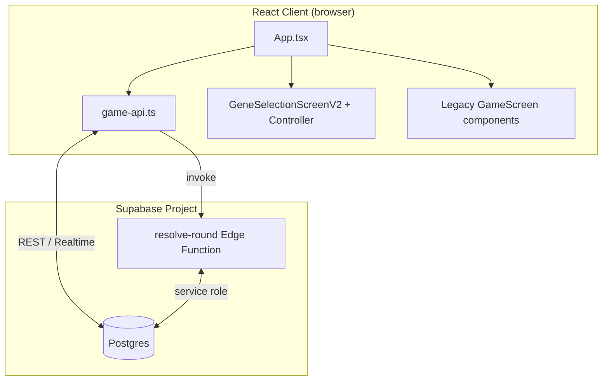
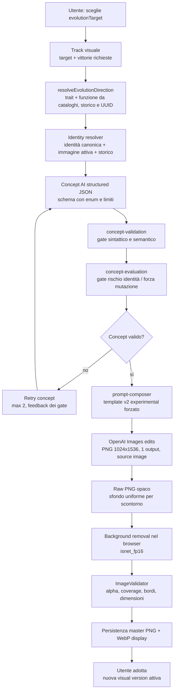

This file is a merged representation of the entire codebase, combined into a single document by Repomix.

<file_summary>
This section contains a summary of this file.

<purpose>
This file contains a packed representation of the entire repository's contents.
It is designed to be easily consumable by AI systems for analysis, code review,
or other automated processes.
</purpose>

<file_format>
The content is organized as follows:
1. This summary section
2. Repository information
3. Directory structure
4. Repository files (if enabled)
5. Multiple file entries, each consisting of:
  - File path as an attribute
  - Full contents of the file
</file_format>

<usage_guidelines>
- This file should be treated as read-only. Any changes should be made to the
  original repository files, not this packed version.
- When processing this file, use the file path to distinguish
  between different files in the repository.
- Be aware that this file may contain sensitive information. Handle it with
  the same level of security as you would the original repository.
</usage_guidelines>

<notes>
- Some files may have been excluded based on .gitignore rules and Repomix's configuration
- Binary files are not included in this packed representation. Please refer to the Repository Structure section for a complete list of file paths, including binary files
- Files matching patterns in .gitignore are excluded
- Files matching default ignore patterns are excluded
- Files are sorted by Git change count (files with more changes are at the bottom)
</notes>

</file_summary>

<directory_structure>
artifacts/
  audit/
    .gitkeep
    acceptance.json
    acceptance.md
    baseline-report.json
    baseline-report.md
    evolution-depth.json
    evolution-depth.md
    evolution-evolve-1.json
    evolution-evolve-1.md
    evolution.json
    evolution.md
    evolve-value-comparison.json
    evolve-value-comparison.md
    exact-baseline.json
    heuristic-validation.json
    heuristic-validation.md
    metagame-baseline-adaptations-exhaustion-best-of-seven-v2.json
    metagame-baseline.json
    metagame-evolve-1.json
    metagame-evolve-1.md
    metagame.json
    metagame.md
    README.md
    search-checkpoint.json
    search-screening.json
  balance/
    production-catalog.json
    production-catalog.md
    README.md
  mobile-layout-current/
    battle-current-1440x900.png
    battle-current-1920x1080.png
    battle-current-320x568.png
    battle-current-360x800.png
    battle-current-390x844.png
    battle-current-412x915.png
    battle-current-430x932.png
    battle-current-768x1024.png
    battle-current-844x390.png
    battle-metrics.json
    choice-current-1440x900.png
    choice-current-1920x1080.png
    choice-current-360x800.png
    choice-current-390x844.png
    choice-current-412x915.png
    choice-current-430x932.png
    choice-current-768x1024.png
    choice-current-844x390.png
    choice-current-event-details-360x800.png
    choice-current-event-details-metrics.json
    choice-last-gene-360x800.png
    choice-last-gene-metrics.json
    home-current-1440x900.png
    home-current-1920x1080.png
    home-current-360x800.png
    home-current-390x844.png
    home-current-412x915.png
    home-current-430x932.png
    home-current-768x1024.png
    home-current-844x390.png
    home-metrics.json
    home-play-modes-current-390x844.png
    metrics.json
    result-current-1440x900.png
    result-current-1920x1080.png
    result-current-360x800.png
    result-current-390x844.png
    result-current-412x915.png
    result-current-430x932.png
    result-current-768x1024.png
    result-current-844x390.png
    result-metrics.json
  mobile-layout-audit.mjs
  mobile-overflow-audit.mjs
docs/
  audit-five-genes-technical-analysis.md
  creature-evolution-flux-pipeline.md
  prompta.md
  promptb.md
  ui-design-system.md
public/
  assets/
    battle/
      backgrounds/
        enchanted-forest.png
        enchanted-forestold.png
      creatures/
        amethyst-hatchling.png
        old.png
        verdant-hatchling.png
    branding/
      evori-logo.png
    creatures/
      base.png
      README.md
    game-ui/
      environments/
        flash-flood.svg
        heat-spike.svg
        nutrient-collapse.svg
        predator-pack-migration.svg
        prolonged-eclipse.svg
        volcanic-ash-wave.svg
      genes/
        gene-aquatic.svg
        gene-metabolism.svg
        gene-mobility.svg
        gene-resilience.svg
        gene-senses.svg
        LICENSE-LUCIDE.txt
      placeholders/
        background.svg
        battle-scene-mobile.jpeg
        environment.svg
        gene.svg
        opponent-avatar.svg
        opponent-creature.svg
        player-avatar.svg
        player-creature.svg
        README.md
      battle-scene-mobile.jpeg
      battle-versus.png
  favicon.svg
  icons.svg
shared/
  creature-transformations/
    flux-evolution/
      anatomy-contract.test.ts
      anatomy-contract.ts
      body-plan-mutations.ts
      body-plan-registry.ts
      body-plan.test.ts
      evolution-lineage.test.ts
      evolution-lineage.ts
      evolution-plan.ts
      flux-prompt-composer.test.ts
      flux-prompt-composer.ts
      micro-concept.ts
    api-contracts.ts
    body-areas.ts
    contracts.ts
    creature-visual-versions.ts
    display-asset-backfill.test.ts
    display-asset-backfill.ts
    display-asset-spec.ts
    evolution-draft.test.ts
    evolution-draft.ts
    evolution-targets.test.ts
    evolution-targets.ts
    image-test-fixtures.ts
    image-validator.test.ts
    image-validator.ts
    index.ts
    render-specifications.ts
    request-persistence.ts
    visual-progression.test.ts
    visual-progression.ts
    visual-traits.ts
  game-rules/
    audit-packed.test.ts
    bot-policies.ts
    bot.test.ts
    bot.ts
    catalog.ts
    edge-domain-adapter.test.ts
    engine.ts
    formula-audit.test.ts
    game-rules.test.ts
    index.ts
    layer-parity.test.ts
    lookahead-policy.ts
    match.ts
    persisted-round-resolution.ts
    scoring.ts
    simulate-match.test.ts
    simulate-match.ts
    state.ts
    transition-match-audit.test.ts
    types.ts
    validation.ts
    vs-bot-round.ts
src/
  assets/
    hero.png
    react.svg
    vite.svg
  auth/
    AuthProvider.tsx
  components/
    creature-transformation-lab/
      CreatureTransformationLab.css
      CreatureTransformationLab.tsx
      FluxEvolutionChainSimulator.test.tsx
      FluxEvolutionChainSimulator.tsx
      GeneratedImageCatalog.tsx
      lab-route.test.ts
      lab-route.ts
    creature-visual-progression/
      CreatureVisualProgressionScreen.css
      CreatureVisualProgressionScreen.tsx
      visualVersions.ts
    game-results/
      buildMatchResultViewModel.test.ts
      buildMatchResultViewModel.ts
      types.ts
    game-v2/
      components/
        creatureOrientation.ts
      controller/
        battleParticipants.test.ts
        battleParticipants.ts
        buildGeneSelectionV2ViewModel.test.ts
        buildGeneSelectionV2ViewModel.ts
        useGameCreatureVisualResource.test.tsx
        useGameCreatureVisualResource.ts
        useGeneSelectionV2Controller.ts
      gameSelectionAssets.ts
      types.ts
    visual-background-cleanup/
      VisualBackgroundCleanupScreen.css
      VisualBackgroundCleanupScreen.tsx
    technical-screens.css
  dev/
    UiPreview.tsx
    uiPreviewFixtures.ts
    uiPreviewRoute.ts
  game/
    bot.ts
    config.ts
    engine.ts
    persisted-round-resolution.ts
    round-events.ts
    round-result-explainer.ts
    scoring.ts
    traits-catalog.ts
    types.ts
    ui-context.ts
    worlds.ts
  lib/
    creature-display-asset.ts
    creature-transformations-api.ts
    creature-visual-url-cache.test.ts
    creature-visual-url-cache.ts
    evolution-progress-api.ts
    game-api.ts
    game-snapshot-sync.test.ts
    game-snapshot-sync.ts
    normalize-creature-master.test.ts
    normalize-creature-master.ts
    profile-api.test.ts
    profile-api.ts
    progression.test.ts
    progression.ts
    remove-creature-background.test.ts
    remove-creature-background.ts
    storage.ts
    supabase.ts
  screens/
    auth/
      AuthScreen.css
      AuthScreen.tsx
    battle/
      parts/
        BattleArena.tsx
        DecisionActions.tsx
        DuelHeader.tsx
        EnvironmentCard.tsx
        EvolutionDraftOverlay.tsx
        GeneCarousel.tsx
        RoundResultOverlay.tsx
      BattleScreen.css
      BattleScreen.test.ts
      BattleScreen.tsx
    collection/
      buildCollectionViewModel.ts
      CollectionScreen.css
      CollectionScreen.test.tsx
      CollectionScreen.tsx
      types.ts
    home/
      parts/
        PlayModesSheet.tsx
      buildHomeViewModel.ts
      creatureSubjectFit.ts
      HomeScreen.css
      HomeScreen.test.ts
      HomeScreen.tsx
      types.ts
    profile/
      ProfileScreen.css
      ProfileScreen.tsx
    ranking/
      LeaderboardScreen.css
      LeaderboardScreen.test.ts
      LeaderboardScreen.tsx
    results/
      MatchResultScreen.css
      MatchResultScreen.test.ts
      MatchResultScreen.tsx
    system/
      SystemScreens.css
      SystemScreens.tsx
  ui/
    assets.test.ts
    assets.ts
    base.css
    components.css
    components.tsx
    Dock.tsx
    icons.tsx
    theme.css
  App.tsx
  index.css
  main.tsx
supabase/
  functions/
    generate-creature-transformation/
      anatomical-evolution-targets-migration.test.ts
      background-removal-candidate-orchestration.test.ts
      benchmark-reviews-migration.test.ts
      creature-lineages-migration.test.ts
      creature-transformation-request-repository.test.ts
      creature-transformation-request-repository.ts
      creature-visual-progression-repository.ts
      database-lookup-diagnostics.test.ts
      database-lookup-diagnostics.ts
      destructive-creature-evolution-environment-reset-migration.test.ts
      edge-image-codec.ts
      edge-orchestration.ts
      evolution-target-taxonomy-migration.test.ts
      fal-flux-image-provider.test.ts
      fal-flux-image-provider.ts
      flux-evolution-chain.test.ts
      flux-image-generation-service.ts
      flux-micro-concept-generator.test.ts
      flux-micro-concept-generator.ts
      flux-only-pipeline-boundary.test.ts
      flux-production-pipeline.test.ts
      generated-image-catalog-orchestration.test.ts
      global-creature-progression-reset-migration.test.ts
      identity-registry.ts
      index.ts
      lab-policy.test.ts
      lab-policy.ts
      README.md
      real-image-persistence-migration.test.ts
      real-image-retry-migration.test.ts
      request-persistence-migration.test.ts
      request-persistence-state.test.ts
      request-reservation-evolution-metadata-migration.test.ts
      request-validation-visual-progression.test.ts
      request-validation.ts
      security-hardening.test.ts
      supabase-creature-identity-resolver.test.ts
      supabase-creature-identity-resolver.ts
      supabase-creature-transformation-storage.test.ts
      supabase-creature-transformation-storage.ts
      test-creature-fixtures.ts
      test-request-repository.ts
      visual-progression-access.test.ts
      visual-progression-domain-boundary.test.ts
      visual-progression-migration.test.ts
    resolve-round/
      bot-policy.ts
      competitive-skill-rating-migration.test.ts
      index.ts
      round-domain.ts
      visual-progression-adapter.test.ts
      visual-progression-adapter.ts
  generated/
    game-rules.sql
  migrations/
    202607260001_reset_mvp_5_genes.sql
    202607280001_bot_difficulty.sql
    202607300001_exhaustion_adaptations.sql
    202608010001_profiles_and_progression.sql
    202608020001_creature_transformation_service_role_read.sql
    202608020002_creature_transformation_storage.sql
    202608020003_creature_transformation_request_persistence.sql
    202608020004_creature_transformation_real_image_pilot.sql
    202608030001_creature_transformation_benchmark_reviews.sql
    202608040001_creature_visual_progression.sql
    202608040002_creature_visual_progression_service_role_read.sql
    202608040003_creature_background_removal_candidates.sql
    202608040004_fix_background_removal_candidate_path_regex.sql
    202608040005_recover_nonfinal_visual_tracks.sql
    202608050001_security_hardening.sql
    202608050002_reload_postgrest_schema.sql
    202608050003_grant_profile_read_to_service_role.sql
    202608050004_creature_transformation_color_evolution_reviews.sql
    202608050005_recover_legacy_post_processing_visual_tracks.sql
    202608050006_recover_legacy_visual_proposals_for_owner_review.sql
    202608050007_allow_real_image_retry_after_failure.sql
    202608050008_visual_background_cleanup_batch.sql
    202608050009_anatomical_evolution_targets.sql
    202608050010_increase_registered_user_limit.sql
    202608050011_fix_join_pvp_game_room_code_ambiguity.sql
    202608050012_fix_join_pvp_game_game_id_ambiguity.sql
    202608070001_creature_transformation_reservation_evolution_metadata.sql
    202608070002_restore_visual_post_processing_state.sql
    202608070003_creature_display_assets.sql
    202608080001_game_snapshot_sync.sql
    202608090001_lineage_first_experiment_reviews.sql
    202608090002_experimental_prompt_snapshots.sql
    202608090003_creature_transformation_daily_usage.sql
    202608090004_add_global_real_image_usage.sql
    202608090005_recover_stale_real_image_reservations.sql
    202608100001_battle_evolution_draft.sql
    202608110001_allow_flux_raw_background_removal.sql
    202608120001_competitive_skill_rating.sql
    202608130001_allow_lab_flux_chain_background_removal.sql
    202608130002_admin_global_creature_progression_reset.sql
    202608130003_fix_lab_flux_background_removal_rpc_signature.sql
    202608130004_fix_background_removal_candidate_regex.sql
    202608140001_evolution_target_taxonomy.sql
    202608140002_creature_lineages.sql
    202608140003_flux_abstract_evolution_functions.sql
    202608150001_admin_destructive_creature_evolution_environment_reset.sql
    202608150002_fix_destructive_creature_evolution_reset_safe_deletes.sql
    202608150003_delete_creature_lineage.sql
    202608150004_update_canonical_creature_source.sql
    202608150005_allow_historical_player_creature_delete.sql
    202608150006_allow_seedream_raw_background_removal.sql
  verification/
    verify_global_creature_progression_reset.sql
  config.toml
  RESET_DEVELOPMENT.md
  schema.sql
tools/
  audit-acceptance.ts
  audit-bench.ts
  audit-catalog.ts
  audit-config.ts
  audit-core-check.ts
  audit-core.ts
  audit-evolution.ts
  audit-evolve-compare.ts
  audit-exact.ts
  audit-heuristic-validation.ts
  audit-metagame.ts
  audit-report.ts
  audit-search-worker.ts
  audit-search.ts
  backfill-creature-display-assets.ts
  generate-game-rules-sql.ts
  generate-supabase-reset.ts
  reset-creature-evolution-environment.test.ts
  reset-creature-evolution-environment.ts
  seed-creature-transformation-source.ts
.env.example
.gitignore
.oxlintrc.json
AGENTS.md
concept.JPG
FRONTEND_REFACTOR_AUDIT.md
index.html
package.json
PROJECT_SUMMARY.md
README.md
report.md
SECURITY_AUDIT.md
tsconfig.app.json
tsconfig.json
tsconfig.node.json
vite.config.ts
</directory_structure>

<files>
This section contains the contents of the repository's files.

<file path="artifacts/audit/.gitkeep">

</file>

<file path="artifacts/audit/acceptance.json">
{
  "ruleVersion": "adaptations-exhaustion-best-of-seven-v2",
  "seed": 1592598566,
  "methodology": "Seeded symmetric tournament using only production getLegalBotActions, resolveRound, resolveMatchOutcome and simulateMatch. Mirrored pairings share the same seed. No alternate scoring or transition model.",
  "actions": {
    "USE": 1472,
    "EVOLVE": 504,
    "evolveRate": 0.2550607287449393,
    "pureMaxLevelRecoveries": 0,
    "pureRecoveryRate": 0
  },
  "geneFrequency": {
    "FEROCITY": 0.21153846153846154,
    "ARMOR": 0.2054655870445344,
    "AGILITY": 0.19129554655870445,
    "SENSES": 0.19331983805668015,
    "CAMOUFLAGE": 0.19838056680161945
  },
  "concentration": 0.21153846153846154,
  "matchup": {
    "doubleUseRounds": 582,
    "winnerChanges": 164,
    "lowerEnvironmentalValueWins": 90
  },
  "exhaustion": {
    "averageExhaustedGenesPerPlayerRound": 1.951417004048583,
    "averageFirstRecoveryRound": 5.088235294117647
  },
  "integrity": {
    "illegalActions": 0,
    "deterministicAtSameSeed": true
  },
  "matches": {
    "count": 150,
    "averageDurationRounds": 6.586666666666667,
    "leftWins": 60,
    "rightWins": 60,
    "positionDifference": 0,
    "draws": 30,
    "tiebreaks": 14,
    "endReasons": {
      "DRAW": 30,
      "CLINCH": 64,
      "SCORE": 42,
      "ROUND_VALUE_TIEBREAK": 14
    }
  },
  "policyResults": {
    "random": {
      "wins": 2,
      "draws": 12,
      "losses": 46,
      "actions": 384,
      "evolves": 202,
      "evolveRate": 0.5260416666666666,
      "scoreRate": 0.13333333333333333
    },
    "greedy-immediate-use": {
      "wins": 16,
      "draws": 12,
      "losses": 32,
      "actions": 398,
      "evolves": 52,
      "evolveRate": 0.1306532663316583,
      "scoreRate": 0.36666666666666664
    },
    "evolve-first": {
      "wins": 24,
      "draws": 12,
      "losses": 24,
      "actions": 410,
      "evolves": 120,
      "evolveRate": 0.2926829268292683,
      "scoreRate": 0.5
    },
    "heuristic": {
      "wins": 40,
      "draws": 12,
      "losses": 8,
      "actions": 394,
      "evolves": 54,
      "evolveRate": 0.13705583756345177,
      "scoreRate": 0.7666666666666667
    },
    "lookahead-2": {
      "wins": 38,
      "draws": 12,
      "losses": 10,
      "actions": 390,
      "evolves": 76,
      "evolveRate": 0.19487179487179487,
      "scoreRate": 0.7333333333333333
    }
  },
  "strategicVsGreedy": [
    {
      "strategic": "random",
      "wins": 2,
      "draws": 0,
      "losses": 10,
      "scoreRate": 0.16666666666666666
    },
    {
      "strategic": "evolve-first",
      "wins": 6,
      "draws": 0,
      "losses": 6,
      "scoreRate": 0.5
    },
    {
      "strategic": "heuristic",
      "wins": 12,
      "draws": 0,
      "losses": 0,
      "scoreRate": 1
    },
    {
      "strategic": "lookahead-2",
      "wins": 12,
      "draws": 0,
      "losses": 0,
      "scoreRate": 1
    }
  ],
  "thresholds": {
    "maximumGeneFrequency": true,
    "minimumGeneFrequency": true,
    "evolveRate": true,
    "matchupMaterial": true,
    "strategicBeatsGreedy": true,
    "positionBalanced": true,
    "noIllegalActions": true,
    "deterministic": true
  },
  "accepted": true
}
</file>

<file path="artifacts/audit/acceptance.md">
# Audit acceptance — adaptations-exhaustion-best-of-seven-v2

{
  "ruleVersion": "adaptations-exhaustion-best-of-seven-v2",
  "seed": 1592598566,
  "methodology": "Seeded symmetric tournament using only production getLegalBotActions, resolveRound, resolveMatchOutcome and simulateMatch. Mirrored pairings share the same seed. No alternate scoring or transition model.",
  "actions": {
    "USE": 1472,
    "EVOLVE": 504,
    "evolveRate": 0.2550607287449393,
    "pureMaxLevelRecoveries": 0,
    "pureRecoveryRate": 0
  },
  "geneFrequency": {
    "FEROCITY": 0.21153846153846154,
    "ARMOR": 0.2054655870445344,
    "AGILITY": 0.19129554655870445,
    "SENSES": 0.19331983805668015,
    "CAMOUFLAGE": 0.19838056680161945
  },
  "concentration": 0.21153846153846154,
  "matchup": {
    "doubleUseRounds": 582,
    "winnerChanges": 164,
    "lowerEnvironmentalValueWins": 90
  },
  "exhaustion": {
    "averageExhaustedGenesPerPlayerRound": 1.951417004048583,
    "averageFirstRecoveryRound": 5.088235294117647
  },
  "integrity": {
    "illegalActions": 0,
    "deterministicAtSameSeed": true
  },
  "matches": {
    "count": 150,
    "averageDurationRounds": 6.586666666666667,
    "leftWins": 60,
    "rightWins": 60,
    "positionDifference": 0,
    "draws": 30,
    "tiebreaks": 14,
    "endReasons": {
      "DRAW": 30,
      "CLINCH": 64,
      "SCORE": 42,
      "ROUND_VALUE_TIEBREAK": 14
    }
  },
  "policyResults": {
    "random": {
      "wins": 2,
      "draws": 12,
      "losses": 46,
      "actions": 384,
      "evolves": 202,
      "evolveRate": 0.5260416666666666,
      "scoreRate": 0.13333333333333333
    },
    "greedy-immediate-use": {
      "wins": 16,
      "draws": 12,
      "losses": 32,
      "actions": 398,
      "evolves": 52,
      "evolveRate": 0.1306532663316583,
      "scoreRate": 0.36666666666666664
    },
    "evolve-first": {
      "wins": 24,
      "draws": 12,
      "losses": 24,
      "actions": 410,
      "evolves": 120,
      "evolveRate": 0.2926829268292683,
      "scoreRate": 0.5
    },
    "heuristic": {
      "wins": 40,
      "draws": 12,
      "losses": 8,
      "actions": 394,
      "evolves": 54,
      "evolveRate": 0.13705583756345177,
      "scoreRate": 0.7666666666666667
    },
    "lookahead-2": {
      "wins": 38,
      "draws": 12,
      "losses": 10,
      "actions": 390,
      "evolves": 76,
      "evolveRate": 0.19487179487179487,
      "scoreRate": 0.7333333333333333
    }
  },
  "strategicVsGreedy": [
    {
      "strategic": "random",
      "wins": 2,
      "draws": 0,
      "losses": 10,
      "scoreRate": 0.16666666666666666
    },
    {
      "strategic": "evolve-first",
      "wins": 6,
      "draws": 0,
      "losses": 6,
      "scoreRate": 0.5
    },
    {
      "strategic": "heuristic",
      "wins": 12,
      "draws": 0,
      "losses": 0,
      "scoreRate": 1
    },
    {
      "strategic": "lookahead-2",
      "wins": 12,
      "draws": 0,
      "losses": 0,
      "scoreRate": 1
    }
  ],
  "thresholds": {
    "maximumGeneFrequency": true,
    "minimumGeneFrequency": true,
    "evolveRate": true,
    "matchupMaterial": true,
    "strategicBeatsGreedy": true,
    "positionBalanced": true,
    "noIllegalActions": true,
    "deterministic": true
  },
  "accepted": true
}
</file>

<file path="artifacts/audit/baseline-report.json">
{
  "ruleVersion": "five-genes-v2",
  "fitnessVersion": "five-genes-fitness-v2",
  "exact": {
    "methodology": {
      "exact": true,
      "ruleVersion": "five-genes-v2",
      "opponent": "deterministic-immediate-greedy",
      "sequences": 720,
      "stateEncoding": "ten level bits (0-2) plus three cooldown bits",
      "scope": "exact best response to fixed greedy policy; not simultaneous-game equilibrium"
    },
    "benchmark": {
      "elapsedMs": 304,
      "statesVisited": 858240,
      "cacheHits": 2749680,
      "cacheMisses": 858240,
      "heapUsedBytes": 10788440
    },
    "metrics": {
      "wins": 687,
      "draws": 33,
      "losses": 0,
      "finalDrawRate": 0.04583333333333333,
      "roundTies": 490,
      "level2Reached": 46,
      "level2ReachRate": 0.06388888888888888,
      "level2Uses": 82,
      "secondEvolveNecessary": 1,
      "secondEvolveNotNecessary": 45,
      "orderOutcomeSpread": 4,
      "actionCounts": {
        "USE:RESILIENCE": 89,
        "EVOLVE:RESILIENCE": 43,
        "USE:MOBILITY": 807,
        "EVOLVE:MOBILITY": 358,
        "USE:SENSES": 635,
        "EVOLVE:SENSES": 236,
        "USE:METABOLISM": 743,
        "EVOLVE:METABOLISM": 360,
        "USE:AQUATIC": 614,
        "EVOLVE:AQUATIC": 435
      },
      "pickRate": {
        "0": 0.030555555555555555,
        "1": 0.26967592592592593,
        "2": 0.20162037037037037,
        "3": 0.2553240740740741,
        "4": 0.24282407407407408
      },
      "matchScoreDistribution": {
        "3-2": 451,
        "4-2": 195,
        "4-1": 39,
        "5-1": 2,
        "3-3": 33
      },
      "valuesByGene": {
        "0": {
          "sum": 395,
          "average": 2.992424242424242
        },
        "1": {
          "sum": 3409,
          "average": 2.9261802575107296
        },
        "2": {
          "sum": 2749,
          "average": 3.156142365097589
        },
        "3": {
          "sum": 3235,
          "average": 2.9329102447869446
        },
        "4": {
          "sum": 2893,
          "average": 2.757864632983794
        }
      },
      "valuesByEvent": {
        "VOLCANIC_ASH_WAVE": {
          "sum": 2245,
          "average": 3.1180555555555554
        },
        "PROLONGED_ECLIPSE": {
          "sum": 1943,
          "average": 2.698611111111111
        },
        "PREDATOR_PACK_MIGRATION": {
          "sum": 2141,
          "average": 2.973611111111111
        },
        "HEAT_SPIKE": {
          "sum": 2340,
          "average": 3.25
        },
        "NUTRIENT_COLLAPSE": {
          "sum": 1860,
          "average": 2.5833333333333335
        },
        "FLASH_FLOOD": {
          "sum": 2152,
          "average": 2.988888888888889
        }
      }
    }
  },
  "policyTournament": {
    "seed": 1592598566,
    "sequences": 720,
    "policies": [
      "greedy",
      "evolve-first",
      "anti-cooldown",
      "future-value-evolve",
      "two-evolution-plan"
    ],
    "wins": {
      "greedy": 2449,
      "evolve-first": 0,
      "anti-cooldown": 918,
      "future-value-evolve": 1163,
      "two-evolution-plan": 1773
    },
    "winRates": {
      "greedy": 0.8503472222222223,
      "evolve-first": 0,
      "anti-cooldown": 0.31875,
      "future-value-evolve": 0.40381944444444445,
      "two-evolution-plan": 0.615625
    },
    "winShares": {
      "greedy": 0.38854513723623674,
      "evolve-first": 0,
      "anti-cooldown": 0.1456449309852451,
      "future-value-evolve": 0.18451531016976044,
      "two-evolution-plan": 0.28129462160875773
    },
    "evolveRates": {
      "greedy": 0,
      "evolve-first": 1,
      "anti-cooldown": 0,
      "future-value-evolve": 0.5324074074074074,
      "two-evolution-plan": 0.3333333333333333
    },
    "ties": 897,
    "methodology": "deterministic policy tournament; future-value-evolve knows the remaining event order and evolves only when expected later gains exceed this round cost"
  },
  "acceptance": {
    "maxGenePickRate": 0.26967592592592593,
    "maxPolicyWinRate": 0.8503472222222223,
    "maxPolicyWinShare": 0.38854513723623674,
    "evolveRate": 0.3314814814814815,
    "orderOutcomeSpread": 4,
    "passes": {
      "geneBalance": true,
      "policyBalance": true,
      "evolveUsedButNotAutomatic": true,
      "eventOrderMatters": true
    }
  }
}
</file>

<file path="artifacts/audit/baseline-report.md">
# Audit baseline - five genes

- Regole: five-genes-v2; fitness: five-genes-fitness-v2.
- Esatto (best response contro greedy): 304 ms, 858240 stati visitati, cache 2749680/858240 hit/miss.
- Torneo policy seeded (720 ordini): greedy=85.0%, evolve-first=0.0%, anti-cooldown=31.9%, future-value-evolve=40.4%, two-evolution-plan=61.6%; pareggi=897.
- Criteri: scelta gene max 27.0%; quota vittorie policy max 38.9% (win rate testa-a-testa max 85.0%); evolve 33.1%; spread ordine=4.

La policy future-value-evolve e un controllo di audit: conosce l ordine futuro e valuta il guadagno atteso prima di rinunciare al punteggio corrente.
</file>

<file path="artifacts/audit/evolution-depth.json">
{
  "mode": "deep",
  "seed": 1592598566,
  "sequences": [
    [
      "PROLONGED_ECLIPSE",
      "PREDATOR_PACK_MIGRATION",
      "VOLCANIC_ASH_WAVE",
      "NUTRIENT_COLLAPSE",
      "FLASH_FLOOD",
      "HEAT_SPIKE",
      "PROLONGED_ECLIPSE"
    ],
    [
      "NUTRIENT_COLLAPSE",
      "PROLONGED_ECLIPSE",
      "VOLCANIC_ASH_WAVE",
      "HEAT_SPIKE",
      "PREDATOR_PACK_MIGRATION",
      "FLASH_FLOOD",
      "NUTRIENT_COLLAPSE"
    ],
    [
      "NUTRIENT_COLLAPSE",
      "PROLONGED_ECLIPSE",
      "PREDATOR_PACK_MIGRATION",
      "VOLCANIC_ASH_WAVE",
      "FLASH_FLOOD",
      "HEAT_SPIKE",
      "NUTRIENT_COLLAPSE"
    ],
    [
      "NUTRIENT_COLLAPSE",
      "VOLCANIC_ASH_WAVE",
      "PREDATOR_PACK_MIGRATION",
      "PROLONGED_ECLIPSE",
      "HEAT_SPIKE",
      "FLASH_FLOOD",
      "NUTRIENT_COLLAPSE"
    ]
  ],
  "opponents": [
    "greedy-use",
    "heuristic",
    "lookahead-2",
    "param-matchup",
    "evolve-first"
  ],
  "methodology": "Offline privileged deep diagnostic: remaining event order is supplied only to audit lookahead policies. Deep uses a deterministic stratified sample of four event orders, five opponents and both orientations; it is not a simultaneous-game equilibrium. Regret is the immediate best USE value minus EVOLVE=2.",
  "elapsedMs": 85612,
  "policies": {
    "lookahead-2": {
      "matches": 40,
      "wins": 20,
      "draws": 18,
      "losses": 2,
      "evolve": {
        "decisions": 274,
        "opportunities": 1362,
        "selected": 18,
        "immediateRegretSum": 2234,
        "immediateBest": 0,
        "nearBest": 558,
        "clearlyBad": 804,
        "nextVisibleGainSum": 22,
        "winnerChanged": 8,
        "selectedRate": 0.06569343065693431,
        "averageImmediateRegret": 1.6402349486049927,
        "averageNextVisibleGain": 1.2222222222222223
      },
      "genes": {
        "FEROCITY": {
          "use": 42,
          "evolve": 6,
          "value": 196,
          "roundWins": 18,
          "evolutions": 6,
          "events": {
            "VOLCANIC_ASH_WAVE": 34,
            "PROLONGED_ECLIPSE": 8,
            "PREDATOR_PACK_MIGRATION": 2,
            "FLASH_FLOOD": 2,
            "NUTRIENT_COLLAPSE": 2
          },
          "cooldownImposed": 42
        },
        "ARMOR": {
          "use": 66,
          "evolve": 0,
          "value": 198,
          "roundWins": 16,
          "evolutions": 0,
          "events": {
            "NUTRIENT_COLLAPSE": 66
          },
          "cooldownImposed": 66
        },
        "AGILITY": {
          "use": 54,
          "evolve": 6,
          "value": 216,
          "roundWins": 10,
          "evolutions": 6,
          "events": {
            "PROLONGED_ECLIPSE": 36,
            "PREDATOR_PACK_MIGRATION": 20,
            "VOLCANIC_ASH_WAVE": 2,
            "HEAT_SPIKE": 2
          },
          "cooldownImposed": 54
        },
        "SENSES": {
          "use": 54,
          "evolve": 4,
          "value": 214,
          "roundWins": 10,
          "evolutions": 4,
          "events": {
            "PREDATOR_PACK_MIGRATION": 18,
            "HEAT_SPIKE": 36,
            "PROLONGED_ECLIPSE": 2,
            "VOLCANIC_ASH_WAVE": 2
          },
          "cooldownImposed": 54
        },
        "CAMOUFLAGE": {
          "use": 40,
          "evolve": 2,
          "value": 166,
          "roundWins": 8,
          "evolutions": 2,
          "events": {
            "FLASH_FLOOD": 38,
            "VOLCANIC_ASH_WAVE": 2,
            "NUTRIENT_COLLAPSE": 2
          },
          "cooldownImposed": 40
        }
      },
      "lookahead": {
        "statesVisited": 10528,
        "cacheHits": 0,
        "cacheMisses": 10528
      }
    },
    "lookahead-3": {
      "matches": 40,
      "wins": 16,
      "draws": 18,
      "losses": 6,
      "evolve": {
        "decisions": 278,
        "opportunities": 1386,
        "selected": 18,
        "immediateRegretSum": 2290,
        "immediateBest": 0,
        "nearBest": 540,
        "clearlyBad": 846,
        "nextVisibleGainSum": 20,
        "winnerChanged": 4,
        "selectedRate": 0.06474820143884892,
        "averageImmediateRegret": 1.6522366522366523,
        "averageNextVisibleGain": 1.1111111111111112
      },
      "genes": {
        "FEROCITY": {
          "use": 44,
          "evolve": 4,
          "value": 192,
          "roundWins": 12,
          "evolutions": 4,
          "events": {
            "VOLCANIC_ASH_WAVE": 34,
            "PROLONGED_ECLIPSE": 10,
            "FLASH_FLOOD": 2,
            "NUTRIENT_COLLAPSE": 2
          },
          "cooldownImposed": 44
        },
        "ARMOR": {
          "use": 68,
          "evolve": 4,
          "value": 216,
          "roundWins": 16,
          "evolutions": 4,
          "events": {
            "NUTRIENT_COLLAPSE": 68,
            "PREDATOR_PACK_MIGRATION": 4
          },
          "cooldownImposed": 68
        },
        "AGILITY": {
          "use": 52,
          "evolve": 2,
          "value": 198,
          "roundWins": 10,
          "evolutions": 2,
          "events": {
            "PROLONGED_ECLIPSE": 34,
            "PREDATOR_PACK_MIGRATION": 18,
            "VOLCANIC_ASH_WAVE": 2
          },
          "cooldownImposed": 52
        },
        "SENSES": {
          "use": 58,
          "evolve": 8,
          "value": 244,
          "roundWins": 14,
          "evolutions": 8,
          "events": {
            "PREDATOR_PACK_MIGRATION": 18,
            "HEAT_SPIKE": 40,
            "PROLONGED_ECLIPSE": 4,
            "VOLCANIC_ASH_WAVE": 4
          },
          "cooldownImposed": 58
        },
        "CAMOUFLAGE": {
          "use": 38,
          "evolve": 0,
          "value": 152,
          "roundWins": 6,
          "evolutions": 0,
          "events": {
            "FLASH_FLOOD": 38
          },
          "cooldownImposed": 38
        }
      },
      "lookahead": {
        "statesVisited": 94072,
        "cacheHits": 54024,
        "cacheMisses": 94072
      }
    },
    "lookahead-4": {
      "matches": 40,
      "wins": 20,
      "draws": 18,
      "losses": 2,
      "evolve": {
        "decisions": 274,
        "opportunities": 1364,
        "selected": 16,
        "immediateRegretSum": 2246,
        "immediateBest": 0,
        "nearBest": 540,
        "clearlyBad": 824,
        "nextVisibleGainSum": 18,
        "winnerChanged": 8,
        "selectedRate": 0.058394160583941604,
        "averageImmediateRegret": 1.6466275659824048,
        "averageNextVisibleGain": 1.125
      },
      "genes": {
        "FEROCITY": {
          "use": 44,
          "evolve": 6,
          "value": 206,
          "roundWins": 20,
          "evolutions": 6,
          "events": {
            "VOLCANIC_ASH_WAVE": 34,
            "PROLONGED_ECLIPSE": 8,
            "PREDATOR_PACK_MIGRATION": 4,
            "HEAT_SPIKE": 2,
            "NUTRIENT_COLLAPSE": 2
          },
          "cooldownImposed": 44
        },
        "ARMOR": {
          "use": 66,
          "evolve": 2,
          "value": 204,
          "roundWins": 18,
          "evolutions": 2,
          "events": {
            "NUTRIENT_COLLAPSE": 66,
            "PROLONGED_ECLIPSE": 2
          },
          "cooldownImposed": 66
        },
        "AGILITY": {
          "use": 52,
          "evolve": 4,
          "value": 204,
          "roundWins": 8,
          "evolutions": 4,
          "events": {
            "PROLONGED_ECLIPSE": 36,
            "PREDATOR_PACK_MIGRATION": 18,
            "VOLCANIC_ASH_WAVE": 2
          },
          "cooldownImposed": 52
        },
        "SENSES": {
          "use": 54,
          "evolve": 2,
          "value": 208,
          "roundWins": 8,
          "evolutions": 2,
          "events": {
            "PREDATOR_PACK_MIGRATION": 18,
            "HEAT_SPIKE": 36,
            "VOLCANIC_ASH_WAVE": 2
          },
          "cooldownImposed": 54
        },
        "CAMOUFLAGE": {
          "use": 42,
          "evolve": 2,
          "value": 174,
          "roundWins": 8,
          "evolutions": 2,
          "events": {
            "FLASH_FLOOD": 40,
            "VOLCANIC_ASH_WAVE": 2,
            "NUTRIENT_COLLAPSE": 2
          },
          "cooldownImposed": 42
        }
      },
      "lookahead": {
        "statesVisited": 175880,
        "cacheHits": 176976,
        "cacheMisses": 175880
      }
    },
    "lookahead-full-last-3": {
      "matches": 40,
      "wins": 20,
      "draws": 18,
      "losses": 2,
      "evolve": {
        "decisions": 274,
        "opportunities": 1360,
        "selected": 18,
        "immediateRegretSum": 2230,
        "immediateBest": 0,
        "nearBest": 558,
        "clearlyBad": 802,
        "nextVisibleGainSum": 22,
        "winnerChanged": 6,
        "selectedRate": 0.06569343065693431,
        "averageImmediateRegret": 1.6397058823529411,
        "averageNextVisibleGain": 1.2222222222222223
      },
      "genes": {
        "FEROCITY": {
          "use": 42,
          "evolve": 6,
          "value": 196,
          "roundWins": 18,
          "evolutions": 6,
          "events": {
            "VOLCANIC_ASH_WAVE": 34,
            "PROLONGED_ECLIPSE": 8,
            "PREDATOR_PACK_MIGRATION": 4,
            "NUTRIENT_COLLAPSE": 2
          },
          "cooldownImposed": 42
        },
        "ARMOR": {
          "use": 66,
          "evolve": 0,
          "value": 198,
          "roundWins": 16,
          "evolutions": 0,
          "events": {
            "NUTRIENT_COLLAPSE": 66
          },
          "cooldownImposed": 66
        },
        "AGILITY": {
          "use": 52,
          "evolve": 6,
          "value": 210,
          "roundWins": 10,
          "evolutions": 6,
          "events": {
            "PROLONGED_ECLIPSE": 36,
            "PREDATOR_PACK_MIGRATION": 18,
            "VOLCANIC_ASH_WAVE": 2,
            "HEAT_SPIKE": 2
          },
          "cooldownImposed": 52
        },
        "SENSES": {
          "use": 54,
          "evolve": 4,
          "value": 214,
          "roundWins": 10,
          "evolutions": 4,
          "events": {
            "PREDATOR_PACK_MIGRATION": 18,
            "HEAT_SPIKE": 36,
            "PROLONGED_ECLIPSE": 2,
            "VOLCANIC_ASH_WAVE": 2
          },
          "cooldownImposed": 54
        },
        "CAMOUFLAGE": {
          "use": 42,
          "evolve": 2,
          "value": 174,
          "roundWins": 8,
          "evolutions": 2,
          "events": {
            "FLASH_FLOOD": 40,
            "VOLCANIC_ASH_WAVE": 2,
            "NUTRIENT_COLLAPSE": 2
          },
          "cooldownImposed": 42
        }
      },
      "lookahead": {
        "statesVisited": 31568,
        "cacheHits": 11808,
        "cacheMisses": 31568
      }
    }
  }
}
</file>

<file path="artifacts/audit/evolution-depth.md">
# Evolution diagnostic

- 85612 ms; 4 seeded event sequences.

| Policy | W-D-L | EVOLVE/decisioni | Regret medio | Best/Near/Bad | Gain prossimo evento | Winner changed | Cache hit/miss |
|---|---:|---:|---:|---:|---:|---:|---:|
| lookahead-2 | 20-18-2 | 18/274 (6.6%) | 1.64 | 0/558/804 | 1.22 | 8 | 0/10528 |
| lookahead-3 | 16-18-6 | 18/278 (6.5%) | 1.65 | 0/540/846 | 1.11 | 4 | 54024/94072 |
| lookahead-4 | 20-18-2 | 16/274 (5.8%) | 1.65 | 0/540/824 | 1.13 | 8 | 176976/175880 |
| lookahead-full-last-3 | 20-18-2 | 18/274 (6.6%) | 1.64 | 0/558/802 | 1.22 | 6 | 11808/31568 |
</file>

<file path="artifacts/audit/evolution-evolve-1.json">
{
  "seed": 1592598566,
  "sequences": [
    [
      "PROLONGED_ECLIPSE",
      "PREDATOR_PACK_MIGRATION",
      "VOLCANIC_ASH_WAVE",
      "NUTRIENT_COLLAPSE",
      "FLASH_FLOOD",
      "HEAT_SPIKE",
      "PROLONGED_ECLIPSE"
    ],
    [
      "NUTRIENT_COLLAPSE",
      "PROLONGED_ECLIPSE",
      "VOLCANIC_ASH_WAVE",
      "HEAT_SPIKE",
      "PREDATOR_PACK_MIGRATION",
      "FLASH_FLOOD",
      "NUTRIENT_COLLAPSE"
    ],
    [
      "NUTRIENT_COLLAPSE",
      "PROLONGED_ECLIPSE",
      "PREDATOR_PACK_MIGRATION",
      "VOLCANIC_ASH_WAVE",
      "FLASH_FLOOD",
      "HEAT_SPIKE",
      "NUTRIENT_COLLAPSE"
    ]
  ],
  "methodology": "Offline privileged diagnostic: remaining event order is supplied only to audit lookahead policies. Regret is the immediate best USE value minus EVOLVE=1; winnerChanged is a counterfactual replacement with the best immediate USE while preserving the observed opponent action. The broad position-balanced tournament remains audit:metagame.",
  "elapsedMs": 5143,
  "policies": {
    "lookahead-2": {
      "matches": 6,
      "wins": 4,
      "draws": 2,
      "losses": 0,
      "evolve": {
        "decisions": 40,
        "opportunities": 200,
        "selected": 0,
        "immediateRegretSum": 520,
        "immediateBest": 0,
        "nearBest": 0,
        "clearlyBad": 200,
        "nextVisibleGainSum": 0,
        "winnerChanged": 0,
        "selectedRate": 0,
        "averageImmediateRegret": 2.6,
        "averageNextVisibleGain": 0
      },
      "genes": {
        "FEROCITY": {
          "use": 6,
          "evolve": 0,
          "value": 28,
          "roundWins": 4,
          "evolutions": 0,
          "events": {
            "VOLCANIC_ASH_WAVE": 6
          },
          "cooldownImposed": 6
        },
        "ARMOR": {
          "use": 10,
          "evolve": 0,
          "value": 30,
          "roundWins": 2,
          "evolutions": 0,
          "events": {
            "NUTRIENT_COLLAPSE": 10
          },
          "cooldownImposed": 10
        },
        "AGILITY": {
          "use": 8,
          "evolve": 0,
          "value": 30,
          "roundWins": 0,
          "evolutions": 0,
          "events": {
            "PROLONGED_ECLIPSE": 6,
            "PREDATOR_PACK_MIGRATION": 2
          },
          "cooldownImposed": 8
        },
        "SENSES": {
          "use": 10,
          "evolve": 0,
          "value": 38,
          "roundWins": 2,
          "evolutions": 0,
          "events": {
            "PREDATOR_PACK_MIGRATION": 4,
            "HEAT_SPIKE": 6
          },
          "cooldownImposed": 10
        },
        "CAMOUFLAGE": {
          "use": 6,
          "evolve": 0,
          "value": 24,
          "roundWins": 2,
          "evolutions": 0,
          "events": {
            "FLASH_FLOOD": 6
          },
          "cooldownImposed": 6
        }
      },
      "lookahead": {
        "statesVisited": 1320,
        "cacheHits": 0,
        "cacheMisses": 1320
      }
    },
    "lookahead-3": {
      "matches": 6,
      "wins": 4,
      "draws": 2,
      "losses": 0,
      "evolve": {
        "decisions": 40,
        "opportunities": 200,
        "selected": 0,
        "immediateRegretSum": 520,
        "immediateBest": 0,
        "nearBest": 0,
        "clearlyBad": 200,
        "nextVisibleGainSum": 0,
        "winnerChanged": 0,
        "selectedRate": 0,
        "averageImmediateRegret": 2.6,
        "averageNextVisibleGain": 0
      },
      "genes": {
        "FEROCITY": {
          "use": 6,
          "evolve": 0,
          "value": 28,
          "roundWins": 4,
          "evolutions": 0,
          "events": {
            "VOLCANIC_ASH_WAVE": 6
          },
          "cooldownImposed": 6
        },
        "ARMOR": {
          "use": 10,
          "evolve": 0,
          "value": 30,
          "roundWins": 2,
          "evolutions": 0,
          "events": {
            "NUTRIENT_COLLAPSE": 10
          },
          "cooldownImposed": 10
        },
        "AGILITY": {
          "use": 8,
          "evolve": 0,
          "value": 30,
          "roundWins": 0,
          "evolutions": 0,
          "events": {
            "PROLONGED_ECLIPSE": 6,
            "PREDATOR_PACK_MIGRATION": 2
          },
          "cooldownImposed": 8
        },
        "SENSES": {
          "use": 10,
          "evolve": 0,
          "value": 38,
          "roundWins": 2,
          "evolutions": 0,
          "events": {
            "PREDATOR_PACK_MIGRATION": 4,
            "HEAT_SPIKE": 6
          },
          "cooldownImposed": 10
        },
        "CAMOUFLAGE": {
          "use": 6,
          "evolve": 0,
          "value": 24,
          "roundWins": 2,
          "evolutions": 0,
          "events": {
            "FLASH_FLOOD": 6
          },
          "cooldownImposed": 6
        }
      },
      "lookahead": {
        "statesVisited": 11558,
        "cacheHits": 7426,
        "cacheMisses": 11558
      }
    },
    "lookahead-4": {
      "matches": 6,
      "wins": 4,
      "draws": 2,
      "losses": 0,
      "evolve": {
        "decisions": 40,
        "opportunities": 200,
        "selected": 0,
        "immediateRegretSum": 520,
        "immediateBest": 0,
        "nearBest": 0,
        "clearlyBad": 200,
        "nextVisibleGainSum": 0,
        "winnerChanged": 0,
        "selectedRate": 0,
        "averageImmediateRegret": 2.6,
        "averageNextVisibleGain": 0
      },
      "genes": {
        "FEROCITY": {
          "use": 6,
          "evolve": 0,
          "value": 28,
          "roundWins": 4,
          "evolutions": 0,
          "events": {
            "VOLCANIC_ASH_WAVE": 6
          },
          "cooldownImposed": 6
        },
        "ARMOR": {
          "use": 10,
          "evolve": 0,
          "value": 30,
          "roundWins": 2,
          "evolutions": 0,
          "events": {
            "NUTRIENT_COLLAPSE": 10
          },
          "cooldownImposed": 10
        },
        "AGILITY": {
          "use": 8,
          "evolve": 0,
          "value": 30,
          "roundWins": 0,
          "evolutions": 0,
          "events": {
            "PROLONGED_ECLIPSE": 6,
            "PREDATOR_PACK_MIGRATION": 2
          },
          "cooldownImposed": 8
        },
        "SENSES": {
          "use": 10,
          "evolve": 0,
          "value": 38,
          "roundWins": 2,
          "evolutions": 0,
          "events": {
            "PREDATOR_PACK_MIGRATION": 4,
            "HEAT_SPIKE": 6
          },
          "cooldownImposed": 10
        },
        "CAMOUFLAGE": {
          "use": 6,
          "evolve": 0,
          "value": 24,
          "roundWins": 2,
          "evolutions": 0,
          "events": {
            "FLASH_FLOOD": 6
          },
          "cooldownImposed": 6
        }
      },
      "lookahead": {
        "statesVisited": 19502,
        "cacheHits": 22138,
        "cacheMisses": 19502
      }
    },
    "lookahead-full-last-3": {
      "matches": 6,
      "wins": 4,
      "draws": 2,
      "losses": 0,
      "evolve": {
        "decisions": 40,
        "opportunities": 200,
        "selected": 0,
        "immediateRegretSum": 520,
        "immediateBest": 0,
        "nearBest": 0,
        "clearlyBad": 200,
        "nextVisibleGainSum": 0,
        "winnerChanged": 0,
        "selectedRate": 0,
        "averageImmediateRegret": 2.6,
        "averageNextVisibleGain": 0
      },
      "genes": {
        "FEROCITY": {
          "use": 6,
          "evolve": 0,
          "value": 28,
          "roundWins": 4,
          "evolutions": 0,
          "events": {
            "VOLCANIC_ASH_WAVE": 6
          },
          "cooldownImposed": 6
        },
        "ARMOR": {
          "use": 10,
          "evolve": 0,
          "value": 30,
          "roundWins": 2,
          "evolutions": 0,
          "events": {
            "NUTRIENT_COLLAPSE": 10
          },
          "cooldownImposed": 10
        },
        "AGILITY": {
          "use": 8,
          "evolve": 0,
          "value": 30,
          "roundWins": 0,
          "evolutions": 0,
          "events": {
            "PROLONGED_ECLIPSE": 6,
            "PREDATOR_PACK_MIGRATION": 2
          },
          "cooldownImposed": 8
        },
        "SENSES": {
          "use": 10,
          "evolve": 0,
          "value": 38,
          "roundWins": 2,
          "evolutions": 0,
          "events": {
            "PREDATOR_PACK_MIGRATION": 4,
            "HEAT_SPIKE": 6
          },
          "cooldownImposed": 10
        },
        "CAMOUFLAGE": {
          "use": 6,
          "evolve": 0,
          "value": 24,
          "roundWins": 2,
          "evolutions": 0,
          "events": {
            "FLASH_FLOOD": 6
          },
          "cooldownImposed": 6
        }
      },
      "lookahead": {
        "statesVisited": 3464,
        "cacheHits": 1312,
        "cacheMisses": 3464
      }
    }
  }
}
</file>

<file path="artifacts/audit/evolution-evolve-1.md">
# Evolution diagnostic

- 5143 ms; 3 seeded event sequences.

| Policy | W-D-L | EVOLVE/decisioni | Regret medio | Best/Near/Bad | Gain prossimo evento | Winner changed | Cache hit/miss |
|---|---:|---:|---:|---:|---:|---:|---:|
| lookahead-2 | 4-2-0 | 0/40 (0.0%) | 2.60 | 0/0/200 | 0.00 | 0 | 0/1320 |
| lookahead-3 | 4-2-0 | 0/40 (0.0%) | 2.60 | 0/0/200 | 0.00 | 0 | 7426/11558 |
| lookahead-4 | 4-2-0 | 0/40 (0.0%) | 2.60 | 0/0/200 | 0.00 | 0 | 22138/19502 |
| lookahead-full-last-3 | 4-2-0 | 0/40 (0.0%) | 2.60 | 0/0/200 | 0.00 | 0 | 1312/3464 |
</file>

<file path="artifacts/audit/evolution.json">
{
  "mode": "quick",
  "seed": 1592598566,
  "sequences": [
    [
      "PROLONGED_ECLIPSE",
      "PREDATOR_PACK_MIGRATION",
      "VOLCANIC_ASH_WAVE",
      "NUTRIENT_COLLAPSE",
      "FLASH_FLOOD",
      "HEAT_SPIKE",
      "PROLONGED_ECLIPSE"
    ],
    [
      "NUTRIENT_COLLAPSE",
      "PROLONGED_ECLIPSE",
      "VOLCANIC_ASH_WAVE",
      "HEAT_SPIKE",
      "PREDATOR_PACK_MIGRATION",
      "FLASH_FLOOD",
      "NUTRIENT_COLLAPSE"
    ],
    [
      "NUTRIENT_COLLAPSE",
      "PROLONGED_ECLIPSE",
      "PREDATOR_PACK_MIGRATION",
      "VOLCANIC_ASH_WAVE",
      "FLASH_FLOOD",
      "HEAT_SPIKE",
      "NUTRIENT_COLLAPSE"
    ]
  ],
  "opponents": [
    "greedy-use"
  ],
  "methodology": "Offline privileged quick diagnostic: remaining event order is supplied only to audit lookahead policies. Deep uses a deterministic stratified sample of four event orders, five opponents and both orientations; it is not a simultaneous-game equilibrium. Regret is the immediate best USE value minus EVOLVE=2.",
  "elapsedMs": 4385,
  "policies": {
    "lookahead-2": {
      "matches": 6,
      "wins": 4,
      "draws": 2,
      "losses": 0,
      "evolve": {
        "decisions": 40,
        "opportunities": 200,
        "selected": 0,
        "immediateRegretSum": 320,
        "immediateBest": 0,
        "nearBest": 80,
        "clearlyBad": 120,
        "nextVisibleGainSum": 0,
        "winnerChanged": 0,
        "selectedRate": 0,
        "averageImmediateRegret": 1.6,
        "averageNextVisibleGain": 0
      },
      "genes": {
        "FEROCITY": {
          "use": 6,
          "evolve": 0,
          "value": 28,
          "roundWins": 4,
          "evolutions": 0,
          "events": {
            "VOLCANIC_ASH_WAVE": 6
          },
          "cooldownImposed": 6
        },
        "ARMOR": {
          "use": 10,
          "evolve": 0,
          "value": 30,
          "roundWins": 2,
          "evolutions": 0,
          "events": {
            "NUTRIENT_COLLAPSE": 10
          },
          "cooldownImposed": 10
        },
        "AGILITY": {
          "use": 8,
          "evolve": 0,
          "value": 30,
          "roundWins": 0,
          "evolutions": 0,
          "events": {
            "PROLONGED_ECLIPSE": 6,
            "PREDATOR_PACK_MIGRATION": 2
          },
          "cooldownImposed": 8
        },
        "SENSES": {
          "use": 10,
          "evolve": 0,
          "value": 38,
          "roundWins": 2,
          "evolutions": 0,
          "events": {
            "PREDATOR_PACK_MIGRATION": 4,
            "HEAT_SPIKE": 6
          },
          "cooldownImposed": 10
        },
        "CAMOUFLAGE": {
          "use": 6,
          "evolve": 0,
          "value": 24,
          "roundWins": 2,
          "evolutions": 0,
          "events": {
            "FLASH_FLOOD": 6
          },
          "cooldownImposed": 6
        }
      },
      "lookahead": {
        "statesVisited": 1320,
        "cacheHits": 0,
        "cacheMisses": 1320
      }
    },
    "lookahead-3": {
      "matches": 6,
      "wins": 4,
      "draws": 2,
      "losses": 0,
      "evolve": {
        "decisions": 40,
        "opportunities": 200,
        "selected": 0,
        "immediateRegretSum": 320,
        "immediateBest": 0,
        "nearBest": 80,
        "clearlyBad": 120,
        "nextVisibleGainSum": 0,
        "winnerChanged": 0,
        "selectedRate": 0,
        "averageImmediateRegret": 1.6,
        "averageNextVisibleGain": 0
      },
      "genes": {
        "FEROCITY": {
          "use": 6,
          "evolve": 0,
          "value": 28,
          "roundWins": 4,
          "evolutions": 0,
          "events": {
            "VOLCANIC_ASH_WAVE": 6
          },
          "cooldownImposed": 6
        },
        "ARMOR": {
          "use": 10,
          "evolve": 0,
          "value": 30,
          "roundWins": 2,
          "evolutions": 0,
          "events": {
            "NUTRIENT_COLLAPSE": 10
          },
          "cooldownImposed": 10
        },
        "AGILITY": {
          "use": 8,
          "evolve": 0,
          "value": 30,
          "roundWins": 0,
          "evolutions": 0,
          "events": {
            "PROLONGED_ECLIPSE": 6,
            "PREDATOR_PACK_MIGRATION": 2
          },
          "cooldownImposed": 8
        },
        "SENSES": {
          "use": 10,
          "evolve": 0,
          "value": 38,
          "roundWins": 2,
          "evolutions": 0,
          "events": {
            "PREDATOR_PACK_MIGRATION": 4,
            "HEAT_SPIKE": 6
          },
          "cooldownImposed": 10
        },
        "CAMOUFLAGE": {
          "use": 6,
          "evolve": 0,
          "value": 24,
          "roundWins": 2,
          "evolutions": 0,
          "events": {
            "FLASH_FLOOD": 6
          },
          "cooldownImposed": 6
        }
      },
      "lookahead": {
        "statesVisited": 12454,
        "cacheHits": 6530,
        "cacheMisses": 12454
      }
    }
  }
}
</file>

<file path="artifacts/audit/evolution.md">
# Evolution diagnostic

- 4385 ms; 3 seeded event sequences.

| Policy | W-D-L | EVOLVE/decisioni | Regret medio | Best/Near/Bad | Gain prossimo evento | Winner changed | Cache hit/miss |
|---|---:|---:|---:|---:|---:|---:|---:|
| lookahead-2 | 4-2-0 | 0/40 (0.0%) | 1.60 | 0/80/120 | 0.00 | 0 | 0/1320 |
| lookahead-3 | 4-2-0 | 0/40 (0.0%) | 1.60 | 0/80/120 | 0.00 | 0 | 6530/12454 |
</file>

<file path="artifacts/audit/evolve-value-comparison.json">
{
  "methodology": "Comparison of preserved EVOLVE=1 artifacts with the current EVOLVE=2 artifacts, on the same seeded audit configurations.",
  "rows": [
    {
      "metric": "Frequenza ottimale EVOLVE (lookahead-2)",
      "evolve1": 0,
      "evolve2": 0,
      "difference": 0
    },
    {
      "metric": "Regret immediato medio",
      "evolve1": 2.6,
      "evolve2": 1.6,
      "difference": -1
    },
    {
      "metric": "Near-best EVOLVE",
      "evolve1": 0,
      "evolve2": 0.4,
      "difference": 0.4
    },
    {
      "metric": "Win rate evolve-first",
      "evolve1": 0.375,
      "evolve2": 0.4166666666666667,
      "difference": 0.041666666666666685
    },
    {
      "metric": "Score rate evolve-first",
      "evolve1": 0.4375,
      "evolve2": 0.5104166666666666,
      "difference": 0.07291666666666663
    },
    {
      "metric": "Win rate lookahead-2",
      "evolve1": 0.5625,
      "evolve2": 0.6458333333333334,
      "difference": 0.08333333333333337
    },
    {
      "metric": "Score rate lookahead-2",
      "evolve1": 0.7708333333333334,
      "evolve2": 0.8229166666666666,
      "difference": 0.05208333333333326
    },
    {
      "metric": "Pareggi policy diverse",
      "evolve1": 0.18452380952380953,
      "evolve2": 0.13690476190476192,
      "difference": -0.047619047619047616
    },
    {
      "metric": "Margine finale medio",
      "evolve1": 1.6302083333333333,
      "evolve2": 1.640625,
      "difference": 0.01041666666666674
    }
  ]
}
</file>

<file path="artifacts/audit/evolve-value-comparison.md">
# Confronto EVOLVE = 1 → 2

| Metrica | EVOLVE=1 | EVOLVE=2 | Differenza |
|---|---:|---:|---:|
| Frequenza ottimale EVOLVE (lookahead-2) | 0.0% | 0.0% | 0.0% |
| Regret immediato medio | 2.60 | 1.60 | -1.00 |
| Near-best EVOLVE | 0.0% | 40.0% | 40.0% |
| Win rate evolve-first | 37.5% | 41.7% | 4.2% |
| Score rate evolve-first | 43.8% | 51.0% | 7.3% |
| Win rate lookahead-2 | 56.3% | 64.6% | 8.3% |
| Score rate lookahead-2 | 77.1% | 82.3% | 5.2% |
| Pareggi policy diverse | 18.5% | 13.7% | -4.8% |
| Margine finale medio | 1.63 | 1.64 | 0.01 |
</file>

<file path="artifacts/audit/exact-baseline.json">
{
  "audit": "exact-domain-parity",
  "ruleVersion": "adaptations-exhaustion-best-of-seven-v2",
  "sequences": 720,
  "elapsedMs": 2,
  "implementation": "shared-game-rules-only"
}
</file>

<file path="artifacts/audit/heuristic-validation.json">
{
  "ruleVersion": "adaptations-exhaustion-best-of-seven-v2",
  "seed": 1592598566,
  "decisions": 125,
  "methodology": "Heuristic is evaluated on states reached against deterministic greedy-use, param-matchup and evolve-first. Lookahead-3 receives remaining events only in this offline audit; this is not a simultaneous-game equilibrium.",
  "heuristicComponentsAverage": {
    "immediateValue": 12.68,
    "matchup": 0.46586666666666793,
    "level": 0.184,
    "conservation": -5.184,
    "evolution": 5,
    "remainingRounds": 6.770285714285716,
    "scorePressure": 1.4654943925052067e-17,
    "decisiveRound": 0.4560000000000015
  },
  "doubleCountCheck": "EVOLVE immediateValue is exactly EVOLVE_ROUND_VALUE; evolution is only the next-visible-event level gain. They are separate terms and not the same value counted twice.",
  "disagreement": {
    "lookahead2": {
      "USE → USE different": {
        "frequency": 0.28,
        "count": 35,
        "observedRoundDelta": 11,
        "averageObservedRoundDelta": 0.3142857142857143
      },
      "same": {
        "frequency": 0.44,
        "count": 55,
        "observedRoundDelta": 38,
        "averageObservedRoundDelta": 0.6909090909090909
      },
      "EVOLVE → USE": {
        "frequency": 0.024,
        "count": 3,
        "observedRoundDelta": -6,
        "averageObservedRoundDelta": -2
      },
      "USE → EVOLVE": {
        "frequency": 0.152,
        "count": 19,
        "observedRoundDelta": -10,
        "averageObservedRoundDelta": -0.5263157894736842
      },
      "EVOLVE → EVOLVE different": {
        "frequency": 0.104,
        "count": 13,
        "observedRoundDelta": -11,
        "averageObservedRoundDelta": -0.8461538461538461
      }
    },
    "lookahead3": {
      "USE → USE different": {
        "frequency": 0.224,
        "count": 28,
        "observedRoundDelta": 17,
        "averageObservedRoundDelta": 0.6071428571428571
      },
      "USE → EVOLVE": {
        "frequency": 0.224,
        "count": 28,
        "observedRoundDelta": -12,
        "averageObservedRoundDelta": -0.42857142857142855
      },
      "EVOLVE → USE": {
        "frequency": 0.016,
        "count": 2,
        "observedRoundDelta": -4,
        "averageObservedRoundDelta": -2
      },
      "same": {
        "frequency": 0.432,
        "count": 54,
        "observedRoundDelta": 31,
        "averageObservedRoundDelta": 0.5740740740740741
      },
      "EVOLVE → EVOLVE different": {
        "frequency": 0.104,
        "count": 13,
        "observedRoundDelta": -10,
        "averageObservedRoundDelta": -0.7692307692307693
      }
    }
  },
  "examples": [
    {
      "seed": 1592598596,
      "events": [
        "PROLONGED_ECLIPSE",
        "PREDATOR_PACK_MIGRATION",
        "VOLCANIC_ASH_WAVE",
        "NUTRIENT_COLLAPSE",
        "FLASH_FLOOD",
        "HEAT_SPIKE",
        "PROLONGED_ECLIPSE"
      ],
      "opponent": "greedy-immediate-use",
      "round": 4,
      "score": "1-0",
      "heuristic": {
        "trait": "ARMOR",
        "actionType": "EVOLVE",
        "reason": "Recupero e investimento futuro 1 con 4 round residui."
      },
      "lookahead3": {
        "trait": "SENSES",
        "actionType": "USE",
        "reason": "Lookahead simultaneo profondita 3; stati 59."
      },
      "heuristicEvaluations": [
        {
          "action": {
            "trait": "FEROCITY",
            "actionType": "EVOLVE"
          },
          "score": 2.55,
          "reason": "Recupero e investimento futuro 1 con 4 round residui.",
          "components": {
            "immediateValue": 1,
            "matchup": 0,
            "level": 0,
            "conservation": 1,
            "evolution": 1,
            "remainingRounds": 1.7142857142857142,
            "scorePressure": 0,
            "decisiveRound": 0
          }
        },
        {
          "action": {
            "trait": "ARMOR",
            "actionType": "EVOLVE"
          },
          "score": 2.55,
          "reason": "Recupero e investimento futuro 1 con 4 round residui.",
          "components": {
            "immediateValue": 1,
            "matchup": 0,
            "level": 0,
            "conservation": 1,
            "evolution": 1,
            "remainingRounds": 1.7142857142857142,
            "scorePressure": 0,
            "decisiveRound": 0
          }
        },
        {
          "action": {
            "trait": "AGILITY",
            "actionType": "EVOLVE"
          },
          "score": 2.55,
          "reason": "Recupero e investimento futuro 1 con 4 round residui.",
          "components": {
            "immediateValue": 1,
            "matchup": 0,
            "level": 0,
            "conservation": 1,
            "evolution": 1,
            "remainingRounds": 1.7142857142857142,
            "scorePressure": 0,
            "decisiveRound": 0
          }
        },
        {
          "action": {
            "trait": "SENSES",
            "actionType": "EVOLVE"
          },
          "score": 2.15,
          "reason": "investimento futuro 1 con 4 round residui.",
          "components": {
            "immediateValue": 1,
            "matchup": 0,
            "level": 0,
            "conservation": 0,
            "evolution": 1,
            "remainingRounds": 1.1428571428571428,
            "scorePressure": 0,
            "decisiveRound": 0
          }
        },
        {
          "action": {
            "trait": "SENSES",
            "actionType": "USE"
          },
          "score": 2,
          "reason": "Valore 2, previsione matchup e costo di consumo valutati.",
          "components": {
            "immediateValue": 2,
            "matchup": 0.5,
            "level": 0,
            "conservation": -3,
            "evolution": 0,
            "remainingRounds": 0,
            "scorePressure": 0,
            "decisiveRound": 0
          }
        },
        {
          "action": {
            "trait": "CAMOUFLAGE",
            "actionType": "EVOLVE"
          },
          "score": 2.15,
          "reason": "investimento futuro 1 con 4 round residui.",
          "components": {
            "immediateValue": 1,
            "matchup": 0,
            "level": 0,
            "conservation": 0,
            "evolution": 1,
            "remainingRounds": 1.1428571428571428,
            "scorePressure": 0,
            "decisiveRound": 0
          }
        },
        {
          "action": {
            "trait": "CAMOUFLAGE",
            "actionType": "USE"
          },
          "score": 2.2,
          "reason": "Valore 3, previsione matchup e costo di consumo valutati.",
          "components": {
            "immediateValue": 3,
            "matchup": 0,
            "level": 0,
            "conservation": -4,
            "evolution": 0,
            "remainingRounds": 0,
            "scorePressure": 0,
            "decisiveRound": 0
          }
        }
      ],
      "observedRound": "1-3",
      "outcome": "left"
    },
    {
      "seed": 1592598621,
      "events": [
        "PROLONGED_ECLIPSE",
        "PREDATOR_PACK_MIGRATION",
        "VOLCANIC_ASH_WAVE",
        "NUTRIENT_COLLAPSE",
        "FLASH_FLOOD",
        "HEAT_SPIKE",
        "PROLONGED_ECLIPSE"
      ],
      "opponent": "param-matchup",
      "round": 4,
      "score": "0-0",
      "heuristic": {
        "trait": "ARMOR",
        "actionType": "EVOLVE",
        "reason": "Recupero e investimento futuro 1 con 4 round residui."
      },
      "lookahead3": {
        "trait": "SENSES",
        "actionType": "USE",
        "reason": "Lookahead simultaneo profondita 3; stati 65."
      },
      "heuristicEvaluations": [
        {
          "action": {
            "trait": "FEROCITY",
            "actionType": "EVOLVE"
          },
          "score": 2.55,
          "reason": "Recupero e investimento futuro 1 con 4 round residui.",
          "components": {
            "immediateValue": 1,
            "matchup": 0,
            "level": 0,
            "conservation": 1,
            "evolution": 1,
            "remainingRounds": 1.7142857142857142,
            "scorePressure": 0,
            "decisiveRound": 0
          }
        },
        {
          "action": {
            "trait": "ARMOR",
            "actionType": "EVOLVE"
          },
          "score": 2.55,
          "reason": "Recupero e investimento futuro 1 con 4 round residui.",
          "components": {
            "immediateValue": 1,
            "matchup": 0,
            "level": 0,
            "conservation": 1,
            "evolution": 1,
            "remainingRounds": 1.7142857142857142,
            "scorePressure": 0,
            "decisiveRound": 0
          }
        },
        {
          "action": {
            "trait": "AGILITY",
            "actionType": "EVOLVE"
          },
          "score": 2.55,
          "reason": "Recupero e investimento futuro 1 con 4 round residui.",
          "components": {
            "immediateValue": 1,
            "matchup": 0,
            "level": 0,
            "conservation": 1,
            "evolution": 1,
            "remainingRounds": 1.7142857142857142,
            "scorePressure": 0,
            "decisiveRound": 0
          }
        },
        {
          "action": {
            "trait": "SENSES",
            "actionType": "EVOLVE"
          },
          "score": 2.15,
          "reason": "investimento futuro 1 con 4 round residui.",
          "components": {
            "immediateValue": 1,
            "matchup": 0,
            "level": 0,
            "conservation": 0,
            "evolution": 1,
            "remainingRounds": 1.1428571428571428,
            "scorePressure": 0,
            "decisiveRound": 0
          }
        },
        {
          "action": {
            "trait": "SENSES",
            "actionType": "USE"
          },
          "score": 2,
          "reason": "Valore 2, previsione matchup e costo di consumo valutati.",
          "components": {
            "immediateValue": 2,
            "matchup": 0.5,
            "level": 0,
            "conservation": -3,
            "evolution": 0,
            "remainingRounds": 0,
            "scorePressure": 0,
            "decisiveRound": 0
          }
        },
        {
          "action": {
            "trait": "CAMOUFLAGE",
            "actionType": "EVOLVE"
          },
          "score": 2.15,
          "reason": "investimento futuro 1 con 4 round residui.",
          "components": {
            "immediateValue": 1,
            "matchup": 0,
            "level": 0,
            "conservation": 0,
            "evolution": 1,
            "remainingRounds": 1.1428571428571428,
            "scorePressure": 0,
            "decisiveRound": 0
          }
        },
        {
          "action": {
            "trait": "CAMOUFLAGE",
            "actionType": "USE"
          },
          "score": 2.2,
          "reason": "Valore 3, previsione matchup e costo di consumo valutati.",
          "components": {
            "immediateValue": 3,
            "matchup": 0,
            "level": 0,
            "conservation": -4,
            "evolution": 0,
            "remainingRounds": 0,
            "scorePressure": 0,
            "decisiveRound": 0
          }
        }
      ],
      "observedRound": "1-3",
      "outcome": "left"
    }
  ],
  "elapsedMs": 299
}
</file>

<file path="artifacts/audit/heuristic-validation.md">
# Heuristic validation

- 125 stati, 299 ms.
- EVOLVE immediateValue is exactly EVOLVE_ROUND_VALUE; evolution is only the next-visible-event level gain. They are separate terms and not the same value counted twice.

## Heuristic vs lookahead-3

| Scelta heuristic → lookahead | Frequenza | Delta round osservato |
|---|---:|---:|
| USE → USE different | 22.4% | 0.61 |
| USE → EVOLVE | 22.4% | -0.43 |
| EVOLVE → USE | 1.6% | -2.00 |
| same | 43.2% | 0.57 |
| EVOLVE → EVOLVE different | 10.4% | -0.77 |

## Componenti heuristic medie

- immediateValue: 12.680
- matchup: 0.466
- level: 0.184
- conservation: -5.184
- evolution: 5.000
- remainingRounds: 6.770
- scorePressure: 0.000
- decisiveRound: 0.456

Casi heuristic=EVOLVE, lookahead=USE: 2. Vedi JSON per seed, eventi e valutazioni per azione.
</file>

<file path="artifacts/audit/metagame-baseline-adaptations-exhaustion-best-of-seven-v2.json">
{
  "ruleVersion": "adaptations-exhaustion-best-of-seven-v2",
  "summary": {
    "random": {
      "wins": 2,
      "draws": 12,
      "losses": 82,
      "leftWins": 1,
      "rightWins": 1,
      "actions": 564,
      "uses": 298,
      "evolves": 266,
      "genes": {
        "FEROCITY": 78,
        "ARMOR": 132,
        "AGILITY": 110,
        "SENSES": 108,
        "CAMOUFLAGE": 136
      },
      "levels": 266,
      "matches": 96,
      "winRate": 0.020833333333333332,
      "scoreRate": 0.08333333333333333,
      "positionWinRate": {
        "left": 0.020833333333333332,
        "right": 0.020833333333333332
      },
      "useRate": 0.5283687943262412,
      "evolveRate": 0.4716312056737589,
      "geneFrequency": {
        "FEROCITY": 0.13829787234042554,
        "ARMOR": 0.23404255319148937,
        "AGILITY": 0.1950354609929078,
        "SENSES": 0.19148936170212766,
        "CAMOUFLAGE": 0.24113475177304963
      },
      "averageFinalLevel": 2.7708333333333335,
      "actionConcentration": 0.24113475177304963
    },
    "greedy-immediate-use": {
      "wins": 46,
      "draws": 16,
      "losses": 34,
      "leftWins": 23,
      "rightWins": 23,
      "actions": 642,
      "uses": 558,
      "evolves": 84,
      "genes": {
        "FEROCITY": 128,
        "ARMOR": 132,
        "AGILITY": 118,
        "SENSES": 144,
        "CAMOUFLAGE": 120
      },
      "levels": 84,
      "matches": 96,
      "winRate": 0.4791666666666667,
      "scoreRate": 0.5625,
      "positionWinRate": {
        "left": 0.4791666666666667,
        "right": 0.4791666666666667
      },
      "useRate": 0.8691588785046729,
      "evolveRate": 0.1308411214953271,
      "geneFrequency": {
        "FEROCITY": 0.19937694704049844,
        "ARMOR": 0.205607476635514,
        "AGILITY": 0.1838006230529595,
        "SENSES": 0.22429906542056074,
        "CAMOUFLAGE": 0.18691588785046728
      },
      "averageFinalLevel": 0.875,
      "actionConcentration": 0.22429906542056074
    },
    "evolve-first": {
      "wins": 34,
      "draws": 14,
      "losses": 48,
      "leftWins": 17,
      "rightWins": 17,
      "actions": 648,
      "uses": 456,
      "evolves": 192,
      "genes": {
        "FEROCITY": 136,
        "ARMOR": 136,
        "AGILITY": 114,
        "SENSES": 122,
        "CAMOUFLAGE": 140
      },
      "levels": 192,
      "matches": 96,
      "winRate": 0.3541666666666667,
      "scoreRate": 0.4270833333333333,
      "positionWinRate": {
        "left": 0.3541666666666667,
        "right": 0.3541666666666667
      },
      "useRate": 0.7037037037037037,
      "evolveRate": 0.2962962962962963,
      "geneFrequency": {
        "FEROCITY": 0.20987654320987653,
        "ARMOR": 0.20987654320987653,
        "AGILITY": 0.17592592592592593,
        "SENSES": 0.1882716049382716,
        "CAMOUFLAGE": 0.21604938271604937
      },
      "averageFinalLevel": 2,
      "actionConcentration": 0.21604938271604937
    },
    "heuristic": {
      "wins": 50,
      "draws": 16,
      "losses": 30,
      "leftWins": 25,
      "rightWins": 25,
      "actions": 630,
      "uses": 542,
      "evolves": 88,
      "genes": {
        "FEROCITY": 164,
        "ARMOR": 112,
        "AGILITY": 150,
        "SENSES": 102,
        "CAMOUFLAGE": 102
      },
      "levels": 88,
      "matches": 96,
      "winRate": 0.5208333333333334,
      "scoreRate": 0.6041666666666666,
      "positionWinRate": {
        "left": 0.5208333333333334,
        "right": 0.5208333333333334
      },
      "useRate": 0.8603174603174604,
      "evolveRate": 0.13968253968253969,
      "geneFrequency": {
        "FEROCITY": 0.26031746031746034,
        "ARMOR": 0.17777777777777778,
        "AGILITY": 0.23809523809523808,
        "SENSES": 0.1619047619047619,
        "CAMOUFLAGE": 0.1619047619047619
      },
      "averageFinalLevel": 0.9166666666666666,
      "actionConcentration": 0.26031746031746034
    },
    "lookahead-2": {
      "wins": 74,
      "draws": 14,
      "losses": 8,
      "leftWins": 37,
      "rightWins": 37,
      "actions": 560,
      "uses": 476,
      "evolves": 84,
      "genes": {
        "FEROCITY": 130,
        "ARMOR": 134,
        "AGILITY": 80,
        "SENSES": 86,
        "CAMOUFLAGE": 130
      },
      "levels": 84,
      "matches": 96,
      "winRate": 0.7708333333333334,
      "scoreRate": 0.84375,
      "positionWinRate": {
        "left": 0.7708333333333334,
        "right": 0.7708333333333334
      },
      "useRate": 0.85,
      "evolveRate": 0.15,
      "geneFrequency": {
        "FEROCITY": 0.23214285714285715,
        "ARMOR": 0.2392857142857143,
        "AGILITY": 0.14285714285714285,
        "SENSES": 0.15357142857142858,
        "CAMOUFLAGE": 0.23214285714285715
      },
      "averageFinalLevel": 0.875,
      "actionConcentration": 0.2392857142857143
    },
    "param-evolve-1": {
      "wins": 40,
      "draws": 14,
      "losses": 42,
      "leftWins": 20,
      "rightWins": 20,
      "actions": 618,
      "uses": 464,
      "evolves": 154,
      "genes": {
        "FEROCITY": 214,
        "ARMOR": 102,
        "AGILITY": 104,
        "SENSES": 102,
        "CAMOUFLAGE": 96
      },
      "levels": 154,
      "matches": 96,
      "winRate": 0.4166666666666667,
      "scoreRate": 0.4895833333333333,
      "positionWinRate": {
        "left": 0.4166666666666667,
        "right": 0.4166666666666667
      },
      "useRate": 0.7508090614886731,
      "evolveRate": 0.24919093851132687,
      "geneFrequency": {
        "FEROCITY": 0.34627831715210355,
        "ARMOR": 0.1650485436893204,
        "AGILITY": 0.16828478964401294,
        "SENSES": 0.1650485436893204,
        "CAMOUFLAGE": 0.1553398058252427
      },
      "averageFinalLevel": 1.6041666666666667,
      "actionConcentration": 0.34627831715210355
    },
    "param-matchup": {
      "wins": 42,
      "draws": 20,
      "losses": 34,
      "leftWins": 21,
      "rightWins": 21,
      "actions": 628,
      "uses": 548,
      "evolves": 80,
      "genes": {
        "FEROCITY": 144,
        "ARMOR": 104,
        "AGILITY": 144,
        "SENSES": 120,
        "CAMOUFLAGE": 116
      },
      "levels": 80,
      "matches": 96,
      "winRate": 0.4375,
      "scoreRate": 0.5416666666666666,
      "positionWinRate": {
        "left": 0.4375,
        "right": 0.4375
      },
      "useRate": 0.8726114649681529,
      "evolveRate": 0.12738853503184713,
      "geneFrequency": {
        "FEROCITY": 0.22929936305732485,
        "ARMOR": 0.16560509554140126,
        "AGILITY": 0.22929936305732485,
        "SENSES": 0.1910828025477707,
        "CAMOUFLAGE": 0.18471337579617833
      },
      "averageFinalLevel": 0.8333333333333334,
      "actionConcentration": 0.22929936305732485
    },
    "param-evolve-behind": {
      "wins": 32,
      "draws": 22,
      "losses": 42,
      "leftWins": 16,
      "rightWins": 16,
      "actions": 586,
      "uses": 420,
      "evolves": 166,
      "genes": {
        "FEROCITY": 188,
        "ARMOR": 128,
        "AGILITY": 102,
        "SENSES": 98,
        "CAMOUFLAGE": 70
      },
      "levels": 166,
      "matches": 96,
      "winRate": 0.3333333333333333,
      "scoreRate": 0.4479166666666667,
      "positionWinRate": {
        "left": 0.3333333333333333,
        "right": 0.3333333333333333
      },
      "useRate": 0.7167235494880546,
      "evolveRate": 0.2832764505119454,
      "geneFrequency": {
        "FEROCITY": 0.32081911262798635,
        "ARMOR": 0.21843003412969283,
        "AGILITY": 0.17406143344709898,
        "SENSES": 0.16723549488054607,
        "CAMOUFLAGE": 0.11945392491467577
      },
      "averageFinalLevel": 1.7291666666666667,
      "actionConcentration": 0.32081911262798635
    }
  },
  "seed": 1592598566,
  "sequences": [
    [
      "PROLONGED_ECLIPSE",
      "PREDATOR_PACK_MIGRATION",
      "VOLCANIC_ASH_WAVE",
      "NUTRIENT_COLLAPSE",
      "FLASH_FLOOD",
      "HEAT_SPIKE",
      "PROLONGED_ECLIPSE"
    ],
    [
      "NUTRIENT_COLLAPSE",
      "PROLONGED_ECLIPSE",
      "VOLCANIC_ASH_WAVE",
      "HEAT_SPIKE",
      "PREDATOR_PACK_MIGRATION",
      "FLASH_FLOOD",
      "NUTRIENT_COLLAPSE"
    ],
    [
      "NUTRIENT_COLLAPSE",
      "PROLONGED_ECLIPSE",
      "PREDATOR_PACK_MIGRATION",
      "VOLCANIC_ASH_WAVE",
      "FLASH_FLOOD",
      "HEAT_SPIKE",
      "NUTRIENT_COLLAPSE"
    ]
  ]
}
</file>

<file path="artifacts/audit/metagame-baseline.json">
{
  "summary": {
    "random": {
      "wins": 6,
      "draws": 0,
      "losses": 90,
      "leftWins": 6,
      "rightWins": 0,
      "actions": 504,
      "uses": 189,
      "evolves": 315,
      "genes": {
        "FEROCITY": 125,
        "ARMOR": 16,
        "AGILITY": 138,
        "SENSES": 158,
        "CAMOUFLAGE": 67
      },
      "levels": 315,
      "matches": 96,
      "winRate": 0.0625,
      "positionWinRate": {
        "left": 0.125,
        "right": 0
      },
      "useRate": 0.375,
      "evolveRate": 0.625,
      "geneFrequency": {
        "FEROCITY": 0.24801587301587302,
        "ARMOR": 0.031746031746031744,
        "AGILITY": 0.27380952380952384,
        "SENSES": 0.3134920634920635,
        "CAMOUFLAGE": 0.13293650793650794
      },
      "averageFinalLevel": 3.28125,
      "actionConcentration": 0.3134920634920635
    },
    "greedy-use": {
      "wins": 38,
      "draws": 25,
      "losses": 33,
      "leftWins": 12,
      "rightWins": 26,
      "actions": 618,
      "uses": 618,
      "evolves": 0,
      "genes": {
        "FEROCITY": 49,
        "ARMOR": 184,
        "AGILITY": 133,
        "SENSES": 152,
        "CAMOUFLAGE": 100
      },
      "levels": 0,
      "matches": 96,
      "winRate": 0.3958333333333333,
      "positionWinRate": {
        "left": 0.25,
        "right": 0.5416666666666666
      },
      "useRate": 1,
      "evolveRate": 0,
      "geneFrequency": {
        "FEROCITY": 0.07928802588996764,
        "ARMOR": 0.2977346278317152,
        "AGILITY": 0.215210355987055,
        "SENSES": 0.2459546925566343,
        "CAMOUFLAGE": 0.16181229773462782
      },
      "averageFinalLevel": 0,
      "actionConcentration": 0.2977346278317152
    },
    "evolve-first": {
      "wins": 43,
      "draws": 2,
      "losses": 51,
      "leftWins": 17,
      "rightWins": 26,
      "actions": 643,
      "uses": 451,
      "evolves": 192,
      "genes": {
        "FEROCITY": 86,
        "ARMOR": 167,
        "AGILITY": 54,
        "SENSES": 185,
        "CAMOUFLAGE": 151
      },
      "levels": 192,
      "matches": 96,
      "winRate": 0.4479166666666667,
      "positionWinRate": {
        "left": 0.3541666666666667,
        "right": 0.5416666666666666
      },
      "useRate": 0.7013996889580093,
      "evolveRate": 0.2986003110419907,
      "geneFrequency": {
        "FEROCITY": 0.13374805598755832,
        "ARMOR": 0.25972006220839816,
        "AGILITY": 0.08398133748055987,
        "SENSES": 0.28771384136858474,
        "CAMOUFLAGE": 0.23483670295489892
      },
      "averageFinalLevel": 2,
      "actionConcentration": 0.28771384136858474
    },
    "heuristic": {
      "wins": 39,
      "draws": 37,
      "losses": 20,
      "leftWins": 13,
      "rightWins": 26,
      "actions": 636,
      "uses": 621,
      "evolves": 15,
      "genes": {
        "FEROCITY": 74,
        "ARMOR": 173,
        "AGILITY": 148,
        "SENSES": 153,
        "CAMOUFLAGE": 88
      },
      "levels": 15,
      "matches": 96,
      "winRate": 0.40625,
      "positionWinRate": {
        "left": 0.2708333333333333,
        "right": 0.5416666666666666
      },
      "useRate": 0.9764150943396226,
      "evolveRate": 0.02358490566037736,
      "geneFrequency": {
        "FEROCITY": 0.11635220125786164,
        "ARMOR": 0.2720125786163522,
        "AGILITY": 0.23270440251572327,
        "SENSES": 0.24056603773584906,
        "CAMOUFLAGE": 0.13836477987421383
      },
      "averageFinalLevel": 0.15625,
      "actionConcentration": 0.2720125786163522
    },
    "lookahead-2": {
      "wins": 50,
      "draws": 40,
      "losses": 6,
      "leftWins": 20,
      "rightWins": 30,
      "actions": 640,
      "uses": 621,
      "evolves": 19,
      "genes": {
        "FEROCITY": 110,
        "ARMOR": 150,
        "AGILITY": 140,
        "SENSES": 148,
        "CAMOUFLAGE": 92
      },
      "levels": 19,
      "matches": 96,
      "winRate": 0.5208333333333334,
      "positionWinRate": {
        "left": 0.4166666666666667,
        "right": 0.625
      },
      "useRate": 0.9703125,
      "evolveRate": 0.0296875,
      "geneFrequency": {
        "FEROCITY": 0.171875,
        "ARMOR": 0.234375,
        "AGILITY": 0.21875,
        "SENSES": 0.23125,
        "CAMOUFLAGE": 0.14375
      },
      "averageFinalLevel": 0.19791666666666666,
      "actionConcentration": 0.234375
    },
    "param-evolve-1": {
      "wins": 45,
      "draws": 5,
      "losses": 46,
      "leftWins": 23,
      "rightWins": 22,
      "actions": 645,
      "uses": 549,
      "evolves": 96,
      "genes": {
        "FEROCITY": 251,
        "ARMOR": 110,
        "AGILITY": 82,
        "SENSES": 112,
        "CAMOUFLAGE": 90
      },
      "levels": 96,
      "matches": 96,
      "winRate": 0.46875,
      "positionWinRate": {
        "left": 0.4791666666666667,
        "right": 0.4583333333333333
      },
      "useRate": 0.8511627906976744,
      "evolveRate": 0.14883720930232558,
      "geneFrequency": {
        "FEROCITY": 0.3891472868217054,
        "ARMOR": 0.17054263565891473,
        "AGILITY": 0.12713178294573643,
        "SENSES": 0.17364341085271318,
        "CAMOUFLAGE": 0.13953488372093023
      },
      "averageFinalLevel": 1,
      "actionConcentration": 0.3891472868217054
    },
    "param-matchup": {
      "wins": 38,
      "draws": 35,
      "losses": 23,
      "leftWins": 15,
      "rightWins": 23,
      "actions": 624,
      "uses": 624,
      "evolves": 0,
      "genes": {
        "FEROCITY": 56,
        "ARMOR": 169,
        "AGILITY": 136,
        "SENSES": 154,
        "CAMOUFLAGE": 109
      },
      "levels": 0,
      "matches": 96,
      "winRate": 0.3958333333333333,
      "positionWinRate": {
        "left": 0.3125,
        "right": 0.4791666666666667
      },
      "useRate": 1,
      "evolveRate": 0,
      "geneFrequency": {
        "FEROCITY": 0.08974358974358974,
        "ARMOR": 0.2708333333333333,
        "AGILITY": 0.21794871794871795,
        "SENSES": 0.2467948717948718,
        "CAMOUFLAGE": 0.17467948717948717
      },
      "averageFinalLevel": 0,
      "actionConcentration": 0.2708333333333333
    },
    "param-evolve-behind": {
      "wins": 40,
      "draws": 26,
      "losses": 30,
      "leftWins": 14,
      "rightWins": 26,
      "actions": 620,
      "uses": 620,
      "evolves": 0,
      "genes": {
        "FEROCITY": 54,
        "ARMOR": 178,
        "AGILITY": 134,
        "SENSES": 153,
        "CAMOUFLAGE": 101
      },
      "levels": 0,
      "matches": 96,
      "winRate": 0.4166666666666667,
      "positionWinRate": {
        "left": 0.2916666666666667,
        "right": 0.5416666666666666
      },
      "useRate": 1,
      "evolveRate": 0,
      "geneFrequency": {
        "FEROCITY": 0.08709677419354839,
        "ARMOR": 0.2870967741935484,
        "AGILITY": 0.2161290322580645,
        "SENSES": 0.2467741935483871,
        "CAMOUFLAGE": 0.1629032258064516
      },
      "averageFinalLevel": 0,
      "actionConcentration": 0.2870967741935484
    }
  },
  "seed": 1592598566,
  "sequences": [
    [
      "PROLONGED_ECLIPSE",
      "PREDATOR_PACK_MIGRATION",
      "VOLCANIC_ASH_WAVE",
      "NUTRIENT_COLLAPSE",
      "FLASH_FLOOD",
      "HEAT_SPIKE",
      "PROLONGED_ECLIPSE"
    ],
    [
      "NUTRIENT_COLLAPSE",
      "PROLONGED_ECLIPSE",
      "VOLCANIC_ASH_WAVE",
      "HEAT_SPIKE",
      "PREDATOR_PACK_MIGRATION",
      "FLASH_FLOOD",
      "NUTRIENT_COLLAPSE"
    ],
    [
      "NUTRIENT_COLLAPSE",
      "PROLONGED_ECLIPSE",
      "PREDATOR_PACK_MIGRATION",
      "VOLCANIC_ASH_WAVE",
      "FLASH_FLOOD",
      "HEAT_SPIKE",
      "NUTRIENT_COLLAPSE"
    ]
  ]
}
</file>

<file path="artifacts/audit/metagame-evolve-1.json">
{
  "seed": 1592598566,
  "sequences": [
    [
      "PROLONGED_ECLIPSE",
      "PREDATOR_PACK_MIGRATION",
      "VOLCANIC_ASH_WAVE",
      "NUTRIENT_COLLAPSE",
      "FLASH_FLOOD",
      "HEAT_SPIKE",
      "PROLONGED_ECLIPSE"
    ],
    [
      "NUTRIENT_COLLAPSE",
      "PROLONGED_ECLIPSE",
      "VOLCANIC_ASH_WAVE",
      "HEAT_SPIKE",
      "PREDATOR_PACK_MIGRATION",
      "FLASH_FLOOD",
      "NUTRIENT_COLLAPSE"
    ],
    [
      "NUTRIENT_COLLAPSE",
      "PROLONGED_ECLIPSE",
      "PREDATOR_PACK_MIGRATION",
      "VOLCANIC_ASH_WAVE",
      "FLASH_FLOOD",
      "HEAT_SPIKE",
      "NUTRIENT_COLLAPSE"
    ]
  ],
  "methodology": "Round-robin over deterministic production simulation. Every ordered pairing uses 3 seeded event orders × 2 seeds; lookahead assumes a uniform distribution over legal simultaneous rival actions and never receives the current secret action.",
  "policies": [
    "random",
    "greedy-use",
    "evolve-first",
    "heuristic",
    "lookahead-2",
    "param-evolve-1",
    "param-matchup",
    "param-evolve-behind"
  ],
  "summary": {
    "random": {
      "wins": 0,
      "draws": 12,
      "losses": 84,
      "leftWins": 0,
      "rightWins": 0,
      "actions": 510,
      "uses": 292,
      "evolves": 218,
      "genes": {
        "FEROCITY": 92,
        "ARMOR": 118,
        "AGILITY": 78,
        "SENSES": 118,
        "CAMOUFLAGE": 104
      },
      "levels": 218,
      "matches": 96,
      "winRate": 0,
      "positionWinRate": {
        "left": 0,
        "right": 0
      },
      "useRate": 0.5725490196078431,
      "evolveRate": 0.42745098039215684,
      "geneFrequency": {
        "FEROCITY": 0.1803921568627451,
        "ARMOR": 0.23137254901960785,
        "AGILITY": 0.15294117647058825,
        "SENSES": 0.23137254901960785,
        "CAMOUFLAGE": 0.20392156862745098
      },
      "averageFinalLevel": 2.2708333333333335,
      "actionConcentration": 0.23137254901960785
    },
    "greedy-use": {
      "wins": 34,
      "draws": 30,
      "losses": 32,
      "leftWins": 17,
      "rightWins": 17,
      "actions": 626,
      "uses": 626,
      "evolves": 0,
      "genes": {
        "FEROCITY": 48,
        "ARMOR": 182,
        "AGILITY": 140,
        "SENSES": 154,
        "CAMOUFLAGE": 102
      },
      "levels": 0,
      "matches": 96,
      "winRate": 0.3541666666666667,
      "positionWinRate": {
        "left": 0.3541666666666667,
        "right": 0.3541666666666667
      },
      "useRate": 1,
      "evolveRate": 0,
      "geneFrequency": {
        "FEROCITY": 0.07667731629392971,
        "ARMOR": 0.29073482428115016,
        "AGILITY": 0.22364217252396165,
        "SENSES": 0.24600638977635783,
        "CAMOUFLAGE": 0.16293929712460065
      },
      "averageFinalLevel": 0,
      "actionConcentration": 0.29073482428115016
    },
    "evolve-first": {
      "wins": 36,
      "draws": 12,
      "losses": 48,
      "leftWins": 18,
      "rightWins": 18,
      "actions": 644,
      "uses": 452,
      "evolves": 192,
      "genes": {
        "FEROCITY": 104,
        "ARMOR": 156,
        "AGILITY": 78,
        "SENSES": 128,
        "CAMOUFLAGE": 178
      },
      "levels": 192,
      "matches": 96,
      "winRate": 0.375,
      "positionWinRate": {
        "left": 0.375,
        "right": 0.375
      },
      "useRate": 0.7018633540372671,
      "evolveRate": 0.2981366459627329,
      "geneFrequency": {
        "FEROCITY": 0.16149068322981366,
        "ARMOR": 0.2422360248447205,
        "AGILITY": 0.12111801242236025,
        "SENSES": 0.19875776397515527,
        "CAMOUFLAGE": 0.27639751552795033
      },
      "averageFinalLevel": 2,
      "actionConcentration": 0.27639751552795033
    },
    "heuristic": {
      "wins": 42,
      "draws": 36,
      "losses": 18,
      "leftWins": 21,
      "rightWins": 21,
      "actions": 638,
      "uses": 622,
      "evolves": 16,
      "genes": {
        "FEROCITY": 70,
        "ARMOR": 178,
        "AGILITY": 144,
        "SENSES": 154,
        "CAMOUFLAGE": 92
      },
      "levels": 16,
      "matches": 96,
      "winRate": 0.4375,
      "positionWinRate": {
        "left": 0.4375,
        "right": 0.4375
      },
      "useRate": 0.9749216300940439,
      "evolveRate": 0.025078369905956112,
      "geneFrequency": {
        "FEROCITY": 0.109717868338558,
        "ARMOR": 0.27899686520376177,
        "AGILITY": 0.22570532915360503,
        "SENSES": 0.2413793103448276,
        "CAMOUFLAGE": 0.14420062695924765
      },
      "averageFinalLevel": 0.16666666666666666,
      "actionConcentration": 0.27899686520376177
    },
    "lookahead-2": {
      "wins": 54,
      "draws": 40,
      "losses": 2,
      "leftWins": 27,
      "rightWins": 27,
      "actions": 632,
      "uses": 596,
      "evolves": 36,
      "genes": {
        "FEROCITY": 112,
        "ARMOR": 144,
        "AGILITY": 148,
        "SENSES": 134,
        "CAMOUFLAGE": 94
      },
      "levels": 36,
      "matches": 96,
      "winRate": 0.5625,
      "positionWinRate": {
        "left": 0.5625,
        "right": 0.5625
      },
      "useRate": 0.9430379746835443,
      "evolveRate": 0.056962025316455694,
      "geneFrequency": {
        "FEROCITY": 0.17721518987341772,
        "ARMOR": 0.22784810126582278,
        "AGILITY": 0.23417721518987342,
        "SENSES": 0.2120253164556962,
        "CAMOUFLAGE": 0.14873417721518986
      },
      "averageFinalLevel": 0.375,
      "actionConcentration": 0.23417721518987342
    },
    "param-evolve-1": {
      "wins": 36,
      "draws": 20,
      "losses": 40,
      "leftWins": 18,
      "rightWins": 18,
      "actions": 632,
      "uses": 536,
      "evolves": 96,
      "genes": {
        "FEROCITY": 230,
        "ARMOR": 102,
        "AGILITY": 88,
        "SENSES": 114,
        "CAMOUFLAGE": 98
      },
      "levels": 96,
      "matches": 96,
      "winRate": 0.375,
      "positionWinRate": {
        "left": 0.375,
        "right": 0.375
      },
      "useRate": 0.8481012658227848,
      "evolveRate": 0.1518987341772152,
      "geneFrequency": {
        "FEROCITY": 0.3639240506329114,
        "ARMOR": 0.16139240506329114,
        "AGILITY": 0.13924050632911392,
        "SENSES": 0.18037974683544303,
        "CAMOUFLAGE": 0.1550632911392405
      },
      "averageFinalLevel": 1,
      "actionConcentration": 0.3639240506329114
    },
    "param-matchup": {
      "wins": 40,
      "draws": 38,
      "losses": 18,
      "leftWins": 20,
      "rightWins": 20,
      "actions": 628,
      "uses": 628,
      "evolves": 0,
      "genes": {
        "FEROCITY": 64,
        "ARMOR": 166,
        "AGILITY": 142,
        "SENSES": 152,
        "CAMOUFLAGE": 104
      },
      "levels": 0,
      "matches": 96,
      "winRate": 0.4166666666666667,
      "positionWinRate": {
        "left": 0.4166666666666667,
        "right": 0.4166666666666667
      },
      "useRate": 1,
      "evolveRate": 0,
      "geneFrequency": {
        "FEROCITY": 0.10191082802547771,
        "ARMOR": 0.2643312101910828,
        "AGILITY": 0.22611464968152867,
        "SENSES": 0.24203821656050956,
        "CAMOUFLAGE": 0.16560509554140126
      },
      "averageFinalLevel": 0,
      "actionConcentration": 0.2643312101910828
    },
    "param-evolve-behind": {
      "wins": 32,
      "draws": 32,
      "losses": 32,
      "leftWins": 16,
      "rightWins": 16,
      "actions": 614,
      "uses": 540,
      "evolves": 74,
      "genes": {
        "FEROCITY": 102,
        "ARMOR": 184,
        "AGILITY": 130,
        "SENSES": 128,
        "CAMOUFLAGE": 70
      },
      "levels": 74,
      "matches": 96,
      "winRate": 0.3333333333333333,
      "positionWinRate": {
        "left": 0.3333333333333333,
        "right": 0.3333333333333333
      },
      "useRate": 0.8794788273615635,
      "evolveRate": 0.12052117263843648,
      "geneFrequency": {
        "FEROCITY": 0.16612377850162866,
        "ARMOR": 0.2996742671009772,
        "AGILITY": 0.21172638436482086,
        "SENSES": 0.20846905537459284,
        "CAMOUFLAGE": 0.11400651465798045
      },
      "averageFinalLevel": 0.7708333333333334,
      "actionConcentration": 0.2996742671009772
    }
  },
  "headToHead": [
    {
      "left": "random",
      "right": "random",
      "matches": 6,
      "leftWins": 0,
      "rightWins": 0,
      "draws": 6
    },
    {
      "left": "random",
      "right": "greedy-use",
      "matches": 6,
      "leftWins": 0,
      "rightWins": 6,
      "draws": 0
    },
    {
      "left": "random",
      "right": "evolve-first",
      "matches": 6,
      "leftWins": 0,
      "rightWins": 6,
      "draws": 0
    },
    {
      "left": "random",
      "right": "heuristic",
      "matches": 6,
      "leftWins": 0,
      "rightWins": 6,
      "draws": 0
    },
    {
      "left": "random",
      "right": "lookahead-2",
      "matches": 6,
      "leftWins": 0,
      "rightWins": 6,
      "draws": 0
    },
    {
      "left": "random",
      "right": "param-evolve-1",
      "matches": 6,
      "leftWins": 0,
      "rightWins": 6,
      "draws": 0
    },
    {
      "left": "random",
      "right": "param-matchup",
      "matches": 6,
      "leftWins": 0,
      "rightWins": 6,
      "draws": 0
    },
    {
      "left": "random",
      "right": "param-evolve-behind",
      "matches": 6,
      "leftWins": 0,
      "rightWins": 6,
      "draws": 0
    },
    {
      "left": "greedy-use",
      "right": "random",
      "matches": 6,
      "leftWins": 6,
      "rightWins": 0,
      "draws": 0
    },
    {
      "left": "greedy-use",
      "right": "greedy-use",
      "matches": 6,
      "leftWins": 0,
      "rightWins": 0,
      "draws": 6
    },
    {
      "left": "greedy-use",
      "right": "evolve-first",
      "matches": 6,
      "leftWins": 3,
      "rightWins": 3,
      "draws": 0
    },
    {
      "left": "greedy-use",
      "right": "heuristic",
      "matches": 6,
      "leftWins": 0,
      "rightWins": 2,
      "draws": 4
    },
    {
      "left": "greedy-use",
      "right": "lookahead-2",
      "matches": 6,
      "leftWins": 0,
      "rightWins": 3,
      "draws": 3
    },
    {
      "left": "greedy-use",
      "right": "param-evolve-1",
      "matches": 6,
      "leftWins": 3,
      "rightWins": 2,
      "draws": 1
    },
    {
      "left": "greedy-use",
      "right": "param-matchup",
      "matches": 6,
      "leftWins": 2,
      "rightWins": 3,
      "draws": 1
    },
    {
      "left": "greedy-use",
      "right": "param-evolve-behind",
      "matches": 6,
      "leftWins": 3,
      "rightWins": 3,
      "draws": 0
    },
    {
      "left": "evolve-first",
      "right": "random",
      "matches": 6,
      "leftWins": 6,
      "rightWins": 0,
      "draws": 0
    },
    {
      "left": "evolve-first",
      "right": "greedy-use",
      "matches": 6,
      "leftWins": 3,
      "rightWins": 3,
      "draws": 0
    },
    {
      "left": "evolve-first",
      "right": "evolve-first",
      "matches": 6,
      "leftWins": 0,
      "rightWins": 0,
      "draws": 6
    },
    {
      "left": "evolve-first",
      "right": "heuristic",
      "matches": 6,
      "leftWins": 2,
      "rightWins": 4,
      "draws": 0
    },
    {
      "left": "evolve-first",
      "right": "lookahead-2",
      "matches": 6,
      "leftWins": 0,
      "rightWins": 6,
      "draws": 0
    },
    {
      "left": "evolve-first",
      "right": "param-evolve-1",
      "matches": 6,
      "leftWins": 2,
      "rightWins": 4,
      "draws": 0
    },
    {
      "left": "evolve-first",
      "right": "param-matchup",
      "matches": 6,
      "leftWins": 2,
      "rightWins": 4,
      "draws": 0
    },
    {
      "left": "evolve-first",
      "right": "param-evolve-behind",
      "matches": 6,
      "leftWins": 3,
      "rightWins": 3,
      "draws": 0
    },
    {
      "left": "heuristic",
      "right": "random",
      "matches": 6,
      "leftWins": 6,
      "rightWins": 0,
      "draws": 0
    },
    {
      "left": "heuristic",
      "right": "greedy-use",
      "matches": 6,
      "leftWins": 2,
      "rightWins": 0,
      "draws": 4
    },
    {
      "left": "heuristic",
      "right": "evolve-first",
      "matches": 6,
      "leftWins": 4,
      "rightWins": 2,
      "draws": 0
    },
    {
      "left": "heuristic",
      "right": "heuristic",
      "matches": 6,
      "leftWins": 0,
      "rightWins": 0,
      "draws": 6
    },
    {
      "left": "heuristic",
      "right": "lookahead-2",
      "matches": 6,
      "leftWins": 0,
      "rightWins": 2,
      "draws": 4
    },
    {
      "left": "heuristic",
      "right": "param-evolve-1",
      "matches": 6,
      "leftWins": 4,
      "rightWins": 1,
      "draws": 1
    },
    {
      "left": "heuristic",
      "right": "param-matchup",
      "matches": 6,
      "leftWins": 2,
      "rightWins": 2,
      "draws": 2
    },
    {
      "left": "heuristic",
      "right": "param-evolve-behind",
      "matches": 6,
      "leftWins": 3,
      "rightWins": 2,
      "draws": 1
    },
    {
      "left": "lookahead-2",
      "right": "random",
      "matches": 6,
      "leftWins": 6,
      "rightWins": 0,
      "draws": 0
    },
    {
      "left": "lookahead-2",
      "right": "greedy-use",
      "matches": 6,
      "leftWins": 3,
      "rightWins": 0,
      "draws": 3
    },
    {
      "left": "lookahead-2",
      "right": "evolve-first",
      "matches": 6,
      "leftWins": 6,
      "rightWins": 0,
      "draws": 0
    },
    {
      "left": "lookahead-2",
      "right": "heuristic",
      "matches": 6,
      "leftWins": 2,
      "rightWins": 0,
      "draws": 4
    },
    {
      "left": "lookahead-2",
      "right": "lookahead-2",
      "matches": 6,
      "leftWins": 0,
      "rightWins": 0,
      "draws": 6
    },
    {
      "left": "lookahead-2",
      "right": "param-evolve-1",
      "matches": 6,
      "leftWins": 5,
      "rightWins": 1,
      "draws": 0
    },
    {
      "left": "lookahead-2",
      "right": "param-matchup",
      "matches": 6,
      "leftWins": 2,
      "rightWins": 0,
      "draws": 4
    },
    {
      "left": "lookahead-2",
      "right": "param-evolve-behind",
      "matches": 6,
      "leftWins": 3,
      "rightWins": 0,
      "draws": 3
    },
    {
      "left": "param-evolve-1",
      "right": "random",
      "matches": 6,
      "leftWins": 6,
      "rightWins": 0,
      "draws": 0
    },
    {
      "left": "param-evolve-1",
      "right": "greedy-use",
      "matches": 6,
      "leftWins": 2,
      "rightWins": 3,
      "draws": 1
    },
    {
      "left": "param-evolve-1",
      "right": "evolve-first",
      "matches": 6,
      "leftWins": 4,
      "rightWins": 2,
      "draws": 0
    },
    {
      "left": "param-evolve-1",
      "right": "heuristic",
      "matches": 6,
      "leftWins": 1,
      "rightWins": 4,
      "draws": 1
    },
    {
      "left": "param-evolve-1",
      "right": "lookahead-2",
      "matches": 6,
      "leftWins": 1,
      "rightWins": 5,
      "draws": 0
    },
    {
      "left": "param-evolve-1",
      "right": "param-evolve-1",
      "matches": 6,
      "leftWins": 0,
      "rightWins": 0,
      "draws": 6
    },
    {
      "left": "param-evolve-1",
      "right": "param-matchup",
      "matches": 6,
      "leftWins": 1,
      "rightWins": 4,
      "draws": 1
    },
    {
      "left": "param-evolve-1",
      "right": "param-evolve-behind",
      "matches": 6,
      "leftWins": 3,
      "rightWins": 2,
      "draws": 1
    },
    {
      "left": "param-matchup",
      "right": "random",
      "matches": 6,
      "leftWins": 6,
      "rightWins": 0,
      "draws": 0
    },
    {
      "left": "param-matchup",
      "right": "greedy-use",
      "matches": 6,
      "leftWins": 3,
      "rightWins": 2,
      "draws": 1
    },
    {
      "left": "param-matchup",
      "right": "evolve-first",
      "matches": 6,
      "leftWins": 4,
      "rightWins": 2,
      "draws": 0
    },
    {
      "left": "param-matchup",
      "right": "heuristic",
      "matches": 6,
      "leftWins": 2,
      "rightWins": 2,
      "draws": 2
    },
    {
      "left": "param-matchup",
      "right": "lookahead-2",
      "matches": 6,
      "leftWins": 0,
      "rightWins": 2,
      "draws": 4
    },
    {
      "left": "param-matchup",
      "right": "param-evolve-1",
      "matches": 6,
      "leftWins": 4,
      "rightWins": 1,
      "draws": 1
    },
    {
      "left": "param-matchup",
      "right": "param-matchup",
      "matches": 6,
      "leftWins": 0,
      "rightWins": 0,
      "draws": 6
    },
    {
      "left": "param-matchup",
      "right": "param-evolve-behind",
      "matches": 6,
      "leftWins": 1,
      "rightWins": 0,
      "draws": 5
    },
    {
      "left": "param-evolve-behind",
      "right": "random",
      "matches": 6,
      "leftWins": 6,
      "rightWins": 0,
      "draws": 0
    },
    {
      "left": "param-evolve-behind",
      "right": "greedy-use",
      "matches": 6,
      "leftWins": 3,
      "rightWins": 3,
      "draws": 0
    },
    {
      "left": "param-evolve-behind",
      "right": "evolve-first",
      "matches": 6,
      "leftWins": 3,
      "rightWins": 3,
      "draws": 0
    },
    {
      "left": "param-evolve-behind",
      "right": "heuristic",
      "matches": 6,
      "leftWins": 2,
      "rightWins": 3,
      "draws": 1
    },
    {
      "left": "param-evolve-behind",
      "right": "lookahead-2",
      "matches": 6,
      "leftWins": 0,
      "rightWins": 3,
      "draws": 3
    },
    {
      "left": "param-evolve-behind",
      "right": "param-evolve-1",
      "matches": 6,
      "leftWins": 2,
      "rightWins": 3,
      "draws": 1
    },
    {
      "left": "param-evolve-behind",
      "right": "param-matchup",
      "matches": 6,
      "leftWins": 0,
      "rightWins": 1,
      "draws": 5
    },
    {
      "left": "param-evolve-behind",
      "right": "param-evolve-behind",
      "matches": 6,
      "leftWins": 0,
      "rightWins": 0,
      "draws": 6
    }
  ],
  "metrics": {
    "tiebreaks": 38,
    "endReasons": {
      "DRAW": 110,
      "CLINCH": 148,
      "SCORE": 88,
      "ROUND_VALUE_TIEBREAK": 38
    },
    "distinctPolicyDrawRate": 0.18452380952380953,
    "decidedEarly": 152,
    "decidedByRound": {
      "4": 28,
      "5": 76,
      "6": 48
    },
    "averageFinalMargin": 1.6302083333333333,
    "matchups": 308,
    "decisiveMatchups": 192,
    "matchupDetail": {
      "SENSES>CAMOUFLAGE": {
        "frequency": 86,
        "decisive": 50,
        "bonusTotal": 86
      },
      "FEROCITY>ARMOR": {
        "frequency": 142,
        "decisive": 110,
        "bonusTotal": 142
      },
      "ARMOR>AGILITY": {
        "frequency": 16,
        "decisive": 4,
        "bonusTotal": 16
      },
      "AGILITY>SENSES": {
        "frequency": 54,
        "decisive": 28,
        "bonusTotal": 54
      },
      "CAMOUFLAGE>FEROCITY": {
        "frequency": 10,
        "decisive": 0,
        "bonusTotal": 10
      }
    },
    "evolutionByGene": {
      "FEROCITY": 244,
      "ARMOR": 144,
      "AGILITY": 58,
      "SENSES": 70,
      "CAMOUFLAGE": 116
    },
    "evolutionByRound": {
      "1": 234,
      "2": 154,
      "3": 20,
      "4": 94,
      "5": 62,
      "6": 50,
      "7": 18
    },
    "elapsedMs": 3465,
    "lookahead": {
      "statesVisited": 20672,
      "cacheHits": 0,
      "cacheMisses": 20672
    }
  },
  "anomalies": [],
  "regressions": [],
  "examples": [
    {
      "reason": "Win rate iniziale anomalo",
      "seed": 1814767586,
      "events": [
        "PROLONGED_ECLIPSE",
        "PREDATOR_PACK_MIGRATION",
        "VOLCANIC_ASH_WAVE",
        "NUTRIENT_COLLAPSE",
        "FLASH_FLOOD",
        "HEAT_SPIKE",
        "PROLONGED_ECLIPSE"
      ],
      "leftPolicy": "random",
      "rightPolicy": "greedy-use",
      "score": "0-4"
    },
    {
      "reason": "Win rate iniziale anomalo",
      "seed": 1814758611,
      "events": [
        "PROLONGED_ECLIPSE",
        "PREDATOR_PACK_MIGRATION",
        "VOLCANIC_ASH_WAVE",
        "NUTRIENT_COLLAPSE",
        "FLASH_FLOOD",
        "HEAT_SPIKE",
        "PROLONGED_ECLIPSE"
      ],
      "leftPolicy": "random",
      "rightPolicy": "greedy-use",
      "score": "1-4"
    },
    {
      "reason": "Win rate iniziale anomalo",
      "seed": 1814767437,
      "events": [
        "NUTRIENT_COLLAPSE",
        "PROLONGED_ECLIPSE",
        "VOLCANIC_ASH_WAVE",
        "HEAT_SPIKE",
        "PREDATOR_PACK_MIGRATION",
        "FLASH_FLOOD",
        "NUTRIENT_COLLAPSE"
      ],
      "leftPolicy": "random",
      "rightPolicy": "greedy-use",
      "score": "0-4"
    },
    {
      "reason": "Win rate iniziale anomalo",
      "seed": 1814758524,
      "events": [
        "NUTRIENT_COLLAPSE",
        "PROLONGED_ECLIPSE",
        "VOLCANIC_ASH_WAVE",
        "HEAT_SPIKE",
        "PREDATOR_PACK_MIGRATION",
        "FLASH_FLOOD",
        "NUTRIENT_COLLAPSE"
      ],
      "leftPolicy": "random",
      "rightPolicy": "greedy-use",
      "score": "1-4"
    },
    {
      "reason": "Win rate iniziale anomalo",
      "seed": 1814767272,
      "events": [
        "NUTRIENT_COLLAPSE",
        "PROLONGED_ECLIPSE",
        "PREDATOR_PACK_MIGRATION",
        "VOLCANIC_ASH_WAVE",
        "FLASH_FLOOD",
        "HEAT_SPIKE",
        "NUTRIENT_COLLAPSE"
      ],
      "leftPolicy": "random",
      "rightPolicy": "greedy-use",
      "score": "1-4"
    },
    {
      "reason": "Win rate iniziale anomalo",
      "seed": 1814758809,
      "events": [
        "NUTRIENT_COLLAPSE",
        "PROLONGED_ECLIPSE",
        "PREDATOR_PACK_MIGRATION",
        "VOLCANIC_ASH_WAVE",
        "FLASH_FLOOD",
        "HEAT_SPIKE",
        "NUTRIENT_COLLAPSE"
      ],
      "leftPolicy": "random",
      "rightPolicy": "greedy-use",
      "score": "0-4"
    },
    {
      "reason": "Win rate iniziale anomalo",
      "seed": 1528894806,
      "events": [
        "PROLONGED_ECLIPSE",
        "PREDATOR_PACK_MIGRATION",
        "VOLCANIC_ASH_WAVE",
        "NUTRIENT_COLLAPSE",
        "FLASH_FLOOD",
        "HEAT_SPIKE",
        "PROLONGED_ECLIPSE"
      ],
      "leftPolicy": "random",
      "rightPolicy": "evolve-first",
      "score": "2-4"
    },
    {
      "reason": "Win rate iniziale anomalo",
      "seed": 1528903271,
      "events": [
        "PROLONGED_ECLIPSE",
        "PREDATOR_PACK_MIGRATION",
        "VOLCANIC_ASH_WAVE",
        "NUTRIENT_COLLAPSE",
        "FLASH_FLOOD",
        "HEAT_SPIKE",
        "PROLONGED_ECLIPSE"
      ],
      "leftPolicy": "random",
      "rightPolicy": "evolve-first",
      "score": "1-4"
    },
    {
      "reason": "Win rate iniziale anomalo",
      "seed": 1528894969,
      "events": [
        "NUTRIENT_COLLAPSE",
        "PROLONGED_ECLIPSE",
        "VOLCANIC_ASH_WAVE",
        "HEAT_SPIKE",
        "PREDATOR_PACK_MIGRATION",
        "FLASH_FLOOD",
        "NUTRIENT_COLLAPSE"
      ],
      "leftPolicy": "random",
      "rightPolicy": "evolve-first",
      "score": "2-4"
    },
    {
      "reason": "Win rate iniziale anomalo",
      "seed": 1528903368,
      "events": [
        "NUTRIENT_COLLAPSE",
        "PROLONGED_ECLIPSE",
        "VOLCANIC_ASH_WAVE",
        "HEAT_SPIKE",
        "PREDATOR_PACK_MIGRATION",
        "FLASH_FLOOD",
        "NUTRIENT_COLLAPSE"
      ],
      "leftPolicy": "random",
      "rightPolicy": "evolve-first",
      "score": "1-4"
    },
    {
      "reason": "Win rate iniziale anomalo",
      "seed": 1528894492,
      "events": [
        "NUTRIENT_COLLAPSE",
        "PROLONGED_ECLIPSE",
        "PREDATOR_PACK_MIGRATION",
        "VOLCANIC_ASH_WAVE",
        "FLASH_FLOOD",
        "HEAT_SPIKE",
        "NUTRIENT_COLLAPSE"
      ],
      "leftPolicy": "random",
      "rightPolicy": "evolve-first",
      "score": "1-4"
    },
    {
      "reason": "Win rate iniziale anomalo",
      "seed": 1528903469,
      "events": [
        "NUTRIENT_COLLAPSE",
        "PROLONGED_ECLIPSE",
        "PREDATOR_PACK_MIGRATION",
        "VOLCANIC_ASH_WAVE",
        "FLASH_FLOOD",
        "HEAT_SPIKE",
        "NUTRIENT_COLLAPSE"
      ],
      "leftPolicy": "random",
      "rightPolicy": "evolve-first",
      "score": "1-4"
    }
  ]
}
</file>

<file path="artifacts/audit/metagame-evolve-1.md">
# Metagame audit

- 8 policy; 3 sequenze; seed 1592598566; 3465 ms.
- Tie-break: 38; pareggi fra policy diverse: 18.5%; margine finale medio: 1.63.
- Partite decise prima dell’ultimo round: 152 (R4=28, R5=76, R6=48); matchup 308 (192 decisivi).
- Lookahead: 20672 stati, cache 0/20672 hit/miss.

## Matrice policy

| Policy | Win rate | SX/DX | USE/EVOLVE | Concentrazione |
|---|---:|---:|---:|---:|
| random | 0.0% | 0.0 / 0.0 | 57.3 / 42.7 | 23.1% |
| greedy-use | 35.4% | 35.4 / 35.4 | 100.0 / 0.0 | 29.1% |
| evolve-first | 37.5% | 37.5 / 37.5 | 70.2 / 29.8 | 27.6% |
| heuristic | 43.8% | 43.8 / 43.8 | 97.5 / 2.5 | 27.9% |
| lookahead-2 | 56.3% | 56.3 / 56.3 | 94.3 / 5.7 | 23.4% |
| param-evolve-1 | 37.5% | 37.5 / 37.5 | 84.8 / 15.2 | 36.4% |
| param-matchup | 41.7% | 41.7 / 41.7 | 100.0 / 0.0 | 26.4% |
| param-evolve-behind | 33.3% | 33.3 / 33.3 | 87.9 / 12.1 | 30.0% |

## Anomalie

- Nessuna soglia automatica superata nel campione.

## Esempi riproducibili

- Win rate iniziale anomalo: random vs greedy-use, seed 1814767586, eventi PROLONGED_ECLIPSE, PREDATOR_PACK_MIGRATION, VOLCANIC_ASH_WAVE, NUTRIENT_COLLAPSE, FLASH_FLOOD, HEAT_SPIKE, PROLONGED_ECLIPSE, punteggio 0-4.
- Win rate iniziale anomalo: random vs greedy-use, seed 1814758611, eventi PROLONGED_ECLIPSE, PREDATOR_PACK_MIGRATION, VOLCANIC_ASH_WAVE, NUTRIENT_COLLAPSE, FLASH_FLOOD, HEAT_SPIKE, PROLONGED_ECLIPSE, punteggio 1-4.
- Win rate iniziale anomalo: random vs greedy-use, seed 1814767437, eventi NUTRIENT_COLLAPSE, PROLONGED_ECLIPSE, VOLCANIC_ASH_WAVE, HEAT_SPIKE, PREDATOR_PACK_MIGRATION, FLASH_FLOOD, NUTRIENT_COLLAPSE, punteggio 0-4.
- Win rate iniziale anomalo: random vs greedy-use, seed 1814758524, eventi NUTRIENT_COLLAPSE, PROLONGED_ECLIPSE, VOLCANIC_ASH_WAVE, HEAT_SPIKE, PREDATOR_PACK_MIGRATION, FLASH_FLOOD, NUTRIENT_COLLAPSE, punteggio 1-4.
- Win rate iniziale anomalo: random vs greedy-use, seed 1814767272, eventi NUTRIENT_COLLAPSE, PROLONGED_ECLIPSE, PREDATOR_PACK_MIGRATION, VOLCANIC_ASH_WAVE, FLASH_FLOOD, HEAT_SPIKE, NUTRIENT_COLLAPSE, punteggio 1-4.
- Win rate iniziale anomalo: random vs greedy-use, seed 1814758809, eventi NUTRIENT_COLLAPSE, PROLONGED_ECLIPSE, PREDATOR_PACK_MIGRATION, VOLCANIC_ASH_WAVE, FLASH_FLOOD, HEAT_SPIKE, NUTRIENT_COLLAPSE, punteggio 0-4.
- Win rate iniziale anomalo: random vs evolve-first, seed 1528894806, eventi PROLONGED_ECLIPSE, PREDATOR_PACK_MIGRATION, VOLCANIC_ASH_WAVE, NUTRIENT_COLLAPSE, FLASH_FLOOD, HEAT_SPIKE, PROLONGED_ECLIPSE, punteggio 2-4.
- Win rate iniziale anomalo: random vs evolve-first, seed 1528903271, eventi PROLONGED_ECLIPSE, PREDATOR_PACK_MIGRATION, VOLCANIC_ASH_WAVE, NUTRIENT_COLLAPSE, FLASH_FLOOD, HEAT_SPIKE, PROLONGED_ECLIPSE, punteggio 1-4.
- Win rate iniziale anomalo: random vs evolve-first, seed 1528894969, eventi NUTRIENT_COLLAPSE, PROLONGED_ECLIPSE, VOLCANIC_ASH_WAVE, HEAT_SPIKE, PREDATOR_PACK_MIGRATION, FLASH_FLOOD, NUTRIENT_COLLAPSE, punteggio 2-4.
- Win rate iniziale anomalo: random vs evolve-first, seed 1528903368, eventi NUTRIENT_COLLAPSE, PROLONGED_ECLIPSE, VOLCANIC_ASH_WAVE, HEAT_SPIKE, PREDATOR_PACK_MIGRATION, FLASH_FLOOD, NUTRIENT_COLLAPSE, punteggio 1-4.
- Win rate iniziale anomalo: random vs evolve-first, seed 1528894492, eventi NUTRIENT_COLLAPSE, PROLONGED_ECLIPSE, PREDATOR_PACK_MIGRATION, VOLCANIC_ASH_WAVE, FLASH_FLOOD, HEAT_SPIKE, NUTRIENT_COLLAPSE, punteggio 1-4.
- Win rate iniziale anomalo: random vs evolve-first, seed 1528903469, eventi NUTRIENT_COLLAPSE, PROLONGED_ECLIPSE, PREDATOR_PACK_MIGRATION, VOLCANIC_ASH_WAVE, FLASH_FLOOD, HEAT_SPIKE, NUTRIENT_COLLAPSE, punteggio 1-4.
</file>

<file path="artifacts/audit/metagame.json">
{
  "ruleVersion": "adaptations-exhaustion-best-of-seven-v2",
  "seed": 1592598566,
  "sequences": [
    [
      "PROLONGED_ECLIPSE",
      "PREDATOR_PACK_MIGRATION",
      "VOLCANIC_ASH_WAVE",
      "NUTRIENT_COLLAPSE",
      "FLASH_FLOOD",
      "HEAT_SPIKE",
      "PROLONGED_ECLIPSE"
    ],
    [
      "NUTRIENT_COLLAPSE",
      "PROLONGED_ECLIPSE",
      "VOLCANIC_ASH_WAVE",
      "HEAT_SPIKE",
      "PREDATOR_PACK_MIGRATION",
      "FLASH_FLOOD",
      "NUTRIENT_COLLAPSE"
    ],
    [
      "NUTRIENT_COLLAPSE",
      "PROLONGED_ECLIPSE",
      "PREDATOR_PACK_MIGRATION",
      "VOLCANIC_ASH_WAVE",
      "FLASH_FLOOD",
      "HEAT_SPIKE",
      "NUTRIENT_COLLAPSE"
    ]
  ],
  "methodology": "Round-robin over deterministic production simulation. Every ordered pairing uses 3 seeded event orders × 2 seeds; lookahead assumes a uniform distribution over legal simultaneous rival actions and never receives the current secret action.",
  "policies": [
    "random",
    "greedy-immediate-use",
    "evolve-first",
    "heuristic",
    "lookahead-2",
    "param-evolve-1",
    "param-matchup",
    "param-evolve-behind"
  ],
  "summary": {
    "random": {
      "wins": 2,
      "draws": 12,
      "losses": 82,
      "leftWins": 1,
      "rightWins": 1,
      "actions": 564,
      "uses": 298,
      "evolves": 266,
      "genes": {
        "FEROCITY": 78,
        "ARMOR": 132,
        "AGILITY": 110,
        "SENSES": 108,
        "CAMOUFLAGE": 136
      },
      "levels": 266,
      "matches": 96,
      "winRate": 0.020833333333333332,
      "scoreRate": 0.08333333333333333,
      "positionWinRate": {
        "left": 0.020833333333333332,
        "right": 0.020833333333333332
      },
      "useRate": 0.5283687943262412,
      "evolveRate": 0.4716312056737589,
      "geneFrequency": {
        "FEROCITY": 0.13829787234042554,
        "ARMOR": 0.23404255319148937,
        "AGILITY": 0.1950354609929078,
        "SENSES": 0.19148936170212766,
        "CAMOUFLAGE": 0.24113475177304963
      },
      "averageFinalLevel": 2.7708333333333335,
      "actionConcentration": 0.24113475177304963
    },
    "greedy-immediate-use": {
      "wins": 46,
      "draws": 16,
      "losses": 34,
      "leftWins": 23,
      "rightWins": 23,
      "actions": 642,
      "uses": 558,
      "evolves": 84,
      "genes": {
        "FEROCITY": 128,
        "ARMOR": 132,
        "AGILITY": 118,
        "SENSES": 144,
        "CAMOUFLAGE": 120
      },
      "levels": 84,
      "matches": 96,
      "winRate": 0.4791666666666667,
      "scoreRate": 0.5625,
      "positionWinRate": {
        "left": 0.4791666666666667,
        "right": 0.4791666666666667
      },
      "useRate": 0.8691588785046729,
      "evolveRate": 0.1308411214953271,
      "geneFrequency": {
        "FEROCITY": 0.19937694704049844,
        "ARMOR": 0.205607476635514,
        "AGILITY": 0.1838006230529595,
        "SENSES": 0.22429906542056074,
        "CAMOUFLAGE": 0.18691588785046728
      },
      "averageFinalLevel": 0.875,
      "actionConcentration": 0.22429906542056074
    },
    "evolve-first": {
      "wins": 34,
      "draws": 14,
      "losses": 48,
      "leftWins": 17,
      "rightWins": 17,
      "actions": 648,
      "uses": 456,
      "evolves": 192,
      "genes": {
        "FEROCITY": 136,
        "ARMOR": 136,
        "AGILITY": 114,
        "SENSES": 122,
        "CAMOUFLAGE": 140
      },
      "levels": 192,
      "matches": 96,
      "winRate": 0.3541666666666667,
      "scoreRate": 0.4270833333333333,
      "positionWinRate": {
        "left": 0.3541666666666667,
        "right": 0.3541666666666667
      },
      "useRate": 0.7037037037037037,
      "evolveRate": 0.2962962962962963,
      "geneFrequency": {
        "FEROCITY": 0.20987654320987653,
        "ARMOR": 0.20987654320987653,
        "AGILITY": 0.17592592592592593,
        "SENSES": 0.1882716049382716,
        "CAMOUFLAGE": 0.21604938271604937
      },
      "averageFinalLevel": 2,
      "actionConcentration": 0.21604938271604937
    },
    "heuristic": {
      "wins": 50,
      "draws": 16,
      "losses": 30,
      "leftWins": 25,
      "rightWins": 25,
      "actions": 630,
      "uses": 542,
      "evolves": 88,
      "genes": {
        "FEROCITY": 164,
        "ARMOR": 112,
        "AGILITY": 150,
        "SENSES": 102,
        "CAMOUFLAGE": 102
      },
      "levels": 88,
      "matches": 96,
      "winRate": 0.5208333333333334,
      "scoreRate": 0.6041666666666666,
      "positionWinRate": {
        "left": 0.5208333333333334,
        "right": 0.5208333333333334
      },
      "useRate": 0.8603174603174604,
      "evolveRate": 0.13968253968253969,
      "geneFrequency": {
        "FEROCITY": 0.26031746031746034,
        "ARMOR": 0.17777777777777778,
        "AGILITY": 0.23809523809523808,
        "SENSES": 0.1619047619047619,
        "CAMOUFLAGE": 0.1619047619047619
      },
      "averageFinalLevel": 0.9166666666666666,
      "actionConcentration": 0.26031746031746034
    },
    "lookahead-2": {
      "wins": 74,
      "draws": 14,
      "losses": 8,
      "leftWins": 37,
      "rightWins": 37,
      "actions": 560,
      "uses": 476,
      "evolves": 84,
      "genes": {
        "FEROCITY": 130,
        "ARMOR": 134,
        "AGILITY": 80,
        "SENSES": 86,
        "CAMOUFLAGE": 130
      },
      "levels": 84,
      "matches": 96,
      "winRate": 0.7708333333333334,
      "scoreRate": 0.84375,
      "positionWinRate": {
        "left": 0.7708333333333334,
        "right": 0.7708333333333334
      },
      "useRate": 0.85,
      "evolveRate": 0.15,
      "geneFrequency": {
        "FEROCITY": 0.23214285714285715,
        "ARMOR": 0.2392857142857143,
        "AGILITY": 0.14285714285714285,
        "SENSES": 0.15357142857142858,
        "CAMOUFLAGE": 0.23214285714285715
      },
      "averageFinalLevel": 0.875,
      "actionConcentration": 0.2392857142857143
    },
    "param-evolve-1": {
      "wins": 40,
      "draws": 14,
      "losses": 42,
      "leftWins": 20,
      "rightWins": 20,
      "actions": 618,
      "uses": 464,
      "evolves": 154,
      "genes": {
        "FEROCITY": 214,
        "ARMOR": 102,
        "AGILITY": 104,
        "SENSES": 102,
        "CAMOUFLAGE": 96
      },
      "levels": 154,
      "matches": 96,
      "winRate": 0.4166666666666667,
      "scoreRate": 0.4895833333333333,
      "positionWinRate": {
        "left": 0.4166666666666667,
        "right": 0.4166666666666667
      },
      "useRate": 0.7508090614886731,
      "evolveRate": 0.24919093851132687,
      "geneFrequency": {
        "FEROCITY": 0.34627831715210355,
        "ARMOR": 0.1650485436893204,
        "AGILITY": 0.16828478964401294,
        "SENSES": 0.1650485436893204,
        "CAMOUFLAGE": 0.1553398058252427
      },
      "averageFinalLevel": 1.6041666666666667,
      "actionConcentration": 0.34627831715210355
    },
    "param-matchup": {
      "wins": 42,
      "draws": 20,
      "losses": 34,
      "leftWins": 21,
      "rightWins": 21,
      "actions": 628,
      "uses": 548,
      "evolves": 80,
      "genes": {
        "FEROCITY": 144,
        "ARMOR": 104,
        "AGILITY": 144,
        "SENSES": 120,
        "CAMOUFLAGE": 116
      },
      "levels": 80,
      "matches": 96,
      "winRate": 0.4375,
      "scoreRate": 0.5416666666666666,
      "positionWinRate": {
        "left": 0.4375,
        "right": 0.4375
      },
      "useRate": 0.8726114649681529,
      "evolveRate": 0.12738853503184713,
      "geneFrequency": {
        "FEROCITY": 0.22929936305732485,
        "ARMOR": 0.16560509554140126,
        "AGILITY": 0.22929936305732485,
        "SENSES": 0.1910828025477707,
        "CAMOUFLAGE": 0.18471337579617833
      },
      "averageFinalLevel": 0.8333333333333334,
      "actionConcentration": 0.22929936305732485
    },
    "param-evolve-behind": {
      "wins": 32,
      "draws": 22,
      "losses": 42,
      "leftWins": 16,
      "rightWins": 16,
      "actions": 586,
      "uses": 420,
      "evolves": 166,
      "genes": {
        "FEROCITY": 188,
        "ARMOR": 128,
        "AGILITY": 102,
        "SENSES": 98,
        "CAMOUFLAGE": 70
      },
      "levels": 166,
      "matches": 96,
      "winRate": 0.3333333333333333,
      "scoreRate": 0.4479166666666667,
      "positionWinRate": {
        "left": 0.3333333333333333,
        "right": 0.3333333333333333
      },
      "useRate": 0.7167235494880546,
      "evolveRate": 0.2832764505119454,
      "geneFrequency": {
        "FEROCITY": 0.32081911262798635,
        "ARMOR": 0.21843003412969283,
        "AGILITY": 0.17406143344709898,
        "SENSES": 0.16723549488054607,
        "CAMOUFLAGE": 0.11945392491467577
      },
      "averageFinalLevel": 1.7291666666666667,
      "actionConcentration": 0.32081911262798635
    }
  },
  "headToHead": [
    {
      "left": "random",
      "right": "random",
      "matches": 6,
      "leftWins": 0,
      "rightWins": 0,
      "draws": 6
    },
    {
      "left": "random",
      "right": "greedy-immediate-use",
      "matches": 6,
      "leftWins": 1,
      "rightWins": 5,
      "draws": 0
    },
    {
      "left": "random",
      "right": "evolve-first",
      "matches": 6,
      "leftWins": 0,
      "rightWins": 6,
      "draws": 0
    },
    {
      "left": "random",
      "right": "heuristic",
      "matches": 6,
      "leftWins": 0,
      "rightWins": 6,
      "draws": 0
    },
    {
      "left": "random",
      "right": "lookahead-2",
      "matches": 6,
      "leftWins": 0,
      "rightWins": 6,
      "draws": 0
    },
    {
      "left": "random",
      "right": "param-evolve-1",
      "matches": 6,
      "leftWins": 0,
      "rightWins": 6,
      "draws": 0
    },
    {
      "left": "random",
      "right": "param-matchup",
      "matches": 6,
      "leftWins": 0,
      "rightWins": 6,
      "draws": 0
    },
    {
      "left": "random",
      "right": "param-evolve-behind",
      "matches": 6,
      "leftWins": 0,
      "rightWins": 6,
      "draws": 0
    },
    {
      "left": "greedy-immediate-use",
      "right": "random",
      "matches": 6,
      "leftWins": 5,
      "rightWins": 1,
      "draws": 0
    },
    {
      "left": "greedy-immediate-use",
      "right": "greedy-immediate-use",
      "matches": 6,
      "leftWins": 0,
      "rightWins": 0,
      "draws": 6
    },
    {
      "left": "greedy-immediate-use",
      "right": "evolve-first",
      "matches": 6,
      "leftWins": 6,
      "rightWins": 0,
      "draws": 0
    },
    {
      "left": "greedy-immediate-use",
      "right": "heuristic",
      "matches": 6,
      "leftWins": 2,
      "rightWins": 4,
      "draws": 0
    },
    {
      "left": "greedy-immediate-use",
      "right": "lookahead-2",
      "matches": 6,
      "leftWins": 0,
      "rightWins": 5,
      "draws": 1
    },
    {
      "left": "greedy-immediate-use",
      "right": "param-evolve-1",
      "matches": 6,
      "leftWins": 4,
      "rightWins": 2,
      "draws": 0
    },
    {
      "left": "greedy-immediate-use",
      "right": "param-matchup",
      "matches": 6,
      "leftWins": 3,
      "rightWins": 3,
      "draws": 0
    },
    {
      "left": "greedy-immediate-use",
      "right": "param-evolve-behind",
      "matches": 6,
      "leftWins": 3,
      "rightWins": 2,
      "draws": 1
    },
    {
      "left": "evolve-first",
      "right": "random",
      "matches": 6,
      "leftWins": 6,
      "rightWins": 0,
      "draws": 0
    },
    {
      "left": "evolve-first",
      "right": "greedy-immediate-use",
      "matches": 6,
      "leftWins": 0,
      "rightWins": 6,
      "draws": 0
    },
    {
      "left": "evolve-first",
      "right": "evolve-first",
      "matches": 6,
      "leftWins": 0,
      "rightWins": 0,
      "draws": 6
    },
    {
      "left": "evolve-first",
      "right": "heuristic",
      "matches": 6,
      "leftWins": 4,
      "rightWins": 2,
      "draws": 0
    },
    {
      "left": "evolve-first",
      "right": "lookahead-2",
      "matches": 6,
      "leftWins": 0,
      "rightWins": 6,
      "draws": 0
    },
    {
      "left": "evolve-first",
      "right": "param-evolve-1",
      "matches": 6,
      "leftWins": 3,
      "rightWins": 2,
      "draws": 1
    },
    {
      "left": "evolve-first",
      "right": "param-matchup",
      "matches": 6,
      "leftWins": 3,
      "rightWins": 3,
      "draws": 0
    },
    {
      "left": "evolve-first",
      "right": "param-evolve-behind",
      "matches": 6,
      "leftWins": 1,
      "rightWins": 5,
      "draws": 0
    },
    {
      "left": "heuristic",
      "right": "random",
      "matches": 6,
      "leftWins": 6,
      "rightWins": 0,
      "draws": 0
    },
    {
      "left": "heuristic",
      "right": "greedy-immediate-use",
      "matches": 6,
      "leftWins": 4,
      "rightWins": 2,
      "draws": 0
    },
    {
      "left": "heuristic",
      "right": "evolve-first",
      "matches": 6,
      "leftWins": 2,
      "rightWins": 4,
      "draws": 0
    },
    {
      "left": "heuristic",
      "right": "heuristic",
      "matches": 6,
      "leftWins": 0,
      "rightWins": 0,
      "draws": 6
    },
    {
      "left": "heuristic",
      "right": "lookahead-2",
      "matches": 6,
      "leftWins": 3,
      "rightWins": 3,
      "draws": 0
    },
    {
      "left": "heuristic",
      "right": "param-evolve-1",
      "matches": 6,
      "leftWins": 3,
      "rightWins": 3,
      "draws": 0
    },
    {
      "left": "heuristic",
      "right": "param-matchup",
      "matches": 6,
      "leftWins": 3,
      "rightWins": 2,
      "draws": 1
    },
    {
      "left": "heuristic",
      "right": "param-evolve-behind",
      "matches": 6,
      "leftWins": 4,
      "rightWins": 1,
      "draws": 1
    },
    {
      "left": "lookahead-2",
      "right": "random",
      "matches": 6,
      "leftWins": 6,
      "rightWins": 0,
      "draws": 0
    },
    {
      "left": "lookahead-2",
      "right": "greedy-immediate-use",
      "matches": 6,
      "leftWins": 5,
      "rightWins": 0,
      "draws": 1
    },
    {
      "left": "lookahead-2",
      "right": "evolve-first",
      "matches": 6,
      "leftWins": 6,
      "rightWins": 0,
      "draws": 0
    },
    {
      "left": "lookahead-2",
      "right": "heuristic",
      "matches": 6,
      "leftWins": 3,
      "rightWins": 3,
      "draws": 0
    },
    {
      "left": "lookahead-2",
      "right": "lookahead-2",
      "matches": 6,
      "leftWins": 0,
      "rightWins": 0,
      "draws": 6
    },
    {
      "left": "lookahead-2",
      "right": "param-evolve-1",
      "matches": 6,
      "leftWins": 6,
      "rightWins": 0,
      "draws": 0
    },
    {
      "left": "lookahead-2",
      "right": "param-matchup",
      "matches": 6,
      "leftWins": 5,
      "rightWins": 1,
      "draws": 0
    },
    {
      "left": "lookahead-2",
      "right": "param-evolve-behind",
      "matches": 6,
      "leftWins": 6,
      "rightWins": 0,
      "draws": 0
    },
    {
      "left": "param-evolve-1",
      "right": "random",
      "matches": 6,
      "leftWins": 6,
      "rightWins": 0,
      "draws": 0
    },
    {
      "left": "param-evolve-1",
      "right": "greedy-immediate-use",
      "matches": 6,
      "leftWins": 2,
      "rightWins": 4,
      "draws": 0
    },
    {
      "left": "param-evolve-1",
      "right": "evolve-first",
      "matches": 6,
      "leftWins": 2,
      "rightWins": 3,
      "draws": 1
    },
    {
      "left": "param-evolve-1",
      "right": "heuristic",
      "matches": 6,
      "leftWins": 3,
      "rightWins": 3,
      "draws": 0
    },
    {
      "left": "param-evolve-1",
      "right": "lookahead-2",
      "matches": 6,
      "leftWins": 0,
      "rightWins": 6,
      "draws": 0
    },
    {
      "left": "param-evolve-1",
      "right": "param-evolve-1",
      "matches": 6,
      "leftWins": 0,
      "rightWins": 0,
      "draws": 6
    },
    {
      "left": "param-evolve-1",
      "right": "param-matchup",
      "matches": 6,
      "leftWins": 2,
      "rightWins": 4,
      "draws": 0
    },
    {
      "left": "param-evolve-1",
      "right": "param-evolve-behind",
      "matches": 6,
      "leftWins": 5,
      "rightWins": 1,
      "draws": 0
    },
    {
      "left": "param-matchup",
      "right": "random",
      "matches": 6,
      "leftWins": 6,
      "rightWins": 0,
      "draws": 0
    },
    {
      "left": "param-matchup",
      "right": "greedy-immediate-use",
      "matches": 6,
      "leftWins": 3,
      "rightWins": 3,
      "draws": 0
    },
    {
      "left": "param-matchup",
      "right": "evolve-first",
      "matches": 6,
      "leftWins": 3,
      "rightWins": 3,
      "draws": 0
    },
    {
      "left": "param-matchup",
      "right": "heuristic",
      "matches": 6,
      "leftWins": 2,
      "rightWins": 3,
      "draws": 1
    },
    {
      "left": "param-matchup",
      "right": "lookahead-2",
      "matches": 6,
      "leftWins": 1,
      "rightWins": 5,
      "draws": 0
    },
    {
      "left": "param-matchup",
      "right": "param-evolve-1",
      "matches": 6,
      "leftWins": 4,
      "rightWins": 2,
      "draws": 0
    },
    {
      "left": "param-matchup",
      "right": "param-matchup",
      "matches": 6,
      "leftWins": 0,
      "rightWins": 0,
      "draws": 6
    },
    {
      "left": "param-matchup",
      "right": "param-evolve-behind",
      "matches": 6,
      "leftWins": 2,
      "rightWins": 1,
      "draws": 3
    },
    {
      "left": "param-evolve-behind",
      "right": "random",
      "matches": 6,
      "leftWins": 6,
      "rightWins": 0,
      "draws": 0
    },
    {
      "left": "param-evolve-behind",
      "right": "greedy-immediate-use",
      "matches": 6,
      "leftWins": 2,
      "rightWins": 3,
      "draws": 1
    },
    {
      "left": "param-evolve-behind",
      "right": "evolve-first",
      "matches": 6,
      "leftWins": 5,
      "rightWins": 1,
      "draws": 0
    },
    {
      "left": "param-evolve-behind",
      "right": "heuristic",
      "matches": 6,
      "leftWins": 1,
      "rightWins": 4,
      "draws": 1
    },
    {
      "left": "param-evolve-behind",
      "right": "lookahead-2",
      "matches": 6,
      "leftWins": 0,
      "rightWins": 6,
      "draws": 0
    },
    {
      "left": "param-evolve-behind",
      "right": "param-evolve-1",
      "matches": 6,
      "leftWins": 1,
      "rightWins": 5,
      "draws": 0
    },
    {
      "left": "param-evolve-behind",
      "right": "param-matchup",
      "matches": 6,
      "leftWins": 1,
      "rightWins": 2,
      "draws": 3
    },
    {
      "left": "param-evolve-behind",
      "right": "param-evolve-behind",
      "matches": 6,
      "leftWins": 0,
      "rightWins": 0,
      "draws": 6
    }
  ],
  "metrics": {
    "tiebreaks": 44,
    "endReasons": {
      "DRAW": 64,
      "SCORE": 84,
      "ROUND_VALUE_TIEBREAK": 44,
      "CLINCH": 192
    },
    "distinctPolicyDrawRate": 0.047619047619047616,
    "decidedEarly": 174,
    "decidedByRound": {
      "4": 42,
      "5": 76,
      "6": 56
    },
    "averageFinalMargin": 1.8385416666666667,
    "matchups": 534,
    "decisiveMatchups": 426,
    "matchupDetail": {
      "CAMOUFLAGE>FEROCITY": {
        "frequency": 70,
        "decisive": 64,
        "bonusTotal": 140
      },
      "SENSES>CAMOUFLAGE": {
        "frequency": 114,
        "decisive": 104,
        "bonusTotal": 228
      },
      "ARMOR>AGILITY": {
        "frequency": 70,
        "decisive": 48,
        "bonusTotal": 140
      },
      "AGILITY>SENSES": {
        "frequency": 126,
        "decisive": 104,
        "bonusTotal": 252
      },
      "FEROCITY>ARMOR": {
        "frequency": 154,
        "decisive": 106,
        "bonusTotal": 308
      }
    },
    "evolutionByGene": {
      "FEROCITY": 378,
      "ARMOR": 222,
      "AGILITY": 166,
      "SENSES": 138,
      "CAMOUFLAGE": 210
    },
    "evolutionByRound": {
      "1": 234,
      "2": 166,
      "3": 52,
      "4": 132,
      "5": 114,
      "6": 324,
      "7": 92
    },
    "elapsedMs": 382,
    "lookahead": {
      "statesVisited": 8276,
      "cacheHits": 0,
      "cacheMisses": 8276
    }
  },
  "anomalies": [
    {
      "type": "dominant-policy",
      "policy": "lookahead-2",
      "value": 0.7708333333333334,
      "examples": []
    }
  ],
  "regressions": [],
  "examples": [
    {
      "reason": "Tie-break",
      "seed": -185225293,
      "events": [
        "PROLONGED_ECLIPSE",
        "PREDATOR_PACK_MIGRATION",
        "VOLCANIC_ASH_WAVE",
        "NUTRIENT_COLLAPSE",
        "FLASH_FLOOD",
        "HEAT_SPIKE",
        "PROLONGED_ECLIPSE"
      ],
      "leftPolicy": "random",
      "rightPolicy": "greedy-immediate-use",
      "score": "3-3"
    },
    {
      "reason": "Win rate iniziale anomalo",
      "seed": -185225444,
      "events": [
        "NUTRIENT_COLLAPSE",
        "PROLONGED_ECLIPSE",
        "VOLCANIC_ASH_WAVE",
        "HEAT_SPIKE",
        "PREDATOR_PACK_MIGRATION",
        "FLASH_FLOOD",
        "NUTRIENT_COLLAPSE"
      ],
      "leftPolicy": "random",
      "rightPolicy": "greedy-immediate-use",
      "score": "1-4"
    },
    {
      "reason": "Win rate iniziale anomalo",
      "seed": -185233976,
      "events": [
        "NUTRIENT_COLLAPSE",
        "PROLONGED_ECLIPSE",
        "PREDATOR_PACK_MIGRATION",
        "VOLCANIC_ASH_WAVE",
        "FLASH_FLOOD",
        "HEAT_SPIKE",
        "NUTRIENT_COLLAPSE"
      ],
      "leftPolicy": "random",
      "rightPolicy": "greedy-immediate-use",
      "score": "0-4"
    },
    {
      "reason": "Tie-break",
      "seed": -185225479,
      "events": [
        "NUTRIENT_COLLAPSE",
        "PROLONGED_ECLIPSE",
        "PREDATOR_PACK_MIGRATION",
        "VOLCANIC_ASH_WAVE",
        "FLASH_FLOOD",
        "HEAT_SPIKE",
        "NUTRIENT_COLLAPSE"
      ],
      "leftPolicy": "random",
      "rightPolicy": "greedy-immediate-use",
      "score": "3-3"
    },
    {
      "reason": "Tie-break",
      "seed": 1528894806,
      "events": [
        "PROLONGED_ECLIPSE",
        "PREDATOR_PACK_MIGRATION",
        "VOLCANIC_ASH_WAVE",
        "NUTRIENT_COLLAPSE",
        "FLASH_FLOOD",
        "HEAT_SPIKE",
        "PROLONGED_ECLIPSE"
      ],
      "leftPolicy": "random",
      "rightPolicy": "evolve-first",
      "score": "3-3"
    },
    {
      "reason": "Win rate iniziale anomalo",
      "seed": 1528903271,
      "events": [
        "PROLONGED_ECLIPSE",
        "PREDATOR_PACK_MIGRATION",
        "VOLCANIC_ASH_WAVE",
        "NUTRIENT_COLLAPSE",
        "FLASH_FLOOD",
        "HEAT_SPIKE",
        "PROLONGED_ECLIPSE"
      ],
      "leftPolicy": "random",
      "rightPolicy": "evolve-first",
      "score": "2-3"
    },
    {
      "reason": "Win rate iniziale anomalo",
      "seed": 1528894969,
      "events": [
        "NUTRIENT_COLLAPSE",
        "PROLONGED_ECLIPSE",
        "VOLCANIC_ASH_WAVE",
        "HEAT_SPIKE",
        "PREDATOR_PACK_MIGRATION",
        "FLASH_FLOOD",
        "NUTRIENT_COLLAPSE"
      ],
      "leftPolicy": "random",
      "rightPolicy": "evolve-first",
      "score": "1-4"
    },
    {
      "reason": "Win rate iniziale anomalo",
      "seed": 1528903368,
      "events": [
        "NUTRIENT_COLLAPSE",
        "PROLONGED_ECLIPSE",
        "VOLCANIC_ASH_WAVE",
        "HEAT_SPIKE",
        "PREDATOR_PACK_MIGRATION",
        "FLASH_FLOOD",
        "NUTRIENT_COLLAPSE"
      ],
      "leftPolicy": "random",
      "rightPolicy": "evolve-first",
      "score": "1-4"
    },
    {
      "reason": "Tie-break",
      "seed": 1528894492,
      "events": [
        "NUTRIENT_COLLAPSE",
        "PROLONGED_ECLIPSE",
        "PREDATOR_PACK_MIGRATION",
        "VOLCANIC_ASH_WAVE",
        "FLASH_FLOOD",
        "HEAT_SPIKE",
        "NUTRIENT_COLLAPSE"
      ],
      "leftPolicy": "random",
      "rightPolicy": "evolve-first",
      "score": "3-3"
    },
    {
      "reason": "Win rate iniziale anomalo",
      "seed": 1528903469,
      "events": [
        "NUTRIENT_COLLAPSE",
        "PROLONGED_ECLIPSE",
        "PREDATOR_PACK_MIGRATION",
        "VOLCANIC_ASH_WAVE",
        "FLASH_FLOOD",
        "HEAT_SPIKE",
        "NUTRIENT_COLLAPSE"
      ],
      "leftPolicy": "random",
      "rightPolicy": "evolve-first",
      "score": "2-3"
    },
    {
      "reason": "Win rate iniziale anomalo",
      "seed": -281354474,
      "events": [
        "PROLONGED_ECLIPSE",
        "PREDATOR_PACK_MIGRATION",
        "VOLCANIC_ASH_WAVE",
        "NUTRIENT_COLLAPSE",
        "FLASH_FLOOD",
        "HEAT_SPIKE",
        "PROLONGED_ECLIPSE"
      ],
      "leftPolicy": "random",
      "rightPolicy": "heuristic",
      "score": "0-4"
    },
    {
      "reason": "Win rate iniziale anomalo",
      "seed": -281347033,
      "events": [
        "PROLONGED_ECLIPSE",
        "PREDATOR_PACK_MIGRATION",
        "VOLCANIC_ASH_WAVE",
        "NUTRIENT_COLLAPSE",
        "FLASH_FLOOD",
        "HEAT_SPIKE",
        "PROLONGED_ECLIPSE"
      ],
      "leftPolicy": "random",
      "rightPolicy": "heuristic",
      "score": "1-4"
    }
  ]
}
</file>

<file path="artifacts/audit/metagame.md">
# Metagame audit

- 8 policy; 3 sequenze; seed 1592598566; 382 ms.
- Tie-break: 44; pareggi fra policy diverse: 4.8%; margine finale medio: 1.84.
- Partite decise prima dell’ultimo round: 174 (R4=42, R5=76, R6=56); matchup 534 (426 decisivi).
- Lookahead: 8276 stati, cache 0/8276 hit/miss.

## Matrice policy

| Policy | Win rate | SX/DX | USE/EVOLVE | Concentrazione |
|---|---:|---:|---:|---:|
| random | 2.1% | 2.1 / 2.1 | 52.8 / 47.2 | 24.1% |
| greedy-immediate-use | 47.9% | 47.9 / 47.9 | 86.9 / 13.1 | 22.4% |
| evolve-first | 35.4% | 35.4 / 35.4 | 70.4 / 29.6 | 21.6% |
| heuristic | 52.1% | 52.1 / 52.1 | 86.0 / 14.0 | 26.0% |
| lookahead-2 | 77.1% | 77.1 / 77.1 | 85.0 / 15.0 | 23.9% |
| param-evolve-1 | 41.7% | 41.7 / 41.7 | 75.1 / 24.9 | 34.6% |
| param-matchup | 43.8% | 43.8 / 43.8 | 87.3 / 12.7 | 22.9% |
| param-evolve-behind | 33.3% | 33.3 / 33.3 | 71.7 / 28.3 | 32.1% |

## Anomalie

- dominant-policy: {"type":"dominant-policy","policy":"lookahead-2","value":0.7708333333333334,"examples":[]}

## Esempi riproducibili

- Tie-break: random vs greedy-immediate-use, seed -185225293, eventi PROLONGED_ECLIPSE, PREDATOR_PACK_MIGRATION, VOLCANIC_ASH_WAVE, NUTRIENT_COLLAPSE, FLASH_FLOOD, HEAT_SPIKE, PROLONGED_ECLIPSE, punteggio 3-3.
- Win rate iniziale anomalo: random vs greedy-immediate-use, seed -185225444, eventi NUTRIENT_COLLAPSE, PROLONGED_ECLIPSE, VOLCANIC_ASH_WAVE, HEAT_SPIKE, PREDATOR_PACK_MIGRATION, FLASH_FLOOD, NUTRIENT_COLLAPSE, punteggio 1-4.
- Win rate iniziale anomalo: random vs greedy-immediate-use, seed -185233976, eventi NUTRIENT_COLLAPSE, PROLONGED_ECLIPSE, PREDATOR_PACK_MIGRATION, VOLCANIC_ASH_WAVE, FLASH_FLOOD, HEAT_SPIKE, NUTRIENT_COLLAPSE, punteggio 0-4.
- Tie-break: random vs greedy-immediate-use, seed -185225479, eventi NUTRIENT_COLLAPSE, PROLONGED_ECLIPSE, PREDATOR_PACK_MIGRATION, VOLCANIC_ASH_WAVE, FLASH_FLOOD, HEAT_SPIKE, NUTRIENT_COLLAPSE, punteggio 3-3.
- Tie-break: random vs evolve-first, seed 1528894806, eventi PROLONGED_ECLIPSE, PREDATOR_PACK_MIGRATION, VOLCANIC_ASH_WAVE, NUTRIENT_COLLAPSE, FLASH_FLOOD, HEAT_SPIKE, PROLONGED_ECLIPSE, punteggio 3-3.
- Win rate iniziale anomalo: random vs evolve-first, seed 1528903271, eventi PROLONGED_ECLIPSE, PREDATOR_PACK_MIGRATION, VOLCANIC_ASH_WAVE, NUTRIENT_COLLAPSE, FLASH_FLOOD, HEAT_SPIKE, PROLONGED_ECLIPSE, punteggio 2-3.
- Win rate iniziale anomalo: random vs evolve-first, seed 1528894969, eventi NUTRIENT_COLLAPSE, PROLONGED_ECLIPSE, VOLCANIC_ASH_WAVE, HEAT_SPIKE, PREDATOR_PACK_MIGRATION, FLASH_FLOOD, NUTRIENT_COLLAPSE, punteggio 1-4.
- Win rate iniziale anomalo: random vs evolve-first, seed 1528903368, eventi NUTRIENT_COLLAPSE, PROLONGED_ECLIPSE, VOLCANIC_ASH_WAVE, HEAT_SPIKE, PREDATOR_PACK_MIGRATION, FLASH_FLOOD, NUTRIENT_COLLAPSE, punteggio 1-4.
- Tie-break: random vs evolve-first, seed 1528894492, eventi NUTRIENT_COLLAPSE, PROLONGED_ECLIPSE, PREDATOR_PACK_MIGRATION, VOLCANIC_ASH_WAVE, FLASH_FLOOD, HEAT_SPIKE, NUTRIENT_COLLAPSE, punteggio 3-3.
- Win rate iniziale anomalo: random vs evolve-first, seed 1528903469, eventi NUTRIENT_COLLAPSE, PROLONGED_ECLIPSE, PREDATOR_PACK_MIGRATION, VOLCANIC_ASH_WAVE, FLASH_FLOOD, HEAT_SPIKE, NUTRIENT_COLLAPSE, punteggio 2-3.
- Win rate iniziale anomalo: random vs heuristic, seed -281354474, eventi PROLONGED_ECLIPSE, PREDATOR_PACK_MIGRATION, VOLCANIC_ASH_WAVE, NUTRIENT_COLLAPSE, FLASH_FLOOD, HEAT_SPIKE, PROLONGED_ECLIPSE, punteggio 0-4.
- Win rate iniziale anomalo: random vs heuristic, seed -281347033, eventi PROLONGED_ECLIPSE, PREDATOR_PACK_MIGRATION, VOLCANIC_ASH_WAVE, NUTRIENT_COLLAPSE, FLASH_FLOOD, HEAT_SPIKE, PROLONGED_ECLIPSE, punteggio 1-4.
</file>

<file path="artifacts/audit/README.md">
# Audit artifacts

Current reports for `adaptations-exhaustion-best-of-seven-v2` are:

- `acceptance.json` / `acceptance.md`
- `exact-baseline.json`
- `heuristic-validation.json` / `heuristic-validation.md`
- `metagame.json` / `metagame.md`
- `metagame-baseline-adaptations-exhaustion-best-of-seven-v2.json`

Other files in this directory are historical outputs from the previous rule set. They are retained only for comparison, are not read by production code or current audit scripts, and may contain the retired cooldown terminology or obsolete scoring values.
</file>

<file path="artifacts/audit/search-checkpoint.json">
{
  "ruleVersion": "five-genes-v2",
  "fitnessVersion": "five-genes-fitness-v2",
  "seed": 1592598566,
  "bestFitness": 0,
  "screening": {
    "seed": 1592598566,
    "sampleSequences": 24,
    "promotionCount": 5,
    "minimumScreeningScore": 0.35,
    "maximumCandidates": 30
  },
  "catalogSignatures": [
    "5a80745e215db36e",
    "34e4d041ecd1c3fa",
    "eed1431172305e20",
    "c77a5687ff12b95c",
    "ee17d47850c2a9ad",
    "f12f792140664303",
    "28340e8792d8a0b6",
    "10dcb9c17ed0188a",
    "f766bbe63aeb6130",
    "c15fc327e09823b5",
    "68c19d1083b48f8c",
    "e3338db3fec038a2",
    "ef13baf431d04e82",
    "27421468c508dc3b",
    "731a08c7e17721bd",
    "ed7f8290b6199d8d",
    "98bfbdb545e6e8f7",
    "ea208f9219abddd7",
    "328db6dc1939afb1",
    "78b7896b8159d663",
    "b162f13702a0e8be",
    "2d16ac19448a9685",
    "565892888fb26585",
    "f80bcd382939113a",
    "e206ee51cdb1b65e",
    "c792b79eadd03c80",
    "89283e410f87ebc7",
    "6c45fb13002de416",
    "e172f9b2f8d466b0",
    "1df63352075053b1"
  ]
}
</file>

<file path="artifacts/audit/search-screening.json">
{
  "ruleVersion": "five-genes-v2",
  "fitnessVersion": "five-genes-fitness-v2",
  "seed": 1592598566,
  "screening": {
    "seed": 1592598566,
    "sampleSequences": 24,
    "promotionCount": 5,
    "minimumScreeningScore": 0.35,
    "maximumCandidates": 30,
    "approximate": true
  },
  "workers": 4,
  "candidates": [
    {
      "candidate": {
        "id": "candidate-0012",
        "modifiers": [
          [
            1,
            -1,
            2,
            2,
            0
          ],
          [
            2,
            1,
            3,
            -1,
            -1
          ],
          [
            3,
            3,
            -1,
            0,
            -1
          ],
          [
            -1,
            0,
            1,
            3,
            2
          ],
          [
            0,
            2,
            -1,
            -1,
            1
          ],
          [
            -1,
            -1,
            0,
            1,
            3
          ]
        ],
        "signature": "5a80745e215db36e"
      },
      "approximate": true,
      "accepted": true,
      "pruned": false,
      "sequences": 24,
      "fitness": 0.834125740160223,
      "breakdown": {
        "geneBalance": 0.9664750957854407,
        "decisionDepth": 1,
        "evolveUtility": 1,
        "cooldownRelevance": 1,
        "futureInformation": 1,
        "drawRate": 0.5277777777777778,
        "policyDominance": 0.5,
        "orderRobustness": 0.24242424242424243
      },
      "raw": {
        "pickConcentration": 0.3194444444444444,
        "actionDiversity": 1,
        "evolveRate": 0.3263888888888889,
        "cooldownRelevance": 0.4513888888888889,
        "drawRate": 0.13194444444444445,
        "nonLossRate": 1,
        "futureInformationAdvantage": 0.2152777777777778,
        "orderSpread": 0.16666666666666666,
        "policyDominance": 0.5
      }
    },
    {
      "candidate": {
        "id": "candidate-0014",
        "modifiers": [
          [
            1,
            -1,
            -1,
            2,
            -1
          ],
          [
            2,
            1,
            3,
            -1,
            -1
          ],
          [
            3,
            3,
            2,
            0,
            0
          ],
          [
            -1,
            0,
            1,
            3,
            2
          ],
          [
            0,
            2,
            -1,
            -1,
            1
          ],
          [
            -1,
            -1,
            0,
            1,
            3
          ]
        ],
        "signature": "34e4d041ecd1c3fa"
      },
      "approximate": true,
      "accepted": true,
      "pruned": false,
      "sequences": 24,
      "fitness": 0.834125740160223,
      "breakdown": {
        "geneBalance": 0.9664750957854407,
        "decisionDepth": 1,
        "evolveUtility": 1,
        "cooldownRelevance": 1,
        "futureInformation": 1,
        "drawRate": 0.5277777777777778,
        "policyDominance": 0.5,
        "orderRobustness": 0.24242424242424243
      },
      "raw": {
        "pickConcentration": 0.3194444444444444,
        "actionDiversity": 1,
        "evolveRate": 0.3263888888888889,
        "cooldownRelevance": 0.4375,
        "drawRate": 0.13194444444444445,
        "nonLossRate": 1,
        "futureInformationAdvantage": 0.2152777777777778,
        "orderSpread": 0.16666666666666666,
        "policyDominance": 0.5
      }
    },
    {
      "candidate": {
        "id": "candidate-0001",
        "modifiers": [
          [
            2,
            1,
            -1,
            2,
            0
          ],
          [
            3,
            -1,
            3,
            -1,
            -1
          ],
          [
            1,
            3,
            2,
            0,
            -1
          ],
          [
            -1,
            0,
            1,
            3,
            2
          ],
          [
            0,
            2,
            -1,
            -1,
            1
          ],
          [
            -1,
            -1,
            0,
            1,
            3
          ]
        ],
        "signature": "eed1431172305e20"
      },
      "approximate": true,
      "accepted": true,
      "pruned": false,
      "sequences": 24,
      "fitness": 0.8255050505050505,
      "breakdown": {
        "geneBalance": 0.9305555555555555,
        "decisionDepth": 1,
        "evolveUtility": 1,
        "cooldownRelevance": 1,
        "futureInformation": 1,
        "drawRate": 0.5277777777777778,
        "policyDominance": 0.5,
        "orderRobustness": 0.24242424242424243
      },
      "raw": {
        "pickConcentration": 0.3402777777777778,
        "actionDiversity": 1,
        "evolveRate": 0.3263888888888889,
        "cooldownRelevance": 0.4583333333333333,
        "drawRate": 0.13194444444444445,
        "nonLossRate": 1,
        "futureInformationAdvantage": 0.2152777777777778,
        "orderSpread": 0.16666666666666666,
        "policyDominance": 0.5
      }
    },
    {
      "candidate": {
        "id": "candidate-0004",
        "modifiers": [
          [
            2,
            -1,
            -1,
            2,
            -1
          ],
          [
            3,
            1,
            3,
            -1,
            0
          ],
          [
            1,
            3,
            2,
            0,
            -1
          ],
          [
            -1,
            0,
            1,
            3,
            2
          ],
          [
            0,
            2,
            -1,
            -1,
            1
          ],
          [
            -1,
            -1,
            0,
            1,
            3
          ]
        ],
        "signature": "c77a5687ff12b95c"
      },
      "approximate": true,
      "accepted": true,
      "pruned": false,
      "sequences": 24,
      "fitness": 0.8255050505050505,
      "breakdown": {
        "geneBalance": 0.9305555555555555,
        "decisionDepth": 1,
        "evolveUtility": 1,
        "cooldownRelevance": 1,
        "futureInformation": 1,
        "drawRate": 0.5277777777777778,
        "policyDominance": 0.5,
        "orderRobustness": 0.24242424242424243
      },
      "raw": {
        "pickConcentration": 0.3402777777777778,
        "actionDiversity": 1,
        "evolveRate": 0.3263888888888889,
        "cooldownRelevance": 0.4583333333333333,
        "drawRate": 0.13194444444444445,
        "nonLossRate": 1,
        "futureInformationAdvantage": 0.2152777777777778,
        "orderSpread": 0.16666666666666666,
        "policyDominance": 0.5
      }
    },
    {
      "candidate": {
        "id": "candidate-0013",
        "modifiers": [
          [
            1,
            -1,
            -1,
            0,
            0
          ],
          [
            2,
            1,
            3,
            -1,
            -1
          ],
          [
            3,
            3,
            2,
            2,
            -1
          ],
          [
            -1,
            0,
            1,
            3,
            2
          ],
          [
            0,
            2,
            -1,
            -1,
            1
          ],
          [
            -1,
            -1,
            0,
            1,
            3
          ]
        ],
        "signature": "ee17d47850c2a9ad"
      },
      "approximate": true,
      "accepted": true,
      "pruned": false,
      "sequences": 24,
      "fitness": 0.8131873911529085,
      "breakdown": {
        "geneBalance": 0.8946360153256705,
        "decisionDepth": 0.9,
        "evolveUtility": 1,
        "cooldownRelevance": 1,
        "futureInformation": 0.763888888888889,
        "drawRate": 0.6111111111111112,
        "policyDominance": 0.5,
        "orderRobustness": 0.6212121212121212
      },
      "raw": {
        "pickConcentration": 0.3611111111111111,
        "actionDiversity": 0.9,
        "evolveRate": 0.3472222222222222,
        "cooldownRelevance": 0.3958333333333333,
        "drawRate": 0.1527777777777778,
        "nonLossRate": 1,
        "futureInformationAdvantage": 0.1527777777777778,
        "orderSpread": 0.08333333333333333,
        "policyDominance": 0.5
      }
    },
    {
      "candidate": {
        "id": "candidate-0017",
        "modifiers": [
          [
            3,
            3,
            -1,
            2,
            -1
          ],
          [
            2,
            1,
            3,
            -1,
            -1
          ],
          [
            1,
            -1,
            2,
            0,
            0
          ],
          [
            -1,
            0,
            1,
            3,
            2
          ],
          [
            0,
            2,
            -1,
            -1,
            1
          ],
          [
            -1,
            -1,
            0,
            1,
            3
          ]
        ],
        "signature": "f12f792140664303"
      },
      "approximate": true,
      "accepted": true,
      "pruned": false,
      "sequences": 24,
      "fitness": 0.812449494949495,
      "breakdown": {
        "geneBalance": 0.9305555555555555,
        "decisionDepth": 1,
        "evolveUtility": 1,
        "cooldownRelevance": 1,
        "futureInformation": 0.9375,
        "drawRate": 0.4722222222222222,
        "policyDominance": 0.5,
        "orderRobustness": 0.24242424242424243
      },
      "raw": {
        "pickConcentration": 0.3402777777777778,
        "actionDiversity": 1,
        "evolveRate": 0.3472222222222222,
        "cooldownRelevance": 0.3958333333333333,
        "drawRate": 0.11805555555555555,
        "nonLossRate": 1,
        "futureInformationAdvantage": 0.1875,
        "orderSpread": 0.16666666666666666,
        "policyDominance": 0.5
      }
    },
    {
      "candidate": {
        "id": "candidate-0016",
        "modifiers": [
          [
            3,
            3,
            -1,
            0,
            0
          ],
          [
            2,
            1,
            3,
            -1,
            -1
          ],
          [
            1,
            -1,
            2,
            2,
            -1
          ],
          [
            -1,
            0,
            1,
            3,
            2
          ],
          [
            0,
            2,
            -1,
            -1,
            1
          ],
          [
            -1,
            -1,
            0,
            1,
            3
          ]
        ],
        "signature": "28340e8792d8a0b6"
      },
      "approximate": true,
      "accepted": true,
      "pruned": false,
      "sequences": 24,
      "fitness": 0.8061111111111111,
      "breakdown": {
        "geneBalance": 1,
        "decisionDepth": 1,
        "evolveUtility": 1,
        "cooldownRelevance": 1,
        "futureInformation": 1,
        "drawRate": 0.36111111111111116,
        "policyDominance": 0.5,
        "orderRobustness": 0
      },
      "raw": {
        "pickConcentration": 0.2708333333333333,
        "actionDiversity": 1,
        "evolveRate": 0.3333333333333333,
        "cooldownRelevance": 0.4166666666666667,
        "drawRate": 0.09027777777777778,
        "nonLossRate": 1,
        "futureInformationAdvantage": 0.24305555555555555,
        "orderSpread": 0.25,
        "policyDominance": 0.5
      }
    },
    {
      "candidate": {
        "id": "candidate-0003",
        "modifiers": [
          [
            2,
            -1,
            -1,
            -1,
            0
          ],
          [
            3,
            1,
            3,
            2,
            -1
          ],
          [
            1,
            3,
            2,
            0,
            -1
          ],
          [
            -1,
            0,
            1,
            3,
            2
          ],
          [
            0,
            2,
            -1,
            -1,
            1
          ],
          [
            -1,
            -1,
            0,
            1,
            3
          ]
        ],
        "signature": "10dcb9c17ed0188a"
      },
      "approximate": true,
      "accepted": true,
      "pruned": false,
      "sequences": 24,
      "fitness": 0.8031417624521073,
      "breakdown": {
        "geneBalance": 0.9066091954022988,
        "decisionDepth": 1,
        "evolveUtility": 1,
        "cooldownRelevance": 1,
        "futureInformation": 1,
        "drawRate": 0.5555555555555556,
        "policyDominance": 0.5,
        "orderRobustness": 0
      },
      "raw": {
        "pickConcentration": 0.3541666666666667,
        "actionDiversity": 1,
        "evolveRate": 0.3263888888888889,
        "cooldownRelevance": 0.4583333333333333,
        "drawRate": 0.1388888888888889,
        "nonLossRate": 1,
        "futureInformationAdvantage": 0.20833333333333334,
        "orderSpread": 0.25,
        "policyDominance": 0.5
      }
    },
    {
      "candidate": {
        "id": "candidate-0008",
        "modifiers": [
          [
            3,
            -1,
            3,
            -1,
            0
          ],
          [
            2,
            1,
            -1,
            2,
            -1
          ],
          [
            1,
            3,
            2,
            0,
            -1
          ],
          [
            -1,
            0,
            1,
            3,
            2
          ],
          [
            0,
            2,
            -1,
            -1,
            1
          ],
          [
            -1,
            -1,
            0,
            1,
            3
          ]
        ],
        "signature": "f766bbe63aeb6130"
      },
      "approximate": true,
      "accepted": true,
      "pruned": false,
      "sequences": 24,
      "fitness": 0.8002981539533264,
      "breakdown": {
        "geneBalance": 0.9185823754789272,
        "decisionDepth": 0.9,
        "evolveUtility": 1,
        "cooldownRelevance": 1,
        "futureInformation": 1,
        "drawRate": 0.4444444444444444,
        "policyDominance": 0.5,
        "orderRobustness": 0.24242424242424243
      },
      "raw": {
        "pickConcentration": 0.3472222222222222,
        "actionDiversity": 0.9,
        "evolveRate": 0.3263888888888889,
        "cooldownRelevance": 0.4236111111111111,
        "drawRate": 0.1111111111111111,
        "nonLossRate": 1,
        "futureInformationAdvantage": 0.2361111111111111,
        "orderSpread": 0.16666666666666666,
        "policyDominance": 0.5
      }
    },
    {
      "candidate": {
        "id": "candidate-0018",
        "modifiers": [
          [
            3,
            -1,
            2,
            0,
            0
          ],
          [
            2,
            1,
            3,
            -1,
            -1
          ],
          [
            1,
            3,
            -1,
            2,
            -1
          ],
          [
            -1,
            0,
            1,
            3,
            2
          ],
          [
            0,
            2,
            -1,
            -1,
            1
          ],
          [
            -1,
            -1,
            0,
            1,
            3
          ]
        ],
        "signature": "c15fc327e09823b5"
      },
      "approximate": true,
      "accepted": true,
      "pruned": false,
      "sequences": 24,
      "fitness": 0.7984648206199931,
      "breakdown": {
        "geneBalance": 0.9185823754789272,
        "decisionDepth": 1,
        "evolveUtility": 1,
        "cooldownRelevance": 1,
        "futureInformation": 0.798611111111111,
        "drawRate": 0.5277777777777778,
        "policyDominance": 0.5,
        "orderRobustness": 0.24242424242424243
      },
      "raw": {
        "pickConcentration": 0.3472222222222222,
        "actionDiversity": 1,
        "evolveRate": 0.3541666666666667,
        "cooldownRelevance": 0.3888888888888889,
        "drawRate": 0.13194444444444445,
        "nonLossRate": 1,
        "futureInformationAdvantage": 0.1597222222222222,
        "orderSpread": 0.16666666666666666,
        "policyDominance": 0.5
      }
    },
    {
      "candidate": {
        "id": "candidate-0020",
        "modifiers": [
          [
            3,
            -1,
            -1,
            0,
            -1
          ],
          [
            2,
            1,
            3,
            -1,
            -1
          ],
          [
            1,
            3,
            2,
            2,
            0
          ],
          [
            -1,
            0,
            1,
            3,
            2
          ],
          [
            0,
            2,
            -1,
            -1,
            1
          ],
          [
            -1,
            -1,
            0,
            1,
            3
          ]
        ],
        "signature": "68c19d1083b48f8c"
      },
      "approximate": true,
      "accepted": true,
      "pruned": false,
      "sequences": 24,
      "fitness": 0.7984648206199931,
      "breakdown": {
        "geneBalance": 0.9185823754789272,
        "decisionDepth": 1,
        "evolveUtility": 1,
        "cooldownRelevance": 1,
        "futureInformation": 0.798611111111111,
        "drawRate": 0.5277777777777778,
        "policyDominance": 0.5,
        "orderRobustness": 0.24242424242424243
      },
      "raw": {
        "pickConcentration": 0.3472222222222222,
        "actionDiversity": 1,
        "evolveRate": 0.3541666666666667,
        "cooldownRelevance": 0.3958333333333333,
        "drawRate": 0.13194444444444445,
        "nonLossRate": 1,
        "futureInformationAdvantage": 0.1597222222222222,
        "orderSpread": 0.16666666666666666,
        "policyDominance": 0.5
      }
    },
    {
      "candidate": {
        "id": "candidate-0022",
        "modifiers": [
          [
            -1,
            -1,
            1,
            2,
            0
          ],
          [
            2,
            1,
            3,
            -1,
            -1
          ],
          [
            1,
            3,
            2,
            0,
            -1
          ],
          [
            3,
            0,
            -1,
            3,
            2
          ],
          [
            0,
            2,
            -1,
            -1,
            1
          ],
          [
            -1,
            -1,
            0,
            1,
            3
          ]
        ],
        "signature": "e3338db3fec038a2"
      },
      "approximate": true,
      "accepted": true,
      "pruned": false,
      "sequences": 24,
      "fitness": 0.7975862068965518,
      "breakdown": {
        "geneBalance": 0.9066091954022988,
        "decisionDepth": 1,
        "evolveUtility": 1,
        "cooldownRelevance": 1,
        "futureInformation": 1,
        "drawRate": 0.5,
        "policyDominance": 0.5,
        "orderRobustness": 0
      },
      "raw": {
        "pickConcentration": 0.3541666666666667,
        "actionDiversity": 1,
        "evolveRate": 0.3263888888888889,
        "cooldownRelevance": 0.4513888888888889,
        "drawRate": 0.125,
        "nonLossRate": 1,
        "futureInformationAdvantage": 0.2222222222222222,
        "orderSpread": 0.25,
        "policyDominance": 0.5
      }
    },
    {
      "candidate": {
        "id": "candidate-0021",
        "modifiers": [
          [
            -1,
            0,
            -1,
            2,
            0
          ],
          [
            2,
            1,
            3,
            -1,
            -1
          ],
          [
            1,
            3,
            2,
            0,
            -1
          ],
          [
            3,
            -1,
            1,
            3,
            2
          ],
          [
            0,
            2,
            -1,
            -1,
            1
          ],
          [
            -1,
            -1,
            0,
            1,
            3
          ]
        ],
        "signature": "ef13baf431d04e82"
      },
      "approximate": true,
      "accepted": true,
      "pruned": false,
      "sequences": 24,
      "fitness": 0.7919348659003831,
      "breakdown": {
        "geneBalance": 0.8946360153256705,
        "decisionDepth": 1,
        "evolveUtility": 1,
        "cooldownRelevance": 1,
        "futureInformation": 1,
        "drawRate": 0.4722222222222222,
        "policyDominance": 0.5,
        "orderRobustness": 0
      },
      "raw": {
        "pickConcentration": 0.3611111111111111,
        "actionDiversity": 1,
        "evolveRate": 0.3333333333333333,
        "cooldownRelevance": 0.4375,
        "drawRate": 0.11805555555555555,
        "nonLossRate": 1,
        "futureInformationAdvantage": 0.2152777777777778,
        "orderSpread": 0.25,
        "policyDominance": 0.5
      }
    },
    {
      "candidate": {
        "id": "candidate-0005",
        "modifiers": [
          [
            3,
            1,
            3,
            2,
            0
          ],
          [
            2,
            -1,
            -1,
            -1,
            -1
          ],
          [
            1,
            3,
            2,
            0,
            -1
          ],
          [
            -1,
            0,
            1,
            3,
            2
          ],
          [
            0,
            2,
            -1,
            -1,
            1
          ],
          [
            -1,
            -1,
            0,
            1,
            3
          ]
        ],
        "signature": "27421468c508dc3b"
      },
      "approximate": true,
      "accepted": true,
      "pruned": false,
      "sequences": 24,
      "fitness": 0.7918237547892721,
      "breakdown": {
        "geneBalance": 0.8946360153256705,
        "decisionDepth": 0.9,
        "evolveUtility": 1,
        "cooldownRelevance": 1,
        "futureInformation": 1,
        "drawRate": 0.6111111111111112,
        "policyDominance": 0.5,
        "orderRobustness": 0
      },
      "raw": {
        "pickConcentration": 0.3611111111111111,
        "actionDiversity": 0.9,
        "evolveRate": 0.3402777777777778,
        "cooldownRelevance": 0.4305555555555556,
        "drawRate": 0.1527777777777778,
        "nonLossRate": 1,
        "futureInformationAdvantage": 0.2361111111111111,
        "orderSpread": 0.25,
        "policyDominance": 0.5
      }
    },
    {
      "candidate": {
        "id": "candidate-0027",
        "modifiers": [
          [
            3,
            0,
            -1,
            2,
            2
          ],
          [
            2,
            1,
            3,
            -1,
            -1
          ],
          [
            1,
            3,
            2,
            0,
            -1
          ],
          [
            -1,
            -1,
            1,
            3,
            0
          ],
          [
            0,
            2,
            -1,
            -1,
            1
          ],
          [
            -1,
            -1,
            0,
            1,
            3
          ]
        ],
        "signature": "731a08c7e17721bd"
      },
      "approximate": true,
      "accepted": true,
      "pruned": false,
      "sequences": 24,
      "fitness": 0.7917624521072797,
      "breakdown": {
        "geneBalance": 0.9425287356321839,
        "decisionDepth": 1,
        "evolveUtility": 1,
        "cooldownRelevance": 1,
        "futureInformation": 0.8333333333333333,
        "drawRate": 0.5555555555555556,
        "policyDominance": 0.5,
        "orderRobustness": 0
      },
      "raw": {
        "pickConcentration": 0.3333333333333333,
        "actionDiversity": 1,
        "evolveRate": 0.3472222222222222,
        "cooldownRelevance": 0.4097222222222222,
        "drawRate": 0.1388888888888889,
        "nonLossRate": 1,
        "futureInformationAdvantage": 0.16666666666666666,
        "orderSpread": 0.3333333333333333,
        "policyDominance": 0.5
      }
    },
    {
      "candidate": {
        "id": "candidate-0029",
        "modifiers": [
          [
            3,
            -1,
            1,
            2,
            2
          ],
          [
            2,
            1,
            3,
            -1,
            -1
          ],
          [
            1,
            3,
            2,
            0,
            -1
          ],
          [
            -1,
            0,
            -1,
            3,
            0
          ],
          [
            0,
            2,
            -1,
            -1,
            1
          ],
          [
            -1,
            -1,
            0,
            1,
            3
          ]
        ],
        "signature": "ed7f8290b6199d8d"
      },
      "approximate": true,
      "accepted": true,
      "pruned": false,
      "sequences": 24,
      "fitness": 0.7917624521072797,
      "breakdown": {
        "geneBalance": 0.9425287356321839,
        "decisionDepth": 1,
        "evolveUtility": 1,
        "cooldownRelevance": 1,
        "futureInformation": 0.8333333333333333,
        "drawRate": 0.5555555555555556,
        "policyDominance": 0.5,
        "orderRobustness": 0
      },
      "raw": {
        "pickConcentration": 0.3333333333333333,
        "actionDiversity": 1,
        "evolveRate": 0.3472222222222222,
        "cooldownRelevance": 0.4097222222222222,
        "drawRate": 0.1388888888888889,
        "nonLossRate": 1,
        "futureInformationAdvantage": 0.16666666666666666,
        "orderSpread": 0.3333333333333333,
        "policyDominance": 0.5
      }
    },
    {
      "candidate": {
        "id": "candidate-0009",
        "modifiers": [
          [
            3,
            -1,
            3,
            2,
            -1
          ],
          [
            2,
            1,
            -1,
            -1,
            0
          ],
          [
            1,
            3,
            2,
            0,
            -1
          ],
          [
            -1,
            0,
            1,
            3,
            2
          ],
          [
            0,
            2,
            -1,
            -1,
            1
          ],
          [
            -1,
            -1,
            0,
            1,
            3
          ]
        ],
        "signature": "98bfbdb545e6e8f7"
      },
      "approximate": true,
      "accepted": true,
      "pruned": false,
      "sequences": 24,
      "fitness": 0.7893486590038314,
      "breakdown": {
        "geneBalance": 0.9185823754789272,
        "decisionDepth": 1,
        "evolveUtility": 1,
        "cooldownRelevance": 1,
        "futureInformation": 1,
        "drawRate": 0.38888888888888884,
        "policyDominance": 0.5,
        "orderRobustness": 0
      },
      "raw": {
        "pickConcentration": 0.3472222222222222,
        "actionDiversity": 1,
        "evolveRate": 0.3333333333333333,
        "cooldownRelevance": 0.4097222222222222,
        "drawRate": 0.09722222222222222,
        "nonLossRate": 1,
        "futureInformationAdvantage": 0.2361111111111111,
        "orderSpread": 0.25,
        "policyDominance": 0.5
      }
    },
    {
      "candidate": {
        "id": "candidate-0023",
        "modifiers": [
          [
            -1,
            -1,
            -1,
            3,
            0
          ],
          [
            2,
            1,
            3,
            -1,
            -1
          ],
          [
            1,
            3,
            2,
            0,
            -1
          ],
          [
            3,
            0,
            1,
            2,
            2
          ],
          [
            0,
            2,
            -1,
            -1,
            1
          ],
          [
            -1,
            -1,
            0,
            1,
            3
          ]
        ],
        "signature": "ea208f9219abddd7"
      },
      "approximate": true,
      "accepted": true,
      "pruned": false,
      "sequences": 24,
      "fitness": 0.7883594566353187,
      "breakdown": {
        "geneBalance": 0.8706896551724137,
        "decisionDepth": 1,
        "evolveUtility": 1,
        "cooldownRelevance": 1,
        "futureInformation": 0.8333333333333333,
        "drawRate": 0.5,
        "policyDominance": 0.5,
        "orderRobustness": 0.24242424242424243
      },
      "raw": {
        "pickConcentration": 0.375,
        "actionDiversity": 1,
        "evolveRate": 0.3541666666666667,
        "cooldownRelevance": 0.3888888888888889,
        "drawRate": 0.125,
        "nonLossRate": 1,
        "futureInformationAdvantage": 0.16666666666666666,
        "orderSpread": 0.16666666666666666,
        "policyDominance": 0.5
      }
    },
    {
      "candidate": {
        "id": "candidate-0006",
        "modifiers": [
          [
            3,
            1,
            -1,
            -1,
            0
          ],
          [
            2,
            -1,
            3,
            2,
            -1
          ],
          [
            1,
            3,
            2,
            0,
            -1
          ],
          [
            -1,
            0,
            1,
            3,
            2
          ],
          [
            0,
            2,
            -1,
            -1,
            1
          ],
          [
            -1,
            -1,
            0,
            1,
            3
          ]
        ],
        "signature": "328db6dc1939afb1"
      },
      "approximate": true,
      "accepted": true,
      "pruned": false,
      "sequences": 24,
      "fitness": 0.7869705677464298,
      "breakdown": {
        "geneBalance": 0.8706896551724137,
        "decisionDepth": 1,
        "evolveUtility": 1,
        "cooldownRelevance": 1,
        "futureInformation": 0.798611111111111,
        "drawRate": 0.5277777777777778,
        "policyDominance": 0.5,
        "orderRobustness": 0.24242424242424243
      },
      "raw": {
        "pickConcentration": 0.375,
        "actionDiversity": 1,
        "evolveRate": 0.3541666666666667,
        "cooldownRelevance": 0.3958333333333333,
        "drawRate": 0.13194444444444445,
        "nonLossRate": 1,
        "futureInformationAdvantage": 0.1597222222222222,
        "orderSpread": 0.16666666666666666,
        "policyDominance": 0.5
      }
    },
    {
      "candidate": {
        "id": "candidate-0010",
        "modifiers": [
          [
            3,
            -1,
            -1,
            -1,
            -1
          ],
          [
            2,
            1,
            3,
            2,
            0
          ],
          [
            1,
            3,
            2,
            0,
            -1
          ],
          [
            -1,
            0,
            1,
            3,
            2
          ],
          [
            0,
            2,
            -1,
            -1,
            1
          ],
          [
            -1,
            -1,
            0,
            1,
            3
          ]
        ],
        "signature": "78b7896b8159d663"
      },
      "approximate": true,
      "accepted": true,
      "pruned": false,
      "sequences": 24,
      "fitness": 0.7869705677464298,
      "breakdown": {
        "geneBalance": 0.8706896551724137,
        "decisionDepth": 1,
        "evolveUtility": 1,
        "cooldownRelevance": 1,
        "futureInformation": 0.798611111111111,
        "drawRate": 0.5277777777777778,
        "policyDominance": 0.5,
        "orderRobustness": 0.24242424242424243
      },
      "raw": {
        "pickConcentration": 0.375,
        "actionDiversity": 1,
        "evolveRate": 0.3541666666666667,
        "cooldownRelevance": 0.3958333333333333,
        "drawRate": 0.13194444444444445,
        "nonLossRate": 1,
        "futureInformationAdvantage": 0.1597222222222222,
        "orderSpread": 0.16666666666666666,
        "policyDominance": 0.5
      }
    },
    {
      "candidate": {
        "id": "candidate-0002",
        "modifiers": [
          [
            2,
            -1,
            3,
            2,
            0
          ],
          [
            3,
            1,
            -1,
            -1,
            -1
          ],
          [
            1,
            3,
            2,
            0,
            -1
          ],
          [
            -1,
            0,
            1,
            3,
            2
          ],
          [
            0,
            2,
            -1,
            -1,
            1
          ],
          [
            -1,
            -1,
            0,
            1,
            3
          ]
        ],
        "signature": "b162f13702a0e8be"
      },
      "approximate": true,
      "accepted": true,
      "pruned": false,
      "sequences": 24,
      "fitness": 0.7855816788575409,
      "breakdown": {
        "geneBalance": 0.8706896551724137,
        "decisionDepth": 1,
        "evolveUtility": 1,
        "cooldownRelevance": 1,
        "futureInformation": 0.763888888888889,
        "drawRate": 0.5555555555555556,
        "policyDominance": 0.5,
        "orderRobustness": 0.24242424242424243
      },
      "raw": {
        "pickConcentration": 0.375,
        "actionDiversity": 1,
        "evolveRate": 0.3541666666666667,
        "cooldownRelevance": 0.3958333333333333,
        "drawRate": 0.1388888888888889,
        "nonLossRate": 1,
        "futureInformationAdvantage": 0.1527777777777778,
        "orderSpread": 0.16666666666666666,
        "policyDominance": 0.5
      }
    },
    {
      "candidate": {
        "id": "candidate-0019",
        "modifiers": [
          [
            3,
            -1,
            2,
            2,
            -1
          ],
          [
            2,
            1,
            3,
            -1,
            -1
          ],
          [
            1,
            3,
            -1,
            0,
            0
          ],
          [
            -1,
            0,
            1,
            3,
            2
          ],
          [
            0,
            2,
            -1,
            -1,
            1
          ],
          [
            -1,
            -1,
            0,
            1,
            3
          ]
        ],
        "signature": "2d16ac19448a9685"
      },
      "approximate": true,
      "accepted": true,
      "pruned": false,
      "sequences": 24,
      "fitness": 0.7855816788575409,
      "breakdown": {
        "geneBalance": 0.8706896551724137,
        "decisionDepth": 1,
        "evolveUtility": 1,
        "cooldownRelevance": 1,
        "futureInformation": 0.763888888888889,
        "drawRate": 0.5555555555555556,
        "policyDominance": 0.5,
        "orderRobustness": 0.24242424242424243
      },
      "raw": {
        "pickConcentration": 0.375,
        "actionDiversity": 1,
        "evolveRate": 0.3541666666666667,
        "cooldownRelevance": 0.3958333333333333,
        "drawRate": 0.1388888888888889,
        "nonLossRate": 1,
        "futureInformationAdvantage": 0.1527777777777778,
        "orderSpread": 0.16666666666666666,
        "policyDominance": 0.5
      }
    },
    {
      "candidate": {
        "id": "candidate-0026",
        "modifiers": [
          [
            3,
            0,
            -1,
            3,
            0
          ],
          [
            2,
            1,
            3,
            -1,
            -1
          ],
          [
            1,
            3,
            2,
            0,
            -1
          ],
          [
            -1,
            -1,
            1,
            2,
            2
          ],
          [
            0,
            2,
            -1,
            -1,
            1
          ],
          [
            -1,
            -1,
            0,
            1,
            3
          ]
        ],
        "signature": "565892888fb26585"
      },
      "approximate": true,
      "accepted": true,
      "pruned": false,
      "sequences": 24,
      "fitness": 0.7803594566353188,
      "breakdown": {
        "geneBalance": 0.8706896551724137,
        "decisionDepth": 0.8,
        "evolveUtility": 1,
        "cooldownRelevance": 1,
        "futureInformation": 1,
        "drawRate": 0.5,
        "policyDominance": 0.5,
        "orderRobustness": 0.24242424242424243
      },
      "raw": {
        "pickConcentration": 0.375,
        "actionDiversity": 0.8,
        "evolveRate": 0.3194444444444444,
        "cooldownRelevance": 0.4513888888888889,
        "drawRate": 0.125,
        "nonLossRate": 1,
        "futureInformationAdvantage": 0.2361111111111111,
        "orderSpread": 0.16666666666666666,
        "policyDominance": 0.5
      }
    },
    {
      "candidate": {
        "id": "candidate-0028",
        "modifiers": [
          [
            3,
            -1,
            1,
            3,
            0
          ],
          [
            2,
            1,
            3,
            -1,
            -1
          ],
          [
            1,
            3,
            2,
            0,
            -1
          ],
          [
            -1,
            0,
            -1,
            2,
            2
          ],
          [
            0,
            2,
            -1,
            -1,
            1
          ],
          [
            -1,
            -1,
            0,
            1,
            3
          ]
        ],
        "signature": "f80bcd382939113a"
      },
      "approximate": true,
      "accepted": true,
      "pruned": false,
      "sequences": 24,
      "fitness": 0.7803594566353188,
      "breakdown": {
        "geneBalance": 0.8706896551724137,
        "decisionDepth": 0.8,
        "evolveUtility": 1,
        "cooldownRelevance": 1,
        "futureInformation": 1,
        "drawRate": 0.5,
        "policyDominance": 0.5,
        "orderRobustness": 0.24242424242424243
      },
      "raw": {
        "pickConcentration": 0.375,
        "actionDiversity": 0.8,
        "evolveRate": 0.3194444444444444,
        "cooldownRelevance": 0.4513888888888889,
        "drawRate": 0.125,
        "nonLossRate": 1,
        "futureInformationAdvantage": 0.2361111111111111,
        "orderSpread": 0.16666666666666666,
        "policyDominance": 0.5
      }
    },
    {
      "candidate": {
        "id": "candidate-0000",
        "modifiers": [
          [
            3,
            -1,
            -1,
            2,
            0
          ],
          [
            2,
            1,
            3,
            -1,
            -1
          ],
          [
            1,
            3,
            2,
            0,
            -1
          ],
          [
            -1,
            0,
            1,
            3,
            2
          ],
          [
            0,
            2,
            -1,
            -1,
            1
          ],
          [
            -1,
            -1,
            0,
            1,
            3
          ]
        ],
        "signature": "e206ee51cdb1b65e"
      },
      "approximate": true,
      "accepted": true,
      "pruned": false,
      "sequences": 24,
      "fitness": 0.7745210727969348,
      "breakdown": {
        "geneBalance": 0.8706896551724137,
        "decisionDepth": 1,
        "evolveUtility": 1,
        "cooldownRelevance": 1,
        "futureInformation": 0.8333333333333333,
        "drawRate": 0.5555555555555556,
        "policyDominance": 0.5,
        "orderRobustness": 0
      },
      "raw": {
        "pickConcentration": 0.375,
        "actionDiversity": 1,
        "evolveRate": 0.3472222222222222,
        "cooldownRelevance": 0.4097222222222222,
        "drawRate": 0.1388888888888889,
        "nonLossRate": 1,
        "futureInformationAdvantage": 0.16666666666666666,
        "orderSpread": 0.25,
        "policyDominance": 0.5
      }
    },
    {
      "candidate": {
        "id": "candidate-0007",
        "modifiers": [
          [
            3,
            1,
            -1,
            2,
            -1
          ],
          [
            2,
            -1,
            3,
            -1,
            0
          ],
          [
            1,
            3,
            2,
            0,
            -1
          ],
          [
            -1,
            0,
            1,
            3,
            2
          ],
          [
            0,
            2,
            -1,
            -1,
            1
          ],
          [
            -1,
            -1,
            0,
            1,
            3
          ]
        ],
        "signature": "c792b79eadd03c80"
      },
      "approximate": true,
      "accepted": true,
      "pruned": false,
      "sequences": 24,
      "fitness": 0.7745210727969348,
      "breakdown": {
        "geneBalance": 0.8706896551724137,
        "decisionDepth": 1,
        "evolveUtility": 1,
        "cooldownRelevance": 1,
        "futureInformation": 0.8333333333333333,
        "drawRate": 0.5555555555555556,
        "policyDominance": 0.5,
        "orderRobustness": 0
      },
      "raw": {
        "pickConcentration": 0.375,
        "actionDiversity": 1,
        "evolveRate": 0.3472222222222222,
        "cooldownRelevance": 0.4097222222222222,
        "drawRate": 0.1388888888888889,
        "nonLossRate": 1,
        "futureInformationAdvantage": 0.16666666666666666,
        "orderSpread": 0.25,
        "policyDominance": 0.5
      }
    },
    {
      "candidate": {
        "id": "candidate-0025",
        "modifiers": [
          [
            3,
            0,
            1,
            2,
            0
          ],
          [
            2,
            1,
            3,
            -1,
            -1
          ],
          [
            1,
            3,
            2,
            0,
            -1
          ],
          [
            -1,
            -1,
            -1,
            3,
            2
          ],
          [
            0,
            2,
            -1,
            -1,
            1
          ],
          [
            -1,
            -1,
            0,
            1,
            3
          ]
        ],
        "signature": "89283e410f87ebc7"
      },
      "approximate": true,
      "accepted": true,
      "pruned": false,
      "sequences": 24,
      "fitness": 0.7745210727969348,
      "breakdown": {
        "geneBalance": 0.8706896551724137,
        "decisionDepth": 1,
        "evolveUtility": 1,
        "cooldownRelevance": 1,
        "futureInformation": 0.8333333333333333,
        "drawRate": 0.5555555555555556,
        "policyDominance": 0.5,
        "orderRobustness": 0
      },
      "raw": {
        "pickConcentration": 0.375,
        "actionDiversity": 1,
        "evolveRate": 0.3472222222222222,
        "cooldownRelevance": 0.4097222222222222,
        "drawRate": 0.1388888888888889,
        "nonLossRate": 1,
        "futureInformationAdvantage": 0.16666666666666666,
        "orderSpread": 0.25,
        "policyDominance": 0.5
      }
    },
    {
      "candidate": {
        "id": "candidate-0024",
        "modifiers": [
          [
            -1,
            -1,
            -1,
            2,
            2
          ],
          [
            2,
            1,
            3,
            -1,
            -1
          ],
          [
            1,
            3,
            2,
            0,
            -1
          ],
          [
            3,
            0,
            1,
            3,
            0
          ],
          [
            0,
            2,
            -1,
            -1,
            1
          ],
          [
            -1,
            -1,
            0,
            1,
            3
          ]
        ],
        "signature": "6c45fb13002de416"
      },
      "approximate": true,
      "accepted": true,
      "pruned": false,
      "sequences": 24,
      "fitness": 0.7694252873563219,
      "breakdown": {
        "geneBalance": 0.8587164750957854,
        "decisionDepth": 1,
        "evolveUtility": 1,
        "cooldownRelevance": 1,
        "futureInformation": 1,
        "drawRate": 0.33333333333333326,
        "policyDominance": 0.5,
        "orderRobustness": 0
      },
      "raw": {
        "pickConcentration": 0.3819444444444444,
        "actionDiversity": 1,
        "evolveRate": 0.3333333333333333,
        "cooldownRelevance": 0.4305555555555556,
        "drawRate": 0.08333333333333333,
        "nonLossRate": 1,
        "futureInformationAdvantage": 0.25,
        "orderSpread": 0.3333333333333333,
        "policyDominance": 0.5
      }
    },
    {
      "candidate": {
        "id": "candidate-0015",
        "modifiers": [
          [
            3,
            3,
            2,
            2,
            0
          ],
          [
            2,
            1,
            3,
            -1,
            -1
          ],
          [
            1,
            -1,
            -1,
            0,
            -1
          ],
          [
            -1,
            0,
            1,
            3,
            2
          ],
          [
            0,
            2,
            -1,
            -1,
            1
          ],
          [
            -1,
            -1,
            0,
            1,
            3
          ]
        ],
        "signature": "e172f9b2f8d466b0"
      },
      "approximate": true,
      "accepted": true,
      "pruned": false,
      "sequences": 24,
      "fitness": 0.7567528735632184,
      "breakdown": {
        "geneBalance": 0.9066091954022988,
        "decisionDepth": 1,
        "evolveUtility": 1,
        "cooldownRelevance": 1,
        "futureInformation": 0.7291666666666666,
        "drawRate": 0.41666666666666674,
        "policyDominance": 0.5,
        "orderRobustness": 0
      },
      "raw": {
        "pickConcentration": 0.3541666666666667,
        "actionDiversity": 1,
        "evolveRate": 0.375,
        "cooldownRelevance": 0.3888888888888889,
        "drawRate": 0.10416666666666667,
        "nonLossRate": 1,
        "futureInformationAdvantage": 0.14583333333333334,
        "orderSpread": 0.25,
        "policyDominance": 0.5
      }
    },
    {
      "candidate": {
        "id": "candidate-0011",
        "modifiers": [
          [
            1,
            3,
            -1,
            2,
            0
          ],
          [
            2,
            1,
            3,
            -1,
            -1
          ],
          [
            3,
            -1,
            2,
            0,
            -1
          ],
          [
            -1,
            0,
            1,
            3,
            2
          ],
          [
            0,
            2,
            -1,
            -1,
            1
          ],
          [
            -1,
            -1,
            0,
            1,
            3
          ]
        ],
        "signature": "1df63352075053b1"
      },
      "approximate": true,
      "accepted": true,
      "pruned": false,
      "sequences": 24,
      "fitness": 0.7491832114245907,
      "breakdown": {
        "geneBalance": 0.8347701149425287,
        "decisionDepth": 1,
        "evolveUtility": 1,
        "cooldownRelevance": 1,
        "futureInformation": 0.625,
        "drawRate": 0.4444444444444444,
        "policyDominance": 0.5,
        "orderRobustness": 0.24242424242424243
      },
      "raw": {
        "pickConcentration": 0.3958333333333333,
        "actionDiversity": 1,
        "evolveRate": 0.3819444444444444,
        "cooldownRelevance": 0.375,
        "drawRate": 0.1111111111111111,
        "nonLossRate": 1,
        "futureInformationAdvantage": 0.125,
        "orderSpread": 0.16666666666666666,
        "policyDominance": 0.5
      }
    }
  ],
  "promoted": [],
  "elapsedMs": 292
}
</file>

<file path="artifacts/balance/production-catalog.json">
{
  "ruleVersion": "five-genes-v1",
  "fitnessVersion": "five-genes-fitness-v1",
  "candidateId": "candidate-0032",
  "catalogSignature": "4cd8c1192bee4f69",
  "auditSeed": 1592598566,
  "validatedSequences": 720,
  "geneOrder": ["RESILIENCE", "MOBILITY", "SENSES", "METABOLISM", "AQUATIC"],
  "eventOrder": ["VOLCANIC_ASH_WAVE", "PROLONGED_ECLIPSE", "PREDATOR_PACK_MIGRATION", "HEAT_SPIKE", "NUTRIENT_COLLAPSE", "FLASH_FLOOD"],
  "matrix": [[2, -1, -1, 1, 0], [-1, 1, 2, -1, -1], [0, 2, 1, -1, -1], [-1, -1, 0, 2, -1], [-1, 1, 0, 2, 1], [1, -1, -1, -1, 2]],
  "exactFitness": 0.7772685185185185,
  "baselineComparison": {"exactFitness": 0.7772685185185185, "fitnessDelta": 0, "note": "The previous baseline is exactly tied under the all-permutations fitness; candidate-0032 still ranks first among the five promoted candidates."},
  "exactBreakdown": {"geneBalance": 1, "decisionDepth": 1, "evolveUtility": 1, "cooldownRelevance": 1, "futureInformation": 0.6770833333333333, "drawRate": 0.46018518518518525, "policyDominance": 0.5, "orderRobustness": 0},
  "rawMetrics": {"pickConcentration": 0.3423611111111111, "actionDiversity": 1, "evolveRate": 0.3747685185185185, "cooldownRelevance": 0.3664351851851852, "drawRate": 0.1150462962962963, "futureInformationAdvantage": 0.13541666666666666, "orderSpread": 0.25}
}
</file>

<file path="artifacts/balance/production-catalog.md">
# Production catalog — candidate-0032

Audited on 2026-07-27 with all 720 event permutations.

- Rules: `five-genes-v1`; fitness: `five-genes-fitness-v1`; seed: `1592598566`.
- Signature: `4cd8c1192bee4f69`.
- Exact fitness: **0.7772685185**.
- Selection: highest exact fitness among the five promoted candidates. The next candidate, `candidate-0018`, scored 0.7771759259.
- Baseline comparison: exact tie at 0.7772685185 (delta 0). The selected matrix is therefore the best promoted candidate, not a measured aggregate improvement over the previous baseline.
- Matrix order: rows follow the canonical event order; columns are RESILIENCE, MOBILITY, SENSES, METABOLISM, AQUATIC.

| Event | Matrix |
| --- | --- |
| VOLCANIC_ASH_WAVE | 2, -1, -1, 1, 0 |
| PROLONGED_ECLIPSE | -1, 1, 2, -1, -1 |
| PREDATOR_PACK_MIGRATION | 0, 2, 1, -1, -1 |
| HEAT_SPIKE | -1, -1, 0, 2, -1 |
| NUTRIENT_COLLAPSE | -1, 1, 0, 2, 1 |
| FLASH_FLOOD | 1, -1, -1, -1, 2 |

The full raw metrics and weighted breakdown are in `production-catalog.json`.
</file>

<file path="artifacts/balance/README.md">
# Historical balance artifacts

The other files in this directory belong to the retired pre-exhaustion ruleset.
They are retained only for comparison, are not imported by production code or
current audit scripts, and may contain obsolete cooldown terminology, genes,
event modifiers, scoring values, or match length.
</file>

<file path="artifacts/mobile-layout-current/battle-metrics.json">
[
  {
    "screenshot": "battle-current-320x568.png",
    "requestedViewport": {
      "width": 320,
      "height": 568
    },
    "innerWidth": 320,
    "innerHeight": 568,
    "documentScrollHeight": 568,
    "screenScrollHeight": 800,
    "hasVerticalOverflow": false,
    "hasHorizontalOverflow": false,
    "sceneViewportRatio": 66,
    "geneCardCount": 5,
    "fiveGenesFullyVisible": false,
    "genesReachable": true,
    "eventDoesNotCoverDock": true,
    "arenaHasUsefulHeight": true,
    "hasFullscreenBattleBackground": true,
    "arenaEmbedsBattleBackground": false,
    "versusIsCentered": true,
    "actionControlsReachable": true,
    "scrollY": 0,
    "boxes": {
      ".gene-selection-screen": {
        "top": 0,
        "bottom": 568,
        "left": 0,
        "right": 320,
        "width": 320,
        "height": 568,
        "fullyVisible": true
      },
      ".gene-selection-screen__background": {
        "top": 0,
        "bottom": 568,
        "left": 0,
        "right": 320,
        "width": 320,
        "height": 568,
        "fullyVisible": true
      },
      ".game-frame": {
        "top": 0,
        "bottom": 800,
        "left": 0,
        "right": 320,
        "width": 320,
        "height": 800,
        "fullyVisible": false
      },
      ".duel-v2-header": {
        "top": 9.5,
        "bottom": 66.5,
        "left": 7,
        "right": 301,
        "width": 294,
        "height": 57,
        "fullyVisible": true
      },
      ".arena-stage": {
        "top": 74,
        "bottom": 448.8,
        "left": 7,
        "right": 313,
        "width": 306,
        "height": 374.8,
        "fullyVisible": true
      },
      ".event-v2-stack": {
        "top": 74,
        "bottom": 180.4,
        "left": 7,
        "right": 313,
        "width": 306,
        "height": 106.4,
        "fullyVisible": true
      },
      ".event-v2-card": {
        "top": 75,
        "bottom": 179.4,
        "left": 8,
        "right": 234,
        "width": 226,
        "height": 104.4,
        "fullyVisible": true
      },
      ".event-v2-next-trigger": {
        "top": 75,
        "bottom": 179.4,
        "left": 234,
        "right": 312,
        "width": 78,
        "height": 104.4,
        "fullyVisible": true
      },
      ".decision-dock": {
        "top": 455.8,
        "bottom": 800,
        "left": 0,
        "right": 320,
        "width": 320,
        "height": 344.3,
        "fullyVisible": false
      },
      ".selector-v2-grid": {
        "top": 488.8,
        "bottom": 598.8,
        "left": 8,
        "right": 312,
        "width": 304,
        "height": 110,
        "fullyVisible": false
      },
      ".natural-advantage-v2": {
        "top": 605.8,
        "bottom": 707,
        "left": 8,
        "right": 312,
        "width": 304,
        "height": 101.3,
        "fullyVisible": false
      },
      ".action-v2-panel": {
        "top": 492,
        "bottom": 568,
        "left": 8,
        "right": 312,
        "width": 304,
        "height": 76,
        "fullyVisible": true
      },
      ".action-v2-btn--use": {
        "top": 492,
        "bottom": 568,
        "left": 8,
        "right": 157,
        "width": 149,
        "height": 76,
        "fullyVisible": true
      },
      ".action-v2-btn--evolve": {
        "top": 492,
        "bottom": 568,
        "left": 163,
        "right": 312,
        "width": 149,
        "height": 76,
        "fullyVisible": true
      }
    }
  },
  {
    "screenshot": "battle-current-360x800.png",
    "requestedViewport": {
      "width": 360,
      "height": 800
    },
    "innerWidth": 360,
    "innerHeight": 800,
    "documentScrollHeight": 800,
    "screenScrollHeight": 800,
    "hasVerticalOverflow": false,
    "hasHorizontalOverflow": false,
    "sceneViewportRatio": 46.8,
    "geneCardCount": 5,
    "fiveGenesFullyVisible": true,
    "genesReachable": true,
    "eventDoesNotCoverDock": true,
    "arenaHasUsefulHeight": true,
    "hasFullscreenBattleBackground": true,
    "arenaEmbedsBattleBackground": false,
    "versusIsCentered": true,
    "actionControlsReachable": true,
    "scrollY": 0,
    "boxes": {
      ".gene-selection-screen": {
        "top": 0,
        "bottom": 800,
        "left": 0,
        "right": 360,
        "width": 360,
        "height": 800,
        "fullyVisible": true
      },
      ".gene-selection-screen__background": {
        "top": 0,
        "bottom": 800,
        "left": 0,
        "right": 360,
        "width": 360,
        "height": 800,
        "fullyVisible": true
      },
      ".game-frame": {
        "top": 0,
        "bottom": 800,
        "left": 0,
        "right": 360,
        "width": 360,
        "height": 800,
        "fullyVisible": true
      },
      ".duel-v2-header": {
        "top": 9.5,
        "bottom": 66.5,
        "left": 7,
        "right": 341,
        "width": 334,
        "height": 57,
        "fullyVisible": true
      },
      ".arena-stage": {
        "top": 74,
        "bottom": 448.8,
        "left": 7,
        "right": 353,
        "width": 346,
        "height": 374.8,
        "fullyVisible": true
      },
      ".event-v2-stack": {
        "top": 74,
        "bottom": 164.8,
        "left": 7,
        "right": 353,
        "width": 346,
        "height": 90.8,
        "fullyVisible": true
      },
      ".event-v2-card": {
        "top": 75,
        "bottom": 163.8,
        "left": 8,
        "right": 266,
        "width": 258,
        "height": 88.8,
        "fullyVisible": true
      },
      ".event-v2-next-trigger": {
        "top": 75,
        "bottom": 163.8,
        "left": 266,
        "right": 352,
        "width": 86,
        "height": 88.8,
        "fullyVisible": true
      },
      ".decision-dock": {
        "top": 455.8,
        "bottom": 800,
        "left": 0,
        "right": 360,
        "width": 360,
        "height": 344.3,
        "fullyVisible": true
      },
      ".selector-v2-grid": {
        "top": 488.8,
        "bottom": 598.8,
        "left": 8,
        "right": 352,
        "width": 344,
        "height": 110,
        "fullyVisible": true
      },
      ".natural-advantage-v2": {
        "top": 605.8,
        "bottom": 707,
        "left": 8,
        "right": 352,
        "width": 344,
        "height": 101.3,
        "fullyVisible": true
      },
      ".action-v2-panel": {
        "top": 714,
        "bottom": 790,
        "left": 8,
        "right": 352,
        "width": 344,
        "height": 76,
        "fullyVisible": true
      },
      ".action-v2-btn--use": {
        "top": 714,
        "bottom": 790,
        "left": 8,
        "right": 177,
        "width": 169,
        "height": 76,
        "fullyVisible": true
      },
      ".action-v2-btn--evolve": {
        "top": 714,
        "bottom": 790,
        "left": 183,
        "right": 352,
        "width": 169,
        "height": 76,
        "fullyVisible": true
      }
    }
  },
  {
    "screenshot": "battle-current-390x844.png",
    "requestedViewport": {
      "width": 390,
      "height": 844
    },
    "innerWidth": 390,
    "innerHeight": 844,
    "documentScrollHeight": 844,
    "screenScrollHeight": 844,
    "hasVerticalOverflow": false,
    "hasHorizontalOverflow": false,
    "sceneViewportRatio": 49.4,
    "geneCardCount": 5,
    "fiveGenesFullyVisible": true,
    "genesReachable": true,
    "eventDoesNotCoverDock": true,
    "arenaHasUsefulHeight": true,
    "hasFullscreenBattleBackground": true,
    "arenaEmbedsBattleBackground": false,
    "versusIsCentered": true,
    "actionControlsReachable": true,
    "scrollY": 0,
    "boxes": {
      ".gene-selection-screen": {
        "top": 0,
        "bottom": 844,
        "left": 0,
        "right": 390,
        "width": 390,
        "height": 844,
        "fullyVisible": true
      },
      ".gene-selection-screen__background": {
        "top": 0,
        "bottom": 844,
        "left": 0,
        "right": 390,
        "width": 390,
        "height": 844,
        "fullyVisible": true
      },
      ".game-frame": {
        "top": 0,
        "bottom": 844,
        "left": 0,
        "right": 390,
        "width": 390,
        "height": 844,
        "fullyVisible": true
      },
      ".duel-v2-header": {
        "top": 9,
        "bottom": 67,
        "left": 9.8,
        "right": 368.3,
        "width": 358.5,
        "height": 58,
        "fullyVisible": true
      },
      ".arena-stage": {
        "top": 77.5,
        "bottom": 494.7,
        "left": 9.8,
        "right": 380.3,
        "width": 370.5,
        "height": 417.2,
        "fullyVisible": true
      },
      ".event-v2-stack": {
        "top": 77.5,
        "bottom": 174.4,
        "left": 9.8,
        "right": 380.3,
        "width": 370.5,
        "height": 96.8,
        "fullyVisible": true
      },
      ".event-v2-card": {
        "top": 78.5,
        "bottom": 173.4,
        "left": 10.8,
        "right": 287.1,
        "width": 276.4,
        "height": 94.8,
        "fullyVisible": true
      },
      ".event-v2-next-trigger": {
        "top": 78.5,
        "bottom": 173.4,
        "left": 287.1,
        "right": 379.3,
        "width": 92.1,
        "height": 94.8,
        "fullyVisible": true
      },
      ".decision-dock": {
        "top": 505.3,
        "bottom": 844,
        "left": 0,
        "right": 390,
        "width": 390,
        "height": 338.7,
        "fullyVisible": true
      },
      ".selector-v2-grid": {
        "top": 539.3,
        "bottom": 660.2,
        "left": 10,
        "right": 380,
        "width": 370,
        "height": 120.9,
        "fullyVisible": true
      },
      ".natural-advantage-v2": {
        "top": 670.3,
        "bottom": 744.9,
        "left": 10,
        "right": 380,
        "width": 370,
        "height": 74.6,
        "fullyVisible": true
      },
      ".action-v2-panel": {
        "top": 755,
        "bottom": 833,
        "left": 10,
        "right": 380,
        "width": 370,
        "height": 78,
        "fullyVisible": true
      },
      ".action-v2-btn--use": {
        "top": 755,
        "bottom": 833,
        "left": 10,
        "right": 192,
        "width": 182,
        "height": 78,
        "fullyVisible": true
      },
      ".action-v2-btn--evolve": {
        "top": 755,
        "bottom": 833,
        "left": 198,
        "right": 380,
        "width": 182,
        "height": 78,
        "fullyVisible": true
      }
    }
  },
  {
    "screenshot": "battle-current-412x915.png",
    "requestedViewport": {
      "width": 412,
      "height": 915
    },
    "innerWidth": 412,
    "innerHeight": 915,
    "documentScrollHeight": 915,
    "screenScrollHeight": 915,
    "hasVerticalOverflow": false,
    "hasHorizontalOverflow": false,
    "sceneViewportRatio": 49.8,
    "geneCardCount": 5,
    "fiveGenesFullyVisible": true,
    "genesReachable": true,
    "eventDoesNotCoverDock": true,
    "arenaHasUsefulHeight": true,
    "hasFullscreenBattleBackground": true,
    "arenaEmbedsBattleBackground": false,
    "versusIsCentered": true,
    "actionControlsReachable": true,
    "scrollY": 0,
    "boxes": {
      ".gene-selection-screen": {
        "top": 0,
        "bottom": 915,
        "left": 0,
        "right": 412,
        "width": 412,
        "height": 915,
        "fullyVisible": true
      },
      ".gene-selection-screen__background": {
        "top": 0,
        "bottom": 915,
        "left": 0,
        "right": 412,
        "width": 412,
        "height": 915,
        "fullyVisible": true
      },
      ".game-frame": {
        "top": 0,
        "bottom": 915,
        "left": 0,
        "right": 412,
        "width": 412,
        "height": 915,
        "fullyVisible": true
      },
      ".duel-v2-header": {
        "top": 9,
        "bottom": 74.9,
        "left": 10.3,
        "right": 389.7,
        "width": 379.4,
        "height": 65.9,
        "fullyVisible": true
      },
      ".arena-stage": {
        "top": 86.3,
        "bottom": 542.4,
        "left": 10.3,
        "right": 401.7,
        "width": 391.4,
        "height": 456,
        "fullyVisible": true
      },
      ".event-v2-stack": {
        "top": 86.3,
        "bottom": 183.8,
        "left": 10.3,
        "right": 401.7,
        "width": 391.4,
        "height": 97.4,
        "fullyVisible": true
      },
      ".event-v2-card": {
        "top": 87.3,
        "bottom": 182.8,
        "left": 11.3,
        "right": 270.7,
        "width": 259.4,
        "height": 95.4,
        "fullyVisible": true
      },
      ".event-v2-next-trigger": {
        "top": 87.3,
        "bottom": 182.8,
        "left": 270.7,
        "right": 400.7,
        "width": 130,
        "height": 95.4,
        "fullyVisible": true
      },
      ".decision-dock": {
        "top": 553.8,
        "bottom": 915,
        "left": 0,
        "right": 412,
        "width": 412,
        "height": 361.2,
        "fullyVisible": true
      },
      ".selector-v2-grid": {
        "top": 587.8,
        "bottom": 723.8,
        "left": 10.5,
        "right": 401.5,
        "width": 391.1,
        "height": 136,
        "fullyVisible": true
      },
      ".natural-advantage-v2": {
        "top": 734.7,
        "bottom": 810.6,
        "left": 10.5,
        "right": 401.5,
        "width": 391.1,
        "height": 75.9,
        "fullyVisible": true
      },
      ".action-v2-panel": {
        "top": 821.6,
        "bottom": 904,
        "left": 10.5,
        "right": 401.5,
        "width": 391.1,
        "height": 82.4,
        "fullyVisible": true
      },
      ".action-v2-btn--use": {
        "top": 821.6,
        "bottom": 904,
        "left": 10.5,
        "right": 202.9,
        "width": 192.4,
        "height": 82.4,
        "fullyVisible": true
      },
      ".action-v2-btn--evolve": {
        "top": 821.6,
        "bottom": 904,
        "left": 209.1,
        "right": 401.5,
        "width": 192.5,
        "height": 82.4,
        "fullyVisible": true
      }
    }
  },
  {
    "screenshot": "battle-current-430x932.png",
    "requestedViewport": {
      "width": 430,
      "height": 932
    },
    "innerWidth": 430,
    "innerHeight": 932,
    "documentScrollHeight": 932,
    "screenScrollHeight": 932,
    "hasVerticalOverflow": false,
    "hasHorizontalOverflow": false,
    "sceneViewportRatio": 49.3,
    "geneCardCount": 5,
    "fiveGenesFullyVisible": true,
    "genesReachable": true,
    "eventDoesNotCoverDock": true,
    "arenaHasUsefulHeight": true,
    "hasFullscreenBattleBackground": true,
    "arenaEmbedsBattleBackground": false,
    "versusIsCentered": true,
    "actionControlsReachable": true,
    "scrollY": 0,
    "boxes": {
      ".gene-selection-screen": {
        "top": 0,
        "bottom": 932,
        "left": 0,
        "right": 430,
        "width": 430,
        "height": 932,
        "fullyVisible": true
      },
      ".gene-selection-screen__background": {
        "top": 0,
        "bottom": 932,
        "left": 0,
        "right": 430,
        "width": 430,
        "height": 932,
        "fullyVisible": true
      },
      ".game-frame": {
        "top": 0,
        "bottom": 932,
        "left": 0,
        "right": 430,
        "width": 430,
        "height": 932,
        "fullyVisible": true
      },
      ".duel-v2-header": {
        "top": 9,
        "bottom": 77.8,
        "left": 10.8,
        "right": 407.3,
        "width": 396.5,
        "height": 68.8,
        "fullyVisible": true
      },
      ".arena-stage": {
        "top": 89.4,
        "bottom": 548.5,
        "left": 10.8,
        "right": 419.3,
        "width": 408.5,
        "height": 459,
        "fullyVisible": true
      },
      ".event-v2-stack": {
        "top": 89.4,
        "bottom": 187.9,
        "left": 10.8,
        "right": 419.3,
        "width": 408.5,
        "height": 98.4,
        "fullyVisible": true
      },
      ".event-v2-card": {
        "top": 90.4,
        "bottom": 186.9,
        "left": 11.8,
        "right": 288.3,
        "width": 276.5,
        "height": 96.4,
        "fullyVisible": true
      },
      ".event-v2-next-trigger": {
        "top": 90.4,
        "bottom": 186.9,
        "left": 288.3,
        "right": 418.3,
        "width": 130,
        "height": 96.4,
        "fullyVisible": true
      },
      ".decision-dock": {
        "top": 560.1,
        "bottom": 932,
        "left": 0,
        "right": 430,
        "width": 430,
        "height": 371.9,
        "fullyVisible": true
      },
      ".selector-v2-grid": {
        "top": 594.1,
        "bottom": 736,
        "left": 10.9,
        "right": 419.1,
        "width": 408.3,
        "height": 141.9,
        "fullyVisible": true
      },
      ".natural-advantage-v2": {
        "top": 747,
        "bottom": 824,
        "left": 10.9,
        "right": 419.1,
        "width": 408.3,
        "height": 77,
        "fullyVisible": true
      },
      ".action-v2-panel": {
        "top": 835,
        "bottom": 921,
        "left": 10.9,
        "right": 419.1,
        "width": 408.3,
        "height": 86,
        "fullyVisible": true
      },
      ".action-v2-btn--use": {
        "top": 835,
        "bottom": 921,
        "left": 10.9,
        "right": 211.8,
        "width": 200.9,
        "height": 86,
        "fullyVisible": true
      },
      ".action-v2-btn--evolve": {
        "top": 835,
        "bottom": 921,
        "left": 218.2,
        "right": 419.1,
        "width": 200.9,
        "height": 86,
        "fullyVisible": true
      }
    }
  },
  {
    "screenshot": "battle-current-768x1024.png",
    "requestedViewport": {
      "width": 768,
      "height": 1024
    },
    "innerWidth": 768,
    "innerHeight": 1024,
    "documentScrollHeight": 1024,
    "screenScrollHeight": 1024,
    "hasVerticalOverflow": false,
    "hasHorizontalOverflow": false,
    "sceneViewportRatio": 46.4,
    "geneCardCount": 5,
    "fiveGenesFullyVisible": true,
    "genesReachable": true,
    "eventDoesNotCoverDock": true,
    "arenaHasUsefulHeight": true,
    "hasFullscreenBattleBackground": true,
    "arenaEmbedsBattleBackground": false,
    "versusIsCentered": true,
    "actionControlsReachable": true,
    "scrollY": 0,
    "boxes": {
      ".gene-selection-screen": {
        "top": 0,
        "bottom": 1024,
        "left": 0,
        "right": 768,
        "width": 768,
        "height": 1024,
        "fullyVisible": true
      },
      ".gene-selection-screen__background": {
        "top": 0,
        "bottom": 1024,
        "left": 0,
        "right": 768,
        "width": 768,
        "height": 1024,
        "fullyVisible": true
      },
      ".game-frame": {
        "top": 0,
        "bottom": 1024,
        "left": 0,
        "right": 768,
        "width": 768,
        "height": 1024,
        "fullyVisible": true
      },
      ".duel-v2-header": {
        "top": 9,
        "bottom": 85,
        "left": 30.7,
        "right": 725.3,
        "width": 694.6,
        "height": 76,
        "fullyVisible": true
      },
      ".arena-stage": {
        "top": 97,
        "bottom": 571.9,
        "left": 30.7,
        "right": 737.3,
        "width": 706.6,
        "height": 474.9,
        "fullyVisible": true
      },
      ".event-v2-stack": {
        "top": 97,
        "bottom": 213,
        "left": 30.7,
        "right": 737.3,
        "width": 706.6,
        "height": 116,
        "fullyVisible": true
      },
      ".event-v2-card": {
        "top": 98,
        "bottom": 212,
        "left": 31.7,
        "right": 527.9,
        "width": 496.2,
        "height": 114,
        "fullyVisible": true
      },
      ".event-v2-next-trigger": {
        "top": 98,
        "bottom": 212,
        "left": 527.9,
        "right": 736.3,
        "width": 208.4,
        "height": 114,
        "fullyVisible": true
      },
      ".decision-dock": {
        "top": 583.9,
        "bottom": 1024,
        "left": 30.7,
        "right": 737.3,
        "width": 706.6,
        "height": 440.1,
        "fullyVisible": true
      },
      ".selector-v2-grid": {
        "top": 627.3,
        "bottom": 803.9,
        "left": 49.4,
        "right": 718.6,
        "width": 669.3,
        "height": 176.6,
        "fullyVisible": true
      },
      ".natural-advantage-v2": {
        "top": 814.9,
        "bottom": 914,
        "left": 49.4,
        "right": 718.6,
        "width": 669.3,
        "height": 99.1,
        "fullyVisible": true
      },
      ".action-v2-panel": {
        "top": 925,
        "bottom": 1007,
        "left": 49.4,
        "right": 718.6,
        "width": 669.3,
        "height": 82,
        "fullyVisible": true
      },
      ".action-v2-btn--use": {
        "top": 925,
        "bottom": 1007,
        "left": 49.4,
        "right": 378.2,
        "width": 328.9,
        "height": 82,
        "fullyVisible": true
      },
      ".action-v2-btn--evolve": {
        "top": 925,
        "bottom": 1007,
        "left": 389.8,
        "right": 718.6,
        "width": 328.9,
        "height": 82,
        "fullyVisible": true
      }
    }
  },
  {
    "screenshot": "battle-current-844x390.png",
    "requestedViewport": {
      "width": 844,
      "height": 390
    },
    "innerWidth": 844,
    "innerHeight": 390,
    "documentScrollHeight": 390,
    "screenScrollHeight": 390,
    "hasVerticalOverflow": false,
    "hasHorizontalOverflow": false,
    "sceneViewportRatio": 75.6,
    "geneCardCount": 5,
    "fiveGenesFullyVisible": true,
    "genesReachable": true,
    "eventDoesNotCoverDock": true,
    "arenaHasUsefulHeight": true,
    "hasFullscreenBattleBackground": true,
    "arenaEmbedsBattleBackground": false,
    "versusIsCentered": true,
    "actionControlsReachable": true,
    "scrollY": 0,
    "boxes": {
      ".gene-selection-screen": {
        "top": 0,
        "bottom": 390,
        "left": 0,
        "right": 844,
        "width": 844,
        "height": 390,
        "fullyVisible": true
      },
      ".gene-selection-screen__background": {
        "top": 0,
        "bottom": 390,
        "left": 0,
        "right": 844,
        "width": 844,
        "height": 390,
        "fullyVisible": true
      },
      ".game-frame": {
        "top": 0,
        "bottom": 390,
        "left": 0,
        "right": 844,
        "width": 844,
        "height": 390,
        "fullyVisible": true
      },
      ".duel-v2-header": {
        "top": 6,
        "bottom": 82,
        "left": 9,
        "right": 371.4,
        "width": 362.4,
        "height": 76,
        "fullyVisible": true
      },
      ".arena-stage": {
        "top": 89,
        "bottom": 384,
        "left": 9,
        "right": 383.4,
        "width": 374.4,
        "height": 295,
        "fullyVisible": true
      },
      ".event-v2-stack": {
        "top": 89,
        "bottom": 186.5,
        "left": 9,
        "right": 383.4,
        "width": 374.4,
        "height": 97.5,
        "fullyVisible": true
      },
      ".event-v2-card": {
        "top": 90,
        "bottom": 185.5,
        "left": 10,
        "right": 252.4,
        "width": 242.4,
        "height": 95.5,
        "fullyVisible": true
      },
      ".event-v2-next-trigger": {
        "top": 90,
        "bottom": 185.5,
        "left": 252.4,
        "right": 382.4,
        "width": 130,
        "height": 95.5,
        "fullyVisible": true
      },
      ".decision-dock": {
        "top": 23.5,
        "bottom": 366.5,
        "left": 395.4,
        "right": 835,
        "width": 439.6,
        "height": 343,
        "fullyVisible": true
      },
      ".selector-v2-grid": {
        "top": 54.5,
        "bottom": 205.5,
        "left": 404.4,
        "right": 826,
        "width": 421.6,
        "height": 151,
        "fullyVisible": true
      },
      ".natural-advantage-v2": {
        "top": 211.5,
        "bottom": 287.5,
        "left": 404.4,
        "right": 826,
        "width": 421.6,
        "height": 76,
        "fullyVisible": true
      },
      ".action-v2-panel": {
        "top": 293.5,
        "bottom": 357.5,
        "left": 404.4,
        "right": 826,
        "width": 421.6,
        "height": 64,
        "fullyVisible": true
      },
      ".action-v2-btn--use": {
        "top": 293.5,
        "bottom": 357.5,
        "left": 404.4,
        "right": 611.2,
        "width": 206.8,
        "height": 64,
        "fullyVisible": true
      },
      ".action-v2-btn--evolve": {
        "top": 293.5,
        "bottom": 357.5,
        "left": 619.2,
        "right": 826,
        "width": 206.8,
        "height": 64,
        "fullyVisible": true
      }
    }
  },
  {
    "screenshot": "battle-current-1440x900.png",
    "requestedViewport": {
      "width": 1440,
      "height": 900
    },
    "innerWidth": 1440,
    "innerHeight": 900,
    "documentScrollHeight": 900,
    "screenScrollHeight": 900,
    "hasVerticalOverflow": false,
    "hasHorizontalOverflow": false,
    "sceneViewportRatio": 76.7,
    "geneCardCount": 5,
    "fiveGenesFullyVisible": true,
    "genesReachable": true,
    "eventDoesNotCoverDock": true,
    "arenaHasUsefulHeight": true,
    "hasFullscreenBattleBackground": true,
    "arenaEmbedsBattleBackground": false,
    "versusIsCentered": true,
    "actionControlsReachable": true,
    "scrollY": 0,
    "boxes": {
      ".gene-selection-screen": {
        "top": 0,
        "bottom": 900,
        "left": 0,
        "right": 1440,
        "width": 1440,
        "height": 900,
        "fullyVisible": true
      },
      ".gene-selection-screen__background": {
        "top": 0,
        "bottom": 900,
        "left": 0,
        "right": 1440,
        "width": 1440,
        "height": 900,
        "fullyVisible": true
      },
      ".game-frame": {
        "top": 0,
        "bottom": 900,
        "left": 110,
        "right": 1330,
        "width": 1220,
        "height": 900,
        "fullyVisible": true
      },
      ".duel-v2-header": {
        "top": 9,
        "bottom": 85,
        "left": 152,
        "right": 1276,
        "width": 1124,
        "height": 76,
        "fullyVisible": true
      },
      ".arena-stage": {
        "top": 96.3,
        "bottom": 786.3,
        "left": 152,
        "right": 781.9,
        "width": 629.9,
        "height": 690,
        "fullyVisible": true
      },
      ".event-v2-stack": {
        "top": 96.3,
        "bottom": 212.3,
        "left": 152,
        "right": 781.9,
        "width": 629.9,
        "height": 116,
        "fullyVisible": true
      },
      ".event-v2-card": {
        "top": 97.3,
        "bottom": 211.3,
        "left": 153,
        "right": 595.1,
        "width": 442.1,
        "height": 114,
        "fullyVisible": true
      },
      ".event-v2-next-trigger": {
        "top": 97.3,
        "bottom": 211.3,
        "left": 595.1,
        "right": 780.9,
        "width": 185.7,
        "height": 114,
        "fullyVisible": true
      },
      ".decision-dock": {
        "top": 269.1,
        "bottom": 695.1,
        "left": 793.1,
        "right": 1288,
        "width": 494.9,
        "height": 426,
        "fullyVisible": true
      },
      ".selector-v2-grid": {
        "top": 313.1,
        "bottom": 475.1,
        "left": 812.1,
        "right": 1269,
        "width": 456.9,
        "height": 162,
        "fullyVisible": true
      },
      ".natural-advantage-v2": {
        "top": 485.9,
        "bottom": 585.3,
        "left": 812.1,
        "right": 1269,
        "width": 456.9,
        "height": 99.4,
        "fullyVisible": true
      },
      ".action-v2-panel": {
        "top": 596.1,
        "bottom": 678.1,
        "left": 812.1,
        "right": 1269,
        "width": 456.9,
        "height": 82,
        "fullyVisible": true
      },
      ".action-v2-btn--use": {
        "top": 596.1,
        "bottom": 678.1,
        "left": 812.1,
        "right": 1034.5,
        "width": 222.4,
        "height": 82,
        "fullyVisible": true
      },
      ".action-v2-btn--evolve": {
        "top": 596.1,
        "bottom": 678.1,
        "left": 1046.5,
        "right": 1269,
        "width": 222.4,
        "height": 82,
        "fullyVisible": true
      }
    }
  },
  {
    "screenshot": "battle-current-1920x1080.png",
    "requestedViewport": {
      "width": 1920,
      "height": 1080
    },
    "innerWidth": 1920,
    "innerHeight": 1080,
    "documentScrollHeight": 1080,
    "screenScrollHeight": 1080,
    "hasVerticalOverflow": false,
    "hasHorizontalOverflow": false,
    "sceneViewportRatio": 63.9,
    "geneCardCount": 5,
    "fiveGenesFullyVisible": true,
    "genesReachable": true,
    "eventDoesNotCoverDock": true,
    "arenaHasUsefulHeight": true,
    "hasFullscreenBattleBackground": true,
    "arenaEmbedsBattleBackground": false,
    "versusIsCentered": true,
    "actionControlsReachable": true,
    "scrollY": 0,
    "boxes": {
      ".gene-selection-screen": {
        "top": 0,
        "bottom": 1080,
        "left": 0,
        "right": 1920,
        "width": 1920,
        "height": 1080,
        "fullyVisible": true
      },
      ".gene-selection-screen__background": {
        "top": 0,
        "bottom": 1080,
        "left": 0,
        "right": 1920,
        "width": 1920,
        "height": 1080,
        "fullyVisible": true
      },
      ".game-frame": {
        "top": 0,
        "bottom": 1080,
        "left": 350,
        "right": 1570,
        "width": 1220,
        "height": 1080,
        "fullyVisible": true
      },
      ".duel-v2-header": {
        "top": 9,
        "bottom": 85,
        "left": 392,
        "right": 1516,
        "width": 1124,
        "height": 76,
        "fullyVisible": true
      },
      ".arena-stage": {
        "top": 97,
        "bottom": 787,
        "left": 392,
        "right": 1021.4,
        "width": 629.4,
        "height": 690,
        "fullyVisible": true
      },
      ".event-v2-stack": {
        "top": 97,
        "bottom": 213,
        "left": 392,
        "right": 1021.4,
        "width": 629.4,
        "height": 116,
        "fullyVisible": true
      },
      ".event-v2-card": {
        "top": 98,
        "bottom": 212,
        "left": 393,
        "right": 834.8,
        "width": 441.8,
        "height": 114,
        "fullyVisible": true
      },
      ".event-v2-next-trigger": {
        "top": 98,
        "bottom": 212,
        "left": 834.8,
        "right": 1020.4,
        "width": 185.6,
        "height": 114,
        "fullyVisible": true
      },
      ".decision-dock": {
        "top": 359.3,
        "bottom": 785.7,
        "left": 1033.4,
        "right": 1528,
        "width": 494.6,
        "height": 426.4,
        "fullyVisible": true
      },
      ".selector-v2-grid": {
        "top": 403.3,
        "bottom": 565.3,
        "left": 1052.4,
        "right": 1509,
        "width": 456.6,
        "height": 162,
        "fullyVisible": true
      },
      ".natural-advantage-v2": {
        "top": 576.3,
        "bottom": 675.7,
        "left": 1052.4,
        "right": 1509,
        "width": 456.6,
        "height": 99.4,
        "fullyVisible": true
      },
      ".action-v2-panel": {
        "top": 686.7,
        "bottom": 768.7,
        "left": 1052.4,
        "right": 1509,
        "width": 456.6,
        "height": 82,
        "fullyVisible": true
      },
      ".action-v2-btn--use": {
        "top": 686.7,
        "bottom": 768.7,
        "left": 1052.4,
        "right": 1274.7,
        "width": 222.3,
        "height": 82,
        "fullyVisible": true
      },
      ".action-v2-btn--evolve": {
        "top": 686.7,
        "bottom": 768.7,
        "left": 1286.7,
        "right": 1509,
        "width": 222.3,
        "height": 82,
        "fullyVisible": true
      }
    }
  }
]
</file>

<file path="artifacts/mobile-layout-current/choice-current-event-details-metrics.json">
{
  "isOpen": true,
  "compactEffectCount": 5,
  "detailedEffectCount": 5,
  "fullyVisible": true,
  "rect": {
    "top": 92,
    "right": 346,
    "bottom": 282.359375,
    "left": 14
  }
}
</file>

<file path="artifacts/mobile-layout-current/choice-last-gene-metrics.json">
{
  "innerWidth": 360,
  "scrollX": 0,
  "documentScrollWidth": 360,
  "screenLeft": 10,
  "screenRight": 350,
  "selectedLastGene": true,
  "geneCardCount": 5,
  "allGenesFullyVisible": true,
  "selectedCardRect": {
    "top": 486.75,
    "bottom": 596.75,
    "left": 279.59375,
    "right": 342
  },
  "selectedCardOpacity": "1",
  "selectedCardVisibility": "visible",
  "selectedCardFullyVisible": true
}
</file>

<file path="artifacts/mobile-layout-current/home-metrics.json">
[
  {
    "screenshot": "home-current-360x800.png",
    "requestedViewport": {
      "width": 360,
      "height": 800
    },
    "innerWidth": 360,
    "innerHeight": 800,
    "scrollY": 0,
    "documentScrollHeight": 800,
    "hasHorizontalOverflow": false,
    "hasCreatureStage": true,
    "creatureImageCount": 1,
    "usesEmbeddedCreatureBackground": false,
    "logo": {
      "alt": "Evori",
      "src": "/assets/branding/evori-logo.png",
      "objectFit": "contain",
      "centered": true
    },
    "boxes": {
      ".home-screen": {
        "top": 10,
        "bottom": 784,
        "left": 10,
        "right": 350,
        "width": 340,
        "height": 774,
        "fullyVisible": true
      },
      ".home-topbar": {
        "top": 14,
        "bottom": 72,
        "left": 14,
        "right": 346,
        "width": 332,
        "height": 58,
        "fullyVisible": true
      },
      ".home-brand": {
        "top": 84,
        "bottom": 382.7,
        "left": 14,
        "right": 346,
        "width": 332,
        "height": 298.7,
        "fullyVisible": true
      },
      ".home-brand__logo": {
        "top": 106.8,
        "bottom": 380.7,
        "left": -25.4,
        "right": 385.4,
        "width": 410.8,
        "height": 273.9,
        "fullyVisible": true
      },
      ".home-creature-stage": {
        "top": 394.7,
        "bottom": 692.6,
        "left": 14,
        "right": 346,
        "width": 332,
        "height": 297.9,
        "fullyVisible": true
      },
      ".home-primary-navigation__play": {
        "top": 704.6,
        "bottom": 768,
        "left": 14,
        "right": 346,
        "width": 332,
        "height": 63.4,
        "fullyVisible": true
      }
    }
  },
  {
    "screenshot": "home-current-390x844.png",
    "requestedViewport": {
      "width": 390,
      "height": 844
    },
    "innerWidth": 390,
    "innerHeight": 844,
    "scrollY": 0,
    "documentScrollHeight": 844,
    "hasHorizontalOverflow": false,
    "hasCreatureStage": true,
    "creatureImageCount": 1,
    "usesEmbeddedCreatureBackground": false,
    "logo": {
      "alt": "Evori",
      "src": "/assets/branding/evori-logo.png",
      "objectFit": "contain",
      "centered": true
    },
    "boxes": {
      ".home-screen": {
        "top": 10,
        "bottom": 828,
        "left": 10,
        "right": 380,
        "width": 370,
        "height": 818,
        "fullyVisible": true
      },
      ".home-topbar": {
        "top": 14,
        "bottom": 72,
        "left": 14,
        "right": 376,
        "width": 362,
        "height": 58,
        "fullyVisible": true
      },
      ".home-brand": {
        "top": 84,
        "bottom": 408.7,
        "left": 14,
        "right": 376,
        "width": 362,
        "height": 324.7,
        "fullyVisible": true
      },
      ".home-brand__logo": {
        "top": 106.8,
        "bottom": 406.7,
        "left": -29.9,
        "right": 419.9,
        "width": 449.8,
        "height": 299.9,
        "fullyVisible": true
      },
      ".home-creature-stage": {
        "top": 420.7,
        "bottom": 736.6,
        "left": 14,
        "right": 376,
        "width": 362,
        "height": 315.9,
        "fullyVisible": true
      },
      ".home-primary-navigation__play": {
        "top": 748.6,
        "bottom": 812,
        "left": 14,
        "right": 376,
        "width": 362,
        "height": 63.4,
        "fullyVisible": true
      }
    }
  },
  {
    "screenshot": "home-current-412x915.png",
    "requestedViewport": {
      "width": 412,
      "height": 915
    },
    "innerWidth": 412,
    "innerHeight": 915,
    "scrollY": 0,
    "documentScrollHeight": 915,
    "hasHorizontalOverflow": false,
    "hasCreatureStage": true,
    "creatureImageCount": 1,
    "usesEmbeddedCreatureBackground": false,
    "logo": {
      "alt": "Evori",
      "src": "/assets/branding/evori-logo.png",
      "objectFit": "contain",
      "centered": true
    },
    "boxes": {
      ".home-screen": {
        "top": 10,
        "bottom": 899,
        "left": 10,
        "right": 402,
        "width": 392,
        "height": 889,
        "fullyVisible": true
      },
      ".home-topbar": {
        "top": 14,
        "bottom": 72,
        "left": 14,
        "right": 398,
        "width": 384,
        "height": 58,
        "fullyVisible": true
      },
      ".home-brand": {
        "top": 84,
        "bottom": 427.7,
        "left": 14,
        "right": 398,
        "width": 384,
        "height": 343.7,
        "fullyVisible": true
      },
      ".home-brand__logo": {
        "top": 106.8,
        "bottom": 425.7,
        "left": -33.2,
        "right": 445.2,
        "width": 478.4,
        "height": 318.9,
        "fullyVisible": true
      },
      ".home-creature-stage": {
        "top": 439.7,
        "bottom": 807.6,
        "left": 14,
        "right": 398,
        "width": 384,
        "height": 367.9,
        "fullyVisible": true
      },
      ".home-primary-navigation__play": {
        "top": 819.6,
        "bottom": 883,
        "left": 14,
        "right": 398,
        "width": 384,
        "height": 63.4,
        "fullyVisible": true
      }
    }
  },
  {
    "screenshot": "home-current-430x932.png",
    "requestedViewport": {
      "width": 430,
      "height": 932
    },
    "innerWidth": 430,
    "innerHeight": 932,
    "scrollY": 0,
    "documentScrollHeight": 932,
    "hasHorizontalOverflow": false,
    "hasCreatureStage": true,
    "creatureImageCount": 1,
    "usesEmbeddedCreatureBackground": false,
    "logo": {
      "alt": "Evori",
      "src": "/assets/branding/evori-logo.png",
      "objectFit": "contain",
      "centered": true
    },
    "boxes": {
      ".home-screen": {
        "top": 10,
        "bottom": 916,
        "left": 10,
        "right": 420,
        "width": 410,
        "height": 906,
        "fullyVisible": true
      },
      ".home-topbar": {
        "top": 14,
        "bottom": 72,
        "left": 14,
        "right": 416,
        "width": 402,
        "height": 58,
        "fullyVisible": true
      },
      ".home-brand": {
        "top": 84,
        "bottom": 443.3,
        "left": 14,
        "right": 416,
        "width": 402,
        "height": 359.3,
        "fullyVisible": true
      },
      ".home-brand__logo": {
        "top": 106.8,
        "bottom": 441.3,
        "left": -35.9,
        "right": 465.9,
        "width": 501.8,
        "height": 334.5,
        "fullyVisible": true
      },
      ".home-creature-stage": {
        "top": 455.3,
        "bottom": 824.6,
        "left": 14,
        "right": 416,
        "width": 402,
        "height": 369.3,
        "fullyVisible": true
      },
      ".home-primary-navigation__play": {
        "top": 836.6,
        "bottom": 900,
        "left": 14,
        "right": 416,
        "width": 402,
        "height": 63.4,
        "fullyVisible": true
      }
    }
  },
  {
    "screenshot": "home-current-768x1024.png",
    "requestedViewport": {
      "width": 768,
      "height": 1024
    },
    "innerWidth": 768,
    "innerHeight": 1024,
    "scrollY": 0,
    "documentScrollHeight": 1024,
    "hasHorizontalOverflow": false,
    "hasCreatureStage": true,
    "creatureImageCount": 1,
    "usesEmbeddedCreatureBackground": false,
    "logo": {
      "alt": "Evori",
      "src": "/assets/branding/evori-logo.png",
      "objectFit": "contain",
      "centered": true
    },
    "boxes": {
      ".home-screen": {
        "top": 60,
        "bottom": 958,
        "left": 227.9,
        "right": 540.1,
        "width": 312.3,
        "height": 898.1,
        "fullyVisible": true
      },
      ".home-topbar": {
        "top": 64,
        "bottom": 122,
        "left": 231.9,
        "right": 536.1,
        "width": 304.3,
        "height": 58,
        "fullyVisible": true
      },
      ".home-brand": {
        "top": 138,
        "bottom": 344.1,
        "left": 231.9,
        "right": 536.1,
        "width": 304.3,
        "height": 206.1,
        "fullyVisible": true
      },
      ".home-brand__logo": {
        "top": 162.8,
        "bottom": 344.1,
        "left": 248,
        "right": 520,
        "width": 272,
        "height": 181.3,
        "fullyVisible": true
      },
      ".home-creature-stage": {
        "top": 360.1,
        "bottom": 810.6,
        "left": 231.9,
        "right": 536.1,
        "width": 304.3,
        "height": 450.5,
        "fullyVisible": true
      },
      ".home-primary-navigation__play": {
        "top": 826.6,
        "bottom": 890,
        "left": 231.9,
        "right": 536.1,
        "width": 304.3,
        "height": 63.4,
        "fullyVisible": true
      }
    }
  },
  {
    "screenshot": "home-current-844x390.png",
    "requestedViewport": {
      "width": 844,
      "height": 390
    },
    "innerWidth": 844,
    "innerHeight": 390,
    "scrollY": 0,
    "documentScrollHeight": 390,
    "hasHorizontalOverflow": false,
    "hasCreatureStage": true,
    "creatureImageCount": 1,
    "usesEmbeddedCreatureBackground": false,
    "logo": {
      "alt": "Evori",
      "src": "/assets/branding/evori-logo.png",
      "objectFit": "contain",
      "centered": true
    },
    "boxes": {
      ".home-screen": {
        "top": 6,
        "bottom": 396.3,
        "left": 72,
        "right": 772,
        "width": 700,
        "height": 390.3,
        "fullyVisible": false
      },
      ".home-topbar": {
        "top": 10,
        "bottom": 60,
        "left": 76,
        "right": 768,
        "width": 692,
        "height": 50,
        "fullyVisible": true
      },
      ".home-brand": {
        "top": 68,
        "bottom": 174.7,
        "left": 76,
        "right": 768,
        "width": 692,
        "height": 106.7,
        "fullyVisible": true
      },
      ".home-brand__logo": {
        "top": 68,
        "bottom": 174.7,
        "left": 342,
        "right": 502,
        "width": 160,
        "height": 106.7,
        "fullyVisible": true
      },
      ".home-creature-stage": {
        "top": 182.7,
        "bottom": 322.7,
        "left": 76,
        "right": 768,
        "width": 692,
        "height": 140,
        "fullyVisible": true
      },
      ".home-primary-navigation__play": {
        "top": 330.7,
        "bottom": 384.3,
        "left": 76,
        "right": 768,
        "width": 692,
        "height": 53.6,
        "fullyVisible": true
      }
    }
  },
  {
    "screenshot": "home-current-1440x900.png",
    "requestedViewport": {
      "width": 1440,
      "height": 900
    },
    "innerWidth": 1440,
    "innerHeight": 900,
    "scrollY": 0,
    "documentScrollHeight": 900,
    "hasHorizontalOverflow": false,
    "hasCreatureStage": true,
    "creatureImageCount": 1,
    "usesEmbeddedCreatureBackground": false,
    "logo": {
      "alt": "Evori",
      "src": "/assets/branding/evori-logo.png",
      "objectFit": "contain",
      "centered": true
    },
    "boxes": {
      ".home-screen": {
        "top": 25.2,
        "bottom": 868.8,
        "left": 563.9,
        "right": 876.1,
        "width": 312.3,
        "height": 843.5,
        "fullyVisible": true
      },
      ".home-topbar": {
        "top": 29.2,
        "bottom": 87.2,
        "left": 567.9,
        "right": 872.1,
        "width": 304.3,
        "height": 58,
        "fullyVisible": true
      },
      ".home-brand": {
        "top": 103.2,
        "bottom": 309.4,
        "left": 567.9,
        "right": 872.1,
        "width": 304.3,
        "height": 206.1,
        "fullyVisible": true
      },
      ".home-brand__logo": {
        "top": 128,
        "bottom": 309.4,
        "left": 584,
        "right": 856,
        "width": 272,
        "height": 181.3,
        "fullyVisible": true
      },
      ".home-creature-stage": {
        "top": 325.4,
        "bottom": 721.4,
        "left": 567.9,
        "right": 872.1,
        "width": 304.3,
        "height": 396,
        "fullyVisible": true
      },
      ".home-primary-navigation__play": {
        "top": 737.4,
        "bottom": 800.8,
        "left": 567.9,
        "right": 872.1,
        "width": 304.3,
        "height": 63.4,
        "fullyVisible": true
      }
    }
  },
  {
    "screenshot": "home-current-1920x1080.png",
    "requestedViewport": {
      "width": 1920,
      "height": 1080
    },
    "innerWidth": 1920,
    "innerHeight": 1080,
    "scrollY": 0,
    "documentScrollHeight": 1080,
    "hasHorizontalOverflow": false,
    "hasCreatureStage": true,
    "creatureImageCount": 1,
    "usesEmbeddedCreatureBackground": false,
    "logo": {
      "alt": "Evori",
      "src": "/assets/branding/evori-logo.png",
      "objectFit": "contain",
      "centered": true
    },
    "boxes": {
      ".home-screen": {
        "top": 78.2,
        "bottom": 995.8,
        "left": 803.9,
        "right": 1116.1,
        "width": 312.3,
        "height": 917.5,
        "fullyVisible": true
      },
      ".home-topbar": {
        "top": 82.2,
        "bottom": 140.2,
        "left": 807.9,
        "right": 1112.1,
        "width": 304.3,
        "height": 58,
        "fullyVisible": true
      },
      ".home-brand": {
        "top": 156.2,
        "bottom": 362.4,
        "left": 807.9,
        "right": 1112.1,
        "width": 304.3,
        "height": 206.1,
        "fullyVisible": true
      },
      ".home-brand__logo": {
        "top": 181,
        "bottom": 362.4,
        "left": 824,
        "right": 1096,
        "width": 272,
        "height": 181.3,
        "fullyVisible": true
      },
      ".home-creature-stage": {
        "top": 378.4,
        "bottom": 848.4,
        "left": 807.9,
        "right": 1112.1,
        "width": 304.3,
        "height": 470,
        "fullyVisible": true
      },
      ".home-primary-navigation__play": {
        "top": 864.4,
        "bottom": 927.8,
        "left": 807.9,
        "right": 1112.1,
        "width": 304.3,
        "height": 63.4,
        "fullyVisible": true
      }
    }
  }
]
</file>

<file path="artifacts/mobile-layout-current/metrics.json">
[
  {
    "screenshot": "choice-current-360x800.png",
    "requestedViewport": {
      "width": 360,
      "height": 800
    },
    "innerWidth": 360,
    "innerHeight": 800,
    "documentScrollHeight": 800,
    "screenScrollHeight": 800,
    "hasVerticalOverflow": false,
    "sceneViewportRatio": 46.8,
    "geneCardCount": 5,
    "fiveGenesFullyVisible": true,
    "eventDoesNotCoverDock": true,
    "arenaHasUsefulHeight": true,
    "hasFullscreenBattleBackground": true,
    "arenaEmbedsBattleBackground": false,
    "scrollY": 0,
    "boxes": {
      ".gene-selection-screen": {
        "top": 0,
        "bottom": 800,
        "left": 10,
        "right": 350,
        "width": 340,
        "height": 800,
        "fullyVisible": true
      },
      ".gene-selection-screen__background": {
        "top": 0,
        "bottom": 800,
        "left": 0,
        "right": 360,
        "width": 360,
        "height": 800,
        "fullyVisible": true
      },
      ".game-frame": {
        "top": 0,
        "bottom": 800,
        "left": 10,
        "right": 350,
        "width": 340,
        "height": 800,
        "fullyVisible": true
      },
      ".duel-v2-header": {
        "top": 9.5,
        "bottom": 66.5,
        "left": 17,
        "right": 331,
        "width": 314,
        "height": 57,
        "fullyVisible": true
      },
      ".arena-stage": {
        "top": 74,
        "bottom": 448.8,
        "left": 17,
        "right": 343,
        "width": 326,
        "height": 374.8,
        "fullyVisible": true
      },
      ".event-v2-stack": {
        "top": 74,
        "bottom": 182.4,
        "left": 17,
        "right": 343,
        "width": 326,
        "height": 108.4,
        "fullyVisible": true
      },
      ".event-v2-card": {
        "top": 75,
        "bottom": 181.4,
        "left": 18,
        "right": 261,
        "width": 243,
        "height": 106.4,
        "fullyVisible": true
      },
      ".event-v2-next-trigger": {
        "top": 75,
        "bottom": 181.4,
        "left": 261,
        "right": 342,
        "width": 81,
        "height": 106.4,
        "fullyVisible": true
      },
      ".decision-dock": {
        "top": 455.8,
        "bottom": 800,
        "left": 10,
        "right": 350,
        "width": 340,
        "height": 344.3,
        "fullyVisible": true
      },
      ".selector-v2-grid": {
        "top": 488.8,
        "bottom": 598.8,
        "left": 18,
        "right": 342,
        "width": 324,
        "height": 110,
        "fullyVisible": true
      },
      ".natural-advantage-v2": {
        "top": 605.8,
        "bottom": 707,
        "left": 18,
        "right": 342,
        "width": 324,
        "height": 101.3,
        "fullyVisible": true
      },
      ".action-v2-panel": {
        "top": 714,
        "bottom": 790,
        "left": 18,
        "right": 342,
        "width": 324,
        "height": 76,
        "fullyVisible": true
      },
      ".action-v2-btn--use": {
        "top": 714,
        "bottom": 790,
        "left": 18,
        "right": 177,
        "width": 159,
        "height": 76,
        "fullyVisible": true
      },
      ".action-v2-btn--evolve": {
        "top": 714,
        "bottom": 790,
        "left": 183,
        "right": 342,
        "width": 159,
        "height": 76,
        "fullyVisible": true
      }
    }
  },
  {
    "screenshot": "choice-current-390x844.png",
    "requestedViewport": {
      "width": 390,
      "height": 844
    },
    "innerWidth": 390,
    "innerHeight": 844,
    "documentScrollHeight": 844,
    "screenScrollHeight": 844,
    "hasVerticalOverflow": false,
    "sceneViewportRatio": 49.4,
    "geneCardCount": 5,
    "fiveGenesFullyVisible": true,
    "eventDoesNotCoverDock": true,
    "arenaHasUsefulHeight": true,
    "hasFullscreenBattleBackground": true,
    "arenaEmbedsBattleBackground": false,
    "scrollY": 0,
    "boxes": {
      ".gene-selection-screen": {
        "top": 0,
        "bottom": 844,
        "left": 10,
        "right": 380,
        "width": 370,
        "height": 844,
        "fullyVisible": true
      },
      ".gene-selection-screen__background": {
        "top": 0,
        "bottom": 844,
        "left": 0,
        "right": 390,
        "width": 390,
        "height": 844,
        "fullyVisible": true
      },
      ".game-frame": {
        "top": 0,
        "bottom": 844,
        "left": 10,
        "right": 380,
        "width": 370,
        "height": 844,
        "fullyVisible": true
      },
      ".duel-v2-header": {
        "top": 9,
        "bottom": 67,
        "left": 19.8,
        "right": 358.3,
        "width": 338.5,
        "height": 58,
        "fullyVisible": true
      },
      ".arena-stage": {
        "top": 77.5,
        "bottom": 494.7,
        "left": 19.8,
        "right": 370.3,
        "width": 350.5,
        "height": 417.2,
        "fullyVisible": true
      },
      ".event-v2-stack": {
        "top": 77.5,
        "bottom": 193.9,
        "left": 19.8,
        "right": 370.3,
        "width": 350.5,
        "height": 116.4,
        "fullyVisible": true
      },
      ".event-v2-card": {
        "top": 78.5,
        "bottom": 192.9,
        "left": 20.8,
        "right": 282.1,
        "width": 261.4,
        "height": 114.4,
        "fullyVisible": true
      },
      ".event-v2-next-trigger": {
        "top": 78.5,
        "bottom": 192.9,
        "left": 282.1,
        "right": 369.3,
        "width": 87.1,
        "height": 114.4,
        "fullyVisible": true
      },
      ".decision-dock": {
        "top": 505.3,
        "bottom": 844,
        "left": 10,
        "right": 380,
        "width": 370,
        "height": 338.7,
        "fullyVisible": true
      },
      ".selector-v2-grid": {
        "top": 539.3,
        "bottom": 660.2,
        "left": 20,
        "right": 370,
        "width": 350,
        "height": 120.9,
        "fullyVisible": true
      },
      ".natural-advantage-v2": {
        "top": 670.3,
        "bottom": 744.9,
        "left": 20,
        "right": 370,
        "width": 350,
        "height": 74.6,
        "fullyVisible": true
      },
      ".action-v2-panel": {
        "top": 755,
        "bottom": 833,
        "left": 20,
        "right": 370,
        "width": 350,
        "height": 78,
        "fullyVisible": true
      },
      ".action-v2-btn--use": {
        "top": 755,
        "bottom": 833,
        "left": 20,
        "right": 192,
        "width": 172,
        "height": 78,
        "fullyVisible": true
      },
      ".action-v2-btn--evolve": {
        "top": 755,
        "bottom": 833,
        "left": 198,
        "right": 370,
        "width": 172,
        "height": 78,
        "fullyVisible": true
      }
    }
  },
  {
    "screenshot": "choice-current-412x915.png",
    "requestedViewport": {
      "width": 412,
      "height": 915
    },
    "innerWidth": 412,
    "innerHeight": 915,
    "documentScrollHeight": 915,
    "screenScrollHeight": 915,
    "hasVerticalOverflow": false,
    "sceneViewportRatio": 49.8,
    "geneCardCount": 5,
    "fiveGenesFullyVisible": true,
    "eventDoesNotCoverDock": true,
    "arenaHasUsefulHeight": true,
    "hasFullscreenBattleBackground": true,
    "arenaEmbedsBattleBackground": false,
    "scrollY": 0,
    "boxes": {
      ".gene-selection-screen": {
        "top": 0,
        "bottom": 915,
        "left": 10,
        "right": 402,
        "width": 392,
        "height": 915,
        "fullyVisible": true
      },
      ".gene-selection-screen__background": {
        "top": 0,
        "bottom": 915,
        "left": 0,
        "right": 412,
        "width": 412,
        "height": 915,
        "fullyVisible": true
      },
      ".game-frame": {
        "top": 0,
        "bottom": 915,
        "left": 10,
        "right": 402,
        "width": 392,
        "height": 915,
        "fullyVisible": true
      },
      ".duel-v2-header": {
        "top": 9,
        "bottom": 74.9,
        "left": 20.3,
        "right": 379.7,
        "width": 359.4,
        "height": 65.9,
        "fullyVisible": true
      },
      ".arena-stage": {
        "top": 86.3,
        "bottom": 542.4,
        "left": 20.3,
        "right": 391.7,
        "width": 371.4,
        "height": 456,
        "fullyVisible": true
      },
      ".event-v2-stack": {
        "top": 86.3,
        "bottom": 234.3,
        "left": 20.3,
        "right": 391.7,
        "width": 371.4,
        "height": 148,
        "fullyVisible": true
      },
      ".event-v2-card": {
        "top": 87.3,
        "bottom": 233.3,
        "left": 21.3,
        "right": 260.7,
        "width": 239.4,
        "height": 146,
        "fullyVisible": true
      },
      ".event-v2-next-trigger": {
        "top": 87.3,
        "bottom": 233.3,
        "left": 260.7,
        "right": 390.7,
        "width": 130,
        "height": 146,
        "fullyVisible": true
      },
      ".decision-dock": {
        "top": 553.8,
        "bottom": 915,
        "left": 10,
        "right": 402,
        "width": 392,
        "height": 361.2,
        "fullyVisible": true
      },
      ".selector-v2-grid": {
        "top": 587.8,
        "bottom": 723.8,
        "left": 20.5,
        "right": 391.5,
        "width": 371.1,
        "height": 136,
        "fullyVisible": true
      },
      ".natural-advantage-v2": {
        "top": 734.7,
        "bottom": 810.6,
        "left": 20.5,
        "right": 391.5,
        "width": 371.1,
        "height": 75.9,
        "fullyVisible": true
      },
      ".action-v2-panel": {
        "top": 821.6,
        "bottom": 904,
        "left": 20.5,
        "right": 391.5,
        "width": 371.1,
        "height": 82.4,
        "fullyVisible": true
      },
      ".action-v2-btn--use": {
        "top": 821.6,
        "bottom": 904,
        "left": 20.5,
        "right": 202.9,
        "width": 182.4,
        "height": 82.4,
        "fullyVisible": true
      },
      ".action-v2-btn--evolve": {
        "top": 821.6,
        "bottom": 904,
        "left": 209.1,
        "right": 391.5,
        "width": 182.5,
        "height": 82.4,
        "fullyVisible": true
      }
    }
  },
  {
    "screenshot": "choice-current-430x932.png",
    "requestedViewport": {
      "width": 430,
      "height": 932
    },
    "innerWidth": 430,
    "innerHeight": 932,
    "documentScrollHeight": 932,
    "screenScrollHeight": 932,
    "hasVerticalOverflow": false,
    "sceneViewportRatio": 49.3,
    "geneCardCount": 5,
    "fiveGenesFullyVisible": true,
    "eventDoesNotCoverDock": true,
    "arenaHasUsefulHeight": true,
    "hasFullscreenBattleBackground": true,
    "arenaEmbedsBattleBackground": false,
    "scrollY": 0,
    "boxes": {
      ".gene-selection-screen": {
        "top": 0,
        "bottom": 932,
        "left": 10,
        "right": 420,
        "width": 410,
        "height": 932,
        "fullyVisible": true
      },
      ".gene-selection-screen__background": {
        "top": 0,
        "bottom": 932,
        "left": 0,
        "right": 430,
        "width": 430,
        "height": 932,
        "fullyVisible": true
      },
      ".game-frame": {
        "top": 0,
        "bottom": 932,
        "left": 10,
        "right": 420,
        "width": 410,
        "height": 932,
        "fullyVisible": true
      },
      ".duel-v2-header": {
        "top": 9,
        "bottom": 77.8,
        "left": 20.8,
        "right": 397.3,
        "width": 376.5,
        "height": 68.8,
        "fullyVisible": true
      },
      ".arena-stage": {
        "top": 89.4,
        "bottom": 548.5,
        "left": 20.8,
        "right": 409.3,
        "width": 388.5,
        "height": 459,
        "fullyVisible": true
      },
      ".event-v2-stack": {
        "top": 89.4,
        "bottom": 218.8,
        "left": 20.8,
        "right": 409.3,
        "width": 388.5,
        "height": 129.4,
        "fullyVisible": true
      },
      ".event-v2-card": {
        "top": 90.4,
        "bottom": 217.8,
        "left": 21.8,
        "right": 278.3,
        "width": 256.5,
        "height": 127.4,
        "fullyVisible": true
      },
      ".event-v2-next-trigger": {
        "top": 90.4,
        "bottom": 217.8,
        "left": 278.3,
        "right": 408.3,
        "width": 130,
        "height": 127.4,
        "fullyVisible": true
      },
      ".decision-dock": {
        "top": 560.1,
        "bottom": 932,
        "left": 10,
        "right": 420,
        "width": 410,
        "height": 371.9,
        "fullyVisible": true
      },
      ".selector-v2-grid": {
        "top": 594.1,
        "bottom": 736,
        "left": 20.9,
        "right": 409.1,
        "width": 388.3,
        "height": 141.9,
        "fullyVisible": true
      },
      ".natural-advantage-v2": {
        "top": 747,
        "bottom": 824,
        "left": 20.9,
        "right": 409.1,
        "width": 388.3,
        "height": 77,
        "fullyVisible": true
      },
      ".action-v2-panel": {
        "top": 835,
        "bottom": 921,
        "left": 20.9,
        "right": 409.1,
        "width": 388.3,
        "height": 86,
        "fullyVisible": true
      },
      ".action-v2-btn--use": {
        "top": 835,
        "bottom": 921,
        "left": 20.9,
        "right": 211.8,
        "width": 190.9,
        "height": 86,
        "fullyVisible": true
      },
      ".action-v2-btn--evolve": {
        "top": 835,
        "bottom": 921,
        "left": 218.2,
        "right": 409.1,
        "width": 190.9,
        "height": 86,
        "fullyVisible": true
      }
    }
  },
  {
    "screenshot": "choice-current-768x1024.png",
    "requestedViewport": {
      "width": 768,
      "height": 1024
    },
    "innerWidth": 768,
    "innerHeight": 1024,
    "documentScrollHeight": 1024,
    "screenScrollHeight": 1024,
    "hasVerticalOverflow": false,
    "sceneViewportRatio": 46.4,
    "geneCardCount": 5,
    "fiveGenesFullyVisible": true,
    "eventDoesNotCoverDock": true,
    "arenaHasUsefulHeight": true,
    "hasFullscreenBattleBackground": true,
    "arenaEmbedsBattleBackground": false,
    "scrollY": 0,
    "boxes": {
      ".gene-selection-screen": {
        "top": 17,
        "bottom": 1041,
        "left": 17,
        "right": 751,
        "width": 734,
        "height": 1024,
        "fullyVisible": false
      },
      ".gene-selection-screen__background": {
        "top": 0,
        "bottom": 1024,
        "left": 0,
        "right": 768,
        "width": 768,
        "height": 1024,
        "fullyVisible": true
      },
      ".game-frame": {
        "top": 17,
        "bottom": 1041,
        "left": 17,
        "right": 751,
        "width": 734,
        "height": 1024,
        "fullyVisible": false
      },
      ".duel-v2-header": {
        "top": 26,
        "bottom": 102,
        "left": 47.7,
        "right": 708.3,
        "width": 660.6,
        "height": 76,
        "fullyVisible": true
      },
      ".arena-stage": {
        "top": 114,
        "bottom": 588.9,
        "left": 47.7,
        "right": 720.3,
        "width": 672.6,
        "height": 474.9,
        "fullyVisible": true
      },
      ".event-v2-stack": {
        "top": 114,
        "bottom": 243.9,
        "left": 47.7,
        "right": 720.3,
        "width": 672.6,
        "height": 129.9,
        "fullyVisible": true
      },
      ".event-v2-card": {
        "top": 115,
        "bottom": 242.9,
        "left": 48.7,
        "right": 520.9,
        "width": 472.2,
        "height": 127.9,
        "fullyVisible": true
      },
      ".event-v2-next-trigger": {
        "top": 115,
        "bottom": 242.9,
        "left": 520.9,
        "right": 719.3,
        "width": 198.3,
        "height": 127.9,
        "fullyVisible": true
      },
      ".decision-dock": {
        "top": 600.9,
        "bottom": 1041,
        "left": 47.7,
        "right": 720.3,
        "width": 672.6,
        "height": 440.1,
        "fullyVisible": false
      },
      ".selector-v2-grid": {
        "top": 644.3,
        "bottom": 820.9,
        "left": 66.4,
        "right": 701.6,
        "width": 635.3,
        "height": 176.6,
        "fullyVisible": true
      },
      ".natural-advantage-v2": {
        "top": 831.9,
        "bottom": 931,
        "left": 66.4,
        "right": 701.6,
        "width": 635.3,
        "height": 99.1,
        "fullyVisible": true
      },
      ".action-v2-panel": {
        "top": 942,
        "bottom": 1024,
        "left": 66.4,
        "right": 701.6,
        "width": 635.3,
        "height": 82,
        "fullyVisible": true
      },
      ".action-v2-btn--use": {
        "top": 942,
        "bottom": 1024,
        "left": 66.4,
        "right": 378.2,
        "width": 311.9,
        "height": 82,
        "fullyVisible": true
      },
      ".action-v2-btn--evolve": {
        "top": 942,
        "bottom": 1024,
        "left": 389.8,
        "right": 701.6,
        "width": 311.9,
        "height": 82,
        "fullyVisible": true
      }
    }
  },
  {
    "screenshot": "choice-current-844x390.png",
    "requestedViewport": {
      "width": 844,
      "height": 390
    },
    "innerWidth": 844,
    "innerHeight": 390,
    "documentScrollHeight": 390,
    "screenScrollHeight": 394,
    "hasVerticalOverflow": false,
    "sceneViewportRatio": 76.7,
    "geneCardCount": 5,
    "fiveGenesFullyVisible": true,
    "eventDoesNotCoverDock": true,
    "arenaHasUsefulHeight": true,
    "hasFullscreenBattleBackground": true,
    "arenaEmbedsBattleBackground": false,
    "scrollY": 0,
    "boxes": {
      ".gene-selection-screen": {
        "top": 7,
        "bottom": 397,
        "left": 7,
        "right": 837,
        "width": 830,
        "height": 390,
        "fullyVisible": false
      },
      ".gene-selection-screen__background": {
        "top": 0,
        "bottom": 390,
        "left": 0,
        "right": 844,
        "width": 844,
        "height": 390,
        "fullyVisible": true
      },
      ".game-frame": {
        "top": 7,
        "bottom": 401.1,
        "left": 7,
        "right": 837,
        "width": 830,
        "height": 394.1,
        "fullyVisible": false
      },
      ".duel-v2-header": {
        "top": 13,
        "bottom": 89,
        "left": 16,
        "right": 372,
        "width": 356,
        "height": 76,
        "fullyVisible": true
      },
      ".arena-stage": {
        "top": 96,
        "bottom": 395.1,
        "left": 16,
        "right": 384,
        "width": 368,
        "height": 299.1,
        "fullyVisible": false
      },
      ".event-v2-stack": {
        "top": 96,
        "bottom": 260.1,
        "left": 16,
        "right": 384,
        "width": 368,
        "height": 164.1,
        "fullyVisible": true
      },
      ".event-v2-card": {
        "top": 97,
        "bottom": 259.1,
        "left": 17,
        "right": 253,
        "width": 236,
        "height": 162.1,
        "fullyVisible": true
      },
      ".event-v2-next-trigger": {
        "top": 97,
        "bottom": 259.1,
        "left": 253,
        "right": 383,
        "width": 130,
        "height": 162.1,
        "fullyVisible": true
      },
      ".decision-dock": {
        "top": 26.2,
        "bottom": 381.9,
        "left": 396,
        "right": 828,
        "width": 432,
        "height": 355.6,
        "fullyVisible": true
      },
      ".selector-v2-grid": {
        "top": 57.2,
        "bottom": 220.9,
        "left": 405,
        "right": 819,
        "width": 414,
        "height": 163.6,
        "fullyVisible": true
      },
      ".natural-advantage-v2": {
        "top": 226.9,
        "bottom": 302.9,
        "left": 405,
        "right": 819,
        "width": 414,
        "height": 76,
        "fullyVisible": true
      },
      ".action-v2-panel": {
        "top": 308.9,
        "bottom": 372.9,
        "left": 405,
        "right": 819,
        "width": 414,
        "height": 64,
        "fullyVisible": true
      },
      ".action-v2-btn--use": {
        "top": 308.9,
        "bottom": 372.9,
        "left": 405,
        "right": 608,
        "width": 203,
        "height": 64,
        "fullyVisible": true
      },
      ".action-v2-btn--evolve": {
        "top": 308.9,
        "bottom": 372.9,
        "left": 616,
        "right": 819,
        "width": 203,
        "height": 64,
        "fullyVisible": true
      }
    }
  },
  {
    "screenshot": "choice-current-1440x900.png",
    "requestedViewport": {
      "width": 1440,
      "height": 900
    },
    "innerWidth": 1440,
    "innerHeight": 900,
    "documentScrollHeight": 900,
    "screenScrollHeight": 900,
    "hasVerticalOverflow": false,
    "sceneViewportRatio": 76.7,
    "geneCardCount": 5,
    "fiveGenesFullyVisible": true,
    "eventDoesNotCoverDock": true,
    "arenaHasUsefulHeight": true,
    "hasFullscreenBattleBackground": true,
    "arenaEmbedsBattleBackground": false,
    "scrollY": 0,
    "boxes": {
      ".gene-selection-screen": {
        "top": 17,
        "bottom": 917,
        "left": 17,
        "right": 1423,
        "width": 1406,
        "height": 900,
        "fullyVisible": false
      },
      ".gene-selection-screen__background": {
        "top": 0,
        "bottom": 900,
        "left": 0,
        "right": 1440,
        "width": 1440,
        "height": 900,
        "fullyVisible": true
      },
      ".game-frame": {
        "top": 17,
        "bottom": 917,
        "left": 110,
        "right": 1330,
        "width": 1220,
        "height": 900,
        "fullyVisible": false
      },
      ".duel-v2-header": {
        "top": 26,
        "bottom": 102,
        "left": 152,
        "right": 1276,
        "width": 1124,
        "height": 76,
        "fullyVisible": true
      },
      ".arena-stage": {
        "top": 113.3,
        "bottom": 803.3,
        "left": 152,
        "right": 781.9,
        "width": 629.9,
        "height": 690,
        "fullyVisible": true
      },
      ".event-v2-stack": {
        "top": 113.3,
        "bottom": 246.7,
        "left": 152,
        "right": 781.9,
        "width": 629.9,
        "height": 133.4,
        "fullyVisible": true
      },
      ".event-v2-card": {
        "top": 114.3,
        "bottom": 245.7,
        "left": 153,
        "right": 595.1,
        "width": 442.1,
        "height": 131.4,
        "fullyVisible": true
      },
      ".event-v2-next-trigger": {
        "top": 114.3,
        "bottom": 245.7,
        "left": 595.1,
        "right": 780.9,
        "width": 185.7,
        "height": 131.4,
        "fullyVisible": true
      },
      ".decision-dock": {
        "top": 284.6,
        "bottom": 713.7,
        "left": 793.1,
        "right": 1288,
        "width": 494.9,
        "height": 429.1,
        "fullyVisible": true
      },
      ".selector-v2-grid": {
        "top": 328.6,
        "bottom": 493.7,
        "left": 812.1,
        "right": 1269,
        "width": 456.9,
        "height": 165.1,
        "fullyVisible": true
      },
      ".natural-advantage-v2": {
        "top": 504.5,
        "bottom": 603.9,
        "left": 812.1,
        "right": 1269,
        "width": 456.9,
        "height": 99.4,
        "fullyVisible": true
      },
      ".action-v2-panel": {
        "top": 614.7,
        "bottom": 696.7,
        "left": 812.1,
        "right": 1269,
        "width": 456.9,
        "height": 82,
        "fullyVisible": true
      },
      ".action-v2-btn--use": {
        "top": 614.7,
        "bottom": 696.7,
        "left": 812.1,
        "right": 1034.5,
        "width": 222.4,
        "height": 82,
        "fullyVisible": true
      },
      ".action-v2-btn--evolve": {
        "top": 614.7,
        "bottom": 696.7,
        "left": 1046.5,
        "right": 1269,
        "width": 222.4,
        "height": 82,
        "fullyVisible": true
      }
    }
  },
  {
    "screenshot": "choice-current-1920x1080.png",
    "requestedViewport": {
      "width": 1920,
      "height": 1080
    },
    "innerWidth": 1920,
    "innerHeight": 1080,
    "documentScrollHeight": 1080,
    "screenScrollHeight": 1080,
    "hasVerticalOverflow": false,
    "sceneViewportRatio": 63.9,
    "geneCardCount": 5,
    "fiveGenesFullyVisible": true,
    "eventDoesNotCoverDock": true,
    "arenaHasUsefulHeight": true,
    "hasFullscreenBattleBackground": true,
    "arenaEmbedsBattleBackground": false,
    "scrollY": 0,
    "boxes": {
      ".gene-selection-screen": {
        "top": 17,
        "bottom": 1097,
        "left": 17,
        "right": 1903,
        "width": 1886,
        "height": 1080,
        "fullyVisible": false
      },
      ".gene-selection-screen__background": {
        "top": 0,
        "bottom": 1080,
        "left": 0,
        "right": 1920,
        "width": 1920,
        "height": 1080,
        "fullyVisible": true
      },
      ".game-frame": {
        "top": 17,
        "bottom": 1097,
        "left": 350,
        "right": 1570,
        "width": 1220,
        "height": 1080,
        "fullyVisible": false
      },
      ".duel-v2-header": {
        "top": 26,
        "bottom": 102,
        "left": 392,
        "right": 1516,
        "width": 1124,
        "height": 76,
        "fullyVisible": true
      },
      ".arena-stage": {
        "top": 114,
        "bottom": 804,
        "left": 392,
        "right": 1021.4,
        "width": 629.4,
        "height": 690,
        "fullyVisible": true
      },
      ".event-v2-stack": {
        "top": 114,
        "bottom": 247.4,
        "left": 392,
        "right": 1021.4,
        "width": 629.4,
        "height": 133.4,
        "fullyVisible": true
      },
      ".event-v2-card": {
        "top": 115,
        "bottom": 246.4,
        "left": 393,
        "right": 834.8,
        "width": 441.8,
        "height": 131.4,
        "fullyVisible": true
      },
      ".event-v2-next-trigger": {
        "top": 115,
        "bottom": 246.4,
        "left": 834.8,
        "right": 1020.4,
        "width": 185.6,
        "height": 131.4,
        "fullyVisible": true
      },
      ".decision-dock": {
        "top": 374.8,
        "bottom": 804.2,
        "left": 1033.4,
        "right": 1528,
        "width": 494.6,
        "height": 429.5,
        "fullyVisible": true
      },
      ".selector-v2-grid": {
        "top": 418.8,
        "bottom": 583.8,
        "left": 1052.4,
        "right": 1509,
        "width": 456.6,
        "height": 165.1,
        "fullyVisible": true
      },
      ".natural-advantage-v2": {
        "top": 594.8,
        "bottom": 694.2,
        "left": 1052.4,
        "right": 1509,
        "width": 456.6,
        "height": 99.4,
        "fullyVisible": true
      },
      ".action-v2-panel": {
        "top": 705.2,
        "bottom": 787.2,
        "left": 1052.4,
        "right": 1509,
        "width": 456.6,
        "height": 82,
        "fullyVisible": true
      },
      ".action-v2-btn--use": {
        "top": 705.2,
        "bottom": 787.2,
        "left": 1052.4,
        "right": 1274.7,
        "width": 222.3,
        "height": 82,
        "fullyVisible": true
      },
      ".action-v2-btn--evolve": {
        "top": 705.2,
        "bottom": 787.2,
        "left": 1286.7,
        "right": 1509,
        "width": 222.3,
        "height": 82,
        "fullyVisible": true
      }
    }
  }
]
</file>

<file path="artifacts/mobile-layout-current/result-metrics.json">
[
  {
    "screenshot": "result-current-360x800.png",
    "requestedViewport": {
      "width": 360,
      "height": 800
    },
    "innerWidth": 360,
    "innerHeight": 800,
    "documentScrollHeight": 800,
    "hasHorizontalOverflow": false,
    "boxes": {
      ".match-result-screen": {
        "top": 0,
        "bottom": 800,
        "left": 10,
        "right": 350,
        "width": 340,
        "height": 800,
        "fullyVisible": true
      },
      ".match-result-hud": {
        "top": 10,
        "bottom": 68,
        "left": 18,
        "right": 342,
        "width": 324,
        "height": 58,
        "fullyVisible": true
      },
      ".match-result-hero": {
        "top": 77,
        "bottom": 382,
        "left": 18,
        "right": 342,
        "width": 324,
        "height": 305,
        "fullyVisible": true
      },
      ".match-result-last-round__cards": {
        "top": 465.2,
        "bottom": 606.2,
        "left": 28,
        "right": 332,
        "width": 304,
        "height": 141,
        "fullyVisible": true
      },
      ".match-result-history": {
        "top": 665.6,
        "bottom": 1071.9,
        "left": 18,
        "right": 342,
        "width": 324,
        "height": 406.3,
        "fullyVisible": false
      },
      ".match-result-actions": {
        "top": 717,
        "bottom": 800,
        "left": 18,
        "right": 342,
        "width": 324,
        "height": 83,
        "fullyVisible": true
      },
      ".match-result-actions__home": {
        "top": 725,
        "bottom": 792,
        "left": 18,
        "right": 176.5,
        "width": 158.5,
        "height": 67,
        "fullyVisible": true
      },
      ".match-result-actions__new": {
        "top": 725,
        "bottom": 792,
        "left": 183.5,
        "right": 342,
        "width": 158.5,
        "height": 67,
        "fullyVisible": true
      }
    }
  },
  {
    "screenshot": "result-current-390x844.png",
    "requestedViewport": {
      "width": 390,
      "height": 844
    },
    "innerWidth": 390,
    "innerHeight": 844,
    "documentScrollHeight": 844,
    "hasHorizontalOverflow": false,
    "boxes": {
      ".match-result-screen": {
        "top": 0,
        "bottom": 844,
        "left": 10,
        "right": 380,
        "width": 370,
        "height": 844,
        "fullyVisible": true
      },
      ".match-result-hud": {
        "top": 10,
        "bottom": 68,
        "left": 18,
        "right": 372,
        "width": 354,
        "height": 58,
        "fullyVisible": true
      },
      ".match-result-hero": {
        "top": 77,
        "bottom": 382,
        "left": 18,
        "right": 372,
        "width": 354,
        "height": 305,
        "fullyVisible": true
      },
      ".match-result-last-round__cards": {
        "top": 465.2,
        "bottom": 606.2,
        "left": 28,
        "right": 362,
        "width": 334,
        "height": 141,
        "fullyVisible": true
      },
      ".match-result-history": {
        "top": 665.6,
        "bottom": 1071.9,
        "left": 18,
        "right": 372,
        "width": 354,
        "height": 406.3,
        "fullyVisible": false
      },
      ".match-result-actions": {
        "top": 761,
        "bottom": 844,
        "left": 18,
        "right": 372,
        "width": 354,
        "height": 83,
        "fullyVisible": true
      },
      ".match-result-actions__home": {
        "top": 769,
        "bottom": 836,
        "left": 18,
        "right": 191.5,
        "width": 173.5,
        "height": 67,
        "fullyVisible": true
      },
      ".match-result-actions__new": {
        "top": 769,
        "bottom": 836,
        "left": 198.5,
        "right": 372,
        "width": 173.5,
        "height": 67,
        "fullyVisible": true
      }
    }
  },
  {
    "screenshot": "result-current-412x915.png",
    "requestedViewport": {
      "width": 412,
      "height": 915
    },
    "innerWidth": 412,
    "innerHeight": 915,
    "documentScrollHeight": 915,
    "hasHorizontalOverflow": false,
    "boxes": {
      ".match-result-screen": {
        "top": 0,
        "bottom": 915,
        "left": 10,
        "right": 402,
        "width": 392,
        "height": 915,
        "fullyVisible": true
      },
      ".match-result-hud": {
        "top": 10,
        "bottom": 72,
        "left": 20.3,
        "right": 391.7,
        "width": 371.4,
        "height": 62,
        "fullyVisible": true
      },
      ".match-result-hero": {
        "top": 82,
        "bottom": 512,
        "left": 20.3,
        "right": 391.7,
        "width": 371.4,
        "height": 430,
        "fullyVisible": true
      },
      ".match-result-last-round__cards": {
        "top": 598.2,
        "bottom": 759,
        "left": 32.3,
        "right": 379.7,
        "width": 347.4,
        "height": 160.9,
        "fullyVisible": true
      },
      ".match-result-history": {
        "top": 821.4,
        "bottom": 1248,
        "left": 20.3,
        "right": 391.7,
        "width": 371.4,
        "height": 426.5,
        "fullyVisible": false
      },
      ".match-result-actions": {
        "top": 829,
        "bottom": 915,
        "left": 20.3,
        "right": 391.7,
        "width": 371.4,
        "height": 86,
        "fullyVisible": true
      },
      ".match-result-actions__home": {
        "top": 837,
        "bottom": 907,
        "left": 20.3,
        "right": 201.9,
        "width": 181.6,
        "height": 70,
        "fullyVisible": true
      },
      ".match-result-actions__new": {
        "top": 837,
        "bottom": 907,
        "left": 210.1,
        "right": 391.7,
        "width": 181.6,
        "height": 70,
        "fullyVisible": true
      }
    }
  },
  {
    "screenshot": "result-current-430x932.png",
    "requestedViewport": {
      "width": 430,
      "height": 932
    },
    "innerWidth": 430,
    "innerHeight": 932,
    "documentScrollHeight": 932,
    "hasHorizontalOverflow": false,
    "boxes": {
      ".match-result-screen": {
        "top": 0,
        "bottom": 932,
        "left": 10,
        "right": 420,
        "width": 410,
        "height": 932,
        "fullyVisible": true
      },
      ".match-result-hud": {
        "top": 10,
        "bottom": 72,
        "left": 20.8,
        "right": 409.3,
        "width": 388.5,
        "height": 62,
        "fullyVisible": true
      },
      ".match-result-hero": {
        "top": 82,
        "bottom": 512,
        "left": 20.8,
        "right": 409.3,
        "width": 388.5,
        "height": 430,
        "fullyVisible": true
      },
      ".match-result-last-round__cards": {
        "top": 598.2,
        "bottom": 759,
        "left": 32.8,
        "right": 397.3,
        "width": 364.5,
        "height": 160.9,
        "fullyVisible": true
      },
      ".match-result-history": {
        "top": 821.4,
        "bottom": 1248,
        "left": 20.8,
        "right": 409.3,
        "width": 388.5,
        "height": 426.5,
        "fullyVisible": false
      },
      ".match-result-actions": {
        "top": 846,
        "bottom": 932,
        "left": 20.8,
        "right": 409.3,
        "width": 388.5,
        "height": 86,
        "fullyVisible": true
      },
      ".match-result-actions__home": {
        "top": 854,
        "bottom": 924,
        "left": 20.8,
        "right": 210.7,
        "width": 190,
        "height": 70,
        "fullyVisible": true
      },
      ".match-result-actions__new": {
        "top": 854,
        "bottom": 924,
        "left": 219.3,
        "right": 409.3,
        "width": 190,
        "height": 70,
        "fullyVisible": true
      }
    }
  },
  {
    "screenshot": "result-current-768x1024.png",
    "requestedViewport": {
      "width": 768,
      "height": 1024
    },
    "innerWidth": 768,
    "innerHeight": 1024,
    "documentScrollHeight": 1024,
    "hasHorizontalOverflow": false,
    "boxes": {
      ".match-result-screen": {
        "top": 17,
        "bottom": 1007,
        "left": 17,
        "right": 751,
        "width": 734,
        "height": 990,
        "fullyVisible": true
      },
      ".match-result-hud": {
        "top": 27,
        "bottom": 109,
        "left": 36.2,
        "right": 731.8,
        "width": 695.6,
        "height": 82,
        "fullyVisible": true
      },
      ".match-result-hero": {
        "top": 122.8,
        "bottom": 614.3,
        "left": 36.2,
        "right": 731.8,
        "width": 695.6,
        "height": 491.5,
        "fullyVisible": true
      },
      ".match-result-last-round__cards": {
        "top": 725.5,
        "bottom": 922.4,
        "left": 54.8,
        "right": 713.2,
        "width": 658.3,
        "height": 196.9,
        "fullyVisible": true
      },
      ".match-result-history": {
        "top": 1013.3,
        "bottom": 1520.5,
        "left": 36.2,
        "right": 731.8,
        "width": 695.6,
        "height": 507.2,
        "fullyVisible": false
      },
      ".match-result-actions": {
        "top": 899,
        "bottom": 1007,
        "left": 36.2,
        "right": 731.8,
        "width": 695.6,
        "height": 108,
        "fullyVisible": true
      },
      ".match-result-actions__home": {
        "top": 907,
        "bottom": 999,
        "left": 36.2,
        "right": 376.3,
        "width": 340.1,
        "height": 92,
        "fullyVisible": true
      },
      ".match-result-actions__new": {
        "top": 907,
        "bottom": 999,
        "left": 391.7,
        "right": 731.8,
        "width": 340.1,
        "height": 92,
        "fullyVisible": true
      }
    }
  },
  {
    "screenshot": "result-current-844x390.png",
    "requestedViewport": {
      "width": 844,
      "height": 390
    },
    "innerWidth": 844,
    "innerHeight": 390,
    "documentScrollHeight": 390,
    "hasHorizontalOverflow": false,
    "boxes": {
      ".match-result-screen": {
        "top": 7,
        "bottom": 383,
        "left": 7,
        "right": 837,
        "width": 830,
        "height": 376,
        "fullyVisible": true
      },
      ".match-result-hud": {
        "top": 14,
        "bottom": 96,
        "left": 15,
        "right": 829,
        "width": 814,
        "height": 82,
        "fullyVisible": true
      },
      ".match-result-hero": {
        "top": 104,
        "bottom": 322.4,
        "left": 15,
        "right": 375.9,
        "width": 360.9,
        "height": 218.4,
        "fullyVisible": true
      },
      ".match-result-last-round__cards": {
        "top": 192.9,
        "bottom": 391.1,
        "left": 396.9,
        "right": 820,
        "width": 423.1,
        "height": 198.2,
        "fullyVisible": false
      },
      ".match-result-history": {
        "top": 467.7,
        "bottom": 640.2,
        "left": 387.9,
        "right": 829,
        "width": 441.1,
        "height": 172.5,
        "fullyVisible": false
      },
      ".match-result-actions": {
        "top": 324,
        "bottom": 383,
        "left": 387.9,
        "right": 829,
        "width": 441.1,
        "height": 59,
        "fullyVisible": true
      },
      ".match-result-actions__home": {
        "top": 324,
        "bottom": 383,
        "left": 387.9,
        "right": 600.4,
        "width": 212.5,
        "height": 59,
        "fullyVisible": true
      },
      ".match-result-actions__new": {
        "top": 324,
        "bottom": 383,
        "left": 616.4,
        "right": 829,
        "width": 212.6,
        "height": 59,
        "fullyVisible": true
      }
    }
  },
  {
    "screenshot": "result-current-1440x900.png",
    "requestedViewport": {
      "width": 1440,
      "height": 900
    },
    "innerWidth": 1440,
    "innerHeight": 900,
    "documentScrollHeight": 900,
    "hasHorizontalOverflow": false,
    "boxes": {
      ".match-result-screen": {
        "top": 17,
        "bottom": 883,
        "left": 17,
        "right": 1423,
        "width": 1406,
        "height": 866,
        "fullyVisible": true
      },
      ".match-result-hud": {
        "top": 27,
        "bottom": 109,
        "left": 218,
        "right": 1222,
        "width": 1004,
        "height": 82,
        "fullyVisible": true
      },
      ".match-result-hero": {
        "top": 127,
        "bottom": 559,
        "left": 218,
        "right": 1222,
        "width": 1004,
        "height": 432,
        "fullyVisible": true
      },
      ".match-result-last-round__cards": {
        "top": 678.4,
        "bottom": 876.6,
        "left": 239,
        "right": 1201,
        "width": 962,
        "height": 198.2,
        "fullyVisible": true
      },
      ".match-result-history": {
        "top": 975.7,
        "bottom": 1490.1,
        "left": 218,
        "right": 1222,
        "width": 1004,
        "height": 514.4,
        "fullyVisible": false
      },
      ".match-result-actions": {
        "top": 775,
        "bottom": 883,
        "left": 340,
        "right": 1100,
        "width": 760,
        "height": 108,
        "fullyVisible": true
      },
      ".match-result-actions__home": {
        "top": 783,
        "bottom": 875,
        "left": 340,
        "right": 712,
        "width": 372,
        "height": 92,
        "fullyVisible": true
      },
      ".match-result-actions__new": {
        "top": 783,
        "bottom": 875,
        "left": 728,
        "right": 1100,
        "width": 372,
        "height": 92,
        "fullyVisible": true
      }
    }
  },
  {
    "screenshot": "result-current-1920x1080.png",
    "requestedViewport": {
      "width": 1920,
      "height": 1080
    },
    "innerWidth": 1920,
    "innerHeight": 1080,
    "documentScrollHeight": 1080,
    "hasHorizontalOverflow": false,
    "boxes": {
      ".match-result-screen": {
        "top": 17,
        "bottom": 1063,
        "left": 17,
        "right": 1903,
        "width": 1886,
        "height": 1046,
        "fullyVisible": true
      },
      ".match-result-hud": {
        "top": 27,
        "bottom": 109,
        "left": 458,
        "right": 1462,
        "width": 1004,
        "height": 82,
        "fullyVisible": true
      },
      ".match-result-hero": {
        "top": 127,
        "bottom": 627,
        "left": 458,
        "right": 1462,
        "width": 1004,
        "height": 500,
        "fullyVisible": true
      },
      ".match-result-last-round__cards": {
        "top": 746.4,
        "bottom": 944.6,
        "left": 479,
        "right": 1441,
        "width": 962,
        "height": 198.2,
        "fullyVisible": true
      },
      ".match-result-history": {
        "top": 1043.7,
        "bottom": 1558.1,
        "left": 458,
        "right": 1462,
        "width": 1004,
        "height": 514.4,
        "fullyVisible": false
      },
      ".match-result-actions": {
        "top": 955,
        "bottom": 1063,
        "left": 580,
        "right": 1340,
        "width": 760,
        "height": 108,
        "fullyVisible": true
      },
      ".match-result-actions__home": {
        "top": 963,
        "bottom": 1055,
        "left": 580,
        "right": 952,
        "width": 372,
        "height": 92,
        "fullyVisible": true
      },
      ".match-result-actions__new": {
        "top": 963,
        "bottom": 1055,
        "left": 968,
        "right": 1340,
        "width": 372,
        "height": 92,
        "fullyVisible": true
      }
    }
  }
]
</file>

<file path="docs/audit-five-genes-technical-analysis.md">
# Audit tecnico — catalogo a cinque geni

## Stato iniziale e flusso ricostruito

Al momento dell'analisi non erano presenti le tre directory storiche
`artifacts/game-mechanics-audit`, `artifacts/game-mechanics-solver` e
`artifacts/catalog-search`: il refactor precedente le ha già rimosse. Il loro
sostituto era composto da `tools/audit-core.ts`, `audit-exact.ts`,
`audit-report.ts` e `audit-search.ts`, con output in `artifacts/audit`.

Il flusso precedente era:

1. `generateSequences()` allocava ricorsivamente tutte le 720 permutazioni.
2. `validateCatalog()` controllava il catalogo statico.
3. `audit-exact` risolveva ogni permutazione contro un avversario greedy,
   ricorsivamente, e rieseguiva il solver con livello massimo 2.
4. `audit-report` trasformava un JSON esistente in Markdown; non eseguiva un
   torneo di policy.
5. `audit-search` non generava cataloghi: ripeteva la validazione dello stesso
   catalogo 720 volte. Non c'erano ranking, checkpoint né screening.

Il motore reale in `shared/game-rules` resta l'autorità per punteggio,
cooldown, evoluzione e punti round. Il nuovo audit lo verifica in modo
differenziale e non replica le regole come fonte indipendente.

## Profiling controllato prima della modifica

`npm run audit:core` ha impiegato 2 ms. Il baseline esatto ha impiegato
**1.259 ms** per 720 sequenze e ha visitato **1.898.640** stati memoizzati
(incluso il secondo passaggio con livello 2). È sotto il target di tre secondi,
ma non è una base adeguata per valutare molti cataloghi.

## Colli di bottiglia e problemi metodologici

- Il solver creava `AuditAction[]`, oggetti azione e array candidati nel nodo
  ricorsivo; `legalActions`, `decodeState`, `getLevel`, `transition` e
  `actionValue` erano richiamati ripetutamente.
- Le azioni erano ordinate usando chiavi stringa e `indexOf`; le metriche usavano
  record stringa nel percorso caldo.
- Ogni permutazione riallocava due memo e rieseguiva due solve completi. Il
  secondo solve veniva usato soltanto per una metrica sul terzo evolve.
- La cache era densa ma includeva una codifica base-4 più un cooldown calcolato
  tramite divisioni; non precomputava livelli, legalità, transizioni o payoff.
- La generazione delle 720 sequenze allocava prefissi e restanti a ogni ramo.
- `audit:report` faceva I/O sincrono e dipendeva da un precedente output; lo
  screening non aveva checkpoint e non distingueva risultati approssimati.
- La fitness precedente non esisteva come funzione centrale: la search non
  confrontava candidati. Le metriche disponibili sovrapponevano valore/pick-rate
  senza separare equilibrio, profondità, informazione futura e robustezza.
- Il "solver esatto" è esatto solo contro una policy greedy fissata, non è un
  equilibrio simultaneo tra due agenti. Questo limite viene dichiarato nei
  risultati e non va interpretato come prova di bilanciamento PvP.

## Architettura introdotta

`tools/audit-core.ts` contiene lo stato a 13 bit: dieci bit (2 per ciascun
gene) per i livelli e tre per il cooldown. All'avvio costruisce typed array per
livelli, azioni legali, transizioni e payoff USE per evento/gene/livello.
`audit-exact` usa soltanto codici numerici nelle ricorsioni e restituisce sia
metriche raw sia cache hit/miss. `audit-search` valuta prima invarianti e un
campione deterministico, con bound per fermare candidati non competitivi; il
full audit è riservato ai migliori. `audit-report` esegue un torneo seeded tra
policy e genera JSON/Markdown. `audit-bench` è riproducibile e non produce una
nuova matrice.

La fitness è versionata e configurata in `audit-config.ts`; somma dimensioni
non sovrapposte, conservando sempre il breakdown e le metriche raw. I checkpoint
includono versione regole, fitness, seed, firma catalogo e configurazione di
screening; quelli incompatibili sono ignorati con un messaggio esplicito.
</file>

<file path="public/assets/creatures/README.md">
Place optional creature PNG, WebP, or SVG layers here.

Expected filenames:
- base.png
- base.png

The five active gene illustrations live in `public/assets/game-ui/genes/`.
</file>

<file path="public/assets/game-ui/genes/gene-aquatic.svg">
<svg xmlns="http://www.w3.org/2000/svg" viewBox="0 0 64 64" fill="none" stroke="#398fc2" stroke-width="5"><path d="M7 37c8 0 8-8 16-8s8 8 16 8 8-8 16-8"/><path d="M7 49c8 0 8-8 16-8s8 8 16 8 8-8 16-8"/><path d="M32 6v19"/></svg>
</file>

<file path="public/assets/game-ui/genes/gene-metabolism.svg">
<svg xmlns="http://www.w3.org/2000/svg" viewBox="0 0 24 24" fill="none" stroke="#bd6d0a" stroke-width="1.8" stroke-linecap="round" stroke-linejoin="round">
  <path d="M12 3q1 4 4 6.5t3 5.5a1 1 0 0 1-14 0 5 5 0 0 1 1-3 1 1 0 0 0 5 0c0-2-1.5-3-1.5-5q0-2 2.5-4"/>
</svg>
</file>

<file path="public/assets/game-ui/genes/gene-mobility.svg">
<svg xmlns="http://www.w3.org/2000/svg" viewBox="0 0 64 64" fill="none" stroke="#66ba29" stroke-width="5"><path d="M10 39c12-2 16-18 28-18 7 0 10 5 16 5"/><path d="m42 13 12 13-13 11"/><path d="M10 51c11 0 16-7 22-13"/></svg>
</file>

<file path="public/assets/game-ui/genes/gene-resilience.svg">
<svg xmlns="http://www.w3.org/2000/svg" viewBox="0 0 64 64" fill="none" stroke="#2879cf" stroke-width="5"><path d="M32 5 54 15v16c0 14-9 24-22 29C19 55 10 45 10 31V15L32 5Z"/><path d="m20 32 8 8 16-18"/></svg>
</file>

<file path="public/assets/game-ui/genes/gene-senses.svg">
<svg xmlns="http://www.w3.org/2000/svg" viewBox="0 0 64 64" fill="none" stroke="#8845c7" stroke-width="5"><path d="M5 32s10-16 27-16 27 16 27 16-10 16-27 16S5 32 5 32Z"/><circle cx="32" cy="32" r="8"/></svg>
</file>

<file path="public/assets/game-ui/genes/LICENSE-LUCIDE.txt">
ISC License

Copyright (c) 2026 Lucide Icons and Contributors

Permission to use, copy, modify, and/or distribute this software for any
purpose with or without fee is hereby granted, provided that the above
copyright notice and this permission notice appear in all copies.

THE SOFTWARE IS PROVIDED "AS IS" AND THE AUTHOR DISCLAIMS ALL WARRANTIES
WITH REGARD TO THIS SOFTWARE INCLUDING ALL IMPLIED WARRANTIES OF
MERCHANTABILITY AND FITNESS. IN NO EVENT SHALL THE AUTHOR BE LIABLE FOR ANY
SPECIAL, DIRECT, INDIRECT, OR CONSEQUENTIAL DAMAGES OR ANY DAMAGES
WHATSOEVER RESULTING FROM LOSS OF USE, DATA OR PROFITS, WHETHER IN AN ACTION
OF CONTRACT, NEGLIGENCE OR OTHER TORTIOUS ACTION, ARISING OUT OF OR IN
CONNECTION WITH THE USE OR PERFORMANCE OF THIS SOFTWARE.

Source: https://github.com/lucide-icons/lucide
</file>

<file path="public/assets/game-ui/placeholders/background.svg">
<svg xmlns="http://www.w3.org/2000/svg" viewBox="0 0 1080 1920" role="img" aria-label="Placeholder sfondo">
  <defs>
    <linearGradient id="bg" x1="0" y1="0" x2="0" y2="1">
      <stop offset="0%" stop-color="#1a4737"/>
      <stop offset="100%" stop-color="#0d2118"/>
    </linearGradient>
    <radialGradient id="glow" cx="50%" cy="15%" r="55%">
      <stop offset="0%" stop-color="#9be084" stop-opacity="0.45"/>
      <stop offset="100%" stop-color="#9be084" stop-opacity="0"/>
    </radialGradient>
  </defs>
  <rect width="1080" height="1920" fill="url(#bg)"/>
  <rect width="1080" height="1920" fill="url(#glow)"/>
</svg>
</file>

<file path="public/assets/game-ui/placeholders/environment.svg">
<svg xmlns="http://www.w3.org/2000/svg" viewBox="0 0 640 360" role="img" aria-label="Placeholder ambiente">
  <defs>
    <linearGradient id="env" x1="0" y1="0" x2="0" y2="1">
      <stop offset="0%" stop-color="#6ba26b"/>
      <stop offset="100%" stop-color="#33553a"/>
    </linearGradient>
  </defs>
  <rect width="640" height="360" fill="url(#env)"/>
  <circle cx="130" cy="80" r="48" fill="#e6f6c6" fill-opacity="0.5"/>
  <rect x="0" y="250" width="640" height="110" fill="#274736"/>
  <path d="M80 250L150 140L220 250Z" fill="#214231"/>
  <path d="M220 250L300 120L380 250Z" fill="#214231"/>
  <path d="M360 250L450 150L540 250Z" fill="#214231"/>
</svg>
</file>

<file path="public/assets/game-ui/placeholders/gene.svg">
<svg xmlns="http://www.w3.org/2000/svg" viewBox="0 0 256 256" role="img" aria-label="Placeholder icona gene">
  <rect width="256" height="256" rx="36" fill="#284d3e"/>
  <path d="M86 186c54-2 84-38 84-92" stroke="#b4ec6b" stroke-width="18" fill="none" stroke-linecap="round"/>
  <path d="M170 186c-54-2-84-38-84-92" stroke="#76d7d4" stroke-width="18" fill="none" stroke-linecap="round"/>
</svg>
</file>

<file path="public/assets/game-ui/placeholders/opponent-avatar.svg">
<svg xmlns="http://www.w3.org/2000/svg" viewBox="0 0 256 256" role="img" aria-label="Placeholder avatar avversario">
  <rect width="256" height="256" rx="48" fill="#1f4035"/>
  <circle cx="128" cy="96" r="48" fill="#c5ecee"/>
  <rect x="56" y="150" width="144" height="74" rx="36" fill="#76d7d4"/>
</svg>
</file>

<file path="public/assets/game-ui/placeholders/opponent-creature.svg">
<svg xmlns="http://www.w3.org/2000/svg" viewBox="0 0 512 512" role="img" aria-label="Placeholder creatura avversario">
  <rect width="512" height="512" rx="48" fill="#223f36"/>
  <ellipse cx="256" cy="384" rx="170" ry="56" fill="#13241d"/>
  <path d="M152 318c0-78 44-162 104-162s104 84 104 162" fill="#76d7d4"/>
  <circle cx="220" cy="250" r="14" fill="#12322f"/>
  <circle cx="292" cy="250" r="14" fill="#12322f"/>
</svg>
</file>

<file path="public/assets/game-ui/placeholders/player-avatar.svg">
<svg xmlns="http://www.w3.org/2000/svg" viewBox="0 0 256 256" role="img" aria-label="Placeholder avatar giocatore">
  <rect width="256" height="256" rx="48" fill="#244c3b"/>
  <circle cx="128" cy="96" r="48" fill="#d7efc4"/>
  <rect x="56" y="150" width="144" height="74" rx="36" fill="#b4ec6b"/>
</svg>
</file>

<file path="public/assets/game-ui/placeholders/player-creature.svg">
<svg xmlns="http://www.w3.org/2000/svg" viewBox="0 0 512 512" role="img" aria-label="Placeholder creatura giocatore">
  <rect width="512" height="512" rx="48" fill="#23493a"/>
  <ellipse cx="256" cy="384" rx="170" ry="56" fill="#14271f"/>
  <path d="M152 318c0-78 44-162 104-162s104 84 104 162" fill="#b4ec6b"/>
  <circle cx="220" cy="250" r="14" fill="#173428"/>
  <circle cx="292" cy="250" r="14" fill="#173428"/>
</svg>
</file>

<file path="public/assets/game-ui/placeholders/README.md">
Placeholder locali per la schermata V2 di scelta gene.

File previsti:
- background.svg
- player-avatar.svg
- opponent-avatar.svg
- player-creature.svg
- opponent-creature.svg
- environment.svg
- gene.svg
- gene.svg

The five active gene illustrations live in `public/assets/game-ui/genes/`.

Gli asset definitivi possono sostituire questi file mantenendo lo stesso nome, oppure aggiornando il mapping centrale in src/components/game-v2/gameSelectionAssets.ts.
</file>

<file path="public/favicon.svg">
<svg xmlns="http://www.w3.org/2000/svg" width="48" height="46" fill="none" viewBox="0 0 48 46"><path fill="#863bff" d="M25.946 44.938c-.664.845-2.021.375-2.021-.698V33.937a2.26 2.26 0 0 0-2.262-2.262H10.287c-.92 0-1.456-1.04-.92-1.788l7.48-10.471c1.07-1.497 0-3.578-1.842-3.578H1.237c-.92 0-1.456-1.04-.92-1.788L10.013.474c.214-.297.556-.474.92-.474h28.894c.92 0 1.456 1.04.92 1.788l-7.48 10.471c-1.07 1.498 0 3.579 1.842 3.579h11.377c.943 0 1.473 1.088.89 1.83L25.947 44.94z" style="fill:#863bff;fill:color(display-p3 .5252 .23 1);fill-opacity:1"/><mask id="a" width="48" height="46" x="0" y="0" maskUnits="userSpaceOnUse" style="mask-type:alpha"><path fill="#000" d="M25.842 44.938c-.664.844-2.021.375-2.021-.698V33.937a2.26 2.26 0 0 0-2.262-2.262H10.183c-.92 0-1.456-1.04-.92-1.788l7.48-10.471c1.07-1.498 0-3.579-1.842-3.579H1.133c-.92 0-1.456-1.04-.92-1.787L9.91.473c.214-.297.556-.474.92-.474h28.894c.92 0 1.456 1.04.92 1.788l-7.48 10.471c-1.07 1.498 0 3.578 1.842 3.578h11.377c.943 0 1.473 1.088.89 1.832L25.843 44.94z" style="fill:#000;fill-opacity:1"/></mask><g mask="url(#a)"><g filter="url(#b)"><ellipse cx="5.508" cy="14.704" fill="#ede6ff" rx="5.508" ry="14.704" style="fill:#ede6ff;fill:color(display-p3 .9275 .9033 1);fill-opacity:1" transform="matrix(.00324 1 1 -.00324 -4.47 31.516)"/></g><g filter="url(#c)"><ellipse cx="10.399" cy="29.851" fill="#ede6ff" rx="10.399" ry="29.851" style="fill:#ede6ff;fill:color(display-p3 .9275 .9033 1);fill-opacity:1" transform="matrix(.00324 1 1 -.00324 -39.328 7.883)"/></g><g filter="url(#d)"><ellipse cx="5.508" cy="30.487" fill="#7e14ff" rx="5.508" ry="30.487" style="fill:#7e14ff;fill:color(display-p3 .4922 .0767 1);fill-opacity:1" transform="rotate(89.814 -25.913 -14.639)scale(1 -1)"/></g><g filter="url(#e)"><ellipse cx="5.508" cy="30.599" fill="#7e14ff" rx="5.508" ry="30.599" style="fill:#7e14ff;fill:color(display-p3 .4922 .0767 1);fill-opacity:1" transform="rotate(89.814 -32.644 -3.334)scale(1 -1)"/></g><g filter="url(#f)"><ellipse cx="5.508" cy="30.599" fill="#7e14ff" rx="5.508" ry="30.599" style="fill:#7e14ff;fill:color(display-p3 .4922 .0767 1);fill-opacity:1" transform="matrix(.00324 1 1 -.00324 -34.34 30.47)"/></g><g filter="url(#g)"><ellipse cx="14.072" cy="22.078" fill="#ede6ff" rx="14.072" ry="22.078" style="fill:#ede6ff;fill:color(display-p3 .9275 .9033 1);fill-opacity:1" transform="rotate(93.35 24.506 48.493)scale(-1 1)"/></g><g filter="url(#h)"><ellipse cx="3.47" cy="21.501" fill="#7e14ff" rx="3.47" ry="21.501" style="fill:#7e14ff;fill:color(display-p3 .4922 .0767 1);fill-opacity:1" transform="rotate(89.009 28.708 47.59)scale(-1 1)"/></g><g filter="url(#i)"><ellipse cx="3.47" cy="21.501" fill="#7e14ff" rx="3.47" ry="21.501" style="fill:#7e14ff;fill:color(display-p3 .4922 .0767 1);fill-opacity:1" transform="rotate(89.009 28.708 47.59)scale(-1 1)"/></g><g filter="url(#j)"><ellipse cx=".387" cy="8.972" fill="#7e14ff" rx="4.407" ry="29.108" style="fill:#7e14ff;fill:color(display-p3 .4922 .0767 1);fill-opacity:1" transform="rotate(39.51 .387 8.972)"/></g><g filter="url(#k)"><ellipse cx="47.523" cy="-6.092" fill="#7e14ff" rx="4.407" ry="29.108" style="fill:#7e14ff;fill:color(display-p3 .4922 .0767 1);fill-opacity:1" transform="rotate(37.892 47.523 -6.092)"/></g><g filter="url(#l)"><ellipse cx="41.412" cy="6.333" fill="#47bfff" rx="5.971" ry="9.665" style="fill:#47bfff;fill:color(display-p3 .2799 .748 1);fill-opacity:1" transform="rotate(37.892 41.412 6.333)"/></g><g filter="url(#m)"><ellipse cx="-1.879" cy="38.332" fill="#7e14ff" rx="4.407" ry="29.108" style="fill:#7e14ff;fill:color(display-p3 .4922 .0767 1);fill-opacity:1" transform="rotate(37.892 -1.88 38.332)"/></g><g filter="url(#n)"><ellipse cx="-1.879" cy="38.332" fill="#7e14ff" rx="4.407" ry="29.108" style="fill:#7e14ff;fill:color(display-p3 .4922 .0767 1);fill-opacity:1" transform="rotate(37.892 -1.88 38.332)"/></g><g filter="url(#o)"><ellipse cx="35.651" cy="29.907" fill="#7e14ff" rx="4.407" ry="29.108" style="fill:#7e14ff;fill:color(display-p3 .4922 .0767 1);fill-opacity:1" transform="rotate(37.892 35.651 29.907)"/></g><g filter="url(#p)"><ellipse cx="38.418" cy="32.4" fill="#47bfff" rx="5.971" ry="15.297" style="fill:#47bfff;fill:color(display-p3 .2799 .748 1);fill-opacity:1" transform="rotate(37.892 38.418 32.4)"/></g></g><defs><filter id="b" width="60.045" height="41.654" x="-19.77" y="16.149" color-interpolation-filters="sRGB" filterUnits="userSpaceOnUse"><feFlood flood-opacity="0" result="BackgroundImageFix"/><feBlend in="SourceGraphic" in2="BackgroundImageFix" result="shape"/><feGaussianBlur result="effect1_foregroundBlur_2002_17158" stdDeviation="7.659"/></filter><filter id="c" width="90.34" height="51.437" x="-54.613" y="-7.533" color-interpolation-filters="sRGB" filterUnits="userSpaceOnUse"><feFlood flood-opacity="0" result="BackgroundImageFix"/><feBlend in="SourceGraphic" in2="BackgroundImageFix" result="shape"/><feGaussianBlur result="effect1_foregroundBlur_2002_17158" stdDeviation="7.659"/></filter><filter id="d" width="79.355" height="29.4" x="-49.64" y="2.03" color-interpolation-filters="sRGB" filterUnits="userSpaceOnUse"><feFlood flood-opacity="0" result="BackgroundImageFix"/><feBlend in="SourceGraphic" in2="BackgroundImageFix" result="shape"/><feGaussianBlur result="effect1_foregroundBlur_2002_17158" stdDeviation="4.596"/></filter><filter id="e" width="79.579" height="29.4" x="-45.045" y="20.029" color-interpolation-filters="sRGB" filterUnits="userSpaceOnUse"><feFlood flood-opacity="0" result="BackgroundImageFix"/><feBlend in="SourceGraphic" in2="BackgroundImageFix" result="shape"/><feGaussianBlur result="effect1_foregroundBlur_2002_17158" stdDeviation="4.596"/></filter><filter id="f" width="79.579" height="29.4" x="-43.513" y="21.178" color-interpolation-filters="sRGB" filterUnits="userSpaceOnUse"><feFlood flood-opacity="0" result="BackgroundImageFix"/><feBlend in="SourceGraphic" in2="BackgroundImageFix" result="shape"/><feGaussianBlur result="effect1_foregroundBlur_2002_17158" stdDeviation="4.596"/></filter><filter id="g" width="74.749" height="58.852" x="15.756" y="-17.901" color-interpolation-filters="sRGB" filterUnits="userSpaceOnUse"><feFlood flood-opacity="0" result="BackgroundImageFix"/><feBlend in="SourceGraphic" in2="BackgroundImageFix" result="shape"/><feGaussianBlur result="effect1_foregroundBlur_2002_17158" stdDeviation="7.659"/></filter><filter id="h" width="61.377" height="25.362" x="23.548" y="2.284" color-interpolation-filters="sRGB" filterUnits="userSpaceOnUse"><feFlood flood-opacity="0" result="BackgroundImageFix"/><feBlend in="SourceGraphic" in2="BackgroundImageFix" result="shape"/><feGaussianBlur result="effect1_foregroundBlur_2002_17158" stdDeviation="4.596"/></filter><filter id="i" width="61.377" height="25.362" x="23.548" y="2.284" color-interpolation-filters="sRGB" filterUnits="userSpaceOnUse"><feFlood flood-opacity="0" result="BackgroundImageFix"/><feBlend in="SourceGraphic" in2="BackgroundImageFix" result="shape"/><feGaussianBlur result="effect1_foregroundBlur_2002_17158" stdDeviation="4.596"/></filter><filter id="j" width="56.045" height="63.649" x="-27.636" y="-22.853" color-interpolation-filters="sRGB" filterUnits="userSpaceOnUse"><feFlood flood-opacity="0" result="BackgroundImageFix"/><feBlend in="SourceGraphic" in2="BackgroundImageFix" result="shape"/><feGaussianBlur result="effect1_foregroundBlur_2002_17158" stdDeviation="4.596"/></filter><filter id="k" width="54.814" height="64.646" x="20.116" y="-38.415" color-interpolation-filters="sRGB" filterUnits="userSpaceOnUse"><feFlood flood-opacity="0" result="BackgroundImageFix"/><feBlend in="SourceGraphic" in2="BackgroundImageFix" result="shape"/><feGaussianBlur result="effect1_foregroundBlur_2002_17158" stdDeviation="4.596"/></filter><filter id="l" width="33.541" height="35.313" x="24.641" y="-11.323" color-interpolation-filters="sRGB" filterUnits="userSpaceOnUse"><feFlood flood-opacity="0" result="BackgroundImageFix"/><feBlend in="SourceGraphic" in2="BackgroundImageFix" result="shape"/><feGaussianBlur result="effect1_foregroundBlur_2002_17158" stdDeviation="4.596"/></filter><filter id="m" width="54.814" height="64.646" x="-29.286" y="6.009" color-interpolation-filters="sRGB" filterUnits="userSpaceOnUse"><feFlood flood-opacity="0" result="BackgroundImageFix"/><feBlend in="SourceGraphic" in2="BackgroundImageFix" result="shape"/><feGaussianBlur result="effect1_foregroundBlur_2002_17158" stdDeviation="4.596"/></filter><filter id="n" width="54.814" height="64.646" x="-29.286" y="6.009" color-interpolation-filters="sRGB" filterUnits="userSpaceOnUse"><feFlood flood-opacity="0" result="BackgroundImageFix"/><feBlend in="SourceGraphic" in2="BackgroundImageFix" result="shape"/><feGaussianBlur result="effect1_foregroundBlur_2002_17158" stdDeviation="4.596"/></filter><filter id="o" width="54.814" height="64.646" x="8.244" y="-2.416" color-interpolation-filters="sRGB" filterUnits="userSpaceOnUse"><feFlood flood-opacity="0" result="BackgroundImageFix"/><feBlend in="SourceGraphic" in2="BackgroundImageFix" result="shape"/><feGaussianBlur result="effect1_foregroundBlur_2002_17158" stdDeviation="4.596"/></filter><filter id="p" width="39.409" height="43.623" x="18.713" y="10.588" color-interpolation-filters="sRGB" filterUnits="userSpaceOnUse"><feFlood flood-opacity="0" result="BackgroundImageFix"/><feBlend in="SourceGraphic" in2="BackgroundImageFix" result="shape"/><feGaussianBlur result="effect1_foregroundBlur_2002_17158" stdDeviation="4.596"/></filter></defs></svg>
</file>

<file path="public/icons.svg">
<svg xmlns="http://www.w3.org/2000/svg">
  <symbol id="bluesky-icon" viewBox="0 0 16 17">
    <g clip-path="url(#bluesky-clip)"><path fill="#08060d" d="M7.75 7.735c-.693-1.348-2.58-3.86-4.334-5.097-1.68-1.187-2.32-.981-2.74-.79C.188 2.065.1 2.812.1 3.251s.241 3.602.398 4.13c.52 1.744 2.367 2.333 4.07 2.145-2.495.37-4.71 1.278-1.805 4.512 3.196 3.309 4.38-.71 4.987-2.746.608 2.036 1.307 5.91 4.93 2.746 2.72-2.746.747-4.143-1.747-4.512 1.702.189 3.55-.4 4.07-2.145.156-.528.397-3.691.397-4.13s-.088-1.186-.575-1.406c-.42-.19-1.06-.395-2.741.79-1.755 1.24-3.64 3.752-4.334 5.099"/></g>
    <defs><clipPath id="bluesky-clip"><path fill="#fff" d="M.1.85h15.3v15.3H.1z"/></clipPath></defs>
  </symbol>
  <symbol id="discord-icon" viewBox="0 0 20 19">
    <path fill="#08060d" d="M16.224 3.768a14.5 14.5 0 0 0-3.67-1.153c-.158.286-.343.67-.47.976a13.5 13.5 0 0 0-4.067 0c-.128-.306-.317-.69-.476-.976A14.4 14.4 0 0 0 3.868 3.77C1.546 7.28.916 10.703 1.231 14.077a14.7 14.7 0 0 0 4.5 2.306q.545-.748.965-1.587a9.5 9.5 0 0 1-1.518-.74q.191-.14.372-.293c2.927 1.369 6.107 1.369 8.999 0q.183.152.372.294-.723.437-1.52.74.418.838.963 1.588a14.6 14.6 0 0 0 4.504-2.308c.37-3.911-.63-7.302-2.644-10.309m-9.13 8.234c-.878 0-1.599-.82-1.599-1.82 0-.998.705-1.82 1.6-1.82.894 0 1.614.82 1.599 1.82.001 1-.705 1.82-1.6 1.82m5.91 0c-.878 0-1.599-.82-1.599-1.82 0-.998.705-1.82 1.6-1.82.893 0 1.614.82 1.599 1.82 0 1-.706 1.82-1.6 1.82"/>
  </symbol>
  <symbol id="documentation-icon" viewBox="0 0 21 20">
    <path fill="none" stroke="#aa3bff" stroke-linecap="round" stroke-linejoin="round" stroke-width="1.35" d="m15.5 13.333 1.533 1.322c.645.555.967.833.967 1.178s-.322.623-.967 1.179L15.5 18.333m-3.333-5-1.534 1.322c-.644.555-.966.833-.966 1.178s.322.623.966 1.179l1.534 1.321"/>
    <path fill="none" stroke="#aa3bff" stroke-linecap="round" stroke-linejoin="round" stroke-width="1.35" d="M17.167 10.836v-4.32c0-1.41 0-2.117-.224-2.68-.359-.906-1.118-1.621-2.08-1.96-.599-.21-1.349-.21-2.848-.21-2.623 0-3.935 0-4.983.369-1.684.591-3.013 1.842-3.641 3.428C3 6.449 3 7.684 3 10.154v2.122c0 2.558 0 3.838.706 4.726q.306.383.713.671c.76.536 1.79.64 3.581.66"/>
    <path fill="none" stroke="#aa3bff" stroke-linecap="round" stroke-linejoin="round" stroke-width="1.35" d="M3 10a2.78 2.78 0 0 1 2.778-2.778c.555 0 1.209.097 1.748-.047.48-.129.854-.503.982-.982.145-.54.048-1.194.048-1.749a2.78 2.78 0 0 1 2.777-2.777"/>
  </symbol>
  <symbol id="github-icon" viewBox="0 0 19 19">
    <path fill="#08060d" fill-rule="evenodd" d="M9.356 1.85C5.05 1.85 1.57 5.356 1.57 9.694a7.84 7.84 0 0 0 5.324 7.44c.387.079.528-.168.528-.376 0-.182-.013-.805-.013-1.454-2.165.467-2.616-.935-2.616-.935-.349-.91-.864-1.143-.864-1.143-.71-.48.051-.48.051-.48.787.051 1.2.805 1.2.805.695 1.194 1.817.857 2.268.649.064-.507.27-.857.49-1.052-1.728-.182-3.545-.857-3.545-3.87 0-.857.31-1.558.8-2.104-.078-.195-.349-1 .077-2.078 0 0 .657-.208 2.14.805a7.5 7.5 0 0 1 1.946-.26c.657 0 1.328.092 1.946.26 1.483-1.013 2.14-.805 2.14-.805.426 1.078.155 1.883.078 2.078.502.546.799 1.247.799 2.104 0 3.013-1.818 3.675-3.558 3.87.284.247.528.714.528 1.454 0 1.052-.012 1.896-.012 2.156 0 .208.142.455.528.377a7.84 7.84 0 0 0 5.324-7.441c.013-4.338-3.48-7.844-7.773-7.844" clip-rule="evenodd"/>
  </symbol>
  <symbol id="social-icon" viewBox="0 0 20 20">
    <path fill="none" stroke="#aa3bff" stroke-linecap="round" stroke-linejoin="round" stroke-width="1.35" d="M12.5 6.667a4.167 4.167 0 1 0-8.334 0 4.167 4.167 0 0 0 8.334 0"/>
    <path fill="none" stroke="#aa3bff" stroke-linecap="round" stroke-linejoin="round" stroke-width="1.35" d="M2.5 16.667a5.833 5.833 0 0 1 8.75-5.053m3.837.474.513 1.035c.07.144.257.282.414.309l.93.155c.596.1.736.536.307.965l-.723.73a.64.64 0 0 0-.152.531l.207.903c.164.715-.213.991-.84.618l-.872-.52a.63.63 0 0 0-.577 0l-.872.52c-.624.373-1.003.094-.84-.618l.207-.903a.64.64 0 0 0-.152-.532l-.723-.729c-.426-.43-.289-.864.306-.964l.93-.156a.64.64 0 0 0 .412-.31l.513-1.034c.28-.562.735-.562 1.012 0"/>
  </symbol>
  <symbol id="x-icon" viewBox="0 0 19 19">
    <path fill="#08060d" fill-rule="evenodd" d="M1.893 1.98c.052.072 1.245 1.769 2.653 3.77l2.892 4.114c.183.261.333.48.333.486s-.068.089-.152.183l-.522.593-.765.867-3.597 4.087c-.375.426-.734.834-.798.905a1 1 0 0 0-.118.148c0 .01.236.017.664.017h.663l.729-.83c.4-.457.796-.906.879-.999a692 692 0 0 0 1.794-2.038c.034-.037.301-.34.594-.675l.551-.624.345-.392a7 7 0 0 1 .34-.374c.006 0 .93 1.306 2.052 2.903l2.084 2.965.045.063h2.275c1.87 0 2.273-.003 2.266-.021-.008-.02-1.098-1.572-3.894-5.547-2.013-2.862-2.28-3.246-2.273-3.266.008-.019.282-.332 2.085-2.38l2-2.274 1.567-1.782c.022-.028-.016-.03-.65-.03h-.674l-.3.342a871 871 0 0 1-1.782 2.025c-.067.075-.405.458-.75.852a100 100 0 0 1-.803.91c-.148.172-.299.344-.99 1.127-.304.343-.32.358-.345.327-.015-.019-.904-1.282-1.976-2.808L6.365 1.85H1.8zm1.782.91 8.078 11.294c.772 1.08 1.413 1.973 1.425 1.984.016.017.241.02 1.05.017l1.03-.004-2.694-3.766L7.796 5.75 5.722 2.852l-1.039-.004-1.039-.004z" clip-rule="evenodd"/>
  </symbol>
</svg>
</file>

<file path="shared/creature-transformations/render-specifications.ts">
export type CreatureRenderSpecification = {
    version: 'sprite-1024x1536-v1'
    width: 1024
    height: 1536
    outputMimeType: 'image/png'
    transparentBackground: true
    preservePose: true
    preserveComposition: true
    preserveCanvasMargins: true
}

export const CURRENT_CREATURE_RENDER_SPECIFICATION: Readonly<CreatureRenderSpecification> = Object.freeze({
    version: 'sprite-1024x1536-v1',
    width: 1024,
    height: 1536,
    outputMimeType: 'image/png',
    transparentBackground: true,
    preservePose: true,
    preserveComposition: true,
    preserveCanvasMargins: true,
})
</file>

<file path="shared/creature-transformations/visual-progression.test.ts">
import { describe, expect, it } from 'vitest'

import { awardedCreatureVisualProgress, nextCreatureVisualProgress, readCreatureVisualProgressionWinsRequired } from './visual-progression.ts'

describe('visual progression policy', () => {
    it('awards exactly one point only for a win', () => {
        expect(awardedCreatureVisualProgress('WIN')).toBe(1)
        expect(awardedCreatureVisualProgress('DRAW')).toBe(0)
        expect(awardedCreatureVisualProgress('LOSS')).toBe(0)
    })

    it('moves an active track to READY at its server target', () => {
        expect(nextCreatureVisualProgress({ progress: 2, target: 3, status: 'ACTIVE' }, 'WIN')).toEqual({ awarded: 1, progress: 3, status: 'READY' })
        expect(nextCreatureVisualProgress({ progress: 2, target: 3, status: 'ACTIVE' }, 'DRAW')).toEqual({ awarded: 0, progress: 2, status: 'ACTIVE' })
    })

    it('has one authoritative default and ignores invalid environment values', () => {
        expect(readCreatureVisualProgressionWinsRequired(undefined)).toBe(3)
        expect(readCreatureVisualProgressionWinsRequired('3')).toBe(3)
        expect(readCreatureVisualProgressionWinsRequired('0')).toBe(3)
    })
})
</file>

<file path="shared/game-rules/audit-packed.test.ts">
import { describe, expect, it } from 'vitest'; import { createInitialAdaptations, getRoundEventById, resolveRound } from './index.ts'
describe('audit parity', () => it('uses the production EVOLVE value', () => { const result = resolveRound({ roundNumber: 1, roundEvent: getRoundEventById('HEAT_SPIKE'), player1Id: 'a', player2Id: 'b', player1Traits: createInitialAdaptations(), player2Traits: createInitialAdaptations(), player1Action: { playerId: 'a', trait: 'FEROCITY', actionType: 'EVOLVE' }, player2Action: { playerId: 'b', trait: 'ARMOR', actionType: 'EVOLVE' } }); expect(result.player1.roundValue).toBe(1) }))
</file>

<file path="shared/game-rules/bot-policies.ts">
import { ADAPTATION_IDS, type ActionType, type AdaptationCollection, type AdaptationId, type EnvironmentalCrisisDefinition } from './types.ts'
import { EVOLVE_ROUND_VALUE, MAX_ADAPTATION_LEVEL, NATURAL_ADVANTAGE, TOTAL_ROUNDS } from './catalog.ts'
import { getAdaptationRoundValue, isAdaptationEvolvable, isAdaptationUsable } from './engine.ts'

export type BotRoundAction = { trait: AdaptationId; actionType: ActionType }
export type PublicRoundHistory = { roundNumber: number; eventId: string; leftAction: BotRoundAction; rightAction: BotRoundAction; leftValue: number; rightValue: number }
export type BotDecisionContext = {
    roundNumber: number; ownScore: number; opponentScore: number
    adaptations: AdaptationCollection; publicOpponentAdaptations?: AdaptationCollection
    roundEvent: EnvironmentalCrisisDefinition; nextRoundEvent?: EnvironmentalCrisisDefinition | null
    publicHistory: readonly PublicRoundHistory[]; legalActions: readonly BotRoundAction[]
    random: () => number
}
/** Offline-only extension. Production policies never receive this object. */
export type PrivilegedBotDecisionContext = BotDecisionContext & { remainingEvents: readonly EnvironmentalCrisisDefinition[] }
export type BotDecision = BotRoundAction & { reason?: string }
export interface BotPolicy { id: string; selectAction(context: BotDecisionContext): BotDecision }
export type OfflineBotPolicy = BotPolicy & { selectPrivilegedAction?: (context: PrivilegedBotDecisionContext) => BotDecision }
export type HeuristicWeights = {
    immediateValue: number; matchup: number; level: number; conservation: number; evolution: number
    remainingRounds: number; scorePressure: number; decisiveRound: number
}
export type HeuristicActionEvaluation = { action: BotRoundAction; score: number; reason: string; components: { immediateValue: number; matchup: number; level: number; conservation: number; evolution: number; remainingRounds: number; scorePressure: number; decisiveRound: number } }
export const DEFAULT_HEURISTIC_WEIGHTS: HeuristicWeights = {
    immediateValue: 1, matchup: 1.2, level: 0.2, conservation: 0.2, evolution: 0.75,
    remainingRounds: 0.35, scorePressure: 0.45, decisiveRound: 0.8,
}

export function getUsableBotAdaptations(adaptations: AdaptationCollection): AdaptationId[] { return ADAPTATION_IDS.filter((trait) => isAdaptationUsable(adaptations, trait)) }
export function getEvolvableBotAdaptations(adaptations: AdaptationCollection): AdaptationId[] { return ADAPTATION_IDS.filter((trait) => isAdaptationEvolvable(adaptations, trait)) }
export function getLegalBotActions(adaptations: AdaptationCollection): BotRoundAction[] {
    return ADAPTATION_IDS.flatMap((trait) => [
        ...(isAdaptationEvolvable(adaptations, trait) ? [{ trait, actionType: 'EVOLVE' as const }] : []),
        ...(isAdaptationUsable(adaptations, trait) ? [{ trait, actionType: 'USE' as const }] : []),
    ])
}
export function createSeededRandom(seed: number): () => number {
    let state = (seed >>> 0) || 0x9e3779b9
    return () => { state ^= state << 13; state ^= state >>> 17; state ^= state << 5; return (state >>> 0) / 0x1_0000_0000 }
}
export function pickSeeded<T>(items: readonly T[], random: () => number): T {
    if (!items.length) throw new Error('Cannot select from an empty collection.')
    return items[Math.min(items.length - 1, Math.floor(random() * items.length))]!
}
function estimateMatchup(trait: AdaptationId, opponent: AdaptationCollection | undefined): number {
    const plausibleUses = opponent ? getUsableBotAdaptations(opponent) : ADAPTATION_IDS
    return plausibleUses.length ? plausibleUses.filter((candidate) => NATURAL_ADVANTAGE[trait] === candidate).length / plausibleUses.length : 0
}
function best<T extends { score: number; action: BotRoundAction; reason?: string }>(items: readonly T[], random: () => number): BotDecision {
    const top = Math.max(...items.map((item) => item.score))
    const choices = items.filter((item) => Math.abs(item.score - top) < 1e-9)
    const selected = pickSeeded(choices, random)
    return { ...selected.action, reason: selected.reason }
}
export const randomPolicy: BotPolicy = { id: 'random', selectAction: (context) => ({ ...pickSeeded(context.legalActions, context.random), reason: 'Azione legale estratta con seed deterministico.' }) }
export const greedyUsePolicy: BotPolicy = { id: 'greedy-immediate-use', selectAction(context) {
    const uses = context.legalActions.filter((action) => action.actionType === 'USE')
    const candidates = uses.length ? uses : context.legalActions
    return best(candidates.map((action) => ({ action, score: action.actionType === 'USE' ? getAdaptationRoundValue(context.roundEvent, context.adaptations, action.trait) : EVOLVE_ROUND_VALUE, reason: action.actionType === 'USE' ? 'Massimizza il valore immediato.' : 'Nessun USE disponibile.' })), context.random)
} }
export const evolveFirstPolicy: BotPolicy = { id: 'evolve-first', selectAction(context) {
    const evolutions = context.legalActions.filter((action) => action.actionType === 'EVOLVE')
    if (context.roundNumber <= 2 && evolutions.length) return best(evolutions.map((action) => ({ action, score: MAX_ADAPTATION_LEVEL - context.adaptations[action.trait].level, reason: 'Investimento nei primi round.' })), context.random)
    return greedyUsePolicy.selectAction(context)
} }
/** Public, component-level explanation used by the heuristic and audit diagnostics. */
export function evaluateHeuristicAction(context: BotDecisionContext, action: BotRoundAction, weights: HeuristicWeights = DEFAULT_HEURISTIC_WEIGHTS): HeuristicActionEvaluation {
    const remaining = TOTAL_ROUNDS - context.roundNumber + 1; const behind = Math.max(0, context.opponentScore - context.ownScore); const decisive = Math.abs(context.ownScore - context.opponentScore) <= 1 && remaining <= 2 ? 1 : 0; const trait = context.adaptations[action.trait]
    if (action.actionType === 'USE') {
        const immediateValue = getAdaptationRoundValue(context.roundEvent, context.adaptations, action.trait); const matchup = estimateMatchup(action.trait, context.publicOpponentAdaptations); const conservation = context.nextRoundEvent ? getAdaptationRoundValue(context.nextRoundEvent, context.adaptations, action.trait) : immediateValue
        return { action, score: immediateValue * weights.immediateValue + matchup * weights.matchup + trait.level * weights.level - conservation * weights.conservation + behind * weights.scorePressure + decisive * weights.decisiveRound, reason: `Valore ${immediateValue}, previsione matchup e costo di consumo valutati.`, components: { immediateValue, matchup, level: trait.level, conservation: -conservation, evolution: 0, remainingRounds: 0, scorePressure: behind, decisiveRound: decisive } }
    }
    const nextLevel = Math.min(MAX_ADAPTATION_LEVEL, trait.level + 1) as typeof trait.level; const recovered = trait.exhausted ? 1 : 0; const evolution = context.nextRoundEvent ? getAdaptationRoundValue(context.nextRoundEvent, { ...context.adaptations, [action.trait]: { level: nextLevel, exhausted: false } }, action.trait) - getAdaptationRoundValue(context.nextRoundEvent, context.adaptations, action.trait) : nextLevel - trait.level; const remainingRounds = (MAX_ADAPTATION_LEVEL - trait.level + recovered) * remaining / TOTAL_ROUNDS
    return { action, score: EVOLVE_ROUND_VALUE + evolution * weights.evolution + recovered * weights.conservation + remainingRounds * weights.remainingRounds - behind * weights.scorePressure * 0.3 + decisive * weights.decisiveRound * 0.2, reason: `${recovered ? 'Recupero e ' : ''}investimento futuro ${evolution} con ${remaining} round residui.`, components: { immediateValue: EVOLVE_ROUND_VALUE, matchup: 0, level: 0, conservation: recovered, evolution, remainingRounds, scorePressure: -behind * 0.3, decisiveRound: decisive * 0.2 } }
}
export function createHeuristicPolicy(weights: HeuristicWeights = DEFAULT_HEURISTIC_WEIGHTS): BotPolicy {
    return { id: 'heuristic', selectAction(context) {
        return best(context.legalActions.map((action) => evaluateHeuristicAction(context, action, weights)), context.random)
    } }
}
export const heuristicPolicy = createHeuristicPolicy()

export type ParametricPolicyOptions = { id: string; evolveRounds?: number; evolveTrait?: AdaptationId; evolveWhen?: 'always' | 'ahead' | 'behind'; useMatchup?: boolean; evolveThreshold?: number }
export function createParametricPolicy(options: ParametricPolicyOptions): BotPolicy {
    return { id: options.id, selectAction(context) {
        const withinEvolutionWindow = options.evolveRounds === undefined ? Boolean(options.evolveWhen) : options.evolveRounds >= context.roundNumber
        const canEvolve = withinEvolutionWindow && (options.evolveWhen === 'ahead' ? context.ownScore > context.opponentScore : options.evolveWhen === 'behind' ? context.ownScore < context.opponentScore : true)
        const requested = options.evolveTrait ? context.legalActions.find((action) => action.actionType === 'EVOLVE' && action.trait === options.evolveTrait) : context.legalActions.find((action) => action.actionType === 'EVOLVE')
        const greedy = greedyUsePolicy.selectAction(context)
        if (canEvolve && requested && (options.evolveThreshold === undefined || getAdaptationRoundValue(context.roundEvent, context.adaptations, greedy.trait) <= options.evolveThreshold)) return { ...requested, reason: 'Regola parametrica di evoluzione.' }
        const uses = context.legalActions.filter((action) => action.actionType === 'USE')
        if (options.useMatchup && uses.length) return best(uses.map((action) => ({ action, score: getAdaptationRoundValue(context.roundEvent, context.adaptations, action.trait) + estimateMatchup(action.trait, context.publicOpponentAdaptations), reason: 'Regola parametrica: valore e matchup.' })), context.random)
        return greedy
    } }
}
</file>

<file path="shared/game-rules/bot.test.ts">
import { describe, expect, it } from 'vitest'
import { createInitialAdaptations, getRoundEventById, selectBotAction } from './index.ts'
import { selectEdgeBotAction } from '../../supabase/functions/resolve-round/bot-policy.ts'
describe('bot policy', () => {
    it('does not USE an exhausted adaptation and Edge stays equivalent', () => {
        const traits = createInitialAdaptations(); traits.SENSES.exhausted = true
        const input = { adaptations: traits, roundEvent: getRoundEventById('HEAT_SPIKE'), roundNumber: 1, random: () => 0 }
        const selected = selectBotAction(input)
        expect(selected).not.toEqual({ trait: 'SENSES', actionType: 'USE' })
        expect(selectEdgeBotAction({ traits, roundEvent: input.roundEvent, roundNumber: 1, random: () => 0 })).toEqual(selected)
    })
})
</file>

<file path="shared/game-rules/bot.ts">
import { heuristicPolicy, getEvolvableBotAdaptations, getLegalBotActions, getUsableBotAdaptations, type BotRoundAction } from './bot-policies.ts'
import type { AdaptationCollection, EnvironmentalCrisisDefinition } from './types.ts'

export { getEvolvableBotAdaptations, getLegalBotActions, getUsableBotAdaptations }
export type { BotRoundAction }
export type SelectBotActionInput = { adaptations: AdaptationCollection; roundEvent: EnvironmentalCrisisDefinition; roundNumber: number; publicOpponentAdaptations?: AdaptationCollection; random?: () => number }
/** Compatibility adapter for persisted games; it delegates to the named heuristic policy. */
export function selectBotAction({ adaptations, roundEvent, roundNumber, publicOpponentAdaptations, random = Math.random }: SelectBotActionInput): BotRoundAction {
    return heuristicPolicy.selectAction({ adaptations, roundEvent, roundNumber, publicOpponentAdaptations, ownScore: 0, opponentScore: 0, nextRoundEvent: null, publicHistory: [], legalActions: getLegalBotActions(adaptations), random })
}
</file>

<file path="shared/game-rules/catalog.ts">
import type { AdaptationDefinition, AdaptationId, EnvironmentalCrisisDefinition } from './types.ts'

export const RULE_VERSION = 'adaptations-exhaustion-best-of-seven-v2'
export const TOTAL_ROUNDS = 7
export const WINS_TO_WIN = 4
export const BASE_USE_VALUE = 2
/** Fixed round value of EVOLVE; event and matchup modifiers never apply. */
export const EVOLVE_ROUND_VALUE = 1
export const MAX_ADAPTATION_LEVEL = 2
export const LEVEL_BONUS = [0, 1, 2] as const
export const NATURAL_ADVANTAGE_BONUS = 2
export const ROUND_WIN_POINTS = 1

export const ADAPTATION_CATALOG: Record<AdaptationId, AdaptationDefinition> = {
    FEROCITY: { id: 'FEROCITY', label: 'Ferocia', description: 'Impulso offensivo e pressione sul rivale.', assetKey: 'ferocity', displayOrder: 1 },
    ARMOR: { id: 'ARMOR', label: 'Corazza', description: 'Difesa fisica e resistenza agli urti.', assetKey: 'armor', displayOrder: 2 },
    AGILITY: { id: 'AGILITY', label: 'Agilita', description: 'Movimento rapido e manovre evasive.', assetKey: 'agility', displayOrder: 3 },
    SENSES: { id: 'SENSES', label: 'Sensi', description: 'Lettura dell ambiente e anticipazione delle minacce.', assetKey: 'senses', displayOrder: 4 },
    CAMOUFLAGE: { id: 'CAMOUFLAGE', label: 'Mimetismo', description: 'Occultamento e confusione visiva.', assetKey: 'camouflage', displayOrder: 5 },
}

export const NATURAL_ADVANTAGE: Record<AdaptationId, AdaptationId> = {
    FEROCITY: 'ARMOR', ARMOR: 'AGILITY', AGILITY: 'SENSES', SENSES: 'CAMOUFLAGE', CAMOUFLAGE: 'FEROCITY',
}

function crisis(id: string, title: string, shortDescription: string, category: EnvironmentalCrisisDefinition['category'], modifiers: EnvironmentalCrisisDefinition['modifiers'], reasons: Partial<Record<AdaptationId, string>>): EnvironmentalCrisisDefinition {
    return { id, title, shortDescription, category, artKey: `event-${id.toLowerCase().replaceAll('_', '-')}`, tags: [], modifiers,
        effects: Object.entries(modifiers).map(([adaptation, modifier]) => ({ trait: adaptation as AdaptationId, modifier, reason: reasons[adaptation as AdaptationId] ?? 'Affinita biologica con questa crisi ambientale.' })) }
}

export const ROUND_EVENT_DEFINITIONS: EnvironmentalCrisisDefinition[] = [
    crisis('VOLCANIC_ASH_WAVE', 'Ondata di ceneri vulcaniche', 'Particelle abrasive e visibilita ridotta.', 'GEOLOGICAL', { FEROCITY: 2, ARMOR: 2, AGILITY: 0, SENSES: 1, CAMOUFLAGE: 1 }, { FEROCITY: 'La ferocia apre un varco nei detriti.', ARMOR: 'La corazza resiste al particolato abrasivo.', AGILITY: 'La cenere rende le manovre meno adatte.' }),
    crisis('PROLONGED_ECLIPSE', 'Eclissi prolungata', 'Luce minima e orientamento instabile.', 'ASTRONOMICAL', { FEROCITY: 2, ARMOR: 1, AGILITY: 2, SENSES: 0, CAMOUFLAGE: 0 }, { AGILITY: 'L agilita compensa la luce minima.', SENSES: 'La luce instabile rende i segnali meno affidabili.', CAMOUFLAGE: 'Il mimetismo ha meno riferimenti al buio.' }),
    crisis('PREDATOR_PACK_MIGRATION', 'Migrazione di predatori', 'La catena trofica entra in pressione.', 'BIOLOGICAL', { FEROCITY: 1, ARMOR: 0, AGILITY: 2, SENSES: 2, CAMOUFLAGE: 0 }, { FEROCITY: 'La ferocia risponde alla pressione.', AGILITY: 'L agilita evita il branco.', SENSES: 'I sensi anticipano l avvicinamento.' }),
    crisis('HEAT_SPIKE', 'Picco termico persistente', 'Calore costante e consumo energetico alto.', 'CLIMATE', { FEROCITY: 0, ARMOR: 1, AGILITY: 1, SENSES: 2, CAMOUFLAGE: 2 }, { FEROCITY: 'La ferocia e meno adatta al consumo energetico del caldo.', SENSES: 'I sensi aiutano a trovare riparo.', CAMOUFLAGE: 'Il mimetismo favorisce la termoregolazione.' }),
    crisis('NUTRIENT_COLLAPSE', 'Collasso risorse nutritive', 'Scarsita estesa nelle zone di foraggiamento.', 'ECOLOGICAL', { FEROCITY: 1, ARMOR: 2, AGILITY: 0, SENSES: 0, CAMOUFLAGE: 1 }, { ARMOR: 'La corazza protegge nella competizione.', CAMOUFLAGE: 'Il mimetismo facilita l accesso alle risorse.' }),
    crisis('FLASH_FLOOD', 'Inondazione lampo', 'Canali rapidi e terreno allagato.', 'ECOLOGICAL', { FEROCITY: 0, ARMOR: 0, AGILITY: 1, SENSES: 1, CAMOUFLAGE: 2 }, { SENSES: 'I sensi leggono la corrente.', CAMOUFLAGE: 'Il mimetismo sfrutta il fondale.' }),
]
export const ROUND_EVENT_BY_ID = Object.fromEntries(ROUND_EVENT_DEFINITIONS.map((definition) => [definition.id, definition])) as Record<string, EnvironmentalCrisisDefinition>
export const PRODUCTION_CATALOG_AUDIT = { ruleVersion: RULE_VERSION, fitnessVersion: RULE_VERSION, candidateId: 'natural-advantage-cycle-v1', catalogSignature: RULE_VERSION, auditSeed: 1592598566, validatedSequences: 720 } as const
</file>

<file path="shared/game-rules/edge-domain-adapter.test.ts">
import { describe, expect, it } from 'vitest'

import { resolveEdgeRound } from '../../supabase/functions/resolve-round/round-domain.ts'
import { createInitialAdaptations, getRoundEventById } from './index.ts'

describe('resolve-round pure domain adapter', () => {
    it('delegates the persisted resolution to the shared domain', () => {
        const result = resolveEdgeRound({
            roundNumber: 1,
            roundEvent: getRoundEventById('HEAT_SPIKE'),
            player1Id: 'p1',
            player2Id: 'p2',
            player1Score: 0,
            player2Score: 0,
            player1Traits: createInitialAdaptations(),
            player2Traits: createInitialAdaptations(),
            player1Action: { playerId: 'p1', trait: 'FEROCITY', actionType: 'EVOLVE' },
            player2Action: { playerId: 'p2', trait: 'ARMOR', actionType: 'EVOLVE' },
            startedAt: null,
        })

        expect([result.player_1_value, result.player_2_value, result.winner_id]).toEqual([1, 1, null])
    })
})
</file>

<file path="shared/game-rules/engine.ts">
import { MAX_ADAPTATION_LEVEL, ROUND_WIN_POINTS, TOTAL_ROUNDS, WINS_TO_WIN } from './catalog.ts'
import { getNaturalAdvantageBonus, getValidatedActionBreakdown, getValidatedAdaptationUseBreakdown } from './scoring.ts'
import type { AdaptationCollection, AdaptationId, PlayerRoundAction, ResolveRoundInput, EnvironmentalCrisisDefinition, RoundResolution } from './types.ts'

function cloneAdaptations(adaptations: AdaptationCollection): AdaptationCollection { return Object.fromEntries(Object.entries(adaptations).map(([adaptation, state]) => [adaptation, { ...state }])) as AdaptationCollection }
export function isAdaptationUsable(adaptations: AdaptationCollection, adaptation: AdaptationId): boolean { return !adaptations[adaptation].exhausted }
export function isAdaptationEvolvable(adaptations: AdaptationCollection, adaptation: AdaptationId): boolean { const state = adaptations[adaptation]; return state.level < MAX_ADAPTATION_LEVEL || state.exhausted }
export function getRoundPoints(roundNumber: number): number { return roundNumber >= 1 && roundNumber <= TOTAL_ROUNDS ? ROUND_WIN_POINTS : 0 }
export function getAdaptationRoundValue(roundEvent: EnvironmentalCrisisDefinition, adaptations: AdaptationCollection, adaptation: AdaptationId): number { return getValidatedAdaptationUseBreakdown(roundEvent, adaptations, adaptation).total }
export function hasClinchedMatch(player1Score: number, player2Score: number): boolean { return player1Score >= WINS_TO_WIN || player2Score >= WINS_TO_WIN }

function resolvePlayerAction(input: ResolveRoundInput, adaptations: AdaptationCollection, action: PlayerRoundAction, opponentAction: PlayerRoundAction) {
    const nextAdaptations = cloneAdaptations(adaptations)
    if (action.actionType === 'EVOLVE') {
        if (!isAdaptationEvolvable(adaptations, action.trait)) throw new Error(`Adaptation ${action.trait} is already available at the maximum level; EVOLVE would produce no transition.`)
        const breakdown = getValidatedActionBreakdown(input.roundEvent, adaptations, action.trait, action.actionType)
        if (nextAdaptations[action.trait].level < MAX_ADAPTATION_LEVEL) nextAdaptations[action.trait].level += 1
        nextAdaptations[action.trait].exhausted = false
        return { roundValue: breakdown.total, breakdown, traits: nextAdaptations }
    }
    if (!isAdaptationUsable(adaptations, action.trait)) throw new Error(`Adaptation ${action.trait} is exhausted and cannot be used.`)
    const matchupBonus = getNaturalAdvantageBonus(action, opponentAction)
    const breakdown = getValidatedActionBreakdown(input.roundEvent, adaptations, action.trait, action.actionType, matchupBonus)
    nextAdaptations[action.trait].exhausted = true
    return { roundValue: breakdown.total, breakdown, traits: nextAdaptations }
}

export function resolveRound(input: ResolveRoundInput): RoundResolution {
    if (input.alreadyResolved) throw new Error(`Round ${input.roundNumber} has already been resolved.`)
    if (input.roundNumber < 1 || input.roundNumber > TOTAL_ROUNDS) throw new Error(`Round ${input.roundNumber} is outside the best-of-seven match.`)
    const player1 = resolvePlayerAction(input, input.player1Traits, input.player1Action, input.player2Action)
    const player2 = resolvePlayerAction(input, input.player2Traits, input.player2Action, input.player1Action)
    const player1Won = player1.roundValue > player2.roundValue
    const player2Won = player2.roundValue > player1.roundValue
    const awardedPoints = player1Won || player2Won ? getRoundPoints(input.roundNumber) : 0
    return { roundNumber: input.roundNumber, roundEvent: input.roundEvent, player1: { ...input.player1Action, ...player1 }, player2: { ...input.player2Action, ...player2 }, winnerId: player1Won ? input.player1Id : player2Won ? input.player2Id : null, awardedPoints, player1ScoreDelta: player1Won ? awardedPoints : 0, player2ScoreDelta: player2Won ? awardedPoints : 0 }
}
</file>

<file path="shared/game-rules/formula-audit.test.ts">
import { describe, expect, it } from 'vitest'

import {
    ADAPTATION_IDS,
    NATURAL_ADVANTAGE,
    buildPersistedRoundResolution,
    createInitialAdaptations,
    getNaturalAdvantageBonus,
    getValidatedAdaptationUseBreakdown,
    resolveMatchOutcome,
    resolveRound,
    type AdaptationId,
    type EnvironmentalCrisisDefinition,
} from './index.ts'

function auditEvent(affinityByGene: Partial<Record<AdaptationId, 0 | 1 | 2>> = {}): EnvironmentalCrisisDefinition {
    const modifiers = Object.fromEntries(ADAPTATION_IDS.map((gene) => [gene, affinityByGene[gene] ?? 0])) as Record<AdaptationId, 0 | 1 | 2>
    return {
        id: 'FORMULA_AUDIT',
        title: 'Formula audit',
        shortDescription: 'Deterministic formula oracle.',
        category: 'ECOLOGICAL',
        artKey: 'audit',
        tags: [],
        modifiers,
        effects: ADAPTATION_IDS.map((trait) => ({ trait, modifier: modifiers[trait], reason: 'Formula audit.' })),
    }
}

const action = (playerId: string, trait: AdaptationId, actionType: 'USE' | 'EVOLVE') => ({ playerId, trait, actionType })

describe('exhaustion formula audit', () => {
    it.each(
        ([0, 1, 2] as const).flatMap((level) => ([0, 1, 2] as const).flatMap((affinity) => ([0, 2] as const).map((matchup) => ({ level, affinity, matchup })))),
    )('computes USE=2+level+affinity+matchup for $level/$affinity/$matchup', ({ level, affinity, matchup }) => {
        const adaptations = createInitialAdaptations()
        adaptations.FEROCITY.level = level
        const breakdown = getValidatedAdaptationUseBreakdown(auditEvent({ FEROCITY: affinity }), adaptations, 'FEROCITY', matchup)

        expect(breakdown.total).toBe(2 + level + affinity + matchup)
        expect(breakdown.total).toBe(breakdown.baseContribution + breakdown.levelContribution + breakdown.eventModifier + breakdown.matchupBonus)
    })

    it.each(ADAPTATION_IDS.flatMap((own) => ADAPTATION_IDS.map((opponent) => ({ own, opponent }))))(
        'applies the complete natural-advantage matrix for $own vs $opponent',
        ({ own, opponent }) => {
            const ownBonus = getNaturalAdvantageBonus(action('p1', own, 'USE'), action('p2', opponent, 'USE'))
            const opponentBonus = getNaturalAdvantageBonus(action('p2', opponent, 'USE'), action('p1', own, 'USE'))

            expect(ownBonus).toBe(NATURAL_ADVANTAGE[own] === opponent ? 2 : 0)
            expect(opponentBonus).toBe(NATURAL_ADVANTAGE[opponent] === own ? 2 : 0)
            expect(Boolean(ownBonus && opponentBonus)).toBe(false)
            if (own === opponent) expect([ownBonus, opponentBonus]).toEqual([0, 0])
        },
    )

    it('reports zero awarded points when a round is tied', () => {
        const result = resolveRound({
            roundNumber: 1,
            roundEvent: auditEvent(),
            player1Id: 'p1',
            player2Id: 'p2',
            player1Traits: createInitialAdaptations(),
            player2Traits: createInitialAdaptations(),
            player1Action: action('p1', 'FEROCITY', 'EVOLVE'),
            player2Action: action('p2', 'ARMOR', 'EVOLVE'),
        })

        expect(result.winnerId).toBeNull()
        expect(result.awardedPoints).toBe(0)
        expect([result.player1ScoreDelta, result.player2ScoreDelta]).toEqual([0, 0])
    })

    it('rejects a persisted round after the match was already clinched', () => {
        expect(() => buildPersistedRoundResolution({
            roundNumber: 5,
            roundEvent: auditEvent(),
            player1Id: 'p1',
            player2Id: 'p2',
            player1Score: 4,
            player2Score: 0,
            player1Traits: createInitialAdaptations(),
            player2Traits: createInitialAdaptations(),
            player1Action: action('p1', 'FEROCITY', 'USE'),
            player2Action: action('p2', 'ARMOR', 'EVOLVE'),
            priorRoundValues: [],
            startedAt: null,
        })).toThrow('already clinched')
    })

    it('rejects malformed stored round values instead of choosing a tiebreak winner', () => {
        expect(() => resolveMatchOutcome({
            player1Id: 'p1',
            player2Id: 'p2',
            player1Score: 3,
            player2Score: 3,
            resolvedRoundNumber: 7,
            storedRoundValues: [{ player1Value: Number.NaN, player2Value: Number.NaN }],
        })).toThrow('stored round value')
    })

    it('rejects malformed scores and resolved round numbers instead of finishing spuriously', () => {
        expect(() => resolveMatchOutcome({
            player1Id: 'p1',
            player2Id: 'p2',
            player1Score: Number.NaN,
            player2Score: 3,
            resolvedRoundNumber: 7,
            storedRoundValues: [],
        })).toThrow('match state')
        expect(() => resolveMatchOutcome({
            player1Id: 'p1',
            player2Id: 'p2',
            player1Score: 3,
            player2Score: 3,
            resolvedRoundNumber: Number.NaN,
            storedRoundValues: [],
        })).toThrow('match state')
    })
})
</file>

<file path="shared/game-rules/game-rules.test.ts">
import { describe, expect, it } from 'vitest'
import { ADAPTATION_IDS, BASE_USE_VALUE, EVOLVE_ROUND_VALUE, LEVEL_BONUS, ROUND_EVENT_DEFINITIONS, TOTAL_ROUNDS, buildPersistedRoundResolution, createInitialAdaptations, getNaturalAdvantageBonus, getRoundEventById, getValidatedActionBreakdown, normalizeAdaptationCollection, resolveMatchOutcome, resolveRound } from './index.ts'
import { getValidatedTraitUseBreakdown } from '../../src/game/scoring.ts'

const crisis = getRoundEventById('HEAT_SPIKE')
const action = (playerId: string, trait: (typeof ADAPTATION_IDS)[number], actionType: 'USE' | 'EVOLVE') => ({ playerId, trait, actionType })
const round = (overrides: Partial<Parameters<typeof resolveRound>[0]> = {}) => resolveRound({ roundNumber: 1, roundEvent: crisis, player1Id: 'p1', player2Id: 'p2', player1Traits: createInitialAdaptations(), player2Traits: createInitialAdaptations(), player1Action: action('p1', 'FEROCITY', 'USE'), player2Action: action('p2', 'ARMOR', 'USE'), ...overrides })

describe('exhaustion best-of-seven rules', () => {
    it('starts every adaptation available at level zero and normalizes JSONB safely', () => {
        const initial = createInitialAdaptations()
        expect(Object.values(initial)).toEqual(Array.from({ length: 5 }, () => ({ level: 0, exhausted: false })))
        expect(normalizeAdaptationCollection({ FEROCITY: { level: 99, exhausted: true }, ARMOR: { level: -3, exhausted: false } })).toMatchObject({ FEROCITY: { level: 2, exhausted: true }, ARMOR: { level: 0, exhausted: false } })
        expect(normalizeAdaptationCollection(JSON.parse(JSON.stringify({ FEROCITY: { level: 1, exhausted: true } })))).toMatchObject({ FEROCITY: { level: 1, exhausted: true } })
    })
    it('USE uses the linear formula and exhausts only the selected adaptation', () => {
        const result = round({ player2Action: action('p2', 'AGILITY', 'EVOLVE') })
        expect(result.player1.breakdown).toMatchObject({ total: 2, baseContribution: BASE_USE_VALUE, levelContribution: 0, eventModifier: 0, matchupBonus: 0 })
        expect(result.player1.traits.FEROCITY).toEqual({ level: 0, exhausted: true })
        expect(result.player1.traits.ARMOR).toEqual({ level: 0, exhausted: false })
        expect(LEVEL_BONUS).toEqual([0, 1, 2])
    })
    it('rejects USE on an exhausted adaptation and never recovers it automatically', () => {
        const adaptations = createInitialAdaptations(); adaptations.FEROCITY.exhausted = true
        const otherRound = round({ player1Traits: adaptations, player1Action: action('p1', 'ARMOR', 'USE'), player2Action: action('p2', 'AGILITY', 'EVOLVE') })
        expect(otherRound.player1.traits.FEROCITY.exhausted).toBe(true)
        expect(() => round({ player1Traits: adaptations })).toThrow('exhausted')
    })
    it('EVOLVE always yields one, increments below max and recovers available or exhausted adaptations', () => {
        expect(EVOLVE_ROUND_VALUE).toBe(1)
        for (const exhausted of [false, true]) {
            const adaptations = createInitialAdaptations(); adaptations.FEROCITY.exhausted = exhausted
            const result = round({ player1Traits: adaptations, player1Action: action('p1', 'FEROCITY', 'EVOLVE'), player2Action: action('p2', 'ARMOR', 'EVOLVE') })
            expect(result.player1.roundValue).toBe(1); expect(result.player1.traits.FEROCITY).toEqual({ level: 1, exhausted: false })
        }
    })
    it('EVOLVE recovers an exhausted max-level adaptation and rejects a no-op', () => {
        const exhausted = createInitialAdaptations(); exhausted.FEROCITY.level = 2; exhausted.FEROCITY.exhausted = true
        expect(round({ player1Traits: exhausted, player1Action: action('p1', 'FEROCITY', 'EVOLVE'), player2Action: action('p2', 'ARMOR', 'EVOLVE') }).player1.traits.FEROCITY).toEqual({ level: 2, exhausted: false })
        exhausted.FEROCITY.exhausted = false
        expect(() => round({ player1Traits: exhausted, player1Action: action('p1', 'FEROCITY', 'EVOLVE') })).toThrow('no transition')
    })
    it('applies +2 natural advantage only to the correct double-USE side', () => {
        expect(getNaturalAdvantageBonus(action('p1', 'FEROCITY', 'USE'), action('p2', 'ARMOR', 'USE'))).toBe(2)
        expect(getNaturalAdvantageBonus(action('p1', 'ARMOR', 'USE'), action('p2', 'FEROCITY', 'USE'))).toBe(0)
        expect(getNaturalAdvantageBonus(action('p1', 'FEROCITY', 'USE'), action('p2', 'AGILITY', 'USE'))).toBe(0)
        expect(getNaturalAdvantageBonus(action('p1', 'FEROCITY', 'USE'), action('p2', 'ARMOR', 'EVOLVE'))).toBe(0)
        const result = round(); expect(result.player1.breakdown.matchupBonus).toBe(2); expect(result.player2.breakdown.matchupBonus).toBe(0)
    })
    it('keeps matchup and event out of EVOLVE and ties double EVOLVE at 1-1', () => {
        const breakdown = getValidatedActionBreakdown(crisis, createInitialAdaptations(), 'FEROCITY', 'EVOLVE', 2)
        expect(breakdown).toMatchObject({ total: 1, baseContribution: 1, levelContribution: 0, eventModifier: 0, matchupBonus: 0 })
        const both = round({ player1Action: action('p1', 'FEROCITY', 'EVOLVE'), player2Action: action('p2', 'ARMOR', 'EVOLVE') })
        expect([both.player1.roundValue, both.player2.roundValue, both.winnerId]).toEqual([1, 1, null])
    })
    it('keeps the frontend environmental preview equal to the real breakdown before hidden matchup', () => {
        const adaptations = createInitialAdaptations(); adaptations.FEROCITY.level = 1
        const preview = getValidatedTraitUseBreakdown(crisis, adaptations, 'FEROCITY')
        const resolved = round({ player1Traits: adaptations, player1Action: action('p1', 'FEROCITY', 'USE'), player2Action: action('p2', 'ARMOR', 'USE') })
        expect(preview.total).toBe(resolved.player1.roundValue - resolved.player1.breakdown.matchupBonus)
        expect(preview.matchupBonus).toBe(0)
    })
    it('is idempotent at the resolution boundary and preserves exhausted state in persisted mapping', () => {
        expect(() => round({ alreadyResolved: true })).toThrow('already been resolved')
        const params = { roundNumber: 1, roundEvent: crisis, player1Id: 'p1', player2Id: 'p2', player1Score: 0, player2Score: 0, player1Traits: createInitialAdaptations(), player2Traits: createInitialAdaptations(), player1Action: action('p1', 'FEROCITY', 'USE'), player2Action: action('p2', 'ARMOR', 'EVOLVE'), priorRoundValues: [], startedAt: null, now: () => '2026-07-30T00:00:00.000Z' }
        const first = buildPersistedRoundResolution(params); const replay = buildPersistedRoundResolution(params)
        expect(replay).toEqual(first); expect(first.resolution_data.player1TraitsAfter.FEROCITY.exhausted).toBe(true)
    })
    it('limits every event affinity to 0, 1 or 2', () => { for (const event of ROUND_EVENT_DEFINITIONS) for (const modifier of Object.values(event.modifiers)) expect([0, 1, 2]).toContain(modifier) })
    it('ends immediately at four wins and preserves round-seven stored-value tiebreaks', () => {
        const result = buildPersistedRoundResolution({ roundNumber: 4, roundEvent: crisis, player1Id: 'p1', player2Id: 'p2', player1Score: 3, player2Score: 0, player1Traits: createInitialAdaptations(), player2Traits: createInitialAdaptations(), player1Action: action('p1', 'SENSES', 'USE'), player2Action: action('p2', 'FEROCITY', 'EVOLVE'), priorRoundValues: [], startedAt: null })
        expect(result.resolution_data).toMatchObject({ statusAfter: 'FINISHED', winnerIdAfter: 'p1', matchEndReason: 'CLINCH' })
        expect(TOTAL_ROUNDS).toBe(7)
        expect(resolveMatchOutcome({ player1Id: 'p1', player2Id: 'p2', player1Score: 3, player2Score: 3, resolvedRoundNumber: 7, storedRoundValues: [{ player1Value: 2, player2Value: 1 }] })).toMatchObject({ finished: true, winnerId: 'p1', reason: 'ROUND_VALUE_TIEBREAK' })
    })
})
</file>

<file path="shared/game-rules/index.ts">
export * from './catalog.ts'
export * from './types.ts'
export * from './state.ts'
export * from './scoring.ts'
export * from './engine.ts'
export * from './match.ts'
export * from './bot.ts'
export * from './bot-policies.ts'
export * from './lookahead-policy.ts'
export * from './simulate-match.ts'
export * from './validation.ts'
export * from './persisted-round-resolution.ts'
export * from './vs-bot-round.ts'
</file>

<file path="shared/game-rules/lookahead-policy.ts">
import { TOTAL_ROUNDS } from './catalog.ts'
import { getAdaptationRoundValue, resolveRound } from './engine.ts'
import { getLegalBotActions, pickSeeded, type BotDecision, type BotDecisionContext, type OfflineBotPolicy, type BotRoundAction, type PrivilegedBotDecisionContext } from './bot-policies.ts'
import type { AdaptationCollection, EnvironmentalCrisisDefinition } from './types.ts'

export type EvaluationBreakdown = { terminal: number; score: number; levels: number; available: number; exhausted: number; matchupPotential: number; remaining: number; total: number }
export type LookaheadStats = { statesVisited: number; cacheHits: number; cacheMisses: number }
export type LookaheadOptions = { depth?: number; stats?: LookaheadStats; fullSearchLastRounds?: number; id?: string }
type SearchState = { own: AdaptationCollection; rival: AdaptationCollection; ownScore: number; rivalScore: number; round: number }
function canonical(adaptations: AdaptationCollection): string { return Object.values(adaptations).map((state) => `${state.level}:${Number(state.exhausted)}`).join(',') }
function clone(adaptations: AdaptationCollection): AdaptationCollection { return Object.fromEntries(Object.entries(adaptations).map(([key, value]) => [key, { ...value }])) as AdaptationCollection }
/** Keeps exhaustive root choices, while bounding only future opponent hypotheses. */
function plausibleActions(adaptations: AdaptationCollection, event: EnvironmentalCrisisDefinition): BotRoundAction[] {
    const actions = getLegalBotActions(adaptations)
    const uses = actions.filter((action) => action.actionType === 'USE').sort((left, right) => getAdaptationRoundValue(event, adaptations, right.trait) - getAdaptationRoundValue(event, adaptations, left.trait) || left.trait.localeCompare(right.trait)).slice(0, 1)
    const evolves = actions.filter((action) => action.actionType === 'EVOLVE').sort((left, right) => Number(adaptations[right.trait].exhausted) - Number(adaptations[left.trait].exhausted) || adaptations[left.trait].level - adaptations[right.trait].level || left.trait.localeCompare(right.trait)).slice(0, 1)
    return [...uses, ...evolves]
}
export function evaluateBotState(state: SearchState, remaining: number): EvaluationBreakdown {
    const terminal = remaining <= 0 ? (state.ownScore > state.rivalScore ? 10_000 : state.ownScore === state.rivalScore ? 0 : -10_000) : 0
    const score = (state.ownScore - state.rivalScore) * 120
    const levels = Object.values(state.own).reduce((sum, trait) => sum + trait.level, 0) * 12 - Object.values(state.rival).reduce((sum, trait) => sum + trait.level, 0) * 12
    const available = getLegalBotActions(state.own).filter((action) => action.actionType === 'USE').length * 2 - getLegalBotActions(state.rival).filter((action) => action.actionType === 'USE').length * 2
    const exhausted = Object.values(state.rival).filter((trait) => trait.exhausted).length * 3 - Object.values(state.own).filter((trait) => trait.exhausted).length * 3
    const matchupPotential = 0
    const remainingContribution = remaining * (state.ownScore === state.rivalScore ? 1 : 0)
    return { terminal, score, levels, available, exhausted, matchupPotential, remaining: remainingContribution, total: terminal + score + levels + available + exhausted + matchupPotential + remainingContribution }
}
function decide(context: BotDecisionContext, events: readonly EnvironmentalCrisisDefinition[], depth: number, stats?: LookaheadStats): BotDecision {
    const memo = new Map<string, number>()
    const search = (state: SearchState, step: number): number => {
        const event = events[step]
        if (!event || step >= depth || state.round > TOTAL_ROUNDS) return evaluateBotState(state, Math.max(0, depth - step)).total
        const key = `${step}|${state.round}|${state.ownScore},${state.rivalScore}|${canonical(state.own)}|${canonical(state.rival)}`
        const cached = memo.get(key); if (cached !== undefined) { if (stats) stats.cacheHits += 1; return cached }
        if (stats) { stats.cacheMisses += 1; stats.statesVisited += 1 }
        let bestValue = Number.NEGATIVE_INFINITY
        for (const ownAction of plausibleActions(state.own, event)) {
            const rivalActions = plausibleActions(state.rival, event); let aggregate = 0
            for (const rivalAction of rivalActions) {
                const resolution = resolveRound({ roundNumber: state.round, roundEvent: event, player1Id: 'own', player2Id: 'rival', player1Traits: state.own, player2Traits: state.rival, player1Action: { playerId: 'own', ...ownAction }, player2Action: { playerId: 'rival', ...rivalAction } })
                aggregate += search({ own: resolution.player1.traits, rival: resolution.player2.traits, ownScore: state.ownScore + resolution.player1ScoreDelta, rivalScore: state.rivalScore + resolution.player2ScoreDelta, round: state.round + 1 }, step + 1)
            }
            bestValue = Math.max(bestValue, aggregate / rivalActions.length)
        }
        memo.set(key, bestValue); return bestValue
    }
    const root: SearchState = { own: clone(context.adaptations), rival: clone(context.publicOpponentAdaptations ?? context.adaptations), ownScore: context.ownScore, rivalScore: context.opponentScore, round: context.roundNumber }
    const choices = context.legalActions.map((action) => {
        const rivals = plausibleActions(root.rival, context.roundEvent); let total = 0
        for (const rival of rivals) {
            const resolution = resolveRound({ roundNumber: root.round, roundEvent: context.roundEvent, player1Id: 'own', player2Id: 'rival', player1Traits: root.own, player2Traits: root.rival, player1Action: { playerId: 'own', ...action }, player2Action: { playerId: 'rival', ...rival } })
            total += search({ own: resolution.player1.traits, rival: resolution.player2.traits, ownScore: root.ownScore + resolution.player1ScoreDelta, rivalScore: root.rivalScore + resolution.player2ScoreDelta, round: root.round + 1 }, 1)
        }
        return { action, value: total / rivals.length }
    })
    const maximum = Math.max(...choices.map((entry) => entry.value)); const tied = choices.filter((entry) => Math.abs(entry.value - maximum) < 1e-9)
    const selected = pickSeeded(tied, context.random)
    return { ...selected.action as BotRoundAction, reason: `Lookahead simultaneo profondita ${depth}; stati ${stats?.statesVisited ?? memo.size}.` }
}
export function createLookaheadPolicy(options: LookaheadOptions = {}): OfflineBotPolicy {
    const baseDepth = Math.max(1, Math.min(options.depth ?? 2, 4)); const fullLastRounds = options.fullSearchLastRounds ?? 0
    return {
        id: options.id ?? (fullLastRounds ? `lookahead-full-last-${fullLastRounds}` : `lookahead-${baseDepth}`),
        selectAction(context) { return decide(context, [context.roundEvent, ...(context.nextRoundEvent ? [context.nextRoundEvent] : [])], Math.min(baseDepth, 2), options.stats) },
        selectPrivilegedAction(context: PrivilegedBotDecisionContext) { const depth = fullLastRounds ? (context.remainingEvents.length <= fullLastRounds ? context.remainingEvents.length : Math.min(baseDepth, 2)) : Math.min(baseDepth, context.remainingEvents.length); return decide(context, context.remainingEvents, depth, options.stats) },
    }
}
export const lookaheadPolicy = createLookaheadPolicy()
</file>

<file path="shared/game-rules/match.ts">
import { TOTAL_ROUNDS, WINS_TO_WIN } from './catalog.ts'

export type StoredRoundValue = { player1Value: number; player2Value: number }
export type MatchOutcome = { finished: boolean; winnerId: string | null; reason: 'CLINCH' | 'SCORE' | 'ROUND_VALUE_TIEBREAK' | 'DRAW' | null; player1RoundValueTotal: number; player2RoundValueTotal: number }

export function resolveMatchOutcome(input: { player1Id: string; player2Id: string; player1Score: number; player2Score: number; resolvedRoundNumber: number; storedRoundValues: StoredRoundValue[] }): MatchOutcome {
    if (!Number.isInteger(input.player1Score) || input.player1Score < 0 || !Number.isInteger(input.player2Score) || input.player2Score < 0 || !Number.isInteger(input.resolvedRoundNumber) || input.resolvedRoundNumber < 0 || input.resolvedRoundNumber > TOTAL_ROUNDS) throw new Error('Invalid match state.')
    if (input.storedRoundValues.some((result) => !Number.isFinite(result?.player1Value) || !Number.isFinite(result?.player2Value))) throw new Error('Invalid stored round value.')
    const player1RoundValueTotal = input.storedRoundValues.reduce((total, result) => total + result.player1Value, 0)
    const player2RoundValueTotal = input.storedRoundValues.reduce((total, result) => total + result.player2Value, 0)
    if (input.player1Score >= WINS_TO_WIN) return { finished: true, winnerId: input.player1Id, reason: 'CLINCH', player1RoundValueTotal, player2RoundValueTotal }
    if (input.player2Score >= WINS_TO_WIN) return { finished: true, winnerId: input.player2Id, reason: 'CLINCH', player1RoundValueTotal, player2RoundValueTotal }
    if (input.resolvedRoundNumber < TOTAL_ROUNDS) return { finished: false, winnerId: null, reason: null, player1RoundValueTotal, player2RoundValueTotal }
    if (input.player1Score !== input.player2Score) return { finished: true, winnerId: input.player1Score > input.player2Score ? input.player1Id : input.player2Id, reason: 'SCORE', player1RoundValueTotal, player2RoundValueTotal }
    if (player1RoundValueTotal !== player2RoundValueTotal) return { finished: true, winnerId: player1RoundValueTotal > player2RoundValueTotal ? input.player1Id : input.player2Id, reason: 'ROUND_VALUE_TIEBREAK', player1RoundValueTotal, player2RoundValueTotal }
    return { finished: true, winnerId: null, reason: 'DRAW', player1RoundValueTotal, player2RoundValueTotal }
}
</file>

<file path="shared/game-rules/persisted-round-resolution.ts">
import { PRODUCTION_CATALOG_AUDIT, RULE_VERSION } from './catalog.ts'
import { hasClinchedMatch, resolveRound } from './engine.ts'
import { resolveMatchOutcome, type StoredRoundValue } from './match.ts'
import type { PlayerRoundAction, EnvironmentalCrisisDefinition, RoundValueBreakdown, AdaptationCollection } from './types.ts'

export type PersistedRoundResolutionData = { ruleVersion: string; catalogSignature: string; awardedPoints: number; roundEventId: string; player1Action: PlayerRoundAction; player2Action: PlayerRoundAction; player1Breakdown: RoundValueBreakdown; player2Breakdown: RoundValueBreakdown; player1PointsAwarded: number; player2PointsAwarded: number; player1TraitsAfter: AdaptationCollection; player2TraitsAfter: AdaptationCollection; player1ScoreAfter: number; player2ScoreAfter: number; statusAfter: 'REVEALING' | 'FINISHED'; winnerIdAfter: string | null; finishedAt: string | null; durationMs: number | null; matchEndReason: 'CLINCH' | 'SCORE' | 'ROUND_VALUE_TIEBREAK' | 'DRAW' | null; player1RoundValueTotal: number; player2RoundValueTotal: number }

export function buildPersistedRoundResolution(params: { roundNumber: number; roundEvent: EnvironmentalCrisisDefinition; player1Id: string; player2Id: string; player1Score: number; player2Score: number; player1Traits: AdaptationCollection; player2Traits: AdaptationCollection; player1Action: PlayerRoundAction; player2Action: PlayerRoundAction; priorRoundValues?: StoredRoundValue[]; startedAt: string | null; now?: () => string }) {
    if (hasClinchedMatch(params.player1Score, params.player2Score)) throw new Error('The match was already clinched before this round.')
    const resolution = resolveRound(params)
    const player1ScoreAfter = params.player1Score + resolution.player1ScoreDelta
    const player2ScoreAfter = params.player2Score + resolution.player2ScoreDelta
    const outcome = resolveMatchOutcome({ player1Id: params.player1Id, player2Id: params.player2Id, player1Score: player1ScoreAfter, player2Score: player2ScoreAfter, resolvedRoundNumber: params.roundNumber, storedRoundValues: [...(params.priorRoundValues ?? []), { player1Value: resolution.player1.roundValue, player2Value: resolution.player2.roundValue }] })
    const finishedAt = outcome.finished ? (params.now ?? (() => new Date().toISOString()))() : null
    return { player_1_value: resolution.player1.roundValue, player_2_value: resolution.player2.roundValue, winner_id: resolution.winnerId, resolution_data: { ruleVersion: RULE_VERSION, catalogSignature: PRODUCTION_CATALOG_AUDIT.catalogSignature, awardedPoints: resolution.awardedPoints, roundEventId: params.roundEvent.id, player1Action: params.player1Action, player2Action: params.player2Action, player1Breakdown: resolution.player1.breakdown, player2Breakdown: resolution.player2.breakdown, player1PointsAwarded: resolution.player1ScoreDelta, player2PointsAwarded: resolution.player2ScoreDelta, player1TraitsAfter: resolution.player1.traits, player2TraitsAfter: resolution.player2.traits, player1ScoreAfter, player2ScoreAfter, statusAfter: outcome.finished ? 'FINISHED' : 'REVEALING', winnerIdAfter: outcome.winnerId, finishedAt, durationMs: params.startedAt && finishedAt ? new Date(finishedAt).getTime() - new Date(params.startedAt).getTime() : null, matchEndReason: outcome.reason, player1RoundValueTotal: outcome.player1RoundValueTotal, player2RoundValueTotal: outcome.player2RoundValueTotal } satisfies PersistedRoundResolutionData }
}
</file>

<file path="shared/game-rules/scoring.ts">
import { BASE_USE_VALUE, EVOLVE_ROUND_VALUE, LEVEL_BONUS, MAX_ADAPTATION_LEVEL, NATURAL_ADVANTAGE, NATURAL_ADVANTAGE_BONUS } from './catalog.ts'
import type { ActionType, AdaptationCollection, AdaptationId, EnvironmentalCrisisDefinition, RoundValueBreakdown } from './types.ts'

export function getValidatedAdaptationState(adaptations: AdaptationCollection, adaptation: AdaptationId) {
    const state = adaptations[adaptation]
    if (!state || !Number.isInteger(state.level) || state.level < 0 || state.level > MAX_ADAPTATION_LEVEL || typeof state.exhausted !== 'boolean') throw new Error(`Invalid adaptation state for "${adaptation}".`)
    return state
}

export function getNaturalAdvantageBonus(ownAction: { trait: AdaptationId; actionType: ActionType }, opponentAction: { trait: AdaptationId; actionType: ActionType }): number {
    return ownAction.actionType === 'USE' && opponentAction.actionType === 'USE' && NATURAL_ADVANTAGE[ownAction.trait] === opponentAction.trait ? NATURAL_ADVANTAGE_BONUS : 0
}

export function getValidatedAdaptationUseBreakdown(roundEvent: EnvironmentalCrisisDefinition, adaptations: AdaptationCollection, adaptation: AdaptationId, matchupBonus = 0): RoundValueBreakdown {
    const state = getValidatedAdaptationState(adaptations, adaptation)
    const eventModifier = roundEvent.modifiers[adaptation]
    if (!Number.isFinite(eventModifier)) throw new Error(`Invalid event modifier for adaptation "${adaptation}" in "${roundEvent.id}".`)
    const effectiveLevel = Math.min(state.level, MAX_ADAPTATION_LEVEL)
    const levelContribution = LEVEL_BONUS[effectiveLevel]!
    const appliedEventEffects = roundEvent.effects.filter((effect) => effect.trait === adaptation).map((effect) => ({ ...effect, contribution: effect.modifier }))
    return { actionType: 'USE', baseContribution: BASE_USE_VALUE, levelContribution, eventModifier, matchupBonus, originalLevel: state.level, effectiveLevel, total: BASE_USE_VALUE + levelContribution + eventModifier + matchupBonus, appliedEventEffects }
}

export function getValidatedActionBreakdown(roundEvent: EnvironmentalCrisisDefinition, adaptations: AdaptationCollection, adaptation: AdaptationId, actionType: ActionType, matchupBonus = 0): RoundValueBreakdown {
    if (actionType === 'USE') return getValidatedAdaptationUseBreakdown(roundEvent, adaptations, adaptation, matchupBonus)
    const state = getValidatedAdaptationState(adaptations, adaptation)
    return { actionType: 'EVOLVE', baseContribution: EVOLVE_ROUND_VALUE, levelContribution: 0, eventModifier: 0, matchupBonus: 0, originalLevel: state.level, effectiveLevel: Math.min(state.level, MAX_ADAPTATION_LEVEL), total: EVOLVE_ROUND_VALUE, appliedEventEffects: [] }
}
</file>

<file path="shared/game-rules/simulate-match.test.ts">
import { describe, expect, it } from 'vitest'
import { createInitialAdaptations, createLookaheadPolicy, createSeededRandom, evolveFirstPolicy, getLegalBotActions, getRoundEventById, greedyUsePolicy, heuristicPolicy, lookaheadPolicy, randomPolicy, resolveRound, simulateMatch, type BotDecisionContext, type BotPolicy } from './index.ts'

const events = ['VOLCANIC_ASH_WAVE', 'PROLONGED_ECLIPSE', 'PREDATOR_PACK_MIGRATION', 'HEAT_SPIKE', 'NUTRIENT_COLLAPSE', 'FLASH_FLOOD', 'VOLCANIC_ASH_WAVE']
const context = (_policy: BotPolicy): BotDecisionContext => ({ roundNumber: 1, ownScore: 0, opponentScore: 0, adaptations: createInitialAdaptations(), publicOpponentAdaptations: createInitialAdaptations(), roundEvent: getRoundEventById(events[0]!), nextRoundEvent: getRoundEventById(events[1]!), publicHistory: [], legalActions: getLegalBotActions(createInitialAdaptations()), random: createSeededRandom(44) })

describe('deterministic policy simulation', () => {
    it('all shipped policies choose legal actions from public context only', () => {
        for (const policy of [randomPolicy, greedyUsePolicy, evolveFirstPolicy, heuristicPolicy, lookaheadPolicy]) {
            const input = context(policy); const action = policy.selectAction(input)
            expect(input.legalActions).toContainEqual({ trait: action.trait, actionType: action.actionType })
            expect('opponentAction' in input).toBe(false)
        }
    })
    it('is deterministic for the same seed and never mutates its initial state', () => {
        const initial = createInitialAdaptations(); initial.FEROCITY.level = 1
        const input = { leftPolicy: heuristicPolicy, rightPolicy: greedyUsePolicy, eventSequence: events, seed: 12345, initialState: { leftAdaptations: initial }, trace: true }
        const first = simulateMatch(input); const second = simulateMatch(input)
        expect(second).toEqual(first); expect(initial.FEROCITY).toEqual({ level: 1, exhausted: false })
    })
    it('uses production exhaustion, evolution and matchup resolution in its trace', () => {
        const evolve: BotPolicy = { id: 'evolve-ferocity', selectAction: (input) => input.roundNumber === 1 ? { trait: 'FEROCITY', actionType: 'EVOLVE' } : input.legalActions.find((action) => action.trait === 'FEROCITY' && action.actionType === 'USE') ?? input.legalActions[0]! }
        const useArmor: BotPolicy = { id: 'use-armor', selectAction: (input) => input.roundNumber === 1 ? { trait: 'ARMOR', actionType: 'EVOLVE' } : input.legalActions.find((action) => action.trait === 'ARMOR' && action.actionType === 'USE') ?? input.legalActions[0]! }
        const report = simulateMatch({ leftPolicy: evolve, rightPolicy: useArmor, eventSequence: events, seed: 1, trace: true })
        expect(report.trace[0]?.leftAction.actionType).toBe('EVOLVE'); expect(report.trace[1]?.leftBreakdown.levelContribution).toBe(1)
        expect(report.trace[1]?.leftBreakdown.matchupBonus).toBeGreaterThan(0); expect(report.trace[1]?.leftValue).toBeGreaterThan(report.trace[1]?.rightValue)
    })
    it('resolves a simultaneous round symmetrically when players and actions are swapped', () => {
        const event = getRoundEventById('HEAT_SPIKE'); const leftTraits = createInitialAdaptations(); leftTraits.SENSES.level = 1; const rightTraits = createInitialAdaptations(); rightTraits.FEROCITY.level = 1
        const forward = resolveRound({ roundNumber: 2, roundEvent: event, player1Id: 'left', player2Id: 'right', player1Traits: leftTraits, player2Traits: rightTraits, player1Action: { playerId: 'left', trait: 'SENSES', actionType: 'USE' }, player2Action: { playerId: 'right', trait: 'FEROCITY', actionType: 'USE' } })
        const swapped = resolveRound({ roundNumber: 2, roundEvent: event, player1Id: 'right', player2Id: 'left', player1Traits: rightTraits, player2Traits: leftTraits, player1Action: { playerId: 'right', trait: 'FEROCITY', actionType: 'USE' }, player2Action: { playerId: 'left', trait: 'SENSES', actionType: 'USE' } })
        expect(swapped.player1.roundValue).toBe(forward.player2.roundValue); expect(swapped.player2.roundValue).toBe(forward.player1.roundValue)
        expect(swapped.player1.breakdown).toEqual(forward.player2.breakdown); expect(swapped.player2.breakdown).toEqual(forward.player1.breakdown)
        expect(swapped.winnerId).toBe(forward.winnerId)
    })
    it('produces a mirror match after swapping policies while preserving each policy stream', () => {
        const forward = simulateMatch({ leftPolicy: randomPolicy, rightPolicy: heuristicPolicy, eventSequence: events, seed: 777, trace: true })
        const swapped = simulateMatch({ leftPolicy: heuristicPolicy, rightPolicy: randomPolicy, eventSequence: events, seed: 777, trace: true })
        expect(swapped.finalScore).toEqual({ left: forward.finalScore.right, right: forward.finalScore.left })
        expect(swapped.winner === null ? null : swapped.winner === 'left' ? 'right' : 'left').toBe(forward.winner)
        expect(swapped.trace.map((round) => [round.rightAction, round.leftAction])).toEqual(forward.trace.map((round) => [round.leftAction, round.rightAction]))
    })
    it('lookahead evaluates without changing the caller state and reports cache statistics', () => {
        const stats = { statesVisited: 0, cacheHits: 0, cacheMisses: 0 }; const policy = createLookaheadPolicy({ depth: 2, stats }); const adaptations = createInitialAdaptations(); const input = context(policy); input.adaptations = adaptations
        policy.selectAction(input); expect(adaptations).toEqual(createInitialAdaptations()); expect(stats.cacheMisses).toBeGreaterThan(0)
    })
    it('greedy and lookahead beat random across a deterministic, non-fragile fixture', () => {
        const score = (left: BotPolicy, right: BotPolicy) => Array.from({ length: 8 }, (_, index) => simulateMatch({ leftPolicy: index % 2 ? right : left, rightPolicy: index % 2 ? left : right, eventSequence: events, seed: index + 90 })).reduce((total, match, index) => total + (match.winner === (index % 2 ? 'right' : 'left') ? 1 : match.winner ? -1 : 0), 0)
        expect(score(greedyUsePolicy, randomPolicy)).toBeGreaterThan(3); expect(score(lookaheadPolicy, greedyUsePolicy)).toBeGreaterThanOrEqual(-1)
    })
})
</file>

<file path="shared/game-rules/simulate-match.ts">
import { TOTAL_ROUNDS } from './catalog.ts'
import { resolveRound } from './engine.ts'
import { resolveMatchOutcome, type StoredRoundValue } from './match.ts'
import { createInitialAdaptations, getRoundEventById } from './state.ts'
import { createSeededRandom, getLegalBotActions, type BotPolicy, type BotRoundAction, type OfflineBotPolicy, type PublicRoundHistory } from './bot-policies.ts'
import type { AdaptationCollection, EnvironmentalCrisisDefinition } from './types.ts'

export type SimulatedMatchState = { leftScore: number; rightScore: number; leftAdaptations: AdaptationCollection; rightAdaptations: AdaptationCollection; roundNumber: number }
export type SimulatedRound = PublicRoundHistory & { event: EnvironmentalCrisisDefinition; winnerId: 'left' | 'right' | null; leftScoreBefore: number; rightScoreBefore: number; leftAdaptationsBefore: AdaptationCollection; rightAdaptationsBefore: AdaptationCollection; leftBreakdown: ReturnType<typeof resolveRound>['player1']['breakdown']; rightBreakdown: ReturnType<typeof resolveRound>['player2']['breakdown']; leftReason?: string; rightReason?: string }
export type SimulateMatchInput = { leftPolicy: BotPolicy; rightPolicy: BotPolicy; eventSequence: readonly string[]; seed: number; initialState?: Partial<SimulatedMatchState>; priorRoundValues?: StoredRoundValue[]; trace?: boolean; offline?: boolean }
export type SimulatedMatchReport = { winner: 'left' | 'right' | null; finalScore: { left: number; right: number }; rounds: number; tiebreak: boolean; endReason: string | null; finalAdaptations: { left: AdaptationCollection; right: AdaptationCollection }; trace: SimulatedRound[] }

function cloneAdaptations(value: AdaptationCollection): AdaptationCollection { return Object.fromEntries(Object.entries(value).map(([trait, state]) => [trait, { ...state }])) as AdaptationCollection }
function hashPolicyId(value: string): number { let hash = 2166136261; for (let index = 0; index < value.length; index += 1) { hash ^= value.charCodeAt(index); hash = Math.imul(hash, 16777619) } return hash >>> 0 }
/** A policy keeps its deterministic stream after a left/right swap. */
function randomForPolicy(seed: number, policyId: string, roundNumber: number): () => number { return createSeededRandom(seed ^ hashPolicyId(policyId) ^ Math.imul(roundNumber, 0x9e3779b9)) }
function actionFor(policy: BotPolicy, input: { side: 'left' | 'right'; state: SimulatedMatchState; event: EnvironmentalCrisisDefinition; nextEvent: EnvironmentalCrisisDefinition | null; remainingEvents: EnvironmentalCrisisDefinition[]; history: PublicRoundHistory[]; random: () => number; offline: boolean }): ReturnType<BotPolicy['selectAction']> {
    const own = input.side === 'left' ? input.state.leftAdaptations : input.state.rightAdaptations
    const opponent = input.side === 'left' ? input.state.rightAdaptations : input.state.leftAdaptations
    const context = { roundNumber: input.state.roundNumber, ownScore: input.side === 'left' ? input.state.leftScore : input.state.rightScore, opponentScore: input.side === 'left' ? input.state.rightScore : input.state.leftScore, adaptations: cloneAdaptations(own), publicOpponentAdaptations: cloneAdaptations(opponent), roundEvent: input.event, nextRoundEvent: input.nextEvent, publicHistory: input.history, legalActions: getLegalBotActions(own), random: input.random }
    const privileged = policy as OfflineBotPolicy
    const decision = input.offline && privileged.selectPrivilegedAction ? privileged.selectPrivilegedAction({ ...context, remainingEvents: input.remainingEvents }) : policy.selectAction(context)
    const legal = getLegalBotActions(own)
    if (!legal.some((action) => action.trait === decision.trait && action.actionType === decision.actionType)) throw new Error(`Policy ${policy.id} returned an illegal action.`)
    return decision
}
/** Pure deterministic adapter around the same resolveRound/resolveMatchOutcome used in production. */
export function simulateMatch(input: SimulateMatchInput): SimulatedMatchReport {
    if (!input.eventSequence.length) throw new Error('simulateMatch requires at least one event.')
    const state: SimulatedMatchState = { leftScore: input.initialState?.leftScore ?? 0, rightScore: input.initialState?.rightScore ?? 0, leftAdaptations: cloneAdaptations(input.initialState?.leftAdaptations ?? createInitialAdaptations()), rightAdaptations: cloneAdaptations(input.initialState?.rightAdaptations ?? createInitialAdaptations()), roundNumber: input.initialState?.roundNumber ?? 1 }
    const history: PublicRoundHistory[] = []; const values: StoredRoundValue[] = [...(input.priorRoundValues ?? [])]; const trace: SimulatedRound[] = []
    let outcome = resolveMatchOutcome({ player1Id: 'left', player2Id: 'right', player1Score: state.leftScore, player2Score: state.rightScore, resolvedRoundNumber: Math.max(0, state.roundNumber - 1), storedRoundValues: values })
    while (!outcome.finished && state.roundNumber <= TOTAL_ROUNDS) {
        const event = getRoundEventById(input.eventSequence[(state.roundNumber - 1) % input.eventSequence.length]!)
        const nextEvent = state.roundNumber < TOTAL_ROUNDS ? getRoundEventById(input.eventSequence[state.roundNumber % input.eventSequence.length]!) : null
        const remainingEvents = Array.from({ length: TOTAL_ROUNDS - state.roundNumber + 1 }, (_, index) => getRoundEventById(input.eventSequence[(state.roundNumber - 1 + index) % input.eventSequence.length]!))
        const leftScoreBefore = state.leftScore; const rightScoreBefore = state.rightScore; const leftAdaptationsBefore = cloneAdaptations(state.leftAdaptations); const rightAdaptationsBefore = cloneAdaptations(state.rightAdaptations)
        const leftDecision = actionFor(input.leftPolicy, { side: 'left', state, event, nextEvent, remainingEvents, history, random: randomForPolicy(input.seed, input.leftPolicy.id, state.roundNumber), offline: input.offline ?? false })
        const rightDecision = actionFor(input.rightPolicy, { side: 'right', state, event, nextEvent, remainingEvents, history, random: randomForPolicy(input.seed, input.rightPolicy.id, state.roundNumber), offline: input.offline ?? false })
        const resolution = resolveRound({ roundNumber: state.roundNumber, roundEvent: event, player1Id: 'left', player2Id: 'right', player1Traits: state.leftAdaptations, player2Traits: state.rightAdaptations, player1Action: { playerId: 'left', ...leftDecision }, player2Action: { playerId: 'right', ...rightDecision } })
        state.leftScore += resolution.player1ScoreDelta; state.rightScore += resolution.player2ScoreDelta; state.leftAdaptations = resolution.player1.traits; state.rightAdaptations = resolution.player2.traits
        const publicRound = { roundNumber: state.roundNumber, eventId: event.id, leftAction: leftDecision as BotRoundAction, rightAction: rightDecision as BotRoundAction, leftValue: resolution.player1.roundValue, rightValue: resolution.player2.roundValue }
        history.push(publicRound); values.push({ player1Value: resolution.player1.roundValue, player2Value: resolution.player2.roundValue })
        if (input.trace) trace.push({ ...publicRound, event, winnerId: resolution.winnerId as 'left' | 'right' | null, leftScoreBefore, rightScoreBefore, leftAdaptationsBefore, rightAdaptationsBefore, leftBreakdown: resolution.player1.breakdown, rightBreakdown: resolution.player2.breakdown, leftReason: leftDecision.reason, rightReason: rightDecision.reason })
        outcome = resolveMatchOutcome({ player1Id: 'left', player2Id: 'right', player1Score: state.leftScore, player2Score: state.rightScore, resolvedRoundNumber: state.roundNumber, storedRoundValues: values }); state.roundNumber += 1
    }
    return { winner: outcome.winnerId as 'left' | 'right' | null, finalScore: { left: state.leftScore, right: state.rightScore }, rounds: history.length, tiebreak: outcome.reason === 'ROUND_VALUE_TIEBREAK', endReason: outcome.reason, finalAdaptations: { left: state.leftAdaptations, right: state.rightAdaptations }, trace }
}
</file>

<file path="shared/game-rules/state.ts">
import { ADAPTATION_CATALOG, MAX_ADAPTATION_LEVEL, ROUND_EVENT_BY_ID, ROUND_EVENT_DEFINITIONS, TOTAL_ROUNDS } from './catalog.ts'
import { ADAPTATION_IDS, type AdaptationCollection, type AdaptationId, type AdaptationState, type EnvironmentalCrisisDefinition } from './types.ts'
export { ADAPTATION_IDS, TOTAL_ROUNDS, MAX_ADAPTATION_LEVEL }
export function createInitialAdaptations(): AdaptationCollection { return Object.fromEntries(ADAPTATION_IDS.map((adaptation) => [adaptation, { level: 0, exhausted: false }])) as AdaptationCollection }
export function normalizeAdaptationCollection(value: Partial<Record<AdaptationId, { level?: unknown; exhausted?: unknown }>> | null | undefined): AdaptationCollection { const adaptations = createInitialAdaptations(); for (const adaptation of ADAPTATION_IDS) { const state = value?.[adaptation]; if (!state) continue; if (typeof state.level === 'number' && Number.isFinite(state.level)) adaptations[adaptation].level = Math.max(0, Math.min(MAX_ADAPTATION_LEVEL, Math.trunc(state.level))) as AdaptationState['level']; if (typeof state.exhausted === 'boolean') adaptations[adaptation].exhausted = state.exhausted } return adaptations }
export function getAdaptationLabel(adaptation: AdaptationId): string { return ADAPTATION_CATALOG[adaptation].label }
export function getRoundEventById(eventId: string): EnvironmentalCrisisDefinition { const roundEvent = ROUND_EVENT_BY_ID[eventId]; if (!roundEvent) throw new Error(`Unknown environmental crisis "${eventId}".`); return roundEvent }
export function getRoundEventForRound(sequence: string[], roundNumber: number): EnvironmentalCrisisDefinition | null { const eventId = sequence[roundNumber - 1]; return eventId ? getRoundEventById(eventId) : null }
export function generateRoundEventSequence(random: () => number = Math.random): string[] { const ids = ROUND_EVENT_DEFINITIONS.map((roundEvent) => roundEvent.id); for (let index = ids.length - 1; index > 0; index -= 1) { const swap = Math.floor(random() * (index + 1)); [ids[index], ids[swap]] = [ids[swap]!, ids[index]!] } return Array.from({ length: TOTAL_ROUNDS }, (_, index) => ids[index % ids.length]!) }
</file>

<file path="shared/game-rules/transition-match-audit.test.ts">
import { describe, expect, it } from 'vitest'

import {
    ADAPTATION_IDS,
    buildPersistedRoundResolution,
    createInitialAdaptations,
    resolveMatchOutcome,
    resolveRound,
    type AdaptationCollection,
    type AdaptationId,
    type AdaptationLevel,
    type EnvironmentalCrisisDefinition,
    type PlayerRoundAction,
    type ResolveRoundInput,
    type StoredRoundValue,
} from './index.ts'

function eventWith(modifiers: Partial<Record<AdaptationId, 0 | 1 | 2>> = {}): EnvironmentalCrisisDefinition {
    const valueFor = (trait: AdaptationId): 0 | 1 | 2 => modifiers[trait] ?? 0
    return {
        id: 'TRANSITION_AUDIT',
        title: 'Transition audit',
        shortDescription: 'Deterministic transition oracle.',
        category: 'ECOLOGICAL',
        artKey: 'audit',
        tags: [],
        modifiers: {
            FEROCITY: valueFor('FEROCITY'),
            ARMOR: valueFor('ARMOR'),
            AGILITY: valueFor('AGILITY'),
            SENSES: valueFor('SENSES'),
            CAMOUFLAGE: valueFor('CAMOUFLAGE'),
        },
        effects: ADAPTATION_IDS.map((trait) => ({
            trait,
            modifier: valueFor(trait),
            reason: 'Transition audit.',
        })),
    }
}

const action = (playerId: string, trait: AdaptationId, actionType: 'USE' | 'EVOLVE'): PlayerRoundAction => ({ playerId, trait, actionType })

function resolve(overrides: Partial<ResolveRoundInput> = {}) {
    return resolveRound({
        roundNumber: 1,
        roundEvent: eventWith(),
        player1Id: 'p1',
        player2Id: 'p2',
        player1Traits: createInitialAdaptations(),
        player2Traits: createInitialAdaptations(),
        player1Action: action('p1', 'FEROCITY', 'USE'),
        player2Action: action('p2', 'AGILITY', 'EVOLVE'),
        ...overrides,
    })
}

function withState(trait: AdaptationId, level: AdaptationLevel, exhausted: boolean): AdaptationCollection {
    const adaptations = createInitialAdaptations()
    adaptations[trait] = { level, exhausted }
    return adaptations
}

describe('adaptation transition matrix', () => {
    it.each([0, 1, 2] as const)('USE preserves level %s, exhausts only the selected gene, and never mutates its input', (level) => {
        const input = withState('FEROCITY', level, false)
        const before = structuredClone(input)
        const result = resolve({ player1Traits: input })

        expect(input).toEqual(before)
        expect(result.player1.traits.FEROCITY).toEqual({ level, exhausted: true })
        for (const trait of ADAPTATION_IDS.filter((candidate) => candidate !== 'FEROCITY')) {
            expect(result.player1.traits[trait]).toEqual(before[trait])
        }
    })

    it('rejects exhausted USE without mutating either input or exposing a partial resolution', () => {
        const player1Traits = withState('FEROCITY', 1, true)
        const player2Traits = createInitialAdaptations()
        const player1Before = structuredClone(player1Traits)
        const player2Before = structuredClone(player2Traits)

        expect(() => resolve({ player1Traits, player2Traits })).toThrow('exhausted')
        expect(player1Traits).toEqual(player1Before)
        expect(player2Traits).toEqual(player2Before)
    })

    it('does not recover unrelated exhausted genes automatically', () => {
        const input = withState('ARMOR', 1, true)
        const result = resolve({ player1Traits: input })

        expect(result.player1.traits.ARMOR).toEqual({ level: 1, exhausted: true })
    })

    it.each(
        ([0, 1] as const).flatMap((level) => [false, true].map((exhausted) => ({ level, exhausted }))),
    )('EVOLVE increments and makes available from level $level/exhausted=$exhausted', ({ level, exhausted }) => {
        const input = withState('FEROCITY', level, exhausted)
        const before = structuredClone(input)
        const result = resolve({
            player1Traits: input,
            player1Action: action('p1', 'FEROCITY', 'EVOLVE'),
        })

        expect(input).toEqual(before)
        expect(result.player1.roundValue).toBe(1)
        expect(result.player1.breakdown).toMatchObject({
            total: 1,
            baseContribution: 1,
            levelContribution: 0,
            eventModifier: 0,
            matchupBonus: 0,
        })
        expect(result.player1.traits.FEROCITY).toEqual({ level: level + 1, exhausted: false })
    })

    it('EVOLVE recovers an exhausted max-level gene without increasing its level', () => {
        const result = resolve({
            player1Traits: withState('FEROCITY', 2, true),
            player1Action: action('p1', 'FEROCITY', 'EVOLVE'),
        })

        expect(result.player1.roundValue).toBe(1)
        expect(result.player1.traits.FEROCITY).toEqual({ level: 2, exhausted: false })
    })

    it('rejects EVOLVE on an available max-level gene without mutation', () => {
        const input = withState('FEROCITY', 2, false)
        const before = structuredClone(input)

        expect(() => resolve({
            player1Traits: input,
            player1Action: action('p1', 'FEROCITY', 'EVOLVE'),
        })).toThrow('no transition')
        expect(input).toEqual(before)
    })

    it.each(
        ([1, 7] as const).flatMap((roundNumber) =>
            ([0, 1, 2] as const).flatMap((affinity) =>
                ([0, 1, 2] as const).map((level) => ({ roundNumber, affinity, level })),
            ),
        ),
    )('keeps EVOLVE at one for round $roundNumber, affinity $affinity, and level $level', ({ roundNumber, affinity, level }) => {
        const result = resolve({
            roundNumber,
            roundEvent: eventWith({ FEROCITY: affinity }),
            player1Traits: withState('FEROCITY', level, level === 2),
            player1Action: action('p1', 'FEROCITY', 'EVOLVE'),
            player2Action: action('p2', 'ARMOR', roundNumber === 1 ? 'USE' : 'EVOLVE'),
        })

        expect(result.player1.roundValue).toBe(1)
        expect(result.player1.breakdown.total).toBe(
            result.player1.breakdown.baseContribution
            + result.player1.breakdown.eventModifier
            + result.player1.breakdown.levelContribution
            + result.player1.breakdown.matchupBonus,
        )
    })
})

describe('round resolution matrix', () => {
    it.each([
        {
            name: 'USE/USE',
            player1Action: action('p1', 'FEROCITY', 'USE'),
            player2Action: action('p2', 'ARMOR', 'USE'),
            expected: [4, 2, 'p1', 1, 0],
        },
        {
            name: 'USE/EVOLVE',
            player1Action: action('p1', 'FEROCITY', 'USE'),
            player2Action: action('p2', 'ARMOR', 'EVOLVE'),
            expected: [2, 1, 'p1', 1, 0],
        },
        {
            name: 'EVOLVE/USE',
            player1Action: action('p1', 'FEROCITY', 'EVOLVE'),
            player2Action: action('p2', 'ARMOR', 'USE'),
            expected: [1, 2, 'p2', 0, 1],
        },
        {
            name: 'EVOLVE/EVOLVE',
            player1Action: action('p1', 'FEROCITY', 'EVOLVE'),
            player2Action: action('p2', 'ARMOR', 'EVOLVE'),
            expected: [1, 1, null, 0, 0],
        },
    ])('resolves $name with coherent winner and score deltas', ({ player1Action, player2Action, expected }) => {
        const result = resolve({ player1Action, player2Action })

        expect([
            result.player1.roundValue,
            result.player2.roundValue,
            result.winnerId,
            result.player1ScoreDelta,
            result.player2ScoreDelta,
        ]).toEqual(expected)
        expect(result.awardedPoints).toBe(result.winnerId ? 1 : 0)
    })

    it('ties equal totals produced by different USE contributions', () => {
        const result = resolve({
            roundEvent: eventWith({ AGILITY: 1 }),
            player1Traits: withState('FEROCITY', 1, false),
            player1Action: action('p1', 'FEROCITY', 'USE'),
            player2Action: action('p2', 'AGILITY', 'USE'),
        })

        expect(result.player1.breakdown).toMatchObject({ levelContribution: 1, eventModifier: 0, total: 3 })
        expect(result.player2.breakdown).toMatchObject({ levelContribution: 0, eventModifier: 1, total: 3 })
        expect([result.winnerId, result.awardedPoints, result.player1ScoreDelta, result.player2ScoreDelta]).toEqual([null, 0, 0, 0])
    })

    it.each([
        { name: 'overturns the environmental leader', armorAffinity: 1 as const, armorLevel: 0 as const, expected: [4, 3, 'p1'] },
        { name: 'creates a tie', armorAffinity: 2 as const, armorLevel: 0 as const, expected: [4, 4, null] },
        { name: 'does not change the environmental leader', armorAffinity: 2 as const, armorLevel: 1 as const, expected: [4, 5, 'p2'] },
    ])('$name through the natural matchup exactly once', ({ armorAffinity, armorLevel, expected }) => {
        const result = resolve({
            roundEvent: eventWith({ ARMOR: armorAffinity }),
            player2Traits: withState('ARMOR', armorLevel, false),
            player2Action: action('p2', 'ARMOR', 'USE'),
        })

        expect([result.player1.roundValue, result.player2.roundValue, result.winnerId]).toEqual(expected)
        expect(result.player1.breakdown.matchupBonus).toBe(2)
        expect(result.player2.breakdown.matchupBonus).toBe(0)
    })

    it('is symmetric when player positions and actions are inverted', () => {
        const forward = resolve({
            player1Action: action('p1', 'FEROCITY', 'USE'),
            player2Action: action('p2', 'ARMOR', 'USE'),
        })
        const inverted = resolve({
            player1Action: action('p1', 'ARMOR', 'USE'),
            player2Action: action('p2', 'FEROCITY', 'USE'),
        })

        expect([forward.player1.roundValue, forward.player2.roundValue, forward.winnerId]).toEqual([4, 2, 'p1'])
        expect([inverted.player1.roundValue, inverted.player2.roundValue, inverted.winnerId]).toEqual([2, 4, 'p2'])
    })

    it.each([1, 2, 3, 4, 5, 6, 7])('awards exactly one point for a winner in round %s', (roundNumber) => {
        const result = resolve({ roundNumber })
        expect([result.awardedPoints, result.player1ScoreDelta, result.player2ScoreDelta]).toEqual([1, 1, 0])
    })
})

describe('match completion matrix', () => {
    it.each([
        [4, 0],
        [4, 1],
        [4, 2],
    ])('clinches immediately at %s-%s', (player1Score, player2Score) => {
        expect(resolveMatchOutcome({
            player1Id: 'p1',
            player2Id: 'p2',
            player1Score,
            player2Score,
            resolvedRoundNumber: player1Score + player2Score,
            storedRoundValues: [],
        })).toMatchObject({ finished: true, winnerId: 'p1', reason: 'CLINCH' })
    })

    it('persists a newly clinched match with coherent terminal metadata', () => {
        const result = buildPersistedRoundResolution({
            roundNumber: 6,
            roundEvent: eventWith(),
            player1Id: 'p1',
            player2Id: 'p2',
            player1Score: 3,
            player2Score: 2,
            player1Traits: createInitialAdaptations(),
            player2Traits: createInitialAdaptations(),
            player1Action: action('p1', 'FEROCITY', 'USE'),
            player2Action: action('p2', 'ARMOR', 'EVOLVE'),
            priorRoundValues: [
                { player1Value: 2, player2Value: 3 },
                { player1Value: 4, player2Value: 1 },
            ],
            startedAt: '2026-07-30T10:00:00.000Z',
            now: () => '2026-07-30T10:00:05.000Z',
        })

        expect(result.resolution_data).toMatchObject({
            statusAfter: 'FINISHED',
            winnerIdAfter: 'p1',
            matchEndReason: 'CLINCH',
            finishedAt: '2026-07-30T10:00:05.000Z',
            durationMs: 5000,
            player1ScoreAfter: 4,
            player2ScoreAfter: 2,
            player1RoundValueTotal: 8,
            player2RoundValueTotal: 5,
        })
    })

    it('keeps non-terminal persistence metadata coherent', () => {
        const result = buildPersistedRoundResolution({
            roundNumber: 1,
            roundEvent: eventWith(),
            player1Id: 'p1',
            player2Id: 'p2',
            player1Score: 0,
            player2Score: 0,
            player1Traits: createInitialAdaptations(),
            player2Traits: createInitialAdaptations(),
            player1Action: action('p1', 'FEROCITY', 'EVOLVE'),
            player2Action: action('p2', 'ARMOR', 'EVOLVE'),
            startedAt: '2026-07-30T10:00:00.000Z',
        })

        expect(result.resolution_data).toMatchObject({
            statusAfter: 'REVEALING',
            winnerIdAfter: null,
            matchEndReason: null,
            finishedAt: null,
            durationMs: null,
        })
    })

    it('includes the seventh round exactly once in a stored-value tiebreak', () => {
        const result = buildPersistedRoundResolution({
            roundNumber: 7,
            roundEvent: eventWith(),
            player1Id: 'p1',
            player2Id: 'p2',
            player1Score: 3,
            player2Score: 3,
            player1Traits: createInitialAdaptations(),
            player2Traits: createInitialAdaptations(),
            player1Action: action('p1', 'FEROCITY', 'EVOLVE'),
            player2Action: action('p2', 'ARMOR', 'EVOLVE'),
            priorRoundValues: [
                { player1Value: 4, player2Value: 3 },
                { player1Value: 6, player2Value: 6 },
            ],
            startedAt: null,
            now: () => '2026-07-30T10:00:05.000Z',
        })

        expect(result.resolution_data).toMatchObject({
            statusAfter: 'FINISHED',
            winnerIdAfter: 'p1',
            matchEndReason: 'ROUND_VALUE_TIEBREAK',
            player1RoundValueTotal: 11,
            player2RoundValueTotal: 10,
        })
    })

    it('makes stored-value ordering irrelevant and draws when both totals tie', () => {
        const values: StoredRoundValue[] = [
            { player1Value: 5, player2Value: 2 },
            { player1Value: 1, player2Value: 4 },
        ]
        const first = resolveMatchOutcome({
            player1Id: 'p1',
            player2Id: 'p2',
            player1Score: 3,
            player2Score: 3,
            resolvedRoundNumber: 7,
            storedRoundValues: values,
        })
        const reversed = resolveMatchOutcome({
            player1Id: 'p1',
            player2Id: 'p2',
            player1Score: 3,
            player2Score: 3,
            resolvedRoundNumber: 7,
            storedRoundValues: [...values].reverse(),
        })

        expect(first).toEqual(reversed)
        expect(first).toMatchObject({ finished: true, winnerId: null, reason: 'DRAW' })
    })

    it('rejects stored values with a missing field', () => {
        const incomplete: StoredRoundValue = { player1Value: 2, player2Value: 1 }
        Reflect.deleteProperty(incomplete, 'player1Value')

        expect(() => resolveMatchOutcome({
            player1Id: 'p1',
            player2Id: 'p2',
            player1Score: 3,
            player2Score: 3,
            resolvedRoundNumber: 7,
            storedRoundValues: [incomplete],
        })).toThrow('stored round value')
    })
})
</file>

<file path="shared/game-rules/types.ts">
export const ADAPTATION_IDS = ['FEROCITY', 'ARMOR', 'AGILITY', 'SENSES', 'CAMOUFLAGE'] as const
export const ACTION_TYPES = ['USE', 'EVOLVE'] as const
export const GAME_STATUSES = ['WAITING', 'CHOOSING', 'REVEALING', 'ROUND_RESULT', 'FINISHED'] as const
export const GAME_MODES = ['PVP', 'VS_BOT'] as const
export const PLAYER_TYPES = ['HUMAN', 'BOT'] as const

export type AdaptationId = (typeof ADAPTATION_IDS)[number]
export type ActionType = (typeof ACTION_TYPES)[number]
export type GameStatus = (typeof GAME_STATUSES)[number]
export type GameMode = (typeof GAME_MODES)[number]
export type PlayerType = (typeof PLAYER_TYPES)[number]
export type WorldDefinition = { id: string; name: string; planetName: string; backgroundArtKey: string; paletteKey: string }

export type AdaptationLevel = 0 | 1 | 2
export type AdaptationState = { level: AdaptationLevel; exhausted: boolean }
export type AdaptationCollection = Record<AdaptationId, AdaptationState>

export type AdaptationDefinition = { id: AdaptationId; label: string; description: string; assetKey: string; displayOrder: number }
export type EnvironmentalCrisisEffect = { trait: AdaptationId; modifier: 0 | 1 | 2; reason: string }
export type EnvironmentalCrisisDefinition = {
    id: string; title: string; shortDescription: string
    category: 'CLIMATE' | 'GEOLOGICAL' | 'BIOLOGICAL' | 'ASTRONOMICAL' | 'ECOLOGICAL'
    artKey: string; tags: string[]; modifiers: Record<AdaptationId, 0 | 1 | 2>; effects: EnvironmentalCrisisEffect[]
}

export type RoundValueBreakdown = {
    actionType: ActionType
    baseContribution: number
    levelContribution: number
    eventModifier: number
    matchupBonus: number
    originalLevel: number
    effectiveLevel: number
    total: number
    appliedEventEffects: Array<EnvironmentalCrisisEffect & { contribution: number }>
}

export type PlayerRoundAction = { playerId: string; trait: AdaptationId; actionType: ActionType }
export type ResolvedPlayerRound = PlayerRoundAction & { roundValue: number; breakdown: RoundValueBreakdown; traits: AdaptationCollection }
export type ResolveRoundInput = {
    roundNumber: number; roundEvent: EnvironmentalCrisisDefinition; player1Id: string; player2Id: string
    player1Traits: AdaptationCollection; player2Traits: AdaptationCollection
    player1Action: PlayerRoundAction; player2Action: PlayerRoundAction; alreadyResolved?: boolean
}
export type RoundResolution = {
    roundNumber: number; roundEvent: EnvironmentalCrisisDefinition; player1: ResolvedPlayerRound; player2: ResolvedPlayerRound
    winnerId: string | null; awardedPoints: number; player1ScoreDelta: number; player2ScoreDelta: number
}
</file>

<file path="shared/game-rules/validation.ts">
import { ROUND_EVENT_DEFINITIONS } from './catalog.ts'; import { ADAPTATION_IDS, type AdaptationId } from './types.ts'
export function validateCatalog(): string[] { const errors: string[] = []; if (ROUND_EVENT_DEFINITIONS.length !== 6) errors.push('catalog: event-count must remain 6'); for (const crisis of ROUND_EVENT_DEFINITIONS) for (const adaptation of ADAPTATION_IDS) if (![0, 1, 2].includes(crisis.modifiers[adaptation])) errors.push(`crisis=${crisis.id};adaptation=${adaptation}: modifier must be 0, 1 or 2`); const advantages = new Set<AdaptationId>(); for (const adaptation of ADAPTATION_IDS) advantages.add(adaptation); if (advantages.size !== ADAPTATION_IDS.length) errors.push('adaptation ids must be unique'); return errors }
</file>

<file path="shared/game-rules/vs-bot-round.ts">
import { selectBotAction } from './bot.ts'
import type { ActionType, AdaptationCollection, AdaptationId, EnvironmentalCrisisDefinition } from './types.ts'
export type BotRoundActionRecord = { id?: string; game_id: string; round_number: number; player_id: string; trait: AdaptationId; action_type: ActionType; created_at?: string }
export type BotRoundActionStore = { insertRoundAction: (input: { gameId: string; roundNumber: number; playerId: string; trait: AdaptationId; actionType: ActionType }) => Promise<void>; getRoundAction: (gameId: string, roundNumber: number, playerId: string) => Promise<BotRoundActionRecord | null> }
export async function ensureBotRoundAction(store: BotRoundActionStore, input: { gameId: string; roundNumber: number; playerId: string; traits: AdaptationCollection; roundEvent: EnvironmentalCrisisDefinition; random?: () => number }): Promise<BotRoundActionRecord> { const botAction = selectBotAction({ adaptations: input.traits, roundEvent: input.roundEvent, roundNumber: input.roundNumber, random: input.random }); try { await store.insertRoundAction({ gameId: input.gameId, roundNumber: input.roundNumber, playerId: input.playerId, trait: botAction.trait, actionType: botAction.actionType }) } catch (error) { const maybeError = error as { code?: string; message?: string }; if (maybeError.code !== '23505') throw new Error(maybeError.message ?? 'Impossibile creare l azione del bot.') }; const storedAction = await store.getRoundAction(input.gameId, input.roundNumber, input.playerId); if (!storedAction) throw new Error('Impossibile recuperare l azione del bot.'); return storedAction }
</file>

<file path="src/assets/react.svg">
<svg xmlns="http://www.w3.org/2000/svg" xmlns:xlink="http://www.w3.org/1999/xlink" aria-hidden="true" role="img" class="iconify iconify--logos" width="35.93" height="32" preserveAspectRatio="xMidYMid meet" viewBox="0 0 256 228"><path fill="#00D8FF" d="M210.483 73.824a171.49 171.49 0 0 0-8.24-2.597c.465-1.9.893-3.777 1.273-5.621c6.238-30.281 2.16-54.676-11.769-62.708c-13.355-7.7-35.196.329-57.254 19.526a171.23 171.23 0 0 0-6.375 5.848a155.866 155.866 0 0 0-4.241-3.917C100.759 3.829 77.587-4.822 63.673 3.233C50.33 10.957 46.379 33.89 51.995 62.588a170.974 170.974 0 0 0 1.892 8.48c-3.28.932-6.445 1.924-9.474 2.98C17.309 83.498 0 98.307 0 113.668c0 15.865 18.582 31.778 46.812 41.427a145.52 145.52 0 0 0 6.921 2.165a167.467 167.467 0 0 0-2.01 9.138c-5.354 28.2-1.173 50.591 12.134 58.266c13.744 7.926 36.812-.22 59.273-19.855a145.567 145.567 0 0 0 5.342-4.923a168.064 168.064 0 0 0 6.92 6.314c21.758 18.722 43.246 26.282 56.54 18.586c13.731-7.949 18.194-32.003 12.4-61.268a145.016 145.016 0 0 0-1.535-6.842c1.62-.48 3.21-.974 4.76-1.488c29.348-9.723 48.443-25.443 48.443-41.52c0-15.417-17.868-30.326-45.517-39.844Zm-6.365 70.984c-1.4.463-2.836.91-4.3 1.345c-3.24-10.257-7.612-21.163-12.963-32.432c5.106-11 9.31-21.767 12.459-31.957c2.619.758 5.16 1.557 7.61 2.4c23.69 8.156 38.14 20.213 38.14 29.504c0 9.896-15.606 22.743-40.946 31.14Zm-10.514 20.834c2.562 12.94 2.927 24.64 1.23 33.787c-1.524 8.219-4.59 13.698-8.382 15.893c-8.067 4.67-25.32-1.4-43.927-17.412a156.726 156.726 0 0 1-6.437-5.87c7.214-7.889 14.423-17.06 21.459-27.246c12.376-1.098 24.068-2.894 34.671-5.345a134.17 134.17 0 0 1 1.386 6.193ZM87.276 214.515c-7.882 2.783-14.16 2.863-17.955.675c-8.075-4.657-11.432-22.636-6.853-46.752a156.923 156.923 0 0 1 1.869-8.499c10.486 2.32 22.093 3.988 34.498 4.994c7.084 9.967 14.501 19.128 21.976 27.15a134.668 134.668 0 0 1-4.877 4.492c-9.933 8.682-19.886 14.842-28.658 17.94ZM50.35 144.747c-12.483-4.267-22.792-9.812-29.858-15.863c-6.35-5.437-9.555-10.836-9.555-15.216c0-9.322 13.897-21.212 37.076-29.293c2.813-.98 5.757-1.905 8.812-2.773c3.204 10.42 7.406 21.315 12.477 32.332c-5.137 11.18-9.399 22.249-12.634 32.792a134.718 134.718 0 0 1-6.318-1.979Zm12.378-84.26c-4.811-24.587-1.616-43.134 6.425-47.789c8.564-4.958 27.502 2.111 47.463 19.835a144.318 144.318 0 0 1 3.841 3.545c-7.438 7.987-14.787 17.08-21.808 26.988c-12.04 1.116-23.565 2.908-34.161 5.309a160.342 160.342 0 0 1-1.76-7.887Zm110.427 27.268a347.8 347.8 0 0 0-7.785-12.803c8.168 1.033 15.994 2.404 23.343 4.08c-2.206 7.072-4.956 14.465-8.193 22.045a381.151 381.151 0 0 0-7.365-13.322Zm-45.032-43.861c5.044 5.465 10.096 11.566 15.065 18.186a322.04 322.04 0 0 0-30.257-.006c4.974-6.559 10.069-12.652 15.192-18.18ZM82.802 87.83a323.167 323.167 0 0 0-7.227 13.238c-3.184-7.553-5.909-14.98-8.134-22.152c7.304-1.634 15.093-2.97 23.209-3.984a321.524 321.524 0 0 0-7.848 12.897Zm8.081 65.352c-8.385-.936-16.291-2.203-23.593-3.793c2.26-7.3 5.045-14.885 8.298-22.6a321.187 321.187 0 0 0 7.257 13.246c2.594 4.48 5.28 8.868 8.038 13.147Zm37.542 31.03c-5.184-5.592-10.354-11.779-15.403-18.433c4.902.192 9.899.29 14.978.29c5.218 0 10.376-.117 15.453-.343c-4.985 6.774-10.018 12.97-15.028 18.486Zm52.198-57.817c3.422 7.8 6.306 15.345 8.596 22.52c-7.422 1.694-15.436 3.058-23.88 4.071a382.417 382.417 0 0 0 7.859-13.026a347.403 347.403 0 0 0 7.425-13.565Zm-16.898 8.101a358.557 358.557 0 0 1-12.281 19.815a329.4 329.4 0 0 1-23.444.823c-7.967 0-15.716-.248-23.178-.732a310.202 310.202 0 0 1-12.513-19.846h.001a307.41 307.41 0 0 1-10.923-20.627a310.278 310.278 0 0 1 10.89-20.637l-.001.001a307.318 307.318 0 0 1 12.413-19.761c7.613-.576 15.42-.876 23.31-.876H128c7.926 0 15.743.303 23.354.883a329.357 329.357 0 0 1 12.335 19.695a358.489 358.489 0 0 1 11.036 20.54a329.472 329.472 0 0 1-11 20.722Zm22.56-122.124c8.572 4.944 11.906 24.881 6.52 51.026c-.344 1.668-.73 3.367-1.15 5.09c-10.622-2.452-22.155-4.275-34.23-5.408c-7.034-10.017-14.323-19.124-21.64-27.008a160.789 160.789 0 0 1 5.888-5.4c18.9-16.447 36.564-22.941 44.612-18.3ZM128 90.808c12.625 0 22.86 10.235 22.86 22.86s-10.235 22.86-22.86 22.86s-22.86-10.235-22.86-22.86s10.235-22.86 22.86-22.86Z"></path></svg>
</file>

<file path="src/assets/vite.svg">
<svg xmlns="http://www.w3.org/2000/svg" width="77" height="47" fill="none" aria-labelledby="vite-logo-title" viewBox="0 0 77 47"><title id="vite-logo-title">Vite</title><style>.parenthesis{fill:#000}@media (prefers-color-scheme:dark){.parenthesis{fill:#fff}}</style><path fill="#9135ff" d="M40.151 45.71c-.663.844-2.02.374-2.02-.699V34.708a2.26 2.26 0 0 0-2.262-2.262H24.493c-.92 0-1.457-1.04-.92-1.788l7.479-10.471c1.07-1.498 0-3.578-1.842-3.578H15.443c-.92 0-1.456-1.04-.92-1.788l9.696-13.576c.213-.297.556-.474.92-.474h28.894c.92 0 1.456 1.04.92 1.788l-7.48 10.472c-1.07 1.497 0 3.578 1.842 3.578h11.376c.944 0 1.474 1.087.89 1.83L40.153 45.712z"/><mask id="a" width="48" height="47" x="14" y="0" maskUnits="userSpaceOnUse" style="mask-type:alpha"><path fill="#000" d="M40.047 45.71c-.663.843-2.02.374-2.02-.699V34.708a2.26 2.26 0 0 0-2.262-2.262H24.389c-.92 0-1.457-1.04-.92-1.788l7.479-10.472c1.07-1.497 0-3.578-1.842-3.578H15.34c-.92 0-1.456-1.04-.92-1.788l9.696-13.575c.213-.297.556-.474.92-.474H53.93c.92 0 1.456 1.04.92 1.788L47.37 13.03c-1.07 1.498 0 3.578 1.842 3.578h11.376c.944 0 1.474 1.088.89 1.831L40.049 45.712z"/></mask><g mask="url(#a)"><g filter="url(#b)"><ellipse cx="5.508" cy="14.704" fill="#eee6ff" rx="5.508" ry="14.704" transform="rotate(269.814 20.96 11.29)scale(-1 1)"/></g><g filter="url(#c)"><ellipse cx="10.399" cy="29.851" fill="#eee6ff" rx="10.399" ry="29.851" transform="rotate(89.814 -16.902 -8.275)scale(1 -1)"/></g><g filter="url(#d)"><ellipse cx="5.508" cy="30.487" fill="#8900ff" rx="5.508" ry="30.487" transform="rotate(89.814 -19.197 -7.127)scale(1 -1)"/></g><g filter="url(#e)"><ellipse cx="5.508" cy="30.599" fill="#8900ff" rx="5.508" ry="30.599" transform="rotate(89.814 -25.928 4.177)scale(1 -1)"/></g><g filter="url(#f)"><ellipse cx="5.508" cy="30.599" fill="#8900ff" rx="5.508" ry="30.599" transform="rotate(89.814 -25.738 5.52)scale(1 -1)"/></g><g filter="url(#g)"><ellipse cx="14.072" cy="22.078" fill="#eee6ff" rx="14.072" ry="22.078" transform="rotate(93.35 31.245 55.578)scale(-1 1)"/></g><g filter="url(#h)"><ellipse cx="3.47" cy="21.501" fill="#8900ff" rx="3.47" ry="21.501" transform="rotate(89.009 35.419 55.202)scale(-1 1)"/></g><g filter="url(#i)"><ellipse cx="3.47" cy="21.501" fill="#8900ff" rx="3.47" ry="21.501" transform="rotate(89.009 35.419 55.202)scale(-1 1)"/></g><g filter="url(#j)"><ellipse cx="14.592" cy="9.743" fill="#8900ff" rx="4.407" ry="29.108" transform="rotate(39.51 14.592 9.743)"/></g><g filter="url(#k)"><ellipse cx="61.728" cy="-5.321" fill="#8900ff" rx="4.407" ry="29.108" transform="rotate(37.892 61.728 -5.32)"/></g><g filter="url(#l)"><ellipse cx="55.618" cy="7.104" fill="#00c2ff" rx="5.971" ry="9.665" transform="rotate(37.892 55.618 7.104)"/></g><g filter="url(#m)"><ellipse cx="12.326" cy="39.103" fill="#8900ff" rx="4.407" ry="29.108" transform="rotate(37.892 12.326 39.103)"/></g><g filter="url(#n)"><ellipse cx="12.326" cy="39.103" fill="#8900ff" rx="4.407" ry="29.108" transform="rotate(37.892 12.326 39.103)"/></g><g filter="url(#o)"><ellipse cx="49.857" cy="30.678" fill="#8900ff" rx="4.407" ry="29.108" transform="rotate(37.892 49.857 30.678)"/></g><g filter="url(#p)"><ellipse cx="52.623" cy="33.171" fill="#00c2ff" rx="5.971" ry="15.297" transform="rotate(37.892 52.623 33.17)"/></g></g><path d="M6.919 0c-9.198 13.166-9.252 33.575 0 46.789h6.215c-9.25-13.214-9.196-33.623 0-46.789zm62.424 0h-6.215c9.198 13.166 9.252 33.575 0 46.789h6.215c9.25-13.214 9.196-33.623 0-46.789" class="parenthesis"/><defs><filter id="b" width="60.045" height="41.654" x="-5.564" y="16.92" color-interpolation-filters="sRGB" filterUnits="userSpaceOnUse"><feFlood flood-opacity="0" result="BackgroundImageFix"/><feBlend in="SourceGraphic" in2="BackgroundImageFix" result="shape"/><feGaussianBlur result="effect1_foregroundBlur_2002_17286" stdDeviation="7.659"/></filter><filter id="c" width="90.34" height="51.437" x="-40.407" y="-6.762" color-interpolation-filters="sRGB" filterUnits="userSpaceOnUse"><feFlood flood-opacity="0" result="BackgroundImageFix"/><feBlend in="SourceGraphic" in2="BackgroundImageFix" result="shape"/><feGaussianBlur result="effect1_foregroundBlur_2002_17286" stdDeviation="7.659"/></filter><filter id="d" width="79.355" height="29.4" x="-35.435" y="2.801" color-interpolation-filters="sRGB" filterUnits="userSpaceOnUse"><feFlood flood-opacity="0" result="BackgroundImageFix"/><feBlend in="SourceGraphic" in2="BackgroundImageFix" result="shape"/><feGaussianBlur result="effect1_foregroundBlur_2002_17286" stdDeviation="4.596"/></filter><filter id="e" width="79.579" height="29.4" x="-30.84" y="20.8" color-interpolation-filters="sRGB" filterUnits="userSpaceOnUse"><feFlood flood-opacity="0" result="BackgroundImageFix"/><feBlend in="SourceGraphic" in2="BackgroundImageFix" result="shape"/><feGaussianBlur result="effect1_foregroundBlur_2002_17286" stdDeviation="4.596"/></filter><filter id="f" width="79.579" height="29.4" x="-29.307" y="21.949" color-interpolation-filters="sRGB" filterUnits="userSpaceOnUse"><feFlood flood-opacity="0" result="BackgroundImageFix"/><feBlend in="SourceGraphic" in2="BackgroundImageFix" result="shape"/><feGaussianBlur result="effect1_foregroundBlur_2002_17286" stdDeviation="4.596"/></filter><filter id="g" width="74.749" height="58.852" x="29.961" y="-17.13" color-interpolation-filters="sRGB" filterUnits="userSpaceOnUse"><feFlood flood-opacity="0" result="BackgroundImageFix"/><feBlend in="SourceGraphic" in2="BackgroundImageFix" result="shape"/><feGaussianBlur result="effect1_foregroundBlur_2002_17286" stdDeviation="7.659"/></filter><filter id="h" width="61.377" height="25.362" x="37.754" y="3.055" color-interpolation-filters="sRGB" filterUnits="userSpaceOnUse"><feFlood flood-opacity="0" result="BackgroundImageFix"/><feBlend in="SourceGraphic" in2="BackgroundImageFix" result="shape"/><feGaussianBlur result="effect1_foregroundBlur_2002_17286" stdDeviation="4.596"/></filter><filter id="i" width="61.377" height="25.362" x="37.754" y="3.055" color-interpolation-filters="sRGB" filterUnits="userSpaceOnUse"><feFlood flood-opacity="0" result="BackgroundImageFix"/><feBlend in="SourceGraphic" in2="BackgroundImageFix" result="shape"/><feGaussianBlur result="effect1_foregroundBlur_2002_17286" stdDeviation="4.596"/></filter><filter id="j" width="56.045" height="63.649" x="-13.43" y="-22.082" color-interpolation-filters="sRGB" filterUnits="userSpaceOnUse"><feFlood flood-opacity="0" result="BackgroundImageFix"/><feBlend in="SourceGraphic" in2="BackgroundImageFix" result="shape"/><feGaussianBlur result="effect1_foregroundBlur_2002_17286" stdDeviation="4.596"/></filter><filter id="k" width="54.814" height="64.646" x="34.321" y="-37.644" color-interpolation-filters="sRGB" filterUnits="userSpaceOnUse"><feFlood flood-opacity="0" result="BackgroundImageFix"/><feBlend in="SourceGraphic" in2="BackgroundImageFix" result="shape"/><feGaussianBlur result="effect1_foregroundBlur_2002_17286" stdDeviation="4.596"/></filter><filter id="l" width="33.541" height="35.313" x="38.847" y="-10.552" color-interpolation-filters="sRGB" filterUnits="userSpaceOnUse"><feFlood flood-opacity="0" result="BackgroundImageFix"/><feBlend in="SourceGraphic" in2="BackgroundImageFix" result="shape"/><feGaussianBlur result="effect1_foregroundBlur_2002_17286" stdDeviation="4.596"/></filter><filter id="m" width="54.814" height="64.646" x="-15.081" y="6.78" color-interpolation-filters="sRGB" filterUnits="userSpaceOnUse"><feFlood flood-opacity="0" result="BackgroundImageFix"/><feBlend in="SourceGraphic" in2="BackgroundImageFix" result="shape"/><feGaussianBlur result="effect1_foregroundBlur_2002_17286" stdDeviation="4.596"/></filter><filter id="n" width="54.814" height="64.646" x="-15.081" y="6.78" color-interpolation-filters="sRGB" filterUnits="userSpaceOnUse"><feFlood flood-opacity="0" result="BackgroundImageFix"/><feBlend in="SourceGraphic" in2="BackgroundImageFix" result="shape"/><feGaussianBlur result="effect1_foregroundBlur_2002_17286" stdDeviation="4.596"/></filter><filter id="o" width="54.814" height="64.646" x="22.45" y="-1.645" color-interpolation-filters="sRGB" filterUnits="userSpaceOnUse"><feFlood flood-opacity="0" result="BackgroundImageFix"/><feBlend in="SourceGraphic" in2="BackgroundImageFix" result="shape"/><feGaussianBlur result="effect1_foregroundBlur_2002_17286" stdDeviation="4.596"/></filter><filter id="p" width="39.409" height="43.623" x="32.919" y="11.36" color-interpolation-filters="sRGB" filterUnits="userSpaceOnUse"><feFlood flood-opacity="0" result="BackgroundImageFix"/><feBlend in="SourceGraphic" in2="BackgroundImageFix" result="shape"/><feGaussianBlur result="effect1_foregroundBlur_2002_17286" stdDeviation="4.596"/></filter></defs></svg>
</file>

<file path="src/components/creature-transformation-lab/lab-route.test.ts">
import { describe, expect, it } from 'vitest'

import { canShowCreatureTransformationLab, CREATURE_TRANSFORMATION_LAB_HASH } from './lab-route'

describe('creature transformation laboratory route', () => {
    it('remains hidden without the explicit frontend flag or an authenticated creature', () => {
        expect(canShowCreatureTransformationLab({ enabled: false, hasAuthenticatedCreature: true, hash: CREATURE_TRANSFORMATION_LAB_HASH })).toBe(false)
        expect(canShowCreatureTransformationLab({ enabled: true, hasAuthenticatedCreature: false, hash: CREATURE_TRANSFORMATION_LAB_HASH })).toBe(false)
    })

    it('allows only the controlled technical hash for an authenticated creature', () => {
        expect(canShowCreatureTransformationLab({ enabled: true, hasAuthenticatedCreature: true, hash: CREATURE_TRANSFORMATION_LAB_HASH })).toBe(true)
        expect(canShowCreatureTransformationLab({ enabled: true, hasAuthenticatedCreature: true, hash: '#profile' })).toBe(false)
    })
})
</file>

<file path="src/components/creature-transformation-lab/lab-route.ts">
export const CREATURE_TRANSFORMATION_LAB_HASH = '#creature-transformation-lab'

export function canShowCreatureTransformationLab(input: {
    enabled: boolean
    hasAuthenticatedCreature: boolean
    hash: string
}): boolean {
    return input.enabled && input.hasAuthenticatedCreature && input.hash === CREATURE_TRANSFORMATION_LAB_HASH
}
</file>

<file path="src/components/game-results/buildMatchResultViewModel.ts">
import { TRAIT_LABELS } from '../../game/config'
import { getRoundEventById } from '../../game/round-events'
import { getRoundExplanation } from '../../game/round-result-explainer'
import { getRoundEventLabel } from '../../game/ui-context'
import type { RoundValueBreakdown, TraitType } from '../../game/types'
import type { GameSnapshot, RoundResultRecord } from '../../lib/game-api'
import {
    DEFAULT_BATTLE_OPPONENT_CREATURE,
    DEFAULT_BATTLE_PLAYER_CREATURE,
    getBattleBackgroundForEvent,
} from '../game-v2/gameSelectionAssets'
import type {
    MatchResultOutcome,
    MatchResultRound,
    MatchResultViewModel,
    ResultAction,
    ResultMetric,
    ResultRoundParticipant,
} from './types'

type PersistedResolutionData = {
    awardedPoints?: number
    player1PointsAwarded?: number
    player2PointsAwarded?: number
    player1Action?: { trait: TraitType; actionType: 'USE' | 'EVOLVE' }
    player2Action?: { trait: TraitType; actionType: 'USE' | 'EVOLVE' }
    player1Breakdown?: RoundValueBreakdown
    player2Breakdown?: RoundValueBreakdown
    matchEndReason?: 'CLINCH' | 'SCORE' | 'ROUND_VALUE_TIEBREAK' | 'DRAW' | null
    player1RoundValueTotal?: number
    player2RoundValueTotal?: number
}

function asResolutionData(value: Record<string, unknown>): PersistedResolutionData {
    return value as PersistedResolutionData
}

function getRoundEvent(roundEventSequence: string[], roundNumber: number) {
    const eventId = roundEventSequence[roundNumber - 1]

    if (!eventId) {
        return null
    }

    try {
        return getRoundEventById(eventId)
    } catch {
        return null
    }
}

function formatDuration(startedAt: string | null, finishedAt: string | null): string | null {
    if (!startedAt || !finishedAt) {
        return null
    }

    const started = new Date(startedAt).getTime()
    const finished = new Date(finishedAt).getTime()

    if (!Number.isFinite(started) || !Number.isFinite(finished) || finished < started) {
        return null
    }

    const minutes = Math.max(1, Math.round((finished - started) / 60_000))
    return `${minutes} min`
}

function getOutcome(winnerId: string | null, playerId: string): MatchResultOutcome {
    if (!winnerId) {
        return 'draw'
    }

    return winnerId === playerId ? 'win' : 'loss'
}

function getPoints(
    resolution: PersistedResolutionData,
    slot: 1 | 2,
    winnerId: string | null,
    playerId: string,
): number | null {
    const explicitPoints = slot === 1 ? resolution.player1PointsAwarded : resolution.player2PointsAwarded

    if (typeof explicitPoints === 'number') {
        return explicitPoints
    }

    if (typeof resolution.awardedPoints === 'number') {
        return winnerId === playerId ? resolution.awardedPoints : 0
    }

    return null
}

function getAction(resolution: PersistedResolutionData, slot: 1 | 2): ResultAction | null {
    const action = slot === 1 ? resolution.player1Action : resolution.player2Action

    return action ? { trait: action.trait, actionType: action.actionType } : null
}

function getBreakdown(resolution: PersistedResolutionData, slot: 1 | 2): RoundValueBreakdown | null {
    return (slot === 1 ? resolution.player1Breakdown : resolution.player2Breakdown) ?? null
}

function buildRound(snapshot: GameSnapshot, result: RoundResultRecord): MatchResultRound {
    const me = snapshot.me!
    const opponent = snapshot.opponent
    const resolution = asResolutionData(result.resolution_data)
    const event = getRoundEvent(snapshot.game.round_event_sequence, result.round_number)
    const player = {
        action: getAction(resolution, me.slot),
        value: me.slot === 1 ? result.player_1_value : result.player_2_value,
        points: getPoints(resolution, me.slot, result.winner_id, me.id),
        breakdown: getBreakdown(resolution, me.slot),
    } satisfies ResultRoundParticipant
    const opponentSlot = opponent?.slot === 1 ? 1 : 2
    const opponentId = opponent?.id ?? ''
    const opponentRound = {
        action: getAction(resolution, opponentSlot),
        value: opponentSlot === 1 ? result.player_1_value : result.player_2_value,
        points: getPoints(resolution, opponentSlot, result.winner_id, opponentId),
        breakdown: getBreakdown(resolution, opponentSlot),
    } satisfies ResultRoundParticipant
    const outcome = getOutcome(result.winner_id, me.id)

    return {
        id: result.id,
        number: result.round_number,
        eventLabel: event ? getRoundEventLabel(event) : null,
        outcome,
        player,
        opponent: opponentRound,
        explanation: getRoundExplanation({
            roundEventTitle: event?.title ?? null,
            meWon: result.winner_id ? result.winner_id === me.id : null,
            meActionType: player.action?.actionType ?? null,
            opponentActionType: opponentRound.action?.actionType ?? null,
            myBreakdown: player.breakdown,
            opponentBreakdown: opponentRound.breakdown,
        }),
    }
}

export function getResultActionLabel(action: ResultAction | null): string {
    if (!action) {
        return 'Dati azione non disponibili'
    }

    return `${TRAIT_LABELS[action.trait]} (${action.actionType === 'USE' ? 'USA' : 'EVOLVI'})`
}

export function buildMatchResultViewModel(snapshot: GameSnapshot, myScore: number, opponentScore: number): MatchResultViewModel | null {
    if (!snapshot.me) {
        return null
    }

    const rounds = [...snapshot.roundResults]
        .sort((left, right) => left.round_number - right.round_number)
        .map((result) => buildRound(snapshot, result))
    const finalRecord = [...snapshot.roundResults].sort((left, right) => right.round_number - left.round_number)[0] ?? null
    const finalResolution = finalRecord ? asResolutionData(finalRecord.resolution_data) : null
    const finalEvent = finalRecord ? getRoundEvent(snapshot.game.round_event_sequence, finalRecord.round_number) : null
    const matchOutcome = getOutcome(snapshot.game.winner_id, snapshot.me.id)
    const isTiebreak = finalResolution?.matchEndReason === 'ROUND_VALUE_TIEBREAK' || finalResolution?.matchEndReason === 'DRAW'
    const player1RoundValueTotal = finalResolution?.player1RoundValueTotal
    const player2RoundValueTotal = finalResolution?.player2RoundValueTotal
    const playerTiebreak = isTiebreak && typeof player1RoundValueTotal === 'number' && typeof player2RoundValueTotal === 'number'
        ? (snapshot.me.slot === 1 ? player1RoundValueTotal : player2RoundValueTotal)
        : null
    const opponentTiebreak = isTiebreak && typeof player1RoundValueTotal === 'number' && typeof player2RoundValueTotal === 'number'
        ? (snapshot.me.slot === 1 ? player2RoundValueTotal : player1RoundValueTotal)
        : null
    const playerRoundValues = snapshot.roundResults.reduce((total, result) => total + (snapshot.me!.slot === 1 ? result.player_1_value : result.player_2_value), 0)
    const opponentRoundValues = snapshot.roundResults.reduce((total, result) => total + (snapshot.me!.slot === 1 ? result.player_2_value : result.player_1_value), 0)
    const metrics: ResultMetric[] = []

    if (snapshot.roundResults.length > 0) {
        metrics.push({ id: 'round-values', label: 'Valori round', value: `${playerRoundValues} – ${opponentRoundValues}` })
    }

    if (playerTiebreak !== null && opponentTiebreak !== null) {
        metrics.push({ id: 'tiebreak', label: 'Tiebreak', value: `${playerTiebreak} – ${opponentTiebreak}` })
    }

    const duration = formatDuration(snapshot.game.started_at, snapshot.game.finished_at)
    if (duration) {
        metrics.push({ id: 'duration', label: 'Durata', value: duration })
    }

    return {
        outcome: matchOutcome,
        player: {
            id: snapshot.me.id,
            name: snapshot.me.nickname,
            score: myScore,
            creature: DEFAULT_BATTLE_PLAYER_CREATURE,
            tiebreakTotal: playerTiebreak,
        },
        opponent: {
            id: snapshot.opponent?.id ?? 'opponent',
            name: snapshot.opponent?.nickname ?? 'Avversario',
            score: opponentScore,
            creature: DEFAULT_BATTLE_OPPONENT_CREATURE,
            tiebreakTotal: opponentTiebreak,
        },
        finalRoundNumber: finalRecord?.round_number ?? snapshot.game.current_round,
        totalRounds: snapshot.game.round_event_sequence.length,
        background: getBattleBackgroundForEvent(finalEvent?.id),
        metrics,
        lastRound: rounds.at(-1) ?? null,
        rounds,
    }
}
</file>

<file path="src/components/game-results/types.ts">
import type { CreatureVisual } from '../game-v2/gameSelectionAssets'
import type { RoundValueBreakdown, TraitType } from '../../game/types'

export type MatchResultOutcome = 'win' | 'loss' | 'draw'

export type ResultAction = {
    trait: TraitType
    actionType: 'USE' | 'EVOLVE'
}

export type ResultParticipant = {
    id: string
    name: string
    score: number
    creature: CreatureVisual
    tiebreakTotal: number | null
}

export type ResultMetric = {
    id: 'round-values' | 'tiebreak' | 'duration'
    label: string
    value: string
}

export type ResultRoundParticipant = {
    action: ResultAction | null
    value: number
    points: number | null
    breakdown: RoundValueBreakdown | null
}

export type MatchResultRound = {
    id: string
    number: number
    eventLabel: string | null
    outcome: MatchResultOutcome | 'draw'
    player: ResultRoundParticipant
    opponent: ResultRoundParticipant
    explanation: string
}

export type MatchResultViewModel = {
    outcome: MatchResultOutcome
    player: ResultParticipant
    opponent: ResultParticipant
    finalRoundNumber: number
    totalRounds: number
    background: string
    metrics: ResultMetric[]
    lastRound: MatchResultRound | null
    rounds: MatchResultRound[]
}
</file>

<file path="src/components/game-v2/components/creatureOrientation.ts">
export type CreatureFacing = 'left' | 'right'

/** Returns whether an image needs mirroring to face its assigned opponent. */
export function shouldMirrorCreature(nativeFacing: CreatureFacing = 'right', facing: CreatureFacing): boolean {
    return nativeFacing !== facing
}
</file>

<file path="src/components/game-v2/controller/battleParticipants.ts">
import type { PlayerRecord } from '../../../lib/game-api'

export type BattleParticipants = {
    localPlayer: PlayerRecord | null
    remotePlayer: PlayerRecord | null
}

/**
 * Makes the local/remote distinction explicit at the presentation boundary.
 * Slots are useful for score storage, but must never decide which side is local.
 */
export function buildBattleParticipants(players: PlayerRecord[], localPlayerId: string | null | undefined): BattleParticipants {
    const localPlayer = localPlayerId
        ? players.find((player) => player.id === localPlayerId) ?? null
        : null

    return {
        localPlayer,
        remotePlayer: localPlayer
            ? players.find((player) => player.id !== localPlayer.id) ?? null
            : null,
    }
}
</file>

<file path="src/components/game-v2/controller/buildGeneSelectionV2ViewModel.test.ts">
import { describe, expect, it } from 'vitest'

import { ROUND_EVENT_BY_ID } from '../../../../shared/game-rules/catalog'
import { buildRoundEventEffects } from './buildGeneSelectionV2ViewModel'

describe('buildRoundEventEffects', () => {
    it('shows all five affinities using only the 0-1-2 scale', () => {
        const flashFlood = ROUND_EVENT_BY_ID.FLASH_FLOOD!

        expect(buildRoundEventEffects(flashFlood, true).map((effect) => effect.modifier)).toEqual([2, 1, 1, 0, 0])
        expect(buildRoundEventEffects(flashFlood, true).map((effect) => effect.value)).toEqual(expect.arrayContaining(['Ideale · Mimetismo', 'Adatto · Agilita', 'Sfavorevole · Ferocia']))
    })
})
</file>

<file path="src/components/game-v2/controller/useGeneSelectionV2Controller.ts">
import { useCallback, useEffect, useMemo, useRef, useState } from 'react'

import type { TraitType } from '../../../game/types'
import type { GameSnapshot } from '../../../lib/game-api'
import type { GeneActionTypeV2 } from '../types'
import { buildGeneSelectionV2ViewModel, getInitialTraitIdForSnapshot } from './buildGeneSelectionV2ViewModel'

type UseGeneSelectionV2ControllerInput = {
    snapshot: GameSnapshot
    myScore: number
    opponentScore: number
    onSubmitAction: (trait: TraitType, actionType: GeneActionTypeV2) => Promise<boolean>
}

function getInitialTraitId(snapshot: GameSnapshot): string | null {
    return getInitialTraitIdForSnapshot(snapshot)
}

export function useGeneSelectionV2Controller(input: UseGeneSelectionV2ControllerInput) {
    const [selectedGeneId, setSelectedGeneId] = useState<string | null>(() => getInitialTraitId(input.snapshot))
    const [selectedAction, setSelectedAction] = useState<GeneActionTypeV2 | null>(null)
    const [submitErrorMessage, setSubmitErrorMessage] = useState<string | null>(null)
    const [isSubmitting, setIsSubmitting] = useState(false)
    const [localSubmittedAction, setLocalSubmittedAction] = useState<{ trait: TraitType; actionType: GeneActionTypeV2 } | null>(null)
    const submittingRef = useRef(false)
    const previousRoundRef = useRef<number>(input.snapshot.game.current_round)
    const previousGameRef = useRef<string>(input.snapshot.game.id)

    const myCurrentAction = input.snapshot.myCurrentAction
    const myTraits = input.snapshot.me?.traits

    useEffect(() => {
        const currentGame = input.snapshot.game.id
        const currentRound = input.snapshot.game.current_round
        const status = input.snapshot.game.status
        const gameChanged = previousGameRef.current !== currentGame
        const roundChanged = previousRoundRef.current !== currentRound

        if (gameChanged || roundChanged || status !== 'CHOOSING') {
            setSelectedAction(null)
            setSubmitErrorMessage(null)
            setLocalSubmittedAction(null)
            setIsSubmitting(false)
            submittingRef.current = false
        }

        if (gameChanged || roundChanged) {
            setSelectedGeneId(getInitialTraitId(input.snapshot))
        }

        previousGameRef.current = currentGame
        previousRoundRef.current = currentRound
    }, [input.snapshot])

    useEffect(() => {
        if (!myTraits) {
            setSelectedGeneId(null)

            return
        }

        const traitIds = new Set((Object.keys(myTraits) as TraitType[]).map((trait) => trait))

        if (myCurrentAction && !selectedGeneId) {
            setSelectedGeneId(myCurrentAction.trait)

            return
        }

        if (!selectedGeneId || !traitIds.has(selectedGeneId as TraitType)) {
            setSelectedGeneId(getInitialTraitId(input.snapshot))
        }
    }, [input.snapshot, myCurrentAction, myTraits, selectedGeneId])

    const viewModel = useMemo(() => {
        return buildGeneSelectionV2ViewModel({
            snapshot: input.snapshot,
            myScore: input.myScore,
            opponentScore: input.opponentScore,
            selectedGeneId,
            selectedAction,
            isSubmitting,
            submitErrorMessage,
            hasLocalSubmittedAction: Boolean(localSubmittedAction),
            localSubmittedAction,
        })
    }, [input.myScore, input.opponentScore, input.snapshot, isSubmitting, localSubmittedAction, selectedAction, selectedGeneId, submitErrorMessage])

    const handleSelectGene = useCallback((geneId: string) => {
        if (submittingRef.current || viewModel.status === 'loading' || viewModel.status === 'invalid') {
            return
        }

        if (!viewModel.genes.some((gene) => gene.id === geneId)) {
            return
        }

        setSelectedGeneId(geneId)
        setSelectedAction(null)
        setSubmitErrorMessage(null)
    }, [viewModel.genes, viewModel.status])

    const handleSubmit = useCallback(async (actionType: GeneActionTypeV2) => {
        if (submittingRef.current || !viewModel.selectedGene || viewModel.status === 'invalid') {
            return
        }

        if (actionType === 'USE' && !viewModel.canUse) {
            return
        }

        if (actionType === 'EVOLVE' && !viewModel.canEvolve) {
            return
        }

        submittingRef.current = true
        setIsSubmitting(true)
        setSelectedAction(actionType)
        setSubmitErrorMessage(null)

        const trait = viewModel.selectedGene.traitType
        const submitted = await input.onSubmitAction(trait, actionType)

        if (submitted) {
            setLocalSubmittedAction({ trait, actionType })
            setIsSubmitting(false)
            submittingRef.current = false

            return
        }

        setIsSubmitting(false)
        submittingRef.current = false
        setSubmitErrorMessage('Invio azione non riuscito. Riprova.')
    }, [input, viewModel.canEvolve, viewModel.canUse, viewModel.selectedGene, viewModel.status])

    const handleUseGene = useCallback(async () => {
        await handleSubmit('USE')
    }, [handleSubmit])

    const handleEvolveGene = useCallback(async () => {
        await handleSubmit('EVOLVE')
    }, [handleSubmit])

    return {
        viewModel,
        onSelectGene: handleSelectGene,
        onUseGene: handleUseGene,
        onEvolveGene: handleEvolveGene,
    }
}

export type { UseGeneSelectionV2ControllerInput }
</file>

<file path="src/game/bot.ts">
export { getEvolvableBotAdaptations as getEvolvableBotTraits, getLegalBotActions, getUsableBotAdaptations as getUsableBotTraits, selectBotAction } from '../../shared/game-rules/bot.ts'
export type { BotRoundAction, SelectBotActionInput } from '../../shared/game-rules/bot.ts'
</file>

<file path="src/game/config.ts">
import { ADAPTATION_CATALOG, BASE_USE_VALUE as SHARED_BASE_USE_VALUE, LEVEL_BONUS as SHARED_LEVEL_BONUS, MAX_ADAPTATION_LEVEL as SHARED_MAX_ADAPTATION_LEVEL, TOTAL_ROUNDS as SHARED_TOTAL_ROUNDS } from '../../shared/game-rules/catalog.ts'
import { createInitialAdaptations, generateRoundEventSequence, getAdaptationLabel, normalizeAdaptationCollection } from '../../shared/game-rules/state.ts'
import { ADAPTATION_IDS, type AdaptationCollection, type AdaptationId } from '../../shared/game-rules/types.ts'
export const TRAITS = ADAPTATION_IDS; export const TOTAL_ROUNDS = SHARED_TOTAL_ROUNDS; export const FINAL_ROUND_NUMBER = TOTAL_ROUNDS; export const BASE_USE_VALUE = SHARED_BASE_USE_VALUE; export const MAX_TRAIT_LEVEL = SHARED_MAX_ADAPTATION_LEVEL; export const LEVEL_BONUS = SHARED_LEVEL_BONUS; export const ROOM_CODE_LENGTH = 5
export const TRAIT_LABELS: Record<AdaptationId, string> = Object.fromEntries(ADAPTATION_IDS.map((adaptation) => [adaptation, getAdaptationLabel(adaptation)])) as Record<AdaptationId, string>
export const CREATURE_ASSETS = { BASE: '/assets/creatures/base.png', FEROCITY: '/assets/game-ui/genes/gene-resilience.svg', ARMOR: '/assets/game-ui/genes/gene-resilience.svg', AGILITY: '/assets/game-ui/genes/gene-mobility.svg', SENSES: '/assets/game-ui/genes/gene-senses.svg', CAMOUFLAGE: '/assets/game-ui/genes/gene-aquatic.svg' } as const
export type DominantTrait = AdaptationId | 'BASE'; export function createInitialTraits(): AdaptationCollection { return createInitialAdaptations() }; export { generateRoundEventSequence }
export function normalizeTraitCollection(value: Partial<Record<AdaptationId, { level?: unknown; exhausted?: unknown }>> | null | undefined): AdaptationCollection { return normalizeAdaptationCollection(value) }
export function getDominantTrait(traits: Partial<Record<AdaptationId, { level?: number } | null>> | null | undefined, previous?: DominantTrait): DominantTrait { const levels = ADAPTATION_IDS.map((trait) => ({ trait, level: Number.isFinite(traits?.[trait]?.level) ? traits![trait]!.level! : 0 })); const max = Math.max(0, ...levels.map((entry) => entry.level)); const candidates = levels.filter((entry) => entry.level === max).map((entry) => entry.trait); return !max ? 'BASE' : previous && previous !== 'BASE' && candidates.includes(previous) ? previous : candidates[0] ?? 'BASE' }
export { ADAPTATION_CATALOG as TRAIT_CATALOG }
</file>

<file path="src/game/engine.ts">
export { getRoundPoints, isAdaptationEvolvable as isTraitEvolvable, isAdaptationUsable as isTraitUsable, resolveRound } from '../../shared/game-rules/engine.ts'
import { getAdaptationRoundValue } from '../../shared/game-rules/engine.ts'; import type { ResolveRoundInput, TraitCollection, TraitType } from './types.ts'
export function getTraitRoundValue(roundEvent: ResolveRoundInput['roundEvent'], traits: TraitCollection, trait: TraitType) { return getAdaptationRoundValue(roundEvent, traits, trait) }
</file>

<file path="src/game/persisted-round-resolution.ts">
export { buildPersistedRoundResolution } from '../../shared/game-rules/persisted-round-resolution.ts'
export type { PersistedRoundResolutionData } from '../../shared/game-rules/persisted-round-resolution.ts'
</file>

<file path="src/game/round-events.ts">
import { ROUND_EVENT_DEFINITIONS } from '../../shared/game-rules/catalog.ts'
import { generateRoundEventSequence, getRoundEventById, getRoundEventForRound } from '../../shared/game-rules/state.ts'
import type { RoundEventDefinition, TraitType } from './types.ts'

export { ROUND_EVENT_DEFINITIONS, generateRoundEventSequence, getRoundEventById, getRoundEventForRound }
export function getRoundEventEffectsForTrait(roundEvent: RoundEventDefinition, trait: TraitType) { return roundEvent.effects.filter((effect) => effect.trait === trait) }
</file>

<file path="src/game/round-result-explainer.ts">
import type { RoundValueBreakdown } from './types'

export type RoundExplanationInput = { roundEventTitle: string | null; meWon: boolean | null; meActionType: 'USE' | 'EVOLVE' | null; opponentActionType: 'USE' | 'EVOLVE' | null; myBreakdown?: RoundValueBreakdown | null; opponentBreakdown?: RoundValueBreakdown | null }
export function getRoundExplanation(input: RoundExplanationInput): string {
    const eventName = input.roundEventTitle ?? 'l evento del round'
    if (!input.myBreakdown || !input.opponentBreakdown) return 'Risultato storico: dettagli di calcolo non disponibili per questo round.'
    if (input.meActionType === 'EVOLVE' && input.opponentActionType === 'EVOLVE') return 'Entrambi avete evoluto o recuperato un adattamento: ciascuno ottiene il valore fisso di 1.'
    if (input.meActionType === 'EVOLVE') return 'Hai evoluto o recuperato un adattamento: il valore fisso e 1, senza affinita ambientale ne vantaggio naturale.'
    if (input.opponentActionType === 'EVOLVE') return 'L avversario ha evoluto o recuperato un adattamento: valore fisso 1, senza affinita ambientale ne vantaggio naturale.'
    if (input.meWon === null) return 'Entrambi i geni hanno prodotto lo stesso valore.'
    const winner = input.meWon ? input.myBreakdown : input.opponentBreakdown
    const loser = input.meWon ? input.opponentBreakdown : input.myBreakdown
    if (winner.matchupBonus > loser.matchupBonus) return input.meWon ? 'Hai vinto grazie al vantaggio naturale.' : 'Hai perso per il vantaggio naturale avversario.'
    if (winner.eventModifier > loser.eventModifier) return input.meWon ? `Hai vinto grazie all affinita ideale con ${eventName}.` : `Hai perso per un affinita ambientale meno adatta in ${eventName}.`
    if (winner.levelContribution > loser.levelContribution) return input.meWon ? 'Hai vinto grazie al livello effettivo superiore.' : 'Hai perso contro un livello effettivo superiore.'
    return input.meWon ? 'Hai vinto grazie a un totale round leggermente superiore.' : 'Hai perso per un totale round leggermente inferiore.'
}
</file>

<file path="src/game/scoring.ts">
import { getValidatedActionBreakdown, getValidatedAdaptationState, getValidatedAdaptationUseBreakdown } from '../../shared/game-rules/scoring.ts'; import type { RoundEventDefinition, TraitCollection, TraitType } from './types.ts'
export const getValidatedTraitState = getValidatedAdaptationState; export const getValidatedTraitUseBreakdown = getValidatedAdaptationUseBreakdown; export { getValidatedActionBreakdown }
export function getValidatedTraitRoundValue(roundEvent: RoundEventDefinition, traits: TraitCollection, trait: TraitType) { return getValidatedAdaptationUseBreakdown(roundEvent, traits, trait).total }
</file>

<file path="src/game/traits-catalog.ts">
import { ADAPTATION_CATALOG } from '../../shared/game-rules/catalog.ts'; import type { AdaptationDefinition, AdaptationId } from '../../shared/game-rules/types.ts'
export type TraitCatalogEntry = AdaptationDefinition & { iconKey: AdaptationId }; export const TRAIT_CATALOG = Object.fromEntries(Object.entries(ADAPTATION_CATALOG).map(([id, definition]) => [id, { ...definition, iconKey: definition.id }])) as Record<AdaptationId, TraitCatalogEntry>
</file>

<file path="src/game/types.ts">
export { ACTION_TYPES, GAME_MODES, GAME_STATUSES, ADAPTATION_IDS as TRAITS, PLAYER_TYPES } from '../../shared/game-rules/types.ts'
export type { ActionType, EnvironmentalCrisisEffect as RoundEventEffect, GameMode, GameStatus, AdaptationCollection as TraitCollection, AdaptationId as TraitType, AdaptationState as TraitState, PlayerRoundAction, PlayerType, ResolveRoundInput, EnvironmentalCrisisDefinition as RoundEventDefinition, RoundResolution, RoundValueBreakdown, WorldDefinition } from '../../shared/game-rules/types.ts'
</file>

<file path="src/game/ui-context.ts">
import type { RoundEventDefinition } from './types'

export function getRoundEventLabel(roundEvent: RoundEventDefinition | null): string {
    return roundEvent?.title ?? 'Evento non disponibile'
}
</file>

<file path="src/game/worlds.ts">
import type { WorldDefinition } from './types'

export const WORLD_DEFINITIONS: WorldDefinition[] = [
    {
        id: 'AURELIA_PRIME',
        name: 'Aurelia Prime',
        planetName: 'Aurelia',
        backgroundArtKey: 'world-aurelia-prime',
        paletteKey: 'aurelia-amber',
    },
]

export const DEFAULT_WORLD_ID = WORLD_DEFINITIONS[0]?.id ?? 'AURELIA_PRIME'

const WORLD_BY_ID = WORLD_DEFINITIONS.reduce<Record<string, WorldDefinition>>((accumulator, world) => {
    accumulator[world.id] = world

    return accumulator
}, {})

export function getWorldById(worldId: string): WorldDefinition {
    const world = WORLD_BY_ID[worldId]

    if (!world) {
        return DEFAULT_WORLD_ID === WORLD_DEFINITIONS[0]?.id
            ? WORLD_DEFINITIONS[0]!
            : WORLD_DEFINITIONS[0] ?? {
                id: DEFAULT_WORLD_ID,
                name: 'Aurelia Prime',
                planetName: 'Aurelia',
                backgroundArtKey: 'world-aurelia-prime',
                paletteKey: 'aurelia-amber',
            }
    }

    return world
}
</file>

<file path="src/lib/progression.test.ts">
import { describe, expect, it } from 'vitest'

import { calculateExperienceAward, getExperienceProgress, getLevelForExperience } from './progression'

describe('progression', () => {
    it('awards the configured XP for wins, draws and losses', () => {
        expect(calculateExperienceAward('win')).toBe(15)
        expect(calculateExperienceAward('draw')).toBe(13)
        expect(calculateExperienceAward('loss')).toBe(10)
    })

    it('raises the level every 30 total experience and reports progress in the current level', () => {
        expect(getLevelForExperience(0)).toBe(1)
        expect(getLevelForExperience(29)).toBe(1)
        expect(getLevelForExperience(30)).toBe(2)
        expect(getLevelForExperience(61)).toBe(3)
        expect(getExperienceProgress(61)).toEqual({ current: 1, required: 30 })
    })
})
</file>

<file path="src/lib/progression.ts">
export const PROGRESSION = {
    COMPLETED_MATCH_XP: 10,
    WIN_BONUS_XP: 5,
    DRAW_BONUS_XP: 3,
    XP_PER_LEVEL: 30,
} as const

export type ProgressionOutcome = 'win' | 'draw' | 'loss'

export function calculateExperienceAward(outcome: ProgressionOutcome): number {
    if (outcome === 'win') {
        return PROGRESSION.COMPLETED_MATCH_XP + PROGRESSION.WIN_BONUS_XP
    }

    if (outcome === 'draw') {
        return PROGRESSION.COMPLETED_MATCH_XP + PROGRESSION.DRAW_BONUS_XP
    }

    return PROGRESSION.COMPLETED_MATCH_XP
}

export function getLevelForExperience(experience: number): number {
    return Math.floor(Math.max(0, experience) / PROGRESSION.XP_PER_LEVEL) + 1
}

export function getExperienceProgress(experience: number) {
    return {
        current: Math.max(0, experience) % PROGRESSION.XP_PER_LEVEL,
        required: PROGRESSION.XP_PER_LEVEL,
    }
}
</file>

<file path="src/lib/storage.ts">
const STORAGE_KEY = 'gioco-evoluzione-session'

export type StoredSession = {
    playerId: string
    gameId: string
    roomCode: string
    profileId?: string
}

export function createPlayerId(): string {
    if (typeof globalThis.crypto?.randomUUID === 'function') {
        return globalThis.crypto.randomUUID()
    }

    if (typeof globalThis.crypto?.getRandomValues === 'function') {
        const buffer = new Uint8Array(16)
        globalThis.crypto.getRandomValues(buffer)

        return Array.from(buffer, (value) => value.toString(16).padStart(2, '0')).join('')
    }

    return `player-${Date.now()}-${Math.random().toString(16).slice(2, 10)}`
}

export function loadStoredSession(): StoredSession | null {
    const raw = localStorage.getItem(STORAGE_KEY)

    if (!raw) {
        return null
    }

    try {
        return JSON.parse(raw) as StoredSession
    } catch {
        localStorage.removeItem(STORAGE_KEY)

        return null
    }
}

export function saveStoredSession(session: StoredSession) {
    localStorage.setItem(STORAGE_KEY, JSON.stringify(session))
}

export function clearStoredSession() {
    localStorage.removeItem(STORAGE_KEY)
}
</file>

<file path="src/lib/supabase.ts">
import { createClient } from '@supabase/supabase-js'

const supabaseUrl = import.meta.env.VITE_SUPABASE_URL
const supabaseAnonKey = import.meta.env.VITE_SUPABASE_ANON_KEY

export const hasSupabaseConfig = Boolean(supabaseUrl && supabaseAnonKey)

export const supabase = hasSupabaseConfig
    ? createClient(supabaseUrl, supabaseAnonKey, {
        auth: {
            persistSession: true,
            autoRefreshToken: true,
            detectSessionInUrl: true,
        },
    })
    : null

export function requireSupabase() {
    if (!supabase) {
        throw new Error('Configura VITE_SUPABASE_URL e VITE_SUPABASE_ANON_KEY per usare il multiplayer.')
    }

    return supabase
}
</file>

<file path="supabase/functions/generate-creature-transformation/benchmark-reviews-migration.test.ts">
import { describe, expect, it } from 'vitest'

import migration from '../../migrations/202608030001_creature_transformation_benchmark_reviews.sql?raw'
import colorEvolutionMigration from '../../migrations/202608050004_creature_transformation_color_evolution_reviews.sql?raw'

describe('benchmark and review migration', () => {
    it('persists only controlled benchmark audit metadata and never promotes a creature', () => {
        expect(migration).toContain('add column benchmark_case_id')
        expect(migration).toContain('add column generation_profile_id')
        expect(migration).toContain('add column concept_seed')
        expect(migration).toContain('add column prompt_sha256')
        expect(migration).toContain('add column concept_snapshot jsonb')
        expect(migration).toContain('add column generation_quality')
        expect(migration).not.toMatch(/prompt\s+text|signed_url|api_key|bytea/i)
        expect(migration).not.toMatch(/update\s+public\.player_creatures/i)
        expect(migration).not.toMatch(/promotion|promote.*asset/i)
    })

    it('defines score-constrained RLS reviews with a service-role-only idempotent upsert', () => {
        expect(migration).toContain('create table public.creature_transformation_experiment_reviews')
        expect(migration).toContain('unique (transformation_request_id, reviewer_profile_id)')
        expect(migration).toContain('identity_preservation_score smallint not null check (identity_preservation_score between 1 and 5)')
        expect(migration).toContain("verdict text not null check (verdict in ('REJECTED', 'PROMISING', 'ACCEPTABLE_EXPERIMENT', 'FINAL_ASSET_CANDIDATE'))")
        expect(migration).toContain('alter table public.creature_transformation_experiment_reviews enable row level security')
        expect(migration).toContain('revoke all on table public.creature_transformation_experiment_reviews from public, anon, authenticated')
        expect(migration).toContain('grant all privileges on table public.creature_transformation_experiment_reviews to service_role')
        expect(migration).toContain('on conflict (transformation_request_id, reviewer_profile_id) do update')
        expect(migration).not.toMatch(/grant\s+.*creature_transformation_experiment_reviews\s+to\s+authenticated/i)
    })

    it('adds precise colour-evolution review flags while retaining historic palette observations', () => {
        expect(colorEvolutionMigration).toContain('UNREQUESTED_PALETTE_CHANGE')
        expect(colorEvolutionMigration).toContain('COLOR_EVOLUTION_TOO_WEAK')
        expect(colorEvolutionMigration).toContain('COLOR_EVOLUTION_INCOHERENT')
        expect(colorEvolutionMigration).toContain('PALETTE_CHANGED')
        expect(colorEvolutionMigration).toContain('create or replace function public.upsert_creature_transformation_experiment_review')
    })
})
</file>

<file path="supabase/functions/generate-creature-transformation/database-lookup-diagnostics.test.ts">
import { describe, expect, it } from 'vitest'

import { getSafeDatabaseLookupCode } from './database-lookup-diagnostics.ts'

describe('getSafeDatabaseLookupCode', () => {
    it('keeps only a bounded technical database code', () => {
        expect(getSafeDatabaseLookupCode({ code: 'PGRST205', message: 'details that must not be logged' })).toBe('PGRST205')
        expect(getSafeDatabaseLookupCode({ code: '42P01' })).toBe('42P01')
    })

    it('does not derive diagnostics from messages or untrusted values', () => {
        expect(getSafeDatabaseLookupCode({ message: 'invalid input syntax for type uuid: secret-value' })).toBe('UNKNOWN')
        expect(getSafeDatabaseLookupCode({ code: 'unsafe code!' })).toBe('UNKNOWN')
        expect(getSafeDatabaseLookupCode(null)).toBe('UNKNOWN')
    })
})
</file>

<file path="supabase/functions/generate-creature-transformation/database-lookup-diagnostics.ts">
export function getSafeDatabaseLookupCode(error: unknown): string {
    if (!error || typeof error !== 'object') return 'UNKNOWN'

    const candidate = (error as { code?: unknown }).code
    return typeof candidate === 'string' && /^[A-Za-z0-9_]{1,32}$/.test(candidate)
        ? candidate
        : 'UNKNOWN'
}
</file>

<file path="supabase/functions/generate-creature-transformation/real-image-persistence-migration.test.ts">
import migration from '../../migrations/202608020004_creature_transformation_real_image_pilot.sql?raw'
import { describe, expect, it } from 'vitest'

describe('real image pilot persistence migration', () => {
    it('adds only asset readiness and validation warnings to the request ledger', () => {
        expect(migration).toContain("add column asset_readiness text check (asset_readiness is null or asset_readiness in ('FINAL_ASSET', 'EXPERIMENT_ONLY'))")
        expect(migration).toContain("add column validation_warnings jsonb not null default '[]'::jsonb")
        expect(migration).not.toMatch(/prompt\s+text|bytea|signed_url|api_key|authorization/i)
    })

    it('keeps the transition RPC server-only and validates readiness/warnings centrally', () => {
        expect(migration).toContain('drop function public.transition_creature_transformation_request')
        expect(migration).toContain('p_asset_readiness text default null')
        expect(migration).toContain('p_validation_warnings jsonb default null')
        expect(migration).toContain("p_asset_readiness not in ('FINAL_ASSET', 'EXPERIMENT_ONLY')")
        expect(migration).toContain("jsonb_typeof(p_validation_warnings) <> 'array'")
        expect(migration).toContain('revoke all on function public.transition_creature_transformation_request')
        expect(migration).toContain('to service_role')
    })
})
</file>

<file path="supabase/functions/generate-creature-transformation/real-image-retry-migration.test.ts">
import migration from '../../migrations/202608050007_allow_real_image_retry_after_failure.sql?raw'
import { describe, expect, it } from 'vitest'

describe('real image retry migration', () => {
    it('allows a new fingerprint reservation after a terminal provider failure', () => {
        expect(migration).toContain("and status in ('RESERVED', 'RUNNING', 'SUCCEEDED')")
        expect(migration).toContain("and status in ('RESERVED', 'RUNNING', 'SUCCEEDED');")
        expect(migration).not.toContain("and status in ('RESERVED', 'RUNNING', 'SUCCEEDED', 'FAILED')")
    })
})
</file>

<file path="supabase/functions/generate-creature-transformation/request-persistence-migration.test.ts">
import migration from '../../migrations/202608020003_creature_transformation_request_persistence.sql?raw'
import { describe, expect, it } from 'vitest'

describe('creature transformation request persistence migration', () => {
    it('defines an RLS-protected request ledger with strong per-profile idempotency', () => {
        expect(migration).toContain('create table public.creature_transformation_requests')
        expect(migration).toContain('unique (profile_id, idempotency_key)')
        expect(migration).toContain('alter table public.creature_transformation_requests enable row level security')
        expect(migration).toContain('for select to authenticated')
        expect(migration).toContain('using (profile_id = auth.uid())')
        expect(migration).toContain('grant select on public.creature_transformation_requests to authenticated')
        expect(migration).not.toMatch(/for\s+(insert|update|delete)\s+to\s+authenticated/i)
        expect(migration).not.toMatch(/grant\s+(insert|update|delete|all)\s+on\s+public\.creature_transformation_requests\s+to\s+authenticated/i)
    })

    it('uses advisory locking, UTC quota checks and constrained state transitions inside server-only RPCs', () => {
        expect(migration).toContain('pg_advisory_xact_lock')
        expect(migration).toContain("v_day_start::date::text, 1")
        expect(migration).toContain("'DAILY_LIMIT_REACHED'")
        expect(migration).toContain("'DAILY_BUDGET_REACHED'")
        expect(migration).toContain("status in ('RESERVED', 'RUNNING', 'SUCCEEDED', 'FAILED')")
        expect(migration).toContain("v_request.status = 'RESERVED' and p_target_status in ('RUNNING', 'FAILED')")
        expect(migration).toContain("v_request.status = 'RUNNING' and p_target_status in ('SUCCEEDED', 'FAILED')")
        expect(migration).toContain('revoke all on function public.reserve_creature_transformation_request')
        expect(migration).toContain('grant execute on function public.reserve_creature_transformation_request')
    })

    it('does not persist prompts, image bytes, signed URLs or API keys', () => {
        expect(migration).not.toMatch(/prompt\s+text/i)
        expect(migration).not.toMatch(/bytea|signed_url|api_key/i)
    })
})
</file>

<file path="supabase/functions/generate-creature-transformation/visual-progression-domain-boundary.test.ts">
import { readFileSync } from 'node:fs'
import { resolve } from 'node:path'
import { describe, expect, it } from 'vitest'

describe('visual progression architectural boundary', () => {
    it('keeps the shared visual domain independent from competitive gene vocabulary', () => {
        const source = readFileSync(resolve('shared/creature-transformations/visual-progression.ts'), 'utf8')
        expect(source).not.toMatch(/AdaptationId|FEROCITY|ARMOR|AGILITY|SENSES|CAMOUFLAGE|\bUSE\b|\bEVOLVE\b/)
    })
})
</file>

<file path="supabase/functions/generate-creature-transformation/visual-progression-migration.test.ts">
import { readFileSync } from 'node:fs'
import { resolve } from 'node:path'
import { describe, expect, it } from 'vitest'

const migration = readFileSync(resolve('supabase/migrations/202608040001_creature_visual_progression.sql'), 'utf8')

describe('visual progression migration', () => {
    it('persists immutable versions, a current pointer, tracks and idempotent events', () => {
        expect(migration).toMatch(/create table if not exists public\.creature_visual_versions/i)
        expect(migration).toMatch(/current_visual_version_id uuid/i)
        expect(migration).toMatch(/create table if not exists public\.creature_visual_progress_tracks/i)
        expect(migration).toMatch(/unique \(profile_id, game_id\)/i)
        expect(migration).toMatch(/protect_creature_visual_version_immutability/i)
    })

    it('uses service-only RPCs for adoption and direct tables remain RLS protected', () => {
        expect(migration).toMatch(/adopt_creature_transformation/i)
        expect(migration).toMatch(/rollback_creature_visual_version/i)
        expect(migration).toMatch(/alter table public\.creature_visual_versions enable row level security/i)
        expect(migration).toMatch(/revoke all on public\.creature_visual_versions.*authenticated/is)
        expect(migration).not.toMatch(/grant (insert|update|delete) on public\.creature_visual_versions to authenticated/i)
    })
})
</file>

<file path="supabase/functions/resolve-round/bot-policy.ts">
import { createLookaheadPolicy, getLegalBotActions, randomPolicy, selectBotAction, type BotRoundAction, type SelectBotActionInput } from '../../../shared/game-rules/index.ts'

export type EdgeBotRoundAction = BotRoundAction
export type SelectEdgeBotActionInput = {
  traits: SelectBotActionInput['adaptations']; roundEvent: SelectBotActionInput['roundEvent']; roundNumber: number
  publicOpponentTraits?: SelectBotActionInput['publicOpponentAdaptations']; nextRoundEvent?: SelectBotActionInput['roundEvent'] | null; random?: () => number; difficulty?: 'EASY' | 'NORMAL' | 'HARD'
}
/** Edge adapter intentionally delegates to the shared policy source of truth. */
export function selectEdgeBotAction({ traits, roundEvent, roundNumber, publicOpponentTraits, nextRoundEvent = null, random, difficulty = 'NORMAL' }: SelectEdgeBotActionInput): EdgeBotRoundAction {
  const legalActions = getLegalBotActions(traits)
  if (difficulty === 'EASY') return randomPolicy.selectAction({ adaptations: traits, roundEvent, roundNumber, publicOpponentAdaptations: publicOpponentTraits, ownScore: 0, opponentScore: 0, nextRoundEvent, publicHistory: [], legalActions, random: random ?? Math.random })
  if (difficulty === 'HARD') return createLookaheadPolicy({ depth: 2 }).selectAction({ adaptations: traits, roundEvent, roundNumber, publicOpponentAdaptations: publicOpponentTraits, ownScore: 0, opponentScore: 0, nextRoundEvent, publicHistory: [], legalActions, random: random ?? Math.random })
  return selectBotAction({ adaptations: traits, roundEvent, roundNumber, publicOpponentAdaptations: publicOpponentTraits, random })
}
</file>

<file path="supabase/functions/resolve-round/round-domain.ts">
import { buildPersistedRoundResolution } from '../../../shared/game-rules/persisted-round-resolution.ts'

export function resolveEdgeRound(params: Parameters<typeof buildPersistedRoundResolution>[0]) {
    return buildPersistedRoundResolution(params)
}
</file>

<file path="supabase/functions/resolve-round/visual-progression-adapter.test.ts">
import { describe, expect, it } from 'vitest'

import { createMatchCompletionEvents } from './visual-progression-adapter.ts'

describe('match completion visual progression adapter', () => {
    it('converts only generic final outcomes and ignores the bot identity', () => {
        expect(createMatchCompletionEvents({
            gameId: 'game', winnerPlayerId: 'p1', completedAt: '2026-08-04T00:00:00.000Z',
            participants: [
                { id: 'p1', profileId: 'profile', creatureId: 'creature' },
                { id: 'bot', profileId: null, creatureId: null },
            ],
        })).toEqual([{ gameId: 'game', profileId: 'profile', creatureId: 'creature', outcome: 'WIN', completedAt: '2026-08-04T00:00:00.000Z' }])
    })

    it('keeps a draw distinct from a loss', () => {
        expect(createMatchCompletionEvents({
            gameId: 'game', winnerPlayerId: null, completedAt: '2026-08-04T00:00:00.000Z',
            participants: [{ id: 'p1', profileId: 'profile', creatureId: 'creature' }],
        })[0]?.outcome).toBe('DRAW')
    })
})
</file>

<file path="supabase/generated/game-rules.sql">
-- Generated from shared/game-rules/catalog.ts. Do not edit manually.

create or replace function public.initial_traits()
returns jsonb language sql immutable as $$
  select jsonb_build_object(
      'FEROCITY', jsonb_build_object('level', 0, 'exhausted', false),
      'ARMOR', jsonb_build_object('level', 0, 'exhausted', false),
      'AGILITY', jsonb_build_object('level', 0, 'exhausted', false),
      'SENSES', jsonb_build_object('level', 0, 'exhausted', false),
      'CAMOUFLAGE', jsonb_build_object('level', 0, 'exhausted', false)
  );
$$;

alter table public.players alter column traits set default public.initial_traits();
create or replace function public.is_valid_adaptation_collection(value jsonb)
returns boolean language sql immutable as $$
  select jsonb_typeof(value) = 'object'
    and (select count(*) from jsonb_object_keys(value)) = 5
    and jsonb_typeof(value->'FEROCITY') = 'object' and value->'FEROCITY' ? 'level' and value->'FEROCITY' ? 'exhausted' and value->'FEROCITY'->>'level' in ('0', '1', '2') and jsonb_typeof(value->'FEROCITY'->'exhausted') = 'boolean'
    and jsonb_typeof(value->'ARMOR') = 'object' and value->'ARMOR' ? 'level' and value->'ARMOR' ? 'exhausted' and value->'ARMOR'->>'level' in ('0', '1', '2') and jsonb_typeof(value->'ARMOR'->'exhausted') = 'boolean'
    and jsonb_typeof(value->'AGILITY') = 'object' and value->'AGILITY' ? 'level' and value->'AGILITY' ? 'exhausted' and value->'AGILITY'->>'level' in ('0', '1', '2') and jsonb_typeof(value->'AGILITY'->'exhausted') = 'boolean'
    and jsonb_typeof(value->'SENSES') = 'object' and value->'SENSES' ? 'level' and value->'SENSES' ? 'exhausted' and value->'SENSES'->>'level' in ('0', '1', '2') and jsonb_typeof(value->'SENSES'->'exhausted') = 'boolean'
    and jsonb_typeof(value->'CAMOUFLAGE') = 'object' and value->'CAMOUFLAGE' ? 'level' and value->'CAMOUFLAGE' ? 'exhausted' and value->'CAMOUFLAGE'->>'level' in ('0', '1', '2') and jsonb_typeof(value->'CAMOUFLAGE'->'exhausted') = 'boolean';
$$;
alter table public.players drop constraint if exists players_traits_adaptation_state_check;
alter table public.players add constraint players_traits_adaptation_state_check check (public.is_valid_adaptation_collection(traits));

alter table public.round_actions drop constraint if exists round_actions_trait_check;
alter table public.round_actions add constraint round_actions_trait_check
  check (trait in ('FEROCITY', 'ARMOR', 'AGILITY', 'SENSES', 'CAMOUFLAGE'));

create or replace function public.validate_round_action_transition()
returns trigger language plpgsql as $$
declare adaptation jsonb; adaptation_level integer; adaptation_exhausted boolean;
begin
  select traits->new.trait into adaptation from public.players where id = new.player_id and game_id = new.game_id;
  if adaptation is null then raise exception 'unknown adaptation state'; end if;
  adaptation_level := (adaptation->>'level')::integer;
  adaptation_exhausted := (adaptation->>'exhausted')::boolean;
  if new.action_type = 'USE' and adaptation_exhausted then raise exception 'adaptation is exhausted'; end if;
  if new.action_type = 'EVOLVE' and adaptation_level >= 2 and not adaptation_exhausted then raise exception 'EVOLVE would produce no transition'; end if;
  return new;
end; $$;
drop trigger if exists round_actions_validate_transition on public.round_actions;
create trigger round_actions_validate_transition before insert on public.round_actions for each row execute function public.validate_round_action_transition();

create or replace function public.generate_round_event_sequence()
returns jsonb language sql as $$
  with shuffled as materialized (
    select event_id, row_number() over () as position
    from (select event_id from unnest(array[
      'VOLCANIC_ASH_WAVE',
      'PROLONGED_ECLIPSE',
      'PREDATOR_PACK_MIGRATION',
      'HEAT_SPIKE',
      'NUTRIENT_COLLAPSE',
      'FLASH_FLOOD'
    ]::text[]) event_id order by random()) randomized
  )
  select jsonb_agg(event_id order by position)
  from (
    select event_id, position from shuffled
    union all
    select event_id, 7 as position from shuffled where position = 1
  ) best_of_seven;
$$;

-- Bot game creation is structural and lives in supabase/schema.sql.
</file>

<file path="supabase/migrations/202607260001_reset_mvp_5_genes.sql">
-- Generated development-only destructive reset. Do not edit manually.
-- Sources: supabase/schema.sql and supabase/generated/game-rules.sql.
drop schema if exists public cascade;
create schema public;
grant usage on schema public to postgres, anon, authenticated, service_role;
grant all on schema public to postgres, service_role;

-- Five-gene MVP baseline. This file is intentionally destructive only when used
-- through the reset procedure documented in README.md.
create extension if not exists pgcrypto;

create or replace function public.set_updated_at()
returns trigger language plpgsql as $$ begin new.updated_at = timezone('utc', now()); return new; end; $$;

create table public.games (
  id uuid primary key default gen_random_uuid(), room_code text not null unique,
  game_mode text not null default 'PVP' check (game_mode in ('PVP', 'VS_BOT')),
  status text not null check (status in ('WAITING', 'CHOOSING', 'REVEALING', 'ROUND_RESULT', 'FINISHED')),
  current_round integer not null default 1 check (current_round between 1 and 7),
  world_id text not null default 'AURELIA_PRIME', round_event_sequence jsonb not null,
  player_1_id text, player_2_id text, player_1_score integer not null default 0, player_2_score integer not null default 0,
  winner_id text, started_at timestamptz, finished_at timestamptz, rematch_count integer not null default 0,
  created_at timestamptz not null default timezone('utc', now()), updated_at timestamptz not null default timezone('utc', now())
);
create table public.players (
  id text primary key, game_id uuid not null references public.games(id) on delete cascade, nickname text not null,
  slot smallint not null check (slot in (1, 2)), player_type text not null default 'HUMAN' check (player_type in ('HUMAN', 'BOT')),
  traits jsonb not null, connected boolean not null default true, created_at timestamptz not null default timezone('utc', now()), unique (game_id, slot)
);
create table public.round_actions (
  id uuid primary key default gen_random_uuid(), game_id uuid not null references public.games(id) on delete cascade,
  round_number integer not null check (round_number between 1 and 7), player_id text not null references public.players(id) on delete cascade,
  trait text not null, action_type text not null check (action_type in ('USE', 'EVOLVE')), created_at timestamptz not null default timezone('utc', now()),
  unique (game_id, round_number, player_id)
);
create table public.round_results (
  id uuid primary key default gen_random_uuid(), game_id uuid not null references public.games(id) on delete cascade,
  round_number integer not null check (round_number between 1 and 7), player_1_value integer not null, player_2_value integer not null,
  winner_id text, resolution_data jsonb not null default '{}'::jsonb, created_at timestamptz not null default timezone('utc', now()), unique (game_id, round_number)
);
create trigger games_set_updated_at before update on public.games for each row execute function public.set_updated_at();

create or replace function public.prevent_closed_round_action()
returns trigger language plpgsql as $$
declare current_status text; current_number integer;
begin
  select status, current_round into current_status, current_number from public.games where id = new.game_id;
  if current_status <> 'CHOOSING' or new.round_number <> current_number then raise exception 'round is not open'; end if;
  return new;
end; $$;
create trigger round_actions_only_for_open_round before insert on public.round_actions for each row execute function public.prevent_closed_round_action();

alter table public.games enable row level security; alter table public.players enable row level security;
alter table public.round_actions enable row level security; alter table public.round_results enable row level security;
create policy "public games read" on public.games for select to anon, authenticated using (true);
create policy "public games insert" on public.games for insert to anon, authenticated with check (true);
create policy "public games update" on public.games for update to anon, authenticated using (true) with check (true);
create policy "public players read" on public.players for select to anon, authenticated using (true);
create policy "public players insert" on public.players for insert to anon, authenticated with check (true);
create policy "public players update" on public.players for update to anon, authenticated using (true) with check (true);
create policy "public actions read" on public.round_actions for select to anon, authenticated using (true);
create policy "public actions insert" on public.round_actions for insert to anon, authenticated with check (true);
create policy "public results read" on public.round_results for select to anon, authenticated using (true);
create index idx_games_room_code on public.games(room_code); create index idx_players_game_id on public.players(game_id);
create index idx_round_actions_lookup on public.round_actions(game_id, round_number); create index idx_round_results_lookup on public.round_results(game_id, round_number);

grant usage on schema public to anon, authenticated;
grant select, insert, update on all tables in schema public to anon, authenticated;
grant usage, select on all sequences in schema public to anon, authenticated;
grant execute on all functions in schema public to anon, authenticated;
grant all privileges on all tables in schema public to service_role;
grant all privileges on all sequences in schema public to service_role;
grant execute on all functions in schema public to service_role;

do $$ begin if not exists (select 1 from pg_publication where pubname = 'supabase_realtime') then create publication supabase_realtime; end if; end $$;
alter publication supabase_realtime add table public.games, public.players, public.round_actions, public.round_results;

-- Apply supabase/generated/game-rules.sql immediately after this baseline.

-- Generated from shared/game-rules/catalog.ts. Do not edit manually.

create or replace function public.initial_traits()
returns jsonb language sql immutable as $$
  select jsonb_build_object(
      'FEROCITY', jsonb_build_object('level', 0, 'cooldown', 0),
      'ARMOR', jsonb_build_object('level', 0, 'cooldown', 0),
      'AGILITY', jsonb_build_object('level', 0, 'cooldown', 0),
      'SENSES', jsonb_build_object('level', 0, 'cooldown', 0),
      'CAMOUFLAGE', jsonb_build_object('level', 0, 'cooldown', 0)
  );
$$;

alter table public.round_actions drop constraint if exists round_actions_trait_check;
alter table public.round_actions add constraint round_actions_trait_check
  check (trait in ('FEROCITY', 'ARMOR', 'AGILITY', 'SENSES', 'CAMOUFLAGE'));

create or replace function public.generate_round_event_sequence()
returns jsonb language sql as $$
  with shuffled as materialized (
    select event_id, row_number() over () as position
    from (select event_id from unnest(array[
      'VOLCANIC_ASH_WAVE',
      'PROLONGED_ECLIPSE',
      'PREDATOR_PACK_MIGRATION',
      'HEAT_SPIKE',
      'NUTRIENT_COLLAPSE',
      'FLASH_FLOOD'
    ]::text[]) event_id order by random()) randomized
  )
  select jsonb_agg(event_id order by position)
  from (
    select event_id, position from shuffled
    union all
    select event_id, 7 as position from shuffled where position = 1
  ) best_of_seven;
$$;

create or replace function public.create_vs_bot_game(p_nickname text, p_player_id text)
returns table (game_id uuid, room_code text, human_player_id text, bot_player_id text)
language plpgsql security definer set search_path = public as $$
declare v_game_id uuid; v_room_code text; v_bot_player_id text := gen_random_uuid()::text; v_alphabet constant text := 'ABCDEFGHJKLMNPQRSTUVWXYZ23456789';
begin
  if coalesce(btrim(p_nickname), '') = '' or coalesce(btrim(p_player_id), '') = '' then raise exception 'Nickname and player_id are required.'; end if;
  loop
    select string_agg(substr(v_alphabet, floor(random() * length(v_alphabet))::int + 1, 1), '') into v_room_code from generate_series(1, 5);
    begin
      insert into public.games (room_code, game_mode, status, current_round, world_id, round_event_sequence, started_at)
      values (v_room_code, 'VS_BOT', 'CHOOSING', 1, 'AURELIA_PRIME', public.generate_round_event_sequence(), timezone('utc', now())) returning id into v_game_id;
      exit;
    exception when unique_violation then null; end;
  end loop;
  insert into public.players (id, game_id, nickname, slot, player_type, traits, connected) values
    (p_player_id, v_game_id, btrim(p_nickname), 1, 'HUMAN', public.initial_traits(), true),
    (v_bot_player_id, v_game_id, 'Bot', 2, 'BOT', public.initial_traits(), true);
  update public.games set player_1_id = p_player_id, player_2_id = v_bot_player_id where id = v_game_id;
  return query select v_game_id, v_room_code, p_player_id, v_bot_player_id;
end;
$$;
</file>

<file path="supabase/migrations/202607280001_bot_difficulty.sql">
alter table public.games add column if not exists bot_difficulty text not null default 'NORMAL' check (bot_difficulty in ('EASY', 'NORMAL', 'HARD'));

create or replace function public.create_vs_bot_game(p_nickname text, p_player_id text, p_bot_difficulty text default 'NORMAL')
returns table (game_id uuid, room_code text, human_player_id text, bot_player_id text)
language plpgsql security definer set search_path = public as $$
declare v_game_id uuid; v_room_code text; v_bot_player_id text := gen_random_uuid()::text; v_alphabet constant text := 'ABCDEFGHJKLMNPQRSTUVWXYZ23456789';
begin
  if coalesce(btrim(p_nickname), '') = '' or coalesce(btrim(p_player_id), '') = '' then raise exception 'Nickname and player_id are required.'; end if;
  if p_bot_difficulty not in ('EASY', 'NORMAL', 'HARD') then raise exception 'Invalid bot difficulty.'; end if;
  loop
    select string_agg(substr(v_alphabet, floor(random() * length(v_alphabet))::int + 1, 1), '') into v_room_code from generate_series(1, 5);
    begin
      insert into public.games (room_code, game_mode, bot_difficulty, status, current_round, world_id, round_event_sequence, started_at)
      values (v_room_code, 'VS_BOT', p_bot_difficulty, 'CHOOSING', 1, 'AURELIA_PRIME', public.generate_round_event_sequence(), timezone('utc', now())) returning id into v_game_id;
      exit;
    exception when unique_violation then null; end;
  end loop;
  insert into public.players (id, game_id, nickname, slot, player_type, traits, connected) values
    (p_player_id, v_game_id, btrim(p_nickname), 1, 'HUMAN', public.initial_traits(), true), (v_bot_player_id, v_game_id, 'Bot', 2, 'BOT', public.initial_traits(), true);
  update public.games set player_1_id = p_player_id, player_2_id = v_bot_player_id where id = v_game_id;
  return query select v_game_id, v_room_code, p_player_id, v_bot_player_id;
end;
$$;
</file>

<file path="supabase/migrations/202607300001_exhaustion_adaptations.sql">
-- Generated migration for adaptations-exhaustion-best-of-seven-v2. Do not edit manually.
-- Development games are intentionally invalidated; structural tables remain intact.
begin;
delete from public.games;

-- Generated from shared/game-rules/catalog.ts. Do not edit manually.

create or replace function public.initial_traits()
returns jsonb language sql immutable as $$
  select jsonb_build_object(
      'FEROCITY', jsonb_build_object('level', 0, 'exhausted', false),
      'ARMOR', jsonb_build_object('level', 0, 'exhausted', false),
      'AGILITY', jsonb_build_object('level', 0, 'exhausted', false),
      'SENSES', jsonb_build_object('level', 0, 'exhausted', false),
      'CAMOUFLAGE', jsonb_build_object('level', 0, 'exhausted', false)
  );
$$;

alter table public.players alter column traits set default public.initial_traits();
create or replace function public.is_valid_adaptation_collection(value jsonb)
returns boolean language sql immutable as $$
  select jsonb_typeof(value) = 'object'
    and (select count(*) from jsonb_object_keys(value)) = 5
    and jsonb_typeof(value->'FEROCITY') = 'object' and value->'FEROCITY' ? 'level' and value->'FEROCITY' ? 'exhausted' and value->'FEROCITY'->>'level' in ('0', '1', '2') and jsonb_typeof(value->'FEROCITY'->'exhausted') = 'boolean'
    and jsonb_typeof(value->'ARMOR') = 'object' and value->'ARMOR' ? 'level' and value->'ARMOR' ? 'exhausted' and value->'ARMOR'->>'level' in ('0', '1', '2') and jsonb_typeof(value->'ARMOR'->'exhausted') = 'boolean'
    and jsonb_typeof(value->'AGILITY') = 'object' and value->'AGILITY' ? 'level' and value->'AGILITY' ? 'exhausted' and value->'AGILITY'->>'level' in ('0', '1', '2') and jsonb_typeof(value->'AGILITY'->'exhausted') = 'boolean'
    and jsonb_typeof(value->'SENSES') = 'object' and value->'SENSES' ? 'level' and value->'SENSES' ? 'exhausted' and value->'SENSES'->>'level' in ('0', '1', '2') and jsonb_typeof(value->'SENSES'->'exhausted') = 'boolean'
    and jsonb_typeof(value->'CAMOUFLAGE') = 'object' and value->'CAMOUFLAGE' ? 'level' and value->'CAMOUFLAGE' ? 'exhausted' and value->'CAMOUFLAGE'->>'level' in ('0', '1', '2') and jsonb_typeof(value->'CAMOUFLAGE'->'exhausted') = 'boolean';
$$;
alter table public.players drop constraint if exists players_traits_adaptation_state_check;
alter table public.players add constraint players_traits_adaptation_state_check check (public.is_valid_adaptation_collection(traits));

alter table public.round_actions drop constraint if exists round_actions_trait_check;
alter table public.round_actions add constraint round_actions_trait_check
  check (trait in ('FEROCITY', 'ARMOR', 'AGILITY', 'SENSES', 'CAMOUFLAGE'));

create or replace function public.validate_round_action_transition()
returns trigger language plpgsql as $$
declare adaptation jsonb; adaptation_level integer; adaptation_exhausted boolean;
begin
  select traits->new.trait into adaptation from public.players where id = new.player_id and game_id = new.game_id;
  if adaptation is null then raise exception 'unknown adaptation state'; end if;
  adaptation_level := (adaptation->>'level')::integer;
  adaptation_exhausted := (adaptation->>'exhausted')::boolean;
  if new.action_type = 'USE' and adaptation_exhausted then raise exception 'adaptation is exhausted'; end if;
  if new.action_type = 'EVOLVE' and adaptation_level >= 2 and not adaptation_exhausted then raise exception 'EVOLVE would produce no transition'; end if;
  return new;
end; $$;
drop trigger if exists round_actions_validate_transition on public.round_actions;
create trigger round_actions_validate_transition before insert on public.round_actions for each row execute function public.validate_round_action_transition();

create or replace function public.generate_round_event_sequence()
returns jsonb language sql as $$
  with shuffled as materialized (
    select event_id, row_number() over () as position
    from (select event_id from unnest(array[
      'VOLCANIC_ASH_WAVE',
      'PROLONGED_ECLIPSE',
      'PREDATOR_PACK_MIGRATION',
      'HEAT_SPIKE',
      'NUTRIENT_COLLAPSE',
      'FLASH_FLOOD'
    ]::text[]) event_id order by random()) randomized
  )
  select jsonb_agg(event_id order by position)
  from (
    select event_id, position from shuffled
    union all
    select event_id, 7 as position from shuffled where position = 1
  ) best_of_seven;
$$;

-- Bot game creation is structural and lives in supabase/schema.sql.

commit;
</file>

<file path="supabase/migrations/202608010001_profiles_and_progression.sql">
-- Account, profile and persistent-creature foundation. This migration is additive:
-- gameplay rows continue to support guests, bots and existing historical data.

create table if not exists public.profiles (
  id uuid primary key references auth.users(id) on delete cascade,
  nickname text not null check (char_length(btrim(nickname)) between 1 and 20),
  created_at timestamptz not null default timezone('utc', now()),
  updated_at timestamptz not null default timezone('utc', now())
);

create table if not exists public.player_creatures (
  id uuid primary key default gen_random_uuid(),
  profile_id uuid not null unique references public.profiles(id) on delete cascade,
  base_creature_key text not null default 'VERDANT_HATCHLING',
  name text,
  level integer not null default 1 check (level >= 1),
  experience integer not null default 0 check (experience >= 0),
  progression_state jsonb not null default '{}'::jsonb,
  created_at timestamptz not null default timezone('utc', now()),
  updated_at timestamptz not null default timezone('utc', now())
);

alter table public.players
  add column if not exists profile_id uuid references public.profiles(id) on delete set null,
  add column if not exists creature_id uuid references public.player_creatures(id) on delete set null,
  add column if not exists creature_snapshot jsonb;

create table if not exists public.match_rewards (
  id uuid primary key default gen_random_uuid(),
  game_id uuid not null references public.games(id) on delete cascade,
  profile_id uuid not null references public.profiles(id) on delete cascade,
  experience_awarded integer not null check (experience_awarded > 0),
  created_at timestamptz not null default timezone('utc', now()),
  unique (game_id, profile_id)
);

create index if not exists idx_players_profile_id on public.players(profile_id);
create index if not exists idx_match_rewards_profile_id on public.match_rewards(profile_id, created_at desc);

drop trigger if exists profiles_set_updated_at on public.profiles;
create trigger profiles_set_updated_at before update on public.profiles
for each row execute function public.set_updated_at();

drop trigger if exists player_creatures_set_updated_at on public.player_creatures;
create trigger player_creatures_set_updated_at before update on public.player_creatures
for each row execute function public.set_updated_at();

create or replace function public.bootstrap_my_profile()
returns void
language plpgsql
security definer
set search_path = public
as $$
declare
  v_profile_id uuid := auth.uid();
  v_nickname text;
begin
  if v_profile_id is null then
    raise exception 'Authentication is required.';
  end if;

  select coalesce(nullif(btrim(raw_user_meta_data ->> 'nickname'), ''), 'Giocatore-' || substr(v_profile_id::text, 1, 6))
    into v_nickname
  from auth.users
  where id = v_profile_id;

  if v_nickname is null then
    raise exception 'Authenticated user not found.';
  end if;

  insert into public.profiles (id, nickname)
  values (v_profile_id, left(v_nickname, 20))
  on conflict (id) do nothing;

  insert into public.player_creatures (profile_id, base_creature_key)
  values (v_profile_id, 'VERDANT_HATCHLING')
  on conflict (profile_id) do nothing;
end;
$$;

create or replace function public.handle_new_auth_user()
returns trigger
language plpgsql
security definer
set search_path = public
as $$
declare
  v_nickname text := coalesce(nullif(btrim(new.raw_user_meta_data ->> 'nickname'), ''), 'Giocatore-' || substr(new.id::text, 1, 6));
begin
  insert into public.profiles (id, nickname)
  values (new.id, left(v_nickname, 20))
  on conflict (id) do nothing;

  insert into public.player_creatures (profile_id, base_creature_key)
  values (new.id, 'VERDANT_HATCHLING')
  on conflict (profile_id) do nothing;

  return new;
end;
$$;

drop trigger if exists on_auth_user_created on auth.users;
create trigger on_auth_user_created
  after insert on auth.users
  for each row execute function public.handle_new_auth_user();

create or replace function public.validate_player_profile_link()
returns trigger
language plpgsql
security definer
set search_path = public
as $$
declare
  v_nickname text;
begin
  if new.profile_id is null then
    if new.creature_id is not null then
      raise exception 'A creature requires a profile.';
    end if;

    return new;
  end if;

  if new.player_type <> 'HUMAN' then
    raise exception 'Only human players may have a profile.';
  end if;

  if auth.role() <> 'service_role' and auth.uid() is distinct from new.profile_id then
    raise exception 'Profile does not belong to the authenticated user.';
  end if;

  select nickname into v_nickname from public.profiles where id = new.profile_id;
  if v_nickname is null then
    raise exception 'Profile not found.';
  end if;

  if new.creature_id is null or not exists (
    select 1 from public.player_creatures where id = new.creature_id and profile_id = new.profile_id
  ) then
    raise exception 'Creature does not belong to the profile.';
  end if;

  new.nickname := v_nickname;
  return new;
end;
$$;

drop trigger if exists players_validate_profile_link on public.players;
create trigger players_validate_profile_link
  before insert or update on public.players
  for each row execute function public.validate_player_profile_link();

create or replace function public.match_experience_award(p_winner_id text, p_player_id text)
returns integer
language sql
immutable
as $$
  select 10 + case
    when p_winner_id is null then 3
    when p_winner_id = p_player_id then 5
    else 0
  end;
$$;

create or replace function public.award_finished_game_rewards()
returns trigger
language plpgsql
security definer
set search_path = public
as $$
declare
  v_player record;
  v_experience integer;
  v_inserted_rows integer;
begin
  if new.status <> 'FINISHED' or old.status = 'FINISHED' then
    return new;
  end if;

  if auth.role() <> 'service_role' then
    raise exception 'Only the server may finalize a rewarded match.';
  end if;

  if not exists (
    select 1
    from public.round_results
    where game_id = new.id
      and round_number = new.current_round
      and resolution_data ->> 'statusAfter' = 'FINISHED'
      and (resolution_data ->> 'winnerIdAfter') is not distinct from new.winner_id
  ) then
    raise exception 'A match can only be rewarded after a persisted final round resolution.';
  end if;

  for v_player in
    select id, profile_id
    from public.players
    where game_id = new.id
      and player_type = 'HUMAN'
      and profile_id is not null
  loop
    v_experience := public.match_experience_award(new.winner_id, v_player.id);

    insert into public.match_rewards (game_id, profile_id, experience_awarded)
    values (new.id, v_player.profile_id, v_experience)
    on conflict (game_id, profile_id) do nothing;

    get diagnostics v_inserted_rows = row_count;

    if v_inserted_rows > 0 then
      update public.player_creatures
      set experience = experience + v_experience,
          level = ((experience + v_experience) / 30) + 1
      where profile_id = v_player.profile_id;
    end if;
  end loop;

  return new;
end;
$$;

drop trigger if exists games_award_finished_rewards on public.games;
create trigger games_award_finished_rewards
  after update of status on public.games
  for each row execute function public.award_finished_game_rewards();

alter table public.profiles enable row level security;
alter table public.player_creatures enable row level security;
alter table public.match_rewards enable row level security;

create policy "profiles own read" on public.profiles
  for select to authenticated using (id = auth.uid());
create policy "profiles own update" on public.profiles
  for update to authenticated using (id = auth.uid()) with check (id = auth.uid());
create policy "creatures own read" on public.player_creatures
  for select to authenticated using (profile_id = auth.uid());
create policy "rewards own read" on public.match_rewards
  for select to authenticated using (profile_id = auth.uid());

grant select, update on public.profiles to authenticated;
grant select on public.player_creatures, public.match_rewards to authenticated;
grant execute on function public.bootstrap_my_profile() to authenticated;
grant execute on function public.match_experience_award(text, text) to authenticated;

-- Keep the bot creation RPC aligned with the authenticated player linkage.
create or replace function public.create_vs_bot_game(
  p_nickname text,
  p_player_id text,
  p_bot_difficulty text default 'NORMAL',
  p_profile_id uuid default null,
  p_creature_id uuid default null,
  p_creature_snapshot jsonb default null
)
returns table (game_id uuid, room_code text, human_player_id text, bot_player_id text)
language plpgsql security definer set search_path = public as $$
declare
  v_game_id uuid;
  v_room_code text;
  v_bot_player_id text := gen_random_uuid()::text;
  v_alphabet constant text := 'ABCDEFGHJKLMNPQRSTUVWXYZ23456789';
  v_nickname text := btrim(p_nickname);
begin
  if coalesce(v_nickname, '') = '' or coalesce(btrim(p_player_id), '') = '' then raise exception 'Nickname and player_id are required.'; end if;
  if p_bot_difficulty not in ('EASY', 'NORMAL', 'HARD') then raise exception 'Invalid bot difficulty.'; end if;

  if p_profile_id is null then
    if p_creature_id is not null then raise exception 'A creature requires a profile.'; end if;
  else
    if auth.uid() is distinct from p_profile_id then raise exception 'Profile does not belong to the authenticated user.'; end if;
    select nickname into v_nickname from public.profiles where id = p_profile_id;
    if v_nickname is null then raise exception 'Profile not found.'; end if;
    if not exists (select 1 from public.player_creatures where id = p_creature_id and profile_id = p_profile_id) then raise exception 'Creature does not belong to the profile.'; end if;
  end if;

  loop
    select string_agg(substr(v_alphabet, floor(random() * length(v_alphabet))::int + 1, 1), '') into v_room_code from generate_series(1, 5);
    begin
      insert into public.games (room_code, game_mode, bot_difficulty, status, current_round, world_id, round_event_sequence, started_at)
      values (v_room_code, 'VS_BOT', p_bot_difficulty, 'CHOOSING', 1, 'AURELIA_PRIME', public.generate_round_event_sequence(), timezone('utc', now())) returning id into v_game_id;
      exit;
    exception when unique_violation then null; end;
  end loop;

  insert into public.players (id, game_id, nickname, slot, player_type, traits, connected, profile_id, creature_id, creature_snapshot) values
    (p_player_id, v_game_id, v_nickname, 1, 'HUMAN', public.initial_traits(), true, p_profile_id, p_creature_id, p_creature_snapshot),
    (v_bot_player_id, v_game_id, 'Bot', 2, 'BOT', public.initial_traits(), true, null, null, null);
  update public.games set player_1_id = p_player_id, player_2_id = v_bot_player_id where id = v_game_id;
  return query select v_game_id, v_room_code, p_player_id, v_bot_player_id;
end;
$$;
</file>

<file path="supabase/migrations/202608020001_creature_transformation_service_role_read.sql">
-- The transformation resolver uses service_role only to load the canonical
-- ownership fields, then performs the profile comparison in application code.
grant usage on schema public to service_role;

grant select (id, profile_id, base_creature_key)
on table public.player_creatures
to service_role;
</file>

<file path="supabase/migrations/202608020002_creature_transformation_storage.sql">
-- Private storage for the CreatureTransformation mock image pipeline.
-- There are deliberately no anon/authenticated storage.objects policies: browser
-- clients cannot list, read, upload, update or delete either bucket. The Edge
-- Function uses the service_role only on the server, which bypasses Storage RLS.

insert into storage.buckets (id, name, public, file_size_limit, allowed_mime_types)
values
  ('creature-transformation-sources', 'creature-transformation-sources', false, 10485760, array['image/png']),
  ('creature-transformation-experiments', 'creature-transformation-experiments', false, 10485760, array['image/png'])
on conflict (id) do update
set public = false,
    file_size_limit = excluded.file_size_limit,
    allowed_mime_types = excluded.allowed_mime_types;
</file>

<file path="supabase/migrations/202608020003_creature_transformation_request_persistence.sql">
-- Fase 6A: persistent request ledger, strong idempotency and guarded state transitions.
-- Rollback manuale: revocare le RPC, rimuovere le policy e poi drop della tabella.

create table public.creature_transformation_requests (
  id uuid primary key default gen_random_uuid(),
  profile_id uuid not null references public.profiles(id) on delete cascade,
  creature_id uuid not null references public.player_creatures(id) on delete cascade,
  idempotency_key text not null check (char_length(btrim(idempotency_key)) between 1 and 256),
  operation text not null check (operation in ('GENERATE_CONCEPT', 'GENERATE_IMAGE')),
  status text not null check (status in ('RESERVED', 'RUNNING', 'SUCCEEDED', 'FAILED')),
  concept_mode text check (concept_mode is null or concept_mode in ('MOCK', 'AI')),
  image_provider_mode text check (image_provider_mode is null or image_provider_mode in ('MOCK', 'REAL')),
  provider text,
  model text,
  provider_request_id text,
  visual_trait_id text,
  intensity smallint check (intensity is null or intensity between 1 and 3),
  prompt_template_version text,
  concept_schema_version integer,
  source_sha256 text check (source_sha256 is null or source_sha256 ~ '^[a-f0-9]{64}$'),
  result_sha256 text check (result_sha256 is null or result_sha256 ~ '^[a-f0-9]{64}$'),
  result_path text,
  result_mime_type text check (result_mime_type is null or result_mime_type = 'image/png'),
  result_width integer check (result_width is null or result_width > 0),
  result_height integer check (result_height is null or result_height > 0),
  generation_latency_ms integer check (generation_latency_ms is null or generation_latency_ms >= 0),
  estimated_cost_usd numeric(12, 6) check (estimated_cost_usd is null or estimated_cost_usd >= 0),
  actual_cost_usd numeric(12, 6) check (actual_cost_usd is null or actual_cost_usd >= 0),
  attempt_count integer not null default 0 check (attempt_count >= 0),
  error_code text,
  error_message text check (error_message is null or char_length(error_message) <= 300),
  created_at timestamptz not null default timezone('utc', now()),
  started_at timestamptz,
  completed_at timestamptz,
  updated_at timestamptz not null default timezone('utc', now()),
  unique (profile_id, idempotency_key)
);

create index creature_transformation_requests_profile_created_idx
  on public.creature_transformation_requests (profile_id, created_at desc);
create index creature_transformation_requests_status_updated_idx
  on public.creature_transformation_requests (status, updated_at asc);

create trigger creature_transformation_requests_set_updated_at
before update on public.creature_transformation_requests
for each row execute function public.set_updated_at();

alter table public.creature_transformation_requests enable row level security;
create policy "transformation requests own read"
on public.creature_transformation_requests
for select to authenticated
using (profile_id = auth.uid());

grant select on public.creature_transformation_requests to authenticated;
grant all privileges on public.creature_transformation_requests to service_role;

create or replace function public.reserve_creature_transformation_request(
  p_profile_id uuid,
  p_creature_id uuid,
  p_idempotency_key text,
  p_operation text,
  p_visual_trait_id text,
  p_intensity smallint,
  p_concept_mode text,
  p_image_provider_mode text,
  p_estimated_cost_usd numeric,
  p_daily_request_limit integer,
  p_daily_budget_usd numeric
)
returns jsonb
language plpgsql
security definer
set search_path = public
as $$
declare
  v_request public.creature_transformation_requests%rowtype;
  v_day_start timestamptz;
  v_daily_request_count integer;
  v_daily_cost numeric(12, 6);
begin
  if not exists (
    select 1
    from public.player_creatures
    where id = p_creature_id and profile_id = p_profile_id
  ) then
    return jsonb_build_object('outcome', 'CREATURE_NOT_OWNED');
  end if;

  perform pg_advisory_xact_lock(hashtextextended(p_profile_id::text || ':' || p_idempotency_key, 0));

  select * into v_request
  from public.creature_transformation_requests
  where profile_id = p_profile_id and idempotency_key = p_idempotency_key;
  if found then
    return jsonb_build_object('outcome', 'EXISTING', 'record', to_jsonb(v_request));
  end if;

  v_day_start := date_trunc('day', timezone('utc', now())) at time zone 'utc';
  -- The idempotency lock above serializes equal keys; this second lock serializes
  -- different keys for the same profile/day before checking quota and budget.
  perform pg_advisory_xact_lock(hashtextextended(p_profile_id::text || ':' || v_day_start::date::text, 1));
  select
    count(*)::integer,
    coalesce(sum(coalesce(actual_cost_usd, estimated_cost_usd, 0)), 0)::numeric(12, 6)
  into v_daily_request_count, v_daily_cost
  from public.creature_transformation_requests
  where profile_id = p_profile_id and created_at >= v_day_start;

  if p_daily_request_limit < 1 or v_daily_request_count >= p_daily_request_limit then
    return jsonb_build_object('outcome', 'DAILY_LIMIT_REACHED');
  end if;
  if coalesce(v_daily_cost, 0) + coalesce(p_estimated_cost_usd, 0) > coalesce(p_daily_budget_usd, 0) then
    return jsonb_build_object('outcome', 'DAILY_BUDGET_REACHED');
  end if;

  insert into public.creature_transformation_requests (
    profile_id, creature_id, idempotency_key, operation, status,
    visual_trait_id, intensity, concept_mode, image_provider_mode, estimated_cost_usd
  ) values (
    p_profile_id, p_creature_id, p_idempotency_key, p_operation, 'RESERVED',
    p_visual_trait_id, p_intensity, p_concept_mode, p_image_provider_mode, p_estimated_cost_usd
  ) returning * into v_request;

  return jsonb_build_object('outcome', 'CREATED', 'record', to_jsonb(v_request));
end;
$$;

create or replace function public.transition_creature_transformation_request(
  p_request_id uuid,
  p_profile_id uuid,
  p_target_status text,
  p_provider text default null,
  p_model text default null,
  p_provider_request_id text default null,
  p_prompt_template_version text default null,
  p_concept_schema_version integer default null,
  p_source_sha256 text default null,
  p_result_sha256 text default null,
  p_result_path text default null,
  p_result_mime_type text default null,
  p_result_width integer default null,
  p_result_height integer default null,
  p_generation_latency_ms integer default null,
  p_estimated_cost_usd numeric default null,
  p_actual_cost_usd numeric default null,
  p_error_code text default null,
  p_error_message text default null
)
returns jsonb
language plpgsql
security definer
set search_path = public
as $$
declare
  v_request public.creature_transformation_requests%rowtype;
  v_now timestamptz := timezone('utc', now());
  v_transition_allowed boolean := false;
begin
  select * into v_request
  from public.creature_transformation_requests
  where id = p_request_id and profile_id = p_profile_id
  for update;
  if not found then
    raise exception 'transformation request not found';
  end if;

  v_transition_allowed := (v_request.status = 'RESERVED' and p_target_status in ('RUNNING', 'FAILED'))
    or (v_request.status = 'RUNNING' and p_target_status in ('SUCCEEDED', 'FAILED'));
  if not v_transition_allowed then
    return jsonb_build_object('outcome', 'CONFLICT', 'record', to_jsonb(v_request));
  end if;

  update public.creature_transformation_requests
  set
    status = p_target_status,
    provider = coalesce(p_provider, provider),
    model = coalesce(p_model, model),
    provider_request_id = coalesce(p_provider_request_id, provider_request_id),
    prompt_template_version = coalesce(p_prompt_template_version, prompt_template_version),
    concept_schema_version = coalesce(p_concept_schema_version, concept_schema_version),
    source_sha256 = coalesce(p_source_sha256, source_sha256),
    result_sha256 = coalesce(p_result_sha256, result_sha256),
    result_path = coalesce(p_result_path, result_path),
    result_mime_type = coalesce(p_result_mime_type, result_mime_type),
    result_width = coalesce(p_result_width, result_width),
    result_height = coalesce(p_result_height, result_height),
    generation_latency_ms = coalesce(p_generation_latency_ms, generation_latency_ms),
    estimated_cost_usd = coalesce(p_estimated_cost_usd, estimated_cost_usd),
    actual_cost_usd = coalesce(p_actual_cost_usd, actual_cost_usd),
    attempt_count = case when p_target_status = 'RUNNING' then attempt_count + 1 else attempt_count end,
    started_at = case when p_target_status = 'RUNNING' then v_now else started_at end,
    completed_at = case when p_target_status in ('SUCCEEDED', 'FAILED') then v_now else completed_at end,
    error_code = case when p_target_status = 'FAILED' then p_error_code else null end,
    error_message = case when p_target_status = 'FAILED' then left(coalesce(p_error_message, 'Richiesta non riuscita.'), 300) else null end
  where id = v_request.id
  returning * into v_request;

  return jsonb_build_object('outcome', 'UPDATED', 'record', to_jsonb(v_request));
end;
$$;

revoke all on function public.reserve_creature_transformation_request(uuid, uuid, text, text, text, smallint, text, text, numeric, integer, numeric) from public, anon, authenticated;
revoke all on function public.transition_creature_transformation_request(uuid, uuid, text, text, text, text, text, integer, text, text, text, text, integer, integer, integer, numeric, numeric, text, text) from public, anon, authenticated;
grant execute on function public.reserve_creature_transformation_request(uuid, uuid, text, text, text, smallint, text, text, numeric, integer, numeric) to service_role;
grant execute on function public.transition_creature_transformation_request(uuid, uuid, text, text, text, text, text, integer, text, text, text, text, integer, integer, integer, numeric, numeric, text, text) to service_role;
</file>

<file path="supabase/migrations/202608020004_creature_transformation_real_image_pilot.sql">
-- Fase 6B: audit minimo del pilot immagini reali. Nessun prompt, byte o URL firmato.
-- Rollback manuale: ripristinare la RPC 6A, poi rimuovere le due colonne aggiunte.

alter table public.creature_transformation_requests
  add column asset_readiness text check (asset_readiness is null or asset_readiness in ('FINAL_ASSET', 'EXPERIMENT_ONLY')),
  add column validation_warnings jsonb not null default '[]'::jsonb check (jsonb_typeof(validation_warnings) = 'array');

drop function public.transition_creature_transformation_request(
  uuid, uuid, text, text, text, text, text, integer, text, text, text, text, integer, integer, integer, numeric, numeric, text, text
);

create function public.transition_creature_transformation_request(
  p_request_id uuid,
  p_profile_id uuid,
  p_target_status text,
  p_provider text default null,
  p_model text default null,
  p_provider_request_id text default null,
  p_prompt_template_version text default null,
  p_concept_schema_version integer default null,
  p_source_sha256 text default null,
  p_result_sha256 text default null,
  p_result_path text default null,
  p_result_mime_type text default null,
  p_result_width integer default null,
  p_result_height integer default null,
  p_generation_latency_ms integer default null,
  p_estimated_cost_usd numeric default null,
  p_actual_cost_usd numeric default null,
  p_error_code text default null,
  p_error_message text default null,
  p_asset_readiness text default null,
  p_validation_warnings jsonb default null
)
returns jsonb
language plpgsql
security definer
set search_path = public
as $$
declare
  v_request public.creature_transformation_requests%rowtype;
  v_now timestamptz := timezone('utc', now());
  v_transition_allowed boolean := false;
begin
  select * into v_request
  from public.creature_transformation_requests
  where id = p_request_id and profile_id = p_profile_id
  for update;
  if not found then
    raise exception 'transformation request not found';
  end if;

  v_transition_allowed := (v_request.status = 'RESERVED' and p_target_status in ('RUNNING', 'FAILED'))
    or (v_request.status = 'RUNNING' and p_target_status in ('SUCCEEDED', 'FAILED'));
  if not v_transition_allowed then
    return jsonb_build_object('outcome', 'CONFLICT', 'record', to_jsonb(v_request));
  end if;

  if p_asset_readiness is not null and p_asset_readiness not in ('FINAL_ASSET', 'EXPERIMENT_ONLY') then
    raise exception 'invalid asset readiness';
  end if;
  if p_validation_warnings is not null and jsonb_typeof(p_validation_warnings) <> 'array' then
    raise exception 'invalid validation warnings';
  end if;

  update public.creature_transformation_requests
  set
    status = p_target_status,
    provider = coalesce(p_provider, provider),
    model = coalesce(p_model, model),
    provider_request_id = coalesce(p_provider_request_id, provider_request_id),
    prompt_template_version = coalesce(p_prompt_template_version, prompt_template_version),
    concept_schema_version = coalesce(p_concept_schema_version, concept_schema_version),
    source_sha256 = coalesce(p_source_sha256, source_sha256),
    result_sha256 = coalesce(p_result_sha256, result_sha256),
    result_path = coalesce(p_result_path, result_path),
    result_mime_type = coalesce(p_result_mime_type, result_mime_type),
    result_width = coalesce(p_result_width, result_width),
    result_height = coalesce(p_result_height, result_height),
    generation_latency_ms = coalesce(p_generation_latency_ms, generation_latency_ms),
    estimated_cost_usd = coalesce(p_estimated_cost_usd, estimated_cost_usd),
    actual_cost_usd = coalesce(p_actual_cost_usd, actual_cost_usd),
    asset_readiness = coalesce(p_asset_readiness, asset_readiness),
    validation_warnings = coalesce(p_validation_warnings, validation_warnings),
    attempt_count = case when p_target_status = 'RUNNING' then attempt_count + 1 else attempt_count end,
    started_at = case when p_target_status = 'RUNNING' then v_now else started_at end,
    completed_at = case when p_target_status in ('SUCCEEDED', 'FAILED') then v_now else completed_at end,
    error_code = case when p_target_status = 'FAILED' then p_error_code else null end,
    error_message = case when p_target_status = 'FAILED' then left(coalesce(p_error_message, 'Richiesta non riuscita.'), 300) else null end
  where id = v_request.id
  returning * into v_request;

  return jsonb_build_object('outcome', 'UPDATED', 'record', to_jsonb(v_request));
end;
$$;

revoke all on function public.transition_creature_transformation_request(uuid, uuid, text, text, text, text, text, integer, text, text, text, text, integer, integer, integer, numeric, numeric, text, text, text, jsonb) from public, anon, authenticated;
grant execute on function public.transition_creature_transformation_request(uuid, uuid, text, text, text, text, text, integer, text, text, text, text, integer, integer, integer, numeric, numeric, text, text, text, jsonb) to service_role;
</file>

<file path="supabase/migrations/202608030001_creature_transformation_benchmark_reviews.sql">
-- Fase 6C: benchmark controllato e review umane. Nessuna promozione o modifica a player_creatures.
-- Rollback manuale: revocare le RPC, rimuovere la tabella review, trigger e le colonne benchmark; non eliminare record da un pilot concluso.

alter table public.creature_transformation_requests
  add column benchmark_case_id text check (benchmark_case_id is null or benchmark_case_id ~ '^[a-z][a-z0-9-]{1,63}$'),
  add column generation_profile_id text check (generation_profile_id is null or generation_profile_id ~ '^[a-z][a-z0-9-]{1,63}$'),
  add column concept_seed text check (concept_seed is null or char_length(concept_seed) between 1 and 256),
  add column prompt_sha256 text check (prompt_sha256 is null or prompt_sha256 ~ '^[a-f0-9]{64}$'),
  add column concept_snapshot jsonb check (concept_snapshot is null or (jsonb_typeof(concept_snapshot) = 'object' and pg_column_size(concept_snapshot) <= 16384)),
  add column generation_quality text check (generation_quality is null or generation_quality in ('low', 'medium', 'high'));

create index creature_transformation_requests_benchmark_profile_idx
  on public.creature_transformation_requests (profile_id, benchmark_case_id, generation_profile_id, created_at desc)
  where benchmark_case_id is not null;

drop function public.reserve_creature_transformation_request(uuid, uuid, text, text, text, smallint, text, text, numeric, integer, numeric);

create function public.reserve_creature_transformation_request(
  p_profile_id uuid,
  p_creature_id uuid,
  p_idempotency_key text,
  p_operation text,
  p_visual_trait_id text,
  p_intensity smallint,
  p_concept_mode text,
  p_image_provider_mode text,
  p_estimated_cost_usd numeric,
  p_daily_request_limit integer,
  p_daily_budget_usd numeric,
  p_benchmark_case_id text default null,
  p_generation_profile_id text default null,
  p_concept_seed text default null
)
returns jsonb
language plpgsql
security definer
set search_path = public
as $$
declare
  v_request public.creature_transformation_requests%rowtype;
  v_day_start timestamptz;
  v_daily_request_count integer;
  v_daily_cost numeric(12, 6);
begin
  if (p_benchmark_case_id is null) <> (p_generation_profile_id is null) then
    raise exception 'benchmark case and generation profile must be paired';
  end if;
  if p_benchmark_case_id is not null and p_concept_seed is null then
    raise exception 'benchmark concept seed is required';
  end if;
  if not exists (select 1 from public.player_creatures where id = p_creature_id and profile_id = p_profile_id) then
    return jsonb_build_object('outcome', 'CREATURE_NOT_OWNED');
  end if;
  perform pg_advisory_xact_lock(hashtextextended(p_profile_id::text || ':' || p_idempotency_key, 0));
  select * into v_request from public.creature_transformation_requests where profile_id = p_profile_id and idempotency_key = p_idempotency_key;
  if found then return jsonb_build_object('outcome', 'EXISTING', 'record', to_jsonb(v_request)); end if;
  v_day_start := date_trunc('day', timezone('utc', now())) at time zone 'utc';
  perform pg_advisory_xact_lock(hashtextextended(p_profile_id::text || ':' || v_day_start::date::text, 1));
  select count(*)::integer, coalesce(sum(coalesce(actual_cost_usd, estimated_cost_usd, 0)), 0)::numeric(12, 6)
  into v_daily_request_count, v_daily_cost
  from public.creature_transformation_requests where profile_id = p_profile_id and created_at >= v_day_start;
  if p_daily_request_limit < 1 or v_daily_request_count >= p_daily_request_limit then return jsonb_build_object('outcome', 'DAILY_LIMIT_REACHED'); end if;
  if coalesce(v_daily_cost, 0) + coalesce(p_estimated_cost_usd, 0) > coalesce(p_daily_budget_usd, 0) then return jsonb_build_object('outcome', 'DAILY_BUDGET_REACHED'); end if;
  insert into public.creature_transformation_requests (
    profile_id, creature_id, idempotency_key, operation, status, visual_trait_id, intensity, concept_mode, image_provider_mode,
    estimated_cost_usd, benchmark_case_id, generation_profile_id, concept_seed
  ) values (
    p_profile_id, p_creature_id, p_idempotency_key, p_operation, 'RESERVED', p_visual_trait_id, p_intensity, p_concept_mode, p_image_provider_mode,
    p_estimated_cost_usd, p_benchmark_case_id, p_generation_profile_id, p_concept_seed
  ) returning * into v_request;
  return jsonb_build_object('outcome', 'CREATED', 'record', to_jsonb(v_request));
end;
$$;

drop function public.transition_creature_transformation_request(uuid, uuid, text, text, text, text, text, integer, text, text, text, text, integer, integer, integer, numeric, numeric, text, text, text, jsonb);

create function public.transition_creature_transformation_request(
  p_request_id uuid,
  p_profile_id uuid,
  p_target_status text,
  p_provider text default null,
  p_model text default null,
  p_provider_request_id text default null,
  p_prompt_template_version text default null,
  p_concept_schema_version integer default null,
  p_source_sha256 text default null,
  p_result_sha256 text default null,
  p_result_path text default null,
  p_result_mime_type text default null,
  p_result_width integer default null,
  p_result_height integer default null,
  p_generation_latency_ms integer default null,
  p_estimated_cost_usd numeric default null,
  p_actual_cost_usd numeric default null,
  p_error_code text default null,
  p_error_message text default null,
  p_asset_readiness text default null,
  p_validation_warnings jsonb default null,
  p_generation_quality text default null,
  p_prompt_sha256 text default null,
  p_concept_snapshot jsonb default null
)
returns jsonb
language plpgsql
security definer
set search_path = public
as $$
declare
  v_request public.creature_transformation_requests%rowtype;
  v_now timestamptz := timezone('utc', now());
  v_transition_allowed boolean := false;
begin
  select * into v_request from public.creature_transformation_requests where id = p_request_id and profile_id = p_profile_id for update;
  if not found then raise exception 'transformation request not found'; end if;
  v_transition_allowed := (v_request.status = 'RESERVED' and p_target_status in ('RUNNING', 'FAILED')) or (v_request.status = 'RUNNING' and p_target_status in ('SUCCEEDED', 'FAILED'));
  if not v_transition_allowed then return jsonb_build_object('outcome', 'CONFLICT', 'record', to_jsonb(v_request)); end if;
  if p_asset_readiness is not null and p_asset_readiness not in ('FINAL_ASSET', 'EXPERIMENT_ONLY') then raise exception 'invalid asset readiness'; end if;
  if p_validation_warnings is not null and jsonb_typeof(p_validation_warnings) <> 'array' then raise exception 'invalid validation warnings'; end if;
  if p_generation_quality is not null and p_generation_quality not in ('low', 'medium', 'high') then raise exception 'invalid generation quality'; end if;
  if p_prompt_sha256 is not null and p_prompt_sha256 !~ '^[a-f0-9]{64}$' then raise exception 'invalid prompt hash'; end if;
  if p_concept_snapshot is not null and (jsonb_typeof(p_concept_snapshot) <> 'object' or pg_column_size(p_concept_snapshot) > 16384) then raise exception 'invalid concept snapshot'; end if;
  update public.creature_transformation_requests set
    status = p_target_status,
    provider = coalesce(p_provider, provider), model = coalesce(p_model, model), provider_request_id = coalesce(p_provider_request_id, provider_request_id),
    prompt_template_version = coalesce(p_prompt_template_version, prompt_template_version), concept_schema_version = coalesce(p_concept_schema_version, concept_schema_version),
    source_sha256 = coalesce(p_source_sha256, source_sha256), result_sha256 = coalesce(p_result_sha256, result_sha256), result_path = coalesce(p_result_path, result_path),
    result_mime_type = coalesce(p_result_mime_type, result_mime_type), result_width = coalesce(p_result_width, result_width), result_height = coalesce(p_result_height, result_height),
    generation_latency_ms = coalesce(p_generation_latency_ms, generation_latency_ms), estimated_cost_usd = coalesce(p_estimated_cost_usd, estimated_cost_usd), actual_cost_usd = coalesce(p_actual_cost_usd, actual_cost_usd),
    asset_readiness = coalesce(p_asset_readiness, asset_readiness), validation_warnings = coalesce(p_validation_warnings, validation_warnings), generation_quality = coalesce(p_generation_quality, generation_quality),
    prompt_sha256 = coalesce(p_prompt_sha256, prompt_sha256), concept_snapshot = coalesce(p_concept_snapshot, concept_snapshot),
    attempt_count = case when p_target_status = 'RUNNING' then attempt_count + 1 else attempt_count end,
    started_at = case when p_target_status = 'RUNNING' then v_now else started_at end, completed_at = case when p_target_status in ('SUCCEEDED', 'FAILED') then v_now else completed_at end,
    error_code = case when p_target_status = 'FAILED' then p_error_code else null end,
    error_message = case when p_target_status = 'FAILED' then left(coalesce(p_error_message, 'Richiesta non riuscita.'), 300) else null end
  where id = v_request.id returning * into v_request;
  return jsonb_build_object('outcome', 'UPDATED', 'record', to_jsonb(v_request));
end;
$$;

create table public.creature_transformation_experiment_reviews (
  id uuid primary key default gen_random_uuid(),
  transformation_request_id uuid not null references public.creature_transformation_requests(id) on delete cascade,
  reviewer_profile_id uuid not null references public.profiles(id) on delete cascade,
  identity_preservation_score smallint not null check (identity_preservation_score between 1 and 5),
  face_preservation_score smallint not null check (face_preservation_score between 1 and 5),
  pose_composition_score smallint not null check (pose_composition_score between 1 and 5),
  trait_readability_score smallint not null check (trait_readability_score between 1 and 5),
  style_coherence_score smallint not null check (style_coherence_score between 1 and 5),
  anatomy_quality_score smallint not null check (anatomy_quality_score between 1 and 5),
  technical_quality_score smallint not null check (technical_quality_score between 1 and 5),
  overall_score smallint not null check (overall_score between 1 and 5),
  verdict text not null check (verdict in ('REJECTED', 'PROMISING', 'ACCEPTABLE_EXPERIMENT', 'FINAL_ASSET_CANDIDATE')),
  issue_flags text[] not null default '{}' check (issue_flags <@ array['IDENTITY_LOST','FACE_CHANGED','EYES_CHANGED','POSE_CHANGED','SILHOUETTE_CHANGED','PALETTE_CHANGED','TRAIT_NOT_VISIBLE','TRAIT_TOO_STRONG','TRAIT_TOO_WEAK','ANATOMY_DEFORMED','EXTRA_LIMBS','UNREQUESTED_OBJECT','BACKGROUND_INTRODUCED','STYLE_DRIFT','LOW_IMAGE_QUALITY','ALPHA_MISSING','CANVAS_INCORRECT']::text[]),
  notes text check (notes is null or char_length(notes) <= 2000),
  created_at timestamptz not null default timezone('utc', now()),
  updated_at timestamptz not null default timezone('utc', now()),
  unique (transformation_request_id, reviewer_profile_id)
);

create trigger creature_transformation_experiment_reviews_set_updated_at
before update on public.creature_transformation_experiment_reviews
for each row execute function public.set_updated_at();

alter table public.creature_transformation_experiment_reviews enable row level security;
revoke all on table public.creature_transformation_experiment_reviews from public, anon, authenticated;
grant all privileges on table public.creature_transformation_experiment_reviews to service_role;

create function public.upsert_creature_transformation_experiment_review(
  p_transformation_request_id uuid,
  p_reviewer_profile_id uuid,
  p_identity_preservation_score smallint,
  p_face_preservation_score smallint,
  p_pose_composition_score smallint,
  p_trait_readability_score smallint,
  p_style_coherence_score smallint,
  p_anatomy_quality_score smallint,
  p_technical_quality_score smallint,
  p_overall_score smallint,
  p_verdict text,
  p_issue_flags text[],
  p_notes text default null
)
returns jsonb
language plpgsql
security definer
set search_path = public
as $$
declare
  v_request public.creature_transformation_requests%rowtype;
  v_review public.creature_transformation_experiment_reviews%rowtype;
begin
  select * into v_request from public.creature_transformation_requests
  where id = p_transformation_request_id and profile_id = p_reviewer_profile_id for share;
  if not found then raise exception 'benchmark request not owned by reviewer'; end if;
  if v_request.status <> 'SUCCEEDED' or v_request.result_path is null or v_request.benchmark_case_id is null then raise exception 'benchmark request is not reviewable'; end if;
  if p_identity_preservation_score not between 1 and 5 or p_face_preservation_score not between 1 and 5 or p_pose_composition_score not between 1 and 5 or p_trait_readability_score not between 1 and 5 or p_style_coherence_score not between 1 and 5 or p_anatomy_quality_score not between 1 and 5 or p_technical_quality_score not between 1 and 5 or p_overall_score not between 1 and 5 then raise exception 'invalid review score'; end if;
  if p_verdict not in ('REJECTED', 'PROMISING', 'ACCEPTABLE_EXPERIMENT', 'FINAL_ASSET_CANDIDATE') then raise exception 'invalid review verdict'; end if;
  if p_issue_flags is null or not (p_issue_flags <@ array['IDENTITY_LOST','FACE_CHANGED','EYES_CHANGED','POSE_CHANGED','SILHOUETTE_CHANGED','PALETTE_CHANGED','TRAIT_NOT_VISIBLE','TRAIT_TOO_STRONG','TRAIT_TOO_WEAK','ANATOMY_DEFORMED','EXTRA_LIMBS','UNREQUESTED_OBJECT','BACKGROUND_INTRODUCED','STYLE_DRIFT','LOW_IMAGE_QUALITY','ALPHA_MISSING','CANVAS_INCORRECT']::text[]) then raise exception 'invalid review issue flags'; end if;
  if p_notes is not null and char_length(p_notes) > 2000 then raise exception 'review notes too long'; end if;
  insert into public.creature_transformation_experiment_reviews (
    transformation_request_id, reviewer_profile_id, identity_preservation_score, face_preservation_score, pose_composition_score, trait_readability_score,
    style_coherence_score, anatomy_quality_score, technical_quality_score, overall_score, verdict, issue_flags, notes
  ) values (
    p_transformation_request_id, p_reviewer_profile_id, p_identity_preservation_score, p_face_preservation_score, p_pose_composition_score, p_trait_readability_score,
    p_style_coherence_score, p_anatomy_quality_score, p_technical_quality_score, p_overall_score, p_verdict, p_issue_flags, nullif(trim(p_notes), '')
  ) on conflict (transformation_request_id, reviewer_profile_id) do update set
    identity_preservation_score = excluded.identity_preservation_score, face_preservation_score = excluded.face_preservation_score,
    pose_composition_score = excluded.pose_composition_score, trait_readability_score = excluded.trait_readability_score,
    style_coherence_score = excluded.style_coherence_score, anatomy_quality_score = excluded.anatomy_quality_score,
    technical_quality_score = excluded.technical_quality_score, overall_score = excluded.overall_score, verdict = excluded.verdict,
    issue_flags = excluded.issue_flags, notes = excluded.notes
  returning * into v_review;
  return to_jsonb(v_review);
end;
$$;

revoke all on function public.reserve_creature_transformation_request(uuid, uuid, text, text, text, smallint, text, text, numeric, integer, numeric, text, text, text) from public, anon, authenticated;
revoke all on function public.transition_creature_transformation_request(uuid, uuid, text, text, text, text, text, integer, text, text, text, text, integer, integer, integer, numeric, numeric, text, text, text, jsonb, text, text, jsonb) from public, anon, authenticated;
revoke all on function public.upsert_creature_transformation_experiment_review(uuid, uuid, smallint, smallint, smallint, smallint, smallint, smallint, smallint, smallint, text, text[], text) from public, anon, authenticated;
grant execute on function public.reserve_creature_transformation_request(uuid, uuid, text, text, text, smallint, text, text, numeric, integer, numeric, text, text, text) to service_role;
grant execute on function public.transition_creature_transformation_request(uuid, uuid, text, text, text, text, text, integer, text, text, text, text, integer, integer, integer, numeric, numeric, text, text, text, jsonb, text, text, jsonb) to service_role;
grant execute on function public.upsert_creature_transformation_experiment_review(uuid, uuid, smallint, smallint, smallint, smallint, smallint, smallint, smallint, smallint, text, text[], text) to service_role;
</file>

<file path="supabase/migrations/202608040001_creature_visual_progression.sql">
-- Fase 7: versioni visuali ufficiali e progressione separata dal gameplay.
-- Tutte le mutazioni persistenti sono riservate al server (service_role/RPC).

create table if not exists public.creature_visual_versions (
  id uuid primary key default gen_random_uuid(),
  creature_id uuid not null references public.player_creatures(id) on delete cascade,
  profile_id uuid not null references public.profiles(id) on delete cascade,
  version_number integer not null check (version_number >= 1),
  previous_version_id uuid references public.creature_visual_versions(id) on delete restrict,
  source_transformation_request_id uuid unique references public.creature_transformation_requests(id) on delete restrict,
  base_creature_key text not null,
  visual_trait_id text,
  concept_name text,
  concept_snapshot jsonb check (concept_snapshot is null or jsonb_typeof(concept_snapshot) = 'object'),
  prompt_template_version text,
  prompt_sha256 text check (prompt_sha256 is null or prompt_sha256 ~ '^[a-f0-9]{64}$'),
  asset_path text not null check (char_length(btrim(asset_path)) between 1 and 512),
  asset_sha256 text not null check (asset_sha256 ~ '^[a-f0-9]{64}$'),
  mime_type text not null check (mime_type = 'image/png'),
  width integer not null check (width > 0),
  height integer not null check (height > 0),
  has_alpha boolean not null,
  status text not null check (status in ('BASE', 'ACTIVE', 'SUPERSEDED', 'REVOKED')),
  created_at timestamptz not null default timezone('utc', now()),
  adopted_at timestamptz,
  revoked_at timestamptz,
  unique (creature_id, version_number)
);

create unique index if not exists creature_visual_versions_one_active_per_creature_idx
  on public.creature_visual_versions (creature_id) where status = 'ACTIVE';
create index if not exists creature_visual_versions_creature_history_idx
  on public.creature_visual_versions (creature_id, version_number desc);

alter table public.player_creatures
  add column if not exists current_visual_version_id uuid;

alter table public.player_creatures
  drop constraint if exists player_creatures_current_visual_version_id_fkey;
alter table public.player_creatures
  add constraint player_creatures_current_visual_version_id_fkey
  foreign key (current_visual_version_id) references public.creature_visual_versions(id) on delete restrict;

-- Canonical source manifest. The remote seed must upload this exact PNG to the
-- private source bucket before (or immediately after) applying the migration.
create table if not exists public.creature_visual_base_asset_catalog (
  base_creature_key text primary key,
  asset_path text not null,
  asset_sha256 text not null check (asset_sha256 ~ '^[a-f0-9]{64}$'),
  mime_type text not null check (mime_type = 'image/png'),
  width integer not null check (width > 0),
  height integer not null check (height > 0),
  has_alpha boolean not null
);

insert into public.creature_visual_base_asset_catalog (
  base_creature_key, asset_path, asset_sha256, mime_type, width, height, has_alpha
) values (
  'VERDANT_HATCHLING', 'verdant-hatchling-v1.png',
  '768a79a14109c0c4a893275492fdac063a4be37346f745c6207c45baecf82d9d',
  'image/png', 1024, 1536, true
) on conflict (base_creature_key) do update set
  asset_path = excluded.asset_path,
  asset_sha256 = excluded.asset_sha256,
  mime_type = excluded.mime_type,
  width = excluded.width,
  height = excluded.height,
  has_alpha = excluded.has_alpha;

-- Repeatable backfill: it is safe on an empty database and never duplicates a
-- base version. It references the shared seed object; no PNG is copied per user.
insert into public.creature_visual_versions (
  creature_id, profile_id, version_number, base_creature_key, asset_path,
  asset_sha256, mime_type, width, height, has_alpha, status, adopted_at
)
select c.id, c.profile_id, 1, c.base_creature_key, a.asset_path,
  a.asset_sha256, a.mime_type, a.width, a.height, a.has_alpha, 'ACTIVE', timezone('utc', now())
from public.player_creatures c
join public.creature_visual_base_asset_catalog a on a.base_creature_key = c.base_creature_key
where c.current_visual_version_id is null
  and not exists (select 1 from public.creature_visual_versions v where v.creature_id = c.id and v.version_number = 1);

update public.player_creatures c
set current_visual_version_id = v.id
from public.creature_visual_versions v
where v.creature_id = c.id
  and v.status = 'ACTIVE'
  and c.current_visual_version_id is null;

create or replace function public.backfill_creature_visual_base_versions()
returns void
language plpgsql security definer set search_path = public as $$
begin
  insert into public.creature_visual_versions (
    creature_id, profile_id, version_number, base_creature_key, asset_path,
    asset_sha256, mime_type, width, height, has_alpha, status, adopted_at
  )
  select c.id, c.profile_id, 1, c.base_creature_key, a.asset_path,
    a.asset_sha256, a.mime_type, a.width, a.height, a.has_alpha, 'ACTIVE', timezone('utc', now())
  from public.player_creatures c
  join public.creature_visual_base_asset_catalog a on a.base_creature_key = c.base_creature_key
  where c.current_visual_version_id is null
    and not exists (select 1 from public.creature_visual_versions v where v.creature_id = c.id and v.version_number = 1);

  update public.player_creatures c
  set current_visual_version_id = v.id
  from public.creature_visual_versions v
  where v.creature_id = c.id and v.status = 'ACTIVE' and c.current_visual_version_id is null;
end;
$$;

create or replace function public.initialize_player_creature_visual_version()
returns trigger
language plpgsql security definer set search_path = public as $$
begin
  perform public.backfill_creature_visual_base_versions();
  return null;
end;
$$;

drop trigger if exists player_creatures_initialize_visual_version on public.player_creatures;
create trigger player_creatures_initialize_visual_version
after insert on public.player_creatures
for each statement execute function public.initialize_player_creature_visual_version();

select public.backfill_creature_visual_base_versions();

create or replace function public.protect_creature_visual_version_immutability()
returns trigger
language plpgsql
security definer
set search_path = public
as $$
begin
  if new.creature_id is distinct from old.creature_id
    or new.profile_id is distinct from old.profile_id
    or new.version_number is distinct from old.version_number
    or new.previous_version_id is distinct from old.previous_version_id
    or new.source_transformation_request_id is distinct from old.source_transformation_request_id
    or new.base_creature_key is distinct from old.base_creature_key
    or new.visual_trait_id is distinct from old.visual_trait_id
    or new.concept_name is distinct from old.concept_name
    or new.concept_snapshot is distinct from old.concept_snapshot
    or new.prompt_template_version is distinct from old.prompt_template_version
    or new.prompt_sha256 is distinct from old.prompt_sha256
    or new.asset_path is distinct from old.asset_path
    or new.asset_sha256 is distinct from old.asset_sha256
    or new.mime_type is distinct from old.mime_type
    or new.width is distinct from old.width
    or new.height is distinct from old.height
    or new.has_alpha is distinct from old.has_alpha
    or new.created_at is distinct from old.created_at then
    raise exception 'CREATURE_VISUAL_VERSION_IMMUTABLE';
  end if;
  if not ((old.status = 'ACTIVE' and new.status in ('SUPERSEDED', 'REVOKED'))
    or (old.status = 'SUPERSEDED' and new.status = 'ACTIVE')
    or (old.status = new.status)) then
    raise exception 'CREATURE_VISUAL_VERSION_STATE_CONFLICT';
  end if;
  return new;
end;
$$;

drop trigger if exists creature_visual_versions_immutable on public.creature_visual_versions;
create trigger creature_visual_versions_immutable
before update on public.creature_visual_versions
for each row execute function public.protect_creature_visual_version_immutability();

create table if not exists public.creature_visual_progress_tracks (
  id uuid primary key default gen_random_uuid(),
  profile_id uuid not null references public.profiles(id) on delete cascade,
  creature_id uuid not null references public.player_creatures(id) on delete cascade,
  visual_trait_id text not null,
  status text not null check (status in ('ACTIVE', 'READY', 'GENERATING', 'GENERATED', 'COMPLETED', 'CANCELLED')),
  progress integer not null default 0 check (progress >= 0),
  target integer not null check (target >= 1 and target <= 100),
  started_at timestamptz not null default timezone('utc', now()),
  ready_at timestamptz,
  generated_request_id uuid unique references public.creature_transformation_requests(id) on delete restrict,
  completed_version_id uuid references public.creature_visual_versions(id) on delete restrict,
  completed_at timestamptz,
  cancelled_at timestamptz
);

create unique index if not exists creature_visual_progress_tracks_one_open_per_creature_idx
  on public.creature_visual_progress_tracks (creature_id)
  where status in ('ACTIVE', 'READY', 'GENERATING', 'GENERATED');
create index if not exists creature_visual_progress_tracks_profile_idx
  on public.creature_visual_progress_tracks (profile_id, started_at desc);

create table if not exists public.creature_visual_progress_events (
  id uuid primary key default gen_random_uuid(),
  track_id uuid not null references public.creature_visual_progress_tracks(id) on delete cascade,
  profile_id uuid not null references public.profiles(id) on delete cascade,
  creature_id uuid not null references public.player_creatures(id) on delete cascade,
  game_id uuid not null references public.games(id) on delete cascade,
  outcome text not null check (outcome in ('WIN', 'LOSS', 'DRAW')),
  awarded_progress integer not null check (awarded_progress in (0, 1)),
  created_at timestamptz not null default timezone('utc', now()),
  unique (profile_id, game_id)
);

create index if not exists creature_visual_progress_events_track_idx
  on public.creature_visual_progress_events (track_id, created_at asc);

create table if not exists public.creature_visual_version_rollbacks (
  id uuid primary key default gen_random_uuid(),
  profile_id uuid not null references public.profiles(id) on delete cascade,
  creature_id uuid not null references public.player_creatures(id) on delete cascade,
  from_version_id uuid not null references public.creature_visual_versions(id) on delete restrict,
  to_version_id uuid not null references public.creature_visual_versions(id) on delete restrict,
  reason text not null check (reason in ('OWNER_CONFIRMED', 'ADMIN_CORRECTION')),
  created_at timestamptz not null default timezone('utc', now())
);

-- Requests retain the exact visual source and product track that produced an
-- official candidate. This is only server-written provenance.
alter table public.creature_transformation_requests
  add column if not exists visual_progress_track_id uuid references public.creature_visual_progress_tracks(id) on delete restrict,
  add column if not exists source_visual_version_id uuid references public.creature_visual_versions(id) on delete restrict;
create index if not exists creature_transformation_requests_visual_track_idx
  on public.creature_transformation_requests (visual_progress_track_id)
  where visual_progress_track_id is not null;

alter table public.creature_transformation_requests
  drop constraint if exists creature_transformation_requests_operation_check;
alter table public.creature_transformation_requests
  add constraint creature_transformation_requests_operation_check
  check (operation in ('GENERATE_CONCEPT', 'GENERATE_IMAGE', 'GENERATE_UNLOCKED_TRANSFORMATION'));

drop function if exists public.reserve_creature_transformation_request(uuid, uuid, text, text, text, smallint, text, text, numeric, integer, numeric, text, text, text);
create function public.reserve_creature_transformation_request(
  p_profile_id uuid, p_creature_id uuid, p_idempotency_key text, p_operation text,
  p_visual_trait_id text, p_intensity smallint, p_concept_mode text, p_image_provider_mode text,
  p_estimated_cost_usd numeric, p_daily_request_limit integer, p_daily_budget_usd numeric,
  p_benchmark_case_id text default null, p_generation_profile_id text default null, p_concept_seed text default null,
  p_visual_progress_track_id uuid default null, p_source_visual_version_id uuid default null
)
returns jsonb
language plpgsql security definer set search_path = public as $$
declare v_request public.creature_transformation_requests%rowtype; v_day_start timestamptz; v_count integer; v_cost numeric(12, 6);
begin
  if (p_benchmark_case_id is null) <> (p_generation_profile_id is null) then raise exception 'benchmark case and generation profile must be paired'; end if;
  if p_benchmark_case_id is not null and p_concept_seed is null then raise exception 'benchmark concept seed is required'; end if;
  if not exists (select 1 from public.player_creatures where id = p_creature_id and profile_id = p_profile_id) then return jsonb_build_object('outcome','CREATURE_NOT_OWNED'); end if;
  if p_visual_progress_track_id is not null and not exists (select 1 from public.creature_visual_progress_tracks where id = p_visual_progress_track_id and profile_id = p_profile_id and creature_id = p_creature_id) then raise exception 'VISUAL_TRACK_NOT_FOUND'; end if;
  if p_source_visual_version_id is not null and not exists (select 1 from public.creature_visual_versions where id = p_source_visual_version_id and profile_id = p_profile_id and creature_id = p_creature_id and status = 'ACTIVE') then raise exception 'CREATURE_VISUAL_VERSION_CONFLICT'; end if;
  perform pg_advisory_xact_lock(hashtextextended(p_profile_id::text || ':' || p_idempotency_key, 0));
  select * into v_request from public.creature_transformation_requests where profile_id = p_profile_id and idempotency_key = p_idempotency_key;
  if found then return jsonb_build_object('outcome','EXISTING','record',to_jsonb(v_request)); end if;
  v_day_start := date_trunc('day', timezone('utc', now())) at time zone 'utc';
  perform pg_advisory_xact_lock(hashtextextended(p_profile_id::text || ':' || v_day_start::date::text, 1));
  select count(*)::integer, coalesce(sum(coalesce(actual_cost_usd, estimated_cost_usd, 0)),0)::numeric(12,6) into v_count, v_cost
  from public.creature_transformation_requests where profile_id = p_profile_id and created_at >= v_day_start;
  if p_daily_request_limit < 1 or v_count >= p_daily_request_limit then return jsonb_build_object('outcome','DAILY_LIMIT_REACHED'); end if;
  if coalesce(v_cost,0) + coalesce(p_estimated_cost_usd,0) > coalesce(p_daily_budget_usd,0) then return jsonb_build_object('outcome','DAILY_BUDGET_REACHED'); end if;
  insert into public.creature_transformation_requests(
    profile_id, creature_id, idempotency_key, operation, status, visual_trait_id, intensity, concept_mode, image_provider_mode,
    estimated_cost_usd, benchmark_case_id, generation_profile_id, concept_seed, visual_progress_track_id, source_visual_version_id
  ) values (
    p_profile_id, p_creature_id, p_idempotency_key, p_operation, 'RESERVED', p_visual_trait_id, p_intensity, p_concept_mode, p_image_provider_mode,
    p_estimated_cost_usd, p_benchmark_case_id, p_generation_profile_id, p_concept_seed, p_visual_progress_track_id, p_source_visual_version_id
  ) returning * into v_request;
  return jsonb_build_object('outcome','CREATED','record',to_jsonb(v_request));
end;
$$;

create or replace function public.select_creature_visual_progress_track(
  p_profile_id uuid,
  p_creature_id uuid,
  p_visual_trait_id text,
  p_target integer
)
returns jsonb
language plpgsql security definer set search_path = public as $$
declare v_track public.creature_visual_progress_tracks%rowtype;
begin
  if p_target < 1 or p_target > 100 then raise exception 'VISUAL_TRACK_STATE_CONFLICT'; end if;
  if p_visual_trait_id not in ('IMPACT_ADAPTATION','LOCOMOTION_ADAPTATION','SENSORY_EXPANSION','ENERGY_REGULATION','AQUATIC_MORPHOLOGY') then
    raise exception 'VISUAL_TRAIT_INVALID';
  end if;
  if not exists (select 1 from public.player_creatures where id = p_creature_id and profile_id = p_profile_id) then
    raise exception 'CREATURE_NOT_OWNED';
  end if;
  perform pg_advisory_xact_lock(hashtextextended('visual-track:' || p_creature_id::text, 0));
  if exists (select 1 from public.creature_visual_progress_tracks where creature_id = p_creature_id and status in ('ACTIVE','READY','GENERATING','GENERATED')) then
    raise exception 'VISUAL_TRACK_ALREADY_ACTIVE';
  end if;
  insert into public.creature_visual_progress_tracks(profile_id, creature_id, visual_trait_id, status, target)
  values (p_profile_id, p_creature_id, p_visual_trait_id, 'ACTIVE', p_target)
  returning * into v_track;
  return to_jsonb(v_track);
end;
$$;

create or replace function public.record_creature_visual_progress_from_match_completion(
  p_game_id uuid,
  p_profile_id uuid,
  p_creature_id uuid,
  p_outcome text,
  p_completed_at timestamptz
)
returns jsonb
language plpgsql security definer set search_path = public as $$
declare v_track public.creature_visual_progress_tracks%rowtype; v_awarded integer; v_inserted integer;
begin
  if p_outcome not in ('WIN','LOSS','DRAW') then raise exception 'VISUAL_TRACK_STATE_CONFLICT'; end if;
  select * into v_track from public.creature_visual_progress_tracks
  where profile_id = p_profile_id and creature_id = p_creature_id and status = 'ACTIVE'
  for update;
  if not found then return jsonb_build_object('outcome','NO_ACTIVE_TRACK'); end if;
  v_awarded := case when p_outcome = 'WIN' then 1 else 0 end;
  insert into public.creature_visual_progress_events(track_id, profile_id, creature_id, game_id, outcome, awarded_progress, created_at)
  values (v_track.id, p_profile_id, p_creature_id, p_game_id, p_outcome, v_awarded, coalesce(p_completed_at, timezone('utc', now())))
  on conflict (profile_id, game_id) do nothing;
  get diagnostics v_inserted = row_count;
  if v_inserted = 0 then return jsonb_build_object('outcome','ALREADY_RECORDED','track',to_jsonb(v_track)); end if;
  update public.creature_visual_progress_tracks
  set progress = progress + v_awarded,
      status = case when progress + v_awarded >= target then 'READY' else status end,
      ready_at = case when progress + v_awarded >= target then coalesce(ready_at, timezone('utc', now())) else ready_at end
  where id = v_track.id
  returning * into v_track;
  return jsonb_build_object('outcome','RECORDED','track',to_jsonb(v_track));
end;
$$;

create or replace function public.start_creature_visual_generation(
  p_profile_id uuid, p_creature_id uuid, p_track_id uuid, p_request_id uuid
)
returns jsonb
language plpgsql security definer set search_path = public as $$
declare v_track public.creature_visual_progress_tracks%rowtype;
begin
  select * into v_track from public.creature_visual_progress_tracks
  where id = p_track_id and profile_id = p_profile_id and creature_id = p_creature_id for update;
  if not found then raise exception 'VISUAL_TRACK_NOT_FOUND'; end if;
  if v_track.status = 'GENERATING' and v_track.generated_request_id = p_request_id then return to_jsonb(v_track); end if;
  if v_track.status <> 'READY' then raise exception 'VISUAL_TRACK_NOT_READY'; end if;
  update public.creature_visual_progress_tracks set status = 'GENERATING', generated_request_id = p_request_id where id = v_track.id returning * into v_track;
  return to_jsonb(v_track);
end;
$$;

create or replace function public.complete_creature_visual_generation(
  p_profile_id uuid, p_track_id uuid, p_request_id uuid, p_final_asset boolean
)
returns jsonb
language plpgsql security definer set search_path = public as $$
declare v_track public.creature_visual_progress_tracks%rowtype;
begin
  select * into v_track from public.creature_visual_progress_tracks
  where id = p_track_id and profile_id = p_profile_id for update;
  if not found then raise exception 'VISUAL_TRACK_NOT_FOUND'; end if;
  if v_track.generated_request_id is distinct from p_request_id then raise exception 'VISUAL_TRACK_STATE_CONFLICT'; end if;
  if v_track.status in ('GENERATED','COMPLETED') then return to_jsonb(v_track); end if;
  if v_track.status <> 'GENERATING' then raise exception 'VISUAL_TRACK_STATE_CONFLICT'; end if;
  update public.creature_visual_progress_tracks
  set status = case when p_final_asset then 'GENERATED' else 'READY' end,
      generated_request_id = case when p_final_asset then generated_request_id else null end
  where id = v_track.id returning * into v_track;
  return to_jsonb(v_track);
end;
$$;

create or replace function public.adopt_creature_transformation(
  p_profile_id uuid, p_creature_id uuid, p_progress_track_id uuid,
  p_transformation_request_id uuid, p_expected_current_visual_version_id uuid
)
returns jsonb
language plpgsql security definer set search_path = public as $$
declare v_track public.creature_visual_progress_tracks%rowtype; v_request public.creature_transformation_requests%rowtype;
  v_current public.creature_visual_versions%rowtype; v_version public.creature_visual_versions%rowtype; v_next_number integer;
begin
  select * into v_track from public.creature_visual_progress_tracks where id = p_progress_track_id and profile_id = p_profile_id and creature_id = p_creature_id for update;
  if not found then raise exception 'VISUAL_TRACK_NOT_FOUND'; end if;
  if v_track.status <> 'GENERATED' then raise exception 'VISUAL_GENERATION_NOT_ADOPTABLE'; end if;
  if v_track.generated_request_id is distinct from p_transformation_request_id then raise exception 'VISUAL_TRACK_STATE_CONFLICT'; end if;
  select * into v_request from public.creature_transformation_requests where id = p_transformation_request_id and profile_id = p_profile_id and creature_id = p_creature_id for update;
  if not found then raise exception 'REQUEST_NOT_FOUND'; end if;
  if v_request.status <> 'SUCCEEDED' or v_request.asset_readiness <> 'FINAL_ASSET' or v_request.result_path is null or v_request.result_sha256 is null or v_request.result_mime_type is null or v_request.result_width is null or v_request.result_height is null then
    raise exception 'VISUAL_GENERATION_NOT_ADOPTABLE';
  end if;
  if exists (select 1 from public.creature_visual_versions where source_transformation_request_id = p_transformation_request_id) then raise exception 'CREATURE_VISUAL_ALREADY_ADOPTED'; end if;
  select * into v_current from public.creature_visual_versions where id = p_expected_current_visual_version_id and creature_id = p_creature_id and status = 'ACTIVE' for update;
  if not found or v_request.source_visual_version_id is distinct from p_expected_current_visual_version_id then raise exception 'CREATURE_VISUAL_VERSION_CONFLICT'; end if;
  select coalesce(max(version_number), 0) + 1 into v_next_number from public.creature_visual_versions where creature_id = p_creature_id;
  update public.creature_visual_versions set status = 'SUPERSEDED' where id = v_current.id;
  insert into public.creature_visual_versions(
    creature_id, profile_id, version_number, previous_version_id, source_transformation_request_id, base_creature_key,
    visual_trait_id, concept_name, concept_snapshot, prompt_template_version, prompt_sha256,
    asset_path, asset_sha256, mime_type, width, height, has_alpha, status, adopted_at
  ) values (
    p_creature_id, p_profile_id, v_next_number, v_current.id, p_transformation_request_id, v_current.base_creature_key,
    v_track.visual_trait_id, coalesce(v_request.concept_snapshot->>'conceptName','Evoluzione visuale'), v_request.concept_snapshot,
    v_request.prompt_template_version, v_request.prompt_sha256, v_request.result_path, v_request.result_sha256,
    v_request.result_mime_type, v_request.result_width, v_request.result_height, true, 'ACTIVE', timezone('utc', now())
  ) returning * into v_version;
  update public.player_creatures set current_visual_version_id = v_version.id where id = p_creature_id and current_visual_version_id = v_current.id;
  if not found then raise exception 'CREATURE_VISUAL_VERSION_CONFLICT'; end if;
  update public.creature_visual_progress_tracks set status = 'COMPLETED', completed_version_id = v_version.id, completed_at = timezone('utc', now()) where id = v_track.id;
  return to_jsonb(v_version);
end;
$$;

create or replace function public.rollback_creature_visual_version(
  p_profile_id uuid, p_creature_id uuid, p_target_version_id uuid,
  p_expected_current_visual_version_id uuid, p_reason text
)
returns jsonb
language plpgsql security definer set search_path = public as $$
declare v_current public.creature_visual_versions%rowtype; v_target public.creature_visual_versions%rowtype;
begin
  if p_reason not in ('OWNER_CONFIRMED','ADMIN_CORRECTION') then raise exception 'VISUAL_ROLLBACK_FAILED'; end if;
  select * into v_current from public.creature_visual_versions where id = p_expected_current_visual_version_id and creature_id = p_creature_id and profile_id = p_profile_id and status = 'ACTIVE' for update;
  if not found then raise exception 'CREATURE_VISUAL_VERSION_CONFLICT'; end if;
  select * into v_target from public.creature_visual_versions where id = p_target_version_id and creature_id = p_creature_id and profile_id = p_profile_id and status = 'SUPERSEDED' for update;
  if not found then raise exception 'VISUAL_VERSION_NOT_FOUND'; end if;
  update public.creature_visual_versions set status = 'SUPERSEDED' where id = v_current.id;
  update public.creature_visual_versions set status = 'ACTIVE', adopted_at = coalesce(adopted_at, timezone('utc', now())) where id = v_target.id returning * into v_target;
  update public.player_creatures set current_visual_version_id = v_target.id where id = p_creature_id and current_visual_version_id = v_current.id;
  if not found then raise exception 'CREATURE_VISUAL_VERSION_CONFLICT'; end if;
  insert into public.creature_visual_version_rollbacks(profile_id, creature_id, from_version_id, to_version_id, reason)
  values (p_profile_id, p_creature_id, v_current.id, v_target.id, p_reason);
  return to_jsonb(v_target) || jsonb_build_object('rollback_reason', p_reason, 'rolled_back_at', timezone('utc', now()));
end;
$$;

alter table public.creature_visual_versions enable row level security;
alter table public.creature_visual_progress_tracks enable row level security;
alter table public.creature_visual_progress_events enable row level security;
alter table public.creature_visual_version_rollbacks enable row level security;
alter table public.creature_visual_base_asset_catalog enable row level security;
revoke all on public.creature_visual_versions, public.creature_visual_progress_tracks, public.creature_visual_progress_events, public.creature_visual_version_rollbacks, public.creature_visual_base_asset_catalog from public, anon, authenticated;
grant all on public.creature_visual_versions, public.creature_visual_progress_tracks, public.creature_visual_progress_events, public.creature_visual_version_rollbacks, public.creature_visual_base_asset_catalog to service_role;

revoke all on function public.select_creature_visual_progress_track(uuid, uuid, text, integer) from public, anon, authenticated;
revoke all on function public.backfill_creature_visual_base_versions() from public, anon, authenticated;
revoke all on function public.reserve_creature_transformation_request(uuid, uuid, text, text, text, smallint, text, text, numeric, integer, numeric, text, text, text, uuid, uuid) from public, anon, authenticated;
revoke all on function public.record_creature_visual_progress_from_match_completion(uuid, uuid, uuid, text, timestamptz) from public, anon, authenticated;
revoke all on function public.start_creature_visual_generation(uuid, uuid, uuid, uuid) from public, anon, authenticated;
revoke all on function public.complete_creature_visual_generation(uuid, uuid, uuid, boolean) from public, anon, authenticated;
revoke all on function public.adopt_creature_transformation(uuid, uuid, uuid, uuid, uuid) from public, anon, authenticated;
revoke all on function public.rollback_creature_visual_version(uuid, uuid, uuid, uuid, text) from public, anon, authenticated;
grant execute on function public.select_creature_visual_progress_track(uuid, uuid, text, integer) to service_role;
grant execute on function public.backfill_creature_visual_base_versions() to service_role;
grant execute on function public.reserve_creature_transformation_request(uuid, uuid, text, text, text, smallint, text, text, numeric, integer, numeric, text, text, text, uuid, uuid) to service_role;
grant execute on function public.record_creature_visual_progress_from_match_completion(uuid, uuid, uuid, text, timestamptz) to service_role;
grant execute on function public.start_creature_visual_generation(uuid, uuid, uuid, uuid) to service_role;
grant execute on function public.complete_creature_visual_generation(uuid, uuid, uuid, boolean) to service_role;
grant execute on function public.adopt_creature_transformation(uuid, uuid, uuid, uuid, uuid) to service_role;
grant execute on function public.rollback_creature_visual_version(uuid, uuid, uuid, uuid, text) to service_role;
</file>

<file path="supabase/migrations/202608040002_creature_visual_progression_service_role_read.sql">
-- Fase 7: il resolver server-side deve poter leggere il puntatore alla
-- versione visuale attiva senza ampliare l'accesso del client.
grant select (id, profile_id, base_creature_key, current_visual_version_id)
on table public.player_creatures
to service_role;
</file>

<file path="supabase/migrations/202608040003_creature_background_removal_candidates.sql">
-- Browser-side experimental background removal. The raw provider image is private
-- material; only a server-validated PNG can replace it as the official result.

alter table public.creature_transformation_requests
  add column if not exists raw_result_sha256 text,
  add column if not exists raw_result_path text,
  add column if not exists raw_result_mime_type text,
  add column if not exists raw_result_width integer,
  add column if not exists raw_result_height integer;

alter table public.creature_visual_progress_tracks
  drop constraint if exists creature_visual_progress_tracks_status_check;
alter table public.creature_visual_progress_tracks
  add constraint creature_visual_progress_tracks_status_check
  check (status in ('ACTIVE', 'READY', 'GENERATING', 'POST_PROCESSING', 'GENERATED', 'COMPLETED', 'CANCELLED'));

drop index if exists public.creature_visual_progress_tracks_one_open_per_creature_idx;
create unique index creature_visual_progress_tracks_one_open_per_creature_idx
  on public.creature_visual_progress_tracks (creature_id)
  where status in ('ACTIVE', 'READY', 'GENERATING', 'POST_PROCESSING', 'GENERATED');

create or replace function public.mark_creature_visual_background_removal_pending(
  p_profile_id uuid, p_track_id uuid, p_request_id uuid
)
returns jsonb
language plpgsql security definer set search_path = public as $$
declare v_track public.creature_visual_progress_tracks%rowtype;
begin
  select * into v_track from public.creature_visual_progress_tracks
  where id = p_track_id and profile_id = p_profile_id for update;
  if not found then raise exception 'VISUAL_TRACK_NOT_FOUND'; end if;
  if v_track.generated_request_id is distinct from p_request_id then raise exception 'VISUAL_TRACK_STATE_CONFLICT'; end if;
  if v_track.status = 'POST_PROCESSING' then return to_jsonb(v_track); end if;
  if v_track.status <> 'GENERATING' then raise exception 'VISUAL_TRACK_STATE_CONFLICT'; end if;
  update public.creature_visual_progress_tracks set status = 'POST_PROCESSING' where id = v_track.id returning * into v_track;
  return to_jsonb(v_track);
end;
$$;

create or replace function public.finalize_creature_background_removal_candidate(
  p_profile_id uuid, p_request_id uuid, p_candidate_path text, p_candidate_sha256 text,
  p_candidate_mime_type text, p_candidate_width integer, p_candidate_height integer,
  p_validation_warnings jsonb
)
returns jsonb
language plpgsql security definer set search_path = public as $$
declare v_request public.creature_transformation_requests%rowtype; v_track public.creature_visual_progress_tracks%rowtype;
begin
  if p_candidate_path !~ ('^candidates/' || p_profile_id::text || '/[a-f0-9]{64}\.png$')
    or p_candidate_sha256 !~ '^[a-f0-9]{64}$'
    or p_candidate_mime_type <> 'image/png'
    or p_candidate_width <> 1024 or p_candidate_height <> 1536
    or jsonb_typeof(coalesce(p_validation_warnings, '[]'::jsonb)) <> 'array' then
    raise exception 'BACKGROUND_REMOVAL_CANDIDATE_INVALID';
  end if;

  select * into v_request from public.creature_transformation_requests
  where id = p_request_id and profile_id = p_profile_id for update;
  if not found then raise exception 'REQUEST_NOT_FOUND'; end if;

  if v_request.status = 'SUCCEEDED' and v_request.asset_readiness = 'FINAL_ASSET' then
    return jsonb_build_object('outcome', 'UPDATED', 'record', to_jsonb(v_request));
  end if;
  if v_request.operation <> 'GENERATE_UNLOCKED_TRANSFORMATION'
    or v_request.status <> 'SUCCEEDED'
    or v_request.asset_readiness <> 'EXPERIMENT_ONLY'
    or v_request.result_path !~ ('^experiments/raw/' || p_profile_id::text || '/[a-f0-9]{64}\.png$')
    or v_request.result_sha256 is null or v_request.result_mime_type <> 'image/png'
    or v_request.result_width <> 1024 or v_request.result_height <> 1536
    or v_request.visual_progress_track_id is null then
    return jsonb_build_object('outcome', 'CONFLICT');
  end if;

  select * into v_track from public.creature_visual_progress_tracks
  where id = v_request.visual_progress_track_id and profile_id = p_profile_id for update;
  if not found or v_track.creature_id <> v_request.creature_id
    or v_track.status <> 'POST_PROCESSING' or v_track.generated_request_id is distinct from v_request.id then
    return jsonb_build_object('outcome', 'CONFLICT');
  end if;

  update public.creature_transformation_requests set
    raw_result_sha256 = result_sha256, raw_result_path = result_path, raw_result_mime_type = result_mime_type,
    raw_result_width = result_width, raw_result_height = result_height,
    result_sha256 = p_candidate_sha256, result_path = p_candidate_path, result_mime_type = p_candidate_mime_type,
    result_width = p_candidate_width, result_height = p_candidate_height,
    asset_readiness = 'FINAL_ASSET', validation_warnings = coalesce(p_validation_warnings, '[]'::jsonb),
    updated_at = timezone('utc', now())
  where id = v_request.id returning * into v_request;
  update public.creature_visual_progress_tracks set status = 'GENERATED' where id = v_track.id;
  return jsonb_build_object('outcome', 'UPDATED', 'record', to_jsonb(v_request));
end;
$$;

revoke all on function public.mark_creature_visual_background_removal_pending(uuid, uuid, uuid) from public, anon, authenticated;
revoke all on function public.finalize_creature_background_removal_candidate(uuid, uuid, text, text, text, integer, integer, jsonb) from public, anon, authenticated;
grant execute on function public.mark_creature_visual_background_removal_pending(uuid, uuid, uuid) to service_role;
grant execute on function public.finalize_creature_background_removal_candidate(uuid, uuid, text, text, text, integer, integer, jsonb) to service_role;
</file>

<file path="supabase/migrations/202608040004_fix_background_removal_candidate_path_regex.sql">
-- Correct the path regular expressions installed by the initial candidate migration.
create or replace function public.finalize_creature_background_removal_candidate(
  p_profile_id uuid, p_request_id uuid, p_candidate_path text, p_candidate_sha256 text,
  p_candidate_mime_type text, p_candidate_width integer, p_candidate_height integer,
  p_validation_warnings jsonb
)
returns jsonb
language plpgsql security definer set search_path = public as $$
declare v_request public.creature_transformation_requests%rowtype; v_track public.creature_visual_progress_tracks%rowtype;
begin
  if p_candidate_path !~ ('^candidates/' || p_profile_id::text || '/[a-f0-9]{64}\.png$')
    or p_candidate_sha256 !~ '^[a-f0-9]{64}$'
    or p_candidate_mime_type <> 'image/png'
    or p_candidate_width <> 1024 or p_candidate_height <> 1536
    or jsonb_typeof(coalesce(p_validation_warnings, '[]'::jsonb)) <> 'array' then
    raise exception 'BACKGROUND_REMOVAL_CANDIDATE_INVALID';
  end if;
  select * into v_request from public.creature_transformation_requests where id = p_request_id and profile_id = p_profile_id for update;
  if not found then raise exception 'REQUEST_NOT_FOUND'; end if;
  if v_request.status = 'SUCCEEDED' and v_request.asset_readiness = 'FINAL_ASSET' then
    return jsonb_build_object('outcome', 'UPDATED', 'record', to_jsonb(v_request));
  end if;
  if v_request.operation <> 'GENERATE_UNLOCKED_TRANSFORMATION' or v_request.status <> 'SUCCEEDED'
    or v_request.asset_readiness <> 'EXPERIMENT_ONLY'
    or v_request.result_path !~ ('^experiments/raw/' || p_profile_id::text || '/[a-f0-9]{64}\.png$')
    or v_request.result_sha256 is null or v_request.result_mime_type <> 'image/png'
    or v_request.result_width <> 1024 or v_request.result_height <> 1536 or v_request.visual_progress_track_id is null then
    return jsonb_build_object('outcome', 'CONFLICT');
  end if;
  select * into v_track from public.creature_visual_progress_tracks where id = v_request.visual_progress_track_id and profile_id = p_profile_id for update;
  if not found or v_track.creature_id <> v_request.creature_id or v_track.status <> 'POST_PROCESSING' or v_track.generated_request_id is distinct from v_request.id then
    return jsonb_build_object('outcome', 'CONFLICT');
  end if;
  update public.creature_transformation_requests set
    raw_result_sha256 = result_sha256, raw_result_path = result_path, raw_result_mime_type = result_mime_type,
    raw_result_width = result_width, raw_result_height = result_height,
    result_sha256 = p_candidate_sha256, result_path = p_candidate_path, result_mime_type = p_candidate_mime_type,
    result_width = p_candidate_width, result_height = p_candidate_height,
    asset_readiness = 'FINAL_ASSET', validation_warnings = coalesce(p_validation_warnings, '[]'::jsonb), updated_at = timezone('utc', now())
  where id = v_request.id returning * into v_request;
  update public.creature_visual_progress_tracks set status = 'GENERATED' where id = v_track.id;
  return jsonb_build_object('outcome', 'UPDATED', 'record', to_jsonb(v_request));
end;
$$;
</file>

<file path="supabase/migrations/202608040005_recover_nonfinal_visual_tracks.sql">
-- A pre-background-removal request could leave a visual track GENERATED even
-- though the persisted request is experiment-only. It must never be adopted;
-- restore the owner to READY so they can explicitly start a fresh generation.
create or replace function public.restore_nonfinal_creature_visual_generation(
  p_profile_id uuid, p_track_id uuid, p_request_id uuid
)
returns jsonb
language plpgsql security definer set search_path = public as $$
declare v_track public.creature_visual_progress_tracks%rowtype; v_request public.creature_transformation_requests%rowtype;
begin
  select * into v_track from public.creature_visual_progress_tracks where id = p_track_id and profile_id = p_profile_id for update;
  if not found then raise exception 'VISUAL_TRACK_NOT_FOUND'; end if;
  if v_track.status = 'READY' and v_track.generated_request_id is null then return to_jsonb(v_track); end if;
  if v_track.status <> 'GENERATED' or v_track.generated_request_id is distinct from p_request_id then raise exception 'VISUAL_TRACK_STATE_CONFLICT'; end if;
  select * into v_request from public.creature_transformation_requests where id = p_request_id and profile_id = p_profile_id for update;
  if not found or v_request.visual_progress_track_id is distinct from v_track.id or v_request.asset_readiness = 'FINAL_ASSET' then
    raise exception 'VISUAL_TRACK_STATE_CONFLICT';
  end if;
  update public.creature_visual_progress_tracks set status = 'READY', generated_request_id = null where id = v_track.id returning * into v_track;
  return to_jsonb(v_track);
end;
$$;

revoke all on function public.restore_nonfinal_creature_visual_generation(uuid, uuid, uuid) from public, anon, authenticated;
grant execute on function public.restore_nonfinal_creature_visual_generation(uuid, uuid, uuid) to service_role;
</file>

<file path="supabase/migrations/202608050001_security_hardening.sql">
-- Security hardening: authenticated game access, server-controlled mutations,
-- invitation-only accounts and atomic economic limits for real image generation.

alter table public.profiles
  add column if not exists can_generate_images boolean not null default false;

-- A player may only edit the visible nickname. The generation capability is
-- assigned by an administrator/service role and must never be self-service.
revoke update on table public.profiles from authenticated;
grant update (nickname) on table public.profiles to authenticated;

-- Remove the MVP's public gameplay API. RLS below permits only authenticated
-- participants to read a game's rows; all writes use the guarded RPCs.
revoke all privileges on table public.games, public.players, public.round_actions, public.round_results from public, anon, authenticated;
grant select on table public.games, public.players, public.round_actions, public.round_results to authenticated;

create or replace function public.is_game_participant(p_game_id uuid)
returns boolean
language sql
stable
security definer
set search_path = public
as $$
  select auth.uid() is not null
    and exists (
      select 1
      from public.players participant
      where participant.game_id = p_game_id
        and participant.profile_id = auth.uid()
    );
$$;

revoke all on function public.is_game_participant(uuid) from public, anon;
grant execute on function public.is_game_participant(uuid) to authenticated, service_role;

drop policy if exists "public games read" on public.games;
drop policy if exists "public games insert" on public.games;
drop policy if exists "public games update" on public.games;
drop policy if exists "public players read" on public.players;
drop policy if exists "public players insert" on public.players;
drop policy if exists "public players update" on public.players;
drop policy if exists "public actions read" on public.round_actions;
drop policy if exists "public actions insert" on public.round_actions;
drop policy if exists "public results read" on public.round_results;

create policy "game participants read games"
on public.games for select to authenticated
using (public.is_game_participant(id));

create policy "game participants read players"
on public.players for select to authenticated
using (public.is_game_participant(game_id));

-- During CHOOSING a player sees only their own action. Once the round is no
-- longer choosing, both participants may inspect the completed round history.
create policy "game participants read allowed actions"
on public.round_actions for select to authenticated
using (
  exists (
    select 1 from public.players own_player
    where own_player.id = round_actions.player_id
      and own_player.profile_id = auth.uid()
  )
  or (
    public.is_game_participant(game_id)
    and exists (
      select 1 from public.games game
      where game.id = round_actions.game_id
        and game.status <> 'CHOOSING'
    )
  )
);

create policy "game participants read results"
on public.round_results for select to authenticated
using (public.is_game_participant(game_id));

create or replace function public.create_pvp_game(p_player_id text)
returns table (game_id uuid, room_code text, human_player_id text)
language plpgsql
security definer
set search_path = public
as $$
declare
  v_profile_id uuid := auth.uid();
  v_game_id uuid;
  v_room_code text;
  v_nickname text;
  v_creature public.player_creatures%rowtype;
  v_alphabet constant text := 'ABCDEFGHJKLMNPQRSTUVWXYZ23456789';
begin
  if v_profile_id is null then raise exception 'AUTHENTICATION_REQUIRED'; end if;
  if coalesce(btrim(p_player_id), '') = '' or char_length(p_player_id) > 128 then raise exception 'INVALID_PLAYER_ID'; end if;
  select nickname into v_nickname from public.profiles where id = v_profile_id;
  select * into v_creature from public.player_creatures where profile_id = v_profile_id;
  if v_nickname is null or not found then raise exception 'PROFILE_NOT_READY'; end if;

  loop
    select string_agg(substr(v_alphabet, floor(random() * length(v_alphabet))::int + 1, 1), '')
      into v_room_code
    from generate_series(1, 5);
    begin
      insert into public.games (room_code, game_mode, status, current_round, world_id, round_event_sequence)
      values (v_room_code, 'PVP', 'WAITING', 1, 'AURELIA_PRIME', public.generate_round_event_sequence())
      returning id into v_game_id;
      exit;
    exception when unique_violation then null;
    end;
  end loop;

  insert into public.players (id, game_id, nickname, slot, player_type, traits, connected, profile_id, creature_id, creature_snapshot)
  values (
    p_player_id, v_game_id, v_nickname, 1, 'HUMAN', public.initial_traits(), true, v_profile_id, v_creature.id,
    jsonb_build_object('id', v_creature.id, 'baseCreatureKey', v_creature.base_creature_key, 'name', v_creature.name, 'level', v_creature.level)
  );
  update public.games set player_1_id = p_player_id where id = v_game_id;
  return query select v_game_id, v_room_code, p_player_id;
end;
$$;

create or replace function public.join_pvp_game(p_room_code text, p_player_id text)
returns table (game_id uuid, room_code text, human_player_id text)
language plpgsql
security definer
set search_path = public
as $$
declare
  v_profile_id uuid := auth.uid();
  v_game public.games%rowtype;
  v_existing public.players%rowtype;
  v_nickname text;
  v_creature public.player_creatures%rowtype;
begin
  if v_profile_id is null then raise exception 'AUTHENTICATION_REQUIRED'; end if;
  if coalesce(btrim(p_player_id), '') = '' or char_length(p_player_id) > 128 then raise exception 'INVALID_PLAYER_ID'; end if;
  select * into v_game from public.games where room_code = upper(btrim(p_room_code)) for update;
  if not found then raise exception 'GAME_NOT_FOUND'; end if;
  if v_game.game_mode <> 'PVP' or v_game.status = 'FINISHED' then raise exception 'GAME_NOT_JOINABLE'; end if;
  select * into v_existing from public.players where game_id = v_game.id and profile_id = v_profile_id and player_type = 'HUMAN' limit 1;
  if found then
    update public.players set connected = true where id = v_existing.id;
    return query select v_game.id, v_game.room_code, v_existing.id;
    return;
  end if;
  if v_game.status <> 'WAITING' or v_game.player_2_id is not null or exists (select 1 from public.players where game_id = v_game.id and slot = 2) then
    raise exception 'GAME_FULL';
  end if;
  select nickname into v_nickname from public.profiles where id = v_profile_id;
  select * into v_creature from public.player_creatures where profile_id = v_profile_id;
  if v_nickname is null or not found then raise exception 'PROFILE_NOT_READY'; end if;
  insert into public.players (id, game_id, nickname, slot, player_type, traits, connected, profile_id, creature_id, creature_snapshot)
  values (
    p_player_id, v_game.id, v_nickname, 2, 'HUMAN', public.initial_traits(), true, v_profile_id, v_creature.id,
    jsonb_build_object('id', v_creature.id, 'baseCreatureKey', v_creature.base_creature_key, 'name', v_creature.name, 'level', v_creature.level)
  );
  update public.games set player_2_id = p_player_id, status = 'CHOOSING', started_at = timezone('utc', now()) where id = v_game.id;
  return query select v_game.id, v_game.room_code, p_player_id;
end;
$$;

create or replace function public.submit_game_round_action(
  p_game_id uuid, p_round_number integer, p_trait text, p_action_type text
)
returns void
language plpgsql
security definer
set search_path = public
as $$
declare
  v_profile_id uuid := auth.uid();
  v_player public.players%rowtype;
  v_game public.games%rowtype;
begin
  if v_profile_id is null then raise exception 'AUTHENTICATION_REQUIRED'; end if;
  if p_trait not in ('FEROCITY','ARMOR','AGILITY','SENSES','CAMOUFLAGE')
    or p_action_type not in ('USE','EVOLVE') then raise exception 'INVALID_ACTION'; end if;
  select * into v_game from public.games where id = p_game_id for share;
  if not found or v_game.status <> 'CHOOSING' or v_game.current_round <> p_round_number then raise exception 'ROUND_NOT_OPEN'; end if;
  select * into v_player from public.players where game_id = p_game_id and profile_id = v_profile_id and player_type = 'HUMAN' limit 1;
  if not found then raise exception 'GAME_PARTICIPANT_REQUIRED'; end if;
  insert into public.round_actions (game_id, round_number, player_id, trait, action_type)
  values (p_game_id, p_round_number, v_player.id, p_trait, p_action_type)
  on conflict (game_id, round_number, player_id) do nothing;
end;
$$;

create or replace function public.acknowledge_game_reveal(p_game_id uuid)
returns void
language plpgsql
security definer
set search_path = public
as $$
begin
  if not public.is_game_participant(p_game_id) then raise exception 'GAME_PARTICIPANT_REQUIRED'; end if;
  update public.games set status = 'ROUND_RESULT' where id = p_game_id and status = 'REVEALING';
end;
$$;

create or replace function public.advance_game_round(p_game_id uuid)
returns void
language plpgsql
security definer
set search_path = public
as $$
begin
  if not public.is_game_participant(p_game_id) then raise exception 'GAME_PARTICIPANT_REQUIRED'; end if;
  update public.games
  set current_round = current_round + 1, status = 'CHOOSING'
  where id = p_game_id and status = 'ROUND_RESULT' and current_round < 7;
end;
$$;

create or replace function public.touch_game_participant(p_game_id uuid, p_player_id text)
returns void
language plpgsql
security definer
set search_path = public
as $$
begin
  if auth.uid() is null then raise exception 'AUTHENTICATION_REQUIRED'; end if;
  update public.players
  set connected = true
  where id = p_player_id and game_id = p_game_id and profile_id = auth.uid();
  if not found then raise exception 'GAME_PARTICIPANT_REQUIRED'; end if;
end;
$$;

create or replace function public.get_game_round_action_state(p_game_id uuid, p_round_number integer)
returns jsonb
language plpgsql
security definer
set search_path = public
as $$
declare
  v_player_id text;
  v_action public.round_actions%rowtype;
  v_submitted_count integer;
begin
  if auth.uid() is null then raise exception 'AUTHENTICATION_REQUIRED'; end if;
  select id into v_player_id from public.players
  where game_id = p_game_id and profile_id = auth.uid() and player_type = 'HUMAN'
  limit 1;
  if v_player_id is null then raise exception 'GAME_PARTICIPANT_REQUIRED'; end if;
  select count(*)::integer into v_submitted_count
  from public.round_actions where game_id = p_game_id and round_number = p_round_number;
  select * into v_action from public.round_actions
  where game_id = p_game_id and round_number = p_round_number and player_id = v_player_id;
  return jsonb_build_object('submitted_count', v_submitted_count, 'my_action', case when found then to_jsonb(v_action) else null end);
end;
$$;

-- Preserve the existing signature for the client, but prohibit guest creation
-- and derive nickname/creature information from the authenticated profile.
create or replace function public.create_vs_bot_game(
  p_nickname text,
  p_player_id text,
  p_bot_difficulty text default 'NORMAL',
  p_profile_id uuid default null,
  p_creature_id uuid default null,
  p_creature_snapshot jsonb default null
)
returns table (game_id uuid, room_code text, human_player_id text, bot_player_id text)
language plpgsql
security definer
set search_path = public
as $$
declare
  v_profile_id uuid := auth.uid();
  v_game_id uuid;
  v_room_code text;
  v_bot_player_id text := gen_random_uuid()::text;
  v_nickname text;
  v_creature public.player_creatures%rowtype;
  v_alphabet constant text := 'ABCDEFGHJKLMNPQRSTUVWXYZ23456789';
begin
  if v_profile_id is null or p_profile_id is distinct from v_profile_id then raise exception 'AUTHENTICATION_REQUIRED'; end if;
  if coalesce(btrim(p_player_id), '') = '' or char_length(p_player_id) > 128 then raise exception 'INVALID_PLAYER_ID'; end if;
  if p_bot_difficulty not in ('EASY','NORMAL','HARD') then raise exception 'INVALID_BOT_DIFFICULTY'; end if;
  select nickname into v_nickname from public.profiles where id = v_profile_id;
  select * into v_creature from public.player_creatures where profile_id = v_profile_id and id = p_creature_id;
  if v_nickname is null or not found then raise exception 'PROFILE_NOT_READY'; end if;
  loop
    select string_agg(substr(v_alphabet, floor(random() * length(v_alphabet))::int + 1, 1), '') into v_room_code from generate_series(1, 5);
    begin
      insert into public.games (room_code, game_mode, bot_difficulty, status, current_round, world_id, round_event_sequence, started_at)
      values (v_room_code, 'VS_BOT', p_bot_difficulty, 'CHOOSING', 1, 'AURELIA_PRIME', public.generate_round_event_sequence(), timezone('utc', now())) returning id into v_game_id;
      exit;
    exception when unique_violation then null;
    end;
  end loop;
  insert into public.players (id, game_id, nickname, slot, player_type, traits, connected, profile_id, creature_id, creature_snapshot) values
    (p_player_id, v_game_id, v_nickname, 1, 'HUMAN', public.initial_traits(), true, v_profile_id, v_creature.id,
      jsonb_build_object('id', v_creature.id, 'baseCreatureKey', v_creature.base_creature_key, 'name', v_creature.name, 'level', v_creature.level)),
    (v_bot_player_id, v_game_id, 'Bot', 2, 'BOT', public.initial_traits(), true, null, null, null);
  update public.games set player_1_id = p_player_id, player_2_id = v_bot_player_id where id = v_game_id;
  return query select v_game_id, v_room_code, p_player_id, v_bot_player_id;
end;
$$;

revoke all on function public.create_pvp_game(text), public.join_pvp_game(text, text), public.submit_game_round_action(uuid, integer, text, text), public.acknowledge_game_reveal(uuid), public.advance_game_round(uuid), public.touch_game_participant(uuid, text), public.get_game_round_action_state(uuid, integer), public.create_vs_bot_game(text, text, text, uuid, uuid, jsonb) from public, anon;
grant execute on function public.create_pvp_game(text), public.join_pvp_game(text, text), public.submit_game_round_action(uuid, integer, text, text), public.acknowledge_game_reveal(uuid), public.advance_game_round(uuid), public.touch_game_participant(uuid, text), public.get_game_round_action_state(uuid, integer), public.create_vs_bot_game(text, text, text, uuid, uuid, jsonb) to authenticated, service_role;

-- Real image reservations are both idempotent and economically bounded. A
-- reservation is intentionally not refunded after a provider failure: it may
-- already have reached OpenAI, and retaining it prevents retry-spend loops.
alter table public.creature_transformation_requests
  add column if not exists request_fingerprint text,
  add column if not exists request_day date not null default (timezone('utc', now())::date);
alter table public.creature_transformation_requests
  drop constraint if exists creature_transformation_requests_request_fingerprint_check;
alter table public.creature_transformation_requests
  add constraint creature_transformation_requests_request_fingerprint_check
  check (request_fingerprint is null or request_fingerprint ~ '^[a-f0-9]{64}$');
create unique index if not exists creature_transformation_requests_real_image_fingerprint_day_key
  on public.creature_transformation_requests (profile_id, request_day, request_fingerprint)
  where image_provider_mode = 'REAL' and request_fingerprint is not null;
create index if not exists creature_transformation_requests_real_image_day_status_idx
  on public.creature_transformation_requests (request_day, status)
  where image_provider_mode = 'REAL';

drop function if exists public.reserve_creature_transformation_request(uuid, uuid, text, text, text, smallint, text, text, numeric, integer, numeric, text, text, text, uuid, uuid);
create function public.reserve_creature_transformation_request(
  p_profile_id uuid, p_creature_id uuid, p_idempotency_key text, p_operation text,
  p_visual_trait_id text, p_intensity smallint, p_concept_mode text, p_image_provider_mode text,
  p_estimated_cost_usd numeric, p_daily_request_limit integer, p_daily_budget_usd numeric,
  p_benchmark_case_id text default null, p_generation_profile_id text default null, p_concept_seed text default null,
  p_visual_progress_track_id uuid default null, p_source_visual_version_id uuid default null,
  p_request_fingerprint text default null, p_daily_real_image_limit integer default null,
  p_global_daily_real_image_limit integer default null, p_global_concurrent_real_image_limit integer default null,
  p_real_image_cooldown_seconds integer default 0
)
returns jsonb
language plpgsql
security definer
set search_path = public
as $$
declare
  v_request public.creature_transformation_requests%rowtype;
  v_day_start timestamptz := date_trunc('day', timezone('utc', now())) at time zone 'utc';
  v_day date := timezone('utc', now())::date;
  v_count integer;
  v_cost numeric(12,6);
  v_last_created_at timestamptz;
begin
  if (p_benchmark_case_id is null) <> (p_generation_profile_id is null) then raise exception 'benchmark case and generation profile must be paired'; end if;
  if p_benchmark_case_id is not null and p_concept_seed is null then raise exception 'benchmark concept seed is required'; end if;
  if p_request_fingerprint is not null and p_request_fingerprint !~ '^[a-f0-9]{64}$' then raise exception 'invalid request fingerprint'; end if;
  if not exists (select 1 from public.player_creatures where id = p_creature_id and profile_id = p_profile_id) then return jsonb_build_object('outcome','CREATURE_NOT_OWNED'); end if;
  if p_visual_progress_track_id is not null and not exists (select 1 from public.creature_visual_progress_tracks where id = p_visual_progress_track_id and profile_id = p_profile_id and creature_id = p_creature_id) then raise exception 'VISUAL_TRACK_NOT_FOUND'; end if;
  if p_source_visual_version_id is not null and not exists (select 1 from public.creature_visual_versions where id = p_source_visual_version_id and profile_id = p_profile_id and creature_id = p_creature_id and status = 'ACTIVE') then raise exception 'CREATURE_VISUAL_VERSION_CONFLICT'; end if;

  perform pg_advisory_xact_lock(hashtextextended(p_profile_id::text || ':' || p_idempotency_key, 0));
  select * into v_request from public.creature_transformation_requests where profile_id = p_profile_id and idempotency_key = p_idempotency_key;
  if found then
    if v_request.request_fingerprint is not null and p_request_fingerprint is not null and v_request.request_fingerprint <> p_request_fingerprint then
      return jsonb_build_object('outcome','IDEMPOTENCY_KEY_REUSED');
    end if;
    return jsonb_build_object('outcome','EXISTING','record',to_jsonb(v_request));
  end if;

  perform pg_advisory_xact_lock(hashtextextended(p_profile_id::text || ':' || v_day::text, 1));
  if p_image_provider_mode = 'REAL' then
    if p_daily_real_image_limit is null or p_daily_real_image_limit < 1
      or p_global_daily_real_image_limit is null or p_global_daily_real_image_limit < 1
      or p_global_concurrent_real_image_limit is null or p_global_concurrent_real_image_limit < 1
      or p_real_image_cooldown_seconds < 0 then
      raise exception 'real image limits are not configured';
    end if;
    perform pg_advisory_xact_lock(hashtextextended('real-image-global:' || v_day::text, 2));
    if p_request_fingerprint is not null then
      select * into v_request from public.creature_transformation_requests
      where profile_id = p_profile_id and request_day = v_day and request_fingerprint = p_request_fingerprint and image_provider_mode = 'REAL'
      limit 1;
      if found then return jsonb_build_object('outcome','EXISTING','record',to_jsonb(v_request)); end if;
    end if;
    select count(*)::integer, max(created_at) into v_count, v_last_created_at
    from public.creature_transformation_requests
    where profile_id = p_profile_id and request_day = v_day and image_provider_mode = 'REAL';
    if v_count >= p_daily_real_image_limit then return jsonb_build_object('outcome','REAL_IMAGE_USER_LIMIT_REACHED'); end if;
    select count(*)::integer into v_count from public.creature_transformation_requests
    where profile_id = p_profile_id and request_day = v_day and image_provider_mode = 'REAL' and status in ('RESERVED','RUNNING');
    if v_count >= 1 then return jsonb_build_object('outcome','REAL_IMAGE_USER_CONCURRENCY_REACHED'); end if;
    if v_last_created_at is not null and timezone('utc', now()) < v_last_created_at + make_interval(secs => p_real_image_cooldown_seconds) then
      return jsonb_build_object('outcome','REAL_IMAGE_COOLDOWN_ACTIVE');
    end if;
    select count(*)::integer into v_count from public.creature_transformation_requests where request_day = v_day and image_provider_mode = 'REAL';
    if v_count >= p_global_daily_real_image_limit then return jsonb_build_object('outcome','REAL_IMAGE_GLOBAL_LIMIT_REACHED'); end if;
    select count(*)::integer into v_count from public.creature_transformation_requests
    where request_day = v_day and image_provider_mode = 'REAL' and status in ('RESERVED','RUNNING');
    if v_count >= p_global_concurrent_real_image_limit then return jsonb_build_object('outcome','REAL_IMAGE_GLOBAL_CONCURRENCY_REACHED'); end if;
  end if;

  select count(*)::integer, coalesce(sum(coalesce(actual_cost_usd, estimated_cost_usd, 0)),0)::numeric(12,6)
    into v_count, v_cost
  from public.creature_transformation_requests where profile_id = p_profile_id and created_at >= v_day_start;
  if p_daily_request_limit < 1 or v_count >= p_daily_request_limit then return jsonb_build_object('outcome','DAILY_LIMIT_REACHED'); end if;
  if coalesce(v_cost,0) + coalesce(p_estimated_cost_usd,0) > coalesce(p_daily_budget_usd,0) then return jsonb_build_object('outcome','DAILY_BUDGET_REACHED'); end if;

  insert into public.creature_transformation_requests(
    profile_id, creature_id, idempotency_key, operation, status, visual_trait_id, intensity, concept_mode, image_provider_mode,
    estimated_cost_usd, benchmark_case_id, generation_profile_id, concept_seed, visual_progress_track_id, source_visual_version_id,
    request_fingerprint, request_day
  ) values (
    p_profile_id, p_creature_id, p_idempotency_key, p_operation, 'RESERVED', p_visual_trait_id, p_intensity, p_concept_mode, p_image_provider_mode,
    p_estimated_cost_usd, p_benchmark_case_id, p_generation_profile_id, p_concept_seed, p_visual_progress_track_id, p_source_visual_version_id,
    p_request_fingerprint, v_day
  ) returning * into v_request;
  return jsonb_build_object('outcome','CREATED','record',to_jsonb(v_request));
end;
$$;

revoke all on function public.reserve_creature_transformation_request(uuid, uuid, text, text, text, smallint, text, text, numeric, integer, numeric, text, text, text, uuid, uuid, text, integer, integer, integer, integer) from public, anon, authenticated;
grant execute on function public.reserve_creature_transformation_request(uuid, uuid, text, text, text, smallint, text, text, numeric, integer, numeric, text, text, text, uuid, uuid, text, integer, integer, integer, integer) to service_role;

-- Defense in depth for the unlikely case that public signup is re-enabled by
-- mistake. The hook serializes checks across concurrent signups and the limit
-- is configurable by changing the MAX_REGISTERED_USERS row with service_role
-- or in the SQL editor. Existing users are never removed or disabled.
create table if not exists public.auth_security_settings (
  setting_name text primary key,
  integer_value integer not null check (integer_value between 1 and 100000)
);
insert into public.auth_security_settings (setting_name, integer_value)
values ('MAX_REGISTERED_USERS', 5)
on conflict (setting_name) do nothing;
alter table public.auth_security_settings enable row level security;
revoke all privileges on table public.auth_security_settings from public, anon, authenticated;
grant all privileges on table public.auth_security_settings to service_role;

create or replace function public.hook_enforce_registered_user_limit(event jsonb)
returns jsonb
language plpgsql
security definer
set search_path = public, auth
as $$
declare
  v_limit integer;
  v_registered_count integer;
begin
  perform pg_advisory_xact_lock(hashtextextended('MAX_REGISTERED_USERS', 0));
  select integer_value into v_limit
  from public.auth_security_settings
  where setting_name = 'MAX_REGISTERED_USERS';
  if v_limit is null then
    return jsonb_build_object('error', jsonb_build_object('http_code', 503, 'message', 'Signup limit configuration is unavailable.'));
  end if;
  select count(*)::integer into v_registered_count from auth.users;
  if v_registered_count >= v_limit then
    return jsonb_build_object('error', jsonb_build_object('http_code', 403, 'message', 'The registered user limit has been reached.'));
  end if;
  return '{}'::jsonb;
end;
$$;

grant usage on schema public to supabase_auth_admin;
grant execute on function public.hook_enforce_registered_user_limit(jsonb) to supabase_auth_admin;
revoke execute on function public.hook_enforce_registered_user_limit(jsonb) from public, anon, authenticated;
</file>

<file path="supabase/migrations/202608050002_reload_postgrest_schema.sql">
-- Ensure PostgREST has the capability column introduced by the security
-- hardening migration before Edge Functions query it through the REST API.
notify pgrst, 'reload schema';
</file>

<file path="supabase/migrations/202608050003_grant_profile_read_to_service_role.sql">
-- The Edge Function verifies the server-owned image-generation capability
-- before accepting an expensive request.  The service role is server-only and
-- already has BypassRLS; it still needs this explicit table privilege.
grant select (id, can_generate_images) on table public.profiles to service_role;
</file>

<file path="supabase/migrations/202608050004_creature_transformation_color_evolution_reviews.sql">
-- Add precise chromatic review outcomes without invalidating historic PALETTE_CHANGED observations.
-- Concept snapshots remain schema-v1 JSONB and do not require data migration: absent colorEvolution means PRESERVE.

alter table public.creature_transformation_experiment_reviews
  drop constraint if exists creature_transformation_experiment_reviews_issue_flags_check;

alter table public.creature_transformation_experiment_reviews
  add constraint creature_transformation_experiment_reviews_issue_flags_check check (
    issue_flags <@ array[
      'IDENTITY_LOST','FACE_CHANGED','EYES_CHANGED','POSE_CHANGED','SILHOUETTE_CHANGED','PALETTE_CHANGED',
      'UNREQUESTED_PALETTE_CHANGE','COLOR_EVOLUTION_TOO_WEAK','COLOR_EVOLUTION_INCOHERENT',
      'TRAIT_NOT_VISIBLE','TRAIT_TOO_STRONG','TRAIT_TOO_WEAK','ANATOMY_DEFORMED','EXTRA_LIMBS',
      'UNREQUESTED_OBJECT','BACKGROUND_INTRODUCED','STYLE_DRIFT','LOW_IMAGE_QUALITY','ALPHA_MISSING','CANVAS_INCORRECT'
    ]::text[]
  );

create or replace function public.upsert_creature_transformation_experiment_review(
  p_transformation_request_id uuid,
  p_reviewer_profile_id uuid,
  p_identity_preservation_score smallint,
  p_face_preservation_score smallint,
  p_pose_composition_score smallint,
  p_trait_readability_score smallint,
  p_style_coherence_score smallint,
  p_anatomy_quality_score smallint,
  p_technical_quality_score smallint,
  p_overall_score smallint,
  p_verdict text,
  p_issue_flags text[],
  p_notes text default null
)
returns jsonb
language plpgsql
security definer
set search_path = public
as $$
declare
  v_request public.creature_transformation_requests%rowtype;
  v_review public.creature_transformation_experiment_reviews%rowtype;
begin
  select * into v_request from public.creature_transformation_requests
  where id = p_transformation_request_id and profile_id = p_reviewer_profile_id for share;
  if not found then raise exception 'benchmark request not owned by reviewer'; end if;
  if v_request.status <> 'SUCCEEDED' or v_request.result_path is null or v_request.benchmark_case_id is null then raise exception 'benchmark request is not reviewable'; end if;
  if p_identity_preservation_score not between 1 and 5 or p_face_preservation_score not between 1 and 5 or p_pose_composition_score not between 1 and 5 or p_trait_readability_score not between 1 and 5 or p_style_coherence_score not between 1 and 5 or p_anatomy_quality_score not between 1 and 5 or p_technical_quality_score not between 1 and 5 or p_overall_score not between 1 and 5 then raise exception 'invalid review score'; end if;
  if p_verdict not in ('REJECTED', 'PROMISING', 'ACCEPTABLE_EXPERIMENT', 'FINAL_ASSET_CANDIDATE') then raise exception 'invalid review verdict'; end if;
  if p_issue_flags is null or not (p_issue_flags <@ array['IDENTITY_LOST','FACE_CHANGED','EYES_CHANGED','POSE_CHANGED','SILHOUETTE_CHANGED','PALETTE_CHANGED','UNREQUESTED_PALETTE_CHANGE','COLOR_EVOLUTION_TOO_WEAK','COLOR_EVOLUTION_INCOHERENT','TRAIT_NOT_VISIBLE','TRAIT_TOO_STRONG','TRAIT_TOO_WEAK','ANATOMY_DEFORMED','EXTRA_LIMBS','UNREQUESTED_OBJECT','BACKGROUND_INTRODUCED','STYLE_DRIFT','LOW_IMAGE_QUALITY','ALPHA_MISSING','CANVAS_INCORRECT']::text[]) then raise exception 'invalid review issue flags'; end if;
  if p_notes is not null and char_length(p_notes) > 2000 then raise exception 'review notes too long'; end if;
  insert into public.creature_transformation_experiment_reviews (
    transformation_request_id, reviewer_profile_id, identity_preservation_score, face_preservation_score, pose_composition_score, trait_readability_score,
    style_coherence_score, anatomy_quality_score, technical_quality_score, overall_score, verdict, issue_flags, notes
  ) values (
    p_transformation_request_id, p_reviewer_profile_id, p_identity_preservation_score, p_face_preservation_score, p_pose_composition_score, p_trait_readability_score,
    p_style_coherence_score, p_anatomy_quality_score, p_technical_quality_score, p_overall_score, p_verdict, p_issue_flags, nullif(trim(p_notes), '')
  ) on conflict (transformation_request_id, reviewer_profile_id) do update set
    identity_preservation_score = excluded.identity_preservation_score, face_preservation_score = excluded.face_preservation_score,
    pose_composition_score = excluded.pose_composition_score, trait_readability_score = excluded.trait_readability_score,
    style_coherence_score = excluded.style_coherence_score, anatomy_quality_score = excluded.anatomy_quality_score,
    technical_quality_score = excluded.technical_quality_score, overall_score = excluded.overall_score, verdict = excluded.verdict,
    issue_flags = excluded.issue_flags, notes = excluded.notes
  returning * into v_review;
  return to_jsonb(v_review);
end;
$$;
</file>

<file path="supabase/migrations/202608050005_recover_legacy_post_processing_visual_tracks.sql">
-- The removed browser background-removal flow could leave a track in
-- POST_PROCESSING. Native alpha validation has no post-processing step, so
-- these historical tracks must return to READY for an explicit new generation.
update public.creature_visual_progress_tracks
set status = 'READY',
    generated_request_id = null
where status = 'POST_PROCESSING';

alter table public.creature_visual_progress_tracks
  drop constraint if exists creature_visual_progress_tracks_status_check;
alter table public.creature_visual_progress_tracks
  add constraint creature_visual_progress_tracks_status_check
  check (status in ('ACTIVE', 'READY', 'GENERATING', 'GENERATED', 'COMPLETED', 'CANCELLED'));

drop index if exists public.creature_visual_progress_tracks_one_open_per_creature_idx;
create unique index creature_visual_progress_tracks_one_open_per_creature_idx
  on public.creature_visual_progress_tracks (creature_id)
  where status in ('ACTIVE', 'READY', 'GENERATING', 'GENERATED');
</file>

<file path="supabase/migrations/202608050006_recover_legacy_visual_proposals_for_owner_review.sql">
-- Legacy raw PNGs were generated before the owner-review workflow. Keep their
-- diagnostics, but present them as proposals the owner may explicitly adopt.
update public.creature_transformation_requests
set asset_readiness = 'FINAL_ASSET',
    validation_warnings = coalesce(validation_warnings, '[]'::jsonb) || jsonb_build_array('LEGACY_ASSET_REVIEW_REQUIRED'),
    updated_at = timezone('utc', now())
where operation = 'GENERATE_UNLOCKED_TRANSFORMATION'
  and status = 'SUCCEEDED'
  and asset_readiness = 'EXPERIMENT_ONLY'
  and result_path ~ ('^experiments/raw/' || profile_id::text || '/[a-f0-9]{64}\.png$');

with latest_legacy_proposal as (
  select distinct on (track.id) track.id as track_id, request.id as request_id
  from public.creature_visual_progress_tracks track
  join public.creature_transformation_requests request
    on request.profile_id = track.profile_id
    and request.creature_id = track.creature_id
    and request.visual_progress_track_id = track.id
  where track.status = 'READY'
    and request.status = 'SUCCEEDED'
    and request.asset_readiness = 'FINAL_ASSET'
    and request.validation_warnings @> '["LEGACY_ASSET_REVIEW_REQUIRED"]'::jsonb
  order by track.id, request.completed_at desc nulls last, request.created_at desc
)
update public.creature_visual_progress_tracks track
set status = 'GENERATED',
    generated_request_id = proposal.request_id
from latest_legacy_proposal proposal
where track.id = proposal.track_id;

create or replace function public.adopt_creature_transformation(
  p_profile_id uuid, p_creature_id uuid, p_progress_track_id uuid,
  p_transformation_request_id uuid, p_expected_current_visual_version_id uuid
)
returns jsonb
language plpgsql security definer set search_path = public as $$
declare v_track public.creature_visual_progress_tracks%rowtype; v_request public.creature_transformation_requests%rowtype;
  v_current public.creature_visual_versions%rowtype; v_version public.creature_visual_versions%rowtype; v_next_number integer;
begin
  select * into v_track from public.creature_visual_progress_tracks where id = p_progress_track_id and profile_id = p_profile_id and creature_id = p_creature_id for update;
  if not found then raise exception 'VISUAL_TRACK_NOT_FOUND'; end if;
  if v_track.status <> 'GENERATED' then raise exception 'VISUAL_GENERATION_NOT_ADOPTABLE'; end if;
  if v_track.generated_request_id is distinct from p_transformation_request_id then raise exception 'VISUAL_TRACK_STATE_CONFLICT'; end if;
  select * into v_request from public.creature_transformation_requests where id = p_transformation_request_id and profile_id = p_profile_id and creature_id = p_creature_id for update;
  if not found then raise exception 'REQUEST_NOT_FOUND'; end if;
  if v_request.status <> 'SUCCEEDED' or v_request.asset_readiness <> 'FINAL_ASSET' or v_request.result_path is null or v_request.result_sha256 is null or v_request.result_mime_type is null or v_request.result_width is null or v_request.result_height is null then
    raise exception 'VISUAL_GENERATION_NOT_ADOPTABLE';
  end if;
  if exists (select 1 from public.creature_visual_versions where source_transformation_request_id = p_transformation_request_id) then raise exception 'CREATURE_VISUAL_ALREADY_ADOPTED'; end if;
  select * into v_current from public.creature_visual_versions where id = p_expected_current_visual_version_id and creature_id = p_creature_id and status = 'ACTIVE' for update;
  if not found or v_request.source_visual_version_id is distinct from p_expected_current_visual_version_id then raise exception 'CREATURE_VISUAL_VERSION_CONFLICT'; end if;
  select coalesce(max(version_number), 0) + 1 into v_next_number from public.creature_visual_versions where creature_id = p_creature_id;
  update public.creature_visual_versions set status = 'SUPERSEDED' where id = v_current.id;
  insert into public.creature_visual_versions(
    creature_id, profile_id, version_number, previous_version_id, source_transformation_request_id, base_creature_key,
    visual_trait_id, concept_name, concept_snapshot, prompt_template_version, prompt_sha256,
    asset_path, asset_sha256, mime_type, width, height, has_alpha, status, adopted_at
  ) values (
    p_creature_id, p_profile_id, v_next_number, v_current.id, p_transformation_request_id, v_current.base_creature_key,
    v_track.visual_trait_id, coalesce(v_request.concept_snapshot->>'conceptName','Evoluzione visuale'), v_request.concept_snapshot,
    v_request.prompt_template_version, v_request.prompt_sha256, v_request.result_path, v_request.result_sha256,
    v_request.result_mime_type, v_request.result_width, v_request.result_height,
    not (coalesce(v_request.validation_warnings, '[]'::jsonb) @> '["PNG_ALPHA_REQUIRED"]'::jsonb
      or coalesce(v_request.validation_warnings, '[]'::jsonb) @> '["RAW_RESULT_ALPHA_MISSING"]'::jsonb),
    'ACTIVE', timezone('utc', now())
  ) returning * into v_version;
  update public.player_creatures set current_visual_version_id = v_version.id where id = p_creature_id and current_visual_version_id = v_current.id;
  if not found then raise exception 'CREATURE_VISUAL_VERSION_CONFLICT'; end if;
  update public.creature_visual_progress_tracks set status = 'COMPLETED', completed_version_id = v_version.id, completed_at = timezone('utc', now()) where id = v_track.id;
  return to_jsonb(v_version);
end;
$$;
</file>

<file path="supabase/migrations/202608050007_allow_real_image_retry_after_failure.sql">
-- A provider failure must not consume the daily fingerprint forever. Keep the
-- duplicate guard for active and successful requests, but allow a new UUID to
-- reserve the same visual transformation after a terminal failure.

drop index if exists public.creature_transformation_requests_real_image_fingerprint_day_key;

create unique index creature_transformation_requests_real_image_fingerprint_day_key
  on public.creature_transformation_requests (profile_id, request_day, request_fingerprint)
  where image_provider_mode = 'REAL'
    and request_fingerprint is not null
    and status in ('RESERVED', 'RUNNING', 'SUCCEEDED');

create or replace function public.reserve_creature_transformation_request(
  p_profile_id uuid, p_creature_id uuid, p_idempotency_key text, p_operation text,
  p_visual_trait_id text, p_intensity smallint, p_concept_mode text, p_image_provider_mode text,
  p_estimated_cost_usd numeric, p_daily_request_limit integer, p_daily_budget_usd numeric,
  p_benchmark_case_id text default null, p_generation_profile_id text default null, p_concept_seed text default null,
  p_visual_progress_track_id uuid default null, p_source_visual_version_id uuid default null,
  p_request_fingerprint text default null, p_daily_real_image_limit integer default null,
  p_global_daily_real_image_limit integer default null, p_global_concurrent_real_image_limit integer default null,
  p_real_image_cooldown_seconds integer default 0
)
returns jsonb
language plpgsql
security definer
set search_path = public
as $$
declare
  v_request public.creature_transformation_requests%rowtype;
  v_day_start timestamptz := date_trunc('day', timezone('utc', now())) at time zone 'utc';
  v_day date := timezone('utc', now())::date;
  v_count integer;
  v_cost numeric(12,6);
  v_last_created_at timestamptz;
begin
  if (p_benchmark_case_id is null) <> (p_generation_profile_id is null) then raise exception 'benchmark case and generation profile must be paired'; end if;
  if p_benchmark_case_id is not null and p_concept_seed is null then raise exception 'benchmark concept seed is required'; end if;
  if p_request_fingerprint is not null and p_request_fingerprint !~ '^[a-f0-9]{64}$' then raise exception 'invalid request fingerprint'; end if;
  if not exists (select 1 from public.player_creatures where id = p_creature_id and profile_id = p_profile_id) then return jsonb_build_object('outcome','CREATURE_NOT_OWNED'); end if;
  if p_visual_progress_track_id is not null and not exists (select 1 from public.creature_visual_progress_tracks where id = p_visual_progress_track_id and profile_id = p_profile_id and creature_id = p_creature_id) then raise exception 'VISUAL_TRACK_NOT_FOUND'; end if;
  if p_source_visual_version_id is not null and not exists (select 1 from public.creature_visual_versions where id = p_source_visual_version_id and profile_id = p_profile_id and creature_id = p_creature_id and status = 'ACTIVE') then raise exception 'CREATURE_VISUAL_VERSION_CONFLICT'; end if;

  perform pg_advisory_xact_lock(hashtextextended(p_profile_id::text || ':' || p_idempotency_key, 0));
  select * into v_request from public.creature_transformation_requests where profile_id = p_profile_id and idempotency_key = p_idempotency_key;
  if found then
    if v_request.request_fingerprint is not null and p_request_fingerprint is not null and v_request.request_fingerprint <> p_request_fingerprint then
      return jsonb_build_object('outcome','IDEMPOTENCY_KEY_REUSED');
    end if;
    return jsonb_build_object('outcome','EXISTING','record',to_jsonb(v_request));
  end if;

  perform pg_advisory_xact_lock(hashtextextended(p_profile_id::text || ':' || v_day::text, 1));
  if p_image_provider_mode = 'REAL' then
    if p_daily_real_image_limit is null or p_daily_real_image_limit < 1
      or p_global_daily_real_image_limit is null or p_global_daily_real_image_limit < 1
      or p_global_concurrent_real_image_limit is null or p_global_concurrent_real_image_limit < 1
      or p_real_image_cooldown_seconds < 0 then
      raise exception 'real image limits are not configured';
    end if;
    perform pg_advisory_xact_lock(hashtextextended('real-image-global:' || v_day::text, 2));
    if p_request_fingerprint is not null then
      select * into v_request from public.creature_transformation_requests
      where profile_id = p_profile_id and request_day = v_day and request_fingerprint = p_request_fingerprint
        and image_provider_mode = 'REAL' and status in ('RESERVED', 'RUNNING', 'SUCCEEDED')
      limit 1;
      if found then return jsonb_build_object('outcome','EXISTING','record',to_jsonb(v_request)); end if;
    end if;
    select count(*)::integer, max(created_at) into v_count, v_last_created_at
    from public.creature_transformation_requests
    where profile_id = p_profile_id and request_day = v_day and image_provider_mode = 'REAL';
    if v_count >= p_daily_real_image_limit then return jsonb_build_object('outcome','REAL_IMAGE_USER_LIMIT_REACHED'); end if;
    select count(*)::integer into v_count from public.creature_transformation_requests
    where profile_id = p_profile_id and request_day = v_day and image_provider_mode = 'REAL' and status in ('RESERVED','RUNNING');
    if v_count >= 1 then return jsonb_build_object('outcome','REAL_IMAGE_USER_CONCURRENCY_REACHED'); end if;
    if v_last_created_at is not null and timezone('utc', now()) < v_last_created_at + make_interval(secs => p_real_image_cooldown_seconds) then
      return jsonb_build_object('outcome','REAL_IMAGE_COOLDOWN_ACTIVE'); end if;
    select count(*)::integer into v_count from public.creature_transformation_requests where request_day = v_day and image_provider_mode = 'REAL';
    if v_count >= p_global_daily_real_image_limit then return jsonb_build_object('outcome','REAL_IMAGE_GLOBAL_LIMIT_REACHED'); end if;
    select count(*)::integer into v_count from public.creature_transformation_requests
    where request_day = v_day and image_provider_mode = 'REAL' and status in ('RESERVED','RUNNING');
    if v_count >= p_global_concurrent_real_image_limit then return jsonb_build_object('outcome','REAL_IMAGE_GLOBAL_CONCURRENCY_REACHED'); end if;
  end if;

  select count(*)::integer, coalesce(sum(coalesce(actual_cost_usd, estimated_cost_usd, 0)),0)::numeric(12,6)
    into v_count, v_cost
  from public.creature_transformation_requests where profile_id = p_profile_id and created_at >= v_day_start;
  if p_daily_request_limit < 1 or v_count >= p_daily_request_limit then return jsonb_build_object('outcome','DAILY_LIMIT_REACHED'); end if;
  if coalesce(v_cost,0) + coalesce(p_estimated_cost_usd,0) > coalesce(p_daily_budget_usd,0) then return jsonb_build_object('outcome','DAILY_BUDGET_REACHED'); end if;

  insert into public.creature_transformation_requests(
    profile_id, creature_id, idempotency_key, operation, status, visual_trait_id, intensity, concept_mode, image_provider_mode,
    estimated_cost_usd, benchmark_case_id, generation_profile_id, concept_seed, visual_progress_track_id, source_visual_version_id,
    request_fingerprint, request_day
  ) values (
    p_profile_id, p_creature_id, p_idempotency_key, p_operation, 'RESERVED', p_visual_trait_id, p_intensity, p_concept_mode, p_image_provider_mode,
    p_estimated_cost_usd, p_benchmark_case_id, p_generation_profile_id, p_concept_seed, p_visual_progress_track_id, p_source_visual_version_id,
    p_request_fingerprint, v_day
  ) returning * into v_request;
  return jsonb_build_object('outcome','CREATED','record',to_jsonb(v_request));
end;
$$;

revoke all on function public.reserve_creature_transformation_request(uuid, uuid, text, text, text, smallint, text, text, numeric, integer, numeric, text, text, text, uuid, uuid, text, integer, integer, integer, integer) from public, anon, authenticated;
grant execute on function public.reserve_creature_transformation_request(uuid, uuid, text, text, text, smallint, text, text, numeric, integer, numeric, text, text, text, uuid, uuid, text, integer, integer, integer, integer) to service_role;
</file>

<file path="supabase/migrations/202608050008_visual_background_cleanup_batch.sql">
-- Browser batch cleanup promotes a new immutable visual version. It never
-- overwrites legacy objects and is executable only by the Edge Function.

create or replace function public.promote_cleaned_creature_visual(
  p_visual_version_id uuid,
  p_asset_path text,
  p_asset_sha256 text,
  p_width integer,
  p_height integer
)
returns jsonb
language plpgsql security definer set search_path = public as $$
declare
  v_current public.creature_visual_versions%rowtype;
  v_created public.creature_visual_versions%rowtype;
begin
  if p_asset_path !~ '^cleanup/[a-f0-9]{64}\.png$'
    or p_asset_sha256 !~ '^[a-f0-9]{64}$'
    or p_width <> 1024 or p_height <> 1536 then
    raise exception 'BACKGROUND_CLEANUP_CANDIDATE_INVALID';
  end if;

  select v.* into v_current from public.creature_visual_versions v
  join public.player_creatures c on c.current_visual_version_id = v.id
  where v.id = p_visual_version_id and v.status = 'ACTIVE' for update of v;
  if not found then raise exception 'BACKGROUND_CLEANUP_VERSION_CONFLICT'; end if;

  update public.creature_visual_versions set status = 'SUPERSEDED' where id = v_current.id;

  insert into public.creature_visual_versions (
    creature_id, profile_id, version_number, previous_version_id, base_creature_key,
    visual_trait_id, concept_name, concept_snapshot, prompt_template_version,
    prompt_sha256, asset_path, asset_sha256, mime_type, width, height, has_alpha,
    status, adopted_at
  ) values (
    v_current.creature_id, v_current.profile_id, v_current.version_number + 1, v_current.id, v_current.base_creature_key,
    v_current.visual_trait_id, v_current.concept_name, v_current.concept_snapshot, v_current.prompt_template_version,
    v_current.prompt_sha256, p_asset_path, p_asset_sha256, 'image/png', p_width, p_height, true,
    'ACTIVE', timezone('utc', now())
  ) returning * into v_created;

  update public.player_creatures set current_visual_version_id = v_created.id
  where id = v_current.creature_id and profile_id = v_current.profile_id;

  return to_jsonb(v_created);
end;
$$;

revoke all on function public.promote_cleaned_creature_visual(uuid, text, text, integer, integer) from public, anon, authenticated;
grant execute on function public.promote_cleaned_creature_visual(uuid, text, text, integer, integer) to service_role;
</file>

<file path="supabase/config.toml">
# For detailed configuration reference documentation, visit:
# https://supabase.com/docs/guides/local-development/cli/config
# A string used to distinguish different Supabase projects on the same host. Defaults to the
# working directory name when running `supabase init`.
project_id = "giocoEvoluzione"

[api]
enabled = true
# Port to use for the API URL.
port = 54321
# Schemas to expose in your API. Tables, views and stored procedures in this schema will get API
# endpoints. `public` and `graphql_public` schemas are included by default.
schemas = ["public", "graphql_public"]
# Extra schemas to add to the search_path of every request.
extra_search_path = ["public", "extensions"]
# The maximum number of rows returns from a view, table, or stored procedure. Limits payload size
# for accidental or malicious requests.
max_rows = 1000
# Controls whether new tables, views, sequences and functions created in the `public` schema by
# `postgres` are reachable through the Data API roles (`anon`, `authenticated`, `service_role`)
# without explicit GRANTs. When unset, new entities are NOT auto-exposed, matching the new cloud
# default. Set to `true` to keep the legacy behaviour of auto-exposing new entities; this is
# deprecated and the field is removed on 2026-10-30 once the always-revoked behaviour is permanent.
# auto_expose_new_tables = true

[api.tls]
# Enable HTTPS endpoints locally using a self-signed certificate.
enabled = false
# Paths to self-signed certificate pair.
# cert_path = "../certs/my-cert.pem"
# key_path = "../certs/my-key.pem"

[db]
# Port to use for the local database URL.
port = 54322
# Port used by db diff command to initialize the shadow database.
shadow_port = 54320
# Maximum amount of time to wait for health check when starting the local database.
health_timeout = "2m"
# The database major version to use. This has to be the same as your remote database's. Run `SHOW
# server_version;` on the remote database to check.
major_version = 17

[db.pooler]
enabled = false
# Port to use for the local connection pooler.
port = 54329
# Specifies when a server connection can be reused by other clients.
# Configure one of the supported pooler modes: `transaction`, `session`.
pool_mode = "transaction"
# How many server connections to allow per user/database pair.
default_pool_size = 20
# Maximum number of client connections allowed.
max_client_conn = 100

# [db.vault]
# secret_key = "env(SECRET_VALUE)"

[db.migrations]
# If disabled, migrations will be skipped during a db push or reset.
enabled = true
# Specifies an ordered list of schema files, directories, or glob patterns that describe your database.
# Supports paths relative to supabase directory: "./schemas/*.sql", "./database".
schema_paths = []

[db.seed]
# If enabled, seeds the database after migrations during a db reset.
enabled = true
# Specifies an ordered list of seed files to load during db reset.
# Supports glob patterns relative to supabase directory: "./seeds/*.sql"
sql_paths = ["./seed.sql"]

[db.network_restrictions]
# Enable management of network restrictions.
enabled = false
# List of IPv4 CIDR blocks allowed to connect to the database.
# Defaults to allow all IPv4 connections. Set empty array to block all IPs.
allowed_cidrs = ["0.0.0.0/0"]
# List of IPv6 CIDR blocks allowed to connect to the database.
# Defaults to allow all IPv6 connections. Set empty array to block all IPs.
allowed_cidrs_v6 = ["::/0"]

# Uncomment to reject non-secure connections to the database.
# [db.ssl_enforcement]
# enabled = true

[realtime]
enabled = true
# Bind realtime via either IPv4 or IPv6. (default: IPv4)
# ip_version = "IPv6"
# The maximum length in bytes of HTTP request headers. (default: 4096)
# max_header_length = 4096

[studio]
enabled = true
# Port to use for Supabase Studio.
port = 54323
# External URL of the API server that frontend connects to.
api_url = "http://127.0.0.1"
# OpenAI API Key to use for Supabase AI in the Supabase Studio.
openai_api_key = "env(OPENAI_API_KEY)"

# Email testing server. Emails sent with the local dev setup are not actually sent - rather, they
# are monitored, and you can view the emails that would have been sent from the web interface.
[local_smtp]
enabled = true
# Port to use for the email testing server web interface.
port = 54324
# Uncomment to expose additional ports for testing user applications that send emails.
# smtp_port = 54325
# pop3_port = 54326
# admin_email = "admin@email.com"
# sender_name = "Admin"

[storage]
enabled = true
# The maximum file size allowed (e.g. "5MB", "500KB").
file_size_limit = "50MiB"

# Uncomment to configure local storage buckets
# [storage.buckets.images]
# public = false
# file_size_limit = "50MiB"
# allowed_mime_types = ["image/png", "image/jpeg"]
# objects_path = "./images"

# Allow connections via S3 compatible clients
[storage.s3_protocol]
enabled = true

# Image transformation API is available to Supabase Pro plan.
# [storage.image_transformation]
# enabled = true

# Store analytical data in S3 for running ETL jobs over Iceberg Catalog
# This feature is only available on the hosted platform.
[storage.analytics]
enabled = false
max_namespaces = 5
max_tables = 10
max_catalogs = 2

# Analytics Buckets is available to Supabase Pro plan.
# [storage.analytics.buckets.my-warehouse]

# Store vector embeddings in S3 for large and durable datasets
[storage.vector]
enabled = false
max_buckets = 10
max_indexes = 5

# Vector Buckets is available to Supabase Pro plan.
# [storage.vector.buckets.documents-openai]

[auth]
enabled = true
# The base URL of your website. Used as an allow-list for redirects and for constructing URLs used
# in emails.
site_url = "http://localhost:3000"
# The public URL that Auth serves on. Defaults to the API external URL with `/auth/v1` appended.
# external_url = ""
# A list of *exact* URLs that auth providers are permitted to redirect to post authentication.
additional_redirect_urls = []
# How long tokens are valid for, in seconds. Defaults to 3600 (1 hour), maximum 604,800 (1 week).
jwt_expiry = 3600
# JWT issuer URL. If not set, defaults to auth.external_url.
# jwt_issuer = ""
# Path to JWT signing key. DO NOT commit your signing keys file to git.
# signing_keys_path = "./signing_keys.json"
# If disabled, the refresh token will never expire.
enable_refresh_token_rotation = true
# Allows refresh tokens to be reused after expiry, up to the specified interval in seconds.
# Requires enable_refresh_token_rotation = true.
refresh_token_reuse_interval = 10
# Allow/disallow new user signups to your project.
enable_signup = false
# Allow/disallow anonymous sign-ins to your project.
enable_anonymous_sign_ins = false
# Allow/disallow testing manual linking of accounts
enable_manual_linking = false
# Passwords shorter than this value will be rejected as weak. Minimum 6, recommended 8 or more.
minimum_password_length = 6
# Passwords that do not meet the following requirements will be rejected as weak. Supported values
# are: `letters_digits`, `lower_upper_letters_digits`, `lower_upper_letters_digits_symbols`
password_requirements = ""

# Configure passkey sign-ins.
# [auth.passkey]
# enabled = false

# Configure WebAuthn relying party settings (required when passkey is enabled).
# [auth.webauthn]
# rp_display_name = "Supabase"
# rp_id = "localhost"
# rp_origins = ["http://127.0.0.1:3000"]

[auth.rate_limit]
# Number of emails that can be sent per hour. Requires auth.email.smtp to be enabled.
email_sent = 2
# Number of SMS messages that can be sent per hour. Requires auth.sms to be enabled.
sms_sent = 30
# Number of anonymous sign-ins that can be made per hour per IP address. Requires enable_anonymous_sign_ins = true.
anonymous_users = 30
# Number of sessions that can be refreshed in a 5 minute interval per IP address.
token_refresh = 150
# Number of sign up and sign-in requests that can be made in a 5 minute interval per IP address (excludes anonymous users).
sign_in_sign_ups = 30
# Number of OTP / Magic link verifications that can be made in a 5 minute interval per IP address.
token_verifications = 30
# Number of Web3 logins that can be made in a 5 minute interval per IP address.
web3 = 30

# Configure one of the supported captcha providers: `hcaptcha`, `turnstile`.
# [auth.captcha]
# enabled = true
# provider = "hcaptcha"
# secret = ""

[auth.email]
# Allow/disallow new user signups via email to your project.
enable_signup = false
# If enabled, a user will be required to confirm any email change on both the old, and new email
# addresses. If disabled, only the new email is required to confirm.
double_confirm_changes = true
# If enabled, users need to confirm their email address before signing in.
enable_confirmations = false
# If enabled, users will need to reauthenticate or have logged in recently to change their password.
secure_password_change = false
# Controls the minimum amount of time that must pass before sending another signup confirmation or password reset email.
max_frequency = "1m0s"
# Number of characters used in the email OTP.
otp_length = 8
# Number of seconds before the email OTP expires (defaults to 1 hour).
otp_expiry = 3600

# Use a production-ready SMTP server
# [auth.email.smtp]
# enabled = true
# host = "smtp.sendgrid.net"
# port = 587
# user = "apikey"
# pass = "env(SENDGRID_API_KEY)"
# admin_email = "admin@email.com"
# sender_name = "Admin"

# Uncomment to customize email template
# [auth.email.template.invite]
# subject = "You have been invited"
# content_path = "./supabase/templates/invite.html"

# Uncomment to customize notification email template
# [auth.email.notification.password_changed]
# enabled = true
# subject = "Your password has been changed"
# content_path = "./templates/password_changed_notification.html"

[auth.sms]
# Allow/disallow new user signups via SMS to your project.
enable_signup = false
# If enabled, users need to confirm their phone number before signing in.
enable_confirmations = false
# Template for sending OTP to users
template = "Your code is {{ .Code }}"
# Controls the minimum amount of time that must pass before sending another sms otp.
max_frequency = "5s"

# Use pre-defined map of phone number to OTP for testing.
# [auth.sms.test_otp]
# 4152127777 = "123456"

# Configure logged in session timeouts.
# [auth.sessions]
# Force log out after the specified duration.
# timebox = "24h"
# Force log out if the user has been inactive longer than the specified duration.
# inactivity_timeout = "8h"

# Defense in depth: public signup is disabled above, but this atomic database
# hook still enforces MAX_REGISTERED_USERS if signup is ever re-enabled.
[auth.hook.before_user_created]
enabled = true
uri = "pg-functions://postgres/public/hook_enforce_registered_user_limit"

# This hook runs before a token is issued and allows you to add additional claims based on the authentication method used.
# [auth.hook.custom_access_token]
# enabled = true
# uri = "pg-functions://<database>/<schema>/<hook_name>"

# Configure one of the supported SMS providers: `twilio`, `twilio_verify`, `messagebird`, `textlocal`, `vonage`.
[auth.sms.twilio]
enabled = false
account_sid = ""
message_service_sid = ""
# DO NOT commit your Twilio auth token to git. Use environment variable substitution instead:
auth_token = "env(SUPABASE_AUTH_SMS_TWILIO_AUTH_TOKEN)"

# Multi-factor-authentication is available to Supabase Pro plan.
[auth.mfa]
# Control how many MFA factors can be enrolled at once per user.
max_enrolled_factors = 10

# Control MFA via App Authenticator (TOTP)
[auth.mfa.totp]
enroll_enabled = true
verify_enabled = true

# Configure MFA via Phone Messaging
[auth.mfa.phone]
enroll_enabled = false
verify_enabled = false
otp_length = 6
template = "Your code is {{ .Code }}"
max_frequency = "5s"

# Configure MFA via WebAuthn
# [auth.mfa.web_authn]
# enroll_enabled = true
# verify_enabled = true

# Use an external OAuth provider. The full list of providers are: `apple`, `azure`, `bitbucket`,
# `discord`, `facebook`, `github`, `gitlab`, `google`, `keycloak`, `linkedin_oidc`, `notion`, `twitch`,
# `twitter`, `x`, `slack`, `spotify`, `workos`, `zoom`.
[auth.external.apple]
enabled = false
client_id = ""
# DO NOT commit your OAuth provider secret to git. Use environment variable substitution instead:
secret = "env(SUPABASE_AUTH_EXTERNAL_APPLE_SECRET)"
# Overrides the default auth callback URL derived from auth.external_url.
redirect_uri = ""
# Overrides the default auth provider URL. Used to support self-hosted gitlab, single-tenant Azure,
# or any other third-party OIDC providers.
url = ""
# If enabled, the nonce check will be skipped. Required for local sign in with Google auth.
skip_nonce_check = false
# If enabled, it will allow the user to successfully authenticate when the provider does not return an email address.
email_optional = false

# Allow Solana wallet holders to sign in to your project via the Sign in with Solana (SIWS, EIP-4361) standard.
# You can configure "web3" rate limit in the [auth.rate_limit] section and set up [auth.captcha] if self-hosting.
[auth.web3.solana]
enabled = false

# Use Firebase Auth as a third-party provider alongside Supabase Auth.
[auth.third_party.firebase]
enabled = false
# project_id = "my-firebase-project"

# Use Auth0 as a third-party provider alongside Supabase Auth.
[auth.third_party.auth0]
enabled = false
# tenant = "my-auth0-tenant"
# tenant_region = "us"

# Use AWS Cognito (Amplify) as a third-party provider alongside Supabase Auth.
[auth.third_party.aws_cognito]
enabled = false
# user_pool_id = "my-user-pool-id"
# user_pool_region = "us-east-1"

# Use Clerk as a third-party provider alongside Supabase Auth.
[auth.third_party.clerk]
enabled = false
# Obtain from https://clerk.com/setup/supabase
# domain = "example.clerk.accounts.dev"

# OAuth server configuration
[auth.oauth_server]
# Enable OAuth server functionality
enabled = false
# Path for OAuth consent flow UI
authorization_url_path = "/oauth/consent"
# Allow dynamic client registration
allow_dynamic_registration = false

[edge_runtime]
enabled = true
# Supported request policies: `oneshot`, `per_worker`.
# `per_worker` (default) — enables hot reload during local development.
# `oneshot` — fallback mode if hot reload causes issues (e.g. in large repos or with symlinks).
policy = "per_worker"
# Port to attach the Chrome inspector for debugging edge functions.
inspector_port = 8083
# The Deno major version to use.
deno_version = 2

# [edge_runtime.secrets]
# secret_key = "env(SECRET_VALUE)"

[analytics]
enabled = true
port = 54327
# Configure one of the supported backends: `postgres`, `bigquery`.
backend = "postgres"

# Experimental features may be deprecated any time
[experimental]
# Configures Postgres storage engine to use OrioleDB (S3)
orioledb_version = ""
# Configures S3 bucket URL, eg. <bucket_name>.s3-<region>.amazonaws.com
s3_host = "env(S3_HOST)"
# Configures S3 bucket region, eg. us-east-1
s3_region = "env(S3_REGION)"
# Configures AWS_ACCESS_KEY_ID for S3 bucket
s3_access_key = "env(S3_ACCESS_KEY)"
# Configures AWS_SECRET_ACCESS_KEY for S3 bucket
s3_secret_key = "env(S3_SECRET_KEY)"

# pg-delta is the schema diff engine for db diff / db pull / db remote commit.
# Set enabled = false to fall back to the legacy migra engine.
[experimental.pgdelta]
enabled = true
# Directory under `supabase/` where declarative files are written.
# declarative_schema_path = "./database"
# JSON string passed through to pg-delta SQL formatting.
# format_options = "{\"keywordCase\":\"upper\",\"indent\":2,\"maxWidth\":80,\"commaStyle\":\"trailing\"}"


[functions.resolve-round]
verify_jwt = true

[functions.generate-creature-transformation]
verify_jwt = true
</file>

<file path="tools/audit-acceptance.ts">
import { mkdirSync, writeFileSync } from 'node:fs'
import { resolve } from 'node:path'
import { ADAPTATION_IDS, ROUND_EVENT_DEFINITIONS, RULE_VERSION, createLookaheadPolicy, createSeededRandom, evolveFirstPolicy, getAdaptationRoundValue, greedyUsePolicy, heuristicPolicy, randomPolicy, simulateMatch, type BotPolicy } from '../shared/game-rules/index.ts'

const AUDIT_SEED = 0x5eed2026
const policies: BotPolicy[] = [randomPolicy, greedyUsePolicy, evolveFirstPolicy, heuristicPolicy, createLookaheadPolicy({ depth: 2, id: 'lookahead-2' })]
const sequences = (() => { const random = createSeededRandom(AUDIT_SEED); return Array.from({ length: 3 }, () => { const ids = ROUND_EVENT_DEFINITIONS.map((event) => event.id); for (let index = ids.length - 1; index > 0; index -= 1) { const swap = Math.floor(random() * (index + 1)); [ids[index], ids[swap]] = [ids[swap]!, ids[index]!] } return [...ids, ids[0]!] }) })()
const hash = (value: string) => { let result = 2166136261; for (const character of value) { result ^= character.charCodeAt(0); result = Math.imul(result, 16777619) } return result >>> 0 }
const metrics = { matches: 0, rounds: 0, use: 0, evolve: 0, pureRecoveries: 0, geneActions: Object.fromEntries(ADAPTATION_IDS.map((gene) => [gene, 0])) as Record<string, number>, doubleUse: 0, matchupWinnerChanges: 0, lowerEnvironmentalMatchupWins: 0, exhaustedPlayerRounds: 0, firstRecoveryRounds: [] as number[], illegalActions: 0, leftWins: 0, rightWins: 0, draws: 0, tiebreaks: 0, endReasons: {} as Record<string, number>, deterministic: true }
const policyResults = Object.fromEntries(policies.map((policy) => [policy.id, { wins: 0, draws: 0, losses: 0, actions: 0, evolves: 0 }])) as Record<string, { wins: number; draws: number; losses: number; actions: number; evolves: number }>
const headToHead = new Map<string, { strategic: string; wins: number; draws: number; losses: number }>()

for (let leftIndex = 0; leftIndex < policies.length; leftIndex += 1) for (let rightIndex = 0; rightIndex < policies.length; rightIndex += 1) for (let sequenceIndex = 0; sequenceIndex < sequences.length; sequenceIndex += 1) for (let sample = 0; sample < 2; sample += 1) {
    const leftPolicy = policies[leftIndex]!; const rightPolicy = policies[rightIndex]!; const pairKey = [leftPolicy.id, rightPolicy.id].sort().join('|'); const seed = AUDIT_SEED ^ hash(`${pairKey}|${sequenceIndex}|${sample}`)
    let report
    try { report = simulateMatch({ leftPolicy, rightPolicy, eventSequence: sequences[sequenceIndex]!, seed, trace: true }) } catch { metrics.illegalActions += 1; continue }
    if (metrics.matches < 5) { const replay = simulateMatch({ leftPolicy, rightPolicy, eventSequence: sequences[sequenceIndex]!, seed, trace: true }); if (JSON.stringify(replay) !== JSON.stringify(report)) metrics.deterministic = false }
    metrics.matches += 1; metrics.rounds += report.rounds; if (report.winner === 'left') metrics.leftWins += 1; else if (report.winner === 'right') metrics.rightWins += 1; else metrics.draws += 1; if (report.tiebreak) metrics.tiebreaks += 1; metrics.endReasons[report.endReason ?? 'UNFINISHED'] = (metrics.endReasons[report.endReason ?? 'UNFINISHED'] ?? 0) + 1
    const leftResult = policyResults[leftPolicy.id]!; const rightResult = policyResults[rightPolicy.id]!
    if (report.winner === 'left') { leftResult.wins += 1; rightResult.losses += 1 } else if (report.winner === 'right') { rightResult.wins += 1; leftResult.losses += 1 } else { leftResult.draws += 1; rightResult.draws += 1 }
    let firstRecovery: number | null = null
    for (const round of report.trace) {
        metrics.exhaustedPlayerRounds += Object.values(round.leftAdaptationsBefore).filter((state) => state.exhausted).length + Object.values(round.rightAdaptationsBefore).filter((state) => state.exhausted).length
        for (const [action, before, result] of [[round.leftAction, round.leftAdaptationsBefore, leftResult], [round.rightAction, round.rightAdaptationsBefore, rightResult]] as const) { metrics.geneActions[action.trait] += 1; result.actions += 1; if (action.actionType === 'USE') metrics.use += 1; else { metrics.evolve += 1; result.evolves += 1; if (before[action.trait].exhausted) firstRecovery ??= round.roundNumber; if (before[action.trait].level === 2 && before[action.trait].exhausted) metrics.pureRecoveries += 1 } }
        if (round.leftAction.actionType === 'USE' && round.rightAction.actionType === 'USE') { metrics.doubleUse += 1; const leftBase = round.leftValue - round.leftBreakdown.matchupBonus; const rightBase = round.rightValue - round.rightBreakdown.matchupBonus; const baseWinner = leftBase > rightBase ? 'left' : rightBase > leftBase ? 'right' : null; if (baseWinner !== round.winnerId) metrics.matchupWinnerChanges += 1; if ((round.winnerId === 'left' && leftBase < rightBase && round.leftBreakdown.matchupBonus > 0) || (round.winnerId === 'right' && rightBase < leftBase && round.rightBreakdown.matchupBonus > 0)) metrics.lowerEnvironmentalMatchupWins += 1; getAdaptationRoundValue(round.event, round.leftAdaptationsBefore, round.leftAction.trait) }
    }
    if (firstRecovery !== null) metrics.firstRecoveryRounds.push(firstRecovery)
    if ((leftPolicy.id === greedyUsePolicy.id) !== (rightPolicy.id === greedyUsePolicy.id)) { const strategic = leftPolicy.id === greedyUsePolicy.id ? rightPolicy.id : leftPolicy.id; const entry = headToHead.get(strategic) ?? { strategic, wins: 0, draws: 0, losses: 0 }; const strategicWon = (report.winner === 'left' && leftPolicy.id === strategic) || (report.winner === 'right' && rightPolicy.id === strategic); if (strategicWon) entry.wins += 1; else if (!report.winner) entry.draws += 1; else entry.losses += 1; headToHead.set(strategic, entry) }
}

const totalActions = metrics.use + metrics.evolve; const geneFrequency = Object.fromEntries(Object.entries(metrics.geneActions).map(([gene, count]) => [gene, count / totalActions])); const evolveRate = metrics.evolve / totalActions; const strategicVsGreedy = [...headToHead.values()].map((entry) => ({ ...entry, scoreRate: (entry.wins + entry.draws * 0.5) / (entry.wins + entry.draws + entry.losses) })); const positionDifference = Math.abs(metrics.leftWins - metrics.rightWins) / Math.max(1, metrics.leftWins + metrics.rightWins)
const thresholds = { maximumGeneFrequency: Math.max(...Object.values(geneFrequency)) <= 0.35, minimumGeneFrequency: Math.min(...Object.values(geneFrequency)) >= 0.10, evolveRate: evolveRate >= 0.10 && evolveRate <= 0.35, matchupMaterial: metrics.matchupWinnerChanges / Math.max(1, metrics.doubleUse) >= 0.03, strategicBeatsGreedy: strategicVsGreedy.some((entry) => entry.strategic !== randomPolicy.id && entry.scoreRate > 0.5), positionBalanced: positionDifference <= 0.08, noIllegalActions: metrics.illegalActions === 0, deterministic: metrics.deterministic }
const result = { ruleVersion: RULE_VERSION, seed: AUDIT_SEED, methodology: 'Seeded symmetric tournament using only production getLegalBotActions, resolveRound, resolveMatchOutcome and simulateMatch. Mirrored pairings share the same seed. No alternate scoring or transition model.', actions: { USE: metrics.use, EVOLVE: metrics.evolve, evolveRate, pureMaxLevelRecoveries: metrics.pureRecoveries, pureRecoveryRate: metrics.pureRecoveries / Math.max(1, metrics.evolve) }, geneFrequency, concentration: Math.max(...Object.values(geneFrequency)), matchup: { doubleUseRounds: metrics.doubleUse, winnerChanges: metrics.matchupWinnerChanges, lowerEnvironmentalValueWins: metrics.lowerEnvironmentalMatchupWins }, exhaustion: { averageExhaustedGenesPerPlayerRound: metrics.exhaustedPlayerRounds / Math.max(1, metrics.rounds * 2), averageFirstRecoveryRound: metrics.firstRecoveryRounds.length ? metrics.firstRecoveryRounds.reduce((sum, round) => sum + round, 0) / metrics.firstRecoveryRounds.length : null }, integrity: { illegalActions: metrics.illegalActions, deterministicAtSameSeed: metrics.deterministic }, matches: { count: metrics.matches, averageDurationRounds: metrics.rounds / metrics.matches, leftWins: metrics.leftWins, rightWins: metrics.rightWins, positionDifference, draws: metrics.draws, tiebreaks: metrics.tiebreaks, endReasons: metrics.endReasons }, policyResults: Object.fromEntries(Object.entries(policyResults).map(([id, value]) => [id, { ...value, evolveRate: value.evolves / Math.max(1, value.actions), scoreRate: (value.wins + value.draws * 0.5) / Math.max(1, value.wins + value.draws + value.losses) }])), strategicVsGreedy, thresholds, accepted: Object.values(thresholds).every(Boolean) }
const output = resolve(import.meta.dirname, '../artifacts/audit'); mkdirSync(output, { recursive: true }); writeFileSync(resolve(output, 'acceptance.json'), `${JSON.stringify(result, null, 2)}\n`); writeFileSync(resolve(output, 'acceptance.md'), `# Audit acceptance — ${RULE_VERSION}\n\n${JSON.stringify(result, null, 2)}\n`); console.log(JSON.stringify(result))
</file>

<file path="tools/audit-bench.ts">
import { performance } from 'node:perf_hooks'
import { ROUND_EVENT_DEFINITIONS, greedyUsePolicy, heuristicPolicy, simulateMatch } from '../shared/game-rules/index.ts'
const started = performance.now(); for (let seed = 0; seed < 20; seed += 1) simulateMatch({ leftPolicy: heuristicPolicy, rightPolicy: greedyUsePolicy, eventSequence: ROUND_EVENT_DEFINITIONS.map((event) => event.id), seed }); console.log(JSON.stringify({ audit: 'production-simulation-benchmark', matches: 20, elapsedMs: Math.round(performance.now() - started) }))
</file>

<file path="tools/audit-catalog.ts">
import { ROUND_EVENT_DEFINITIONS, validateCatalog } from '../shared/game-rules/index.ts'
export function validateProductionCatalog(): void { const errors = validateCatalog(); if (errors.length) throw new Error(errors.join('\n')); if (ROUND_EVENT_DEFINITIONS.some((event) => Object.values(event.modifiers).some((value) => ![0, 1, 2].includes(value)))) throw new Error('Event affinities must remain 0, 1 or 2.') }
</file>

<file path="tools/audit-config.ts">
import { RULE_VERSION } from '../shared/game-rules/index.ts'
export const AUDIT_RULE_VERSION = RULE_VERSION
export const AUDIT_FITNESS_VERSION = `${RULE_VERSION}-diagnostics`
export const AUDIT_SEED = 0x5eed2026
export const ACCEPTANCE_CONFIG = { maximumGenePickRate: 0.35, minimumGenePickRate: 0.10, minimumEvolveRate: 0.10, maximumEvolveRate: 0.35, maximumPositionDifference: 0.08 } as const
</file>

<file path="tools/audit-core-check.ts">
import { performance } from 'node:perf_hooks'
import { assertAuditEquivalence, generateSequences } from './audit-core.ts'

const startedAt = performance.now()
assertAuditEquivalence()
if (generateSequences().length !== 720) throw new Error('Expected exactly 720 event permutations.')
const elapsedMs = Math.round(performance.now() - startedAt)
if (elapsedMs >= 1000) throw new Error(`Core audit exceeded 1 second: ${elapsedMs} ms.`)
console.log(JSON.stringify({ coreAudit: 'passed', elapsedMs, targetMs: 1000 }))
</file>

<file path="tools/audit-core.ts">
import { ADAPTATION_IDS, ROUND_EVENT_DEFINITIONS, createInitialAdaptations, getLegalBotActions, resolveRound } from '../shared/game-rules/index.ts'

export function assertAuditEquivalence(): void {
    for (const event of ROUND_EVENT_DEFINITIONS) for (const action of getLegalBotActions(createInitialAdaptations())) {
        const opponent = { trait: ADAPTATION_IDS.find((gene) => gene !== action.trait)!, actionType: 'EVOLVE' as const }
        resolveRound({ roundNumber: 1, roundEvent: event, player1Id: 'audit-left', player2Id: 'audit-right', player1Traits: createInitialAdaptations(), player2Traits: createInitialAdaptations(), player1Action: { playerId: 'audit-left', ...action }, player2Action: { playerId: 'audit-right', ...opponent } })
    }
}
export function generateSequences(): string[][] { const result: string[][] = []; const values = ROUND_EVENT_DEFINITIONS.map((event) => event.id); const visit = (index: number) => { if (index === values.length) { result.push([...values]); return } for (let swap = index; swap < values.length; swap += 1) { [values[index], values[swap]] = [values[swap]!, values[index]!]; visit(index + 1); [values[index], values[swap]] = [values[swap]!, values[index]!] } }; visit(0); return result }
</file>

<file path="tools/audit-evolution.ts">
import './audit-acceptance.ts'
</file>

<file path="tools/audit-evolve-compare.ts">
import './audit-acceptance.ts'
</file>

<file path="tools/audit-exact.ts">
import { performance } from 'node:perf_hooks'
import { mkdirSync, writeFileSync } from 'node:fs'
import { resolve } from 'node:path'
import { RULE_VERSION } from '../shared/game-rules/index.ts'
import { assertAuditEquivalence, generateSequences } from './audit-core.ts'
const started = performance.now(); assertAuditEquivalence(); const payload = { audit: 'exact-domain-parity', ruleVersion: RULE_VERSION, sequences: generateSequences().length, elapsedMs: Math.round(performance.now() - started), implementation: 'shared-game-rules-only' }; const output = resolve(import.meta.dirname, '../artifacts/audit'); mkdirSync(output, { recursive: true }); writeFileSync(resolve(output, 'exact-baseline.json'), `${JSON.stringify(payload, null, 2)}\n`); console.log(JSON.stringify(payload))
</file>

<file path="tools/audit-heuristic-validation.ts">
import { mkdirSync, writeFileSync } from 'node:fs'
import { resolve } from 'node:path'
import { performance } from 'node:perf_hooks'
import { ROUND_EVENT_DEFINITIONS, RULE_VERSION, createLookaheadPolicy, createParametricPolicy, createSeededRandom, evaluateHeuristicAction, evolveFirstPolicy, getLegalBotActions, getRoundEventById, greedyUsePolicy, heuristicPolicy, simulateMatch, type BotDecisionContext, type BotPolicy } from '../shared/game-rules/index.ts'

type Matrix = Record<string, { count: number; observedRoundDelta: number }>
const seed = 1592598566
function seededSequences(count: number) { const ids = ROUND_EVENT_DEFINITIONS.map((event) => event.id); const random = createSeededRandom(seed); const output: string[][] = []; for (let sample = 0; sample < count; sample += 1) { const copy = [...ids]; for (let index = copy.length - 1; index > 0; index -= 1) { const swap = Math.floor(random() * (index + 1)); [copy[index], copy[swap]] = [copy[swap]!, copy[index]!] } output.push([...copy, copy[0]!]) } return output }
const actionClass = (left: { trait: string; actionType: string }, right: { trait: string; actionType: string }) => left.actionType === right.actionType && left.trait === right.trait ? 'same' : left.actionType === 'EVOLVE' && right.actionType === 'USE' ? 'EVOLVE → USE' : left.actionType === 'USE' && right.actionType === 'EVOLVE' ? 'USE → EVOLVE' : left.actionType === 'EVOLVE' ? 'EVOLVE → EVOLVE different' : 'USE → USE different'
function main() {
    const started = performance.now(); const look2 = createLookaheadPolicy({ depth: 2 }); const look3 = createLookaheadPolicy({ depth: 3 }); const opponents: BotPolicy[] = [greedyUsePolicy, createParametricPolicy({ id: 'param-matchup', useMatchup: true }), evolveFirstPolicy]; const matrix2: Matrix = {}; const matrix3: Matrix = {}; const componentTotals: Record<string, number> = {}; const examples: unknown[] = []; let decisions = 0
    for (const sequence of seededSequences(6)) for (const opponent of opponents) {
        const matchSeed = seed ^ sequence.join('|').length ^ opponent.id.length; const report = simulateMatch({ leftPolicy: heuristicPolicy, rightPolicy: opponent, eventSequence: sequence, seed: matchSeed, trace: true })
        for (const round of report.trace) {
            const next = sequence[round.roundNumber] ? getRoundEventById(sequence[round.roundNumber]!) : null; const context: BotDecisionContext = { roundNumber: round.roundNumber, ownScore: round.leftScoreBefore, opponentScore: round.rightScoreBefore, adaptations: round.leftAdaptationsBefore, publicOpponentAdaptations: round.rightAdaptationsBefore, roundEvent: round.event, nextRoundEvent: next, publicHistory: [], legalActions: getLegalBotActions(round.leftAdaptationsBefore), random: createSeededRandom(matchSeed ^ round.roundNumber) }
            const heuristic = heuristicPolicy.selectAction(context); const decision2 = look2.selectAction(context); const decision3 = look3.selectPrivilegedAction!({ ...context, remainingEvents: sequence.slice(round.roundNumber - 1).map(getRoundEventById) }); const evaluations = context.legalActions.map((action) => evaluateHeuristicAction(context, action)); for (const evaluation of evaluations) for (const [key, value] of Object.entries(evaluation.components)) componentTotals[key] = (componentTotals[key] ?? 0) + value
            const delta = round.leftValue - round.rightValue; for (const [matrix, selected] of [[matrix2, decision2], [matrix3, decision3]] as const) { const key = actionClass(heuristic, selected); const entry = matrix[key] ??= { count: 0, observedRoundDelta: 0 }; entry.count += 1; entry.observedRoundDelta += delta }
            if (examples.length < 20 && heuristic.actionType === 'EVOLVE' && decision3.actionType === 'USE') examples.push({ seed: matchSeed, events: sequence, opponent: opponent.id, round: round.roundNumber, score: `${round.leftScoreBefore}-${round.rightScoreBefore}`, heuristic, lookahead3: decision3, heuristicEvaluations: evaluations, observedRound: `${round.leftValue}-${round.rightValue}`, outcome: report.winner })
            decisions += 1
        }
    }
    const normalize = (matrix: Matrix) => Object.fromEntries(Object.entries(matrix).map(([key, value]) => [key, { frequency: value.count / decisions, ...value, averageObservedRoundDelta: value.observedRoundDelta / value.count }]))
    const payload = { ruleVersion: RULE_VERSION, seed, decisions, methodology: 'Heuristic is evaluated on states reached against deterministic greedy-use, param-matchup and evolve-first. Lookahead-3 receives remaining events only in this offline audit; this is not a simultaneous-game equilibrium.', heuristicComponentsAverage: Object.fromEntries(Object.entries(componentTotals).map(([key, value]) => [key, value / decisions])), doubleCountCheck: 'EVOLVE immediateValue is exactly EVOLVE_ROUND_VALUE; evolution is only the next-visible-event level gain. They are separate terms and not the same value counted twice.', disagreement: { lookahead2: normalize(matrix2), lookahead3: normalize(matrix3) }, examples, elapsedMs: Math.round(performance.now() - started) }
    const output = resolve(import.meta.dirname, '../artifacts/audit'); mkdirSync(output, { recursive: true }); writeFileSync(resolve(output, 'heuristic-validation.json'), `${JSON.stringify(payload, null, 2)}\n`)
    const rows = (matrix: Record<string, { frequency: number; averageObservedRoundDelta: number }>) => Object.entries(matrix).map(([key, value]) => `| ${key} | ${(value.frequency * 100).toFixed(1)}% | ${value.averageObservedRoundDelta.toFixed(2)} |`)
    const lines = ['# Heuristic validation', '', `- ${decisions} stati, ${payload.elapsedMs} ms.`, `- ${payload.doubleCountCheck}`, '', '## Heuristic vs lookahead-3', '', '| Scelta heuristic → lookahead | Frequenza | Delta round osservato |', '|---|---:|---:|', ...rows(payload.disagreement.lookahead3 as Record<string, { frequency: number; averageObservedRoundDelta: number }>), '', '## Componenti heuristic medie', '', ...Object.entries(payload.heuristicComponentsAverage).map(([key, value]) => `- ${key}: ${(value as number).toFixed(3)}`), '', `Casi heuristic=EVOLVE, lookahead=USE: ${examples.length}. Vedi JSON per seed, eventi e valutazioni per azione.`]
    writeFileSync(resolve(output, 'heuristic-validation.md'), `${lines.join('\n')}\n`); console.log(JSON.stringify({ audit: 'heuristic-validation', decisions, elapsedMs: payload.elapsedMs }))
}
main()
</file>

<file path="tools/audit-metagame.ts">
import { existsSync, mkdirSync, readFileSync, writeFileSync } from 'node:fs'
import { resolve } from 'node:path'
import { performance } from 'node:perf_hooks'
import { ADAPTATION_IDS, ROUND_EVENT_DEFINITIONS, RULE_VERSION, createLookaheadPolicy, createParametricPolicy, createSeededRandom, evolveFirstPolicy, greedyUsePolicy, heuristicPolicy, randomPolicy, simulateMatch, type BotPolicy, type LookaheadStats } from '../shared/game-rules/index.ts'

type Outcome = { wins: number; draws: number; losses: number; leftWins: number; rightWins: number; actions: number; uses: number; evolves: number; genes: Record<string, number>; levels: number; matches: number }
type Repro = { reason: string; seed: number; events: string[]; leftPolicy: string; rightPolicy: string; score: string }
const seed = 1592598566
const sequences = (() => { const all = ROUND_EVENT_DEFINITIONS.map((event) => event.id); const result: string[][] = []; const random = createSeededRandom(seed); for (let sample = 0; sample < 3; sample += 1) { const copy = [...all]; for (let i = copy.length - 1; i > 0; i -= 1) { const j = Math.floor(random() * (i + 1)); [copy[i], copy[j]] = [copy[j]!, copy[i]!] } result.push([...copy, copy[0]!]) } return result })()
const lookaheadStats: LookaheadStats = { statesVisited: 0, cacheHits: 0, cacheMisses: 0 }
const policies: BotPolicy[] = [randomPolicy, greedyUsePolicy, evolveFirstPolicy, heuristicPolicy, createLookaheadPolicy({ depth: 2, stats: lookaheadStats }), createParametricPolicy({ id: 'param-evolve-1', evolveRounds: 1 }), createParametricPolicy({ id: 'param-matchup', useMatchup: true }), createParametricPolicy({ id: 'param-evolve-behind', evolveWhen: 'behind' })]
const id = (policy: BotPolicy) => policy.id
const hash = (value: string) => { let result = 2166136261; for (let index = 0; index < value.length; index += 1) { result ^= value.charCodeAt(index); result = Math.imul(result, 16777619) } return result >>> 0 }
const empty = (): Outcome => ({ wins: 0, draws: 0, losses: 0, leftWins: 0, rightWins: 0, actions: 0, uses: 0, evolves: 0, genes: Object.fromEntries(ADAPTATION_IDS.map((gene) => [gene, 0])), levels: 0, matches: 0 })
const addAction = (outcome: Outcome, action: { trait: string; actionType: string }) => { outcome.actions += 1; outcome.genes[action.trait] += 1; if (action.actionType === 'USE') outcome.uses += 1; else outcome.evolves += 1 }
function main() {
    const started = performance.now(); const results = Object.fromEntries(policies.map((policy) => [id(policy), empty()])) as Record<string, Outcome>
    const headToHead: Record<string, { left: string; right: string; matches: number; leftWins: number; rightWins: number; draws: number }> = {}
    const evolutionByGene: Record<string, number> = Object.fromEntries(ADAPTATION_IDS.map((gene) => [gene, 0])); const evolutionByRound: Record<string, number> = {}; const decidedByRound: Record<string, number> = {}; const endReasons: Record<string, number> = {}; const matchupDetail: Record<string, { frequency: number; decisive: number; bonusTotal: number }> = {}; let tiebreaks = 0; let decidedEarly = 0; let matchups = 0; let decisiveMatchups = 0; let distinctPolicyMatches = 0; let distinctPolicyDraws = 0; let finalMarginTotal = 0; const examples: Repro[] = []
    for (let leftIndex = 0; leftIndex < policies.length; leftIndex += 1) for (let rightIndex = 0; rightIndex < policies.length; rightIndex += 1) for (let sequenceIndex = 0; sequenceIndex < sequences.length; sequenceIndex += 1) for (let seedOffset = 0; seedOffset < 2; seedOffset += 1) {
        const left = policies[leftIndex]!; const right = policies[rightIndex]!; const pairKey = [id(left), id(right)].sort().join('|'); const matchSeed = seed ^ hash(pairKey) ^ Math.imul(sequenceIndex + 1, 101) ^ Math.imul(seedOffset + 1, 7919)
        const report = simulateMatch({ leftPolicy: left, rightPolicy: right, eventSequence: sequences[sequenceIndex]!, seed: matchSeed, trace: true })
        const key = `${id(left)}__${id(right)}`; const duel = headToHead[key] ??= { left: id(left), right: id(right), matches: 0, leftWins: 0, rightWins: 0, draws: 0 }; duel.matches += 1
        const leftResult = results[id(left)]!; const rightResult = results[id(right)]!; leftResult.matches += 1; rightResult.matches += 1
        if (report.winner === 'left') { leftResult.wins += 1; leftResult.leftWins += 1; rightResult.losses += 1; duel.leftWins += 1 } else if (report.winner === 'right') { rightResult.wins += 1; rightResult.rightWins += 1; leftResult.losses += 1; duel.rightWins += 1 } else { leftResult.draws += 1; rightResult.draws += 1; duel.draws += 1 }
        if (report.tiebreak) tiebreaks += 1
        endReasons[report.endReason ?? 'UNFINISHED'] = (endReasons[report.endReason ?? 'UNFINISHED'] ?? 0) + 1; finalMarginTotal += Math.abs(report.finalScore.left - report.finalScore.right)
        if (id(left) !== id(right)) { distinctPolicyMatches += 1; if (!report.winner) distinctPolicyDraws += 1 }
        let locked = false; let scoreAtRoundLeft = 0; let scoreAtRoundRight = 0
        for (const round of report.trace) {
            addAction(leftResult, round.leftAction); addAction(rightResult, round.rightAction)
            for (const action of [round.leftAction, round.rightAction]) if (action.actionType === 'EVOLVE') { evolutionByGene[action.trait] += 1; evolutionByRound[String(round.roundNumber)] = (evolutionByRound[String(round.roundNumber)] ?? 0) + 1 }
            for (const [action, opponentAction, breakdown] of [[round.leftAction, round.rightAction, round.leftBreakdown], [round.rightAction, round.leftAction, round.rightBreakdown]] as const) if (breakdown.matchupBonus) { const key = `${action.trait}>${opponentAction.trait}`; const detail = matchupDetail[key] ??= { frequency: 0, decisive: 0, bonusTotal: 0 }; matchups += 1; detail.frequency += 1; detail.bonusTotal += breakdown.matchupBonus; if (Math.abs(round.leftValue - round.rightValue) <= Math.abs(breakdown.matchupBonus)) { decisiveMatchups += 1; detail.decisive += 1 } }
            if (round.winnerId === 'left') scoreAtRoundLeft += 1
            if (round.winnerId === 'right') scoreAtRoundRight += 1
            const remaining = 7 - round.roundNumber
            if (!locked && (Math.abs(scoreAtRoundLeft - scoreAtRoundRight) > remaining || scoreAtRoundLeft >= 4 || scoreAtRoundRight >= 4) && round.roundNumber < 7) { decidedEarly += 1; decidedByRound[String(round.roundNumber)] = (decidedByRound[String(round.roundNumber)] ?? 0) + 1; locked = true }
        }
        for (const side of ['left', 'right'] as const) results[id(side === 'left' ? left : right)]!.levels += Object.values(report.finalAdaptations[side]).reduce((sum, trait) => sum + trait.level, 0)
        const winnerRate = report.winner === 'left' ? leftResult.wins / leftResult.matches : report.winner === 'right' ? rightResult.wins / rightResult.matches : 0
        if (examples.length < 12 && (report.tiebreak || winnerRate > 0.72)) examples.push({ reason: report.tiebreak ? 'Tie-break' : 'Win rate iniziale anomalo', seed: matchSeed, events: sequences[sequenceIndex]!, leftPolicy: id(left), rightPolicy: id(right), score: `${report.finalScore.left}-${report.finalScore.right}` })
    }
    const summary = Object.fromEntries(Object.entries(results).map(([policy, value]) => [policy, { ...value, winRate: value.wins / value.matches, scoreRate: (value.wins + value.draws * 0.5) / value.matches, positionWinRate: { left: value.leftWins / Math.max(1, value.matches / 2), right: value.rightWins / Math.max(1, value.matches / 2) }, useRate: value.uses / value.actions, evolveRate: value.evolves / value.actions, geneFrequency: Object.fromEntries(Object.entries(value.genes).map(([gene, count]) => [gene, count / value.actions])), averageFinalLevel: value.levels / value.matches, actionConcentration: Math.max(...Object.values(value.genes)) / value.actions }]))
    const anomalies = [
        ...Object.entries(summary).filter(([, value]) => value.winRate > 0.65).map(([policy, value]) => ({ type: 'dominant-policy', policy, value: value.winRate, examples: examples.filter((example) => example.leftPolicy === policy || example.rightPolicy === policy).slice(0, 2) })),
        ...ADAPTATION_IDS.filter((gene) => Object.values(summary).reduce((sum, value) => sum + value.geneFrequency[gene], 0) / policies.length > 0.35).map((gene) => ({ type: 'overused-gene', gene, value: Object.values(summary).reduce((sum, value) => sum + value.geneFrequency[gene], 0) / policies.length, examples: examples.slice(0, 1) })),
        ...(Math.abs(Object.values(summary).reduce((sum, value) => sum + value.positionWinRate.left - value.positionWinRate.right, 0) / policies.length) > 0.08 ? [{ type: 'position-advantage', value: Object.values(summary).reduce((sum, value) => sum + value.positionWinRate.left - value.positionWinRate.right, 0) / policies.length, examples: examples.slice(0, 2) }] : []),
    ]
    const output = resolve(import.meta.dirname, '../artifacts/audit'); mkdirSync(output, { recursive: true }); const baselinePath = resolve(output, `metagame-baseline-${RULE_VERSION}.json`); const baseline = existsSync(baselinePath) ? JSON.parse(readFileSync(baselinePath, 'utf8')) : null
    const regressions = baseline ? Object.entries(summary).flatMap(([policy, value]) => { const previous = baseline.summary?.[policy]?.winRate; return typeof previous === 'number' && Math.abs(value.winRate - previous) >= 0.1 ? [{ policy, previous, current: value.winRate }] : [] }) : []
    const payload = { ruleVersion: RULE_VERSION, seed, sequences, methodology: 'Round-robin over deterministic production simulation. Every ordered pairing uses 3 seeded event orders × 2 seeds; lookahead assumes a uniform distribution over legal simultaneous rival actions and never receives the current secret action.', policies: policies.map(id), summary, headToHead: Object.values(headToHead), metrics: { tiebreaks, endReasons, distinctPolicyDrawRate: distinctPolicyDraws / Math.max(1, distinctPolicyMatches), decidedEarly, decidedByRound, averageFinalMargin: finalMarginTotal / Math.max(1, Object.values(headToHead).reduce((sum, entry) => sum + entry.matches, 0)), matchups, decisiveMatchups, matchupDetail, evolutionByGene, evolutionByRound, elapsedMs: Math.round(performance.now() - started), lookahead: lookaheadStats }, anomalies, regressions, examples }
    writeFileSync(resolve(output, 'metagame.json'), `${JSON.stringify(payload, null, 2)}\n`)
    if (!baseline) writeFileSync(baselinePath, `${JSON.stringify({ ruleVersion: RULE_VERSION, summary, seed, sequences }, null, 2)}\n`)
    const lines = ['# Metagame audit', '', `- ${policies.length} policy; ${sequences.length} sequenze; seed ${seed}; ${payload.metrics.elapsedMs} ms.`, `- Tie-break: ${tiebreaks}; pareggi fra policy diverse: ${(payload.metrics.distinctPolicyDrawRate * 100).toFixed(1)}%; margine finale medio: ${payload.metrics.averageFinalMargin.toFixed(2)}.`, `- Partite decise prima dell’ultimo round: ${decidedEarly} (${Object.entries(decidedByRound).map(([round, count]) => `R${round}=${count}`).join(', ') || 'nessuna'}); matchup ${matchups} (${decisiveMatchups} decisivi).`, `- Lookahead: ${lookaheadStats.statesVisited} stati, cache ${lookaheadStats.cacheHits}/${lookaheadStats.cacheMisses} hit/miss.`, '', '## Matrice policy', '', '| Policy | Win rate | SX/DX | USE/EVOLVE | Concentrazione |', '|---|---:|---:|---:|---:|', ...Object.entries(summary).map(([policy, value]) => `| ${policy} | ${(value.winRate * 100).toFixed(1)}% | ${(value.positionWinRate.left * 100).toFixed(1)} / ${(value.positionWinRate.right * 100).toFixed(1)} | ${(value.useRate * 100).toFixed(1)} / ${(value.evolveRate * 100).toFixed(1)} | ${(value.actionConcentration * 100).toFixed(1)}% |`), '', '## Anomalie', '', ...(anomalies.length ? anomalies.map((item) => `- ${item.type}: ${JSON.stringify(item)}`) : ['- Nessuna soglia automatica superata nel campione.']), '', '## Esempi riproducibili', '', ...examples.map((example) => `- ${example.reason}: ${example.leftPolicy} vs ${example.rightPolicy}, seed ${example.seed}, eventi ${example.events.join(', ')}, punteggio ${example.score}.`)]
    writeFileSync(resolve(output, 'metagame.md'), `${lines.join('\n')}\n`); console.log(JSON.stringify({ audit: 'metagame', elapsedMs: payload.metrics.elapsedMs, matches: Object.values(headToHead).reduce((sum, item) => sum + item.matches, 0), anomalies: anomalies.length }))
}
main()
</file>

<file path="tools/audit-report.ts">
import './audit-acceptance.ts'
</file>

<file path="tools/audit-search-worker.ts">
throw new Error('Candidate matrix search is disabled: the event affinities are fixed by the deterministic conversion rule.')
</file>

<file path="tools/audit-search.ts">
import { RULE_VERSION } from '../shared/game-rules/index.ts'
import { validateProductionCatalog } from './audit-catalog.ts'
validateProductionCatalog()
console.log(JSON.stringify({ audit: 'catalog-diagnostic', ruleVersion: RULE_VERSION, matrixSearch: 'disabled-by-design', status: 'passed' }))
</file>

<file path="tools/generate-game-rules-sql.ts">
import { readFileSync, writeFileSync } from 'node:fs'
import { resolve } from 'node:path'
import { ADAPTATION_IDS, MAX_ADAPTATION_LEVEL, ROUND_EVENT_DEFINITIONS } from '../shared/game-rules/index.ts'
const outputPath = resolve(import.meta.dirname, '../supabase/generated/game-rules.sql')
const adaptationIds = ADAPTATION_IDS.map((adaptation) => `'${adaptation}'`).join(', ')
const initialAdaptations = ADAPTATION_IDS.map((adaptation) => `'${adaptation}', jsonb_build_object('level', 0, 'exhausted', false)`).join(',\n      ')
const adaptationStateChecks = ADAPTATION_IDS.map((adaptation) => `jsonb_typeof(value->'${adaptation}') = 'object' and value->'${adaptation}' ? 'level' and value->'${adaptation}' ? 'exhausted' and value->'${adaptation}'->>'level' in ('0', '1', '2') and jsonb_typeof(value->'${adaptation}'->'exhausted') = 'boolean'`).join('\n    and ')
const eventIds = ROUND_EVENT_DEFINITIONS.map((roundEvent) => `'${roundEvent.id}'`).join(',\n      ')
const generated = `-- Generated from shared/game-rules/catalog.ts. Do not edit manually.

create or replace function public.initial_traits()
returns jsonb language sql immutable as $$
  select jsonb_build_object(
      ${initialAdaptations}
  );
$$;

alter table public.players alter column traits set default public.initial_traits();
create or replace function public.is_valid_adaptation_collection(value jsonb)
returns boolean language sql immutable as $$
  select jsonb_typeof(value) = 'object'
    and (select count(*) from jsonb_object_keys(value)) = ${ADAPTATION_IDS.length}
    and ${adaptationStateChecks};
$$;
alter table public.players drop constraint if exists players_traits_adaptation_state_check;
alter table public.players add constraint players_traits_adaptation_state_check check (public.is_valid_adaptation_collection(traits));

alter table public.round_actions drop constraint if exists round_actions_trait_check;
alter table public.round_actions add constraint round_actions_trait_check
  check (trait in (${adaptationIds}));

create or replace function public.validate_round_action_transition()
returns trigger language plpgsql as $$
declare adaptation jsonb; adaptation_level integer; adaptation_exhausted boolean;
begin
  select traits->new.trait into adaptation from public.players where id = new.player_id and game_id = new.game_id;
  if adaptation is null then raise exception 'unknown adaptation state'; end if;
  adaptation_level := (adaptation->>'level')::integer;
  adaptation_exhausted := (adaptation->>'exhausted')::boolean;
  if new.action_type = 'USE' and adaptation_exhausted then raise exception 'adaptation is exhausted'; end if;
  if new.action_type = 'EVOLVE' and adaptation_level >= ${MAX_ADAPTATION_LEVEL} and not adaptation_exhausted then raise exception 'EVOLVE would produce no transition'; end if;
  return new;
end; $$;
drop trigger if exists round_actions_validate_transition on public.round_actions;
create trigger round_actions_validate_transition before insert on public.round_actions for each row execute function public.validate_round_action_transition();

create or replace function public.generate_round_event_sequence()
returns jsonb language sql as $$
  with shuffled as materialized (
    select event_id, row_number() over () as position
    from (select event_id from unnest(array[
      ${eventIds}
    ]::text[]) event_id order by random()) randomized
  )
  select jsonb_agg(event_id order by position)
  from (
    select event_id, position from shuffled
    union all
    select event_id, 7 as position from shuffled where position = 1
  ) best_of_seven;
$$;

-- Bot game creation is structural and lives in supabase/schema.sql.
`
if (process.argv.includes('--check')) { if (readFileSync(outputPath, 'utf8') !== generated) throw new Error('supabase/generated/game-rules.sql is stale. Run npm run rules:generate.') } else writeFileSync(outputPath, generated)
</file>

<file path="tools/generate-supabase-reset.ts">
import { readFileSync, writeFileSync } from 'node:fs'
import { resolve } from 'node:path'

const root = resolve(import.meta.dirname, '..')
const rules = readFileSync(resolve(root, 'supabase/generated/game-rules.sql'), 'utf8').trim()
const outputPath = resolve(root, 'supabase/migrations/202607300001_exhaustion_adaptations.sql')
const output = `-- Generated migration for adaptations-exhaustion-best-of-seven-v2. Do not edit manually.\n-- Development games are intentionally invalidated; structural tables remain intact.\nbegin;\ndelete from public.games;\n\n${rules}\n\ncommit;\n`
if (process.argv.includes('--check')) {
    if (readFileSync(outputPath, 'utf8') !== output) throw new Error('Supabase reset migration is stale. Run npm run rules:generate.')
} else {
    writeFileSync(outputPath, output)
}
</file>

<file path=".gitignore">
# Logs
logs
*.log
npm-debug.log*
yarn-debug.log*
yarn-error.log*
pnpm-debug.log*
lerna-debug.log*

node_modules
dist
dist-ssr
*.local
.env
.env.*
# Editor directories and files
.vscode/*
!.vscode/extensions.json
.idea
.DS_Store
*.suo
*.ntvs*
*.njsproj
*.sln
*.sw?
.netlify/
supabase/.temp/node_modules/
dist/
.env
.env.*
!.env.example
.netlify/
supabase/.temp/
</file>

<file path=".oxlintrc.json">
{
  "$schema": "./node_modules/oxlint/configuration_schema.json",
  "plugins": ["react", "typescript", "oxc"],
  "rules": {
    "react/rules-of-hooks": "error",
    "react/only-export-components": ["warn", { "allowConstantExport": true }]
  }
}
</file>

<file path="FRONTEND_REFACTOR_AUDIT.md">
# Frontend responsive refactor audit

## Scope and approach

This is a conservative frontend refactor. Existing assets, colours, fonts, game rules, scoring, Supabase contracts and progression data are unchanged. The work concentrates on the responsive battle presentation and the presentation-side async paths that can show stale information.

## Frontend map and match flow

| Area | Entry components | Role |
| --- | --- | --- |
| App shell and session orchestration | `App.tsx` | Authentication gate, session restore, lobby, realtime refresh, round transitions and result routing. |
| Home and lobby | `home/*`, `HomeScreen.css` | Authenticated/guest home, play-mode drawer, create/join/bot actions. |
| Waiting room | `App.tsx` | Shows and copies the room code until a remote participant joins. |
| Battle/gene choice | `game-v2/*` | HUD, event panel, battle arena, gene choice, waiting state and actions. |
| Round reveal | `RoundResultModal` in `App.tsx` | Modal reveal, tiebreak values and transition to the next round. |
| Final result | `game-results/*` | Match recap, actions, rewards and return/new-match controls. |
| Account/evolution technical screens | `auth/*`, `profile/*`, `creature-visual-progression/*`, `creature-transformation-lab/*` | Authentication, profile/history and opt-in visual-progression tools. |

The regular match flow is: home/lobby → create or join → waiting room (PvP only) → gene choice/battle → waiting or resolution → round reveal → next round, or final results after the last round.

## Analysis findings

### Shared and duplicated presentation

- `App.tsx` owns session state and assembles the game screen; `GeneSelectionScreenV2` owns the battle layout; `BattleStage` is the reusable creature/VS renderer.
- Game-specific tokens already live in `game-ui-tokens.css`; battle, home and result screens each have focused CSS.
- `App.css` still contains older game-layout rules alongside the newer V2 styles. They are retained in this conservative pass because removing selectors without a route-by-route visual baseline would be a broad, unrelated change.

### Existing responsive constraints

- The global document has a `320px` minimum width and blocks horizontal overscroll.
- The game uses `svh` with `dvh` fallback, safe-area insets and grid layouts. Important implicit layout switches occur at `370px`, `400px`, `641px`, `760px`, `1024px`, and short landscape heights.
- The battle is intentionally positioned internally with absolute layers; this is appropriate for sprites and the VS artwork, but its old sizing had no normalized maximum width for arbitrary PNGs.

## Bugs found and corrections

| Bug | Cause | Conservative correction |
| --- | --- | --- |
| A guest could not be proven to be on the local presentation side independently of player slot. | The V2 view model received `me`/`opponent` indirectly and had no explicit local/remote model. | Added `buildBattleParticipants`, which resolves the local participant by active participant ID and derives the remote participant from that identity. Host and guest cases are unit-tested. |
| Generated or future left-facing creature assets could face away from the opponent. | The CSS unconditionally mirrored only the opponent layer. | Added `nativeFacing` and one `shouldMirrorCreature` rule. Only the image gets the mirroring class; its wrapper, shadows and any future labels remain unmirrored. |
| The built-in purple bot could face away from the player. | Its PNG already faces left, but it was incorrectly declared as a right-facing asset and was mirrored again. | Marked the bot fallback as `nativeFacing: 'left'`; the fallback path also recomputes direction after a failed image load. |
| Wide/tall PNGs could invade the centre field or clip unpredictably. | Creature images used `max-width: none`, 66–72% lanes and viewport-specific enlargement without a normalized image box. | Each sprite now has a bounded 48% side lane, `max-width: 100%`, `object-fit: contain` and a bounded height; the VS remains an independently centred layer. |
| A realtime channel could remain subscribed if the async subscription completed after its effect had unmounted. | Cleanup ran before the promise had assigned `unsubscribe`. | The effect now tracks whether it is active and immediately disposes a late subscription. |
| A slow snapshot response could restore stale game state after leaving, or win over a newer refresh. | Refresh responses were always committed in resolution order. | Added a monotonic refresh ID and an active game/participant guard before committing a snapshot. Leaving a session invalidates pending refreshes. |
| A visual URL from the previous match could momentarily be used in a new match. | Visual state was not associated with the game that loaded it. | Visual state now carries `gameId`; it is rendered only for the current game. |
| The visual audit did not cover the 320px floor, horizontal overflow, centred VS, or reachability of actions on a short screen. | The audit was focused on larger portrait viewports and full initial visibility. | Extended the deterministic browser audit with 320×568, horizontal-overflow, VS-centering and scroll-reachability checks. |

## Changes made

1. Made local/remote participant mapping explicit at the game V2 presentation boundary.
2. Centralized creature orientation and normalised the battle sprite box without changing the art or palette.
3. Hardened session restoration, realtime subscription cleanup and snapshot ordering.
4. Scoped signed creature visuals to their loaded match.
5. Added unit coverage for host/guest mapping and creature orientation; extended the visual audit criteria.

## Files changed

- `src/App.tsx`
- `src/main.tsx`
- `src/components/game-v2/gameSelectionAssets.ts`
- `src/components/game-v2/GameLayoutAuditScreen.tsx`
- `src/components/game-v2/GeneSelectionScreenV2.css`
- `src/components/game-v2/components/BattleStage.tsx`
- `src/components/game-v2/components/BattleStage.test.ts`
- `src/components/game-v2/controller/buildGeneSelectionV2ViewModel.ts`
- `artifacts/mobile-layout-audit.mjs`

## Components and helpers added

- `controller/battleParticipants.ts` — explicit local/remote participant model.
- `controller/battleParticipants.test.ts` — host and guest mapping coverage.
- `components/creatureOrientation.ts` — single native-facing/mirroring rule.
- `GameLayoutAuditScreen.tsx` — development-only deterministic battle scenario, available at `/?layout-audit=1` while Vite is running.

No existing components or assets were removed.

## Test and viewport verification

Completed during this refactor:

- Focused Vitest: `BattleStage`, battle participant mapping and game V2 view-model tests — 3 files, 8 tests passed.
- Full Vitest: passed; the bot-orientation regression test added afterwards also passes in isolation.
- Typecheck: `npx tsc -b` passed.
- Lint: `npm run lint` passed.
- Production build: `npm run build` passed. Vite reports only its existing chunk-size advisory for the 529 kB application bundle.
- Browser battle audit: passed with no document or horizontal overflow, centred VS and reachable gene/action controls. Results are in `artifacts/mobile-layout-current/battle-metrics.json` with screenshots for each viewport.

The browser audit verified 320×568, 360×800, 390×844, 412×915, 430×932, 768×1024, 844×390, 1440×900 and 1920×1080. It checks no document overflow, no horizontal overflow, five selectable genes, usable actions, a centred VS, a visible arena and no duplicate battle background. On the intentionally short 320×568 viewport, genes and actions are both reachable within the game screen’s vertical scroll area rather than forcing a horizontal or document-level overflow.

## Remaining open items

- Legacy rules retained in `App.css` should be removed only as a separately visual-regressed cleanup, since some may support non-V2 session states.
- Generated creature visuals still default to `right`; a future image metadata contract can set `nativeFacing: 'left'` without touching presentation logic. The supplied bot fallback is explicitly `left`.
- Realtime transport status is not exposed by the current API. The UI reports browser offline state and subscription setup failures, but cannot distinguish every socket reconnect phase until the client exposes that signal.

## Manual verification checklist

- [ ] Create a PvP match as host and confirm the host creature, name, score and genes appear on the local/left side.
- [ ] Join the same room as guest and confirm the guest sees their own creature, name, score and genes on the local/left side.
- [ ] Confirm both creatures face inward; verify labels, score cards and badges are not mirrored.
- [ ] Check 320px portrait and short landscape: no horizontal scroll, VS remains centred and both action buttons can be reached.
- [ ] Check a modern iPhone/Pixel portrait with browser chrome expanded and collapsed; safe areas keep the dock reachable.
- [ ] Use long player names and confirm HUD ellipsis does not make controls overflow.
- [ ] Submit a gene twice rapidly; only one action must persist and the waiting state must replace actions.
- [ ] Disconnect/reconnect during choosing and verify the current game and selected state do not revert to an older match.
- [ ] Leave a match while network requests are pending; it must not reappear after returning to home.
- [ ] Complete a round, a tiebreak and a final result; confirm layout and controls remain usable in each modal/state.
</file>

<file path="index.html">
<!doctype html>
<html lang="it">

<head>
  <meta charset="UTF-8" />
  <link rel="icon" type="image/svg+xml" href="/favicon.svg" />
  <meta name="viewport" content="width=device-width, initial-scale=1, viewport-fit=cover" />
  <title>Gioco Evoluzione</title>
</head>

<body>
  <div id="root"></div>
  <script type="module" src="/src/main.tsx"></script>
</body>

</html>
</file>

<file path="PROJECT_SUMMARY.md">
# Gioco Evoluzione — AI-readable project summary

> Last updated: 2026-07-25. This document is a structured, high-signal overview of the MVP codebase intended for AI assistants and new developers.
>
> **Archivio storico:** descrive il prototipo precedente al refactor `adaptations-exhaustion-best-of-seven-v2`. Non e una fonte di regole attive; per il contratto corrente usare `shared/game-rules` e `README.md`.

---

## 1. TL;DR

**Gioco Evoluzione** is a mobile-first browser MVP for a 1v1 competitive evolution game. Each match lasts **6 rounds**. In every round both players secretly pick one of 10 traits and choose either **USE** (score immediately, but the trait goes on 1-round cooldown) or **EVOLVE** (increase the trait level, score 0 this round). A shared **round event** favors or penalizes specific traits. The player with the highest round value wins 1 point (2 points in the final round). Synchronization is handled by **Supabase** (Postgres + Realtime), and round resolution is centralized in a **Supabase Edge Function** (`resolve-round`) to keep the server as the single source of truth.

Modes:
- `PVP` — two human players in the same room.
- `VS_BOT` — one human vs a random-action bot.

---

## 2. Tech stack

| Layer | Technology |
|-------|------------|
| Frontend | React 19 + TypeScript 6 + Vite 8 |
| State | Local React state (`useState`/`useEffect`) + ViewModel pattern for the V2 selection screen |
| Styling | Plain CSS files (`App.css`, `index.css`, component CSS) |
| Backend/Persistence | Supabase (Postgres + Realtime subscriptions + Edge Functions) |
| Game logic | Pure TypeScript modules in `src/game/`, shared between client and edge function |
| Testing | Vitest + jsdom for unit tests |
| Linting | oxlint |

Key environment variables (see `.env.example` if present):
- `VITE_SUPABASE_URL`
- `VITE_SUPABASE_ANON_KEY`

---

## 3. High-level architecture



**Data flow for one round:**
1. Client renders the current `GameSnapshot` (game + players + actions + result).
2. Player selects a trait and action; client inserts a row into `round_actions`.
3. Client calls `maybeResolveRound(gameId, roundNumber)`, which invokes the edge function.
4. Edge function checks both actions, computes the result, writes `round_results`, updates player traits/scores, and sets game status to `REVEALING` (or `FINISHED` in round 6).
5. Realtime notifies all clients; they refetch the snapshot.
6. After a short reveal delay, a client calls `acknowledgeReveal` to move the game status to `ROUND_RESULT`.
7. Player taps “Next round” → `advanceToNextRound` moves status to `CHOOSING` and increments `current_round`.

---

## 4. Core game model

### 4.1 Main types

Defined in `src/game/types.ts`:

- `TraitType` — one of 10 traits: `STRENGTH`, `RESISTANCE`, `AGILITY`, `PERCEPTION`, `METABOLISM`, `ADAPTATION`, `GRIP_CLAWS`, `CAMOUFLAGE`, `WEBBED_LIMBS`, `FAT_RESERVES`.
- `ActionType` — `'USE' | 'EVOLVE'`.
- `GameStatus` — `'WAITING' | 'CHOOSING' | 'REVEALING' | 'ROUND_RESULT' | 'FINISHED'`.
- `GameMode` — `'PVP' | 'VS_BOT'`.
- `TraitState` — `{ level: number; cooldown: number }`.
- `TraitCollection` — `Record<TraitType, TraitState>`.
- `RoundEventDefinition` — event metadata + `effects: RoundEventEffect[]`.
- `RoundEventEffect` — `{ trait: TraitType; modifier: number; reason: string }`.
- `RoundValueBreakdown` — granular explanation of how a round value was computed.
- `ResolveRoundInput` / `RoundResolution` — inputs/outputs of the pure resolution engine.

### 4.2 Traits

Catalog lives in `src/game/traits-catalog.ts` (`TRAIT_CATALOG`). Each trait has:
- `id`, `label` (Italian display name), `description`, `iconKey`, `displayOrder`.

Trait state management helpers in `src/game/config.ts`:
- `createInitialTraits()` — all traits at level 0, cooldown 0.
- `normalizeTraitCollection(...)` — safely converts partial/JSONB data into a full `TraitCollection`.
- `getDominantTrait(...)` — determines which trait sprite to show based on highest level (with tie-breaking).
- `TRAIT_LABELS` — map from `TraitType` to Italian label.
- `CREATURE_ASSETS` — paths to placeholder creature PNGs in `public/assets/creatures/`.

### 4.3 Round events

Defined in `src/game/round-events.ts` (`ROUND_EVENT_DEFINITIONS`).
- 6 events currently, each with `effects` that give `+/-` modifiers per trait.
- `ROUND_EVENT_WEIGHT = 2` — every modifier is multiplied by this weight when scoring.
- `generateRoundEventSequence(totalRounds, random)` — shuffles the catalog and returns an array of event IDs.
- `getRoundEventForRound(sequence, roundNumber)` — single source of truth to look up the current event.
- `getRoundEventEffectsForTrait(event, trait)` — filters effects for scoring.

### 4.4 World

`src/game/worlds.ts` defines visual worlds (`WorldDefinition`).
- Currently only `AURELIA_PRIME`.
- `world_id` is stored in `games`; it is **purely visual** and separate from round events.

---

## 5. Game flow in detail

### 5.1 Match creation

| Action | Function | File |
|--------|----------|------|
| Create PVP room | `createGame({ nickname, playerId })` | `src/lib/game-api.ts` |
| Create vs-bot room | `createVsBotGame({ nickname, playerId })` | `src/lib/game-api.ts` |
| Join existing room | `joinGame({ roomCode, nickname, playerId })` | `src/lib/game-api.ts` |

- Room codes are 5 alphanumeric characters (`ROOM_CODE_ALPHABET` excludes ambiguous chars like `0`/`O`/`I`/`1`).
- Creating/joining persists a `StoredSession` in `localStorage` (`src/lib/storage.ts`) for reconnect.
- `restoreGameSession(session)` is called on app boot if a session exists.

### 5.2 Round loop

1. **Status `CHOOSING`** — players pick a trait + action.
   - USE is disabled if the trait is on cooldown.
   - EVOLVE is always allowed.
2. Client inserts the action into `round_actions` (`submitRoundAction`).
3. Client invokes `resolve-round`.
4. Edge function:
   - For `VS_BOT`, auto-generates a bot action via `ensureBotRoundAction` (`src/game/vs-bot-round.ts`) if missing.
   - Computes the resolution with `buildResolution`.
   - Inserts `round_results` (idempotent thanks to `UNIQUE(game_id, round_number)`).
   - Updates both players’ `traits` JSONB and the game score/status.
5. **Status `REVEALING`** — clients show the reveal screen.
6. After ~1s, `acknowledgeReveal` moves status to `ROUND_RESULT`.
7. **Status `ROUND_RESULT`** — shows breakdown/explanation.
8. Player clicks next round → `advanceToNextRound` moves to next round and status `CHOOSING`.

### 5.3 Cooldown and evolution rules

- After a round resolves, every trait’s cooldown decreases by 1 (minimum 0) (`tickCooldowns`).
- If action was `USE`, the used trait cooldown is set to 1.
- If action was `EVOLVE`, the trait level increases by 1 and round value is 0.
- `isTraitUsable(traits, trait)` returns true only if `cooldown === 0`.

---

## 6. Scoring system

Pure scoring logic lives in `src/game/scoring.ts`:

```
total = eventContribution + levelContribution
      = (sumOfEventModifiers * EVENT_WEIGHT) + min(level, MAX_EFFECTIVE_TRAIT_LEVEL)
```

- `EVENT_WEIGHT = 2`
- `MAX_EFFECTIVE_TRAIT_LEVEL = 5` — levels above 5 do not add scoring value.
- EVOLVE action forces `eventContribution = 0`, `levelContribution = 0`, `total = 0`.
- Validations (`getValidated*`) reject `NaN`/negative states and missing effect reasons.

The same logic is **duplicated (with Deno-compatible imports) inside the edge function** (`supabase/functions/resolve-round/index.ts`) to keep the function self-contained. This is intentional to avoid bundling issues with extensionless imports from the frontend tree.

Round resolution orchestration in `src/game/engine.ts`:
- `resolveRound(input)` — pure function that returns a `RoundResolution`.
- `getRoundPoints(roundNumber)` — 2 points for round 6, otherwise 1.

Result explanation in `src/game/round-result-explainer.ts`:
- `getRoundExplanation(...)` produces Italian UX strings based on action types and breakdown comparison.
- Falls back to a legacy message if breakdown fields are missing (old rounds).

---

## 7. UI components

### 7.1 Entry point

`src/App.tsx` holds the global state machine and decides which screen to render based on `snapshot.game.status`:
- No snapshot / no session → `HomeScreen`.
- `WAITING` → waiting room with room code.
- `CHOOSING` → `GeneSelectionScreenV2`.
- `REVEALING` / `ROUND_RESULT` → result reveal UI.
- `FINISHED` → winner screen.

### 7.2 Legacy selection screen

Files under `src/components/game/`:
- `GameHud.tsx`, `CreatureStage.tsx`, `TraitSelector.tsx`, `ActionDock.tsx`, `ChoosingDuelHeader.tsx`, `RoundEventCard.tsx`, `TraitImpactPanel.tsx`, `SelectedTraitSummary.tsx`, etc.
- Composed inside `App.tsx` as `GameScreen` JSX (not a separate route).

### 7.3 V2 selection screen

Files under `src/components/game-v2/`:
- `GeneSelectionScreenV2.tsx` — presentational component.
- `controller/useGeneSelectionV2Controller.ts` — local state + submit flow.
- `controller/buildGeneSelectionV2ViewModel.ts` — transforms `GameSnapshot` into a view-model.
- `types.ts` — view-model types (`GeneCardV2`, `RoundEventV2`, `GeneSelectionViewModelV2`, …).
- Subcomponents: `DuelHeaderV2`, `RoundIndicatorV2`, `RoundEventPanelV2`, `CreatureStageV2`, `GeneSelectorPreviewV2`, `SelectedGeneDetailsV2`, `ActionPanelV2`, `WaitingStateV2`.

The V2 screen is a richer “gene selection” UX; it reuses the same backend and game logic.

### 7.4 Home screen

`src/components/home/HomeScreen.tsx` — nickname input, create PVP game, create bot game, join by room code.

### 7.5 Visual helpers

- `src/components/CreatureVisual.tsx` — renders creature sprite stack based on dominant trait.
- `src/components/game-v2/gameSelectionAssets.ts` — maps trait/event IDs to placeholder art URLs for V2.

---

## 8. Backend: Supabase

### 8.1 Schema

Defined in `supabase/schema.sql`:

| Table | Purpose |
|-------|---------|
| `games` | Match metadata: room code, status, round, scores, world, event sequence, winner. |
| `players` | Per-player data: nickname, slot (1/2), type (`HUMAN`/`BOT`), traits JSONB, connected flag. |
| `round_actions` | One row per player per round: chosen trait + action type. Unique `(game_id, round_number, player_id)`. |
| `round_results` | One row per round: values, winner, rich `resolution_data` JSONB. Unique `(game_id, round_number)`. |

Key columns in `games`:
- `status`, `current_round` (1–6), `game_mode`, `world_id`, `round_event_sequence` (JSONB array of event IDs).
- `player_1_id`, `player_2_id`, `player_1_score`, `player_2_score`, `winner_id`.

Realtime publication is enabled automatically for all four tables (`supabase/schema.sql` end block).

RLS policies are intentionally permissive for the MVP (friend-testing only).

### 8.2 Edge function: `resolve-round`

File: `supabase/functions/resolve-round/index.ts`

Responsibilities:
1. Reads the game, players, and existing result.
2. If already resolved, re-applies the stored `resolution_data` (idempotency).
3. If `VS_BOT` and missing bot action, generates one with `ensureBotRoundAction` and inserts it.
4. Builds the resolution with local pure helpers mirroring `src/game/engine.ts` / `src/game/scoring.ts`.
5. Inserts `round_results` and updates players/game atomically.

Important constraints:
- Must stay **self-contained** — it re-embeds constants and types instead of importing from `src/game/*` to avoid Deno bundling issues.
- Idempotency is achieved via `UNIQUE(game_id, round_number)` on `round_results` plus re-applying stored data on conflict.
- `advanceToNextRound` on the client is also idempotent (updates only when status/current_round match).

### 8.3 Database function

`public.create_vs_bot_game(p_nickname, p_player_id)` in `supabase/schema.sql` creates a game + human player + bot player in one RPC call.

---

## 9. Client API and synchronization

File: `src/lib/game-api.ts`

Main exports:
- `fetchGameSnapshot(gameId, playerId)` — central read model returned as `GameSnapshot`.
- `createGame`, `createVsBotGame`, `joinGame`, `restoreGameSession`.
- `submitRoundAction(...)` — persists action then tries resolution.
- `maybeResolveRound(gameId, roundNumber)` — invokes the edge function.
- `advanceToNextRound(gameId)` — idempotent transition to next round.
- `acknowledgeReveal(gameId)` — moves `REVEALING` → `ROUND_RESULT`.
- `subscribeToGame(gameId, onChange)` — Supabase realtime listener on all four tables.

`GameSnapshot` includes:
- `game`, `players`, `me`, `opponent`
- `world`, `currentRoundEvent`, `nextRoundEvent`
- `actionsSubmitted`, `myCurrentAction`, `currentRoundResult`

Local session persistence: `src/lib/storage.ts` (`createPlayerId`, `saveStoredSession`, `loadStoredSession`, `clearStoredSession`).

Supabase client setup: `src/lib/supabase.ts`.

---

## 10. Bot mode

- Bot actions are generated by `selectRandomBotAction(traits)` in `src/game/bot.ts`.
- `getLegalBotActions` returns every trait as `EVOLVE`, plus `USE` only if the trait is off cooldown.
- A random legal action is chosen uniformly.
- `ensureBotRoundAction` (`src/game/vs-bot-round.ts`) wraps insertion + retrieval and ignores unique-constraint conflicts (race safety).
- The edge function calls this when it detects a missing bot action in `VS_BOT` mode.

---

## 11. Testing

Tests are in `src/game/*.test.ts` and run with `npm test` (Vitest).

Coverage areas:
- `creature.test.ts` — trait/state logic.
- `engine.test.ts` — round resolution engine.
- `scoring-audit.test.ts`, `new-traits-scoring.test.ts` — scoring correctness.
- `round-events.test.ts` — event sequence and effect lookup.
- `round-flow.test.ts` — full round flow edge cases.
- `round-result-explainer.test.ts` — explanation text generation.
- `round-breakdown.test.ts` — breakdown payload shape.
- `vs-bot-round.test.ts` — bot action generation and storage.
- `bot.test.ts` — bot legal-action selection.
- `trait-catalog.test.ts` — catalog consistency.

Build validation: `npm run build`.

---

## 12. Environment and commands

```bash
npm install
npm test           # run Vitest suite
npm run build      # TypeScript + Vite production build
npm run dev        # local dev server
```

Supabase deploy:
```bash
supabase functions deploy resolve-round
```

Schema setup: run `supabase/schema.sql` in the Supabase SQL Editor.

---

## 13. Conventions and developer notes

- **Pure game logic** lives in `src/game/` and should remain framework-agnostic.
- **Validation-first**: scoring functions throw on invalid trait states/effects rather than propagating `NaN`.
- **Server truth**: the edge function is the only writer of `round_results`; clients only read it.
- **Idempotency**: round resolution and round advancement are idempotent to survive double-clicks / double notifications.
- **Italian UX copy** is hardcoded in components and explainer; core types/IDs remain English.

- **Self-contained edge function**: do not import frontend modules into `supabase/functions/resolve-round/index.ts`; mirror constants/types locally.
- **Asset placeholders**: creature/environment art is expected under `public/assets/`. The repo contains README placeholders and base PNGs; real art can be dropped in without code changes (paths are stable).

---

## 14. Key file map

| Concern | Primary files |
|---------|---------------|
| Game types | `src/game/types.ts` |
| Trait catalog | `src/game/traits-catalog.ts` |
| Round events | `src/game/round-events.ts` |
| Scoring | `src/game/scoring.ts` |
| Round resolution engine | `src/game/engine.ts` |
| Result explanations | `src/game/round-result-explainer.ts` |
| Config / helpers | `src/game/config.ts` |
| Bot logic | `src/game/bot.ts`, `src/game/vs-bot-round.ts` |
| Worlds | `src/game/worlds.ts` |
| UI context helpers | `src/game/ui-context.ts` |
| App shell / state machine | `src/App.tsx` |
| Home screen | `src/components/home/HomeScreen.tsx` |
| V2 selection screen | `src/components/game-v2/GeneSelectionScreenV2.tsx` |
| V2 controller | `src/components/game-v2/controller/useGeneSelectionV2Controller.ts` |
| V2 view-model builder | `src/components/game-v2/controller/buildGeneSelectionV2ViewModel.ts` |
| Client API | `src/lib/game-api.ts` |
| Supabase client | `src/lib/supabase.ts` |
| Local session | `src/lib/storage.ts` |
| DB schema | `supabase/schema.sql` |
| Edge function | `supabase/functions/resolve-round/index.ts` |
| Tests | `src/game/*.test.ts` |

---

## 15. Known limitations (MVP)

- RLS is wide open; not suitable for production.
- No public matchmaking or chat.
- No full rematch flow (only basic `rematch_count` column reserved).
- Bot uses random legal actions, no difficulty tuning.
- Creature/environment assets are placeholders.
- Edge function duplicates scoring logic to stay self-contained; keep changes in sync with `src/game/scoring.ts`.
</file>

<file path="SECURITY_AUDIT.md">
# Security audit — Gioco Evoluzione

**Data:** 2026-08-03  
**Metodo:** ispezione statica dell'intero repository, configurazioni Supabase/Vite, 99 commit Git raggiungibili, ricerca di token ad alta confidenza e `npm audit`. Non sono state interrogate le dashboard remote: le impostazioni elencate come manuali devono quindi essere verificate prima del deploy.

## Sintesi

| Severità | Risultato | Percorso di attacco | Correzione proposta |
| --- | --- | --- | --- |
| CRITICAL | Tabelle di gioco leggibili e modificabili da `anon`/`authenticated` | API PostgREST diretta: lettura di tutte le partite e inserimento/modifica di game, player e azioni | Revocare grant e policy aperte; consentire la lettura solo ai partecipanti autenticati e le mutazioni esclusivamente tramite RPC server-side controllate. |
| CRITICAL | `resolve-round` è configurata con `verify_jwt = false` e non verifica il chiamante | Invocazione HTTP diretta della Function con `gameId` e `roundNumber`, eseguita poi con `service_role` | Richiedere e validare JWT; verificare che il `sub` sia partecipante della partita prima di ogni azione privilegiata. |
| HIGH | Signup pubblico disponibile in UI e Supabase | Chiunque può invocare `auth.signUp` e creare account | Disabilitare signup in config/Dashboard, eliminare UI e API frontend di registrazione; usare soltanto inviti amministrativi. |
| HIGH | Protezione economica incompleta per le immagini OpenAI | Un profilo allowlist può usare chiavi diverse e superare i limiti richiesti; non esistono quota globale, cooldown o limite globale di concorrenza | Prenotazione SQL atomica con idempotenza/fingerprint, 3 tentativi immagini reali per utente/giorno, 10 globali/giorno, una attiva per utente, cooldown 60 s e concorrenza globale configurabile. |
| MEDIUM | Autorizzazione alla generazione dipende solo da allowlist ambientale specifica del pilot | Un errore di configurazione o l'attivazione della sola modalità AI non usa un permesso persistente del profilo | Aggiungere `profiles.can_generate_images`, non modificabile dal client; autorizzare solo allowlist o flag server-side, con fail-closed. |
| MEDIUM | CORS con `Access-Control-Allow-Origin: *` sulle Function | CORS non protegge endpoint né token; aumenta la superficie browser se un token viene esposto da altro difetto | Mantenere JWT/RLS come controllo primario; impostare in Dashboard un'origine Netlify esplicita quando la Function è riaperta. |
| LOW | Dipendenze aggiornate dopo l'audit | `undici` e `postcss` transitivi erano vulnerabili nel lockfile iniziale | `npm audit fix` ha aggiornato i soli lockfile transitive; l'audit finale riporta 0 vulnerabilità. |

## Architettura osservata

- Frontend React/Vite usa solo `VITE_SUPABASE_URL` e `VITE_SUPABASE_ANON_KEY` (`src/lib/supabase.ts`). Questi due valori sono pubblicabili; l'anon key non è una credenziale di amministrazione e richiede RLS corretta.
- Le Function Edge usano `SUPABASE_SERVICE_ROLE_KEY` soltanto nel runtime. `generate-creature-transformation` valida manualmente il bearer token prima di usare il client amministrativo; `resolve-round` non lo faceva.
- Le immagini e le sorgenti sono bucket Storage privati. Le URL firmate sono create dal server dopo i controlli di proprietà.
- Il ledger `creature_transformation_requests` è protetto da RLS owner-only ed esegue le mutazioni da `service_role`; possiede già idempotenza per `profile_id + idempotency_key`, ma non i limiti economici richiesti.

## Evidenze dettagliate

### CRITICAL — RLS gameplay aperto

**File:** `supabase/schema.sql:192-200`, `supabase/migrations/202607260001_reset_mvp_5_genes.sql:55-63`.

Le policy `using (true)` e `with check (true)` sono concesse anche a `anon`; i grant consentono `select, insert, update` su tutte le tabelle del `public` schema. Un chiamante può leggere tutti i giocatori e le azioni, falsificare un `profile_id` nei flussi di gioco e alterare stato/punteggio. Il trigger di collegamento profilo copre una parte dell'inserimento, ma non sostituisce RLS né protegge le altre tabelle.

### CRITICAL — Edge Function di risoluzione pubblica

**File:** `supabase/config.toml:418-419`, `supabase/functions/resolve-round/index.ts`.

`verify_jwt` è disabilitato e la Function non chiama `auth.getUser()`: accetta `gameId` e `roundNumber` dal body e opera con `SUPABASE_SERVICE_ROLE_KEY`. CORS non è una barriera di autenticazione.

### HIGH — Registrazione libera

**File:** `supabase/config.toml:176,221`, `src/auth/AuthProvider.tsx:141-159`, `src/components/auth/AuthScreen.tsx`.

Email signup è attivo localmente e nel client esiste un flusso completo di creazione account. La configurazione hosted del Dashboard deve essere cambiata separatamente.

### HIGH — Quota e concorrenza immagini non sufficienti

**File:** `supabase/functions/generate-creature-transformation/lab-policy.ts`, `supabase/migrations/202608020003_creature_transformation_request_persistence.sql`, `supabase/migrations/202608040001_creature_visual_progression.sql`.

Il lock per utente/idempotency key è corretto e impedisce il doppio addebito della stessa chiave. Il limite preesistente è però per tutte le richieste del singolo profilo (default 10), non è globale, non applica il cooldown, non limita globalmente le richieste in corso e non associa un fingerprint di richieste equivalenti. La quota è inoltre conteggiata alla creazione, non secondo la policy economica richiesta.

### Segreti e dipendenze

- Nessuna chiave OpenAI, `service_role`, JWT secret, database URL, token Netlify o GitHub è stata rilevata con pattern ad alta confidenza nella working tree o nella storia Git raggiungibile. `gitleaks` non è installato nell'ambiente; la scansione equivalente ha coperto token OpenAI, JWT, URI Postgres, Netlify e GitHub.
- `.env` è ignorato e contiene `VITE_SUPABASE_URL` e `VITE_SUPABASE_ANON_KEY`, riportate qui solo come `http…e.co` e `sb_p…eK5t`. Sono valori pubblicabili, non segreti. URL pubblici compaiono anche in documentazione. Nessun valore completo è riportato.
- La documentazione contiene solo un placeholder per `SUPABASE_SERVICE_ROLE_KEY`, non una chiave reale.
- L'audit iniziale ha rilevato `postcss` **moderate** e `undici` **high**, entrambi transitivi di tool di sviluppo. `npm audit fix` ha aggiornato rispettivamente a 8.5.25 e 7.29.0; l'audit finale riporta **0 vulnerabilità**.

## Decisioni di remediation

Le modifiche successive a questo report applicano i fix CRITICAL/HIGH minimi: RLS/RPC per il gioco, JWT e appartenenza alla partita per `resolve-round`, blocco signup, flag server-side di autorizzazione immagini e prenotazione quota atomica. Le Function restano fail-closed se policy, profilo o quota non sono verificabili.

## Impostazioni manuali obbligatorie

1. **Supabase Auth Dashboard:** disabilitare *Allow new users to sign up* e *Email signups*; conservare il login password per gli utenti esistenti; creare nuovi utenti solo con **Invite user**. Non eliminare utenti esistenti.
2. **Supabase Secrets:** impostare soltanto nel progetto `OPENAI_API_KEY` e/o `OPENAI_IMAGE_API_KEY`, i modelli, i limiti e le allowlist. Non inserire questi valori in Netlify o `VITE_*`.
3. **Supabase Edge Functions:** verificare che entrambe le Function abbiano JWT verification attiva dopo il deploy. Applicare una allowlist di origini Netlify se si sceglie di restringere CORS.
4. **Storage:** mantenere entrambi i bucket delle trasformazioni privati e senza policy browser di list/upload/read diretto.
5. **Netlify:** esporre solo le variabili `VITE_SUPABASE_URL`, `VITE_SUPABASE_ANON_KEY` e flag non sensibili. Non configurare service-role, database URL o chiavi OpenAI come variabili di build.
6. **OpenAI:** impostare limiti di spesa/progetto e alert indipendenti come seconda linea di difesa; ruotare immediatamente qualunque chiave che venga scoperta in futuro nella storia Git.

## Checklist prima di riaprire la generazione immagini

- [ ] Migrazione di sicurezza applicata con esito positivo.
- [ ] Signup pubblico disabilitato nel Dashboard e UI di registrazione assente dal build.
- [ ] `can_generate_images` abilitato solo per gli utenti approvati, oppure UUID presente nell'allowlist server-side.
- [ ] `CREATURE_TRANSFORMATION_REAL_IMAGE_ENABLED=true` solo dopo aver impostato tutti i limiti e costi.
- [ ] `OPENAI_*` presente solo in Supabase Secrets, mai in `VITE_*`, bundle, repository o log.
- [ ] Function `generate-creature-transformation` restituisce 401 anonimo, 403 non autorizzato e 429 oltre quota.
- [ ] Function `resolve-round` rifiuta anonimi e non partecipanti.
- [ ] RLS verificata con due utenti distinti su richieste, immagini e partite.
- [ ] `npm test`, `npm run build`, `npm audit` e ispezione del bundle completati.

## Remediation applicata

La migration `202608050001_security_hardening.sql` chiude le policy gameplay MVP, revoca le scritture browser e aggiunge RPC `security definer` che derivano il profilo da `auth.uid()`. I dati delle partite storiche con `players.profile_id IS NULL` sono conservati ma non possono essere riaperti in sicurezza: richiedono un'associazione manuale al profilo corretto prima di diventare leggibili.

`resolve-round` ora richiede sia la verifica piattaforma (`verify_jwt = true`) sia una validazione `auth.getUser()` nel codice, quindi controlla che il chiamante sia un partecipante prima di usare `service_role`.

Per immagini REAL, la nuova riserva SQL è serializzata con advisory lock e applica: massimo **3 prenotazioni per utente/giorno** (più severo del massimo di 3 successi), massimo **10 prenotazioni globali/giorno**, massimo una in corso per utente, cooldown di 60 secondi e massimo 2 in corso globalmente. La fingerprint SHA-256 rende equivalente una richiesta con chiave diversa nello stesso giorno. Una prenotazione REAL viene mantenuta anche in caso di errore provider: può essere già costata denaro; non è quindi rimborsabile tramite retry.

L'autorizzazione è fail-closed: `profiles.can_generate_images = true` (non aggiornabile dal client) oppure UUID nella allowlist server-side `CREATURE_TRANSFORMATION_REAL_IMAGE_ALLOWED_PROFILE_IDS`. Il lookup del flag avviene con `service_role` dopo la validazione JWT e prima dell'orchestrazione.

## Comandi di deploy e verifica

Eseguire da una workstation amministrativa, con progetto Supabase già collegato:

```powershell
npx supabase link --project-ref <PROJECT_REF>
npx supabase db push
npx supabase functions deploy resolve-round
npx supabase functions deploy generate-creature-transformation
npm test
npm run build
npm audit
```

Prima del `db push` remoto, validare su un progetto/staging locale disposable (questo audit non ha potuto avviare Docker nel workspace corrente):

```powershell
npx supabase start
npx supabase db reset
npx supabase db lint --local
```

Configurare i secret solo nel runtime Supabase, mai in Netlify o in `.env` frontend:

```powershell
npx supabase secrets set OPENAI_API_KEY='<OPENAI_SERVER_SECRET>'
npx supabase secrets set OPENAI_IMAGE_API_KEY='<OPENAI_SERVER_SECRET>'
npx supabase secrets set CREATURE_TRANSFORMATION_REAL_IMAGE_ENABLED='false'
```

Quando il pilot sarà pronto, impostare anche i modelli/costi e i limiti; lasciare il pilot disabilitato finché non sono tutti presenti:

```powershell
npx supabase secrets set CREATURE_TRANSFORMATION_DAILY_REAL_IMAGE_LIMIT='3'
npx supabase secrets set CREATURE_TRANSFORMATION_GLOBAL_DAILY_REAL_IMAGE_LIMIT='10'
npx supabase secrets set CREATURE_TRANSFORMATION_GLOBAL_CONCURRENT_REAL_IMAGE_LIMIT='2'
npx supabase secrets set CREATURE_TRANSFORMATION_REAL_IMAGE_COOLDOWN_SECONDS='60'
npx supabase secrets set CREATURE_TRANSFORMATION_DAILY_BUDGET_USD='<MAX_DAILY_USD>'
```

Abilitare un singolo utente dal SQL Editor solo dopo aver verificato il suo UUID:

```sql
update public.profiles
set can_generate_images = true
where id = '<APPROVED_PROFILE_UUID>';

update public.auth_security_settings
set integer_value = 5
where setting_name = 'MAX_REGISTERED_USERS';
```

Procedure ripetibili post-deploy:

```powershell
# anonimo: deve restituire 401
Invoke-WebRequest -Method Post -Uri "$env:SUPABASE_URL/functions/v1/generate-creature-transformation" -ContentType 'application/json' -Body '{"operation":"GENERATE_CONCEPT"}'

# autenticato ma senza flag/allowlist: deve restituire 403 per REAL/AI
Invoke-WebRequest -Method Post -Uri "$env:SUPABASE_URL/functions/v1/generate-creature-transformation" -Headers @{ Authorization = "Bearer <USER_JWT>" } -ContentType 'application/json' -Body '<VALID_REAL_IMAGE_PAYLOAD>'

# ripetere richieste REAL con chiavi diverse: il quarto tentativo utente e l'undicesimo globale devono restituire 429.
# inviare due richieste concorrenti con la stessa idempotency key: verificare un solo provider_request_id nel ledger.
```

Nel Dashboard Supabase, dopo `db push`, selezionare `Authentication > Hooks`, configurare **Before User Created** con `public.hook_enforce_registered_user_limit`, quindi mantenere comunque il signup pubblico disabilitato. La configurazione del Dashboard hosted non è verificabile da questa repository.
</file>

<file path="tsconfig.app.json">
{
  "compilerOptions": {
    "tsBuildInfoFile": "./node_modules/.tmp/tsconfig.app.tsbuildinfo",
    "target": "es2023",
    "lib": ["ES2023", "DOM"],
    "module": "esnext",
    "types": ["vite/client"],
    "allowArbitraryExtensions": true,
    "skipLibCheck": true,

    /* Bundler mode */
    "moduleResolution": "bundler",
    "allowImportingTsExtensions": true,
    "verbatimModuleSyntax": true,
    "moduleDetection": "force",
    "noEmit": true,
    "jsx": "react-jsx",

    /* Linting */
    "noUnusedLocals": true,
    "noUnusedParameters": true,
    "erasableSyntaxOnly": true,
    "noFallthroughCasesInSwitch": true
  },
  "include": ["src", "shared"]
}
</file>

<file path="tsconfig.json">
{
  "files": [],
  "references": [
    { "path": "./tsconfig.app.json" },
    { "path": "./tsconfig.node.json" }
  ]
}
</file>

<file path="tsconfig.node.json">
{
  "compilerOptions": {
    "tsBuildInfoFile": "./node_modules/.tmp/tsconfig.node.tsbuildinfo",
    "target": "es2023",
    "lib": ["ES2023"],
    "types": ["node"],
    "skipLibCheck": true,

    /* Bundler mode */
    "module": "nodenext",
    "allowImportingTsExtensions": true,
    "verbatimModuleSyntax": true,
    "moduleDetection": "force",
    "noEmit": true,

    /* Linting */
    "noUnusedLocals": true,
    "noUnusedParameters": true,
    "erasableSyntaxOnly": true,
    "noFallthroughCasesInSwitch": true
  },
  "include": ["vite.config.ts"]
}
</file>

<file path="artifacts/mobile-layout-audit.mjs">
import { spawn } from 'node:child_process'
import { mkdir, mkdtemp, rm, writeFile } from 'node:fs/promises'
import { tmpdir } from 'node:os'
import { join, resolve } from 'node:path'

const battleOnly = process.argv.includes('--battle-only')
const APP_URL = battleOnly ? 'http://127.0.0.1:4173/?ui-preview=battle' : 'http://127.0.0.1:4173'
const DEBUG_PORT = 9333
const OUTPUT_DIR = resolve('artifacts/mobile-layout-current')
const homeOnly = process.argv.includes('--home-only')
const VIEWPORTS = [
    { width: 320, height: 568 },
    { width: 360, height: 800 },
    { width: 390, height: 844 },
    { width: 412, height: 915 },
    { width: 430, height: 932 },
    { width: 768, height: 1024 },
    { width: 844, height: 390 },
    { width: 1440, height: 900 },
    { width: 1920, height: 1080 },
]

const chromePath = 'C:\\Program Files\\Google\\Chrome\\Application\\chrome.exe'
const vitePath = resolve('node_modules/vite/bin/vite.js')
const chromeProfile = await mkdtemp(join(tmpdir(), 'gioco-evoluzione-audit-'))

let viteProcess
let chromeProcess
let socket

function delay(milliseconds) {
    return new Promise((resolveDelay) => setTimeout(resolveDelay, milliseconds))
}

async function waitFor(check, timeoutMs, label) {
    const deadline = Date.now() + timeoutMs

    while (Date.now() < deadline) {
        try {
            const result = await check()

            if (result) {
                return result
            }
        } catch {
            // The service or browser may still be starting.
        }

        await delay(150)
    }

    throw new Error(`Timeout: ${label}`)
}

async function waitForProcessExit(process) {
    if (!process || process.exitCode !== null) {
        return
    }

    await Promise.race([
        new Promise((resolveExit) => process.once('exit', resolveExit)),
        delay(3_000),
    ])
}

async function connectToChrome() {
    const page = await waitFor(async () => {
        const response = await fetch(`http://127.0.0.1:${DEBUG_PORT}/json/list`)
        const targets = await response.json()

        return targets.find((target) => target.type === 'page' && target.webSocketDebuggerUrl)
    }, 15_000, 'Chrome DevTools')

    socket = new WebSocket(page.webSocketDebuggerUrl)
    await new Promise((resolveOpen, rejectOpen) => {
        socket.addEventListener('open', resolveOpen, { once: true })
        socket.addEventListener('error', rejectOpen, { once: true })
    })

    let commandId = 0
    const pending = new Map()

    socket.addEventListener('message', (event) => {
        const message = JSON.parse(String(event.data))

        if (!message.id || !pending.has(message.id)) {
            return
        }

        const { resolveCommand, rejectCommand } = pending.get(message.id)
        pending.delete(message.id)

        if (message.error) {
            rejectCommand(new Error(message.error.message))
        } else {
            resolveCommand(message.result)
        }
    })

    return (method, params = {}) => new Promise((resolveCommand, rejectCommand) => {
        commandId += 1
        pending.set(commandId, { resolveCommand, rejectCommand })
        socket.send(JSON.stringify({ id: commandId, method, params }))
    })
}

async function evaluate(send, expression) {
    const response = await send('Runtime.evaluate', {
        expression,
        awaitPromise: true,
        returnByValue: true,
    })

    if (response.exceptionDetails) {
        throw new Error(response.exceptionDetails.text)
    }

    return response.result.value
}

async function waitForSelector(send, selector, timeoutMs = 20_000) {
    return waitFor(
        () => evaluate(send, `Boolean(document.querySelector(${JSON.stringify(selector)}))`),
        timeoutMs,
        selector,
    )
}

async function setViewport(send, { width, height }) {
    await send('Emulation.setDeviceMetricsOverride', {
        width,
        height,
        deviceScaleFactor: 1,
        mobile: true,
        screenWidth: width,
        screenHeight: height,
    })
}

async function collectMetrics(send, viewport) {
    return evaluate(send, `(() => {
        const selectors = [
            '.gene-selection-screen',
            '.gene-selection-screen__background',
            '.game-frame',
            '.duel-v2-header',
            '.arena-stage',
            '.event-v2-stack',
            '.event-v2-card',
            '.event-v2-next-trigger',
            '.decision-dock',
            '.selector-v2-grid',
            '.natural-advantage-v2',
            '.action-v2-panel',
            '.action-v2-btn--use',
            '.action-v2-btn--evolve',
        ]
        const boxes = Object.fromEntries(selectors.map((selector) => {
            const element = document.querySelector(selector)

            if (!element) {
                return [selector, null]
            }

            const rect = element.getBoundingClientRect()

            return [selector, {
                top: Math.round(rect.top * 10) / 10,
                bottom: Math.round(rect.bottom * 10) / 10,
                left: Math.round(rect.left * 10) / 10,
                right: Math.round(rect.right * 10) / 10,
                width: Math.round(rect.width * 10) / 10,
                height: Math.round(rect.height * 10) / 10,
                fullyVisible: rect.top >= 0 && rect.bottom <= window.innerHeight,
            }]
        }))

        return {
            requestedViewport: ${JSON.stringify(viewport)},
            innerWidth: window.innerWidth,
            innerHeight: window.innerHeight,
            documentScrollHeight: document.documentElement.scrollHeight,
            screenScrollHeight: document.querySelector('.gene-selection-screen')?.scrollHeight ?? null,
            hasVerticalOverflow: document.documentElement.scrollHeight > window.innerHeight,
            hasHorizontalOverflow: document.documentElement.scrollWidth > window.innerWidth,
            sceneViewportRatio: (() => {
                const scene = document.querySelector('.arena-stage')?.getBoundingClientRect()
                return scene ? Math.round((scene.height / window.innerHeight) * 1000) / 10 : null
            })(),
            geneCardCount: document.querySelectorAll('.selector-v2-card').length,
            fiveGenesFullyVisible: [...document.querySelectorAll('.selector-v2-card')].length === 5
                && [...document.querySelectorAll('.selector-v2-card')].every((card) => {
                    const rect = card.getBoundingClientRect()
                    return rect.left >= 0 && rect.right <= window.innerWidth && rect.top >= 0 && rect.bottom <= window.innerHeight
                }),
            genesReachable: (() => {
                const screen = document.querySelector('.gene-selection-screen')
                const grid = document.querySelector('.selector-v2-grid')
                const cards = [...document.querySelectorAll('.selector-v2-card')]
                if (!screen || !grid || cards.length !== 5) return false
                const originalScrollTop = screen.scrollTop
                const screenRect = screen.getBoundingClientRect()
                const gridRect = grid.getBoundingClientRect()
                screen.scrollTop = originalScrollTop + gridRect.top - screenRect.top
                const isReachable = cards.every((card) => {
                    const rect = card.getBoundingClientRect()
                    return rect.left >= screenRect.left && rect.right <= screenRect.right && rect.top >= screenRect.top && rect.bottom <= screenRect.bottom
                })
                screen.scrollTop = originalScrollTop
                return isReachable
            })(),
            eventDoesNotCoverDock: (() => {
                const event = document.querySelector('.event-v2-stack')?.getBoundingClientRect()
                const dock = document.querySelector('.decision-dock')?.getBoundingClientRect()
                return Boolean(event && dock && (
                    event.right <= dock.left
                    || dock.right <= event.left
                    || event.bottom <= dock.top
                    || dock.bottom <= event.top
                ))
            })(),
            arenaHasUsefulHeight: (document.querySelector('.arena-stage')?.getBoundingClientRect().height ?? 0) > 0,
            hasFullscreenBattleBackground: Boolean(document.querySelector('.gene-selection-screen__background')),
            arenaEmbedsBattleBackground: Boolean(document.querySelector('.battle-stage__background')),
            versusIsCentered: (() => {
                const stage = document.querySelector('.battle-stage')?.getBoundingClientRect()
                const versus = document.querySelector('.battle-stage__versus')?.getBoundingClientRect()
                return Boolean(stage && versus && Math.abs(
                    (stage.left + stage.width / 2) - (versus.left + versus.width / 2),
                ) < 1)
            })(),
            actionControlsReachable: (() => {
                const screen = document.querySelector('.gene-selection-screen')
                const useButton = document.querySelector('.action-v2-btn--use')
                const evolveButton = document.querySelector('.action-v2-btn--evolve')
                if (!screen || !useButton || !evolveButton) return false
                const originalScrollTop = screen.scrollTop
                screen.scrollTop = screen.scrollHeight
                const screenRect = screen.getBoundingClientRect()
                const isReachable = [useButton, evolveButton].every((button) => {
                    const rect = button.getBoundingClientRect()
                    return rect.top >= screenRect.top && rect.bottom <= screenRect.bottom
                })
                screen.scrollTop = originalScrollTop
                return isReachable
            })(),
            scrollY: window.scrollY,
            boxes,
        }
    })()`)
}

function assertViewportMetrics(result) {
    const useButton = result.boxes['.action-v2-btn--use']
    const evolveButton = result.boxes['.action-v2-btn--evolve']
    const fullscreenBackground = result.boxes['.gene-selection-screen__background']
    const failures = []

    if (result.hasVerticalOverflow) failures.push('overflow verticale')
    if (result.hasHorizontalOverflow) failures.push('overflow orizzontale')
    if (!result.fiveGenesFullyVisible && !result.genesReachable) failures.push('cinque geni non completamente visibili o raggiungibili')
    if (!result.eventDoesNotCoverDock) failures.push('evento sovrapposto al dock')
    if (!result.arenaHasUsefulHeight) failures.push('arena senza altezza utile')
    if (!result.hasFullscreenBattleBackground || !fullscreenBackground?.fullyVisible) failures.push('fondale battaglia non fullscreen')
    if (result.arenaEmbedsBattleBackground) failures.push('fondale duplicato dentro l\'arena')
    if (!result.versusIsCentered) failures.push('VS non centrato nell\'arena')
    if (!result.actionControlsReachable) failures.push('controlli azione non raggiungibili')
    if (!useButton?.fullyVisible && !result.actionControlsReachable) failures.push('USA non completamente visibile')
    if (!evolveButton?.fullyVisible && !result.actionControlsReachable) failures.push('EVOLVI non completamente visibile')

    if (failures.length) {
        throw new Error(`${result.innerWidth}x${result.innerHeight}: ${failures.join(', ')}`)
    }
}

async function collectHomeMetrics(send, viewport) {
    return evaluate(send, `(() => {
        const selectors = [
            '.home-screen',
            '.home-topbar',
            '.home-brand',
            '.home-brand__logo',
            '.home-creature-stage',
            '.home-primary-navigation__play',
        ]
        const boxes = Object.fromEntries(selectors.map((selector) => {
            const element = document.querySelector(selector)

            if (!element) {
                return [selector, null]
            }

            const rect = element.getBoundingClientRect()

            return [selector, {
                top: Math.round(rect.top * 10) / 10,
                bottom: Math.round(rect.bottom * 10) / 10,
                left: Math.round(rect.left * 10) / 10,
                right: Math.round(rect.right * 10) / 10,
                width: Math.round(rect.width * 10) / 10,
                height: Math.round(rect.height * 10) / 10,
                fullyVisible: rect.top >= 0 && rect.bottom <= window.innerHeight,
            }]
        }))

        const brand = document.querySelector('.home-brand')?.getBoundingClientRect()
        const logo = document.querySelector('.home-brand__logo')
        const logoRect = logo?.getBoundingClientRect()

        return {
            requestedViewport: ${JSON.stringify(viewport)},
            innerWidth: window.innerWidth,
            innerHeight: window.innerHeight,
            scrollY: window.scrollY,
            documentScrollHeight: document.documentElement.scrollHeight,
            hasHorizontalOverflow: document.documentElement.scrollWidth > window.innerWidth,
            hasCreatureStage: document.querySelectorAll('[data-testid="home-creature-stage"]').length === 1,
            creatureImageCount: document.querySelectorAll('.home-creature-stage__creature').length,
            usesEmbeddedCreatureBackground: getComputedStyle(document.querySelector('.shell--home'))
                .backgroundImage.includes('battle-scene-mobile.jpeg'),
            logo: {
                alt: logo?.getAttribute('alt') ?? null,
                src: logo?.getAttribute('src') ?? null,
                objectFit: logo ? getComputedStyle(logo).objectFit : null,
                centered: Boolean(brand && logoRect && Math.abs(
                    (brand.left + brand.width / 2) - (logoRect.left + logoRect.width / 2),
                ) < 1),
            },
            boxes,
        }
    })()`)
}

function assertHomeMetrics(result) {
    const failures = []
    const logo = result.boxes['.home-brand__logo']
    const stage = result.boxes['.home-creature-stage']
    const playAction = result.boxes['.home-primary-navigation__play']

    if (result.hasHorizontalOverflow) failures.push('overflow orizzontale')
    if (result.scrollY !== 0) failures.push(`home non allineata in alto (${result.scrollY}px)`)
    if (result.documentScrollHeight > result.innerHeight + 1) failures.push(`scroll iniziale della home (${result.documentScrollHeight}px)`)
    if (!result.hasCreatureStage || result.creatureImageCount !== 1) failures.push('palco creatura non univoco')
    if (result.usesEmbeddedCreatureBackground) failures.push('fondale home con creature incorporate')
    if (!logo?.fullyVisible) failures.push('logo Evori non completamente visibile')
    if (result.logo.src !== '/assets/branding/evori-logo.png' || result.logo.alt !== 'Evori') failures.push('asset o testo alternativo del logo non corretto')
    if (result.logo.objectFit !== 'contain') failures.push('logo senza object-fit contain')
    if (!result.logo.centered) failures.push('logo non centrato')
    if (!stage?.fullyVisible) failures.push('palco creatura non completamente visibile')
    if (!playAction?.fullyVisible) {
        failures.push('CTA Gioca non completamente visibile')
    }

    if (failures.length) {
        throw new Error(`${result.innerWidth}x${result.innerHeight}: ${failures.join(', ')}`)
    }
}

async function collectResultMetrics(send, viewport) {
    return evaluate(send, `(() => {
        const selectors = [
            '.match-result-screen',
            '.match-result-hud',
            '.match-result-hero',
            '.match-result-last-round__cards',
            '.match-result-history',
            '.match-result-actions',
            '.match-result-actions__home',
            '.match-result-actions__new',
        ]
        const boxes = Object.fromEntries(selectors.map((selector) => {
            const element = document.querySelector(selector)

            if (!element) {
                return [selector, null]
            }

            const rect = element.getBoundingClientRect()

            return [selector, {
                top: Math.round(rect.top * 10) / 10,
                bottom: Math.round(rect.bottom * 10) / 10,
                left: Math.round(rect.left * 10) / 10,
                right: Math.round(rect.right * 10) / 10,
                width: Math.round(rect.width * 10) / 10,
                height: Math.round(rect.height * 10) / 10,
                fullyVisible: rect.top >= 0 && rect.bottom <= window.innerHeight,
            }]
        }))

        return {
            requestedViewport: ${JSON.stringify(viewport)},
            innerWidth: window.innerWidth,
            innerHeight: window.innerHeight,
            documentScrollHeight: document.documentElement.scrollHeight,
            hasHorizontalOverflow: document.documentElement.scrollWidth > window.innerWidth,
            boxes,
        }
    })()`)
}

async function reachFinishedResult(send) {
    for (let attempt = 0; attempt < 8; attempt += 1) {
        if (await evaluate(send, "Boolean(document.querySelector('.match-result-screen'))")) {
            return
        }

        await waitForSelector(send, '.gene-selection-screen', 30_000)
        const preferredAction = await evaluate(send, `(() => {
            const cards = [...document.querySelectorAll('.selector-v2-card')]
            const usableCard = cards.find((card) => !card.classList.contains('is-exhausted'))
            const targetCard = usableCard ?? cards[0]
            targetCard?.click()
            return usableCard ? 'use' : 'evolve'
        })()`)
        await delay(60)
        const submitted = await evaluate(send, `(() => {
            const action = document.querySelector('.action-v2-btn--${preferredAction}:not(:disabled)')
            action?.click()
            return Boolean(action)
        })()`)

        if (!submitted) {
            throw new Error('Nessuna azione valida disponibile durante l\'audit del risultato.')
        }

        try {
            await waitFor(
                () => evaluate(send, "Boolean(document.querySelector('.round-result-screen, .match-result-screen'))"),
                30_000,
                'risultato round o risultato finale',
            )
        } catch (error) {
            const pageText = await evaluate(send, 'document.body.innerText')
            throw new Error(`${error.message}\nTentativo ${attempt + 1}:\n${pageText}`)
        }

        if (await evaluate(send, "Boolean(document.querySelector('.match-result-screen'))")) {
            return
        }

        await waitFor(
            () => evaluate(send, "Boolean(document.querySelector('.round-result-screen .primary-button:not(:disabled)'))"),
            5_000,
            'pulsante continua risultato round',
        )
        await evaluate(send, "document.querySelector('.round-result-screen .primary-button:not(:disabled)')?.click()")
        await waitFor(
            () => evaluate(send, "!document.querySelector('.round-result-screen') && Boolean(document.querySelector('.gene-selection-screen, .match-result-screen'))"),
            30_000,
            'round successivo o risultato finale',
        )
    }

    await waitForSelector(send, '.match-result-screen', 30_000)
}

async function run() {
    await mkdir(OUTPUT_DIR, { recursive: true })

    viteProcess = spawn(process.execPath, [
        vitePath,
        '--host',
        '127.0.0.1',
        '--port',
        '4173',
        '--strictPort',
    ], {
        cwd: process.cwd(),
        stdio: 'ignore',
        windowsHide: true,
    })

    await waitFor(async () => {
        const response = await fetch(APP_URL)
        return response.ok
    }, 15_000, 'Vite')

    chromeProcess = spawn(chromePath, [
        '--headless=new',
        '--disable-gpu',
        '--hide-scrollbars',
        '--no-first-run',
        '--no-default-browser-check',
        `--remote-debugging-port=${DEBUG_PORT}`,
        `--user-data-dir=${chromeProfile}`,
        '--window-size=390,844',
        APP_URL,
    ], {
        stdio: 'ignore',
        windowsHide: true,
    })

    const send = await connectToChrome()
    await send('Page.enable')
    await send('Runtime.enable')
    await setViewport(send, VIEWPORTS[1])
    await send('Page.navigate', { url: APP_URL })
    await waitForSelector(send, battleOnly ? '.gene-selection-screen' : '.home-primary-navigation__play')

    if (battleOnly) {
        const results = []

        for (const viewport of VIEWPORTS) {
            await setViewport(send, viewport)
            await delay(150)
            await evaluate(send, 'window.scrollTo(0, 0)')

            const screenshot = await send('Page.captureScreenshot', {
                format: 'png',
                fromSurface: true,
                captureBeyondViewport: false,
            })
            const filename = `battle-current-${viewport.width}x${viewport.height}.png`
            await writeFile(join(OUTPUT_DIR, filename), Buffer.from(screenshot.data, 'base64'))
            const metrics = { screenshot: filename, ...await collectMetrics(send, viewport) }
            assertViewportMetrics(metrics)
            results.push(metrics)
        }

        await writeFile(join(OUTPUT_DIR, 'battle-metrics.json'), `${JSON.stringify(results, null, 2)}\n`, 'utf8')
        await send('Browser.close')
        return
    }

    await waitFor(
        () => evaluate(send, "Boolean(document.querySelector('.home-brand__logo')?.complete && document.querySelector('.home-brand__logo')?.naturalWidth)"),
        20_000,
        'logo Evori',
    )

    const homeResults = []

    for (const viewport of VIEWPORTS) {
        await setViewport(send, viewport)
        await delay(150)
        await evaluate(send, 'window.scrollTo(0, 0)')

        const screenshot = await send('Page.captureScreenshot', {
            format: 'png',
            fromSurface: true,
            captureBeyondViewport: false,
        })
        const filename = `home-current-${viewport.width}x${viewport.height}.png`
        await writeFile(join(OUTPUT_DIR, filename), Buffer.from(screenshot.data, 'base64'))
        const homeMetrics = { screenshot: filename, ...await collectHomeMetrics(send, viewport) }
        assertHomeMetrics(homeMetrics)
        homeResults.push(homeMetrics)
    }

    await writeFile(
        join(OUTPUT_DIR, 'home-metrics.json'),
        `${JSON.stringify(homeResults, null, 2)}\n`,
        'utf8',
    )

    await setViewport(send, VIEWPORTS[1])
    await evaluate(send, "document.querySelector('.home-primary-navigation__play')?.click()")
    await waitForSelector(send, '#player-name')

    const playModesScreenshot = await send('Page.captureScreenshot', {
        format: 'png',
        fromSurface: true,
        captureBeyondViewport: false,
    })
    await writeFile(
        join(OUTPUT_DIR, 'home-play-modes-current-390x844.png'),
        Buffer.from(playModesScreenshot.data, 'base64'),
    )

    if (homeOnly) {
        await send('Browser.close')
        return
    }

    await evaluate(send, `(() => {
        const input = document.querySelector('#player-name')
        const setValue = Object.getOwnPropertyDescriptor(HTMLInputElement.prototype, 'value').set
        setValue.call(input, 'Layout Audit')
        input.dispatchEvent(new Event('input', { bubbles: true }))
        const button = [...document.querySelectorAll('button')]
            .find((candidate) => candidate.textContent.includes('Gioca contro il bot'))
        button.click()
    })()`)

    try {
        await waitForSelector(send, '.gene-selection-screen', 30_000)
    } catch (error) {
        const pageText = await evaluate(send, 'document.body.innerText')
        throw new Error(`${error.message}\nPagina corrente:\n${pageText}`)
    }

    await delay(800)

    const results = []

    for (const viewport of VIEWPORTS) {
        await setViewport(send, viewport)
        await delay(250)
        await evaluate(send, 'window.scrollTo(0, 0)')

        const screenshot = await send('Page.captureScreenshot', {
            format: 'png',
            fromSurface: true,
            captureBeyondViewport: false,
        })
        const filename = `choice-current-${viewport.width}x${viewport.height}.png`
        await writeFile(join(OUTPUT_DIR, filename), Buffer.from(screenshot.data, 'base64'))

        const metrics = await collectMetrics(send, viewport)
        assertViewportMetrics(metrics)
        results.push({ screenshot: filename, ...metrics })
    }

    await writeFile(
        join(OUTPUT_DIR, 'metrics.json'),
        `${JSON.stringify(results, null, 2)}\n`,
        'utf8',
    )

    for (const result of results) {
        const useButton = result.boxes['.action-v2-btn--use']
        const evolveButton = result.boxes['.action-v2-btn--evolve']
        console.log(
            `${result.innerWidth}x${result.innerHeight}: `
            + `USA=${useButton?.fullyVisible ? 'visible' : 'hidden'}, `
            + `EVOLVI=${evolveButton?.fullyVisible ? 'visible' : 'hidden'}, `
            + `overflow=${result.hasVerticalOverflow ? 'yes' : 'no'}, `
            + `scene=${result.sceneViewportRatio}%, `
            + `genes=${result.geneCardCount}, fullyVisible=${result.fiveGenesFullyVisible ? 'yes' : 'no'}, `
            + `screenHeight=${result.screenScrollHeight}`,
        )
    }

    await setViewport(send, VIEWPORTS[0])
    await evaluate(send, `document.querySelector('.event-v2-card')?.click()`)
    await delay(200)

    const currentEventDetailsMetrics = await evaluate(send, `(() => {
        const popover = document.querySelector('.event-v2-popover')
        const rect = popover?.getBoundingClientRect()

        return {
            isOpen: document.querySelector('.event-v2-card')?.getAttribute('aria-expanded') === 'true',
            compactEffectCount: document.querySelectorAll('.event-v2-effects .event-v2-chip').length,
            detailedEffectCount: popover?.querySelectorAll('.event-v2-modifier').length ?? 0,
            fullyVisible: rect
                ? rect.top >= 0
                    && rect.right <= window.innerWidth
                    && rect.bottom <= window.innerHeight
                    && rect.left >= 0
                : false,
            rect: rect ? {
                top: rect.top,
                right: rect.right,
                bottom: rect.bottom,
                left: rect.left,
            } : null,
        }
    })()`)
    const currentEventDetailsScreenshot = await send('Page.captureScreenshot', {
        format: 'png',
        fromSurface: true,
        captureBeyondViewport: false,
    })
    await writeFile(
        join(OUTPUT_DIR, 'choice-current-event-details-360x800.png'),
        Buffer.from(currentEventDetailsScreenshot.data, 'base64'),
    )
    await writeFile(
        join(OUTPUT_DIR, 'choice-current-event-details-metrics.json'),
        `${JSON.stringify(currentEventDetailsMetrics, null, 2)}\n`,
        'utf8',
    )
    await evaluate(send, `document.querySelector('.event-v2-card')?.click()`)
    await delay(100)

    await evaluate(send, `(() => {
        const cards = document.querySelectorAll('.selector-v2-card')
        cards[cards.length - 1]?.click()
    })()`)
    await delay(250)

    const lastGeneMetrics = await evaluate(send, `(() => {
        const screen = document.querySelector('.gene-selection-screen')?.getBoundingClientRect()
        const cards = document.querySelectorAll('.selector-v2-card')
        const selectedCard = document.querySelector('.selector-v2-card[aria-selected="true"]')
        const selectedRect = selectedCard?.getBoundingClientRect()
        const selectedStyle = selectedCard ? getComputedStyle(selectedCard) : null

        return {
            innerWidth: window.innerWidth,
            scrollX: window.scrollX,
            documentScrollWidth: document.documentElement.scrollWidth,
            screenLeft: screen?.left ?? null,
            screenRight: screen?.right ?? null,
            selectedLastGene: selectedCard === cards[cards.length - 1],
            geneCardCount: cards.length,
            allGenesFullyVisible: [...cards].every((card) => {
                const rect = card.getBoundingClientRect()
                return rect.left >= 0 && rect.right <= window.innerWidth
            }),
            selectedCardRect: selectedRect ? {
                top: selectedRect.top,
                bottom: selectedRect.bottom,
                left: selectedRect.left,
                right: selectedRect.right,
            } : null,
            selectedCardOpacity: selectedStyle?.opacity ?? null,
            selectedCardVisibility: selectedStyle?.visibility ?? null,
            selectedCardFullyVisible: selectedCard
                ? selectedCard.getBoundingClientRect().left >= 0
                    && selectedCard.getBoundingClientRect().right <= window.innerWidth
                : false,
        }
    })()`)
    const lastGeneScreenshot = await send('Page.captureScreenshot', {
        format: 'png',
        fromSurface: true,
        captureBeyondViewport: false,
    })
    await writeFile(
        join(OUTPUT_DIR, 'choice-last-gene-360x800.png'),
        Buffer.from(lastGeneScreenshot.data, 'base64'),
    )
    await writeFile(
        join(OUTPUT_DIR, 'choice-last-gene-metrics.json'),
        `${JSON.stringify(lastGeneMetrics, null, 2)}\n`,
        'utf8',
    )

    await setViewport(send, VIEWPORTS[1])
    await reachFinishedResult(send)
    await delay(1_500)

    const resultScreenResults = []

    for (const viewport of VIEWPORTS) {
        await setViewport(send, viewport)
        await delay(150)
        await evaluate(send, "document.querySelector('.match-result-screen')?.scrollTo(0, 0)")

        const screenshot = await send('Page.captureScreenshot', {
            format: 'png',
            fromSurface: true,
            captureBeyondViewport: false,
        })
        const filename = `result-current-${viewport.width}x${viewport.height}.png`
        await writeFile(join(OUTPUT_DIR, filename), Buffer.from(screenshot.data, 'base64'))
        resultScreenResults.push({ screenshot: filename, ...await collectResultMetrics(send, viewport) })
    }

    await writeFile(
        join(OUTPUT_DIR, 'result-metrics.json'),
        `${JSON.stringify(resultScreenResults, null, 2)}\n`,
        'utf8',
    )

    await send('Browser.close')
}

try {
    await run()
} finally {
    socket?.close()

    if (chromeProcess && !chromeProcess.killed) {
        chromeProcess.kill()
    }

    await waitForProcessExit(chromeProcess)

    if (viteProcess && !viteProcess.killed) {
        viteProcess.kill()
    }

    await waitForProcessExit(viteProcess)
    await rm(chromeProfile, {
        recursive: true,
        force: true,
        maxRetries: 5,
        retryDelay: 200,
    })
}
</file>

<file path="docs/creature-evolution-flux-pipeline.md">
# Evoluzione delle creature — pipeline FLUX

FLUX è l'unica pipeline di produzione. Non esiste più un percorso concept strutturato/OpenAI Images,
né un routing `legacy|flux`: il codice, i flag e le UI di quelle pipeline sono stati rimossi.

## Percorso produttivo

```text
progress track (target sbloccato dal draft di battaglia)
      -> resolver identità + body-plan canonico
      -> anatomy contract (topologia invariante + libertà del target)
      -> lineage target-aware (stato del target + lineage stabilita)
      -> FLUX micro-concept (JSON stretto, OpenAI Responses)
      -> FLUX prompt deterministico
      -> fal.ai (image edit)
      -> ImageValidator (sorgente e risultato raw)
      -> background removal nel browser + display asset
      -> adoption / rollback della visual version
```

Idempotenza, quote, budget, reservation, storage, background removal, `ImageValidator` e
adoption/rollback sono invariati: il refactor riguarda il dominio dell'evoluzione e il prompt.

## Tassonomia dei target

| Target | Cosa autorizza |
| --- | --- |
| `TAIL` | forma, lunghezza, punta, pinne e strutture ancorate alla coda |
| `LIMBS_AND_FEET` | arti come **sistema unico**: lunghezza, massa, articolazioni, piedi, artigli, membrane |
| `HEAD_AND_CROWN` | corna, palchi, antenne, creste, orecchie, strutture craniali e sensoriali |
| `BODY_SHAPE` | volume, lunghezza del tronco, torace, dorso, distribuzione delle masse, silhouette |
| `DORSAL_STRUCTURES` | spine, creste, pinne, placche, membrane, vele e gobbe ancorate al dorso |
| `SKIN_AND_COVERING` | materiale, texture, pattern, colore e traslucenza del rivestimento |
| `WINGS` | solo per body-plan alati: apertura, membrane, nervature, profilo |
| `TENTACLES` | solo per body-plan tentacolari: lunghezza, sezione, ventose, appendici |

Il principio è **preserve topology, free morphology**: il contratto anatomico fissa il numero di
teste, arti, ali, tentacoli e code e i loro attachment point, mentre il target riceve allowance
positive e precise. `BODY_SHAPE` cambia la forma del corpo (non aggiunge placche);
`DORSAL_STRUCTURES` aggiunge strutture dorsali (non riproporziona il resto).

I target disponibili non sono una costante globale: li dichiara il body-plan
(`shared/creature-transformations/flux-evolution/body-plan-registry.ts`). Una creatura
serpentiforme non offre `LIMBS_AND_FEET`, una alata offre `WINGS`.

## Lineage target-aware

L'immagine sorgente è la verità visiva. Lo storico adottato viene diviso in due, server-side:

- **CURRENT TARGET STATE** — evoluzioni già adottate sullo stesso target o famiglia anatomica.
  Il micro-concept deve svilupparle, non sostituirle né ridescriverle da zero.
- **OTHER ESTABLISHED EVOLUTIONS** — il resto della lineage, già visibile nella sorgente:
  *preserve, do not recreate, do not reinterpret as the new mutation*.

Il prompt FLUX contiene le quattro sezioni in ordine: `CURRENT SOURCE IMAGE`,
`CURRENT TARGET STATE`, `OTHER ESTABLISHED EVOLUTIONS`, `NEW MUTATION`. Il client non può
inviare lineage: viene derivata da visuale attiva + trasformazioni adottate.

## Capability: mutazioni anatomiche e strutturali

- `ANATOMICAL_MUTATION` — rispetta la topologia corrente. È il caso normale.
- `BODY_PLAN_MUTATION` — può modificarla, ma solo con una trasformazione del catalogo
  (`ADD_LIMB_PAIR`, `BIPEDAL_TRANSITION`, `FORELIMBS_TO_WINGS`, `TAIL_SPLIT`) dichiarata dal
  body-plan corrente e con la policy server-side `CREATURE_EVOLUTION_BODY_PLAN_MUTATION_ENABLED`
  attiva. Di default è **disattivata**, quindi il gameplay normale non può generarne.

Il body-plan canonico di una creatura è `body-plan di partenza + mutazioni strutturali adottate`,
derivato dallo storico delle visual version. Dopo l'adozione di `ADD_LIMB_PAIR` un quadrupede
diventa `SIX_LIMBED` e ogni generazione successiva riceve un contratto con sei arti.

## Superfici Lab

Il Lab (`#creature-transformation-lab`, allowlist server-side + flag VITE) usa la stessa pipeline:

- avvio della generazione produttiva su un percorso `READY`;
- **Evolution Chain Simulator**: N step consecutivi che non toccano nessun track, ognuno
  usando l'asset finale processato dello step precedente come sorgente e i propri step come
  lineage adottata. È qui che si esercita end-to-end la capability strutturale.
</file>

<file path="docs/prompta.md">
IDENTITY
Depict the same individual shown in the source image. Description: Piccolo drago verde con grandi occhi ambrati, corpo tozzo e cresta di spine fogliari. Recognisable structural identity features: grandi occhi ambrati, corpo squamoso e tozzo, and cresta dorsale di spine fogliari. Current mutable visual appearance: corpo verde and palette verde lime. Established visual style: Illustrazione 3D stilizzata e luminosa, con materiali morbidi e squamosi.

TRANSFORMATION
Concept: Aquatic Verdant Dragon. Evolutionary function: Enhanced swimming capability through tail propulsion. Chosen anatomical focus: tail. Make this one local, incremental addition the dominant new visual change; do not add a major mutation to another region. Primary mutation: hydrodynamic webbing on the tail. Morphology: webbed structure enhancing propulsion. Material: soft, flexible membranes. Secondary mutations: STREAMLINED_RIDGES. Transformation intensity: substantial and balanced. Expand the established palette with these intentionally evolved colours: dominant verde lime; secondary colours blu and turchese; accents bianco and giallo. Apply it visibly across the tail and skin surface with leggera iridescenza and effetto bagnato. Allowed chromatic body areas: tail and skin surface. Chromatic intensity 2: the change must be readable in the full image, harmonise with the material, and express this biological function: The addition of hydrodynamic webbing enhances swimming efficiency in aquatic environments, while the expanded color palette aids in camouflage and signaling.

PRESERVE
Preserve these concept commitments: grandi occhi ambrati, corpo squamoso e tozzo, and cresta dorsale di spine fogliari. Keep the face and expression recognisable. Keep the pose, proportions, overall silhouette, and every non-target body region visually stable. Preserve the body proportions while making the requested colour evolution clearly visible. Preserve the pose. Preserve the composition.

AVOID
Avoid:  Do not change the species or the individual. Do not replace prior adaptations or introduce a new major mutation outside the chosen anatomical focus. Do not add text, scenes, or unrequested objects. Do not reinterpret the creature as photorealistic. Keep the aquatic body shaping within its approved scope: at most 2 primary body areas and up to 3 secondary mutations.

STYLE
Visual style: Illustrazione 3D stilizzata e luminosa, con materiali morbidi e squamosi. Keep an illustrated treatment coherent with the creature. Integrate the mutation naturally into its anatomy. Use controlled detail.

TECHNICAL
Output a PNG image at 1024 × 1536 pixels. Show the complete creature centred with a clear, well-separated silhouette and free margin around every body part. BACKGROUND FOR AUTOMATIC CUTOUT: Render the creature against one perfectly uniform, solid, opaque and matte background. Choose a single background color that is absent from the creature and maximally different from every part of its body in both hue and brightness. Prefer a vivid chroma color such as magenta, cyan or orange, selecting whichever color has the greatest contrast with the creature dominant palette. The background must contain no gradient, texture, floor, horizon line, scenery, decorative elements, cast shadow, contact shadow, reflection, glow, aura, particles, sparks, smoke, fog, mist or vignette. Use neutral and even studio lighting. Do not allow the background color to spill onto the creature. Do not add colored rim lighting around its silhouette. Keep the entire creature visible, centered and sharply focused, with approximately 10-15% empty background around every extremity. Preserve crisp and clearly separated edges around claws, horns, spikes, fins, wings, tentacles, leaves and other thin anatomical details. Do not render transparency and do not render a checkerboard transparency pattern. The background will be removed by a dedicated post-processing stage. Do not crop any part of the creature. Preserve the pose. Preserve the composition. Keep the canvas margins intact.
SHA-256: a6ec096eb9d9…58bc62c7
</file>

<file path="docs/promptb.md">
LINEAGE-FIRST EXPERIMENTAL ADMIN GENERATION. This image is experiment-only and must never be treated as a production visual.

Edit the supplied source image. It is the same creature and the same individual, not a new character.

Creature identity to preserve: grandi occhi ambrati; corpo squamoso e tozzo; cresta dorsale di spine fogliari.

Selected anatomical target: Coda (Sviluppa la coda con un cambiamento locale e leggibile.). Make this the dominant, unmistakable transformation.

There are no prior acquired mutations recorded yet.

Preserve the past, do not prescribe the future. Be creative and surprising: invent a strong, potentially radical development of the selected target. Do not settle for decorative variation.

If the selected target has already evolved, develop what is visibly there; do not replace it with an unrelated new idea.

Keep characteristic non-target traits stable. Keep the same graphic style, pose, composition, framing, and technical game-ready silhouette. Do not alter unrelated anatomy without a compelling consequence of the selected target.

Technical output: 1024x1536, opaque PNG, isolated creature on a plain solid background for post-processing, no text, no objects, no environmental scene.
SHA-256: 4013507681eb…3dffdc58
</file>

<file path="docs/ui-design-system.md">
# UI design system — "candy arena"

The interface was rebuilt from `concept.JPG`. This document records *why* the new UI looks and
behaves as it does. For the working rules — what to do and what never to do when changing UI code
— see [`AGENTS.md`](../AGENTS.md) at the repository root.

## Direction

A bright, painted mobile-game look:

- a full-bleed painted biome behind everything, lifted with a light wash so panels read on top of it;
- chunky **cream modules** with a thick light stroke, a soft inner lip and a strong drop shadow;
- **saturated gradient actions** with a bottom lip so they read as pressable toys;
- a two-team identity — **green = you**, **purple = opponent** — carried by every duel surface;
- **gold** reserved for the VS badge and the single primary call to action.

## Layers

| Layer | Location | Rule |
| --- | --- | --- |
| Tokens | `src/ui/theme.css` | The only place colours, gradients, radii, shadows, type and spacing are defined. Its top block is the brand palette — re-skinning is that block alone. |
| Assets | `src/ui/assets.ts` | Every image path the UI renders. Nothing hard-codes `/assets/...`. |
| Reset | `src/ui/base.css` | Document defaults and element normalisation. |
| Primitives | `src/ui/components.tsx` + `components.css` | `AppShell`, `Panel`, `Button`, `ActionButton`, `IconButton`, `Chip`, `Pill`, `Badge`, `Avatar`, `ProgressBar`, `Pips`, `Overlay`, `Notice`, `SectionLabel`. Screens compose them and never restyle them from outside. |
| Icons | `src/ui/icons.tsx` | Lucide, re-exported under product names, plus the hand-drawn `GeneIcon`. Screens never import `lucide-react` directly. |
| Navigation | `src/ui/Dock.tsx` | The five-slot destination bar. |
| Screens | `src/screens/*` | One folder per surface, each owning its own stylesheet. |

Everything under `src/game/`, `shared/`, `src/lib/`, `src/auth/` and
`src/components/game-v2/{controller,types,gameSelectionAssets}` is game logic and view-model
plumbing: the refactor re-wires it, it does not change it.

## Re-skinning

`src/ui/theme.css` opens with a **brand palette** block. Each colour family is three stops —
`-light`, base, `-dark` — because the look is built from three-stop gradients; edit the three
hexes and every button, card, chip and glyph that uses that family follows. Below it, a derived
section builds the gradients, strokes, shadows and scales; it rarely needs touching.

Artwork is addressed from `src/ui/assets.ts`, which maps every image the UI renders to a file
under `public/assets/` (`branding/`, `battle/`, `creatures/`, `game-ui/`). Swapping the logo, the
scenery, a gene glyph or a biome thumbnail is a one-line change there.

**Icons are always icons.** `src/ui/icons.tsx` is the only icon source: Lucide re-exported under
product names, plus `GeneIcon` for the five adaptations. Never use an emoji or a text character
(`×`, `→`, `›`) as an icon — the display face does not carry all of them and they render as tofu.

Exit controls share one treatment, `IconButton variant="danger"`, and two meanings:
leaving a match uses `CloseIcon`, signing out of the account uses `ExitIcon`. Abandoning a running
match asks for confirmation first.

## Per-gene theming

Set `data-gene="FEROCITY | ARMOR | AGILITY | SENSES | CAMOUFLAGE"` on any container and it exposes
`--gene-color`, `--gene-color-strong` and `--gene-color-soft`. Gene cards, detail sheets and round
breakdowns all colour themselves from those three variables, so adding an adaptation only means
adding one token block in `theme.css` and one glyph in `icons.tsx`.

## The dock

The bar has the five slots from the concept. Only the shipped destinations are live:

- **Battaglia** — home when there is no match, the battle surface during one;
- **Profilo** — the profile screen, enabled by `capabilities.profile`;
- **Negozio / Collezione / Classifica** — rendered locked until their capability flips to `true`.

Nothing about the layout changes when those sections ship. During a match the whole dock is locked
so a tap cannot abandon a running game; the explicit `×` in the battle header remains the way out.

## Typography

- Display (`--ev-font-display`): **Baloo 2 Variable**, weight 800 — titles, numbers, labels, buttons.
- UI (`--ev-font-ui`): **Nunito Variable**, weight 600–800 — body copy and hints.

Both are self-hosted through `@fontsource-variable`, so there is no runtime CDN dependency.

## Density and responsiveness

**Design for the real viewport, not the device spec.** A 390×844 iPhone reports roughly **390×664**
to the page once Safari's chrome is on screen, and `viewport-fit=cover` adds 47px of top inset and
34px of bottom inset on notched devices. Everything below is sized against that, not against 844.

Only one block per screen is elastic, and it is always decorative:

- **battle** — the arena (`flex: 1 1 124px; min-height: 48px`). It yields first, so the duel header,
  the briefing, the gene row and the two actions stay on screen. It is a size container, and below
  74px of its own height the sprites hide rather than shrink into specks.
  The briefing keeps its round-ahead split: the wide region is the active biome, a trailing ~24%
  column previews the next one, and either opens that biome's full affinity table.
- **home** — the creature stage (`flex: 1 1 180px`), same principle: the identity bar and the
  single call to action never move.

Height tiers then trim chrome progressively — 760px, 680px and 620px on battle; 700px and 540px on
home. Below 620px the affinity chips drop to the environment sheet, the gene level line hides, and
the carousel arrows are removed rather than shrunk under a comfortable touch target.

**The document never scrolls — surfaces do.** `html` and `body` resolve their height against the
*large* viewport, so on mobile they stay taller than the visible area while the browser chrome is
shown. That gap is what let a stray drag scroll the whole page and rubber-band back. Both root
scrollers are locked with `overflow: hidden; overscroll-behavior: none`.

Scrolling itself is untouched: it just belongs to the surface that needs it, with
`overscroll-behavior-y: contain` so it never chains back to the document.

| Surface | Scroller |
| --- | --- |
| home, profile, auth, results, evolution, system screens | `AppShell` with `scroll` |
| battle | `.battle-screen` (only when a very short viewport forces it) |
| transformation lab, background cleanup | their own root, see `technical-screens.css` |

Any new full-screen surface must go through `AppShell` or declare its own
`height: 100dvh; overflow-y: auto`, otherwise its content is unreachable.

Rules that hold everywhere:

- every interactive target is at least **40×40**;
- the environment illustrations are drawn **16:9** and framed 16:9 everywhere, so no crop ever
  cuts their composition;
- `.ev-truncate` carries `line-height: 1.4` — Baloo 2's ascenders clip against a tighter line box
  once `overflow: hidden` is set for the ellipsis;
- images inside a fixed-size frame are `display: block`, otherwise the inline baseline gap pushes
  them a few pixels past their own frame.

### Verifying

`npm run audit:mobile -- <route> [mode]` emulates iPhone SE / 12 / 14 Pro Max, Pixel 5, Galaxy S9+
and Galaxy Tab S4 with touch and device pixel ratio, then fails on any element that escapes the
viewport or its clipping ancestor, any silently truncated string, any target under 40px, and
anything painted below the fold on a surface that cannot scroll to it. Deliberate truncation —
`text-overflow: ellipsis` or `-webkit-line-clamp`, both of which show the user an ellipsis — is
not flagged; unannounced clipping is.

    npm run dev
    npm run audit:mobile -- battle
    npm run audit:mobile -- battle safe-area
    npm run audit:mobile -- home landscape
    npm run audit:mobile -- battle "sheet:.environment-card__next"

`/`, `home`, `battle` and `profile` are clean in portrait, landscape, with notch insets, and with
their overlays open.

## Development preview

`?ui-preview=home | battle | profile | evolution` renders each screen from deterministic fixtures
(`src/dev/uiPreviewFixtures.ts`) with no backend session. It is development-only and is what the
mobile audit drives. The evolution route still talks to the transformation API, so stub
`**/functions/v1/**` (and plant a session in `localStorage`) when auditing its later states.
</file>

<file path="public/assets/game-ui/environments/flash-flood.svg">
<svg xmlns="http://www.w3.org/2000/svg" viewBox="0 0 320 180" width="320" height="180">
  <defs>
    <linearGradient id="sky" x1="0" y1="0" x2="0" y2="1">
      <stop offset="0" stop-color="#33506a" /><stop offset=".55" stop-color="#6d92a6" /><stop offset="1" stop-color="#9dc2c8" />
    </linearGradient>
    <linearGradient id="water" x1="0" y1="0" x2="0" y2="1">
      <stop offset="0" stop-color="#57bfcb" /><stop offset="1" stop-color="#1a6480" />
    </linearGradient>
  </defs>
  <rect width="320" height="180" fill="url(#sky)" />
  <g fill="#4d6675" opacity=".85">
    <ellipse cx="58" cy="26" rx="46" ry="16" /><ellipse cx="152" cy="18" rx="54" ry="17" />
    <ellipse cx="252" cy="26" rx="48" ry="16" /><ellipse cx="308" cy="34" rx="30" ry="12" />
  </g>
  <g stroke="#d6edf3" stroke-width="2.6" stroke-linecap="round" opacity=".7">
    <path d="M26 48l-8 22" /><path d="M62 42l-8 24" /><path d="M98 52l-8 22" /><path d="M134 44l-8 24" />
    <path d="M170 50l-8 22" /><path d="M206 42l-8 24" /><path d="M242 52l-8 22" /><path d="M278 44l-8 24" />
  </g>
  <path d="M0 180V92c26 10 46 12 68 6s42-14 68-8c22 5 40 12 62 10s44-10 66-12c22-2 40 2 56 8v84Z" fill="url(#water)" />
  <g stroke="#e3f7fb" stroke-width="2.4" stroke-linecap="round" fill="none" opacity=".72">
    <path d="M16 122c14-8 28-8 42 0s28 8 42 0" />
    <path d="M120 140c14-8 28-8 42 0s28 8 42 0" />
    <path d="M212 118c14-8 28-8 42 0s28 8 42 0" />
    <path d="M52 158c14-7 26-7 40 0" />
    <path d="M180 164c14-7 26-7 40 0" />
  </g>
</svg>
</file>

<file path="public/assets/game-ui/environments/heat-spike.svg">
<svg xmlns="http://www.w3.org/2000/svg" viewBox="0 0 320 180" width="320" height="180">
  <defs>
    <linearGradient id="sky" x1="0" y1="0" x2="0" y2="1">
      <stop offset="0" stop-color="#ffd45e" /><stop offset=".52" stop-color="#ffa53d" /><stop offset="1" stop-color="#e8703a" />
    </linearGradient>
    <linearGradient id="dune" x1="0" y1="0" x2="0" y2="1">
      <stop offset="0" stop-color="#f2c47e" /><stop offset="1" stop-color="#c9884a" />
    </linearGradient>
    <radialGradient id="sun" cx=".5" cy=".5" r=".5">
      <stop offset=".36" stop-color="#fff8d0" /><stop offset="1" stop-color="#fff8d0" stop-opacity="0" />
    </radialGradient>
  </defs>
  <rect width="320" height="180" fill="url(#sky)" />
  <circle cx="160" cy="70" r="66" fill="url(#sun)" />
  <circle cx="160" cy="70" r="26" fill="#fff4bb" />
  <g stroke="#fff2c4" stroke-width="3" stroke-linecap="round" opacity=".45">
    <path d="M22 60h34" /><path d="M36 74h40" /><path d="M244 58h38" /><path d="M256 74h42" />
    <path d="M52 92h30" /><path d="M240 94h34" />
  </g>
  <path d="M0 180v-52c30-2 50-18 80-18s48 16 80 16 50-18 80-18 50 14 80 12v60Z" fill="url(#dune)" />
  <path d="M0 180v-26c34-8 56 4 88 4s52-14 84-14 52 12 84 10 64-6 64-6v32Z" fill="#b8783c" />
  <g fill="#a3672f" opacity=".55">
    <ellipse cx="70" cy="168" rx="30" ry="4" /><ellipse cx="196" cy="174" rx="34" ry="4" />
  </g>
</svg>
</file>

<file path="public/assets/game-ui/environments/nutrient-collapse.svg">
<svg xmlns="http://www.w3.org/2000/svg" viewBox="0 0 320 180" width="320" height="180">
  <defs>
    <linearGradient id="sky" x1="0" y1="0" x2="0" y2="1">
      <stop offset="0" stop-color="#8ba7a2" /><stop offset=".58" stop-color="#c3bd93" /><stop offset="1" stop-color="#dac68e" />
    </linearGradient>
    <linearGradient id="ground" x1="0" y1="0" x2="0" y2="1">
      <stop offset="0" stop-color="#a89263" /><stop offset="1" stop-color="#6b5c37" />
    </linearGradient>
  </defs>
  <rect width="320" height="180" fill="url(#sky)" />
  <circle cx="262" cy="46" r="20" fill="#e8dda8" opacity=".55" />
  <path d="M0 180v-64c36-8 62-4 92 4s50 10 78 2c22-6 44-8 66-4s52 4 84-4v66Z" fill="url(#ground)" />
  <g stroke="#4b4126" stroke-width="3" stroke-linecap="round" fill="none">
    <path d="M52 156v-40m0 14-13-15m13 8 13-17" />
    <path d="M150 164v-44m0 16-15-16m15 8 15-18" />
    <path d="M248 152v-36m0 12-12-13m12 7 13-15" />
  </g>
  <g stroke="#4b4126" stroke-width="2" stroke-linecap="round" fill="none" opacity=".7">
    <path d="M100 160v-22m0 8-9-9" /><path d="M200 158v-20m0 7 9-9" /><path d="M296 162v-18m0 7-8-8" />
  </g>
  <g stroke="#7d7245" stroke-width="2" opacity=".7" stroke-linecap="round">
    <path d="M10 172h34" /><path d="M74 176h30" /><path d="M180 172h40" /><path d="M262 176h44" />
  </g>
</svg>
</file>

<file path="public/assets/game-ui/environments/predator-pack-migration.svg">
<svg xmlns="http://www.w3.org/2000/svg" viewBox="0 0 320 180" width="320" height="180">
  <defs>
    <linearGradient id="sky" x1="0" y1="0" x2="0" y2="1">
      <stop offset="0" stop-color="#26385c" /><stop offset=".52" stop-color="#7a6884" /><stop offset="1" stop-color="#e8a86e" />
    </linearGradient>
  </defs>
  <rect width="320" height="180" fill="url(#sky)" />
  <circle cx="252" cy="52" r="22" fill="#ffd694" opacity=".92" />
  <g stroke="#33445f" stroke-width="2.4" fill="none" opacity=".55" stroke-linecap="round">
    <path d="M28 44c6-5 12-5 18 0" /><path d="M58 32c6-5 12-5 18 0" /><path d="M96 48c6-5 12-5 18 0" />
    <path d="M140 34c6-5 12-5 18 0" />
  </g>
  <path d="M0 180v-58c34-12 60-12 84-4s46 12 72 2c22-8 44-10 66-6s60 6 98-2v68Z" fill="#3f4c3b" />
  <path d="M0 180v-38c36-10 62-6 88 2s48 12 76 4c24-7 48-8 72-4s54 4 84-4v40Z" fill="#25321f" />
  <g fill="#111a10">
    <path d="M34 158c5-9 11-13 17-11l5-8 4 8 11 2-7 7 2 11-11-6-15 6Z" />
    <path d="M132 164c5-9 11-13 17-11l5-8 4 8 11 2-7 7 2 11-11-6-15 6Z" />
    <path d="M232 156c5-9 11-13 17-11l5-8 4 8 11 2-7 7 2 11-11-6-15 6Z" />
  </g>
  <g fill="#1b2417" opacity=".7">
    <ellipse cx="60" cy="172" rx="20" ry="4" /><ellipse cx="158" cy="177" rx="20" ry="4" /><ellipse cx="258" cy="170" rx="20" ry="4" />
  </g>
</svg>
</file>

<file path="public/assets/game-ui/environments/prolonged-eclipse.svg">
<svg xmlns="http://www.w3.org/2000/svg" viewBox="0 0 320 180" width="320" height="180">
  <defs>
    <linearGradient id="sky" x1="0" y1="0" x2="0" y2="1">
      <stop offset="0" stop-color="#090c28" /><stop offset=".62" stop-color="#241b4d" /><stop offset="1" stop-color="#4d3068" />
    </linearGradient>
    <radialGradient id="corona" cx=".5" cy=".5" r=".5">
      <stop offset=".46" stop-color="#ffe9a8" stop-opacity="0" /><stop offset=".56" stop-color="#ffe9a8" stop-opacity=".95" /><stop offset="1" stop-color="#ffb45e" stop-opacity="0" />
    </radialGradient>
  </defs>
  <rect width="320" height="180" fill="url(#sky)" />
  <g fill="#fff" opacity=".8">
    <circle cx="26" cy="30" r="1.6" /><circle cx="62" cy="16" r="1.2" /><circle cx="98" cy="38" r="1" />
    <circle cx="230" cy="20" r="1.5" /><circle cx="268" cy="42" r="1.2" /><circle cx="300" cy="24" r="1.7" />
    <circle cx="140" cy="18" r="1" /><circle cx="196" cy="34" r="1.3" /><circle cx="46" cy="60" r="1" />
    <circle cx="286" cy="72" r="1.1" />
  </g>
  <circle cx="160" cy="72" r="56" fill="url(#corona)" />
  <circle cx="160" cy="72" r="30" fill="#100d24" />
  <path d="M0 180v-42c22-3 38-12 52-24 9-8 17-12 24-12s15 4 24 12c12 11 24 19 38 22 12-14 22-21 30-21s18 7 30 21c15-4 28-13 40-25 8-8 15-12 21-12s13 4 21 12c12 12 25 20 40 24v45Z" fill="#0e1128" />
  <path d="M0 180v-18c26-5 46-11 66-11s38 8 62 8 44-9 68-9 42 7 62 10 40 5 62 2v18Z" fill="#07091a" />
</svg>
</file>

<file path="public/assets/game-ui/environments/volcanic-ash-wave.svg">
<svg xmlns="http://www.w3.org/2000/svg" viewBox="0 0 320 180" width="320" height="180">
  <defs>
    <linearGradient id="sky" x1="0" y1="0" x2="0" y2="1">
      <stop offset="0" stop-color="#4a2c46" /><stop offset=".5" stop-color="#9c4a3d" /><stop offset="1" stop-color="#e59152" />
    </linearGradient>
    <linearGradient id="cone" x1="0" y1="0" x2="0" y2="1">
      <stop offset="0" stop-color="#543b48" /><stop offset="1" stop-color="#241a26" />
    </linearGradient>
    <radialGradient id="glow" cx=".5" cy=".55" r=".5">
      <stop offset="0" stop-color="#ffc973" stop-opacity=".85" /><stop offset="1" stop-color="#ffc973" stop-opacity="0" />
    </radialGradient>
  </defs>
  <rect width="320" height="180" fill="url(#sky)" />
  <circle cx="160" cy="112" r="86" fill="url(#glow)" />
  <g fill="#f0e0d2" opacity=".45">
    <ellipse cx="52" cy="40" rx="34" ry="16" /><ellipse cx="104" cy="28" rx="28" ry="13" />
    <ellipse cx="228" cy="30" rx="32" ry="14" /><ellipse cx="282" cy="44" rx="26" ry="12" />
  </g>
  <path d="M0 180v-30c26-6 44-20 58-38 10-13 18-19 26-19s16 6 26 19c9 12 18 21 30 27 10-16 18-24 26-24s16 8 26 24c14-8 26-20 38-34 8-9 15-13 22-13s14 4 22 13c12 14 22 24 36 30v45Z" fill="url(#cone)" />
  <path d="M96 106c5-9 9-14 14-14s9 5 14 14c-8-4-11-5-14-5s-6 1-14 5Z" fill="#ff8f3c" />
  <path d="M110 92c-3 12-4 24-3 36" stroke="#ffb765" stroke-width="3" stroke-linecap="round" opacity=".7" />
  <g fill="#f4ece2" opacity=".85">
    <circle cx="30" cy="120" r="2.4" /><circle cx="72" cy="146" r="1.8" /><circle cx="138" cy="132" r="2.1" />
    <circle cx="196" cy="152" r="2.4" /><circle cx="248" cy="124" r="1.7" /><circle cx="292" cy="146" r="2.2" />
    <circle cx="168" cy="168" r="1.6" /><circle cx="106" cy="164" r="1.9" />
  </g>
</svg>
</file>

<file path="shared/creature-transformations/flux-evolution/body-plan-mutations.ts">
import type { EvolutionTargetId } from '../evolution-targets.ts'

/**
 * What an evolution is allowed to do to the creature's topology.
 *
 * `ANATOMICAL_MUTATION` is the normal case: the number of heads, limbs, tails and wings and
 * their attachment points are invariant, while the shape of the selected region is free.
 * `BODY_PLAN_MUTATION` is the intentional exception: one catalogued structural transformation
 * may change the topology, and everything it does not name still has to be preserved.
 */
export const EVOLUTION_CAPABILITIES = Object.freeze(['ANATOMICAL_MUTATION', 'BODY_PLAN_MUTATION'] as const)

export type EvolutionCapability = (typeof EVOLUTION_CAPABILITIES)[number]

export const BODY_PLAN_MUTATION_IDS = Object.freeze([
    'ADD_LIMB_PAIR',
    'BIPEDAL_TRANSITION',
    'FORELIMBS_TO_WINGS',
    'TAIL_SPLIT',
] as const)

export type BodyPlanMutationId = (typeof BODY_PLAN_MUTATION_IDS)[number]

export type BodyPlanMutationDefinition = Readonly<{
    id: BodyPlanMutationId
    label: string
    /** The evolution target a structural mutation belongs to, so unlocking stays target-driven. */
    evolutionTargetId: EvolutionTargetId
    /** Positive, precise instruction for the image model. */
    structuralChange: string
    /** Structure the mutation must still respect while the topology changes. */
    structuralGuardrails: readonly string[]
}>

function defineBodyPlanMutation(definition: BodyPlanMutationDefinition): BodyPlanMutationDefinition {
    return Object.freeze({ ...definition, structuralGuardrails: Object.freeze([...definition.structuralGuardrails]) })
}

/**
 * The catalogue is deliberately explicit and closed: a structural mutation exists only if it is
 * listed here and offered by the current body plan (see `body-plan-registry.ts`).
 */
export const BODY_PLAN_MUTATIONS = Object.freeze([
    defineBodyPlanMutation({
        id: 'ADD_LIMB_PAIR',
        label: 'Nuovo paio di arti',
        evolutionTargetId: 'LIMBS_AND_FEET',
        structuralChange: 'Grow one additional symmetrical pair of limbs, integrated into the existing limb system and consistent with it in material, proportion and articulation.',
        structuralGuardrails: [
            'The new pair is symmetrical, plausibly attached to the trunk and clearly readable as belonging to this creature.',
            'Existing limbs keep their attachment points.',
        ],
    }),
    defineBodyPlanMutation({
        id: 'BIPEDAL_TRANSITION',
        label: 'Transizione bipede',
        evolutionTargetId: 'BODY_SHAPE',
        structuralChange: 'Rebuild the posture into an upright bipedal stance: the hind limbs become the weight-bearing legs, the trunk rotates towards vertical and the forelimbs become free arms.',
        structuralGuardrails: [
            'Keep the same number of limbs; only their role, orientation and proportion change.',
            'Keep the head, face and tail recognisable on the new posture.',
        ],
    }),
    defineBodyPlanMutation({
        id: 'FORELIMBS_TO_WINGS',
        label: 'Arti anteriori in ali',
        evolutionTargetId: 'LIMBS_AND_FEET',
        structuralChange: 'Convert the front limb pair into a pair of wings: the limb skeleton stretches into wing spars carrying a continuous membrane or feathered surface.',
        structuralGuardrails: [
            'The wings replace that limb pair at its original attachment points; no extra pair appears.',
            'Remaining limbs, head and tail keep their current structure.',
        ],
    }),
    defineBodyPlanMutation({
        id: 'TAIL_SPLIT',
        label: 'Coda biforcata',
        evolutionTargetId: 'TAIL',
        structuralChange: 'Split the tail into two tails that separate from a shared base and develop as a matched pair.',
        structuralGuardrails: [
            'Both tails start from the original tail attachment point.',
            'No other appendage is duplicated.',
        ],
    }),
] as const)

export const BODY_PLAN_MUTATION_BY_ID: Readonly<Record<BodyPlanMutationId, BodyPlanMutationDefinition>> = Object.freeze(
    Object.fromEntries(BODY_PLAN_MUTATIONS.map((mutation) => [mutation.id, mutation])) as Record<BodyPlanMutationId, BodyPlanMutationDefinition>,
)

export function isBodyPlanMutationId(value: unknown): value is BodyPlanMutationId {
    return typeof value === 'string' && (BODY_PLAN_MUTATION_IDS as readonly string[]).includes(value)
}

export function isEvolutionCapability(value: unknown): value is EvolutionCapability {
    return typeof value === 'string' && (EVOLUTION_CAPABILITIES as readonly string[]).includes(value)
}
</file>

<file path="shared/creature-transformations/body-areas.ts">
export const BODY_AREAS = Object.freeze([
    'HEAD_SURFACE',
    'EYE_REGION',
    'FACE',
    'NECK',
    'BACK',
    'CHEST',
    'FORELIMBS',
    'HIND_LIMBS',
    'WINGS',
    'TENTACLES',
    'TAIL',
    'SKIN_SURFACE',
] as const)

export type BodyArea = (typeof BODY_AREAS)[number]
</file>

<file path="shared/creature-transformations/display-asset-backfill.test.ts">
import { describe, expect, it, vi } from 'vitest'

import { backfillCreatureDisplayAssets, type LegacyCreatureVisualVersion } from './display-asset-backfill.ts'

const LEGACY: LegacyCreatureVisualVersion = { id: 'legacy', assetPath: 'verdant-hatchling-v1.png' }
const COMPLETE: LegacyCreatureVisualVersion = {
    id: 'complete', assetPath: 'cleanup/a.png', displayAssetPath: `display/${'a'.repeat(64)}.webp`,
    displayAssetSha256: 'b'.repeat(64), displayMimeType: 'image/webp', displayWidth: 512, displayHeight: 768,
}

describe('creature display asset backfill', () => {
    it('processes a legacy visual version without a display asset', async () => {
        const process = vi.fn(async () => undefined)

        await expect(backfillCreatureDisplayAssets({ versions: [LEGACY], process })).resolves.toEqual({ processed: 1, skipped: 0, failed: 0 })
        expect(process).toHaveBeenCalledWith(LEGACY, false)
    })

    it('skips a visual version with a complete persisted display asset', async () => {
        const process = vi.fn(async () => undefined)

        await expect(backfillCreatureDisplayAssets({ versions: [COMPLETE], process })).resolves.toEqual({ processed: 0, skipped: 1, failed: 0 })
        expect(process).not.toHaveBeenCalled()
    })

    it('processes a complete metadata record when its storage object is missing', async () => {
        const process = vi.fn(async () => undefined)

        await expect(backfillCreatureDisplayAssets({ versions: [COMPLETE], process, isComplete: () => false })).resolves.toEqual({ processed: 1, skipped: 0, failed: 0 })
        expect(process).toHaveBeenCalledWith(COMPLETE, false)
    })

    it('continues after a per-version failure', async () => {
        const second: LegacyCreatureVisualVersion = { id: 'second', assetPath: 'cleanup/second.png' }
        const process = vi.fn(async (version: LegacyCreatureVisualVersion) => {
            if (version.id === LEGACY.id) throw new Error('storage unavailable')
        })
        const onFailure = vi.fn()

        await expect(backfillCreatureDisplayAssets({ versions: [LEGACY, second], process, onFailure })).resolves.toEqual({ processed: 1, skipped: 0, failed: 1 })
        expect(process).toHaveBeenCalledTimes(2)
        expect(onFailure).toHaveBeenCalledWith(LEGACY, expect.any(Error))
    })

    it('is idempotent on a repeated run after persistence', async () => {
        const records: LegacyCreatureVisualVersion[] = [{ ...LEGACY }]
        const process = vi.fn(async (version: LegacyCreatureVisualVersion) => {
            const index = records.findIndex((record) => record.id === version.id)
            records[index] = { ...records[index], ...COMPLETE }
        })

        await expect(backfillCreatureDisplayAssets({ versions: records, process })).resolves.toEqual({ processed: 1, skipped: 0, failed: 0 })
        await expect(backfillCreatureDisplayAssets({ versions: records, process })).resolves.toEqual({ processed: 0, skipped: 1, failed: 0 })
        expect(process).toHaveBeenCalledTimes(1)
    })
})
</file>

<file path="shared/creature-transformations/display-asset-backfill.ts">
export type LegacyCreatureVisualVersion = Readonly<{
    id: string
    assetPath: string
    displayAssetPath?: string | null
    displayAssetSha256?: string | null
    displayMimeType?: string | null
    displayWidth?: number | null
    displayHeight?: number | null
}>

export type CreatureDisplayAssetBackfillCounts = Readonly<{
    processed: number
    skipped: number
    failed: number
}>

export function hasPersistedCreatureDisplayAsset(version: LegacyCreatureVisualVersion): boolean {
    return Boolean(
        version.displayAssetPath && /^display\/[a-f0-9]{64}\.webp$/.test(version.displayAssetPath)
        && version.displayAssetSha256 && /^[a-f0-9]{64}$/.test(version.displayAssetSha256)
        && version.displayMimeType === 'image/webp'
        && version.displayWidth && version.displayWidth >= 1 && version.displayWidth <= 768
        && version.displayHeight && version.displayHeight >= 1 && version.displayHeight <= 768,
    )
}

export async function backfillCreatureDisplayAssets(input: {
    versions: readonly LegacyCreatureVisualVersion[]
    dryRun?: boolean
    force?: boolean
    process: (version: LegacyCreatureVisualVersion, dryRun: boolean) => Promise<void>
    isComplete?: (version: LegacyCreatureVisualVersion) => boolean
    onFailure?: (version: LegacyCreatureVisualVersion, error: unknown) => void
}): Promise<CreatureDisplayAssetBackfillCounts> {
    let processed = 0
    let skipped = 0
    let failed = 0

    for (const version of input.versions) {
        if (!input.force && (input.isComplete?.(version) ?? hasPersistedCreatureDisplayAsset(version))) {
            skipped += 1
            continue
        }
        try {
            await input.process(version, input.dryRun === true)
            processed += 1
        } catch (error) {
            failed += 1
            input.onFailure?.(version, error)
        }
    }
    return { processed, skipped, failed }
}
</file>

<file path="shared/creature-transformations/display-asset-spec.ts">
export const CREATURE_DISPLAY_MAX_SIDE = 768
export const CREATURE_DISPLAY_WEBP_QUALITY = 0.92

export type CreatureDisplayDimensions = Readonly<{
    width: number
    height: number
}>

export function getCreatureDisplayDimensions(width: number, height: number, maxSide = CREATURE_DISPLAY_MAX_SIDE): CreatureDisplayDimensions {
    if (!Number.isFinite(width) || !Number.isFinite(height) || width < 1 || height < 1 || !Number.isFinite(maxSide) || maxSide < 1) {
        throw new Error('Le dimensioni del display asset non sono valide.')
    }
    const scale = Math.min(1, maxSide / Math.max(width, height))
    return { width: Math.max(1, Math.round(width * scale)), height: Math.max(1, Math.round(height * scale)) }
}
</file>

<file path="shared/creature-transformations/image-test-fixtures.ts">
function uint32(value: number): number[] {
    return [(value >>> 24) & 255, (value >>> 16) & 255, (value >>> 8) & 255, value & 255]
}

function chunk(type: string, data: number[]): number[] {
    return [...uint32(data.length), ...[...type].map((character) => character.charCodeAt(0)), ...data, 0, 0, 0, 0]
}

export function createTestPng(options: {
    width?: number
    height?: number
    colorType?: number
    bitDepth?: number
    includeIhdr?: boolean
    includeIdat?: boolean
    includeTransparency?: boolean
} = {}): Uint8Array {
    const width = options.width ?? 1024
    const height = options.height ?? 1536
    const colorType = options.colorType ?? 6
    const bitDepth = options.bitDepth ?? 8
    const bytes = [137, 80, 78, 71, 13, 10, 26, 10]
    if (options.includeIhdr !== false) {
        bytes.push(...chunk('IHDR', [...uint32(width), ...uint32(height), bitDepth, colorType, 0, 0, 0]))
    }
    if (options.includeTransparency) bytes.push(...chunk('tRNS', [255]))
    if (options.includeIdat !== false) bytes.push(...chunk('IDAT', [120, 1, 0, 0, 0, 255, 255, 0]))
    bytes.push(...chunk('IEND', []))
    return new Uint8Array(bytes)
}

/** Small, fully decodable opaque RGB PNG for foreground/framing validator tests. */
export async function createForegroundTestPng(options: {
    width?: number
    height?: number
    subject?: { left: number, top: number, right: number, bottom: number }
} = {}): Promise<Uint8Array> {
    const width = options.width ?? 40
    const height = options.height ?? 60
    const subject = options.subject ?? { left: 8, top: 10, right: width - 9, bottom: height - 11 }
    const raw = new Uint8Array(height * (width * 3 + 1))
    for (let y = 0; y < height; y += 1) {
        const row = y * (width * 3 + 1)
        raw[row] = 0
        for (let x = 0; x < width; x += 1) {
            const pixel = row + 1 + x * 3
            const isSubject = x >= subject.left && x <= subject.right && y >= subject.top && y <= subject.bottom
            raw[pixel] = isSubject ? 48 : 128
            raw[pixel + 1] = isSubject ? 112 : 128
            raw[pixel + 2] = isSubject ? 68 : 128
        }
    }
    const stream = new Response(raw).body
    if (!stream) throw new Error('Lo stream PNG di test non e disponibile.')
    const compressed = new Uint8Array(await new Response(stream.pipeThrough(new CompressionStream('deflate'))).arrayBuffer())
    return new Uint8Array([137, 80, 78, 71, 13, 10, 26, 10, ...chunk('IHDR', [...uint32(width), ...uint32(height), 8, 2, 0, 0, 0]), ...chunk('IDAT', [...compressed]), ...chunk('IEND', [])])
}
</file>

<file path="shared/creature-transformations/image-validator.test.ts">
import { describe, expect, it } from 'vitest'

import { createForegroundTestPng, createTestPng } from './image-test-fixtures.ts'
import { ImageValidator } from './image-validator.ts'
import { CURRENT_CREATURE_RENDER_SPECIFICATION } from './render-specifications.ts'

function validate(bytes: Uint8Array, options: Partial<Parameters<ImageValidator['validate']>[0]> = {}) {
    return new ImageValidator().validate({ bytes, mimeType: 'image/png', renderSpecification: CURRENT_CREATURE_RENDER_SPECIFICATION, ...options })
}

describe('ImageValidator', () => {
    it('accepts a structurally valid 1024x1536 PNG with alpha and SHA-256 metadata', async () => {
        const result = await validate(createTestPng())
        expect(result).toMatchObject({ valid: true, metadata: { width: 1024, height: 1536, colorType: 6, hasAlpha: true, mimeType: 'image/png' } })
        if (result.valid) expect(result.metadata.sha256).toMatch(/^[a-f0-9]{64}$/)
    })

    it('rejects invalid signatures, missing IHDR, wrong dimensions, missing alpha, empty and oversized data', async () => {
        const badSignature = createTestPng()
        badSignature[0] = 0
        await expect(validate(badSignature)).resolves.toMatchObject({ valid: false, problems: [{ code: 'PNG_SIGNATURE_INVALID' }] })
        const missingIhdr = await validate(createTestPng({ includeIhdr: false }), { minBytes: 1 })
        expect(missingIhdr.valid).toBe(false)
        if (!missingIhdr.valid) expect(missingIhdr.problems.some((entry) => entry.code === 'PNG_IHDR_MISSING')).toBe(true)
        await expect(validate(createTestPng({ width: 1 }))).resolves.toMatchObject({ valid: false, problems: [{ code: 'PNG_DIMENSIONS_INVALID' }] })
        await expect(validate(createTestPng({ colorType: 2 }))).resolves.toMatchObject({ valid: false, problems: [{ code: 'PNG_ALPHA_REQUIRED' }] })
        await expect(validate(new Uint8Array())).resolves.toMatchObject({ valid: false, problems: [{ code: 'IMAGE_EMPTY' }, { code: 'PNG_SIGNATURE_INVALID' }] })
        await expect(validate(createTestPng(), { maxBytes: 64 })).resolves.toMatchObject({ valid: false, problems: [{ code: 'PNG_BYTES_TOO_LARGE' }] })
    })

    it('treats identical mock output as a warning and identical real output as an error', async () => {
        const source = createTestPng()
        const sourceResult = await validate(source)
        if (!sourceResult.valid) throw new Error('Fixture PNG must validate.')

        await expect(validate(source.slice(), { sourceSha256: sourceResult.metadata.sha256, isMock: true })).resolves.toMatchObject({ valid: true, warnings: ['RESULT_IMAGE_UNCHANGED_MOCK'] })
        await expect(validate(source.slice(), { sourceSha256: sourceResult.metadata.sha256, isMock: false })).resolves.toMatchObject({ valid: false, problems: [{ code: 'RESULT_IMAGE_UNCHANGED' }] })

        const changed = source.slice()
        changed[48] = 42
        await expect(validate(changed, { sourceSha256: sourceResult.metadata.sha256, isMock: false })).resolves.toMatchObject({ valid: true, warnings: [] })
    })

    it('rejects a RAW FLUX subject that reaches the safety area and accepts a safely framed subject', async () => {
        const renderSpecification = CURRENT_CREATURE_RENDER_SPECIFICATION
        const cropped = await new ImageValidator().validate({
            bytes: await createForegroundTestPng({ width: 1024, height: 1536, subject: { left: 0, top: 300, right: 700, bottom: 1200 } }),
            mimeType: 'image/png', renderSpecification, requireAlpha: false, requireSubjectMargin: 0.1,
        })
        expect(cropped).toMatchObject({ valid: false, problems: [{ code: 'FLUX_SUBJECT_CROPPED' }] })

        const safe = await new ImageValidator().validate({
            bytes: await createForegroundTestPng({ width: 1024, height: 1536, subject: { left: 120, top: 120, right: 900, bottom: 1400 } }),
            mimeType: 'image/png', renderSpecification, requireAlpha: false, requireSubjectMargin: 0.1,
        })
        expect(safe).toMatchObject({ valid: true, metadata: { foregroundBounds: { marginLeft: 120, marginTop: 120, marginRight: 123, marginBottom: 135 } } })
    })

})
</file>

<file path="shared/creature-transformations/request-persistence.ts">
export type TransformationCost = {
    estimatedCostUsd?: number
    actualCostUsd?: number
}

export type TransformationRequestStatus = 'RESERVED' | 'RUNNING' | 'SUCCEEDED' | 'FAILED'
export type TransformationRequestIdempotencyStatus = 'CREATED' | 'EXISTING'

export type TransformationRequestPersistence = TransformationCost & {
    transformationRequestId: string
    idempotencyStatus: TransformationRequestIdempotencyStatus
    status: TransformationRequestStatus
}

export type TransformationRequestStatusPersistence = TransformationCost & {
    transformationRequestId: string
    status: TransformationRequestStatus
    createdAt: string
    startedAt?: string
    completedAt?: string
}
</file>

<file path="shared/creature-transformations/visual-progression.ts">
import type { VisualTraitId } from './visual-traits.ts'
import type { EvolutionTargetId } from './evolution-targets.ts'

/**
 * Application-level event received after a match is already definitive. It is
 * deliberately free of competitive-rule types and gene identifiers.
 */
export type MatchCompletionEvent = Readonly<{
    gameId: string
    profileId: string
    creatureId: string
    outcome: 'WIN' | 'LOSS' | 'DRAW'
    completedAt: string
}>

export type CreatureVisualProgressTrackStatus = 'ACTIVE' | 'READY' | 'GENERATING' | 'POST_PROCESSING' | 'GENERATED' | 'COMPLETED' | 'CANCELLED'

export type CreatureVisualProgressTrack = Readonly<{
    id: string
    creatureId: string
    /** Legacy tracks contain a trait; target tracks resolve it when generation starts. */
    visualTraitId: VisualTraitId | null
    evolutionTargetId: EvolutionTargetId | null
    status: CreatureVisualProgressTrackStatus
    progress: number
    target: number
    readyAt: string | null
    generatedRequestId: string | null
    completedVersionId: string | null
}>

export const DEFAULT_CREATURE_VISUAL_PROGRESSION_WINS_REQUIRED = 3

export function readCreatureVisualProgressionWinsRequired(value: string | undefined): number {
    const parsed = Number(value)
    return Number.isInteger(parsed) && parsed >= 1 && parsed <= 100
        ? parsed
        : DEFAULT_CREATURE_VISUAL_PROGRESSION_WINS_REQUIRED
}

export function awardedCreatureVisualProgress(outcome: MatchCompletionEvent['outcome']): 0 | 1 {
    return outcome === 'WIN' ? 1 : 0
}

export function nextCreatureVisualProgress(track: Pick<CreatureVisualProgressTrack, 'progress' | 'target' | 'status'>, outcome: MatchCompletionEvent['outcome']) {
    const awarded = awardedCreatureVisualProgress(outcome)
    const progress = track.progress + awarded
    return {
        awarded,
        progress,
        status: track.status === 'ACTIVE' && progress >= track.target ? 'READY' as const : track.status,
    }
}
</file>

<file path="src/components/game-v2/controller/battleParticipants.test.ts">
import { describe, expect, it } from 'vitest'

import type { PlayerRecord } from '../../../lib/game-api'
import { buildBattleParticipants } from './battleParticipants'

function player(id: string, slot: 1 | 2): PlayerRecord {
    return {
        id,
        game_id: 'game-1',
        nickname: id,
        slot,
        player_type: 'HUMAN',
        traits: {} as PlayerRecord['traits'],
        connected: true,
        evolution_draft_options: [], chosen_evolution_target_id: null, created_at: '2026-08-03T00:00:00.000Z',
    }
}

const players = [player('host', 1), player('guest', 2)]

describe('buildBattleParticipants', () => {
    it('keeps the host local when their participant id is active', () => {
        const participants = buildBattleParticipants(players, 'host')

        expect(participants.localPlayer?.id).toBe('host')
        expect(participants.remotePlayer?.id).toBe('guest')
    })

    it('keeps the guest local rather than assuming player 1 is local', () => {
        const participants = buildBattleParticipants(players, 'guest')

        expect(participants.localPlayer?.id).toBe('guest')
        expect(participants.remotePlayer?.id).toBe('host')
    })
})
</file>

<file path="src/components/game-v2/controller/buildGeneSelectionV2ViewModel.ts">
import { TOTAL_ROUNDS, TRAIT_LABELS, TRAITS } from '../../../game/config'
import { NATURAL_ADVANTAGE } from '../../../../shared/game-rules/catalog.ts'
import { isTraitEvolvable, isTraitUsable } from '../../../game/engine'
import { getRoundEventEffectsForTrait } from '../../../game/round-events'
import { getValidatedTraitUseBreakdown } from '../../../game/scoring'
import { TRAIT_CATALOG } from '../../../game/traits-catalog'
import { getRoundEventLabel } from '../../../game/ui-context'
import type { RoundEventDefinition, TraitCollection, TraitType } from '../../../game/types'
import type { GameSnapshot } from '../../../lib/game-api'
import {
    DEFAULT_BATTLE_OPPONENT_CREATURE,
    DEFAULT_BATTLE_PLAYER_CREATURE,
    GAME_SELECTION_ASSETS,
    getEventAssetByArtKey,
    getGeneAssetByTrait,
} from '../gameSelectionAssets'
import type {
    DuelPlayerStatusV2,
    GeneActionTypeV2,
    GeneAffinityV2,
    GeneCardV2,
    RoundEventEffectV2,
    GeneSelectionStatusV2,
    GeneSelectionViewModelV2,
} from '../types'
import { buildBattleParticipants } from './battleParticipants'

type BuildGeneSelectionV2ViewModelInput = {
    snapshot: GameSnapshot
    myScore: number
    opponentScore: number
    selectedGeneId: string | null
    selectedAction: GeneActionTypeV2 | null
    isSubmitting: boolean
    submitErrorMessage: string | null
    hasLocalSubmittedAction: boolean
    localSubmittedAction: { trait: TraitType; actionType: GeneActionTypeV2 } | null
}

function mapAffinity(score: number): GeneAffinityV2 {
    return score === 2 ? 'ideal' : score === 1 ? 'suitable' : 'unfavorable'
}

function validateTraits(traits: TraitCollection | null | undefined): boolean {
    if (!traits) {
        return false
    }

    return TRAITS.every((trait) => {
        const state = traits[trait]

        return state && typeof state.level === 'number' && typeof state.exhausted === 'boolean'
    })
}

function isSnapshotPlayable(snapshot: GameSnapshot): { valid: boolean; reason?: string } {
    if (!snapshot.me) {
        return { valid: false, reason: 'Dati giocatore non disponibili.' }
    }

    if (!validateTraits(snapshot.me.traits)) {
        return { valid: false, reason: 'I tratti della creatura non sono validi o sono incompleti. Crea una nuova partita.' }
    }

    const hasEventSequence = Array.isArray(snapshot.game.round_event_sequence) && snapshot.game.round_event_sequence.length >= snapshot.game.current_round

    if (!hasEventSequence || !snapshot.currentRoundEvent) {
        return { valid: false, reason: 'La partita non ha un evento valido per questo round. La sessione e obsoleta: crea una nuova partita.' }
    }

    return { valid: true }
}

function resolveOpponentSubmitted(snapshot: GameSnapshot): boolean {
    if (!snapshot.opponent) {
        return false
    }

    if (snapshot.actionsSubmitted >= 2) {
        return true
    }

    if (!snapshot.myCurrentAction && snapshot.actionsSubmitted === 1) {
        return true
    }

    return false
}

function resolvePlayerStatus(hasSubmitted: boolean, connected: boolean): DuelPlayerStatusV2 {
    if (!connected) {
        return 'disconnected'
    }

    return hasSubmitted ? 'ready' : 'choosing'
}

export function buildRoundEventEffects(roundEvent: RoundEventDefinition, includeAll = false): RoundEventEffectV2[] {
    const effects = [...roundEvent.effects].filter((effect) => Number.isFinite(effect.modifier))
    if (includeAll) {
        return effects
            .sort((a, b) => (
                // Keep affinities in the fixed ideal, suitable, unfavorable order.
                (Number(b.modifier > 0) - Number(a.modifier > 0))
                || (a.modifier > 0 ? b.modifier - a.modifier : a.modifier - b.modifier)
                || TRAIT_LABELS[a.trait].localeCompare(TRAIT_LABELS[b.trait], 'it')
            ))
            .map((effect) => ({
                id: `${roundEvent.id}-${effect.trait}-${effect.modifier}`,
                label: TRAIT_LABELS[effect.trait],
                modifier: effect.modifier,
                value: `${mapAffinity(effect.modifier) === 'ideal' ? 'Ideale' : mapAffinity(effect.modifier) === 'suitable' ? 'Adatto' : 'Sfavorevole'} · ${TRAIT_LABELS[effect.trait]}`,
                tone: effect.modifier === 2 ? 'positive' : effect.modifier === 1 ? 'neutral' : 'negative',
            }))
    }

    const positive = effects
        .filter((effect) => effect.modifier > 0)
        .sort((a, b) => b.modifier - a.modifier)[0]
    const negative = effects
        .filter((effect) => effect.modifier < 0)
        .sort((a, b) => a.modifier - b.modifier)[0]

    const picked: RoundEventEffectV2[] = []

    if (positive) {
        picked.push({
            id: `${roundEvent.id}-${positive.trait}-pos`,
            label: TRAIT_LABELS[positive.trait],
            modifier: positive.modifier,
            value: `+${positive.modifier} ${TRAIT_LABELS[positive.trait]}`,
            tone: 'positive',
        })
    }

    if (negative) {
        picked.push({
            id: `${roundEvent.id}-${negative.trait}-neg`,
            label: TRAIT_LABELS[negative.trait],
            modifier: negative.modifier,
            value: `${negative.modifier} ${TRAIT_LABELS[negative.trait]}`,
            tone: 'negative',
        })
    }

    return picked
}

function getRoundValueTotal(snapshot: GameSnapshot, slot: 1 | 2): number | null {
    if (!snapshot.roundResults.length) {
        return null
    }

    return snapshot.roundResults.reduce(
        (total, result) => total + (slot === 1 ? result.player_1_value : result.player_2_value),
        0,
    )
}

function mapRoundEvent(roundEvent: RoundEventDefinition, includeAllEffects = false) {
    return {
        id: roundEvent.id,
        title: getRoundEventLabel(roundEvent),
        description: roundEvent.shortDescription,
        imageUrl: getEventAssetByArtKey(roundEvent.artKey),
        effects: buildRoundEventEffects(roundEvent, includeAllEffects),
    }
}

function buildGenes(snapshot: GameSnapshot): GeneCardV2[] {
    const roundEvent = snapshot.currentRoundEvent
    const myTraits = snapshot.me?.traits

    if (!myTraits) {
        return []
    }

    return [...TRAITS]
        .map((traitType): GeneCardV2 | null => {
            const state = myTraits[traitType]
            if (!state) {
                return null
            }

            const affinity = roundEvent
                ? getRoundEventEffectsForTrait(roundEvent, traitType).reduce((sum, effect) => sum + effect.modifier, 0)
                : 0
            const usable = isTraitUsable(myTraits, traitType)
            const weakAgainst = TRAITS.find((candidate) => NATURAL_ADVANTAGE[candidate] === traitType)!
            const prediction = roundEvent
                ? getValidatedTraitUseBreakdown(roundEvent, myTraits, traitType)
                : null

            return {
                id: traitType,
                traitType,
                name: TRAIT_LABELS[traitType],
                level: state.level,
                affinity: mapAffinity(affinity),
                imageUrl: getGeneAssetByTrait(traitType),
                usable,
                exhausted: state.exhausted,
                strongAgainst: TRAIT_LABELS[NATURAL_ADVANTAGE[traitType]],
                weakAgainst: TRAIT_LABELS[weakAgainst],
                disabledReason: usable ? undefined : 'Esaurito: rigeneralo con EVOLVI',
                prediction: prediction
                    ? {
                        useScore: prediction.total,
                        baseContribution: prediction.baseContribution,
                        levelContribution: prediction.levelContribution,
                        eventModifier: prediction.eventModifier,
                        reasons: prediction.appliedEventEffects.map((effect) => effect.reason),
                    }
                    : undefined,
            }
        })
        .filter((gene): gene is GeneCardV2 => gene !== null)
}

function resolveSelectedGene(genes: GeneCardV2[], selectedGeneId: string | null): GeneCardV2 | null {
    if (!genes.length) {
        return null
    }

    if (selectedGeneId) {
        return genes.find((gene) => gene.id === selectedGeneId) ?? genes[0] ?? null
    }

    return genes[0] ?? null
}

export function getInitialTraitIdForSnapshot(snapshot: GameSnapshot): TraitType | null {
    return buildGenes(snapshot).sort((left, right) => TRAIT_CATALOG[left.traitType].displayOrder - TRAIT_CATALOG[right.traitType].displayOrder)[0]?.traitType ?? null
}

export function buildGeneSelectionV2ViewModel(input: BuildGeneSelectionV2ViewModelInput): GeneSelectionViewModelV2 {
    const { snapshot } = input
    const { localPlayer: me, remotePlayer: opponent } = buildBattleParticipants(snapshot.players, snapshot.me?.id)
    const isVsBot = snapshot.game.game_mode === 'VS_BOT'
    const playability = isSnapshotPlayable(snapshot)
    const genes = buildGenes(snapshot)
    const selectedGene = resolveSelectedGene(genes, input.selectedGeneId)
    const selectedGeneId = selectedGene?.id ?? null
    const myHasSubmitted = Boolean(snapshot.myCurrentAction) || input.hasLocalSubmittedAction
    const opponentHasSubmitted = resolveOpponentSubmitted(snapshot)

    if (!playability.valid || !me) {
        return {
            player: {
                id: 'unknown',
                name: 'Tu',
                score: 0,
                roundValueTotal: null,
                avatarUrl: GAME_SELECTION_ASSETS.playerAvatar,
                creatureVisual: DEFAULT_BATTLE_PLAYER_CREATURE,
                status: 'choosing',
            },
            opponent: {
                id: 'unknown-opponent',
                name: 'Avversario',
                score: 0,
                roundValueTotal: null,
                avatarUrl: GAME_SELECTION_ASSETS.opponentAvatar,
                creatureVisual: DEFAULT_BATTLE_OPPONENT_CREATURE,
                status: 'choosing',
            },
            round: {
                current: snapshot.game.current_round,
                total: TOTAL_ROUNDS,
            },
            roundEvent: {
                id: 'unknown-event',
                title: 'Evento non disponibile',
                description: 'Dati evento non disponibili.',
                imageUrl: GAME_SELECTION_ASSETS.environment,
                effects: [],
            },
            nextRoundEvent: null,
            genes: [],
            selectedGeneId: null,
            selectedAction: null,
            selectedGene: null,
            status: 'invalid',
            actionsSubmitted: snapshot.actionsSubmitted,
            canUse: false,
            canEvolve: false,
            canSelectGenes: false,
            invalidReason: playability.reason ?? 'Sessione non valida.',
        }
    }

    let status: GeneSelectionStatusV2 = 'choosing'

    if (input.submitErrorMessage) {
        status = 'error'
    } else if (input.isSubmitting) {
        status = 'submitting'
    } else if (myHasSubmitted && snapshot.actionsSubmitted >= 2) {
        status = 'resolving'
    } else if (myHasSubmitted) {
        status = isVsBot ? 'resolving' : 'waiting'
    }

    const canSelectGenes = status === 'choosing' || status === 'error'
    const canEvolve = Boolean(
        selectedGene
        && snapshot.me
        && isTraitEvolvable(snapshot.me.traits, selectedGene.traitType),
    ) && (status === 'choosing' || status === 'error')
    const canUse = Boolean(selectedGene?.usable) && (status === 'choosing' || status === 'error')

    const submittedAction = snapshot.myCurrentAction
        ? { trait: snapshot.myCurrentAction.trait, actionType: snapshot.myCurrentAction.action_type }
        : input.localSubmittedAction

    const submittedGene = submittedAction ? genes.find((gene) => gene.traitType === submittedAction.trait) : selectedGene

    return {
        player: {
            id: me.id,
            name: me.nickname,
            score: input.myScore,
            roundValueTotal: getRoundValueTotal(snapshot, me.slot),
            avatarUrl: GAME_SELECTION_ASSETS.playerAvatar,
            creatureVisual: DEFAULT_BATTLE_PLAYER_CREATURE,
            status: resolvePlayerStatus(myHasSubmitted, me.connected),
        },
        opponent: {
            id: opponent?.id ?? 'opponent-pending',
            name: opponent?.nickname ?? 'In attesa',
            score: input.opponentScore,
            roundValueTotal: opponent ? getRoundValueTotal(snapshot, opponent.slot) : null,
            avatarUrl: GAME_SELECTION_ASSETS.opponentAvatar,
            creatureVisual: DEFAULT_BATTLE_OPPONENT_CREATURE,
            status: resolvePlayerStatus(opponentHasSubmitted, opponent?.connected ?? false),
        },
        round: {
            current: snapshot.game.current_round,
            total: TOTAL_ROUNDS,
        },
        roundEvent: mapRoundEvent(snapshot.currentRoundEvent!, true),
        nextRoundEvent: snapshot.nextRoundEvent
            ? mapRoundEvent(snapshot.nextRoundEvent, true)
            : null,
        genes,
        selectedGeneId,
        selectedAction: submittedAction?.actionType ?? input.selectedAction,
        selectedGene,
        status,
        actionsSubmitted: snapshot.actionsSubmitted,
        canUse,
        canEvolve,
        canSelectGenes,
        errorMessage: input.submitErrorMessage ?? undefined,
        waitingState: submittedAction && submittedGene
            ? {
                submittedGeneName: submittedGene.name,
                submittedAction: submittedAction.actionType,
                submittedCountLabel: isVsBot && myHasSubmitted
                    ? '1/1'
                    : `${Math.min(snapshot.actionsSubmitted, 2)}/2`,
                opponentStatusLabel: isVsBot
                    ? 'Il bot sta scegliendo'
                    : opponentHasSubmitted
                        ? 'Scelta avversario ricevuta'
                        : 'In attesa dell avversario',
                isResolving: snapshot.actionsSubmitted >= 2 || (isVsBot && myHasSubmitted),
            }
            : undefined,
    }
}

export type { BuildGeneSelectionV2ViewModelInput }
</file>

<file path="src/components/game-v2/types.ts">
import type { TraitType } from '../../game/types'
import type { CreatureVisual } from './gameSelectionAssets'

export type DuelPlayerStatusV2 = 'choosing' | 'ready' | 'disconnected'

export type ModifierToneV2 = 'positive' | 'negative' | 'neutral'

export type GeneAffinityV2 = 'unfavorable' | 'suitable' | 'ideal'

export type GeneActionTypeV2 = 'USE' | 'EVOLVE'

export type GeneSelectionStatusV2 = 'loading' | 'choosing' | 'submitting' | 'waiting' | 'resolving' | 'error' | 'invalid'

export interface DuelPlayerV2 {
    id: string
    name: string
    score: number
    roundValueTotal: number | null
    avatarUrl?: string
    creatureVisual?: CreatureVisual | null
    status: DuelPlayerStatusV2
}

export interface RoundInfoV2 {
    current: number
    total: number
}

export interface RoundEventEffectV2 {
    id: string
    label: string
    modifier: number
    value: string
    tone: ModifierToneV2
}

export interface RoundEventV2 {
    id: string
    title: string
    description: string
    imageUrl?: string
    effects: RoundEventEffectV2[]
}

export interface GeneCardV2 {
    id: string
    traitType: TraitType
    name: string
    level: number
    affinity: GeneAffinityV2
    imageUrl?: string
    usable: boolean
    exhausted: boolean
    strongAgainst: string
    weakAgainst: string
    disabledReason?: string
    prediction?: {
        useScore: number
        baseContribution: number
        levelContribution: number
        eventModifier: number
        reasons: string[]
    }
}

export interface WaitingStateV2 {
    submittedGeneName: string
    submittedAction: GeneActionTypeV2
    submittedCountLabel: string
    opponentStatusLabel: string
    isResolving: boolean
}

export interface GeneSelectionViewModelV2 {
    player: DuelPlayerV2
    opponent: DuelPlayerV2
    round: RoundInfoV2
    roundEvent: RoundEventV2
    nextRoundEvent: RoundEventV2 | null
    genes: GeneCardV2[]
    selectedGeneId: string | null
    selectedAction: GeneActionTypeV2 | null
    selectedGene: GeneCardV2 | null
    status: GeneSelectionStatusV2
    actionsSubmitted: number
    canUse: boolean
    canEvolve: boolean
    canSelectGenes: boolean
    errorMessage?: string
    invalidReason?: string
    waitingState?: WaitingStateV2
}
</file>

<file path="src/components/visual-background-cleanup/VisualBackgroundCleanupScreen.css">
.visual-background-cleanup { display: grid; gap: 1.25rem; }
.visual-background-cleanup > header { display: flex; align-items: center; gap: 1rem; }
.visual-background-cleanup > header h1 { margin: 0; }
.visual-background-cleanup > header .eyebrow { display: block; }
.visual-background-cleanup__summary { display: flex; align-items: center; flex-wrap: wrap; gap: .75rem; padding: 1rem; border: 1px solid var(--line, #c9ced4); border-radius: 8px; }
.visual-background-cleanup__summary strong { font-size: 1.35rem; }
.visual-background-cleanup__summary button:first-of-type { margin-left: auto; }
.visual-background-cleanup__error { color: #9d1d20; font-weight: 700; }
.visual-background-cleanup__current { margin: 0; font-weight: 700; }
.visual-background-cleanup__progress { margin: 0; }
.visual-background-cleanup__list { display: grid; gap: .5rem; margin: 0; padding: 0; list-style: none; }
.visual-background-cleanup__list li { display: flex; justify-content: space-between; gap: 1rem; padding: .75rem; border-bottom: 1px solid var(--line, #c9ced4); }
.visual-background-cleanup__list strong { text-align: right; }
.visual-background-cleanup__list .is-done { color: #147a47; }
.visual-background-cleanup__list .is-failed { color: #9d1d20; }
@media (max-width: 640px) { .visual-background-cleanup__summary button:first-of-type { margin-left: 0; } .visual-background-cleanup__list li { flex-direction: column; } .visual-background-cleanup__list strong { text-align: left; } }
</file>

<file path="src/lib/creature-display-asset.ts">
import { CREATURE_DISPLAY_MAX_SIDE, CREATURE_DISPLAY_WEBP_QUALITY, getCreatureDisplayDimensions } from '../../shared/creature-transformations/display-asset-spec.ts'

export { CREATURE_DISPLAY_MAX_SIDE }

export type CreatureDisplayAsset = Readonly<{
    blob: Blob
    width: number
    height: number
}>

export async function createCreatureDisplayAsset(masterPng: Blob, maxSide = CREATURE_DISPLAY_MAX_SIDE): Promise<CreatureDisplayAsset> {
    if (masterPng.type && masterPng.type !== 'image/png') throw new Error('Il master della creatura deve essere un PNG.')
    if (!Number.isFinite(maxSide) || maxSide < 1) throw new Error('La dimensione massima del display asset non e valida.')

    const bitmap = await createImageBitmap(masterPng)
    try {
        const { width, height } = getCreatureDisplayDimensions(bitmap.width, bitmap.height, maxSide)
        const canvas = new OffscreenCanvas(width, height)
        const context = canvas.getContext('2d')
        if (!context) throw new Error('Il browser non supporta la conversione dell immagine della creatura.')
        context.drawImage(bitmap, 0, 0, width, height)
        const blob = await canvas.convertToBlob({ type: 'image/webp', quality: CREATURE_DISPLAY_WEBP_QUALITY })
        if (!blob.size || blob.type !== 'image/webp') throw new Error('Il browser non ha prodotto un display asset WebP valido.')
        return { blob, width, height }
    } finally {
        bitmap.close()
    }
}
</file>

<file path="src/lib/creature-visual-url-cache.test.ts">
import { afterEach, describe, expect, it } from 'vitest'

import { clearCreatureVisualUrlCache, reuseCreatureVisualUrl } from './creature-visual-url-cache.ts'

afterEach(clearCreatureVisualUrlCache)

describe('creature visual URL cache', () => {
    it('reuses a valid signed URL for the same visual version', () => {
        const now = Date.parse('2026-08-07T10:00:00.000Z')
        const first = reuseCreatureVisualUrl({ versionId: 'visual-1', signedUrl: 'https://signed.example/first', expiresAt: '2026-08-07T10:10:00.000Z' }, now)
        const second = reuseCreatureVisualUrl({ versionId: 'visual-1', signedUrl: 'https://signed.example/second', expiresAt: '2026-08-07T10:20:00.000Z' }, now + 1_000)

        expect(first.signedUrl).toBe('https://signed.example/first')
        expect(second).toMatchObject({ signedUrl: 'https://signed.example/first', expiresAt: '2026-08-07T10:10:00.000Z' })
    })

    it('replaces an expired cached URL with the newly resolved URL', () => {
        const now = Date.parse('2026-08-07T10:00:00.000Z')
        reuseCreatureVisualUrl({ versionId: 'visual-1', signedUrl: 'https://signed.example/expired', expiresAt: '2026-08-07T10:00:15.000Z' }, now)
        const renewed = reuseCreatureVisualUrl({ versionId: 'visual-1', signedUrl: 'https://signed.example/renewed', expiresAt: '2026-08-07T10:10:00.000Z' }, now)

        expect(renewed.signedUrl).toBe('https://signed.example/renewed')
    })
})
</file>

<file path="src/lib/creature-visual-url-cache.ts">
type SignedCreatureVisual = Readonly<{
    versionId: string
    signedUrl: string
    expiresAt: string
}>

const MINIMUM_VALIDITY_MS = 30_000
const urlsByVisualVersion = new Map<string, SignedCreatureVisual>()

export function reuseCreatureVisualUrl<T extends SignedCreatureVisual>(visual: T, now = Date.now()): T {
    const cached = urlsByVisualVersion.get(visual.versionId)
    if (cached && Date.parse(cached.expiresAt) - now > MINIMUM_VALIDITY_MS) {
        return { ...visual, signedUrl: cached.signedUrl, expiresAt: cached.expiresAt }
    }
    urlsByVisualVersion.set(visual.versionId, visual)
    return visual
}

export function clearCreatureVisualUrlCache() {
    urlsByVisualVersion.clear()
}
</file>

<file path="src/lib/normalize-creature-master.test.ts">
import { afterEach, describe, expect, it, vi } from 'vitest'

import { CREATURE_MASTER_DIMENSIONS, getNormalizedCreatureMasterDimensions, normalizeCreatureMasterPng } from './normalize-creature-master'

afterEach(() => vi.unstubAllGlobals())

describe('getNormalizedCreatureMasterDimensions', () => {
    it('normalizes the FLUX 768x1152 canvas to the existing 1024x1536 master without changing ratio', () => {
        expect(getNormalizedCreatureMasterDimensions(768, 1152)).toEqual(CREATURE_MASTER_DIMENSIONS)
        expect(768 / 1152).toBe(1024 / 1536)
    })

    it('rejects a non-2:3 source instead of distorting alpha pixels', () => {
        expect(() => getNormalizedCreatureMasterDimensions(768, 1024)).toThrow(/2:3/)
    })

    it('renders a transparent PNG canvas at the canonical dimensions', async () => {
        const clearRect = vi.fn()
        const drawImage = vi.fn()
        const close = vi.fn()
        vi.stubGlobal('createImageBitmap', vi.fn(async () => ({ width: 768, height: 1152, close })))
        class TestCanvas {
            readonly width: number
            readonly height: number
            constructor(width: number, height: number) { this.width = width; this.height = height }
            getContext() { return { clearRect, drawImage, imageSmoothingEnabled: false, imageSmoothingQuality: 'low' } }
            async convertToBlob(options: BlobPropertyBag) { return new Blob(['transparent-alpha-preserved'], options) }
        }
        vi.stubGlobal('OffscreenCanvas', TestCanvas)

        const result = await normalizeCreatureMasterPng(new Blob(['raw'], { type: 'image/png' }))

        expect(drawImage).toHaveBeenCalledWith(expect.anything(), 0, 0, 1024, 1536)
        expect(clearRect).toHaveBeenCalledWith(0, 0, 1024, 1536)
        expect(result.type).toBe('image/png')
        expect(close).toHaveBeenCalledOnce()
    })
})
</file>

<file path="src/lib/normalize-creature-master.ts">
export const CREATURE_MASTER_DIMENSIONS = Object.freeze({ width: 1024, height: 1536 })

export function getNormalizedCreatureMasterDimensions(width: number, height: number) {
    if (!Number.isFinite(width) || !Number.isFinite(height) || width < 1 || height < 1 || Math.abs(width / height - 2 / 3) > 0.001) {
        throw new Error('Il PNG della creatura deve mantenere il rapporto 2:3.')
    }
    return CREATURE_MASTER_DIMENSIONS
}

/** Preserves alpha while restoring the canonical master canvas after FLUX raw generation. */
export async function normalizeCreatureMasterPng(rawPng: Blob): Promise<Blob> {
    if (rawPng.type && rawPng.type !== 'image/png') throw new Error('Il master della creatura deve essere un PNG.')
    const bitmap = await createImageBitmap(rawPng)
    try {
        const { width, height } = getNormalizedCreatureMasterDimensions(bitmap.width, bitmap.height)
        if (bitmap.width === width && bitmap.height === height) return rawPng
        const canvas = new OffscreenCanvas(width, height)
        const context = canvas.getContext('2d')
        if (!context) throw new Error('Il browser non supporta la normalizzazione del master della creatura.')
        context.imageSmoothingEnabled = true
        context.imageSmoothingQuality = 'high'
        context.clearRect(0, 0, width, height)
        context.drawImage(bitmap, 0, 0, width, height)
        const normalized = await canvas.convertToBlob({ type: 'image/png' })
        if (!normalized.size || normalized.type !== 'image/png') throw new Error('Il browser non ha prodotto un PNG master valido.')
        return normalized
    } finally {
        bitmap.close()
    }
}
</file>

<file path="src/lib/remove-creature-background.test.ts">
import { beforeEach, describe, expect, it, vi } from 'vitest'

const removeBackground = vi.fn(async () => new Blob(['transparent'], { type: 'image/png' }))

vi.mock('@imgly/background-removal', () => ({ removeBackground }))

import { removeCreatureBackground } from './remove-creature-background'

describe('removeCreatureBackground', () => {
    beforeEach(() => {
        removeBackground.mockReset()
        removeBackground.mockResolvedValue(new Blob(['transparent'], { type: 'image/png' }))
    })

    it('uses the high-quality CPU model and preserves PNG output', async () => {
        await expect(removeCreatureBackground(new Blob(['raw'], { type: 'image/png' }))).resolves.toMatchObject({ type: 'image/png' })

        expect(removeBackground).toHaveBeenCalledWith(expect.any(Blob), {
            device: 'cpu',
            model: 'isnet_fp16',
            output: { format: 'image/png' },
        })
    })

    it('falls back to the lighter quantized model when the high-quality model fails', async () => {
        removeBackground.mockRejectedValueOnce(new Error('fp16 allocation failed'))

        await expect(removeCreatureBackground(new Blob(['raw'], { type: 'image/png' }))).resolves.toMatchObject({ type: 'image/png' })

        expect(removeBackground).toHaveBeenCalledTimes(2)
        expect(removeBackground).toHaveBeenNthCalledWith(2, expect.any(Blob), {
            device: 'cpu',
            model: 'isnet_quint8',
            output: { format: 'image/png' },
        })
    })

    it('keeps the final provider detail when both models fail', async () => {
        removeBackground.mockRejectedValueOnce(new Error('fp16 allocation failed')).mockRejectedValueOnce(new Error('model download blocked'))

        await expect(removeCreatureBackground(new Blob(['raw'], { type: 'image/png' })))
            .rejects.toThrow('La rimozione dello sfondo non e riuscita. Dettaglio: model download blocked')
    })
})
</file>

<file path="src/screens/auth/AuthScreen.css">
/** Sign-in / sign-up gate. */

.auth-screen {
    display: grid;
    align-content: center;
    justify-items: center;
    gap: var(--ev-s-4);
    flex: 1;
    min-height: 0;
    padding: var(--ev-s-3) 0;
}

.auth-screen__logo {
    width: min(74%, 260px);
    filter: drop-shadow(0 10px 22px rgba(0, 0, 0, .5));
}

.auth-card {
    display: grid;
    gap: var(--ev-s-4);
    width: 100%;
}

.auth-card__intro {
    display: grid;
    gap: 3px;
}

.auth-card__intro p {
    color: var(--ev-ink-muted);
    font-size: var(--ev-fs-sm);
}

.auth-card__form {
    display: grid;
    gap: var(--ev-s-3);
}

.auth-card__toggle {
    justify-self: center;
    min-height: 40px;
    padding: 4px 14px;
    color: var(--ev-ink-muted);
    font-size: var(--ev-fs-sm);
    font-weight: 800;
    text-decoration: underline;
}

.auth-card__toggle:disabled {
    opacity: .6;
}
</file>

<file path="src/screens/auth/AuthScreen.tsx">
import { useEffect, useState, type FormEvent } from 'react'

import { GAME_SELECTION_ASSETS } from '../../components/game-v2/gameSelectionAssets'
import { ASSETS } from '../../ui/assets'
import { AppShell, Button, Notice, Panel } from '../../ui/components'

import './AuthScreen.css'

type AuthScreenProps = {
    initialError?: string | null
    onSignIn: (input: { username: string; password: string }) => Promise<void>
    onSignUp: (input: { username: string; password: string }) => Promise<{ requiresEmailConfirmation: boolean }>
}

export function AuthScreen({ initialError = null, onSignIn, onSignUp }: AuthScreenProps) {
    const [mode, setMode] = useState<'sign-in' | 'sign-up'>('sign-in')
    const [username, setUsername] = useState('')
    const [password, setPassword] = useState('')
    const [isBusy, setIsBusy] = useState(false)
    const [message, setMessage] = useState<string | null>(initialError)
    const [isError, setIsError] = useState(Boolean(initialError))

    useEffect(() => {
        setMessage(initialError)
        setIsError(Boolean(initialError))
    }, [initialError])

    async function handleSubmit(event: FormEvent<HTMLFormElement>) {
        event.preventDefault()
        setIsBusy(true)
        setMessage(null)
        setIsError(false)

        try {
            if (mode === 'sign-up') {
                const result = await onSignUp({ username, password })
                setMessage(result.requiresEmailConfirmation
                    ? 'Account creato. Controlla la tua email per confermare l\'accesso.'
                    : 'Account creato. Prepariamo il tuo profilo.')
            } else {
                await onSignIn({ username, password })
            }
        } catch (error) {
            setMessage(error instanceof Error ? error.message : 'Autenticazione non riuscita.')
            setIsError(true)
        } finally {
            setIsBusy(false)
        }
    }

    return (
        <AppShell
            sceneryUrl={ASSETS.scenery.forest}
            sceneryFallbackUrl={GAME_SELECTION_ASSETS.backgroundFallback}
            scroll
        >
            <section className="auth-screen" aria-labelledby="auth-title">
                

                <Panel className="auth-card">
                    <div className="auth-card__intro">
                        <span className="ev-eyebrow">{mode === 'sign-in' ? 'Bentornato' : 'Nuovo allenatore'}</span>
                        <h1 id="auth-title">{mode === 'sign-in' ? 'Accedi' : 'Crea il tuo profilo'}</h1>
                        <p>{mode === 'sign-in'
                            ? 'Ritrova creatura, partite e progressi.'
                            : 'La tua creatura iniziale nasce insieme al profilo.'}</p>
                    </div>

                    <form className="auth-card__form" onSubmit={(event) => void handleSubmit(event)}>
                        <label className="ev-field" htmlFor="auth-username">
                            <span>Nome utente</span>
                            <input
                                id="auth-username"
                                value={username}
                                onChange={(event) => setUsername(event.target.value)}
                                minLength={3}
                                maxLength={20}
                                autoComplete="username"
                                required
                            />
                        </label>
                        <label className="ev-field" htmlFor="auth-password">
                            <span>Password</span>
                            <input
                                id="auth-password"
                                type="password"
                                value={password}
                                onChange={(event) => setPassword(event.target.value)}
                                autoComplete={mode === 'sign-in' ? 'current-password' : 'new-password'}
                                minLength={6}
                                required
                            />
                        </label>

                        {message ? <Notice tone={isError ? 'error' : 'success'}>{message}</Notice> : null}

                        <Button tone="use" block type="submit" disabled={isBusy}>
                            {isBusy ? 'Attendi...' : mode === 'sign-in' ? 'Accedi' : 'Registrati'}
                        </Button>
                    </form>

                    <button
                        type="button"
                        className="auth-card__toggle"
                        disabled={isBusy}
                        onClick={() => {
                            setMode((current) => current === 'sign-in' ? 'sign-up' : 'sign-in')
                            setMessage(null)
                            setIsError(false)
                        }}
                    >
                        {mode === 'sign-in' ? 'Non hai un account? Registrati' : 'Hai gia un account? Accedi'}
                    </button>
                </Panel>
            </section>
        </AppShell>
    )
}
</file>

<file path="src/screens/battle/parts/DecisionActions.tsx">
import { EVOLVE_ROUND_VALUE } from '../../../../shared/game-rules/catalog.ts'
import { ActionButton } from '../../../ui/components'
import { BoltIcon, DnaIcon } from '../../../ui/icons'
import type { GeneActionTypeV2, GeneCardV2, WaitingStateV2 } from '../../../components/game-v2/types'

type DecisionActionsProps = {
    selectedGene: GeneCardV2 | null
    selectedAction: GeneActionTypeV2 | null
    canUse: boolean
    canEvolve: boolean
    isSubmitting: boolean
    onUse: () => void
    onEvolve: () => void
}

export function DecisionActions({ selectedGene, selectedAction, canUse, canEvolve, isSubmitting, onUse, onEvolve }: DecisionActionsProps) {
    if (!selectedGene) {
        return null
    }

    const eventModifier = selectedGene.prediction?.eventModifier ?? 0
    const evolveTitle = selectedGene.level >= 2 ? 'RECUPERA' : selectedGene.exhausted ? 'RIGENERA' : 'EVOLVI'
    const useHint = isSubmitting
        ? selectedAction === 'USE' ? 'Invio della scelta...' : 'Scelta in corso...'
        : !canUse
            ? selectedGene.disabledReason ?? 'Gene esaurito'
            : `Affinita ${eventModifier === 2 ? 'ideale' : eventModifier === 1 ? 'adatta' : 'sfavorevole'} · matchup nascosto`
    const evolveHint = isSubmitting
        ? selectedAction === 'EVOLVE' ? 'Invio della scelta...' : 'Scelta in corso...'
        : !canEvolve
            ? 'Gia al livello massimo'
            : selectedGene.level >= 2
                ? 'Recupera senza salire di livello'
                : `Sale al Liv. ${selectedGene.level + 1}${selectedGene.exhausted ? ' e recupera' : ''}`

    return (
        <section className="decision-actions" aria-label={`Azioni per ${selectedGene.name}`} aria-busy={isSubmitting}>
            <ActionButton
                tone="use"
                title={isSubmitting && selectedAction === 'USE' ? 'INVIO...' : 'USA'}
                hint={useHint}
                value={selectedGene.prediction ? `${selectedGene.prediction.useScore} PT` : '— PT'}
                glyph={<BoltIcon />}
                aria-pressed={selectedAction === 'USE'}
                disabled={!canUse || isSubmitting}
                onClick={onUse}
            />
            <ActionButton
                tone="evolve"
                title={isSubmitting && selectedAction === 'EVOLVE' ? 'INVIO...' : evolveTitle}
                hint={evolveHint}
                value={`${EVOLVE_ROUND_VALUE} PT`}
                glyph={<DnaIcon />}
                aria-pressed={selectedAction === 'EVOLVE'}
                disabled={!canEvolve || isSubmitting}
                onClick={onEvolve}
            />
        </section>
    )
}

export function WaitingPanel({ waitingState }: { waitingState: WaitingStateV2 }) {
    return (
        <section className="waiting-panel" aria-live="polite" aria-label="Attesa dell avversario">
            <span className="waiting-panel__spinner" aria-hidden="true" />
            <div className="waiting-panel__copy">
                <span className="ev-eyebrow ev-eyebrow--light">{waitingState.isResolving ? 'Scelte ricevute' : 'Scelta inviata'}</span>
                <strong>{waitingState.submittedGeneName} · {waitingState.submittedAction === 'USE' ? 'USA' : 'EVOLVI'}</strong>
                <p>{waitingState.isResolving ? 'Risoluzione del round...' : waitingState.opponentStatusLabel}</p>
            </div>
            <span className="waiting-panel__count">{waitingState.submittedCountLabel}</span>
        </section>
    )
}
</file>

<file path="src/screens/battle/parts/DuelHeader.tsx">
import { Avatar, Pips } from '../../../ui/components'
import { TrophyIcon } from '../../../ui/icons'
import type { DuelPlayerV2, RoundInfoV2 } from '../../../components/game-v2/types'

type DuelHeaderProps = {
    player: DuelPlayerV2
    opponent: DuelPlayerV2
    round: RoundInfoV2
}

function statusLabel(status: DuelPlayerV2['status']): string {
    if (status === 'ready') {
        return 'Scelta inviata'
    }

    if (status === 'disconnected') {
        return 'Disconnesso'
    }

    return 'Sta scegliendo'
}

function DuelCard({ player, role, side, round }: { player: DuelPlayerV2; role: string; side: 'player' | 'opponent'; round: RoundInfoV2 }) {
    return (
        <article
            className={`duel-card duel-card--${side}`}
            aria-label={`${role}: ${player.name}, ${player.score} round vinti su ${round.total}${player.roundValueTotal === null ? '' : `, valore totale ${player.roundValueTotal}`}, ${statusLabel(player.status).toLowerCase()}`}
        >
            <span className="duel-card__portrait">
                <Avatar name={player.name} src={player.creatureVisual?.src ?? player.avatarUrl} size={42} />
                <span className={`duel-card__state duel-card__state--${player.status}`} title={statusLabel(player.status)} aria-hidden="true" />
            </span>
            <div className="duel-card__copy">
                <strong className="duel-card__name ev-truncate" title={player.name}>{player.name}</strong>
                <span className="duel-card__score">
                    <TrophyIcon aria-hidden="true" />
                    <b>{player.score}</b>
                    {player.roundValueTotal !== null ? (
                        <small className="duel-card__tiebreak" title="Valore totale dei round, usato per il tiebreak">TB {player.roundValueTotal}</small>
                    ) : null}
                </span>
                <Pips
                    total={round.total}
                    filled={player.score}
                    color={side === 'player' ? '#eaffd9' : '#f0e2ff'}
                    label={`${player.score} round vinti su ${round.total}`}
                />
            </div>
        </article>
    )
}

export function DuelHeader({ player, opponent, round }: DuelHeaderProps) {
    return (
        <header className="duel-header" aria-label="Stato dello scontro">
            <DuelCard player={player} role="Tu" side="player" round={round} />
            <span className="duel-header__versus" aria-hidden="true">VS</span>
            <DuelCard player={opponent} role="Avversario" side="opponent" round={round} />
        </header>
    )
}
</file>

<file path="src/screens/battle/parts/EnvironmentCard.tsx">
import { useState } from 'react'

import { Chip, Overlay, Panel, SheetHeader } from '../../../ui/components'
import { ArrowDownIcon, ArrowUpIcon, ChevronIcon, InfoIcon } from '../../../ui/icons'
import type { RoundEventEffectV2, RoundEventV2 } from '../../../components/game-v2/types'

type EnvironmentCardProps = {
    roundEvent: RoundEventV2
    nextRoundEvent: RoundEventV2 | null
}

type DetailTarget = 'current' | 'next' | null

const AFFINITY_LABEL: Record<RoundEventEffectV2['tone'], string> = {
    positive: 'Ideale',
    neutral: 'Adatto',
    negative: 'Sfavorevole',
}

const AFFINITY_CHIP_TONE = { positive: 'good', neutral: 'info', negative: 'bad' } as const

function EventThumb({ roundEvent, className = '' }: { roundEvent: RoundEventV2; className?: string }) {
    return (
        <span className={`environment-thumb ${className}`} aria-hidden="true">
            {roundEvent.imageUrl ? (
                 { event.currentTarget.style.display = 'none' }} />
            ) : null}
        </span>
    )
}

function EffectList({ effects }: { effects: RoundEventEffectV2[] }) {
    if (!effects.length) {
        return <p className="environment-detail__empty">Nessun adattamento e influenzato da questo ambiente.</p>
    }

    return (
        <ul className="environment-detail__list">
            {effects.map((effect) => (
                <li key={effect.id}>
                    <span className="environment-detail__trait">{effect.label}</span>
                    <Chip tone={AFFINITY_CHIP_TONE[effect.tone]}>{AFFINITY_LABEL[effect.tone]} · {effect.modifier > 0 ? `+${effect.modifier}` : effect.modifier}</Chip>
                </li>
            ))}
        </ul>
    )
}

/**
 * Round briefing.
 *
 * The wide region carries the active biome and its two decisive affinities; a narrow trailing
 * column previews the next one, so the player can plan a round ahead without leaving the battle.
 * Either region opens the full affinity table.
 */
export function EnvironmentCard({ roundEvent, nextRoundEvent }: EnvironmentCardProps) {
    const [detailTarget, setDetailTarget] = useState<DetailTarget>(null)
    const detailEvent = detailTarget === 'current' ? roundEvent : detailTarget === 'next' ? nextRoundEvent : null
    const best = roundEvent.effects.find((effect) => effect.tone === 'positive')
    const worst = [...roundEvent.effects].reverse().find((effect) => effect.tone === 'negative')
    const highlighted = [best, worst].filter((effect): effect is RoundEventEffectV2 => Boolean(effect))

    return (
        <>
            <Panel className="environment-card">
                <button
                    type="button"
                    className="environment-card__main"
                    onClick={() => setDetailTarget('current')}
                    aria-label={`Ambiente attivo: ${roundEvent.title}. Apri i dettagli`}
                >
                    <EventThumb roundEvent={roundEvent} />
                    <span className="environment-card__copy">
                        <span className="ev-eyebrow">Ambiente attivo</span>
                        <strong className="environment-card__title ev-truncate">{roundEvent.title}</strong>
                        <span className="environment-card__description">{roundEvent.description}</span>
                    </span>
                    <span className="environment-card__info" aria-hidden="true"><InfoIcon /></span>
                    {highlighted.length ? (
                        <span className="environment-card__chips">
                            {highlighted.map((effect) => (
                                <Chip
                                    key={effect.id}
                                    tone={AFFINITY_CHIP_TONE[effect.tone]}
                                    icon={effect.tone === 'positive' ? <ArrowUpIcon /> : <ArrowDownIcon />}
                                >
                                    <span className="ev-visually-hidden">{AFFINITY_LABEL[effect.tone]} per </span>
                                    {effect.label} {effect.modifier > 0 ? `+${effect.modifier}` : effect.modifier}
                                </Chip>
                            ))}
                        </span>
                    ) : null}
                </button>

                <button
                    type="button"
                    className="environment-card__next"
                    disabled={!nextRoundEvent}
                    onClick={() => setDetailTarget('next')}
                    aria-label={nextRoundEvent ? `Prossimo ambiente: ${nextRoundEvent.title}. Apri i dettagli` : 'Nessun ambiente successivo'}
                >
                    <span className="ev-eyebrow">Prossimo</span>
                    {nextRoundEvent ? <EventThumb roundEvent={nextRoundEvent} className="environment-thumb--next" /> : null}
                    <span className="environment-card__next-title">{nextRoundEvent?.title ?? 'Fine ecosistema'}</span>
                    {nextRoundEvent ? <ChevronIcon aria-hidden="true" /> : null}
                </button>
            </Panel>

            {detailEvent ? (
                <Overlay label={`Dettagli ambiente ${detailEvent.title}`} onClose={() => setDetailTarget(null)}>
                    <Panel className="environment-detail">
                        <SheetHeader
                            eyebrow={detailTarget === 'current' ? 'Ambiente attivo' : 'Prossimo ambiente'}
                            title={detailEvent.title}
                            onClose={() => setDetailTarget(null)}
                        />
                        <EventThumb roundEvent={detailEvent} className="environment-thumb--wide" />
                        <p className="environment-detail__description">{detailEvent.description}</p>
                        <EffectList effects={detailEvent.effects} />
                    </Panel>
                </Overlay>
            ) : null}
        </>
    )
}
</file>

<file path="src/screens/battle/parts/RoundResultOverlay.tsx">
import { useEffect, useRef, useState } from 'react'

import { PRODUCTION_CATALOG_AUDIT, RULE_VERSION } from '../../../../shared/game-rules/catalog.ts'
import { TOTAL_ROUNDS, TRAIT_LABELS } from '../../../game/config'
import { getRoundExplanation } from '../../../game/round-result-explainer'
import { getRoundEventLabel } from '../../../game/ui-context'
import type { RoundValueBreakdown, TraitType } from '../../../game/types'
import type { GameSnapshot } from '../../../lib/game-api'
import { Button, Chip, Notice, Overlay, Panel } from '../../../ui/components'
import { GeneIcon } from '../../../ui/icons'

export type RoundResolutionData = {
    ruleVersion?: string
    catalogSignature?: string
    awardedPoints?: number
    player1PointsAwarded?: number
    player2PointsAwarded?: number
    player1Action?: { trait: TraitType; actionType: 'USE' | 'EVOLVE'; playerId: string }
    player2Action?: { trait: TraitType; actionType: 'USE' | 'EVOLVE'; playerId: string }
    player1Breakdown?: RoundValueBreakdown
    player2Breakdown?: RoundValueBreakdown
    matchEndReason?: 'CLINCH' | 'SCORE' | 'ROUND_VALUE_TIEBREAK' | 'DRAW' | null
    player1RoundValueTotal?: number
    player2RoundValueTotal?: number
}

type RoundResultOverlayProps = {
    snapshot: GameSnapshot
    resolutionData: RoundResolutionData | undefined
    onContinue: () => void
    isBusy: boolean
    errorMessage: string | null
}

type BreakdownCardProps = {
    title: string
    action: { trait: TraitType; actionType: 'USE' | 'EVOLVE'; playerId: string } | undefined
    breakdown: RoundValueBreakdown | undefined
    total: number
    awardedPoints: number
    roundEventLabel: string
    showContributions: boolean
    showTotal: boolean
    isMe?: boolean
}

function BreakdownCard({
    title,
    action,
    breakdown,
    total,
    awardedPoints,
    roundEventLabel,
    showContributions,
    showTotal,
    isMe = false,
}: BreakdownCardProps) {
    const actionLabel = action ? (action.actionType === 'USE' ? 'USA' : 'EVOLVI') : 'N/D'

    return (
        <article
            className={`round-breakdown ${isMe ? 'round-breakdown--me' : ''}`}
            data-gene={action?.trait}
        >
            <header className="round-breakdown__header">
                <span className="round-breakdown__glyph" aria-hidden="true">
                    {action ? <GeneIcon trait={action.trait} /> : null}
                </span>
                <div>
                    <span className="ev-eyebrow">{title}</span>
                    <strong>{action ? TRAIT_LABELS[action.trait] : 'N/D'}</strong>
                </div>
                <Chip tone={action?.actionType === 'EVOLVE' ? 'info' : 'good'}>{actionLabel}</Chip>
            </header>

            {breakdown ? (
                <details className={`round-breakdown__details ${showContributions ? '' : 'is-hidden'}`}>
                    <summary>Dettaglio calcolo</summary>
                    <div className="round-breakdown__math">
                        {action?.actionType === 'EVOLVE' ? (
                            <p>EVOLVI: valore fisso {breakdown.total}; evoluzione e recupero ignorano affinita e matchup.</p>
                        ) : (
                            <>
                                <p>Uso base <b>+{breakdown.baseContribution ?? 0}</b></p>
                                <p>Affinita {roundEventLabel} <b>+{breakdown.eventModifier}</b></p>
                                <p>Livello <b>+{breakdown.levelContribution}</b></p>
                                <p>Vantaggio naturale <b>+{breakdown.matchupBonus ?? 0}</b></p>
                            </>
                        )}
                        {breakdown.originalLevel > breakdown.effectiveLevel ? (
                            <p>Livello posseduto {breakdown.originalLevel} · effettivo {breakdown.effectiveLevel}</p>
                        ) : (
                            <p>Livello effettivo {breakdown.effectiveLevel}</p>
                        )}
                    </div>
                </details>
            ) : (
                <p className="round-breakdown__legacy">Dettaglio calcolo non disponibile per questo risultato storico.</p>
            )}

            <footer className="round-breakdown__footer">
                <strong className={showTotal ? 'is-highlighted' : ''}>{total} valore</strong>
                <span>+{awardedPoints} punti</span>
            </footer>
        </article>
    )
}

export function RoundResultOverlay({ snapshot, resolutionData, onContinue, isBusy, errorMessage }: RoundResultOverlayProps) {
    const result = snapshot.currentRoundResult
    const roundEvent = snapshot.currentRoundEvent
    const roundEventLabel = getRoundEventLabel(roundEvent)
    const [animationPhase, setAnimationPhase] = useState(snapshot.game.status === 'REVEALING' ? 0 : 3)
    const contentRef = useRef<HTMLDivElement>(null)
    const iAmPlayer1 = snapshot.me?.slot === 1
    const winnerNickname = snapshot.players.find((player) => player.id === result?.winner_id)?.nickname ?? null
    const player1Action = resolutionData?.player1Action
    const player2Action = resolutionData?.player2Action
    const player1Breakdown = resolutionData?.player1Breakdown
    const player2Breakdown = resolutionData?.player2Breakdown
    const hasCurrentRuleVersion = resolutionData?.ruleVersion === RULE_VERSION
        && resolutionData.catalogSignature === PRODUCTION_CATALOG_AUDIT.catalogSignature
    const myResolvedAction = player1Action?.playerId === snapshot.me?.id ? player1Action : player2Action
    const opponentResolvedAction = player1Action?.playerId === snapshot.opponent?.id ? player1Action : player2Action
    const myBreakdown = iAmPlayer1 ? player1Breakdown : player2Breakdown
    const opponentBreakdown = iAmPlayer1 ? player2Breakdown : player1Breakdown
    const myRoundValue = iAmPlayer1 ? result?.player_1_value ?? 0 : result?.player_2_value ?? 0
    const opponentRoundValue = iAmPlayer1 ? result?.player_2_value ?? 0 : result?.player_1_value ?? 0
    const myRoundPoints = iAmPlayer1
        ? resolutionData?.player1PointsAwarded ?? (result?.winner_id === snapshot.me?.id ? resolutionData?.awardedPoints ?? 0 : 0)
        : resolutionData?.player2PointsAwarded ?? (result?.winner_id === snapshot.me?.id ? resolutionData?.awardedPoints ?? 0 : 0)
    const opponentRoundPoints = iAmPlayer1
        ? resolutionData?.player2PointsAwarded ?? (result?.winner_id === snapshot.opponent?.id ? resolutionData?.awardedPoints ?? 0 : 0)
        : resolutionData?.player1PointsAwarded ?? (result?.winner_id === snapshot.opponent?.id ? resolutionData?.awardedPoints ?? 0 : 0)
    const iWon = result?.winner_id ? result.winner_id === snapshot.me?.id : null
    const bothEvolved = myResolvedAction?.actionType === 'EVOLVE' && opponentResolvedAction?.actionType === 'EVOLVE'
    const iEvolved = myResolvedAction?.actionType === 'EVOLVE'
    const outcome = bothEvolved || iEvolved ? 'evolve' : iWon === null ? 'draw' : iWon ? 'win' : 'loss'
    const outcomeTitle = outcome === 'evolve'
        ? 'Evoluzione completata'
        : outcome === 'draw'
            ? 'Pareggio'
            : outcome === 'win'
                ? 'Round vinto'
                : 'Round perso'
    const explanation = getRoundExplanation({
        roundEventTitle: roundEvent?.title ?? null,
        meWon: iWon,
        meActionType: myResolvedAction?.actionType ?? null,
        opponentActionType: opponentResolvedAction?.actionType ?? null,
        myBreakdown,
        opponentBreakdown,
    })
    const continueLabel = snapshot.game.status === 'REVEALING'
        ? 'Continua'
        : snapshot.game.current_round < TOTAL_ROUNDS
            ? 'Prossimo round'
            : 'Risultato finale'

    useEffect(() => {
        if (snapshot.game.status !== 'REVEALING') {
            setAnimationPhase(3)

            return
        }

        setAnimationPhase(0)

        const step1 = window.setTimeout(() => setAnimationPhase(1), 220)
        const step2 = window.setTimeout(() => setAnimationPhase(2), 540)
        const step3 = window.setTimeout(() => setAnimationPhase(3), 860)

        return () => {
            window.clearTimeout(step1)
            window.clearTimeout(step2)
            window.clearTimeout(step3)
        }
    }, [snapshot.game.status, snapshot.currentRoundResult?.id])

    useEffect(() => {
        contentRef.current?.focus()
    }, [snapshot.currentRoundResult?.id])

    return (
        <Overlay label="Risultato del round" align="center" closeOnBackdrop={false}>
            <Panel
                className={`round-result round-result--${outcome}`}
                aria-live="polite"
                onPointerDown={() => setAnimationPhase(3)}
            >
                <div ref={contentRef} tabIndex={-1} className="round-result__hero">
                    <span className="ev-eyebrow">Round {snapshot.game.current_round} · {roundEventLabel}</span>
                    <h2>{outcomeTitle}</h2>
                    <div className={`round-result__values ${animationPhase < 1 ? 'is-hidden' : ''}`} aria-label={`Valore tuo ${myRoundValue}, avversario ${opponentRoundValue}`}>
                        <p><span>Tu</span><strong>{myRoundValue}</strong></p>
                        <span className="round-result__dash" aria-hidden="true">–</span>
                        <p><span>Avversario</span><strong>{opponentRoundValue}</strong></p>
                    </div>
                    <p className="round-result__subtitle">{winnerNickname ? `${winnerNickname} vince il round.` : 'Nessun vincitore nel round.'}</p>
                    {animationPhase < 3 ? <small className="round-result__skip">Tocca per saltare l animazione</small> : null}
                </div>

                {errorMessage ? <Notice tone="error">{errorMessage}</Notice> : null}
                {!hasCurrentRuleVersion ? (
                    <Notice tone="warning">
                        Risultato calcolato con regole non riconosciute. Distribuisci la Edge Function aggiornata e avvia una nuova partita.
                    </Notice>
                ) : null}

                <div className={`round-result__cards ${animationPhase < 2 ? 'is-hidden' : ''}`}>
                    <BreakdownCard
                        title={snapshot.me?.nickname ?? 'Tu'}
                        action={myResolvedAction}
                        breakdown={myBreakdown}
                        total={myRoundValue}
                        awardedPoints={myRoundPoints}
                        roundEventLabel={roundEventLabel}
                        showContributions={animationPhase >= 2}
                        showTotal={animationPhase >= 3}
                        isMe
                    />
                    <BreakdownCard
                        title={snapshot.opponent?.nickname ?? 'Avversario'}
                        action={opponentResolvedAction}
                        breakdown={opponentBreakdown}
                        total={opponentRoundValue}
                        awardedPoints={opponentRoundPoints}
                        roundEventLabel={roundEventLabel}
                        showContributions={animationPhase >= 2}
                        showTotal={animationPhase >= 3}
                    />
                </div>

                <p className={`round-result__explanation ${animationPhase < 3 ? 'is-hidden' : ''}`}>{explanation}</p>

                <Button
                    tone="use"
                    block
                    onClick={onContinue}
                    aria-describedby={snapshot.game.status === 'REVEALING' ? 'round-continue-reason' : undefined}
                    disabled={isBusy || snapshot.game.status === 'REVEALING'}
                >
                    {continueLabel}
                </Button>
                {snapshot.game.status === 'REVEALING' ? (
                    <span id="round-continue-reason" className="round-result__reason" role="status">
                        Disponibile al termine della rivelazione.
                    </span>
                ) : null}
            </Panel>
        </Overlay>
    )
}
</file>

<file path="src/screens/battle/BattleScreen.tsx">
import { useEffect, useState } from 'react'

import {
    DEFAULT_BATTLE_OPPONENT_CREATURE,
    DEFAULT_BATTLE_PLAYER_CREATURE,
    GAME_SELECTION_ASSETS,
    getBattleBackgroundForEvent,
} from '../../components/game-v2/gameSelectionAssets'
import type { GeneSelectionViewModelV2 } from '../../components/game-v2/types'
import { AppShell, Button, IconButton, Notice, Overlay, Panel, Pill } from '../../ui/components'
import { CloseIcon } from '../../ui/icons'
import { BattleArena } from './parts/BattleArena'
import { DecisionActions, WaitingPanel } from './parts/DecisionActions'
import { DuelHeader } from './parts/DuelHeader'
import { EnvironmentCard } from './parts/EnvironmentCard'
import { GeneCarousel } from './parts/GeneCarousel'

import './BattleScreen.css'

type BattleScreenProps = {
    viewModel: GeneSelectionViewModelV2
    onSelectGene: (geneId: string) => void
    onUseGene: () => Promise<void>
    onEvolveGene: () => Promise<void>
    onLeaveSession: () => void
    isInteractionLocked?: boolean
}

function StateCard({ title, description, action }: { title: string; description: string; action?: React.ReactNode }) {
    return (
        <div className="battle-screen__state">
            <Panel className="ev-stack" role="status" aria-live="polite">
                <h2>{title}</h2>
                <p className="battle-screen__state-copy">{description}</p>
                {action}
            </Panel>
        </div>
    )
}

export function BattleScreen({
    viewModel,
    onSelectGene,
    onUseGene,
    onEvolveGene,
    onLeaveSession,
    isInteractionLocked = false,
}: BattleScreenProps) {
    const battleBackground = getBattleBackgroundForEvent(viewModel.roundEvent.id)
    const [backgroundSource, setBackgroundSource] = useState(battleBackground)

    useEffect(() => {
        setBackgroundSource(battleBackground)
    }, [battleBackground])

    const [isLeaveConfirmOpen, setIsLeaveConfirmOpen] = useState(false)
    const isWaiting = viewModel.status === 'waiting' || viewModel.status === 'resolving'
    const isChoosing = viewModel.status === 'choosing' || viewModel.status === 'error'
    const selectedGeneId = viewModel.selectedGeneId ?? viewModel.genes[0]?.id ?? ''

    const exitButton = (
        <IconButton
            label="Esci dalla partita"
            variant="danger"
            className="battle-screen__exit"
            onClick={() => setIsLeaveConfirmOpen(true)}
        >
            <CloseIcon />
        </IconButton>
    )

    const leaveConfirm = isLeaveConfirmOpen ? (
        <Overlay label="Conferma uscita dalla partita" align="center" onClose={() => setIsLeaveConfirmOpen(false)}>
            <Panel className="battle-leave-confirm">
                <span className="battle-leave-confirm__mark" aria-hidden="true"><CloseIcon /></span>
                <h2>Uscire dalla partita?</h2>
                <p>La partita in corso viene abbandonata e il round non verra completato.</p>
                <div className="battle-leave-confirm__actions">
                    <Button tone="danger" block onClick={onLeaveSession}>Esci dalla partita</Button>
                    <Button tone="cream" block onClick={() => setIsLeaveConfirmOpen(false)}>Continua a giocare</Button>
                </div>
            </Panel>
        </Overlay>
    ) : null

    if (viewModel.status === 'invalid' || viewModel.status === 'loading') {
        return (
            <AppShell sceneryUrl={backgroundSource} sceneryFallbackUrl={GAME_SELECTION_ASSETS.backgroundFallback}>
                {viewModel.status === 'invalid' ? (
                    <StateCard
                        title="Sessione obsoleta"
                        description={viewModel.invalidReason ?? 'La partita non e compatibile con questa versione.'}
                        action={<Button tone="cream" block onClick={onLeaveSession}>Torna alla home</Button>}
                    />
                ) : (
                    <StateCard title="Caricamento in corso" description="Sto preparando i dati del round." />
                )}
            </AppShell>
        )
    }

    return (
        <AppShell sceneryUrl={backgroundSource} sceneryFallbackUrl={GAME_SELECTION_ASSETS.backgroundFallback}>
            <div
                className={`battle-screen ${isInteractionLocked ? 'is-locked' : ''}`}
                aria-hidden={isInteractionLocked || undefined}
                inert={isInteractionLocked}
            >
                <div className="battle-screen__top">
                    <DuelHeader player={viewModel.player} opponent={viewModel.opponent} round={viewModel.round} />
                    {exitButton}
                </div>

                <div className="battle-screen__meta">
                    <Pill>Round <strong>{viewModel.round.current}/{viewModel.round.total}</strong></Pill>
                </div>

                <EnvironmentCard roundEvent={viewModel.roundEvent} nextRoundEvent={viewModel.nextRoundEvent} />

                <BattleArena
                    playerCreature={viewModel.player.creatureVisual === undefined ? DEFAULT_BATTLE_PLAYER_CREATURE : viewModel.player.creatureVisual}
                    opponentCreature={viewModel.opponent.creatureVisual === undefined ? DEFAULT_BATTLE_OPPONENT_CREATURE : viewModel.opponent.creatureVisual}
                />

                {viewModel.status === 'error' && viewModel.errorMessage ? (
                    <Notice tone="error">{viewModel.errorMessage}</Notice>
                ) : null}

                <div className="battle-screen__decision">
                    {isWaiting && viewModel.waitingState ? (
                        <WaitingPanel waitingState={viewModel.waitingState} />
                    ) : (
                        <>
                            <GeneCarousel
                                genes={viewModel.genes}
                                selectedGeneId={selectedGeneId}
                                onSelectGene={onSelectGene}
                                disableSelection={!isChoosing}
                            />
                            <DecisionActions
                                selectedGene={viewModel.selectedGene}
                                selectedAction={viewModel.selectedAction}
                                canUse={viewModel.canUse}
                                canEvolve={viewModel.canEvolve}
                                isSubmitting={viewModel.status === 'submitting'}
                                onUse={() => { void onUseGene() }}
                                onEvolve={() => { void onEvolveGene() }}
                            />
                        </>
                    )}
                </div>
            </div>
            {leaveConfirm}
        </AppShell>
    )
}
</file>

<file path="src/screens/home/parts/PlayModesSheet.tsx">
import { type KeyboardEvent as ReactKeyboardEvent } from 'react'

import { Button, Overlay, Panel, SheetHeader } from '../../../ui/components'
import { ChevronIcon, SparkIcon } from '../../../ui/icons'
import type { HomeActions, HomeViewModel } from '../types'

type PlayModesSheetProps = {
    mode: HomeViewModel['mode']
    playModes: HomeViewModel['playModes']
    actions: HomeActions
    onClose: () => void
}

const ROOM_CODE_LENGTH = 5

function normalizeRoomCodeInput(value: string): string {
    return value.replace(/\s+/g, '').toUpperCase().slice(0, ROOM_CODE_LENGTH)
}

export function PlayModesSheet({ mode, playModes, actions, onClose }: PlayModesSheetProps) {
    function handleRoomCodeKeyDown(event: ReactKeyboardEvent<HTMLInputElement>) {
        if (event.key !== 'Enter' || playModes.isBusy) {
            return
        }

        event.preventDefault()
        actions.onJoinGame()
    }

    return (
        <Overlay label="Modalita di partita" onClose={onClose}>
            <Panel className="play-modes">
                <SheetHeader eyebrow="Modalita di partita" title="Inizia una sfida" onClose={onClose} />

                {mode === 'guest' ? (
                    <label className="ev-field" htmlFor="player-name">
                        <span>Il tuo nome</span>
                        <input
                            id="player-name"
                            value={playModes.nickname}
                            onChange={(event) => actions.onNicknameChange(event.target.value)}
                            placeholder="Es. Lince"
                            maxLength={20}
                            autoComplete="nickname"
                            autoCorrect="off"
                            spellCheck={false}
                        />
                    </label>
                ) : null}

                <button type="button" className="play-modes__option play-modes__option--pvp" onClick={actions.onCreateGame} disabled={playModes.isBusy}>
                    <SparkIcon aria-hidden="true" />
                    <span>
                        <strong>{playModes.busyAction === 'CREATE' ? 'CREAZIONE...' : 'CREA PARTITA'}</strong>
                        <small>Genera un codice da condividere</small>
                    </span>
                    <ChevronIcon aria-hidden="true" />
                </button>

                <div className="play-modes__bot">
                    <label className="ev-field" htmlFor="bot-difficulty">
                        <span>{'Difficoltà bot'}</span>
                        <select
                            id="bot-difficulty"
                            value={playModes.botDifficulty}
                            onChange={(event) => actions.onBotDifficultyChange(event.target.value as 'EASY' | 'NORMAL' | 'HARD')}
                        >
                            <option value="EASY">{'Facile — casuale'}</option>
                            <option value="NORMAL">{'Normale — euristico'}</option>
                            <option value="HARD">{'Difficile — lookahead'}</option>
                        </select>
                    </label>
                    <Button tone="info" block onClick={actions.onCreateBotGame} disabled={playModes.isBusy}>
                        {playModes.busyAction === 'CREATE_BOT' ? 'CREAZIONE...' : 'Gioca contro il bot'}
                    </Button>
                </div>

                <p className="play-modes__divider" role="presentation"><span>oppure</span></p>

                <div className="play-modes__join">
                    <label className="ev-field" htmlFor="room-code">
                        <span>{'Hai già un codice?'}</span>
                        <input
                            id="room-code"
                            value={playModes.roomCode}
                            onChange={(event) => actions.onRoomCodeChange(normalizeRoomCodeInput(event.target.value))}
                            placeholder="ABCDE"
                            inputMode="text"
                            autoCapitalize="characters"
                            autoCorrect="off"
                            autoComplete="off"
                            spellCheck={false}
                            className="play-modes__code"
                            onKeyDown={handleRoomCodeKeyDown}
                        />
                    </label>
                    <Button tone="use" onClick={actions.onJoinGame} disabled={playModes.isBusy}>
                        {playModes.busyAction === 'JOIN' ? 'ENTRO...' : 'ENTRA'}
                    </Button>
                </div>

                <p className="play-modes__meta">Partita online per 2 giocatori, stesso codice stanza.</p>
                <button type="button" className="play-modes__reset" onClick={actions.onLeaveSession}>Pulisci sessione locale</button>
            </Panel>
        </Overlay>
    )
}
</file>

<file path="src/screens/home/creatureSubjectFit.ts">
/**
 * Where the animal actually is inside a creature sprite.
 *
 * The sprites do not share a framing: `verdant-hatchling.png` carries 33.5% of its height as
 * transparent margin below the animal, `amethyst-hatchling.png` 35.4%, `base.png` none — and the
 * generated evolution visuals are their own thing again. CSS cannot tell margin from animal, so
 * laying the art out by the file's box either leaves the creature small (a sprite that is mostly
 * margin) or drops it through the plaque (a compensation constant measured on a different sprite).
 *
 * Reading the opaque bounds once per image removes the guess: the layout can then size and centre
 * the *animal* rather than the file. Everything here degrades to `null`, which the caller renders
 * as a plain `contain` fit — the safe behaviour, just not the flattering one.
 */

export type CreatureSubject = {
    /** Opaque height as a fraction of the sprite's height. Scale by 1/this to fill a box. */
    heightRatio: number
    /**
     * How wide the whole sprite has to be drawn, per unit of its height, for the opaque area to stay
     * centred inside that width — `2 × aspect × the larger side of the opaque centre`. A caller
     * sizing by height divides its available width by this to get a height that keeps the entire
     * sprite box on screen, not just the animal: the transparent margin is a real element box and
     * would otherwise hang off the viewport, since centring is done on the animal, not the file.
     */
    boxWidthPerHeight: number
    /** Centre of the opaque area, as fractions of the sprite's width and height. */
    centreX: number
    centreY: number
}

/**
 * Long edge of the scratch canvas. The bounds only steer layout, so sampling a 1024×1536 sprite at
 * this size costs a fraction of the pixels and still lands within a couple of source pixels.
 */
const SAMPLE_EDGE = 192

/** Averaged-down edges go translucent, so this sits above "blurred edge" and below "artwork". */
const OPAQUE_ALPHA = 24

const cache = new Map<string, CreatureSubject | null>()

/**
 * Reads the sprite's opaque bounds, or returns `null` when they cannot be read — no canvas (tests,
 * SSR), a decode failure, or a cross-origin image served without CORS headers, which taints the
 * canvas and makes `getImageData` throw. Results are cached per URL, including the failures.
 *
 * This loads its own copy of the image with `crossOrigin` set rather than reusing the rendered one:
 * setting `crossOrigin` on the displayed sprite would make it fail to *display* against a host that
 * omits the headers, which is a far worse trade than losing the measurement.
 */
export async function measureCreatureSubject(src: string): Promise<CreatureSubject | null> {
    const cached = cache.get(src)

    if (cached !== undefined) {
        return cached
    }

    const subject = await read(src)
    cache.set(src, subject)

    return subject
}

async function read(src: string): Promise<CreatureSubject | null> {
    if (typeof document === 'undefined' || typeof Image === 'undefined') {
        return null
    }

    try {
        const image = new Image()
        image.crossOrigin = 'anonymous'
        image.src = src

        if (typeof image.decode === 'function') {
            await image.decode()
        } else {
            await new Promise<void>((resolve, reject) => {
                image.onload = () => resolve()
                image.onerror = () => reject(new Error('load failed'))
            })
        }

        const { naturalWidth, naturalHeight } = image

        if (!naturalWidth || !naturalHeight) {
            return null
        }

        const scale = Math.min(1, SAMPLE_EDGE / Math.max(naturalWidth, naturalHeight))
        const width = Math.max(1, Math.round(naturalWidth * scale))
        const height = Math.max(1, Math.round(naturalHeight * scale))

        const canvas = document.createElement('canvas')
        canvas.width = width
        canvas.height = height

        const context = canvas.getContext('2d', { willReadFrequently: true })

        if (!context) {
            return null
        }

        context.drawImage(image, 0, 0, width, height)

        // Throws a SecurityError when the image tainted the canvas; the catch turns that into null.
        const { data } = context.getImageData(0, 0, width, height)

        let minX = width
        let minY = height
        let maxX = -1
        let maxY = -1

        for (let y = 0; y < height; y++) {
            for (let x = 0; x < width; x++) {
                if (data[(y * width + x) * 4 + 3]! <= OPAQUE_ALPHA) {
                    continue
                }

                if (x < minX) minX = x
                if (x > maxX) maxX = x
                if (y < minY) minY = y
                if (y > maxY) maxY = y
            }
        }

        if (maxX < 0 || maxY < 0) {
            return null
        }

        const subjectHeight = (maxY + 1 - minY) / height
        const centreX = (minX + maxX + 1) / 2 / width
        const aspect = naturalWidth / naturalHeight

        return {
            heightRatio: subjectHeight,
            // The sprite is centred on `centreX`, so its wider half is what has to fit.
            boxWidthPerHeight: 2 * aspect * Math.max(centreX, 1 - centreX),
            centreX,
            centreY: (minY + maxY + 1) / 2 / height,
        }
    } catch {
        return null
    }
}
</file>

<file path="src/screens/profile/ProfileScreen.css">
/** Profile: identity hero, record stats, visual progression and match history. */

.profile-screen {
    display: grid;
    gap: var(--ev-s-2);
    align-content: start;
}

.profile-screen > .ev-section-label {
    margin-top: var(--ev-s-2);
}

/* -------------------------------------------------------------------------- */
/* Top bar                                                                     */
/* -------------------------------------------------------------------------- */

.profile-topbar {
    display: grid;
    grid-template-columns: auto minmax(0, 1fr) auto;
    align-items: center;
    gap: var(--ev-s-3);
    margin-bottom: var(--ev-s-1);
}

.profile-topbar__title {
    display: grid;
    gap: 1px;
    justify-items: center;
    min-width: 0;
    text-align: center;
}

.profile-topbar h1 {
    max-width: 100%;
    color: #fff;
    font-size: var(--ev-fs-xl);
    text-shadow: 0 2px 8px rgba(0, 0, 0, .6);
}

/* -------------------------------------------------------------------------- */
/* Hero                                                                        */
/* -------------------------------------------------------------------------- */

.profile-hero {
    display: grid;
    grid-template-columns: auto minmax(0, 1fr);
    align-items: center;
    gap: var(--ev-s-3);
}

.profile-hero__stage {
    position: relative;
    display: grid;
    place-items: center;
    width: 116px;
    height: 116px;
    flex: 0 0 auto;
    border-radius: var(--ev-r-lg);
    background: radial-gradient(circle at 50% 62%, rgba(139, 224, 78, .3), rgba(160, 138, 92, .1) 62%);
    border: 2px solid rgba(255, 255, 255, .75);
    box-shadow: inset 0 2px 6px rgba(120, 100, 60, .18);
}

.profile-hero__halo {
    position: absolute;
    bottom: 12%;
    left: 50%;
    width: 76%;
    height: 12px;
    transform: translateX(-50%);
    border-radius: 50%;
    background: radial-gradient(ellipse at center, rgba(60, 90, 40, .28), transparent 70%);
}

.profile-hero__stage img {
    position: relative;
    width: 100%;
    height: 100%;
    object-fit: contain;
    object-position: bottom center;
    scale: 1.14;
    transform-origin: bottom center;
    filter: drop-shadow(0 8px 10px rgba(4, 16, 10, .3));
}

.profile-hero__copy {
    display: grid;
    gap: 5px;
    min-width: 0;
}

.profile-hero__copy h2 {
    font-size: var(--ev-fs-2xl);
}

.profile-hero__chips {
    display: flex;
    flex-wrap: wrap;
    gap: 5px;
}

.profile-hero__xp {
    display: grid;
    gap: 3px;
}

.profile-hero__xp small {
    color: var(--ev-ink-muted);
    font-size: var(--ev-fs-2xs);
    font-weight: 800;
}

/* -------------------------------------------------------------------------- */
/* Stats                                                                       */
/* -------------------------------------------------------------------------- */

.profile-stats {
    display: grid;
    grid-template-columns: repeat(5, minmax(0, 1fr));
    gap: 5px;
}

.profile-stat {
    display: grid;
    justify-items: center;
    gap: 1px;
    padding: 9px 3px;
    border-radius: var(--ev-r-md);
    color: var(--ev-ink);
    text-align: center;
    background: var(--ev-grad-cream);
    border: 2px solid var(--ev-stroke-light);
    box-shadow: var(--ev-shadow-sm), var(--ev-lip-cream);
}

.profile-stat strong {
    font-family: var(--ev-font-display);
    font-size: var(--ev-fs-xl);
    font-weight: 800;
    line-height: 1;
}

.profile-stat span {
    color: var(--ev-ink-muted);
    font-size: var(--ev-fs-2xs);
    font-weight: 800;
    letter-spacing: .02em;
}

.profile-stat--good strong {
    color: #2b6b26;
}

.profile-stat--info strong {
    color: #1d5493;
}

.profile-stat--bad strong {
    color: #97281f;
}

/* -------------------------------------------------------------------------- */
/* Visual progression                                                          */
/* -------------------------------------------------------------------------- */

.profile-evolution {
    display: grid;
    gap: var(--ev-s-3);
}

.profile-evolution__track {
    display: grid;
    gap: 6px;
}

.profile-evolution__track-copy {
    display: flex;
    align-items: baseline;
    justify-content: space-between;
    gap: var(--ev-s-3);
}

.profile-evolution__track-copy strong {
    font-family: var(--ev-font-display);
    font-size: var(--ev-fs-md);
}

.profile-evolution__versions {
    display: grid;
    gap: 5px;
}

.profile-evolution__chips {
    display: flex;
    flex-wrap: wrap;
    gap: 5px;
}

.profile-version {
    min-width: 44px;
    min-height: 40px;
    padding: 4px 10px;
    border-radius: var(--ev-r-md);
    color: var(--ev-ink-muted);
    font-family: var(--ev-font-display);
    font-size: var(--ev-fs-sm);
    font-weight: 800;
    background: rgba(160, 138, 92, .14);
    border: 2px solid rgba(160, 138, 92, .22);
}

.profile-version.is-active {
    color: #fff;
    background: var(--ev-grad-evolve);
    border-color: var(--ev-stroke-light-soft);
    box-shadow: var(--ev-shadow-sm), var(--ev-lip);
}

.profile-version:disabled {
    opacity: .68;
}

.profile-evolution__actions {
    display: grid;
    gap: 6px;
}

/* -------------------------------------------------------------------------- */
/* History                                                                     */
/* -------------------------------------------------------------------------- */

.profile-history {
    display: grid;
    gap: 6px;
}

.profile-match {
    display: grid;
    grid-template-columns: auto minmax(0, 1fr) auto;
    align-items: center;
    gap: var(--ev-s-3);
    padding: 9px 11px;
    border-radius: var(--ev-r-lg);
}

.profile-match__outcome {
    display: grid;
    place-items: center;
    width: 34px;
    height: 34px;
    border-radius: var(--ev-r-pill);
    font-size: 19px;
    background: rgba(160, 138, 92, .16);
}

.profile-match--win .profile-match__outcome {
    color: #2b6b26;
    background: var(--ev-good-soft);
}

.profile-match--draw .profile-match__outcome {
    color: #1d5493;
    background: var(--ev-info-soft);
}

.profile-match--loss .profile-match__outcome {
    color: #97281f;
    background: var(--ev-bad-soft);
}

.profile-match__copy {
    display: grid;
    gap: 0;
    min-width: 0;
}

.profile-match__copy strong {
    font-family: var(--ev-font-display);
    font-size: var(--ev-fs-md);
}

.profile-match__copy span {
    color: var(--ev-ink);
    font-size: var(--ev-fs-xs);
}

.profile-match__copy small {
    color: var(--ev-ink-faint);
    font-size: var(--ev-fs-2xs);
    font-weight: 700;
}

.profile-empty {
    color: var(--ev-ink-muted);
    font-size: var(--ev-fs-sm);
    text-align: center;
}

@media (max-width: 359px) {
    .profile-hero {
        grid-template-columns: minmax(0, 1fr);
        justify-items: center;
        text-align: center;
    }

    .profile-hero__chips {
        justify-content: center;
    }
}
</file>

<file path="src/screens/ranking/LeaderboardScreen.css">
.leaderboard-screen {
    display: grid;
    align-content: start;
    gap: var(--ev-s-3);
}

.leaderboard-topbar {
    display: grid;
    grid-template-columns: auto minmax(0, 1fr) auto;
    align-items: center;
    gap: var(--ev-s-3);
}

.leaderboard-topbar__title {
    display: grid;
    justify-items: center;
    min-width: 0;
    text-align: center;
}

.leaderboard-topbar__title h1 {
    color: var(--ev-cream-light);
    font-size: var(--ev-fs-xl);
    text-shadow: var(--ev-shadow-text-on-scene);
}

.leaderboard-intro {
    display: grid;
    grid-template-columns: auto minmax(0, 1fr);
    align-items: center;
    gap: var(--ev-s-3);
    font-size: var(--ev-fs-xl);
}

.leaderboard-intro > svg {
    color: var(--ev-gold);
}

.leaderboard-intro p {
    color: var(--ev-ink-muted);
    font-size: var(--ev-fs-sm);
}

.leaderboard-list {
    display: grid;
    gap: var(--ev-s-2);
}

.leaderboard-row {
    display: grid;
    grid-template-columns: auto minmax(0, 1fr) auto;
    align-items: center;
    gap: var(--ev-s-3);
}

.leaderboard-row__position,
.leaderboard-row__rating {
    font-family: var(--ev-font-display);
    font-size: var(--ev-fs-lg);
}

.leaderboard-row__position {
    color: var(--ev-gold-dark);
}

.leaderboard-row__nickname {
    min-width: 0;
    color: var(--ev-ink);
    font-size: var(--ev-fs-md);
}

.leaderboard-row__rating {
    color: var(--ev-evolve-dark);
}

.leaderboard-empty {
    color: var(--ev-ink-muted);
    font-size: var(--ev-fs-sm);
    text-align: center;
}
</file>

<file path="src/screens/results/MatchResultScreen.css">
/** End-of-match recap: outcome hero, reward, last round and full round history. */

.result-screen {
    display: grid;
    gap: var(--ev-s-2);
    align-content: start;
}

.result-topbar {
    display: flex;
    align-items: center;
    justify-content: space-between;
    gap: var(--ev-s-3);
}

/* -------------------------------------------------------------------------- */
/* Hero                                                                        */
/* -------------------------------------------------------------------------- */

.result-hero {
    display: grid;
    justify-items: center;
    gap: var(--ev-s-2);
    text-align: center;
}

.result-hero h1 {
    font-size: var(--ev-fs-3xl);
    letter-spacing: .01em;
}

.result-screen--win .result-hero h1 {
    color: var(--ev-player-strong);
}

.result-screen--loss .result-hero h1 {
    color: var(--ev-bad);
}

.result-hero__scoreline {
    display: grid;
    grid-template-columns: minmax(0, 1fr) auto minmax(0, 1fr);
    align-items: start;
    gap: var(--ev-s-2);
    width: 100%;
}

.result-hero__side {
    display: grid;
    justify-items: center;
    gap: 4px;
    min-width: 0;
}

.result-hero__side strong {
    max-width: 100%;
    font-family: var(--ev-font-display);
    font-size: var(--ev-fs-sm);
}

.result-hero__tiebreak {
    color: var(--ev-ink-faint);
    font-size: var(--ev-fs-2xs);
    font-weight: 800;
}

.result-hero__score {
    display: flex;
    align-items: center;
    gap: 6px;
    padding-top: 10px;
    font-family: var(--ev-font-display);
    font-size: var(--ev-fs-3xl);
    font-weight: 800;
    line-height: 1;
}

.result-hero__score span {
    color: var(--ev-ink-faint);
}

.result-hero__metrics {
    display: grid;
    gap: 4px;
    width: 100%;
}

.result-hero__metrics li {
    display: flex;
    align-items: baseline;
    justify-content: space-between;
    gap: var(--ev-s-3);
    padding: 5px 10px;
    border-radius: var(--ev-r-sm);
    color: var(--ev-ink-muted);
    font-size: var(--ev-fs-xs);
    text-align: left;
    background: rgba(160, 138, 92, .12);
}

.result-hero__metrics strong {
    color: var(--ev-ink);
    white-space: nowrap;
}

/* -------------------------------------------------------------------------- */
/* Reward                                                                      */
/* -------------------------------------------------------------------------- */

.result-reward {
    display: grid;
    gap: 7px;
}

.result-reward--pending {
    color: var(--ev-ink-muted);
    font-size: var(--ev-fs-sm);
    text-align: center;
}

.result-reward__head {
    display: flex;
    align-items: baseline;
    justify-content: space-between;
    gap: var(--ev-s-3);
}

.result-reward__head strong {
    color: var(--ev-player-strong);
    font-family: var(--ev-font-display);
    font-size: var(--ev-fs-xl);
}

.result-reward__chips {
    display: flex;
    flex-wrap: wrap;
    gap: 5px;
}

.result-reward small {
    color: var(--ev-ink-muted);
    font-size: var(--ev-fs-2xs);
    font-weight: 800;
}

/* -------------------------------------------------------------------------- */
/* Last round                                                                  */
/* -------------------------------------------------------------------------- */

.result-last-round {
    display: grid;
    gap: var(--ev-s-2);
}

.result-last-round__cards {
    display: grid;
    grid-template-columns: repeat(2, minmax(0, 1fr));
    gap: var(--ev-s-2);
}

.result-last-round__explanation {
    color: var(--ev-ink-muted);
    font-size: var(--ev-fs-sm);
}

.result-side {
    display: grid;
    align-content: start;
    gap: 6px;
    padding: 9px;
    border-radius: var(--ev-r-lg);
    background: var(--gene-color-soft, rgba(160, 138, 92, .12));
    border: 2px solid rgba(255, 255, 255, .7);
}

.result-side__header {
    display: grid;
    grid-template-columns: auto minmax(0, 1fr);
    align-items: center;
    gap: 7px;
}

.result-side__header > div {
    display: grid;
    gap: 0;
    min-width: 0;
}

.result-side__header strong {
    font-family: var(--ev-font-display);
    font-size: var(--ev-fs-md);
}

.result-side__glyph {
    display: grid;
    place-items: center;
    width: 30px;
    height: 30px;
    border-radius: var(--ev-r-pill);
    font-size: 19px;
    background: rgba(255, 255, 255, .75);
}

.result-side .ev-chip {
    justify-self: start;
}

.result-side__toggle {
    display: flex;
    align-items: center;
    justify-content: space-between;
    gap: 6px;
    color: var(--ev-ink-muted);
    font-size: var(--ev-fs-2xs);
    font-weight: 800;
    text-align: left;
}

.result-side__toggle svg {
    font-size: 12px;
    transition: transform var(--ev-dur-fast) var(--ev-ease);
}

.result-side__footer {
    display: flex;
    align-items: baseline;
    justify-content: space-between;
    gap: 6px;
    padding-top: 4px;
    border-top: 1.5px solid rgba(160, 138, 92, .2);
}

.result-side__footer strong {
    font-family: var(--ev-font-display);
    font-size: var(--ev-fs-md);
}

.result-side__footer span {
    color: var(--ev-ink-muted);
    font-size: var(--ev-fs-2xs);
    font-weight: 800;
}

.result-calc {
    display: grid;
    gap: 2px;
    margin: 0;
}

.result-calc div {
    display: flex;
    align-items: baseline;
    justify-content: space-between;
    gap: 6px;
    color: var(--ev-ink-muted);
    font-size: var(--ev-fs-2xs);
}

.result-calc dt,
.result-calc dd {
    margin: 0;
}

.result-calc dd {
    color: var(--ev-ink);
    font-weight: 800;
}

.result-calc__empty {
    color: var(--ev-ink-muted);
    font-size: var(--ev-fs-2xs);
}

/* -------------------------------------------------------------------------- */
/* History                                                                     */
/* -------------------------------------------------------------------------- */

.result-history {
    display: grid;
    gap: 5px;
}

.result-history-row {
    padding: 0;
    overflow: hidden;
}

.result-history-row__summary {
    display: grid;
    grid-template-columns: auto minmax(0, 1fr) auto auto;
    align-items: center;
    gap: var(--ev-s-2);
    width: 100%;
    padding: 9px 11px;
    text-align: left;
}

.result-history-row__number {
    display: grid;
    place-items: center;
    width: 30px;
    height: 30px;
    border-radius: var(--ev-r-pill);
    font-family: var(--ev-font-display);
    font-size: var(--ev-fs-xs);
    font-weight: 800;
    background: rgba(160, 138, 92, .16);
}

.result-history-row--win .result-history-row__number {
    color: #2b6b26;
    background: var(--ev-good-soft);
}

.result-history-row--loss .result-history-row__number {
    color: #97281f;
    background: var(--ev-bad-soft);
}

.result-history-row__moves {
    display: flex;
    flex-wrap: wrap;
    align-items: baseline;
    gap: 4px;
    min-width: 0;
    color: var(--ev-ink-muted);
    font-size: var(--ev-fs-2xs);
}

.result-history-row__moves b {
    color: var(--ev-ink-faint);
    font-weight: 800;
    letter-spacing: .04em;
    text-transform: uppercase;
}

.result-history-row__moves strong {
    color: var(--ev-ink);
    font-family: var(--ev-font-display);
}

.result-history-row__moves em {
    color: var(--ev-ink-faint);
    font-style: normal;
}

.result-history-row__summary > svg {
    font-size: 12px;
    color: var(--ev-ink-faint);
    transition: transform var(--ev-dur-fast) var(--ev-ease);
}

.result-history-row__detail {
    display: grid;
    gap: 5px;
    padding: 0 11px 11px;
    color: var(--ev-ink-muted);
    font-size: var(--ev-fs-xs);
}

/* -------------------------------------------------------------------------- */
/* Actions                                                                     */
/* -------------------------------------------------------------------------- */

.result-actions {
    display: grid;
    gap: 6px;
    margin-top: var(--ev-s-1);
}
</file>

<file path="src/screens/results/MatchResultScreen.test.ts">
import { act, createElement } from 'react'
import { createRoot, type Root } from 'react-dom/client'
import { afterEach, beforeEach, describe, expect, it } from 'vitest'

import type { MatchResultRound, MatchResultViewModel } from '../../components/game-results/types'
import { MatchResultScreen } from './MatchResultScreen'

const breakdown = {
    actionType: 'USE' as const,
    baseContribution: 1,
    levelContribution: 2,
    eventModifier: 1,
    matchupBonus: 1,
    originalLevel: 2,
    effectiveLevel: 2,
    total: 5,
    appliedEventEffects: [],
}

function makeRound(overrides: Partial<MatchResultRound> = {}): MatchResultRound {
    return {
        id: 'round-2',
        number: 2,
        eventLabel: 'Foresta incantata',
        outcome: 'win',
        player: { action: { trait: 'AGILITY', actionType: 'USE' }, value: 5, points: 1, breakdown },
        opponent: { action: { trait: 'ARMOR', actionType: 'USE' }, value: 3, points: 0, breakdown: { ...breakdown, total: 3 } },
        explanation: 'Hai vinto grazie al vantaggio naturale.',
        ...overrides,
    }
}

function makeViewModel(overrides: Partial<MatchResultViewModel> = {}): MatchResultViewModel {
    const firstRound = makeRound({ id: 'round-1', number: 1, outcome: 'draw' })
    const lastRound = makeRound()

    return {
        outcome: 'win',
        player: { id: 'player', name: 'Naturalista', score: 2, creature: { src: '/player.png', alt: 'Creatura giocatore' }, tiebreakTotal: null },
        opponent: { id: 'opponent', name: 'Bot', score: 1, creature: { src: '/opponent.png', alt: 'Creatura avversaria' }, tiebreakTotal: null },
        finalRoundNumber: 2,
        totalRounds: 7,
        background: '/background.png',
        metrics: [{ id: 'round-values', label: 'Valori round', value: '8 - 5' }],
        lastRound,
        rounds: [firstRound, lastRound],
        ...overrides,
    }
}

describe('MatchResultScreen', () => {
    let container: HTMLDivElement
    let root: Root
    let leaveCalls: number
    let newGameCalls: number

    function render(viewModel = makeViewModel()) {
        act(() => {
            root.render(createElement(MatchResultScreen, {
                viewModel,
                onLeaveSession: () => { leaveCalls += 1 },
                onNewGame: () => { newGameCalls += 1 },
            }))
        })
    }

    beforeEach(() => {
        container = document.createElement('div')
        document.body.append(container)
        root = createRoot(container)
        leaveCalls = 0
        newGameCalls = 0
    })

    afterEach(() => {
        act(() => root.unmount())
        container.remove()
    })

    it.each([
        ['win', 'HAI VINTO!', 'Vittoria'],
        ['loss', 'HAI PERSO', 'Sconfitta'],
        ['draw', 'PAREGGIO', 'Pareggio'],
    ] as const)('renders the persisted %s outcome', (outcome, title, label) => {
        render(makeViewModel({ outcome }))

        expect(container.textContent).toContain(title)
        expect(container.textContent).toContain(label)
    })

    it('shows persisted tiebreak totals without inventing an extra metric', () => {
        const base = makeViewModel()

        render(makeViewModel({
            player: { ...base.player, tiebreakTotal: 11 },
            opponent: { ...base.opponent, tiebreakTotal: 9 },
            metrics: [{ id: 'tiebreak', label: 'Tiebreak', value: '11 - 9' }],
        }))

        expect(container.textContent).toContain('TB 11')
        expect(container.textContent).toContain('TB 9')
        expect(container.textContent).toContain('Tiebreak')
        expect(container.textContent).not.toContain('Punti totali')
    })

    it('shows both USE and EVOLVE actions in the final round', () => {
        render(makeViewModel({
            lastRound: makeRound({
                player: { action: { trait: 'SENSES', actionType: 'USE' }, value: 4, points: 1, breakdown },
                opponent: { action: { trait: 'CAMOUFLAGE', actionType: 'EVOLVE' }, value: 1, points: 0, breakdown: { ...breakdown, actionType: 'EVOLVE', total: 1 } },
            }),
        }))

        const cards = [...container.querySelectorAll('.result-last-round .result-side')]

        expect(cards[0]?.textContent).toContain('USA')
        expect(cards[1]?.textContent).toContain('EVOLVI')
    })

    it('opens the persisted calculation detail and supports legacy records without a breakdown', () => {
        render(makeViewModel({
            lastRound: makeRound({ player: { action: { trait: 'AGILITY', actionType: 'USE' }, value: 5, points: 1, breakdown: null } }),
        }))

        const detail = container.querySelectorAll<HTMLButtonElement>('.result-side__toggle')[0]!

        act(() => detail.click())

        expect(detail.getAttribute('aria-expanded')).toBe('true')
        expect(container.textContent).toContain('Dettaglio calcolo non disponibile per questo risultato storico.')
    })

    it('keeps persisted history sorted and allows one expanded row at a time', () => {
        const roundOne = makeRound({ id: 'round-1', number: 1 })
        const roundTwo = makeRound({ id: 'round-2', number: 2 })

        render(makeViewModel({ rounds: [roundOne, roundTwo], lastRound: roundTwo }))

        const rows = [...container.querySelectorAll<HTMLButtonElement>('.result-history-row__summary')]

        expect(rows).toHaveLength(2)
        expect(rows[0]?.textContent).toContain('R1')
        expect(rows[1]?.textContent).toContain('R2')

        act(() => rows[0]!.click())
        expect(rows[0]!.getAttribute('aria-expanded')).toBe('true')

        act(() => rows[1]!.click())
        expect(rows[0]!.getAttribute('aria-expanded')).toBe('false')
        expect(rows[1]!.getAttribute('aria-expanded')).toBe('true')
    })

    it('calls home and new-match callbacks', () => {
        render()

        const buttons = [...container.querySelectorAll<HTMLButtonElement>('.result-actions button')]
        const newMatch = buttons.find((button) => button.textContent?.includes('Nuova partita'))!
        const home = buttons.find((button) => button.textContent?.includes('Torna alla home'))!

        act(() => home.click())
        act(() => newMatch.click())

        expect(leaveCalls).toBe(1)
        expect(newGameCalls).toBe(1)
    })
})
</file>

<file path="src/screens/results/MatchResultScreen.tsx">
import { useState } from 'react'

import { TRAIT_LABELS } from '../../game/config'
import { GAME_SELECTION_ASSETS } from '../../components/game-v2/gameSelectionAssets'
import { getResultActionLabel } from '../../components/game-results/buildMatchResultViewModel'
import type { MatchResultOutcome, MatchResultRound, MatchResultViewModel, ResultAction, ResultRoundParticipant } from '../../components/game-results/types'
import type { MatchRewardRecord, PlayerCreatureRecord } from '../../lib/profile-api'
import { getExperienceProgress, PROGRESSION } from '../../lib/progression'
import { AppShell, Avatar, Button, Chip, IconButton, Notice, Panel, Pill, ProgressBar, SectionLabel } from '../../ui/components'
import { ChevronIcon, CloseIcon, GeneIcon, SparkIcon, TrophyIcon } from '../../ui/icons'

import './MatchResultScreen.css'

type MatchResultScreenProps = {
    viewModel: MatchResultViewModel
    onLeaveSession: () => void
    onNewGame: () => void
    isBusy?: boolean
    errorMessage?: string | null
    reward?: MatchRewardRecord | null
    creature?: PlayerCreatureRecord | null
}

const OUTCOME_COPY: Record<MatchResultOutcome, { title: string; label: string }> = {
    win: { title: 'HAI VINTO!', label: 'Vittoria' },
    loss: { title: 'HAI PERSO', label: 'Sconfitta' },
    draw: { title: 'PAREGGIO', label: 'Pareggio' },
}

const OUTCOME_TONE = { win: 'good', loss: 'bad', draw: 'info' } as const

function opposingOutcome(outcome: MatchResultOutcome): MatchResultOutcome {
    if (outcome === 'win') return 'loss'
    if (outcome === 'loss') return 'win'
    return 'draw'
}

function CalculationDetails({ action, participant, eventLabel }: {
    action: ResultAction | null
    participant: ResultRoundParticipant
    eventLabel: string | null
}) {
    if (!participant.breakdown) {
        return <p className="result-calc__empty">Dettaglio calcolo non disponibile per questo risultato storico.</p>
    }

    if (action?.actionType === 'EVOLVE') {
        return <p className="result-calc__empty">EVOLVI: valore fisso {participant.breakdown.total}. Affinita e vantaggio naturale non si applicano.</p>
    }

    return (
        <dl className="result-calc">
            <div><dt>Uso base</dt><dd>+{participant.breakdown.baseContribution}</dd></div>
            <div><dt>Ambiente{eventLabel ? ` · ${eventLabel}` : ''}</dt><dd>+{participant.breakdown.eventModifier}</dd></div>
            <div><dt>Livello</dt><dd>+{participant.breakdown.levelContribution}</dd></div>
            <div><dt>Vantaggio naturale</dt><dd>+{participant.breakdown.matchupBonus}</dd></div>
        </dl>
    )
}

function RoundSideCard({ side, round, participant }: { side: 'player' | 'opponent'; round: MatchResultRound; participant: ResultRoundParticipant }) {
    const [isOpen, setIsOpen] = useState(false)
    const action = participant.action
    const detailId = `result-round-${round.id}-${side}`

    return (
        <article className="result-side" data-gene={action?.trait}>
            <header className="result-side__header">
                <span className="result-side__glyph" aria-hidden="true">{action ? <GeneIcon trait={action.trait} /> : null}</span>
                <div>
                    <span className="ev-eyebrow">{side === 'player' ? 'Tu' : 'Avversario'}</span>
                    <strong>{action ? TRAIT_LABELS[action.trait] : 'Dati non disponibili'}</strong>
                </div>
            </header>
            <Chip tone={action?.actionType === 'EVOLVE' ? 'info' : 'good'}>
                {action ? (action.actionType === 'USE' ? 'USA' : 'EVOLVI') : 'n/d'}
            </Chip>
            <button type="button" className="result-side__toggle" aria-expanded={isOpen} aria-controls={detailId} onClick={() => setIsOpen((current) => !current)}>
                {isOpen ? 'Nascondi calcolo' : 'Dettaglio calcolo'}
                <ChevronIcon aria-hidden="true" style={{ transform: isOpen ? 'rotate(90deg)' : undefined }} />
            </button>
            {isOpen ? <div id={detailId}><CalculationDetails action={action} participant={participant} eventLabel={round.eventLabel} /></div> : null}
            <footer className="result-side__footer">
                <strong>{participant.value} valore</strong>
                <span>{participant.points === null ? 'Punti n/d' : `+${participant.points} punti`}</span>
            </footer>
        </article>
    )
}

function HistoryRow({ round, isOpen, onToggle }: { round: MatchResultRound; isOpen: boolean; onToggle: () => void }) {
    const detailId = `round-history-${round.id}`

    return (
        <li>
            <Panel className={`result-history-row result-history-row--${round.outcome}`} flat>
                <button type="button" className="result-history-row__summary" aria-expanded={isOpen} aria-controls={detailId} onClick={onToggle}>
                    <span className="result-history-row__number">R{round.number}</span>
                    <span className="result-history-row__moves">
                        <b>Tu</b> {getResultActionLabel(round.player.action)} <strong>{round.player.value}</strong>
                        <em>vs</em>
                        <b>Avv.</b> {getResultActionLabel(round.opponent.action)} <strong>{round.opponent.value}</strong>
                    </span>
                    <Chip tone={OUTCOME_TONE[round.outcome]}>{round.player.points === null ? 'n/d' : `+${round.player.points}`}</Chip>
                    <ChevronIcon aria-hidden="true" style={{ transform: isOpen ? 'rotate(90deg)' : undefined }} />
                </button>
                {isOpen ? (
                    <div id={detailId} className="result-history-row__detail">
                        <p>{round.explanation}</p>
                        <CalculationDetails action={round.player.action} participant={round.player} eventLabel={round.eventLabel} />
                    </div>
                ) : null}
            </Panel>
        </li>
    )
}

function RewardSummary({ outcome, reward, creature }: {
    outcome: MatchResultOutcome
    reward: MatchRewardRecord | null | undefined
    creature: PlayerCreatureRecord | null | undefined
}) {
    if (!reward || !creature) {
        return <Panel className="result-reward result-reward--pending">Registrazione ricompensa in corso...</Panel>
    }

    const progress = getExperienceProgress(creature.experience)
    const bonus = outcome === 'win' ? PROGRESSION.WIN_BONUS_XP : outcome === 'draw' ? PROGRESSION.DRAW_BONUS_XP : 0

    return (
        <Panel className="result-reward" aria-label="Esperienza ottenuta">
            <div className="result-reward__head">
                <span className="ev-eyebrow">Esperienza ottenuta</span>
                <strong>+{reward.experience_awarded} XP</strong>
            </div>
            <div className="result-reward__chips">
                <Chip tone="good" icon={<SparkIcon />}>+{PROGRESSION.COMPLETED_MATCH_XP} partita</Chip>
                {bonus ? <Chip tone="warn" icon={<TrophyIcon />}>+{bonus} {outcome === 'win' ? 'vittoria' : 'pareggio'}</Chip> : null}
            </div>
            <ProgressBar current={progress.current} total={progress.required} label={`Esperienza ${progress.current} su ${progress.required}`} />
            <small>{progress.current} / {progress.required} XP verso il livello successivo</small>
        </Panel>
    )
}

export function MatchResultScreen({ viewModel, onLeaveSession, onNewGame, isBusy = false, errorMessage, reward, creature }: MatchResultScreenProps) {
    const outcome = OUTCOME_COPY[viewModel.outcome]
    const opponentLabel = OUTCOME_COPY[opposingOutcome(viewModel.outcome)].label
    const [openRoundId, setOpenRoundId] = useState<string | null>(null)

    return (
        <AppShell sceneryUrl={viewModel.background} sceneryFallbackUrl={GAME_SELECTION_ASSETS.backgroundFallback} scroll>
            <section className={`result-screen result-screen--${viewModel.outcome}`} aria-label="Risultato della partita">
                <header className="result-topbar">
                    <Pill>Round <strong>{viewModel.finalRoundNumber}/{viewModel.totalRounds}</strong></Pill>
                    <IconButton label="Esci dalla partita" variant="danger" onClick={onLeaveSession}>
                        <CloseIcon />
                    </IconButton>
                </header>

                <Panel className="result-hero" aria-live="polite">
                    <span className="ev-eyebrow">Esito finale</span>
                    <h1>{outcome.title}</h1>
                    <div className="result-hero__scoreline">
                        <div className="result-hero__side">
                            <Avatar name={viewModel.player.name} src={viewModel.player.creature.src} size={54} />
                            <strong className="ev-truncate">{viewModel.player.name}</strong>
                            <Chip tone={OUTCOME_TONE[viewModel.outcome]}>{outcome.label}</Chip>
                            {viewModel.player.tiebreakTotal !== null ? <small className="result-hero__tiebreak">TB {viewModel.player.tiebreakTotal}</small> : null}
                        </div>
                        <p className="result-hero__score">
                            <b>{viewModel.player.score}</b>
                            <span>–</span>
                            <b>{viewModel.opponent.score}</b>
                        </p>
                        <div className="result-hero__side">
                            <Avatar name={viewModel.opponent.name} src={viewModel.opponent.creature.src} size={54} />
                            <strong className="ev-truncate">{viewModel.opponent.name}</strong>
                            <Chip tone={OUTCOME_TONE[opposingOutcome(viewModel.outcome)]}>{opponentLabel}</Chip>
                            {viewModel.opponent.tiebreakTotal !== null ? <small className="result-hero__tiebreak">TB {viewModel.opponent.tiebreakTotal}</small> : null}
                        </div>
                    </div>
                    {viewModel.metrics.length ? (
                        <ul className="result-hero__metrics">
                            {viewModel.metrics.map((metric) => (
                                <li key={metric.id}><span>{metric.label}</span><strong>{metric.value}</strong></li>
                            ))}
                        </ul>
                    ) : null}
                </Panel>

                {errorMessage ? <Notice tone="error">{errorMessage}</Notice> : null}

                <RewardSummary outcome={viewModel.outcome} reward={reward} creature={creature} />

                {viewModel.lastRound ? (
                    <>
                        <SectionLabel>Ultimo round</SectionLabel>
                        <Panel className="result-last-round">
                            {viewModel.lastRound.eventLabel ? <span className="ev-eyebrow">{viewModel.lastRound.eventLabel}</span> : null}
                            <div className="result-last-round__cards">
                                <RoundSideCard side="player" round={viewModel.lastRound} participant={viewModel.lastRound.player} />
                                <RoundSideCard side="opponent" round={viewModel.lastRound} participant={viewModel.lastRound.opponent} />
                            </div>
                            <p className="result-last-round__explanation">{viewModel.lastRound.explanation}</p>
                        </Panel>
                    </>
                ) : null}

                {viewModel.rounds.length ? (
                    <>
                        <SectionLabel>Andamento round</SectionLabel>
                        <ol className="result-history">
                            {viewModel.rounds.map((round) => (
                                <HistoryRow
                                    key={round.id}
                                    round={round}
                                    isOpen={openRoundId === round.id}
                                    onToggle={() => setOpenRoundId((current) => current === round.id ? null : round.id)}
                                />
                            ))}
                        </ol>
                    </>
                ) : null}

                <footer className="result-actions">
                    <Button tone="use" block onClick={onNewGame} disabled={isBusy}>
                        {isBusy ? 'Preparazione...' : 'Nuova partita'}
                    </Button>
                    <Button tone="cream" block onClick={onLeaveSession} disabled={isBusy}>Torna alla home</Button>
                </footer>
            </section>
        </AppShell>
    )
}
</file>

<file path="src/screens/system/SystemScreens.css">
/** Boot, configuration, lobby and fallback surfaces. */

.system-screen {
    display: grid;
    align-content: center;
    justify-items: center;
    gap: var(--ev-s-4);
    flex: 1;
    min-height: 0;
}

.system-screen__logo {
    width: min(66%, 230px);
    filter: drop-shadow(0 10px 22px rgba(0, 0, 0, .5));
}

.system-card {
    display: grid;
    justify-items: center;
    gap: var(--ev-s-3);
    width: 100%;
    text-align: center;
}

.system-card__copy {
    color: var(--ev-ink-muted);
    font-size: var(--ev-fs-sm);
}

.system-card__spinner {
    width: 28px;
    height: 28px;
    border-radius: var(--ev-r-pill);
    border: 3px solid rgba(46, 62, 44, .16);
    border-top-color: var(--ev-player-strong);
    animation: ev-spin 900ms linear infinite;
}

/* -------------------------------------------------------------------------- */
/* Waiting room                                                                */
/* -------------------------------------------------------------------------- */

.waiting-room {
    display: grid;
    align-content: center;
    gap: var(--ev-s-3);
    flex: 1;
    min-height: 0;
}

.waiting-room__topbar {
    display: flex;
    align-items: center;
    justify-content: space-between;
    gap: var(--ev-s-3);
}

.waiting-room__card {
    display: grid;
    justify-items: center;
    gap: var(--ev-s-2);
    text-align: center;
}

.waiting-room__code {
    padding: 6px 22px;
    border-radius: var(--ev-r-lg);
    color: var(--ev-ink);
    font-family: var(--ev-font-display);
    font-size: var(--ev-fs-3xl);
    font-weight: 800;
    letter-spacing: .26em;
    text-indent: .26em;
    background: rgba(160, 138, 92, .14);
    border: 2px dashed rgba(160, 138, 92, .34);
}

.waiting-room__status {
    display: grid;
    grid-template-columns: auto minmax(0, 1fr);
    align-items: center;
    gap: var(--ev-s-3);
}

.waiting-room__status h2 {
    font-size: var(--ev-fs-lg);
}
</file>

<file path="src/screens/system/SystemScreens.tsx">
import type { ReactNode } from 'react'

import { GAME_SELECTION_ASSETS } from '../../components/game-v2/gameSelectionAssets'
import { ASSETS } from '../../ui/assets'
import { AppShell, Button, IconButton, Notice, Panel, Pill } from '../../ui/components'
import { CloseIcon, SparkIcon } from '../../ui/icons'

import './SystemScreens.css'

const SCENERY = ASSETS.scenery.forest

function CenteredCard({ children, ...rest }: { children: ReactNode } & React.HTMLAttributes<HTMLDivElement>) {
    return (
        <div className="system-screen">
            
            <Panel className="system-card" {...rest}>{children}</Panel>
        </div>
    )
}

/** Shown while the session and profile are being restored. */
export function BootScreen() {
    return (
        <AppShell sceneryUrl={SCENERY} sceneryFallbackUrl={GAME_SELECTION_ASSETS.backgroundFallback}>
            <CenteredCard role="status" aria-live="polite" aria-busy="true">
                <span className="ev-eyebrow">Connessione alla partita</span>
                <h1>Preparazione in corso</h1>
                <p className="system-card__copy">Sto ripristinando profilo, creatura e sessione multiplayer.</p>
                <span className="system-card__spinner" aria-hidden="true" />
            </CenteredCard>
        </AppShell>
    )
}

/** Shown when the Supabase environment variables are missing. */
export function MissingConfigScreen() {
    return (
        <AppShell sceneryUrl={SCENERY} sceneryFallbackUrl={GAME_SELECTION_ASSETS.backgroundFallback} scroll>
            <CenteredCard>
                <span className="ev-eyebrow">Multiplayer 1v1</span>
                <h1>Configurazione mancante</h1>
                <p className="system-card__copy">
                    L app e pronta, ma il multiplayer richiede Supabase prima di poter creare o entrare in una stanza.
                </p>
                <Notice tone="warning">
                    Imposta <strong>VITE_SUPABASE_URL</strong> e <strong>VITE_SUPABASE_ANON_KEY</strong>, applica lo schema SQL
                    e distribuisci la funzione <strong>resolve-round</strong>.
                </Notice>
            </CenteredCard>
        </AppShell>
    )
}

type WaitingRoomScreenProps = {
    roomCode: string
    nickname: string
    isOnline: boolean
    errorMessage: string | null
    statusMessage: string | null
    onCopyRoomCode: () => void
    onLeaveSession: () => void
}

/** Host lobby shown until the second player joins the room. */
export function WaitingRoomScreen({
    roomCode,
    nickname,
    isOnline,
    errorMessage,
    statusMessage,
    onCopyRoomCode,
    onLeaveSession,
}: WaitingRoomScreenProps) {
    return (
        <AppShell sceneryUrl={SCENERY} sceneryFallbackUrl={GAME_SELECTION_ASSETS.backgroundFallback} scroll>
            <section className="waiting-room" aria-labelledby="waiting-room-title">
                <header className="waiting-room__topbar">
                    <Pill icon={<SparkIcon />}>Stanza aperta</Pill>
                    <IconButton label="Esci dalla partita" variant="danger" onClick={onLeaveSession}>
                        <CloseIcon />
                    </IconButton>
                </header>

                {!isOnline ? <Notice tone="warning">Connessione offline. La sincronizzazione riprende appena torna la rete.</Notice> : null}
                {errorMessage ? <Notice tone="error">{errorMessage}</Notice> : null}
                {statusMessage ? <Notice tone="success">{statusMessage}</Notice> : null}

                <Panel className="waiting-room__card">
                    <span className="ev-eyebrow">Codice stanza</span>
                    <p className="waiting-room__code">{roomCode}</p>
                    <p className="system-card__copy">Condividilo con il secondo giocatore: la partita parte appena entra nella stanza.</p>
                    <Button tone="use" block onClick={onCopyRoomCode}>Copia codice</Button>
                </Panel>

                <Panel className="waiting-room__status" aria-live="polite">
                    <span className="system-card__spinner" aria-hidden="true" />
                    <div>
                        <h2 id="waiting-room-title">{nickname} e pronto</h2>
                        <p className="system-card__copy">In attesa dell avversario...</p>
                    </div>
                </Panel>
            </section>
        </AppShell>
    )
}

/** Fallback for a finished match whose recap could not be built. */
export function MissingResultScreen({ onLeaveSession }: { onLeaveSession: () => void }) {
    return (
        <AppShell sceneryUrl={SCENERY} sceneryFallbackUrl={GAME_SELECTION_ASSETS.backgroundFallback}>
            <CenteredCard role="alert">
                <span className="ev-eyebrow">Partita conclusa</span>
                <h1>Risultato non disponibile</h1>
                <p className="system-card__copy">Non e stato possibile ricostruire il riepilogo di questa partita.</p>
                <Button tone="cream" block onClick={onLeaveSession}>Torna alla home</Button>
            </CenteredCard>
        </AppShell>
    )
}
</file>

<file path="src/ui/base.css">
/** Document-level reset and shared element defaults for the Evori UI. */

*,
*::before,
*::after {
    box-sizing: border-box;
}

html,
body,
#root {
    margin: 0;
    width: 100%;
    height: 100%;
}

/**
 * The document itself never scrolls.
 *
 * `html`/`body` resolve their height against the large viewport, so on mobile they stay taller
 * than the visible area while the browser chrome is shown — that gap is what lets a drag scroll
 * the page and rubber-band back. Locking both root scrollers removes it; every scrollable
 * surface inside the app owns its own overflow.
 */
html {
    overflow: hidden;
    overscroll-behavior: none;
    -webkit-text-size-adjust: 100%;
}

body {
    min-width: 320px;
    overflow: hidden;
    overscroll-behavior: none;
    color: var(--ev-on-dark);
    background: var(--ev-slate-deep);
    font-family: var(--ev-font-ui);
    font-size: var(--ev-fs-md);
    font-weight: 600;
    line-height: 1.35;
    font-synthesis: none;
    text-rendering: optimizeLegibility;
    -webkit-font-smoothing: antialiased;
    -moz-osx-font-smoothing: grayscale;
}

h1,
h2,
h3,
h4 {
    margin: 0;
    font-family: var(--ev-font-display);
    font-weight: 800;
    line-height: 1.1;
}

h1 {
    font-size: var(--ev-fs-2xl);
}

h2 {
    font-size: var(--ev-fs-xl);
}

h3 {
    font-size: var(--ev-fs-lg);
}

p {
    margin: 0;
}

ol,
ul {
    margin: 0;
    padding: 0;
    list-style: none;
}

figure {
    margin: 0;
}

a {
    color: inherit;
}

img {
    max-width: 100%;
}

/**
 * Icons are sized by their container's `font-size`, never by a width/height prop, so a single
 * rule keeps Lucide and the hand-drawn gene glyphs interchangeable.
 */
svg {
    flex: none;
    width: 1em;
    height: 1em;
}

button,
input,
select,
textarea {
    font: inherit;
    color: inherit;
}

button {
    border: 0;
    background: none;
    cursor: pointer;
    touch-action: manipulation;
    -webkit-tap-highlight-color: transparent;
}

button:disabled {
    cursor: not-allowed;
}

:focus-visible {
    outline: 3px solid var(--ev-gold);
    outline-offset: 2px;
}

::-webkit-scrollbar {
    width: 6px;
    height: 6px;
}

::-webkit-scrollbar-thumb {
    border-radius: var(--ev-r-pill);
    background: rgba(255, 255, 255, .22);
}
</file>

<file path="src/ui/Dock.tsx">
import { Badge } from './components'
import { BattleIcon, CollectionIcon, LockIcon, ProfileIcon, RankingIcon, ShopIcon } from './icons'

/**
 * Primary destination bar.
 *
 * The five slots mirror the product concept; the three shipped surfaces (play, profile) are
 * live and the rest render locked until their capability is enabled, so no layout changes
 * are needed when they ship.
 */

export type DockTab = 'shop' | 'collection' | 'battle' | 'ranking' | 'profile'

export type DockCapabilities = {
    shop?: boolean
    collection?: boolean
    ranking?: boolean
    profile?: boolean
}

type DockItem = {
    id: DockTab
    label: string
    icon: React.JSX.Element
}

const DOCK_ITEMS: DockItem[] = [
    { id: 'shop', label: 'Negozio', icon: <ShopIcon /> },
    { id: 'collection', label: 'Collezione', icon: <CollectionIcon /> },
    { id: 'battle', label: 'Battaglia', icon: <BattleIcon /> },
    { id: 'ranking', label: 'Classifica', icon: <RankingIcon /> },
    { id: 'profile', label: 'Profilo', icon: <ProfileIcon /> },
]

type DockProps = {
    active: DockTab
    capabilities: DockCapabilities
    onNavigate: (tab: DockTab) => void
    badges?: Partial<Record<DockTab, number>>
    /** Locks every destination except the active one, e.g. while a match is running. */
    locked?: boolean
}

export function Dock({ active, capabilities, onNavigate, badges, locked = false }: DockProps) {
    return (
        <nav className="ev-dock" aria-label="Navigazione principale">
            <div className="ev-dock__bar">
                {DOCK_ITEMS.map((item) => {
                    const isActive = item.id === active
                    const isAvailable = item.id === 'battle' ? true : Boolean(capabilities[item.id])
                    const isDisabled = isActive || !isAvailable || locked
                    const badge = badges?.[item.id]

                    return (
                        <button
                            key={item.id}
                            type="button"
                            className={`ev-dock__item ${isActive ? 'is-active' : ''}`}
                            aria-current={isActive ? 'page' : undefined}
                            aria-label={isAvailable ? item.label : `${item.label} — disponibile presto`}
                            disabled={isDisabled}
                            onClick={() => onNavigate(item.id)}
                        >
                            <span className="ev-dock__icon" aria-hidden="true">{item.icon}</span>
                            <span>{item.label}</span>
                            {badge ? <Badge className="ev-dock__badge">{badge}</Badge> : null}
                            {!isAvailable ? <span className="ev-dock__lock" aria-hidden="true"><LockIcon /></span> : null}
                        </button>
                    )
                })}
            </div>
        </nav>
    )
}
</file>

<file path="src/index.css">
/** Application entry stylesheet: self-hosted fonts, design tokens, then the document reset. */
@import '@fontsource-variable/baloo-2';
@import '@fontsource-variable/nunito';
@import './ui/theme.css';
@import './ui/base.css';
</file>

<file path="src/main.tsx">
import { StrictMode } from 'react'
import { createRoot } from 'react-dom/client'
import './index.css'
import App from './App.tsx'
import { AuthProvider } from './auth/AuthProvider.tsx'
import { UiPreview } from './dev/UiPreview.tsx'
import { isUiPreviewRoute } from './dev/uiPreviewRoute.ts'

const searchParams = new URLSearchParams(window.location.search)
const uiPreviewRoute = searchParams.get('ui-preview')
const showUiPreview = import.meta.env.DEV && isUiPreviewRoute(uiPreviewRoute)

createRoot(document.getElementById('root')!).render(
  <StrictMode>
    {showUiPreview ? <UiPreview route={uiPreviewRoute} /> : (
      <AuthProvider>
        <App />
      </AuthProvider>
    )}
  </StrictMode>,
)
</file>

<file path="supabase/functions/generate-creature-transformation/anatomical-evolution-targets-migration.test.ts">
import { readFileSync } from 'node:fs'
import { resolve } from 'node:path'
import { describe, expect, it } from 'vitest'

const migration = readFileSync(resolve('supabase/migrations/202608050009_anatomical_evolution_targets.sql'), 'utf8')

describe('anatomical evolution targets migration', () => {
    it('keeps legacy trait tracks while persisting target metadata across tracks, requests and versions', () => {
        expect(migration).toMatch(/add column if not exists evolution_target_id text/gi)
        expect(migration).toMatch(/alter column visual_trait_id drop not null/i)
        expect(migration).toMatch(/creature_visual_progress_tracks_selection_check/i)
        expect(migration).toMatch(/sync_creature_transformation_anatomy_metadata/i)
        expect(migration).toMatch(/resolve_creature_visual_progress_track_trait/i)
        expect(migration).toMatch(/insert into public\.creature_visual_versions\(.*evolution_target_id/is)
    })
})
</file>

<file path="supabase/functions/generate-creature-transformation/flux-only-pipeline-boundary.test.ts">
import { readFileSync, readdirSync } from 'node:fs'
import { resolve } from 'node:path'
import { describe, expect, it } from 'vitest'

import { orchestrateCreatureTransformation } from './edge-orchestration.ts'

const EDGE_DIRECTORY = 'supabase/functions/generate-creature-transformation'
const SOURCE_ROOTS = ['src', 'shared', EDGE_DIRECTORY]

const REMOVED_MODULES = [
    'openai-structured-concept-model',
    'openai-creature-image-provider',
    'image-generation-service',
    'lineage-first-image-service',
    'generation-service',
    'experiment-review-repository',
    'prompt-template-v1',
    'prompt-template-v2-experimental',
    'prompt-composer',
    'concept-generator',
    'concept-validation',
    'concept-evaluation',
    'mock-concept-generator',
    'mock-creature-image-provider',
    'image-generation-profiles',
    'benchmark-plan',
    'experimental-lineage',
    'concept-creative-profiles',
]

function listSourceFiles(directory: string): string[] {
    return readdirSync(resolve(directory), { withFileTypes: true }).flatMap((entry) => {
        const path = `${directory}/${entry.name}`
        if (entry.isDirectory()) return listSourceFiles(path)
        return /\.(ts|tsx)$/.test(entry.name) ? [path] : []
    })
}

const sourceFiles = SOURCE_ROOTS.flatMap(listSourceFiles)

describe('FLUX-only pipeline boundary', () => {
    it('no longer ships any legacy concept or image-pipeline module', () => {
        const fileNames = sourceFiles.map((path) => path.split('/').at(-1)!)

        for (const moduleName of REMOVED_MODULES) {
            expect(fileNames, moduleName).not.toContain(`${moduleName}.ts`)
            expect(fileNames, moduleName).not.toContain(`${moduleName}.tsx`)
        }
    })

    it('has no source file importing a removed legacy module', () => {
        const offenders = sourceFiles.filter((path) => {
            const source = readFileSync(resolve(path), 'utf8')
            return REMOVED_MODULES.some((moduleName) => source.includes(`/${moduleName}.ts`))
        })

        expect(offenders).toEqual([])
    })

    it('routes no production operation to a legacy image provider', () => {
        const orchestration = readFileSync(resolve(EDGE_DIRECTORY, 'edge-orchestration.ts'), 'utf8')

        expect(orchestration).not.toMatch(/OpenAi|createRealImageProvider|createImageProvider|MockCreatureImageProvider/)
        expect(orchestration).not.toMatch(/'GENERATE_CONCEPT'|'GENERATE_IMAGE'|GENERATE_LINEAGE_FIRST_EXPERIMENT|GENERATE_CURRENT_PIPELINE_EXPERIMENT|GET_BENCHMARK_RESULTS/)
        expect(orchestration).toMatch(/generateFluxImageForAuthenticatedProfile/)
    })

    it('wires only the FLUX providers into the deployed function', () => {
        const entrypoint = readFileSync(resolve(EDGE_DIRECTORY, 'index.ts'), 'utf8')

        expect(entrypoint).toContain('FalFluxImageProvider')
        expect(entrypoint).toContain('FluxMicroConceptGenerator')
        expect(entrypoint).not.toMatch(/OpenAi|createGenerator|createRealImageProvider|createImageProvider/)
    })

    it('rejects every removed operation at the public boundary', async () => {
        for (const operation of ['GENERATE_CONCEPT', 'GENERATE_IMAGE', 'GENERATE_LINEAGE_FIRST_EXPERIMENT', 'GENERATE_CURRENT_PIPELINE_EXPERIMENT', 'GET_BENCHMARK_RESULTS', 'SUBMIT_EXPERIMENT_REVIEW']) {
            await expect(orchestrateCreatureTransformation({
                profileId: 'profile-1', requestId: 'boundary', body: { operation, creatureId: 'creature', idempotencyKey: 'key' },
            } as never), operation).resolves.toMatchObject({ success: false, code: 'OPERATION_NOT_IMPLEMENTED' })
        }
    })

    it('keeps the shared domain free of the legacy structured concept vocabulary', () => {
        const sharedFiles = listSourceFiles('shared/creature-transformations').filter((path) => !path.endsWith('.test.ts'))
        const offenders = sharedFiles.filter((path) => /CreatureTransformationConcept\b|primaryMutation|mutationArchetype|colorEvolution/.test(readFileSync(resolve(path), 'utf8')))

        expect(offenders).toEqual([])
    })
})
</file>

<file path="supabase/functions/generate-creature-transformation/generated-image-catalog-orchestration.test.ts">
import { describe, expect, it } from 'vitest'

import { orchestrateGetGeneratedImageCatalog } from './edge-orchestration.ts'
import type { CreatureTransformationLabPolicy } from './lab-policy.ts'
import { SupabaseCreatureTransformationStorageAdapter, type CreatureTransformationStorageClient } from './supabase-creature-transformation-storage.ts'
import { createInMemoryRequestRepository } from './test-request-repository.ts'

const policy = { enabled: true } as CreatureTransformationLabPolicy

function storage() {
    const client: CreatureTransformationStorageClient = {
        from: () => ({
            download: async () => ({ data: null, error: null }),
            upload: async () => ({ error: null }),
            createSignedUrl: async (path) => ({ data: { signedUrl: `https://signed.example/${path}` }, error: null }),
        }),
    }
    return new SupabaseCreatureTransformationStorageAdapter(client, { now: () => 0 })
}

async function completeImage(repository: ReturnType<typeof createInMemoryRequestRepository>['repository'], profileId: string, idempotencyKey: string) {
    const reserved = await repository.reserve({
        profileId, creatureId: `${profileId}-creature`, idempotencyKey, operation: 'GENERATE_IMAGE', imageProviderMode: 'REAL',
        dailyRequestLimit: 10, dailyBudgetUsd: 10,
    })
    if (reserved.outcome !== 'CREATED') throw new Error('Expected a new test request.')
    await repository.markRunning({ profileId, requestId: reserved.record.id })
    return repository.markSucceeded({
        profileId,
        requestId: reserved.record.id,
        data: {
            provider: 'OPENAI', model: 'gpt-image-1.5', promptText: `Prompt ${idempotencyKey}`, promptSha256: 'b'.repeat(64),
            resultPath: `${profileId}/${'a'.repeat(64)}.png`, resultSha256: 'a'.repeat(64), resultMimeType: 'image/png', resultWidth: 1024, resultHeight: 1536,
        },
    })
}

describe('generated image catalog orchestration', () => {
    it('returns only the authenticated profile images with a signed URL and persisted prompt', async () => {
        const requests = createInMemoryRequestRepository()
        const owner = await completeImage(requests.repository, 'profile-owner', 'owner-image')
        await completeImage(requests.repository, 'profile-other', 'other-image')

        const result = await orchestrateGetGeneratedImageCatalog({
            profileId: 'profile-owner', requestId: 'catalog-request', body: { operation: 'GET_GENERATED_IMAGE_CATALOG' }, policy,
            repository: requests.repository, storage: storage(),
        } as Parameters<typeof orchestrateGetGeneratedImageCatalog>[0])

        expect(result).toMatchObject({ success: true, page: 0, hasMore: false })
        if (!result.success) throw new Error('Expected catalog success.')
        expect(result.entries).toHaveLength(1)
        expect(result.entries[0]).toMatchObject({
            transformationRequestId: owner.id,
            prompt: { text: 'Prompt owner-image', sha256: 'b'.repeat(64) },
            result: { signedUrl: `https://signed.example/profile-owner/${'a'.repeat(64)}.png` },
        })
        expect(JSON.stringify(result.entries[0])).not.toContain('resultPath')
    })
})
</file>

<file path="supabase/functions/generate-creature-transformation/request-persistence-state.test.ts">
import { describe, expect, it } from 'vitest'

import { createInMemoryRequestRepository } from './test-request-repository.ts'

const reserveInput = {
    creatureId: 'creature-1', operation: 'GENERATE_IMAGE' as const, imageProviderMode: 'MOCK' as const,
    dailyRequestLimit: 10, dailyBudgetUsd: 0, estimatedCostUsd: 0,
}

describe('request persistence state contract', () => {
    it('returns CREATED once per profile/key and permits the same key for another profile', async () => {
        const requests = createInMemoryRequestRepository({ now: () => '2026-08-02T12:00:00.000Z' })
        const first = await requests.repository.reserve({ ...reserveInput, profileId: 'profile-1', idempotencyKey: 'same-key' })
        const repeated = await requests.repository.reserve({ ...reserveInput, profileId: 'profile-1', idempotencyKey: 'same-key' })
        const anotherProfile = await requests.repository.reserve({ ...reserveInput, profileId: 'profile-2', idempotencyKey: 'same-key' })

        expect(first).toMatchObject({ outcome: 'CREATED', record: { status: 'RESERVED', attemptCount: 0, startedAt: null, completedAt: null, createdAt: '2026-08-02T12:00:00.000Z' } })
        expect(repeated).toMatchObject({ outcome: 'EXISTING', record: { idempotencyKey: 'same-key', profileId: 'profile-1' } })
        expect(anotherProfile).toMatchObject({ outcome: 'CREATED', record: { profileId: 'profile-2' } })
        expect(requests.calls.reserve).toBe(3)
    })

    it('allows only RESERVED -> RUNNING -> SUCCEEDED and maintains audit timestamps', async () => {
        const requests = createInMemoryRequestRepository({ now: () => '2026-08-02T12:00:00.000Z' })
        const reserved = await requests.repository.reserve({ ...reserveInput, profileId: 'profile-1', idempotencyKey: 'transition-key' })
        if (reserved.outcome !== 'CREATED') throw new Error('test reservation failed')
        const running = await requests.repository.markRunning({ requestId: reserved.record.id, profileId: 'profile-1' })
        const completed = await requests.repository.markSucceeded({
            requestId: reserved.record.id, profileId: 'profile-1',
            data: { provider: 'mock', model: 'copy-v1', sourceSha256: 'a'.repeat(64), resultSha256: 'a'.repeat(64), resultPath: `profile-1/${'a'.repeat(64)}.png`, resultMimeType: 'image/png', resultWidth: 1024, resultHeight: 1536, actualCostUsd: 0 },
        })

        expect(running).toMatchObject({ status: 'RUNNING', attemptCount: 1, startedAt: '2026-08-02T12:00:00.000Z', completedAt: null })
        expect(completed).toMatchObject({ status: 'SUCCEEDED', completedAt: '2026-08-02T12:00:00.000Z', actualCostUsd: 0 })
        await expect(requests.repository.markRunning({ requestId: reserved.record.id, profileId: 'profile-1' })).rejects.toThrow('state conflict')
        await expect(requests.repository.markFailed({ requestId: reserved.record.id, profileId: 'profile-1', errorCode: 'FAIL', errorMessage: 'fail' })).rejects.toThrow('state conflict')
    })

    it('retains reserved target direction metadata after a failed request', async () => {
        const persistence = createInMemoryRequestRepository()
        const reservation = await persistence.repository.reserve({
            profileId: 'profile-1', creatureId: 'creature-1', idempotencyKey: 'target-failed', operation: 'GENERATE_UNLOCKED_TRANSFORMATION',
            visualTraitId: 'ENERGY_REGULATION', evolutionTargetId: 'TORSO_AND_BACK', evolutionFunction: 'THERMOREGULATION',
            intensity: 2, conceptMode: 'AI', imageProviderMode: 'REAL', estimatedCostUsd: 0.12,
            dailyRequestLimit: 10, dailyBudgetUsd: 1,
        })
        if (reservation.outcome !== 'CREATED') throw new Error('test reservation failed')

        const running = await persistence.repository.markRunning({ requestId: reservation.record.id, profileId: 'profile-1' })
        await persistence.repository.markFailed({ requestId: running.id, profileId: 'profile-1', errorCode: 'CONCEPT_REJECTED', errorMessage: 'rejected' })

        expect(persistence.get('profile-1', 'target-failed')).toMatchObject({
            status: 'FAILED', errorCode: 'CONCEPT_REJECTED', evolutionTargetId: 'TORSO_AND_BACK', evolutionFunction: 'THERMOREGULATION',
        })
    })
})
</file>

<file path="supabase/functions/generate-creature-transformation/request-reservation-evolution-metadata-migration.test.ts">
import { describe, expect, it } from 'vitest'

import migration from '../../migrations/202608070001_creature_transformation_reservation_evolution_metadata.sql?raw'

describe('request reservation evolution metadata migration', () => {
    it('persists a paired target and function before concept generation', () => {
        expect(migration).toContain('p_evolution_target_id text default null, p_evolution_function text default null')
        expect(migration).toContain("if (p_evolution_target_id is null) <> (p_evolution_function is null) then raise exception 'evolution target and function must be paired'; end if;")
        expect(migration).toContain('evolution_target_id, evolution_function, request_fingerprint')
        expect(migration).toContain('p_evolution_target_id, p_evolution_function, p_request_fingerprint, v_day')
    })

    it('replaces the exact previous signature without regressing failed real-image retry behaviour', () => {
        expect(migration).toContain('drop function if exists public.reserve_creature_transformation_request(')
        expect(migration).toContain("and image_provider_mode = 'REAL' and status in ('RESERVED', 'RUNNING', 'SUCCEEDED')")
        expect(migration).toContain('grant execute on function public.reserve_creature_transformation_request(')
    })
})
</file>

<file path="supabase/functions/generate-creature-transformation/security-hardening.test.ts">
import { readFileSync } from 'node:fs'
import { resolve } from 'node:path'

import { describe, expect, it } from 'vitest'

const config = readFileSync(resolve(process.cwd(), 'supabase/config.toml'), 'utf8')
const migration = readFileSync(resolve(process.cwd(), 'supabase/migrations/202608050001_security_hardening.sql'), 'utf8')
const authProvider = readFileSync(resolve(process.cwd(), 'src/auth/AuthProvider.tsx'), 'utf8')
const authScreen = readFileSync(resolve(process.cwd(), 'src/screens/auth/AuthScreen.tsx'), 'utf8')

describe('security hardening regression controls', () => {
    it('disables public signup and requires JWT verification for every deployed Edge Function', () => {
        expect(config).toMatch(/\[functions\.resolve-round\][\s\S]*verify_jwt\s*=\s*true/)
        expect(config).toMatch(/\[functions\.generate-creature-transformation\][\s\S]*verify_jwt\s*=\s*true/)
        expect([...config.matchAll(/^enable_signup\s*=\s*(\w+)/gm)].map((match) => match[1])).toEqual(['false', 'false', 'false'])
        expect(authProvider).not.toContain('.auth.signUp(')
        expect(authScreen).not.toContain('Registrati')
    })

    it('keeps sensitive game mutation and image authorization server-side', () => {
        expect(migration).toContain('add column if not exists can_generate_images boolean not null default false')
        expect(migration).toContain('revoke all privileges on table public.games, public.players, public.round_actions, public.round_results from public, anon, authenticated')
        expect(migration).toContain('create policy "game participants read games"')
        expect(migration).toContain('create or replace function public.submit_game_round_action')
        expect(migration).toContain('p_daily_real_image_limit')
        expect(migration).toContain('REAL_IMAGE_GLOBAL_CONCURRENCY_REACHED')
        expect(migration).toContain('p_real_image_cooldown_seconds')
    })
})
</file>

<file path="supabase/functions/generate-creature-transformation/test-creature-fixtures.ts">
import type { CreatureSemanticIdentity, ResolvedCreatureSource } from '../../../shared/creature-transformations/contracts.ts'
import type { PreviousCreatureTransformationSummary } from '../../../shared/creature-transformations/creature-visual-versions.ts'
import type { BodyPlanMutationId } from '../../../shared/creature-transformations/flux-evolution/body-plan-mutations.ts'
import { resolveCanonicalBodyPlan } from '../../../shared/creature-transformations/flux-evolution/body-plan-registry.ts'
import { ImageValidator } from '../../../shared/creature-transformations/image-validator.ts'
import { createTestPng } from '../../../shared/creature-transformations/image-test-fixtures.ts'

export const TEST_CREATURE_IDENTITY: CreatureSemanticIdentity = {
    creatureId: '00000000-0000-4000-8000-000000000001',
    baseCreatureKey: 'VERDANT_HATCHLING',
    description: 'Piccolo drago verde con grandi occhi ambrati.',
    identityFeatures: ['grandi occhi ambrati', 'cresta dorsale di spine fogliari'],
    mutableVisualFeatures: ['corpo verde'],
    styleDefinition: 'Illustrazione 3D stilizzata.',
}

/** A resolved source whose canonical body plan is derived exactly as production derives it. */
export function createResolvedCreatureSource(overrides: Partial<ResolvedCreatureSource> & { previousTransformations?: PreviousCreatureTransformationSummary[] } = {}): ResolvedCreatureSource {
    const previousTransformations = overrides.previousTransformations ?? []
    const adoptedBodyPlanMutationIds = overrides.adoptedBodyPlanMutationIds
        ?? previousTransformations.flatMap((entry): BodyPlanMutationId[] => (entry.bodyPlanMutationId ? [entry.bodyPlanMutationId] : []))
    return {
        identity: TEST_CREATURE_IDENTITY,
        sourceImagePath: 'verdant-hatchling-v1.png',
        sourceSha256: 'a'.repeat(64),
        sourceIsBaseVersion: true,
        currentVisualVersionId: '00000000-0000-4000-8000-000000000010',
        currentVersionNumber: 1,
        previousTransformations,
        adoptedBodyPlanMutationIds,
        bodyPlan: resolveCanonicalBodyPlan({ baseCreatureKey: TEST_CREATURE_IDENTITY.baseCreatureKey, adoptedBodyPlanMutationIds }),
        ...overrides,
    }
}

export function createTestResolver(source = createResolvedCreatureSource()) {
    return { async resolve() { return source } }
}

/** Accepts the canonical source render on odd calls and the raw FLUX render on even ones. */
export class FluxTestValidator extends ImageValidator {
    calls = 0

    override async validate() {
        this.calls += 1
        const source = this.calls % 2 === 1
        return {
            valid: true as const,
            metadata: {
                mimeType: 'image/png' as const,
                width: source ? 1024 : 768,
                height: source ? 1536 : 1152,
                colorType: 6,
                hasAlpha: source,
                sha256: `${this.calls}`.padStart(64, 'a'),
                bytes: 256,
            },
            warnings: [],
        }
    }
}

export function createTestStorage(overrides: Record<string, unknown> = {}) {
    return {
        async readCanonicalSource() { return { bytes: createTestPng(), mimeType: 'image/png' as const } },
        async readExperimentalSource() { return { bytes: createTestPng(), mimeType: 'image/png' as const } },
        async readVisualVersionSource() { return { bytes: createTestPng(), mimeType: 'image/png' as const } },
        async saveRawResult() { return { signedUrl: 'https://signed.example/raw.png', expiresAt: '2030-01-01T00:00:00.000Z' } },
        async createRawResultObjectPath() { return `experiments/raw/profile-1/${'a'.repeat(64)}.png` },
        ...overrides,
    }
}
</file>

<file path="supabase/functions/resolve-round/competitive-skill-rating-migration.test.ts">
import { readFileSync } from 'node:fs'
import { resolve } from 'node:path'
import { describe, expect, it } from 'vitest'

const migration = readFileSync(resolve(import.meta.dirname, '../../migrations/202608120001_competitive_skill_rating.sql'), 'utf8')

function expectedDelta(rating: number, opponentRating: number, score: 0 | 0.5 | 1) {
    const expected = 1 / (1 + 10 ** ((opponentRating - rating) / 400))

    return Math.round(32 * (score - expected))
}

describe('competitive skill rating migration contract', () => {
    it('uses the agreed Elo MVP values and preserves zero sum after integer rounding', () => {
        expect(expectedDelta(1000, 1000, 1)).toBe(16)
        expect(expectedDelta(1000, 1000, 0)).toBe(-16)
        expect(expectedDelta(1000, 1000, 0.5)).toBe(0)
        expect(expectedDelta(1000, 1200, 1)).toBe(24)
        expect(expectedDelta(1000, 1200, 0)).toBe(-8)
        expect(expectedDelta(1000, 1200, 0.5)).toBe(8)
        expect(-expectedDelta(1200, 1000, 0)).toBe(expectedDelta(1000, 1200, 1))
        expect(-expectedDelta(1200, 1000, 1)).toBe(expectedDelta(1000, 1200, 0))
        expect(-expectedDelta(1200, 1000, 0.5)).toBe(expectedDelta(1000, 1200, 0.5))
    })

    it('makes rating state server-owned, idempotent and exclusive to valid PvP matches', () => {
        expect(migration).toContain("add column if not exists skill_rating integer not null default 1000")
        expect(migration).toContain('primary key (game_id, profile_id)')
        expect(migration).toContain("if new.game_mode <> 'PVP' then")
        expect(migration).toContain("or v_player_1.player_type <> 'HUMAN'")
        expect(migration).toContain("or v_player_2.player_type <> 'HUMAN'")
        expect(migration).toContain('order by id\n    for update')
        expect(migration).toContain('if v_event_count > 0 then')
        expect(migration).toContain('v_delta_2 := -v_delta_1')
        expect(migration).toContain('revoke update (skill_rating) on table public.profiles from anon, authenticated')
        expect(migration).toContain('revoke all on table public.competitive_rating_events from public, anon, authenticated')
    })

    it('exposes a bounded authenticated leaderboard ordered by rating descending', () => {
        expect(migration).toContain('create or replace function public.get_competitive_leaderboard')
        expect(migration).toContain("v_limit integer := greatest(1, least(coalesce(p_limit, 50), 100))")
        expect(migration).toContain('if auth.uid() is null then')
        expect(migration).toContain('order by profile.skill_rating desc, profile.nickname asc, profile.id asc')
        expect(migration).toContain('grant execute on function public.get_competitive_leaderboard(integer) to authenticated, service_role')
    })
})
</file>

<file path="supabase/functions/resolve-round/visual-progression-adapter.ts">
import type { MatchCompletionEvent } from '../../../shared/creature-transformations/visual-progression.ts'

type MatchParticipant = Readonly<{
    id: string
    profileId: string | null
    creatureId: string | null
}>

export function createMatchCompletionEvents(input: {
    gameId: string
    winnerPlayerId: string | null
    completedAt: string
    participants: readonly MatchParticipant[]
}): MatchCompletionEvent[] {
    return input.participants.flatMap((participant) => {
        if (!participant.profileId || !participant.creatureId) return []
        return [{
            gameId: input.gameId,
            profileId: participant.profileId,
            creatureId: participant.creatureId,
            outcome: input.winnerPlayerId === null ? 'DRAW' : input.winnerPlayerId === participant.id ? 'WIN' : 'LOSS',
            completedAt: input.completedAt,
        } satisfies MatchCompletionEvent]
    })
}

export async function recordCreatureVisualProgressFromMatchCompletion(
    supabaseAdmin: { rpc(name: string, args: Record<string, unknown>): Promise<{ error: { message?: string } | null }> },
    event: MatchCompletionEvent,
): Promise<void> {
    const { error } = await supabaseAdmin.rpc('record_creature_visual_progress_from_match_completion', {
        p_game_id: event.gameId,
        p_profile_id: event.profileId,
        p_creature_id: event.creatureId,
        p_outcome: event.outcome,
        p_completed_at: event.completedAt,
    })
    if (error) throw new Error(error.message ?? 'Visual progression persistence failed.')
}

/**
 * Credits the win to the anatomical target the player drafted at the start of the match.
 *
 * The chosen target is read server-side from the player row: the client never says which
 * counter to credit. Losses and draws are still recorded, so the match is only ever counted once.
 */
export async function recordEvolutionTargetWinFromMatchCompletion(
    supabaseAdmin: { rpc(name: string, args: Record<string, unknown>): Promise<{ error: { message?: string } | null }> },
    event: MatchCompletionEvent,
    winsRequired: number,
): Promise<void> {
    const { error } = await supabaseAdmin.rpc('record_evolution_target_win_from_match_completion', {
        p_game_id: event.gameId,
        p_profile_id: event.profileId,
        p_creature_id: event.creatureId,
        p_outcome: event.outcome,
        p_target: winsRequired,
        p_completed_at: event.completedAt,
    })
    if (error) throw new Error(error.message ?? 'Evolution target progression persistence failed.')
}
</file>

<file path="supabase/migrations/202608050010_increase_registered_user_limit.sql">
update public.auth_security_settings
set integer_value = 30
where setting_name = 'MAX_REGISTERED_USERS';
</file>

<file path="supabase/migrations/202608050011_fix_join_pvp_game_room_code_ambiguity.sql">
create or replace function public.join_pvp_game(p_room_code text, p_player_id text)
returns table (game_id uuid, room_code text, human_player_id text)
language plpgsql
security definer
set search_path = public
as $$
declare
  v_profile_id uuid := auth.uid();
  v_game public.games%rowtype;
  v_existing public.players%rowtype;
  v_nickname text;
  v_creature public.player_creatures%rowtype;
begin
  if v_profile_id is null then raise exception 'AUTHENTICATION_REQUIRED'; end if;
  if coalesce(btrim(p_player_id), '') = '' or char_length(p_player_id) > 128 then raise exception 'INVALID_PLAYER_ID'; end if;
  select * into v_game from public.games where games.room_code = upper(btrim(p_room_code)) for update;
  if not found then raise exception 'GAME_NOT_FOUND'; end if;
  if v_game.game_mode <> 'PVP' or v_game.status = 'FINISHED' then raise exception 'GAME_NOT_JOINABLE'; end if;
  select * into v_existing from public.players where game_id = v_game.id and profile_id = v_profile_id and player_type = 'HUMAN' limit 1;
  if found then
    update public.players set connected = true where id = v_existing.id;
    return query select v_game.id, v_game.room_code, v_existing.id;
    return;
  end if;
  if v_game.status <> 'WAITING' or v_game.player_2_id is not null or exists (select 1 from public.players where game_id = v_game.id and slot = 2) then
    raise exception 'GAME_FULL';
  end if;
  select nickname into v_nickname from public.profiles where id = v_profile_id;
  select * into v_creature from public.player_creatures where profile_id = v_profile_id;
  if v_nickname is null or not found then raise exception 'PROFILE_NOT_READY'; end if;
  insert into public.players (id, game_id, nickname, slot, player_type, traits, connected, profile_id, creature_id, creature_snapshot)
  values (
    p_player_id, v_game.id, v_nickname, 2, 'HUMAN', public.initial_traits(), true, v_profile_id, v_creature.id,
    jsonb_build_object('id', v_creature.id, 'baseCreatureKey', v_creature.base_creature_key, 'name', v_creature.name, 'level', v_creature.level)
  );
  update public.games set player_2_id = p_player_id, status = 'CHOOSING', started_at = timezone('utc', now()) where id = v_game.id;
  return query select v_game.id, v_game.room_code, p_player_id;
end;
$$;
</file>

<file path="supabase/migrations/202608050012_fix_join_pvp_game_game_id_ambiguity.sql">
create or replace function public.join_pvp_game(p_room_code text, p_player_id text)
returns table (game_id uuid, room_code text, human_player_id text)
language plpgsql
security definer
set search_path = public
as $$
declare
  v_profile_id uuid := auth.uid();
  v_game public.games%rowtype;
  v_existing public.players%rowtype;
  v_nickname text;
  v_creature public.player_creatures%rowtype;
begin
  if v_profile_id is null then raise exception 'AUTHENTICATION_REQUIRED'; end if;
  if coalesce(btrim(p_player_id), '') = '' or char_length(p_player_id) > 128 then raise exception 'INVALID_PLAYER_ID'; end if;
  select * into v_game from public.games where games.room_code = upper(btrim(p_room_code)) for update;
  if not found then raise exception 'GAME_NOT_FOUND'; end if;
  if v_game.game_mode <> 'PVP' or v_game.status = 'FINISHED' then raise exception 'GAME_NOT_JOINABLE'; end if;
  select * into v_existing from public.players where players.game_id = v_game.id and profile_id = v_profile_id and player_type = 'HUMAN' limit 1;
  if found then
    update public.players set connected = true where id = v_existing.id;
    return query select v_game.id, v_game.room_code, v_existing.id;
    return;
  end if;
  if v_game.status <> 'WAITING' or v_game.player_2_id is not null or exists (select 1 from public.players where players.game_id = v_game.id and slot = 2) then
    raise exception 'GAME_FULL';
  end if;
  select nickname into v_nickname from public.profiles where id = v_profile_id;
  select * into v_creature from public.player_creatures where profile_id = v_profile_id;
  if v_nickname is null or not found then raise exception 'PROFILE_NOT_READY'; end if;
  insert into public.players (id, game_id, nickname, slot, player_type, traits, connected, profile_id, creature_id, creature_snapshot)
  values (
    p_player_id, v_game.id, v_nickname, 2, 'HUMAN', public.initial_traits(), true, v_profile_id, v_creature.id,
    jsonb_build_object('id', v_creature.id, 'baseCreatureKey', v_creature.base_creature_key, 'name', v_creature.name, 'level', v_creature.level)
  );
  update public.games set player_2_id = p_player_id, status = 'CHOOSING', started_at = timezone('utc', now()) where id = v_game.id;
  return query select v_game.id, v_game.room_code, p_player_id;
end;
$$;
</file>

<file path="supabase/migrations/202608070001_creature_transformation_reservation_evolution_metadata.sql">
-- Persist the resolved target direction at reservation time so failed requests
-- retain diagnostic context without depending on a successful concept snapshot.

drop function if exists public.reserve_creature_transformation_request(
  uuid, uuid, text, text, text, smallint, text, text, numeric, integer, numeric,
  text, text, text, uuid, uuid, text, integer, integer, integer, integer
);

create function public.reserve_creature_transformation_request(
  p_profile_id uuid, p_creature_id uuid, p_idempotency_key text, p_operation text,
  p_visual_trait_id text, p_intensity smallint, p_concept_mode text, p_image_provider_mode text,
  p_estimated_cost_usd numeric, p_daily_request_limit integer, p_daily_budget_usd numeric,
  p_benchmark_case_id text default null, p_generation_profile_id text default null, p_concept_seed text default null,
  p_visual_progress_track_id uuid default null, p_source_visual_version_id uuid default null,
  p_evolution_target_id text default null, p_evolution_function text default null,
  p_request_fingerprint text default null, p_daily_real_image_limit integer default null,
  p_global_daily_real_image_limit integer default null, p_global_concurrent_real_image_limit integer default null,
  p_real_image_cooldown_seconds integer default 0
)
returns jsonb
language plpgsql
security definer
set search_path = public
as $$
declare
  v_request public.creature_transformation_requests%rowtype;
  v_day_start timestamptz := date_trunc('day', timezone('utc', now())) at time zone 'utc';
  v_day date := timezone('utc', now())::date;
  v_count integer;
  v_cost numeric(12,6);
  v_last_created_at timestamptz;
begin
  if (p_benchmark_case_id is null) <> (p_generation_profile_id is null) then raise exception 'benchmark case and generation profile must be paired'; end if;
  if p_benchmark_case_id is not null and p_concept_seed is null then raise exception 'benchmark concept seed is required'; end if;
  if p_request_fingerprint is not null and p_request_fingerprint !~ '^[a-f0-9]{64}$' then raise exception 'invalid request fingerprint'; end if;
  if (p_evolution_target_id is null) <> (p_evolution_function is null) then raise exception 'evolution target and function must be paired'; end if;
  if p_evolution_target_id is not null and p_evolution_target_id not in ('TAIL','FORELIMBS','HIND_LIMBS','HEAD_AND_SENSES','TORSO_AND_BACK','SKIN') then raise exception 'invalid evolution target'; end if;
  if p_evolution_function is not null and p_evolution_function not in ('BALANCE','PROPULSION','GRIP','DEFENSE','PERCEPTION','THERMOREGULATION','ENERGY_STORAGE','IMPACT_ABSORPTION','AQUATIC_ADAPTATION') then raise exception 'invalid evolution function'; end if;
  if not exists (select 1 from public.player_creatures where id = p_creature_id and profile_id = p_profile_id) then return jsonb_build_object('outcome','CREATURE_NOT_OWNED'); end if;
  if p_visual_progress_track_id is not null and not exists (select 1 from public.creature_visual_progress_tracks where id = p_visual_progress_track_id and profile_id = p_profile_id and creature_id = p_creature_id) then raise exception 'VISUAL_TRACK_NOT_FOUND'; end if;
  if p_source_visual_version_id is not null and not exists (select 1 from public.creature_visual_versions where id = p_source_visual_version_id and profile_id = p_profile_id and creature_id = p_creature_id and status = 'ACTIVE') then raise exception 'CREATURE_VISUAL_VERSION_CONFLICT'; end if;

  perform pg_advisory_xact_lock(hashtextextended(p_profile_id::text || ':' || p_idempotency_key, 0));
  select * into v_request from public.creature_transformation_requests where profile_id = p_profile_id and idempotency_key = p_idempotency_key;
  if found then
    if v_request.request_fingerprint is not null and p_request_fingerprint is not null and v_request.request_fingerprint <> p_request_fingerprint then
      return jsonb_build_object('outcome','IDEMPOTENCY_KEY_REUSED');
    end if;
    return jsonb_build_object('outcome','EXISTING','record',to_jsonb(v_request));
  end if;

  perform pg_advisory_xact_lock(hashtextextended(p_profile_id::text || ':' || v_day::text, 1));
  if p_image_provider_mode = 'REAL' then
    if p_daily_real_image_limit is null or p_daily_real_image_limit < 1
      or p_global_daily_real_image_limit is null or p_global_daily_real_image_limit < 1
      or p_global_concurrent_real_image_limit is null or p_global_concurrent_real_image_limit < 1
      or p_real_image_cooldown_seconds < 0 then raise exception 'real image limits are not configured'; end if;
    perform pg_advisory_xact_lock(hashtextextended('real-image-global:' || v_day::text, 2));
    if p_request_fingerprint is not null then
      select * into v_request from public.creature_transformation_requests
      where profile_id = p_profile_id and request_day = v_day and request_fingerprint = p_request_fingerprint
        and image_provider_mode = 'REAL' and status in ('RESERVED', 'RUNNING', 'SUCCEEDED')
      limit 1;
      if found then return jsonb_build_object('outcome','EXISTING','record',to_jsonb(v_request)); end if;
    end if;
    select count(*)::integer, max(created_at) into v_count, v_last_created_at
    from public.creature_transformation_requests where profile_id = p_profile_id and request_day = v_day and image_provider_mode = 'REAL';
    if v_count >= p_daily_real_image_limit then return jsonb_build_object('outcome','REAL_IMAGE_USER_LIMIT_REACHED'); end if;
    select count(*)::integer into v_count from public.creature_transformation_requests
    where profile_id = p_profile_id and request_day = v_day and image_provider_mode = 'REAL' and status in ('RESERVED','RUNNING');
    if v_count >= 1 then return jsonb_build_object('outcome','REAL_IMAGE_USER_CONCURRENCY_REACHED'); end if;
    if v_last_created_at is not null and timezone('utc', now()) < v_last_created_at + make_interval(secs => p_real_image_cooldown_seconds) then return jsonb_build_object('outcome','REAL_IMAGE_COOLDOWN_ACTIVE'); end if;
    select count(*)::integer into v_count from public.creature_transformation_requests where request_day = v_day and image_provider_mode = 'REAL';
    if v_count >= p_global_daily_real_image_limit then return jsonb_build_object('outcome','REAL_IMAGE_GLOBAL_LIMIT_REACHED'); end if;
    select count(*)::integer into v_count from public.creature_transformation_requests
    where request_day = v_day and image_provider_mode = 'REAL' and status in ('RESERVED','RUNNING');
    if v_count >= p_global_concurrent_real_image_limit then return jsonb_build_object('outcome','REAL_IMAGE_GLOBAL_CONCURRENCY_REACHED'); end if;
  end if;

  select count(*)::integer, coalesce(sum(coalesce(actual_cost_usd, estimated_cost_usd, 0)),0)::numeric(12,6)
    into v_count, v_cost from public.creature_transformation_requests where profile_id = p_profile_id and created_at >= v_day_start;
  if p_daily_request_limit < 1 or v_count >= p_daily_request_limit then return jsonb_build_object('outcome','DAILY_LIMIT_REACHED'); end if;
  if coalesce(v_cost,0) + coalesce(p_estimated_cost_usd,0) > coalesce(p_daily_budget_usd,0) then return jsonb_build_object('outcome','DAILY_BUDGET_REACHED'); end if;

  insert into public.creature_transformation_requests(
    profile_id, creature_id, idempotency_key, operation, status, visual_trait_id, intensity, concept_mode, image_provider_mode,
    estimated_cost_usd, benchmark_case_id, generation_profile_id, concept_seed, visual_progress_track_id, source_visual_version_id,
    evolution_target_id, evolution_function, request_fingerprint, request_day
  ) values (
    p_profile_id, p_creature_id, p_idempotency_key, p_operation, 'RESERVED', p_visual_trait_id, p_intensity, p_concept_mode, p_image_provider_mode,
    p_estimated_cost_usd, p_benchmark_case_id, p_generation_profile_id, p_concept_seed, p_visual_progress_track_id, p_source_visual_version_id,
    p_evolution_target_id, p_evolution_function, p_request_fingerprint, v_day
  ) returning * into v_request;
  return jsonb_build_object('outcome','CREATED','record',to_jsonb(v_request));
end;
$$;

revoke all on function public.reserve_creature_transformation_request(
  uuid, uuid, text, text, text, smallint, text, text, numeric, integer, numeric,
  text, text, text, uuid, uuid, text, text, text, integer, integer, integer, integer
) from public, anon, authenticated;
grant execute on function public.reserve_creature_transformation_request(
  uuid, uuid, text, text, text, smallint, text, text, numeric, integer, numeric,
  text, text, text, uuid, uuid, text, text, text, integer, integer, integer, integer
) to service_role;
</file>

<file path="supabase/migrations/202608070002_restore_visual_post_processing_state.sql">
-- The browser-side background-removal flow uses POST_PROCESSING between the
-- raw experiment and the server-validated final PNG.
alter table public.creature_visual_progress_tracks
  drop constraint if exists creature_visual_progress_tracks_status_check;
alter table public.creature_visual_progress_tracks
  add constraint creature_visual_progress_tracks_status_check
  check (status in ('ACTIVE', 'READY', 'GENERATING', 'POST_PROCESSING', 'GENERATED', 'COMPLETED', 'CANCELLED'));

drop index if exists public.creature_visual_progress_tracks_one_open_per_creature_idx;
create unique index creature_visual_progress_tracks_one_open_per_creature_idx
  on public.creature_visual_progress_tracks (creature_id)
  where status in ('ACTIVE', 'READY', 'GENERATING', 'POST_PROCESSING', 'GENERATED');
</file>

<file path="supabase/migrations/202608070003_creature_display_assets.sql">
-- Keep the full PNG master immutable while allowing a compact, optional display asset.
-- NULL display fields preserve every legacy visual version without a backfill.

alter table public.creature_visual_versions
  add column if not exists display_asset_path text,
  add column if not exists display_asset_sha256 text,
  add column if not exists display_mime_type text,
  add column if not exists display_width integer,
  add column if not exists display_height integer;

alter table public.creature_transformation_requests
  add column if not exists display_asset_path text,
  add column if not exists display_asset_sha256 text,
  add column if not exists display_mime_type text,
  add column if not exists display_width integer,
  add column if not exists display_height integer;

alter table public.creature_visual_versions
  drop constraint if exists creature_visual_versions_display_asset_check;
alter table public.creature_visual_versions
  add constraint creature_visual_versions_display_asset_check check (
    (display_asset_path is null and display_asset_sha256 is null and display_mime_type is null and display_width is null and display_height is null)
    or (display_asset_path ~ '^display/[a-f0-9]{64}\.webp$' and display_asset_sha256 ~ '^[a-f0-9]{64}$' and display_mime_type = 'image/webp' and display_width between 1 and 768 and display_height between 1 and 768)
  );

drop function if exists public.finalize_creature_background_removal_candidate(uuid, uuid, text, text, text, integer, integer, jsonb);
create or replace function public.finalize_creature_background_removal_candidate(
  p_profile_id uuid, p_request_id uuid, p_candidate_path text, p_candidate_sha256 text,
  p_candidate_mime_type text, p_candidate_width integer, p_candidate_height integer,
  p_validation_warnings jsonb, p_display_asset_path text default null, p_display_asset_sha256 text default null,
  p_display_mime_type text default null, p_display_width integer default null, p_display_height integer default null
)
returns jsonb language plpgsql security definer set search_path = public as $$
declare v_request public.creature_transformation_requests%rowtype; v_track public.creature_visual_progress_tracks%rowtype;
begin
  if p_candidate_path !~ ('^candidates/' || p_profile_id::text || '/[a-f0-9]{64}\.png$') or p_candidate_sha256 !~ '^[a-f0-9]{64}$'
    or p_candidate_mime_type <> 'image/png' or p_candidate_width <> 1024 or p_candidate_height <> 1536
    or jsonb_typeof(coalesce(p_validation_warnings, '[]'::jsonb)) <> 'array'
    or (p_display_asset_path is not null and (p_display_asset_path !~ '^display/[a-f0-9]{64}\.webp$' or p_display_asset_sha256 !~ '^[a-f0-9]{64}$' or p_display_mime_type <> 'image/webp' or p_display_width not between 1 and 768 or p_display_height not between 1 and 768)) then raise exception 'BACKGROUND_REMOVAL_CANDIDATE_INVALID'; end if;
  select * into v_request from public.creature_transformation_requests where id = p_request_id and profile_id = p_profile_id for update;
  if not found then raise exception 'REQUEST_NOT_FOUND'; end if;
  if v_request.status = 'SUCCEEDED' and v_request.asset_readiness = 'FINAL_ASSET' then return jsonb_build_object('outcome', 'UPDATED', 'record', to_jsonb(v_request)); end if;
  if v_request.operation <> 'GENERATE_UNLOCKED_TRANSFORMATION' or v_request.status <> 'SUCCEEDED' or v_request.asset_readiness <> 'EXPERIMENT_ONLY' or v_request.result_path !~ ('^experiments/raw/' || p_profile_id::text || '/[a-f0-9]{64}\.png$') or v_request.result_sha256 is null or v_request.result_mime_type <> 'image/png' or v_request.result_width <> 1024 or v_request.result_height <> 1536 or v_request.visual_progress_track_id is null then return jsonb_build_object('outcome', 'CONFLICT'); end if;
  select * into v_track from public.creature_visual_progress_tracks where id = v_request.visual_progress_track_id and profile_id = p_profile_id for update;
  if not found or v_track.creature_id <> v_request.creature_id or v_track.status <> 'POST_PROCESSING' or v_track.generated_request_id is distinct from v_request.id then return jsonb_build_object('outcome', 'CONFLICT'); end if;
  update public.creature_transformation_requests set raw_result_sha256 = result_sha256, raw_result_path = result_path, raw_result_mime_type = result_mime_type, raw_result_width = result_width, raw_result_height = result_height, result_sha256 = p_candidate_sha256, result_path = p_candidate_path, result_mime_type = p_candidate_mime_type, result_width = p_candidate_width, result_height = p_candidate_height, display_asset_path = p_display_asset_path, display_asset_sha256 = p_display_asset_sha256, display_mime_type = p_display_mime_type, display_width = p_display_width, display_height = p_display_height, asset_readiness = 'FINAL_ASSET', validation_warnings = coalesce(p_validation_warnings, '[]'::jsonb), updated_at = timezone('utc', now()) where id = v_request.id returning * into v_request;
  update public.creature_visual_progress_tracks set status = 'GENERATED' where id = v_track.id;
  return jsonb_build_object('outcome', 'UPDATED', 'record', to_jsonb(v_request));
end;
$$;

create or replace function public.adopt_creature_transformation(p_profile_id uuid, p_creature_id uuid, p_progress_track_id uuid, p_transformation_request_id uuid, p_expected_current_visual_version_id uuid)
returns jsonb language plpgsql security definer set search_path = public as $$
declare v_track public.creature_visual_progress_tracks%rowtype; v_request public.creature_transformation_requests%rowtype; v_current public.creature_visual_versions%rowtype; v_version public.creature_visual_versions%rowtype; v_next_number integer;
begin
  select * into v_track from public.creature_visual_progress_tracks where id = p_progress_track_id and profile_id = p_profile_id and creature_id = p_creature_id for update; if not found then raise exception 'VISUAL_TRACK_NOT_FOUND'; end if;
  if v_track.status <> 'GENERATED' then raise exception 'VISUAL_GENERATION_NOT_ADOPTABLE'; end if; if v_track.generated_request_id is distinct from p_transformation_request_id then raise exception 'VISUAL_TRACK_STATE_CONFLICT'; end if;
  select * into v_request from public.creature_transformation_requests where id = p_transformation_request_id and profile_id = p_profile_id and creature_id = p_creature_id for update; if not found or v_request.status <> 'SUCCEEDED' or v_request.asset_readiness <> 'FINAL_ASSET' or v_request.result_path is null or v_request.result_sha256 is null or v_request.result_mime_type is null or v_request.result_width is null or v_request.result_height is null then raise exception 'VISUAL_GENERATION_NOT_ADOPTABLE'; end if;
  if exists (select 1 from public.creature_visual_versions where source_transformation_request_id = p_transformation_request_id) then raise exception 'CREATURE_VISUAL_ALREADY_ADOPTED'; end if;
  select * into v_current from public.creature_visual_versions where id = p_expected_current_visual_version_id and creature_id = p_creature_id and status = 'ACTIVE' for update; if not found or v_request.source_visual_version_id is distinct from p_expected_current_visual_version_id then raise exception 'CREATURE_VISUAL_VERSION_CONFLICT'; end if;
  select coalesce(max(version_number), 0) + 1 into v_next_number from public.creature_visual_versions where creature_id = p_creature_id; update public.creature_visual_versions set status = 'SUPERSEDED' where id = v_current.id;
  insert into public.creature_visual_versions(creature_id, profile_id, version_number, previous_version_id, source_transformation_request_id, base_creature_key, visual_trait_id, concept_name, concept_snapshot, prompt_template_version, prompt_sha256, asset_path, asset_sha256, mime_type, width, height, has_alpha, display_asset_path, display_asset_sha256, display_mime_type, display_width, display_height, status, adopted_at) values (p_creature_id, p_profile_id, v_next_number, v_current.id, p_transformation_request_id, v_current.base_creature_key, v_track.visual_trait_id, coalesce(v_request.concept_snapshot->>'conceptName','Evoluzione visuale'), v_request.concept_snapshot, v_request.prompt_template_version, v_request.prompt_sha256, v_request.result_path, v_request.result_sha256, v_request.result_mime_type, v_request.result_width, v_request.result_height, true, v_request.display_asset_path, v_request.display_asset_sha256, v_request.display_mime_type, v_request.display_width, v_request.display_height, 'ACTIVE', timezone('utc', now())) returning * into v_version;
  update public.player_creatures set current_visual_version_id = v_version.id where id = p_creature_id and current_visual_version_id = v_current.id; if not found then raise exception 'CREATURE_VISUAL_VERSION_CONFLICT'; end if;
  update public.creature_visual_progress_tracks set status = 'COMPLETED', completed_version_id = v_version.id, completed_at = timezone('utc', now()) where id = v_track.id; return to_jsonb(v_version);
end;
$$;

drop function if exists public.promote_cleaned_creature_visual(uuid, text, text, integer, integer);
create or replace function public.promote_cleaned_creature_visual(p_visual_version_id uuid, p_asset_path text, p_asset_sha256 text, p_width integer, p_height integer, p_display_asset_path text default null, p_display_asset_sha256 text default null, p_display_mime_type text default null, p_display_width integer default null, p_display_height integer default null)
returns jsonb language plpgsql security definer set search_path = public as $$
declare v_current public.creature_visual_versions%rowtype; v_created public.creature_visual_versions%rowtype;
begin
  if p_asset_path !~ '^cleanup/[a-f0-9]{64}\.png$' or p_asset_sha256 !~ '^[a-f0-9]{64}$' or p_width <> 1024 or p_height <> 1536 or (p_display_asset_path is not null and (p_display_asset_path !~ '^display/[a-f0-9]{64}\.webp$' or p_display_asset_sha256 !~ '^[a-f0-9]{64}$' or p_display_mime_type <> 'image/webp' or p_display_width not between 1 and 768 or p_display_height not between 1 and 768)) then raise exception 'BACKGROUND_CLEANUP_CANDIDATE_INVALID'; end if;
  select v.* into v_current from public.creature_visual_versions v join public.player_creatures c on c.current_visual_version_id = v.id where v.id = p_visual_version_id and v.status = 'ACTIVE' for update of v; if not found then raise exception 'BACKGROUND_CLEANUP_VERSION_CONFLICT'; end if;
  update public.creature_visual_versions set status = 'SUPERSEDED' where id = v_current.id;
  insert into public.creature_visual_versions (creature_id, profile_id, version_number, previous_version_id, base_creature_key, visual_trait_id, concept_name, concept_snapshot, prompt_template_version, prompt_sha256, asset_path, asset_sha256, mime_type, width, height, has_alpha, display_asset_path, display_asset_sha256, display_mime_type, display_width, display_height, status, adopted_at) values (v_current.creature_id, v_current.profile_id, v_current.version_number + 1, v_current.id, v_current.base_creature_key, v_current.visual_trait_id, v_current.concept_name, v_current.concept_snapshot, v_current.prompt_template_version, v_current.prompt_sha256, p_asset_path, p_asset_sha256, 'image/png', p_width, p_height, true, p_display_asset_path, p_display_asset_sha256, p_display_mime_type, p_display_width, p_display_height, 'ACTIVE', timezone('utc', now())) returning * into v_created;
  update public.player_creatures set current_visual_version_id = v_created.id where id = v_current.creature_id and profile_id = v_current.profile_id;
  return to_jsonb(v_created);
end;
$$;

revoke all on function public.finalize_creature_background_removal_candidate(uuid, uuid, text, text, text, integer, integer, jsonb, text, text, text, integer, integer) from public, anon, authenticated;
grant execute on function public.finalize_creature_background_removal_candidate(uuid, uuid, text, text, text, integer, integer, jsonb, text, text, text, integer, integer) to service_role;
revoke all on function public.promote_cleaned_creature_visual(uuid, text, text, integer, integer, text, text, text, integer, integer) from public, anon, authenticated;
grant execute on function public.promote_cleaned_creature_visual(uuid, text, text, integer, integer, text, text, text, integer, integer) to service_role;
</file>

<file path="supabase/migrations/202608090001_lineage_first_experiment_reviews.sql">
-- Admin-only A/B evidence for the lineage-first pilot.  It deliberately has no
-- foreign key or RPC that can create creature_visual_versions.
create table public.creature_transformation_lineage_comparison_reviews (
  id uuid primary key default gen_random_uuid(),
  profile_id uuid not null references public.profiles(id) on delete cascade,
  creature_id uuid not null references public.player_creatures(id) on delete cascade,
  lineage_request_id uuid not null references public.creature_transformation_requests(id) on delete cascade,
  current_request_id uuid references public.creature_transformation_requests(id) on delete set null,
  creative_surprise_score smallint not null check (creative_surprise_score between 1 and 5),
  target_transformation_strength_score smallint not null check (target_transformation_strength_score between 1 and 5),
  creature_continuity_score smallint not null check (creature_continuity_score between 1 and 5),
  lineage_preservation_score smallint not null check (lineage_preservation_score between 1 and 5),
  non_target_stability_score smallint not null check (non_target_stability_score between 1 and 5),
  preferred_result text not null check (preferred_result in ('CURRENT', 'LINEAGE_FIRST', 'NONE')),
  created_at timestamptz not null default timezone('utc', now()),
  updated_at timestamptz not null default timezone('utc', now()),
  unique (profile_id, lineage_request_id)
);

alter table public.creature_transformation_lineage_comparison_reviews enable row level security;
revoke all on table public.creature_transformation_lineage_comparison_reviews from public, anon, authenticated;
grant all on table public.creature_transformation_lineage_comparison_reviews to service_role;

create function public.upsert_creature_transformation_lineage_comparison_review(
  p_profile_id uuid, p_creature_id uuid, p_lineage_request_id uuid, p_current_request_id uuid,
  p_creative_surprise_score smallint, p_target_transformation_strength_score smallint,
  p_creature_continuity_score smallint, p_lineage_preservation_score smallint,
  p_non_target_stability_score smallint, p_preferred_result text
) returns void language plpgsql security definer set search_path = public as $$
begin
  if not exists (select 1 from creature_transformation_requests where id = p_lineage_request_id and profile_id = p_profile_id and creature_id = p_creature_id and status = 'SUCCEEDED' and asset_readiness = 'EXPERIMENT_ONLY') then raise exception 'lineage experiment is not reviewable'; end if;
  if p_current_request_id is not null and not exists (select 1 from creature_transformation_requests where id = p_current_request_id and profile_id = p_profile_id and creature_id = p_creature_id) then raise exception 'current comparison request is invalid'; end if;
  insert into creature_transformation_lineage_comparison_reviews (profile_id, creature_id, lineage_request_id, current_request_id, creative_surprise_score, target_transformation_strength_score, creature_continuity_score, lineage_preservation_score, non_target_stability_score, preferred_result)
  values (p_profile_id, p_creature_id, p_lineage_request_id, p_current_request_id, p_creative_surprise_score, p_target_transformation_strength_score, p_creature_continuity_score, p_lineage_preservation_score, p_non_target_stability_score, p_preferred_result)
  on conflict (profile_id, lineage_request_id) do update set current_request_id = excluded.current_request_id, creative_surprise_score = excluded.creative_surprise_score, target_transformation_strength_score = excluded.target_transformation_strength_score, creature_continuity_score = excluded.creature_continuity_score, lineage_preservation_score = excluded.lineage_preservation_score, non_target_stability_score = excluded.non_target_stability_score, preferred_result = excluded.preferred_result, updated_at = timezone('utc', now());
end;
$$;
revoke all on function public.upsert_creature_transformation_lineage_comparison_review(uuid, uuid, uuid, uuid, smallint, smallint, smallint, smallint, smallint, text) from public, anon, authenticated;
grant execute on function public.upsert_creature_transformation_lineage_comparison_review(uuid, uuid, uuid, uuid, smallint, smallint, smallint, smallint, smallint, text) to service_role;
</file>

<file path="supabase/migrations/202608090002_experimental_prompt_snapshots.sql">
-- The A/B lab needs the exact prompt used for a completed experimental run.
-- Keep it on the request record: the row is already owner-scoped and service-written.
alter table public.creature_transformation_requests
  add column if not exists prompt_text text;

alter table public.creature_transformation_requests
  drop constraint if exists creature_transformation_requests_prompt_text_length_check;

alter table public.creature_transformation_requests
  add constraint creature_transformation_requests_prompt_text_length_check
  check (prompt_text is null or char_length(prompt_text) <= 32768);

drop function public.transition_creature_transformation_request(
  uuid, uuid, text, text, text, text, text, integer, text, text, text, text,
  integer, integer, integer, numeric, numeric, text, text, text, jsonb, text,
  text, jsonb
);

create function public.transition_creature_transformation_request(
  p_request_id uuid,
  p_profile_id uuid,
  p_target_status text,
  p_provider text default null,
  p_model text default null,
  p_provider_request_id text default null,
  p_prompt_template_version text default null,
  p_concept_schema_version integer default null,
  p_source_sha256 text default null,
  p_result_sha256 text default null,
  p_result_path text default null,
  p_result_mime_type text default null,
  p_result_width integer default null,
  p_result_height integer default null,
  p_generation_latency_ms integer default null,
  p_estimated_cost_usd numeric default null,
  p_actual_cost_usd numeric default null,
  p_error_code text default null,
  p_error_message text default null,
  p_asset_readiness text default null,
  p_validation_warnings jsonb default null,
  p_generation_quality text default null,
  p_prompt_sha256 text default null,
  p_concept_snapshot jsonb default null,
  p_prompt_text text default null
)
returns jsonb
language plpgsql
security definer
set search_path = public
as $$
declare
  v_request public.creature_transformation_requests%rowtype;
  v_now timestamptz := timezone('utc', now());
  v_transition_allowed boolean := false;
begin
  select * into v_request from public.creature_transformation_requests where id = p_request_id and profile_id = p_profile_id for update;
  if not found then raise exception 'transformation request not found'; end if;
  v_transition_allowed := (v_request.status = 'RESERVED' and p_target_status in ('RUNNING', 'FAILED')) or (v_request.status = 'RUNNING' and p_target_status in ('SUCCEEDED', 'FAILED'));
  if not v_transition_allowed then return jsonb_build_object('outcome', 'CONFLICT', 'record', to_jsonb(v_request)); end if;
  if p_asset_readiness is not null and p_asset_readiness not in ('FINAL_ASSET', 'EXPERIMENT_ONLY') then raise exception 'invalid asset readiness'; end if;
  if p_validation_warnings is not null and jsonb_typeof(p_validation_warnings) <> 'array' then raise exception 'invalid validation warnings'; end if;
  if p_generation_quality is not null and p_generation_quality not in ('low', 'medium', 'high') then raise exception 'invalid generation quality'; end if;
  if p_prompt_sha256 is not null and p_prompt_sha256 !~ '^[a-f0-9]{64}$' then raise exception 'invalid prompt hash'; end if;
  if p_concept_snapshot is not null and (jsonb_typeof(p_concept_snapshot) <> 'object' or pg_column_size(p_concept_snapshot) > 16384) then raise exception 'invalid concept snapshot'; end if;
  if p_prompt_text is not null and char_length(p_prompt_text) > 32768 then raise exception 'prompt text too long'; end if;
  update public.creature_transformation_requests set
    status = p_target_status,
    provider = coalesce(p_provider, provider), model = coalesce(p_model, model), provider_request_id = coalesce(p_provider_request_id, provider_request_id),
    prompt_template_version = coalesce(p_prompt_template_version, prompt_template_version), concept_schema_version = coalesce(p_concept_schema_version, concept_schema_version),
    source_sha256 = coalesce(p_source_sha256, source_sha256), result_sha256 = coalesce(p_result_sha256, result_sha256), result_path = coalesce(p_result_path, result_path),
    result_mime_type = coalesce(p_result_mime_type, result_mime_type), result_width = coalesce(p_result_width, result_width), result_height = coalesce(p_result_height, result_height),
    generation_latency_ms = coalesce(p_generation_latency_ms, generation_latency_ms), estimated_cost_usd = coalesce(p_estimated_cost_usd, estimated_cost_usd), actual_cost_usd = coalesce(p_actual_cost_usd, actual_cost_usd),
    asset_readiness = coalesce(p_asset_readiness, asset_readiness), validation_warnings = coalesce(p_validation_warnings, validation_warnings), generation_quality = coalesce(p_generation_quality, generation_quality),
    prompt_sha256 = coalesce(p_prompt_sha256, prompt_sha256), concept_snapshot = coalesce(p_concept_snapshot, concept_snapshot), prompt_text = coalesce(p_prompt_text, prompt_text),
    attempt_count = case when p_target_status = 'RUNNING' then attempt_count + 1 else attempt_count end,
    started_at = case when p_target_status = 'RUNNING' then v_now else started_at end, completed_at = case when p_target_status in ('SUCCEEDED', 'FAILED') then v_now else completed_at end,
    error_code = case when p_target_status = 'FAILED' then p_error_code else null end,
    error_message = case when p_target_status = 'FAILED' then left(coalesce(p_error_message, 'Richiesta non riuscita.'), 300) else null end
  where id = v_request.id returning * into v_request;
  return jsonb_build_object('outcome', 'UPDATED', 'record', to_jsonb(v_request));
end;
$$;

revoke all on function public.transition_creature_transformation_request(
  uuid, uuid, text, text, text, text, text, integer, text, text, text, text,
  integer, integer, integer, numeric, numeric, text, text, text, jsonb, text,
  text, jsonb, text
) from public, anon, authenticated;

grant execute on function public.transition_creature_transformation_request(
  uuid, uuid, text, text, text, text, text, integer, text, text, text, text,
  integer, integer, integer, numeric, numeric, text, text, text, jsonb, text,
  text, jsonb, text
) to service_role;
</file>

<file path="supabase/migrations/202608090003_creature_transformation_daily_usage.sql">
create function public.get_creature_transformation_daily_usage(p_profile_id uuid)
returns table (request_count integer, real_image_count integer, global_real_image_count integer, spent_usd numeric)
language sql
security definer
set search_path = public
as $$
  with today as (
    select * from public.creature_transformation_requests
    where created_at >= date_trunc('day', timezone('utc', now())) at time zone 'utc'
  )
  select
    count(*) filter (where profile_id = p_profile_id)::integer as request_count,
    count(*) filter (where profile_id = p_profile_id and image_provider_mode = 'REAL')::integer as real_image_count,
    count(*) filter (where image_provider_mode = 'REAL')::integer as global_real_image_count,
    coalesce(sum(coalesce(actual_cost_usd, estimated_cost_usd, 0)) filter (where profile_id = p_profile_id), 0)::numeric as spent_usd
  from today;
$$;

revoke all on function public.get_creature_transformation_daily_usage(uuid) from public, anon, authenticated;
grant execute on function public.get_creature_transformation_daily_usage(uuid) to service_role;
</file>

<file path="supabase/migrations/202608090004_add_global_real_image_usage.sql">
-- Replace the first usage function version already applied remotely before
-- the global REAL-image counter was introduced.
drop function if exists public.get_creature_transformation_daily_usage(uuid);

create function public.get_creature_transformation_daily_usage(p_profile_id uuid)
returns table (request_count integer, real_image_count integer, global_real_image_count integer, spent_usd numeric)
language sql
security definer
set search_path = public
as $$
  with today as (
    select * from public.creature_transformation_requests
    where created_at >= date_trunc('day', timezone('utc', now())) at time zone 'utc'
  )
  select
    count(*) filter (where profile_id = p_profile_id)::integer as request_count,
    count(*) filter (where profile_id = p_profile_id and image_provider_mode = 'REAL')::integer as real_image_count,
    count(*) filter (where image_provider_mode = 'REAL')::integer as global_real_image_count,
    coalesce(sum(coalesce(actual_cost_usd, estimated_cost_usd, 0)) filter (where profile_id = p_profile_id), 0)::numeric as spent_usd
  from today;
$$;

revoke all on function public.get_creature_transformation_daily_usage(uuid) from public, anon, authenticated;
grant execute on function public.get_creature_transformation_daily_usage(uuid) to service_role;
</file>

<file path="supabase/migrations/202608090005_recover_stale_real_image_reservations.sql">
-- Atomically release orphaned REAL reservations before enforcing the per-user
-- and global concurrency limits. The timeout is supplied by the Edge policy.

drop function if exists public.reserve_creature_transformation_request(
  uuid, uuid, text, text, text, smallint, text, text, numeric, integer, numeric,
  text, text, text, uuid, uuid, text, text, text, integer, integer, integer, integer
);

create function public.reserve_creature_transformation_request(
  p_profile_id uuid, p_creature_id uuid, p_idempotency_key text, p_operation text,
  p_visual_trait_id text, p_intensity smallint, p_concept_mode text, p_image_provider_mode text,
  p_estimated_cost_usd numeric, p_daily_request_limit integer, p_daily_budget_usd numeric,
  p_benchmark_case_id text default null, p_generation_profile_id text default null, p_concept_seed text default null,
  p_visual_progress_track_id uuid default null, p_source_visual_version_id uuid default null,
  p_evolution_target_id text default null, p_evolution_function text default null,
  p_request_fingerprint text default null, p_daily_real_image_limit integer default null,
  p_global_daily_real_image_limit integer default null, p_global_concurrent_real_image_limit integer default null,
  p_real_image_cooldown_seconds integer default 0, p_stale_request_seconds integer default null
)
returns jsonb
language plpgsql
security definer
set search_path = public
as $$
declare
  v_request public.creature_transformation_requests%rowtype;
  v_day_start timestamptz := date_trunc('day', timezone('utc', now())) at time zone 'utc';
  v_day date := timezone('utc', now())::date;
  v_count integer;
  v_cost numeric(12,6);
  v_last_created_at timestamptz;
begin
  if (p_benchmark_case_id is null) <> (p_generation_profile_id is null) then raise exception 'benchmark case and generation profile must be paired'; end if;
  if p_benchmark_case_id is not null and p_concept_seed is null then raise exception 'benchmark concept seed is required'; end if;
  if p_request_fingerprint is not null and p_request_fingerprint !~ '^[a-f0-9]{64}$' then raise exception 'invalid request fingerprint'; end if;
  if (p_evolution_target_id is null) <> (p_evolution_function is null) then raise exception 'evolution target and function must be paired'; end if;
  if p_evolution_target_id is not null and p_evolution_target_id not in ('TAIL','FORELIMBS','HIND_LIMBS','HEAD_AND_SENSES','TORSO_AND_BACK','SKIN') then raise exception 'invalid evolution target'; end if;
  if p_evolution_function is not null and p_evolution_function not in ('BALANCE','PROPULSION','GRIP','DEFENSE','PERCEPTION','THERMOREGULATION','ENERGY_STORAGE','IMPACT_ABSORPTION','AQUATIC_ADAPTATION') then raise exception 'invalid evolution function'; end if;
  if not exists (select 1 from public.player_creatures where id = p_creature_id and profile_id = p_profile_id) then return jsonb_build_object('outcome','CREATURE_NOT_OWNED'); end if;
  if p_visual_progress_track_id is not null and not exists (select 1 from public.creature_visual_progress_tracks where id = p_visual_progress_track_id and profile_id = p_profile_id and creature_id = p_creature_id) then raise exception 'VISUAL_TRACK_NOT_FOUND'; end if;
  if p_source_visual_version_id is not null and not exists (select 1 from public.creature_visual_versions where id = p_source_visual_version_id and profile_id = p_profile_id and creature_id = p_creature_id and status = 'ACTIVE') then raise exception 'CREATURE_VISUAL_VERSION_CONFLICT'; end if;

  perform pg_advisory_xact_lock(hashtextextended(p_profile_id::text || ':' || p_idempotency_key, 0));
  select * into v_request from public.creature_transformation_requests where profile_id = p_profile_id and idempotency_key = p_idempotency_key;
  if found then
    if v_request.request_fingerprint is not null and p_request_fingerprint is not null and v_request.request_fingerprint <> p_request_fingerprint then return jsonb_build_object('outcome','IDEMPOTENCY_KEY_REUSED'); end if;
    return jsonb_build_object('outcome','EXISTING','record',to_jsonb(v_request));
  end if;

  perform pg_advisory_xact_lock(hashtextextended(p_profile_id::text || ':' || v_day::text, 1));
  if p_image_provider_mode = 'REAL' then
    if p_daily_real_image_limit is null or p_daily_real_image_limit < 1
      or p_global_daily_real_image_limit is null or p_global_daily_real_image_limit < 1
      or p_global_concurrent_real_image_limit is null or p_global_concurrent_real_image_limit < 1
      or p_real_image_cooldown_seconds < 0
      or p_stale_request_seconds is null or p_stale_request_seconds < 60 then raise exception 'real image limits are not configured'; end if;
    perform pg_advisory_xact_lock(hashtextextended('real-image-global:' || v_day::text, 2));

    update public.creature_transformation_requests
    set status = 'FAILED', error_code = 'REAL_IMAGE_REQUEST_STALE', error_message = 'La generazione REAL non ha completato entro il tempo massimo.', completed_at = now(), updated_at = now()
    where image_provider_mode = 'REAL' and status in ('RESERVED', 'RUNNING')
      and coalesce(started_at, created_at) < now() - make_interval(secs => p_stale_request_seconds);

    if p_request_fingerprint is not null then
      select * into v_request from public.creature_transformation_requests
      where profile_id = p_profile_id and request_day = v_day and request_fingerprint = p_request_fingerprint
        and image_provider_mode = 'REAL' and status in ('RESERVED', 'RUNNING', 'SUCCEEDED') limit 1;
      if found then return jsonb_build_object('outcome','EXISTING','record',to_jsonb(v_request)); end if;
    end if;
    select count(*)::integer, max(created_at) into v_count, v_last_created_at from public.creature_transformation_requests where profile_id = p_profile_id and request_day = v_day and image_provider_mode = 'REAL';
    if v_count >= p_daily_real_image_limit then return jsonb_build_object('outcome','REAL_IMAGE_USER_LIMIT_REACHED'); end if;
    select count(*)::integer into v_count from public.creature_transformation_requests where profile_id = p_profile_id and request_day = v_day and image_provider_mode = 'REAL' and status in ('RESERVED','RUNNING');
    if v_count >= 1 then return jsonb_build_object('outcome','REAL_IMAGE_USER_CONCURRENCY_REACHED'); end if;
    if v_last_created_at is not null and timezone('utc', now()) < v_last_created_at + make_interval(secs => p_real_image_cooldown_seconds) then return jsonb_build_object('outcome','REAL_IMAGE_COOLDOWN_ACTIVE'); end if;
    select count(*)::integer into v_count from public.creature_transformation_requests where request_day = v_day and image_provider_mode = 'REAL';
    if v_count >= p_global_daily_real_image_limit then return jsonb_build_object('outcome','REAL_IMAGE_GLOBAL_LIMIT_REACHED'); end if;
    select count(*)::integer into v_count from public.creature_transformation_requests where request_day = v_day and image_provider_mode = 'REAL' and status in ('RESERVED','RUNNING');
    if v_count >= p_global_concurrent_real_image_limit then return jsonb_build_object('outcome','REAL_IMAGE_GLOBAL_CONCURRENCY_REACHED'); end if;
  end if;

  select count(*)::integer, coalesce(sum(coalesce(actual_cost_usd, estimated_cost_usd, 0)),0)::numeric(12,6) into v_count, v_cost from public.creature_transformation_requests where profile_id = p_profile_id and created_at >= v_day_start;
  if p_daily_request_limit < 1 or v_count >= p_daily_request_limit then return jsonb_build_object('outcome','DAILY_LIMIT_REACHED'); end if;
  if coalesce(v_cost,0) + coalesce(p_estimated_cost_usd,0) > coalesce(p_daily_budget_usd,0) then return jsonb_build_object('outcome','DAILY_BUDGET_REACHED'); end if;

  insert into public.creature_transformation_requests(profile_id, creature_id, idempotency_key, operation, status, visual_trait_id, intensity, concept_mode, image_provider_mode, estimated_cost_usd, benchmark_case_id, generation_profile_id, concept_seed, visual_progress_track_id, source_visual_version_id, evolution_target_id, evolution_function, request_fingerprint, request_day)
  values (p_profile_id, p_creature_id, p_idempotency_key, p_operation, 'RESERVED', p_visual_trait_id, p_intensity, p_concept_mode, p_image_provider_mode, p_estimated_cost_usd, p_benchmark_case_id, p_generation_profile_id, p_concept_seed, p_visual_progress_track_id, p_source_visual_version_id, p_evolution_target_id, p_evolution_function, p_request_fingerprint, v_day)
  returning * into v_request;
  return jsonb_build_object('outcome','CREATED','record',to_jsonb(v_request));
end;
$$;

revoke all on function public.reserve_creature_transformation_request(
  uuid, uuid, text, text, text, smallint, text, text, numeric, integer, numeric,
  text, text, text, uuid, uuid, text, text, text, integer, integer, integer, integer, integer
) from public, anon, authenticated;
grant execute on function public.reserve_creature_transformation_request(
  uuid, uuid, text, text, text, smallint, text, text, numeric, integer, numeric,
  text, text, text, uuid, uuid, text, text, text, integer, integer, integer, integer, integer
) to service_role;
</file>

<file path="supabase/migrations/202608100001_battle_evolution_draft.sql">
-- Battle-start evolution draft.
--
-- Each player is offered two anatomical targets when they join a match and picks one. Winning
-- the match credits one win to the chosen target's own counter; losing or drawing credits
-- nothing. Accumulation is per target, so progress on one is never lost by working on another.
--
-- The draw and the choice live here, not on the client: resolve-round reads the stored choice
-- when it credits the win.

begin;

-- ---------------------------------------------------------------------------
-- 1. Draft state on the player row
-- ---------------------------------------------------------------------------

alter table public.players
  add column if not exists evolution_draft_options text[],
  add column if not exists chosen_evolution_target_id text;

do $$
begin
  if not exists (select 1 from pg_constraint where conname = 'players_evolution_draft_options_valid') then
    alter table public.players add constraint players_evolution_draft_options_valid
      check (
        evolution_draft_options is null
        or (
          array_length(evolution_draft_options, 1) between 1 and 6
          and evolution_draft_options <@ array['TAIL','FORELIMBS','HIND_LIMBS','HEAD_AND_SENSES','TORSO_AND_BACK','SKIN']::text[]
        )
      );
  end if;

  -- A choice is only ever one of the options this player was actually offered.
  if not exists (select 1 from pg_constraint where conname = 'players_chosen_evolution_target_offered') then
    alter table public.players add constraint players_chosen_evolution_target_offered
      check (
        chosen_evolution_target_id is null
        or (evolution_draft_options is not null and chosen_evolution_target_id = any(evolution_draft_options))
      );
  end if;
end;
$$;

create or replace function public.draw_evolution_draft_options(p_count integer default 2)
returns text[]
language sql
volatile
set search_path = public
as $$
  select array(
    select target
    from unnest(array['TAIL','FORELIMBS','HIND_LIMBS','HEAD_AND_SENSES','TORSO_AND_BACK','SKIN']) as target
    order by random()
    limit greatest(1, least(coalesce(p_count, 2), 6))
  );
$$;

-- Filled by a trigger so create_pvp_game, create_vs_bot_game and join_pvp_game stay untouched.
create or replace function public.set_player_evolution_draft()
returns trigger
language plpgsql
set search_path = public
as $$
begin
  if new.evolution_draft_options is null then
    new.evolution_draft_options := public.draw_evolution_draft_options(2);
  end if;

  return new;
end;
$$;

drop trigger if exists players_set_evolution_draft on public.players;
create trigger players_set_evolution_draft
  before insert on public.players
  for each row execute function public.set_player_evolution_draft();

-- Existing rows keep working: a match already in flight simply has no draft.
update public.players
set evolution_draft_options = public.draw_evolution_draft_options(2)
where evolution_draft_options is null;

-- ---------------------------------------------------------------------------
-- 2. Per-target win counters
-- ---------------------------------------------------------------------------

create table if not exists public.creature_evolution_target_progress (
  id uuid primary key default gen_random_uuid(),
  profile_id uuid not null references public.profiles(id) on delete cascade,
  creature_id uuid not null references public.player_creatures(id) on delete cascade,
  evolution_target_id text not null check (evolution_target_id in ('TAIL','FORELIMBS','HIND_LIMBS','HEAD_AND_SENSES','TORSO_AND_BACK','SKIN')),
  wins integer not null default 0 check (wins >= 0),
  target integer not null check (target between 1 and 100),
  created_at timestamptz not null default timezone('utc', now()),
  updated_at timestamptz not null default timezone('utc', now()),
  unique (creature_id, evolution_target_id)
);

create index if not exists creature_evolution_target_progress_creature_idx
  on public.creature_evolution_target_progress (creature_id);

-- One credit per player per match, whatever the retry behaviour upstream.
create table if not exists public.creature_evolution_target_progress_events (
  id uuid primary key default gen_random_uuid(),
  profile_id uuid not null references public.profiles(id) on delete cascade,
  creature_id uuid not null references public.player_creatures(id) on delete cascade,
  game_id uuid not null references public.games(id) on delete cascade,
  evolution_target_id text,
  outcome text not null check (outcome in ('WIN','LOSS','DRAW')),
  awarded_wins integer not null default 0 check (awarded_wins >= 0),
  created_at timestamptz not null default timezone('utc', now()),
  unique (profile_id, game_id)
);

alter table public.creature_evolution_target_progress enable row level security;
alter table public.creature_evolution_target_progress_events enable row level security;
revoke all on table public.creature_evolution_target_progress from public, anon, authenticated;
revoke all on table public.creature_evolution_target_progress_events from public, anon, authenticated;

-- ---------------------------------------------------------------------------
-- 3. Choosing a target at the start of a match
-- ---------------------------------------------------------------------------

create or replace function public.choose_evolution_draft_target(
  p_game_id uuid,
  p_evolution_target_id text
)
returns jsonb
language plpgsql
security definer
set search_path = public
as $$
declare
  v_profile_id uuid := auth.uid();
  v_player public.players%rowtype;
  v_game public.games%rowtype;
begin
  if v_profile_id is null then raise exception 'AUTHENTICATION_REQUIRED'; end if;

  select * into v_game from public.games where id = p_game_id;
  if not found then raise exception 'GAME_NOT_FOUND'; end if;
  if v_game.status = 'FINISHED' then raise exception 'EVOLUTION_DRAFT_CLOSED'; end if;

  select * into v_player
  from public.players
  where game_id = p_game_id and profile_id = v_profile_id and player_type = 'HUMAN'
  for update;
  if not found then raise exception 'GAME_PARTICIPANT_REQUIRED'; end if;

  -- Idempotent: replaying the same choice is a no-op, changing it after the fact is refused.
  if v_player.chosen_evolution_target_id is not null then
    if v_player.chosen_evolution_target_id = p_evolution_target_id then
      return to_jsonb(v_player);
    end if;
    raise exception 'EVOLUTION_DRAFT_ALREADY_CHOSEN';
  end if;

  if v_player.evolution_draft_options is null or not (p_evolution_target_id = any(v_player.evolution_draft_options)) then
    raise exception 'EVOLUTION_TARGET_NOT_OFFERED';
  end if;

  update public.players
  set chosen_evolution_target_id = p_evolution_target_id
  where id = v_player.id
  returning * into v_player;

  return to_jsonb(v_player);
end;
$$;

-- ---------------------------------------------------------------------------
-- 4. Crediting the win, from resolve-round only
-- ---------------------------------------------------------------------------

create or replace function public.record_evolution_target_win_from_match_completion(
  p_game_id uuid,
  p_profile_id uuid,
  p_creature_id uuid,
  p_outcome text,
  p_target integer,
  p_completed_at timestamptz
)
returns jsonb
language plpgsql
security definer
set search_path = public
as $$
declare
  v_choice text;
  v_awarded integer;
  v_inserted integer;
  v_progress public.creature_evolution_target_progress%rowtype;
begin
  if p_outcome not in ('WIN','LOSS','DRAW') then raise exception 'EVOLUTION_TARGET_STATE_CONFLICT'; end if;
  if p_target < 1 or p_target > 100 then raise exception 'EVOLUTION_TARGET_STATE_CONFLICT'; end if;

  select chosen_evolution_target_id into v_choice
  from public.players
  where game_id = p_game_id and profile_id = p_profile_id and player_type = 'HUMAN'
  limit 1;

  v_awarded := case when p_outcome = 'WIN' and v_choice is not null then 1 else 0 end;

  insert into public.creature_evolution_target_progress_events(
    profile_id, creature_id, game_id, evolution_target_id, outcome, awarded_wins, created_at
  )
  values (
    p_profile_id, p_creature_id, p_game_id, v_choice, p_outcome, v_awarded,
    coalesce(p_completed_at, timezone('utc', now()))
  )
  on conflict (profile_id, game_id) do nothing;

  get diagnostics v_inserted = row_count;
  if v_inserted = 0 then return jsonb_build_object('outcome', 'ALREADY_RECORDED'); end if;
  if v_awarded = 0 then return jsonb_build_object('outcome', 'NO_AWARD', 'chosenTarget', v_choice); end if;

  insert into public.creature_evolution_target_progress(profile_id, creature_id, evolution_target_id, wins, target)
  values (p_profile_id, p_creature_id, v_choice, 1, p_target)
  on conflict (creature_id, evolution_target_id) do update
    set wins = public.creature_evolution_target_progress.wins + 1,
        updated_at = timezone('utc', now())
  returning * into v_progress;

  return jsonb_build_object('outcome', 'RECORDED', 'progress', to_jsonb(v_progress));
end;
$$;

-- ---------------------------------------------------------------------------
-- 5. Reading a creature's counters
-- ---------------------------------------------------------------------------

create or replace function public.get_creature_evolution_target_progress(
  p_creature_id uuid,
  p_target integer default 3
)
returns jsonb
language plpgsql
stable
security definer
set search_path = public
as $$
declare
  v_profile_id uuid := auth.uid();
begin
  if v_profile_id is null then raise exception 'AUTHENTICATION_REQUIRED'; end if;
  if not exists (select 1 from public.player_creatures where id = p_creature_id and profile_id = v_profile_id) then
    raise exception 'CREATURE_NOT_OWNED';
  end if;

  -- Every target is reported, including those never accumulated on.
  return (
    select coalesce(jsonb_agg(jsonb_build_object(
      'evolutionTargetId', catalogue.target,
      'wins', coalesce(stored.wins, 0),
      'target', coalesce(stored.target, greatest(1, least(coalesce(p_target, 3), 100)))
    ) order by catalogue.ordinality), '[]'::jsonb)
    from unnest(array['TAIL','FORELIMBS','HIND_LIMBS','HEAD_AND_SENSES','TORSO_AND_BACK','SKIN'])
      with ordinality as catalogue(target, ordinality)
    left join public.creature_evolution_target_progress stored
      on stored.creature_id = p_creature_id and stored.evolution_target_id = catalogue.target
  );
end;
$$;

-- ---------------------------------------------------------------------------
-- 6. Spending a full counter to open a transformation
-- ---------------------------------------------------------------------------

-- The accumulator and the generation workflow stay separate: this consumes the wins banked on
-- one target and opens an already-READY track, so the existing generate/adopt pipeline runs
-- unchanged from there.
create or replace function public.open_evolution_track_from_ready_target(
  p_creature_id uuid,
  p_evolution_target_id text
)
returns jsonb
language plpgsql
security definer
set search_path = public
as $$
declare
  v_profile_id uuid := auth.uid();
  v_progress public.creature_evolution_target_progress%rowtype;
  v_track public.creature_visual_progress_tracks%rowtype;
begin
  if v_profile_id is null then raise exception 'AUTHENTICATION_REQUIRED'; end if;
  if p_evolution_target_id not in ('TAIL','FORELIMBS','HIND_LIMBS','HEAD_AND_SENSES','TORSO_AND_BACK','SKIN') then
    raise exception 'EVOLUTION_TARGET_INVALID';
  end if;
  if not exists (select 1 from public.player_creatures where id = p_creature_id and profile_id = v_profile_id) then
    raise exception 'CREATURE_NOT_OWNED';
  end if;

  perform pg_advisory_xact_lock(hashtextextended('visual-track:' || p_creature_id::text, 0));

  if exists (
    select 1 from public.creature_visual_progress_tracks
    where creature_id = p_creature_id and status in ('ACTIVE','READY','GENERATING','POST_PROCESSING','GENERATED')
  ) then
    raise exception 'VISUAL_TRACK_ALREADY_ACTIVE';
  end if;

  select * into v_progress
  from public.creature_evolution_target_progress
  where creature_id = p_creature_id and evolution_target_id = p_evolution_target_id
  for update;
  if not found or v_progress.wins < v_progress.target then raise exception 'EVOLUTION_TARGET_NOT_READY'; end if;

  -- Surplus wins carry over to the next transformation on the same target.
  update public.creature_evolution_target_progress
  set wins = v_progress.wins - v_progress.target,
      updated_at = timezone('utc', now())
  where id = v_progress.id;

  insert into public.creature_visual_progress_tracks(
    profile_id, creature_id, visual_trait_id, evolution_target_id, status, progress, target, ready_at
  )
  values (
    v_profile_id, p_creature_id, null, p_evolution_target_id, 'READY',
    v_progress.target, v_progress.target, timezone('utc', now())
  )
  returning * into v_track;

  return to_jsonb(v_track);
end;
$$;

-- ---------------------------------------------------------------------------
-- 7. Grants
-- ---------------------------------------------------------------------------

revoke all on function public.draw_evolution_draft_options(integer) from public, anon, authenticated;
grant execute on function public.draw_evolution_draft_options(integer) to service_role;

revoke all on function public.choose_evolution_draft_target(uuid, text) from public, anon;
grant execute on function public.choose_evolution_draft_target(uuid, text) to authenticated, service_role;

revoke all on function public.record_evolution_target_win_from_match_completion(uuid, uuid, uuid, text, integer, timestamptz) from public, anon, authenticated;
grant execute on function public.record_evolution_target_win_from_match_completion(uuid, uuid, uuid, text, integer, timestamptz) to service_role;

revoke all on function public.get_creature_evolution_target_progress(uuid, integer) from public, anon;
grant execute on function public.get_creature_evolution_target_progress(uuid, integer) to authenticated, service_role;

revoke all on function public.open_evolution_track_from_ready_target(uuid, text) from public, anon;
grant execute on function public.open_evolution_track_from_ready_target(uuid, text) to authenticated, service_role;

notify pgrst, 'reload schema';

commit;
</file>

<file path="supabase/migrations/202608110001_allow_flux_raw_background_removal.sql">
-- FLUX intentionally enters browser background removal at 768x1152.  The
-- transparent master produced afterwards remains the canonical 1024x1536.
create or replace function public.finalize_creature_background_removal_candidate(
  p_profile_id uuid, p_request_id uuid, p_candidate_path text, p_candidate_sha256 text,
  p_candidate_mime_type text, p_candidate_width integer, p_candidate_height integer,
  p_validation_warnings jsonb, p_display_asset_path text default null, p_display_asset_sha256 text default null,
  p_display_mime_type text default null, p_display_width integer default null, p_display_height integer default null
)
returns jsonb language plpgsql security definer set search_path = public as $$
declare v_request public.creature_transformation_requests%rowtype; v_track public.creature_visual_progress_tracks%rowtype;
begin
  if p_candidate_path !~ ('^candidates/' || p_profile_id::text || '/[a-f0-9]{64}\.png$') or p_candidate_sha256 !~ '^[a-f0-9]{64}$'
    or p_candidate_mime_type <> 'image/png' or p_candidate_width <> 1024 or p_candidate_height <> 1536
    or jsonb_typeof(coalesce(p_validation_warnings, '[]'::jsonb)) <> 'array'
    or (p_display_asset_path is not null and (p_display_asset_path !~ '^display/[a-f0-9]{64}\.webp$' or p_display_asset_sha256 !~ '^[a-f0-9]{64}$' or p_display_mime_type <> 'image/webp' or p_display_width not between 1 and 768 or p_display_height not between 1 and 768)) then raise exception 'BACKGROUND_REMOVAL_CANDIDATE_INVALID'; end if;
  select * into v_request from public.creature_transformation_requests where id = p_request_id and profile_id = p_profile_id for update;
  if not found then raise exception 'REQUEST_NOT_FOUND'; end if;
  if v_request.status = 'SUCCEEDED' and v_request.asset_readiness = 'FINAL_ASSET' then return jsonb_build_object('outcome', 'UPDATED', 'record', to_jsonb(v_request)); end if;
  if v_request.operation <> 'GENERATE_UNLOCKED_TRANSFORMATION' or v_request.status <> 'SUCCEEDED' or v_request.asset_readiness <> 'EXPERIMENT_ONLY' or v_request.result_path !~ ('^experiments/raw/' || p_profile_id::text || '/[a-f0-9]{64}\.png$') or v_request.result_sha256 is null or v_request.result_mime_type <> 'image/png' or not ((v_request.result_width = 1024 and v_request.result_height = 1536) or (v_request.result_width = 768 and v_request.result_height = 1152)) or v_request.visual_progress_track_id is null then return jsonb_build_object('outcome', 'CONFLICT'); end if;
  select * into v_track from public.creature_visual_progress_tracks where id = v_request.visual_progress_track_id and profile_id = p_profile_id for update;
  if not found or v_track.creature_id <> v_request.creature_id or v_track.status <> 'POST_PROCESSING' or v_track.generated_request_id is distinct from v_request.id then return jsonb_build_object('outcome', 'CONFLICT'); end if;
  update public.creature_transformation_requests set raw_result_sha256 = result_sha256, raw_result_path = result_path, raw_result_mime_type = result_mime_type, raw_result_width = result_width, raw_result_height = result_height, result_sha256 = p_candidate_sha256, result_path = p_candidate_path, result_mime_type = p_candidate_mime_type, result_width = p_candidate_width, result_height = p_candidate_height, display_asset_path = p_display_asset_path, display_asset_sha256 = p_display_asset_sha256, display_mime_type = p_display_mime_type, display_width = p_display_width, display_height = p_display_height, asset_readiness = 'FINAL_ASSET', validation_warnings = coalesce(p_validation_warnings, '[]'::jsonb), updated_at = timezone('utc', now()) where id = v_request.id returning * into v_request;
  update public.creature_visual_progress_tracks set status = 'GENERATED' where id = v_track.id;
  return jsonb_build_object('outcome', 'UPDATED', 'record', to_jsonb(v_request));
end;
$$;
</file>

<file path="supabase/migrations/202608130001_allow_lab_flux_chain_background_removal.sql">
-- Lab-only FLUX chain steps share the proven browser post-processing lifecycle,
-- but intentionally do not own or mutate a productive visual-progress track.
create or replace function public.finalize_creature_background_removal_candidate(
  p_profile_id uuid, p_request_id uuid, p_candidate_path text, p_candidate_sha256 text,
  p_candidate_mime_type text, p_candidate_width integer, p_candidate_height integer,
  p_validation_warnings jsonb
)
returns jsonb
language plpgsql security definer set search_path = public as $$
declare v_request public.creature_transformation_requests%rowtype; v_track public.creature_visual_progress_tracks%rowtype;
begin
  if p_candidate_path !~ ('^candidates/' || p_profile_id::text || '/[a-f0-9]{64}\.png$')
    or p_candidate_sha256 !~ '^[a-f0-9]{64}$'
    or p_candidate_mime_type <> 'image/png'
    or p_candidate_width <> 1024 or p_candidate_height <> 1536
    or jsonb_typeof(coalesce(p_validation_warnings, '[]'::jsonb)) <> 'array' then
    raise exception 'BACKGROUND_REMOVAL_CANDIDATE_INVALID';
  end if;
  select * into v_request from public.creature_transformation_requests where id = p_request_id and profile_id = p_profile_id for update;
  if not found then raise exception 'REQUEST_NOT_FOUND'; end if;
  if v_request.status = 'SUCCEEDED' and v_request.asset_readiness = 'FINAL_ASSET' then return jsonb_build_object('outcome', 'UPDATED', 'record', to_jsonb(v_request)); end if;
  if v_request.operation <> 'GENERATE_UNLOCKED_TRANSFORMATION' or v_request.status <> 'SUCCEEDED' or v_request.asset_readiness <> 'EXPERIMENT_ONLY'
    or v_request.result_path !~ ('^experiments/raw/' || p_profile_id::text || '/[a-f0-9]{64}\.png$')
    or v_request.result_sha256 is null or v_request.result_mime_type <> 'image/png'
    or v_request.result_width <> 1024 or v_request.result_height <> 1536 then
    return jsonb_build_object('outcome', 'CONFLICT');
  end if;
  if v_request.visual_progress_track_id is not null then
    select * into v_track from public.creature_visual_progress_tracks where id = v_request.visual_progress_track_id and profile_id = p_profile_id for update;
    if not found or v_track.creature_id <> v_request.creature_id or v_track.status <> 'POST_PROCESSING' or v_track.generated_request_id is distinct from v_request.id then return jsonb_build_object('outcome', 'CONFLICT'); end if;
  end if;
  update public.creature_transformation_requests set
    raw_result_sha256 = result_sha256, raw_result_path = result_path, raw_result_mime_type = result_mime_type, raw_result_width = result_width, raw_result_height = result_height,
    result_sha256 = p_candidate_sha256, result_path = p_candidate_path, result_mime_type = p_candidate_mime_type, result_width = p_candidate_width, result_height = p_candidate_height,
    asset_readiness = 'FINAL_ASSET', validation_warnings = coalesce(p_validation_warnings, '[]'::jsonb), updated_at = timezone('utc', now()) where id = v_request.id returning * into v_request;
  if v_request.visual_progress_track_id is not null then update public.creature_visual_progress_tracks set status = 'GENERATED' where id = v_track.id; end if;
  return jsonb_build_object('outcome', 'UPDATED', 'record', to_jsonb(v_request));
end;
$$;
</file>

<file path="supabase/migrations/202608130002_admin_global_creature_progression_reset.sql">
-- ADMINISTRATIVE, DESTRUCTIVE, ONE-SHOT RESET OF CREATURE PROGRESSION.
--
-- Scope deliberately limited to player_creatures and the visual-transformation
-- workflow. It does not delete Storage objects and does not modify auth users,
-- profiles, games, match rewards, competitive ratings, or any game statistics.
--
-- Run only in a short maintenance window. ACCESS EXCLUSIVE locks make a
-- concurrent Edge Function wait until the reset has committed, so an old
-- request cannot race the reset into a newly adopted visual version.

begin;

lock table public.player_creatures,
           public.creature_visual_versions,
           public.creature_visual_progress_tracks,
           public.creature_transformation_requests,
           public.creature_evolution_target_progress
  in access exclusive mode;

do $$
declare
  v_count integer;
begin
  select count(*) into v_count
  from public.creature_visual_base_asset_catalog
  where base_creature_key = 'VERDANT_HATCHLING';

  if v_count <> 1 then
    raise exception 'ADMIN_CREATURE_PROGRESSION_RESET_ABORTED: canonical VERDANT_HATCHLING base asset is missing';
  end if;
end;
$$;

-- Repair only the narrow invariant required by this reset: every existing
-- profile owns one creature. This does not create or change a profile/account.
insert into public.player_creatures (profile_id, base_creature_key)
select p.id, 'VERDANT_HATCHLING'
from public.profiles p
left join public.player_creatures c on c.profile_id = p.id
where c.id is null;

-- A legacy/corrupt row may have no v1. Create it from the canonical catalog.
-- BASE is intentional here: an existing active evolved version may still exist
-- until the normalization below, and the partial ACTIVE unique index permits it.
insert into public.creature_visual_versions (
  creature_id, profile_id, version_number, base_creature_key, asset_path,
  asset_sha256, mime_type, width, height, has_alpha, status
)
select c.id, c.profile_id, 1, 'VERDANT_HATCHLING', a.asset_path,
       a.asset_sha256, a.mime_type, a.width, a.height, a.has_alpha, 'BASE'
from public.player_creatures c
join public.creature_visual_base_asset_catalog a
  on a.base_creature_key = 'VERDANT_HATCHLING'
where not exists (
  select 1
  from public.creature_visual_versions v
  where v.creature_id = c.id and v.version_number = 1
);

-- The normal immutable-version trigger intentionally disallows
-- SUPERSEDED -> REVOKED and BASE -> ACTIVE. Temporarily disable exactly that
-- trigger inside this transaction; the DDL is transactional and it is enabled
-- again before commit. No permanent transition rule is weakened.
alter table public.creature_visual_versions
  disable trigger creature_visual_versions_immutable;

-- First remove every active evolved visual, avoiding the one-ACTIVE partial
-- unique index while v1 is reactivated. Historical rows and their Storage
-- references are retained, but are permanently outside the active lineage.
update public.creature_visual_versions
set status = 'REVOKED',
    revoked_at = coalesce(revoked_at, timezone('utc', now()))
where version_number <> 1
  and status is distinct from 'REVOKED';

-- Make v1 an exact copy of the canonical base manifest. This also clears any
-- accidental lineage metadata on a legacy v1 without deleting its row or asset.
update public.creature_visual_versions v
set previous_version_id = null,
    source_transformation_request_id = null,
    base_creature_key = 'VERDANT_HATCHLING',
    visual_trait_id = null,
    evolution_target_id = null,
    evolution_function = null,
    mutation_archetype = null,
    primary_body_area = null,
    supporting_body_areas = null,
    concept_name = null,
    concept_snapshot = null,
    prompt_template_version = null,
    prompt_sha256 = null,
    asset_path = a.asset_path,
    asset_sha256 = a.asset_sha256,
    mime_type = a.mime_type,
    width = a.width,
    height = a.height,
    has_alpha = a.has_alpha,
    display_asset_path = null,
    display_asset_sha256 = null,
    display_mime_type = null,
    display_width = null,
    display_height = null,
    status = 'ACTIVE',
    adopted_at = timezone('utc', now()),
    revoked_at = null
from public.creature_visual_base_asset_catalog a
where v.version_number = 1
  and a.base_creature_key = 'VERDANT_HATCHLING';

alter table public.creature_visual_versions
  enable trigger creature_visual_versions_immutable;

-- Creature gameplay progression and the official visual pointer now return to
-- their canonical first state. player_creatures_set_updated_at remains active.
update public.player_creatures c
set base_creature_key = 'VERDANT_HATCHLING',
    level = 1,
    experience = 0,
    progression_state = '{}'::jsonb,
    current_visual_version_id = v.id
from public.creature_visual_versions v
where v.creature_id = c.id
  and v.version_number = 1
  and v.status = 'ACTIVE';

-- Target counters are creature progression, not ranking/statistics. Keep their
-- event ledger for audit/history, but remove every accumulated win balance.
update public.creature_evolution_target_progress
set wins = 0,
    updated_at = timezone('utc', now())
where wins <> 0;

-- Every nonterminal visual workflow is closed. Completed tracks are historical
-- evidence and intentionally remain completed; all open states become terminal.
update public.creature_visual_progress_tracks
set status = 'CANCELLED',
    cancelled_at = coalesce(cancelled_at, timezone('utc', now()))
where status in ('ACTIVE', 'READY', 'GENERATING', 'POST_PROCESSING', 'GENERATED');

-- The actual request-state enum is RESERVED/RUNNING/SUCCEEDED/FAILED. Open
-- requests become FAILED with an explicit administrative reason. SUCCEEDED
-- requests remain immutable audit records, but their cancelled track prevents
-- any old result from being finalized or adopted after this transaction.
update public.creature_transformation_requests
set status = 'FAILED',
    error_code = 'ADMIN_CREATURE_PROGRESSION_RESET',
    error_message = 'Richiesta annullata dal reset amministrativo della progressione creature.',
    completed_at = coalesce(completed_at, timezone('utc', now()))
where status in ('RESERVED', 'RUNNING');

-- Fail closed rather than commit a partial reset. These assertions double as
-- post-reset verification of the persisted model and real state names.
do $$
declare
  v_count integer;
begin
  select count(*) into v_count
  from public.profiles p
  left join public.player_creatures c on c.profile_id = p.id
  left join public.creature_visual_versions v
    on v.id = c.current_visual_version_id
  left join public.creature_visual_base_asset_catalog a
    on a.base_creature_key = 'VERDANT_HATCHLING'
  where c.id is null
     or c.base_creature_key <> 'VERDANT_HATCHLING'
     or c.level <> 1
     or c.experience <> 0
     or c.progression_state <> '{}'::jsonb
     or v.id is null
     or v.version_number <> 1
     or v.status <> 'ACTIVE'
     or v.base_creature_key <> 'VERDANT_HATCHLING'
     or v.asset_path <> a.asset_path
     or v.asset_sha256 <> a.asset_sha256
     or v.mime_type <> a.mime_type
     or v.width <> a.width
     or v.height <> a.height
     or v.has_alpha <> a.has_alpha;
  if v_count <> 0 then
    raise exception 'ADMIN_CREATURE_PROGRESSION_RESET_ABORTED: % creatures are not canonical v1', v_count;
  end if;

  select count(*) into v_count
  from (
    select creature_id
    from public.creature_visual_versions
    group by creature_id
    having count(*) filter (where status = 'ACTIVE') <> 1
  ) invalid_active_versions;
  if v_count <> 0 then
    raise exception 'ADMIN_CREATURE_PROGRESSION_RESET_ABORTED: % creatures do not have exactly one ACTIVE visual version', v_count;
  end if;

  select count(*) into v_count
  from public.creature_visual_versions
  where version_number <> 1 and status <> 'REVOKED';
  if v_count <> 0 then
    raise exception 'ADMIN_CREATURE_PROGRESSION_RESET_ABORTED: % evolved visual versions remain usable', v_count;
  end if;

  select count(*) into v_count
  from public.creature_visual_progress_tracks
  where status in ('ACTIVE', 'READY', 'GENERATING', 'POST_PROCESSING', 'GENERATED');
  if v_count <> 0 then
    raise exception 'ADMIN_CREATURE_PROGRESSION_RESET_ABORTED: % visual tracks remain open', v_count;
  end if;

  select count(*) into v_count
  from public.creature_transformation_requests
  where status in ('RESERVED', 'RUNNING');
  if v_count <> 0 then
    raise exception 'ADMIN_CREATURE_PROGRESSION_RESET_ABORTED: % transformation requests remain open', v_count;
  end if;

  select count(*) into v_count
  from public.creature_evolution_target_progress
  where wins <> 0;
  if v_count <> 0 then
    raise exception 'ADMIN_CREATURE_PROGRESSION_RESET_ABORTED: % evolution target balances remain', v_count;
  end if;
end;
$$;

commit;
</file>

<file path="supabase/migrations/202608130003_fix_lab_flux_background_removal_rpc_signature.sql">
-- Fix the Lab-only FLUX chain finalizer overload.
--
-- 202608130001 added an 8-argument overload that permits requests without a
-- productive visual-progress track. The browser also sends optional display
-- WebP metadata, so PostgREST resolves the pre-existing 13-argument overload
-- instead. That legacy overload rejects a NULL visual_progress_track_id.

begin;

drop function if exists public.finalize_creature_background_removal_candidate(
  uuid, uuid, text, text, text, integer, integer, jsonb
);
drop function if exists public.finalize_creature_background_removal_candidate(
  uuid, uuid, text, text, text, integer, integer, jsonb, text, text, text,
  integer, integer
);

create function public.finalize_creature_background_removal_candidate(
  p_profile_id uuid, p_request_id uuid, p_candidate_path text, p_candidate_sha256 text,
  p_candidate_mime_type text, p_candidate_width integer, p_candidate_height integer,
  p_validation_warnings jsonb, p_display_asset_path text default null, p_display_asset_sha256 text default null,
  p_display_mime_type text default null, p_display_width integer default null, p_display_height integer default null
)
returns jsonb
language plpgsql
security definer
set search_path = public
as $$
declare
  v_request public.creature_transformation_requests%rowtype;
  v_track public.creature_visual_progress_tracks%rowtype;
begin
  if p_candidate_path !~ ('^candidates/' || p_profile_id::text || '/[a-f0-9]{64}\\.png$')
    or p_candidate_sha256 !~ '^[a-f0-9]{64}$'
    or p_candidate_mime_type <> 'image/png'
    or p_candidate_width <> 1024 or p_candidate_height <> 1536
    or jsonb_typeof(coalesce(p_validation_warnings, '[]'::jsonb)) <> 'array'
    or (
      p_display_asset_path is not null and (
        p_display_asset_path !~ '^display/[a-f0-9]{64}\\.webp$'
        or p_display_asset_sha256 !~ '^[a-f0-9]{64}$'
        or p_display_mime_type <> 'image/webp'
        or p_display_width not between 1 and 768
        or p_display_height not between 1 and 768
      )
    ) then
    raise exception 'BACKGROUND_REMOVAL_CANDIDATE_INVALID';
  end if;

  select * into v_request
  from public.creature_transformation_requests
  where id = p_request_id and profile_id = p_profile_id
  for update;
  if not found then raise exception 'REQUEST_NOT_FOUND'; end if;

  -- Idempotent when an earlier candidate submission won the race.
  if v_request.status = 'SUCCEEDED' and v_request.asset_readiness = 'FINAL_ASSET' then
    return jsonb_build_object('outcome', 'UPDATED', 'record', to_jsonb(v_request));
  end if;

  -- The FLUX chain reserves GENERATE_UNLOCKED_TRANSFORMATION deliberately but
  -- has no visual-progress track. Productive requests keep the stricter track
  -- check immediately below.
  if v_request.operation <> 'GENERATE_UNLOCKED_TRANSFORMATION'
    or v_request.status <> 'SUCCEEDED'
    or v_request.asset_readiness <> 'EXPERIMENT_ONLY'
    or v_request.result_path !~ ('^experiments/raw/' || p_profile_id::text || '/[a-f0-9]{64}\\.png$')
    or v_request.result_sha256 is null
    or v_request.result_mime_type <> 'image/png'
    or v_request.result_width <> 1024
    or v_request.result_height <> 1536 then
    return jsonb_build_object('outcome', 'CONFLICT');
  end if;

  if v_request.visual_progress_track_id is not null then
    select * into v_track
    from public.creature_visual_progress_tracks
    where id = v_request.visual_progress_track_id and profile_id = p_profile_id
    for update;
    if not found
      or v_track.creature_id <> v_request.creature_id
      or v_track.status <> 'POST_PROCESSING'
      or v_track.generated_request_id is distinct from v_request.id then
      return jsonb_build_object('outcome', 'CONFLICT');
    end if;
  end if;

  update public.creature_transformation_requests
  set raw_result_sha256 = result_sha256,
      raw_result_path = result_path,
      raw_result_mime_type = result_mime_type,
      raw_result_width = result_width,
      raw_result_height = result_height,
      result_sha256 = p_candidate_sha256,
      result_path = p_candidate_path,
      result_mime_type = p_candidate_mime_type,
      result_width = p_candidate_width,
      result_height = p_candidate_height,
      display_asset_path = p_display_asset_path,
      display_asset_sha256 = p_display_asset_sha256,
      display_mime_type = p_display_mime_type,
      display_width = p_display_width,
      display_height = p_display_height,
      asset_readiness = 'FINAL_ASSET',
      validation_warnings = coalesce(p_validation_warnings, '[]'::jsonb),
      updated_at = timezone('utc', now())
  where id = v_request.id
  returning * into v_request;

  if v_request.visual_progress_track_id is not null then
    update public.creature_visual_progress_tracks
    set status = 'GENERATED'
    where id = v_track.id;
  end if;

  return jsonb_build_object('outcome', 'UPDATED', 'record', to_jsonb(v_request));
end;
$$;

revoke all on function public.finalize_creature_background_removal_candidate(
  uuid, uuid, text, text, text, integer, integer, jsonb, text, text, text,
  integer, integer
) from public, anon, authenticated;
grant execute on function public.finalize_creature_background_removal_candidate(
  uuid, uuid, text, text, text, integer, integer, jsonb, text, text, text,
  integer, integer
) to service_role;

notify pgrst, 'reload schema';

commit;
</file>

<file path="supabase/migrations/202608130004_fix_background_removal_candidate_regex.sql">
-- Correct the candidate-path regular expressions introduced in the prior
-- finalizer signature migration. PostgreSQL regexes require `\.` to match a
-- literal period; `\\.` instead expects a backslash in the Storage path.

begin;

create or replace function public.finalize_creature_background_removal_candidate(
  p_profile_id uuid, p_request_id uuid, p_candidate_path text, p_candidate_sha256 text,
  p_candidate_mime_type text, p_candidate_width integer, p_candidate_height integer,
  p_validation_warnings jsonb, p_display_asset_path text default null, p_display_asset_sha256 text default null,
  p_display_mime_type text default null, p_display_width integer default null, p_display_height integer default null
)
returns jsonb
language plpgsql
security definer
set search_path = public
as $$
declare
  v_request public.creature_transformation_requests%rowtype;
  v_track public.creature_visual_progress_tracks%rowtype;
begin
  if p_candidate_path !~ ('^candidates/' || p_profile_id::text || '/[a-f0-9]{64}\.png$')
    or p_candidate_sha256 !~ '^[a-f0-9]{64}$'
    or p_candidate_mime_type <> 'image/png'
    or p_candidate_width <> 1024 or p_candidate_height <> 1536
    or jsonb_typeof(coalesce(p_validation_warnings, '[]'::jsonb)) <> 'array'
    or (
      p_display_asset_path is not null and (
        p_display_asset_path !~ '^display/[a-f0-9]{64}\.webp$'
        or p_display_asset_sha256 !~ '^[a-f0-9]{64}$'
        or p_display_mime_type <> 'image/webp'
        or p_display_width not between 1 and 768
        or p_display_height not between 1 and 768
      )
    ) then
    raise exception 'BACKGROUND_REMOVAL_CANDIDATE_INVALID';
  end if;

  select * into v_request
  from public.creature_transformation_requests
  where id = p_request_id and profile_id = p_profile_id
  for update;
  if not found then raise exception 'REQUEST_NOT_FOUND'; end if;

  if v_request.status = 'SUCCEEDED' and v_request.asset_readiness = 'FINAL_ASSET' then
    return jsonb_build_object('outcome', 'UPDATED', 'record', to_jsonb(v_request));
  end if;

  if v_request.operation <> 'GENERATE_UNLOCKED_TRANSFORMATION'
    or v_request.status <> 'SUCCEEDED'
    or v_request.asset_readiness <> 'EXPERIMENT_ONLY'
    or v_request.result_path !~ ('^experiments/raw/' || p_profile_id::text || '/[a-f0-9]{64}\.png$')
    or v_request.result_sha256 is null
    or v_request.result_mime_type <> 'image/png'
    or not (
      (v_request.result_width = 1024 and v_request.result_height = 1536)
      or (v_request.result_width = 768 and v_request.result_height = 1152)
    ) then
    return jsonb_build_object('outcome', 'CONFLICT');
  end if;

  if v_request.visual_progress_track_id is not null then
    select * into v_track
    from public.creature_visual_progress_tracks
    where id = v_request.visual_progress_track_id and profile_id = p_profile_id
    for update;
    if not found
      or v_track.creature_id <> v_request.creature_id
      or v_track.status <> 'POST_PROCESSING'
      or v_track.generated_request_id is distinct from v_request.id then
      return jsonb_build_object('outcome', 'CONFLICT');
    end if;
  end if;

  update public.creature_transformation_requests
  set raw_result_sha256 = result_sha256,
      raw_result_path = result_path,
      raw_result_mime_type = result_mime_type,
      raw_result_width = result_width,
      raw_result_height = result_height,
      result_sha256 = p_candidate_sha256,
      result_path = p_candidate_path,
      result_mime_type = p_candidate_mime_type,
      result_width = p_candidate_width,
      result_height = p_candidate_height,
      display_asset_path = p_display_asset_path,
      display_asset_sha256 = p_display_asset_sha256,
      display_mime_type = p_display_mime_type,
      display_width = p_display_width,
      display_height = p_display_height,
      asset_readiness = 'FINAL_ASSET',
      validation_warnings = coalesce(p_validation_warnings, '[]'::jsonb),
      updated_at = timezone('utc', now())
  where id = v_request.id
  returning * into v_request;

  if v_request.visual_progress_track_id is not null then
    update public.creature_visual_progress_tracks
    set status = 'GENERATED'
    where id = v_track.id;
  end if;

  return jsonb_build_object('outcome', 'UPDATED', 'record', to_jsonb(v_request));
end;
$$;

revoke all on function public.finalize_creature_background_removal_candidate(
  uuid, uuid, text, text, text, integer, integer, jsonb, text, text, text,
  integer, integer
) from public, anon, authenticated;
grant execute on function public.finalize_creature_background_removal_candidate(
  uuid, uuid, text, text, text, integer, integer, jsonb, text, text, text,
  integer, integer
) to service_role;

notify pgrst, 'reload schema';

commit;
</file>

<file path="supabase/migrations/202608140002_creature_lineages.sql">
-- A profile owns one or more named evolutionary lineages.  A lineage owns exactly
-- one persistent creature record; visual versions and Flux metadata keep their
-- existing creature foreign keys and are annotated with the lineage for integrity.
begin;

create table if not exists public.creature_lineages (
  id uuid primary key default gen_random_uuid(),
  profile_id uuid not null references public.profiles(id) on delete cascade,
  name text,
  base_creature_key text not null default 'VERDANT_HATCHLING',
  created_at timestamptz not null default timezone('utc', now()),
  updated_at timestamptz not null default timezone('utc', now())
);

create index if not exists creature_lineages_profile_created_idx
  on public.creature_lineages(profile_id, created_at);

alter table public.player_creatures
  drop constraint if exists player_creatures_profile_id_key,
  add column if not exists lineage_id uuid;

-- Every legacy creature becomes the first lineage of its profile. This only creates
-- relational metadata: asset paths, versions and requests remain the same rows.
insert into public.creature_lineages (profile_id, name, base_creature_key)
select c.profile_id, coalesce(nullif(c.name, ''), 'Stirpe iniziale'), c.base_creature_key
from public.player_creatures c
where c.lineage_id is null
  and not exists (
    select 1 from public.creature_lineages l
    where l.profile_id = c.profile_id and l.base_creature_key = c.base_creature_key
  );

update public.player_creatures c
set lineage_id = (
  select l.id from public.creature_lineages l
  where l.profile_id = c.profile_id and l.base_creature_key = c.base_creature_key
  order by created_at, id
  limit 1
)
where c.lineage_id is null;

alter table public.player_creatures
  alter column lineage_id set not null,
  drop constraint if exists player_creatures_lineage_id_fkey,
  add constraint player_creatures_lineage_id_fkey foreign key (lineage_id)
    references public.creature_lineages(id) on delete cascade;
create unique index if not exists player_creatures_one_creature_per_lineage_idx
  on public.player_creatures(lineage_id);
create index if not exists player_creatures_profile_lineage_idx
  on public.player_creatures(profile_id, lineage_id);

-- Keep the progression domain explicitly scoped to a lineage. Existing RPCs still pass
-- creature IDs, so the trigger derives the same lineage server-side and rejects mismatches.
alter table public.creature_visual_versions add column if not exists lineage_id uuid references public.creature_lineages(id) on delete cascade;
alter table public.creature_visual_progress_tracks add column if not exists lineage_id uuid references public.creature_lineages(id) on delete cascade;
alter table public.creature_transformation_requests add column if not exists lineage_id uuid references public.creature_lineages(id) on delete cascade;
alter table public.creature_evolution_target_progress add column if not exists lineage_id uuid references public.creature_lineages(id) on delete cascade;

update public.creature_visual_versions v set lineage_id = c.lineage_id from public.player_creatures c where c.id = v.creature_id and v.lineage_id is null;
update public.creature_visual_progress_tracks t set lineage_id = c.lineage_id from public.player_creatures c where c.id = t.creature_id and t.lineage_id is null;
update public.creature_transformation_requests r set lineage_id = c.lineage_id from public.player_creatures c where c.id = r.creature_id and r.lineage_id is null;
update public.creature_evolution_target_progress p set lineage_id = c.lineage_id from public.player_creatures c where c.id = p.creature_id and p.lineage_id is null;

create or replace function public.scope_creature_progression_to_lineage()
returns trigger language plpgsql security definer set search_path = public as $$
declare v_lineage_id uuid;
begin
  select lineage_id into v_lineage_id from public.player_creatures where id = new.creature_id and profile_id = new.profile_id;
  if v_lineage_id is null then raise exception 'CREATURE_NOT_OWNED'; end if;
  if new.lineage_id is not null and new.lineage_id <> v_lineage_id then raise exception 'LINEAGE_CREATURE_MISMATCH'; end if;
  new.lineage_id := v_lineage_id;
  return new;
end;
$$;
create or replace function public.scope_target_progression_to_lineage()
returns trigger language plpgsql security definer set search_path = public as $$
declare v_lineage_id uuid;
begin
  select lineage_id into v_lineage_id from public.player_creatures where id = new.creature_id;
  if v_lineage_id is null then raise exception 'CREATURE_NOT_FOUND'; end if;
  if new.lineage_id is not null and new.lineage_id <> v_lineage_id then raise exception 'LINEAGE_CREATURE_MISMATCH'; end if;
  new.lineage_id := v_lineage_id;
  return new;
end;
$$;
drop trigger if exists creature_visual_versions_scope_lineage on public.creature_visual_versions;
create trigger creature_visual_versions_scope_lineage before insert or update of creature_id, profile_id, lineage_id on public.creature_visual_versions for each row execute function public.scope_creature_progression_to_lineage();
drop trigger if exists creature_visual_progress_tracks_scope_lineage on public.creature_visual_progress_tracks;
create trigger creature_visual_progress_tracks_scope_lineage before insert or update of creature_id, profile_id, lineage_id on public.creature_visual_progress_tracks for each row execute function public.scope_creature_progression_to_lineage();
drop trigger if exists creature_transformation_requests_scope_lineage on public.creature_transformation_requests;
create trigger creature_transformation_requests_scope_lineage before insert or update of creature_id, profile_id, lineage_id on public.creature_transformation_requests for each row execute function public.scope_creature_progression_to_lineage();
drop trigger if exists creature_evolution_target_progress_scope_lineage on public.creature_evolution_target_progress;
create trigger creature_evolution_target_progress_scope_lineage before insert or update of creature_id, lineage_id on public.creature_evolution_target_progress for each row execute function public.scope_target_progression_to_lineage();
create index if not exists creature_visual_versions_lineage_history_idx on public.creature_visual_versions(lineage_id, version_number desc);
create index if not exists creature_visual_progress_tracks_lineage_idx on public.creature_visual_progress_tracks(lineage_id, started_at desc);
create index if not exists creature_transformation_requests_lineage_idx on public.creature_transformation_requests(lineage_id, created_at desc);

alter table public.profiles add column if not exists active_lineage_id uuid;
update public.profiles p
set active_lineage_id = (
  select c.lineage_id from public.player_creatures c
  where c.profile_id = p.id
  order by created_at, id
  limit 1
)
where p.active_lineage_id is null;
alter table public.profiles
  drop constraint if exists profiles_active_lineage_id_fkey,
  add constraint profiles_active_lineage_id_fkey foreign key (active_lineage_id)
    references public.creature_lineages(id) on delete restrict;

create or replace function public.assert_creature_lineage_ownership()
returns trigger language plpgsql security definer set search_path = public as $$
begin
  if not exists (
    select 1 from public.creature_lineages
    where id = new.lineage_id and profile_id = new.profile_id
  ) then raise exception 'LINEAGE_NOT_OWNED'; end if;
  return new;
end;
$$;
drop trigger if exists player_creatures_assert_lineage_ownership on public.player_creatures;
create trigger player_creatures_assert_lineage_ownership
before insert or update of profile_id, lineage_id on public.player_creatures
for each row execute function public.assert_creature_lineage_ownership();

create or replace function public.assert_active_lineage_ownership()
returns trigger language plpgsql security definer set search_path = public as $$
begin
  if new.active_lineage_id is not null and not exists (
    select 1 from public.creature_lineages
    where id = new.active_lineage_id and profile_id = new.id
  ) then raise exception 'ACTIVE_LINEAGE_NOT_OWNED'; end if;
  return new;
end;
$$;
drop trigger if exists profiles_assert_active_lineage_ownership on public.profiles;
create trigger profiles_assert_active_lineage_ownership
before insert or update of active_lineage_id on public.profiles
for each row execute function public.assert_active_lineage_ownership();

-- Recreate the bootstrap path so fresh accounts receive an explicit active lineage.
create or replace function public.create_my_creature_lineage(
  p_base_creature_key text default 'VERDANT_HATCHLING', p_name text default null
)
returns public.player_creatures language plpgsql security definer set search_path = public as $$
declare v_profile_id uuid := auth.uid(); v_lineage public.creature_lineages%rowtype; v_creature public.player_creatures%rowtype;
begin
  if v_profile_id is null then raise exception 'AUTHENTICATION_REQUIRED'; end if;
  if p_base_creature_key is null or char_length(btrim(p_base_creature_key)) = 0 then raise exception 'BASE_CREATURE_REQUIRED'; end if;
  insert into public.creature_lineages(profile_id, name, base_creature_key)
  values (v_profile_id, nullif(btrim(p_name), ''), btrim(p_base_creature_key)) returning * into v_lineage;
  insert into public.player_creatures(profile_id, lineage_id, base_creature_key, name)
  values (v_profile_id, v_lineage.id, v_lineage.base_creature_key, v_lineage.name) returning * into v_creature;
  update public.profiles set active_lineage_id = coalesce(active_lineage_id, v_lineage.id) where id = v_profile_id;
  return v_creature;
end;
$$;

create or replace function public.set_my_active_creature_lineage(p_lineage_id uuid)
returns public.creature_lineages language plpgsql security definer set search_path = public as $$
declare v_profile_id uuid := auth.uid(); v_lineage public.creature_lineages%rowtype;
begin
  if v_profile_id is null then raise exception 'AUTHENTICATION_REQUIRED'; end if;
  select * into v_lineage from public.creature_lineages where id = p_lineage_id and profile_id = v_profile_id;
  if not found then raise exception 'LINEAGE_NOT_OWNED'; end if;
  update public.profiles set active_lineage_id = v_lineage.id where id = v_profile_id;
  return v_lineage;
end;
$$;

create or replace function public.bootstrap_my_profile()
returns void language plpgsql security definer set search_path = public as $$
declare v_profile_id uuid := auth.uid(); v_nickname text;
begin
  if v_profile_id is null then raise exception 'Authentication is required.'; end if;
  select coalesce(nullif(btrim(raw_user_meta_data ->> 'nickname'), ''), 'Giocatore-' || substr(v_profile_id::text, 1, 6)) into v_nickname from auth.users where id = v_profile_id;
  if v_nickname is null then raise exception 'Authenticated user not found.'; end if;
  insert into public.profiles(id, nickname) values (v_profile_id, left(v_nickname, 20)) on conflict(id) do nothing;
  if not exists (select 1 from public.player_creatures where profile_id = v_profile_id) then
    perform public.create_my_creature_lineage('VERDANT_HATCHLING', null);
  end if;
  update public.profiles p set active_lineage_id = (
    select c.lineage_id from public.player_creatures c where c.profile_id = p.id order by c.created_at, c.id limit 1
  ) where p.id = v_profile_id and p.active_lineage_id is null;
end;
$$;

create or replace function public.handle_new_auth_user()
returns trigger language plpgsql security definer set search_path = public as $$
declare v_nickname text := coalesce(nullif(btrim(new.raw_user_meta_data ->> 'nickname'), ''), 'Giocatore-' || substr(new.id::text, 1, 6)); v_lineage_id uuid;
begin
  insert into public.profiles(id, nickname) values(new.id, left(v_nickname, 20)) on conflict(id) do nothing;
  insert into public.creature_lineages(profile_id, name, base_creature_key) values(new.id, null, 'VERDANT_HATCHLING') returning id into v_lineage_id;
  insert into public.player_creatures(profile_id, lineage_id, base_creature_key) values(new.id, v_lineage_id, 'VERDANT_HATCHLING');
  update public.profiles set active_lineage_id = v_lineage_id where id = new.id and active_lineage_id is null;
  return new;
end;
$$;

-- A completed match rewards the creature snapshot used in that match, rather than every
-- creature belonging to its owner.
create or replace function public.award_finished_game_rewards()
returns trigger language plpgsql security definer set search_path = public as $$
declare v_player record; v_experience integer; v_inserted_rows integer;
begin
  if new.status <> 'FINISHED' or old.status = 'FINISHED' then return new; end if;
  if auth.role() <> 'service_role' then raise exception 'Only the server may finalize a rewarded match.'; end if;
  for v_player in select id, profile_id, creature_id from public.players where game_id = new.id and player_type = 'HUMAN' and profile_id is not null and creature_id is not null loop
    v_experience := public.match_experience_award(new.winner_id, v_player.id);
    insert into public.match_rewards(game_id, profile_id, experience_awarded) values(new.id, v_player.profile_id, v_experience) on conflict(game_id, profile_id) do nothing;
    get diagnostics v_inserted_rows = row_count;
    if v_inserted_rows > 0 then update public.player_creatures set experience = experience + v_experience, level = ((experience + v_experience) / 30) + 1 where id = v_player.creature_id and profile_id = v_player.profile_id; end if;
  end loop;
  return new;
end;
$$;

-- Match creation resolves the active lineage inside the database. Existing matches retain
-- their creature snapshots untouched, so history stays readable.
create or replace function public.active_profile_creature(p_profile_id uuid)
returns public.player_creatures language sql stable security definer set search_path = public as $$
  select c.* from public.profiles p join public.player_creatures c on c.lineage_id = p.active_lineage_id
  where p.id = p_profile_id
$$;

create or replace function public.require_active_lineage_for_new_match_player()
returns trigger language plpgsql security definer set search_path = public as $$
begin
  if new.profile_id is not null and new.creature_id is not null and not exists (
    select 1 from public.profiles p join public.player_creatures c on c.lineage_id = p.active_lineage_id
    where p.id = new.profile_id and c.id = new.creature_id
  ) then raise exception 'ACTIVE_LINEAGE_CREATURE_REQUIRED'; end if;
  return new;
end;
$$;
drop trigger if exists players_require_active_lineage on public.players;
create trigger players_require_active_lineage
before insert on public.players for each row execute function public.require_active_lineage_for_new_match_player();

create or replace function public.create_pvp_game(p_player_id text)
returns table (game_id uuid, room_code text, human_player_id text)
language plpgsql security definer set search_path = public as $$
declare v_profile_id uuid := auth.uid(); v_game_id uuid; v_room_code text; v_nickname text; v_creature public.player_creatures%rowtype; v_alphabet constant text := 'ABCDEFGHJKLMNPQRSTUVWXYZ23456789';
begin
  if v_profile_id is null then raise exception 'AUTHENTICATION_REQUIRED'; end if;
  if coalesce(btrim(p_player_id), '') = '' or char_length(p_player_id) > 128 then raise exception 'INVALID_PLAYER_ID'; end if;
  select nickname into v_nickname from public.profiles where id = v_profile_id;
  select * into v_creature from public.active_profile_creature(v_profile_id);
  if v_nickname is null or not found then raise exception 'PROFILE_NOT_READY'; end if;
  loop
    select string_agg(substr(v_alphabet, floor(random() * length(v_alphabet))::int + 1, 1), '') into v_room_code from generate_series(1, 5);
    begin
      insert into public.games(room_code, game_mode, status, current_round, world_id, round_event_sequence) values(v_room_code, 'PVP', 'WAITING', 1, 'AURELIA_PRIME', public.generate_round_event_sequence()) returning id into v_game_id;
      exit;
    exception when unique_violation then null; end;
  end loop;
  insert into public.players(id, game_id, nickname, slot, player_type, traits, connected, profile_id, creature_id, creature_snapshot)
  values(p_player_id, v_game_id, v_nickname, 1, 'HUMAN', public.initial_traits(), true, v_profile_id, v_creature.id, jsonb_build_object('id', v_creature.id, 'lineageId', v_creature.lineage_id, 'baseCreatureKey', v_creature.base_creature_key, 'name', v_creature.name, 'level', v_creature.level));
  update public.games set player_1_id = p_player_id where id = v_game_id;
  return query select v_game_id, v_room_code, p_player_id;
end;
$$;

create or replace function public.join_pvp_game(p_room_code text, p_player_id text)
returns table (game_id uuid, room_code text, human_player_id text)
language plpgsql security definer set search_path = public as $$
declare v_profile_id uuid := auth.uid(); v_game public.games%rowtype; v_existing public.players%rowtype; v_nickname text; v_creature public.player_creatures%rowtype;
begin
  if v_profile_id is null then raise exception 'AUTHENTICATION_REQUIRED'; end if;
  if coalesce(btrim(p_player_id), '') = '' or char_length(p_player_id) > 128 then raise exception 'INVALID_PLAYER_ID'; end if;
  select * into v_game from public.games where games.room_code = upper(btrim(p_room_code)) for update;
  if not found then raise exception 'GAME_NOT_FOUND'; end if;
  if v_game.game_mode <> 'PVP' or v_game.status = 'FINISHED' then raise exception 'GAME_NOT_JOINABLE'; end if;
  select * into v_existing from public.players where players.game_id = v_game.id and profile_id = v_profile_id and player_type = 'HUMAN' limit 1;
  if found then update public.players set connected = true where id = v_existing.id; return query select v_game.id, v_game.room_code, v_existing.id; return; end if;
  if v_game.status <> 'WAITING' or v_game.player_2_id is not null or exists(select 1 from public.players where players.game_id = v_game.id and slot = 2) then raise exception 'GAME_FULL'; end if;
  select nickname into v_nickname from public.profiles where id = v_profile_id;
  select * into v_creature from public.active_profile_creature(v_profile_id);
  if v_nickname is null or not found then raise exception 'PROFILE_NOT_READY'; end if;
  insert into public.players(id, game_id, nickname, slot, player_type, traits, connected, profile_id, creature_id, creature_snapshot)
  values(p_player_id, v_game.id, v_nickname, 2, 'HUMAN', public.initial_traits(), true, v_profile_id, v_creature.id, jsonb_build_object('id', v_creature.id, 'lineageId', v_creature.lineage_id, 'baseCreatureKey', v_creature.base_creature_key, 'name', v_creature.name, 'level', v_creature.level));
  update public.games set player_2_id = p_player_id, status = 'CHOOSING', started_at = timezone('utc', now()) where id = v_game.id;
  return query select v_game.id, v_game.room_code, p_player_id;
end;
$$;

alter table public.creature_lineages enable row level security;
create policy "lineages own read" on public.creature_lineages for select to authenticated using (profile_id = auth.uid());
create policy "lineages own insert" on public.creature_lineages for insert to authenticated with check (profile_id = auth.uid());
create policy "lineages own update" on public.creature_lineages for update to authenticated using (profile_id = auth.uid()) with check (profile_id = auth.uid());
grant select, insert, update on public.creature_lineages to authenticated;
grant execute on function public.create_my_creature_lineage(text, text), public.set_my_active_creature_lineage(uuid) to authenticated;

commit;
</file>

<file path="supabase/migrations/202608140003_flux_abstract_evolution_functions.sql">
-- Flux now persists a neutral trait for newly resolved directions. Historical trait and
-- function ids remain readable so existing visual versions and lineage are never rewritten.

begin;

create or replace function public.resolve_creature_visual_progress_track_trait(
  p_profile_id uuid, p_creature_id uuid, p_track_id uuid, p_visual_trait_id text
)
returns jsonb language plpgsql security definer set search_path = public as $$
declare v_track public.creature_visual_progress_tracks%rowtype;
begin
  if p_visual_trait_id not in ('ANATOMICAL_EVOLUTION','IMPACT_ADAPTATION','LOCOMOTION_ADAPTATION','SENSORY_EXPANSION','ENERGY_REGULATION','AQUATIC_MORPHOLOGY') then raise exception 'VISUAL_TRAIT_INVALID'; end if;
  select * into v_track from public.creature_visual_progress_tracks where id = p_track_id and profile_id = p_profile_id and creature_id = p_creature_id for update;
  if not found then raise exception 'VISUAL_TRACK_NOT_FOUND'; end if;
  if v_track.status <> 'READY' then raise exception 'VISUAL_TRACK_NOT_READY'; end if;
  -- New FLUX plans carry the neutral trait. Legacy traits stay accepted for tracks created
  -- before this taxonomy change, with their former target validation preserved below.
  if p_visual_trait_id = 'ANATOMICAL_EVOLUTION' then
    update public.creature_visual_progress_tracks set visual_trait_id = p_visual_trait_id where id = v_track.id returning * into v_track;
    return to_jsonb(v_track);
  end if;
  if v_track.evolution_target_id = 'TAIL' and p_visual_trait_id not in ('LOCOMOTION_ADAPTATION','AQUATIC_MORPHOLOGY') then raise exception 'VISUAL_TRAIT_INVALID'; end if;
  if v_track.evolution_target_id = 'LIMBS_AND_FEET' and p_visual_trait_id not in ('LOCOMOTION_ADAPTATION','IMPACT_ADAPTATION','AQUATIC_MORPHOLOGY') then raise exception 'VISUAL_TRAIT_INVALID'; end if;
  if v_track.evolution_target_id = 'HEAD_AND_CROWN' and p_visual_trait_id <> 'SENSORY_EXPANSION' then raise exception 'VISUAL_TRAIT_INVALID'; end if;
  if v_track.evolution_target_id in ('BODY_SHAPE','DORSAL_STRUCTURES') and p_visual_trait_id not in ('IMPACT_ADAPTATION','ENERGY_REGULATION') then raise exception 'VISUAL_TRAIT_INVALID'; end if;
  if v_track.evolution_target_id = 'WINGS' and p_visual_trait_id not in ('LOCOMOTION_ADAPTATION','IMPACT_ADAPTATION') then raise exception 'VISUAL_TRAIT_INVALID'; end if;
  if v_track.evolution_target_id = 'TENTACLES' and p_visual_trait_id not in ('LOCOMOTION_ADAPTATION','AQUATIC_MORPHOLOGY') then raise exception 'VISUAL_TRAIT_INVALID'; end if;
  update public.creature_visual_progress_tracks set visual_trait_id = p_visual_trait_id where id = v_track.id returning * into v_track;
  return to_jsonb(v_track);
end;
$$;

commit;
</file>

<file path="supabase/migrations/202608150002_fix_destructive_creature_evolution_reset_safe_deletes.sql">
-- Some development projects enable a safe-update guard that rejects DELETE
-- statements without a WHERE clause, including inside SECURITY DEFINER RPCs.
-- Rebuild the already-deployed reset function from its own definition, changing
-- only its nine deliberate full-domain deletes to explicit primary-key scopes.
-- This migration is a no-op rewrite on a fresh database where 150001 already
-- contains the corrected statements.

begin;

do $$
declare
  v_definition text;
begin
  select pg_get_functiondef(
    'public.admin_destructive_reset_creature_evolution_environment()'::regprocedure
  ) into v_definition;

  if position('delete from public.creature_transformation_experiment_reviews;' in v_definition) = 0
    and position('delete from public.creature_transformation_experiment_reviews where id is not null;' in v_definition) = 0 then
    raise exception 'ADMIN_CREATURE_EVOLUTION_RESET_ABORTED: reset function definition is not recognized';
  end if;

  v_definition := replace(v_definition,
    'delete from public.creature_transformation_experiment_reviews;',
    'delete from public.creature_transformation_experiment_reviews where id is not null;');
  v_definition := replace(v_definition,
    'delete from public.creature_transformation_lineage_comparison_reviews;',
    'delete from public.creature_transformation_lineage_comparison_reviews where id is not null;');
  v_definition := replace(v_definition,
    'delete from public.creature_visual_progress_events;',
    'delete from public.creature_visual_progress_events where id is not null;');
  v_definition := replace(v_definition,
    'delete from public.creature_evolution_target_progress_events;',
    'delete from public.creature_evolution_target_progress_events where id is not null;');
  v_definition := replace(v_definition,
    'delete from public.creature_evolution_target_progress;',
    'delete from public.creature_evolution_target_progress where id is not null;');
  v_definition := replace(v_definition,
    'delete from public.creature_visual_version_rollbacks;',
    'delete from public.creature_visual_version_rollbacks where id is not null;');
  v_definition := replace(v_definition,
    'delete from public.creature_visual_progress_tracks;',
    'delete from public.creature_visual_progress_tracks where id is not null;');
  v_definition := replace(v_definition,
    'delete from public.creature_visual_versions;',
    'delete from public.creature_visual_versions where id is not null;');
  v_definition := replace(v_definition,
    'delete from public.creature_transformation_requests;',
    'delete from public.creature_transformation_requests where id is not null;');

  execute v_definition;
end;
$$;

notify pgrst, 'reload schema';

commit;
</file>

<file path="supabase/migrations/202608150003_delete_creature_lineage.sql">
begin;

create or replace function public.delete_my_creature_lineage(p_lineage_id uuid)
returns uuid language plpgsql security definer set search_path = public as $$
declare
  v_profile_id uuid := auth.uid();
  v_active_lineage_id uuid;
  v_replacement_lineage_id uuid;
begin
  if v_profile_id is null then raise exception 'AUTHENTICATION_REQUIRED'; end if;

  select active_lineage_id into v_active_lineage_id
  from public.profiles
  where id = v_profile_id
  for update;

  if not found then raise exception 'PROFILE_NOT_FOUND'; end if;
  if not exists (
    select 1 from public.creature_lineages
    where id = p_lineage_id and profile_id = v_profile_id
  ) then raise exception 'LINEAGE_NOT_OWNED'; end if;

  select id into v_replacement_lineage_id
  from public.creature_lineages
  where profile_id = v_profile_id and id <> p_lineage_id
  order by created_at, id
  limit 1;

  if v_replacement_lineage_id is null then raise exception 'CANNOT_DELETE_LAST_LINEAGE'; end if;

  if v_active_lineage_id = p_lineage_id then
    update public.profiles
    set active_lineage_id = v_replacement_lineage_id
    where id = v_profile_id;
    v_active_lineage_id := v_replacement_lineage_id;
  end if;

  delete from public.creature_lineages
  where id = p_lineage_id and profile_id = v_profile_id;

  return v_active_lineage_id;
end;
$$;

revoke execute on function public.delete_my_creature_lineage(uuid) from public, anon;
grant execute on function public.delete_my_creature_lineage(uuid) to authenticated;

commit;
</file>

<file path="supabase/migrations/202608150004_update_canonical_creature_source.sql">
begin;

do $$
declare v_updated integer;
begin
  update public.creature_visual_base_asset_catalog
  set asset_path = 'verdant-hatchling-v1.png',
      asset_sha256 = '5ccad0bef02c1a3326238819861a5c25d93d8e5b1a96604cf2852c8e59bd995c',
      mime_type = 'image/png',
      width = 1024,
      height = 1536,
      has_alpha = true
  where base_creature_key = 'VERDANT_HATCHLING';
  get diagnostics v_updated = row_count;
  if v_updated <> 1 then raise exception 'CANONICAL_CREATURE_CATALOG_NOT_FOUND'; end if;
end;
$$;

alter table public.creature_visual_versions
  disable trigger creature_visual_versions_immutable;

update public.creature_visual_versions
set asset_sha256 = '5ccad0bef02c1a3326238819861a5c25d93d8e5b1a96604cf2852c8e59bd995c',
    mime_type = 'image/png',
    width = 1024,
    height = 1536,
    has_alpha = true
where base_creature_key = 'VERDANT_HATCHLING'
  and version_number = 1
  and asset_path = 'verdant-hatchling-v1.png';

alter table public.creature_visual_versions
  enable trigger creature_visual_versions_immutable;

commit;
</file>

<file path="supabase/migrations/202608150005_allow_historical_player_creature_delete.sql">
begin;

create or replace function public.validate_player_profile_link()
returns trigger
language plpgsql
security definer
set search_path = public
as $$
declare
  v_nickname text;
begin
  if new.profile_id is null then
    if new.creature_id is not null then
      raise exception 'A creature requires a profile.';
    end if;

    return new;
  end if;

  if new.player_type <> 'HUMAN' then
    raise exception 'Only human players may have a profile.';
  end if;

  if auth.role() <> 'service_role' and auth.uid() is distinct from new.profile_id then
    raise exception 'Profile does not belong to the authenticated user.';
  end if;

  select nickname into v_nickname from public.profiles where id = new.profile_id;
  if v_nickname is null then
    raise exception 'Profile not found.';
  end if;

  if new.creature_id is not null and not exists (
    select 1 from public.player_creatures where id = new.creature_id and profile_id = new.profile_id
  ) then
    raise exception 'Creature does not belong to the profile.';
  end if;

  new.nickname := v_nickname;
  return new;
end;
$$;

commit;
</file>

<file path="supabase/migrations/202608150006_allow_seedream_raw_background_removal.sql">
-- Seedream 4.5 Edit generates the same 2:3 composition at a larger raw canvas.
-- Browser post-processing still normalizes the final master to 1024x1536.

begin;

create or replace function public.finalize_creature_background_removal_candidate(
  p_profile_id uuid, p_request_id uuid, p_candidate_path text, p_candidate_sha256 text,
  p_candidate_mime_type text, p_candidate_width integer, p_candidate_height integer,
  p_validation_warnings jsonb, p_display_asset_path text default null, p_display_asset_sha256 text default null,
  p_display_mime_type text default null, p_display_width integer default null, p_display_height integer default null
)
returns jsonb
language plpgsql
security definer
set search_path = public
as $$
declare
  v_request public.creature_transformation_requests%rowtype;
  v_track public.creature_visual_progress_tracks%rowtype;
begin
  if p_candidate_path !~ ('^candidates/' || p_profile_id::text || '/[a-f0-9]{64}\.png$')
    or p_candidate_sha256 !~ '^[a-f0-9]{64}$'
    or p_candidate_mime_type <> 'image/png'
    or p_candidate_width <> 1024 or p_candidate_height <> 1536
    or jsonb_typeof(coalesce(p_validation_warnings, '[]'::jsonb)) <> 'array'
    or (
      p_display_asset_path is not null and (
        p_display_asset_path !~ '^display/[a-f0-9]{64}\.webp$'
        or p_display_asset_sha256 !~ '^[a-f0-9]{64}$'
        or p_display_mime_type <> 'image/webp'
        or p_display_width not between 1 and 768
        or p_display_height not between 1 and 768
      )
    ) then
    raise exception 'BACKGROUND_REMOVAL_CANDIDATE_INVALID';
  end if;

  select * into v_request
  from public.creature_transformation_requests
  where id = p_request_id and profile_id = p_profile_id
  for update;
  if not found then raise exception 'REQUEST_NOT_FOUND'; end if;

  if v_request.status = 'SUCCEEDED' and v_request.asset_readiness = 'FINAL_ASSET' then
    return jsonb_build_object('outcome', 'UPDATED', 'record', to_jsonb(v_request));
  end if;

  if v_request.operation <> 'GENERATE_UNLOCKED_TRANSFORMATION'
    or v_request.status <> 'SUCCEEDED'
    or v_request.asset_readiness <> 'EXPERIMENT_ONLY'
    or v_request.result_path !~ ('^experiments/raw/' || p_profile_id::text || '/[a-f0-9]{64}\.png$')
    or v_request.result_sha256 is null
    or v_request.result_mime_type <> 'image/png'
    or not (
      (v_request.result_width = 1024 and v_request.result_height = 1536)
      or (v_request.result_width = 768 and v_request.result_height = 1152)
      or (v_request.result_width = 1920 and v_request.result_height = 2880)
    ) then
    return jsonb_build_object('outcome', 'CONFLICT');
  end if;

  if v_request.visual_progress_track_id is not null then
    select * into v_track
    from public.creature_visual_progress_tracks
    where id = v_request.visual_progress_track_id and profile_id = p_profile_id
    for update;
    if not found
      or v_track.creature_id <> v_request.creature_id
      or v_track.status <> 'POST_PROCESSING'
      or v_track.generated_request_id is distinct from v_request.id then
      return jsonb_build_object('outcome', 'CONFLICT');
    end if;
  end if;

  update public.creature_transformation_requests
  set raw_result_sha256 = result_sha256,
      raw_result_path = result_path,
      raw_result_mime_type = result_mime_type,
      raw_result_width = result_width,
      raw_result_height = result_height,
      result_sha256 = p_candidate_sha256,
      result_path = p_candidate_path,
      result_mime_type = p_candidate_mime_type,
      result_width = p_candidate_width,
      result_height = p_candidate_height,
      display_asset_path = p_display_asset_path,
      display_asset_sha256 = p_display_asset_sha256,
      display_mime_type = p_display_mime_type,
      display_width = p_display_width,
      display_height = p_display_height,
      asset_readiness = 'FINAL_ASSET',
      validation_warnings = coalesce(p_validation_warnings, '[]'::jsonb),
      updated_at = timezone('utc', now())
  where id = v_request.id
  returning * into v_request;

  if v_request.visual_progress_track_id is not null then
    update public.creature_visual_progress_tracks
    set status = 'GENERATED'
    where id = v_track.id;
  end if;

  return jsonb_build_object('outcome', 'UPDATED', 'record', to_jsonb(v_request));
end;
$$;

revoke all on function public.finalize_creature_background_removal_candidate(
  uuid, uuid, text, text, text, integer, integer, jsonb, text, text, text,
  integer, integer
) from public, anon, authenticated;
grant execute on function public.finalize_creature_background_removal_candidate(
  uuid, uuid, text, text, text, integer, integer, jsonb, text, text, text,
  integer, integer
) to service_role;

notify pgrst, 'reload schema';

commit;
</file>

<file path="supabase/verification/verify_global_creature_progression_reset.sql">
-- Run this query before and after the administrative reset.
-- Compare the protected_entity checksum rows: they must be identical. The
-- reset_verification rows must all report violations = 0 after the reset.
-- No Storage listing/deletion is performed here.

with protected_entity as (
  select 'auth.users'::text as entity, count(*)::bigint as rows,
         md5(coalesce(string_agg(md5(to_jsonb(u)::text), ',' order by u.id::text), '')) as checksum
  from auth.users u
  union all
  select 'public.profiles', count(*)::bigint,
         md5(coalesce(string_agg(md5(to_jsonb(p)::text), ',' order by p.id::text), ''))
  from public.profiles p
  union all
  select 'public.games', count(*)::bigint,
         md5(coalesce(string_agg(md5(to_jsonb(g)::text), ',' order by g.id::text), ''))
  from public.games g
  union all
  select 'public.players', count(*)::bigint,
         md5(coalesce(string_agg(md5(to_jsonb(p)::text), ',' order by p.id), ''))
  from public.players p
  union all
  select 'public.match_rewards', count(*)::bigint,
         md5(coalesce(string_agg(md5(to_jsonb(r)::text), ',' order by r.id::text), ''))
  from public.match_rewards r
  union all
  select 'public.competitive_rating_events', count(*)::bigint,
         md5(coalesce(string_agg(md5(to_jsonb(e)::text), ',' order by e.game_id::text, e.profile_id::text), ''))
  from public.competitive_rating_events e
), reset_verification as (
  select 'creatures_not_at_canonical_initial_state'::text as check_name, count(*)::bigint as violations
  from public.profiles p
  left join public.player_creatures c on c.profile_id = p.id
  left join public.creature_visual_versions v on v.id = c.current_visual_version_id
  left join public.creature_visual_base_asset_catalog a on a.base_creature_key = 'VERDANT_HATCHLING'
  where c.id is null
     or c.base_creature_key <> 'VERDANT_HATCHLING'
     or c.level <> 1
     or c.experience <> 0
     or c.progression_state <> '{}'::jsonb
     or v.version_number <> 1
     or v.status <> 'ACTIVE'
     or v.base_creature_key <> 'VERDANT_HATCHLING'
     or v.asset_path <> a.asset_path
     or v.asset_sha256 <> a.asset_sha256
     or v.mime_type <> a.mime_type
     or v.width <> a.width
     or v.height <> a.height
     or v.has_alpha <> a.has_alpha
  union all
  select 'creatures_without_exactly_one_active_version', count(*)::bigint
  from (
    select creature_id
    from public.creature_visual_versions
    group by creature_id
    having count(*) filter (where status = 'ACTIVE') <> 1
  ) v
  union all
  select 'evolved_versions_not_revoked', count(*)::bigint
  from public.creature_visual_versions
  where version_number <> 1 and status <> 'REVOKED'
  union all
  select 'open_visual_tracks', count(*)::bigint
  from public.creature_visual_progress_tracks
  where status in ('ACTIVE', 'READY', 'GENERATING', 'POST_PROCESSING', 'GENERATED')
  union all
  select 'open_transformation_requests', count(*)::bigint
  from public.creature_transformation_requests
  where status in ('RESERVED', 'RUNNING')
  union all
  select 'nonzero_evolution_target_balances', count(*)::bigint
  from public.creature_evolution_target_progress
  where wins <> 0
)
select 'protected_entity'::text as result_type, entity as name, rows, checksum, null::bigint as violations
from protected_entity
union all
select 'reset_verification', check_name, null::bigint, null::text, violations
from reset_verification
order by result_type, name;
</file>

<file path="supabase/RESET_DEVELOPMENT.md">
# Reset distruttivo dell'ambiente di sviluppo

Questa procedura elimina tutte le tabelle, le funzioni, i vincoli e i dati nel
`public` schema del progetto selezionato. Usarla esclusivamente sull'ambiente
di sviluppo; non esiste alcuna conversione dei dieci geni precedenti.

1. Esegui `npm run rules:check` e conserva un backup se i dati sono necessari.
2. Per il database locale: avvia lo stack Supabase e lancia `supabase db reset --local`.
3. Per il progetto dev remoto: apri SQL Editor del progetto dev, incolla ed esegui
   l'intero file `supabase/migrations/202607260001_reset_mvp_5_genes.sql` in una
   sola esecuzione.
4. Verifica che `select public.initial_traits();` restituisca esattamente
   `FEROCITY`, `ARMOR`, `AGILITY`, `SENSES` e `CAMOUFLAGE`.

La migrazione e' autosufficiente per rendere identica l'inizializzazione locale
e remota, ma e' generata: non modificarla a mano. `supabase/schema.sql` e
`supabase/generated/game-rules.sql` restano i baseline leggibili; il secondo
deriva dal catalogo TypeScript e la migrazione viene assemblata con
`npm run rules:generate`.

## Reset del solo dominio evolutivo delle creature

Per ripartire con gli account e il resto del gioco intatti, applica prima le
migration al progetto dev. Poi, esclusivamente in una breve finestra di
manutenzione, esegui:

```powershell
$env:SUPABASE_URL = 'https://<project-ref>.supabase.co'
$env:SUPABASE_SERVICE_ROLE_KEY = '<service-role>'
npm run reset:creature-evolution-environment -- --confirm-destructive-reset
```

La procedura richiede il flag esatto, verifica l'asset canonico nel bucket
`creature-transformation-sources`, ricrea tutte le creature come
`VERDANT_HATCHLING` base e svuota ricorsivamente ogni oggetto fisico del bucket
`creature-transformation-experiments`. Non caricare nuove generazioni mentre
la procedura e' in corso.
</file>

<file path="supabase/schema.sql">
-- Five-gene structural schema for adaptations-exhaustion-best-of-seven-v2.
-- Adaptation JSONB defaults, shape constraints, and action-transition guards are
-- generated from shared/game-rules into supabase/generated/game-rules.sql.
create extension if not exists pgcrypto;

create or replace function public.set_updated_at()
returns trigger language plpgsql as $$ begin new.updated_at = timezone('utc', now()); return new; end; $$;

create table public.games (
  id uuid primary key default gen_random_uuid(), room_code text not null unique,
  game_mode text not null default 'PVP' check (game_mode in ('PVP', 'VS_BOT')),
  status text not null check (status in ('WAITING', 'CHOOSING', 'REVEALING', 'ROUND_RESULT', 'FINISHED')),
  current_round integer not null default 1 check (current_round between 1 and 7),
  world_id text not null default 'AURELIA_PRIME', round_event_sequence jsonb not null,
  player_1_id text, player_2_id text, player_1_score integer not null default 0, player_2_score integer not null default 0,
  bot_difficulty text not null default 'NORMAL' check (bot_difficulty in ('EASY', 'NORMAL', 'HARD')),
  winner_id text, started_at timestamptz, finished_at timestamptz, rematch_count integer not null default 0,
  state_revision bigint not null default 0,
  created_at timestamptz not null default timezone('utc', now()), updated_at timestamptz not null default timezone('utc', now())
);
create table public.profiles (
  id uuid primary key references auth.users(id) on delete cascade,
  nickname text not null check (char_length(btrim(nickname)) between 1 and 20),
  created_at timestamptz not null default timezone('utc', now()), updated_at timestamptz not null default timezone('utc', now())
);
create table public.player_creatures (
  id uuid primary key default gen_random_uuid(), profile_id uuid not null unique references public.profiles(id) on delete cascade,
  base_creature_key text not null default 'VERDANT_HATCHLING', name text, level integer not null default 1 check (level >= 1),
  experience integer not null default 0 check (experience >= 0), progression_state jsonb not null default '{}'::jsonb,
  created_at timestamptz not null default timezone('utc', now()), updated_at timestamptz not null default timezone('utc', now())
);
create table public.players (
  id text primary key, game_id uuid not null references public.games(id) on delete cascade, nickname text not null,
  slot smallint not null check (slot in (1, 2)), player_type text not null default 'HUMAN' check (player_type in ('HUMAN', 'BOT')),
  traits jsonb not null, connected boolean not null default true, profile_id uuid references public.profiles(id) on delete set null,
  creature_id uuid references public.player_creatures(id) on delete set null, creature_snapshot jsonb,
  created_at timestamptz not null default timezone('utc', now()), unique (game_id, slot)
);
create table public.match_rewards (
  id uuid primary key default gen_random_uuid(), game_id uuid not null references public.games(id) on delete cascade,
  profile_id uuid not null references public.profiles(id) on delete cascade, experience_awarded integer not null check (experience_awarded > 0),
  created_at timestamptz not null default timezone('utc', now()), unique (game_id, profile_id)
);
create table public.round_actions (
  id uuid primary key default gen_random_uuid(), game_id uuid not null references public.games(id) on delete cascade,
  round_number integer not null check (round_number between 1 and 7), player_id text not null references public.players(id) on delete cascade,
  trait text not null, action_type text not null check (action_type in ('USE', 'EVOLVE')), created_at timestamptz not null default timezone('utc', now()),
  unique (game_id, round_number, player_id)
);
create table public.round_results (
  id uuid primary key default gen_random_uuid(), game_id uuid not null references public.games(id) on delete cascade,
  round_number integer not null check (round_number between 1 and 7), player_1_value integer not null, player_2_value integer not null,
  winner_id text, resolution_data jsonb not null default '{}'::jsonb, created_at timestamptz not null default timezone('utc', now()), unique (game_id, round_number)
);
create trigger games_set_updated_at before update on public.games for each row execute function public.set_updated_at();
-- Keep legacy/bootstrap writes observable by the revision-only Realtime channel.
-- The versioned migration installs the canonical snapshot and mutation RPCs.
create or replace function public.bump_game_state_revision_on_legacy_update()
returns trigger language plpgsql as $$
begin
  if new.state_revision = old.state_revision
    and (new.game_mode, new.bot_difficulty, new.status, new.current_round, new.world_id,
      new.round_event_sequence, new.player_1_id, new.player_2_id, new.player_1_score,
      new.player_2_score, new.winner_id, new.started_at, new.finished_at, new.rematch_count)
      is distinct from
      (old.game_mode, old.bot_difficulty, old.status, old.current_round, old.world_id,
      old.round_event_sequence, old.player_1_id, old.player_2_id, old.player_1_score,
      old.player_2_score, old.winner_id, old.started_at, old.finished_at, old.rematch_count) then
    new.state_revision := old.state_revision + 1;
  end if;
  return new;
end;
$$;
create trigger games_bump_state_revision_on_legacy_update before update on public.games
for each row execute function public.bump_game_state_revision_on_legacy_update();
create trigger profiles_set_updated_at before update on public.profiles for each row execute function public.set_updated_at();
create trigger player_creatures_set_updated_at before update on public.player_creatures for each row execute function public.set_updated_at();

create or replace function public.prevent_closed_round_action()
returns trigger language plpgsql as $$
declare current_status text; current_number integer;
begin
  select status, current_round into current_status, current_number from public.games where id = new.game_id;
  if current_status <> 'CHOOSING' or new.round_number <> current_number then raise exception 'round is not open'; end if;
  return new;
end; $$;
create trigger round_actions_only_for_open_round before insert on public.round_actions for each row execute function public.prevent_closed_round_action();

create or replace function public.bootstrap_my_profile()
returns void language plpgsql security definer set search_path = public as $$
declare v_profile_id uuid := auth.uid(); v_nickname text;
begin
  if v_profile_id is null then raise exception 'Authentication is required.'; end if;
  select coalesce(nullif(btrim(raw_user_meta_data ->> 'nickname'), ''), 'Giocatore-' || substr(v_profile_id::text, 1, 6))
    into v_nickname from auth.users where id = v_profile_id;
  if v_nickname is null then raise exception 'Authenticated user not found.'; end if;
  insert into public.profiles (id, nickname) values (v_profile_id, left(v_nickname, 20)) on conflict (id) do nothing;
  insert into public.player_creatures (profile_id, base_creature_key) values (v_profile_id, 'VERDANT_HATCHLING') on conflict (profile_id) do nothing;
end;
$$;

create or replace function public.handle_new_auth_user()
returns trigger language plpgsql security definer set search_path = public as $$
declare v_nickname text := coalesce(nullif(btrim(new.raw_user_meta_data ->> 'nickname'), ''), 'Giocatore-' || substr(new.id::text, 1, 6));
begin
  insert into public.profiles (id, nickname) values (new.id, left(v_nickname, 20)) on conflict (id) do nothing;
  insert into public.player_creatures (profile_id, base_creature_key) values (new.id, 'VERDANT_HATCHLING') on conflict (profile_id) do nothing;
  return new;
end;
$$;
create trigger on_auth_user_created after insert on auth.users for each row execute function public.handle_new_auth_user();

create or replace function public.validate_player_profile_link()
returns trigger language plpgsql security definer set search_path = public as $$
declare v_nickname text;
begin
  if new.profile_id is null then
    if new.creature_id is not null then raise exception 'A creature requires a profile.'; end if;
    return new;
  end if;
  if new.player_type <> 'HUMAN' then raise exception 'Only human players may have a profile.'; end if;
  if auth.role() <> 'service_role' and auth.uid() is distinct from new.profile_id then raise exception 'Profile does not belong to the authenticated user.'; end if;
  select nickname into v_nickname from public.profiles where id = new.profile_id;
  if v_nickname is null then raise exception 'Profile not found.'; end if;
  if new.creature_id is null or not exists (
    select 1 from public.player_creatures where id = new.creature_id and profile_id = new.profile_id
  ) then raise exception 'Creature does not belong to the profile.'; end if;
  new.nickname := v_nickname;
  return new;
end;
$$;
create trigger players_validate_profile_link before insert or update on public.players for each row execute function public.validate_player_profile_link();

create or replace function public.match_experience_award(p_winner_id text, p_player_id text)
returns integer language sql immutable as $$
  select 10 + case when p_winner_id is null then 3 when p_winner_id = p_player_id then 5 else 0 end;
$$;

create or replace function public.award_finished_game_rewards()
returns trigger language plpgsql security definer set search_path = public as $$
declare v_player record; v_experience integer; v_inserted_rows integer;
begin
  if new.status <> 'FINISHED' or old.status = 'FINISHED' then return new; end if;
  if auth.role() <> 'service_role' then raise exception 'Only the server may finalize a rewarded match.'; end if;
  if not exists (
    select 1 from public.round_results
    where game_id = new.id and round_number = new.current_round
      and resolution_data ->> 'statusAfter' = 'FINISHED'
      and (resolution_data ->> 'winnerIdAfter') is not distinct from new.winner_id
  ) then raise exception 'A match can only be rewarded after a persisted final round resolution.'; end if;
  for v_player in select id, profile_id from public.players where game_id = new.id and player_type = 'HUMAN' and profile_id is not null loop
    v_experience := public.match_experience_award(new.winner_id, v_player.id);
    insert into public.match_rewards (game_id, profile_id, experience_awarded) values (new.id, v_player.profile_id, v_experience)
      on conflict (game_id, profile_id) do nothing;
    get diagnostics v_inserted_rows = row_count;
    if v_inserted_rows > 0 then
      update public.player_creatures
      set experience = experience + v_experience, level = ((experience + v_experience) / 30) + 1
      where profile_id = v_player.profile_id;
    end if;
  end loop;
  return new;
end;
$$;
create trigger games_award_finished_rewards after update of status on public.games for each row execute function public.award_finished_game_rewards();

create or replace function public.create_vs_bot_game(
  p_nickname text,
  p_player_id text,
  p_bot_difficulty text default 'NORMAL',
  p_profile_id uuid default null,
  p_creature_id uuid default null,
  p_creature_snapshot jsonb default null
)
returns table (game_id uuid, room_code text, human_player_id text, bot_player_id text)
language plpgsql security definer set search_path = public as $$
declare
  v_game_id uuid;
  v_room_code text;
  v_bot_player_id text := gen_random_uuid()::text;
  v_alphabet constant text := 'ABCDEFGHJKLMNPQRSTUVWXYZ23456789';
  v_nickname text := btrim(p_nickname);
begin
  if coalesce(v_nickname, '') = '' or coalesce(btrim(p_player_id), '') = '' then raise exception 'Nickname and player_id are required.'; end if;
  if p_bot_difficulty not in ('EASY', 'NORMAL', 'HARD') then raise exception 'Invalid bot difficulty.'; end if;
  if p_profile_id is null then
    if p_creature_id is not null then raise exception 'A creature requires a profile.'; end if;
  else
    if auth.uid() is distinct from p_profile_id then raise exception 'Profile does not belong to the authenticated user.'; end if;
    select nickname into v_nickname from public.profiles where id = p_profile_id;
    if v_nickname is null then raise exception 'Profile not found.'; end if;
    if not exists (select 1 from public.player_creatures where id = p_creature_id and profile_id = p_profile_id) then raise exception 'Creature does not belong to the profile.'; end if;
  end if;
  loop
    select string_agg(substr(v_alphabet, floor(random() * length(v_alphabet))::int + 1, 1), '') into v_room_code from generate_series(1, 5);
    begin
      insert into public.games (room_code, game_mode, bot_difficulty, status, current_round, world_id, round_event_sequence, started_at)
      values (v_room_code, 'VS_BOT', p_bot_difficulty, 'CHOOSING', 1, 'AURELIA_PRIME', public.generate_round_event_sequence(), timezone('utc', now())) returning id into v_game_id;
      exit;
    exception when unique_violation then null; end;
  end loop;
  insert into public.players (id, game_id, nickname, slot, player_type, traits, connected, profile_id, creature_id, creature_snapshot) values
    (p_player_id, v_game_id, v_nickname, 1, 'HUMAN', public.initial_traits(), true, p_profile_id, p_creature_id, p_creature_snapshot),
    (v_bot_player_id, v_game_id, 'Bot', 2, 'BOT', public.initial_traits(), true, null, null, null);
  update public.games set player_1_id = p_player_id, player_2_id = v_bot_player_id where id = v_game_id;
  return query select v_game_id, v_room_code, p_player_id, v_bot_player_id;
end;
$$;

alter table public.games enable row level security; alter table public.players enable row level security;
alter table public.round_actions enable row level security; alter table public.round_results enable row level security;
alter table public.profiles enable row level security; alter table public.player_creatures enable row level security; alter table public.match_rewards enable row level security;
create policy "public games read" on public.games for select to anon, authenticated using (true);
create policy "public games insert" on public.games for insert to anon, authenticated with check (true);
create policy "public games update" on public.games for update to anon, authenticated using (true) with check (true);
create policy "public players read" on public.players for select to anon, authenticated using (true);
create policy "public players insert" on public.players for insert to anon, authenticated with check (true);
create policy "public players update" on public.players for update to anon, authenticated using (true) with check (true);
create policy "public actions read" on public.round_actions for select to anon, authenticated using (true);
create policy "public actions insert" on public.round_actions for insert to anon, authenticated with check (true);
create policy "public results read" on public.round_results for select to anon, authenticated using (true);
create policy "profiles own read" on public.profiles for select to authenticated using (id = auth.uid());
create policy "profiles own update" on public.profiles for update to authenticated using (id = auth.uid()) with check (id = auth.uid());
create policy "creatures own read" on public.player_creatures for select to authenticated using (profile_id = auth.uid());
create policy "rewards own read" on public.match_rewards for select to authenticated using (profile_id = auth.uid());
create index idx_games_room_code on public.games(room_code); create index idx_players_game_id on public.players(game_id);
create index idx_round_actions_lookup on public.round_actions(game_id, round_number); create index idx_round_results_lookup on public.round_results(game_id, round_number);
create index idx_players_profile_id on public.players(profile_id); create index idx_match_rewards_profile_id on public.match_rewards(profile_id, created_at desc);

grant usage on schema public to anon, authenticated;
grant select, insert, update on all tables in schema public to anon, authenticated;
grant usage, select on all sequences in schema public to anon, authenticated;
grant execute on all functions in schema public to anon, authenticated;
grant execute on function public.bootstrap_my_profile() to authenticated;
grant all privileges on all tables in schema public to service_role;
grant all privileges on all sequences in schema public to service_role;
grant execute on all functions in schema public to service_role;

do $$ begin if not exists (select 1 from pg_publication where pubname = 'supabase_realtime') then create publication supabase_realtime; end if; end $$;
alter publication supabase_realtime add table public.games, public.players, public.round_actions, public.round_results;

-- Apply supabase/generated/game-rules.sql immediately after this structural schema.
</file>

<file path="tools/seed-creature-transformation-source.ts">
import { readFile } from 'node:fs/promises'
import { resolve } from 'node:path'
import { createClient } from '@supabase/supabase-js'
import { requireServiceRoleKey, requireSupabaseUrl, serviceRoleFetch } from './reset-creature-evolution-environment.ts'

const SOURCE_BUCKET = 'creature-transformation-sources'
const SOURCE_OBJECT = 'verdant-hatchling-v1.png'
const sourceAssetPath = resolve(import.meta.dirname, '../public/assets/battle/creatures/verdant-hatchling.png')
const supabaseUrl = requireSupabaseUrl(process.env.SUPABASE_URL)
const serviceRoleKey = requireServiceRoleKey(process.env.SUPABASE_SERVICE_ROLE_KEY)
const supabase = createClient(supabaseUrl, serviceRoleKey, {
    auth: { autoRefreshToken: false, persistSession: false, detectSessionInUrl: false },
    global: { fetch: serviceRoleFetch(serviceRoleKey) },
})
const bucket = supabase.storage.from(SOURCE_BUCKET)
const sourceBytes = await readFile(sourceAssetPath)
const { error: uploadError } = await bucket.upload(SOURCE_OBJECT, sourceBytes, {
    contentType: 'image/png',
    upsert: true,
})
if (uploadError) throw new Error(`Aggiornamento sorgente non riuscito: ${uploadError.message}`)
console.log(`Sorgente canonica aggiornata: ${SOURCE_BUCKET}/${SOURCE_OBJECT}`)
</file>

<file path="report.md">
Analisi completata in sola lettura: non ho modificato file.

Il percorso della UI attuale è più vincolato di quanto appaia: l’utente sceglie solo la regione anatomica. `visualTrait`, `evolutionFunction` e `intensity` non sono scelte UI durante la generazione produttiva.

## 1. Mappa end-to-end



## 2. Tabella delle decisioni

| Fase | Decisione | Origine | Possibili valori | Quanto restringe l’AI | File/funzione |
|---|---|---|---|---|---|
| UI | Regione da evolvere | `USER_CHOICE` | `TAIL`, `FORELIMBS`, `HIND_LIMBS`, `HEAD_AND_SENSES`, `TORSO_AND_BACK`, `SKIN` | Molto: delimita aree, trait, funzioni e colori successivi | `CreatureVisualProgressionScreen.tsx` / `selectTarget` |
| UI | Intensity | `DERIVED_BY_CODE` | Sempre `2` nel percorso produttivo | Totale: l’utente non la sceglie | `edge-orchestration.ts` / `orchestrateGenerateUnlockedTransformation`, `runUnlockedTransformationTask` |
| UI | Idempotency key | `RANDOM_BY_CODE` | UUID browser | Indiretto: determina il ramo di direzione | `creature-transformations-api.ts` / `createVisualTransformationIdempotencyKey` |
| Track | Sblocco generazione | `DEFAULT/FALLBACK` | `winsRequired`, default `3` se env invalido/assente | Non limita il look, ma blocca il momento della generazione | `visual-progression.ts` / `readCreatureVisualProgressionWinsRequired` |
| Resolver direzione | Trait + funzione | `RANDOM_BY_CODE` ma deterministico dato UUID/storico | Combinazioni compatibili target/funzione/trait | Molto: l’AI non sceglie né trait né funzione | `evolution-targets.ts` / `resolveEvolutionDirection` |
| Resolver direzione | Evita direzioni precedenti | `DERIVED_BY_CODE` | Filtra combinazioni già adottate; se esaurite le riusa | Restringe varietà e favorisce direzioni non ancora usate | stessa funzione, `previousTransformations` |
| Cataloghi | Aree primarie/supporto | `DERIVED_BY_CODE` | Intersezione target × trait | Molto: lo schema AI accetta solo tali enum | `evolution-targets.ts`, `visual-traits.ts`, `evolution-constraints.ts` / `getEvolutionConstraints` |
| Cataloghi | Mutation archetype | `DERIVED_BY_CODE` | Set del trait risolto | Molto: l’AI inventa la forma, non la famiglia anatomica | `visual-traits.ts`, `mutation-archetypes.ts` |
| Identity | Creatura, stile, tratti immutabili | `DERIVED_BY_CODE` | Registro canonico; oggi `VERDANT_HATCHLING` | Molto: descrizione, occhi ambrati, corpo tozzo, cresta fogliare, stile 3D sono imposti | `identity-registry.ts`; `supabase-creature-identity-resolver.ts` / `resolve` |
| Source | Immagine usata per edit | `DERIVED_BY_CODE` | Visuale attiva, o base se assente | Molto: il modello riceve l’immagine corrente, non una creatura nuova | `supabase-creature-identity-resolver.ts` / `resolve`; `image-generation-service.ts` |
| Structured output | Forma del concept | `VALIDATION_GATE` | JSON strict, campi esatti; enum per schema, trait, target, funzione, aree, archetype, intensity | Molto: output libero solo nei testi e in certe liste | `openai-structured-concept-model.ts` / `createConceptJsonSchema` |
| Concept AI | Nome, funzione descrittiva, morfologia, materiale, mutazioni secondarie, divieti | `AI_CONSTRAINED_CHOICE` | Stringhe/libere entro schema e validator | Medio: creatività reale, ma dentro archetipo/area/intensità imposti | `openai-structured-concept-model.ts` / `createInstructions` |
| Colore | `colorEvolution` | `AI_CONSTRAINED_CHOICE` | `PRESERVE`; a intensity 2 anche `EXPAND`/`SHIFT` | Medio-alto: obbligatorio come oggetto, ma può scegliere di non cambiare palette | `evolution-constraints.ts`; `concept-validation.ts` |
| Validator concept | Una sola area primaria target | `VALIDATION_GATE` | Esattamente una | Totale nel flusso anatomico, anche se il trait ammetterebbe due aree | `concept-validation.ts` / `validateCreatureTransformationConcept` |
| Evaluator | Rischio identità e intensità visiva | `VALIDATION_GATE` | Accetta solo rischio non `HIGH` e forza `BALANCED` | Alto: rigetta testi decorativi/deboli, globali o eccessivi | `concept-evaluation.ts` / `evaluateCreatureTransformationConcept` |
| Retry | Rigenerazione concept | `DEFAULT/FALLBACK` | Massimo 2 tentativi; secondo con feedback validator/evaluator | Restringe ulteriormente: il secondo prompt è correttivo | `generate-validated-concept.ts` / `generateValidatedCreatureConcept` |
| Prompt | Template | `DERIVED_BY_CODE` | Produzione UI: sempre `creature-transformation-v2-experimental` | Alto: ripete limiti locali, identità, posa, silhouette, stile e divieti | `edge-orchestration.ts` / `runUnlockedTransformationTask`; `prompt-template-v2-experimental.ts` |
| Render | Canvas/formato/posa | `DERIVED_BY_CODE` | PNG `1024×1536`, pose/composizione/margini preservati | Alto sul framing, non garantisce semanticamente l’obbedienza visiva | `render-specifications.ts`; `prompt-template-v1.ts` |
| Image API | Modello, count, size, formato, background | `DERIVED_BY_CODE` | `gpt-image-1.5`, `n=1`, `1024x1536`, PNG, background `opaque` nel flusso UI | Totale sui parametri API | `index.ts`; `openai-creature-image-provider.ts` / `transformCreature` |
| Post-processing | Scontorno | `DERIVED_BY_CODE` | `isnet_fp16`, CPU, PNG | Può alterare bordi/trasparenza ma non sceglie una nuova anatomia | `remove-creature-background.ts` / `removeCreatureBackground` |
| Validator immagine | Accettazione finale | `VALIDATION_GATE` | PNG, dimensioni, alpha, coverage, bordi trasparenti, hash differente dalla source | Scarta output non conformi; non valuta l’estetica/anatomia | `image-validator.ts` / `ImageValidator.validate` |
| Persistenza | Asset attivo | `USER_CHOICE` | L’utente adotta o mantiene l’attuale | L’output valido non diventa la nuova source finché non adottato | `CreatureVisualProgressionScreen.tsx` / `adopt`; repository `adopt` |

## 3. Hidden constraints / forced choices

- `intensity = 2` è forzata. Il prompt diventa sempre “substantial and balanced”; non esiste scelta UI tra sottile e pronunciata.  
  Effetto: una trasformazione molto lieve o molto radicale viene indirettamente sfavorita.

- Il target non è il trait. Per esempio “Corpo e dorso” non significa automaticamente difesa: il codice sceglie una direzione tra `DEFENSE/IMPACT_ADAPTATION`, `IMPACT_ABSORPTION/IMPACT_ADAPTATION`, `THERMOREGULATION/ENERGY_REGULATION`, `ENERGY_STORAGE/ENERGY_REGULATION`, in base a storico e UUID.  
  Effetto: due clic apparentemente identici possono produrre famiglie visive diverse.

- La scelta di direzione è pseudo-casuale dal punto di vista utente. `crypto.randomUUID()` alimenta `stableIndex`; a parità di UUID e storico è ripetibile, ma nuovi tentativi normalmente ricevono un UUID nuovo.  
  Effetto: rigenerare dopo un fallimento può cambiare trait/funzione prima ancora che l’AI intervenga.

- L’archetipo non è libero. Esempio: `IMPACT_ADAPTATION` può usare solo `LAYERED_PLATING` o `ELASTIC_CUSHIONING`. L’AI sceglie la variante concreta, non se evolvere placche, membrane, branchie o filamenti.  
  Effetto: ricorrenza di “placche/cuscinetti” non prova una preferenza spontanea del modello.

- Nel flusso anatomico c’è sempre una sola area primaria. È più severo del catalogo trait, che spesso ammette fino a due. L’area di supporto è zero o una sola.  
  Effetto: mutazioni distribuite su più parti sono bloccate o devono restare puramente descrittive.

- “Testa e sensi” non consente la faccia come area primaria: l’intersezione con `SENSORY_EXPANSION` lascia solo `HEAD_SURFACE` e `EYE_REGION`.  
  Effetto: cambiamenti del volto sono strutturalmente esclusi, oltre a essere scoraggiati dal prompt.

- `HIND_LIMBS` dichiara compatibilità con `IMPACT_ADAPTATION`, ma non condivide nessuna area primaria con quel trait. `getEvolutionConstraints` la rende non generabile e `resolveEvolutionDirection` la filtra.  
  Effetto: per le zampe posteriori la difesa non verrà mai risolta, nonostante compaia nel catalogo del target.

- `colorEvolution` è obbligatorio per le evoluzioni anatomiche, ma `PRESERVE` è sempre ammesso. A intensity 2, `EXPAND` e `SHIFT` sono possibili, non obbligatori.  
  Effetto: il colore può sembrare “scelto dall’AI”, ma anche il suo non-cambiamento è una via codificata; l’utente non ha un controllo diretto sulla palette.

- Se l’AI sceglie `EXPAND` o `SHIFT` a intensity 2, i colori devono agire su un’area leggibile nell’immagine intera e solo dentro le aree colorabili derivanti da target × trait.  
  Effetto: palette ed effetti non possono liberamente espandersi su tutto il corpo.

- L’identità non deriva liberamente dall’immagine. Il registro impone, per `VERDANT_HATCHLING`, grandi occhi ambrati, corpo squamoso/tozzo, cresta di spine fogliari e stile 3D illustrato.  
  Effetto: verde, occhi ambrati, silhouette tozza e cresta sono ripetizioni previste dal codice/prompt.

- Il prompt proibisce in modo ripetuto nuova specie, anatomia globale, modifica di silhouette/proporzioni, cambi di posa, crop, fotorealismo, scenari e oggetti estranei.  
  Effetto: il modello opera come editor locale, non come generatore di una reinterpretazione globale.

- La produzione usa un fondo opaco uniforme, non trasparenza nativa. Lo sfondo viene scelto dal modello solo entro istruzioni di contrasto, poi rimosso localmente.  
  Effetto: eventuali artefatti sui bordi possono dipendere dallo scontorno, non dalla creatura generata.

## 4. Trace concreto: `TORSO_AND_BACK`

Esempio riproducibile a livello di risoluzione dominio, assumendo nessuna evoluzione precedente e idempotency key `trace-demo-001`.

```text
Input UI
  SELECT_VISUAL_PROGRESS_TRACK
  evolutionTargetId = TORSO_AND_BACK

Dopo le vittorie richieste
  GENERATE_UNLOCKED_TRANSFORMATION
  idempotencyKey = trace-demo-001

resolveEvolutionDirection(...)
  candidate ordinati:
    0 DEFENSE            -> IMPACT_ADAPTATION
    1 THERMOREGULATION   -> ENERGY_REGULATION
    2 ENERGY_STORAGE     -> ENERGY_REGULATION
    3 IMPACT_ABSORPTION  -> IMPACT_ADAPTATION

  stableIndex("TORSO_AND_BACK:trace-demo-001", 4) = 3

Direzione risolta dal codice
  evolutionTargetId = TORSO_AND_BACK
  evolutionFunction = IMPACT_ABSORPTION
  visualTraitId = IMPACT_ADAPTATION
  intensity = 2
```

Il concept restituito dall’AI deve quindi avere questa forma effettiva:

```text
schemaVersion: 2                         [forzato]
visualTrait: IMPACT_ADAPTATION           [forzato]
evolutionTargetId: TORSO_AND_BACK        [forzato]
evolutionFunction: IMPACT_ABSORPTION     [forzato]
intensity: 2                             [forzato]

primaryMutation.mutationArchetype:
  LAYERED_PLATING | ELASTIC_CUSHIONING   [AI, enum ristretto]

primaryMutation.bodyAreas:
  BACK | CHEST                           [AI, esattamente uno]

primaryMutation.supportingBodyAreas:
  [] | [SKIN_SURFACE]                    [AI, max uno]

secondaryMutations:
  0..3 stringhe                          [AI]

colorEvolution:
  obbligatorio                            [forzato]
  mode: PRESERVE | EXPAND | SHIFT        [AI]
  se PRESERVE: intensity 0, aree/colori/effetti vuoti
  se EXPAND/SHIFT: intensity 2,
    affectedBodyAreas subset di BACK/CHEST/SKIN_SURFACE
```

Il prompt finale produttivo usa sempre v2 sperimentale: riprende il concept, ma aggiunge tra l’altro “same individual”, mutation solo nelle aree richieste, preservazione di faccia/occhi, posa, silhouette e trasformazioni precedenti. Viene poi inviato con:

```text
POST /v1/images/edits
model = gpt-image-1.5
n = 1
size = 1024x1536
quality = profile.quality oppure policy.realImage.quality
output_format = png
background = opaque
image[] = PNG della visuale attiva
```

Riferimenti: `evolution-targets.ts` / `resolveEvolutionDirection`; `edge-orchestration.ts` / `runUnlockedTransformationTask`; `openai-structured-concept-model.ts` / `createConceptJsonSchema`; `openai-creature-image-provider.ts` / `transformCreature`.

## 5. Come leggere i test visivi

- Se osservi spesso corpo tozzo, grandi occhi ambrati, cresta fogliare, stile 3D luminoso e non fotorealistico, deriva principalmente da `identity-registry.ts` e dai blocchi `IDENTITY`, `PRESERVE`, `STYLE`, non da una scelta libera del modello.

- Se tutte le evoluzioni appaiono di entità medio-alta e controllata, deriva da intensity `2` forzata e dall’evaluator che rifiuta sia `WEAK` sia `EXCESSIVE`.

- Se una mutazione resta locale e il resto della creatura è conservativo, viene controllata più volte: schema AI, validator, template v1/v2 e immagine-source di edit.

- Se ricorrono placche, cuscinetti, membrane, frange o filamenti, verifica prima il `mutationArchetype`: la famiglia è pre-selezionata dal trait; il modello decide solo la sua concretizzazione.

- Il colore è realmente variabile nel concept, ma non è completamente libero: mode, intensità cromatica, aree e leggibilità sono vincolati. A intensity 2 può anche rimanere invariato con `PRESERVE`.

- Se il target è testa, una faccia invariata non è casuale: `FACE` non è ammissibile come area primaria per il trait sensoriale e il prompt richiede volto/occhi riconoscibili.

- Se la stessa regione produce adattamenti funzionalmente diversi dopo tentativi distinti, può derivare dal UUID che cambia il risultato di `resolveEvolutionDirection`, non da instabilità del concept model.

- Se compaiono bordi tagliati, aloni o sottili perdite di dettaglio, considera `removeCreatureBackground.ts`: il master finale è il PNG post-scontorno. Il validator impone alpha coverage e bordi trasparenti, ma non giudica qualità anatomica.

- Se un risultato non appare come nuova base al tentativo successivo, controlla l’adozione: l’asset diventa `ACTIVE` solo dopo il clic “Adotta evoluzione”.

## Duplicazioni e contraddizioni rilevanti

- Il render spec dichiara trasparenza, ma il flusso produttivo reale forza `SOLID_FOR_POST_PROCESSING` e API `background=opaque`; la trasparenza esiste solo dopo lo scontorno. È una tensione intenzionale risolta dal post-processing.

- Il generation profile contiene `model` e `promptTemplateVersion`, ma il percorso UI usa esplicitamente template v2 sperimentale e costruisce il provider con `model: 'gpt-image-1.5'`. Nel percorso produttivo il profilo incide chiaramente su qualità/costo; quei due campi non guidano il modello/template effettivo. Riferimenti: `edge-orchestration.ts` / `runUnlockedTransformationTask`; `index.ts` / `createRealImageProvider`.

- La compatibilità dichiarata dal target non basta: conta l’intersezione finale delle body areas. Il caso `HIND_LIMBS × IMPACT_ADAPTATION` è l’esempio più netto.

- La preservazione dell’identità è ridondante per design: schema/validator richiedono `identityToPreserve`, evaluator intercetta testo rischioso, prompt ribadisce i tratti, e l’edit parte dall’asset corrente. È un controllo multilivello, non una singola istruzione.

Nota breve: prima di un eventuale refactor, renderei osservabili nel log/preview la direzione risolta, il set di candidate e il prompt template effettivo; sono le tre variabili che oggi spiegano meglio le differenze tra test visivi.
</file>

<file path="vite.config.ts">
import { defineConfig } from 'vitest/config'
import react from '@vitejs/plugin-react'

// https://vite.dev/config/
export default defineConfig({
  plugins: [react()],
  test: {
    environment: 'jsdom',
    globals: true,
    include: ['src/**/*.test.ts', 'src/**/*.test.tsx', 'shared/**/*.test.ts', 'supabase/functions/**/*.test.ts', 'tools/**/*.test.ts'],
  },
})
</file>

<file path="artifacts/mobile-overflow-audit.mjs">
import { chromium, devices } from 'playwright-core'

/**
 * Mobile overflow audit.
 *
 * Emulates real phones (touch input, mobile user agent, device pixel ratio) and reports every
 * element that escapes the viewport or its clipping ancestor, every string that is silently
 * truncated, every interactive target under 40px, and anything painted below the fold on a
 * surface that cannot scroll to it.
 *
 * Usage — with `npm run dev` already serving on 127.0.0.1:5173:
 *
 *   node artifacts/mobile-overflow-audit.mjs <route> [mode]
 *
 *   route  home | battle | profile | /            (a leading slash loads the real app path)
 *   mode   <empty> | safe-area | landscape | sheet:<css-selector>
 *
 * `safe-area` simulates a notched device, `landscape` swaps the viewport, and `sheet:` taps a
 * trigger before auditing so overlays are covered too.
 *
 * Requires `playwright-core` and a Chromium at CHROMIUM_PATH (defaults to /usr/bin/chromium).
 */

const BASE_URL = process.env.AUDIT_URL ?? 'http://127.0.0.1:5173'
const ROUTE = process.argv[2] ?? 'battle'
const MODE = process.argv[3] ?? ''  // '', 'safe-area', 'landscape', 'sheet:<selector>'
const DEVICE_NAMES = ['iPhone SE', 'iPhone 12', 'iPhone 14 Pro Max', 'Pixel 5', 'Galaxy S9+', 'Galaxy Tab S4']

const browser = await chromium.launch({
  executablePath: process.env.CHROMIUM_PATH ?? '/usr/bin/chromium',
  args: ['--no-sandbox', '--disable-dev-shm-usage'],
})

const findings = []

for (const deviceName of DEVICE_NAMES) {
  const descriptor = devices[deviceName]
  if (!descriptor) continue
  const base = { ...descriptor }
  if (MODE === 'landscape') {
    base.viewport = { width: base.viewport.height, height: base.viewport.width }
    base.screen = base.viewport
  }
  const context = await browser.newContext(base)
  const page = await context.newPage()
  const errors = []
  page.on('pageerror', (e) => errors.push(e.message))
  if (MODE === 'safe-area') {
    await page.addInitScript(() => {
      const apply = () => {
        const style = document.createElement('style')
        style.textContent = ':root{--ev-safe-top:47px;--ev-safe-bottom:34px}'
        document.head.append(style)
      }
      if (document.head) apply()
      else document.addEventListener('DOMContentLoaded', apply)
    })
  }
  await page.goto(ROUTE.startsWith('/') ? `${BASE_URL}${ROUTE}` : `${BASE_URL}/?ui-preview=${ROUTE}`, { waitUntil: 'networkidle', timeout: 60000 })
  await page.waitForTimeout(2200)
  if (MODE.startsWith('sheet:')) {
    const selector = MODE.slice(6)
    const trigger = await page.$(selector)
    if (trigger) { await trigger.tap().catch(() => {}); await page.waitForTimeout(600) }
  }

  const result = await page.evaluate(() => {
    const problems = []
    const label = (el) => `${el.tagName.toLowerCase()}.${(el.className || '').toString().split(' ').filter(Boolean).slice(0, 2).join('.')}`
    const vw = window.innerWidth
    const vh = window.innerHeight

    const isScrollable = (el) => {
      const cs = getComputedStyle(el)
      return /auto|scroll/.test(cs.overflowX + cs.overflowY)
    }
    const isHorizontallyScrollable = (el) => /auto|scroll/.test(getComputedStyle(el).overflowX)
    const hasHorizontalScroller = (el) => {
      let ancestor = el.parentElement
      while (ancestor && ancestor !== document.body) {
        if (isHorizontallyScrollable(ancestor)) return true
        ancestor = ancestor.parentElement
      }
      return false
    }
    const clips = (el) => {
      const cs = getComputedStyle(el)
      return /hidden|clip|auto|scroll/.test(cs.overflowX) || /hidden|clip|auto|scroll/.test(cs.overflowY)
    }

    for (const el of document.querySelectorAll('body *')) {
      const cs = getComputedStyle(el)
      if (cs.display === 'none' || cs.visibility === 'hidden' || el.classList.contains('ev-visually-hidden')) continue
      const r = el.getBoundingClientRect()
      if (r.width === 0 || r.height === 0) continue

      // 1. Escapes the viewport horizontally.
      // Items deliberately placed beyond the viewport inside a touch-scrollable horizontal track
      // are valid: the collection lineage uses this exact pattern.
      if (!hasHorizontalScroller(el) && (r.left < -1 || r.right > vw + 1)) {
        problems.push({ kind: 'viewport-x', el: label(el), detail: `${Math.round(r.left)}..${Math.round(r.right)} vs ${vw}` })
      }

      // 2. Its own content overflows its clipped box (hidden content).
      // `-webkit-line-clamp` and `text-overflow: ellipsis` truncate visibly and on purpose.
      const lineClamped = cs.webkitLineClamp && cs.webkitLineClamp !== 'none'
      const ellipsised = cs.textOverflow === 'ellipsis'
      if (clips(el) && !isScrollable(el) && !lineClamped && !ellipsised) {
        if (el.scrollWidth > el.clientWidth + 1) {
          problems.push({ kind: 'clipped-x', el: label(el), detail: `${el.scrollWidth} > ${el.clientWidth}` })
        }
        if (el.scrollHeight > el.clientHeight + 1) {
          problems.push({ kind: 'clipped-y', el: label(el), detail: `${el.scrollHeight} > ${el.clientHeight}` })
        }
      }

      // 3. Escapes the nearest clipping ancestor's painted box.
      let ancestor = el.parentElement
      while (ancestor && ancestor !== document.body && !clips(ancestor)) ancestor = ancestor.parentElement
      if (ancestor && ancestor !== document.body && !isScrollable(ancestor)) {
        const ar = ancestor.getBoundingClientRect()
        if (r.bottom > ar.bottom + 2 || r.top < ar.top - 2 || r.right > ar.right + 2 || r.left < ar.left - 2) {
          problems.push({ kind: 'escapes-ancestor', el: label(el), detail: `inside ${label(ancestor)}` })
        }
      }

      // 4. Interactive targets under the mobile minimum.
      if (/^(button|a|input|select)$/.test(el.tagName.toLowerCase()) && !el.disabled) {
        if (r.width < 40 || r.height < 40) {
          problems.push({ kind: 'small-target', el: label(el), detail: `${Math.round(r.width)}x${Math.round(r.height)}` })
        }
      }

      // 5. Anything painted below the fold on a surface that cannot scroll to it.
      let scrollParent = el.parentElement
      while (scrollParent && scrollParent !== document.body && !isScrollable(scrollParent)) scrollParent = scrollParent.parentElement
      const inScroller = Boolean(scrollParent && scrollParent !== document.body && isScrollable(scrollParent))
      if (r.top > vh && !inScroller) {
        problems.push({ kind: 'below-fold', el: label(el), detail: `top=${Math.round(r.top)} vh=${vh}` })
      }
    }

    return {
      viewport: `${vw}x${vh}`,
      docOverflowX: document.documentElement.scrollWidth > document.documentElement.clientWidth,
      problems,
    }
  })

  findings.push({ device: deviceName, ...result, errors })
  await context.close()
}

for (const f of findings) {
  const unique = [...new Map(f.problems.map((p) => [`${p.kind}|${p.el}|${p.detail}`, p])).values()]
  console.log(`\n${unique.length === 0 && !f.docOverflowX && f.errors.length === 0 ? 'PASS' : 'FAIL'}  ${f.device} ${f.viewport}${f.docOverflowX ? '  DOC-OVERFLOW-X' : ''}`)
  for (const p of unique.slice(0, 20)) console.log(`   ${p.kind}: ${p.el} (${p.detail})`)
  for (const e of f.errors) console.log(`   ERROR: ${e}`)
}

await browser.close()

if (findings.some((f) => f.problems.length > 0 || f.docOverflowX || f.errors.length > 0)) {
  process.exitCode = 1
}
</file>

<file path="shared/creature-transformations/flux-evolution/body-plan-registry.ts">
import type { EvolutionTargetId } from '../evolution-targets.ts'
import { BODY_PLAN_MUTATION_BY_ID, type BodyPlanMutationDefinition, type BodyPlanMutationId } from './body-plan-mutations.ts'

export const BODY_PLAN_IDS = Object.freeze([
    'QUADRUPED',
    'SIX_LIMBED',
    'BIPED',
    'WINGED_BIPED',
    'WINGED_QUADRUPED',
    'FORKED_TAIL_QUADRUPED',
    'SERPENTINE',
    'TENTACLED',
] as const)

export type BodyPlanId = (typeof BODY_PLAN_IDS)[number]

export type CreatureStance = 'QUADRUPEDAL' | 'BIPEDAL' | 'SERPENTINE' | 'RADIAL'

export type CreatureTopology = Readonly<{
    stance: CreatureStance
    headCount: number
    forelimbCount: number
    hindLimbCount: number
    wingCount: number
    tentacleCount: number
    tailCount: number
}>

/** A structural transition is only possible if the source body plan declares it. */
export type BodyPlanStructuralTransition = Readonly<{
    mutationId: BodyPlanMutationId
    resultBodyPlanId: BodyPlanId
}>

export type CreatureBodyPlan = Readonly<{
    id: BodyPlanId
    label: string
    /** Body-plan wording used inside prompts. */
    promptDescription: string
    topology: CreatureTopology
    /**
     * The evolution targets this body plan offers. A creature without limbs never offers
     * `LIMBS_AND_FEET`; a winged creature offers a dedicated `WINGS` target.
     */
    evolutionTargets: readonly EvolutionTargetId[]
    structuralMutations: readonly BodyPlanStructuralTransition[]
}>

const CORE_TARGETS = Object.freeze([
    'TAIL',
    'LIMBS_AND_FEET',
    'HEAD_AND_CROWN',
    'BODY_SHAPE',
    'DORSAL_STRUCTURES',
    'SKIN_AND_COVERING',
] as const satisfies readonly EvolutionTargetId[])

function defineBodyPlan(plan: CreatureBodyPlan): CreatureBodyPlan {
    return Object.freeze({
        ...plan,
        topology: Object.freeze({ ...plan.topology }),
        evolutionTargets: Object.freeze([...plan.evolutionTargets]),
        structuralMutations: Object.freeze(plan.structuralMutations.map((transition) => Object.freeze({ ...transition }))),
    })
}

export const BODY_PLANS: Readonly<Record<BodyPlanId, CreatureBodyPlan>> = Object.freeze({
    QUADRUPED: defineBodyPlan({
        id: 'QUADRUPED', label: 'Quadrupede', promptDescription: 'four-legged quadrupedal body plan',
        topology: { stance: 'QUADRUPEDAL', headCount: 1, forelimbCount: 2, hindLimbCount: 2, wingCount: 0, tentacleCount: 0, tailCount: 1 },
        evolutionTargets: CORE_TARGETS,
        structuralMutations: [
            { mutationId: 'ADD_LIMB_PAIR', resultBodyPlanId: 'SIX_LIMBED' },
            { mutationId: 'BIPEDAL_TRANSITION', resultBodyPlanId: 'BIPED' },
            { mutationId: 'FORELIMBS_TO_WINGS', resultBodyPlanId: 'WINGED_BIPED' },
            { mutationId: 'TAIL_SPLIT', resultBodyPlanId: 'FORKED_TAIL_QUADRUPED' },
        ],
    }),
    SIX_LIMBED: defineBodyPlan({
        id: 'SIX_LIMBED', label: 'Sei arti', promptDescription: 'six-limbed body plan',
        topology: { stance: 'QUADRUPEDAL', headCount: 1, forelimbCount: 4, hindLimbCount: 2, wingCount: 0, tentacleCount: 0, tailCount: 1 },
        evolutionTargets: CORE_TARGETS,
        structuralMutations: [{ mutationId: 'FORELIMBS_TO_WINGS', resultBodyPlanId: 'WINGED_QUADRUPED' }],
    }),
    BIPED: defineBodyPlan({
        id: 'BIPED', label: 'Bipede', promptDescription: 'upright bipedal body plan',
        topology: { stance: 'BIPEDAL', headCount: 1, forelimbCount: 2, hindLimbCount: 2, wingCount: 0, tentacleCount: 0, tailCount: 1 },
        evolutionTargets: CORE_TARGETS,
        structuralMutations: [{ mutationId: 'FORELIMBS_TO_WINGS', resultBodyPlanId: 'WINGED_BIPED' }],
    }),
    WINGED_BIPED: defineBodyPlan({
        id: 'WINGED_BIPED', label: 'Bipede alato', promptDescription: 'two-legged winged body plan',
        topology: { stance: 'BIPEDAL', headCount: 1, forelimbCount: 0, hindLimbCount: 2, wingCount: 2, tentacleCount: 0, tailCount: 1 },
        evolutionTargets: [...CORE_TARGETS, 'WINGS'],
        structuralMutations: [],
    }),
    WINGED_QUADRUPED: defineBodyPlan({
        id: 'WINGED_QUADRUPED', label: 'Quadrupede alato', promptDescription: 'four-legged winged body plan',
        topology: { stance: 'QUADRUPEDAL', headCount: 1, forelimbCount: 2, hindLimbCount: 2, wingCount: 2, tentacleCount: 0, tailCount: 1 },
        evolutionTargets: [...CORE_TARGETS, 'WINGS'],
        structuralMutations: [],
    }),
    FORKED_TAIL_QUADRUPED: defineBodyPlan({
        id: 'FORKED_TAIL_QUADRUPED', label: 'Quadrupede bicaudato', promptDescription: 'four-legged quadrupedal body plan with two tails',
        topology: { stance: 'QUADRUPEDAL', headCount: 1, forelimbCount: 2, hindLimbCount: 2, wingCount: 0, tentacleCount: 0, tailCount: 2 },
        evolutionTargets: CORE_TARGETS,
        structuralMutations: [],
    }),
    SERPENTINE: defineBodyPlan({
        id: 'SERPENTINE', label: 'Serpentiforme', promptDescription: 'limbless serpentine body plan',
        topology: { stance: 'SERPENTINE', headCount: 1, forelimbCount: 0, hindLimbCount: 0, wingCount: 0, tentacleCount: 0, tailCount: 1 },
        // A creature with no limbs offers no limb target at all.
        evolutionTargets: ['TAIL', 'HEAD_AND_CROWN', 'BODY_SHAPE', 'DORSAL_STRUCTURES', 'SKIN_AND_COVERING'],
        structuralMutations: [],
    }),
    TENTACLED: defineBodyPlan({
        id: 'TENTACLED', label: 'Tentacolare', promptDescription: 'radial tentacled body plan',
        topology: { stance: 'RADIAL', headCount: 1, forelimbCount: 0, hindLimbCount: 0, wingCount: 0, tentacleCount: 8, tailCount: 0 },
        evolutionTargets: ['TENTACLES', 'HEAD_AND_CROWN', 'BODY_SHAPE', 'DORSAL_STRUCTURES', 'SKIN_AND_COVERING'],
        structuralMutations: [],
    }),
})

/**
 * Base topology for each supported starter. This is deliberately static: an image model must
 * never infer limb counts from a source image.
 */
export const CREATURE_BASE_BODY_PLAN_IDS: Readonly<Record<string, BodyPlanId>> = Object.freeze({
    VERDANT_HATCHLING: 'QUADRUPED',
})

export function isBodyPlanId(value: unknown): value is BodyPlanId {
    return typeof value === 'string' && (BODY_PLAN_IDS as readonly string[]).includes(value)
}

export function getBodyPlan(bodyPlanId: BodyPlanId): CreatureBodyPlan {
    return BODY_PLANS[bodyPlanId]
}

export function resolveBaseCreatureBodyPlan(baseCreatureKey: string): CreatureBodyPlan | null {
    const bodyPlanId = CREATURE_BASE_BODY_PLAN_IDS[baseCreatureKey]
    return bodyPlanId ? BODY_PLANS[bodyPlanId] : null
}

export function bodyPlanStructuralMutations(bodyPlan: CreatureBodyPlan, evolutionTargetId?: EvolutionTargetId): BodyPlanMutationDefinition[] {
    return bodyPlan.structuralMutations.flatMap((transition) => {
        const mutation = BODY_PLAN_MUTATION_BY_ID[transition.mutationId]
        if (!mutation) return []
        return !evolutionTargetId || mutation.evolutionTargetId === evolutionTargetId ? [mutation] : []
    })
}

export function allowsBodyPlanMutation(bodyPlan: CreatureBodyPlan, mutationId: BodyPlanMutationId): boolean {
    return bodyPlan.structuralMutations.some((transition) => transition.mutationId === mutationId)
}

/** The body plan a creature has after a structural mutation is adopted. */
export function applyBodyPlanMutation(bodyPlan: CreatureBodyPlan, mutationId: BodyPlanMutationId): CreatureBodyPlan | null {
    const transition = bodyPlan.structuralMutations.find((entry) => entry.mutationId === mutationId)
    return transition ? BODY_PLANS[transition.resultBodyPlanId] : null
}

/**
 * Canonical anatomical state of a creature: its starter topology plus every structural mutation
 * already adopted, in adoption order. A structural mutation therefore changes the contract of
 * every later generation, not just the history metadata.
 */
export function resolveCanonicalBodyPlan(input: {
    baseCreatureKey: string
    adoptedBodyPlanMutationIds?: readonly BodyPlanMutationId[]
}): CreatureBodyPlan | null {
    const base = resolveBaseCreatureBodyPlan(input.baseCreatureKey)
    if (!base) return null
    return (input.adoptedBodyPlanMutationIds ?? []).reduce<CreatureBodyPlan>(
        // An unsupported transition is ignored: the canonical plan never becomes unresolvable
        // because of a historical row.
        (plan, mutationId) => applyBodyPlanMutation(plan, mutationId) ?? plan,
        base,
    )
}

export function isEvolutionTargetAvailable(bodyPlan: CreatureBodyPlan, evolutionTargetId: EvolutionTargetId): boolean {
    return bodyPlan.evolutionTargets.includes(evolutionTargetId)
}
</file>

<file path="shared/creature-transformations/flux-evolution/body-plan.test.ts">
import { describe, expect, it } from 'vitest'

import { CREATURE_IDENTITY_REGISTRY } from '../../../supabase/functions/generate-creature-transformation/identity-registry.ts'
import type { PreviousCreatureTransformationSummary } from '../creature-visual-versions.ts'
import { BODY_PLAN_MUTATIONS, BODY_PLAN_MUTATION_BY_ID } from './body-plan-mutations.ts'
import {
    BODY_PLANS,
    CREATURE_BASE_BODY_PLAN_IDS,
    applyBodyPlanMutation,
    bodyPlanStructuralMutations,
    isEvolutionTargetAvailable,
    resolveBaseCreatureBodyPlan,
    resolveCanonicalBodyPlan,
} from './body-plan-registry.ts'
import { buildFluxEvolutionPlan, EvolutionPlanError, selectEvolutionCapability } from './evolution-plan.ts'

const HISTORY: PreviousCreatureTransformationSummary[] = []

describe('body plan registry', () => {
    it('declares a base body plan for every supported canonical identity', () => {
        expect(Object.keys(CREATURE_BASE_BODY_PLAN_IDS).sort()).toEqual(Object.keys(CREATURE_IDENTITY_REGISTRY).sort())
        expect(resolveBaseCreatureBodyPlan('VERDANT_HATCHLING')?.id).toBe('QUADRUPED')
        expect(resolveBaseCreatureBodyPlan('UNKNOWN_CREATURE')).toBeNull()
    })

    it('derives the available evolution targets from the body plan', () => {
        expect(isEvolutionTargetAvailable(BODY_PLANS.QUADRUPED, 'LIMBS_AND_FEET')).toBe(true)
        expect(isEvolutionTargetAvailable(BODY_PLANS.QUADRUPED, 'WINGS')).toBe(false)
        // A serpentine creature has no limbs, so it never offers a limb target.
        expect(isEvolutionTargetAvailable(BODY_PLANS.SERPENTINE, 'LIMBS_AND_FEET')).toBe(false)
        expect(BODY_PLANS.SERPENTINE.evolutionTargets).toContain('TAIL')
        // A winged creature gets a dedicated wing target; a tentacled one a tentacle target.
        expect(BODY_PLANS.WINGED_BIPED.evolutionTargets).toContain('WINGS')
        expect(BODY_PLANS.TENTACLED.evolutionTargets).toContain('TENTACLES')
        expect(BODY_PLANS.TENTACLED.evolutionTargets).not.toContain('LIMBS_AND_FEET')
    })

    it('keeps a body plan without limbs free of limb topology', () => {
        expect(BODY_PLANS.SERPENTINE.topology.forelimbCount + BODY_PLANS.SERPENTINE.topology.hindLimbCount).toBe(0)
        expect(BODY_PLANS.TENTACLED.topology.tentacleCount).toBeGreaterThan(0)
    })

    it('only allows the structural transitions its source plan declares', () => {
        expect(applyBodyPlanMutation(BODY_PLANS.QUADRUPED, 'ADD_LIMB_PAIR')?.id).toBe('SIX_LIMBED')
        expect(applyBodyPlanMutation(BODY_PLANS.QUADRUPED, 'BIPEDAL_TRANSITION')?.id).toBe('BIPED')
        expect(applyBodyPlanMutation(BODY_PLANS.QUADRUPED, 'FORELIMBS_TO_WINGS')?.id).toBe('WINGED_BIPED')
        expect(applyBodyPlanMutation(BODY_PLANS.SIX_LIMBED, 'FORELIMBS_TO_WINGS')?.id).toBe('WINGED_QUADRUPED')
        expect(applyBodyPlanMutation(BODY_PLANS.SIX_LIMBED, 'ADD_LIMB_PAIR')).toBeNull()
        expect(applyBodyPlanMutation(BODY_PLANS.SERPENTINE, 'ADD_LIMB_PAIR')).toBeNull()
    })

    it('keeps every catalogued mutation reachable and coherent with its target', () => {
        for (const mutation of BODY_PLAN_MUTATIONS) {
            const source = Object.values(BODY_PLANS).find((plan) => plan.structuralMutations.some((transition) => transition.mutationId === mutation.id))

            expect(source, mutation.id).toBeDefined()
            expect(source!.evolutionTargets).toContain(mutation.evolutionTargetId)
            expect(bodyPlanStructuralMutations(source!, mutation.evolutionTargetId)).toContain(BODY_PLAN_MUTATION_BY_ID[mutation.id])
        }
    })

    it('makes an adopted structural mutation the new canonical body plan', () => {
        const canonical = resolveCanonicalBodyPlan({ baseCreatureKey: 'VERDANT_HATCHLING', adoptedBodyPlanMutationIds: ['ADD_LIMB_PAIR'] })

        expect(canonical?.id).toBe('SIX_LIMBED')
        expect(canonical?.topology.forelimbCount).toBe(4)
        expect(resolveCanonicalBodyPlan({ baseCreatureKey: 'VERDANT_HATCHLING' })?.id).toBe('QUADRUPED')
        // A historical mutation the current plan cannot apply never breaks the resolution.
        expect(resolveCanonicalBodyPlan({ baseCreatureKey: 'VERDANT_HATCHLING', adoptedBodyPlanMutationIds: ['ADD_LIMB_PAIR', 'ADD_LIMB_PAIR'] })?.id).toBe('SIX_LIMBED')
    })
})

describe('flux evolution plan', () => {
    it('stays anatomical while the body-plan mutation capability is disabled', () => {
        const capability = selectEvolutionCapability({ bodyPlan: BODY_PLANS.QUADRUPED, evolutionTargetId: 'LIMBS_AND_FEET', bodyPlanMutationEnabled: false })

        expect(capability).toEqual({ capability: 'ANATOMICAL_MUTATION' })
        const plan = buildFluxEvolutionPlan({ bodyPlan: BODY_PLANS.QUADRUPED, evolutionTargetId: 'LIMBS_AND_FEET', previousTransformations: HISTORY, seed: 'k' })
        expect(plan.capability).toBe('ANATOMICAL_MUTATION')
        expect(plan.bodyPlanMutationId).toBeUndefined()
        expect(plan.resultBodyPlanId).toBe('QUADRUPED')
    })

    it('refuses an explicit structural mutation when the capability is disabled', () => {
        expect(() => selectEvolutionCapability({ bodyPlan: BODY_PLANS.QUADRUPED, evolutionTargetId: 'LIMBS_AND_FEET', bodyPlanMutationEnabled: false, requestedBodyPlanMutationId: 'ADD_LIMB_PAIR' }))
            .toThrowError(expect.objectContaining({ code: 'BODY_PLAN_MUTATION_NOT_AUTHORIZED' }))
        expect(() => buildFluxEvolutionPlan({ bodyPlan: BODY_PLANS.QUADRUPED, evolutionTargetId: 'LIMBS_AND_FEET', previousTransformations: HISTORY, requestedBodyPlanMutationId: 'ADD_LIMB_PAIR' }))
            .toThrowError(EvolutionPlanError)
    })

    it('plans an authorized structural mutation against the resulting body plan', () => {
        const plan = buildFluxEvolutionPlan({
            bodyPlan: BODY_PLANS.QUADRUPED, evolutionTargetId: 'LIMBS_AND_FEET', previousTransformations: HISTORY,
            bodyPlanMutationEnabled: true, requestedBodyPlanMutationId: 'ADD_LIMB_PAIR', seed: 'k',
        })

        expect(plan.capability).toBe('BODY_PLAN_MUTATION')
        expect(plan.bodyPlanMutationId).toBe('ADD_LIMB_PAIR')
        expect(plan.resultBodyPlanId).toBe('SIX_LIMBED')
        expect(plan.anatomyContract.topologyInvariants.join(' ')).toContain('Keep exactly 6 limbs')
    })

    it('never selects a structural mutation already adopted', () => {
        const capability = selectEvolutionCapability({
            bodyPlan: BODY_PLANS.QUADRUPED, evolutionTargetId: 'TAIL', bodyPlanMutationEnabled: true,
            adoptedBodyPlanMutationIds: ['TAIL_SPLIT'],
        })

        expect(capability).toEqual({ capability: 'ANATOMICAL_MUTATION' })
    })

    it('contracts the generation after adoption against the new canonical topology', () => {
        const adopted: PreviousCreatureTransformationSummary[] = [{
            versionNumber: 2, visualTraitId: 'LOCOMOTION_ADAPTATION', evolutionTargetId: 'LIMBS_AND_FEET',
            conceptName: 'Arti mediani', mutationIdea: 'un nuovo paio di arti', bodyPlanMutationId: 'ADD_LIMB_PAIR',
        }]
        const canonical = resolveCanonicalBodyPlan({ baseCreatureKey: 'VERDANT_HATCHLING', adoptedBodyPlanMutationIds: ['ADD_LIMB_PAIR'] })!
        const plan = buildFluxEvolutionPlan({ bodyPlan: canonical, evolutionTargetId: 'LIMBS_AND_FEET', previousTransformations: adopted, seed: 'next' })

        expect(plan.bodyPlanId).toBe('SIX_LIMBED')
        expect(plan.capability).toBe('ANATOMICAL_MUTATION')
        expect(plan.anatomyContract.topologyInvariants.join(' ')).toContain('Keep exactly 6 limbs, in 3 symmetrical pairs')
        expect(plan.lineage.currentTargetState?.conceptName).toBe('Arti mediani')
    })

    it('refuses a target the body plan does not offer', () => {
        expect(() => buildFluxEvolutionPlan({ bodyPlan: BODY_PLANS.SERPENTINE, evolutionTargetId: 'LIMBS_AND_FEET', previousTransformations: HISTORY }))
            .toThrowError(expect.objectContaining({ code: 'EVOLUTION_TARGET_NOT_AVAILABLE' }))
    })
})
</file>

<file path="shared/creature-transformations/flux-evolution/evolution-plan.ts">
import type { PreviousCreatureTransformationSummary } from '../creature-visual-versions.ts'
import { resolveEvolutionDirection, type EvolutionFunctionId, type EvolutionTargetId } from '../evolution-targets.ts'
import type { VisualTraitId } from '../visual-traits.ts'
import { AnatomyContractError, buildAnatomyContract, type AnatomyContract } from './anatomy-contract.ts'
import type { BodyPlanMutationId, EvolutionCapability } from './body-plan-mutations.ts'
import { applyBodyPlanMutation, bodyPlanStructuralMutations, isEvolutionTargetAvailable, type BodyPlanId, type CreatureBodyPlan } from './body-plan-registry.ts'
import { buildEvolutionLineageContext, recentTargetMutationReferences, type EvolutionLineageContext, type EvolutionLineageEntry } from './evolution-lineage.ts'

/**
 * Everything a FLUX generation needs, derived server-side from the canonical body plan, the
 * selected target and the adopted history. One authority, so the micro-concept, the prompt and
 * the persisted snapshot can never disagree about what this evolution is allowed to do.
 */
export type FluxEvolutionPlan = Readonly<{
    evolutionTargetId: EvolutionTargetId
    visualTraitId: VisualTraitId
    evolutionFunction: EvolutionFunctionId
    capability: EvolutionCapability
    bodyPlanMutationId?: BodyPlanMutationId
    bodyPlanId: BodyPlanId
    /** The canonical body plan once this evolution is adopted. */
    resultBodyPlanId: BodyPlanId
    anatomyContract: AnatomyContract
    lineage: EvolutionLineageContext
    /** Bounded history used exclusively by micro-concept novelty validation, never by the prompt. */
    noveltyReferences: readonly EvolutionLineageEntry[]
}>

export type EvolutionPlanErrorCode =
    | 'EVOLUTION_TARGET_NOT_AVAILABLE'
    | 'BODY_PLAN_MUTATION_NOT_AUTHORIZED'
    | 'EVOLUTION_DIRECTION_UNAVAILABLE'

export class EvolutionPlanError extends Error {
    readonly code: EvolutionPlanErrorCode

    constructor(code: EvolutionPlanErrorCode, message: string, options?: { cause?: unknown }) {
        super(message, options)
        this.name = 'EvolutionPlanError'
        this.code = code
    }
}

function stableIndex(value: string, length: number): number {
    let hash = 2166136261
    for (let index = 0; index < value.length; index += 1) hash = Math.imul(hash ^ value.charCodeAt(index), 16777619)
    return (hash >>> 0) % length
}

/**
 * A structural mutation is never implicit: it requires the server policy to authorize the
 * capability, and it must be one the current body plan actually offers on the selected target.
 */
export function selectEvolutionCapability(input: {
    bodyPlan: CreatureBodyPlan
    evolutionTargetId: EvolutionTargetId
    bodyPlanMutationEnabled: boolean
    requestedBodyPlanMutationId?: BodyPlanMutationId
    adoptedBodyPlanMutationIds?: readonly BodyPlanMutationId[]
    seed?: string
}): Readonly<{ capability: EvolutionCapability, bodyPlanMutationId?: BodyPlanMutationId }> {
    if (input.requestedBodyPlanMutationId) {
        if (!input.bodyPlanMutationEnabled) {
            throw new EvolutionPlanError('BODY_PLAN_MUTATION_NOT_AUTHORIZED', 'Le mutazioni del body-plan non sono abilitate.')
        }
        return Object.freeze({ capability: 'BODY_PLAN_MUTATION', bodyPlanMutationId: input.requestedBodyPlanMutationId })
    }
    if (!input.bodyPlanMutationEnabled) return Object.freeze({ capability: 'ANATOMICAL_MUTATION' })
    const adopted = new Set(input.adoptedBodyPlanMutationIds ?? [])
    const candidates = bodyPlanStructuralMutations(input.bodyPlan, input.evolutionTargetId).filter((mutation) => !adopted.has(mutation.id))
    if (!candidates.length) return Object.freeze({ capability: 'ANATOMICAL_MUTATION' })
    const selected = candidates[stableIndex(`${input.bodyPlan.id}:${input.evolutionTargetId}:${input.seed ?? ''}`, candidates.length)]!
    return Object.freeze({ capability: 'BODY_PLAN_MUTATION', bodyPlanMutationId: selected.id })
}

export function buildFluxEvolutionPlan(input: {
    bodyPlan: CreatureBodyPlan
    evolutionTargetId: EvolutionTargetId
    previousTransformations: readonly PreviousCreatureTransformationSummary[]
    seed?: string
    bodyPlanMutationEnabled?: boolean
    requestedBodyPlanMutationId?: BodyPlanMutationId
    adoptedBodyPlanMutationIds?: readonly BodyPlanMutationId[]
}): FluxEvolutionPlan {
    if (!isEvolutionTargetAvailable(input.bodyPlan, input.evolutionTargetId)) {
        throw new EvolutionPlanError('EVOLUTION_TARGET_NOT_AVAILABLE', 'Il target evolutivo non e disponibile per il body-plan corrente.')
    }
    const capability = selectEvolutionCapability({
        bodyPlan: input.bodyPlan,
        evolutionTargetId: input.evolutionTargetId,
        bodyPlanMutationEnabled: input.bodyPlanMutationEnabled === true,
        ...(input.requestedBodyPlanMutationId ? { requestedBodyPlanMutationId: input.requestedBodyPlanMutationId } : {}),
        ...(input.adoptedBodyPlanMutationIds ? { adoptedBodyPlanMutationIds: input.adoptedBodyPlanMutationIds } : {}),
        ...(input.seed ? { seed: input.seed } : {}),
    })
    const direction = resolveEvolutionDirection({
        evolutionTargetId: input.evolutionTargetId,
        previousTransformations: input.previousTransformations,
        ...(input.seed ? { seed: input.seed } : {}),
    })
    if (!direction) throw new EvolutionPlanError('EVOLUTION_DIRECTION_UNAVAILABLE', 'Il target evolutivo non ha una direzione funzionale generabile.')
    let anatomyContract: AnatomyContract
    try {
        anatomyContract = buildAnatomyContract({
            bodyPlan: input.bodyPlan,
            evolutionTargetId: input.evolutionTargetId,
            capability: capability.capability,
            ...(capability.bodyPlanMutationId ? { bodyPlanMutationId: capability.bodyPlanMutationId } : {}),
        })
    } catch (error) {
        if (error instanceof AnatomyContractError) throw new EvolutionPlanError(error.code, error.message, { cause: error })
        throw error
    }
    const resultBodyPlan = capability.bodyPlanMutationId
        ? applyBodyPlanMutation(input.bodyPlan, capability.bodyPlanMutationId) ?? input.bodyPlan
        : input.bodyPlan
    return Object.freeze({
        evolutionTargetId: input.evolutionTargetId,
        visualTraitId: direction.visualTraitId,
        evolutionFunction: direction.evolutionFunction,
        capability: capability.capability,
        ...(capability.bodyPlanMutationId ? { bodyPlanMutationId: capability.bodyPlanMutationId } : {}),
        bodyPlanId: input.bodyPlan.id,
        resultBodyPlanId: resultBodyPlan.id,
        anatomyContract,
        lineage: buildEvolutionLineageContext({ evolutionTargetId: input.evolutionTargetId, previousTransformations: input.previousTransformations }),
        noveltyReferences: recentTargetMutationReferences({ evolutionTargetId: input.evolutionTargetId, previousTransformations: input.previousTransformations }),
    })
}
</file>

<file path="shared/creature-transformations/flux-evolution/micro-concept.ts">
import type { EvolutionFunctionId, EvolutionTargetId } from '../evolution-targets.ts'
import { isBodyPlanMutationId, isEvolutionCapability, type BodyPlanMutationId, type EvolutionCapability } from './body-plan-mutations.ts'
import { isBodyPlanId, type BodyPlanId } from './body-plan-registry.ts'

export const FLUX_MICRO_CONCEPT_SCHEMA_VERSION = 'flux-micro-v2'

/** Historical snapshots written before the capability was part of the domain. */
const LEGACY_SCHEMA_VERSION = 'flux-micro-v1'

export type FluxMicroConcept = Readonly<{
    conceptName: string
    mutationIdea: string
    visualDetails: readonly string[]
    avoid?: readonly string[]
}>

export type FluxEvolutionSnapshot = FluxMicroConcept & Readonly<{
    schemaVersion: typeof FLUX_MICRO_CONCEPT_SCHEMA_VERSION
    evolutionTargetId: EvolutionTargetId
    evolutionFunction: EvolutionFunctionId
    capability: EvolutionCapability
    /** Present only on an authorized structural mutation. */
    bodyPlanMutationId?: BodyPlanMutationId
    /** The canonical body plan this generation establishes once adopted. */
    resultBodyPlanId?: BodyPlanId
    /** Provider audit metadata lives in the existing JSON snapshot; no DB column is needed. */
    providerSeed?: number
}>

type RecordValue = Record<string, unknown>

function record(value: unknown): value is RecordValue {
    return Boolean(value) && typeof value === 'object' && !Array.isArray(value)
}

function text(value: unknown, maximum: number): string | null {
    return typeof value === 'string' && value.trim().length > 0 && value.trim().length <= maximum ? value.trim() : null
}

function textList(value: unknown, maximumItems: number, maximumLength: number): string[] | null {
    if (!Array.isArray(value) || value.length > maximumItems) return null
    const values = value.map((item) => text(item, maximumLength))
    return values.every((item): item is string => item !== null) ? values : null
}

/** Strict boundary between model output and deterministic generation code. */
export function parseFluxMicroConcept(value: unknown): FluxMicroConcept | null {
    if (!record(value) || Object.keys(value).some((key) => !['conceptName', 'mutationIdea', 'visualDetails', 'avoid'].includes(key))) return null
    const conceptName = text(value.conceptName, 120)
    const mutationIdea = text(value.mutationIdea, 800)
    const visualDetails = textList(value.visualDetails, 5, 300)
    const avoid = value.avoid === undefined ? undefined : textList(value.avoid, 4, 240)
    if (!conceptName || !mutationIdea || !visualDetails || !visualDetails.length || (value.avoid !== undefined && avoid === null)) return null
    return Object.freeze({ conceptName, mutationIdea, visualDetails: Object.freeze(visualDetails), ...(avoid?.length ? { avoid: Object.freeze(avoid) } : {}) })
}

export function createFluxEvolutionSnapshot(input: FluxMicroConcept & {
    evolutionTargetId: EvolutionTargetId
    evolutionFunction: EvolutionFunctionId
    capability: EvolutionCapability
    bodyPlanMutationId?: BodyPlanMutationId
    resultBodyPlanId?: BodyPlanId
    providerSeed?: number
}): FluxEvolutionSnapshot {
    return Object.freeze({
        schemaVersion: FLUX_MICRO_CONCEPT_SCHEMA_VERSION,
        evolutionTargetId: input.evolutionTargetId,
        evolutionFunction: input.evolutionFunction,
        capability: input.capability,
        conceptName: input.conceptName,
        mutationIdea: input.mutationIdea,
        visualDetails: Object.freeze([...input.visualDetails]),
        ...(input.avoid?.length ? { avoid: Object.freeze([...input.avoid]) } : {}),
        ...(input.bodyPlanMutationId ? { bodyPlanMutationId: input.bodyPlanMutationId } : {}),
        ...(input.resultBodyPlanId ? { resultBodyPlanId: input.resultBodyPlanId } : {}),
        ...(input.providerSeed === undefined ? {} : { providerSeed: input.providerSeed }),
    })
}

/** Accepts historical v1 snapshots so persisted evolutions stay readable. */
export function isFluxEvolutionSnapshot(value: unknown): value is FluxEvolutionSnapshot {
    if (!record(value)) return false
    if (value.schemaVersion !== FLUX_MICRO_CONCEPT_SCHEMA_VERSION && value.schemaVersion !== LEGACY_SCHEMA_VERSION) return false
    if (typeof value.evolutionTargetId !== 'string' || typeof value.evolutionFunction !== 'string') return false
    if (value.capability !== undefined && !isEvolutionCapability(value.capability)) return false
    if (value.bodyPlanMutationId !== undefined && !isBodyPlanMutationId(value.bodyPlanMutationId)) return false
    if (value.resultBodyPlanId !== undefined && !isBodyPlanId(value.resultBodyPlanId)) return false
    const providerSeed = value.providerSeed
    if (providerSeed !== undefined && (typeof providerSeed !== 'number' || !Number.isInteger(providerSeed) || providerSeed < 0)) return false
    return parseFluxMicroConcept({ conceptName: value.conceptName, mutationIdea: value.mutationIdea, visualDetails: value.visualDetails, ...(value.avoid === undefined ? {} : { avoid: value.avoid }) }) !== null
}

export function readFluxSnapshotCapability(snapshot: FluxEvolutionSnapshot): EvolutionCapability {
    return snapshot.capability ?? 'ANATOMICAL_MUTATION'
}

/** Reads the structural mutation an adopted version established, if any. */
export function readBodyPlanMutationId(conceptSnapshot: unknown): BodyPlanMutationId | null {
    if (!record(conceptSnapshot)) return null
    const value = conceptSnapshot.bodyPlanMutationId
    return isBodyPlanMutationId(value) && conceptSnapshot.capability === 'BODY_PLAN_MUTATION' ? value : null
}
</file>

<file path="shared/creature-transformations/evolution-draft.test.ts">
import { describe, expect, it } from 'vitest'

import {
    DEFAULT_DRAFTABLE_EVOLUTION_TARGET_IDS,
    DEFAULT_EVOLUTION_TARGET_WINS_REQUIRED,
    EVOLUTION_DRAFT_OPTION_COUNT,
    awardedEvolutionTargetWin,
    completeEvolutionTargetProgress,
    drawEvolutionDraftOptions,
    isChoosableEvolutionTarget,
    isEvolutionTargetReady,
    normalizeEvolutionDraftOptions,
    readEvolutionTargetWinsRequired,
} from './evolution-draft.ts'

function sequence(values: number[]): () => number {
    let index = 0

    return () => values[index++ % values.length]!
}

describe('evolution draft', () => {
    it('draws two distinct targets from the catalogue', () => {
        for (let seed = 0; seed < 40; seed += 1) {
            const options = drawEvolutionDraftOptions(sequence([seed / 40, (seed * 7 % 40) / 40, .5, .1]))

            expect(options).toHaveLength(EVOLUTION_DRAFT_OPTION_COUNT)
            expect(new Set(options).size).toBe(EVOLUTION_DRAFT_OPTION_COUNT)
            options.forEach((option) => expect(DEFAULT_DRAFTABLE_EVOLUTION_TARGET_IDS).toContain(option))
        }
    })

    it('is deterministic for a given random source', () => {
        const first = drawEvolutionDraftOptions(sequence([.1, .9, .4, .7, .2]))
        const second = drawEvolutionDraftOptions(sequence([.1, .9, .4, .7, .2]))

        expect(first).toEqual(second)
    })

    it('accepts a choice only among the options the player was offered', () => {
        expect(isChoosableEvolutionTarget(['TAIL', 'SKIN_AND_COVERING'], 'TAIL')).toBe(true)
        expect(isChoosableEvolutionTarget(['TAIL', 'SKIN_AND_COVERING'], 'LIMBS_AND_FEET')).toBe(false)
        expect(isChoosableEvolutionTarget(['TAIL', 'SKIN_AND_COVERING'], 'NOT_A_TARGET')).toBe(false)
        expect(isChoosableEvolutionTarget(['TAIL', 'SKIN_AND_COVERING'], null)).toBe(false)
    })

    it('drops anything that is not a known target when reading persisted options', () => {
        expect(normalizeEvolutionDraftOptions(['TAIL', 'nope', 42, 'SKIN_AND_COVERING'])).toEqual(['TAIL', 'SKIN_AND_COVERING'])
        expect(normalizeEvolutionDraftOptions(null)).toEqual([])
        expect(normalizeEvolutionDraftOptions('TAIL')).toEqual([])
    })

    it('credits a win only to the winner', () => {
        expect(awardedEvolutionTargetWin('WIN')).toBe(1)
        expect(awardedEvolutionTargetWin('LOSS')).toBe(0)
        expect(awardedEvolutionTargetWin('DRAW')).toBe(0)
    })

    it('marks a target ready once its wins reach the threshold', () => {
        expect(isEvolutionTargetReady({ wins: 2, target: 3 })).toBe(false)
        expect(isEvolutionTargetReady({ wins: 3, target: 3 })).toBe(true)
        expect(isEvolutionTargetReady({ wins: 4, target: 3 })).toBe(true)
    })

    it('reports every draftable target, including those never accumulated on', () => {
        const progress = completeEvolutionTargetProgress([{ evolutionTargetId: 'TAIL', wins: 2, target: 3 }])

        expect(progress).toHaveLength(DEFAULT_DRAFTABLE_EVOLUTION_TARGET_IDS.length)
        expect(progress.find((entry) => entry.evolutionTargetId === 'TAIL')).toEqual({ evolutionTargetId: 'TAIL', wins: 2, target: 3 })
        expect(progress.find((entry) => entry.evolutionTargetId === 'SKIN_AND_COVERING')).toEqual({
            evolutionTargetId: 'SKIN_AND_COVERING',
            wins: 0,
            target: DEFAULT_EVOLUTION_TARGET_WINS_REQUIRED,
        })
    })

    it('draws only the targets the creature body plan offers', () => {
        const serpentine = ['TAIL', 'HEAD_AND_CROWN', 'BODY_SHAPE', 'DORSAL_STRUCTURES', 'SKIN_AND_COVERING'] as const
        const options = drawEvolutionDraftOptions(sequence([.3, .8, .1, .6]), 2, serpentine)

        expect(options).toHaveLength(2)
        options.forEach((option) => expect(serpentine).toContain(option))
    })

    it('falls back to the default threshold for an unusable configured value', () => {
        expect(readEvolutionTargetWinsRequired('5')).toBe(5)
        expect(readEvolutionTargetWinsRequired('0')).toBe(DEFAULT_EVOLUTION_TARGET_WINS_REQUIRED)
        expect(readEvolutionTargetWinsRequired('abc')).toBe(DEFAULT_EVOLUTION_TARGET_WINS_REQUIRED)
        expect(readEvolutionTargetWinsRequired(undefined)).toBe(DEFAULT_EVOLUTION_TARGET_WINS_REQUIRED)
    })
})
</file>

<file path="shared/creature-transformations/evolution-draft.ts">
import { isEvolutionTargetId, type EvolutionTargetId } from './evolution-targets.ts'
import { BODY_PLANS } from './flux-evolution/body-plan-registry.ts'

/**
 * Battle-start evolution draft.
 *
 * At the start of a match each player is offered two anatomical targets and picks one. Winning
 * the match credits a win to the chosen target's counter; losing or drawing credits nothing.
 * The draw and the choice are persisted server-side — the client never decides which counter
 * is credited.
 *
 * Which targets can be drawn comes from the creature's body plan, so a creature without limbs
 * is never offered a limb evolution.
 */

export const EVOLUTION_DRAFT_OPTION_COUNT = 2

/** Wins needed on a single target before it can be spent on a transformation. */
export const DEFAULT_EVOLUTION_TARGET_WINS_REQUIRED = 3

/**
 * The targets of the starter body plan. The database draw uses the same list; a body plan with a
 * different set is filtered server-side before a target can be selected or generated.
 */
export const DEFAULT_DRAFTABLE_EVOLUTION_TARGET_IDS: readonly EvolutionTargetId[] = BODY_PLANS.QUADRUPED.evolutionTargets

export type EvolutionDraft = Readonly<{
    options: readonly EvolutionTargetId[]
    chosenTargetId: EvolutionTargetId | null
}>

export type EvolutionTargetProgress = Readonly<{
    evolutionTargetId: EvolutionTargetId
    wins: number
    target: number
}>

export function readEvolutionTargetWinsRequired(value: string | undefined): number {
    const parsed = Number(value)

    return Number.isInteger(parsed) && parsed >= 1 && parsed <= 100
        ? parsed
        : DEFAULT_EVOLUTION_TARGET_WINS_REQUIRED
}

/**
 * Draws the distinct targets offered at the start of a match.
 *
 * `random` is injectable so the draw is deterministic under test; the database performs the
 * authoritative draw when the player row is created.
 */
export function drawEvolutionDraftOptions(
    random: () => number = Math.random,
    count = EVOLUTION_DRAFT_OPTION_COUNT,
    availableTargets: readonly EvolutionTargetId[] = DEFAULT_DRAFTABLE_EVOLUTION_TARGET_IDS,
): EvolutionTargetId[] {
    const pool = [...availableTargets]

    for (let index = pool.length - 1; index > 0; index -= 1) {
        const swap = Math.floor(random() * (index + 1))
        ;[pool[index], pool[swap]] = [pool[swap]!, pool[index]!]
    }

    return pool.slice(0, Math.max(1, Math.min(count, pool.length)))
}

/** A choice is valid only if it is one of the options this player was actually offered. */
export function isChoosableEvolutionTarget(options: readonly string[], candidate: unknown): candidate is EvolutionTargetId {
    return isEvolutionTargetId(candidate) && options.includes(candidate)
}

export function normalizeEvolutionDraftOptions(value: unknown): EvolutionTargetId[] {
    return Array.isArray(value) ? value.filter(isEvolutionTargetId) : []
}

/** Wins are credited to the chosen target, and only to the winner. */
export function awardedEvolutionTargetWin(outcome: 'WIN' | 'LOSS' | 'DRAW'): 0 | 1 {
    return outcome === 'WIN' ? 1 : 0
}

export function isEvolutionTargetReady(progress: Pick<EvolutionTargetProgress, 'wins' | 'target'>): boolean {
    return progress.wins >= progress.target
}

/** Fills in the targets a creature has never accumulated on, so the UI always shows all of them. */
export function completeEvolutionTargetProgress(
    stored: readonly EvolutionTargetProgress[],
    winsRequired = DEFAULT_EVOLUTION_TARGET_WINS_REQUIRED,
    availableTargets: readonly EvolutionTargetId[] = DEFAULT_DRAFTABLE_EVOLUTION_TARGET_IDS,
): EvolutionTargetProgress[] {
    return availableTargets.map((evolutionTargetId) => {
        const entry = stored.find((candidate) => candidate.evolutionTargetId === evolutionTargetId)

        return entry ?? { evolutionTargetId, wins: 0, target: winsRequired }
    })
}
</file>

<file path="shared/creature-transformations/image-validator.ts">
import type { CreatureRenderSpecification } from './render-specifications.ts'

const PNG_SIGNATURE = new Uint8Array([137, 80, 78, 71, 13, 10, 26, 10])
const DEFAULT_MIN_BYTES = 64
const DEFAULT_MAX_BYTES = 10 * 1024 * 1024

export type ImageValidationProblemCode =
    | 'IMAGE_EMPTY'
    | 'MIME_TYPE_INVALID'
    | 'PNG_BYTES_TOO_SMALL'
    | 'PNG_BYTES_TOO_LARGE'
    | 'PNG_SIGNATURE_INVALID'
    | 'PNG_STRUCTURE_INVALID'
    | 'PNG_IHDR_MISSING'
    | 'PNG_DIMENSIONS_INVALID'
    | 'PNG_COLOR_TYPE_UNSUPPORTED'
    | 'PNG_ALPHA_REQUIRED'
    | 'PNG_ALPHA_COVERAGE_INVALID'
    | 'FLUX_SUBJECT_CROPPED'
    | 'PNG_FOREGROUND_DETECTION_FAILED'
    | 'RESULT_IMAGE_UNCHANGED'
    | 'SHA256_UNAVAILABLE'

export type ImageValidationWarningCode = 'RESULT_IMAGE_UNCHANGED_MOCK'

export type ImageValidationProblem = {
    code: ImageValidationProblemCode
    message: string
    path?: string
}

export type ValidatedPngMetadata = {
    mimeType: 'image/png'
    width: number
    height: number
    colorType: number
    hasAlpha: boolean
    transparentPixelRatio?: number
    visiblePixelRatio?: number
    foregroundBounds?: ForegroundBounds
    sha256: string
    bytes: number
}

export type ForegroundBounds = Readonly<{
    left: number
    top: number
    right: number
    bottom: number
    marginLeft: number
    marginTop: number
    marginRight: number
    marginBottom: number
}>

export type ImageValidationResult =
    | { valid: true; metadata: ValidatedPngMetadata; warnings: ImageValidationWarningCode[] }
    | { valid: false; problems: ImageValidationProblem[] }

export type ImageValidationInput = Readonly<{
    bytes: Uint8Array
    mimeType: string
    renderSpecification: Pick<CreatureRenderSpecification, 'width' | 'height'>
    sourceSha256?: string
    isMock?: boolean
    minBytes?: number
    maxBytes?: number
    requireAlpha?: boolean
    requireAlphaCoverage?: boolean
    requireTransparentEdges?: boolean
    /** Reject an opaque FLUX render whose detected subject enters this canvas margin. */
    requireSubjectMargin?: boolean | number
}>

function problem(code: ImageValidationProblemCode, message: string): ImageValidationProblem {
    return { code, message }
}

function readUint32(bytes: Uint8Array, offset: number): number {
    return ((bytes[offset] * 0x1000000) + (bytes[offset + 1] << 16) + (bytes[offset + 2] << 8) + bytes[offset + 3]) >>> 0
}

function hasPngSignature(bytes: Uint8Array): boolean {
    return PNG_SIGNATURE.every((value, index) => bytes[index] === value)
}

function isCompatibleColorType(colorType: number, bitDepth: number): boolean {
    if (colorType === 0) return [1, 2, 4, 8, 16].includes(bitDepth)
    if (colorType === 2 || colorType === 4 || colorType === 6) return [8, 16].includes(bitDepth)
    if (colorType === 3) return [1, 2, 4, 8].includes(bitDepth)
    return false
}

async function alphaCoverage(input: { compressedIdat: Uint8Array; width: number; height: number; colorType: number; bitDepth: number }) {
    if ((input.colorType !== 4 && input.colorType !== 6) || input.bitDepth !== 8 || typeof DecompressionStream === 'undefined') {
        throw new Error('Il PNG non contiene un canale alpha RGBA/GA a 8 bit decodificabile.')
    }
    const bytesPerPixel = input.colorType === 6 ? 4 : 2
    const stride = input.width * bytesPerPixel
    const compressedCopy = new Uint8Array(input.compressedIdat.length)
    compressedCopy.set(input.compressedIdat)
    const stream = new Response(compressedCopy).body
    if (!stream) throw new Error('Lo stream PNG non e disponibile.')
    const decoded = new Uint8Array(await new Response(stream.pipeThrough(new DecompressionStream('deflate'))).arrayBuffer())
    if (decoded.length !== input.height * (stride + 1)) throw new Error('La dimensione dei pixel PNG decompressi non e valida.')

    let offset = 0
    let previous = new Uint8Array(stride)
    let transparent = 0
    let visible = 0
    let edgeTransparent = 0
    let edgePixels = 0
    let cornerTransparent = 0
    let cornerPixels = 0
    const border = Math.max(1, Math.floor(Math.min(input.width, input.height) * 0.02))
    const cornerWidth = Math.max(1, Math.floor(input.width * 0.05))
    const cornerHeight = Math.max(1, Math.floor(input.height * 0.05))
    const total = input.width * input.height
    for (let row = 0; row < input.height; row += 1) {
        const filter = decoded[offset]
        offset += 1
        const scanline = decoded.slice(offset, offset + stride)
        offset += stride
        for (let index = 0; index < stride; index += 1) {
            const left = index >= bytesPerPixel ? scanline[index - bytesPerPixel] : 0
            const above = previous[index]
            const upperLeft = index >= bytesPerPixel ? previous[index - bytesPerPixel] : 0
            if (filter === 1) scanline[index] = (scanline[index] + left) & 0xff
            else if (filter === 2) scanline[index] = (scanline[index] + above) & 0xff
            else if (filter === 3) scanline[index] = (scanline[index] + Math.floor((left + above) / 2)) & 0xff
            else if (filter === 4) {
                const p = left + above - upperLeft
                const pa = Math.abs(p - left); const pb = Math.abs(p - above); const pc = Math.abs(p - upperLeft)
                scanline[index] = (scanline[index] + (pa <= pb && pa <= pc ? left : pb <= pc ? above : upperLeft)) & 0xff
            } else if (filter !== 0) throw new Error('Il filtro PNG non e supportato.')
        }
        const alphaOffset = input.colorType === 6 ? 3 : 1
        for (let pixel = 0; pixel < input.width; pixel += 1) {
            const alpha = scanline[pixel * bytesPerPixel + alphaOffset]
            if (alpha < 255) transparent += 1
            if (alpha >= 128) visible += 1
            const isEdge = row < border || row >= input.height - border || pixel < border || pixel >= input.width - border
            if (isEdge) {
                edgePixels += 1
                if (alpha < 255) edgeTransparent += 1
            }
            const isCorner = (row < cornerHeight || row >= input.height - cornerHeight)
                && (pixel < cornerWidth || pixel >= input.width - cornerWidth)
            if (isCorner) {
                cornerPixels += 1
                if (alpha < 255) cornerTransparent += 1
            }
        }
        previous = scanline
    }
    return {
        transparentPixelRatio: transparent / total,
        visiblePixelRatio: visible / total,
        edgeTransparentPixelRatio: edgeTransparent / edgePixels,
        cornerTransparentPixelRatio: cornerTransparent / cornerPixels,
    }
}

async function inflatePngIdat(compressedIdat: Uint8Array): Promise<Uint8Array> {
    if (typeof DecompressionStream === 'undefined') throw new Error('DecompressionStream non disponibile.')
    const copy = new Uint8Array(compressedIdat.length)
    copy.set(compressedIdat)
    const stream = new Response(copy).body
    if (!stream) throw new Error('Lo stream PNG non e disponibile.')
    return new Uint8Array(await new Response(stream.pipeThrough(new DecompressionStream('deflate'))).arrayBuffer())
}

function restorePngScanline(scanline: Uint8Array, previous: Uint8Array, filter: number, bytesPerPixel: number): void {
    for (let index = 0; index < scanline.length; index += 1) {
        const left = index >= bytesPerPixel ? scanline[index - bytesPerPixel] : 0
        const above = previous[index]
        const upperLeft = index >= bytesPerPixel ? previous[index - bytesPerPixel] : 0
        if (filter === 1) scanline[index] = (scanline[index] + left) & 0xff
        else if (filter === 2) scanline[index] = (scanline[index] + above) & 0xff
        else if (filter === 3) scanline[index] = (scanline[index] + Math.floor((left + above) / 2)) & 0xff
        else if (filter === 4) {
            const p = left + above - upperLeft
            const pa = Math.abs(p - left); const pb = Math.abs(p - above); const pc = Math.abs(p - upperLeft)
            scanline[index] = (scanline[index] + (pa <= pb && pa <= pc ? left : pb <= pc ? above : upperLeft)) & 0xff
        } else if (filter !== 0) throw new Error('Il filtro PNG non e supportato.')
    }
}

function median(values: number[]): number {
    values.sort((left, right) => left - right)
    return values[Math.floor(values.length / 2)] ?? 0
}

/** FLUX raw renders have a flat background, so corner colour outliers form the subject mask. */
async function foregroundBounds(input: { compressedIdat: Uint8Array; width: number; height: number; colorType: number; bitDepth: number; interlaceMethod: number }): Promise<ForegroundBounds> {
    if (!([2, 6].includes(input.colorType)) || input.bitDepth !== 8 || input.interlaceMethod !== 0) throw new Error('Il RAW FLUX deve essere RGB/RGBA 8-bit non interlacciato per verificare il framing.')
    const bytesPerPixel = input.colorType === 6 ? 4 : 3
    const stride = input.width * bytesPerPixel
    const decoded = await inflatePngIdat(input.compressedIdat)
    if (decoded.length !== input.height * (stride + 1)) throw new Error('La dimensione dei pixel PNG decompressi non e valida.')
    const rows: Uint8Array[] = []
    let offset = 0
    let previous = new Uint8Array(stride)
    for (let y = 0; y < input.height; y += 1) {
        const filter = decoded[offset++]!
        const row = decoded.slice(offset, offset + stride)
        offset += stride
        restorePngScanline(row, previous, filter, bytesPerPixel)
        rows.push(row)
        previous = row
    }

    const patchWidth = Math.max(2, Math.floor(input.width * 0.04))
    const patchHeight = Math.max(2, Math.floor(input.height * 0.04))
    const red: number[] = []; const green: number[] = []; const blue: number[] = []
    for (const yStart of [0, input.height - patchHeight]) for (const xStart of [0, input.width - patchWidth]) {
        for (let y = yStart; y < yStart + patchHeight; y += 2) for (let x = xStart; x < xStart + patchWidth; x += 2) {
            const pixel = x * bytesPerPixel; const row = rows[y]!
            red.push(row[pixel]!); green.push(row[pixel + 1]!); blue.push(row[pixel + 2]!)
        }
    }
    const background = [median(red), median(green), median(blue)]
    const total = input.width * input.height
    const foreground = new Uint8Array(total)
    for (let y = 0; y < input.height; y += 1) for (let x = 0; x < input.width; x += 1) {
        const pixel = x * bytesPerPixel; const row = rows[y]!
        const alpha = input.colorType === 6 ? row[pixel + 3]! : 255
        const distance = (row[pixel]! - background[0]!) ** 2 + (row[pixel + 1]! - background[1]!) ** 2 + (row[pixel + 2]! - background[2]!) ** 2
        if (alpha >= 128 && distance >= 24 * 24) foreground[y * input.width + x] = 1
    }

    const queue = new Int32Array(total)
    const minimumComponentPixels = Math.max(6, Math.ceil(total * 0.000005))
    let left = input.width; let top = input.height; let right = -1; let bottom = -1
    for (let start = 0; start < total; start += 1) {
        if (!foreground[start]) continue
        let head = 0; let tail = 0; let pixels = 0
        let componentLeft = input.width; let componentTop = input.height; let componentRight = -1; let componentBottom = -1
        foreground[start] = 0; queue[tail++] = start
        while (head < tail) {
            const current = queue[head++]!
            const x = current % input.width; const y = Math.floor(current / input.width)
            pixels += 1; componentLeft = Math.min(componentLeft, x); componentTop = Math.min(componentTop, y); componentRight = Math.max(componentRight, x); componentBottom = Math.max(componentBottom, y)
            for (const next of [current - 1, current + 1, current - input.width, current + input.width]) {
                if (next < 0 || next >= total) continue
                const nextX = next % input.width
                if (Math.abs(nextX - x) > 1 || !foreground[next]) continue
                foreground[next] = 0; queue[tail++] = next
            }
        }
        if (pixels >= minimumComponentPixels) {
            left = Math.min(left, componentLeft); top = Math.min(top, componentTop); right = Math.max(right, componentRight); bottom = Math.max(bottom, componentBottom)
        }
    }
    if (right < 0) throw new Error('Non e stato rilevato un soggetto distinto dallo sfondo RAW FLUX.')
    return { left, top, right, bottom, marginLeft: left, marginTop: top, marginRight: input.width - 1 - right, marginBottom: input.height - 1 - bottom }
}

export async function sha256Hex(bytes: Uint8Array): Promise<string> {
    if (!globalThis.crypto?.subtle) throw new Error('Web Crypto SubtleCrypto non disponibile.')
    const digest = await globalThis.crypto.subtle.digest('SHA-256', bytes.slice().buffer)
    return [...new Uint8Array(digest)].map((byte) => byte.toString(16).padStart(2, '0')).join('')
}

export class ImageValidator {
    async validate(input: ImageValidationInput): Promise<ImageValidationResult> {
        const problems: ImageValidationProblem[] = []
        const minBytes = input.minBytes ?? DEFAULT_MIN_BYTES
        const maxBytes = input.maxBytes ?? DEFAULT_MAX_BYTES

        if (!input.bytes.length) problems.push(problem('IMAGE_EMPTY', 'L immagine non contiene byte.'))
        if (input.mimeType !== 'image/png') problems.push(problem('MIME_TYPE_INVALID', 'Il MIME type dell immagine deve essere image/png.'))
        if (input.bytes.length && input.bytes.length < minBytes) problems.push(problem('PNG_BYTES_TOO_SMALL', 'Il PNG e troppo piccolo per essere una sorgente valida.'))
        if (input.bytes.length > maxBytes) problems.push(problem('PNG_BYTES_TOO_LARGE', 'Il PNG supera il limite di dimensione consentito.'))
        if (input.bytes.length >= PNG_SIGNATURE.length && !hasPngSignature(input.bytes)) {
            problems.push(problem('PNG_SIGNATURE_INVALID', 'La firma PNG non e valida.'))
        }
        if (input.bytes.length < PNG_SIGNATURE.length) {
            problems.push(problem('PNG_SIGNATURE_INVALID', 'I byte non contengono una firma PNG completa.'))
        }
        if (problems.length) return { valid: false, problems }

        let offset = PNG_SIGNATURE.length
        let ihdr: { width: number; height: number; bitDepth: number; colorType: number; interlaceMethod: number } | null = null
        let sawIdat = false
        let sawIend = false
        let sawTransparency = false
        const idatParts: Uint8Array[] = []
        let structureInvalid = false

        while (offset < input.bytes.length) {
            if (offset + 12 > input.bytes.length) {
                structureInvalid = true
                break
            }
            const length = readUint32(input.bytes, offset)
            const chunkType = String.fromCharCode(...input.bytes.slice(offset + 4, offset + 8))
            const dataStart = offset + 8
            const dataEnd = dataStart + length
            const chunkEnd = dataEnd + 4
            if (dataEnd < dataStart || chunkEnd > input.bytes.length) {
                structureInvalid = true
                break
            }

            if (chunkType === 'IHDR') {
                if (ihdr || length !== 13 || offset !== PNG_SIGNATURE.length) {
                    structureInvalid = true
                    break
                }
                ihdr = {
                    width: readUint32(input.bytes, dataStart),
                    height: readUint32(input.bytes, dataStart + 4),
                    bitDepth: input.bytes[dataStart + 8],
                    colorType: input.bytes[dataStart + 9],
                    interlaceMethod: input.bytes[dataStart + 12],
                }
                if (input.bytes[dataStart + 10] !== 0 || input.bytes[dataStart + 11] !== 0 || ![0, 1].includes(input.bytes[dataStart + 12])) {
                    structureInvalid = true
                    break
                }
            } else if (chunkType === 'IDAT') {
                sawIdat = sawIdat || length > 0
                if (length) idatParts.push(input.bytes.slice(dataStart, dataEnd))
            } else if (chunkType === 'tRNS') {
                sawTransparency = true
            } else if (chunkType === 'IEND') {
                if (length !== 0 || chunkEnd !== input.bytes.length) structureInvalid = true
                sawIend = true
                break
            }
            offset = chunkEnd
        }

        if (!ihdr) problems.push(problem('PNG_IHDR_MISSING', 'Il PNG non contiene un chunk IHDR valido.'))
        if (structureInvalid || !sawIend || !sawIdat) problems.push(problem('PNG_STRUCTURE_INVALID', 'La struttura dei chunk PNG non e sufficientemente leggibile.'))
        if (ihdr && (ihdr.width !== input.renderSpecification.width || ihdr.height !== input.renderSpecification.height)) {
            problems.push(problem('PNG_DIMENSIONS_INVALID', `Il canvas PNG deve essere ${input.renderSpecification.width}x${input.renderSpecification.height}.`))
        }
        if (ihdr && !isCompatibleColorType(ihdr.colorType, ihdr.bitDepth)) {
            problems.push(problem('PNG_COLOR_TYPE_UNSUPPORTED', 'Il color type PNG non e compatibile con la pipeline.'))
        }
        const hasAlpha = Boolean(ihdr && (ihdr.colorType === 4 || ihdr.colorType === 6 || sawTransparency))
        if (ihdr && input.requireAlpha !== false && !hasAlpha) problems.push(problem('PNG_ALPHA_REQUIRED', 'Il PNG deve dichiarare un canale alpha o un chunk tRNS.'))
        if (problems.length) return { valid: false, problems }

        let coverage: { transparentPixelRatio: number; visiblePixelRatio: number; edgeTransparentPixelRatio: number; cornerTransparentPixelRatio: number } | null = null
        if (input.requireAlphaCoverage || input.requireTransparentEdges) {
            try {
                const length = idatParts.reduce((total, part) => total + part.length, 0)
                const compressed = new Uint8Array(length)
                let cursor = 0
                for (const part of idatParts) { compressed.set(part, cursor); cursor += part.length }
                coverage = await alphaCoverage({ compressedIdat: compressed, width: ihdr!.width, height: ihdr!.height, colorType: ihdr!.colorType, bitDepth: ihdr!.bitDepth })
                if (input.requireAlphaCoverage && (coverage.transparentPixelRatio < 0.005 || coverage.visiblePixelRatio < 0.01 || coverage.visiblePixelRatio > 0.98)) {
                    problems.push(problem('PNG_ALPHA_COVERAGE_INVALID', 'Il PNG deve contenere sia un soggetto visibile sia una porzione significativa di sfondo trasparente.'))
                }
                if (input.requireTransparentEdges && (coverage.edgeTransparentPixelRatio < 0.5 || coverage.cornerTransparentPixelRatio < 0.75)) {
                    problems.push(problem('PNG_ALPHA_COVERAGE_INVALID', 'I bordi e gli angoli del PNG devono essere prevalentemente trasparenti.'))
                }
            } catch {
                problems.push(problem('PNG_ALPHA_COVERAGE_INVALID', 'Non e stato possibile verificare la copertura alpha del PNG.'))
            }
        }
        let detectedForeground: ForegroundBounds | null = null
        if (input.requireSubjectMargin) {
            try {
                const length = idatParts.reduce((total, part) => total + part.length, 0)
                const compressed = new Uint8Array(length)
                let cursor = 0
                for (const part of idatParts) { compressed.set(part, cursor); cursor += part.length }
                detectedForeground = await foregroundBounds({ compressedIdat: compressed, width: ihdr!.width, height: ihdr!.height, colorType: ihdr!.colorType, bitDepth: ihdr!.bitDepth, interlaceMethod: ihdr!.interlaceMethod })
                const requiredMargin = Math.ceil(Math.min(0.25, Math.max(0.01, typeof input.requireSubjectMargin === 'number' ? input.requireSubjectMargin : 0.06)) * Math.min(ihdr!.width, ihdr!.height))
                const smallestMargin = Math.min(detectedForeground.marginLeft, detectedForeground.marginTop, detectedForeground.marginRight, detectedForeground.marginBottom)
                if (smallestMargin < requiredMargin) {
                    problems.push(problem('FLUX_SUBJECT_CROPPED', `Il soggetto RAW FLUX entra nella safety margin: bbox ${detectedForeground.left},${detectedForeground.top}-${detectedForeground.right},${detectedForeground.bottom}; margine minimo ${smallestMargin}px, richiesto ${requiredMargin}px.`))
                }
            } catch (error) {
                const reason = error instanceof Error ? error.message : 'errore sconosciuto'
                problems.push(problem('PNG_FOREGROUND_DETECTION_FAILED', `Non e stato possibile verificare il framing del soggetto RAW FLUX: ${reason}`))
            }
        }
        if (problems.length) return { valid: false, problems }

        let sha256: string
        try {
            sha256 = await sha256Hex(input.bytes)
        } catch {
            return { valid: false, problems: [problem('SHA256_UNAVAILABLE', 'Non e stato possibile calcolare l hash SHA-256 del PNG.')] }
        }

        if (input.sourceSha256 && sha256 === input.sourceSha256 && !input.isMock) {
            return { valid: false, problems: [problem('RESULT_IMAGE_UNCHANGED', 'Il provider reale non puo restituire byte identici alla sorgente.')] }
        }

        return {
            valid: true,
            metadata: {
                mimeType: 'image/png',
                width: ihdr!.width,
                height: ihdr!.height,
                colorType: ihdr!.colorType,
                hasAlpha,
                ...(coverage ? { transparentPixelRatio: coverage.transparentPixelRatio, visiblePixelRatio: coverage.visiblePixelRatio } : {}),
                ...(detectedForeground ? { foregroundBounds: detectedForeground } : {}),
                sha256,
                bytes: input.bytes.length,
            },
            warnings: [
                ...(input.sourceSha256 && sha256 === input.sourceSha256 && input.isMock ? ['RESULT_IMAGE_UNCHANGED_MOCK' as const] : []),
            ],
        }
    }
}
</file>

<file path="shared/creature-transformations/visual-traits.ts">
import type { BodyArea } from './body-areas.ts'

/**
 * Persistence labels for an evolution. The neutral label is used for new FLUX generations;
 * the older functional labels remain only for historical adoption metadata. Concrete morphology
 * is decided by the micro-concept and by the anatomy contract of the selected target.
 */
export const VISUAL_TRAIT_IDS = Object.freeze([
    'ANATOMICAL_EVOLUTION',
    'IMPACT_ADAPTATION',
    'LOCOMOTION_ADAPTATION',
    'SENSORY_EXPANSION',
    'ENERGY_REGULATION',
    'AQUATIC_MORPHOLOGY',
] as const)

export type VisualTraitId = (typeof VISUAL_TRAIT_IDS)[number]

export type VisualTraitDefinition = Readonly<{
    id: VisualTraitId
    displayName: string
    description: string
    allowedBodyAreas: readonly BodyArea[]
}>

function defineVisualTrait(definition: VisualTraitDefinition): VisualTraitDefinition {
    return Object.freeze({
        ...definition,
        allowedBodyAreas: Object.freeze([...definition.allowedBodyAreas]),
    })
}

export const VISUAL_TRAITS = Object.freeze([
    defineVisualTrait({
        id: 'ANATOMICAL_EVOLUTION',
        displayName: 'Evoluzione anatomica',
        description: 'Etichetta neutra per una mutazione scelta dal Concept in base alla funzione e al target.',
        allowedBodyAreas: ['HEAD_SURFACE', 'EYE_REGION', 'FACE', 'NECK', 'BACK', 'CHEST', 'FORELIMBS', 'HIND_LIMBS', 'WINGS', 'TENTACLES', 'TAIL', 'SKIN_SURFACE'],
    }),
    defineVisualTrait({
        id: 'IMPACT_ADAPTATION',
        displayName: 'Adattamento all’impatto',
        description: 'Strutture che distribuiscono urti e pressioni.',
        allowedBodyAreas: ['BACK', 'CHEST', 'FORELIMBS', 'HIND_LIMBS', 'WINGS', 'SKIN_SURFACE'],
    }),
    defineVisualTrait({
        id: 'LOCOMOTION_ADAPTATION',
        displayName: 'Locomozione potenziata',
        description: 'Dettagli dedicati a spinta, stabilita e controllo del movimento.',
        allowedBodyAreas: ['FORELIMBS', 'HIND_LIMBS', 'WINGS', 'TENTACLES', 'TAIL', 'SKIN_SURFACE'],
    }),
    defineVisualTrait({
        id: 'SENSORY_EXPANSION',
        displayName: 'Espansione sensoriale',
        description: 'Organi percettivi e strutture craniali aggiuntive.',
        allowedBodyAreas: ['HEAD_SURFACE', 'EYE_REGION', 'FACE', 'NECK', 'SKIN_SURFACE'],
    }),
    defineVisualTrait({
        id: 'ENERGY_REGULATION',
        displayName: 'Regolazione energetica',
        description: 'Strutture per gestire calore, accumulo e rilascio di energia.',
        allowedBodyAreas: ['NECK', 'BACK', 'CHEST', 'SKIN_SURFACE'],
    }),
    defineVisualTrait({
        id: 'AQUATIC_MORPHOLOGY',
        displayName: 'Morfologia acquatica',
        description: 'Superfici e profili adatti al movimento in acqua.',
        allowedBodyAreas: ['NECK', 'FORELIMBS', 'HIND_LIMBS', 'TENTACLES', 'TAIL', 'SKIN_SURFACE'],
    }),
] as const)

export const VISUAL_TRAIT_BY_ID: Readonly<Record<VisualTraitId, VisualTraitDefinition>> = Object.freeze(
    Object.fromEntries(VISUAL_TRAITS.map((trait) => [trait.id, trait])) as Record<VisualTraitId, VisualTraitDefinition>,
)
</file>

<file path="shared/game-rules/layer-parity.test.ts">
import { describe, expect, it } from 'vitest'

import { buildGeneSelectionV2ViewModel } from '../../src/components/game-v2/controller/buildGeneSelectionV2ViewModel.ts'
import { getValidatedTraitUseBreakdown } from '../../src/game/scoring.ts'
import { getWorldById } from '../../src/game/worlds.ts'
import type { GameRecord, GameSnapshot, PlayerRecord, RoundResultRecord } from '../../src/lib/game-api.ts'
import { resolveEdgeRound } from '../../supabase/functions/resolve-round/round-domain.ts'
import {
    ADAPTATION_IDS,
    buildPersistedRoundResolution,
    createInitialAdaptations,
    getNaturalAdvantageBonus,
    getValidatedActionBreakdown,
    resolveRound,
    type AdaptationCollection,
    type AdaptationId,
    type AdaptationLevel,
    type EnvironmentalCrisisDefinition,
    type PlayerRoundAction,
    type StoredRoundValue,
} from './index.ts'

function eventWith(modifiers: Partial<Record<AdaptationId, 0 | 1 | 2>> = {}): EnvironmentalCrisisDefinition {
    const valueFor = (trait: AdaptationId): 0 | 1 | 2 => modifiers[trait] ?? 0
    return {
        id: 'PARITY_ORACLE',
        title: 'Parity oracle',
        shortDescription: 'Deterministic cross-layer oracle.',
        category: 'ECOLOGICAL',
        artKey: 'audit',
        tags: [],
        modifiers: {
            FEROCITY: valueFor('FEROCITY'),
            ARMOR: valueFor('ARMOR'),
            AGILITY: valueFor('AGILITY'),
            SENSES: valueFor('SENSES'),
            CAMOUFLAGE: valueFor('CAMOUFLAGE'),
        },
        effects: ADAPTATION_IDS.map((trait) => ({
            trait,
            modifier: valueFor(trait),
            reason: 'Parity oracle.',
        })),
    }
}

const action = (playerId: string, trait: AdaptationId, actionType: 'USE' | 'EVOLVE'): PlayerRoundAction => ({ playerId, trait, actionType })

function withState(trait: AdaptationId, level: AdaptationLevel, exhausted: boolean): AdaptationCollection {
    const adaptations = createInitialAdaptations()
    adaptations[trait] = { level, exhausted }
    return adaptations
}

type OracleScenario = {
    name: string
    roundNumber: number
    roundEvent: EnvironmentalCrisisDefinition
    player1Traits: AdaptationCollection
    player2Traits: AdaptationCollection
    player1Action: PlayerRoundAction
    player2Action: PlayerRoundAction
    player1Score: number
    player2Score: number
    priorRoundValues: StoredRoundValue[]
    expectedValues: [number, number]
    expectedWinner: string | null
    expectedStatus: 'REVEALING' | 'FINISHED'
    expectedEndReason: 'CLINCH' | 'ROUND_VALUE_TIEBREAK' | null
}

function oracleScenarios(): OracleScenario[] {
    return [
        {
            name: '1. level 0, affinity 0, no matchup',
            roundNumber: 1,
            roundEvent: eventWith(),
            player1Traits: withState('FEROCITY', 0, false),
            player2Traits: createInitialAdaptations(),
            player1Action: action('p1', 'FEROCITY', 'USE'),
            player2Action: action('p2', 'AGILITY', 'USE'),
            player1Score: 0,
            player2Score: 0,
            priorRoundValues: [],
            expectedValues: [2, 2],
            expectedWinner: null,
            expectedStatus: 'REVEALING',
            expectedEndReason: null,
        },
        {
            name: '2. level 2, affinity 2, no matchup',
            roundNumber: 1,
            roundEvent: eventWith({ FEROCITY: 2 }),
            player1Traits: withState('FEROCITY', 2, false),
            player2Traits: createInitialAdaptations(),
            player1Action: action('p1', 'FEROCITY', 'USE'),
            player2Action: action('p2', 'AGILITY', 'EVOLVE'),
            player1Score: 0,
            player2Score: 0,
            priorRoundValues: [],
            expectedValues: [6, 1],
            expectedWinner: 'p1',
            expectedStatus: 'REVEALING',
            expectedEndReason: null,
        },
        {
            name: '3. level 0, affinity 0, matchup',
            roundNumber: 1,
            roundEvent: eventWith(),
            player1Traits: withState('FEROCITY', 0, false),
            player2Traits: createInitialAdaptations(),
            player1Action: action('p1', 'FEROCITY', 'USE'),
            player2Action: action('p2', 'ARMOR', 'USE'),
            player1Score: 0,
            player2Score: 0,
            priorRoundValues: [],
            expectedValues: [4, 2],
            expectedWinner: 'p1',
            expectedStatus: 'REVEALING',
            expectedEndReason: null,
        },
        {
            name: '4. level 2, affinity 2, matchup',
            roundNumber: 1,
            roundEvent: eventWith({ FEROCITY: 2 }),
            player1Traits: withState('FEROCITY', 2, false),
            player2Traits: createInitialAdaptations(),
            player1Action: action('p1', 'FEROCITY', 'USE'),
            player2Action: action('p2', 'ARMOR', 'USE'),
            player1Score: 0,
            player2Score: 0,
            priorRoundValues: [],
            expectedValues: [8, 2],
            expectedWinner: 'p1',
            expectedStatus: 'REVEALING',
            expectedEndReason: null,
        },
        {
            name: '5. double EVOLVE',
            roundNumber: 1,
            roundEvent: eventWith({ FEROCITY: 2, ARMOR: 2 }),
            player1Traits: createInitialAdaptations(),
            player2Traits: createInitialAdaptations(),
            player1Action: action('p1', 'FEROCITY', 'EVOLVE'),
            player2Action: action('p2', 'ARMOR', 'EVOLVE'),
            player1Score: 0,
            player2Score: 0,
            priorRoundValues: [],
            expectedValues: [1, 1],
            expectedWinner: null,
            expectedStatus: 'REVEALING',
            expectedEndReason: null,
        },
        {
            name: '6. minimum USE against EVOLVE',
            roundNumber: 1,
            roundEvent: eventWith(),
            player1Traits: createInitialAdaptations(),
            player2Traits: createInitialAdaptations(),
            player1Action: action('p1', 'FEROCITY', 'USE'),
            player2Action: action('p2', 'ARMOR', 'EVOLVE'),
            player1Score: 0,
            player2Score: 0,
            priorRoundValues: [],
            expectedValues: [2, 1],
            expectedWinner: 'p1',
            expectedStatus: 'REVEALING',
            expectedEndReason: null,
        },
        {
            name: '7. matchup overturns environmental difference',
            roundNumber: 1,
            roundEvent: eventWith({ ARMOR: 1 }),
            player1Traits: createInitialAdaptations(),
            player2Traits: createInitialAdaptations(),
            player1Action: action('p1', 'FEROCITY', 'USE'),
            player2Action: action('p2', 'ARMOR', 'USE'),
            player1Score: 0,
            player2Score: 0,
            priorRoundValues: [],
            expectedValues: [4, 3],
            expectedWinner: 'p1',
            expectedStatus: 'REVEALING',
            expectedEndReason: null,
        },
        {
            name: '8. exhausted gene recovers below max level',
            roundNumber: 2,
            roundEvent: eventWith({ FEROCITY: 2 }),
            player1Traits: withState('FEROCITY', 0, true),
            player2Traits: createInitialAdaptations(),
            player1Action: action('p1', 'FEROCITY', 'EVOLVE'),
            player2Action: action('p2', 'ARMOR', 'USE'),
            player1Score: 0,
            player2Score: 0,
            priorRoundValues: [{ player1Value: 2, player2Value: 2 }],
            expectedValues: [1, 2],
            expectedWinner: 'p2',
            expectedStatus: 'REVEALING',
            expectedEndReason: null,
        },
        {
            name: '9. exhausted max-level gene recovers',
            roundNumber: 3,
            roundEvent: eventWith({ FEROCITY: 2 }),
            player1Traits: withState('FEROCITY', 2, true),
            player2Traits: createInitialAdaptations(),
            player1Action: action('p1', 'FEROCITY', 'EVOLVE'),
            player2Action: action('p2', 'ARMOR', 'USE'),
            player1Score: 0,
            player2Score: 1,
            priorRoundValues: [
                { player1Value: 2, player2Value: 2 },
                { player1Value: 1, player2Value: 2 },
            ],
            expectedValues: [1, 2],
            expectedWinner: 'p2',
            expectedStatus: 'REVEALING',
            expectedEndReason: null,
        },
        {
            name: '11. fourth win clinches the match',
            roundNumber: 4,
            roundEvent: eventWith(),
            player1Traits: createInitialAdaptations(),
            player2Traits: createInitialAdaptations(),
            player1Action: action('p1', 'FEROCITY', 'USE'),
            player2Action: action('p2', 'ARMOR', 'EVOLVE'),
            player1Score: 3,
            player2Score: 0,
            priorRoundValues: [
                { player1Value: 2, player2Value: 1 },
                { player1Value: 3, player2Value: 1 },
                { player1Value: 4, player2Value: 1 },
            ],
            expectedValues: [2, 1],
            expectedWinner: 'p1',
            expectedStatus: 'FINISHED',
            expectedEndReason: 'CLINCH',
        },
        {
            name: '12. seventh-round stored-value tiebreak',
            roundNumber: 7,
            roundEvent: eventWith(),
            player1Traits: createInitialAdaptations(),
            player2Traits: createInitialAdaptations(),
            player1Action: action('p1', 'FEROCITY', 'EVOLVE'),
            player2Action: action('p2', 'ARMOR', 'EVOLVE'),
            player1Score: 3,
            player2Score: 3,
            priorRoundValues: [
                { player1Value: 2, player2Value: 1 },
                { player1Value: 1, player2Value: 2 },
                { player1Value: 4, player2Value: 2 },
                { player1Value: 2, player2Value: 4 },
                { player1Value: 3, player2Value: 2 },
                { player1Value: 2, player2Value: 2 },
            ],
            expectedValues: [1, 1],
            expectedWinner: null,
            expectedStatus: 'FINISHED',
            expectedEndReason: 'ROUND_VALUE_TIEBREAK',
        },
    ]
}

function snapshotFor(scenario: OracleScenario): GameSnapshot {
    const me: PlayerRecord = {
        id: 'p1',
        game_id: 'game',
        nickname: 'Player 1',
        slot: 1,
        player_type: 'HUMAN',
        traits: scenario.player1Traits,
        connected: true,
        evolution_draft_options: [],
        chosen_evolution_target_id: null,
        created_at: '2026-07-30T10:00:00.000Z',
    }
    const opponent: PlayerRecord = {
        id: 'p2',
        game_id: 'game',
        nickname: 'Player 2',
        slot: 2,
        player_type: 'HUMAN',
        traits: scenario.player2Traits,
        connected: true,
        evolution_draft_options: [],
        chosen_evolution_target_id: null,
        created_at: '2026-07-30T10:00:00.000Z',
    }
    const game: GameRecord = {
        id: 'game',
        room_code: 'ORACLE',
        game_mode: 'PVP',
        bot_difficulty: 'NORMAL',
        status: 'CHOOSING',
        current_round: scenario.roundNumber,
        world_id: 'AURELIA_PRIME',
        round_event_sequence: Array.from({ length: 7 }, () => scenario.roundEvent.id),
        player_1_id: 'p1',
        player_2_id: 'p2',
        player_1_score: scenario.player1Score,
        player_2_score: scenario.player2Score,
        winner_id: null,
        started_at: '2026-07-30T10:00:00.000Z',
        finished_at: null,
        rematch_count: 0,
        created_at: '2026-07-30T10:00:00.000Z',
        updated_at: '2026-07-30T10:00:00.000Z',
        state_revision: 0,
    }
    const roundResults: RoundResultRecord[] = scenario.priorRoundValues.map((value, index) => ({
        id: `result-${index + 1}`,
        game_id: 'game',
        round_number: index + 1,
        player_1_value: value.player1Value,
        player_2_value: value.player2Value,
        winner_id: null,
        resolution_data: {},
        created_at: '2026-07-30T10:00:00.000Z',
    }))
    return {
        game,
        players: [me, opponent],
        me,
        opponent,
        world: getWorldById('AURELIA_PRIME'),
        currentRoundEvent: scenario.roundEvent,
        nextRoundEvent: null,
        actionsSubmitted: 0,
        myCurrentAction: null,
        currentRoundResult: null,
        roundResults,
        stateRevision: 0,
    }
}

function buildFrontendModel(scenario: OracleScenario) {
    return buildGeneSelectionV2ViewModel({
        snapshot: snapshotFor(scenario),
        myScore: scenario.player1Score,
        opponentScore: scenario.player2Score,
        selectedGeneId: scenario.player1Action.trait,
        selectedAction: scenario.player1Action.actionType,
        isSubmitting: false,
        submitErrorMessage: null,
        hasLocalSubmittedAction: false,
        localSubmittedAction: null,
    })
}

describe('deterministic cross-layer oracle', () => {
    it.each(oracleScenarios())('$name', (scenario) => {
        const player1Matchup = getNaturalAdvantageBonus(scenario.player1Action, scenario.player2Action)
        const player2Matchup = getNaturalAdvantageBonus(scenario.player2Action, scenario.player1Action)
        const player1Scoring = getValidatedActionBreakdown(
            scenario.roundEvent,
            scenario.player1Traits,
            scenario.player1Action.trait,
            scenario.player1Action.actionType,
            player1Matchup,
        )
        const player2Scoring = getValidatedActionBreakdown(
            scenario.roundEvent,
            scenario.player2Traits,
            scenario.player2Action.trait,
            scenario.player2Action.actionType,
            player2Matchup,
        )
        const roundInput = {
            roundNumber: scenario.roundNumber,
            roundEvent: scenario.roundEvent,
            player1Id: 'p1',
            player2Id: 'p2',
            player1Traits: scenario.player1Traits,
            player2Traits: scenario.player2Traits,
            player1Action: scenario.player1Action,
            player2Action: scenario.player2Action,
        }
        const engine = resolveRound(roundInput)
        const persistedInput = {
            ...roundInput,
            player1Score: scenario.player1Score,
            player2Score: scenario.player2Score,
            priorRoundValues: scenario.priorRoundValues,
            startedAt: '2026-07-30T10:00:00.000Z',
            now: () => '2026-07-30T10:00:05.000Z',
        }
        const persisted = buildPersistedRoundResolution(persistedInput)
        const edge = resolveEdgeRound(persistedInput)
        const frontend = buildFrontendModel(scenario)
        const frontendPreview = getValidatedTraitUseBreakdown(
            scenario.roundEvent,
            scenario.player1Traits,
            scenario.player1Action.trait,
        )

        expect([player1Scoring.total, player2Scoring.total]).toEqual(scenario.expectedValues)
        expect([engine.player1.roundValue, engine.player2.roundValue]).toEqual(scenario.expectedValues)
        expect(engine.player1.breakdown).toEqual(player1Scoring)
        expect(engine.player2.breakdown).toEqual(player2Scoring)
        expect(engine.winnerId).toBe(scenario.expectedWinner)
        expect(engine.awardedPoints).toBe(engine.winnerId ? 1 : 0)
        expect(persisted.player_1_value).toBe(engine.player1.roundValue)
        expect(persisted.player_2_value).toBe(engine.player2.roundValue)
        expect(persisted.winner_id).toBe(engine.winnerId)
        expect(persisted.resolution_data.player1Breakdown).toEqual(engine.player1.breakdown)
        expect(persisted.resolution_data.player2Breakdown).toEqual(engine.player2.breakdown)
        expect(persisted.resolution_data.player1TraitsAfter).toEqual(engine.player1.traits)
        expect(persisted.resolution_data.player2TraitsAfter).toEqual(engine.player2.traits)
        expect(persisted.resolution_data.statusAfter).toBe(scenario.expectedStatus)
        expect(persisted.resolution_data.matchEndReason).toBe(scenario.expectedEndReason)
        expect(edge).toEqual(persisted)
        expect(frontend.selectedGene?.prediction).toMatchObject({
            useScore: frontendPreview.total,
            baseContribution: frontendPreview.baseContribution,
            levelContribution: frontendPreview.levelContribution,
            eventModifier: frontendPreview.eventModifier,
        })
        if (scenario.player1Action.actionType === 'USE') {
            expect(frontend.selectedGene?.prediction?.useScore).toBe(player1Scoring.total - player1Scoring.matchupBonus)
        } else {
            expect(player1Scoring.total).toBe(1)
        }
        expect(frontend.canUse).toBe(!scenario.player1Traits[scenario.player1Action.trait].exhausted)
        expect(frontend.canEvolve).toBe(
            scenario.player1Traits[scenario.player1Action.trait].level < 2
            || scenario.player1Traits[scenario.player1Action.trait].exhausted,
        )
    })

    it('10. rejects available max-level EVOLVE in engine, persistence, and Edge while the frontend disables it', () => {
        const scenario: OracleScenario = {
            name: '10. available max-level EVOLVE is illegal',
            roundNumber: 1,
            roundEvent: eventWith(),
            player1Traits: withState('FEROCITY', 2, false),
            player2Traits: createInitialAdaptations(),
            player1Action: action('p1', 'FEROCITY', 'EVOLVE'),
            player2Action: action('p2', 'ARMOR', 'EVOLVE'),
            player1Score: 0,
            player2Score: 0,
            priorRoundValues: [],
            expectedValues: [1, 1],
            expectedWinner: null,
            expectedStatus: 'REVEALING',
            expectedEndReason: null,
        }
        const roundInput = {
            roundNumber: scenario.roundNumber,
            roundEvent: scenario.roundEvent,
            player1Id: 'p1',
            player2Id: 'p2',
            player1Traits: scenario.player1Traits,
            player2Traits: scenario.player2Traits,
            player1Action: scenario.player1Action,
            player2Action: scenario.player2Action,
        }
        const persistedInput = {
            ...roundInput,
            player1Score: 0,
            player2Score: 0,
            priorRoundValues: [],
            startedAt: null,
        }
        const frontend = buildFrontendModel(scenario)

        expect(getValidatedActionBreakdown(
            scenario.roundEvent,
            scenario.player1Traits,
            scenario.player1Action.trait,
            'EVOLVE',
        ).total).toBe(1)
        expect(frontend.canEvolve).toBe(false)
        expect(() => resolveRound(roundInput)).toThrow('no transition')
        expect(() => buildPersistedRoundResolution(persistedInput)).toThrow('no transition')
        expect(() => resolveEdgeRound(persistedInput)).toThrow('no transition')
    })
})
</file>

<file path="src/components/creature-transformation-lab/GeneratedImageCatalog.tsx">
import { useCallback, useEffect, useState } from 'react'

import type { GeneratedImageCatalogResponse } from '../../../shared/creature-transformations/index.ts'
import { getGeneratedImageCatalog } from '../../lib/creature-transformations-api'
import { CloseIcon, CollectionIcon } from '../../ui/icons'

type CatalogEntry = GeneratedImageCatalogResponse['entries'][number]

type GeneratedImageCatalogProps = {
    onClose: () => void
}

function formatDate(value: string | null): string {
    if (!value) return 'Data non disponibile'
    return new Date(value).toLocaleString('it-IT')
}

function entryLabel(entry: CatalogEntry): string {
    return `${entry.provider ?? 'Immagine'} · ${formatDate(entry.completedAt ?? entry.createdAt)}`
}

export function GeneratedImageCatalog({ onClose }: GeneratedImageCatalogProps) {
    const [page, setPage] = useState(0)
    const [response, setResponse] = useState<GeneratedImageCatalogResponse | null>(null)
    const [selectedId, setSelectedId] = useState<string | null>(null)
    const [error, setError] = useState<string | null>(null)
    const [isLoading, setIsLoading] = useState(true)

    const load = useCallback(async (nextPage: number) => {
        setIsLoading(true)
        setError(null)
        try {
            const nextResponse = await getGeneratedImageCatalog({ operation: 'GET_GENERATED_IMAGE_CATALOG', ...(nextPage ? { page: nextPage } : {}) })
            setPage(nextResponse.page)
            setResponse(nextResponse)
            setSelectedId(nextResponse.entries[0]?.transformationRequestId ?? null)
        } catch (nextError) {
            setError(nextError instanceof Error ? nextError.message : 'Impossibile caricare il catalogo delle immagini.')
        } finally {
            setIsLoading(false)
        }
    }, [])

    useEffect(() => { void load(0) }, [load])

    const selected = response?.entries.find((entry) => entry.transformationRequestId === selectedId) ?? null

    return <section className="creature-transformation-lab__generated-catalog" aria-labelledby="generated-image-catalog-title">
        <header>
            <div>
                <span className="eyebrow">ARCHIVIO GENERAZIONI</span>
                <h2 id="generated-image-catalog-title"><CollectionIcon aria-hidden="true" />Catalogo immagini e prompt</h2>
                <p>Archivio privato delle immagini completate dal tuo profilo. I link alle immagini sono temporanei e creati dal server.</p>
            </div>
            <button type="button" onClick={onClose} aria-label="Chiudi catalogo immagini"><CloseIcon aria-hidden="true" />Chiudi</button>
        </header>

        {isLoading ? <p role="status">Caricamento delle generazioni…</p> : null}
        {error ? <p className="creature-transformation-lab__catalog-error" role="alert">{error}</p> : null}
        {!isLoading && !error && response?.entries.length === 0 ? <p>Nessuna immagine generata disponibile in questo archivio.</p> : null}

        {response?.entries.length ? <div className="creature-transformation-lab__generated-catalog-content">
            <div className="creature-transformation-lab__generated-catalog-grid" role="list" aria-label="Immagini generate">
                {response.entries.map((entry) => <button
                    key={entry.transformationRequestId}
                    type="button"
                    role="listitem"
                    className={entry.transformationRequestId === selectedId ? 'is-selected' : ''}
                    aria-pressed={entry.transformationRequestId === selectedId}
                    onClick={() => setSelectedId(entry.transformationRequestId)}
                >
                    
                    <span>{entry.provider ?? 'Immagine'}</span>
                    <small>{formatDate(entry.completedAt ?? entry.createdAt)}</small>
                </button>)}
            </div>

            {selected ? <article className="creature-transformation-lab__generated-catalog-detail" aria-live="polite">
                <figure><figcaption>{entryLabel(selected)}</figcaption></figure>
                <dl>
                    <div><dt>Provider</dt><dd>{selected.provider ?? 'Non disponibile'}</dd></div>
                    <div><dt>Modello</dt><dd>{selected.model ?? 'Non disponibile'}</dd></div>
                    <div><dt>Asset</dt><dd>{selected.assetReadiness ?? 'Non disponibile'}</dd></div>
                    <div><dt>Dimensioni</dt><dd>{selected.result.width} × {selected.result.height}</dd></div>
                </dl>
                <details open>
                    <summary>Prompt usato</summary>
                    {selected.prompt ? <><pre>{selected.prompt.text}</pre><small title={selected.prompt.sha256 ?? undefined}>SHA-256: {selected.prompt.sha256 ?? 'non disponibile'}</small></> : <p>Il prompt non è disponibile per questa generazione precedente.</p>}
                </details>
            </article> : null}
        </div> : null}

        <nav className="creature-transformation-lab__generated-catalog-pagination" aria-label="Pagine del catalogo">
            <button type="button" onClick={() => void load(page - 1)} disabled={isLoading || page === 0}>Precedenti</button>
            <span>Pagina {page + 1}</span>
            <button type="button" onClick={() => void load(page + 1)} disabled={isLoading || !response?.hasMore}>Successive</button>
        </nav>
    </section>
}
</file>

<file path="src/components/creature-visual-progression/visualVersions.ts">
import { withResolvedCreatureImage } from '../../ui/assets'

/**
 * Presentation-only representation of the unlocked visual lineage. Screens can select one of
 * these versions locally, but the active version remains owned by the progression API.
 */
export type CreatureVisualVersionSource = {
    id: string
    versionNumber: number
    visualTraitId: string | null
    conceptName: string | null
    signedUrl: string
}

export type CreatureVisualVersion = CreatureVisualVersionSource & {
    name: string
    isCurrent: boolean
}

type BuildCreatureVisualVersionsInput = {
    history?: ReadonlyArray<CreatureVisualVersionSource>
    currentVersionId?: string | null
    currentVersionNumber?: number | null
    fallback: CreatureVisualVersionSource
}

function formName(entry: CreatureVisualVersionSource) {
    return entry.conceptName ?? (entry.versionNumber === 1 ? 'Forma iniziale' : 'Forma evoluta')
}

/** Orders the unlocked lineage from oldest to newest and marks the persisted current version. */
export function buildCreatureVisualVersions({
    history,
    currentVersionId,
    currentVersionNumber,
    fallback,
}: BuildCreatureVisualVersionsInput): ReadonlyArray<CreatureVisualVersion> {
    const source = history?.length ? history : [fallback]
    const ordered = [...source].sort((first, second) => first.versionNumber - second.versionNumber || first.id.localeCompare(second.id))
    const currentId = currentVersionId && ordered.some((entry) => entry.id === currentVersionId)
        ? currentVersionId
        : ordered.find((entry) => entry.versionNumber === currentVersionNumber)?.id ?? ordered.at(-1)?.id

    return ordered.map((entry) => ({
        ...withResolvedCreatureImage(entry),
        name: formName(entry),
        isCurrent: entry.id === currentId,
    }))
}
</file>

<file path="src/components/game-results/buildMatchResultViewModel.test.ts">
import { describe, expect, it } from 'vitest'

import type { GameSnapshot, RoundResultRecord } from '../../lib/game-api'
import { buildMatchResultViewModel } from './buildMatchResultViewModel'

function makeResult(roundNumber: number, overrides: Partial<RoundResultRecord> = {}): RoundResultRecord {
    return {
        id: `result-${roundNumber}`,
        game_id: 'game',
        round_number: roundNumber,
        player_1_value: roundNumber + 2,
        player_2_value: roundNumber,
        winner_id: 'player-1',
        resolution_data: {
            player1PointsAwarded: 1,
            player2PointsAwarded: 0,
            player1Action: { trait: 'AGILITY', actionType: 'USE' },
            player2Action: { trait: 'ARMOR', actionType: 'EVOLVE' },
        },
        created_at: '2026-01-01T10:00:00.000Z',
        ...overrides,
    }
}

function makeSnapshot(roundResults: RoundResultRecord[]): GameSnapshot {
    const player = {
        id: 'player-1', game_id: 'game', nickname: 'Naturalista', slot: 1 as const, player_type: 'HUMAN' as const,
        traits: {} as GameSnapshot['me'] extends { traits: infer Traits } ? Traits : never,
        connected: true, evolution_draft_options: [], chosen_evolution_target_id: null, created_at: '2026-01-01T10:00:00.000Z',
    }
    const opponent = {
        id: 'player-2', game_id: 'game', nickname: 'Bot', slot: 2 as const, player_type: 'BOT' as const,
        traits: {} as GameSnapshot['opponent'] extends { traits: infer Traits } ? Traits : never,
        connected: true, evolution_draft_options: [], chosen_evolution_target_id: null, created_at: '2026-01-01T10:00:00.000Z',
    }

    return {
        game: {
            id: 'game', room_code: 'ABCDE', game_mode: 'VS_BOT', bot_difficulty: 'NORMAL', status: 'FINISHED', current_round: 2,
            world_id: 'world', round_event_sequence: ['missing-event-1', 'missing-event-2'], player_1_id: player.id, player_2_id: opponent.id,
            player_1_score: 2, player_2_score: 0, winner_id: player.id, started_at: '2026-01-01T10:00:00.000Z',
            finished_at: '2026-01-01T10:02:00.000Z', rematch_count: 0, created_at: '2026-01-01T10:00:00.000Z', updated_at: '2026-01-01T10:02:00.000Z', state_revision: 0,
        },
        players: [player, opponent],
        me: player,
        opponent,
        world: { id: 'world', name: 'Mondo', planetName: 'Pianeta', backgroundArtKey: 'forest', paletteKey: 'green' },
        currentRoundEvent: null,
        nextRoundEvent: null,
        actionsSubmitted: 2,
        myCurrentAction: null,
        currentRoundResult: null,
        roundResults,
        stateRevision: 0,
    }
}

describe('buildMatchResultViewModel', () => {
    it('maps and orders only persisted rounds, including USE and EVOLVE data', () => {
        const model = buildMatchResultViewModel(makeSnapshot([makeResult(2), makeResult(1)]), 2, 0)

        expect(model?.rounds.map((round) => round.number)).toEqual([1, 2])
        expect(model?.lastRound?.player.action).toEqual({ trait: 'AGILITY', actionType: 'USE' })
        expect(model?.lastRound?.opponent.action).toEqual({ trait: 'ARMOR', actionType: 'EVOLVE' })
        expect(model?.metrics).toEqual(expect.arrayContaining([
            expect.objectContaining({ id: 'round-values', value: '7 – 3' }),
            expect.objectContaining({ id: 'duration', value: '2 min' }),
        ]))
    })

    it('uses only persisted tiebreak totals and keeps legacy breakdowns unavailable', () => {
        const finalRound = makeResult(2, {
            resolution_data: {
                matchEndReason: 'ROUND_VALUE_TIEBREAK',
                player1RoundValueTotal: 9,
                player2RoundValueTotal: 7,
                player1Action: { trait: 'SENSES', actionType: 'USE' },
                player2Action: { trait: 'CAMOUFLAGE', actionType: 'USE' },
            },
        })
        const model = buildMatchResultViewModel(makeSnapshot([finalRound]), 1, 1)

        expect(model?.player.tiebreakTotal).toBe(9)
        expect(model?.opponent.tiebreakTotal).toBe(7)
        expect(model?.metrics).toContainEqual({ id: 'tiebreak', label: 'Tiebreak', value: '9 – 7' })
        expect(model?.lastRound?.player.breakdown).toBeNull()
    })
})
</file>

<file path="src/components/game-v2/controller/useGameCreatureVisualResource.ts">
import { useEffect, useRef, useState } from 'react'

import type { GameSnapshot, PlayerRecord } from '../../../lib/game-api'
import { getGameCreatureVisuals } from '../../../lib/creature-transformations-api'
import { withResolvedCreatureImage } from '../../../ui/assets'
import { buildBattleParticipants } from './battleParticipants'

export type GameCreatureVisual = Readonly<{
    signedUrl: string
    expiresAt: string
    versionNumber: number
    versionId: string
    visualTraitId?: string | null
    isBaseVersion?: boolean
}>

export type GameVisualLoadStatus = 'loading' | 'ready' | 'unavailable' | 'error'

export type GameVisualSide = Readonly<{
    status: GameVisualLoadStatus
    visual: GameCreatureVisual | null
}>

export type GameCreatureVisualResource = Readonly<{
    fingerprint: string | null
    status: GameVisualLoadStatus
    player: GameVisualSide
    opponent: GameVisualSide
}>

type GameVisualResponse = Readonly<{
    player: GameCreatureVisual
    opponent: GameCreatureVisual | null
}>

type GameVisualLoader = (input: { gameId: string }) => Promise<GameVisualResponse>
type ImagePreloader = (signedUrl: string) => Promise<void>

export type GameVisualParticipants = Readonly<{
    gameId: string | null
    localPlayer: PlayerRecord | null
    remotePlayer: PlayerRecord | null
    fingerprint: string | null
}>

const unavailableSide: GameVisualSide = { status: 'unavailable', visual: null }
const loadingSide: GameVisualSide = { status: 'loading', visual: null }

function fingerprintPart(value: string | null | undefined) {
    return encodeURIComponent(value ?? '')
}

/**
 * The visual resource is keyed by participant identity, not just game identity.
 * Slot never appears here: local/remote comes exclusively from snapshot.me.
 */
export function getGameVisualParticipants(snapshot: GameSnapshot | null | undefined): GameVisualParticipants {
    const gameId = snapshot?.game.id ?? null
    const { localPlayer, remotePlayer } = buildBattleParticipants(snapshot?.players ?? [], snapshot?.me?.id)

    return {
        gameId,
        localPlayer,
        remotePlayer,
        fingerprint: gameId && localPlayer
            ? [
                fingerprintPart(gameId),
                fingerprintPart(localPlayer.id),
                fingerprintPart(localPlayer.creature_id),
                fingerprintPart(remotePlayer?.id),
                fingerprintPart(remotePlayer?.creature_id),
            ].join('|')
            : null,
    }
}

function defaultLoadVisuals({ gameId }: { gameId: string }): Promise<GameVisualResponse> {
    return getGameCreatureVisuals({ operation: 'GET_GAME_VISUALS', gameId })
}

async function defaultPreloadImage(signedUrl: string): Promise<void> {
    const image = new Image()
    await new Promise<void>((resolve, reject) => {
        image.onload = () => resolve()
        image.onerror = () => reject(new Error('Impossibile precaricare il visual della creatura.'))
        image.src = signedUrl
    })

    // decode avoids declaring the resource ready before the browser can render it.
    // Older browsers can load the image without supporting decode().
    if (typeof image.decode === 'function') await image.decode()
}

function statusFromSides(player: GameVisualSide, opponent: GameVisualSide): GameVisualLoadStatus {
    if (player.status === 'error' || opponent.status === 'error') return 'error'
    if (player.status === 'loading' || opponent.status === 'loading') return 'loading'
    if (player.status === 'unavailable' || opponent.status === 'unavailable') return 'unavailable'
    return 'ready'
}

function errorSide(previous: GameVisualSide): GameVisualSide {
    return { status: 'error', visual: previous.visual }
}

function preloadedSide(visual: GameCreatureVisual | null, result: PromiseSettledResult<void>): GameVisualSide {
    if (!visual) return unavailableSide
    return result.status === 'fulfilled'
        ? { status: 'ready', visual }
        : { status: 'error', visual: null }
}

function visualExpiryDelay(visuals: GameVisualResponse): number | null {
    const expiry = [visuals.player.expiresAt, visuals.opponent?.expiresAt]
        .filter((value): value is string => Boolean(value))
        .map((value) => Date.parse(value))
        .filter(Number.isFinite)
    if (!expiry.length) return null

    const delay = Math.min(...expiry) - Date.now() - 30_000
    return delay > 0 ? delay : null
}

function devLog(event: 'start' | 'success' | 'error' | 'ignored-stale', input: {
    fingerprint: string
    sequence: number
    participants: GameVisualParticipants
    playerSignedUrlPresent?: boolean
    opponentSignedUrlPresent?: boolean
    reason: 'initial' | 'participants-changed' | 'profile-refreshed' | 'signed-url-refresh'
}) {
    if (!import.meta.env.DEV) return
    console.debug('[game-creature-visuals]', {
        event,
        fingerprint: input.fingerprint,
        sequence: input.sequence,
        gameId: input.participants.gameId,
        localPlayerId: input.participants.localPlayer?.id ?? null,
        remotePlayerId: input.participants.remotePlayer?.id ?? null,
        localCreatureId: input.participants.localPlayer?.creature_id ?? null,
        remoteCreatureId: input.participants.remotePlayer?.creature_id ?? null,
        playerSignedUrlPresent: input.playerSignedUrlPresent,
        opponentSignedUrlPresent: input.opponentSignedUrlPresent,
        reason: input.reason,
    })
}

export function useGameCreatureVisualResource(input: {
    enabled: boolean
    snapshot: GameSnapshot | null | undefined
    refreshKey?: unknown
    loadVisuals?: GameVisualLoader
    preloadImage?: ImagePreloader
}) {
    const nextParticipants = getGameVisualParticipants(input.snapshot)
    // Snapshot revisions happen for every round action. Keep the resource stable
    // unless a visual-relevant participant identity actually changes.
    const participantsRef = useRef(nextParticipants)
    if (participantsRef.current.gameId !== nextParticipants.gameId || participantsRef.current.fingerprint !== nextParticipants.fingerprint) {
        participantsRef.current = nextParticipants
    }
    const participants = participantsRef.current
    const loadVisuals = input.loadVisuals ?? defaultLoadVisuals
    const preloadImage = input.preloadImage ?? defaultPreloadImage
    const [resource, setResource] = useState<GameCreatureVisualResource>({
        fingerprint: null,
        status: 'unavailable',
        player: unavailableSide,
        opponent: unavailableSide,
    })
    const sequenceRef = useRef(0)
    const desiredFingerprintRef = useRef<string | null>(participants.fingerprint)
    const previousFingerprintRef = useRef<string | null>(null)
    desiredFingerprintRef.current = participants.fingerprint

    useEffect(() => {
        const fingerprint = participants.fingerprint
        const sequence = ++sequenceRef.current

        if (!input.enabled || !fingerprint || !participants.gameId) {
            setResource({
                fingerprint: null,
                status: 'unavailable',
                player: unavailableSide,
                opponent: unavailableSide,
            })
            previousFingerprintRef.current = null
            return
        }

        const reason: 'initial' | 'participants-changed' | 'profile-refreshed' = previousFingerprintRef.current === null
            ? 'initial'
            : previousFingerprintRef.current !== fingerprint
                ? 'participants-changed'
                : 'profile-refreshed'
        previousFingerprintRef.current = fingerprint
        let active = true
        let refreshTimer: number | undefined

        const isLatest = () => active
            && sequence === sequenceRef.current
            && desiredFingerprintRef.current === fingerprint

        const applyLoading = () => {
            setResource((previous) => previous.fingerprint === fingerprint
                ? {
                    ...previous,
                    status: 'loading',
                    player: previous.player.visual ? previous.player : loadingSide,
                    opponent: previous.opponent.visual ? previous.opponent : loadingSide,
                }
                : {
                    fingerprint,
                    status: 'loading',
                    player: loadingSide,
                    opponent: loadingSide,
                })
        }

        const load = async (loadReason: 'initial' | 'participants-changed' | 'profile-refreshed' | 'signed-url-refresh') => {
            applyLoading()
            devLog('start', { fingerprint, sequence, participants, reason: loadReason })
            try {
                const loadedVisuals = await loadVisuals({ gameId: participants.gameId! })
                const visuals = {
                    player: withResolvedCreatureImage(loadedVisuals.player),
                    opponent: loadedVisuals.opponent ? withResolvedCreatureImage(loadedVisuals.opponent) : null,
                }
                const preloadResults = await Promise.allSettled([
                    preloadImage(visuals.player.signedUrl),
                    visuals.opponent ? preloadImage(visuals.opponent.signedUrl) : Promise.resolve(),
                ])
                if (!isLatest()) {
                    devLog('ignored-stale', {
                        fingerprint,
                        sequence,
                        participants,
                        playerSignedUrlPresent: Boolean(visuals.player.signedUrl),
                        opponentSignedUrlPresent: Boolean(visuals.opponent?.signedUrl),
                        reason: loadReason,
                    })
                    return
                }

                const player = preloadedSide(visuals.player, preloadResults[0])
                const opponent = visuals.opponent
                    ? preloadedSide(visuals.opponent, preloadResults[1])
                    : unavailableSide
                setResource({ fingerprint, status: statusFromSides(player, opponent), player, opponent })
                devLog('success', {
                    fingerprint,
                    sequence,
                    participants,
                    playerSignedUrlPresent: Boolean(visuals.player.signedUrl),
                    opponentSignedUrlPresent: Boolean(visuals.opponent?.signedUrl),
                    reason: loadReason,
                })

                const delay = visualExpiryDelay(visuals)
                if (delay !== null) {
                    refreshTimer = window.setTimeout(() => { void load('signed-url-refresh') }, delay)
                }
            } catch {
                if (!isLatest()) {
                    devLog('ignored-stale', { fingerprint, sequence, participants, reason: loadReason })
                    return
                }
                setResource((previous) => {
                    const player = previous.fingerprint === fingerprint ? errorSide(previous.player) : errorSide(unavailableSide)
                    const opponent = previous.fingerprint === fingerprint ? errorSide(previous.opponent) : errorSide(unavailableSide)
                    return { fingerprint, status: 'error', player, opponent }
                })
                devLog('error', { fingerprint, sequence, participants, reason: loadReason })
            }
        }

        void load(reason)
        return () => {
            active = false
            if (refreshTimer) window.clearTimeout(refreshTimer)
        }
    }, [input.enabled, input.refreshKey, loadVisuals, participants, preloadImage])

    // A render with a new roster happens before its effect can launch the next
    // request. Expose it as loading immediately, never as the old remote fallback.
    const isCurrentFingerprint = resource.fingerprint === participants.fingerprint
    return {
        participants,
        resource: isCurrentFingerprint
            ? resource
            : {
                fingerprint: participants.fingerprint,
                status: 'loading' as const,
                player: loadingSide,
                opponent: loadingSide,
            },
    }
}
</file>

<file path="src/components/game-v2/gameSelectionAssets.ts">
import type { TraitType } from '../../game/types'
import { ASSETS, type GeneAssetKey } from '../../ui/assets'

export type CreatureVisual = {
    src: string
    alt: string
    /** Direction the original asset faces before battle presentation is applied. */
    nativeFacing?: 'left' | 'right'
    /** Multiplier applied to the shared battle-stage creature size. */
    scale?: number
    /** Percentage shift relative to the rendered creature asset. */
    offsetX?: number
    /** Percentage shift relative to the rendered creature asset. */
    offsetY?: number
}

export const GAME_SELECTION_ASSETS = {
    battleBackgroundDefault: ASSETS.scenery.forest,
    playerCreature: ASSETS.creatures.default,
    opponentCreature: ASSETS.creatures.opponent,
    backgroundFallback: ASSETS.scenery.fallback,
    playerAvatar: ASSETS.placeholders.playerAvatar,
    opponentAvatar: ASSETS.placeholders.opponentAvatar,
    environment: ASSETS.placeholders.environment,
    gene: ASSETS.placeholders.gene,
    genes: ASSETS.genes,
} as const

export const DEFAULT_BATTLE_PLAYER_CREATURE: CreatureVisual = {
    src: GAME_SELECTION_ASSETS.playerCreature,
    alt: 'Creatura del giocatore verde',
    nativeFacing: 'right',
    scale: .95,
    offsetX: 0,
    // The supplied PNG has transparent space under the feet.
    offsetY: 18,
}

export const DEFAULT_BATTLE_OPPONENT_CREATURE: CreatureVisual = {
    src: GAME_SELECTION_ASSETS.opponentCreature,
    alt: 'Creatura avversaria viola',
    // The supplied bot sprite already looks toward the left.
    nativeFacing: 'left',
    scale: .86,
    offsetX: 0,
    // The supplied PNG has transparent space under the feet.
    offsetY: 18,
}

const EVENT_BATTLE_BACKGROUNDS: Record<string, string> = {
    // Event-specific backgrounds can be added here as the environment catalogue grows.
}

export function getBattleBackgroundForEvent(eventId: string | null | undefined): string {
    return (eventId ? EVENT_BATTLE_BACKGROUNDS[eventId] : undefined) ?? GAME_SELECTION_ASSETS.battleBackgroundDefault
}

export function getGeneAssetOrFallback(geneKey: GeneAssetKey): string {
    return GAME_SELECTION_ASSETS.genes[geneKey] ?? GAME_SELECTION_ASSETS.gene
}

const TRAIT_ASSET_KEYS: Record<TraitType, GeneAssetKey> = {
    FEROCITY: 'resilience',
    ARMOR: 'resilience',
    AGILITY: 'mobility',
    SENSES: 'senses',
    CAMOUFLAGE: 'aquatic',
}

export function getGeneAssetByTrait(traitType: TraitType): string {
    return getGeneAssetOrFallback(TRAIT_ASSET_KEYS[traitType])
}

export function getEventAssetByArtKey(artKey: string): string {
    return ASSETS.environments[artKey] ?? GAME_SELECTION_ASSETS.environment
}
</file>

<file path="src/components/technical-screens.css">
/**
 * Shared base for the flag-gated technical screens (transformation lab, background cleanup).
 *
 * These are internal tools, so they stay denser than a product screen — but they are the same
 * product, and they now wear the same clothes: cream panels, display headings, the token palette
 * and the chunky pressable lip. Only the density differs from `src/ui`.
 */

/**
 * The document root is locked so the page cannot rubber-band, so any screen outside `AppShell`
 * has to own its scrolling. These two do.
 */
.creature-transformation-lab,
.visual-background-cleanup {
    height: 100dvh;
    overflow-y: auto;
    overscroll-behavior-y: contain;
    -webkit-overflow-scrolling: touch;
}

.eyebrow {
    color: var(--ev-ink-faint);
    font-family: var(--ev-font-display);
    font-size: var(--ev-fs-xs);
    font-weight: 800;
    letter-spacing: var(--ev-track-label);
    text-transform: uppercase;
}

.field {
    display: grid;
    gap: 5px;
}

.field > span {
    color: var(--ev-ink-muted);
    font-size: var(--ev-fs-xs);
    font-weight: 800;
}

.field input,
.field select,
.field textarea {
    width: 100%;
    min-height: 42px;
    padding: 9px 12px;
    border-radius: var(--ev-r-md);
    color: var(--ev-ink);
    background: var(--ev-cream-light);
    border: 2px solid var(--ev-stroke-ink);
    font: inherit;
    font-weight: 700;
}

/**
 * The one green action per block, matching the product's USA button: same gradient, same lip.
 * Everything else on a technical screen is a cream control, so this reads as the next step.
 */
.primary-button {
    min-height: 42px;
    padding: 10px 18px;
    border-radius: var(--ev-r-md);
    border: 2px solid var(--ev-stroke-light);
    color: #fff;
    font: inherit;
    font-family: var(--ev-font-display);
    font-weight: 800;
    cursor: pointer;
    background: var(--ev-grad-use);
    box-shadow: var(--ev-shadow-sm), var(--ev-lip);
    transition: filter var(--ev-dur-fast) var(--ev-ease), transform var(--ev-dur-fast) var(--ev-ease);
}

.primary-button:hover:not(:disabled) {
    filter: brightness(1.06);
}

.primary-button:active:not(:disabled) {
    transform: translateY(1px);
}

.primary-button:disabled {
    opacity: .55;
    cursor: not-allowed;
}

/* Legacy aliases: the technical screens still reference the pre-refactor game palette. */
:root {
    --game-bg: var(--ev-slate-deep);
    --game-surface: var(--ev-slate);
    --game-surface-elevated: #234438;
    --game-text: var(--ev-on-dark);
    --game-text-muted: var(--ev-on-dark-muted);
    --game-use: var(--ev-player);
    --game-evolve: #62d5cf;
    --game-warning: var(--ev-warn);
    --game-danger: var(--ev-bad);
    --game-border: rgba(255, 255, 255, .12);
    --game-shadow: rgba(0, 0, 0, .18);
}
</file>

<file path="src/lib/evolution-progress-api.ts">
import { isEvolutionTargetId, type EvolutionTargetId } from '../../shared/creature-transformations/evolution-targets.ts'
import { requireSupabase } from './supabase'

/**
 * Per-target evolution counters.
 *
 * Wins accumulate on the anatomical target drafted at the start of each match. When a counter
 * reaches its threshold it can be spent to open a transformation, which hands over to the
 * existing generate/adopt pipeline.
 */

export type EvolutionTargetProgressRecord = {
    evolutionTargetId: EvolutionTargetId
    wins: number
    target: number
}

export async function fetchEvolutionTargetProgress(creatureId: string): Promise<EvolutionTargetProgressRecord[]> {
    const supabase = requireSupabase()
    const { data, error } = await supabase.rpc('get_creature_evolution_target_progress', { p_creature_id: creatureId })

    if (error) throw new Error(error.message)
    if (!Array.isArray(data)) return []

    return data.flatMap((entry) => {
        if (!entry || typeof entry !== 'object') return []
        const row = entry as Record<string, unknown>
        if (!isEvolutionTargetId(row.evolutionTargetId)) return []

        return [{
            evolutionTargetId: row.evolutionTargetId,
            wins: Number(row.wins) || 0,
            target: Number(row.target) || 0,
        }]
    })
}

/** Spends a full counter and opens an already-ready transformation track for that target. */
export async function openEvolutionTrackFromReadyTarget(creatureId: string, evolutionTargetId: EvolutionTargetId): Promise<void> {
    const supabase = requireSupabase()
    const { error } = await supabase.rpc('open_evolution_track_from_ready_target', {
        p_creature_id: creatureId,
        p_evolution_target_id: evolutionTargetId,
    })

    if (!error) {
        return
    }

    if (error.message.includes('EVOLUTION_TARGET_NOT_READY')) {
        throw new Error('Questo tratto non ha ancora abbastanza vittorie.')
    }
    if (error.message.includes('VISUAL_TRACK_ALREADY_ACTIVE')) {
        throw new Error('C e gia una trasformazione aperta: completala prima di iniziarne un altra.')
    }

    throw new Error(error.message)
}
</file>

<file path="src/lib/game-snapshot-sync.test.ts">
import { describe, expect, it } from 'vitest'

import type { GameSnapshot } from './game-api'
import { GameSnapshotSync } from './game-snapshot-sync'

function deferred<T>() {
    let resolve!: (value: T) => void
    let reject!: (reason?: unknown) => void
    const promise = new Promise<T>((nextResolve, nextReject) => { resolve = nextResolve; reject = nextReject })
    return { promise, resolve, reject }
}

function snapshot(stateRevision: number) {
    return { stateRevision } as GameSnapshot
}

async function flush() {
    await Promise.resolve()
    await Promise.resolve()
}

describe('GameSnapshotSync', () => {
    it('collapses ten invalidations during one request into one follow-up', async () => {
        const first = deferred<GameSnapshot>()
        const second = deferred<GameSnapshot>()
        const fetches = [first, second]
        const applied: number[] = []
        const sync = new GameSnapshotSync({
            fetchSnapshot: () => fetches.shift()!.promise,
            onSnapshot: (next) => applied.push(next.stateRevision),
        })

        sync.invalidate(1)
        await flush()
        for (let revision = 2; revision <= 11; revision += 1) sync.invalidate(revision)
        expect(sync.getMetrics().snapshotRequests).toBe(1)

        first.resolve(snapshot(1))
        await flush()
        expect(sync.getMetrics().snapshotRequests).toBe(2)
        second.resolve(snapshot(11))
        await flush()

        expect(sync.getMetrics().maxConcurrentSnapshots).toBe(1)
        expect(sync.getMetrics().snapshotRequests).toBe(2)
        expect(applied).toEqual([1, 11])
    })

    it('never applies a snapshot older than the state already applied', async () => {
        const first = deferred<GameSnapshot>()
        const second = deferred<GameSnapshot>()
        const applied: number[] = []
        const sync = new GameSnapshotSync({
            fetchSnapshot: () => (applied.length === 0 ? first.promise : second.promise),
            onSnapshot: (next) => applied.push(next.stateRevision),
        })

        sync.invalidate(5)
        await flush()
        first.resolve(snapshot(5))
        await flush()
        sync.reconcile()
        await flush()
        second.resolve(snapshot(4))
        await flush()

        expect(applied).toEqual([5])
    })

    it('forces a bootstrap/reconnect reconciliation without a revision', async () => {
        const request = deferred<GameSnapshot>()
        const sync = new GameSnapshotSync({ fetchSnapshot: () => request.promise, onSnapshot: () => undefined })

        sync.reconcile()
        await flush()
        expect(sync.getMetrics().snapshotRequests).toBe(1)
        request.resolve(snapshot(0))
        await flush()
        expect(sync.getMetrics().realtimeInvalidations).toBe(0)
    })

    it('reconciles a realtime update whose revision is unavailable or legacy-zero', async () => {
        const request = deferred<GameSnapshot>()
        const sync = new GameSnapshotSync({ fetchSnapshot: () => request.promise, onSnapshot: () => undefined })
        sync.seed(snapshot(0))

        sync.invalidate(null)
        await flush()
        expect(sync.getMetrics().snapshotRequests).toBe(1)

        request.resolve(snapshot(0))
        await flush()
        expect(sync.getMetrics().realtimeInvalidations).toBe(1)
    })

    it('reconciles a realtime update even when a stale server repeats the applied revision', async () => {
        const request = deferred<GameSnapshot>()
        const sync = new GameSnapshotSync({ fetchSnapshot: () => request.promise, onSnapshot: () => undefined })
        sync.seed(snapshot(1))

        sync.invalidate(1)
        await flush()
        expect(sync.getMetrics().snapshotRequests).toBe(1)

        request.resolve(snapshot(1))
        await flush()
    })
})
</file>

<file path="src/lib/game-snapshot-sync.ts">
import type { GameSnapshot } from './game-api'

export type GameSnapshotSyncMetrics = {
    snapshotRequests: number
    maxConcurrentSnapshots: number
    realtimeInvalidations: number
    invalidationsThatStartedFetch: number
}

type GameSnapshotSyncOptions = {
    fetchSnapshot: () => Promise<GameSnapshot>
    onSnapshot: (snapshot: GameSnapshot) => void
    onError?: (error: unknown) => void
    onMetrics?: (metrics: Readonly<GameSnapshotSyncMetrics>) => void
}

/**
 * Serializes canonical game reads. Realtime carries only a monotonic revision;
 * a completed read is accepted only when it is at least as fresh as the last
 * applied state. A burst therefore yields one read and, only when necessary,
 * one follow-up.
 */
export class GameSnapshotSync {
    private readonly fetchSnapshot: () => Promise<GameSnapshot>
    private readonly onSnapshot: (snapshot: GameSnapshot) => void
    private readonly onError?: (error: unknown) => void
    private readonly onMetrics?: (metrics: Readonly<GameSnapshotSyncMetrics>) => void
    private disposed = false
    private inFlight = false
    private scheduled = false
    private forceReconcile = false
    private concurrentSnapshots = 0
    private appliedRevision = -1
    private requiredRevision = -1
    private readonly metrics: GameSnapshotSyncMetrics = {
        snapshotRequests: 0,
        maxConcurrentSnapshots: 0,
        realtimeInvalidations: 0,
        invalidationsThatStartedFetch: 0,
    }

    constructor(options: GameSnapshotSyncOptions) {
        this.fetchSnapshot = options.fetchSnapshot
        this.onSnapshot = options.onSnapshot
        this.onError = options.onError
        this.onMetrics = options.onMetrics
    }

    seed(snapshot: GameSnapshot) {
        if (this.disposed) return
        this.appliedRevision = snapshot.stateRevision
        this.requiredRevision = Math.max(this.requiredRevision, snapshot.stateRevision)
    }

    invalidate(stateRevision: number | null | undefined, source: 'realtime' | 'mutation' = 'realtime') {
        if (this.disposed) return
        if (source === 'realtime') this.metrics.realtimeInvalidations += 1

        if (typeof stateRevision === 'number' && Number.isFinite(stateRevision)) {
            this.requiredRevision = Math.max(this.requiredRevision, stateRevision)
            // Realtime is an invalidation stream. A repeated/non-incremented
            // revision is unusual but must not hide a committed join or state
            // transition when a deployment has stale database trigger logic.
            if (source === 'realtime' && stateRevision <= this.appliedRevision) {
                this.forceReconcile = true
            }
        } else {
            // Reconnect/bootstrap has no trusted revision and must still close its gap.
            this.forceReconcile = true
        }
        this.request()
    }

    reconcile() {
        if (this.disposed) return
        this.forceReconcile = true
        this.request()
    }

    getMetrics(): Readonly<GameSnapshotSyncMetrics> {
        return { ...this.metrics }
    }

    dispose() {
        this.disposed = true
    }

    private request() {
        if (this.inFlight || this.scheduled) return
        this.scheduled = true
        queueMicrotask(() => {
            this.scheduled = false
            void this.run()
        })
    }

    private async run() {
        if (this.disposed || this.inFlight) return
        if (!this.forceReconcile && this.requiredRevision <= this.appliedRevision) return

        this.inFlight = true
        this.concurrentSnapshots += 1
        this.metrics.snapshotRequests += 1
        this.metrics.invalidationsThatStartedFetch += 1
        this.metrics.maxConcurrentSnapshots = Math.max(this.metrics.maxConcurrentSnapshots, this.concurrentSnapshots)
        this.publishMetrics()

        // A read satisfies a pre-existing forced reconcile; a reconnect arriving
        // during it sets the flag again and requests at most one follow-up.
        this.forceReconcile = false
        try {
            const snapshot = await this.fetchSnapshot()
            if (this.disposed) return

            if (snapshot.stateRevision >= this.appliedRevision) {
                this.appliedRevision = snapshot.stateRevision
                this.onSnapshot(snapshot)
            }
        } catch (error) {
            if (!this.disposed) this.onError?.(error)
        } finally {
            this.inFlight = false
            this.concurrentSnapshots -= 1
            this.publishMetrics()
        }

        if (!this.disposed && (this.forceReconcile || this.requiredRevision > this.appliedRevision)) {
            this.request()
        }
    }

    private publishMetrics() {
        this.onMetrics?.(this.getMetrics())
    }
}
</file>

<file path="src/lib/profile-api.test.ts">
import { describe, expect, it } from 'vitest'

import { createInitialTraits } from '../game/config'
import { mapPlayerRecord } from './game-api'
import {
    getBootstrapPlan,
    getMatchOutcome,
    isRewardEligible,
    mapProfileMatchHistory,
    type MatchRewardRecord,
    type PlayerCreatureRecord,
    type ProfileRecord,
    mapCompetitiveLeaderboardEntry,
    mapProfileRecord,
} from './profile-api'

const profile: ProfileRecord = {
    id: 'profile-1',
    nickname: 'Lince',
    skill_rating: 1000,
    created_at: '2026-08-01T10:00:00.000Z',
    updated_at: '2026-08-01T10:00:00.000Z',
}

const creature: PlayerCreatureRecord = {
    id: 'creature-1',
    profile_id: profile.id,
    lineage_id: 'lineage-1',
    base_creature_key: 'VERDANT_HATCHLING',
    name: null,
    level: 1,
    experience: 0,
    progression_state: {},
    created_at: profile.created_at,
    updated_at: profile.updated_at,
}

const existingReward: MatchRewardRecord = {
    id: 'reward-1',
    game_id: 'game-1',
    profile_id: profile.id,
    experience_awarded: 15,
    created_at: profile.created_at,
}

describe('profile persistence mappings', () => {
    it('maps the competitive rating and leaderboard payload independently from creature progression', () => {
        expect(mapProfileRecord({ id: 'profile-1', nickname: 'Lince', skill_rating: 1042, created_at: '2026-01-01', updated_at: '2026-01-01' }).skill_rating).toBe(1042)
        expect(mapCompetitiveLeaderboardEntry({ rank_position: 1, nickname: 'Lince', skill_rating: 1042 })).toEqual({ position: 1, nickname: 'Lince', skillRating: 1042 })
    })

    it('has an idempotent bootstrap plan once profile and creature exist', () => {
        expect(getBootstrapPlan(null, null)).toEqual({ needsProfile: true, needsCreature: true })
        expect(getBootstrapPlan(profile, creature)).toEqual({ needsProfile: false, needsCreature: false })
        expect(getBootstrapPlan(profile, creature)).toEqual(getBootstrapPlan(profile, creature))
    })

    it('maps wins, draws and losses in finished match history', () => {
        const games = [
            { id: 'win', room_code: 'WIN01', game_mode: 'PVP', status: 'FINISHED', winner_id: 'player-1', player_1_score: 4, player_2_score: 2, finished_at: '2026-08-03T10:00:00.000Z', created_at: profile.created_at },
            { id: 'draw', room_code: 'DRW01', game_mode: 'PVP', status: 'FINISHED', winner_id: null, player_1_score: 3, player_2_score: 3, finished_at: '2026-08-02T10:00:00.000Z', created_at: profile.created_at },
            { id: 'loss', room_code: 'LOS01', game_mode: 'PVP', status: 'FINISHED', winner_id: 'player-2', player_1_score: 1, player_2_score: 4, finished_at: '2026-08-01T10:00:00.000Z', created_at: profile.created_at },
        ]
        const players = games.flatMap((game) => [
            { id: 'player-1', game_id: game.id, profile_id: profile.id, nickname: 'Lince', slot: 1, player_type: 'HUMAN' },
            { id: 'player-2', game_id: game.id, profile_id: null, nickname: 'Rana', slot: 2, player_type: 'HUMAN' },
        ])

        expect(mapProfileMatchHistory(profile.id, games, players).map((item) => item.outcome)).toEqual(['win', 'draw', 'loss'])
        expect(getMatchOutcome('player-2', 'player-1')).toBe('loss')
    })

    it('maps a bot without a profile and only considers finished games', () => {
        const history = mapProfileMatchHistory(profile.id, [
            { id: 'bot-game', room_code: 'BOT01', game_mode: 'VS_BOT', status: 'FINISHED', winner_id: 'player-1', player_1_score: 4, player_2_score: 1, finished_at: null, created_at: profile.created_at },
            { id: 'open-game', room_code: 'OPEN1', game_mode: 'PVP', status: 'CHOOSING', winner_id: null, player_1_score: 0, player_2_score: 0, finished_at: null, created_at: profile.created_at },
        ], [
            { id: 'player-1', game_id: 'bot-game', profile_id: profile.id, nickname: 'Lince', slot: 1, player_type: 'HUMAN' },
            { id: 'bot-1', game_id: 'bot-game', profile_id: null, nickname: 'Bot', slot: 2, player_type: 'BOT' },
            { id: 'player-1-open', game_id: 'open-game', profile_id: profile.id, nickname: 'Lince', slot: 1, player_type: 'HUMAN' },
        ])

        expect(history).toHaveLength(1)
        expect(history[0]).toMatchObject({ mode: 'VS_BOT', opponentNickname: 'Bot', outcome: 'win' })
    })

    it('does not attempt to reward bots, unfinished games, or an already rewarded profile', () => {
        expect(isRewardEligible({ gameStatus: 'CHOOSING', playerType: 'HUMAN', profileId: profile.id, existingReward: null })).toBe(false)
        expect(isRewardEligible({ gameStatus: 'FINISHED', playerType: 'BOT', profileId: null, existingReward: null })).toBe(false)
        expect(isRewardEligible({ gameStatus: 'FINISHED', playerType: 'HUMAN', profileId: profile.id, existingReward })).toBe(false)
        expect(isRewardEligible({ gameStatus: 'FINISHED', playerType: 'HUMAN', profileId: profile.id, existingReward: null })).toBe(true)
    })

    it('keeps game player mapping compatible with old rows that lack nullable profile columns', () => {
        const player = mapPlayerRecord({
            id: 'legacy-player',
            game_id: 'legacy-game',
            nickname: 'Ospite',
            slot: 1,
            player_type: 'HUMAN',
            traits: createInitialTraits(),
            connected: true,
            created_at: profile.created_at,
        })

        expect(player.profile_id).toBeNull()
        expect(player.creature_id).toBeNull()
        expect(player.creature_snapshot).toBeNull()
    })
})
</file>

<file path="src/lib/remove-creature-background.ts">
export class CreatureBackgroundRemovalError extends Error {
    constructor(message: string, options?: { cause?: unknown }) {
        super(message, options)
        this.name = 'CreatureBackgroundRemovalError'
    }
}

const BACKGROUND_REMOVAL_MODELS = ['isnet_fp16', 'isnet_quint8'] as const
const BACKGROUND_REMOVAL_TIMEOUT_MS = 120_000

function withTimeout<T>(operation: Promise<T>): Promise<T> {
    return new Promise<T>((resolve, reject) => {
        const timeoutId = window.setTimeout(() => {
            reject(new CreatureBackgroundRemovalError('Il modello di rimozione sfondo non ha risposto entro due minuti.'))
        }, BACKGROUND_REMOVAL_TIMEOUT_MS)
        operation.then(
            (result) => { window.clearTimeout(timeoutId); resolve(result) },
            (error) => { window.clearTimeout(timeoutId); reject(error) },
        )
    })
}

export async function removeCreatureBackground(rawImage: Blob): Promise<Blob> {
    if (rawImage.type && rawImage.type !== 'image/png') {
        throw new CreatureBackgroundRemovalError('Il raw della creatura non e un PNG valido.')
    }
    let lastError: unknown = null
    try {
        const { removeBackground } = await import('@imgly/background-removal')
        for (const model of BACKGROUND_REMOVAL_MODELS) {
            try {
                const result = await withTimeout(removeBackground(rawImage, {
                    device: 'cpu',
                    model,
                    output: { format: 'image/png' },
                }))
                if (result.type !== 'image/png' || !result.size) {
                    throw new CreatureBackgroundRemovalError('Il tool non ha prodotto un PNG trasparente utilizzabile.')
                }
                if (result.size > 10 * 1024 * 1024) {
                    throw new CreatureBackgroundRemovalError('Il PNG elaborato supera il limite tecnico di 10 MB.')
                }
                return result
            } catch (error) {
                lastError = error
            }
        }
    } catch (error) {
        if (error instanceof CreatureBackgroundRemovalError) throw error
        lastError = error
    }
    const detail = lastError instanceof Error && lastError.message.trim() ? ` Dettaglio: ${lastError.message}` : ''
    throw new CreatureBackgroundRemovalError(`La rimozione dello sfondo non e riuscita.${detail}`, { cause: lastError })
}
</file>

<file path="src/screens/battle/parts/BattleArena.tsx">
import { useEffect, useState, type CSSProperties } from 'react'

import {
    DEFAULT_BATTLE_OPPONENT_CREATURE,
    DEFAULT_BATTLE_PLAYER_CREATURE,
    type CreatureVisual,
} from '../../../components/game-v2/gameSelectionAssets'
import { shouldMirrorCreature, type CreatureFacing } from '../../../components/game-v2/components/creatureOrientation'

type BattleArenaProps = {
    playerCreature: CreatureVisual | null
    opponentCreature: CreatureVisual | null
}

type BattleSide = 'player' | 'opponent'

function CreatureLayer({ visual, side }: { visual: CreatureVisual; side: BattleSide }) {
    const [source, setSource] = useState(visual.src)
    const [usesFallback, setUsesFallback] = useState(false)

    useEffect(() => {
        setSource(visual.src)
        setUsesFallback(false)
    }, [visual.src])

    const facing: CreatureFacing = side === 'player' ? 'right' : 'left'
    const fallbackVisual = side === 'player' ? DEFAULT_BATTLE_PLAYER_CREATURE : DEFAULT_BATTLE_OPPONENT_CREATURE
    const isMirrored = shouldMirrorCreature(usesFallback ? fallbackVisual.nativeFacing : visual.nativeFacing, facing)
    const style = {
        '--arena-creature-scale': visual.scale ?? 1,
        '--arena-creature-offset-x': `${visual.offsetX ?? 0}%`,
        '--arena-creature-offset-y': `${visual.offsetY ?? 0}%`,
    } as CSSProperties

    return (
        <div className={`arena__creature arena__creature--${side}`} style={style} data-facing={facing}>
            <span className="arena__shadow" aria-hidden="true" />
             {
                    if (source !== fallbackVisual.src) {
                        setSource(fallbackVisual.src)
                        setUsesFallback(true)
                    }
                }}
            />
        </div>
    )
}

/*
 * No VS emblem between the creatures: it sat on the centre line and made the two halves read as
 * unequal. The header already says who is facing whom, and each creature now owns exactly half
 * the arena, which reads as a fair split on its own.
 */
export function BattleArena({ playerCreature, opponentCreature }: BattleArenaProps) {
    return (
        <section className="arena" aria-label="Scena di battaglia">
            {playerCreature ? <CreatureLayer visual={playerCreature} side="player" /> : null}
            {opponentCreature ? <CreatureLayer visual={opponentCreature} side="opponent" /> : null}
        </section>
    )
}
</file>

<file path="src/screens/battle/parts/EvolutionDraftOverlay.tsx">
import { useEffect, useState } from 'react'

import { EVOLUTION_TARGET_BY_ID } from '../../../../shared/creature-transformations/evolution-targets.ts'
import type { EvolutionTargetId } from '../../../../shared/creature-transformations/evolution-targets.ts'
import { fetchEvolutionTargetProgress, type EvolutionTargetProgressRecord } from '../../../lib/evolution-progress-api'
import { Notice, Overlay, ProgressBar } from '../../../ui/components'
import { CrossroadsIcon, EvolutionTargetIcon } from '../../../ui/icons'

type EvolutionDraftOverlayProps = {
    options: readonly EvolutionTargetId[]
    creatureId?: string | null
    onChoose: (evolutionTargetId: EvolutionTargetId) => Promise<void>
}

/**
 * Battle-start draft.
 *
 * The player commits to one of two anatomical targets before the first round; winning the match
 * credits a win to that target's counter. Each option shows where that counter currently stands,
 * so the choice is informed. The choice is sent to the server immediately and cannot be changed,
 * so the overlay blocks the battle until it succeeds.
 */
export function EvolutionDraftOverlay({ options, creatureId, onChoose }: EvolutionDraftOverlayProps) {
    const [pendingTargetId, setPendingTargetId] = useState<EvolutionTargetId | null>(null)
    const [errorMessage, setErrorMessage] = useState<string | null>(null)
    const [progress, setProgress] = useState<EvolutionTargetProgressRecord[] | null>(null)

    useEffect(() => {
        if (!creatureId) {
            setProgress([])

            return
        }

        let active = true

        // The counters are informative: a failure must not block the draft.
        void fetchEvolutionTargetProgress(creatureId)
            .then((records) => { if (active) setProgress(records) })
            .catch(() => { if (active) setProgress([]) })

        return () => { active = false }
    }, [creatureId])

    async function choose(evolutionTargetId: EvolutionTargetId) {
        if (pendingTargetId) {
            return
        }

        setPendingTargetId(evolutionTargetId)
        setErrorMessage(null)

        try {
            await onChoose(evolutionTargetId)
        } catch (error) {
            setPendingTargetId(null)
            setErrorMessage(error instanceof Error ? error.message : 'Non e stato possibile registrare la scelta.')
        }
    }

    return (
        // No panel: the draft is a layer over the battlefield, not a page on top of it. The two
        // option cards are the only solid surfaces; everything else sits on the blurred scene.
        <Overlay label="Scegli il tratto da far evolvere" align="center" scrim="scene" width="narrow">
            <div className="evolution-draft">
                <span className="evolution-draft__mark" aria-hidden="true"><CrossroadsIcon /></span>
                <span className="ev-eyebrow ev-eyebrow--light">Prima del primo round</span>
                <h2>Su quale tratto punti?</h2>
                <p className="evolution-draft__copy">
                    Vinci la partita e questo tratto avanza di una vittoria. Se perdi o pareggi, non avanza nulla.
                </p>

                {errorMessage ? <Notice tone="error">{errorMessage}</Notice> : null}

                <div className="evolution-draft__options" role="group" aria-label="Tratti proposti">
                    {options.map((evolutionTargetId) => {
                        const target = EVOLUTION_TARGET_BY_ID[evolutionTargetId]
                        const counter = progress?.find((entry) => entry.evolutionTargetId === evolutionTargetId)

                        return (
                            <button
                                key={evolutionTargetId}
                                type="button"
                                className={`evolution-draft__option ${pendingTargetId === evolutionTargetId ? 'is-pending' : ''}`}
                                disabled={Boolean(pendingTargetId)}
                                aria-label={counter
                                    ? `${target.label}: ${counter.wins} vittorie su ${counter.target}. ${target.description}`
                                    : `${target.label}. ${target.description}`}
                                onClick={() => void choose(evolutionTargetId)}
                            >
                                <span className="evolution-draft__glyph" aria-hidden="true">
                                    <EvolutionTargetIcon target={evolutionTargetId} />
                                </span>
                                <strong className="evolution-draft__label">{target.label}</strong>
                                <small className="evolution-draft__description">{target.description}</small>
                                <span className="evolution-draft__counter">
                                    {counter ? (
                                        <>
                                            <ProgressBar
                                                current={Math.min(counter.wins, counter.target)}
                                                total={counter.target}
                                                tone={counter.wins >= counter.target ? 'gold' : 'green'}
                                                label={`${counter.wins} vittorie su ${counter.target}`}
                                            />
                                            <b>{counter.wins} / {counter.target}</b>
                                        </>
                                    ) : (
                                        <b className="evolution-draft__counter--pending">&nbsp;</b>
                                    )}
                                </span>
                            </button>
                        )
                    })}
                </div>

                {pendingTargetId ? <p className="evolution-draft__pending" role="status">Registrazione della scelta...</p> : null}
            </div>
        </Overlay>
    )
}
</file>

<file path="src/screens/battle/parts/GeneCarousel.tsx">
import { useEffect, useRef, useState, type KeyboardEvent } from 'react'

import { NATURAL_ADVANTAGE_BONUS } from '../../../../shared/game-rules/catalog.ts'
import { Chip, Overlay, Panel, SheetHeader } from '../../../ui/components'
import { ArrowDownIcon, ArrowUpIcon, GeneIcon, InfoIcon } from '../../../ui/icons'
import type { GeneCardV2 } from '../../../components/game-v2/types'

type GeneCarouselProps = {
    genes: GeneCardV2[]
    selectedGeneId: string
    onSelectGene: (geneId: string) => void
    disableSelection: boolean
}

const AFFINITY_SHORT: Record<GeneCardV2['affinity'], string> = {
    ideal: 'Ottimo',
    suitable: 'Adatto',
    unfavorable: 'Scarso',
}

const AFFINITY_FULL: Record<GeneCardV2['affinity'], string> = {
    ideal: 'Affinita ideale con l ambiente',
    suitable: 'Affinita adatta all ambiente',
    unfavorable: 'Affinita sfavorevole in questo ambiente',
}

const AFFINITY_TONE = { ideal: 'good', suitable: 'info', unfavorable: 'bad' } as const

function formatContribution(value: number): string {
    return value > 0 ? `+${value}` : String(value)
}

function GeneDetailSheet({ gene, onClose }: { gene: GeneCardV2; onClose: () => void }) {
    const prediction = gene.prediction

    return (
        <Overlay label={`Dettagli ${gene.name}`} onClose={onClose}>
            <Panel className="gene-detail" data-gene={gene.traitType}>
                <SheetHeader eyebrow={gene.usable ? 'Adattamento disponibile' : 'Adattamento esaurito'} title={gene.name} onClose={onClose} />

                <div className="gene-detail__summary">
                    <span className="gene-detail__glyph" aria-hidden="true"><GeneIcon trait={gene.traitType} /></span>
                    <div>
                        <span className="ev-eyebrow">Livello {gene.level}</span>
                        <strong className="gene-detail__score">{prediction ? `${prediction.useScore} PT` : '— PT'}</strong>
                    </div>
                    <Chip tone={AFFINITY_TONE[gene.affinity]}>{AFFINITY_SHORT[gene.affinity]}</Chip>
                </div>

                {prediction ? (
                    <ul className="gene-detail__breakdown" aria-label="Calcolo del valore ambientale">
                        <li><span>Base</span><strong>{formatContribution(prediction.baseContribution)}</strong></li>
                        <li><span>Livello</span><strong>{formatContribution(prediction.levelContribution)}</strong></li>
                        <li><span>Ambiente</span><strong>{formatContribution(prediction.eventModifier)}</strong></li>
                    </ul>
                ) : (
                    <p className="gene-detail__note">Valore ambientale non disponibile.</p>
                )}

                <p className="gene-detail__note">{prediction?.reasons[0] ?? AFFINITY_FULL[gene.affinity]}</p>

                <div className="gene-detail__matchup">
                    <p className="gene-detail__fact gene-detail__fact--strong">
                        <ArrowUpIcon aria-hidden="true" />
                        <span>Forte contro</span>
                        <strong>{gene.strongAgainst} +{NATURAL_ADVANTAGE_BONUS}</strong>
                    </p>
                    <p className="gene-detail__fact gene-detail__fact--weak">
                        <ArrowDownIcon aria-hidden="true" />
                        <span>Teme</span>
                        <strong>{gene.weakAgainst}</strong>
                    </p>
                </div>
                <p className="gene-detail__note">Il vantaggio naturale si attiva solo quando entrambi scelgono USA; il matchup avversario resta nascosto.</p>
            </Panel>
        </Overlay>
    )
}

function GeneCard({ gene, isSelected, disabled, tabIndex, onActivate, onKeyDown }: {
    gene: GeneCardV2
    isSelected: boolean
    disabled: boolean
    tabIndex: number
    onActivate: () => void
    onKeyDown: (event: KeyboardEvent<HTMLButtonElement>) => void
}) {
    return (
        <button
            type="button"
            role="option"
            data-gene={gene.traitType}
            className={`gene-card ${isSelected ? 'is-selected' : ''} ${gene.exhausted ? 'is-exhausted' : ''}`}
            aria-selected={isSelected}
            aria-label={`${gene.name}, livello ${gene.level}, ${gene.usable ? 'disponibile' : 'esaurito'}, valore ambientale ${gene.prediction ? gene.prediction.useScore : 'non disponibile'}, ${AFFINITY_FULL[gene.affinity]}${isSelected ? '. Tocca di nuovo per i dettagli' : ''}`}
            tabIndex={tabIndex}
            disabled={disabled}
            onClick={onActivate}
            onKeyDown={onKeyDown}
        >
            <span className="gene-card__icon" aria-hidden="true">
                <GeneIcon trait={gene.traitType} />
                <b className="gene-card__value">{gene.prediction ? gene.prediction.useScore : '—'}</b>
            </span>
            <strong className="gene-card__name ev-truncate">{gene.name}</strong>
            <span className="gene-card__level">Liv. {gene.level}</span>
            <span className={`gene-card__affinity gene-card__affinity--${gene.affinity}`}>{AFFINITY_SHORT[gene.affinity]}</span>
            {gene.exhausted ? <span className="gene-card__exhausted">Esaurito</span> : null}
        </button>
    )
}

export function GeneCarousel({ genes, selectedGeneId, onSelectGene, disableSelection }: GeneCarouselProps) {
    const trackRef = useRef<HTMLDivElement>(null)
    const [detailGeneId, setDetailGeneId] = useState<string | null>(null)
    const selectedIndex = Math.max(0, genes.findIndex((gene) => gene.id === selectedGeneId))
    const detailGene = detailGeneId ? genes.find((gene) => gene.id === detailGeneId) ?? null : null

    useEffect(() => {
        setDetailGeneId(null)
    }, [selectedGeneId, disableSelection])

    useEffect(() => {
        const track = trackRef.current
        const card = track?.children[selectedIndex] as HTMLElement | undefined

        // `scrollTo` is absent in non-browser test environments.
        if (!track || !card || typeof track.scrollTo !== 'function') {
            return
        }

        // Centre the active card without scrolling the surrounding page.
        track.scrollTo({ left: card.offsetLeft - (track.clientWidth - card.clientWidth) / 2, behavior: 'smooth' })
    }, [selectedIndex])

    if (!genes.length) {
        return null
    }

    function selectByIndex(index: number) {
        const gene = genes[index]

        if (disableSelection || !gene || index === selectedIndex) {
            return
        }

        setDetailGeneId(null)
        onSelectGene(gene.id)
    }

    function handleKeyDown(event: KeyboardEvent<HTMLButtonElement>) {
        if (event.key === 'ArrowLeft') {
            event.preventDefault()
            selectByIndex(selectedIndex - 1)
        } else if (event.key === 'ArrowRight') {
            event.preventDefault()
            selectByIndex(selectedIndex + 1)
        } else if (event.key === 'Home') {
            event.preventDefault()
            selectByIndex(0)
        } else if (event.key === 'End') {
            event.preventDefault()
            selectByIndex(genes.length - 1)
        } else if (event.key === 'Escape') {
            setDetailGeneId(null)
        }
    }

    return (
        <section className="gene-carousel" aria-label="Selettore adattamenti">
            {/*
             * No heading and no stepper arrows: every card is directly tappable and arrow keys still
             * move the selection, so the row spends the whole width and height on the cards themselves.
             */}
            <div ref={trackRef} className="gene-carousel__track" role="listbox" aria-label="Adattamenti disponibili">
                {genes.map((gene, index) => (
                    <GeneCard
                        key={gene.id}
                        gene={gene}
                        isSelected={index === selectedIndex}
                        disabled={disableSelection}
                        tabIndex={index === selectedIndex ? 0 : -1}
                        onActivate={() => {
                            if (index === selectedIndex) {
                                setDetailGeneId((current) => current === gene.id ? null : gene.id)
                            } else {
                                selectByIndex(index)
                            }
                        }}
                        onKeyDown={handleKeyDown}
                    />
                ))}
            </div>

            {genes[selectedIndex] ? (
                <button
                    type="button"
                    className="gene-matchup"
                    data-gene={genes[selectedIndex]!.traitType}
                    onClick={() => setDetailGeneId(genes[selectedIndex]!.id)}
                    aria-label={`${genes[selectedIndex]!.name}: forte contro ${genes[selectedIndex]!.strongAgainst}, teme ${genes[selectedIndex]!.weakAgainst}. Apri i dettagli`}
                >
                    <span className="gene-matchup__glyph" aria-hidden="true"><GeneIcon trait={genes[selectedIndex]!.traitType} /></span>
                    <span className="gene-matchup__facts">
                        <span className="gene-matchup__fact gene-matchup__fact--strong">
                            <ArrowUpIcon aria-hidden="true" />
                            <small>Forte contro</small>
                            <b className="ev-truncate">{genes[selectedIndex]!.strongAgainst}</b>
                        </span>
                        <span className="gene-matchup__divider" aria-hidden="true" />
                        <span className="gene-matchup__fact gene-matchup__fact--weak">
                            <ArrowDownIcon aria-hidden="true" />
                            <small>Teme</small>
                            <b className="ev-truncate">{genes[selectedIndex]!.weakAgainst}</b>
                        </span>
                    </span>
                    <span className="gene-matchup__info" aria-hidden="true"><InfoIcon /></span>
                </button>
            ) : null}

            {detailGene ? <GeneDetailSheet gene={detailGene} onClose={() => setDetailGeneId(null)} /> : null}
        </section>
    )
}
</file>

<file path="src/screens/battle/BattleScreen.test.ts">
import { act, createElement, useState } from 'react'
import { createRoot, type Root } from 'react-dom/client'
import { afterEach, beforeEach, describe, expect, it } from 'vitest'

import { DEFAULT_BATTLE_OPPONENT_CREATURE } from '../../components/game-v2/gameSelectionAssets'
import type { GeneCardV2, GeneSelectionViewModelV2 } from '../../components/game-v2/types'
import { BattleScreen } from './BattleScreen'

function makeGene(input: Pick<GeneCardV2, 'id' | 'traitType' | 'name' | 'level' | 'affinity' | 'usable' | 'exhausted'> & { score?: number; affinityValue?: number }): GeneCardV2 {
    const { score, affinityValue, ...gene } = input

    return {
        ...gene,
        strongAgainst: 'Avversario naturale',
        weakAgainst: 'Predatore naturale',
        prediction: score === undefined
            ? undefined
            : { useScore: score, baseContribution: 2, levelContribution: gene.level, eventModifier: affinityValue ?? 0, reasons: [] },
    }
}

const GENES: GeneCardV2[] = [
    makeGene({ id: 'FEROCITY', traitType: 'FEROCITY', name: 'Ferocia', level: 0, affinity: 'suitable', usable: true, exhausted: false, score: 3, affinityValue: 1 }),
    makeGene({ id: 'ARMOR', traitType: 'ARMOR', name: 'Corazza', level: 1, affinity: 'suitable', usable: true, exhausted: false, score: 4, affinityValue: 1 }),
    makeGene({ id: 'AGILITY', traitType: 'AGILITY', name: 'Agilita', level: 0, affinity: 'ideal', usable: true, exhausted: false, score: 4, affinityValue: 2 }),
    makeGene({ id: 'SENSES', traitType: 'SENSES', name: 'Sensi', level: 0, affinity: 'unfavorable', usable: false, exhausted: true, score: 2, affinityValue: 0 }),
    makeGene({ id: 'CAMOUFLAGE', traitType: 'CAMOUFLAGE', name: 'Mimetismo', level: 2, affinity: 'suitable', usable: true, exhausted: false, score: 5, affinityValue: 1 }),
]

function makeViewModel(overrides: Partial<GeneSelectionViewModelV2> = {}): GeneSelectionViewModelV2 {
    const genes = overrides.genes ?? GENES
    const selectedGeneId = overrides.selectedGeneId ?? genes[0]?.id ?? null
    const selectedGene = genes.find((gene) => gene.id === selectedGeneId) ?? null

    return {
        player: { id: 'me', name: 'Tu', score: 3, roundValueTotal: 12, status: 'choosing' },
        opponent: { id: 'other', name: 'Avversario', score: 3, roundValueTotal: 10, status: 'ready' },
        round: { current: 4, total: 7 },
        roundEvent: {
            id: 'current',
            title: 'Evento corrente',
            description: 'Descrizione corrente',
            effects: [
                { id: 'current-p2', label: 'Ferocia', modifier: 2, value: 'Ideale · Ferocia', tone: 'positive' },
                { id: 'current-p1', label: 'Agilita', modifier: 1, value: 'Adatto · Agilita', tone: 'neutral' },
                { id: 'current-n1', label: 'Mimetismo', modifier: 0, value: 'Sfavorevole · Mimetismo', tone: 'negative' },
                { id: 'current-n2', label: 'Sensi', modifier: 0, value: 'Sfavorevole · Sensi', tone: 'negative' },
            ],
        },
        nextRoundEvent: {
            id: 'next',
            title: 'Evento futuro',
            description: 'Descrizione futura',
            effects: [{ id: 'next-p2', label: 'Corazza', modifier: 2, value: 'Ideale · Corazza', tone: 'positive' }],
        },
        genes,
        selectedGeneId,
        selectedAction: null,
        selectedGene,
        status: 'choosing',
        actionsSubmitted: 0,
        canUse: Boolean(selectedGene?.usable),
        canEvolve: true,
        canSelectGenes: true,
        ...overrides,
    }
}

describe('BattleScreen', () => {
    let container: HTMLDivElement
    let root: Root

    beforeEach(() => {
        container = document.createElement('div')
        document.body.append(container)
        root = createRoot(container)
    })

    afterEach(() => {
        act(() => root.unmount())
        container.remove()
    })

    function render(viewModel = makeViewModel(), onSelectGene: (geneId: string) => void = () => undefined) {
        act(() => {
            root.render(createElement(BattleScreen, {
                viewModel,
                onSelectGene,
                onUseGene: async () => undefined,
                onEvolveGene: async () => undefined,
                onLeaveSession: () => undefined,
            }))
        })
    }

    function renderInteractive() {
        function Harness() {
            const [selectedGeneId, setSelectedGeneId] = useState(GENES[0]!.id)

            return createElement(BattleScreen, {
                viewModel: makeViewModel({ selectedGeneId }),
                onSelectGene: setSelectedGeneId,
                onUseGene: async () => undefined,
                onEvolveGene: async () => undefined,
                onLeaveSession: () => undefined,
            })
        }

        act(() => root.render(createElement(Harness)))
    }

    it('shows both scores with the round-value total used for the tiebreak', () => {
        render()

        expect(container.querySelector('.duel-card--player')?.textContent).toContain('TB 12')
        expect(container.querySelector('.duel-card--opponent')?.textContent).toContain('TB 10')
        expect(container.querySelector('.battle-screen__meta')?.textContent).toContain('4/7')
    })

    it('renders all five genes in stable order and selects each by tap', () => {
        renderInteractive()

        const cards = [...container.querySelectorAll<HTMLButtonElement>('.gene-card')]

        expect(cards).toHaveLength(5)
        expect(cards.map((card) => card.querySelector('.gene-card__name')?.textContent)).toEqual(GENES.map((gene) => gene.name))

        cards.forEach((card, index) => {
            act(() => card.click())
            expect([...container.querySelectorAll('.gene-card')][index]?.getAttribute('aria-selected')).toBe('true')
        })
    })

    it('supports keyboard selection and exposes exhaustion semantically', () => {
        renderInteractive()

        const cards = () => [...container.querySelectorAll<HTMLButtonElement>('.gene-card')]

        act(() => cards()[0]!.dispatchEvent(new KeyboardEvent('keydown', { key: 'ArrowRight', bubbles: true })))
        expect(cards()[1]?.getAttribute('aria-selected')).toBe('true')

        act(() => cards()[1]!.dispatchEvent(new KeyboardEvent('keydown', { key: 'End', bubbles: true })))
        expect(cards()[4]?.getAttribute('aria-selected')).toBe('true')

        expect(cards()[3]?.classList.contains('is-exhausted')).toBe(true)
        expect(cards()[3]?.getAttribute('aria-label')).toContain('esaurito')
        expect(cards()[3]?.getAttribute('aria-label')).toContain('sfavorevole')
    })

    it('does not reconstruct a score when the authoritative prediction is missing', () => {
        const gene = makeGene({ id: 'AGILITY', traitType: 'AGILITY', name: 'Agilita', level: 0, affinity: 'ideal', usable: true, exhausted: false })

        render(makeViewModel({ genes: [gene], selectedGeneId: gene.id, selectedGene: gene }))

        expect(container.querySelector('.gene-card__value')?.textContent).toBe('—')
        expect(container.querySelector('.gene-card')?.getAttribute('aria-label')).toContain('valore ambientale non disponibile')
        expect(container.querySelector('.ev-btn--use')?.textContent).toContain('— PT')
    })

    it.each([
        { level: 0, exhausted: false, label: 'EVOLVI' },
        { level: 1, exhausted: true, label: 'RIGENERA' },
        { level: 2, exhausted: true, label: 'RECUPERA' },
    ])('labels the real EVOLVE transition at level $level/exhausted=$exhausted', ({ level, exhausted, label }) => {
        const gene = { ...GENES[2]!, level, exhausted, usable: !exhausted }

        render(makeViewModel({ genes: [gene], selectedGeneId: gene.id, selectedGene: gene, canUse: !exhausted }))

        expect(container.querySelector('.ev-btn--evolve .ev-action-btn__title')?.textContent).toBe(label)
    })

    it('disables EVOLVE when a max-level gene is already available', () => {
        const gene = { ...GENES[2]!, level: 2, exhausted: false }

        render(makeViewModel({ genes: [gene], selectedGeneId: gene.id, selectedGene: gene, canEvolve: false }))

        expect(container.querySelector<HTMLButtonElement>('.ev-btn--evolve')?.disabled).toBe(true)
        expect(container.querySelector('.ev-btn--evolve')?.textContent).toContain('Gia al livello massimo')
    })

    it('replaces the decision controls with the waiting state once a choice is submitted', () => {
        render(makeViewModel({
            status: 'waiting',
            waitingState: {
                submittedGeneName: 'Agilita',
                submittedAction: 'USE',
                submittedCountLabel: '1/2',
                opponentStatusLabel: 'In attesa dell avversario',
                isResolving: false,
            },
        }))

        expect(container.querySelector('.waiting-panel')?.textContent).toContain('Agilita')
        expect(container.querySelector('.waiting-panel')?.textContent).toContain('1/2')
        expect(container.querySelector('.gene-card')).toBeNull()
        expect(container.querySelector('.ev-btn--use')).toBeNull()
    })

    it('previews the next biome beside the active one', () => {
        render()

        expect(container.querySelector('.environment-card__main')?.textContent).toContain('Evento corrente')
        // Only the decisive pair stays on the card; the full table lives in the sheet.
        expect(container.querySelectorAll('.environment-card__chips .ev-chip')).toHaveLength(2)
        expect(container.querySelector('.environment-card__next')?.textContent).toContain('Evento futuro')
    })

    it('opens the affinity table of whichever biome was tapped', () => {
        render()

        act(() => container.querySelector<HTMLButtonElement>('.environment-card__main')!.click())

        expect(document.querySelector('.ev-sheet')?.textContent).toContain('Evento corrente')
        expect(document.querySelectorAll('.environment-detail__list li')).toHaveLength(4)

        act(() => document.dispatchEvent(new KeyboardEvent('keydown', { key: 'Escape', bubbles: true })))

        expect(document.querySelector('.environment-detail__list')).toBeNull()

        act(() => container.querySelector<HTMLButtonElement>('.environment-card__next')!.click())

        expect(document.querySelector('.ev-sheet')?.textContent).toContain('Evento futuro')
        expect(document.querySelectorAll('.environment-detail__list li')).toHaveLength(1)
    })

    it('faces both creatures toward each other and mirrors only the sprite', () => {
        render(makeViewModel({
            player: { id: 'me', name: 'Tu', score: 0, roundValueTotal: null, status: 'choosing', creatureVisual: { src: '/player.png', alt: 'Giocatore' } },
            opponent: { id: 'other', name: 'Avversario', score: 0, roundValueTotal: null, status: 'choosing', creatureVisual: DEFAULT_BATTLE_OPPONENT_CREATURE },
        }))

        const player = container.querySelector<HTMLElement>('.arena__creature--player')!
        const opponent = container.querySelector<HTMLElement>('.arena__creature--opponent')!

        expect(player.dataset.facing).toBe('right')
        expect(opponent.dataset.facing).toBe('left')
        expect(player.classList.contains('is-mirrored')).toBe(false)
        expect(opponent.classList.contains('is-mirrored')).toBe(false)
        // The supplied bot sprite already faces left, so it must not be mirrored again.
        expect(opponent.querySelector('img')?.classList.contains('is-mirrored')).toBe(false)
        // The centre emblem is gone: the arena is split evenly between the two creatures instead.
        expect(container.querySelector('.arena__versus')).toBeNull()
    })

    it('confirms before abandoning a running match', () => {
        let leaveCalls = 0

        act(() => {
            root.render(createElement(BattleScreen, {
                viewModel: makeViewModel(),
                onSelectGene: () => undefined,
                onUseGene: async () => undefined,
                onEvolveGene: async () => undefined,
                onLeaveSession: () => { leaveCalls += 1 },
            }))
        })

        act(() => container.querySelector<HTMLButtonElement>('.battle-screen__exit')!.click())

        expect(document.querySelector('.battle-leave-confirm')).not.toBeNull()
        expect(leaveCalls).toBe(0)

        const cancel = [...document.querySelectorAll<HTMLButtonElement>('.battle-leave-confirm button')]
            .find((button) => button.textContent?.includes('Continua a giocare'))!

        act(() => cancel.click())

        expect(document.querySelector('.battle-leave-confirm')).toBeNull()
        expect(leaveCalls).toBe(0)

        act(() => container.querySelector<HTMLButtonElement>('.battle-screen__exit')!.click())

        const confirm = [...document.querySelectorAll<HTMLButtonElement>('.battle-leave-confirm button')]
            .find((button) => button.textContent?.includes('Esci dalla partita'))!

        act(() => confirm.click())

        expect(leaveCalls).toBe(1)
    })

    it('offers a way out of an unplayable session instead of a blank battle', () => {
        render(makeViewModel({ status: 'invalid', invalidReason: 'Sessione non valida.' }))

        expect(container.textContent).toContain('Sessione obsoleta')
        expect(container.textContent).toContain('Sessione non valida.')
        expect(container.querySelector('.gene-card')).toBeNull()
    })
})
</file>

<file path="src/screens/collection/types.ts">
import type { PlayerCreatureRecord, ProfileRecord } from '../../lib/profile-api'
import type { CreatureVisualVersionSource } from '../../components/creature-visual-progression/visualVersions'

export type CollectionForm = {
    id: string
    generation: number
    name: string
    image: string
    types: ReadonlyArray<'Natura' | 'Veleno' | 'Fuoco'>
    isUnlocked: boolean
    isActive: boolean
}

export type CollectionViewModel = {
    player: {
        name: string
        level: number
        experience: { current: number; required: number }
    }
    currentCreature: {
        name: string
        generation: number
        description: string
        image: string
        types: ReadonlyArray<'Natura' | 'Veleno' | 'Fuoco'>
    }
    evolutionForms: ReadonlyArray<CollectionForm>
}

export type CollectionViewModelInput = {
    profile: ProfileRecord
    creature: PlayerCreatureRecord
    experience: { current: number; required: number }
    visualUrl?: string | null
    visualVersionNumber?: number | null
    visualTrait?: string | null
    visualHistory?: ReadonlyArray<CreatureVisualVersionSource>
    currentVisualVersionId?: string | null
}
</file>

<file path="src/screens/ranking/LeaderboardScreen.test.ts">
import { act, createElement } from 'react'
import { createRoot, type Root } from 'react-dom/client'
import { afterEach, beforeEach, describe, expect, it, vi } from 'vitest'

import { LeaderboardScreen } from './LeaderboardScreen'

describe('LeaderboardScreen', () => {
    let container: HTMLDivElement
    let root: Root

    beforeEach(() => {
        container = document.createElement('div')
        document.body.append(container)
        root = createRoot(container)
    })

    afterEach(() => {
        act(() => root.unmount())
        container.remove()
    })

    it('renders the supplied competitive leaderboard in rating order', () => {
        act(() => {
            root.render(createElement(LeaderboardScreen, {
                onBack: vi.fn(),
                onOpenCollection: vi.fn(),
                onOpenProfile: vi.fn(),
                onLogout: vi.fn(),
                previewEntries: [
                    { position: 1, nickname: 'Aquila', skillRating: 1086 },
                    { position: 2, nickname: 'Naturalista', skillRating: 1000 },
                ],
            }))
        })

        const rows = [...container.querySelectorAll('.leaderboard-row')]

        expect(rows).toHaveLength(2)
        expect(rows[0]?.textContent).toContain('Aquila')
        expect(rows[0]?.textContent).toContain('1086')
        expect(rows[1]?.textContent).toContain('Naturalista')
        expect(container.textContent).toContain('Il rating cambia solo nelle partite PvP')
    })
})
</file>

<file path="src/screens/ranking/LeaderboardScreen.tsx">
import { useEffect, useState } from 'react'

import { fetchCompetitiveLeaderboard, type CompetitiveLeaderboardEntry } from '../../lib/profile-api'
import { ASSETS } from '../../ui/assets'
import { Dock, type DockTab } from '../../ui/Dock'
import { AppShell, IconButton, Notice, Panel, SectionLabel } from '../../ui/components'
import { ChevronIcon, ExitIcon, TrophyIcon } from '../../ui/icons'

import './LeaderboardScreen.css'

type LeaderboardScreenProps = {
    onBack: () => void
    onOpenCollection: () => void
    onOpenProfile: () => void
    onLogout: () => void
    previewEntries?: CompetitiveLeaderboardEntry[]
}

const RATING_FORMATTER = new Intl.NumberFormat('it-IT')

export function LeaderboardScreen({ onBack, onOpenCollection, onOpenProfile, onLogout, previewEntries }: LeaderboardScreenProps) {
    const [entries, setEntries] = useState<CompetitiveLeaderboardEntry[]>([])
    const [isLoading, setIsLoading] = useState(true)
    const [errorMessage, setErrorMessage] = useState<string | null>(null)

    useEffect(() => {
        if (previewEntries) {
            setEntries(previewEntries)
            setIsLoading(false)
            setErrorMessage(null)

            return
        }

        let isCurrent = true

        void fetchCompetitiveLeaderboard().then((nextEntries) => {
            if (!isCurrent) return

            setEntries(nextEntries)
            setErrorMessage(null)
        }).catch((error: unknown) => {
            if (!isCurrent) return

            setErrorMessage(error instanceof Error ? error.message : 'Impossibile caricare la classifica.')
        }).finally(() => {
            if (isCurrent) setIsLoading(false)
        })

        return () => { isCurrent = false }
    }, [previewEntries])

    function handleNavigate(tab: DockTab) {
        if (tab === 'battle') onBack()
        if (tab === 'collection') onOpenCollection()
        if (tab === 'profile') onOpenProfile()
    }

    return (
        <AppShell
            sceneryUrl={ASSETS.scenery.forest}
            sceneryFallbackUrl={ASSETS.scenery.fallback}
            scroll
            dock={<Dock active="ranking" capabilities={{ collection: true, ranking: true, profile: true }} onNavigate={handleNavigate} />}
        >
            <section className="leaderboard-screen" aria-labelledby="leaderboard-title">
                <header className="leaderboard-topbar">
                    <IconButton label="Torna alla home" onClick={onBack}>
                        <ChevronIcon style={{ transform: 'rotate(180deg)' }} />
                    </IconButton>
                    <div className="leaderboard-topbar__title">
                        <span className="ev-eyebrow ev-eyebrow--light">PvP competitivo</span>
                        <h1 id="leaderboard-title">Classifica</h1>
                    </div>
                    <IconButton label="Esci dall account" variant="danger" onClick={onLogout}>
                        <ExitIcon />
                    </IconButton>
                </header>

                <Panel className="leaderboard-intro">
                    <TrophyIcon aria-hidden="true" />
                    <p>Il rating cambia solo nelle partite PvP contro altri giocatori.</p>
                </Panel>

                <SectionLabel>Giocatori</SectionLabel>
                {errorMessage ? <Notice tone="error">{errorMessage}</Notice> : null}
                {isLoading ? <Panel className="leaderboard-empty">Caricamento classifica...</Panel> : null}
                {!isLoading && !errorMessage && !entries.length ? <Panel className="leaderboard-empty">Nessun rating competitivo disponibile.</Panel> : null}
                {!isLoading && !errorMessage && entries.length ? (
                    <ol className="leaderboard-list">
                        {entries.map((entry) => (
                            <li key={`${entry.position}-${entry.nickname}`}>
                                <Panel flat className="leaderboard-row">
                                    <strong className="leaderboard-row__position">{entry.position}</strong>
                                    <span className="leaderboard-row__nickname ev-truncate" title={entry.nickname}>{entry.nickname}</span>
                                    <strong className="leaderboard-row__rating">{RATING_FORMATTER.format(entry.skillRating)}</strong>
                                </Panel>
                            </li>
                        ))}
                    </ol>
                ) : null}
            </section>
        </AppShell>
    )
}
</file>

<file path="src/ui/assets.test.ts">
import { describe, expect, it } from 'vitest'

import { ASSETS, fallbackToDefaultCreatureImage, withResolvedCreatureImage } from './assets'

describe('creature assets', () => {
    it('uses the verdant hatchling as every player-facing default', () => {
        expect(ASSETS.creatures.default).toBe('/assets/battle/creatures/verdant-hatchling.png')
        expect(ASSETS.creatures.player).toBe(ASSETS.creatures.default)
        expect(ASSETS.creatures.base).toBe(ASSETS.creatures.default)
    })

    it('replaces an unavailable signed image with the default creature', () => {
        const image = document.createElement('img')
        image.setAttribute('src', '/signed/evolved-creature.png')

        fallbackToDefaultCreatureImage(image)

        expect(image.getAttribute('src')).toBe(ASSETS.creatures.default)
    })

    it('keeps the default for the persisted base version and preserves evolved visuals', () => {
        const base = withResolvedCreatureImage({ signedUrl: '/signed/old-base.png', versionNumber: 1, isBaseVersion: true })
        const evolved = withResolvedCreatureImage({ signedUrl: '/signed/evolved.png', versionNumber: 2, isBaseVersion: false })

        expect(base.signedUrl).toBe(ASSETS.creatures.default)
        expect(evolved.signedUrl).toBe('/signed/evolved.png')
    })
})
</file>

<file path="src/ui/components.tsx">
import { useEffect, useRef, type ButtonHTMLAttributes, type ReactNode } from 'react'
import { createPortal } from 'react-dom'

import { CloseIcon } from './icons'

import './components.css'

/* -------------------------------------------------------------------------- */
/* Shell                                                                       */
/* -------------------------------------------------------------------------- */

type AppShellProps = {
    /** Painted backdrop rendered behind every layer. */
    sceneryUrl: string
    sceneryFallbackUrl?: string
    children: ReactNode
    dock?: ReactNode
    scroll?: boolean
    className?: string
}

export function AppShell({ sceneryUrl, sceneryFallbackUrl, children, dock, scroll = false, className = '' }: AppShellProps) {
    return (
        <div className={`ev-shell ${dock ? 'ev-shell--docked' : ''} ${className}`}>
             {
                    if (sceneryFallbackUrl && event.currentTarget.src !== sceneryFallbackUrl) {
                        event.currentTarget.src = sceneryFallbackUrl
                    }
                }}
            />
            <div className="ev-shell__wash" aria-hidden="true" />
            <div className={`ev-shell__content ${scroll ? 'ev-shell__content--scroll' : ''}`}>{children}</div>
            {dock}
        </div>
    )
}

/* -------------------------------------------------------------------------- */
/* Panel                                                                       */
/* -------------------------------------------------------------------------- */

type PanelProps = {
    variant?: 'cream' | 'glass'
    flat?: boolean
    className?: string
    children: ReactNode
} & Omit<React.HTMLAttributes<HTMLDivElement>, 'className' | 'children'>

export function Panel({ variant = 'cream', flat = false, className = '', children, ...rest }: PanelProps) {
    return (
        <div className={`ev-panel ev-panel--${variant} ${flat ? 'ev-panel--flat' : ''} ${className}`} {...rest}>
            {children}
        </div>
    )
}

/* -------------------------------------------------------------------------- */
/* Buttons                                                                     */
/* -------------------------------------------------------------------------- */

export type ButtonTone = 'use' | 'evolve' | 'gold' | 'info' | 'cream' | 'ghost' | 'danger'

type ButtonProps = {
    tone?: ButtonTone
    block?: boolean
    size?: 'md' | 'sm'
    className?: string
} & ButtonHTMLAttributes<HTMLButtonElement>

export function Button({ tone = 'use', block = false, size = 'md', className = '', type = 'button', children, ...rest }: ButtonProps) {
    return (
        <button
            type={type}
            className={`ev-btn ev-btn--${tone} ${block ? 'ev-btn--block' : ''} ${size === 'sm' ? 'ev-btn--sm' : ''} ${className}`}
            {...rest}
        >
            {children}
        </button>
    )
}

type ActionButtonProps = {
    tone: ButtonTone
    title: string
    hint: string
    value?: string
    glyph: ReactNode
    className?: string
} & ButtonHTMLAttributes<HTMLButtonElement>

/** Large two-line call to action used for the round decision. */
export function ActionButton({ tone, title, hint, value, glyph, className = '', ...rest }: ActionButtonProps) {
    return (
        <button type="button" className={`ev-btn ev-btn--${tone} ev-action-btn ${className}`} {...rest}>
            <span className="ev-action-btn__glyph" aria-hidden="true">{glyph}</span>
            <span className="ev-action-btn__copy">
                <span className="ev-action-btn__title">{title}</span>
                <span className="ev-action-btn__hint">
                    {value ? <strong className="ev-action-btn__value">{value}</strong> : null}
                    {hint}
                </span>
            </span>
        </button>
    )
}

type IconButtonProps = {
    label: string
    variant?: 'glass' | 'cream' | 'danger'
    size?: 'md' | 'lg'
    className?: string
} & ButtonHTMLAttributes<HTMLButtonElement>

/**
 * Circular icon-only control. `danger` is the single exit/logout treatment used across the app.
 */
export function IconButton({ label, variant = 'glass', size = 'md', className = '', children, ...rest }: IconButtonProps) {
    return (
        <button
            type="button"
            className={`ev-icon-btn ${variant === 'glass' ? '' : `ev-icon-btn--${variant}`} ${size === 'lg' ? 'ev-icon-btn--lg' : ''} ${className}`}
            aria-label={label}
            title={label}
            {...rest}
        >
            {children}
        </button>
    )
}

/* -------------------------------------------------------------------------- */
/* Chips, pills, badges                                                        */
/* -------------------------------------------------------------------------- */

export type ChipTone = 'neutral' | 'good' | 'info' | 'warn' | 'bad' | 'gene'

export function Chip({ tone = 'neutral', icon, children, className = '' }: { tone?: ChipTone; icon?: ReactNode; children: ReactNode; className?: string }) {
    return (
        <span className={`ev-chip ${tone === 'neutral' ? '' : `ev-chip--${tone}`} ${className}`}>
            {icon ? <span className="ev-chip__icon" aria-hidden="true">{icon}</span> : null}
            <span className="ev-truncate">{children}</span>
        </span>
    )
}

export function Pill({ icon, children, className = '' }: { icon?: ReactNode; children: ReactNode; className?: string }) {
    return (
        <span className={`ev-pill ${className}`}>
            {icon ? <span aria-hidden="true" style={{ display: 'grid', placeItems: 'center' }}>{icon}</span> : null}
            {children}
        </span>
    )
}

export function Badge({ children, className = '' }: { children: ReactNode; className?: string }) {
    return <span className={`ev-badge ${className}`}>{children}</span>
}

export function SectionLabel({ children, tone = 'light', className = '' }: { children: ReactNode; tone?: 'light' | 'ink'; className?: string }) {
    return <p className={`ev-section-label ${tone === 'ink' ? 'ev-section-label--ink' : ''} ${className}`}><span>{children}</span></p>
}

/* -------------------------------------------------------------------------- */
/* Avatar                                                                      */
/* -------------------------------------------------------------------------- */

export function Avatar({ name, src, size, className = '', style }: { name: string; src?: string | null; size?: number; className?: string; style?: React.CSSProperties }) {
    return (
        <span
            className={`ev-avatar ${className}`}
            role="img"
            aria-label={`Avatar di ${name}`}
            style={{ ...style, ...(size ? { ['--ev-avatar-size' as string]: `${size}px` } : null) }}
        >
            <span aria-hidden="true">{name.slice(0, 2).toUpperCase()}</span>
            {src ?  { event.currentTarget.style.display = 'none' }} /> : null}
        </span>
    )
}

/* -------------------------------------------------------------------------- */
/* Progress                                                                    */
/* -------------------------------------------------------------------------- */

export function ProgressBar({ current, total, tone = 'green', label }: { current: number; total: number; tone?: 'green' | 'gold'; label?: string }) {
    const ratio = total > 0 ? Math.min(1, Math.max(0, current / total)) : 0

    return (
        <div
            className={`ev-progress ${tone === 'gold' ? 'ev-progress--gold' : ''}`}
            role="progressbar"
            aria-valuemin={0}
            aria-valuemax={total}
            aria-valuenow={current}
            aria-label={label}
        >
            <div className="ev-progress__fill" style={{ width: `${ratio * 100}%` }} />
        </div>
    )
}

export function Pips({ total, filled, color, label }: { total: number; filled: number; color?: string; label: string }) {
    return (
        <span className="ev-pips" role="img" aria-label={label} style={color ? { ['--ev-pip-color' as string]: color } : undefined}>
            {Array.from({ length: total }, (_, index) => (
                <span key={index} className={`ev-pips__dot ${index < filled ? 'is-on' : ''}`} />
            ))}
        </span>
    )
}

/* -------------------------------------------------------------------------- */
/* Overlay + sheet                                                             */
/* -------------------------------------------------------------------------- */

type OverlayProps = {
    label: string
    onClose?: () => void
    align?: 'end' | 'center'
    children: ReactNode
    closeOnBackdrop?: boolean
    /**
     * `panel` backs a cream sheet, which carries its own contrast. `scene` is for content that
     * sits straight on the artwork: it defocuses the scene harder but tints it less, so the layer
     * reads as part of the game rather than as a page opening on top of it.
     */
    scrim?: 'panel' | 'scene'
    /** `narrow` stops short of the app width so the scene stays visible down both sides. */
    width?: 'app' | 'narrow'
}

/** Modal layer rendered into the document body, with Escape and backdrop dismissal. */
export function Overlay({
    label,
    onClose,
    align = 'end',
    children,
    closeOnBackdrop = true,
    scrim = 'panel',
    width = 'app',
}: OverlayProps) {
    const contentRef = useRef<HTMLDivElement>(null)

    useEffect(() => {
        const previousOverflow = document.body.style.overflow
        document.body.style.overflow = 'hidden'
        contentRef.current?.focus()

        function handleKeyDown(event: KeyboardEvent) {
            if (event.key === 'Escape' && onClose) {
                event.preventDefault()
                onClose()
            }
        }

        document.addEventListener('keydown', handleKeyDown)

        return () => {
            document.body.style.overflow = previousOverflow
            document.removeEventListener('keydown', handleKeyDown)
        }
    }, [onClose])

    return createPortal(
        <div
            className={`ev-overlay ${align === 'center' ? 'ev-overlay--center' : ''} ${scrim === 'scene' ? 'ev-overlay--scene' : ''}`}
            role="presentation"
            onPointerDown={closeOnBackdrop && onClose ? (event) => { if (event.target === event.currentTarget) onClose() } : undefined}
        >
            <div
                ref={contentRef}
                className={`ev-sheet ${width === 'narrow' ? 'ev-sheet--narrow' : ''}`}
                role="dialog"
                aria-modal="true"
                aria-label={label}
                tabIndex={-1}
            >
                {children}
            </div>
        </div>,
        document.body,
    )
}

export function SheetHeader({ eyebrow, title, onClose }: { eyebrow?: string; title: string; onClose?: () => void }) {
    return (
        <header className="ev-sheet__header">
            <div className="ev-sheet__title">
                {eyebrow ? <span className="ev-eyebrow">{eyebrow}</span> : null}
                <h2>{title}</h2>
            </div>
            {onClose ? (
                <IconButton label="Chiudi" variant="cream" onClick={onClose}>
                    <CloseIcon />
                </IconButton>
            ) : null}
        </header>
    )
}

/* -------------------------------------------------------------------------- */
/* Notices                                                                     */
/* -------------------------------------------------------------------------- */

export function Notice({ tone, children }: { tone: 'success' | 'warning' | 'error'; children: ReactNode }) {
    return (
        <p
            className={`ev-notice ev-notice--${tone}`}
            role={tone === 'success' ? 'status' : 'alert'}
            aria-live={tone === 'success' ? 'polite' : 'assertive'}
        >
            {children}
        </p>
    )
}
</file>

<file path="supabase/functions/generate-creature-transformation/creature-transformation-request-repository.test.ts">
import { describe, expect, it, vi } from 'vitest'

import {
    SupabaseCreatureTransformationRequestRepository,
    type CreatureTransformationRequestRepositoryClient,
} from './creature-transformation-request-repository.ts'

function databaseRecord(overrides: Record<string, unknown> = {}) {
    return {
        id: 'request-1', profile_id: 'profile-1', creature_id: 'creature-1', idempotency_key: 'key-1', operation: 'GENERATE_IMAGE', status: 'RESERVED',
        concept_mode: null, image_provider_mode: 'MOCK', provider: null, model: null, provider_request_id: null,
        evolution_target_id: null, evolution_function: null,
        visual_trait_id: 'IMPACT_ADAPTATION', intensity: 2, prompt_template_version: null, concept_schema_version: null,
        source_sha256: null, result_sha256: null, result_path: null, result_mime_type: null, result_width: null, result_height: null, generation_latency_ms: null,
        estimated_cost_usd: '0', actual_cost_usd: null, attempt_count: 0, error_code: null, error_message: null,
        created_at: '2026-08-02T12:00:00.000Z', started_at: null, completed_at: null, updated_at: '2026-08-02T12:00:00.000Z',
        ...overrides,
    }
}

function createClient(rpcResponse: unknown) {
    const rpc = vi.fn(async () => ({ data: rpcResponse, error: null }))
    const maybeSingle = vi.fn(async () => ({ data: databaseRecord(), error: null }))
    const client: CreatureTransformationRequestRepositoryClient = {
        rpc,
        from: () => ({ select: () => ({ eq: () => ({ eq: () => ({ maybeSingle }) }) }) }),
    }
    return { client, rpc, maybeSingle }
}

describe('SupabaseCreatureTransformationRequestRepository', () => {
    it('maps atomic reservation outcomes and passes only audit-safe metadata to the RPC', async () => {
        const mock = createClient({ outcome: 'CREATED', record: databaseRecord() })
        const repository = new SupabaseCreatureTransformationRequestRepository(mock.client)
        const result = await repository.reserve({
            profileId: 'profile-1', creatureId: 'creature-1', idempotencyKey: 'key-1', operation: 'GENERATE_IMAGE',
            visualTraitId: 'IMPACT_ADAPTATION', intensity: 2, imageProviderMode: 'MOCK', estimatedCostUsd: 0,
            evolutionTargetId: 'TORSO_AND_BACK', evolutionFunction: 'DEFENSE',
            dailyRequestLimit: 10, dailyBudgetUsd: 0,
        })

        expect(result).toMatchObject({ outcome: 'CREATED', record: { id: 'request-1', status: 'RESERVED', estimatedCostUsd: 0, evolutionTargetId: null, evolutionFunction: null } })
        expect(mock.rpc).toHaveBeenCalledWith('reserve_creature_transformation_request', expect.objectContaining({
            p_profile_id: 'profile-1', p_idempotency_key: 'key-1', p_evolution_target_id: 'TORSO_AND_BACK', p_evolution_function: 'DEFENSE',
            p_daily_request_limit: 10, p_daily_budget_usd: 0, p_stale_request_seconds: null,
        }))
        expect(JSON.stringify(mock.rpc.mock.calls)).not.toContain('prompt')
        expect(JSON.stringify(mock.rpc.mock.calls)).not.toContain('signedUrl')
    })

    it('returns existing, daily-limit, budget and ownership outcomes without database details', async () => {
        for (const outcome of ['EXISTING', 'DAILY_LIMIT_REACHED', 'DAILY_BUDGET_REACHED', 'CREATURE_NOT_OWNED'] as const) {
            const payload = outcome === 'EXISTING' ? { outcome, record: databaseRecord({ status: 'SUCCEEDED' }) } : { outcome }
            const repository = new SupabaseCreatureTransformationRequestRepository(createClient(payload).client)
            const result = await repository.reserve({ profileId: 'profile-1', creatureId: 'creature-1', idempotencyKey: `key-${outcome}`, operation: 'GENERATE_CONCEPT', dailyRequestLimit: 1, dailyBudgetUsd: 0 })
            expect(result.outcome).toBe(outcome)
        }
    })

    it('uses the transition RPC and surfaces an invalid state transition as a stable repository error', async () => {
        const success = createClient({ outcome: 'UPDATED', record: databaseRecord({ status: 'SUCCEEDED', result_path: 'profile-1/a'.padEnd(78, 'a'), result_sha256: 'a'.repeat(64) }) })
        const repository = new SupabaseCreatureTransformationRequestRepository(success.client)
        await expect(repository.markSucceeded({ requestId: 'request-1', profileId: 'profile-1', data: { resultPath: 'profile-1/' + 'a'.repeat(64) + '.png', resultSha256: 'a'.repeat(64), resultMimeType: 'image/png', resultWidth: 1024, resultHeight: 1536 } }))
            .resolves.toMatchObject({ status: 'SUCCEEDED' })
        expect(success.rpc).toHaveBeenCalledWith('transition_creature_transformation_request', expect.objectContaining({ p_target_status: 'SUCCEEDED' }))

        const conflict = new SupabaseCreatureTransformationRequestRepository(createClient({ outcome: 'CONFLICT', record: databaseRecord({ status: 'SUCCEEDED' }) }).client)
        await expect(conflict.markRunning({ requestId: 'request-1', profileId: 'profile-1' })).rejects.toMatchObject({ code: 'REQUEST_STATE_CONFLICT' })
    })

    it('reads an existing record only by the authenticated server-side profile and idempotency key', async () => {
        const mock = createClient({ outcome: 'CREATED', record: databaseRecord() })
        const repository = new SupabaseCreatureTransformationRequestRepository(mock.client)
        await expect(repository.getByIdempotencyKey({ profileId: 'profile-1', idempotencyKey: 'key-1' })).resolves.toMatchObject({ id: 'request-1' })
        expect(mock.maybeSingle).toHaveBeenCalledTimes(1)
    })
})
</file>

<file path="supabase/functions/generate-creature-transformation/edge-image-codec.ts">
import decodeJpeg, { init as initJpegDecoder } from 'npm:@jsquash/jpeg@1.6.0/decode.js'
import encodePng, { init as initPngEncoder } from 'npm:@jsquash/png@3.1.1/encode.js'

const JPEG_DECODER_WASM_URL = 'https://cdn.jsdelivr.net/npm/@jsquash/jpeg@1.6.0/codec/dec/mozjpeg_dec.wasm'
const PNG_ENCODER_WASM_URL = 'https://cdn.jsdelivr.net/npm/@jsquash/png@3.1.1/codec/pkg/squoosh_png_bg.wasm'

let codecInitialization: Promise<void> | null = null

async function compileWasm(url: string): Promise<WebAssembly.Module> {
    const response = await fetch(url)
    if (!response.ok) throw new Error(`Codec WASM non disponibile (${response.status}).`)
    return WebAssembly.compile(await response.arrayBuffer())
}

function initializeCodecs(): Promise<void> {
    codecInitialization ??= Promise.all([
        compileWasm(JPEG_DECODER_WASM_URL),
        compileWasm(PNG_ENCODER_WASM_URL),
    ]).then(async ([jpegModule, pngModule]) => {
        await Promise.all([initJpegDecoder(jpegModule), initPngEncoder(pngModule)])
    })
    return codecInitialization
}

export async function convertJpegToPng(jpeg: Uint8Array): Promise<Uint8Array> {
    await initializeCodecs()
    const pixels = await decodeJpeg(jpeg.buffer.slice(jpeg.byteOffset, jpeg.byteOffset + jpeg.byteLength))
    return new Uint8Array(await encodePng(pixels))
}
</file>

<file path="supabase/functions/generate-creature-transformation/global-creature-progression-reset-migration.test.ts">
import { readFileSync } from 'node:fs'
import { resolve } from 'node:path'
import { describe, expect, it } from 'vitest'

const migration = readFileSync(resolve('supabase/migrations/202608130002_admin_global_creature_progression_reset.sql'), 'utf8')
const verification = readFileSync(resolve('supabase/verification/verify_global_creature_progression_reset.sql'), 'utf8')
const fluxFinalizerFix = readFileSync(resolve('supabase/migrations/202608130003_fix_lab_flux_background_removal_rpc_signature.sql'), 'utf8')

describe('administrative global creature progression reset migration', () => {
    it('resets only creature progression and serializes concurrent workflow writes', () => {
        expect(migration).toMatch(/lock table[\s\S]*in access exclusive mode/i)
        expect(migration).toContain("base_creature_key = 'VERDANT_HATCHLING'")
        expect(migration).toContain('level = 1')
        expect(migration).toContain('experience = 0')
        expect(migration).toContain("progression_state = '{}'::jsonb")
        expect(migration).toContain("error_code = 'ADMIN_CREATURE_PROGRESSION_RESET'")
        expect(migration).toContain("status = 'CANCELLED'")
        expect(migration).not.toMatch(/\bupdate\s+public\.(profiles|games|players|match_rewards|competitive_rating_events)\b/i)
        expect(migration).not.toMatch(/\bdelete\s+from\b/i)
    })

    it('uses a transaction-scoped immutability exception and verifies all reset invariants', () => {
        expect(migration).toMatch(/begin;[\s\S]*disable trigger creature_visual_versions_immutable[\s\S]*enable trigger creature_visual_versions_immutable[\s\S]*commit;/i)
        expect(migration).toContain("where version_number <> 1 and status <> 'REVOKED'")
        expect(migration).toContain("where status in ('ACTIVE', 'READY', 'GENERATING', 'POST_PROCESSING', 'GENERATED')")
        expect(migration).toContain("where status in ('RESERVED', 'RUNNING')")
        expect(verification).toContain("'creatures_without_exactly_one_active_version'")
        expect(verification).toContain("'open_transformation_requests'")
        expect(verification).toContain("'public.competitive_rating_events'")
    })

    it('replaces the display-asset RPC signature instead of leaving the legacy track-only overload callable', () => {
        expect(fluxFinalizerFix).toMatch(/drop function if exists public\.finalize_creature_background_removal_candidate\([\s\S]*integer, integer\n?\);/i)
        expect(fluxFinalizerFix).toContain('p_display_asset_path text default null')
        expect(fluxFinalizerFix).toContain('if v_request.visual_progress_track_id is not null then')
        expect(fluxFinalizerFix).toContain("notify pgrst, 'reload schema'")
    })
})
</file>

<file path="supabase/functions/generate-creature-transformation/identity-registry.ts">
export type CreatureIdentityDefinition = Readonly<{
    baseCreatureKey: string
    sourceImagePath: string
    description: string
    identityFeatures: readonly string[]
    mutableVisualFeatures: readonly string[]
    styleDefinition: string
}>

function defineIdentity(definition: CreatureIdentityDefinition): CreatureIdentityDefinition {
    return Object.freeze({
        ...definition,
        identityFeatures: Object.freeze([...definition.identityFeatures]),
        mutableVisualFeatures: Object.freeze([...definition.mutableVisualFeatures]),
    })
}

export const CREATURE_IDENTITY_REGISTRY: Readonly<Record<string, CreatureIdentityDefinition>> = Object.freeze({
    VERDANT_HATCHLING: defineIdentity({
        baseCreatureKey: 'VERDANT_HATCHLING',
        sourceImagePath: 'verdant-hatchling-v1.png',
        description: 'A stylized fantasy creature with a distinctive, recognizable visual identity.',
        identityFeatures: ['distinctive individual identity'],
        mutableVisualFeatures: ['visual characteristics'],
        styleDefinition: 'A polished, stylized 3D creature illustration.',
    }),
})
</file>

<file path="supabase/functions/generate-creature-transformation/README.md">
# Generate creature transformation

La Function offre il laboratorio `CreatureTransformation` per `GENERATE_CONCEPT` e `GENERATE_IMAGE` mock. JWT, ownership, identita canonica, prompt e Storage sono risolti esclusivamente server-side. Il browser non invia prompt, source path, profile ID, bucket, modello o byte immagine.

## Configurazione server-side

Impostare questi secret fuori dal controllo versione:

- `CREATURE_TRANSFORMATION_LAB_ENABLED=true`
- `CREATURE_TRANSFORMATION_ALLOWED_CONCEPT_MODES=MOCK,AI`
- `CREATURE_TRANSFORMATION_ALLOWED_IMAGE_PROVIDER_MODES=MOCK`
- `CREATURE_TRANSFORMATION_SIGNED_URL_TTL_SECONDS=300` (facoltativo; 60-3600)
- `CREATURE_TRANSFORMATION_DAILY_REQUEST_LIMIT=10` (facoltativo; 1-1000)
- `CREATURE_TRANSFORMATION_DAILY_BUDGET_USD=0` (facoltativo; 0-10000)
- `CREATURE_TRANSFORMATION_STALE_REQUEST_SECONDS=900` (facoltativo; 60-86400)
- `OPENAI_API_KEY` e `OPENAI_CONCEPT_MODEL` soltanto per il concept `AI`.
- `CREATURE_TRANSFORMATION_REAL_IMAGE_ENABLED=false`
- `CREATURE_TRANSFORMATION_REAL_IMAGE_PROVIDER=OPENAI`
- `CREATURE_TRANSFORMATION_REAL_IMAGE_ALLOWED_PROFILE_IDS=`
- `OPENAI_IMAGE_API_KEY`
- `OPENAI_IMAGE_MODEL`
- `OPENAI_IMAGE_QUALITY=medium`
- `OPENAI_IMAGE_TIMEOUT_MS=120000`
- `OPENAI_IMAGE_ESTIMATED_COST_USD` (obbligatorio e maggiore di zero per il pilot).
- `CREATURE_TRANSFORMATION_MAX_REAL_IMAGE_ESTIMATED_COST_USD` (obbligatorio, finito e maggiore di zero per ogni richiesta `REAL`; deve essere almeno il costo stimato configurato).

Valori mancanti o non validi adottano impostazioni sicure: laboratorio disabilitato, nessuna mode autorizzata, quota tecnica 10, budget `$0` e stale dopo 15 minuti. I mock consumano quota ma hanno costo stimato/effettivo `$0`. Il concept AI non inventa costi: se il provider non fornisce usage, i campi economici restano `null`.

`SUPABASE_URL`, `SUPABASE_ANON_KEY` e `SUPABASE_SERVICE_ROLE_KEY` sono disponibili nel runtime Supabase. La service role resta nella Function e nel seed locale, mai nel browser.

## Storage privato e seed

Applicare `supabase/migrations/202608020002_creature_transformation_storage.sql`. Essa crea bucket privati PNG (massimo 10 MiB):

- `creature-transformation-sources`, con `verdant-hatchling-v1.png`;
- `creature-transformation-experiments`, con i risultati mock.

Non esistono policy `anon` o `authenticated` su `storage.objects`: la Function usa service role e il browser non puo leggere, elencare o caricare oggetti. Verificare che entrambi i bucket abbiano `Public` disattivato.

Per seedare la sorgente una sola volta:

```powershell
$env:SUPABASE_URL='https://your-project.supabase.co'
$env:SUPABASE_SERVICE_ROLE_KEY='<service-role-key>'
npm run seed:creature-transformation-source
```

Lo script controlla l'oggetto prima di caricare e non duplica il PNG.

## Registro, RLS e RPC

`supabase/migrations/202608020003_creature_transformation_request_persistence.sql` aggiunge `public.creature_transformation_requests`. Conserva solo metadati di audit: profilo, creatura, operation, key, mode, provider/modello, hash, path interno, costo, tentativi, errore normalizzato e timestamp. Non conserva prompt completi, byte, signed URL, API key, header, stack trace o dati gameplay.

La chiave e `unique(profile_id, idempotency_key)`. Le transizioni consentite sono:

```text
RESERVED -> RUNNING -> SUCCEEDED
                    -> FAILED
RESERVED -----------> FAILED
```

RLS consente a `authenticated` soltanto la lettura della propria riga. Non esistono policy/grant browser per insert, update o delete. La Function scrive con RPC `security definer`, eseguibili solo da `service_role`:

- `reserve_creature_transformation_request`: verifica ownership, prende lock advisory sia sulla key sia su profilo/giorno UTC, recupera una richiesta esistente, controlla quota/budget e inserisce `RESERVED` atomicamente;
- `transition_creature_transformation_request`: blocca la riga, verifica la transizione e aggiorna audit, costi e timestamp.

Il rollback e manuale e documentato nella migration: revocare le RPC, rimuovere policy/trigger e poi la tabella. Non eseguirlo dove i record debbano essere conservati.

## Idempotenza e retry

La stessa key e idempotente nel singolo profilo. Un click intenzionale crea una nuova key; `Riprova tecnicamente` riusa invece la key dell'errore tecnico.

- concept `SUCCEEDED`: `IDEMPOTENT_REQUEST_ALREADY_COMPLETED`, perche concept e prompt completi non sono persistiti;
- immagine mock `SUCCEEDED`: crea una nuova signed URL per lo stesso `result_path`, senza provider ne upload;
- `RUNNING`/`RESERVED`: `REQUEST_ALREADY_IN_PROGRESS`;
- `RUNNING`/`RESERVED` oltre la soglia stale: `REQUEST_STALE`, senza rilancio automatico;
- `FAILED`: `REQUEST_PREVIOUSLY_FAILED`; un nuovo tentativo richiede una nuova key.

Le response espongono `requestPersistence` con ID record, stato, esito idempotenza e costi quando disponibili. Il laboratorio li mostra senza esporre path interno o signed URL persistite.

## Flusso immagini mock

`GENERATE_IMAGE` riserva, marca `RUNNING`, legge la sorgente privata, rivalida concept e immagini, usa `MockCreatureImageProvider`, salva e marca `SUCCEEDED` con hash e path deterministico `profileId/sha256(idempotencyKey).png`. Il mock copia i byte a costo zero; `MOCK_PROVIDER_NO_VISUAL_TRANSFORMATION` e `RESULT_IMAGE_UNCHANGED_MOCK` sono warning attesi.

Ogni errore controllato marca `FAILED`.

## Pilot OpenAI Image Edit (Fase 6B)

`REAL` e disabilitato per default. Viene valutato solo dopo il flag server-side, allowlist esplicita del profilo, provider `OPENAI`, API key, modello e costo stimato valido. Il flag browser `VITE_CREATURE_TRANSFORMATION_REAL_IMAGE_ENABLED=false` serve solo a nascondere il controllo; il backend resta l'autorita e non esporre mai API key con prefisso `VITE_`.

La richiesta `GENERATE_IMAGE` reale viene riservata con il costo `OPENAI_IMAGE_ESTIMATED_COST_USD`, passa a `RUNNING`, registra una task con `EdgeRuntime.waitUntil` e risponde `202`. La task usa `POST /v1/images/edits`, multipart con un solo `image[]` PNG canonico, prompt composto server-side, `n=1`, `1024x1536`, qualita configurata e output PNG base64. Prima di segnare `FAILED`, ritenta al massimo cinque volte soltanto gli errori transitori (`429` e `5xx`, incluso `520`), con backoff e rispetto di `Retry-After`. Timeout, rete, moderazione, errori di input e risposte non valide restano terminali e non vengono ritentati automaticamente.

`GET_REQUEST_STATUS` accetta soltanto un `transformationRequestId`, verifica il proprietario server-side e restituisce stato, metadati e una nuova signed URL per il risultato `SUCCEEDED`. Non restituisce mai `result_path`.

La migration `202608020004_creature_transformation_real_image_pilot.sql` aggiunge soltanto `asset_readiness` e `validation_warnings`. Il PNG provider deve avere alpha e una copertura alpha verificabile; se uno dei controlli fallisce la richiesta termina in `FAILED`, senza fallback o post-processing. Un PNG validato viene salvato direttamente come `FINAL_ASSET`. In nessun caso il risultato aggiorna `player_creatures` o promuove uno sprite ufficiale.

Il progetto locale usa gia `[edge_runtime] policy = "per_worker"` in `supabase/config.toml`, richiesto per sperimentare la task nel runtime locale.

## Benchmark controllato e review (Fase 6C)

La migration `202608030001_creature_transformation_benchmark_reviews.sql` aggiunge solo metadata riproducibili al ledger (`benchmark_case_id`, `generation_profile_id`, `concept_seed`, `prompt_sha256`, `concept_snapshot` validato e `generation_quality`) e la tabella RLS `creature_transformation_experiment_reviews`. Non aggiunge né aggiorna campi di `player_creatures` e non promuove asset: anche `FINAL_ASSET_CANDIDATE` è soltanto un verdict umano.

Configurare inoltre, sempre come secret server-side:

- `CREATURE_TRANSFORMATION_MAX_REAL_IMAGE_ESTIMATED_COST_USD=<limite-positivo-conservativo>` — nessun fallback permissivo. Se mancante/invalido o se `OPENAI_IMAGE_ESTIMATED_COST_USD` lo supera, `REAL` viene rifiutato con `REAL_IMAGE_REQUEST_COST_LIMIT_EXCEEDED`.
- `CREATURE_TRANSFORMATION_BENCHMARK_PROFILE_IDS=<uuid-di-un-solo-profilo>` — allowlist per preparare concept benchmark e avviare la singola immagine reale.
- `CREATURE_TRANSFORMATION_BENCHMARK_REVIEWER_PROFILE_IDS=<stesso-uuid-per-il-primo-pilot>` — allowlist distinta per leggere risultati e salvare review.
- `CREATURE_TRANSFORMATION_IMAGE_GENERATION_PROFILES_JSON` — catalogo JSON rigoroso. Il browser invia soltanto l'ID e non può impostare modello, qualità, provider, endpoint o costo.

Esempio di struttura, non di prezzo reale da copiare alla cieca:

```json
{
  "openai-medium-v1": {
    "provider": "OPENAI",
    "model": "gpt-image-1.5",
    "quality": "medium",
    "promptTemplateVersion": "creature-transformation-v1",
    "estimatedCostUsd": 0,
    "enabled": false
  },
  "openai-medium-v2-experimental": {
    "provider": "OPENAI",
    "model": "gpt-image-1.5",
    "quality": "medium",
    "promptTemplateVersion": "creature-transformation-v2-experimental",
    "estimatedCostUsd": 0,
    "enabled": false
  }
}
```

Un profile abilitato richiede un costo strettamente positivo entro il limite per richiesta. JSON invalido, campo sconosciuto, ID inesistente o profile disabilitato chiudono il flusso; non esiste override dal client. Il piano iniziale ha esattamente cinque casi, uno per Visual Trait, intensità 2 e seed versionati. Entrambi i template preservano individuo, volto, occhi, posa, silhouette e stile; la palette è preservata solo per i concept legacy o con `colorEvolution.mode: PRESERVE`. `EXPAND` e `SHIFT` richiedono invece una palette visibile, legata alla funzione biologica e alle zone corporee dichiarate, senza ripristinare il colore dominante precedente.

La UI benchmark richiede flag non sensibile `VITE_CREATURE_TRANSFORMATION_BENCHMARK_ENABLED=true`, ma l'autorizzazione effettiva resta server-side. Carica solo risultati e review del reviewer autenticato. Export JSON/CSV è locale e contiene metadati, warning, rubric, costi e hash; esclude signed URL, path Storage, token, chiavi, byte e base64.

### Smoke test remoto obbligatorio Fase 6C

Non dichiarare completato questo smoke test finché non è stato realmente eseguito:

1. Applicare la migration 6C dopo le migration 5, 6A e 6B.
2. Deployare la Function aggiornata.
3. Impostare entrambe le allowlist con un solo profilo di test.
4. Impostare un limite per richiesta molto basso e un budget giornaliero ridotto.
5. Definire un solo generation profile abilitato con modello autorizzato e costo conservativo.
6. Pubblicare il flag Netlify `VITE_CREATURE_TRANSFORMATION_BENCHMARK_ENABLED=true` con build pulita.
7. Eseguire un concept benchmark `MOCK` per un caso fisso.
8. Eseguire un solo click `REAL`, confermando il costo mostrato.
9. Verificare stato asincrono, hash e signed URL del risultato.
10. Inviare una review con rubric e issue flag controllati.
11. Aggiornare metriche, confronto affiancato ed export, verificando l'assenza di URL/path/secret nei file esportati.
12. Verificare che `player_creatures` non sia cambiata.
13. Riutilizzare la stessa idempotency key e verificare che non parta una seconda chiamata provider.
14. Controllare i log: nessun prompt, byte, signed URL, header o segreto.

I log della Function contengono solo request ID, transformation request ID, operation, stato, codice errore e metadati tecnici sicuri; non contengono prompt, byte, URL firmate, chiavi o header.

## Verifiche locali

```powershell
npm test
npm run lint
npm run build
git diff --check
```

La suite verifica contratti, migration/RLS, repository/RPC, quote e transizioni, stale, idempotenza concept, recupero immagine mock, signed URL rigenerata, upload/provider una sola volta e concorrenza sulla stessa key. Per il pilot copre anche multipart OpenAI, timeout/error mapping, task asincrona, status proprietario e asset `EXPERIMENT_ONLY`. Storage e rete sono mockati: non viene mai effettuata una chiamata reale in test o build.

## Passi remoti da eseguire/verificare per Fase 6B

1. Applicare la migration Storage Fase 5.
2. Applicare la migration richieste Fase 6A.
3. Applicare la migration del pilot Fase 6B.
4. Seedare il PNG sorgente e verificare i bucket privati.
5. Impostare quota e budget bassi, stale, modello, costo stimato conservativo e allowlist di un solo profilo.
6. Verificare nella console OpenAI l'accesso del progetto al modello configurato.
7. Deployare la Function e verificare il runtime Deno reale.
8. Eseguire prima uno smoke test `MOCK`.
9. Eseguire una sola richiesta `REAL` a qualita `medium`, quindi verificare status, signed URL, idempotenza e assenza di aggiornamenti su `player_creatures`.

Dopo aver collegato il progetto e configurato credenziali autorizzate:

```powershell
npx supabase db push
npx supabase functions deploy generate-creature-transformation
```

I test locali non sostituiscono questi controlli. Il recupero automatico di una richiesta stale e rimandato a una fase con job persistenti.

## Fase 7 — progressione visiva prodotto

La Fase 7 rende la visuale adottata una versione ufficiale della creatura, ma non modifica punteggio, adattamenti competitivi o scelte di un round. Il percorso riceve soltanto il risultato finale della partita: `WIN` assegna un punto, `DRAW` e `LOSS` zero.

### Variabili server richieste

```text
CREATURE_VISUAL_PROGRESSION_ENABLED=true
CREATURE_VISUAL_PRODUCTION_GENERATION_ENABLED=true
CREATURE_VISUAL_ADOPTION_ENABLED=true
CREATURE_VISUAL_PRODUCTION_PROFILE_IDS=<uuid-profilo-pilot>
CREATURE_VISUAL_PROGRESSION_WINS_REQUIRED=3
CREATURE_VISUAL_PRODUCTION_CONCEPT_CREATIVE_PROFILE=CONSERVATIVE
```

La soglia ha un solo default server-side (`3`), con limiti da 1 a 100. Per la generazione reale restano obbligatorie la configurazione OpenAI e i limiti Fase 6B (`CREATURE_TRANSFORMATION_REAL_IMAGE_*`, `OPENAI_IMAGE_*`, `CREATURE_TRANSFORMATION_MAX_REAL_IMAGE_ESTIMATED_COST_USD`).

Se si usa un profilo immagini del catalogo controllato Fase 6C, impostare anche:

```text
CREATURE_VISUAL_PRODUCTION_GENERATION_PROFILE_ID=<id-profile-server-side>
CREATURE_TRANSFORMATION_IMAGE_GENERATION_PROFILES_JSON=<catalogo-json>
```

In assenza dell'ID il percorso usa `OPENAI_IMAGE_*`. Il browser non invia modello, qualita, costo, provider, prompt o source version. Il flag frontend, puramente visuale, è `VITE_CREATURE_VISUAL_PROGRESSION_ENABLED=true`. Con la progressione abilitata, la lettura delle visuali è disponibile a tutti i profili autenticati; `CREATURE_VISUAL_PRODUCTION_PROFILE_IDS` limita invece le azioni di generazione e adozione, che modificano stato o possono generare costi.

### Calibrazione creativa della pipeline A nel Lab

Il Lab puo confrontare A conservativa ed A espressiva sulla stessa sorgente, target e direzione evolutiva. Entrambi i flag devono essere esplicitamente abilitati:

```text
CREATURE_TRANSFORMATION_EXPRESSIVE_CONCEPT_EXPERIMENT_ENABLED=true
VITE_CREATURE_TRANSFORMATION_EXPRESSIVE_CONCEPT_EXPERIMENT_ENABLED=true
```

Il flag browser mostra solo il controllo; il server resta autorevole e rifiuta `EXPRESSIVE` se non e configurato. La candidata usa il template `creature-transformation-v3-expressive`; controllo e candidata restano `EXPERIMENT_ONLY` e non possono essere adottati dal Lab.

### Migration e backfill remoto

1. Caricare il PNG canonico esatto in `creature-transformation-sources/verdant-hatchling-v1.png`.
2. Applicare `202608040001_creature_visual_progression.sql` dopo le migration Fase 6.
3. La migration crea il catalogo base, inizializza le versioni condivise e aggiorna `player_creatures.current_visual_version_id`.
4. Per un riesecuzione controllata, eseguire solo con service role `select public.backfill_creature_visual_base_versions();`.
5. Deployare sia `generate-creature-transformation` sia `resolve-round`.

Il backfill non duplica il PNG per profilo. Le versioni adottate riferiscono l'oggetto Storage esistente: una futura cleanup non deve eliminare alcun `result_path` presente in `creature_visual_versions`.

### Smoke test Fase 7 da eseguire sul remoto

1. Applicare migration/backfill, seedare Storage e deployare entrambe le Function.
2. Configurare un solo profilo pilot e attivare i flag server-side.
3. Completare tre vittorie e ripetere la resolve dello stesso match: deve esistere un solo evento per `(profile_id, game_id)`.
4. Verificare `READY`, generare, attendere `FINAL_ASSET`/`GENERATED`, quindi adottare.
5. Controllare incremento versione, Home, Profilo, bot, PvP, refresh della signed URL e assenza di cambi ai punteggi.
6. Provare conflitto sorgente e rollback esplicito verso una versione precedente.

Nessuna migration o smoke test Fase 7 è eseguito automaticamente da questa codebase.
</file>

<file path="supabase/functions/generate-creature-transformation/supabase-creature-transformation-storage.test.ts">
import { describe, expect, it, vi } from 'vitest'

import { createTestPng } from '../../../shared/creature-transformations/image-test-fixtures.ts'
import {
    CREATURE_TRANSFORMATION_EXPERIMENT_BUCKET,
    CREATURE_TRANSFORMATION_SOURCE_BUCKET,
    CreatureTransformationStorageError,
    SupabaseCreatureTransformationStorageAdapter,
    type CreatureTransformationStorageClient,
} from './supabase-creature-transformation-storage.ts'

function createStorageClient(options: { source?: Uint8Array | null; uploadError?: { message: string } | null; signedError?: { message: string } | null } = {}) {
    const download = vi.fn(async () => ({ data: options.source === null ? null : new Blob([options.source ?? createTestPng()], { type: 'image/png' }), error: null }))
    const upload = vi.fn(async () => ({ error: options.uploadError ?? null }))
    const createSignedUrl = vi.fn(async () => ({ data: options.signedError ? null : { signedUrl: 'https://signed.example/result' }, error: options.signedError ?? null }))
    const client: CreatureTransformationStorageClient = {
        from: vi.fn(() => ({ download, upload, createSignedUrl })),
    }
    return { client, download, upload, createSignedUrl }
}

describe('SupabaseCreatureTransformationStorageAdapter', () => {
    it('reads the private source and stores only a deterministic user result with a signed URL', async () => {
        const mock = createStorageClient()
        const adapter = new SupabaseCreatureTransformationStorageAdapter(mock.client, { signedUrlTtlSeconds: 120, now: () => 0 })
        const source = await adapter.readCanonicalSource('verdant-hatchling-v1.png')
        const stored = await adapter.saveResult({ profileId: 'profile-1', idempotencyKey: 'click-1', image: createTestPng() })
        const objectPath = await adapter.createResultObjectPath('profile-1', 'click-1')

        expect(mock.client.from).toHaveBeenCalledWith(CREATURE_TRANSFORMATION_SOURCE_BUCKET)
        expect(mock.download).toHaveBeenCalledWith('verdant-hatchling-v1.png')
        expect(source).toMatchObject({ mimeType: 'image/png', bytes: createTestPng() })
        expect(mock.client.from).toHaveBeenCalledWith(CREATURE_TRANSFORMATION_EXPERIMENT_BUCKET)
        expect(mock.upload).toHaveBeenCalledWith(objectPath, expect.any(Uint8Array), { contentType: 'image/png', upsert: true })
        expect(mock.upload).not.toHaveBeenCalledWith('verdant-hatchling-v1.png', expect.anything(), expect.anything())
        expect(mock.createSignedUrl).toHaveBeenCalledWith(objectPath, 120)
        expect(stored).toEqual({ signedUrl: 'https://signed.example/result', expiresAt: '1970-01-01T00:02:00.000Z' })
    })

    it('maps missing source, upload and signed-url failures without exposing storage internals', async () => {
        await expect(new SupabaseCreatureTransformationStorageAdapter(createStorageClient({ source: null }).client).readCanonicalSource('missing.png'))
            .rejects.toMatchObject({ code: 'SOURCE_IMAGE_NOT_FOUND' } satisfies Partial<CreatureTransformationStorageError>)
        await expect(new SupabaseCreatureTransformationStorageAdapter(createStorageClient({ uploadError: { message: 'nope' } }).client).saveResult({ profileId: 'profile-1', idempotencyKey: 'key', image: createTestPng() }))
            .rejects.toMatchObject({ code: 'STORAGE_UPLOAD_FAILED' } satisfies Partial<CreatureTransformationStorageError>)
        await expect(new SupabaseCreatureTransformationStorageAdapter(createStorageClient({ signedError: { message: 'nope' } }).client).saveResult({ profileId: 'profile-1', idempotencyKey: 'key', image: createTestPng() }))
            .rejects.toMatchObject({ code: 'SIGNED_URL_FAILED' } satisfies Partial<CreatureTransformationStorageError>)
    })

    it('reads a server-selected productive visual from the source or experiment bucket', async () => {
        const mock = createStorageClient()
        const adapter = new SupabaseCreatureTransformationStorageAdapter(mock.client)
        const productivePath = `profile-1/${'a'.repeat(64)}.png`

        await adapter.readVisualVersionSource('verdant-hatchling-v1.png', true)
        await adapter.readVisualVersionSource(productivePath, false)

        expect(mock.client.from).toHaveBeenNthCalledWith(1, CREATURE_TRANSFORMATION_SOURCE_BUCKET)
        expect(mock.client.from).toHaveBeenNthCalledWith(2, CREATURE_TRANSFORMATION_EXPERIMENT_BUCKET)
        expect(mock.download).toHaveBeenNthCalledWith(1, 'verdant-hatchling-v1.png')
        expect(mock.download).toHaveBeenNthCalledWith(2, productivePath)
    })

    it('keeps lineage sources compatible with legacy server-owned experiment paths', async () => {
        const mock = createStorageClient()
        const adapter = new SupabaseCreatureTransformationStorageAdapter(mock.client)
        const legacyPath = `profile-1/${'d'.repeat(64)}.png`

        await expect(adapter.readExperimentalSource(legacyPath)).resolves.toMatchObject({ mimeType: 'image/png' })
        await expect(adapter.readExperimentalSource('untrusted-source.png')).rejects.toMatchObject({ code: 'SOURCE_IMAGE_NOT_FOUND' } satisfies Partial<CreatureTransformationStorageError>)
        expect(mock.client.from).toHaveBeenCalledWith(CREATURE_TRANSFORMATION_EXPERIMENT_BUCKET)
        expect(mock.download).toHaveBeenCalledWith(legacyPath)
    })

    it('signs a constrained legacy raw proposal only for the owner review flow', async () => {
        const mock = createStorageClient()
        const adapter = new SupabaseCreatureTransformationStorageAdapter(mock.client, { signedUrlTtlSeconds: 120, now: () => 0 })
        const legacyPath = `experiments/raw/profile-1/${'a'.repeat(64)}.png`

        await expect(adapter.createVisualVersionSignedUrl({ assetPath: legacyPath, isBaseVersion: false }))
            .resolves.toEqual({ signedUrl: 'https://signed.example/result', expiresAt: '1970-01-01T00:02:00.000Z' })
        await expect(adapter.createVisualVersionSignedUrl({ assetPath: `candidates/profile-1/${'b'.repeat(64)}.png`, isBaseVersion: false }))
            .resolves.toEqual({ signedUrl: 'https://signed.example/result', expiresAt: '1970-01-01T00:02:00.000Z' })
        await expect(adapter.createVisualVersionSignedUrl({ assetPath: 'experiments/raw/profile-1/not-a-hash.png', isBaseVersion: false }))
            .rejects.toMatchObject({ code: 'SIGNED_URL_FAILED' } satisfies Partial<CreatureTransformationStorageError>)
    })

    it('reuses a valid signed URL for the same immutable visual asset', async () => {
        const mock = createStorageClient()
        const adapter = new SupabaseCreatureTransformationStorageAdapter(mock.client, { signedUrlTtlSeconds: 120, now: () => 0 })
        const path = `cleanup/${'c'.repeat(64)}.png`

        await adapter.createVisualVersionSignedUrl({ assetPath: path, isBaseVersion: false })
        await adapter.createVisualVersionSignedUrl({ assetPath: path, isBaseVersion: false })

        expect(mock.createSignedUrl).toHaveBeenCalledTimes(1)
    })
})
</file>

<file path="supabase/functions/resolve-round/index.ts">
import { createClient } from 'https://esm.sh/@supabase/supabase-js@2.57.4'
import { BASE_USE_VALUE, EVOLVE_ROUND_VALUE, LEVEL_BONUS, MAX_ADAPTATION_LEVEL, NATURAL_ADVANTAGE_BONUS, TOTAL_ROUNDS } from '../../../shared/game-rules/catalog.ts'
import { getRoundEventById, normalizeAdaptationCollection } from '../../../shared/game-rules/state.ts'
import type { AdaptationCollection, AdaptationId } from '../../../shared/game-rules/types.ts'
import { selectEdgeBotAction } from './bot-policy.ts'
import { resolveEdgeRound } from './round-domain.ts'
import { createMatchCompletionEvents, recordCreatureVisualProgressFromMatchCompletion, recordEvolutionTargetWinFromMatchCompletion } from './visual-progression-adapter.ts'
import { readEvolutionTargetWinsRequired } from '../../../shared/creature-transformations/evolution-draft.ts'

// Pure game rules and persisted resolution mapping are shared with the frontend.
// Only persistence and idempotent resolution orchestration remain local here.

type TraitName = AdaptationId

// Keep the production function's Deno-compatible rule manifest explicit.
// Resolution itself delegates to the shared engine below; this guard prevents
// an Edge deployment with a stale local rule copy.
const EDGE_BASE_USE_VALUE = 2
const EDGE_EVOLVE_ROUND_VALUE = 1
const EDGE_MAX_ADAPTATION_LEVEL = 2
const EDGE_LEVEL_BONUS = [0, 1, 2] as const
const EDGE_NATURAL_ADVANTAGE_BONUS = 2

if (EDGE_BASE_USE_VALUE !== BASE_USE_VALUE || EDGE_EVOLVE_ROUND_VALUE !== EVOLVE_ROUND_VALUE || EDGE_MAX_ADAPTATION_LEVEL !== MAX_ADAPTATION_LEVEL || EDGE_LEVEL_BONUS.join(',') !== LEVEL_BONUS.join(',') || EDGE_NATURAL_ADVANTAGE_BONUS !== NATURAL_ADVANTAGE_BONUS) {
    throw new Error('Scoring rule mismatch between Edge and shared game rules.')
}

const CORS_HEADERS = {
    'Access-Control-Allow-Origin': '*',
    'Access-Control-Allow-Headers': 'authorization, x-client-info, apikey, content-type',
    'Access-Control-Allow-Methods': 'POST, OPTIONS',
    'Content-Type': 'application/json',
}

function json(body: unknown, status = 200) {
    return new Response(JSON.stringify(body), {
        status,
        headers: CORS_HEADERS,
    })
}

async function ensureEdgeBotRoundAction(
    supabaseAdmin: ReturnType<typeof createClient>,
    input: { gameId: string; roundNumber: number; playerId: string; traits: AdaptationCollection; roundEvent: ReturnType<typeof getRoundEventById>; nextRoundEvent?: ReturnType<typeof getRoundEventById> | null; publicOpponentTraits?: AdaptationCollection; difficulty?: 'EASY' | 'NORMAL' | 'HARD' },
) {
    const botAction = selectEdgeBotAction({
        traits: input.traits,
        roundEvent: input.roundEvent,
        roundNumber: input.roundNumber,
        nextRoundEvent: input.nextRoundEvent,
        publicOpponentTraits: input.publicOpponentTraits,
        difficulty: input.difficulty,
    })
    try {
        const { error } = await supabaseAdmin.from('round_actions').insert({
            game_id: input.gameId,
            round_number: input.roundNumber,
            player_id: input.playerId,
            trait: botAction.trait,
            action_type: botAction.actionType,
        })
        if (error) throw error
    } catch (error) {
        const maybeError = error as { code?: string; message?: string }
        if (maybeError.code !== '23505') throw new Error(maybeError.message ?? 'Impossibile creare l azione del bot.')
    }

    const { data: storedAction, error } = await supabaseAdmin
        .from('round_actions')
        .select('*')
        .eq('game_id', input.gameId)
        .eq('round_number', input.roundNumber)
        .eq('player_id', input.playerId)
        .maybeSingle()
    if (error) throw new Error(error.message)
    if (!storedAction) throw new Error('Impossibile recuperare l azione del bot.')
    return storedAction
}

Deno.serve(async (request) => {
    if (request.method === 'OPTIONS') {
        return new Response('ok', {
            headers: CORS_HEADERS,
        })
    }

    if (request.method !== 'POST') {
        return json({ error: 'Method not allowed.' }, 405)
    }

    const supabaseUrl = Deno.env.get('SUPABASE_URL')
    const supabaseAnonKey = Deno.env.get('SUPABASE_ANON_KEY')
    const supabaseServiceRoleKey = Deno.env.get('SUPABASE_SERVICE_ROLE_KEY')

    if (!supabaseUrl || !supabaseAnonKey || !supabaseServiceRoleKey) {
        return json({ error: 'Missing server configuration.' }, 500)
    }

    const authorization = request.headers.get('authorization') ?? ''
    if (!authorization) return json({ error: 'Authentication required.' }, 401)

    const authenticatedClient = createClient(supabaseUrl, supabaseAnonKey, {
        global: { headers: { Authorization: authorization } },
    })
    const { data: authData, error: authError } = await authenticatedClient.auth.getUser()
    if (authError || !authData.user) return json({ error: 'Authentication required.' }, 401)

    const supabaseAdmin = createClient(supabaseUrl, supabaseServiceRoleKey)

    try {
        const body = await request.json()
        const gameId = String(body.gameId ?? '')
        const roundNumber = Number(body.roundNumber ?? 0)

        if (!gameId || !roundNumber) {
            return json({ error: 'gameId and roundNumber are required.' }, 400)
        }

        const { data: gameData, error: gameError } = await supabaseAdmin
            .from('games')
            .select('*')
            .eq('id', gameId)
            .single()

        if (gameError) {
            return json({ error: gameError.message }, 400)
        }

        const { data: playersData, error: playersError } = await supabaseAdmin
            .from('players')
            .select('*')
            .eq('game_id', gameId)
            .order('slot')

        if (playersError) {
            return json({ error: playersError.message }, 400)
        }

        const isParticipant = (playersData ?? []).some((player) => player.profile_id === authData.user.id && player.player_type === 'HUMAN')
        if (!isParticipant) return json({ error: 'Game participant required.' }, 403)

        if (!playersData || playersData.length < 2) {
            return json({ status: 'pending', reason: 'waiting_for_players' })
        }

        const player1 = playersData.find((player) => Number(player.slot) === 1)
        const player2 = playersData.find((player) => Number(player.slot) === 2)

        if (!player1 || !player2) {
            return json({ status: 'pending', reason: 'missing_slots' })
        }

        const visualParticipants = [player1, player2].map((player) => ({
            id: String(player.id),
            profileId: typeof player.profile_id === 'string' ? player.profile_id : null,
            creatureId: typeof player.creature_id === 'string' ? player.creature_id : null,
        }))

        const gameMode = String((gameData as Record<string, unknown>).game_mode ?? 'PVP')
        if (String(gameData.status) === 'FINISHED' || roundNumber > TOTAL_ROUNDS || roundNumber !== Number(gameData.current_round)) {
            return json({ status: 'stale_round' })
        }

        const { data: existingResultData } = await supabaseAdmin
            .from('round_results')
            .select('*')
            .eq('game_id', gameId)
            .eq('round_number', roundNumber)
            .maybeSingle()

        if (existingResultData) {
            return json({ status: 'already_resolved', result: existingResultData })
        }

        let { data: actionsData, error: actionsError } = await supabaseAdmin
            .from('round_actions')
            .select('*')
            .eq('game_id', gameId)
            .eq('round_number', roundNumber)

        if (actionsError) {
            return json({ error: actionsError.message }, 400)
        }

        const roundEventId = String(gameData.round_event_sequence?.[roundNumber - 1] ?? '')

        if (!roundEventId) {
            return json({ error: `Missing round event for round ${roundNumber}.` }, 400)
        }

        const roundEvent = getRoundEventById(roundEventId)
        if (gameMode === 'VS_BOT') {
            const botPlayer = playersData.find((player) => String((player as Record<string, unknown>).player_type ?? 'HUMAN') === 'BOT')

            if (botPlayer && (!actionsData || !actionsData.some((action) => action.player_id === botPlayer.id))) {
                await ensureEdgeBotRoundAction(supabaseAdmin, {
                    gameId,
                    roundNumber,
                    playerId: String(botPlayer.id),
                    traits: normalizeAdaptationCollection(botPlayer.traits as AdaptationCollection),
                    roundEvent,
                    nextRoundEvent: roundNumber < TOTAL_ROUNDS ? getRoundEventById(String(gameData.round_event_sequence?.[roundNumber] ?? '')) : null,
                    difficulty: (['EASY', 'NORMAL', 'HARD'].includes(String((gameData as Record<string, unknown>).bot_difficulty)) ? String((gameData as Record<string, unknown>).bot_difficulty) : 'NORMAL') as 'EASY' | 'NORMAL' | 'HARD',
                })

                const { data: refreshedActionsData, error: refreshedActionsError } = await supabaseAdmin
                    .from('round_actions')
                    .select('*')
                    .eq('game_id', gameId)
                    .eq('round_number', roundNumber)

                if (refreshedActionsError) {
                    return json({ error: refreshedActionsError.message }, 400)
                }

                actionsData = refreshedActionsData
            }
        }

        if (!actionsData || actionsData.length < 2) {
            return json({ status: 'pending', reason: 'waiting_for_actions' })
        }

        const player1ActionRow = actionsData.find((action) => action.player_id === player1.id)
        const player2ActionRow = actionsData.find((action) => action.player_id === player2.id)

        if (!player1ActionRow || !player2ActionRow) {
            return json({ status: 'pending', reason: 'missing_player_action' })
        }

        const resolution = resolveEdgeRound({
            roundNumber,
            roundEvent,
            player1Id: String(player1.id),
            player2Id: String(player2.id),
            player1Score: Number(gameData.player_1_score ?? 0),
            player2Score: Number(gameData.player_2_score ?? 0),
            player1Traits: normalizeAdaptationCollection(player1.traits as AdaptationCollection),
            player2Traits: normalizeAdaptationCollection(player2.traits as AdaptationCollection),
            player1Action: {
                playerId: String(player1.id),
                trait: player1ActionRow.trait as TraitName,
                actionType: player1ActionRow.action_type as 'USE' | 'EVOLVE',
            },
            player2Action: {
                playerId: String(player2.id),
                trait: player2ActionRow.trait as TraitName,
                actionType: player2ActionRow.action_type as 'USE' | 'EVOLVE',
            },
            startedAt: (gameData.started_at as string | null) ?? null,
            priorRoundValues: ((await supabaseAdmin.from('round_results').select('player_1_value, player_2_value').eq('game_id', gameId).lt('round_number', roundNumber)).data ?? []).map((result) => ({ player1Value: Number(result.player_1_value), player2Value: Number(result.player_2_value) })),
        })

        const resolutionData = resolution.resolution_data as Record<string, unknown>
        const { data: committed, error: commitError } = await supabaseAdmin.rpc('commit_game_round_resolution', {
            p_game_id: gameId,
            p_round_number: roundNumber,
            p_player_1_id: String(player1.id),
            p_player_2_id: String(player2.id),
            p_player_1_traits: normalizeAdaptationCollection(resolutionData.player1TraitsAfter as AdaptationCollection),
            p_player_2_traits: normalizeAdaptationCollection(resolutionData.player2TraitsAfter as AdaptationCollection),
            p_player_1_score: Number(resolutionData.player1ScoreAfter ?? 0),
            p_player_2_score: Number(resolutionData.player2ScoreAfter ?? 0),
            p_status: String(resolutionData.statusAfter ?? 'REVEALING'),
            p_winner_id: (resolutionData.winnerIdAfter as string | null) ?? null,
            p_finished_at: (resolutionData.finishedAt as string | null) ?? null,
            p_player_1_value: resolution.player_1_value,
            p_player_2_value: resolution.player_2_value,
            p_result_winner_id: resolution.winner_id,
            p_resolution_data: resolutionData,
        })
        if (commitError) return json({ error: commitError.message }, 400)

        const commit = committed && typeof committed === 'object' ? committed as Record<string, unknown> : {}
        const outcome = String(commit.outcome ?? 'UNKNOWN')
        if (outcome === 'APPLIED' && Deno.env.get('CREATURE_VISUAL_PROGRESSION_ENABLED') === 'true' && String(resolutionData.statusAfter) === 'FINISHED' && resolutionData.finishedAt) {
            const events = createMatchCompletionEvents({
                gameId,
                winnerPlayerId: (resolutionData.winnerIdAfter as string | null) ?? null,
                completedAt: String(resolutionData.finishedAt),
                participants: visualParticipants,
            })
            const evolutionTargetWinsRequired = readEvolutionTargetWinsRequired(Deno.env.get('EVOLUTION_TARGET_WINS_REQUIRED'))
            for (const event of events) {
                try {
                    await recordCreatureVisualProgressFromMatchCompletion(supabaseAdmin, event)
                } catch (error) {
                    console.error('Creature visual progression recording failed', { gameId, profileId: event.profileId, code: error instanceof Error ? error.message.slice(0, 80) : 'unknown' })
                }
                try {
                    await recordEvolutionTargetWinFromMatchCompletion(supabaseAdmin, event, evolutionTargetWinsRequired)
                } catch (error) {
                    console.error('Evolution target progression recording failed', { gameId, profileId: event.profileId, code: error instanceof Error ? error.message.slice(0, 80) : 'unknown' })
                }
            }
        }

        return json({ status: outcome.toLowerCase(), result: commit.result ?? null, stateRevision: commit.stateRevision ?? null })
    } catch (error) {
        const message = error instanceof Error ? error.message : 'Unexpected error.'
        const isInvalidAction = /exhausted|no transition|maximum level|invalid adaptation state|unknown adaptation/i.test(message)

        return json({ error: message }, isInvalidAction ? 400 : 500)
    }
})
</file>

<file path="supabase/migrations/202608050009_anatomical_evolution_targets.sql">
-- Target-based visual evolution keeps existing trait-only tracks and versions valid.

alter table public.creature_visual_progress_tracks
  add column if not exists evolution_target_id text;
alter table public.creature_visual_progress_tracks
  alter column visual_trait_id drop not null;
alter table public.creature_visual_progress_tracks
  drop constraint if exists creature_visual_progress_tracks_selection_check;
alter table public.creature_visual_progress_tracks
  add constraint creature_visual_progress_tracks_selection_check check (
    (evolution_target_id is null and visual_trait_id is not null)
    or evolution_target_id in ('TAIL','FORELIMBS','HIND_LIMBS','HEAD_AND_SENSES','TORSO_AND_BACK','SKIN')
  );

alter table public.creature_transformation_requests
  add column if not exists evolution_target_id text,
  add column if not exists evolution_function text,
  add column if not exists mutation_archetype text,
  add column if not exists primary_body_area text,
  add column if not exists supporting_body_areas jsonb;

alter table public.creature_visual_versions
  add column if not exists evolution_target_id text,
  add column if not exists evolution_function text,
  add column if not exists mutation_archetype text,
  add column if not exists primary_body_area text,
  add column if not exists supporting_body_areas jsonb;

create or replace function public.sync_creature_transformation_anatomy_metadata()
returns trigger language plpgsql security definer set search_path = public as $$
begin
  if new.concept_snapshot is not null and jsonb_typeof(new.concept_snapshot) = 'object' then
    new.evolution_target_id := nullif(new.concept_snapshot->>'evolutionTargetId', '');
    new.evolution_function := nullif(new.concept_snapshot->>'evolutionFunction', '');
    new.mutation_archetype := nullif(new.concept_snapshot#>>'{primaryMutation,mutationArchetype}', '');
    new.primary_body_area := nullif(new.concept_snapshot#>>'{primaryMutation,bodyAreas,0}', '');
    new.supporting_body_areas := coalesce(new.concept_snapshot#>'{primaryMutation,supportingBodyAreas}', '[]'::jsonb);
  end if;
  return new;
end;
$$;

drop trigger if exists creature_transformation_requests_sync_anatomy_metadata on public.creature_transformation_requests;
create trigger creature_transformation_requests_sync_anatomy_metadata
before insert or update of concept_snapshot on public.creature_transformation_requests
for each row execute function public.sync_creature_transformation_anatomy_metadata();

create or replace function public.select_creature_visual_progress_track(
  p_profile_id uuid, p_creature_id uuid, p_visual_trait_id text, p_evolution_target_id text, p_target integer
)
returns jsonb language plpgsql security definer set search_path = public as $$
declare v_track public.creature_visual_progress_tracks%rowtype;
begin
  if p_target < 1 or p_target > 100 then raise exception 'VISUAL_TRACK_STATE_CONFLICT'; end if;
  if (p_visual_trait_id is null and p_evolution_target_id is null) or (p_visual_trait_id is not null and p_evolution_target_id is not null) then raise exception 'VISUAL_TRACK_STATE_CONFLICT'; end if;
  if p_visual_trait_id is not null and p_visual_trait_id not in ('IMPACT_ADAPTATION','LOCOMOTION_ADAPTATION','SENSORY_EXPANSION','ENERGY_REGULATION','AQUATIC_MORPHOLOGY') then raise exception 'VISUAL_TRAIT_INVALID'; end if;
  if p_evolution_target_id is not null and p_evolution_target_id not in ('TAIL','FORELIMBS','HIND_LIMBS','HEAD_AND_SENSES','TORSO_AND_BACK','SKIN') then raise exception 'EVOLUTION_TARGET_INVALID'; end if;
  if not exists (select 1 from public.player_creatures where id = p_creature_id and profile_id = p_profile_id) then raise exception 'CREATURE_NOT_OWNED'; end if;
  perform pg_advisory_xact_lock(hashtextextended('visual-track:' || p_creature_id::text, 0));
  if exists (select 1 from public.creature_visual_progress_tracks where creature_id = p_creature_id and status in ('ACTIVE','READY','GENERATING','POST_PROCESSING','GENERATED')) then raise exception 'VISUAL_TRACK_ALREADY_ACTIVE'; end if;
  insert into public.creature_visual_progress_tracks(profile_id, creature_id, visual_trait_id, evolution_target_id, status, target)
  values (p_profile_id, p_creature_id, p_visual_trait_id, p_evolution_target_id, 'ACTIVE', p_target)
  returning * into v_track;
  return to_jsonb(v_track);
end;
$$;

create or replace function public.resolve_creature_visual_progress_track_trait(
  p_profile_id uuid, p_creature_id uuid, p_track_id uuid, p_visual_trait_id text
)
returns jsonb language plpgsql security definer set search_path = public as $$
declare v_track public.creature_visual_progress_tracks%rowtype;
begin
  if p_visual_trait_id not in ('IMPACT_ADAPTATION','LOCOMOTION_ADAPTATION','SENSORY_EXPANSION','ENERGY_REGULATION','AQUATIC_MORPHOLOGY') then raise exception 'VISUAL_TRAIT_INVALID'; end if;
  select * into v_track from public.creature_visual_progress_tracks where id = p_track_id and profile_id = p_profile_id and creature_id = p_creature_id for update;
  if not found then raise exception 'VISUAL_TRACK_NOT_FOUND'; end if;
  if v_track.status <> 'READY' then raise exception 'VISUAL_TRACK_NOT_READY'; end if;
  if v_track.evolution_target_id = 'TAIL' and p_visual_trait_id not in ('LOCOMOTION_ADAPTATION','AQUATIC_MORPHOLOGY') then raise exception 'VISUAL_TRAIT_INVALID'; end if;
  if v_track.evolution_target_id in ('FORELIMBS') and p_visual_trait_id not in ('IMPACT_ADAPTATION','LOCOMOTION_ADAPTATION','AQUATIC_MORPHOLOGY') then raise exception 'VISUAL_TRAIT_INVALID'; end if;
  if v_track.evolution_target_id = 'HIND_LIMBS' and p_visual_trait_id not in ('LOCOMOTION_ADAPTATION','AQUATIC_MORPHOLOGY') then raise exception 'VISUAL_TRAIT_INVALID'; end if;
  if v_track.evolution_target_id = 'HEAD_AND_SENSES' and p_visual_trait_id <> 'SENSORY_EXPANSION' then raise exception 'VISUAL_TRAIT_INVALID'; end if;
  if v_track.evolution_target_id = 'TORSO_AND_BACK' and p_visual_trait_id not in ('IMPACT_ADAPTATION','ENERGY_REGULATION') then raise exception 'VISUAL_TRAIT_INVALID'; end if;
  update public.creature_visual_progress_tracks set visual_trait_id = p_visual_trait_id where id = v_track.id returning * into v_track;
  return to_jsonb(v_track);
end;
$$;

create or replace function public.adopt_creature_transformation(
  p_profile_id uuid, p_creature_id uuid, p_progress_track_id uuid, p_transformation_request_id uuid, p_expected_current_visual_version_id uuid
)
returns jsonb language plpgsql security definer set search_path = public as $$
declare v_track public.creature_visual_progress_tracks%rowtype; v_request public.creature_transformation_requests%rowtype;
  v_current public.creature_visual_versions%rowtype; v_version public.creature_visual_versions%rowtype; v_next_number integer;
begin
  select * into v_track from public.creature_visual_progress_tracks where id = p_progress_track_id and profile_id = p_profile_id and creature_id = p_creature_id for update;
  if not found then raise exception 'VISUAL_TRACK_NOT_FOUND'; end if;
  if v_track.status <> 'GENERATED' then raise exception 'VISUAL_GENERATION_NOT_ADOPTABLE'; end if;
  if v_track.generated_request_id is distinct from p_transformation_request_id then raise exception 'VISUAL_TRACK_STATE_CONFLICT'; end if;
  if v_track.visual_trait_id is null then raise exception 'VISUAL_TRACK_STATE_CONFLICT'; end if;
  select * into v_request from public.creature_transformation_requests where id = p_transformation_request_id and profile_id = p_profile_id and creature_id = p_creature_id for update;
  if not found then raise exception 'REQUEST_NOT_FOUND'; end if;
  if v_request.status <> 'SUCCEEDED' or v_request.asset_readiness <> 'FINAL_ASSET' or v_request.result_path is null or v_request.result_sha256 is null or v_request.result_mime_type is null or v_request.result_width is null or v_request.result_height is null then raise exception 'VISUAL_GENERATION_NOT_ADOPTABLE'; end if;
  if exists (select 1 from public.creature_visual_versions where source_transformation_request_id = p_transformation_request_id) then raise exception 'CREATURE_VISUAL_ALREADY_ADOPTED'; end if;
  select * into v_current from public.creature_visual_versions where id = p_expected_current_visual_version_id and creature_id = p_creature_id and status = 'ACTIVE' for update;
  if not found or v_request.source_visual_version_id is distinct from p_expected_current_visual_version_id then raise exception 'CREATURE_VISUAL_VERSION_CONFLICT'; end if;
  select coalesce(max(version_number), 0) + 1 into v_next_number from public.creature_visual_versions where creature_id = p_creature_id;
  update public.creature_visual_versions set status = 'SUPERSEDED' where id = v_current.id;
  insert into public.creature_visual_versions(creature_id, profile_id, version_number, previous_version_id, source_transformation_request_id, base_creature_key, visual_trait_id, evolution_target_id, evolution_function, mutation_archetype, primary_body_area, supporting_body_areas, concept_name, concept_snapshot, prompt_template_version, prompt_sha256, asset_path, asset_sha256, mime_type, width, height, has_alpha, status, adopted_at)
  values (p_creature_id, p_profile_id, v_next_number, v_current.id, p_transformation_request_id, v_current.base_creature_key, v_track.visual_trait_id, v_request.evolution_target_id, v_request.evolution_function, v_request.mutation_archetype, v_request.primary_body_area, v_request.supporting_body_areas, coalesce(v_request.concept_snapshot->>'conceptName','Evoluzione visuale'), v_request.concept_snapshot, v_request.prompt_template_version, v_request.prompt_sha256, v_request.result_path, v_request.result_sha256, v_request.result_mime_type, v_request.result_width, v_request.result_height, true, 'ACTIVE', timezone('utc', now())) returning * into v_version;
  update public.player_creatures set current_visual_version_id = v_version.id where id = p_creature_id and current_visual_version_id = v_current.id;
  if not found then raise exception 'CREATURE_VISUAL_VERSION_CONFLICT'; end if;
  update public.creature_visual_progress_tracks set status = 'COMPLETED', completed_version_id = v_version.id, completed_at = timezone('utc', now()) where id = v_track.id;
  return to_jsonb(v_version);
end;
$$;

revoke all on function public.select_creature_visual_progress_track(uuid, uuid, text, text, integer) from public, anon, authenticated;
grant execute on function public.select_creature_visual_progress_track(uuid, uuid, text, text, integer) to service_role;
revoke all on function public.resolve_creature_visual_progress_track_trait(uuid, uuid, uuid, text) from public, anon, authenticated;
grant execute on function public.resolve_creature_visual_progress_track_trait(uuid, uuid, uuid, text) to service_role;
</file>

<file path="supabase/migrations/202608080001_game_snapshot_sync.sql">
-- Canonical game-state synchronization. Realtime publishes only games revisions;
-- clients hydrate every visible field through get_game_snapshot.

alter table public.games
  add column if not exists state_revision bigint not null default 0;

-- Existing games predate the column. Give every persisted state a valid baseline.
update public.games set state_revision = 0 where state_revision is null;

-- New command RPCs increment explicitly. This fallback keeps legacy create/join
-- functions and future server-side changes visible without allowing two bumps
-- for a command that already supplied the next revision.
create or replace function public.bump_game_state_revision_on_legacy_update()
returns trigger
language plpgsql
as $$
begin
  if new.state_revision = old.state_revision
    and (
      new.game_mode, new.bot_difficulty, new.status, new.current_round,
      new.world_id, new.round_event_sequence, new.player_1_id, new.player_2_id,
      new.player_1_score, new.player_2_score, new.winner_id, new.started_at,
      new.finished_at, new.rematch_count
    ) is distinct from (
      old.game_mode, old.bot_difficulty, old.status, old.current_round,
      old.world_id, old.round_event_sequence, old.player_1_id, old.player_2_id,
      old.player_1_score, old.player_2_score, old.winner_id, old.started_at,
      old.finished_at, old.rematch_count
    ) then
    new.state_revision := old.state_revision + 1;
  end if;
  return new;
end;
$$;
drop trigger if exists games_bump_state_revision_on_legacy_update on public.games;
create trigger games_bump_state_revision_on_legacy_update
before update on public.games
for each row execute function public.bump_game_state_revision_on_legacy_update();

drop function if exists public.get_game_snapshot(uuid);
create function public.get_game_snapshot(p_game_id uuid)
returns jsonb
language plpgsql
stable
security definer
set search_path = public
as $$
declare
  v_game public.games%rowtype;
  v_me public.players%rowtype;
  v_opponent public.players%rowtype;
  v_my_action public.round_actions%rowtype;
  v_current_result public.round_results%rowtype;
  v_submitted_count integer;
  v_players jsonb;
  v_results jsonb;
begin
  if auth.uid() is null or not public.is_game_participant(p_game_id) then
    raise exception 'GAME_PARTICIPANT_REQUIRED';
  end if;

  select * into v_game from public.games where id = p_game_id;
  if not found then raise exception 'GAME_NOT_FOUND'; end if;

  select * into v_me
  from public.players
  where game_id = p_game_id and profile_id = auth.uid() and player_type = 'HUMAN'
  limit 1;
  if not found then raise exception 'GAME_PARTICIPANT_REQUIRED'; end if;

  select * into v_opponent from public.players
  where game_id = p_game_id and id <> v_me.id
  order by slot
  limit 1;

  select coalesce(jsonb_agg(to_jsonb(player) order by player.slot), '[]'::jsonb)
  into v_players
  from public.players player where player.game_id = p_game_id;

  select count(*)::integer into v_submitted_count
  from public.round_actions
  where game_id = p_game_id and round_number = v_game.current_round;

  select * into v_my_action
  from public.round_actions
  where game_id = p_game_id and round_number = v_game.current_round and player_id = v_me.id;

  select * into v_current_result
  from public.round_results
  where game_id = p_game_id and round_number = v_game.current_round;

  select coalesce(jsonb_agg(to_jsonb(result) order by result.round_number), '[]'::jsonb)
  into v_results
  from public.round_results result where result.game_id = p_game_id;

  return jsonb_build_object(
    'game', to_jsonb(v_game),
    'players', v_players,
    'me', to_jsonb(v_me),
    'opponent', case when v_opponent.id is null then null else to_jsonb(v_opponent) end,
    'actionsSubmitted', v_submitted_count,
    -- The own action is intentionally the only action exposed while CHOOSING.
    'myCurrentAction', case when v_my_action.id is null then null else to_jsonb(v_my_action) end,
    'currentRoundResult', case when v_current_result.id is null then null else to_jsonb(v_current_result) end,
    'roundResults', v_results,
    'stateRevision', v_game.state_revision
  );
end;
$$;

drop function if exists public.submit_game_round_action(uuid, integer, text, text);
create function public.submit_game_round_action(
  p_game_id uuid, p_round_number integer, p_trait text, p_action_type text
)
returns jsonb
language plpgsql
security definer
set search_path = public
as $$
declare
  v_profile_id uuid := auth.uid();
  v_player public.players%rowtype;
  v_game public.games%rowtype;
  v_changed boolean := false;
  v_inserted integer;
  v_count integer;
begin
  if v_profile_id is null then raise exception 'AUTHENTICATION_REQUIRED'; end if;
  if p_trait not in ('FEROCITY','ARMOR','AGILITY','SENSES','CAMOUFLAGE')
    or p_action_type not in ('USE','EVOLVE') then raise exception 'INVALID_ACTION'; end if;

  select * into v_game from public.games where id = p_game_id for update;
  if not found or v_game.status <> 'CHOOSING' or v_game.current_round <> p_round_number then
    raise exception 'ROUND_NOT_OPEN';
  end if;
  select * into v_player from public.players
  where game_id = p_game_id and profile_id = v_profile_id and player_type = 'HUMAN'
  limit 1;
  if not found then raise exception 'GAME_PARTICIPANT_REQUIRED'; end if;

  insert into public.round_actions (game_id, round_number, player_id, trait, action_type)
  values (p_game_id, p_round_number, v_player.id, p_trait, p_action_type)
  on conflict (game_id, round_number, player_id) do nothing;
  get diagnostics v_inserted = row_count;
  v_changed := v_inserted > 0;

  if v_changed then
    update public.games set state_revision = state_revision + 1 where id = p_game_id
    returning state_revision into v_game.state_revision;
  end if;

  select count(*)::integer into v_count
  from public.round_actions where game_id = p_game_id and round_number = p_round_number;

  return jsonb_build_object(
    'stateRevision', v_game.state_revision,
    'changed', v_changed,
    'resolveRequired', v_changed and (v_game.game_mode = 'VS_BOT' or v_count >= 2)
  );
end;
$$;

drop function if exists public.acknowledge_game_reveal(uuid);
create function public.acknowledge_game_reveal(p_game_id uuid)
returns jsonb
language plpgsql
security definer
set search_path = public
as $$
declare v_revision bigint; v_changed boolean := false;
begin
  if not public.is_game_participant(p_game_id) then raise exception 'GAME_PARTICIPANT_REQUIRED'; end if;
  update public.games
  set status = 'ROUND_RESULT', state_revision = state_revision + 1
  where id = p_game_id and status = 'REVEALING'
  returning state_revision into v_revision;
  v_changed := found;
  if not v_changed then select state_revision into v_revision from public.games where id = p_game_id; end if;
  return jsonb_build_object('stateRevision', v_revision, 'changed', v_changed);
end;
$$;

drop function if exists public.advance_game_round(uuid);
create function public.advance_game_round(p_game_id uuid)
returns jsonb
language plpgsql
security definer
set search_path = public
as $$
declare v_revision bigint; v_changed boolean := false;
begin
  if not public.is_game_participant(p_game_id) then raise exception 'GAME_PARTICIPANT_REQUIRED'; end if;
  update public.games
  set current_round = current_round + 1, status = 'CHOOSING', state_revision = state_revision + 1
  where id = p_game_id and status = 'ROUND_RESULT' and current_round < 7
  returning state_revision into v_revision;
  v_changed := found;
  if not v_changed then select state_revision into v_revision from public.games where id = p_game_id; end if;
  return jsonb_build_object('stateRevision', v_revision, 'changed', v_changed);
end;
$$;

drop function if exists public.touch_game_participant(uuid, text);
create function public.touch_game_participant(p_game_id uuid, p_player_id text)
returns jsonb
language plpgsql
security definer
set search_path = public
as $$
declare v_revision bigint; v_changed boolean := false;
begin
  if auth.uid() is null then raise exception 'AUTHENTICATION_REQUIRED'; end if;
  update public.players set connected = true
  where id = p_player_id and game_id = p_game_id and profile_id = auth.uid()
    and connected is distinct from true;
  v_changed := found;
  if not found and not exists (
    select 1 from public.players where id = p_player_id and game_id = p_game_id and profile_id = auth.uid()
  ) then raise exception 'GAME_PARTICIPANT_REQUIRED'; end if;
  if v_changed then
    update public.games set state_revision = state_revision + 1 where id = p_game_id
    returning state_revision into v_revision;
  else
    select state_revision into v_revision from public.games where id = p_game_id;
  end if;
  return jsonb_build_object('stateRevision', v_revision, 'changed', v_changed);
end;
$$;

-- Service-role only: the Edge Function computes the deterministic rules, while
-- this function atomically validates and persists the resulting state.
create or replace function public.commit_game_round_resolution(
  p_game_id uuid,
  p_round_number integer,
  p_player_1_id text,
  p_player_2_id text,
  p_player_1_traits jsonb,
  p_player_2_traits jsonb,
  p_player_1_score integer,
  p_player_2_score integer,
  p_status text,
  p_winner_id text,
  p_finished_at timestamptz,
  p_player_1_value integer,
  p_player_2_value integer,
  p_result_winner_id text,
  p_resolution_data jsonb
)
returns jsonb
language plpgsql
security definer
set search_path = public
as $$
declare
  v_game public.games%rowtype;
  v_result public.round_results%rowtype;
  v_updated integer;
begin
  select * into v_game from public.games where id = p_game_id for update;
  if not found then return jsonb_build_object('outcome', 'GAME_NOT_FOUND'); end if;
  if v_game.current_round <> p_round_number then
    return jsonb_build_object('outcome', 'STALE_ROUND', 'stateRevision', v_game.state_revision);
  end if;

  select * into v_result from public.round_results
  where game_id = p_game_id and round_number = p_round_number;
  if found then
    return jsonb_build_object('outcome', 'ALREADY_RESOLVED', 'stateRevision', v_game.state_revision, 'result', to_jsonb(v_result));
  end if;
  if v_game.status <> 'CHOOSING' then
    return jsonb_build_object('outcome', 'ROUND_NOT_OPEN', 'stateRevision', v_game.state_revision);
  end if;
  if p_status not in ('REVEALING', 'FINISHED') then raise exception 'INVALID_RESOLUTION_STATUS'; end if;
  if v_game.player_1_id is distinct from p_player_1_id or v_game.player_2_id is distinct from p_player_2_id then
    raise exception 'RESOLUTION_PLAYERS_MISMATCH';
  end if;

  insert into public.round_results (
    game_id, round_number, player_1_value, player_2_value, winner_id, resolution_data
  ) values (
    p_game_id, p_round_number, p_player_1_value, p_player_2_value, p_result_winner_id, p_resolution_data
  ) returning * into v_result;

  update public.players set traits = p_player_1_traits, connected = true
  where id = p_player_1_id and game_id = p_game_id;
  get diagnostics v_updated = row_count;
  if v_updated <> 1 then raise exception 'RESOLUTION_PLAYER_1_NOT_FOUND'; end if;
  update public.players set traits = p_player_2_traits, connected = true
  where id = p_player_2_id and game_id = p_game_id;
  get diagnostics v_updated = row_count;
  if v_updated <> 1 then raise exception 'RESOLUTION_PLAYER_2_NOT_FOUND'; end if;

  update public.games
  set player_1_score = p_player_1_score,
      player_2_score = p_player_2_score,
      status = p_status,
      winner_id = p_winner_id,
      finished_at = p_finished_at,
      state_revision = state_revision + 1
  where id = p_game_id
  returning state_revision into v_game.state_revision;

  return jsonb_build_object('outcome', 'APPLIED', 'stateRevision', v_game.state_revision, 'result', to_jsonb(v_result));
end;
$$;

revoke all on function public.get_game_snapshot(uuid) from public, anon;
grant execute on function public.get_game_snapshot(uuid) to authenticated, service_role;
revoke all on function public.commit_game_round_resolution(uuid, integer, text, text, jsonb, jsonb, integer, integer, text, text, timestamptz, integer, integer, text, jsonb) from public, anon, authenticated;
grant execute on function public.commit_game_round_resolution(uuid, integer, text, text, jsonb, jsonb, integer, integer, text, text, timestamptz, integer, integer, text, jsonb) to service_role;

revoke all on function public.submit_game_round_action(uuid, integer, text, text), public.acknowledge_game_reveal(uuid), public.advance_game_round(uuid), public.touch_game_participant(uuid, text) from public, anon;
grant execute on function public.submit_game_round_action(uuid, integer, text, text), public.acknowledge_game_reveal(uuid), public.advance_game_round(uuid), public.touch_game_participant(uuid, text) to authenticated, service_role;

notify pgrst, 'reload schema';
</file>

<file path="supabase/migrations/202608120001_competitive_skill_rating.sql">
-- Competitive PvP skill rating. This deliberately remains independent from
-- creature XP, level, visual progression and VS_BOT matches.

alter table public.profiles
  add column if not exists skill_rating integer not null default 1000;

create table if not exists public.competitive_rating_events (
  game_id uuid not null references public.games(id) on delete cascade,
  profile_id uuid not null references public.profiles(id) on delete cascade,
  rating_before integer not null,
  delta integer not null,
  rating_after integer not null,
  created_at timestamptz not null default timezone('utc', now()),
  primary key (game_id, profile_id),
  constraint competitive_rating_events_rating_after_check
    check (rating_after = rating_before + delta)
);

create index if not exists competitive_rating_events_profile_created_at_idx
  on public.competitive_rating_events (profile_id, created_at desc);

-- Elo MVP: K = 32, scale = 400. The caller derives player two's delta as the
-- exact negative of player one's delta, preserving a zero-sum result after
-- integer rounding.
create or replace function public.competitive_elo_delta(
  p_rating integer,
  p_opponent_rating integer,
  p_score numeric
)
returns integer
language sql
immutable
strict
set search_path = public
as $$
  select round(
    32::numeric * (
      p_score - (
        1::numeric / (1::numeric + power(10::numeric, (p_opponent_rating - p_rating)::numeric / 400::numeric))
      )
    )
  )::integer;
$$;

create or replace function public.apply_finished_game_competitive_rating()
returns trigger
language plpgsql
security definer
set search_path = public
as $$
declare
  v_player_1 public.players%rowtype;
  v_player_2 public.players%rowtype;
  v_locked_profile record;
  v_rating_1 integer;
  v_rating_2 integer;
  v_delta_1 integer;
  v_delta_2 integer;
  v_score_1 numeric;
  v_event_count integer;
  v_participant_count integer;
begin
  if new.status <> 'FINISHED' or old.status = 'FINISHED' then
    return new;
  end if;

  if auth.role() <> 'service_role' then
    raise exception 'Only the server may finalize a competitive match.';
  end if;

  -- Bot, guest and legacy/incomplete matches are never competitive matches.
  if new.game_mode <> 'PVP' then
    return new;
  end if;

  if not exists (
    select 1
    from public.round_results
    where game_id = new.id
      and round_number = new.current_round
      and resolution_data ->> 'statusAfter' = 'FINISHED'
      and (resolution_data ->> 'winnerIdAfter') is not distinct from new.winner_id
  ) then
    raise exception 'A competitive match requires a persisted final round resolution.';
  end if;

  select count(*)::integer into v_participant_count
  from public.players
  where game_id = new.id;

  select * into v_player_1
  from public.players
  where game_id = new.id and id = new.player_1_id and slot = 1;
  if not found then
    raise exception 'Competitive match player one is invalid.';
  end if;

  select * into v_player_2
  from public.players
  where game_id = new.id and id = new.player_2_id and slot = 2;
  if not found then
    raise exception 'Competitive match player two is invalid.';
  end if;

  if v_participant_count <> 2
    or v_player_1.player_type <> 'HUMAN'
    or v_player_2.player_type <> 'HUMAN'
    or v_player_1.profile_id is null
    or v_player_2.profile_id is null
    or v_player_1.profile_id = v_player_2.profile_id
    or (new.winner_id is not null and new.winner_id not in (v_player_1.id, v_player_2.id)) then
    raise exception 'Competitive match requires two distinct human profiles.';
  end if;

  -- The game row is already locked by commit_game_round_resolution. Lock the
  -- rating rows in UUID order as well, so concurrent games sharing a player
  -- cannot calculate from stale ratings or deadlock each other.
  for v_locked_profile in
    select id, skill_rating
    from public.profiles
    where id in (v_player_1.profile_id, v_player_2.profile_id)
    order by id
    for update
  loop
    if v_locked_profile.id = v_player_1.profile_id then
      v_rating_1 := v_locked_profile.skill_rating;
    elsif v_locked_profile.id = v_player_2.profile_id then
      v_rating_2 := v_locked_profile.skill_rating;
    end if;
  end loop;

  if v_rating_1 is null or v_rating_2 is null then
    raise exception 'Competitive match profile is invalid.';
  end if;

  select count(*)::integer into v_event_count
  from public.competitive_rating_events
  where game_id = new.id;

  if v_event_count > 0 then
    if v_event_count <> 2 then
      raise exception 'Competitive rating event set is incomplete.';
    end if;

    return new;
  end if;

  v_score_1 := case
    when new.winner_id is null then 0.5::numeric
    when new.winner_id = v_player_1.id then 1::numeric
    else 0::numeric
  end;
  v_delta_1 := public.competitive_elo_delta(v_rating_1, v_rating_2, v_score_1);
  v_delta_2 := -v_delta_1;

  insert into public.competitive_rating_events (
    game_id, profile_id, rating_before, delta, rating_after
  ) values
    (new.id, v_player_1.profile_id, v_rating_1, v_delta_1, v_rating_1 + v_delta_1),
    (new.id, v_player_2.profile_id, v_rating_2, v_delta_2, v_rating_2 + v_delta_2);

  update public.profiles
  set skill_rating = case
    when id = v_player_1.profile_id then v_rating_1 + v_delta_1
    when id = v_player_2.profile_id then v_rating_2 + v_delta_2
    else skill_rating
  end
  where id in (v_player_1.profile_id, v_player_2.profile_id);

  return new;
end;
$$;

drop trigger if exists games_apply_finished_competitive_rating on public.games;
create trigger games_apply_finished_competitive_rating
after update of status on public.games
for each row execute function public.apply_finished_game_competitive_rating();

alter table public.competitive_rating_events enable row level security;
revoke all on table public.competitive_rating_events from public, anon, authenticated;
grant select on table public.competitive_rating_events to authenticated;

drop policy if exists "competitive rating events own read" on public.competitive_rating_events;
create policy "competitive rating events own read"
on public.competitive_rating_events
for select to authenticated
using (profile_id = auth.uid());

-- Existing profile grants only allow updating nickname; state the invariant
-- explicitly in this migration too.
revoke update (skill_rating) on table public.profiles from anon, authenticated;

create or replace function public.get_competitive_leaderboard(p_limit integer default 50)
returns table (rank_position integer, nickname text, skill_rating integer)
language plpgsql
stable
security definer
set search_path = public
as $$
declare
  v_limit integer := greatest(1, least(coalesce(p_limit, 50), 100));
begin
  if auth.uid() is null then
    raise exception 'AUTHENTICATION_REQUIRED';
  end if;

  return query
  select
    row_number() over (order by profile.skill_rating desc, profile.nickname asc, profile.id asc)::integer,
    profile.nickname,
    profile.skill_rating
  from public.profiles profile
  order by profile.skill_rating desc, profile.nickname asc, profile.id asc
  limit v_limit;
end;
$$;

revoke all on function public.competitive_elo_delta(integer, integer, numeric) from public, anon, authenticated;
revoke all on function public.apply_finished_game_competitive_rating() from public, anon, authenticated;
revoke all on function public.get_competitive_leaderboard(integer) from public, anon;
grant execute on function public.get_competitive_leaderboard(integer) to authenticated, service_role;

notify pgrst, 'reload schema';
</file>

<file path="supabase/migrations/202608150001_admin_destructive_creature_evolution_environment_reset.sql">
-- ADMINISTRATIVE, DESTRUCTIVE, ONE-SHOT RESET OF THE ENTIRE CREATURE EVOLUTION DOMAIN.
--
-- This is intentionally not invoked by application code. The development/admin
-- tool calls the two service-role-only RPCs below after an explicit confirmation.
-- It builds on the canonical-base invariants established by
-- 202608130002_admin_global_creature_progression_reset.sql, but deliberately
-- erases its preserved history as well: old visual versions, requests, tracks,
-- review evidence, progress ledgers, and lineages are all disposable here.

begin;

create or replace function public.admin_verify_creature_evolution_environment_reset()
returns jsonb
language plpgsql
security definer
set search_path = public
as $$
declare
  v_canonical_creature_violations bigint;
  v_profiles_without_creature bigint;
  v_active_lineage_violations bigint;
  v_active_visual_violations bigint;
  v_extra_visual_versions bigint;
  v_requests_remaining bigint;
  v_tracks_remaining bigint;
  v_progress_remaining bigint;
  v_events_remaining bigint;
  v_reviews_remaining bigint;
  v_orphan_lineages bigint;
  v_noncanonical_lineages bigint;
  v_drafts_remaining bigint;
  v_flux_start_violations bigint;
begin
  if auth.role() <> 'service_role' then
    raise exception 'ADMIN_CREATURE_EVOLUTION_RESET_FORBIDDEN';
  end if;

  select count(*) into v_canonical_creature_violations
  from public.player_creatures c
  left join public.creature_visual_base_asset_catalog a
    on a.base_creature_key = 'VERDANT_HATCHLING'
  left join public.creature_visual_versions v
    on v.id = c.current_visual_version_id
  where a.base_creature_key is null
     or c.base_creature_key <> 'VERDANT_HATCHLING'
     or c.level <> 1
     or c.experience <> 0
     or c.progression_state <> '{}'::jsonb
     or c.lineage_id is null
     or v.id is null
     or v.version_number <> 1
     or v.status <> 'ACTIVE'
     or v.base_creature_key <> 'VERDANT_HATCHLING'
     or v.asset_path <> a.asset_path
     or v.asset_sha256 <> a.asset_sha256
     or v.mime_type <> a.mime_type
     or v.width <> a.width
     or v.height <> a.height
     or v.has_alpha <> a.has_alpha
     or v.display_asset_path is not null
     or v.display_asset_sha256 is not null
     or v.display_mime_type is not null
     or v.display_width is not null
     or v.display_height is not null;

  select count(*) into v_profiles_without_creature
  from public.profiles p
  where not exists (
    select 1
    from public.player_creatures c
    where c.profile_id = p.id
  );

  select count(*) into v_active_lineage_violations
  from public.profiles p
  where p.active_lineage_id is null
     or not exists (
       select 1
       from public.player_creatures c
       where c.profile_id = p.id
         and c.lineage_id = p.active_lineage_id
     );

  select count(*) into v_active_visual_violations
  from (
    select c.id
    from public.player_creatures c
    left join public.creature_visual_versions v
      on v.creature_id = c.id and v.status = 'ACTIVE'
    group by c.id
    having count(v.id) <> 1
  ) invalid_active_visuals;

  select count(*) into v_extra_visual_versions
  from public.creature_visual_versions
  where version_number <> 1
     or status <> 'ACTIVE'
     or visual_trait_id is not null
     or evolution_target_id is not null
     or evolution_function is not null
     or previous_version_id is not null
     or source_transformation_request_id is not null;

  select count(*) into v_requests_remaining from public.creature_transformation_requests;
  select count(*) into v_tracks_remaining from public.creature_visual_progress_tracks;
  select count(*) into v_progress_remaining
  from public.creature_evolution_target_progress;
  select count(*) into v_events_remaining
  from (
    select id from public.creature_visual_progress_events
    union all
    select id from public.creature_evolution_target_progress_events
    union all
    select id from public.creature_visual_version_rollbacks
  ) evolution_events;
  select count(*) into v_reviews_remaining
  from (
    select id from public.creature_transformation_experiment_reviews
    union all
    select id from public.creature_transformation_lineage_comparison_reviews
  ) evolution_reviews;
  select count(*) into v_orphan_lineages
  from public.creature_lineages l
  where not exists (select 1 from public.player_creatures c where c.lineage_id = l.id);
  select count(*) into v_noncanonical_lineages
  from public.creature_lineages
  where base_creature_key <> 'VERDANT_HATCHLING';
  select count(*) into v_drafts_remaining
  from public.players
  where evolution_draft_options is not null
     or chosen_evolution_target_id is not null;
  select count(*) into v_flux_start_violations
  from public.player_creatures c
  where not exists (
    select 1
    from public.creature_visual_versions v
    where v.id = c.current_visual_version_id
      and v.creature_id = c.id
      and v.version_number = 1
      and v.status = 'ACTIVE'
      and v.base_creature_key = 'VERDANT_HATCHLING'
      and v.visual_trait_id is null
      and v.evolution_target_id is null
      and v.evolution_function is null
  )
  or exists (
    select 1
    from public.creature_visual_progress_tracks t
    where t.creature_id = c.id
  );

  return jsonb_build_object(
    'canonical_creature_violations', v_canonical_creature_violations,
    'profiles_without_creature', v_profiles_without_creature,
    'active_lineage_violations', v_active_lineage_violations,
    'active_visual_violations', v_active_visual_violations,
    'extra_visual_versions', v_extra_visual_versions,
    'transformation_requests_remaining', v_requests_remaining,
    'visual_tracks_remaining', v_tracks_remaining,
    'target_progress_remaining', v_progress_remaining,
    'evolution_events_remaining', v_events_remaining,
    'evolution_reviews_remaining', v_reviews_remaining,
    'orphan_lineages', v_orphan_lineages,
    'noncanonical_lineages', v_noncanonical_lineages,
    'evolution_drafts_remaining', v_drafts_remaining,
    'flux_start_violations', v_flux_start_violations
  );
end;
$$;

create or replace function public.admin_destructive_reset_creature_evolution_environment()
returns jsonb
language plpgsql
security definer
set search_path = public
as $$
declare
  v_canonical_assets integer;
  v_requests_deleted bigint;
  v_visual_versions_deleted bigint;
  v_tracks_deleted bigint;
  v_progress_deleted bigint;
  v_events_deleted bigint;
  v_reviews_deleted bigint;
  v_lineages_deleted bigint;
  v_drafts_cleared bigint;
  v_creatures_reset bigint;
  v_snapshot_rows_normalized bigint;
  v_verification jsonb;
  v_violation_key text;
begin
  if auth.role() <> 'service_role' then
    raise exception 'ADMIN_CREATURE_EVOLUTION_RESET_FORBIDDEN';
  end if;

  -- The locks are the destructive equivalent of the global reset's maintenance
  -- window: a concurrent Flux finalizer cannot adopt a legacy request mid-reset.
  lock table public.profiles,
             public.players,
             public.player_creatures,
             public.creature_lineages,
             public.creature_visual_base_asset_catalog,
             public.creature_visual_versions,
             public.creature_visual_progress_tracks,
             public.creature_visual_progress_events,
             public.creature_visual_version_rollbacks,
             public.creature_transformation_requests,
             public.creature_transformation_experiment_reviews,
             public.creature_transformation_lineage_comparison_reviews,
             public.creature_evolution_target_progress,
             public.creature_evolution_target_progress_events
    in access exclusive mode;

  select count(*) into v_canonical_assets
  from public.creature_visual_base_asset_catalog
  where base_creature_key = 'VERDANT_HATCHLING'
    and asset_path = 'verdant-hatchling-v1.png';
  if v_canonical_assets <> 1 then
    raise exception 'ADMIN_CREATURE_EVOLUTION_RESET_ABORTED: canonical VERDANT_HATCHLING base asset is missing';
  end if;

  create temporary table admin_creature_evolution_reset_subjects (
    creature_id uuid primary key,
    profile_id uuid not null,
    reset_lineage_id uuid not null
  ) on commit drop;

  -- Keep creature IDs so historic player rows remain referentially sound, while
  -- replacing every lineage ID with a new blank canonical lineage. Profiles that
  -- predate creature bootstrap receive one fresh creature as well.
  insert into admin_creature_evolution_reset_subjects (creature_id, profile_id, reset_lineage_id)
  select c.id, c.profile_id, gen_random_uuid()
  from public.player_creatures c;
  insert into admin_creature_evolution_reset_subjects (creature_id, profile_id, reset_lineage_id)
  select gen_random_uuid(), p.id, gen_random_uuid()
  from public.profiles p
  where not exists (
    select 1
    from admin_creature_evolution_reset_subjects s
    where s.profile_id = p.id
  );

  select count(*) into v_requests_deleted from public.creature_transformation_requests;
  select count(*) into v_visual_versions_deleted from public.creature_visual_versions;
  select count(*) into v_tracks_deleted from public.creature_visual_progress_tracks;
  select count(*) into v_progress_deleted from public.creature_evolution_target_progress;
  select count(*) into v_events_deleted
  from (
    select id from public.creature_visual_progress_events
    union all
    select id from public.creature_evolution_target_progress_events
    union all
    select id from public.creature_visual_version_rollbacks
  ) evolution_events;
  select count(*) into v_reviews_deleted
  from (
    select id from public.creature_transformation_experiment_reviews
    union all
    select id from public.creature_transformation_lineage_comparison_reviews
  ) evolution_reviews;
  select count(*) into v_lineages_deleted from public.creature_lineages;
  select count(*) into v_creatures_reset from admin_creature_evolution_reset_subjects;

  -- Do not let the standard bootstrap create a version in the short interval
  -- between inserting a missing player_creature and explicitly inserting its
  -- canonical v1 below. Both trigger changes are transaction-scoped.
  alter table public.player_creatures
    disable trigger player_creatures_initialize_visual_version;
  alter table public.creature_visual_versions
    disable trigger creature_visual_versions_immutable;

  -- Break the RESTRICT cycle between versions, requests and tracks before
  -- deleting the domain. No row outside the evolution domain is deleted.
  update public.player_creatures
  set current_visual_version_id = null
  where current_visual_version_id is not null;
  update public.creature_visual_versions
  set previous_version_id = null,
      source_transformation_request_id = null
  where previous_version_id is not null
     or source_transformation_request_id is not null;
  update public.creature_visual_progress_tracks
  set generated_request_id = null,
      completed_version_id = null
  where generated_request_id is not null
     or completed_version_id is not null;
  update public.creature_transformation_requests
  set visual_progress_track_id = null,
      source_visual_version_id = null
  where visual_progress_track_id is not null
     or source_visual_version_id is not null;

  delete from public.creature_transformation_experiment_reviews where id is not null;
  delete from public.creature_transformation_lineage_comparison_reviews where id is not null;
  delete from public.creature_visual_progress_events where id is not null;
  delete from public.creature_evolution_target_progress_events where id is not null;
  delete from public.creature_evolution_target_progress where id is not null;
  delete from public.creature_visual_version_rollbacks where id is not null;
  delete from public.creature_visual_progress_tracks where id is not null;
  delete from public.creature_visual_versions where id is not null;
  delete from public.creature_transformation_requests where id is not null;

  -- Draft options and selected targets are evolution state on otherwise
  -- preserved game-player rows, so clear them rather than deleting games.
  update public.players
  set evolution_draft_options = null,
      chosen_evolution_target_id = null
  where evolution_draft_options is not null
     or chosen_evolution_target_id is not null;
  get diagnostics v_drafts_cleared = row_count;

  -- A profile's active lineage points at the old lineage via RESTRICT. Clear it
  -- first, replace every lineage on preserved creatures, then delete every old
  -- lineage record (and therefore every old lineage metadata value).
  update public.profiles
  set active_lineage_id = null
  where active_lineage_id is not null;
  insert into public.creature_lineages (id, profile_id, name, base_creature_key)
  select s.reset_lineage_id, s.profile_id, null, 'VERDANT_HATCHLING'
  from admin_creature_evolution_reset_subjects s;
  update public.player_creatures c
  set lineage_id = s.reset_lineage_id,
      base_creature_key = 'VERDANT_HATCHLING',
      name = null,
      level = 1,
      experience = 0,
      progression_state = '{}'::jsonb,
      current_visual_version_id = null
  from admin_creature_evolution_reset_subjects s
  where c.id = s.creature_id;
  insert into public.player_creatures (
    id, profile_id, lineage_id, base_creature_key, name, level, experience, progression_state
  )
  select s.creature_id, s.profile_id, s.reset_lineage_id,
         'VERDANT_HATCHLING', null, 1, 0, '{}'::jsonb
  from admin_creature_evolution_reset_subjects s
  where not exists (select 1 from public.player_creatures c where c.id = s.creature_id);

  insert into public.creature_visual_versions (
    creature_id, profile_id, lineage_id, version_number, base_creature_key,
    asset_path, asset_sha256, mime_type, width, height, has_alpha, status, adopted_at
  )
  select c.id, c.profile_id, c.lineage_id, 1, 'VERDANT_HATCHLING',
         a.asset_path, a.asset_sha256, a.mime_type, a.width, a.height, a.has_alpha,
         'ACTIVE', timezone('utc', now())
  from public.player_creatures c
  join admin_creature_evolution_reset_subjects s on s.creature_id = c.id
  join public.creature_visual_base_asset_catalog a
    on a.base_creature_key = 'VERDANT_HATCHLING';
  update public.player_creatures c
  set current_visual_version_id = v.id
  from public.creature_visual_versions v
  where v.creature_id = c.id
    and v.version_number = 1
    and v.status = 'ACTIVE';

  update public.profiles p
  set active_lineage_id = first_lineage.reset_lineage_id
  from (
    select distinct on (profile_id) profile_id, reset_lineage_id
    from admin_creature_evolution_reset_subjects
    order by profile_id, creature_id
  ) first_lineage
  where p.id = first_lineage.profile_id;
  delete from public.creature_lineages l
  where not exists (
    select 1
    from admin_creature_evolution_reset_subjects s
    where s.reset_lineage_id = l.id
  );

  -- Replace old lineage IDs embedded in the retained game-player snapshots with
  -- the new canonical snapshot. This is the required FK-adjacent normalization;
  -- games, players, rewards and ratings themselves are retained.
  update public.players p
  set creature_snapshot = jsonb_build_object(
    'id', c.id,
    'lineageId', c.lineage_id,
    'baseCreatureKey', c.base_creature_key,
    'name', c.name,
    'level', c.level
  )
  from public.player_creatures c
  where p.player_type = 'HUMAN'
    and p.creature_id = c.id;
  get diagnostics v_snapshot_rows_normalized = row_count;

  alter table public.creature_visual_versions
    enable trigger creature_visual_versions_immutable;
  alter table public.player_creatures
    enable trigger player_creatures_initialize_visual_version;

  v_verification := public.admin_verify_creature_evolution_environment_reset();
  for v_violation_key in
    select key
    from jsonb_each_text(v_verification)
    where value::bigint <> 0
  loop
    raise exception 'ADMIN_CREATURE_EVOLUTION_RESET_ABORTED: invariant % is not zero', v_violation_key;
  end loop;

  return jsonb_build_object(
    'transformation_requests_deleted', v_requests_deleted,
    'visual_versions_deleted', v_visual_versions_deleted,
    'visual_tracks_deleted', v_tracks_deleted,
    'target_progress_deleted', v_progress_deleted,
    'evolution_events_deleted', v_events_deleted,
    'evolution_reviews_deleted', v_reviews_deleted,
    'lineages_deleted', v_lineages_deleted,
    'evolution_drafts_cleared', v_drafts_cleared,
    'creatures_reset', v_creatures_reset,
    'player_snapshots_normalized', v_snapshot_rows_normalized,
    'verification', v_verification
  );
end;
$$;

revoke all on function public.admin_verify_creature_evolution_environment_reset() from public, anon, authenticated;
revoke all on function public.admin_destructive_reset_creature_evolution_environment() from public, anon, authenticated;
grant execute on function public.admin_verify_creature_evolution_environment_reset() to service_role;
grant execute on function public.admin_destructive_reset_creature_evolution_environment() to service_role;

notify pgrst, 'reload schema';

commit;
</file>

<file path="tools/reset-creature-evolution-environment.test.ts">
import { describe, expect, it } from 'vitest'
import {
    emptyExperimentBucket,
    listAllStorageObjectPaths,
    parseResetArguments,
    requireServiceRoleKey,
    resetCreatureEvolutionEnvironment,
    serviceRoleFetch,
    type StorageBucketClient,
} from './reset-creature-evolution-environment.ts'

type Entry = Readonly<{ name: string; id: string | null }>

function bucketWithTree(initialPaths: readonly string[]): StorageBucketClient & { removed: string[][] } {
    const paths = new Set(initialPaths)
    const removed: string[][] = []
    return {
        removed,
        async list(folder = '', options = {}) {
            const children = new Map<string, Entry>()
            const prefix = folder ? `${folder}/` : ''
            for (const path of paths) {
                if (!path.startsWith(prefix)) continue
                const remainder = path.slice(prefix.length)
                const [name, ...rest] = remainder.split('/')
                if (!name) continue
                children.set(name, { name, id: rest.length ? null : `id-${path}` })
            }
            const offset = options.offset ?? 0
            const limit = options.limit ?? 100
            return { data: [...children.values()].sort((a, b) => a.name.localeCompare(b.name)).slice(offset, offset + limit), error: null }
        },
        async remove(removalPaths) {
            removed.push([...removalPaths])
            for (const path of removalPaths) paths.delete(path)
            return { data: null, error: null }
        },
    }
}

const cleanVerification = {
    canonical_creature_violations: 0,
    profiles_without_creature: 0,
    active_lineage_violations: 0,
    active_visual_violations: 0,
    extra_visual_versions: 0,
    transformation_requests_remaining: 0,
    visual_tracks_remaining: 0,
    target_progress_remaining: 0,
    evolution_events_remaining: 0,
    evolution_reviews_remaining: 0,
    orphan_lineages: 0,
    noncanonical_lineages: 0,
    evolution_drafts_remaining: 0,
    flux_start_violations: 0,
}

describe('reset-creature-evolution-environment', () => {
    it('fails closed without the exact destructive confirmation', () => {
        expect(() => parseResetArguments([])).toThrow('confirm-destructive-reset')
        expect(() => parseResetArguments(['--confirm-destructive-reset', '--other'])).toThrow('confirm-destructive-reset')
        expect(() => parseResetArguments(['--confirm-destructive-reset'])).not.toThrow()
    })

    it('rejects a publishable key before any destructive request', () => {
        expect(() => requireServiceRoleKey('sb_publishable_not-an-admin-key')).toThrow('sb_publishable_')
        expect(requireServiceRoleKey('  sb_secret_admin-key  ')).toBe('sb_secret_admin-key')
    })

    it('sends modern sb_secret keys to Storage as apikey only, never as a JWT bearer', async () => {
        let receivedHeaders: Headers | null = null
        const baseFetch: typeof fetch = async (_input, init) => {
            receivedHeaders = new Headers(init?.headers)
            return new Response(null, { status: 200 })
        }
        const fetchForSecret = serviceRoleFetch('sb_secret_test', baseFetch)
        await fetchForSecret('https://example.test/storage/v1', {
            headers: { apikey: 'sb_secret_test', Authorization: 'Bearer sb_secret_test' },
        })

        expect(receivedHeaders?.get('apikey')).toBe('sb_secret_test')
        expect(receivedHeaders?.has('authorization')).toBe(false)
    })

    it('lists nested storage folders across pages and removes every physical object', async () => {
        const paths = [
            ...Array.from({ length: 101 }, (_, index) => `display/${String(index).padStart(3, '0')}.webp`),
            'candidates/first.png',
            'experiments/raw/a/result.png',
            'cleanup/old.png',
            'legacy/root.png',
        ]
        const bucket = bucketWithTree(paths)

        expect(await listAllStorageObjectPaths(bucket)).toEqual(paths.slice().sort())
        await expect(emptyExperimentBucket(bucket)).resolves.toEqual({ deleted: paths.length, remaining: 0 })
        expect(await listAllStorageObjectPaths(bucket)).toEqual([])
        expect(bucket.removed.flat()).toHaveLength(paths.length)
    })

    it('starts only after canonical-source preflight and verifies the fresh Flux base state', async () => {
        const source = bucketWithTree(['verdant-hatchling-v1.png'])
        const experiments = bucketWithTree(['display/v1.webp', 'experiments/raw/old.png'])
        const rpcCalls: string[] = []
        const supabase = {
            storage: { from: (bucket: string) => bucket === 'creature-transformation-sources' ? source : experiments },
            async rpc(name: string) {
                rpcCalls.push(name)
                if (name === 'admin_destructive_reset_creature_evolution_environment') {
                    return {
                        data: {
                            transformation_requests_deleted: 3,
                            visual_versions_deleted: 4,
                            visual_tracks_deleted: 2,
                            target_progress_deleted: 1,
                            evolution_events_deleted: 5,
                            evolution_reviews_deleted: 2,
                            lineages_deleted: 2,
                            creatures_reset: 1,
                            verification: cleanVerification,
                        },
                        error: null,
                    }
                }
                return { data: cleanVerification, error: null }
            },
        }

        await expect(resetCreatureEvolutionEnvironment(supabase)).resolves.toMatchObject({
            storageObjectsDeleted: 2,
            storageObjectsRemaining: 0,
            transformationRequestsDeleted: 3,
            creaturesReset: 1,
        })
        expect(rpcCalls).toEqual([
            'admin_destructive_reset_creature_evolution_environment',
            'admin_verify_creature_evolution_environment_reset',
        ])
    })
})
</file>

<file path="tools/reset-creature-evolution-environment.ts">
import { createClient } from '@supabase/supabase-js'
import { fileURLToPath } from 'node:url'
import { resolve } from 'node:path'

const EXPERIMENT_BUCKET = 'creature-transformation-experiments'
const SOURCE_BUCKET = 'creature-transformation-sources'
const CANONICAL_SOURCE_OBJECT = 'verdant-hatchling-v1.png'
const LIST_PAGE_SIZE = 100
const REMOVE_BATCH_SIZE = 100
const MAX_EMPTY_BUCKET_PASSES = 5

type StorageError = Readonly<{ message: string }> | null
type StorageEntry = Readonly<{ name: string; id: string | null }>

export interface StorageBucketClient {
    list(path?: string, options?: { limit?: number; offset?: number; sortBy?: { column: string; order: 'asc' | 'desc' }; search?: string }): Promise<{ data: readonly StorageEntry[] | null; error: StorageError }>
    remove(paths: readonly string[]): Promise<{ data: unknown; error: StorageError }>
}

type ResetSupabaseClient = Readonly<{
    rpc(name: string, args?: Record<string, never>): Promise<{ data: unknown; error: StorageError }>
    storage: Readonly<{ from(bucket: string): StorageBucketClient }>
}>

export type DestructiveResetReport = Readonly<{
    storageObjectsDeleted: number
    transformationRequestsDeleted: number
    visualVersionsDeleted: number
    visualTracksDeleted: number
    targetProgressDeleted: number
    evolutionEventsDeleted: number
    evolutionReviewsDeleted: number
    lineagesDeleted: number
    creaturesReset: number
    storageObjectsRemaining: number
}>

function record(value: unknown): Record<string, unknown> | null {
    return value !== null && typeof value === 'object' && !Array.isArray(value) ? value as Record<string, unknown> : null
}

function integer(value: unknown, field: string): number {
    if (typeof value !== 'number' || !Number.isSafeInteger(value) || value < 0) {
        throw new Error(`Il report del reset non contiene un contatore valido per ${field}.`)
    }
    return value
}

function requireZero(value: unknown, field: string) {
    if (integer(value, field) !== 0) throw new Error(`Invariante DB non rispettato dopo il reset: ${field}.`)
}

export function parseResetArguments(argumentsList: readonly string[]) {
    if (argumentsList.length !== 1 || argumentsList[0] !== '--confirm-destructive-reset') {
        throw new Error('Operazione distruttiva bloccata. Riesegui con il solo flag --confirm-destructive-reset.')
    }
}

export function requireSupabaseUrl(value: string | undefined): string {
    if (!value) throw new Error('SUPABASE_URL deve essere impostata.')
    let url: URL
    try {
        url = new URL(value)
    } catch {
        throw new Error('SUPABASE_URL non e un URL API Supabase valido.')
    }
    const dashboardHost = url.hostname === 'supabase.com' || url.hostname === 'app.supabase.com'
    if (!['http:', 'https:'].includes(url.protocol) || dashboardHost || (url.pathname !== '' && url.pathname !== '/')) {
        throw new Error('SUPABASE_URL deve essere l URL API radice del progetto, non Dashboard o Studio.')
    }
    return url.origin
}

export function requireServiceRoleKey(value: string | undefined): string {
    if (!value) throw new Error('SUPABASE_SERVICE_ROLE_KEY deve essere impostata esclusivamente nell ambiente locale o CI protetto.')
    const key = value.trim()
    if (key.startsWith('sb_publishable_')) {
        throw new Error('SUPABASE_SERVICE_ROLE_KEY contiene una chiave sb_publishable_. Per questo reset usa una Secret key sb_secret_ dal progetto corretto, non una Publishable key.')
    }
    return key
}

function isModernSecretKey(key: string) {
    return key.startsWith('sb_secret_')
}

/**
 * `sb_secret_` keys are opaque API keys, not JWTs. supabase-js still gives
 * Storage its generic authenticated fetch, which adds the key as Bearer too;
 * strip only that fallback so Storage receives the required `apikey` header.
 */
export function serviceRoleFetch(serviceRoleKey: string, baseFetch: typeof fetch = globalThis.fetch): typeof fetch {
    if (!isModernSecretKey(serviceRoleKey)) return baseFetch
    return (input, init) => {
        const headers = new Headers(init?.headers)
        headers.delete('authorization')
        return baseFetch(input, { ...init, headers })
    }
}

function joinStoragePath(parent: string, child: string) {
    return parent ? `${parent}/${child}` : child
}

/** Lists actual objects, recursing through Supabase's virtual folders and every page. */
export async function listAllStorageObjectPaths(bucket: StorageBucketClient, path = ''): Promise<string[]> {
    const objects = new Set<string>()
    const visitedFolders = new Set<string>()

    async function visit(folder: string): Promise<void> {
        if (visitedFolders.has(folder)) return
        visitedFolders.add(folder)
        const nestedFolders: string[] = []

        for (let offset = 0; ; ) {
            const { data, error } = await bucket.list(folder, {
                limit: LIST_PAGE_SIZE,
                offset,
                sortBy: { column: 'name', order: 'asc' },
            })
            if (error) throw new Error(`Impossibile elencare ${EXPERIMENT_BUCKET}/${folder || '.'}: ${error.message}`)
            const page = data ?? []
            for (const entry of page) {
                if (!entry.name) throw new Error(`Il listing di ${EXPERIMENT_BUCKET}/${folder || '.'} contiene un oggetto senza nome.`)
                const childPath = joinStoragePath(folder, entry.name)
                if (entry.id === null) nestedFolders.push(childPath)
                else objects.add(childPath)
            }
            if (page.length < LIST_PAGE_SIZE) break
            offset += page.length
        }

        for (const nestedFolder of nestedFolders) await visit(nestedFolder)
    }

    await visit(path)
    return [...objects].sort()
}

function batches<T>(items: readonly T[], size: number): T[][] {
    const result: T[][] = []
    for (let index = 0; index < items.length; index += size) result.push([...items.slice(index, index + size)])
    return result
}

/** Removes all physical bucket objects and verifies an empty recursive listing. */
export async function emptyExperimentBucket(bucket: StorageBucketClient): Promise<{ deleted: number; remaining: number }> {
    let deleted = 0
    for (let pass = 0; pass < MAX_EMPTY_BUCKET_PASSES; pass += 1) {
        const paths = await listAllStorageObjectPaths(bucket)
        if (paths.length === 0) return { deleted, remaining: 0 }
        for (const batch of batches(paths, REMOVE_BATCH_SIZE)) {
            const { error } = await bucket.remove(batch)
            if (error) throw new Error(`Impossibile eliminare oggetti da ${EXPERIMENT_BUCKET}: ${error.message}`)
            deleted += batch.length
        }
    }
    const remaining = await listAllStorageObjectPaths(bucket)
    if (remaining.length !== 0) {
        throw new Error(`Il bucket ${EXPERIMENT_BUCKET} non e vuoto dopo ${MAX_EMPTY_BUCKET_PASSES} passaggi (${remaining.length} oggetti residui).`)
    }
    return { deleted, remaining: 0 }
}

async function verifyCanonicalSource(bucket: StorageBucketClient): Promise<void> {
    const { data, error } = await bucket.list('', { limit: LIST_PAGE_SIZE, search: CANONICAL_SOURCE_OBJECT })
    if (error) throw new Error(`Impossibile verificare il bucket canonico ${SOURCE_BUCKET}: ${error.message}`)
    if (!(data ?? []).some((entry) => entry.id !== null && entry.name === CANONICAL_SOURCE_OBJECT)) {
        throw new Error(`Il source asset canonico ${SOURCE_BUCKET}/${CANONICAL_SOURCE_OBJECT} non e presente: reset bloccato.`)
    }
}

function verificationFrom(value: unknown): Record<string, unknown> {
    const verification = record(value)
    if (!verification) throw new Error('La verifica DB del reset non ha restituito un oggetto valido.')
    for (const field of [
        'canonical_creature_violations',
        'profiles_without_creature',
        'active_lineage_violations',
        'active_visual_violations',
        'extra_visual_versions',
        'transformation_requests_remaining',
        'visual_tracks_remaining',
        'target_progress_remaining',
        'evolution_events_remaining',
        'evolution_reviews_remaining',
        'orphan_lineages',
        'noncanonical_lineages',
        'evolution_drafts_remaining',
        'flux_start_violations',
    ]) requireZero(verification[field], field)
    return verification
}

function resetReportFrom(value: unknown): Record<string, unknown> {
    const reset = record(value)
    if (!reset) throw new Error('La RPC di reset non ha restituito un report valido.')
    verificationFrom(reset.verification)
    return reset
}

export async function resetCreatureEvolutionEnvironment(supabase: ResetSupabaseClient): Promise<DestructiveResetReport> {
    // Verify the protected canonical source before making the DB reset irreversible.
    await verifyCanonicalSource(supabase.storage.from(SOURCE_BUCKET))

    const { data: resetData, error: resetError } = await supabase.rpc('admin_destructive_reset_creature_evolution_environment')
    if (resetError) throw new Error(`Reset DB non riuscito: ${resetError.message}`)
    const reset = resetReportFrom(resetData)

    // Storage is deliberately outside Postgres, so this is immediately followed
    // by a recursive listing-based wipe and a second DB invariant verification.
    const storage = await emptyExperimentBucket(supabase.storage.from(EXPERIMENT_BUCKET))
    const { data: verificationData, error: verificationError } = await supabase.rpc('admin_verify_creature_evolution_environment_reset')
    if (verificationError) throw new Error(`Verifica DB finale non riuscita: ${verificationError.message}`)
    verificationFrom(verificationData)

    return {
        storageObjectsDeleted: storage.deleted,
        transformationRequestsDeleted: integer(reset.transformation_requests_deleted, 'transformation_requests_deleted'),
        visualVersionsDeleted: integer(reset.visual_versions_deleted, 'visual_versions_deleted'),
        visualTracksDeleted: integer(reset.visual_tracks_deleted, 'visual_tracks_deleted'),
        targetProgressDeleted: integer(reset.target_progress_deleted, 'target_progress_deleted'),
        evolutionEventsDeleted: integer(reset.evolution_events_deleted, 'evolution_events_deleted'),
        evolutionReviewsDeleted: integer(reset.evolution_reviews_deleted, 'evolution_reviews_deleted'),
        lineagesDeleted: integer(reset.lineages_deleted, 'lineages_deleted'),
        creaturesReset: integer(reset.creatures_reset, 'creatures_reset'),
        storageObjectsRemaining: storage.remaining,
    }
}

function printReport(report: DestructiveResetReport) {
    console.log('Reset distruttivo completato.')
    console.log(`Oggetti Storage eliminati: ${report.storageObjectsDeleted}`)
    console.log(`Transformation request eliminate: ${report.transformationRequestsDeleted}`)
    console.log(`Visual version eliminate: ${report.visualVersionsDeleted}`)
    console.log(`Visual track eliminate: ${report.visualTracksDeleted}`)
    console.log(`Target progress eliminati: ${report.targetProgressDeleted}`)
    console.log(`Eventi evolutivi eliminati: ${report.evolutionEventsDeleted}`)
    console.log(`Review evolutive eliminate: ${report.evolutionReviewsDeleted}`)
    console.log(`Lineage eliminate: ${report.lineagesDeleted}`)
    console.log(`Creature riportate alla base: ${report.creaturesReset}`)
    console.log(`Oggetti Storage residui: ${report.storageObjectsRemaining}`)
}

export async function main(argumentsList = process.argv.slice(2), environment = process.env): Promise<void> {
    parseResetArguments(argumentsList)
    const supabaseUrl = requireSupabaseUrl(environment.SUPABASE_URL)
    const serviceRoleKey = requireServiceRoleKey(environment.SUPABASE_SERVICE_ROLE_KEY)
    const supabase = createClient(supabaseUrl, serviceRoleKey, {
        auth: { autoRefreshToken: false, persistSession: false, detectSessionInUrl: false },
        global: { fetch: serviceRoleFetch(serviceRoleKey) },
    })
    printReport(await resetCreatureEvolutionEnvironment(supabase))
}

if (process.argv[1] && fileURLToPath(import.meta.url) === resolve(process.argv[1])) {
    await main()
}
</file>

<file path=".env.example">
VITE_SUPABASE_URL=https://your-project.supabase.co
VITE_SUPABASE_ANON_KEY=your-anon-key
# Internal FLUX laboratory route (#creature-transformation-lab). Also requires the server-side
# allowlist below: a VITE flag alone is never sufficient.
VITE_CREATURE_TRANSFORMATION_LAB_ENABLED=false

# --- Server-only (Edge Function) -------------------------------------------------------------
# Profiles allowed to reach the internal Lab operations.
CREATURE_TRANSFORMATION_LAB_PROFILE_IDS=
# Profiles allowed to spend on image generation, beside the profiles.can_generate_images flag.
CREATURE_TRANSFORMATION_REAL_IMAGE_ALLOWED_PROFILE_IDS=
# FLUX production pipeline (fal.ai image edit + OpenAI micro-concept).
FAL_FLUX_API_KEY=
FAL_FLUX_MODEL=fal-ai/flux-2-klein/9b/edit
FAL_FLUX_ESTIMATED_COST_USD=
FAL_FLUX_MAX_ESTIMATED_COST_USD=
OPENAI_API_KEY=
FLUX_MICRO_CONCEPT_MODEL=
# Structural topology changes (ADD_LIMB_PAIR, BIPEDAL_TRANSITION, ...). Off in normal gameplay.
CREATURE_EVOLUTION_BODY_PLAN_MUTATION_ENABLED=false
</file>

<file path="shared/creature-transformations/evolution-targets.test.ts">
import { describe, expect, it } from 'vitest'

import {
    DEPRECATED_EVOLUTION_FUNCTION_IDS,
    EVOLUTION_FUNCTION_VISUAL_TRAITS,
    EVOLUTION_TARGETS,
    EVOLUTION_TARGET_BY_ID,
    EVOLUTION_TARGET_IDS,
    evolutionTargetFamily,
    isEvolutionTargetId,
    isGeneratableEvolutionDirection,
    resolveEvolutionDirection,
} from './evolution-targets.ts'
import { BODY_PLANS } from './flux-evolution/body-plan-registry.ts'
import { VISUAL_TRAIT_BY_ID } from './visual-traits.ts'

const CORE_TARGETS = ['TAIL', 'LIMBS_AND_FEET', 'HEAD_AND_CROWN', 'BODY_SHAPE', 'DORSAL_STRUCTURES', 'SKIN_AND_COVERING'] as const

describe('evolution target taxonomy', () => {
    it('exposes the visually interpretable core targets plus body-plan specific ones', () => {
        expect(EVOLUTION_TARGET_IDS.slice(0, 6)).toEqual(CORE_TARGETS)
        expect(EVOLUTION_TARGET_IDS).toContain('WINGS')
        expect(EVOLUTION_TARGET_IDS).toContain('TENTACLES')
        // The taxonomy never asks an image model to tell a forelimb from a hind limb.
        expect(EVOLUTION_TARGET_IDS).not.toContain('FORELIMBS')
        expect(EVOLUTION_TARGET_IDS).not.toContain('HIND_LIMBS')
    })

    it('describes each target once, with a prompt region and a lineage family', () => {
        expect(EVOLUTION_TARGETS.map((target) => target.id)).toEqual([...EVOLUTION_TARGET_IDS])
        for (const target of EVOLUTION_TARGETS) {
            expect(EVOLUTION_TARGET_BY_ID[target.id]).toBe(target)
            expect(target.label).not.toBe(target.id)
            expect(target.promptRegion.trim().length).toBeGreaterThan(0)
            expect(target.primaryBodyAreas.length).toBeGreaterThan(0)
            expect(target.compatibleVisualTraits.length).toBeGreaterThan(0)
        }
    })

    it('separates body volume from dorsal structures and groups limb systems together', () => {
        expect(evolutionTargetFamily('BODY_SHAPE')).not.toBe(evolutionTargetFamily('DORSAL_STRUCTURES'))
        expect(evolutionTargetFamily('WINGS')).toBe(evolutionTargetFamily('LIMBS_AND_FEET'))
        expect(evolutionTargetFamily('TENTACLES')).toBe(evolutionTargetFamily('LIMBS_AND_FEET'))
    })

    it('resolves a generatable functional direction for every target', () => {
        for (const targetId of EVOLUTION_TARGET_IDS) {
            const direction = resolveEvolutionDirection({ evolutionTargetId: targetId, seed: 'seed' })

            expect(direction, targetId).not.toBeNull()
            expect(isGeneratableEvolutionDirection({ evolutionTargetId: targetId, ...direction! })).toBe(true)
            expect(EVOLUTION_TARGET_BY_ID[targetId].primaryBodyAreas.some((area) => VISUAL_TRAIT_BY_ID[direction!.visualTraitId].allowedBodyAreas.includes(area))).toBe(true)
        }
    })

    it('prefers a direction the creature has not used on that target yet', () => {
        const first = resolveEvolutionDirection({ evolutionTargetId: 'LIMBS_AND_FEET', seed: 'key-1' })!
        const second = resolveEvolutionDirection({
            evolutionTargetId: 'LIMBS_AND_FEET',
            previousTransformations: [{ evolutionTargetId: 'LIMBS_AND_FEET', visualTraitId: first.visualTraitId, evolutionFunction: first.evolutionFunction }],
            seed: 'key-1',
        })!

        expect(`${second.visualTraitId}:${second.evolutionFunction}`).not.toBe(`${first.visualTraitId}:${first.evolutionFunction}`)
    })

    it('keeps DEFENSE abstract instead of resolving it as impact adaptation', () => {
        expect(DEPRECATED_EVOLUTION_FUNCTION_IDS).toContain('IMPACT_ABSORPTION')
        expect(EVOLUTION_FUNCTION_VISUAL_TRAITS.DEFENSE).toEqual(['ANATOMICAL_EVOLUTION'])
        expect(isGeneratableEvolutionDirection({
            evolutionTargetId: 'TAIL',
            evolutionFunction: 'DEFENSE',
            visualTraitId: 'ANATOMICAL_EVOLUTION',
        })).toBe(true)

        const defenseDirection = Array.from({ length: 64 }, (_, index) => resolveEvolutionDirection({ evolutionTargetId: 'TAIL', seed: `defense-${index}` }))
            .find((direction) => direction?.evolutionFunction === 'DEFENSE')
        expect(defenseDirection).toEqual({ evolutionFunction: 'DEFENSE', visualTraitId: 'ANATOMICAL_EVOLUTION' })
    })

    it('recognises only catalogued target ids', () => {
        expect(isEvolutionTargetId('DORSAL_STRUCTURES')).toBe(true)
        expect(isEvolutionTargetId('TORSO_AND_BACK')).toBe(false)
        expect(isEvolutionTargetId(null)).toBe(false)
    })

    it('keeps every body-plan target inside the taxonomy', () => {
        for (const plan of Object.values(BODY_PLANS)) {
            plan.evolutionTargets.forEach((targetId) => expect(EVOLUTION_TARGET_IDS).toContain(targetId))
        }
    })
})
</file>

<file path="src/components/creature-visual-progression/CreatureVisualProgressionScreen.css">
/** Creature evolution path: target choice, generation states, proposal and history. */

.evolution-screen {
    display: grid;
    gap: var(--ev-s-2);
    align-content: start;
}

.evolution-screen > .ev-section-label {
    margin-top: var(--ev-s-2);
}

.evolution-topbar {
    display: grid;
    grid-template-columns: auto minmax(0, 1fr) auto;
    align-items: center;
    gap: var(--ev-s-3);
    margin-bottom: var(--ev-s-1);
}

.evolution-topbar__title {
    display: grid;
    gap: 1px;
    justify-items: center;
    min-width: 0;
    text-align: center;
}

.evolution-topbar h1 {
    max-width: 100%;
    color: #fff;
    font-size: var(--ev-fs-xl);
    text-shadow: 0 2px 8px rgba(0, 0, 0, .6);
}

.evolution-topbar__spacer {
    width: 40px;
}

/* -------------------------------------------------------------------------- */
/* Cards                                                                       */
/* -------------------------------------------------------------------------- */

.evolution-card {
    display: grid;
    gap: var(--ev-s-2);
}

.evolution-card--centered {
    justify-items: center;
    text-align: center;
}

.evolution-card .ev-chip {
    justify-self: start;
}

.evolution-card--centered .ev-chip {
    justify-self: center;
}

.evolution-card__copy {
    color: var(--ev-ink-muted);
    font-size: var(--ev-fs-sm);
}

.evolution-card__note {
    color: var(--ev-ink-faint);
    font-size: var(--ev-fs-2xs);
    font-weight: 700;
}

.evolution-track {
    display: grid;
    gap: 4px;
}

.evolution-track small {
    color: var(--ev-ink-muted);
    font-size: var(--ev-fs-2xs);
    font-weight: 800;
}

.evolution-spinner {
    width: 28px;
    height: 28px;
    border-radius: var(--ev-r-pill);
    border: 3px solid rgba(46, 62, 44, .16);
    border-top-color: var(--ev-opponent-strong);
    animation: ev-spin 900ms linear infinite;
}

/* -------------------------------------------------------------------------- */
/* Target picker                                                               */
/* -------------------------------------------------------------------------- */

.evolution-targets {
    display: grid;
    gap: 6px;
}

.evolution-target {
    display: grid;
    grid-template-columns: auto minmax(0, 1fr) auto;
    align-items: center;
    gap: var(--ev-s-3);
    min-height: 64px;
    padding: 10px 12px;
    border-radius: var(--ev-r-lg);
    color: var(--ev-ink);
    text-align: left;
    background: var(--ev-grad-cream);
    border: 2px solid var(--ev-stroke-light);
    box-shadow: var(--ev-shadow-sm), var(--ev-lip-cream);
    transition: transform var(--ev-dur-fast) var(--ev-ease);
}

.evolution-target:active:not(:disabled) {
    transform: translateY(2px);
}

.evolution-target:disabled {
    opacity: .68;
}

.evolution-target__glyph {
    display: grid;
    place-items: center;
    width: 40px;
    height: 40px;
    border-radius: var(--ev-r-pill);
    color: #fff;
    font-size: 22px;
    background: var(--ev-grad-evolve);
    box-shadow: inset 0 1px 0 rgba(255, 255, 255, .4);
}

.evolution-target__copy {
    display: grid;
    gap: 1px;
    min-width: 0;
}

.evolution-target__copy strong {
    font-family: var(--ev-font-display);
    font-size: var(--ev-fs-lg);
}

.evolution-target__copy small {
    color: var(--ev-ink-muted);
    font-size: var(--ev-fs-xs);
    line-height: 1.25;
}

.evolution-target > svg:last-child {
    font-size: 14px;
    color: var(--ev-ink-faint);
}

/* -------------------------------------------------------------------------- */
/* Proposal                                                                    */
/* -------------------------------------------------------------------------- */

.evolution-preview {
    display: grid;
    grid-template-columns: minmax(0, 1fr);
    gap: var(--ev-s-3);
}

/**
 * Hero: the proposed form, as large as the card allows.
 *
 * The sprite is never zoomed and the frame never clips — the player has to see the whole
 * creature to judge it. Size therefore comes from the frame: it bleeds to the card edges and
 * grows with the viewport. Any remaining empty margin is transparent padding baked into the
 * generated PNG and belongs to the asset pipeline, not to a CSS crop.
 */
.evolution-hero {
    position: relative;
    display: block;
    width: auto;
    /* A grid item defaults to `min-width: auto`, which would size to the sprite's intrinsic
       width and blow the layout out; the frame must be allowed to shrink instead. */
    min-width: 0;
    margin: calc(var(--ev-s-4) * -1) calc(var(--ev-s-4) * -1) 0;
    aspect-ratio: 1;
    max-height: min(62dvh, 420px);
    border-radius: var(--ev-r-xl) var(--ev-r-xl) var(--ev-r-lg) var(--ev-r-lg);
    background:
        radial-gradient(circle at 50% 66%, color-mix(in srgb, var(--evolution-hero-tint, var(--ev-opponent)) 26%, transparent), transparent 64%),
        linear-gradient(180deg, rgba(255, 255, 255, .5), rgba(160, 138, 92, .12));
    border: 2px solid rgba(255, 255, 255, .8);
    box-shadow: inset 0 2px 8px rgba(120, 100, 60, .18);
}

/* Anchored to the frame so `contain` fits the whole sprite inside a box of known size:
   a percentage height would resolve against an auto track and fall back to intrinsic size. */
.evolution-hero img {
    position: absolute;
    inset: 0;
    display: block;
    width: 100%;
    height: 100%;
    object-fit: contain;
    filter: drop-shadow(0 12px 16px rgba(4, 16, 10, .26));
}

.evolution-hero[data-side='current'] {
    --evolution-hero-tint: var(--ev-player);
}

.evolution-hero[data-side='current'] .evolution-hero__badge {
    background: var(--ev-grad-player);
}

.evolution-hero__badge {
    position: absolute;
    top: 12px;
    right: 12px;
    padding: 3px 11px;
    border-radius: var(--ev-r-pill);
    color: #fff;
    font-family: var(--ev-font-display);
    font-size: var(--ev-fs-sm);
    font-weight: 800;
    background: var(--ev-grad-evolve);
    border: 2px solid rgba(255, 255, 255, .8);
    box-shadow: var(--ev-shadow-sm);
}

/* Compact before/after reference under the hero. */
.evolution-compare {
    display: grid;
    grid-template-columns: minmax(0, 1fr) auto minmax(0, 1fr);
    align-items: center;
    gap: var(--ev-s-2);
    padding: 9px;
    border-radius: var(--ev-r-lg);
    background: rgba(160, 138, 92, .12);
}

/* Each side is a control: pressing it promotes that form to the hero. */
.evolution-compare__side {
    display: grid;
    grid-template-columns: minmax(0, 1fr);
    gap: 4px;
    min-width: 0;
    padding: 0;
    color: inherit;
    text-align: center;
    transition: transform var(--ev-dur-fast) var(--ev-ease);
}

.evolution-compare__side:active {
    transform: translateY(2px);
}

.evolution-compare__side > span {
    position: relative;
    display: block;
    width: 100%;
    min-width: 0;
    aspect-ratio: 1;
    border-radius: var(--ev-r-md);
    background: rgba(255, 255, 255, .5);
    border: 1.5px solid rgba(255, 255, 255, .8);
    transition: box-shadow var(--ev-dur-base) var(--ev-ease);
}

.evolution-compare__side[aria-pressed='true'] > span {
    box-shadow: 0 0 0 2.5px color-mix(in srgb, var(--ev-player) 65%, transparent);
}

.evolution-compare__side--result[aria-pressed='true'] > span {
    box-shadow: 0 0 0 2.5px color-mix(in srgb, var(--ev-opponent) 65%, transparent);
}

.evolution-compare__side[aria-pressed='true'] small {
    color: var(--ev-ink);
}

.evolution-compare__side img {
    position: absolute;
    inset: 4px;
    display: block;
    width: calc(100% - 8px);
    height: calc(100% - 8px);
    object-fit: contain;
}

.evolution-compare__side small {
    color: var(--ev-ink-muted);
    font-size: var(--ev-fs-2xs);
    font-weight: 800;
}

.evolution-compare__arrow {
    display: grid;
    place-items: center;
    width: 24px;
    height: 24px;
    border-radius: var(--ev-r-pill);
    color: #fff;
    font-size: 12px;
    background: var(--ev-grad-evolve);
}

.evolution-preview__copy {
    display: grid;
    gap: 5px;
}

.evolution-preview__copy h2 {
    color: var(--ev-opponent-strong);
}

.evolution-preview__actions {
    display: grid;
    gap: 6px;
}

/* -------------------------------------------------------------------------- */
/* History                                                                     */
/* -------------------------------------------------------------------------- */

.evolution-history {
    display: grid;
    gap: 5px;
}

.evolution-history__row {
    display: grid;
    grid-template-columns: auto minmax(0, 1fr);
    align-items: center;
    gap: var(--ev-s-3);
    padding: 9px 11px;
    border-radius: var(--ev-r-lg);
}

.evolution-history__version {
    display: grid;
    place-items: center;
    min-width: 38px;
    height: 32px;
    padding: 0 8px;
    border-radius: var(--ev-r-pill);
    color: #fff;
    font-family: var(--ev-font-display);
    font-size: var(--ev-fs-sm);
    font-weight: 800;
    background: var(--ev-grad-evolve);
}

.evolution-history__copy {
    display: grid;
    gap: 0;
    min-width: 0;
}

.evolution-history__copy strong {
    font-family: var(--ev-font-display);
    font-size: var(--ev-fs-md);
}

.evolution-history__copy small {
    color: var(--ev-ink-muted);
    font-size: var(--ev-fs-2xs);
    font-weight: 700;
}

@media (max-width: 379px) {
    .evolution-compare {
        padding: 7px;
    }
}

/* -------------------------------------------------------------------------- */
/* Per-target win counters                                                     */
/* -------------------------------------------------------------------------- */

.evolution-counters {
    display: grid;
    gap: 6px;
}

.evolution-counter {
    display: grid;
    grid-template-columns: auto minmax(0, 1fr) auto;
    align-items: center;
    gap: var(--ev-s-3);
    padding: 10px 12px;
}

.evolution-counter.is-ready {
    box-shadow: var(--ev-shadow-md), 0 0 0 2.5px color-mix(in srgb, var(--ev-gold) 65%, transparent);
}

.evolution-counter__glyph {
    display: grid;
    place-items: center;
    width: 38px;
    height: 38px;
    border-radius: var(--ev-r-pill);
    color: #fff;
    font-size: 20px;
    background: var(--ev-grad-evolve);
    box-shadow: inset 0 1px 0 rgba(255, 255, 255, .4);
}

.evolution-counter.is-ready .evolution-counter__glyph {
    background: var(--ev-grad-gold);
    color: #4a2c05;
}

.evolution-counter__copy {
    display: grid;
    gap: 4px;
    min-width: 0;
}

.evolution-counter__copy strong {
    font-family: var(--ev-font-display);
    font-size: var(--ev-fs-md);
}

.evolution-counter__copy small {
    color: var(--ev-ink-muted);
    font-size: var(--ev-fs-2xs);
    font-weight: 800;
}
</file>

<file path="src/components/game-v2/controller/useGameCreatureVisualResource.test.tsx">
import { act, createElement } from 'react'
import { createRoot, type Root } from 'react-dom/client'
import { afterEach, beforeEach, describe, expect, it } from 'vitest'

import type { GameSnapshot, PlayerRecord } from '../../../lib/game-api'
import { useGameCreatureVisualResource, type GameCreatureVisual } from './useGameCreatureVisualResource'

type Deferred<T> = {
    promise: Promise<T>
    resolve: (value: T) => void
    reject: (error: unknown) => void
}

function deferred<T>(): Deferred<T> {
    let resolve!: (value: T) => void
    let reject!: (error: unknown) => void
    const promise = new Promise<T>((nextResolve, nextReject) => {
        resolve = nextResolve
        reject = nextReject
    })
    return { promise, resolve, reject }
}

function player(id: string, creatureId: string): PlayerRecord {
    return {
        id,
        game_id: 'game-1',
        nickname: id,
        slot: id === 'host' ? 1 : 2,
        player_type: 'HUMAN',
        traits: {} as PlayerRecord['traits'],
        connected: true,
        profile_id: `${id}-profile`,
        creature_id: creatureId,
        creature_snapshot: null,
        evolution_draft_options: [], chosen_evolution_target_id: null, created_at: '2026-08-08T10:00:00.000Z',
    }
}

function snapshot(gameId: string, players: PlayerRecord[]): GameSnapshot {
    const local = players.find((entry) => entry.id === 'host') ?? null
    return {
        game: { id: gameId, status: 'CHOOSING' },
        players,
        me: local,
        opponent: players.find((entry) => entry.id !== 'host') ?? null,
    } as GameSnapshot
}

function visual(versionId: string, signedUrl: string, versionNumber = 2): GameCreatureVisual {
    return {
        versionId,
        versionNumber,
        isBaseVersion: versionNumber === 1,
        signedUrl,
        // A past date avoids renewal timers in this focused resource test.
        expiresAt: '2000-01-01T00:00:00.000Z',
    }
}

type ProbeProps = {
    snapshot: GameSnapshot
    loadVisuals: (input: { gameId: string }) => Promise<{ player: GameCreatureVisual; opponent: GameCreatureVisual | null }>
    preloadImage: (url: string) => Promise<void>
}

function Probe({ snapshot: currentSnapshot, loadVisuals, preloadImage }: ProbeProps) {
    const { resource } = useGameCreatureVisualResource({
        enabled: true,
        snapshot: currentSnapshot,
        loadVisuals,
        preloadImage,
    })
    return createElement('output', {
        'data-status': resource.status,
        'data-player-status': resource.player.status,
        'data-player-url': resource.player.visual?.signedUrl ?? '',
        'data-opponent-status': resource.opponent.status,
        'data-opponent-url': resource.opponent.visual?.signedUrl ?? '',
    })
}

async function settle() {
    await Promise.resolve()
    await Promise.resolve()
}

describe('useGameCreatureVisualResource', () => {
    let container: HTMLDivElement
    let root: Root

    beforeEach(() => {
        container = document.createElement('div')
        document.body.append(container)
        root = createRoot(container)
    })

    afterEach(() => {
        act(() => root.unmount())
        container.remove()
    })

    it('does not replace the default creature with the persisted base image after loading', async () => {
        const host = player('host', 'host-creature')

        await act(async () => {
            root.render(createElement(Probe, {
                snapshot: snapshot('game-1', [host]),
                loadVisuals: async () => ({ player: visual('host-v1', 'https://image.test/old-base', 1), opponent: null }),
                preloadImage: async () => undefined,
            }))
            await settle()
        })

        expect(container.querySelector('output')?.dataset.playerStatus).toBe('ready')
        expect(container.querySelector('output')?.dataset.playerUrl).toBe('/assets/battle/creatures/verdant-hatchling.png')
    })

    it('reloads when realtime adds the remote participant and reaches ready without remount', async () => {
        const first = deferred<{ player: GameCreatureVisual; opponent: GameCreatureVisual | null }>()
        const second = deferred<{ player: GameCreatureVisual; opponent: GameCreatureVisual | null }>()
        const loadVisuals = (input: { gameId: string }) => input.gameId === 'game-1' && calls++ === 0 ? first.promise : second.promise
        let calls = 0
        const preloadImage = async () => undefined
        const host = player('host', 'host-creature')
        const guest = player('guest', 'guest-creature')

        await act(async () => {
            root.render(createElement(Probe, { snapshot: snapshot('game-1', [host]), loadVisuals, preloadImage }))
            await settle()
        })
        expect(calls).toBe(1)

        await act(async () => {
            first.resolve({ player: visual('host-v1', 'https://image.test/host-v1'), opponent: null })
            await settle()
        })
        expect(container.querySelector('output')?.dataset.opponentStatus).toBe('unavailable')

        await act(async () => {
            root.render(createElement(Probe, { snapshot: snapshot('game-1', [host, guest]), loadVisuals, preloadImage }))
            await settle()
        })
        expect(calls).toBe(2)
        expect(container.querySelector('output')?.dataset.opponentStatus).toBe('loading')

        await act(async () => {
            second.resolve({ player: visual('host-v1', 'https://image.test/host-v1'), opponent: visual('guest-v2', 'https://image.test/guest-v2') })
            await settle()
        })
        expect(container.querySelector('output')?.dataset.status).toBe('ready')
        expect(container.querySelector('output')?.dataset.opponentStatus).toBe('ready')
        expect(container.querySelector('output')?.dataset.opponentUrl).toBe('https://image.test/guest-v2')
    })

    it('ignores an old-roster response that resolves after the new-roster response', async () => {
        const first = deferred<{ player: GameCreatureVisual; opponent: GameCreatureVisual | null }>()
        const second = deferred<{ player: GameCreatureVisual; opponent: GameCreatureVisual | null }>()
        let calls = 0
        const loadVisuals = () => calls++ === 0 ? first.promise : second.promise
        const host = player('host', 'host-creature')
        const guest = player('guest', 'guest-creature')

        await act(async () => {
            root.render(createElement(Probe, { snapshot: snapshot('game-1', [host]), loadVisuals, preloadImage: async () => undefined }))
            await settle()
        })
        await act(async () => {
            root.render(createElement(Probe, { snapshot: snapshot('game-1', [host, guest]), loadVisuals, preloadImage: async () => undefined }))
            await settle()
        })
        await act(async () => {
            second.resolve({ player: visual('host-v1', 'https://image.test/host-v1'), opponent: visual('guest-v2', 'https://image.test/guest-v2') })
            await settle()
        })
        await act(async () => {
            first.resolve({ player: visual('host-v1', 'https://image.test/host-v1'), opponent: null })
            await settle()
        })

        expect(container.querySelector('output')?.dataset.opponentUrl).toBe('https://image.test/guest-v2')
        expect(container.querySelector('output')?.dataset.opponentStatus).toBe('ready')
    })

    it('does not allow a response from the previous game to contaminate the next game', async () => {
        const previous = deferred<{ player: GameCreatureVisual; opponent: GameCreatureVisual | null }>()
        const next = deferred<{ player: GameCreatureVisual; opponent: GameCreatureVisual | null }>()
        let calls = 0
        const loadVisuals = () => calls++ === 0 ? previous.promise : next.promise
        const host = player('host', 'host-creature')
        const guest = player('guest', 'guest-creature')

        await act(async () => {
            root.render(createElement(Probe, { snapshot: snapshot('game-1', [host, guest]), loadVisuals, preloadImage: async () => undefined }))
            await settle()
        })
        await act(async () => {
            root.render(createElement(Probe, { snapshot: snapshot('game-2', [host, guest]), loadVisuals, preloadImage: async () => undefined }))
            await settle()
        })
        await act(async () => {
            next.resolve({ player: visual('host-v2', 'https://image.test/host-v2'), opponent: visual('guest-v2', 'https://image.test/guest-v2') })
            await settle()
        })
        await act(async () => {
            previous.resolve({ player: visual('host-v1', 'https://image.test/host-v1'), opponent: visual('guest-v1', 'https://image.test/guest-v1') })
            await settle()
        })

        expect(container.querySelector('output')?.dataset.playerUrl).toBe('https://image.test/host-v2')
        expect(container.querySelector('output')?.dataset.opponentUrl).toBe('https://image.test/guest-v2')
    })

    it('preserves the successfully preloaded side when the other preload fails', async () => {
        const loadVisuals = async () => ({
            player: visual('host-v1', 'https://image.test/host-v1'),
            opponent: visual('guest-v2', 'https://image.test/guest-v2'),
        })
        const preloadImage = async (url: string) => {
            if (url.includes('guest')) throw new Error('network image failure')
        }
        const host = player('host', 'host-creature')
        const guest = player('guest', 'guest-creature')

        await act(async () => {
            root.render(createElement(Probe, { snapshot: snapshot('game-1', [host, guest]), loadVisuals, preloadImage }))
            await settle()
        })

        expect(container.querySelector('output')?.dataset.status).toBe('error')
        expect(container.querySelector('output')?.dataset.playerStatus).toBe('ready')
        expect(container.querySelector('output')?.dataset.playerUrl).toBe('https://image.test/host-v1')
        expect(container.querySelector('output')?.dataset.opponentStatus).toBe('error')
        expect(container.querySelector('output')?.dataset.opponentUrl).toBe('')
    })
})
</file>

<file path="src/components/visual-background-cleanup/VisualBackgroundCleanupScreen.tsx">
import { useCallback, useEffect, useRef, useState } from 'react'

import { listVisualBackgroundCleanup, submitVisualBackgroundCleanup } from '../../lib/creature-transformations-api'
import { removeCreatureBackground } from '../../lib/remove-creature-background'
import { createCreatureDisplayAsset } from '../../lib/creature-display-asset'

import '../technical-screens.css'
import './VisualBackgroundCleanupScreen.css'

type CleanupEntry = { visualVersionId: string; creatureId: string; profileId: string; versionNumber: number; signedUrl: string; expiresAt: string }
type Result = { visualVersionId: string; state: 'DONE' | 'FAILED'; message: string }
type Props = { onBack: () => void; onVisualChanged: () => Promise<void> | void }

function pngBytesToBase64(bytes: Uint8Array): string {
    const chunkSize = 0x8000
    let binary = ''
    for (let offset = 0; offset < bytes.length; offset += chunkSize) binary += String.fromCharCode(...bytes.subarray(offset, offset + chunkSize))
    return btoa(binary)
}

export function VisualBackgroundCleanupScreen({ onBack, onVisualChanged }: Props) {
    const [entries, setEntries] = useState<CleanupEntry[]>([])
    const [results, setResults] = useState<Result[]>([])
    const [loading, setLoading] = useState(true)
    const [running, setRunning] = useState(false)
    const [error, setError] = useState<string | null>(null)
    const [currentEntry, setCurrentEntry] = useState<CleanupEntry | null>(null)
    const [currentStep, setCurrentStep] = useState<string | null>(null)
    const stopRequested = useRef(false)

    const refresh = useCallback(async () => {
        setLoading(true); setError(null)
        try {
            const response = await listVisualBackgroundCleanup()
            setEntries(response.entries)
        } catch (nextError) { setError(nextError instanceof Error ? nextError.message : 'Impossibile caricare le visuali da ripulire.') }
        finally { setLoading(false) }
    }, [])

    useEffect(() => { void refresh() }, [refresh])

    async function processAll() {
        setRunning(true); setError(null); setResults([]); stopRequested.current = false
        const localResults: Result[] = []
        for (const entry of entries) {
            if (stopRequested.current) break
            setCurrentEntry(entry)
            try {
                setCurrentStep('Download del PNG sorgente...')
                const response = await fetch(entry.signedUrl)
                if (!response.ok) throw new Error('Download della sorgente non riuscito.')
                setCurrentStep('Caricamento del modello di scontorno ad alta qualita: il primo avvio puo richiedere piu tempo...')
                const transparent = await removeCreatureBackground(await response.blob())
                setCurrentStep('Validazione e attivazione del PNG trasparente...')
                const pngBytes = new Uint8Array(await transparent.arrayBuffer())
                const displayAsset = await createCreatureDisplayAsset(transparent)
                const displayBytes = new Uint8Array(await displayAsset.blob.arrayBuffer())
                await submitVisualBackgroundCleanup({ operation: 'SUBMIT_VISUAL_BACKGROUND_CLEANUP', visualVersionId: entry.visualVersionId, candidatePngBase64: pngBytesToBase64(pngBytes), displayAssetWebpBase64: pngBytesToBase64(displayBytes) })
                localResults.push({ visualVersionId: entry.visualVersionId, state: 'DONE', message: 'Versione trasparente attivata.' })
            } catch (nextError) {
                localResults.push({ visualVersionId: entry.visualVersionId, state: 'FAILED', message: nextError instanceof Error ? nextError.message : 'Elaborazione non riuscita.' })
            }
            setResults([...localResults])
        }
        setCurrentEntry(null); setCurrentStep(null)
        setRunning(false)
        if (localResults.some((result) => result.state === 'DONE')) await onVisualChanged()
    }

    const completed = results.filter((result) => result.state === 'DONE').length
    return <section className="visual-background-cleanup" aria-labelledby="visual-background-cleanup-title">
        <header><button type="button" onClick={onBack}>← Profilo</button><div><span className="eyebrow">Manutenzione visuali</span><h1 id="visual-background-cleanup-title">Pulizia sfondi</h1></div></header>
        {error ? <p className="visual-background-cleanup__error" role="alert">{error}</p> : null}
        {loading ? <p>Caricamento visuali…</p> : <>
            <section className="visual-background-cleanup__summary"><strong>{entries.length}</strong><span>visuali da elaborare</span><button type="button" disabled={running || !entries.length} onClick={() => void processAll()}>{running ? `Elaborazione ${results.length + 1} / ${entries.length}` : 'Processa tutte'}</button>{running ? <button type="button" onClick={() => { stopRequested.current = true }}>Interrompi</button> : <button type="button" onClick={() => void refresh()}>Ricarica</button>}</section>
            {currentEntry && currentStep ? <p className="visual-background-cleanup__current" role="status">Creatura {currentEntry.creatureId.slice(0, 8)} · v{currentEntry.versionNumber}: {currentStep}</p> : null}
            {results.length ? <p className="visual-background-cleanup__progress" role="status">Completate: {completed}. Non riuscite: {results.length - completed}.</p> : null}
            <ol className="visual-background-cleanup__list">{entries.map((entry) => { const result = results.find((item) => item.visualVersionId === entry.visualVersionId); const isCurrent = currentEntry?.visualVersionId === entry.visualVersionId; return <li key={entry.visualVersionId}><span>Creatura {entry.creatureId.slice(0, 8)} · v{entry.versionNumber}</span><strong className={result?.state === 'FAILED' ? 'is-failed' : result?.state === 'DONE' ? 'is-done' : ''}>{result?.message ?? (isCurrent ? 'Elaborazione in corso...' : 'In attesa')}</strong></li> })}</ol>
        </>}
    </section>
}
</file>

<file path="src/screens/battle/BattleScreen.css">
/** Battle surface: duel header, environment briefing, arena and the round decision dock. */

.battle-screen {
    display: flex;
    flex: 1;
    flex-direction: column;
    gap: var(--ev-s-2);
    min-height: 0;
    /*
     * The arena and the decision panel deliberately bleed past this column (negative margins) to
     * reach toward the screen edge. `overflow-y: auto` makes this a scroll container on *both*
     * axes, which turned that bleed into 8px of real horizontal scroll. Widening this element by
     * the bleed and paying it back as padding leaves the children exactly where they were, with
     * nothing sticking out to scroll to. Keep this padding >= the widest child bleed.
     */
    margin-inline: -8px;
    padding-inline: 8px;
    /* Short viewports scroll rather than hiding the gene row or the actions. */
    overflow-y: auto;
    overscroll-behavior-y: contain;
    scrollbar-width: none;
}

.battle-screen::-webkit-scrollbar {
    display: none;
}

.duel-header,
.battle-screen__meta,
.environment-card,
.battle-screen__decision {
    flex: 0 0 auto;
}

.battle-screen.is-locked {
    filter: saturate(.7) brightness(.8);
}

.battle-screen__state {
    display: grid;
    flex: 1;
    place-items: center;
}

.battle-screen__state-copy {
    color: var(--ev-ink-muted);
    font-size: var(--ev-fs-sm);
}

/* -------------------------------------------------------------------------- */
/* Duel header                                                                 */
/* -------------------------------------------------------------------------- */

/* The exit control sits beside the duel cards, with real space between them. */
.battle-screen__top {
    display: grid;
    grid-template-columns: minmax(0, 1fr) auto;
    align-items: center;
    gap: var(--ev-s-4);
}

.battle-screen__exit {
    align-self: center;
}

/* -------------------------------------------------------------------------- */
/* Leave confirmation                                                          */
/* -------------------------------------------------------------------------- */

.battle-leave-confirm {
    display: grid;
    justify-items: center;
    gap: var(--ev-s-3);
    text-align: center;
}

.battle-leave-confirm__mark {
    display: grid;
    place-items: center;
    width: 52px;
    height: 52px;
    border-radius: var(--ev-r-pill);
    color: #fff;
    font-size: 26px;
    background: var(--ev-grad-danger);
    border: 2px solid rgba(255, 255, 255, .8);
    box-shadow: var(--ev-shadow-md);
}

.battle-leave-confirm p {
    color: var(--ev-ink-muted);
    font-size: var(--ev-fs-sm);
}

.battle-leave-confirm__actions {
    display: grid;
    gap: 6px;
    width: 100%;
    margin-top: var(--ev-s-1);
}

.duel-header {
    position: relative;
    display: grid;
    grid-template-columns: minmax(0, 1fr) minmax(0, 1fr);
    gap: 26px;
}

.duel-card {
    position: relative;
    display: flex;
    align-items: center;
    gap: 6px;
    min-width: 0;
    padding: 5px 6px 5px 5px;
    border-radius: var(--ev-r-lg);
    border: 2px solid var(--ev-stroke-light);
    box-shadow: var(--ev-shadow-md), var(--ev-lip);
}

.duel-card--player {
    background: var(--ev-grad-player);
}

.duel-card--opponent {
    flex-direction: row-reverse;
    background: var(--ev-grad-opponent);
}

.duel-card__portrait {
    position: relative;
    flex: 0 0 auto;
    display: block;
}

.duel-card__state {
    position: absolute;
    right: 0;
    bottom: 1px;
    width: 11px;
    height: 11px;
    border-radius: var(--ev-r-pill);
    background: #ffd75e;
    border: 2px solid rgba(10, 28, 22, .55);
}

.duel-card__state--ready {
    background: #8bf05e;
}

.duel-card__state--disconnected {
    background: #ff8079;
}

.duel-card__copy {
    display: grid;
    gap: 1px;
    flex: 1 1 auto;
    min-width: 0;
}

.duel-card--opponent .duel-card__copy {
    justify-items: end;
}

.duel-card__name {
    max-width: 100%;
    color: #fff;
    font-family: var(--ev-font-display);
    font-size: var(--ev-fs-sm);
    font-weight: 800;
    letter-spacing: .01em;
    text-transform: uppercase;
    text-shadow: 0 2px 3px rgba(0, 0, 0, .35);
}

.duel-card__score {
    display: inline-flex;
    align-items: baseline;
    gap: 4px;
    max-width: 100%;
    color: var(--ev-gold);
    font-size: 12px;
}

.duel-card__score b {
    color: #fff;
    font-family: var(--ev-font-display);
    font-size: var(--ev-fs-md);
    line-height: 1;
    text-shadow: 0 2px 3px rgba(0, 0, 0, .35);
}

.duel-card__tiebreak {
    min-width: 0;
    color: rgba(255, 255, 255, .8);
    font-size: var(--ev-fs-2xs);
    font-weight: 800;
    white-space: nowrap;
}

.duel-header__versus {
    position: absolute;
    top: 50%;
    left: 50%;
    z-index: 3;
    display: grid;
    place-items: center;
    width: 42px;
    height: 42px;
    transform: translate(-50%, -50%);
    border-radius: var(--ev-r-pill);
    color: #5a3606;
    font-family: var(--ev-font-display);
    font-size: var(--ev-fs-lg);
    font-weight: 800;
    font-style: italic;
    background: var(--ev-grad-gold);
    border: 2.5px solid #fff5cf;
    box-shadow: var(--ev-shadow-md), var(--ev-shadow-glow-gold);
}

/* -------------------------------------------------------------------------- */
/* Meta row                                                                    */
/* -------------------------------------------------------------------------- */

.battle-screen__meta {
    display: grid;
    place-items: center;
    min-height: 26px;
    margin-top: -2px;
}

/* -------------------------------------------------------------------------- */
/* Environment card                                                            */
/* -------------------------------------------------------------------------- */

.environment-card {
    display: grid;
    /* Wide briefing plus a narrow preview column, as in the round-ahead layout. */
    grid-template-columns: minmax(0, 1fr) clamp(66px, 24%, 94px);
    align-items: stretch;
    gap: 8px;
    padding: 8px;
}

.environment-card__main {
    display: grid;
    grid-template-columns: auto minmax(0, 1fr) auto;
    align-items: center;
    gap: 8px;
    min-width: 0;
    padding: 0;
    text-align: left;
    color: inherit;
}

.environment-thumb {
    display: block;
    width: 64px;
    aspect-ratio: 16 / 9;
    align-self: center;
    flex: 0 0 auto;
    overflow: hidden;
    border-radius: var(--ev-r-md);
    background: var(--ev-cream-sunk);
    border: 2px solid rgba(255, 255, 255, .8);
    box-shadow: var(--ev-shadow-sm);
}

.environment-thumb img {
    display: block;
    width: 100%;
    height: 100%;
    object-fit: cover;
}

.environment-thumb--next {
    width: 52px;
    border-width: 1.5px;
    border-radius: var(--ev-r-sm);
}

/* Opened briefing: the same 16:9 artwork as a full-width banner, framed exactly. */
.environment-thumb--wide {
    width: 100%;
    aspect-ratio: 16 / 9;
    border-radius: var(--ev-r-lg);
}

.environment-card__copy {
    display: grid;
    gap: 2px;
    min-width: 0;
}

.environment-card__title {
    font-family: var(--ev-font-display);
    font-size: var(--ev-fs-lg);
    font-weight: 800;
}

.environment-card__description {
    color: var(--ev-ink-muted);
    font-size: var(--ev-fs-xs);
    line-height: 1.25;
    display: -webkit-box;
    -webkit-box-orient: vertical;
    -webkit-line-clamp: 2;
    line-clamp: 2;
    overflow: hidden;
    overflow-wrap: anywhere;
}

.environment-card__info {
    display: grid;
    place-items: center;
    width: 26px;
    height: 26px;
    align-self: center;
    border-radius: var(--ev-r-pill);
    color: var(--ev-ink-faint);
    font-size: 20px;
}

.environment-card__chips {
    grid-column: 1 / -1;
    display: flex;
    flex-wrap: wrap;
    gap: 5px;
    min-width: 0;
    margin-top: 2px;
}

.environment-card__chips .ev-chip {
    min-width: 0;
}

/* Trailing preview column: divider, label, thumbnail and the next biome name. */
.environment-card__next {
    display: grid;
    justify-items: center;
    align-content: center;
    gap: 3px;
    min-width: 0;
    padding: 2px 0 2px 8px;
    border-left: 2px solid rgba(160, 138, 92, .22);
    color: var(--ev-ink);
    text-align: center;
}

.environment-card__next .ev-eyebrow {
    font-size: var(--ev-fs-2xs);
    letter-spacing: .08em;
}

.environment-card__next-title {
    display: -webkit-box;
    -webkit-box-orient: vertical;
    -webkit-line-clamp: 2;
    line-clamp: 2;
    overflow: hidden;
    max-width: 100%;
    font-family: var(--ev-font-display);
    font-size: var(--ev-fs-2xs);
    font-weight: 800;
    line-height: 1.2;
    overflow-wrap: anywhere;
}

.environment-card__next svg {
    font-size: 11px;
    color: var(--ev-ink-faint);
}

.environment-card__next:disabled {
    opacity: .55;
}

.environment-detail {
    display: grid;
    gap: var(--ev-s-3);
    justify-items: stretch;
}

.environment-detail .environment-thumb--wide {
    justify-self: stretch;
}

.environment-detail__description {
    color: var(--ev-ink-muted);
    font-size: var(--ev-fs-sm);
}

.environment-detail__list {
    display: grid;
    gap: 6px;
}

.environment-detail__list li {
    display: flex;
    align-items: center;
    justify-content: space-between;
    gap: var(--ev-s-3);
    padding: 7px 11px;
    border-radius: var(--ev-r-md);
    background: rgba(160, 138, 92, .12);
}

.environment-detail__trait {
    font-family: var(--ev-font-display);
    font-weight: 800;
}

.environment-detail__empty {
    color: var(--ev-ink-muted);
    font-size: var(--ev-fs-sm);
}

/* -------------------------------------------------------------------------- */
/* Arena                                                                       */
/* -------------------------------------------------------------------------- */

.arena {
    position: relative;
    /*
     * The arena is the only elastic block: it absorbs whatever the header, briefing and
     * decision controls do not need, so safe-area insets never push the actions off screen.
     */
    flex: 1 1 138px;
    min-height: 48px;
    /* Sized container so the sprites can bow out when the arena is squeezed. */
    container-type: size;
    /* The decision panel deliberately overlaps the arena so the creatures stand behind it. */
    margin: 0 -6px -26px;
}

/**
 * The lane is the creature's frame. It reaches above the arena rather than scaling the sprite,
 * which is what makes the art read about a tenth larger without cropping it.
 *
 * Exactly half the arena each, so the two lanes tile it with no overlap and each sprite — centred
 * in its own lane by `object-position` — sits on the quarter line of its half. The arena is
 * symmetrically inset from the column, so those halves are the screen's halves. The sprites are
 * height-limited well inside 50%, so the narrower lane costs no size.
 */
.arena__creature {
    position: absolute;
    bottom: 0;
    width: 50%;
    height: 110%;
    translate: var(--arena-creature-offset-x, 0) 0;
}

.arena__creature--player {
    left: 0;
}

.arena__creature--opponent {
    right: 0;
}

/**
 * The sprite fills its lane and is sized with `scale` rather than a percentage height:
 * a percentage height would resolve against an auto-sized track and collapse to intrinsic size.
 */
.arena__sprite {
    display: block;
    width: 100%;
    height: 100%;
    object-fit: contain;
    object-position: bottom center;
    transform-origin: bottom center;
    scale: var(--arena-creature-scale, 1);
    translate: 0 calc(var(--arena-creature-offset-y, 0) * .1);
    filter: drop-shadow(0 12px 14px rgba(4, 16, 10, .45));
}

.arena__sprite.is-mirrored {
    scale: calc(var(--arena-creature-scale, 1) * -1) var(--arena-creature-scale, 1);
}

.arena__shadow {
    position: absolute;
    /* Percentage of the taller lane: keeps the contact shadow where the arena floor is. */
    bottom: 3.6%;
    left: 50%;
    width: 62%;
    height: 12px;
    transform: translateX(-50%);
    border-radius: 50%;
    background: radial-gradient(ellipse at center, rgba(4, 16, 10, .5), transparent 70%);
}

/* Below this the sprites would read as specks; the biome alone is a cleaner fallback. */
@container (max-height: 74px) {
    .arena__creature {
        display: none;
    }
}

/* -------------------------------------------------------------------------- */
/* Decision dock                                                               */
/* -------------------------------------------------------------------------- */

.battle-screen__decision {
    position: relative;
    z-index: 1;
    display: grid;
    gap: 6px;
    flex: 0 0 auto;
    margin: 0 -8px;
    padding: 8px 8px 2px;
    border-radius: var(--ev-r-xl) var(--ev-r-xl) 0 0;
    /* Keeps light labels legible over whatever biome art sits behind them. */
    background: linear-gradient(180deg, rgba(6, 20, 15, 0) 0%, rgba(6, 20, 15, .58) 30%, rgba(6, 20, 15, .74) 100%);
}

.gene-carousel {
    display: grid;
    gap: 4px;
}

.gene-carousel__track {
    display: flex;
    gap: 5px;
    padding: 7px 2px 3px;
    overflow-x: auto;
    scroll-snap-type: x mandatory;
    scrollbar-width: none;
}

.gene-carousel__track::-webkit-scrollbar {
    display: none;
}

/* The row carries no heading, so the cards themselves take that height and sit at full size. */
.gene-card {
    position: relative;
    display: grid;
    justify-items: center;
    align-content: start;
    gap: 3px;
    flex: 1 1 0;
    min-width: 56px;
    padding: 9px 4px 6px;
    border-radius: var(--ev-r-md);
    color: var(--ev-ink);
    scroll-snap-align: center;
    background: linear-gradient(180deg, #fffdf6 0%, var(--gene-color-soft, #f1e7cd) 100%);
    border: 2px solid rgba(255, 255, 255, .85);
    box-shadow: var(--ev-shadow-sm), var(--ev-lip-cream);
    transition: transform var(--ev-dur-base) var(--ev-ease), scale var(--ev-dur-base) var(--ev-ease), box-shadow var(--ev-dur-base) var(--ev-ease);
}

.gene-card.is-selected {
    scale: 1.06;
    transform: translateY(-3px);
    border-color: #fff;
    box-shadow: var(--ev-shadow-md), 0 0 0 2.5px var(--gene-color, var(--ev-player)), 0 0 18px color-mix(in srgb, var(--gene-color, #8be04e) 55%, transparent);
}

.gene-card.is-exhausted {
    filter: saturate(.45);
}

.gene-card:disabled {
    opacity: .78;
}

/* The glyph is what the row is read by, so it is the largest thing on the card. */
.gene-card__icon {
    position: relative;
    display: grid;
    place-items: center;
    width: 40px;
    height: 40px;
    border-radius: var(--ev-r-pill);
    font-size: 29px;
    background: rgba(255, 255, 255, .7);
    box-shadow: inset 0 0 0 1.5px color-mix(in srgb, var(--gene-color, #fff) 45%, transparent);
}

.gene-card__value {
    position: absolute;
    right: -8px;
    bottom: -5px;
    min-width: 21px;
    padding: 0 5px;
    border-radius: var(--ev-r-pill);
    color: #fff;
    font-family: var(--ev-font-display);
    font-size: var(--ev-fs-xs);
    line-height: 18px;
    background: var(--gene-color-strong, var(--ev-ink));
    border: 1.5px solid #fff;
}

.gene-card__name {
    max-width: 100%;
    font-family: var(--ev-font-display);
    font-size: var(--ev-fs-xs);
    font-weight: 800;
    letter-spacing: .01em;
    text-transform: uppercase;
}

.gene-card__level {
    color: var(--ev-ink-muted);
    font-size: var(--ev-fs-2xs);
    font-weight: 700;
}

.gene-card__affinity {
    width: 100%;
    padding: 2px;
    border-radius: var(--ev-r-sm);
    font-size: var(--ev-fs-xs);
    font-weight: 800;
}

.gene-card__affinity--ideal {
    color: #2b6b26;
    background: var(--ev-good-soft);
}

.gene-card__affinity--suitable {
    color: #1d5493;
    background: var(--ev-info-soft);
}

.gene-card__affinity--unfavorable {
    color: #97281f;
    background: var(--ev-bad-soft);
}

.gene-card__exhausted {
    position: absolute;
    top: 5px;
    right: 4px;
    padding: 0 4px;
    border-radius: var(--ev-r-sm);
    color: #fff;
    font-size: 8px;
    font-weight: 800;
    letter-spacing: .04em;
    text-transform: uppercase;
    background: rgba(46, 62, 44, .7);
}

/**
 * Natural-advantage strip.
 *
 * It replaces the bare dots row: the selected gene's own colour, its glyph, and the two facts
 * that decide the round spelled out rather than encoded in arrows alone.
 */
.gene-matchup {
    display: grid;
    grid-template-columns: auto minmax(0, 1fr) auto;
    align-items: center;
    gap: 9px;
    min-height: 44px;
    padding: 5px 9px;
    border-radius: var(--ev-r-lg);
    color: var(--ev-ink);
    text-align: left;
    background: var(--ev-grad-cream);
    border: 2px solid var(--ev-stroke-light);
    box-shadow: var(--ev-shadow-sm), var(--ev-lip-cream);
}

.gene-matchup__glyph {
    display: grid;
    place-items: center;
    width: 32px;
    height: 32px;
    border-radius: var(--ev-r-pill);
    font-size: 21px;
    background: var(--gene-color-soft, var(--ev-cream-deep));
    box-shadow: inset 0 0 0 1.5px color-mix(in srgb, var(--gene-color, #fff) 45%, transparent);
}

.gene-matchup__facts {
    display: grid;
    grid-template-columns: minmax(0, 1fr) auto minmax(0, 1fr);
    align-items: center;
    gap: 8px;
    min-width: 0;
}

.gene-matchup__fact {
    display: grid;
    grid-template-columns: auto minmax(0, 1fr);
    grid-template-rows: auto auto;
    align-items: center;
    gap: 0 5px;
    min-width: 0;
}

.gene-matchup__fact svg {
    grid-row: 1 / 3;
    font-size: 15px;
}

.gene-matchup__fact small {
    color: var(--ev-ink-faint);
    font-size: 9px;
    font-weight: 800;
    letter-spacing: .06em;
    line-height: 1.1;
    text-transform: uppercase;
}

.gene-matchup__fact b {
    max-width: 100%;
    font-family: var(--ev-font-display);
    font-size: var(--ev-fs-sm);
    line-height: 1.4;
}

.gene-matchup__fact--strong svg {
    color: var(--ev-good);
}

.gene-matchup__fact--weak svg {
    color: var(--ev-bad);
}

.gene-matchup__divider {
    width: 2px;
    height: 24px;
    border-radius: var(--ev-r-pill);
    background: rgba(160, 138, 92, .22);
}

.gene-matchup__info {
    display: grid;
    place-items: center;
    width: 22px;
    height: 22px;
    color: var(--ev-ink-faint);
    font-size: 17px;
}

/* -------------------------------------------------------------------------- */
/* Gene detail sheet                                                           */
/* -------------------------------------------------------------------------- */

.gene-detail {
    display: grid;
    gap: var(--ev-s-3);
}

.gene-detail__summary {
    display: grid;
    grid-template-columns: auto minmax(0, 1fr) auto;
    align-items: center;
    gap: var(--ev-s-3);
    padding: var(--ev-s-3);
    border-radius: var(--ev-r-lg);
    background: var(--gene-color-soft, var(--ev-cream-deep));
}

.gene-detail__glyph {
    display: grid;
    place-items: center;
    width: 46px;
    height: 46px;
    border-radius: var(--ev-r-pill);
    font-size: 28px;
    background: #fff;
    box-shadow: var(--ev-shadow-sm);
}

.gene-detail__score {
    display: block;
    font-family: var(--ev-font-display);
    font-size: var(--ev-fs-2xl);
    font-weight: 800;
    color: var(--gene-color-strong, var(--ev-ink));
}

.gene-detail__breakdown {
    display: grid;
    grid-template-columns: repeat(3, minmax(0, 1fr));
    gap: 6px;
}

.gene-detail__breakdown li {
    display: grid;
    gap: 1px;
    padding: 8px;
    border-radius: var(--ev-r-md);
    text-align: center;
    background: rgba(160, 138, 92, .12);
}

.gene-detail__breakdown span {
    color: var(--ev-ink-muted);
    font-size: var(--ev-fs-2xs);
    font-weight: 800;
    letter-spacing: .06em;
    text-transform: uppercase;
}

.gene-detail__breakdown strong {
    font-family: var(--ev-font-display);
    font-size: var(--ev-fs-lg);
}

.gene-detail__note {
    color: var(--ev-ink-muted);
    font-size: var(--ev-fs-sm);
}

.gene-detail__matchup {
    display: grid;
    gap: 6px;
}

.gene-detail__fact {
    display: grid;
    grid-template-columns: auto auto minmax(0, 1fr);
    align-items: center;
    gap: var(--ev-s-2);
    padding: 8px 11px;
    border-radius: var(--ev-r-md);
    font-size: var(--ev-fs-sm);
    background: rgba(160, 138, 92, .12);
}

.gene-detail__fact span {
    color: var(--ev-ink-muted);
}

.gene-detail__fact strong {
    justify-self: end;
    font-family: var(--ev-font-display);
}

.gene-detail__fact--strong svg {
    color: var(--ev-good);
}

.gene-detail__fact--weak svg {
    color: var(--ev-bad);
}

/* -------------------------------------------------------------------------- */
/* Actions + waiting                                                           */
/* -------------------------------------------------------------------------- */

.decision-actions {
    display: grid;
    grid-template-columns: repeat(2, minmax(0, 1fr));
    gap: var(--ev-s-2);
}

.waiting-panel {
    display: grid;
    grid-template-columns: auto minmax(0, 1fr) auto;
    align-items: center;
    gap: var(--ev-s-3);
    min-height: 88px;
    padding: var(--ev-s-3);
    border-radius: var(--ev-r-xl);
    color: var(--ev-on-dark);
    background: var(--ev-glass-strong);
    border: 1.5px solid var(--ev-stroke-light-soft);
    backdrop-filter: blur(12px);
}

.waiting-panel__copy {
    display: grid;
    gap: 1px;
    min-width: 0;
}

.waiting-panel__copy strong {
    font-family: var(--ev-font-display);
    font-size: var(--ev-fs-lg);
}

.waiting-panel__copy p {
    color: var(--ev-on-dark-muted);
    font-size: var(--ev-fs-xs);
}

.waiting-panel__count {
    padding: 4px 11px;
    border-radius: var(--ev-r-pill);
    font-family: var(--ev-font-display);
    font-size: var(--ev-fs-lg);
    font-weight: 800;
    background: rgba(255, 255, 255, .14);
}

.waiting-panel__spinner {
    width: 26px;
    height: 26px;
    border-radius: var(--ev-r-pill);
    border: 3px solid rgba(255, 255, 255, .22);
    border-top-color: var(--ev-player);
    animation: ev-spin 900ms linear infinite;
}

@keyframes ev-spin {
    to {
        transform: rotate(360deg);
    }
}

/* -------------------------------------------------------------------------- */
/* Compact heights                                                             */
/* -------------------------------------------------------------------------- */

/**
 * Mobile browser chrome leaves far less than the nominal device height (a 390x844 iPhone
 * reports ~664 to the page). These tiers keep the round decision on screen without scrolling
 * down to ~620px, and degrade the decorative arena — never the controls — below that.
 */

@media (max-height: 760px) {
    .battle-screen {
        gap: 6px;
    }

    .arena {
        flex-basis: 114px;
    }
}

@media (max-height: 680px) {
    .duel-card {
        padding: 4px;
    }

    .environment-card {
        gap: 8px;
        padding: 7px;
    }

    .environment-card > .environment-thumb {
        width: 52px;
    }

    .environment-card__description {
        display: none;
    }

    .arena {
        flex-basis: 88px;
    }

    .gene-matchup {
        min-height: 40px;
    }

    .gene-card {
        padding-top: 7px;
    }

    .ev-action-btn {
        min-height: 56px;
    }
}

@media (max-height: 620px) {
    /* The affinity chips stay one tap away in the environment sheet. */
    .environment-card__chips {
        display: none;
    }

    .arena {
        flex-basis: 58px;
    }

    .gene-card__icon {
        width: 34px;
        height: 34px;
        font-size: 24px;
    }

    .gene-card__level {
        display: none;
    }

    .ev-action-btn {
        min-height: 52px;
    }

    .ev-action-btn__glyph {
        width: 30px;
        height: 30px;
        font-size: 17px;
    }
}

/* Landscape phones: the briefing collapses so the decision stays one scroll away. */
@media (max-height: 480px) {
    .arena {
        display: none;
    }
}

@media (max-width: 379px) {
    /* The briefing gives up a little type size so the biome name never needs an ellipsis. */
    .environment-card {
        grid-template-columns: minmax(0, 1fr) clamp(60px, 22%, 94px);
        gap: 6px;
    }

    .environment-card__title {
        font-size: var(--ev-fs-md);
    }

    .environment-thumb {
        width: 56px;
    }

    /* All five adaptations still fit side by side on a 320px screen. */
    .gene-card {
        min-width: 52px;
        padding-inline: 2px;
    }

    .gene-card__icon {
        width: 36px;
        height: 36px;
        font-size: 26px;
    }

    .gene-card__name {
        font-size: 9px;
        letter-spacing: -.01em;
    }

    .gene-card__affinity {
        font-size: var(--ev-fs-2xs);
    }

    .gene-carousel__track {
        gap: 4px;
    }

    .duel-card__name {
        font-size: var(--ev-fs-xs);
    }

    .duel-card {
        gap: 5px;
    }
}

/* -------------------------------------------------------------------------- */
/* Round result overlay                                                        */
/* -------------------------------------------------------------------------- */

.round-result {
    display: grid;
    gap: var(--ev-s-3);
}

.round-result__hero {
    display: grid;
    justify-items: center;
    gap: 3px;
    padding: var(--ev-s-4) var(--ev-s-3);
    border-radius: var(--ev-r-lg);
    text-align: center;
    background: var(--ev-cream-deep);
    outline: none;
}

.round-result--win .round-result__hero {
    background: var(--ev-good-soft);
}

.round-result--loss .round-result__hero {
    background: var(--ev-bad-soft);
}

.round-result--evolve .round-result__hero {
    background: var(--ev-gene-senses-soft);
}

.round-result__hero h2 {
    font-size: var(--ev-fs-2xl);
}

.round-result__values {
    display: flex;
    align-items: center;
    gap: var(--ev-s-4);
    margin-top: 2px;
    transition: opacity var(--ev-dur-base) var(--ev-ease);
}

.round-result__values p {
    display: grid;
    gap: 0;
    justify-items: center;
}

.round-result__values span {
    color: var(--ev-ink-muted);
    font-size: var(--ev-fs-2xs);
    font-weight: 800;
    letter-spacing: var(--ev-track-label);
    text-transform: uppercase;
}

.round-result__values strong {
    font-family: var(--ev-font-display);
    font-size: var(--ev-fs-3xl);
    font-weight: 800;
    line-height: 1;
}

.round-result__dash {
    color: var(--ev-ink-faint);
    font-family: var(--ev-font-display);
    font-size: var(--ev-fs-2xl);
}

.round-result__subtitle {
    color: var(--ev-ink-muted);
    font-size: var(--ev-fs-sm);
}

.round-result__skip {
    color: var(--ev-ink-faint);
    font-size: var(--ev-fs-2xs);
    font-weight: 700;
}

.round-result__cards {
    display: grid;
    grid-template-columns: repeat(2, minmax(0, 1fr));
    gap: var(--ev-s-2);
    transition: opacity var(--ev-dur-base) var(--ev-ease);
}

.round-result__cards.is-hidden,
.round-result__values.is-hidden,
.round-result__explanation.is-hidden {
    opacity: 0;
}

.round-breakdown {
    display: grid;
    align-content: start;
    gap: 6px;
    padding: 9px;
    border-radius: var(--ev-r-lg);
    background: var(--gene-color-soft, rgba(160, 138, 92, .12));
    border: 2px solid rgba(255, 255, 255, .7);
}

.round-breakdown--me {
    box-shadow: 0 0 0 2px color-mix(in srgb, var(--gene-color, var(--ev-player)) 55%, transparent);
}

.round-breakdown__header {
    display: grid;
    grid-template-columns: auto minmax(0, 1fr);
    align-items: center;
    gap: 7px;
}

.round-breakdown__header > div {
    display: grid;
    gap: 0;
    min-width: 0;
}

.round-breakdown__header strong {
    font-family: var(--ev-font-display);
    font-size: var(--ev-fs-md);
}

.round-breakdown__header .ev-chip {
    grid-column: 1 / -1;
    justify-self: start;
}

.round-breakdown__glyph {
    display: grid;
    place-items: center;
    width: 30px;
    height: 30px;
    border-radius: var(--ev-r-pill);
    font-size: 19px;
    background: rgba(255, 255, 255, .75);
}

.round-breakdown__details summary {
    color: var(--ev-ink-muted);
    font-size: var(--ev-fs-2xs);
    font-weight: 800;
    cursor: pointer;
}

.round-breakdown__details.is-hidden {
    opacity: 0;
}

.round-breakdown__math {
    display: grid;
    gap: 1px;
    margin-top: 4px;
    color: var(--ev-ink-muted);
    font-size: var(--ev-fs-2xs);
}

.round-breakdown__math b {
    color: var(--ev-ink);
}

.round-breakdown__legacy {
    color: var(--ev-ink-muted);
    font-size: var(--ev-fs-2xs);
}

.round-breakdown__footer {
    display: flex;
    align-items: baseline;
    justify-content: space-between;
    gap: 6px;
    padding-top: 4px;
    border-top: 1.5px solid rgba(160, 138, 92, .2);
}

.round-breakdown__footer strong {
    font-family: var(--ev-font-display);
    font-size: var(--ev-fs-md);
    transition: color var(--ev-dur-base) var(--ev-ease);
}

.round-breakdown__footer strong.is-highlighted {
    color: var(--gene-color-strong, var(--ev-player-strong));
}

.round-breakdown__footer span {
    color: var(--ev-ink-muted);
    font-size: var(--ev-fs-2xs);
    font-weight: 800;
}

.round-result__explanation {
    color: var(--ev-ink-muted);
    font-size: var(--ev-fs-sm);
    transition: opacity var(--ev-dur-base) var(--ev-ease);
}

.round-result__reason {
    color: var(--ev-ink-faint);
    font-size: var(--ev-fs-xs);
    text-align: center;
}

/* -------------------------------------------------------------------------- */
/* Battle-start evolution draft                                                */
/* -------------------------------------------------------------------------- */

/*
 * Panel-less by design: the draft is an overlay *on* the battlefield. The loose text gets its
 * contrast from a soft radial ground plus a drop shadow instead of from a card edge, which is
 * what keeps the scene continuous behind it.
 */
.evolution-draft {
    display: grid;
    justify-items: center;
    gap: var(--ev-s-2);
    padding: var(--ev-s-4) var(--ev-s-2) var(--ev-s-4);
    color: var(--ev-on-dark);
    text-align: center;
    background: var(--ev-scrim-focus);
}

.evolution-draft h2 {
    text-shadow: var(--ev-shadow-text-on-scene);
}

.evolution-draft__mark {
    display: grid;
    place-items: center;
    width: 52px;
    height: 52px;
    border-radius: var(--ev-r-pill);
    color: #fff;
    font-size: 26px;
    background: var(--ev-grad-evolve);
    border: 2px solid rgba(255, 255, 255, .8);
    box-shadow: var(--ev-shadow-md);
}

.evolution-draft__copy {
    color: var(--ev-on-dark-muted);
    font-size: var(--ev-fs-sm);
    text-shadow: var(--ev-shadow-text-on-scene);
}

/* Two side-by-side cards: the choice is a direct comparison. */
.evolution-draft__options {
    display: grid;
    grid-template-columns: repeat(2, minmax(0, 1fr));
    gap: var(--ev-s-2);
    width: 100%;
    margin-top: var(--ev-s-1);
}

.evolution-draft__option {
    display: grid;
    justify-items: center;
    align-content: start;
    gap: 5px;
    min-width: 0;
    padding: 12px 8px 10px;
    border-radius: var(--ev-r-lg);
    color: var(--ev-ink);
    text-align: center;
    background: var(--ev-grad-cream);
    border: 2px solid var(--ev-stroke-light);
    box-shadow: var(--ev-shadow-sm), var(--ev-lip-cream);
    transition: transform var(--ev-dur-fast) var(--ev-ease);
}

.evolution-draft__option:active:not(:disabled) {
    transform: translateY(2px);
}

.evolution-draft__option:disabled {
    opacity: .6;
}

.evolution-draft__option.is-pending {
    opacity: 1;
    box-shadow: var(--ev-shadow-sm), 0 0 0 2.5px color-mix(in srgb, var(--ev-opponent) 60%, transparent);
}

.evolution-draft__glyph {
    display: grid;
    place-items: center;
    width: 48px;
    height: 48px;
    border-radius: var(--ev-r-pill);
    color: #fff;
    font-size: 27px;
    background: var(--ev-grad-evolve);
    box-shadow: inset 0 1px 0 rgba(255, 255, 255, .4);
}

.evolution-draft__label {
    max-width: 100%;
    font-family: var(--ev-font-display);
    font-size: var(--ev-fs-md);
    line-height: 1.2;
}

.evolution-draft__description {
    color: var(--ev-ink-muted);
    font-size: var(--ev-fs-2xs);
    line-height: 1.25;
    display: -webkit-box;
    -webkit-box-orient: vertical;
    -webkit-line-clamp: 3;
    line-clamp: 3;
    overflow: hidden;
}

.evolution-draft__counter {
    display: grid;
    gap: 3px;
    width: 100%;
    margin-top: auto;
    padding-top: 6px;
}

.evolution-draft__counter b {
    color: var(--ev-ink-muted);
    font-size: var(--ev-fs-2xs);
    font-weight: 800;
}

.evolution-draft__pending {
    color: var(--ev-on-dark-muted);
    font-size: var(--ev-fs-xs);
    font-weight: 700;
    text-shadow: var(--ev-shadow-text-on-scene);
}
</file>

<file path="src/screens/collection/buildCollectionViewModel.ts">
import { ASSETS } from '../../ui/assets'
import { buildCreatureVisualVersions } from '../../components/creature-visual-progression/visualVersions'
import type { CollectionForm, CollectionViewModel, CollectionViewModelInput } from './types'

/* Elemental types are presentation placeholders until the profile API exposes them. */
const PLACEHOLDER_TYPES: ReadonlyArray<'Natura'> = ['Natura']

export function buildCollectionViewModel({
    profile,
    creature,
    experience,
    visualUrl,
    visualVersionNumber,
    visualTrait,
    visualHistory,
    currentVisualVersionId,
}: CollectionViewModelInput): CollectionViewModel {
    const activeGeneration = visualVersionNumber ?? 1
    const fallbackImage = visualUrl ?? ASSETS.creatures.default
    const forms: CollectionForm[] = buildCreatureVisualVersions({
        history: visualHistory,
        currentVersionId: currentVisualVersionId,
        currentVersionNumber: activeGeneration,
        fallback: {
            id: currentVisualVersionId ?? creature.id,
            versionNumber: activeGeneration,
            visualTraitId: visualTrait ?? null,
            conceptName: null,
            signedUrl: fallbackImage,
        },
    }).map((entry) => ({
        id: entry.id,
        generation: entry.versionNumber,
        name: entry.name,
        image: entry.signedUrl,
        types: PLACEHOLDER_TYPES,
        isUnlocked: true,
        isActive: entry.isCurrent,
    }))
    const activeForm = forms.find((form) => form.isActive) ?? forms.at(-1)!

    return {
        player: { name: profile.nickname, level: creature.level, experience },
        currentCreature: {
            name: creature.name ?? 'Creatura iniziale',
            generation: activeForm.generation,
            description: activeForm.name === 'Forma iniziale' ? 'La prima forma della tua stirpe.' : 'La forma più evoluta raggiunta finora.',
            image: visualUrl ?? activeForm.image ?? fallbackImage,
            types: activeForm.types,
        },
        evolutionForms: forms,
    }
}
</file>

<file path="src/screens/home/HomeScreen.css">
/** Home hub: identity, brand, creature stage and the single call to action. */

.home-screen {
    display: flex;
    flex: 1;
    flex-direction: column;
    gap: var(--ev-s-3);
    min-height: 0;
}

/* -------------------------------------------------------------------------- */
/* Top bar                                                                     */
/* -------------------------------------------------------------------------- */

.home-topbar {
    display: flex;
    align-items: center;
    justify-content: space-between;
    gap: var(--ev-s-2);
}

.home-identity {
    display: flex;
    align-items: center;
    gap: var(--ev-s-2);
    min-width: 0;
    padding: 5px 14px 5px 5px;
    border-radius: var(--ev-r-pill);
    background: var(--ev-glass-strong);
    border: 1.5px solid var(--ev-stroke-light-soft);
    box-shadow: var(--ev-shadow-sm);
    backdrop-filter: blur(12px);
}

.home-identity__copy {
    display: grid;
    gap: 2px;
    min-width: 0;
    width: min(130px, 34vw);
}

.home-identity__copy strong {
    color: #fff;
    font-family: var(--ev-font-display);
    font-size: var(--ev-fs-md);
    font-weight: 800;
}

.home-identity__rank {
    color: var(--ev-on-dark-muted);
    font-size: var(--ev-fs-2xs);
    font-weight: 800;
    letter-spacing: .06em;
    text-transform: uppercase;
}

.home-topbar__side {
    display: flex;
    align-items: center;
    gap: 6px;
    flex: 0 0 auto;
}

.home-topbar__side .ev-pill {
    padding: 4px 10px;
    font-size: var(--ev-fs-2xs);
}

.home-topbar__side .ev-pill.is-online {
    color: #bdf5a4;
}

.home-topbar__side .ev-pill.is-offline {
    color: #ffb3ad;
}

/* -------------------------------------------------------------------------- */
/* Brand                                                                       */
/* -------------------------------------------------------------------------- */

.home-brand {
    display: grid;
    place-items: center;
    margin: 0;
}

.home-brand__logo {
    width: min(78%, 300px);
    height: auto;
    filter: drop-shadow(0 10px 22px rgba(0, 0, 0, .5));
}

.home-notices {
    display: grid;
    gap: 6px;
}

/* -------------------------------------------------------------------------- */
/* Creature stage                                                              */
/* -------------------------------------------------------------------------- */

/*
 * Two stacked rows, art over plaque. Nothing here is positioned on top of anything else, which is
 * the point: the creature sprites do not share a framing — some carry a third of their height as
 * transparent margin, `base.png` carries none — so any attempt to overlay the art and pull it back
 * up by a measured offset is only ever correct for the one sprite it was measured on.
 */
.home-stage {
    position: relative;
    display: grid;
    grid-template-rows: minmax(0, 1fr) auto;
    justify-items: center;
    gap: var(--ev-s-2);
    /* Elastic: the creature stage yields space before the identity bar or the call to action. */
    flex: 1 1 208px;
    min-height: 110px;
}

/*
 * The art's own box. The sprite is bounded by this, so it can never reach the plaque.
 * Sized container so the fitted sprite below can measure itself against it in `cqh`/`cqw`.
 */
.home-stage__art {
    position: relative;
    width: 100%;
    min-height: 0;
}

.home-stage__carousel {
    position: relative;
    display: flex;
    box-sizing: content-box;
    width: 100%;
    height: 100%;
    margin-block: calc(var(--ev-s-3) * -1);
    padding-block: var(--ev-s-3);
    overflow-x: auto;
    overscroll-behavior-x: contain;
    scroll-snap-type: x mandatory;
    scrollbar-width: none;
    touch-action: pan-x;
}

.home-stage__carousel::-webkit-scrollbar {
    display: none;
}

.home-stage__carousel:focus-visible {
    outline-color: var(--ev-player-light);
}

.home-stage__slide {
    position: relative;
    container-type: size;
    width: 100%;
    min-width: 100%;
    height: 100%;
    scroll-snap-align: center;
    scroll-snap-stop: always;
}

@media (pointer: fine) {
    .home-stage__carousel {
        cursor: grab;
    }

    .home-stage__carousel:active {
        cursor: grabbing;
    }
}

.home-stage__halo {
    position: absolute;
    left: 50%;
    bottom: 0;
    /* Pushed down so its core sits behind the animal's feet rather than its middle. */
    translate: -50% 24%;
    width: min(78%, 300px);
    aspect-ratio: 1;
    border-radius: 50%;
    background: radial-gradient(circle, rgba(190, 255, 160, .3) 0%, rgba(120, 220, 200, .16) 42%, transparent 68%);
    pointer-events: none;
}

.home-stage__position {
    position: absolute;
    z-index: 1;
    bottom: 0;
    left: 50%;
    display: flex;
    gap: var(--ev-s-1);
    translate: -50% 0;
    pointer-events: none;
}

.home-stage__position i {
    display: block;
    width: var(--ev-s-1);
    height: var(--ev-s-1);
    border-radius: var(--ev-r-pill);
    background: var(--ev-on-dark-muted);
    box-shadow: var(--ev-shadow-text-on-scene);
    opacity: .55;
}

.home-stage__position i.is-current {
    width: var(--ev-s-3);
    background: var(--ev-player-light);
    opacity: 1;
}

/**
 * The unmeasured state, and the permanent state for any sprite whose pixels cannot be read: a
 * plain contained fit. Correct and never cropped, but sized by the file — a sprite that is mostly
 * transparent margin renders a small animal.
 *
 * Absolute, with an explicit width and height rather than a bare `inset: 0`. Both matter: as a
 * replaced *grid item* a percentage height falls back to the sprite's intrinsic height, and as an
 * absolute replaced box `inset` alone does not stretch it either — the intrinsic height wins and
 * the sprite escapes the row into the plaque. Against an absolute containing block the percentages
 * do resolve, so this is the form that actually bounds it.
 *
 * Decorative, and the drop shadow reaches past the box, so it must not take pointer events.
 */
.home-stage__creature {
    position: absolute;
    inset: 0;
    width: 100%;
    height: 100%;
    object-fit: contain;
    object-position: bottom center;
    transform-origin: bottom center;
    scale: var(--home-creature-scale, 1);
    translate: var(--home-creature-offset-x, 0) var(--home-creature-offset-y, 0);
    filter: drop-shadow(0 18px 24px rgba(4, 16, 10, .55));
    pointer-events: none;
}

/**
 * Measured: the *animal* is what gets sized and centred, not the file around it. The sprite is
 * drawn at its natural aspect and blown up until the opaque area fills the box, so a creature reads
 * the same size whether its sprite is trimmed tight or padded with a third of transparent margin.
 *
 * Height comes from whichever axis runs out first. `--home-subject-h` is the opaque height as a
 * fraction of the sprite, so the first term fills the box vertically. `--home-subject-box-wph`
 * bounds the *whole sprite*, transparent margin included, not just the animal: the margin is still
 * a real element box, and since the sprite is centred on the animal rather than on itself, a
 * lopsided one would otherwise hang off the side of the screen.
 *
 * The translate percentages resolve against the sprite's own box, which is what lets the opaque
 * *centre* be parked on the box centre without knowing any of these sizes in pixels.
 */
.home-stage__creature--fitted {
    /* The creature gains room from the elastic art stage, not from a crop or a CSS zoom. */
    --home-subject-fill: var(--ev-home-creature-subject-fill);
    inset: auto;
    left: 50%;
    top: 50%;
    width: auto;
    max-width: none;
    height: min(
        calc(100cqh * var(--home-subject-fill) / var(--home-subject-h)),
        calc(100cqw / var(--home-subject-box-wph))
    );
    /* The box already carries the sprite's aspect, so this only guards against a future clamp
       letterboxing rather than stretching the creature. */
    object-fit: contain;
    transform-origin: center;
    translate:
        calc(var(--home-subject-cx) * -100% + var(--home-creature-offset-x, 0))
        calc(var(--home-subject-cy) * -100% + var(--home-creature-offset-y, 0));
}

/* The fallback is a line of text, so it centres in the art box instead of standing on its floor. */
.home-stage__creature--missing {
    display: grid;
    place-items: center;
    translate: none;
    color: var(--ev-on-dark-muted);
    font-size: var(--ev-fs-sm);
}

.home-stage__plaque {
    position: relative;
    display: grid;
    justify-items: center;
    gap: 1px;
    max-width: 100%;
    padding: 7px 20px;
    border-radius: var(--ev-r-pill);
    color: var(--ev-on-dark);
    text-align: center;
    background: var(--ev-glass-strong);
    border: 1.5px solid var(--ev-stroke-light-soft);
    box-shadow: var(--ev-shadow-md);
    backdrop-filter: blur(12px);
}

.home-stage__plaque strong {
    max-width: 100%;
    color: #fff;
    font-family: var(--ev-font-display);
    font-size: var(--ev-fs-xl);
    font-weight: 800;
}

.home-stage__meta {
    color: var(--ev-on-dark-muted);
    font-size: var(--ev-fs-xs);
    font-weight: 700;
}

/* -------------------------------------------------------------------------- */
/* Call to action                                                              */
/* -------------------------------------------------------------------------- */

.home-cta {
    display: grid;
    gap: 6px;
    flex: 0 0 auto;
}

.home-cta__play {
    min-height: 60px;
    font-size: var(--ev-fs-2xl);
    letter-spacing: .06em;
}

.home-cta__play svg {
    font-size: 24px;
}

.home-cta__hint {
    display: flex;
    align-items: center;
    justify-content: center;
    gap: 6px;
    color: var(--ev-on-dark-muted);
    font-size: var(--ev-fs-xs);
    font-weight: 700;
    text-align: center;
    text-shadow: 0 2px 6px rgba(0, 0, 0, .6);
}

.home-cta__hint svg {
    flex: 0 0 auto;
    color: var(--ev-gold);
    font-size: 14px;
}

/* -------------------------------------------------------------------------- */
/* Play modes sheet                                                            */
/* -------------------------------------------------------------------------- */

.play-modes {
    display: grid;
    gap: var(--ev-s-3);
}

.play-modes__option {
    display: grid;
    grid-template-columns: auto minmax(0, 1fr) auto;
    align-items: center;
    gap: var(--ev-s-3);
    padding: var(--ev-s-3);
    border-radius: var(--ev-r-lg);
    color: #fff;
    text-align: left;
    background: var(--ev-grad-use);
    border: 2px solid var(--ev-stroke-light-soft);
    box-shadow: var(--ev-shadow-sm), var(--ev-lip);
}

.play-modes__option span {
    display: grid;
    gap: 1px;
    min-width: 0;
}

.play-modes__option strong {
    font-family: var(--ev-font-display);
    font-size: var(--ev-fs-xl);
    font-weight: 800;
    letter-spacing: .02em;
    text-shadow: 0 2px 3px rgba(0, 0, 0, .3);
}

.play-modes__option small {
    font-size: var(--ev-fs-xs);
    font-weight: 700;
    opacity: .92;
}

.play-modes__option > svg:first-child {
    font-size: 22px;
    color: #fff8cf;
}

.play-modes__option > svg:last-child {
    font-size: 16px;
}

.play-modes__option:disabled {
    filter: grayscale(.5) brightness(.82);
}

.play-modes__bot {
    display: grid;
    gap: var(--ev-s-2);
    padding: var(--ev-s-3);
    border-radius: var(--ev-r-lg);
    background: rgba(160, 138, 92, .12);
}

.play-modes__divider {
    display: grid;
    grid-template-columns: minmax(0, 1fr) auto minmax(0, 1fr);
    align-items: center;
    gap: var(--ev-s-3);
    color: var(--ev-ink-faint);
    font-size: var(--ev-fs-xs);
    font-weight: 800;
    letter-spacing: var(--ev-track-label);
    text-transform: uppercase;
}

.play-modes__divider::before,
.play-modes__divider::after {
    content: '';
    height: 2px;
    border-radius: var(--ev-r-pill);
    background: var(--ev-stroke-ink);
}

.play-modes__join {
    display: grid;
    grid-template-columns: minmax(0, 1fr) auto;
    align-items: end;
    gap: var(--ev-s-2);
}

.play-modes__code {
    font-family: var(--ev-font-display);
    font-size: var(--ev-fs-xl);
    letter-spacing: .22em;
    text-align: center;
    text-transform: uppercase;
}

.play-modes__meta {
    color: var(--ev-ink-muted);
    font-size: var(--ev-fs-xs);
    text-align: center;
}

.play-modes__reset {
    justify-self: center;
    min-height: 40px;
    padding: 4px 14px;
    color: var(--ev-ink-faint);
    font-size: var(--ev-fs-xs);
    font-weight: 700;
    text-decoration: underline;
}

/* -------------------------------------------------------------------------- */
/* Compact heights                                                             */
/* -------------------------------------------------------------------------- */

@media (max-height: 700px) {
    .home-screen {
        gap: var(--ev-s-2);
    }

    .home-brand__logo {
        width: min(58%, 220px);
    }

    .home-stage {
        flex-basis: 160px;
    }

    .home-cta__play {
        min-height: 52px;
        font-size: var(--ev-fs-xl);
    }
}

/* Landscape phones: the brand shrinks and the stage collapses so the call to action stays put. */
@media (max-height: 540px) {
    .home-brand__logo {
        width: min(34%, 170px);
    }

    .home-stage {
        flex-basis: 96px;
        min-height: 72px;
    }

    /*
     * The collapsed stage is 72px and the plaque alone is 64px of it, so the art row is left with
     * nothing: the creature would render a few pixels tall. The plaque still names it. Same call
     * the arena makes when it runs out of height.
     */
    .home-stage__art {
        display: none;
    }

    .home-stage__plaque {
        padding: 4px 14px;
    }

    .home-stage__plaque strong {
        font-size: var(--ev-fs-lg);
    }

    .home-cta__hint {
        display: none;
    }
}
</file>

<file path="src/ui/components.css">
/** Reusable Evori UI primitives. Screens compose these; they never restyle them from outside. */

/* -------------------------------------------------------------------------- */
/* Shell                                                                       */
/* -------------------------------------------------------------------------- */

.ev-shell {
    position: relative;
    display: flex;
    flex-direction: column;
    width: 100%;
    height: 100dvh;
    min-height: 100dvh;
    overflow: hidden;
    background: var(--ev-slate-deep);
    isolation: isolate;
}

.ev-shell__scenery {
    position: absolute;
    inset: 0;
    z-index: -2;
    width: 100%;
    height: 100%;
    object-fit: cover;
    object-position: center 42%;
    /* Lifts the supplied night-forest art toward the brighter arena look. */
    filter: brightness(1.24) saturate(1.18) contrast(.96);
}

.ev-shell__wash {
    position: absolute;
    inset: 0;
    z-index: -1;
    pointer-events: none;
    background:
        radial-gradient(120% 62% at 50% -6%, rgba(198, 240, 255, .34), transparent 62%),
        radial-gradient(90% 46% at 50% 104%, rgba(6, 22, 16, .82), transparent 68%),
        linear-gradient(180deg, rgba(10, 30, 24, .34) 0%, rgba(8, 24, 19, .12) 38%, rgba(6, 20, 15, .72) 100%);
}

.ev-shell__content {
    position: relative;
    display: flex;
    flex-direction: column;
    flex: 1;
    gap: var(--ev-s-3);
    width: min(100%, var(--ev-app-max-width));
    min-height: 0;
    margin: 0 auto;
    padding:
        calc(var(--ev-safe-top) + var(--ev-s-3))
        var(--ev-s-3)
        var(--ev-s-3);
}

.ev-shell__content--scroll {
    overflow-y: auto;
    overscroll-behavior-y: contain;
    -webkit-overflow-scrolling: touch;
}

.ev-shell--docked .ev-shell__content {
    padding-bottom: calc(var(--ev-dock-height) + var(--ev-safe-bottom) + var(--ev-s-4));
}

/* -------------------------------------------------------------------------- */
/* Panel                                                                       */
/* -------------------------------------------------------------------------- */

.ev-panel {
    position: relative;
    border-radius: var(--ev-r-xl);
    padding: var(--ev-s-4);
    box-shadow: var(--ev-shadow-md);
}

.ev-panel--cream {
    border: 2px solid var(--ev-stroke-light);
    color: var(--ev-ink);
    background: var(--ev-grad-cream);
}

.ev-panel--cream::after {
    content: '';
    position: absolute;
    inset: 0;
    border-radius: inherit;
    box-shadow: var(--ev-lip-cream);
    pointer-events: none;
}

.ev-panel--glass {
    border: 1.5px solid var(--ev-stroke-light-soft);
    color: var(--ev-on-dark);
    background: var(--ev-glass);
    backdrop-filter: blur(14px) saturate(1.2);
}

.ev-panel--flat {
    box-shadow: none;
}

/* -------------------------------------------------------------------------- */
/* Buttons                                                                     */
/* -------------------------------------------------------------------------- */

.ev-btn {
    position: relative;
    display: inline-flex;
    align-items: center;
    justify-content: center;
    gap: var(--ev-s-2);
    min-height: 46px;
    padding: var(--ev-s-2) var(--ev-s-4);
    border-radius: var(--ev-r-lg);
    color: #fff;
    font-family: var(--ev-font-display);
    font-size: var(--ev-fs-lg);
    font-weight: 800;
    text-shadow: 0 2px 3px rgba(0, 0, 0, .28);
    box-shadow: var(--ev-shadow-md), var(--ev-lip);
    transition: transform var(--ev-dur-fast) var(--ev-ease), filter var(--ev-dur-fast) var(--ev-ease);
}

.ev-btn::before {
    content: '';
    position: absolute;
    inset: 0;
    border-radius: inherit;
    border: 2px solid var(--ev-stroke-light-soft);
    pointer-events: none;
}

.ev-btn:active:not(:disabled) {
    transform: translateY(2px);
    filter: brightness(.95);
}

.ev-btn:disabled {
    filter: grayscale(.55) brightness(.78);
    opacity: .72;
}

.ev-btn--use {
    background: var(--ev-grad-use);
}

.ev-btn--evolve {
    background: var(--ev-grad-evolve);
}

.ev-btn--gold {
    color: #4a2c05;
    background: var(--ev-grad-gold);
    text-shadow: 0 1px 0 rgba(255, 255, 255, .45);
}

.ev-btn--info {
    background: var(--ev-grad-nav);
}

.ev-btn--cream {
    color: var(--ev-ink);
    background: var(--ev-grad-cream);
    text-shadow: none;
    box-shadow: var(--ev-shadow-sm), var(--ev-lip-cream);
}

.ev-btn--ghost {
    color: var(--ev-on-dark);
    background: var(--ev-glass);
    backdrop-filter: blur(10px);
    box-shadow: none;
    text-shadow: none;
}

.ev-btn--ghost::before {
    border-color: var(--ev-stroke-light-soft);
}

.ev-btn--danger {
    background: var(--ev-grad-danger);
}

.ev-btn--block {
    width: 100%;
}

.ev-btn--sm {
    min-height: 40px;
    padding: var(--ev-s-1) var(--ev-s-3);
    border-radius: var(--ev-r-md);
    font-size: var(--ev-fs-sm);
}

/** Two-line action button: title over a supporting line, with a leading glyph. */
.ev-action-btn {
    display: grid;
    grid-template-columns: auto minmax(0, 1fr);
    align-items: center;
    gap: 9px;
    min-height: 62px;
    padding: 9px;
    text-align: left;
}

.ev-action-btn__glyph {
    display: grid;
    place-items: center;
    width: 34px;
    height: 34px;
    border-radius: var(--ev-r-pill);
    font-size: 19px;
    background: rgba(255, 255, 255, .24);
    box-shadow: inset 0 1px 0 rgba(255, 255, 255, .5);
}

.ev-action-btn__copy {
    display: grid;
    gap: 2px;
    min-width: 0;
}

.ev-action-btn__title {
    font-size: clamp(1rem, 4.6vw, 1.32rem);
    line-height: 1;
    letter-spacing: .01em;
}

.ev-action-btn__hint {
    display: block;
    font-family: var(--ev-font-ui);
    font-size: var(--ev-fs-2xs);
    font-weight: 700;
    line-height: 1.25;
    opacity: .94;
    text-shadow: 0 1px 2px rgba(0, 0, 0, .3);
}

.ev-action-btn__value {
    display: inline-block;
    margin-right: 5px;
    padding: 0 6px;
    border-radius: var(--ev-r-pill);
    font-family: var(--ev-font-display);
    font-size: var(--ev-fs-xs);
    background: rgba(0, 0, 0, .3);
}

/** Circular icon button. Sized to stay a comfortable touch target on mobile. */
.ev-icon-btn {
    display: grid;
    place-items: center;
    width: 40px;
    height: 40px;
    flex: 0 0 auto;
    border-radius: var(--ev-r-pill);
    color: var(--ev-on-dark);
    font-size: 18px;
    background: var(--ev-glass-strong);
    border: 1.5px solid var(--ev-stroke-light-soft);
    box-shadow: var(--ev-shadow-sm);
    transition: transform var(--ev-dur-fast) var(--ev-ease);
}

.ev-icon-btn:active:not(:disabled) {
    transform: scale(.94);
}

.ev-icon-btn--cream {
    color: var(--ev-ink-muted);
    background: var(--ev-cream);
    border-color: rgba(160, 138, 92, .32);
}

/** The exit/logout treatment, identical on every screen. */
.ev-icon-btn--danger {
    color: #ffd9d4;
    background: color-mix(in srgb, var(--ev-danger-dark) 64%, rgba(8, 24, 19, .78));
    border-color: color-mix(in srgb, var(--ev-danger-light) 52%, transparent);
    backdrop-filter: blur(10px);
}

.ev-icon-btn--danger:active:not(:disabled) {
    filter: brightness(1.12);
}

.ev-icon-btn--lg {
    width: 44px;
    height: 44px;
    font-size: 21px;
}

/* -------------------------------------------------------------------------- */
/* Chips, pills, badges                                                        */
/* -------------------------------------------------------------------------- */

.ev-chip {
    display: inline-flex;
    align-items: center;
    gap: 5px;
    max-width: 100%;
    padding: 3px 10px;
    border-radius: var(--ev-r-pill);
    font-size: var(--ev-fs-xs);
    font-weight: 800;
    white-space: nowrap;
    background: var(--ev-cream-deep);
    color: var(--ev-ink);
    border: 1.5px solid rgba(255, 255, 255, .7);
}

.ev-chip__icon {
    display: grid;
    place-items: center;
    font-size: 13px;
}

.ev-chip--good {
    color: #2b6b26;
    background: var(--ev-good-soft);
    border-color: rgba(78, 185, 73, .5);
}

.ev-chip--info {
    color: #1d5493;
    background: var(--ev-info-soft);
    border-color: rgba(63, 146, 227, .5);
}

.ev-chip--warn {
    color: #8a5c05;
    background: var(--ev-warn-soft);
    border-color: rgba(232, 160, 32, .5);
}

.ev-chip--bad {
    color: #97281f;
    background: var(--ev-bad-soft);
    border-color: rgba(229, 84, 74, .5);
}

.ev-chip--gene {
    color: var(--gene-color-strong, var(--ev-ink));
    background: var(--gene-color-soft, var(--ev-cream-deep));
    border-color: color-mix(in srgb, var(--gene-color, #fff) 45%, transparent);
}

/** Dark translucent status pill used over artwork. */
.ev-pill {
    display: inline-flex;
    align-items: center;
    gap: 7px;
    padding: 5px 14px;
    border-radius: var(--ev-r-pill);
    color: var(--ev-on-dark);
    font-family: var(--ev-font-display);
    font-size: var(--ev-fs-sm);
    font-weight: 800;
    letter-spacing: .06em;
    text-transform: uppercase;
    background: var(--ev-glass-strong);
    border: 1.5px solid var(--ev-stroke-light-soft);
    box-shadow: var(--ev-shadow-sm);
    backdrop-filter: blur(10px);
}

.ev-pill strong {
    font-size: var(--ev-fs-lg);
    color: #fff;
}

.ev-badge {
    display: grid;
    place-items: center;
    min-width: 19px;
    height: 19px;
    padding: 0 5px;
    border-radius: var(--ev-r-pill);
    color: #fff;
    font-size: var(--ev-fs-2xs);
    font-weight: 800;
    background: linear-gradient(160deg, #ff7a6a, #d8342a);
    border: 1.5px solid rgba(255, 255, 255, .85);
    box-shadow: var(--ev-shadow-sm);
}

/* -------------------------------------------------------------------------- */
/* Section label                                                               */
/* -------------------------------------------------------------------------- */

.ev-section-label {
    display: grid;
    grid-template-columns: minmax(0, 1fr) auto minmax(0, 1fr);
    align-items: center;
    gap: var(--ev-s-3);
    color: var(--ev-on-dark);
    font-family: var(--ev-font-display);
    font-size: var(--ev-fs-sm);
    font-weight: 800;
    letter-spacing: var(--ev-track-label);
    text-transform: uppercase;
    text-shadow: 0 2px 6px rgba(0, 0, 0, .6);
}

.ev-section-label::before,
.ev-section-label::after {
    content: '';
    height: 2px;
    border-radius: var(--ev-r-pill);
    background: linear-gradient(90deg, transparent, rgba(255, 255, 255, .5));
}

.ev-section-label::after {
    background: linear-gradient(90deg, rgba(255, 255, 255, .5), transparent);
}

.ev-section-label--ink {
    color: var(--ev-ink-muted);
    text-shadow: none;
}

.ev-section-label--ink::before {
    background: linear-gradient(90deg, transparent, var(--ev-stroke-ink-strong));
}

.ev-section-label--ink::after {
    background: linear-gradient(90deg, var(--ev-stroke-ink-strong), transparent);
}

/* -------------------------------------------------------------------------- */
/* Avatar                                                                      */
/* -------------------------------------------------------------------------- */

.ev-avatar {
    position: relative;
    display: grid;
    place-items: center;
    width: var(--ev-avatar-size, 46px);
    height: var(--ev-avatar-size, 46px);
    flex: 0 0 auto;
    overflow: hidden;
    border-radius: var(--ev-r-pill);
    color: #fff;
    font-family: var(--ev-font-display);
    font-size: var(--ev-fs-md);
    font-weight: 800;
    background: rgba(9, 26, 20, .55);
    border: 2.5px solid var(--ev-stroke-light);
    box-shadow: inset 0 0 12px rgba(0, 0, 0, .4);
}

.ev-avatar img {
    position: absolute;
    inset: 0;
    width: 100%;
    height: 100%;
    object-fit: cover;
}

/* -------------------------------------------------------------------------- */
/* Progress                                                                    */
/* -------------------------------------------------------------------------- */

.ev-progress {
    position: relative;
    height: 10px;
    overflow: hidden;
    border-radius: var(--ev-r-pill);
    background: rgba(6, 20, 15, .38);
    box-shadow: inset 0 1px 3px rgba(0, 0, 0, .38);
}

.ev-progress__fill {
    height: 100%;
    border-radius: inherit;
    background: var(--ev-grad-use);
    box-shadow: inset 0 1px 0 rgba(255, 255, 255, .5);
    transition: width var(--ev-dur-slow) var(--ev-ease);
}

.ev-progress--gold .ev-progress__fill {
    background: var(--ev-grad-gold);
}

/** Row of small round markers, e.g. rounds played or slots filled. */
.ev-pips {
    display: flex;
    gap: 4px;
}

.ev-pips__dot {
    width: 8px;
    height: 8px;
    border-radius: var(--ev-r-pill);
    background: rgba(255, 255, 255, .26);
    box-shadow: inset 0 1px 1px rgba(0, 0, 0, .3);
}

.ev-pips__dot.is-on {
    background: var(--ev-pip-color, #fff);
    box-shadow: 0 0 6px var(--ev-pip-color, #fff);
}

/* -------------------------------------------------------------------------- */
/* Dock                                                                        */
/* -------------------------------------------------------------------------- */

.ev-dock {
    position: absolute;
    right: 0;
    bottom: 0;
    left: 0;
    z-index: 20;
    display: flex;
    justify-content: center;
    padding: 0 var(--ev-s-3) calc(var(--ev-safe-bottom) + var(--ev-s-2));
    pointer-events: none;
}

.ev-dock__bar {
    display: grid;
    grid-auto-flow: column;
    grid-auto-columns: minmax(0, 1fr);
    align-items: center;
    gap: 2px;
    width: min(100%, var(--ev-app-max-width));
    height: var(--ev-dock-height);
    padding: 6px;
    border-radius: var(--ev-r-xl);
    background: var(--ev-grad-cream);
    border: 2px solid var(--ev-stroke-light);
    box-shadow: var(--ev-shadow-lg), var(--ev-lip-cream);
    pointer-events: auto;
}

.ev-dock__item {
    position: relative;
    display: grid;
    justify-items: center;
    align-content: center;
    gap: 2px;
    height: 100%;
    padding: 2px;
    border-radius: var(--ev-r-md);
    color: var(--ev-ink-muted);
    font-family: var(--ev-font-display);
    font-size: var(--ev-fs-2xs);
    font-weight: 700;
    letter-spacing: .01em;
    transition: transform var(--ev-dur-fast) var(--ev-ease);
}

.ev-dock__item span:last-child {
    max-width: 100%;
    overflow: hidden;
    text-overflow: ellipsis;
    white-space: nowrap;
}

.ev-dock__icon {
    display: grid;
    place-items: center;
    font-size: 21px;
}

.ev-dock__item.is-active {
    color: #fff;
    background: var(--ev-grad-nav);
    box-shadow: var(--ev-shadow-sm), var(--ev-lip);
    text-shadow: 0 1px 2px rgba(0, 0, 0, .35);
}

.ev-dock__item:disabled {
    color: var(--ev-ink-faint);
    opacity: .72;
}

.ev-dock__item:active:not(:disabled):not(.is-active) {
    transform: translateY(2px);
}

.ev-dock__badge {
    position: absolute;
    top: 2px;
    right: 8px;
}

.ev-dock__lock {
    position: absolute;
    top: 4px;
    right: 10px;
    font-size: 10px;
    color: var(--ev-ink-faint);
}

/* -------------------------------------------------------------------------- */
/* Overlay + sheet                                                             */
/* -------------------------------------------------------------------------- */

.ev-overlay {
    position: fixed;
    inset: 0;
    z-index: 60;
    display: grid;
    align-items: end;
    justify-items: center;
    padding: var(--ev-s-3);
    padding-bottom: calc(var(--ev-safe-bottom) + var(--ev-s-3));
    background: var(--ev-scrim);
    backdrop-filter: blur(var(--ev-scrim-blur));
    animation: ev-fade var(--ev-dur-base) var(--ev-ease);
}

.ev-overlay--center {
    align-items: center;
}

/* Content sits on the artwork itself: defocus more, tint less. */
.ev-overlay--scene {
    background: var(--ev-scrim-scene);
    backdrop-filter: blur(var(--ev-scrim-scene-blur));
}

.ev-sheet {
    display: grid;
    gap: var(--ev-s-3);
    width: min(100%, var(--ev-app-max-width));
    max-height: min(86dvh, 760px);
    overflow-y: auto;
    overscroll-behavior: contain;
    animation: ev-rise var(--ev-dur-base) var(--ev-ease);
}

.ev-sheet--narrow {
    width: min(100%, var(--ev-sheet-width-narrow));
}

/* The sheet is focused programmatically to scope the dialog; it is not itself a control. */
.ev-sheet:focus,
.ev-sheet:focus-visible {
    outline: none;
}

.ev-sheet__header {
    display: flex;
    align-items: flex-start;
    justify-content: space-between;
    gap: var(--ev-s-3);
}

.ev-sheet__title {
    display: grid;
    gap: 1px;
    min-width: 0;
}

.ev-eyebrow {
    color: var(--ev-ink-muted);
    font-family: var(--ev-font-display);
    font-size: var(--ev-fs-xs);
    font-weight: 800;
    letter-spacing: var(--ev-track-label);
    text-transform: uppercase;
}

.ev-eyebrow--light {
    color: var(--ev-on-dark-muted);
}

@keyframes ev-fade {
    from {
        opacity: 0;
    }
}

@keyframes ev-rise {
    from {
        opacity: 0;
        transform: translateY(18px);
    }
}

/* -------------------------------------------------------------------------- */
/* Notices + fields                                                            */
/* -------------------------------------------------------------------------- */

.ev-notice {
    display: flex;
    align-items: center;
    gap: var(--ev-s-2);
    padding: 9px 13px;
    border-radius: var(--ev-r-md);
    font-size: var(--ev-fs-sm);
    font-weight: 700;
    border: 1.5px solid transparent;
}

.ev-notice--success {
    color: #2b6b26;
    background: var(--ev-good-soft);
    border-color: rgba(78, 185, 73, .55);
}

.ev-notice--warning {
    color: #8a5c05;
    background: var(--ev-warn-soft);
    border-color: rgba(232, 160, 32, .55);
}

.ev-notice--error {
    color: #97281f;
    background: var(--ev-bad-soft);
    border-color: rgba(229, 84, 74, .55);
}

.ev-field {
    display: grid;
    gap: 5px;
}

.ev-field > span {
    color: var(--ev-ink-muted);
    font-family: var(--ev-font-display);
    font-size: var(--ev-fs-xs);
    font-weight: 800;
    letter-spacing: var(--ev-track-label);
    text-transform: uppercase;
}

.ev-field input,
.ev-field select {
    width: 100%;
    min-height: 46px;
    padding: 10px 14px;
    border-radius: var(--ev-r-md);
    color: var(--ev-ink);
    font-weight: 700;
    background: #fff;
    border: 2px solid rgba(160, 138, 92, .3);
    box-shadow: inset 0 2px 4px rgba(120, 100, 60, .14);
}

.ev-field input::placeholder {
    color: var(--ev-ink-faint);
}

.ev-field input:focus-visible,
.ev-field select:focus-visible {
    outline: none;
    border-color: var(--ev-player-strong);
    box-shadow: 0 0 0 3px rgba(139, 224, 78, .35);
}

/* -------------------------------------------------------------------------- */
/* Utilities                                                                   */
/* -------------------------------------------------------------------------- */

.ev-stack {
    display: grid;
    gap: var(--ev-s-3);
}

.ev-row {
    display: flex;
    align-items: center;
    gap: var(--ev-s-2);
}

.ev-grow {
    flex: 1;
    min-width: 0;
}

.ev-truncate {
    overflow: hidden;
    text-overflow: ellipsis;
    white-space: nowrap;
    /* Baloo 2 has tall ascenders: a tighter line box would clip them when overflow is hidden. */
    line-height: 1.4;
}

.ev-visually-hidden {
    position: absolute;
    width: 1px;
    height: 1px;
    margin: -1px;
    padding: 0;
    overflow: hidden;
    clip-path: inset(50%);
    white-space: nowrap;
}
</file>

<file path="supabase/functions/generate-creature-transformation/background-removal-candidate-orchestration.test.ts">
import { describe, expect, it } from 'vitest'

import { orchestrateSubmitBackgroundRemovalCandidate } from './edge-orchestration.ts'
import { createInMemoryRequestRepository } from './test-request-repository.ts'

const profileId = 'profile-1'
const requestId = '00000000-0000-4000-8000-000000000001'

async function pendingRequest(rawDimensions: readonly [number, number] = [1024, 1536]) {
    const requests = createInMemoryRequestRepository()
    const reserved = await requests.repository.reserve({
        profileId, creatureId: 'creature-1', idempotencyKey: 'raw-key', operation: 'GENERATE_UNLOCKED_TRANSFORMATION',
        dailyRequestLimit: 10, dailyBudgetUsd: 1, visualProgressTrackId: 'track-1', sourceVisualVersionId: 'source-1',
    })
    if (reserved.outcome !== 'CREATED') throw new Error('Fixture reservation failed')
    await requests.repository.markRunning({ profileId, requestId: reserved.record.id })
    await requests.repository.markSucceeded({
        profileId, requestId: reserved.record.id,
        data: { resultPath: 'experiments/raw/profile-1/aaaaaaaaaaaaaaaaaaaaaaaaaaaaaaaaaaaaaaaaaaaaaaaaaaaaaaaaaaaaaaaa.png', resultSha256: 'a'.repeat(64), resultMimeType: 'image/png', resultWidth: rawDimensions[0], resultHeight: rawDimensions[1], assetReadiness: 'EXPERIMENT_ONLY' },
    })
    return { requests, transformationRequestId: reserved.record.id }
}

function input(transformationRequestId: string, repository: Awaited<ReturnType<typeof pendingRequest>>['requests']['repository'], validator: { validate: () => Promise<unknown> }) {
    const uploads: Uint8Array[] = []
    return {
        profileId, requestId, body: { operation: 'SUBMIT_BACKGROUND_REMOVAL_CANDIDATE', transformationRequestId, candidatePngBase64: btoa('candidate') }, repository,
        storage: {
            async createCandidateObjectPath() { return 'candidates/profile-1/bbbbbbbbbbbbbbbbbbbbbbbbbbbbbbbbbbbbbbbbbbbbbbbbbbbbbbbbbbbbbbbb.png' },
            async saveBackgroundRemovalCandidate({ image }: { image: Uint8Array }) { uploads.push(image); return { signedUrl: '', expiresAt: '' } },
        },
        validator,
        uploads,
    }
}

describe('browser background removal candidate gate', () => {
    it('promotes one valid transparent candidate and never invokes OpenAI', async () => {
        const pending = await pendingRequest()
        const prepared = input(pending.transformationRequestId, pending.requests.repository, {
            async validate() { return { valid: true as const, metadata: { mimeType: 'image/png' as const, width: 1024, height: 1536, colorType: 6, hasAlpha: true, transparentPixelRatio: 0.5, visiblePixelRatio: 0.5, sha256: 'b'.repeat(64), bytes: 32 }, warnings: [] } },
        })
        await expect(orchestrateSubmitBackgroundRemovalCandidate(prepared as never)).resolves.toMatchObject({ success: true, candidate: { assetReadiness: 'FINAL_ASSET' } })
        expect(prepared.uploads).toHaveLength(1)
        expect(pending.requests.get(profileId, 'raw-key')).toMatchObject({ assetReadiness: 'FINAL_ASSET', resultSha256: 'b'.repeat(64) })
    })

    it('returns the existing final asset when a duplicate candidate arrives after the first submission', async () => {
        const pending = await pendingRequest()
        const prepared = input(pending.transformationRequestId, pending.requests.repository, {
            async validate() { return { valid: true as const, metadata: { mimeType: 'image/png' as const, width: 1024, height: 1536, colorType: 6, hasAlpha: true, transparentPixelRatio: 0.5, visiblePixelRatio: 0.5, sha256: 'b'.repeat(64), bytes: 32 }, warnings: [] } },
        })
        await expect(orchestrateSubmitBackgroundRemovalCandidate(prepared as never)).resolves.toMatchObject({ success: true })
        await expect(orchestrateSubmitBackgroundRemovalCandidate(prepared as never)).resolves.toMatchObject({ success: true, requestPersistence: { idempotencyStatus: 'EXISTING' } })
        expect(prepared.uploads).toHaveLength(1)
    })

    it('accepts a FLUX raw PNG at 768 by 1152 before promoting the normalized master', async () => {
        const pending = await pendingRequest([768, 1152])
        const prepared = input(pending.transformationRequestId, pending.requests.repository, {
            async validate() { return { valid: true as const, metadata: { mimeType: 'image/png' as const, width: 1024, height: 1536, colorType: 6, hasAlpha: true, transparentPixelRatio: 0.5, visiblePixelRatio: 0.5, sha256: 'b'.repeat(64), bytes: 32 }, warnings: [] } },
        })
        await expect(orchestrateSubmitBackgroundRemovalCandidate(prepared as never)).resolves.toMatchObject({ success: true, candidate: { assetReadiness: 'FINAL_ASSET', width: 1024, height: 1536 } })
        expect(pending.requests.get(profileId, 'raw-key')).toMatchObject({ resultWidth: 1024, resultHeight: 1536, assetReadiness: 'FINAL_ASSET' })
    })

    it('accepts a Seedream raw PNG at 1920 by 2880 before promoting the normalized master', async () => {
        const pending = await pendingRequest([1920, 2880])
        const prepared = input(pending.transformationRequestId, pending.requests.repository, {
            async validate() { return { valid: true as const, metadata: { mimeType: 'image/png' as const, width: 1024, height: 1536, colorType: 6, hasAlpha: true, transparentPixelRatio: 0.5, visiblePixelRatio: 0.5, sha256: 'b'.repeat(64), bytes: 32 }, warnings: [] } },
        })
        await expect(orchestrateSubmitBackgroundRemovalCandidate(prepared as never)).resolves.toMatchObject({ success: true, candidate: { assetReadiness: 'FINAL_ASSET', width: 1024, height: 1536 } })
        expect(pending.requests.get(profileId, 'raw-key')).toMatchObject({ resultWidth: 1024, resultHeight: 1536, assetReadiness: 'FINAL_ASSET' })
    })

    it('rejects an opaque candidate before upload and leaves the raw request retryable', async () => {
        const pending = await pendingRequest()
        const prepared = input(pending.transformationRequestId, pending.requests.repository, {
            async validate() { return { valid: false as const, problems: [{ code: 'PNG_ALPHA_REQUIRED', message: 'alpha required' }] } },
        })
        await expect(orchestrateSubmitBackgroundRemovalCandidate(prepared as never)).resolves.toMatchObject({ success: false, code: 'BACKGROUND_REMOVAL_CANDIDATE_INVALID' })
        expect(prepared.uploads).toHaveLength(0)
        expect(pending.requests.get(profileId, 'raw-key')).toMatchObject({ status: 'SUCCEEDED', assetReadiness: 'EXPERIMENT_ONLY' })
    })
})
</file>

<file path="supabase/functions/generate-creature-transformation/creature-lineages-migration.test.ts">
import { readFileSync } from 'node:fs'
import { resolve } from 'node:path'
import { describe, expect, it } from 'vitest'

const migration = readFileSync(resolve('supabase/migrations/202608140002_creature_lineages.sql'), 'utf8')
const deletionMigration = readFileSync(resolve('supabase/migrations/202608150003_delete_creature_lineage.sql'), 'utf8')
const historicalPlayerFix = readFileSync(resolve('supabase/migrations/202608150005_allow_historical_player_creature_delete.sql'), 'utf8')

describe('creature lineage migration', () => {
    it('backfills exactly one lineage relation per legacy creature without copying visual assets', () => {
        expect(migration).toMatch(/create table if not exists public\.creature_lineages/i)
        expect(migration).toMatch(/update public\.player_creatures c\s+set lineage_id/i)
        expect(migration).toMatch(/creature_visual_versions.*lineage_id/is)
        expect(migration).not.toMatch(/insert into public\.creature_visual_versions[\s\S]*select[\s\S]*creature_visual_versions/i)
    })

    it('persists an owned active lineage and scopes battle rewards to the matched creature', () => {
        expect(migration).toMatch(/active_lineage_id uuid/i)
        expect(migration).toMatch(/set_my_active_creature_lineage/i)
        expect(migration).toMatch(/where id = v_player\.creature_id and profile_id = v_player\.profile_id/i)
        expect(migration).toMatch(/active_profile_creature/i)
    })

    it('contains owner-only lineage RLS and lineage-creature consistency guards', () => {
        expect(migration).toMatch(/lineages own read/i)
        expect(migration).toMatch(/LINEAGE_NOT_OWNED/i)
        expect(migration).toMatch(/LINEAGE_CREATURE_MISMATCH/i)
    })

    it('deletes only an owned non-final lineage and replaces it when active', () => {
        expect(deletionMigration).toMatch(/where id = p_lineage_id and profile_id = v_profile_id/i)
        expect(deletionMigration).toMatch(/CANNOT_DELETE_LAST_LINEAGE/i)
        expect(deletionMigration).toMatch(/set active_lineage_id = v_replacement_lineage_id/i)
        expect(deletionMigration).toMatch(/delete from public\.creature_lineages/i)
        expect(deletionMigration).toMatch(/grant execute on function public\.delete_my_creature_lineage\(uuid\) to authenticated/i)
    })

    it('keeps historical match players when their deleted creature reference becomes null', () => {
        expect(historicalPlayerFix).toMatch(/create or replace function public\.validate_player_profile_link/i)
        expect(historicalPlayerFix).toMatch(/new\.creature_id is not null and not exists/i)
        expect(historicalPlayerFix).not.toMatch(/new\.creature_id is null or not exists/i)
        expect(historicalPlayerFix).toMatch(/new\.nickname := v_nickname/i)
    })
})
</file>

<file path="supabase/functions/generate-creature-transformation/creature-visual-progression-repository.ts">
import type { CreatureVisualVersion, PreviousCreatureTransformationSummary } from '../../../shared/creature-transformations/creature-visual-versions.ts'
import { readBodyPlanMutationId } from '../../../shared/creature-transformations/flux-evolution/micro-concept.ts'
import type { EvolutionFunctionId, EvolutionTargetId } from '../../../shared/creature-transformations/evolution-targets.ts'
import type { CreatureVisualProgressTrack } from '../../../shared/creature-transformations/visual-progression.ts'
import type { VisualTraitId } from '../../../shared/creature-transformations/visual-traits.ts'

type DatabaseError = { message?: string } | null
type Query = PromiseLike<{ data: unknown; error: DatabaseError }> & { eq(column: string, value: unknown): Query; in?(column: string, values: unknown[]): Query; order(column: string, options: { ascending: boolean }): Query; limit(count: number): Query; maybeSingle(): Promise<{ data: unknown; error: DatabaseError }>; select(columns: string): Query }

export interface CreatureVisualProgressionRepositoryClient {
    rpc(name: string, args: Record<string, unknown>): Promise<{ data: unknown; error: DatabaseError }>
    from(table: string): { select(columns: string): Query }
}

export type StoredVisualVersion = CreatureVisualVersion & Readonly<{ assetPath: string; profileId: string }>
export type GameVisualParticipant = Readonly<{ profileId: string; creatureId: string }>
export type StoredExperimentOnlyResult = Readonly<{ requestId: string; warnings: string[] }>
export type StoredVisualGenerationFailure = Readonly<{ requestId: string; code: string; message: string }>

export class CreatureVisualProgressionRepositoryError extends Error {
    readonly code: string
    constructor(code: string, message: string, options?: { cause?: unknown }) {
        super(message, options)
        this.name = 'CreatureVisualProgressionRepositoryError'
        this.code = code
    }
}

function record(value: unknown): Record<string, unknown> | null {
    return value && typeof value === 'object' && !Array.isArray(value) ? value as Record<string, unknown> : null
}

function rpcRecord(value: unknown): Record<string, unknown> {
    const result = record(Array.isArray(value) ? value[0] : value)
    if (!result) throw new CreatureVisualProgressionRepositoryError('VISUAL_TRACK_STATE_CONFLICT', 'La risposta persistente della progressione non e valida.')
    return result
}

function string(value: unknown): string | null { return typeof value === 'string' && value.trim() ? value : null }
function nullableString(value: unknown): string | null { return value === null || value === undefined ? null : string(value) }
function number(value: unknown): number { const parsed = Number(value); return Number.isFinite(parsed) ? parsed : 0 }
function strings(value: unknown): string[] { return Array.isArray(value) ? value.filter((entry): entry is string => typeof entry === 'string') : [] }

function safeVisualErrorCode(error: unknown, fallback: string): string {
    const message = error && typeof error === 'object' && typeof (error as { message?: unknown }).message === 'string'
        ? (error as { message: string }).message
        : ''
    const code = message.match(/\b(CREATURE_NOT_OWNED|VISUAL_TRACK_ALREADY_ACTIVE|VISUAL_TRACK_NOT_FOUND|VISUAL_TRACK_NOT_READY|VISUAL_TRACK_STATE_CONFLICT|VISUAL_TRAIT_INVALID|EVOLUTION_TARGET_INVALID|VISUAL_GENERATION_NOT_ADOPTABLE|VISUAL_VERSION_NOT_FOUND|CREATURE_VISUAL_VERSION_CONFLICT|CREATURE_VISUAL_ALREADY_ADOPTED|VISUAL_ROLLBACK_FAILED|BACKGROUND_CLEANUP_VERSION_CONFLICT|BACKGROUND_CLEANUP_CANDIDATE_INVALID)\b/)?.[1]
    return code ?? fallback
}

function visualProgressionErrorMessage(code: string): string {
    if (code === 'VISUAL_TRACK_ALREADY_ACTIVE') return 'Esiste gia un percorso visuale aperto. Il suo stato e stato ricaricato.'
    if (code === 'CREATURE_NOT_OWNED') return 'La creatura non appartiene al profilo autenticato.'
    if (code === 'VISUAL_TRACK_NOT_READY') return 'Il percorso non e ancora pronto per questa operazione.'
    if (code === 'VISUAL_GENERATION_NOT_ADOPTABLE') return 'La generazione non e disponibile per l adozione.'
    if (code === 'CREATURE_VISUAL_VERSION_CONFLICT') return 'La versione visuale e cambiata. Ricarica il percorso e riprova.'
    return 'La transizione visuale non e riuscita.'
}

export function mapProgressTrack(value: unknown): CreatureVisualProgressTrack {
    const row = record(value)
    if (!row || !string(row.id) || !string(row.creature_id) || (!string(row.visual_trait_id) && !string(row.evolution_target_id))) throw new CreatureVisualProgressionRepositoryError('VISUAL_TRACK_STATE_CONFLICT', 'La track visuale restituita non e valida.')
    const status = string(row.status)
    if (!status || !['ACTIVE', 'READY', 'GENERATING', 'POST_PROCESSING', 'GENERATED', 'COMPLETED', 'CANCELLED'].includes(status)) throw new CreatureVisualProgressionRepositoryError('VISUAL_TRACK_STATE_CONFLICT', 'Lo stato della track visuale non e valido.')
    return {
        id: string(row.id)!, creatureId: string(row.creature_id)!, visualTraitId: nullableString(row.visual_trait_id) as VisualTraitId | null,
        evolutionTargetId: nullableString(row.evolution_target_id) as EvolutionTargetId | null,
        status: status as CreatureVisualProgressTrack['status'], progress: number(row.progress), target: number(row.target),
        readyAt: nullableString(row.ready_at), generatedRequestId: nullableString(row.generated_request_id), completedVersionId: nullableString(row.completed_version_id),
    }
}

export function mapVisualVersion(value: unknown): StoredVisualVersion {
    const row = record(value)
    if (!row || !string(row.id) || !string(row.creature_id) || !string(row.profile_id) || !string(row.asset_path) || !string(row.asset_sha256)) throw new CreatureVisualProgressionRepositoryError('VISUAL_VERSION_NOT_FOUND', 'La versione visuale restituita non e valida.')
    const status = string(row.status)
    if (!status || !['BASE', 'ACTIVE', 'SUPERSEDED', 'REVOKED'].includes(status)) throw new CreatureVisualProgressionRepositoryError('VISUAL_VERSION_NOT_FOUND', 'Lo stato della versione visuale non e valido.')
    return {
        id: string(row.id)!, creatureId: string(row.creature_id)!, profileId: string(row.profile_id)!, versionNumber: number(row.version_number),
        previousVersionId: nullableString(row.previous_version_id), visualTraitId: nullableString(row.visual_trait_id) as VisualTraitId | null,
        evolutionTargetId: nullableString(row.evolution_target_id) as EvolutionTargetId | null,
        evolutionFunction: nullableString(row.evolution_function) as EvolutionFunctionId | null,
        conceptName: nullableString(row.concept_name), conceptSnapshot: row.concept_snapshot && typeof row.concept_snapshot === 'object' ? row.concept_snapshot as StoredVisualVersion['conceptSnapshot'] : null,
        promptTemplateVersion: nullableString(row.prompt_template_version), promptSha256: nullableString(row.prompt_sha256), assetPath: string(row.asset_path)!,
        assetSha256: string(row.asset_sha256)!, mimeType: row.mime_type === 'image/png' ? 'image/png' : 'image/png', width: number(row.width), height: number(row.height),
        hasAlpha: row.has_alpha === true, status: status as StoredVisualVersion['status'], adoptedAt: nullableString(row.adopted_at),
        displayAssetPath: nullableString(row.display_asset_path), displayAssetSha256: nullableString(row.display_asset_sha256),
        displayMimeType: row.display_mime_type === 'image/webp' ? 'image/webp' : null, displayWidth: row.display_width === null || row.display_width === undefined ? null : number(row.display_width), displayHeight: row.display_height === null || row.display_height === undefined ? null : number(row.display_height),
    }
}

export class SupabaseCreatureVisualProgressionRepository {
    constructor(private readonly client: CreatureVisualProgressionRepositoryClient) { }

    async selectTrack(input: { profileId: string; creatureId: string; evolutionTargetId: EvolutionTargetId; target: number }): Promise<CreatureVisualProgressTrack> {
        return mapProgressTrack(await this.rpc('select_creature_visual_progress_track', {
            p_profile_id: input.profileId, p_creature_id: input.creatureId, p_visual_trait_id: null, p_evolution_target_id: input.evolutionTargetId, p_target: input.target,
        }))
    }

    async getTrack(input: { profileId: string; creatureId: string }): Promise<CreatureVisualProgressTrack | null> {
        const { data, error } = await this.client.from('creature_visual_progress_tracks').select('*').eq('profile_id', input.profileId).eq('creature_id', input.creatureId).order('started_at', { ascending: false }).limit(1).maybeSingle()
        if (error) throw new CreatureVisualProgressionRepositoryError('VISUAL_TRACK_STATE_CONFLICT', 'Impossibile recuperare la track visuale.', { cause: error })
        return data ? mapProgressTrack(data) : null
    }

    async getLatestExperiment(input: { profileId: string; trackId: string }): Promise<StoredExperimentOnlyResult | null> {
        const { data, error } = await this.client.from('creature_transformation_requests').select('id, asset_readiness, validation_warnings').eq('profile_id', input.profileId).eq('visual_progress_track_id', input.trackId).eq('status', 'SUCCEEDED').eq('asset_readiness', 'EXPERIMENT_ONLY').order('completed_at', { ascending: false }).limit(1).maybeSingle()
        if (error) throw new CreatureVisualProgressionRepositoryError('VISUAL_TRACK_STATE_CONFLICT', 'Impossibile recuperare l esito sperimentale.', { cause: error })
        const row = record(data)
        return row && string(row.id) && row.asset_readiness === 'EXPERIMENT_ONLY'
            ? { requestId: string(row.id)!, warnings: strings(row.validation_warnings) }
            : null
    }

    async getLatestFailure(input: { profileId: string; trackId: string }): Promise<StoredVisualGenerationFailure | null> {
        const { data, error } = await this.client.from('creature_transformation_requests').select('id, error_code, error_message').eq('profile_id', input.profileId).eq('visual_progress_track_id', input.trackId).eq('status', 'FAILED').order('completed_at', { ascending: false }).limit(1).maybeSingle()
        if (error) throw new CreatureVisualProgressionRepositoryError('VISUAL_TRACK_STATE_CONFLICT', 'Impossibile recuperare l errore di generazione.', { cause: error })
        const row = record(data)
        return row && string(row.id) && string(row.error_code) && string(row.error_message)
            ? { requestId: string(row.id)!, code: string(row.error_code)!, message: string(row.error_message)! }
            : null
    }

    async listActiveVisualsForCleanup(): Promise<StoredVisualVersion[]> {
        const { data, error } = await this.client.from('creature_visual_versions').select('*').eq('status', 'ACTIVE').order('created_at', { ascending: true }).limit(100)
        if (error) throw new CreatureVisualProgressionRepositoryError('VISUAL_TRACK_STATE_CONFLICT', 'Impossibile recuperare le visuali da ripulire.', { cause: error })
        return (Array.isArray(data) ? data : []).map(mapVisualVersion)
    }

    async promoteCleanedVisual(input: { visualVersionId: string; assetPath: string; assetSha256: string; width: number; height: number; displayAsset?: { path: string; sha256: string; width: number; height: number } }): Promise<StoredVisualVersion> {
        return mapVisualVersion(await this.rpc('promote_cleaned_creature_visual', {
            p_visual_version_id: input.visualVersionId, p_asset_path: input.assetPath,
            p_asset_sha256: input.assetSha256, p_width: input.width, p_height: input.height,
            p_display_asset_path: input.displayAsset?.path ?? null, p_display_asset_sha256: input.displayAsset?.sha256 ?? null,
            p_display_mime_type: input.displayAsset ? 'image/webp' : null, p_display_width: input.displayAsset?.width ?? null, p_display_height: input.displayAsset?.height ?? null,
        }))
    }

    async getCurrentVersion(input: { profileId: string; creatureId: string }): Promise<StoredVisualVersion | null> {
        const { data, error } = await this.client.from('creature_visual_versions').select('*').eq('profile_id', input.profileId).eq('creature_id', input.creatureId).eq('status', 'ACTIVE').maybeSingle()
        if (error) throw new CreatureVisualProgressionRepositoryError('CURRENT_VISUAL_UNAVAILABLE', 'Impossibile recuperare la visuale corrente.', { cause: error })
        return data ? mapVisualVersion(data) : null
    }

    async getVersion(input: { profileId: string; creatureId: string; versionId: string }): Promise<StoredVisualVersion | null> {
        const { data, error } = await this.client.from('creature_visual_versions').select('*').eq('id', input.versionId).eq('profile_id', input.profileId).eq('creature_id', input.creatureId).maybeSingle()
        if (error) throw new CreatureVisualProgressionRepositoryError('VISUAL_VERSION_NOT_FOUND', 'Impossibile recuperare la versione visuale.', { cause: error })
        return data ? mapVisualVersion(data) : null
    }

    async listHistory(input: { profileId: string; creatureId: string }): Promise<PreviousCreatureTransformationSummary[]> {
        const { data, error } = await this.client.from('creature_visual_versions').select('version_number, visual_trait_id, evolution_target_id, evolution_function, concept_name, concept_snapshot').eq('profile_id', input.profileId).eq('creature_id', input.creatureId).order('version_number', { ascending: true }).limit(8)
        if (error) throw new CreatureVisualProgressionRepositoryError('CURRENT_VISUAL_UNAVAILABLE', 'Impossibile recuperare lo storico visuale.', { cause: error })
        const rows = Array.isArray(data) ? data : data ? [data] : []
        return rows.flatMap((row) => {
            const item = record(row)
            if (!item || !string(item.visual_trait_id) || !string(item.concept_name)) return []
            const snapshot = record(item.concept_snapshot)
            const bodyPlanMutationId = readBodyPlanMutationId(snapshot)
            return [{
                versionNumber: number(item.version_number), visualTraitId: string(item.visual_trait_id)! as VisualTraitId,
                conceptName: string(item.concept_name)!,
                evolutionTargetId: nullableString(item.evolution_target_id) as EvolutionTargetId | null,
                evolutionFunction: nullableString(item.evolution_function) as EvolutionFunctionId | null,
                ...(snapshot && typeof snapshot.mutationIdea === 'string' ? { mutationIdea: snapshot.mutationIdea } : {}),
                ...(bodyPlanMutationId ? { bodyPlanMutationId } : {}),
            }]
        })
    }

    async listVisualHistory(input: { profileId: string; creatureId: string }): Promise<StoredVisualVersion[]> {
        const { data, error } = await this.client.from('creature_visual_versions').select('*').eq('profile_id', input.profileId).eq('creature_id', input.creatureId).in!('status', ['ACTIVE', 'SUPERSEDED']).order('version_number', { ascending: true }).limit(16)
        if (error) throw new CreatureVisualProgressionRepositoryError('CURRENT_VISUAL_UNAVAILABLE', 'Impossibile recuperare le versioni visuali.', { cause: error })
        return (Array.isArray(data) ? data : []).map(mapVisualVersion)
    }

    async listGameHumanParticipants(gameId: string): Promise<GameVisualParticipant[]> {
        const { data, error } = await this.client.from('players').select('profile_id, creature_id, player_type').eq('game_id', gameId)
        if (error) throw new CreatureVisualProgressionRepositoryError('OPPONENT_VISUAL_NOT_AUTHORIZED', 'Impossibile recuperare i partecipanti alla partita.', { cause: error })
        const rows = Array.isArray(data) ? data : []
        return rows.flatMap((row) => {
            const item = record(row)
            return item && item.player_type === 'HUMAN' && string(item.profile_id) && string(item.creature_id)
                ? [{ profileId: string(item.profile_id)!, creatureId: string(item.creature_id)! }]
                : []
        })
    }

    async startGeneration(input: { profileId: string; creatureId: string; trackId: string; requestId: string }): Promise<CreatureVisualProgressTrack> {
        return mapProgressTrack(await this.rpc('start_creature_visual_generation', { p_profile_id: input.profileId, p_creature_id: input.creatureId, p_track_id: input.trackId, p_request_id: input.requestId }))
    }

    async resolveTrackTrait(input: { profileId: string; creatureId: string; trackId: string; visualTraitId: VisualTraitId }): Promise<CreatureVisualProgressTrack> {
        return mapProgressTrack(await this.rpc('resolve_creature_visual_progress_track_trait', {
            p_profile_id: input.profileId, p_creature_id: input.creatureId, p_track_id: input.trackId, p_visual_trait_id: input.visualTraitId,
        }))
    }

    async completeGeneration(input: { profileId: string; trackId: string; requestId: string; finalAsset: boolean }): Promise<CreatureVisualProgressTrack> {
        return mapProgressTrack(await this.rpc('complete_creature_visual_generation', { p_profile_id: input.profileId, p_track_id: input.trackId, p_request_id: input.requestId, p_final_asset: input.finalAsset }))
    }

    async markBackgroundRemovalPending(input: { profileId: string; trackId: string; requestId: string }): Promise<CreatureVisualProgressTrack> {
        return mapProgressTrack(await this.rpc('mark_creature_visual_background_removal_pending', {
            p_profile_id: input.profileId, p_track_id: input.trackId, p_request_id: input.requestId,
        }))
    }


    async restoreNonFinalGeneration(input: { profileId: string; trackId: string; requestId: string }): Promise<CreatureVisualProgressTrack> {
        return mapProgressTrack(await this.rpc('restore_nonfinal_creature_visual_generation', {
            p_profile_id: input.profileId, p_track_id: input.trackId, p_request_id: input.requestId,
        }))
    }

    async adopt(input: { profileId: string; creatureId: string; trackId: string; requestId: string; expectedCurrentVisualVersionId: string }): Promise<StoredVisualVersion> {
        return mapVisualVersion(await this.rpc('adopt_creature_transformation', { p_profile_id: input.profileId, p_creature_id: input.creatureId, p_progress_track_id: input.trackId, p_transformation_request_id: input.requestId, p_expected_current_visual_version_id: input.expectedCurrentVisualVersionId }))
    }

    async rollback(input: { profileId: string; creatureId: string; targetVersionId: string; expectedCurrentVisualVersionId: string }): Promise<StoredVisualVersion> {
        return mapVisualVersion(await this.rpc('rollback_creature_visual_version', { p_profile_id: input.profileId, p_creature_id: input.creatureId, p_target_version_id: input.targetVersionId, p_expected_current_visual_version_id: input.expectedCurrentVisualVersionId, p_reason: 'OWNER_CONFIRMED' }))
    }

    private async rpc(name: string, args: Record<string, unknown>): Promise<Record<string, unknown>> {
        try {
            const { data, error } = await this.client.rpc(name, args)
            if (error) throw error
            return rpcRecord(data)
        } catch (error) {
            const code = safeVisualErrorCode(error, 'VISUAL_TRACK_STATE_CONFLICT')
            throw new CreatureVisualProgressionRepositoryError(code, visualProgressionErrorMessage(code), { cause: error })
        }
    }
}
</file>

<file path="supabase/functions/generate-creature-transformation/destructive-creature-evolution-environment-reset-migration.test.ts">
import { readFileSync } from 'node:fs'
import { resolve } from 'node:path'
import { describe, expect, it } from 'vitest'

const migration = readFileSync(resolve('supabase/migrations/202608150001_admin_destructive_creature_evolution_environment_reset.sql'), 'utf8')
const safeDeleteFix = readFileSync(resolve('supabase/migrations/202608150002_fix_destructive_creature_evolution_reset_safe_deletes.sql'), 'utf8')
const canonicalSourceMigration = readFileSync(resolve('supabase/migrations/202608150004_update_canonical_creature_source.sql'), 'utf8')
const tool = readFileSync(resolve('tools/reset-creature-evolution-environment.ts'), 'utf8')
const seedTool = readFileSync(resolve('tools/seed-creature-transformation-source.ts'), 'utf8')

describe('destructive creature evolution environment reset', () => {
    it('is a service-role-only, explicitly confirmed administration path', () => {
        expect(migration).toMatch(/create or replace function public\.admin_destructive_reset_creature_evolution_environment\(\)/i)
        expect(migration).toMatch(/auth\.role\(\) <> 'service_role'/i)
        expect(migration).toMatch(/grant execute on function public\.admin_destructive_reset_creature_evolution_environment\(\) to service_role/i)
        expect(migration).toMatch(/revoke all on function public\.admin_destructive_reset_creature_evolution_environment\(\) from public, anon, authenticated/i)
        expect(tool).toContain('--confirm-destructive-reset')
        expect(tool).toContain('SUPABASE_SERVICE_ROLE_KEY')
        expect(tool).toContain("key.startsWith('sb_secret_')")
        expect(tool).toContain("headers.delete('authorization')")
    })

    it('removes the entire derived evolution domain while preserving and rebuilding canonical creatures', () => {
        for (const table of [
            'creature_transformation_experiment_reviews',
            'creature_transformation_lineage_comparison_reviews',
            'creature_visual_progress_events',
            'creature_evolution_target_progress_events',
            'creature_evolution_target_progress',
            'creature_visual_version_rollbacks',
            'creature_visual_progress_tracks',
            'creature_visual_versions',
            'creature_transformation_requests',
        ]) expect(migration).toMatch(new RegExp(`delete from public\\.${table} where id is not null`, 'i'))
        expect(migration).toMatch(/insert into public\.creature_lineages[\s\S]*'VERDANT_HATCHLING'/i)
        expect(migration).toMatch(/update public\.player_creatures c[\s\S]*base_creature_key = 'VERDANT_HATCHLING'/i)
        expect(migration).toMatch(/insert into public\.creature_visual_versions[\s\S]*version_number[\s\S]*'ACTIVE'/i)
        expect(migration).toContain("asset_path = 'verdant-hatchling-v1.png'")
        expect(migration).toMatch(/delete from public\.creature_lineages l[\s\S]*reset_lineage_id/i)
        expect(migration).not.toMatch(/delete from public\.(profiles|games|players|match_rewards|competitive_rating_events)\b/i)
    })

    it('uses explicit primary-key scopes when a development project enables safe DELETE mode', () => {
        expect(safeDeleteFix).toContain('pg_get_functiondef')
        expect(safeDeleteFix).toContain('execute v_definition')
        expect(safeDeleteFix).toContain('delete from public.creature_transformation_requests where id is not null;')
    })

    it('requires a fresh active base v1 with no tracks before Flux can start again', () => {
        expect(migration).toContain("'flux_start_violations'")
        expect(migration).toMatch(/v\.version_number = 1[\s\S]*v\.status = 'ACTIVE'[\s\S]*v\.base_creature_key = 'VERDANT_HATCHLING'/i)
        expect(migration).toMatch(/from public\.creature_visual_progress_tracks t[\s\S]*where t\.creature_id = c\.id/i)
        expect(tool).toContain("'flux_start_violations'")
    })

    it('uses the new validated creature for new and existing base lineages', () => {
        expect(canonicalSourceMigration).toContain("asset_path = 'verdant-hatchling-v1.png'")
        expect(canonicalSourceMigration).toContain("asset_sha256 = '5ccad0bef02c1a3326238819861a5c25d93d8e5b1a96604cf2852c8e59bd995c'")
        expect(canonicalSourceMigration).toMatch(/update public\.creature_visual_versions/i)
        expect(seedTool).toContain('upsert: true')
    })

    it('clears every physical object under the experiments bucket via paginated recursive Storage API calls', () => {
        expect(tool).toContain("const EXPERIMENT_BUCKET = 'creature-transformation-experiments'")
        expect(tool).toContain('entry.id === null')
        expect(tool).toContain('offset += page.length')
        expect(tool).toContain('bucket.remove(batch)')
        expect(tool).toContain('MAX_EMPTY_BUCKET_PASSES')
        expect(tool).toContain('storageObjectsRemaining: storage.remaining')
        expect(tool).toContain("CANONICAL_SOURCE_OBJECT = 'verdant-hatchling-v1.png'")
    })
})
</file>

<file path="supabase/functions/generate-creature-transformation/evolution-target-taxonomy-migration.test.ts">
import { readFileSync } from 'node:fs'
import { resolve } from 'node:path'
import { describe, expect, it } from 'vitest'

import { EVOLUTION_TARGET_IDS } from '../../../shared/creature-transformations/evolution-targets.ts'
import { DEFAULT_DRAFTABLE_EVOLUTION_TARGET_IDS } from '../../../shared/creature-transformations/evolution-draft.ts'

const migration = readFileSync(resolve('supabase/migrations/202608140001_evolution_target_taxonomy.sql'), 'utf8')

const LEGACY_TARGET_IDS = ['FORELIMBS', 'HIND_LIMBS', 'HEAD_AND_SENSES', 'TORSO_AND_BACK']

describe('evolution target taxonomy migration', () => {
    it('converts every legacy target id once, without deleting historical rows', () => {
        expect(migration).toMatch(/create function public\.map_legacy_evolution_target_id/i)
        for (const legacy of LEGACY_TARGET_IDS) expect(migration).toContain(`when '${legacy}' then`)
        expect(migration).toMatch(/when 'SKIN' then 'SKIN_AND_COVERING'/)
        // Every table that persists a target id is converted.
        for (const table of ['creature_visual_progress_tracks', 'creature_transformation_requests', 'creature_visual_versions', 'creature_evolution_target_progress', 'creature_evolution_target_progress_events', 'players']) {
            expect(migration, table).toMatch(new RegExp(`update public\\.${table}`))
        }
        // The snapshot payload is converted too, so the metadata trigger cannot restore a legacy id.
        expect(migration).toMatch(/jsonb_set\(concept_snapshot, '\{evolutionTargetId\}'/)
        expect(migration).not.toMatch(/delete from public\.creature_visual_versions|delete from public\.creature_transformation_requests/)
        expect(migration).toMatch(/drop function public\.map_legacy_evolution_target_id/)
        expect(migration).toMatch(/disable trigger creature_visual_versions_immutable[\s\S]*update public\.creature_visual_versions[\s\S]*enable trigger creature_visual_versions_immutable/i)
    })

    it('sums the banked wins when two legacy limb counters merge into one', () => {
        expect(migration).toMatch(/array_agg\(id order by id\)\)\[1\] as keep_id/)
        expect(migration).toMatch(/sum\(wins\) as merged_wins/)
        expect(migration).toMatch(/delete from public\.creature_evolution_target_progress\s+where id not in \(select keep_id/)
    })

    it('re-applies every constraint and function with the new taxonomy only', () => {
        const newTargets = EVOLUTION_TARGET_IDS.map((target) => `'${target}'`).join(',')

        expect(migration).toContain(`check (evolution_target_id in (${newTargets}))`)
        expect(migration).toContain(`evolution_draft_options <@ array[${newTargets}]::text[]`)
        for (const routine of ['draw_evolution_draft_options', 'get_creature_evolution_target_progress', 'open_evolution_track_from_ready_target', 'select_creature_visual_progress_track', 'resolve_creature_visual_progress_track_trait', 'reserve_creature_transformation_request']) {
            expect(migration, routine).toMatch(new RegExp(`function public\\.${routine}`))
        }
        // No legacy id survives in the constraints or in any routine the runtime calls: they
        // only appear in the mapping and in the row filters that select the rows to convert.
        const constraintsAndRoutines = migration.slice(migration.indexOf('3. Re-apply the constraints'))
        for (const legacy of [...LEGACY_TARGET_IDS, 'SKIN']) {
            expect(constraintsAndRoutines, legacy).not.toContain(`'${legacy}'`)
        }
    })

    it('keeps the quota, idempotency and cost semantics of the reservation untouched', () => {
        expect(migration).toContain("return jsonb_build_object('outcome','IDEMPOTENCY_KEY_REUSED')")
        expect(migration).toContain("return jsonb_build_object('outcome','DAILY_LIMIT_REACHED')")
        expect(migration).toContain("return jsonb_build_object('outcome','DAILY_BUDGET_REACHED')")
        expect(migration).toContain("return jsonb_build_object('outcome','REAL_IMAGE_USER_CONCURRENCY_REACHED')")
        expect(migration).toContain("return jsonb_build_object('outcome','REAL_IMAGE_GLOBAL_CONCURRENCY_REACHED')")
        expect(migration).toMatch(/pg_advisory_xact_lock\(hashtextextended\(p_profile_id::text \|\| ':' \|\| p_idempotency_key, 0\)\)/)
    })

    it('draws exactly the targets the client accepts, so the battle-start draft keeps being offered', () => {
        // The client drops any option outside the taxonomy: if the database drew a different
        // list the draft overlay would silently never open.
        const drawn = migration
            .slice(migration.indexOf('function public.draw_evolution_draft_options'))
            .match(/unnest\(array\[([^\]]+)\]\)/)![1]!
            .split(',')
            .map((entry) => entry.trim().replaceAll("'", ''))

        expect(drawn).toEqual([...DEFAULT_DRAFTABLE_EVOLUTION_TARGET_IDS])
        drawn.forEach((target) => expect(EVOLUTION_TARGET_IDS).toContain(target))
    })

    it('requires an evolution target when a track is opened', () => {
        expect(migration).toMatch(/if p_visual_trait_id is not null then raise exception 'VISUAL_TRACK_STATE_CONFLICT'/)
        expect(migration).toMatch(/if p_evolution_target_id is null or p_evolution_target_id not in/)
    })
})
</file>

<file path="supabase/functions/generate-creature-transformation/supabase-creature-identity-resolver.test.ts">
import { describe, expect, it } from 'vitest'

import {
    CreatureIdentityResolutionError,
    SupabaseCreatureIdentityResolver,
    type PlayerCreatureRepository,
    type StoredPlayerCreature,
} from './supabase-creature-identity-resolver.ts'

function createRepository(record: StoredPlayerCreature | null): PlayerCreatureRepository {
    return { async findByCreatureId() { return record } }
}

describe('SupabaseCreatureIdentityResolver', () => {
    it('resolves the canonical identity without using client supplied identity fields', async () => {
        const resolver = new SupabaseCreatureIdentityResolver(createRepository({
            id: 'creature-1',
            profileId: 'profile-1',
            baseCreatureKey: 'VERDANT_HATCHLING',
        }))

        const result = await resolver.resolve({ profileId: 'profile-1', creatureId: 'creature-1' })

        expect(result.identity).toMatchObject({
            creatureId: 'creature-1',
            baseCreatureKey: 'VERDANT_HATCHLING',
            description: 'A stylized fantasy creature with a distinctive, recognizable visual identity.',
        })
        expect(result.identity.identityFeatures).toEqual(['distinctive individual identity'])
        expect(result.identity.mutableVisualFeatures).toEqual(['visual characteristics'])
        expect(result.sourceImagePath).toBe('verdant-hatchling-v1.png')
        expect(result.sourceSha256).toBe('5ccad0bef02c1a3326238819861a5c25d93d8e5b1a96604cf2852c8e59bd995c')
    })

    it('rejects missing, foreign and unsupported creature records', async () => {
        await expect(new SupabaseCreatureIdentityResolver(createRepository(null)).resolve({ profileId: 'profile-1', creatureId: 'missing' }))
            .rejects.toMatchObject({ code: 'CREATURE_NOT_FOUND' } satisfies Partial<CreatureIdentityResolutionError>)
        await expect(new SupabaseCreatureIdentityResolver(createRepository({ id: 'creature-1', profileId: 'profile-2', baseCreatureKey: 'VERDANT_HATCHLING' })).resolve({ profileId: 'profile-1', creatureId: 'creature-1' }))
            .rejects.toMatchObject({ code: 'CREATURE_NOT_OWNED' } satisfies Partial<CreatureIdentityResolutionError>)
        await expect(new SupabaseCreatureIdentityResolver(createRepository({ id: 'creature-1', profileId: 'profile-1', baseCreatureKey: 'UNKNOWN_CREATURE' })).resolve({ profileId: 'profile-1', creatureId: 'creature-1' }))
            .rejects.toMatchObject({ code: 'CREATURE_IDENTITY_NOT_SUPPORTED' } satisfies Partial<CreatureIdentityResolutionError>)
    })

    it('rejects incomplete canonical registry configuration', async () => {
        const resolver = new SupabaseCreatureIdentityResolver(
            createRepository({ id: 'creature-1', profileId: 'profile-1', baseCreatureKey: 'VERDANT_HATCHLING' }),
            {
                VERDANT_HATCHLING: {
                    baseCreatureKey: 'VERDANT_HATCHLING', sourceImagePath: '', description: 'Creatura', identityFeatures: ['volto'], styleDefinition: 'Stile',
                },
            },
        )

        await expect(resolver.resolve({ profileId: 'profile-1', creatureId: 'creature-1' }))
            .rejects.toMatchObject({ code: 'CREATURE_IDENTITY_CONFIGURATION_INVALID' } satisfies Partial<CreatureIdentityResolutionError>)
    })

    it('reconstructs permanent topology from adopted history older than the prompt context window', async () => {
        const history = [
            { versionNumber: 2, visualTraitId: 'LOCOMOTION_ADAPTATION' as const, evolutionTargetId: 'LIMBS_AND_FEET' as const, conceptName: 'Arti mediani', bodyPlanMutationId: 'ADD_LIMB_PAIR' as const },
            ...Array.from({ length: 9 }, (_, index) => ({ versionNumber: index + 3, visualTraitId: 'LOCOMOTION_ADAPTATION' as const, evolutionTargetId: 'TAIL' as const, conceptName: `Coda ${index + 3}` })),
        ]
        const repository: PlayerCreatureRepository = {
            async findByCreatureId() { return { id: 'creature-1', profileId: 'profile-1', baseCreatureKey: 'VERDANT_HATCHLING', currentVisualVersionId: 'version-10' } },
            async findCurrentVisualVersion() { return { id: 'version-10', creatureId: 'creature-1', assetPath: 'current.png', assetSha256: 'a'.repeat(64), versionNumber: 10, isBaseVersion: false } },
            async listPreviousTransformations() { return history },
        }

        const result = await new SupabaseCreatureIdentityResolver(repository).resolve({ profileId: 'profile-1', creatureId: 'creature-1' })

        expect(result.previousTransformations).toHaveLength(10)
        expect(result.adoptedBodyPlanMutationIds).toEqual(['ADD_LIMB_PAIR'])
        expect(result.bodyPlan?.id).toBe('SIX_LIMBED')
    })
})
</file>

<file path="supabase/functions/generate-creature-transformation/supabase-creature-identity-resolver.ts">
import type { CreatureIdentityResolver, ResolvedCreatureSource } from '../../../shared/creature-transformations/contracts.ts'
import { CREATURE_IDENTITY_REGISTRY, type CreatureIdentityDefinition } from './identity-registry.ts'
import type { PreviousCreatureTransformationSummary } from '../../../shared/creature-transformations/creature-visual-versions.ts'
import { resolveCanonicalBodyPlan } from '../../../shared/creature-transformations/flux-evolution/body-plan-registry.ts'
import type { BodyPlanMutationId } from '../../../shared/creature-transformations/flux-evolution/body-plan-mutations.ts'

export type StoredPlayerCreature = Readonly<{
    id: string
    profileId: string
    baseCreatureKey: string
    currentVisualVersionId?: string | null
}>

export type StoredCurrentVisualVersion = Readonly<{
    id: string
    creatureId: string
    assetPath: string
    assetSha256: string
    versionNumber: number
    isBaseVersion: boolean
}>

export interface PlayerCreatureRepository {
    findByCreatureId(creatureId: string): Promise<StoredPlayerCreature | null>
    findCurrentVisualVersion?(input: { creatureId: string; versionId: string }): Promise<StoredCurrentVisualVersion | null>
    listPreviousTransformations?(creatureId: string): Promise<PreviousCreatureTransformationSummary[]>
}

export type CreatureIdentityResolutionErrorCode =
    | 'CREATURE_NOT_FOUND'
    | 'CREATURE_NOT_OWNED'
    | 'CREATURE_IDENTITY_NOT_SUPPORTED'
    | 'CREATURE_IDENTITY_CONFIGURATION_INVALID'
    | 'CREATURE_LOOKUP_FAILED'

export class CreatureIdentityResolutionError extends Error {
    readonly code: CreatureIdentityResolutionErrorCode

    constructor(code: CreatureIdentityResolutionErrorCode, message: string, options?: { cause?: unknown }) {
        super(message, options)
        this.name = 'CreatureIdentityResolutionError'
        this.code = code
    }
}

function isCompleteIdentityDefinition(definition: CreatureIdentityDefinition): boolean {
    return Boolean(
        definition.baseCreatureKey.trim()
        && definition.sourceImagePath.trim()
        && definition.description.trim()
        && definition.styleDefinition.trim()
        && definition.identityFeatures.length
        && definition.identityFeatures.every((feature) => feature.trim())
        && definition.mutableVisualFeatures.length
        && definition.mutableVisualFeatures.every((feature) => feature.trim())
    )
}

export class SupabaseCreatureIdentityResolver implements CreatureIdentityResolver {
    private readonly repository: PlayerCreatureRepository
    private readonly registry: Readonly<Record<string, CreatureIdentityDefinition>>

    constructor(repository: PlayerCreatureRepository, registry = CREATURE_IDENTITY_REGISTRY) {
        this.repository = repository
        this.registry = registry
    }

    async resolve(input: { profileId: string; creatureId: string }): Promise<ResolvedCreatureSource> {
        let creature: StoredPlayerCreature | null
        try {
            creature = await this.repository.findByCreatureId(input.creatureId)
        } catch (error) {
            throw new CreatureIdentityResolutionError('CREATURE_LOOKUP_FAILED', 'Impossibile recuperare la creatura richiesta.', { cause: error })
        }

        if (!creature) {
            throw new CreatureIdentityResolutionError('CREATURE_NOT_FOUND', 'La creatura richiesta non esiste.')
        }
        if (creature.profileId !== input.profileId) {
            throw new CreatureIdentityResolutionError('CREATURE_NOT_OWNED', 'La creatura non appartiene al profilo autenticato.')
        }

        const definition = this.registry[creature.baseCreatureKey]
        if (!definition) {
            throw new CreatureIdentityResolutionError('CREATURE_IDENTITY_NOT_SUPPORTED', 'La creatura non ha un identita canonica supportata.')
        }
        if (!isCompleteIdentityDefinition(definition) || definition.baseCreatureKey !== creature.baseCreatureKey) {
            throw new CreatureIdentityResolutionError('CREATURE_IDENTITY_CONFIGURATION_INVALID', 'La configurazione canonica della creatura non e completa.')
        }

        const currentVisualVersion = creature.currentVisualVersionId && this.repository.findCurrentVisualVersion
            ? await this.repository.findCurrentVisualVersion({ creatureId: creature.id, versionId: creature.currentVisualVersionId })
            : null
        if (creature.currentVisualVersionId && !currentVisualVersion) {
            throw new CreatureIdentityResolutionError('CREATURE_LOOKUP_FAILED', 'La versione visuale corrente della creatura non e disponibile.')
        }
        const previousTransformations = creature.currentVisualVersionId && this.repository.listPreviousTransformations
            ? await this.repository.listPreviousTransformations(creature.id)
            : []
        // Adopted structural mutations, in adoption order, are what makes the canonical body
        // plan of this individual differ from its starter topology.
        const adoptedBodyPlanMutationIds = previousTransformations
            .flatMap((entry): BodyPlanMutationId[] => (entry.bodyPlanMutationId ? [entry.bodyPlanMutationId] : []))

        return {
            bodyPlan: resolveCanonicalBodyPlan({ baseCreatureKey: definition.baseCreatureKey, adoptedBodyPlanMutationIds }),
            adoptedBodyPlanMutationIds,
            identity: {
                creatureId: creature.id,
                baseCreatureKey: definition.baseCreatureKey,
                description: definition.description,
                identityFeatures: [...definition.identityFeatures],
                mutableVisualFeatures: [...definition.mutableVisualFeatures],
                styleDefinition: definition.styleDefinition,
            },
            sourceImagePath: currentVisualVersion?.assetPath ?? definition.sourceImagePath,
            sourceSha256: currentVisualVersion?.assetSha256 ?? '5ccad0bef02c1a3326238819861a5c25d93d8e5b1a96604cf2852c8e59bd995c',
            sourceIsBaseVersion: currentVisualVersion?.isBaseVersion ?? true,
            currentVisualVersionId: currentVisualVersion?.id ?? creature.currentVisualVersionId ?? `base:${creature.id}`,
            currentVersionNumber: currentVisualVersion?.versionNumber ?? 1,
            // The full adopted history is needed to reconstruct permanent body-plan mutations.
            // Prompt lineage itself is bounded separately by the evolution planner.
            previousTransformations,
        }
    }
}
</file>

<file path="supabase/migrations/202608140001_evolution_target_taxonomy.sql">
-- Evolution target taxonomy: one-shot conversion to the visually interpretable targets.
--
--   TAIL              -> TAIL
--   FORELIMBS         -> LIMBS_AND_FEET   (limbs are one system; the image model never
--   HIND_LIMBS        -> LIMBS_AND_FEET    had to tell a forelimb from a hind limb)
--   HEAD_AND_SENSES   -> HEAD_AND_CROWN
--   TORSO_AND_BACK    -> DORSAL_STRUCTURES (its adopted evolutions were dorsal structures;
--                                           body volume is now its own BODY_SHAPE target)
--   SKIN              -> SKIN_AND_COVERING
--
-- Historical rows are converted, not deleted, and no legacy id survives at runtime.
-- WINGS and TENTACLES exist for body plans that declare them (see body-plan-registry.ts).

begin;

create function public.map_legacy_evolution_target_id(p_target text)
returns text language sql immutable as $$
  select case p_target
    when 'FORELIMBS' then 'LIMBS_AND_FEET'
    when 'HIND_LIMBS' then 'LIMBS_AND_FEET'
    when 'HEAD_AND_SENSES' then 'HEAD_AND_CROWN'
    when 'TORSO_AND_BACK' then 'DORSAL_STRUCTURES'
    when 'SKIN' then 'SKIN_AND_COVERING'
    else p_target
  end;
$$;

-- ---------------------------------------------------------------------------
-- 1. Release the constraints that still describe the legacy taxonomy
-- ---------------------------------------------------------------------------

alter table public.creature_visual_progress_tracks
  drop constraint if exists creature_visual_progress_tracks_selection_check;
alter table public.creature_evolution_target_progress
  drop constraint if exists creature_evolution_target_progress_evolution_target_id_check;
alter table public.players
  drop constraint if exists players_evolution_draft_options_valid;
alter table public.players
  drop constraint if exists players_chosen_evolution_target_offered;

-- ---------------------------------------------------------------------------
-- 2. Convert persisted data
-- ---------------------------------------------------------------------------

update public.creature_visual_progress_tracks
set evolution_target_id = public.map_legacy_evolution_target_id(evolution_target_id)
where evolution_target_id is not null;

-- The snapshot is converted first: the anatomy-metadata trigger re-derives the column from it.
update public.creature_transformation_requests
set concept_snapshot = jsonb_set(concept_snapshot, '{evolutionTargetId}', to_jsonb(public.map_legacy_evolution_target_id(concept_snapshot->>'evolutionTargetId')))
where concept_snapshot is not null
  and jsonb_typeof(concept_snapshot) = 'object'
  and concept_snapshot ? 'evolutionTargetId'
  and concept_snapshot->>'evolutionTargetId' in ('FORELIMBS','HIND_LIMBS','HEAD_AND_SENSES','TORSO_AND_BACK','SKIN');

update public.creature_transformation_requests
set evolution_target_id = public.map_legacy_evolution_target_id(evolution_target_id)
where evolution_target_id is not null;

-- This taxonomy correction changes immutable historical metadata, not a visual
-- version's content or lineage. Keep the normal guard active everywhere else;
-- PostgreSQL rolls this transactional DDL back if the migration cannot commit.
alter table public.creature_visual_versions
  disable trigger creature_visual_versions_immutable;

update public.creature_visual_versions
set concept_snapshot = jsonb_set(concept_snapshot, '{evolutionTargetId}', to_jsonb(public.map_legacy_evolution_target_id(concept_snapshot->>'evolutionTargetId')))
where concept_snapshot is not null
  and jsonb_typeof(concept_snapshot) = 'object'
  and concept_snapshot ? 'evolutionTargetId'
  and concept_snapshot->>'evolutionTargetId' in ('FORELIMBS','HIND_LIMBS','HEAD_AND_SENSES','TORSO_AND_BACK','SKIN');

update public.creature_visual_versions
set evolution_target_id = public.map_legacy_evolution_target_id(evolution_target_id)
where evolution_target_id is not null;

alter table public.creature_visual_versions
  enable trigger creature_visual_versions_immutable;

update public.creature_evolution_target_progress_events
set evolution_target_id = public.map_legacy_evolution_target_id(evolution_target_id)
where evolution_target_id is not null;

-- Two legacy limb counters become one: the banked wins are summed so no progress is lost.
create temporary table legacy_evolution_target_progress_merge on commit drop as
select (array_agg(id order by id))[1] as keep_id,
       creature_id,
       public.map_legacy_evolution_target_id(evolution_target_id) as new_target,
       sum(wins) as merged_wins,
       max(target) as merged_target
from public.creature_evolution_target_progress
group by creature_id, public.map_legacy_evolution_target_id(evolution_target_id);

delete from public.creature_evolution_target_progress
where id not in (select keep_id from legacy_evolution_target_progress_merge);

update public.creature_evolution_target_progress progress
set evolution_target_id = merge.new_target,
    wins = merge.merged_wins,
    target = merge.merged_target,
    updated_at = timezone('utc', now())
from legacy_evolution_target_progress_merge merge
where progress.id = merge.keep_id;

-- A drafted pair that collapses into one target keeps a single valid option.
update public.players
set evolution_draft_options = (
      select array_agg(distinct public.map_legacy_evolution_target_id(option))
      from unnest(evolution_draft_options) as option
      where option is not null
    ),
    chosen_evolution_target_id = public.map_legacy_evolution_target_id(chosen_evolution_target_id)
where evolution_draft_options is not null;

-- ---------------------------------------------------------------------------
-- 3. Re-apply the constraints with the new taxonomy
-- ---------------------------------------------------------------------------

alter table public.creature_visual_progress_tracks
  add constraint creature_visual_progress_tracks_selection_check check (
    (evolution_target_id is null and visual_trait_id is not null)
    or evolution_target_id in ('TAIL','LIMBS_AND_FEET','HEAD_AND_CROWN','BODY_SHAPE','DORSAL_STRUCTURES','SKIN_AND_COVERING','WINGS','TENTACLES')
  );

alter table public.creature_evolution_target_progress
  add constraint creature_evolution_target_progress_evolution_target_id_check
  check (evolution_target_id in ('TAIL','LIMBS_AND_FEET','HEAD_AND_CROWN','BODY_SHAPE','DORSAL_STRUCTURES','SKIN_AND_COVERING','WINGS','TENTACLES'));

alter table public.players
  add constraint players_evolution_draft_options_valid check (
    evolution_draft_options is null
    or (
      array_length(evolution_draft_options, 1) between 1 and 8
      and evolution_draft_options <@ array['TAIL','LIMBS_AND_FEET','HEAD_AND_CROWN','BODY_SHAPE','DORSAL_STRUCTURES','SKIN_AND_COVERING','WINGS','TENTACLES']::text[]
    )
  );

alter table public.players
  add constraint players_chosen_evolution_target_offered check (
    chosen_evolution_target_id is null
    or (evolution_draft_options is not null and chosen_evolution_target_id = any(evolution_draft_options))
  );

-- ---------------------------------------------------------------------------
-- 4. Server-side functions speak only the new taxonomy
-- ---------------------------------------------------------------------------

-- The draft draws the six targets of the starter body plan; body-plan specific targets are
-- validated by the Edge Function against the creature's canonical body plan.
create or replace function public.draw_evolution_draft_options(p_count integer default 2)
returns text[]
language sql
volatile
set search_path = public
as $$
  select array(
    select target
    from unnest(array['TAIL','LIMBS_AND_FEET','HEAD_AND_CROWN','BODY_SHAPE','DORSAL_STRUCTURES','SKIN_AND_COVERING']) as target
    order by random()
    limit greatest(1, least(coalesce(p_count, 2), 6))
  );
$$;

create or replace function public.get_creature_evolution_target_progress(
  p_creature_id uuid,
  p_target integer default 3
)
returns jsonb
language plpgsql
stable
security definer
set search_path = public
as $$
declare
  v_profile_id uuid := auth.uid();
begin
  if v_profile_id is null then raise exception 'AUTHENTICATION_REQUIRED'; end if;
  if not exists (select 1 from public.player_creatures where id = p_creature_id and profile_id = v_profile_id) then
    raise exception 'CREATURE_NOT_OWNED';
  end if;

  return (
    select coalesce(jsonb_agg(jsonb_build_object(
      'evolutionTargetId', catalogue.target,
      'wins', coalesce(stored.wins, 0),
      'target', coalesce(stored.target, greatest(1, least(coalesce(p_target, 3), 100)))
    ) order by catalogue.ordinality), '[]'::jsonb)
    from unnest(array['TAIL','LIMBS_AND_FEET','HEAD_AND_CROWN','BODY_SHAPE','DORSAL_STRUCTURES','SKIN_AND_COVERING'])
      with ordinality as catalogue(target, ordinality)
    left join public.creature_evolution_target_progress stored
      on stored.creature_id = p_creature_id and stored.evolution_target_id = catalogue.target
  );
end;
$$;

create or replace function public.open_evolution_track_from_ready_target(
  p_creature_id uuid,
  p_evolution_target_id text
)
returns jsonb
language plpgsql
security definer
set search_path = public
as $$
declare
  v_profile_id uuid := auth.uid();
  v_progress public.creature_evolution_target_progress%rowtype;
  v_track public.creature_visual_progress_tracks%rowtype;
begin
  if v_profile_id is null then raise exception 'AUTHENTICATION_REQUIRED'; end if;
  if p_evolution_target_id not in ('TAIL','LIMBS_AND_FEET','HEAD_AND_CROWN','BODY_SHAPE','DORSAL_STRUCTURES','SKIN_AND_COVERING','WINGS','TENTACLES') then
    raise exception 'EVOLUTION_TARGET_INVALID';
  end if;
  if not exists (select 1 from public.player_creatures where id = p_creature_id and profile_id = v_profile_id) then
    raise exception 'CREATURE_NOT_OWNED';
  end if;

  perform pg_advisory_xact_lock(hashtextextended('visual-track:' || p_creature_id::text, 0));

  if exists (
    select 1 from public.creature_visual_progress_tracks
    where creature_id = p_creature_id and status in ('ACTIVE','READY','GENERATING','POST_PROCESSING','GENERATED')
  ) then
    raise exception 'VISUAL_TRACK_ALREADY_ACTIVE';
  end if;

  select * into v_progress
  from public.creature_evolution_target_progress
  where creature_id = p_creature_id and evolution_target_id = p_evolution_target_id
  for update;
  if not found or v_progress.wins < v_progress.target then raise exception 'EVOLUTION_TARGET_NOT_READY'; end if;

  update public.creature_evolution_target_progress
  set wins = v_progress.wins - v_progress.target,
      updated_at = timezone('utc', now())
  where id = v_progress.id;

  insert into public.creature_visual_progress_tracks(
    profile_id, creature_id, visual_trait_id, evolution_target_id, status, progress, target, ready_at
  )
  values (
    v_profile_id, p_creature_id, null, p_evolution_target_id, 'READY',
    v_progress.target, v_progress.target, timezone('utc', now())
  )
  returning * into v_track;

  return to_jsonb(v_track);
end;
$$;

-- A track is opened on an evolution target only: the legacy trait-only selection is gone.
create or replace function public.select_creature_visual_progress_track(
  p_profile_id uuid, p_creature_id uuid, p_visual_trait_id text, p_evolution_target_id text, p_target integer
)
returns jsonb language plpgsql security definer set search_path = public as $$
declare v_track public.creature_visual_progress_tracks%rowtype;
begin
  if p_target < 1 or p_target > 100 then raise exception 'VISUAL_TRACK_STATE_CONFLICT'; end if;
  if p_visual_trait_id is not null then raise exception 'VISUAL_TRACK_STATE_CONFLICT'; end if;
  if p_evolution_target_id is null or p_evolution_target_id not in ('TAIL','LIMBS_AND_FEET','HEAD_AND_CROWN','BODY_SHAPE','DORSAL_STRUCTURES','SKIN_AND_COVERING','WINGS','TENTACLES') then raise exception 'EVOLUTION_TARGET_INVALID'; end if;
  if not exists (select 1 from public.player_creatures where id = p_creature_id and profile_id = p_profile_id) then raise exception 'CREATURE_NOT_OWNED'; end if;
  perform pg_advisory_xact_lock(hashtextextended('visual-track:' || p_creature_id::text, 0));
  if exists (select 1 from public.creature_visual_progress_tracks where creature_id = p_creature_id and status in ('ACTIVE','READY','GENERATING','POST_PROCESSING','GENERATED')) then raise exception 'VISUAL_TRACK_ALREADY_ACTIVE'; end if;
  insert into public.creature_visual_progress_tracks(profile_id, creature_id, visual_trait_id, evolution_target_id, status, target)
  values (p_profile_id, p_creature_id, null, p_evolution_target_id, 'ACTIVE', p_target)
  returning * into v_track;
  return to_jsonb(v_track);
end;
$$;

-- The functional direction the server resolved must be compatible with the new target.
create or replace function public.resolve_creature_visual_progress_track_trait(
  p_profile_id uuid, p_creature_id uuid, p_track_id uuid, p_visual_trait_id text
)
returns jsonb language plpgsql security definer set search_path = public as $$
declare v_track public.creature_visual_progress_tracks%rowtype;
begin
  if p_visual_trait_id not in ('IMPACT_ADAPTATION','LOCOMOTION_ADAPTATION','SENSORY_EXPANSION','ENERGY_REGULATION','AQUATIC_MORPHOLOGY') then raise exception 'VISUAL_TRAIT_INVALID'; end if;
  select * into v_track from public.creature_visual_progress_tracks where id = p_track_id and profile_id = p_profile_id and creature_id = p_creature_id for update;
  if not found then raise exception 'VISUAL_TRACK_NOT_FOUND'; end if;
  if v_track.status <> 'READY' then raise exception 'VISUAL_TRACK_NOT_READY'; end if;
  if v_track.evolution_target_id = 'TAIL' and p_visual_trait_id not in ('LOCOMOTION_ADAPTATION','AQUATIC_MORPHOLOGY') then raise exception 'VISUAL_TRAIT_INVALID'; end if;
  if v_track.evolution_target_id = 'LIMBS_AND_FEET' and p_visual_trait_id not in ('LOCOMOTION_ADAPTATION','IMPACT_ADAPTATION','AQUATIC_MORPHOLOGY') then raise exception 'VISUAL_TRAIT_INVALID'; end if;
  if v_track.evolution_target_id = 'HEAD_AND_CROWN' and p_visual_trait_id <> 'SENSORY_EXPANSION' then raise exception 'VISUAL_TRAIT_INVALID'; end if;
  if v_track.evolution_target_id in ('BODY_SHAPE','DORSAL_STRUCTURES') and p_visual_trait_id not in ('IMPACT_ADAPTATION','ENERGY_REGULATION') then raise exception 'VISUAL_TRAIT_INVALID'; end if;
  if v_track.evolution_target_id = 'WINGS' and p_visual_trait_id not in ('LOCOMOTION_ADAPTATION','IMPACT_ADAPTATION') then raise exception 'VISUAL_TRAIT_INVALID'; end if;
  if v_track.evolution_target_id = 'TENTACLES' and p_visual_trait_id not in ('LOCOMOTION_ADAPTATION','AQUATIC_MORPHOLOGY') then raise exception 'VISUAL_TRAIT_INVALID'; end if;
  update public.creature_visual_progress_tracks set visual_trait_id = p_visual_trait_id where id = v_track.id returning * into v_track;
  return to_jsonb(v_track);
end;
$$;

-- Same reservation semantics, quotas and idempotency as before: only the accepted evolution
-- target list changes.
create or replace function public.reserve_creature_transformation_request(
  p_profile_id uuid, p_creature_id uuid, p_idempotency_key text, p_operation text,
  p_visual_trait_id text, p_intensity smallint, p_concept_mode text, p_image_provider_mode text,
  p_estimated_cost_usd numeric, p_daily_request_limit integer, p_daily_budget_usd numeric,
  p_benchmark_case_id text default null, p_generation_profile_id text default null, p_concept_seed text default null,
  p_visual_progress_track_id uuid default null, p_source_visual_version_id uuid default null,
  p_evolution_target_id text default null, p_evolution_function text default null,
  p_request_fingerprint text default null, p_daily_real_image_limit integer default null,
  p_global_daily_real_image_limit integer default null, p_global_concurrent_real_image_limit integer default null,
  p_real_image_cooldown_seconds integer default 0, p_stale_request_seconds integer default null
)
returns jsonb
language plpgsql
security definer
set search_path = public
as $$
declare
  v_request public.creature_transformation_requests%rowtype;
  v_day_start timestamptz := date_trunc('day', timezone('utc', now())) at time zone 'utc';
  v_day date := timezone('utc', now())::date;
  v_count integer;
  v_cost numeric(12,6);
  v_last_created_at timestamptz;
begin
  if (p_benchmark_case_id is null) <> (p_generation_profile_id is null) then raise exception 'benchmark case and generation profile must be paired'; end if;
  if p_benchmark_case_id is not null and p_concept_seed is null then raise exception 'benchmark concept seed is required'; end if;
  if p_request_fingerprint is not null and p_request_fingerprint !~ '^[a-f0-9]{64}$' then raise exception 'invalid request fingerprint'; end if;
  if (p_evolution_target_id is null) <> (p_evolution_function is null) then raise exception 'evolution target and function must be paired'; end if;
  if p_evolution_target_id is not null and p_evolution_target_id not in ('TAIL','LIMBS_AND_FEET','HEAD_AND_CROWN','BODY_SHAPE','DORSAL_STRUCTURES','SKIN_AND_COVERING','WINGS','TENTACLES') then raise exception 'invalid evolution target'; end if;
  if p_evolution_function is not null and p_evolution_function not in ('BALANCE','PROPULSION','GRIP','DEFENSE','PERCEPTION','THERMOREGULATION','ENERGY_STORAGE','IMPACT_ABSORPTION','AQUATIC_ADAPTATION') then raise exception 'invalid evolution function'; end if;
  if not exists (select 1 from public.player_creatures where id = p_creature_id and profile_id = p_profile_id) then return jsonb_build_object('outcome','CREATURE_NOT_OWNED'); end if;
  if p_visual_progress_track_id is not null and not exists (select 1 from public.creature_visual_progress_tracks where id = p_visual_progress_track_id and profile_id = p_profile_id and creature_id = p_creature_id) then raise exception 'VISUAL_TRACK_NOT_FOUND'; end if;
  if p_source_visual_version_id is not null and not exists (select 1 from public.creature_visual_versions where id = p_source_visual_version_id and profile_id = p_profile_id and creature_id = p_creature_id and status = 'ACTIVE') then raise exception 'CREATURE_VISUAL_VERSION_CONFLICT'; end if;

  perform pg_advisory_xact_lock(hashtextextended(p_profile_id::text || ':' || p_idempotency_key, 0));
  select * into v_request from public.creature_transformation_requests where profile_id = p_profile_id and idempotency_key = p_idempotency_key;
  if found then
    if v_request.request_fingerprint is not null and p_request_fingerprint is not null and v_request.request_fingerprint <> p_request_fingerprint then return jsonb_build_object('outcome','IDEMPOTENCY_KEY_REUSED'); end if;
    return jsonb_build_object('outcome','EXISTING','record',to_jsonb(v_request));
  end if;

  perform pg_advisory_xact_lock(hashtextextended(p_profile_id::text || ':' || v_day::text, 1));
  if p_image_provider_mode = 'REAL' then
    if p_daily_real_image_limit is null or p_daily_real_image_limit < 1
      or p_global_daily_real_image_limit is null or p_global_daily_real_image_limit < 1
      or p_global_concurrent_real_image_limit is null or p_global_concurrent_real_image_limit < 1
      or p_real_image_cooldown_seconds < 0
      or p_stale_request_seconds is null or p_stale_request_seconds < 60 then raise exception 'real image limits are not configured'; end if;
    perform pg_advisory_xact_lock(hashtextextended('real-image-global:' || v_day::text, 2));

    update public.creature_transformation_requests
    set status = 'FAILED', error_code = 'REAL_IMAGE_REQUEST_STALE', error_message = 'La generazione REAL non ha completato entro il tempo massimo.', completed_at = now(), updated_at = now()
    where image_provider_mode = 'REAL' and status in ('RESERVED', 'RUNNING')
      and coalesce(started_at, created_at) < now() - make_interval(secs => p_stale_request_seconds);

    if p_request_fingerprint is not null then
      select * into v_request from public.creature_transformation_requests
      where profile_id = p_profile_id and request_day = v_day and request_fingerprint = p_request_fingerprint
        and image_provider_mode = 'REAL' and status in ('RESERVED', 'RUNNING', 'SUCCEEDED') limit 1;
      if found then return jsonb_build_object('outcome','EXISTING','record',to_jsonb(v_request)); end if;
    end if;
    select count(*)::integer, max(created_at) into v_count, v_last_created_at from public.creature_transformation_requests where profile_id = p_profile_id and request_day = v_day and image_provider_mode = 'REAL';
    if v_count >= p_daily_real_image_limit then return jsonb_build_object('outcome','REAL_IMAGE_USER_LIMIT_REACHED'); end if;
    select count(*)::integer into v_count from public.creature_transformation_requests where profile_id = p_profile_id and request_day = v_day and image_provider_mode = 'REAL' and status in ('RESERVED','RUNNING');
    if v_count >= 1 then return jsonb_build_object('outcome','REAL_IMAGE_USER_CONCURRENCY_REACHED'); end if;
    if v_last_created_at is not null and timezone('utc', now()) < v_last_created_at + make_interval(secs => p_real_image_cooldown_seconds) then return jsonb_build_object('outcome','REAL_IMAGE_COOLDOWN_ACTIVE'); end if;
    select count(*)::integer into v_count from public.creature_transformation_requests where request_day = v_day and image_provider_mode = 'REAL';
    if v_count >= p_global_daily_real_image_limit then return jsonb_build_object('outcome','REAL_IMAGE_GLOBAL_LIMIT_REACHED'); end if;
    select count(*)::integer into v_count from public.creature_transformation_requests where request_day = v_day and image_provider_mode = 'REAL' and status in ('RESERVED','RUNNING');
    if v_count >= p_global_concurrent_real_image_limit then return jsonb_build_object('outcome','REAL_IMAGE_GLOBAL_CONCURRENCY_REACHED'); end if;
  end if;

  select count(*)::integer, coalesce(sum(coalesce(actual_cost_usd, estimated_cost_usd, 0)),0)::numeric(12,6) into v_count, v_cost from public.creature_transformation_requests where profile_id = p_profile_id and created_at >= v_day_start;
  if p_daily_request_limit < 1 or v_count >= p_daily_request_limit then return jsonb_build_object('outcome','DAILY_LIMIT_REACHED'); end if;
  if coalesce(v_cost,0) + coalesce(p_estimated_cost_usd,0) > coalesce(p_daily_budget_usd,0) then return jsonb_build_object('outcome','DAILY_BUDGET_REACHED'); end if;

  insert into public.creature_transformation_requests(profile_id, creature_id, idempotency_key, operation, status, visual_trait_id, intensity, concept_mode, image_provider_mode, estimated_cost_usd, benchmark_case_id, generation_profile_id, concept_seed, visual_progress_track_id, source_visual_version_id, evolution_target_id, evolution_function, request_fingerprint, request_day)
  values (p_profile_id, p_creature_id, p_idempotency_key, p_operation, 'RESERVED', p_visual_trait_id, p_intensity, p_concept_mode, p_image_provider_mode, p_estimated_cost_usd, p_benchmark_case_id, p_generation_profile_id, p_concept_seed, p_visual_progress_track_id, p_source_visual_version_id, p_evolution_target_id, p_evolution_function, p_request_fingerprint, v_day)
  returning * into v_request;
  return jsonb_build_object('outcome','CREATED','record',to_jsonb(v_request));
end;
$$;

drop function public.map_legacy_evolution_target_id(text);

commit;
</file>

<file path="tools/backfill-creature-display-assets.ts">
import { createHash } from 'node:crypto'

import { createClient, type SupabaseClient } from '@supabase/supabase-js'
import sharp from 'sharp'

import { backfillCreatureDisplayAssets, hasPersistedCreatureDisplayAsset, type LegacyCreatureVisualVersion } from '../shared/creature-transformations/display-asset-backfill.ts'
import { CREATURE_DISPLAY_WEBP_QUALITY, getCreatureDisplayDimensions } from '../shared/creature-transformations/display-asset-spec.ts'

const SOURCE_BUCKET = 'creature-transformation-sources'
const EXPERIMENT_BUCKET = 'creature-transformation-experiments'
const PAGE_SIZE = 100

type StoredVisualVersion = LegacyCreatureVisualVersion & Readonly<{
    visualTraitId: string | null
}>

function parseOptions(argumentsList: readonly string[]) {
    const unsupported = argumentsList.filter((argument) => argument !== '--dry-run' && argument !== '--force')
    if (unsupported.length) throw new Error(`Opzioni non supportate: ${unsupported.join(', ')}`)
    return { dryRun: argumentsList.includes('--dry-run'), force: argumentsList.includes('--force') }
}

function requireSupabaseApiUrl(value: string | undefined, variableName: string): string {
    if (!value) {
        throw new Error(`${variableName} non e impostata. Usa l URL API del progetto, ad esempio https://<project-ref>.supabase.co oppure http://127.0.0.1:54321.`)
    }
    let url: URL
    try {
        url = new URL(value)
    } catch {
        throw new Error(`${variableName} non e un URL Supabase API valido.`)
    }
    const isDashboard = url.hostname === 'supabase.com' || url.hostname === 'app.supabase.com' || url.pathname !== '/' && url.pathname !== ''
    if (!['http:', 'https:'].includes(url.protocol) || isDashboard) {
        throw new Error(`${variableName} deve essere l URL API radice del progetto (https://<project-ref>.supabase.co), non un URL Dashboard/Studio.`)
    }
    return url.origin
}

function mapStoredVisualVersion(row: Record<string, unknown>): StoredVisualVersion {
    const id = typeof row.id === 'string' ? row.id : null
    const assetPath = typeof row.asset_path === 'string' ? row.asset_path : null
    if (!id || !assetPath) throw new Error('Una visual version non contiene id o asset_path validi.')
    return {
        id,
        assetPath,
        visualTraitId: typeof row.visual_trait_id === 'string' ? row.visual_trait_id : null,
        displayAssetPath: typeof row.display_asset_path === 'string' ? row.display_asset_path : null,
        displayAssetSha256: typeof row.display_asset_sha256 === 'string' ? row.display_asset_sha256 : null,
        displayMimeType: typeof row.display_mime_type === 'string' ? row.display_mime_type : null,
        displayWidth: typeof row.display_width === 'number' ? row.display_width : null,
        displayHeight: typeof row.display_height === 'number' ? row.display_height : null,
    }
}

function displayObjectPath(visualVersionId: string) {
    return `display/${createHash('sha256').update(visualVersionId).digest('hex')}.webp`
}

function usesSourceBucket(version: StoredVisualVersion) {
    return version.visualTraitId === null && !version.assetPath.startsWith('cleanup/')
}

function migrationRequiredError(error: { code?: string; message?: string }): Error | null {
    const message = error.message ?? ''
    if (error.code === '42703' || /creature_visual_versions\.display_(asset_path|asset_sha256|mime_type|width|height) does not exist/i.test(message)) {
        return new Error('La migrazione 202608070003_creature_display_assets.sql non e stata applicata al database. Esegui supabase db push sul progetto collegato, quindi rilancia il backfill.')
    }
    return null
}

async function listVisualVersions(supabase: SupabaseClient<any, 'public', 'public', any, any>): Promise<StoredVisualVersion[]> {
    const versions: StoredVisualVersion[] = []
    for (let offset = 0; ; offset += PAGE_SIZE) {
        const { data, error } = await supabase
            .from('creature_visual_versions')
            .select('id, visual_trait_id, asset_path, display_asset_path, display_asset_sha256, display_mime_type, display_width, display_height')
            .order('created_at', { ascending: true })
            .range(offset, offset + PAGE_SIZE - 1)
        if (error) throw migrationRequiredError(error) ?? new Error(`Impossibile leggere le visual version: ${error.message}`)
        const page = (data ?? []).map((row) => mapStoredVisualVersion(row as Record<string, unknown>))
        versions.push(...page)
        if (page.length < PAGE_SIZE) return versions
    }
}

async function listDisplayAssetPaths(supabase: SupabaseClient<any, 'public', 'public', any, any>): Promise<Set<string>> {
    const paths = new Set<string>()
    for (let offset = 0; ; offset += PAGE_SIZE) {
        const { data, error } = await supabase.storage.from(EXPERIMENT_BUCKET).list('display', { limit: PAGE_SIZE, offset })
        if (error) throw new Error(`Impossibile verificare i display asset esistenti: ${error.message}`)
        for (const entry of data ?? []) paths.add(`display/${entry.name}`)
        if ((data ?? []).length < PAGE_SIZE) return paths
    }
}

const options = parseOptions(process.argv.slice(2))
const supabaseUrlVariable = process.env.SUPABASE_URL ? 'SUPABASE_URL' : 'VITE_SUPABASE_URL'
const supabaseUrl = requireSupabaseApiUrl(process.env.SUPABASE_URL ?? process.env.VITE_SUPABASE_URL, supabaseUrlVariable)
const serviceRoleKey = process.env.SUPABASE_SERVICE_ROLE_KEY

if (!serviceRoleKey) {
    throw new Error('SUPABASE_SERVICE_ROLE_KEY deve essere impostata esclusivamente nell ambiente locale o CI protetto.')
}

const supabase = createClient(supabaseUrl, serviceRoleKey)
const versions = await listVisualVersions(supabase)
const displayAssetPaths = await listDisplayAssetPaths(supabase)
const counts = await backfillCreatureDisplayAssets({
    versions,
    dryRun: options.dryRun,
    force: options.force,
    isComplete(version) {
        return hasPersistedCreatureDisplayAsset(version)
            && version.displayAssetPath === displayObjectPath(version.id)
            && displayAssetPaths.has(version.displayAssetPath)
    },
    async process(version, dryRun) {
        const storedVersion = version as StoredVisualVersion
        const targetPath = displayObjectPath(storedVersion.id)
        if (dryRun) {
            console.log(`DRY RUN ${storedVersion.id}: ${storedVersion.assetPath} -> ${targetPath}`)
            return
        }

        const bucketName = usesSourceBucket(storedVersion) ? SOURCE_BUCKET : EXPERIMENT_BUCKET
        const { data: master, error: downloadError } = await supabase.storage.from(bucketName).download(storedVersion.assetPath)
        if (downloadError || !master) throw new Error(`Download ${bucketName}/${storedVersion.assetPath} non riuscito: ${downloadError?.message ?? 'asset assente'}`)

        const masterBytes = Buffer.from(await master.arrayBuffer())
        const metadata = await sharp(masterBytes).metadata()
        if (metadata.format !== 'png' || !metadata.width || !metadata.height) throw new Error(`Il master ${storedVersion.assetPath} non e un PNG con dimensioni valide.`)
        const dimensions = getCreatureDisplayDimensions(metadata.width, metadata.height)
        const displayBytes = await sharp(masterBytes)
            .resize(dimensions.width, dimensions.height, { fit: 'fill' })
            .webp({ quality: Math.round(CREATURE_DISPLAY_WEBP_QUALITY * 100) })
            .toBuffer()
        const displaySha256 = createHash('sha256').update(displayBytes).digest('hex')

        const { error: uploadError } = await supabase.storage.from(EXPERIMENT_BUCKET).upload(targetPath, displayBytes, {
            contentType: 'image/webp',
            cacheControl: '31536000',
            upsert: true,
        })
        if (uploadError) throw new Error(`Upload ${EXPERIMENT_BUCKET}/${targetPath} non riuscito: ${uploadError.message}`)
        displayAssetPaths.add(targetPath)

        const { error: updateError } = await supabase.from('creature_visual_versions').update({
            display_asset_path: targetPath,
            display_asset_sha256: displaySha256,
            display_mime_type: 'image/webp',
            display_width: dimensions.width,
            display_height: dimensions.height,
        }).eq('id', storedVersion.id)
        if (updateError) throw new Error(`Persistenza display asset per ${storedVersion.id} non riuscita: ${updateError.message}`)
        console.log(`PROCESSATO ${storedVersion.id}: ${storedVersion.assetPath} -> ${targetPath}`)
    },
    onFailure(version, error) {
        console.error(`FALLITO ${version.id}: ${error instanceof Error ? error.message : String(error)}`)
    },
})

console.log(`${options.dryRun ? 'DRY RUN' : 'BACKFILL'} completato: processed=${counts.processed} skipped=${counts.skipped} failed=${counts.failed}`)
if (counts.failed) process.exitCode = 1
</file>

<file path="AGENTS.md">
# AGENTS.md — working on the Evori interface

Rules for anyone (human or agent) touching the UI. They exist so the interface stays coherent
after the rebuild from `concept.JPG`. The reasoning behind them is in
[`docs/ui-design-system.md`](docs/ui-design-system.md); this file is the operating manual.

Read this before writing UI code. If a rule blocks something the product needs, change the rule
here in the same commit — do not quietly work around it.

---

## 1. The boundary: presentation vs game logic

The refactor rewired the presentation; it did not change the game. **Keep it that way.**

| Layer | Path | You may |
| --- | --- | --- |
| Design system | `src/ui/**` | edit freely |
| Screens | `src/screens/**` | edit freely |
| Dev preview | `src/dev/**` | edit freely |
| View models / controllers | `src/components/game-v2/{controller,types.ts}`, `src/components/game-results/{buildMatchResultViewModel,types}.ts`, `src/screens/home/{buildHomeViewModel,types}.ts` | **read and re-wire, do not re-derive** |
| Presentation config | `src/components/game-v2/gameSelectionAssets.ts`, `src/components/game-v2/components/creatureOrientation.ts` | tune sizing/paths only |
| Game rules & data | `shared/**`, `src/game/**`, `src/lib/**`, `src/auth/**`, `supabase/**`, `tools/**` | **do not touch for UI work** |
| Internal tools (flag-gated) | `creature-transformation-lab`, `visual-background-cleanup` | keep functional; they wear the design system too (see §3) |

If a screen needs a value the view model does not expose, **add it in the view model**, do not
recompute rules in a component. Scores, affinities, predictions and labels all come from the
model — a component must never re-implement a game rule.

---

## 2. Never hard-code a design value

Everything visual comes from a token in `src/ui/theme.css`.

```css
/* NO */  color: #4fb84f;  border-radius: 20px;  gap: 12px;
/* YES */ color: var(--ev-player);  border-radius: var(--ev-r-lg);  gap: var(--ev-s-3);
```

`theme.css` has two halves. The top **BRAND PALETTE** block is the re-skin surface: each colour
family is three stops (`-light`, base, `-dark`) because the look is built from three-stop
gradients. The bottom **DERIVED** half builds gradients, strokes, shadows and scales from it.
Adding a new colour means adding a family to the palette, never a hex in a component.

Per-gene colour is automatic: put `data-gene="FEROCITY | ARMOR | AGILITY | SENSES | CAMOUFLAGE"`
on a container and use `var(--gene-color)`, `var(--gene-color-strong)`, `var(--gene-color-soft)`.

---

## 3. Compose primitives, do not restyle them

`src/ui/components.tsx` is the vocabulary:

`AppShell` · `Panel` · `Button` · `ActionButton` · `IconButton` · `Chip` · `Pill` · `Badge` ·
`SectionLabel` · `Avatar` · `ProgressBar` · `Pips` · `Overlay` · `SheetHeader` · `Notice`

- Build screens out of these. A screen stylesheet may lay them out; it must not repaint them.
- Need a new visual behaviour? Add a **variant to the primitive**, not an override in a screen.
- `Button` tones: `use` · `evolve` · `gold` · `info` · `cream` · `ghost` · `danger`.
  `IconButton` variants: `glass` · `cream` · `danger`.
- Gold is reserved for the VS badge and the single primary call to action on a screen.
- Green is always "you" / USA; purple is always the opponent / EVOLVI and everything evolution.

**The internal tools use the same language.** They are denser than a product screen, but they are
cream panels with token colour, display headings and the same pressable lip — not a second visual
system. They style with CSS against the tokens rather than importing `src/ui` primitives, because
their markup is deliberately dense; the result must still be indistinguishable in *look*.

**Overlays are game layers, not pages.** `Overlay` takes `scrim` and `width`: `scrim="scene"` +
`width="narrow"` is for content that sits straight on the battlefield with no panel under it, so
the scene stays visible and readable behind. Reach for `--ev-scrim-focus` and
`--ev-shadow-text-on-scene` to give loose copy contrast without reintroducing a card edge.

---

## 4. Icons and assets

**Icons come from `src/ui/icons.tsx` only.** It re-exports Lucide under product names, plus the
hand-drawn `GeneIcon` for the five adaptations.

- Do not `import ... from 'lucide-react'` in a screen. Add the re-export instead.
- **Never use an emoji or a text character as an icon** (`×`, `→`, `›`, `⌂`). The display face
  does not carry all of them and they render as tofu — this actually shipped once.
- Icons size from the container's `font-size` (`svg { width: 1em; height: 1em }` in `base.css`).
  Set `font-size`, never `width`/`height` on an icon.
- Exit controls: one treatment, `IconButton variant="danger"`, two meanings —
  `CloseIcon` for **leaving a match**, `ExitIcon` for **logging out of the account**.
  Abandoning a running match must ask for confirmation first.

**Image paths come from `src/ui/assets.ts` only.** No `/assets/...` string in a component.
Files live under `public/assets/{branding,battle,creatures,game-ui}`.
Environment illustrations are drawn **16:9** and framed 16:9 everywhere.

---

## 5. Mobile is the target, and the real viewport is smaller than you think

A 390×844 iPhone reports about **390×664** to the page once browser chrome is up, and a notch adds
47px top + 34px bottom of safe-area inset. Design against that, never against the nominal size.

- **One elastic block per screen, and it is always decorative.** Battle: the arena
  (`flex: 1 1 124px`). Home: the creature stage. It yields space so headers and controls never do.
  Controls, actions and navigation are `flex: 0 0 auto`.
- Trim with height tiers (`@media (max-height: …)`), dropping decoration before information.
  When something must go under 40px to fit, **remove it instead of shrinking it**.
- Every interactive target is at least **40×40**.
- Use `dvh`, never `vh`, for full-height surfaces.

### Scrolling

The document never scrolls — `html`/`body` are locked in `base.css`, which is what removes the
rubber-band. **Surfaces scroll, the page does not.**

Any new full-screen surface must either go through `AppShell` (add `scroll` if its content can
exceed the viewport) or declare its own `height: 100dvh; overflow-y: auto;
overscroll-behavior-y: contain`. Otherwise its content becomes unreachable.

---

## 6. Overflow is a bug

Nothing may be clipped, hidden or pushed off screen. Deliberate truncation is fine **only** when
the user sees it: `text-overflow: ellipsis` or `-webkit-line-clamp`, plus the full text in `title`
or `aria-label`.

Five traps that already cost us a round of fixes:

1. **Ellipsis clips descenders.** `overflow: hidden` + a line-height under ~1.35 cuts Baloo 2's
   ascenders. `.ev-truncate` carries `line-height: 1.4`; do not override it lower.
2. **Inline images leave a baseline gap.** An `` in a fixed-size frame needs
   `display: block`, or it overflows its own frame by a few pixels.
3. **Percentage heights collapse on auto-sized grid tracks.** `height: 100%` on a grid item
   silently falls back to the image's intrinsic size and escapes its frame. Give the frame a
   definite size (`aspect-ratio` + a width) and anchor the image with
   `position: absolute; inset: 0` instead.
4. **`align-items: stretch` beats `aspect-ratio`.** A thumbnail in a stretched grid row needs
   `align-self: center` or it squares up.
5. **`overflow: hidden` is load-bearing on grid items.** Removing it restores `min-width: auto`,
   so the item sizes to its content's intrinsic width and blows the layout out. Set
   `min-width: 0` (or a `minmax(0, 1fr)` track) explicitly rather than relying on clipping.

**Never zoom a sprite to make it look bigger.** `scale` on an image inside a clipping frame crops
the artwork — it cost us a round of review. Creature art always uses `object-fit: contain` at
scale 1; make it bigger by enlarging the *frame*. If a sprite still looks small, the empty space
is transparent padding baked into the asset, and the fix belongs to the display-asset pipeline
(`createCreatureDisplayAsset`, which today only downscales), not to CSS.

---

## 7. Language and accessibility

- UI copy is **Italian**. Match the existing register: short, concrete, no exclamation marks
  outside result screens.
- Every control has an accessible name: visible text, or `aria-label` on icon-only buttons.
- State goes in ARIA, not only in colour: `aria-selected`, `aria-pressed`, `aria-expanded`,
  `role="status"` / `role="alert"` with the right `aria-live`.
- Decorative art is `aria-hidden` with `alt=""`.
- Truncated text keeps the full string in `title` or the label.

---

## 8. Before you call it done

```bash
npm run dev                      # required by the audit below

npx tsc -b                       # types
npm run lint                     # oxlint
npm test                         # vitest
npm run build                    # production build

# Mobile: emulates iPhone SE/12/14 Pro Max, Pixel 5, Galaxy S9+/Tab S4 with touch and DPR.
# Fails on anything escaping the viewport or its clipping ancestor, silent truncation,
# targets under 40px, and content below the fold on a surface that cannot scroll to it.
npm run audit:mobile -- battle
npm run audit:mobile -- battle safe-area
npm run audit:mobile -- battle landscape
npm run audit:mobile -- battle "sheet:.environment-card__main"
npm run audit:mobile -- draft            # the battle-start overlay
npm run audit:mobile -- lab              # the transformation lab
```

Routes: `/` (auth), `home`, `battle`, `profile`, `evolution`.
Modes: *(none)* · `safe-area` · `landscape` · `sheet:<css-selector>`.

**A UI change is not finished until the audit passes for every route it touches, in all three
modes, plus any overlay it can open.**

Inspect screens without a backend session with
`?ui-preview=home|battle|profile|evolution|draft|lab` (development only, fixtures in
`src/dev/uiPreviewFixtures.ts`). `draft` is the battle-start overlay over a live battle screen;
`lab` is the transformation lab. The `evolution` and `lab` routes still call the transformation
API — stub `**/functions/v1/**` to reach their later states.

### Known pre-existing failures

Three tests across two files fail on a clean checkout. Confirm with `git stash` before assuming
your change caused one.

- `supabase/functions/generate-creature-transformation/security-hardening.test.ts` fails on
  `expect(authProvider).not.toContain('.auth.signUp(')`. It lives in auth logic, not the UI.
  Leave it; do not "fix" it by editing the UI.
- `FluxEvolutionChainSimulator.test.tsx` (2) fails in its `window.localStorage.clear()` helper on
  environments where the jsdom `localStorage` is unavailable (containers without
  `--localstorage-file`). It is an environment limitation, not a component failure.

---

## 9. Checklist

- [ ] No hex, px radius or raw spacing in a component — tokens only.
- [ ] Built from `src/ui` primitives; no primitive restyled from a screen.
- [ ] Icons from `src/ui/icons.tsx`; no emoji or text glyphs.
- [ ] Image paths from `src/ui/assets.ts`.
- [ ] No game rule recomputed in a component.
- [ ] Touch targets ≥ 40×40; accessible names present.
- [ ] The screen's only elastic block is decorative.
- [ ] The surface owns its scrolling; the document still cannot scroll.
- [ ] `tsc` · `lint` · `test` · `build` clean.
- [ ] `audit:mobile` passes on every affected route, in all modes, overlays included.
</file>

<file path="shared/creature-transformations/flux-evolution/evolution-lineage.ts">
import type { PreviousCreatureTransformationSummary } from '../creature-visual-versions.ts'
import { EVOLUTION_TARGET_BY_ID, evolutionTargetFamily, isEvolutionTargetId, type EvolutionTargetFamily, type EvolutionTargetId } from '../evolution-targets.ts'
import type { BodyPlanMutationId } from './body-plan-mutations.ts'

/**
 * Minimal Flux lineage: source image = visual state; lineage = semantic/topological continuity.
 *
 * The source image is the primary visual truth; history must never become a competing visual
 * specification. The prompt receives only the latest semantic state of the exact target when a
 * continuation needs it. Permanent topology is supplied separately by the anatomy contract.
 */
export type EvolutionLineageEntry = Readonly<{
    versionNumber: number
    evolutionTargetId: EvolutionTargetId | null
    conceptName: string
    mutationIdea?: string
    bodyPlanMutationId?: BodyPlanMutationId
}>

export type EvolutionLineageContext = Readonly<{
    evolutionTargetId: EvolutionTargetId
    family: EvolutionTargetFamily
    /** Latest adopted semantic state of this exact target, if a continuation needs it. */
    currentTargetState: EvolutionLineageEntry | null
}>

function toEntry(summary: PreviousCreatureTransformationSummary): EvolutionLineageEntry {
    return Object.freeze({
        versionNumber: summary.versionNumber,
        evolutionTargetId: isEvolutionTargetId(summary.evolutionTargetId) ? summary.evolutionTargetId : null,
        conceptName: summary.conceptName,
        ...(summary.mutationIdea ? { mutationIdea: summary.mutationIdea } : {}),
        ...(summary.bodyPlanMutationId ? { bodyPlanMutationId: summary.bodyPlanMutationId } : {}),
    })
}

export function buildEvolutionLineageContext(input: {
    evolutionTargetId: EvolutionTargetId
    previousTransformations: readonly PreviousCreatureTransformationSummary[]
}): EvolutionLineageContext {
    const family = evolutionTargetFamily(input.evolutionTargetId)
    const entries = [...input.previousTransformations].map(toEntry).sort((left, right) => left.versionNumber - right.versionNumber)
    const latestTargetState = entries.filter((entry) => entry.evolutionTargetId === input.evolutionTargetId).at(-1) ?? null
    return Object.freeze({ evolutionTargetId: input.evolutionTargetId, family, currentTargetState: latestTargetState })
}

/**
 * Bounded history used only to reject a repeated micro-concept. It remains outside prompt
 * lineage, so visual preservation can never become cumulative.
 */
export function recentTargetMutationReferences(input: {
    evolutionTargetId: EvolutionTargetId
    previousTransformations: readonly PreviousCreatureTransformationSummary[]
    limit?: number
}): readonly EvolutionLineageEntry[] {
    const limit = input.limit ?? 3
    return Object.freeze(
        input.previousTransformations
            .map(toEntry)
            .filter((entry) => entry.evolutionTargetId === input.evolutionTargetId)
            .sort((left, right) => right.versionNumber - left.versionNumber)
            .slice(0, limit),
    )
}

function describeEntry(entry: EvolutionLineageEntry): string {
    const region = entry.evolutionTargetId ? EVOLUTION_TARGET_BY_ID[entry.evolutionTargetId].promptRegion : 'earlier evolution'
    return `v${entry.versionNumber} - ${region}: ${entry.conceptName}${entry.mutationIdea ? ` (${entry.mutationIdea})` : ''}`
}

export function describeCurrentTargetState(context: EvolutionLineageContext): string {
    if (!context.currentTargetState) {
        return 'This target carries no adopted evolution yet: the new mutation is its first one, starting from the anatomy visible in the source image.'
    }
    return [
        `This target already carries: ${describeEntry(context.currentTargetState)}.`,
        'This is minimal semantic continuity only; the supplied source image remains the complete visual state. Keep the evolved state as a substrate and introduce a new, substantial, independently readable morphological mutation on this target. Do not reset or erase the established adaptation, but do not merely enlarge, decorate, refine or recolour it.',
    ].join(' ')
}
</file>

<file path="shared/creature-transformations/creature-visual-versions.ts">
import type { BodyPlanMutationId } from './flux-evolution/body-plan-mutations.ts'
import type { FluxEvolutionSnapshot } from './flux-evolution/micro-concept.ts'
import type { EvolutionFunctionId, EvolutionTargetId } from './evolution-targets.ts'
import type { VisualTraitId } from './visual-traits.ts'

export type CreatureVisualVersionStatus = 'BASE' | 'ACTIVE' | 'SUPERSEDED' | 'REVOKED'

export type PreviousCreatureTransformationSummary = Readonly<{
    versionNumber: number
    visualTraitId: VisualTraitId
    conceptName: string
    evolutionTargetId?: EvolutionTargetId | null
    evolutionFunction?: EvolutionFunctionId | null
    /** The idea the evolution actually realised, used to continue it instead of replacing it. */
    mutationIdea?: string
    /** Set when this adopted version established a new canonical body plan. */
    bodyPlanMutationId?: BodyPlanMutationId
}>

/**
 * Snapshots persisted before the FLUX-only pipeline keep their original payload. They are read
 * as opaque history: nothing in the runtime interprets them as generation instructions.
 */
export type LegacyCreatureConceptSnapshot = Readonly<Record<string, unknown>>

export type CreatureTransformationConceptSnapshot = FluxEvolutionSnapshot | LegacyCreatureConceptSnapshot

export type SelectableCreatureVisualVersion = Readonly<{
    id: string
    versionNumber: number
    visualTraitId: VisualTraitId | null
    evolutionTargetId?: EvolutionTargetId | null
    evolutionFunction?: EvolutionFunctionId | null
    conceptName: string | null
    signedUrl: string
    expiresAt: string
}>

export type CreatureVisualVersion = Readonly<{
    id: string
    creatureId: string
    versionNumber: number
    previousVersionId: string | null
    visualTraitId: VisualTraitId | null
    evolutionTargetId?: EvolutionTargetId | null
    evolutionFunction?: EvolutionFunctionId | null
    conceptName: string | null
    conceptSnapshot: CreatureTransformationConceptSnapshot | null
    promptTemplateVersion: string | null
    promptSha256: string | null
    assetSha256: string
    mimeType: 'image/png'
    width: number
    height: number
    hasAlpha: boolean
    displayAssetPath?: string | null
    displayAssetSha256?: string | null
    displayMimeType?: 'image/webp' | null
    displayWidth?: number | null
    displayHeight?: number | null
    status: CreatureVisualVersionStatus
    adoptedAt: string | null
}>

export type CurrentCreatureVisualResponse = Readonly<{
    creatureId: string
    versionId: string
    versionNumber: number
    signedUrl: string
    expiresAt: string
    width: number
    height: number
    mimeType: 'image/png' | 'image/webp'
    sha256: string
    isBaseVersion: boolean
}>
</file>

<file path="shared/creature-transformations/evolution-targets.ts">
import type { BodyArea } from './body-areas.ts'
import { VISUAL_TRAIT_BY_ID, type VisualTraitId } from './visual-traits.ts'

/**
 * Visually interpretable evolution targets.
 *
 * The taxonomy is written for an image model, not for an anatomy textbook: it never asks the
 * model to tell a forelimb from a hind limb, and it keeps "change the volume of the body" apart
 * from "add a structure anchored to the back". Targets beyond the six core ones exist for body
 * plans that actually have that anatomy — see `body-plan-registry.ts`, which declares which
 * targets a body plan offers.
 */
export const EVOLUTION_TARGET_IDS = Object.freeze([
    'TAIL',
    'LIMBS_AND_FEET',
    'HEAD_AND_CROWN',
    'BODY_SHAPE',
    'DORSAL_STRUCTURES',
    'SKIN_AND_COVERING',
    'WINGS',
    'TENTACLES',
] as const)

export type EvolutionTargetId = (typeof EVOLUTION_TARGET_IDS)[number]

/**
 * Lineage grouping. Two targets in the same family describe the same anatomical system, so an
 * evolution of one continues the state established by the other instead of contradicting it.
 */
export const EVOLUTION_TARGET_FAMILIES = Object.freeze(['TAIL', 'LIMBS', 'HEAD', 'BODY_VOLUME', 'DORSAL', 'COVERING'] as const)

export type EvolutionTargetFamily = (typeof EVOLUTION_TARGET_FAMILIES)[number]

export const EVOLUTION_FUNCTION_IDS = Object.freeze([
    'BALANCE',
    'PROPULSION',
    'GRIP',
    'DEFENSE',
    'PERCEPTION',
    'THERMOREGULATION',
    'ENERGY_STORAGE',
    'AQUATIC_ADAPTATION',
] as const)

export type EvolutionFunctionId = (typeof EVOLUTION_FUNCTION_IDS)[number]

/** Kept solely to read historical requests and lineage without rewriting them. */
export const DEPRECATED_EVOLUTION_FUNCTION_IDS = Object.freeze(['IMPACT_ABSORPTION'] as const)

export type PersistedEvolutionFunctionId = EvolutionFunctionId | (typeof DEPRECATED_EVOLUTION_FUNCTION_IDS)[number]

/**
 * New FLUX directions deliberately use one neutral persistence trait. A function says why an
 * evolution happens; it must not preselect a morphology before the Concept sees the target and
 * lineage. Older visual-trait ids remain valid historical metadata.
 */
export const EVOLUTION_FUNCTION_VISUAL_TRAITS: Readonly<Record<EvolutionFunctionId, readonly VisualTraitId[]>> = Object.freeze({
    BALANCE: Object.freeze(['ANATOMICAL_EVOLUTION'] as const),
    PROPULSION: Object.freeze(['ANATOMICAL_EVOLUTION'] as const),
    GRIP: Object.freeze(['ANATOMICAL_EVOLUTION'] as const),
    DEFENSE: Object.freeze(['ANATOMICAL_EVOLUTION'] as const),
    PERCEPTION: Object.freeze(['ANATOMICAL_EVOLUTION'] as const),
    THERMOREGULATION: Object.freeze(['ANATOMICAL_EVOLUTION'] as const),
    ENERGY_STORAGE: Object.freeze(['ANATOMICAL_EVOLUTION'] as const),
    AQUATIC_ADAPTATION: Object.freeze(['ANATOMICAL_EVOLUTION'] as const),
})

export type EvolutionTargetDefinition = Readonly<{
    id: EvolutionTargetId
    label: string
    description: string
    family: EvolutionTargetFamily
    /** The region an image model is told to work on, in prompt language. */
    promptRegion: string
    primaryBodyAreas: readonly BodyArea[]
    supportingBodyAreas: readonly BodyArea[]
    compatibleVisualTraits: readonly VisualTraitId[]
}>

export type EvolutionTargetHistoryEntry = Readonly<{
    evolutionTargetId?: EvolutionTargetId | null
    evolutionFunction?: PersistedEvolutionFunctionId | null
    visualTraitId: VisualTraitId
}>

export type ResolvedEvolutionDirection = Readonly<{
    visualTraitId: VisualTraitId
    evolutionFunction: EvolutionFunctionId
}>

function defineTarget(definition: EvolutionTargetDefinition): EvolutionTargetDefinition {
    return Object.freeze({
        ...definition,
        primaryBodyAreas: Object.freeze([...definition.primaryBodyAreas]),
        supportingBodyAreas: Object.freeze([...definition.supportingBodyAreas]),
        compatibleVisualTraits: Object.freeze([...definition.compatibleVisualTraits]),
    })
}

export const EVOLUTION_TARGETS = Object.freeze([
    defineTarget({
        id: 'TAIL',
        label: 'Coda',
        description: 'Sviluppa la coda esistente: lunghezza, massa, punta, pinne e strutture ancorate ad essa.',
        family: 'TAIL',
        promptRegion: 'the existing tail',
        primaryBodyAreas: ['TAIL'],
        supportingBodyAreas: ['BACK', 'SKIN_SURFACE'],
        compatibleVisualTraits: ['ANATOMICAL_EVOLUTION', 'LOCOMOTION_ADAPTATION', 'AQUATIC_MORPHOLOGY'],
    }),
    defineTarget({
        id: 'LIMBS_AND_FEET',
        label: 'Arti e zampe',
        description: 'Evolve gli arti come sistema unico: lunghezza, massa, articolazioni, piedi, artigli e membrane.',
        family: 'LIMBS',
        promptRegion: 'the existing limbs and feet, treated as one system',
        primaryBodyAreas: ['FORELIMBS', 'HIND_LIMBS'],
        supportingBodyAreas: ['CHEST', 'BACK', 'SKIN_SURFACE'],
        compatibleVisualTraits: ['ANATOMICAL_EVOLUTION', 'LOCOMOTION_ADAPTATION', 'IMPACT_ADAPTATION', 'AQUATIC_MORPHOLOGY'],
    }),
    defineTarget({
        id: 'HEAD_AND_CROWN',
        label: 'Testa e corona',
        description: 'Sviluppa corna, palchi, antenne, creste, orecchie e strutture craniali o sensoriali.',
        family: 'HEAD',
        promptRegion: 'the existing head, its crown and its sensory structures',
        primaryBodyAreas: ['HEAD_SURFACE', 'EYE_REGION', 'FACE'],
        supportingBodyAreas: ['NECK', 'SKIN_SURFACE'],
        compatibleVisualTraits: ['ANATOMICAL_EVOLUTION', 'SENSORY_EXPANSION'],
    }),
    defineTarget({
        id: 'BODY_SHAPE',
        label: 'Forma del corpo',
        description: 'Cambia volume, proporzioni, torace, schiena e distribuzione delle masse del tronco.',
        family: 'BODY_VOLUME',
        promptRegion: 'the overall body shape: trunk length, volume, chest, back line and mass distribution',
        primaryBodyAreas: ['CHEST', 'BACK'],
        supportingBodyAreas: ['NECK', 'SKIN_SURFACE'],
        compatibleVisualTraits: ['ANATOMICAL_EVOLUTION', 'IMPACT_ADAPTATION', 'ENERGY_REGULATION'],
    }),
    defineTarget({
        id: 'DORSAL_STRUCTURES',
        label: 'Strutture dorsali',
        description: 'Aggiunge o sviluppa spine, creste, pinne, placche, membrane e gobbe ancorate al dorso.',
        family: 'DORSAL',
        promptRegion: 'structures anchored to the back and spine',
        primaryBodyAreas: ['BACK'],
        supportingBodyAreas: ['NECK', 'TAIL', 'SKIN_SURFACE'],
        compatibleVisualTraits: ['ANATOMICAL_EVOLUTION', 'IMPACT_ADAPTATION', 'ENERGY_REGULATION'],
    }),
    defineTarget({
        id: 'SKIN_AND_COVERING',
        label: 'Pelle e rivestimento',
        description: 'Evolve superficie, materiale, texture e pattern del rivestimento su tutta l anatomia esistente.',
        family: 'COVERING',
        promptRegion: 'the skin and body covering across the existing anatomy',
        primaryBodyAreas: ['SKIN_SURFACE'],
        supportingBodyAreas: ['TAIL', 'FORELIMBS', 'HIND_LIMBS', 'NECK', 'BACK', 'CHEST'],
        compatibleVisualTraits: ['ANATOMICAL_EVOLUTION', 'IMPACT_ADAPTATION', 'LOCOMOTION_ADAPTATION', 'SENSORY_EXPANSION', 'ENERGY_REGULATION', 'AQUATIC_MORPHOLOGY'],
    }),
    defineTarget({
        id: 'WINGS',
        label: 'Ali',
        description: 'Evolve le ali esistenti: apertura, membrane, nervature e profilo di volo.',
        family: 'LIMBS',
        promptRegion: 'the existing wings',
        primaryBodyAreas: ['WINGS'],
        supportingBodyAreas: ['BACK', 'CHEST', 'SKIN_SURFACE'],
        compatibleVisualTraits: ['ANATOMICAL_EVOLUTION', 'LOCOMOTION_ADAPTATION', 'IMPACT_ADAPTATION'],
    }),
    defineTarget({
        id: 'TENTACLES',
        label: 'Tentacoli',
        description: 'Evolve i tentacoli esistenti: lunghezza, sezione, ventose e appendici terminali.',
        family: 'LIMBS',
        promptRegion: 'the existing tentacles, treated as one system',
        primaryBodyAreas: ['TENTACLES'],
        supportingBodyAreas: ['CHEST', 'SKIN_SURFACE'],
        compatibleVisualTraits: ['ANATOMICAL_EVOLUTION', 'LOCOMOTION_ADAPTATION', 'AQUATIC_MORPHOLOGY'],
    }),
] as const)

export const EVOLUTION_TARGET_BY_ID: Readonly<Record<EvolutionTargetId, EvolutionTargetDefinition>> = Object.freeze(
    Object.fromEntries(EVOLUTION_TARGETS.map((target) => [target.id, target])) as Record<EvolutionTargetId, EvolutionTargetDefinition>,
)

export function isEvolutionTargetId(value: unknown): value is EvolutionTargetId {
    return typeof value === 'string' && (EVOLUTION_TARGET_IDS as readonly string[]).includes(value)
}

export function evolutionTargetFamily(evolutionTargetId: EvolutionTargetId): EvolutionTargetFamily {
    return EVOLUTION_TARGET_BY_ID[evolutionTargetId].family
}

/** A direction is generatable when target, visual trait and function share a primary body area. */
export function isGeneratableEvolutionDirection(input: {
    evolutionTargetId: EvolutionTargetId
    visualTraitId: VisualTraitId
    evolutionFunction: EvolutionFunctionId
}): boolean {
    const target = EVOLUTION_TARGET_BY_ID[input.evolutionTargetId]
    const visualTrait = VISUAL_TRAIT_BY_ID[input.visualTraitId]
    if (!target || !visualTrait) return false
    if (!target.compatibleVisualTraits.includes(input.visualTraitId)) return false
    if (!EVOLUTION_FUNCTION_VISUAL_TRAITS[input.evolutionFunction].includes(input.visualTraitId)) return false
    return target.primaryBodyAreas.some((area) => visualTrait.allowedBodyAreas.includes(area))
}

function stableIndex(value: string, length: number): number {
    let hash = 2166136261
    for (let index = 0; index < value.length; index += 1) hash = Math.imul(hash ^ value.charCodeAt(index), 16777619)
    return (hash >>> 0) % length
}

/**
 * Picks the functional direction of a target deterministically, preferring a direction this
 * creature has not used on that target yet. The direction is metadata for the concept and for
 * adoption; it never narrows what the target is visually allowed to change.
 */
export function resolveEvolutionDirection(input: {
    evolutionTargetId: EvolutionTargetId
    previousTransformations?: readonly EvolutionTargetHistoryEntry[]
    seed?: string
}): ResolvedEvolutionDirection | null {
    const compatible = EVOLUTION_FUNCTION_IDS.flatMap((evolutionFunction) => EVOLUTION_FUNCTION_VISUAL_TRAITS[evolutionFunction]
        .filter((visualTraitId) => isGeneratableEvolutionDirection({ evolutionTargetId: input.evolutionTargetId, visualTraitId, evolutionFunction }))
        .map((visualTraitId) => ({ visualTraitId, evolutionFunction })))
    const unused = compatible.filter(({ visualTraitId, evolutionFunction }) => !input.previousTransformations?.some((previous) => (
        previous.evolutionTargetId === input.evolutionTargetId
        && previous.visualTraitId === visualTraitId
        && previous.evolutionFunction === evolutionFunction
    )))
    const candidates = unused.length ? unused : compatible
    return candidates.length ? candidates[stableIndex(`${input.evolutionTargetId}:${input.seed ?? ''}`, candidates.length)]! : null
}
</file>

<file path="src/auth/AuthProvider.tsx">
import { createContext, useCallback, useContext, useEffect, useMemo, useRef, useState, type ReactNode } from 'react'
import type { Session, User } from '@supabase/supabase-js'

import {
    bootstrapMyProfile,
    createMyCreatureLineage,
    deleteMyCreatureLineage,
    loadMyProfile,
    setMyActiveCreatureLineage,
    type CreatureLineageRecord,
    type PlayerCreatureRecord,
    type ProfileRecord,
    updateMyNickname,
} from '../lib/profile-api'
import { hasSupabaseConfig, requireSupabase } from '../lib/supabase'

export type AuthenticationStatus = 'loading' | 'unauthenticated' | 'initializing' | 'ready' | 'error'

const USERNAME_PATTERN = /^[a-zA-Z0-9][a-zA-Z0-9_-]{2,19}$/

function requireUsername(value: string) {
    const username = value.trim()

    if (!USERNAME_PATTERN.test(username)) {
        throw new Error('Scegli un nome utente da 3 a 20 caratteri: lettere, numeri, trattino o underscore.')
    }

    return username
}

function getAuthEmail(identifier: string) {
    const trimmedIdentifier = identifier.trim()

    // Existing accounts created before the username-only flow can still sign in.
    if (trimmedIdentifier.includes('@')) {
        return trimmedIdentifier.toLowerCase()
    }

    return `${requireUsername(trimmedIdentifier).toLowerCase()}@accounts.evoluzione.invalid`
}

type AuthContextValue = {
    status: AuthenticationStatus
    session: Session | null
    user: User | null
    profile: ProfileRecord | null
    lineages: CreatureLineageRecord[]
    activeLineage: CreatureLineageRecord | null
    /** @deprecated Use activeLineage.creature; retained for presentation compatibility. */
    creature: PlayerCreatureRecord | null
    error: string | null
    signUp: (input: { username: string; password: string }) => Promise<{ requiresEmailConfirmation: boolean }>
    signIn: (input: { username: string; password: string }) => Promise<void>
    signOut: () => Promise<void>
    refreshProfile: () => Promise<void>
    createLineage: () => Promise<string>
    deleteLineage: (lineageId: string) => Promise<void>
    setActiveLineage: (lineageId: string) => Promise<void>
    updateNickname: (nickname: string) => Promise<void>
}

const AuthContext = createContext<AuthContextValue | null>(null)

export function AuthProvider({ children }: { children: ReactNode }) {
    const [status, setStatus] = useState<AuthenticationStatus>(hasSupabaseConfig ? 'loading' : 'unauthenticated')
    const [session, setSession] = useState<Session | null>(null)
    const [profile, setProfile] = useState<ProfileRecord | null>(null)
    const [lineages, setLineages] = useState<CreatureLineageRecord[]>([])
    const [activeLineage, setActiveLineageState] = useState<CreatureLineageRecord | null>(null)
    const [creature, setCreature] = useState<PlayerCreatureRecord | null>(null)
    const [error, setError] = useState<string | null>(null)
    const requestVersion = useRef(0)

    const resolveSession = useCallback(async (nextSession: Session | null) => {
        const version = requestVersion.current + 1
        requestVersion.current = version
        setSession(nextSession)

        if (!nextSession) {
            setProfile(null)
            setLineages([])
            setActiveLineageState(null)
            setCreature(null)
            setError(null)
            setStatus('unauthenticated')
            return
        }

        setStatus('initializing')
        setError(null)

        try {
            await bootstrapMyProfile()
            const account = await loadMyProfile()

            if (requestVersion.current !== version) {
                return
            }

            setProfile(account.profile)
            setLineages(account.lineages)
            setActiveLineageState(account.activeLineage)
            setCreature(account.creature)
            setStatus('ready')
        } catch (nextError) {
            if (requestVersion.current !== version) {
                return
            }

            setProfile(null)
            setLineages([])
            setActiveLineageState(null)
            setCreature(null)
            setError(nextError instanceof Error ? nextError.message : 'Impossibile inizializzare il profilo.')
            setStatus('error')
        }
    }, [])

    useEffect(() => {
        if (!hasSupabaseConfig) {
            return
        }

        let active = true
        const supabase = requireSupabase()

        void supabase.auth.getSession().then(({ data, error: sessionError }) => {
            if (!active) {
                return
            }

            if (sessionError) {
                setError(sessionError.message)
                setStatus('error')
                return
            }

            void resolveSession(data.session)
        })

        const { data: listener } = supabase.auth.onAuthStateChange((_event, nextSession) => {
            void resolveSession(nextSession)
        })

        return () => {
            active = false
            listener.subscription.unsubscribe()
        }
    }, [resolveSession])

    const refreshProfile = useCallback(async () => {
        if (!session) {
            return
        }

        await resolveSession(session)
    }, [resolveSession, session])

    const signUp = useCallback(async ({ username, password }: { username: string; password: string }) => {
        const accountUsername = requireUsername(username)
        const { data, error: signUpError } = await requireSupabase().auth.signUp({
            email: getAuthEmail(accountUsername),
            password,
            options: {
                data: { nickname: accountUsername },
            },
        })

        if (signUpError) {
            throw new Error(signUpError.message)
        }

        return { requiresEmailConfirmation: !data.session }
    }, [])

    const signIn = useCallback(async ({ username, password }: { username: string; password: string }) => {
        const { error: signInError } = await requireSupabase().auth.signInWithPassword({
            email: getAuthEmail(username),
            password,
        })

        if (signInError) {
            throw new Error(signInError.message)
        }
    }, [])

    const signOut = useCallback(async () => {
        const { error: signOutError } = await requireSupabase().auth.signOut()

        if (signOutError) {
            throw new Error(signOutError.message)
        }
    }, [])

    const updateNickname = useCallback(async (nickname: string) => {
        const updatedProfile = await updateMyNickname(nickname)
        setProfile(updatedProfile)
    }, [])

    const setActiveLineage = useCallback(async (lineageId: string) => {
        await setMyActiveCreatureLineage(lineageId)
        await refreshProfile()
    }, [refreshProfile])

    const createLineage = useCallback(async () => {
        const creature = await createMyCreatureLineage()
        await setMyActiveCreatureLineage(creature.lineage_id)
        await refreshProfile()
        return creature.lineage_id
    }, [refreshProfile])

    const deleteLineage = useCallback(async (lineageId: string) => {
        await deleteMyCreatureLineage(lineageId)
        await refreshProfile()
    }, [refreshProfile])

    const value = useMemo<AuthContextValue>(() => ({
        status,
        session,
        user: session?.user ?? null,
        profile,
        lineages,
        activeLineage,
        creature,
        error,
        signUp,
        signIn,
        signOut,
        refreshProfile,
        createLineage,
        deleteLineage,
        setActiveLineage,
        updateNickname,
    }), [activeLineage, createLineage, creature, deleteLineage, error, lineages, profile, refreshProfile, session, setActiveLineage, signIn, signOut, signUp, status, updateNickname])

    return <AuthContext.Provider value={value}>{children}</AuthContext.Provider>
}

// oxlint-disable-next-line react/only-export-components
export function useAuth() {
    const context = useContext(AuthContext)

    if (!context) {
        throw new Error('useAuth must be used inside AuthProvider.')
    }

    return context
}
</file>

<file path="src/lib/game-api.ts">
import { normalizeTraitCollection, TRAITS } from '../game/config'
import { getRoundEventForRound } from '../game/round-events'
import type {
    GameMode,
    GameStatus,
    RoundEventDefinition,
    TraitCollection,
    TraitType,
    PlayerType,
    WorldDefinition,
} from '../game/types'
import { DEFAULT_WORLD_ID, getWorldById } from '../game/worlds'
import { requireSupabase } from './supabase'
import { normalizeEvolutionDraftOptions } from '../../shared/creature-transformations/evolution-draft.ts'
import { isEvolutionTargetId, type EvolutionTargetId } from '../../shared/creature-transformations/evolution-targets.ts'

export type GameRecord = {
    id: string
    room_code: string
    game_mode: GameMode
    bot_difficulty: 'EASY' | 'NORMAL' | 'HARD'
    status: GameStatus
    current_round: number
    world_id: string
    round_event_sequence: string[]
    player_1_id: string | null
    player_2_id: string | null
    player_1_score: number
    player_2_score: number
    winner_id: string | null
    started_at: string | null
    finished_at: string | null
    rematch_count: number
    created_at: string
    updated_at: string
    state_revision: number
}

export type PlayerRecord = {
    id: string
    game_id: string
    nickname: string
    slot: 1 | 2
    player_type: PlayerType
    traits: TraitCollection
    connected: boolean
    profile_id?: string | null
    creature_id?: string | null
    creature_snapshot?: Record<string, unknown> | null
    /** The two anatomical targets this player was offered at the start of the match. */
    evolution_draft_options: EvolutionTargetId[]
    /** The target that will be credited if this player wins; null until they choose. */
    chosen_evolution_target_id: EvolutionTargetId | null
    created_at: string
}

export type RoundActionRecord = {
    id: string
    game_id: string
    round_number: number
    player_id: string
    trait: TraitType
    action_type: 'USE' | 'EVOLVE'
    created_at: string
}

export type RoundResultRecord = {
    id: string
    game_id: string
    round_number: number
    player_1_value: number
    player_2_value: number
    winner_id: string | null
    resolution_data: Record<string, unknown>
    created_at: string
}

export type GameSnapshot = {
    game: GameRecord
    players: PlayerRecord[]
    me: PlayerRecord | null
    opponent: PlayerRecord | null
    world: WorldDefinition
    currentRoundEvent: RoundEventDefinition | null
    nextRoundEvent: RoundEventDefinition | null
    actionsSubmitted: number
    myCurrentAction: RoundActionRecord | null
    currentRoundResult: RoundResultRecord | null
    roundResults: RoundResultRecord[]
    stateRevision: number
}

export type GameMutationResult = {
    stateRevision: number
    changed: boolean
    resolveRequired?: boolean
}

const gameSyncInstrumentation = {
    getGameSnapshotCalls: 0,
    resolveRoundCalls: 0,
}
const isGameSyncInstrumentationEnabled = import.meta.env.DEV || import.meta.env.MODE === 'test'

/** DEV/test diagnostic counters; production behavior does not depend on them. */
export function getGameSyncInstrumentation() {
    return { ...gameSyncInstrumentation }
}

export function resetGameSyncInstrumentation() {
    gameSyncInstrumentation.getGameSnapshotCalls = 0
    gameSyncInstrumentation.resolveRoundCalls = 0
}

export function isGameSnapshotPlayable(snapshot: GameSnapshot): boolean {
    if (!snapshot.me) {
        return false
    }

    const traits = snapshot.me.traits

    if (!traits) {
        return false
    }

    const hasAllTraits = TRAITS.every((trait) => {
        const state = traits[trait]

        return state && typeof state.level === 'number' && typeof state.exhausted === 'boolean'
    })

    if (!hasAllTraits) {
        return false
    }

    const sequence = snapshot.game.round_event_sequence
    const currentRound = snapshot.game.current_round

    if (!Array.isArray(sequence) || sequence.length < currentRound || currentRound <= 0) {
        return false
    }

    return snapshot.currentRoundEvent !== null
}

function mapGameRecord(data: Record<string, unknown>): GameRecord {
    return {
        id: String(data.id),
        room_code: String(data.room_code),
        game_mode: (data.game_mode as GameMode) ?? 'PVP',
        bot_difficulty: (['EASY', 'NORMAL', 'HARD'].includes(String(data.bot_difficulty)) ? data.bot_difficulty : 'NORMAL') as 'EASY' | 'NORMAL' | 'HARD',
        status: data.status as GameStatus,
        current_round: Number(data.current_round),
        world_id: String(data.world_id ?? DEFAULT_WORLD_ID),
        round_event_sequence: (data.round_event_sequence as string[]) ?? [],
        player_1_id: (data.player_1_id as string | null) ?? null,
        player_2_id: (data.player_2_id as string | null) ?? null,
        player_1_score: Number(data.player_1_score),
        player_2_score: Number(data.player_2_score),
        winner_id: (data.winner_id as string | null) ?? null,
        started_at: (data.started_at as string | null) ?? null,
        finished_at: (data.finished_at as string | null) ?? null,
        rematch_count: Number(data.rematch_count ?? 0),
        created_at: String(data.created_at),
        updated_at: String(data.updated_at),
        state_revision: Number(data.state_revision ?? 0),
    }
}

const reportedUnknownDraftOptions = new Set<string>()

/**
 * A persisted target id outside the current taxonomy means the database is behind the evolution
 * target migration: the draft would silently stop being offered, so say it out loud once.
 */
function reportUnknownDraftOptions(value: unknown, normalized: readonly EvolutionTargetId[]): void {
    if (!Array.isArray(value)) return
    const unknown = value.filter((entry) => !isEvolutionTargetId(entry)).map((entry) => String(entry))
    if (!unknown.length) return
    const key = unknown.sort().join(',')
    if (reportedUnknownDraftOptions.has(key)) return
    reportedUnknownDraftOptions.add(key)
    console.warn('Evolution draft options outside the current taxonomy were ignored. Apply the evolution target migration.', {
        ignored: unknown,
        offered: normalized,
    })
}

export function mapPlayerRecord(data: Record<string, unknown>): PlayerRecord {
    const evolutionDraftOptions = normalizeEvolutionDraftOptions(data.evolution_draft_options)
    reportUnknownDraftOptions(data.evolution_draft_options, evolutionDraftOptions)

    return {
        id: String(data.id),
        game_id: String(data.game_id),
        nickname: String(data.nickname),
        slot: Number(data.slot) as 1 | 2,
        player_type: (data.player_type as PlayerType) ?? 'HUMAN',
        traits: normalizeTraitCollection(data.traits as TraitCollection),
        connected: Boolean(data.connected),
        profile_id: typeof data.profile_id === 'string' ? data.profile_id : null,
        creature_id: typeof data.creature_id === 'string' ? data.creature_id : null,
        creature_snapshot: data.creature_snapshot && typeof data.creature_snapshot === 'object'
            ? data.creature_snapshot as Record<string, unknown>
            : null,
        evolution_draft_options: evolutionDraftOptions,
        chosen_evolution_target_id: isEvolutionTargetId(data.chosen_evolution_target_id)
            ? data.chosen_evolution_target_id
            : null,
        created_at: String(data.created_at),
    }
}

function mapRoundActionRecord(data: Record<string, unknown>): RoundActionRecord {
    return {
        id: String(data.id),
        game_id: String(data.game_id),
        round_number: Number(data.round_number),
        player_id: String(data.player_id),
        trait: data.trait as TraitType,
        action_type: data.action_type as 'USE' | 'EVOLVE',
        created_at: String(data.created_at),
    }
}

function mapRoundResultRecord(data: Record<string, unknown>): RoundResultRecord {
    return {
        id: String(data.id),
        game_id: String(data.game_id),
        round_number: Number(data.round_number),
        player_1_value: Number(data.player_1_value),
        player_2_value: Number(data.player_2_value),
        winner_id: (data.winner_id as string | null) ?? null,
        resolution_data: (data.resolution_data as Record<string, unknown>) ?? {},
        created_at: String(data.created_at),
    }
}

function normalizeRoomCode(roomCode: string) {
    return roomCode.trim().toUpperCase()
}

async function getInvokeErrorMessage(error: unknown): Promise<string> {
    if (!(error instanceof Error)) {
        return 'Errore sconosciuto durante la risoluzione round.'
    }

    const maybeContext = (error as Error & { context?: unknown }).context

    if (typeof Response !== 'undefined' && maybeContext instanceof Response) {
        try {
            const payload = await maybeContext.clone().json() as { error?: unknown }

            if (typeof payload.error === 'string' && payload.error.trim()) {
                return payload.error
            }
        } catch {
            try {
                const textPayload = await maybeContext.text()

                if (textPayload.trim()) {
                    return textPayload
                }
            } catch {
                // Keep original error message when response body cannot be parsed.
            }
        }
    }

    return error.message
}

async function ensurePlayerConnected(gameId: string, playerId: string) {
    const supabase = requireSupabase()

    const { error } = await supabase.rpc('touch_game_participant', {
        p_game_id: gameId,
        p_player_id: playerId,
    })

    if (error) {
        throw new Error(error.message)
    }
}

export async function fetchGameSnapshot(gameId: string, playerId: string): Promise<GameSnapshot> {
    const supabase = requireSupabase()
    if (isGameSyncInstrumentationEnabled) gameSyncInstrumentation.getGameSnapshotCalls += 1

    const { data, error } = await supabase.rpc('get_game_snapshot', { p_game_id: gameId })
    if (error) throw new Error(error.message)
    if (!data || typeof data !== 'object') throw new Error('Partita non trovata.')

    const payload = data as Record<string, unknown>
    const gameData = payload.game
    if (!gameData || typeof gameData !== 'object') throw new Error('Partita non trovata.')
    const game = mapGameRecord(gameData as Record<string, unknown>)
    const players = Array.isArray(payload.players)
        ? payload.players.filter((entry): entry is Record<string, unknown> => Boolean(entry && typeof entry === 'object')).map(mapPlayerRecord)
        : []
    const meData = payload.me
    const opponentData = payload.opponent
    const myActionData = payload.myCurrentAction
    const currentResultData = payload.currentRoundResult
    const roundResults = Array.isArray(payload.roundResults)
        ? payload.roundResults.filter((entry): entry is Record<string, unknown> => Boolean(entry && typeof entry === 'object')).map(mapRoundResultRecord)
        : []

    const world = getWorldById(game.world_id)
    return {
        game,
        players,
        // playerId remains a local session guard; authorization comes exclusively from auth.uid() in SQL.
        me: meData && typeof meData === 'object' ? mapPlayerRecord(meData as Record<string, unknown>) : players.find((player) => player.id === playerId) ?? null,
        opponent: opponentData && typeof opponentData === 'object' ? mapPlayerRecord(opponentData as Record<string, unknown>) : null,
        world,
        currentRoundEvent: getRoundEventForRound(game.round_event_sequence, game.current_round),
        nextRoundEvent: getRoundEventForRound(game.round_event_sequence, game.current_round + 1),
        actionsSubmitted: Number(payload.actionsSubmitted ?? 0),
        myCurrentAction: myActionData && typeof myActionData === 'object' ? mapRoundActionRecord(myActionData as Record<string, unknown>) : null,
        currentRoundResult: currentResultData && typeof currentResultData === 'object' ? mapRoundResultRecord(currentResultData as Record<string, unknown>) : null,
        roundResults,
        stateRevision: Number(payload.stateRevision ?? game.state_revision ?? 0),
    }
}

export type GameParticipantIdentity = {
    nickname: string
    playerId: string
    profileId: string | null
    creatureId: string | null
    creatureSnapshot: Record<string, unknown> | null
}

export async function createGame(input: GameParticipantIdentity): Promise<GameSnapshot> {
    const supabase = requireSupabase()
    const { data, error } = await supabase.rpc('create_pvp_game', { p_player_id: input.playerId })

    if (error) {
        throw new Error(error.message)
    }

    const created = Array.isArray(data) ? data[0] : data
    const gameId = String((created as { game_id?: unknown } | null)?.game_id ?? '')
    const playerId = String((created as { human_player_id?: unknown } | null)?.human_player_id ?? '')

    if (!gameId || !playerId) {
        throw new Error('Impossibile creare la partita.')
    }

    return fetchGameSnapshot(gameId, playerId)
}

export async function createVsBotGame(input: GameParticipantIdentity & { difficulty: 'EASY' | 'NORMAL' | 'HARD' }): Promise<GameSnapshot> {
    const supabase = requireSupabase()

    const { data, error } = await supabase.rpc('create_vs_bot_game', {
        p_nickname: input.nickname.trim(),
        p_player_id: input.playerId,
        p_bot_difficulty: input.difficulty,
        p_profile_id: input.profileId,
        p_creature_id: input.creatureId,
        p_creature_snapshot: input.creatureSnapshot,
    })

    if (error) {
        throw new Error(error.message)
    }

    const created = Array.isArray(data) ? data[0] : data

    if (!created) {
        throw new Error('Impossibile creare la partita contro il bot.')
    }

    const gameId = String((created as { game_id?: unknown }).game_id ?? (created as { id?: unknown }).id ?? '')

    if (!gameId) {
        throw new Error('Impossibile recuperare la partita contro il bot.')
    }

    const playerId = String((created as { human_player_id?: unknown }).human_player_id ?? input.playerId)
    return fetchGameSnapshot(gameId, playerId)
}

export async function joinGame(input: GameParticipantIdentity & { roomCode: string }): Promise<GameSnapshot> {
    const supabase = requireSupabase()
    const roomCode = normalizeRoomCode(input.roomCode)

    const { data, error } = await supabase.rpc('join_pvp_game', {
        p_room_code: roomCode,
        p_player_id: input.playerId,
    })

    if (error) {
        throw new Error(error.message)
    }

    const joined = Array.isArray(data) ? data[0] : data
    const gameId = String((joined as { game_id?: unknown } | null)?.game_id ?? '')
    const playerId = String((joined as { human_player_id?: unknown } | null)?.human_player_id ?? '')

    if (!gameId || !playerId) {
        throw new Error('Impossibile entrare nella partita.')
    }

    return fetchGameSnapshot(gameId, playerId)

    /* Legacy direct-table join flow, retained only as commented migration context.

    const { data: gameData, error: gameError } = await supabase
        .from('games')
        .select('*')
        .eq('room_code', roomCode)
        .maybeSingle()

    if (gameError) {
        throw new Error(gameError.message)
    }

    if (!gameData) {
        throw new Error('Stanza inesistente.')
    }

    const game = mapGameRecord(gameData)

    if (game.status === 'FINISHED') {
        throw new Error('La partita è già terminata.')
    }

    if (game.game_mode === 'VS_BOT') {
        const { data: existingPlayersData, error: existingPlayersError } = await supabase
            .from('players')
            .select('*')
            .eq('game_id', game.id)

        if (existingPlayersError) {
            throw new Error(existingPlayersError.message)
        }

        const existingPlayers = (existingPlayersData ?? []).map((entry) => mapPlayerRecord(entry))
        const existingSessionPlayer = existingPlayers.find((player) => player.id === input.playerId)

        if (existingSessionPlayer) {
            await ensurePlayerConnected(existingSessionPlayer.id)

            return fetchGameSnapshot(game.id, existingSessionPlayer.id)
        }

        throw new Error('Questa partita è contro il bot e non accetta altri giocatori.')
    }

    const { data: existingPlayersData, error: existingPlayersError } = await supabase
        .from('players')
        .select('*')
        .eq('game_id', game.id)

    if (existingPlayersError) {
        throw new Error(existingPlayersError.message)
    }

    const existingPlayers = (existingPlayersData ?? []).map((entry) => mapPlayerRecord(entry))
    const existingSessionPlayer = existingPlayers.find((player) => player.id === input.playerId)

    if (existingSessionPlayer) {
        await ensurePlayerConnected(existingSessionPlayer.id)

        return fetchGameSnapshot(game.id, existingSessionPlayer.id)
    }

    if (existingPlayers.length >= 2 || game.player_2_id) {
        throw new Error('La stanza è già piena.')
    }

    const { error: playerError } = await supabase.from('players').insert({
        id: input.playerId,
        game_id: game.id,
        nickname: input.nickname.trim(),
        slot: 2,
        player_type: 'HUMAN',
        traits: createInitialTraits(),
        connected: true,
        profile_id: input.profileId,
        creature_id: input.creatureId,
        creature_snapshot: input.creatureSnapshot,
    })

    if (playerError) {
        throw new Error(playerError.message)
    }

    const { error: updateError } = await supabase
        .from('games')
        .update({
            player_2_id: input.playerId,
            status: 'CHOOSING',
            started_at: new Date().toISOString(),
        })
        .eq('id', game.id)

    if (updateError) {
        throw new Error(updateError.message)
    }

    await ensurePlayerConnected(input.playerId)

    return fetchGameSnapshot(game.id, input.playerId)
    */
}

export async function restoreGameSession(session: {
    gameId: string
    playerId: string
}): Promise<GameSnapshot> {
    await ensurePlayerConnected(session.gameId, session.playerId)

    const snapshot = await fetchGameSnapshot(session.gameId, session.playerId)

    if (!snapshot.me) {
        throw new Error('Sessione non piu valida per questa partita.')
    }

    return snapshot
}

export async function submitRoundAction(input: {
    gameId: string
    roundNumber: number
    trait: TraitType
    actionType: 'USE' | 'EVOLVE'
}): Promise<GameMutationResult> {
    const supabase = requireSupabase()

    const { data, error } = await supabase.rpc('submit_game_round_action', {
        p_game_id: input.gameId,
        p_round_number: input.roundNumber,
        p_trait: input.trait,
        p_action_type: input.actionType,
    })

    if (error) {
        throw new Error(error.message)
    }

    return mapMutationResult(data)
}

export async function maybeResolveRound(gameId: string, roundNumber: number) {
    const supabase = requireSupabase()
    if (isGameSyncInstrumentationEnabled) gameSyncInstrumentation.resolveRoundCalls += 1

    const { error } = await supabase.functions.invoke('resolve-round', {
        body: {
            gameId,
            roundNumber,
        },
    })

    if (error) {
        throw new Error(await getInvokeErrorMessage(error))
    }
}

export async function advanceToNextRound(gameId: string): Promise<GameMutationResult> {
    const supabase = requireSupabase()

    const { data, error } = await supabase.rpc('advance_game_round', { p_game_id: gameId })
    if (error) throw new Error(error.message)
    return mapMutationResult(data)

    /* Legacy direct-table state transition.

    const { data: gameData, error: gameError } = await supabase
        .from('games')
        .select('*')
        .eq('id', gameId)
        .maybeSingle()

    if (gameError) {
        throw new Error(gameError.message)
    }

    if (!gameData) {
        throw new Error('Partita non trovata.')
    }

    const game = mapGameRecord(gameData)

    if (game.status !== 'ROUND_RESULT' || game.current_round >= TOTAL_ROUNDS) {
        return
    }

    const { data: updatedGame, error: updateError } = await supabase
        .from('games')
        .update({
            current_round: game.current_round + 1,
            status: 'CHOOSING',
        })
        .eq('id', gameId)
        .eq('status', 'ROUND_RESULT')
        .eq('current_round', game.current_round)
        .select('id')
        .maybeSingle()

    if (updateError) {
        throw new Error(updateError.message)
    }

    if (!updatedGame) {
        return
    }
    */
}

export async function acknowledgeReveal(gameId: string): Promise<GameMutationResult> {
    const supabase = requireSupabase()

    const { data, error } = await supabase.rpc('acknowledge_game_reveal', { p_game_id: gameId })

    if (error) {
        throw new Error(error.message)
    }
    return mapMutationResult(data)
}

function mapMutationResult(data: unknown): GameMutationResult {
    const value = data && typeof data === 'object' ? data as Record<string, unknown> : {}
    return {
        stateRevision: Number(value.stateRevision ?? 0),
        changed: Boolean(value.changed),
        resolveRequired: Boolean(value.resolveRequired),
    }
}

export async function subscribeToGame(
    gameId: string,
    onChange: (stateRevision: number | null) => void,
    onSubscribed?: () => void,
) {
    const supabase = requireSupabase()

    const channel = supabase
        .channel(`game:${gameId}`)
        .on('postgres_changes', { event: 'UPDATE', schema: 'public', table: 'games', filter: `id=eq.${gameId}` }, (payload) => {
            const row = payload.new as Record<string, unknown>
            const revision = typeof row.state_revision === 'number'
                ? row.state_revision
                : Number(row.state_revision)
            // A legacy/misapplied migration can publish an UPDATE with no usable
            // revision (or still at its initial zero). Treat it as an invalidation
            // requiring reconciliation rather than silently ignoring the join.
            onChange(Number.isFinite(revision) && revision > 0 ? revision : null)
        })
        .subscribe((status) => {
            if (status === 'SUBSCRIBED') onSubscribed?.()
        })

    return () => {
        void supabase.removeChannel(channel)
    }
}

/**
 * Records the anatomical target this player drafted at the start of the match.
 *
 * The server checks the target is one of the two it offered and refuses a second, different
 * choice; replaying the same choice is a no-op, so a retry is safe.
 */
export async function chooseEvolutionDraftTarget(gameId: string, evolutionTargetId: EvolutionTargetId): Promise<void> {
    const supabase = requireSupabase()
    const { error } = await supabase.rpc('choose_evolution_draft_target', {
        p_game_id: gameId,
        p_evolution_target_id: evolutionTargetId,
    })

    if (error) {
        throw new Error(translateEvolutionDraftError(error.message))
    }
}

function translateEvolutionDraftError(message: string): string {
    if (message.includes('EVOLUTION_TARGET_NOT_OFFERED')) return 'Quel tratto non e fra i due proposti per questa partita.'
    if (message.includes('EVOLUTION_DRAFT_ALREADY_CHOSEN')) return 'Hai gia scelto il tratto per questa partita.'
    if (message.includes('EVOLUTION_DRAFT_CLOSED')) return 'La partita e conclusa: non puoi piu scegliere il tratto.'
    if (message.includes('GAME_PARTICIPANT_REQUIRED')) return 'Non risulti fra i partecipanti di questa partita.'

    return message
}
</file>

<file path="src/lib/profile-api.ts">
import type { GameMode, GameStatus, PlayerType } from '../game/types'
import type { ProgressionOutcome } from './progression'
import { requireSupabase } from './supabase'

export type ProfileRecord = {
    id: string
    nickname: string
    skill_rating: number
    created_at: string
    updated_at: string
    active_lineage_id?: string | null
}

export type CompetitiveLeaderboardEntry = {
    position: number
    nickname: string
    skillRating: number
}

export type PlayerCreatureRecord = {
    id: string
    profile_id: string
    lineage_id: string
    base_creature_key: string
    name: string | null
    level: number
    experience: number
    progression_state: Record<string, unknown>
    current_visual_version_id?: string | null
    created_at: string
    updated_at: string
}

/** Stable identity of an independently evolving creature family. */
export type CreatureLineageRecord = {
    id: string
    profile_id: string
    name: string | null
    base_creature_key: string
    created_at: string
    updated_at: string
    creature: PlayerCreatureRecord
}

export type MatchRewardRecord = {
    id: string
    game_id: string
    profile_id: string
    experience_awarded: number
    created_at: string
}

type HistoryGameRow = {
    id: string
    room_code: string | null
    game_mode: GameMode
    status: GameStatus
    winner_id: string | null
    player_1_score: number
    player_2_score: number
    finished_at: string | null
    created_at: string
}

export type ProfileMatchHistoryItem = {
    gameId: string
    date: string
    mode: 'PVP' | 'VS_BOT'
    opponentNickname: string
    outcome: ProgressionOutcome
    score: number
    opponentScore: number
    roomCode: string | null
    status: GameStatus
}

export type BootstrapPlan = {
    needsProfile: boolean
    needsCreature: boolean
}

function asRecord(value: unknown): Record<string, unknown> {
    return value && typeof value === 'object' ? value as Record<string, unknown> : {}
}

export function mapProfileRecord(data: Record<string, unknown>): ProfileRecord {
    return {
        id: String(data.id),
        nickname: String(data.nickname),
        skill_rating: Number(data.skill_rating ?? 1000),
        created_at: String(data.created_at),
        updated_at: String(data.updated_at),
        active_lineage_id: typeof data.active_lineage_id === 'string' ? data.active_lineage_id : null,
    }
}

export function mapCreatureLineageRecord(data: Record<string, unknown>, creature: PlayerCreatureRecord): CreatureLineageRecord {
    return {
        id: String(data.id),
        profile_id: String(data.profile_id),
        name: typeof data.name === 'string' ? data.name : null,
        base_creature_key: String(data.base_creature_key),
        created_at: String(data.created_at),
        updated_at: String(data.updated_at),
        creature,
    }
}

export function mapCompetitiveLeaderboardEntry(data: Record<string, unknown>): CompetitiveLeaderboardEntry {
    return {
        position: Number(data.rank_position),
        nickname: String(data.nickname),
        skillRating: Number(data.skill_rating),
    }
}

export function mapPlayerCreatureRecord(data: Record<string, unknown>): PlayerCreatureRecord {
    return {
        id: String(data.id),
        profile_id: String(data.profile_id),
        lineage_id: String(data.lineage_id),
        base_creature_key: String(data.base_creature_key),
        name: typeof data.name === 'string' ? data.name : null,
        level: Number(data.level),
        experience: Number(data.experience),
        progression_state: asRecord(data.progression_state),
        current_visual_version_id: typeof data.current_visual_version_id === 'string' ? data.current_visual_version_id : null,
        created_at: String(data.created_at),
        updated_at: String(data.updated_at),
    }
}

function mapMatchRewardRecord(data: Record<string, unknown>): MatchRewardRecord {
    return {
        id: String(data.id),
        game_id: String(data.game_id),
        profile_id: String(data.profile_id),
        experience_awarded: Number(data.experience_awarded),
        created_at: String(data.created_at),
    }
}

function mapHistoryGameRow(data: Record<string, unknown>): HistoryGameRow {
    return {
        id: String(data.id),
        room_code: typeof data.room_code === 'string' ? data.room_code : null,
        game_mode: data.game_mode === 'VS_BOT' ? 'VS_BOT' : 'PVP',
        status: String(data.status) as GameStatus,
        winner_id: typeof data.winner_id === 'string' ? data.winner_id : null,
        player_1_score: Number(data.player_1_score),
        player_2_score: Number(data.player_2_score),
        finished_at: typeof data.finished_at === 'string' ? data.finished_at : null,
        created_at: String(data.created_at),
    }
}

export function getMatchOutcome(winnerId: string | null, playerId: string): ProgressionOutcome {
    if (!winnerId) {
        return 'draw'
    }

    return winnerId === playerId ? 'win' : 'loss'
}

export function getBootstrapPlan(profile: ProfileRecord | null, creature: PlayerCreatureRecord | null): BootstrapPlan {
    return {
        needsProfile: profile === null,
        needsCreature: creature === null,
    }
}

export function isRewardEligible(input: {
    gameStatus: GameStatus
    playerType: PlayerType
    profileId: string | null
    existingReward: MatchRewardRecord | null
}) {
    return input.gameStatus === 'FINISHED'
        && input.playerType === 'HUMAN'
        && input.profileId !== null
        && input.existingReward === null
}

export function mapProfileMatchHistory(
    profileId: string,
    gameRows: Array<Record<string, unknown>>,
    playerRows: Array<Record<string, unknown>>,
): ProfileMatchHistoryItem[] {
    const playersByGame = new Map<string, Array<Record<string, unknown>>>()

    for (const player of playerRows) {
        const gameId = String(player.game_id)
        const current = playersByGame.get(gameId) ?? []
        current.push(player)
        playersByGame.set(gameId, current)
    }

    return gameRows
        .map(mapHistoryGameRow)
        .filter((game) => game.status === 'FINISHED')
        .map((game) => {
            const players = playersByGame.get(game.id) ?? []
            const me = players.find((player) => String(player.profile_id ?? '') === profileId)

            if (!me) {
                return null
            }

            const opponent = players.find((player) => String(player.id) !== String(me.id))
            const mySlot = Number(me.slot)

            return {
                gameId: game.id,
                date: game.finished_at ?? game.created_at,
                mode: game.game_mode,
                opponentNickname: typeof opponent?.nickname === 'string'
                    ? opponent.nickname
                    : game.game_mode === 'VS_BOT' ? 'Bot' : 'Avversario sconosciuto',
                outcome: getMatchOutcome(game.winner_id, String(me.id)),
                score: mySlot === 1 ? game.player_1_score : game.player_2_score,
                opponentScore: mySlot === 1 ? game.player_2_score : game.player_1_score,
                roomCode: game.room_code,
                status: game.status,
            } satisfies ProfileMatchHistoryItem
        })
        .filter((item): item is ProfileMatchHistoryItem => item !== null)
        .sort((left, right) => new Date(right.date).getTime() - new Date(left.date).getTime())
}

export async function bootstrapMyProfile() {
    const { error } = await requireSupabase().rpc('bootstrap_my_profile')

    if (error) {
        throw new Error(error.message)
    }
}

export async function loadMyProfile(): Promise<{ profile: ProfileRecord; creature: PlayerCreatureRecord; activeLineage: CreatureLineageRecord; lineages: CreatureLineageRecord[] }> {
    const supabase = requireSupabase()
    const [{ data: profileData, error: profileError }, { data: lineageData, error: lineageError }, { data: creatureData, error: creatureError }] = await Promise.all([
        supabase.from('profiles').select('*').maybeSingle(),
        supabase.from('creature_lineages').select('*').order('created_at', { ascending: true }),
        supabase.from('player_creatures').select('*').order('created_at', { ascending: true }),
    ])

    if (profileError) {
        throw new Error(profileError.message)
    }

    if (creatureError) {
        throw new Error(creatureError.message)
    }

    if (lineageError) {
        throw new Error(lineageError.message)
    }

    if (!profileData || !creatureData || !lineageData) {
        throw new Error('Profilo o stirpe non inizializzati.')
    }

    const profile = mapProfileRecord(profileData)
    const creatures = (creatureData ?? []).map(mapPlayerCreatureRecord)
    const creaturesByLineage = new Map(creatures.map((creature) => [creature.lineage_id, creature]))
    const lineages = (lineageData ?? []).flatMap((lineage) => {
        const creature = creaturesByLineage.get(typeof lineage.id === 'string' ? lineage.id : '')
        return creature ? [mapCreatureLineageRecord(lineage, creature)] : []
    })
    const activeLineage = lineages.find((lineage) => lineage.id === profile.active_lineage_id) ?? null

    if (!activeLineage) {
        throw new Error('La stirpe attiva non è disponibile.')
    }

    return {
        profile,
        creature: activeLineage.creature,
        activeLineage,
        lineages,
    }
}

export async function setMyActiveCreatureLineage(lineageId: string): Promise<void> {
    const { error } = await requireSupabase().rpc('set_my_active_creature_lineage', { p_lineage_id: lineageId })
    if (error) throw new Error(error.message)
}

/** Creates an independent lineage from the standard starting creature. */
export async function createMyCreatureLineage(): Promise<PlayerCreatureRecord> {
    const { data, error } = await requireSupabase().rpc('create_my_creature_lineage', {
        p_base_creature_key: 'VERDANT_HATCHLING',
        p_name: null,
    })

    if (error) throw new Error(error.message)
    if (!data || typeof data !== 'object') throw new Error('La nuova stirpe non e stata creata.')

    return mapPlayerCreatureRecord(data as Record<string, unknown>)
}

export async function deleteMyCreatureLineage(lineageId: string): Promise<void> {
    const { error } = await requireSupabase().rpc('delete_my_creature_lineage', { p_lineage_id: lineageId })
    if (error) throw new Error(error.message)
}

export async function updateMyNickname(nickname: string): Promise<ProfileRecord> {
    const value = nickname.trim()

    if (!value || value.length > 20) {
        throw new Error('Il nickname deve avere da 1 a 20 caratteri.')
    }

    const { data, error } = await requireSupabase()
        .from('profiles')
        .update({ nickname: value })
        .select('*')
        .single()

    if (error) {
        throw new Error(error.message)
    }

    return mapProfileRecord(data)
}

export async function fetchCompetitiveLeaderboard(limit = 50): Promise<CompetitiveLeaderboardEntry[]> {
    const { data, error } = await requireSupabase().rpc('get_competitive_leaderboard', { p_limit: limit })

    if (error) {
        throw new Error(error.message)
    }

    return Array.isArray(data)
        ? data.filter((entry): entry is Record<string, unknown> => Boolean(entry && typeof entry === 'object')).map(mapCompetitiveLeaderboardEntry)
        : []
}

export async function fetchProfileMatchHistory(profileId: string, limit: number | null = 10): Promise<ProfileMatchHistoryItem[]> {
    const supabase = requireSupabase()
    const { data: ownPlayerRows, error: ownPlayersError } = await supabase
        .from('players')
        .select('id, game_id, profile_id, slot')
        .eq('profile_id', profileId)

    if (ownPlayersError) {
        throw new Error(ownPlayersError.message)
    }

    const gameIds = [...new Set((ownPlayerRows ?? []).map((player) => String(player.game_id)))]

    if (!gameIds.length) {
        return []
    }

    let gamesQuery = supabase
        .from('games')
        .select('id, room_code, game_mode, status, winner_id, player_1_score, player_2_score, finished_at, created_at')
        .in('id', gameIds)
        .eq('status', 'FINISHED')
        .order('finished_at', { ascending: false })
    if (limit !== null) {
        gamesQuery = gamesQuery.limit(limit)
    }

    const { data: gameRows, error: gamesError } = await gamesQuery

    if (gamesError) {
        throw new Error(gamesError.message)
    }

    const finishedGameIds = (gameRows ?? []).map((game) => String(game.id))

    if (!finishedGameIds.length) {
        return []
    }

    const { data: allPlayerRows, error: playersError } = await supabase
        .from('players')
        .select('id, game_id, profile_id, nickname, slot, player_type')
        .in('game_id', finishedGameIds)

    if (playersError) {
        throw new Error(playersError.message)
    }

    return mapProfileMatchHistory(profileId, gameRows ?? [], allPlayerRows ?? [])
}

export async function fetchMatchReward(gameId: string, profileId: string): Promise<MatchRewardRecord | null> {
    const { data, error } = await requireSupabase()
        .from('match_rewards')
        .select('*')
        .eq('game_id', gameId)
        .eq('profile_id', profileId)
        .maybeSingle()

    if (error) {
        throw new Error(error.message)
    }

    return data ? mapMatchRewardRecord(data) : null
}
</file>

<file path="src/screens/home/HomeScreen.test.ts">
import { act, createElement, useState } from 'react'
import { createRoot, type Root } from 'react-dom/client'
import { afterEach, beforeEach, describe, expect, it, vi } from 'vitest'

import { buildGuestHomeViewModel } from './buildHomeViewModel'
import { HomeScreen } from './HomeScreen'
import type { HomeActions, HomeViewModel } from './types'

function createViewModel(): HomeViewModel {
    return buildGuestHomeViewModel({
        nickname: '',
        roomCode: '',
        botDifficulty: 'NORMAL',
        isOnline: true,
        errorMessage: null,
        statusMessage: null,
        isBusy: false,
        busyAction: null,
    })
}

function createActions(): HomeActions {
    return {
        onNicknameChange: vi.fn(),
        onRoomCodeChange: vi.fn(),
        onBotDifficultyChange: vi.fn(),
        onCreateGame: vi.fn(),
        onCreateBotGame: vi.fn(),
        onJoinGame: vi.fn(),
        onLeaveSession: vi.fn(),
        onOpenProfile: vi.fn(),
        onOpenCollection: vi.fn(),
        onOpenRanking: vi.fn(),
        onLogout: vi.fn(),
    }
}

function createVisualLineageViewModel(): HomeViewModel {
    const viewModel = createViewModel()
    const creature = viewModel.creature!

    viewModel.creature = {
        ...creature,
        name: 'Verdante',
        image: {
            src: '/assets/form-3.png',
            fallbackSrc: '/assets/battle/creatures/verdant-hatchling.png',
            alt: 'Verdante, Generazione 2',
        },
        visualVersions: [
            {
                id: 'form-1',
                generation: 1,
                name: 'Forma base',
                image: { src: '/assets/form-1.png', fallbackSrc: '/assets/battle/creatures/verdant-hatchling.png', alt: 'Verdante, Generazione 0' },
                isCurrent: false,
            },
            {
                id: 'form-3',
                generation: 3,
                name: 'Arti slanciati',
                image: { src: '/assets/form-3.png', fallbackSrc: '/assets/battle/creatures/verdant-hatchling.png', alt: 'Verdante, Generazione 2' },
                isCurrent: true,
            },
        ],
    }

    return viewModel
}

describe('HomeScreen', () => {
    let container: HTMLDivElement
    let root: Root

    beforeEach(() => {
        container = document.createElement('div')
        document.body.append(container)
        root = createRoot(container)
    })

    afterEach(() => {
        act(() => root.unmount())
        container.remove()
    })

    function render(viewModel = createViewModel(), actions = createActions()) {
        act(() => {
            root.render(createElement(HomeScreen, { viewModel, actions }))
        })

        return actions
    }

    function openPlayModes() {
        act(() => container.querySelector<HTMLButtonElement>('.home-cta__play')!.click())
    }

    it('renders the hub with the branded logo, one creature and the single call to action', () => {
        render()

        const logo = container.querySelector<HTMLImageElement>('.home-brand__logo')!

        expect(logo.getAttribute('src')).toBe('/assets/branding/evori-logo.png')
        expect(logo.getAttribute('alt')).toBe('Evori')
        expect(container.querySelector('[data-testid="home-creature-stage"]')).not.toBeNull()
        expect(container.querySelectorAll('.home-stage__creature')).toHaveLength(1)
        expect(container.querySelector('.home-cta__play')?.textContent).toContain('GIOCA')
        expect(container.querySelector('#player-name')).toBeNull()
    })

    it('locks the destinations that are not shipped yet and keeps battle current', () => {
        render()

        const items = [...container.querySelectorAll<HTMLButtonElement>('.ev-dock__item')]

        expect(items.map((item) => item.textContent)).toEqual(['Negozio', 'Collezione', 'Battaglia', 'Classifica', 'Profilo'])
        expect(items.find((item) => item.classList.contains('is-active'))?.textContent).toBe('Battaglia')
        expect(items.every((item) => item.disabled)).toBe(true)
    })

    it('opens the profile from the dock once the capability is available', () => {
        const viewModel = createViewModel()
        viewModel.capabilities = { ...viewModel.capabilities, profile: true }
        const actions = render(viewModel)

        const profileTab = [...container.querySelectorAll<HTMLButtonElement>('.ev-dock__item')].at(-1)!

        expect(profileTab.disabled).toBe(false)
        act(() => profileTab.click())

        expect(actions.onOpenProfile).toHaveBeenCalledTimes(1)
    })

    it('opens the competitive leaderboard from the dock once the capability is available', () => {
        const viewModel = createViewModel()
        viewModel.capabilities = { ...viewModel.capabilities, rankings: true }
        const actions = render(viewModel)

        const rankingTab = [...container.querySelectorAll<HTMLButtonElement>('.ev-dock__item')][3]!

        expect(rankingTab.disabled).toBe(false)
        act(() => rankingTab.click())

        expect(actions.onOpenRanking).toHaveBeenCalledTimes(1)
    })

    it('forwards guest form values and every existing game action', () => {
        const actions = render()
        openPlayModes()

        const nickname = document.querySelector('#player-name') as HTMLInputElement
        const roomCode = document.querySelector('#room-code') as HTMLInputElement
        const difficulty = document.querySelector('#bot-difficulty') as HTMLSelectElement
        const buttons = [...document.querySelectorAll<HTMLButtonElement>('.ev-sheet button')]
        const setInputValue = Object.getOwnPropertyDescriptor(HTMLInputElement.prototype, 'value')?.set
        const setSelectValue = Object.getOwnPropertyDescriptor(HTMLSelectElement.prototype, 'value')?.set

        act(() => {
            setInputValue?.call(nickname, 'Lince')
            nickname.dispatchEvent(new Event('input', { bubbles: true }))
            setInputValue?.call(roomCode, 'ABCDE')
            roomCode.dispatchEvent(new Event('input', { bubbles: true }))
            setSelectValue?.call(difficulty, 'HARD')
            difficulty.dispatchEvent(new Event('change', { bubbles: true }))
            buttons.find((button) => button.textContent?.includes('CREA PARTITA'))?.click()
            buttons.find((button) => button.textContent?.includes('Gioca contro il bot'))?.click()
            buttons.find((button) => button.textContent?.trim() === 'ENTRA')?.click()
            buttons.find((button) => button.textContent?.includes('Pulisci sessione locale'))?.click()
        })

        expect(actions.onNicknameChange).toHaveBeenCalledWith('Lince')
        expect(actions.onRoomCodeChange).toHaveBeenCalledWith('ABCDE')
        expect(actions.onBotDifficultyChange).toHaveBeenCalledWith('HARD')
        expect(actions.onCreateGame).toHaveBeenCalledTimes(1)
        expect(actions.onCreateBotGame).toHaveBeenCalledTimes(1)
        expect(actions.onJoinGame).toHaveBeenCalledTimes(1)
        expect(actions.onLeaveSession).toHaveBeenCalledTimes(1)
    })

    it('keeps room-code focus while normalizing typed or pasted input and supports Enter', () => {
        const onJoinGame = vi.fn()

        function RoomCodeHarness() {
            const [roomCode, setRoomCode] = useState('')
            const viewModel = createViewModel()
            viewModel.playModes.roomCode = roomCode
            const actions = createActions()
            actions.onRoomCodeChange = setRoomCode
            actions.onJoinGame = onJoinGame

            return createElement(HomeScreen, { viewModel, actions })
        }

        act(() => root.render(createElement(RoomCodeHarness)))
        openPlayModes()

        const roomCode = document.querySelector('#room-code') as HTMLInputElement
        const setInputValue = Object.getOwnPropertyDescriptor(HTMLInputElement.prototype, 'value')?.set

        act(() => roomCode.focus())
        act(() => {
            setInputValue?.call(roomCode, 'a')
            roomCode.dispatchEvent(new Event('input', { bubbles: true }))
        })

        expect(document.querySelector('#room-code')).toBe(roomCode)
        expect(document.activeElement).toBe(roomCode)
        expect(roomCode.value).toBe('A')

        act(() => {
            setInputValue?.call(roomCode, 'ab cde')
            roomCode.dispatchEvent(new Event('input', { bubbles: true }))
        })

        expect(document.activeElement).toBe(roomCode)
        expect(roomCode.value).toBe('ABCDE')

        act(() => roomCode.dispatchEvent(new KeyboardEvent('keydown', { key: 'Enter', bubbles: true })))

        expect(onJoinGame).toHaveBeenCalledTimes(1)
    })

    it('renders application notices and disables all game actions while busy', () => {
        const viewModel = createViewModel()
        viewModel.playModes.isBusy = true
        viewModel.playModes.busyAction = 'CREATE_BOT'
        viewModel.notices = [
            { id: 'offline', tone: 'warning', message: 'Connessione offline.' },
            { id: 'error', tone: 'error', message: 'Operazione non riuscita.' },
            { id: 'status', tone: 'success', message: 'Sessione pulita.' },
        ]

        render(viewModel)

        expect(container.textContent).toContain('Connessione offline.')
        expect(container.textContent).toContain('Operazione non riuscita.')
        expect(container.textContent).toContain('Sessione pulita.')

        openPlayModes()

        expect(document.querySelector('.ev-sheet')?.textContent).toContain('CREAZIONE...')
        expect(document.querySelectorAll('.ev-sheet button:disabled')).toHaveLength(3)
    })

    it('supports authenticated data and falls back when a creature image fails', () => {
        const viewModel = createViewModel()
        viewModel.mode = 'authenticated'
        viewModel.player = { displayName: 'Ada', accountLevel: 4, rankLabel: 'Esploratrice' }
        viewModel.creature = {
            name: 'Verdante',
            level: 4,
            evolution: { current: 2, total: 5 },
            image: {
                src: '/assets/missing-creature.png',
                fallbackSrc: '/assets/battle/creatures/verdant-hatchling.png',
                alt: 'Verdante',
            },
            visualVersions: [{
                id: 'form-1',
                generation: 1,
                name: 'Forma iniziale',
                image: {
                    src: '/assets/missing-creature.png',
                    fallbackSrc: '/assets/battle/creatures/verdant-hatchling.png',
                    alt: 'Verdante',
                },
                isCurrent: true,
            }],
        }

        render(viewModel)
        openPlayModes()

        const creatureImage = container.querySelector('.home-stage__creature') as HTMLImageElement

        expect(document.querySelector('#player-name')).toBeNull()
        expect(container.textContent).toContain('Ada')
        expect(container.textContent).toContain('Livello 4')

        act(() => creatureImage.dispatchEvent(new Event('error')))

        expect(creatureImage.getAttribute('src')).toBe('/assets/battle/creatures/verdant-hatchling.png')
    })

    it('starts the Home carousel on the current, most recent unlocked form', () => {
        render(createVisualLineageViewModel())

        expect(container.querySelector('[data-testid="home-creature-form-form-3"]')?.getAttribute('aria-hidden')).toBe('false')
        expect(container.querySelector('[data-testid="home-creature-form-form-1"]')?.getAttribute('aria-hidden')).toBe('true')
        expect(container.querySelector('.home-stage__plaque')?.textContent).toContain('Generazione 2')
    })

    it('updates the Home preview through scroll snap without changing the active creature', () => {
        const viewModel = createVisualLineageViewModel()
        const actions = render(viewModel)
        const carousel = container.querySelector<HTMLDivElement>('[data-testid="home-creature-carousel"]')!

        Object.defineProperty(carousel, 'clientWidth', { configurable: true, value: 300 })
        act(() => {
            carousel.scrollLeft = 0
            carousel.dispatchEvent(new Event('scroll', { bubbles: true }))
        })

        expect(container.querySelector('[data-testid="home-creature-form-form-1"]')?.getAttribute('aria-hidden')).toBe('false')
        expect(container.querySelector('.home-stage__plaque')?.textContent).toContain('Generazione 0')
        expect(viewModel.creature?.visualVersions.find((version) => version.isCurrent)?.id).toBe('form-3')
        expect(Object.values(actions).every((action) => !vi.isMockFunction(action) || action.mock.calls.length === 0)).toBe(true)
    })

    it('closes the play dialog with Escape', () => {
        render()
        openPlayModes()

        expect(document.querySelector('[role="dialog"]')).not.toBeNull()

        act(() => document.dispatchEvent(new KeyboardEvent('keydown', { key: 'Escape' })))

        expect(document.querySelector('[role="dialog"]')).toBeNull()
    })
})
</file>

<file path="src/screens/home/types.ts">
export type HomeBusyAction = 'CREATE' | 'CREATE_BOT' | 'JOIN' | null

export type HomeNotice = {
    id: 'offline' | 'error' | 'status'
    tone: 'warning' | 'error' | 'success'
    message: string
}

export type HomeCreatureImage = {
    src: string
    fallbackSrc: string
    alt: string
    scale?: number
    offsetX?: number
    offsetY?: number
}

export type HomeCreatureVisualVersion = {
    id: string
    generation: number
    name: string
    image: HomeCreatureImage
    isCurrent: boolean
}

export type HomeViewModel = {
    mode: 'guest' | 'authenticated'
    player: {
        displayName: string | null
        avatarUrl?: string
        accountLevel?: number
        experience?: { current: number; required: number }
        rankLabel?: string
    }
    creature: {
        id?: string
        name: string
        image: HomeCreatureImage
        visualVersions: ReadonlyArray<HomeCreatureVisualVersion>
        level?: number
        experience?: { current: number; required: number }
        evolution?: { current: number; total: number; label?: string }
    } | null
    stage: {
        backgroundSrc: string
        backgroundFallbackSrc: string
    }
    connection: {
        isOnline: boolean
    }
    resources: Array<{
        id: string
        label: string
        value: number
    }>
    shortcuts: Array<{
        id: 'missions' | 'rewards' | 'evolution'
        label: string
        badge?: number
        available: boolean
    }>
    navigation: Array<{
        id: 'play' | 'collection' | 'rankings' | 'profile'
        label: string
        available: boolean
    }>
    playModes: {
        nickname: string
        roomCode: string
        botDifficulty: 'EASY' | 'NORMAL' | 'HARD'
        isBusy: boolean
        busyAction: HomeBusyAction
    }
    notices: HomeNotice[]
    capabilities: {
        profile: boolean
        collection: boolean
        rankings: boolean
        rewards: boolean
        settings: boolean
    }
}

export type HomeActions = {
    onNicknameChange: (value: string) => void
    onRoomCodeChange: (value: string) => void
    onBotDifficultyChange: (value: 'EASY' | 'NORMAL' | 'HARD') => void
    onCreateGame: () => void
    onCreateBotGame: () => void
    onJoinGame: () => void
    onLeaveSession: () => void
    onOpenProfile: () => void
    onOpenCollection: () => void
    onOpenRanking: () => void
    onLogout: () => void
}
</file>

<file path="src/screens/profile/ProfileScreen.tsx">
import { useMemo, useState } from 'react'

import { GAME_SELECTION_ASSETS } from '../../components/game-v2/gameSelectionAssets'
import type { PlayerCreatureRecord, ProfileMatchHistoryItem, ProfileRecord } from '../../lib/profile-api'
import { getExperienceProgress } from '../../lib/progression'
import { ASSETS, fallbackToDefaultCreatureImage } from '../../ui/assets'
import { Dock, type DockTab } from '../../ui/Dock'
import { AppShell, Button, Chip, IconButton, Notice, Panel, ProgressBar, SectionLabel } from '../../ui/components'
import { ChevronIcon, DnaIcon, ExitIcon, SparkIcon, TrophyIcon } from '../../ui/icons'

import './ProfileScreen.css'

type VisualHistoryEntry = {
    id: string
    versionNumber: number
    visualTraitId: string | null
    conceptName: string | null
    signedUrl: string
    expiresAt: string
}

type ProfileScreenProps = {
    profile: ProfileRecord
    creature: PlayerCreatureRecord
    history: ProfileMatchHistoryItem[]
    isLoadingHistory: boolean
    errorMessage: string | null
    onBack: () => void
    onOpenCollection: () => void
    onOpenRanking: () => void
    onLogout: () => void
    visualUrl?: string | null
    visualVersionNumber?: number | null
    visualTrait?: string | null
    visualProgress?: { progress: number; target: number; status: string } | null
    onOpenEvolution?: () => void
    onOpenBackgroundCleanup?: () => void
    visualHistory?: ReadonlyArray<VisualHistoryEntry>
    currentVisualVersionId?: string | null
    onSelectVisualVersion?: (versionId: string) => Promise<void>
}

const OUTCOME_LABEL = { win: 'Vittoria', draw: 'Pareggio', loss: 'Sconfitta' } as const
const OUTCOME_TONE = { win: 'good', draw: 'info', loss: 'bad' } as const
const RATING_FORMATTER = new Intl.NumberFormat('it-IT')

function formatDate(value: string) {
    const date = new Date(value)

    return Number.isNaN(date.getTime()) ? 'Data non disponibile' : new Intl.DateTimeFormat('it-IT', { dateStyle: 'medium' }).format(date)
}

function StatTile({ label, value, tone = 'neutral' }: { label: string; value: string | number; tone?: 'neutral' | 'good' | 'info' | 'bad' }) {
    return (
        <article className={`profile-stat profile-stat--${tone}`}>
            <strong>{value}</strong>
            <span>{label}</span>
        </article>
    )
}

export function ProfileScreen({
    profile,
    creature,
    history,
    isLoadingHistory,
    errorMessage,
    onBack,
    onOpenCollection,
    onOpenRanking,
    onLogout,
    visualUrl,
    visualVersionNumber,
    visualTrait,
    visualProgress,
    onOpenEvolution,
    onOpenBackgroundCleanup,
    visualHistory,
    currentVisualVersionId,
    onSelectVisualVersion,
}: ProfileScreenProps) {
    const experience = getExperienceProgress(creature.experience)
    const stats = useMemo(() => history.reduce((total, item) => ({
        played: total.played + 1,
        wins: total.wins + (item.outcome === 'win' ? 1 : 0),
        draws: total.draws + (item.outcome === 'draw' ? 1 : 0),
        losses: total.losses + (item.outcome === 'loss' ? 1 : 0),
    }), { played: 0, wins: 0, draws: 0, losses: 0 }), [history])
    const winRate = stats.played ? Math.round((stats.wins / stats.played) * 100) : 0
    const [pendingVersionId, setPendingVersionId] = useState<string | null>(null)
    const [isSelectingVisual, setIsSelectingVisual] = useState(false)
    const [visualSelectionError, setVisualSelectionError] = useState<string | null>(null)
    const selectedVersionId = pendingVersionId ?? currentVisualVersionId ?? null
    const selectedVisual = visualHistory?.find((entry) => entry.id === selectedVersionId)
    const activeVisualUrl = selectedVisual?.signedUrl ?? visualUrl ?? ASSETS.creatures.default

    async function selectVisualVersion(versionId: string) {
        if (!onSelectVisualVersion || versionId === currentVisualVersionId) {
            return
        }

        setPendingVersionId(versionId)
        setVisualSelectionError(null)
        setIsSelectingVisual(true)

        try {
            await onSelectVisualVersion(versionId)
        } catch (error) {
            setPendingVersionId(null)
            setVisualSelectionError(error instanceof Error ? error.message : 'Non e stato possibile cambiare la versione visuale.')
        } finally {
            setIsSelectingVisual(false)
        }
    }

    function handleNavigate(tab: DockTab) {
        if (tab === 'battle') {
            onBack()
        }

        if (tab === 'collection') {
            onOpenCollection()
        }

        if (tab === 'ranking') {
            onOpenRanking()
        }
    }

    const dock = (
        <Dock
            active="profile"
            capabilities={{ collection: true, ranking: true, profile: true }}
            onNavigate={handleNavigate}
        />
    )

    return (
        <AppShell
            sceneryUrl={ASSETS.scenery.forest}
            sceneryFallbackUrl={GAME_SELECTION_ASSETS.backgroundFallback}
            dock={dock}
            scroll
        >
            <section className="profile-screen" aria-labelledby="profile-title">
                <header className="profile-topbar">
                    <IconButton label="Torna alla home" onClick={onBack}>
                        <ChevronIcon style={{ transform: 'rotate(180deg)' }} />
                    </IconButton>
                    <div className="profile-topbar__title">
                        <span className="ev-eyebrow ev-eyebrow--light">Profilo giocatore</span>
                        <h1 id="profile-title" className="ev-truncate">{profile.nickname}</h1>
                    </div>
                    <IconButton label="Esci dall account" variant="danger" onClick={onLogout}>
                        <ExitIcon />
                    </IconButton>
                </header>

                <Panel className="profile-hero">
                    <figure className="profile-hero__stage">
                        <span className="profile-hero__halo" aria-hidden="true" />
                         fallbackToDefaultCreatureImage(event.currentTarget)}
                        />
                    </figure>
                    <div className="profile-hero__copy">
                        <span className="ev-eyebrow">Creatura attuale</span>
                        <h2>{creature.name ?? 'Creatura iniziale'}</h2>
                        <div className="profile-hero__chips">
                            <Chip tone="good" icon={<SparkIcon />}>Livello {creature.level}</Chip>
                            <Chip tone="info">Rating {RATING_FORMATTER.format(profile.skill_rating)}</Chip>
                            <Chip tone="info" icon={<DnaIcon />}>
                                {selectedVisual ? `v${selectedVisual.versionNumber} · ${selectedVisual.conceptName ?? 'Forma base'}` : `v${visualVersionNumber ?? 1} · ${visualTrait ?? 'Forma base'}`}
                            </Chip>
                        </div>
                        <div className="profile-hero__xp">
                            <ProgressBar current={experience.current} total={experience.required} label={`Esperienza ${experience.current} su ${experience.required}`} />
                            <small>{experience.current} / {experience.required} XP</small>
                        </div>
                    </div>
                </Panel>

                <SectionLabel>Statistiche</SectionLabel>
                <div className="profile-stats">
                    <StatTile label="Partite" value={stats.played} />
                    <StatTile label="Vittorie" value={stats.wins} tone="good" />
                    <StatTile label="Pareggi" value={stats.draws} tone="info" />
                    <StatTile label="Sconfitte" value={stats.losses} tone="bad" />
                    <StatTile label="Win rate" value={`${winRate}%`} />
                </div>

                {onOpenEvolution || onOpenBackgroundCleanup || visualHistory?.length ? (
                    <>
                        <SectionLabel>Progressione visiva</SectionLabel>
                        <Panel className="profile-evolution">
                            {visualProgress ? (
                                <div className="profile-evolution__track">
                                    <div className="profile-evolution__track-copy">
                                        <span className="ev-eyebrow">Percorso visivo</span>
                                        <strong>
                                            {visualProgress.status === 'READY'
                                                ? 'Trasformazione sbloccata'
                                                : `${visualProgress.progress} / ${visualProgress.target} vittorie`}
                                        </strong>
                                    </div>
                                    <ProgressBar
                                        current={visualProgress.status === 'READY' ? visualProgress.target : visualProgress.progress}
                                        total={visualProgress.target}
                                        tone="gold"
                                        label="Avanzamento verso la prossima trasformazione"
                                    />
                                </div>
                            ) : null}

                            {visualHistory?.length ? (
                                <div className="profile-evolution__versions">
                                    <span className="ev-eyebrow">Forme sbloccate</span>
                                    <div className="profile-evolution__chips" role="group" aria-label="Scegli la versione visuale attiva">
                                        {visualHistory.map((entry) => (
                                            <button
                                                key={entry.id}
                                                type="button"
                                                className={`profile-version ${entry.id === currentVisualVersionId ? 'is-active' : ''}`}
                                                aria-pressed={entry.id === currentVisualVersionId}
                                                aria-label={`Versione ${entry.versionNumber}${entry.conceptName ? `, ${entry.conceptName}` : ''}`}
                                                disabled={isSelectingVisual || !onSelectVisualVersion}
                                                onClick={() => void selectVisualVersion(entry.id)}
                                            >
                                                v{entry.versionNumber}
                                            </button>
                                        ))}
                                    </div>
                                </div>
                            ) : null}

                            {visualSelectionError ? <Notice tone="error">{visualSelectionError}</Notice> : null}

                            <div className="profile-evolution__actions">
                                {onOpenEvolution ? (
                                    <Button tone="evolve" block onClick={onOpenEvolution}>
                                        <DnaIcon aria-hidden="true" />
                                        Evolvi creatura
                                    </Button>
                                ) : null}
                                {onOpenBackgroundCleanup ? (
                                    <Button tone="cream" block size="sm" onClick={onOpenBackgroundCleanup}>Ripulisci visuali</Button>
                                ) : null}
                            </div>
                        </Panel>
                    </>
                ) : null}

                <SectionLabel>Ultime partite</SectionLabel>
                {errorMessage ? <Notice tone="error">{errorMessage}</Notice> : null}
                {isLoadingHistory ? (
                    <Panel className="profile-empty">Caricamento cronologia...</Panel>
                ) : history.length ? (
                    <ol className="profile-history">
                        {history.slice(0, 10).map((item) => (
                            <li key={item.gameId}>
                                <Panel className={`profile-match profile-match--${item.outcome}`} flat>
                                    <span className="profile-match__outcome" aria-hidden="true"><TrophyIcon /></span>
                                    <div className="profile-match__copy">
                                        <strong>{OUTCOME_LABEL[item.outcome]}</strong>
                                        <span className="ev-truncate">vs {item.opponentNickname}</span>
                                        <small>{item.mode === 'VS_BOT' ? 'Contro bot' : 'PvP'} · {formatDate(item.date)}{item.roomCode ? ` · ${item.roomCode}` : ''}</small>
                                    </div>
                                    <Chip tone={OUTCOME_TONE[item.outcome]}>{item.score} – {item.opponentScore}</Chip>
                                </Panel>
                            </li>
                        ))}
                    </ol>
                ) : (
                    <Panel className="profile-empty">Nessuna partita conclusa ancora.</Panel>
                )}
            </section>
        </AppShell>
    )
}
</file>

<file path="src/ui/assets.ts">
/**
 * Asset manifest.
 *
 * Every image the UI renders is addressed from here, so swapping artwork is a one-file change
 * and nothing hard-codes a path. Files live under `public/assets/`:
 *
 *   branding/      logo and brand marks
 *   battle/        arena backgrounds and creature sprites
 *   creatures/     base creature art
 *   game-ui/       interface art: gene glyphs, biome thumbnails, placeholders
 *
 * Paths are absolute so they resolve identically from any route.
 */

const DEFAULT_CREATURE_IMAGE = '/assets/battle/creatures/verdant-hatchling.png'

export const ASSETS = {
    branding: {
        logo: '/assets/branding/evori-logo.png',
    },

    /** Painted backdrop behind every screen, keyed by scene. */
    scenery: {
        forest: '/assets/battle/backgrounds/enchanted-forest.png',
        fallback: '/assets/game-ui/placeholders/background.svg',
    },

    creatures: {
        default: DEFAULT_CREATURE_IMAGE,
        player: DEFAULT_CREATURE_IMAGE,
        opponent: '/assets/battle/creatures/amethyst-hatchling.png',
        base: DEFAULT_CREATURE_IMAGE,
    },

    /** Fallbacks used when a signed or generated asset is unavailable. */
    placeholders: {
        playerAvatar: '/assets/game-ui/placeholders/player-avatar.svg',
        opponentAvatar: '/assets/game-ui/placeholders/opponent-avatar.svg',
        environment: '/assets/game-ui/placeholders/environment.svg',
        gene: '/assets/game-ui/placeholders/gene.svg',
    },

    /** Gene glyph artwork, keyed by the catalogue asset key. */
    genes: {
        resilience: '/assets/game-ui/genes/gene-resilience.svg',
        mobility: '/assets/game-ui/genes/gene-mobility.svg',
        senses: '/assets/game-ui/genes/gene-senses.svg',
        metabolism: '/assets/game-ui/genes/gene-metabolism.svg',
        aquatic: '/assets/game-ui/genes/gene-aquatic.svg',
    },

    /** Biome thumbnails, keyed by the environmental-crisis art key. */
    environments: {
        'event-volcanic-ash-wave': '/assets/game-ui/environments/volcanic-ash-wave.svg',
        'event-prolonged-eclipse': '/assets/game-ui/environments/prolonged-eclipse.svg',
        'event-predator-pack-migration': '/assets/game-ui/environments/predator-pack-migration.svg',
        'event-heat-spike': '/assets/game-ui/environments/heat-spike.svg',
        'event-nutrient-collapse': '/assets/game-ui/environments/nutrient-collapse.svg',
        'event-flash-flood': '/assets/game-ui/environments/flash-flood.svg',
    } as Record<string, string>,
} as const

export function fallbackToDefaultCreatureImage(image: HTMLImageElement): void {
    if (image.getAttribute('src') !== ASSETS.creatures.default) {
        image.setAttribute('src', ASSETS.creatures.default)
    }
}

export function withResolvedCreatureImage<T extends { signedUrl: string, versionNumber?: number, isBaseVersion?: boolean }>(visual: T): T {
    if (visual.isBaseVersion !== true && visual.versionNumber !== 1) return visual
    return { ...visual, signedUrl: ASSETS.creatures.default }
}

export type GeneAssetKey = keyof typeof ASSETS.genes
</file>

<file path="supabase/functions/generate-creature-transformation/supabase-creature-transformation-storage.ts">
import { sha256Hex } from '../../../shared/creature-transformations/image-validator.ts'

export const CREATURE_TRANSFORMATION_SOURCE_BUCKET = 'creature-transformation-sources'
export const CREATURE_TRANSFORMATION_EXPERIMENT_BUCKET = 'creature-transformation-experiments'

type StorageError = { message?: string } | null

type StorageBucketClient = {
    download(path: string): Promise<{ data: Blob | null; error: StorageError }>
    upload(path: string, body: Uint8Array, options: { contentType: string; upsert: boolean }): Promise<{ error: StorageError }>
    createSignedUrl(path: string, expiresIn: number): Promise<{ data: { signedUrl?: string } | null; error: StorageError }>
}

export interface CreatureTransformationStorageClient {
    from(bucket: string): StorageBucketClient
}

export type CanonicalCreatureSourceImage = Readonly<{
    bytes: Uint8Array
    mimeType: 'image/png'
}>

export type StoredCreatureTransformationImage = Readonly<{
    signedUrl: string
    expiresAt: string
}>

export type CreatureTransformationStorageAdapterOptions = Readonly<{
    sourceBucket?: string
    experimentBucket?: string
    signedUrlTtlSeconds?: number
    now?: () => number
}>

export type CreatureTransformationStorageErrorCode =
    | 'SOURCE_IMAGE_NOT_FOUND'
    | 'STORAGE_UPLOAD_FAILED'
    | 'SIGNED_URL_FAILED'

export class CreatureTransformationStorageError extends Error {
    readonly code: CreatureTransformationStorageErrorCode

    constructor(code: CreatureTransformationStorageErrorCode, message: string, options?: { cause?: unknown }) {
        super(message, options)
        this.name = 'CreatureTransformationStorageError'
        this.code = code
    }
}

function profilePathSegment(profileId: string): string {
    if (!/^[A-Za-z0-9-]{1,128}$/.test(profileId)) {
        throw new CreatureTransformationStorageError('STORAGE_UPLOAD_FAILED', 'Il profilo autenticato non puo essere usato per il path del risultato.')
    }
    return profileId
}

function isSafeResultObjectPath(path: string): boolean {
    return /^[A-Za-z0-9-]{1,128}\/[a-f0-9]{64}\.png$/.test(path)
        || /^experiments\/raw\/[A-Za-z0-9-]{1,128}\/[a-f0-9]{64}\.png$/.test(path)
        || /^candidates\/[A-Za-z0-9-]{1,128}\/[a-f0-9]{64}\.png$/.test(path)
        || /^cleanup\/[a-f0-9]{64}\.png$/.test(path)
        || /^display\/[a-f0-9]{64}\.webp$/.test(path)
}

export class SupabaseCreatureTransformationStorageAdapter {
    private static readonly signedUrlCache = new Map<string, StoredCreatureTransformationImage>()
    private readonly client: CreatureTransformationStorageClient
    private readonly sourceBucket: string
    private readonly experimentBucket: string
    private readonly signedUrlTtlSeconds: number
    private readonly now: () => number

    constructor(client: CreatureTransformationStorageClient, options: CreatureTransformationStorageAdapterOptions = {}) {
        this.client = client
        this.sourceBucket = options.sourceBucket ?? CREATURE_TRANSFORMATION_SOURCE_BUCKET
        this.experimentBucket = options.experimentBucket ?? CREATURE_TRANSFORMATION_EXPERIMENT_BUCKET
        this.signedUrlTtlSeconds = options.signedUrlTtlSeconds ?? 300
        this.now = options.now ?? (() => Date.now())
    }

    async readCanonicalSource(sourceImagePath: string, isBaseVersion = true): Promise<CanonicalCreatureSourceImage> {
        let result: { data: Blob | null; error: StorageError }
        try {
            result = await this.client.from(isBaseVersion ? this.sourceBucket : this.experimentBucket).download(sourceImagePath)
        } catch (error) {
            throw new CreatureTransformationStorageError('SOURCE_IMAGE_NOT_FOUND', 'La sorgente canonica non e disponibile.', { cause: error })
        }
        if (result.error || !result.data) {
            throw new CreatureTransformationStorageError('SOURCE_IMAGE_NOT_FOUND', 'La sorgente canonica non e disponibile.', { cause: result.error ?? undefined })
        }
        return {
            bytes: new Uint8Array(await result.data.arrayBuffer()),
            mimeType: 'image/png',
        }
    }

    /** Reads only a validated, private experimental result path selected server-side. */
    async readExperimentalSource(resultPath: string): Promise<CanonicalCreatureSourceImage> {
        const isCurrentRawExperiment = /^experiments\/raw\/[A-Za-z0-9-]{1,128}\/[a-f0-9]{64}\.png$/.test(resultPath)
        const isLegacyExperiment = /^[A-Za-z0-9-]{1,128}\/[a-f0-9]{64}\.png$/.test(resultPath)
        const isFinalCandidate = /^candidates\/[A-Za-z0-9-]{1,128}\/[a-f0-9]{64}\.png$/.test(resultPath)
        if (!isCurrentRawExperiment && !isLegacyExperiment && !isFinalCandidate) {
            throw new CreatureTransformationStorageError('SOURCE_IMAGE_NOT_FOUND', 'La sorgente sperimentale non e valida.')
        }
        return this.readCanonicalSource(resultPath, false)
    }

    /** Reads a server-selected production visual from its owning bucket. */
    async readVisualVersionSource(assetPath: string, isBaseVersion: boolean): Promise<CanonicalCreatureSourceImage> {
        const isCleanupPath = /^cleanup\/[a-f0-9]{64}\.png$/.test(assetPath)
        const isValidBasePath = /^[A-Za-z0-9._/-]{1,512}$/.test(assetPath)
        if (isBaseVersion && isValidBasePath) return this.readCanonicalSource(assetPath, !isCleanupPath)
        if (!isBaseVersion && isSafeResultObjectPath(assetPath)) return this.readCanonicalSource(assetPath, false)
        throw new CreatureTransformationStorageError('SOURCE_IMAGE_NOT_FOUND', 'La sorgente visuale selezionata non e valida.')
    }

    async createResultObjectPath(profileId: string, idempotencyKey: string): Promise<string> {
        const profileSegment = profilePathSegment(profileId)
        const idempotencyDigest = await sha256Hex(new TextEncoder().encode(idempotencyKey))
        return `${profileSegment}/${idempotencyDigest}.png`
    }

    async createRawResultObjectPath(profileId: string, idempotencyKey: string): Promise<string> {
        const profileSegment = profilePathSegment(profileId)
        const idempotencyDigest = await sha256Hex(new TextEncoder().encode(idempotencyKey))
        return `experiments/raw/${profileSegment}/${idempotencyDigest}.png`
    }

    async createCandidateObjectPath(profileId: string, requestId: string): Promise<string> {
        const profileSegment = profilePathSegment(profileId)
        const requestDigest = await sha256Hex(new TextEncoder().encode(requestId))
        return `candidates/${profileSegment}/${requestDigest}.png`
    }

    async createCleanupObjectPath(visualVersionId: string): Promise<string> {
        const digest = await sha256Hex(new TextEncoder().encode(visualVersionId))
        return `cleanup/${digest}.png`
    }

    async createDisplayObjectPath(key: string): Promise<string> {
        const digest = await sha256Hex(new TextEncoder().encode(key))
        return `display/${digest}.webp`
    }

    async saveResult(input: {
        profileId: string
        idempotencyKey: string
        image: Uint8Array
    }): Promise<StoredCreatureTransformationImage> {
        const objectPath = await this.createResultObjectPath(input.profileId, input.idempotencyKey)
        return this.savePng(objectPath, input.image)
    }

    async saveRawResult(input: { profileId: string; idempotencyKey: string; image: Uint8Array }): Promise<StoredCreatureTransformationImage> {
        return this.savePng(await this.createRawResultObjectPath(input.profileId, input.idempotencyKey), input.image)
    }

    async saveBackgroundRemovalCandidate(input: { profileId: string; transformationRequestId: string; image: Uint8Array }): Promise<StoredCreatureTransformationImage> {
        return this.savePng(await this.createCandidateObjectPath(input.profileId, input.transformationRequestId), input.image)
    }

    async saveCleanedVisual(input: { visualVersionId: string; image: Uint8Array }): Promise<StoredCreatureTransformationImage> {
        return this.savePng(await this.createCleanupObjectPath(input.visualVersionId), input.image)
    }

    async saveDisplayAsset(input: { key: string; image: Uint8Array }): Promise<StoredCreatureTransformationImage> {
        return this.saveImage(await this.createDisplayObjectPath(input.key), input.image, 'image/webp')
    }

    private async savePng(objectPath: string, image: Uint8Array): Promise<StoredCreatureTransformationImage> {
        return this.saveImage(objectPath, image, 'image/png')
    }

    private async saveImage(objectPath: string, image: Uint8Array, contentType: 'image/png' | 'image/webp'): Promise<StoredCreatureTransformationImage> {
        let upload: { error: StorageError }
        try {
            upload = await this.client.from(this.experimentBucket).upload(objectPath, image, {
                contentType,
                upsert: true,
            })
        } catch (error) {
            throw new CreatureTransformationStorageError('STORAGE_UPLOAD_FAILED', 'Non e stato possibile salvare il risultato della trasformazione.', { cause: error })
        }
        if (upload.error) {
            throw new CreatureTransformationStorageError('STORAGE_UPLOAD_FAILED', 'Non e stato possibile salvare il risultato della trasformazione.', { cause: upload.error })
        }

        return this.createResultSignedUrl(objectPath)
    }

    async createResultSignedUrl(resultPath: string): Promise<StoredCreatureTransformationImage> {
        if (!isSafeResultObjectPath(resultPath)) {
            throw new CreatureTransformationStorageError('SIGNED_URL_FAILED', 'Il path persistito del risultato non e valido.')
        }
        let signed: { data: { signedUrl?: string } | null; error: StorageError }
        try {
            signed = await this.client.from(this.experimentBucket).createSignedUrl(resultPath, this.signedUrlTtlSeconds)
        } catch (error) {
            throw new CreatureTransformationStorageError('SIGNED_URL_FAILED', 'Non e stato possibile creare il link temporaneo del risultato.', { cause: error })
        }
        if (signed.error || !signed.data?.signedUrl) {
            throw new CreatureTransformationStorageError('SIGNED_URL_FAILED', 'Non e stato possibile creare il link temporaneo del risultato.', { cause: signed.error ?? undefined })
        }

        return {
            signedUrl: signed.data.signedUrl,
            expiresAt: new Date(this.now() + this.signedUrlTtlSeconds * 1000).toISOString(),
        }
    }

    async createVisualVersionSignedUrl(input: { assetPath: string; isBaseVersion: boolean }): Promise<StoredCreatureTransformationImage> {
        const isCleanupPath = /^cleanup\/[a-f0-9]{64}\.png$/.test(input.assetPath)
        const bucket = !input.isBaseVersion || isCleanupPath ? this.experimentBucket : this.sourceBucket
        const cacheKey = `${bucket}:${input.assetPath}`
        const cached = SupabaseCreatureTransformationStorageAdapter.signedUrlCache.get(cacheKey)
        if (cached && Date.parse(cached.expiresAt) - this.now() > 30_000) return cached
        if (input.isBaseVersion && !isCleanupPath && !/^[A-Za-z0-9._/-]{1,512}$/.test(input.assetPath)) {
            throw new CreatureTransformationStorageError('SIGNED_URL_FAILED', 'La sorgente visuale non e valida.')
        }
        if (!input.isBaseVersion && !isSafeResultObjectPath(input.assetPath)) {
            throw new CreatureTransformationStorageError('SIGNED_URL_FAILED', 'Il path della versione visuale non e valido.')
        }
        let signed: { data: { signedUrl?: string } | null; error: StorageError }
        try {
            signed = await this.client.from(bucket).createSignedUrl(input.assetPath, this.signedUrlTtlSeconds)
        } catch (error) {
            throw new CreatureTransformationStorageError('SIGNED_URL_FAILED', 'Non e stato possibile creare il link temporaneo della visuale.', { cause: error })
        }
        if (signed.error || !signed.data?.signedUrl) {
            throw new CreatureTransformationStorageError('SIGNED_URL_FAILED', 'Non e stato possibile creare il link temporaneo della visuale.', { cause: signed.error ?? undefined })
        }
        const result = { signedUrl: signed.data.signedUrl, expiresAt: new Date(this.now() + this.signedUrlTtlSeconds * 1000).toISOString() }
        SupabaseCreatureTransformationStorageAdapter.signedUrlCache.set(cacheKey, result)
        return result
    }
}
</file>

<file path="README.md">
# Gioco Evoluzione MVP

> **Working on the interface?** Read [`AGENTS.md`](AGENTS.md) first — it holds the rules the UI
> refactor established (design tokens, primitives, icons, assets, mobile layout, the overflow
> audit). The reasoning behind them is in [`docs/ui-design-system.md`](docs/ui-design-system.md).

Prototype browser multiplayer 1v1 per testare rapidamente il dilemma `USE` vs `EVOLVE` in un best-of-seven con evento evolutivo sincronizzato.

## Cosa include

- React + TypeScript + Vite mobile-first.
- Motore puro e testabile in `shared/game-rules`; `src/game` espone adapter frontend.
- Sincronizzazione stanza/partita tramite Supabase.
- Risoluzione round centralizzata e idempotente con Edge Function `resolve-round`.
- Reconnect minimo via `localStorage`.
- Placeholder creatura pronto per asset manuali in `public/assets/creatures/`.
- Modello `World` (visivo) separato da `Round Event` (scoring).

## Variabili di ambiente

Copia `.env.example` in `.env` e imposta:

```bash
VITE_SUPABASE_URL=https://your-project.supabase.co
VITE_SUPABASE_ANON_KEY=your-anon-key
```

## Creazione database

1. Crea un progetto Supabase.
2. Apri SQL Editor.
3. Per il reset distruttivo dell ambiente di sviluppo, esegui nell ordine: `supabase/migrations/202607260001_reset_mvp_5_genes.sql`, `supabase/schema.sql`, `supabase/generated/game-rules.sql`, `supabase/migrations/202607280001_bot_difficulty.sql`, poi `supabase/migrations/202607300001_exhaustion_adaptations.sql`.
4. Lo schema abilita anche la publication Realtime per `games`, `players`, `round_actions` e `round_results`.
5. Se stai usando un progetto già esistente, verifica comunque in Database > Replication che le quattro tabelle siano presenti.

## Deploy funzione edge

Assumendo di avere la CLI Supabase installata e il progetto linkato:

```bash
supabase functions deploy resolve-round
```

La funzione usa automaticamente `SUPABASE_URL` e `SUPABASE_SERVICE_ROLE_KEY` nel runtime Supabase.

## Avvio locale

```bash
npm install
npm test
npm run build
npm run dev -- --host
```

Apri l indirizzo di rete mostrato da Vite sui due telefoni collegati alla stessa rete locale.

## Flusso di test con due telefoni

1. Telefono A apre la home, inserisce un nickname e tocca `Crea partita`.
2. Telefono A copia il codice stanza.
3. Telefono B apre la stessa URL, inserisce nickname e codice, poi entra.
4. Entrambi vedono round, punteggio, evento corrente e prossimo evento.
5. Ognuno seleziona un tratto e poi `Usa` oppure `Evolvi`.
6. Dopo la seconda conferma, il round viene risolto contemporaneamente.
7. La partita termina alla quarta vittoria oppure, al piu tardi, dopo sette round.
8. Un refresh prova a ripristinare la partita tramite `localStorage`.

## Note operative

- Un gene esaurito non puo essere `USE`; `EVOLVE` lo recupera e, sotto il livello massimo, ne aumenta anche il livello.
- La scelta dell avversario non viene letta dal client finche non esiste `round_results`.
- Ogni round vinto assegna 1 punto partita.
- L'accesso richiede un account esistente invitato da un amministratore; non esistono signup o matchmaking pubblici.

## Limiti noti dell MVP

- Le policy RLS limitano le letture di gioco ai partecipanti autenticati; le mutazioni passano da RPC controllate dal server.
- Non c e una rivincita completa.
- Il placeholder creatura non include asset reali.
- La risoluzione e idempotente per effetto della combinazione `unique round_results + update assoluti`, ma non introduce lock sofisticati.

## Comandi utili

```bash
npm test
npm run build
npm run dev
npm run audit:metagame
npm run audit:evolution
```

## Backfill display asset creature

Le visual version usano un PNG master immutabile e un WebP di visualizzazione separato. Applica prima la migrazione al progetto Supabase collegato, poi esegui il backfill in un ambiente protetto con le sole credenziali server:

```powershell
supabase db push
```

La migration richiesta è `202608070003_creature_display_assets.sql`; non avviare il backfill finché il deploy non è completato.

```bash
$env:SUPABASE_URL = 'https://<project-ref>.supabase.co' # Project Settings > API > Project URL, non l URL Dashboard
$env:SUPABASE_SERVICE_ROLE_KEY = '...'
npm run backfill:creature-display-assets -- --dry-run
npm run backfill:creature-display-assets
```

Il comando è idempotente: salta le versioni solo quando i metadati `display_*` sono completi e il WebP deterministico è presente nello Storage; altrimenti ripara lo stato senza modificare il master e continua dopo errori per singola versione. Usa `--force` solo per rigenerare esplicitamente ogni display asset sullo stesso path deterministico.

## Bot e audit

- Le regole restano in `shared/game-rules`; `simulateMatch` richiama direttamente `resolveRound` e `resolveMatchOutcome`.
- Le policy disponibili sono `random`, `greedy-use`, `evolve-first`, `heuristic`, `lookahead-2` e policy parametriche usate dall'audit.
- La difficoltà partita contro bot è persistita: facile usa `random`, normale `heuristic`, difficile `lookahead-2`. Il lookahead considera azioni simultanee plausibili dell'avversario, non la sua scelta segreta.
- `npm run audit:metagame` genera `artifacts/audit/metagame.json` e `.md` con torneo seeded, statistiche, anomalie ed esempi riproducibili.
- `npm run audit:evolution` confronta lookahead 2/3/4 e la ricerca completa negli ultimi tre round; produce regret immediato di `EVOLVE`, controfattuali e metriche per gene in `artifacts/audit/evolution.*`.
</file>

<file path="shared/creature-transformations/api-contracts.ts">
import type { EvolutionTargetId } from './evolution-targets.ts'
import type { BodyPlanId } from './flux-evolution/body-plan-registry.ts'
import type { BodyPlanMutationId, EvolutionCapability } from './flux-evolution/body-plan-mutations.ts'
import type { ImageValidationProblem } from './image-validator.ts'
import type { TransformationRequestPersistence, TransformationRequestStatusPersistence } from './request-persistence.ts'
import type { CurrentCreatureVisualResponse, CreatureVisualVersion, SelectableCreatureVisualVersion } from './creature-visual-versions.ts'
import type { CreatureVisualProgressTrack } from './visual-progression.ts'

export type CreatureTransformationAssetReadiness = 'FINAL_ASSET' | 'EXPERIMENT_ONLY'

export type CreatureTransformationErrorResponse = {
    success: false
    requestId: string
    code: string
    message: string
    problems?: ImageValidationProblem[]
    requestPersistence?: TransformationRequestPersistence
}

export type GenerateImageAcceptedResponse = {
    success: true
    accepted: true
    requestId: string
    requestPersistence: TransformationRequestPersistence
}

export type SubmitBackgroundRemovalCandidateResponse = {
    success: true
    requestId: string
    requestPersistence: TransformationRequestPersistence
    candidate: {
        assetReadiness: 'FINAL_ASSET'
        sha256: string
        mimeType: 'image/png'
        width: number
        height: number
        warnings: string[]
    }
}

export type ListVisualBackgroundCleanupResponse = {
    success: true
    requestId: string
    entries: Array<{
        visualVersionId: string
        creatureId: string
        profileId: string
        versionNumber: number
        signedUrl: string
        expiresAt: string
    }>
}

export type SubmitVisualBackgroundCleanupResponse = {
    success: true
    requestId: string
    visualVersionId: string
    creatureId: string
    versionNumber: number
}

export type CreatureVisualProgressResponse = Readonly<{
    success: true
    requestId: string
    track: CreatureVisualProgressTrack | null
    lastExperiment: { requestId: string; warnings: string[] } | null
    lastFailure: { requestId: string; code: string; message: string } | null
    currentVersion: Pick<CreatureVisualVersion, 'id' | 'versionNumber' | 'visualTraitId' | 'conceptName'>
    history: readonly SelectableCreatureVisualVersion[]
    /** Canonical anatomical state and the targets it offers. */
    bodyPlan: {
        id: BodyPlanId
        label: string
        availableEvolutionTargets: readonly EvolutionTargetId[]
        adoptedBodyPlanMutationIds: readonly BodyPlanMutationId[]
    } | null
}>

export type CurrentCreatureVisualApiResponse = Readonly<{
    success: true
    requestId: string
    visual: CurrentCreatureVisualResponse
}>

export type GameCreatureVisualsResponse = Readonly<{
    success: true
    requestId: string
    player: CurrentCreatureVisualResponse
    opponent: CurrentCreatureVisualResponse | null
}>

export type AdoptCreatureTransformationResponse = Readonly<{
    success: true
    requestId: string
    version: Pick<CreatureVisualVersion, 'id' | 'versionNumber' | 'visualTraitId' | 'conceptName'>
    /** The canonical body plan after adoption; a structural mutation changes it. */
    bodyPlanId: BodyPlanId | null
}>

export type RollbackCreatureVisualVersionResponse = AdoptCreatureTransformationResponse

export type TransformationRequestStatusResponse = {
    success: true
    requestId: string
    requestPersistence: TransformationRequestStatusPersistence
    generation?: {
        provider: string
        model: string
        providerRequestId?: string
        latencyMs?: number
        estimatedCostUsd?: number
        actualCostUsd?: number
    }
    /** Available only for experimental Lab requests owned by the authenticated profile. */
    prompt?: {
        text: string
        sha256: string
    }
    result?: {
        signedUrl: string
        expiresAt: string
        width: number
        height: number
        mimeType: 'image/png'
        sha256: string
        assetReadiness: CreatureTransformationAssetReadiness
        warnings: string[]
    }
    rawResult?: {
        signedUrl: string
        expiresAt: string
        width: number
        height: number
        mimeType: 'image/png'
        sha256: string
    }
    error?: {
        code: string
        message: string
    }
    productPreview?: {
        progressTrackId: string
        sourceVisualVersionId: string
        visualTraitId: string
        conceptName: string
        evolutionaryFunction: string
        warnings: string[]
    }
    /** Metadata of the FLUX evolution behind this request. */
    fluxSnapshot?: {
        conceptName: string
        mutationIdea: string
        evolutionTargetId: EvolutionTargetId
        evolutionFunction: string
        capability: EvolutionCapability
        bodyPlanMutationId?: BodyPlanMutationId
        resultBodyPlanId?: BodyPlanId
    }
}

export type CreatureTransformationLabUsageResponse = Readonly<{
    success: true
    requestId: string
    usage: {
        requestCount: number
        requestLimit: number
        realImageCount: number
        realImageLimit: number
        globalRealImageCount: number
        globalRealImageLimit: number
        spentUsd: number
        budgetUsd: number
    }
}>

export type GeneratedImageCatalogResponse = Readonly<{
    success: true
    requestId: string
    page: number
    hasMore: boolean
    entries: readonly {
        transformationRequestId: string
        creatureId: string
        createdAt: string
        completedAt: string | null
        provider: string | null
        model: string | null
        promptTemplateVersion: string | null
        assetReadiness: CreatureTransformationAssetReadiness | null
        prompt: { text: string, sha256: string | null } | null
        result: {
            signedUrl: string
            expiresAt: string
            mimeType: 'image/png'
            width: number
            height: number
            sha256: string
        }
    }[]
}>

export type GenerateImageApiResponse = GenerateImageAcceptedResponse | CreatureTransformationErrorResponse

export type CreatureTransformationApiResponse =
    | GenerateImageApiResponse
    | TransformationRequestStatusResponse
    | CreatureTransformationLabUsageResponse
    | GeneratedImageCatalogResponse
    | SubmitBackgroundRemovalCandidateResponse
    | ListVisualBackgroundCleanupResponse
    | SubmitVisualBackgroundCleanupResponse
    | CreatureVisualProgressResponse
    | CurrentCreatureVisualApiResponse
    | GameCreatureVisualsResponse
    | AdoptCreatureTransformationResponse
    | RollbackCreatureVisualVersionResponse
</file>

<file path="src/dev/uiPreviewRoute.ts">
export type UiPreviewRoute = 'home' | 'battle' | 'collection' | 'profile' | 'ranking' | 'evolution' | 'draft' | 'lab'

/** Narrows the `?ui-preview=` query parameter to a known development preview route. */
export function isUiPreviewRoute(value: string | null): value is UiPreviewRoute {
    return value === 'home'
        || value === 'battle'
        || value === 'collection'
        || value === 'profile'
        || value === 'ranking'
        || value === 'evolution'
        || value === 'draft'
        || value === 'lab'
}
</file>

<file path="src/screens/collection/CollectionScreen.css">
.collection-screen {
    display: grid;
    gap: var(--ev-s-4);
    align-content: start;
}

.collection-topbar {
    display: grid;
    grid-template-columns: minmax(0, 1fr) auto minmax(0, 1fr);
    align-items: start;
    gap: var(--ev-s-2);
}

.collection-identity {
    display: grid;
    grid-template-columns: auto minmax(0, 1fr);
    align-items: center;
    gap: var(--ev-s-2);
    min-width: 0;
}

.collection-identity__avatar {
    --ev-avatar-size: var(--ev-collection-avatar-size);
}

.collection-identity__copy {
    display: grid;
    gap: var(--ev-s-1);
    min-width: 0;
    color: var(--ev-on-dark);
}

.collection-identity__copy strong {
    font-family: var(--ev-font-display);
    font-size: var(--ev-fs-lg);
    text-shadow: var(--ev-shadow-text-on-scene);
}

.collection-identity__copy span {
    color: var(--ev-on-dark-muted);
    font-size: var(--ev-fs-xs);
    font-weight: 900;
    letter-spacing: var(--ev-track-label);
    text-shadow: var(--ev-shadow-text-on-scene);
}

.collection-identity__copy .ev-progress {
    width: 100%;
}

.collection-logo {
    display: block;
    width: min(28vw, var(--ev-s-6));
    max-width: 100%;
    align-self: center;
    filter: drop-shadow(var(--ev-shadow-text-on-scene));
}

.collection-topbar__actions {
    display: grid;
    grid-template-columns: minmax(0, 1fr) auto;
    justify-content: end;
    align-items: center;
    gap: var(--ev-s-2);
}

.collection-topbar__actions .ev-pill {
    min-height: var(--ev-touch-min);
    padding-inline: var(--ev-s-2);
    white-space: nowrap;
}

.collection-heading {
    display: grid;
    justify-items: center;
    gap: var(--ev-s-1);
    color: var(--ev-on-dark);
    text-align: center;
    text-shadow: var(--ev-shadow-text-on-scene);
}

.collection-heading h1 {
    font-size: var(--ev-fs-3xl);
    text-transform: uppercase;
}

.collection-heading p {
    color: var(--ev-on-dark-muted);
    font-family: var(--ev-font-display);
    font-size: var(--ev-fs-lg);
}

.collection-current {
    position: relative;
    display: grid;
    grid-template-columns: minmax(0, 1fr) var(--ev-collection-hero-art-width);
    align-items: center;
    min-height: calc(var(--ev-collection-hero-art-height) * var(--ev-collection-hero-art-scale) + var(--ev-s-6));
    padding: var(--ev-s-4);
    overflow: hidden;
    border: var(--ev-stroke-width) solid var(--ev-stroke-light);
    border-radius: var(--ev-r-xl);
    color: var(--ev-ink);
    background: var(--ev-grad-cream);
    box-shadow: var(--ev-shadow-md), var(--ev-lip-cream);
}

.collection-current__copy {
    position: relative;
    z-index: 1;
    display: grid;
    align-content: center;
    gap: var(--ev-s-3);
    min-width: 0;
}

.collection-current__copy h2 {
    font-size: var(--ev-fs-2xl);
}

.collection-current__copy p {
    color: var(--ev-ink-muted);
    font-size: var(--ev-fs-md);
    font-weight: 800;
    line-height: 1.5;
}

.collection-current__types,
.collection-form__types {
    display: flex;
    flex-wrap: wrap;
    gap: var(--ev-s-1);
}

.collection-current__art {
    display: block;
    width: 100%;
    height: calc(var(--ev-collection-hero-art-height) * var(--ev-collection-hero-art-scale));
    object-fit: contain;
    object-position: center bottom;
    filter: drop-shadow(var(--ev-shadow-sm));
}

.collection-type--nature {
    color: var(--ev-player-dark);
    background: var(--ev-good-soft);
    border-color: color-mix(in srgb, var(--ev-player) 40%, var(--ev-stroke-light));
}

.collection-type--venom {
    color: var(--ev-opponent-dark);
    background: var(--ev-opponent-soft);
    border-color: color-mix(in srgb, var(--ev-opponent) 38%, var(--ev-stroke-light));
}

.collection-type--fire {
    color: var(--ev-gene-ferocity-strong);
    background: var(--ev-gene-ferocity-soft);
    border-color: color-mix(in srgb, var(--ev-gene-ferocity) 38%, var(--ev-stroke-light));
}

.collection-lineage-section {
    display: grid;
    gap: var(--ev-s-2);
}

.collection-lineage-section .ev-section-label {
    margin: 0;
}

.collection-lineage-section__heading {
    display: flex;
    align-items: center;
    justify-content: space-between;
    gap: var(--ev-s-2);
}

.collection-create-lineage {
    flex: 0 0 auto;
}

.collection-create-lineage svg {
    font-size: var(--ev-fs-lg);
}

.collection-lineages {
    display: flex;
    gap: var(--ev-s-2);
    overflow-x: auto;
    padding: var(--ev-s-1) var(--ev-s-2);
    overscroll-behavior-x: contain;
    scrollbar-width: none;
}

.collection-lineages::-webkit-scrollbar,
.collection-lineage::-webkit-scrollbar {
    display: none;
}

.collection-lineages__item {
    position: relative;
    flex: 0 0 auto;
    min-width: var(--ev-touch-min);
    max-width: var(--ev-collection-lineage-tab-width);
}

.collection-lineages__button {
    display: grid;
    min-height: var(--ev-touch-min);
    min-width: var(--ev-touch-min);
    width: 100%;
    max-width: var(--ev-collection-lineage-tab-width);
    padding: var(--ev-s-2) var(--ev-s-3);
    border: var(--ev-stroke-width) solid var(--ev-stroke-light);
    border-radius: var(--ev-r-pill);
    color: var(--ev-ink);
    background: var(--ev-grad-cream);
    box-shadow: var(--ev-shadow-sm), var(--ev-lip-cream);
    cursor: pointer;
    font-family: var(--ev-font-display);
}

.collection-lineages__item.has-delete .collection-lineages__button {
    padding-inline-end: calc(var(--ev-touch-min) + var(--ev-s-1));
}

.collection-lineages__delete {
    position: absolute;
    z-index: 1;
    top: 50%;
    inset-inline-end: var(--ev-s-1);
    transform: translateY(-50%);
    font-size: var(--ev-fs-sm);
}

.collection-lineages__button small {
    color: var(--ev-player-dark);
    font-family: var(--ev-font-body);
    font-size: var(--ev-fs-xs);
    font-weight: 900;
}

.collection-lineages__button.is-selected {
    border-color: var(--ev-player);
    box-shadow: var(--ev-shadow-glow-player), var(--ev-lip-cream);
}

.collection-delete-confirm {
    display: grid;
    justify-items: center;
    gap: var(--ev-s-3);
    text-align: center;
}

.collection-delete-confirm p {
    color: var(--ev-ink-muted);
    font-size: var(--ev-fs-sm);
}

.collection-delete-confirm__actions {
    display: grid;
    gap: var(--ev-s-2);
    width: 100%;
    margin-top: var(--ev-s-1);
}

.collection-lineage {
    overflow-x: auto;
    overscroll-behavior-x: contain;
    -webkit-overflow-scrolling: touch;
    scrollbar-width: none;
}

.collection-lineage__track {
    display: flex;
    flex-wrap: nowrap;
    gap: var(--ev-s-2);
    width: max-content;
    min-width: 100%;
    padding: var(--ev-s-1) var(--ev-s-2) var(--ev-s-2);
}

.collection-lineage__item {
    position: relative;
    width: var(--ev-collection-timeline-art-size);
    flex: 0 0 var(--ev-collection-timeline-art-size);
    color: var(--ev-on-dark);
    font-family: var(--ev-font-display);
    font-size: var(--ev-fs-xs);
    text-shadow: var(--ev-shadow-text-on-scene);
}

.collection-lineage__button {
    display: grid;
    justify-items: center;
    gap: var(--ev-s-1);
    width: 100%;
    padding: 0;
    cursor: pointer;
    text-align: center;
}

.collection-lineage__item:not(:last-child)::after {
    content: '';
    position: absolute;
    top: calc(var(--ev-collection-timeline-art-size) / 2);
    left: 100%;
    width: var(--ev-s-2);
    border-top: var(--ev-stroke-width) solid var(--ev-stroke-light-soft);
}

.collection-lineage__art {
    position: relative;
    display: grid;
    place-items: center;
    width: var(--ev-collection-timeline-art-size);
    height: var(--ev-collection-timeline-art-size);
    flex: 0 0 var(--ev-collection-timeline-art-size);
    overflow: hidden;
    border: var(--ev-stroke-width) solid var(--ev-stroke-light);
    border-radius: var(--ev-r-pill);
    background: var(--ev-grad-cream);
    box-shadow: var(--ev-shadow-sm), var(--ev-lip-cream);
}

.collection-lineage__art img {
    position: absolute;
    inset: 0;
    display: block;
    width: 100%;
    height: 100%;
    object-fit: contain;
}

.collection-lineage__item.is-selected .collection-lineage__art {
    border-color: var(--ev-player-light);
    box-shadow: var(--ev-shadow-glow-player), var(--ev-lip-cream);
}

.collection-lineage__item.is-selected {
    color: var(--ev-player-light);
}

.collection-catalog {
    display: grid;
    grid-template-columns: repeat(2, minmax(0, 1fr));
    gap: var(--ev-s-2);
}

.collection-form {
    display: grid;
    grid-template-rows: auto var(--ev-collection-catalog-art-height) auto;
    justify-items: center;
    align-items: center;
    gap: var(--ev-s-2);
    min-width: 0;
    width: 100%;
    padding: var(--ev-s-3);
    border: var(--ev-stroke-width) solid var(--ev-stroke-light);
    border-radius: var(--ev-r-lg);
    color: var(--ev-ink);
    background: var(--ev-grad-cream);
    box-shadow: var(--ev-shadow-sm), var(--ev-lip-cream);
    cursor: pointer;
    text-align: inherit;
}

.collection-form h3 {
    max-width: 100%;
    font-size: var(--ev-fs-md);
    text-align: center;
}

.collection-form__art {
    display: block;
    width: 100%;
    height: var(--ev-collection-catalog-art-height);
    object-fit: contain;
    filter: drop-shadow(var(--ev-shadow-sm));
}

.collection-form__types {
    justify-content: center;
}

.collection-form .collection-type {
    max-width: 100%;
}

.collection-form.is-selected {
    border-color: var(--ev-player);
    box-shadow: var(--ev-shadow-glow-player), var(--ev-lip-cream);
}

@media (max-width: 380px) {
    .collection-topbar {
        grid-template-columns: minmax(0, 1fr) auto;
    }

    .collection-logo {
        grid-column: 1 / -1;
        grid-row: 1;
        justify-self: center;
        width: var(--ev-s-6);
    }

    .collection-identity,
    .collection-topbar__actions {
        grid-row: 2;
    }

    .collection-topbar__actions .ev-pill {
        display: none;
    }

    .collection-topbar__actions {
        grid-template-columns: auto;
    }
}

@media (max-height: 700px) {
    .collection-heading {
        gap: 0;
    }

    .collection-current {
        min-height: var(--ev-collection-hero-art-height);
        padding: var(--ev-s-3);
    }
}
</file>

<file path="src/screens/home/buildHomeViewModel.ts">
import type { HomeBusyAction, HomeNotice, HomeViewModel } from './types'
import type { PlayerCreatureRecord, ProfileRecord } from '../../lib/profile-api'
import { getExperienceProgress } from '../../lib/progression'
import { ASSETS } from '../../ui/assets'
import { buildCreatureVisualVersions, type CreatureVisualVersionSource } from '../../components/creature-visual-progression/visualVersions'

export type BuildGuestHomeViewModelInput = {
    nickname: string
    roomCode: string
    botDifficulty: 'EASY' | 'NORMAL' | 'HARD'
    isOnline: boolean
    errorMessage: string | null
    statusMessage: string | null
    isBusy: boolean
    busyAction: HomeBusyAction
}

const HOME_BACKGROUND_FALLBACK = ASSETS.scenery.fallback
const PLAYER_CREATURE_FALLBACK = ASSETS.creatures.default

export function buildGuestHomeViewModel({
    nickname,
    roomCode,
    botDifficulty,
    isOnline,
    errorMessage,
    statusMessage,
    isBusy,
    busyAction,
}: BuildGuestHomeViewModelInput): HomeViewModel {
    const notices: HomeNotice[] = []

    if (!isOnline) {
        notices.push({
            id: 'offline',
            tone: 'warning',
            message: 'Connessione offline. La sincronizzazione riprende appena torna la rete.',
        })
    }

    if (errorMessage) {
        notices.push({ id: 'error', tone: 'error', message: errorMessage })
    }

    if (statusMessage) {
        notices.push({ id: 'status', tone: 'success', message: statusMessage })
    }

    return {
        mode: 'guest',
        player: {
            displayName: nickname.trim() || null,
        },
        creature: {
            name: 'La tua creatura',
            image: {
                src: PLAYER_CREATURE_FALLBACK,
                fallbackSrc: PLAYER_CREATURE_FALLBACK,
                alt: 'Creatura verde del giocatore',
                scale: 1,
            },
            visualVersions: [{
                id: 'guest-creature',
                generation: 1,
                name: 'Forma iniziale',
                image: {
                    src: PLAYER_CREATURE_FALLBACK,
                    fallbackSrc: PLAYER_CREATURE_FALLBACK,
                    alt: 'Creatura verde del giocatore',
                    scale: 1,
                },
                isCurrent: true,
            }],
        },
        stage: {
            backgroundSrc: ASSETS.scenery.forest,
            backgroundFallbackSrc: HOME_BACKGROUND_FALLBACK,
        },
        connection: {
            isOnline,
        },
        resources: [],
        shortcuts: [],
        navigation: [
            { id: 'play', label: 'Gioca', available: true },
            { id: 'collection', label: 'Collezione', available: false },
            { id: 'rankings', label: 'Classifica', available: false },
            { id: 'profile', label: 'Profilo', available: false },
        ],
        playModes: {
            nickname,
            roomCode,
            botDifficulty,
            isBusy,
            busyAction,
        },
        notices,
        capabilities: {
            profile: false,
            collection: false,
            rankings: false,
            rewards: false,
            settings: false,
        },
    }
}

export function buildAuthenticatedHomeViewModel(input: BuildGuestHomeViewModelInput & {
    profile: ProfileRecord
    creature: PlayerCreatureRecord
    officialVisualUrl?: string | null
    visualVersionNumber?: number | null
    visualTrait?: string | null
    visualHistory?: ReadonlyArray<CreatureVisualVersionSource>
    currentVisualVersionId?: string | null
}): HomeViewModel {
    const base = buildGuestHomeViewModel({
        nickname: input.profile.nickname,
        roomCode: input.roomCode,
        botDifficulty: input.botDifficulty,
        isOnline: input.isOnline,
        errorMessage: input.errorMessage,
        statusMessage: input.statusMessage,
        isBusy: input.isBusy,
        busyAction: input.busyAction,
    })
    const experience = getExperienceProgress(input.creature.experience)
    const visualVersions = buildCreatureVisualVersions({
        history: input.visualHistory,
        currentVersionId: input.currentVisualVersionId,
        currentVersionNumber: input.visualVersionNumber,
        fallback: {
            id: input.currentVisualVersionId ?? input.creature.id,
            versionNumber: input.visualVersionNumber ?? 1,
            visualTraitId: input.visualTrait ?? null,
            conceptName: null,
            signedUrl: input.officialVisualUrl ?? PLAYER_CREATURE_FALLBACK,
        },
    }).map((version) => ({
        id: version.id,
        generation: version.versionNumber,
        name: version.name,
        image: {
            src: version.signedUrl,
            fallbackSrc: PLAYER_CREATURE_FALLBACK,
            alt: `${input.creature.name ?? 'La tua creatura'}, Generazione ${version.versionNumber - 1}`,
        },
        isCurrent: version.isCurrent,
    }))
    const currentVisual = visualVersions.find((version) => version.isCurrent) ?? visualVersions.at(-1)!

    return {
        ...base,
        mode: 'authenticated',
        player: {
            displayName: input.profile.nickname,
            accountLevel: input.creature.level,
            experience,
            rankLabel: `Rating ${new Intl.NumberFormat('it-IT').format(input.profile.skill_rating)}`,
        },
        creature: {
            ...base.creature!,
            image: currentVisual.image,
            visualVersions,
            id: input.creature.id,
            name: input.creature.name ?? 'Creatura iniziale',
            level: input.creature.level,
            experience,
        },
        navigation: base.navigation.map((item) => item.id === 'profile' || item.id === 'rankings' || item.id === 'collection' ? { ...item, available: true } : item),
        capabilities: {
            ...base.capabilities,
            profile: true,
            collection: true,
            rankings: true,
            rewards: true,
        },
    }
}
</file>

<file path="src/screens/home/HomeScreen.tsx">
import { useCallback, useEffect, useRef, useState, type CSSProperties } from 'react'

import { Dock, type DockTab } from '../../ui/Dock'
import { AppShell, Avatar, Button, IconButton, Notice, Pill, ProgressBar } from '../../ui/components'
import { BattleIcon, ExitIcon, SparkIcon } from '../../ui/icons'
import { ASSETS } from '../../ui/assets'
import { PlayModesSheet } from './parts/PlayModesSheet'
import { measureCreatureSubject, type CreatureSubject } from './creatureSubjectFit'
import type { HomeActions, HomeCreatureImage, HomeViewModel } from './types'

import './HomeScreen.css'

type HomeScreenProps = {
    viewModel: HomeViewModel
    actions: HomeActions
}

function CreatureArt({ image }: { image: HomeCreatureImage }) {
    const [source, setSource] = useState(image.src)
    const [hasFailed, setHasFailed] = useState(false)
    const [subject, setSubject] = useState<CreatureSubject | null>(null)

    useEffect(() => {
        setSource(image.src)
        setHasFailed(false)
    }, [image.src])

    /*
     * How much of the sprite is actually animal. Until this resolves — and forever, if the image
     * cannot be read — the sprite renders as a plain contained fit, which is correct but sized by
     * the file rather than by the creature in it.
     */
    useEffect(() => {
        let isCurrent = true

        setSubject(null)
        void measureCreatureSubject(source).then((measured) => {
            if (isCurrent) {
                setSubject(measured)
            }
        })

        return () => { isCurrent = false }
    }, [source])

    const style = {
        '--home-creature-scale': image.scale ?? 1,
        '--home-creature-offset-x': `${image.offsetX ?? 0}%`,
        '--home-creature-offset-y': `${image.offsetY ?? 0}%`,
        ...(subject ? {
            '--home-subject-h': subject.heightRatio,
            '--home-subject-box-wph': subject.boxWidthPerHeight,
            '--home-subject-cx': subject.centreX,
            '--home-subject-cy': subject.centreY,
        } : null),
    } as CSSProperties

    if (hasFailed) {
        return <div className="home-stage__creature home-stage__creature--missing" role="img" aria-label={image.alt}>Creatura non disponibile</div>
    }

    return (
         {
                if (source !== image.fallbackSrc) {
                    setSource(image.fallbackSrc)

                    return
                }

                setHasFailed(true)
            }}
        />
    )
}

export function HomeScreen({ viewModel, actions }: HomeScreenProps) {
    const [isPlayModesOpen, setIsPlayModesOpen] = useState(false)
    const [backgroundSource, setBackgroundSource] = useState(viewModel.stage.backgroundSrc)
    const creatureCarouselRef = useRef<HTMLDivElement>(null)
    const dragStartRef = useRef<{ x: number; scrollLeft: number } | null>(null)
    const visualVersions = viewModel.creature?.visualVersions ?? []
    const currentVisualId = visualVersions.find((version) => version.isCurrent)?.id ?? visualVersions.at(-1)?.id ?? ''
    const currentVisualIndex = visualVersions.findIndex((version) => version.id === currentVisualId)
    const visualVersionKey = visualVersions.map((version) => version.id).join(',')
    const [selectedVisualId, setSelectedVisualId] = useState(currentVisualId)
    const openPlayModes = useCallback(() => setIsPlayModesOpen(true), [])
    const closePlayModes = useCallback(() => setIsPlayModesOpen(false), [])

    useEffect(() => {
        setBackgroundSource(viewModel.stage.backgroundSrc)
    }, [viewModel.stage.backgroundSrc])

    useEffect(() => {
        setSelectedVisualId(currentVisualId)
        const carousel = creatureCarouselRef.current

        if (carousel && currentVisualIndex >= 0) {
            carousel.scrollLeft = currentVisualIndex * Math.max(carousel.clientWidth, 1)
        }
    }, [currentVisualId, currentVisualIndex, visualVersionKey])

    const displayName = viewModel.player.displayName ?? 'Allenatore locale'
    const experience = viewModel.player.experience
    const selectedVisual = visualVersions.find((version) => version.id === selectedVisualId)
        ?? visualVersions.find((version) => version.isCurrent)
        ?? visualVersions.at(-1)

    function selectVisualAt(index: number) {
        const version = visualVersions[index]
        const carousel = creatureCarouselRef.current

        if (!version || !carousel) return

        carousel.scrollLeft = index * Math.max(carousel.clientWidth, 1)
        setSelectedVisualId(version.id)
    }

    function handleCreatureScroll() {
        const carousel = creatureCarouselRef.current

        if (!carousel || visualVersions.length < 2) return

        const index = Math.max(0, Math.min(
            visualVersions.length - 1,
            Math.round(carousel.scrollLeft / Math.max(carousel.clientWidth, 1)),
        ))
        setSelectedVisualId(visualVersions[index]!.id)
    }

    function handleNavigate(tab: DockTab) {
        if (tab === 'profile') {
            actions.onOpenProfile()
        }

        if (tab === 'collection') {
            actions.onOpenCollection()
        }

        if (tab === 'ranking') {
            actions.onOpenRanking()
        }
    }

    const dock = (
        <Dock
            active="battle"
            capabilities={{
                shop: viewModel.capabilities.collection,
                collection: viewModel.capabilities.collection,
                ranking: viewModel.capabilities.rankings,
                profile: viewModel.capabilities.profile,
            }}
            onNavigate={handleNavigate}
        />
    )

    return (
        <AppShell
            sceneryUrl={backgroundSource}
            sceneryFallbackUrl={viewModel.stage.backgroundFallbackSrc}
            dock={dock}
            className="home-shell"
            scroll
        >
            <div className="home-screen" aria-busy={viewModel.playModes.isBusy}>
                <header className="home-topbar">
                    <div className="home-identity">
                        <Avatar name={displayName} src={viewModel.player.avatarUrl} size={40} />
                        <div className="home-identity__copy">
                            <strong className="ev-truncate">{displayName}</strong>
                            <span className="home-identity__rank">{viewModel.player.rankLabel ?? 'Ospite locale'}</span>
                            {experience ? (
                                <ProgressBar
                                    current={experience.current}
                                    total={experience.required}
                                    label={`Esperienza ${experience.current} su ${experience.required}`}
                                />
                            ) : null}
                        </div>
                    </div>
                    <div className="home-topbar__side">
                        <Pill className={viewModel.connection.isOnline ? 'is-online' : 'is-offline'}>
                            {viewModel.connection.isOnline ? 'Online' : 'Offline'}
                        </Pill>
                        <IconButton label="Esci dall account" variant="danger" onClick={actions.onLogout}>
                            <ExitIcon />
                        </IconButton>
                    </div>
                </header>

                <h1 className="home-brand">
                    
                </h1>

                {viewModel.notices.length ? (
                    <div className="home-notices">
                        {viewModel.notices.map((notice) => <Notice key={notice.id} tone={notice.tone}>{notice.message}</Notice>)}
                    </div>
                ) : null}

                {viewModel.creature ? (
                    <section className="home-stage" aria-label="La tua creatura" data-testid="home-creature-stage">
                        {/*
                          * The art has its own box and the plaque sits below it, as siblings. The
                          * creature used to be positioned over the plaque and pulled back up by a
                          * constant measured off one sprite — but the sprites do not share a
                          * framing (some carry a third of their height as transparent margin,
                          * others none), so that constant dropped the unpadded ones through the
                          * plaque. Stacked boxes cannot overlap whatever the sprite looks like.
                          */}
                        <div className="home-stage__art">
                            <span className="home-stage__halo" aria-hidden="true" />
                            <div
                                ref={creatureCarouselRef}
                                className="home-stage__carousel"
                                role="region"
                                aria-label="Forme sbloccate della creatura"
                                tabIndex={visualVersions.length > 1 ? 0 : -1}
                                onScroll={handleCreatureScroll}
                                onKeyDown={(event) => {
                                    const selectedIndex = visualVersions.findIndex((version) => version.id === selectedVisual?.id)

                                    if (event.key === 'ArrowLeft') {
                                        event.preventDefault()
                                        selectVisualAt(Math.max(0, selectedIndex - 1))
                                    }

                                    if (event.key === 'ArrowRight') {
                                        event.preventDefault()
                                        selectVisualAt(Math.min(visualVersions.length - 1, selectedIndex + 1))
                                    }
                                }}
                                onPointerDown={(event) => {
                                    if (event.pointerType !== 'mouse') return
                                    dragStartRef.current = { x: event.clientX, scrollLeft: event.currentTarget.scrollLeft }
                                    event.currentTarget.setPointerCapture(event.pointerId)
                                }}
                                onPointerMove={(event) => {
                                    const dragStart = dragStartRef.current

                                    if (!dragStart || event.pointerType !== 'mouse') return
                                    event.currentTarget.scrollLeft = dragStart.scrollLeft - (event.clientX - dragStart.x)
                                }}
                                onPointerUp={(event) => {
                                    dragStartRef.current = null
                                    if (event.currentTarget.hasPointerCapture(event.pointerId)) {
                                        event.currentTarget.releasePointerCapture(event.pointerId)
                                    }
                                }}
                                onPointerCancel={() => { dragStartRef.current = null }}
                                data-testid="home-creature-carousel"
                            >
                                {visualVersions.map((version) => (
                                    <div
                                        key={version.id}
                                        className="home-stage__slide"
                                        aria-hidden={version.id !== selectedVisual?.id}
                                        data-testid={`home-creature-form-${version.id}`}
                                    >
                                        <CreatureArt image={version.image} />
                                    </div>
                                ))}
                            </div>
                            {visualVersions.length > 1 ? (
                                <span className="home-stage__position" role="status" aria-live="polite" aria-label={`Forma ${visualVersions.findIndex((version) => version.id === selectedVisual?.id) + 1} di ${visualVersions.length}`}>
                                    {visualVersions.map((version) => <i key={version.id} className={version.id === selectedVisual?.id ? 'is-current' : ''} />)}
                                </span>
                            ) : null}
                        </div>
                        <div className="home-stage__plaque">
                            <span className="ev-eyebrow ev-eyebrow--light">{selectedVisual?.isCurrent ? 'La tua creatura' : 'Forma visualizzata'}</span>
                            <strong className="ev-truncate">{viewModel.creature.name}</strong>
                            <span className="home-stage__meta">
                                {selectedVisual
                                    ? `Generazione ${selectedVisual.generation - 1}${viewModel.creature.level ? ` · Livello ${viewModel.creature.level}` : ''}`
                                    : viewModel.creature.level ? `Livello ${viewModel.creature.level}` : 'Forma iniziale'}
                                {viewModel.creature.evolution
                                    ? ` · ${viewModel.creature.evolution.label ?? `Evoluzione ${viewModel.creature.evolution.current}/${viewModel.creature.evolution.total}`}`
                                    : ''}
                            </span>
                        </div>
                    </section>
                ) : null}

                <div className="home-cta">
                    <Button tone="gold" block className="home-cta__play" onClick={openPlayModes}>
                        <BattleIcon aria-hidden="true" />
                        GIOCA
                    </Button>
                    <p className="home-cta__hint">
                        <SparkIcon aria-hidden="true" />
                        Crea una partita, sfida il bot o entra con un codice
                    </p>
                </div>
            </div>

            {isPlayModesOpen ? (
                <PlayModesSheet
                    mode={viewModel.mode}
                    playModes={viewModel.playModes}
                    actions={actions}
                    onClose={closePlayModes}
                />
            ) : null}
        </AppShell>
    )
}
</file>

<file path="supabase/functions/generate-creature-transformation/fal-flux-image-provider.test.ts">
import { describe, expect, it, vi } from 'vitest'

import { createTestPng } from '../../../shared/creature-transformations/image-test-fixtures.ts'
import { FAL_SEEDREAM_MODEL, FalFluxImageProvider } from './fal-flux-image-provider.ts'

describe('FalFluxImageProvider', () => {
    it('sends the validated FLUX.2 Klein 9B edit request and returns provider metadata', async () => {
        const fetchImplementation = vi.fn()
            .mockResolvedValueOnce(new Response(JSON.stringify({ request_id: 'fal-request-1', seed: 77, images: [{ url: 'https://cdn.example/result.png' }] }), { headers: { 'x-fal-request-id': 'fallback-id' } }))
            .mockResolvedValueOnce(new Response(createTestPng({ width: 768, height: 1152 })))
        const provider = new FalFluxImageProvider({ apiKey: 'test-fal-key', estimatedCostUsd: 0.0203, fetchImplementation, now: (() => { const ticks = [10, 22]; return () => ticks.shift() ?? 22 })() })

        const result = await provider.transform({ prompt: 'SERVER FLUX PROMPT', sourcePng: createTestPng() })
        const [url, init] = fetchImplementation.mock.calls[0]!
        const request = JSON.parse(String(init.body))
        expect(url).toBe('https://fal.run/fal-ai/flux-2-klein/9b/edit')
        expect(init.headers).toEqual({ Authorization: 'Key test-fal-key', 'Content-Type': 'application/json' })
        expect(request).toMatchObject({ prompt: 'SERVER FLUX PROMPT', image_size: { width: 768, height: 1152 }, output_format: 'png', num_images: 1, num_inference_steps: 4 })
        expect(request.image_urls[0]).toMatch(/^data:image\/png;base64,/)
        expect(result).toMatchObject({ provider: 'fal.ai', model: 'fal-ai/flux-2-klein/9b/edit', providerRequestId: 'fal-request-1', seed: 77, latencyMs: 12, estimatedCostUsd: 0.0203 })
        expect(JSON.stringify(result)).not.toContain('test-fal-key')
    })

    it('maps timeout, rate limit and malformed result responses', async () => {
        const timeout = new FalFluxImageProvider({ apiKey: 'key', timeoutMs: 1, fetchImplementation: async (_url, init) => new Promise((_resolve, reject) => init.signal?.addEventListener('abort', () => reject(new DOMException('aborted', 'AbortError')))) })
        await expect(timeout.transform({ prompt: 'p', sourcePng: createTestPng() })).rejects.toMatchObject({ code: 'FAL_FLUX_TIMEOUT' })

        const rateLimit = new FalFluxImageProvider({ apiKey: 'key', fetchImplementation: async () => new Response(JSON.stringify({ error: { code: 'rate_limit' } }), { status: 429 }) })
        await expect(rateLimit.transform({ prompt: 'p', sourcePng: createTestPng() })).rejects.toMatchObject({ code: 'FAL_FLUX_RATE_LIMITED', providerErrorCode: 'rate_limit' })

        const invalid = new FalFluxImageProvider({ apiKey: 'key', fetchImplementation: async () => new Response(JSON.stringify({ images: [] })) })
        await expect(invalid.transform({ prompt: 'p', sourcePng: createTestPng() })).rejects.toMatchObject({ code: 'FAL_FLUX_RESPONSE_INVALID' })
    })

    it('uses the Seedream 4.5 edit schema without FLUX-only parameters', async () => {
        const fetchImplementation = vi.fn()
            .mockResolvedValueOnce(new Response(JSON.stringify({ request_id: 'seedream-request', images: [{ url: 'https://cdn.example/seedream.png' }] })))
            .mockResolvedValueOnce(new Response(createTestPng({ width: 1920, height: 2880 })))
        const provider = new FalFluxImageProvider({ apiKey: 'test-fal-key', model: FAL_SEEDREAM_MODEL, fetchImplementation })

        const result = await provider.transform({ prompt: 'SERVER EVOLUTION PROMPT', sourcePng: createTestPng(), seed: 42 })
        const [url, init] = fetchImplementation.mock.calls[0]!
        const request = JSON.parse(String(init.body))

        expect(url).toBe('https://fal.run/fal-ai/bytedance/seedream/v4.5/edit')
        expect(request).toMatchObject({
            prompt: 'SERVER EVOLUTION PROMPT', image_size: { width: 1920, height: 2880 },
            output_format: 'png', num_images: 1, max_images: 1, enable_safety_checker: true, seed: 42,
        })
        expect(request.image_urls[0]).toMatch(/^data:image\/png;base64,/)
        expect(request).not.toHaveProperty('num_inference_steps')
        expect(result).toMatchObject({ provider: 'fal.ai', model: FAL_SEEDREAM_MODEL, providerRequestId: 'seedream-request' })
    })

    it('converts the JPEG returned by Seedream before PNG validation', async () => {
        const jpeg = new Uint8Array([0xff, 0xd8, 0xff, 0xd9])
        const png = createTestPng({ width: 1920, height: 2880 })
        const convertJpegToPng = vi.fn(async () => png)
        const fetchImplementation = vi.fn()
            .mockResolvedValueOnce(new Response(JSON.stringify({
                images: [{
                    url: 'https://v3b.fal.media/files/result.jpg', content_type: 'image/jpeg',
                    file_name: 'result.jpg', file_size: 1228881, width: null, height: null,
                }],
            })))
            .mockResolvedValueOnce(new Response(jpeg))
        const provider = new FalFluxImageProvider({ apiKey: 'test-fal-key', model: FAL_SEEDREAM_MODEL, convertJpegToPng, fetchImplementation })

        const result = await provider.transform({ prompt: 'SERVER EVOLUTION PROMPT', sourcePng: createTestPng() })

        expect(convertJpegToPng).toHaveBeenCalledWith(jpeg)
        expect(result.image).toEqual(png)
    })

    it('reports a specific error when Seedream JPEG conversion fails', async () => {
        const fetchImplementation = vi.fn()
            .mockResolvedValueOnce(new Response(JSON.stringify({ images: [{ url: 'https://v3b.fal.media/files/result.jpg', content_type: 'image/jpeg' }] })))
            .mockResolvedValueOnce(new Response(new Uint8Array([0xff, 0xd8, 0xff, 0xd9])))
        const provider = new FalFluxImageProvider({
            apiKey: 'test-fal-key', model: FAL_SEEDREAM_MODEL, fetchImplementation,
            convertJpegToPng: async () => { throw new Error('decode failed') },
        })

        await expect(provider.transform({ prompt: 'SERVER EVOLUTION PROMPT', sourcePng: createTestPng() }))
            .rejects.toMatchObject({ code: 'FAL_FLUX_RESPONSE_INVALID', message: 'La conversione JPEG di Seedream in PNG non e riuscita.' })
    })
})
</file>

<file path="supabase/functions/generate-creature-transformation/fal-flux-image-provider.ts">
export const FAL_FLUX_MODEL = 'fal-ai/flux-2-klein/9b/edit'
export const FAL_FLUX_IMAGE_SIZE = Object.freeze({ width: 768, height: 1152 })
export const FAL_SEEDREAM_MODEL = 'fal-ai/bytedance/seedream/v4.5/edit'
export const FAL_SEEDREAM_IMAGE_SIZE = Object.freeze({ width: 1920, height: 2880 })
export const DEFAULT_FAL_FLUX_MODEL = FAL_FLUX_MODEL

export function falImageModelProfile(model: string): Readonly<{ imageSize: { width: number, height: number }, maxImageBytes: number, seedream: boolean }> {
    return model === FAL_SEEDREAM_MODEL
        ? Object.freeze({ imageSize: FAL_SEEDREAM_IMAGE_SIZE, maxImageBytes: 30 * 1024 * 1024, seedream: true })
        : Object.freeze({ imageSize: FAL_FLUX_IMAGE_SIZE, maxImageBytes: 10 * 1024 * 1024, seedream: false })
}

type FetchLike = typeof fetch

export type FalFluxImageProviderErrorCode = 'FAL_FLUX_NOT_CONFIGURED' | 'FAL_FLUX_TIMEOUT' | 'FAL_FLUX_RATE_LIMITED' | 'FAL_FLUX_BAD_REQUEST' | 'FAL_FLUX_PROVIDER_ERROR' | 'FAL_FLUX_RESPONSE_INVALID'

export class FalFluxImageProviderError extends Error {
    constructor(readonly code: FalFluxImageProviderErrorCode, message: string, options?: { cause?: unknown, providerStatus?: number, providerErrorCode?: string | null }) {
        super(message, options)
        this.name = 'FalFluxImageProviderError'
        this.providerStatus = options?.providerStatus ?? null
        this.providerErrorCode = options?.providerErrorCode ?? null
    }
    readonly providerStatus: number | null
    readonly providerErrorCode: string | null
}

export type FalFluxImageProviderOptions = Readonly<{
    apiKey: string
    model?: string
    timeoutMs?: number
    estimatedCostUsd?: number
    convertJpegToPng?: (jpeg: Uint8Array) => Promise<Uint8Array>
    fetchImplementation?: FetchLike
    now?: () => number
}>

export type FalFluxGenerationResult = Readonly<{
    image: Uint8Array
    provider: 'fal.ai'
    model: string
    providerRequestId?: string
    seed?: number
    latencyMs: number
    estimatedCostUsd?: number
}>

function bytesToDataUrl(bytes: Uint8Array): string {
    let binary = ''
    const chunk = 0x8000
    for (let index = 0; index < bytes.length; index += chunk) binary += String.fromCharCode(...bytes.subarray(index, index + chunk))
    return `data:image/png;base64,${btoa(binary)}`
}

function record(value: unknown): Record<string, unknown> | null {
    return value && typeof value === 'object' && !Array.isArray(value) ? value as Record<string, unknown> : null
}

function providerErrorCode(payload: unknown): string | null {
    const code = record(record(payload)?.detail)?.code ?? record(record(payload)?.error)?.code
    return typeof code === 'string' && /^[A-Za-z0-9._-]{1,80}$/.test(code) ? code : null
}

function outputImage(payload: unknown): { url: string, contentType: string | null } | null {
    const root = record(payload)
    const image = Array.isArray(root?.images) ? record(root?.images[0]) : null
    const url = image?.url
    const contentType = typeof image?.content_type === 'string' ? image.content_type : null
    return typeof url === 'string' && /^https:\/\//.test(url) ? { url, contentType } : null
}

function hasPngSignature(bytes: Uint8Array): boolean {
    return bytes.length >= 8
        && [137, 80, 78, 71, 13, 10, 26, 10].every((value, index) => bytes[index] === value)
}

function hasJpegSignature(bytes: Uint8Array): boolean {
    return bytes.length >= 3 && bytes[0] === 0xff && bytes[1] === 0xd8 && bytes[2] === 0xff
}

export class FalFluxImageProvider {
    private readonly fetchImplementation: FetchLike
    private readonly timeoutMs: number
    private readonly model: string
    private readonly now: () => number

    constructor(private readonly options: FalFluxImageProviderOptions) {
        if (!options.apiKey.trim()) throw new FalFluxImageProviderError('FAL_FLUX_NOT_CONFIGURED', 'La chiave fal.ai non e configurata.')
        this.fetchImplementation = options.fetchImplementation ?? fetch
        this.timeoutMs = options.timeoutMs ?? 30_000
        this.model = options.model?.trim() || DEFAULT_FAL_FLUX_MODEL
        this.now = options.now ?? (() => Date.now())
    }

    async transform(input: { prompt: string, sourcePng: Uint8Array, seed?: number }): Promise<FalFluxGenerationResult> {
        const startedAt = this.now()
        const profile = falImageModelProfile(this.model)
        const controller = new AbortController()
        const timeout = setTimeout(() => controller.abort(), this.timeoutMs)
        try {
            let response: Response
            try {
                response = await this.fetchImplementation(`https://fal.run/${this.model}`, {
                    method: 'POST',
                    headers: { Authorization: `Key ${this.options.apiKey}`, 'Content-Type': 'application/json' },
                    body: JSON.stringify(profile.seedream
                        ? {
                            prompt: input.prompt, image_urls: [bytesToDataUrl(input.sourcePng)], image_size: profile.imageSize,
                            output_format: 'png', num_images: 1, max_images: 1, enable_safety_checker: true,
                            ...(input.seed === undefined ? {} : { seed: input.seed }),
                        }
                        : {
                            prompt: input.prompt, image_urls: [bytesToDataUrl(input.sourcePng)], image_size: profile.imageSize,
                            output_format: 'png', num_images: 1, num_inference_steps: 4,
                            ...(input.seed === undefined ? {} : { seed: input.seed }),
                        }),
                    signal: controller.signal,
                })
            } catch (error) {
                if (controller.signal.aborted) throw new FalFluxImageProviderError('FAL_FLUX_TIMEOUT', 'fal.ai ha superato il tempo massimo.', { cause: error })
                throw new FalFluxImageProviderError('FAL_FLUX_PROVIDER_ERROR', 'fal.ai non e raggiungibile.', { cause: error })
            }
            let payload: unknown = null
            try { payload = await response.clone().json() } catch { /* response diagnostics are optional */ }
            if (!response.ok) {
                const code = response.status === 429 ? 'FAL_FLUX_RATE_LIMITED' : response.status === 400 ? 'FAL_FLUX_BAD_REQUEST' : 'FAL_FLUX_PROVIDER_ERROR'
                throw new FalFluxImageProviderError(code, 'fal.ai ha rifiutato la generazione.', { providerStatus: response.status, providerErrorCode: providerErrorCode(payload) })
            }
            const output = outputImage(payload)
            if (!output) throw new FalFluxImageProviderError('FAL_FLUX_RESPONSE_INVALID', 'fal.ai non ha restituito un URL immagine valido.')
            if (output.contentType && !['image/png', 'image/jpeg'].includes(output.contentType)) {
                throw new FalFluxImageProviderError('FAL_FLUX_RESPONSE_INVALID', `fal.ai ha restituito ${output.contentType} invece del PNG richiesto.`)
            }
            let imageResponse: Response
            try {
                imageResponse = await this.fetchImplementation(output.url, { signal: controller.signal })
            } catch (error) {
                if (controller.signal.aborted) throw new FalFluxImageProviderError('FAL_FLUX_TIMEOUT', 'fal.ai ha superato il tempo massimo.', { cause: error })
                throw new FalFluxImageProviderError('FAL_FLUX_PROVIDER_ERROR', 'Il PNG FLUX non e raggiungibile.', { cause: error })
            }
            if (!imageResponse.ok) throw new FalFluxImageProviderError('FAL_FLUX_RESPONSE_INVALID', 'fal.ai non ha reso disponibile il PNG generato.', { providerStatus: imageResponse.status })
            const downloadedImage = new Uint8Array(await imageResponse.arrayBuffer())
            let image = downloadedImage
            if (hasJpegSignature(downloadedImage)) {
                if (!this.options.convertJpegToPng) throw new FalFluxImageProviderError('FAL_FLUX_RESPONSE_INVALID', 'La conversione JPEG di Seedream non e configurata.')
                try {
                    image = await this.options.convertJpegToPng(downloadedImage)
                } catch (error) {
                    throw new FalFluxImageProviderError('FAL_FLUX_RESPONSE_INVALID', 'La conversione JPEG di Seedream in PNG non e riuscita.', { cause: error })
                }
            }
            if (!hasPngSignature(image)) throw new FalFluxImageProviderError('FAL_FLUX_RESPONSE_INVALID', 'fal.ai ha restituito byte immagine non convertibili in PNG.')
            const root = record(payload)
            const requestId = typeof root?.request_id === 'string' ? root.request_id : response.headers.get('x-fal-request-id') ?? undefined
            const seed = typeof root?.seed === 'number' && Number.isInteger(root.seed) ? root.seed : undefined
            return Object.freeze({ image, provider: 'fal.ai', model: this.model, ...(requestId ? { providerRequestId: requestId } : {}), ...(seed === undefined ? {} : { seed }), latencyMs: Math.max(0, this.now() - startedAt), ...(this.options.estimatedCostUsd === undefined ? {} : { estimatedCostUsd: this.options.estimatedCostUsd }) })
        } finally {
            clearTimeout(timeout)
        }
    }
}
</file>

<file path="supabase/functions/generate-creature-transformation/request-validation-visual-progression.test.ts">
import { describe, expect, it } from 'vitest'

import { parseCreatureTransformationRequest, parseGenerateFluxEvolutionChainStepRequest, parseGenerateUnlockedTransformationRequest, parseListVisualBackgroundCleanupRequest, parseRollbackCreatureVisualVersionRequest, parseSelectCreatureVisualProgressTrackRequest, parseSubmitVisualBackgroundCleanupRequest } from './request-validation.ts'

const TRACK_ID = '4f083244-18b0-4d1f-93c6-16742388d0a1'
const CURRENT_VERSION_ID = 'a62b2b0a-0aa9-4c3c-884a-ddd26785c504'

describe('visual progression request validation', () => {
    it('accepts the minimal unlocked-generation contract only', () => {
        expect(parseGenerateUnlockedTransformationRequest({ operation: 'GENERATE_UNLOCKED_TRANSFORMATION', creatureId: 'creature', progressTrackId: TRACK_ID, idempotencyKey: 'key' })).toMatchObject({ valid: true })
        expect(parseGenerateUnlockedTransformationRequest({ operation: 'GENERATE_UNLOCKED_TRANSFORMATION', creatureId: 'creature', progressTrackId: TRACK_ID, idempotencyKey: 'key', model: 'client-controlled' })).toMatchObject({ valid: false })
        // Production generation can never carry a structural mutation from the client.
        expect(parseGenerateUnlockedTransformationRequest({ operation: 'GENERATE_UNLOCKED_TRANSFORMATION', creatureId: 'creature', progressTrackId: TRACK_ID, idempotencyKey: 'key', bodyPlanMutationId: 'ADD_LIMB_PAIR' })).toMatchObject({ valid: false })
    })

    it('requires exactly one valid evolution target when a track is selected', () => {
        expect(parseSelectCreatureVisualProgressTrackRequest({ operation: 'SELECT_VISUAL_PROGRESS_TRACK', creatureId: 'creature', evolutionTargetId: 'DORSAL_STRUCTURES' })).toMatchObject({ valid: true })
        expect(parseSelectCreatureVisualProgressTrackRequest({ operation: 'SELECT_VISUAL_PROGRESS_TRACK', creatureId: 'creature' })).toMatchObject({ valid: false, code: 'INVALID_EVOLUTION_TARGET' })
        // Legacy taxonomy and legacy trait selection are both refused.
        expect(parseSelectCreatureVisualProgressTrackRequest({ operation: 'SELECT_VISUAL_PROGRESS_TRACK', creatureId: 'creature', evolutionTargetId: 'TORSO_AND_BACK' })).toMatchObject({ valid: false })
        expect(parseSelectCreatureVisualProgressTrackRequest({ operation: 'SELECT_VISUAL_PROGRESS_TRACK', creatureId: 'creature', visualTraitId: 'IMPACT_ADAPTATION' })).toMatchObject({ valid: false })
    })

    it('accepts a structural mutation only from the Lab chain contract and only from the catalogue', () => {
        const base = { operation: 'GENERATE_FLUX_EVOLUTION_CHAIN_STEP', creatureId: 'creature', evolutionTargetId: 'LIMBS_AND_FEET', previousStepRequestIds: [], idempotencyKey: 'key' }

        expect(parseGenerateFluxEvolutionChainStepRequest(base)).toMatchObject({ valid: true })
        expect(parseGenerateFluxEvolutionChainStepRequest({ ...base, promptTemplateVersion: 'flux-micro-v7' })).toMatchObject({ valid: true, request: { promptTemplateVersion: 'flux-micro-v7' } })
        expect(parseGenerateFluxEvolutionChainStepRequest({ ...base, promptTemplateVersion: 'flux-micro-v6' })).toMatchObject({ valid: true, request: { promptTemplateVersion: 'flux-micro-v6' } })
        expect(parseGenerateFluxEvolutionChainStepRequest({ ...base, promptTemplateVersion: 'flux-micro-v5' })).toMatchObject({ valid: true, request: { promptTemplateVersion: 'flux-micro-v5' } })
        expect(parseGenerateFluxEvolutionChainStepRequest({ ...base, promptTemplateVersion: 'flux-minimal-v1' })).toMatchObject({ valid: true, request: { promptTemplateVersion: 'flux-minimal-v1' } })
        expect(parseGenerateFluxEvolutionChainStepRequest({ ...base, promptTemplateVersion: 'flux-minimal-v2' })).toMatchObject({ valid: false })
        expect(parseGenerateFluxEvolutionChainStepRequest({ ...base, bodyPlanMutationId: 'ADD_LIMB_PAIR' })).toMatchObject({ valid: true, request: { bodyPlanMutationId: 'ADD_LIMB_PAIR' } })
        expect(parseGenerateFluxEvolutionChainStepRequest({ ...base, bodyPlanMutationId: 'GROW_EXTRA_HEAD' })).toMatchObject({ valid: false })
        expect(parseGenerateFluxEvolutionChainStepRequest({ ...base, prompt: 'client instructions' })).toMatchObject({ valid: false })
    })

    it('accepts only the bounded contracts for visual background cleanup', () => {
        expect(parseListVisualBackgroundCleanupRequest({ operation: 'LIST_VISUAL_BACKGROUND_CLEANUP' })).toMatchObject({ valid: true })
        expect(parseListVisualBackgroundCleanupRequest({ operation: 'LIST_VISUAL_BACKGROUND_CLEANUP', profileId: 'client-controlled' })).toMatchObject({ valid: false })
        expect(parseSubmitVisualBackgroundCleanupRequest({ operation: 'SUBMIT_VISUAL_BACKGROUND_CLEANUP', visualVersionId: TRACK_ID, candidatePngBase64: 'aGVsbG8=' })).toMatchObject({ valid: true })
        expect(parseSubmitVisualBackgroundCleanupRequest({ operation: 'SUBMIT_VISUAL_BACKGROUND_CLEANUP', visualVersionId: TRACK_ID, candidatePngBase64: '' })).toMatchObject({ valid: false })
    })

    it('accepts only the visual version rollback contract', () => {
        const request = {
            operation: 'ROLLBACK_CREATURE_VISUAL_VERSION' as const,
            creatureId: 'creature',
            targetVersionId: TRACK_ID,
            expectedCurrentVisualVersionId: CURRENT_VERSION_ID,
        }

        expect(parseRollbackCreatureVisualVersionRequest(request)).toMatchObject({ valid: true })
        expect(parseRollbackCreatureVisualVersionRequest({ ...request, reason: 'OWNER_CONFIRMED' })).toMatchObject({ valid: false })
    })

    it('no longer implements any legacy concept or image operation', () => {
        for (const operation of ['GENERATE_CONCEPT', 'GENERATE_IMAGE', 'GENERATE_LINEAGE_FIRST_EXPERIMENT', 'GENERATE_CURRENT_PIPELINE_EXPERIMENT', 'GET_BENCHMARK_RESULTS', 'SUBMIT_EXPERIMENT_REVIEW', 'SUBMIT_LINEAGE_COMPARISON_REVIEW', 'GET_LINEAGE_COMPARISON_REVIEWS']) {
            expect(parseCreatureTransformationRequest({ operation, creatureId: 'creature', idempotencyKey: 'key' }), operation)
                .toMatchObject({ valid: false, code: 'OPERATION_NOT_IMPLEMENTED' })
        }
    })
})
</file>

<file path="supabase/functions/generate-creature-transformation/test-request-repository.ts">
import type {
    CreatureTransformationRequestRecord,
    CreatureTransformationRequestRepository,
    RequestReservationResult,
    RequestTransitionData,
    ReserveCreatureTransformationRequestInput,
} from './creature-transformation-request-repository.ts'

type RepositoryOptions = {
    reserveOverride?: (input: ReserveCreatureTransformationRequestInput) => RequestReservationResult | null
    now?: () => string
}

function recordFor(input: ReserveCreatureTransformationRequestInput, id: string, now: string): CreatureTransformationRequestRecord {
    return {
        id, profileId: input.profileId, creatureId: input.creatureId, idempotencyKey: input.idempotencyKey, operation: input.operation, status: 'RESERVED',
        conceptMode: input.conceptMode ?? null, imageProviderMode: input.imageProviderMode ?? null, provider: null, model: null, providerRequestId: null,
        benchmarkCaseId: input.benchmarkCaseId ?? null, generationProfileId: input.generationProfileId ?? null, conceptSeed: input.conceptSeed ?? null,
        promptSha256: null, promptText: null, generationQuality: null, visualProgressTrackId: input.visualProgressTrackId ?? null, sourceVisualVersionId: input.sourceVisualVersionId ?? null,
        evolutionTargetId: input.evolutionTargetId ?? null, evolutionFunction: input.evolutionFunction ?? null,
        visualTraitId: input.visualTraitId ?? null, intensity: input.intensity ?? null, promptTemplateVersion: null, conceptSchemaVersion: null,
        sourceSha256: null, resultSha256: null, resultPath: null, resultMimeType: null, resultWidth: null, resultHeight: null,
        generationLatencyMs: null,
        estimatedCostUsd: input.estimatedCostUsd ?? null, actualCostUsd: null, assetReadiness: null, validationWarnings: [], conceptSnapshot: null, attemptCount: 0, errorCode: null, errorMessage: null,
        createdAt: now, startedAt: null, completedAt: null, updatedAt: now,
    }
}

function applyTransition(record: CreatureTransformationRequestRecord, status: 'RUNNING' | 'SUCCEEDED' | 'FAILED', data: RequestTransitionData, now: string): CreatureTransformationRequestRecord {
    return {
        ...record,
        status,
        provider: data.provider ?? record.provider, model: data.model ?? record.model, providerRequestId: data.providerRequestId ?? record.providerRequestId,
        promptTemplateVersion: data.promptTemplateVersion ?? record.promptTemplateVersion, conceptSchemaVersion: data.conceptSchemaVersion ?? record.conceptSchemaVersion, promptSha256: data.promptSha256 ?? record.promptSha256, promptText: data.promptText ?? record.promptText,
        sourceSha256: data.sourceSha256 ?? record.sourceSha256, resultSha256: data.resultSha256 ?? record.resultSha256, resultPath: data.resultPath ?? record.resultPath,
        resultMimeType: data.resultMimeType ?? record.resultMimeType, resultWidth: data.resultWidth ?? record.resultWidth, resultHeight: data.resultHeight ?? record.resultHeight,
        generationLatencyMs: data.generationLatencyMs ?? record.generationLatencyMs, estimatedCostUsd: data.estimatedCostUsd ?? record.estimatedCostUsd,
        actualCostUsd: data.actualCostUsd ?? record.actualCostUsd, assetReadiness: data.assetReadiness ?? record.assetReadiness, validationWarnings: data.validationWarnings ?? record.validationWarnings, conceptSnapshot: data.conceptSnapshot ?? record.conceptSnapshot, attemptCount: status === 'RUNNING' ? record.attemptCount + 1 : record.attemptCount,
        startedAt: status === 'RUNNING' ? now : record.startedAt, completedAt: status === 'SUCCEEDED' || status === 'FAILED' ? now : record.completedAt,
        errorCode: status === 'FAILED' ? data.errorCode ?? 'FAILED' : null, errorMessage: status === 'FAILED' ? data.errorMessage ?? 'failed' : null, updatedAt: now,
    }
}

export function createInMemoryRequestRepository(options: RepositoryOptions = {}) {
    const records = new Map<string, CreatureTransformationRequestRecord>()
    const calls = { reserve: 0, markRunning: 0, markSucceeded: 0, markFailed: 0, finalizeBackgroundRemovalCandidate: 0 }
    let sequence = 0
    const key = (profileId: string, idempotencyKey: string) => `${profileId}:${idempotencyKey}`
    const now = options.now ?? (() => new Date().toISOString())

    const repository: CreatureTransformationRequestRepository = {
        async reserve(input) {
            calls.reserve += 1
            const overridden = options.reserveOverride?.(input)
            if (overridden) return overridden
            const existing = records.get(key(input.profileId, input.idempotencyKey))
            if (existing) return { outcome: 'EXISTING', record: existing }
            const record = recordFor(input, `00000000-0000-4000-8000-${String(++sequence).padStart(12, '0')}`, now())
            records.set(key(input.profileId, input.idempotencyKey), record)
            return { outcome: 'CREATED', record }
        },
        async markRunning(input) {
            calls.markRunning += 1
            const record = records.get([...records.entries()].find(([, value]) => value.id === input.requestId && value.profileId === input.profileId)?.[0] ?? '')
            if (!record || record.status !== 'RESERVED') throw new Error('state conflict')
            const updated = applyTransition(record, 'RUNNING', {}, now())
            records.set(key(updated.profileId, updated.idempotencyKey), updated)
            return updated
        },
        async markSucceeded(input) {
            calls.markSucceeded += 1
            const record = records.get([...records.entries()].find(([, value]) => value.id === input.requestId && value.profileId === input.profileId)?.[0] ?? '')
            if (!record || record.status !== 'RUNNING') throw new Error('state conflict')
            const updated = applyTransition(record, 'SUCCEEDED', input.data, now())
            records.set(key(updated.profileId, updated.idempotencyKey), updated)
            return updated
        },
        async markFailed(input) {
            calls.markFailed += 1
            const record = records.get([...records.entries()].find(([, value]) => value.id === input.requestId && value.profileId === input.profileId)?.[0] ?? '')
            if (!record || (record.status !== 'RESERVED' && record.status !== 'RUNNING')) throw new Error('state conflict')
            const updated = applyTransition(record, 'FAILED', { errorCode: input.errorCode, errorMessage: input.errorMessage }, now())
            records.set(key(updated.profileId, updated.idempotencyKey), updated)
            return updated
        },
        async finalizeBackgroundRemovalCandidate(input) {
            calls.finalizeBackgroundRemovalCandidate += 1
            const entry = [...records.entries()].find(([, value]) => value.id === input.requestId && value.profileId === input.profileId)
            const record = entry?.[1]
            if (!record || record.status !== 'SUCCEEDED' || record.assetReadiness !== 'EXPERIMENT_ONLY') throw new Error('state conflict')
            const updated: CreatureTransformationRequestRecord = {
                ...record, resultPath: input.candidatePath, resultSha256: input.candidateSha256, resultMimeType: input.candidateMimeType,
                resultWidth: input.candidateWidth, resultHeight: input.candidateHeight, assetReadiness: 'FINAL_ASSET', validationWarnings: input.validationWarnings, updatedAt: now(),
            }
            records.set(entry![0], updated)
            return updated
        },
        async getByIdempotencyKey(input) {
            return records.get(key(input.profileId, input.idempotencyKey)) ?? null
        },
        async getById(input) {
            return [...records.values()].find((record) => record.id === input.requestId && record.profileId === input.profileId) ?? null
        },
        async getDailyUsage(input) {
            const profileRecords = [...records.values()].filter((record) => record.profileId === input.profileId)
            return {
                requestCount: profileRecords.length,
                realImageCount: profileRecords.filter((record) => record.imageProviderMode === 'REAL').length,
                globalRealImageCount: [...records.values()].filter((record) => record.imageProviderMode === 'REAL').length,
                spentUsd: profileRecords.reduce((sum, record) => sum + (record.actualCostUsd ?? record.estimatedCostUsd ?? 0), 0),
            }
        },
        async listCompletedImageRecords(input) {
            return [...records.values()]
                .filter((record) => record.profileId === input.profileId && record.status === 'SUCCEEDED' && record.resultPath && record.resultSha256 && record.resultMimeType && record.resultWidth && record.resultHeight)
                .sort((left, right) => right.completedAt!.localeCompare(left.completedAt!))
                .slice(input.offset, input.offset + input.limit)
        },
    }

    return {
        repository,
        calls,
        get(profileId: string, idempotencyKey: string) { return records.get(key(profileId, idempotencyKey)) ?? null },
        put(record: CreatureTransformationRequestRecord) { records.set(key(record.profileId, record.idempotencyKey), record) },
    }
}
</file>

<file path="package.json">
{
  "name": "giocoevoluzione",
  "private": true,
  "version": "0.0.0",
  "type": "module",
  "scripts": {
    "dev": "vite",
    "build": "tsc -b && vite build",
    "lint": "oxlint",
    "preview": "vite preview",
    "test": "vitest run",
    "reset:creature-evolution-environment": "node --experimental-strip-types tools/reset-creature-evolution-environment.ts",
    "backfill:creature-display-assets": "node --experimental-strip-types tools/backfill-creature-display-assets.ts",
    "rules:generate": "node --experimental-strip-types tools/generate-game-rules-sql.ts && node --experimental-strip-types tools/generate-supabase-reset.ts",
    "rules:check": "node --experimental-strip-types tools/generate-game-rules-sql.ts --check && node --experimental-strip-types tools/generate-supabase-reset.ts --check",
    "audit:mobile": "node artifacts/mobile-overflow-audit.mjs",
    "audit:core": "node --experimental-strip-types tools/audit-core-check.ts",
    "audit:exact": "node --experimental-strip-types tools/audit-exact.ts",
    "audit:report": "node --experimental-strip-types tools/audit-report.ts",
    "audit:acceptance": "node --experimental-strip-types tools/audit-acceptance.ts",
    "audit:search": "node --experimental-strip-types tools/audit-search.ts",
    "audit:search:full": "node --experimental-strip-types tools/audit-search.ts --full",
    "audit:bench": "node --experimental-strip-types tools/audit-bench.ts",
    "audit:metagame": "node --experimental-strip-types tools/audit-metagame.ts",
    "audit:evolution": "node --experimental-strip-types tools/audit-evolution.ts",
    "audit:evolve:compare": "node --experimental-strip-types tools/audit-evolve-compare.ts",
    "audit:heuristic": "node --experimental-strip-types tools/audit-heuristic-validation.ts",
    "audit:evolution:quick": "node --experimental-strip-types tools/audit-evolution.ts --quick",
    "audit:evolution:deep": "node --experimental-strip-types tools/audit-evolution.ts --deep",
    "seed:creature-transformation-source": "node --experimental-strip-types tools/seed-creature-transformation-source.ts"
  },
  "dependencies": {
    "@fontsource-variable/baloo-2": "^5.3.0",
    "@fontsource-variable/nunito": "^5.3.0",
    "@imgly/background-removal": "^1.7.0",
    "@jsquash/jpeg": "^1.6.0",
    "@jsquash/png": "^3.1.1",
    "@supabase/supabase-js": "^2.110.7",
    "lucide-react": "^1.30.0",
    "onnxruntime-web": "^1.21.0",
    "react": "^19.2.7",
    "react-dom": "^19.2.7"
  },
  "devDependencies": {
    "@types/node": "^24.13.2",
    "@types/react": "^19.2.17",
    "@types/react-dom": "^19.2.3",
    "@vitejs/plugin-react": "^6.0.3",
    "jsdom": "^29.1.1",
    "oxlint": "^1.71.0",
    "playwright-core": "^1.62.1",
    "sharp": "^0.35.3",
    "supabase": "^2.109.1",
    "typescript": "~6.0.2",
    "vite": "^8.1.1",
    "vitest": "^4.1.10"
  }
}
</file>

<file path="shared/creature-transformations/flux-evolution/anatomy-contract.test.ts">
import { describe, expect, it } from 'vitest'

import { EVOLUTION_TARGET_IDS } from '../evolution-targets.ts'
import { AnatomyContractError, buildAnatomyContract, type AnatomyContract } from './anatomy-contract.ts'
import { BODY_PLANS } from './body-plan-registry.ts'

const quadruped = BODY_PLANS.QUADRUPED

function contractFor(target: Parameters<typeof buildAnatomyContract>[0]['evolutionTargetId'], bodyPlan = quadruped): AnatomyContract {
    return buildAnatomyContract({ bodyPlan, evolutionTargetId: target })
}

function text(contract: AnatomyContract): string {
    return [...contract.topologyInvariants, ...contract.targetAllowances, ...contract.preservationRules, ...contract.failureConditions].join(' ')
}

describe('anatomy contract', () => {
    it('builds a coherent contract for every target offered by a body plan', () => {
        for (const bodyPlan of Object.values(BODY_PLANS)) {
            for (const target of bodyPlan.evolutionTargets) {
                const contract = buildAnatomyContract({ bodyPlan, evolutionTargetId: target })

                expect(contract.target).toBe(target)
                expect(contract.capability).toBe('ANATOMICAL_MUTATION')
                expect(contract.bodyPlanId).toBe(bodyPlan.id)
                expect(contract.resultBodyPlanId).toBe(bodyPlan.id)
                expect(contract.topologyInvariants.length).toBeGreaterThan(0)
                expect(contract.targetAllowances.length).toBeGreaterThan(1)
                expect(contract.preservationRules.length).toBeGreaterThan(0)
                expect(contract.failureConditions.length).toBeGreaterThan(0)
                expect(contract.structuralChange).toBeUndefined()
            }
        }
    })

    it('refuses a target the current body plan does not offer', () => {
        expect(() => buildAnatomyContract({ bodyPlan: BODY_PLANS.SERPENTINE, evolutionTargetId: 'LIMBS_AND_FEET' }))
            .toThrowError(expect.objectContaining({ code: 'EVOLUTION_TARGET_NOT_AVAILABLE' }))
        expect(() => buildAnatomyContract({ bodyPlan: quadruped, evolutionTargetId: 'WINGS' }))
            .toThrowError(expect.objectContaining({ code: 'EVOLUTION_TARGET_NOT_AVAILABLE' }))
    })

    it('BODY_SHAPE authorizes strong morphological change but never new limbs', () => {
        const contract = contractFor('BODY_SHAPE')
        const allowances = contract.targetAllowances.join(' ')

        expect(allowances).toMatch(/trunk length/i)
        expect(allowances).toMatch(/volume/i)
        expect(allowances).toMatch(/silhouette/i)
        expect(allowances).toMatch(/longer, shorter, heavier or leaner/i)
        expect(contract.failureConditions.join(' ')).toMatch(/Plates, crests or spines may only be necessary, subordinate secondary adaptations/i)
        expect(contract.topologyInvariants.join(' ')).toMatch(/Keep exactly 4 limbs, in 2 symmetrical pairs, connected to the same anatomical roots and body regions/i)
        expect(contract.preservationRules.join(' ')).toMatch(/same base pose, viewpoint, facing direction, overall orientation and composition/i)
        expect(contract.preservationRules.join(' ')).toMatch(/only minimal proportional adjustments/i)
        expect(contract.preservationRules.join(' ')).not.toMatch(/differently balanced|posture and balance|may shift in relative visual position/i)
        expect(contract.failureConditions.join(' ')).toMatch(/Changing pose, stance, facing direction, overall orientation, viewpoint or composition is invalid/i)
    })

    it('keeps target-specific preservation separate from the composer policy', () => {
        const contract = contractFor('TAIL')

        expect(contract.preservationRules.join(' ')).toMatch(/same anatomical root and body region/i)
        expect(contract.preservationRules.join(' ')).not.toMatch(/primary evolutionary target|Preserve all unrelated anatomy|secondary adaptations/i)
        expect(contract.failureConditions.join(' ')).toMatch(/HARD INVARIANTS.*NON-TARGET PRESERVATION/i)
    })

    it('DORSAL_STRUCTURES allows only necessary, subordinate support changes', () => {
        const contract = contractFor('DORSAL_STRUCTURES')

        expect(contract.targetAllowances.join(' ')).toMatch(/spines, crests, ridges, fins, plates, membranes, sails or humps/i)
        expect(contract.preservationRules.join(' ')).toMatch(/rooted along the existing back and spine region/i)
        expect(contract.failureConditions.join(' ')).toMatch(/may not create a new dominant mutation elsewhere/i)
    })

    it('LIMBS_AND_FEET keeps the limb count in a normal mutation', () => {
        const contract = contractFor('LIMBS_AND_FEET')

        expect(contract.topologyInvariants.join(' ')).toMatch(/Keep exactly 4 limbs, in 2 symmetrical pairs, connected to the same anatomical roots and body regions/i)
        expect(contract.preservationRules.join(' ')).toMatch(/Relative spacing, stance and visible position may adapt/i)
        expect(contract.preservationRules.join(' ')).not.toMatch(/attachment point stay exactly|current attachment points/i)
        // The limbs are one system: the contract never distinguishes fore from hind.
        expect(text(contract)).not.toMatch(/forelimb|hind limb/i)
    })

    it('HEAD_AND_CROWN permits horns and cranial structures while keeping one face', () => {
        const contract = contractFor('HEAD_AND_CROWN')
        const allowances = contract.targetAllowances.join(' ')

        expect(allowances).toMatch(/horns/i)
        expect(allowances).toMatch(/antlers/i)
        expect(allowances).toMatch(/antennae/i)
        expect(allowances).toMatch(/crests/i)
        expect(allowances).toMatch(/ears/i)
        expect(allowances).toMatch(/not a pixel-identical head/i)
        expect(contract.failureConditions.join(' ')).toMatch(/second head/i)
    })

    it('keeps the taxonomy and the contract catalogue aligned', () => {
        for (const target of EVOLUTION_TARGET_IDS) {
            const bodyPlan = Object.values(BODY_PLANS).find((plan) => plan.evolutionTargets.includes(target))

            expect(bodyPlan, target).toBeDefined()
            expect(() => buildAnatomyContract({ bodyPlan: bodyPlan!, evolutionTargetId: target })).not.toThrow()
        }
    })

    describe('body-plan mutation capability', () => {
        it('changes the topology only when the capability is explicitly authorized', () => {
            const structural = buildAnatomyContract({ bodyPlan: quadruped, evolutionTargetId: 'LIMBS_AND_FEET', capability: 'BODY_PLAN_MUTATION', bodyPlanMutationId: 'ADD_LIMB_PAIR' })

            expect(structural.capability).toBe('BODY_PLAN_MUTATION')
            expect(structural.resultBodyPlanId).toBe('SIX_LIMBED')
            expect(structural.structuralChange).toMatch(/one additional symmetrical pair of limbs/i)
            expect(structural.topologyInvariants.join(' ')).toContain('Keep exactly 6 limbs, in 3 symmetrical pairs')
            expect(structural.failureConditions.join(' ')).toMatch(/Only the AUTHORIZED BODY-PLAN MUTATION may alter topology/i)
            expect(structural.failureConditions.join(' ')).not.toMatch(/Adding, removing, duplicating or relocating heads, limbs/i)
        })

        it('rejects a structural mutation without the capability, with the wrong target or outside the body plan', () => {
            expect(() => buildAnatomyContract({ bodyPlan: quadruped, evolutionTargetId: 'LIMBS_AND_FEET', bodyPlanMutationId: 'ADD_LIMB_PAIR' }))
                .toThrowError(expect.objectContaining({ code: 'BODY_PLAN_MUTATION_NOT_AUTHORIZED' }))
            expect(() => buildAnatomyContract({ bodyPlan: quadruped, evolutionTargetId: 'LIMBS_AND_FEET', capability: 'BODY_PLAN_MUTATION' }))
                .toThrowError(AnatomyContractError)
            expect(() => buildAnatomyContract({ bodyPlan: quadruped, evolutionTargetId: 'TAIL', capability: 'BODY_PLAN_MUTATION', bodyPlanMutationId: 'ADD_LIMB_PAIR' }))
                .toThrowError(expect.objectContaining({ code: 'BODY_PLAN_MUTATION_NOT_AUTHORIZED' }))
            expect(() => buildAnatomyContract({ bodyPlan: BODY_PLANS.WINGED_BIPED, evolutionTargetId: 'LIMBS_AND_FEET', capability: 'BODY_PLAN_MUTATION', bodyPlanMutationId: 'ADD_LIMB_PAIR' }))
                .toThrowError(expect.objectContaining({ code: 'BODY_PLAN_MUTATION_NOT_AUTHORIZED' }))
        })
    })
})
</file>

<file path="shared/creature-transformations/flux-evolution/evolution-lineage.test.ts">
import { describe, expect, it } from 'vitest'

import type { PreviousCreatureTransformationSummary } from '../creature-visual-versions.ts'
import { buildAnatomyContract } from './anatomy-contract.ts'
import { BODY_PLANS, resolveCanonicalBodyPlan } from './body-plan-registry.ts'
import { buildEvolutionLineageContext, describeCurrentTargetState, recentTargetMutationReferences } from './evolution-lineage.ts'
import { buildFluxEvolutionPlan } from './evolution-plan.ts'
import { composeFluxEvolutionPrompt } from './flux-prompt-composer.ts'

const IDENTITY = {
    creatureId: 'creature-1', baseCreatureKey: 'VERDANT_HATCHLING',
    description: 'Piccolo drago verde con grandi occhi ambrati.',
    identityFeatures: ['grandi occhi ambrati', 'cresta dorsale di spine fogliari'],
    mutableVisualFeatures: ['corpo verde'], styleDefinition: 'Illustrazione 3D stilizzata.',
}

function evolution(versionNumber: number, evolutionTargetId: PreviousCreatureTransformationSummary['evolutionTargetId'], conceptName: string, mutationIdea: string): PreviousCreatureTransformationSummary {
    return { versionNumber, visualTraitId: 'LOCOMOTION_ADAPTATION', evolutionTargetId, conceptName, mutationIdea }
}

function promptFor(lineage: ReturnType<typeof buildEvolutionLineageContext>, anatomyContract = buildAnatomyContract({ bodyPlan: BODY_PLANS.QUADRUPED, evolutionTargetId: 'TAIL' })) {
    return composeFluxEvolutionPrompt({
        identity: IDENTITY,
        anatomyContract,
        microConcept: { conceptName: 'Coda a frusta', mutationIdea: 'La coda sviluppa vertebre elastiche schermate.', visualDetails: ['anelli di cheratina'] },
        lineage,
    })
}

describe('minimal Flux lineage', () => {
    it('keeps only the latest semantic state of the exact target', () => {
        const context = buildEvolutionLineageContext({
            evolutionTargetId: 'TAIL',
            previousTransformations: [
                evolution(1, 'TAIL', 'Coda vela', 'pinna larga'),
                evolution(2, 'WINGS', 'Vele nervate', 'membrane alari'),
                evolution(3, 'TAIL', 'Timone foglia', 'lobi fogliari'),
                evolution(4, 'SKIN_AND_COVERING', 'Pelle abissale', 'venature luminose'),
            ],
        })

        expect(context.currentTargetState?.conceptName).toBe('Timone foglia')
        expect(describeCurrentTargetState(context)).toContain('minimal semantic continuity')
        expect(describeCurrentTargetState(context)).toContain('source image remains the complete visual state')
        expect(describeCurrentTargetState(context)).toContain('new, substantial, independently readable morphological mutation')
        expect(describeCurrentTargetState(context)).toContain('do not merely enlarge, decorate, refine or recolour it')
        expect(describeCurrentTargetState(context)).not.toContain('Coda vela')
        expect(describeCurrentTargetState(context)).not.toContain('Vele nervate')
    })

    it('starts a new target from the visual state already present in the source image', () => {
        const context = buildEvolutionLineageContext({ evolutionTargetId: 'HEAD_AND_CROWN', previousTransformations: [evolution(1, 'TAIL', 'Timone foglia', 'lobi fogliari')] })

        expect(context.currentTargetState).toBeNull()
        expect(describeCurrentTargetState(context)).toMatch(/source image/i)
    })

    it('G1 to G10 does not grow preservation context with visual history', () => {
        const g1 = [evolution(1, 'TAIL', 'Coda mutazione g01', 'cresta elastica')]
        const g10 = Array.from({ length: 10 }, (_, index) => evolution(index + 1, 'TAIL', `Coda mutazione g${String(index + 1).padStart(2, '0')}`, `forma locale g${String(index + 1).padStart(2, '0')}`))
        const firstPrompt = promptFor(buildEvolutionLineageContext({ evolutionTargetId: 'TAIL', previousTransformations: g1 }))
        const tenthPrompt = promptFor(buildEvolutionLineageContext({ evolutionTargetId: 'TAIL', previousTransformations: g10 }))

        expect(tenthPrompt).toContain('Coda mutazione g10')
        expect(tenthPrompt).not.toContain('Coda mutazione g01')
        expect(tenthPrompt).not.toContain('OTHER ESTABLISHED EVOLUTIONS')
        expect(tenthPrompt).not.toContain('LEGACY EVOLUTIONS WITH UNKNOWN TARGET')
        expect(tenthPrompt.length - firstPrompt.length).toBeLessThan(120)
        expect(recentTargetMutationReferences({ evolutionTargetId: 'TAIL', previousTransformations: g10 })).toHaveLength(3)
    })

    it('retains permanent topology even while textual lineage stays minimal', () => {
        const history: PreviousCreatureTransformationSummary[] = [
            { ...evolution(1, 'LIMBS_AND_FEET', 'Arti mediani', 'un paio di arti mediani'), bodyPlanMutationId: 'ADD_LIMB_PAIR' },
            ...Array.from({ length: 9 }, (_, index) => evolution(index + 2, 'TAIL', `Coda ${index + 2}`, `variazione locale ${index + 2}`)),
        ]
        const canonical = resolveCanonicalBodyPlan({ baseCreatureKey: 'VERDANT_HATCHLING', adoptedBodyPlanMutationIds: ['ADD_LIMB_PAIR'] })!
        const plan = buildFluxEvolutionPlan({ bodyPlan: canonical, evolutionTargetId: 'TAIL', previousTransformations: history })
        const prompt = promptFor(plan.lineage, plan.anatomyContract)

        expect(plan.lineage.currentTargetState?.conceptName).toBe('Coda 10')
        expect(plan.anatomyContract.topologyInvariants.join(' ')).toContain('Keep exactly 6 limbs, in 3 symmetrical pairs')
        expect(prompt).toContain('Keep exactly 6 limbs, in 3 symmetrical pairs')
    })
})
</file>

<file path="shared/creature-transformations/index.ts">
export * from './api-contracts.ts'
export * from './body-areas.ts'
export * from './contracts.ts'
export * from './creature-visual-versions.ts'
export * from './display-asset-spec.ts'
export * from './evolution-draft.ts'
export * from './evolution-targets.ts'
export * from './flux-evolution/anatomy-contract.ts'
export * from './flux-evolution/body-plan-mutations.ts'
export * from './flux-evolution/body-plan-registry.ts'
export * from './flux-evolution/evolution-lineage.ts'
export * from './flux-evolution/evolution-plan.ts'
export * from './flux-evolution/flux-prompt-composer.ts'
export * from './flux-evolution/micro-concept.ts'
export * from './image-validator.ts'
export * from './render-specifications.ts'
export * from './request-persistence.ts'
export * from './visual-progression.ts'
export * from './visual-traits.ts'
</file>

<file path="src/components/creature-transformation-lab/FluxEvolutionChainSimulator.test.tsx">
// @vitest-environment jsdom
import { act, createElement } from 'react'
import { createRoot } from 'react-dom/client'
import { afterEach, beforeEach, describe, expect, it, vi } from 'vitest'

const mocks = vi.hoisted(() => ({ generate: vi.fn(), progress: vi.fn(), status: vi.fn(), submit: vi.fn(), removeBackground: vi.fn(), normalize: vi.fn(), display: vi.fn() }))
vi.mock('../../lib/creature-transformations-api', () => ({
    createVisualTransformationIdempotencyKey: () => 'chain-key', generateFluxEvolutionChainStep: mocks.generate,
    getCreatureVisualProgress: mocks.progress, getCreatureTransformationRequestStatus: mocks.status,
    submitBackgroundRemovalCandidate: mocks.submit,
}))
vi.mock('../../lib/remove-creature-background', () => ({ removeCreatureBackground: mocks.removeBackground }))
vi.mock('../../lib/normalize-creature-master', () => ({ normalizeCreatureMasterPng: mocks.normalize }))
vi.mock('../../lib/creature-display-asset', () => ({ createCreatureDisplayAsset: mocks.display }))

import { FluxEvolutionChainSimulator } from './FluxEvolutionChainSimulator'

describe('FluxEvolutionChainSimulator', () => {
    let container: HTMLDivElement
    beforeEach(() => {
        window.localStorage.clear()
        mocks.progress.mockResolvedValue({ currentVersion: { id: '00000000-0000-4000-8000-000000000001', versionNumber: 1 }, history: [] })
        mocks.generate.mockResolvedValue({ success: true, accepted: true, requestPersistence: { transformationRequestId: '00000000-0000-4000-8000-000000000002', status: 'RUNNING' } })
        mocks.status.mockResolvedValue({ requestPersistence: { status: 'RUNNING' } })
        container = document.createElement('div'); document.body.append(container)
    })
    afterEach(() => container.remove())

    it('stops locally after the active job and prevents pending generations from being launched', async () => {
        const root = createRoot(container)
        await act(async () => { root.render(createElement(FluxEvolutionChainSimulator, { creatureId: 'creature-1' })) })
        await act(async () => { [...container.querySelectorAll('button')].find((button) => button.textContent === 'Simula catena evolutiva')!.click() })
        expect(mocks.generate).toHaveBeenCalledTimes(1)
        expect(mocks.generate).toHaveBeenCalledWith(expect.not.objectContaining({ sourceVisualVersionId: expect.anything() }))
        expect(mocks.generate).toHaveBeenCalledWith(expect.objectContaining({ promptTemplateVersion: 'flux-micro-v6' }))
        await act(async () => { [...container.querySelectorAll('button')].find((button) => button.textContent === 'Stop simulation')!.click() })
        expect(container.textContent).toContain('Stato: stopped')
        expect(JSON.parse(window.localStorage.getItem('flux-evolution-chain-simulator:creature-1')!).steps.slice(1).every((step: { state: string }) => step.state === 'stopped')).toBe(true)
        await act(async () => root.unmount())
    })

    it('can explicitly opt into flux-minimal-v1 for experimental comparisons', async () => {
        const root = createRoot(container)
        await act(async () => { root.render(createElement(FluxEvolutionChainSimulator, { creatureId: 'creature-1' })) })
        await act(async () => { (container.querySelector('input[type="checkbox"]') as HTMLInputElement).click() })
        await act(async () => { [...container.querySelectorAll('button')].find((button) => button.textContent === 'Simula catena evolutiva')!.click() })

        expect(mocks.generate).toHaveBeenCalledWith(expect.objectContaining({ promptTemplateVersion: 'flux-minimal-v1' }))
        expect(container.textContent).toContain('flux-minimal-v1')
        expect(JSON.parse(window.localStorage.getItem('flux-evolution-chain-simulator:creature-1')!).promptTemplateVersion).toBe('flux-minimal-v1')
        await act(async () => root.unmount())
    })

    it('starts browser post-processing once for a completed request despite the state rerender', async () => {
        const raw = new Blob(['raw'], { type: 'image/png' })
        let resolveRemoval: ((result: Blob) => void) | undefined
        mocks.status.mockResolvedValue({ requestPersistence: { status: 'SUCCEEDED' }, rawResult: { signedUrl: 'https://signed.example/raw.png' } })
        mocks.removeBackground.mockReturnValue(new Promise<Blob>((resolve) => { resolveRemoval = resolve }))
        vi.stubGlobal('fetch', vi.fn(async () => ({ ok: true, blob: async () => raw })))
        const root = createRoot(container)

        await act(async () => { root.render(createElement(FluxEvolutionChainSimulator, { creatureId: 'creature-1' })) })
        await act(async () => {
            [...container.querySelectorAll('button')].find((button) => button.textContent === 'Simula catena evolutiva')!.click()
            await Promise.resolve()
            await Promise.resolve()
            await Promise.resolve()
        })

        expect(mocks.removeBackground).toHaveBeenCalledTimes(1)
        resolveRemoval?.(raw)
        await act(async () => root.unmount())
        vi.unstubAllGlobals()
    })
})
</file>

<file path="src/dev/uiPreviewFixtures.ts">
import type { CompetitiveLeaderboardEntry, PlayerCreatureRecord, ProfileMatchHistoryItem, ProfileRecord } from '../lib/profile-api'
import type { GeneCardV2, GeneSelectionViewModelV2 } from '../components/game-v2/types'
import { getEventAssetByArtKey, getGeneAssetByTrait } from '../components/game-v2/gameSelectionAssets'
import { buildAuthenticatedHomeViewModel } from '../screens/home/buildHomeViewModel'
import type { HomeViewModel } from '../screens/home/types'
import { ASSETS } from '../ui/assets'

/**
 * Deterministic fixtures for the development-only UI preview.
 * They feed the real view-model shapes so presentation can be iterated without a backend session.
 */

export const PREVIEW_PROFILE: ProfileRecord = {
    id: 'preview-profile',
    nickname: 'Naturalista',
    skill_rating: 1000,
    created_at: '2026-01-04T10:00:00.000Z',
    updated_at: '2026-08-01T10:00:00.000Z',
}

export const PREVIEW_CREATURE: PlayerCreatureRecord = {
    id: 'preview-creature',
    profile_id: 'preview-profile',
    lineage_id: 'preview-lineage',
    base_creature_key: 'verdant-hatchling',
    name: 'Verdello',
    level: 4,
    experience: 108,
    progression_state: {},
    current_visual_version_id: 'preview-visual-3',
    created_at: '2026-01-04T10:00:00.000Z',
    updated_at: '2026-08-01T10:00:00.000Z',
}

export const PREVIEW_HISTORY: ProfileMatchHistoryItem[] = [
    { gameId: 'g-1', date: '2026-08-06T18:20:00.000Z', mode: 'PVP', opponentNickname: 'Wild_Hunter', outcome: 'win', score: 5, opponentScore: 3, roomCode: 'K4TZQ', status: 'FINISHED' },
    { gameId: 'g-2', date: '2026-08-05T21:02:00.000Z', mode: 'VS_BOT', opponentNickname: 'Bot Normale', outcome: 'loss', score: 2, opponentScore: 5, roomCode: null, status: 'FINISHED' },
    { gameId: 'g-3', date: '2026-08-05T09:41:00.000Z', mode: 'PVP', opponentNickname: 'Micelio', outcome: 'draw', score: 4, opponentScore: 4, roomCode: 'B8XRM', status: 'FINISHED' },
    { gameId: 'g-4', date: '2026-08-03T17:15:00.000Z', mode: 'PVP', opponentNickname: 'Ombra', outcome: 'win', score: 6, opponentScore: 1, roomCode: 'PP31D', status: 'FINISHED' },
    { gameId: 'g-5', date: '2026-08-02T12:05:00.000Z', mode: 'VS_BOT', opponentNickname: 'Bot Difficile', outcome: 'win', score: 5, opponentScore: 4, roomCode: null, status: 'FINISHED' },
]

export const PREVIEW_LEADERBOARD: CompetitiveLeaderboardEntry[] = [
    { position: 1, nickname: 'Aquila', skillRating: 1086 },
    { position: 2, nickname: 'Naturalista', skillRating: 1000 },
    { position: 3, nickname: 'Micelio', skillRating: 978 },
]

export const PREVIEW_VISUAL_HISTORY = [
    { id: 'preview-visual-1', versionNumber: 1, visualTraitId: null, conceptName: 'Forma base', signedUrl: ASSETS.creatures.default, expiresAt: '2030-01-01T00:00:00.000Z' },
    { id: 'preview-visual-2', versionNumber: 2, visualTraitId: 'ARMOR', conceptName: 'Scaglie dorsali', signedUrl: ASSETS.creatures.default, expiresAt: '2030-01-01T00:00:00.000Z' },
    { id: 'preview-visual-3', versionNumber: 3, visualTraitId: 'AGILITY', conceptName: 'Arti slanciati', signedUrl: ASSETS.creatures.default, expiresAt: '2030-01-01T00:00:00.000Z' },
    { id: 'preview-visual-4', versionNumber: 4, visualTraitId: 'CAMOUFLAGE', conceptName: 'Manto del sottobosco', signedUrl: ASSETS.creatures.default, expiresAt: '2030-01-01T00:00:00.000Z' },
    { id: 'preview-visual-5', versionNumber: 5, visualTraitId: 'FEROCITY', conceptName: 'Artigli selvatici', signedUrl: ASSETS.creatures.default, expiresAt: '2030-01-01T00:00:00.000Z' },
    { id: 'preview-visual-6', versionNumber: 6, visualTraitId: 'ARMOR', conceptName: 'Corazza antica', signedUrl: ASSETS.creatures.default, expiresAt: '2030-01-01T00:00:00.000Z' },
    { id: 'preview-visual-7', versionNumber: 7, visualTraitId: 'SENSES', conceptName: 'Sguardo notturno', signedUrl: ASSETS.creatures.default, expiresAt: '2030-01-01T00:00:00.000Z' },
    { id: 'preview-visual-8', versionNumber: 8, visualTraitId: 'AGILITY', conceptName: 'Passo fulmineo', signedUrl: ASSETS.creatures.default, expiresAt: '2030-01-01T00:00:00.000Z' },
    { id: 'preview-visual-9', versionNumber: 9, visualTraitId: 'SENSES', conceptName: 'Corona di cristallo', signedUrl: ASSETS.creatures.default, expiresAt: '2030-01-01T00:00:00.000Z' },
] as const

export function buildPreviewHomeViewModel(): HomeViewModel {
    return buildAuthenticatedHomeViewModel({
        nickname: PREVIEW_PROFILE.nickname,
        roomCode: '',
        botDifficulty: 'NORMAL',
        isOnline: true,
        errorMessage: null,
        statusMessage: null,
        isBusy: false,
        busyAction: null,
        profile: PREVIEW_PROFILE,
        creature: PREVIEW_CREATURE,
        visualVersionNumber: 3,
        visualHistory: PREVIEW_VISUAL_HISTORY,
        currentVisualVersionId: 'preview-visual-3',
    })
}

const PREVIEW_GENE_INPUT: ReadonlyArray<Pick<GeneCardV2, 'traitType' | 'name' | 'affinity' | 'level' | 'exhausted'> & { useScore: number; eventModifier: number }> = [
    { traitType: 'FEROCITY', name: 'Ferocia', affinity: 'unfavorable', level: 2, exhausted: false, useScore: 3, eventModifier: 0 },
    { traitType: 'ARMOR', name: 'Corazza', affinity: 'suitable', level: 2, exhausted: false, useScore: 5, eventModifier: 1 },
    { traitType: 'AGILITY', name: 'Agilita', affinity: 'ideal', level: 2, exhausted: false, useScore: 7, eventModifier: 2 },
    { traitType: 'SENSES', name: 'Sensi', affinity: 'ideal', level: 2, exhausted: false, useScore: 5, eventModifier: 2 },
    { traitType: 'CAMOUFLAGE', name: 'Mimetismo', affinity: 'suitable', level: 1, exhausted: true, useScore: 2, eventModifier: 1 },
]

export const PREVIEW_GENES: GeneCardV2[] = PREVIEW_GENE_INPUT.map(({ traitType, name, affinity, level, exhausted, useScore, eventModifier }) => ({
    id: traitType,
    traitType,
    name,
    level,
    affinity,
    imageUrl: getGeneAssetByTrait(traitType),
    usable: !exhausted,
    exhausted,
    strongAgainst: traitType === 'AGILITY' ? 'Corazza' : 'Sensi',
    weakAgainst: traitType === 'AGILITY' ? 'Mimetismo' : 'Ferocia',
    disabledReason: exhausted ? 'Esaurito: rigeneralo con EVOLVI' : undefined,
    prediction: {
        useScore,
        baseContribution: 2,
        levelContribution: level,
        eventModifier,
        reasons: ['La nebbia rallenta i movimenti ma aumenta la percezione.'],
    },
}))

export function buildPreviewBattleViewModel(selectedGeneId: string): GeneSelectionViewModelV2 {
    const selectedGene = PREVIEW_GENES.find((gene) => gene.id === selectedGeneId) ?? PREVIEW_GENES[0]!

    return {
        player: { id: 'preview-me', name: 'Naturalista', score: 3, roundValueTotal: 18, status: 'choosing' },
        opponent: { id: 'preview-opponent', name: 'Wild_Hunter', score: 2, roundValueTotal: 16, status: 'ready' },
        round: { current: 5, total: 7 },
        roundEvent: {
            id: 'preview-event',
            title: 'Palude nebbiosa',
            description: 'La nebbia rallenta i movimenti ma aumenta la percezione.',
            imageUrl: getEventAssetByArtKey('event-flash-flood'),
            effects: [
                { id: 'preview-agility', label: 'Agilita', modifier: 2, value: 'Ideale · Agilita', tone: 'positive' },
                { id: 'preview-senses', label: 'Sensi', modifier: 2, value: 'Ideale · Sensi', tone: 'positive' },
                { id: 'preview-armor', label: 'Corazza', modifier: 1, value: 'Adatto · Corazza', tone: 'neutral' },
                { id: 'preview-camouflage', label: 'Mimetismo', modifier: 1, value: 'Adatto · Mimetismo', tone: 'neutral' },
                { id: 'preview-ferocity', label: 'Ferocia', modifier: 0, value: 'Sfavorevole · Ferocia', tone: 'negative' },
            ],
        },
        nextRoundEvent: {
            id: 'preview-next-event',
            title: 'Picco termico persistente',
            description: 'Il calore prolungato premia il metabolismo efficiente.',
            imageUrl: getEventAssetByArtKey('event-heat-spike'),
            effects: [
                { id: 'preview-next-ferocity', label: 'Ferocia', modifier: 2, value: 'Ideale · Ferocia', tone: 'positive' },
            ],
        },
        genes: PREVIEW_GENES,
        selectedGeneId: selectedGene.id,
        selectedAction: null,
        selectedGene,
        status: 'choosing',
        actionsSubmitted: 0,
        canUse: selectedGene.usable,
        canEvolve: true,
        canSelectGenes: true,
    }
}
</file>

<file path="src/lib/creature-transformations-api.ts">
import type {
    CreatureTransformationApiResponse,
    CreatureTransformationErrorResponse,
    CreatureTransformationRequest,
    CreatureVisualProgressResponse,
    GenerateUnlockedTransformationRequest,
    GenerateFluxEvolutionChainStepRequest,
    SelectCreatureVisualProgressTrackRequest,
    GetCreatureVisualProgressRequest,
    GetCurrentCreatureVisualRequest,
    GetGameCreatureVisualsRequest,
    AdoptCreatureTransformationRequest,
    RollbackCreatureVisualVersionRequest,
    AdoptCreatureTransformationResponse,
    GetTransformationRequestStatusRequest,
    GetCreatureTransformationLabUsageRequest,
    GetGeneratedImageCatalogRequest,
    SubmitBackgroundRemovalCandidateRequest,
    ListVisualBackgroundCleanupRequest,
    SubmitVisualBackgroundCleanupRequest,
    ListVisualBackgroundCleanupResponse,
    SubmitVisualBackgroundCleanupResponse,
    TransformationRequestStatusResponse,
    CreatureTransformationLabUsageResponse,
    GeneratedImageCatalogResponse,
    CurrentCreatureVisualApiResponse,
    GameCreatureVisualsResponse,
} from '../../shared/creature-transformations/index.ts'
import { requireSupabase } from './supabase'
import { reuseCreatureVisualUrl } from './creature-visual-url-cache'

type FunctionInvokeError = Error & { context?: unknown }

export class CreatureTransformationApiError extends Error {
    readonly code: string
    readonly requestId?: string
    readonly problems?: CreatureTransformationErrorResponse['problems']
    readonly requestPersistence?: CreatureTransformationErrorResponse['requestPersistence']

    constructor(response: CreatureTransformationErrorResponse) {
        super(response.message)
        this.name = 'CreatureTransformationApiError'
        this.code = response.code
        this.requestId = response.requestId
        this.problems = response.problems
        this.requestPersistence = response.requestPersistence
    }
}

export type CreatureTransformationFunctionInvoker = {
    invoke: (name: string, options: { body: CreatureTransformationRequest; headers?: Record<string, string> }) => Promise<{ data: unknown; error: unknown }>
}

function isErrorResponse(value: unknown): value is CreatureTransformationErrorResponse {
    return Boolean(value)
        && typeof value === 'object'
        && (value as { success?: unknown }).success === false
        && typeof (value as { code?: unknown }).code === 'string'
        && typeof (value as { message?: unknown }).message === 'string'
        && typeof (value as { requestId?: unknown }).requestId === 'string'
}

function isSuccessResponse(value: unknown): value is Extract<CreatureTransformationApiResponse, { success: true }> {
    return Boolean(value)
        && typeof value === 'object'
        && (value as { success?: unknown }).success === true
        && typeof (value as { requestId?: unknown }).requestId === 'string'
}

async function readFunctionError(error: unknown): Promise<CreatureTransformationErrorResponse | null> {
    const context = (error as FunctionInvokeError | null)?.context
    if (typeof Response === 'undefined' || !(context instanceof Response)) return null

    try {
        const payload = await context.clone().json()
        return isErrorResponse(payload) ? payload : null
    } catch {
        return null
    }
}

export function createVisualTransformationIdempotencyKey(): string {
    return crypto.randomUUID()
}

async function requireRefreshedSession() {
    const supabase = requireSupabase()
    const { data, error } = await supabase.auth.refreshSession()
    if (error || !data.session?.access_token) {
        await supabase.auth.signOut({ scope: 'local' })
        throw new Error('La sessione non e piu valida. Accedi di nuovo per usare l evoluzione della creatura.')
    }
    return { supabase, accessToken: data.session.access_token }
}

async function createAuthenticatedInvoker(): Promise<CreatureTransformationFunctionInvoker> {
    const supabase = requireSupabase()
    const { data: initial } = await supabase.auth.getSession()
    const expiresSoon = initial.session?.expires_at !== undefined && initial.session.expires_at * 1000 <= Date.now() + 60_000
    let accessToken = initial.session?.access_token ?? null
    if (!initial.session || expiresSoon) {
        accessToken = (await requireRefreshedSession()).accessToken
    }
    if (!accessToken) {
        throw new Error('La sessione e scaduta. Accedi di nuovo per usare l evoluzione della creatura.')
    }
    return {
        invoke: (name, options) => supabase.functions.invoke(name, {
            ...options,
            headers: { ...options.headers, Authorization: `Bearer ${accessToken}` },
        }),
    }
}

async function invokeCreatureTransformation<TResponse extends Extract<CreatureTransformationApiResponse, { success: true }>>(
    request: CreatureTransformationRequest,
    invoker?: CreatureTransformationFunctionInvoker,
): Promise<TResponse> {
    let activeInvoker = invoker ?? await createAuthenticatedInvoker()
    let { data, error } = await activeInvoker.invoke('generate-creature-transformation', { body: request })

    if (error) {
        const response = await readFunctionError(error)
        if (!invoker && response?.code === 'UNAUTHENTICATED') {
            const refreshed = await requireRefreshedSession()
            activeInvoker = {
                invoke: (name, options) => refreshed.supabase.functions.invoke(name, {
                    ...options,
                    headers: { ...options.headers, Authorization: `Bearer ${refreshed.accessToken}` },
                }),
            }
                ; ({ data, error } = await activeInvoker.invoke('generate-creature-transformation', { body: request }))
            if (!error) {
                if (isErrorResponse(data)) throw new CreatureTransformationApiError(data)
                if (!isSuccessResponse(data)) throw new Error('Il laboratorio ha restituito una risposta non riconosciuta.')
                return data as TResponse
            }
            const retryResponse = await readFunctionError(error)
            if (retryResponse) throw new CreatureTransformationApiError(retryResponse)
        }
        if (response) throw new CreatureTransformationApiError(response)
        throw new Error(error instanceof Error ? error.message : 'Impossibile contattare il laboratorio trasformazioni.')
    }
    if (isErrorResponse(data)) throw new CreatureTransformationApiError(data)
    if (!isSuccessResponse(data)) throw new Error('Il laboratorio ha restituito una risposta non riconosciuta.')
    return data as TResponse
}

export async function getCreatureTransformationRequestStatus(
    request: GetTransformationRequestStatusRequest,
    invoker?: CreatureTransformationFunctionInvoker,
): Promise<TransformationRequestStatusResponse> {
    return invokeCreatureTransformation<TransformationRequestStatusResponse>(request, invoker)
}

export async function getCreatureTransformationLabUsage(
    request: GetCreatureTransformationLabUsageRequest = { operation: 'GET_LAB_USAGE' },
    invoker?: CreatureTransformationFunctionInvoker,
): Promise<CreatureTransformationLabUsageResponse> {
    return invokeCreatureTransformation<CreatureTransformationLabUsageResponse>(request, invoker)
}

export async function getGeneratedImageCatalog(
    request: GetGeneratedImageCatalogRequest = { operation: 'GET_GENERATED_IMAGE_CATALOG' },
    invoker?: CreatureTransformationFunctionInvoker,
): Promise<GeneratedImageCatalogResponse> {
    return invokeCreatureTransformation<GeneratedImageCatalogResponse>(request, invoker)
}

export async function selectCreatureVisualProgressTrack(request: SelectCreatureVisualProgressTrackRequest, invoker?: CreatureTransformationFunctionInvoker): Promise<CreatureVisualProgressResponse> {
    return invokeCreatureTransformation<CreatureVisualProgressResponse>(request, invoker)
}

export async function getCreatureVisualProgress(request: GetCreatureVisualProgressRequest, invoker?: CreatureTransformationFunctionInvoker): Promise<CreatureVisualProgressResponse> {
    return invokeCreatureTransformation<CreatureVisualProgressResponse>(request, invoker)
}

export async function getCurrentCreatureVisual(request: GetCurrentCreatureVisualRequest, invoker?: CreatureTransformationFunctionInvoker) {
    const response = await invokeCreatureTransformation<CurrentCreatureVisualApiResponse>(request, invoker)
    return { ...response, visual: reuseCreatureVisualUrl(response.visual) }
}

export async function getGameCreatureVisuals(request: GetGameCreatureVisualsRequest, invoker?: CreatureTransformationFunctionInvoker) {
    const response = await invokeCreatureTransformation<GameCreatureVisualsResponse>(request, invoker)
    return { ...response, player: reuseCreatureVisualUrl(response.player), opponent: response.opponent ? reuseCreatureVisualUrl(response.opponent) : null }
}

export async function generateUnlockedCreatureTransformation(request: GenerateUnlockedTransformationRequest, invoker?: CreatureTransformationFunctionInvoker) {
    return invokeCreatureTransformation<Extract<CreatureTransformationApiResponse, { accepted: true }>>(request, invoker)
}

export async function generateFluxEvolutionChainStep(request: GenerateFluxEvolutionChainStepRequest, invoker?: CreatureTransformationFunctionInvoker) {
    return invokeCreatureTransformation<Extract<CreatureTransformationApiResponse, { accepted: true }>>(request, invoker)
}

export async function submitBackgroundRemovalCandidate(request: SubmitBackgroundRemovalCandidateRequest, invoker?: CreatureTransformationFunctionInvoker) {
    return invokeCreatureTransformation<Extract<CreatureTransformationApiResponse, { candidate: unknown }>>(request, invoker)
}

export async function listVisualBackgroundCleanup(request: ListVisualBackgroundCleanupRequest = { operation: 'LIST_VISUAL_BACKGROUND_CLEANUP' }, invoker?: CreatureTransformationFunctionInvoker): Promise<ListVisualBackgroundCleanupResponse> {
    return invokeCreatureTransformation<ListVisualBackgroundCleanupResponse>(request, invoker)
}

export async function submitVisualBackgroundCleanup(request: SubmitVisualBackgroundCleanupRequest, invoker?: CreatureTransformationFunctionInvoker): Promise<SubmitVisualBackgroundCleanupResponse> {
    return invokeCreatureTransformation<SubmitVisualBackgroundCleanupResponse>(request, invoker)
}

export async function adoptCreatureTransformation(request: AdoptCreatureTransformationRequest, invoker?: CreatureTransformationFunctionInvoker): Promise<AdoptCreatureTransformationResponse> {
    return invokeCreatureTransformation<AdoptCreatureTransformationResponse>(request, invoker)
}

export async function rollbackCreatureVisualVersion(request: RollbackCreatureVisualVersionRequest, invoker?: CreatureTransformationFunctionInvoker): Promise<AdoptCreatureTransformationResponse> {
    return invokeCreatureTransformation<AdoptCreatureTransformationResponse>(request, invoker)
}
</file>

<file path="src/ui/icons.tsx">
import type { SVGProps } from 'react'
import {
    ArrowDown,
    ArrowLeft,
    ArrowRight,
    ArrowUp,
    Backpack,
    ChevronRight,
    Clock,
    Dna,
    Info,
    Lock,
    Plus,
    Flame,
    Leaf,
    LogOut,
    Skull,
    ShieldCheck,
    Signpost,
    Sparkles,
    Store,
    Swords,
    Trophy,
    User,
    X,
    Zap,
} from 'lucide-react'

import type { EvolutionTargetId } from '../../shared/creature-transformations/evolution-targets.ts'
import type { TraitType } from '../game/types'

/**
 * The one place icons come from.
 *
 * Interface icons are Lucide, re-exported under product names so call sites never import the
 * library directly and the set stays swappable. Gene glyphs stay hand-drawn: they are brand
 * artwork and paint themselves from the `--gene-color*` tokens exposed by a `[data-gene]`
 * ancestor, so one component covers every adaptation.
 *
 * Never use an emoji or a text character as an icon.
 */

type IconProps = SVGProps<SVGSVGElement>

function Svg({ children, ...props }: IconProps) {
    return (
        <svg viewBox="0 0 24 24" width="1em" height="1em" fill="none" aria-hidden="true" focusable="false" {...props}>
            {children}
        </svg>
    )
}

const LIGHT = 'var(--gene-color, currentColor)'
const DARK = 'var(--gene-color-strong, currentColor)'

/** Ferocia — clawed strike. */
function FerocityIcon(props: IconProps) {
    return (
        <Svg {...props}>
            <path d="M4.4 3.6c3.4.5 6.4 2.2 8.9 5 2.5 2.9 4 6.3 4.5 10.1-2.6-1-4.6-2.5-6.1-4.4-.4 1.3-.3 2.6.4 3.9-2.3-1-3.8-2.6-4.6-4.8-.7 1.1-.9 2.4-.6 3.8-2-1.9-3-4.2-3-6.9 0-2.4.5-4.6 1.4-6.7Z" fill={LIGHT} />
            <path d="M13.3 8.6c2.5 2.9 4 6.3 4.5 10.1-2.6-1-4.6-2.5-6.1-4.4.9-1.8 1.4-3.7 1.6-5.7Z" fill={DARK} opacity=".55" />
            <path d="M18.6 19.4c.8.6 1.7 1 2.8 1.3" stroke={DARK} strokeWidth="2" strokeLinecap="round" />
        </Svg>
    )
}

/** Corazza — riveted shield. */
function ArmorIcon(props: IconProps) {
    return (
        <Svg {...props}>
            <path d="M12 2.6 20 5v6.6c0 4.4-2.8 8.2-8 9.8-5.2-1.6-8-5.4-8-9.8V5l8-2.4Z" fill={LIGHT} />
            <path d="M12 2.6 20 5v6.6c0 4.4-2.8 8.2-8 9.8V2.6Z" fill={DARK} opacity=".45" />
            <path d="M12 6.4 16.4 8v3.9c0 2.4-1.6 4.5-4.4 5.5-2.8-1-4.4-3.1-4.4-5.5V8L12 6.4Z" fill="#fff" opacity=".32" />
        </Svg>
    )
}

/** Agilita — leaf sweep. */
function AgilityIcon(props: IconProps) {
    return (
        <Svg {...props}>
            <path d="M20.4 3.2c.9 6.2-.6 10.7-4.4 13.6-3.1 2.3-6.6 2.4-10.5.2 1-4.5 3.3-7.7 6.9-9.7 2.3-1.3 4.9-2.6 8-4.1Z" fill={LIGHT} />
            <path d="M20.4 3.2c-4.4 2.7-7.6 5.2-9.7 7.6-2 2.4-3.6 5.8-4.7 10.2" stroke={DARK} strokeWidth="1.9" strokeLinecap="round" />
            <path d="M15.6 7.1c-2.2 1.3-3.9 2.7-5.2 4.2" stroke={DARK} strokeWidth="1.4" strokeLinecap="round" opacity=".7" />
        </Svg>
    )
}

/** Sensi — watchful eye. */
function SensesIcon(props: IconProps) {
    return (
        <Svg {...props}>
            <path d="M12 4.3c4.5 0 8.2 2.6 10.3 7.7-2.1 5.1-5.8 7.7-10.3 7.7S3.8 17.1 1.7 12C3.8 6.9 7.5 4.3 12 4.3Z" fill={LIGHT} />
            <circle cx="12" cy="12" r="4.6" fill={DARK} />
            <circle cx="12" cy="12" r="2" fill="#0e1a12" />
            <circle cx="10.4" cy="10.3" r="1.1" fill="#fff" opacity=".85" />
        </Svg>
    )
}

/** Mimetismo — layered camouflage patches. */
function CamouflageIcon(props: IconProps) {
    return (
        <Svg {...props}>
            <path d="M12 2.4c4.4 2 7.2 4.7 8.5 8.2 1.3 3.5.3 6.5-3 9-2.9-.6-4.7-2.1-5.5-4.5-1.4 2.1-3.4 3.6-6 4.5-2.7-3.2-3.4-6.5-2-9.8 1.4-3.3 4.1-5.8 8-7.4Z" fill={LIGHT} />
            <path d="M12 2.4c4.4 2 7.2 4.7 8.5 8.2 1.3 3.5.3 6.5-3 9-2.9-.6-4.7-2.1-5.5-4.5V2.4Z" fill={DARK} opacity=".5" />
            <path d="M7.6 8.7c1.5-.5 2.8-.2 3.9.9M15 14.6c1.3.3 2.4 0 3.3-.9" stroke="#fff" strokeWidth="1.5" strokeLinecap="round" opacity=".6" />
        </Svg>
    )
}

const GENE_ICONS: Record<TraitType, (props: IconProps) => React.JSX.Element> = {
    FEROCITY: FerocityIcon,
    ARMOR: ArmorIcon,
    AGILITY: AgilityIcon,
    SENSES: SensesIcon,
    CAMOUFLAGE: CamouflageIcon,
}

export function GeneIcon({ trait, ...props }: IconProps & { trait: TraitType }) {
    const Component = GENE_ICONS[trait]

    return <Component {...props} />
}

/* -------------------------------------------------------------------------- */
/* Evolution targets — anatomical regions, one glyph each                      */
/* -------------------------------------------------------------------------- */

/*
 * Anatomical glyphs are single-colour silhouettes: they sit on solid gradient chips where a
 * two-tone treatment would collapse, so depth comes from opacity, never from a second hue.
 */

/** Coda: a tapering tail with dorsal spikes. */
function TailIcon(props: IconProps) {
    return (
        <Svg {...props}>
            <path d="M2.4 21.4c5.6.6 10-.6 13.2-3.6 3.2-3 4.8-7.4 4.8-13.2l-3.6 3.2-1-3.4-2.6 4.6-1.6-2.6-2 5.2-2-1.6-.6 4.6-2.6-1.2Z" fill="currentColor" />
            <path d="M6.6 18.6c3-.4 5.4-1.6 7.2-3.6 1.8-2 2.9-4.7 3.2-8" stroke="currentColor" strokeWidth="1.7" strokeLinecap="round" opacity=".4" fill="none" />
        </Svg>
    )
}

/** Arti e zampe: a clawed foot standing for the whole limb system. */
function LimbsAndFeetIcon(props: IconProps) {
    return (
        <Svg {...props}>
            <path d="M4.6 12.6c0-3.4 3.3-5.8 7.4-5.8s7.4 2.4 7.4 5.8c0 4-3 7.2-7.4 7.2s-7.4-3.2-7.4-7.2Z" fill="currentColor" />
            <g fill="currentColor">
                <ellipse cx="6" cy="5.4" rx="2.1" ry="2.7" />
                <ellipse cx="12" cy="3.6" rx="2.2" ry="2.9" />
                <ellipse cx="18" cy="5.4" rx="2.1" ry="2.7" />
            </g>
            <g stroke="currentColor" strokeWidth="1.6" strokeLinecap="round" opacity=".38" fill="none">
                <path d="M8.6 14.2c1.2 1.4 5.6 1.4 6.8 0" />
            </g>
        </Svg>
    )
}

/** Testa e corona: cranio con corna e creste. */
function HeadAndCrownIcon(props: IconProps) {
    return (
        <Svg {...props}>
            <path d="M11.8 2.6c4.8 0 8.2 2.6 9.2 6.8.7 3-.3 5.6-2.8 7.7l.7 3.5c.2.8-.4 1.6-1.3 1.6H6.6c-2.3 0-3.8-1.4-4.2-3.8-.3-1.7-.5-3.2-.5-4.5 0-6.3 3.3-11.3 9.9-11.3Z" fill="currentColor" />
            <circle cx="9.2" cy="10.8" r="3.3" fill="currentColor" opacity=".35" />
            <circle cx="9.2" cy="10.8" r="1.5" fill="currentColor" opacity=".2" />
            <path d="M5 18.4h5.4" stroke="currentColor" strokeWidth="1.6" strokeLinecap="round" opacity=".4" />
        </Svg>
    )
}

/** Strutture dorsali: dorso con spine e creste. */
function DorsalStructuresIcon(props: IconProps) {
    return (
        <Svg {...props}>
            <path d="M3 15.6c0-4.8 3.6-8.2 9-8.2s9 3.4 9 8.2c0 3.6-2.5 5.9-6.3 5.9H9.3C5.5 21.5 3 19.2 3 15.6Z" fill="currentColor" />
            <path d="M5.6 8.8 8 2.6l2.8 4.6L13.6 1.8l2.6 6 2.4-3.6.8 5.6" stroke="currentColor" strokeWidth="2" strokeLinejoin="round" strokeLinecap="round" fill="none" />
            <path d="M7.4 16.8h9.2" stroke="currentColor" strokeWidth="1.8" strokeLinecap="round" opacity=".4" />
        </Svg>
    )
}

/** Pelle e rivestimento: overlapping scales, read through the gaps between them. */
function SkinAndCoveringIcon(props: IconProps) {
    return (
        <Svg {...props}>
            <g fill="currentColor">
                <path d="M2.6 8.4c0-2.4 1.7-4 3.9-4s3.9 1.6 3.9 4Z" />
                <path d="M11.2 8.4c0-2.4 1.7-4 3.9-4s3.9 1.6 3.9 4Z" />
                <path d="M6.9 15c0-2.4 1.7-4 3.9-4s3.9 1.6 3.9 4Z" />
                <path d="M15.5 15c0-2.4 1.7-4 3.9-4s3.9 1.6 3.9 4Z" opacity=".55" />
                <path d="M-1.7 15c0-2.4 1.7-4 3.9-4s3.9 1.6 3.9 4Z" opacity=".55" />
                <path d="M2.6 21.6c0-2.4 1.7-4 3.9-4s3.9 1.6 3.9 4Z" />
                <path d="M11.2 21.6c0-2.4 1.7-4 3.9-4s3.9 1.6 3.9 4Z" />
            </g>
        </Svg>
    )
}

/** Forma del corpo: volume e proporzioni del tronco. */
function BodyShapeIcon(props: IconProps) {
    return (
        <Svg {...props}>
            <path d="M7.4 4.6c3.6-1.5 7.2-.4 9 2.6 1.9 3.1 1.3 6.9-1.4 9.3-2.7 2.4-6.6 2.7-9 .6-2.4-2.1-2.9-5.6-1.4-8.7.7-1.5 1.6-2.7 2.8-3.8Z" fill="currentColor" />
            <path d="M2.4 3.2v3.4M2.4 20.8v-3.4M2.4 4.4h3.2M2.4 19.6h3.2" stroke="currentColor" strokeWidth="1.8" strokeLinecap="round" opacity=".55" />
        </Svg>
    )
}

/** Ali: membrana e nervature. */
function WingsIcon(props: IconProps) {
    return (
        <Svg {...props}>
            <path d="M12 4.2c2.6 3 5.6 4.6 9 4.8-1.2 5.2-4.4 8.4-9 9.6-4.6-1.2-7.8-4.4-9-9.6 3.4-.2 6.4-1.8 9-4.8Z" fill="currentColor" />
            <path d="M12 6.6v11.2M8.4 8.8l2 7M15.6 8.8l-2 7" stroke="currentColor" strokeWidth="1.4" strokeLinecap="round" opacity=".35" fill="none" />
        </Svg>
    )
}

/** Tentacoli: appendici avvolgenti con ventose. */
function TentaclesIcon(props: IconProps) {
    return (
        <Svg {...props}>
            <path d="M12 2.4c3.2 0 5.6 2.2 5.6 5.2 0 1.6-.6 2.8-1.6 4Z" fill="currentColor" />
            <path d="M8.6 3.6c-2.4 1.2-3.6 3.2-3.6 6 0 3.4 1.8 6 4.4 8M12 4.2c0 4-.6 7.2-1.8 9.6-.9 1.9-.7 3.6.6 5.2M15.6 4.4c2.4 1.6 3.4 3.8 3 6.6-.4 2.6-1.8 4.8-4.2 6.6" stroke="currentColor" strokeWidth="2" strokeLinecap="round" fill="none" />
            <g fill="currentColor" opacity=".45">
                <circle cx="6.2" cy="14.4" r="1.1" />
                <circle cx="11" cy="19.8" r="1.1" />
                <circle cx="16.6" cy="15.6" r="1.1" />
            </g>
        </Svg>
    )
}

const EVOLUTION_TARGET_ICONS: Record<EvolutionTargetId, (props: IconProps) => React.JSX.Element> = {
    TAIL: TailIcon,
    LIMBS_AND_FEET: LimbsAndFeetIcon,
    HEAD_AND_CROWN: HeadAndCrownIcon,
    BODY_SHAPE: BodyShapeIcon,
    DORSAL_STRUCTURES: DorsalStructuresIcon,
    SKIN_AND_COVERING: SkinAndCoveringIcon,
    WINGS: WingsIcon,
    TENTACLES: TentaclesIcon,
}

/** Anatomical region glyph. Paints from `--gene-color*` when a `[data-gene]` ancestor sets them. */
export function EvolutionTargetIcon({ target, ...props }: IconProps & { target: EvolutionTargetId }) {
    const Component = EVOLUTION_TARGET_ICONS[target]

    return <Component {...props} />
}

/* -------------------------------------------------------------------------- */
/* Interface — Lucide, re-exported under product names                         */
/* -------------------------------------------------------------------------- */

export const ShopIcon = Store
export const CollectionIcon = Backpack
export const BattleIcon = Swords
export const RankingIcon = Trophy
export const ProfileIcon = User
export const TrophyIcon = Trophy
export const DnaIcon = Dna
export const BoltIcon = Zap
export const ClockIcon = Clock
export const InfoIcon = Info
export const ChevronIcon = ChevronRight
export const CloseIcon = X
export const ExitIcon = LogOut
export const LockIcon = Lock
export const SparkIcon = Sparkles
export const CrossroadsIcon = Signpost
export const ShieldCheckIcon = ShieldCheck
export const ArrowUpIcon = ArrowUp
export const ArrowDownIcon = ArrowDown
export const BackIcon = ArrowLeft
export const ArrowRightIcon = ArrowRight
export const NatureIcon = Leaf
export const VenomIcon = Skull
export const FireIcon = Flame
export const AddIcon = Plus
</file>

<file path="supabase/functions/generate-creature-transformation/index.ts">
import { createClient } from 'https://esm.sh/@supabase/supabase-js@2.57.4'
import type { CreatureTransformationErrorResponse } from '../../../shared/creature-transformations/api-contracts.ts'
import { readBodyPlanMutationId } from '../../../shared/creature-transformations/flux-evolution/micro-concept.ts'
import type { VisualTraitId } from '../../../shared/creature-transformations/visual-traits.ts'
import type { EvolutionFunctionId, EvolutionTargetId } from '../../../shared/creature-transformations/evolution-targets.ts'
import { SupabaseCreatureIdentityResolver, type PlayerCreatureRepository } from './supabase-creature-identity-resolver.ts'
import { readCreatureTransformationLabPolicy } from './lab-policy.ts'
import { getCreatureTransformationFailureStatus, orchestrateCreatureTransformation } from './edge-orchestration.ts'
import { getSafeDatabaseLookupCode } from './database-lookup-diagnostics.ts'
import {
    SupabaseCreatureTransformationStorageAdapter,
    type CreatureTransformationStorageClient,
} from './supabase-creature-transformation-storage.ts'
import {
    SupabaseCreatureTransformationRequestRepository,
    type CreatureTransformationRequestRepositoryClient,
} from './creature-transformation-request-repository.ts'
import { FalFluxImageProvider } from './fal-flux-image-provider.ts'
import { convertJpegToPng } from './edge-image-codec.ts'
import { FluxMicroConceptGenerator } from './flux-micro-concept-generator.ts'
import { SupabaseCreatureVisualProgressionRepository, type CreatureVisualProgressionRepositoryClient } from './creature-visual-progression-repository.ts'

declare const EdgeRuntime: { waitUntil(task: Promise<unknown>): void }

const CORS_HEADERS = {
    'Access-Control-Allow-Origin': '*',
    'Access-Control-Allow-Headers': 'authorization, x-client-info, apikey, content-type',
    'Access-Control-Allow-Methods': 'POST, OPTIONS',
    'Content-Type': 'application/json',
}

function json(body: unknown, status = 200): Response {
    return new Response(JSON.stringify(body), { status, headers: CORS_HEADERS })
}

function errorResponse(requestId: string, code: string, message: string, status: number, problems?: CreatureTransformationErrorResponse['problems']): Response {
    return json({
        success: false,
        requestId,
        code,
        message,
        ...(problems?.length ? { problems } : {}),
    } satisfies CreatureTransformationErrorResponse, status)
}

function createRepository(supabaseAdmin: ReturnType<typeof createClient>, requestId: string): PlayerCreatureRepository {
    return {
        async findByCreatureId(creatureId) {
            const { data, error } = await supabaseAdmin
                .from('player_creatures')
                .select('id, profile_id, base_creature_key, current_visual_version_id')
                .eq('id', creatureId)
                .maybeSingle()
            if (error) {
                console.error('Creature transformation player_creatures lookup failed', {
                    requestId,
                    databaseCode: getSafeDatabaseLookupCode(error),
                })
                throw error
            }
            if (!data) return null
            return {
                id: String(data.id),
                profileId: String(data.profile_id),
                baseCreatureKey: String(data.base_creature_key),
                currentVisualVersionId: typeof data.current_visual_version_id === 'string' ? data.current_visual_version_id : null,
            }
        },
        async findCurrentVisualVersion({ creatureId, versionId }) {
            const { data, error } = await supabaseAdmin
                .from('creature_visual_versions')
                .select('id, creature_id, asset_path, asset_sha256, version_number, visual_trait_id')
                .eq('id', versionId)
                .eq('creature_id', creatureId)
                .eq('status', 'ACTIVE')
                .maybeSingle()
            if (error) throw error
            if (!data) return null
            return {
                id: String(data.id), creatureId: String(data.creature_id), assetPath: String(data.asset_path),
                assetSha256: String(data.asset_sha256), versionNumber: Number(data.version_number), isBaseVersion: !/^(?:[A-Za-z0-9-]{1,128}\/[a-f0-9]{64}|experiments\/raw\/[A-Za-z0-9-]{1,128}\/[a-f0-9]{64}|candidates\/[A-Za-z0-9-]{1,128}\/[a-f0-9]{64}|cleanup\/[a-f0-9]{64})\.png$/.test(String(data.asset_path)),
            }
        },
        async listPreviousTransformations(creatureId) {
            const { data, error } = await supabaseAdmin
                .from('creature_visual_versions')
                .select('version_number, visual_trait_id, evolution_target_id, evolution_function, concept_name, concept_snapshot')
                .eq('creature_id', creatureId)
                .not('visual_trait_id', 'is', null)
                .in('status', ['ACTIVE', 'SUPERSEDED'])
                .order('version_number', { ascending: false })
            if (error) throw error
            return [...(data ?? [])].reverse().flatMap((entry) => {
                if (typeof entry.visual_trait_id !== 'string' || typeof entry.concept_name !== 'string') return []
                const snapshot = entry.concept_snapshot && typeof entry.concept_snapshot === 'object' ? entry.concept_snapshot as Record<string, unknown> : null
                const bodyPlanMutationId = readBodyPlanMutationId(snapshot)
                return [{
                    versionNumber: Number(entry.version_number),
                    visualTraitId: entry.visual_trait_id as VisualTraitId,
                    conceptName: entry.concept_name,
                    evolutionTargetId: typeof entry.evolution_target_id === 'string' ? entry.evolution_target_id as EvolutionTargetId : null,
                    evolutionFunction: typeof entry.evolution_function === 'string' ? entry.evolution_function as EvolutionFunctionId : null,
                    ...(snapshot && typeof snapshot.mutationIdea === 'string' ? { mutationIdea: snapshot.mutationIdea } : {}),
                    ...(bodyPlanMutationId ? { bodyPlanMutationId } : {}),
                }]
            })
        },
    }
}

Deno.serve(async (request) => {
    const requestId = crypto.randomUUID()
    if (request.method === 'OPTIONS') return new Response('ok', { headers: CORS_HEADERS })
    if (request.method !== 'POST') return errorResponse(requestId, 'METHOD_NOT_ALLOWED', 'Sono consentiti solo POST e OPTIONS.', 405)

    const supabaseUrl = Deno.env.get('SUPABASE_URL')
    const supabaseAnonKey = Deno.env.get('SUPABASE_ANON_KEY')
    const supabaseServiceRoleKey = Deno.env.get('SUPABASE_SERVICE_ROLE_KEY')
    if (!supabaseUrl || !supabaseAnonKey || !supabaseServiceRoleKey) {
        console.error('Creature transformation configuration error', { requestId, code: 'INTERNAL_ERROR' })
        return errorResponse(requestId, 'INTERNAL_ERROR', 'Configurazione server non disponibile.', 500)
    }

    const authorization = request.headers.get('authorization') ?? ''
    if (!authorization) return errorResponse(requestId, 'UNAUTHENTICATED', 'Autenticazione richiesta.', 401)

    const authenticatedClient = createClient(supabaseUrl, supabaseAnonKey, {
        global: { headers: { Authorization: authorization } },
    })
    const { data: authData, error: authError } = await authenticatedClient.auth.getUser()
    if (authError || !authData.user) return errorResponse(requestId, 'UNAUTHENTICATED', 'Autenticazione richiesta.', 401)

    let body: unknown
    try {
        body = await request.json()
    } catch {
        return errorResponse(requestId, 'INVALID_REQUEST', 'Il body deve essere JSON valido.', 400)
    }
    const policy = readCreatureTransformationLabPolicy((name) => Deno.env.get(name))
    const supabaseAdmin = createClient(supabaseUrl, supabaseServiceRoleKey)
    const { data: authorizationProfile, error: authorizationProfileError } = await supabaseAdmin
        .from('profiles')
        .select('can_generate_images')
        .eq('id', authData.user.id)
        .maybeSingle()
    if (authorizationProfileError) {
        const databaseCode = getSafeDatabaseLookupCode(authorizationProfileError)
        console.error('Creature transformation authorization lookup failed', { requestId, code: 'INTERNAL_ERROR' })
        return errorResponse(requestId, `AUTHORIZATION_PROFILE_LOOKUP_FAILED_${databaseCode}`, 'Autorizzazione server non disponibile.', 500)
    }
    const resolver = new SupabaseCreatureIdentityResolver(createRepository(supabaseAdmin, requestId))
    const storage = new SupabaseCreatureTransformationStorageAdapter(
        supabaseAdmin.storage as unknown as CreatureTransformationStorageClient,
        { signedUrlTtlSeconds: policy.signedUrlTtlSeconds },
    )
    const requestRepository = new SupabaseCreatureTransformationRequestRepository(supabaseAdmin as unknown as CreatureTransformationRequestRepositoryClient)
    const visualRepository = new SupabaseCreatureVisualProgressionRepository(supabaseAdmin as unknown as CreatureVisualProgressionRepositoryClient)
    const result = await orchestrateCreatureTransformation({
        profileId: authData.user.id,
        canGenerateImages: authorizationProfile?.can_generate_images === true,
        requestId,
        body,
        policy,
        resolver,
        storage,
        createFluxMicroConceptGenerator: () => new FluxMicroConceptGenerator({
            apiKey: policy.flux.microConceptApiKey ?? '',
            model: policy.flux.microConceptModel ?? '',
        }),
        createFalFluxImageProvider: () => new FalFluxImageProvider({
            apiKey: policy.flux.apiKey ?? '', model: policy.flux.model,
            timeoutMs: policy.flux.timeoutMs,
            estimatedCostUsd: policy.flux.estimatedCostUsd ?? undefined,
            convertJpegToPng,
        }),
        deferBackgroundTask: (task) => EdgeRuntime.waitUntil(task),
        repository: requestRepository,
        visualRepository,
    })
    if (!result.success) {
        console.error('Creature transformation request failed', {
            requestId,
            transformationRequestId: result.requestPersistence?.transformationRequestId,
            operation: (body && typeof body === 'object' ? (body as { operation?: unknown }).operation : undefined),
            status: result.requestPersistence?.status,
            errorCode: result.code,
        })
        return json(result, getCreatureTransformationFailureStatus(result.code))
    }
    const operation = body && typeof body === 'object' ? (body as { operation?: unknown }).operation : undefined
    if ('accepted' in result && result.accepted) {
        console.info('Creature transformation generation accepted', {
            requestId,
            transformationRequestId: result.requestPersistence.transformationRequestId,
            operation,
            status: result.requestPersistence.status,
        })
        return json(result, 202)
    }
    console.info('Creature transformation request completed', {
        requestId,
        transformationRequestId: 'requestPersistence' in result ? result.requestPersistence.transformationRequestId : undefined,
        operation,
        status: 'requestPersistence' in result ? result.requestPersistence.status : undefined,
        ...('generation' in result && result.generation ? {
            provider: result.generation.provider,
            model: result.generation.model,
            latencyMs: result.generation.latencyMs,
        } : {}),
    })
    return json(result)
})
</file>

<file path="supabase/functions/generate-creature-transformation/visual-progression-access.test.ts">
import { describe, expect, it } from 'vitest'

import type { StoredVisualVersion, SupabaseCreatureVisualProgressionRepository } from './creature-visual-progression-repository.ts'
import { orchestrateGenerateUnlockedTransformation, orchestrateGetCreatureVisualProgress, orchestrateGetCurrentCreatureVisual, orchestrateGetGameCreatureVisuals } from './edge-orchestration.ts'
import { readCreatureTransformationLabPolicy } from './lab-policy.ts'
import { createTestResolver } from './test-creature-fixtures.ts'

const OPEN_PROFILE = 'friend-profile'
const PILOT_PROFILE = 'pilot-profile'
const CREATURE_ID = '00000000-0000-4000-8000-000000000001'
const OPPONENT_CREATURE_ID = '00000000-0000-4000-8000-000000000002'

const policy = readCreatureTransformationLabPolicy((name) => ({
    CREATURE_VISUAL_PROGRESSION_ENABLED: 'true',
    CREATURE_VISUAL_PRODUCTION_GENERATION_ENABLED: 'true',
    CREATURE_VISUAL_ADOPTION_ENABLED: 'true',
    CREATURE_VISUAL_PRODUCTION_PROFILE_IDS: PILOT_PROFILE,
})[name])

function version(profileId: string, creatureId: string, visualTraitId: StoredVisualVersion['visualTraitId'] = null): StoredVisualVersion {
    return {
        id: `${profileId}-${creatureId}`, creatureId, profileId, versionNumber: visualTraitId ? 2 : 1,
        previousVersionId: null, visualTraitId, conceptName: visualTraitId ? 'Carapace rinforzato' : null,
        conceptSnapshot: null, promptTemplateVersion: null, promptSha256: null,
        assetPath: 'verdant-hatchling-v1.png', assetSha256: 'a'.repeat(64), mimeType: 'image/png', width: 512, height: 512,
        hasAlpha: true, status: 'ACTIVE', adoptedAt: null,
    }
}

function visualRepository(lastFailure: { requestId: string; code: string; message: string } | null = null): SupabaseCreatureVisualProgressionRepository {
    return {
        async getTrack() {
            return lastFailure ? {
                id: 'track-1', creatureId: CREATURE_ID, visualTraitId: null, evolutionTargetId: 'DORSAL_STRUCTURES',
                status: 'READY', progress: 3, target: 3, readyAt: '2026-08-05T09:00:00.000Z',
                generatedRequestId: null, completedVersionId: null,
            } : null
        },
        async getLatestExperiment() { return null },
        async getLatestFailure() { return lastFailure },
        async listVisualHistory({ profileId, creatureId }) { return [version(profileId, creatureId)] },
        async getCurrentVersion({ profileId, creatureId }) {
            return version(profileId, creatureId, profileId === PILOT_PROFILE ? 'IMPACT_ADAPTATION' : null)
        },
        async listGameHumanParticipants() {
            return [
                { profileId: OPEN_PROFILE, creatureId: CREATURE_ID },
                { profileId: PILOT_PROFILE, creatureId: OPPONENT_CREATURE_ID },
            ]
        },
    } as unknown as SupabaseCreatureVisualProgressionRepository
}

const storage = {
    async createVisualVersionSignedUrl({ assetPath }: { assetPath: string; isBaseVersion: boolean }) {
        return { signedUrl: `https://signed.example/${assetPath}`, expiresAt: '2030-01-01T00:00:00.000Z' }
    },
}

function input(body: unknown) {
    return {
        profileId: OPEN_PROFILE,
        requestId: 'request-1',
        body,
        policy,
        resolver: createTestResolver(),
        visualRepository: visualRepository(),
        storage,
    }
}

describe('visual progression access', () => {
    it('allows every authenticated profile to read its visual progress and current visual', async () => {
        await expect(orchestrateGetCreatureVisualProgress(input({ operation: 'GET_VISUAL_PROGRESS', creatureId: CREATURE_ID }) as never))
            .resolves.toMatchObject({ success: true, currentVersion: { versionNumber: 1 }, bodyPlan: { id: 'QUADRUPED' } })
        await expect(orchestrateGetCurrentCreatureVisual(input({ operation: 'GET_CURRENT_VISUAL', creatureId: CREATURE_ID }) as never))
            .resolves.toMatchObject({ success: true, visual: { signedUrl: 'https://signed.example/verdant-hatchling-v1.png' } })
    })

    it('prefers a persisted WebP display asset and falls back to the legacy PNG master', async () => {
        const displayVersion = {
            ...version(OPEN_PROFILE, CREATURE_ID, 'IMPACT_ADAPTATION'),
            displayAssetPath: `display/${'a'.repeat(64)}.webp`, displayAssetSha256: 'b'.repeat(64),
            displayMimeType: 'image/webp' as const, displayWidth: 512, displayHeight: 768,
        }
        const displayRepository = {
            ...visualRepository(),
            async getCurrentVersion() { return displayVersion },
        } as unknown as SupabaseCreatureVisualProgressionRepository

        await expect(orchestrateGetCurrentCreatureVisual({ ...input({ operation: 'GET_CURRENT_VISUAL', creatureId: CREATURE_ID }), visualRepository: displayRepository } as never))
            .resolves.toMatchObject({ success: true, visual: { signedUrl: `https://signed.example/display/${'a'.repeat(64)}.webp`, mimeType: 'image/webp', width: 512, height: 768 } })
        await expect(orchestrateGetCurrentCreatureVisual(input({ operation: 'GET_CURRENT_VISUAL', creatureId: CREATURE_ID }) as never))
            .resolves.toMatchObject({ success: true, visual: { signedUrl: 'https://signed.example/verdant-hatchling-v1.png', mimeType: 'image/png' } })
    })

    it('returns the latest failed generation for an otherwise ready track', async () => {
        const failure = { requestId: 'failed-request', code: 'FAL_FLUX_PROVIDER_ERROR', message: 'Il provider immagini non ha completato la richiesta.' }
        await expect(orchestrateGetCreatureVisualProgress({ ...input({ operation: 'GET_VISUAL_PROGRESS', creatureId: CREATURE_ID }), visualRepository: visualRepository(failure) } as never))
            .resolves.toMatchObject({ success: true, lastFailure: failure })
    })

    it('hides an older failure while a newer generation is being post-processed', async () => {
        const failure = { requestId: 'failed-request', code: 'FLUX_SUBJECT_CROPPED', message: 'Il soggetto era troppo vicino al bordo.' }
        const repository = {
            ...visualRepository(failure),
            async getTrack() {
                return {
                    id: 'track-1', creatureId: CREATURE_ID, visualTraitId: 'ANATOMICAL_EVOLUTION', evolutionTargetId: 'TAIL',
                    status: 'POST_PROCESSING', progress: 1, target: 1, readyAt: '2026-08-15T13:15:43.125834+00:00',
                    generatedRequestId: 'new-request', completedVersionId: null,
                }
            },
        } as unknown as SupabaseCreatureVisualProgressionRepository

        await expect(orchestrateGetCreatureVisualProgress({ ...input({ operation: 'GET_VISUAL_PROGRESS', creatureId: CREATURE_ID }), visualRepository: repository } as never))
            .resolves.toMatchObject({ success: true, track: { generatedRequestId: 'new-request' }, lastFailure: null })
    })

    it('shares the opponent current visual only with a participant of that game', async () => {
        await expect(orchestrateGetGameCreatureVisuals(input({ operation: 'GET_GAME_VISUALS', gameId: '00000000-0000-4000-8000-000000000003' }) as never))
            .resolves.toMatchObject({ success: true, opponent: { versionNumber: 2, isBaseVersion: false } })
    })

    it('requires a dedicated image-generation entitlement for an unlocked generation', async () => {
        await expect(orchestrateGenerateUnlockedTransformation(input({
            operation: 'GENERATE_UNLOCKED_TRANSFORMATION', creatureId: CREATURE_ID,
            progressTrackId: '00000000-0000-4000-8000-000000000004', idempotencyKey: 'friend-attempt',
        }) as never)).resolves.toMatchObject({ success: false, code: 'IMAGE_GENERATION_NOT_ALLOWED' })
    })

    it('refuses an unlocked generation while the FLUX pipeline is not configured', async () => {
        await expect(orchestrateGenerateUnlockedTransformation({
            ...input({
                operation: 'GENERATE_UNLOCKED_TRANSFORMATION', creatureId: CREATURE_ID,
                progressTrackId: '00000000-0000-4000-8000-000000000004', idempotencyKey: 'unconfigured',
            }),
            profileId: PILOT_PROFILE,
            canGenerateImages: true,
        } as never)).resolves.toMatchObject({ success: false, code: 'FAL_FLUX_NOT_CONFIGURED' })
    })
})
</file>

<file path="src/components/creature-transformation-lab/FluxEvolutionChainSimulator.tsx">
import { useCallback, useEffect, useMemo, useRef, useState } from 'react'

import {
    BODY_PLANS,
    BODY_PLAN_MUTATION_BY_ID,
    DEFAULT_DRAFTABLE_EVOLUTION_TARGET_IDS,
    EVOLUTION_TARGET_BY_ID,
    isBodyPlanId,
    type BodyPlanMutationDefinition,
    type BodyPlanMutationId,
    type EvolutionTargetId,
} from '../../../shared/creature-transformations/index.ts'
import {
    createVisualTransformationIdempotencyKey,
    generateFluxEvolutionChainStep,
    getCreatureTransformationRequestStatus,
    getCreatureVisualProgress,
    submitBackgroundRemovalCandidate,
} from '../../lib/creature-transformations-api'
import { removeCreatureBackground } from '../../lib/remove-creature-background'
import { normalizeCreatureMasterPng } from '../../lib/normalize-creature-master'
import { createCreatureDisplayAsset } from '../../lib/creature-display-asset'

type StepState = 'pending' | 'generating' | 'post-processing' | 'completed' | 'failed' | 'stopped'
type ChainStep = { generation: number, targetId: EvolutionTargetId, bodyPlanMutationId?: BodyPlanMutationId, state: StepState, requestId?: string, imageUrl?: string, conceptName?: string, evolutionFunction?: string, capability?: string, error?: string }
type Chain = { version: 1, creatureId: string, total: number, sourceVisualVersionId?: string, promptTemplateVersion?: 'flux-micro-v6' | 'flux-minimal-v1', status: 'setup' | 'generating' | 'completed' | 'failed' | 'stopped', steps: ChainStep[] }
type SourceOption = { id: string | undefined, label: string, signedUrl?: string }

const MAX_STEPS = 20
const POLL_INTERVAL_MS = 2_500

function storageKey(creatureId: string) { return `flux-evolution-chain-simulator:${creatureId}` }
function encodePng(bytes: Uint8Array) {
    let binary = ''
    for (let offset = 0; offset < bytes.length; offset += 0x8000) binary += String.fromCharCode(...bytes.subarray(offset, offset + 0x8000))
    return btoa(binary)
}
function targetFor(index: number, availableTargets: readonly EvolutionTargetId[]): EvolutionTargetId {
    return availableTargets[index % availableTargets.length]!
}
function targetLabel(targetId: EvolutionTargetId): string { return EVOLUTION_TARGET_BY_ID[targetId]?.label ?? targetId }
function readChain(creatureId: string): Chain | null {
    try {
        const parsed = JSON.parse(window.localStorage.getItem(storageKey(creatureId)) ?? 'null') as Chain | null
        return parsed?.version === 1 && parsed.creatureId === creatureId && Array.isArray(parsed.steps) ? parsed : null
    } catch { return null }
}

export function FluxEvolutionChainSimulator({ creatureId }: { creatureId: string }) {
    const [chain, setChain] = useState<Chain | null>(null)
    const [count, setCount] = useState(10)
    const [sources, setSources] = useState<SourceOption[]>([{ id: undefined, label: 'Visuale attiva corrente' }])
    const [sourceId, setSourceId] = useState<string | undefined>(undefined)
    const [minimalPrompt, setMinimalPrompt] = useState(false)
    const [largeImage, setLargeImage] = useState<{ url: string, label: string } | null>(null)
    // Targets and structural mutations both come from the creature's canonical body plan.
    const [availableTargets, setAvailableTargets] = useState<readonly EvolutionTargetId[]>(DEFAULT_DRAFTABLE_EVOLUTION_TARGET_IDS)
    const [structuralMutations, setStructuralMutations] = useState<readonly BodyPlanMutationDefinition[]>([])
    const [structuralMutationId, setStructuralMutationId] = useState<BodyPlanMutationId | ''>('')
    const stoppedRef = useRef(false)
    const postProcessingRequestIdRef = useRef<string | null>(null)

    useEffect(() => {
        setChain(readChain(creatureId))
        void getCreatureVisualProgress({ operation: 'GET_VISUAL_PROGRESS', creatureId }).then((progress) => {
            // The canonical current form may be a BASE version, which is not a selectable
            // ACTIVE visual-version source. Omitting its ID makes the server resolve it safely.
            const current = { id: undefined, label: `Visuale attiva · v${progress.currentVersion.versionNumber}` }
            const history = progress.history.map((entry) => ({ id: entry.id, label: entry.conceptName ? `v${entry.versionNumber} · ${entry.conceptName}` : `Visuale v${entry.versionNumber}`, signedUrl: entry.signedUrl }))
            setSources([current, ...history])
            setSourceId(current.id)
            if (progress.bodyPlan?.availableEvolutionTargets.length) setAvailableTargets(progress.bodyPlan.availableEvolutionTargets)
            const bodyPlanId = progress.bodyPlan?.id
            setStructuralMutations(bodyPlanId && isBodyPlanId(bodyPlanId)
                ? BODY_PLANS[bodyPlanId].structuralMutations.flatMap((transition) => BODY_PLAN_MUTATION_BY_ID[transition.mutationId] ? [BODY_PLAN_MUTATION_BY_ID[transition.mutationId]!] : [])
                : [])
        }).catch(() => { /* The server still resolves its canonical source if the catalog is unavailable. */ })
    }, [creatureId])

    useEffect(() => {
        if (!chain) return
        try { window.localStorage.setItem(storageKey(creatureId), JSON.stringify(chain)) } catch { /* Recovery is best-effort. */ }
    }, [chain, creatureId])
    useEffect(() => { stoppedRef.current = chain?.status === 'stopped' }, [chain?.status])

    const updateStep = useCallback((generation: number, update: Partial<ChainStep>, status?: Chain['status']) => {
        setChain((current) => current ? { ...current, ...(status ? { status } : {}), steps: current.steps.map((step) => step.generation === generation ? { ...step, ...update } : step) } : current)
    }, [])

    const launch = useCallback(async (current: Chain, index: number) => {
        const step = current.steps[index]
        if (!step || current.status === 'stopped' || stoppedRef.current) return
        const completed = current.steps.slice(0, index)
        const previousStepRequestIds = completed.map((entry) => entry.requestId).filter((id): id is string => Boolean(id))
        if (previousStepRequestIds.length !== index) return
        updateStep(step.generation, { state: 'generating', error: undefined }, 'generating')
        try {
            const response = await generateFluxEvolutionChainStep({
                operation: 'GENERATE_FLUX_EVOLUTION_CHAIN_STEP', creatureId, evolutionTargetId: step.targetId,
                promptTemplateVersion: current.promptTemplateVersion ?? 'flux-micro-v6',
                ...(step.bodyPlanMutationId ? { bodyPlanMutationId: step.bodyPlanMutationId } : {}),
                ...(index === 0 ? (current.sourceVisualVersionId ? { sourceVisualVersionId: current.sourceVisualVersionId } : {}) : { experimentalSourceRequestId: previousStepRequestIds.at(-1)! }),
                previousStepRequestIds, idempotencyKey: createVisualTransformationIdempotencyKey(),
            })
            updateStep(step.generation, { requestId: response.requestPersistence.transformationRequestId, state: 'generating' }, 'generating')
        } catch (error) { updateStep(step.generation, { state: 'failed', error: error instanceof Error ? error.message : 'Avvio FLUX non riuscito.' }, 'failed') }
    }, [creatureId, updateStep])

    const finishPostProcessing = useCallback(async (current: Chain, step: ChainStep) => {
        if (!step.requestId) return
        // Updating the chain causes this effect to run again. Without a per-request
        // guard, every render starts another expensive browser background-removal job.
        if (postProcessingRequestIdRef.current === step.requestId) return
        postProcessingRequestIdRef.current = step.requestId
        if (step.state !== 'post-processing') updateStep(step.generation, { state: 'post-processing' })
        try {
            const raw = await getCreatureTransformationRequestStatus({ operation: 'GET_REQUEST_STATUS', transformationRequestId: step.requestId })
            if (!raw.rawResult) throw new Error('Il risultato raw FLUX non e disponibile.')
            const response = await fetch(raw.rawResult.signedUrl)
            if (!response.ok) throw new Error('Non e stato possibile scaricare il risultato raw FLUX.')
            const transparent = await removeCreatureBackground(await response.blob())
            const normalized = await normalizeCreatureMasterPng(transparent)
            const display = await createCreatureDisplayAsset(normalized)
            await submitBackgroundRemovalCandidate({ operation: 'SUBMIT_BACKGROUND_REMOVAL_CANDIDATE', transformationRequestId: step.requestId, candidatePngBase64: encodePng(new Uint8Array(await normalized.arrayBuffer())), displayAssetWebpBase64: encodePng(new Uint8Array(await display.blob.arrayBuffer())) })
            const final = await getCreatureTransformationRequestStatus({ operation: 'GET_REQUEST_STATUS', transformationRequestId: step.requestId })
            if (!final.result || final.result.assetReadiness !== 'FINAL_ASSET') throw new Error('L asset finale della catena non e disponibile.')
            const nextIndex = step.generation
            const next = { ...current, steps: current.steps.map((entry) => entry.generation === step.generation ? { ...entry, state: 'completed' as const, imageUrl: final.result!.signedUrl, conceptName: final.fluxSnapshot?.conceptName, evolutionFunction: final.fluxSnapshot ? `${final.fluxSnapshot.evolutionFunction} · ${final.fluxSnapshot.mutationIdea}` : undefined, capability: final.fluxSnapshot ? `${final.fluxSnapshot.capability}${final.fluxSnapshot.bodyPlanMutationId ? ` · ${final.fluxSnapshot.bodyPlanMutationId} → ${final.fluxSnapshot.resultBodyPlanId ?? ''}` : ''}` : undefined } : entry) }
            setChain(next)
            if (!stoppedRef.current) {
                if (nextIndex >= next.steps.length) setChain({ ...next, status: 'completed' })
                else void launch(next, nextIndex)
            }
        } catch (error) { updateStep(step.generation, { state: 'failed', error: error instanceof Error ? error.message : 'Post-processing non riuscito.' }, 'failed') }
        finally {
            if (postProcessingRequestIdRef.current === step.requestId) postProcessingRequestIdRef.current = null
        }
    }, [launch, updateStep])

    useEffect(() => {
        const active = chain?.steps.find((step) => (step.state === 'generating' || step.state === 'post-processing') && step.requestId)
        if (!chain || chain.status === 'stopped' || !active?.requestId) return undefined
        let cancelled = false
        if (active.state === 'post-processing') {
            void finishPostProcessing(chain, active)
            return () => { cancelled = true }
        }
        const poll = async () => {
            try {
                const status = await getCreatureTransformationRequestStatus({ operation: 'GET_REQUEST_STATUS', transformationRequestId: active.requestId! })
                if (cancelled || chain.status === 'stopped') return
                if (status.requestPersistence.status === 'FAILED') updateStep(active.generation, { state: 'failed', error: status.error?.message ?? 'Generazione FLUX non riuscita.' }, 'failed')
                else if (status.requestPersistence.status === 'SUCCEEDED') void finishPostProcessing(chain, active)
            } catch (error) { if (!cancelled) updateStep(active.generation, { state: 'failed', error: error instanceof Error ? error.message : 'Polling non riuscito.' }, 'failed') }
        }
        void poll()
        const timer = window.setInterval(() => void poll(), POLL_INTERVAL_MS)
        return () => { cancelled = true; window.clearInterval(timer) }
    }, [chain, finishPostProcessing, updateStep])

    const activeStep = chain?.steps.find((step) => step.state === 'generating' || step.state === 'post-processing')
    const canSetup = !chain || ['completed', 'failed', 'stopped'].includes(chain.status)
    const timeline = useMemo(() => chain?.steps ?? [], [chain])
    function start() {
        const total = Math.max(1, Math.min(MAX_STEPS, Math.round(count) || 10))
        stoppedRef.current = false
        const structural = structuralMutationId ? BODY_PLAN_MUTATION_BY_ID[structuralMutationId] : null
        const steps: ChainStep[] = Array.from({ length: total }, (_, index) => (
            index === 0 && structural
                // A structural step must run on the target the mutation belongs to.
                ? { generation: 1, targetId: structural.evolutionTargetId, bodyPlanMutationId: structural.id, state: 'pending' as const }
                : { generation: index + 1, targetId: targetFor(index, availableTargets), state: 'pending' as const }
        ))
        const next: Chain = { version: 1, creatureId, total, ...(sourceId ? { sourceVisualVersionId: sourceId } : {}), promptTemplateVersion: minimalPrompt ? 'flux-minimal-v1' : 'flux-micro-v6', status: 'generating', steps }
        setChain(next); void launch(next, 0)
    }
    function retry() {
        if (!chain) return
        const index = chain.steps.findIndex((step) => step.state === 'failed')
        if (index < 0) return
        stoppedRef.current = false
        const next = { ...chain, status: 'generating' as const, steps: chain.steps.map((step, stepIndex) => stepIndex === index ? { ...step, state: 'pending' as const, requestId: undefined, error: undefined } : step) }
        setChain(next); void launch(next, index)
    }

    return <section className="flux-chain-simulator" aria-labelledby="flux-chain-simulator-title">
        <header><span className="eyebrow">EXPERIMENT / FLUX</span><h2 id="flux-chain-simulator-title">Evolution Chain Simulator</h2><p>Ogni step usa l’asset finale processato dello step precedente. Non apre track, non adotta visuali e non modifica la progressione.</p></header>
        {canSetup ? <div className="flux-chain-simulator__setup"><label>Numero evoluzioni<input type="number" min="1" max={MAX_STEPS} value={count} onChange={(event) => setCount(Number(event.target.value))} /></label><label>Immagine iniziale<select value={sourceId ?? ''} onChange={(event) => setSourceId(event.target.value || undefined)}>{sources.map((source) => <option key={source.id ?? 'canonical'} value={source.id ?? ''}>{source.label}</option>)}</select></label><label><input type="checkbox" checked={minimalPrompt} onChange={(event) => setMinimalPrompt(event.target.checked)} />Prompt finale minimale · flux-minimal-v1</label>{structuralMutations.length ? <label>Mutazione strutturale (G1)<select value={structuralMutationId} onChange={(event) => setStructuralMutationId(event.target.value as BodyPlanMutationId | '')}><option value="">Nessuna — solo mutazioni anatomiche</option>{structuralMutations.map((mutation) => <option key={mutation.id} value={mutation.id}>{mutation.label} · {mutation.id}</option>)}</select></label> : null}<button type="button" className="primary-button" onClick={start}>Simula catena evolutiva</button></div> : null}
        {chain ? <><div className="flux-chain-simulator__actions"><p role="status">Stato: {chain.status} · {chain.promptTemplateVersion ?? 'flux-micro-v6'}{activeStep ? ` · G${activeStep.generation} ${activeStep.state}` : ''}</p>{chain.status === 'generating' ? <button type="button" onClick={() => { stoppedRef.current = true; setChain({ ...chain, status: 'stopped', steps: chain.steps.map((step) => step.state === 'pending' ? { ...step, state: 'stopped' } : step) }) }}>Stop simulation</button> : null}{chain.status === 'failed' ? <button type="button" onClick={retry}>Riprova step fallito</button> : null}</div><ol className="flux-chain-simulator__timeline"><li><span>BASE</span></li>{timeline.map((step) => <li key={step.generation} data-state={step.state}><button type="button" disabled={!step.imageUrl} onClick={() => step.imageUrl && setLargeImage({ url: step.imageUrl, label: `Generazione ${step.generation}` })}>{step.imageUrl ?  : <span aria-hidden="true">G{step.generation}</span>}<strong>G{step.generation}</strong></button><small>{targetLabel(step.targetId)} · {step.state}</small>{step.conceptName ? <em>{step.conceptName}</em> : null}{step.evolutionFunction ? <em>{step.evolutionFunction}</em> : null}{step.capability ? <em>{step.capability}</em> : null}{step.error ? <p role="alert">{step.error}</p> : null}</li>)}</ol></> : null}
        {largeImage ? <div className="flux-chain-simulator__modal" role="dialog" aria-modal="true" aria-label={largeImage.label}><button type="button" onClick={() => setLargeImage(null)}>Chiudi</button></div> : null}
    </section>
}
</file>

<file path="src/ui/theme.css">
/**
 * Evori design tokens — the single place the look is defined.
 *
 * ┌──────────────────────────────────────────────────────────────────────────┐
 * │ TO RE-SKIN THE APP, EDIT ONLY THE "BRAND PALETTE" BLOCK BELOW.           │
 * │ Every gradient, chip, button, badge and glyph derives from it.           │
 * └──────────────────────────────────────────────────────────────────────────┘
 *
 * Each colour family is three stops — `-light`, base, `-dark` — because the "candy" look is
 * built from three-stop gradients. Change the three hexes and buttons, cards, chips and icons
 * all follow. Artwork lives in `src/ui/assets.ts`, not here.
 */

:root {
    /* ====================================================================== */
    /* BRAND PALETTE — edit these                                             */
    /* ====================================================================== */

    /* Player / "you" identity, and the USA action. */
    --ev-player-light: #9ce86f;
    --ev-player: #4fb84f;
    --ev-player-dark: #2f8a3c;

    /* Opponent identity, the EVOLVI action and everything evolution-related. */
    --ev-opponent-light: #c9a0ff;
    --ev-opponent: #8b4bd6;
    --ev-opponent-dark: #62289f;

    /* Reserved for the VS badge and the single primary call to action. */
    --ev-gold-light: #ffe27a;
    --ev-gold: #ffb43f;
    --ev-gold-dark: #e2822a;

    /* Navigation and neutral-informative actions. */
    --ev-nav-light: #79c6ff;
    --ev-nav: #3f8ce8;
    --ev-nav-dark: #2a63c0;

    /* Danger / destructive. */
    --ev-danger-light: #ff8a7d;
    --ev-danger: #d94236;
    --ev-danger-dark: #a92a20;

    /* Paper: the cream module surface. */
    --ev-cream-light: #fffbf0;
    --ev-cream: #fdf7e8;
    --ev-cream-deep: #f3e6c9;
    --ev-cream-sunk: #e8d9b6;

    /* Ink: text on cream. */
    --ev-ink: #2c3a2a;
    --ev-ink-muted: #6c7a68;
    --ev-ink-faint: #9aa695;

    /* Text on artwork and glass. */
    --ev-on-dark: #f4f7ee;
    --ev-on-dark-muted: #b6c6b4;

    /* Dark ground behind the painted scenery. */
    --ev-slate: #17302a;
    --ev-slate-deep: #0d1f1b;

    /* Semantic feedback. */
    --ev-good: #4eb949;
    --ev-good-soft: #dff3d6;
    --ev-info: #3f92e3;
    --ev-info-soft: #dbeafb;
    --ev-warn: #e8a020;
    --ev-warn-soft: #fdeecd;
    --ev-bad: #e5544a;
    --ev-bad-soft: #fbdedb;

    /* One hue per adaptation: base, strong (text/badges), soft (fills). */
    --ev-gene-ferocity: #ff6b4a;
    --ev-gene-ferocity-strong: #d8331f;
    --ev-gene-ferocity-soft: #ffe2d9;
    --ev-gene-armor: #5aa9f0;
    --ev-gene-armor-strong: #2360b8;
    --ev-gene-armor-soft: #dcebfb;
    --ev-gene-agility: #8be04e;
    --ev-gene-agility-strong: #45992a;
    --ev-gene-agility-soft: #e5f7d5;
    --ev-gene-senses: #b07cf5;
    --ev-gene-senses-strong: #7233bd;
    --ev-gene-senses-soft: #ece0fd;
    --ev-gene-camouflage: #3fd0c9;
    --ev-gene-camouflage-strong: #10897f;
    --ev-gene-camouflage-soft: #d6f6f3;

    /* Typefaces. Both are self-hosted; see src/index.css. */
    --ev-font-display: 'Baloo 2 Variable', 'Baloo 2', 'Trebuchet MS', system-ui, sans-serif;
    --ev-font-ui: 'Nunito Variable', 'Nunito', 'Segoe UI', system-ui, sans-serif;

    /* How round the world is: raise for softer, lower for sharper. */
    --ev-r-sm: 10px;
    --ev-r-md: 14px;
    --ev-r-lg: 20px;
    --ev-r-xl: 26px;
    --ev-r-pill: 999px;

    /* ====================================================================== */
    /* DERIVED — built from the palette above, rarely edited directly         */
    /* ====================================================================== */

    /* Aliases kept for readability at call sites. */
    --ev-player-strong: var(--ev-player);
    --ev-player-deep: var(--ev-player-dark);
    --ev-opponent-strong: var(--ev-opponent);
    --ev-opponent-deep: var(--ev-opponent-dark);
    --ev-opponent-soft: color-mix(in srgb, var(--ev-opponent-light) 42%, var(--ev-cream-light));
    --ev-stroke-width: 2px;
    --ev-focus-ring: 3px;
    --ev-gold-strong: var(--ev-gold-dark);
    --ev-nav-active: var(--ev-nav);
    --ev-nav-active-strong: var(--ev-nav-dark);

    /* Glass over artwork. */
    --ev-glass: rgba(10, 28, 22, .58);
    --ev-glass-strong: rgba(8, 24, 19, .78);

    /*
     * Overlay scrims. Overlays are game layers, not new pages: the scene behind stays readable as
     * a scene. Two tiers, and the difference is *where the contrast comes from*.
     * The default tier backs a cream panel, which carries its own contrast, so it only needs to
     * push the scene back. The `-scene` tier backs loose content sitting straight on the artwork:
     * it defocuses harder and tints lighter, so the field reads as depth rather than as a wall.
     */
    --ev-scrim: rgba(4, 14, 10, .46);
    --ev-scrim-blur: 4px;
    --ev-scrim-scene: rgba(4, 14, 10, .38);
    --ev-scrim-scene-blur: 5px;
    /* Local ground for loose content on the `-scene` tier: contrast without a card edge. */
    --ev-scrim-focus: radial-gradient(ellipse at center, rgba(4, 14, 10, .5) 0%, rgba(4, 14, 10, 0) 72%);

    /* Three-stop "candy" gradients. */
    --ev-grad-player: linear-gradient(150deg, var(--ev-player-light) 0%, var(--ev-player) 52%, var(--ev-player-dark) 100%);
    --ev-grad-opponent: linear-gradient(150deg, var(--ev-opponent-light) 0%, var(--ev-opponent) 52%, var(--ev-opponent-dark) 100%);
    --ev-grad-use: linear-gradient(150deg, #a5ef6d 0%, #55bd47 48%, #2f8a34 100%);
    --ev-grad-evolve: linear-gradient(150deg, #cba3ff 0%, #9350dd 48%, #6a29a6 100%);
    --ev-grad-gold: linear-gradient(150deg, var(--ev-gold-light) 0%, var(--ev-gold) 55%, var(--ev-gold-dark) 100%);
    --ev-grad-nav: linear-gradient(150deg, var(--ev-nav-light) 0%, var(--ev-nav) 52%, var(--ev-nav-dark) 100%);
    --ev-grad-danger: linear-gradient(150deg, var(--ev-danger-light) 0%, var(--ev-danger) 60%, var(--ev-danger-dark) 100%);
    --ev-grad-cream: linear-gradient(180deg, var(--ev-cream-light) 0%, var(--ev-cream-deep) 100%);
    --ev-grad-slate: linear-gradient(180deg, rgba(30, 58, 48, .92) 0%, rgba(12, 30, 24, .96) 100%);

    /* Strokes. */
    --ev-stroke-light: rgba(255, 255, 255, .78);
    --ev-stroke-light-soft: rgba(255, 255, 255, .42);
    --ev-stroke-ink: rgba(46, 62, 44, .16);
    --ev-stroke-ink-strong: rgba(46, 62, 44, .3);

    /* Elevation. */
    --ev-shadow-sm: 0 2px 6px rgba(9, 26, 18, .22);
    --ev-shadow-md: 0 8px 20px rgba(9, 26, 18, .3);
    --ev-shadow-lg: 0 16px 38px rgba(6, 20, 14, .42);
    --ev-shadow-glow-player: 0 0 0 3px color-mix(in srgb, var(--ev-gene-agility) 50%, transparent), 0 10px 26px rgba(69, 153, 42, .45);
    --ev-shadow-glow-gold: 0 0 22px color-mix(in srgb, var(--ev-gold) 55%, transparent);
    /* Text drawn straight on artwork: keeps light copy legible over any scenery. */
    --ev-shadow-text-on-scene: 0 2px 10px rgba(4, 14, 10, .85), 0 1px 2px rgba(4, 14, 10, .9);
    /* Chunky "toy" lip under pressable surfaces. */
    --ev-lip: inset 0 -4px 0 rgba(0, 0, 0, .22), inset 0 2px 0 rgba(255, 255, 255, .38);
    --ev-lip-cream: inset 0 -3px 0 rgba(160, 138, 92, .28), inset 0 2px 0 rgba(255, 255, 255, .9);

    /* Type scale. */
    --ev-fs-2xs: .625rem;
    --ev-fs-xs: .6875rem;
    --ev-fs-sm: .78125rem;
    --ev-fs-md: .875rem;
    --ev-fs-lg: 1rem;
    --ev-fs-xl: 1.1875rem;
    --ev-fs-2xl: 1.5rem;
    --ev-fs-3xl: 2rem;
    --ev-track-label: .14em;

    /* Spacing. */
    --ev-s-1: 4px;
    --ev-s-2: 8px;
    --ev-s-3: 12px;
    --ev-s-4: 16px;
    --ev-s-5: 22px;
    --ev-s-6: 30px;

    /* Layout. */
    --ev-app-max-width: 460px;
    /* Narrow overlays deliberately stop short of the app width so the scene shows at the sides. */
    --ev-sheet-width-narrow: 336px;
    --ev-safe-top: env(safe-area-inset-top, 0px);
    --ev-safe-bottom: env(safe-area-inset-bottom, 0px);
    --ev-dock-height: 68px;
    --ev-touch-min: 40px;
    --ev-catalog-tile-min: 112px;
    --ev-scroll-max-tall: 560px;
    --ev-scroll-max-medium: 360px;
    --ev-scroll-max-compact: 260px;
    --ev-collection-avatar-size: 52px;
    --ev-collection-hero-art-width: 56%;
    --ev-collection-timeline-art-size: 54px;
    --ev-collection-hero-art-height: 176px;
    --ev-collection-hero-art-scale: 1.2;
    --ev-collection-catalog-art-height: 148px;
    --ev-collection-lineage-tab-width: 176px;
    --ev-home-creature-subject-fill: 1.06;
    --ev-z-overlay: 10;

    /* Motion. */
    --ev-ease: cubic-bezier(.22, .9, .28, 1);
    --ev-dur-fast: 120ms;
    --ev-dur-base: 220ms;
    --ev-dur-slow: 420ms;
}

/** Per-gene theming: set `data-gene` on any element to expose its hue as local tokens. */
[data-gene='FEROCITY'] {
    --gene-color: var(--ev-gene-ferocity);
    --gene-color-strong: var(--ev-gene-ferocity-strong);
    --gene-color-soft: var(--ev-gene-ferocity-soft);
}

[data-gene='ARMOR'] {
    --gene-color: var(--ev-gene-armor);
    --gene-color-strong: var(--ev-gene-armor-strong);
    --gene-color-soft: var(--ev-gene-armor-soft);
}

[data-gene='AGILITY'] {
    --gene-color: var(--ev-gene-agility);
    --gene-color-strong: var(--ev-gene-agility-strong);
    --gene-color-soft: var(--ev-gene-agility-soft);
}

[data-gene='SENSES'] {
    --gene-color: var(--ev-gene-senses);
    --gene-color-strong: var(--ev-gene-senses-strong);
    --gene-color-soft: var(--ev-gene-senses-soft);
}

[data-gene='CAMOUFLAGE'] {
    --gene-color: var(--ev-gene-camouflage);
    --gene-color-strong: var(--ev-gene-camouflage-strong);
    --gene-color-soft: var(--ev-gene-camouflage-soft);
}

@media (prefers-reduced-motion: reduce) {
    :root {
        --ev-dur-fast: 1ms;
        --ev-dur-base: 1ms;
        --ev-dur-slow: 1ms;
    }
}
</file>

<file path="supabase/functions/generate-creature-transformation/creature-transformation-request-repository.ts">
import type { CreatureTransformationAssetReadiness } from '../../../shared/creature-transformations/api-contracts.ts'
import type { TransformationCost, TransformationRequestStatus } from '../../../shared/creature-transformations/request-persistence.ts'
import type { CreatureTransformationConceptSnapshot } from '../../../shared/creature-transformations/creature-visual-versions.ts'
import type { EvolutionFunctionId, EvolutionTargetId } from '../../../shared/creature-transformations/evolution-targets.ts'

export type CreatureTransformationRequestOperation = 'GENERATE_CONCEPT' | 'GENERATE_IMAGE' | 'GENERATE_UNLOCKED_TRANSFORMATION'

export type CreatureTransformationRequestRecord = Readonly<{
    id: string
    profileId: string
    creatureId: string
    idempotencyKey: string
    operation: CreatureTransformationRequestOperation
    status: TransformationRequestStatus
    conceptMode: 'MOCK' | 'AI' | null
    imageProviderMode: 'MOCK' | 'REAL' | null
    benchmarkCaseId: string | null
    generationProfileId: string | null
    conceptSeed: string | null
    promptSha256: string | null
    promptText: string | null
    generationQuality: 'low' | 'medium' | 'high' | null
    visualProgressTrackId: string | null
    sourceVisualVersionId: string | null
    evolutionTargetId: EvolutionTargetId | null
    evolutionFunction: EvolutionFunctionId | null
    provider: string | null
    model: string | null
    providerRequestId: string | null
    visualTraitId: string | null
    intensity: number | null
    promptTemplateVersion: string | null
    conceptSchemaVersion: number | null
    sourceSha256: string | null
    resultSha256: string | null
    resultPath: string | null
    resultMimeType: 'image/png' | null
    resultWidth: number | null
    resultHeight: number | null
    generationLatencyMs: number | null
    estimatedCostUsd: number | null
    actualCostUsd: number | null
    assetReadiness: CreatureTransformationAssetReadiness | null
    validationWarnings: string[]
    conceptSnapshot: CreatureTransformationConceptSnapshot | null
    attemptCount: number
    errorCode: string | null
    errorMessage: string | null
    createdAt: string
    startedAt: string | null
    completedAt: string | null
    updatedAt: string
}>

export type RequestReservationOutcome = 'CREATED' | 'EXISTING' | 'DAILY_LIMIT_REACHED' | 'DAILY_BUDGET_REACHED' | 'CREATURE_NOT_OWNED' | 'IDEMPOTENCY_KEY_REUSED' | 'REAL_IMAGE_USER_LIMIT_REACHED' | 'REAL_IMAGE_USER_CONCURRENCY_REACHED' | 'REAL_IMAGE_COOLDOWN_ACTIVE' | 'REAL_IMAGE_GLOBAL_LIMIT_REACHED' | 'REAL_IMAGE_GLOBAL_CONCURRENCY_REACHED'
export type RequestReservationResult =
    | { outcome: 'CREATED' | 'EXISTING'; record: CreatureTransformationRequestRecord }
    | { outcome: Exclude<RequestReservationOutcome, 'CREATED' | 'EXISTING'> }

export type CreatureTransformationDailyUsage = Readonly<{
    requestCount: number
    realImageCount: number
    globalRealImageCount: number
    spentUsd: number
}>

export type ReserveCreatureTransformationRequestInput = TransformationCost & Readonly<{
    profileId: string
    creatureId: string
    idempotencyKey: string
    operation: CreatureTransformationRequestOperation
    visualTraitId?: string
    intensity?: number
    conceptMode?: 'MOCK' | 'AI'
    imageProviderMode?: 'MOCK' | 'REAL'
    benchmarkCaseId?: string
    generationProfileId?: string
    conceptSeed?: string
    visualProgressTrackId?: string
    sourceVisualVersionId?: string
    evolutionTargetId?: EvolutionTargetId
    evolutionFunction?: EvolutionFunctionId
    requestFingerprint?: string
    dailyRealImageLimit?: number
    globalDailyRealImageLimit?: number
    globalConcurrentRealImageLimit?: number
    realImageCooldownSeconds?: number
    staleRequestSeconds?: number
    dailyRequestLimit: number
    dailyBudgetUsd: number
}>

export type RequestTransitionData = TransformationCost & Readonly<{
    provider?: string
    model?: string
    providerRequestId?: string
    promptTemplateVersion?: string
    conceptSchemaVersion?: number
    sourceSha256?: string
    resultSha256?: string
    resultPath?: string
    resultMimeType?: 'image/png'
    resultWidth?: number
    resultHeight?: number
    generationLatencyMs?: number
    assetReadiness?: CreatureTransformationAssetReadiness
    validationWarnings?: string[]
    generationQuality?: 'low' | 'medium' | 'high'
    promptSha256?: string
    promptText?: string
    conceptSnapshot?: CreatureTransformationConceptSnapshot
    errorCode?: string
    errorMessage?: string
}>

export interface CreatureTransformationRequestRepository {
    reserve(input: ReserveCreatureTransformationRequestInput): Promise<RequestReservationResult>
    markRunning(input: { requestId: string; profileId: string }): Promise<CreatureTransformationRequestRecord>
    markSucceeded(input: { requestId: string; profileId: string; data: RequestTransitionData }): Promise<CreatureTransformationRequestRecord>
    markFailed(input: { requestId: string; profileId: string; errorCode: string; errorMessage: string }): Promise<CreatureTransformationRequestRecord>
    finalizeBackgroundRemovalCandidate(input: { requestId: string; profileId: string; candidatePath: string; candidateSha256: string; candidateMimeType: 'image/png'; candidateWidth: number; candidateHeight: number; validationWarnings: string[]; displayAsset?: { path: string; sha256: string; width: number; height: number } }): Promise<CreatureTransformationRequestRecord>
    getByIdempotencyKey(input: { profileId: string; idempotencyKey: string }): Promise<CreatureTransformationRequestRecord | null>
    getById(input: { profileId: string; requestId: string }): Promise<CreatureTransformationRequestRecord | null>
    getDailyUsage(input: { profileId: string }): Promise<CreatureTransformationDailyUsage>
    listCompletedImageRecords(input: { profileId: string; offset: number; limit: number }): Promise<CreatureTransformationRequestRecord[]>
}

type DatabaseError = { message?: string } | null
type RequestReadQuery = {
    eq(column: string, value: string): RequestReadQuery
    maybeSingle(): Promise<{ data: unknown; error: DatabaseError }>
}
type RequestListQuery = {
    eq(column: string, value: string): RequestListQuery
    order(column: string, options: { ascending: boolean }): RequestListQuery
    range(from: number, to: number): Promise<{ data: unknown; error: DatabaseError }>
}
export interface CreatureTransformationRequestRepositoryClient {
    rpc(name: string, args: Record<string, unknown>): Promise<{ data: unknown; error: DatabaseError }>
    from(table: string): {
        select(columns: string): RequestReadQuery & RequestListQuery
    }
}

export type CreatureTransformationRequestRepositoryErrorCode =
    | 'REQUEST_RESERVATION_FAILED'
    | 'REQUEST_STATE_CONFLICT'
    | 'REQUEST_PERSISTENCE_FAILED'

export class CreatureTransformationRequestRepositoryError extends Error {
    readonly code: CreatureTransformationRequestRepositoryErrorCode

    constructor(code: CreatureTransformationRequestRepositoryErrorCode, message: string, options?: { cause?: unknown }) {
        super(message, options)
        this.name = 'CreatureTransformationRequestRepositoryError'
        this.code = code
    }
}

function asRecord(value: unknown): Record<string, unknown> | null {
    return value && typeof value === 'object' && !Array.isArray(value) ? value as Record<string, unknown> : null
}

function readString(record: Record<string, unknown>, field: string, nullable = false): string | null {
    const value = record[field]
    if (value === null && nullable) return null
    if (typeof value !== 'string') return null
    return value
}

function readNumber(record: Record<string, unknown>, field: string, nullable = false): number | null {
    const value = record[field]
    if (value === null && nullable) return null
    const number = typeof value === 'number' ? value : typeof value === 'string' ? Number(value) : Number.NaN
    return Number.isFinite(number) ? number : null
}

function readWarnings(record: Record<string, unknown>): string[] {
    const value = record.validation_warnings
    if (!Array.isArray(value) || !value.every((entry) => typeof entry === 'string')) return []
    return [...value]
}

function mapRecord(value: unknown): CreatureTransformationRequestRecord {
    const record = asRecord(value)
    if (!record) throw new CreatureTransformationRequestRepositoryError('REQUEST_PERSISTENCE_FAILED', 'Il record persistente restituito non e valido.')
    const required = ['id', 'profile_id', 'creature_id', 'idempotency_key', 'operation', 'status', 'created_at', 'updated_at']
    if (required.some((field) => !readString(record, field))) {
        throw new CreatureTransformationRequestRepositoryError('REQUEST_PERSISTENCE_FAILED', 'Il record persistente restituito non e completo.')
    }
    const status = readString(record, 'status') as TransformationRequestStatus
    if (!['RESERVED', 'RUNNING', 'SUCCEEDED', 'FAILED'].includes(status)) {
        throw new CreatureTransformationRequestRepositoryError('REQUEST_PERSISTENCE_FAILED', 'Lo stato persistente restituito non e supportato.')
    }
    const operation = readString(record, 'operation') as CreatureTransformationRequestOperation
    if (operation !== 'GENERATE_CONCEPT' && operation !== 'GENERATE_IMAGE' && operation !== 'GENERATE_UNLOCKED_TRANSFORMATION') {
        throw new CreatureTransformationRequestRepositoryError('REQUEST_PERSISTENCE_FAILED', 'L operazione persistente restituita non e supportata.')
    }

    return {
        id: readString(record, 'id')!, profileId: readString(record, 'profile_id')!, creatureId: readString(record, 'creature_id')!,
        idempotencyKey: readString(record, 'idempotency_key')!, operation, status,
        conceptMode: readString(record, 'concept_mode', true) as 'MOCK' | 'AI' | null,
        imageProviderMode: readString(record, 'image_provider_mode', true) as 'MOCK' | 'REAL' | null,
        benchmarkCaseId: readString(record, 'benchmark_case_id', true), generationProfileId: readString(record, 'generation_profile_id', true),
        conceptSeed: readString(record, 'concept_seed', true), promptSha256: readString(record, 'prompt_sha256', true), promptText: readString(record, 'prompt_text', true),
        generationQuality: readString(record, 'generation_quality', true) as 'low' | 'medium' | 'high' | null,
        visualProgressTrackId: readString(record, 'visual_progress_track_id', true), sourceVisualVersionId: readString(record, 'source_visual_version_id', true),
        evolutionTargetId: readString(record, 'evolution_target_id', true) as EvolutionTargetId | null,
        evolutionFunction: readString(record, 'evolution_function', true) as EvolutionFunctionId | null,
        provider: readString(record, 'provider', true), model: readString(record, 'model', true), providerRequestId: readString(record, 'provider_request_id', true),
        visualTraitId: readString(record, 'visual_trait_id', true), intensity: readNumber(record, 'intensity', true),
        promptTemplateVersion: readString(record, 'prompt_template_version', true), conceptSchemaVersion: readNumber(record, 'concept_schema_version', true),
        sourceSha256: readString(record, 'source_sha256', true), resultSha256: readString(record, 'result_sha256', true), resultPath: readString(record, 'result_path', true),
        resultMimeType: readString(record, 'result_mime_type', true) as 'image/png' | null, resultWidth: readNumber(record, 'result_width', true), resultHeight: readNumber(record, 'result_height', true),
        generationLatencyMs: readNumber(record, 'generation_latency_ms', true), estimatedCostUsd: readNumber(record, 'estimated_cost_usd', true), actualCostUsd: readNumber(record, 'actual_cost_usd', true),
        assetReadiness: readString(record, 'asset_readiness', true) as CreatureTransformationAssetReadiness | null, validationWarnings: readWarnings(record),
        conceptSnapshot: record.concept_snapshot && typeof record.concept_snapshot === 'object' ? record.concept_snapshot as CreatureTransformationConceptSnapshot : null,
        attemptCount: readNumber(record, 'attempt_count') ?? 0, errorCode: readString(record, 'error_code', true), errorMessage: readString(record, 'error_message', true),
        createdAt: readString(record, 'created_at')!, startedAt: readString(record, 'started_at', true), completedAt: readString(record, 'completed_at', true), updatedAt: readString(record, 'updated_at')!,
    }
}

function readRpcResult(value: unknown): { outcome: string; record?: CreatureTransformationRequestRecord } {
    const payload = asRecord(Array.isArray(value) ? value[0] : value)
    const outcome = payload && readString(payload, 'outcome')
    if (!outcome) throw new CreatureTransformationRequestRepositoryError('REQUEST_PERSISTENCE_FAILED', 'La RPC di persistenza ha restituito una risposta non valida.')
    return payload?.record === undefined ? { outcome } : { outcome, record: mapRecord(payload.record) }
}

export class SupabaseCreatureTransformationRequestRepository implements CreatureTransformationRequestRepository {
    private readonly client: CreatureTransformationRequestRepositoryClient

    constructor(client: CreatureTransformationRequestRepositoryClient) {
        this.client = client
    }

    async reserve(input: ReserveCreatureTransformationRequestInput): Promise<RequestReservationResult> {
        let response: { data: unknown; error: DatabaseError }
        try {
            response = await this.client.rpc('reserve_creature_transformation_request', {
                p_profile_id: input.profileId, p_creature_id: input.creatureId, p_idempotency_key: input.idempotencyKey, p_operation: input.operation,
                p_visual_trait_id: input.visualTraitId ?? null, p_intensity: input.intensity ?? null, p_concept_mode: input.conceptMode ?? null,
                p_image_provider_mode: input.imageProviderMode ?? null, p_estimated_cost_usd: input.estimatedCostUsd ?? null,
                p_daily_request_limit: input.dailyRequestLimit, p_daily_budget_usd: input.dailyBudgetUsd,
                p_benchmark_case_id: input.benchmarkCaseId ?? null, p_generation_profile_id: input.generationProfileId ?? null,
                p_concept_seed: input.conceptSeed ?? null,
                p_visual_progress_track_id: input.visualProgressTrackId ?? null, p_source_visual_version_id: input.sourceVisualVersionId ?? null,
                p_evolution_target_id: input.evolutionTargetId ?? null, p_evolution_function: input.evolutionFunction ?? null,
                p_request_fingerprint: input.requestFingerprint ?? null,
                p_daily_real_image_limit: input.dailyRealImageLimit ?? null,
                p_global_daily_real_image_limit: input.globalDailyRealImageLimit ?? null,
                p_global_concurrent_real_image_limit: input.globalConcurrentRealImageLimit ?? null,
                p_real_image_cooldown_seconds: input.realImageCooldownSeconds ?? 0,
                p_stale_request_seconds: input.staleRequestSeconds ?? null,
            })
        } catch (error) {
            throw new CreatureTransformationRequestRepositoryError('REQUEST_RESERVATION_FAILED', 'Non e stato possibile riservare la richiesta.', { cause: error })
        }
        if (response.error) throw new CreatureTransformationRequestRepositoryError('REQUEST_RESERVATION_FAILED', 'Non e stato possibile riservare la richiesta.', { cause: response.error })
        const result = readRpcResult(response.data)
        if (result.outcome === 'CREATED' || result.outcome === 'EXISTING') {
            if (!result.record) throw new CreatureTransformationRequestRepositoryError('REQUEST_PERSISTENCE_FAILED', 'La riserva non contiene il record richiesto.')
            return { outcome: result.outcome, record: result.record }
        }
        if (result.outcome === 'DAILY_LIMIT_REACHED' || result.outcome === 'DAILY_BUDGET_REACHED' || result.outcome === 'CREATURE_NOT_OWNED' || result.outcome === 'IDEMPOTENCY_KEY_REUSED' || result.outcome === 'REAL_IMAGE_USER_LIMIT_REACHED' || result.outcome === 'REAL_IMAGE_USER_CONCURRENCY_REACHED' || result.outcome === 'REAL_IMAGE_COOLDOWN_ACTIVE' || result.outcome === 'REAL_IMAGE_GLOBAL_LIMIT_REACHED' || result.outcome === 'REAL_IMAGE_GLOBAL_CONCURRENCY_REACHED') return { outcome: result.outcome }
        throw new CreatureTransformationRequestRepositoryError('REQUEST_RESERVATION_FAILED', 'La riserva ha restituito un esito non supportato.')
    }

    async markRunning(input: { requestId: string; profileId: string }): Promise<CreatureTransformationRequestRecord> {
        return this.transition(input, 'RUNNING', {})
    }

    async markSucceeded(input: { requestId: string; profileId: string; data: RequestTransitionData }): Promise<CreatureTransformationRequestRecord> {
        return this.transition(input, 'SUCCEEDED', input.data)
    }

    async markFailed(input: { requestId: string; profileId: string; errorCode: string; errorMessage: string }): Promise<CreatureTransformationRequestRecord> {
        return this.transition(input, 'FAILED', { errorCode: input.errorCode, errorMessage: input.errorMessage })
    }

    async finalizeBackgroundRemovalCandidate(input: { requestId: string; profileId: string; candidatePath: string; candidateSha256: string; candidateMimeType: 'image/png'; candidateWidth: number; candidateHeight: number; validationWarnings: string[]; displayAsset?: { path: string; sha256: string; width: number; height: number } }): Promise<CreatureTransformationRequestRecord> {
        let response: { data: unknown; error: DatabaseError }
        try {
            response = await this.client.rpc('finalize_creature_background_removal_candidate', {
                p_profile_id: input.profileId, p_request_id: input.requestId, p_candidate_path: input.candidatePath,
                p_candidate_sha256: input.candidateSha256, p_candidate_mime_type: input.candidateMimeType,
                p_candidate_width: input.candidateWidth, p_candidate_height: input.candidateHeight,
                p_validation_warnings: input.validationWarnings,
                p_display_asset_path: input.displayAsset?.path ?? null, p_display_asset_sha256: input.displayAsset?.sha256 ?? null,
                p_display_mime_type: input.displayAsset ? 'image/webp' : null, p_display_width: input.displayAsset?.width ?? null, p_display_height: input.displayAsset?.height ?? null,
            })
        } catch (error) {
            throw new CreatureTransformationRequestRepositoryError('REQUEST_PERSISTENCE_FAILED', 'Non e stato possibile finalizzare il PNG elaborato.', { cause: error })
        }
        if (response.error) throw new CreatureTransformationRequestRepositoryError('REQUEST_PERSISTENCE_FAILED', 'Non e stato possibile finalizzare il PNG elaborato.', { cause: response.error })
        const result = readRpcResult(response.data)
        if (result.outcome === 'CONFLICT') throw new CreatureTransformationRequestRepositoryError('REQUEST_STATE_CONFLICT', 'La richiesta non e pronta per il PNG elaborato.')
        if (result.outcome !== 'UPDATED' || !result.record) throw new CreatureTransformationRequestRepositoryError('REQUEST_PERSISTENCE_FAILED', 'La finalizzazione non ha restituito il record aggiornato.')
        return result.record
    }

    async getByIdempotencyKey(input: { profileId: string; idempotencyKey: string }): Promise<CreatureTransformationRequestRecord | null> {
        return this.getOne('idempotency_key', input.idempotencyKey, input.profileId)
    }

    async getById(input: { profileId: string; requestId: string }): Promise<CreatureTransformationRequestRecord | null> {
        return this.getOne('id', input.requestId, input.profileId)
    }

    async getDailyUsage(input: { profileId: string }): Promise<CreatureTransformationDailyUsage> {
        let response: { data: unknown; error: DatabaseError }
        try {
            response = await this.client.rpc('get_creature_transformation_daily_usage', { p_profile_id: input.profileId })
        } catch (error) {
            throw new CreatureTransformationRequestRepositoryError('REQUEST_PERSISTENCE_FAILED', 'Non e stato possibile leggere l utilizzo giornaliero.', { cause: error })
        }
        if (response.error) throw new CreatureTransformationRequestRepositoryError('REQUEST_PERSISTENCE_FAILED', 'Non e stato possibile leggere l utilizzo giornaliero.', { cause: response.error })
        const usage = asRecord(Array.isArray(response.data) ? response.data[0] : response.data)
        const requestCount = usage ? readNumber(usage, 'request_count') : null
        const realImageCount = usage ? readNumber(usage, 'real_image_count') : null
        const globalRealImageCount = usage ? readNumber(usage, 'global_real_image_count') : null
        const spentUsd = usage ? readNumber(usage, 'spent_usd') : null
        if (requestCount === null || realImageCount === null || globalRealImageCount === null || spentUsd === null || requestCount < 0 || realImageCount < 0 || globalRealImageCount < 0 || spentUsd < 0) {
            throw new CreatureTransformationRequestRepositoryError('REQUEST_PERSISTENCE_FAILED', 'L utilizzo giornaliero restituito non e valido.')
        }
        return { requestCount, realImageCount, globalRealImageCount, spentUsd }
    }

    private async getOne(column: 'idempotency_key' | 'id', value: string, profileId: string): Promise<CreatureTransformationRequestRecord | null> {
        let response: { data: unknown; error: DatabaseError }
        try {
            response = await this.client.from('creature_transformation_requests').select('*').eq('profile_id', profileId).eq(column, value).maybeSingle()
        } catch (error) {
            throw new CreatureTransformationRequestRepositoryError('REQUEST_PERSISTENCE_FAILED', 'Non e stato possibile recuperare la richiesta persistente.', { cause: error })
        }
        if (response.error) throw new CreatureTransformationRequestRepositoryError('REQUEST_PERSISTENCE_FAILED', 'Non e stato possibile recuperare la richiesta persistente.', { cause: response.error })
        return response.data ? mapRecord(response.data) : null
    }

    private async transition(input: { requestId: string; profileId: string }, targetStatus: 'RUNNING' | 'SUCCEEDED' | 'FAILED', data: RequestTransitionData): Promise<CreatureTransformationRequestRecord> {
        let response: { data: unknown; error: DatabaseError }
        try {
            response = await this.client.rpc('transition_creature_transformation_request', {
                p_request_id: input.requestId, p_profile_id: input.profileId, p_target_status: targetStatus,
                p_provider: data.provider ?? null, p_model: data.model ?? null, p_provider_request_id: data.providerRequestId ?? null,
                p_prompt_template_version: data.promptTemplateVersion ?? null, p_concept_schema_version: data.conceptSchemaVersion ?? null,
                p_source_sha256: data.sourceSha256 ?? null, p_result_sha256: data.resultSha256 ?? null, p_result_path: data.resultPath ?? null,
                p_result_mime_type: data.resultMimeType ?? null, p_result_width: data.resultWidth ?? null, p_result_height: data.resultHeight ?? null,
                p_generation_latency_ms: data.generationLatencyMs ?? null, p_estimated_cost_usd: data.estimatedCostUsd ?? null,
                p_actual_cost_usd: data.actualCostUsd ?? null, p_error_code: data.errorCode ?? null, p_error_message: data.errorMessage ?? null,
                p_asset_readiness: data.assetReadiness ?? null, p_validation_warnings: data.validationWarnings ?? null,
                p_generation_quality: data.generationQuality ?? null, p_prompt_sha256: data.promptSha256 ?? null,
                p_concept_snapshot: data.conceptSnapshot ?? null,
                p_prompt_text: data.promptText ?? null,
            })
        } catch (error) {
            throw new CreatureTransformationRequestRepositoryError('REQUEST_PERSISTENCE_FAILED', 'Non e stato possibile aggiornare lo stato della richiesta.', { cause: error })
        }
        if (response.error) throw new CreatureTransformationRequestRepositoryError('REQUEST_PERSISTENCE_FAILED', 'Non e stato possibile aggiornare lo stato della richiesta.', { cause: response.error })
        const result = readRpcResult(response.data)
        if (result.outcome === 'CONFLICT') throw new CreatureTransformationRequestRepositoryError('REQUEST_STATE_CONFLICT', 'La richiesta e in uno stato non compatibile con questa operazione.')
        if (result.outcome !== 'UPDATED' || !result.record) throw new CreatureTransformationRequestRepositoryError('REQUEST_PERSISTENCE_FAILED', 'La transizione persistente non ha restituito il record aggiornato.')
        return result.record
    }

    async listCompletedImageRecords(input: { profileId: string; offset: number; limit: number }): Promise<CreatureTransformationRequestRecord[]> {
        const from = input.offset
        const to = from + input.limit - 1
        let response: { data: unknown; error: DatabaseError }
        try {
            response = await this.client.from('creature_transformation_requests').select('*').eq('profile_id', input.profileId).eq('status', 'SUCCEEDED').order('completed_at', { ascending: false }).range(from, to)
        } catch (error) {
            throw new CreatureTransformationRequestRepositoryError('REQUEST_PERSISTENCE_FAILED', 'Non e stato possibile leggere il catalogo delle immagini.', { cause: error })
        }
        if (response.error || !Array.isArray(response.data)) throw new CreatureTransformationRequestRepositoryError('REQUEST_PERSISTENCE_FAILED', 'Non e stato possibile leggere il catalogo delle immagini.', { cause: response.error })
        return response.data.map(mapRecord).filter((record) => Boolean(record.resultPath && record.resultSha256 && record.resultMimeType && record.resultWidth && record.resultHeight))
    }
}
</file>

<file path="src/components/creature-transformation-lab/CreatureTransformationLab.css">
/**
 * Transformation lab.
 *
 * The lab is an internal tool, but it is not a different product: it uses the same cream-on-
 * scenery language as the game — panels, strokes, lips, display headings — so moving between the
 * game and the lab does not feel like changing app. Density stays higher than a product screen,
 * because the lab shows prompts, metrics and A/B output side by side.
 *
 * Every block is a panel with a `--lab-accent` hue. The accent is the only thing that varies:
 * green for the control pipeline, purple for the experiment, blue for shared configuration,
 * gold for cost and limits, red for failures. Layout comes from the grid below.
 */

.creature-transformation-lab {
    --lab-accent: var(--ev-nav);
    --lab-accent-soft: var(--ev-info-soft);

    display: grid;
    grid-template-columns: repeat(2, minmax(0, 1fr));
    align-items: start;
    width: min(100%, 1120px);
    min-width: 0;
    gap: var(--ev-s-4);
    margin: 0 auto;
    padding: var(--ev-s-4) clamp(var(--ev-s-3), 4vw, var(--ev-s-6)) var(--ev-s-6);
    color: var(--ev-ink);
    background:
        radial-gradient(ellipse at 50% 0%, rgba(79, 184, 79, .16) 0%, transparent 60%),
        var(--ev-grad-slate),
        var(--ev-slate-deep);
}

/* -------------------------------------------------------------------------- */
/* Panels                                                                      */
/* -------------------------------------------------------------------------- */

/*
 * One panel recipe, applied by listing the blocks rather than adding a class to the markup —
 * the lab's JSX is dense and a shared class per section would be noise there.
 */
.creature-transformation-lab__generated-catalog,
.creature-transformation-lab__usage,
.creature-transformation-lab__production,
.creature-transformation-lab__error {
    position: relative;
    min-width: 0;
    padding: var(--ev-s-4);
    border-radius: var(--ev-r-xl);
    color: var(--ev-ink);
    background: var(--ev-grad-cream);
    border: 2px solid var(--ev-stroke-light);
    box-shadow: var(--ev-shadow-md), var(--ev-lip-cream);
}

/* The accent reads as a stripe along the top of the panel rather than a tinted fill. */
.creature-transformation-lab__generated-catalog::before,
.creature-transformation-lab__usage::before,
.creature-transformation-lab__production::before,
.creature-transformation-lab__error::before {
    content: '';
    position: absolute;
    top: 0;
    left: var(--ev-s-5);
    right: var(--ev-s-5);
    height: 3px;
    border-radius: 0 0 var(--ev-r-pill) var(--ev-r-pill);
    background: var(--lab-accent);
}

/* Green is the control pipeline and everything that feeds it. */

/* Purple is the experiment, matching EVOLVI everywhere else in the app. */

/* Gold is cost, limits and anything the operator must acknowledge. */
.creature-transformation-lab__usage,
.creature-transformation-lab__generated-catalog {
    --lab-accent: var(--ev-gold);
    --lab-accent-soft: var(--ev-warn-soft);
}

.creature-transformation-lab__error {
    --lab-accent: var(--ev-bad);
    --lab-accent-soft: var(--ev-bad-soft);
}

/* -------------------------------------------------------------------------- */
/* Headings and copy                                                           */
/* -------------------------------------------------------------------------- */

.creature-transformation-lab h1,
.creature-transformation-lab h2,
.creature-transformation-lab h3 {
    margin: 0;
}

.creature-transformation-lab p,
.creature-transformation-lab legend {
    margin: 0;
}

.creature-transformation-lab header > p {
    color: var(--ev-ink-muted);
    font-size: var(--ev-fs-sm);
}

.creature-transformation-lab .eyebrow {
    color: var(--lab-accent);
}

.creature-transformation-lab legend {
    padding-inline: var(--ev-s-2);
    color: var(--ev-ink-muted);
    font-family: var(--ev-font-display);
    font-size: var(--ev-fs-xs);
    font-weight: 800;
    letter-spacing: var(--ev-track-label);
    text-transform: uppercase;
}

/* -------------------------------------------------------------------------- */
/* Header                                                                      */
/* -------------------------------------------------------------------------- */

.creature-transformation-lab__header {
    display: flex;
    grid-column: 1 / -1;
    align-items: center;
    gap: var(--ev-s-3);
    color: var(--ev-on-dark);
}

.creature-transformation-lab__header h1 {
    margin: 0;
}

/* Icon + label on one line; the icon sizes from the button's font-size, as everywhere else. */
.creature-transformation-lab__header > button {
    display: inline-flex;
    flex: 0 0 auto;
    align-items: center;
    gap: var(--ev-s-2);
}

.creature-transformation-lab__open-generated-catalog {
    margin-left: auto;
}

.creature-transformation-lab__header .eyebrow {
    color: var(--ev-on-dark-muted);
}

/* -------------------------------------------------------------------------- */
/* Controls                                                                    */
/* -------------------------------------------------------------------------- */

.creature-transformation-lab label {
    display: grid;
    gap: var(--ev-s-1);
    min-width: 0;
    color: var(--ev-ink-muted);
    font-size: var(--ev-fs-sm);
    font-weight: 800;
}

.creature-transformation-lab input:not([type='checkbox']),
.creature-transformation-lab select,
.creature-transformation-lab textarea {
    width: 100%;
    min-width: 0;
    min-height: 42px;
    padding: 9px 12px;
    border-radius: var(--ev-r-md);
    color: var(--ev-ink);
    background: var(--ev-cream-light);
    border: 2px solid var(--ev-stroke-ink);
    font: inherit;
    font-weight: 700;
}

.creature-transformation-lab textarea {
    min-height: 92px;
    resize: vertical;
}

.creature-transformation-lab input:focus-visible,
.creature-transformation-lab select:focus-visible,
.creature-transformation-lab textarea:focus-visible {
    outline: 2px solid var(--lab-accent);
    outline-offset: 1px;
}

.creature-transformation-lab select option {
    color: var(--ev-ink);
    background: var(--ev-cream-light);
}

/*
 * Every bare button in the lab is a cream control. `.primary-button` (technical-screens.css) stays
 * the one green action per block, so the panels keep a single obvious next step.
 */
.creature-transformation-lab button:not(.primary-button) {
    min-height: 40px;
    padding: 9px 14px;
    border-radius: var(--ev-r-md);
    color: var(--ev-ink);
    background: var(--ev-grad-cream);
    border: 2px solid var(--ev-stroke-ink);
    box-shadow: var(--ev-lip-cream);
    font: inherit;
    font-family: var(--ev-font-display);
    font-weight: 800;
    cursor: pointer;
    transition: filter var(--ev-dur-fast) var(--ev-ease), transform var(--ev-dur-fast) var(--ev-ease);
}

.creature-transformation-lab button:not(:disabled):hover {
    filter: brightness(1.04);
}

.creature-transformation-lab button:not(:disabled):active {
    transform: translateY(1px);
}

.creature-transformation-lab button:disabled {
    opacity: .55;
    cursor: not-allowed;
}

/* -------------------------------------------------------------------------- */
/* Identity                                                                    */
/* -------------------------------------------------------------------------- */

/* -------------------------------------------------------------------------- */
/* Panel internals                                                             */
/* -------------------------------------------------------------------------- */

.creature-transformation-lab__usage,
.creature-transformation-lab__production {
    display: grid;
    gap: var(--ev-s-3);
}

.creature-transformation-lab__usage header,
.creature-transformation-lab__production header {
    display: grid;
    gap: 3px;
}

/* -------------------------------------------------------------------------- */
/* Evolution chain                                                             */
/* -------------------------------------------------------------------------- */

/* -------------------------------------------------------------------------- */
/* Image plates                                                                */
/* -------------------------------------------------------------------------- */

/*
 * Generated art is transparent PNG: the checker plate is what makes the cut-out readable. It is
 * built from the cream tokens so it belongs to this palette rather than the usual grey checker.
 */

/* -------------------------------------------------------------------------- */
/* Production catalogue                                                        */
/* -------------------------------------------------------------------------- */

/* -------------------------------------------------------------------------- */
/* Generated-image catalogue                                                   */
/* -------------------------------------------------------------------------- */

.creature-transformation-lab__generated-catalog {
    --lab-accent: var(--ev-opponent);
    --lab-accent-soft: var(--ev-opponent-soft);

    display: grid;
    grid-column: 1 / -1;
    gap: var(--ev-s-3);
}

.creature-transformation-lab__generated-catalog > header {
    display: flex;
    align-items: start;
    justify-content: space-between;
    gap: var(--ev-s-3);
}

.creature-transformation-lab__generated-catalog > header > div {
    min-width: 0;
}

.creature-transformation-lab__generated-catalog h2 {
    display: flex;
    align-items: center;
    gap: var(--ev-s-2);
}

.creature-transformation-lab__generated-catalog h2 svg {
    font-size: var(--ev-fs-lg);
}

.creature-transformation-lab__generated-catalog > header p {
    margin-top: var(--ev-s-1);
}

.creature-transformation-lab__catalog-error {
    color: var(--ev-bad-dark);
    font-weight: 800;
}

.creature-transformation-lab__generated-catalog-content {
    display: grid;
    grid-template-columns: minmax(0, 1fr) minmax(0, 1fr);
    gap: var(--ev-s-3);
}

.creature-transformation-lab__generated-catalog-grid {
    display: grid;
    grid-template-columns: repeat(auto-fill, minmax(var(--ev-catalog-tile-min), 1fr));
    align-content: start;
    gap: var(--ev-s-2);
    max-height: var(--ev-scroll-max-tall);
    padding: var(--ev-s-1);
    overflow-y: auto;
    overscroll-behavior: contain;
}

.creature-transformation-lab__generated-catalog-grid button {
    display: grid;
    gap: var(--ev-s-1);
    min-width: 0;
    min-height: var(--ev-touch-min);
    padding: var(--ev-s-2);
    color: var(--ev-ink);
    background: var(--ev-cream-light);
    border: var(--ev-stroke-width) solid var(--ev-stroke-ink);
    border-radius: var(--ev-r-lg);
    font: inherit;
    text-align: left;
    cursor: pointer;
}

.creature-transformation-lab__generated-catalog-grid button.is-selected {
    border-color: var(--ev-opponent);
    box-shadow: 0 0 0 var(--ev-focus-ring) var(--lab-accent-soft);
}

.creature-transformation-lab__generated-catalog-grid img,
.creature-transformation-lab__generated-catalog-detail figure img {
    display: block;
    width: 100%;
    object-fit: contain;
    background: repeating-conic-gradient(var(--ev-cream-deep) 0 25%, var(--ev-cream-sunk) 0 50%) 50% / var(--ev-s-4) var(--ev-s-4);
}

.creature-transformation-lab__generated-catalog-grid img {
    aspect-ratio: 1;
    border-radius: var(--ev-r-md);
}

.creature-transformation-lab__generated-catalog-grid span {
    color: var(--ev-ink);
    font-weight: 800;
}

.creature-transformation-lab__generated-catalog-grid small,
.creature-transformation-lab__generated-catalog-detail figcaption,
.creature-transformation-lab__generated-catalog-detail dd,
.creature-transformation-lab__generated-catalog-detail details small {
    color: var(--ev-ink-muted);
    font-size: var(--ev-fs-xs);
}

.creature-transformation-lab__generated-catalog-detail {
    display: grid;
    align-content: start;
    gap: var(--ev-s-3);
    min-width: 0;
}

.creature-transformation-lab__generated-catalog-detail figure {
    display: grid;
    gap: var(--ev-s-1);
    margin: 0;
}

.creature-transformation-lab__generated-catalog-detail figure img {
    aspect-ratio: 1;
    max-height: var(--ev-scroll-max-medium);
    border-radius: var(--ev-r-lg);
}

.creature-transformation-lab__generated-catalog-detail dl {
    display: grid;
    grid-template-columns: repeat(2, minmax(0, 1fr));
    gap: var(--ev-s-2);
    margin: 0;
}

.creature-transformation-lab__generated-catalog-detail dl div {
    min-width: 0;
    padding: var(--ev-s-2);
    background: var(--ev-cream-sunk);
    border-radius: var(--ev-r-md);
}

.creature-transformation-lab__generated-catalog-detail dt {
    color: var(--ev-ink-faint);
    font-size: var(--ev-fs-xs);
    font-weight: 800;
}

.creature-transformation-lab__generated-catalog-detail dd {
    min-width: 0;
    margin: var(--ev-s-1) 0 0;
    overflow-wrap: anywhere;
}

.creature-transformation-lab__generated-catalog-detail details {
    min-width: 0;
}

.creature-transformation-lab__generated-catalog-detail pre {
    max-height: var(--ev-scroll-max-compact);
    margin: var(--ev-s-2) 0;
    overflow: auto;
    white-space: pre-wrap;
    overflow-wrap: anywhere;
}

.creature-transformation-lab__generated-catalog-pagination {
    display: flex;
    align-items: center;
    justify-content: end;
    gap: var(--ev-s-2);
}

.creature-transformation-lab__generated-catalog-pagination span {
    color: var(--ev-ink-muted);
    font-size: var(--ev-fs-sm);
    font-weight: 800;
}

/* -------------------------------------------------------------------------- */
/* Usage limits                                                                */
/* -------------------------------------------------------------------------- */

.creature-transformation-lab__usage,
.creature-transformation-lab__production {
    grid-column: 1 / -1;
}

.creature-transformation-lab__usage > p {
    color: var(--ev-ink-muted);
    font-size: var(--ev-fs-sm);
}

.creature-transformation-lab__usage dl,
.creature-transformation-lab__production dl {
    display: grid;
    grid-template-columns: repeat(4, minmax(0, 1fr));
    gap: var(--ev-s-3);
    margin: 0;
}

.creature-transformation-lab__usage dl div,
.creature-transformation-lab__production dl div {
    min-width: 0;
    padding: var(--ev-s-3);
    border-radius: var(--ev-r-md);
    background: var(--ev-warn-soft);
    border: 2px solid rgba(232, 160, 32, .35);
}

.creature-transformation-lab__usage dt,
.creature-transformation-lab__production dt,
.creature-transformation-lab__usage small {
    color: var(--ev-ink-muted);
    font-size: var(--ev-fs-xs);
    font-weight: 800;
}

.creature-transformation-lab__usage dd,
.creature-transformation-lab__production dd {
    margin: var(--ev-s-1) 0;
    color: var(--ev-ink);
    font-family: var(--ev-font-display);
    font-size: var(--ev-fs-lg);
    font-weight: 800;
}

/* -------------------------------------------------------------------------- */
/* Shared input and launch                                                     */
/* -------------------------------------------------------------------------- */

/* The lab renders this block twice; only the one inside the shared input is current. */

/* -------------------------------------------------------------------------- */
/* Cost acknowledgement                                                        */
/* -------------------------------------------------------------------------- */

/*
 * Every checkbox in the lab is a 40×40 target with a checkbox-sized box drawn inside it. The
 * label already toggles it, but the input has to clear the mobile minimum on its own, and a
 * native control cannot separate its hit area from its glyph — so the control is drawn here.
 */
.creature-transformation-lab input[type='checkbox'] {
    appearance: none;
    position: relative;
    flex: 0 0 auto;
    width: 40px;
    height: 40px;
    margin: 0;
    cursor: pointer;
}

.creature-transformation-lab input[type='checkbox']::before {
    content: '';
    position: absolute;
    top: 50%;
    left: 50%;
    width: 22px;
    height: 22px;
    translate: -50% -50%;
    border-radius: var(--ev-r-sm);
    background: var(--ev-cream-light);
    border: 2px solid var(--ev-stroke-ink-strong);
}

.creature-transformation-lab input[type='checkbox']:checked::before {
    background: var(--ev-grad-use);
    border-color: var(--ev-player-dark);
}

/* The tick is two borders on a rotated box, so it needs neither a glyph nor an asset. */
.creature-transformation-lab input[type='checkbox']:checked::after {
    content: '';
    position: absolute;
    top: 50%;
    left: 50%;
    width: 6px;
    height: 11px;
    translate: -50% -62%;
    rotate: 45deg;
    border-right: 3px solid #fff;
    border-bottom: 3px solid #fff;
}

.creature-transformation-lab input[type='checkbox']:focus-visible {
    outline: 2px solid var(--ev-player-dark);
    outline-offset: -8px;
    border-radius: var(--ev-r-md);
}

.creature-transformation-lab input[type='checkbox']:disabled {
    opacity: .55;
    cursor: not-allowed;
}

/* A single acknowledgement governs both pipelines; the duplicate in B is hidden. */

/* -------------------------------------------------------------------------- */
/* Pipeline panels                                                             */
/* -------------------------------------------------------------------------- */

.flux-chain-simulator {
    display: grid;
    grid-column: 1 / -1;
    gap: var(--ev-s-3);
    padding: var(--ev-s-4);
    border-radius: var(--ev-r-lg);
    color: var(--ev-ink);
    background: var(--ev-grad-cream);
    border: 2px solid var(--ev-stroke-ink);
}

.flux-chain-simulator > header,
.flux-chain-simulator__setup,
.flux-chain-simulator__actions {
    display: grid;
    gap: var(--ev-s-2);
}

.flux-chain-simulator__setup {
    grid-template-columns: repeat(3, minmax(0, 1fr));
    align-items: end;
}

.flux-chain-simulator__setup label,
.flux-chain-simulator__actions {
    min-width: 0;
}

.flux-chain-simulator__actions {
    grid-template-columns: minmax(0, 1fr) auto;
    align-items: center;
    padding-top: var(--ev-s-2);
    border-top: 2px solid var(--ev-stroke-ink);
}

.flux-chain-simulator__timeline {
    display: flex;
    gap: var(--ev-s-2);
    margin: 0;
    padding: 0;
    overflow-x: auto;
    list-style: none;
}

.flux-chain-simulator__timeline > li {
    display: grid;
    /*
     * A generation carries a name plus up to three explanatory fields.  The
     * catalog tile size is right for a thumbnail, but turns this information
     * into a wall of one-word lines.  Keep each step at a readable measure and
     * let the timeline provide its intended horizontal scroll.
     */
    flex: 0 0 var(--ev-scroll-max-compact);
    gap: var(--ev-s-1);
    min-width: 0;
    padding: var(--ev-s-2);
    border-radius: var(--ev-r-md);
    background: var(--ev-cream-light);
    border: 2px solid var(--ev-stroke-ink);
}

.flux-chain-simulator__timeline [data-state='completed'] { border-color: var(--ev-player-dark); }
.flux-chain-simulator__timeline [data-state='failed'] { border-color: var(--ev-danger-dark); }
.flux-chain-simulator__timeline [data-state='post-processing'],
.flux-chain-simulator__timeline [data-state='generating'] { border-color: var(--ev-opponent-dark); }

.flux-chain-simulator__timeline button {
    display: grid;
    place-items: center;
    min-height: var(--ev-collection-avatar-size);
    padding: var(--ev-s-1);
    border-radius: var(--ev-r-sm);
    color: var(--ev-ink);
    background: var(--ev-cream-sunk);
    border: 0;
}

.flux-chain-simulator__timeline img {
    display: block;
    width: 100%;
    height: var(--ev-collection-catalog-art-height);
    object-fit: contain;
}

.flux-chain-simulator__timeline small,
.flux-chain-simulator__timeline em,
.flux-chain-simulator__timeline p { overflow-wrap: anywhere; }
.flux-chain-simulator__timeline small,
.flux-chain-simulator__timeline em,
.flux-chain-simulator__timeline p { font-size: var(--ev-fs-sm); line-height: 1.45; }
.flux-chain-simulator__timeline em { color: var(--ev-ink-muted); }
.flux-chain-simulator__timeline p { margin: 0; color: var(--ev-danger-dark); }

.flux-chain-simulator__modal {
    position: fixed;
    z-index: var(--ev-z-overlay);
    inset: 0;
    display: grid;
    place-items: center;
    gap: var(--ev-s-3);
    padding: var(--ev-s-4);
    background: var(--ev-scrim-focus);
}

.flux-chain-simulator__modal img {
    display: block;
    max-width: min(100%, var(--ev-scroll-max-tall));
    max-height: calc(100dvh - var(--ev-dock-height));
    object-fit: contain;
}

/*
 * A carries far fewer controls than B, so both panels take their natural height rather than
 * matching: stretching either one only pads it with empty cream, and stretching the rows inside
 * inflates whichever control happens to be last.
 */

.creature-transformation-lab fieldset {
    display: grid;
    gap: var(--ev-s-2);
    margin: 0;
    padding: var(--ev-s-3);
    border-radius: var(--ev-r-md);
    background: var(--ev-cream-light);
    border: 2px solid var(--ev-stroke-ink);
}

/* -------------------------------------------------------------------------- */
/* Errors and warnings                                                         */
/* -------------------------------------------------------------------------- */

.creature-transformation-lab__error {
    grid-column: 1 / -1;
    color: var(--ev-ink);
    background: var(--ev-bad-soft);
    border-color: rgba(229, 84, 74, .55);
}

.creature-transformation-lab__error strong {
    color: #97281f;
}

.creature-transformation-lab__error p {
    margin: var(--ev-s-1) 0;
}

.creature-transformation-lab__error ul {
    margin: var(--ev-s-2) 0 0;
    padding-left: var(--ev-s-5);
}

/* -------------------------------------------------------------------------- */
/* Result and metadata                                                         */
/* -------------------------------------------------------------------------- */

/* -------------------------------------------------------------------------- */
/* Image controls and legacy result blocks                                     */
/* -------------------------------------------------------------------------- */

/* Superseded by the A/B workspace, kept in the DOM for the legacy single-pipeline flow. */

/* -------------------------------------------------------------------------- */
/* A/B workspace                                                               */
/* -------------------------------------------------------------------------- */

/* The per-card review is superseded by the workspace-wide one below the three cards. */

/* -------------------------------------------------------------------------- */
/* Prompts and transcripts                                                     */
/* -------------------------------------------------------------------------- */

.creature-transformation-lab pre {
    max-height: 300px;
    margin: var(--ev-s-3) 0 0;
    padding: var(--ev-s-3);
    overflow: auto;
    border-radius: var(--ev-r-sm);
    white-space: pre-wrap;
    overflow-wrap: anywhere;
    color: var(--ev-ink);
    background: var(--ev-cream-sunk);
    font: var(--ev-fs-sm) / 1.5 ui-monospace, SFMono-Regular, Consolas, monospace;
}

/* -------------------------------------------------------------------------- */
/* Benchmark, metrics, review                                                  */
/* -------------------------------------------------------------------------- */

/* -------------------------------------------------------------------------- */
/* Narrow viewports                                                            */
/* -------------------------------------------------------------------------- */

@media (max-width: 820px) {
.creature-transformation-lab {
        grid-template-columns: 1fr;
    }
}

@media (max-width: 620px) {
.creature-transformation-lab {
        width: 100%;
        padding: var(--ev-s-3);
    }

    .creature-transformation-lab__generated-catalog-content,
.creature-transformation-lab__usage dl {
        grid-template-columns: 1fr;
    }
}
</file>

<file path="src/screens/collection/CollectionScreen.test.tsx">
import { act, createElement } from 'react'
import { createRoot, type Root } from 'react-dom/client'
import { afterEach, beforeEach, describe, expect, it, vi } from 'vitest'

import { CollectionScreen } from './CollectionScreen'

describe('CollectionScreen', () => {
    let container: HTMLDivElement
    let root: Root

    beforeEach(() => {
        container = document.createElement('div')
        document.body.append(container)
        root = createRoot(container)
    })

    afterEach(() => {
        act(() => root.unmount())
        container.remove()
    })

    it('preselects the active form and previews a previously discovered form locally', () => {
        act(() => {
            root.render(createElement(CollectionScreen, {
                profile: {
                    id: 'profile-1',
                    nickname: 'Naturalista',
                    skill_rating: 1000,
                    created_at: '2026-01-01T00:00:00.000Z',
                    updated_at: '2026-01-01T00:00:00.000Z',
                },
                creature: {
                    id: 'creature-1',
                    profile_id: 'profile-1',
                    lineage_id: 'lineage-1',
                    base_creature_key: 'verdant-hatchling',
                    name: 'Verdy',
                    level: 4,
                    experience: 90,
                    progression_state: {},
                    current_visual_version_id: 'form-3',
                    created_at: '2026-01-01T00:00:00.000Z',
                    updated_at: '2026-01-01T00:00:00.000Z',
                },
                isOnline: true,
                onBack: vi.fn(),
                onOpenProfile: vi.fn(),
                onOpenRanking: vi.fn(),
                onLogout: vi.fn(),
                visualUrl: '/assets/current-form.png',
                visualVersionNumber: 3,
                currentVisualVersionId: 'form-3',
                visualHistory: [
                    { id: 'form-1', versionNumber: 1, visualTraitId: null, conceptName: 'Forma base', signedUrl: '/assets/form-1.png' },
                    { id: 'form-3', versionNumber: 3, visualTraitId: 'AGILITY', conceptName: 'Arti slanciati', signedUrl: '/assets/form-3.png' },
                ],
            }))
        })

        const cards = [...container.querySelectorAll<HTMLButtonElement>('.collection-form')]
        const lineageButtons = [...container.querySelectorAll<HTMLButtonElement>('.collection-lineage__button')]
        const preview = container.querySelector<HTMLImageElement>('.collection-current__art')!

        expect(cards).toHaveLength(2)
        expect(lineageButtons).toHaveLength(2)
        expect(cards[1]?.getAttribute('aria-pressed')).toBe('true')
        expect(lineageButtons[1]?.getAttribute('aria-pressed')).toBe('true')
        expect(preview.getAttribute('src')).toBe('/assets/form-3.png')
        expect(container.querySelector('.collection-current__copy')?.textContent).toContain('Forma attuale')

        act(() => cards[0]!.click())

        expect(cards[0]?.getAttribute('aria-pressed')).toBe('true')
        expect(cards[1]?.getAttribute('aria-pressed')).toBe('false')
        expect(cards[0]?.classList.contains('is-selected')).toBe(true)
        expect(cards[1]?.classList.contains('is-selected')).toBe(false)
        expect(lineageButtons[0]?.getAttribute('aria-pressed')).toBe('true')
        expect(lineageButtons[1]?.getAttribute('aria-pressed')).toBe('false')
        expect(preview.getAttribute('src')).toBe('/assets/battle/creatures/verdant-hatchling.png')
        expect(container.querySelector('#current-creature-title')?.textContent).toBe('Generazione 0')
        expect(container.querySelector('.collection-current__copy')?.textContent).toContain('Forma base')
        expect(container.querySelector('.collection-current__copy')?.textContent).toContain('Forma selezionata')
        expect(container.querySelector('.collection-current__copy')?.textContent).not.toContain('Creatura attuale')

        act(() => preview.dispatchEvent(new Event('error')))
        expect(preview.getAttribute('src')).toBe('/assets/battle/creatures/verdant-hatchling.png')

        act(() => lineageButtons[1]!.click())

        expect(cards[0]?.getAttribute('aria-pressed')).toBe('false')
        expect(cards[1]?.getAttribute('aria-pressed')).toBe('true')
        expect(lineageButtons[0]?.getAttribute('aria-pressed')).toBe('false')
        expect(lineageButtons[1]?.getAttribute('aria-pressed')).toBe('true')
        expect(preview.getAttribute('src')).toBe('/assets/form-3.png')
    })

    it('switches the displayed timeline by lineage without changing the active lineage', () => {
        const onSetActiveLineage = vi.fn()
        const onOpenEvolution = vi.fn()
        const creature = {
            id: 'creature-a', profile_id: 'profile-1', lineage_id: 'lineage-a', base_creature_key: 'VERDANT_HATCHLING', name: 'Verde', level: 2, experience: 30, progression_state: {}, current_visual_version_id: 'a-2', created_at: '2026-01-01', updated_at: '2026-01-01',
        }
        const secondCreature = { ...creature, id: 'creature-b', lineage_id: 'lineage-b', name: 'Viola', current_visual_version_id: 'b-3' }
        act(() => {
            root.render(createElement(CollectionScreen, {
                profile: { id: 'profile-1', nickname: 'Naturalista', skill_rating: 1000, created_at: '2026-01-01', updated_at: '2026-01-01', active_lineage_id: 'lineage-a' },
                creature,
                lineages: [
                    { id: 'lineage-a', profile_id: 'profile-1', name: 'Stirpe verde', base_creature_key: 'VERDANT_HATCHLING', created_at: '2026-01-01', updated_at: '2026-01-01', creature },
                    { id: 'lineage-b', profile_id: 'profile-1', name: 'Stirpe viola', base_creature_key: 'VERDANT_HATCHLING', created_at: '2026-01-01', updated_at: '2026-01-01', creature: secondCreature },
                ],
                activeLineageId: 'lineage-a', onSetActiveLineage, onOpenEvolution, isOnline: true, onBack: vi.fn(), onOpenProfile: vi.fn(), onOpenRanking: vi.fn(), onLogout: vi.fn(),
                lineageVisuals: {
                    'lineage-a': { visualUrl: '/a-2.png', visualVersionNumber: 2, visualTrait: null, currentVisualVersionId: 'a-2', visualHistory: [{ id: 'a-1', versionNumber: 1, visualTraitId: null, conceptName: 'Base A', signedUrl: '/a-1.png' }, { id: 'a-2', versionNumber: 2, visualTraitId: 'AGILITY', conceptName: 'A2', signedUrl: '/a-2.png' }] },
                    'lineage-b': { visualUrl: '/b-3.png', visualVersionNumber: 3, visualTrait: null, currentVisualVersionId: 'b-3', visualHistory: [{ id: 'b-1', versionNumber: 1, visualTraitId: null, conceptName: 'Base B', signedUrl: '/b-1.png' }, { id: 'b-3', versionNumber: 3, visualTraitId: 'ARMOR', conceptName: 'B3', signedUrl: '/b-3.png' }] },
                },
            }))
        })
        const tabs = [...container.querySelectorAll<HTMLButtonElement>('.collection-lineages__button')]
        expect(tabs).toHaveLength(2)
        act(() => tabs[1]!.click())
        expect(container.querySelector('.collection-current__art')?.getAttribute('src')).toBe('/b-3.png')
        expect(container.querySelectorAll('.collection-form')).toHaveLength(2)
        expect(container.textContent).toContain('Usa questa stirpe')
        expect(onSetActiveLineage).not.toHaveBeenCalled()
        const evolve = [...container.querySelectorAll<HTMLButtonElement>('button')].find((button) => button.textContent?.includes('Evolvi questa stirpe'))
        act(() => evolve?.click())
        expect(onOpenEvolution).toHaveBeenCalledWith('lineage-b')
        expect(onSetActiveLineage).not.toHaveBeenCalled()
    })

    it('offers a control to create a fresh lineage', () => {
        const onCreateLineage = vi.fn().mockResolvedValue('lineage-2')
        act(() => {
            root.render(createElement(CollectionScreen, {
                profile: { id: 'profile-1', nickname: 'Naturalista', skill_rating: 1000, created_at: '2026-01-01', updated_at: '2026-01-01' },
                creature: { id: 'creature-1', profile_id: 'profile-1', lineage_id: 'lineage-1', base_creature_key: 'VERDANT_HATCHLING', name: 'Verde', level: 1, experience: 0, progression_state: {}, created_at: '2026-01-01', updated_at: '2026-01-01' },
                isOnline: true, onBack: vi.fn(), onOpenProfile: vi.fn(), onOpenRanking: vi.fn(), onLogout: vi.fn(), onCreateLineage,
            }))
        })

        const action = [...container.querySelectorAll<HTMLButtonElement>('button')].find((button) => button.textContent?.includes('Nuova stirpe'))
        expect(action).toBeDefined()
        act(() => action?.click())
        expect(onCreateLineage).toHaveBeenCalledTimes(1)
    })
})
</file>

<file path="src/screens/collection/CollectionScreen.tsx">
import { useEffect, useMemo, useState } from 'react'

import { getExperienceProgress } from '../../lib/progression'
import type { CreatureLineageRecord, PlayerCreatureRecord, ProfileRecord } from '../../lib/profile-api'
import { ASSETS, fallbackToDefaultCreatureImage } from '../../ui/assets'
import { Dock, type DockTab } from '../../ui/Dock'
import { AppShell, Avatar, Button, Chip, IconButton, Notice, Overlay, Panel, Pill, ProgressBar, SectionLabel } from '../../ui/components'
import { AddIcon, CloseIcon, ExitIcon, FireIcon, NatureIcon, VenomIcon } from '../../ui/icons'
import { buildCollectionViewModel } from './buildCollectionViewModel'
import type { CollectionForm } from './types'

import './CollectionScreen.css'

type VisualHistoryEntry = {
    id: string
    versionNumber: number
    visualTraitId: string | null
    conceptName: string | null
    signedUrl: string
}

type CollectionScreenProps = {
    profile: ProfileRecord
    creature: PlayerCreatureRecord
    isOnline: boolean
    onBack: () => void
    onOpenProfile: () => void
    onOpenRanking: () => void
    onLogout: () => void
    visualUrl?: string | null
    visualVersionNumber?: number | null
    visualTrait?: string | null
    visualHistory?: ReadonlyArray<VisualHistoryEntry>
    currentVisualVersionId?: string | null
    lineages?: ReadonlyArray<CreatureLineageRecord>
    activeLineageId?: string | null
    onCreateLineage?: () => Promise<string>
    onDeleteLineage?: (lineageId: string) => Promise<void>
    onSetActiveLineage?: (lineageId: string) => void
    /** Opens visual evolution for this exact lineage; it never implies a global active-lineage change. */
    onOpenEvolution?: (lineageId: string) => void
    lineageVisuals?: Readonly<Record<string, {
        visualUrl?: string | null
        visualVersionNumber?: number | null
        visualTrait?: string | null
        visualHistory?: ReadonlyArray<VisualHistoryEntry>
        currentVisualVersionId?: string | null
    }>>
}

function TypeChip({ type }: { type: CollectionForm['types'][number] }) {
    const details = type === 'Natura'
        ? { className: 'collection-type--nature', icon: <NatureIcon /> }
        : type === 'Veleno'
            ? { className: 'collection-type--venom', icon: <VenomIcon /> }
            : { className: 'collection-type--fire', icon: <FireIcon /> }

    return <Chip className={`collection-type ${details.className}`} icon={details.icon}>{type}</Chip>
}

function FormArt({ form, className = '' }: { form: Pick<CollectionForm, 'image' | 'name'>; className?: string }) {
    return  fallbackToDefaultCreatureImage(event.currentTarget)} />
}

type FormSelectionProps = {
    forms: ReadonlyArray<CollectionForm>
    selectedFormId: string
    onSelectForm: (formId: string) => void
}

function LineageTimeline({ forms, selectedFormId, onSelectForm }: FormSelectionProps) {
    return (
        <div className="collection-lineage" role="region" aria-label="Stirpe: scorri orizzontalmente per vedere le generazioni">
            <ol className="collection-lineage__track">
                {forms.map((form) => {
                    const isSelected = form.id === selectedFormId

                    return (
                        <li key={form.id} className={`collection-lineage__item ${isSelected ? 'is-selected' : ''}`}>
                            <button
                                type="button"
                                className="collection-lineage__button"
                                aria-pressed={isSelected}
                                aria-label={`Mostra Generazione ${form.generation - 1}: ${form.name}`}
                                onClick={() => onSelectForm(form.id)}
                            >
                                <span className="collection-lineage__art"><FormArt form={form} /></span>
                                <strong>GEN {form.generation - 1}</strong>
                            </button>
                        </li>
                    )
                })}
            </ol>
        </div>
    )
}

function FormCatalog({ forms, selectedFormId, onSelectForm }: FormSelectionProps) {
    return (
        <section className="collection-catalog" aria-label="Catalogo delle forme sbloccate">
            {forms.map((form) => {
                const isSelected = form.id === selectedFormId

                return (
                    <button
                        key={form.id}
                        type="button"
                        className={`collection-form ${isSelected ? 'is-selected' : ''}`}
                        aria-pressed={isSelected}
                        aria-label={`Mostra Generazione ${form.generation - 1}: ${form.name}`}
                        onClick={() => onSelectForm(form.id)}
                    >
                        <h3>Generazione {form.generation - 1}</h3>
                        <FormArt form={form} className="collection-form__art" />
                        <div className="collection-form__types">
                            {form.types.map((type) => <TypeChip key={type} type={type} />)}
                        </div>
                    </button>
                )
            })}
        </section>
    )
}

export function CollectionScreen({
    profile,
    creature,
    isOnline,
    onBack,
    onOpenProfile,
    onOpenRanking,
    onLogout,
    visualUrl,
    visualVersionNumber,
    visualTrait,
    visualHistory,
    currentVisualVersionId,
    lineages,
    activeLineageId,
    onCreateLineage,
    onDeleteLineage,
    onSetActiveLineage,
    onOpenEvolution,
    lineageVisuals,
}: CollectionScreenProps) {
    const availableLineages = useMemo(() => lineages?.length ? lineages : [{
        id: creature.lineage_id,
        profile_id: creature.profile_id,
        name: creature.name,
        base_creature_key: creature.base_creature_key,
        created_at: creature.created_at,
        updated_at: creature.updated_at,
        creature,
    }], [creature, lineages])
    const resolvedActiveLineageId = activeLineageId ?? availableLineages[0]!.id
    const [selectedLineageId, setSelectedLineageId] = useState(resolvedActiveLineageId)
    const [isCreatingLineage, setIsCreatingLineage] = useState(false)
    const [lineageCreationError, setLineageCreationError] = useState<string | null>(null)
    const [lineagePendingDeletion, setLineagePendingDeletion] = useState<CreatureLineageRecord | null>(null)
    const [isDeletingLineage, setIsDeletingLineage] = useState(false)
    const [lineageDeletionError, setLineageDeletionError] = useState<string | null>(null)
    const selectedLineage = availableLineages.find((lineage) => lineage.id === selectedLineageId) ?? availableLineages[0]!
    const selectedVisual = lineageVisuals?.[selectedLineage.id]
    const selectedCreature = selectedLineage.creature
    const viewModel = buildCollectionViewModel({
        profile,
        creature: selectedCreature,
        experience: getExperienceProgress(selectedCreature.experience),
        visualUrl: selectedVisual?.visualUrl ?? (selectedLineage.id === resolvedActiveLineageId ? visualUrl : null),
        visualVersionNumber: selectedVisual?.visualVersionNumber ?? (selectedLineage.id === resolvedActiveLineageId ? visualVersionNumber : null),
        visualTrait: selectedVisual?.visualTrait ?? (selectedLineage.id === resolvedActiveLineageId ? visualTrait : null),
        visualHistory: selectedVisual?.visualHistory ?? (selectedLineage.id === resolvedActiveLineageId ? visualHistory : undefined),
        currentVisualVersionId: selectedVisual?.currentVisualVersionId ?? (selectedLineage.id === resolvedActiveLineageId ? currentVisualVersionId : null),
    })
    const activeFormId = viewModel.evolutionForms.find((form) => form.isActive)?.id ?? viewModel.evolutionForms.at(-1)?.id ?? ''
    const initialSelectedFormId = activeFormId
    const [selectedFormId, setSelectedFormId] = useState(initialSelectedFormId)
    useEffect(() => {
        if (!availableLineages.some((lineage) => lineage.id === selectedLineageId)) {
            setSelectedLineageId(resolvedActiveLineageId)
        }
    }, [availableLineages, resolvedActiveLineageId, selectedLineageId])
    useEffect(() => {
        setSelectedFormId(activeFormId)
    }, [activeFormId, selectedLineage.id])
    const selectedForm = viewModel.evolutionForms.find((form) => form.id === selectedFormId)
        ?? viewModel.evolutionForms.find((form) => form.isActive)
        ?? viewModel.evolutionForms.at(-1)

    if (!selectedForm) return null

    function handleNavigate(tab: DockTab) {
        if (tab === 'battle') onBack()
        if (tab === 'profile') onOpenProfile()
        if (tab === 'ranking') onOpenRanking()
    }

    async function handleCreateLineage() {
        if (!onCreateLineage || isCreatingLineage) return

        setIsCreatingLineage(true)
        setLineageCreationError(null)
        try {
            setSelectedLineageId(await onCreateLineage())
        } catch (error) {
            setLineageCreationError(error instanceof Error ? error.message : 'Impossibile creare la nuova stirpe.')
        } finally {
            setIsCreatingLineage(false)
        }
    }

    async function handleDeleteLineage() {
        if (!onDeleteLineage || !lineagePendingDeletion || isDeletingLineage) return

        const lineageId = lineagePendingDeletion.id
        const nextSelectionId = availableLineages.find((lineage) => lineage.id !== lineageId)?.id
        setIsDeletingLineage(true)
        setLineageDeletionError(null)
        try {
            await onDeleteLineage(lineageId)
            if (selectedLineageId === lineageId && nextSelectionId) setSelectedLineageId(nextSelectionId)
            setLineagePendingDeletion(null)
        } catch (error) {
            setLineageDeletionError(error instanceof Error ? error.message : 'Impossibile eliminare la stirpe.')
        } finally {
            setIsDeletingLineage(false)
        }
    }

    const lineagePendingDeletionName = lineagePendingDeletion
        ? lineagePendingDeletion.name ?? lineagePendingDeletion.creature.name ?? 'Stirpe senza nome'
        : ''
    const deleteConfirmation = lineagePendingDeletion ? (
        <Overlay
            label={`Conferma eliminazione di ${lineagePendingDeletionName}`}
            align="center"
            onClose={isDeletingLineage ? undefined : () => setLineagePendingDeletion(null)}
            closeOnBackdrop={!isDeletingLineage}
        >
            <Panel className="collection-delete-confirm">
                <h2>Eliminare {lineagePendingDeletionName}?</h2>
                <p>La stirpe, le sue forme e tutti i progressi evolutivi verranno eliminati definitivamente.</p>
                {lineageDeletionError ? <Notice tone="error">{lineageDeletionError}</Notice> : null}
                <div className="collection-delete-confirm__actions">
                    <Button tone="danger" block disabled={isDeletingLineage} onClick={() => void handleDeleteLineage()}>{isDeletingLineage ? 'Eliminazione...' : 'Elimina stirpe'}</Button>
                    <Button tone="cream" block disabled={isDeletingLineage} onClick={() => setLineagePendingDeletion(null)}>Annulla</Button>
                </div>
            </Panel>
        </Overlay>
    ) : null

    return (
        <>
            <AppShell sceneryUrl={ASSETS.scenery.forest} sceneryFallbackUrl={ASSETS.scenery.fallback} dock={
                <Dock active="collection" capabilities={{ collection: true, profile: true, ranking: true }} onNavigate={handleNavigate} />
            } scroll>
                <main className="collection-screen" aria-labelledby="collection-title">
                    <header className="collection-topbar">
                        <div className="collection-identity">
                            <Avatar name={viewModel.player.name} className="collection-identity__avatar" />
                            <div className="collection-identity__copy">
                                <strong className="ev-truncate">{viewModel.player.name}</strong>
                                <span>LIVELLO {viewModel.player.level}</span>
                                <ProgressBar current={viewModel.player.experience.current} total={viewModel.player.experience.required} label="Esperienza del giocatore" />
                            </div>
                        </div>
                        
                        <div className="collection-topbar__actions">
                            <Pill className={isOnline ? 'is-online' : 'is-offline'}>{isOnline ? 'Online' : 'Offline'}</Pill>
                            <IconButton label="Esci dall account" variant="danger" onClick={onLogout}><ExitIcon /></IconButton>
                        </div>
                    </header>

                    <header className="collection-heading">
                        <h1 id="collection-title">Collezione</h1>
                        <p>{viewModel.evolutionForms.length} forme scoperte · Generazione {viewModel.currentCreature.generation - 1}</p>
                    </header>

                    <section className="collection-lineage-section" aria-label="Stirpi">
                        <div className="collection-lineage-section__heading">
                            <SectionLabel>Stirpi</SectionLabel>
                            {onCreateLineage ? <Button tone="evolve" size="sm" className="collection-create-lineage" disabled={isCreatingLineage} onClick={() => void handleCreateLineage()}><AddIcon />{isCreatingLineage ? 'Creazione...' : 'Nuova stirpe'}</Button> : null}
                        </div>
                        <div className="collection-lineages" role="tablist" aria-label="Seleziona una stirpe">
                            {availableLineages.map((lineage) => {
                                const isSelected = lineage.id === selectedLineage.id
                                const isActive = lineage.id === resolvedActiveLineageId
                                const lineageName = lineage.name ?? lineage.creature.name ?? 'Stirpe senza nome'
                                const canDelete = Boolean(onDeleteLineage && availableLineages.length > 1)
                                return (
                                    <div key={lineage.id} className={`collection-lineages__item ${canDelete ? 'has-delete' : ''}`} role="presentation">
                                        <button type="button" className={`collection-lineages__button ${isSelected ? 'is-selected' : ''}`} role="tab" aria-selected={isSelected} onClick={() => setSelectedLineageId(lineage.id)}>
                                            <span className="ev-truncate" title={lineageName}>{lineageName}</span>
                                            {isActive ? <small>Attiva</small> : null}
                                        </button>
                                        {canDelete ? (
                                            <IconButton
                                                label={`Elimina ${lineageName}`}
                                                variant="cream"
                                                className="collection-lineages__delete"
                                                onClick={() => {
                                                    setLineageDeletionError(null)
                                                    setLineagePendingDeletion(lineage)
                                                }}
                                            >
                                                <CloseIcon />
                                            </IconButton>
                                        ) : null}
                                    </div>
                                )
                            })}
                        </div>
                        {lineageCreationError ? <Notice tone="error">{lineageCreationError}</Notice> : null}
                    </section>

                    <section className="collection-current" aria-labelledby="current-creature-title">
                        <div className="collection-current__copy">
                            <span className="ev-eyebrow">{selectedForm.isActive ? 'Forma attuale' : 'Forma selezionata'}</span>
                            <h2 id="current-creature-title">Generazione {selectedForm.generation - 1}</h2>
                            <p>{selectedForm.name}</p>
                            <div className="collection-current__types">
                                {selectedForm.types.map((type) => <TypeChip key={type} type={type} />)}
                            </div>
                            {onOpenEvolution ? <Button tone="evolve" onClick={() => onOpenEvolution(selectedLineage.id)}>Evolvi questa stirpe</Button> : null}
                            {selectedLineage.id !== resolvedActiveLineageId && onSetActiveLineage ? <Button tone="gold" onClick={() => onSetActiveLineage(selectedLineage.id)}>Usa questa stirpe</Button> : null}
                        </div>
                        <FormArt form={selectedForm} className="collection-current__art" />
                    </section>

                    <section className="collection-lineage-section" aria-label="Stirpe">
                        <SectionLabel>Linea evolutiva</SectionLabel>
                        <LineageTimeline forms={viewModel.evolutionForms} selectedFormId={selectedForm.id} onSelectForm={setSelectedFormId} />
                    </section>

                    <FormCatalog forms={viewModel.evolutionForms} selectedFormId={selectedForm.id} onSelectForm={setSelectedFormId} />
                </main>
            </AppShell>
            {deleteConfirmation}
        </>
    )
}
</file>

<file path="shared/creature-transformations/flux-evolution/anatomy-contract.ts">
import { EVOLUTION_TARGET_BY_ID, type EvolutionTargetId } from '../evolution-targets.ts'
import { BODY_PLAN_MUTATION_BY_ID, type BodyPlanMutationDefinition, type BodyPlanMutationId, type EvolutionCapability } from './body-plan-mutations.ts'
import { applyBodyPlanMutation, isEvolutionTargetAvailable, type BodyPlanId, type CreatureBodyPlan, type CreatureTopology } from './body-plan-registry.ts'

/**
 * The anatomy contract is the deterministic half of a FLUX evolution: it states the topology
 * that must survive, what the selected region is positively allowed to do, and the few things
 * that make a result invalid. It prefers precise allowances over a cascade of disclaimers —
 * a contract read as "make no visible change" produces exactly that.
 */
export type AnatomyContract = Readonly<{
    target: EvolutionTargetId
    capability: EvolutionCapability
    bodyPlanId: BodyPlanId
    /** The body plan the result must show. For a structural mutation this is the new plan. */
    resultBodyPlanId: BodyPlanId
    topologyInvariants: readonly string[]
    targetAllowances: readonly string[]
    preservationRules: readonly string[]
    /** Present only when a body-plan mutation is authorized. */
    structuralChange?: string
    bodyPlanMutationId?: BodyPlanMutationId
    failureConditions: readonly string[]
}>

export type AnatomyContractErrorCode = 'EVOLUTION_TARGET_NOT_AVAILABLE' | 'BODY_PLAN_MUTATION_NOT_AUTHORIZED'

export class AnatomyContractError extends Error {
    readonly code: AnatomyContractErrorCode

    constructor(code: AnatomyContractErrorCode, message: string) {
        super(message)
        this.name = 'AnatomyContractError'
        this.code = code
    }
}

function freeze(items: readonly string[]): readonly string[] {
    return Object.freeze(items.filter((item) => item.trim().length > 0))
}

function limbSentence(topology: CreatureTopology): string | null {
    const limbs = topology.forelimbCount + topology.hindLimbCount
    if (!limbs) return 'The creature has no limbs; it stays limbless.'
    const pairs = limbs / 2
    return Number.isInteger(pairs)
        ? `Keep exactly ${limbs} limbs, in ${pairs} symmetrical pair${pairs === 1 ? '' : 's'}, connected to the same anatomical roots and body regions. Their relative visual positions may adapt naturally to authorized changes in body proportions or stance; no limb may migrate to a different anatomical region.`
        : `Keep exactly ${limbs} limbs connected to the same anatomical roots and body regions. Their relative visual positions may adapt naturally to authorized changes in body proportions or stance; no limb may migrate to a different anatomical region.`
}

function countSentence(count: number, singular: string, plural: string): string | null {
    return count > 0 ? `Keep exactly ${count} ${count === 1 ? singular : plural}.` : null
}

function topologyInvariants(bodyPlan: CreatureBodyPlan): string[] {
    const topology = bodyPlan.topology
    return [
        `Keep exactly ${topology.headCount} head${topology.headCount === 1 ? '' : 's'} with the recognisable face of this individual.`,
        limbSentence(topology),
        countSentence(topology.wingCount, 'wing', 'wings'),
        countSentence(topology.tentacleCount, 'tentacle', 'tentacles'),
        countSentence(topology.tailCount, 'tail', 'tails'),
        `Keep the ${bodyPlan.promptDescription}.`,
    ].filter((entry): entry is string => entry !== null)
}

type TargetContract = Readonly<{ allowances: readonly string[], preservation: readonly string[], failures: readonly string[] }>

const TARGET_CONTRACTS: Readonly<Record<EvolutionTargetId, TargetContract>> = Object.freeze({
    TAIL: {
        allowances: [
            'Reshape the existing tail freely: length, thickness, segmentation, tip, fins, fans, ridges, spikes and any structure anchored to that tail.',
            'A strong change of the tail silhouette is wanted.',
        ],
        preservation: ['The tail remains connected to the same anatomical root and body region.'],
        failures: ['A split tail or a tail growing from a new anatomical root is invalid.'],
    },
    LIMBS_AND_FEET: {
        allowances: [
            'Treat all existing limbs as one system and evolve them together: length, mass, visible articulation, feet, toes, claws, pads, spurs, membranes and structures anchored to the limbs.',
            'Strong changes of limb proportion, thickness and stance height are wanted.',
        ],
        preservation: ['Keep every limb connected to its existing anatomical root and body region. Relative spacing, stance and visible position may adapt to the evolved limb proportions.'],
        failures: [],
    },
    HEAD_AND_CROWN: {
        allowances: [
            'Develop the head crown and sensory apparatus: horns, antlers, antennae, crests, frills, ears, spurs, plates, whiskers and eye-region structures anchored to the existing skull.',
            'The head silhouette may change strongly. Keep the face recognisable as the same individual — that means the same identity, not a pixel-identical head.',
        ],
        preservation: ['Keep one single head, one single face and the existing eye arrangement.'],
        failures: ['A second head, a second face or extra eyes are invalid.'],
    },
    BODY_SHAPE: {
        allowances: [
            'Reshape the body itself: trunk length, overall volume, chest depth, back line, shoulder and hip mass, waist and general silhouette.',
            'The creature may become clearly longer, shorter, heavier or leaner through its trunk morphology and mass distribution. This target is a change of body form, not an added plate or crest or a new presentation of the creature.',
        ],
        preservation: [
            'Keep the head and face recognisable, and keep limb and tail counts and anatomical roots unchanged. Preserve the same base pose, viewpoint, facing direction, overall orientation and composition. Limbs and tail may make only minimal proportional adjustments needed to follow the new trunk shape, without changing the base pose, stance or presentation.',
        ],
        failures: [
            'Plates, crests or spines may only be necessary, subordinate secondary adaptations; they cannot replace the primary body-form mutation or become a new dominant mutation.',
            'Changing pose, stance, facing direction, overall orientation, viewpoint or composition is invalid. The body-form mutation must be achieved by morphology within the existing presentation; only the minimal technical reframing needed to keep the full creature visible is allowed.',
        ],
    },
    DORSAL_STRUCTURES: {
        allowances: [
            'Add or develop structures anchored to the back and spine: spines, crests, ridges, fins, plates, membranes, sails or humps, following the existing spine line.',
            'These structures may be large and may change the upper silhouette strongly.',
        ],
        preservation: ['Keep new dorsal structures biologically rooted along the existing back and spine region.'],
        failures: ['Dorsal structures may not become limbs, wings, tails or heads, and related secondary adaptations may not create a new dominant mutation elsewhere.'],
    },
    SKIN_AND_COVERING: {
        allowances: [
            'Rework the surface and covering over the existing anatomy: material, scale shape and grain, plating, fur, feathers, texture, pattern, colour treatment and translucency.',
            'The treatment may be striking and clearly readable at gameplay scale.',
        ],
        preservation: ['The covering follows the existing anatomy; keep the body plan and recognisable overall creature silhouette.'],
        failures: ['New appendages or structural anatomy changes are invalid on this target.'],
    },
    WINGS: {
        allowances: [
            'Evolve the existing wings: span, membrane shape, spar structure, feathering, edge profile, folds and structures anchored to the wings.',
            'A strong change of the wing silhouette is wanted.',
        ],
        preservation: ['Keep every wing connected to its existing anatomical root and body region; its visible angle and span may adapt to the mutation.'],
        failures: ['Wing structures may not become independently rooted limbs or appendages.'],
    },
    TENTACLES: {
        allowances: [
            'Evolve the existing tentacles as one system: length, section, taper, suckers, barbs, terminal appendages and surface.',
            'Strong changes of tentacle proportion are wanted.',
        ],
        preservation: ['Keep every tentacle connected to the same anatomical root and attachment ring.'],
        failures: ['Terminal tentacle structures may not become independently rooted appendages.'],
    },
})

const ANATOMICAL_FAILURES = Object.freeze([
    'Treat any violation of HARD INVARIANTS, STRICT FRAMING, TARGET STRUCTURE BOUNDARY or NON-TARGET PRESERVATION as an invalid result.',
])

const STRUCTURAL_FAILURES = Object.freeze([
    'Only the AUTHORIZED BODY-PLAN MUTATION may alter topology; treat any other violation of HARD INVARIANTS, STRICT FRAMING, TARGET STRUCTURE BOUNDARY or NON-TARGET PRESERVATION as an invalid result.',
])

function resolveAuthorizedMutation(input: {
    bodyPlan: CreatureBodyPlan
    evolutionTargetId: EvolutionTargetId
    capability: EvolutionCapability
    bodyPlanMutationId?: BodyPlanMutationId
}): BodyPlanMutationDefinition | null {
    if (input.capability === 'ANATOMICAL_MUTATION') {
        if (input.bodyPlanMutationId) {
            throw new AnatomyContractError('BODY_PLAN_MUTATION_NOT_AUTHORIZED', 'Una mutazione strutturale richiede la capability BODY_PLAN_MUTATION.')
        }
        return null
    }
    const mutation = input.bodyPlanMutationId ? BODY_PLAN_MUTATION_BY_ID[input.bodyPlanMutationId] : undefined
    if (!mutation) throw new AnatomyContractError('BODY_PLAN_MUTATION_NOT_AUTHORIZED', 'La capability BODY_PLAN_MUTATION richiede una mutazione strutturale del catalogo.')
    if (mutation.evolutionTargetId !== input.evolutionTargetId) {
        throw new AnatomyContractError('BODY_PLAN_MUTATION_NOT_AUTHORIZED', 'La mutazione strutturale non appartiene al target selezionato.')
    }
    if (!applyBodyPlanMutation(input.bodyPlan, mutation.id)) {
        throw new AnatomyContractError('BODY_PLAN_MUTATION_NOT_AUTHORIZED', 'Il body-plan corrente non prevede questa mutazione strutturale.')
    }
    return mutation
}

export function buildAnatomyContract(input: {
    bodyPlan: CreatureBodyPlan
    evolutionTargetId: EvolutionTargetId
    capability?: EvolutionCapability
    bodyPlanMutationId?: BodyPlanMutationId
}): AnatomyContract {
    const capability: EvolutionCapability = input.capability ?? 'ANATOMICAL_MUTATION'
    if (!isEvolutionTargetAvailable(input.bodyPlan, input.evolutionTargetId)) {
        throw new AnatomyContractError('EVOLUTION_TARGET_NOT_AVAILABLE', 'Il target evolutivo non e disponibile per il body-plan corrente.')
    }
    const mutation = resolveAuthorizedMutation({ ...input, capability })
    const resultBodyPlan = mutation ? applyBodyPlanMutation(input.bodyPlan, mutation.id)! : input.bodyPlan
    const target = EVOLUTION_TARGET_BY_ID[input.evolutionTargetId]
    const contract = TARGET_CONTRACTS[input.evolutionTargetId]
    return Object.freeze({
        target: input.evolutionTargetId,
        capability,
        bodyPlanId: input.bodyPlan.id,
        resultBodyPlanId: resultBodyPlan.id,
        topologyInvariants: freeze(topologyInvariants(resultBodyPlan)),
        targetAllowances: freeze([`Work on ${target.promptRegion}.`, ...contract.allowances]),
        preservationRules: freeze(mutation ? mutation.structuralGuardrails : contract.preservation),
        ...(mutation ? { structuralChange: mutation.structuralChange, bodyPlanMutationId: mutation.id } : {}),
        failureConditions: freeze(mutation ? STRUCTURAL_FAILURES : [...ANATOMICAL_FAILURES, ...contract.failures]),
    })
}
</file>

<file path="shared/creature-transformations/flux-evolution/flux-prompt-composer.test.ts">
import { describe, expect, it } from 'vitest'

import { evolutionTargetFamily } from '../evolution-targets.ts'
import { composeFluxEvolutionPrompt, composeFluxEvolutionPromptV5, composeFluxEvolutionPromptV6, composeMinimalFluxEvolutionPrompt } from './flux-prompt-composer.ts'
import { buildAnatomyContract } from './anatomy-contract.ts'
import { BODY_PLANS } from './body-plan-registry.ts'

function promptFor(target: Parameters<typeof buildAnatomyContract>[0]['evolutionTargetId'], composer = composeFluxEvolutionPrompt): string {
    return composer({
        identity: {
            creatureId: 'creature', baseCreatureKey: 'test-creature', description: 'A moss-green quadruped.',
            identityFeatures: ['round eyes'], mutableVisualFeatures: [], styleDefinition: 'illustrated',
        },
        anatomyContract: buildAnatomyContract({ bodyPlan: BODY_PLANS.QUADRUPED, evolutionTargetId: target }),
        microConcept: {
            conceptName: 'Mutazione leggibile',
            mutationIdea: 'Il target sviluppa una nuova forma biologica sostanziale.',
            visualDetails: ['forma chiaramente trasformata'],
        },
        lineage: { evolutionTargetId: target, family: evolutionTargetFamily(target), currentTargetState: null },
    })
}

describe('composeFluxEvolutionPrompt', () => {
    it('keeps the final Flux prompt biologically grounded without banning natural defenses', () => {
        const prompt = composeFluxEvolutionPrompt({
            identity: {
                creatureId: 'creature', baseCreatureKey: 'test-creature', description: 'A moss-green quadruped.',
                identityFeatures: ['round eyes'], mutableVisualFeatures: [], styleDefinition: 'illustrated',
            },
            anatomyContract: buildAnatomyContract({ bodyPlan: BODY_PLANS.QUADRUPED, evolutionTargetId: 'TAIL' }),
            microConcept: {
                conceptName: 'Coda sentinella',
                mutationIdea: 'La coda esistente sviluppa spine di cheratina e una punta più elastica.',
                visualDetails: ['spine cresciute dalla coda', 'tessuto elastico'],
            },
            lineage: { evolutionTargetId: 'TAIL', family: 'TAIL', currentTargetState: null },
        })

        expect(prompt).toContain('BIOLOGICAL PRIOR')
        expect(prompt).toMatch(/grown from the creature itself/i)
        expect(prompt).toMatch(/Avoid manufactured, mechanical, metallic, technological or worn structures/i)
        expect(prompt).toMatch(/Carapaces, chitin, bone, keratin, scales, mineralized skin, spines and biological plates are valid/i)
        expect(prompt).toContain('MUTABLE APPEARANCE')
        expect(prompt).toMatch(/current surface appearance and coloration are not identity invariants/i)
        expect(prompt).toMatch(/unless the NEW MUTATION expressly declares a biologically motivated, target-linked colour treatment/i)
    })

    it('gives the selected target explicit precedence over local preservation', () => {
        const prompt = promptFor('BODY_SHAPE')

        expect(prompt).toMatch(/PRIMARY MUTATION AUTHORITY[\s\S]*NEW MUTATION takes precedence over preserving local geometry, proportions, biological material, local silhouette and surface detail/i)
        expect(prompt).toMatch(/Preservation rules protect identity, topology and non-target anatomy; they must not weaken, miniaturize or cosmetically reduce/i)
        expect(prompt).toMatch(/local means a circumscribed anatomical origin, not a small, conservative or surface-level edit/i)
        expect(prompt.indexOf('PRIMARY MUTATION AUTHORITY')).toBeLessThan(prompt.indexOf('NON-TARGET PRESERVATION'))
    })

    it('requires a gameplay-readable morphological delta on BODY_SHAPE and LIMBS_AND_FEET', () => {
        for (const target of ['BODY_SHAPE', 'LIMBS_AND_FEET'] as const) {
            const prompt = promptFor(target)

            expect(prompt).toMatch(/MINIMUM VISUAL DELTA[\s\S]*clear, unequivocal difference that reads at normal gameplay scale/i)
            expect(prompt).toMatch(/texture, colour, markings, plates, ridges or other surface details alone do not satisfy/i)
            expect(prompt).toMatch(/substantial, clearly readable and morphologically significant/i)
        }
    })

    it('allows coherent supporting changes without unlocking unrelated mutations', () => {
        const prompt = promptFor('LIMBS_AND_FEET')

        expect(prompt).toMatch(/Preserve non-target identity and core anatomy, not pixel-identical geometry/i)
        expect(prompt).toMatch(/natural stance or posture rebalancing, supporting anatomy, structural integration and target-linked material or colour propagation/i)
        expect(prompt).toMatch(/do not need to be strictly indispensable/i)
        expect(prompt).toMatch(/Keep them related to and less dominant than the primary mutation/i)
        expect(prompt).toMatch(/Do not create a second unrelated mutation or violate the HARD INVARIANTS or TARGET STRUCTURE BOUNDARY/i)
    })

    it('retains the conservative non-target policy in the version 6 composer', () => {
        const prompt = promptFor('LIMBS_AND_FEET', composeFluxEvolutionPromptV6)

        expect(prompt).toMatch(/Preserve non-target anatomy by default/i)
        expect(prompt).toMatch(/Secondary changes are allowed only when necessary/i)
        expect(prompt).not.toMatch(/not pixel-identical geometry|do not need to be strictly indispensable/i)
    })

    it('keeps BODY_SHAPE morphology strong while locking its presentation', () => {
        const prompt = promptFor('BODY_SHAPE')

        expect(prompt.match(/\n\nNON-TARGET PRESERVATION\n\n/g)).toHaveLength(1)
        expect(prompt.match(/Preserve non-target identity and core anatomy, not pixel-identical geometry/g)).toHaveLength(1)
        expect(prompt).toMatch(/BODY-SHAPE PRESENTATION LOCK[\s\S]*Reshape the trunk strongly through length, volume, chest and back mass, back line and mass distribution/i)
        expect(prompt).toMatch(/same base pose, viewpoint, facing direction, overall orientation and composition/i)
        expect(prompt).toMatch(/does not authorize a new stance, camera angle, rotation, tilt or re-staging/i)
        expect(prompt).toMatch(/Changing pose, stance, facing direction, overall orientation, viewpoint or composition is invalid/i)
        expect(prompt).not.toMatch(/differently balanced|posture rebalancing|slight posture or stance rebalancing|may shift in relative visual position/i)
    })

    it('keeps the BODY_SHAPE presentation lock out of an explicitly authorized bipedal transition', () => {
        const prompt = composeFluxEvolutionPrompt({
            identity: {
                creatureId: 'creature', baseCreatureKey: 'test-creature', description: 'A moss-green quadruped.',
                identityFeatures: ['round eyes'], mutableVisualFeatures: [], styleDefinition: 'illustrated',
            },
            anatomyContract: buildAnatomyContract({
                bodyPlan: BODY_PLANS.QUADRUPED,
                evolutionTargetId: 'BODY_SHAPE',
                capability: 'BODY_PLAN_MUTATION',
                bodyPlanMutationId: 'BIPEDAL_TRANSITION',
            }),
            microConcept: {
                conceptName: 'Transizione bipede',
                mutationIdea: 'Il corpo ricostruisce la postura bipede autorizzata.',
                visualDetails: ['gambe portanti', 'braccia libere'],
            },
            lineage: { evolutionTargetId: 'BODY_SHAPE', family: 'BODY_VOLUME', currentTargetState: null },
        })

        expect(prompt).toContain('AUTHORIZED BODY-PLAN MUTATION')
        expect(prompt).toMatch(/Rebuild the posture into an upright bipedal stance/i)
        expect(prompt).toContain('MANDATORY VISIBLE STRUCTURAL RESULT')
        expect(prompt).toMatch(/output must visibly read as an upright bipedal creature/i)
        expect(prompt).toMatch(/result that still reads as a quadruped is invalid/i)
        expect(prompt).toMatch(/Do not preserve the quadrupedal pose from the source image/i)
        expect(prompt).not.toContain('BODY-SHAPE PRESENTATION LOCK')
    })
})

describe('composeFluxEvolutionPromptV5', () => {
    it('restores the historical full prompt without v6 mutation-authority sections', () => {
        const prompt = composeFluxEvolutionPromptV5({
            identity: {
                creatureId: 'creature', baseCreatureKey: 'test-creature', description: 'A stylized fantasy creature with a distinctive, recognizable visual identity.',
                identityFeatures: ['distinctive individual identity'], mutableVisualFeatures: ['visual characteristics'], styleDefinition: 'illustrated',
            },
            anatomyContract: buildAnatomyContract({ bodyPlan: BODY_PLANS.QUADRUPED, evolutionTargetId: 'TAIL' }),
            microConcept: {
                conceptName: 'Split Aquatic Tail', mutationIdea: 'The tail evolves into two split tails from a common base.',
                visualDetails: ['elongated finned appendages', 'bioluminescent stripes'], avoid: ['new anatomical structures'],
            },
            lineage: { evolutionTargetId: 'TAIL', family: 'TAIL', currentTargetState: null },
        })

        expect(prompt).toContain('Edit the supplied source image. This is the same creature and the same individual. Preserve pose, viewpoint, composition and illustrated style as closely as possible.')
        expect(prompt).toContain('\n\nANATOMY CONTRACT\n\n')
        expect(prompt).toContain('This is the primary evolutionary target: make the primary mutation clearly readable there.')
        expect(prompt).toContain('\n\nPRESERVE\n\n')
        expect(prompt).toContain('Preserve the identity of this individual: distinctive individual identity.')
        expect(prompt).not.toMatch(/\n\n(?:PRIMARY MUTATION AUTHORITY|MINIMUM VISUAL DELTA|NON-TARGET PRESERVATION|HARD INVARIANTS)\n\n/)
    })

    it('retains the framing retry override', () => {
        const prompt = composeFluxEvolutionPromptV5({
            identity: { creatureId: 'creature', baseCreatureKey: 'test-creature', description: 'Creature.', identityFeatures: ['face'], mutableVisualFeatures: [], styleDefinition: 'illustrated' },
            anatomyContract: buildAnatomyContract({ bodyPlan: BODY_PLANS.QUADRUPED, evolutionTargetId: 'TAIL' }),
            microConcept: { conceptName: 'Tail', mutationIdea: 'Longer tail.', visualDetails: ['fins'] },
            lineage: { evolutionTargetId: 'TAIL', family: 'TAIL', currentTargetState: null },
            framingAttempt: 1,
        })

        expect(prompt).toContain('RETRY FRAMING OVERRIDE (attempt 2)')
    })
})

describe('composeMinimalFluxEvolutionPrompt', () => {
    it('contains only identity, compact presentation guidance and the generated micro-concept', () => {
        const prompt = composeMinimalFluxEvolutionPrompt({
            conceptName: 'Coda sentinella',
            mutationIdea: 'La coda sviluppa una punta elastica sensibile alle vibrazioni.',
            visualDetails: ['spine di cheratina', 'membrana flessibile'],
            avoid: ['extra limbs', 'a different viewpoint'],
        })

        expect(prompt).toBe([
            'Edit the supplied source image as an evolution of the same creature and same individual, keeping its identity recognisable.',
            "Keep the source image's visual style. Show the complete creature fully inside the canvas, sized to leave at least 10% clear background margin on every side.",
            'EVOLUTION:',
            'Coda sentinella: La coda sviluppa una punta elastica sensibile alle vibrazioni.\nVisual details: spine di cheratina; membrana flessibile',
        ].join('\n\n'))
        expect(prompt).not.toMatch(/ANATOMY CONTRACT|HARD INVARIANTS|PRESERVE|FAILURE CONDITIONS|TARGET FREEDOM|CURRENT TARGET STATE|OTHER ESTABLISHED EVOLUTIONS|STRICT FRAMING|BODY-PLAN|viewpoint|composition|extra limbs/i)
    })

    it('asks for progressively more margin on crop retries without adding other constraints', () => {
        const concept = {
            conceptName: 'Coda sentinella',
            mutationIdea: 'La coda sviluppa una punta elastica.',
            visualDetails: ['membrana flessibile'],
        }

        expect(composeMinimalFluxEvolutionPrompt(concept, 1)).toContain('at least 15% clear background margin')
        expect(composeMinimalFluxEvolutionPrompt(concept, 2)).toContain('at least 20% clear background margin')
        expect(composeMinimalFluxEvolutionPrompt(concept, 2)).not.toMatch(/ANATOMY CONTRACT|PRESERVE|FAILURE CONDITIONS|CURRENT TARGET STATE/i)
    })
})
</file>

<file path="src/components/creature-transformation-lab/CreatureTransformationLab.tsx">
import { useCallback, useEffect, useState } from 'react'

import type { CreatureVisualProgressResponse } from '../../../shared/creature-transformations/index.ts'
import type { PlayerCreatureRecord } from '../../lib/profile-api'
import {
    createVisualTransformationIdempotencyKey,
    generateUnlockedCreatureTransformation,
    getCreatureTransformationLabUsage,
    getCreatureVisualProgress,
} from '../../lib/creature-transformations-api'
import { GeneratedImageCatalog } from './GeneratedImageCatalog'
import { FluxEvolutionChainSimulator } from './FluxEvolutionChainSimulator'
import { BackIcon, CollectionIcon } from '../../ui/icons'

import '../technical-screens.css'
import './CreatureTransformationLab.css'

type LabUsage = Awaited<ReturnType<typeof getCreatureTransformationLabUsage>>['usage']

type CreatureTransformationLabProps = {
    creature: PlayerCreatureRecord
    onBack: () => void
}

/**
 * Internal FLUX laboratory. It reaches the production pipeline only through the same operations
 * the game uses — an unlocked transformation on a ready track, or an isolated chain step that
 * never touches a visual track.
 */
export function CreatureTransformationLab({ creature, onBack }: CreatureTransformationLabProps) {
    const [labUsage, setLabUsage] = useState<LabUsage | null>(null)
    const [progress, setProgress] = useState<CreatureVisualProgressResponse | null>(null)
    const [isCatalogOpen, setIsCatalogOpen] = useState(false)
    const [isLaunching, setIsLaunching] = useState(false)
    const [error, setError] = useState<string | null>(null)

    const refreshProgress = useCallback(async () => {
        try {
            setProgress(await getCreatureVisualProgress({ operation: 'GET_VISUAL_PROGRESS', creatureId: creature.id }))
        } catch (nextError) {
            setError(nextError instanceof Error ? nextError.message : 'Percorso visuale non disponibile.')
        }
    }, [creature.id])

    useEffect(() => {
        void getCreatureTransformationLabUsage().then((response) => setLabUsage(response.usage)).catch(() => { /* usage is informational */ })
        void refreshProgress()
    }, [refreshProgress])

    const track = progress?.track ?? null

    async function launchProductionGeneration() {
        if (!track || track.status !== 'READY' || isLaunching) return
        setIsLaunching(true)
        setError(null)
        try {
            await generateUnlockedCreatureTransformation({
                operation: 'GENERATE_UNLOCKED_TRANSFORMATION',
                creatureId: creature.id,
                progressTrackId: track.id,
                idempotencyKey: createVisualTransformationIdempotencyKey(),
            })
            await refreshProgress()
            window.location.hash = '#creature-evolution'
        } catch (nextError) {
            setError(nextError instanceof Error ? nextError.message : 'La pipeline FLUX non e stata avviata.')
        } finally {
            setIsLaunching(false)
        }
    }

    return (
        <section className="creature-transformation-lab" aria-labelledby="creature-transformation-lab-title">
            <header className="creature-transformation-lab__header">
                <button type="button" onClick={onBack}><BackIcon aria-hidden="true" />Home</button>
                <div>
                    <span className="eyebrow">Development-only</span>
                    <h1 id="creature-transformation-lab-title">Laboratorio FLUX</h1>
                </div>
                <button type="button" className="creature-transformation-lab__open-generated-catalog" onClick={() => setIsCatalogOpen(true)}><CollectionIcon aria-hidden="true" />Archivio</button>
            </header>

            {isCatalogOpen ? <GeneratedImageCatalog onClose={() => setIsCatalogOpen(false)} /> : null}

            {error ? <p className="creature-transformation-lab__error" role="alert">{error}</p> : null}

            {labUsage ? <section className="creature-transformation-lab__usage" aria-label="Utilizzo giornaliero del laboratorio">
                <header><span className="eyebrow">LIMITI GIORNALIERI</span><h2>Utilizzo del laboratorio</h2></header>
                <dl>
                    <div><dt>Richieste laboratorio</dt><dd>{labUsage.requestCount} / {labUsage.requestLimit}</dd><small>{Math.max(0, labUsage.requestLimit - labUsage.requestCount)} disponibili</small></div>
                    <div><dt>Generazioni a pagamento</dt><dd>{labUsage.realImageCount} / {labUsage.realImageLimit}</dd><small>{Math.max(0, labUsage.realImageLimit - labUsage.realImageCount)} disponibili</small></div>
                    <div><dt>Generazioni globali</dt><dd>{labUsage.globalRealImageCount} / {labUsage.globalRealImageLimit}</dd><small>{Math.max(0, labUsage.globalRealImageLimit - labUsage.globalRealImageCount)} disponibili</small></div>
                    <div><dt>Budget stimato</dt><dd>${labUsage.spentUsd.toFixed(2)} / ${labUsage.budgetUsd.toFixed(2)}</dd><small>${Math.max(0, labUsage.budgetUsd - labUsage.spentUsd).toFixed(2)} residui</small></div>
                </dl>
                <p>Il conteggio include anche le richieste fallite: è lo stesso criterio usato dal limite server-side.</p>
            </section> : null}

            <section className="creature-transformation-lab__production" aria-label="Pipeline FLUX di produzione">
                <header>
                    <span className="eyebrow">PIPELINE DI PRODUZIONE</span>
                    <h2>Genera l’evoluzione sbloccata</h2>
                    <p>Stesso percorso del gioco: progress track, reservation, post-processing e adozione invariati.</p>
                </header>
                <dl>
                    <div><dt>Percorso</dt><dd>{track ? `${track.status} · ${track.progress}/${track.target}` : 'Nessun percorso visuale aperto'}</dd></div>
                    <div><dt>Target</dt><dd>{track?.evolutionTargetId ?? '—'}</dd></div>
                    <div><dt>Body plan canonico</dt><dd>{progress?.bodyPlan ? `${progress.bodyPlan.label} (${progress.bodyPlan.id})` : '—'}</dd></div>
                    <div><dt>Target disponibili</dt><dd>{progress?.bodyPlan?.availableEvolutionTargets.join(', ') ?? '—'}</dd></div>
                </dl>
                <button type="button" className="primary-button" onClick={() => void launchProductionGeneration()} disabled={isLaunching || track?.status !== 'READY'}>
                    {isLaunching ? 'Avvio FLUX…' : 'Avvia generazione e apri evoluzione'}
                </button>
                {progress?.lastFailure ? <p role="alert">{progress.lastFailure.code}: {progress.lastFailure.message}</p> : null}
            </section>

            <FluxEvolutionChainSimulator creatureId={creature.id} />
        </section>
    )
}
</file>

<file path="src/components/creature-visual-progression/CreatureVisualProgressionScreen.tsx">
import { useCallback, useEffect, useMemo, useRef, useState } from 'react'

import { VISUAL_TRAITS, type VisualTraitId } from '../../../shared/creature-transformations/visual-traits.ts'
import { EVOLUTION_TARGETS, type EvolutionTargetId } from '../../../shared/creature-transformations/evolution-targets.ts'
import type { PlayerCreatureRecord } from '../../lib/profile-api'
import { CreatureTransformationApiError, adoptCreatureTransformation, createVisualTransformationIdempotencyKey, generateUnlockedCreatureTransformation, getCreatureTransformationRequestStatus, getCreatureVisualProgress, getCurrentCreatureVisual, submitBackgroundRemovalCandidate } from '../../lib/creature-transformations-api'
import { removeCreatureBackground } from '../../lib/remove-creature-background'
import { createCreatureDisplayAsset } from '../../lib/creature-display-asset'
import { normalizeCreatureMasterPng } from '../../lib/normalize-creature-master'

import { GAME_SELECTION_ASSETS } from '../game-v2/gameSelectionAssets'
import { ASSETS, fallbackToDefaultCreatureImage, withResolvedCreatureImage } from '../../ui/assets'
import { fetchEvolutionTargetProgress, openEvolutionTrackFromReadyTarget, type EvolutionTargetProgressRecord } from '../../lib/evolution-progress-api'
import { isEvolutionTargetReady } from '../../../shared/creature-transformations/evolution-draft.ts'
import { AppShell, Button, Chip, IconButton, Notice, Panel, ProgressBar, SectionLabel } from '../../ui/components'
import { ChevronIcon, DnaIcon, EvolutionTargetIcon, SparkIcon } from '../../ui/icons'

import './CreatureVisualProgressionScreen.css'

type Track = { id: string; status: 'ACTIVE' | 'READY' | 'GENERATING' | 'POST_PROCESSING' | 'GENERATED' | 'COMPLETED' | 'CANCELLED'; visualTraitId: VisualTraitId | null; evolutionTargetId: EvolutionTargetId | null; progress: number; target: number; generatedRequestId: string | null }
type CreatureBodyPlanSummary = { id: string; label: string; availableEvolutionTargets: readonly EvolutionTargetId[]; adoptedBodyPlanMutationIds: readonly string[] }
type ProgressResponse = { track: Track | null; lastExperiment: ExperimentOnlyResult | null; lastFailure: { requestId: string; code: string; message: string } | null; currentVersion: { id: string; versionNumber: number; visualTraitId: VisualTraitId | null; evolutionTargetId?: EvolutionTargetId | null; conceptName: string | null }; history: Array<{ versionNumber: number; visualTraitId: VisualTraitId | null; evolutionTargetId?: EvolutionTargetId | null; conceptName: string | null }>; bodyPlan: CreatureBodyPlanSummary | null }
type Preview = { requestId: string; sourceUrl: string | null; resultUrl: string | null; sourceVersionId: string; conceptName: string; evolutionaryFunction: string; warnings: string[] }
type ExperimentOnlyResult = { requestId: string; warnings: string[] }
type Props = { creature: PlayerCreatureRecord; onBack: () => void; onVisualChanged: () => Promise<void> | void }

function traitLabel(id: VisualTraitId) { return VISUAL_TRAITS.find((trait) => trait.id === id)?.displayName ?? id }
function targetLabel(id: EvolutionTargetId) { return EVOLUTION_TARGETS.find((target) => target.id === id)?.label ?? id }
function pngBytesToBase64(bytes: Uint8Array): string {
    const chunkSize = 0x8000
    let binary = ''
    for (let offset = 0; offset < bytes.length; offset += chunkSize) {
        binary += String.fromCharCode(...bytes.subarray(offset, offset + chunkSize))
    }
    return btoa(binary)
}
function validationLabel(code: string) {
    if (code === 'PNG_ALPHA_REQUIRED' || code === 'RAW_RESULT_ALPHA_MISSING') return 'Il PNG non dichiara trasparenza nativa.'
    if (code === 'PNG_ALPHA_COVERAGE_INVALID' || code === 'BACKGROUND_REMOVAL_PENDING_CLIENT') return 'La trasparenza nativa non e stata verificata.'
    if (code === 'LEGACY_ASSET_REVIEW_REQUIRED') return 'Risultato generato con il precedente flusso di immagini.'
    return code
}

export function CreatureVisualProgressionScreen({ creature, onBack, onVisualChanged }: Props) {
    const [progress, setProgress] = useState<ProgressResponse | null>(null)
    const [preview, setPreview] = useState<Preview | null>(null)
    const [experimentOnly, setExperimentOnly] = useState<ExperimentOnlyResult | null>(null)
    const [lastFailure, setLastFailure] = useState<ProgressResponse['lastFailure']>(null)
    const [busy, setBusy] = useState(false)
    const [error, setError] = useState<string | null>(null)
    const [postProcessingMessage, setPostProcessingMessage] = useState<string | null>(null)
    /** Which of the two forms the hero shows; the proposal is what the player is deciding on. */
    const [heroSide, setHeroSide] = useState<'current' | 'result'>('result')
    /** Wins banked per anatomical target, accumulated by the battle-start draft. */
    const [targetProgress, setTargetProgress] = useState<EvolutionTargetProgressRecord[] | null>(null)
    const postProcessingRequest = useRef<string | null>(null)
    const postProcessingAttempts = useRef(0)

    const refresh = useCallback(async () => {
        const result = await getCreatureVisualProgress({ operation: 'GET_VISUAL_PROGRESS', creatureId: creature.id }) as unknown as ProgressResponse
        setProgress(result); setExperimentOnly(result.lastExperiment); setLastFailure(result.lastFailure)
        const requestId = result.track?.generatedRequestId
        if (result.track?.status !== 'GENERATED' || !requestId) { setPreview(null); return }
        const [status, source] = await Promise.all([
            getCreatureTransformationRequestStatus({ operation: 'GET_REQUEST_STATUS', transformationRequestId: requestId }),
            getCurrentCreatureVisual({ operation: 'GET_CURRENT_VISUAL', creatureId: creature.id }),
        ])
        if (!status.result || !status.productPreview) {
            setPreview(null); setError(status.error?.message ?? 'La proposta generata non e recuperabile.')
            return
        }
        setPreview({ requestId, sourceUrl: source.visual.signedUrl, resultUrl: status.result.signedUrl, sourceVersionId: status.productPreview.sourceVisualVersionId, conceptName: status.productPreview.conceptName, evolutionaryFunction: status.productPreview.evolutionaryFunction, warnings: status.productPreview.warnings })
    }, [creature.id])

    const refreshTargetProgress = useCallback(async () => {
        setTargetProgress(await fetchEvolutionTargetProgress(creature.id))
    }, [creature.id])

    useEffect(() => { void refresh().catch((nextError) => setError(nextError instanceof Error ? nextError.message : 'Percorso visuale non disponibile.')) }, [refresh])
    useEffect(() => { void refreshTargetProgress().catch(() => setTargetProgress([])) }, [refreshTargetProgress])

    async function spendReadyTarget(evolutionTargetId: EvolutionTargetId) {
        setBusy(true); setError(null)
        try {
            await openEvolutionTrackFromReadyTarget(creature.id, evolutionTargetId)
            await Promise.all([refresh(), refreshTargetProgress()])
        } catch (nextError) {
            setError(nextError instanceof Error ? nextError.message : 'Non e stato possibile aprire la trasformazione.')
        } finally { setBusy(false) }
    }
    useEffect(() => {
        if (progress?.track?.status !== 'GENERATING' || !progress.track.generatedRequestId) return
        const interval = window.setInterval(() => void refresh().catch((nextError) => setError(nextError instanceof Error ? nextError.message : 'Impossibile aggiornare la generazione.')), 2_000)
        return () => window.clearInterval(interval)
    }, [progress?.track?.generatedRequestId, progress?.track?.status, refresh])

    const runBackgroundRemoval = useCallback(async (transformationRequestId: string) => {
        if (postProcessingRequest.current === transformationRequestId) return
        if (postProcessingAttempts.current >= 3) {
            setError('La rimozione dello sfondo non e riuscita dopo tre tentativi. Riprova piu tardi senza rigenerare la creatura.')
            return
        }
        postProcessingRequest.current = transformationRequestId
        postProcessingAttempts.current += 1
        setBusy(true); setError(null); setPostProcessingMessage('Preparazione dell immagine per la rimozione dello sfondo...')
        try {
            const status = await getCreatureTransformationRequestStatus({ operation: 'GET_REQUEST_STATUS', transformationRequestId })
            if (!status.rawResult) throw new Error('Il PNG raw temporaneo non e disponibile.')
            const response = await fetch(status.rawResult.signedUrl)
            if (!response.ok) throw new Error('Non e stato possibile scaricare il PNG raw.')
            setPostProcessingMessage('Caricamento del modello di scontorno ad alta qualita: il primo avvio puo richiedere piu tempo...')
            const transparentPng = await removeCreatureBackground(await response.blob())
            const normalizedPng = await normalizeCreatureMasterPng(transparentPng)
            const bytes = new Uint8Array(await normalizedPng.arrayBuffer())
            const displayAsset = await createCreatureDisplayAsset(normalizedPng)
            const displayBytes = new Uint8Array(await displayAsset.blob.arrayBuffer())
            const base64 = pngBytesToBase64(bytes)
            setPostProcessingMessage('Validazione del PNG trasparente...')
            await submitBackgroundRemovalCandidate({ operation: 'SUBMIT_BACKGROUND_REMOVAL_CANDIDATE', transformationRequestId, candidatePngBase64: base64, displayAssetWebpBase64: pngBytesToBase64(displayBytes) })
            postProcessingAttempts.current = 0
            setPostProcessingMessage(null)
            await refresh()
        } catch (nextError) {
            setPostProcessingMessage(null)
            setError(nextError instanceof Error ? nextError.message : 'La rimozione dello sfondo non e riuscita.')
        } finally {
            postProcessingRequest.current = null
            setBusy(false)
        }
    }, [refresh])

    useEffect(() => {
        const requestId = progress?.track?.generatedRequestId
        if (progress?.track?.status === 'POST_PROCESSING' && requestId) void runBackgroundRemoval(requestId)
    }, [progress?.track?.generatedRequestId, progress?.track?.status, runBackgroundRemoval])

    // Only the targets the creature's canonical body plan offers can be accumulated or spent.
    const availableTargetProgress = useMemo(() => {
        const available = progress?.bodyPlan?.availableEvolutionTargets
        return available?.length ? (targetProgress ?? []).filter((entry) => available.includes(entry.evolutionTargetId)) : targetProgress ?? []
    }, [progress?.bodyPlan, targetProgress])
    const currentTarget = useMemo(() => progress?.track?.evolutionTargetId ? targetLabel(progress.track.evolutionTargetId) : progress?.track?.visualTraitId ? traitLabel(progress.track.visualTraitId) : null, [progress?.track])
    async function generate() {
        if (!progress?.track) return
        setBusy(true); setError(null); setExperimentOnly(null)
        const start = (idempotencyKey: string) => generateUnlockedCreatureTransformation({
            operation: 'GENERATE_UNLOCKED_TRANSFORMATION', creatureId: creature.id,
            progressTrackId: progress.track!.id, idempotencyKey,
        })
        try {
            await start(createVisualTransformationIdempotencyKey())
            await refresh()
        } catch (nextError) {
            if (nextError instanceof CreatureTransformationApiError && ['REQUEST_PREVIOUSLY_FAILED', 'IDEMPOTENT_REQUEST_ALREADY_COMPLETED'].includes(nextError.code)) {
                try {
                    await start(createVisualTransformationIdempotencyKey())
                    await refresh()
                    return
                } catch (retryError) {
                    setError(retryError instanceof Error ? retryError.message : 'La nuova generazione non e stata avviata.')
                    return
                }
            }
            setError(nextError instanceof Error ? nextError.message : 'La generazione non e stata avviata.')
        } finally { setBusy(false) }
    }
    async function adopt() { if (!progress?.track || !preview) return; setBusy(true); setError(null); try { await adoptCreatureTransformation({ operation: 'ADOPT_CREATURE_TRANSFORMATION', creatureId: creature.id, progressTrackId: progress.track.id, transformationRequestId: preview.requestId, expectedCurrentVisualVersionId: preview.sourceVersionId }); await onVisualChanged(); await refresh() } catch (nextError) { setError(nextError instanceof Error ? nextError.message : 'L adozione non e riuscita.') } finally { setBusy(false) } }

    const track = progress?.track ?? null
    const status = track?.status ?? null
    const currentPreviewUrl = preview && progress
        ? withResolvedCreatureImage({ signedUrl: preview.sourceUrl ?? ASSETS.creatures.default, versionNumber: progress.currentVersion.versionNumber }).signedUrl
        : ASSETS.creatures.default

    return (
        <AppShell
            sceneryUrl={ASSETS.scenery.forest}
            sceneryFallbackUrl={GAME_SELECTION_ASSETS.backgroundFallback}
            scroll
        >
            <section className="evolution-screen" aria-labelledby="visual-progression-title">
                <header className="evolution-topbar">
                    <IconButton label="Torna indietro" onClick={onBack}>
                        <ChevronIcon style={{ transform: 'rotate(180deg)' }} />
                    </IconButton>
                    <div className="evolution-topbar__title">
                        <span className="ev-eyebrow ev-eyebrow--light">Progressione visuale</span>
                        <h1 id="visual-progression-title">Evoluzione della creatura</h1>
                    </div>
                    <span className="evolution-topbar__spacer" aria-hidden="true" />
                </header>

                {error ? <Notice tone="error">{error}</Notice> : null}

                {!progress ? (
                    <Panel className="evolution-card evolution-card--centered" role="status" aria-live="polite">
                        <span className="evolution-spinner" aria-hidden="true" />
                        <p className="evolution-card__copy">Caricamento del percorso evolutivo...</p>
                    </Panel>
                ) : null}

                {progress && !track ? (
                    <>
                        <Panel className="evolution-card">
                            <span className="ev-eyebrow">Vittorie accumulate</span>
                            <h2>Percorsi evolutivi</h2>
                            <p className="evolution-card__copy">
                                A inizio partita scegli fra due tratti: vincendo, quel tratto avanza. Quando un
                                percorso e completo puoi trasformarlo.
                            </p>
                        </Panel>

                        {targetProgress === null ? (
                            <Panel className="evolution-card evolution-card--centered" role="status" aria-live="polite">
                                <span className="evolution-spinner" aria-hidden="true" />
                                <p className="evolution-card__copy">Caricamento dei contatori...</p>
                            </Panel>
                        ) : (
                            <ul className="evolution-counters">
                                {availableTargetProgress.map((entry) => {
                                    const ready = isEvolutionTargetReady(entry)

                                    return (
                                        <li key={entry.evolutionTargetId}>
                                            <Panel className={`evolution-counter ${ready ? 'is-ready' : ''}`}>
                                                <span className="evolution-counter__glyph" aria-hidden="true"><EvolutionTargetIcon target={entry.evolutionTargetId} /></span>
                                                <div className="evolution-counter__copy">
                                                    <strong>{targetLabel(entry.evolutionTargetId)}</strong>
                                                    <ProgressBar
                                                        current={Math.min(entry.wins, entry.target)}
                                                        total={entry.target}
                                                        tone={ready ? 'gold' : 'green'}
                                                        label={`${entry.wins} vittorie su ${entry.target} per ${targetLabel(entry.evolutionTargetId)}`}
                                                    />
                                                    <small>{entry.wins} / {entry.target} vittorie</small>
                                                </div>
                                                {ready ? (
                                                    <Button tone="evolve" size="sm" disabled={busy} onClick={() => void spendReadyTarget(entry.evolutionTargetId)}>
                                                        Evolvi
                                                    </Button>
                                                ) : null}
                                            </Panel>
                                        </li>
                                    )
                                })}
                            </ul>
                        )}
                    </>
                ) : null}

                {status === 'ACTIVE' && track ? (
                    <Panel className="evolution-card">
                        <span className="ev-eyebrow">Regione in sviluppo</span>
                        <h2>{currentTarget}</h2>
                        <div className="evolution-track">
                            <ProgressBar
                                current={track.progress}
                                total={track.target}
                                tone="gold"
                                label={`${track.progress} vittorie su ${track.target}`}
                            />
                            <small>{track.progress} / {track.target} vittorie</small>
                        </div>
                    </Panel>
                ) : null}

                {status === 'READY' && track ? (
                    <Panel className="evolution-card">
                        <Chip tone="good" icon={<SparkIcon />}>Trasformazione sbloccata</Chip>
                        <h2>{currentTarget} e pronta</h2>
                        <p className="evolution-card__copy">Puoi generare l evoluzione della forma attuale.</p>
                        {lastFailure ? (
                            <Notice tone="warning">
                                Ultimo tentativo non riuscito: {lastFailure.message} (codice {lastFailure.code})
                            </Notice>
                        ) : null}
                        <Button tone="evolve" block disabled={busy} onClick={() => void generate()}>
                            <DnaIcon aria-hidden="true" />
                            {busy ? 'Avvio...' : 'Inizia evoluzione'}
                        </Button>
                        <small className="evolution-card__note">Il PNG viene validato dal server dopo la rimozione dello sfondo nel browser.</small>
                    </Panel>
                ) : null}

                {status === 'READY' && experimentOnly ? (
                    <Notice tone="warning">
                        Immagine non adottabile: il PNG non ha superato la validazione di trasparenza nativa.
                        {experimentOnly.warnings.length ? ` Diagnostica: ${experimentOnly.warnings.join(', ')}` : ''}
                    </Notice>
                ) : null}

                {status === 'GENERATING' ? (
                    <Panel className="evolution-card evolution-card--centered" aria-live="polite">
                        <span className="evolution-spinner" aria-hidden="true" />
                        <h2>Generazione in corso</h2>
                        <p className="evolution-card__copy">Stiamo preparando il concept e l immagine della tua evoluzione.</p>
                    </Panel>
                ) : null}

                {status === 'POST_PROCESSING' && track ? (
                    <Panel className="evolution-card evolution-card--centered" aria-live="polite">
                        <span className="evolution-spinner" aria-hidden="true" />
                        <h2>Rimozione sfondo</h2>
                        <p className="evolution-card__copy">{postProcessingMessage ?? 'L elaborazione viene eseguita localmente nel browser.'}</p>
                        {!busy && track.generatedRequestId ? (
                            <Button tone="cream" block onClick={() => void runBackgroundRemoval(track.generatedRequestId!)}>
                                Riprova rimozione sfondo
                            </Button>
                        ) : null}
                    </Panel>
                ) : null}

                {status === 'GENERATED' && preview && progress ? (
                    <>
                        <SectionLabel>La tua creatura puo evolversi</SectionLabel>
                        <Panel className="evolution-preview">
                            {/* Tapping either thumbnail swaps which form the hero shows. */}
                            <figure className="evolution-hero" data-side={heroSide}>
                                {(heroSide === 'result' ? preview.resultUrl : currentPreviewUrl) ? (
                                     fallbackToDefaultCreatureImage(event.currentTarget) : undefined}
                                    />
                                ) : null}
                                <figcaption className="evolution-hero__badge">
                                    v{heroSide === 'result' ? progress.currentVersion.versionNumber + 1 : progress.currentVersion.versionNumber}
                                </figcaption>
                            </figure>

                            <div className="evolution-compare" role="group" aria-label="Scegli la forma da vedere in grande">
                                <button
                                    type="button"
                                    className="evolution-compare__side"
                                    aria-pressed={heroSide === 'current'}
                                    onClick={() => setHeroSide('current')}
                                >
                                    <span>
                                         fallbackToDefaultCreatureImage(event.currentTarget)}
                                        />
                                    </span>
                                    <small>Attuale · v{progress.currentVersion.versionNumber}</small>
                                </button>
                                <span className="evolution-compare__arrow" aria-hidden="true"><ChevronIcon /></span>
                                <button
                                    type="button"
                                    className="evolution-compare__side evolution-compare__side--result"
                                    aria-pressed={heroSide === 'result'}
                                    onClick={() => setHeroSide('result')}
                                >
                                    <span>{preview.resultUrl ?  : null}</span>
                                    <small>Proposta · v{progress.currentVersion.versionNumber + 1}</small>
                                </button>
                            </div>

                            <div className="evolution-preview__copy">
                                <h2>{preview.conceptName}</h2>
                                <p className="evolution-card__copy">{preview.evolutionaryFunction}</p>
                                {preview.warnings.length ? (
                                    <Notice tone="warning">Verifica: {preview.warnings.map(validationLabel).join(' ')}</Notice>
                                ) : null}
                            </div>
                            <div className="evolution-preview__actions">
                                <Button tone="evolve" block disabled={busy} onClick={() => void adopt()}>Adotta evoluzione</Button>
                                <Button tone="cream" block disabled={busy} onClick={onBack}>Mantieni creatura attuale</Button>
                            </div>
                        </Panel>
                    </>
                ) : null}

                {status === 'GENERATED' && !preview ? (
                    <Panel className="evolution-card">
                        <h2>Anteprima in verifica</h2>
                        <Button tone="cream" block disabled={busy} onClick={() => void refresh()}>Ricarica proposta</Button>
                    </Panel>
                ) : null}

                {status === 'COMPLETED' && progress ? (
                    <Panel className="evolution-card">
                        <Chip tone="good" icon={<SparkIcon />}>Nuova versione attiva</Chip>
                        <h2>Evoluzione adottata</h2>
                        <p className="evolution-card__copy">La tua creatura usa ora la versione {progress.currentVersion.versionNumber}.</p>
                        <Button tone="use" block disabled={busy} onClick={() => setProgress({ ...progress, track: null })}>Inizia un nuovo percorso</Button>
                    </Panel>
                ) : null}

                {progress && track && !['ACTIVE', 'READY', 'GENERATING', 'POST_PROCESSING', 'GENERATED', 'COMPLETED'].includes(track.status) ? (
                    <Panel className="evolution-card">
                        <h2>Percorso visivo da riavviare</h2>
                        <Button tone="cream" block disabled={busy} onClick={() => setProgress({ ...progress, track: null })}>Scegli un nuovo tratto</Button>
                    </Panel>
                ) : null}

                {progress?.history.length ? (
                    <>
                        <SectionLabel>Storico evoluzioni</SectionLabel>
                        <ol className="evolution-history">
                            {progress.history.map((entry) => (
                                <li key={entry.versionNumber}>
                                    <Panel className="evolution-history__row" flat>
                                        <span className="evolution-history__version">v{entry.versionNumber}</span>
                                        <span className="evolution-history__copy">
                                            <strong>{entry.evolutionTargetId ? targetLabel(entry.evolutionTargetId) : entry.visualTraitId ? traitLabel(entry.visualTraitId) : 'Evoluzione precedente'}</strong>
                                            <small>{entry.conceptName}</small>
                                        </span>
                                    </Panel>
                                </li>
                            ))}
                        </ol>
                    </>
                ) : null}
            </section>
        </AppShell>
    )
}
</file>

<file path="src/dev/UiPreview.tsx">
import { useState } from 'react'

import { HomeScreen } from '../screens/home/HomeScreen'
import { BattleScreen } from '../screens/battle/BattleScreen'
import { ProfileScreen } from '../screens/profile/ProfileScreen'
import { CollectionScreen } from '../screens/collection/CollectionScreen'
import { LeaderboardScreen } from '../screens/ranking/LeaderboardScreen'
import { CreatureVisualProgressionScreen } from '../components/creature-visual-progression/CreatureVisualProgressionScreen'
import { CreatureTransformationLab } from '../components/creature-transformation-lab/CreatureTransformationLab'
import { EvolutionDraftOverlay } from '../screens/battle/parts/EvolutionDraftOverlay'
import type { UiPreviewRoute } from './uiPreviewRoute'
import {
    PREVIEW_CREATURE,
    PREVIEW_GENES,
    PREVIEW_HISTORY,
    PREVIEW_LEADERBOARD,
    PREVIEW_PROFILE,
    PREVIEW_VISUAL_HISTORY,
    buildPreviewBattleViewModel,
    buildPreviewHomeViewModel,
} from './uiPreviewFixtures'

const noop = () => undefined
const asyncNoop = async () => undefined

function HomePreview() {
    return (
        <HomeScreen
            viewModel={buildPreviewHomeViewModel()}
            actions={{
                onNicknameChange: noop,
                onRoomCodeChange: noop,
                onBotDifficultyChange: noop,
                onCreateGame: noop,
                onCreateBotGame: noop,
                onJoinGame: noop,
                onLeaveSession: noop,
                onOpenProfile: noop,
                onOpenCollection: noop,
                onOpenRanking: noop,
                onLogout: noop,
            }}
        />
    )
}

function RankingPreview() {
    return <LeaderboardScreen onBack={noop} onOpenCollection={noop} onOpenProfile={noop} onLogout={noop} previewEntries={PREVIEW_LEADERBOARD} />
}

function BattlePreview() {
    const [selectedGeneId, setSelectedGeneId] = useState(PREVIEW_GENES[2]!.id)

    return (
        <BattleScreen
            viewModel={buildPreviewBattleViewModel(selectedGeneId)}
            onSelectGene={setSelectedGeneId}
            onUseGene={asyncNoop}
            onEvolveGene={asyncNoop}
            onLeaveSession={noop}
        />
    )
}

function ProfilePreview() {
    return (
        <ProfileScreen
            profile={PREVIEW_PROFILE}
            creature={PREVIEW_CREATURE}
            history={PREVIEW_HISTORY}
            isLoadingHistory={false}
            errorMessage={null}
            onBack={noop}
            onOpenCollection={noop}
            onOpenRanking={noop}
            onLogout={noop}
            visualUrl={PREVIEW_VISUAL_HISTORY[2].signedUrl}
            visualVersionNumber={3}
            visualTrait="Arti slanciati"
            visualProgress={{ progress: 2, target: 3, status: 'IN_PROGRESS' }}
            visualHistory={PREVIEW_VISUAL_HISTORY}
            currentVisualVersionId="preview-visual-3"
            onSelectVisualVersion={async () => undefined}
            onOpenEvolution={noop}
            onOpenBackgroundCleanup={noop}
        />
    )
}

function CollectionPreview() {
    const secondCreature = {
        ...PREVIEW_CREATURE,
        id: 'preview-creature-2',
        lineage_id: 'preview-lineage-2',
        name: 'Canopia',
        current_visual_version_id: undefined,
    }

    return (
        <CollectionScreen
            profile={PREVIEW_PROFILE}
            creature={PREVIEW_CREATURE}
            isOnline
            onBack={noop}
            onOpenProfile={noop}
            onOpenRanking={noop}
            onLogout={noop}
            visualUrl={PREVIEW_VISUAL_HISTORY[8].signedUrl}
            visualVersionNumber={9}
            visualTrait="SENSES"
            visualHistory={PREVIEW_VISUAL_HISTORY}
            currentVisualVersionId="preview-visual-9"
            lineages={[
                { id: 'preview-lineage', profile_id: PREVIEW_PROFILE.id, name: 'Stirpe Verdello', base_creature_key: PREVIEW_CREATURE.base_creature_key, created_at: PREVIEW_CREATURE.created_at, updated_at: PREVIEW_CREATURE.updated_at, creature: PREVIEW_CREATURE },
                { id: 'preview-lineage-2', profile_id: PREVIEW_PROFILE.id, name: 'Stirpe della Canopia', base_creature_key: secondCreature.base_creature_key, created_at: secondCreature.created_at, updated_at: secondCreature.updated_at, creature: secondCreature },
            ]}
            activeLineageId="preview-lineage"
            onDeleteLineage={asyncNoop}
        />
    )
}

function DraftPreview() {
    const [chosen, setChosen] = useState<string | null>(null)

    return (
        <>
            <BattlePreview />
            {chosen ? null : (
                <EvolutionDraftOverlay
                    options={['TAIL', 'HEAD_AND_CROWN']}
                    creatureId={PREVIEW_CREATURE.id}
                    onChoose={async (targetId) => { setChosen(targetId) }}
                />
            )}
        </>
    )
}

function EvolutionPreview() {
    return (
        <CreatureVisualProgressionScreen
            creature={PREVIEW_CREATURE}
            onBack={noop}
            onVisualChanged={asyncNoop}
        />
    )
}

/**
 * The lab talks to the transformation API on mount. Without a session those calls fail, which is
 * fine for design iteration: the panels, controls and the error state all render.
 */
function LabPreview() {
    return <CreatureTransformationLab creature={PREVIEW_CREATURE} onBack={noop} />
}

/** Development-only rendering of the product screens, used for design iteration. */
export function UiPreview({ route }: { route: UiPreviewRoute }) {
    if (route === 'battle') {
        return <BattlePreview />
    }

    if (route === 'profile') {
        return <ProfilePreview />
    }

    if (route === 'collection') {
        return <CollectionPreview />
    }

    if (route === 'ranking') {
        return <RankingPreview />
    }

    if (route === 'evolution') {
        return <EvolutionPreview />
    }

    if (route === 'draft') {
        return <DraftPreview />
    }

    if (route === 'lab') {
        return <LabPreview />
    }

    return <HomePreview />
}
</file>

<file path="shared/creature-transformations/contracts.ts">
import type { EvolutionTargetId } from './evolution-targets.ts'
import type { BodyPlanMutationId } from './flux-evolution/body-plan-mutations.ts'
import type { CreatureBodyPlan } from './flux-evolution/body-plan-registry.ts'
import type { CreatureVisualProgressTrack } from './visual-progression.ts'
import type { CurrentCreatureVisualResponse, CreatureVisualVersion, PreviousCreatureTransformationSummary } from './creature-visual-versions.ts'

export type CreatureSemanticIdentity = {
    creatureId: string
    baseCreatureKey: string
    description: string
    /** Structural traits that must survive every evolution. */
    identityFeatures: string[]
    /** Current, intentionally mutable visual traits such as body colour and palette. */
    mutableVisualFeatures: string[]
    styleDefinition: string
}

export type ResolvedCreatureSource = {
    identity: CreatureSemanticIdentity
    sourceImagePath: string
    sourceSha256: string
    sourceIsBaseVersion: boolean
    currentVisualVersionId: string
    currentVersionNumber: number
    previousTransformations: PreviousCreatureTransformationSummary[]
    /** Canonical topology: the starter body plan plus every adopted structural mutation. */
    bodyPlan: CreatureBodyPlan | null
    adoptedBodyPlanMutationIds: BodyPlanMutationId[]
}

export interface CreatureIdentityResolver {
    resolve(input: {
        profileId: string
        creatureId: string
    }): Promise<ResolvedCreatureSource>
}

export type GetTransformationRequestStatusRequest = {
    operation: 'GET_REQUEST_STATUS'
    transformationRequestId: string
}

export type GetCreatureTransformationLabUsageRequest = {
    operation: 'GET_LAB_USAGE'
}

/** Paged owner-only archive of completed generated images in the transformation lab. */
export type GetGeneratedImageCatalogRequest = {
    operation: 'GET_GENERATED_IMAGE_CATALOG'
    page?: number
}

export type GenerateUnlockedTransformationRequest = {
    operation: 'GENERATE_UNLOCKED_TRANSFORMATION'
    creatureId: string
    progressTrackId: string
    idempotencyKey: string
}

/**
 * Lab-only FLUX step. It runs the production pipeline without touching a visual track, so a
 * chain of generations can be inspected before anything is adopted. Sources are request/version
 * IDs deliberately resolved by the server; storage paths and prompts never cross the boundary.
 */
export type GenerateFluxEvolutionChainStepRequest = {
    operation: 'GENERATE_FLUX_EVOLUTION_CHAIN_STEP'
    creatureId: string
    evolutionTargetId: EvolutionTargetId
    /** Lab-only A/B selection between the two server-owned prompt templates. */
    promptTemplateVersion?: 'flux-micro-v7' | 'flux-micro-v6' | 'flux-micro-v5' | 'flux-minimal-v1'
    /** Structural mutation, allowed only when the server policy enables the capability. */
    bodyPlanMutationId?: BodyPlanMutationId
    /** Final, processed experimental output from the immediately preceding step. */
    experimentalSourceRequestId?: string
    /** Server-owned productive visual used only for the first step. */
    sourceVisualVersionId?: string
    /** Completed FLUX steps whose snapshots must be preserved by the next prompt. */
    previousStepRequestIds: string[]
    idempotencyKey: string
}

export type SubmitBackgroundRemovalCandidateRequest = {
    operation: 'SUBMIT_BACKGROUND_REMOVAL_CANDIDATE'
    transformationRequestId: string
    candidatePngBase64: string
    displayAssetWebpBase64?: string
}

export type ListVisualBackgroundCleanupRequest = {
    operation: 'LIST_VISUAL_BACKGROUND_CLEANUP'
}

export type SubmitVisualBackgroundCleanupRequest = {
    operation: 'SUBMIT_VISUAL_BACKGROUND_CLEANUP'
    visualVersionId: string
    candidatePngBase64: string
    displayAssetWebpBase64?: string
}

export type SelectCreatureVisualProgressTrackRequest = {
    operation: 'SELECT_VISUAL_PROGRESS_TRACK'
    creatureId: string
    evolutionTargetId: EvolutionTargetId
}

export type GetCreatureVisualProgressRequest = {
    operation: 'GET_VISUAL_PROGRESS'
    creatureId: string
}

export type GetCurrentCreatureVisualRequest = {
    operation: 'GET_CURRENT_VISUAL'
    creatureId: string
}

export type GetGameCreatureVisualsRequest = {
    operation: 'GET_GAME_VISUALS'
    gameId: string
}

export type AdoptCreatureTransformationRequest = {
    operation: 'ADOPT_CREATURE_TRANSFORMATION'
    creatureId: string
    progressTrackId: string
    transformationRequestId: string
    expectedCurrentVisualVersionId: string
}

export type RollbackCreatureVisualVersionRequest = {
    operation: 'ROLLBACK_CREATURE_VISUAL_VERSION'
    creatureId: string
    targetVersionId: string
    expectedCurrentVisualVersionId: string
}

export type GetCreatureVisualProgressResponse = Readonly<{
    track: CreatureVisualProgressTrack | null
    currentVersion: Pick<CreatureVisualVersion, 'id' | 'versionNumber' | 'visualTraitId' | 'conceptName'>
    history: PreviousCreatureTransformationSummary[]
}>

export type GetCurrentCreatureVisualResponse = CurrentCreatureVisualResponse

export type CreatureTransformationRequest =
    | GetTransformationRequestStatusRequest
    | GetCreatureTransformationLabUsageRequest
    | GetGeneratedImageCatalogRequest
    | GenerateUnlockedTransformationRequest
    | GenerateFluxEvolutionChainStepRequest
    | SubmitBackgroundRemovalCandidateRequest
    | ListVisualBackgroundCleanupRequest
    | SubmitVisualBackgroundCleanupRequest
    | SelectCreatureVisualProgressTrackRequest
    | GetCreatureVisualProgressRequest
    | GetCurrentCreatureVisualRequest
    | GetGameCreatureVisualsRequest
    | AdoptCreatureTransformationRequest
    | RollbackCreatureVisualVersionRequest
</file>

<file path="supabase/functions/generate-creature-transformation/flux-evolution-chain.test.ts">
import { describe, expect, it, vi } from 'vitest'

import { createTestPng } from '../../../shared/creature-transformations/image-test-fixtures.ts'
import { composeFluxEvolutionPromptV6 } from '../../../shared/creature-transformations/flux-evolution/flux-prompt-composer.ts'
import { createResolvedCreatureSource } from './test-creature-fixtures.ts'
import { readCreatureTransformationLabPolicy } from './lab-policy.ts'
import { orchestrateGenerateFluxEvolutionChainStep } from './edge-orchestration.ts'
import { createInMemoryRequestRepository } from './test-request-repository.ts'
import { createTestResolver, createTestStorage, FluxTestValidator } from './test-creature-fixtures.ts'

const PROFILE_ID = 'profile-1'
const CREATURE_ID = '00000000-0000-4000-8000-000000000001'

const LAB_ENVIRONMENT: Record<string, string> = {
    CREATURE_TRANSFORMATION_LAB_ENABLED: 'true',
    CREATURE_TRANSFORMATION_LAB_PROFILE_IDS: PROFILE_ID,
    FAL_FLUX_API_KEY: 'flux-key',
    FAL_FLUX_ESTIMATED_COST_USD: '0.02',
    FAL_FLUX_MAX_ESTIMATED_COST_USD: '0.03',
    OPENAI_API_KEY: 'concept-key',
    FLUX_MICRO_CONCEPT_MODEL: 'concept-model',
    CREATURE_TRANSFORMATION_DAILY_BUDGET_USD: '1',
}

function policyWith(extra: Record<string, string> = {}) {
    return readCreatureTransformationLabPolicy((name) => ({ ...LAB_ENVIRONMENT, ...extra })[name])
}

function createInput(options: {
    repository: ReturnType<typeof createInMemoryRequestRepository>
    tasks: Promise<void>[]
    idempotencyKey: string
    evolutionTargetId?: string
    bodyPlanMutationId?: string
    promptTemplateVersion?: 'flux-micro-v7' | 'flux-micro-v6' | 'flux-minimal-v1'
    previousStepRequestIds?: string[]
    sourceVisualVersionId?: string
    source?: ReturnType<typeof createResolvedCreatureSource>
    storage?: Record<string, unknown>
    policyOverrides?: Record<string, string>
    generate?: ReturnType<typeof vi.fn>
    transform?: ReturnType<typeof vi.fn>
}) {
    const previousStepRequestIds = options.previousStepRequestIds ?? []
    const generate = options.generate ?? vi.fn(async () => ({ conceptName: 'Pale rematrici', mutationIdea: 'Membrane pieghevoli.', visualDetails: ['lamelle'] }))
    const transform = options.transform ?? vi.fn(async () => ({ image: createTestPng({ width: 768, height: 1152 }), provider: 'fal.ai', model: 'flux-test', latencyMs: 1, estimatedCostUsd: 0.02 }))
    return {
        input: {
            profileId: PROFILE_ID, canGenerateImages: true, requestId: `http-${options.idempotencyKey}`,
            body: {
                operation: 'GENERATE_FLUX_EVOLUTION_CHAIN_STEP', creatureId: CREATURE_ID,
                evolutionTargetId: options.evolutionTargetId ?? 'LIMBS_AND_FEET',
                ...(options.promptTemplateVersion ? { promptTemplateVersion: options.promptTemplateVersion } : {}),
                ...(options.bodyPlanMutationId ? { bodyPlanMutationId: options.bodyPlanMutationId } : {}),
                previousStepRequestIds,
                ...(options.sourceVisualVersionId ? { sourceVisualVersionId: options.sourceVisualVersionId } : {}),
                ...(previousStepRequestIds.length ? { experimentalSourceRequestId: previousStepRequestIds.at(-1) } : {}),
                idempotencyKey: options.idempotencyKey,
            },
            policy: policyWith(options.policyOverrides),
            resolver: createTestResolver(options.source),
            repository: options.repository.repository,
            storage: options.storage ?? createTestStorage(),
            visualRepository: options.sourceVisualVersionId
                ? { async getVersion() { return { id: options.sourceVisualVersionId, creatureId: CREATURE_ID, versionNumber: 1, previousVersionId: null, visualTraitId: null, conceptName: null, conceptSnapshot: null, promptTemplateVersion: null, promptSha256: null, assetPath: 'selected-v1.png', assetSha256: 'b'.repeat(64), mimeType: 'image/png', width: 1024, height: 1536, hasAlpha: true, status: 'SUPERSEDED', adoptedAt: null, profileId: PROFILE_ID } } }
                : { async getVersion() { throw new Error('the chain must not touch productive visual versions') } },
            createFluxMicroConceptGenerator: () => ({ generate }),
            createFalFluxImageProvider: () => ({ transform }),
            deferBackgroundTask: (task: Promise<void>) => { options.tasks.push(task) },
            validator: new FluxTestValidator(),
        },
        generate,
        transform,
    }
}

async function finalize(persistence: ReturnType<typeof createInMemoryRequestRepository>, requestId: string, path: string) {
    await persistence.repository.finalizeBackgroundRemovalCandidate({
        requestId, profileId: PROFILE_ID, candidatePath: path, candidateSha256: 'c'.repeat(64),
        candidateMimeType: 'image/png', candidateWidth: 1024, candidateHeight: 1536, validationWarnings: [],
    })
}

describe('FLUX evolution chain step', () => {
    it('uses the final processed output of G1 as the only source of G2, and G1 as its target lineage', async () => {
        const persistence = createInMemoryRequestRepository()
        const tasks: Promise<void>[] = []
        const readExperimentalSource = vi.fn(async () => ({ bytes: createTestPng(), mimeType: 'image/png' as const }))
        const storage = createTestStorage({ readExperimentalSource })

        const first = createInput({ repository: persistence, tasks, idempotencyKey: 'chain-1', promptTemplateVersion: 'flux-micro-v6', storage })
        const firstResponse = await orchestrateGenerateFluxEvolutionChainStep(first.input as never)
        expect(firstResponse).toMatchObject({ success: true, accepted: true })
        await tasks[0]
        const firstId = (firstResponse as { requestPersistence: { transformationRequestId: string } }).requestPersistence.transformationRequestId
        const finalPath = `candidates/${PROFILE_ID}/${'b'.repeat(64)}.png`
        await finalize(persistence, firstId, finalPath)

        const second = createInput({ repository: persistence, tasks, idempotencyKey: 'chain-2', promptTemplateVersion: 'flux-micro-v6', previousStepRequestIds: [firstId], storage })
        const secondResponse = await orchestrateGenerateFluxEvolutionChainStep(second.input as never)
        await tasks[1]

        expect(secondResponse).toMatchObject({ success: true, accepted: true })
        expect(readExperimentalSource).toHaveBeenCalledWith(finalPath)
        expect(persistence.get(PROFILE_ID, 'chain-2')).toMatchObject({ visualProgressTrackId: null, sourceVisualVersionId: null, assetReadiness: 'EXPERIMENT_ONLY' })
        const prompt = String(second.transform.mock.calls[0]![0].prompt)
        expect(prompt).not.toContain('This creature has no wings and no tentacles.')
        expect(prompt).not.toContain('Trunk volume and body proportions, head, face, limbs and tail keep their current shape; only the dorsal structures and the back surface carrying them change.')
        expect(prompt).toMatch(/PRIMARY MUTATION AUTHORITY[\s\S]*NEW MUTATION takes precedence over preserving local geometry/i)
        expect(prompt).toMatch(/This target already carries[\s\S]*new, substantial, independently readable morphological mutation/i)
        expect(prompt).toMatch(/MINIMUM VISUAL DELTA[\s\S]*reads at normal gameplay scale/i)
        // The second step reads the first as adopted lineage of the same target.
        const plan = second.generate.mock.calls[0]![0].plan
        expect(prompt).toBe(composeFluxEvolutionPromptV6({
            identity: createResolvedCreatureSource().identity,
            anatomyContract: plan.anatomyContract,
            microConcept: { conceptName: 'Pale rematrici', mutationIdea: 'Membrane pieghevoli.', visualDetails: ['lamelle'] },
            lineage: plan.lineage,
            framingAttempt: 0,
        }))
        expect(plan.lineage.currentTargetState?.conceptName).toBe('Pale rematrici')
        expect(persistence.get(PROFILE_ID, 'chain-2')?.promptTemplateVersion).toBe('flux-micro-v6')
    })

    it('can explicitly use the minimal final provider prompt', async () => {
        const persistence = createInMemoryRequestRepository()
        const tasks: Promise<void>[] = []
        const sourcePng = createTestPng()
        const readCanonicalSource = vi.fn(async () => ({ bytes: sourcePng, mimeType: 'image/png' as const }))
        const context = createInput({
            repository: persistence,
            tasks,
            idempotencyKey: 'chain-minimal',
            promptTemplateVersion: 'flux-minimal-v1',
            storage: createTestStorage({ readCanonicalSource }),
        })

        await orchestrateGenerateFluxEvolutionChainStep(context.input as never)
        await tasks[0]

        const expectedPrompt = [
            'Edit the supplied source image as an evolution of the same creature and same individual, keeping its identity recognisable.',
            "Keep the source image's visual style. Show the complete creature fully inside the canvas, sized to leave at least 10% clear background margin on every side.",
            'EVOLUTION:',
            'Pale rematrici: Membrane pieghevoli.\nVisual details: lamelle',
        ].join('\n\n')
        expect(context.generate).toHaveBeenCalledTimes(1)
        expect(Object.keys(context.generate.mock.calls[0]![0]).sort()).toEqual(['identity', 'plan'])
        expect(readCanonicalSource).toHaveBeenCalledTimes(1)
        expect(context.transform).toHaveBeenCalledTimes(1)
        expect(context.transform).toHaveBeenCalledWith({ prompt: expectedPrompt, sourcePng })
        expect(expectedPrompt).not.toMatch(/ANATOMY CONTRACT|HARD INVARIANTS|PRESERVE|FAILURE CONDITIONS|TARGET FREEDOM|CURRENT TARGET STATE|OTHER ESTABLISHED EVOLUTIONS|STRICT FRAMING|BODY-PLAN/i)
        expect(persistence.get(PROFILE_ID, 'chain-minimal')).toMatchObject({
            promptTemplateVersion: 'flux-minimal-v1',
            promptText: expectedPrompt,
        })
    })

    it('builds G1 from the selected visual version history instead of later adopted evolutions', async () => {
        const persistence = createInMemoryRequestRepository()
        const tasks: Promise<void>[] = []
        const source = createResolvedCreatureSource({
            currentVersionNumber: 4,
            previousTransformations: [
                { versionNumber: 2, visualTraitId: 'SENSORY_EXPANSION', evolutionTargetId: 'HEAD_AND_CROWN', conceptName: 'Corona percettiva' },
                { versionNumber: 3, visualTraitId: 'LOCOMOTION_ADAPTATION', evolutionTargetId: 'TAIL', conceptName: 'Coda pinna' },
                { versionNumber: 4, visualTraitId: 'IMPACT_ADAPTATION', evolutionTargetId: 'DORSAL_STRUCTURES', conceptName: 'Placche dorsali', bodyPlanMutationId: 'ADD_LIMB_PAIR' },
            ],
        })
        const context = createInput({ repository: persistence, tasks, idempotencyKey: 'selected-v1', promptTemplateVersion: 'flux-micro-v6', sourceVisualVersionId: '00000000-0000-4000-8000-000000000004', source })

        await orchestrateGenerateFluxEvolutionChainStep(context.input as never)
        await tasks[0]

        const plan = context.generate.mock.calls[0]![0].plan
        expect(plan.lineage.currentTargetState).toBeNull()
        expect(plan.bodyPlanId).toBe('QUADRUPED')
        expect(context.transform.mock.calls[0]![0].prompt).toContain('This target carries no adopted evolution yet')
        expect(context.transform.mock.calls[0]![0].prompt).not.toContain('Corona percettiva')
        expect(context.transform.mock.calls[0]![0].prompt).not.toContain('Coda pinna')
        expect(context.transform.mock.calls[0]![0].prompt).not.toContain('Placche dorsali')
        expect(context.transform.mock.calls[0]![0].prompt).toContain('Keep the four-legged quadrupedal body plan')
    })

    it('runs a body-plan mutation through the same pipeline when the capability is enabled', async () => {
        const persistence = createInMemoryRequestRepository()
        const tasks: Promise<void>[] = []
        const context = createInput({
            repository: persistence, tasks, idempotencyKey: 'chain-structural',
            promptTemplateVersion: 'flux-micro-v6',
            bodyPlanMutationId: 'ADD_LIMB_PAIR', policyOverrides: { CREATURE_EVOLUTION_BODY_PLAN_MUTATION_ENABLED: 'true' },
        })

        await orchestrateGenerateFluxEvolutionChainStep(context.input as never)
        await tasks[0]

        const plan = context.generate.mock.calls[0]![0].plan
        expect(plan).toMatchObject({ capability: 'BODY_PLAN_MUTATION', bodyPlanMutationId: 'ADD_LIMB_PAIR', resultBodyPlanId: 'SIX_LIMBED' })
        expect(String(context.transform.mock.calls[0]![0].prompt)).toContain('Keep exactly 6 limbs')
        expect(persistence.get(PROFILE_ID, 'chain-structural')?.conceptSnapshot).toMatchObject({ capability: 'BODY_PLAN_MUTATION', bodyPlanMutationId: 'ADD_LIMB_PAIR', resultBodyPlanId: 'SIX_LIMBED' })
    })

    it('refuses a body-plan mutation while the capability is disabled', async () => {
        const persistence = createInMemoryRequestRepository()
        const tasks: Promise<void>[] = []
        const context = createInput({ repository: persistence, tasks, idempotencyKey: 'chain-denied', bodyPlanMutationId: 'ADD_LIMB_PAIR' })

        await expect(orchestrateGenerateFluxEvolutionChainStep(context.input as never))
            .resolves.toMatchObject({ success: false, code: 'BODY_PLAN_MUTATION_NOT_AUTHORIZED' })
        expect(persistence.calls.reserve).toBe(0)
        expect(tasks).toHaveLength(0)
    })

    it('keeps the Lab behind its own server-side allowlist', async () => {
        const persistence = createInMemoryRequestRepository()
        const tasks: Promise<void>[] = []
        const context = createInput({ repository: persistence, tasks, idempotencyKey: 'chain-forbidden', policyOverrides: { CREATURE_TRANSFORMATION_LAB_PROFILE_IDS: 'another-profile' } })

        await expect(orchestrateGenerateFluxEvolutionChainStep(context.input as never))
            .resolves.toMatchObject({ success: false, code: 'LAB_NOT_ALLOWED' })
        expect(persistence.calls.reserve).toBe(0)
    })

    it('records an intermediate provider failure and never queues a later step', async () => {
        const persistence = createInMemoryRequestRepository()
        const tasks: Promise<void>[] = []
        const context = createInput({
            repository: persistence, tasks, idempotencyKey: 'chain-failure',
            transform: vi.fn(async () => { throw new Error('provider down') }),
        })

        await orchestrateGenerateFluxEvolutionChainStep(context.input as never)
        await tasks[0]

        expect(persistence.get(PROFILE_ID, 'chain-failure')).toMatchObject({ status: 'FAILED' })
        expect(tasks).toHaveLength(1)
    })
})
</file>

<file path="supabase/functions/generate-creature-transformation/flux-micro-concept-generator.test.ts">
import { describe, expect, it, vi } from 'vitest'

import { BODY_PLANS } from '../../../shared/creature-transformations/flux-evolution/body-plan-registry.ts'
import { buildFluxEvolutionPlan } from '../../../shared/creature-transformations/flux-evolution/evolution-plan.ts'
import { FluxMicroConceptGenerator, composeFluxMicroConceptInstructions, isNovelFluxMicroConcept, isTopologicallyCompatibleFluxMicroConcept } from './flux-micro-concept-generator.ts'
import { TEST_CREATURE_IDENTITY } from './test-creature-fixtures.ts'

const PREVIOUS = [
    { versionNumber: 2, visualTraitId: 'LOCOMOTION_ADAPTATION' as const, evolutionTargetId: 'TAIL' as const, conceptName: 'Timone foglia', mutationIdea: 'coda larga' },
    { versionNumber: 3, visualTraitId: 'ENERGY_REGULATION' as const, evolutionTargetId: 'SKIN_AND_COVERING' as const, conceptName: 'Pelle abissale', mutationIdea: 'pelle scura con venature luminose' },
]

function planFor(evolutionTargetId: 'SKIN_AND_COVERING' | 'LIMBS_AND_FEET' | 'TAIL' | 'BODY_SHAPE', structural = false) {
    return buildFluxEvolutionPlan({
        bodyPlan: BODY_PLANS.QUADRUPED,
        evolutionTargetId,
        previousTransformations: PREVIOUS,
        seed: 'seed',
        ...(structural ? { bodyPlanMutationEnabled: true, requestedBodyPlanMutationId: 'ADD_LIMB_PAIR' as const } : {}),
    })
}

const input = { identity: TEST_CREATURE_IDENTITY, plan: planFor('SKIN_AND_COVERING') }

describe('FluxMicroConceptGenerator', () => {
    it('briefs the model with target freedom, the anatomy contract and minimal target continuity', () => {
        const prompt = composeFluxMicroConceptInstructions(input)

        expect(prompt).toContain('SELECTED TARGET: SKIN_AND_COVERING')
        expect(prompt).toMatch(/primary evolutionary target/i)
        expect(prompt).toMatch(/default to a local mutation/i)
        expect(prompt).toMatch(/If the mutation works on its own, describe only that target/i)
        expect(prompt).toMatch(/Preserve all unrelated anatomy by default/i)
        expect(prompt).toMatch(/never add one by default/i)
        expect(prompt).not.toMatch(/lives exclusively there/i)
        expect(prompt).toContain('TARGET FREEDOM')
        expect(prompt).toContain('TOPOLOGY: For a normal anatomical mutation')
        expect(prompt).toMatch(/Structures integrated into and anchored to the selected target are allowed/i)
        expect(prompt).toMatch(/do not describe independently rooted appendages, new anatomical roots, extra tails, tentacles, limbs, wings or heads/i)
        expect(prompt).toContain('ANATOMY CONTRACT')
        expect(prompt).toContain('CURRENT SOURCE IMAGE')
        expect(prompt).toContain('MUTABLE APPEARANCE: corpo verde')
        expect(prompt).toMatch(/not identity invariants/i)
        expect(prompt).toMatch(/visible colour treatment is optional/i)
        expect(prompt).toContain('CURRENT TARGET STATE')
        expect(prompt).toContain('Pelle abissale')
        expect(prompt).toMatch(/new, substantial, independently readable morphological mutation/i)
        expect(prompt).toMatch(/do not merely enlarge, decorate, refine or recolour it/i)
        expect(prompt).not.toContain('OTHER ESTABLISHED EVOLUTIONS')
        expect(prompt).not.toContain('Timone foglia')
        expect(prompt).not.toContain('LEGACY EVOLUTIONS WITH UNKNOWN TARGET')
        expect(prompt).not.toContain('mutationArchetype')
        expect(prompt).not.toContain('colorEvolution')
        expect(prompt).not.toContain('AUTHORIZED BODY-PLAN MUTATION')
    })

    it('treats DEFENSE as a purpose and asks for grown biological anatomy', () => {
        const basePlan = planFor('TAIL')
        const prompt = composeFluxMicroConceptInstructions({
            identity: TEST_CREATURE_IDENTITY,
            plan: { ...basePlan, evolutionFunction: 'DEFENSE', visualTraitId: 'ANATOMICAL_EVOLUTION' },
        })

        expect(prompt).toContain('Functional direction: DEFENSE. Use it as the biological purpose')
        expect(prompt).toContain('BIOLOGICAL PRIOR')
        expect(prompt).toMatch(/naturally grown animal anatomy and biological tissues/i)
        expect(prompt).toMatch(/Avoid manufactured, mechanical, metallic, technological or worn structures/i)
        expect(prompt).toMatch(/carapaces, chitin, bone, keratin, scales, mineralized skin, spines and biological plates remain valid/i)
        expect(prompt).not.toContain('IMPACT_ADAPTATION')
    })

    it('keeps a normal BODY_SHAPE concept inside the existing creature presentation', () => {
        const prompt = composeFluxMicroConceptInstructions({ identity: TEST_CREATURE_IDENTITY, plan: planFor('BODY_SHAPE') })

        expect(prompt).toContain('BODY-SHAPE PRESENTATION LOCK')
        expect(prompt).toMatch(/same base pose, viewpoint, facing direction, overall orientation and composition/i)
        expect(prompt).toMatch(/Do not describe a new stance, camera angle, rotation, tilt or re-staging/i)
        expect(prompt).not.toMatch(/differently balanced|posture rebalancing/i)
    })

    it('states the authorized structural change when the capability is used', () => {
        const prompt = composeFluxMicroConceptInstructions({ identity: TEST_CREATURE_IDENTITY, plan: planFor('LIMBS_AND_FEET', true) })

        expect(prompt).toContain('AUTHORIZED BODY-PLAN MUTATION')
        expect(prompt).toMatch(/one additional symmetrical pair of limbs/i)
        expect(prompt).toContain('Keep exactly 6 limbs')
    })

    it('uses strict structured output and returns only the small micro-concept', async () => {
        const fetchImplementation = vi.fn(async () => new Response(JSON.stringify({ output_text: JSON.stringify({ conceptName: 'Corteccia vitrea', mutationIdea: 'Placche vitree.', visualDetails: ['placche'], avoid: [] }) })))
        const generator = new FluxMicroConceptGenerator({ apiKey: 'test-key', model: 'test-model', fetchImplementation })

        await expect(generator.generate(input)).resolves.toMatchObject({ conceptName: 'Corteccia vitrea' })
        const request = JSON.parse(String(fetchImplementation.mock.calls[0]![1].body))
        expect(request.text.format.strict).toBe(true)
        expect(request.text.format.schema.required).toEqual(['conceptName', 'mutationIdea', 'visualDetails', 'avoid'])
        expect(JSON.stringify(request)).toContain('additionalProperties')
    })

    it('retries a topologically incompatible normal TAIL concept before accepting a continuous tail', async () => {
        const fetchImplementation = vi.fn()
            .mockResolvedValueOnce(new Response(JSON.stringify({ output_text: JSON.stringify({ conceptName: 'Ventaglio abissale', mutationIdea: 'La coda si divide in sei appendici indipendenti simili a tentacoli.', visualDetails: ['code aggiuntive'], avoid: [] }) })))
            .mockResolvedValueOnce(new Response(JSON.stringify({ output_text: JSON.stringify({ conceptName: 'Ventaglio abissale', mutationIdea: 'La coda esistente sviluppa lobi fogliari articolati lungo la sua struttura continua.', visualDetails: ['lobi ancorati alla coda'], avoid: [] }) })))
        const generator = new FluxMicroConceptGenerator({ apiKey: 'test-key', model: 'test-model', fetchImplementation })

        await expect(generator.generate({ identity: TEST_CREATURE_IDENTITY, plan: planFor('TAIL') })).resolves.toMatchObject({ conceptName: 'Ventaglio abissale' })
        expect(fetchImplementation).toHaveBeenCalledTimes(2)
    })

    it('retries one malformed schema response then rejects an invalid contract', async () => {
        const retry = vi.fn()
            .mockResolvedValueOnce(new Response(JSON.stringify({ output_text: '{bad json' })))
            .mockResolvedValueOnce(new Response(JSON.stringify({ output_text: JSON.stringify({ conceptName: '', mutationIdea: 'idea', visualDetails: [] }) })))
        const generator = new FluxMicroConceptGenerator({ apiKey: 'test-key', model: 'test-model', fetchImplementation: retry })

        await expect(generator.generate(input)).rejects.toMatchObject({ code: 'FLUX_CONCEPT_RESPONSE_INVALID' })
        expect(retry).toHaveBeenCalledTimes(2)
    })

    it('rejects a repeated local concept and retries with a different morphological direction', async () => {
        const repeated = { conceptName: 'Pelle abissale', mutationIdea: 'pelle scura con venature luminose', visualDetails: ['venature luminose'], avoid: [] }
        const distinct = { conceptName: 'Corteccia vitrea', mutationIdea: 'La pelle sviluppa placche traslucide sovrapposte.', visualDetails: ['placche traslucide'], avoid: [] }
        const fetchImplementation = vi.fn()
            .mockResolvedValueOnce(new Response(JSON.stringify({ output_text: JSON.stringify(repeated) })))
            .mockResolvedValueOnce(new Response(JSON.stringify({ output_text: JSON.stringify(distinct) })))
        const generator = new FluxMicroConceptGenerator({ apiKey: 'test-key', model: 'test-model', fetchImplementation })

        await expect(generator.generate(input)).resolves.toMatchObject({ conceptName: 'Corteccia vitrea' })
        expect(fetchImplementation).toHaveBeenCalledTimes(2)
        const retryRequest = JSON.parse(String(fetchImplementation.mock.calls[1]![1].body))
        expect(JSON.stringify(retryRequest)).toContain('NOVELTY RETRY')
    })

    it('accepts different local mutations on the same target without requiring a multi-target change', () => {
        const plan = planFor('TAIL')
        const localTailMutation = {
            conceptName: 'Coda a clava',
            mutationIdea: 'La coda sviluppa vertebre compattate e una massa terminale di cheratina.',
            visualDetails: ['massa terminale ancorata alla coda'],
            avoid: [],
        }

        expect(plan.noveltyReferences).toHaveLength(1)
        expect(isNovelFluxMicroConcept(localTailMutation, plan)).toBe(true)
        expect(isTopologicallyCompatibleFluxMicroConcept(localTailMutation, plan)).toBe(true)
    })

    it('scopes novelty to the selected target rather than forcing mutations across targets', () => {
        const plan = planFor('TAIL')
        const tailOnlyMutation = {
            conceptName: 'Coda a frusta',
            mutationIdea: 'La coda esistente forma anelli elastici di cheratina lungo la sua struttura continua.',
            visualDetails: ['anelli integrati nella coda'],
            avoid: [],
        }

        expect(isNovelFluxMicroConcept(tailOnlyMutation, plan)).toBe(true)
        expect(tailOnlyMutation.mutationIdea).not.toMatch(/ali|zampe|pelle|head/i)
    })
})
</file>

<file path="supabase/functions/generate-creature-transformation/flux-micro-concept-generator.ts">
import { parseFluxMicroConcept, type FluxMicroConcept } from '../../../shared/creature-transformations/flux-evolution/micro-concept.ts'
import { describeCurrentTargetState, type EvolutionLineageEntry } from '../../../shared/creature-transformations/flux-evolution/evolution-lineage.ts'
import type { FluxEvolutionPlan } from '../../../shared/creature-transformations/flux-evolution/evolution-plan.ts'
import type { CreatureSemanticIdentity } from '../../../shared/creature-transformations/contracts.ts'
import { EVOLUTION_TARGET_BY_ID } from '../../../shared/creature-transformations/evolution-targets.ts'

type FetchLike = typeof fetch

export type FluxMicroConceptGeneratorErrorCode = 'FLUX_CONCEPT_NOT_CONFIGURED' | 'FLUX_CONCEPT_TIMEOUT' | 'FLUX_CONCEPT_PROVIDER_ERROR' | 'FLUX_CONCEPT_RESPONSE_INVALID'

export class FluxMicroConceptGeneratorError extends Error {
    constructor(readonly code: FluxMicroConceptGeneratorErrorCode, message: string, options?: { cause?: unknown }) {
        super(message, options)
        this.name = 'FluxMicroConceptGeneratorError'
    }
}

export type FluxMicroConceptGeneratorOptions = Readonly<{
    apiKey: string
    model: string
    timeoutMs?: number
    fetchImplementation?: FetchLike
}>

export type GenerateFluxMicroConceptInput = Readonly<{
    identity: CreatureSemanticIdentity
    plan: FluxEvolutionPlan
}>

const INDEPENDENT_APPENDAGE_PATTERN = /\b(?:independently rooted|independent(?:ly)?(?: rooted)?\s+(?:anatomical\s+)?appendages?|new\s+(?:anatomical\s+)?roots?|separate\s+(?:anatomical\s+)?appendages?)\b|\b(?:appendici\s+indipendenti|nuov[ea]\s+radici\s+anatomiche)\b/i
const ADDED_TOPOLOGY_PATTERN = /\b(?:additional|extra|new|second|multiple|several|independent|separate)\s+(?:tails?|tentacles?|limbs?|wings?|heads?|appendages?)\b|\b(?:code?|tentacol[ioe]|arti|zampe|ali|teste|appendici)\s+(?:aggiunt[ei]|extra|nuov[ei]|separat[ei]|indipendenti)\b/i
const TAIL_SPLIT_PATTERN = /\b(?:split|forked|bifurcated|branched)\s+tail\b|\btail\s+(?:splits?|forks?|bifurcates?|branches?)\b|\b(?:coda\s+(?:biforcat[ae]|divis[ae]|ramificat[ae])|(?:coda\s+)?(?:biforcat[ae]|divis[ae]|ramificat[ae])\s+in\s+(?:due|pi[ùu])\s+code?)\b|\b(?:tentacle|tentacolo)\b/i

/** Rejects model concepts that would contradict a normal target's fixed topology. */
export function isTopologicallyCompatibleFluxMicroConcept(concept: FluxMicroConcept, plan: FluxEvolutionPlan): boolean {
    if (plan.capability !== 'ANATOMICAL_MUTATION') return true
    const text = [concept.conceptName, concept.mutationIdea, ...concept.visualDetails].join(' ')
    if (INDEPENDENT_APPENDAGE_PATTERN.test(text) || ADDED_TOPOLOGY_PATTERN.test(text)) return false
    return plan.evolutionTargetId !== 'TAIL' || !TAIL_SPLIT_PATTERN.test(text)
}

const NOVELTY_STOP_WORDS = new Set([
    'the', 'and', 'with', 'from', 'this', 'that', 'into', 'for', 'its', 'new', 'existing', 'creature', 'mutation', 'evolution',
    'la', 'il', 'lo', 'le', 'gli', 'un', 'una', 'con', 'del', 'della', 'delle', 'nel', 'nella', 'che', 'come', 'per', 'sulla', 'sulle',
    'target', 'body', 'anatomy', 'anatomical', 'coda', 'tail', 'pelle', 'skin', 'testa', 'head', 'arti', 'limbs', 'wings', 'ali',
])

function normaliseWords(value: string): Set<string> {
    return new Set(value
        .toLocaleLowerCase()
        .normalize('NFD')
        .replace(/[\u0300-\u036f]/g, '')
        .split(/[^a-z0-9]+/)
        .filter((word) => word.length > 2 && !NOVELTY_STOP_WORDS.has(word)))
}

function normalisePhrase(value: string): string {
    return [...normaliseWords(value)].sort().join(' ')
}

function referenceText(reference: EvolutionLineageEntry): string {
    return `${reference.conceptName} ${reference.mutationIdea ?? ''}`
}

/** Cheap deterministic guard for repeated morphology on the selected target only. */
export function isNovelFluxMicroConcept(concept: FluxMicroConcept, plan: FluxEvolutionPlan): boolean {
    const candidateText = `${concept.conceptName} ${concept.mutationIdea} ${concept.visualDetails.join(' ')}`
    const candidateWords = normaliseWords(candidateText)
    if (!candidateWords.size) return true
    return !plan.noveltyReferences.some((reference) => {
        const referenceWords = normaliseWords(referenceText(reference))
        const shared = [...candidateWords].filter((word) => referenceWords.has(word)).length
        const candidateMutation = normalisePhrase(concept.mutationIdea)
        const referenceMutation = normalisePhrase(reference.mutationIdea ?? '')
        if (candidateMutation && referenceMutation && candidateMutation === referenceMutation) return true
        return shared >= 2
            && shared / candidateWords.size >= 0.67
            && shared / Math.max(referenceWords.size, 1) >= 0.67
    })
}

function describeNoveltyReferences(references: readonly EvolutionLineageEntry[]): string {
    return references.map((reference) => `${reference.conceptName}${reference.mutationIdea ? ` (${reference.mutationIdea})` : ''}`).join('; ')
}

export function composeFluxMicroConceptInstructions(input: GenerateFluxMicroConceptInput, retryForNovelty = false): string {
    const plan = input.plan
    const contract = plan.anatomyContract
    const target = EVOLUTION_TARGET_BY_ID[plan.evolutionTargetId]
    const structural = plan.capability === 'BODY_PLAN_MUTATION' && contract.structuralChange
    const bodyShapePresentationLock = plan.evolutionTargetId === 'BODY_SHAPE' && plan.capability === 'ANATOMICAL_MUTATION'
    const secondaryAdaptationRule = bodyShapePresentationLock
        ? 'Introduce a secondary adaptation only when it is a necessary consequence of the primary mutation for biomechanical support, anatomical continuity, minimal proportion adjustment within the existing pose, structural integration or tightly linked visual propagation. A secondary adaptation must be subordinate, less visually prominent and clearly derived from the primary mutation; never add one by default, redesign unrelated anatomy or change pose, stance, facing, orientation, viewpoint or composition.'
        : 'Introduce a secondary adaptation only when it is a necessary consequence of the primary mutation for biomechanical support, anatomical continuity, posture rebalancing, structural integration or tightly linked visual propagation. A secondary adaptation must be subordinate, less visually prominent and clearly derived from the primary mutation; never add one by default or redesign unrelated anatomy.'
    const mutableAppearance = input.identity.mutableVisualFeatures.length
        ? input.identity.mutableVisualFeatures.join('; ')
        : 'current surface appearance and coloration'
    return [
        'Return one strict JSON FluxMicroConcept and nothing else.',
        'Invent one creature mutation that is visually distinctive, surprising, clearly readable at gameplay scale and anatomically integrated.',
        `SELECTED TARGET: ${plan.evolutionTargetId} — ${target.promptRegion}. Treat it as the primary evolutionary target and default to a local mutation. If the mutation works on its own, describe only that target. Preserve all unrelated anatomy by default. ${secondaryAdaptationRule}`,
        `TARGET FREEDOM: ${contract.targetAllowances.join(' ')}`,
        ...(bodyShapePresentationLock ? ['BODY-SHAPE PRESENTATION LOCK: Reshape the trunk strongly through morphology while preserving the same base pose, viewpoint, facing direction, overall orientation and composition. Do not describe a new stance, camera angle, rotation, tilt or re-staging as part of this mutation.'] : []),
        'TOPOLOGY: For a normal anatomical mutation, preserve the anatomy contract exactly. Keep each existing target structure continuous and rooted at its current attachment point. Structures integrated into and anchored to the selected target are allowed; do not describe independently rooted appendages, new anatomical roots, extra tails, tentacles, limbs, wings or heads. A tail remains one continuous tail unless an authorized body-plan mutation explicitly says otherwise.',
        `Functional direction: ${plan.evolutionFunction}. Use it as the biological purpose, not as a limit on the concrete morphology.`,
        'BIOLOGICAL PRIOR: Prefer naturally grown animal anatomy and biological tissues. Evolutionary structures must look grown from this creature itself. Avoid manufactured, mechanical, metallic, technological or worn structures unless the concept explicitly requires them. Biological carapaces, chitin, bone, keratin, scales, mineralized skin, spines and biological plates remain valid.',
        ...(structural
            ? [`AUTHORIZED BODY-PLAN MUTATION: ${contract.structuralChange} Describe the mutation as this structural change actually realised on the creature.`]
            : []),
        `ANATOMY CONTRACT: ${contract.topologyInvariants.join(' ')}`,
        `PRESERVE: ${contract.preservationRules.join(' ')}`,
        `CURRENT SOURCE IMAGE: the creature currently looks like the supplied source image. Creature identity: ${input.identity.description} Preserve: ${input.identity.identityFeatures.join('; ')}.`,
        `MUTABLE APPEARANCE: ${mutableAppearance}. These are not identity invariants. A visible colour treatment is optional: use it only as a biologically motivated, target-linked secondary adaptation. When warranted, state its location and biological role as part of mutationIdea or visualDetails; otherwise preserve the current coloration.`,
        `CURRENT TARGET STATE: ${describeCurrentTargetState(plan.lineage)}`,
        ...(retryForNovelty && plan.noveltyReferences.length
            ? [`NOVELTY RETRY: a recent local mutation of this same target was too similar: ${describeNoveltyReferences(plan.noveltyReferences)}. Choose a genuinely different morphological direction for this target (different form, material, arrangement or growth pattern), while keeping the mutation local and respecting the same anatomy contract.`]
            : []),
        'Do not write an image-generation prompt, technical instructions, a body-area catalog, an archetype, a biological essay, a separate colour schema or extra fields.',
    ].join('\n')
}

const SCHEMA = {
    type: 'object', additionalProperties: false,
    // Strict Structured Outputs requires every declared property to be required.
    // An empty list preserves the domain-level optionality of `avoid`.
    required: ['conceptName', 'mutationIdea', 'visualDetails', 'avoid'],
    properties: {
        conceptName: { type: 'string' },
        mutationIdea: { type: 'string' },
        visualDetails: { type: 'array', minItems: 1, maxItems: 5, items: { type: 'string' } },
        avoid: { type: 'array', maxItems: 4, items: { type: 'string' } },
    },
} as const

function extractOutputText(payload: unknown): string | null {
    if (!payload || typeof payload !== 'object') return null
    const root = payload as Record<string, unknown>
    if (typeof root.output_text === 'string' && root.output_text.trim()) return root.output_text
    if (!Array.isArray(root.output)) return null
    for (const item of root.output) {
        const content = item && typeof item === 'object' ? (item as Record<string, unknown>).content : null
        if (!Array.isArray(content)) continue
        for (const entry of content) {
            const text = entry && typeof entry === 'object' ? (entry as Record<string, unknown>).text : null
            if (typeof text === 'string' && text.trim()) return text
        }
    }
    return null
}

export class FluxMicroConceptGenerator {
    private readonly fetchImplementation: FetchLike
    private readonly timeoutMs: number

    constructor(private readonly options: FluxMicroConceptGeneratorOptions) {
        if (!options.apiKey.trim() || !options.model.trim()) throw new FluxMicroConceptGeneratorError('FLUX_CONCEPT_NOT_CONFIGURED', 'La configurazione del micro-concept FLUX non e completa.')
        this.fetchImplementation = options.fetchImplementation ?? fetch
        this.timeoutMs = options.timeoutMs ?? 20_000
    }

    async generate(input: GenerateFluxMicroConceptInput): Promise<FluxMicroConcept> {
        let retryForNovelty = false
        for (let attempt = 0; attempt < 2; attempt += 1) {
            const controller = new AbortController()
            const timeout = setTimeout(() => controller.abort(), this.timeoutMs)
            try {
                const response = await this.fetchImplementation('https://api.openai.com/v1/responses', {
                    method: 'POST',
                    headers: { Authorization: `Bearer ${this.options.apiKey}`, 'Content-Type': 'application/json' },
                    body: JSON.stringify({
                        model: this.options.model,
                        store: false,
                        input: [{ role: 'developer', content: [{ type: 'input_text', text: composeFluxMicroConceptInstructions(input, retryForNovelty) }] }],
                        text: { format: { type: 'json_schema', name: 'flux_micro_concept', strict: true, schema: SCHEMA } },
                    }),
                    signal: controller.signal,
                })
                if (!response.ok) throw new FluxMicroConceptGeneratorError('FLUX_CONCEPT_PROVIDER_ERROR', 'Il provider del micro-concept FLUX ha rifiutato la richiesta.')
                const output = extractOutputText(await response.json())
                let concept: FluxMicroConcept | null = null
                try { concept = output ? parseFluxMicroConcept(JSON.parse(output)) : null } catch { /* retry a malformed schema response once */ }
                const isNovel = concept ? isNovelFluxMicroConcept(concept, input.plan) : false
                if (concept && isTopologicallyCompatibleFluxMicroConcept(concept, input.plan) && isNovel) return concept
                retryForNovelty ||= Boolean(concept && !isNovel)
                if (attempt === 0) continue
                throw new FluxMicroConceptGeneratorError('FLUX_CONCEPT_RESPONSE_INVALID', 'Il micro-concept FLUX non rispetta il contratto.')
            } catch (error) {
                if (error instanceof FluxMicroConceptGeneratorError) throw error
                if (controller.signal.aborted) throw new FluxMicroConceptGeneratorError('FLUX_CONCEPT_TIMEOUT', 'Il micro-concept FLUX ha superato il tempo massimo.', { cause: error })
                throw new FluxMicroConceptGeneratorError('FLUX_CONCEPT_PROVIDER_ERROR', 'Il provider del micro-concept FLUX non e raggiungibile.', { cause: error })
            } finally {
                clearTimeout(timeout)
            }
        }
        throw new FluxMicroConceptGeneratorError('FLUX_CONCEPT_RESPONSE_INVALID', 'Il micro-concept FLUX non rispetta il contratto.')
    }
}
</file>

<file path="supabase/functions/generate-creature-transformation/request-validation.ts">
import type { AdoptCreatureTransformationRequest, CreatureTransformationRequest, GenerateUnlockedTransformationRequest, GenerateFluxEvolutionChainStepRequest, GetCreatureTransformationLabUsageRequest, GetGeneratedImageCatalogRequest, GetCreatureVisualProgressRequest, GetCurrentCreatureVisualRequest, GetGameCreatureVisualsRequest, GetTransformationRequestStatusRequest, ListVisualBackgroundCleanupRequest, RollbackCreatureVisualVersionRequest, SelectCreatureVisualProgressTrackRequest, SubmitBackgroundRemovalCandidateRequest, SubmitVisualBackgroundCleanupRequest } from '../../../shared/creature-transformations/contracts.ts'
import { EVOLUTION_TARGET_BY_ID, type EvolutionTargetId } from '../../../shared/creature-transformations/evolution-targets.ts'
import { isBodyPlanMutationId, type BodyPlanMutationId } from '../../../shared/creature-transformations/flux-evolution/body-plan-mutations.ts'

const STATUS_REQUEST_FIELDS = new Set(['operation', 'transformationRequestId'])
const LAB_USAGE_REQUEST_FIELDS = new Set(['operation'])
const GENERATED_IMAGE_CATALOG_REQUEST_FIELDS = new Set(['operation', 'page'])
const UNLOCKED_REQUEST_FIELDS = new Set(['operation', 'creatureId', 'progressTrackId', 'idempotencyKey'])
const FLUX_CHAIN_STEP_REQUEST_FIELDS = new Set(['operation', 'creatureId', 'evolutionTargetId', 'promptTemplateVersion', 'bodyPlanMutationId', 'experimentalSourceRequestId', 'sourceVisualVersionId', 'previousStepRequestIds', 'idempotencyKey'])
const BACKGROUND_REMOVAL_CANDIDATE_REQUEST_FIELDS = new Set(['operation', 'transformationRequestId', 'candidatePngBase64', 'displayAssetWebpBase64'])
const VISUAL_BACKGROUND_CLEANUP_LIST_REQUEST_FIELDS = new Set(['operation'])
const VISUAL_BACKGROUND_CLEANUP_SUBMIT_REQUEST_FIELDS = new Set(['operation', 'visualVersionId', 'candidatePngBase64', 'displayAssetWebpBase64'])
const SELECT_TRACK_REQUEST_FIELDS = new Set(['operation', 'creatureId', 'evolutionTargetId'])
const GET_VISUAL_PROGRESS_REQUEST_FIELDS = new Set(['operation', 'creatureId'])
const GET_CURRENT_VISUAL_REQUEST_FIELDS = new Set(['operation', 'creatureId'])
const GET_GAME_VISUALS_REQUEST_FIELDS = new Set(['operation', 'gameId'])
const ADOPT_REQUEST_FIELDS = new Set(['operation', 'creatureId', 'progressTrackId', 'transformationRequestId', 'expectedCurrentVisualVersionId'])
const ROLLBACK_REQUEST_FIELDS = new Set(['operation', 'creatureId', 'targetVersionId', 'expectedCurrentVisualVersionId'])

export type ParsedCreatureTransformationRequest =
    | { valid: true; request: CreatureTransformationRequest }
    | { valid: false; code: 'INVALID_REQUEST' | 'INVALID_EVOLUTION_TARGET' | 'OPERATION_NOT_IMPLEMENTED'; message: string }

export type ParsedRequest<T> = { valid: true; request: T } | Extract<ParsedCreatureTransformationRequest, { valid: false }>

function asRecord(value: unknown): Record<string, unknown> | null {
    return value && typeof value === 'object' && !Array.isArray(value) ? value as Record<string, unknown> : null
}

function hasOnlyFields(body: Record<string, unknown>, fields: Set<string>): boolean {
    return !Object.keys(body).some((field) => !fields.has(field))
}

function readRequiredStrings(body: Record<string, unknown>): { creatureId: string; idempotencyKey: string } | null {
    if (typeof body.creatureId !== 'string' || !body.creatureId.trim() || typeof body.idempotencyKey !== 'string' || !body.idempotencyKey.trim()) return null
    if (body.creatureId.trim().length > 128 || body.idempotencyKey.trim().length > 256) return null
    return { creatureId: body.creatureId.trim(), idempotencyKey: body.idempotencyKey.trim() }
}

function isUuid(value: string): boolean {
    return /^[0-9a-f]{8}-[0-9a-f]{4}-[1-5][0-9a-f]{3}-[89ab][0-9a-f]{3}-[0-9a-f]{12}$/i.test(value)
}

function readUuid(body: Record<string, unknown>, field: string): string | null {
    return typeof body[field] === 'string' && isUuid(body[field].trim()) ? body[field].trim() : null
}

function readEvolutionTargetId(value: unknown): EvolutionTargetId | null {
    return typeof value === 'string' && EVOLUTION_TARGET_BY_ID[value as EvolutionTargetId] ? value as EvolutionTargetId : null
}

export function parseGetTransformationRequestStatusRequest(value: unknown): ParsedRequest<GetTransformationRequestStatusRequest> {
    const body = asRecord(value)
    if (!body) return { valid: false, code: 'INVALID_REQUEST', message: 'Il body deve essere un oggetto JSON.' }
    if (!hasOnlyFields(body, STATUS_REQUEST_FIELDS) || body.operation !== 'GET_REQUEST_STATUS' || typeof body.transformationRequestId !== 'string') {
        return { valid: false, code: 'INVALID_REQUEST', message: 'La richiesta di stato non rispetta il contratto pubblico.' }
    }
    const transformationRequestId = body.transformationRequestId.trim()
    if (!isUuid(transformationRequestId)) {
        return { valid: false, code: 'INVALID_REQUEST', message: 'transformationRequestId deve essere un UUID valido.' }
    }
    return { valid: true, request: { operation: 'GET_REQUEST_STATUS', transformationRequestId } }
}

export function parseGetCreatureTransformationLabUsageRequest(value: unknown): ParsedRequest<GetCreatureTransformationLabUsageRequest> {
    const body = asRecord(value)
    if (!body || !hasOnlyFields(body, LAB_USAGE_REQUEST_FIELDS) || body.operation !== 'GET_LAB_USAGE') {
        return { valid: false, code: 'INVALID_REQUEST', message: 'La richiesta di utilizzo giornaliero non rispetta il contratto pubblico.' }
    }
    return { valid: true, request: { operation: 'GET_LAB_USAGE' } }
}

export function parseGetGeneratedImageCatalogRequest(value: unknown): ParsedRequest<GetGeneratedImageCatalogRequest> {
    const body = asRecord(value)
    const page = body?.page === undefined ? 0 : body?.page
    if (!body || !hasOnlyFields(body, GENERATED_IMAGE_CATALOG_REQUEST_FIELDS) || body.operation !== 'GET_GENERATED_IMAGE_CATALOG' || !Number.isInteger(page) || typeof page !== 'number' || page < 0 || page > 999) {
        return { valid: false, code: 'INVALID_REQUEST', message: 'La pagina del catalogo immagini non e valida.' }
    }
    return { valid: true, request: { operation: 'GET_GENERATED_IMAGE_CATALOG', ...(page ? { page } : {}) } }
}

export function parseGenerateUnlockedTransformationRequest(value: unknown): ParsedRequest<GenerateUnlockedTransformationRequest> {
    const body = asRecord(value)
    if (!body || !hasOnlyFields(body, UNLOCKED_REQUEST_FIELDS) || body.operation !== 'GENERATE_UNLOCKED_TRANSFORMATION') return { valid: false, code: 'INVALID_REQUEST', message: 'La richiesta di generazione sbloccata non rispetta il contratto.' }
    const required = readRequiredStrings(body)
    const progressTrackId = readUuid(body, 'progressTrackId')
    if (!required || !progressTrackId) return { valid: false, code: 'INVALID_REQUEST', message: 'creatureId, progressTrackId e idempotencyKey sono obbligatori.' }
    return { valid: true, request: { operation: 'GENERATE_UNLOCKED_TRANSFORMATION', creatureId: required.creatureId, progressTrackId, idempotencyKey: required.idempotencyKey } }
}

export function parseGenerateFluxEvolutionChainStepRequest(value: unknown): ParsedRequest<GenerateFluxEvolutionChainStepRequest> {
    const body = asRecord(value)
    const required = body ? readRequiredStrings(body) : null
    const evolutionTargetId = readEvolutionTargetId(body?.evolutionTargetId)
    const previousStepRequestIds = Array.isArray(body?.previousStepRequestIds) && body.previousStepRequestIds.length <= 20 && body.previousStepRequestIds.every((id) => typeof id === 'string' && isUuid(id))
        ? [...body.previousStepRequestIds] as string[]
        : null
    if (!body || !hasOnlyFields(body, FLUX_CHAIN_STEP_REQUEST_FIELDS) || body.operation !== 'GENERATE_FLUX_EVOLUTION_CHAIN_STEP' || !required || !evolutionTargetId || !previousStepRequestIds) return { valid: false, code: 'INVALID_REQUEST', message: 'Lo step della catena FLUX non rispetta il contratto.' }
    const bodyPlanMutationId: BodyPlanMutationId | undefined | null = body.bodyPlanMutationId === undefined
        ? undefined
        : isBodyPlanMutationId(body.bodyPlanMutationId) ? body.bodyPlanMutationId : null
    if (bodyPlanMutationId === null) return { valid: false, code: 'INVALID_REQUEST', message: 'bodyPlanMutationId non appartiene al catalogo delle mutazioni strutturali.' }
    const promptTemplateVersion = body.promptTemplateVersion === undefined
        ? undefined
        : body.promptTemplateVersion === 'flux-micro-v7' || body.promptTemplateVersion === 'flux-micro-v6' || body.promptTemplateVersion === 'flux-micro-v5' || body.promptTemplateVersion === 'flux-minimal-v1' ? body.promptTemplateVersion : null
    if (promptTemplateVersion === null) return { valid: false, code: 'INVALID_REQUEST', message: 'La versione sperimentale del prompt FLUX non e valida.' }
    if (body.experimentalSourceRequestId !== undefined && !readUuid(body, 'experimentalSourceRequestId')) return { valid: false, code: 'INVALID_REQUEST', message: 'experimentalSourceRequestId deve essere un UUID valido.' }
    if (body.sourceVisualVersionId !== undefined && !readUuid(body, 'sourceVisualVersionId')) return { valid: false, code: 'INVALID_REQUEST', message: 'sourceVisualVersionId deve essere un UUID valido.' }
    if (body.experimentalSourceRequestId !== undefined && body.sourceVisualVersionId !== undefined) return { valid: false, code: 'INVALID_REQUEST', message: 'Imposta una sola sorgente: sperimentale oppure produttiva.' }
    if (new Set(previousStepRequestIds).size !== previousStepRequestIds.length) return { valid: false, code: 'INVALID_REQUEST', message: 'Lo storico della catena contiene duplicati.' }
    return {
        valid: true,
        request: {
            operation: 'GENERATE_FLUX_EVOLUTION_CHAIN_STEP', creatureId: required.creatureId, evolutionTargetId,
            ...(promptTemplateVersion ? { promptTemplateVersion } : {}),
            ...(bodyPlanMutationId ? { bodyPlanMutationId } : {}),
            ...(typeof body.experimentalSourceRequestId === 'string' ? { experimentalSourceRequestId: body.experimentalSourceRequestId } : {}),
            ...(typeof body.sourceVisualVersionId === 'string' ? { sourceVisualVersionId: body.sourceVisualVersionId } : {}),
            previousStepRequestIds, idempotencyKey: required.idempotencyKey,
        },
    }
}

export function parseSubmitBackgroundRemovalCandidateRequest(value: unknown): ParsedRequest<SubmitBackgroundRemovalCandidateRequest> {
    const body = asRecord(value)
    const transformationRequestId = body ? readUuid(body, 'transformationRequestId') : null
    if (!body || !hasOnlyFields(body, BACKGROUND_REMOVAL_CANDIDATE_REQUEST_FIELDS) || body.operation !== 'SUBMIT_BACKGROUND_REMOVAL_CANDIDATE' || !transformationRequestId || typeof body.candidatePngBase64 !== 'string' || !body.candidatePngBase64.length || body.candidatePngBase64.length > 14_000_000) {
        return { valid: false, code: 'INVALID_REQUEST', message: 'Il candidato PNG non rispetta il contratto.' }
    }
    if (body.displayAssetWebpBase64 !== undefined && (typeof body.displayAssetWebpBase64 !== 'string' || !body.displayAssetWebpBase64.length || body.displayAssetWebpBase64.length > 4_000_000)) return { valid: false, code: 'INVALID_REQUEST', message: 'Il display asset non rispetta il contratto.' }
    return { valid: true, request: { operation: 'SUBMIT_BACKGROUND_REMOVAL_CANDIDATE', transformationRequestId, candidatePngBase64: body.candidatePngBase64, ...(typeof body.displayAssetWebpBase64 === 'string' ? { displayAssetWebpBase64: body.displayAssetWebpBase64 } : {}) } }
}

export function parseListVisualBackgroundCleanupRequest(value: unknown): ParsedRequest<ListVisualBackgroundCleanupRequest> {
    const body = asRecord(value)
    if (!body || !hasOnlyFields(body, VISUAL_BACKGROUND_CLEANUP_LIST_REQUEST_FIELDS) || body.operation !== 'LIST_VISUAL_BACKGROUND_CLEANUP') return { valid: false, code: 'INVALID_REQUEST', message: 'La richiesta batch non rispetta il contratto.' }
    return { valid: true, request: { operation: 'LIST_VISUAL_BACKGROUND_CLEANUP' } }
}

export function parseSubmitVisualBackgroundCleanupRequest(value: unknown): ParsedRequest<SubmitVisualBackgroundCleanupRequest> {
    const body = asRecord(value)
    const visualVersionId = body ? readUuid(body, 'visualVersionId') : null
    if (!body || !hasOnlyFields(body, VISUAL_BACKGROUND_CLEANUP_SUBMIT_REQUEST_FIELDS) || body.operation !== 'SUBMIT_VISUAL_BACKGROUND_CLEANUP' || !visualVersionId || typeof body.candidatePngBase64 !== 'string' || !body.candidatePngBase64.length || body.candidatePngBase64.length > 14_000_000 || (body.displayAssetWebpBase64 !== undefined && (typeof body.displayAssetWebpBase64 !== 'string' || !body.displayAssetWebpBase64.length || body.displayAssetWebpBase64.length > 4_000_000))) return { valid: false, code: 'INVALID_REQUEST', message: 'Il PNG batch non rispetta il contratto.' }
    return { valid: true, request: { operation: 'SUBMIT_VISUAL_BACKGROUND_CLEANUP', visualVersionId, candidatePngBase64: body.candidatePngBase64, ...(typeof body.displayAssetWebpBase64 === 'string' ? { displayAssetWebpBase64: body.displayAssetWebpBase64 } : {}) } }
}

export function parseSelectCreatureVisualProgressTrackRequest(value: unknown): ParsedRequest<SelectCreatureVisualProgressTrackRequest> {
    const body = asRecord(value)
    if (!body || !hasOnlyFields(body, SELECT_TRACK_REQUEST_FIELDS) || body.operation !== 'SELECT_VISUAL_PROGRESS_TRACK' || typeof body.creatureId !== 'string' || !body.creatureId.trim()) return { valid: false, code: 'INVALID_REQUEST', message: 'La scelta del percorso visuale non rispetta il contratto.' }
    const evolutionTargetId = readEvolutionTargetId(body.evolutionTargetId)
    if (!evolutionTargetId) return { valid: false, code: 'INVALID_EVOLUTION_TARGET', message: 'La track richiede un target evolutivo valido.' }
    return { valid: true, request: { operation: 'SELECT_VISUAL_PROGRESS_TRACK', creatureId: body.creatureId.trim(), evolutionTargetId } }
}

function parseCreatureOnly<T extends 'GET_VISUAL_PROGRESS' | 'GET_CURRENT_VISUAL'>(value: unknown, operation: T, fields: Set<string>): ParsedRequest<T extends 'GET_VISUAL_PROGRESS' ? GetCreatureVisualProgressRequest : GetCurrentCreatureVisualRequest> {
    const body = asRecord(value)
    if (!body || !hasOnlyFields(body, fields) || body.operation !== operation || typeof body.creatureId !== 'string' || !body.creatureId.trim()) return { valid: false, code: 'INVALID_REQUEST', message: 'La richiesta visuale non rispetta il contratto.' }
    return { valid: true, request: { operation, creatureId: body.creatureId.trim() } as T extends 'GET_VISUAL_PROGRESS' ? GetCreatureVisualProgressRequest : GetCurrentCreatureVisualRequest }
}

export function parseGetCreatureVisualProgressRequest(value: unknown) { return parseCreatureOnly(value, 'GET_VISUAL_PROGRESS', GET_VISUAL_PROGRESS_REQUEST_FIELDS) }
export function parseGetCurrentCreatureVisualRequest(value: unknown) { return parseCreatureOnly(value, 'GET_CURRENT_VISUAL', GET_CURRENT_VISUAL_REQUEST_FIELDS) }

export function parseGetGameCreatureVisualsRequest(value: unknown): ParsedRequest<GetGameCreatureVisualsRequest> {
    const body = asRecord(value); const gameId = body ? readUuid(body, 'gameId') : null
    if (!body || !hasOnlyFields(body, GET_GAME_VISUALS_REQUEST_FIELDS) || body.operation !== 'GET_GAME_VISUALS' || !gameId) return { valid: false, code: 'INVALID_REQUEST', message: 'La richiesta visuale della partita non rispetta il contratto.' }
    return { valid: true, request: { operation: 'GET_GAME_VISUALS', gameId } }
}

export function parseAdoptCreatureTransformationRequest(value: unknown): ParsedRequest<AdoptCreatureTransformationRequest> {
    const body = asRecord(value)
    const progressTrackId = body ? readUuid(body, 'progressTrackId') : null; const transformationRequestId = body ? readUuid(body, 'transformationRequestId') : null; const expectedCurrentVisualVersionId = body ? readUuid(body, 'expectedCurrentVisualVersionId') : null
    if (!body || !hasOnlyFields(body, ADOPT_REQUEST_FIELDS) || body.operation !== 'ADOPT_CREATURE_TRANSFORMATION' || typeof body.creatureId !== 'string' || !body.creatureId.trim() || !progressTrackId || !transformationRequestId || !expectedCurrentVisualVersionId) return { valid: false, code: 'INVALID_REQUEST', message: 'La richiesta di adozione non rispetta il contratto.' }
    return { valid: true, request: { operation: 'ADOPT_CREATURE_TRANSFORMATION', creatureId: body.creatureId.trim(), progressTrackId, transformationRequestId, expectedCurrentVisualVersionId } }
}

export function parseRollbackCreatureVisualVersionRequest(value: unknown): ParsedRequest<RollbackCreatureVisualVersionRequest> {
    const body = asRecord(value); const targetVersionId = body ? readUuid(body, 'targetVersionId') : null; const expectedCurrentVisualVersionId = body ? readUuid(body, 'expectedCurrentVisualVersionId') : null
    if (!body || !hasOnlyFields(body, ROLLBACK_REQUEST_FIELDS) || body.operation !== 'ROLLBACK_CREATURE_VISUAL_VERSION' || typeof body.creatureId !== 'string' || !body.creatureId.trim() || !targetVersionId || !expectedCurrentVisualVersionId) return { valid: false, code: 'INVALID_REQUEST', message: 'La richiesta di rollback non rispetta il contratto.' }
    return { valid: true, request: { operation: 'ROLLBACK_CREATURE_VISUAL_VERSION', creatureId: body.creatureId.trim(), targetVersionId, expectedCurrentVisualVersionId } }
}

export function parseCreatureTransformationRequest(value: unknown): ParsedCreatureTransformationRequest {
    const body = asRecord(value)
    if (!body) return { valid: false, code: 'INVALID_REQUEST', message: 'Il body deve essere un oggetto JSON.' }
    if (body.operation === 'GET_REQUEST_STATUS') return parseGetTransformationRequestStatusRequest(body)
    if (body.operation === 'GET_LAB_USAGE') return parseGetCreatureTransformationLabUsageRequest(body)
    if (body.operation === 'GET_GENERATED_IMAGE_CATALOG') return parseGetGeneratedImageCatalogRequest(body)
    if (body.operation === 'GENERATE_UNLOCKED_TRANSFORMATION') return parseGenerateUnlockedTransformationRequest(body)
    if (body.operation === 'GENERATE_FLUX_EVOLUTION_CHAIN_STEP') return parseGenerateFluxEvolutionChainStepRequest(body)
    if (body.operation === 'SUBMIT_BACKGROUND_REMOVAL_CANDIDATE') return parseSubmitBackgroundRemovalCandidateRequest(body)
    if (body.operation === 'LIST_VISUAL_BACKGROUND_CLEANUP') return parseListVisualBackgroundCleanupRequest(body)
    if (body.operation === 'SUBMIT_VISUAL_BACKGROUND_CLEANUP') return parseSubmitVisualBackgroundCleanupRequest(body)
    if (body.operation === 'SELECT_VISUAL_PROGRESS_TRACK') return parseSelectCreatureVisualProgressTrackRequest(body)
    if (body.operation === 'GET_VISUAL_PROGRESS') return parseGetCreatureVisualProgressRequest(body)
    if (body.operation === 'GET_CURRENT_VISUAL') return parseGetCurrentCreatureVisualRequest(body)
    if (body.operation === 'GET_GAME_VISUALS') return parseGetGameCreatureVisualsRequest(body)
    if (body.operation === 'ADOPT_CREATURE_TRANSFORMATION') return parseAdoptCreatureTransformationRequest(body)
    if (body.operation === 'ROLLBACK_CREATURE_VISUAL_VERSION') return parseRollbackCreatureVisualVersionRequest(body)
    return { valid: false, code: 'OPERATION_NOT_IMPLEMENTED', message: 'operation non e supportata.' }
}
</file>

<file path="supabase/functions/generate-creature-transformation/flux-image-generation-service.ts">
import { composeFluxEvolutionPrompt, composeFluxEvolutionPromptV5, composeFluxEvolutionPromptV6, composeMinimalFluxEvolutionPrompt } from '../../../shared/creature-transformations/flux-evolution/flux-prompt-composer.ts'
import type { FluxEvolutionPlan } from '../../../shared/creature-transformations/flux-evolution/evolution-plan.ts'
import { createFluxEvolutionSnapshot, type FluxEvolutionSnapshot } from '../../../shared/creature-transformations/flux-evolution/micro-concept.ts'
import type { CreatureSemanticIdentity } from '../../../shared/creature-transformations/contracts.ts'
import { ImageValidator, sha256Hex, type ImageValidationProblem } from '../../../shared/creature-transformations/image-validator.ts'
import { CURRENT_CREATURE_RENDER_SPECIFICATION } from '../../../shared/creature-transformations/render-specifications.ts'
import type { SupabaseCreatureTransformationStorageAdapter } from './supabase-creature-transformation-storage.ts'
import { FAL_FLUX_IMAGE_SIZE, FalFluxImageProvider, FalFluxImageProviderError, falImageModelProfile } from './fal-flux-image-provider.ts'
import { FluxMicroConceptGenerator, FluxMicroConceptGeneratorError } from './flux-micro-concept-generator.ts'

export const FLUX_RAW_RENDER_SPECIFICATION = FAL_FLUX_IMAGE_SIZE
export const FLUX_PROMPT_TEMPLATE_VERSION = 'flux-micro-v7'
export const FLUX_PREVIOUS_PROMPT_TEMPLATE_VERSION = 'flux-micro-v6'
export const FLUX_RESTORED_PROMPT_TEMPLATE_VERSION = 'flux-micro-v5'
export const FLUX_MINIMAL_PROMPT_TEMPLATE_VERSION = 'flux-minimal-v1'
export const FLUX_MAX_CROP_RETRIES = 2
export const FLUX_SUBJECT_MARGIN_RATIO = 0.06

export type FluxPromptTemplateVersion = typeof FLUX_PROMPT_TEMPLATE_VERSION | typeof FLUX_PREVIOUS_PROMPT_TEMPLATE_VERSION | typeof FLUX_RESTORED_PROMPT_TEMPLATE_VERSION | typeof FLUX_MINIMAL_PROMPT_TEMPLATE_VERSION

export type FluxImageGenerationServiceErrorCode = 'FLUX_BODY_PLAN_UNSUPPORTED' | 'FLUX_SOURCE_IMAGE_INVALID' | 'FLUX_RESULT_IMAGE_INVALID' | 'FLUX_RESULT_IMAGE_UNCHANGED' | 'FLUX_SUBJECT_CROPPED' | 'FLUX_CONCEPT_NOT_CONFIGURED' | 'FLUX_CONCEPT_TIMEOUT' | 'FLUX_CONCEPT_PROVIDER_ERROR' | 'FLUX_CONCEPT_RESPONSE_INVALID' | 'FAL_FLUX_NOT_CONFIGURED' | 'FAL_FLUX_TIMEOUT' | 'FAL_FLUX_RATE_LIMITED' | 'FAL_FLUX_BAD_REQUEST' | 'FAL_FLUX_PROVIDER_ERROR' | 'FAL_FLUX_RESPONSE_INVALID'

export class FluxImageGenerationServiceError extends Error {
    constructor(readonly code: FluxImageGenerationServiceErrorCode, message: string, readonly problems?: ImageValidationProblem[], options?: { cause?: unknown }) {
        super(message, options)
        this.name = 'FluxImageGenerationServiceError'
    }
}

export type GeneratedFluxImage = Readonly<{
    sourceSha256: string
    promptSha256: string
    prompt: string
    promptTemplateVersion: FluxPromptTemplateVersion
    conceptSnapshot: FluxEvolutionSnapshot
    result: { signedUrl: string, expiresAt: string, mimeType: 'image/png', width: number, height: number, sha256: string, assetReadiness: 'EXPERIMENT_ONLY' }
    generation: { provider: string, model: string, providerRequestId?: string, seed?: number, latencyMs: number, estimatedCostUsd?: number }
    validation: { warnings: string[], cropValidationPassed: true, cropRetryCount: number }
}>

function failedResult(code: 'FLUX_SOURCE_IMAGE_INVALID' | 'FLUX_RESULT_IMAGE_INVALID' | 'FLUX_RESULT_IMAGE_UNCHANGED' | 'FLUX_SUBJECT_CROPPED', message: string, problems: ImageValidationProblem[]): FluxImageGenerationServiceError {
    return new FluxImageGenerationServiceError(code, message, problems)
}

/**
 * The single production generation step: micro-concept, prompt, fal.ai, validation and raw
 * storage. The evolution plan — target, capability, contract and lineage — is resolved by the
 * caller so the reservation, the track and the prompt describe the same evolution.
 */
export async function generateFluxImageForAuthenticatedProfile(input: {
    profileId: string
    requestId: string
    request: { creatureId: string, idempotencyKey: string }
    identity: CreatureSemanticIdentity
    plan: FluxEvolutionPlan
    /** Canonical active visual, or a server-validated Lab source. */
    source: { kind: 'CANONICAL' | 'EXPERIMENTAL' | 'VISUAL', path: string, isBaseVersion?: boolean }
    storage: SupabaseCreatureTransformationStorageAdapter
    microConceptGenerator: FluxMicroConceptGenerator
    provider: FalFluxImageProvider
    promptTemplateVersion?: FluxPromptTemplateVersion
    validator?: ImageValidator
}): Promise<GeneratedFluxImage> {
    const validator = input.validator ?? new ImageValidator()
    const promptTemplateVersion = input.promptTemplateVersion ?? FLUX_MINIMAL_PROMPT_TEMPLATE_VERSION
    let microConcept
    try {
        microConcept = await input.microConceptGenerator.generate({ identity: input.identity, plan: input.plan })
    } catch (error) {
        if (error instanceof FluxMicroConceptGeneratorError) throw new FluxImageGenerationServiceError(error.code, error.message, undefined, { cause: error })
        throw error
    }
    const source = input.source.kind === 'EXPERIMENTAL'
        ? await input.storage.readExperimentalSource(input.source.path)
        : input.source.kind === 'VISUAL'
            ? await input.storage.readVisualVersionSource(input.source.path, input.source.isBaseVersion ?? false)
            : await input.storage.readCanonicalSource(input.source.path, input.source.isBaseVersion ?? false)
    const validSource = await validator.validate({ bytes: source.bytes, mimeType: source.mimeType, renderSpecification: CURRENT_CREATURE_RENDER_SPECIFICATION })
    if (!validSource.valid) throw failedResult('FLUX_SOURCE_IMAGE_INVALID', 'La sorgente FLUX non ha superato i controlli tecnici.', validSource.problems)
    let prompt = ''
    let generated: Awaited<ReturnType<FalFluxImageProvider['transform']>> | null = null
    let validOutput: Awaited<ReturnType<ImageValidator['validate']>> | null = null
    let cropRetryCount = 0
    for (let attempt = 0; attempt <= FLUX_MAX_CROP_RETRIES; attempt += 1) {
        prompt = promptTemplateVersion === FLUX_MINIMAL_PROMPT_TEMPLATE_VERSION
            ? composeMinimalFluxEvolutionPrompt(microConcept, attempt)
            : promptTemplateVersion === FLUX_RESTORED_PROMPT_TEMPLATE_VERSION
                ? composeFluxEvolutionPromptV5({ identity: input.identity, anatomyContract: input.plan.anatomyContract, microConcept, lineage: input.plan.lineage, framingAttempt: attempt })
                : promptTemplateVersion === FLUX_PREVIOUS_PROMPT_TEMPLATE_VERSION
                    ? composeFluxEvolutionPromptV6({ identity: input.identity, anatomyContract: input.plan.anatomyContract, microConcept, lineage: input.plan.lineage, framingAttempt: attempt })
                    : composeFluxEvolutionPrompt({ identity: input.identity, anatomyContract: input.plan.anatomyContract, microConcept, lineage: input.plan.lineage, framingAttempt: attempt })
        console.info('flux.crop_validation.attempt', { requestId: input.requestId, attempt: attempt + 1, maxAttempts: FLUX_MAX_CROP_RETRIES + 1 })
        try {
            generated = await input.provider.transform({ prompt, sourcePng: source.bytes })
        } catch (error) {
            if (error instanceof FalFluxImageProviderError) throw new FluxImageGenerationServiceError(error.code, error.message, undefined, { cause: error })
            throw error
        }
        const modelProfile = falImageModelProfile(generated.model)
        validOutput = await validator.validate({
            bytes: generated.image, mimeType: 'image/png', renderSpecification: modelProfile.imageSize, maxBytes: modelProfile.maxImageBytes,
            sourceSha256: validSource.metadata.sha256, requireAlpha: false, requireSubjectMargin: FLUX_SUBJECT_MARGIN_RATIO,
        })
        const bounds = validOutput.valid ? validOutput.metadata.foregroundBounds : undefined
        console.info('flux.crop_validation.result', { requestId: input.requestId, attempt: attempt + 1, valid: validOutput.valid, bounds, problems: validOutput.valid ? [] : validOutput.problems.map((entry) => entry.code) })
        if (validOutput.valid) break
        const cropped = validOutput.problems.some((entry) => entry.code === 'FLUX_SUBJECT_CROPPED')
        const cropValidationFailed = cropped || validOutput.problems.some((entry) => entry.code === 'PNG_FOREGROUND_DETECTION_FAILED')
        if (cropValidationFailed && attempt < FLUX_MAX_CROP_RETRIES) {
            cropRetryCount += 1
            console.warn('flux.crop_validation.retry', { requestId: input.requestId, nextAttempt: attempt + 2, reason: cropped ? 'FLUX_SUBJECT_CROPPED' : 'PNG_FOREGROUND_DETECTION_FAILED' })
            continue
        }
        const unchanged = validOutput.problems.some((entry) => entry.code === 'RESULT_IMAGE_UNCHANGED')
        if (cropped) console.error('flux.crop_validation.failed', { requestId: input.requestId, attempts: attempt + 1, reason: 'FLUX_SUBJECT_CROPPED' })
        throw failedResult(cropped ? 'FLUX_SUBJECT_CROPPED' : unchanged ? 'FLUX_RESULT_IMAGE_UNCHANGED' : 'FLUX_RESULT_IMAGE_INVALID', cropped ? 'Il soggetto FLUX resta troppo vicino al bordo dopo i retry di framing.' : 'Il PNG raw FLUX non ha superato i controlli tecnici.', validOutput.problems)
    }
    if (!generated || !validOutput?.valid) throw new FluxImageGenerationServiceError('FLUX_SUBJECT_CROPPED', 'La validazione del framing FLUX non ha prodotto un risultato valido.')
    const snapshot = createFluxEvolutionSnapshot({
        ...microConcept,
        evolutionTargetId: input.plan.evolutionTargetId,
        evolutionFunction: input.plan.evolutionFunction,
        capability: input.plan.capability,
        ...(input.plan.bodyPlanMutationId ? { bodyPlanMutationId: input.plan.bodyPlanMutationId } : {}),
        resultBodyPlanId: input.plan.resultBodyPlanId,
        ...(generated.seed === undefined ? {} : { providerSeed: generated.seed }),
    })
    const stored = await input.storage.saveRawResult({ profileId: input.profileId, idempotencyKey: input.request.idempotencyKey, image: generated.image })
    return Object.freeze({
        sourceSha256: validSource.metadata.sha256,
        promptSha256: await sha256Hex(new TextEncoder().encode(prompt)),
        prompt,
        promptTemplateVersion,
        conceptSnapshot: snapshot,
        result: { signedUrl: stored.signedUrl, expiresAt: stored.expiresAt, mimeType: 'image/png', width: validOutput.metadata.width, height: validOutput.metadata.height, sha256: validOutput.metadata.sha256, assetReadiness: 'EXPERIMENT_ONLY' },
        generation: { provider: generated.provider, model: generated.model, ...(generated.providerRequestId ? { providerRequestId: generated.providerRequestId } : {}), ...(generated.seed === undefined ? {} : { seed: generated.seed }), latencyMs: generated.latencyMs, ...(generated.estimatedCostUsd === undefined ? {} : { estimatedCostUsd: generated.estimatedCostUsd }) },
        validation: { warnings: ['BACKGROUND_REMOVAL_PENDING_CLIENT'], cropValidationPassed: true, cropRetryCount },
    })
}
</file>

<file path="supabase/functions/generate-creature-transformation/lab-policy.test.ts">
import { describe, expect, it } from 'vitest'

import { readCreatureTransformationLabPolicy } from './lab-policy.ts'

describe('creature transformation lab policy', () => {
    it('is closed by default: no lab, no access lists, no configured FLUX pipeline', () => {
        const policy = readCreatureTransformationLabPolicy(() => undefined)

        expect(policy.enabled).toBe(false)
        expect(policy.paidGenerationProfileIds.size).toBe(0)
        expect(policy.labProfileIds.size).toBe(0)
        expect(policy.signedUrlTtlSeconds).toBe(300)
        expect(policy.dailyRequestLimit).toBe(10)
        expect(policy.dailyBudgetUsd).toBe(0)
        expect(policy.staleRequestSeconds).toBe(900)
        expect(policy.dailyRealImageLimit).toBe(3)
        expect(policy.globalDailyRealImageLimit).toBe(10)
        expect(policy.globalConcurrentRealImageLimit).toBe(2)
        expect(policy.realImageCooldownSeconds).toBe(60)
        expect(policy.flux).toMatchObject({ apiKey: null, model: 'fal-ai/flux-2-klein/9b/edit', timeoutMs: 30_000, promptTemplateVersion: 'flux-micro-v7', estimatedCostUsd: null, maxEstimatedCostUsd: null, microConceptApiKey: null, microConceptModel: null })
        expect(policy.visualProgression).toMatchObject({ enabled: false, productionGenerationEnabled: false, adoptionEnabled: false, backgroundCleanupEnabled: false, winsRequired: 3 })
    })

    it('keeps the body-plan mutation capability disabled unless it is explicitly enabled', () => {
        expect(readCreatureTransformationLabPolicy(() => undefined).bodyPlanMutation.enabled).toBe(false)
        expect(readCreatureTransformationLabPolicy((name) => ({ CREATURE_EVOLUTION_BODY_PLAN_MUTATION_ENABLED: 'yes' })[name]).bodyPlanMutation.enabled).toBe(false)
        expect(readCreatureTransformationLabPolicy((name) => ({ CREATURE_EVOLUTION_BODY_PLAN_MUTATION_ENABLED: 'true' })[name]).bodyPlanMutation.enabled).toBe(true)
    })

    it('reads the server-only FLUX configuration and the access lists without trusting client input', () => {
        const policy = readCreatureTransformationLabPolicy((name) => ({
            CREATURE_TRANSFORMATION_LAB_ENABLED: 'true',
            CREATURE_TRANSFORMATION_SIGNED_URL_TTL_SECONDS: '180',
            CREATURE_TRANSFORMATION_DAILY_REQUEST_LIMIT: '12',
            CREATURE_TRANSFORMATION_DAILY_BUDGET_USD: '3.25',
            CREATURE_TRANSFORMATION_STALE_REQUEST_SECONDS: '240',
            CREATURE_TRANSFORMATION_REAL_IMAGE_ALLOWED_PROFILE_IDS: 'profile-1, profile-2, not valid!',
            CREATURE_TRANSFORMATION_LAB_PROFILE_IDS: 'profile-1',
            FAL_FLUX_API_KEY: 'server-only-fal-key',
            FAL_FLUX_MODEL: 'configured-flux-edit-model',
            FAL_FLUX_TIMEOUT_MS: '45000',
            FLUX_PROMPT_TEMPLATE_VERSION: 'flux-minimal-v1',
            FAL_FLUX_ESTIMATED_COST_USD: '0.0203',
            FAL_FLUX_MAX_ESTIMATED_COST_USD: '0.03',
            OPENAI_API_KEY: 'server-only-concept-key',
            FLUX_MICRO_CONCEPT_MODEL: 'configured-micro-concept-model',
            CREATURE_VISUAL_PROGRESSION_ENABLED: 'true',
            CREATURE_VISUAL_PRODUCTION_GENERATION_ENABLED: 'true',
            CREATURE_VISUAL_ADOPTION_ENABLED: 'true',
            CREATURE_VISUAL_PROGRESSION_WINS_REQUIRED: '4',
        })[name])

        expect(policy.enabled).toBe(true)
        expect(policy.signedUrlTtlSeconds).toBe(180)
        expect(policy.dailyRequestLimit).toBe(12)
        expect(policy.dailyBudgetUsd).toBe(3.25)
        expect(policy.staleRequestSeconds).toBe(240)
        expect(policy.paidGenerationProfileIds).toEqual(new Set(['profile-1', 'profile-2']))
        expect(policy.labProfileIds).toEqual(new Set(['profile-1']))
        expect(policy.flux).toMatchObject({
            apiKey: 'server-only-fal-key', model: 'configured-flux-edit-model', timeoutMs: 45000,
            promptTemplateVersion: 'flux-minimal-v1', estimatedCostUsd: 0.0203, maxEstimatedCostUsd: 0.03, microConceptModel: 'configured-micro-concept-model',
        })
        expect(policy.visualProgression).toMatchObject({ enabled: true, productionGenerationEnabled: true, adoptionEnabled: true, winsRequired: 4 })
    })

    it('still honours the previously deployed lab allowlist variable', () => {
        const policy = readCreatureTransformationLabPolicy((name) => ({ CREATURE_TRANSFORMATION_LINEAGE_EXPERIMENT_PROFILE_IDS: 'profile-9' })[name])

        expect(policy.labProfileIds).toEqual(new Set(['profile-9']))
    })

    it('uses the minimal prompt only when explicitly selected by server policy', () => {
        const policy = readCreatureTransformationLabPolicy((name) => ({ FLUX_PROMPT_TEMPLATE_VERSION: 'flux-minimal-v1' })[name])

        expect(policy.flux.promptTemplateVersion).toBe('flux-minimal-v1')
    })

    it('restores flux-micro-v5 when explicitly selected by server policy', () => {
        const policy = readCreatureTransformationLabPolicy((name) => ({ FLUX_PROMPT_TEMPLATE_VERSION: 'flux-micro-v5' })[name])

        expect(policy.flux.promptTemplateVersion).toBe('flux-micro-v5')
    })

    it('retains flux-micro-v6 when explicitly selected by server policy', () => {
        const policy = readCreatureTransformationLabPolicy((name) => ({ FLUX_PROMPT_TEMPLATE_VERSION: 'flux-micro-v6' })[name])

        expect(policy.flux.promptTemplateVersion).toBe('flux-micro-v6')
    })

    it('uses bounded fail-safe defaults for invalid quota, budget and cost configuration', () => {
        const policy = readCreatureTransformationLabPolicy((name) => ({
            CREATURE_TRANSFORMATION_DAILY_REQUEST_LIMIT: '0',
            CREATURE_TRANSFORMATION_DAILY_BUDGET_USD: '-1',
            CREATURE_TRANSFORMATION_STALE_REQUEST_SECONDS: '999999',
            FAL_FLUX_TIMEOUT_MS: '999999',
            FAL_FLUX_ESTIMATED_COST_USD: '0',
        })[name])

        expect(policy.dailyRequestLimit).toBe(10)
        expect(policy.dailyBudgetUsd).toBe(0)
        expect(policy.staleRequestSeconds).toBe(900)
        expect(policy.flux).toMatchObject({ timeoutMs: 30_000, promptTemplateVersion: 'flux-micro-v7', estimatedCostUsd: null })
    })

    it('exposes no legacy pipeline switch, provider or benchmark configuration', () => {
        const policy = readCreatureTransformationLabPolicy(() => 'true') as unknown as Record<string, unknown>

        expect(policy).not.toHaveProperty('realImage')
        expect(policy).not.toHaveProperty('benchmark')
        expect(policy).not.toHaveProperty('allowedConceptModes')
        expect(policy).not.toHaveProperty('allowedImageProviderModes')
        expect(policy).not.toHaveProperty('expressiveConceptExperimentEnabled')
        expect(policy).not.toHaveProperty('lineageExperimentAllowedProfileIds')
        expect(policy.visualProgression).not.toHaveProperty('productionPipeline')
        expect(policy.visualProgression).not.toHaveProperty('productionGenerationProfileId')
    })
})
</file>

<file path="supabase/functions/generate-creature-transformation/lab-policy.ts">
import { readCreatureVisualProgressionWinsRequired } from '../../../shared/creature-transformations/visual-progression.ts'
import { DEFAULT_FAL_FLUX_MODEL } from './fal-flux-image-provider.ts'
import type { FluxPromptTemplateVersion } from './flux-image-generation-service.ts'

/**
 * Server-side policy of the FLUX evolution pipeline.
 *
 * There is one production pipeline, so there is no pipeline switch here. What the policy still
 * owns is access (who may spend money), the cost and quota envelope, and whether the structural
 * `BODY_PLAN_MUTATION` capability may be used at all — off by default, so normal gameplay can
 * never produce one.
 */

const DEFAULT_SIGNED_URL_TTL_SECONDS = 300
const DEFAULT_DAILY_REQUEST_LIMIT = 10
const DEFAULT_DAILY_BUDGET_USD = 0
const DEFAULT_STALE_REQUEST_SECONDS = 900
const DEFAULT_DAILY_REAL_IMAGE_LIMIT = 3
const DEFAULT_GLOBAL_DAILY_REAL_IMAGE_LIMIT = 10
const DEFAULT_GLOBAL_CONCURRENT_REAL_IMAGE_LIMIT = 2
const DEFAULT_REAL_IMAGE_COOLDOWN_SECONDS = 60
const DEFAULT_FLUX_TIMEOUT_MS = 30_000

export type FluxPipelinePolicy = Readonly<{
    apiKey: string | null
    model: string
    timeoutMs: number
    promptTemplateVersion: FluxPromptTemplateVersion
    estimatedCostUsd: number | null
    maxEstimatedCostUsd: number | null
    microConceptApiKey: string | null
    microConceptModel: string | null
}>

export type CreatureTransformationLabPolicy = Readonly<{
    enabled: boolean
    signedUrlTtlSeconds: number
    dailyRequestLimit: number
    dailyBudgetUsd: number
    staleRequestSeconds: number
    dailyRealImageLimit: number
    globalDailyRealImageLimit: number
    globalConcurrentRealImageLimit: number
    realImageCooldownSeconds: number
    /** Profiles allowed to spend on image generation, beside the `can_generate_images` flag. */
    paidGenerationProfileIds: ReadonlySet<string>
    /** Profiles allowed to reach the internal Lab operations. A VITE flag is never sufficient. */
    labProfileIds: ReadonlySet<string>
    flux: FluxPipelinePolicy
    /** Structural topology changes. Disabled in production gameplay by default. */
    bodyPlanMutation: Readonly<{ enabled: boolean }>
    visualProgression: Readonly<{
        enabled: boolean
        productionGenerationEnabled: boolean
        adoptionEnabled: boolean
        backgroundCleanupEnabled: boolean
        allowedProfileIds: ReadonlySet<string>
        winsRequired: number
    }>
}>

function readBoundedInteger(value: string | undefined, fallback: number, minimum: number, maximum: number): number {
    const parsed = Number(value)
    return Number.isInteger(parsed) && parsed >= minimum && parsed <= maximum ? parsed : fallback
}

function readBoundedUsd(value: string | undefined, fallback: number, maximum: number): number {
    const parsed = Number(value)
    return Number.isFinite(parsed) && parsed >= 0 && parsed <= maximum ? parsed : fallback
}

function readRequiredPositiveUsd(value: string | undefined): number | null {
    const parsed = Number(value)
    return Number.isFinite(parsed) && parsed > 0 ? parsed : null
}

function readProfileIdSet(value: string | undefined): ReadonlySet<string> {
    return new Set(
        (value ?? '')
            .split(',')
            .map((entry) => entry.trim())
            .filter((entry) => /^[A-Za-z0-9-]{1,128}$/.test(entry)),
    )
}

function readFluxPolicy(readEnvironment: (name: string) => string | undefined): FluxPipelinePolicy {
    const configuredPromptTemplateVersion = readEnvironment('FLUX_PROMPT_TEMPLATE_VERSION')
    const promptTemplateVersion: FluxPromptTemplateVersion = configuredPromptTemplateVersion === 'flux-minimal-v1'
        ? 'flux-minimal-v1'
        : configuredPromptTemplateVersion === 'flux-micro-v5'
            ? 'flux-micro-v5'
            : configuredPromptTemplateVersion === 'flux-micro-v6' ? 'flux-micro-v6' : 'flux-micro-v7'
    return Object.freeze({
        apiKey: readEnvironment('FAL_FLUX_API_KEY')?.trim() || readEnvironment('FAL_KEY')?.trim() || null,
        model: readEnvironment('FAL_FLUX_MODEL')?.trim() || DEFAULT_FAL_FLUX_MODEL,
        timeoutMs: readBoundedInteger(readEnvironment('FAL_FLUX_TIMEOUT_MS'), DEFAULT_FLUX_TIMEOUT_MS, 1_000, 180_000),
        promptTemplateVersion,
        estimatedCostUsd: readRequiredPositiveUsd(readEnvironment('FAL_FLUX_ESTIMATED_COST_USD')),
        maxEstimatedCostUsd: readRequiredPositiveUsd(readEnvironment('FAL_FLUX_MAX_ESTIMATED_COST_USD')),
        microConceptApiKey: readEnvironment('OPENAI_API_KEY')?.trim() || null,
        microConceptModel: readEnvironment('FLUX_MICRO_CONCEPT_MODEL')?.trim() || readEnvironment('OPENAI_CONCEPT_MODEL')?.trim() || null,
    })
}

function readVisualProgressionPolicy(readEnvironment: (name: string) => string | undefined) {
    return Object.freeze({
        enabled: readEnvironment('CREATURE_VISUAL_PROGRESSION_ENABLED') === 'true',
        productionGenerationEnabled: readEnvironment('CREATURE_VISUAL_PRODUCTION_GENERATION_ENABLED') === 'true',
        adoptionEnabled: readEnvironment('CREATURE_VISUAL_ADOPTION_ENABLED') === 'true',
        backgroundCleanupEnabled: readEnvironment('CREATURE_VISUAL_BACKGROUND_CLEANUP_ENABLED') === 'true',
        allowedProfileIds: readProfileIdSet(readEnvironment('CREATURE_VISUAL_PRODUCTION_PROFILE_IDS')),
        winsRequired: readCreatureVisualProgressionWinsRequired(readEnvironment('CREATURE_VISUAL_PROGRESSION_WINS_REQUIRED')),
    })
}

export function readCreatureTransformationLabPolicy(readEnvironment: (name: string) => string | undefined): CreatureTransformationLabPolicy {
    return Object.freeze({
        enabled: readEnvironment('CREATURE_TRANSFORMATION_LAB_ENABLED') === 'true',
        signedUrlTtlSeconds: readBoundedInteger(readEnvironment('CREATURE_TRANSFORMATION_SIGNED_URL_TTL_SECONDS'), DEFAULT_SIGNED_URL_TTL_SECONDS, 60, 3600),
        dailyRequestLimit: readBoundedInteger(readEnvironment('CREATURE_TRANSFORMATION_DAILY_REQUEST_LIMIT'), DEFAULT_DAILY_REQUEST_LIMIT, 1, 1000),
        dailyBudgetUsd: readBoundedUsd(readEnvironment('CREATURE_TRANSFORMATION_DAILY_BUDGET_USD'), DEFAULT_DAILY_BUDGET_USD, 10000),
        staleRequestSeconds: readBoundedInteger(readEnvironment('CREATURE_TRANSFORMATION_STALE_REQUEST_SECONDS'), DEFAULT_STALE_REQUEST_SECONDS, 60, 86400),
        dailyRealImageLimit: readBoundedInteger(readEnvironment('CREATURE_TRANSFORMATION_DAILY_REAL_IMAGE_LIMIT'), DEFAULT_DAILY_REAL_IMAGE_LIMIT, 1, 1000),
        globalDailyRealImageLimit: readBoundedInteger(readEnvironment('CREATURE_TRANSFORMATION_GLOBAL_DAILY_REAL_IMAGE_LIMIT'), DEFAULT_GLOBAL_DAILY_REAL_IMAGE_LIMIT, 1, 1000),
        globalConcurrentRealImageLimit: readBoundedInteger(readEnvironment('CREATURE_TRANSFORMATION_GLOBAL_CONCURRENT_REAL_IMAGE_LIMIT'), DEFAULT_GLOBAL_CONCURRENT_REAL_IMAGE_LIMIT, 1, 100),
        realImageCooldownSeconds: readBoundedInteger(readEnvironment('CREATURE_TRANSFORMATION_REAL_IMAGE_COOLDOWN_SECONDS'), DEFAULT_REAL_IMAGE_COOLDOWN_SECONDS, 0, 86400),
        paidGenerationProfileIds: readProfileIdSet(readEnvironment('CREATURE_TRANSFORMATION_REAL_IMAGE_ALLOWED_PROFILE_IDS')),
        // The deployed variable is still the one that gated the internal experiments.
        labProfileIds: readProfileIdSet(readEnvironment('CREATURE_TRANSFORMATION_LAB_PROFILE_IDS') ?? readEnvironment('CREATURE_TRANSFORMATION_LINEAGE_EXPERIMENT_PROFILE_IDS')),
        flux: readFluxPolicy(readEnvironment),
        bodyPlanMutation: Object.freeze({ enabled: readEnvironment('CREATURE_EVOLUTION_BODY_PLAN_MUTATION_ENABLED') === 'true' }),
        visualProgression: readVisualProgressionPolicy(readEnvironment),
    })
}
</file>

<file path="supabase/functions/generate-creature-transformation/flux-production-pipeline.test.ts">
import { describe, expect, it, vi } from 'vitest'

import { createTestPng } from '../../../shared/creature-transformations/image-test-fixtures.ts'
import { ImageValidator, type ImageValidationInput } from '../../../shared/creature-transformations/image-validator.ts'
import { orchestrateAdoptCreatureTransformation, orchestrateGenerateUnlockedTransformation, orchestrateSelectCreatureVisualProgressTrack } from './edge-orchestration.ts'
import { readCreatureTransformationLabPolicy } from './lab-policy.ts'
import { createInMemoryRequestRepository } from './test-request-repository.ts'
import { createResolvedCreatureSource, createTestResolver, createTestStorage, FluxTestValidator } from './test-creature-fixtures.ts'
import { FAL_SEEDREAM_MODEL } from './fal-flux-image-provider.ts'

const PROFILE_ID = 'profile-1'
const CREATURE_ID = '00000000-0000-4000-8000-000000000001'
const TRACK_ID = '00000000-0000-4000-8000-000000000006'

const PRODUCTION_ENVIRONMENT: Record<string, string> = {
    CREATURE_VISUAL_PROGRESSION_ENABLED: 'true',
    CREATURE_VISUAL_PRODUCTION_GENERATION_ENABLED: 'true',
    CREATURE_VISUAL_ADOPTION_ENABLED: 'true',
    FAL_FLUX_API_KEY: 'server-only-fal-key',
    FAL_FLUX_ESTIMATED_COST_USD: '0.0203',
    FAL_FLUX_MAX_ESTIMATED_COST_USD: '0.03',
    OPENAI_API_KEY: 'server-only-concept-key',
    FLUX_MICRO_CONCEPT_MODEL: 'micro-concept-model',
    CREATURE_TRANSFORMATION_DAILY_BUDGET_USD: '1',
}

function policyWith(extra: Record<string, string> = {}) {
    return readCreatureTransformationLabPolicy((name) => ({ ...PRODUCTION_ENVIRONMENT, ...extra })[name])
}

function readyTrack(evolutionTargetId: string) {
    return {
        id: TRACK_ID, creatureId: CREATURE_ID, visualTraitId: null, evolutionTargetId,
        status: 'READY' as const, progress: 3, target: 3, readyAt: null, generatedRequestId: null, completedVersionId: null,
    }
}

class ScriptedCropValidator extends ImageValidator {
    calls = 0
    outputChecks = 0

    constructor(private readonly validOnOutputCheck: number | null) { super() }

    override async validate() {
        this.calls += 1
        if (this.calls === 1) return { valid: true as const, metadata: { mimeType: 'image/png' as const, width: 1024, height: 1536, colorType: 6, hasAlpha: true, sha256: 's'.repeat(64), bytes: 256 }, warnings: [] }
        this.outputChecks += 1
        if (this.validOnOutputCheck === this.outputChecks) return { valid: true as const, metadata: { mimeType: 'image/png' as const, width: 768, height: 1152, colorType: 2, hasAlpha: false, sha256: `${this.outputChecks}`.padStart(64, '0'), bytes: 256, foregroundBounds: { left: 60, top: 80, right: 700, bottom: 1060, marginLeft: 60, marginTop: 80, marginRight: 67, marginBottom: 91 } }, warnings: [] }
        return { valid: false as const, problems: [{ code: 'FLUX_SUBJECT_CROPPED' as const, message: 'subject is too close to the edge' }] }
    }
}

class RenderProfileValidator extends ImageValidator {
    readonly inputs: ImageValidationInput[] = []

    override async validate(input: ImageValidationInput) {
        this.inputs.push(input)
        const source = this.inputs.length === 1
        return {
            valid: true as const,
            metadata: {
                mimeType: 'image/png' as const, width: input.renderSpecification.width, height: input.renderSpecification.height,
                colorType: source ? 6 : 2, hasAlpha: source, sha256: `${this.inputs.length}`.padStart(64, '0'), bytes: input.bytes.length,
            },
            warnings: [],
        }
    }
}

function createProductionInput(options: {
    evolutionTargetId?: string
    policyOverrides?: Record<string, string>
    source?: ReturnType<typeof createResolvedCreatureSource>
    idempotencyKey?: string
    validator?: ImageValidator
    providerModel?: string
} = {}) {
    const persistence = createInMemoryRequestRepository()
    const tasks: Promise<void>[] = []
    const track = readyTrack(options.evolutionTargetId ?? 'LIMBS_AND_FEET')
    const markBackgroundRemovalPending = vi.fn(async () => ({ ...track, status: 'POST_PROCESSING' as const }))
    const completeGeneration = vi.fn(async () => track)
    const generate = vi.fn(async () => ({ conceptName: 'Pale rematrici', mutationIdea: 'Membrane pieghevoli.', visualDetails: ['lamelle'] }))
    const transform = vi.fn(async () => ({ image: createTestPng({ width: 768, height: 1152 }), provider: 'fal.ai', model: options.providerModel ?? 'fal-ai/flux-2-klein/9b/edit', latencyMs: 12, estimatedCostUsd: 0.0203 }))
    const input = {
        profileId: PROFILE_ID, canGenerateImages: true, requestId: 'http-request',
        body: { operation: 'GENERATE_UNLOCKED_TRANSFORMATION', creatureId: CREATURE_ID, progressTrackId: TRACK_ID, idempotencyKey: options.idempotencyKey ?? 'production-key' },
        policy: policyWith(options.policyOverrides),
        resolver: createTestResolver(options.source ?? createResolvedCreatureSource()),
        storage: createTestStorage(),
        repository: persistence.repository,
        visualRepository: {
            async getTrack() { return track },
            async resolveTrackTrait({ visualTraitId }: { visualTraitId: string }) { return { ...track, visualTraitId } },
            async startGeneration() { return { ...track, visualTraitId: 'LOCOMOTION_ADAPTATION', status: 'GENERATING' as const } },
            markBackgroundRemovalPending,
            completeGeneration,
        },
        createFluxMicroConceptGenerator: () => ({ generate }),
        createFalFluxImageProvider: () => ({ transform }),
        deferBackgroundTask: (task: Promise<void>) => { tasks.push(task) },
        validator: options.validator ?? new FluxTestValidator(),
    }
    return { input, persistence, tasks, generate, transform, markBackgroundRemovalPending, completeGeneration }
}

describe('FLUX production pipeline', () => {
    it('runs progress track → body plan → anatomy contract → micro-concept → fal.ai → post-processing handover', async () => {
        const context = createProductionInput()

        const result = await orchestrateGenerateUnlockedTransformation(context.input as never)
        expect(result).toMatchObject({ success: true, accepted: true })
        await context.tasks[0]

        expect(context.generate).toHaveBeenCalledOnce()
        const plan = context.generate.mock.calls[0]![0].plan
        expect(plan).toMatchObject({ evolutionTargetId: 'LIMBS_AND_FEET', capability: 'ANATOMICAL_MUTATION', bodyPlanId: 'QUADRUPED', resultBodyPlanId: 'QUADRUPED' })
        expect(plan.anatomyContract.topologyInvariants.join(' ')).toContain('Keep exactly 4 limbs')
        expect(context.transform).toHaveBeenCalledOnce()
        const prompt = String(context.transform.mock.calls[0]![0].prompt)
        expect(prompt).toContain('SELECTED TARGET: LIMBS_AND_FEET')
        expect(prompt).toContain('PRIMARY MUTATION AUTHORITY')
        expect(prompt).toMatch(/MINIMUM VISUAL DELTA[\s\S]*reads at normal gameplay scale/i)
        expect(prompt).toContain('STRICT FRAMING')
        expect(context.markBackgroundRemovalPending).toHaveBeenCalledOnce()
        expect(context.persistence.get(PROFILE_ID, 'production-key')).toMatchObject({
            status: 'SUCCEEDED', provider: 'fal.ai', assetReadiness: 'EXPERIMENT_ONLY',
            promptTemplateVersion: 'flux-micro-v7', evolutionTargetId: 'LIMBS_AND_FEET', resultWidth: 768, resultHeight: 1152,
        })
        expect(context.persistence.get(PROFILE_ID, 'production-key')?.conceptSnapshot).toMatchObject({
            schemaVersion: 'flux-micro-v2', capability: 'ANATOMICAL_MUTATION', evolutionTargetId: 'LIMBS_AND_FEET',
        })
    })

    it('uses flux-minimal-v1 for normal gameplay only when selected by server policy', async () => {
        const context = createProductionInput({
            idempotencyKey: 'production-minimal',
            policyOverrides: { FLUX_PROMPT_TEMPLATE_VERSION: 'flux-minimal-v1' },
        })

        await orchestrateGenerateUnlockedTransformation(context.input as never)
        await context.tasks[0]

        expect(context.generate).toHaveBeenCalledOnce()
        expect(context.transform).toHaveBeenCalledOnce()
        const prompt = String(context.transform.mock.calls[0]![0].prompt)
        expect(prompt).toContain('EVOLUTION:')
        expect(prompt).not.toMatch(/HARD INVARIANTS|PRIMARY MUTATION AUTHORITY|MINIMUM VISUAL DELTA|NON-TARGET PRESERVATION/i)
        expect(context.persistence.get(PROFILE_ID, 'production-minimal')).toMatchObject({
            status: 'SUCCEEDED', promptTemplateVersion: 'flux-minimal-v1', promptText: prompt,
        })
    })

    it('uses the restored flux-micro-v5 prompt when selected by server policy', async () => {
        const context = createProductionInput({
            idempotencyKey: 'production-v5',
            policyOverrides: { FLUX_PROMPT_TEMPLATE_VERSION: 'flux-micro-v5' },
        })

        await orchestrateGenerateUnlockedTransformation(context.input as never)
        await context.tasks[0]

        const prompt = String(context.transform.mock.calls[0]![0].prompt)
        expect(prompt).toContain('Edit the supplied source image. This is the same creature and the same individual. Preserve pose, viewpoint, composition and illustrated style as closely as possible.')
        expect(prompt).toContain('\n\nANATOMY CONTRACT\n\n')
        expect(prompt).toContain('\n\nPRESERVE\n\n')
        expect(prompt).not.toContain('\n\nPRIMARY MUTATION AUTHORITY\n\n')
        expect(context.persistence.get(PROFILE_ID, 'production-v5')).toMatchObject({
            status: 'SUCCEEDED', promptTemplateVersion: 'flux-micro-v5', promptText: prompt,
        })
    })

    it('validates and persists the Seedream raw canvas selected by the provider model', async () => {
        const validator = new RenderProfileValidator()
        const context = createProductionInput({ idempotencyKey: 'production-seedream', providerModel: FAL_SEEDREAM_MODEL, validator })

        await orchestrateGenerateUnlockedTransformation(context.input as never)
        await context.tasks[0]

        expect(validator.inputs[1]).toMatchObject({ renderSpecification: { width: 1920, height: 2880 }, maxBytes: 30 * 1024 * 1024 })
        expect(context.persistence.get(PROFILE_ID, 'production-seedream')).toMatchObject({
            status: 'SUCCEEDED', model: FAL_SEEDREAM_MODEL, resultWidth: 1920, resultHeight: 2880,
        })
    })

    it('retries a cropped FLUX result once with a wider framing prompt, then accepts the valid retry', async () => {
        const validator = new ScriptedCropValidator(2)
        const context = createProductionInput({ idempotencyKey: 'crop-retry', validator })

        await orchestrateGenerateUnlockedTransformation(context.input as never)
        await context.tasks[0]

        expect(context.transform).toHaveBeenCalledTimes(2)
        expect(String(context.transform.mock.calls[0]![0].prompt)).toContain('at least 8-10% clear background margin')
        expect(String(context.transform.mock.calls[1]![0].prompt)).toContain('RETRY FRAMING OVERRIDE (attempt 2)')
        expect(context.transform.mock.calls[1]![0].prompt).not.toBe(context.transform.mock.calls[0]![0].prompt)
        expect(validator.outputChecks).toBe(2)
        expect(context.persistence.get(PROFILE_ID, 'crop-retry')).toMatchObject({ status: 'SUCCEEDED' })
    })

    it('fails closed when every permitted FLUX framing attempt is cropped', async () => {
        const validator = new ScriptedCropValidator(null)
        const context = createProductionInput({ idempotencyKey: 'crop-failure', validator })

        await orchestrateGenerateUnlockedTransformation(context.input as never)
        await context.tasks[0]

        expect(context.transform).toHaveBeenCalledTimes(3)
        expect(validator.outputChecks).toBe(3)
        expect(context.persistence.get(PROFILE_ID, 'crop-failure')).toMatchObject({
            status: 'FAILED', errorCode: 'FLUX_SUBJECT_CROPPED',
            errorMessage: 'Il soggetto FLUX resta troppo vicino al bordo dopo i retry di framing. subject is too close to the edge (FLUX_SUBJECT_CROPPED)',
        })
    })

    it('cannot produce a body-plan mutation in normal gameplay', async () => {
        const context = createProductionInput()

        await orchestrateGenerateUnlockedTransformation(context.input as never)
        await context.tasks[0]

        const plan = context.generate.mock.calls[0]![0].plan
        expect(plan.capability).toBe('ANATOMICAL_MUTATION')
        expect(plan.bodyPlanMutationId).toBeUndefined()
        expect(plan.anatomyContract.structuralChange).toBeUndefined()
        expect(context.persistence.get(PROFILE_ID, 'production-key')?.conceptSnapshot).not.toHaveProperty('bodyPlanMutationId')
    })

    it('uses the same pipeline for a structural mutation once the policy enables the capability', async () => {
        const context = createProductionInput({ policyOverrides: { CREATURE_EVOLUTION_BODY_PLAN_MUTATION_ENABLED: 'true', FLUX_PROMPT_TEMPLATE_VERSION: 'flux-micro-v6' }, idempotencyKey: 'structural-key' })

        await orchestrateGenerateUnlockedTransformation(context.input as never)
        await context.tasks[0]

        const plan = context.generate.mock.calls[0]![0].plan
        expect(plan.capability).toBe('BODY_PLAN_MUTATION')
        expect(plan.bodyPlanMutationId).toBeDefined()
        expect(plan.resultBodyPlanId).not.toBe('QUADRUPED')
        expect(String(context.transform.mock.calls[0]![0].prompt)).toContain('AUTHORIZED BODY-PLAN MUTATION')
        expect(context.persistence.get(PROFILE_ID, 'structural-key')?.conceptSnapshot).toMatchObject({ capability: 'BODY_PLAN_MUTATION' })
    })

    it('contracts a generation after an adopted structural mutation against the new canonical body plan', async () => {
        const context = createProductionInput({
            idempotencyKey: 'after-adoption',
            source: createResolvedCreatureSource({
                previousTransformations: [{
                    versionNumber: 2, visualTraitId: 'LOCOMOTION_ADAPTATION', evolutionTargetId: 'LIMBS_AND_FEET',
                    conceptName: 'Arti mediani', mutationIdea: 'un nuovo paio di arti', bodyPlanMutationId: 'ADD_LIMB_PAIR',
                }],
            }),
        })

        await orchestrateGenerateUnlockedTransformation(context.input as never)
        await context.tasks[0]

        const plan = context.generate.mock.calls[0]![0].plan
        expect(plan.bodyPlanId).toBe('SIX_LIMBED')
        expect(plan.anatomyContract.topologyInvariants.join(' ')).toContain('Keep exactly 6 limbs, in 3 symmetrical pairs')
        expect(plan.lineage.currentTargetState?.conceptName).toBe('Arti mediani')
    })

    it('refuses to generate a target the canonical body plan does not offer', async () => {
        const context = createProductionInput({ evolutionTargetId: 'WINGS', idempotencyKey: 'wings-key' })

        await expect(orchestrateGenerateUnlockedTransformation(context.input as never))
            .resolves.toMatchObject({ success: false, code: 'EVOLUTION_TARGET_NOT_AVAILABLE' })
        expect(context.generate).not.toHaveBeenCalled()
    })

    it('reports the canonical body plan and its available targets when a track is selected', async () => {
        const source = createResolvedCreatureSource()
        const response = await orchestrateSelectCreatureVisualProgressTrack({
            profileId: PROFILE_ID, requestId: 'select', policy: policyWith(),
            body: { operation: 'SELECT_VISUAL_PROGRESS_TRACK', creatureId: CREATURE_ID, evolutionTargetId: 'DORSAL_STRUCTURES' },
            resolver: createTestResolver(source),
            visualRepository: {
                async selectTrack() { return readyTrack('DORSAL_STRUCTURES') },
                async getCurrentVersion() { return { id: source.currentVisualVersionId, creatureId: CREATURE_ID, versionNumber: 1, visualTraitId: null, conceptName: null } },
                async listVisualHistory() { return [] },
            },
            storage: { async createVisualVersionSignedUrl() { return { signedUrl: 'https://signed.example/base.png', expiresAt: '2030-01-01T00:00:00.000Z' } } },
        } as never)

        expect(response).toMatchObject({
            success: true,
            bodyPlan: { id: 'QUADRUPED', availableEvolutionTargets: source.bodyPlan!.evolutionTargets },
        })
    })

    it('rejects selecting a target outside the canonical body plan', async () => {
        await expect(orchestrateSelectCreatureVisualProgressTrack({
            profileId: PROFILE_ID, requestId: 'select-invalid', policy: policyWith(),
            body: { operation: 'SELECT_VISUAL_PROGRESS_TRACK', creatureId: CREATURE_ID, evolutionTargetId: 'TENTACLES' },
            resolver: createTestResolver(),
            visualRepository: { async selectTrack() { throw new Error('the track must not be opened') } },
            storage: {},
        } as never)).resolves.toMatchObject({ success: false, code: 'EVOLUTION_TARGET_NOT_AVAILABLE' })
    })

    it('reports the new canonical body plan after adopting a structural mutation', async () => {
        const adoptedSource = createResolvedCreatureSource({
            previousTransformations: [{
                versionNumber: 2, visualTraitId: 'LOCOMOTION_ADAPTATION', evolutionTargetId: 'LIMBS_AND_FEET',
                conceptName: 'Arti mediani', bodyPlanMutationId: 'ADD_LIMB_PAIR',
            }],
        })

        const response = await orchestrateAdoptCreatureTransformation({
            profileId: PROFILE_ID, requestId: 'adopt', policy: policyWith(),
            body: {
                operation: 'ADOPT_CREATURE_TRANSFORMATION', creatureId: CREATURE_ID, progressTrackId: TRACK_ID,
                transformationRequestId: '00000000-0000-4000-8000-000000000020',
                expectedCurrentVisualVersionId: '00000000-0000-4000-8000-000000000010',
            },
            resolver: createTestResolver(adoptedSource),
            visualRepository: {
                async adopt() { return { id: '00000000-0000-4000-8000-000000000030', versionNumber: 2, visualTraitId: 'LOCOMOTION_ADAPTATION', conceptName: 'Arti mediani' } },
            },
            storage: {},
        } as never)

        expect(response).toMatchObject({ success: true, bodyPlanId: 'SIX_LIMBED' })
    })

    it('keeps generation and adoption scoped to lineage B while lineage A exists on the same profile', async () => {
        const creatureB = '00000000-0000-4000-8000-000000000002'
        const trackB = '00000000-0000-4000-8000-000000000007'
        const sourceB = createResolvedCreatureSource({ currentVisualVersionId: '00000000-0000-4000-8000-000000000012' })
        const context = createProductionInput({ idempotencyKey: 'lineage-b-only', source: sourceB })
        const generatedTrack = { ...readyTrack('TAIL'), id: trackB, creatureId: creatureB }
        const getTrack = vi.fn(async ({ creatureId }: { creatureId: string }) => {
            expect(creatureId).toBe(creatureB)
            return generatedTrack
        })
        const resolveTrackTrait = vi.fn(async ({ creatureId, visualTraitId }: { creatureId: string, visualTraitId: string }) => {
            expect(creatureId).toBe(creatureB)
            return { ...generatedTrack, visualTraitId }
        })
        const startGeneration = vi.fn(async ({ creatureId }: { creatureId: string }) => {
            expect(creatureId).toBe(creatureB)
            return { ...generatedTrack, visualTraitId: 'LOCOMOTION_ADAPTATION', status: 'GENERATING' as const }
        })
        const markBackgroundRemovalPending = vi.fn(async ({ profileId, requestId }: { profileId: string, requestId: string }) => ({ ...generatedTrack, status: 'POST_PROCESSING' as const, profileId, requestId }))
        const resolve = vi.fn(async ({ creatureId }: { creatureId: string }) => {
            expect(creatureId).toBe(creatureB)
            return sourceB
        })
        context.input = {
            ...context.input,
            body: { operation: 'GENERATE_UNLOCKED_TRANSFORMATION', creatureId: creatureB, progressTrackId: trackB, idempotencyKey: 'lineage-b-only' },
            resolver: { resolve },
            visualRepository: { getTrack, resolveTrackTrait, startGeneration, markBackgroundRemovalPending, completeGeneration: vi.fn(async () => generatedTrack) },
        }

        await expect(orchestrateGenerateUnlockedTransformation(context.input as never)).resolves.toMatchObject({ success: true, accepted: true })
        await context.tasks[0]
        expect(context.persistence.get(PROFILE_ID, 'lineage-b-only')).toMatchObject({ creatureId: creatureB, sourceVisualVersionId: sourceB.currentVisualVersionId })
        expect(getTrack).toHaveBeenCalledOnce()
        expect(resolveTrackTrait).toHaveBeenCalledOnce()
        expect(startGeneration).toHaveBeenCalledOnce()

        const adopt = vi.fn(async ({ creatureId }: { creatureId: string }) => {
            expect(creatureId).toBe(creatureB)
            return { id: '00000000-0000-4000-8000-000000000031', versionNumber: 2, visualTraitId: 'LOCOMOTION_ADAPTATION', conceptName: 'Coda a frusta' }
        })
        await expect(orchestrateAdoptCreatureTransformation({
            profileId: PROFILE_ID, requestId: 'adopt-b', policy: policyWith(),
            body: { operation: 'ADOPT_CREATURE_TRANSFORMATION', creatureId: creatureB, progressTrackId: trackB, transformationRequestId: context.persistence.get(PROFILE_ID, 'lineage-b-only')!.id, expectedCurrentVisualVersionId: sourceB.currentVisualVersionId },
            resolver: { resolve }, visualRepository: { adopt }, storage: {},
        } as never)).resolves.toMatchObject({ success: true, version: { conceptName: 'Coda a frusta' } })
        expect(adopt).toHaveBeenCalledOnce()
        expect(resolve).toHaveBeenCalledTimes(2)
    })

    it('requires the paid-generation entitlement before any FLUX request is reserved', async () => {
        const context = createProductionInput({ idempotencyKey: 'unauthorized' })

        await expect(orchestrateGenerateUnlockedTransformation({ ...context.input, canGenerateImages: false } as never))
            .resolves.toMatchObject({ success: false, code: 'IMAGE_GENERATION_NOT_ALLOWED' })
        expect(context.persistence.calls.reserve).toBe(0)
    })
})
</file>

<file path="shared/creature-transformations/flux-evolution/flux-prompt-composer.ts">
import type { CreatureSemanticIdentity } from '../contracts.ts'
import { EVOLUTION_TARGET_BY_ID } from '../evolution-targets.ts'
import type { AnatomyContract } from './anatomy-contract.ts'
import { describeCurrentTargetState, type EvolutionLineageContext } from './evolution-lineage.ts'
import type { FluxMicroConcept } from './micro-concept.ts'

export type ComposeFluxPromptInput = Readonly<{
    identity: CreatureSemanticIdentity
    anatomyContract: AnatomyContract
    microConcept: FluxMicroConcept
    lineage: EvolutionLineageContext
    /** Retries tighten an already-mandatory framing constraint. */
    framingAttempt?: number
}>

function join(items: readonly string[]): string {
    return items.filter(Boolean).join(' ')
}

function describeAvoid(avoid: readonly string[] | undefined): string {
    if (!avoid?.length) return ''
    const precise = avoid.map((item) => /\b(?:additional|extra|new)\s+(?:anatomical\s+)?structures?\b/i.test(item)
        ? 'independently rooted anatomical appendages or unrelated body structures outside the selected target'
        : item)
    return ` Avoid: ${precise.join('; ')}.`
}

export function composeMinimalFluxEvolutionPrompt(microConcept: FluxMicroConcept, framingAttempt = 0): string {
    const marginPercent = 10 + framingAttempt * 5
    return [
        'Edit the supplied source image as an evolution of the same creature and same individual, keeping its identity recognisable.',
        `Keep the source image's visual style. Show the complete creature fully inside the canvas, sized to leave at least ${marginPercent}% clear background margin on every side.`,
        'EVOLUTION:',
        `${microConcept.conceptName}: ${microConcept.mutationIdea}\nVisual details: ${microConcept.visualDetails.join('; ')}`,
    ].join('\n\n')
}

/** Historical full prompt retained for production compatibility and controlled comparisons. */
export function composeFluxEvolutionPromptV5(input: ComposeFluxPromptInput): string {
    const contract = input.anatomyContract
    const target = EVOLUTION_TARGET_BY_ID[contract.target]
    const structural = contract.capability === 'BODY_PLAN_MUTATION' && contract.structuralChange
    const mutableAppearance = input.identity.mutableVisualFeatures.length
        ? input.identity.mutableVisualFeatures.join('; ')
        : 'current surface appearance and coloration'
    return [
        'CURRENT SOURCE IMAGE',
        'Edit the supplied source image. This is the same creature and the same individual. Preserve pose, viewpoint, composition and illustrated style as closely as possible. A minimal reframing or subject-scale adjustment is authorized only when necessary to keep the complete creature and its mutated target inside the canvas.',
        'STRICT FRAMING',
        'FRAMING IS STRICT: show the entire creature from the highest anatomical point to every foot, claw, tail tip, wing tip, horn, shell edge and appendage. Nothing may touch or cross the canvas boundary. Keep the creature centered with at least 8-10% clear background margin on every side. If the mutation makes the creature larger or wider, zoom the camera out instead of cropping any anatomy. The full silhouette must remain fully visible inside the frame.',
        ...(input.framingAttempt && input.framingAttempt > 0 ? [`RETRY FRAMING OVERRIDE (attempt ${input.framingAttempt + 1}): make the creature visibly smaller in frame. Use a wider camera and extra clear background on every side; full body and every appendage must remain inside the canvas.`] : []),
        'ANATOMY CONTRACT',
        join(contract.topologyInvariants),
        `SELECTED TARGET: ${contract.target} — ${target.promptRegion}. This is the primary evolutionary target: make the primary mutation clearly readable there. Default to a local mutation. Preserve all unrelated anatomy by default. Introduce secondary adaptations only when they are necessary consequences of the primary mutation for biomechanical support, anatomical continuity, posture rebalancing, structural integration or tightly linked visual propagation. If none is necessary, modify only this target. Any secondary adaptation must be subordinate, less visually prominent and clearly derived from the primary mutation; do not redesign unrelated anatomy.`,
        'TARGET FREEDOM',
        join(contract.targetAllowances),
        'TARGET STRUCTURE BOUNDARY',
        'Structures integrated into and anchored to the selected target are allowed. Do not introduce independently rooted anatomical appendages, new anatomical roots, or unrelated body structures outside the selected target.',
        ...(structural ? ['AUTHORIZED BODY-PLAN MUTATION', contract.structuralChange!] : []),
        'CURRENT TARGET STATE',
        describeCurrentTargetState(input.lineage),
        'NEW MUTATION',
        `${input.microConcept.conceptName}: ${input.microConcept.mutationIdea}. Visual details: ${input.microConcept.visualDetails.join('; ')}.${describeAvoid(input.microConcept.avoid)}`,
        'MUTABLE APPEARANCE',
        `${mutableAppearance} are not identity invariants. Preserve the current coloration unless the NEW MUTATION expressly declares a biologically motivated, target-linked colour treatment; when declared, make it clearly visible only on the selected target or directly connected surface.`,
        'BIOLOGICAL PRIOR',
        'Prefer naturally grown animal anatomy and biological tissues. Evolutionary structures should look grown from the creature itself. Avoid manufactured, mechanical, metallic, technological or worn structures unless explicitly required by the concept. Carapaces, chitin, bone, keratin, scales, mineralized skin, spines and biological plates are valid when grown as part of the creature.',
        'PRESERVE',
        join(contract.preservationRules),
        `Preserve the identity of this individual: ${input.identity.identityFeatures.join('; ')}. ${input.identity.description}`,
        'BACKGROUND / TECHNICAL RULES',
        'Flat uniform medium-gray background. Surface-visible bioluminescent markings or coloration already present on the creature are allowed. No external glow, aura, halo, bloom, light spill, fog or atmospheric effect. Single isolated creature. No text, objects or environmental scene.',
        'FAILURE CONDITIONS',
        join(contract.failureConditions),
        'External glow, aura, halo, bloom, background gradient or light spill are invalid results; surface-visible bioluminescent markings or coloration are allowed.',
    ].join('\n\n')
}

function composeFluxEvolutionPromptWithFreedom(input: ComposeFluxPromptInput, expandedFreedom: boolean): string {
    const contract = input.anatomyContract
    const target = EVOLUTION_TARGET_BY_ID[contract.target]
    const structural = contract.capability === 'BODY_PLAN_MUTATION' && contract.structuralChange
    const bodyShapePresentationLock = contract.target === 'BODY_SHAPE' && !structural
    const mutableAppearance = input.identity.mutableVisualFeatures.length
        ? input.identity.mutableVisualFeatures.join('; ')
        : 'current surface appearance and coloration'
    return [
        'CURRENT SOURCE IMAGE',
        bodyShapePresentationLock
            ? 'Edit the supplied source image as the complete visual truth. Keep the same base pose, viewpoint, facing direction, overall orientation and composition. BODY_SHAPE changes must be achieved within this existing presentation, never by re-staging, rotating, tilting or otherwise reorienting the creature. A minimal reframing or subject-scale adjustment is authorized only when necessary to keep the complete creature and its mutated target inside the canvas.'
            : expandedFreedom
                ? 'Edit the supplied source image as the complete visual truth. Keep its viewpoint and composition. Preserve the overall pose family, while allowing natural stance, posture and proportion adjustments that better express and biomechanically support the evolution. A minimal reframing or subject-scale adjustment is authorized only when necessary to keep the complete creature and its mutated target inside the canvas.'
                : 'Edit the supplied source image as the complete visual truth. Keep its viewpoint and composition. Preserve its pose by default, while allowing the slight stance or posture rebalancing expressly authorized below. A minimal reframing or subject-scale adjustment is authorized only when necessary to keep the complete creature and its mutated target inside the canvas.',
        'STRICT FRAMING',
        'FRAMING IS STRICT: show the entire creature from the highest anatomical point to every foot, claw, tail tip, wing tip, horn, shell edge and appendage. Nothing may touch or cross the canvas boundary. Keep the creature centered with at least 8-10% clear background margin on every side. If the mutation makes the creature larger or wider, zoom the camera out instead of cropping any anatomy. The full silhouette must remain fully visible inside the frame.',
        ...(input.framingAttempt && input.framingAttempt > 0 ? [`RETRY FRAMING OVERRIDE (attempt ${input.framingAttempt + 1}): make the creature visibly smaller in frame. Use a wider camera and extra clear background on every side; full body and every appendage must remain inside the canvas.`] : []),
        'HARD INVARIANTS',
        join(contract.topologyInvariants),
        `This must remain the same creature and the same individual, with recognisable identity: ${input.identity.identityFeatures.join('; ')}. ${input.identity.description}`,
        'Keep the same illustrated style and the flat uniform medium-gray technical background defined below.',
        'PRIMARY MUTATION AUTHORITY',
        `SELECTED TARGET: ${contract.target} — ${target.promptRegion}. This is the primary evolutionary focus. Within this target, the NEW MUTATION takes precedence over preserving local geometry, proportions, biological material, local silhouette and surface detail. Preservation rules protect identity, topology and non-target anatomy; they must not weaken, miniaturize or cosmetically reduce the requested target transformation. Keep the mutation anatomically focused on this target, but make its change substantial, clearly readable and morphologically significant. Here, local means a circumscribed anatomical origin, not a small, conservative or surface-level edit.`,
        'TARGET FREEDOM',
        join(contract.targetAllowances),
        ...(bodyShapePresentationLock ? [
            'BODY-SHAPE PRESENTATION LOCK',
            'Reshape the trunk strongly through length, volume, chest and back mass, back line and mass distribution while preserving the same base pose, viewpoint, facing direction, overall orientation and composition. This target does not authorize a new stance, camera angle, rotation, tilt or re-staging. Make the body-form change readable through morphology inside the existing presentation.',
        ] : []),
        'MINIMUM VISUAL DELTA',
        'The selected target must show a clear, unequivocal difference that reads at normal gameplay scale. When the NEW MUTATION is morphological, texture, colour, markings, plates, ridges or other surface details alone do not satisfy it: the primary change must visibly alter the target form described by the concept.',
        'TARGET STRUCTURE BOUNDARY',
        'Structures integrated into and anchored to the selected target are allowed. Do not introduce independently rooted anatomical appendages, new anatomical roots, or unrelated body structures outside the selected target.',
        ...(structural ? [
            'AUTHORIZED BODY-PLAN MUTATION',
            contract.structuralChange!,
            'MANDATORY VISIBLE STRUCTURAL RESULT',
            `The output must visibly realise this authorized body-plan change: ${contract.structuralChange!} This is mandatory, not optional. A result that preserves the source topology or presentation instead of visibly realising this structural mutation is invalid.`,
            ...(contract.bodyPlanMutationId === 'BIPEDAL_TRANSITION'
                ? ['The output must visibly read as an upright bipedal creature. A result that still reads as a quadruped is invalid. Do not preserve the quadrupedal pose from the source image.']
                : []),
        ] : []),
        'CURRENT TARGET STATE',
        describeCurrentTargetState(input.lineage),
        'NEW MUTATION',
        `${input.microConcept.conceptName}: ${input.microConcept.mutationIdea}. Visual details: ${input.microConcept.visualDetails.join('; ')}.${describeAvoid(input.microConcept.avoid)}`,
        'MUTABLE APPEARANCE',
        `${mutableAppearance} are not identity invariants. Preserve the current coloration unless the NEW MUTATION expressly declares a biologically motivated, target-linked colour treatment; when declared, make it clearly visible only on the selected target or directly connected surface.`,
        'BIOLOGICAL PRIOR',
        'Prefer naturally grown animal anatomy and biological tissues. Evolutionary structures should look grown from the creature itself. Avoid manufactured, mechanical, metallic, technological or worn structures unless explicitly required by the concept. Carapaces, chitin, bone, keratin, scales, mineralized skin, spines and biological plates are valid when grown as part of the creature.',
        'NON-TARGET PRESERVATION',
        bodyShapePresentationLock
            ? expandedFreedom
                ? 'Preserve non-target identity and core anatomy, not pixel-identical geometry. Coherent secondary changes may support the primary evolution through anatomical continuity, proportion adjustment, structural integration or target-linked visual propagation; they do not need to be strictly indispensable. Keep them subordinate and visibly derived from the primary mutation, within the existing pose and presentation. Do not create a second unrelated mutation or alter stance, facing, orientation, viewpoint or composition. If the target transformation changes the subject footprint, use only the authorized zoom-out instead of suppressing the mutation.'
                : 'Preserve non-target anatomy by default. Secondary changes are allowed only when necessary for biomechanical support, anatomical continuity, minimal proportion adjustment within the existing pose, structural integration or tightly derived propagation. Keep them subordinate and visibly derived from the primary mutation; do not redesign unrelated anatomy or alter pose, stance, facing, orientation, viewpoint or composition. If the target transformation changes the subject footprint, use only the authorized zoom-out instead of changing the creature presentation or suppressing the mutation.'
            : expandedFreedom
                ? 'Preserve non-target identity and core anatomy, not pixel-identical geometry. Coherent secondary changes may support the primary evolution through neighboring proportion changes, natural stance or posture rebalancing, supporting anatomy, structural integration and target-linked material or colour propagation; they do not need to be strictly indispensable. Keep them related to and less dominant than the primary mutation. Do not create a second unrelated mutation or violate the HARD INVARIANTS or TARGET STRUCTURE BOUNDARY. If the target transformation changes the subject footprint, use the authorized rebalancing and zoom-out instead of suppressing the mutation.'
                : 'Preserve non-target anatomy by default. Secondary changes are allowed only when necessary for biomechanical support, anatomical continuity, slight posture or stance rebalancing, secondary proportion adjustment, structural integration or tightly derived propagation. Keep them subordinate and visibly derived from the primary mutation; do not redesign unrelated anatomy. If the target transformation changes the subject footprint, use the authorized slight rebalancing and zoom-out instead of suppressing the mutation.',
        join(contract.preservationRules),
        'BACKGROUND / TECHNICAL RULES',
        'Flat uniform medium-gray background. Surface-visible bioluminescent markings or coloration already present on the creature are allowed. No external glow, aura, halo, bloom, light spill, fog or atmospheric effect. Single isolated creature. No text, objects or environmental scene.',
        'FAILURE CONDITIONS',
        join(contract.failureConditions),
        'External glow, aura, halo, bloom, background gradient or light spill are invalid results; surface-visible bioluminescent markings or coloration are allowed.',
    ].join('\n\n')
}

export function composeFluxEvolutionPrompt(input: ComposeFluxPromptInput): string {
    return composeFluxEvolutionPromptWithFreedom(input, true)
}

export function composeFluxEvolutionPromptV6(input: ComposeFluxPromptInput): string {
    return composeFluxEvolutionPromptWithFreedom(input, false)
}
</file>

<file path="src/App.tsx">
import { useEffect, useMemo, useRef, useState } from 'react'

import { useAuth } from './auth/AuthProvider'
import { AuthScreen } from './screens/auth/AuthScreen'
import { HomeScreen } from './screens/home/HomeScreen'
import { buildAuthenticatedHomeViewModel, buildGuestHomeViewModel } from './screens/home/buildHomeViewModel'
import { buildMatchResultViewModel } from './components/game-results/buildMatchResultViewModel'
import { MatchResultScreen } from './screens/results/MatchResultScreen'
import { BattleScreen } from './screens/battle/BattleScreen'
import { RoundResultOverlay, type RoundResolutionData } from './screens/battle/parts/RoundResultOverlay'
import { EvolutionDraftOverlay } from './screens/battle/parts/EvolutionDraftOverlay'
import { BootScreen, MissingConfigScreen, MissingResultScreen, WaitingRoomScreen } from './screens/system/SystemScreens'
import { useGeneSelectionV2Controller } from './components/game-v2/controller/useGeneSelectionV2Controller'
import { useGameCreatureVisualResource } from './components/game-v2/controller/useGameCreatureVisualResource'
import { ProfileScreen } from './screens/profile/ProfileScreen'
import { CollectionScreen } from './screens/collection/CollectionScreen'
import { LeaderboardScreen } from './screens/ranking/LeaderboardScreen'
import { CreatureTransformationLab } from './components/creature-transformation-lab/CreatureTransformationLab'
import { CREATURE_TRANSFORMATION_LAB_HASH } from './components/creature-transformation-lab/lab-route'
import { CreatureVisualProgressionScreen } from './components/creature-visual-progression/CreatureVisualProgressionScreen'
import { VisualBackgroundCleanupScreen } from './components/visual-background-cleanup/VisualBackgroundCleanupScreen'
import { type TraitType } from './game/types'
import type { EvolutionTargetId } from '../shared/creature-transformations/evolution-targets.ts'
import { hasSupabaseConfig } from './lib/supabase'
import { GameSnapshotSync } from './lib/game-snapshot-sync'
import { getCurrentCreatureVisual, getCreatureVisualProgress, rollbackCreatureVisualVersion } from './lib/creature-transformations-api'
import { fetchMatchReward, fetchProfileMatchHistory, type MatchRewardRecord, type ProfileMatchHistoryItem } from './lib/profile-api'
import {
  acknowledgeReveal,
  advanceToNextRound,
  chooseEvolutionDraftTarget,
  createGame,
  createVsBotGame,
  fetchGameSnapshot,
  isGameSnapshotPlayable,
  joinGame,
  maybeResolveRound,
  restoreGameSession,
  subscribeToGame,
  submitRoundAction,
  type GameSnapshot,
  type PlayerRecord,
} from './lib/game-api'
import { clearStoredSession, createPlayerId, loadStoredSession, saveStoredSession } from './lib/storage'
import type { CreatureVisual } from './components/game-v2/gameSelectionAssets'
import { TOTAL_ROUNDS } from './game/config'
import { withResolvedCreatureImage } from './ui/assets'

function getPlayerScore(snapshot: GameSnapshot, player: PlayerRecord | null): number {
  if (!player) {
    return 0
  }

  return player.slot === 1 ? snapshot.game.player_1_score : snapshot.game.player_2_score
}

type BusyAction = 'CREATE' | 'CREATE_BOT' | 'JOIN' | null
type CurrentScreen = 'home' | 'collection' | 'profile' | 'ranking' | 'creature-transformation-lab' | 'creature-evolution' | 'visual-background-cleanup'

const isCreatureTransformationLabEnabled = import.meta.env.VITE_CREATURE_TRANSFORMATION_LAB_ENABLED === 'true'
const isCreatureVisualProgressionEnabled = import.meta.env.VITE_CREATURE_VISUAL_PROGRESSION_ENABLED === 'true'
const isVisualBackgroundCleanupEnabled = import.meta.env.VITE_CREATURE_VISUAL_BACKGROUND_CLEANUP_ENABLED === 'true'
const CREATURE_VISUAL_PROGRESSION_HASH = '#creature-evolution'
const VISUAL_BACKGROUND_CLEANUP_HASH = '#visual-background-cleanup'

type EvolutionRouteTarget = Readonly<{ lineageId: string; creatureId: string }>

function evolutionTargetFromHash(): EvolutionRouteTarget | null {
  if (!window.location.hash.startsWith(CREATURE_VISUAL_PROGRESSION_HASH)) return null
  const query = window.location.hash.slice(CREATURE_VISUAL_PROGRESSION_HASH.length)
  const params = new URLSearchParams(query.startsWith('?') ? query.slice(1) : '')
  const lineageId = params.get('lineageId')?.trim()
  const creatureId = params.get('creatureId')?.trim()
  return lineageId && creatureId ? { lineageId, creatureId } : null
}

function creatureEvolutionHash(target: EvolutionRouteTarget): string {
  return `${CREATURE_VISUAL_PROGRESSION_HASH}?${new URLSearchParams(target).toString()}`
}

function getInitialScreen(): CurrentScreen {
  if (isCreatureTransformationLabEnabled && window.location.hash === CREATURE_TRANSFORMATION_LAB_HASH) return 'creature-transformation-lab'
  if (isCreatureVisualProgressionEnabled && evolutionTargetFromHash()) return 'creature-evolution'
  if (isVisualBackgroundCleanupEnabled && window.location.hash === VISUAL_BACKGROUND_CLEANUP_HASH) return 'visual-background-cleanup'
  return 'home'
}

type OfficialVisual = { signedUrl: string; expiresAt: string; versionNumber: number; versionId: string; visualTraitId?: string | null; isBaseVersion?: boolean }
type VisualProgressSummary = { track: { progress: number; target: number; status: string } | null; currentVersion: { id: string; versionNumber: number; visualTraitId: string | null }; history: ReadonlyArray<{ id: string; versionNumber: number; visualTraitId: string | null; conceptName: string | null; signedUrl: string; expiresAt: string }> }
type LineageVisualSummary = Record<string, { visualUrl: string; visualVersionNumber: number; visualTrait: string | null; currentVisualVersionId: string; visualHistory: VisualProgressSummary['history'] }>

function App() {
  const auth = useAuth()
  const activeCreature = auth.activeLineage?.creature ?? null
  const [evolutionTarget, setEvolutionTarget] = useState<EvolutionRouteTarget | null>(evolutionTargetFromHash)
  const evolutionCreature = evolutionTarget === null
    ? activeCreature
    : auth.lineages.find((lineage) => lineage.id === evolutionTarget.lineageId && lineage.creature.id === evolutionTarget.creatureId)?.creature ?? null
  const authStatus = auth.status
  const profileId = auth.profile?.id
  const profileNickname = auth.profile?.nickname
  const refreshProfile = auth.refreshProfile
  const [snapshot, setSnapshot] = useState<GameSnapshot | null>(null)
  const [nickname, setNickname] = useState('')
  const [roomCode, setRoomCode] = useState('')
  const [botDifficulty, setBotDifficulty] = useState<'EASY' | 'NORMAL' | 'HARD'>('NORMAL')
  const [isBusy, setIsBusy] = useState(false)
  const [busyAction, setBusyAction] = useState<BusyAction>(null)
  const [isLoading, setIsLoading] = useState(true)
  const [currentScreen, setCurrentScreen] = useState<CurrentScreen>(getInitialScreen)
  const [history, setHistory] = useState<ProfileMatchHistoryItem[]>([])
  const [isLoadingHistory, setIsLoadingHistory] = useState(false)
  const [historyError, setHistoryError] = useState<string | null>(null)
  const [matchReward, setMatchReward] = useState<MatchRewardRecord | null>(null)
  const [errorMessage, setErrorMessage] = useState<string | null>(null)
  const [statusMessage, setStatusMessage] = useState<string | null>(null)
  const [isOnline, setIsOnline] = useState(window.navigator.onLine)
  const [officialVisual, setOfficialVisual] = useState<OfficialVisual | null>(null)
  const [visualProgress, setVisualProgress] = useState<VisualProgressSummary | null>(null)
  const [lineageVisuals, setLineageVisuals] = useState<LineageVisualSummary>({})
  const snapshotSyncRef = useRef<GameSnapshotSync | null>(null)
  const recoverRestoredRoundRef = useRef(false)
  const { resource: gameVisualResource } = useGameCreatureVisualResource({
    enabled: isCreatureVisualProgressionEnabled && Boolean(auth.profile),
    snapshot,
    refreshKey: auth.profile,
  })

  useEffect(() => {
    if (!hasSupabaseConfig || authStatus !== 'ready' || !profileId) {
      setIsLoading(false)

      return
    }

    const session = loadStoredSession()

    if (!session || session.profileId !== profileId) {
      if (session) {
        clearStoredSession()
      }
      setIsLoading(false)

      return
    }

    let active = true

    void (async () => {
      try {
        const restored = await restoreGameSession(session)

        if (!active) {
          return
        }

        if (!isGameSnapshotPlayable(restored) || restored.me?.profile_id !== profileId) {
          clearStoredSession()
          setErrorMessage('La partita salvata non è compatibile con questa versione. Crea una nuova partita.')
          setIsLoading(false)

          return
        }

        recoverRestoredRoundRef.current = true
        setSnapshot(restored)
        setStatusMessage('Sessione ripristinata.')
      } catch (error) {
        if (!active) {
          return
        }

        clearStoredSession()
        setErrorMessage(error instanceof Error ? error.message : 'Impossibile ripristinare la sessione.')
      } finally {
        if (active) {
          setIsLoading(false)
        }
      }
    })()

    return () => {
      active = false
      snapshotSyncRef.current?.dispose()
      snapshotSyncRef.current = null
    }
  }, [authStatus, profileId])

  useEffect(() => {
    if (authStatus === 'unauthenticated') {
      clearStoredSession()
      setSnapshot(null)
      setCurrentScreen('home')
    }
  }, [authStatus])

  useEffect(() => {
    if (!isCreatureTransformationLabEnabled && !isCreatureVisualProgressionEnabled && !isVisualBackgroundCleanupEnabled) {
      return
    }

    const syncTechnicalRoute = () => {
      const target = evolutionTargetFromHash()

      if (isCreatureTransformationLabEnabled && window.location.hash === CREATURE_TRANSFORMATION_LAB_HASH) {
        setEvolutionTarget(null)
        setCurrentScreen('creature-transformation-lab')
        return
      }

      if (isCreatureVisualProgressionEnabled && target) {
        setEvolutionTarget(target)
        setCurrentScreen('creature-evolution')
        return
      }

      if (isVisualBackgroundCleanupEnabled && window.location.hash === VISUAL_BACKGROUND_CLEANUP_HASH) {
        setEvolutionTarget(null)
        setCurrentScreen('visual-background-cleanup')
        return
      }

      setEvolutionTarget(null)
      setCurrentScreen('home')
    }

    window.addEventListener('hashchange', syncTechnicalRoute)
    return () => window.removeEventListener('hashchange', syncTechnicalRoute)
  }, [])

  useEffect(() => {
    if (profileNickname) {
      setNickname(profileNickname)
    }
  }, [profileNickname])

  useEffect(() => {
    if (!isCreatureVisualProgressionEnabled || !auth.profile || !activeCreature) {
      setOfficialVisual(null)
      setVisualProgress(null)
      return
    }
    let active = true
    let refreshTimer: number | undefined
    const load = async () => {
      try {
        const [visual, progression] = await Promise.all([
          getCurrentCreatureVisual({ operation: 'GET_CURRENT_VISUAL', creatureId: activeCreature.id }),
          getCreatureVisualProgress({ operation: 'GET_VISUAL_PROGRESS', creatureId: activeCreature.id }),
        ])
        if (!active) return
        setOfficialVisual(withResolvedCreatureImage(visual.visual))
        setVisualProgress({ track: progression.track, currentVersion: progression.currentVersion, history: progression.history.map(withResolvedCreatureImage) })
        const wait = Math.max(15_000, Date.parse(visual.visual.expiresAt) - Date.now() - 30_000)
        refreshTimer = window.setTimeout(() => { void load() }, wait)
      } catch {
        // The stable base asset remains the UI fallback during rollout or URL errors.
        if (active) setOfficialVisual(null)
      }
    }
    void load()
    return () => { active = false; if (refreshTimer) window.clearTimeout(refreshTimer) }
  }, [activeCreature, auth.profile])

  useEffect(() => {
    if (!isCreatureVisualProgressionEnabled || !auth.lineages.length) {
      setLineageVisuals({})
      return
    }
    let active = true
    void Promise.all(auth.lineages.map(async (lineage) => {
      const [visual, progression] = await Promise.all([
        getCurrentCreatureVisual({ operation: 'GET_CURRENT_VISUAL', creatureId: lineage.creature.id }),
        getCreatureVisualProgress({ operation: 'GET_VISUAL_PROGRESS', creatureId: lineage.creature.id }),
      ])
      return [lineage.id, {
        visualUrl: withResolvedCreatureImage(visual.visual).signedUrl,
        visualVersionNumber: progression.currentVersion.versionNumber,
        visualTrait: progression.currentVersion.visualTraitId,
        currentVisualVersionId: progression.currentVersion.id,
        visualHistory: progression.history.map(withResolvedCreatureImage),
      }] as const
    })).then((entries) => {
      if (active) setLineageVisuals(Object.fromEntries(entries))
    }).catch(() => {
      if (active) setLineageVisuals({})
    })
    return () => { active = false }
  }, [auth.lineages])

  useEffect(() => {
    if (currentScreen !== 'profile' || !profileId) {
      return
    }

    let active = true
    setIsLoadingHistory(true)
    setHistoryError(null)

    void fetchProfileMatchHistory(profileId, null)
      .then((nextHistory) => {
        if (active) {
          setHistory(nextHistory)
        }
      })
      .catch((error) => {
        if (active) {
          setHistoryError(error instanceof Error ? error.message : 'Impossibile caricare la cronologia.')
        }
      })
      .finally(() => {
        if (active) {
          setIsLoadingHistory(false)
        }
      })

    return () => {
      active = false
    }
  }, [currentScreen, profileId])

  useEffect(() => {
    const gameId = snapshot?.game.id

    if (snapshot?.game.status !== 'FINISHED' || !gameId || !profileId) {
      setMatchReward(null)
      return
    }

    let active = true
    setMatchReward(null)

    void (async () => {
      for (let attempt = 0; attempt < 5; attempt += 1) {
        try {
          const reward = await fetchMatchReward(gameId, profileId)

          if (reward) {
            if (active) {
              setMatchReward(reward)
              await refreshProfile()
            }

            return
          }
        } catch {
          return
        }

        await new Promise((resolve) => window.setTimeout(resolve, 250))
      }
    })()

    return () => {
      active = false
    }
  }, [profileId, refreshProfile, snapshot?.game.id, snapshot?.game.status])

  useEffect(() => {
    const handleOnline = () => {
      setIsOnline(true)
      setStatusMessage('Connessione ripristinata.')
      snapshotSyncRef.current?.reconcile()
    }

    const handleOffline = () => {
      setIsOnline(false)
      setErrorMessage('Connessione persa. Riprovo a sincronizzare appena torna la rete.')
    }

    window.addEventListener('online', handleOnline)
    window.addEventListener('offline', handleOffline)

    return () => {
      window.removeEventListener('online', handleOnline)
      window.removeEventListener('offline', handleOffline)
    }
  }, [])

  useEffect(() => {
    const gameId = snapshot?.game.id
    const playerId = snapshot?.me?.id

    if (!gameId || !playerId) {
      return
    }

    const sync = new GameSnapshotSync({
      fetchSnapshot: () => fetchGameSnapshot(gameId, playerId),
      onSnapshot: (nextSnapshot) => {
        setSnapshot((current) => current?.game.id === gameId && current.me?.id === playerId ? nextSnapshot : current)
      },
      onError: () => setErrorMessage('Impossibile aggiornare lo stato della partita.'),
      onMetrics: (metrics) => {
        if (import.meta.env.DEV) console.debug('[game-snapshot-sync]', metrics)
      },
    })
    sync.seed(snapshot)
    snapshotSyncRef.current?.dispose()
    snapshotSyncRef.current = sync

    let active = true
    let unsubscribe: (() => void) | undefined

    void subscribeToGame(gameId, (revision) => {
      sync.invalidate(revision)
    }, () => {
      // Realtime is only an invalidation stream. This closes bootstrap/reconnect gaps.
      sync.reconcile()
    }).then((nextUnsubscribe) => {
      if (active) {
        unsubscribe = nextUnsubscribe
      } else {
        nextUnsubscribe()
      }
    }).catch(() => {
      if (active) {
        setErrorMessage('Impossibile mantenere la sincronizzazione realtime. Riprovo al prossimo aggiornamento.')
      }
    })

    return () => {
      active = false
      unsubscribe?.()
      sync.dispose()
      if (snapshotSyncRef.current === sync) snapshotSyncRef.current = null
    }
  }, [snapshot?.game.id, snapshot?.me?.id])

  useEffect(() => {
    const gameId = snapshot?.game.id
    const playerId = snapshot?.me?.id
    if (!recoverRestoredRoundRef.current || !gameId || !playerId) {
      return
    }
    recoverRestoredRoundRef.current = false

    const resolveNeeded = snapshot?.game.status === 'CHOOSING'
      && !snapshot.currentRoundResult
      && snapshot.game.current_round > 0
      && (snapshot.actionsSubmitted >= 2 || (snapshot.game.game_mode === 'VS_BOT' && Boolean(snapshot.myCurrentAction)))
    if (resolveNeeded) {
      void maybeResolveRound(gameId, snapshot.game.current_round)
        .catch(() => undefined)
        .finally(() => snapshotSyncRef.current?.reconcile())
    }
  }, [snapshot])

  useEffect(() => {
    const gameId = snapshot?.game.id
    const playerId = snapshot?.me?.id
    const currentStatus = snapshot?.game.status
    const currentRoundResultId = snapshot?.currentRoundResult?.id
    const currentRound = snapshot?.game.current_round ?? 0

    if (!gameId || !playerId || currentStatus !== 'REVEALING' || !currentRoundResultId || currentRound >= TOTAL_ROUNDS) {
      return
    }

    const timeoutId = window.setTimeout(() => {
      void (async () => {
        try {
          const mutation = await acknowledgeReveal(gameId)
          snapshotSyncRef.current?.invalidate(mutation.stateRevision, 'mutation')
        } catch {
          return
        }
      })()
    }, 1000)

    return () => {
      window.clearTimeout(timeoutId)
    }
  }, [snapshot?.game.id, snapshot?.game.status, snapshot?.currentRoundResult?.id, snapshot?.game.current_round, snapshot?.me?.id])

  useEffect(() => {
    const gameStatus = snapshot?.game.status

    if (gameStatus && gameStatus !== 'WAITING' && gameStatus !== 'CHOOSING') {
      setStatusMessage(null)
    }
  }, [snapshot?.game.status])

  const myScore = snapshot ? getPlayerScore(snapshot, snapshot.me) : 0
  const opponentScore = snapshot ? getPlayerScore(snapshot, snapshot.opponent) : 0
  const isGameScreen = snapshot?.game.status === 'CHOOSING'
    || snapshot?.game.status === 'REVEALING'
    || snapshot?.game.status === 'ROUND_RESULT'
  const resolutionData = useMemo(
    () => (snapshot?.currentRoundResult?.resolution_data as RoundResolutionData | undefined) ?? undefined,
    [snapshot?.currentRoundResult?.resolution_data],
  )
  const resultViewModel = useMemo(
    () => snapshot ? buildMatchResultViewModel(snapshot, myScore, opponentScore) : null,
    [myScore, opponentScore, snapshot],
  )
  const homeViewModel = useMemo(() => {
    const input = {
      nickname,
      roomCode,
      botDifficulty,
      isOnline,
      errorMessage,
      statusMessage,
      isBusy,
      busyAction,
    }

    return auth.profile && activeCreature
      ? buildAuthenticatedHomeViewModel({
        ...input,
        profile: auth.profile,
        creature: activeCreature,
        officialVisualUrl: officialVisual?.signedUrl,
        visualVersionNumber: visualProgress?.currentVersion.versionNumber ?? officialVisual?.versionNumber,
        visualTrait: visualProgress?.currentVersion.visualTraitId ?? officialVisual?.visualTraitId ?? null,
        visualHistory: visualProgress?.history,
        currentVisualVersionId: visualProgress?.currentVersion.id ?? officialVisual?.versionId,
      })
      : buildGuestHomeViewModel(input)
  }, [activeCreature, auth.profile, botDifficulty, busyAction, errorMessage, isBusy, isOnline, nickname, officialVisual?.signedUrl, officialVisual?.versionId, officialVisual?.versionNumber, officialVisual?.visualTraitId, roomCode, statusMessage, visualProgress])

  async function startNewGame(mode: 'PVP' | 'VS_BOT', difficulty = botDifficulty) {
    if (!auth.profile || !activeCreature) {
      setErrorMessage('Accedi e attendi l’inizializzazione del profilo prima di giocare.')

      return
    }

    setIsBusy(true)
    setBusyAction(mode === 'VS_BOT' ? 'CREATE_BOT' : 'CREATE')
    setErrorMessage(null)
    setStatusMessage(null)

    try {
      const playerId = createPlayerId()
      const participant = {
        nickname: auth.profile.nickname,
        playerId,
        profileId: auth.profile.id,
        creatureId: activeCreature.id,
        creatureSnapshot: {
          id: activeCreature.id,
          lineageId: activeCreature.lineage_id,
          baseCreatureKey: activeCreature.base_creature_key,
          name: activeCreature.name,
          level: activeCreature.level,
        },
      }
      const created = mode === 'VS_BOT'
        ? await createVsBotGame({ ...participant, difficulty })
        : await createGame(participant)
      if (!created.me) throw new Error('Impossibile identificare il partecipante della partita appena creata.')
      saveStoredSession({ playerId: created.me.id, gameId: created.game.id, roomCode: created.game.room_code, profileId: auth.profile.id })
      setSnapshot(created)
    } catch (error) {
      setErrorMessage(error instanceof Error ? error.message : mode === 'VS_BOT' ? 'Impossibile creare la partita contro il bot.' : 'Impossibile creare la partita.')
    } finally {
      setIsBusy(false)
      setBusyAction(null)
    }
  }

  async function handleCreateGame() {
    await startNewGame('PVP')
  }

  async function handleCreateBotGame() {
    await startNewGame('VS_BOT', botDifficulty)
  }

  async function handleNewMatch() {
    if (!snapshot?.me) {
      handleLeaveSession()
      return
    }

    await startNewGame(snapshot.game.game_mode, snapshot.game.bot_difficulty)
  }

  async function handleJoinGame() {
    if (!auth.profile || !activeCreature) {
      setErrorMessage('Accedi e attendi l’inizializzazione del profilo prima di entrare in una stanza.')

      return
    }

    if (!roomCode.trim()) {
      setErrorMessage('Inserisci il codice stanza.')

      return
    }

    setIsBusy(true)
    setBusyAction('JOIN')
    setErrorMessage(null)
    setStatusMessage(null)

    try {
      const playerId = createPlayerId()
      const joined = await joinGame({
        roomCode,
        nickname: auth.profile.nickname,
        playerId,
        profileId: auth.profile.id,
        creatureId: activeCreature.id,
        creatureSnapshot: {
          id: activeCreature.id,
          lineageId: activeCreature.lineage_id,
          baseCreatureKey: activeCreature.base_creature_key,
          name: activeCreature.name,
          level: activeCreature.level,
        },
      })
      if (!joined.me) throw new Error('Impossibile identificare il partecipante della partita.')
      saveStoredSession({ playerId: joined.me.id, gameId: joined.game.id, roomCode: joined.game.room_code, profileId: auth.profile.id })
      setSnapshot(joined)
    } catch (error) {
      setErrorMessage(error instanceof Error ? error.message : 'Impossibile entrare nella partita.')
    } finally {
      setIsBusy(false)
      setBusyAction(null)
    }
  }

  async function handleSubmitAction(actionType: 'USE' | 'EVOLVE', trait: TraitType): Promise<boolean> {
    if (!snapshot?.me || !trait) {
      return false
    }

    setIsBusy(true)
    setErrorMessage(null)
    setStatusMessage(null)

    try {
      const mutation = await submitRoundAction({
        gameId: snapshot.game.id,
        roundNumber: snapshot.game.current_round,
        trait,
        actionType,
      })

      snapshotSyncRef.current?.invalidate(mutation.stateRevision, 'mutation')
      if (mutation.resolveRequired) {
        try {
          await maybeResolveRound(snapshot.game.id, snapshot.game.current_round)
        } finally {
          snapshotSyncRef.current?.reconcile()
        }
      }

      setStatusMessage('Scelta confermata. In attesa dell’avversario.')
      return true
    } catch (error) {
      setErrorMessage(error instanceof Error ? error.message : 'Invio azione non riuscito.')
      return false
    } finally {
      setIsBusy(false)
    }
  }

  async function handleChooseEvolutionTarget(evolutionTargetId: EvolutionTargetId) {
    if (!snapshot) {
      return
    }

    await chooseEvolutionDraftTarget(snapshot.game.id, evolutionTargetId)
    await snapshotSyncRef.current?.reconcile()
  }

  async function handleAdvanceRound() {
    if (!snapshot?.me) {
      return
    }

    setIsBusy(true)
    setErrorMessage(null)

    try {
      const mutation = await advanceToNextRound(snapshot.game.id)
      snapshotSyncRef.current?.invalidate(mutation.stateRevision, 'mutation')
    } catch (error) {
      setErrorMessage(error instanceof Error ? error.message : 'Impossibile passare al round successivo.')
    } finally {
      setIsBusy(false)
    }
  }

  function handleLeaveSession() {
    snapshotSyncRef.current?.dispose()
    snapshotSyncRef.current = null
    clearStoredSession()
    setSnapshot(null)
    setRoomCode('')
    // No confirmation notice: landing back on the home screen is the feedback, and a banner about
    // local session plumbing is not something the player should be reading there.
    setStatusMessage(null)
  }

  function handleLeaveCreatureTransformationLab() {
    if (window.location.hash === CREATURE_TRANSFORMATION_LAB_HASH) {
      window.history.replaceState(null, '', window.location.pathname + window.location.search)
    }
    setCurrentScreen('home')
  }

  function handleLeaveCreatureEvolution() {
    if (window.location.hash.startsWith(CREATURE_VISUAL_PROGRESSION_HASH)) {
      window.history.replaceState(null, '', window.location.pathname + window.location.search)
    }
    setEvolutionTarget(null)
    setCurrentScreen('home')
  }

  function handleLeaveVisualBackgroundCleanup() {
    if (window.location.hash === VISUAL_BACKGROUND_CLEANUP_HASH) {
      window.history.replaceState(null, '', window.location.pathname + window.location.search)
    }
    setCurrentScreen('profile')
  }

  function handleOpenCreatureEvolution(lineageId: string) {
    if (!isCreatureVisualProgressionEnabled) return
    const target = auth.lineages.find((lineage) => lineage.id === lineageId)
    if (!target) {
      setErrorMessage('La stirpe selezionata non e piu disponibile.')
      return
    }
    const evolutionTarget = { lineageId: target.id, creatureId: target.creature.id }
    setEvolutionTarget(evolutionTarget)
    window.location.hash = creatureEvolutionHash(evolutionTarget)
    setCurrentScreen('creature-evolution')
  }

  function handleOpenVisualBackgroundCleanup() {
    if (!isVisualBackgroundCleanupEnabled) return
    window.location.hash = VISUAL_BACKGROUND_CLEANUP_HASH
    setCurrentScreen('visual-background-cleanup')
  }

  async function handleVisualChanged() {
    setOfficialVisual(null)
    await refreshProfile()
  }

  async function handleSelectVisualVersion(targetVersionId: string) {
    if (!activeCreature || !visualProgress) return
    await rollbackCreatureVisualVersion({ operation: 'ROLLBACK_CREATURE_VISUAL_VERSION', creatureId: activeCreature.id, targetVersionId, expectedCurrentVisualVersionId: visualProgress.currentVersion.id })
    const [visual, progression] = await Promise.all([
      getCurrentCreatureVisual({ operation: 'GET_CURRENT_VISUAL', creatureId: activeCreature.id }),
      getCreatureVisualProgress({ operation: 'GET_VISUAL_PROGRESS', creatureId: activeCreature.id }),
    ])
    setOfficialVisual(withResolvedCreatureImage(visual.visual))
    setVisualProgress({ track: progression.track, currentVersion: progression.currentVersion, history: progression.history.map(withResolvedCreatureImage) })
    await refreshProfile()
  }

  async function handleLogout() {
    clearStoredSession()
    setSnapshot(null)
    setCurrentScreen('home')
    setHistory([])
    setMatchReward(null)
    setErrorMessage(null)

    try {
      await auth.signOut()
    } catch (error) {
      setErrorMessage(error instanceof Error ? error.message : 'Logout non riuscito.')
    }
  }

  async function handleCopyRoomCode() {
    if (!snapshot?.game.room_code) {
      return
    }

    try {
      await navigator.clipboard.writeText(snapshot.game.room_code)
      setStatusMessage('Codice copiato.')
    } catch {
      setErrorMessage('Copia automatica non disponibile: seleziona il codice e copialo manualmente.')
    }
  }

  if (isLoading || auth.status === 'loading' || auth.status === 'initializing') {
    return <BootScreen />
  }

  if (!hasSupabaseConfig) {
    return <MissingConfigScreen />
  }

  if (!snapshot && (auth.status !== 'ready' || !auth.profile || !activeCreature)) {
    return (
      <AuthScreen
        initialError={auth.error}
        onSignIn={auth.signIn}
        onSignUp={auth.signUp}
      />
    )
  }

  if (!snapshot && currentScreen === 'creature-transformation-lab' && isCreatureTransformationLabEnabled && auth.profile && activeCreature) {
    return <CreatureTransformationLab creature={activeCreature} onBack={handleLeaveCreatureTransformationLab} />
  }

  if (!snapshot && currentScreen === 'creature-evolution' && isCreatureVisualProgressionEnabled && evolutionCreature) {
    return (
      <CreatureVisualProgressionScreen
        creature={evolutionCreature}
        onBack={handleLeaveCreatureEvolution}
        onVisualChanged={handleVisualChanged}
      />
    )
  }

  if (!snapshot && currentScreen === 'visual-background-cleanup' && isVisualBackgroundCleanupEnabled) {
    return (
      <VisualBackgroundCleanupScreen
        onBack={handleLeaveVisualBackgroundCleanup}
        onVisualChanged={handleVisualChanged}
      />
    )
  }

  if (!snapshot && currentScreen === 'profile' && auth.profile && activeCreature) {
    return (
      <ProfileScreen
        profile={auth.profile}
        creature={activeCreature}
        history={history}
        isLoadingHistory={isLoadingHistory}
        errorMessage={historyError}
        onBack={() => setCurrentScreen('home')}
        onOpenCollection={() => setCurrentScreen('collection')}
        onOpenRanking={() => setCurrentScreen('ranking')}
        onLogout={() => void handleLogout()}
        visualUrl={officialVisual?.signedUrl}
        visualVersionNumber={visualProgress?.currentVersion.versionNumber ?? officialVisual?.versionNumber}
        visualTrait={visualProgress?.currentVersion.visualTraitId ?? null}
        visualProgress={visualProgress?.track}
        visualHistory={visualProgress?.history}
        currentVisualVersionId={visualProgress?.currentVersion.id ?? officialVisual?.versionId}
        onSelectVisualVersion={isCreatureVisualProgressionEnabled && visualProgress ? handleSelectVisualVersion : undefined}
        onOpenEvolution={isCreatureVisualProgressionEnabled && auth.activeLineage ? () => handleOpenCreatureEvolution(auth.activeLineage!.id) : undefined}
        onOpenBackgroundCleanup={isVisualBackgroundCleanupEnabled ? handleOpenVisualBackgroundCleanup : undefined}
      />
    )
  }

  if (!snapshot && currentScreen === 'collection' && auth.profile && activeCreature) {
    return (
      <CollectionScreen
        profile={auth.profile}
        creature={activeCreature}
        isOnline={isOnline}
        onBack={() => setCurrentScreen('home')}
        onOpenProfile={() => setCurrentScreen('profile')}
        onOpenRanking={() => setCurrentScreen('ranking')}
        onLogout={() => void handleLogout()}
        visualUrl={officialVisual?.signedUrl}
        visualVersionNumber={visualProgress?.currentVersion.versionNumber ?? officialVisual?.versionNumber}
        visualTrait={visualProgress?.currentVersion.visualTraitId ?? null}
        visualHistory={visualProgress?.history}
        currentVisualVersionId={visualProgress?.currentVersion.id ?? officialVisual?.versionId}
        lineages={auth.lineages}
        activeLineageId={auth.activeLineage?.id}
        lineageVisuals={lineageVisuals}
        onCreateLineage={() => auth.createLineage()}
        onDeleteLineage={(lineageId) => auth.deleteLineage(lineageId)}
        onSetActiveLineage={(lineageId) => void auth.setActiveLineage(lineageId)}
        onOpenEvolution={isCreatureVisualProgressionEnabled ? handleOpenCreatureEvolution : undefined}
      />
    )
  }

  if (!snapshot && currentScreen === 'ranking' && auth.profile) {
    return (
      <LeaderboardScreen
        onBack={() => setCurrentScreen('home')}
        onOpenCollection={() => setCurrentScreen('collection')}
        onOpenProfile={() => setCurrentScreen('profile')}
        onLogout={() => void handleLogout()}
      />
    )
  }

  if (!snapshot) {
    return (
      <HomeScreen
        viewModel={homeViewModel}
        actions={{
          onNicknameChange: setNickname,
          onRoomCodeChange: (value) => setRoomCode(value.toUpperCase()),
          onBotDifficultyChange: setBotDifficulty,
          onCreateGame: () => void handleCreateGame(),
          onCreateBotGame: () => void handleCreateBotGame(),
          onJoinGame: () => void handleJoinGame(),
          onLeaveSession: handleLeaveSession,
          onOpenProfile: () => setCurrentScreen('profile'),
          onOpenCollection: () => setCurrentScreen('collection'),
          onOpenRanking: () => setCurrentScreen('ranking'),
          onLogout: () => void handleLogout(),
        }}
      />
    )
  }

  if (snapshot.game.status === 'WAITING') {
    return (
      <WaitingRoomScreen
        roomCode={snapshot.game.room_code}
        nickname={snapshot.me?.nickname ?? 'Il tuo profilo'}
        isOnline={isOnline}
        errorMessage={errorMessage}
        statusMessage={statusMessage}
        onCopyRoomCode={() => void handleCopyRoomCode()}
        onLeaveSession={handleLeaveSession}
      />
    )
  }

  if (isGameScreen) {
    return (
      <ConnectedBattleScreen
        snapshot={snapshot}
        myScore={myScore}
        opponentScore={opponentScore}
        onSubmitAction={handleSubmitAction}
        onChooseEvolutionTarget={handleChooseEvolutionTarget}
        onLeaveSession={handleLeaveSession}
        resolutionData={resolutionData}
        onContinue={() => void handleAdvanceRound()}
        isBusy={isBusy}
        errorMessage={errorMessage}
        playerVisual={gameVisualResource.player.visual ? { src: gameVisualResource.player.visual.signedUrl, alt: 'Creatura del giocatore', nativeFacing: 'right', scale: .95, offsetX: 0, offsetY: 18 } : undefined}
        opponentVisual={gameVisualResource.opponent.visual
          ? { src: gameVisualResource.opponent.visual.signedUrl, alt: 'Creatura avversaria', nativeFacing: 'right', scale: .86, offsetX: 0, offsetY: 18 }
          : gameVisualResource.opponent.status === 'loading' ? null : undefined}
      />
    )
  }

  if (resultViewModel) {
    return (
      <MatchResultScreen
        viewModel={resultViewModel}
        onLeaveSession={handleLeaveSession}
        onNewGame={() => void handleNewMatch()}
        isBusy={isBusy}
        errorMessage={errorMessage}
        reward={matchReward}
        creature={activeCreature}
      />
    )
  }

  return <MissingResultScreen onLeaveSession={handleLeaveSession} />
}

type ConnectedBattleScreenProps = {
  snapshot: GameSnapshot
  myScore: number
  opponentScore: number
  onSubmitAction: (actionType: 'USE' | 'EVOLVE', trait: TraitType) => Promise<boolean>
  onChooseEvolutionTarget: (evolutionTargetId: EvolutionTargetId) => Promise<void>
  onLeaveSession: () => void
  resolutionData: RoundResolutionData | undefined
  onContinue: () => void
  isBusy: boolean
  errorMessage: string | null
  playerVisual?: CreatureVisual
  opponentVisual?: CreatureVisual | null
}

/** Binds the battle presentation to the round controller and the reveal overlay. */
function ConnectedBattleScreen({
  snapshot,
  myScore,
  opponentScore,
  onSubmitAction,
  onChooseEvolutionTarget,
  onLeaveSession,
  resolutionData,
  onContinue,
  isBusy,
  errorMessage,
  playerVisual,
  opponentVisual,
}: ConnectedBattleScreenProps) {
  const { viewModel, onSelectGene, onUseGene, onEvolveGene } = useGeneSelectionV2Controller({
    snapshot,
    myScore,
    opponentScore,
    onSubmitAction: async (trait, actionType) => {
      return onSubmitAction(actionType, trait)
    },
  })
  const isResolutionOpen = snapshot.game.status === 'REVEALING' || snapshot.game.status === 'ROUND_RESULT'
  // The draft blocks the first round: the server must know which counter a win credits.
  const draftOptions = snapshot.me?.evolution_draft_options ?? []
  const isDraftOpen = Boolean(snapshot.me) && !snapshot.me?.chosen_evolution_target_id && draftOptions.length > 0

  return (
    <>
      <BattleScreen
        viewModel={{
          ...viewModel,
          player: { ...viewModel.player, creatureVisual: playerVisual ?? viewModel.player.creatureVisual },
          opponent: { ...viewModel.opponent, creatureVisual: opponentVisual === undefined ? viewModel.opponent.creatureVisual : opponentVisual },
        }}
        onSelectGene={onSelectGene}
        onUseGene={onUseGene}
        onEvolveGene={onEvolveGene}
        onLeaveSession={onLeaveSession}
        isInteractionLocked={isResolutionOpen || isDraftOpen}
      />
      {isDraftOpen ? (
        <EvolutionDraftOverlay options={draftOptions} creatureId={snapshot.me?.creature_id} onChoose={onChooseEvolutionTarget} />
      ) : null}
      {!isDraftOpen && isResolutionOpen ? (
        <RoundResultOverlay
          snapshot={snapshot}
          resolutionData={resolutionData}
          onContinue={onContinue}
          isBusy={isBusy}
          errorMessage={errorMessage}
        />
      ) : null}
    </>
  )
}

export default App
</file>

<file path="supabase/functions/generate-creature-transformation/edge-orchestration.ts">
import type {
    CreatureTransformationApiResponse,
    CreatureTransformationErrorResponse,
    GenerateImageAcceptedResponse,
    GenerateImageApiResponse,
    SubmitBackgroundRemovalCandidateResponse,
    ListVisualBackgroundCleanupResponse,
    SubmitVisualBackgroundCleanupResponse,
    CreatureVisualProgressResponse,
    CurrentCreatureVisualApiResponse,
    GameCreatureVisualsResponse,
    AdoptCreatureTransformationResponse,
    TransformationRequestStatusResponse,
    CreatureTransformationLabUsageResponse,
    GeneratedImageCatalogResponse,
} from '../../../shared/creature-transformations/api-contracts.ts'
import type { CreatureIdentityResolver, GenerateUnlockedTransformationRequest, ResolvedCreatureSource } from '../../../shared/creature-transformations/contracts.ts'
import { ImageValidator, sha256Hex } from '../../../shared/creature-transformations/image-validator.ts'
import { CURRENT_CREATURE_RENDER_SPECIFICATION } from '../../../shared/creature-transformations/render-specifications.ts'
import type { TransformationRequestIdempotencyStatus, TransformationRequestPersistence, TransformationRequestStatusPersistence } from '../../../shared/creature-transformations/request-persistence.ts'
import { buildFluxEvolutionPlan, EvolutionPlanError, type FluxEvolutionPlan } from '../../../shared/creature-transformations/flux-evolution/evolution-plan.ts'
import { isFluxEvolutionSnapshot, readFluxSnapshotCapability } from '../../../shared/creature-transformations/flux-evolution/micro-concept.ts'
import { resolveCanonicalBodyPlan } from '../../../shared/creature-transformations/flux-evolution/body-plan-registry.ts'
import type { VisualTraitId } from '../../../shared/creature-transformations/visual-traits.ts'
import type { PreviousCreatureTransformationSummary } from '../../../shared/creature-transformations/creature-visual-versions.ts'
import type { CreatureTransformationLabPolicy } from './lab-policy.ts'
import { FalFluxImageProvider, FalFluxImageProviderError } from './fal-flux-image-provider.ts'
import { FluxMicroConceptGenerator, FluxMicroConceptGeneratorError } from './flux-micro-concept-generator.ts'
import { FLUX_MINIMAL_PROMPT_TEMPLATE_VERSION, FluxImageGenerationServiceError, generateFluxImageForAuthenticatedProfile } from './flux-image-generation-service.ts'
import { parseAdoptCreatureTransformationRequest, parseGenerateUnlockedTransformationRequest, parseGenerateFluxEvolutionChainStepRequest, parseGetCreatureTransformationLabUsageRequest, parseGetGeneratedImageCatalogRequest, parseGetCreatureVisualProgressRequest, parseGetCurrentCreatureVisualRequest, parseGetGameCreatureVisualsRequest, parseGetTransformationRequestStatusRequest, parseListVisualBackgroundCleanupRequest, parseRollbackCreatureVisualVersionRequest, parseSelectCreatureVisualProgressTrackRequest, parseSubmitBackgroundRemovalCandidateRequest, parseSubmitVisualBackgroundCleanupRequest } from './request-validation.ts'
import {
    CreatureTransformationRequestRepositoryError,
    type CreatureTransformationRequestRecord,
    type CreatureTransformationRequestRepository,
    type RequestReservationResult,
} from './creature-transformation-request-repository.ts'
import { getSafeDatabaseLookupCode } from './database-lookup-diagnostics.ts'
import {
    CreatureTransformationStorageError,
    type SupabaseCreatureTransformationStorageAdapter,
} from './supabase-creature-transformation-storage.ts'
import { CreatureIdentityResolutionError } from './supabase-creature-identity-resolver.ts'
import { CreatureVisualProgressionRepositoryError, type StoredVisualVersion, SupabaseCreatureVisualProgressionRepository } from './creature-visual-progression-repository.ts'

type BackgroundTaskScheduler = (task: Promise<void>) => void

export type CreatureTransformationEdgeOrchestrationInput = Readonly<{
    profileId: string | null
    canGenerateImages?: boolean
    requestId: string
    body: unknown
    policy: CreatureTransformationLabPolicy
    resolver: CreatureIdentityResolver
    storage: SupabaseCreatureTransformationStorageAdapter
    repository: CreatureTransformationRequestRepository
    visualRepository: SupabaseCreatureVisualProgressionRepository
    createFluxMicroConceptGenerator?: () => FluxMicroConceptGenerator
    createFalFluxImageProvider?: () => FalFluxImageProvider
    deferBackgroundTask?: BackgroundTaskScheduler
    validator?: ImageValidator
}>

type FailureDetails = Readonly<{
    code: string
    message: string
    problems?: CreatureTransformationErrorResponse['problems']
}>

function toPersistence(record: CreatureTransformationRequestRecord, idempotencyStatus: TransformationRequestIdempotencyStatus): TransformationRequestPersistence {
    return {
        transformationRequestId: record.id,
        idempotencyStatus,
        status: record.status,
        ...(record.estimatedCostUsd === null ? {} : { estimatedCostUsd: record.estimatedCostUsd }),
        ...(record.actualCostUsd === null ? {} : { actualCostUsd: record.actualCostUsd }),
    }
}

function toStatusPersistence(record: CreatureTransformationRequestRecord): TransformationRequestStatusPersistence {
    return {
        transformationRequestId: record.id,
        status: record.status,
        createdAt: record.createdAt,
        ...(record.startedAt ? { startedAt: record.startedAt } : {}),
        ...(record.completedAt ? { completedAt: record.completedAt } : {}),
        ...(record.estimatedCostUsd === null ? {} : { estimatedCostUsd: record.estimatedCostUsd }),
        ...(record.actualCostUsd === null ? {} : { actualCostUsd: record.actualCostUsd }),
    }
}

function failure(requestId: string, code: string, message: string, problems?: CreatureTransformationErrorResponse['problems'], requestPersistence?: TransformationRequestPersistence): CreatureTransformationErrorResponse {
    return {
        success: false,
        requestId,
        code,
        message,
        ...(problems?.length ? { problems } : {}),
        ...(requestPersistence ? { requestPersistence } : {}),
    }
}

export function getCreatureTransformationFailureStatus(code: string): number {
    if (code === 'METHOD_NOT_ALLOWED') return 405
    if (code === 'UNAUTHENTICATED') return 401
    if (code === 'LAB_DISABLED' || code === 'LAB_NOT_ALLOWED' || code === 'CREATURE_NOT_OWNED' || code === 'IMAGE_GENERATION_NOT_ALLOWED' || code === 'VISUAL_PROGRESSION_DISABLED' || code === 'VISUAL_PRODUCTION_GENERATION_DISABLED' || code === 'VISUAL_ADOPTION_DISABLED' || code === 'BACKGROUND_CLEANUP_DISABLED' || code === 'BODY_PLAN_MUTATION_NOT_AUTHORIZED' || code === 'OPPONENT_VISUAL_NOT_AUTHORIZED') return 403
    if (code === 'CREATURE_NOT_FOUND' || code === 'SOURCE_IMAGE_NOT_FOUND' || code === 'REQUEST_NOT_FOUND' || code === 'VISUAL_TRACK_NOT_FOUND' || code === 'VISUAL_VERSION_NOT_FOUND' || code === 'CURRENT_VISUAL_UNAVAILABLE') return 404
    if (code === 'DAILY_LIMIT_REACHED' || code === 'DAILY_BUDGET_REACHED' || code === 'REAL_IMAGE_USER_LIMIT_REACHED' || code === 'REAL_IMAGE_USER_CONCURRENCY_REACHED' || code === 'REAL_IMAGE_COOLDOWN_ACTIVE' || code === 'REAL_IMAGE_GLOBAL_LIMIT_REACHED' || code === 'REAL_IMAGE_GLOBAL_CONCURRENCY_REACHED' || code === 'FAL_FLUX_RATE_LIMITED') return 429
    if (code === 'FAL_FLUX_NOT_CONFIGURED' || code === 'FLUX_CONCEPT_NOT_CONFIGURED') return 503
    if (code === 'OPERATION_NOT_IMPLEMENTED') return 501
    if (code === 'FAL_FLUX_TIMEOUT' || code === 'FLUX_CONCEPT_TIMEOUT') return 504
    if (code === 'REQUEST_ALREADY_IN_PROGRESS' || code === 'IDEMPOTENT_REQUEST_ALREADY_COMPLETED' || code === 'IDEMPOTENCY_KEY_REUSED' || code === 'REQUEST_PREVIOUSLY_FAILED' || code === 'REQUEST_STALE' || code === 'REQUEST_STATE_CONFLICT' || code === 'VISUAL_TRACK_ALREADY_ACTIVE' || code === 'VISUAL_TRACK_NOT_READY' || code === 'VISUAL_TRACK_STATE_CONFLICT' || code === 'VISUAL_GENERATION_ALREADY_RUNNING' || code === 'CREATURE_VISUAL_VERSION_CONFLICT' || code === 'CREATURE_VISUAL_ALREADY_ADOPTED' || code === 'VISUAL_GENERATION_NOT_ADOPTABLE' || code === 'BACKGROUND_CLEANUP_VERSION_CONFLICT') return 409
    if (code === 'BACKGROUND_REMOVAL_CANDIDATE_INVALID' || code === 'BACKGROUND_CLEANUP_CANDIDATE_INVALID' || code === 'PNG_ALPHA_COVERAGE_INVALID' || code === 'CREATURE_IDENTITY_NOT_SUPPORTED' || code === 'CREATURE_IDENTITY_CONFIGURATION_INVALID' || code === 'EVOLUTION_TARGET_NOT_AVAILABLE' || code === 'EVOLUTION_DIRECTION_UNAVAILABLE' || code === 'EXPERIMENTAL_SOURCE_NOT_AVAILABLE' || code === 'SOURCE_VISUAL_NOT_AVAILABLE' || code === 'FLUX_BODY_PLAN_UNSUPPORTED' || code === 'FLUX_SOURCE_IMAGE_INVALID' || code === 'FLUX_RESULT_IMAGE_INVALID' || code === 'FLUX_RESULT_IMAGE_UNCHANGED' || code === 'FLUX_SUBJECT_CROPPED' || code === 'FAL_FLUX_BAD_REQUEST' || code === 'FLUX_CONCEPT_RESPONSE_INVALID' || code === 'FLUX_REQUEST_COST_LIMIT_EXCEEDED') return 422
    if (code === 'STORAGE_UPLOAD_FAILED' || code === 'SIGNED_URL_FAILED' || code === 'FAL_FLUX_PROVIDER_ERROR' || code === 'FAL_FLUX_RESPONSE_INVALID' || code === 'FLUX_CONCEPT_PROVIDER_ERROR') return 502
    if (code === 'REQUEST_RESERVATION_FAILED' || code === 'REQUEST_PERSISTENCE_FAILED' || code === 'INTERNAL_ERROR' || code === 'CREATURE_LOOKUP_FAILED') return 500
    return 400
}

function mapThrownError(error: unknown): FailureDetails {
    if (error instanceof CreatureIdentityResolutionError) return { code: error.code, message: error.message }
    if (error instanceof CreatureTransformationStorageError) return { code: error.code, message: error.message }
    if (error instanceof CreatureTransformationRequestRepositoryError) return { code: error.code, message: error.message }
    if (error instanceof CreatureVisualProgressionRepositoryError) return { code: error.code, message: error.message }
    if (error instanceof EvolutionPlanError) return { code: error.code, message: error.message }
    if (error instanceof FluxImageGenerationServiceError) return { code: error.code, message: error.message, ...(error.problems ? { problems: error.problems } : {}) }
    if (error instanceof FluxMicroConceptGeneratorError || error instanceof FalFluxImageProviderError) return { code: error.code, message: error.message }
    return { code: 'INTERNAL_ERROR', message: 'Errore interno durante la trasformazione della creatura.' }
}

function persistedFailureMessage(details: FailureDetails): string {
    const problem = details.problems?.[0]
    return problem ? `${details.message} ${problem.message} (${problem.code})` : details.message
}

function generationAccessFailure(input: Pick<CreatureTransformationEdgeOrchestrationInput, 'profileId' | 'canGenerateImages' | 'policy'>): FailureDetails | null {
    if (input.canGenerateImages || (input.profileId !== null && input.policy.paidGenerationProfileIds.has(input.profileId))) return null
    return { code: 'IMAGE_GENERATION_NOT_ALLOWED', message: 'Il profilo autenticato non e autorizzato alla generazione a pagamento.' }
}

function labAccessFailure(input: Pick<CreatureTransformationEdgeOrchestrationInput, 'profileId' | 'policy'>): FailureDetails | null {
    if (!input.policy.enabled) return { code: 'LAB_DISABLED', message: 'Il laboratorio trasformazioni non e abilitato.' }
    if (!input.profileId || !input.policy.labProfileIds.has(input.profileId)) return { code: 'LAB_NOT_ALLOWED', message: 'Il profilo autenticato non e autorizzato al laboratorio FLUX.' }
    return null
}

function fluxConfigurationFailure(policy: CreatureTransformationLabPolicy): FailureDetails | null {
    const flux = policy.flux
    if (!flux.apiKey || !flux.microConceptApiKey || !flux.microConceptModel || flux.estimatedCostUsd === null || flux.maxEstimatedCostUsd === null) {
        return { code: 'FAL_FLUX_NOT_CONFIGURED', message: 'La pipeline FLUX non e configurata.' }
    }
    if (flux.estimatedCostUsd > flux.maxEstimatedCostUsd) return { code: 'FLUX_REQUEST_COST_LIMIT_EXCEEDED', message: 'Il costo stimato FLUX supera il limite consentito.' }
    return null
}

function realImageReservationLimits(policy: CreatureTransformationLabPolicy) {
    return {
        dailyRealImageLimit: policy.dailyRealImageLimit,
        globalDailyRealImageLimit: policy.globalDailyRealImageLimit,
        globalConcurrentRealImageLimit: policy.globalConcurrentRealImageLimit,
        realImageCooldownSeconds: policy.realImageCooldownSeconds,
        staleRequestSeconds: policy.staleRequestSeconds,
    }
}

function canonicalizeForFingerprint(value: unknown): unknown {
    if (Array.isArray(value)) return value.map(canonicalizeForFingerprint)
    if (value && typeof value === 'object') {
        return Object.fromEntries(Object.keys(value).sort().map((key) => [key, canonicalizeForFingerprint((value as Record<string, unknown>)[key])]))
    }
    return value
}

async function requestFingerprint(value: unknown): Promise<string> {
    const bytes = new TextEncoder().encode(JSON.stringify(canonicalizeForFingerprint(value)))
    const digest = await crypto.subtle.digest('SHA-256', bytes)
    return [...new Uint8Array(digest)].map((byte) => byte.toString(16).padStart(2, '0')).join('')
}

function isStale(record: CreatureTransformationRequestRecord, staleRequestSeconds: number, now = Date.now()): boolean {
    if (record.status !== 'RUNNING' && record.status !== 'RESERVED') return false
    const startedAt = Date.parse(record.startedAt ?? record.createdAt)
    return Number.isFinite(startedAt) && now - startedAt > staleRequestSeconds * 1000
}

function reservationFailure(requestId: string, result: Exclude<RequestReservationResult, { outcome: 'CREATED' | 'EXISTING' }>): CreatureTransformationErrorResponse {
    if (result.outcome === 'CREATURE_NOT_OWNED') return failure(requestId, 'CREATURE_NOT_OWNED', 'La creatura non appartiene al profilo autenticato.')
    if (result.outcome === 'DAILY_LIMIT_REACHED') return failure(requestId, 'DAILY_LIMIT_REACHED', 'Hai raggiunto il limite giornaliero di richieste del laboratorio.')
    if (result.outcome === 'REAL_IMAGE_USER_LIMIT_REACHED') return failure(requestId, result.outcome, 'Hai raggiunto il limite giornaliero di immagini reali.')
    if (result.outcome === 'REAL_IMAGE_USER_CONCURRENCY_REACHED') return failure(requestId, result.outcome, 'Hai gia una generazione immagini reale in corso.')
    if (result.outcome === 'REAL_IMAGE_COOLDOWN_ACTIVE') return failure(requestId, result.outcome, 'Attendi il cooldown prima di una nuova immagine reale.')
    if (result.outcome === 'REAL_IMAGE_GLOBAL_LIMIT_REACHED') return failure(requestId, result.outcome, 'Il limite globale giornaliero immagini e stato raggiunto.')
    if (result.outcome === 'REAL_IMAGE_GLOBAL_CONCURRENCY_REACHED') return failure(requestId, result.outcome, 'Ci sono gia troppe immagini reali in elaborazione.')
    if (result.outcome === 'IDEMPOTENCY_KEY_REUSED') return failure(requestId, result.outcome, 'La idempotency key e gia associata a una richiesta diversa.')
    return failure(requestId, 'DAILY_BUDGET_REACHED', 'Il budget giornaliero del laboratorio non consente questa richiesta.')
}

async function markFailed(repository: CreatureTransformationRequestRepository, requestId: string, profileId: string, record: CreatureTransformationRequestRecord, idempotencyStatus: TransformationRequestIdempotencyStatus, details: FailureDetails): Promise<CreatureTransformationErrorResponse> {
    try {
        const failed = await repository.markFailed({ requestId: record.id, profileId, errorCode: details.code, errorMessage: details.message })
        return failure(requestId, details.code, details.message, details.problems, toPersistence(failed, idempotencyStatus))
    } catch (error) {
        const persistenceError = mapThrownError(error)
        return failure(requestId, persistenceError.code, persistenceError.message, persistenceError.problems, toPersistence(record, idempotencyStatus))
    }
}

function existingStateFailure(requestId: string, record: CreatureTransformationRequestRecord, policy: CreatureTransformationLabPolicy): CreatureTransformationErrorResponse | null {
    const persistence = toPersistence(record, 'EXISTING')
    if (record.status === 'SUCCEEDED') return null
    if (record.status === 'FAILED') return failure(requestId, 'REQUEST_PREVIOUSLY_FAILED', 'La richiesta con questa idempotency key era gia fallita; avvia un nuovo tentativo con una nuova key.', undefined, persistence)
    if (isStale(record, policy.staleRequestSeconds)) return failure(requestId, 'REQUEST_STALE', 'La richiesta precedente risulta bloccata; non viene riavviata automaticamente.', undefined, persistence)
    return failure(requestId, 'REQUEST_ALREADY_IN_PROGRESS', 'La richiesta con questa idempotency key e gia in corso.', undefined, persistence)
}

function acceptedGeneration(requestId: string, record: CreatureTransformationRequestRecord, idempotencyStatus: TransformationRequestIdempotencyStatus): GenerateImageAcceptedResponse {
    return { success: true, accepted: true, requestId, requestPersistence: toPersistence(record, idempotencyStatus) }
}

function visualProgressionReadAccessFailure(policy: CreatureTransformationLabPolicy): FailureDetails | null {
    if (!policy.visualProgression.enabled) return { code: 'VISUAL_PROGRESSION_DISABLED', message: 'La progressione visiva non e abilitata.' }
    return null
}

function visualProgressionAccessFailure(policy: CreatureTransformationLabPolicy, capability: 'GENERATE' | 'ADOPT'): FailureDetails | null {
    const readAccess = visualProgressionReadAccessFailure(policy)
    if (readAccess) return readAccess
    if (capability === 'GENERATE' && !policy.visualProgression.productionGenerationEnabled) return { code: 'VISUAL_PRODUCTION_GENERATION_DISABLED', message: 'La generazione visuale di produzione non e abilitata.' }
    if (capability === 'ADOPT' && !policy.visualProgression.adoptionEnabled) return { code: 'VISUAL_ADOPTION_DISABLED', message: 'L adozione visuale non e abilitata.' }
    return null
}

async function toCurrentVisualResponse(input: CreatureTransformationEdgeOrchestrationInput, version: StoredVisualVersion) {
    const displayAvailable = Boolean(version.displayAssetPath && version.displayAssetSha256 && version.displayMimeType === 'image/webp' && version.displayWidth && version.displayHeight)
    const assetPath = displayAvailable ? version.displayAssetPath! : version.assetPath
    const signed = await input.storage.createVisualVersionSignedUrl({ assetPath, isBaseVersion: !displayAvailable && version.visualTraitId === null })
    return {
        creatureId: version.creatureId, versionId: version.id, versionNumber: version.versionNumber,
        signedUrl: signed.signedUrl, expiresAt: signed.expiresAt, width: displayAvailable ? version.displayWidth! : version.width, height: displayAvailable ? version.displayHeight! : version.height,
        mimeType: displayAvailable ? 'image/webp' : version.mimeType, sha256: displayAvailable ? version.displayAssetSha256! : version.assetSha256, isBaseVersion: version.visualTraitId === null,
    } as const
}

async function toVisualHistoryResponse(input: CreatureTransformationEdgeOrchestrationInput, profileId: string, creatureId: string) {
    const versions = await input.visualRepository.listVisualHistory({ profileId, creatureId })
    return Promise.all(versions.map(async (version) => {
        const signed = await input.storage.createVisualVersionSignedUrl({ assetPath: version.assetPath, isBaseVersion: version.visualTraitId === null })
        return { id: version.id, versionNumber: version.versionNumber, visualTraitId: version.visualTraitId, evolutionTargetId: version.evolutionTargetId ?? null, evolutionFunction: version.evolutionFunction ?? null, conceptName: version.conceptName, signedUrl: signed.signedUrl, expiresAt: signed.expiresAt }
    }))
}

function toBodyPlanResponse(source: ResolvedCreatureSource): CreatureVisualProgressResponse['bodyPlan'] {
    return source.bodyPlan
        ? {
            id: source.bodyPlan.id,
            label: source.bodyPlan.label,
            availableEvolutionTargets: source.bodyPlan.evolutionTargets,
            adoptedBodyPlanMutationIds: source.adoptedBodyPlanMutationIds,
        }
        : null
}

async function restoreVisualTrackAfterFailure(input: CreatureTransformationEdgeOrchestrationInput, trackId: string, record: CreatureTransformationRequestRecord) {
    try {
        await input.visualRepository.completeGeneration({ profileId: input.profileId!, trackId, requestId: record.id, finalAsset: false })
    } catch (error) {
        console.error('Creature visual track restore failed', { requestId: input.requestId, transformationRequestId: record.id, code: mapThrownError(error).code })
    }
}

/**
 * The production evolution: progress track → resolver → body plan → anatomy contract → FLUX
 * micro-concept → FLUX prompt → fal.ai → validation → background-removal handover → adoption.
 */
async function runUnlockedTransformationTask(
    input: CreatureTransformationEdgeOrchestrationInput,
    request: GenerateUnlockedTransformationRequest,
    running: CreatureTransformationRequestRecord,
    source: ResolvedCreatureSource,
    plan: FluxEvolutionPlan,
): Promise<void> {
    try {
        const generated = await generateFluxImageForAuthenticatedProfile({
            profileId: input.profileId!, requestId: input.requestId, request,
            identity: source.identity, plan,
            source: { kind: 'CANONICAL', path: source.sourceImagePath, isBaseVersion: source.sourceIsBaseVersion },
            storage: input.storage,
            microConceptGenerator: input.createFluxMicroConceptGenerator!(), provider: input.createFalFluxImageProvider!(),
            promptTemplateVersion: input.policy.flux.promptTemplateVersion,
            ...(input.validator ? { validator: input.validator } : {}),
        })
        const completed = await input.repository.markSucceeded({
            requestId: running.id, profileId: input.profileId!, data: {
                provider: generated.generation.provider, model: generated.generation.model, providerRequestId: generated.generation.providerRequestId,
                sourceSha256: generated.sourceSha256, resultSha256: generated.result.sha256,
                resultPath: await input.storage.createRawResultObjectPath(input.profileId!, request.idempotencyKey), resultMimeType: generated.result.mimeType,
                resultWidth: generated.result.width, resultHeight: generated.result.height, generationLatencyMs: generated.generation.latencyMs,
                assetReadiness: 'EXPERIMENT_ONLY', validationWarnings: generated.validation.warnings,
                estimatedCostUsd: generated.generation.estimatedCostUsd ?? input.policy.flux.estimatedCostUsd ?? 0,
                promptTemplateVersion: generated.promptTemplateVersion, promptSha256: generated.promptSha256, promptText: generated.prompt, conceptSnapshot: generated.conceptSnapshot,
            },
        })
        await input.visualRepository.markBackgroundRemovalPending({ profileId: input.profileId!, trackId: request.progressTrackId, requestId: completed.id })
    } catch (error) {
        const details = mapThrownError(error)
        try { await input.repository.markFailed({ requestId: running.id, profileId: input.profileId!, errorCode: details.code, errorMessage: persistedFailureMessage(details) }) } catch { /* preserve original outcome */ }
        await restoreVisualTrackAfterFailure(input, request.progressTrackId, running)
    }
}

export async function orchestrateSelectCreatureVisualProgressTrack(input: CreatureTransformationEdgeOrchestrationInput): Promise<CreatureVisualProgressResponse | CreatureTransformationErrorResponse> {
    if (!input.profileId) return failure(input.requestId, 'UNAUTHENTICATED', 'Autenticazione richiesta.')
    const parsed = parseSelectCreatureVisualProgressTrackRequest(input.body)
    if (!parsed.valid) return failure(input.requestId, parsed.code, parsed.message)
    const access = visualProgressionReadAccessFailure(input.policy)
    if (access) return failure(input.requestId, access.code, access.message)
    try {
        const source = await input.resolver.resolve({ profileId: input.profileId, creatureId: parsed.request.creatureId })
        if (!source.bodyPlan) return failure(input.requestId, 'FLUX_BODY_PLAN_UNSUPPORTED', 'La topologia anatomica della creatura non e configurata.')
        if (!source.bodyPlan.evolutionTargets.includes(parsed.request.evolutionTargetId)) {
            return failure(input.requestId, 'EVOLUTION_TARGET_NOT_AVAILABLE', 'Il target evolutivo non e disponibile per il body-plan corrente.')
        }
        const track = await input.visualRepository.selectTrack({ profileId: input.profileId, creatureId: parsed.request.creatureId, evolutionTargetId: parsed.request.evolutionTargetId, target: input.policy.visualProgression.winsRequired })
        const current = await input.visualRepository.getCurrentVersion({ profileId: input.profileId, creatureId: parsed.request.creatureId })
        if (!current) return failure(input.requestId, 'CURRENT_VISUAL_UNAVAILABLE', 'La visuale corrente non e disponibile.')
        return {
            success: true, requestId: input.requestId, track, lastExperiment: null, lastFailure: null,
            currentVersion: { id: current.id, versionNumber: current.versionNumber, visualTraitId: current.visualTraitId, conceptName: current.conceptName },
            history: await toVisualHistoryResponse(input, input.profileId, parsed.request.creatureId),
            bodyPlan: toBodyPlanResponse(source),
        }
    } catch (error) {
        const details = mapThrownError(error); return failure(input.requestId, details.code, details.message)
    }
}

export async function orchestrateGetCreatureVisualProgress(input: CreatureTransformationEdgeOrchestrationInput): Promise<CreatureVisualProgressResponse | CreatureTransformationErrorResponse> {
    if (!input.profileId) return failure(input.requestId, 'UNAUTHENTICATED', 'Autenticazione richiesta.')
    const parsed = parseGetCreatureVisualProgressRequest(input.body)
    if (!parsed.valid) return failure(input.requestId, parsed.code, parsed.message)
    const access = visualProgressionReadAccessFailure(input.policy)
    if (access) return failure(input.requestId, access.code, access.message)
    try {
        const [initialTrack, current, source] = await Promise.all([
            input.visualRepository.getTrack({ profileId: input.profileId, creatureId: parsed.request.creatureId }),
            input.visualRepository.getCurrentVersion({ profileId: input.profileId, creatureId: parsed.request.creatureId }),
            input.resolver.resolve({ profileId: input.profileId, creatureId: parsed.request.creatureId }),
        ])
        if (!current) return failure(input.requestId, 'CURRENT_VISUAL_UNAVAILABLE', 'La visuale corrente non e disponibile.')
        const track = initialTrack?.status === 'GENERATED' && initialTrack.generatedRequestId
            ? await (async () => {
                const generated = await input.repository.getById({ profileId: input.profileId!, requestId: initialTrack.generatedRequestId! })
                return generated?.assetReadiness !== 'FINAL_ASSET'
                    ? input.visualRepository.restoreNonFinalGeneration({ profileId: input.profileId!, trackId: initialTrack.id, requestId: initialTrack.generatedRequestId! })
                    : initialTrack
            })()
            : initialTrack
        const [lastExperiment, lastFailure] = track ? await Promise.all([
            input.visualRepository.getLatestExperiment({ profileId: input.profileId, trackId: track.id }),
            input.visualRepository.getLatestFailure({ profileId: input.profileId, trackId: track.id }),
        ]) : [null, null]
        return {
            success: true, requestId: input.requestId, track, lastExperiment, lastFailure: track?.status === 'READY' ? lastFailure : null,
            currentVersion: { id: current.id, versionNumber: current.versionNumber, visualTraitId: current.visualTraitId, conceptName: current.conceptName },
            history: await toVisualHistoryResponse(input, input.profileId, parsed.request.creatureId),
            bodyPlan: toBodyPlanResponse(source),
        }
    } catch (error) { const details = mapThrownError(error); return failure(input.requestId, details.code, details.message) }
}

export async function orchestrateGetCurrentCreatureVisual(input: CreatureTransformationEdgeOrchestrationInput): Promise<CurrentCreatureVisualApiResponse | CreatureTransformationErrorResponse> {
    if (!input.profileId) return failure(input.requestId, 'UNAUTHENTICATED', 'Autenticazione richiesta.')
    const parsed = parseGetCurrentCreatureVisualRequest(input.body)
    if (!parsed.valid) return failure(input.requestId, parsed.code, parsed.message)
    const access = visualProgressionReadAccessFailure(input.policy)
    if (access) return failure(input.requestId, access.code, access.message)
    try {
        const version = await input.visualRepository.getCurrentVersion({ profileId: input.profileId, creatureId: parsed.request.creatureId })
        if (!version) return failure(input.requestId, 'CURRENT_VISUAL_UNAVAILABLE', 'La visuale corrente non e disponibile.')
        return { success: true, requestId: input.requestId, visual: await toCurrentVisualResponse(input, version) }
    } catch (error) { const details = mapThrownError(error); return failure(input.requestId, details.code, details.message) }
}

export async function orchestrateGetGameCreatureVisuals(input: CreatureTransformationEdgeOrchestrationInput): Promise<GameCreatureVisualsResponse | CreatureTransformationErrorResponse> {
    if (!input.profileId) return failure(input.requestId, 'UNAUTHENTICATED', 'Autenticazione richiesta.')
    const parsed = parseGetGameCreatureVisualsRequest(input.body)
    if (!parsed.valid) return failure(input.requestId, parsed.code, parsed.message)
    const access = visualProgressionReadAccessFailure(input.policy)
    if (access) return failure(input.requestId, access.code, access.message)
    try {
        const participants = await input.visualRepository.listGameHumanParticipants(parsed.request.gameId)
        const me = participants.find((participant) => participant.profileId === input.profileId)
        if (!me) return failure(input.requestId, 'OPPONENT_VISUAL_NOT_AUTHORIZED', 'Non sei un partecipante autorizzato alla partita.')
        const opponent = participants.find((participant) => participant.profileId !== input.profileId) ?? null
        const ownVersion = await input.visualRepository.getCurrentVersion({ profileId: me.profileId, creatureId: me.creatureId })
        if (!ownVersion) return failure(input.requestId, 'CURRENT_VISUAL_UNAVAILABLE', 'La visuale corrente non e disponibile.')
        const opponentVersion = opponent ? await input.visualRepository.getCurrentVersion({ profileId: opponent.profileId, creatureId: opponent.creatureId }) : null
        return { success: true, requestId: input.requestId, player: await toCurrentVisualResponse(input, ownVersion), opponent: opponentVersion ? await toCurrentVisualResponse(input, opponentVersion) : null }
    } catch (error) { const details = mapThrownError(error); return failure(input.requestId, details.code, details.message) }
}

export async function orchestrateGenerateUnlockedTransformation(input: CreatureTransformationEdgeOrchestrationInput): Promise<GenerateImageAcceptedResponse | CreatureTransformationErrorResponse> {
    if (!input.profileId) return failure(input.requestId, 'UNAUTHENTICATED', 'Autenticazione richiesta.')
    const parsed = parseGenerateUnlockedTransformationRequest(input.body)
    if (!parsed.valid) return failure(input.requestId, parsed.code, parsed.message)
    const access = visualProgressionAccessFailure(input.policy, 'GENERATE')
    if (access) return failure(input.requestId, access.code, access.message)
    const generationAccess = generationAccessFailure(input)
    if (generationAccess) return failure(input.requestId, generationAccess.code, generationAccess.message)
    const configuration = fluxConfigurationFailure(input.policy)
    if (configuration) return failure(input.requestId, configuration.code, configuration.message)
    try {
        const [track, source] = await Promise.all([
            input.visualRepository.getTrack({ profileId: input.profileId, creatureId: parsed.request.creatureId }),
            input.resolver.resolve({ profileId: input.profileId, creatureId: parsed.request.creatureId }),
        ])
        if (!track || track.id !== parsed.request.progressTrackId) return failure(input.requestId, 'VISUAL_TRACK_NOT_FOUND', 'Il percorso visuale non e disponibile.')
        if (track.status === 'GENERATING') return failure(input.requestId, 'VISUAL_GENERATION_ALREADY_RUNNING', 'La generazione visuale e gia in corso.')
        if (track.status !== 'READY') return failure(input.requestId, 'VISUAL_TRACK_NOT_READY', 'Il percorso deve essere sbloccato prima della generazione.')
        if (!track.evolutionTargetId) return failure(input.requestId, 'VISUAL_TRACK_STATE_CONFLICT', 'Il percorso visuale non ha un target evolutivo.')
        if (!source.bodyPlan) return failure(input.requestId, 'FLUX_BODY_PLAN_UNSUPPORTED', 'La topologia anatomica della creatura non e configurata.')
        // Normal gameplay never carries a structural mutation request: the capability is only
        // reachable when the server policy enables it.
        const plan = buildFluxEvolutionPlan({
            bodyPlan: source.bodyPlan,
            evolutionTargetId: track.evolutionTargetId,
            previousTransformations: source.previousTransformations,
            seed: parsed.request.idempotencyKey,
            bodyPlanMutationEnabled: input.policy.bodyPlanMutation.enabled,
            adoptedBodyPlanMutationIds: source.adoptedBodyPlanMutationIds,
        })
        const resolvedTrack = await input.visualRepository.resolveTrackTrait({ profileId: input.profileId, creatureId: parsed.request.creatureId, trackId: track.id, visualTraitId: plan.visualTraitId })
        if (!resolvedTrack.visualTraitId) return failure(input.requestId, 'VISUAL_TRACK_STATE_CONFLICT', 'Il percorso non ha una direzione funzionale risolvibile.')
        const fingerprint = await requestFingerprint({ operation: parsed.request.operation, creatureId: parsed.request.creatureId, progressTrackId: parsed.request.progressTrackId, visualTraitId: plan.visualTraitId, evolutionTargetId: plan.evolutionTargetId, capability: plan.capability, sourceVisualVersionId: source.currentVisualVersionId, idempotencyKey: parsed.request.idempotencyKey })
        const reservation = await input.repository.reserve({
            profileId: input.profileId, creatureId: parsed.request.creatureId, idempotencyKey: parsed.request.idempotencyKey,
            operation: 'GENERATE_UNLOCKED_TRANSFORMATION', visualTraitId: plan.visualTraitId, intensity: 2, imageProviderMode: 'REAL',
            estimatedCostUsd: input.policy.flux.estimatedCostUsd ?? 0,
            dailyRequestLimit: input.policy.dailyRequestLimit, dailyBudgetUsd: input.policy.dailyBudgetUsd,
            requestFingerprint: fingerprint, ...realImageReservationLimits(input.policy),
            visualProgressTrackId: resolvedTrack.id, sourceVisualVersionId: source.currentVisualVersionId,
            evolutionTargetId: plan.evolutionTargetId, evolutionFunction: plan.evolutionFunction,
        })
        if (reservation.outcome !== 'CREATED' && reservation.outcome !== 'EXISTING') return reservationFailure(input.requestId, reservation)
        if (reservation.record.operation !== 'GENERATE_UNLOCKED_TRANSFORMATION') return failure(input.requestId, 'REQUEST_STATE_CONFLICT', 'La idempotency key appartiene a un operazione diversa.')
        if (reservation.outcome === 'EXISTING') {
            const existing = existingStateFailure(input.requestId, reservation.record, input.policy)
            return existing ?? failure(input.requestId, 'IDEMPOTENT_REQUEST_ALREADY_COMPLETED', 'Questa generazione visuale e gia stata completata; avvia un nuovo tentativo.', undefined, toPersistence(reservation.record, 'EXISTING'))
        }
        let startedTrack
        try {
            startedTrack = await input.visualRepository.startGeneration({ profileId: input.profileId, creatureId: parsed.request.creatureId, trackId: resolvedTrack.id, requestId: reservation.record.id })
        } catch (error) {
            try { await input.repository.markFailed({ requestId: reservation.record.id, profileId: input.profileId, errorCode: 'VISUAL_TRACK_STATE_CONFLICT', errorMessage: 'Il percorso visuale non puo iniziare la generazione.' }) } catch { /* the track remains authoritative */ }
            throw error
        }
        if (startedTrack.status !== 'GENERATING') return failure(input.requestId, 'VISUAL_TRACK_STATE_CONFLICT', 'Il percorso visuale non puo iniziare la generazione.')
        let running: CreatureTransformationRequestRecord
        try {
            running = await input.repository.markRunning({ requestId: reservation.record.id, profileId: input.profileId })
        } catch (error) {
            await restoreVisualTrackAfterFailure(input, resolvedTrack.id, reservation.record)
            const details = mapThrownError(error)
            return failure(input.requestId, details.code, details.message)
        }
        if (!input.deferBackgroundTask || !input.createFluxMicroConceptGenerator || !input.createFalFluxImageProvider) {
            try { await input.repository.markFailed({ requestId: running.id, profileId: input.profileId, errorCode: 'FAL_FLUX_NOT_CONFIGURED', errorMessage: 'La generazione visuale non e disponibile.' }) } catch { /* preserve the safe track restore */ }
            await restoreVisualTrackAfterFailure(input, resolvedTrack.id, running)
            return failure(input.requestId, 'FAL_FLUX_NOT_CONFIGURED', 'La generazione visuale non e disponibile.')
        }
        input.deferBackgroundTask(runUnlockedTransformationTask(input, parsed.request, running, source, plan))
        return acceptedGeneration(input.requestId, running, 'CREATED')
    } catch (error) { const details = mapThrownError(error); return failure(input.requestId, details.code, details.message) }
}

/**
 * A single, observable FLUX job for the Lab chain simulator. It runs the production pipeline and
 * deliberately reserves an experimental request only: no visual track is opened or mutated. This
 * is where the structural `BODY_PLAN_MUTATION` capability can be exercised end to end.
 */
export async function orchestrateGenerateFluxEvolutionChainStep(input: CreatureTransformationEdgeOrchestrationInput): Promise<GenerateImageApiResponse> {
    if (!input.profileId) return failure(input.requestId, 'UNAUTHENTICATED', 'Autenticazione richiesta.')
    const parsed = parseGenerateFluxEvolutionChainStepRequest(input.body)
    if (!parsed.valid) return failure(input.requestId, parsed.code, parsed.message)
    const labAccess = labAccessFailure(input)
    if (labAccess) return failure(input.requestId, labAccess.code, labAccess.message)
    const generationAccess = generationAccessFailure(input)
    if (generationAccess) return failure(input.requestId, generationAccess.code, generationAccess.message)
    const configuration = fluxConfigurationFailure(input.policy)
    if (configuration) return failure(input.requestId, configuration.code, configuration.message)
    if (!input.deferBackgroundTask || !input.createFluxMicroConceptGenerator || !input.createFalFluxImageProvider) return failure(input.requestId, 'FAL_FLUX_NOT_CONFIGURED', 'La pipeline FLUX non e disponibile.')

    try {
        const source = await input.resolver.resolve({ profileId: input.profileId, creatureId: parsed.request.creatureId })
        const selectedSourceVersion = parsed.request.sourceVisualVersionId
            ? await input.visualRepository.getVersion({ profileId: input.profileId, creatureId: parsed.request.creatureId, versionId: parsed.request.sourceVisualVersionId })
            : null
        if (parsed.request.sourceVisualVersionId && (!selectedSourceVersion || selectedSourceVersion.status === 'REVOKED')) {
            return failure(input.requestId, 'SOURCE_VISUAL_NOT_AVAILABLE', 'La visuale produttiva selezionata non e disponibile.')
        }
        // A Lab chain must describe the selected source's history, never transformations that
        // happened after it. This also makes structural topology match the selected visual.
        const sourceVersionNumber = selectedSourceVersion?.versionNumber ?? source.currentVersionNumber
        const sourceHistory = selectedSourceVersion
            ? source.previousTransformations.filter((entry) => entry.versionNumber <= sourceVersionNumber)
            : source.previousTransformations
        const historyRecords = await Promise.all(parsed.request.previousStepRequestIds.map((requestId) => input.repository.getById({ profileId: input.profileId!, requestId })))
        const finalizedSteps = historyRecords.flatMap((record) => (
            record && record.creatureId === parsed.request.creatureId && record.status === 'SUCCEEDED' && record.assetReadiness === 'FINAL_ASSET' && isFluxEvolutionSnapshot(record.conceptSnapshot)
                ? [{ record, snapshot: record.conceptSnapshot }]
                : []
        ))
        if (finalizedSteps.length !== historyRecords.length) {
            return failure(input.requestId, 'EXPERIMENTAL_SOURCE_NOT_AVAILABLE', 'Lo storico FLUX temporaneo non e disponibile o non e finalizzato.')
        }
        // A chain step reads its own steps as adopted lineage, so the Lab reproduces exactly what
        // production would see after those generations had been adopted.
        const chainHistory: PreviousCreatureTransformationSummary[] = finalizedSteps.map(({ record, snapshot }, index) => ({
            versionNumber: sourceVersionNumber + index + 1,
            visualTraitId: record.visualTraitId as VisualTraitId,
            conceptName: snapshot.conceptName,
            evolutionTargetId: snapshot.evolutionTargetId,
            evolutionFunction: snapshot.evolutionFunction,
            mutationIdea: snapshot.mutationIdea,
            ...(readFluxSnapshotCapability(snapshot) === 'BODY_PLAN_MUTATION' && snapshot.bodyPlanMutationId ? { bodyPlanMutationId: snapshot.bodyPlanMutationId } : {}),
        }))
        const previousTransformations = [...sourceHistory, ...chainHistory]
        const adoptedBodyPlanMutationIds = previousTransformations.flatMap((entry) => entry.bodyPlanMutationId ? [entry.bodyPlanMutationId] : [])
        const bodyPlan = resolveCanonicalBodyPlan({ baseCreatureKey: source.identity.baseCreatureKey, adoptedBodyPlanMutationIds })
        if (!bodyPlan) return failure(input.requestId, 'FLUX_BODY_PLAN_UNSUPPORTED', 'La topologia anatomica della creatura non e configurata.')

        const lastHistoryRequestId = parsed.request.previousStepRequestIds.at(-1)
        if (parsed.request.experimentalSourceRequestId && parsed.request.experimentalSourceRequestId !== lastHistoryRequestId) return failure(input.requestId, 'EXPERIMENTAL_SOURCE_NOT_AVAILABLE', 'La sorgente deve essere l ultimo asset finale della catena.')
        if (!parsed.request.experimentalSourceRequestId && parsed.request.previousStepRequestIds.length) return failure(input.requestId, 'EXPERIMENTAL_SOURCE_NOT_AVAILABLE', 'Una catena con storico deve usare il suo ultimo asset finale come sorgente.')

        let stepSource: { kind: 'CANONICAL' | 'EXPERIMENTAL' | 'VISUAL', path: string, isBaseVersion?: boolean } = {
            kind: 'CANONICAL', path: source.sourceImagePath, isBaseVersion: source.sourceIsBaseVersion,
        }
        if (parsed.request.experimentalSourceRequestId) {
            const experimental = finalizedSteps.at(-1)!.record
            if (!experimental.resultPath) return failure(input.requestId, 'EXPERIMENTAL_SOURCE_NOT_AVAILABLE', 'L asset finale precedente non e recuperabile.')
            stepSource = { kind: 'EXPERIMENTAL', path: experimental.resultPath }
        } else if (selectedSourceVersion) {
            stepSource = { kind: 'VISUAL', path: selectedSourceVersion.assetPath, isBaseVersion: selectedSourceVersion.visualTraitId === null }
        }

        const plan = buildFluxEvolutionPlan({
            bodyPlan,
            evolutionTargetId: parsed.request.evolutionTargetId,
            previousTransformations,
            seed: parsed.request.idempotencyKey,
            bodyPlanMutationEnabled: input.policy.bodyPlanMutation.enabled,
            ...(parsed.request.bodyPlanMutationId ? { requestedBodyPlanMutationId: parsed.request.bodyPlanMutationId } : {}),
            adoptedBodyPlanMutationIds,
        })

        let reservation: RequestReservationResult
        try {
            reservation = await input.repository.reserve({
                profileId: input.profileId, creatureId: parsed.request.creatureId, idempotencyKey: parsed.request.idempotencyKey,
                operation: 'GENERATE_UNLOCKED_TRANSFORMATION', imageProviderMode: 'REAL', visualTraitId: plan.visualTraitId,
                intensity: 2, evolutionTargetId: plan.evolutionTargetId, evolutionFunction: plan.evolutionFunction,
                estimatedCostUsd: input.policy.flux.estimatedCostUsd ?? undefined,
                dailyRequestLimit: input.policy.dailyRequestLimit, dailyBudgetUsd: input.policy.dailyBudgetUsd,
                requestFingerprint: await requestFingerprint(parsed.request), ...realImageReservationLimits(input.policy),
            })
        } catch (error) { const details = mapThrownError(error); return failure(input.requestId, details.code, details.message) }
        if (reservation.outcome !== 'CREATED' && reservation.outcome !== 'EXISTING') return reservationFailure(input.requestId, reservation)
        if (reservation.outcome === 'EXISTING') {
            if (reservation.record.status === 'SUCCEEDED') return failure(input.requestId, 'IDEMPOTENT_REQUEST_ALREADY_COMPLETED', 'Questo step FLUX e gia stato completato; leggi lo stato della richiesta.', undefined, toPersistence(reservation.record, 'EXISTING'))
            if (!isStale(reservation.record, input.policy.staleRequestSeconds)) return acceptedGeneration(input.requestId, reservation.record, 'EXISTING')
            return existingStateFailure(input.requestId, reservation.record, input.policy)!
        }
        let running: CreatureTransformationRequestRecord
        try { running = await input.repository.markRunning({ requestId: reservation.record.id, profileId: input.profileId }) } catch (error) { return markFailed(input.repository, input.requestId, input.profileId, reservation.record, 'CREATED', mapThrownError(error)) }
        input.deferBackgroundTask((async () => {
            try {
                const generated = await generateFluxImageForAuthenticatedProfile({
                    profileId: input.profileId!, requestId: input.requestId, request: parsed.request,
                    identity: source.identity, plan, source: stepSource, storage: input.storage,
                    microConceptGenerator: input.createFluxMicroConceptGenerator!(), provider: input.createFalFluxImageProvider!(),
                    promptTemplateVersion: parsed.request.promptTemplateVersion ?? FLUX_MINIMAL_PROMPT_TEMPLATE_VERSION,
                    ...(input.validator ? { validator: input.validator } : {}),
                })
                await input.repository.markSucceeded({
                    requestId: running.id, profileId: input.profileId!, data: {
                        provider: generated.generation.provider, model: generated.generation.model, providerRequestId: generated.generation.providerRequestId,
                        sourceSha256: generated.sourceSha256, resultSha256: generated.result.sha256,
                        resultPath: await input.storage.createRawResultObjectPath(input.profileId!, parsed.request.idempotencyKey), resultMimeType: generated.result.mimeType,
                        resultWidth: generated.result.width, resultHeight: generated.result.height, generationLatencyMs: generated.generation.latencyMs, assetReadiness: 'EXPERIMENT_ONLY',
                        validationWarnings: generated.validation.warnings, estimatedCostUsd: generated.generation.estimatedCostUsd ?? input.policy.flux.estimatedCostUsd ?? 0,
                        promptTemplateVersion: generated.promptTemplateVersion, promptSha256: generated.promptSha256, promptText: generated.prompt, conceptSnapshot: generated.conceptSnapshot,
                    }
                })
            } catch (error) {
                const details = mapThrownError(error)
                try { await input.repository.markFailed({ requestId: running.id, profileId: input.profileId!, errorCode: details.code, errorMessage: persistedFailureMessage(details) }) } catch { /* preserve original failure */ }
            }
        })())
        return acceptedGeneration(input.requestId, running, 'CREATED')
    } catch (error) { const details = mapThrownError(error); return failure(input.requestId, details.code, details.message) }
}

function decodeBackgroundRemovalCandidate(base64: string): Uint8Array | null {
    if (base64.length % 4 !== 0 || !/^[A-Za-z0-9+/]+={0,2}$/.test(base64)) return null
    try {
        const binary = atob(base64)
        const bytes = new Uint8Array(binary.length)
        for (let index = 0; index < binary.length; index += 1) bytes[index] = binary.charCodeAt(index)
        return bytes
    } catch {
        return null
    }
}

function isWebp(bytes: Uint8Array): boolean {
    return bytes.length >= 12
        && String.fromCharCode(...bytes.subarray(0, 4)) === 'RIFF'
        && String.fromCharCode(...bytes.subarray(8, 12)) === 'WEBP'
}

export async function orchestrateSubmitBackgroundRemovalCandidate(input: CreatureTransformationEdgeOrchestrationInput): Promise<SubmitBackgroundRemovalCandidateResponse | CreatureTransformationErrorResponse> {
    if (!input.profileId) return failure(input.requestId, 'UNAUTHENTICATED', 'Autenticazione richiesta.')
    const parsed = parseSubmitBackgroundRemovalCandidateRequest(input.body)
    if (!parsed.valid) return failure(input.requestId, parsed.code, parsed.message)
    const bytes = decodeBackgroundRemovalCandidate(parsed.request.candidatePngBase64)
    if (!bytes) return failure(input.requestId, 'BACKGROUND_REMOVAL_CANDIDATE_INVALID', 'Il PNG elaborato non puo essere decodificato.')
    const displayBytes = parsed.request.displayAssetWebpBase64 ? decodeBackgroundRemovalCandidate(parsed.request.displayAssetWebpBase64) : null
    if (parsed.request.displayAssetWebpBase64 && (!displayBytes || !isWebp(displayBytes))) return failure(input.requestId, 'BACKGROUND_REMOVAL_CANDIDATE_INVALID', 'Il display asset WebP non e valido.')
    let record: CreatureTransformationRequestRecord | null
    try {
        record = await input.repository.getById({ profileId: input.profileId, requestId: parsed.request.transformationRequestId })
    } catch (error) {
        const details = mapThrownError(error)
        return failure(input.requestId, details.code, details.message, details.problems)
    }
    if (!record) return failure(input.requestId, 'REQUEST_NOT_FOUND', 'La richiesta di trasformazione non e disponibile.')
    if (record.operation !== 'GENERATE_UNLOCKED_TRANSFORMATION' || record.status !== 'SUCCEEDED') {
        return failure(input.requestId, 'REQUEST_STATE_CONFLICT', 'La richiesta non e pronta per il PNG elaborato.')
    }
    // The candidate submission can be retried when its first HTTP response was
    // lost. Returning the already-final record also absorbs any duplicate from
    // a browser render that began before the in-flight guard was introduced.
    if (record.assetReadiness === 'FINAL_ASSET'
        && record.resultSha256
        && record.resultMimeType
        && record.resultWidth
        && record.resultHeight) {
        return {
            success: true, requestId: input.requestId, requestPersistence: toPersistence(record, 'EXISTING'),
            candidate: { assetReadiness: 'FINAL_ASSET', sha256: record.resultSha256, mimeType: record.resultMimeType, width: record.resultWidth, height: record.resultHeight, warnings: record.validationWarnings },
        }
    }
    if (record.assetReadiness !== 'EXPERIMENT_ONLY') {
        return failure(input.requestId, 'REQUEST_STATE_CONFLICT', 'La richiesta non e pronta per il PNG elaborato.')
    }
    const validation = await (input.validator ?? new ImageValidator()).validate({
        bytes, mimeType: 'image/png', sourceSha256: record.resultSha256 ?? undefined,
        renderSpecification: CURRENT_CREATURE_RENDER_SPECIFICATION, requireAlphaCoverage: true, requireTransparentEdges: true,
    })
    if (!validation.valid) return failure(input.requestId, 'BACKGROUND_REMOVAL_CANDIDATE_INVALID', 'Il PNG elaborato non ha superato la validazione alpha.', validation.problems)
    try {
        const candidatePath = await input.storage.createCandidateObjectPath(input.profileId, record.id)
        await input.storage.saveBackgroundRemovalCandidate({ profileId: input.profileId, transformationRequestId: record.id, image: bytes })
        const displayAsset = displayBytes
            ? { path: await input.storage.createDisplayObjectPath(record.id), sha256: await sha256Hex(displayBytes), width: 512, height: 768 }
            : undefined
        if (displayBytes) await input.storage.saveDisplayAsset({ key: record.id, image: displayBytes })
        const finalized = await input.repository.finalizeBackgroundRemovalCandidate({
            requestId: record.id, profileId: input.profileId, candidatePath, candidateSha256: validation.metadata.sha256,
            candidateMimeType: validation.metadata.mimeType, candidateWidth: validation.metadata.width,
            candidateHeight: validation.metadata.height, validationWarnings: validation.warnings,
            ...(displayAsset ? { displayAsset } : {}),
        })
        return {
            success: true, requestId: input.requestId, requestPersistence: toPersistence(finalized, 'CREATED'),
            candidate: { assetReadiness: 'FINAL_ASSET', sha256: validation.metadata.sha256, mimeType: validation.metadata.mimeType, width: validation.metadata.width, height: validation.metadata.height, warnings: validation.warnings },
        }
    } catch (error) {
        const details = mapThrownError(error)
        const databaseCode = error instanceof CreatureTransformationRequestRepositoryError
            ? getSafeDatabaseLookupCode(error.cause)
            : 'UNKNOWN'
        console.error('Creature background-removal candidate finalization failed', {
            requestId: input.requestId,
            transformationRequestId: record.id,
            code: details.code,
            databaseCode,
        })
        const message = details.code === 'REQUEST_PERSISTENCE_FAILED'
            ? `${details.message} Diagnostica database: ${databaseCode}.`
            : details.message
        return failure(input.requestId, details.code, message, details.problems)
    }
}

function backgroundCleanupAccessFailure(policy: CreatureTransformationLabPolicy): FailureDetails | null {
    return policy.visualProgression.backgroundCleanupEnabled ? null : { code: 'BACKGROUND_CLEANUP_DISABLED', message: 'La pulizia batch delle visuali non e abilitata.' }
}

export async function orchestrateListVisualBackgroundCleanup(input: CreatureTransformationEdgeOrchestrationInput): Promise<ListVisualBackgroundCleanupResponse | CreatureTransformationErrorResponse> {
    if (!input.profileId) return failure(input.requestId, 'UNAUTHENTICATED', 'Autenticazione richiesta.')
    const parsed = parseListVisualBackgroundCleanupRequest(input.body)
    if (!parsed.valid) return failure(input.requestId, parsed.code, parsed.message)
    const access = backgroundCleanupAccessFailure(input.policy)
    if (access) return failure(input.requestId, access.code, access.message)
    try {
        const versions = await input.visualRepository.listActiveVisualsForCleanup()
        const entries = await Promise.all(versions.map(async (version) => {
            const signed = await input.storage.createVisualVersionSignedUrl({ assetPath: version.assetPath, isBaseVersion: version.visualTraitId === null })
            return { visualVersionId: version.id, creatureId: version.creatureId, profileId: version.profileId, versionNumber: version.versionNumber, signedUrl: signed.signedUrl, expiresAt: signed.expiresAt }
        }))
        return { success: true, requestId: input.requestId, entries }
    } catch (error) { const details = mapThrownError(error); return failure(input.requestId, details.code, details.message) }
}

export async function orchestrateSubmitVisualBackgroundCleanup(input: CreatureTransformationEdgeOrchestrationInput): Promise<SubmitVisualBackgroundCleanupResponse | CreatureTransformationErrorResponse> {
    if (!input.profileId) return failure(input.requestId, 'UNAUTHENTICATED', 'Autenticazione richiesta.')
    const parsed = parseSubmitVisualBackgroundCleanupRequest(input.body)
    if (!parsed.valid) return failure(input.requestId, parsed.code, parsed.message)
    const access = backgroundCleanupAccessFailure(input.policy)
    if (access) return failure(input.requestId, access.code, access.message)
    const bytes = decodeBackgroundRemovalCandidate(parsed.request.candidatePngBase64)
    if (!bytes) return failure(input.requestId, 'BACKGROUND_CLEANUP_CANDIDATE_INVALID', 'Il PNG ripulito non puo essere decodificato.')
    const displayBytes = parsed.request.displayAssetWebpBase64 ? decodeBackgroundRemovalCandidate(parsed.request.displayAssetWebpBase64) : null
    if (parsed.request.displayAssetWebpBase64 && (!displayBytes || !isWebp(displayBytes))) return failure(input.requestId, 'BACKGROUND_CLEANUP_CANDIDATE_INVALID', 'Il display asset WebP non e valido.')
    const validation = await (input.validator ?? new ImageValidator()).validate({
        bytes, mimeType: 'image/png', renderSpecification: CURRENT_CREATURE_RENDER_SPECIFICATION,
        requireAlphaCoverage: true, requireTransparentEdges: true,
    })
    if (!validation.valid) return failure(input.requestId, 'BACKGROUND_CLEANUP_CANDIDATE_INVALID', 'Il PNG ripulito non ha superato la validazione alpha.', validation.problems)
    try {
        const assetPath = await input.storage.createCleanupObjectPath(parsed.request.visualVersionId)
        await input.storage.saveCleanedVisual({ visualVersionId: parsed.request.visualVersionId, image: bytes })
        const displayAsset = displayBytes
            ? { path: await input.storage.createDisplayObjectPath(parsed.request.visualVersionId), sha256: await sha256Hex(displayBytes), width: 512, height: 768 }
            : undefined
        if (displayBytes) await input.storage.saveDisplayAsset({ key: parsed.request.visualVersionId, image: displayBytes })
        const version = await input.visualRepository.promoteCleanedVisual({
            visualVersionId: parsed.request.visualVersionId, assetPath, assetSha256: validation.metadata.sha256,
            width: validation.metadata.width, height: validation.metadata.height,
            ...(displayAsset ? { displayAsset } : {}),
        })
        return { success: true, requestId: input.requestId, visualVersionId: version.id, creatureId: version.creatureId, versionNumber: version.versionNumber }
    } catch (error) { const details = mapThrownError(error); return failure(input.requestId, details.code, details.message, details.problems) }
}

/**
 * Adoption promotes the generated asset to the creature's active visual. When the adopted
 * generation carried a structural mutation, the canonical body plan of the creature changes with
 * it, so every later generation is contracted against the new topology.
 */
export async function orchestrateAdoptCreatureTransformation(input: CreatureTransformationEdgeOrchestrationInput): Promise<AdoptCreatureTransformationResponse | CreatureTransformationErrorResponse> {
    if (!input.profileId) return failure(input.requestId, 'UNAUTHENTICATED', 'Autenticazione richiesta.')
    const parsed = parseAdoptCreatureTransformationRequest(input.body)
    if (!parsed.valid) return failure(input.requestId, parsed.code, parsed.message)
    const access = visualProgressionAccessFailure(input.policy, 'ADOPT')
    if (access) return failure(input.requestId, access.code, access.message)
    try {
        const version = await input.visualRepository.adopt({ profileId: input.profileId, creatureId: parsed.request.creatureId, trackId: parsed.request.progressTrackId, requestId: parsed.request.transformationRequestId, expectedCurrentVisualVersionId: parsed.request.expectedCurrentVisualVersionId })
        const source = await input.resolver.resolve({ profileId: input.profileId, creatureId: parsed.request.creatureId })
        return {
            success: true, requestId: input.requestId,
            version: { id: version.id, versionNumber: version.versionNumber, visualTraitId: version.visualTraitId, conceptName: version.conceptName },
            bodyPlanId: source.bodyPlan?.id ?? null,
        }
    } catch (error) { const details = mapThrownError(error); return failure(input.requestId, details.code, details.message) }
}

export async function orchestrateRollbackCreatureVisualVersion(input: CreatureTransformationEdgeOrchestrationInput): Promise<AdoptCreatureTransformationResponse | CreatureTransformationErrorResponse> {
    if (!input.profileId) return failure(input.requestId, 'UNAUTHENTICATED', 'Autenticazione richiesta.')
    const parsed = parseRollbackCreatureVisualVersionRequest(input.body)
    if (!parsed.valid) return failure(input.requestId, parsed.code, parsed.message)
    const access = visualProgressionAccessFailure(input.policy, 'ADOPT')
    if (access) return failure(input.requestId, access.code, access.message)
    try {
        const version = await input.visualRepository.rollback({ profileId: input.profileId, creatureId: parsed.request.creatureId, targetVersionId: parsed.request.targetVersionId, expectedCurrentVisualVersionId: parsed.request.expectedCurrentVisualVersionId })
        const source = await input.resolver.resolve({ profileId: input.profileId, creatureId: parsed.request.creatureId })
        return {
            success: true, requestId: input.requestId,
            version: { id: version.id, versionNumber: version.versionNumber, visualTraitId: version.visualTraitId, conceptName: version.conceptName },
            bodyPlanId: source.bodyPlan?.id ?? null,
        }
    } catch (error) { const details = mapThrownError(error); return failure(input.requestId, details.code, details.message) }
}

export async function orchestrateGetTransformationRequestStatus(input: CreatureTransformationEdgeOrchestrationInput): Promise<TransformationRequestStatusResponse | CreatureTransformationErrorResponse> {
    if (!input.profileId) return failure(input.requestId, 'UNAUTHENTICATED', 'Autenticazione richiesta.')
    const parsed = parseGetTransformationRequestStatusRequest(input.body)
    if (!parsed.valid) return failure(input.requestId, parsed.code, parsed.message)
    let record: CreatureTransformationRequestRecord | null
    try {
        record = await input.repository.getById({ profileId: input.profileId, requestId: parsed.request.transformationRequestId })
    } catch (error) {
        const details = mapThrownError(error)
        return failure(input.requestId, details.code, details.message, details.problems)
    }
    if (!record) return failure(input.requestId, 'REQUEST_NOT_FOUND', 'La richiesta di trasformazione non e disponibile.')

    const snapshot = isFluxEvolutionSnapshot(record.conceptSnapshot) ? record.conceptSnapshot : null
    const response: TransformationRequestStatusResponse = {
        success: true,
        requestId: input.requestId,
        requestPersistence: toStatusPersistence(record),
        ...(record.provider && record.model ? {
            generation: {
                provider: record.provider, model: record.model, ...(record.providerRequestId ? { providerRequestId: record.providerRequestId } : {}),
                ...(record.generationLatencyMs === null ? {} : { latencyMs: record.generationLatencyMs }),
                ...(record.estimatedCostUsd === null ? {} : { estimatedCostUsd: record.estimatedCostUsd }),
                ...(record.actualCostUsd === null ? {} : { actualCostUsd: record.actualCostUsd }),
            },
        } : {}),
        ...(record.assetReadiness === 'EXPERIMENT_ONLY' && record.promptText && record.promptSha256 ? { prompt: { text: record.promptText, sha256: record.promptSha256 } } : {}),
        ...(record.status === 'FAILED' && record.errorCode && record.errorMessage ? { error: { code: record.errorCode, message: record.errorMessage } } : {}),
        ...(record.visualProgressTrackId && record.sourceVisualVersionId && record.visualTraitId ? {
            productPreview: {
                progressTrackId: record.visualProgressTrackId, sourceVisualVersionId: record.sourceVisualVersionId,
                visualTraitId: record.visualTraitId,
                conceptName: snapshot?.conceptName ?? 'Evoluzione visuale',
                evolutionaryFunction: snapshot?.mutationIdea ?? 'Proposta visuale generata e validata dal server.',
                warnings: record.validationWarnings,
            },
        } : {}),
        ...(snapshot ? {
            fluxSnapshot: {
                conceptName: snapshot.conceptName, mutationIdea: snapshot.mutationIdea,
                evolutionTargetId: snapshot.evolutionTargetId, evolutionFunction: snapshot.evolutionFunction,
                capability: readFluxSnapshotCapability(snapshot),
                ...(snapshot.bodyPlanMutationId ? { bodyPlanMutationId: snapshot.bodyPlanMutationId } : {}),
                ...(snapshot.resultBodyPlanId ? { resultBodyPlanId: snapshot.resultBodyPlanId } : {}),
            },
        } : {}),
    }
    if (record.status !== 'SUCCEEDED') return response
    if (!record.resultPath || !record.resultSha256 || !record.resultMimeType || !record.resultWidth || !record.resultHeight) {
        return { ...response, error: { code: 'REQUEST_PERSISTENCE_FAILED', message: 'Il risultato persistito non e recuperabile.' } }
    }
    try {
        const signed = await input.storage.createResultSignedUrl(record.resultPath)
        const result = {
            signedUrl: signed.signedUrl, expiresAt: signed.expiresAt, width: record.resultWidth, height: record.resultHeight,
            mimeType: record.resultMimeType, sha256: record.resultSha256, assetReadiness: record.assetReadiness ?? 'FINAL_ASSET', warnings: record.validationWarnings,
        } as const
        return { ...response, result, ...(record.assetReadiness === 'EXPERIMENT_ONLY' ? { rawResult: { signedUrl: result.signedUrl, expiresAt: result.expiresAt, width: result.width, height: result.height, mimeType: result.mimeType, sha256: result.sha256 } } : {}) }
    } catch (error) {
        const details = mapThrownError(error)
        return { ...response, error: { code: details.code, message: details.message } }
    }
}

export async function orchestrateGetCreatureTransformationLabUsage(input: CreatureTransformationEdgeOrchestrationInput): Promise<CreatureTransformationLabUsageResponse | CreatureTransformationErrorResponse> {
    if (!input.profileId) return failure(input.requestId, 'UNAUTHENTICATED', 'Autenticazione richiesta.')
    if (!input.policy.enabled) return failure(input.requestId, 'LAB_DISABLED', 'Il laboratorio trasformazioni non e abilitato.')
    const parsed = parseGetCreatureTransformationLabUsageRequest(input.body)
    if (!parsed.valid) return failure(input.requestId, parsed.code, parsed.message)
    try {
        const usage = await input.repository.getDailyUsage({ profileId: input.profileId })
        return {
            success: true,
            requestId: input.requestId,
            usage: {
                requestCount: usage.requestCount,
                requestLimit: input.policy.dailyRequestLimit,
                realImageCount: usage.realImageCount,
                realImageLimit: input.policy.dailyRealImageLimit,
                globalRealImageCount: usage.globalRealImageCount,
                globalRealImageLimit: input.policy.globalDailyRealImageLimit,
                spentUsd: usage.spentUsd,
                budgetUsd: input.policy.dailyBudgetUsd,
            },
        }
    } catch (error) {
        const details = mapThrownError(error)
        return failure(input.requestId, details.code, details.message, details.problems)
    }
}

const GENERATED_IMAGE_CATALOG_PAGE_SIZE = 24

export async function orchestrateGetGeneratedImageCatalog(input: CreatureTransformationEdgeOrchestrationInput): Promise<GeneratedImageCatalogResponse | CreatureTransformationErrorResponse> {
    if (!input.profileId) return failure(input.requestId, 'UNAUTHENTICATED', 'Autenticazione richiesta.')
    if (!input.policy.enabled) return failure(input.requestId, 'LAB_DISABLED', 'Il laboratorio trasformazioni non e abilitato.')
    const parsed = parseGetGeneratedImageCatalogRequest(input.body)
    if (!parsed.valid) return failure(input.requestId, parsed.code, parsed.message)
    try {
        const page = parsed.request.page ?? 0
        const records = await input.repository.listCompletedImageRecords({ profileId: input.profileId, offset: page * GENERATED_IMAGE_CATALOG_PAGE_SIZE, limit: GENERATED_IMAGE_CATALOG_PAGE_SIZE + 1 })
        const visibleRecords = records.slice(0, GENERATED_IMAGE_CATALOG_PAGE_SIZE)
        const entries = await Promise.all(visibleRecords.map(async (record) => {
            const signed = await input.storage.createResultSignedUrl(record.resultPath!)
            return {
                transformationRequestId: record.id,
                creatureId: record.creatureId,
                createdAt: record.createdAt,
                completedAt: record.completedAt,
                provider: record.provider,
                model: record.model,
                promptTemplateVersion: record.promptTemplateVersion,
                assetReadiness: record.assetReadiness,
                prompt: record.promptText ? { text: record.promptText, sha256: record.promptSha256 } : null,
                result: { signedUrl: signed.signedUrl, expiresAt: signed.expiresAt, mimeType: record.resultMimeType!, width: record.resultWidth!, height: record.resultHeight!, sha256: record.resultSha256! },
            }
        }))
        return { success: true, requestId: input.requestId, page, hasMore: records.length > GENERATED_IMAGE_CATALOG_PAGE_SIZE, entries }
    } catch (error) {
        const details = mapThrownError(error)
        return failure(input.requestId, details.code, details.message, details.problems)
    }
}

export async function orchestrateCreatureTransformation(input: CreatureTransformationEdgeOrchestrationInput): Promise<CreatureTransformationApiResponse> {
    const operation = input.body && typeof input.body === 'object' && !Array.isArray(input.body) ? (input.body as { operation?: unknown }).operation : undefined
    if (operation === 'GENERATE_UNLOCKED_TRANSFORMATION') return orchestrateGenerateUnlockedTransformation(input)
    if (operation === 'GENERATE_FLUX_EVOLUTION_CHAIN_STEP') return orchestrateGenerateFluxEvolutionChainStep(input)
    if (operation === 'SUBMIT_BACKGROUND_REMOVAL_CANDIDATE') return orchestrateSubmitBackgroundRemovalCandidate(input)
    if (operation === 'LIST_VISUAL_BACKGROUND_CLEANUP') return orchestrateListVisualBackgroundCleanup(input)
    if (operation === 'SUBMIT_VISUAL_BACKGROUND_CLEANUP') return orchestrateSubmitVisualBackgroundCleanup(input)
    if (operation === 'GET_REQUEST_STATUS') return orchestrateGetTransformationRequestStatus(input)
    if (operation === 'GET_LAB_USAGE') return orchestrateGetCreatureTransformationLabUsage(input)
    if (operation === 'GET_GENERATED_IMAGE_CATALOG') return orchestrateGetGeneratedImageCatalog(input)
    if (operation === 'SELECT_VISUAL_PROGRESS_TRACK') return orchestrateSelectCreatureVisualProgressTrack(input)
    if (operation === 'GET_VISUAL_PROGRESS') return orchestrateGetCreatureVisualProgress(input)
    if (operation === 'GET_CURRENT_VISUAL') return orchestrateGetCurrentCreatureVisual(input)
    if (operation === 'GET_GAME_VISUALS') return orchestrateGetGameCreatureVisuals(input)
    if (operation === 'ADOPT_CREATURE_TRANSFORMATION') return orchestrateAdoptCreatureTransformation(input)
    if (operation === 'ROLLBACK_CREATURE_VISUAL_VERSION') return orchestrateRollbackCreatureVisualVersion(input)
    return failure(input.requestId, 'OPERATION_NOT_IMPLEMENTED', 'operation non e supportata.')
}
</file>

</files>
