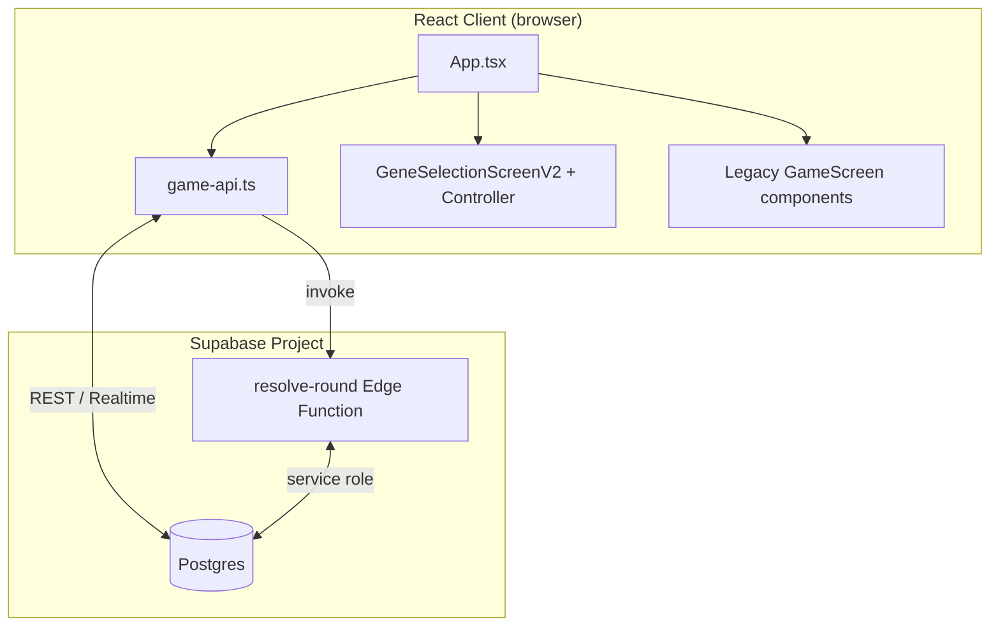

This file is a merged representation of the entire codebase, combined into a single document by Repomix.

<file_summary>
This section contains a summary of this file.

<purpose>
This file contains a packed representation of the entire repository's contents.
It is designed to be easily consumable by AI systems for analysis, code review,
or other automated processes.
</purpose>

<file_format>
The content is organized as follows:
1. This summary section
2. Repository information
3. Directory structure
4. Repository files (if enabled)
5. Multiple file entries, each consisting of:
  - File path as an attribute
  - Full contents of the file
</file_format>

<usage_guidelines>
- This file should be treated as read-only. Any changes should be made to the
  original repository files, not this packed version.
- When processing this file, use the file path to distinguish
  between different files in the repository.
- Be aware that this file may contain sensitive information. Handle it with
  the same level of security as you would the original repository.
</usage_guidelines>

<notes>
- Some files may have been excluded based on .gitignore rules and Repomix's configuration
- Binary files are not included in this packed representation. Please refer to the Repository Structure section for a complete list of file paths, including binary files
- Files matching patterns in .gitignore are excluded
- Files matching default ignore patterns are excluded
- Files are sorted by Git change count (files with more changes are at the bottom)
</notes>

</file_summary>

<directory_structure>
artifacts/
  choosing-refactor-after/
    after-360x800.png
    after-390x844.png
    after-412x915.png
    after-430x932.png
    after-844x390-landscape.png
    after-v2-360x800.png
    after-v2-390x844.png
    after-v2-412x915.png
    after-v2-430x932.png
    after-v2-844x390-landscape.png
    after-v3-390x844-details-open.png
  choosing-refactor-before/
    before-360x800.png
    before-390x844.png
    before-412x915.png
    before-430x932.png
    before-844x390-landscape.png
  home-redesign/
    flow-guest-after-join-390x844.png
    flow-host-after-guest-join-390x844.png
    flow-host-waiting-390x844.png
    home-empty-360x800.png
    home-empty-390x844.png
    home-empty-430x932.png
    home-empty-844x390.png
    home-empty-desktop-1440x900.png
    home-error-empty-nickname-390x844.png
    home-loading-create-390x844.png
    home-nickname-390x844.png
    home-roomcode-390x844.png
  ui-audit/
    01-home-iniziale-p1-390x844.png
    02-form-creazione-stanza-p1-390x844.png
    03-lobby-attesa-p1-390x844.png
    04-choosing-no-selection-p1-390x844-full.png
    04-choosing-no-selection-p1-390x844.png
    04-choosing-no-selection-p2-390x844-full.png
    04-choosing-no-selection-p2-390x844.png
    04a-p2-form-join-390x844.png
    05-choosing-trait-selected-p1-390x844-full.png
    05-choosing-trait-selected-p1-390x844.png
    06-preview-action-use-p1-390x844.png
    07-preview-action-evolve-p2-390x844-full.png
    07-preview-action-evolve-p2-390x844.png
    08-confermata-attesa-avversario-p1-390x844.png
    08b-round2-confermata-attesa-avversario-p1-390x844.png
    09-entrambe-scelte-ricevute-attempt-p1-390x844-reload.png
    09-entrambe-scelte-ricevute-attempt-p2-390x844-reload.png
    09-entrambe-scelte-ricevute-attempt-p2-390x844.png
    09-entrambe-scelte-ricevute-attempt-round2-p1-390x844.png
    09-entrambe-scelte-ricevute-attempt-round2-p2-390x844.png
    10-risoluzione-round2-p1-390x844-full.png
    10-risoluzione-round2-p1-390x844.png
    11-risultato-round2-p1-390x844-full.png
    11-risultato-round2-p1-390x844.png
    12-stato-dopo-evolve-p2-round2-390x844-full.png
    12-stato-dopo-evolve-p2-round2-390x844.png
    13-round-successivo-p1-round2-390x844-full.png
    13-round-successivo-p1-round2-390x844.png
    14-fine-partita-p1-390x844-full.png
    14-fine-partita-p1-390x844.png
    14-fine-partita-p2-390x844.png
    15-stato-offline-p1-390x844.png
    debug-round6-submit-p1.png
    debug-round6-submit-p2.png
    layout-v1-choosing-p1-360x800.png
    layout-v1-choosing-p1-390x844.png
    layout-v1-choosing-p1-430x932.png
    layout-v1-choosing-p1-844x390.png
    layout-v1-choosing-p2-390x844.png
    layout-v1-final-choosing-p1-360x800.png
    layout-v1-final-choosing-p1-390x844.png
    layout-v1-final-choosing-p1-430x932.png
    layout-v1-final-choosing-p1-844x390.png
    layout-v1-final-confirmed-waiting-p1-390x844.png
    layout-v1-final-confirmed-waiting-p2-390x844.png
    layout-v1-final-evolve-preview-p2-390x844.png
    layout-v1-final-use-preview-p1-390x844.png
    layout-v1-lobby-p1-390x844.png
    layout-v1-postfix-390x844-check.png
    layout-v1-round2-360x800.png
    layout-v1-round2-430x932.png
    layout-v1-round2-844x390.png
    metrics-baseline-390x844-choosing-p1.png
    vp-360x800-choosing-p1.png
    vp-390x844-choosing-p1.png
    vp-430x932-choosing-p1.png
    vp-844x390-landscape-choosing-p1.png
public/
  assets/
    creatures/
      adaptation.png
      agility.png
      base.png
      camouflage.png
      fat_reserves.png
      grip_claws.png
      metabolism.png
      perception.png
      README.md
      resistance.png
      strength.png
      webbed_limbs.png
    game-ui/
      placeholders/
        background.svg
        environment.svg
        gene-adaptation.svg
        gene-agility.svg
        gene-camouflage.svg
        gene-fat-reserves.svg
        gene-grip-claws.svg
        gene-metabolism.svg
        gene-perception.svg
        gene-resistance.svg
        gene-strength.svg
        gene-webbed-limbs.svg
        gene.svg
        opponent-avatar.svg
        opponent-creature.svg
        player-avatar.svg
        player-creature.svg
        README.md
  favicon.svg
  icons.svg
src/
  assets/
    hero.png
    react.svg
    vite.svg
  components/
    game/
      ActionDock.tsx
      ChoosingDuelHeader.tsx
      CompetitiveHeader.tsx
      CreatureStage.tsx
      EcosystemSummary.tsx
      EnvironmentIntelPanel.tsx
      GameHud.tsx
      HabitatMiniMap.tsx
      OpponentStatus.tsx
      PhaseBanner.tsx
      RoundEventCard.tsx
      SelectedTraitSummary.tsx
      TraitImpactPanel.tsx
      TraitSelector.tsx
    game-v2/
      components/
        ActionPanelV2.tsx
        CreatureStageV2.tsx
        DuelHeaderV2.tsx
        GeneSelectorPreviewV2.tsx
        RoundEventPanelV2.tsx
        RoundIndicatorV2.tsx
        SelectedGeneDetailsV2.tsx
        WaitingStateV2.tsx
      controller/
        buildGeneSelectionV2ViewModel.test.ts
        buildGeneSelectionV2ViewModel.ts
        useGeneSelectionV2Controller.ts
      gameSelectionAssets.ts
      GeneSelectionScreenV2.css
      GeneSelectionScreenV2.tsx
      mockData.ts
      types.ts
    home/
      HomeScreen.tsx
    CreatureVisual.tsx
  game/
    bot.test.ts
    bot.ts
    config.ts
    creature.test.ts
    engine.test.ts
    engine.ts
    new-traits-scoring.test.ts
    round-breakdown.test.ts
    round-events.test.ts
    round-events.ts
    round-flow.test.ts
    round-result-explainer.test.ts
    round-result-explainer.ts
    scoring-audit.test.ts
    scoring.ts
    trait-catalog.test.ts
    traits-catalog.ts
    types.ts
    ui-context.ts
    vs-bot-round.test.ts
    vs-bot-round.ts
    worlds.ts
  lib/
    game-api.ts
    storage.ts
    supabase.ts
  App.css
  App.tsx
  index.css
  main.tsx
supabase/
  functions/
    resolve-round/
      index.ts
  migrations/
    20260720_fix_realtime_and_constraints.sql
    202607220001_expand_trait_catalog.sql
    202607220002_round_events_refactor.sql
    202607220003_vs_bot_mode.sql
    fix_realtime_and_constraints.sql
  config.toml
  schema.sql
.env.example
.gitignore
.oxlintrc.json
index.html
package.json
PROJECT_SUMMARY.md
README.md
tsconfig.app.json
tsconfig.json
tsconfig.node.json
vite.config.ts
</directory_structure>

<files>
This section contains the contents of the repository's files.

<file path="PROJECT_SUMMARY.md">
# Gioco Evoluzione — AI-readable project summary

> Last updated: 2026-07-25. This document is a structured, high-signal overview of the MVP codebase intended for AI assistants and new developers.

---

## 1. TL;DR

**Gioco Evoluzione** is a mobile-first browser MVP for a 1v1 competitive evolution game. Each match lasts **6 rounds**. In every round both players secretly pick one of 10 traits and choose either **USE** (score immediately, but the trait goes on 1-round cooldown) or **EVOLVE** (increase the trait level, score 0 this round). A shared **round event** favors or penalizes specific traits. The player with the highest round value wins 1 point (2 points in the final round). Synchronization is handled by **Supabase** (Postgres + Realtime), and round resolution is centralized in a **Supabase Edge Function** (`resolve-round`) to keep the server as the single source of truth.

Modes:
- `PVP` — two human players in the same room.
- `VS_BOT` — one human vs a random-action bot.

---

## 2. Tech stack

| Layer | Technology |
|-------|------------|
| Frontend | React 19 + TypeScript 6 + Vite 8 |
| State | Local React state (`useState`/`useEffect`) + ViewModel pattern for the V2 selection screen |
| Styling | Plain CSS files (`App.css`, `index.css`, component CSS) |
| Backend/Persistence | Supabase (Postgres + Realtime subscriptions + Edge Functions) |
| Game logic | Pure TypeScript modules in `src/game/`, shared between client and edge function |
| Testing | Vitest + jsdom for unit tests |
| Linting | oxlint |

Key environment variables (see `.env.example` if present):
- `VITE_SUPABASE_URL`
- `VITE_SUPABASE_ANON_KEY`
- `VITE_GENE_SELECTION_V2` — feature flag to enable the new selection UI (`'true'`).

---

## 3. High-level architecture



**Data flow for one round:**
1. Client renders the current `GameSnapshot` (game + players + actions + result).
2. Player selects a trait and action; client inserts a row into `round_actions`.
3. Client calls `maybeResolveRound(gameId, roundNumber)`, which invokes the edge function.
4. Edge function checks both actions, computes the result, writes `round_results`, updates player traits/scores, and sets game status to `REVEALING` (or `FINISHED` in round 6).
5. Realtime notifies all clients; they refetch the snapshot.
6. After a short reveal delay, a client calls `acknowledgeReveal` to move the game status to `ROUND_RESULT`.
7. Player taps “Next round” → `advanceToNextRound` moves status to `CHOOSING` and increments `current_round`.

---

## 4. Core game model

### 4.1 Main types

Defined in `src/game/types.ts`:

- `TraitType` — one of 10 traits: `STRENGTH`, `RESISTANCE`, `AGILITY`, `PERCEPTION`, `METABOLISM`, `ADAPTATION`, `GRIP_CLAWS`, `CAMOUFLAGE`, `WEBBED_LIMBS`, `FAT_RESERVES`.
- `ActionType` — `'USE' | 'EVOLVE'`.
- `GameStatus` — `'WAITING' | 'CHOOSING' | 'REVEALING' | 'ROUND_RESULT' | 'FINISHED'`.
- `GameMode` — `'PVP' | 'VS_BOT'`.
- `TraitState` — `{ level: number; cooldown: number }`.
- `TraitCollection` — `Record<TraitType, TraitState>`.
- `RoundEventDefinition` — event metadata + `effects: RoundEventEffect[]`.
- `RoundEventEffect` — `{ trait: TraitType; modifier: number; reason: string }`.
- `RoundValueBreakdown` — granular explanation of how a round value was computed.
- `ResolveRoundInput` / `RoundResolution` — inputs/outputs of the pure resolution engine.

### 4.2 Traits

Catalog lives in `src/game/traits-catalog.ts` (`TRAIT_CATALOG`). Each trait has:
- `id`, `label` (Italian display name), `description`, `iconKey`, `displayOrder`.

Trait state management helpers in `src/game/config.ts`:
- `createInitialTraits()` — all traits at level 0, cooldown 0.
- `normalizeTraitCollection(...)` — safely converts partial/JSONB data into a full `TraitCollection`.
- `getDominantTrait(...)` — determines which trait sprite to show based on highest level (with tie-breaking).
- `TRAIT_LABELS` — map from `TraitType` to Italian label.
- `CREATURE_ASSETS` — paths to placeholder creature PNGs in `public/assets/creatures/`.

### 4.3 Round events

Defined in `src/game/round-events.ts` (`ROUND_EVENT_DEFINITIONS`).
- 6 events currently, each with `effects` that give `+/-` modifiers per trait.
- `ROUND_EVENT_WEIGHT = 2` — every modifier is multiplied by this weight when scoring.
- `generateRoundEventSequence(totalRounds, random)` — shuffles the catalog and returns an array of event IDs.
- `getRoundEventForRound(sequence, roundNumber)` — single source of truth to look up the current event.
- `getRoundEventEffectsForTrait(event, trait)` — filters effects for scoring.

### 4.4 World

`src/game/worlds.ts` defines visual worlds (`WorldDefinition`).
- Currently only `AURELIA_PRIME`.
- `world_id` is stored in `games`; it is **purely visual** and separate from round events.

---

## 5. Game flow in detail

### 5.1 Match creation

| Action | Function | File |
|--------|----------|------|
| Create PVP room | `createGame({ nickname, playerId })` | `src/lib/game-api.ts` |
| Create vs-bot room | `createVsBotGame({ nickname, playerId })` | `src/lib/game-api.ts` |
| Join existing room | `joinGame({ roomCode, nickname, playerId })` | `src/lib/game-api.ts` |

- Room codes are 5 alphanumeric characters (`ROOM_CODE_ALPHABET` excludes ambiguous chars like `0`/`O`/`I`/`1`).
- Creating/joining persists a `StoredSession` in `localStorage` (`src/lib/storage.ts`) for reconnect.
- `restoreGameSession(session)` is called on app boot if a session exists.

### 5.2 Round loop

1. **Status `CHOOSING`** — players pick a trait + action.
   - USE is disabled if the trait is on cooldown.
   - EVOLVE is always allowed.
2. Client inserts the action into `round_actions` (`submitRoundAction`).
3. Client invokes `resolve-round`.
4. Edge function:
   - For `VS_BOT`, auto-generates a bot action via `ensureBotRoundAction` (`src/game/vs-bot-round.ts`) if missing.
   - Computes the resolution with `buildResolution`.
   - Inserts `round_results` (idempotent thanks to `UNIQUE(game_id, round_number)`).
   - Updates both players’ `traits` JSONB and the game score/status.
5. **Status `REVEALING`** — clients show the reveal screen.
6. After ~1s, `acknowledgeReveal` moves status to `ROUND_RESULT`.
7. **Status `ROUND_RESULT`** — shows breakdown/explanation.
8. Player clicks next round → `advanceToNextRound` moves to next round and status `CHOOSING`.

### 5.3 Cooldown and evolution rules

- After a round resolves, every trait’s cooldown decreases by 1 (minimum 0) (`tickCooldowns`).
- If action was `USE`, the used trait cooldown is set to 1.
- If action was `EVOLVE`, the trait level increases by 1 and round value is 0.
- `isTraitUsable(traits, trait)` returns true only if `cooldown === 0`.

---

## 6. Scoring system

Pure scoring logic lives in `src/game/scoring.ts`:

```
total = eventContribution + levelContribution
      = (sumOfEventModifiers * EVENT_WEIGHT) + min(level, MAX_EFFECTIVE_TRAIT_LEVEL)
```

- `EVENT_WEIGHT = 2`
- `MAX_EFFECTIVE_TRAIT_LEVEL = 5` — levels above 5 do not add scoring value.
- EVOLVE action forces `eventContribution = 0`, `levelContribution = 0`, `total = 0`.
- Validations (`getValidated*`) reject `NaN`/negative states and missing effect reasons.

The same logic is **duplicated (with Deno-compatible imports) inside the edge function** (`supabase/functions/resolve-round/index.ts`) to keep the function self-contained. This is intentional to avoid bundling issues with extensionless imports from the frontend tree.

Round resolution orchestration in `src/game/engine.ts`:
- `resolveRound(input)` — pure function that returns a `RoundResolution`.
- `getRoundPoints(roundNumber)` — 2 points for round 6, otherwise 1.

Result explanation in `src/game/round-result-explainer.ts`:
- `getRoundExplanation(...)` produces Italian UX strings based on action types and breakdown comparison.
- Falls back to a legacy message if breakdown fields are missing (old rounds).

---

## 7. UI components

### 7.1 Entry point

`src/App.tsx` holds the global state machine and decides which screen to render based on `snapshot.game.status`:
- No snapshot / no session → `HomeScreen`.
- `WAITING` → waiting room with room code.
- `CHOOSING` → either the **legacy screen** (`GameScreen`) or the **V2 screen** (`GeneSelectionScreenV2`) depending on `VITE_GENE_SELECTION_V2`.
- `REVEALING` / `ROUND_RESULT` → result reveal UI.
- `FINISHED` → winner screen.

### 7.2 Legacy selection screen

Files under `src/components/game/`:
- `GameHud.tsx`, `CreatureStage.tsx`, `TraitSelector.tsx`, `ActionDock.tsx`, `ChoosingDuelHeader.tsx`, `RoundEventCard.tsx`, `TraitImpactPanel.tsx`, `SelectedTraitSummary.tsx`, etc.
- Composed inside `App.tsx` as `GameScreen` JSX (not a separate route).

### 7.3 V2 selection screen

Files under `src/components/game-v2/`:
- `GeneSelectionScreenV2.tsx` — presentational component.
- `controller/useGeneSelectionV2Controller.ts` — local state + submit flow.
- `controller/buildGeneSelectionV2ViewModel.ts` — transforms `GameSnapshot` into a view-model.
- `types.ts` — view-model types (`GeneCardV2`, `RoundEventV2`, `GeneSelectionViewModelV2`, …).
- Subcomponents: `DuelHeaderV2`, `RoundIndicatorV2`, `RoundEventPanelV2`, `CreatureStageV2`, `GeneSelectorPreviewV2`, `SelectedGeneDetailsV2`, `ActionPanelV2`, `WaitingStateV2`.

The V2 screen is a richer “gene selection” UX; it reuses the same backend and game logic.

### 7.4 Home screen

`src/components/home/HomeScreen.tsx` — nickname input, create PVP game, create bot game, join by room code.

### 7.5 Visual helpers

- `src/components/CreatureVisual.tsx` — renders creature sprite stack based on dominant trait.
- `src/components/game-v2/gameSelectionAssets.ts` — maps trait/event IDs to placeholder art URLs for V2.

---

## 8. Backend: Supabase

### 8.1 Schema

Defined in `supabase/schema.sql`:

| Table | Purpose |
|-------|---------|
| `games` | Match metadata: room code, status, round, scores, world, event sequence, winner. |
| `players` | Per-player data: nickname, slot (1/2), type (`HUMAN`/`BOT`), traits JSONB, connected flag. |
| `round_actions` | One row per player per round: chosen trait + action type. Unique `(game_id, round_number, player_id)`. |
| `round_results` | One row per round: values, winner, rich `resolution_data` JSONB. Unique `(game_id, round_number)`. |

Key columns in `games`:
- `status`, `current_round` (1–6), `game_mode`, `world_id`, `round_event_sequence` (JSONB array of event IDs).
- `player_1_id`, `player_2_id`, `player_1_score`, `player_2_score`, `winner_id`.

Realtime publication is enabled automatically for all four tables (`supabase/schema.sql` end block).

RLS policies are intentionally permissive for the MVP (friend-testing only).

### 8.2 Edge function: `resolve-round`

File: `supabase/functions/resolve-round/index.ts`

Responsibilities:
1. Reads the game, players, and existing result.
2. If already resolved, re-applies the stored `resolution_data` (idempotency).
3. If `VS_BOT` and missing bot action, generates one with `ensureBotRoundAction` and inserts it.
4. Builds the resolution with local pure helpers mirroring `src/game/engine.ts` / `src/game/scoring.ts`.
5. Inserts `round_results` and updates players/game atomically.

Important constraints:
- Must stay **self-contained** — it re-embeds constants and types instead of importing from `src/game/*` to avoid Deno bundling issues.
- Idempotency is achieved via `UNIQUE(game_id, round_number)` on `round_results` plus re-applying stored data on conflict.
- `advanceToNextRound` on the client is also idempotent (updates only when status/current_round match).

### 8.3 Database function

`public.create_vs_bot_game(p_nickname, p_player_id)` in `supabase/schema.sql` creates a game + human player + bot player in one RPC call.

---

## 9. Client API and synchronization

File: `src/lib/game-api.ts`

Main exports:
- `fetchGameSnapshot(gameId, playerId)` — central read model returned as `GameSnapshot`.
- `createGame`, `createVsBotGame`, `joinGame`, `restoreGameSession`.
- `submitRoundAction(...)` — persists action then tries resolution.
- `maybeResolveRound(gameId, roundNumber)` — invokes the edge function.
- `advanceToNextRound(gameId)` — idempotent transition to next round.
- `acknowledgeReveal(gameId)` — moves `REVEALING` → `ROUND_RESULT`.
- `subscribeToGame(gameId, onChange)` — Supabase realtime listener on all four tables.

`GameSnapshot` includes:
- `game`, `players`, `me`, `opponent`
- `world`, `currentRoundEvent`, `nextRoundEvent`
- `actionsSubmitted`, `myCurrentAction`, `currentRoundResult`

Local session persistence: `src/lib/storage.ts` (`createPlayerId`, `saveStoredSession`, `loadStoredSession`, `clearStoredSession`).

Supabase client setup: `src/lib/supabase.ts`.

---

## 10. Bot mode

- Bot actions are generated by `selectRandomBotAction(traits)` in `src/game/bot.ts`.
- `getLegalBotActions` returns every trait as `EVOLVE`, plus `USE` only if the trait is off cooldown.
- A random legal action is chosen uniformly.
- `ensureBotRoundAction` (`src/game/vs-bot-round.ts`) wraps insertion + retrieval and ignores unique-constraint conflicts (race safety).
- The edge function calls this when it detects a missing bot action in `VS_BOT` mode.

---

## 11. Testing

Tests are in `src/game/*.test.ts` and run with `npm test` (Vitest).

Coverage areas:
- `creature.test.ts` — trait/state logic.
- `engine.test.ts` — round resolution engine.
- `scoring-audit.test.ts`, `new-traits-scoring.test.ts` — scoring correctness.
- `round-events.test.ts` — event sequence and effect lookup.
- `round-flow.test.ts` — full round flow edge cases.
- `round-result-explainer.test.ts` — explanation text generation.
- `round-breakdown.test.ts` — breakdown payload shape.
- `vs-bot-round.test.ts` — bot action generation and storage.
- `bot.test.ts` — bot legal-action selection.
- `trait-catalog.test.ts` — catalog consistency.

Build validation: `npm run build`.

---

## 12. Environment and commands

```bash
npm install
npm test           # run Vitest suite
npm run build      # TypeScript + Vite production build
npm run dev        # local dev server
```

Supabase deploy:
```bash
supabase functions deploy resolve-round
```

Schema setup: run `supabase/schema.sql` in the Supabase SQL Editor.

---

## 13. Conventions and developer notes

- **Pure game logic** lives in `src/game/` and should remain framework-agnostic.
- **Validation-first**: scoring functions throw on invalid trait states/effects rather than propagating `NaN`.
- **Server truth**: the edge function is the only writer of `round_results`; clients only read it.
- **Idempotency**: round resolution and round advancement are idempotent to survive double-clicks / double notifications.
- **Italian UX copy** is hardcoded in components and explainer; core types/IDs remain English.
- **Feature flag**: `VITE_GENE_SELECTION_V2=true` swaps the selection UI; the backend is unchanged.
- **Self-contained edge function**: do not import frontend modules into `supabase/functions/resolve-round/index.ts`; mirror constants/types locally.
- **Asset placeholders**: creature/environment art is expected under `public/assets/`. The repo contains README placeholders and base PNGs; real art can be dropped in without code changes (paths are stable).

---

## 14. Key file map

| Concern | Primary files |
|---------|---------------|
| Game types | `src/game/types.ts` |
| Trait catalog | `src/game/traits-catalog.ts` |
| Round events | `src/game/round-events.ts` |
| Scoring | `src/game/scoring.ts` |
| Round resolution engine | `src/game/engine.ts` |
| Result explanations | `src/game/round-result-explainer.ts` |
| Config / helpers | `src/game/config.ts` |
| Bot logic | `src/game/bot.ts`, `src/game/vs-bot-round.ts` |
| Worlds | `src/game/worlds.ts` |
| UI context helpers | `src/game/ui-context.ts` |
| App shell / state machine | `src/App.tsx` |
| Home screen | `src/components/home/HomeScreen.tsx` |
| V2 selection screen | `src/components/game-v2/GeneSelectionScreenV2.tsx` |
| V2 controller | `src/components/game-v2/controller/useGeneSelectionV2Controller.ts` |
| V2 view-model builder | `src/components/game-v2/controller/buildGeneSelectionV2ViewModel.ts` |
| Client API | `src/lib/game-api.ts` |
| Supabase client | `src/lib/supabase.ts` |
| Local session | `src/lib/storage.ts` |
| DB schema | `supabase/schema.sql` |
| Edge function | `supabase/functions/resolve-round/index.ts` |
| Tests | `src/game/*.test.ts` |

---

## 15. Known limitations (MVP)

- RLS is wide open; not suitable for production.
- No public matchmaking or chat.
- No full rematch flow (only basic `rematch_count` column reserved).
- Bot uses random legal actions, no difficulty tuning.
- Creature/environment assets are placeholders.
- Edge function duplicates scoring logic to stay self-contained; keep changes in sync with `src/game/scoring.ts`.
</file>

<file path="public/assets/creatures/README.md">
Place optional creature PNG, WebP, or SVG layers here.

Expected filenames:
- base.png
- strength.png
- resistance.png
- agility.png
- perception.png
- metabolism.png
- adaptation.png
- grip_claws.png
- camouflage.png
- webbed_limbs.png
- fat_reserves.png
</file>

<file path="public/assets/game-ui/placeholders/background.svg">
<svg xmlns="http://www.w3.org/2000/svg" viewBox="0 0 1080 1920" role="img" aria-label="Placeholder sfondo">
  <defs>
    <linearGradient id="bg" x1="0" y1="0" x2="0" y2="1">
      <stop offset="0%" stop-color="#1a4737"/>
      <stop offset="100%" stop-color="#0d2118"/>
    </linearGradient>
    <radialGradient id="glow" cx="50%" cy="15%" r="55%">
      <stop offset="0%" stop-color="#9be084" stop-opacity="0.45"/>
      <stop offset="100%" stop-color="#9be084" stop-opacity="0"/>
    </radialGradient>
  </defs>
  <rect width="1080" height="1920" fill="url(#bg)"/>
  <rect width="1080" height="1920" fill="url(#glow)"/>
</svg>
</file>

<file path="public/assets/game-ui/placeholders/environment.svg">
<svg xmlns="http://www.w3.org/2000/svg" viewBox="0 0 640 360" role="img" aria-label="Placeholder ambiente">
  <defs>
    <linearGradient id="env" x1="0" y1="0" x2="0" y2="1">
      <stop offset="0%" stop-color="#6ba26b"/>
      <stop offset="100%" stop-color="#33553a"/>
    </linearGradient>
  </defs>
  <rect width="640" height="360" fill="url(#env)"/>
  <circle cx="130" cy="80" r="48" fill="#e6f6c6" fill-opacity="0.5"/>
  <rect x="0" y="250" width="640" height="110" fill="#274736"/>
  <path d="M80 250L150 140L220 250Z" fill="#214231"/>
  <path d="M220 250L300 120L380 250Z" fill="#214231"/>
  <path d="M360 250L450 150L540 250Z" fill="#214231"/>
</svg>
</file>

<file path="public/assets/game-ui/placeholders/gene-adaptation.svg">
<svg xmlns="http://www.w3.org/2000/svg" viewBox="0 0 256 256"><rect width="256" height="256" rx="36" fill="#355e44"/><circle cx="128" cy="128" r="70" fill="#d9eaa9"/><text x="128" y="136" font-size="16" text-anchor="middle" fill="#173526" font-family="Verdana">ADA</text></svg>
</file>

<file path="public/assets/game-ui/placeholders/gene-agility.svg">
<svg xmlns="http://www.w3.org/2000/svg" viewBox="0 0 256 256"><rect width="256" height="256" rx="36" fill="#355e44"/><circle cx="128" cy="128" r="70" fill="#f3e18d"/><text x="128" y="136" font-size="24" text-anchor="middle" fill="#173526" font-family="Verdana">AGI</text></svg>
</file>

<file path="public/assets/game-ui/placeholders/gene-camouflage.svg">
<svg xmlns="http://www.w3.org/2000/svg" viewBox="0 0 256 256"><rect width="256" height="256" rx="36" fill="#355e44"/><circle cx="128" cy="128" r="70" fill="#9de4be"/><text x="128" y="136" font-size="16" text-anchor="middle" fill="#173526" font-family="Verdana">CAM</text></svg>
</file>

<file path="public/assets/game-ui/placeholders/gene-fat-reserves.svg">
<svg xmlns="http://www.w3.org/2000/svg" viewBox="0 0 256 256"><rect width="256" height="256" rx="36" fill="#355e44"/><circle cx="128" cy="128" r="70" fill="#ffe39e"/><text x="128" y="136" font-size="16" text-anchor="middle" fill="#173526" font-family="Verdana">FAT</text></svg>
</file>

<file path="public/assets/game-ui/placeholders/gene-grip-claws.svg">
<svg xmlns="http://www.w3.org/2000/svg" viewBox="0 0 256 256"><rect width="256" height="256" rx="36" fill="#355e44"/><circle cx="128" cy="128" r="70" fill="#b4ec6b"/><text x="128" y="136" font-size="16" text-anchor="middle" fill="#173526" font-family="Verdana">GRC</text></svg>
</file>

<file path="public/assets/game-ui/placeholders/gene-metabolism.svg">
<svg xmlns="http://www.w3.org/2000/svg" viewBox="0 0 256 256"><rect width="256" height="256" rx="36" fill="#355e44"/><circle cx="128" cy="128" r="70" fill="#ffc7a3"/><text x="128" y="136" font-size="17" text-anchor="middle" fill="#173526" font-family="Verdana">MET</text></svg>
</file>

<file path="public/assets/game-ui/placeholders/gene-perception.svg">
<svg xmlns="http://www.w3.org/2000/svg" viewBox="0 0 256 256"><rect width="256" height="256" rx="36" fill="#355e44"/><circle cx="128" cy="128" r="70" fill="#b9e8f4"/><text x="128" y="136" font-size="20" text-anchor="middle" fill="#173526" font-family="Verdana">PER</text></svg>
</file>

<file path="public/assets/game-ui/placeholders/gene-resistance.svg">
<svg xmlns="http://www.w3.org/2000/svg" viewBox="0 0 256 256"><rect width="256" height="256" rx="36" fill="#355e44"/><circle cx="128" cy="128" r="70" fill="#76d7d4"/><text x="128" y="136" font-size="24" text-anchor="middle" fill="#173526" font-family="Verdana">RES</text></svg>
</file>

<file path="public/assets/game-ui/placeholders/gene-strength.svg">
<svg xmlns="http://www.w3.org/2000/svg" viewBox="0 0 256 256"><rect width="256" height="256" rx="36" fill="#355e44"/><circle cx="128" cy="128" r="70" fill="#b4ec6b"/><text x="128" y="136" font-size="32" text-anchor="middle" fill="#173526" font-family="Verdana">STR</text></svg>
</file>

<file path="public/assets/game-ui/placeholders/gene-webbed-limbs.svg">
<svg xmlns="http://www.w3.org/2000/svg" viewBox="0 0 256 256"><rect width="256" height="256" rx="36" fill="#355e44"/><circle cx="128" cy="128" r="70" fill="#8fd5ff"/><text x="128" y="136" font-size="16" text-anchor="middle" fill="#173526" font-family="Verdana">WEB</text></svg>
</file>

<file path="public/assets/game-ui/placeholders/gene.svg">
<svg xmlns="http://www.w3.org/2000/svg" viewBox="0 0 256 256" role="img" aria-label="Placeholder icona gene">
  <rect width="256" height="256" rx="36" fill="#284d3e"/>
  <path d="M86 186c54-2 84-38 84-92" stroke="#b4ec6b" stroke-width="18" fill="none" stroke-linecap="round"/>
  <path d="M170 186c-54-2-84-38-84-92" stroke="#76d7d4" stroke-width="18" fill="none" stroke-linecap="round"/>
</svg>
</file>

<file path="public/assets/game-ui/placeholders/opponent-avatar.svg">
<svg xmlns="http://www.w3.org/2000/svg" viewBox="0 0 256 256" role="img" aria-label="Placeholder avatar avversario">
  <rect width="256" height="256" rx="48" fill="#1f4035"/>
  <circle cx="128" cy="96" r="48" fill="#c5ecee"/>
  <rect x="56" y="150" width="144" height="74" rx="36" fill="#76d7d4"/>
</svg>
</file>

<file path="public/assets/game-ui/placeholders/opponent-creature.svg">
<svg xmlns="http://www.w3.org/2000/svg" viewBox="0 0 512 512" role="img" aria-label="Placeholder creatura avversario">
  <rect width="512" height="512" rx="48" fill="#223f36"/>
  <ellipse cx="256" cy="384" rx="170" ry="56" fill="#13241d"/>
  <path d="M152 318c0-78 44-162 104-162s104 84 104 162" fill="#76d7d4"/>
  <circle cx="220" cy="250" r="14" fill="#12322f"/>
  <circle cx="292" cy="250" r="14" fill="#12322f"/>
</svg>
</file>

<file path="public/assets/game-ui/placeholders/player-avatar.svg">
<svg xmlns="http://www.w3.org/2000/svg" viewBox="0 0 256 256" role="img" aria-label="Placeholder avatar giocatore">
  <rect width="256" height="256" rx="48" fill="#244c3b"/>
  <circle cx="128" cy="96" r="48" fill="#d7efc4"/>
  <rect x="56" y="150" width="144" height="74" rx="36" fill="#b4ec6b"/>
</svg>
</file>

<file path="public/assets/game-ui/placeholders/player-creature.svg">
<svg xmlns="http://www.w3.org/2000/svg" viewBox="0 0 512 512" role="img" aria-label="Placeholder creatura giocatore">
  <rect width="512" height="512" rx="48" fill="#23493a"/>
  <ellipse cx="256" cy="384" rx="170" ry="56" fill="#14271f"/>
  <path d="M152 318c0-78 44-162 104-162s104 84 104 162" fill="#b4ec6b"/>
  <circle cx="220" cy="250" r="14" fill="#173428"/>
  <circle cx="292" cy="250" r="14" fill="#173428"/>
</svg>
</file>

<file path="public/assets/game-ui/placeholders/README.md">
Placeholder locali per la schermata V2 di scelta gene.

File previsti:
- background.svg
- player-avatar.svg
- opponent-avatar.svg
- player-creature.svg
- opponent-creature.svg
- environment.svg
- gene.svg
- gene-strength.svg
- gene-resistance.svg
- gene-agility.svg
- gene-perception.svg
- gene-metabolism.svg
- gene-adaptation.svg
- gene-grip-claws.svg
- gene-camouflage.svg
- gene-webbed-limbs.svg
- gene-fat-reserves.svg

Gli asset definitivi possono sostituire questi file mantenendo lo stesso nome, oppure aggiornando il mapping centrale in src/components/game-v2/gameSelectionAssets.ts.
</file>

<file path="public/favicon.svg">
<svg xmlns="http://www.w3.org/2000/svg" width="48" height="46" fill="none" viewBox="0 0 48 46"><path fill="#863bff" d="M25.946 44.938c-.664.845-2.021.375-2.021-.698V33.937a2.26 2.26 0 0 0-2.262-2.262H10.287c-.92 0-1.456-1.04-.92-1.788l7.48-10.471c1.07-1.497 0-3.578-1.842-3.578H1.237c-.92 0-1.456-1.04-.92-1.788L10.013.474c.214-.297.556-.474.92-.474h28.894c.92 0 1.456 1.04.92 1.788l-7.48 10.471c-1.07 1.498 0 3.579 1.842 3.579h11.377c.943 0 1.473 1.088.89 1.83L25.947 44.94z" style="fill:#863bff;fill:color(display-p3 .5252 .23 1);fill-opacity:1"/><mask id="a" width="48" height="46" x="0" y="0" maskUnits="userSpaceOnUse" style="mask-type:alpha"><path fill="#000" d="M25.842 44.938c-.664.844-2.021.375-2.021-.698V33.937a2.26 2.26 0 0 0-2.262-2.262H10.183c-.92 0-1.456-1.04-.92-1.788l7.48-10.471c1.07-1.498 0-3.579-1.842-3.579H1.133c-.92 0-1.456-1.04-.92-1.787L9.91.473c.214-.297.556-.474.92-.474h28.894c.92 0 1.456 1.04.92 1.788l-7.48 10.471c-1.07 1.498 0 3.578 1.842 3.578h11.377c.943 0 1.473 1.088.89 1.832L25.843 44.94z" style="fill:#000;fill-opacity:1"/></mask><g mask="url(#a)"><g filter="url(#b)"><ellipse cx="5.508" cy="14.704" fill="#ede6ff" rx="5.508" ry="14.704" style="fill:#ede6ff;fill:color(display-p3 .9275 .9033 1);fill-opacity:1" transform="matrix(.00324 1 1 -.00324 -4.47 31.516)"/></g><g filter="url(#c)"><ellipse cx="10.399" cy="29.851" fill="#ede6ff" rx="10.399" ry="29.851" style="fill:#ede6ff;fill:color(display-p3 .9275 .9033 1);fill-opacity:1" transform="matrix(.00324 1 1 -.00324 -39.328 7.883)"/></g><g filter="url(#d)"><ellipse cx="5.508" cy="30.487" fill="#7e14ff" rx="5.508" ry="30.487" style="fill:#7e14ff;fill:color(display-p3 .4922 .0767 1);fill-opacity:1" transform="rotate(89.814 -25.913 -14.639)scale(1 -1)"/></g><g filter="url(#e)"><ellipse cx="5.508" cy="30.599" fill="#7e14ff" rx="5.508" ry="30.599" style="fill:#7e14ff;fill:color(display-p3 .4922 .0767 1);fill-opacity:1" transform="rotate(89.814 -32.644 -3.334)scale(1 -1)"/></g><g filter="url(#f)"><ellipse cx="5.508" cy="30.599" fill="#7e14ff" rx="5.508" ry="30.599" style="fill:#7e14ff;fill:color(display-p3 .4922 .0767 1);fill-opacity:1" transform="matrix(.00324 1 1 -.00324 -34.34 30.47)"/></g><g filter="url(#g)"><ellipse cx="14.072" cy="22.078" fill="#ede6ff" rx="14.072" ry="22.078" style="fill:#ede6ff;fill:color(display-p3 .9275 .9033 1);fill-opacity:1" transform="rotate(93.35 24.506 48.493)scale(-1 1)"/></g><g filter="url(#h)"><ellipse cx="3.47" cy="21.501" fill="#7e14ff" rx="3.47" ry="21.501" style="fill:#7e14ff;fill:color(display-p3 .4922 .0767 1);fill-opacity:1" transform="rotate(89.009 28.708 47.59)scale(-1 1)"/></g><g filter="url(#i)"><ellipse cx="3.47" cy="21.501" fill="#7e14ff" rx="3.47" ry="21.501" style="fill:#7e14ff;fill:color(display-p3 .4922 .0767 1);fill-opacity:1" transform="rotate(89.009 28.708 47.59)scale(-1 1)"/></g><g filter="url(#j)"><ellipse cx=".387" cy="8.972" fill="#7e14ff" rx="4.407" ry="29.108" style="fill:#7e14ff;fill:color(display-p3 .4922 .0767 1);fill-opacity:1" transform="rotate(39.51 .387 8.972)"/></g><g filter="url(#k)"><ellipse cx="47.523" cy="-6.092" fill="#7e14ff" rx="4.407" ry="29.108" style="fill:#7e14ff;fill:color(display-p3 .4922 .0767 1);fill-opacity:1" transform="rotate(37.892 47.523 -6.092)"/></g><g filter="url(#l)"><ellipse cx="41.412" cy="6.333" fill="#47bfff" rx="5.971" ry="9.665" style="fill:#47bfff;fill:color(display-p3 .2799 .748 1);fill-opacity:1" transform="rotate(37.892 41.412 6.333)"/></g><g filter="url(#m)"><ellipse cx="-1.879" cy="38.332" fill="#7e14ff" rx="4.407" ry="29.108" style="fill:#7e14ff;fill:color(display-p3 .4922 .0767 1);fill-opacity:1" transform="rotate(37.892 -1.88 38.332)"/></g><g filter="url(#n)"><ellipse cx="-1.879" cy="38.332" fill="#7e14ff" rx="4.407" ry="29.108" style="fill:#7e14ff;fill:color(display-p3 .4922 .0767 1);fill-opacity:1" transform="rotate(37.892 -1.88 38.332)"/></g><g filter="url(#o)"><ellipse cx="35.651" cy="29.907" fill="#7e14ff" rx="4.407" ry="29.108" style="fill:#7e14ff;fill:color(display-p3 .4922 .0767 1);fill-opacity:1" transform="rotate(37.892 35.651 29.907)"/></g><g filter="url(#p)"><ellipse cx="38.418" cy="32.4" fill="#47bfff" rx="5.971" ry="15.297" style="fill:#47bfff;fill:color(display-p3 .2799 .748 1);fill-opacity:1" transform="rotate(37.892 38.418 32.4)"/></g></g><defs><filter id="b" width="60.045" height="41.654" x="-19.77" y="16.149" color-interpolation-filters="sRGB" filterUnits="userSpaceOnUse"><feFlood flood-opacity="0" result="BackgroundImageFix"/><feBlend in="SourceGraphic" in2="BackgroundImageFix" result="shape"/><feGaussianBlur result="effect1_foregroundBlur_2002_17158" stdDeviation="7.659"/></filter><filter id="c" width="90.34" height="51.437" x="-54.613" y="-7.533" color-interpolation-filters="sRGB" filterUnits="userSpaceOnUse"><feFlood flood-opacity="0" result="BackgroundImageFix"/><feBlend in="SourceGraphic" in2="BackgroundImageFix" result="shape"/><feGaussianBlur result="effect1_foregroundBlur_2002_17158" stdDeviation="7.659"/></filter><filter id="d" width="79.355" height="29.4" x="-49.64" y="2.03" color-interpolation-filters="sRGB" filterUnits="userSpaceOnUse"><feFlood flood-opacity="0" result="BackgroundImageFix"/><feBlend in="SourceGraphic" in2="BackgroundImageFix" result="shape"/><feGaussianBlur result="effect1_foregroundBlur_2002_17158" stdDeviation="4.596"/></filter><filter id="e" width="79.579" height="29.4" x="-45.045" y="20.029" color-interpolation-filters="sRGB" filterUnits="userSpaceOnUse"><feFlood flood-opacity="0" result="BackgroundImageFix"/><feBlend in="SourceGraphic" in2="BackgroundImageFix" result="shape"/><feGaussianBlur result="effect1_foregroundBlur_2002_17158" stdDeviation="4.596"/></filter><filter id="f" width="79.579" height="29.4" x="-43.513" y="21.178" color-interpolation-filters="sRGB" filterUnits="userSpaceOnUse"><feFlood flood-opacity="0" result="BackgroundImageFix"/><feBlend in="SourceGraphic" in2="BackgroundImageFix" result="shape"/><feGaussianBlur result="effect1_foregroundBlur_2002_17158" stdDeviation="4.596"/></filter><filter id="g" width="74.749" height="58.852" x="15.756" y="-17.901" color-interpolation-filters="sRGB" filterUnits="userSpaceOnUse"><feFlood flood-opacity="0" result="BackgroundImageFix"/><feBlend in="SourceGraphic" in2="BackgroundImageFix" result="shape"/><feGaussianBlur result="effect1_foregroundBlur_2002_17158" stdDeviation="7.659"/></filter><filter id="h" width="61.377" height="25.362" x="23.548" y="2.284" color-interpolation-filters="sRGB" filterUnits="userSpaceOnUse"><feFlood flood-opacity="0" result="BackgroundImageFix"/><feBlend in="SourceGraphic" in2="BackgroundImageFix" result="shape"/><feGaussianBlur result="effect1_foregroundBlur_2002_17158" stdDeviation="4.596"/></filter><filter id="i" width="61.377" height="25.362" x="23.548" y="2.284" color-interpolation-filters="sRGB" filterUnits="userSpaceOnUse"><feFlood flood-opacity="0" result="BackgroundImageFix"/><feBlend in="SourceGraphic" in2="BackgroundImageFix" result="shape"/><feGaussianBlur result="effect1_foregroundBlur_2002_17158" stdDeviation="4.596"/></filter><filter id="j" width="56.045" height="63.649" x="-27.636" y="-22.853" color-interpolation-filters="sRGB" filterUnits="userSpaceOnUse"><feFlood flood-opacity="0" result="BackgroundImageFix"/><feBlend in="SourceGraphic" in2="BackgroundImageFix" result="shape"/><feGaussianBlur result="effect1_foregroundBlur_2002_17158" stdDeviation="4.596"/></filter><filter id="k" width="54.814" height="64.646" x="20.116" y="-38.415" color-interpolation-filters="sRGB" filterUnits="userSpaceOnUse"><feFlood flood-opacity="0" result="BackgroundImageFix"/><feBlend in="SourceGraphic" in2="BackgroundImageFix" result="shape"/><feGaussianBlur result="effect1_foregroundBlur_2002_17158" stdDeviation="4.596"/></filter><filter id="l" width="33.541" height="35.313" x="24.641" y="-11.323" color-interpolation-filters="sRGB" filterUnits="userSpaceOnUse"><feFlood flood-opacity="0" result="BackgroundImageFix"/><feBlend in="SourceGraphic" in2="BackgroundImageFix" result="shape"/><feGaussianBlur result="effect1_foregroundBlur_2002_17158" stdDeviation="4.596"/></filter><filter id="m" width="54.814" height="64.646" x="-29.286" y="6.009" color-interpolation-filters="sRGB" filterUnits="userSpaceOnUse"><feFlood flood-opacity="0" result="BackgroundImageFix"/><feBlend in="SourceGraphic" in2="BackgroundImageFix" result="shape"/><feGaussianBlur result="effect1_foregroundBlur_2002_17158" stdDeviation="4.596"/></filter><filter id="n" width="54.814" height="64.646" x="-29.286" y="6.009" color-interpolation-filters="sRGB" filterUnits="userSpaceOnUse"><feFlood flood-opacity="0" result="BackgroundImageFix"/><feBlend in="SourceGraphic" in2="BackgroundImageFix" result="shape"/><feGaussianBlur result="effect1_foregroundBlur_2002_17158" stdDeviation="4.596"/></filter><filter id="o" width="54.814" height="64.646" x="8.244" y="-2.416" color-interpolation-filters="sRGB" filterUnits="userSpaceOnUse"><feFlood flood-opacity="0" result="BackgroundImageFix"/><feBlend in="SourceGraphic" in2="BackgroundImageFix" result="shape"/><feGaussianBlur result="effect1_foregroundBlur_2002_17158" stdDeviation="4.596"/></filter><filter id="p" width="39.409" height="43.623" x="18.713" y="10.588" color-interpolation-filters="sRGB" filterUnits="userSpaceOnUse"><feFlood flood-opacity="0" result="BackgroundImageFix"/><feBlend in="SourceGraphic" in2="BackgroundImageFix" result="shape"/><feGaussianBlur result="effect1_foregroundBlur_2002_17158" stdDeviation="4.596"/></filter></defs></svg>
</file>

<file path="public/icons.svg">
<svg xmlns="http://www.w3.org/2000/svg">
  <symbol id="bluesky-icon" viewBox="0 0 16 17">
    <g clip-path="url(#bluesky-clip)"><path fill="#08060d" d="M7.75 7.735c-.693-1.348-2.58-3.86-4.334-5.097-1.68-1.187-2.32-.981-2.74-.79C.188 2.065.1 2.812.1 3.251s.241 3.602.398 4.13c.52 1.744 2.367 2.333 4.07 2.145-2.495.37-4.71 1.278-1.805 4.512 3.196 3.309 4.38-.71 4.987-2.746.608 2.036 1.307 5.91 4.93 2.746 2.72-2.746.747-4.143-1.747-4.512 1.702.189 3.55-.4 4.07-2.145.156-.528.397-3.691.397-4.13s-.088-1.186-.575-1.406c-.42-.19-1.06-.395-2.741.79-1.755 1.24-3.64 3.752-4.334 5.099"/></g>
    <defs><clipPath id="bluesky-clip"><path fill="#fff" d="M.1.85h15.3v15.3H.1z"/></clipPath></defs>
  </symbol>
  <symbol id="discord-icon" viewBox="0 0 20 19">
    <path fill="#08060d" d="M16.224 3.768a14.5 14.5 0 0 0-3.67-1.153c-.158.286-.343.67-.47.976a13.5 13.5 0 0 0-4.067 0c-.128-.306-.317-.69-.476-.976A14.4 14.4 0 0 0 3.868 3.77C1.546 7.28.916 10.703 1.231 14.077a14.7 14.7 0 0 0 4.5 2.306q.545-.748.965-1.587a9.5 9.5 0 0 1-1.518-.74q.191-.14.372-.293c2.927 1.369 6.107 1.369 8.999 0q.183.152.372.294-.723.437-1.52.74.418.838.963 1.588a14.6 14.6 0 0 0 4.504-2.308c.37-3.911-.63-7.302-2.644-10.309m-9.13 8.234c-.878 0-1.599-.82-1.599-1.82 0-.998.705-1.82 1.6-1.82.894 0 1.614.82 1.599 1.82.001 1-.705 1.82-1.6 1.82m5.91 0c-.878 0-1.599-.82-1.599-1.82 0-.998.705-1.82 1.6-1.82.893 0 1.614.82 1.599 1.82 0 1-.706 1.82-1.6 1.82"/>
  </symbol>
  <symbol id="documentation-icon" viewBox="0 0 21 20">
    <path fill="none" stroke="#aa3bff" stroke-linecap="round" stroke-linejoin="round" stroke-width="1.35" d="m15.5 13.333 1.533 1.322c.645.555.967.833.967 1.178s-.322.623-.967 1.179L15.5 18.333m-3.333-5-1.534 1.322c-.644.555-.966.833-.966 1.178s.322.623.966 1.179l1.534 1.321"/>
    <path fill="none" stroke="#aa3bff" stroke-linecap="round" stroke-linejoin="round" stroke-width="1.35" d="M17.167 10.836v-4.32c0-1.41 0-2.117-.224-2.68-.359-.906-1.118-1.621-2.08-1.96-.599-.21-1.349-.21-2.848-.21-2.623 0-3.935 0-4.983.369-1.684.591-3.013 1.842-3.641 3.428C3 6.449 3 7.684 3 10.154v2.122c0 2.558 0 3.838.706 4.726q.306.383.713.671c.76.536 1.79.64 3.581.66"/>
    <path fill="none" stroke="#aa3bff" stroke-linecap="round" stroke-linejoin="round" stroke-width="1.35" d="M3 10a2.78 2.78 0 0 1 2.778-2.778c.555 0 1.209.097 1.748-.047.48-.129.854-.503.982-.982.145-.54.048-1.194.048-1.749a2.78 2.78 0 0 1 2.777-2.777"/>
  </symbol>
  <symbol id="github-icon" viewBox="0 0 19 19">
    <path fill="#08060d" fill-rule="evenodd" d="M9.356 1.85C5.05 1.85 1.57 5.356 1.57 9.694a7.84 7.84 0 0 0 5.324 7.44c.387.079.528-.168.528-.376 0-.182-.013-.805-.013-1.454-2.165.467-2.616-.935-2.616-.935-.349-.91-.864-1.143-.864-1.143-.71-.48.051-.48.051-.48.787.051 1.2.805 1.2.805.695 1.194 1.817.857 2.268.649.064-.507.27-.857.49-1.052-1.728-.182-3.545-.857-3.545-3.87 0-.857.31-1.558.8-2.104-.078-.195-.349-1 .077-2.078 0 0 .657-.208 2.14.805a7.5 7.5 0 0 1 1.946-.26c.657 0 1.328.092 1.946.26 1.483-1.013 2.14-.805 2.14-.805.426 1.078.155 1.883.078 2.078.502.546.799 1.247.799 2.104 0 3.013-1.818 3.675-3.558 3.87.284.247.528.714.528 1.454 0 1.052-.012 1.896-.012 2.156 0 .208.142.455.528.377a7.84 7.84 0 0 0 5.324-7.441c.013-4.338-3.48-7.844-7.773-7.844" clip-rule="evenodd"/>
  </symbol>
  <symbol id="social-icon" viewBox="0 0 20 20">
    <path fill="none" stroke="#aa3bff" stroke-linecap="round" stroke-linejoin="round" stroke-width="1.35" d="M12.5 6.667a4.167 4.167 0 1 0-8.334 0 4.167 4.167 0 0 0 8.334 0"/>
    <path fill="none" stroke="#aa3bff" stroke-linecap="round" stroke-linejoin="round" stroke-width="1.35" d="M2.5 16.667a5.833 5.833 0 0 1 8.75-5.053m3.837.474.513 1.035c.07.144.257.282.414.309l.93.155c.596.1.736.536.307.965l-.723.73a.64.64 0 0 0-.152.531l.207.903c.164.715-.213.991-.84.618l-.872-.52a.63.63 0 0 0-.577 0l-.872.52c-.624.373-1.003.094-.84-.618l.207-.903a.64.64 0 0 0-.152-.532l-.723-.729c-.426-.43-.289-.864.306-.964l.93-.156a.64.64 0 0 0 .412-.31l.513-1.034c.28-.562.735-.562 1.012 0"/>
  </symbol>
  <symbol id="x-icon" viewBox="0 0 19 19">
    <path fill="#08060d" fill-rule="evenodd" d="M1.893 1.98c.052.072 1.245 1.769 2.653 3.77l2.892 4.114c.183.261.333.48.333.486s-.068.089-.152.183l-.522.593-.765.867-3.597 4.087c-.375.426-.734.834-.798.905a1 1 0 0 0-.118.148c0 .01.236.017.664.017h.663l.729-.83c.4-.457.796-.906.879-.999a692 692 0 0 0 1.794-2.038c.034-.037.301-.34.594-.675l.551-.624.345-.392a7 7 0 0 1 .34-.374c.006 0 .93 1.306 2.052 2.903l2.084 2.965.045.063h2.275c1.87 0 2.273-.003 2.266-.021-.008-.02-1.098-1.572-3.894-5.547-2.013-2.862-2.28-3.246-2.273-3.266.008-.019.282-.332 2.085-2.38l2-2.274 1.567-1.782c.022-.028-.016-.03-.65-.03h-.674l-.3.342a871 871 0 0 1-1.782 2.025c-.067.075-.405.458-.75.852a100 100 0 0 1-.803.91c-.148.172-.299.344-.99 1.127-.304.343-.32.358-.345.327-.015-.019-.904-1.282-1.976-2.808L6.365 1.85H1.8zm1.782.91 8.078 11.294c.772 1.08 1.413 1.973 1.425 1.984.016.017.241.02 1.05.017l1.03-.004-2.694-3.766L7.796 5.75 5.722 2.852l-1.039-.004-1.039-.004z" clip-rule="evenodd"/>
  </symbol>
</svg>
</file>

<file path="src/assets/react.svg">
<svg xmlns="http://www.w3.org/2000/svg" xmlns:xlink="http://www.w3.org/1999/xlink" aria-hidden="true" role="img" class="iconify iconify--logos" width="35.93" height="32" preserveAspectRatio="xMidYMid meet" viewBox="0 0 256 228"><path fill="#00D8FF" d="M210.483 73.824a171.49 171.49 0 0 0-8.24-2.597c.465-1.9.893-3.777 1.273-5.621c6.238-30.281 2.16-54.676-11.769-62.708c-13.355-7.7-35.196.329-57.254 19.526a171.23 171.23 0 0 0-6.375 5.848a155.866 155.866 0 0 0-4.241-3.917C100.759 3.829 77.587-4.822 63.673 3.233C50.33 10.957 46.379 33.89 51.995 62.588a170.974 170.974 0 0 0 1.892 8.48c-3.28.932-6.445 1.924-9.474 2.98C17.309 83.498 0 98.307 0 113.668c0 15.865 18.582 31.778 46.812 41.427a145.52 145.52 0 0 0 6.921 2.165a167.467 167.467 0 0 0-2.01 9.138c-5.354 28.2-1.173 50.591 12.134 58.266c13.744 7.926 36.812-.22 59.273-19.855a145.567 145.567 0 0 0 5.342-4.923a168.064 168.064 0 0 0 6.92 6.314c21.758 18.722 43.246 26.282 56.54 18.586c13.731-7.949 18.194-32.003 12.4-61.268a145.016 145.016 0 0 0-1.535-6.842c1.62-.48 3.21-.974 4.76-1.488c29.348-9.723 48.443-25.443 48.443-41.52c0-15.417-17.868-30.326-45.517-39.844Zm-6.365 70.984c-1.4.463-2.836.91-4.3 1.345c-3.24-10.257-7.612-21.163-12.963-32.432c5.106-11 9.31-21.767 12.459-31.957c2.619.758 5.16 1.557 7.61 2.4c23.69 8.156 38.14 20.213 38.14 29.504c0 9.896-15.606 22.743-40.946 31.14Zm-10.514 20.834c2.562 12.94 2.927 24.64 1.23 33.787c-1.524 8.219-4.59 13.698-8.382 15.893c-8.067 4.67-25.32-1.4-43.927-17.412a156.726 156.726 0 0 1-6.437-5.87c7.214-7.889 14.423-17.06 21.459-27.246c12.376-1.098 24.068-2.894 34.671-5.345a134.17 134.17 0 0 1 1.386 6.193ZM87.276 214.515c-7.882 2.783-14.16 2.863-17.955.675c-8.075-4.657-11.432-22.636-6.853-46.752a156.923 156.923 0 0 1 1.869-8.499c10.486 2.32 22.093 3.988 34.498 4.994c7.084 9.967 14.501 19.128 21.976 27.15a134.668 134.668 0 0 1-4.877 4.492c-9.933 8.682-19.886 14.842-28.658 17.94ZM50.35 144.747c-12.483-4.267-22.792-9.812-29.858-15.863c-6.35-5.437-9.555-10.836-9.555-15.216c0-9.322 13.897-21.212 37.076-29.293c2.813-.98 5.757-1.905 8.812-2.773c3.204 10.42 7.406 21.315 12.477 32.332c-5.137 11.18-9.399 22.249-12.634 32.792a134.718 134.718 0 0 1-6.318-1.979Zm12.378-84.26c-4.811-24.587-1.616-43.134 6.425-47.789c8.564-4.958 27.502 2.111 47.463 19.835a144.318 144.318 0 0 1 3.841 3.545c-7.438 7.987-14.787 17.08-21.808 26.988c-12.04 1.116-23.565 2.908-34.161 5.309a160.342 160.342 0 0 1-1.76-7.887Zm110.427 27.268a347.8 347.8 0 0 0-7.785-12.803c8.168 1.033 15.994 2.404 23.343 4.08c-2.206 7.072-4.956 14.465-8.193 22.045a381.151 381.151 0 0 0-7.365-13.322Zm-45.032-43.861c5.044 5.465 10.096 11.566 15.065 18.186a322.04 322.04 0 0 0-30.257-.006c4.974-6.559 10.069-12.652 15.192-18.18ZM82.802 87.83a323.167 323.167 0 0 0-7.227 13.238c-3.184-7.553-5.909-14.98-8.134-22.152c7.304-1.634 15.093-2.97 23.209-3.984a321.524 321.524 0 0 0-7.848 12.897Zm8.081 65.352c-8.385-.936-16.291-2.203-23.593-3.793c2.26-7.3 5.045-14.885 8.298-22.6a321.187 321.187 0 0 0 7.257 13.246c2.594 4.48 5.28 8.868 8.038 13.147Zm37.542 31.03c-5.184-5.592-10.354-11.779-15.403-18.433c4.902.192 9.899.29 14.978.29c5.218 0 10.376-.117 15.453-.343c-4.985 6.774-10.018 12.97-15.028 18.486Zm52.198-57.817c3.422 7.8 6.306 15.345 8.596 22.52c-7.422 1.694-15.436 3.058-23.88 4.071a382.417 382.417 0 0 0 7.859-13.026a347.403 347.403 0 0 0 7.425-13.565Zm-16.898 8.101a358.557 358.557 0 0 1-12.281 19.815a329.4 329.4 0 0 1-23.444.823c-7.967 0-15.716-.248-23.178-.732a310.202 310.202 0 0 1-12.513-19.846h.001a307.41 307.41 0 0 1-10.923-20.627a310.278 310.278 0 0 1 10.89-20.637l-.001.001a307.318 307.318 0 0 1 12.413-19.761c7.613-.576 15.42-.876 23.31-.876H128c7.926 0 15.743.303 23.354.883a329.357 329.357 0 0 1 12.335 19.695a358.489 358.489 0 0 1 11.036 20.54a329.472 329.472 0 0 1-11 20.722Zm22.56-122.124c8.572 4.944 11.906 24.881 6.52 51.026c-.344 1.668-.73 3.367-1.15 5.09c-10.622-2.452-22.155-4.275-34.23-5.408c-7.034-10.017-14.323-19.124-21.64-27.008a160.789 160.789 0 0 1 5.888-5.4c18.9-16.447 36.564-22.941 44.612-18.3ZM128 90.808c12.625 0 22.86 10.235 22.86 22.86s-10.235 22.86-22.86 22.86s-22.86-10.235-22.86-22.86s10.235-22.86 22.86-22.86Z"></path></svg>
</file>

<file path="src/assets/vite.svg">
<svg xmlns="http://www.w3.org/2000/svg" width="77" height="47" fill="none" aria-labelledby="vite-logo-title" viewBox="0 0 77 47"><title id="vite-logo-title">Vite</title><style>.parenthesis{fill:#000}@media (prefers-color-scheme:dark){.parenthesis{fill:#fff}}</style><path fill="#9135ff" d="M40.151 45.71c-.663.844-2.02.374-2.02-.699V34.708a2.26 2.26 0 0 0-2.262-2.262H24.493c-.92 0-1.457-1.04-.92-1.788l7.479-10.471c1.07-1.498 0-3.578-1.842-3.578H15.443c-.92 0-1.456-1.04-.92-1.788l9.696-13.576c.213-.297.556-.474.92-.474h28.894c.92 0 1.456 1.04.92 1.788l-7.48 10.472c-1.07 1.497 0 3.578 1.842 3.578h11.376c.944 0 1.474 1.087.89 1.83L40.153 45.712z"/><mask id="a" width="48" height="47" x="14" y="0" maskUnits="userSpaceOnUse" style="mask-type:alpha"><path fill="#000" d="M40.047 45.71c-.663.843-2.02.374-2.02-.699V34.708a2.26 2.26 0 0 0-2.262-2.262H24.389c-.92 0-1.457-1.04-.92-1.788l7.479-10.472c1.07-1.497 0-3.578-1.842-3.578H15.34c-.92 0-1.456-1.04-.92-1.788l9.696-13.575c.213-.297.556-.474.92-.474H53.93c.92 0 1.456 1.04.92 1.788L47.37 13.03c-1.07 1.498 0 3.578 1.842 3.578h11.376c.944 0 1.474 1.088.89 1.831L40.049 45.712z"/></mask><g mask="url(#a)"><g filter="url(#b)"><ellipse cx="5.508" cy="14.704" fill="#eee6ff" rx="5.508" ry="14.704" transform="rotate(269.814 20.96 11.29)scale(-1 1)"/></g><g filter="url(#c)"><ellipse cx="10.399" cy="29.851" fill="#eee6ff" rx="10.399" ry="29.851" transform="rotate(89.814 -16.902 -8.275)scale(1 -1)"/></g><g filter="url(#d)"><ellipse cx="5.508" cy="30.487" fill="#8900ff" rx="5.508" ry="30.487" transform="rotate(89.814 -19.197 -7.127)scale(1 -1)"/></g><g filter="url(#e)"><ellipse cx="5.508" cy="30.599" fill="#8900ff" rx="5.508" ry="30.599" transform="rotate(89.814 -25.928 4.177)scale(1 -1)"/></g><g filter="url(#f)"><ellipse cx="5.508" cy="30.599" fill="#8900ff" rx="5.508" ry="30.599" transform="rotate(89.814 -25.738 5.52)scale(1 -1)"/></g><g filter="url(#g)"><ellipse cx="14.072" cy="22.078" fill="#eee6ff" rx="14.072" ry="22.078" transform="rotate(93.35 31.245 55.578)scale(-1 1)"/></g><g filter="url(#h)"><ellipse cx="3.47" cy="21.501" fill="#8900ff" rx="3.47" ry="21.501" transform="rotate(89.009 35.419 55.202)scale(-1 1)"/></g><g filter="url(#i)"><ellipse cx="3.47" cy="21.501" fill="#8900ff" rx="3.47" ry="21.501" transform="rotate(89.009 35.419 55.202)scale(-1 1)"/></g><g filter="url(#j)"><ellipse cx="14.592" cy="9.743" fill="#8900ff" rx="4.407" ry="29.108" transform="rotate(39.51 14.592 9.743)"/></g><g filter="url(#k)"><ellipse cx="61.728" cy="-5.321" fill="#8900ff" rx="4.407" ry="29.108" transform="rotate(37.892 61.728 -5.32)"/></g><g filter="url(#l)"><ellipse cx="55.618" cy="7.104" fill="#00c2ff" rx="5.971" ry="9.665" transform="rotate(37.892 55.618 7.104)"/></g><g filter="url(#m)"><ellipse cx="12.326" cy="39.103" fill="#8900ff" rx="4.407" ry="29.108" transform="rotate(37.892 12.326 39.103)"/></g><g filter="url(#n)"><ellipse cx="12.326" cy="39.103" fill="#8900ff" rx="4.407" ry="29.108" transform="rotate(37.892 12.326 39.103)"/></g><g filter="url(#o)"><ellipse cx="49.857" cy="30.678" fill="#8900ff" rx="4.407" ry="29.108" transform="rotate(37.892 49.857 30.678)"/></g><g filter="url(#p)"><ellipse cx="52.623" cy="33.171" fill="#00c2ff" rx="5.971" ry="15.297" transform="rotate(37.892 52.623 33.17)"/></g></g><path d="M6.919 0c-9.198 13.166-9.252 33.575 0 46.789h6.215c-9.25-13.214-9.196-33.623 0-46.789zm62.424 0h-6.215c9.198 13.166 9.252 33.575 0 46.789h6.215c9.25-13.214 9.196-33.623 0-46.789" class="parenthesis"/><defs><filter id="b" width="60.045" height="41.654" x="-5.564" y="16.92" color-interpolation-filters="sRGB" filterUnits="userSpaceOnUse"><feFlood flood-opacity="0" result="BackgroundImageFix"/><feBlend in="SourceGraphic" in2="BackgroundImageFix" result="shape"/><feGaussianBlur result="effect1_foregroundBlur_2002_17286" stdDeviation="7.659"/></filter><filter id="c" width="90.34" height="51.437" x="-40.407" y="-6.762" color-interpolation-filters="sRGB" filterUnits="userSpaceOnUse"><feFlood flood-opacity="0" result="BackgroundImageFix"/><feBlend in="SourceGraphic" in2="BackgroundImageFix" result="shape"/><feGaussianBlur result="effect1_foregroundBlur_2002_17286" stdDeviation="7.659"/></filter><filter id="d" width="79.355" height="29.4" x="-35.435" y="2.801" color-interpolation-filters="sRGB" filterUnits="userSpaceOnUse"><feFlood flood-opacity="0" result="BackgroundImageFix"/><feBlend in="SourceGraphic" in2="BackgroundImageFix" result="shape"/><feGaussianBlur result="effect1_foregroundBlur_2002_17286" stdDeviation="4.596"/></filter><filter id="e" width="79.579" height="29.4" x="-30.84" y="20.8" color-interpolation-filters="sRGB" filterUnits="userSpaceOnUse"><feFlood flood-opacity="0" result="BackgroundImageFix"/><feBlend in="SourceGraphic" in2="BackgroundImageFix" result="shape"/><feGaussianBlur result="effect1_foregroundBlur_2002_17286" stdDeviation="4.596"/></filter><filter id="f" width="79.579" height="29.4" x="-29.307" y="21.949" color-interpolation-filters="sRGB" filterUnits="userSpaceOnUse"><feFlood flood-opacity="0" result="BackgroundImageFix"/><feBlend in="SourceGraphic" in2="BackgroundImageFix" result="shape"/><feGaussianBlur result="effect1_foregroundBlur_2002_17286" stdDeviation="4.596"/></filter><filter id="g" width="74.749" height="58.852" x="29.961" y="-17.13" color-interpolation-filters="sRGB" filterUnits="userSpaceOnUse"><feFlood flood-opacity="0" result="BackgroundImageFix"/><feBlend in="SourceGraphic" in2="BackgroundImageFix" result="shape"/><feGaussianBlur result="effect1_foregroundBlur_2002_17286" stdDeviation="7.659"/></filter><filter id="h" width="61.377" height="25.362" x="37.754" y="3.055" color-interpolation-filters="sRGB" filterUnits="userSpaceOnUse"><feFlood flood-opacity="0" result="BackgroundImageFix"/><feBlend in="SourceGraphic" in2="BackgroundImageFix" result="shape"/><feGaussianBlur result="effect1_foregroundBlur_2002_17286" stdDeviation="4.596"/></filter><filter id="i" width="61.377" height="25.362" x="37.754" y="3.055" color-interpolation-filters="sRGB" filterUnits="userSpaceOnUse"><feFlood flood-opacity="0" result="BackgroundImageFix"/><feBlend in="SourceGraphic" in2="BackgroundImageFix" result="shape"/><feGaussianBlur result="effect1_foregroundBlur_2002_17286" stdDeviation="4.596"/></filter><filter id="j" width="56.045" height="63.649" x="-13.43" y="-22.082" color-interpolation-filters="sRGB" filterUnits="userSpaceOnUse"><feFlood flood-opacity="0" result="BackgroundImageFix"/><feBlend in="SourceGraphic" in2="BackgroundImageFix" result="shape"/><feGaussianBlur result="effect1_foregroundBlur_2002_17286" stdDeviation="4.596"/></filter><filter id="k" width="54.814" height="64.646" x="34.321" y="-37.644" color-interpolation-filters="sRGB" filterUnits="userSpaceOnUse"><feFlood flood-opacity="0" result="BackgroundImageFix"/><feBlend in="SourceGraphic" in2="BackgroundImageFix" result="shape"/><feGaussianBlur result="effect1_foregroundBlur_2002_17286" stdDeviation="4.596"/></filter><filter id="l" width="33.541" height="35.313" x="38.847" y="-10.552" color-interpolation-filters="sRGB" filterUnits="userSpaceOnUse"><feFlood flood-opacity="0" result="BackgroundImageFix"/><feBlend in="SourceGraphic" in2="BackgroundImageFix" result="shape"/><feGaussianBlur result="effect1_foregroundBlur_2002_17286" stdDeviation="4.596"/></filter><filter id="m" width="54.814" height="64.646" x="-15.081" y="6.78" color-interpolation-filters="sRGB" filterUnits="userSpaceOnUse"><feFlood flood-opacity="0" result="BackgroundImageFix"/><feBlend in="SourceGraphic" in2="BackgroundImageFix" result="shape"/><feGaussianBlur result="effect1_foregroundBlur_2002_17286" stdDeviation="4.596"/></filter><filter id="n" width="54.814" height="64.646" x="-15.081" y="6.78" color-interpolation-filters="sRGB" filterUnits="userSpaceOnUse"><feFlood flood-opacity="0" result="BackgroundImageFix"/><feBlend in="SourceGraphic" in2="BackgroundImageFix" result="shape"/><feGaussianBlur result="effect1_foregroundBlur_2002_17286" stdDeviation="4.596"/></filter><filter id="o" width="54.814" height="64.646" x="22.45" y="-1.645" color-interpolation-filters="sRGB" filterUnits="userSpaceOnUse"><feFlood flood-opacity="0" result="BackgroundImageFix"/><feBlend in="SourceGraphic" in2="BackgroundImageFix" result="shape"/><feGaussianBlur result="effect1_foregroundBlur_2002_17286" stdDeviation="4.596"/></filter><filter id="p" width="39.409" height="43.623" x="32.919" y="11.36" color-interpolation-filters="sRGB" filterUnits="userSpaceOnUse"><feFlood flood-opacity="0" result="BackgroundImageFix"/><feBlend in="SourceGraphic" in2="BackgroundImageFix" result="shape"/><feGaussianBlur result="effect1_foregroundBlur_2002_17286" stdDeviation="4.596"/></filter></defs></svg>
</file>

<file path="src/components/game/ActionDock.tsx">
type ActionDockProps = {
    isBusy: boolean
    pendingAction: 'USE' | 'EVOLVE' | null
    hasSelection: boolean
    useDisabled: boolean
    evolveDisabled: boolean
    onUse: () => void
    onEvolve: () => void
    useDetail: string
    evolveDetail: string
    helperText: string
    selectedTraitLabel?: string | null
    selectedTraitDescription?: string | null
    selectedTraitLevel?: number | null
    nextTraitLevel?: number | null
    useBlockedReason?: string | null
    submittedTitle?: string | null
    submittedActionType?: 'USE' | 'EVOLVE' | null
    submittedTraitLabel?: string | null
    submittedProgressLabel?: string | null
    isSubmitted: boolean
    waitingDetail?: string | null
}

export function ActionDock({
    isBusy,
    pendingAction,
    hasSelection,
    useDisabled,
    evolveDisabled,
    onUse,
    onEvolve,
    useDetail,
    evolveDetail,
    helperText,
    selectedTraitLabel,
    selectedTraitDescription,
    selectedTraitLevel,
    nextTraitLevel,
    useBlockedReason,
    submittedTitle,
    submittedActionType,
    submittedTraitLabel,
    submittedProgressLabel,
    isSubmitted,
    waitingDetail,
}: ActionDockProps) {
    return (
        <section className="action-dock" aria-live="polite" aria-busy={isBusy}>
            {!isSubmitted ? (
                <>
                    <div className="action-dock__selection">
                        <div className="action-dock__selection-head">
                            <strong>{selectedTraitLabel ?? 'Gene non selezionato'}</strong>
                            {selectedTraitLabel ? <span className="action-dock__selection-pill">Lv {selectedTraitLevel ?? 0}</span> : null}
                        </div>
                        <span>
                            {selectedTraitLabel
                                ? `${selectedTraitDescription ?? ''}${nextTraitLevel ? ` · EVOLVE -> Lv ${nextTraitLevel}` : ''}`
                                : 'Seleziona un gene dalla griglia per confrontare USE ed EVOLVE.'}
                        </span>
                    </div>
                    <p className="action-dock__helper">{helperText}</p>
                    <div className="action-dock__buttons">
                        <button type="button" className="action-dock__button action-dock__button--use" onClick={onUse} disabled={isBusy || useDisabled}>
                            <span className="action-dock__button-icon" aria-hidden="true">U</span>
                            <span className="action-dock__button-label">{pendingAction === 'USE' ? 'INVIO...' : 'USE'}</span>
                            <span className="action-dock__button-tone">Effetto immediato</span>
                            <span className="action-dock__button-copy">{useDetail}</span>
                        </button>
                        <button type="button" className="action-dock__button action-dock__button--evolve" onClick={onEvolve} disabled={isBusy || evolveDisabled}>
                            <span className="action-dock__button-icon" aria-hidden="true">E</span>
                            <span className="action-dock__button-label">{pendingAction === 'EVOLVE' ? 'INVIO...' : 'EVOLVE'}</span>
                            <span className="action-dock__button-tone">Upgrade del gene</span>
                            <span className="action-dock__button-copy">{evolveDetail}</span>
                        </button>
                    </div>
                    {useDisabled && useBlockedReason ? <span className="action-dock__hint">{useBlockedReason}</span> : null}
                    {!hasSelection ? <span className="action-dock__hint">Seleziona un tratto per continuare</span> : null}
                </>
            ) : (
                <div className="action-dock__submitted">
                    <div className="action-dock__submitted-grid">
                        <article>
                            <span>Stato</span>
                            <strong>{submittedTitle}</strong>
                        </article>
                        <article>
                            <span>Azione</span>
                            <strong>{submittedActionType ?? pendingAction ?? 'n/d'}</strong>
                        </article>
                        <article>
                            <span>Gene</span>
                            <strong>{submittedTraitLabel ?? 'n/d'}</strong>
                        </article>
                        <article>
                            <span>Sync</span>
                            <strong>{submittedProgressLabel ?? 'In corso'}</strong>
                        </article>
                    </div>
                    <div className="action-dock__waiting">
                        <span className="action-dock__spinner" aria-hidden="true" />
                        <span>{waitingDetail}</span>
                    </div>
                </div>
            )}
        </section>
    )
}
</file>

<file path="src/components/game/ChoosingDuelHeader.tsx">
type ChoosingDuelHeaderProps = {
    myName: string
    opponentName: string
    myScore: number
    opponentScore: number
    roundNumber: number
    totalRounds: number
    myStatus: string
    opponentStatus: string
    actionsSubmitted: number
    isOnline: boolean
    opponentConnected: boolean
    onLeaveSession: () => void
}

function getInitials(name: string): string {
    const parts = name.trim().split(/\s+/).filter(Boolean)

    if (parts.length === 0) {
        return '??'
    }

    return parts.slice(0, 2).map((part) => part[0]?.toUpperCase() ?? '').join('')
}

export function ChoosingDuelHeader({
    myName,
    opponentName,
    myScore,
    opponentScore,
    roundNumber,
    totalRounds,
    myStatus,
    opponentStatus,
    actionsSubmitted,
    isOnline,
    opponentConnected,
    onLeaveSession,
}: ChoosingDuelHeaderProps) {
    return (
        <header className="duel-header-compact" aria-label="Stato round e giocatori">
            <div className="duel-header-compact__top">
                <div className="duel-header-compact__title-block">
                    <span className="duel-header-compact__eyebrow">Round {roundNumber}/{totalRounds}</span>
                    <strong>Duel setup</strong>
                </div>

                <div className="duel-header-compact__top-actions">
                    <span className={`duel-header-compact__sync ${isOnline ? '' : 'is-offline'}`}>
                        {!isOnline ? 'Offline' : `Scelte ${actionsSubmitted}/2`}
                    </span>
                    <button type="button" className="duel-header-compact__exit" onClick={onLeaveSession} aria-label="Esci dalla partita">
                        Esci
                    </button>
                </div>
            </div>

            <div className="duel-header-compact__players">
                <article className="duel-header-compact__player duel-header-compact__player--me" aria-label={`Tu ${myName}, ${myScore} punti`}>
                    <span className="duel-header-compact__avatar" aria-hidden="true">{getInitials(myName)}</span>
                    <div className="duel-header-compact__copy">
                        <span className="duel-header-compact__label">Tu</span>
                        <strong title={myName}>{myName}</strong>
                        <small>{myStatus}</small>
                    </div>
                    <span className="duel-header-compact__score">{myScore}</span>
                </article>

                <article className="duel-header-compact__player duel-header-compact__player--opponent" aria-label={`Avversario ${opponentName}, ${opponentScore} punti`}>
                    <span className={`duel-header-compact__avatar ${opponentConnected ? '' : 'is-muted'}`} aria-hidden="true">{getInitials(opponentName)}</span>
                    <div className="duel-header-compact__copy">
                        <span className="duel-header-compact__label">Avversario</span>
                        <strong title={opponentName}>{opponentName}</strong>
                        <small>{opponentConnected ? opponentStatus : 'Disconnesso'}</small>
                    </div>
                    <span className="duel-header-compact__score">{opponentScore}</span>
                </article>
            </div>
        </header>
    )
}
</file>

<file path="src/components/game/CompetitiveHeader.tsx">
type CompetitiveHeaderProps = {
    myName: string
    opponentName: string
    myAdaptation: number
    opponentAdaptation: number
    myScore: number
    opponentScore: number
    roundNumber: number
    totalRounds: number
    onLeaveSession: () => void
}

export function CompetitiveHeader({
    myName,
    opponentName,
    myAdaptation,
    opponentAdaptation,
    myScore,
    opponentScore,
    roundNumber,
    totalRounds,
    onLeaveSession,
}: CompetitiveHeaderProps) {
    const max = Math.max(1, myAdaptation, opponentAdaptation)
    const myRatio = Math.round((myAdaptation / max) * 100)
    const opponentRatio = Math.round((opponentAdaptation / max) * 100)
    const diff = myAdaptation - opponentAdaptation
    const leadMessage = diff === 0 ? 'Equilibrio adattivo' : diff > 0 ? `Vantaggio tuo +${diff}` : `Vantaggio rivale +${Math.abs(diff)}`

    return (
        <header className="competitive-header game-hud" aria-label="Confronto competitivo">
            <div className="competitive-header__top">
                <section className="competitive-side competitive-side--me" aria-label={`Tu ${myName}`}>
                    <span className="competitive-side__label">Tu</span>
                    <strong className="competitive-side__name" title={myName}>{myName}</strong>
                    <span className="competitive-side__value">{myScore} pt</span>
                </section>

                <div className="competitive-header__center">
                    <span className="competitive-header__turn">Turno {roundNumber}/{totalRounds}</span>
                    <strong className="competitive-header__mini">{myAdaptation} · {opponentAdaptation}</strong>
                </div>

                <section className="competitive-side competitive-side--opponent" aria-label={`Avversario ${opponentName}`}>
                    <span className="competitive-side__label">Rivale</span>
                    <strong className="competitive-side__name" title={opponentName}>{opponentName}</strong>
                    <span className="competitive-side__value">{opponentScore} pt</span>
                </section>
            </div>

            <div className="competitive-header__bottom">
                <strong className="competitive-header__lead">{leadMessage}</strong>
                <button type="button" className="competitive-header__exit" onClick={onLeaveSession} aria-label="Esci dalla partita">
                    Esci
                </button>
            </div>

            <div className="competitive-meter" role="img" aria-label={`Indice adattamento tuo ${myAdaptation}, avversario ${opponentAdaptation}`}>
                <span className="competitive-meter__segment competitive-meter__segment--me" style={{ width: `${myRatio}%` }} />
                <span className="competitive-meter__segment competitive-meter__segment--opponent" style={{ width: `${opponentRatio}%` }} />
            </div>
        </header>
    )
}
</file>

<file path="src/components/game/EcosystemSummary.tsx">
type EcosystemSummaryProps = {
    biomeName: string
    intensityLabel: string
    conditions: string[]
    favoredTraits: string[]
    penalizedTraits: string[]
    rivalEdgeLabel: string
    detailRows: Array<{ label: string; value: string }>
}

export function EcosystemSummary({
    biomeName,
    intensityLabel,
    conditions,
    favoredTraits,
    penalizedTraits,
    rivalEdgeLabel,
    detailRows,
}: EcosystemSummaryProps) {
    return (
        <section className="ecosystem-summary" aria-label="Sintesi ecosistema condiviso">
            <div className="ecosystem-summary__top">
                <strong>{biomeName}</strong>
                <span className="ecosystem-summary__intensity">{intensityLabel}</span>
            </div>

            <p className="ecosystem-summary__conditions">{conditions.join(' · ') || 'Condizioni variabili'}</p>

            <div className="ecosystem-summary__traits">
                <p>
                    <span>Favoriti</span>
                    <strong>{favoredTraits.slice(0, 2).join(' · ') || 'n/d'}</strong>
                </p>
                <p>
                    <span>Penalizzati</span>
                    <strong>{penalizedTraits.slice(0, 2).join(' · ') || 'n/d'}</strong>
                </p>
            </div>

            <p className="ecosystem-summary__edge">{rivalEdgeLabel}</p>

            <details className="ecosystem-summary__details">
                <summary>Dati bioma +</summary>
                <div className="ecosystem-summary__detail-grid">
                    {detailRows.map((row) => (
                        <p key={row.label}>
                            <span>{row.label}</span>
                            <strong>{row.value}</strong>
                        </p>
                    ))}
                </div>
            </details>
        </section>
    )
}
</file>

<file path="src/components/game/GameHud.tsx">
import { OpponentStatus } from './OpponentStatus'

type GameHudProps = {
    roundNumber: number
    totalRounds: number
    myScore: number
    opponentScore: number
    opponentName: string
    opponentStatus: string
    opponentAvatarSrc: string
    onLeaveSession: () => void
}

export function GameHud({
    roundNumber,
    totalRounds,
    myScore,
    opponentScore,
    opponentName,
    opponentStatus,
    opponentAvatarSrc,
    onLeaveSession,
}: GameHudProps) {
    return (
        <header className="game-hud">
            <div className="game-hud__stats">
                <div className="game-hud__round">
                    <span className="game-hud__label">Round</span>
                    <strong>
                        {roundNumber}/{totalRounds}
                    </strong>
                </div>
                <div className="game-hud__scores" aria-label={`Punteggio tuo ${myScore}, avversario ${opponentScore}`}>
                    <span className="game-hud__score game-hud__score--me">Tu {myScore}</span>
                    <span className="game-hud__score">Avv {opponentScore}</span>
                </div>
            </div>

            <div className="game-hud__side">
                <OpponentStatus name={opponentName} status={opponentStatus} avatarSrc={opponentAvatarSrc} avatarAlt={`${opponentName} miniatura`} />
                <button type="button" className="game-hud__exit" onClick={onLeaveSession}>
                    Esci
                </button>
            </div>
        </header>
    )
}
</file>

<file path="src/components/game/OpponentStatus.tsx">
type OpponentStatusProps = {
    name: string
    status: string
    avatarSrc: string
    avatarAlt: string
}

export function OpponentStatus({ name, status, avatarSrc, avatarAlt }: OpponentStatusProps) {
    return (
        <div className="opponent-status">
            <div className="opponent-status__avatar">
                
            </div>
            <div className="opponent-status__copy">
                <span className="opponent-status__label">Avversario</span>
                <strong>{name}</strong>
                <span>{status}</span>
            </div>
        </div>
    )
}
</file>

<file path="src/components/game/PhaseBanner.tsx">
type PhaseTone = 'default' | 'warning' | 'danger' | 'success'

type PhaseBannerProps = {
    message: string
    detail?: string | null
    tone?: PhaseTone
}

export function PhaseBanner({ message, detail, tone = 'default' }: PhaseBannerProps) {
    return (
        <section className={`phase-banner phase-banner--${tone}`} aria-live="polite">
            <strong>{message}</strong>
            {detail ? <span>{detail}</span> : null}
        </section>
    )
}
</file>

<file path="src/components/game/RoundEventCard.tsx">
import { TRAIT_LABELS } from '../../game/config'
import type { RoundEventDefinition, TraitType } from '../../game/types'

type RoundEventCardProps = {
    roundEvent: RoundEventDefinition | null
    eventLabel: string
    description: string
}

type EffectBadge = {
    trait: TraitType
    reason: string
    label: string
    value: number
}

function getEffectBadges(roundEvent: RoundEventDefinition | null): EffectBadge[] {
    if (!roundEvent) {
        return []
    }

    return [...roundEvent.effects]
        .map((effect) => ({
            trait: effect.trait,
            reason: effect.reason,
            label: TRAIT_LABELS[effect.trait],
            value: effect.modifier,
        }))
        .sort((a, b) => b.value - a.value)
        .slice(0, 3)
}

export function RoundEventCard({ roundEvent, eventLabel, description }: RoundEventCardProps) {
    const effectBadges = getEffectBadges(roundEvent)
    const eventCode = roundEvent ? roundEvent.category.slice(0, 3) : 'EVT'

    return (
        <section className="round-event-card" aria-label="Evento del round">
            <div className={`round-event-card__art ${roundEvent ? `round-event-card__art--${roundEvent.category.toLowerCase()}` : ''}`} aria-hidden="true">
                <span>{eventCode}</span>
            </div>

            <div className="round-event-card__copy">
                <span className="round-event-card__eyebrow">Evento del round</span>
                <strong>{eventLabel}</strong>
                <p>{description}</p>

                <div className="round-event-card__badges" aria-label="Effetti evento chiave">
                    {effectBadges.map((badge) => (
                        <span key={badge.trait} className="round-event-card__badge">
                            <span>{badge.label}</span>
                            <strong>{badge.value >= 0 ? `+${badge.value}` : badge.value}</strong>
                            <small>{badge.reason}</small>
                        </span>
                    ))}
                </div>
            </div>
        </section>
    )
}
</file>

<file path="src/components/game/SelectedTraitSummary.tsx">
type SelectedTraitSummaryProps = {
    title: string
    detail: string
}

export function SelectedTraitSummary({ title, detail }: SelectedTraitSummaryProps) {
    return (
        <section className="selected-trait-summary" aria-live="polite">
            <strong>{title}</strong>
            <span>{detail}</span>
        </section>
    )
}
</file>

<file path="src/components/game/TraitImpactPanel.tsx">
import type { TraitTradeoffMock } from '../../game/ui-context'

type TraitImpactPanelProps = {
    traitLabel: string | null
    traitLevel: number
    traitStatus: string
    affinityLabel: 'Favorito' | 'Penalizzato' | 'Neutro'
    useRoundValue: number | null
    evolveRoundValue: number | null
    rivalDeltaUse: number | null
    rivalDeltaEvolve: number | null
    strategyNote: string
    tradeoff: TraitTradeoffMock | null
}

function formatDelta(value: number | null): string {
    if (value === null) {
        return 'n/d'
    }

    if (value > 0) {
        return `+${value}`
    }

    return String(value)
}

export function TraitImpactPanel({
    traitLabel,
    traitLevel,
    traitStatus,
    affinityLabel,
    useRoundValue,
    evolveRoundValue,
    rivalDeltaUse,
    rivalDeltaEvolve,
    strategyNote,
    tradeoff,
}: TraitImpactPanelProps) {
    const displayAffinityLabel = affinityLabel === 'Penalizzato' ? 'Bassa affinità' : affinityLabel

    if (!traitLabel) {
        return (
            <section className="trait-impact selected-trait-summary" aria-live="polite">
                <strong>Gene selezionato</strong>
                <span>Seleziona un gene per vedere il suo impatto</span>
            </section>
        )
    }

    return (
        <section className="trait-impact selected-trait-summary" aria-live="polite">
            <header className="trait-impact__header">
                <strong>{traitLabel} · Livello {traitLevel}</strong>
                <span>{traitStatus} · {displayAffinityLabel}</span>
            </header>

            <div className="trait-impact__grid">
                <article>
                    <span>USE</span>
                    <strong>Effetto ora: {useRoundValue ?? 'n/d'}</strong>
                    <p>Delta round: {formatDelta(rivalDeltaUse)}</p>
                </article>
                <article>
                    <span>EVOLVE</span>
                    <strong>Effetto futuro: {evolveRoundValue ?? 'n/d'}</strong>
                    <p>Delta prossimo: {formatDelta(rivalDeltaEvolve)}</p>
                </article>
            </div>

            <p className="trait-impact__note">{strategyNote}</p>

            {tradeoff ? (
                <div className="trait-impact__tradeoff">
                    <span>Sopravvivenza {tradeoff.survivalShift}</span>
                    <span>Compromesso {tradeoff.compromise}</span>
                </div>
            ) : null}
        </section>
    )
}
</file>

<file path="src/components/game-v2/components/RoundEventPanelV2.tsx">
import type { RoundEventV2 } from '../types'

type RoundEventPanelV2Props = {
    roundEvent: RoundEventV2
}

export function RoundEventPanelV2({ roundEvent }: RoundEventPanelV2Props) {
    return (
        <section className="gene-v2-round-event" aria-label="Evento del round">
            <div className="gene-v2-round-event-art" role="img" aria-label={`Evento ${roundEvent.title}`}>
                 {
                    event.currentTarget.style.display = 'none'
                }} />
                <span>{roundEvent.intensity}</span>
            </div>

            <div className="gene-v2-round-event-copy">
                <span className="gene-v2-eyebrow">Evento del round</span>
                <strong>{roundEvent.title}</strong>
                <p>{roundEvent.description}</p>
                <small>{roundEvent.category} · Intensita {roundEvent.intensity} · {roundEvent.artKey}</small>
                <div className="gene-v2-modifiers" aria-label="Effetti evento">
                    {roundEvent.effects.map((effect) => (
                        <span key={effect.id} className={`gene-v2-modifier is-${effect.tone}`}>
                            <small>{effect.label}</small>
                            <strong>{effect.value}</strong>
                            <small>{effect.reason}</small>
                        </span>
                    ))}
                </div>
            </div>
        </section>
    )
}
</file>

<file path="src/components/game-v2/components/WaitingStateV2.tsx">
import type { WaitingStateV2 as WaitingStateV2Data } from '../types'

type WaitingStateV2Props = {
    waitingState: WaitingStateV2Data
}

export function WaitingStateV2({ waitingState }: WaitingStateV2Props) {
    return (
        <section className="gene-v2-waiting" aria-live="polite" aria-label="Stato attesa multiplayer">
            <span className="gene-v2-eyebrow">{waitingState.isResolving ? 'SCELTE RICEVUTE' : 'SCELTA INVIATA'}</span>
            <strong>
                {waitingState.submittedGeneName} · {waitingState.submittedAction}
            </strong>
            <p>{waitingState.isResolving ? 'Risoluzione del round...' : waitingState.opponentStatusLabel}</p>
            <span className="gene-v2-waiting-count">{waitingState.submittedCountLabel}</span>
        </section>
    )
}
</file>

<file path="src/components/CreatureVisual.tsx">
import { useEffect, useMemo, useRef, useState } from 'react'

import { CREATURE_ASSETS, TRAIT_LABELS, getDominantTrait, type DominantTrait } from '../game/config'
import type { TraitCollection, TraitType } from '../game/types'

type PlayerTraits = TraitCollection

type CreatureVisualProps = {
    traits: PlayerTraits
    playerName?: string
    previousDominantTrait?: TraitType | 'BASE'
    className?: string
    showCaption?: boolean
}

export function CreatureVisual({ traits, playerName, previousDominantTrait, className, showCaption = true }: CreatureVisualProps) {
    const [imageFailed, setImageFailed] = useState(false)
    const [isChanging, setIsChanging] = useState(false)
    const lastDominantTraitRef = useRef<DominantTrait | undefined>(undefined)
    const hasMountedRef = useRef(false)

    const stablePreviousDominantTrait = previousDominantTrait ?? lastDominantTraitRef.current
    const dominantTrait = useMemo(() => getDominantTrait(traits, stablePreviousDominantTrait), [stablePreviousDominantTrait, traits])
    const creatureAsset = CREATURE_ASSETS[dominantTrait]
    const dominantTraitLabel = dominantTrait === 'BASE' ? 'Forma base' : TRAIT_LABELS[dominantTrait]
    const fallbackText = dominantTrait === 'BASE' ? 'Forma base' : `Specializzazione dominante: ${dominantTraitLabel}`
    const ariaLabel = playerName ? `${playerName}: ${fallbackText}` : fallbackText

    useEffect(() => {
        setImageFailed(false)
    }, [creatureAsset])

    useEffect(() => {
        const previousTrait = lastDominantTraitRef.current
        lastDominantTraitRef.current = dominantTrait

        if (!hasMountedRef.current) {
            hasMountedRef.current = true

            return
        }

        if (previousTrait && previousTrait !== dominantTrait) {
            setIsChanging(true)

            const timeoutId = window.setTimeout(() => setIsChanging(false), 280)

            return () => window.clearTimeout(timeoutId)
        }
    }, [dominantTrait])

    function handleImageError() {
        if (import.meta.env.DEV) {
            console.warn(`Creature asset non disponibile: ${creatureAsset}`)
        }

        setImageFailed(true)
    }

    return (
        <div className={className ? `creature-visual ${className}` : 'creature-visual'} aria-label={ariaLabel}>
            <div className="creature-stage creature-visual__stage">
                {!imageFailed ? (
                    
                ) : (
                    <div className="creature-visual__fallback">
                        <strong>{playerName ?? 'Creatura'}</strong>
                        <span>{fallbackText}</span>
                    </div>
                )}
            </div>

            {showCaption ? <p className="creature-caption">{fallbackText}</p> : null}
        </div>
    )
}
</file>

<file path="src/game/bot.test.ts">
import { describe, expect, it } from 'vitest'

import { createInitialTraits } from './config'
import { getLegalBotActions, selectRandomBotAction } from './bot'

describe('bot action selection', () => {
    it('exposes only legal USE actions and always exposes EVOLVE', () => {
        const traits = createInitialTraits()
        traits.AGILITY.cooldown = 1

        const actions = getLegalBotActions(traits)

        expect(actions).toContainEqual({ trait: 'STRENGTH', actionType: 'EVOLVE' })
        expect(actions).toContainEqual({ trait: 'STRENGTH', actionType: 'USE' })
        expect(actions).toContainEqual({ trait: 'AGILITY', actionType: 'EVOLVE' })
        expect(actions).not.toContainEqual({ trait: 'AGILITY', actionType: 'USE' })
    })

    it('selects the first legal action when random returns zero', () => {
        const traits = createInitialTraits()

        expect(selectRandomBotAction(traits, () => 0)).toEqual({ trait: 'STRENGTH', actionType: 'EVOLVE' })
    })

    it('selects the last legal action when random is near one', () => {
        const traits = createInitialTraits()

        const action = selectRandomBotAction(traits, () => 0.999999)

        expect(action).toEqual({ trait: 'FAT_RESERVES', actionType: 'USE' })
    })
})
</file>

<file path="src/game/bot.ts">
import { TRAITS } from './types.ts'
import type { ActionType, TraitCollection, TraitType } from './types.ts'

export type BotRoundAction = {
    trait: TraitType
    actionType: ActionType
}

export function getLegalBotActions(traits: TraitCollection): BotRoundAction[] {
    const actions: BotRoundAction[] = []

    for (const trait of TRAITS) {
        actions.push({ trait, actionType: 'EVOLVE' })

        if (traits[trait].cooldown === 0) {
            actions.push({ trait, actionType: 'USE' })
        }
    }

    return actions
}

export function selectRandomBotAction(traits: TraitCollection, random: () => number = Math.random): BotRoundAction {
    const legalActions = getLegalBotActions(traits)

    if (legalActions.length === 0) {
        throw new Error('No legal bot actions available.')
    }

    const index = Math.floor(random() * legalActions.length)

    return legalActions[index] ?? legalActions[0]
}
</file>

<file path="src/game/creature.test.ts">
import { describe, expect, it } from 'vitest'

import { createInitialTraits, getDominantTrait } from './config'

describe('getDominantTrait', () => {
    it('returns BASE when all trait levels are zero', () => {
        expect(getDominantTrait(createInitialTraits())).toBe('BASE')
    })

    it('returns the only trait with the highest level', () => {
        const traits = createInitialTraits()
        traits.RESISTANCE.level = 3
        traits.STRENGTH.level = 1
        traits.AGILITY.level = 2

        expect(getDominantTrait(traits)).toBe('RESISTANCE')
    })

    it('keeps the previous dominant trait when it is still tied for the maximum level', () => {
        const traits = createInitialTraits()
        traits.STRENGTH.level = 2
        traits.RESISTANCE.level = 2
        traits.AGILITY.level = 1

        expect(getDominantTrait(traits, 'RESISTANCE')).toBe('RESISTANCE')
    })

    it('uses the deterministic fallback order when the tie has no previous dominant trait', () => {
        const traits = createInitialTraits()
        traits.STRENGTH.level = 2
        traits.RESISTANCE.level = 2
        traits.ADAPTATION.level = 2

        expect(getDominantTrait(traits)).toBe('STRENGTH')
    })

    it('ignores incomplete trait structures without crashing', () => {
        expect(getDominantTrait({ STRENGTH: { level: 4 }, RESISTANCE: null })).toBe('STRENGTH')
    })
})
</file>

<file path="src/game/round-events.test.ts">
import { describe, expect, it } from 'vitest'

import { TOTAL_ROUNDS } from './config'
import {
    generateRoundEventSequence,
    getRoundEventById,
    getRoundEventForRound,
    ROUND_EVENT_DEFINITIONS,
} from './round-events'

function makeDeterministicRandom(seed = 42): () => number {
    let state = seed >>> 0

    return () => {
        state = (1664525 * state + 1013904223) >>> 0

        return state / 0x100000000
    }
}

describe('round event deck', () => {
    it('generates enough events for all rounds', () => {
        const sequence = generateRoundEventSequence()

        expect(sequence.length).toBe(TOTAL_ROUNDS)
    })

    it('avoids duplicates when rounds do not exceed catalog size', () => {
        const sequence = generateRoundEventSequence()
        const unique = new Set(sequence)

        expect(unique.size).toBe(sequence.length)
    })

    it('is deterministic with a deterministic random source', () => {
        const randomA = makeDeterministicRandom(7)
        const randomB = makeDeterministicRandom(7)

        const sequenceA = generateRoundEventSequence(TOTAL_ROUNDS, randomA)
        const sequenceB = generateRoundEventSequence(TOTAL_ROUNDS, randomB)

        expect(sequenceA).toEqual(sequenceB)
    })

    it('maps each generated event id to a known event definition', () => {
        const sequence = generateRoundEventSequence(TOTAL_ROUNDS, makeDeterministicRandom(11))

        for (const eventId of sequence) {
            const eventDefinition = getRoundEventById(eventId)
            expect(eventDefinition.id).toBe(eventId)
        }
    })

    it('includes placeholder catalog entries sufficient to finish one match', () => {
        expect(ROUND_EVENT_DEFINITIONS.length).toBeGreaterThanOrEqual(TOTAL_ROUNDS)
    })

    it('resolves the correct event for each round number', () => {
        const sequence = [
            'VOLCANIC_ASH_WAVE',
            'PROLONGED_ECLIPSE',
            'PREDATOR_PACK_MIGRATION',
            'HEAT_SPIKE',
            'NUTRIENT_COLLAPSE',
            'FLASH_FLOOD',
        ]

        expect(getRoundEventForRound(sequence, 1)?.id).toBe('VOLCANIC_ASH_WAVE')
        expect(getRoundEventForRound(sequence, 2)?.id).toBe('PROLONGED_ECLIPSE')
        expect(getRoundEventForRound(sequence, 6)?.id).toBe('FLASH_FLOOD')
    })

    it('keeps same event after reconnect when sequence and round are unchanged', () => {
        const sequence = generateRoundEventSequence(TOTAL_ROUNDS, makeDeterministicRandom(21))

        const beforeReconnect = getRoundEventForRound(sequence, 3)
        const afterReconnect = getRoundEventForRound(sequence, 3)

        expect(beforeReconnect?.id).toBe(afterReconnect?.id)
    })

    it('returns the same event for both players in the same round', () => {
        const sequence = generateRoundEventSequence(TOTAL_ROUNDS, makeDeterministicRandom(33))

        const playerOneView = getRoundEventForRound(sequence, 4)
        const playerTwoView = getRoundEventForRound(sequence, 4)

        expect(playerOneView?.id).toBe(playerTwoView?.id)
    })
})
</file>

<file path="src/game/round-events.ts">
import type { RoundEventDefinition, RoundEventEffect, TraitType } from './types'

export const ROUND_EVENT_WEIGHT = 2

export const ROUND_EVENT_DEFINITIONS: RoundEventDefinition[] = [
    {
        id: 'VOLCANIC_ASH_WAVE',
        title: 'Ondata di ceneri vulcaniche',
        shortDescription: 'Particelle abrasive e visibilita ridotta.',
        category: 'GEOLOGICAL',
        rarity: 'UNCOMMON',
        intensity: 2,
        artKey: 'event-volcanic-ash-wave',
        tags: ['placeholder', 'abrasion', 'air-quality'],
        effects: [
            { trait: 'RESISTANCE', modifier: 2, reason: 'La pelle isolante limita danni da particolato.' },
            { trait: 'PERCEPTION', modifier: -1, reason: 'La cenere sospesa riduce lettura del territorio.' },
            { trait: 'METABOLISM', modifier: -1, reason: 'Respirazione piu costosa in aria pesante.' },
        ],
    },
    {
        id: 'PROLONGED_ECLIPSE',
        title: 'Eclissi prolungata',
        shortDescription: 'Luce minima e orientamento instabile.',
        category: 'ASTRONOMICAL',
        rarity: 'RARE',
        intensity: 3,
        artKey: 'event-prolonged-eclipse',
        tags: ['placeholder', 'darkness'],
        effects: [
            { trait: 'PERCEPTION', modifier: 2, reason: 'I sensi acuti mantengono vantaggio in scarsa luce.' },
            { trait: 'CAMOUFLAGE', modifier: 1, reason: 'L ombra diffusa migliora occultamento.' },
            { trait: 'STRENGTH', modifier: -1, reason: 'Ingaggi diretti meno frequenti in buio profondo.' },
        ],
    },
    {
        id: 'PREDATOR_PACK_MIGRATION',
        title: 'Migrazione di predatori',
        shortDescription: 'La catena trofica entra in pressione.',
        category: 'BIOLOGICAL',
        rarity: 'COMMON',
        intensity: 2,
        artKey: 'event-predator-pack-migration',
        tags: ['placeholder', 'predators', 'threat'],
        effects: [
            { trait: 'AGILITY', modifier: 2, reason: 'La fuga rapida riduce esposizione agli inseguimenti.' },
            { trait: 'CAMOUFLAGE', modifier: 2, reason: 'Mimetismo efficace contro pattugliamenti predatori.' },
            { trait: 'FAT_RESERVES', modifier: -1, reason: 'Maggiore massa penalizza cambi direzione rapidi.' },
        ],
    },
    {
        id: 'HEAT_SPIKE',
        title: 'Picco termico persistente',
        shortDescription: 'Calore costante e consumo energetico alto.',
        category: 'CLIMATE',
        rarity: 'COMMON',
        intensity: 2,
        artKey: 'event-heat-spike',
        tags: ['placeholder', 'temperature', 'stress'],
        effects: [
            { trait: 'METABOLISM', modifier: 2, reason: 'Gestione energetica piu efficiente sotto stress termico.' },
            { trait: 'WEBBED_LIMBS', modifier: 1, reason: 'Aree umide residue favoriscono mobilita anfibia.' },
            { trait: 'FAT_RESERVES', modifier: -2, reason: 'Accumulo adiposo peggiora dissipazione del calore.' },
        ],
    },
    {
        id: 'NUTRIENT_COLLAPSE',
        title: 'Collasso risorse nutritive',
        shortDescription: 'Scarsita estesa nelle zone di foraggiamento.',
        category: 'ECOLOGICAL',
        rarity: 'UNCOMMON',
        intensity: 3,
        artKey: 'event-nutrient-collapse',
        tags: ['placeholder', 'food', 'scarcity'],
        effects: [
            { trait: 'METABOLISM', modifier: 2, reason: 'Metabolismo efficiente mantiene attivita con poche risorse.' },
            { trait: 'ADAPTATION', modifier: 1, reason: 'Plasticita utile per cambiare dieta rapidamente.' },
            { trait: 'STRENGTH', modifier: -1, reason: 'Mantenere massa muscolare richiede energia rara.' },
        ],
    },
    {
        id: 'FLASH_FLOOD',
        title: 'Inondazione lampo',
        shortDescription: 'Canali rapidi e terreno allagato.',
        category: 'ECOLOGICAL',
        rarity: 'COMMON',
        intensity: 1,
        artKey: 'event-flash-flood',
        tags: ['placeholder', 'water', 'mobility'],
        effects: [
            { trait: 'WEBBED_LIMBS', modifier: 2, reason: 'Gli arti palmati dominano i tratti sommersi.' },
            { trait: 'GRIP_CLAWS', modifier: 1, reason: 'Presa su appigli instabili durante la corrente.' },
            { trait: 'STRENGTH', modifier: -1, reason: 'La forza frontale rende meno in acqua veloce.' },
        ],
    },
]

const ROUND_EVENT_BY_ID = ROUND_EVENT_DEFINITIONS.reduce<Record<string, RoundEventDefinition>>((accumulator, eventDefinition) => {
    accumulator[eventDefinition.id] = eventDefinition

    return accumulator
}, {})

export function getRoundEventById(roundEventId: string): RoundEventDefinition {
    const roundEvent = ROUND_EVENT_BY_ID[roundEventId]

    if (!roundEvent) {
        throw new Error(`Unknown round event \"${roundEventId}\".`)
    }

    return roundEvent
}

export function getRoundEventForRound(sequence: string[], roundNumber: number): RoundEventDefinition | null {
    const eventId = sequence[roundNumber - 1]

    if (!eventId) {
        return null
    }

    return getRoundEventById(eventId)
}

function normalizeEffects(effects: RoundEventEffect[]): RoundEventEffect[] {
    return effects.filter((effect) => Number.isFinite(effect.modifier) && effect.reason.trim().length > 0)
}

export function getRoundEventEffectsForTrait(roundEvent: RoundEventDefinition, trait: TraitType): RoundEventEffect[] {
    return normalizeEffects(roundEvent.effects).filter((effect) => effect.trait === trait)
}

function shuffleIds(ids: string[], random: () => number): string[] {
    const clone = [...ids]

    for (let index = clone.length - 1; index > 0; index -= 1) {
        const swapIndex = Math.floor(random() * (index + 1))
        const current = clone[index]
        clone[index] = clone[swapIndex] ?? clone[index]
        clone[swapIndex] = current
    }

    return clone
}

export function generateRoundEventSequence(totalRounds = 6, random: () => number = Math.random): string[] {
    const catalogIds = ROUND_EVENT_DEFINITIONS.map((eventDefinition) => eventDefinition.id)

    if (catalogIds.length === 0) {
        throw new Error('Round event catalog is empty.')
    }

    if (totalRounds <= catalogIds.length) {
        return shuffleIds(catalogIds, random).slice(0, totalRounds)
    }

    const sequence: string[] = []

    while (sequence.length < totalRounds) {
        const shuffled = shuffleIds(catalogIds, random)

        for (const eventId of shuffled) {
            if (sequence.length >= totalRounds) {
                break
            }

            if (sequence.includes(eventId)) {
                continue
            }

            sequence.push(eventId)
        }

        if (sequence.length < totalRounds && sequence.length === catalogIds.length) {
            // No more unique events available; allow extension by reshuffling.
            const extension = shuffled.filter((eventId) => sequence[sequence.length - 1] !== eventId)
            sequence.push(...extension.slice(0, totalRounds - sequence.length))
        }
    }

    return sequence.slice(0, totalRounds)
}
</file>

<file path="src/game/vs-bot-round.test.ts">
import { describe, expect, it } from 'vitest'

import { createInitialTraits } from './config'
import type { TraitType } from './types'
import { ensureBotRoundAction } from './vs-bot-round'

function createStore() {
    const actions = new Map<string, { game_id: string; round_number: number; player_id: string; trait: TraitType; action_type: 'USE' | 'EVOLVE' }>()

    return {
        actions,
        async insertRoundAction(input: { gameId: string; roundNumber: number; playerId: string; trait: TraitType; actionType: 'USE' | 'EVOLVE' }) {
            const key = `${input.gameId}:${input.roundNumber}:${input.playerId}`

            if (actions.has(key)) {
                const duplicateError = new Error('duplicate') as Error & { code?: string }
                duplicateError.code = '23505'
                throw duplicateError
            }

            actions.set(key, {
                game_id: input.gameId,
                round_number: input.roundNumber,
                player_id: input.playerId,
                trait: input.trait,
                action_type: input.actionType,
            })
        },
        async getRoundAction(gameId: string, roundNumber: number, playerId: string) {
            return actions.get(`${gameId}:${roundNumber}:${playerId}`) ?? null
        },
    }
}

describe('ensureBotRoundAction', () => {
    it('creates exactly one action under concurrent calls', async () => {
        const store = createStore()
        const traits = createInitialTraits()

        const [firstAction, secondAction] = await Promise.all([
            ensureBotRoundAction(store, { gameId: 'game-1', roundNumber: 1, playerId: 'bot-1', traits, random: () => 0 }),
            ensureBotRoundAction(store, { gameId: 'game-1', roundNumber: 1, playerId: 'bot-1', traits, random: () => 0.99 }),
        ])

        expect(store.actions.size).toBe(1)
        expect(firstAction).toEqual(secondAction)
        expect(firstAction.player_id).toBe('bot-1')
    })
})
</file>

<file path="src/game/vs-bot-round.ts">
import { selectRandomBotAction } from './bot.ts'
import type { ActionType, TraitCollection, TraitType } from './types.ts'

export type BotRoundActionRecord = {
    id?: string
    game_id: string
    round_number: number
    player_id: string
    trait: TraitType
    action_type: ActionType
    created_at?: string
}

export type BotRoundActionStore = {
    insertRoundAction: (input: {
        gameId: string
        roundNumber: number
        playerId: string
        trait: TraitType
        actionType: ActionType
    }) => Promise<void>
    getRoundAction: (gameId: string, roundNumber: number, playerId: string) => Promise<BotRoundActionRecord | null>
}

export async function ensureBotRoundAction(
    store: BotRoundActionStore,
    input: {
        gameId: string
        roundNumber: number
        playerId: string
        traits: TraitCollection
        random?: () => number
    },
): Promise<BotRoundActionRecord> {
    const botAction = selectRandomBotAction(input.traits, input.random)

    try {
        await store.insertRoundAction({
            gameId: input.gameId,
            roundNumber: input.roundNumber,
            playerId: input.playerId,
            trait: botAction.trait,
            actionType: botAction.actionType,
        })
    } catch (error) {
        const maybeError = error as { code?: string; message?: string }

        if (maybeError.code !== '23505') {
            throw new Error(maybeError.message ?? 'Impossibile creare l azione del bot.')
        }
    }

    const storedAction = await store.getRoundAction(input.gameId, input.roundNumber, input.playerId)

    if (!storedAction) {
        throw new Error('Impossibile recuperare l azione del bot.')
    }

    return storedAction
}
</file>

<file path="src/lib/storage.ts">
const STORAGE_KEY = 'gioco-evoluzione-session'

export type StoredSession = {
    playerId: string
    gameId: string
    roomCode: string
}

export function createPlayerId(): string {
    if (typeof globalThis.crypto?.randomUUID === 'function') {
        return globalThis.crypto.randomUUID()
    }

    if (typeof globalThis.crypto?.getRandomValues === 'function') {
        const buffer = new Uint8Array(16)
        globalThis.crypto.getRandomValues(buffer)

        return Array.from(buffer, (value) => value.toString(16).padStart(2, '0')).join('')
    }

    return `player-${Date.now()}-${Math.random().toString(16).slice(2, 10)}`
}

export function loadStoredSession(): StoredSession | null {
    const raw = localStorage.getItem(STORAGE_KEY)

    if (!raw) {
        return null
    }

    try {
        return JSON.parse(raw) as StoredSession
    } catch {
        localStorage.removeItem(STORAGE_KEY)

        return null
    }
}

export function saveStoredSession(session: StoredSession) {
    localStorage.setItem(STORAGE_KEY, JSON.stringify(session))
}

export function clearStoredSession() {
    localStorage.removeItem(STORAGE_KEY)
}
</file>

<file path="src/lib/supabase.ts">
import { createClient } from '@supabase/supabase-js'

const supabaseUrl = import.meta.env.VITE_SUPABASE_URL
const supabaseAnonKey = import.meta.env.VITE_SUPABASE_ANON_KEY

export const hasSupabaseConfig = Boolean(supabaseUrl && supabaseAnonKey)

export const supabase = hasSupabaseConfig
    ? createClient(supabaseUrl, supabaseAnonKey, {
        auth: {
            persistSession: false,
        },
    })
    : null

export function requireSupabase() {
    if (!supabase) {
        throw new Error('Configura VITE_SUPABASE_URL e VITE_SUPABASE_ANON_KEY per usare il multiplayer.')
    }

    return supabase
}
</file>

<file path="src/index.css">
:root {
  font-family: 'Trebuchet MS', 'Segoe UI', sans-serif;
  line-height: 1.4;
  font-weight: 400;
  color: #2f3125;
  background: #efe7cf;
  --game-bg: #0f211b;
  --game-surface: #19352b;
  --game-surface-elevated: #234438;
  --game-text: #f5f3e8;
  --game-text-muted: #aebdb4;
  --game-use: #b8e85e;
  --game-evolve: #62d5cf;
  --game-warning: #f4c95d;
  --game-danger: #ff7474;
  --game-border: rgba(255, 255, 255, 0.12);
  --game-shadow: rgba(0, 0, 0, 0.18);
  font-synthesis: none;
  text-rendering: optimizeLegibility;
  -webkit-font-smoothing: antialiased;
  -moz-osx-font-smoothing: grayscale;
}

* {
  box-sizing: border-box;
}

html,
body,
#root {
  margin: 0;
  min-height: 100%;
}

body {
  min-width: 320px;
  overflow-x: hidden;
}

button,
input {
  font: inherit;
}

h1 {
  margin: 6px 0 0;
  font-size: clamp(1.8rem, 5vw, 2.7rem);
  line-height: 1.05;
}

h2 {
  font-size: 1.2rem;
}

p {
  margin: 0;
}

strong {
  color: #1f281d;
}

a {
  color: inherit;
}
</file>

<file path="src/main.tsx">
import { StrictMode } from 'react'
import { createRoot } from 'react-dom/client'
import './index.css'
import App from './App.tsx'

createRoot(document.getElementById('root')!).render(
  <StrictMode>
    <App />
  </StrictMode>,
)
</file>

<file path="supabase/migrations/20260720_fix_realtime_and_constraints.sql">
-- Incremental migration for the multiplayer MVP.
-- Safe to run more than once; does not drop tables or data.

do $$
begin
  if not exists (select 1 from pg_publication where pubname = 'supabase_realtime') then
    create publication supabase_realtime;
  end if;
end
$$;

do $$
begin
  if not exists (
    select 1
    from pg_publication_tables
    where pubname = 'supabase_realtime' and schemaname = 'public' and tablename = 'games'
  ) then
    execute 'alter publication supabase_realtime add table public.games';
  end if;

  if not exists (
    select 1
    from pg_publication_tables
    where pubname = 'supabase_realtime' and schemaname = 'public' and tablename = 'players'
  ) then
    execute 'alter publication supabase_realtime add table public.players';
  end if;

  if not exists (
    select 1
    from pg_publication_tables
    where pubname = 'supabase_realtime' and schemaname = 'public' and tablename = 'round_actions'
  ) then
    execute 'alter publication supabase_realtime add table public.round_actions';
  end if;

  if not exists (
    select 1
    from pg_publication_tables
    where pubname = 'supabase_realtime' and schemaname = 'public' and tablename = 'round_results'
  ) then
    execute 'alter publication supabase_realtime add table public.round_results';
  end if;
end
$$;
</file>

<file path="supabase/migrations/202607220001_expand_trait_catalog.sql">
alter table public.round_actions
drop constraint if exists round_actions_trait_check;

alter table public.round_actions
add constraint round_actions_trait_check
check (
  trait in (
    'STRENGTH',
    'RESISTANCE',
    'AGILITY',
    'PERCEPTION',
    'METABOLISM',
    'ADAPTATION',
    'GRIP_CLAWS',
    'CAMOUFLAGE',
    'WEBBED_LIMBS',
    'FAT_RESERVES'
  )
);
</file>

<file path="supabase/migrations/202607220002_round_events_refactor.sql">
-- Structural refactor: environment model -> world + round events.
-- Existing matches can be discarded; keep migration idempotent where practical.

alter table public.games
add column if not exists world_id text;

alter table public.games
add column if not exists round_event_sequence jsonb;

update public.games
set
  world_id = coalesce(world_id, 'AURELIA_PRIME'),
  round_event_sequence = coalesce(
    round_event_sequence,
    '[]'::jsonb
  );

alter table public.games
alter column world_id set not null;

alter table public.games
alter column round_event_sequence set not null;

alter table public.games
drop column if exists environment_sequence;
</file>

<file path="supabase/migrations/202607220003_vs_bot_mode.sql">
alter table public.games
  add column if not exists game_mode text not null default 'PVP' check (game_mode in ('PVP', 'VS_BOT'));

alter table public.players
  add column if not exists player_type text not null default 'HUMAN' check (player_type in ('HUMAN', 'BOT'));

create or replace function public.generate_round_event_sequence()
returns jsonb
language sql
as $$
  select coalesce(jsonb_agg(event_id), '[]'::jsonb)
  from (
    select event_id
    from unnest(ARRAY[
      'VOLCANIC_ASH_WAVE',
      'PROLONGED_ECLIPSE',
      'PREDATOR_PACK_MIGRATION',
      'HEAT_SPIKE',
      'NUTRIENT_COLLAPSE',
      'FLASH_FLOOD'
    ]::text[]) as event_id
    order by random()
  ) shuffled;
$$;

create or replace function public.create_vs_bot_game(p_nickname text, p_player_id text)
returns table (
  game_id uuid,
  room_code text,
  human_player_id text,
  bot_player_id text
)
language plpgsql
security definer
set search_path = public
as $$
declare
  v_room_code text;
  v_game_id uuid;
  v_bot_player_id text := gen_random_uuid()::text;
  v_alphabet constant text := 'ABCDEFGHJKLMNPQRSTUVWXYZ23456789';
begin
  if p_nickname is null or btrim(p_nickname) = '' then
    raise exception 'Nickname required.';
  end if;

  if p_player_id is null or btrim(p_player_id) = '' then
    raise exception 'player_id required.';
  end if;

  loop
    select string_agg(substr(v_alphabet, floor(random() * length(v_alphabet))::int + 1, 1), '')
    into v_room_code
    from generate_series(1, 5);

    begin
      insert into public.games (
        room_code,
        game_mode,
        status,
        current_round,
        world_id,
        round_event_sequence,
        player_1_score,
        player_2_score,
        started_at
      ) values (
        v_room_code,
        'VS_BOT',
        'CHOOSING',
        1,
        'AURELIA_PRIME',
        public.generate_round_event_sequence(),
        0,
        0,
        timezone('utc', now())
      )
      returning id into v_game_id;

      exit;
    exception
      when unique_violation then
        null;
    end;
  end loop;

  insert into public.players (
    id,
    game_id,
    nickname,
    slot,
    player_type,
    traits,
    connected
  ) values (
    p_player_id,
    v_game_id,
    btrim(p_nickname),
    1,
    'HUMAN',
    jsonb_build_object(
      'STRENGTH', jsonb_build_object('level', 0, 'cooldown', 0),
      'RESISTANCE', jsonb_build_object('level', 0, 'cooldown', 0),
      'AGILITY', jsonb_build_object('level', 0, 'cooldown', 0),
      'PERCEPTION', jsonb_build_object('level', 0, 'cooldown', 0),
      'METABOLISM', jsonb_build_object('level', 0, 'cooldown', 0),
      'ADAPTATION', jsonb_build_object('level', 0, 'cooldown', 0),
      'GRIP_CLAWS', jsonb_build_object('level', 0, 'cooldown', 0),
      'CAMOUFLAGE', jsonb_build_object('level', 0, 'cooldown', 0),
      'WEBBED_LIMBS', jsonb_build_object('level', 0, 'cooldown', 0),
      'FAT_RESERVES', jsonb_build_object('level', 0, 'cooldown', 0)
    ),
    true
  );

  insert into public.players (
    id,
    game_id,
    nickname,
    slot,
    player_type,
    traits,
    connected
  ) values (
    v_bot_player_id,
    v_game_id,
    'Bot',
    2,
    'BOT',
    jsonb_build_object(
      'STRENGTH', jsonb_build_object('level', 0, 'cooldown', 0),
      'RESISTANCE', jsonb_build_object('level', 0, 'cooldown', 0),
      'AGILITY', jsonb_build_object('level', 0, 'cooldown', 0),
      'PERCEPTION', jsonb_build_object('level', 0, 'cooldown', 0),
      'METABOLISM', jsonb_build_object('level', 0, 'cooldown', 0),
      'ADAPTATION', jsonb_build_object('level', 0, 'cooldown', 0),
      'GRIP_CLAWS', jsonb_build_object('level', 0, 'cooldown', 0),
      'CAMOUFLAGE', jsonb_build_object('level', 0, 'cooldown', 0),
      'WEBBED_LIMBS', jsonb_build_object('level', 0, 'cooldown', 0),
      'FAT_RESERVES', jsonb_build_object('level', 0, 'cooldown', 0)
    ),
    true
  );

  update public.games
  set
    player_1_id = p_player_id,
    player_2_id = v_bot_player_id,
    started_at = timezone('utc', now()),
    status = 'CHOOSING'
  where id = v_game_id;

  return query
  select v_game_id, v_room_code, p_player_id, v_bot_player_id;
end;
$$;

create or replace function public.prevent_second_human_in_vs_bot()
returns trigger
language plpgsql
as $$
declare
  v_game_mode text;
  v_human_count integer;
begin
  select game_mode into v_game_mode
  from public.games
  where id = new.game_id;

  if v_game_mode = 'VS_BOT' and new.player_type = 'HUMAN' then
    select count(*) into v_human_count
    from public.players
    where game_id = new.game_id
      and player_type = 'HUMAN'
      and id <> new.id;

    if v_human_count >= 1 then
      raise exception 'VS_BOT games accept only one human player.';
    end if;
  end if;

  return new;
end;
$$;

drop trigger if exists players_block_second_human_vs_bot on public.players;
create trigger players_block_second_human_vs_bot
before insert or update of game_id, player_type on public.players
for each row
execute function public.prevent_second_human_in_vs_bot();
</file>

<file path="supabase/migrations/fix_realtime_and_constraints.sql">
-- Incremental migration for the multiplayer MVP.
-- Safe to run more than once; does not drop tables or data.

do $$
begin
  if not exists (select 1 from pg_publication where pubname = 'supabase_realtime') then
    create publication supabase_realtime;
  end if;
end
$$;

do $$
begin
  if not exists (
    select 1
    from pg_publication_tables
    where pubname = 'supabase_realtime' and schemaname = 'public' and tablename = 'games'
  ) then
    execute 'alter publication supabase_realtime add table public.games';
  end if;

  if not exists (
    select 1
    from pg_publication_tables
    where pubname = 'supabase_realtime' and schemaname = 'public' and tablename = 'players'
  ) then
    execute 'alter publication supabase_realtime add table public.players';
  end if;

  if not exists (
    select 1
    from pg_publication_tables
    where pubname = 'supabase_realtime' and schemaname = 'public' and tablename = 'round_actions'
  ) then
    execute 'alter publication supabase_realtime add table public.round_actions';
  end if;

  if not exists (
    select 1
    from pg_publication_tables
    where pubname = 'supabase_realtime' and schemaname = 'public' and tablename = 'round_results'
  ) then
    execute 'alter publication supabase_realtime add table public.round_results';
  end if;
end
$$;
</file>

<file path="supabase/config.toml">
# For detailed configuration reference documentation, visit:
# https://supabase.com/docs/guides/local-development/cli/config
# A string used to distinguish different Supabase projects on the same host. Defaults to the
# working directory name when running `supabase init`.
project_id = "giocoEvoluzione"

[api]
enabled = true
# Port to use for the API URL.
port = 54321
# Schemas to expose in your API. Tables, views and stored procedures in this schema will get API
# endpoints. `public` and `graphql_public` schemas are included by default.
schemas = ["public", "graphql_public"]
# Extra schemas to add to the search_path of every request.
extra_search_path = ["public", "extensions"]
# The maximum number of rows returns from a view, table, or stored procedure. Limits payload size
# for accidental or malicious requests.
max_rows = 1000
# Controls whether new tables, views, sequences and functions created in the `public` schema by
# `postgres` are reachable through the Data API roles (`anon`, `authenticated`, `service_role`)
# without explicit GRANTs. When unset, new entities are NOT auto-exposed, matching the new cloud
# default. Set to `true` to keep the legacy behaviour of auto-exposing new entities; this is
# deprecated and the field is removed on 2026-10-30 once the always-revoked behaviour is permanent.
# auto_expose_new_tables = true

[api.tls]
# Enable HTTPS endpoints locally using a self-signed certificate.
enabled = false
# Paths to self-signed certificate pair.
# cert_path = "../certs/my-cert.pem"
# key_path = "../certs/my-key.pem"

[db]
# Port to use for the local database URL.
port = 54322
# Port used by db diff command to initialize the shadow database.
shadow_port = 54320
# Maximum amount of time to wait for health check when starting the local database.
health_timeout = "2m"
# The database major version to use. This has to be the same as your remote database's. Run `SHOW
# server_version;` on the remote database to check.
major_version = 17

[db.pooler]
enabled = false
# Port to use for the local connection pooler.
port = 54329
# Specifies when a server connection can be reused by other clients.
# Configure one of the supported pooler modes: `transaction`, `session`.
pool_mode = "transaction"
# How many server connections to allow per user/database pair.
default_pool_size = 20
# Maximum number of client connections allowed.
max_client_conn = 100

# [db.vault]
# secret_key = "env(SECRET_VALUE)"

[db.migrations]
# If disabled, migrations will be skipped during a db push or reset.
enabled = true
# Specifies an ordered list of schema files, directories, or glob patterns that describe your database.
# Supports paths relative to supabase directory: "./schemas/*.sql", "./database".
schema_paths = []

[db.seed]
# If enabled, seeds the database after migrations during a db reset.
enabled = true
# Specifies an ordered list of seed files to load during db reset.
# Supports glob patterns relative to supabase directory: "./seeds/*.sql"
sql_paths = ["./seed.sql"]

[db.network_restrictions]
# Enable management of network restrictions.
enabled = false
# List of IPv4 CIDR blocks allowed to connect to the database.
# Defaults to allow all IPv4 connections. Set empty array to block all IPs.
allowed_cidrs = ["0.0.0.0/0"]
# List of IPv6 CIDR blocks allowed to connect to the database.
# Defaults to allow all IPv6 connections. Set empty array to block all IPs.
allowed_cidrs_v6 = ["::/0"]

# Uncomment to reject non-secure connections to the database.
# [db.ssl_enforcement]
# enabled = true

[realtime]
enabled = true
# Bind realtime via either IPv4 or IPv6. (default: IPv4)
# ip_version = "IPv6"
# The maximum length in bytes of HTTP request headers. (default: 4096)
# max_header_length = 4096

[studio]
enabled = true
# Port to use for Supabase Studio.
port = 54323
# External URL of the API server that frontend connects to.
api_url = "http://127.0.0.1"
# OpenAI API Key to use for Supabase AI in the Supabase Studio.
openai_api_key = "env(OPENAI_API_KEY)"

# Email testing server. Emails sent with the local dev setup are not actually sent - rather, they
# are monitored, and you can view the emails that would have been sent from the web interface.
[local_smtp]
enabled = true
# Port to use for the email testing server web interface.
port = 54324
# Uncomment to expose additional ports for testing user applications that send emails.
# smtp_port = 54325
# pop3_port = 54326
# admin_email = "admin@email.com"
# sender_name = "Admin"

[storage]
enabled = true
# The maximum file size allowed (e.g. "5MB", "500KB").
file_size_limit = "50MiB"

# Uncomment to configure local storage buckets
# [storage.buckets.images]
# public = false
# file_size_limit = "50MiB"
# allowed_mime_types = ["image/png", "image/jpeg"]
# objects_path = "./images"

# Allow connections via S3 compatible clients
[storage.s3_protocol]
enabled = true

# Image transformation API is available to Supabase Pro plan.
# [storage.image_transformation]
# enabled = true

# Store analytical data in S3 for running ETL jobs over Iceberg Catalog
# This feature is only available on the hosted platform.
[storage.analytics]
enabled = false
max_namespaces = 5
max_tables = 10
max_catalogs = 2

# Analytics Buckets is available to Supabase Pro plan.
# [storage.analytics.buckets.my-warehouse]

# Store vector embeddings in S3 for large and durable datasets
[storage.vector]
enabled = true
max_buckets = 10
max_indexes = 5

# Vector Buckets is available to Supabase Pro plan.
# [storage.vector.buckets.documents-openai]

[auth]
enabled = true
# The base URL of your website. Used as an allow-list for redirects and for constructing URLs used
# in emails.
site_url = "http://127.0.0.1:3000"
# The public URL that Auth serves on. Defaults to the API external URL with `/auth/v1` appended.
# external_url = ""
# A list of *exact* URLs that auth providers are permitted to redirect to post authentication.
additional_redirect_urls = ["https://127.0.0.1:3000"]
# How long tokens are valid for, in seconds. Defaults to 3600 (1 hour), maximum 604,800 (1 week).
jwt_expiry = 3600
# JWT issuer URL. If not set, defaults to auth.external_url.
# jwt_issuer = ""
# Path to JWT signing key. DO NOT commit your signing keys file to git.
# signing_keys_path = "./signing_keys.json"
# If disabled, the refresh token will never expire.
enable_refresh_token_rotation = true
# Allows refresh tokens to be reused after expiry, up to the specified interval in seconds.
# Requires enable_refresh_token_rotation = true.
refresh_token_reuse_interval = 10
# Allow/disallow new user signups to your project.
enable_signup = true
# Allow/disallow anonymous sign-ins to your project.
enable_anonymous_sign_ins = false
# Allow/disallow testing manual linking of accounts
enable_manual_linking = false
# Passwords shorter than this value will be rejected as weak. Minimum 6, recommended 8 or more.
minimum_password_length = 6
# Passwords that do not meet the following requirements will be rejected as weak. Supported values
# are: `letters_digits`, `lower_upper_letters_digits`, `lower_upper_letters_digits_symbols`
password_requirements = ""

# Configure passkey sign-ins.
# [auth.passkey]
# enabled = false

# Configure WebAuthn relying party settings (required when passkey is enabled).
# [auth.webauthn]
# rp_display_name = "Supabase"
# rp_id = "localhost"
# rp_origins = ["http://127.0.0.1:3000"]

[auth.rate_limit]
# Number of emails that can be sent per hour. Requires auth.email.smtp to be enabled.
email_sent = 2
# Number of SMS messages that can be sent per hour. Requires auth.sms to be enabled.
sms_sent = 30
# Number of anonymous sign-ins that can be made per hour per IP address. Requires enable_anonymous_sign_ins = true.
anonymous_users = 30
# Number of sessions that can be refreshed in a 5 minute interval per IP address.
token_refresh = 150
# Number of sign up and sign-in requests that can be made in a 5 minute interval per IP address (excludes anonymous users).
sign_in_sign_ups = 30
# Number of OTP / Magic link verifications that can be made in a 5 minute interval per IP address.
token_verifications = 30
# Number of Web3 logins that can be made in a 5 minute interval per IP address.
web3 = 30

# Configure one of the supported captcha providers: `hcaptcha`, `turnstile`.
# [auth.captcha]
# enabled = true
# provider = "hcaptcha"
# secret = ""

[auth.email]
# Allow/disallow new user signups via email to your project.
enable_signup = true
# If enabled, a user will be required to confirm any email change on both the old, and new email
# addresses. If disabled, only the new email is required to confirm.
double_confirm_changes = true
# If enabled, users need to confirm their email address before signing in.
enable_confirmations = false
# If enabled, users will need to reauthenticate or have logged in recently to change their password.
secure_password_change = false
# Controls the minimum amount of time that must pass before sending another signup confirmation or password reset email.
max_frequency = "1s"
# Number of characters used in the email OTP.
otp_length = 6
# Number of seconds before the email OTP expires (defaults to 1 hour).
otp_expiry = 3600

# Use a production-ready SMTP server
# [auth.email.smtp]
# enabled = true
# host = "smtp.sendgrid.net"
# port = 587
# user = "apikey"
# pass = "env(SENDGRID_API_KEY)"
# admin_email = "admin@email.com"
# sender_name = "Admin"

# Uncomment to customize email template
# [auth.email.template.invite]
# subject = "You have been invited"
# content_path = "./supabase/templates/invite.html"

# Uncomment to customize notification email template
# [auth.email.notification.password_changed]
# enabled = true
# subject = "Your password has been changed"
# content_path = "./templates/password_changed_notification.html"

[auth.sms]
# Allow/disallow new user signups via SMS to your project.
enable_signup = false
# If enabled, users need to confirm their phone number before signing in.
enable_confirmations = false
# Template for sending OTP to users
template = "Your code is {{ `{{ .Code }}` }}"
# Controls the minimum amount of time that must pass before sending another sms otp.
max_frequency = "5s"

# Use pre-defined map of phone number to OTP for testing.
# [auth.sms.test_otp]
# 4152127777 = "123456"

# Configure logged in session timeouts.
# [auth.sessions]
# Force log out after the specified duration.
# timebox = "24h"
# Force log out if the user has been inactive longer than the specified duration.
# inactivity_timeout = "8h"

# This hook runs before a new user is created and allows developers to reject the request based on the incoming user object.
# [auth.hook.before_user_created]
# enabled = true
# uri = "pg-functions://postgres/auth/before-user-created-hook"

# This hook runs before a token is issued and allows you to add additional claims based on the authentication method used.
# [auth.hook.custom_access_token]
# enabled = true
# uri = "pg-functions://<database>/<schema>/<hook_name>"

# Configure one of the supported SMS providers: `twilio`, `twilio_verify`, `messagebird`, `textlocal`, `vonage`.
[auth.sms.twilio]
enabled = false
account_sid = ""
message_service_sid = ""
# DO NOT commit your Twilio auth token to git. Use environment variable substitution instead:
auth_token = "env(SUPABASE_AUTH_SMS_TWILIO_AUTH_TOKEN)"

# Multi-factor-authentication is available to Supabase Pro plan.
[auth.mfa]
# Control how many MFA factors can be enrolled at once per user.
max_enrolled_factors = 10

# Control MFA via App Authenticator (TOTP)
[auth.mfa.totp]
enroll_enabled = false
verify_enabled = false

# Configure MFA via Phone Messaging
[auth.mfa.phone]
enroll_enabled = false
verify_enabled = false
otp_length = 6
template = "Your code is {{ `{{ .Code }}` }}"
max_frequency = "5s"

# Configure MFA via WebAuthn
# [auth.mfa.web_authn]
# enroll_enabled = true
# verify_enabled = true

# Use an external OAuth provider. The full list of providers are: `apple`, `azure`, `bitbucket`,
# `discord`, `facebook`, `github`, `gitlab`, `google`, `keycloak`, `linkedin_oidc`, `notion`, `twitch`,
# `twitter`, `x`, `slack`, `spotify`, `workos`, `zoom`.
[auth.external.apple]
enabled = false
client_id = ""
# DO NOT commit your OAuth provider secret to git. Use environment variable substitution instead:
secret = "env(SUPABASE_AUTH_EXTERNAL_APPLE_SECRET)"
# Overrides the default auth callback URL derived from auth.external_url.
redirect_uri = ""
# Overrides the default auth provider URL. Used to support self-hosted gitlab, single-tenant Azure,
# or any other third-party OIDC providers.
url = ""
# If enabled, the nonce check will be skipped. Required for local sign in with Google auth.
skip_nonce_check = false
# If enabled, it will allow the user to successfully authenticate when the provider does not return an email address.
email_optional = false

# Allow Solana wallet holders to sign in to your project via the Sign in with Solana (SIWS, EIP-4361) standard.
# You can configure "web3" rate limit in the [auth.rate_limit] section and set up [auth.captcha] if self-hosting.
[auth.web3.solana]
enabled = false

# Use Firebase Auth as a third-party provider alongside Supabase Auth.
[auth.third_party.firebase]
enabled = false
# project_id = "my-firebase-project"

# Use Auth0 as a third-party provider alongside Supabase Auth.
[auth.third_party.auth0]
enabled = false
# tenant = "my-auth0-tenant"
# tenant_region = "us"

# Use AWS Cognito (Amplify) as a third-party provider alongside Supabase Auth.
[auth.third_party.aws_cognito]
enabled = false
# user_pool_id = "my-user-pool-id"
# user_pool_region = "us-east-1"

# Use Clerk as a third-party provider alongside Supabase Auth.
[auth.third_party.clerk]
enabled = false
# Obtain from https://clerk.com/setup/supabase
# domain = "example.clerk.accounts.dev"

# OAuth server configuration
[auth.oauth_server]
# Enable OAuth server functionality
enabled = false
# Path for OAuth consent flow UI
authorization_url_path = "/oauth/consent"
# Allow dynamic client registration
allow_dynamic_registration = false

[edge_runtime]
enabled = true
# Supported request policies: `oneshot`, `per_worker`.
# `per_worker` (default) — enables hot reload during local development.
# `oneshot` — fallback mode if hot reload causes issues (e.g. in large repos or with symlinks).
policy = "per_worker"
# Port to attach the Chrome inspector for debugging edge functions.
inspector_port = 8083
# The Deno major version to use.
deno_version = 2

# [edge_runtime.secrets]
# secret_key = "env(SECRET_VALUE)"

[analytics]
enabled = true
port = 54327
# Configure one of the supported backends: `postgres`, `bigquery`.
backend = "postgres"

# Experimental features may be deprecated any time
[experimental]
# Configures Postgres storage engine to use OrioleDB (S3)
orioledb_version = ""
# Configures S3 bucket URL, eg. <bucket_name>.s3-<region>.amazonaws.com
s3_host = "env(S3_HOST)"
# Configures S3 bucket region, eg. us-east-1
s3_region = "env(S3_REGION)"
# Configures AWS_ACCESS_KEY_ID for S3 bucket
s3_access_key = "env(S3_ACCESS_KEY)"
# Configures AWS_SECRET_ACCESS_KEY for S3 bucket
s3_secret_key = "env(S3_SECRET_KEY)"

# pg-delta is the schema diff engine for db diff / db pull / db remote commit.
# Set enabled = false to fall back to the legacy migra engine.
[experimental.pgdelta]
enabled = true
# Directory under `supabase/` where declarative files are written.
# declarative_schema_path = "./database"
# JSON string passed through to pg-delta SQL formatting.
# format_options = "{\"keywordCase\":\"upper\",\"indent\":2,\"maxWidth\":80,\"commaStyle\":\"trailing\"}"


[functions.resolve-round]
verify_jwt = false
</file>

<file path=".env.example">
VITE_SUPABASE_URL=https://your-project.supabase.co
VITE_SUPABASE_ANON_KEY=your-anon-key
VITE_GENE_SELECTION_V2=false
</file>

<file path=".gitignore">
# Logs
logs
*.log
npm-debug.log*
yarn-debug.log*
yarn-error.log*
pnpm-debug.log*
lerna-debug.log*

node_modules
dist
dist-ssr
*.local
.env
.env.*
# Editor directories and files
.vscode/*
!.vscode/extensions.json
.idea
.DS_Store
*.suo
*.ntvs*
*.njsproj
*.sln
*.sw?
.netlify/
supabase/.temp/node_modules/
dist/
.env
.env.*
!.env.example
.netlify/
supabase/.temp/
</file>

<file path=".oxlintrc.json">
{
  "$schema": "./node_modules/oxlint/configuration_schema.json",
  "plugins": ["react", "typescript", "oxc"],
  "rules": {
    "react/rules-of-hooks": "error",
    "react/only-export-components": ["warn", { "allowConstantExport": true }]
  }
}
</file>

<file path="index.html">
<!doctype html>
<html lang="it">

<head>
  <meta charset="UTF-8" />
  <link rel="icon" type="image/svg+xml" href="/favicon.svg" />
  <meta name="viewport" content="width=device-width, initial-scale=1.0" />
  <title>Gioco Evoluzione</title>
</head>

<body>
  <div id="root"></div>
  <script type="module" src="/src/main.tsx"></script>
</body>

</html>
</file>

<file path="package.json">
{
  "name": "giocoevoluzione",
  "private": true,
  "version": "0.0.0",
  "type": "module",
  "scripts": {
    "dev": "vite",
    "build": "tsc -b && vite build",
    "lint": "oxlint",
    "preview": "vite preview",
    "test": "vitest run"
  },
  "dependencies": {
    "@supabase/supabase-js": "^2.110.7",
    "react": "^19.2.7",
    "react-dom": "^19.2.7"
  },
  "devDependencies": {
    "@types/node": "^24.13.2",
    "@types/react": "^19.2.17",
    "@types/react-dom": "^19.2.3",
    "@vitejs/plugin-react": "^6.0.3",
    "jsdom": "^29.1.1",
    "oxlint": "^1.71.0",
    "supabase": "^2.109.1",
    "typescript": "~6.0.2",
    "vite": "^8.1.1",
    "vitest": "^4.1.10"
  }
}
</file>

<file path="tsconfig.app.json">
{
  "compilerOptions": {
    "tsBuildInfoFile": "./node_modules/.tmp/tsconfig.app.tsbuildinfo",
    "target": "es2023",
    "lib": ["ES2023", "DOM"],
    "module": "esnext",
    "types": ["vite/client"],
    "allowArbitraryExtensions": true,
    "skipLibCheck": true,

    /* Bundler mode */
    "moduleResolution": "bundler",
    "allowImportingTsExtensions": true,
    "verbatimModuleSyntax": true,
    "moduleDetection": "force",
    "noEmit": true,
    "jsx": "react-jsx",

    /* Linting */
    "noUnusedLocals": true,
    "noUnusedParameters": true,
    "erasableSyntaxOnly": true,
    "noFallthroughCasesInSwitch": true
  },
  "include": ["src"]
}
</file>

<file path="tsconfig.json">
{
  "files": [],
  "references": [
    { "path": "./tsconfig.app.json" },
    { "path": "./tsconfig.node.json" }
  ]
}
</file>

<file path="tsconfig.node.json">
{
  "compilerOptions": {
    "tsBuildInfoFile": "./node_modules/.tmp/tsconfig.node.tsbuildinfo",
    "target": "es2023",
    "lib": ["ES2023"],
    "types": ["node"],
    "skipLibCheck": true,

    /* Bundler mode */
    "module": "nodenext",
    "allowImportingTsExtensions": true,
    "verbatimModuleSyntax": true,
    "moduleDetection": "force",
    "noEmit": true,

    /* Linting */
    "noUnusedLocals": true,
    "noUnusedParameters": true,
    "erasableSyntaxOnly": true,
    "noFallthroughCasesInSwitch": true
  },
  "include": ["vite.config.ts"]
}
</file>

<file path="vite.config.ts">
import { defineConfig } from 'vitest/config'
import react from '@vitejs/plugin-react'

// https://vite.dev/config/
export default defineConfig({
  plugins: [react()],
  test: {
    environment: 'jsdom',
    globals: true,
    include: ['src/**/*.test.ts'],
  },
})
</file>

<file path="src/components/game/CreatureStage.tsx">
import { CreatureVisual } from '../CreatureVisual'
import type { TraitCollection } from '../../game/types'

type CreatureStageProps = {
    playerName: string
    traits: TraitCollection
    currentRoundEventLabel: string
    dominantTraitLabel: string
    dominantTraitLevel: number
    opponentName: string
    opponentAvatarSrc: string
    eventEffectClass: string
}

export function CreatureStage({
    playerName,
    traits,
    currentRoundEventLabel,
    dominantTraitLabel,
    dominantTraitLevel,
    opponentName,
    opponentAvatarSrc,
    eventEffectClass,
}: CreatureStageProps) {
    return (
        <section className={`game-creature-stage ${eventEffectClass}`}>
            <div className="game-creature-stage__meta">
                <span className="game-pill game-pill--event">{currentRoundEventLabel}</span>
                <span className="game-pill">{dominantTraitLabel}</span>
                <span className="game-pill game-pill--level">Lv {dominantTraitLevel}</span>
            </div>

            <div className="game-creature-stage__visual-wrap">
                <CreatureVisual traits={traits} playerName={playerName} className="game-creature-stage__visual" showCaption={false} />

                <aside className="game-creature-stage__opponent-presence" aria-label="Presenza avversario nello stesso ecosistema">
                    <div className="game-creature-stage__opponent-avatar-wrap">
                        
                    </div>
                    <strong>{opponentName}</strong>
                </aside>
            </div>
        </section>
    )
}
</file>

<file path="src/components/game/EnvironmentIntelPanel.tsx">
import type { RoundEventPressure } from '../../game/ui-context'

type EventHighlight = {
    title: string
    detail: string
    kind: 'flood' | 'drought' | 'cold' | 'predators' | 'resource'
}

type EnvironmentIntelPanelProps = {
    biomeName: string
    pressures: RoundEventPressure[]
    favoredTraits: string[]
    penalizedTraits: string[]
    activeEvent: EventHighlight | null
}

export function EnvironmentIntelPanel({ biomeName, pressures, favoredTraits, penalizedTraits, activeEvent }: EnvironmentIntelPanelProps) {
    return (
        <section className="environment-intel" aria-label="Pressioni ambientali">
            <header className="environment-intel__header">
                <div>
                    <span className="environment-intel__eyebrow">Ecosistema condiviso</span>
                    <strong>{biomeName}</strong>
                </div>
                <span className="environment-intel__mock-tag">Dati bioma + stima UI</span>
            </header>

            <div className="environment-intel__pressures">
                {pressures.map((pressure) => (
                    <article key={pressure.id} className="environment-pressure">
                        <span>{pressure.label}</span>
                        <strong>{pressure.intensity}</strong>
                        <div className="environment-pressure__meter" aria-hidden="true">
                            <span style={{ width: `${Math.max(12, pressure.score * 25)}%` }} />
                        </div>
                    </article>
                ))}
            </div>

            <div className="environment-intel__traits">
                <div>
                    <span>Favoriti</span>
                    <p>{favoredTraits.join(' · ') || 'n/d'}</p>
                </div>
                <div>
                    <span>Penalizzati</span>
                    <p>{penalizedTraits.join(' · ') || 'n/d'}</p>
                </div>
            </div>

            {activeEvent ? (
                <div className={`environment-event environment-event--${activeEvent.kind}`}>
                    <strong>{activeEvent.title}</strong>
                    <span>{activeEvent.detail}</span>
                </div>
            ) : null}
        </section>
    )
}
</file>

<file path="src/components/game/HabitatMiniMap.tsx">
type HabitatZone = {
    id: string
    label: string
    control: 'player' | 'opponent' | 'neutral' | 'hazard'
}

type HabitatMiniMapProps = {
    zones: HabitatZone[]
}

export function HabitatMiniMap({ zones }: HabitatMiniMapProps) {
    return (
        <section className="habitat-mini-map" aria-label="Mappa competitiva habitat">
            <header className="habitat-mini-map__header">
                <strong>Mappa habitat</strong>
                <span>Schema UI semplificato</span>
            </header>

            <div className="habitat-mini-map__grid">
                {zones.map((zone) => (
                    <article key={zone.id} className={`habitat-zone habitat-zone--${zone.control}`}>
                        <span>{zone.label}</span>
                    </article>
                ))}
            </div>

            <div className="habitat-mini-map__legend">
                <span className="habitat-dot habitat-dot--player">Tu</span>
                <span className="habitat-dot habitat-dot--opponent">Avversario</span>
                <span className="habitat-dot habitat-dot--neutral">Neutrale</span>
                <span className="habitat-dot habitat-dot--hazard">Pericolo</span>
            </div>
        </section>
    )
}
</file>

<file path="src/components/game/TraitSelector.tsx">
import { useEffect, useMemo, type KeyboardEvent } from 'react'

import { CREATURE_ASSETS } from '../../game/config'
import { getTraitRoundValue } from '../../game/engine'
import { getRoundEventEffectsForTrait } from '../../game/round-events'
import { TRAIT_CATALOG } from '../../game/traits-catalog'
import { getTraitTradeoffMock } from '../../game/ui-context'
import type { RoundEventDefinition, TraitCollection, TraitType } from '../../game/types'

type TraitSelectorProps = {
    traits: TraitCollection
    selectedTrait: TraitType | null
    currentRoundEvent: RoundEventDefinition | null
    onSelectTrait: (trait: TraitType) => void
    isSubmitted: boolean
}

function getAffinityText(affinity: number): string {
    if (affinity === 3) {
        return 'Alta affinita'
    }

    if (affinity === 2) {
        return 'Buona affinita'
    }

    if (affinity === 1) {
        return 'Affinita limitata'
    }

    return 'Affinita neutra'
}

function getCardClass(affinity: number): string {
    if (affinity === 3) {
        return 'trait-selector__button--high'
    }

    if (affinity === 2) {
        return 'trait-selector__button--mid'
    }

    if (affinity === 1) {
        return 'trait-selector__button--low'
    }

    return 'trait-selector__button--none'
}

function getColumnJump(): number {
    if (window.innerWidth >= 390) {
        return 5
    }

    if (window.innerWidth >= 360) {
        return 4
    }

    return 3
}

export function TraitSelector({
    traits,
    selectedTrait,
    currentRoundEvent,
    onSelectTrait,
    isSubmitted,
}: TraitSelectorProps) {
    const orderedTraits = useMemo(() => {
        const keys = Object.keys(traits) as TraitType[]

        return keys.sort((a, b) => TRAIT_CATALOG[a].displayOrder - TRAIT_CATALOG[b].displayOrder)
    }, [traits])

    const activeTrait = selectedTrait ?? orderedTraits[0] ?? null

    useEffect(() => {
        if (!selectedTrait && orderedTraits[0] && !isSubmitted) {
            onSelectTrait(orderedTraits[0])
        }
    }, [isSubmitted, onSelectTrait, orderedTraits, selectedTrait])

    function selectByOffset(offset: number) {
        if (!activeTrait || isSubmitted) {
            return
        }

        const activeIndex = Math.max(0, orderedTraits.indexOf(activeTrait))
        const nextIndex = Math.min(orderedTraits.length - 1, Math.max(0, activeIndex + offset))
        const nextTrait = orderedTraits[nextIndex]

        if (nextTrait && nextTrait !== activeTrait) {
            onSelectTrait(nextTrait)
        }
    }

    function handleKeyDown(event: KeyboardEvent<HTMLButtonElement>) {
        if (isSubmitted) {
            return
        }

        if (event.key === 'ArrowRight') {
            event.preventDefault()
            selectByOffset(1)
            return
        }

        if (event.key === 'ArrowLeft') {
            event.preventDefault()
            selectByOffset(-1)
            return
        }

        if (event.key === 'ArrowDown') {
            event.preventDefault()
            selectByOffset(getColumnJump())
            return
        }

        if (event.key === 'ArrowUp') {
            event.preventDefault()
            selectByOffset(-getColumnJump())
            return
        }

        if (event.key === 'Home' && orderedTraits[0]) {
            event.preventDefault()
            onSelectTrait(orderedTraits[0])
            return
        }

        if (event.key === 'End' && orderedTraits[orderedTraits.length - 1]) {
            event.preventDefault()
            onSelectTrait(orderedTraits[orderedTraits.length - 1])
        }
    }

    if (!activeTrait) {
        return null
    }

    const activeState = traits[activeTrait]
    const activeMetadata = TRAIT_CATALOG[activeTrait]
    const activeAffinity = currentRoundEvent
        ? getRoundEventEffectsForTrait(currentRoundEvent, activeTrait).reduce((sum, effect) => sum + effect.modifier, 0)
        : 0
    const activeUseValue = currentRoundEvent ? getTraitRoundValue(currentRoundEvent, traits, activeTrait) : null
    const activeAvailability = activeState.cooldown > 0 ? `In cooldown per ${activeState.cooldown} round` : 'Disponibile per USE'
    const activeTradeoff = getTraitTradeoffMock(activeTrait)

    return (
        <section className="trait-selector-panel" aria-label="Selettore geni">
            <header className="trait-selector-panel__header">
                <div>
                    <strong>Catalogo geni</strong>
                    <span>Tutti i geni visibili, confronto immediato di livello e affinita.</span>
                </div>
                <span className="trait-selector-panel__count">{orderedTraits.length} geni</span>
            </header>

            <div className="trait-selector-grid" role="listbox" aria-label="Tutti i geni disponibili">
                {orderedTraits.map((trait) => {
                    const state = traits[trait]
                    const metadata = TRAIT_CATALOG[trait]
                    const isSelected = trait === activeTrait
                    const affinity = currentRoundEvent
                        ? getRoundEventEffectsForTrait(currentRoundEvent, trait).reduce((sum, effect) => sum + effect.modifier, 0)
                        : 0
                    const useValue = currentRoundEvent ? getTraitRoundValue(currentRoundEvent, traits, trait) : null
                    const iconSrc = CREATURE_ASSETS[trait]
                    const availabilityText = state.cooldown > 0 ? `Cooldown ${state.cooldown}` : 'Ready'

                    return (
                        <button
                            key={trait}
                            type="button"
                            role="option"
                            className={`trait-selector__button ${getCardClass(affinity)} ${isSelected ? 'is-selected' : ''}`}
                            onClick={() => onSelectTrait(trait)}
                            onKeyDown={handleKeyDown}
                            aria-selected={isSelected}
                            aria-label={`${metadata.label}, livello ${state.level}, ${getAffinityText(affinity)}, USE previsto ${useValue ?? 'non disponibile'}, ${availabilityText}`}
                            disabled={isSubmitted}
                        >
                            <span className="trait-selector__tile-top">
                                <span className="trait-selector__icon-wrap" aria-hidden="true">
                                     {
                                            event.currentTarget.style.display = 'none'
                                        }}
                                    />
                                    <span className="trait-selector__fallback">{metadata.label.slice(0, 2).toUpperCase()}</span>
                                </span>
                                <span className="trait-selector__level">Lv {state.level}</span>
                            </span>

                            <strong>{metadata.label}</strong>

                            <span className="trait-selector__tile-meta">
                                <span className={`trait-selector__affinity trait-selector__affinity--${affinity >= 3 ? 'high' : affinity >= 2 ? 'mid' : affinity >= 1 ? 'low' : 'none'}`}>
                                    {affinity}/3
                                </span>
                                <span className="trait-selector__state">{availabilityText}</span>
                            </span>

                            <span className="trait-selector__use-preview">USE {useValue ?? 'n/d'}</span>
                        </button>
                    )
                })}
            </div>

            <section className="trait-selector__detail-card" aria-live="polite">
                <div key={activeTrait} className="trait-selector__detail-body">
                    <div className="trait-selector__detail-header">
                        <div>
                            <span className="trait-selector__detail-eyebrow">Gene selezionato</span>
                            <strong>{activeMetadata.label}</strong>
                        </div>
                        <span className="trait-selector__detail-level">Livello {activeState.level}</span>
                    </div>

                    <p className="trait-selector__detail-description">{activeMetadata.description}</p>

                    <div className="trait-selector__detail-facts">
                        <article>
                            <span>Affinita</span>
                            <strong>{activeAffinity}/3</strong>
                            <small>{getAffinityText(activeAffinity)}</small>
                        </article>
                        <article>
                            <span>USE previsto</span>
                            <strong>{activeUseValue ?? 'n/d'}</strong>
                            <small>Valore del round se usi ora</small>
                        </article>
                        <article>
                            <span>Disponibilita</span>
                            <strong>{activeAvailability}</strong>
                            <small>{activeState.cooldown > 0 ? 'USE non disponibile in questo round' : 'USE attivo subito'}</small>
                        </article>
                        <article>
                            <span>EVOLVE</span>
                            <strong>Livello {activeState.level + 1}</strong>
                            <small>Upgrade valido dai round successivi</small>
                        </article>
                    </div>

                    {activeTradeoff ? (
                        <div className="trait-selector__detail-extras">
                            <span>{activeTradeoff.survivalShift}</span>
                            <span>{activeTradeoff.unlockedResource}</span>
                            <span>{activeTradeoff.compromise}</span>
                        </div>
                    ) : null}
                </div>
            </section>
        </section>
    )
}
</file>

<file path="src/components/game-v2/components/CreatureStageV2.tsx">
type CreatureStageV2Props = {
    playerName: string
    opponentName: string
    playerCreatureUrl?: string
    opponentCreatureUrl?: string
}

export function CreatureStageV2({
    playerName,
    opponentName,
    playerCreatureUrl,
    opponentCreatureUrl,
}: CreatureStageV2Props) {
    return (
        <section className="gene-v2-creature-stage" aria-label="Confronto creature nel round corrente">
            <div className="gene-v2-stage-ground" aria-hidden="true" />

            <article className="gene-v2-creature-card">
                <div className="gene-v2-creature-art" role="img" aria-label={`Creatura ${playerName}`}>
                     {
                        event.currentTarget.style.display = 'none'
                    }} />
                    <span>{playerName.slice(0, 1).toUpperCase()}</span>
                </div>
                <span className="gene-v2-creature-shadow" aria-hidden="true" />
                <strong>{playerName}</strong>
            </article>

            <span className="gene-v2-stage-vs" aria-hidden="true">VS</span>

            <article className="gene-v2-creature-card">
                <div className="gene-v2-creature-art" role="img" aria-label={`Creatura ${opponentName}`}>
                     {
                        event.currentTarget.style.display = 'none'
                    }} />
                    <span>{opponentName.slice(0, 1).toUpperCase()}</span>
                </div>
                <span className="gene-v2-creature-shadow" aria-hidden="true" />
                <strong>{opponentName}</strong>
            </article>
        </section>
    )
}
</file>

<file path="src/components/game-v2/components/RoundIndicatorV2.tsx">
import type { RoundInfoV2 } from '../types'

type RoundIndicatorV2Props = {
    round: RoundInfoV2
}

export function RoundIndicatorV2({ round }: RoundIndicatorV2Props) {
    return (
        <section className="gene-v2-round-wrap" aria-label={`Round ${round.current} su ${round.total}`}>
            <div className="gene-v2-round-indicator">
                <span>ROUND</span>
                <strong>
                    {round.current} / {round.total}
                </strong>
            </div>
        </section>
    )
}
</file>

<file path="src/components/game-v2/controller/useGeneSelectionV2Controller.ts">
import { useCallback, useEffect, useMemo, useRef, useState } from 'react'

import { TRAIT_CATALOG } from '../../../game/traits-catalog'
import type { TraitType } from '../../../game/types'
import type { GameSnapshot } from '../../../lib/game-api'
import type { GeneActionTypeV2 } from '../types'
import { buildGeneSelectionV2ViewModel } from './buildGeneSelectionV2ViewModel'

type UseGeneSelectionV2ControllerInput = {
    snapshot: GameSnapshot
    myScore: number
    opponentScore: number
    onSubmitAction: (trait: TraitType, actionType: GeneActionTypeV2) => Promise<boolean>
}

function getInitialTraitId(snapshot: GameSnapshot): string | null {
    const meTraits = snapshot.me?.traits

    if (!meTraits) {
        return null
    }

    const sortedTraits = (Object.keys(meTraits) as TraitType[]).sort((a, b) => TRAIT_CATALOG[a].displayOrder - TRAIT_CATALOG[b].displayOrder)

    return sortedTraits[0] ?? null
}

export function useGeneSelectionV2Controller(input: UseGeneSelectionV2ControllerInput) {
    const [selectedGeneId, setSelectedGeneId] = useState<string | null>(() => getInitialTraitId(input.snapshot))
    const [selectedAction, setSelectedAction] = useState<GeneActionTypeV2 | null>(null)
    const [submitErrorMessage, setSubmitErrorMessage] = useState<string | null>(null)
    const [isSubmitting, setIsSubmitting] = useState(false)
    const [localSubmittedAction, setLocalSubmittedAction] = useState<{ trait: TraitType; actionType: GeneActionTypeV2 } | null>(null)
    const submittingRef = useRef(false)
    const previousRoundRef = useRef<number>(input.snapshot.game.current_round)
    const previousGameRef = useRef<string>(input.snapshot.game.id)

    const myCurrentAction = input.snapshot.myCurrentAction
    const myTraits = input.snapshot.me?.traits

    useEffect(() => {
        const currentGame = input.snapshot.game.id
        const currentRound = input.snapshot.game.current_round
        const status = input.snapshot.game.status
        const gameChanged = previousGameRef.current !== currentGame
        const roundChanged = previousRoundRef.current !== currentRound

        if (gameChanged || roundChanged || status !== 'CHOOSING') {
            setSelectedAction(null)
            setSubmitErrorMessage(null)
            setLocalSubmittedAction(null)
            setIsSubmitting(false)
            submittingRef.current = false
        }

        if (gameChanged || roundChanged) {
            setSelectedGeneId(getInitialTraitId(input.snapshot))
        }

        previousGameRef.current = currentGame
        previousRoundRef.current = currentRound
    }, [input.snapshot])

    useEffect(() => {
        if (!myTraits) {
            setSelectedGeneId(null)

            return
        }

        const traitIds = new Set((Object.keys(myTraits) as TraitType[]).map((trait) => trait))

        if (myCurrentAction && !selectedGeneId) {
            setSelectedGeneId(myCurrentAction.trait)

            return
        }

        if (!selectedGeneId || !traitIds.has(selectedGeneId as TraitType)) {
            setSelectedGeneId(getInitialTraitId(input.snapshot))
        }
    }, [input.snapshot, myCurrentAction, myTraits, selectedGeneId])

    const viewModel = useMemo(() => {
        return buildGeneSelectionV2ViewModel({
            snapshot: input.snapshot,
            myScore: input.myScore,
            opponentScore: input.opponentScore,
            selectedGeneId,
            selectedAction,
            isSubmitting,
            submitErrorMessage,
            hasLocalSubmittedAction: Boolean(localSubmittedAction),
            localSubmittedAction,
        })
    }, [input.myScore, input.opponentScore, input.snapshot, isSubmitting, localSubmittedAction, selectedAction, selectedGeneId, submitErrorMessage])

    const handleSelectGene = useCallback((geneId: string) => {
        if (submittingRef.current || viewModel.status === 'loading') {
            return
        }

        if (!viewModel.genes.some((gene) => gene.id === geneId)) {
            return
        }

        setSelectedGeneId(geneId)
        setSelectedAction(null)
        setSubmitErrorMessage(null)
    }, [viewModel.genes, viewModel.status])

    const handleSubmit = useCallback(async (actionType: GeneActionTypeV2) => {
        if (submittingRef.current || !viewModel.selectedGene) {
            return
        }

        if (actionType === 'USE' && !viewModel.canUse) {
            return
        }

        if (actionType === 'EVOLVE' && !viewModel.canEvolve) {
            return
        }

        submittingRef.current = true
        setIsSubmitting(true)
        setSelectedAction(actionType)
        setSubmitErrorMessage(null)

        const trait = viewModel.selectedGene.traitType
        const submitted = await input.onSubmitAction(trait, actionType)

        if (submitted) {
            setLocalSubmittedAction({ trait, actionType })
            setIsSubmitting(false)
            submittingRef.current = false

            return
        }

        setIsSubmitting(false)
        submittingRef.current = false
        setSubmitErrorMessage('Invio azione non riuscito. Riprova.')
    }, [input, viewModel.canEvolve, viewModel.canUse, viewModel.selectedGene])

    const handleUseGene = useCallback(async () => {
        await handleSubmit('USE')
    }, [handleSubmit])

    const handleEvolveGene = useCallback(async () => {
        await handleSubmit('EVOLVE')
    }, [handleSubmit])

    return {
        viewModel,
        onSelectGene: handleSelectGene,
        onUseGene: handleUseGene,
        onEvolveGene: handleEvolveGene,
    }
}

export type { UseGeneSelectionV2ControllerInput }
</file>

<file path="src/components/home/HomeScreen.tsx">
import { CreatureVisual } from '../CreatureVisual'
import { createInitialTraits } from '../../game/config'

type HomeScreenProps = {
    nickname: string
    roomCode: string
    isOnline: boolean
    errorMessage: string | null
    statusMessage: string | null
    isBusy: boolean
    busyAction: 'CREATE' | 'CREATE_BOT' | 'JOIN' | null
    onNicknameChange: (value: string) => void
    onRoomCodeChange: (value: string) => void
    onCreateGame: () => void
    onCreateBotGame: () => void
    onJoinGame: () => void
    onLeaveSession: () => void
}

const HOME_HERO_TRAITS = createInitialTraits()

export function HomeScreen({
    nickname,
    roomCode,
    isOnline,
    errorMessage,
    statusMessage,
    isBusy,
    busyAction,
    onNicknameChange,
    onRoomCodeChange,
    onCreateGame,
    onCreateBotGame,
    onJoinGame,
    onLeaveSession,
}: HomeScreenProps) {
    return (
        <section className="home-screen" aria-busy={isBusy}>
            <header className="home-screen__header">
                <span className="eyebrow">Multiplayer 1v1</span>
                <h1>Gioco Evoluzione</h1>
                <p className="home-screen__tagline">Evolvi. Adattati. Supera il tuo avversario.</p>
                <p className="home-screen__subcopy">Scegli come evolvere la tua creatura e affronta un altro giocatore round dopo round.</p>
            </header>

            <section className="home-hero" aria-label="Creatura di base">
                <span className="home-hero__orb home-hero__orb--use" aria-hidden="true" />
                <span className="home-hero__orb home-hero__orb--evolve" aria-hidden="true" />
                <span className="home-hero__dot home-hero__dot--1" aria-hidden="true" />
                <span className="home-hero__dot home-hero__dot--2" aria-hidden="true" />
                <CreatureVisual traits={HOME_HERO_TRAITS} className="home-hero__creature" showCaption={false} playerName="Creatura iniziale" />
            </section>

            {!isOnline ? (
                <div className="message warning" role="alert" aria-live="assertive">
                    Connessione offline. La sincronizzazione riprende appena torna la rete.
                </div>
            ) : null}
            {errorMessage ? (
                <div className="message error" role="alert" aria-live="assertive">
                    {errorMessage}
                </div>
            ) : null}
            {statusMessage ? (
                <div className="message success" aria-live="polite">
                    {statusMessage}
                </div>
            ) : null}

            <section className="home-entry" aria-label="Avvio partita multiplayer">
                <label className="field home-entry__field" htmlFor="player-name">
                    <span>Il tuo nome</span>
                    <input
                        id="player-name"
                        value={nickname}
                        onChange={(event) => onNicknameChange(event.target.value)}
                        placeholder="Es. Lince"
                        maxLength={20}
                        autoComplete="nickname"
                        autoCorrect="off"
                        spellCheck={false}
                    />
                </label>

                <button type="button" className="primary-button home-entry__create" onClick={onCreateGame} disabled={isBusy}>
                    <span>{busyAction === 'CREATE' ? 'CREAZIONE...' : 'CREA PARTITA'}</span>
                    <small>Genera un codice da condividere</small>
                </button>

                <button type="button" className="secondary-button home-entry__create" onClick={onCreateBotGame} disabled={isBusy}>
                    <span>{busyAction === 'CREATE_BOT' ? 'CREAZIONE...' : 'Gioca contro il bot'}</span>
                    <small>Avvio immediato con avversario automatico</small>
                </button>

                <div className="home-entry__divider" role="presentation">
                    <span>oppure</span>
                </div>

                <div className="home-entry__join-block">
                    <label className="field home-entry__field" htmlFor="room-code">
                        <span>Hai gia un codice?</span>
                        <input
                            id="room-code"
                            value={roomCode}
                            onChange={(event) => onRoomCodeChange(event.target.value)}
                            placeholder="ABCDE"
                            maxLength={5}
                            inputMode="text"
                            autoCapitalize="characters"
                            autoCorrect="off"
                            autoComplete="off"
                            spellCheck={false}
                            className="home-entry__code-input"
                        />
                    </label>

                    <button type="button" className="secondary-button home-entry__join" onClick={onJoinGame} disabled={isBusy}>
                        {busyAction === 'JOIN' ? 'ENTRO...' : 'ENTRA'}
                    </button>
                </div>

                <p className="home-entry__meta">Partita online per 2 giocatori, stesso codice stanza.</p>
            </section>

            <button type="button" className="ghost-button home-screen__leave" onClick={onLeaveSession}>
                Pulisci sessione locale
            </button>
        </section>
    )
}
</file>

<file path="src/game/config.ts">
import { TRAITS, type TraitCollection, type TraitType } from './types'
import { TRAIT_CATALOG } from './traits-catalog'
import { generateRoundEventSequence as generateRoundEventSequenceFromCatalog, ROUND_EVENT_WEIGHT } from './round-events'

export const TOTAL_ROUNDS = 6
export const FINAL_ROUND_NUMBER = 6
export const FINAL_ROUND_POINTS = 2
export const DEFAULT_ROUND_POINTS = 1
export const EVENT_WEIGHT = ROUND_EVENT_WEIGHT
export const MAX_EFFECTIVE_TRAIT_LEVEL = 5
export const ROOM_CODE_LENGTH = 5

export const TRAIT_LABELS: Record<TraitType, string> = TRAITS.reduce((labels, trait) => {
    labels[trait] = TRAIT_CATALOG[trait].label

    return labels
}, {} as Record<TraitType, string>)

export const CREATURE_ASSETS = {
    BASE: '/assets/creatures/base.png',
    STRENGTH: '/assets/creatures/strength.png',
    RESISTANCE: '/assets/creatures/resistance.png',
    AGILITY: '/assets/creatures/agility.png',
    PERCEPTION: '/assets/creatures/perception.png',
    METABOLISM: '/assets/creatures/metabolism.png',
    ADAPTATION: '/assets/creatures/adaptation.png',
    GRIP_CLAWS: '/assets/creatures/grip_claws.png',
    CAMOUFLAGE: '/assets/creatures/camouflage.png',
    WEBBED_LIMBS: '/assets/creatures/webbed_limbs.png',
    FAT_RESERVES: '/assets/creatures/fat_reserves.png',
} as const

export type DominantTrait = TraitType | 'BASE'

type TraitLevels = Partial<Record<TraitType, { level?: number } | null | undefined>>

function getTraitLevel(state: { level?: number } | null | undefined): number {
    return typeof state?.level === 'number' && Number.isFinite(state.level) ? state.level : 0
}

export function getDominantTrait(traits: TraitLevels | null | undefined, previousDominantTrait?: DominantTrait): DominantTrait {
    const traitEntries = TRAITS.map((trait) => ({
        trait,
        level: getTraitLevel(traits?.[trait]),
    }))
    const maxLevel = traitEntries.reduce((currentMax, entry) => Math.max(currentMax, entry.level), 0)

    if (maxLevel <= 0) {
        return 'BASE'
    }

    const candidates = traitEntries.filter((entry) => entry.level === maxLevel).map((entry) => entry.trait)

    if (candidates.length === 1) {
        return candidates[0] ?? 'BASE'
    }

    if (previousDominantTrait && previousDominantTrait !== 'BASE' && candidates.includes(previousDominantTrait)) {
        return previousDominantTrait
    }

    // Deterministic fallback order for ties.
    return TRAITS.find((trait) => candidates.includes(trait)) ?? 'BASE'
}

export function createInitialTraits(): TraitCollection {
    return TRAITS.reduce<TraitCollection>((collection, trait) => {
        collection[trait] = {
            level: 0,
            cooldown: 0,
        }

        return collection
    }, {} as TraitCollection)
}

export function generateRoundEventSequence(random = Math.random): string[] {
    return generateRoundEventSequenceFromCatalog(TOTAL_ROUNDS, random)
}

type PartialTraitCollection = Partial<Record<TraitType, { level?: unknown; cooldown?: unknown } | null | undefined>>

export function normalizeTraitCollection(traits: PartialTraitCollection | null | undefined): TraitCollection {
    const normalized = createInitialTraits()

    if (!traits) {
        return normalized
    }

    for (const trait of TRAITS) {
        const state = traits[trait]

        if (!state) {
            continue
        }

        if (typeof state.level === 'number') {
            normalized[trait].level = state.level
        }

        if (typeof state.cooldown === 'number') {
            normalized[trait].cooldown = state.cooldown
        }
    }

    return normalized
}
</file>

<file path="src/game/engine.test.ts">
import { describe, expect, it } from 'vitest'

import { createInitialTraits } from './config'
import { getTraitRoundValue, isTraitUsable, resolveRound } from './engine'
import { getRoundEventById } from './round-events'
import { getValidatedTraitRoundValue } from './scoring'

const volcanicAsh = getRoundEventById('VOLCANIC_ASH_WAVE')
const eclipse = getRoundEventById('PROLONGED_ECLIPSE')
const predators = getRoundEventById('PREDATOR_PACK_MIGRATION')
const heatSpike = getRoundEventById('HEAT_SPIKE')

describe('game engine', () => {
    it('calculates trait value from event modifier plus level', () => {
        const traits = createInitialTraits()
        traits.RESISTANCE.level = 2

        expect(getTraitRoundValue(volcanicAsh, traits, 'RESISTANCE')).toBe(6)
    })

    it('keeps round resolution aligned with the shared validated helper', () => {
        const traits = createInitialTraits()
        traits.AGILITY.level = 1

        const helperValue = getValidatedTraitRoundValue(predators, traits, 'AGILITY')
        const result = resolveRound({
            roundNumber: 1,
            roundEvent: predators,
            player1Id: 'p1',
            player2Id: 'p2',
            player1Traits: traits,
            player2Traits: createInitialTraits(),
            player1Action: {
                playerId: 'p1',
                trait: 'AGILITY',
                actionType: 'USE',
            },
            player2Action: {
                playerId: 'p2',
                trait: 'STRENGTH',
                actionType: 'USE',
            },
        })

        expect(result.player1.roundValue).toBe(helperValue)
    })

    it('applies evolve without cooldown and increases the trait level', () => {
        const traits = createInitialTraits()
        const result = resolveRound({
            roundNumber: 1,
            roundEvent: heatSpike,
            player1Id: 'p1',
            player2Id: 'p2',
            player1Traits: traits,
            player2Traits: createInitialTraits(),
            player1Action: {
                playerId: 'p1',
                trait: 'METABOLISM',
                actionType: 'EVOLVE',
            },
            player2Action: {
                playerId: 'p2',
                trait: 'STRENGTH',
                actionType: 'EVOLVE',
            },
        })

        expect(result.player1.roundValue).toBe(0)
        expect(result.player1.traits.METABOLISM.level).toBe(1)
        expect(result.player1.traits.METABOLISM.cooldown).toBe(0)
    })

    it('puts a used trait on cooldown for the next round only', () => {
        const roundOne = resolveRound({
            roundNumber: 1,
            roundEvent: predators,
            player1Id: 'p1',
            player2Id: 'p2',
            player1Traits: createInitialTraits(),
            player2Traits: createInitialTraits(),
            player1Action: {
                playerId: 'p1',
                trait: 'AGILITY',
                actionType: 'USE',
            },
            player2Action: {
                playerId: 'p2',
                trait: 'STRENGTH',
                actionType: 'EVOLVE',
            },
        })

        expect(roundOne.player1.traits.AGILITY.cooldown).toBe(1)
        expect(isTraitUsable(roundOne.player1.traits, 'AGILITY')).toBe(false)

        expect(() =>
            resolveRound({
                roundNumber: 2,
                roundEvent: eclipse,
                player1Id: 'p1',
                player2Id: 'p2',
                player1Traits: roundOne.player1.traits,
                player2Traits: roundOne.player2.traits,
                player1Action: {
                    playerId: 'p1',
                    trait: 'AGILITY',
                    actionType: 'USE',
                },
                player2Action: {
                    playerId: 'p2',
                    trait: 'RESISTANCE',
                    actionType: 'EVOLVE',
                },
            }),
        ).toThrow(/cooldown/i)

        const roundTwo = resolveRound({
            roundNumber: 2,
            roundEvent: eclipse,
            player1Id: 'p1',
            player2Id: 'p2',
            player1Traits: roundOne.player1.traits,
            player2Traits: roundOne.player2.traits,
            player1Action: {
                playerId: 'p1',
                trait: 'AGILITY',
                actionType: 'EVOLVE',
            },
            player2Action: {
                playerId: 'p2',
                trait: 'RESISTANCE',
                actionType: 'EVOLVE',
            },
        })

        expect(roundTwo.player1.traits.AGILITY.cooldown).toBe(0)
        expect(roundTwo.player1.traits.AGILITY.level).toBe(1)
    })

    it('resolves ties without assigning points', () => {
        const result = resolveRound({
            roundNumber: 1,
            roundEvent: eclipse,
            player1Id: 'p1',
            player2Id: 'p2',
            player1Traits: createInitialTraits(),
            player2Traits: createInitialTraits(),
            player1Action: {
                playerId: 'p1',
                trait: 'PERCEPTION',
                actionType: 'USE',
            },
            player2Action: {
                playerId: 'p2',
                trait: 'PERCEPTION',
                actionType: 'USE',
            },
        })

        expect(result.winnerId).toBeNull()
        expect(result.player1ScoreDelta).toBe(0)
        expect(result.player2ScoreDelta).toBe(0)
    })

    it('assigns double points in the sixth round', () => {
        const result = resolveRound({
            roundNumber: 6,
            roundEvent: volcanicAsh,
            player1Id: 'p1',
            player2Id: 'p2',
            player1Traits: createInitialTraits(),
            player2Traits: createInitialTraits(),
            player1Action: {
                playerId: 'p1',
                trait: 'RESISTANCE',
                actionType: 'USE',
            },
            player2Action: {
                playerId: 'p2',
                trait: 'STRENGTH',
                actionType: 'USE',
            },
        })

        expect(result.awardedPoints).toBe(2)
        expect(result.player1ScoreDelta).toBe(2)
        expect(result.player2ScoreDelta).toBe(0)
    })

    it('blocks double resolution of the same round', () => {
        expect(() =>
            resolveRound({
                roundNumber: 3,
                roundEvent: predators,
                player1Id: 'p1',
                player2Id: 'p2',
                player1Traits: createInitialTraits(),
                player2Traits: createInitialTraits(),
                player1Action: {
                    playerId: 'p1',
                    trait: 'AGILITY',
                    actionType: 'USE',
                },
                player2Action: {
                    playerId: 'p2',
                    trait: 'ADAPTATION',
                    actionType: 'USE',
                },
                alreadyResolved: true,
            }),
        ).toThrow(/already been resolved/i)
    })

    it('rejects invalid runtime trait values before scoring', () => {
        expect(() =>
            resolveRound({
                roundNumber: 1,
                roundEvent: predators,
                player1Id: 'p1',
                player2Id: 'p2',
                player1Traits: {
                    ...createInitialTraits(),
                    AGILITY: { level: Number.NaN, cooldown: 0 },
                },
                player2Traits: createInitialTraits(),
                player1Action: {
                    playerId: 'p1',
                    trait: 'AGILITY',
                    actionType: 'USE',
                },
                player2Action: {
                    playerId: 'p2',
                    trait: 'STRENGTH',
                    actionType: 'USE',
                },
            }),
        ).toThrow(/invalid trait state/i)
    })
})
</file>

<file path="src/game/engine.ts">
import {
    DEFAULT_ROUND_POINTS,
    FINAL_ROUND_NUMBER,
    FINAL_ROUND_POINTS,
} from './config'
import { getValidatedActionBreakdown, getValidatedTraitRoundValue, getValidatedTraitState } from './scoring'
import type {
    PlayerRoundAction,
    ResolveRoundInput,
    RoundResolution,
    TraitCollection,
    TraitType,
} from './types'

function cloneTraits(traits: TraitCollection): TraitCollection {
    return Object.fromEntries(
        Object.entries(traits).map(([trait, state]) => [trait, { ...state }]),
    ) as TraitCollection
}

export function getRoundPoints(roundNumber: number): number {
    return roundNumber === FINAL_ROUND_NUMBER ? FINAL_ROUND_POINTS : DEFAULT_ROUND_POINTS
}

export function isTraitUsable(traits: TraitCollection, trait: TraitType): boolean {
    return traits[trait].cooldown === 0
}

export function getTraitRoundValue(
    roundEvent: ResolveRoundInput['roundEvent'],
    traits: TraitCollection,
    trait: TraitType,
): number {
    return getValidatedTraitRoundValue(roundEvent, traits, trait)
}

function tickCooldowns(traits: TraitCollection): TraitCollection {
    const nextTraits = cloneTraits(traits)

    for (const state of Object.values(nextTraits)) {
        state.cooldown = Math.max(0, state.cooldown - 1)
    }

    return nextTraits
}

function resolvePlayerAction(
    roundEvent: ResolveRoundInput['roundEvent'],
    traits: TraitCollection,
    action: PlayerRoundAction,
) {
    getValidatedTraitState(traits, action.trait)
    const breakdown = getValidatedActionBreakdown(roundEvent, traits, action.trait, action.actionType)
    const nextTraits = tickCooldowns(traits)

    if (action.actionType === 'EVOLVE') {
        nextTraits[action.trait].level += 1

        return {
            roundValue: 0,
            breakdown,
            traits: nextTraits,
        }
    }

    if (!isTraitUsable(traits, action.trait)) {
        throw new Error(`Trait ${action.trait} is on cooldown and cannot be used.`)
    }

    nextTraits[action.trait].cooldown = 1

    return {
        roundValue: getTraitRoundValue(roundEvent, traits, action.trait),
        breakdown,
        traits: nextTraits,
    }
}

export function resolveRound(input: ResolveRoundInput): RoundResolution {
    if (input.alreadyResolved) {
        throw new Error(`Round ${input.roundNumber} has already been resolved.`)
    }

    const player1 = resolvePlayerAction(input.roundEvent, input.player1Traits, input.player1Action)
    const player2 = resolvePlayerAction(input.roundEvent, input.player2Traits, input.player2Action)

    const awardedPoints = getRoundPoints(input.roundNumber)

    if (player1.roundValue === player2.roundValue) {
        return {
            roundNumber: input.roundNumber,
            roundEvent: input.roundEvent,
            player1: {
                ...input.player1Action,
                roundValue: player1.roundValue,
                breakdown: player1.breakdown,
                traits: player1.traits,
            },
            player2: {
                ...input.player2Action,
                roundValue: player2.roundValue,
                breakdown: player2.breakdown,
                traits: player2.traits,
            },
            winnerId: null,
            awardedPoints,
            player1ScoreDelta: 0,
            player2ScoreDelta: 0,
        }
    }

    const player1Won = player1.roundValue > player2.roundValue

    return {
        roundNumber: input.roundNumber,
        roundEvent: input.roundEvent,
        player1: {
            ...input.player1Action,
            roundValue: player1.roundValue,
            breakdown: player1.breakdown,
            traits: player1.traits,
        },
        player2: {
            ...input.player2Action,
            roundValue: player2.roundValue,
            breakdown: player2.breakdown,
            traits: player2.traits,
        },
        winnerId: player1Won ? input.player1Id : input.player2Id,
        awardedPoints,
        player1ScoreDelta: player1Won ? awardedPoints : 0,
        player2ScoreDelta: player1Won ? 0 : awardedPoints,
    }
}
</file>

<file path="src/game/new-traits-scoring.test.ts">
import { describe, expect, it } from 'vitest'

import { createInitialTraits } from './config'
import { getTraitRoundValue, resolveRound } from './engine'
import { getRoundEventById } from './round-events'

describe('scoring with expanded trait catalog', () => {
    const flood = getRoundEventById('FLASH_FLOOD')
    const heat = getRoundEventById('HEAT_SPIKE')
    const predators = getRoundEventById('PREDATOR_PACK_MIGRATION')

    it('positive event modifier and level 0 gives weighted value', () => {
        const traits = createInitialTraits()

        expect(getTraitRoundValue(flood, traits, 'WEBBED_LIMBS')).toBe(4)
    })

    it('negative event modifier with high level remains valid', () => {
        const traits = createInitialTraits()
        traits.STRENGTH.level = 5

        expect(getTraitRoundValue(flood, traits, 'STRENGTH')).toBe(3)
    })

    it('high level on neutral trait can beat favored trait', () => {
        const p1 = createInitialTraits()
        const p2 = createInitialTraits()
        p1.STRENGTH.level = 5

        const result = resolveRound({
            roundNumber: 1,
            roundEvent: heat,
            player1Id: 'p1',
            player2Id: 'p2',
            player1Traits: p1,
            player2Traits: p2,
            player1Action: { playerId: 'p1', trait: 'STRENGTH', actionType: 'USE' },
            player2Action: { playerId: 'p2', trait: 'METABOLISM', actionType: 'USE' },
        })

        expect(result.player1.roundValue).toBe(5)
        expect(result.player2.roundValue).toBe(4)
        expect(result.winnerId).toBe('p1')
    })

    it('level advantage can recover a one-point event deficit', () => {
        const low = createInitialTraits()
        const high = createInitialTraits()

        low.FAT_RESERVES.level = 4
        let result = resolveRound({
            roundNumber: 1,
            roundEvent: predators,
            player1Id: 'p1',
            player2Id: 'p2',
            player1Traits: low,
            player2Traits: high,
            player1Action: { playerId: 'p1', trait: 'FAT_RESERVES', actionType: 'USE' },
            player2Action: { playerId: 'p2', trait: 'STRENGTH', actionType: 'USE' },
        })

        expect(result.player1.roundValue).toBe(2)
        expect(result.player2.roundValue).toBe(0)
        expect(result.winnerId).toBe('p1')

        low.FAT_RESERVES.level = 0
        result = resolveRound({
            roundNumber: 1,
            roundEvent: predators,
            player1Id: 'p1',
            player2Id: 'p2',
            player1Traits: low,
            player2Traits: high,
            player1Action: { playerId: 'p1', trait: 'FAT_RESERVES', actionType: 'USE' },
            player2Action: { playerId: 'p2', trait: 'STRENGTH', actionType: 'USE' },
        })

        expect(result.player1.roundValue).toBe(-2)
        expect(result.player2.roundValue).toBe(0)
        expect(result.winnerId).toBe('p2')
    })

    it('level 6 has the same effective contribution as level 5', () => {
        const five = createInitialTraits()
        const six = createInitialTraits()

        five.CAMOUFLAGE.level = 5
        six.CAMOUFLAGE.level = 6

        expect(getTraitRoundValue(predators, five, 'CAMOUFLAGE')).toBe(9)
        expect(getTraitRoundValue(predators, six, 'CAMOUFLAGE')).toBe(9)
    })

    it('invalid level values are rejected (NaN, undefined, Infinity, negative)', () => {
        const nanTraits = createInitialTraits()
        nanTraits.CAMOUFLAGE.level = Number.NaN

        const undefinedTraits = createInitialTraits()
        undefinedTraits.CAMOUFLAGE.level = undefined as unknown as number

        const infTraits = createInitialTraits()
        infTraits.CAMOUFLAGE.level = Number.POSITIVE_INFINITY

        const negativeTraits = createInitialTraits()
        negativeTraits.CAMOUFLAGE.level = -1

        expect(() => getTraitRoundValue(predators, nanTraits, 'CAMOUFLAGE')).toThrow(/invalid trait state/i)
        expect(() => getTraitRoundValue(predators, undefinedTraits, 'CAMOUFLAGE')).toThrow(/invalid trait state/i)
        expect(() => getTraitRoundValue(predators, infTraits, 'CAMOUFLAGE')).toThrow(/invalid trait state/i)
        expect(() => getTraitRoundValue(predators, negativeTraits, 'CAMOUFLAGE')).toThrow(/invalid trait state/i)
    })
})
</file>

<file path="src/game/round-breakdown.test.ts">
import { describe, expect, it } from 'vitest'

import { createInitialTraits } from './config'
import { resolveRound } from './engine'
import { getRoundEventById } from './round-events'

describe('round breakdown', () => {
    const ash = getRoundEventById('VOLCANIC_ASH_WAVE')
    const eclipse = getRoundEventById('PROLONGED_ECLIPSE')
    const heat = getRoundEventById('HEAT_SPIKE')

    it('resolves normal USE vs USE with consistent breakdown totals', () => {
        const result = resolveRound({
            roundNumber: 1,
            roundEvent: ash,
            player1Id: 'p1',
            player2Id: 'p2',
            player1Traits: createInitialTraits(),
            player2Traits: createInitialTraits(),
            player1Action: { playerId: 'p1', trait: 'RESISTANCE', actionType: 'USE' },
            player2Action: { playerId: 'p2', trait: 'STRENGTH', actionType: 'USE' },
        })

        expect(result.winnerId).toBe('p1')
        expect(result.player1.breakdown.total).toBe(result.player1.roundValue)
        expect(result.player2.breakdown.total).toBe(result.player2.roundValue)
    })

    it('resolves tie and preserves equal totals', () => {
        const result = resolveRound({
            roundNumber: 1,
            roundEvent: eclipse,
            player1Id: 'p1',
            player2Id: 'p2',
            player1Traits: createInitialTraits(),
            player2Traits: createInitialTraits(),
            player1Action: { playerId: 'p1', trait: 'PERCEPTION', actionType: 'USE' },
            player2Action: { playerId: 'p2', trait: 'PERCEPTION', actionType: 'USE' },
        })

        expect(result.winnerId).toBeNull()
        expect(result.player1.roundValue).toBe(result.player2.roundValue)
        expect(result.player1.breakdown.total).toBe(result.player2.breakdown.total)
    })

    it('handles USE vs EVOLVE with zero breakdown total on EVOLVE', () => {
        const result = resolveRound({
            roundNumber: 1,
            roundEvent: heat,
            player1Id: 'p1',
            player2Id: 'p2',
            player1Traits: createInitialTraits(),
            player2Traits: createInitialTraits(),
            player1Action: { playerId: 'p1', trait: 'METABOLISM', actionType: 'USE' },
            player2Action: { playerId: 'p2', trait: 'RESISTANCE', actionType: 'EVOLVE' },
        })

        expect(result.player1.roundValue).toBeGreaterThan(result.player2.roundValue)
        expect(result.player2.breakdown.actionType).toBe('EVOLVE')
        expect(result.player2.breakdown.total).toBe(0)
    })

    it('handles both EVOLVE without scoring points in breakdown totals', () => {
        const result = resolveRound({
            roundNumber: 1,
            roundEvent: ash,
            player1Id: 'p1',
            player2Id: 'p2',
            player1Traits: createInitialTraits(),
            player2Traits: createInitialTraits(),
            player1Action: { playerId: 'p1', trait: 'GRIP_CLAWS', actionType: 'EVOLVE' },
            player2Action: { playerId: 'p2', trait: 'RESISTANCE', actionType: 'EVOLVE' },
        })

        expect(result.winnerId).toBeNull()
        expect(result.player1.breakdown.total).toBe(0)
        expect(result.player2.breakdown.total).toBe(0)
    })

    it('applies level cap in breakdown while preserving original level', () => {
        const traits = createInitialTraits()
        traits.CAMOUFLAGE.level = 7

        const result = resolveRound({
            roundNumber: 1,
            roundEvent: eclipse,
            player1Id: 'p1',
            player2Id: 'p2',
            player1Traits: traits,
            player2Traits: createInitialTraits(),
            player1Action: { playerId: 'p1', trait: 'CAMOUFLAGE', actionType: 'USE' },
            player2Action: { playerId: 'p2', trait: 'RESISTANCE', actionType: 'USE' },
        })

        expect(result.player1.breakdown.originalLevel).toBe(7)
        expect(result.player1.breakdown.effectiveLevel).toBe(5)
        expect(result.player1.breakdown.levelContribution).toBe(5)
        expect(result.player1.breakdown.total).toBe(result.player1.roundValue)
    })
})
</file>

<file path="src/game/round-flow.test.ts">
import { describe, expect, it } from 'vitest'

import { createInitialTraits, TOTAL_ROUNDS } from './config'
import { selectRandomBotAction } from './bot'
import { resolveRound } from './engine'
import { generateRoundEventSequence, getRoundEventForRound } from './round-events'
import type { TraitType } from './types'

describe('round flow with event sequence', () => {
    it('plays a complete match using one persisted event sequence', () => {
        const sequence = generateRoundEventSequence(TOTAL_ROUNDS, () => 0.37)
        let player1Traits = createInitialTraits()
        let player2Traits = createInitialTraits()
        let player1Score = 0
        let player2Score = 0

        for (let roundNumber = 1; roundNumber <= TOTAL_ROUNDS; roundNumber += 1) {
            const roundEvent = getRoundEventForRound(sequence, roundNumber)
            const player1CanUseAgility = player1Traits.AGILITY.cooldown === 0
            const player1ActionType = player1CanUseAgility ? 'USE' : 'EVOLVE'

            expect(roundEvent).not.toBeNull()

            const resolution = resolveRound({
                roundNumber,
                roundEvent: roundEvent!,
                player1Id: 'p1',
                player2Id: 'p2',
                player1Traits,
                player2Traits,
                player1Action: { playerId: 'p1', trait: 'AGILITY', actionType: player1ActionType },
                player2Action: { playerId: 'p2', trait: 'RESISTANCE', actionType: 'EVOLVE' },
            })

            player1Traits = resolution.player1.traits
            player2Traits = resolution.player2.traits
            player1Score += resolution.player1ScoreDelta
            player2Score += resolution.player2ScoreDelta
        }

        expect(player1Score + player2Score).toBeGreaterThanOrEqual(0)
        expect(player1Traits.AGILITY.level).toBeGreaterThanOrEqual(0)
        expect(player2Traits.RESISTANCE.level).toBe(TOTAL_ROUNDS)
    })

    it('awards 2 points on final round advancement', () => {
        const sequence = [
            'VOLCANIC_ASH_WAVE',
            'PROLONGED_ECLIPSE',
            'PREDATOR_PACK_MIGRATION',
            'HEAT_SPIKE',
            'NUTRIENT_COLLAPSE',
            'FLASH_FLOOD',
        ]

        const finalEvent = getRoundEventForRound(sequence, 6)

        const resolution = resolveRound({
            roundNumber: 6,
            roundEvent: finalEvent!,
            player1Id: 'p1',
            player2Id: 'p2',
            player1Traits: createInitialTraits(),
            player2Traits: createInitialTraits(),
            player1Action: { playerId: 'p1', trait: 'WEBBED_LIMBS', actionType: 'USE' },
            player2Action: { playerId: 'p2', trait: 'STRENGTH', actionType: 'USE' },
        })

        expect(resolution.awardedPoints).toBe(2)
        expect(resolution.player1ScoreDelta).toBe(2)
    })

    it('completes a full VS_BOT loop across all rounds without invalid bot actions', () => {
        const sequence = generateRoundEventSequence(TOTAL_ROUNDS, () => 0.23)
        let humanTraits = createInitialTraits()
        let botTraits = createInitialTraits()

        for (let roundNumber = 1; roundNumber <= TOTAL_ROUNDS; roundNumber += 1) {
            const roundEvent = getRoundEventForRound(sequence, roundNumber)

            expect(roundEvent).not.toBeNull()

            const botAction = selectRandomBotAction(botTraits, () => 0.61)
            const humanAction = humanTraits.AGILITY.cooldown === 0
                ? { playerId: 'human', trait: 'AGILITY' as TraitType, actionType: 'USE' as const }
                : { playerId: 'human', trait: 'AGILITY' as TraitType, actionType: 'EVOLVE' as const }

            const resolution = resolveRound({
                roundNumber,
                roundEvent: roundEvent!,
                player1Id: 'human',
                player2Id: 'bot',
                player1Traits: humanTraits,
                player2Traits: botTraits,
                player1Action: humanAction,
                player2Action: {
                    playerId: 'bot',
                    trait: botAction.trait,
                    actionType: botAction.actionType,
                },
            })

            humanTraits = resolution.player1.traits
            botTraits = resolution.player2.traits
        }

        expect(humanTraits.AGILITY.level).toBeGreaterThanOrEqual(0)
        expect(botTraits.AGILITY.level).toBeGreaterThanOrEqual(0)
    })
})
</file>

<file path="src/game/round-result-explainer.test.ts">
import { describe, expect, it } from 'vitest'

import type { RoundValueBreakdown } from './types'
import { getRoundExplanation } from './round-result-explainer'

function breakdown(overrides?: Partial<RoundValueBreakdown>): RoundValueBreakdown {
    return {
        actionType: 'USE',
        eventModifierTotal: 2,
        eventWeight: 2,
        eventContribution: 4,
        appliedEventEffects: [
            {
                trait: 'PERCEPTION',
                modifier: 2,
                reason: 'Placeholder reason',
                contribution: 4,
            },
        ],
        originalLevel: 1,
        effectiveLevel: 1,
        levelContribution: 1,
        total: 5,
        ...overrides,
    }
}

describe('round result explainer', () => {
    it('returns historical fallback when breakdown is missing', () => {
        const message = getRoundExplanation({
            roundEventTitle: 'Eclissi prolungata',
            meWon: true,
            meActionType: 'USE',
            opponentActionType: 'USE',
            myBreakdown: null,
            opponentBreakdown: null,
        })

        expect(message).toMatch(/storico/i)
    })

    it('explains tie deterministically', () => {
        const message = getRoundExplanation({
            roundEventTitle: 'Inondazione lampo',
            meWon: null,
            meActionType: 'USE',
            opponentActionType: 'USE',
            myBreakdown: breakdown({ total: 6 }),
            opponentBreakdown: breakdown({ total: 6 }),
        })

        expect(message).toBe('Entrambi i geni hanno prodotto lo stesso valore.')
    })

    it('explains USE vs EVOLVE', () => {
        const message = getRoundExplanation({
            roundEventTitle: 'Eclissi prolungata',
            meWon: true,
            meActionType: 'USE',
            opponentActionType: 'EVOLVE',
            myBreakdown: breakdown({ total: 7 }),
            opponentBreakdown: breakdown({ actionType: 'EVOLVE', total: 0 }),
        })

        expect(message).toBe('L avversario ha evoluto il gene, rinunciando al punteggio di questo round.')
    })

    it('explains victory by event effects', () => {
        const message = getRoundExplanation({
            roundEventTitle: 'Migrazione di predatori',
            meWon: true,
            meActionType: 'USE',
            opponentActionType: 'USE',
            myBreakdown: breakdown({ eventContribution: 6, levelContribution: 1, total: 7 }),
            opponentBreakdown: breakdown({ eventContribution: 2, levelContribution: 2, total: 4 }),
        })

        expect(message).toContain('effetti favorevoli')
    })

    it('explains lower event favor compensated by level', () => {
        const message = getRoundExplanation({
            roundEventTitle: 'Picco termico persistente',
            meWon: true,
            meActionType: 'USE',
            opponentActionType: 'USE',
            myBreakdown: breakdown({ eventModifierTotal: -1, eventContribution: -2, levelContribution: 5, total: 3 }),
            opponentBreakdown: breakdown({ eventModifierTotal: 2, eventContribution: 4, levelContribution: 0, total: 4 }),
        })

        expect(message).toContain('compensato')
    })
})
</file>

<file path="src/game/round-result-explainer.ts">
import type { RoundValueBreakdown } from './types'

export type RoundExplanationInput = {
    roundEventTitle: string | null
    meWon: boolean | null
    meActionType: 'USE' | 'EVOLVE' | null
    opponentActionType: 'USE' | 'EVOLVE' | null
    myBreakdown?: RoundValueBreakdown | null
    opponentBreakdown?: RoundValueBreakdown | null
}

export function getRoundExplanation(input: RoundExplanationInput): string {
    const eventName = input.roundEventTitle ?? 'l evento del round'

    if (!input.myBreakdown || !input.opponentBreakdown) {
        return 'Risultato storico: dettagli di calcolo non disponibili per questo round.'
    }

    if (input.meActionType === 'EVOLVE' && input.opponentActionType === 'EVOLVE') {
        return 'Entrambi avete evoluto il gene, rinunciando al punteggio di questo round.'
    }

    if (input.meActionType === 'EVOLVE' && input.opponentActionType === 'USE') {
        return 'Hai evoluto il gene, rinunciando al punteggio di questo round.'
    }

    if (input.meActionType === 'USE' && input.opponentActionType === 'EVOLVE') {
        return 'L avversario ha evoluto il gene, rinunciando al punteggio di questo round.'
    }

    if (input.meWon === null) {
        return 'Entrambi i geni hanno prodotto lo stesso valore.'
    }

    const winnerBreakdown = input.meWon ? input.myBreakdown : input.opponentBreakdown
    const loserBreakdown = input.meWon ? input.opponentBreakdown : input.myBreakdown

    if (loserBreakdown.eventModifierTotal > winnerBreakdown.eventModifierTotal && winnerBreakdown.levelContribution > loserBreakdown.levelContribution) {
        return input.meWon
            ? 'Il livello superiore ha compensato una penalita evento piu severa.'
            : `Il tuo gene era favorito in ${eventName}, ma il livello non e bastato.`
    }

    if (winnerBreakdown.eventContribution > loserBreakdown.eventContribution) {
        return input.meWon
            ? `Hai vinto grazie agli effetti favorevoli di ${eventName}.`
            : `Hai perso per effetti evento meno favorevoli in ${eventName}.`
    }

    if (winnerBreakdown.levelContribution > loserBreakdown.levelContribution) {
        return input.meWon
            ? 'Hai vinto grazie al livello effettivo superiore.'
            : 'Hai perso contro un livello effettivo superiore.'
    }

    return input.meWon
        ? 'Hai vinto grazie a un totale round leggermente superiore.'
        : 'Hai perso per un totale round leggermente inferiore.'
}
</file>

<file path="src/game/scoring-audit.test.ts">
import { describe, expect, it } from 'vitest'

import { createInitialTraits } from './config'
import { resolveRound } from './engine'
import { getRoundEventById } from './round-events'
import type { TraitCollection, TraitType } from './types'

type ScenarioAction = {
    trait: TraitType
    actionType: 'USE' | 'EVOLVE'
}

function withLevels(levels: Partial<Record<TraitType, number>>): TraitCollection {
    const traits = createInitialTraits()

    for (const [trait, level] of Object.entries(levels) as Array<[TraitType, number]>) {
        traits[trait].level = level
    }

    return traits
}

function playRound(input: {
    eventId: string
    player1Levels?: Partial<Record<TraitType, number>>
    player2Levels?: Partial<Record<TraitType, number>>
    player1Action: ScenarioAction
    player2Action: ScenarioAction
    roundNumber?: number
}) {
    return resolveRound({
        roundNumber: input.roundNumber ?? 1,
        roundEvent: getRoundEventById(input.eventId),
        player1Id: 'p1',
        player2Id: 'p2',
        player1Traits: withLevels(input.player1Levels ?? {}),
        player2Traits: withLevels(input.player2Levels ?? {}),
        player1Action: {
            playerId: 'p1',
            trait: input.player1Action.trait,
            actionType: input.player1Action.actionType,
        },
        player2Action: {
            playerId: 'p2',
            trait: input.player2Action.trait,
            actionType: input.player2Action.actionType,
        },
    })
}

describe('scoring audit scenarios', () => {
    it('bonus positivo su tratto favorito', () => {
        const result = playRound({
            eventId: 'PREDATOR_PACK_MIGRATION',
            player1Action: { trait: 'AGILITY', actionType: 'USE' },
            player2Action: { trait: 'STRENGTH', actionType: 'USE' },
        })

        expect(result.player1.roundValue).toBe(4)
        expect(result.player2.roundValue).toBe(0)
        expect(result.winnerId).toBe('p1')
    })

    it('malus negativo su tratto penalizzato', () => {
        const result = playRound({
            eventId: 'HEAT_SPIKE',
            player1Action: { trait: 'FAT_RESERVES', actionType: 'USE' },
            player2Action: { trait: 'METABOLISM', actionType: 'USE' },
        })

        expect(result.player1.roundValue).toBe(-4)
        expect(result.player2.roundValue).toBe(4)
        expect(result.winnerId).toBe('p2')
    })

    it('gene senza effetto evento mantiene solo contributo livello', () => {
        const result = playRound({
            eventId: 'VOLCANIC_ASH_WAVE',
            player1Levels: { ADAPTATION: 3 },
            player2Levels: { STRENGTH: 1 },
            player1Action: { trait: 'ADAPTATION', actionType: 'USE' },
            player2Action: { trait: 'STRENGTH', actionType: 'USE' },
        })

        expect(result.player1.roundValue).toBe(3)
        expect(result.player2.roundValue).toBe(1)
        expect(result.winnerId).toBe('p1')
    })

    it('reason disponibile nel breakdown effetti', () => {
        const result = playRound({
            eventId: 'VOLCANIC_ASH_WAVE',
            player1Action: { trait: 'RESISTANCE', actionType: 'USE' },
            player2Action: { trait: 'STRENGTH', actionType: 'USE' },
        })

        expect(result.player1.breakdown.appliedEventEffects.length).toBeGreaterThan(0)
        expect(result.player1.breakdown.appliedEventEffects[0]?.reason).toMatch(/particolato/i)
    })

    it('determinismo: stessa configurazione produce stesso risultato', () => {
        const a = playRound({
            eventId: 'PROLONGED_ECLIPSE',
            player1Levels: { PERCEPTION: 2 },
            player2Levels: { STRENGTH: 2 },
            player1Action: { trait: 'PERCEPTION', actionType: 'USE' },
            player2Action: { trait: 'STRENGTH', actionType: 'USE' },
        })

        const b = playRound({
            eventId: 'PROLONGED_ECLIPSE',
            player1Levels: { PERCEPTION: 2 },
            player2Levels: { STRENGTH: 2 },
            player1Action: { trait: 'PERCEPTION', actionType: 'USE' },
            player2Action: { trait: 'STRENGTH', actionType: 'USE' },
        })

        expect(a.player1.roundValue).toBe(b.player1.roundValue)
        expect(a.player2.roundValue).toBe(b.player2.roundValue)
        expect(a.winnerId).toBe(b.winnerId)
    })
})
</file>

<file path="src/game/scoring.ts">
import { EVENT_WEIGHT, MAX_EFFECTIVE_TRAIT_LEVEL } from './config'
import { getRoundEventEffectsForTrait } from './round-events'
import type { ActionType, RoundEventDefinition, RoundValueBreakdown, TraitCollection, TraitState, TraitType } from './types'

export function getValidatedRoundEventModifier(roundEvent: RoundEventDefinition, trait: TraitType): {
    modifierTotal: number
    appliedEventEffects: RoundValueBreakdown['appliedEventEffects']
} {
    const effects = getRoundEventEffectsForTrait(roundEvent, trait)

    const appliedEventEffects = effects.map((effect) => {
        if (!Number.isFinite(effect.modifier)) {
            throw new Error(`Invalid round event effect for trait "${trait}" in event "${roundEvent.id}".`)
        }

        if (!effect.reason.trim()) {
            throw new Error(`Round event effect reason is required for trait "${trait}" in event "${roundEvent.id}".`)
        }

        return {
            ...effect,
            contribution: effect.modifier * EVENT_WEIGHT,
        }
    })

    return {
        modifierTotal: appliedEventEffects.reduce((sum, effect) => sum + effect.modifier, 0),
        appliedEventEffects,
    }
}

export function getValidatedTraitState(traits: TraitCollection, trait: TraitType): TraitState {
    const traitState = traits[trait]

    if (!traitState) {
        throw new Error(`Unknown trait "${trait}".`)
    }

    const { level, cooldown } = traitState

    if (!Number.isFinite(level) || !Number.isFinite(cooldown)) {
        throw new Error(`Invalid trait state for "${trait}": level and cooldown must be finite numbers.`)
    }

    if (level < 0 || cooldown < 0) {
        throw new Error(`Invalid trait state for "${trait}": level and cooldown cannot be negative.`)
    }

    return traitState
}

export function getValidatedTraitRoundValue(roundEvent: RoundEventDefinition, traits: TraitCollection, trait: TraitType): number {
    return getValidatedTraitUseBreakdown(roundEvent, traits, trait).total
}

export function getValidatedTraitUseBreakdown(
    roundEvent: RoundEventDefinition,
    traits: TraitCollection,
    trait: TraitType,
): RoundValueBreakdown {
    const { modifierTotal, appliedEventEffects } = getValidatedRoundEventModifier(roundEvent, trait)
    const traitState = getValidatedTraitState(traits, trait)
    const effectiveLevel = Math.min(traitState.level, MAX_EFFECTIVE_TRAIT_LEVEL)
    const eventContribution = modifierTotal * EVENT_WEIGHT
    const levelContribution = effectiveLevel

    return {
        actionType: 'USE',
        eventModifierTotal: modifierTotal,
        eventWeight: EVENT_WEIGHT,
        eventContribution,
        appliedEventEffects,
        originalLevel: traitState.level,
        effectiveLevel,
        levelContribution,
        total: eventContribution + levelContribution,
    }
}

export function getValidatedActionBreakdown(
    roundEvent: RoundEventDefinition,
    traits: TraitCollection,
    trait: TraitType,
    actionType: ActionType,
): RoundValueBreakdown {
    const useBreakdown = getValidatedTraitUseBreakdown(roundEvent, traits, trait)

    if (actionType === 'USE') {
        return useBreakdown
    }

    return {
        ...useBreakdown,
        actionType,
        eventContribution: 0,
        levelContribution: 0,
        total: 0,
    }
}
</file>

<file path="src/game/trait-catalog.test.ts">
import { describe, expect, it } from 'vitest'

import { createInitialTraits, normalizeTraitCollection } from './config'
import { ROUND_EVENT_DEFINITIONS } from './round-events'
import { TRAIT_CATALOG } from './traits-catalog'
import { TRAITS, type TraitType } from './types'

describe('trait catalog integrity', () => {
    it('contains all ten traits and keeps stable IDs', () => {
        expect(TRAITS).toHaveLength(10)

        for (const trait of TRAITS) {
            expect(TRAIT_CATALOG[trait]).toBeDefined()
            expect(TRAIT_CATALOG[trait].id).toBe(trait)
        }
    })

    it('creates initial state with level 0 and cooldown 0 for every trait', () => {
        const traits = createInitialTraits()

        for (const trait of TRAITS) {
            expect(traits[trait].level).toBe(0)
            expect(traits[trait].cooldown).toBe(0)
        }
    })

    it('every trait appears in at least one round event effect', () => {
        const coveredTraits = new Set(
            ROUND_EVENT_DEFINITIONS.flatMap((eventDefinition) => eventDefinition.effects.map((effect) => effect.trait)),
        )

        for (const trait of TRAITS) {
            expect(coveredTraits.has(trait)).toBe(true)
        }
    })

    it('normalizes legacy 6-trait state without overwriting existing values', () => {
        const legacyState = {
            STRENGTH: { level: 2, cooldown: 1 },
            RESISTANCE: { level: 1, cooldown: 0 },
            AGILITY: { level: 3, cooldown: 0 },
            PERCEPTION: { level: 0, cooldown: 0 },
            METABOLISM: { level: 4, cooldown: 0 },
            ADAPTATION: { level: 2, cooldown: 1 },
        } as Partial<Record<TraitType, { level: number; cooldown: number }>>

        const normalized = normalizeTraitCollection(legacyState)

        expect(normalized.STRENGTH).toEqual({ level: 2, cooldown: 1 })
        expect(normalized.METABOLISM).toEqual({ level: 4, cooldown: 0 })
        expect(normalized.GRIP_CLAWS).toEqual({ level: 0, cooldown: 0 })
        expect(normalized.CAMOUFLAGE).toEqual({ level: 0, cooldown: 0 })
        expect(normalized.WEBBED_LIMBS).toEqual({ level: 0, cooldown: 0 })
        expect(normalized.FAT_RESERVES).toEqual({ level: 0, cooldown: 0 })
    })
})
</file>

<file path="src/game/traits-catalog.ts">
import type { TraitType } from './types'

export type TraitCatalogEntry = {
    id: TraitType
    label: string
    description: string
    iconKey: TraitType
    displayOrder: number
}

export const TRAIT_CATALOG: Record<TraitType, TraitCatalogEntry> = {
    STRENGTH: {
        id: 'STRENGTH',
        label: 'Muscolatura compatta',
        description: 'Struttura potente utile per ostacoli e pendenze, poco adatta ai terreni profondi.',
        iconKey: 'STRENGTH',
        displayOrder: 1,
    },
    RESISTANCE: {
        id: 'RESISTANCE',
        label: 'Pelle isolante',
        description: 'Protezione dal freddo, dal vento e dalle superfici abrasive.',
        iconKey: 'RESISTANCE',
        displayOrder: 2,
    },
    AGILITY: {
        id: 'AGILITY',
        label: 'Arti elastici',
        description: 'Movimento rapido tra radici, rami e passaggi stretti.',
        iconKey: 'AGILITY',
        displayOrder: 3,
    },
    PERCEPTION: {
        id: 'PERCEPTION',
        label: 'Sensi acuti',
        description: 'Orientamento in vegetazione, nebbia e scarsa visibilita.',
        iconKey: 'PERCEPTION',
        displayOrder: 4,
    },
    METABOLISM: {
        id: 'METABOLISM',
        label: 'Respirazione efficiente',
        description: 'Tolleranza ad aria stagnante, umidita e poco ossigeno.',
        iconKey: 'METABOLISM',
        displayOrder: 5,
    },
    ADAPTATION: {
        id: 'ADAPTATION',
        label: 'Plasticita biologica',
        description: 'Adattamento moderato e flessibile a condizioni differenti.',
        iconKey: 'ADAPTATION',
        displayOrder: 6,
    },
    GRIP_CLAWS: {
        id: 'GRIP_CLAWS',
        label: 'Artigli prensili',
        description: 'Presa stabile su rocce, pareti e tronchi.',
        iconKey: 'GRIP_CLAWS',
        displayOrder: 7,
    },
    CAMOUFLAGE: {
        id: 'CAMOUFLAGE',
        label: 'Mimetismo naturale',
        description: 'Occultamento attraverso colore e texture della pelle.',
        iconKey: 'CAMOUFLAGE',
        displayOrder: 8,
    },
    WEBBED_LIMBS: {
        id: 'WEBBED_LIMBS',
        label: 'Arti palmati',
        description: 'Maggiore mobilita in acqua e fango.',
        iconKey: 'WEBBED_LIMBS',
        displayOrder: 9,
    },
    FAT_RESERVES: {
        id: 'FAT_RESERVES',
        label: 'Riserva adiposa',
        description: 'Protezione dal freddo e riserva energetica.',
        iconKey: 'FAT_RESERVES',
        displayOrder: 10,
    },
}
</file>

<file path="src/game/ui-context.ts">
import { TRAIT_LABELS } from './config'
import type { RoundEventDefinition, TraitCollection, TraitType } from './types'

export type PressureLevel = 'Bassa' | 'Media' | 'Alta' | 'Molto alta'

export type RoundEventPressure = {
    id: string
    label: string
    intensity: PressureLevel
    score: number
    reason: string
}

export type TraitTradeoffMock = {
    survivalShift: string
    mobilityShift: string
    unlockedResource: string
    compromise: string
}

const TRAIT_TRADEOFFS: Record<TraitType, TraitTradeoffMock> = {
    STRENGTH: {
        survivalShift: '+8% in scontri diretti',
        mobilityShift: '-4% in mobilita fine',
        unlockedResource: 'Carcasse ad alto valore',
        compromise: 'Costo energetico maggiore',
    },
    RESISTANCE: {
        survivalShift: '+10% in stress ambientale',
        mobilityShift: '-3% in accelerazione',
        unlockedResource: 'Zone esposte al clima estremo',
        compromise: 'Crescita evolutiva piu lenta',
    },
    AGILITY: {
        survivalShift: '+6% in fuga e inseguimento',
        mobilityShift: '+7% in terreni complessi',
        unlockedResource: 'Passaggi stretti',
        compromise: 'Minore impatto in scontro frontale',
    },
    PERCEPTION: {
        survivalShift: '+7% in anticipo minacce',
        mobilityShift: '+2% in percorso efficiente',
        unlockedResource: 'Risorse nascoste',
        compromise: 'Dipendenza da linee visive',
    },
    METABOLISM: {
        survivalShift: '+9% con cibo scarso',
        mobilityShift: '-2% in sprint prolungati',
        unlockedResource: 'Nutrienti a bassa qualita',
        compromise: 'Picco forza immediato ridotto',
    },
    ADAPTATION: {
        survivalShift: '+8% in biomi variabili',
        mobilityShift: '+3% transizione bioma',
        unlockedResource: 'Zone ibride e marginali',
        compromise: 'Specializzazione pura piu lenta',
    },
    GRIP_CLAWS: {
        survivalShift: '+7% su superfici verticali',
        mobilityShift: '+5% su rocce e tronchi',
        unlockedResource: 'Nidi elevati e pareti',
        compromise: 'Rende meno in terreno fangoso',
    },
    CAMOUFLAGE: {
        survivalShift: '+8% in occultamento',
        mobilityShift: '+2% in avvicinamento cauto',
        unlockedResource: 'Aree ad alta copertura',
        compromise: 'Impatto diretto ridotto',
    },
    WEBBED_LIMBS: {
        survivalShift: '+9% in acqua bassa',
        mobilityShift: '+6% su fango e lagune',
        unlockedResource: 'Canali e zone allagate',
        compromise: 'Meno trazione su roccia asciutta',
    },
    FAT_RESERVES: {
        survivalShift: '+8% in freddo e carestia',
        mobilityShift: '-2% in sprint prolungati',
        unlockedResource: 'Fasi lunghe senza nutrimento',
        compromise: 'Picco reattivo leggermente minore',
    },
}

function levelFromScore(score: number): PressureLevel {
    if (score >= 3) {
        return 'Molto alta'
    }

    if (score >= 2) {
        return 'Alta'
    }

    if (score >= 1) {
        return 'Media'
    }

    return 'Bassa'
}

export function getRoundEventLabel(roundEvent: RoundEventDefinition | null): string {
    if (!roundEvent) {
        return 'Evento non disponibile'
    }

    return roundEvent.title
}

export function getRoundEventPressures(roundEvent: RoundEventDefinition | null): RoundEventPressure[] {
    if (!roundEvent) {
        return []
    }

    return roundEvent.effects.map((effect, index) => {
        const score = Math.min(4, Math.max(0, Math.round(Math.abs(effect.modifier) + 1)))

        return {
            id: `${roundEvent.id}-${effect.trait}-${index}`,
            label: TRAIT_LABELS[effect.trait],
            intensity: levelFromScore(score),
            score,
            reason: effect.reason,
        }
    })
}

export function getFavoredAndPenalizedTraits(roundEvent: RoundEventDefinition | null): { favored: string[]; penalized: string[] } {
    if (!roundEvent) {
        return { favored: [], penalized: [] }
    }

    const sorted = [...roundEvent.effects].sort((left, right) => right.modifier - left.modifier)

    return {
        favored: sorted.filter((effect) => effect.modifier > 0).slice(0, 2).map((effect) => TRAIT_LABELS[effect.trait]),
        penalized: sorted.filter((effect) => effect.modifier < 0).slice(0, 2).map((effect) => TRAIT_LABELS[effect.trait]),
    }
}

export function getTraitTradeoffMock(trait: TraitType | null): TraitTradeoffMock | null {
    if (!trait) {
        return null
    }

    return TRAIT_TRADEOFFS[trait]
}

export function calculateAdaptationIndex(roundEvent: RoundEventDefinition | null, traits: TraitCollection | null, score: number): number {
    if (!roundEvent || !traits) {
        return score * 8
    }

    const effectsByTrait = roundEvent.effects.reduce<Record<TraitType, number>>((accumulator, effect) => {
        accumulator[effect.trait] = (accumulator[effect.trait] ?? 0) + effect.modifier

        return accumulator
    }, {} as Record<TraitType, number>)

    const weighted = (Object.entries(traits) as Array<[TraitType, { level: number }]>)
        .reduce((sum, [trait, state]) => sum + state.level * ((effectsByTrait[trait] ?? 0) + 1), 0)

    return score * 8 + weighted
}
</file>

<file path="src/game/worlds.ts">
import type { WorldDefinition } from './types'

export const WORLD_DEFINITIONS: WorldDefinition[] = [
    {
        id: 'AURELIA_PRIME',
        name: 'Aurelia Prime',
        planetName: 'Aurelia',
        backgroundArtKey: 'world-aurelia-prime',
        paletteKey: 'aurelia-amber',
    },
]

export const DEFAULT_WORLD_ID = WORLD_DEFINITIONS[0]?.id ?? 'AURELIA_PRIME'

const WORLD_BY_ID = WORLD_DEFINITIONS.reduce<Record<string, WorldDefinition>>((accumulator, world) => {
    accumulator[world.id] = world

    return accumulator
}, {})

export function getWorldById(worldId: string): WorldDefinition {
    const world = WORLD_BY_ID[worldId]

    if (!world) {
        return DEFAULT_WORLD_ID === WORLD_DEFINITIONS[0]?.id
            ? WORLD_DEFINITIONS[0]!
            : WORLD_DEFINITIONS[0] ?? {
                id: DEFAULT_WORLD_ID,
                name: 'Aurelia Prime',
                planetName: 'Aurelia',
                backgroundArtKey: 'world-aurelia-prime',
                paletteKey: 'aurelia-amber',
            }
    }

    return world
}
</file>

<file path="README.md">
# Gioco Evoluzione MVP

Prototype browser multiplayer 1v1 per testare rapidamente il dilemma `USE` vs `EVOLVE` su sei round condivisi con evento evolutivo sincronizzato.

## Cosa include

- React + TypeScript + Vite mobile-first.
- Motore puro e testabile in `src/game`.
- Sincronizzazione stanza/partita tramite Supabase.
- Risoluzione round centralizzata e idempotente con Edge Function `resolve-round`.
- Reconnect minimo via `localStorage`.
- Placeholder creatura pronto per asset manuali in `public/assets/creatures/`.
- Modello `World` (visivo) separato da `Round Event` (scoring).

## Variabili di ambiente

Copia `.env.example` in `.env` e imposta:

```bash
VITE_SUPABASE_URL=https://your-project.supabase.co
VITE_SUPABASE_ANON_KEY=your-anon-key
```

## Creazione database

1. Crea un progetto Supabase.
2. Apri SQL Editor.
3. Esegui il contenuto di `supabase/schema.sql`.
4. Lo schema abilita anche la publication Realtime per `games`, `players`, `round_actions` e `round_results`.
5. Se stai usando un progetto già esistente, verifica comunque in Database > Replication che le quattro tabelle siano presenti.

## Deploy funzione edge

Assumendo di avere la CLI Supabase installata e il progetto linkato:

```bash
supabase functions deploy resolve-round
```

La funzione usa automaticamente `SUPABASE_URL` e `SUPABASE_SERVICE_ROLE_KEY` nel runtime Supabase.

## Avvio locale

```bash
npm install
npm test
npm run build
npm run dev -- --host
```

Apri l indirizzo di rete mostrato da Vite sui due telefoni collegati alla stessa rete locale.

## Flusso di test con due telefoni

1. Telefono A apre la home, inserisce un nickname e tocca `Crea partita`.
2. Telefono A copia il codice stanza.
3. Telefono B apre la stessa URL, inserisce nickname e codice, poi entra.
4. Entrambi vedono round, punteggio, evento corrente e prossimo evento.
5. Ognuno seleziona un tratto e poi `Usa` oppure `Evolvi`.
6. Dopo la seconda conferma, il round viene risolto contemporaneamente.
7. Dopo sei round appare il vincitore finale.
8. Un refresh prova a ripristinare la partita tramite `localStorage`.

## Note operative

- Un tratto in cooldown non puo essere `USE`, ma puo essere `EVOLVE`.
- La scelta dell avversario non viene letta dal client finche non esiste `round_results`.
- Il sesto round assegna 2 punti.
- Non ci sono account, matchmaking pubblico o chat.

## Limiti noti dell MVP

- Le policy RLS sono intenzionalmente aperte per velocita di test tra amici.
- Non c e una rivincita completa.
- Il placeholder creatura non include asset reali.
- La risoluzione e idempotente per effetto della combinazione `unique round_results + update assoluti`, ma non introduce lock sofisticati.

## Comandi utili

```bash
npm test
npm run build
npm run dev
```
</file>

<file path="src/components/game-v2/components/DuelHeaderV2.tsx">
import type { DuelPlayerV2 } from '../types'

type DuelHeaderV2Props = {
    player: DuelPlayerV2
    opponent: DuelPlayerV2
}

function StatusDot({ status }: { status: DuelPlayerV2['status'] }) {
    return <span className={`gene-v2-status-dot ${status === 'ready' ? 'is-ready' : 'is-choosing'}`} aria-hidden="true" />
}

function statusLabel(status: DuelPlayerV2['status']): string {
    if (status === 'ready') {
        return 'Scelta inviata'
    }

    if (status === 'disconnected') {
        return 'Disconnesso'
    }

    return 'Sta scegliendo'
}

export function DuelHeaderV2({ player, opponent }: DuelHeaderV2Props) {
    return (
        <header className="gene-v2-duel-header" aria-label="Stato competitivo giocatori">
            <article className="gene-v2-player-card gene-v2-player-card--player" aria-label={`Giocatore ${player.name}, punteggio ${player.score}`}>
                <div className="gene-v2-avatar-fallback" role="img" aria-label={`Avatar ${player.name}`}>
                     {
                        event.currentTarget.style.display = 'none'
                    }} />
                    <span>{player.name.slice(0, 2).toUpperCase()}</span>
                </div>
                <div className="gene-v2-player-copy">
                    <span className="gene-v2-player-tag">Tu</span>
                    <strong>{player.name}</strong>
                    <small className="gene-v2-player-status">
                        <StatusDot status={player.status} />
                        {statusLabel(player.status)}
                    </small>
                </div>
                <span className="gene-v2-score" aria-label={`Punteggio ${player.score}`}>
                    {player.score}
                </span>
            </article>

            <span className="gene-v2-versus" aria-hidden="true">
                VS
            </span>

            <article className="gene-v2-player-card gene-v2-player-card--opponent" aria-label={`Avversario ${opponent.name}, punteggio ${opponent.score}`}>
                <div className="gene-v2-avatar-fallback" role="img" aria-label={`Avatar ${opponent.name}`}>
                     {
                        event.currentTarget.style.display = 'none'
                    }} />
                    <span>{opponent.name.slice(0, 2).toUpperCase()}</span>
                </div>
                <div className="gene-v2-player-copy">
                    <span className="gene-v2-player-tag">Avversario</span>
                    <strong>{opponent.name}</strong>
                    <small className="gene-v2-player-status">
                        <StatusDot status={opponent.status} />
                        {statusLabel(opponent.status)}
                    </small>
                </div>
                <span className="gene-v2-score" aria-label={`Punteggio ${opponent.score}`}>
                    {opponent.score}
                </span>
            </article>
        </header>
    )
}
</file>

<file path="src/components/game-v2/components/GeneSelectorPreviewV2.tsx">
import type { GeneCardV2 } from '../types'

type GeneSelectorPreviewV2Props = {
    genes: GeneCardV2[]
    selectedGeneId: string
    onSelectGene: (geneId: string) => void
    disableSelection?: boolean
}

function affinityLabel(affinity: GeneCardV2['affinity']): string {
    if (affinity === 'excellent') {
        return 'Affinita eccellente'
    }

    if (affinity === 'high') {
        return 'Affinita alta'
    }

    if (affinity === 'medium') {
        return 'Affinita media'
    }

    return 'Affinita bassa'
}

export function GeneSelectorPreviewV2({ genes, selectedGeneId, onSelectGene, disableSelection = false }: GeneSelectorPreviewV2Props) {
    const total = genes.length

    if (total === 0) {
        return null
    }

    const selectedIndex = Math.max(0, genes.findIndex((gene) => gene.id === selectedGeneId))

    function getWrappedIndex(index: number): number {
        if (total === 0) {
            return 0
        }

        return (index + total) % total
    }

    function goToOffset(offset: number) {
        if (total < 2 || disableSelection) {
            return
        }

        const nextIndex = getWrappedIndex(selectedIndex + offset)
        const nextGene = genes[nextIndex]

        if (nextGene) {
            onSelectGene(nextGene.id)
        }
    }

    const leftGene = genes[getWrappedIndex(selectedIndex - 1)]
    const centerGene = genes[selectedIndex]
    const rightGene = genes[getWrappedIndex(selectedIndex + 1)]

    const previewGenes = total >= 3
        ? [leftGene, centerGene, rightGene]
        : [centerGene, rightGene].filter((gene, index, array) => {
            return gene && array.findIndex((item) => item?.id === gene.id) === index
        })

    return (
        <section className="gene-v2-selector" aria-label="Anteprima selettore geni">
            <header className="gene-v2-selector-head">
                <strong>Selettore geni</strong>
                <span>{selectedIndex + 1}/{total}</span>
            </header>

            <div className="gene-v2-selector-nav">
                <button
                    type="button"
                    className="gene-v2-nav-btn"
                    onClick={() => goToOffset(-1)}
                    aria-label="Gene precedente"
                    disabled={disableSelection}
                >
                    ‹
                </button>
                <button
                    type="button"
                    className="gene-v2-nav-btn"
                    onClick={() => goToOffset(1)}
                    aria-label="Gene successivo"
                    disabled={disableSelection}
                >
                    ›
                </button>
            </div>

            <div className="gene-v2-selector-rail" role="listbox" aria-label="Card geni visibili">
                {previewGenes.map((gene, index) => {
                    const isCenter = gene.id === selectedGeneId
                    const isSelected = gene.id === selectedGeneId

                    return (
                        <button
                            key={`${gene.id}-${index}`}
                            type="button"
                            role="option"
                            className={`gene-v2-gene-card ${isCenter ? 'is-center' : 'is-side'} ${isSelected ? 'is-selected' : ''} ${gene.usable ? '' : 'is-use-disabled'}`}
                            aria-selected={isSelected}
                            onClick={() => onSelectGene(gene.id)}
                            onKeyDown={(event) => {
                                if (event.key === 'ArrowLeft') {
                                    event.preventDefault()
                                    goToOffset(-1)
                                }

                                if (event.key === 'ArrowRight') {
                                    event.preventDefault()
                                    goToOffset(1)
                                }
                            }}
                            disabled={disableSelection}
                        >
                            <div className="gene-v2-gene-icon" role="img" aria-label={`Icona gene ${gene.name}`}>
                                 {
                                    event.currentTarget.style.display = 'none'
                                }} />
                                <span>{gene.name.slice(0, 2).toUpperCase()}</span>
                            </div>
                            <strong>{gene.name}</strong>
                            <small>Lv {gene.level}</small>
                            <span className={`gene-v2-affinity is-${gene.affinity}`}>{affinityLabel(gene.affinity)}</span>
                            {!gene.usable ? <small>USE bloccato</small> : null}
                        </button>
                    )
                })}
            </div>

            <div className="gene-v2-dots" aria-hidden="true">
                {genes.map((gene) => (
                    <span key={gene.id} className={gene.id === selectedGeneId ? 'is-active' : ''} />
                ))}
            </div>
        </section>
    )
}
</file>

<file path="src/components/game-v2/components/SelectedGeneDetailsV2.tsx">
import type { GeneCardV2 } from '../types'

type SelectedGeneDetailsV2Props = {
    gene: GeneCardV2
}

function affinityBadge(affinity: GeneCardV2['affinity']): string {
    if (affinity === 'excellent') {
        return 'ECCELLENTE'
    }

    if (affinity === 'high') {
        return 'ALTA'
    }

    if (affinity === 'medium') {
        return 'MEDIA'
    }

    return 'BASSA'
}

export function SelectedGeneDetailsV2({ gene }: SelectedGeneDetailsV2Props) {
    return (
        <section className="gene-v2-selected" aria-live="polite" aria-label="Dettagli gene selezionato">
            <header className="gene-v2-selected-header">
                <div>
                    <span className="gene-v2-eyebrow">Gene selezionato</span>
                    <strong>{gene.name}</strong>
                </div>
                <span className="gene-v2-selected-level">Lv {gene.level}</span>
            </header>
            <p>{gene.description}</p>
            <div className="gene-v2-selected-facts">
                <span>Affinita {affinityBadge(gene.affinity)}</span>
                <span>USE previsto {gene.predictedValue ?? 'n/d'}</span>
                <span>{gene.usable ? 'USE disponibile' : gene.disabledReason ?? 'USE bloccato'}</span>
            </div>
        </section>
    )
}
</file>

<file path="src/components/game-v2/controller/buildGeneSelectionV2ViewModel.test.ts">
import { describe, expect, it } from 'vitest'

import { createInitialTraits } from '../../../game/config'
import { getTraitRoundValue } from '../../../game/engine'
import { getRoundEventById } from '../../../game/round-events'
import type { TraitType } from '../../../game/types'
import type { GameSnapshot, GameRecord, PlayerRecord } from '../../../lib/game-api'
import { buildGeneSelectionV2ViewModel } from './buildGeneSelectionV2ViewModel'

function createGame(overrides: Partial<GameRecord> = {}): GameRecord {
    return {
        id: 'game-1',
        room_code: 'ABCDE',
        game_mode: 'PVP',
        status: 'CHOOSING',
        current_round: 1,
        world_id: 'AURELIA_PRIME',
        round_event_sequence: [
            'VOLCANIC_ASH_WAVE',
            'PROLONGED_ECLIPSE',
            'PREDATOR_PACK_MIGRATION',
            'HEAT_SPIKE',
            'NUTRIENT_COLLAPSE',
            'FLASH_FLOOD',
        ],
        player_1_id: 'p1',
        player_2_id: 'p2',
        player_1_score: 0,
        player_2_score: 0,
        winner_id: null,
        started_at: null,
        finished_at: null,
        rematch_count: 0,
        created_at: 'now',
        updated_at: 'now',
        ...overrides,
    }
}

function createPlayer(id: string, slot: 1 | 2, nickname: string): PlayerRecord {
    return {
        id,
        game_id: 'game-1',
        nickname,
        slot,
        player_type: 'HUMAN',
        traits: createInitialTraits(),
        connected: true,
        created_at: 'now',
    }
}

function createSnapshot(overrides: Partial<GameSnapshot> = {}): GameSnapshot {
    const me = createPlayer('p1', 1, 'Alice')
    const opponent = createPlayer('p2', 2, 'Bob')

    me.traits.AGILITY.level = 2
    me.traits.WEBBED_LIMBS.cooldown = 1
    opponent.traits.STRENGTH.level = 1

    return {
        game: createGame(),
        players: [me, opponent],
        me,
        opponent,
        world: {
            id: 'AURELIA_PRIME',
            name: 'Aurelia Prime',
            planetName: 'Aurelia',
            backgroundArtKey: 'world-aurelia-prime',
            paletteKey: 'aurelia-amber',
        },
        currentRoundEvent: getRoundEventById('VOLCANIC_ASH_WAVE'),
        nextRoundEvent: getRoundEventById('PROLONGED_ECLIPSE'),
        actionsSubmitted: 0,
        myCurrentAction: null,
        currentRoundResult: null,
        ...overrides,
    }
}

function build(snapshot: GameSnapshot, overrides: Partial<Parameters<typeof buildGeneSelectionV2ViewModel>[0]> = {}) {
    return buildGeneSelectionV2ViewModel({
        snapshot,
        myScore: 2,
        opponentScore: 1,
        selectedGeneId: 'AGILITY',
        selectedAction: null,
        isSubmitting: false,
        submitErrorMessage: null,
        hasLocalSubmittedAction: false,
        localSubmittedAction: null,
        ...overrides,
    })
}

describe('buildGeneSelectionV2ViewModel', () => {
    it('maps player and opponent core data', () => {
        const viewModel = build(createSnapshot())

        expect(viewModel.player.name).toBe('Alice')
        expect(viewModel.player.score).toBe(2)
        expect(viewModel.opponent.name).toBe('Bob')
        expect(viewModel.opponent.score).toBe(1)
    })

    it('maps round event with title and effects', () => {
        const viewModel = build(createSnapshot())

        expect(viewModel.roundEvent.id).toBe('VOLCANIC_ASH_WAVE')
        expect(viewModel.roundEvent.title).toContain('ceneri')
        expect(viewModel.roundEvent.effects.length).toBeGreaterThan(0)
    })

    it('maps owned genes from real trait collection', () => {
        const viewModel = build(createSnapshot())

        expect(viewModel.genes.length).toBe(10)
        expect(viewModel.genes.some((gene) => gene.traitType === 'AGILITY')).toBe(true)
        expect(viewModel.genes.every((gene) => typeof gene.level === 'number')).toBe(true)
    })

    it('marks a non-usable gene when cooldown is active', () => {
        const viewModel = build(createSnapshot())
        const webbedLimbs = viewModel.genes.find((gene) => gene.traitType === 'WEBBED_LIMBS')

        expect(webbedLimbs?.usable).toBe(false)
        expect(webbedLimbs?.disabledReason).toContain('Cooldown')
    })

    it('maps affinity from round event effects', () => {
        const viewModel = build(createSnapshot())
        const agility = viewModel.genes.find((gene) => gene.traitType === 'AGILITY')

        expect(agility?.affinity).toBe('medium')
    })

    it('uses shared engine calculation for predicted USE value', () => {
        const snapshot = createSnapshot()
        const viewModel = build(snapshot)
        const agility = viewModel.genes.find((gene) => gene.traitType === 'AGILITY')
        const expected = getTraitRoundValue(snapshot.currentRoundEvent!, snapshot.me!.traits, 'AGILITY')

        expect(agility?.predictedValue).toBe(expected)
    })

    it('returns choosing status by default', () => {
        const viewModel = build(createSnapshot())

        expect(viewModel.status).toBe('choosing')
    })

    it('returns submitting status while local submit is in progress', () => {
        const viewModel = build(createSnapshot(), { isSubmitting: true, selectedAction: 'USE' })

        expect(viewModel.status).toBe('submitting')
        expect(viewModel.canUse).toBe(false)
        expect(viewModel.canEvolve).toBe(false)
    })

    it('returns waiting state with 1/2 after local successful submit', () => {
        const viewModel = build(createSnapshot({ actionsSubmitted: 1 }), {
            hasLocalSubmittedAction: true,
            localSubmittedAction: { trait: 'AGILITY', actionType: 'USE' },
        })

        expect(viewModel.status).toBe('waiting')
        expect(viewModel.waitingState?.submittedCountLabel).toBe('1/2')
    })

    it('returns resolving state with 2/2 when both actions are present', () => {
        const snapshot = createSnapshot({
            actionsSubmitted: 2,
            myCurrentAction: {
                id: 'a1',
                game_id: 'game-1',
                round_number: 1,
                player_id: 'p1',
                trait: 'AGILITY',
                action_type: 'EVOLVE',
                created_at: 'now',
            },
        })
        const viewModel = build(snapshot)

        expect(viewModel.status).toBe('resolving')
        expect(viewModel.waitingState?.submittedCountLabel).toBe('2/2')
        expect(viewModel.waitingState?.isResolving).toBe(true)
    })

    it('recognizes already submitted action from snapshot', () => {
        const snapshot = createSnapshot({
            actionsSubmitted: 1,
            myCurrentAction: {
                id: 'a2',
                game_id: 'game-1',
                round_number: 1,
                player_id: 'p1',
                trait: 'PERCEPTION' as TraitType,
                action_type: 'USE',
                created_at: 'now',
            },
        })
        const viewModel = build(snapshot)

        expect(viewModel.player.status).toBe('ready')
        expect(viewModel.selectedAction).toBe('USE')
    })

    it('maps round changes from snapshot', () => {
        const snapshot = createSnapshot({
            game: createGame({ current_round: 2 }),
            currentRoundEvent: getRoundEventById('PROLONGED_ECLIPSE'),
        })
        const viewModel = build(snapshot)

        expect(viewModel.round.current).toBe(2)
        expect(viewModel.roundEvent.id).toBe('PROLONGED_ECLIPSE')
    })
})
</file>

<file path="src/components/game-v2/controller/buildGeneSelectionV2ViewModel.ts">
import { TOTAL_ROUNDS, TRAIT_LABELS } from '../../../game/config'
import { getTraitRoundValue, isTraitUsable } from '../../../game/engine'
import { getRoundEventEffectsForTrait } from '../../../game/round-events'
import { TRAIT_CATALOG } from '../../../game/traits-catalog'
import { getRoundEventLabel } from '../../../game/ui-context'
import type { TraitType } from '../../../game/types'
import type { GameSnapshot } from '../../../lib/game-api'
import { GAME_SELECTION_ASSETS, getEventAssetByArtKey, getGeneAssetByTrait } from '../gameSelectionAssets'
import type {
    DuelPlayerStatusV2,
    GeneActionTypeV2,
    GeneAffinityV2,
    GeneCardV2,
    RoundEventEffectV2,
    GeneSelectionStatusV2,
    GeneSelectionViewModelV2,
} from '../types'

type BuildGeneSelectionV2ViewModelInput = {
    snapshot: GameSnapshot
    myScore: number
    opponentScore: number
    selectedGeneId: string | null
    selectedAction: GeneActionTypeV2 | null
    isSubmitting: boolean
    submitErrorMessage: string | null
    hasLocalSubmittedAction: boolean
    localSubmittedAction: { trait: TraitType; actionType: GeneActionTypeV2 } | null
}

function mapAffinity(score: number): GeneAffinityV2 {
    if (score >= 2) {
        return 'excellent'
    }

    if (score >= 1) {
        return 'high'
    }

    if (score === 0) {
        return 'medium'
    }

    return 'low'
}

function resolveOpponentSubmitted(snapshot: GameSnapshot): boolean {
    if (!snapshot.opponent) {
        return false
    }

    if (snapshot.actionsSubmitted >= 2) {
        return true
    }

    if (!snapshot.myCurrentAction && snapshot.actionsSubmitted === 1) {
        return true
    }

    return false
}

function resolvePlayerStatus(hasSubmitted: boolean, connected: boolean): DuelPlayerStatusV2 {
    if (!connected) {
        return 'disconnected'
    }

    return hasSubmitted ? 'ready' : 'choosing'
}

function buildRoundEventEffects(snapshot: GameSnapshot): RoundEventEffectV2[] {
    const roundEvent = snapshot.currentRoundEvent

    if (!roundEvent) {
        return []
    }

    const sorted = [...roundEvent.effects].sort((left, right) => right.modifier - left.modifier)

    return sorted.map((effect, index) => {
        const tone = effect.modifier > 0 ? 'positive' : effect.modifier < 0 ? 'negative' : 'neutral'
        const signedValue = effect.modifier >= 0 ? `+${effect.modifier}` : `${effect.modifier}`

        return {
            id: `${roundEvent.id}-${effect.trait}-${index}`,
            label: TRAIT_LABELS[effect.trait],
            value: `${signedValue} ${TRAIT_LABELS[effect.trait]}`,
            reason: effect.reason,
            tone,
        }
    })
}

function buildGenes(snapshot: GameSnapshot): GeneCardV2[] {
    const roundEvent = snapshot.currentRoundEvent
    const myTraits = snapshot.me?.traits

    if (!roundEvent || !myTraits) {
        return []
    }

    return (Object.keys(myTraits) as TraitType[])
        .sort((a, b) => TRAIT_CATALOG[a].displayOrder - TRAIT_CATALOG[b].displayOrder)
        .map((traitType) => {
            const state = myTraits[traitType]
            const affinity = getRoundEventEffectsForTrait(roundEvent, traitType)
                .reduce((sum, effect) => sum + effect.modifier, 0)
            const usable = isTraitUsable(myTraits, traitType)

            return {
                id: traitType,
                traitType,
                name: TRAIT_LABELS[traitType],
                level: state.level,
                affinity: mapAffinity(affinity),
                imageUrl: getGeneAssetByTrait(traitType),
                description: TRAIT_CATALOG[traitType].description,
                predictedValue: getTraitRoundValue(roundEvent, myTraits, traitType),
                usable,
                disabledReason: usable ? undefined : `Cooldown ${state.cooldown}`,
            }
        })
}

function resolveSelectedGene(genes: GeneCardV2[], selectedGeneId: string | null): GeneCardV2 | null {
    if (!genes.length) {
        return null
    }

    if (selectedGeneId) {
        return genes.find((gene) => gene.id === selectedGeneId) ?? genes[0]
    }

    return genes[0]
}

export function buildGeneSelectionV2ViewModel(input: BuildGeneSelectionV2ViewModelInput): GeneSelectionViewModelV2 {
    const { snapshot } = input
    const me = snapshot.me
    const isVsBot = snapshot.game.game_mode === 'VS_BOT'

    if (!me) {
        return {
            player: {
                id: 'unknown',
                name: 'Tu',
                score: 0,
                avatarUrl: GAME_SELECTION_ASSETS.playerAvatar,
                status: 'choosing',
            },
            opponent: {
                id: 'unknown-opponent',
                name: 'Avversario',
                score: 0,
                avatarUrl: GAME_SELECTION_ASSETS.opponentAvatar,
                status: 'choosing',
            },
            round: {
                current: snapshot.game.current_round,
                total: TOTAL_ROUNDS,
            },
            roundEvent: {
                id: 'unknown-event',
                title: 'Evento non disponibile',
                description: 'Dati evento non disponibili.',
                category: 'N/A',
                intensity: 1,
                artKey: 'event-missing',
                imageUrl: GAME_SELECTION_ASSETS.environment,
                effects: [],
            },
            genes: [],
            selectedGeneId: null,
            selectedAction: null,
            selectedGene: null,
            status: 'loading',
            actionsSubmitted: snapshot.actionsSubmitted,
            canUse: false,
            canEvolve: false,
            canSelectGenes: false,
            errorMessage: 'Dati giocatore non disponibili.',
        }
    }

    const opponent = snapshot.opponent
    const roundEvent = snapshot.currentRoundEvent
    const genes = buildGenes(snapshot)
    const selectedGene = resolveSelectedGene(genes, input.selectedGeneId)
    const selectedGeneId = selectedGene?.id ?? null
    const myHasSubmitted = Boolean(snapshot.myCurrentAction) || input.hasLocalSubmittedAction
    const opponentHasSubmitted = resolveOpponentSubmitted(snapshot)

    let status: GeneSelectionStatusV2 = 'choosing'

    if (!roundEvent) {
        status = 'loading'
    } else if (input.submitErrorMessage) {
        status = 'error'
    } else if (input.isSubmitting) {
        status = 'submitting'
    } else if (myHasSubmitted && snapshot.actionsSubmitted >= 2) {
        status = 'resolving'
    } else if (myHasSubmitted) {
        status = isVsBot ? 'resolving' : 'waiting'
    }

    const canSelectGenes = status === 'choosing' || status === 'error'
    const canEvolve = Boolean(selectedGene) && (status === 'choosing' || status === 'error')
    const canUse = Boolean(selectedGene?.usable) && (status === 'choosing' || status === 'error')

    const submittedAction = snapshot.myCurrentAction
        ? { trait: snapshot.myCurrentAction.trait, actionType: snapshot.myCurrentAction.action_type }
        : input.localSubmittedAction

    const submittedGene = submittedAction ? genes.find((gene) => gene.traitType === submittedAction.trait) : selectedGene

    return {
        player: {
            id: me.id,
            name: me.nickname,
            score: input.myScore,
            avatarUrl: GAME_SELECTION_ASSETS.playerAvatar,
            status: resolvePlayerStatus(myHasSubmitted, me.connected),
        },
        opponent: {
            id: opponent?.id ?? 'opponent-pending',
            name: opponent?.nickname ?? 'In attesa',
            score: input.opponentScore,
            avatarUrl: GAME_SELECTION_ASSETS.opponentAvatar,
            status: resolvePlayerStatus(opponentHasSubmitted, opponent?.connected ?? false),
        },
        round: {
            current: snapshot.game.current_round,
            total: TOTAL_ROUNDS,
        },
        roundEvent: {
            id: roundEvent?.id ?? 'unknown-event',
            title: getRoundEventLabel(roundEvent ?? null),
            description: roundEvent?.shortDescription ?? 'Evento in caricamento.',
            category: roundEvent?.category ?? 'N/A',
            intensity: roundEvent?.intensity ?? 1,
            artKey: roundEvent?.artKey ?? 'event-missing',
            imageUrl: roundEvent ? getEventAssetByArtKey(roundEvent.artKey) : GAME_SELECTION_ASSETS.environment,
            effects: buildRoundEventEffects(snapshot),
        },
        genes,
        selectedGeneId,
        selectedAction: submittedAction?.actionType ?? input.selectedAction,
        selectedGene,
        status,
        actionsSubmitted: snapshot.actionsSubmitted,
        canUse,
        canEvolve,
        canSelectGenes,
        errorMessage: input.submitErrorMessage ?? undefined,
        waitingState: submittedAction && submittedGene
            ? {
                submittedGeneName: submittedGene.name,
                submittedAction: submittedAction.actionType,
                submittedCountLabel: isVsBot && myHasSubmitted
                    ? '1/1'
                    : `${Math.min(snapshot.actionsSubmitted, 2)}/2`,
                opponentStatusLabel: isVsBot
                    ? 'Il bot sta scegliendo'
                    : opponentHasSubmitted
                        ? 'Scelta avversario ricevuta'
                        : 'In attesa dell avversario',
                isResolving: snapshot.actionsSubmitted >= 2 || (isVsBot && myHasSubmitted),
            }
            : undefined,
    }
}

export type { BuildGeneSelectionV2ViewModelInput }
</file>

<file path="src/components/game-v2/gameSelectionAssets.ts">
type GeneAssetKey =
    | 'strength'
    | 'resistance'
    | 'agility'
    | 'perception'
    | 'metabolism'
    | 'adaptation'
    | 'grip-claws'
    | 'camouflage'
    | 'webbed-limbs'
    | 'fat-reserves'

import type { TraitType } from '../../game/types'

export const GAME_SELECTION_ASSETS = {
    background: '/assets/game-ui/placeholders/background.svg',
    playerAvatar: '/assets/game-ui/placeholders/player-avatar.svg',
    opponentAvatar: '/assets/game-ui/placeholders/opponent-avatar.svg',
    playerCreature: '/assets/game-ui/placeholders/player-creature.svg',
    opponentCreature: '/assets/game-ui/placeholders/opponent-creature.svg',
    environment: '/assets/game-ui/placeholders/environment.svg',
    gene: '/assets/game-ui/placeholders/gene.svg',
    genes: {
        strength: '/assets/game-ui/placeholders/gene-strength.svg',
        resistance: '/assets/game-ui/placeholders/gene-resistance.svg',
        agility: '/assets/game-ui/placeholders/gene-agility.svg',
        perception: '/assets/game-ui/placeholders/gene-perception.svg',
        metabolism: '/assets/game-ui/placeholders/gene-metabolism.svg',
        adaptation: '/assets/game-ui/placeholders/gene-adaptation.svg',
        'grip-claws': '/assets/game-ui/placeholders/gene-grip-claws.svg',
        camouflage: '/assets/game-ui/placeholders/gene-camouflage.svg',
        'webbed-limbs': '/assets/game-ui/placeholders/gene-webbed-limbs.svg',
        'fat-reserves': '/assets/game-ui/placeholders/gene-fat-reserves.svg',
    } as const,
} as const

export function getGeneAssetOrFallback(geneKey: GeneAssetKey): string {
    return GAME_SELECTION_ASSETS.genes[geneKey] ?? GAME_SELECTION_ASSETS.gene
}

const TRAIT_ASSET_KEYS: Record<TraitType, GeneAssetKey> = {
    STRENGTH: 'strength',
    RESISTANCE: 'resistance',
    AGILITY: 'agility',
    PERCEPTION: 'perception',
    METABOLISM: 'metabolism',
    ADAPTATION: 'adaptation',
    GRIP_CLAWS: 'grip-claws',
    CAMOUFLAGE: 'camouflage',
    WEBBED_LIMBS: 'webbed-limbs',
    FAT_RESERVES: 'fat-reserves',
}

export function getGeneAssetByTrait(traitType: TraitType): string {
    return getGeneAssetOrFallback(TRAIT_ASSET_KEYS[traitType])
}

export function getEventAssetByArtKey(_artKey: string): string {
    return GAME_SELECTION_ASSETS.environment
}
</file>

<file path="src/components/game-v2/mockData.ts">
import { GAME_SELECTION_ASSETS, getGeneAssetOrFallback } from './gameSelectionAssets'
import type { GeneSelectionViewModelV2 } from './types'

export const geneSelectionMockDataV2: GeneSelectionViewModelV2 = {
    player: {
        id: 'player-1',
        name: 'Tu',
        score: 2,
        avatarUrl: GAME_SELECTION_ASSETS.playerAvatar,
        status: 'choosing',
    },
    opponent: {
        id: 'player-2',
        name: 'Rivale',
        score: 3,
        avatarUrl: GAME_SELECTION_ASSETS.opponentAvatar,
        status: 'ready',
    },
    round: {
        current: 1,
        total: 6,
    },
    roundEvent: {
        id: 'VOLCANIC_ASH_WAVE',
        title: 'Ondata di ceneri vulcaniche',
        description: 'Particelle abrasive e visibilita ridotta: adattati in fretta.',
        category: 'GEOLOGICAL',
        intensity: 2,
        artKey: 'event-volcanic-ash-wave',
        imageUrl: GAME_SELECTION_ASSETS.environment,
        effects: [
            { id: 'm1', label: 'Pelle isolante', value: '+2 Pelle isolante', reason: 'Riduce danni da particolato.', tone: 'positive' },
            { id: 'm2', label: 'Sensi acuti', value: '-1 Sensi acuti', reason: 'La cenere riduce visibilita.', tone: 'negative' },
            { id: 'm3', label: 'Respirazione efficiente', value: '-1 Respirazione efficiente', reason: 'Aria pesante piu costosa.', tone: 'negative' },
        ],
    },
    status: 'choosing',
    actionsSubmitted: 0,
    selectedAction: null,
    selectedGeneId: 'AGILITY',
    genes: [
        {
            id: 'STRENGTH',
            traitType: 'STRENGTH',
            name: 'Muscolatura compatta',
            level: 1,
            affinity: 'medium',
            imageUrl: getGeneAssetOrFallback('strength'),
            description: 'Potenza e impatto in scatti brevi.',
            predictedValue: 4,
            usable: true,
        },
        {
            id: 'RESISTANCE',
            traitType: 'RESISTANCE',
            name: 'Pelle isolante',
            level: 0,
            affinity: 'low',
            imageUrl: getGeneAssetOrFallback('resistance'),
            description: 'Stabilita in condizioni rigide.',
            predictedValue: 1,
            usable: true,
        },
        {
            id: 'AGILITY',
            traitType: 'AGILITY',
            name: 'Arti elastici',
            level: 2,
            affinity: 'excellent',
            imageUrl: getGeneAssetOrFallback('agility'),
            description: 'Movimento rapido tra ostacoli naturali.',
            predictedValue: 8,
            usable: true,
        },
        {
            id: 'PERCEPTION',
            traitType: 'PERCEPTION',
            name: 'Sensi acuti',
            level: 1,
            affinity: 'high',
            imageUrl: getGeneAssetOrFallback('perception'),
            description: 'Lettura veloce di minacce e percorsi.',
            predictedValue: 5,
            usable: true,
        },
        {
            id: 'METABOLISM',
            traitType: 'METABOLISM',
            name: 'Respirazione efficiente',
            level: 0,
            affinity: 'low',
            imageUrl: getGeneAssetOrFallback('metabolism'),
            description: 'Gestione energia in biomi umidi.',
            predictedValue: 2,
            usable: true,
        },
        {
            id: 'ADAPTATION',
            traitType: 'ADAPTATION',
            name: 'Plasticita biologica',
            level: 1,
            affinity: 'medium',
            imageUrl: getGeneAssetOrFallback('adaptation'),
            description: 'Compromesso versatile tra condizioni diverse.',
            predictedValue: 4,
            usable: true,
        },
        {
            id: 'GRIP_CLAWS',
            traitType: 'GRIP_CLAWS',
            name: 'Artigli prensili',
            level: 0,
            affinity: 'medium',
            imageUrl: getGeneAssetOrFallback('grip-claws'),
            description: 'Presa solida su superfici irregolari.',
            predictedValue: 3,
            usable: true,
        },
        {
            id: 'CAMOUFLAGE',
            traitType: 'CAMOUFLAGE',
            name: 'Mimetismo naturale',
            level: 2,
            affinity: 'high',
            imageUrl: getGeneAssetOrFallback('camouflage'),
            description: 'Occultamento nelle aree ad alta copertura.',
            predictedValue: 7,
            usable: true,
        },
        {
            id: 'WEBBED_LIMBS',
            traitType: 'WEBBED_LIMBS',
            name: 'Arti palmati',
            level: 0,
            affinity: 'low',
            imageUrl: getGeneAssetOrFallback('webbed-limbs'),
            description: 'Mobilita su fango e tratti acquatici.',
            predictedValue: 2,
            usable: false,
            disabledReason: 'Cooldown 1',
        },
        {
            id: 'FAT_RESERVES',
            traitType: 'FAT_RESERVES',
            name: 'Riserva adiposa',
            level: 1,
            affinity: 'medium',
            imageUrl: getGeneAssetOrFallback('fat-reserves'),
            description: 'Resistenza energetica nei round lunghi.',
            predictedValue: 4,
            usable: true,
        },
    ],
    selectedGene: null,
    canUse: true,
    canEvolve: true,
    canSelectGenes: true,
}

geneSelectionMockDataV2.selectedGene = geneSelectionMockDataV2.genes.find((gene) => gene.id === geneSelectionMockDataV2.selectedGeneId) ?? null
</file>

<file path="src/components/game-v2/types.ts">
import type { TraitType } from '../../game/types'

export type DuelPlayerStatusV2 = 'choosing' | 'ready' | 'disconnected'

export type ModifierToneV2 = 'positive' | 'negative' | 'neutral'

export type GeneAffinityV2 = 'low' | 'medium' | 'high' | 'excellent'

export type GeneActionTypeV2 = 'USE' | 'EVOLVE'

export type GeneSelectionStatusV2 = 'loading' | 'choosing' | 'submitting' | 'waiting' | 'resolving' | 'error'

export interface DuelPlayerV2 {
    id: string
    name: string
    score: number
    avatarUrl?: string
    status: DuelPlayerStatusV2
}

export interface RoundInfoV2 {
    current: number
    total: number
}

export interface RoundEventEffectV2 {
    id: string
    label: string
    value: string
    reason: string
    tone: ModifierToneV2
}

export interface RoundEventV2 {
    id: string
    title: string
    description: string
    category: string
    intensity: 1 | 2 | 3
    artKey: string
    imageUrl?: string
    effects: RoundEventEffectV2[]
}

export interface GeneCardV2 {
    id: string
    traitType: TraitType
    name: string
    level: number
    affinity: GeneAffinityV2
    imageUrl?: string
    description: string
    predictedValue?: number
    usable: boolean
    disabledReason?: string
}

export interface WaitingStateV2 {
    submittedGeneName: string
    submittedAction: GeneActionTypeV2
    submittedCountLabel: string
    opponentStatusLabel: string
    isResolving: boolean
}

export interface GeneSelectionViewModelV2 {
    player: DuelPlayerV2
    opponent: DuelPlayerV2
    round: RoundInfoV2
    roundEvent: RoundEventV2
    genes: GeneCardV2[]
    selectedGeneId: string | null
    selectedAction: GeneActionTypeV2 | null
    selectedGene: GeneCardV2 | null
    status: GeneSelectionStatusV2
    actionsSubmitted: number
    canUse: boolean
    canEvolve: boolean
    canSelectGenes: boolean
    errorMessage?: string
    waitingState?: WaitingStateV2
}
</file>

<file path="src/game/types.ts">
export const TRAITS = [
    'STRENGTH',
    'RESISTANCE',
    'AGILITY',
    'PERCEPTION',
    'METABOLISM',
    'ADAPTATION',
    'GRIP_CLAWS',
    'CAMOUFLAGE',
    'WEBBED_LIMBS',
    'FAT_RESERVES',
] as const

export const ACTION_TYPES = ['USE', 'EVOLVE'] as const

export const GAME_STATUSES = [
    'WAITING',
    'CHOOSING',
    'REVEALING',
    'ROUND_RESULT',
    'FINISHED',
] as const

export const GAME_MODES = ['PVP', 'VS_BOT'] as const

export const PLAYER_TYPES = ['HUMAN', 'BOT'] as const

export type TraitType = (typeof TRAITS)[number]
export type ActionType = (typeof ACTION_TYPES)[number]
export type GameStatus = (typeof GAME_STATUSES)[number]
export type GameMode = (typeof GAME_MODES)[number]
export type PlayerType = (typeof PLAYER_TYPES)[number]

export const ROUND_EVENT_CATEGORIES = [
    'CLIMATE',
    'GEOLOGICAL',
    'BIOLOGICAL',
    'ASTRONOMICAL',
    'ECOLOGICAL',
] as const

export const ROUND_EVENT_RARITIES = ['COMMON', 'UNCOMMON', 'RARE'] as const
export const ROUND_EVENT_INTENSITIES = [1, 2, 3] as const

export type RoundEventCategory = (typeof ROUND_EVENT_CATEGORIES)[number]
export type RoundEventRarity = (typeof ROUND_EVENT_RARITIES)[number]
export type RoundEventIntensity = (typeof ROUND_EVENT_INTENSITIES)[number]

export type WorldDefinition = {
    id: string
    name: string
    planetName: string
    backgroundArtKey: string
    paletteKey: string
}

export type RoundEventEffect = {
    trait: TraitType
    modifier: number
    reason: string
}

export type RoundEventDefinition = {
    id: string
    title: string
    shortDescription: string
    longDescription?: string
    category: RoundEventCategory
    rarity: RoundEventRarity
    intensity: RoundEventIntensity
    artKey: string
    tags: string[]
    effects: RoundEventEffect[]
}

export type TraitState = {
    level: number
    cooldown: number
}

export type RoundValueBreakdown = {
    actionType: ActionType
    eventModifierTotal: number
    eventWeight: number
    eventContribution: number
    appliedEventEffects: Array<RoundEventEffect & { contribution: number }>
    originalLevel: number
    effectiveLevel: number
    levelContribution: number
    total: number
}

export type TraitCollection = Record<TraitType, TraitState>

export type PlayerRoundAction = {
    playerId: string
    trait: TraitType
    actionType: ActionType
}

export type ResolvedPlayerRound = {
    playerId: string
    trait: TraitType
    actionType: ActionType
    roundValue: number
    breakdown: RoundValueBreakdown
    traits: TraitCollection
}

export type ResolveRoundInput = {
    roundNumber: number
    roundEvent: RoundEventDefinition
    player1Id: string
    player2Id: string
    player1Traits: TraitCollection
    player2Traits: TraitCollection
    player1Action: PlayerRoundAction
    player2Action: PlayerRoundAction
    alreadyResolved?: boolean
}

export type RoundResolution = {
    roundNumber: number
    roundEvent: RoundEventDefinition
    player1: ResolvedPlayerRound
    player2: ResolvedPlayerRound
    winnerId: string | null
    awardedPoints: number
    player1ScoreDelta: number
    player2ScoreDelta: number
}
</file>

<file path="src/lib/game-api.ts">
import { createInitialTraits, generateRoundEventSequence, normalizeTraitCollection, ROOM_CODE_LENGTH, TOTAL_ROUNDS } from '../game/config'
import { getRoundEventForRound } from '../game/round-events'
import type {
    GameMode,
    GameStatus,
    RoundEventDefinition,
    TraitCollection,
    TraitType,
    PlayerType,
    WorldDefinition,
} from '../game/types'
import { DEFAULT_WORLD_ID, getWorldById } from '../game/worlds'
import { requireSupabase } from './supabase'

export type GameRecord = {
    id: string
    room_code: string
    game_mode: GameMode
    status: GameStatus
    current_round: number
    world_id: string
    round_event_sequence: string[]
    player_1_id: string | null
    player_2_id: string | null
    player_1_score: number
    player_2_score: number
    winner_id: string | null
    started_at: string | null
    finished_at: string | null
    rematch_count: number
    created_at: string
    updated_at: string
}

export type PlayerRecord = {
    id: string
    game_id: string
    nickname: string
    slot: 1 | 2
    player_type: PlayerType
    traits: TraitCollection
    connected: boolean
    created_at: string
}

export type RoundActionRecord = {
    id: string
    game_id: string
    round_number: number
    player_id: string
    trait: TraitType
    action_type: 'USE' | 'EVOLVE'
    created_at: string
}

export type RoundResultRecord = {
    id: string
    game_id: string
    round_number: number
    player_1_value: number
    player_2_value: number
    winner_id: string | null
    resolution_data: Record<string, unknown>
    created_at: string
}

export type GameSnapshot = {
    game: GameRecord
    players: PlayerRecord[]
    me: PlayerRecord | null
    opponent: PlayerRecord | null
    world: WorldDefinition
    currentRoundEvent: RoundEventDefinition | null
    nextRoundEvent: RoundEventDefinition | null
    actionsSubmitted: number
    myCurrentAction: RoundActionRecord | null
    currentRoundResult: RoundResultRecord | null
}

const ROOM_CODE_ALPHABET = 'ABCDEFGHJKLMNPQRSTUVWXYZ23456789'

function generateRoomCode(): string {
    return Array.from({ length: ROOM_CODE_LENGTH }, () => {
        const index = Math.floor(Math.random() * ROOM_CODE_ALPHABET.length)

        return ROOM_CODE_ALPHABET[index] ?? ROOM_CODE_ALPHABET[0]
    }).join('')
}

function mapGameRecord(data: Record<string, unknown>): GameRecord {
    return {
        id: String(data.id),
        room_code: String(data.room_code),
        game_mode: (data.game_mode as GameMode) ?? 'PVP',
        status: data.status as GameStatus,
        current_round: Number(data.current_round),
        world_id: String(data.world_id ?? DEFAULT_WORLD_ID),
        round_event_sequence: (data.round_event_sequence as string[]) ?? [],
        player_1_id: (data.player_1_id as string | null) ?? null,
        player_2_id: (data.player_2_id as string | null) ?? null,
        player_1_score: Number(data.player_1_score),
        player_2_score: Number(data.player_2_score),
        winner_id: (data.winner_id as string | null) ?? null,
        started_at: (data.started_at as string | null) ?? null,
        finished_at: (data.finished_at as string | null) ?? null,
        rematch_count: Number(data.rematch_count ?? 0),
        created_at: String(data.created_at),
        updated_at: String(data.updated_at),
    }
}

function mapPlayerRecord(data: Record<string, unknown>): PlayerRecord {
    return {
        id: String(data.id),
        game_id: String(data.game_id),
        nickname: String(data.nickname),
        slot: Number(data.slot) as 1 | 2,
        player_type: (data.player_type as PlayerType) ?? 'HUMAN',
        traits: normalizeTraitCollection(data.traits as TraitCollection),
        connected: Boolean(data.connected),
        created_at: String(data.created_at),
    }
}

function mapRoundActionRecord(data: Record<string, unknown>): RoundActionRecord {
    return {
        id: String(data.id),
        game_id: String(data.game_id),
        round_number: Number(data.round_number),
        player_id: String(data.player_id),
        trait: data.trait as TraitType,
        action_type: data.action_type as 'USE' | 'EVOLVE',
        created_at: String(data.created_at),
    }
}

function mapRoundResultRecord(data: Record<string, unknown>): RoundResultRecord {
    return {
        id: String(data.id),
        game_id: String(data.game_id),
        round_number: Number(data.round_number),
        player_1_value: Number(data.player_1_value),
        player_2_value: Number(data.player_2_value),
        winner_id: (data.winner_id as string | null) ?? null,
        resolution_data: (data.resolution_data as Record<string, unknown>) ?? {},
        created_at: String(data.created_at),
    }
}

function normalizeRoomCode(roomCode: string) {
    return roomCode.trim().toUpperCase()
}

function isUniqueViolation(error: { code?: string } | null) {
    return error?.code === '23505'
}

async function getInvokeErrorMessage(error: unknown): Promise<string> {
    if (!(error instanceof Error)) {
        return 'Errore sconosciuto durante la risoluzione round.'
    }

    const maybeContext = (error as Error & { context?: unknown }).context

    if (typeof Response !== 'undefined' && maybeContext instanceof Response) {
        try {
            const payload = await maybeContext.clone().json() as { error?: unknown }

            if (typeof payload.error === 'string' && payload.error.trim()) {
                return payload.error
            }
        } catch {
            try {
                const textPayload = await maybeContext.text()

                if (textPayload.trim()) {
                    return textPayload
                }
            } catch {
                // Keep original error message when response body cannot be parsed.
            }
        }
    }

    return error.message
}

async function ensurePlayerConnected(playerId: string) {
    const supabase = requireSupabase()

    await supabase.from('players').update({ connected: true }).eq('id', playerId)
}

export async function fetchGameSnapshot(gameId: string, playerId: string): Promise<GameSnapshot> {
    const supabase = requireSupabase()

    const { data: gameData, error: gameError } = await supabase
        .from('games')
        .select('*')
        .eq('id', gameId)
        .maybeSingle()

    if (gameError) {
        throw new Error(gameError.message)
    }

    if (!gameData) {
        throw new Error('Partita non trovata.')
    }

    const game = mapGameRecord(gameData)

    const { data: playersData, error: playersError } = await supabase
        .from('players')
        .select('*')
        .eq('game_id', gameId)
        .order('slot')

    if (playersError) {
        throw new Error(playersError.message)
    }

    const players = (playersData ?? []).map((entry) => mapPlayerRecord(entry))
    const me = players.find((player) => player.id === playerId) ?? null
    const opponent = players.find((player) => player.id !== playerId) ?? null

    const { count, error: countError } = await supabase
        .from('round_actions')
        .select('*', { count: 'exact', head: true })
        .eq('game_id', gameId)
        .eq('round_number', game.current_round)

    if (countError) {
        throw new Error(countError.message)
    }

    const { data: myActionData, error: myActionError } = await supabase
        .from('round_actions')
        .select('*')
        .eq('game_id', gameId)
        .eq('round_number', game.current_round)
        .eq('player_id', playerId)
        .maybeSingle()

    if (myActionError) {
        throw new Error(myActionError.message)
    }

    const { data: roundResultData, error: roundResultError } = await supabase
        .from('round_results')
        .select('*')
        .eq('game_id', gameId)
        .eq('round_number', game.current_round)
        .maybeSingle()

    if (roundResultError) {
        throw new Error(roundResultError.message)
    }

    if (game.status === 'CHOOSING' && (count ?? 0) >= 2 && !roundResultData) {
        // Self-heal stuck rounds by retrying idempotent resolution.
        void maybeResolveRound(gameId, game.current_round).catch(() => undefined)
    }

    const world = getWorldById(game.world_id)
    return {
        game,
        players,
        me,
        opponent,
        world,
        currentRoundEvent: getRoundEventForRound(game.round_event_sequence, game.current_round),
        nextRoundEvent: getRoundEventForRound(game.round_event_sequence, game.current_round + 1),
        actionsSubmitted: count ?? 0,
        myCurrentAction: myActionData ? mapRoundActionRecord(myActionData) : null,
        currentRoundResult: roundResultData ? mapRoundResultRecord(roundResultData) : null,
    }
}

export async function createGame(input: { nickname: string; playerId: string }): Promise<GameSnapshot> {
    const supabase = requireSupabase()

    for (let attempt = 0; attempt < 5; attempt += 1) {
        const roomCode = generateRoomCode()
        const roundEventSequence = generateRoundEventSequence()

        const { data: gameData, error: gameError } = await supabase
            .from('games')
            .insert({
                room_code: roomCode,
                game_mode: 'PVP',
                status: 'WAITING',
                current_round: 1,
                world_id: DEFAULT_WORLD_ID,
                round_event_sequence: roundEventSequence,
                player_1_score: 0,
                player_2_score: 0,
            })
            .select('*')
            .single()

        if (gameError) {
            if (isUniqueViolation(gameError)) {
                continue
            }

            throw new Error(gameError.message)
        }

        const game = mapGameRecord(gameData)

        const { error: playerError } = await supabase.from('players').insert({
            id: input.playerId,
            game_id: game.id,
            nickname: input.nickname.trim(),
            slot: 1,
            player_type: 'HUMAN',
            traits: createInitialTraits(),
            connected: true,
        })

        if (playerError) {
            throw new Error(playerError.message)
        }

        const { error: updateError } = await supabase
            .from('games')
            .update({ player_1_id: input.playerId })
            .eq('id', game.id)

        if (updateError) {
            throw new Error(updateError.message)
        }

        await ensurePlayerConnected(input.playerId)

        return fetchGameSnapshot(game.id, input.playerId)
    }

    throw new Error('Impossibile generare un codice stanza valido. Riprova.')
}

export async function createVsBotGame(input: { nickname: string; playerId: string }): Promise<GameSnapshot> {
    const supabase = requireSupabase()

    const { data, error } = await supabase.rpc('create_vs_bot_game', {
        p_nickname: input.nickname.trim(),
        p_player_id: input.playerId,
    })

    if (error) {
        throw new Error(error.message)
    }

    const created = Array.isArray(data) ? data[0] : data

    if (!created) {
        throw new Error('Impossibile creare la partita contro il bot.')
    }

    const gameId = String((created as { game_id?: unknown }).game_id ?? (created as { id?: unknown }).id ?? '')

    if (!gameId) {
        throw new Error('Impossibile recuperare la partita contro il bot.')
    }

    return fetchGameSnapshot(gameId, input.playerId)
}

export async function joinGame(input: {
    roomCode: string
    nickname: string
    playerId: string
}): Promise<GameSnapshot> {
    const supabase = requireSupabase()
    const roomCode = normalizeRoomCode(input.roomCode)

    const { data: gameData, error: gameError } = await supabase
        .from('games')
        .select('*')
        .eq('room_code', roomCode)
        .maybeSingle()

    if (gameError) {
        throw new Error(gameError.message)
    }

    if (!gameData) {
        throw new Error('Stanza inesistente.')
    }

    const game = mapGameRecord(gameData)

    if (game.status === 'FINISHED') {
        throw new Error('La partita è già terminata.')
    }

    if (game.game_mode === 'VS_BOT') {
        const { data: existingPlayersData, error: existingPlayersError } = await supabase
            .from('players')
            .select('*')
            .eq('game_id', game.id)

        if (existingPlayersError) {
            throw new Error(existingPlayersError.message)
        }

        const existingPlayers = (existingPlayersData ?? []).map((entry) => mapPlayerRecord(entry))
        const existingSessionPlayer = existingPlayers.find((player) => player.id === input.playerId)

        if (existingSessionPlayer) {
            await ensurePlayerConnected(existingSessionPlayer.id)

            return fetchGameSnapshot(game.id, existingSessionPlayer.id)
        }

        throw new Error('Questa partita è contro il bot e non accetta altri giocatori.')
    }

    const { data: existingPlayersData, error: existingPlayersError } = await supabase
        .from('players')
        .select('*')
        .eq('game_id', game.id)

    if (existingPlayersError) {
        throw new Error(existingPlayersError.message)
    }

    const existingPlayers = (existingPlayersData ?? []).map((entry) => mapPlayerRecord(entry))
    const existingSessionPlayer = existingPlayers.find((player) => player.id === input.playerId)

    if (existingSessionPlayer) {
        await ensurePlayerConnected(existingSessionPlayer.id)

        return fetchGameSnapshot(game.id, existingSessionPlayer.id)
    }

    if (existingPlayers.length >= 2 || game.player_2_id) {
        throw new Error('La stanza è già piena.')
    }

    const { error: playerError } = await supabase.from('players').insert({
        id: input.playerId,
        game_id: game.id,
        nickname: input.nickname.trim(),
        slot: 2,
        player_type: 'HUMAN',
        traits: createInitialTraits(),
        connected: true,
    })

    if (playerError) {
        throw new Error(playerError.message)
    }

    const { error: updateError } = await supabase
        .from('games')
        .update({
            player_2_id: input.playerId,
            status: 'CHOOSING',
            started_at: new Date().toISOString(),
        })
        .eq('id', game.id)

    if (updateError) {
        throw new Error(updateError.message)
    }

    await ensurePlayerConnected(input.playerId)

    return fetchGameSnapshot(game.id, input.playerId)
}

export async function restoreGameSession(session: {
    gameId: string
    playerId: string
}): Promise<GameSnapshot> {
    await ensurePlayerConnected(session.playerId)

    const snapshot = await fetchGameSnapshot(session.gameId, session.playerId)

    if (!snapshot.me) {
        throw new Error('Sessione non piu valida per questa partita.')
    }

    return snapshot
}

export async function submitRoundAction(input: {
    gameId: string
    roundNumber: number
    playerId: string
    trait: TraitType
    actionType: 'USE' | 'EVOLVE'
}) {
    const supabase = requireSupabase()

    const { error } = await supabase.from('round_actions').insert({
        game_id: input.gameId,
        round_number: input.roundNumber,
        player_id: input.playerId,
        trait: input.trait,
        action_type: input.actionType,
    })

    if (error && !isUniqueViolation(error)) {
        throw new Error(error.message)
    }

    try {
        await maybeResolveRound(input.gameId, input.roundNumber)
    } catch (error) {
        // The action row is already persisted; keep UX consistent and rely on subscription/snapshot retries.
        console.warn('Round resolution retry scheduled after submit failure.', error)
    }
}

export async function maybeResolveRound(gameId: string, roundNumber: number) {
    const supabase = requireSupabase()

    const { error } = await supabase.functions.invoke('resolve-round', {
        body: {
            gameId,
            roundNumber,
        },
    })

    if (error) {
        throw new Error(await getInvokeErrorMessage(error))
    }
}

export async function advanceToNextRound(gameId: string) {
    const supabase = requireSupabase()

    const { data: gameData, error: gameError } = await supabase
        .from('games')
        .select('*')
        .eq('id', gameId)
        .maybeSingle()

    if (gameError) {
        throw new Error(gameError.message)
    }

    if (!gameData) {
        throw new Error('Partita non trovata.')
    }

    const game = mapGameRecord(gameData)

    if (game.status !== 'ROUND_RESULT' || game.current_round >= TOTAL_ROUNDS) {
        return
    }

    const { data: updatedGame, error: updateError } = await supabase
        .from('games')
        .update({
            current_round: game.current_round + 1,
            status: 'CHOOSING',
        })
        .eq('id', gameId)
        .eq('status', 'ROUND_RESULT')
        .eq('current_round', game.current_round)
        .select('id')
        .maybeSingle()

    if (updateError) {
        throw new Error(updateError.message)
    }

    if (!updatedGame) {
        return
    }
}

export async function acknowledgeReveal(gameId: string) {
    const supabase = requireSupabase()

    const { error } = await supabase
        .from('games')
        .update({ status: 'ROUND_RESULT' })
        .eq('id', gameId)
        .eq('status', 'REVEALING')

    if (error) {
        throw new Error(error.message)
    }
}

export async function subscribeToGame(gameId: string, onChange: () => void) {
    const supabase = requireSupabase()

    const channel = supabase
        .channel(`game:${gameId}`)
        .on('postgres_changes', { event: '*', schema: 'public', table: 'games', filter: `id=eq.${gameId}` }, onChange)
        .on(
            'postgres_changes',
            { event: '*', schema: 'public', table: 'players', filter: `game_id=eq.${gameId}` },
            onChange,
        )
        .on(
            'postgres_changes',
            { event: '*', schema: 'public', table: 'round_actions', filter: `game_id=eq.${gameId}` },
            onChange,
        )
        .on(
            'postgres_changes',
            { event: '*', schema: 'public', table: 'round_results', filter: `game_id=eq.${gameId}` },
            onChange,
        )
        .subscribe()

    return () => {
        void supabase.removeChannel(channel)
    }
}
</file>

<file path="src/App.css">
.shell {
  min-height: 100vh;
  background:
    radial-gradient(circle at top, rgba(120, 156, 89, 0.18), transparent 32%),
    linear-gradient(180deg, #f5f0df 0%, #efe7cf 100%);
  padding: 20px 14px 32px;
}

.shell--game {
  height: 100vh;
  min-height: 100vh;
  min-height: 100svh;
  min-height: 100dvh;
  height: 100svh;
  height: 100dvh;
  background:
    radial-gradient(circle at top, rgba(98, 213, 207, 0.18), transparent 26%),
    linear-gradient(180deg, #12261f 0%, #0f211b 100%);
  padding: 0;
  overflow: hidden;
}

.shell--home {
  min-height: 100dvh;
  min-height: 100vh;
  background:
    radial-gradient(circle at 50% -8%, rgba(98, 213, 207, 0.2), transparent 36%),
    radial-gradient(circle at 12% 84%, rgba(184, 232, 94, 0.12), transparent 30%),
    linear-gradient(180deg, #12261f 0%, #0f211b 100%);
  padding:
    calc(env(safe-area-inset-top, 0px) + 14px)
    clamp(10px, 3.8vw, 24px)
    calc(env(safe-area-inset-bottom, 0px) + 14px);
}

.panel {
  width: min(100%, 720px);
  margin: 0 auto;
  background: rgba(251, 248, 238, 0.92);
  border: 1px solid #d8ccb1;
  border-radius: 24px;
  box-shadow: 0 18px 50px rgba(61, 53, 33, 0.12);
}

.app-panel,
.intro-panel,
.centered-panel {
  padding: 20px;
}

.app-panel--game {
  height: 100vh;
  min-height: 100vh;
  min-height: 100svh;
  min-height: 100dvh;
  height: 100svh;
  height: 100dvh;
  min-height: 0;
  padding: 0;
  border: 0;
  border-radius: 0;
  box-shadow: none;
  background: transparent;
}

.app-panel--home {
  width: min(100%, 960px);
  border: 1px solid rgba(255, 255, 255, 0.08);
  border-radius: 28px;
  background: linear-gradient(180deg, rgba(24, 52, 43, 0.9), rgba(14, 32, 26, 0.93));
  box-shadow: 0 24px 60px rgba(0, 0, 0, 0.26);
  padding: clamp(14px, 3vw, 24px);
}

.centered-panel {
  text-align: center;
}

.home-state-panel {
  width: min(100%, 760px);
  background: linear-gradient(180deg, rgba(24, 52, 43, 0.92), rgba(15, 33, 27, 0.94));
  border-color: var(--game-border);
  color: var(--game-text);
  display: grid;
  gap: 10px;
}

.home-state-panel h1,
.home-state-panel .lead,
.home-state-panel strong {
  color: var(--game-text);
}

.home-screen {
  display: grid;
  grid-template-rows: auto auto auto;
  align-content: start;
  gap: clamp(10px, 1.6vh, 16px);
  color: var(--game-text);
}

.home-screen__header {
  display: grid;
  gap: 6px;
}

.home-screen__header h1 {
  margin: 0;
  font-size: clamp(1.85rem, 7.4vw, 2.5rem);
  line-height: 1.02;
  color: var(--game-text);
}

.home-screen__tagline {
  color: var(--game-text);
  font-size: 0.98rem;
  line-height: 1.35;
}

.home-screen__subcopy {
  color: var(--game-text-muted);
  font-size: 0.82rem;
  line-height: 1.35;
}

.home-hero {
  position: relative;
  min-height: clamp(130px, 24vh, 200px);
  border-radius: 24px;
  padding: clamp(8px, 2vw, 14px);
  background: linear-gradient(180deg, rgba(35, 68, 56, 0.9), rgba(25, 53, 43, 0.9));
  border: 1px solid var(--game-border);
  overflow: hidden;
  animation: home-hero-in 260ms ease-out;
}

.home-hero__orb {
  position: absolute;
  width: clamp(70px, 18vw, 120px);
  height: clamp(70px, 18vw, 120px);
  border-radius: 999px;
  opacity: 0.22;
  pointer-events: none;
}

.home-hero__orb--use {
  top: -14px;
  left: -10px;
  background: var(--game-use);
}

.home-hero__orb--evolve {
  bottom: -22px;
  right: -4px;
  background: var(--game-evolve);
}

.home-hero__dot {
  position: absolute;
  border-radius: 999px;
  background: rgba(245, 243, 232, 0.34);
  pointer-events: none;
}

.home-hero__dot--1 {
  width: 8px;
  height: 8px;
  top: 22%;
  right: 17%;
}

.home-hero__dot--2 {
  width: 6px;
  height: 6px;
  bottom: 25%;
  left: 15%;
}

.home-hero__creature {
  height: 100%;
  align-content: center;
}

.home-hero__creature .creature-stage {
  min-height: clamp(120px, 21vh, 174px);
  background: radial-gradient(circle at top, rgba(98, 213, 207, 0.18), transparent 36%), linear-gradient(180deg, rgba(245, 243, 232, 0.18), rgba(245, 243, 232, 0.06));
}

.home-hero__creature .creature-visual__stage {
  padding: clamp(8px, 2vw, 14px);
}

.home-hero__creature .creature-visual__image {
  max-height: clamp(110px, 18vh, 160px);
  max-width: clamp(150px, 42vw, 240px);
}

.home-entry {
  display: grid;
  gap: 10px;
  padding: clamp(12px, 2.8vw, 18px);
  border-radius: 22px;
  background: var(--game-surface);
  border: 1px solid var(--game-border);
}

.home-entry__field {
  gap: 7px;
}

.home-entry__field span {
  color: var(--game-text-muted);
  font-size: 0.84rem;
  letter-spacing: 0.04em;
}

.home-entry__field input {
  min-height: 48px;
  font-size: 16px;
  color: var(--game-text);
  background: rgba(255, 255, 255, 0.08);
  border: 1px solid var(--game-border);
}

.home-entry__field input::placeholder {
  color: rgba(245, 243, 232, 0.6);
}

.home-entry__field input:focus-visible {
  outline: 2px solid var(--game-evolve);
  outline-offset: 1px;
}

.home-entry__create {
  min-height: 58px;
  width: 100%;
  display: grid;
  gap: 2px;
  text-align: left;
  border-radius: 18px;
  background: linear-gradient(180deg, rgba(184, 232, 94, 0.22), rgba(184, 232, 94, 0.16));
  border-color: rgba(184, 232, 94, 0.34);
  color: var(--game-text);
}

.home-entry__create span {
  font-size: 0.95rem;
  letter-spacing: 0.06em;
}

.home-entry__create small {
  color: var(--game-text-muted);
  font-size: 0.76rem;
}

.home-entry__divider {
  position: relative;
  text-align: center;
}

.home-entry__divider::before {
  content: '';
  position: absolute;
  left: 0;
  right: 0;
  top: 50%;
  border-top: 1px solid rgba(255, 255, 255, 0.11);
}

.home-entry__divider span {
  position: relative;
  display: inline-block;
  padding: 0 12px;
  color: var(--game-text-muted);
  background: var(--game-surface);
  font-size: 0.76rem;
  letter-spacing: 0.08em;
  text-transform: uppercase;
}

.home-entry__join-block {
  display: grid;
  grid-template-columns: minmax(0, 1fr) auto;
  gap: 10px;
  align-items: end;
}

.home-entry__code-input {
  text-transform: uppercase;
  letter-spacing: 0.2em;
  font-weight: 700;
}

.home-entry__join {
  min-height: 48px;
  min-width: 110px;
  border-radius: 16px;
  border-color: rgba(98, 213, 207, 0.35);
  background: rgba(98, 213, 207, 0.12);
  color: var(--game-text);
}

.home-entry__meta {
  color: var(--game-text-muted);
  font-size: 0.78rem;
}

.home-screen__leave {
  justify-self: start;
  min-height: 42px;
  padding: 10px 12px;
  border-color: var(--game-border);
  color: var(--game-text-muted);
}

@keyframes home-hero-in {
  from {
    opacity: 0;
    transform: translateY(4px);
  }

  to {
    opacity: 1;
    transform: translateY(0);
  }
}

.topbar {
  display: flex;
  align-items: flex-start;
  justify-content: space-between;
  gap: 12px;
  margin-bottom: 20px;
}

.eyebrow {
  display: block;
  font-size: 0.75rem;
  text-transform: uppercase;
  letter-spacing: 0.14em;
  color: #6b7250;
}

.lead {
  font-size: 1.05rem;
  line-height: 1.5;
  color: #3c3a2b;
}

.stack-lg {
  display: grid;
  gap: 16px;
}

.button-row {
  display: flex;
  gap: 10px;
  flex-wrap: wrap;
}

.primary-button,
.secondary-button,
.ghost-button,
.trait-card,
.field input {
  border-radius: 16px;
  border: 1px solid transparent;
  font: inherit;
}

.primary-button,
.secondary-button,
.ghost-button {
  padding: 14px 16px;
  cursor: pointer;
  transition: transform 0.15s ease, opacity 0.15s ease, border-color 0.15s ease;
}

.primary-button {
  background: #355f3b;
  color: #f6f3e9;
}

.secondary-button {
  background: #d7c59c;
  color: #2d2b21;
}

.ghost-button {
  background: transparent;
  border-color: #d1c4a6;
  color: #3c3a2b;
}

.primary-button:disabled,
.secondary-button:disabled,
.ghost-button:disabled,
.trait-card:disabled {
  opacity: 0.55;
  cursor: not-allowed;
}

.field {
  display: grid;
  gap: 8px;
}

.field span {
  font-size: 0.92rem;
  color: #544f3c;
}

.field input {
  width: 100%;
  box-sizing: border-box;
  padding: 14px 16px;
  background: #fffdf6;
  border-color: #d7c59c;
}

.divider {
  text-align: center;
  color: #7a7158;
  font-size: 0.88rem;
}

.intro-card,
.room-code-card,
.status-card,
.traits-panel,
.action-panel,
.reveal-card,
.final-card,
.info-card,
.creature-card,
.result-card {
  background: #fffdf6;
  border: 1px solid #e1d6bf;
  border-radius: 20px;
  padding: 16px;
}

.room-code {
  margin: 8px 0;
  font-size: 2rem;
  letter-spacing: 0.16em;
  color: #24452a;
}

.message {
  border-radius: 16px;
  padding: 12px 14px;
  margin-bottom: 14px;
}

.message.error {
  background: #f6ddda;
  color: #7e3026;
}

.message.warning {
  background: #efe3b7;
  color: #644f12;
}

.message.success {
  background: #dceccc;
  color: #31522f;
}

.scoreboard,
.environment-grid,
.creature-grid,
.result-grid {
  display: grid;
  gap: 12px;
}

.scoreboard,
.environment-grid,
.result-grid {
  grid-template-columns: repeat(2, minmax(0, 1fr));
}

.scoreboard > div,
.info-card,
.result-card {
  background: #fbf6e9;
  border: 1px solid #d9ccb0;
  border-radius: 18px;
  padding: 14px;
}

.scoreboard strong,
.info-card strong,
.result-card strong {
  display: block;
  margin: 8px 0 4px;
  font-size: 1.15rem;
}

.traits-panel {
  display: grid;
  gap: 14px;
}

.action-hint {
  padding: 12px 14px;
  border-radius: 16px;
  background: #edf3e3;
  color: #42513d;
  line-height: 1.45;
}

.action-hint strong {
  color: #28432b;
}

.section-header {
  display: flex;
  justify-content: space-between;
  gap: 12px;
  align-items: flex-start;
}

.section-header h2,
.creature-card h2,
.reveal-card h2,
.final-card h2,
.action-panel h3 {
  margin: 0;
}

.traits-grid {
  display: grid;
  grid-template-columns: repeat(2, minmax(0, 1fr));
  gap: 10px;
}

.trait-card {
  display: grid;
  gap: 6px;
  padding: 14px;
  text-align: left;
  background: #f8f3e4;
  border-color: #ddcfb1;
}

.trait-card.selected {
  border-color: #355f3b;
  background: #e6f0e0;
  box-shadow: 0 0 0 2px rgba(53, 95, 59, 0.12);
}

.action-panel {
  display: grid;
  gap: 12px;
}

.submitted-copy {
  color: #355f3b;
}

.creature-grid {
  grid-template-columns: repeat(2, minmax(0, 1fr));
}

.creature-visual {
  display: grid;
  gap: 10px;
}

.creature-stage {
  position: relative;
  min-height: 220px;
  border-radius: 18px;
  background: linear-gradient(180deg, #dce7cd 0%, #f4efdf 100%);
  overflow: hidden;
}

.creature-visual__stage {
  display: grid;
  place-items: center;
  padding: 16px;
}

.creature-visual__image {
  display: block;
  width: 100%;
  max-width: 280px;
  max-height: 260px;
  object-fit: contain;
  transform-origin: center;
}

.creature-visual__image.is-changing {
  animation: creature-fade-in 280ms ease-out;
}

.creature-visual__fallback {
  display: grid;
  gap: 8px;
  place-items: center;
  width: 100%;
  min-height: 190px;
  padding: 18px;
  text-align: center;
  color: #45503a;
  border: 2px dashed #98a37d;
  border-radius: 16px;
  background: rgba(255, 253, 246, 0.72);
}

.creature-caption {
  margin: 0;
  color: #5c5a49;
  font-size: 0.92rem;
}

.reveal-stack {
  align-content: start;
}

.round-result-screen {
  display: grid;
  gap: 10px;
  align-content: start;
}

.round-result-hero {
  display: grid;
  gap: 6px;
  text-align: center;
  padding: 12px;
  border-radius: 18px;
  border: 1px solid var(--game-border);
  background: linear-gradient(180deg, rgba(36, 69, 57, 0.95), rgba(20, 44, 35, 0.95));
  animation: result-enter 240ms ease-out;
}

.round-result-hero.is-revealing {
  animation: result-enter 240ms ease-out, pulse 0.9s ease-in-out 1;
}

.round-result-hero h2 {
  margin: 0;
  color: var(--game-text);
  font-size: 1.2rem;
}

.round-result-hero__values {
  display: grid;
  grid-template-columns: repeat(2, minmax(0, 1fr));
  gap: 10px;
  transition: opacity 160ms ease, transform 160ms ease;
}

.round-result-hero__values.is-hidden {
  opacity: 0;
  transform: translateY(4px);
}

.round-result-hero__values p {
  margin: 0;
  padding: 8px;
  border-radius: 12px;
  border: 1px solid var(--game-border);
  background: rgba(255, 255, 255, 0.06);
  display: grid;
  gap: 2px;
}

.round-result-hero__values span {
  color: var(--game-text-muted);
  font-size: 0.7rem;
}

.round-result-hero__values strong {
  color: var(--game-text);
  font-size: 1.35rem;
  line-height: 1;
  animation: result-pop 320ms ease-out;
}

.round-result-hero__subtitle {
  margin: 0;
  color: var(--game-text-muted);
  font-size: 0.76rem;
}

.round-result-hero__skip {
  color: var(--game-text-muted);
  font-size: 0.68rem;
  letter-spacing: 0.03em;
}

.round-result-cards {
  display: grid;
  grid-template-columns: repeat(2, minmax(0, 1fr));
  gap: 8px;
  transition: opacity 180ms ease, transform 180ms ease;
}

.round-result-cards.is-hidden {
  opacity: 0;
  transform: translateY(6px);
}

.round-breakdown-card {
  display: grid;
  gap: 8px;
  padding: 10px;
  border-radius: 16px;
  border: 1px solid var(--game-border);
  background: rgba(255, 255, 255, 0.05);
  animation: result-reveal 280ms ease-out;
}

.round-breakdown-card--me {
  border-color: rgba(184, 232, 94, 0.35);
}

.round-breakdown-card header {
  display: grid;
  gap: 2px;
}

.round-breakdown-card header strong {
  color: var(--game-text);
  font-size: 0.9rem;
}

.round-breakdown-card header small {
  color: var(--game-text-muted);
  font-size: 0.7rem;
}

.round-breakdown-card__math {
  display: grid;
  gap: 4px;
  transition: opacity 140ms ease;
}

.round-breakdown-card__math.is-hidden {
  opacity: 0;
}

.round-breakdown-card__math p,
.round-breakdown-card__legacy {
  margin: 0;
  color: var(--game-text-muted);
  font-size: 0.72rem;
  line-height: 1.35;
}

.round-breakdown-card footer {
  display: flex;
  flex-wrap: wrap;
  justify-content: space-between;
  gap: 8px;
  align-items: center;
}

.round-breakdown-card footer strong {
  color: var(--game-text);
  font-size: 0.9rem;
  padding: 4px 8px;
  border-radius: 10px;
  border: 1px solid rgba(98, 213, 207, 0.34);
  background: rgba(98, 213, 207, 0.12);
  animation: result-pop 260ms ease-out;
}

.round-breakdown-card footer strong.is-highlighted {
  border-color: rgba(184, 232, 94, 0.48);
  background: rgba(184, 232, 94, 0.2);
  animation: result-total 300ms ease-out;
}

.round-breakdown-card footer span {
  color: var(--game-text-muted);
  font-size: 0.72rem;
}

.round-result-explanation {
  margin: 0;
  padding: 10px;
  border-radius: 14px;
  border: 1px solid var(--game-border);
  background: rgba(255, 255, 255, 0.05);
  color: var(--game-text);
  font-size: 0.78rem;
  line-height: 1.35;
  transition: opacity 160ms ease;
}

.round-result-explanation.is-hidden {
  opacity: 0;
}

.final-round-recap {
  display: grid;
  gap: 8px;
  padding: 10px;
  border-radius: 16px;
  border: 1px solid var(--game-border);
  background: rgba(255, 255, 255, 0.04);
}

.final-round-recap__header {
  display: grid;
  gap: 2px;
}

.final-round-recap__header strong {
  color: var(--game-text);
  font-size: 0.9rem;
}

.reveal-card {
  text-align: center;
}

.reveal-card.is-revealing {
  animation: pulse 0.8s ease-in-out infinite alternate;
}

.game-screen {
  min-height: 100svh;
  height: 100dvh;
  max-height: 100dvh;
  display: grid;
  grid-template-rows: auto auto auto 1fr auto;
  gap: clamp(6px, 1vh, 10px);
  padding:
    calc(env(safe-area-inset-top, 0px) + 8px)
    clamp(10px, 3.2vw, 18px)
    max(env(safe-area-inset-bottom, 0px), 10px);
  color: var(--game-text);
  background:
    radial-gradient(circle at top, rgba(98, 213, 207, 0.12), transparent 24%),
    linear-gradient(180deg, rgba(24, 52, 43, 0.96), rgba(15, 33, 27, 0.98));
  overflow-x: hidden;
  width: min(100%, 960px);
  margin: 0 auto;
}

.game-main-scroll {
  min-height: 0;
  overflow-y: auto;
  overflow-x: hidden;
  -webkit-overflow-scrolling: touch;
  -ms-overflow-style: none;
  scrollbar-width: none;
  display: grid;
  gap: clamp(6px, 1vh, 10px);
}

.game-main-scroll::-webkit-scrollbar {
  width: 0;
  height: 0;
}

.game-main-scroll--choosing {
  align-content: start;
  padding-bottom: calc(190px + env(safe-area-inset-bottom, 0px));
}

.round-mobile-header {
  display: grid;
  gap: 8px;
  padding: 10px;
  border-radius: 16px;
  border: 1px solid var(--game-border);
  background: linear-gradient(180deg, rgba(35, 68, 56, 0.92), rgba(23, 48, 39, 0.92));
}

.round-mobile-header__scores {
  display: grid;
  grid-template-columns: repeat(2, minmax(0, 1fr));
  gap: 8px;
}

.round-mobile-header__score-card {
  display: grid;
  gap: 2px;
  padding: 8px;
  border-radius: 12px;
  border: 1px solid rgba(184, 232, 94, 0.34);
  background: rgba(184, 232, 94, 0.1);
}

.round-mobile-header__score-card--opponent {
  border-color: rgba(98, 213, 207, 0.34);
  background: rgba(98, 213, 207, 0.1);
}

.round-mobile-header__score-card span,
.round-mobile-header__score-card small {
  color: var(--game-text-muted);
  font-size: 0.7rem;
}

.round-mobile-header__score-card strong {
  color: var(--game-text);
  font-size: 1rem;
}

.round-mobile-header__meta {
  display: flex;
  align-items: center;
  justify-content: space-between;
  gap: 10px;
}

.round-mobile-header__meta span {
  color: var(--game-text);
  font-size: 0.74rem;
}

.round-mobile-header__exit {
  min-height: 40px;
  min-width: 64px;
  padding: 8px 12px;
  border-radius: 10px;
  border: 1px solid var(--game-border);
  background: transparent;
  color: var(--game-text);
  font-size: 0.73rem;
}

.environment-panel {
  display: grid;
  gap: 8px;
  padding: 10px 12px;
  border-radius: 16px;
  border: 1px solid rgba(184, 232, 94, 0.22);
  background: linear-gradient(180deg, rgba(34, 66, 54, 0.9), rgba(22, 47, 39, 0.92));
}

.environment-panel--compact {
  gap: 7px;
}

.environment-panel__header--compact {
  align-items: center;
}

.environment-panel__tags {
  display: flex;
  flex-wrap: wrap;
  gap: 6px;
}

.environment-panel__tag {
  display: inline-flex;
  align-items: center;
  min-height: 28px;
  padding: 4px 9px;
  border-radius: 999px;
  border: 1px solid var(--game-border);
  background: rgba(255, 255, 255, 0.05);
  color: var(--game-text-muted);
  font-size: 0.68rem;
}

.environment-panel__header {
  display: flex;
  justify-content: space-between;
  gap: 10px;
  align-items: start;
}

.environment-panel__eyebrow {
  display: block;
  color: var(--game-text-muted);
  font-size: 0.66rem;
  letter-spacing: 0.08em;
  text-transform: uppercase;
}

.environment-panel__header strong {
  color: var(--game-text);
  font-size: 0.96rem;
}

.environment-panel__severity {
  padding: 4px 8px;
  border-radius: 999px;
  border: 1px solid rgba(184, 232, 94, 0.3);
  background: rgba(184, 232, 94, 0.1);
  color: var(--game-use);
  font-size: 0.68rem;
  white-space: nowrap;
}

.environment-panel__description {
  margin: 0;
  color: var(--game-text-muted);
  font-size: 0.74rem;
  line-height: 1.35;
}

.environment-panel__threats {
  display: grid;
  grid-template-columns: repeat(3, minmax(0, 1fr));
  gap: 8px;
}

.environment-panel__threat {
  display: flex;
  align-items: start;
  gap: 8px;
  min-width: 0;
  padding: 8px;
  border-radius: 12px;
  border: 1px solid var(--game-border);
  background: rgba(255, 255, 255, 0.04);
}

.environment-panel__marker {
  width: 28px;
  height: 28px;
  flex: 0 0 auto;
  display: grid;
  place-items: center;
  border-radius: 10px;
  background: rgba(184, 232, 94, 0.12);
  border: 1px solid rgba(184, 232, 94, 0.24);
  color: var(--game-use);
  font-size: 0.7rem;
  font-weight: 700;
}

.environment-panel__threat-copy {
  min-width: 0;
  display: grid;
  gap: 2px;
}

.environment-panel__threat-copy strong {
  color: var(--game-text);
  font-size: 0.74rem;
}

.environment-panel__threat-copy span {
  color: var(--game-text-muted);
  font-size: 0.68rem;
}

.choosing-brief {
  display: grid;
  gap: 4px;
  padding: 10px 12px;
  border-radius: 16px;
  border: 1px solid var(--game-border);
  background: linear-gradient(180deg, rgba(35, 68, 56, 0.82), rgba(23, 49, 40, 0.86));
}

.trait-carousel {
  display: grid;
  gap: 10px;
}

.trait-carousel__header {
  display: flex;
  justify-content: space-between;
  gap: 8px;
  align-items: center;
  color: var(--game-text-muted);
  font-size: 0.73rem;
}

.trait-carousel__header strong {
  color: var(--game-text);
  font-size: 0.84rem;
}

.trait-carousel__controls {
  display: grid;
  grid-template-columns: auto minmax(0, 1fr) auto;
  gap: 8px;
  align-items: center;
}

.trait-carousel__nav {
  width: 34px;
  height: 64px;
  border-radius: 12px;
  border: 1px solid var(--game-border);
  background: rgba(255, 255, 255, 0.08);
  color: var(--game-text);
  font-size: 1.2rem;
  line-height: 1;
}

.trait-carousel__nav:disabled {
  opacity: 0.45;
}

.trait-carousel__viewport {
  min-width: 0;
  overflow-x: auto;
  overflow-y: clip;
  scroll-snap-type: x mandatory;
  -webkit-overflow-scrolling: touch;
  overscroll-behavior-x: contain;
  overscroll-behavior-y: contain;
  touch-action: pan-x;
  scrollbar-width: none;
  cursor: grab;
}

.trait-carousel__viewport.is-dragging {
  cursor: grabbing;
}

.trait-carousel__viewport::-webkit-scrollbar {
  display: none;
}

.trait-carousel__track {
  display: grid;
  grid-auto-flow: column;
  grid-auto-columns: 84%;
  gap: 10px;
  padding: 2px 10px;
}

.trait-carousel__card {
  scroll-snap-align: center;
  min-height: 230px;
  display: grid;
  gap: 8px;
  align-content: start;
  text-align: left;
  padding: 12px;
  border-radius: 16px;
  border: 1px solid var(--game-border);
  background: rgba(255, 255, 255, 0.06);
  color: var(--game-text);
  touch-action: pan-x;
}

.trait-carousel__card.is-selected {
  border-color: rgba(184, 232, 94, 0.74);
  box-shadow: 0 8px 18px rgba(0, 0, 0, 0.24);
}

.trait-carousel__card--high {
  background: linear-gradient(180deg, rgba(184, 232, 94, 0.16), rgba(255, 255, 255, 0.06));
}

.trait-carousel__card--mid {
  background: linear-gradient(180deg, rgba(98, 213, 207, 0.14), rgba(255, 255, 255, 0.06));
}

.trait-carousel__card--low {
  background: linear-gradient(180deg, rgba(244, 201, 93, 0.14), rgba(255, 255, 255, 0.06));
}

.trait-carousel__card--none {
  background: linear-gradient(180deg, rgba(255, 116, 116, 0.12), rgba(255, 255, 255, 0.06));
}

.trait-carousel__icon-wrap {
  width: 44px;
  height: 44px;
  border-radius: 12px;
  border: 1px solid var(--game-border);
  background: rgba(255, 255, 255, 0.1);
  display: grid;
  place-items: center;
  overflow: hidden;
  position: relative;
}

.trait-carousel__icon {
  width: 88%;
  height: 88%;
  object-fit: contain;
}

.trait-carousel__fallback {
  position: absolute;
  inset: 0;
  display: grid;
  place-items: center;
  color: var(--game-text);
  font-size: 0.66rem;
  font-weight: 700;
  letter-spacing: 0.08em;
}

.trait-carousel__title-row {
  display: flex;
  justify-content: space-between;
  gap: 8px;
  align-items: center;
}

.trait-carousel__title-row strong {
  color: var(--game-text);
  font-size: 0.88rem;
  line-height: 1.2;
}

.trait-carousel__level {
  font-size: 0.68rem;
  border-radius: 999px;
  border: 1px solid var(--game-border);
  padding: 3px 8px;
  color: var(--game-text-muted);
}

.trait-carousel__description {
  color: var(--game-text-muted);
  font-size: 0.73rem;
  line-height: 1.35;
}

.trait-carousel__meta {
  display: grid;
  gap: 3px;
  color: var(--game-text-muted);
  font-size: 0.7rem;
}

.trait-carousel__affinity {
  color: var(--game-text);
  font-size: 0.74rem;
}

.trait-carousel__use {
  margin-top: auto;
  border-radius: 12px;
  border: 1px solid var(--game-border);
  background: rgba(20, 44, 35, 0.72);
  padding: 8px;
  color: var(--game-text);
  font-size: 0.75rem;
  font-weight: 600;
}

.choosing-brief h2 {
  margin: 0;
  color: var(--game-text);
  font-size: clamp(1rem, 2.8vw, 1.18rem);
}

.choosing-brief p {
  margin: 0;
  color: var(--game-text-muted);
  font-size: 0.77rem;
  line-height: 1.35;
}

.choosing-brief__system {
  margin-top: 3px;
  padding: 6px 8px;
  border-radius: 10px;
  border: 1px solid rgba(98, 213, 207, 0.32);
  background: rgba(98, 213, 207, 0.12);
  color: var(--game-text);
}

.choosing-brief__system.is-warning {
  border-color: rgba(244, 201, 93, 0.35);
  background: rgba(244, 201, 93, 0.14);
}

.choosing-brief__system.is-error {
  border-color: rgba(255, 116, 116, 0.42);
  background: rgba(255, 116, 116, 0.14);
}

.choosing-guide {
  display: grid;
  gap: 3px;
  padding: 8px 10px;
  border-radius: 14px;
  border: 1px solid var(--game-border);
  background: rgba(255, 255, 255, 0.04);
}

.choosing-guide span {
  color: var(--game-text-muted);
  font-size: 0.68rem;
  text-transform: uppercase;
  letter-spacing: 0.06em;
}

.choosing-guide strong {
  color: var(--game-text);
  font-size: 0.8rem;
}

.strategy-context {
  display: grid;
  gap: 8px;
  padding: 10px 12px;
  border-radius: 16px;
  border: 1px solid var(--game-border);
  background: rgba(255, 255, 255, 0.05);
}

.strategy-context__header {
  display: flex;
  justify-content: space-between;
  gap: 10px;
}

.strategy-context__header span {
  display: block;
  color: var(--game-text-muted);
  font-size: 0.67rem;
  letter-spacing: 0.08em;
  text-transform: uppercase;
}

.strategy-context__header strong {
  color: var(--game-text);
  font-size: 0.92rem;
}

.strategy-context__header p {
  margin: 2px 0 0;
  color: var(--game-text-muted);
  font-size: 0.71rem;
}

.strategy-context__avatars {
  display: flex;
  align-items: center;
}

.strategy-context__avatar {
  width: 34px;
  height: 34px;
  object-fit: contain;
  border-radius: 10px;
  border: 1px solid var(--game-border);
  background: rgba(255, 255, 255, 0.08);
}

.strategy-context__avatar--opponent {
  margin-left: -8px;
}

.strategy-context__genes {
  display: grid;
  grid-template-columns: repeat(2, minmax(0, 1fr));
  gap: 8px;
}

.strategy-context__genes p {
  margin: 0;
  min-width: 0;
}

.strategy-context__genes span {
  display: block;
  color: var(--game-text-muted);
  font-size: 0.66rem;
  letter-spacing: 0.05em;
  text-transform: uppercase;
}

.strategy-context__genes strong {
  display: block;
  margin-top: 2px;
  color: var(--game-text);
  font-size: 0.75rem;
}

.strategy-context__edge {
  margin: 0;
  color: var(--game-text);
  font-size: 0.72rem;
}

.competitive-header {
  display: grid;
  gap: 6px;
  padding: 8px 10px;
  border-radius: 16px;
  border: 1px solid var(--game-border);
  background: linear-gradient(180deg, rgba(35, 68, 56, 0.9), rgba(24, 52, 43, 0.92));
}

.competitive-header__top {
  min-width: 0;
  display: grid;
  grid-template-columns: minmax(0, 1fr) auto minmax(0, 1fr);
  gap: 6px;
  align-items: center;
}

.competitive-header__bottom {
  display: grid;
  grid-template-columns: minmax(0, 1fr) auto;
  gap: 8px;
  align-items: center;
}

.competitive-side {
  min-width: 0;
  display: grid;
  gap: 1px;
  padding: 6px;
  border-radius: 12px;
  border: 1px solid var(--game-border);
  background: rgba(255, 255, 255, 0.05);
}

.competitive-side--me {
  border-color: rgba(184, 232, 94, 0.36);
}

.competitive-side--opponent {
  border-color: rgba(98, 213, 207, 0.36);
}

.competitive-side__label {
  font-size: 0.68rem;
  letter-spacing: 0.12em;
  color: var(--game-text-muted);
  text-transform: uppercase;
}

.competitive-side__name,
.competitive-side__value {
  color: var(--game-text);
}

.competitive-side__name {
  font-size: clamp(0.78rem, 2.4vw, 0.9rem);
  white-space: nowrap;
  overflow: hidden;
  text-overflow: ellipsis;
}

.competitive-side__value,
.competitive-side__score {
  font-size: clamp(0.67rem, 2.1vw, 0.74rem);
}

.competitive-side__score {
  color: var(--game-text-muted);
}

.competitive-header__center {
  min-width: 0;
  display: grid;
  gap: 2px;
  justify-items: center;
}

.competitive-header__turn {
  font-size: 0.68rem;
  color: var(--game-text-muted);
  letter-spacing: 0.08em;
  text-transform: uppercase;
}

.competitive-header__mini {
  font-size: 0.74rem;
  color: var(--game-text);
}

.competitive-header__lead {
  color: var(--game-text);
  font-size: 0.78rem;
  white-space: nowrap;
  overflow: hidden;
  text-overflow: ellipsis;
}

.competitive-meter {
  width: 100%;
  display: grid;
  grid-template-columns: 1fr 1fr;
  gap: 4px;
}

.competitive-meter__segment {
  display: block;
  height: 7px;
  border-radius: 999px;
  transition: width 180ms ease;
}

.competitive-meter__segment--me {
  justify-self: end;
  background: linear-gradient(90deg, rgba(184, 232, 94, 0.28), rgba(184, 232, 94, 0.92));
}

.competitive-meter__segment--opponent {
  justify-self: start;
  background: linear-gradient(90deg, rgba(98, 213, 207, 0.86), rgba(98, 213, 207, 0.3));
}

.competitive-header__exit {
  min-height: 44px;
  min-width: 44px;
  padding: 10px;
  border-radius: 12px;
  border: 1px solid var(--game-border);
  background: transparent;
  color: var(--game-text);
  cursor: pointer;
  font-size: 0.75rem;
}

.competitive-feed {
  min-height: 30px;
  padding: 6px 8px;
  border-radius: 12px;
  border: 1px solid rgba(98, 213, 207, 0.32);
  background: rgba(98, 213, 207, 0.11);
  color: var(--game-text);
  font-size: 0.73rem;
  line-height: 1.25;
  display: -webkit-box;
  -webkit-line-clamp: 2;
  -webkit-box-orient: vertical;
  overflow: hidden;
  animation: phase-banner-in 220ms ease-out;
}

.game-hud {
  display: grid;
  grid-template-columns: minmax(0, 1fr) auto;
  align-items: center;
  gap: 12px;
  min-height: 58px;
}

.game-hud__stats,
.game-hud__side {
  display: flex;
  align-items: center;
  gap: 10px;
}

.game-hud__stats {
  min-width: 0;
  justify-content: space-between;
}

.game-hud__round {
  display: grid;
  gap: 2px;
}

.game-hud__label,
.opponent-status__label {
  font-size: 0.7rem;
  letter-spacing: 0.14em;
  text-transform: uppercase;
  color: var(--game-text-muted);
}

.game-hud__round strong {
  color: var(--game-text);
  font-size: 1rem;
}

.game-hud__scores {
  display: flex;
  gap: 8px;
  flex-wrap: wrap;
}

.game-hud__score {
  padding: 6px 10px;
  border-radius: 999px;
  background: rgba(255, 255, 255, 0.06);
  border: 1px solid var(--game-border);
  color: var(--game-text-muted);
  font-size: 0.82rem;
  white-space: nowrap;
}

.game-hud__score--me {
  color: var(--game-text);
}

.game-hud__side {
  justify-content: flex-end;
}

.game-hud__exit {
  min-height: 40px;
  padding: 10px 12px;
  border-radius: 14px;
  border: 1px solid var(--game-border);
  background: transparent;
  color: var(--game-text);
  cursor: pointer;
}

.opponent-status {
  display: flex;
  align-items: center;
  gap: 8px;
  min-width: 0;
  padding: 6px 8px;
  border-radius: 16px;
  background: rgba(255, 255, 255, 0.05);
  border: 1px solid var(--game-border);
}

.opponent-status__avatar {
  width: 40px;
  height: 40px;
  border-radius: 12px;
  background: rgba(255, 255, 255, 0.08);
  display: grid;
  place-items: center;
  overflow: hidden;
  flex: 0 0 auto;
}

.opponent-status__image {
  width: 88%;
  height: 88%;
  object-fit: contain;
}

.opponent-status__copy {
  min-width: 0;
  display: grid;
  gap: 1px;
}

.opponent-status__copy strong,
.opponent-status__copy span {
  white-space: nowrap;
  overflow: hidden;
  text-overflow: ellipsis;
}

.opponent-status__copy strong {
  color: var(--game-text);
  font-size: 0.9rem;
}

.opponent-status__copy span:last-child {
  color: var(--game-text-muted);
  font-size: 0.78rem;
}

.phase-banner {
  min-height: 40px;
  display: grid;
  align-content: center;
  gap: 2px;
  padding: 10px 12px;
  border-radius: 16px;
  background: var(--game-surface);
  border: 1px solid var(--game-border);
  transform-origin: center;
  animation: phase-banner-in 220ms ease-out;
}

.phase-banner strong {
  color: var(--game-text);
  font-size: 0.95rem;
}

.phase-banner span {
  color: var(--game-text-muted);
  font-size: 0.74rem;
  line-height: 1.2;
  display: -webkit-box;
  -webkit-line-clamp: 2;
  -webkit-box-orient: vertical;
  overflow: hidden;
}

.phase-banner--success {
  border-color: rgba(184, 232, 94, 0.28);
  background: rgba(184, 232, 94, 0.12);
}

.phase-banner--warning {
  border-color: rgba(244, 201, 93, 0.28);
  background: rgba(244, 201, 93, 0.12);
}

.phase-banner--danger {
  border-color: rgba(255, 116, 116, 0.34);
  background: rgba(255, 116, 116, 0.12);
}

.game-creature-stage {
  min-height: clamp(180px, 28vh, 256px);
  display: grid;
  grid-template-rows: auto minmax(0, 1fr);
  gap: 8px;
  padding: 10px;
  border-radius: 18px;
  background: linear-gradient(180deg, rgba(35, 68, 56, 0.96), rgba(25, 53, 43, 0.94));
  border: 1px solid var(--game-border);
  overflow: hidden;
  min-width: 0;
  max-width: 100%;
}

.game-creature-stage--forest .creature-stage {
  background: radial-gradient(circle at top, rgba(184, 232, 94, 0.18), transparent 35%), linear-gradient(180deg, rgba(83, 110, 72, 0.18), rgba(245, 243, 232, 0.05));
}

.game-creature-stage--mountain .creature-stage {
  background: radial-gradient(circle at top, rgba(142, 201, 255, 0.2), transparent 35%), linear-gradient(180deg, rgba(120, 127, 139, 0.2), rgba(245, 243, 232, 0.05));
}

.game-creature-stage--swamp .creature-stage {
  background: radial-gradient(circle at top, rgba(98, 213, 207, 0.2), transparent 35%), linear-gradient(180deg, rgba(66, 94, 85, 0.22), rgba(245, 243, 232, 0.05));
}

.game-creature-stage__meta {
  display: flex;
  gap: 8px;
  flex-wrap: wrap;
}

.game-pill {
  display: inline-flex;
  align-items: center;
  min-height: 28px;
  padding: 4px 10px;
  border-radius: 999px;
  background: rgba(255, 255, 255, 0.08);
  border: 1px solid rgba(255, 255, 255, 0.08);
  color: var(--game-text);
  font-size: 0.78rem;
}

.game-pill--event {
  color: var(--game-warning);
}

.game-pill--level {
  color: var(--game-evolve);
}

.game-creature-stage__visual-wrap {
  min-height: 0;
  display: grid;
  place-items: center;
  overflow: hidden;
  position: relative;
  min-width: 0;
}

.game-creature-stage__visual {
  width: 100%;
  min-height: 0;
  min-width: 0;
  max-width: 100%;
}

.game-creature-stage__visual .creature-stage {
  min-height: clamp(180px, 27vh, 240px);
  height: 100%;
  background: radial-gradient(circle at top, rgba(98, 213, 207, 0.16), transparent 30%), linear-gradient(180deg, rgba(245, 243, 232, 0.14), rgba(245, 243, 232, 0.04));
}

.game-creature-stage__visual .creature-visual__stage {
  height: 100%;
  padding: clamp(8px, 2.6vw, 14px);
}

.game-creature-stage__visual .creature-visual__image {
  width: 100%;
  height: 100%;
  max-width: 100%;
  max-height: clamp(180px, 25vh, 230px);
  object-fit: contain;
}

.game-creature-stage__opponent-presence {
  position: absolute;
  right: 6px;
  top: 6px;
  max-width: 120px;
  padding: 5px 6px;
  border-radius: 10px;
  border: 1px solid rgba(98, 213, 207, 0.35);
  background: rgba(15, 33, 27, 0.74);
  display: flex;
  align-items: center;
  gap: 6px;
}

.game-creature-stage__opponent-avatar-wrap {
  width: 28px;
  height: 28px;
  border-radius: 8px;
  border: 1px solid var(--game-border);
  background: rgba(255, 255, 255, 0.06);
  display: grid;
  place-items: center;
}

.game-creature-stage__opponent-avatar {
  width: 86%;
  height: 86%;
  object-fit: contain;
}

.game-creature-stage__opponent-presence strong {
  color: var(--game-text);
  font-size: 0.68rem;
  white-space: nowrap;
  overflow: hidden;
  text-overflow: ellipsis;
}

.ecosystem-summary {
  min-width: 0;
  max-width: 100%;
  display: grid;
  gap: 6px;
  padding: 8px;
  border-radius: 12px;
  border: 1px solid var(--game-border);
  background: rgba(255, 255, 255, 0.05);
  overflow: hidden;
}

.ecosystem-summary__top {
  display: flex;
  align-items: center;
  justify-content: space-between;
  gap: 8px;
}

.ecosystem-summary__top strong {
  color: var(--game-text);
  font-size: 0.82rem;
}

.ecosystem-summary__intensity {
  color: var(--game-warning);
  font-size: 0.72rem;
}

.ecosystem-summary__conditions,
.ecosystem-summary__edge {
  color: var(--game-text-muted);
  font-size: 0.72rem;
  line-height: 1.25;
}

.ecosystem-summary__traits {
  display: grid;
  grid-template-columns: repeat(2, minmax(0, 1fr));
  gap: 8px;
}

.ecosystem-summary__traits p {
  margin: 0;
  min-width: 0;
}

.ecosystem-summary__traits span {
  display: block;
  font-size: 0.66rem;
  color: var(--game-text-muted);
  text-transform: uppercase;
  letter-spacing: 0.06em;
}

.ecosystem-summary__traits strong {
  display: block;
  margin-top: 2px;
  font-size: 0.74rem;
  color: var(--game-text);
}

.ecosystem-summary__details summary {
  list-style: none;
  display: inline-flex;
  align-items: center;
  min-height: 26px;
  cursor: pointer;
  color: var(--game-evolve);
  font-size: 0.72rem;
}

.ecosystem-summary__details summary::-webkit-details-marker {
  display: none;
}

.ecosystem-summary__detail-grid {
  display: grid;
  grid-template-columns: repeat(2, minmax(0, 1fr));
  gap: 6px;
  max-height: 0;
  opacity: 0;
  overflow: hidden;
  transition: max-height 160ms ease, opacity 120ms ease;
}

.ecosystem-summary__details[open] .ecosystem-summary__detail-grid {
  margin-top: 6px;
  max-height: 84px;
  opacity: 1;
  overflow-y: auto;
  padding-right: 2px;
}

.ecosystem-summary__detail-grid p {
  margin: 0;
  min-width: 0;
}

.ecosystem-summary__detail-grid span {
  display: block;
  color: var(--game-text-muted);
  font-size: 0.66rem;
}

.ecosystem-summary__detail-grid strong {
  color: var(--game-text);
  font-size: 0.72rem;
}

.selected-trait-summary {
  min-height: 44px;
  display: grid;
  align-content: center;
  gap: 2px;
  padding: 8px 12px;
  border-radius: 16px;
  background: rgba(255, 255, 255, 0.04);
  border: 1px solid var(--game-border);
}

.selected-trait-summary strong {
  color: var(--game-text);
  font-size: 0.95rem;
}

.selected-trait-summary span {
  color: var(--game-text-muted);
  font-size: 0.79rem;
}

.environment-intel {
  display: grid;
  gap: 8px;
  padding: 10px;
  border-radius: 16px;
  border: 1px solid var(--game-border);
  background: var(--game-surface);
}

.environment-intel__header {
  display: flex;
  justify-content: space-between;
  gap: 8px;
}

.environment-intel__eyebrow {
  display: block;
  font-size: 0.68rem;
  color: var(--game-text-muted);
  letter-spacing: 0.12em;
  text-transform: uppercase;
}

.environment-intel__header strong {
  color: var(--game-text);
}

.environment-intel__mock-tag {
  color: var(--game-text-muted);
  font-size: 0.67rem;
  text-align: right;
}

.environment-intel__pressures {
  display: grid;
  gap: 6px;
}

.environment-pressure {
  display: grid;
  gap: 3px;
}

.environment-pressure span {
  color: var(--game-text-muted);
  font-size: 0.73rem;
}

.environment-pressure strong {
  color: var(--game-text);
  font-size: 0.8rem;
}

.environment-pressure__meter {
  height: 5px;
  border-radius: 999px;
  background: rgba(255, 255, 255, 0.08);
}

.environment-pressure__meter span {
  display: block;
  height: 100%;
  border-radius: inherit;
  background: linear-gradient(90deg, rgba(244, 201, 93, 0.9), rgba(184, 232, 94, 0.9));
}

.environment-intel__traits {
  display: grid;
  grid-template-columns: repeat(2, minmax(0, 1fr));
  gap: 8px;
}

.environment-intel__traits span {
  display: block;
  font-size: 0.7rem;
  color: var(--game-text-muted);
  text-transform: uppercase;
  letter-spacing: 0.08em;
}

.environment-intel__traits p {
  margin-top: 2px;
  font-size: 0.75rem;
  color: var(--game-text);
  line-height: 1.35;
}

.environment-event {
  display: grid;
  gap: 2px;
  border-radius: 12px;
  padding: 8px;
  border: 1px solid rgba(98, 213, 207, 0.26);
  background: rgba(98, 213, 207, 0.12);
}

.environment-event strong {
  color: var(--game-text);
  font-size: 0.8rem;
}

.environment-event span {
  color: var(--game-text-muted);
  font-size: 0.73rem;
  line-height: 1.3;
}

.environment-event--drought {
  border-color: rgba(244, 201, 93, 0.26);
  background: rgba(244, 201, 93, 0.12);
}

.environment-event--cold {
  border-color: rgba(142, 201, 255, 0.28);
  background: rgba(142, 201, 255, 0.13);
}

.habitat-mini-map {
  display: grid;
  gap: 8px;
  padding: 10px;
  border-radius: 16px;
  border: 1px solid var(--game-border);
  background: rgba(255, 255, 255, 0.04);
}

.habitat-mini-map__header strong {
  color: var(--game-text);
  font-size: 0.82rem;
}

.habitat-mini-map__header span {
  display: block;
  color: var(--game-text-muted);
  font-size: 0.71rem;
}

.habitat-mini-map__grid {
  display: grid;
  grid-template-columns: repeat(3, minmax(0, 1fr));
  gap: 6px;
}

.habitat-zone {
  min-height: 34px;
  border-radius: 10px;
  padding: 5px;
  display: grid;
  align-content: center;
  justify-items: center;
  font-size: 0.66rem;
  text-align: center;
  border: 1px solid var(--game-border);
}

.habitat-zone--player {
  background: rgba(184, 232, 94, 0.2);
}

.habitat-zone--opponent {
  background: rgba(98, 213, 207, 0.2);
}

.habitat-zone--neutral {
  background: rgba(255, 255, 255, 0.07);
}

.habitat-zone--hazard {
  background: rgba(255, 116, 116, 0.15);
}

.habitat-zone span {
  color: var(--game-text);
}

.habitat-mini-map__legend {
  display: flex;
  flex-wrap: wrap;
  gap: 8px;
}

.habitat-dot {
  display: inline-flex;
  align-items: center;
  gap: 5px;
  color: var(--game-text-muted);
  font-size: 0.69rem;
}

.habitat-dot::before {
  content: '';
  width: 8px;
  height: 8px;
  border-radius: 999px;
}

.habitat-dot--player::before {
  background: var(--game-use);
}

.habitat-dot--opponent::before {
  background: var(--game-evolve);
}

.habitat-dot--neutral::before {
  background: rgba(255, 255, 255, 0.55);
}

.habitat-dot--hazard::before {
  background: var(--game-danger);
}

.trait-impact {
  min-height: 0;
  display: grid;
  gap: 8px;
  padding: 10px 12px;
  border-radius: 16px;
  border: 1px solid var(--game-border);
  background: linear-gradient(180deg, rgba(36, 69, 57, 0.9), rgba(23, 48, 39, 0.92));
}

.trait-impact > strong,
.trait-impact__header strong {
  color: var(--game-text);
  font-size: 0.84rem;
}

.trait-impact > span,
.trait-impact__header span {
  color: var(--game-text-muted);
  font-size: 0.73rem;
}

.trait-impact__grid {
  display: grid;
  grid-template-columns: repeat(2, minmax(0, 1fr));
  gap: 8px;
}

.trait-impact__grid article {
  border-radius: 14px;
  padding: 8px;
  border: 1px solid var(--game-border);
  background: rgba(255, 255, 255, 0.04);
  display: grid;
  gap: 3px;
}

.trait-impact__grid article span,
.trait-impact__grid article p {
  color: var(--game-text-muted);
  font-size: 0.69rem;
}

.trait-impact__grid article strong {
  color: var(--game-text);
  font-size: 0.79rem;
}

.trait-impact__note {
  margin: 0;
  color: var(--game-text-muted);
  font-size: 0.72rem;
  line-height: 1.35;
}

.trait-impact__tradeoff {
  display: grid;
  grid-template-columns: repeat(2, minmax(0, 1fr));
  gap: 6px;
}

.trait-impact__tradeoff span {
  color: var(--game-text-muted);
  font-size: 0.68rem;
}

.trait-selector {
  display: grid;
  grid-template-columns: repeat(2, minmax(0, 1fr));
  gap: 12px;
  min-height: 0;
}

.trait-selector__button {
  min-height: auto;
  padding: 12px;
  display: grid;
  gap: 8px;
  text-align: left;
  border-radius: 18px;
  border: 1px solid var(--game-border);
  background: var(--game-surface);
  color: var(--game-text);
  transition: transform 160ms ease, border-color 160ms ease, background-color 160ms ease, box-shadow 160ms ease, opacity 160ms ease;
  cursor: pointer;
  position: relative;
  align-content: start;
}

.trait-selector__button strong {
  color: var(--game-text);
  font-size: clamp(0.82rem, 2.8vw, 1rem);
  line-height: 1.1;
}

.trait-selector__summary {
  color: var(--game-text-muted);
  font-size: 0.72rem;
  line-height: 1.3;
}

.trait-selector__header,
.trait-selector__meta {
  display: flex;
  align-items: center;
  justify-content: space-between;
  gap: 8px;
}

.trait-selector__level,
.trait-selector__selected-mark {
  font-size: 0.72rem;
  white-space: nowrap;
}

.trait-selector__meta {
  color: var(--game-text-muted);
  font-size: 0.72rem;
}

.trait-selector__state {
  color: var(--game-text-muted);
}

.trait-selector__detail-block {
  display: grid;
  gap: 1px;
  overflow: visible;
}

.trait-selector__detail-block--environment {
  padding: 8px;
  border-radius: 10px;
  background: rgba(98, 213, 207, 0.08);
  border: 1px solid rgba(98, 213, 207, 0.16);
  overflow: visible;
}

.trait-selector__detail-label {
  color: var(--game-text-muted);
  font-size: 0.64rem;
  letter-spacing: 0.06em;
  text-transform: uppercase;
  margin-bottom: 2px;
}

.trait-selector__detail-copy {
  color: var(--game-text);
  font-size: 0.70rem;
  line-height: 1.32;
  overflow: visible;
  word-wrap: break-word;
}

.trait-selector__level {
  padding: 3px 8px;
  border-radius: 999px;
  border: 1px solid var(--game-border);
  background: rgba(255, 255, 255, 0.06);
}

.trait-selector__affinity {
  padding: 4px 10px;
  border-radius: 999px;
  border: 1px solid var(--game-border);
  font-size: 0.69rem;
  white-space: nowrap;
}

.trait-selector__affinity--favorito {
  color: var(--game-use);
  border-color: rgba(184, 232, 94, 0.4);
  background: rgba(184, 232, 94, 0.14);
}

.trait-selector__affinity--penalizzato {
  color: var(--game-warning);
  border-color: rgba(244, 201, 93, 0.42);
  background: rgba(244, 201, 93, 0.12);
}

.trait-selector__affinity--neutro {
  color: var(--game-text-muted);
  border-color: var(--game-border);
  background: rgba(255, 255, 255, 0.05);
}

.trait-selector__selected-mark {
  color: var(--game-text);
  font-weight: 700;
  align-self: end;
  letter-spacing: 0.02em;
}

.trait-selector__button.is-selected {
  border-width: 2px;
  border-color: rgba(184, 232, 94, 0.74);
  background: linear-gradient(180deg, rgba(184, 232, 94, 0.15), rgba(184, 232, 94, 0.08));
  box-shadow: 0 0 0 1px rgba(184, 232, 94, 0.26), 0 8px 20px rgba(0, 0, 0, 0.2);
}

.trait-selector__button:not(.is-selected):hover {
  transform: translateY(-1px);
}

.trait-selector__button--favorito {
  border-color: rgba(184, 232, 94, 0.32);
}

.trait-selector__button--penalizzato {
  border-color: rgba(244, 201, 93, 0.32);
}

.opponent-signal {
  display: grid;
  gap: 8px;
  padding: 10px 12px;
  border-radius: 16px;
  border: 1px solid var(--game-border);
  background: rgba(255, 255, 255, 0.05);
}

.opponent-signal__header {
  display: flex;
  justify-content: space-between;
  gap: 10px;
  align-items: center;
}

.opponent-signal__identity {
  min-width: 0;
  display: flex;
  align-items: center;
  gap: 8px;
}

.opponent-signal__avatar {
  width: 34px;
  height: 34px;
  border-radius: 10px;
  object-fit: contain;
  border: 1px solid var(--game-border);
  background: rgba(255, 255, 255, 0.08);
}

.opponent-signal__eyebrow {
  display: block;
  color: var(--game-text-muted);
  font-size: 0.65rem;
  letter-spacing: 0.08em;
  text-transform: uppercase;
}

.opponent-signal__identity strong {
  color: var(--game-text);
  font-size: 0.84rem;
}

.opponent-signal__status {
  padding: 4px 8px;
  border-radius: 999px;
  border: 1px solid rgba(98, 213, 207, 0.3);
  background: rgba(98, 213, 207, 0.08);
  color: var(--game-evolve);
  font-size: 0.67rem;
  white-space: nowrap;
}

.opponent-signal__status.is-ready {
  border-color: rgba(184, 232, 94, 0.3);
  background: rgba(184, 232, 94, 0.1);
  color: var(--game-use);
}

.opponent-signal__hint,
.opponent-signal__edge {
  margin: 0;
  color: var(--game-text-muted);
  font-size: 0.72rem;
  line-height: 1.3;
}

.opponent-signal__edge {
  color: var(--game-text);
}

.trait-selector__button:disabled {
  opacity: 0.62;
  cursor: not-allowed;
}

.action-dock {
  min-height: 0;
  display: grid;
  gap: 6px;
  position: sticky;
  bottom: max(env(safe-area-inset-bottom, 0px), 8px);
  z-index: 20;
  padding: 8px 10px max(env(safe-area-inset-bottom, 0px), 12px);
  border-radius: 20px;
  background: linear-gradient(180deg, rgba(25, 53, 43, 0.98), rgba(20, 44, 35, 0.98));
  border: 1px solid var(--game-border);
  box-shadow: 0 10px 24px var(--game-shadow);
}

.action-dock__selection {
  display: grid;
  gap: 2px;
}

.action-dock__selection strong {
  color: var(--game-text);
  font-size: 0.86rem;
}

.action-dock__selection span {
  color: var(--game-text-muted);
  font-size: 0.7rem;
  line-height: 1.3;
}

.action-dock__helper,
.action-dock__hint,
.action-dock__submitted-copy span,
.action-dock__waiting span {
  color: var(--game-text-muted);
  font-size: 0.72rem;
}

.action-dock__buttons {
  display: grid;
  grid-template-columns: repeat(2, minmax(0, 1fr));
  gap: 10px;
}

.action-dock__button {
  min-height: 52px;
  padding: 8px;
  border-radius: 18px;
  border: 1px solid var(--game-border);
  color: var(--game-text);
  display: grid;
  align-content: center;
  gap: 3px;
  cursor: pointer;
  transition: transform 180ms ease, opacity 180ms ease, border-color 180ms ease;
}

.action-dock__button--use {
  background: rgba(184, 232, 94, 0.14);
  border-color: rgba(184, 232, 94, 0.32);
}

.action-dock__button--evolve {
  background: rgba(98, 213, 207, 0.14);
  border-color: rgba(98, 213, 207, 0.32);
}

.action-dock__button:disabled {
  opacity: 0.5;
  cursor: not-allowed;
}

.action-dock__button-label {
  font-weight: 800;
  letter-spacing: 0.05em;
}

.action-dock__button-copy {
  font-size: 0.7rem;
  color: var(--game-text-muted);
}

.action-dock__submitted {
  display: grid;
  gap: 10px;
}

.action-dock__submitted-copy {
  display: grid;
  gap: 2px;
}

.action-dock__submitted-copy strong,
.action-dock__waiting {
  color: var(--game-text);
}

.action-dock__waiting {
  display: flex;
  align-items: center;
  gap: 10px;
}

.action-dock__spinner {
  width: 14px;
  height: 14px;
  border-radius: 999px;
  border: 2px solid rgba(255, 255, 255, 0.25);
  border-top-color: var(--game-evolve);
  animation: spin 0.9s linear infinite;
}

@keyframes phase-banner-in {
  from {
    opacity: 0;
    transform: translateY(-4px);
  }

  to {
    opacity: 1;
    transform: translateY(0);
  }
}

@keyframes spin {
  to {
    transform: rotate(360deg);
  }
}

.primary-button,
.secondary-button {
  min-height: 48px;
  font-weight: 700;
  letter-spacing: 0.04em;
}

@keyframes pulse {
  from {
    transform: scale(1);
  }

  to {
    transform: scale(1.02);
  }
}

@keyframes creature-fade-in {
  from {
    opacity: 0.55;
    transform: scale(0.98);
  }

  to {
    opacity: 1;
    transform: scale(1);
  }
}

@keyframes result-enter {
  from {
    opacity: 0;
    transform: translateY(8px);
  }

  to {
    opacity: 1;
    transform: translateY(0);
  }
}

@keyframes result-reveal {
  from {
    opacity: 0;
    transform: translateY(6px);
  }

  to {
    opacity: 1;
    transform: translateY(0);
  }
}

@keyframes result-pop {
  from {
    transform: scale(0.96);
    opacity: 0.7;
  }

  to {
    transform: scale(1);
    opacity: 1;
  }
}

@keyframes result-total {
  from {
    transform: scale(0.95);
  }

  to {
    transform: scale(1);
  }
}

@media (max-width: 640px) {
  .shell {
    padding-inline: 10px;
  }

  .topbar,
  .section-header,
  .scoreboard,
  .environment-grid,
  .creature-grid,
  .result-grid,
  .traits-grid {
    grid-template-columns: 1fr;
    display: grid;
  }

  .topbar {
    gap: 8px;
  }

  .button-row > * {
    flex: 1 1 100%;
  }

  .app-panel--home {
    border-radius: 24px;
    padding: 12px;
  }

  .home-entry__join {
    min-width: 96px;
  }

  .environment-panel__threats,
  .trait-selector {
    grid-template-columns: repeat(2, minmax(0, 1fr));
  }
}

@media (max-width: 430px) {
  .game-screen {
    grid-template-rows: auto auto auto 1fr auto;
    gap: 6px;
    padding-inline: 10px;
  }

  .competitive-header {
    grid-template-columns: 1fr;
  }

  .round-mobile-header {
    padding: 8px;
  }

  .trait-carousel__controls {
    grid-template-columns: 1fr;
  }

  .trait-carousel__nav {
    display: none;
  }

  .trait-carousel__track {
    grid-auto-columns: 86%;
    padding-inline: 6px;
  }

  .competitive-header__exit {
    justify-self: end;
  }

  .competitive-header__top {
    grid-template-columns: minmax(0, 1fr) auto minmax(0, 1fr);
    gap: 5px;
  }

  .competitive-header__bottom {
    grid-template-columns: minmax(0, 1fr) auto;
  }

  .environment-panel__threats,
  .strategy-context__genes,
  .trait-impact__grid,
  .trait-impact__tradeoff {
    grid-template-columns: 1fr;
  }

  .trait-selector {
    grid-template-columns: 1fr;
    gap: 8px;
  }

  .round-result-cards,
  .round-result-hero__values {
    grid-template-columns: 1fr;
  }

  .trait-selector__button {
    min-height: auto;
    padding: 10px;
  }

  .trait-selector__summary,
  .trait-selector__detail-copy {
    font-size: 0.67rem;
  }
}

@media (max-width: 360px) {
  .home-screen {
    gap: 8px;
  }

  .home-screen__tagline {
    font-size: 0.9rem;
  }

  .home-screen__subcopy {
    font-size: 0.76rem;
  }

  .home-hero {
    min-height: 116px;
  }

  .home-entry {
    gap: 8px;
    padding: 10px;
  }

  .home-entry__join-block {
    grid-template-columns: 1fr;
  }

  .home-entry__join {
    width: 100%;
  }

  .game-screen {
    padding-inline: 10px;
    gap: 5px;
  }

  .round-mobile-header__scores {
    grid-template-columns: 1fr;
  }

  .trait-carousel__track {
    grid-auto-columns: 90%;
  }

  .environment-panel,
  .choosing-brief,
  .strategy-context,
  .trait-impact,
  .action-dock,
  .opponent-signal {
    padding-left: 8px;
    padding-right: 8px;
  }

  .game-creature-stage__visual .creature-stage {
    min-height: clamp(170px, 25vh, 210px);
  }

  .trait-selector__button strong {
    font-size: 0.72rem;
  }

  .action-dock__buttons {
    gap: 6px;
  }

  .round-result-hero,
  .round-breakdown-card,
  .round-result-explanation {
    padding-left: 8px;
    padding-right: 8px;
  }
}

@media (max-width: 430px) and (max-height: 850px) {
  .game-screen {
    gap: 5px;
  }

  .environment-panel,
  .choosing-brief,
  .strategy-context,
  .selected-trait-summary,
  .action-dock,
  .opponent-signal {
    padding-left: 8px;
    padding-right: 8px;
  }
}

@media (max-width: 380px) {
  .competitive-side__name {
    max-width: 92px;
  }

  .action-dock__button {
    min-height: 50px;
  }

  .trait-selector {
    grid-template-columns: 1fr;
  }

  .trait-selector__button {
    min-height: 0;
  }
}

@media (min-width: 641px) {
  .shell--home {
    display: grid;
    align-items: center;
    justify-items: center;
  }

  .shell--game {
    padding: 16px;
  }

  .round-mobile-header,
  .environment-panel--compact,
  .choosing-brief,
  .trait-carousel,
  .action-dock {
    width: min(860px, 100%);
    margin-inline: auto;
  }

  .trait-carousel__track {
    grid-auto-columns: 48%;
  }

  .app-panel--game {
    height: calc(100dvh - 32px);
    height: calc(100vh - 32px);
    border-radius: 28px;
    border: 1px solid rgba(255, 255, 255, 0.06);
    background: rgba(15, 33, 27, 0.9);
    box-shadow: 0 24px 60px rgba(0, 0, 0, 0.28);
  }

  .game-screen {
    height: 100%;
    border-radius: 28px;
  }

  .home-screen {
    grid-template-columns: minmax(240px, 0.9fr) minmax(340px, 1.1fr);
    grid-template-rows: auto auto;
    column-gap: clamp(14px, 2.4vw, 24px);
    row-gap: 14px;
    align-items: start;
  }

  .home-screen__header {
    grid-column: 1;
    grid-row: 1;
  }

  .home-hero {
    grid-column: 1;
    grid-row: 2;
    min-height: clamp(180px, 34vh, 300px);
  }

  .home-entry {
    grid-column: 2;
    grid-row: 1 / 3;
    align-self: stretch;
  }

  .home-screen .message,
  .home-screen__leave {
    grid-column: 2;
  }
}

@media (orientation: landscape) and (max-height: 500px) {
  .shell--game {
    padding: 6px;
  }

  .app-panel--game {
    height: calc(100dvh - 12px);
    height: calc(100vh - 12px);
  }

  .shell--home {
    padding:
      calc(env(safe-area-inset-top, 0px) + 8px)
      max(8px, env(safe-area-inset-left, 0px))
      calc(env(safe-area-inset-bottom, 0px) + 8px)
      max(8px, env(safe-area-inset-right, 0px));
  }

  .app-panel--home {
    max-width: 980px;
    height: min(100dvh - 16px, 540px);
    padding: 10px;
    overflow-y: auto;
  }

  .home-screen {
    grid-template-columns: minmax(220px, 0.9fr) minmax(300px, 1.1fr);
    column-gap: 10px;
    row-gap: 8px;
  }

  .home-screen__header {
    gap: 4px;
  }

  .home-screen__header h1 {
    font-size: clamp(1.45rem, 4.4vw, 1.8rem);
  }

  .home-screen__subcopy {
    font-size: 0.72rem;
  }

  .home-hero {
    min-height: 112px;
    padding: 8px;
  }

  .home-hero__creature .creature-stage {
    min-height: 94px;
  }

  .home-hero__creature .creature-visual__image {
    max-height: 88px;
  }

  .home-entry {
    gap: 8px;
    padding: 10px;
  }

  .home-entry__field input,
  .home-entry__join,
  .home-entry__create {
    min-height: 44px;
  }

  .home-entry__create {
    padding-block: 8px;
  }

  .game-screen {
    height: 100dvh;
    max-height: 100dvh;
    min-height: 100svh;
    overflow-x: hidden;
    overflow-y: hidden;
    padding:
      calc(env(safe-area-inset-top, 0px) + 4px)
      8px
      max(env(safe-area-inset-bottom, 0px), 6px);
    gap: 4px;
    grid-template-rows: auto auto auto 1fr auto;
  }

  .game-main-scroll {
    overflow-y: auto;
    min-height: 0;
  }

  .environment-panel,
  .choosing-brief,
  .strategy-context,
  .selected-trait-summary,
  .action-dock,
  .opponent-signal {
    padding: 6px;
  }

  .trait-selector__button {
    min-height: 84px;
    padding: 8px;
  }

  .choosing-brief h2 {
    font-size: 0.92rem;
  }

  .action-dock__button {
    min-height: 44px;
  }
}

.game-hud__exit:focus-visible,
.competitive-header__exit:focus-visible,
.home-entry__create:focus-visible,
.home-entry__join:focus-visible,
.trait-selector__button:focus-visible,
.action-dock__button:focus-visible {
  outline: 2px solid var(--game-evolve);
  outline-offset: 2px;
}

.game-hud__exit:active,
.competitive-header__exit:active,
.home-entry__create:active,
.home-entry__join:active,
.trait-selector__button:active,
.action-dock__button:active {
  transform: scale(0.98);
}

@media (prefers-reduced-motion: reduce) {
  .primary-button,
  .secondary-button,
  .ghost-button,
  .trait-card,
  .game-hud__exit,
  .competitive-header,
  .competitive-meter__segment,
  .home-entry__create,
  .home-entry__join,
  .home-hero,
  .trait-selector__button,
  .action-dock__button,
  .phase-banner,
  .creature-visual__image.is-changing,
  .reveal-card.is-revealing,
  .action-dock__spinner {
    transition: none;
    animation: none;
    transform: none;
  }
}

.game-main-scroll--choosing {
  padding-bottom: calc(240px + env(safe-area-inset-bottom, 0px));
}

.duel-header-compact {
  display: grid;
  gap: 10px;
  padding: 10px 12px;
  border-radius: 20px;
  border: 1px solid rgba(255, 255, 255, 0.08);
  background:
    linear-gradient(180deg, rgba(37, 73, 60, 0.96), rgba(22, 47, 39, 0.96)),
    radial-gradient(circle at top left, rgba(184, 232, 94, 0.12), transparent 40%);
  box-shadow: 0 14px 28px rgba(0, 0, 0, 0.18);
}

.duel-header-compact__top {
  display: flex;
  align-items: start;
  justify-content: space-between;
  gap: 10px;
}

.duel-header-compact__title-block {
  display: grid;
  gap: 2px;
}

.duel-header-compact__eyebrow {
  color: var(--game-text-muted);
  font-size: 0.66rem;
  letter-spacing: 0.08em;
  text-transform: uppercase;
}

.duel-header-compact__title-block strong {
  color: var(--game-text);
  font-size: 0.92rem;
}

.duel-header-compact__top-actions {
  display: flex;
  align-items: center;
  gap: 8px;
}

.duel-header-compact__sync {
  min-height: 28px;
  display: inline-flex;
  align-items: center;
  padding: 4px 10px;
  border-radius: 999px;
  border: 1px solid rgba(98, 213, 207, 0.28);
  background: rgba(98, 213, 207, 0.14);
  color: var(--game-text);
  font-size: 0.68rem;
  white-space: nowrap;
}

.duel-header-compact__sync.is-offline {
  border-color: rgba(255, 116, 116, 0.38);
  background: rgba(255, 116, 116, 0.16);
}

.duel-header-compact__exit {
  min-height: 36px;
  padding: 8px 12px;
  border-radius: 12px;
  border: 1px solid rgba(255, 255, 255, 0.12);
  background: rgba(255, 255, 255, 0.05);
  color: var(--game-text);
}

.duel-header-compact__players {
  display: grid;
  grid-template-columns: repeat(2, minmax(0, 1fr));
  gap: 8px;
}

.duel-header-compact__player {
  min-width: 0;
  display: grid;
  grid-template-columns: auto minmax(0, 1fr) auto;
  gap: 8px;
  align-items: center;
  padding: 9px;
  border-radius: 16px;
  border: 1px solid rgba(255, 255, 255, 0.08);
  background: rgba(255, 255, 255, 0.05);
}

.duel-header-compact__player--me {
  border-color: rgba(184, 232, 94, 0.3);
  background: rgba(184, 232, 94, 0.11);
}

.duel-header-compact__player--opponent {
  border-color: rgba(98, 213, 207, 0.28);
  background: rgba(98, 213, 207, 0.1);
}

.duel-header-compact__avatar {
  width: 38px;
  height: 38px;
  border-radius: 999px;
  display: grid;
  place-items: center;
  border: 1px solid rgba(255, 255, 255, 0.14);
  background: rgba(20, 44, 35, 0.56);
  color: var(--game-text);
  font-size: 0.7rem;
  font-weight: 800;
  letter-spacing: 0.06em;
}

.duel-header-compact__avatar.is-muted {
  opacity: 0.52;
}

.duel-header-compact__copy {
  min-width: 0;
  display: grid;
  gap: 1px;
}

.duel-header-compact__label,
.duel-header-compact__copy small {
  color: var(--game-text-muted);
  font-size: 0.68rem;
}

.duel-header-compact__copy strong {
  overflow: hidden;
  text-overflow: ellipsis;
  white-space: nowrap;
  color: var(--game-text);
  font-size: 0.85rem;
}

.duel-header-compact__score {
  min-width: 36px;
  min-height: 36px;
  padding: 4px;
  border-radius: 12px;
  display: grid;
  place-items: center;
  background: rgba(12, 27, 22, 0.45);
  color: var(--game-text);
  font-size: 0.95rem;
  font-weight: 800;
}

.round-event-card {
  display: grid;
  grid-template-columns: 82px minmax(0, 1fr);
  gap: 12px;
  align-items: center;
  padding: 12px;
  border-radius: 20px;
  border: 1px solid rgba(255, 255, 255, 0.08);
  background:
    radial-gradient(circle at top right, rgba(184, 232, 94, 0.12), transparent 42%),
    linear-gradient(180deg, rgba(35, 68, 56, 0.92), rgba(23, 49, 40, 0.94));
}

.round-event-card__art {
  width: 82px;
  height: 82px;
  border-radius: 18px;
  display: grid;
  place-items: center;
  border: 1px solid rgba(255, 255, 255, 0.1);
  background: linear-gradient(180deg, rgba(184, 232, 94, 0.16), rgba(20, 44, 35, 0.28));
  color: var(--game-text);
  font-size: 1.02rem;
  font-weight: 800;
  letter-spacing: 0.14em;
}

.round-event-card__art--climate {
  background: linear-gradient(180deg, rgba(122, 177, 91, 0.28), rgba(20, 44, 35, 0.34));
}

.round-event-card__art--geological {
  background: linear-gradient(180deg, rgba(142, 201, 255, 0.24), rgba(20, 44, 35, 0.34));
}

.round-event-card__art--biological,
.round-event-card__art--astronomical,
.round-event-card__art--ecological {
  background: linear-gradient(180deg, rgba(98, 213, 207, 0.24), rgba(20, 44, 35, 0.34));
}

.round-event-card__copy {
  min-width: 0;
  display: grid;
  gap: 5px;
}

.round-event-card__eyebrow {
  color: var(--game-text-muted);
  font-size: 0.68rem;
  text-transform: uppercase;
  letter-spacing: 0.08em;
}

.round-event-card__copy strong {
  color: var(--game-text);
  font-size: 0.96rem;
}

.round-event-card__copy p {
  margin: 0;
  color: var(--game-text-muted);
  font-size: 0.76rem;
  line-height: 1.34;
}

.round-event-card__badges {
  display: flex;
  flex-wrap: wrap;
  gap: 6px;
}

.round-event-card__badge {
  min-height: 28px;
  display: inline-flex;
  align-items: center;
  gap: 6px;
  padding: 4px 9px;
  border-radius: 999px;
  border: 1px solid rgba(255, 255, 255, 0.1);
  background: rgba(255, 255, 255, 0.05);
  color: var(--game-text-muted);
  font-size: 0.68rem;
}

.round-event-card__badge strong {
  color: var(--game-text);
  font-size: 0.68rem;
}

.choosing-intro {
  display: grid;
  gap: 6px;
  padding: 10px 12px;
  border-radius: 18px;
  border: 1px solid rgba(255, 255, 255, 0.08);
  background: rgba(255, 255, 255, 0.04);
}

.choosing-intro h2 {
  margin: 0;
  color: var(--game-text);
  font-size: clamp(1rem, 2.8vw, 1.18rem);
}

.choosing-intro p {
  margin: 0;
  color: var(--game-text-muted);
  font-size: 0.77rem;
  line-height: 1.35;
}

.choosing-intro__system {
  padding: 7px 8px;
  border-radius: 10px;
  border: 1px solid rgba(98, 213, 207, 0.32);
  background: rgba(98, 213, 207, 0.12);
  color: var(--game-text);
}

.choosing-intro__system.is-warning {
  border-color: rgba(244, 201, 93, 0.35);
  background: rgba(244, 201, 93, 0.14);
}

.choosing-intro__system.is-error {
  border-color: rgba(255, 116, 116, 0.42);
  background: rgba(255, 116, 116, 0.14);
}

.choosing-intro__tags {
  display: flex;
  flex-wrap: wrap;
  gap: 6px;
}

.choosing-intro__tag {
  min-height: 26px;
  display: inline-flex;
  align-items: center;
  padding: 4px 8px;
  border-radius: 999px;
  border: 1px solid rgba(255, 255, 255, 0.08);
  background: rgba(255, 255, 255, 0.05);
  color: var(--game-text-muted);
  font-size: 0.67rem;
}

.trait-selector-panel {
  display: grid;
  gap: 12px;
}

.trait-selector-panel__header {
  display: flex;
  align-items: end;
  justify-content: space-between;
  gap: 10px;
}

.trait-selector-panel__header strong {
  display: block;
  color: var(--game-text);
  font-size: 0.94rem;
}

.trait-selector-panel__header span {
  color: var(--game-text-muted);
  font-size: 0.72rem;
  line-height: 1.3;
}

.trait-selector-panel__count {
  min-height: 28px;
  display: inline-flex;
  align-items: center;
  padding: 4px 9px;
  border-radius: 999px;
  border: 1px solid rgba(255, 255, 255, 0.08);
  background: rgba(255, 255, 255, 0.04);
  white-space: nowrap;
}

.trait-selector-grid {
  display: grid;
  grid-template-columns: repeat(4, minmax(0, 1fr));
  gap: 8px;
}

.trait-selector__button {
  min-height: 92px;
  padding: 10px 8px;
  display: grid;
  gap: 6px;
  align-content: start;
  text-align: left;
  border-radius: 18px;
  border: 1px solid rgba(255, 255, 255, 0.1);
  background: linear-gradient(180deg, rgba(255, 255, 255, 0.08), rgba(255, 255, 255, 0.03));
  color: var(--game-text);
  box-shadow: inset 0 1px 0 rgba(255, 255, 255, 0.03);
  transition: transform 180ms ease, border-color 180ms ease, box-shadow 180ms ease, opacity 180ms ease;
}

.trait-selector__button strong {
  color: var(--game-text);
  font-size: 0.72rem;
  line-height: 1.1;
}

.trait-selector__button.is-selected {
  transform: scale(1.03);
  border-color: rgba(184, 232, 94, 0.78);
  box-shadow: 0 0 0 1px rgba(184, 232, 94, 0.22), 0 10px 20px rgba(0, 0, 0, 0.18);
  animation: gene-selected 180ms ease-out;
}

.trait-selector__button--high {
  border-color: rgba(184, 232, 94, 0.34);
}

.trait-selector__button--mid {
  border-color: rgba(98, 213, 207, 0.34);
}

.trait-selector__button--low {
  border-color: rgba(244, 201, 93, 0.34);
}

.trait-selector__button--none {
  border-color: rgba(255, 255, 255, 0.12);
}

.trait-selector__tile-top,
.trait-selector__tile-meta {
  display: flex;
  align-items: center;
  justify-content: space-between;
  gap: 6px;
}

.trait-selector__icon-wrap {
  width: 38px;
  height: 38px;
  border-radius: 12px;
  border: 1px solid rgba(255, 255, 255, 0.08);
  background: rgba(12, 27, 22, 0.4);
  display: grid;
  place-items: center;
  overflow: hidden;
  position: relative;
  flex: 0 0 auto;
}

.trait-selector__icon {
  width: 88%;
  height: 88%;
  object-fit: contain;
}

.trait-selector__fallback {
  position: absolute;
  inset: 0;
  display: grid;
  place-items: center;
  color: var(--game-text);
  font-size: 0.64rem;
  font-weight: 700;
  letter-spacing: 0.06em;
}

.trait-selector__level {
  min-height: 24px;
  display: inline-flex;
  align-items: center;
  padding: 2px 7px;
  border-radius: 999px;
  border: 1px solid rgba(255, 255, 255, 0.08);
  background: rgba(255, 255, 255, 0.05);
  font-size: 0.66rem;
}

.trait-selector__state {
  color: var(--game-text-muted);
  font-size: 0.62rem;
}

.trait-selector__affinity {
  min-height: 22px;
  display: inline-flex;
  align-items: center;
  justify-content: center;
  min-width: 42px;
  padding: 2px 7px;
  border-radius: 999px;
  border: 1px solid rgba(255, 255, 255, 0.1);
  font-size: 0.62rem;
}

.trait-selector__affinity--high {
  background: rgba(184, 232, 94, 0.18);
  color: var(--game-use);
}

.trait-selector__affinity--mid {
  background: rgba(98, 213, 207, 0.16);
  color: var(--game-text);
}

.trait-selector__affinity--low {
  background: rgba(244, 201, 93, 0.16);
  color: #f4d98d;
}

.trait-selector__affinity--none {
  background: rgba(255, 255, 255, 0.06);
  color: var(--game-text-muted);
}

.trait-selector__use-preview {
  margin-top: auto;
  color: var(--game-text);
  font-size: 0.65rem;
  font-weight: 700;
}

.trait-selector__detail-card {
  border-radius: 22px;
  border: 1px solid rgba(255, 255, 255, 0.08);
  background: linear-gradient(180deg, rgba(35, 68, 56, 0.92), rgba(22, 47, 39, 0.94));
  overflow: hidden;
}

.trait-selector__detail-body {
  display: grid;
  gap: 10px;
  padding: 14px;
  animation: gene-detail-in 230ms ease-out;
}

.trait-selector__detail-header {
  display: flex;
  align-items: start;
  justify-content: space-between;
  gap: 10px;
}

.trait-selector__detail-eyebrow {
  display: block;
  color: var(--game-text-muted);
  font-size: 0.68rem;
  letter-spacing: 0.08em;
  text-transform: uppercase;
}

.trait-selector__detail-header strong {
  color: var(--game-text);
  font-size: 1rem;
}

.trait-selector__detail-level {
  min-height: 28px;
  display: inline-flex;
  align-items: center;
  padding: 4px 9px;
  border-radius: 999px;
  border: 1px solid rgba(184, 232, 94, 0.24);
  background: rgba(184, 232, 94, 0.12);
  color: var(--game-text);
  font-size: 0.69rem;
  white-space: nowrap;
}

.trait-selector__detail-description {
  margin: 0;
  color: var(--game-text-muted);
  font-size: 0.78rem;
  line-height: 1.45;
}

.trait-selector__detail-facts {
  display: grid;
  grid-template-columns: repeat(2, minmax(0, 1fr));
  gap: 8px;
}

.trait-selector__detail-facts article {
  display: grid;
  gap: 2px;
  padding: 10px;
  border-radius: 16px;
  border: 1px solid rgba(255, 255, 255, 0.08);
  background: rgba(255, 255, 255, 0.04);
}

.trait-selector__detail-facts article span,
.trait-selector__detail-facts article small {
  color: var(--game-text-muted);
  font-size: 0.67rem;
}

.trait-selector__detail-facts article strong {
  color: var(--game-text);
  font-size: 0.84rem;
}

.trait-selector__detail-extras {
  display: flex;
  flex-wrap: wrap;
  gap: 6px;
}

.trait-selector__detail-extras span {
  min-height: 28px;
  display: inline-flex;
  align-items: center;
  padding: 5px 9px;
  border-radius: 999px;
  border: 1px solid rgba(98, 213, 207, 0.22);
  background: rgba(98, 213, 207, 0.12);
  color: var(--game-text);
  font-size: 0.67rem;
}

.action-dock {
  gap: 8px;
  padding: 10px 12px max(env(safe-area-inset-bottom, 0px), 14px);
  border-radius: 24px;
  background:
    linear-gradient(180deg, rgba(25, 53, 43, 0.98), rgba(18, 39, 31, 0.99)),
    radial-gradient(circle at top left, rgba(184, 232, 94, 0.1), transparent 38%);
  border: 1px solid rgba(255, 255, 255, 0.08);
  box-shadow: 0 16px 30px rgba(0, 0, 0, 0.24);
}

.action-dock__selection {
  gap: 4px;
}

.action-dock__selection-head {
  display: flex;
  align-items: center;
  justify-content: space-between;
  gap: 8px;
}

.action-dock__selection strong {
  font-size: 0.92rem;
}

.action-dock__selection-pill {
  min-height: 26px;
  display: inline-flex;
  align-items: center;
  padding: 4px 9px;
  border-radius: 999px;
  border: 1px solid rgba(255, 255, 255, 0.08);
  background: rgba(255, 255, 255, 0.05);
  color: var(--game-text);
  font-size: 0.68rem;
}

.action-dock__selection span {
  font-size: 0.74rem;
  line-height: 1.35;
}

.action-dock__submitted-grid span,
.action-dock__waiting span {
  color: var(--game-text-muted);
  font-size: 0.72rem;
}

.action-dock__button {
  min-height: 70px;
  padding: 10px;
  border-radius: 20px;
  border: 1px solid rgba(255, 255, 255, 0.1);
  gap: 2px;
  transition: transform 180ms ease, opacity 180ms ease, border-color 180ms ease, box-shadow 180ms ease, background-color 180ms ease;
}

.action-dock__button--use {
  background: linear-gradient(180deg, rgba(184, 232, 94, 0.2), rgba(184, 232, 94, 0.12));
  border-color: rgba(184, 232, 94, 0.36);
}

.action-dock__button--evolve {
  background: linear-gradient(180deg, rgba(98, 213, 207, 0.2), rgba(98, 213, 207, 0.12));
  border-color: rgba(98, 213, 207, 0.36);
}

.action-dock__button-icon {
  width: 28px;
  height: 28px;
  display: grid;
  place-items: center;
  border-radius: 10px;
  background: rgba(12, 27, 22, 0.22);
  font-size: 0.76rem;
  font-weight: 800;
}

.action-dock__button-tone {
  font-size: 0.67rem;
  color: rgba(245, 243, 232, 0.84);
}

.action-dock__button-copy {
  font-size: 0.71rem;
  color: rgba(245, 243, 232, 0.88);
}

.action-dock__submitted-grid {
  display: grid;
  grid-template-columns: repeat(2, minmax(0, 1fr));
  gap: 8px;
}

.action-dock__submitted-grid article {
  display: grid;
  gap: 2px;
  padding: 9px;
  border-radius: 14px;
  border: 1px solid rgba(255, 255, 255, 0.08);
  background: rgba(255, 255, 255, 0.04);
}

.action-dock__submitted-grid strong {
  color: var(--game-text);
}

@keyframes gene-selected {
  from {
    transform: scale(0.98);
  }

  to {
    transform: scale(1.03);
  }
}

@keyframes gene-detail-in {
  from {
    opacity: 0;
    transform: translateY(6px);
  }

  to {
    opacity: 1;
    transform: translateY(0);
  }
}

.duel-header-compact__exit:focus-visible,
.trait-selector__button:focus-visible,
.action-dock__button:focus-visible {
  outline: 2px solid var(--game-evolve);
  outline-offset: 2px;
}

.duel-header-compact__exit:active,
.trait-selector__button:active,
.action-dock__button:active {
  transform: scale(0.98);
}

@media (min-width: 641px) {
  .duel-header-compact,
  .round-event-card,
  .choosing-intro,
  .trait-selector-panel,
  .action-dock {
    width: min(860px, 100%);
    margin-inline: auto;
  }

  .trait-selector-grid {
    grid-template-columns: repeat(5, minmax(0, 1fr));
  }
}

@media (max-width: 430px) {
  .duel-header-compact__players,
  .trait-selector__detail-facts,
  .action-dock__submitted-grid {
    grid-template-columns: 1fr;
  }

  .round-event-card {
    grid-template-columns: 72px minmax(0, 1fr);
  }
}

@media (max-width: 380px) {
  .trait-selector-grid {
    grid-template-columns: repeat(3, minmax(0, 1fr));
  }
}

@media (max-width: 360px) {
  .duel-header-compact,
  .round-event-card,
  .choosing-intro,
  .action-dock {
    padding-left: 9px;
    padding-right: 9px;
  }
}

@media (max-width: 430px) and (max-height: 850px) {
  .duel-header-compact,
  .round-event-card,
  .choosing-intro,
  .action-dock {
    padding-left: 9px;
    padding-right: 9px;
  }
}

@media (orientation: landscape) and (max-height: 500px) {
  .duel-header-compact,
  .round-event-card,
  .choosing-intro,
  .action-dock {
    padding: 8px;
  }

  .trait-selector__button {
    min-height: 78px;
    padding: 8px;
  }

  .choosing-intro h2 {
    font-size: 0.92rem;
  }
}

@media (prefers-reduced-motion: reduce) {
  .duel-header-compact__exit,
  .trait-selector__detail-body,
  .trait-selector__button,
  .action-dock__button {
    transition: none;
    animation: none;
    transform: none;
  }
}
</file>

<file path="supabase/functions/resolve-round/index.ts">
import { createClient } from 'https://esm.sh/@supabase/supabase-js@2.57.4'
import { ensureBotRoundAction } from '../../../src/game/vs-bot-round.ts'
import type { ActionType, RoundEventDefinition, RoundValueBreakdown, TraitType } from '../../../src/game/types.ts'

// Scoring stays aligned with src/game/engine.ts through equivalent pure helpers;
// only persistence and idempotent resolution orchestration remain local here.

type TraitName = TraitType
type TraitState = { level: number; cooldown: number }
type TraitCollection = Record<TraitName, TraitState>
type PlayerAction = {
    playerId: string
    trait: TraitName
    actionType: 'USE' | 'EVOLVE'
}

const FINAL_ROUND_NUMBER = 6
const EVENT_WEIGHT = 2
const MAX_EFFECTIVE_TRAIT_LEVEL = 5

const TRAITS = [
    'STRENGTH',
    'RESISTANCE',
    'AGILITY',
    'PERCEPTION',
    'METABOLISM',
    'ADAPTATION',
    'GRIP_CLAWS',
    'CAMOUFLAGE',
    'WEBBED_LIMBS',
    'FAT_RESERVES',
] as const satisfies readonly TraitName[]

const ROUND_EVENTS: RoundEventDefinition[] = [
    {
        id: 'VOLCANIC_ASH_WAVE',
        title: 'Ondata di ceneri vulcaniche',
        shortDescription: 'Particelle abrasive e visibilita ridotta.',
        category: 'GEOLOGICAL',
        rarity: 'UNCOMMON',
        intensity: 2,
        artKey: 'event-volcanic-ash-wave',
        tags: ['placeholder', 'abrasion', 'air-quality'],
        effects: [
            { trait: 'RESISTANCE', modifier: 2, reason: 'La pelle isolante limita danni da particolato.' },
            { trait: 'PERCEPTION', modifier: -1, reason: 'La cenere sospesa riduce lettura del territorio.' },
            { trait: 'METABOLISM', modifier: -1, reason: 'Respirazione piu costosa in aria pesante.' },
        ],
    },
    {
        id: 'PROLONGED_ECLIPSE',
        title: 'Eclissi prolungata',
        shortDescription: 'Luce minima e orientamento instabile.',
        category: 'ASTRONOMICAL',
        rarity: 'RARE',
        intensity: 3,
        artKey: 'event-prolonged-eclipse',
        tags: ['placeholder', 'darkness'],
        effects: [
            { trait: 'PERCEPTION', modifier: 2, reason: 'I sensi acuti mantengono vantaggio in scarsa luce.' },
            { trait: 'CAMOUFLAGE', modifier: 1, reason: 'L ombra diffusa migliora occultamento.' },
            { trait: 'STRENGTH', modifier: -1, reason: 'Ingaggi diretti meno frequenti in buio profondo.' },
        ],
    },
    {
        id: 'PREDATOR_PACK_MIGRATION',
        title: 'Migrazione di predatori',
        shortDescription: 'La catena trofica entra in pressione.',
        category: 'BIOLOGICAL',
        rarity: 'COMMON',
        intensity: 2,
        artKey: 'event-predator-pack-migration',
        tags: ['placeholder', 'predators', 'threat'],
        effects: [
            { trait: 'AGILITY', modifier: 2, reason: 'La fuga rapida riduce esposizione agli inseguimenti.' },
            { trait: 'CAMOUFLAGE', modifier: 2, reason: 'Mimetismo efficace contro pattugliamenti predatori.' },
            { trait: 'FAT_RESERVES', modifier: -1, reason: 'Maggiore massa penalizza cambi direzione rapidi.' },
        ],
    },
    {
        id: 'HEAT_SPIKE',
        title: 'Picco termico persistente',
        shortDescription: 'Calore costante e consumo energetico alto.',
        category: 'CLIMATE',
        rarity: 'COMMON',
        intensity: 2,
        artKey: 'event-heat-spike',
        tags: ['placeholder', 'temperature', 'stress'],
        effects: [
            { trait: 'METABOLISM', modifier: 2, reason: 'Gestione energetica piu efficiente sotto stress termico.' },
            { trait: 'WEBBED_LIMBS', modifier: 1, reason: 'Aree umide residue favoriscono mobilita anfibia.' },
            { trait: 'FAT_RESERVES', modifier: -2, reason: 'Accumulo adiposo peggiora dissipazione del calore.' },
        ],
    },
    {
        id: 'NUTRIENT_COLLAPSE',
        title: 'Collasso risorse nutritive',
        shortDescription: 'Scarsita estesa nelle zone di foraggiamento.',
        category: 'ECOLOGICAL',
        rarity: 'UNCOMMON',
        intensity: 3,
        artKey: 'event-nutrient-collapse',
        tags: ['placeholder', 'food', 'scarcity'],
        effects: [
            { trait: 'METABOLISM', modifier: 2, reason: 'Metabolismo efficiente mantiene attivita con poche risorse.' },
            { trait: 'ADAPTATION', modifier: 1, reason: 'Plasticita utile per cambiare dieta rapidamente.' },
            { trait: 'STRENGTH', modifier: -1, reason: 'Mantenere massa muscolare richiede energia rara.' },
        ],
    },
    {
        id: 'FLASH_FLOOD',
        title: 'Inondazione lampo',
        shortDescription: 'Canali rapidi e terreno allagato.',
        category: 'ECOLOGICAL',
        rarity: 'COMMON',
        intensity: 1,
        artKey: 'event-flash-flood',
        tags: ['placeholder', 'water', 'mobility'],
        effects: [
            { trait: 'WEBBED_LIMBS', modifier: 2, reason: 'Gli arti palmati dominano i tratti sommersi.' },
            { trait: 'GRIP_CLAWS', modifier: 1, reason: 'Presa su appigli instabili durante la corrente.' },
            { trait: 'STRENGTH', modifier: -1, reason: 'La forza frontale rende meno in acqua veloce.' },
        ],
    },
]

const ROUND_EVENT_BY_ID = ROUND_EVENTS.reduce<Record<string, RoundEventDefinition>>((accumulator, roundEvent) => {
    accumulator[roundEvent.id] = roundEvent

    return accumulator
}, {})

const CORS_HEADERS = {
    'Access-Control-Allow-Origin': '*',
    'Access-Control-Allow-Headers': 'authorization, x-client-info, apikey, content-type',
    'Access-Control-Allow-Methods': 'POST, OPTIONS',
    'Content-Type': 'application/json',
}

function json(body: unknown, status = 200) {
    return new Response(JSON.stringify(body), {
        status,
        headers: CORS_HEADERS,
    })
}

type PartialTraitCollection = Partial<Record<TraitName, { level?: unknown; cooldown?: unknown } | null | undefined>>

function createInitialTraits(): TraitCollection {
    return TRAITS.reduce<TraitCollection>((collection, trait) => {
        collection[trait] = {
            level: 0,
            cooldown: 0,
        }

        return collection
    }, {} as TraitCollection)
}

function normalizeTraitCollection(traits: PartialTraitCollection | null | undefined): TraitCollection {
    const normalized = createInitialTraits()

    if (!traits) {
        return normalized
    }

    for (const trait of TRAITS) {
        const state = traits[trait]

        if (!state) {
            continue
        }

        if (typeof state.level === 'number') {
            normalized[trait].level = state.level
        }

        if (typeof state.cooldown === 'number') {
            normalized[trait].cooldown = state.cooldown
        }
    }

    return normalized
}

function getRoundEventById(roundEventId: string): RoundEventDefinition {
    const roundEvent = ROUND_EVENT_BY_ID[roundEventId]

    if (!roundEvent) {
        throw new Error(`Unknown round event \"${roundEventId}\".`)
    }

    return roundEvent
}

function getValidatedRoundEventModifier(roundEvent: RoundEventDefinition, trait: TraitName): {
    modifierTotal: number
    appliedEventEffects: RoundValueBreakdown['appliedEventEffects']
} {
    const effects = roundEvent.effects.filter((effect) => effect.trait === trait)

    const appliedEventEffects = effects.map((effect) => {
        if (!Number.isFinite(effect.modifier)) {
            throw new Error(`Invalid round event effect for trait \"${trait}\" in event \"${roundEvent.id}\".`)
        }

        if (!effect.reason.trim()) {
            throw new Error(`Round event effect reason is required for trait \"${trait}\" in event \"${roundEvent.id}\".`)
        }

        return {
            ...effect,
            contribution: effect.modifier * EVENT_WEIGHT,
        }
    })

    return {
        modifierTotal: appliedEventEffects.reduce((sum, effect) => sum + effect.modifier, 0),
        appliedEventEffects,
    }
}

function getValidatedTraitState(traits: TraitCollection, trait: TraitName): TraitState {
    const traitState = traits[trait]

    if (!traitState) {
        throw new Error(`Unknown trait \"${trait}\".`)
    }

    const { level, cooldown } = traitState

    if (!Number.isFinite(level) || !Number.isFinite(cooldown)) {
        throw new Error(`Invalid trait state for \"${trait}\": level and cooldown must be finite numbers.`)
    }

    if (level < 0 || cooldown < 0) {
        throw new Error(`Invalid trait state for \"${trait}\": level and cooldown cannot be negative.`)
    }

    return traitState
}

function getValidatedTraitUseBreakdown(
    roundEvent: RoundEventDefinition,
    traits: TraitCollection,
    trait: TraitName,
): RoundValueBreakdown {
    const { modifierTotal, appliedEventEffects } = getValidatedRoundEventModifier(roundEvent, trait)
    const traitState = getValidatedTraitState(traits, trait)
    const effectiveLevel = Math.min(traitState.level, MAX_EFFECTIVE_TRAIT_LEVEL)
    const eventContribution = modifierTotal * EVENT_WEIGHT
    const levelContribution = effectiveLevel

    return {
        actionType: 'USE',
        eventModifierTotal: modifierTotal,
        eventWeight: EVENT_WEIGHT,
        eventContribution,
        appliedEventEffects,
        originalLevel: traitState.level,
        effectiveLevel,
        levelContribution,
        total: eventContribution + levelContribution,
    }
}

function getValidatedActionBreakdown(
    roundEvent: RoundEventDefinition,
    traits: TraitCollection,
    trait: TraitName,
    actionType: ActionType,
): RoundValueBreakdown {
    const useBreakdown = getValidatedTraitUseBreakdown(roundEvent, traits, trait)

    if (actionType === 'USE') {
        return useBreakdown
    }

    return {
        ...useBreakdown,
        actionType,
        eventContribution: 0,
        levelContribution: 0,
        total: 0,
    }
}

function getValidatedTraitRoundValue(roundEvent: RoundEventDefinition, traits: TraitCollection, trait: TraitName): number {
    return getValidatedTraitUseBreakdown(roundEvent, traits, trait).total
}

function cloneTraits(traits: TraitCollection): TraitCollection {
    return Object.fromEntries(
        Object.entries(traits).map(([trait, state]) => [trait, { ...state }]),
    ) as TraitCollection
}

function tickCooldowns(traits: TraitCollection): TraitCollection {
    const nextTraits = cloneTraits(traits)

    for (const state of Object.values(nextTraits)) {
        state.cooldown = Math.max(0, state.cooldown - 1)
    }

    return nextTraits
}

function getTraitRoundValue(roundEvent: RoundEventDefinition, traits: TraitCollection, trait: TraitName) {
    return getValidatedTraitRoundValue(roundEvent, traits, trait)
}

function resolvePlayerAction(roundEvent: RoundEventDefinition, traits: TraitCollection, action: PlayerAction) {
    getValidatedTraitState(traits, action.trait)
    const breakdown = getValidatedActionBreakdown(roundEvent, traits, action.trait, action.actionType)
    const nextTraits = tickCooldowns(traits)

    if (action.actionType === 'EVOLVE') {
        nextTraits[action.trait].level += 1

        return {
            roundValue: 0,
            breakdown,
            traitsAfter: nextTraits,
        }
    }

    if (traits[action.trait].cooldown > 0) {
        return {
            roundValue: 0,
            breakdown: {
                ...breakdown,
                eventModifierTotal: 0,
                eventContribution: 0,
                levelContribution: 0,
                total: 0,
                appliedEventEffects: [],
            },
            traitsAfter: nextTraits,
        }
    }

    nextTraits[action.trait].cooldown = 1

    return {
        roundValue: getTraitRoundValue(roundEvent, traits, action.trait),
        breakdown,
        traitsAfter: nextTraits,
    }
}

function buildResolution(params: {
    roundNumber: number
    roundEvent: RoundEventDefinition
    player1Id: string
    player2Id: string
    player1Score: number
    player2Score: number
    player1Traits: TraitCollection
    player2Traits: TraitCollection
    player1Action: PlayerAction
    player2Action: PlayerAction
    startedAt: string | null
}) {
    const player1 = resolvePlayerAction(params.roundEvent, params.player1Traits, params.player1Action)
    const player2 = resolvePlayerAction(params.roundEvent, params.player2Traits, params.player2Action)
    const awardedPoints = params.roundNumber === FINAL_ROUND_NUMBER ? 2 : 1
    const winnerId =
        player1.roundValue === player2.roundValue
            ? null
            : player1.roundValue > player2.roundValue
                ? params.player1Id
                : params.player2Id

    const player1ScoreAfter = params.player1Score + (winnerId === params.player1Id ? awardedPoints : 0)
    const player2ScoreAfter = params.player2Score + (winnerId === params.player2Id ? awardedPoints : 0)
    const player1PointsAwarded = winnerId === params.player1Id ? awardedPoints : 0
    const player2PointsAwarded = winnerId === params.player2Id ? awardedPoints : 0
    const finishedAt = params.roundNumber === FINAL_ROUND_NUMBER ? new Date().toISOString() : null
    const statusAfter = params.roundNumber === FINAL_ROUND_NUMBER ? 'FINISHED' : 'REVEALING'
    const winnerIdAfter =
        params.roundNumber === FINAL_ROUND_NUMBER
            ? player1ScoreAfter === player2ScoreAfter
                ? null
                : player1ScoreAfter > player2ScoreAfter
                    ? params.player1Id
                    : params.player2Id
            : null

    return {
        player_1_value: player1.roundValue,
        player_2_value: player2.roundValue,
        winner_id: winnerId,
        resolution_data: {
            awardedPoints,
            roundEventId: params.roundEvent.id,
            player1Action: params.player1Action,
            player2Action: params.player2Action,
            player1Breakdown: player1.breakdown,
            player2Breakdown: player2.breakdown,
            player1PointsAwarded,
            player2PointsAwarded,
            player1TraitsAfter: player1.traitsAfter,
            player2TraitsAfter: player2.traitsAfter,
            player1ScoreAfter,
            player2ScoreAfter,
            statusAfter,
            winnerIdAfter,
            finishedAt,
            durationMs:
                params.startedAt && finishedAt
                    ? new Date(finishedAt).getTime() - new Date(params.startedAt).getTime()
                    : null,
        },
    }
}

async function applyStoredResolution(
    supabaseAdmin: ReturnType<typeof createClient>,
    gameId: string,
    player1Id: string,
    player2Id: string,
    resolutionData: Record<string, unknown>,
) {
    const player1TraitsAfter = normalizeTraitCollection(resolutionData.player1TraitsAfter as TraitCollection)
    const player2TraitsAfter = normalizeTraitCollection(resolutionData.player2TraitsAfter as TraitCollection)
    const player1ScoreAfter = Number(resolutionData.player1ScoreAfter ?? 0)
    const player2ScoreAfter = Number(resolutionData.player2ScoreAfter ?? 0)
    const statusAfter = String(resolutionData.statusAfter ?? 'REVEALING')
    const winnerIdAfter = (resolutionData.winnerIdAfter as string | null) ?? null
    const finishedAt = (resolutionData.finishedAt as string | null) ?? null

    await Promise.all([
        supabaseAdmin.from('players').update({ traits: player1TraitsAfter, connected: true }).eq('id', player1Id),
        supabaseAdmin.from('players').update({ traits: player2TraitsAfter, connected: true }).eq('id', player2Id),
        supabaseAdmin
            .from('games')
            .update({
                player_1_score: player1ScoreAfter,
                player_2_score: player2ScoreAfter,
                status: statusAfter,
                winner_id: winnerIdAfter,
                finished_at: finishedAt,
            })
            .eq('id', gameId),
    ])
}

Deno.serve(async (request) => {
    if (request.method === 'OPTIONS') {
        return new Response('ok', {
            headers: CORS_HEADERS,
        })
    }

    if (request.method !== 'POST') {
        return json({ error: 'Method not allowed.' }, 405)
    }

    const supabaseUrl = Deno.env.get('SUPABASE_URL')
    const supabaseServiceRoleKey = Deno.env.get('SUPABASE_SERVICE_ROLE_KEY')

    if (!supabaseUrl || !supabaseServiceRoleKey) {
        return json({ error: 'Missing Supabase service role configuration.' }, 500)
    }

    const supabaseAdmin = createClient(supabaseUrl, supabaseServiceRoleKey)

    try {
        const body = await request.json()
        const gameId = String(body.gameId ?? '')
        const roundNumber = Number(body.roundNumber ?? 0)

        if (!gameId || !roundNumber) {
            return json({ error: 'gameId and roundNumber are required.' }, 400)
        }

        const { data: gameData, error: gameError } = await supabaseAdmin
            .from('games')
            .select('*')
            .eq('id', gameId)
            .single()

        if (gameError) {
            return json({ error: gameError.message }, 400)
        }

        const { data: playersData, error: playersError } = await supabaseAdmin
            .from('players')
            .select('*')
            .eq('game_id', gameId)
            .order('slot')

        if (playersError) {
            return json({ error: playersError.message }, 400)
        }

        if (!playersData || playersData.length < 2) {
            return json({ status: 'pending', reason: 'waiting_for_players' })
        }

        const player1 = playersData.find((player) => Number(player.slot) === 1)
        const player2 = playersData.find((player) => Number(player.slot) === 2)

        if (!player1 || !player2) {
            return json({ status: 'pending', reason: 'missing_slots' })
        }

        const { data: existingResultData } = await supabaseAdmin
            .from('round_results')
            .select('*')
            .eq('game_id', gameId)
            .eq('round_number', roundNumber)
            .maybeSingle()

        if (existingResultData) {
            await applyStoredResolution(
                supabaseAdmin,
                gameId,
                String(player1.id),
                String(player2.id),
                (existingResultData.resolution_data as Record<string, unknown>) ?? {},
            )

            return json({ status: 'already_resolved', result: existingResultData })
        }

        let { data: actionsData, error: actionsError } = await supabaseAdmin
            .from('round_actions')
            .select('*')
            .eq('game_id', gameId)
            .eq('round_number', roundNumber)

        if (actionsError) {
            return json({ error: actionsError.message }, 400)
        }

        const gameMode = String((gameData as Record<string, unknown>).game_mode ?? 'PVP')

        if (gameMode === 'VS_BOT') {
            const botPlayer = playersData.find((player) => String((player as Record<string, unknown>).player_type ?? 'HUMAN') === 'BOT')

            if (botPlayer && (!actionsData || !actionsData.some((action) => action.player_id === botPlayer.id))) {
                await ensureBotRoundAction(
                    {
                        insertRoundAction: async (input) => {
                            const { error } = await supabaseAdmin.from('round_actions').insert({
                                game_id: input.gameId,
                                round_number: input.roundNumber,
                                player_id: input.playerId,
                                trait: input.trait,
                                action_type: input.actionType,
                            })

                            if (error) {
                                throw error
                            }
                        },
                        getRoundAction: async (currentGameId, currentRoundNumber, playerId) => {
                            const { data, error } = await supabaseAdmin
                                .from('round_actions')
                                .select('*')
                                .eq('game_id', currentGameId)
                                .eq('round_number', currentRoundNumber)
                                .eq('player_id', playerId)
                                .maybeSingle()

                            if (error) {
                                throw error
                            }

                            return data
                        },
                    },
                    {
                        gameId,
                        roundNumber,
                        playerId: String(botPlayer.id),
                        traits: normalizeTraitCollection(botPlayer.traits as TraitCollection),
                    },
                )

                const { data: refreshedActionsData, error: refreshedActionsError } = await supabaseAdmin
                    .from('round_actions')
                    .select('*')
                    .eq('game_id', gameId)
                    .eq('round_number', roundNumber)

                if (refreshedActionsError) {
                    return json({ error: refreshedActionsError.message }, 400)
                }

                actionsData = refreshedActionsData
            }
        }

        if (!actionsData || actionsData.length < 2) {
            return json({ status: 'pending', reason: 'waiting_for_actions' })
        }

        const player1ActionRow = actionsData.find((action) => action.player_id === player1.id)
        const player2ActionRow = actionsData.find((action) => action.player_id === player2.id)

        if (!player1ActionRow || !player2ActionRow) {
            return json({ status: 'pending', reason: 'missing_player_action' })
        }

        const roundEventId = String(gameData.round_event_sequence?.[roundNumber - 1] ?? '')

        if (!roundEventId) {
            return json({ error: `Missing round event for round ${roundNumber}.` }, 400)
        }

        const roundEvent = getRoundEventById(roundEventId)

        const resolution = buildResolution({
            roundNumber,
            roundEvent,
            player1Id: String(player1.id),
            player2Id: String(player2.id),
            player1Score: Number(gameData.player_1_score ?? 0),
            player2Score: Number(gameData.player_2_score ?? 0),
            player1Traits: normalizeTraitCollection(player1.traits as TraitCollection),
            player2Traits: normalizeTraitCollection(player2.traits as TraitCollection),
            player1Action: {
                playerId: String(player1.id),
                trait: player1ActionRow.trait as TraitName,
                actionType: player1ActionRow.action_type as 'USE' | 'EVOLVE',
            },
            player2Action: {
                playerId: String(player2.id),
                trait: player2ActionRow.trait as TraitName,
                actionType: player2ActionRow.action_type as 'USE' | 'EVOLVE',
            },
            startedAt: (gameData.started_at as string | null) ?? null,
        })

        const { data: insertedResult, error: insertError } = await supabaseAdmin
            .from('round_results')
            .insert({
                game_id: gameId,
                round_number: roundNumber,
                player_1_value: resolution.player_1_value,
                player_2_value: resolution.player_2_value,
                winner_id: resolution.winner_id,
                resolution_data: resolution.resolution_data,
            })
            .select('*')
            .single()

        if (insertError) {
            if (insertError.code === '23505') {
                const { data: duplicateResult } = await supabaseAdmin
                    .from('round_results')
                    .select('*')
                    .eq('game_id', gameId)
                    .eq('round_number', roundNumber)
                    .maybeSingle()

                if (duplicateResult) {
                    await applyStoredResolution(
                        supabaseAdmin,
                        gameId,
                        String(player1.id),
                        String(player2.id),
                        (duplicateResult.resolution_data as Record<string, unknown>) ?? {},
                    )

                    return json({ status: 'already_resolved', result: duplicateResult })
                }
            }

            return json({ error: insertError.message }, 400)
        }

        await applyStoredResolution(
            supabaseAdmin,
            gameId,
            String(player1.id),
            String(player2.id),
            resolution.resolution_data,
        )

        return json({ status: 'resolved', result: insertedResult })
    } catch (error) {
        return json({ error: error instanceof Error ? error.message : 'Unexpected error.' }, 500)
    }
})
</file>

<file path="supabase/schema.sql">
create extension if not exists pgcrypto;

create or replace function public.set_updated_at()
returns trigger
language plpgsql
as $$
begin
  new.updated_at = timezone('utc', now());
  return new;
end;
$$;

create table if not exists public.games (
  id uuid primary key default gen_random_uuid(),
  room_code text not null unique,
  game_mode text not null default 'PVP' check (game_mode in ('PVP', 'VS_BOT')),
  status text not null check (status in ('WAITING', 'CHOOSING', 'REVEALING', 'ROUND_RESULT', 'FINISHED')),
  current_round integer not null default 1 check (current_round between 1 and 6),
  world_id text not null,
  round_event_sequence jsonb not null,
  player_1_id text,
  player_2_id text,
  player_1_score integer not null default 0,
  player_2_score integer not null default 0,
  winner_id text,
  started_at timestamptz,
  finished_at timestamptz,
  rematch_count integer not null default 0,
  created_at timestamptz not null default timezone('utc', now()),
  updated_at timestamptz not null default timezone('utc', now())
);

create table if not exists public.players (
  id text primary key,
  game_id uuid not null references public.games(id) on delete cascade,
  nickname text not null,
  slot smallint not null check (slot in (1, 2)),
  player_type text not null default 'HUMAN' check (player_type in ('HUMAN', 'BOT')),
  traits jsonb not null,
  connected boolean not null default true,
  created_at timestamptz not null default timezone('utc', now()),
  unique (game_id, slot)
);

create table if not exists public.round_actions (
  id uuid primary key default gen_random_uuid(),
  game_id uuid not null references public.games(id) on delete cascade,
  round_number integer not null check (round_number between 1 and 6),
  player_id text not null references public.players(id) on delete cascade,
  trait text not null check (
    trait in (
      'STRENGTH',
      'RESISTANCE',
      'AGILITY',
      'PERCEPTION',
      'METABOLISM',
      'ADAPTATION',
      'GRIP_CLAWS',
      'CAMOUFLAGE',
      'WEBBED_LIMBS',
      'FAT_RESERVES'
    )
  ),
  action_type text not null check (action_type in ('USE', 'EVOLVE')),
  created_at timestamptz not null default timezone('utc', now()),
  unique (game_id, round_number, player_id)
);

create table if not exists public.round_results (
  id uuid primary key default gen_random_uuid(),
  game_id uuid not null references public.games(id) on delete cascade,
  round_number integer not null check (round_number between 1 and 6),
  player_1_value integer not null,
  player_2_value integer not null,
  winner_id text,
  resolution_data jsonb not null default '{}'::jsonb,
  created_at timestamptz not null default timezone('utc', now()),
  unique (game_id, round_number)
);

create trigger games_set_updated_at
before update on public.games
for each row
execute function public.set_updated_at();

create or replace function public.generate_round_event_sequence()
returns jsonb
language sql
as $$
  select coalesce(jsonb_agg(event_id), '[]'::jsonb)
  from (
    select event_id
    from unnest(ARRAY[
      'VOLCANIC_ASH_WAVE',
      'PROLONGED_ECLIPSE',
      'PREDATOR_PACK_MIGRATION',
      'HEAT_SPIKE',
      'NUTRIENT_COLLAPSE',
      'FLASH_FLOOD'
    ]::text[]) as event_id
    order by random()
  ) shuffled;
$$;

create or replace function public.create_vs_bot_game(p_nickname text, p_player_id text)
returns table (
  game_id uuid,
  room_code text,
  human_player_id text,
  bot_player_id text
)
language plpgsql
security definer
set search_path = public
as $$
declare
  v_room_code text;
  v_game_id uuid;
  v_bot_player_id text := gen_random_uuid()::text;
  v_alphabet constant text := 'ABCDEFGHJKLMNPQRSTUVWXYZ23456789';
begin
  if p_nickname is null or btrim(p_nickname) = '' then
    raise exception 'Nickname required.';
  end if;

  if p_player_id is null or btrim(p_player_id) = '' then
    raise exception 'player_id required.';
  end if;

  loop
    select string_agg(substr(v_alphabet, floor(random() * length(v_alphabet))::int + 1, 1), '')
    into v_room_code
    from generate_series(1, 5);

    begin
      insert into public.games (
        room_code,
        game_mode,
        status,
        current_round,
        world_id,
        round_event_sequence,
        player_1_score,
        player_2_score,
        started_at
      ) values (
        v_room_code,
        'VS_BOT',
        'CHOOSING',
        1,
        'AURELIA_PRIME',
        public.generate_round_event_sequence(),
        0,
        0,
        timezone('utc', now())
      )
      returning id into v_game_id;

      exit;
    exception
      when unique_violation then
        null;
    end;
  end loop;

  insert into public.players (
    id,
    game_id,
    nickname,
    slot,
    player_type,
    traits,
    connected
  ) values (
    p_player_id,
    v_game_id,
    btrim(p_nickname),
    1,
    'HUMAN',
    jsonb_build_object(
      'STRENGTH', jsonb_build_object('level', 0, 'cooldown', 0),
      'RESISTANCE', jsonb_build_object('level', 0, 'cooldown', 0),
      'AGILITY', jsonb_build_object('level', 0, 'cooldown', 0),
      'PERCEPTION', jsonb_build_object('level', 0, 'cooldown', 0),
      'METABOLISM', jsonb_build_object('level', 0, 'cooldown', 0),
      'ADAPTATION', jsonb_build_object('level', 0, 'cooldown', 0),
      'GRIP_CLAWS', jsonb_build_object('level', 0, 'cooldown', 0),
      'CAMOUFLAGE', jsonb_build_object('level', 0, 'cooldown', 0),
      'WEBBED_LIMBS', jsonb_build_object('level', 0, 'cooldown', 0),
      'FAT_RESERVES', jsonb_build_object('level', 0, 'cooldown', 0)
    ),
    true
  );

  insert into public.players (
    id,
    game_id,
    nickname,
    slot,
    player_type,
    traits,
    connected
  ) values (
    v_bot_player_id,
    v_game_id,
    'Bot',
    2,
    'BOT',
    jsonb_build_object(
      'STRENGTH', jsonb_build_object('level', 0, 'cooldown', 0),
      'RESISTANCE', jsonb_build_object('level', 0, 'cooldown', 0),
      'AGILITY', jsonb_build_object('level', 0, 'cooldown', 0),
      'PERCEPTION', jsonb_build_object('level', 0, 'cooldown', 0),
      'METABOLISM', jsonb_build_object('level', 0, 'cooldown', 0),
      'ADAPTATION', jsonb_build_object('level', 0, 'cooldown', 0),
      'GRIP_CLAWS', jsonb_build_object('level', 0, 'cooldown', 0),
      'CAMOUFLAGE', jsonb_build_object('level', 0, 'cooldown', 0),
      'WEBBED_LIMBS', jsonb_build_object('level', 0, 'cooldown', 0),
      'FAT_RESERVES', jsonb_build_object('level', 0, 'cooldown', 0)
    ),
    true
  );

  update public.games
  set
    player_1_id = p_player_id,
    player_2_id = v_bot_player_id,
    started_at = timezone('utc', now()),
    status = 'CHOOSING'
  where id = v_game_id;

  return query
  select v_game_id, v_room_code, p_player_id, v_bot_player_id;
end;
$$;

create or replace function public.prevent_second_human_in_vs_bot()
returns trigger
language plpgsql
as $$
declare
  v_game_mode text;
  v_human_count integer;
begin
  select game_mode into v_game_mode
  from public.games
  where id = new.game_id;

  if v_game_mode = 'VS_BOT' and new.player_type = 'HUMAN' then
    select count(*) into v_human_count
    from public.players
    where game_id = new.game_id
      and player_type = 'HUMAN'
      and id <> new.id;

    if v_human_count >= 1 then
      raise exception 'VS_BOT games accept only one human player.';
    end if;
  end if;

  return new;
end;
$$;

drop trigger if exists players_block_second_human_vs_bot on public.players;
create trigger players_block_second_human_vs_bot
before insert or update of game_id, player_type on public.players
for each row
execute function public.prevent_second_human_in_vs_bot();

alter table public.games enable row level security;
alter table public.players enable row level security;
alter table public.round_actions enable row level security;
alter table public.round_results enable row level security;

drop policy if exists "public games read" on public.games;
create policy "public games read"
on public.games
for select
to anon, authenticated
using (true);

drop policy if exists "public games insert" on public.games;
create policy "public games insert"
on public.games
for insert
to anon, authenticated
with check (true);

drop policy if exists "public games update" on public.games;
create policy "public games update"
on public.games
for update
to anon, authenticated
using (true)
with check (true);

drop policy if exists "public players read" on public.players;
create policy "public players read"
on public.players
for select
to anon, authenticated
using (true);

drop policy if exists "public players insert" on public.players;
create policy "public players insert"
on public.players
for insert
to anon, authenticated
with check (true);

drop policy if exists "public players update" on public.players;
create policy "public players update"
on public.players
for update
to anon, authenticated
using (true)
with check (true);

drop policy if exists "public actions read" on public.round_actions;
create policy "public actions read"
on public.round_actions
for select
to anon, authenticated
using (true);

drop policy if exists "public actions insert" on public.round_actions;
create policy "public actions insert"
on public.round_actions
for insert
to anon, authenticated
with check (true);

drop policy if exists "public results read" on public.round_results;
create policy "public results read"
on public.round_results
for select
to anon, authenticated
using (true);

create index if not exists idx_games_room_code on public.games(room_code);
create index if not exists idx_players_game_id on public.players(game_id);
create index if not exists idx_round_actions_lookup on public.round_actions(game_id, round_number);
create index if not exists idx_round_results_lookup on public.round_results(game_id, round_number);

-- MVP only: permissive RLS and public read/write are intentional for friend testing.
-- The schema also enables Realtime publication so sync works without dashboard steps.
do $$
begin
  if not exists (select 1 from pg_publication where pubname = 'supabase_realtime') then
    create publication supabase_realtime;
  end if;
end
$$;

do $$
begin
  if not exists (
    select 1
    from pg_publication_tables
    where pubname = 'supabase_realtime' and schemaname = 'public' and tablename = 'games'
  ) then
    execute 'alter publication supabase_realtime add table public.games';
  end if;

  if not exists (
    select 1
    from pg_publication_tables
    where pubname = 'supabase_realtime' and schemaname = 'public' and tablename = 'players'
  ) then
    execute 'alter publication supabase_realtime add table public.players';
  end if;

  if not exists (
    select 1
    from pg_publication_tables
    where pubname = 'supabase_realtime' and schemaname = 'public' and tablename = 'round_actions'
  ) then
    execute 'alter publication supabase_realtime add table public.round_actions';
  end if;

  if not exists (
    select 1
    from pg_publication_tables
    where pubname = 'supabase_realtime' and schemaname = 'public' and tablename = 'round_results'
  ) then
    execute 'alter publication supabase_realtime add table public.round_results';
  end if;
end
$$;
</file>

<file path="src/components/game-v2/components/ActionPanelV2.tsx">
type ActionPanelV2Props = {
    selectedAction: 'USE' | 'EVOLVE' | null
    selectedGeneName: string | null
    canUse: boolean
    canEvolve: boolean
    isSubmitting: boolean
    onUseAction: () => Promise<void>
    onEvolveAction: () => Promise<void>
}

export function ActionPanelV2({
    selectedAction,
    selectedGeneName,
    canUse,
    canEvolve,
    isSubmitting,
    onUseAction,
    onEvolveAction,
}: ActionPanelV2Props) {
    const useLabel = isSubmitting && selectedAction === 'USE' ? 'INVIO...' : 'USA'
    const evolveLabel = isSubmitting && selectedAction === 'EVOLVE' ? 'INVIO...' : 'EVOLVI'

    return (
        <section className="gene-v2-action-panel" aria-label="Azioni disponibili" data-testid="gene-action-panel">
            <button
                type="button"
                className={`gene-v2-action-btn gene-v2-action-btn--use ${selectedAction === 'USE' ? 'is-active' : ''}`}
                onClick={() => {
                    void onUseAction()
                }}
                aria-pressed={selectedAction === 'USE'}
                disabled={!canUse || isSubmitting}
            >
                <span className="gene-v2-action-icon" aria-hidden="true">DNA</span>
                <span>{useLabel}</span>
                <small>{selectedGeneName ? `${selectedGeneName} · Effetto immediato` : 'Effetto immediato'}</small>
            </button>

            <button
                type="button"
                className={`gene-v2-action-btn gene-v2-action-btn--evolve ${selectedAction === 'EVOLVE' ? 'is-active' : ''}`}
                onClick={() => {
                    void onEvolveAction()
                }}
                aria-pressed={selectedAction === 'EVOLVE'}
                disabled={!canEvolve || isSubmitting}
            >
                <span className="gene-v2-action-icon" aria-hidden="true">UP</span>
                <span>{evolveLabel}</span>
                <small>{selectedGeneName ? `${selectedGeneName} · Upgrade livello` : 'Upgrade livello'}</small>
            </button>
        </section>
    )
}
</file>

<file path="src/components/game-v2/GeneSelectionScreenV2.tsx">
import { GAME_SELECTION_ASSETS } from './gameSelectionAssets'
import type { GeneSelectionViewModelV2 } from './types'
import { ActionPanelV2 } from './components/ActionPanelV2'
import { CreatureStageV2 } from './components/CreatureStageV2'
import { DuelHeaderV2 } from './components/DuelHeaderV2'
import { RoundEventPanelV2 } from './components/RoundEventPanelV2'
import { GeneSelectorPreviewV2 } from './components/GeneSelectorPreviewV2'
import { RoundIndicatorV2 } from './components/RoundIndicatorV2'
import { SelectedGeneDetailsV2 } from './components/SelectedGeneDetailsV2'
import { WaitingStateV2 } from './components/WaitingStateV2'

import './GeneSelectionScreenV2.css'

type GeneSelectionScreenV2Props = {
    viewModel: GeneSelectionViewModelV2
    onSelectGene: (geneId: string) => void
    onUseGene: () => Promise<void>
    onEvolveGene: () => Promise<void>
    onLeaveSession: () => void
}

export function GeneSelectionScreenV2({ viewModel, onSelectGene, onUseGene, onEvolveGene, onLeaveSession }: GeneSelectionScreenV2Props) {
    const showWaiting = viewModel.status === 'waiting' || viewModel.status === 'resolving'
    const selectedGeneId = viewModel.selectedGeneId ?? viewModel.genes[0]?.id ?? ''

    return (
        <section className="gene-v2-screen" aria-label="Nuova schermata scelta gene V2">
            <div className="gene-v2-background" aria-hidden="true">
                 {
                    event.currentTarget.style.display = 'none'
                }} />
            </div>

            <div className="gene-v2-scroll" data-testid="gene-v2-scroll-container">
                <div className="gene-v2-top-actions">
                    <button type="button" className="ghost-button gene-v2-leave" onClick={onLeaveSession}>
                        Esci
                    </button>
                </div>
                <DuelHeaderV2 player={viewModel.player} opponent={viewModel.opponent} />
                <RoundIndicatorV2 round={viewModel.round} />
                <RoundEventPanelV2 roundEvent={viewModel.roundEvent} />
                <CreatureStageV2
                    playerName={viewModel.player.name}
                    opponentName={viewModel.opponent.name}
                    playerCreatureUrl={GAME_SELECTION_ASSETS.playerCreature}
                    opponentCreatureUrl={GAME_SELECTION_ASSETS.opponentCreature}
                />
                {viewModel.genes.length > 0 ? (
                    <GeneSelectorPreviewV2
                        genes={viewModel.genes}
                        selectedGeneId={selectedGeneId}
                        onSelectGene={onSelectGene}
                        disableSelection={viewModel.status === 'loading' || viewModel.status === 'submitting'}
                    />
                ) : (
                    <section className="gene-v2-state-card" aria-live="polite">
                        <strong>Geni non disponibili</strong>
                        <p>Impossibile caricare i geni del giocatore per questo round.</p>
                    </section>
                )}

                {viewModel.selectedGene ? <SelectedGeneDetailsV2 gene={viewModel.selectedGene} /> : null}

                {viewModel.status === 'loading' ? (
                    <section className="gene-v2-state-card" aria-live="polite">
                        <strong>Caricamento in corso...</strong>
                        <p>Sto preparando i dati del round.</p>
                    </section>
                ) : null}

                {viewModel.status === 'error' && viewModel.errorMessage ? (
                    <section className="gene-v2-state-card gene-v2-state-card--error" role="alert" aria-live="assertive">
                        <strong>Errore invio</strong>
                        <p>{viewModel.errorMessage}</p>
                    </section>
                ) : null}

                {showWaiting && viewModel.waitingState ? (
                    <WaitingStateV2 waitingState={viewModel.waitingState} />
                ) : (
                    <ActionPanelV2
                        selectedAction={viewModel.selectedAction}
                        selectedGeneName={viewModel.selectedGene?.name ?? null}
                        canUse={viewModel.canUse}
                        canEvolve={viewModel.canEvolve}
                        isSubmitting={viewModel.status === 'submitting'}
                        onUseAction={onUseGene}
                        onEvolveAction={onEvolveGene}
                    />
                )}
            </div>
        </section>
    )
}
</file>

<file path="src/App.tsx">
import { useEffect, useMemo, useState } from 'react'

import './App.css'
import { HomeScreen } from './components/home/HomeScreen'
import { GeneSelectionScreenV2 } from './components/game-v2/GeneSelectionScreenV2'
import { useGeneSelectionV2Controller } from './components/game-v2/controller/useGeneSelectionV2Controller'
import { ActionDock } from './components/game/ActionDock'
import { ChoosingDuelHeader } from './components/game/ChoosingDuelHeader'
import { RoundEventCard } from './components/game/RoundEventCard'
import { TraitSelector } from './components/game/TraitSelector'
import { TOTAL_ROUNDS, TRAIT_LABELS } from './game/config'
import { getTraitRoundValue, isTraitUsable } from './game/engine'
import { getRoundEventById } from './game/round-events'
import { getRoundExplanation } from './game/round-result-explainer'
import {
  getRoundEventLabel,
  getRoundEventPressures,
} from './game/ui-context'
import { TRAIT_CATALOG } from './game/traits-catalog'
import { TRAITS, type RoundEventDefinition, type RoundValueBreakdown, type TraitCollection, type TraitType } from './game/types'
import { hasSupabaseConfig } from './lib/supabase'
import {
  acknowledgeReveal,
  advanceToNextRound,
  createGame,
  createVsBotGame,
  fetchGameSnapshot,
  joinGame,
  maybeResolveRound,
  restoreGameSession,
  subscribeToGame,
  submitRoundAction,
  type GameSnapshot,
  type PlayerRecord,
  type RoundResultRecord,
} from './lib/game-api'
import { clearStoredSession, createPlayerId, loadStoredSession, saveStoredSession } from './lib/storage'

type PendingAction = 'USE' | 'EVOLVE' | null
type BusyAction = 'CREATE' | 'CREATE_BOT' | 'JOIN' | null

type ResolutionData = {
  awardedPoints?: number
  player1PointsAwarded?: number
  player2PointsAwarded?: number
  player1Action?: { trait: TraitType; actionType: 'USE' | 'EVOLVE'; playerId: string }
  player2Action?: { trait: TraitType; actionType: 'USE' | 'EVOLVE'; playerId: string }
  player1Breakdown?: RoundValueBreakdown
  player2Breakdown?: RoundValueBreakdown
}

function getPlayerScore(snapshot: GameSnapshot, player: PlayerRecord | null): number {
  if (!player) {
    return 0
  }

  return player.slot === 1 ? snapshot.game.player_1_score : snapshot.game.player_2_score
}

function getTraitLabel(trait: TraitType): string {
  return TRAIT_LABELS[trait]
}

function isTransientChoosingStatusMessage(message: string | null): boolean {
  return message === 'Sessione ripristinata.' || message === 'Scelta confermata. In attesa dell avversario.'
}

const isGeneSelectionV2Enabled = import.meta.env.VITE_GENE_SELECTION_V2 === 'true'

function App() {
  const [snapshot, setSnapshot] = useState<GameSnapshot | null>(null)
  const [nickname, setNickname] = useState('')
  const [roomCode, setRoomCode] = useState('')
  const [selectedTrait, setSelectedTrait] = useState<TraitType | null>(null)
  const [pendingAction, setPendingAction] = useState<PendingAction>(null)
  const [isBusy, setIsBusy] = useState(false)
  const [busyAction, setBusyAction] = useState<BusyAction>(null)
  const [isLoading, setIsLoading] = useState(true)
  const [errorMessage, setErrorMessage] = useState<string | null>(null)
  const [statusMessage, setStatusMessage] = useState<string | null>(null)
  const [isOnline, setIsOnline] = useState(window.navigator.onLine)

  useEffect(() => {
    if (!hasSupabaseConfig) {
      setIsLoading(false)

      return
    }

    const session = loadStoredSession()

    if (!session) {
      setIsLoading(false)

      return
    }

    void (async () => {
      try {
        const restored = await restoreGameSession(session)
        setSnapshot(restored)
        setStatusMessage('Sessione ripristinata.')
      } catch (error) {
        clearStoredSession()
        setErrorMessage(error instanceof Error ? error.message : 'Impossibile ripristinare la sessione.')
      } finally {
        setIsLoading(false)
      }
    })()
  }, [])

  useEffect(() => {
    const handleOnline = () => {
      setIsOnline(true)
      setStatusMessage('Connessione ripristinata.')
    }

    const handleOffline = () => {
      setIsOnline(false)
      setErrorMessage('Connessione persa. Riprovo a sincronizzare appena torna la rete.')
    }

    window.addEventListener('online', handleOnline)
    window.addEventListener('offline', handleOffline)

    return () => {
      window.removeEventListener('online', handleOnline)
      window.removeEventListener('offline', handleOffline)
    }
  }, [])

  useEffect(() => {
    const gameId = snapshot?.game.id
    const playerId = snapshot?.me?.id

    if (!gameId || !playerId) {
      return
    }

    let unsubscribe: (() => void) | undefined

    void (async () => {
      unsubscribe = await subscribeToGame(gameId, () => {
        void refreshSnapshot(gameId, playerId)
      })
    })()

    return () => {
      unsubscribe?.()
    }
  }, [snapshot?.game.id, snapshot?.me?.id])

  useEffect(() => {
    const gameId = snapshot?.game.id
    const playerId = snapshot?.me?.id
    const currentStatus = snapshot?.game.status
    const actionsSubmitted = snapshot?.actionsSubmitted ?? 0
    const currentRoundResultId = snapshot?.currentRoundResult?.id
    const currentRound = snapshot?.game.current_round ?? 0
    const isVsBot = snapshot?.game.game_mode === 'VS_BOT'
    const hasHumanAction = Boolean(snapshot?.myCurrentAction)

    if (
      !gameId
      || !playerId
      || currentStatus !== 'CHOOSING'
      || currentRoundResultId
      || currentRound <= 0
      || (!(actionsSubmitted >= 2) && !(isVsBot && hasHumanAction))
    ) {
      return
    }

    void (async () => {
      try {
        await maybeResolveRound(gameId, currentRound)
        await refreshSnapshot(gameId, playerId)
      } catch {
        return
      }
    })()
  }, [snapshot?.actionsSubmitted, snapshot?.game.status, snapshot?.currentRoundResult?.id, snapshot?.game.id, snapshot?.game.current_round, snapshot?.me?.id])

  useEffect(() => {
    const gameId = snapshot?.game.id
    const playerId = snapshot?.me?.id
    const currentStatus = snapshot?.game.status
    const currentRoundResultId = snapshot?.currentRoundResult?.id
    const currentRound = snapshot?.game.current_round ?? 0

    if (!gameId || !playerId || currentStatus !== 'REVEALING' || !currentRoundResultId || currentRound >= TOTAL_ROUNDS) {
      return
    }

    const timeoutId = window.setTimeout(() => {
      void (async () => {
        try {
          await acknowledgeReveal(gameId)
          await refreshSnapshot(gameId, playerId)
        } catch {
          return
        }
      })()
    }, 1000)

    return () => {
      window.clearTimeout(timeoutId)
    }
  }, [snapshot?.game.id, snapshot?.game.status, snapshot?.currentRoundResult?.id, snapshot?.game.current_round, snapshot?.me?.id])

  useEffect(() => {
    setSelectedTrait(null)
    setPendingAction(null)
  }, [snapshot?.game.current_round, snapshot?.game.status])

  const myTraits = snapshot?.me?.traits ?? null
  const myScore = snapshot ? getPlayerScore(snapshot, snapshot.me) : 0
  const opponentScore = snapshot ? getPlayerScore(snapshot, snapshot.opponent) : 0
  const isChoosingScreen = snapshot?.game.status === 'CHOOSING'
  const resolutionData = useMemo(
    () => (snapshot?.currentRoundResult?.resolution_data as ResolutionData | undefined) ?? undefined,
    [snapshot?.currentRoundResult?.resolution_data],
  )

  async function refreshSnapshot(gameId: string, playerId: string) {
    const nextSnapshot = await fetchGameSnapshot(gameId, playerId)
    setSnapshot(nextSnapshot)

    return nextSnapshot
  }

  async function settleVsBotRound(gameId: string, playerId: string, roundNumber: number) {
    for (let attempt = 0; attempt < 5; attempt += 1) {
      try {
        await maybeResolveRound(gameId, roundNumber)
      } catch {
        // Keep retrying locally; the edge function is idempotent.
      }

      const nextSnapshot = await refreshSnapshot(gameId, playerId)

      if (nextSnapshot.currentRoundResult) {
        return nextSnapshot
      }

      await new Promise((resolve) => window.setTimeout(resolve, 200))
    }

    return refreshSnapshot(gameId, playerId)
  }

  async function handleCreateGame() {
    if (!nickname.trim()) {
      setErrorMessage('Inserisci un nickname.')

      return
    }

    setIsBusy(true)
    setBusyAction('CREATE')
    setErrorMessage(null)
    setStatusMessage(null)

    try {
      const playerId = createPlayerId()
      const created = await createGame({ nickname, playerId })
      saveStoredSession({ playerId, gameId: created.game.id, roomCode: created.game.room_code })
      setSnapshot(created)
    } catch (error) {
      setErrorMessage(error instanceof Error ? error.message : 'Impossibile creare la partita.')
    } finally {
      setIsBusy(false)
      setBusyAction(null)
    }
  }

  async function handleCreateBotGame() {
    if (!nickname.trim()) {
      setErrorMessage('Inserisci un nickname.')

      return
    }

    setIsBusy(true)
    setBusyAction('CREATE_BOT')
    setErrorMessage(null)
    setStatusMessage(null)

    try {
      const playerId = createPlayerId()
      const created = await createVsBotGame({ nickname, playerId })
      saveStoredSession({ playerId, gameId: created.game.id, roomCode: created.game.room_code })
      setSnapshot(created)
    } catch (error) {
      setErrorMessage(error instanceof Error ? error.message : 'Impossibile creare la partita contro il bot.')
    } finally {
      setIsBusy(false)
      setBusyAction(null)
    }
  }

  async function handleJoinGame() {
    if (!nickname.trim()) {
      setErrorMessage('Inserisci un nickname.')

      return
    }

    if (!roomCode.trim()) {
      setErrorMessage('Inserisci il codice stanza.')

      return
    }

    setIsBusy(true)
    setBusyAction('JOIN')
    setErrorMessage(null)
    setStatusMessage(null)

    try {
      const playerId = createPlayerId()
      const joined = await joinGame({ roomCode, nickname, playerId })
      saveStoredSession({ playerId, gameId: joined.game.id, roomCode: joined.game.room_code })
      setSnapshot(joined)
    } catch (error) {
      setErrorMessage(error instanceof Error ? error.message : 'Impossibile entrare nella partita.')
    } finally {
      setIsBusy(false)
      setBusyAction(null)
    }
  }

  async function handleSubmitAction(actionType: 'USE' | 'EVOLVE', traitOverride?: TraitType): Promise<boolean> {
    const traitToSubmit = traitOverride ?? selectedTrait

    if (!snapshot?.me || !traitToSubmit || !myTraits) {
      return false
    }

    if (actionType === 'USE' && !isTraitUsable(myTraits, traitToSubmit)) {
      setErrorMessage('Questo tratto e in cooldown e non puo essere usato in questo round.')

      return false
    }

    setIsBusy(true)
    setErrorMessage(null)
    setStatusMessage(null)
    setPendingAction(actionType)

    try {
      await submitRoundAction({
        gameId: snapshot.game.id,
        roundNumber: snapshot.game.current_round,
        playerId: snapshot.me.id,
        trait: traitToSubmit,
        actionType,
      })

      const submittedSnapshot = await refreshSnapshot(snapshot.game.id, snapshot.me.id)

      if (submittedSnapshot.game.game_mode === 'VS_BOT') {
        await settleVsBotRound(submittedSnapshot.game.id, submittedSnapshot.me?.id ?? snapshot.me.id, submittedSnapshot.game.current_round)
        setStatusMessage('Scelta confermata. Il bot sta completando il round.')
        return true
      }

      setStatusMessage('Scelta confermata. In attesa dell avversario.')
      return true
    } catch (error) {
      setErrorMessage(error instanceof Error ? error.message : 'Invio azione non riuscito.')
      return false
    } finally {
      setIsBusy(false)
    }
  }

  async function handleAdvanceRound() {
    if (!snapshot?.me) {
      return
    }

    setIsBusy(true)
    setErrorMessage(null)

    try {
      await advanceToNextRound(snapshot.game.id)
      await refreshSnapshot(snapshot.game.id, snapshot.me.id)
    } catch (error) {
      setErrorMessage(error instanceof Error ? error.message : 'Impossibile passare al round successivo.')
    } finally {
      setIsBusy(false)
    }
  }

  function handleLeaveSession() {
    clearStoredSession()
    setSnapshot(null)
    setRoomCode('')
    setSelectedTrait(null)
    setPendingAction(null)
    setStatusMessage('Sessione locale rimossa.')
  }

  async function handleCopyRoomCode() {
    if (!snapshot?.game.room_code) {
      return
    }

    try {
      await navigator.clipboard.writeText(snapshot.game.room_code)
      setStatusMessage('Codice copiato.')
    } catch {
      setErrorMessage('Copia automatica non disponibile: seleziona il codice e copialo manualmente.')
    }
  }

  return (
    <main className={`shell ${isChoosingScreen ? 'shell--game' : ''} ${!snapshot ? 'shell--home' : ''}`}>
      {isLoading ? (
        <section className="panel centered-panel home-state-panel" aria-live="polite" aria-busy="true">
          <span className="eyebrow">Connessione alla partita</span>
          <h1>Gioco Evoluzione</h1>
          <p className="lead">Preparazione sessione multiplayer in corso...</p>
        </section>
      ) : !hasSupabaseConfig ? (
        <section className="panel intro-panel home-state-panel">
          <span className="eyebrow">MVP multiplayer 1v1</span>
          <h1>Gioco Evoluzione</h1>
          <p className="lead">
            L app e pronta, ma per il multiplayer serve configurare Supabase prima di poter creare o entrare in una stanza.
          </p>
          <div className="message warning" role="alert" aria-live="assertive">
            Imposta <strong>VITE_SUPABASE_URL</strong> e <strong>VITE_SUPABASE_ANON_KEY</strong>, poi applica lo schema SQL e deploya la funzione <strong>resolve-round</strong>.
          </div>
        </section>
      ) : (
        <section className={`panel app-panel ${isChoosingScreen ? 'app-panel--game' : ''} ${!snapshot ? 'app-panel--home' : ''}`}>
          {!snapshot ? (
            <HomeScreen
              nickname={nickname}
              roomCode={roomCode}
              isOnline={isOnline}
              errorMessage={errorMessage}
              statusMessage={statusMessage}
              isBusy={isBusy}
              busyAction={busyAction}
              onNicknameChange={setNickname}
              onRoomCodeChange={(value) => setRoomCode(value.toUpperCase())}
              onCreateGame={() => void handleCreateGame()}
              onCreateBotGame={() => void handleCreateBotGame()}
              onJoinGame={() => void handleJoinGame()}
              onLeaveSession={handleLeaveSession}
            />
          ) : snapshot.game.status === 'WAITING' ? (
            <>
              <header className="topbar">
                <div>
                  <span className="eyebrow">MVP multiplayer 1v1</span>
                  <h1>Gioco Evoluzione</h1>
                </div>
                <button type="button" className="ghost-button" onClick={handleLeaveSession}>
                  Esci
                </button>
              </header>

              {!isOnline ? <div className="message warning">Connessione offline. La sincronizzazione riprende appena torna la rete.</div> : null}
              {errorMessage ? <div className="message error">{errorMessage}</div> : null}
              {statusMessage ? <div className="message success">{statusMessage}</div> : null}

              <section className="stack-lg">
                <div className="room-code-card">
                  <span className="eyebrow">Codice stanza</span>
                  <p className="room-code">{snapshot.game.room_code}</p>
                  <p>Condividilo con il secondo giocatore. La partita parte appena entra nella stanza.</p>
                  <div className="button-row">
                    <button type="button" className="secondary-button" onClick={handleCopyRoomCode}>
                      Copia codice
                    </button>
                  </div>
                </div>

                <div className="status-card">
                  <strong>{snapshot.me?.nickname}</strong> e pronto.
                  <p>In attesa dell avversario...</p>
                </div>
              </section>
            </>
          ) : snapshot.game.status === 'CHOOSING' ? (
            isGeneSelectionV2Enabled ? (
              <ConnectedGeneSelectionScreenV2
                snapshot={snapshot}
                myScore={myScore}
                opponentScore={opponentScore}
                onSubmitAction={handleSubmitAction}
                onLeaveSession={handleLeaveSession}
              />
            ) : (
              <GameScreen
                snapshot={snapshot}
                myTraits={myTraits}
                myScore={myScore}
                opponentScore={opponentScore}
                selectedTrait={selectedTrait}
                onSelectTrait={setSelectedTrait}
                onUse={() => void handleSubmitAction('USE')}
                onEvolve={() => void handleSubmitAction('EVOLVE')}
                isBusy={isBusy}
                pendingAction={pendingAction}
                isOnline={isOnline}
                errorMessage={errorMessage}
                statusMessage={statusMessage}
                onLeaveSession={handleLeaveSession}
              />
            )
          ) : snapshot.game.status === 'REVEALING' || snapshot.game.status === 'ROUND_RESULT' ? (
            <>
              <header className="topbar">
                <div>
                  <span className="eyebrow">MVP multiplayer 1v1</span>
                  <h1>Gioco Evoluzione</h1>
                </div>
                <button type="button" className="ghost-button" onClick={handleLeaveSession}>
                  Esci
                </button>
              </header>

              {!isOnline ? <div className="message warning">Connessione offline. La sincronizzazione riprende appena torna la rete.</div> : null}
              {errorMessage ? <div className="message error">{errorMessage}</div> : null}
              {statusMessage ? <div className="message success">{statusMessage}</div> : null}

              <RoundResultScreen
                snapshot={snapshot}
                resolutionData={resolutionData}
                onContinue={() => void handleAdvanceRound()}
                isBusy={isBusy}
              />
            </>
          ) : (
            <>
              <header className="topbar">
                <div>
                  <span className="eyebrow">MVP multiplayer 1v1</span>
                  <h1>Gioco Evoluzione</h1>
                </div>
                <button type="button" className="ghost-button" onClick={handleLeaveSession}>
                  Esci
                </button>
              </header>

              {!isOnline ? <div className="message warning">Connessione offline. La sincronizzazione riprende appena torna la rete.</div> : null}
              {errorMessage ? <div className="message error">{errorMessage}</div> : null}
              {statusMessage ? <div className="message success">{statusMessage}</div> : null}

              <FinalScreen snapshot={snapshot} myScore={myScore} opponentScore={opponentScore} result={snapshot.currentRoundResult} />
            </>
          )}
        </section>
      )}
    </main>
  )
}

type ConnectedGeneSelectionScreenV2Props = {
  snapshot: GameSnapshot
  myScore: number
  opponentScore: number
  onSubmitAction: (actionType: 'USE' | 'EVOLVE', traitOverride?: TraitType) => Promise<boolean>
  onLeaveSession: () => void
}

function ConnectedGeneSelectionScreenV2({ snapshot, myScore, opponentScore, onSubmitAction, onLeaveSession }: ConnectedGeneSelectionScreenV2Props) {
  const { viewModel, onSelectGene, onUseGene, onEvolveGene } = useGeneSelectionV2Controller({
    snapshot,
    myScore,
    opponentScore,
    onSubmitAction: async (trait, actionType) => {
      return onSubmitAction(actionType, trait)
    },
  })

  return (
    <GeneSelectionScreenV2
      viewModel={viewModel}
      onSelectGene={onSelectGene}
      onUseGene={onUseGene}
      onEvolveGene={onEvolveGene}
      onLeaveSession={onLeaveSession}
    />
  )
}

type GameScreenProps = {
  snapshot: GameSnapshot
  myTraits: TraitCollection | null
  myScore: number
  opponentScore: number
  selectedTrait: TraitType | null
  onSelectTrait: (trait: TraitType) => void
  onUse: () => void
  onEvolve: () => void
  isBusy: boolean
  pendingAction: PendingAction
  isOnline: boolean
  errorMessage: string | null
  statusMessage: string | null
  onLeaveSession: () => void
}

function GameScreen({
  snapshot,
  myTraits,
  myScore,
  opponentScore,
  selectedTrait,
  onSelectTrait,
  onUse,
  onEvolve,
  isBusy,
  pendingAction,
  isOnline,
  errorMessage,
  statusMessage,
  onLeaveSession,
}: GameScreenProps) {
  const myActionSubmitted = Boolean(snapshot.myCurrentAction)
  const selectedTraitState = selectedTrait && myTraits ? myTraits[selectedTrait] : null
  const currentRoundEvent = snapshot.currentRoundEvent
  const roundEventLabel = getRoundEventLabel(currentRoundEvent)
  const roundEventPressures = getRoundEventPressures(currentRoundEvent)
  const primaryThreats = [...roundEventPressures].sort((a, b) => b.score - a.score).slice(0, 3)
  const selectedTraitLabel = selectedTrait ? getTraitLabel(selectedTrait) : null
  const selectedTraitDescription = selectedTrait ? TRAIT_CATALOG[selectedTrait].description : null
  const selectedTraitLevel = selectedTraitState?.level ?? null
  const useValue = selectedTrait && myTraits && currentRoundEvent
    ? getTraitRoundValue(currentRoundEvent, myTraits, selectedTrait)
    : null
  const evolveNextLevel = selectedTraitState ? selectedTraitState.level + 1 : null
  const roundEventBrief = currentRoundEvent?.shortDescription ?? 'L evento del round richiede una risposta adattiva rapida.'
  const mySelectionStatus = myActionSubmitted ? 'Scelta effettuata' : 'Sta scegliendo'
  const myName = snapshot.me?.nickname ?? 'Tu'
  const opponentName = snapshot.opponent?.nickname ?? 'Rivale'
  const opponentSelectionStatus = !snapshot.opponent
    ? 'In attesa'
    : snapshot.actionsSubmitted >= 2 || (!myActionSubmitted && snapshot.actionsSubmitted === 1)
      ? 'Scelta effettuata'
      : 'Sta scegliendo'
  const choosingSystemMessage = errorMessage
    ? errorMessage
    : !isOnline
      ? 'Connessione assente: la sincronizzazione riparte appena torna la rete.'
      : myActionSubmitted
        ? `Scelta inviata · azioni ricevute ${snapshot.actionsSubmitted}/2`
        : statusMessage && !isTransientChoosingStatusMessage(statusMessage)
          ? statusMessage
          : null
  const actionHelper = !selectedTrait
    ? 'Tocca un gene, poi scegli USE o EVOLVE'
    : selectedTraitState?.cooldown
      ? 'USE è bloccato dal cooldown, EVOLVE resta disponibile'
      : 'USE applica effetto ora, EVOLVE aumenta il livello per i prossimi round'
  const submittedTitle = snapshot.myCurrentAction ? 'Scelta inviata' : pendingAction ? 'Invio in corso' : null
  const submittedActionType = snapshot.myCurrentAction?.action_type ?? pendingAction
  const submittedTraitLabel = snapshot.myCurrentAction ? getTraitLabel(snapshot.myCurrentAction.trait) : selectedTraitLabel
  const submittedProgressLabel = myActionSubmitted ? `${snapshot.actionsSubmitted}/2` : pendingAction ? 'Invio...' : null
  const waitingDetail = myActionSubmitted
    ? `In attesa dell’avversario · ${snapshot.actionsSubmitted}/2`
    : 'Sincronizzazione scelta'

  return (
    <section className="game-screen">
      <ChoosingDuelHeader
        myName={myName}
        opponentName={opponentName}
        myScore={myScore}
        opponentScore={opponentScore}
        roundNumber={snapshot.game.current_round}
        totalRounds={TOTAL_ROUNDS}
        myStatus={mySelectionStatus}
        opponentStatus={opponentSelectionStatus}
        actionsSubmitted={snapshot.actionsSubmitted}
        isOnline={isOnline}
        opponentConnected={snapshot.opponent?.connected ?? false}
        onLeaveSession={onLeaveSession}
      />

      <RoundEventCard
        roundEvent={currentRoundEvent}
        eventLabel={roundEventLabel}
        description={roundEventBrief}
      />

      <section className="choosing-intro" aria-label="Obiettivo del round">
        <h2>Scegli un gene</h2>
        <p>Confronta tutti i geni, apri il dettaglio del selezionato e invia una sola scelta.</p>
        {choosingSystemMessage ? (
          <p className={`choosing-intro__system ${errorMessage ? 'is-error' : !isOnline ? 'is-warning' : ''}`} aria-live="polite">
            {choosingSystemMessage}
          </p>
        ) : null}
        <div className="choosing-intro__tags" aria-label="Pressioni principali dell ambiente">
          {primaryThreats.map((threat) => (
            <span key={threat.id} className="choosing-intro__tag">
              {threat.label}
            </span>
          ))}
        </div>
      </section>

      <div className="game-main-scroll game-main-scroll--choosing">
        {myTraits ? (
          <TraitSelector
            traits={Object.fromEntries(TRAITS.map((trait) => [trait, myTraits[trait]])) as TraitCollection}
            selectedTrait={selectedTrait}
            currentRoundEvent={currentRoundEvent}
            onSelectTrait={onSelectTrait}
            isSubmitted={myActionSubmitted || Boolean(pendingAction)}
          />
        ) : null}
      </div>

      <ActionDock
        isBusy={isBusy}
        pendingAction={pendingAction}
        hasSelection={Boolean(selectedTrait)}
        useDisabled={isBusy || myActionSubmitted || !selectedTrait || Boolean(selectedTraitState?.cooldown)}
        evolveDisabled={isBusy || myActionSubmitted || !selectedTrait}
        onUse={onUse}
        onEvolve={onEvolve}
        selectedTraitLabel={selectedTraitLabel}
        selectedTraitDescription={selectedTraitDescription}
        selectedTraitLevel={selectedTraitLevel}
        nextTraitLevel={evolveNextLevel}
        useDetail={selectedTrait && useValue !== null ? `USA — ottieni ${useValue}` : 'USA — ottieni n/d'}
        evolveDetail={selectedTrait ? `EVOLVI — passa al livello ${evolveNextLevel}` : 'EVOLVI — passa al livello n/d'}
        useBlockedReason={selectedTraitState?.cooldown ? 'USE disabilitato: gene in cooldown per questo round.' : null}
        helperText={actionHelper}
        submittedTitle={submittedTitle ?? 'Scelta effettuata'}
        submittedActionType={submittedActionType}
        submittedTraitLabel={submittedTraitLabel}
        submittedProgressLabel={submittedProgressLabel}
        isSubmitted={myActionSubmitted || Boolean(pendingAction)}
        waitingDetail={waitingDetail}
      />
    </section>
  )
}

type RoundResultScreenProps = {
  snapshot: GameSnapshot
  resolutionData: ResolutionData | undefined
  onContinue: () => void
  isBusy: boolean
}

function RoundResultScreen({ snapshot, resolutionData, onContinue, isBusy }: RoundResultScreenProps) {
  const result = snapshot.currentRoundResult
  const roundEvent = snapshot.currentRoundEvent
  const roundEventLabel = getRoundEventLabel(roundEvent)
  const [animationPhase, setAnimationPhase] = useState(snapshot.game.status === 'REVEALING' ? 0 : 3)
  const iAmPlayer1 = snapshot.me?.slot === 1
  const winnerNickname = snapshot.players.find((player) => player.id === result?.winner_id)?.nickname ?? null
  const player1Action = resolutionData?.player1Action
  const player2Action = resolutionData?.player2Action
  const player1Breakdown = resolutionData?.player1Breakdown
  const player2Breakdown = resolutionData?.player2Breakdown
  const myResolvedAction = player1Action?.playerId === snapshot.me?.id ? player1Action : player2Action
  const opponentResolvedAction = player1Action?.playerId === snapshot.opponent?.id ? player1Action : player2Action
  const myBreakdown = iAmPlayer1 ? player1Breakdown : player2Breakdown
  const opponentBreakdown = iAmPlayer1 ? player2Breakdown : player1Breakdown
  const myRoundValue = iAmPlayer1 ? result?.player_1_value ?? 0 : result?.player_2_value ?? 0
  const opponentRoundValue = iAmPlayer1 ? result?.player_2_value ?? 0 : result?.player_1_value ?? 0
  const myRoundPoints = iAmPlayer1
    ? resolutionData?.player1PointsAwarded ?? (result?.winner_id === snapshot.me?.id ? resolutionData?.awardedPoints ?? 0 : 0)
    : resolutionData?.player2PointsAwarded ?? (result?.winner_id === snapshot.me?.id ? resolutionData?.awardedPoints ?? 0 : 0)
  const opponentRoundPoints = iAmPlayer1
    ? resolutionData?.player2PointsAwarded ?? (result?.winner_id === snapshot.opponent?.id ? resolutionData?.awardedPoints ?? 0 : 0)
    : resolutionData?.player1PointsAwarded ?? (result?.winner_id === snapshot.opponent?.id ? resolutionData?.awardedPoints ?? 0 : 0)
  const iWon = result?.winner_id ? result.winner_id === snapshot.me?.id : null
  const bothEvolved = myResolvedAction?.actionType === 'EVOLVE' && opponentResolvedAction?.actionType === 'EVOLVE'
  const iEvolved = myResolvedAction?.actionType === 'EVOLVE'
  const outcomeTitle = bothEvolved || iEvolved
    ? 'Evoluzione completata'
    : iWon === null
      ? 'Pareggio'
      : iWon
        ? 'Round vinto'
        : 'Round perso'
  const explanation = getRoundExplanation({
    roundEventTitle: roundEvent?.title ?? null,
    meWon: iWon,
    meActionType: myResolvedAction?.actionType ?? null,
    opponentActionType: opponentResolvedAction?.actionType ?? null,
    myBreakdown,
    opponentBreakdown,
  })
  const continueLabel = snapshot.game.status === 'REVEALING'
    ? 'Continua'
    : snapshot.game.current_round < TOTAL_ROUNDS
      ? 'Prossimo round'
      : 'Risultato finale'

  useEffect(() => {
    if (snapshot.game.status !== 'REVEALING') {
      setAnimationPhase(3)

      return
    }

    setAnimationPhase(0)

    const step1 = window.setTimeout(() => setAnimationPhase(1), 220)
    const step2 = window.setTimeout(() => setAnimationPhase(2), 540)
    const step3 = window.setTimeout(() => setAnimationPhase(3), 860)

    return () => {
      window.clearTimeout(step1)
      window.clearTimeout(step2)
      window.clearTimeout(step3)
    }
  }, [snapshot.game.status, snapshot.currentRoundResult?.id])

  function skipRevealAnimation() {
    setAnimationPhase(3)
  }

  return (
    <section className="round-result-screen" aria-label="Risultato del round" onPointerDown={skipRevealAnimation}>
      <div className={`round-result-hero ${snapshot.game.status === 'REVEALING' ? 'is-revealing' : ''}`}>
        <span className="eyebrow">Round {snapshot.game.current_round} · {roundEventLabel}</span>
        <h2>{outcomeTitle}</h2>
        <div
          className={`round-result-hero__values ${animationPhase < 1 ? 'is-hidden' : ''}`}
          aria-label={`Valore tuo ${myRoundValue}, avversario ${opponentRoundValue}`}
        >
          <p>
            <span>Tu</span>
            <strong>{myRoundValue}</strong>
          </p>
          <p>
            <span>Avversario</span>
            <strong>{opponentRoundValue}</strong>
          </p>
        </div>
        <p className="round-result-hero__subtitle">{winnerNickname ? `${winnerNickname} vince il round.` : 'Nessun vincitore nel round.'}</p>
        {animationPhase < 3 ? <small className="round-result-hero__skip">Tocca per saltare l animazione</small> : null}
      </div>

      <div className={`round-result-cards ${animationPhase < 2 ? 'is-hidden' : ''}`}>
        <RoundBreakdownCard
          title={snapshot.me?.nickname ?? 'Tu'}
          action={myResolvedAction}
          breakdown={myBreakdown}
          total={myRoundValue}
          awardedPoints={myRoundPoints}
          roundEventLabel={roundEventLabel}
          showContributions={animationPhase >= 2}
          showTotal={animationPhase >= 3}
          isMe
        />
        <RoundBreakdownCard
          title={snapshot.opponent?.nickname ?? 'Avversario'}
          action={opponentResolvedAction}
          breakdown={opponentBreakdown}
          total={opponentRoundValue}
          awardedPoints={opponentRoundPoints}
          roundEventLabel={roundEventLabel}
          showContributions={animationPhase >= 2}
          showTotal={animationPhase >= 3}
        />
      </div>

      <p className={`round-result-explanation ${animationPhase < 3 ? 'is-hidden' : ''}`}>{explanation}</p>

      <div className="button-row">
        <button type="button" className="primary-button" onClick={onContinue} disabled={isBusy || snapshot.game.status === 'REVEALING'}>
          {continueLabel}
        </button>
      </div>
    </section>
  )
}

type RoundBreakdownCardProps = {
  title: string
  action: { trait: TraitType; actionType: 'USE' | 'EVOLVE'; playerId: string } | undefined
  breakdown: RoundValueBreakdown | undefined
  total: number
  awardedPoints: number
  roundEventLabel: string
  showContributions: boolean
  showTotal: boolean
  isMe?: boolean
}

function RoundBreakdownCard({
  title,
  action,
  breakdown,
  total,
  awardedPoints,
  roundEventLabel,
  showContributions,
  showTotal,
  isMe = false,
}: RoundBreakdownCardProps) {
  const actionLabel = action?.actionType ?? 'N/D'
  const traitLabel = action ? getTraitLabel(action.trait) : 'N/D'

  return (
    <article className={`round-breakdown-card ${isMe ? 'round-breakdown-card--me' : ''}`}>
      <header>
        <span className="eyebrow">{title}</span>
        <strong>{traitLabel}</strong>
        <small>Azione: {actionLabel}</small>
      </header>

      {breakdown ? (
        <div className={`round-breakdown-card__math ${showContributions ? '' : 'is-hidden'}`}>
          <p>Effetti evento {roundEventLabel}: {breakdown.eventModifierTotal} × {breakdown.eventWeight} = {breakdown.eventContribution}</p>
          <p>Livello: +{breakdown.levelContribution}</p>
          {breakdown.originalLevel > breakdown.effectiveLevel ? (
            <p>Livello posseduto: {breakdown.originalLevel} · Livello effettivo: {breakdown.effectiveLevel}</p>
          ) : (
            <p>Livello effettivo: {breakdown.effectiveLevel}</p>
          )}
        </div>
      ) : (
        <p className="round-breakdown-card__legacy">Dettaglio calcolo non disponibile per questo risultato storico.</p>
      )}

      <footer>
        <strong className={showTotal ? 'is-highlighted' : ''}>Totale: {total}</strong>
        <span>Punti round: +{awardedPoints}</span>
      </footer>
    </article>
  )
}

function FinalScreen({
  snapshot,
  myScore,
  opponentScore,
  result,
}: {
  snapshot: GameSnapshot
  myScore: number
  opponentScore: number
  result: RoundResultRecord | null
}) {
  const winnerNickname = snapshot.players.find((player) => player.id === snapshot.game.winner_id)?.nickname ?? null
  const resolutionData = (result?.resolution_data as ResolutionData | undefined) ?? undefined
  const iAmPlayer1 = snapshot.me?.slot === 1
  const player1Action = resolutionData?.player1Action
  const player2Action = resolutionData?.player2Action
  const player1Breakdown = resolutionData?.player1Breakdown
  const player2Breakdown = resolutionData?.player2Breakdown
  const myResolvedAction = player1Action?.playerId === snapshot.me?.id ? player1Action : player2Action
  const opponentResolvedAction = player1Action?.playerId === snapshot.opponent?.id ? player1Action : player2Action
  const myBreakdown = iAmPlayer1 ? player1Breakdown : player2Breakdown
  const opponentBreakdown = iAmPlayer1 ? player2Breakdown : player1Breakdown
  const myRoundValue = iAmPlayer1 ? result?.player_1_value ?? 0 : result?.player_2_value ?? 0
  const opponentRoundValue = iAmPlayer1 ? result?.player_2_value ?? 0 : result?.player_1_value ?? 0
  const myRoundPoints = iAmPlayer1
    ? resolutionData?.player1PointsAwarded ?? (result?.winner_id === snapshot.me?.id ? resolutionData?.awardedPoints ?? 0 : 0)
    : resolutionData?.player2PointsAwarded ?? (result?.winner_id === snapshot.me?.id ? resolutionData?.awardedPoints ?? 0 : 0)
  const opponentRoundPoints = iAmPlayer1
    ? resolutionData?.player2PointsAwarded ?? (result?.winner_id === snapshot.opponent?.id ? resolutionData?.awardedPoints ?? 0 : 0)
    : resolutionData?.player1PointsAwarded ?? (result?.winner_id === snapshot.opponent?.id ? resolutionData?.awardedPoints ?? 0 : 0)
  const roundEventFromResult = result
    ? getRoundEventFromSequence(snapshot.game.round_event_sequence, result.round_number)
    : null
  const roundEventLabel = getRoundEventLabel(roundEventFromResult)
  const explanation = getRoundExplanation({
    roundEventTitle: roundEventFromResult?.title ?? null,
    meWon: result?.winner_id ? result.winner_id === snapshot.me?.id : null,
    meActionType: myResolvedAction?.actionType ?? null,
    opponentActionType: opponentResolvedAction?.actionType ?? null,
    myBreakdown,
    opponentBreakdown,
  })

  return (
    <section className="stack-lg">
      <Scoreboard snapshot={snapshot} myScore={myScore} opponentScore={opponentScore} />

      <div className="final-card">
        <span className="eyebrow">Partita conclusa</span>
        <h2>{winnerNickname ? `${winnerNickname} vince la partita` : 'Pareggio finale'}</h2>
        <p>
          Punteggio finale: {myScore} - {opponentScore}
        </p>
        <p>Durata: {snapshot.game.started_at && snapshot.game.finished_at ? formatDuration(snapshot.game.started_at, snapshot.game.finished_at) : 'n/d'}</p>
      </div>

      {result ? (
        <section className="final-round-recap" aria-label="Dettaglio ultimo round">
          <header className="final-round-recap__header">
            <span className="eyebrow">Ultimo round</span>
            <strong>Round {result.round_number} · {roundEventLabel}</strong>
          </header>

          <div className="round-result-cards">
            <RoundBreakdownCard
              title={snapshot.me?.nickname ?? 'Tu'}
              action={myResolvedAction}
              breakdown={myBreakdown}
              total={myRoundValue}
              awardedPoints={myRoundPoints}
              roundEventLabel={roundEventLabel}
              showContributions
              showTotal
              isMe
            />
            <RoundBreakdownCard
              title={snapshot.opponent?.nickname ?? 'Avversario'}
              action={opponentResolvedAction}
              breakdown={opponentBreakdown}
              total={opponentRoundValue}
              awardedPoints={opponentRoundPoints}
              roundEventLabel={roundEventLabel}
              showContributions
              showTotal
            />
          </div>

          <p className="round-result-explanation">{explanation}</p>
        </section>
      ) : null}

      {result ? (
        <div className="status-card">
          Ultimo round registrato alle {new Date(result.created_at).toLocaleTimeString('it-IT', { hour: '2-digit', minute: '2-digit' })}.
        </div>
      ) : null}
    </section>
  )
}

function Scoreboard({ snapshot, myScore, opponentScore }: { snapshot: GameSnapshot; myScore: number; opponentScore: number }) {
  return (
    <div className="scoreboard">
      <div>
        <span className="eyebrow">Tu</span>
        <strong>{snapshot.me?.nickname ?? '-'}</strong>
        <span>{myScore} pt</span>
      </div>
      <div>
        <span className="eyebrow">Avversario</span>
        <strong>{snapshot.opponent?.nickname ?? 'In attesa'}</strong>
        <span>{opponentScore} pt</span>
      </div>
    </div>
  )
}

function formatDuration(startedAt: string, finishedAt: string): string {
  const elapsedMs = new Date(finishedAt).getTime() - new Date(startedAt).getTime()

  if (elapsedMs <= 0) {
    return 'meno di 1 minuto'
  }

  const totalMinutes = Math.max(1, Math.round(elapsedMs / 60000))

  return `${totalMinutes} min`
}

function getRoundEventFromSequence(eventSequence: string[], roundNumber: number): RoundEventDefinition | null {
  const eventId = eventSequence[roundNumber - 1]

  if (!eventId) {
    return null
  }

  try {
    return getRoundEventById(eventId)
  } catch {
    return null
  }
}

export default App
</file>

<file path="src/components/game-v2/GeneSelectionScreenV2.css">
:root {
  --gene-v2-bg-top: #10221f;
  --gene-v2-bg-mid: #173b32;
  --gene-v2-bg-bottom: #0f1e1a;
  --gene-v2-text: #f7f8f1;
  --gene-v2-muted: #d4dece;
  --gene-v2-player: #39c28f;
  --gene-v2-player-soft: #1d6f59;
  --gene-v2-opponent: #8f66ff;
  --gene-v2-opponent-soft: #53359f;
  --gene-v2-use: #6fdc2c;
  --gene-v2-use-soft: #397520;
  --gene-v2-evolve: #8a52ff;
  --gene-v2-evolve-soft: #502d9d;
  --gene-v2-danger: #ff8b66;
  --gene-v2-warning: #f3c96a;
  --gene-v2-cream: #f7f0dc;
  --gene-v2-cream-muted: #5d5a4b;
}

.gene-v2-screen {
  position: relative;
  width: 100%;
  min-height: 100vh;
  min-height: 100svh;
  min-height: 100dvh;
  height: 100vh;
  height: 100svh;
  height: 100dvh;
  display: flex;
  flex-direction: column;
  min-height: 0;
  color: var(--gene-v2-text);
  background:
    radial-gradient(88% 58% at 50% -12%, rgba(121, 209, 130, 0.3), transparent 70%),
    radial-gradient(44% 24% at 96% 12%, rgba(158, 115, 255, 0.2), transparent 75%),
    radial-gradient(34% 22% at 12% 88%, rgba(115, 225, 176, 0.16), transparent 75%),
    linear-gradient(180deg, var(--gene-v2-bg-top) 0%, var(--gene-v2-bg-mid) 42%, var(--gene-v2-bg-bottom) 100%);
  overflow-x: hidden;
  overflow-y: hidden;
}

.gene-v2-screen::before,
.gene-v2-screen::after {
  content: '';
  position: absolute;
  pointer-events: none;
  border-radius: 999px;
  filter: blur(0.5px);
}

.gene-v2-screen::before {
  width: 240px;
  height: 240px;
  top: 18%;
  left: -120px;
  background: radial-gradient(circle, rgba(130, 238, 177, 0.18), transparent 68%);
}

.gene-v2-screen::after {
  width: 260px;
  height: 260px;
  top: 44%;
  right: -120px;
  background: radial-gradient(circle, rgba(146, 121, 255, 0.2), transparent 70%);
}

.gene-v2-background {
  position: absolute;
  inset: 0;
  pointer-events: none;
  opacity: 0.25;
}

.gene-v2-background img {
  width: 100%;
  height: 100%;
  object-fit: cover;
}

.gene-v2-scroll {
  position: relative;
  z-index: 1;
  width: min(100%, 540px);
  margin: 0 auto;
  display: grid;
  align-content: start;
  gap: 10px;
  min-height: 100%;
  height: 100%;
  flex: 1 1 auto;
  min-height: 0;
  padding:
    calc(env(safe-area-inset-top, 0px) + 10px)
    clamp(10px, 3.4vw, 18px)
    calc(env(safe-area-inset-bottom, 0px) + 18px);
  overflow-y: auto;
  overflow-x: hidden;
  -webkit-overflow-scrolling: touch;
}

.gene-v2-top-actions {
  display: flex;
  justify-content: flex-end;
  margin-bottom: -2px;
}

.gene-v2-leave {
  min-height: 32px;
  padding: 6px 12px;
}

.gene-v2-duel-header {
  display: grid;
  grid-template-columns: minmax(0, 1fr) auto minmax(0, 1fr);
  gap: 7px;
  align-items: center;
}

.gene-v2-player-card {
  min-width: 0;
  display: grid;
  grid-template-columns: auto minmax(0, 1fr) auto;
  align-items: center;
  gap: 8px;
  border-radius: 16px;
  padding: 8px;
  box-shadow: inset 0 1px 0 rgba(255, 255, 255, 0.16), 0 4px 14px rgba(0, 0, 0, 0.2);
}

.gene-v2-player-card--player {
  background: linear-gradient(180deg, rgba(23, 93, 71, 0.9), rgba(18, 67, 52, 0.92));
  border: 1px solid rgba(98, 228, 171, 0.48);
}

.gene-v2-player-card--opponent {
  background: linear-gradient(180deg, rgba(83, 52, 158, 0.9), rgba(66, 41, 126, 0.92));
  border: 1px solid rgba(176, 146, 255, 0.5);
}

.gene-v2-avatar-fallback {
  width: 42px;
  height: 42px;
  border-radius: 13px;
  position: relative;
  overflow: hidden;
  display: grid;
  place-items: center;
  background: rgba(255, 255, 255, 0.18);
  border: 1px solid rgba(255, 255, 255, 0.42);
  color: #f8fffd;
  font-weight: 700;
  letter-spacing: 0.08em;
  font-size: 0.66rem;
}

.gene-v2-avatar-image {
  position: absolute;
  inset: 0;
  width: 100%;
  height: 100%;
  object-fit: cover;
}

.gene-v2-player-copy {
  min-width: 0;
  display: grid;
  gap: 1px;
}

.gene-v2-player-tag {
  color: rgba(240, 252, 245, 0.78);
  font-size: 0.62rem;
  text-transform: uppercase;
  letter-spacing: 0.12em;
}

.gene-v2-player-copy strong {
  font-size: 0.84rem;
  white-space: nowrap;
  overflow: hidden;
  text-overflow: ellipsis;
}

.gene-v2-player-status {
  color: rgba(236, 245, 242, 0.88);
  font-size: 0.66rem;
  display: inline-flex;
  align-items: center;
  gap: 5px;
}

.gene-v2-status-dot {
  width: 8px;
  height: 8px;
  border-radius: 999px;
  box-shadow: 0 0 0 2px rgba(0, 0, 0, 0.22);
}

.gene-v2-status-dot.is-choosing {
  background: #7bdbff;
}

.gene-v2-status-dot.is-ready {
  background: #9dff5d;
}

.gene-v2-score {
  min-width: 30px;
  height: 30px;
  border-radius: 999px;
  display: inline-grid;
  place-items: center;
  font-size: 0.8rem;
  font-weight: 800;
  color: #ffffff;
  background: rgba(17, 27, 23, 0.34);
  border: 1px solid rgba(255, 255, 255, 0.38);
}

.gene-v2-versus {
  width: 42px;
  height: 42px;
  border-radius: 999px;
  display: grid;
  place-items: center;
  font-size: 0.76rem;
  font-weight: 900;
  letter-spacing: 0.09em;
  color: #ffffff;
  border: 1px solid rgba(255, 255, 255, 0.45);
  background:
    radial-gradient(circle at 28% 28%, rgba(255, 255, 255, 0.42), rgba(255, 255, 255, 0.12) 30%, rgba(255, 255, 255, 0.08) 100%),
    linear-gradient(180deg, rgba(51, 221, 167, 0.55), rgba(129, 82, 255, 0.54));
  box-shadow: 0 6px 14px rgba(0, 0, 0, 0.28);
}

.gene-v2-round-wrap {
  display: flex;
  justify-content: center;
  margin-top: -2px;
}

.gene-v2-round-indicator {
  min-width: 132px;
  border-radius: 999px;
  display: inline-flex;
  align-items: center;
  justify-content: center;
  gap: 8px;
  background: rgba(12, 22, 20, 0.58);
  border: 1px solid rgba(235, 250, 236, 0.36);
  padding: 7px 12px;
  box-shadow: 0 4px 10px rgba(0, 0, 0, 0.22);
}

.gene-v2-round-indicator span {
  color: rgba(232, 249, 230, 0.82);
  font-size: 0.65rem;
  letter-spacing: 0.11em;
  text-transform: uppercase;
}

.gene-v2-round-indicator strong {
  font-size: 0.89rem;
  color: #ffffff;
}

.gene-v2-round-event {
  border-radius: 18px;
  border: 1px solid rgba(255, 248, 226, 0.7);
  background: linear-gradient(180deg, #f8f1df, #efe4cd);
  color: #2f3126;
  padding: 10px;
  display: grid;
  grid-template-columns: 102px minmax(0, 1fr);
  gap: 10px;
  box-shadow: 0 8px 18px rgba(0, 0, 0, 0.22);
}

.gene-v2-round-event-art {
  min-height: 108px;
  border-radius: 14px;
  overflow: hidden;
  position: relative;
  border: 1px solid rgba(89, 103, 74, 0.35);
  background: linear-gradient(180deg, #8fbc7d, #4c7455);
}

.gene-v2-round-event-art img {
  position: absolute;
  inset: 0;
  width: 100%;
  height: 100%;
  object-fit: cover;
}

.gene-v2-round-event-art span {
  position: absolute;
  bottom: 6px;
  left: 6px;
  padding: 3px 6px;
  border-radius: 999px;
  background: rgba(14, 21, 15, 0.5);
  color: #f7f6ef;
  font-weight: 700;
  font-size: 0.66rem;
  letter-spacing: 0.08em;
}

.gene-v2-round-event-copy {
  min-width: 0;
  display: grid;
  gap: 4px;
}

.gene-v2-eyebrow {
  color: #6f705f;
  font-size: 0.62rem;
  letter-spacing: 0.11em;
  text-transform: uppercase;
}

.gene-v2-round-event-copy strong {
  color: #242520;
  font-size: 0.98rem;
}

.gene-v2-round-event-copy p {
  margin: 0;
  color: #4f5344;
  font-size: 0.71rem;
  line-height: 1.3;
}

.gene-v2-modifiers {
  display: flex;
  flex-wrap: wrap;
  gap: 6px;
}

.gene-v2-modifier {
  border-radius: 10px;
  padding: 4px 7px;
  display: grid;
  gap: 1px;
  border: 1px solid transparent;
}

.gene-v2-modifier small {
  color: #616653;
  font-size: 0.61rem;
}

.gene-v2-modifier strong {
  font-size: 0.67rem;
}

.gene-v2-modifier.is-positive {
  background: #e5f5d8;
  border-color: #9cd67d;
}

.gene-v2-modifier.is-positive strong {
  color: #2f6b27;
}

.gene-v2-modifier.is-negative {
  background: #ffe3d8;
  border-color: #f8a888;
}

.gene-v2-modifier.is-negative strong {
  color: #a74e33;
}

.gene-v2-modifier.is-neutral {
  background: #e4ebff;
  border-color: #a6b6f5;
}

.gene-v2-modifier.is-neutral strong {
  color: #4f5da8;
}

.gene-v2-creature-stage {
  margin-top: -2px;
  position: relative;
  display: grid;
  grid-template-columns: 1fr auto 1fr;
  gap: 8px;
  align-items: end;
  padding: 10px 2px 2px;
}

.gene-v2-stage-ground {
  position: absolute;
  left: 10%;
  right: 10%;
  bottom: 20px;
  height: 34px;
  border-radius: 999px;
  background: linear-gradient(180deg, rgba(19, 42, 33, 0.18), rgba(9, 20, 16, 0.6));
  filter: blur(0.2px);
}

.gene-v2-creature-card {
  position: relative;
  z-index: 1;
  display: grid;
  justify-items: center;
  gap: 2px;
}

.gene-v2-creature-art {
  width: min(100%, 186px);
  min-height: clamp(146px, 24vh, 198px);
  display: grid;
  place-items: center;
  position: relative;
  overflow: visible;
  background: transparent;
  border: 0;
}

.gene-v2-creature-art img {
  position: relative;
  width: 100%;
  height: 100%;
  object-fit: contain;
  filter: drop-shadow(0 8px 8px rgba(0, 0, 0, 0.32));
}

.gene-v2-creature-art span {
  width: 52px;
  height: 52px;
  border-radius: 999px;
  border: 1px solid rgba(240, 252, 235, 0.45);
  background: linear-gradient(180deg, rgba(95, 191, 151, 0.5), rgba(72, 82, 154, 0.54));
  display: grid;
  place-items: center;
  font-size: 1rem;
  font-weight: 800;
}

.gene-v2-creature-shadow {
  width: min(94%, 154px);
  height: 17px;
  margin-top: -2px;
  border-radius: 999px;
  background: radial-gradient(circle at center, rgba(0, 0, 0, 0.38), rgba(0, 0, 0, 0.05) 72%);
}

.gene-v2-creature-card strong {
  font-size: 0.72rem;
  color: rgba(245, 250, 239, 0.82);
}

.gene-v2-stage-vs {
  position: relative;
  z-index: 1;
  width: 46px;
  height: 46px;
  margin-bottom: 24px;
  border-radius: 999px;
  display: grid;
  place-items: center;
  font-size: 0.77rem;
  font-weight: 900;
  letter-spacing: 0.08em;
  color: #ffffff;
  border: 1px solid rgba(252, 245, 255, 0.48);
  background: linear-gradient(180deg, rgba(58, 208, 160, 0.72), rgba(132, 88, 255, 0.74));
  box-shadow: 0 8px 16px rgba(11, 18, 15, 0.42);
}

.gene-v2-selector {
  margin-top: -4px;
  border-radius: 22px;
  background: linear-gradient(180deg, rgba(251, 242, 221, 0.95), rgba(246, 236, 210, 0.95));
  border: 1px solid rgba(255, 247, 228, 0.62);
  padding: 10px;
  color: #292b24;
  box-shadow: 0 10px 18px rgba(0, 0, 0, 0.24);
  display: grid;
  gap: 8px;
}

.gene-v2-selector-head {
  display: flex;
  align-items: center;
  justify-content: space-between;
  gap: 8px;
}

.gene-v2-selector-head strong {
  font-size: 0.88rem;
  color: #26271f;
}

.gene-v2-selector-head span {
  font-size: 0.69rem;
  color: #6f705f;
}

.gene-v2-selector-nav {
  display: flex;
  justify-content: space-between;
  gap: 8px;
}

.gene-v2-nav-btn {
  width: 34px;
  height: 34px;
  border-radius: 999px;
  border: 1px solid rgba(123, 132, 100, 0.4);
  background: #fff9eb;
  color: #3e4033;
  font-size: 1.1rem;
  line-height: 1;
}

.gene-v2-selector-rail {
  display: grid;
  grid-template-columns: 0.8fr 1fr 0.8fr;
  align-items: center;
  gap: 8px;
}

.gene-v2-gene-card {
  min-height: 158px;
  border-radius: 18px;
  border: 1px solid rgba(91, 96, 77, 0.26);
  background: linear-gradient(180deg, #fffdf5, #f1ead7);
  color: #2b2d25;
  display: grid;
  align-content: start;
  gap: 4px;
  padding: 8px;
  text-align: left;
  transition: transform 120ms ease, box-shadow 120ms ease;
}

.gene-v2-gene-card.is-side {
  opacity: 0.9;
  transform: scale(0.92);
}

.gene-v2-gene-card.is-center {
  min-height: 196px;
  transform: translateY(-4px) scale(1.02);
}

.gene-v2-gene-card.is-selected {
  border-color: rgba(95, 197, 131, 0.62);
  box-shadow: 0 9px 18px rgba(0, 0, 0, 0.2);
}

.gene-v2-gene-card.is-use-disabled {
  border-style: dashed;
  opacity: 0.88;
}

.gene-v2-gene-icon {
  width: 62px;
  height: 62px;
  border-radius: 15px;
  border: 1px solid rgba(90, 95, 79, 0.28);
  background: #fdf8ea;
  position: relative;
  overflow: hidden;
  display: grid;
  place-items: center;
}

.gene-v2-gene-card.is-center .gene-v2-gene-icon {
  width: 76px;
  height: 76px;
}

.gene-v2-gene-icon img {
  position: absolute;
  inset: 0;
  width: 100%;
  height: 100%;
  object-fit: contain;
}

.gene-v2-gene-icon span {
  font-size: 0.66rem;
  letter-spacing: 0.08em;
  color: #4d503f;
}

.gene-v2-gene-card strong {
  font-size: 0.79rem;
  line-height: 1.15;
  color: #2b2e22;
}

.gene-v2-gene-card small {
  color: #616651;
  font-size: 0.69rem;
}

.gene-v2-affinity {
  align-self: end;
  justify-self: start;
  border-radius: 999px;
  border: 1px solid transparent;
  font-size: 0.62rem;
  padding: 3px 8px;
  letter-spacing: 0.01em;
}

.gene-v2-affinity.is-low {
  color: #9b4327;
  border-color: #edac92;
  background: #ffe7de;
}

.gene-v2-affinity.is-medium {
  color: #775725;
  border-color: #e3c983;
  background: #fcf0d4;
}

.gene-v2-affinity.is-high {
  color: #256655;
  border-color: #94d9bd;
  background: #def6ea;
}

.gene-v2-affinity.is-excellent {
  color: #2f6e1f;
  border-color: #a8df78;
  background: #ebf8dc;
}

.gene-v2-dots {
  display: flex;
  justify-content: center;
  gap: 6px;
}

.gene-v2-dots span {
  width: 8px;
  height: 8px;
  border-radius: 999px;
  background: rgba(77, 84, 63, 0.3);
}

.gene-v2-dots span.is-active {
  width: 18px;
  background: #3dbf8e;
}

.gene-v2-selected {
  margin-top: -2px;
  border-radius: 14px;
  background: rgba(15, 30, 24, 0.52);
  border: 1px solid rgba(230, 244, 216, 0.3);
  padding: 8px 10px;
  display: grid;
  gap: 5px;
}

.gene-v2-selected-header {
  display: flex;
  justify-content: space-between;
  gap: 8px;
  align-items: center;
}

.gene-v2-selected-header strong {
  font-size: 0.88rem;
}

.gene-v2-selected-level {
  border-radius: 999px;
  border: 1px solid rgba(206, 232, 201, 0.32);
  background: rgba(255, 255, 255, 0.06);
  padding: 2px 7px;
  font-size: 0.67rem;
}

.gene-v2-selected p {
  margin: 0;
  font-size: 0.71rem;
  color: rgba(232, 242, 227, 0.86);
  line-height: 1.3;
}

.gene-v2-selected-facts {
  display: flex;
  gap: 5px;
  flex-wrap: wrap;
}

.gene-v2-selected-facts span {
  border-radius: 999px;
  border: 1px solid rgba(207, 236, 194, 0.28);
  background: rgba(255, 255, 255, 0.08);
  padding: 3px 7px;
  font-size: 0.65rem;
}

.gene-v2-action-panel {
  position: sticky;
  bottom: 0;
  z-index: 3;
  display: grid;
  grid-template-columns: repeat(2, minmax(0, 1fr));
  gap: 9px;
  padding:
    7px
    7px
    max(12px, env(safe-area-inset-bottom, 0px));
  border-radius: 18px;
  background: rgba(9, 18, 15, 0.56);
  border: 1px solid rgba(213, 234, 205, 0.24);
  backdrop-filter: blur(2px);
}

.gene-v2-action-btn {
  min-height: 60px;
  border-radius: 16px;
  border: 1px solid transparent;
  display: grid;
  align-content: center;
  justify-items: center;
  gap: 1px;
  text-align: center;
  color: #ffffff;
  box-shadow: inset 0 1px 0 rgba(255, 255, 255, 0.18), 0 4px 10px rgba(0, 0, 0, 0.25);
}

.gene-v2-action-btn--use {
  background: linear-gradient(180deg, #62d82f, #3f9926);
  border-color: rgba(223, 253, 198, 0.45);
}

.gene-v2-action-btn--evolve {
  background: linear-gradient(180deg, #9a64ff, #6b3bc7);
  border-color: rgba(227, 208, 255, 0.48);
}

.gene-v2-action-icon {
  font-size: 0.62rem;
  letter-spacing: 0.08em;
  opacity: 0.92;
}

.gene-v2-action-btn span {
  font-size: 0.92rem;
  font-weight: 900;
  letter-spacing: 0.06em;
}

.gene-v2-action-btn small {
  font-size: 0.64rem;
  color: rgba(255, 255, 255, 0.88);
}

.gene-v2-action-btn:active {
  transform: translateY(1px) scale(0.99);
}

.gene-v2-action-btn.is-active {
  box-shadow: inset 0 0 0 2px rgba(255, 255, 255, 0.34), 0 5px 12px rgba(0, 0, 0, 0.3);
}

.gene-v2-action-btn:disabled {
  opacity: 0.65;
  cursor: not-allowed;
}

.gene-v2-waiting,
.gene-v2-state-card {
  border-radius: 14px;
  background: rgba(15, 30, 24, 0.52);
  border: 1px solid rgba(230, 244, 216, 0.3);
  padding: 10px;
  display: grid;
  gap: 6px;
}

.gene-v2-waiting strong,
.gene-v2-state-card strong {
  color: #ffffff;
  font-size: 0.9rem;
}

.gene-v2-waiting p,
.gene-v2-state-card p {
  margin: 0;
  font-size: 0.72rem;
  color: rgba(232, 242, 227, 0.9);
}

.gene-v2-waiting-count {
  justify-self: start;
  border-radius: 999px;
  border: 1px solid rgba(206, 232, 201, 0.32);
  background: rgba(255, 255, 255, 0.08);
  padding: 3px 8px;
  font-size: 0.68rem;
}

.gene-v2-state-card--error {
  border-color: rgba(255, 157, 142, 0.52);
  background: rgba(72, 28, 24, 0.52);
}

.gene-v2-action-btn:focus-visible,
.gene-v2-gene-card:focus-visible,
.gene-v2-nav-btn:focus-visible {
  outline: 2px solid #8cf7df;
  outline-offset: 2px;
}

@media (max-width: 430px) {
  .gene-v2-round-event {
    grid-template-columns: 88px minmax(0, 1fr);
  }

  .gene-v2-selector-rail {
    grid-template-columns: 0.74fr 1fr 0.74fr;
  }
}

@media (max-height: 760px) {
  .gene-v2-scroll {
    gap: 8px;
  }

  .gene-v2-creature-art {
    min-height: clamp(126px, 19vh, 160px);
  }

  .gene-v2-gene-card {
    min-height: 146px;
  }

  .gene-v2-gene-card.is-center {
    min-height: 174px;
  }

  .gene-v2-round-event-copy p {
    font-size: 0.68rem;
    line-height: 1.24;
  }
}

@media (max-width: 360px) {
  .gene-v2-player-card {
    grid-template-columns: auto minmax(0, 1fr);
  }

  .gene-v2-score {
    grid-column: 1 / -1;
    justify-self: end;
  }

  .gene-v2-gene-card.is-center {
    transform: translateY(-2px) scale(1.01);
  }

  .gene-v2-action-btn {
    min-height: 56px;
  }
}

@media (prefers-reduced-motion: reduce) {
  .gene-v2-gene-card,
  .gene-v2-action-btn,
  .gene-v2-dots span,
  .gene-v2-nav-btn {
    transition: none;
    animation: none;
  }
}
</file>

</files>
