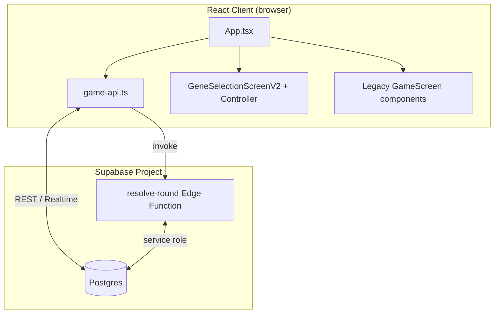

# Gioco Evoluzione — AI-readable project summary

> Last updated: 2026-07-25. This document is a structured, high-signal overview of the MVP codebase intended for AI assistants and new developers.

---

## 1. TL;DR

**Gioco Evoluzione** is a mobile-first browser MVP for a 1v1 competitive evolution game. Each match lasts **6 rounds**. In every round both players secretly pick one of 10 traits and choose either **USE** (score immediately, but the trait goes on 1-round cooldown) or **EVOLVE** (increase the trait level, score 0 this round). A shared **round event** favors or penalizes specific traits. The player with the highest round value wins 1 point (2 points in the final round). Synchronization is handled by **Supabase** (Postgres + Realtime), and round resolution is centralized in a **Supabase Edge Function** (`resolve-round`) to keep the server as the single source of truth.

Modes:
- `PVP` — two human players in the same room.
- `VS_BOT` — one human vs a random-action bot.

---

## 2. Tech stack

| Layer | Technology |
|-------|------------|
| Frontend | React 19 + TypeScript 6 + Vite 8 |
| State | Local React state (`useState`/`useEffect`) + ViewModel pattern for the V2 selection screen |
| Styling | Plain CSS files (`App.css`, `index.css`, component CSS) |
| Backend/Persistence | Supabase (Postgres + Realtime subscriptions + Edge Functions) |
| Game logic | Pure TypeScript modules in `src/game/`, shared between client and edge function |
| Testing | Vitest + jsdom for unit tests |
| Linting | oxlint |

Key environment variables (see `.env.example` if present):
- `VITE_SUPABASE_URL`
- `VITE_SUPABASE_ANON_KEY`

---

## 3. High-level architecture



**Data flow for one round:**
1. Client renders the current `GameSnapshot` (game + players + actions + result).
2. Player selects a trait and action; client inserts a row into `round_actions`.
3. Client calls `maybeResolveRound(gameId, roundNumber)`, which invokes the edge function.
4. Edge function checks both actions, computes the result, writes `round_results`, updates player traits/scores, and sets game status to `REVEALING` (or `FINISHED` in round 6).
5. Realtime notifies all clients; they refetch the snapshot.
6. After a short reveal delay, a client calls `acknowledgeReveal` to move the game status to `ROUND_RESULT`.
7. Player taps “Next round” → `advanceToNextRound` moves status to `CHOOSING` and increments `current_round`.

---

## 4. Core game model

### 4.1 Main types

Defined in `src/game/types.ts`:

- `TraitType` — one of 10 traits: `STRENGTH`, `RESISTANCE`, `AGILITY`, `PERCEPTION`, `METABOLISM`, `ADAPTATION`, `GRIP_CLAWS`, `CAMOUFLAGE`, `WEBBED_LIMBS`, `FAT_RESERVES`.
- `ActionType` — `'USE' | 'EVOLVE'`.
- `GameStatus` — `'WAITING' | 'CHOOSING' | 'REVEALING' | 'ROUND_RESULT' | 'FINISHED'`.
- `GameMode` — `'PVP' | 'VS_BOT'`.
- `TraitState` — `{ level: number; cooldown: number }`.
- `TraitCollection` — `Record<TraitType, TraitState>`.
- `RoundEventDefinition` — event metadata + `effects: RoundEventEffect[]`.
- `RoundEventEffect` — `{ trait: TraitType; modifier: number; reason: string }`.
- `RoundValueBreakdown` — granular explanation of how a round value was computed.
- `ResolveRoundInput` / `RoundResolution` — inputs/outputs of the pure resolution engine.

### 4.2 Traits

Catalog lives in `src/game/traits-catalog.ts` (`TRAIT_CATALOG`). Each trait has:
- `id`, `label` (Italian display name), `description`, `iconKey`, `displayOrder`.

Trait state management helpers in `src/game/config.ts`:
- `createInitialTraits()` — all traits at level 0, cooldown 0.
- `normalizeTraitCollection(...)` — safely converts partial/JSONB data into a full `TraitCollection`.
- `getDominantTrait(...)` — determines which trait sprite to show based on highest level (with tie-breaking).
- `TRAIT_LABELS` — map from `TraitType` to Italian label.
- `CREATURE_ASSETS` — paths to placeholder creature PNGs in `public/assets/creatures/`.

### 4.3 Round events

Defined in `src/game/round-events.ts` (`ROUND_EVENT_DEFINITIONS`).
- 6 events currently, each with `effects` that give `+/-` modifiers per trait.
- `ROUND_EVENT_WEIGHT = 2` — every modifier is multiplied by this weight when scoring.
- `generateRoundEventSequence(totalRounds, random)` — shuffles the catalog and returns an array of event IDs.
- `getRoundEventForRound(sequence, roundNumber)` — single source of truth to look up the current event.
- `getRoundEventEffectsForTrait(event, trait)` — filters effects for scoring.

### 4.4 World

`src/game/worlds.ts` defines visual worlds (`WorldDefinition`).
- Currently only `AURELIA_PRIME`.
- `world_id` is stored in `games`; it is **purely visual** and separate from round events.

---

## 5. Game flow in detail

### 5.1 Match creation

| Action | Function | File |
|--------|----------|------|
| Create PVP room | `createGame({ nickname, playerId })` | `src/lib/game-api.ts` |
| Create vs-bot room | `createVsBotGame({ nickname, playerId })` | `src/lib/game-api.ts` |
| Join existing room | `joinGame({ roomCode, nickname, playerId })` | `src/lib/game-api.ts` |

- Room codes are 5 alphanumeric characters (`ROOM_CODE_ALPHABET` excludes ambiguous chars like `0`/`O`/`I`/`1`).
- Creating/joining persists a `StoredSession` in `localStorage` (`src/lib/storage.ts`) for reconnect.
- `restoreGameSession(session)` is called on app boot if a session exists.

### 5.2 Round loop

1. **Status `CHOOSING`** — players pick a trait + action.
   - USE is disabled if the trait is on cooldown.
   - EVOLVE is always allowed.
2. Client inserts the action into `round_actions` (`submitRoundAction`).
3. Client invokes `resolve-round`.
4. Edge function:
   - For `VS_BOT`, auto-generates a bot action via `ensureBotRoundAction` (`src/game/vs-bot-round.ts`) if missing.
   - Computes the resolution with `buildResolution`.
   - Inserts `round_results` (idempotent thanks to `UNIQUE(game_id, round_number)`).
   - Updates both players’ `traits` JSONB and the game score/status.
5. **Status `REVEALING`** — clients show the reveal screen.
6. After ~1s, `acknowledgeReveal` moves status to `ROUND_RESULT`.
7. **Status `ROUND_RESULT`** — shows breakdown/explanation.
8. Player clicks next round → `advanceToNextRound` moves to next round and status `CHOOSING`.

### 5.3 Cooldown and evolution rules

- After a round resolves, every trait’s cooldown decreases by 1 (minimum 0) (`tickCooldowns`).
- If action was `USE`, the used trait cooldown is set to 1.
- If action was `EVOLVE`, the trait level increases by 1 and round value is 0.
- `isTraitUsable(traits, trait)` returns true only if `cooldown === 0`.

---

## 6. Scoring system

Pure scoring logic lives in `src/game/scoring.ts`:

```
total = eventContribution + levelContribution
      = (sumOfEventModifiers * EVENT_WEIGHT) + min(level, MAX_EFFECTIVE_TRAIT_LEVEL)
```

- `EVENT_WEIGHT = 2`
- `MAX_EFFECTIVE_TRAIT_LEVEL = 5` — levels above 5 do not add scoring value.
- EVOLVE action forces `eventContribution = 0`, `levelContribution = 0`, `total = 0`.
- Validations (`getValidated*`) reject `NaN`/negative states and missing effect reasons.

The same logic is **duplicated (with Deno-compatible imports) inside the edge function** (`supabase/functions/resolve-round/index.ts`) to keep the function self-contained. This is intentional to avoid bundling issues with extensionless imports from the frontend tree.

Round resolution orchestration in `src/game/engine.ts`:
- `resolveRound(input)` — pure function that returns a `RoundResolution`.
- `getRoundPoints(roundNumber)` — 2 points for round 6, otherwise 1.

Result explanation in `src/game/round-result-explainer.ts`:
- `getRoundExplanation(...)` produces Italian UX strings based on action types and breakdown comparison.
- Falls back to a legacy message if breakdown fields are missing (old rounds).

---

## 7. UI components

### 7.1 Entry point

`src/App.tsx` holds the global state machine and decides which screen to render based on `snapshot.game.status`:
- No snapshot / no session → `HomeScreen`.
- `WAITING` → waiting room with room code.
- `CHOOSING` → `GeneSelectionScreenV2`.
- `REVEALING` / `ROUND_RESULT` → result reveal UI.
- `FINISHED` → winner screen.

### 7.2 Legacy selection screen

Files under `src/components/game/`:
- `GameHud.tsx`, `CreatureStage.tsx`, `TraitSelector.tsx`, `ActionDock.tsx`, `ChoosingDuelHeader.tsx`, `RoundEventCard.tsx`, `TraitImpactPanel.tsx`, `SelectedTraitSummary.tsx`, etc.
- Composed inside `App.tsx` as `GameScreen` JSX (not a separate route).

### 7.3 V2 selection screen

Files under `src/components/game-v2/`:
- `GeneSelectionScreenV2.tsx` — presentational component.
- `controller/useGeneSelectionV2Controller.ts` — local state + submit flow.
- `controller/buildGeneSelectionV2ViewModel.ts` — transforms `GameSnapshot` into a view-model.
- `types.ts` — view-model types (`GeneCardV2`, `RoundEventV2`, `GeneSelectionViewModelV2`, …).
- Subcomponents: `DuelHeaderV2`, `RoundIndicatorV2`, `RoundEventPanelV2`, `CreatureStageV2`, `GeneSelectorPreviewV2`, `SelectedGeneDetailsV2`, `ActionPanelV2`, `WaitingStateV2`.

The V2 screen is a richer “gene selection” UX; it reuses the same backend and game logic.

### 7.4 Home screen

`src/components/home/HomeScreen.tsx` — nickname input, create PVP game, create bot game, join by room code.

### 7.5 Visual helpers

- `src/components/CreatureVisual.tsx` — renders creature sprite stack based on dominant trait.
- `src/components/game-v2/gameSelectionAssets.ts` — maps trait/event IDs to placeholder art URLs for V2.

---

## 8. Backend: Supabase

### 8.1 Schema

Defined in `supabase/schema.sql`:

| Table | Purpose |
|-------|---------|
| `games` | Match metadata: room code, status, round, scores, world, event sequence, winner. |
| `players` | Per-player data: nickname, slot (1/2), type (`HUMAN`/`BOT`), traits JSONB, connected flag. |
| `round_actions` | One row per player per round: chosen trait + action type. Unique `(game_id, round_number, player_id)`. |
| `round_results` | One row per round: values, winner, rich `resolution_data` JSONB. Unique `(game_id, round_number)`. |

Key columns in `games`:
- `status`, `current_round` (1–6), `game_mode`, `world_id`, `round_event_sequence` (JSONB array of event IDs).
- `player_1_id`, `player_2_id`, `player_1_score`, `player_2_score`, `winner_id`.

Realtime publication is enabled automatically for all four tables (`supabase/schema.sql` end block).

RLS policies are intentionally permissive for the MVP (friend-testing only).

### 8.2 Edge function: `resolve-round`

File: `supabase/functions/resolve-round/index.ts`

Responsibilities:
1. Reads the game, players, and existing result.
2. If already resolved, re-applies the stored `resolution_data` (idempotency).
3. If `VS_BOT` and missing bot action, generates one with `ensureBotRoundAction` and inserts it.
4. Builds the resolution with local pure helpers mirroring `src/game/engine.ts` / `src/game/scoring.ts`.
5. Inserts `round_results` and updates players/game atomically.

Important constraints:
- Must stay **self-contained** — it re-embeds constants and types instead of importing from `src/game/*` to avoid Deno bundling issues.
- Idempotency is achieved via `UNIQUE(game_id, round_number)` on `round_results` plus re-applying stored data on conflict.
- `advanceToNextRound` on the client is also idempotent (updates only when status/current_round match).

### 8.3 Database function

`public.create_vs_bot_game(p_nickname, p_player_id)` in `supabase/schema.sql` creates a game + human player + bot player in one RPC call.

---

## 9. Client API and synchronization

File: `src/lib/game-api.ts`

Main exports:
- `fetchGameSnapshot(gameId, playerId)` — central read model returned as `GameSnapshot`.
- `createGame`, `createVsBotGame`, `joinGame`, `restoreGameSession`.
- `submitRoundAction(...)` — persists action then tries resolution.
- `maybeResolveRound(gameId, roundNumber)` — invokes the edge function.
- `advanceToNextRound(gameId)` — idempotent transition to next round.
- `acknowledgeReveal(gameId)` — moves `REVEALING` → `ROUND_RESULT`.
- `subscribeToGame(gameId, onChange)` — Supabase realtime listener on all four tables.

`GameSnapshot` includes:
- `game`, `players`, `me`, `opponent`
- `world`, `currentRoundEvent`, `nextRoundEvent`
- `actionsSubmitted`, `myCurrentAction`, `currentRoundResult`

Local session persistence: `src/lib/storage.ts` (`createPlayerId`, `saveStoredSession`, `loadStoredSession`, `clearStoredSession`).

Supabase client setup: `src/lib/supabase.ts`.

---

## 10. Bot mode

- Bot actions are generated by `selectRandomBotAction(traits)` in `src/game/bot.ts`.
- `getLegalBotActions` returns every trait as `EVOLVE`, plus `USE` only if the trait is off cooldown.
- A random legal action is chosen uniformly.
- `ensureBotRoundAction` (`src/game/vs-bot-round.ts`) wraps insertion + retrieval and ignores unique-constraint conflicts (race safety).
- The edge function calls this when it detects a missing bot action in `VS_BOT` mode.

---

## 11. Testing

Tests are in `src/game/*.test.ts` and run with `npm test` (Vitest).

Coverage areas:
- `creature.test.ts` — trait/state logic.
- `engine.test.ts` — round resolution engine.
- `scoring-audit.test.ts`, `new-traits-scoring.test.ts` — scoring correctness.
- `round-events.test.ts` — event sequence and effect lookup.
- `round-flow.test.ts` — full round flow edge cases.
- `round-result-explainer.test.ts` — explanation text generation.
- `round-breakdown.test.ts` — breakdown payload shape.
- `vs-bot-round.test.ts` — bot action generation and storage.
- `bot.test.ts` — bot legal-action selection.
- `trait-catalog.test.ts` — catalog consistency.

Build validation: `npm run build`.

---

## 12. Environment and commands

```bash
npm install
npm test           # run Vitest suite
npm run build      # TypeScript + Vite production build
npm run dev        # local dev server
```

Supabase deploy:
```bash
supabase functions deploy resolve-round
```

Schema setup: run `supabase/schema.sql` in the Supabase SQL Editor.

---

## 13. Conventions and developer notes

- **Pure game logic** lives in `src/game/` and should remain framework-agnostic.
- **Validation-first**: scoring functions throw on invalid trait states/effects rather than propagating `NaN`.
- **Server truth**: the edge function is the only writer of `round_results`; clients only read it.
- **Idempotency**: round resolution and round advancement are idempotent to survive double-clicks / double notifications.
- **Italian UX copy** is hardcoded in components and explainer; core types/IDs remain English.

- **Self-contained edge function**: do not import frontend modules into `supabase/functions/resolve-round/index.ts`; mirror constants/types locally.
- **Asset placeholders**: creature/environment art is expected under `public/assets/`. The repo contains README placeholders and base PNGs; real art can be dropped in without code changes (paths are stable).

---

## 14. Key file map

| Concern | Primary files |
|---------|---------------|
| Game types | `src/game/types.ts` |
| Trait catalog | `src/game/traits-catalog.ts` |
| Round events | `src/game/round-events.ts` |
| Scoring | `src/game/scoring.ts` |
| Round resolution engine | `src/game/engine.ts` |
| Result explanations | `src/game/round-result-explainer.ts` |
| Config / helpers | `src/game/config.ts` |
| Bot logic | `src/game/bot.ts`, `src/game/vs-bot-round.ts` |
| Worlds | `src/game/worlds.ts` |
| UI context helpers | `src/game/ui-context.ts` |
| App shell / state machine | `src/App.tsx` |
| Home screen | `src/components/home/HomeScreen.tsx` |
| V2 selection screen | `src/components/game-v2/GeneSelectionScreenV2.tsx` |
| V2 controller | `src/components/game-v2/controller/useGeneSelectionV2Controller.ts` |
| V2 view-model builder | `src/components/game-v2/controller/buildGeneSelectionV2ViewModel.ts` |
| Client API | `src/lib/game-api.ts` |
| Supabase client | `src/lib/supabase.ts` |
| Local session | `src/lib/storage.ts` |
| DB schema | `supabase/schema.sql` |
| Edge function | `supabase/functions/resolve-round/index.ts` |
| Tests | `src/game/*.test.ts` |

---

## 15. Known limitations (MVP)

- RLS is wide open; not suitable for production.
- No public matchmaking or chat.
- No full rematch flow (only basic `rematch_count` column reserved).
- Bot uses random legal actions, no difficulty tuning.
- Creature/environment assets are placeholders.
- Edge function duplicates scoring logic to stay self-contained; keep changes in sync with `src/game/scoring.ts`.
