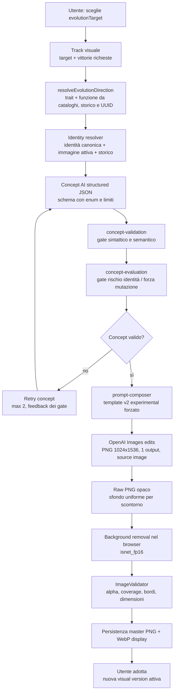

Analisi completata in sola lettura: non ho modificato file.

Il percorso della UI attuale è più vincolato di quanto appaia: l’utente sceglie solo la regione anatomica. `visualTrait`, `evolutionFunction` e `intensity` non sono scelte UI durante la generazione produttiva.

## 1. Mappa end-to-end



## 2. Tabella delle decisioni

| Fase | Decisione | Origine | Possibili valori | Quanto restringe l’AI | File/funzione |
|---|---|---|---|---|---|
| UI | Regione da evolvere | `USER_CHOICE` | `TAIL`, `FORELIMBS`, `HIND_LIMBS`, `HEAD_AND_SENSES`, `TORSO_AND_BACK`, `SKIN` | Molto: delimita aree, trait, funzioni e colori successivi | `CreatureVisualProgressionScreen.tsx` / `selectTarget` |
| UI | Intensity | `DERIVED_BY_CODE` | Sempre `2` nel percorso produttivo | Totale: l’utente non la sceglie | `edge-orchestration.ts` / `orchestrateGenerateUnlockedTransformation`, `runUnlockedTransformationTask` |
| UI | Idempotency key | `RANDOM_BY_CODE` | UUID browser | Indiretto: determina il ramo di direzione | `creature-transformations-api.ts` / `createVisualTransformationIdempotencyKey` |
| Track | Sblocco generazione | `DEFAULT/FALLBACK` | `winsRequired`, default `3` se env invalido/assente | Non limita il look, ma blocca il momento della generazione | `visual-progression.ts` / `readCreatureVisualProgressionWinsRequired` |
| Resolver direzione | Trait + funzione | `RANDOM_BY_CODE` ma deterministico dato UUID/storico | Combinazioni compatibili target/funzione/trait | Molto: l’AI non sceglie né trait né funzione | `evolution-targets.ts` / `resolveEvolutionDirection` |
| Resolver direzione | Evita direzioni precedenti | `DERIVED_BY_CODE` | Filtra combinazioni già adottate; se esaurite le riusa | Restringe varietà e favorisce direzioni non ancora usate | stessa funzione, `previousTransformations` |
| Cataloghi | Aree primarie/supporto | `DERIVED_BY_CODE` | Intersezione target × trait | Molto: lo schema AI accetta solo tali enum | `evolution-targets.ts`, `visual-traits.ts`, `evolution-constraints.ts` / `getEvolutionConstraints` |
| Cataloghi | Mutation archetype | `DERIVED_BY_CODE` | Set del trait risolto | Molto: l’AI inventa la forma, non la famiglia anatomica | `visual-traits.ts`, `mutation-archetypes.ts` |
| Identity | Creatura, stile, tratti immutabili | `DERIVED_BY_CODE` | Registro canonico; oggi `VERDANT_HATCHLING` | Molto: descrizione, occhi ambrati, corpo tozzo, cresta fogliare, stile 3D sono imposti | `identity-registry.ts`; `supabase-creature-identity-resolver.ts` / `resolve` |
| Source | Immagine usata per edit | `DERIVED_BY_CODE` | Visuale attiva, o base se assente | Molto: il modello riceve l’immagine corrente, non una creatura nuova | `supabase-creature-identity-resolver.ts` / `resolve`; `image-generation-service.ts` |
| Structured output | Forma del concept | `VALIDATION_GATE` | JSON strict, campi esatti; enum per schema, trait, target, funzione, aree, archetype, intensity | Molto: output libero solo nei testi e in certe liste | `openai-structured-concept-model.ts` / `createConceptJsonSchema` |
| Concept AI | Nome, funzione descrittiva, morfologia, materiale, mutazioni secondarie, divieti | `AI_CONSTRAINED_CHOICE` | Stringhe/libere entro schema e validator | Medio: creatività reale, ma dentro archetipo/area/intensità imposti | `openai-structured-concept-model.ts` / `createInstructions` |
| Colore | `colorEvolution` | `AI_CONSTRAINED_CHOICE` | `PRESERVE`; a intensity 2 anche `EXPAND`/`SHIFT` | Medio-alto: obbligatorio come oggetto, ma può scegliere di non cambiare palette | `evolution-constraints.ts`; `concept-validation.ts` |
| Validator concept | Una sola area primaria target | `VALIDATION_GATE` | Esattamente una | Totale nel flusso anatomico, anche se il trait ammetterebbe due aree | `concept-validation.ts` / `validateCreatureTransformationConcept` |
| Evaluator | Rischio identità e intensità visiva | `VALIDATION_GATE` | Accetta solo rischio non `HIGH` e forza `BALANCED` | Alto: rigetta testi decorativi/deboli, globali o eccessivi | `concept-evaluation.ts` / `evaluateCreatureTransformationConcept` |
| Retry | Rigenerazione concept | `DEFAULT/FALLBACK` | Massimo 2 tentativi; secondo con feedback validator/evaluator | Restringe ulteriormente: il secondo prompt è correttivo | `generate-validated-concept.ts` / `generateValidatedCreatureConcept` |
| Prompt | Template | `DERIVED_BY_CODE` | Produzione UI: sempre `creature-transformation-v2-experimental` | Alto: ripete limiti locali, identità, posa, silhouette, stile e divieti | `edge-orchestration.ts` / `runUnlockedTransformationTask`; `prompt-template-v2-experimental.ts` |
| Render | Canvas/formato/posa | `DERIVED_BY_CODE` | PNG `1024×1536`, pose/composizione/margini preservati | Alto sul framing, non garantisce semanticamente l’obbedienza visiva | `render-specifications.ts`; `prompt-template-v1.ts` |
| Image API | Modello, count, size, formato, background | `DERIVED_BY_CODE` | `gpt-image-1.5`, `n=1`, `1024x1536`, PNG, background `opaque` nel flusso UI | Totale sui parametri API | `index.ts`; `openai-creature-image-provider.ts` / `transformCreature` |
| Post-processing | Scontorno | `DERIVED_BY_CODE` | `isnet_fp16`, CPU, PNG | Può alterare bordi/trasparenza ma non sceglie una nuova anatomia | `remove-creature-background.ts` / `removeCreatureBackground` |
| Validator immagine | Accettazione finale | `VALIDATION_GATE` | PNG, dimensioni, alpha, coverage, bordi trasparenti, hash differente dalla source | Scarta output non conformi; non valuta l’estetica/anatomia | `image-validator.ts` / `ImageValidator.validate` |
| Persistenza | Asset attivo | `USER_CHOICE` | L’utente adotta o mantiene l’attuale | L’output valido non diventa la nuova source finché non adottato | `CreatureVisualProgressionScreen.tsx` / `adopt`; repository `adopt` |

## 3. Hidden constraints / forced choices

- `intensity = 2` è forzata. Il prompt diventa sempre “substantial and balanced”; non esiste scelta UI tra sottile e pronunciata.  
  Effetto: una trasformazione molto lieve o molto radicale viene indirettamente sfavorita.

- Il target non è il trait. Per esempio “Corpo e dorso” non significa automaticamente difesa: il codice sceglie una direzione tra `DEFENSE/IMPACT_ADAPTATION`, `IMPACT_ABSORPTION/IMPACT_ADAPTATION`, `THERMOREGULATION/ENERGY_REGULATION`, `ENERGY_STORAGE/ENERGY_REGULATION`, in base a storico e UUID.  
  Effetto: due clic apparentemente identici possono produrre famiglie visive diverse.

- La scelta di direzione è pseudo-casuale dal punto di vista utente. `crypto.randomUUID()` alimenta `stableIndex`; a parità di UUID e storico è ripetibile, ma nuovi tentativi normalmente ricevono un UUID nuovo.  
  Effetto: rigenerare dopo un fallimento può cambiare trait/funzione prima ancora che l’AI intervenga.

- L’archetipo non è libero. Esempio: `IMPACT_ADAPTATION` può usare solo `LAYERED_PLATING` o `ELASTIC_CUSHIONING`. L’AI sceglie la variante concreta, non se evolvere placche, membrane, branchie o filamenti.  
  Effetto: ricorrenza di “placche/cuscinetti” non prova una preferenza spontanea del modello.

- Nel flusso anatomico c’è sempre una sola area primaria. È più severo del catalogo trait, che spesso ammette fino a due. L’area di supporto è zero o una sola.  
  Effetto: mutazioni distribuite su più parti sono bloccate o devono restare puramente descrittive.

- “Testa e sensi” non consente la faccia come area primaria: l’intersezione con `SENSORY_EXPANSION` lascia solo `HEAD_SURFACE` e `EYE_REGION`.  
  Effetto: cambiamenti del volto sono strutturalmente esclusi, oltre a essere scoraggiati dal prompt.

- `HIND_LIMBS` dichiara compatibilità con `IMPACT_ADAPTATION`, ma non condivide nessuna area primaria con quel trait. `getEvolutionConstraints` la rende non generabile e `resolveEvolutionDirection` la filtra.  
  Effetto: per le zampe posteriori la difesa non verrà mai risolta, nonostante compaia nel catalogo del target.

- `colorEvolution` è obbligatorio per le evoluzioni anatomiche, ma `PRESERVE` è sempre ammesso. A intensity 2, `EXPAND` e `SHIFT` sono possibili, non obbligatori.  
  Effetto: il colore può sembrare “scelto dall’AI”, ma anche il suo non-cambiamento è una via codificata; l’utente non ha un controllo diretto sulla palette.

- Se l’AI sceglie `EXPAND` o `SHIFT` a intensity 2, i colori devono agire su un’area leggibile nell’immagine intera e solo dentro le aree colorabili derivanti da target × trait.  
  Effetto: palette ed effetti non possono liberamente espandersi su tutto il corpo.

- L’identità non deriva liberamente dall’immagine. Il registro impone, per `VERDANT_HATCHLING`, grandi occhi ambrati, corpo squamoso/tozzo, cresta di spine fogliari e stile 3D illustrato.  
  Effetto: verde, occhi ambrati, silhouette tozza e cresta sono ripetizioni previste dal codice/prompt.

- Il prompt proibisce in modo ripetuto nuova specie, anatomia globale, modifica di silhouette/proporzioni, cambi di posa, crop, fotorealismo, scenari e oggetti estranei.  
  Effetto: il modello opera come editor locale, non come generatore di una reinterpretazione globale.

- La produzione usa un fondo opaco uniforme, non trasparenza nativa. Lo sfondo viene scelto dal modello solo entro istruzioni di contrasto, poi rimosso localmente.  
  Effetto: eventuali artefatti sui bordi possono dipendere dallo scontorno, non dalla creatura generata.

## 4. Trace concreto: `TORSO_AND_BACK`

Esempio riproducibile a livello di risoluzione dominio, assumendo nessuna evoluzione precedente e idempotency key `trace-demo-001`.

```text
Input UI
  SELECT_VISUAL_PROGRESS_TRACK
  evolutionTargetId = TORSO_AND_BACK

Dopo le vittorie richieste
  GENERATE_UNLOCKED_TRANSFORMATION
  idempotencyKey = trace-demo-001

resolveEvolutionDirection(...)
  candidate ordinati:
    0 DEFENSE            -> IMPACT_ADAPTATION
    1 THERMOREGULATION   -> ENERGY_REGULATION
    2 ENERGY_STORAGE     -> ENERGY_REGULATION
    3 IMPACT_ABSORPTION  -> IMPACT_ADAPTATION

  stableIndex("TORSO_AND_BACK:trace-demo-001", 4) = 3

Direzione risolta dal codice
  evolutionTargetId = TORSO_AND_BACK
  evolutionFunction = IMPACT_ABSORPTION
  visualTraitId = IMPACT_ADAPTATION
  intensity = 2
```

Il concept restituito dall’AI deve quindi avere questa forma effettiva:

```text
schemaVersion: 2                         [forzato]
visualTrait: IMPACT_ADAPTATION           [forzato]
evolutionTargetId: TORSO_AND_BACK        [forzato]
evolutionFunction: IMPACT_ABSORPTION     [forzato]
intensity: 2                             [forzato]

primaryMutation.mutationArchetype:
  LAYERED_PLATING | ELASTIC_CUSHIONING   [AI, enum ristretto]

primaryMutation.bodyAreas:
  BACK | CHEST                           [AI, esattamente uno]

primaryMutation.supportingBodyAreas:
  [] | [SKIN_SURFACE]                    [AI, max uno]

secondaryMutations:
  0..3 stringhe                          [AI]

colorEvolution:
  obbligatorio                            [forzato]
  mode: PRESERVE | EXPAND | SHIFT        [AI]
  se PRESERVE: intensity 0, aree/colori/effetti vuoti
  se EXPAND/SHIFT: intensity 2,
    affectedBodyAreas subset di BACK/CHEST/SKIN_SURFACE
```

Il prompt finale produttivo usa sempre v2 sperimentale: riprende il concept, ma aggiunge tra l’altro “same individual”, mutation solo nelle aree richieste, preservazione di faccia/occhi, posa, silhouette e trasformazioni precedenti. Viene poi inviato con:

```text
POST /v1/images/edits
model = gpt-image-1.5
n = 1
size = 1024x1536
quality = profile.quality oppure policy.realImage.quality
output_format = png
background = opaque
image[] = PNG della visuale attiva
```

Riferimenti: `evolution-targets.ts` / `resolveEvolutionDirection`; `edge-orchestration.ts` / `runUnlockedTransformationTask`; `openai-structured-concept-model.ts` / `createConceptJsonSchema`; `openai-creature-image-provider.ts` / `transformCreature`.

## 5. Come leggere i test visivi

- Se osservi spesso corpo tozzo, grandi occhi ambrati, cresta fogliare, stile 3D luminoso e non fotorealistico, deriva principalmente da `identity-registry.ts` e dai blocchi `IDENTITY`, `PRESERVE`, `STYLE`, non da una scelta libera del modello.

- Se tutte le evoluzioni appaiono di entità medio-alta e controllata, deriva da intensity `2` forzata e dall’evaluator che rifiuta sia `WEAK` sia `EXCESSIVE`.

- Se una mutazione resta locale e il resto della creatura è conservativo, viene controllata più volte: schema AI, validator, template v1/v2 e immagine-source di edit.

- Se ricorrono placche, cuscinetti, membrane, frange o filamenti, verifica prima il `mutationArchetype`: la famiglia è pre-selezionata dal trait; il modello decide solo la sua concretizzazione.

- Il colore è realmente variabile nel concept, ma non è completamente libero: mode, intensità cromatica, aree e leggibilità sono vincolati. A intensity 2 può anche rimanere invariato con `PRESERVE`.

- Se il target è testa, una faccia invariata non è casuale: `FACE` non è ammissibile come area primaria per il trait sensoriale e il prompt richiede volto/occhi riconoscibili.

- Se la stessa regione produce adattamenti funzionalmente diversi dopo tentativi distinti, può derivare dal UUID che cambia il risultato di `resolveEvolutionDirection`, non da instabilità del concept model.

- Se compaiono bordi tagliati, aloni o sottili perdite di dettaglio, considera `removeCreatureBackground.ts`: il master finale è il PNG post-scontorno. Il validator impone alpha coverage e bordi trasparenti, ma non giudica qualità anatomica.

- Se un risultato non appare come nuova base al tentativo successivo, controlla l’adozione: l’asset diventa `ACTIVE` solo dopo il clic “Adotta evoluzione”.

## Duplicazioni e contraddizioni rilevanti

- Il render spec dichiara trasparenza, ma il flusso produttivo reale forza `SOLID_FOR_POST_PROCESSING` e API `background=opaque`; la trasparenza esiste solo dopo lo scontorno. È una tensione intenzionale risolta dal post-processing.

- Il generation profile contiene `model` e `promptTemplateVersion`, ma il percorso UI usa esplicitamente template v2 sperimentale e costruisce il provider con `model: 'gpt-image-1.5'`. Nel percorso produttivo il profilo incide chiaramente su qualità/costo; quei due campi non guidano il modello/template effettivo. Riferimenti: `edge-orchestration.ts` / `runUnlockedTransformationTask`; `index.ts` / `createRealImageProvider`.

- La compatibilità dichiarata dal target non basta: conta l’intersezione finale delle body areas. Il caso `HIND_LIMBS × IMPACT_ADAPTATION` è l’esempio più netto.

- La preservazione dell’identità è ridondante per design: schema/validator richiedono `identityToPreserve`, evaluator intercetta testo rischioso, prompt ribadisce i tratti, e l’edit parte dall’asset corrente. È un controllo multilivello, non una singola istruzione.

Nota breve: prima di un eventuale refactor, renderei osservabili nel log/preview la direzione risolta, il set di candidate e il prompt template effettivo; sono le tre variabili che oggi spiegano meglio le differenze tra test visivi.